# AutoDesign: Meta-Harness Optimization for Long-Horizon Agentic Design

Yaxin Luo1,2\*, Haobin Jiang1\*, Jialv Zou1,3, Xu Huang1,4, Wenhao Yan1,5, Haodong Li1,6, Zhengrong Yue1,7, Jing Li1, Xiaofu Chen2, Xiaohan Zhao2, Jiacheng Liu2, Jiacheng Cui2, Zhiqiang Shen2B, Xiaotong Li1B,†

1Meituan, 2MBZUAI, 3Huazhong University of Science and Technology, 4Peking University, 5Tsinghua University, 6The Chinese University of Hong Kong, 7Shanghai Jiao Tong University \*Equal contribution, †Project lead

Transforming multimodal sources into condensed and structured media outputs can be fundamentally conceptualized as a long-horizon agentic process centered on a model-harness system. While an ideal harness system should align with human design priors and accumulate reusable experience through empirical exploration to drive recursive self-improvement, existing paradigms remain static and fall short of this capability. In this paper, we present AutoDesign, a framework that aligns with human design priors, where a meta-harness optimizer guides a code agent to recursively improve harness based on rollout feedback. To instantiate and evaluate this framework, we focus on the academic paper-to-poster generation task and introduce PosterBench, comprising a 100-paper Main Track spanning five disciplines and PosterBench-mini, a shared 10-paper subset for controlled evaluation. On the PosterBench Main Track, AutoDesign achieves the highest score of 78.32, surpassing the closed-source commercial system Claude Design by 7.45 points. Across seven controlled code agent– model configurations, integrating the learned DesignHarness consistently improves performance, increasing the average PosterBench Score from 54.99 to 67.39 (+12.4%). In a fully autonomous long-horizon loop, it executes 253 tool calls and 11 editing turns within 40 minutes for under \$3, reaching average conference-poster quality in human evaluation. A system-blind human study further demonstrates that AutoDesign achieves the highest human preference among evaluated systems.

Project Website Code Repository Demo Page

https://autodesign.designanything.ai/ https://github.com/Yaxin9Luo/AutoDesign https://designanything.ai/

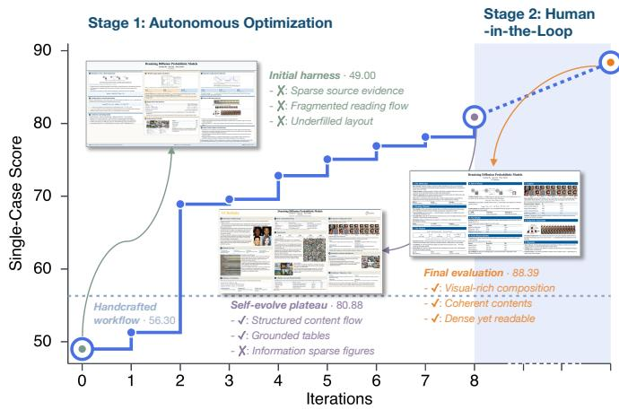  
(a) Meta-harness optimization trace

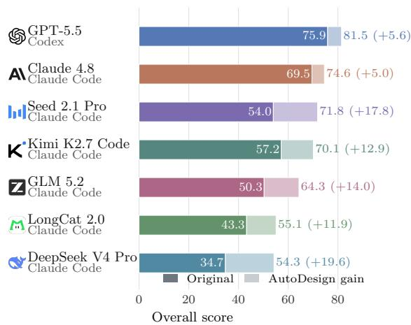  
(b) Performance gains from DesignHarness  
Figure 1 AutoDesign progressively improves the design harness and the quality of the artifacts. (a) Score of the poster generated by the design harness for one representative paper, tracked across meta-harness iterations. Autonomous optimization improves the initial harness before reaching a plateau, after which human guidance redirects the search and yields a further gain. (b) The optimized harness, DesignHarness, improves all Coding Agents on PosterBench by 5.0 to 19.6 points, achieving a best overall score of 81.5.

Human validation: In the system-blind study, eleven reviewers submitted 936 responses (933 ranking judgments and three skips); AutoDesign's probability of beating a randomly sampled alternative was 64.0%.

Feedback: A designer revises an editable artifact using a rule-based validator and a model-based visual critic, then finalizes the best valid candidate. Paper ingestion precedes localized revision and selection of the best valid candidate

Trajectory: Autonomous optimization rises from 49.00 to an 80.88 plateau; redirected search reaches 88.39.

Context: Metadata, section outlines, key passages, and paper visuals are selected once and retained across refinement, enabling localized code edits rather than regeneration of the whole artifact.

<table><tr><td rowspan=1 colspan=1>5. PosterBench Evaluation</td><td rowspan=1 colspan=1>_</td></tr><tr><td rowspan=1 colspan=2></td></tr></table>

Figure 2 AutoDesign for AutoDesign. A poster generated by AutoDesign for its own paper, crafted through a long-horizon agentic workflow that autonomously performs source ingestion, iterative generation and refinement, critic feedback integration, and finalization, completing design process in approximately 40 minutes with negligible human intervention.

## 1 Introduction

Human communication often involves understanding, organizing, and presenting information from diverse multimodal sources into human-facing artifacts, e.g., webpages, slides, posters, and videos (Fu et al., 2022; Pang et al., 2025; Zheng et al., 2025; Chen et al., 2025; Zhu et al., 2025). Achieving such multimodal input-to-output transformation (Wu et al., 2023; Chameleon Team, 2024; Kim et al., 2026; Meituan LongCat Team et al., 2026) requires the ability to extract relevant evidence, reason over heterogeneous information, plan intermediate steps, and iteratively improve outputs based on feedback (Choi et al., 2026; Liu et al., 2026b), which naturally positions multimodal design as a suitable yet challenging long-horizon task for agentic coding. However, developing such systems remains dificult due to the complexity of real-world workflows and the reliance on extensive human feedback.

Current multimodal design systems seek human-aligned design priors through cycles of generation, critique, and revision, often using visual references or design-specific feedback (Sun et al., 2026; Zheng et al., 2025; Liu et al., 2026b). At the response level, feedback can revise the current output (Madaan et al., 2023), while agentic systems can retain reflections, skills, or task experience across attempts (Shinn et al., 2023; Wang et al., 2023; Zhao et al., 2024). However, unlike human creators who continuously accumulate knowledge from successful revisions and failures, such systems treat individual human-aligned feedback as transient signals rather than reusable design knowledge. The unresolved question for multimodal design is how to convert multimodal evidence, structural constraints, feedback, and human preferences into persistent design-aligned capabilities of the production system (Ren et al., 2026).

To close this gap, we propose AutoDesign, which frames human-aligned design generation as a meta-harness optimization problem (Robeyns et al., 2025; Lee et al., 2026b,a; Zhang et al., 2026a; Lin et al., 2026; Ren et al., 2026): an agentic system recursively optimizes the design harness itself, rather than an individual artifact, based on an evaluation grounded in human preferences, e.g., annotated reference artifacts or natural language guidance. As illustrated in Figure 3, AutoDesign operates through two nested loops. The inner loop is the design harness, which transforms the source context into an editable output and iteratively revises it under critic feedback. The outer loop is the meta-harness, which optimizes the design harness across tasks. It first grounds human preferences by initializing an evaluator from annotated reference artifacts. Given this human-aligned evaluator, the meta-harness aggregates rollouts and evaluation scores across tasks to identify recurrent failures, and directs a coding agent as the optimizer to propose a bounded update to the current design harness at each iteration. To prevent overfitting, the update is admitted through an acceptance gate, which accepts it only when it improves performance on the training set without degrading performance on the development set (Nguyen et al., 2026).

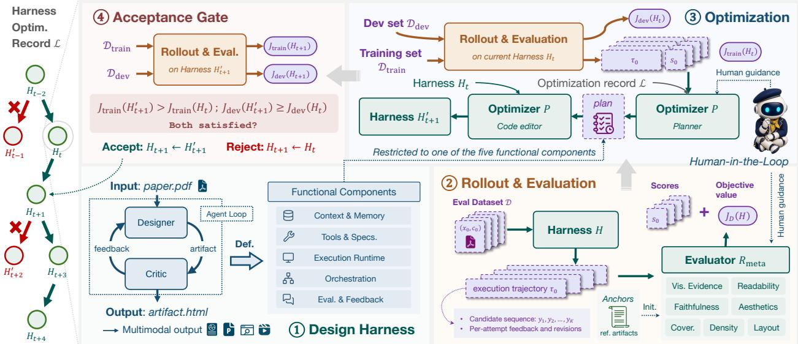  
Figure 3 Overview of AutoDesign. The design harness iteratively generates and revises an artifact using critic feedback, thereby constituting the inner loop. The outer loop improves the design harness by running it on design tasks, evaluating its outputs, proposing an update to one component, and accepting or rejecting the candidate update. This process can run autonomously, with optional human guidance.

Accepted updates accumulate to DesignHarness, an executable system that autonomously ingests the source, generates and iteratively refines the artifact under critic feedback, and finalizes it into a readable, visually coherent artifact. We instantiate this system for academic paper-to-poster generation, a challenging design task that must condense long, multimodal scientific sources into a single legible, visually coherent poster while preserving traceable evidence (Jaisankar et al., 2025; Pang et al., 2025; Sun et al., 2026; Vinaykumar et al., 2026). In this task, DesignHarness can produce ready-to-use conference posters that align closely with human preferences while reducing the time and manual efort required for high-quality poster production.

Evaluating a design harness requires a benchmark and evaluation protocol that jointly measure source fidelity, dense scientific communication, and rendered usability. Existing paper-to-poster benchmarks each cover only part of these aspects, such as layout, extraction, faithfulness, or visual quality, and fall short of a comprehensive, task-level protocol (Wang et al., 2024; Jaisankar et al., 2025; Pang et al., 2025; Sun et al., 2026; Vinaykumar et al., 2026). PosterBench addresses this gap with a 100-paper spanning five disciplines, together with PosterBench-mini, a 10-paper subset for rapid testing. Its seven-dimensional rubric combines rule-based algorithm checks, rubric VLM judgments, and hybrid methods where both signals apply. One main track evaluates the complete system, while three controlled tracks isolate component-level efects. A system-blind human study independently validates the automatic protocol.

Across PosterBench-mini and PosterBench evaluations, the learned DesignHarness improves system quality while remaining practical to deploy. On PosterBench-mini, attaching DesignHarness to each of seven Code Agents raises the average PosterBench Score from 54.99 to 67.39 (+12.40 points). On the PosterBench Main

Track, AutoDesign scores 78.32; under the same Claude Code and Claude 4.8 configuration, it outperforms the closed-source commercial system Claude Design by 7.45 points. AutoDesign also makes strong paper-to-poster generation accessible at low cost: with DesignHarness, LongCat-2.0 reaches 55.13 at approximately \$0.27 per poster1. Finally, across 933 valid system-blind pairwise judgments, AutoDesign receives the highest Bradley–Terry preference estimate, 64.0% (95% interval: 55.2–77.8%); for pairs separated by at least 20 PosterBench points, participants prefer the PosterBench-preferred poster in 74.4% of cases.

Our contributions are:

1. AutoDesign, a meta-harness optimization framework that turns a static design harness into a recursively improving system for human-aligned multimodal design. Through 7 days of evolving traces, it invokes 224 subagents, records at least 123 recursive iterations, accumulating 54 harness updates that recursively convert human-designed reference artifacts, rollout traces, rendering diagnostics, and evaluator feedback into persistent design priors for a design harness.

2. DesignHarness, the executable academic paper-to-poster system evolved by AutoDesign. It grounds a tool-using Designer in paper context and combines editable generation with rendering, rule-based validation, and visual critic feedback for localized revision, producing source-grounded posters that remain directly usable and editable.

3. PosterBench, a comprehensive evaluation protocol for paper-to-poster evaluation. It evaluates scientific communication quality and executable-artifact reliability through a seven-dimensional rubric spanning faithfulness, coverage, density, visual evidence, layout, readability, and aesthetics. On PosterBench, the state-of-the-art coding agent Claude Code (Claude 4.8) achieves 70.01; attaching DesignHarness can improve it by +8.31, also surpassing the best commercial design agent Claude Design by 7.45 points.

4. Under a fully autonomous long-horizon agentic loop, DesignHarness produces human-level academic posters. In a poster generation run, it executes 253 tool calls and 11 editing turns within 40 minutes for less than \$3, with negligible human intervention. Demo is it available as a research-preview platform for interactive use and localized revision of editable posters.

## 2 Meta-Harness Formulation

## 2.1 Design Harness Definition

Following recent work that treats harnesses as an optimization target distinct from model weights (Lee et al., 2026b; Ren et al., 2026), we define a design harness H as the system surrounding a fixed model that turns a multimodal source (e.g., an academic paper or report) into a human-facing artifact (e.g., a presentation slide, poster, video, or web page):

$$
y \sim H ( \pi _ { \theta } , x , c ) ,\tag{1}
$$

where π is an LLM or MLLM, x is the multimodal input, and c specifies the context including the target medium and user constraints. The harness produces an artifact y through an execution trajectory τ, which records the sequence of intermediate actions, states, and revisions leading to the final output.

To enable systematic meta-harness optimization and facilitate credit assignment, we decompose the design harness H into five functional components:

• Context and Memory: source management, prompts, skills, reusable assets and persistent state.

• Tools and Specifications: tools and editable artifact specifications for layout, typography, and provenance.

• Execution Runtime: the workspace and runtime for authoring, rendering, validating, and exporting artifacts.

• Orchestration: task routing, attempt budgets, loop control, candidate selection, fallback, and finalization.

• Evaluation and Feedback: rule-based validation, model-based critique, and localized feedback for revision.

This decomposition specifies only the high-level abstraction of the design harness. The concrete implementation of each component is instantiated and iteratively improved by the meta-harness.

## 2.2 Meta-Harness Definition

We define a meta-harness as a system that operates on the design harness (Lee et al., 2026b; Zhang et al., 2026a; Lin et al., 2026). Given a user specification q and an optional initial design harness $H _ { 0 } .$ the meta-harness instantiates or iteratively improves the concrete implementation of the design harness, yielding an optimized harness $H _ { T }$ . Unlike a design harness, which transforms multimodal sources into human-facing artifacts, the meta-harness transforms harness requirements and implementations into an improved design harness.

The optimization target is the expected quality of the artifacts produced by the design harness. Let ptask denote the task distribution. We define the performance of a design harness H as

$$
\begin{array} { r } { J ( H ) = \mathbb { E } _ { ( x , c ) \sim p _ { \mathrm { t a s k } } , y \sim H ( \pi _ { \theta } , x , c ) } \left[ R _ { \mathrm { m e t a } } ( y , x , c ) \right] , } \end{array}\tag{2}
$$

where $R _ { \mathrm { m e t a } } ( y , x , c )$ denotes the evaluator used by the meta-harness to assess the quality of artifact y with respect to its source x and design context c. Accordingly, the meta-harness optimization objective is

$$
H ^ { \star } = \arg \operatorname* { m a x } _ { H } J ( H ) .\tag{3}
$$

Throughout this process, the parameters θ of the underlying model $\pi _ { \theta }$ in the harness remain fixed. The optimization therefore acts on the system surrounding the model rather than on the model itself, consistent with the model-versus-scafold distinction in recent self-improving-agent taxonomies (Ren et al., 2026).

## 3 Meta-Harness Learning Loop

AutoDesign organizes artifact generation (i.e., design harness) and harness optimization (i.e., meta-harness) as two nested feedback loops, as illustrated in Figure 4. For each design task $( x , c )$ , the design harness executes an inner loop that repeatedly generates and revises the current artifact. This loop operates on the artifact y under a fixed design harness H and records the resulting execution trajectory τ. Across tasks, the meta-harness executes an outer loop that analyzes these trajectories and their evaluation results to identify recurrent failures and update the design harness H. Thus, the inner loop improves a single artifact without changing H, whereas the outer loop improves H based on evidence collected from multiple generation runs.

## 3.1 Inner Loop

We initialize the design harness with a minimal inner-loop scafold consisting of two abstract modules: a designer $M _ { \mathrm { d e s i g n } }$ and a critic $M _ { \mathrm { c r i t i c } }$ As shown in Figure 4, the designer generates and revises the artifact, while the critic evaluates its current state and provides feedback for the next revision. At refinement step $k ,$ their interaction is defined as

$$
\begin{array} { r l } & { y _ { k } = M _ { \mathrm { d e s i g n } } ( y _ { k - 1 } , f _ { k - 1 } ; x , c ) , } \\ & { f _ { k } = M _ { \mathrm { c r i t i c } } ( y _ { k } ; x , c ) , } \end{array}\tag{4}
$$

where $y _ { k }$ is the artifact at step k and $f _ { k }$ is the corresponding feedback, with $y _ { 0 }$ and $f _ { 0 }$ left empty so that the first step produces an initial draft from $( x , c )$ alone. Repeated evaluation and revision produce an execution trajectory τ under the current design harness.

This formulation specifies only the roles of the two modules and the information flow between them. It defines the basic structure of the initial design harness while leaving its concrete realization open. During outer-loop optimization, the metaharness may refine the two modules and their interaction, including their prompts, tools, feedback mechanisms, and loop-control policies, based on observed task performance.

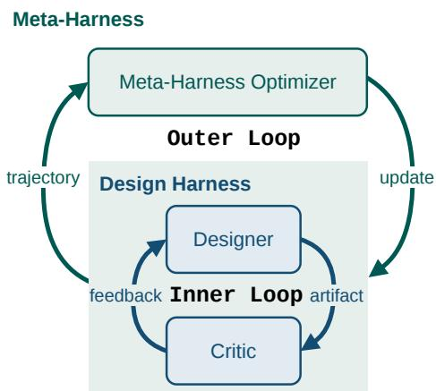  
Figure 4 The inner and outer loops of the AutoDesign Framework. The inner loop updates the artifact according to the design harness, while the outer loop updates the design harness.

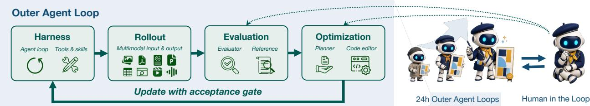  
Figure 5 AutoDesign outer loop. Each iteration proceeds through rollout, evaluation, update proposal, and acceptance. The loop runs autonomously, with optional human guidance to redirect the evaluation and optimization.

## 3.2 Outer Loop

The outer loop improves the design harness across tasks, as illustrated in Figure 3. Each iteration proceeds in four stages: rollout, evaluation, update proposal, and acceptance.

Rollout. At outer-loop iteration $t ,$ the current design harness $H _ { t }$ is executed on a training task set $\mathcal { D } _ { \mathrm { t r a i n } } =$ $\{ ( x _ { i } , c _ { i } ) \} _ { i = 1 } ^ { N _ { \mathrm { t r a i n } } }$ , where $x _ { i }$ is a multimodal source and $c _ { i }$ specifies the target medium and the corresponding design requirements. Each execution produces an artifact $y _ { t } ^ { i }$ and a corresponding trajectory $\tau _ { t } ^ { i }$ . We denote the collection of trajectories by $\pmb { \tau } _ { t } = \{ \tau _ { t } ^ { i } \} _ { i = 1 } ^ { N _ { \mathrm { t r a i n } } }$

Evaluation. Before outer-loop optimization, we provide an evaluator coding agent with reference artifacts annotated by humans along seven quality dimensions: (i) Faithfulness, (ii) Coverage, (iii) Density, (iv) Visual Evidence, (v) Layout, (vi) Readability, and (vii) Aesthetics. The agent uses these examples to implement the evaluator $R _ { \mathrm { m e t a } } ,$ combining rule-based checks for directly measurable properties with VLM-based judgments for perceptual properties such as aesthetics. Once constructed, $R _ { \mathrm { m e t a } }$ remains fixed during autonomous optimization. The resulting evaluator is then used to assess every generated artifact, $s _ { t } ^ { i } = R _ { \mathrm { m e t a } } ( y _ { t } ^ { i } , x _ { i } , c _ { i } )$ and the resulting scores are collected into a batch denoted by $\mathbf { \boldsymbol { s } } _ { t }$ . This optimization-time evaluator is distinct from the frozen PosterBench protocol used for final system comparison; the latter is specified in Section A.4.

Update proposal. We denote the meta-harness optimizer by $P .$ In addition to the current design harness and the evidence collected at the current iteration, the meta-harness maintains an optimization record ${ \mathcal { L } } ,$ serving as persistent context across outer-loop iterations. At iteration t, the optimizer takes the current harness $H _ { t }$ the collected trajectories $\tau _ { t } .$ , their evaluation scores $\mathbf { } s _ { t } ,$ , and the optimization record $\mathcal { L }$ as input, and produces a candidate updated harness $H _ { t + 1 } ^ { \prime } { \mathrm { : } }$

$$
H _ { t + 1 } ^ { \prime } = P \left( H _ { t } , \tau _ { t } , s _ { t } , \mathcal { L } \right) .\tag{5}
$$

The prime indicates that $H _ { t + 1 } ^ { \prime }$ is an update proposal, whose acceptance is determined by the subsequent gating stage.

We instantiate P as a coding agent that sequentially assumes the roles of a planner and a code editor, as illustrated in Figure 3. In the planner role, the agent analyzes the current trajectories and scores together with the optimization history in ${ \mathcal { L } } .$ It dispatches parallel subagents to inspect the trajectories and their scores, synthesizes their findings into structured evidence of recurrent failures, and formulates a harness update plan. The plan specifies the observed failure modes, the harness component to be modified, and the intended changes. In the code-editor role, the agent implements these changes in the current design harness $H _ { t }$ , yielding the candidate harness $H _ { t + 1 } ^ { \prime }$

Each outer-loop iteration is restricted to exactly one of the five harness components defined in Section 2.1. An update may span multiple files within the selected component, but it cannot modify another component in the same iteration. This restriction keeps credit assignment interpretable, as each gain or regression is attributable to a single coherent intervention rather than to several simultaneous changes.

Acceptance gate. Once an update has been proposed, the meta-harness determines whether it should replace the current harness through a separate acceptance gate. Let $J _ { \mathrm { t r a i n } }$ and $J _ { \mathrm { d e v } }$ denote the objective in Equation (2) evaluated on the training set $\mathcal { D } _ { \mathrm { t r a i n } }$ and on an independent development set $\mathcal { D } _ { \mathrm { d e v } }$ , respectively. A candidate is accepted only when its performance on $\mathcal { D } _ { \mathrm { t r a i n } }$ improves and its performance on $\mathcal { D } _ { \mathrm { d e v } }$ does not decline:

Algorithm 1 AutoDesign meta-harness optimization   
Require: Fixed model $\pi _ { \boldsymbol { \theta } } ;$ initial design harness $H _ { 0 } ;$ evaluator $R _ { \mathrm { m e t a } }$   
Require: Training task set $\mathcal { D } _ { \mathrm { t r a i n } } ;$ development task set $\mathcal { D } _ { \mathrm { d e v } } ;$ outer-loop iterations $T$   
Ensure: Optimized design harness $H _ { T }$ and optimization record $\mathcal { L }$   
1: Run $H _ { 0 }$ on $\mathcal { D } _ { \mathrm { t r a i n } } ;$ collect execution trajectories $\tau _ { 0 }$ and evaluator scores $\scriptstyle { \pmb { s } } _ { 0 }$   
2: Run $H _ { 0 }$ on $\mathcal { D } _ { \mathrm { d e v } }$ and collect evaluator scores $\boldsymbol { s } _ { 0 } ^ { \mathrm { d e v } }$   
3: for $t = 0$ to $T - 1$ do   
4: The meta-harness optimizer $P$ inspects $\tau _ { t } , s _ { t } ,$ and $\mathcal { L }$ and proposes a candidate updated harness $H _ { t + 1 } ^ { \prime }$   
5: Run $H _ { t + 1 } ^ { \prime }$ on $\mathcal { D } _ { \mathrm { t r a i n } } \mathrm { : }$ collect execution trajectories $\tau _ { t + 1 } ^ { \prime }$ and evaluator scores $\boldsymbol { s } _ { t + 1 } ^ { \prime }$   
6: Run $H _ { t + 1 } ^ { \prime }$ on $\mathcal { D } _ { \mathrm { d e v } }$ and collect evaluator scores $\boldsymbol { s } _ { t + 1 } ^ { \prime \mathrm { d e v } }$   
7: if $J _ { \mathrm { t r a i n } } ( H _ { t + 1 } ^ { \prime } ) > J _ { \mathrm { t r a i n } } ( H _ { t } )$ and $J _ { \mathrm { d e v } } ( H _ { t + 1 } ^ { \prime } ) \geq J _ { \mathrm { d e v } } ( H _ { t } )$ then   
8: $d _ { t } \gets \mathrm { A C C E P T }$   
9: $( H _ { t + 1 } , \tau _ { t + 1 } , s _ { t + 1 } , s _ { t + 1 } ^ { \mathrm { d e v } } ) \gets ( H _ { t + 1 } ^ { \prime } , \tau _ { t + 1 } ^ { \prime } , s _ { t + 1 } ^ { \prime } , s _ { t + 1 } ^ { \prime \mathrm { d e v } } )$   
10: else   
11: $d _ { t } \gets \mathrm { R E J E C T }$   
12: $( H _ { t + 1 } , \pmb { \tau _ { t + 1 } } , \pmb { s _ { t + 1 } } , \pmb { s _ { t + 1 } ^ { \mathrm { d e v } } } ) \gets ( H _ { t } , \pmb { \tau _ { t } } , \pmb { s _ { t } } , \pmb { s _ { t } ^ { \mathrm { d e v } } } )$   
13: end if   
14: Append the harness checkpoint and iteration record to $\mathcal { L }$   
15: end for   
16: return $( H _ { T } , { \mathcal { L } } )$

$$
\mathrm { A c c e p t } ( H _ { t + 1 } ^ { \prime } ) \iff J _ { \mathrm { t r a i n } } ( H _ { t + 1 } ^ { \prime } ) > J _ { \mathrm { t r a i n } } ( H _ { t } ) \ \land J _ { \mathrm { d e v } } ( H _ { t + 1 } ^ { \prime } ) \geq J _ { \mathrm { d e v } } ( H _ { t } ) .\tag{6}
$$

If the condition holds, the meta-harness promotes $H _ { t + 1 } ^ { \prime }$ to $H _ { t + 1 } ;$ otherwise $H _ { t }$ is retained. Results on the development set are used exclusively by the acceptance gate and are never exposed to P when constructing an update proposal. Therefore, $\mathcal { D } _ { \mathrm { d e v } }$ serves as a guard against overfitting the harness to the training tasks.

After the acceptance decision, the meta-harness appends the completed iteration to the optimization record ${ \mathcal { L } } .$ For each iteration $t , \mathcal { L }$ stores the harness $H _ { t } ,$ , the trajectories and scores, the selected harness component, the update plan and the corresponding code changes, and the acceptance decision, with a repository checkpoint preserving the harness implementation at that iteration. Trajectories and scores from the development set are not included in the record.

The updated L is supplied to $P$ as persistent context in the next iteration. When a candidate is rejected, the record allows the next iteration to propose a diferent update while retaining the evidence of what has already been tried. L thus supports comparison, reproducibility, and rollback across iterations. Note that the outer loop maintains a single active harness at each iteration and does not perform tree search over harness variants. The complete meta-harness optimization procedure is summarized in Algorithm 1.

Human-in-the-Loop. AutoDesign also supports an optional human-in-the-loop mode, as illustrated in Figure 3. Human intervention can operate through two channels. First, at iteration $t ,$ a user may provide directional guidance $g _ { t }$ in natural language, which is supplied to the planner alongside the trajectories and evaluation scores, so that the update proposal becomes $H _ { t + 1 } ^ { \prime } = P ( H _ { t } , \tau _ { t } , s _ { t } , \mathcal { L } , g _ { t } )$ . We introduce this mechanism because the coding agent acting as $P$ may converge prematurely to a locally satisfactory harness configuration, at which point outer-loop optimization stagnates. Guidance can inject task-specific heuristics or redirect the search toward alternative improvements.

Second, human guidance may be provided to the coding agent responsible for implementing the evaluator when visual inspection reveals a systematic artifact bias not captured by $R _ { \mathrm { m e t a } }$ . Such evaluator revision requires explicit human input. Otherwise, $R _ { \mathrm { m e t a } }$ remains fixed because the meta-harness receives no external signal with which to identify or correct evaluator bias.

In both cases, the human provides observations or high-level directions rather than directly editing the harness or evaluator implementation. When no guidance is provided, the outer loop operates autonomously as defined in Equation (5).

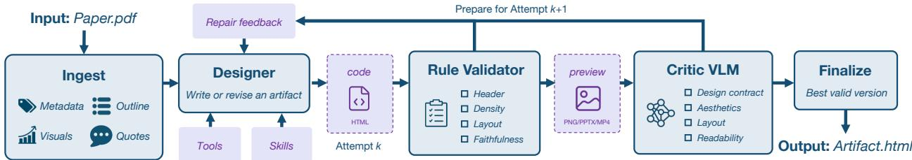  
Figure 6 Overview of DesignHarness, optimized for human-facing artifact generation. Given source materials, the designer iteratively generates and revises an editable artifact using feedback from dual critics: a rule-based validator and a model-based visual critic. DesignHarness then finalizes the best valid candidate.

## 4 The Optimized DesignHarness

The meta-harness optimization described in Section 3 yields DesignHarness. The resulting implementation supports multiple output media, including academic posters, presentation slides, videos, and web pages. We characterize its resulting architecture by examining the final implementation obtained through meta-harness optimization. As summarized in Figure 6, our analysis identifies four main stages: source ingestion, iterative artifact generation and revision by a designer module, feedback from a rule-based validator and a VLM-based critic, and finalization that prepares the selected candidate for delivery.

## 4.1 Paper Ingestion

The ingestion stage transforms the input source x and the design context c into a structured, provenance-aware context for subsequent generation and revision. It extracts the document metadata and section outline, identifies key passages supporting the main claims, and records figures and tables together with their source locations, reflecting the joint textual and visual evidence selection required in paper-to-poster generation (Jaisankar et al., 2025; Pang et al., 2025; Sun et al., 2026). These materials are then organized into a content brief and a medium-specific artifact plan, which specify the target output format, the claims to be conveyed, and the visual evidence supporting each of them. Every extracted element retains a reference to its location in x, so that source-derived statements and visual materials used in the artifact can be traced back to the source and checked during revision. The resulting context is constructed once, retained across all inner-loop refinement steps, and provided to the designer as source-grounded input.

## 4.2 Artifact Generation and Revision

The designer module is implemented as a coding agent that generates or revises the artifact from the ingested source context using the tools and skills available in the harness. At refinement step k, it conditions on the current artifact $y _ { k - 1 }$ , the feedback $f _ { k - 1 }$ , and the ingested context to produce the next candidate $y _ { k } .$ , thereby instantiating $M _ { \mathrm { d e s i g n } }$ in Equation (4). Consistent with layer- and code-based design generation, the artifact remains as editable HTML files throughout refinement (Qu et al., 2025; Liu et al., 2026b), allowing revisions to be implemented as localized code edits without requiring regeneration of the entire output. For visual critique, it can be rendered or exported as a medium-specific preview, such as PNG, PPTX, or MP4.

## 4.3 Validation and Finalization

At each refinement step $k ,$ the candidate artifact $y _ { k }$ produced by the designer is examined by the rule-based validator, which applies a set of deterministic blocking checks. At a high level, these checks determine whether the candidate satisfies the requirements for terminating refinement and cover issues such as unsafe or missing assets, broken provenance links between incorporated materials and their sources, severe overflow or overlap, and violations of the required typographic and layout constraints. If the candidate passes all of them, the inner loop terminates and the candidate proceeds directly to finalization. Otherwise, the validator returns localized diagnostics for the detected violations, together with the results of non-blocking checks on properties such as content coverage, information density, and numerical consistency with the source.

When a candidate fails the blocking checks, it is also rendered into a medium-specific preview and inspected by a critic VLM. The critic assesses rendered properties of the candidate, including compliance with the design context, layout, readability, and aesthetics. The two sources of feedback are consolidated into the repair signal $f _ { k }$ and passed to the designer for the next attempt. This feedback-to-revision pattern is related to recursive self-refinement and agent-as-a-judge approaches (Madaan et al., 2023; Zhuge et al., 2025). In the notation of Equation (4), rule-based validation and visual critique jointly instantiate $M _ { \mathrm { c r i t i c } }$

The final implementation permits at most $K = 1 2$ refinement attempts. As soon as a candidate yk passes all blocking checks, the attempt loop terminates and the candidate is passed to the finalization stage. This stage applies the remaining post-processing, such as final rendering adjustments, mathematical typesetting, and inlining of referenced assets, to produce a self-contained output. If the attempt budget is exhausted without any candidate passing all blocking checks, the harness uses the retained attempt history and applies a sequence of fallback mechanisms to identify a deliverable candidate while retaining essential safety and integrity constraints. The selected candidate is then passed to the same finalization stage. The sequence of candidate generation, validation, critique, and revision constitutes the execution trajectory τ in Section 3.1, while the design harness H remains fixed throughout this process.

## 5 Evaluation Protocol

## 5.1 Benchmark: PosterBench

PosterBench contains a 100-paper Main Track and PosterBench-mini, a shared 10-paper subset reported in Table 2. The papers span five disciplines: $A I / M L .$ , biomedicine and health, climate and earth environment, economics and policy, and physics and astronomy. Every system receives the same source paper and associated source assets, and its output is rendered to a common poster format before scoring. The shared paper-to-poster generation interface and the exact fixed-versus-varied factors for every reported track are documented in Section A.2 and Table 5.

For paper $p _ { i }$ and candidate artifact $A _ { i } ,$ the fixed PosterBench evaluator returns $\mathbf { q } _ { i } \in [ 0 , 1 0 ] ^ { 7 }$ , ordered as Faithfulness, Coverage, Density, Visual Evidence, Layout, Readability, and Aesthetics. It forms the weighted rubric score

$$
R _ { \mathrm { r u b r i c } } ( p _ { i } , A _ { i } ) = \sum _ { j = 1 } ^ { 7 } \alpha _ { j } q _ { i , j } / 1 0 , \qquad \alpha = ( 1 0 , 1 0 , 1 5 , 1 0 , 2 0 , 2 5 , 1 0 ) .\tag{7}
$$

The final score applies the strictest active record-level ceiling before benchmark averaging:

$$
\begin{array} { r } { R _ { \mathrm { p o s t e r } } ( p _ { i } , A _ { i } ) = \mathrm { m i n } \Big ( R _ { \mathrm { r u b r i c } } ( p _ { i } , A _ { i } ) , C _ { i } ^ { \mathrm { l a y o u t } } , } \\ { C _ { i } ^ { \mathrm { v i a b i l i t y } } , C _ { i } ^ { \mathrm { f a i l u r e } } , C _ { i } ^ { \mathrm { g a t e } } \Big ) , } \end{array}\tag{8}
$$

$$
\mathrm { O v e r a l l } = \frac { 1 } { N } \sum _ { i = 1 } ^ { N } R _ { \mathrm { p o s t e r } } ( p _ { i } , A _ { i } ) .
$$

Here, $C _ { i } ^ { \mathrm { l a y o u t } } , C _ { i } ^ { \mathrm { v i a b i l i t y } } , C _ { i } ^ { \mathrm { f a i l u r e } }$ , and $C _ { i } ^ { \mathrm { g a t e } }$ bound severe layout damage, insuficient presentation viability, confirmed visible failures, and protected render-integrity violations, respectively; inactive ceilings are 100. A standard P0 gate caps a score at 40, and more severe gate types may set a lower cap. Thus, the metric columns are dimension means, while Overall is the mean of capped poster scores and cannot generally be recovered by reweighting those displayed means.

PosterBench is a frozen external evaluator, separate from the optimization-time evaluator $R _ { \mathrm { m e t a } }$ used in the meta-harness outer loop (Section 3.2). $R _ { \mathrm { m e t a } }$ supplies feedback for updating DesignHarness; PosterBench evaluates completed systems and is neither optimized nor modified by the outer loop. The complete operational rubric, aggregation, protected gates, and per-case record schema are specified in Section A.4.

Figure 7 shows the evaluator’s evidence path on a rendered poster. Programmatic spatial and OCR audits localize unused regions, text overflow or clipping, and source-inconsistent numeric claims. The source-

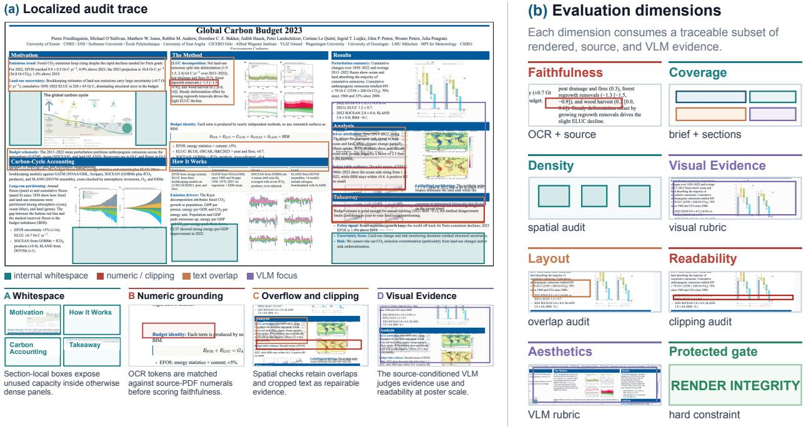  
Figure 7 PosterBench evaluation protocol. PosterBench combines rule-based algorithms for traceable spatial, OCR, therwise against source-PDF numerals and cropped text as repairable judges evidence use andnumeric-grounding, and render-integrity checks with rubric-guided VLM judges for source-grounded assessment of visual evidence, layout, readability, and aesthetics.

conditioned VLM then assesses paper-grounded visual quality from the rendered artifact and paper brief.   
These dimension-level signals are aggregated with fixed weights and record-level ceilings.

PosterBench Main Track. Table 1 reports the 100-paper PosterBench Main Track, comparing design agents, standalone coding agents, and task-specific handcrafted workflow under the fixed PosterBench evaluator. AutoDesign attains the highest PosterBench Score at 78.32. Under the matched Claude Code and Claude 4.8 configuration, AutoDesign scores 78.32, exceeding Claude Design by 7.45 points and OpenDesign by 8.87 points. Curated qualitative comparisons, which are excluded from the aggregate PosterBench results, appear in Figure 16.

PosterBench-mini Main Track. Table 2 reports results on PosterBench-mini, the original 10-paper subset used for the controlled ablations.

On PosterBench-mini, AutoDesign reaches 81.46 with Codex, compared with 75.87 for the native Codex baseline, and 74.56 with Claude Code, compared with 69.55 for the corresponding standalone baseline.

Design Harness Track. Table 3(a) isolates the design-harness contribution by holding Claude Code and Claude 4.8 fixed. AutoDesign reaches 74.56, while Claude Design and OpenDesign score 66.83 and 70.36, respectively, under the same configuration.

Coding Harness Track. Table 3(b) fixes AutoDesign and GLM 5.2, varying only the coding harness. Kimi Code achieves the highest score at 82.31, followed by ZCode at 69.53.

Model Track. Table 3(c) fixes AutoDesign and Claude Code to separate model choice from harness variation.   
Claude 4.8 achieves the highest score at 74.56, followed by Seed 2.1 Pro at 71.83 and Kimi K2.7 at 70.12.

## 5.2 Ablation Studies

## 5.2.1 Effect of the Design Harness

To isolate the design harness contribution, we hold the model and coding agent fixed and compare each configuration before and after harness attachment in Table 4. Across the seven completed configurations, the harness improves the PosterBench Score by 5.01–19.56 points. Under the native Codex–GPT-5.5 configuration, it raises the score from 75.87 to 81.46 (+5.59); with Claude Code and Kimi K2.7, it rises from 57.20 to 70.12 (+12.92). The largest gain is 19.56 points for DeepSeek V4 Pro with Claude Code. These improvements span multiple model–code-agent pairs. MLLMs have an additional repair signal unavailable to text-only LLMs: at each attempt, the rendered preview from the preceding attempt is supplied as visual context for the next repair. This lets the model inspect the artifact it is editing and localize layout, clipping, or visual-evidence failures that are not fully captured by textual diagnostics alone.

Table 1 PosterBench Score and dimension scores for the PosterBench Main Track on the 100-paper evaluation set. Systems are grouped by their primary design mechanism. “—” denotes a layer that a system does not use.
<table><tr><td>System</td><td>Design Harness</td><td>Coding Agent</td><td>Model</td><td>Score</td><td>Faith.</td><td>Cover.</td><td>Density</td><td>Vis. Ev.</td><td>Layout</td><td>Read.</td><td>Aesth.</td></tr><tr><td colspan="10">Design Agent</td></tr><tr><td>AutoDesign</td><td>DesignHarness</td><td>Claude Code</td><td>Claude 4.8</td><td>78.32</td><td>9.35</td><td>9.40</td><td>8.41</td><td>5.97</td><td>8.55</td><td>8.17</td><td>5.59</td></tr><tr><td>AutoDesign</td><td>DesignHarness</td><td>Codex</td><td>GPT 5.5</td><td>77.97</td><td>9.57</td><td>9.35</td><td>8.63</td><td>5.47</td><td>7.75</td><td>8.08</td><td>7.16</td></tr><tr><td>Claude Design</td><td>Claude Design</td><td>Claude Code</td><td>Claude 4.8</td><td>70.87</td><td>9.22</td><td>9.90</td><td>6.48</td><td>7.62</td><td>8.08</td><td>5.96</td><td>7.36</td></tr><tr><td>OpenDesign</td><td>OpenDesign</td><td>Claude Code</td><td>Claude 4.8</td><td>69.45</td><td>9.17</td><td>9.37</td><td>7.51</td><td>6.12</td><td>7.08</td><td>6.19</td><td>7.01</td></tr><tr><td>OpenDesign</td><td>OpenDesign</td><td>Codex</td><td>GPT 5.5</td><td>62.17</td><td>9.24</td><td>8.49</td><td>6.91</td><td>5.05</td><td>7.24</td><td>5.76</td><td>6.00</td></tr><tr><td colspan="10">Coding Agent</td></tr><tr><td>Codex</td><td></td><td>Codex</td><td>GPT 5.5</td><td>73.37</td><td>9.64</td><td>9.71</td><td>7.69</td><td>7.43</td><td>8.03</td><td>6.08</td><td>6.60</td></tr><tr><td>Claude Code</td><td></td><td>Claude Code</td><td>Claude 4.8</td><td>70.01</td><td>9.25</td><td>9.88</td><td>5.71</td><td>7.01</td><td>9.46</td><td>6.68</td><td>6.53</td></tr><tr><td>Doubao</td><td></td><td>Claude Code</td><td>Seed 2.1</td><td>61.14</td><td>8.93</td><td>8.96</td><td>5.95</td><td>5.97</td><td>6.51</td><td>5.63</td><td>4.61</td></tr><tr><td>GLM</td><td></td><td>Claude Code</td><td>GLM 5.2</td><td>52.22</td><td>8.60</td><td>7.44</td><td>5.23</td><td>5.29</td><td>7.03</td><td>4.90</td><td>5.15</td></tr><tr><td>Kimi</td><td></td><td>Claude Code</td><td>Kimi K2.7</td><td>51.46</td><td>8.33</td><td>7.15</td><td>4.72</td><td>5.62</td><td>7.26</td><td>4.93</td><td>4.81</td></tr><tr><td>DeepSeek</td><td></td><td>Claude Code</td><td>DeepSeekV4-Pro</td><td>46.01</td><td>8.23</td><td>6.68</td><td>4.10</td><td>3.82</td><td>6.95</td><td>4.41</td><td>3.38</td></tr><tr><td colspan="10">Human-Crafted Workflow</td></tr><tr><td>PosterGen</td><td></td><td></td><td>Claude 4.8</td><td>56.71</td><td>8.84</td><td>8.25</td><td>4.31</td><td>5.62</td><td>8.61</td><td>5.36</td><td>5.28</td></tr><tr><td>Any2Poster</td><td></td><td></td><td>Claude 4.8</td><td>49.09</td><td>8.26</td><td>5.44</td><td>4.18</td><td>3.65</td><td>9.59</td><td>4.47</td><td>3.10</td></tr><tr><td>Paper2Poster</td><td></td><td></td><td>Claude 4.8</td><td>44.61</td><td>6.35</td><td>2.35</td><td>8.36</td><td>2.16</td><td>3.69</td><td>4.87</td><td>1.69</td></tr></table>

Table 2 PosterBench Score and dimension scores for the PosterBench-mini Main Track on the original 10-paper subset.
<table><tr><td>System</td><td>Design Harness</td><td>Coding Agent</td><td>Model</td><td>Score</td><td>Faith.</td><td>Cover.</td><td>Density Vis. Ev.</td><td></td><td>Layout</td><td>Read.</td><td>Aesth.</td></tr><tr><td colspan="10">Design Agent</td></tr><tr><td>AutoDesign</td><td>DesignHarness</td><td>Codex</td><td>GPT 5.5</td><td>81.46</td><td>9.88</td><td>9.90</td><td>8.64</td><td>6.20</td><td>8.01</td><td>7.96</td><td>7.45</td></tr><tr><td>AutoDesign</td><td>DesignHarness</td><td>Claude Code</td><td>Claude 4.8</td><td>74.56</td><td>9.28</td><td>8.80</td><td>8.15</td><td>5.00</td><td>9.00</td><td>7.86</td><td>6.75</td></tr><tr><td>OpenDesign</td><td>OpenDesign</td><td>Claude Code</td><td>Claude 4.8</td><td>70.36</td><td>9.10</td><td>9.00</td><td>7.39</td><td>6.15</td><td>7.13</td><td>6.38</td><td>7.31</td></tr><tr><td>Claude Design</td><td>Claude Design</td><td>Claude Code</td><td>Claude 4.8</td><td>66.83</td><td>8.95</td><td>10.00</td><td>5.24</td><td>7.90</td><td>8.54</td><td>6.09</td><td>6.77</td></tr><tr><td>OpenDesign</td><td>OpenDesign</td><td>Codex</td><td>GPT 5.5</td><td>60.58</td><td>9.03</td><td>9.20</td><td>6.13</td><td>5.45</td><td>7.68</td><td>5.75</td><td>5.75</td></tr><tr><td colspan="10">Coding Agent</td></tr><tr><td>Codex</td><td></td><td>Codex</td><td>GPT 5.5</td><td>75.87</td><td>9.47</td><td>9.40</td><td>7.88</td><td>7.55</td><td>8.44</td><td>6.00</td><td>7.00</td></tr><tr><td>Claude Code</td><td></td><td>Claude Code</td><td>Claude 4.8</td><td>69.55</td><td>9.19</td><td>10.00</td><td>5.21</td><td>7.50</td><td>9.76</td><td>6.90</td><td>6.40</td></tr><tr><td>Kimi</td><td></td><td>Claude Code</td><td>Kimi K2.7</td><td>57.20</td><td>8.20</td><td>8.20</td><td>4.91</td><td>6.40</td><td>7.91</td><td>5.60</td><td>5.95</td></tr><tr><td>Doubao</td><td></td><td>Claude Code</td><td>Seed 2.1</td><td>54.01</td><td>7.99</td><td>8.20</td><td>6.30</td><td>5.55</td><td>6.01</td><td>5.52</td><td>6.15</td></tr><tr><td>GLM</td><td></td><td>Claude Code</td><td>GLM5.2</td><td>50.32</td><td>8.83</td><td>7.80</td><td>3.79</td><td>3.85</td><td>8.21</td><td>5.11</td><td>5.45</td></tr><tr><td>DeepSeek</td><td></td><td>Claude Code</td><td>DeepSeekV4-Pro</td><td>34.73</td><td>8.08</td><td>7.90</td><td>2.94</td><td>3.33</td><td>5.98</td><td>3.71</td><td>5.05</td></tr><tr><td colspan="10">Human-Crafted Workflow</td></tr><tr><td>PosterGen</td><td></td><td></td><td>Claude 4.8</td><td>51.82</td><td>8.95</td><td>9.33</td><td>3.39</td><td>6.67</td><td>7.67</td><td>4.96</td><td>5.50</td></tr><tr><td>Any2Poster</td><td></td><td></td><td>Claude 4.8</td><td>46.88</td><td>8.09</td><td>4.90</td><td>3.69</td><td>3.65</td><td>9.55</td><td>4.40</td><td>3.20</td></tr><tr><td>Paper2Poster</td><td></td><td></td><td>Claude 4.8</td><td>42.06</td><td>6.16</td><td>2.10</td><td>8.25</td><td>2.30</td><td>2.76</td><td>4.82</td><td>1.80</td></tr></table>

## 5.2.2 Cost–Performance Trade-off

Figure 8 compares PosterBench Score with a normalized designer-only API cost proxy across the seven AutoDesign model configurations on PosterBench-mini, the fixed 10-paper subset. The observed Pareto frontier runs from LongCat-2.02 (55.13 at \$0.27 per poster), through Doubao Seed 2.1 Pro (71.83 at \$2.75) and Claude 4.8 (74.56 at \$7.63), to GPT-5.5 (81.46 at \$10.02). Doubao reaches 88% of the GPT-5.5 score at 27% of its cost, while GPT-5.5 provides the highest absolute performance.

Table 3 Controlled track analysis on PosterBench-mini, the fixed 10-paper subset. (a) varies the design harness while holding the coding harness and model fixed. (b) varies the coding harness while holding AutoDesign and GLM 5.2 fixed. (c) varies the model while holding AutoDesign and Claude Code fixed.
<table><tr><td>Variant</td><td>Overall ↑</td><td>Faith.</td><td>Cover.</td><td>Density</td><td>Vis. Ev.</td><td>Layout</td><td>Read.</td><td>Aesth.</td></tr><tr><td colspan="9">(a) Design Harness Track Coding Harness:</td></tr><tr><td>AutoDesign</td><td>74.56</td><td>9.28</td><td>8.80</td><td>8.15</td><td>5.00</td><td>9.00</td><td>7.86</td><td>6.75</td></tr><tr><td>OpenDesign</td><td>70.36</td><td>9.10</td><td>9.00</td><td>7.39</td><td>6.15</td><td>7.13</td><td>6.38</td><td>7.31</td></tr><tr><td>Claude Design</td><td>66.83</td><td>8.95</td><td>10.00</td><td>5.24</td><td>7.90</td><td>8.54</td><td>6.09</td><td>6.77</td></tr><tr><td colspan="9">(b) Coding Harness Track Design Harness: AutoDesign</td></tr><tr><td>Kimi Code</td><td>82.31</td><td>9.29</td><td>9.60</td><td>7.95</td><td>6.75</td><td>8.75</td><td>8.46</td><td>7.68</td></tr><tr><td>ZCode</td><td>69.53</td><td>9.42</td><td>8.90</td><td>7.04</td><td>5.10</td><td>7.23</td><td>6.93</td><td>6.77</td></tr><tr><td>OpenCode Claude Code</td><td>67.87</td><td>9.32</td><td>8.20</td><td>7.28</td><td>6.90</td><td>7.84</td><td>7.21</td><td>6.47</td></tr><tr><td></td><td>64.33</td><td>8.81</td><td>7.30</td><td>7.38</td><td>4.50</td><td>7.74</td><td>6.30</td><td>5.68</td></tr><tr><td colspan="9">(c) Model Track Design Harness: AutoDesign / Coding Harness: Claude Code</td></tr><tr><td>Claude 4.8</td><td>74.56</td><td>9.28</td><td>8.80</td><td>8.15</td><td>5.00</td><td>9.00</td><td>7.86</td><td>6.75</td></tr><tr><td>Seed 2.1 Pro</td><td>71.83</td><td>9.06</td><td>9.00</td><td>6.53</td><td>6.55</td><td>9.16</td><td>7.11</td><td>6.85</td></tr><tr><td>Kimi K2.7</td><td>70.12</td><td>8.54</td><td>7.00</td><td>8.30</td><td>6.27</td><td>7.81</td><td>6.82</td><td>6.00</td></tr><tr><td>GLM 5.2</td><td>64.33</td><td>8.81</td><td>7.30</td><td>7.38</td><td>4.50</td><td>7.74</td><td>6.30</td><td>5.68</td></tr><tr><td>LongCat 2.0</td><td>55.13</td><td>9.11</td><td>8.10</td><td>5.24</td><td>5.25</td><td>7.56</td><td>5.81</td><td>5.65</td></tr><tr><td>DeepSeek V4 Pro</td><td>54.29</td><td>9.47</td><td>9.60</td><td>4.32</td><td>5.50</td><td>8.38</td><td>5.62</td><td>6.00</td></tr></table>

<table><tr><td>Configuration</td><td>Original</td><td>AutoDesign</td><td>Gain</td></tr><tr><td>GPT-5.5 ■ Codex</td><td>75.87</td><td>81.46</td><td>■ +5.59</td></tr><tr><td>Claude 4.8 – Claude Code</td><td>69.55</td><td>74.56</td><td>+5.01</td></tr><tr><td>Seed 2.1 Pro ■ Claude Code</td><td>54.01</td><td>71.83</td><td>_ +17.82</td></tr><tr><td>Kimi K2.7 Code ■ Claude Code</td><td>57.20</td><td>70.12</td><td>+12.92</td></tr><tr><td>GLM 5.2 – Claude Code</td><td>50.32</td><td>64.33</td><td>+14.01</td></tr><tr><td>LongCat 2.0 ■ Claude Code</td><td>43.26</td><td>55.13</td><td>+11.87</td></tr><tr><td>DeepSeek V4 Pro ■ Claude Code</td><td>34.73</td><td>54.29</td><td>_ +19.56</td></tr></table>

Table 4 Efect of attaching DesignHarness while keeping the model and coding agent fixed. Exact PosterBench Scores for each completed configuration are ordered by final performance.

## 5.3 Human Evaluation

We recruited 11 volunteer reviewers for a fully system-blind pairwise evaluation of AutoDesign, Claude Code, OpenDesign, and Claude Design on the 100 source papers of the PosterBench Main Track. For each comparison, reviewers saw only two posters generated from the same paper; no method, system, or model identity was disclosed. They selected the left poster, the right poster, approximate equality, or skip. We fit a Bradley–Terry model (Bradley and Terry, 1952),

$$
\operatorname* { P r } ( i \succ j ) = \frac { \exp ( \beta _ { i } ) } { \exp ( \beta _ { i } ) + \exp ( \beta _ { j } ) } ,
$$

where $\beta _ { i }$ is the latent preference strength of system i. Ties contribute one half-win to each system and skips are excluded. We report the probability of beating a uniformly sampled alternative, with 95% intervals from 2,000 crossed bootstrap resamples of papers and reviewers. The complete task roster, decision schema, and blind-review interface are documented in Section A.5 and Figure 15.

As shown in Figure 9, the volunteer reviewers submitted 936 responses: 933 ranking judgments and three skips. AutoDesign has the highest Bradley–Terry point estimate at 64.0% (95% interval: 55.2–77.8%). Its tie-adjusted empirical preference scores are 61.3% against Claude Code, 63.1% against OpenDesign, and

(a) Bradley-Terry preference

Normalized designer API cost per poster (USD, log scale)  
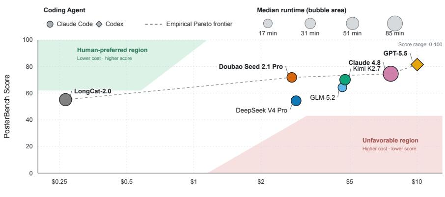  
Figure 8 Cost–performance trade-of across seven AutoDesign model configurations on PosterBench-mini, the fixed 10-paper subset; marker size denotes median runtime, and the dashed line denotes the empirical Pareto frontier.

67.6% against Claude Design.

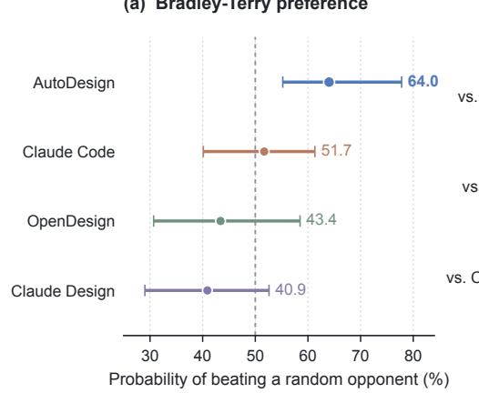  
(b) AutoDesign head-to-head outcomes

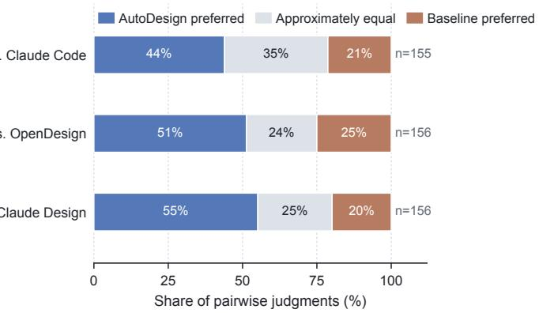  
Figure 9 System-blind human evaluation. (a) Bradley–Terry probability of beating a uniformly sampled alternative, with 95% intervals crossed by paper–reviewer bootstrap replicates. (b) AutoDesign head-to-head outcomes against each baseline. Eleven volunteer reviewers submitted 936 responses, including 933 ranking judgments and three skips.

Benchmark–human alignment. The blind study also assesses whether PosterBench provides an informative comparison signal at the poster level. Figure 10(a) compares each poster’s PosterBench Score with its tie adjusted human preference. Each human score aggregates the blind pairwise judgments involving that poster. The two measurements have a positive, albeit imperfect, association $( r = 0 . 3 4 ;$ a paper-cluster bootstrap gives a 95% interval of [0.22, 0.44]). This is a useful property of the protocol rather than a requirement that it duplicate human preference: PosterBench also evaluates Faithfulness, Coverage, Density, Visual Evidence, Layout, Readability, and Aesthetics, whereas each blind judgment asks for an immediate pairwise choice.

More importantly, the PosterBench Score margin calibrates how informative an automatic comparison is. Figure 10(b) uses 919 of the 933 non-skip judgments: the remaining 14 assign equal PosterBench Scores to both posters and therefore have no benchmark-preferred direction. The probability that the benchmarkpreferred poster agrees with the human decision rises from 51.9% for 0–3-point gaps to 74.4% for gaps of at least 20 points. The error bars are 95% intervals from 2,000 crossed paper–reviewer bootstrap replicates, which resample both source papers and reviewers. Thus, the benchmark ofers more than a global system ranking: a large score gap identifies comparisons in which human preference is substantially more consistent.

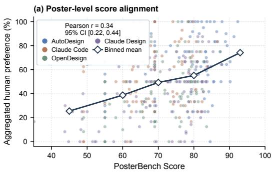

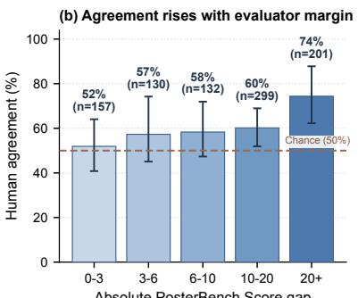  
Figure 10 PosterBench Score alignment with system-blind human preference. (a) Poster-level score association. (b) Human agreement increases with the PosterBench Score margin.

## 5.4 Qualitative Analysis of Designer’s Trajectory

Figure 11 traces one poster run across five attempts. The critic first identifies a clipped analysis lane at A1 (0.36); the reallocation of the row removes the constraint at A3 (0.42), and later the refit of the header and the scaling of evidence produce a more balanced hierarchy at A5/A6 (0.62). A9 preserves the repaired composition and is accepted at 0.78. The trace illustrates the intended use of diagnostic feedback: edits stay localized to the failing region while valid layout and source-derived content are retained across revisions.

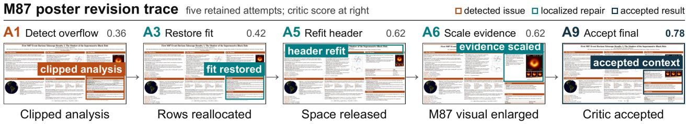  
Figure 11 Qualitative trajectory of a poster generation run. Five selected attempts show the local change associated with each diagnostic or repair event. Colored boxes mark the implicated region: an analysis overflow at A1, its fit restoration at A3, header refitting at A5, evidence scaling at A6, and the critic-accepted final at A9.

## 6 Future Directions

AutoDesign is presently validated for academic paper-to-poster generation, but the underlying agentic design pattern is not tied to a single input or output medium. The pilot artifacts in Figure 13 show that the current DesignHarness can also produce paper-to-slide, paper-to-webpage, and paper-to-conference-video outputs. Figure 12 illustrates the long-term direction: a multimodal-in, multimodal-out agentic design system that integrates papers, visual evidence, code, data, and human guidance, then iteratively creates the medium-appropriate output for a target communication setting. Making this expansion reliable requires more than exposing new output formats. Each medium needs source–output data, an evaluator, a rendering and validation gate, and an objective tailored to its communication setting. PosterBench formally evaluates academic posters only; the slide, webpage, and video artifacts therefore remain pilots. Shared context construction, preference memories, and repair histories could nevertheless provide a substrate for reusing experience across media, provided that the transfer is evaluated against medium-specific objectives. At metaharness level, better component selection and evaluator evolution remain open problems. A selector should choose next bounded update from failure attribution, uncertainty, expected improvement, and component interactions. Any adaptive evaluator must remain versioned and anchored by frozen reference tasks, adversarial probes, and periodic human audits so optimization doesn’t reward-hack a moving target.

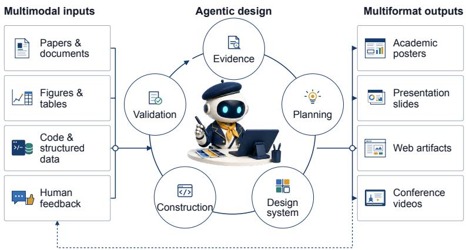  
Figure 12 Future direction: a multimodal-in, multimodal-out agentic design system that integrates diverse sources and human guidance to iteratively create medium-specific outputs.

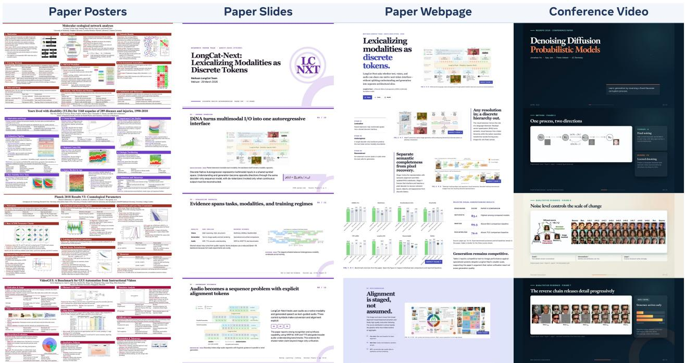  
Figure 13 Future directions for AutoDesign. The initially optimized DesignHarness already extends paper-to-poster generation to slide decks, webpages, and conference videos. Applying the same meta-harness optimization methodology to these and other multimodal outputs ofers a path toward a general multimodal-in & out agentic design system.

Finally, recent work has begun to connect continual harness adaptation, self-improving harnesses, and model– harness co-evolution (Karten et al., 2026; Zhang et al., 2026a; Lee et al., 2026a). In this direction, harness optimization can complement model post-training: long-horizon trajectories and repair outcomes provide execution-time supervision, whereas the model supplies the reasoning and coding capabilities. Joint training should preserve this division while evaluating both layers against shared held-out objectives.

## 7 Related Work

Systems for multimodal output generation transform heterogeneous sources into audience- and medium-specific outputs. For academic posters, SciPostLayout and deep submodular extraction study layout data, source coverage, and text–image alignment, while Paper2Poster, P2P, PosterGen, PosterForest, and Any2Poster combine multimodal inputs with generation, specialized agents, and visual refinement (Wang et al., 2024; Jaisankar et al., 2025; Pang et al., 2025; Sun et al., 2026; Zhang et al., 2025b; Choi et al., 2026; Vinaykumar et al., 2026). Closely related systems generate slides, webpages, and narrated videos from papers or documents (Fu et al., 2022; Zheng et al., 2025; Ge et al., 2025; Yang et al., 2025; Chen et al., 2025; Zhu et al., 2025). Structured representations such as HTML/CSS and explicit layers further support editability, rendering, and visual inspection (Qu et al., 2025; Liu et al., 2026b; Si et al., 2025; Wu et al., 2024). Together, these works establish the input, output, and representation choices for multimodal output generation, but their run-time feedback generally remains within a fixed production procedure.

Critics, render diagnostics, and regeneration policies can improve the current multimodal output without changing the system that generated it. Self-Refine is the canonical response-level instance: feedback is used to revise the current answer (Madaan et al., 2023). Other agent methods retain experience more persistently: Reflexion stores verbal reflections, Voyager accumulates executable skills, and ExpeL extracts reusable experience from solved tasks (Shinn et al., 2023; Wang et al., 2023; Zhao et al., 2024). These mechanisms preserve useful information beyond a single attempt, but they typically do not update the harness that repeatedly produces outputs. This system-level perspective has early roots in classical accounts of autonomous agents, self-referential learning, and retaining policy changes according to long-term reward efects (Wooldridge and Jennings, 1995; Schmidhuber, 1987; Schmidhuber et al., 1997). These works are conceptual precedents rather than direct algorithms for AutoDesign. Recent work separates improvement of model parameters from persistent improvement of the operational scafold around a fixed model (Ren et al., 2026). TextGrad, DSPy, and GEPA optimize components or declarative pipelines, whereas STOP, GPTSwarm, ADAS, and AFlow search code- or graph-represented workflows (Yuksekgonul et al., 2024; Khattab et al., 2024; Agrawal et al., 2026; Zelikman et al., 2024; Zhuge et al., 2024; Hu et al., 2025; Zhang et al., 2025a). At the full-harness level, A Self-Improving Coding Agent and MOSS update agent source from execution evidence; Meta-Harness, HarnessX, Self-Harness, and Agentic Harness Engineering study searchable harness programs, composable primitives, bounded updates, and outcome attribution (Robeyns et al., 2025; Cai et al., 2026; Lee et al., 2026b; Chen et al., 2026; Zhang et al., 2026a; Lin et al., 2026). HarnessX also uses execution traces as signals for both harness evolution and future model training (Chen et al., 2026). Recursive Harness Self-Improvement specializes a user-constructed, prompt-level multi-agent harness from pairwise revision feedback (Lee et al., 2026a). Gödel Machines provide a proof-based ideal for self-rewriting, while Darwin Gödel Machine and Huxley-Gödel Machine study empirical harness evolution and distinguish immediate performance from future self-improvement potential (Schmidhuber, 2006; Zhang et al., 2026b; Wang et al., 2025). AutoDesign instantiates this direction for academic design by evolving a DesignHarness for source-grounded, editable artifacts.

Persistent system updates also difer in how they separate learning signals from final evaluation. RHI (Lee et al., 2026a) keeps its evaluation prompt on the evaluator side of the update loop, yet the resulting pairwise history remains a task-local learning signal. Recursive Self-Evolving Agents use an independent development split to gate persistent updates, while Continual Harness, Adaptive Auto-Harness, and Live-SWE-agent study related adaptation settings (Nguyen et al., 2026; Karten et al., 2026; Liu et al., 2026a; Xia et al., 2025). Agent as-a-Judge further highlights the value of process-level evidence alongside final-outcome assessment (Zhuge et al., 2025). AutoDesign uses an independent development acceptance gate for harness updates and evaluates the final DesignHarness with PosterBench and a system-blind human study.

## 8 Conclusion

AutoDesign turns recurring design failures into improvements to the system that generates future multimodal outputs. Its MetaHarnessOptimizer aggregates trajectories, source and rendering diagnostics, evaluator feedback, and reference posters to update one DesignHarness component at a time while keeping model weights fixed. This makes paper-to-poster generation a persistent learning process that accumulates design priors and produces editable outputs for direct use or local revision on the Demo Page. We also introduce PosterBench, a unified evaluation protocol for academic posters. DesignHarness achieves the top score (78.32) and, with Claude Code and Claude 4.8 fixed, surpasses Claude Design by 7.45 points. It also receives the highest Bradley–Terry estimate in a system-blind human study.

## References

Lakshya A. Agrawal, Shangyin Tan, Dilara Soylu, Noah Ziems, Rishi Khare, Krista Opsahl-Ong, Arnav Singhvi, Herumb Shandilya, Michael J. Ryan, Meng Jiang, Christopher Potts, Koushik Sen, Alexandros G. Dimakis, Ion Stoica, Dan Klein, Matei Zaharia, and Omar Khattab. GEPA: Reflective prompt evolution can outperform reinforcement learning. In The Fourteenth International Conference on Learning Representations, 2026. https: //openreview.net/forum?id=RQm2KQTM5r.

Ralph Allan Bradley and Milton E. Terry. Rank analysis of incomplete block designs: I. the method of paired comparisons. Biometrika, 39(3/4):324–345, 1952. doi: 10.1093/biomet/39.3-4.324.

Qianshu Cai, Yonggang Zhang, Xianzhang Jia, Wei Xue, Jun Song, Xinmei Tian, and Yike Guo. MOSS: Selfevolution through source-level rewriting in autonomous agent systems. arXiv preprint arXiv:2605.22794, 2026. https://arxiv.org/abs/2605.22794.

Chameleon Team. Chameleon: Mixed-modal early-fusion foundation models. arXiv preprint arXiv:2405.09818, 2024. https://arxiv.org/abs/2405.09818.

Tingyang Chen, Shuo Lu, Kang Zhao, Weicheng Meng, Hanlin Teng, Tianhao Li, Chao Li, Xule Liu, Jian Liang, Zhizhong Zhang, Yuan Xie, Heng Qu, Kun Shao, and Jian Luan. HarnessX: A composable, adaptive, and evolvable agent harness foundry. arXiv preprint arXiv:2606.14249, 2026. https://arxiv.org/abs/2606.14249.

Yuhang Chen, Tianpeng Lv, Siyi Zhang, Yixiang Yin, Yao Wan, Philip S. Yu, and Dongping Chen. Paper2Web: Let’s make your paper alive! arXiv preprint arXiv:2510.15842, 2025. https://arxiv.org/abs/2510.15842.

Jiho Choi, Seojeong Park, Seongjong Song, and Hyunjung Shim. PosterForest: Hierarchical multi-agent collaboration for scientific poster generation. In Proceedings of the 64th Annual Meeting of the Association for Computational Linguistics (Volume 1: Long Papers), pages 379–401. Association for Computational Linguistics, 2026. doi: 10.18653/v1/2026.acl-long.15. https://aclanthology.org/2026.acl-long.15/.

Tsu-Jui Fu, William Yang Wang, Daniel McDuf, and Yale Song. DOC2PPT: Automatic presentation slides generation from scientific documents. In AAAI, 2022. https://arxiv.org/abs/2101.11796.

Jiaxin Ge, Zora Zhiruo Wang, Xuhui Zhou, Yi-Hao Peng, Sanjay Subramanian, Qinyue Tan, Maarten Sap, Alane Suhr, Daniel Fried, Graham Neubig, and Trevor Darrell. AutoPresent: Designing structured visuals from scratch. arXiv preprint arXiv:2501.00912, 2025. https://arxiv.org/abs/2501.00912.

Shengran Hu, Cong Lu, and Jef Clune. Automated design of agentic systems. In The Thirteenth International Conference on Learning Representations, 2025. https://openreview.net/forum?id=t9U3LW7JVX.

Vijay Jaisankar, Sambaran Bandyopadhyay, Kalp Vyas, Varre Suman Chaitanya, and Shwetha Somasundaram. Deep submodular optimization and LLM for multimodal content extraction and automatic poster generation from long document. In Proceedings of the AAAI Conference on Artificial Intelligence, volume 39, pages 24221–24229, 2025. doi: 10.1609/aaai.v39i23.34598. https://ojs.aaai.org/index.php/AAAI/article/view/34598.

Seth Karten, Joel Zhang, Tersoo Upaa, Ruirong Feng, Wenzhe Li, Chengshuai Shi, Chi Jin, and Kiran Vodrahalli. Continual harness: Online adaptation for self-improving foundation agents. arXiv preprint arXiv:2605.09998, 2026. https://arxiv.org/abs/2605.09998.

Omar Khattab, Arnav Singhvi, Paridhi Maheshwari, Zhiyuan Zhang, Keshav Santhanam, Sri Vardhamanan, Saiful Haq, Ashutosh Sharma, Thomas T. Joshi, Hanna Moazam, Heather Miller, Matei Zaharia, and Christopher Potts. DSPy: Compiling declarative language model calls into state-of-the-art pipelines. In The Twelfth International Conference on Learning Representations, 2024. https://openreview.net/forum?id=sY5N0zY5Od.

Jaeik Kim, Woojin Kim, Jihwan Hong, Yejoon Lee, Sieun Hyeon, Mintaek Lim, Yunseok Han, Dogeun Kim, Hoeun Lee, Hyunggeun Kim, and Jaeyoung Do. Dynin-Omni: Omnimodal unified large difusion language model. arXiv preprint arXiv:2604.00007, 2026. https://arxiv.org/abs/2604.00007.

Hyunin Lee, Jinglue Xu, Jefrey Seely, Donghyun Lee, Matei Zaharia, and Yujin Tang. Recursive harness self improvement. arXiv preprint arXiv:2607.15524, 2026a. https://arxiv.org/abs/2607.15524.

Yoonho Lee, Roshen Nair, Qizheng Zhang, Kangwook Lee, Omar Khattab, and Chelsea Finn. Meta-Harness: End-to-end optimization of model harnesses. arXiv preprint arXiv:2603.28052, 2026b.

Jiahang Lin, Shichun Liu, Chengjun Pan, Lizhi Lin, Shihan Dou, Zhiheng Xi, Xuanjing Huang, Hang Yan, Zhenhua Han, Tao Gui, and Yu-Gang Jiang. Agentic harness engineering: Observability-driven automatic evolution of coding-agent harnesses. arXiv preprint arXiv:2604.25850, 2026. https://arxiv.org/abs/2604.25850.

Zewen Liu, Zhan Shi, Yisi Sang, Bing He, Minhua Lin, Tianxin Wei, Dakuo Wang, Benoit Dumoulin, Wei Jin, and Hanqing Lu. Adaptive auto-harness: Sustained self-improvement for agentic system deployment on open-ended task streams. arXiv preprint arXiv:2606.01770, 2026a. https://arxiv.org/abs/2606.01770.

Ziyuan Liu, Shizhao Sun, Danqing Huang, Yingdong Shi, Meisheng Zhang, Ji Li, Jingsong Yu, and Jiang Bian. DesignAsCode: Bridging structural editability and visual fidelity in graphic design generation. arXiv preprint arXiv:2602.17690, 2026b. https://arxiv.org/abs/2602.17690.

Aman Madaan, Niket Tandon, Prakhar Gupta, Skyler Hallinan, Luyu Gao, Sarah Wiegrefe, Uri Alon, Nouha Dziri, Shrimai Prabhumoye, Yiming Yang, et al. Self-refine: Iterative refinement with self-feedback. Advances in neural information processing systems, 36:46534–46594, 2023.

Meituan LongCat Team, Bin Xiao, Chao Wang, Chengjiang Li, Chi Zhang, Chong Peng, Hang Yu, Hao Yang, Haonan Yan, Haoze Sun, et al. LongCat-Next: Lexicalizing modalities as discrete tokens. arXiv preprint arXiv:2603.27538, 2026. https://arxiv.org/abs/2603.27538.

Michael Nguyen, Quoc Nguyen, and Paul Vuong. Recursive self-evolving agents via held-out selection. arXiv preprint arXiv:2606.28374, 2026. https://arxiv.org/abs/2606.28374.

Wei Pang, Kevin Qinghong Lin, Xiangru Jian, Xi He, and Philip H. S. Torr. Paper2Poster: Towards multimodal poster automation from scientific papers. In Advances in Neural Information Processing Systems, Datasets and Benchmarks Track, volume 38, 2025. https://proceedings.neurips.cc/paper\_files/paper/2025/hash/ 17337b1d5eeac8b59c80e025a552fa7a-Abstract-Datasets\_and\_Benchmarks\_Track.html.

Yadong Qu, Shancheng Fang, Yuxin Wang, Xiaorui Wang, Zhineng Chen, Hongtao Xie, and Yongdong Zhang. IGD: Instructional graphic design with multimodal layer generation. In Proceedings of the IEEE/CVF International Conference on Computer Vision, pages 18218–18228, 2025. https://openaccess.thecvf.com/content/ICCV2025/html/ Qu\_IGD\_Instructional\_Graphic\_Design\_with\_Multimodal\_Layer\_Generation\_ICCV\_2025\_paper.html.

Zhe Ren, Yimeng Chen, Dandan Guo, Guowei Rong, Tonghui Li, R. B. Xiong, Qingfeng Lan, Wenyi Wang, Nanbo Li, Yibo Yang, Mingchen Zhuge, and Jürgen Schmidhuber. Self-improvements in modern agentic systems: A survey. arXiv preprint arXiv:2607.13104, 2026. https://arxiv.org/abs/2607.13104.

Maxime Robeyns, Martin Szummer, and Laurence Aitchison. A self-improving coding agent. arXiv preprint arXiv:2504.15228, 2025. https://arxiv.org/abs/2504.15228.

Jürgen Schmidhuber. Evolutionary principles in self-referential learning, or on learning how to learn: The meta-meta meta... hook. Diploma thesis, Technische Universität München, 1987.

Jürgen Schmidhuber. Goedel machines: Self-referential universal problem solvers making provably optimal selfimprovements. arXiv preprint cs/0309048, 2006. https://arxiv.org/abs/cs/0309048.

Jürgen Schmidhuber, Jieyu Zhao, and Marco A. Wiering. Shifting inductive bias with success-story algorithm, adaptive levin search, and incremental self-improvement. Machine Learning, 28(1):105–130, 1997. doi: 10.1023/A: 1007383707642.

Noah Shinn, Federico Cassano, Ashwin Gopinath, Karthik Narasimhan, and Shunyu Yao. Reflexion: Language agents with verbal reinforcement learning. Advances in neural information processing systems, 36:8634–8652, 2023.

Chenglei Si, Yanzhe Zhang, Ryan Li, Zhengyuan Yang, Ruibo Liu, and Diyi Yang. Design2Code: Benchmarking multimodal code generation for automated front-end engineering. In Proceedings of the 2025 Conference of the Nations of the Americas Chapter of the Association for Computational Linguistics: Human Language Technologies (Volume 1: Long Papers), pages 3956–3974. Association for Computational Linguistics, 2025. doi: 10.18653/v1/ 2025.naacl-long.199. https://aclanthology.org/2025.naacl-long.199/.

Tao Sun, Enhao Pan, Zhengkai Yang, Kaixin Sui, Jiajun Shi, Xianfu Cheng, Tongliang Li, Wenhao Huang, Ge Zhang, Jian Yang, and Zhoujun Li. P2P: Automated paper-to-poster generation and fine-grained benchmark. In International Conference on Learning Representations, 2026. https://iclr.cc/virtual/2026/poster/10010167.

Amogh Vinaykumar, Aiden Li, Suozhi Huang, and Shilong Liu. Any2Poster: Any-source poster generation across modalities and domains. arXiv preprint arXiv:2606.02915, 2026. https://arxiv.org/abs/2606.02915.

Guanzhi Wang, Yuqi Xie, Yunfan Jiang, Ajay Mandlekar, Chaowei Xiao, Yuke Zhu, Linxi Fan, and Anima Anandkumar. Voyager: An open-ended embodied agent with large language models. arXiv preprint arXiv:2305.16291, 2023.

Hao Wang, Shohei Tanaka, and Yoshitaka Ushiku. SciPostLayout: A dataset for layout analysis and layout generation of scientific posters. In Proceedings of the IEEE/CVF Conference on Computer Vision and Pattern Recognition

Workshops, pages 8136–8141, 2024. https://openaccess.thecvf.com/content/CVPR2024W/GDUG/html/Wang\_ SciPostLayout\_A\_Dataset\_for\_Layout\_Analysis\_and\_Layout\_Generation\_of\_CVPRW\_2024\_paper.html.

Wenyi Wang, Piotr Piękos, Nanbo Li, Firas Laakom, Yimeng Chen, Mateusz Ostaszewski, Mingchen Zhuge, and Jürgen Schmidhuber. Huxley-gödel machine: Human-level coding agent development by an approximation of the optimal self-improving machine. arXiv preprint arXiv:2510.21614, 2025. https://arxiv.org/abs/2510.21614.

Michael J. Wooldridge and Nicholas R. Jennings. Intelligent agents: Theory and practice. The Knowledge Engineering Review, 10(2):115–152, 1995. doi: 10.1017/S0269888900008122.

Jason Wu, Eldon Schoop, Alan Leung, Titus Barik, Jefrey P. Bigham, and Jefrey Nichols. UICoder: Finetuning large language models to generate user interface code through automated feedback. In Proceedings of the 2024 Conference of the North American Chapter of the Association for Computational Linguistics: Human Language Technologies (Volume 1: Long Papers), pages 7511–7525. Association for Computational Linguistics, 2024. doi: 10.18653/v1/2024.naacl-long.417. https://aclanthology.org/2024.naacl-long.417/.

Shengqiong Wu, Hao Fei, Leigang Qu, Wei Ji, and Tat-Seng Chua. NExT-GPT: Any-to-any multimodal LLM. arXiv preprint arXiv:2309.05519, 2023. https://arxiv.org/abs/2309.05519.

Chunqiu Steven Xia, Zhe Wang, Yan Yang, Yuxiang Wei, and Lingming Zhang. Live-SWE-agent: Can software engineering agents self-evolve on the fly? arXiv preprint arXiv:2511.13646, 2025. https://arxiv.org/abs/2511.13646.

Yuheng Yang, Wenjia Jiang, Yang Wang, Yi Song, Yiwei Wang, and Chi Zhang. Auto-Slides: An interactive multi-agent system for creating and customizing research presentations. arXiv preprint arXiv:2509.11062, 2025. https://arxiv.org/abs/2509.11062.

Mert Yuksekgonul, Federico Bianchi, Joseph Boen, Sheng Liu, Zhi Huang, Carlos Guestrin, and James Zou. TextGrad: Automatic “diferentiation” via text. arXiv preprint arXiv:2406.07496, 2024. https://arxiv.org/abs/2406.07496.

Eric Zelikman, Eliana Lorch, Lester Mackey, and Adam Tauman Kalai. Self-taught optimizer (STOP): Recursively self-improving code generation. In First Conference on Language Modeling, 2024. https://arxiv.org/abs/2310.02304.

Hangfan Zhang, Shao Zhang, Kangcong Li, Chen Zhang, Yang Chen, Yiqun Zhang, Lei Bai, and Shuyue Hu. Self-Harness: Harnesses that improve themselves. arXiv preprint arXiv:2606.09498, 2026a.

Jenny Zhang, Shengran Hu, Cong Lu, Robert Lange, and Jef Clune. Darwin Gödel machine: Open-ended evolution of self-improving agents. In The Fourteenth International Conference on Learning Representations, 2026b. https: //arxiv.org/abs/2505.22954.

Jiayi Zhang, Jinyu Xiang, Zhaoyang Yu, Fengwei Teng, Xionghui Chen, Jiaqi Chen, Mingchen Zhuge, Xin Cheng, Sirui Hong, Jinlin Wang, Bingnan Zheng, Bang Liu, Yuyu Luo, and Chenglin Wu. AFlow: Automating agentic workflow generation. In The Thirteenth International Conference on Learning Representations, 2025a. https: //openreview.net/forum?id=z5uVAKwmjf.

Zhilin Zhang, Xiang Zhang, Jiaqi Wei, Yiwei Xu, and Chenyu You. PosterGen: Aesthetic-aware multi-modal paper-toposter generation via multi-agent LLMs. arXiv preprint arXiv:2508.17188, 2025b. https://arxiv.org/abs/2508.17188.

Andrew Zhao, Daniel Huang, Quentin Xu, Matthieu Lin, Yong-Jin Liu, and Gao Huang. ExpeL: LLM agents are experiential learners. In Proceedings of the AAAI Conference on Artificial Intelligence, 2024. https://arxiv.org/ abs/2308.10144.

Hao Zheng, Xinyan Guan, Hao Kong, Wenkai Zhang, Jia Zheng, Weixiang Zhou, Hongyu Lin, Yaojie Lu, Xianpei Han, and Le Sun. PPTAgent: Generating and evaluating presentations beyond text-to-slides. In Proceedings of the 2025 Conference on Empirical Methods in Natural Language Processing, pages 14402–14418. Association for Computational Linguistics, 2025. doi: 10.18653/v1/2025.emnlp-main.728. https://aclanthology.org/2025.emnlp-main.728/.

Zeyu Zhu, Kevin Qinghong Lin, and Mike Zheng Shou. Paper2Video: Automatic video generation from scientific papers. arXiv preprint arXiv:2510.05096, 2025. https://arxiv.org/abs/2510.05096.

Mingchen Zhuge, Wenyi Wang, Louis Kirsch, Francesco Faccio, Dmitrii Khizbullin, and Jürgen Schmidhuber. GPTswarm: Language agents as optimizable graphs. In Proceedings of the 41st International Conference on Machine Learning, volume 235 of Proceedings of Machine Learning Research, pages 62743–62767, 2024. https://proceedings.mlr.press/v235/zhuge24a.html

Mingchen Zhuge, Changsheng Zhao, Dylan R. Ashley, Wenyi Wang, Dmitrii Khizbullin, Yunyang Xiong, Zechun Liu, Ernie Chang, Raghuraman Krishnamoorthi, Yuandong Tian, Yangyang Shi, Vikas Chandra, and Jürgen Schmidhuber. Agent-as-a-judge: Evaluate agents with agents. In Proceedings of the 42nd International Conference

on Machine Learning, volume 267 of Proceedings of Machine Learning Research, pages 80569–80611, 2025. https: //proceedings.mlr.press/v267/zhuge25a.html.

## A Supplementary Experimental Materials

This appendix makes the experimental interface inspectable: it documents the controlled comparisons, shared generation instruction, frozen scoring protocol, released records, and matched visual evidence that complement the main paper.

Appendix guide
<table><tr><td>Jump to</td><td>Contents</td></tr><tr><td>A.1 Benchmark Inputs and Comparison Matrix</td><td>Source packages, the factors held fixed in each comparison, and the factor varied by every reported track.</td></tr><tr><td>A.2 AutoDesign Generation Interface</td><td>The system-instruction excerpt and the shared task prompt used across compared systems.</td></tr><tr><td>A.3 DesignHarness Evolution</td><td>The staged capabilities accumulated in the optimized design harness and their mapping to the five-component abstraction.</td></tr><tr><td>A.4 PosterBench Evaluation Interface</td><td>The seven-dimension rubric, score aggregation, protected gates, and per-case evaluation record.</td></tr><tr><td>A.5 Released Records and Human Evaluation</td><td>The benchmark archive schema, blind-review interface, and system- blind human-evaluation protocol.</td></tr><tr><td>Matched Qualitative Comparisons</td><td>Curated three-system poster comparisons on identical source papers.</td></tr><tr><td>Additional Poster Demonstrations</td><td>Four source-grounded, editable paper posters generated by AutoDesign.</td></tr></table>

## A.1 Benchmark Inputs and Comparison Matrix

Each case provides the source PDF and available paper assets. All systems in a matched row receive the same package and produce one editable poster artifact; the source paper remains the authority for claims, numbers, and visual evidence. Table 5 identifies the controlled factor for every reported track.

<table><tr><td>Track</td><td></td><td>Papers Fixed across a row comparison</td><td>Varied factor</td></tr><tr><td>PosterBench Main Track</td><td>100</td><td>Source paper, source assets, output contract, and System configuration frozen PosterBench protocol</td><td></td></tr><tr><td>PosterBench-mini Main Track</td><td>10</td><td>Shared PosterBench-mini papers, output contract, and frozen PosterBench protocol</td><td>System configuration</td></tr><tr><td>Design Harness Track</td><td>10</td><td>Claude Code and Claude 4.8; shared PosterBench-mini papers and frozen PosterBench protocol</td><td>Design harness</td></tr><tr><td>Coding Harness Track</td><td>10</td><td>AutoDesign, GLM 5.2, shared PosterBench-mini Coding harness papers, and frozen PosterBench protocol</td><td></td></tr><tr><td>Model Track</td><td>10</td><td>AutoDesign, Claude Code, shared PosterBench-mini papers, and frozen PosterBench protocol</td><td>Model</td></tr><tr><td>Harness-Attachment Ablation</td><td>10</td><td>Model, code agent, shared PosterBench-mini papers, and frozen PosterBench protocol</td><td>Presence of the AutoDesign design harness</td></tr></table>

Table 5 Controlled comparison matrix. Main tracks compare complete systems; controlled tracks vary only the facto named in the final column.

Runtime Versions and Reasoning Configuration. Under our controlled configurations, we used codexcli v0.142.3 for Codex and Claude Code v2.1.119 for Claude Code. Each model used its highest available thinking-efort setting.

## A.2 AutoDesign Generation Interface

The AutoDesign system excerpt is shown first. The shared user prompt below fixes the target artifact, source-grounding requirements, and visible quality constraints for every compared system. System-specific orchestration, tools, and repair policies remain part of each system configuration.

## AutoDesign System Prompt (excerpt)

You are the AutoDesign designer. Turn the supplied brief into editable visual artifacts. Keep final text native and editable. Ground paper-derived claims in the supplied source; do not invent numbers, authors, venues, URLs, benchmark deltas, compute, or citations. For an academic paper poster, use the source figures and tables as primary visual evidence, author a complete editable artifact, render it, and repair objective layout or grounding defects before delivery.

## Shared User Prompt (verbatim)

Generate a polished academic paper poster from the attached paper. The visible artifact must be the poster itself: a 3072 x 1536 px / 2:1 landscape academic conference poster, not a landing page, dashboard, marketing graphic, or slide collage. Use browser-native authored HTML/CSS, CSS grid/flex/normal document flow, and native editable text.

Header requirements:

\- Use a full-width top header band.

\- The header is limited to exactly these three visible paper-identity lines: paper title, author list, and school/institution/ company names.

\- Place those fields as three compact centered text rows only: title line, authors line, school/institution/company line.

\- The school/institution/company line should contain only organization names grounded in the paper, rendered as plain text only. Do not invent missing organizations.

\- Do not add a fourth header/meta/subtitle row or side identity rail. Do not put any other visible content in the header: no logos, image badges, icons, QR codes, venue/year text, conference names, arXiv/archive labels, citation/contact text, project/code/resource links, topic badges, method slogans, contribution bullets, benchmark claims, source figures/tables, or explanatory captions. If any of those fields are available, leave them out of the header; users can add them after export.

## Poster structure and density:

\- Use three balanced vertical columns below the header.

\- Use a compact editorial hierarchy: usually 7-10 numbered sections across the three columns, with 2-4 sections per column.

\- Prefer section titles such as Motivation, Method, Data/Benchmark, Results, Ablation/Analysis, Limitations, and Takeaways. Keep titles literal and academic; do not use marketing headlines.

\- Make the poster dense like a real conference poster, but avoid the AI-dashboard look: no repeated large cards, no grid of generic metric tiles, no decorative badge rows, and no nested card-in-card panels.

\- Do not add a horizontal metric/KPI/result band: a row of standalone big-number-plus-label tiles that highlights headline numbers (e.g. Inception Score, FID). State those numbers inside the running results prose or a distilled native table, never as a separate summary strip that duplicates figures already given elsewhere.

\- Build visual evidence units in the DOM shape expected by validation. Each placed source figure/table/image must live in its own direct child of the section panel root: ‘<section class="source-flow-unit figure-flow-unit" data-source-id=" ingest\_fig\_01" data-layer-id="ingest\_fig\_01"> ... </section>‘.

\- Inside that source-flow unit, keep the source crop and its explanation as direct siblings. Use a bound ‘<figure class=" flow-asset source-asset float-right" data-source-id="..." data-layer-id="...">‘ with an ‘‘, plus direct sibling ‘p‘, ‘ul‘, ‘table‘, or ‘div‘ readout content in the same source-flow unit.

\- The ‘.source-flow-unit‘ / ‘.figure-flow-unit‘ element itself must be normal flow: ‘display: flow-root‘ or ‘display: block‘, not grid or flex. Do not wrap source crops and readouts in ‘.media-row‘, ‘.visual-shell‘, ‘.source-grid‘, ‘.evidence-grid‘, or other grid/flex split wrappers. If side wrapping is useful, float the ‘.flow-asset‘ left or right with ‘shape-outside‘; otherwise make the asset stacked/full-width with the readout directly below inside the same source-flow unit.

\- Build visual evidence units deliberately. A paper figure/table crop may be stacked/full-width, or floated with a wrapped readout only when the local readout meaningfully fills the side flow. If the side flow would be empty, stack the crop and readout instead.

\- Floated source-flow lists must reserve a marker gutter. If a direct sibling ‘ul‘/‘ol‘ wraps beside a floated source asset, style it with ‘display: flow-root‘, ‘padding-inline-start: 1.25em‘ or more, ‘list-style-position: outside‘, and small ‘li‘ padding; do not use ‘padding: 0‘, negative text indents, or absolutely positioned pseudo bullets. If the side lane is too narrow for the marker and readable wrapped text, use a stacked/full-width source-flow instead.

\- Every section should earn its space with paper-specific content. If a section has obvious blank space, first add concise paper facts, benchmark context, mechanism notes, ablation caveats, compact comparison table rows, sourcegrounded bullets, or concise visual interpretation. If content still does not fit, shorten prose, rebalance section heights, split a dense section, or remove low-value text.

\- Do not enlarge figures, tables, cards, or body text just to fill space. Do not shrink text below readable poster scale to force in extra content.

## Shared User Prompt (continued)

Evidence and content requirements:

\- Use real figures, tables, charts, and diagrams from the paper whenever they support the story.

\- Paper source figures and paper source tables must appear as original PDF crops when used as source evidence. Do not replace a source paper table with a native reconstruction, selected-column subset, or re-rendered table image. - Every source figure table crop should appear near a concise local explanation of what it proves. - Every source figure/table crop should appear near a concise local explanation of what it proves

\- Native authored tables are only for distilled poster summaries: compact benchmark readouts, method taxonomies, training-stage summaries, ablation summaries, or limitation evidence. They must summarize rather than duplicate a full paper source table, and must not degenerate into a horizontal strip of big-number metric tiles.

\- Do not show the same paper table as both an original source crop and a full native reconstruction. If a source crop is placed, any nearby native table must be clearly smaller and more distilled.

\- All claims, numbers, benchmarks, dataset details, method descriptions, limitations, and takeaways must be grounded in the attached paper.

\- If a number or claim cannot be verified from the paper, omit it or rewrite it qualitatively.

\- Results sections should include more than headline numbers. Add benchmark context: competing baselines, task families, secondary metrics, and the claim those results support.

\- Training, method, and analysis sections should use paper-specific details: stages, datasets, losses, sequence lengths, modules, ablation results, assumptions, or future-work claims where available.

\- Prefer concrete paper terms over generic filler. Avoid empty phrases such as "core thesis", "grounded poster interpretation", "forward path", "evidence target", "benchmark signal", "what it supports", or "key insight" as visible labels unless those exact terms are natural to the paper.

## Visual and typography requirements:

\- Use a formal academic poster visual system with a strong title header, clear section title bands, compact body text, thin dividers, native tables, charts, and disciplined spacing.

\- Use an academic serif typography system such as Times New Roman / Times / Georgia for the poster text. Body, local readout, table-prose, caption, ordinary bullet, and table-cell parent text should stay at font-weight 400.

\- Use short inline ‘<strong class="lead-key">...</strong>‘ emphasis as sentence-start lead phrases in motivation, method, results, analysis, limitations, takeaways, and source readouts, for example ‘<strong class="lead-key"> Training signal:</strong> ...‘ or ‘<strong class="lead-key">Evidence:</strong> ...‘. Keep each lead phrase 2-5 words when possible; one-word academic labels such as ‘Problem:‘ or ‘Risk:‘ are fine when natural.

\- Avoid large blocks of bold body copy, bold whole bullets/readouts/table rows, scattered bold keywords, all-caps labels, negative letter spacing, and oversized display type inside dense sections. Use italics sparingly or not at all.

\- Prefer concise bullets for explanatory text when they improve scanability.

\- Prefer real paper visuals over decorative imagery. Do not use generated or stock imagery as scientific evidence.

\- Preserve readable source figures and source table crops. Avoid oversized white wrappers around images. Crop only obvious external white margins; never crop into axes, legends, labels, captions, diagrams, table rules, or meaningful visual content.

\- Use restrained academic color: neutral paper background, high-contrast dark ink, one disciplined muted accent, and at most one subtle secondary accent. Use light section bands and thin rules rather than saturated fills.

\- Avoid one-note blue/purple dashboard palettes, decorative gradients, orbs, stock-like backgrounds, heavy drop shadows, and repeated pill/badge decoration.

## Native academic table requirements:

\- Poster-native summary/readout tables should use booktabs-style academic treatment: no full boxed grid, no heavy outer frame, no vertical rules by default, no double rules, and no saturated dark header bars.

\- Use a top rule, header/mid rule, optional light row separators, and a bottom rule. Headers should usually be white or lightly tinted with dark text.

\- Left-align every ‘th‘ and ‘td‘, including numeric values. Do not right-align or decimal-align numeric columns in ordinary poster-native tables.

\- Use all-center alignment only for short pure symbol/numeric matrices with no prose cells, no method/dataset row labels, no sentence fragments, and uniformly short values.

\- Keep native tables poster-readable: usually 3-7 body rows and 3-6 columns. Move paragraph explanations into a nearby readout instead of stufing long prose into cells.

\- Use only one restrained emphasis mechanism per table: one focus row, one key column, or a small number of best cells. Avoid zebra striping unless the table is unusually long or wide.

## Do not:

\- Do not create a web landing page, dashboard, marketing graphic, promotional poster, or grid of large repeated cards.

\- Do not show process labels such as "source-backed", "authored HTML", "paper poster", "no generated evidence imagery", "ingested", "retrieved", "grounded", "evidence pack", or "pipeline".

\- Do not display source ids, layout notes, planning notes, or internal instructions.

\- Do not bake final text into images; keep text native and editable.

\- Do not invent logos, institutions, venues, links, benchmark numbers, dataset details, or paper limitations.

After rendering, visually inspect the full poster and iterate locally until it looks intentionally composed: no clipped figures, overlapped text, unreadable tables, padded-looking sections, oversized wrappers, decorative filler, repeated generic

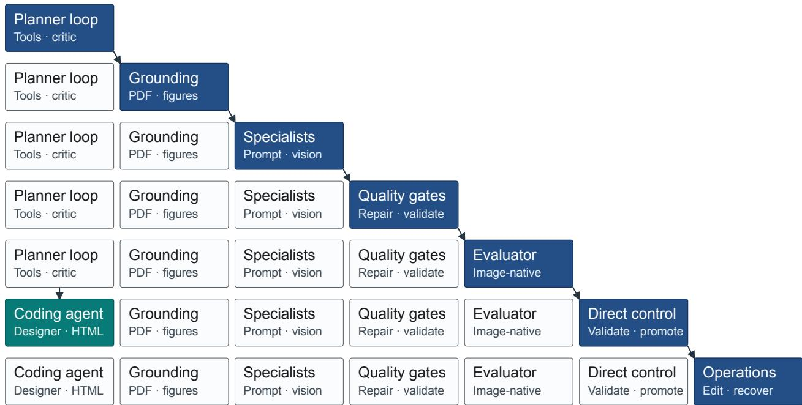  
Figure 14 DesignHarness architecture evolution for paper-to-poster. An implementation-level summary of accumulated capabilities, not a second harness taxonomy or a chronological outer-loop trace. The diagonal path highlights additions in this architectural view; it does not denote individual meta-harness iterations. The final harness combines source grounding, specialist support, quality gates, image-native evaluation, controlled promotion, and operations for editable HTML artifacts.

## A.3 DesignHarness Evolution

Figure 14 provides an implementation-level architecture summary for the paper-to-poster instantiation of DesignHarness. It is neither a second taxonomy nor a record of individual outer-loop iterations: its stages collectively instantiate the five functional components of H in Section 2.1. The illustration moves from a planning-and-critique loop to a coding-agent designer that authors editable HTML, while source grounding, specialist prompt and vision support, repair and validation gates, image-native evaluation, candidate promotion, and recovery operations accumulate around that core.

The figure shows why the optimized result is more than a static prompt or a single repair loop: it accumulates a coherent system around the fixed model. In the five-component abstraction, grounding supplies context and memory; specialist support and editable HTML define tools and specifications; the workspace, browser, renderer, and export environment support the coding-agent authoring path as the execution runtime; direct control and operations implement orchestration; and quality gates together with image-native evaluation provide feedback for revision. The image-native evaluator shown here belongs to evaluation and feedback inside the design harness. It is distinct from the outer-loop evaluator $R _ { \mathrm { m e t a } }$ and from the frozen PosterBench protocol used for final comparison (Sections A.4 and 3.2).

## A.4 PosterBench Evaluation Interface

PosterBench evaluates a rendered artifact against its source paper with seven scores $q _ { j } \in [ 0 , 1 0 ]$ . Its rubric, weights, and protected gates are manually specified and frozen before comparative evaluation. The seven dimensions use the same quality vocabulary as the outer-loop evaluator $R _ { \mathrm { m e t a } }$ in Section 3.2, but serve a diferent role: PosterBench reports completed-system quality, whereas an evaluator coding agent constructs

$R _ { \mathrm { m e t a } }$ from annotated reference artifacts to provide update feedback during harness optimization. $R _ { \mathrm { m e t a } }$ is then fixed within each optimization run.
<table><tr><td>Dimension</td><td>Wt.</td><td>Score mode</td><td>Operational definition</td></tr><tr><td>Faithfulness</td><td>10</td><td>Programmatic + VLM</td><td>Checks numeric and source grounding, then judges whether claims, entities, and visual evidence remain consistent with the paper.</td></tr><tr><td>Coverage</td><td>10</td><td>VLM</td><td>Assesses whether the poster preserves the paper&#x27;s problem, method, evidence, and takeaway against a compact source brief.</td></tr><tr><td>Density</td><td>15</td><td>Programmatic</td><td>Measures information occupancy, OCR text coverage, blank interiors, and pasted paper-body screenshots.</td></tr><tr><td>Visual Evidence</td><td>10</td><td>Programmatic + VLM</td><td>Judges whether figures and tables are relevant, readable, and explained locally; guards reject raw paper-body crops.</td></tr><tr><td>Layout</td><td>20</td><td>Programmatic</td><td>Audits render size and aspect, OCR fallback, clipping, overlap, export-edge damage, and visible placeholders.</td></tr><tr><td>Readability</td><td>25</td><td>Programmatic + VLM</td><td>Combines poster-scale text and spatial checks with hierarchy, scan-path, balance, and crowding judgments.</td></tr><tr><td>Aesthetics</td><td>10</td><td>VLM</td><td>Rates academic visual craft, including typography, palette discipline, and compositional coherence.</td></tr></table>

Table 6 PosterBench scoring protocol. “Programmatic” denotes image-native and source-grounded checks; “VLM” denotes a dimension-specific judgment conditioned on the rendered poster and compact source context. The weights sum to 100.

For record i, PosterBench first forms the fixed weighted score from the seven dimension scores, applies the record-level ceiling $C _ { i } ,$ , and finally averages capped poster scores across the benchmark. Its ceiling families address severe layout damage, insuficient presentation viability, confirmed visible failures, and protected render-integrity gates; inactive ceiling families take value 100. A standard P0 gate has a ceiling of 40, while more severe gate types may impose a lower ceiling. Thus, if $\overline { { { \bf q } } } = N ^ { - 1 } \sum _ { i } { \bf q } _ { i }$ is the vector displayed by a table row, $\scriptstyle { \frac { 1 } { 1 0 } } \alpha ^ { \top }$ q does not generally equal Overall: the ceiling is applied before the benchmark average. For batches of at least 20 readable posters, a blinded style-homogeneity check may only reduce the professional-aesthetics score; it is not applied to PosterBench-mini, whose 10-poster scale is below that threshold.

The released benchmark rows score rendered poster images. Programmatic signals cover render integrity, occupancy, OCR readability, and source grounding. Each VLM judgment receives the rendered image, a compact paper brief, and selected grounding signals, but no system identity or generation prompt.

Per-case evaluation record (schema excerpt)   
{   
"case\_id": "2017-attention-is-all-you-need",   
"system": "AutoDesign + Claude Code + Claude 4.8",   
"overall\_score": "<aggregate-score>",   
"dimension\_scores": { "faithfulness": "<0–10>", . . . },   
"evaluation\_status": "scored"   
}

Released records identify the system configuration, source case, evaluation status, aggregate score, and dimension scores, enabling each reported row to be audited and reaggregated.

## A.5 Released Records and Human Evaluation

The released score archive records system identity, source case and discipline, evaluation status, aggregate score, and per-dimension scores. It distinguishes fresh evaluations from reaggregated records and supports independent auditing of the reported tables.

Released benchmark record fields   
Configuration System, design harness, coding harness, and model.   
Source case Paper identifier and discipline.   
Evaluation Status, aggregate score, and seven dimension scores.

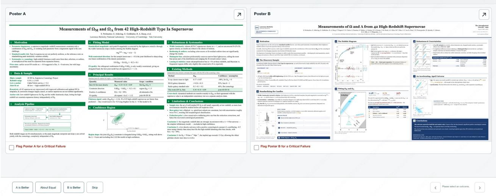  
Figure 15 System-blind Poster Arena interface. Each task presents two anonymous posters for the same paper, with the abstract and PDF as common context. Reviewers select a preference, approximate equality, or skip, and can flag a critical failure. The “0/600” counter denotes the complete roster, rather than a requirement to submit 600 judgments.

Human-evaluation record   
Included reviewer accounts 11   
Submitted responses 936 (933 rankings; 3 skips)   
Judgment design System-blind pairwise comparison on a shared paper   
Complete task roster 600 tasks per reviewer, covering all paper–system pairs   
Ranking analysis Bradley–Terry; ties contribute one half-win   
Uncertainty 2,000 crossed paper–reviewer bootstrap resamples   
Agreement diagnostic Nominal Krippendorf coeficient: 0.101

Blind-review interface and complete task roster. Figure 15 shows the website used for the system-blind study. It presents two anonymous posters for the same source paper with a shared title, abstract, and PDF; system, model, and harness identities are withheld. The complete roster balances left–right presentation and records Poster A, about equal, Poster B, skip, and an optional critical-failure flag.

The roster visible to each reviewer contains every paper–system-pair task:

$$
| \mathcal { T } | = N _ { \mathrm { p a p e r s } } \binom { N _ { \mathrm { s y s t e m s } } } { 2 } = 1 0 0 \binom { 4 } { 2 } = 6 0 0 .
$$

It evaluates each of the six unordered system pairs on every paper, providing equal paper coverage and a connected graph for Bradley–Terry estimation. The “0/600” counter denotes this complete roster; submitted non-skip decisions are retained and uncompleted assignments are not imputed.

Human review decision record (schema excerpt)   
{   
"paper\_id": "2017-attention-is-all-you-need",   
"poster\_a\_id": "anonymous-artifact-a",   
"poster\_b\_id": "anonymous-artifact-b",   
"choice": "A | B | approximately-equal | skip",   
"severe\_a": false, "severe\_b": false, "skip\_reason": null   
}

The released decision record preserves each anonymous comparison and critical-failure flag. The coeficient is a nominal agreement diagnostic over paper–system-pair items, not the ranking estimator; Figure 10 reports a separate paper-cluster bootstrap for benchmark–human alignment.

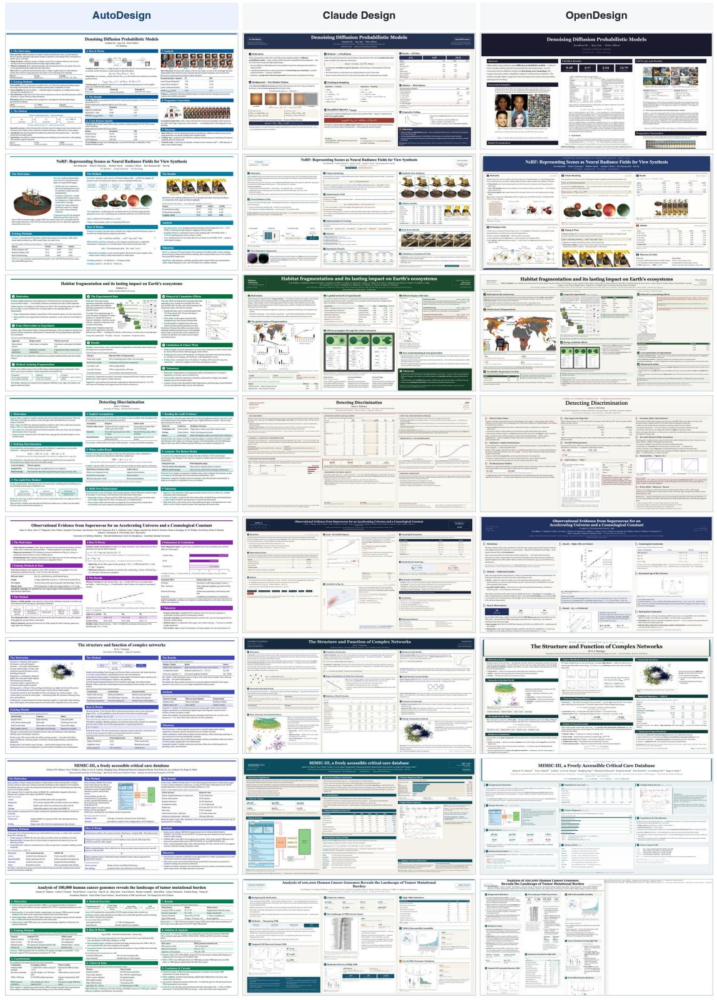  
Figure 16 Additional matched qualitative comparisons across Design Agents with the same generation prompt; each row shows three independently generated posters for one source paper, at a common scale.

Qualitative: the complete model recovers fine Lego gears and treads; removing encoding ot view dependence blurs edges and flattens highlights

## UC Berkeley Google Reseerch UC San Diego

# NeRF: Representing Scenes as Neural Radiance Fields for View Synthesis

Ben Mildenhall · Pratul P. Srinivasan · Matthew Tancik · Jonathan T. Barron · Ravi Ramamoorthi · Ren Ng

## The Motivation

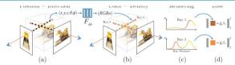

The task: synthesize photorealistic novel views of a scene from only a sparse set of posed RGB images.

• Fidelity gap: prior continuous MLP scene representations could not reproduce complex geometry and appearance.

. Frequency bottleneck: a vanilla coordinate MLP is biased toward low frequencies, so high resolution content fails to converge

. Sample cost: many samples are queried per camera ray, making naive neural volume rendering inefficient

Compactness payoff: the optimized field stores an entire scene in only about 5 MB of network weights, roughly 3000× less memory than LLFF and smaller than the input images themselves, while still recovering fine geometry and view-dependent appearance across held-out test views.

## Existing Methods

Contrast: voxel grids and CNN feature volumes trade memory for resolution, while earlier neural-implicit methods (e.g. SRN) render blurry, low-detail views

Novel-view quality of NeRF across three datasets — PSNR / SSIM un. LPIPS down

<table><tr><td>Dataset</td><td>PSNR↑</td><td>SSIM↑</td><td>LPIPS↓</td></tr><tr><td>Diffuse Synthetic 360°</td><td>40.15</td><td>0.991</td><td>0.023</td></tr><tr><td>Realistic Synthetic 360°</td><td>31.01</td><td>0.947</td><td>0.081</td></tr><tr><td>Real Forward-Facing</td><td>26.50</td><td>0.811</td><td>0.250</td></tr></table>

Takeaway: one continuous representation beats prior voxel- and CNN-based baselines using only posed RGB supervision.

## The Method

Core idea: represent a static scene as a 5D neural radiance field — a single fully-connected MLP Fe, without convolutions, mapping 3D position x and view direction d to density σ and view-dependent RGB color.

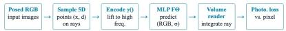

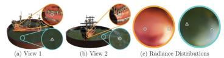  
View dependence: conditioning color on direction d lets one 3D point change specula appearance across views, reproducing non-Lambertian reflections on the hull and water.

## How It Works

Positional encoding: map each input coordinate into a higher-dimensional frequency space so the MLP can fit high-frequency geometry and texture; use L = 10 frequency bands for position and L = 4 for direction

Differentiable rendering: expected ray color integrates predicted color e weighted by transmittance T and density σ. so photometric MSE against obseryed pixels trains the field endto-end.

$$
C ( { \bf r } ) = \left| ~ T ( t ) ~ \mathbb { \sigma } ( { \bf r } ( t ) ) ~ \mathbb { c } ( { \bf r } ( t ) , \bf d ) ~ d { } t , ~ T ( t ) = \exp ( - \left| ~ \mathbb { \sigma } \mathbb { \sigma } \mathrm { d } s \right. ) \right.
$$

• Hierarchical sampling: a coarse network guides a fine network to place samples where visible content is likely, cutting wasted queries in empty space; use N. = 64 coarse and Ne = 128 fine samples per ray

## The Results

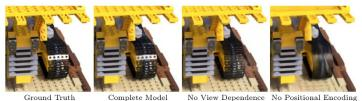

<table><tr><td>Variant</td><td>PSNR↑</td><td>SSIM↑</td><td>LPIPS↓</td></tr><tr><td>No positional encoding</td><td>28.77</td><td>0.924</td><td>0.108</td></tr><tr><td>No hierarchical sampling</td><td>30.06</td><td>0.938</td><td>0.109</td></tr><tr><td>Complete model</td><td>31.01</td><td>0.947</td><td>0.081</td></tr></table>

## Analysis

• Encoding matters most: dropping positional encoding costs the largest hit (31.01 → 28.77 PSNR), confirming the high-frequency mapping is the key enabler

• Sampling efficieney: hierarchical coarse-to-fine sampling adds +0.95 PSNR (30.06 → 31.01) by spending queries where content is visible

. Cost: rendering one novel view takes about 30 s per frame on an NVIDIA V100 — quality is traded against compute

## Takeaway

Result: a continuous 5D neural radiance field, optimized with differentiable volume rendering plus positional encoding and hierarchical sampling, delivers photorealistic novel-view synthesis from posed RGB images alone

Implication: high-frequency coordinate encoding makes compact MLP scene representations

Figure 17 Additional AutoDesign poster demonstrations. LongCat-Next and NeRF are rendered from their respective source papers.

## Sequence Modeling

Training bottleneck: Recurrent models factor computation along token positions, so work inside each example remains sequential and becomes harder to parallelize as sequences grow.

Modeling goal: Connect distant positions directly while retaining an encoder-decoder system capable of high-quality transduction.

## Prior Approaches

Recurrent: Strong sequence models process positions in order, limiting within-example parallelism

Convolutional: Convolutions parallelize local work, but relating distant positions requires paths that grow with distance.

Attention before this work: Attention was typically added to recurrent or convolutional encoder-decoder systems rather than

RNN sequential position path Conv parallel local mixing Transformerglobal attention without recurrence

## Design Commitments

Position: Because attention has no recurrence, sinusoidal encodings are added to token embeddings so the model can represent order and relative offsets.

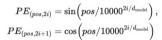

Width: All sublayers emit Feed-forward: The inner dmodel = 512. dimension is dq = 2048.

Heads: Each projected key and Regularization: Residual value uses dimension 64. dropout and label smoothing support generalization

Robustness: Learned positional embeddings produced nearly identical results to the sinusoidal version in the reported variatior study.

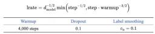

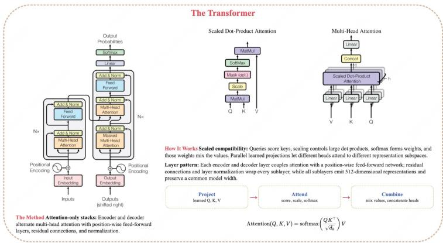

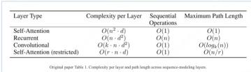

## Experimental Evidence

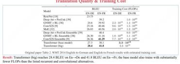

## Why It Works

Short paths: Self-attention connects every position through a constant number of sequentially executed operations, unlike the O(n) sequentia operations of recurrence.

Multiple views: Multi-head attention jointly attends to information from different representation subspaces and positions.

Three attention roles: The decoder uses masked self-attention encoder-decoder attention, and the encoder's self-attention pathway.

Optimization: Warmup followed by inverse-square-root learning-rate decay supports stable training of the attention-only stack

<table><tr><td>Pathway</td><td>Information flow</td></tr><tr><td>Encoder self</td><td>Each input position can atiend toall input positions.</td></tr><tr><td>Decoder self</td><td>Masking prevents access to subsequent output positions.</td></tr><tr><td>Cross attention</td><td>Decoder queries attend to encoder memory keys and values.</td></tr></table>

## Boundaries & Outlook

Long sequences: Full self-attention becomes expensive as sequence length grows; the paper proposes restricted neighborhoods of size r as a direction for further study

Compatibility: Reported parsing results suggest that a morg sophisticated compatibility function than dot product may be beneficial

Struetured outputs: Constituency parsing remains demanding because outputs obey strong structural constraints and can be much longer than inputs

Architectural shift: Sequence transduction can be built entirely fron attention, feed-forward layers, residual pathways, normalization, and positional information

Empirieal payoff: The Transformer reached stronger translatior BLEU with markedly less training time than prior systems

Lasting lesson: Direct global interaction improves parallelism, while head capacity, representation width, and regularization determine how well attention performs

<table><tr><td>Attention pattem</td><td>Complexity</td><td>Maxir</td></tr><tr><td>Full self</td><td>O(n2d)</td><td>0(1)</td></tr><tr><td>Restricted</td><td>O(rnd)</td><td>O(n/r)</td></tr></table>

## UC Berkeley

## 1. The Motivation

Open question: diffusion models are simple to define and efficient to train, yet none had been shown to produce genuinely high-quality samples competitive with leading GANs, autoregressive models, flows, and VAEs.

• Design freedom: a diffusion model is a Markoy chain fit by variational inference: the forward variances and reverse parameterization strongly shape sample quality

• Objective mismatch: plain variational training with mean prediction does not explain why some reverse parameterizations sample far better than others.

This work: an ε-prediction parameterization plus a simple weighted objective make diffusion models state-of-the-art image generators and expose a tie to denoising score matching

FID 3.17 IS 9.46 5 families unconditional CIFAR10 Inception score GAN · AR · flow · VAE · EBM

## 2. Existing Methods

Prior families: GANs, autoregressive models, flows, and VAEs had synthesized striking images, and energy-based models and score matching reached quality comparable to GANs

• Score matching: the closest relative — annealed Langevin sampling over multiple noise scales — motivates the g-prediction view

• Key distinetion: unlike flows and VAEs, the forward process q has no learnable parameters and the top latent xy carries almost no data information.

Reframing: diffusion sampling reads as progressive, autoregressive-like decoding along a generalized bit ordering.

q fixed Xx≈N(0.D Langevin no learnable forward param near-zero data information score-matching precursor

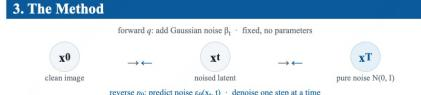

Generative process: a fixed Gaussian forward chain noises the image toward near-isotropic noise: a learned reverse Markov chain, trained by variational inference, walks back to a clean sample

• ε-predietion: the network predicts the added noise rather than the posterior mean — the choice giving the best sample quality.

• Equivalence: this objective matches denoising score matching across noise levels, with sampling like annealed Langevin dynamics

## Denoising Diffusion Probabilistic Models

Jonathan Ho · Ajay Jain · Pieter Abbeel

## 4. How It Works

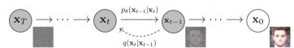

Graphical model: latents x.τ bridge the data xρ and noise; only the reverse transitions pθ(x-/|x) are trained, and the top latent xγ retains almost no data information.

q(x1| x0)= N(x; √aq x0,(1 −¯) 1)

Closed form: any timestep x, samples directly from xρ, so the bound's terms optimize by stochastic gradient descent

## Lsimple = Ex0,ε,t [ 1 ε − ε0( √at x0 + √(1−α) ε, t ) 12 ]

Training signal: the simplified objective is an unweighted denoising regression on the samplec noise, vet it vields the best samples.

## 5. The Results

Headline result: on unconditional CIFAR10 the model reaches Inception score 9.46 and a state-of the-art FID of 3.17.

CIFAR10 sample-quality comparison (higher IS, lower FID is better)

<table><tr><td>Model</td><td>Inception</td><td>FID</td></tr><tr><td>BigGAN (conditional)</td><td>9.22</td><td>14.73</td></tr><tr><td>StyleGAN2 + ADA</td><td>10.06</td><td>2.67</td></tr><tr><td>Diffusion, Lsimple (ours)</td><td>9.46</td><td>3.17</td></tr></table>

## 6. Cross-Dataset Quality

Transfers up: the same recipe holds at high resolution, producing sharp 256×256 LSUN scenes without retuning.

No overfitting: the train-test codelength gap is at most 0.03 bits/dim, comparable to other likelihood-based models.

## 7. Analysis

Rate-distortion: distortion falls steeply in the low-rate region, so most of the codelength describes imperceptible detail while the coarse structure that drives perceived quality costs very few bits. Reverse-process parameterization and objective ablation (CIFAR10)

<table><tr><td>Parameterization / objective IS</td><td></td><td>FID</td></tr><tr><td>μ-pred, learned diagonal Σ</td><td>7.28</td><td>23.69</td></tr><tr><td>μ-pred, fixed isotropic ∑</td><td>8.06</td><td>13.22</td></tr><tr><td>ε-pred, variational bound L</td><td>7.67</td><td>13.51</td></tr><tr><td>ε-pred, Lsimple (ours)</td><td>9.46</td><td>3.17</td></tr></table>

Evidence: ε-prediction with the simplified objective is decisively best; learning reverse-process variances hurt stability and quality.

## 8. Progressive Generation

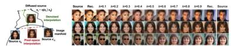

Conceptual compression: with x, frozen and only the reverse noise resampled, small t preserves fine detail while large t keeps only coarse structure — so sampling behaves like progressive lossy decoding.

## 9. Takeaway

• State of the art: with the right parameterization and objective, diffusion models become top-tier image generators, not merely tractable latent-variable models

• Unifying view: ε-prediction links diffusion modeling with denoising score matching and Langevir sampling under one framework.

• Practical recipe: a fixed linear β, schedule, isotropic reverse variances, and T = 1000 steps give a stable, easily trained sampler

Figure 18 Additional AutoDesign poster demonstrations (continued). Attention Is All You Need and DDPM are rendered from their respective source papers.