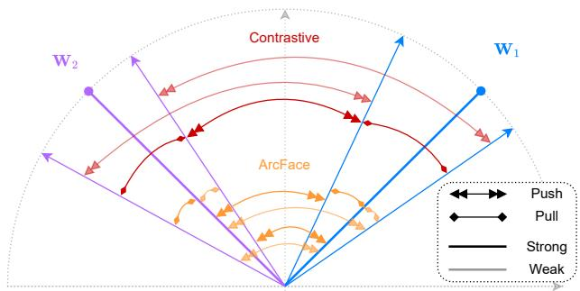

# Bias Mitigation in Face Recognition via Demographic-based Supervised Contrastive Learning

Yu Linghu, Salman Mohammad, Xinyi Zhang, Manuel Gunther ¨

Department of Informatics

University of Zurich

{yu.linghu,salman.mohammad,xinyi.zhang,manuel.guenther}@uzh.ch

## Abstract

Face recognition systems have been shown to be biased toward certain demographic groups by exhibiting different error rates across gender, age, or ethnicity. Though the imbalance of the training data with respect to these demographics is one cause of this bias, training on artificially balanced groups does not completely mitigate the problem. For deployment, face recognition typically works at operating points allowing very low false match rates and, hence, on the tail of the non-match score distribution. While class balancing can improve the means ofthese distributions, the aim of our approach is to improve fairness by addressing the behavior in the tail. Particularly, we propose the Demographic-based Supervised Contrastive loss (DeSCon) forface recognition, which relies on a welldesigned composition oftraining batches and demographicaware pair selection. Our experimental evaluation on both demographically-labeled datasets and standard verification benchmarks shows that DeSCon can improve fairness beyond balancing training datasets while maintaining competitive verification performance. Source code is available upon request.

## 1. Introduction

Face recognition has become one of the most widely deployed biometric technologies, underpinning automatic verification and identification processes across a broad range of applications. Particularly, automatic border control systems [18] reach performances beyond human capabilities [46]. Also, face recognition is utilized for unlocking mobile devices [34], or in surveillance systems [26].

Especially approaches based on deep learning have provided a huge performance gain over traditional face recognition systems [10]. In general, a deep learning-based face recognition system exploits the network as a feature extractor. For a given facial image, the face is detected, aligned, and input to the deep network, which extracts a face embedding, also called a face template, from the image. Such a template is stored on a mobile device during enrollment for later verification. For travel documents, a facial image is stored on the passport chip. In order to verify one’s identity, another live photograph is taken, an embedding is extracted, and the similarity to the stored template is computed. If this similarity score exceeds a pre-defined threshold, the verification is successful; otherwise, the probe face is rejected.

However, such networks are trained on large facial image datasets crawled from the internet, which are typically imbalanced in terms of demographics that they capture [51]. It has been observed that this imbalance is translated into different performances of these systems for different demographic groups [6], e. g., such bias can lead to different treatment of people with different skin colors [19].

To mitigate such bias, two main approaches have been developed. The first and simpler approach tries to handle bias through post-hoc analysis of verification scores, by defining separate thresholds per demographic group [8, 49], or using score normalization techniques to align score distributions across demographic groups [60, 37]. Unfortunately, such techniques often require demographic information during deployment, and do not increase the overall performance of the system.

More research is dedicated to the development of algorithms for training deep networks to extract more fair features [14, 35, 43], or adapting pre-trained networks for providing better-aligned score distributions [32]. Many of the former methods remove sensitive information about current demographics from the embeddings – when the embedding does not include information about gender, it can not be biased against it. However, since such demographic information is very useful in the recognition process, such systems often drop overall verification performance [14, 43]. Another option is to balance the training data with respect to the demographics. Unfortunately, as has been reported in the literature [3, 29] and is also verified in our experiments, only balancing the training is not sufficient to arrive at the most fair system, while it can additionally result in reduced overall verification performance.

  
Figure 1. CENTROID-BASED AND CONTRASTIVE LEARNING. When training with centroid-based margin losses such as Arc-Face, feature vectors are drawn to their own class center $\mathbf { W } _ { y }$ and pushed away from other class centers. However, for deployment, only embeddings are compared. Supervised contrastive loss works on the basis of embeddings directly, pulling the mated same-identity embeddings (same color) together and pushing the non-mated different-identity embeddings (different colors) away. Due to the definition of SoftMax in the contrastive loss (2), the force for nearby different-identity features is much stronger; thus, contrastive learning works directly on the tail of the non-mated score distributions, thereby making systems more fair in operational settings without impeding overall verification performance. In DeSCon, demographic labels guide the selection of non-mated pairs, restricting or prioritizing sampling within the same demographic group to specifically target within-group separation.

In this work, we propose a new Demographic-based Supervised Contrastive loss (DeSCon) for fairness-aware face recognition. We integrate supervised contrastive learning [27], which works by directly comparing embeddings of training samples through pairwise supervision, into marginbased softmax frameworks. As visualized in Fig. 1, our core idea is to complement the class-level pull of class center-based losses such as ArcFace [11] with a structured push against non-mated pairs, thereby reducing demographic disparities while preserving discriminative power. We design three selection strategies to explore this principle: (1) DeSCon-WG restricts non-mated pair sampling within demographic groups to enhance local balance, while (2) DeSCon-Hard further focuses on the hardest non-mated pairs to maximize fairness regularization and moves further into the tail of the non-match score distribution. To show the impact of our demographic-based pair selection strategy, we also compare to (3) DeSCon-All that applies contrastive loss to non-mated pairs within and across demographic groups.

We validate our methods through extensive experiments on multiple benchmarks and fairness metrics. The results demonstrate that DeSCon improves True Match Rates (TMR) while reducing demographic disparities in False Match Rates (FMR) and False Non-Match Rates (FNMR)

across a range of evaluation settings. Our analysis further reveals that different DeSCon variants are preferable under different data regimes: Though DeSCon-All is effective when training data are balanced, DeSCon-Hard exhibits greater robustness when training or evaluation data are demographically imbalanced, delivering the most consistent fairness improvements over the baseline. Overall, DeSCon achieves a competitive balance between verification performance and fairness, with DeSCon-Hard providing the most robust fairness improvements across the evaluated settings. As our contributions in this paper, we:

• introduce DeSCon, a fairness-aware face recognition loss that augments centroid-based losses with supervised contrastive learning to jointly enhance accuracy and fairness,

• explore three pair sampling strategies (All, WG, Hard) to balance between global separation, within-group consistency, and hard non-mated regularization,

• conduct comprehensive evaluations across multiple backbones and benchmarks, showing that DeSCon-Hard consistently improves fairness over the baseline while remaining competitive with existing bias-mitigation methods in terms of the fairnessperformance trade-off, and

• evaluate state-of-the-art methods using both conventional and novel evaluation metrics, highlighting the need to comply with metrics defined in international standards.

## 2. Related Work

## 2.1. Training Face Recognition Networks

In recent years, deep learning has dominated and revolutionized many fields of research, including Face Recognition (FR). In general, there exist two main directions: developing better network topologies and implementing bettersuited loss functions. Most modern network architectures include variations and improvements of residual network architectures [17, 20, 13], and vision transformers [58]. The latest developed loss functions, i. e., ArcFace [11], MagFace [41], and AdaFace [28] improve the discriminability of deep features in angular space by comparing face embeddings with a class centroid. Many of these networks are trained on huge amounts of data [74], mainly capturing celebrities, and exhibiting a large imbalance in the distribution of demographic groups.

## 2.2. Fairness Issues in Face Recognition

A few years ago, the performance of FR systems across demographic groups gained news coverage [19], where it was shown that a commercial-off-the-shelf algorithm performed much poorer on people of color than on the white population. This triggered research in this domain, and it was shown that several demographic factors, such as ethnicity [62, 33], gender [2], age [42], eyewear [8], or even the amount of facial hair [69], influence face recognition. In these works, several datasets have been exploited to perform the fairness evaluation, including MORPH [9], Racial Faces in the Wild (RFW) [66], BUPT [65], DiveFace [43], and Balanced Faces in the Wild (BFW) [52, 53]. Datasets like UTKFace [73] and FairFace [25] also serve the same purpose without ground-truth labels for identities.

An important aspect relates to measuring fairness across demographic groups. While earlier work simply split the datasets into different demographics and reported separate ROC curves per demographic [21, 30, 65, 66, 67, 33], it has been pointed out that such evaluation does not align with real-world deployment that requires a single global operational threshold. Subsequently, several metrics have been developed, but the National Institute of Standards and Technology (NIST) concludes that none of the existing metrics can cover all fairness aspects [16]. Lately, ISO/IEC 19795- 10 [22] specifies how to measure and report fairness performance. Yet, the majority of works still report face verification performance using per-group accuracy – exploiting demographic-specific thresholds – rather than comparing TMR at a single operational threshold.

A simple yet effective way of improving the fairness of existing systems is a post-hoc score normalization [63, 39]. For example, Linghu et al. [37] investigate score normalization methods and extend these to demographics-based normalization techniques. However, such systems need to compute additional similarities to cohort samples during enrollment or probing, and they need to know or estimate the demographics of a given gallery or probe sample. A few more introspective approaches try to postprocess the original embeddings extracted by the deep network such that score distributions across demographics are more aligned [32]. Other approaches include metric learning to improve distributions of scores over demographics [61, 60].

## 2.3. More Fair Network Training

As it is proven that many facial attributes are encoded in face embeddings [54, 59], research focuses on learning lessbiased face representations by disentangling the sensitive information from face embeddings [14, 35, 43], leveraging demographic labels available in the datasets. Such works include cluster-based large-margin local embedding loss [21], or reinforcement learning-based ethnicity-balanced networks [65]. Yang et al. [71] propose to adjust the optimal margins for different ethnic groups. Gong et al. [15] develop a loss function that minimizes average intra-class distances between demographic groups. Serna et al. [56] extend triplet loss with a sensitive triplet generator to reduce discrimination, which works as an add-on to the pretrained features. Iurada et al. [23] investigate debiasing through cross-domain learning. Since demographic labels might be unreliable, Jung et al. [24] propose Confidencebased Group Label assignment (CGL) of pseudo labels. Other approaches include a false positive rate penalty loss [70], proxy features [4], or minimizing overall variance of embeddings [44]. Without relying on demographic labels, Wang et al. [64] reduce identity bias through feature mixing, while Ohki et al. [45] mitigate class favoritism via adaptive margins.

## 2.4. Contrastive Learning

Contrastive learning [7] is a self-supervised technique that uses a sample as an anchor, an augmented sample as a positive, and all other samples in the batch as negatives. It has been used in self-supervised facial representation learning to separate pose-related from pose-unrelated factors [38]. In contrast to self-supervision, which assumes all samples in the batch to belong to different classes, Supervised Contrastive learning (SupCon) requires same-class samples within a batch [27] to pull same-class instances together and push different-class instances apart. SupCon has been applied to several tasks on faces and beyond, e. g., for facial attribute classification [50, 48], or open-set face recognition [1, 57], or demographics-aware medical image classification [36, 12]. Additionally, various sampling strategies for obtaining different-class samples have been explored, including hard negative mining [55] and multisimilarity sampling [68]. To the best of our knowledge, demographic-based sampling within SupCon for fairnessaware face recognition remains unexplored, and this work aims to fill this gap.

## 3. Approach

Our goal is to improve the consistency, separability, and fairness of face recognition embeddings by combining identity classification with contrastive supervision. As illustrated in Fig. 1, we leverage two complementary losses: a centroid-based loss such as ArcFace [11] and SupCon [27], to guide the embedding space jointly. ArcFace enforces angular margins between identity prototypes, pulling each embedding toward its corresponding prototype. SupCon, in parallel, encourages tight clustering of mated pairs while pushing apart embeddings from different identities, regardless of class boundaries. The combination of classificationdriven angular separation and pairwise contrastive forces leads to more robust and fair representations.

To support SupCon learning, we develop pair selection strategies that ensure the presence of mated pairs for each demographic group in each batch. These carefully-sampled anchor-mated pairs enable stable contrastive optimization, allowing controlled exploration of non-mated pairs across identity and demographic boundaries.

## 3.1. Identity Classification with ArcFace

We follow the standard face recognition pipeline by training the model end-to-end using a classification objective over identities. Given an input image, the network extracts an embedding $\boldsymbol { x } \in \mathbb { R } ^ { M }$ , which is passed to a classification head parameterized by a weight matrix $\mathbf { W } \in \mathbb { R } ^ { C \times M }$ with C training identities. To improve intra-class compactness and inter-class separability, we adopt the ArcFace loss [11], which introduces an angular margin in the hypersphere space. This loss encourages compact and well-separated identity clusters on the unit hypersphere and serves as the foundation of our representation learning framework. ArcFace applies an additive margin m to the angle of target identity y:

$$
\mathcal { L } _ { \mathrm { a r c } } ( x ) = - \log \frac { e ^ { s \cdot \cos ( \theta _ { y } + m ) } } { e ^ { s \cdot \cos ( \theta _ { y } + m ) } + \displaystyle \sum _ { c \neq y } e ^ { s \cdot \cos ( \theta _ { c } ) } } ,\tag{1}
$$

where $\theta _ { c }$ denotes the angle between the embedding x and the class center $\mathbf { W } _ { c } .$ The scale parameter s controls the sharpness of the decision boundary, while the angular margin m enforces stronger separation between identities [72].

## 3.2. Supervised Contrastive Learning

To further improve representation consistency and separation between identities, we incorporate a Supervised Contrastive (SupCon) loss [27]. SupCon learning leverages identity labels to define mated and non-mated pairs within a batch. Given a batch of embeddings $\boldsymbol { B } = \{ x _ { b } \} _ { b = 1 } ^ { B }$ , associated with identity labels $y _ { b } \in \{ 1 , \ldots , C \}$ , the supervised contrastive loss for a single anchor embedding $x _ { a }$ is [27]:

$$
{ \mathcal { L } } _ { \mathrm { s u p } } ( x _ { a } ) = - { \frac { 1 } { | P ( a ) | } } \sum _ { x _ { p } \in P ( a ) } { \log { \frac { e ^ { s \cdot \cos ( x _ { a } , x _ { p } ) } } { \displaystyle \sum _ { x \in P ( a ) \cup N ( a ) } e ^ { s \cdot \cos ( x _ { a } , x ) } } } }\tag{2}
$$

where $P ( a ) \subset B$ is the set of mated samples (same identity as $x _ { a } ) _ { ; }$ , and $N ( a ) \subset B$ is the set of other samples from the batch, which we define below. The scale parameter s, similarly to ArcFace, controls the softness of the distribution. To ensure the availability of mated pairs for contrastive learning, we explicitly construct the training batch to contain mated pairs for each demographic group, sampled to cover the range of demographics uniformly. We explore multiple strategies for selecting non-mated pairs $N ( a )$ for computing the denominator in Eq. (2):

• All-vs-All (DeSCon-All): all non-mated samples in the batch, regardless of demographics,

• Within-Group (DeSCon-WG): non-mated samples belonging to the same demographic group as the anchor $x _ { a } ,$ and

• Hardest Within-Group (DeSCon-Hard): the top K non-mated same-demographic samples that are most similar to $x _ { a }$

These sampling strategies are designed to explore how different sources of non-mated pairs affect representation learning. While DeSCon-All reflects the standard approach in contrastive learning, within-group and the hardest within-group selection specifically emphasize finer intrademographic distinctions – in our experiments, we use $K =$ 10. By varying the non-mated pair selection strategy, we empirically assess whether more localized or demographically constrained contrastive supervision can improve fairness or robustness.

## 3.3. Training Objective

We train a model with a joint objective that combines ArcFace (1) with SupCon (2), both operating on the same normalized embedding space, allowing them to complement each other during training. The demographics-weighted loss is:

$$
\mathcal { L } _ { \mathrm { t o t a l } } = \frac { 1 } { B } \sum _ { b = 1 } ^ { B } w _ { d } \big [ \mathcal { L } _ { \mathrm { a r c } } ( x _ { b } ) + \lambda \cdot \mathcal { L } _ { \mathrm { s u p } } ( x _ { b } ) \big ] ,\tag{3}
$$

where λ controls the relative contribution of the two objectives. In our experiments, we find that setting $\lambda = 1$ provides stable training and strong performance across all evaluated settings. The two loss components are optimized jointly using standard stochastic gradient descent, without the need for staged training [31].

When the training dataset exhibits demographic imbalance, we incorporate group-aware loss weighting $w _ { d }$ to compensate for unequal sample distributions [47]. Specifically, each training sample is weighted according to its demographic group $d$ using:

$$
w _ { d } = \frac { N } { D N _ { d } }\tag{4}
$$

where $N$ is the total number of training samples, $D$ is the number of demographic groups, and $N _ { d }$ denotes the number of samples belonging to group d. When the training dataset is balanced across demographic groups, all weights reduce to $w _ { d } = 1$ , and the objective remains unchanged.

To maintain consistency with ArcFace (1), we use the same scale s in the contrastive loss (2). The angular margin m is applied only in ArcFace, as it is specific to classification-based separation and incompatible with the symmetric formulation of contrastive learning.

## 4. Experiments

## 4.1. Evaluation Metrics

Following common practice in face recognition, we compute a score threshold τ to arrive at a fixed False Match

Rate (FMR), and we report the True Match Rate (TMR) at τ as our main metric for overall verification performance.

For fairness evaluation, we adopt two complementary evaluation setups to assess model performance and fairness. As our primary evaluation metric, we follow the ISO/IEC 19795-10 standard [22], which recommends applying the same global threshold τ to all demographic groups and computing demographic-specific False Match Rate (FMR) and False Non-Match Rate (FNMR). We measure False Positive Differential performance (FPD), i. e., the difference in FMR, and False Negative Differential performance (FND), i. e., the difference in FNMR.

Particularly, we follow the ISO/IEC 19795-10 [22] and use the Gini coefficient to measure inequality by averaging pairwise differences between group error rates. Given a demographic attribute with D groups $\{ d _ { 1 } , d _ { 2 } , \dots , d _ { D } \}$ , the Gini coefficient is defined as:

$$
\mathrm { F P D } = \left( \frac { D } { D - 1 } \right) \frac { \displaystyle \sum _ { d _ { i } } \sum _ { d _ { j } } \left| \mathrm { F M R } _ { d _ { i } } ( \tau ) - \mathrm { F M R } _ { d _ { j } } ( \tau ) \right| } { \displaystyle 2 D ^ { 2 } \cdot \frac { 1 } { D } \sum _ { d } \mathrm { F M R } _ { d } ( \tau ) } .\tag{5}
$$

To compute FND, FMR in Eq. (5) is replaced by FNMR.

To be comparable with other work [31, 71, 45], we also adopt earlier metrics. Specifically, we report the average and standard deviation of classification accuracy across demographic groups. In this setting, a separate threshold $\tau _ { i }$ is computed for each group $d _ { i }$ to maximize its own accuracy, which yields overly optimistic results in terms of fairness. While this approach does not reflect realistic deployment constraints, it remains a standard practice in the literature. We include these metrics for completeness and direct comparison, but strongly discourage the use of such metrics in future work and emphasize that our primary analysis is in line with international fairness standards [22].

## 4.2. Datasets

Our evaluation focuses on fairness across ethnic groups, leaving other demographic attributes for future work. We train all models on the BUPT-BalancedFace dataset [66], which contains over 1.3 million images of more than 28k identities. Importantly, the dataset is constructed to be balanced across D = 4 ethnicities (Caucasian, African, Asian, Indian). Additionally, the BUPT-GlobalFace dataset [66] is used to train models on demographically imbalanced data.

For demographic fairness analysis, we use two balanced test sets and one imbalanced test set. The Racial Faces in the Wild (RFW) dataset [66] provides four balanced subsets corresponding to ethnic groups, and is widely adopted in fairness benchmarking as it reduces confounding factors by ensuring equal numbers of subjects and images across groups. A few subjects in RFW are misclassified as multiple ethnicities, which we corrected. The Balanced Faces in the Wild (BFW) dataset [52] similarly provides balanced subsets across both gender and ethnicity, serving as a complementary balanced benchmark. RFW selects the most difficult within-ethnicity non-mated pairs, whereas BFW uses random non-mated pairs by default; for BFW, we restrict evaluation to within-ethnicity and within-gender pairs only. For imbalanced evaluation, we use the VGGFace2 test set [5], on which we perform all-vs-all comparisons across all subjects. VGGFace2 is not balanced w.r.t. ethnicity and gender, for which the labels were obtained from a publicly available source,\* and the resulting verification pairs are likewise imbalanced. We retain only within-group pairs, discarding cross-ethnicity and cross-gender comparisons.

To assess recognition performance at scale, we additionally evaluate on the publicly available benchmarks (LFW, CPLFW, CALFW, AgeDB, CFP-FP) and the IJB-C dataset [40]. We use the same evaluation protocols for all the benchmark datasets as publicly available.† Unlike RFW, IJB-C is not balanced demographically, but serves as a benchmark for large-scale unconstrained face verification.

## 4.3. Training Setup and Backbone

We compare the proposed DeSCon variants against a broad set of state-of-the-art (SOTA) bias mitigation strategies on face recognition. The compared methods include the baseline (ArcFace), preprocessing: DeFT [31], inprocessing: RamFace [71], MixFairFace [64], Labelless [45], post-processing techniques: FairScoreNormalization (FSN) [60], Score Normalization (ScoreNorm) [37], and our proposed DeSCon variants. For a controlled comparison, all methods are re-implemented by us: we use official releases when available and otherwise reproduce them based on the descriptions in the original papers. For preand post-processing approaches, we follow the default configurations provided in their respective papers or official source code.

Our experiments are based on models with two backbones: IResNet50 and IResNet100 [11]. All models are trained from scratch under an identical setup to ensure consistent comparison across backbones and bias-mitigation strategies. Specifically, we use a scale $s ~ = ~ 6 4$ , margin $m = 0 . 5 ,$ , embedding dimension of $M = 5 1 2 .$ , and batch size of $B = 2 5 6$ . All models are trained for 30 epochs with an initial learning rate of 0.1, reduced by a factor of 0.1 at epochs 12 and 20. Compared with ArcFace, DeSCon introduces additional pairwise similarity computation during training. In our implementation, the resulting wall-clock training time remained comparable to the ArcFace baseline (difference below 1%), while inference incurs no additional cost since only the backbone embedding is used.

Table 1. COMPREHENSIVE TABLE ON RFW. We report the verification performance and fairness metrics for algorithms grouped by baseline, pre/post-processing, SOTA in-processing, and our proposed DeSCon methods, across IResNet50 and IResNet100 backbones. The metrics include TMR, Gini coefficients of FMR (FPD) and FNMR (FND), Average Accuracy (ACC), and Standard Deviation of Accuracy (STD). Methods with + are reimplemented by us since no source code was publicly available. The best, second-best, and third-best results are highlighted.  
(a) IResNet50
<table><tr><td>Method</td><td>TMR↑</td><td>FPD↓</td><td>FND↓</td><td>ACC↑</td><td>STD↓</td></tr><tr><td>ArcFace</td><td>74.09%</td><td>0.6372</td><td>0.1348</td><td>95.43</td><td>0.93</td></tr><tr><td>FSN ScoreNorm</td><td>74.20% 75.26%</td><td>0.6372</td><td>0.1378</td><td>95.41</td><td>0.93</td></tr><tr><td>DeFT</td><td>72.23%</td><td>0.5763 0.7582</td><td>0.1078 0.1127</td><td>95.43 95.18</td><td>0.93 1.04</td></tr><tr><td>RamFace+ MixFairFace</td><td>73.08% 77.20%</td><td>0.8187 0.7582</td><td>0.1154 0.0855</td><td>95.43 95.53</td><td>1.05 0.74</td></tr><tr><td>Labelless+</td><td>73.21%</td><td>0.7580</td><td>0.1334</td><td>95.08</td><td>1.01</td></tr><tr><td></td><td></td><td></td><td></td><td></td><td></td></tr><tr><td>DeSCon-All</td><td>76.13%</td><td>0.6974</td><td>0.1152</td><td>95.33</td><td>0.89</td></tr><tr><td>DeSCon-WG</td><td>76.87%</td><td>0.8186</td><td>0.1162</td><td>95.43</td><td>0.93</td></tr><tr><td></td><td></td><td></td><td></td><td></td><td></td></tr><tr><td>DeSCon-Hard</td><td>74.69%</td><td>0.5766</td><td>0.1191</td><td>95.49</td><td>0.99</td></tr></table>

(b) IResNet100
<table><tr><td>Method</td><td>TMR↑</td><td>FPD↓</td><td>FND↓</td><td>ACC↑</td><td>STD↓</td></tr><tr><td>ArcFace</td><td>75.35%</td><td>0.8790</td><td>0.1568</td><td>95.99</td><td>0.67</td></tr><tr><td>FSN ScoreNorm</td><td>75.65%</td><td>0.8790</td><td>0.1558</td><td>95.97</td><td>0.71</td></tr><tr><td>DeFT</td><td>76.13% 76.55%</td><td>0.6974 0.9395</td><td>0.1387 0.1501</td><td>95.99 95.89</td><td>0.67 0.74</td></tr><tr><td>RamFace+</td><td>78.02%</td><td>0.9396</td><td>0.1602</td><td>96.14</td><td>0.74</td></tr><tr><td>MixFairFace</td><td>75.56%</td><td>0.5766</td><td>0.1161</td><td>96.02</td><td>0.74</td></tr><tr><td>Labelless+</td><td></td><td></td><td></td><td></td><td></td></tr><tr><td></td><td>77.77%</td><td>0.6372</td><td>0.1603</td><td>95.78</td><td>0.78</td></tr><tr><td>DeSCon-All</td><td>77.43%</td><td>0.7581</td><td>0.1262</td><td>96.04</td><td>0.75</td></tr><tr><td>DeSCon-WG</td><td>76.98%</td><td>0.8187</td><td>0.1356</td><td>96.16</td><td>0.67</td></tr><tr><td>DeSCon-Hard</td><td>75.78%</td><td>0.6372</td><td>0.1325</td><td>96.01</td><td>0.92</td></tr></table>

## 4.4. Balanced Training Results

Tab. 1 reports comprehensive performance and fairness metrics for all compared methods across two backbones. We evaluate TMR as the primary performance metric, while fairness is assessed using FPD and FND. All demographic-specific FMR/FNMR are omitted as FPD and FND already summarize the inter-group disparity in a single value. Higher TMR indicates better verification performance, while lower values of the fairness metrics correspond to more consistent behavior across demographic groups. For completeness, Tab. 1 also reports average accuracy (ACC) and its standard deviation (STD). These metrics are included mainly for reference and omitted from the remaining tables. Minor gaps with originally reported numbers may arise due to re-implementation differences and the cleaned RFW protocol.

From Tab. 1, we observe an increase in ACC and a drop in STD for deeper backbones, which is consistent with the findings from the other papers [31, 71]. However, this is not the case for FPD or FND, where the ArcFace baseline obtains higher values when the backbone is larger. The conclusions drawn from FPD and FND differ substantially from those based on ACC and STD, demonstrating that the latter are unreliable indicators of fairness.

Table 2. COMPREHENSIVE TABLE ON BFW & VGGFACE2. This table follows the same metrics as Tab. 1. As fewer methods are compared, only the best and second-best results are highlighted.  
(a) IResNet50
<table><tr><td></td><td colspan="3">BFW</td><td colspan="3">VGGFace2</td></tr><tr><td>Method</td><td>TMR↑</td><td>FPD↓</td><td>FND↓</td><td>TMR↑</td><td>FPD↓</td><td>FND↓</td></tr><tr><td>ArcFace RamFace+</td><td>76.57%</td><td>0.4400</td><td>0.1983</td><td>87.03%</td><td>0.7890</td><td>0.1326</td></tr><tr><td></td><td>77.93%</td><td>0.6619</td><td>0.1899</td><td>87.51%</td><td>0.8400</td><td>0.1335</td></tr><tr><td>MixFairFace</td><td>78.45%</td><td>0.5453</td><td>0.1557</td><td>87.29%</td><td>0.8306</td><td>0.1490</td></tr><tr><td>DeSCon-All</td><td>77.25%</td><td>0.5456</td><td>0.1774</td><td>87.14%</td><td>0.8073</td><td>0.1193</td></tr><tr><td>DeSCon-WG</td><td>77.55%</td><td>0.5454</td><td>0.1791</td><td>87.23%</td><td>0.7801</td><td>0.1300</td></tr><tr><td>DeSCon-Hard</td><td>77.39%</td><td>0.4184</td><td>0.1777</td><td>87.24%</td><td>0.7666</td><td>0.1234</td></tr></table>

(b) IResNet100
<table><tr><td></td><td colspan="3">BFW</td><td colspan="3">VGGFace2</td></tr><tr><td>Method</td><td>TMR↑</td><td>FPD↓</td><td>FND↓</td><td>TMR↑</td><td>FPD↓</td><td>FND↓</td></tr><tr><td>ArcFace</td><td>77.95%</td><td>0.6408</td><td>0.2157</td><td>87.85%</td><td>0.8652</td><td>0.1444</td></tr><tr><td>RamFace+</td><td>78.47%</td><td>0.5774</td><td>0.2083</td><td>88.24%</td><td>0.8045</td><td>0.1433</td></tr><tr><td>MixFairFace</td><td>78.35%</td><td>0.5031</td><td>0.1876</td><td>87.82%</td><td>0.8856</td><td>0.1317</td></tr><tr><td>DeSCon-All</td><td>78.96%</td><td>0.3765</td><td>0.1907</td><td>87.94%</td><td>0.8010</td><td>0.1330</td></tr><tr><td>DeSCon-WG</td><td>79.19%</td><td>0.5458</td><td>0.1986</td><td>88.39%</td><td>0.7926</td><td>0.1325</td></tr><tr><td>DeSCon-Hard</td><td>79.89%</td><td>0.3441</td><td>0.1935</td><td>87.96%</td><td>0.7975</td><td>0.1384</td></tr></table>

Across backbones, the DeSCon methods robustly achieve higher TMR than ArcFace, with gains of about 1– 3%. As one of the best-performing methods, MixFairFace is quite strong in mitigating bias on the FNMR side, i. e., lower FND. The other two in-processing methods do not show such stable improvement, which may be attributed to implementation details not fully specified in the original papers. A similar trend can be observed for FSN and DeFT, while ScoreNorm has relatively positive performance.

Among the DeSCon variants, DeSCon-Hard reliably reduces both FPD and FND across backbones, achieving the best balance between verification performance and fairness, while DeSCon-WG and DeSCon-All reach higher TMR but show backbone-dependent FPD gains. All three variants consistently improve FND, as SupCon pulls mated pairs together regardless of sampling strategy, reducing FNMR uniformly across groups. However, FMR is governed by the tail of the non-mated distribution, which requires targeted regularization. DeSCon-Hard explicitly focuses on the hardest within-group non-mated pairs, directly shaping the tail per demographic group and leading to uniform FPD reduction, whereas DeSCon-WG and DeSCon-All sample more broadly, improving overall separation but lacking sufficient control over the per-group tail behavior, resulting in inconsistent FPD gains.

Tab. 2 evaluates all methods on BFW and VGGFace2, which provide complementary balanced and imbalanced test conditions respectively. Compared to RFW, BFW comes from a different distribution, reflected in the generally higher TMR values across all methods. Despite this difference in difficulty and pair distribution, the relative performance trends largely mirror those observed on RFW, suggesting that the fairness improvements are robust across test protocols. On IResNet50, DeSCon-Hard again stands out as the only variant that consistently reduces FPD alongside FND, while achieving TMR comparable to the baseline rather than the highest among the variants. DeSCon-WG and DeSCon-All primarily improve FND, with FPD gains becoming more evident on IResNet100. Overall, DeSCon demonstrates stable fairness improvements across balanced and imbalanced evaluation conditions, without sacrificing verification performance.

Table 3. SAMPLING STRATEGIES AND BASE LOSS. We compare non-mated pair sampling strategies on RFW (IResNet50). Upper: methods under ArcFace base loss, where ArcFace + Triplet and ArcFace + MS replace the contrastive objective entirely, while DeSCon-SH and DeSCon-MS adopt alternative sampling strategies within our framework. Lower: DeSCon variants under AdaFace base loss, demonstrating that DeSCon is compatible with stronger margin-based losses. The best and second-best results are highlighted separately within each base loss group.
<table><tr><td>Method</td><td>TMR↑</td><td>FPD↓</td><td>FND↓</td></tr><tr><td colspan="4">ArcFace Group</td></tr><tr><td>ArcFace ArcFace + MS</td><td>74.09% 59.52%</td><td>0.6372 0.8186 0.8186</td><td>0.1348 0.1175 0.1033</td></tr><tr><td>ArcFace + Triplet DeSCon-Hard DeSCon-MS</td><td>72.41% 74.69% 72.33%</td><td>0.5766 0.8187</td><td>0.1191 0.1158</td></tr><tr><td>DeSCon-SH</td><td>70.67%</td><td>0.5764</td><td>0.0888</td></tr><tr><td colspan="4">AdaFace Group</td></tr><tr><td>AdaFace</td><td>78.31%</td><td>0.9396</td><td>0.1209</td></tr><tr><td>DeSCon-All</td><td>78.54%</td><td>0.5766</td><td>0.0873</td></tr><tr><td>DeSCon-WG</td><td>80.14%</td><td>0.5766</td><td>0.0835</td></tr><tr><td>DeSCon-Hard</td><td>78.78%</td><td>0.6372</td><td>0.0848</td></tr></table>

## 4.5. Ablation Study

We ablate two key design dimensions of DeSCon: the choice of sampling strategy and the compatibility with alternative margin-based loss functions. For non-mated sampling, we compare DeSCon-Hard against two alternative strategies: DeSCon-MS, which uses multi-similarity sampling [68], and DeSCon-SH, which uses semi-hard nonmated pair sampling [55]. To further contextualize the role of SupCon (2), we also include two baselines that replace it entirely with other pairwise losses: ArcFace + Triplet [55] and ArcFace + MS [68]. Separately, to test whether De-SCon generalizes beyond ArcFace, we replace the classification loss in Eq. (3) with AdaFace [28], a stronger marginbased alternative. All experiments in this section are conducted on the IResNet50 backbone and evaluated on RFW.

The results are reported in Tab. 3. Among the sampling strategies, replacing SupCon entirely (ArcFace + MS, Arc-Face + Triplet) degrades TMR substantially, confirming that the SupCon cannot be simply substituted by other pairwise losses. This can be attributed to the SoftMax-based aggregation over all non-mated pairs, which produces stronger gradients for nearby negatives than the single hardest-triplet formulation, making it more effective at shaping the tail of the non-mated score distribution. Among the DeSCon variants, DeSCon-Hard achieves the best overall balance. DeSCon-SH achieves the lowest FND but at the cost of TMR, while DeSCon-MS offers no consistent advantage over DeSCon-Hard. These results confirm that hard withindemographic group mining of non-mated pairs is the most effective sampling strategy within our framework.

Table 4. IMBALANCED TRAINING SET. The evaluation of IResNet50 models trained on the imbalanced BUPT-GlobalFace dataset follows the same metrics as Tab. 1, on both RFW and BFW.
<table><tr><td></td><td colspan="3">RFW</td><td colspan="3">BFW</td></tr><tr><td>Method</td><td>TMR↑</td><td>FPD↓</td><td>FND↓</td><td>TMR↑</td><td>FPD↓</td><td>FND↓</td></tr><tr><td>ArcFace</td><td>78.52%</td><td>0.6369</td><td>0.0637</td><td>74.93%</td><td>0.8202</td><td>0.1346</td></tr><tr><td>RamFace+</td><td>71.83%</td><td>0.5764</td><td>0.0659</td><td>75.96%</td><td>0.6723</td><td>0.1273</td></tr><tr><td>MixFairFace</td><td>78.34%</td><td>0.6370</td><td>0.0411</td><td>74.36%</td><td>0.6404</td><td>0.1167</td></tr><tr><td>DeSCon-All</td><td>78.55%</td><td>0.6973</td><td>0.0740</td><td>75.03%</td><td>0.7570</td><td>0.1306</td></tr><tr><td>DeSCon-WG</td><td>77.20%</td><td>0.5763</td><td>0.0642</td><td>75.37%</td><td>0.7885</td><td>0.1236</td></tr><tr><td>DeSCon-Hard</td><td>78.87%</td><td>0.4553</td><td>0.0625</td><td>74.91%</td><td>0.6618</td><td>0.1279</td></tr></table>

For the AdaFace backbone, all three DeSCon variants improve fairness over the AdaFace baseline, with DeSCon-WG achieving the highest TMR and DeSCon-All and DeSCon-WG jointly achieving the lowest FPD. Thus, De-SCon is compatible with stronger margin-based losses, and its fairness benefits are not specific to ArcFace.

## 4.6. Imbalanced Training Results

Tab. 4 reports results for IResNet50 models trained on the imbalanced BUPT-GlobalFace dataset, evaluated on both RFW and BFW. Compared to balanced training (Tab. 1), training on the larger imbalanced dataset generally yields higher TMR on RFW, while TMR on BFW drops, suggesting that the effect of demographic skew in training data varies across test distributions. Despite this, DeSCon-Hard remains the most robust variant overall, achieving the highest TMR on RFW while delivering the strongest reductions in both FPD and FND on RFW, and the second-lowest FPD on BFW. DeSCon-WG and DeSCon-All show mixed results, with gains in some metrics offset by weaker performance in others, and neither achieves a consistent advantage over the baseline across both test sets. MixFairFace and RamFace can mitigate bias in terms of FPD and/or FND, but at a cost of lower TMR. Overall, DeSCon-Hard emerges as the preferred variant under training imbalance, demonstrating robust fairness gains across both test protocols.

## 4.7. Benchmark Evaluation

We additionally report benchmark evaluation results in Tab. 5, focusing on the methods that achieved strong TMR in Tab. 1. Despite different hyperparameter settings, our ArcFace baseline maintains comparable performance across five basic benchmark datasets (LFW, CALFW, CPLFW, CFP-FP, and AgeDB) and on the IJB-C dataset with a threshold of $\mathrm { F M R } { = } 1 0 ^ { - 5 }$ . The relatively low performance of MixFairFace is consistent with [64]. All three DeSCon variants maintain accuracy comparable to ArcFace across basic benchmarks, with improvements on the IJB-C dataset. In particular, no single DeSCon variant uniformly outperforms the others across all benchmarks, while all DeSCon variants show greater relative improvements on the more challenging IJB-C dataset.

Table 5. VERIFICATION BENCHMARKS. The generalization performance on the publicly available benchmarks is shown. We report accuracy across five benchmark datasets (LFW, CPLFW, CALFW, AgeDB, CFP-FP) and TMR at FMR of $1 0 ^ { - 5 }$ for IJB-C, for baseline, SOTA, and proposed methods using IResNet50 and IResNet100 backbones. The best, second-best, and third-best results are highlighted.
<table><tr><td>Method</td><td>LFW</td><td>CALFW</td><td>CPLFW</td><td>CFP_FP</td><td>AgeDB</td><td>IJB-C</td></tr><tr><td colspan="7">IResNet50</td></tr><tr><td>ArcFace</td><td>99.67%</td><td>95.60%</td><td>91.65%</td><td>97.37%</td><td>96.78%</td><td>90.88%</td></tr><tr><td>DeFT</td><td>99.72%</td><td>95.50%</td><td>91.85%</td><td>97.24%</td><td>97.00%</td><td>90.53%</td></tr><tr><td>RamFace+ MixFairFace</td><td>99.63% 99.67%</td><td>95.53% 95.68%</td><td>91.98% 91.05%</td><td>97.37% 96.89%</td><td>97.12% 96.82%</td><td>91.14% 73.44%</td></tr><tr><td>DeSCon-All</td><td>99.58%</td><td>95.53%</td><td>91.80%</td><td>97.17%</td><td>96.92%</td><td>90.93%</td></tr><tr><td>DeSCon-WG</td><td>99.67%</td><td>95.55%</td><td>91.72%</td><td>97.27%</td><td>96.95%</td><td>91.54%</td></tr><tr><td>DeSCon-Hard</td><td>99.58%</td><td>95.40%</td><td>91.83%</td><td>97.00%</td><td>96.82%</td><td>91.43%</td></tr><tr><td>IResNet100</td><td></td><td></td><td></td><td></td><td></td><td></td></tr><tr><td>ArcFace</td><td>99.68%</td><td>95.53%</td><td>92.30%</td><td>97.79%</td><td>96.92%</td><td></td></tr><tr><td>DeFT</td><td>99.65%</td><td>95.45%</td><td>92.13%</td><td>97.71%</td><td></td><td>91.68%</td></tr><tr><td>RamFace+</td><td>99.72%</td><td>95.42%</td><td>92.18%</td><td></td><td>97.20%</td><td>91.32%</td></tr><tr><td></td><td></td><td></td><td></td><td>97.63%</td><td>97.23%</td><td>90.65%</td></tr><tr><td>MixFairFace</td><td>99.63%</td><td>95.60%</td><td>92.12%</td><td>97.50%</td><td>96.85%</td><td>80.63%</td></tr><tr><td>DeSCon-All</td><td>99.72%</td><td>95.73%</td><td>92.53%</td><td>97.71%</td><td>97.17%</td><td>91.95%</td></tr><tr><td>DeSCon-WG</td><td>99.67%</td><td>95.67%</td><td>92.57%</td><td>97.94%</td><td>97.35%</td><td>92.16%</td></tr><tr><td>DeSCon-Hard</td><td>99.72%</td><td>95.60%</td><td>92.03%</td><td>97.83%</td><td>96.85%</td><td>91.90%</td></tr></table>

## 5. Conclusion

We propose DeSCon, a fairness-aware face recognition framework that augments centroid-based margin losses with supervised contrastive learning. By exploring three nonmated pair sampling strategies, we show that contrastive regularization can improve the fairness-performance tradeoff by reducing demographic disparities while maintaining strong verification performance. Across multiple benchmarks, DeSCon variants achieve competitive verification performance while consistently narrowing fairness gaps, with DeSCon-Hard emerging as the most robust variant, delivering consistent improvements in both FPD and FND under balanced and imbalanced training, across test protocols covering both ethnicity-only (RFW) and joint ethnicitygender groupings (BFW, VGGFace2). DeSCon-WG and DeSCon-All show more mixed results, with fairness gains that are less stable across metrics and evaluation conditions. Ablation experiments further confirm that hard negative mining is the most effective sampling strategy within our framework, and that DeSCon generalizes beyond Arc-Face to stronger margin-based losses such as AdaFace while improving fairness without sacrificing verification performance. These findings suggest that both sampling strategy and base loss selection are critical design choices for fairness-aware training.

Importantly, our evaluation highlights the necessity of adhering to standardizedfairness metrics, such as the Gini coefficient, to provide a rigorous assessment of bias mitigation methods. Through re-implementing related work, we provide a more application-oriented fairness evaluation of existing methods, which serves as a basis for future comparison.

To ensure comparability with related work and to keep training costs low, we trained all methods on the moderatescale BUPT datasets, which provide the ethnicity annotations required by DeSCon during training. This choice comes at the cost of lower overall verification performance compared to training on larger-scale datasets such as WebFace-260M [74], which currently lacks reliable demographic annotations, although DeSCon does not require demographic information at inference time. Extending De-SCon to WebFace-scale training with estimated or automatically inferred demographics remains an important direction for future work.

## Acknowledgement

The authors thank the Hasler foundation for their support through the SAFER project.

## References

[1] K. Ahn, S. Lee, S. Han, C. Y. Low, and M. Cha. Uncertaintyaware face embedding with contrastive learning for open-set evaluation. IEEE Transactions on Information Forensics and Security (TIFS), 2024. 3

[2] V. Albiero, K. KS, K. Vangara, K. Zhang, M. C. King, and K. W. Bowyer. Analysis of gender inequality in face recognition accuracy. In Winter Conference on Applications of Computer Vision Workshops (WACVW), 2020. 3

[3] V. Albiero, K. Zhang, and K. W. Bowyer. How does gender balance in training data affect face recognition accuracy? In International Joint Conference on Biometrics (IJCB), 2020. 1

[4] S. Ardeshir, C. Segalin, and N. Kallus. Estimating structural disparities for face models. In Conference on Computer Vision and Pattern Recognition (CVPR), 2022. 3

[5] Q. Cao, L. Shen, W. Xie, O. M. Parkhi, and A. Zisserman. VGGFace2: A dataset for recognising faces across pose and age. In Automatic Face & Gesture Recognition (FG), 2018. 5

[6] J. G. Cavazos, P. J. Phillips, C. D. Castillo, and A. J. O’Toole. Accuracy comparison across face recognition algorithms: Where are we on measuring race bias? Transactions on Biometrics, Behavior, and Identity Science (TBIOM), 2020. 1

[7] T. Chen, S. Kornblith, M. Norouzi, and G. Hinton. A simple framework for contrastive learning of visual representations. In International Conference on Machine Learning (ICML), 2020. 3

[8] C. M. Cook, J. J. Howard, Y. B. Sirotin, J. L. Tipton, and A. R. Vemury. Demographic effects in facial recognition and their dependence on image acquisition: An evaluation of eleven commercial systems. Transactions on Biometrics, Behavior, and Identity Science (TBIOM), 2019. 1, 3

[9] T. de Freitas Pereira and S. Marcel. Fairness in biometrics: A figure of merit to assess biometric verification systems. Transactions on Biometrics, Behavior, and Identity Science (TBIOM), 2021. 3

[10] T. de Freitas Pereira, D. Schmidli, Y. Linghu, X. Zhang, S. Marcel, and M. Gunther. Eight years of face recogni-¨ tion research: Reproducibility, achievements and open issues. arXiv, 2022. 1

[11] J. Deng, J. Guo, J. Yang, N. Xue, I. Kotsia, and S. Zafeiriou. Arcface: Additive angular margin loss for deep face recognition. Transactions on Pattern Analysis and Machine Intelligence (TPAMI), 2022. 2, 3, 4, 5

[12] S. Du, B. Hers, N. Bayasi, G. Hamarneh, and R. Garbi. FairDisco: Fairer AI in dermatology via disentanglement contrastive learning. In European Conference on Computer Vision (ECCV), 2022. 3

[13] I. C. Duta, L. Liu, F. Zhu, and L. Shao. Improved residual networks for image and video recognition. In International Conference on Pattern Recognition (ICPR), 2021. 2

[14] S. Gong, X. Liu, and A. K. Jain. Jointly de-biasing face recognition and demographic attribute estimation. In European Conference on Computer Vision (ECCV), 2020. 1, 3

[15] S. Gong, X. Liu, and A. K. Jain. Mitigating face recognition bias via group adaptive classifier. In Conference on Computer Vision and Pattern Recognition (CVPR), 2021. 3

[16] P. Grother. Face recognition vendor test (FRVT) part 8: Summarizing demographic differentials. Technical report, National Institute of Standards and Technology (NIST), 2022. 3

[17] K. He, X. Zhang, S. Ren, and J. Sun. Deep residual learning for image recognition. In Conference on Computer Vision and Pattern Recognition (CVPR), 2016. 2

[18] F. Hidayat, U. Elviani, G. B. G. Situmorang, M. Z. Ramadhan, F. A. Alunjati, and R. F. Sucipto. Face recognition for automatic border control: A systematic literature review. IEEE Access, 2024. 1

[19] K. Hill. Wrongfully accused by an algorithm. New York Times, 2020. https://www.nytimes.com. 1, 2

[20] J. Hu, L. Shen, and G. Sun. Squeeze-and-excitation networks. In Conference on Computer Vision and Pattern Recognition (CVPR), 2018. 2

[21] C. Huang, Y. Li, C. C. Loy, and X. Tang. Deep imbalanced learning for face recognition and attribute prediction. Transactions on Pattern Analysis and Machine Intelligence (TPAMI), 2019. 3

[22] International Electrotechnical Commission (IEC). ISO/IEC 19795-10 Biometric performance testing and reporting – Part 10: Quantifying biometric system performance variation across demographic groups, 2024. first edition. 3, 5

[23] L. Iurada, S. Bucci, T. M. Hospedales, and T. Tommasi. Fairness meets cross-domain learning: A benchmark of models and metrics. IEEE Access, 2024. 3

[24] S. Jung, S. Chun, and T. Moon. Learning fair classifiers with partially annotated group labels. In Conference on Computer Vision and Pattern Recognition (CVPR), 2022. 3

[25] K. Karkkainen and J. Joo. Fairface: Face attribute dataset for balanced race, gender, and age for bias measurement and mitigation. In Winter Conference on Applications of Computer Vision (WACV), 2021. 3

[26] F. Kasim, T. E. Boult, R. Mora, B. Biesseck, R. Ribeiro, J. Schlueter, T. Repak, R. H. Vareto, D. Menotti, W. R. Schwartz, and M. Gunther. Watchlist challenge: 3rd open-¨ set face detection and identification. In International Joint Conference on Biometrics (IJCB), 2024. 1

[27] P. Khosla, P. Teterwak, C. Wang, A. Sarna, Y. Tian, P. Isola, A. Maschinot, C. Liu, and D. Krishnan. Supervised contrastive learning. In Advances in Neural Information Processing Systems (NeurIPS), 2020. 2, 3, 4

[28] M. Kim, A. K. Jain, and X. Liu. AdaFace: Quality adaptive margin for face recognition. In Conference on Computer Vision and Pattern Recognition (CVPR), 2022. 2, 7

[29] M. Kolla and A. Savadamuthu. The impact of racial distribution in training data on face recognition bias: A closer look. In Winter Conference on Applications of Computer Vision (WACV), 2023. 1

[30] A. Kortylewski, B. Egger, A. Schneider, T. Gerig, A. Morel-Forster, and T. Vetter. Analyzing and reducing the damage of dataset bias to face recognition with synthetic data. In Conference on Computer Vision and Pattern Recognition (CVPR), 2019. 3

[31] K. Kotwal and S. Marcel. Demographic fairness transformer for bias mitigation in face recognition. In International Joint Conference on Biometrics (IJCB), 2024. 4, 5, 6

[32] K. Kotwal and S. Marcel. Mitigating demographic bias in face recognition via regularized score calibration. In Winter Conference on Applications of Computer Vision (WACV), 2024. 1, 3

[33] K. S. Krishnapriya, V. Albiero, K. Vangara, M. C. King, and K. W. Bowyer. Issues related to face recognition accuracy varying based on race and skin tone. Transactions on Technology and Society (TTS), 2020. 3

[34] D. Kunda and M. Chishimba. A survey of android mobile phone authentication schemes. Mobile Networks and Applications, 2021. 1

[35] J. Liang, Y. Cao, C. Zhang, S. Chang, K. Bai, and Z. Xu. Additive adversarial learning for unbiased authentication. In Conference on Computer Vision and Pattern Recognition (CVPR), 2019. 1, 3

[36] M. Lin, T. Li, Z. Sun, G. Holste, Y. Ding, F. Wang, G. Shih, and Y. Peng. Improving fairness of automated chest radiograph diagnosis by contrastive learning. Radiology: Artificial Intelligence, 2024. 3

[37] Y. Linghu, T. de Freitas Pereira, C. Ecabert, S. Marcel, and M. Gunther. Score normalization for demographic fairness¨ in face recognition. In International Joint Conference on Biometrics (IJCB), 2024. 1, 3, 5

[38] Y. Liu, W. Wang, Y. Zhan, S. Feng, K. Liu, and Z. Chen. Pose-disentangled contrastive learning for self-supervised facial representation. In Conference on Computer Vision and Pattern Recognition (CVPR), 2023. 3

[39] M. I. Mandasari, M. Gunther, R. Wallace, R. Saeidi, S. Mar-¨ cel, and D. A. van Leeuwen. Score calibration in face recognition. IET Biometrics, 3(4), 2014. 3

[40] B. Maze, J. Adams, J. A. Duncan, N. Kalka, T. Miller, C. Otto, A. K. Jain, W. T. Niggel, J. Anderson, J. Cheney, and P. Grother. IARPA Janus Benchmark - C: Face dataset and protocol. In International Conference on Biometrics (ICB), 2018. 5

[41] Q. Meng, S. Zhao, Z. Huang, and F. Zhou. MagFace: A universal representation for face recognition and quality assessment. In Conference on Computer Vision and Pattern Recognition (CVPR), 2021. 2

[42] D. Michalski, S. Y. Yiu, and C. Malec. The impact of age and threshold variation on facial recognition algorithm performance using images of children. In International Conference on Biometrics (ICB), 2018. 3

[43] A. Morales, J. Fierrez, R. Vera-Rodriguez, and R. Tolosana. SensitiveNets: Learning agnostic representations with application to face images. Transactions on Pattern Analysis and Machine Intelligence (TPAMI), 2020. 1, 3

[44] S. Nagpal, M. Singh, R. Singh, and M. Vatsa. Detox loss: Fairness constraints for learning with imbalanced data. IEEE Transactions on Biometrics, Behavior, and Identity Science (TBIOM), 2022. 3

[45] T. Ohki, Y. Sato, M. Nishigaki, and K. Ito. Labellessface: Fair metric learning for face recognition without attribute labels. In International Joint Conference on Biometrics (IJCB), 2024. 3, 5

[46] A. J. O’Toole, P. J. Phillips, F. Jiang, J. H. Ayyad, N. Penard, and H. Abdi. Face recognition algorithms surpass humans matching faces over changes in illumination. Transactions on Pattern Analysis and Machine Intelligence (TPAMI), 2007. 1

[47] A. Palechor, A. Bhoumik, and M. Gunther. Large-scale¨ open-set classification protocols for ImageNet. In Winter Conference on Applications of Computer Vision (WACV), 2023. 4

[48] S. Park, J. Lee, P. Lee, S. Hwang, D. Kim, and H. Byun. Fair contrastive learning for facial attribute classification. In Conference on Computer Vision and Pattern Recognition (CVPR), 2022. 3

[49] N. Poh, J. Kittler, A. Rattani, and M. Tistarelli. Groupspecific score normalization for biometric systems. In Conference on Computer Vision and Pattern Recognition Workshops (CVPRW), 2010. 1

[50] S. Ramachandran and A. Rattani. A self-supervised learning pipeline for demographically fair facial attribute classification. In International Joint Conference on Biometrics (IJCB), 2024. 3

[51] W. Robbins, S. Zhou, A. Bhatta, C. Mello, V. Albiero, K. W. Bowyer, and T. E. Boult. CAST: Conditional attribute subsampling toolkit for fine-grained evaluation. In Winter Conference on Applications of Computer Vision (WACV), 2023.

[52] J. P. Robinson, G. Livitz, Y. Henon, C. Qin, Y. Fu, and S. Timoner. Face recognition: too bias, or not too bias? In Computer Vision and Pattern Recognition Workshops (CVPRW), 2020. 3, 5

[53] J. P. Robinson, C. Qin, Y. Henon, S. Timoner, and Y. Fu. Balancing biases and preserving privacy on balanced faces in the wild. IEEE Transactions on Image Processing (TIP), 2023. 3

[54] E. M. Rudd, M. Gunther, A. R. Dhamija, F. A. Kateb, and¨ T. E. Boult. What’s Hiding in My Deep Features? CRC Press, 2018. 3

[55] F. Schroff, D. Kalenichenko, and J. Philbin. Facenet: A unified embedding for face recognition and clustering. In Conference on Computer Vision and Pattern Recognition (CVPR), 2015. 3, 7

[56] I. Serna, A. Morales, J. Fierrez, and N. Obradovich. Sensitive loss: Improving accuracy and fairness of face representations with discrimination-aware deep learning. Artificial Intelligence, 2022. 3

[57] Y. Song and F. Wang. Coreface: Sample-guided contrastive regularization for deep face recognition. Pattern Recognition, 2024. 3

[58] Z. Sun and G. Tzimiropoulos. Part-based face recognition with vision transformers. In British Machine Vision Conference (BMVC), 2022. 2

[59] P. Terhorst, D. F¨ ahrmann, N. Damer, F. Kirchbuchner, and¨ A. Kuijper. Beyond identity: What information is stored in biometric face templates? In International Joint Conference on Biometrics (IJCB), 2020. 3

[60] P. Terhorst, J. N. Kolf, N. Damer, F. Kirchbuchner, and¨ A. Kuijper. Post-comparison mitigation of demographic bias in face recognition using fair score normalization. Pattern Recognition Letters, 2020. 1, 3, 5

[61] P. Terhorst, M. L. Tran, N. Damer, F. Kirchbuchner, and¨ A. Kuijper. Comparison-level mitigation of ethnic bias in face recognition. In International Workshop on Biometrics and Forensics (IWBF), 2020. 3

[62] K. Vangara, M. C. King, V. Albiero, K. Bowyer, et al. Characterizing the variability in face recognition accuracy relative to race. In Conference on Computer Vision and Pattern Recognition Workshops (CVPRW), 2019. 3

[63] R. Wallace, M. McLaren, C. McCool, and S. Marcel. Crosspollination of normalisation techniques from speaker to face authentication using gaussian mixture models. Transactions on Information Forensics and Security (TIFS), 2012. 3

[64] F.-E. Wang, C.-Y. Wang, M. Sun, and S.-H. Lai. Mixfairface: Towards ultimate fairness via mixfair adapter in face recognition. In AAAI Conference on Artificial Intelligence, 2023. 3, 5, 8

[65] M. Wang and W. Deng. Mitigating bias in face recognition using skewness-aware reinforcement learning. In Conference on Computer Vision and Pattern Recognition (CVPR), 2020. 3

[66] M. Wang, W. Deng, J. Hu, X. Tao, and Y. Huang. Racial faces in the wild: Reducing racial bias by information maximization adaptation network. In International Conference on Computer Vision (ICCV), 2019. 3, 5

[67] P. Wang, F. Su, Z. Zhao, Y. Guo, Y. Zhao, and B. Zhuang. Deep class-skewed learning for face recognition. Neurocomputing, 2019. 3

[68] X. Wang, X. Han, W. Huang, D. Dong, and M. R. Scott. Multi-similarity loss with general pair weighting for deep metric learning. In Conference on Computer Vision and Pattern Recognition (CVPR), 2019. 3, 7

[69] H. Wu, S. Tian, A. Bhatta, K. Ozt¨ urk, K. Ricanek, and K. W.¨ Bowyer. Facial hair area in face recognition across demographics: Small size, big effect. In Winter Conference on Applications of Computer Vision Workshops (WACVW), 2024. 3

[70] X. Xu, Y. Huang, P. Shen, S. Li, J. Li, F. Huang, Y. Li, and Z. Cui. Consistent instance false positive improves fairness in face recognition. In Conference on Computer Vision and Pattern Recognition (CVPR), 2021. 3

[71] Z. Yang, X. Zhu, C. Jiang, W. Liu, and L. Shen. RamFace: Race adaptive margin based face recognition for racial bias mitigation. In International Joint Conference on Biometrics (IJCB), 2021. 3, 5, 6

[72] X. Zhang, R. Zhao, Y. Qiao, X. Wang, and H. Li. AdaCos: Adaptively scaling cosine logits for effectively learning deep face representations. In Conference on Computer Vision and Pattern Recognition (CVPR), 2019. 4

[73] Z. Zhang, Y. Song, and H. Qi. Age progression/regression by conditional adversarial autoencoder. In Conference on Computer Vision and Pattern Recognition (CVPR), 2017. 3

[74] Z. Zhu, G. Huang, J. Deng, Y. Ye, J. Huang, X. Chen, J. Zhu, T. Yang, J. Lu, D. Du, et al. WebFace260M: A benchmark unveiling the power of million-scale deep face recognition. In Conference on Computer Vision and Pattern Recognition (CVPR), 2021. 2, 8