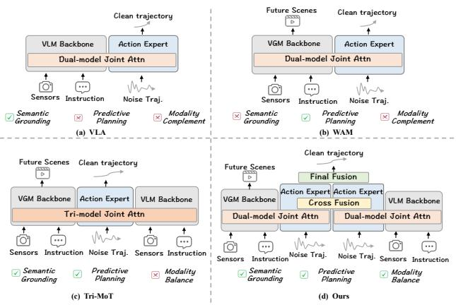
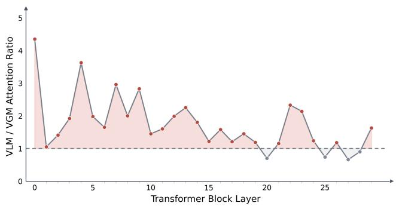
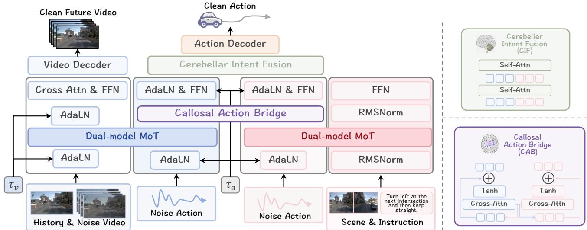
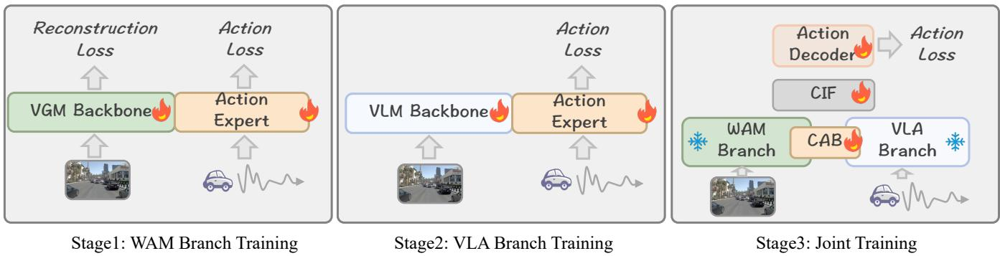
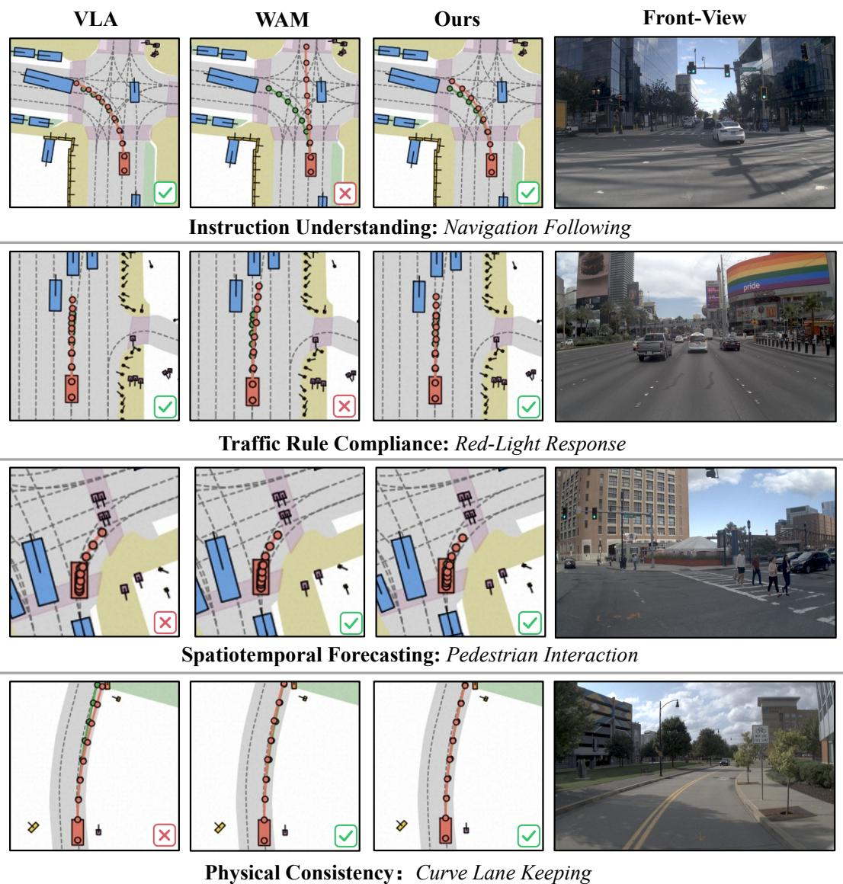
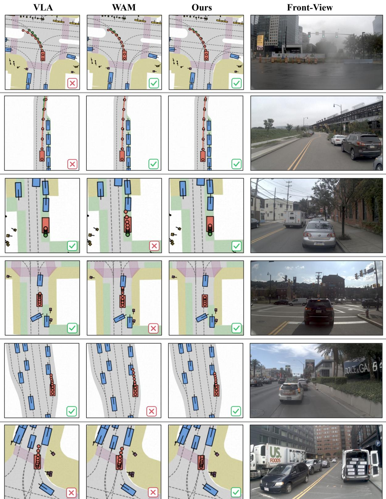

# BrainWAM: Action-Space Coordination of Semantic Priors and Predictive Dynamics for Autonomous Driving

Bing Zhan∗   
NLPR, Institute of Automation,   
Chinese Academy of Sciences   
(CASIA)   
Beijing, China   
Shuo Lu   
NLPR, Institute of Automation,   
Chinese Academy of Sciences   
(CASIA)   
Beijing, China

Yida Wang Li Auto Inc. Beijing, China

Shuyao Shang∗   
NLPR, Institute of Automation,   
Chinese Academy of Sciences   
(CASIA)   
Beijing, China   
Yuan Xu   
NLPR, Institute of Automation,   
Chinese Academy of Sciences   
(CASIA)   
Beijing, China

Xueyang Zhang Li Auto Inc. Beijing, China

Lue Fan   
NLPR, Institute of Automation,   
Chinese Academy of Sciences   
(CASIA)   
Beijing, China

Jiahao Gu∗† Li Auto Inc. Beijing, China

Zhao Wang Li Auto Inc. Beijing, China

Kun Zhan Li Auto Inc. Beijing, China

Zhaoxiang Zhang   
NLPR, Institute of Automation,   
Chinese Academy of Sciences   
(CASIA)   
Beijing, China

## Abstract

Autonomous driving requires planning under both semantic constraints and predictive dynamics. Existing end-to-end driving approaches, however, typically emphasize only one side ofthis requirement: Vision-Language-Action (VLA) models exploit VLM priors for semantic reasoning, while World Action Models (WAMs) provide future-aware prediction through generative world modeling. This naturally motivates a unified planner that can leverage both semantic priors and predictive dynamics. However, we find that a naive combination through joint token-level attention sufers from an attention-allocation mismatch, where semantic shortcuts dominate the shared attention space and suppress predictive dynamics. Inspired by neuroscience evidence that complex behavior arises from coordination among functionally specialized systems, we propose BrainWAM, a structured action-space coordination framework that converts semantic reasoning and predictive world modeling into two specialized action-oriented pathways, and aligns them at the level of compact action representations. We further introduce an asynchronous rectified-flow inference strategy with decoupled video and action denoising, which shortens inference latency while preserving planning-relevant predictive context. BrainWAM reaches state-of-the-art performance on both NAVSIM v1 (89.5 PDMS) and NAVSIM v2 (89.6 EPDMS), consistently outperforming VLA-only or WAM-only methods, highlighting BrainWAM as a practical and promising direction for autonomous driving systems.

Keywords autonomous driving, vision-language-action models, world action models, world models, trajectory planning

## 1 Introduction

Autonomous driving requires planning under two tightly coupled forms of evidence: semantic constraints and predictive dynamics. Vision-Language-Action (VLA) models leverage the worldknowledge priors ofVision-Language Models (VLMs), making them efective at grounding observations in trafic rules, route instructions, scene semantics, and high-level driving intent. World Action Models (WAMs), inspired by recent progress in action-conditioned world modeling [Bi et al. 2026; Shen et al. 2026; Zhu et al. 2025], instead learn how actions and future states evolve together, providing predictive context for motion trends, interaction outcomes, and physical feasibility. These strengths are naturally complementary: VLA models provide task-aware semantic and decision priors but usually lack explicit modeling of future scene evolution, whereas WAMs provide future-aware dynamics and physical priors but are less reliable at rule-aware and intent-driven reasoning. This raises our central question: how can VLA and WAM be efectively combined to unleash the complementary potential of semantic reasoning and predictive modeling?

A common direct design is Tri-modal Joint Attention (Tri-MoT), which places VLM tokens, Video Generative Model (VGM) tokens, and action tokens into one shared attention space. However, we find that this raw-token fusion can even underperform WAM alone. To diagnose this issue, we visualize how action tokens attend to

  
Figure 1: Comparison of diferent paradigms in autonomous driving. (a) VLA leverages vision-language priors for taskaware semantic grounding but lacks explicit predictive plan ning. (b) WAM captures future scene evolution but has limited semantic grounding. (c) Tri-MoTjointly fuses VLM, VGM, and action tokens in a shared raw-token space, which may cause attention interference. (d) Our method separates semantic and predictive pathways and coordinates them in the action space. VGM: Video Generation Model.

VLM and VGM tokens. As shown in Fig. 2, action tokens attend more strongly to semantic-level VLM tokens than to pixel-level VGM tokens across most Transformer layers, especially in shallow layers. This asymmetry follows the modality competition observed in joint multimodal training [Du et al. 2023; Huang et al. 2022; Peng et al. 2022; Wang et al. 2020], where the modality that is easier to learn dominates optimization and suppresses the other (see Appendix A). Here the clean and semantically compact VLM tokens are easier to learn, while the VGM tokens are still being denoised and provide lower-signal features, so action tokens take the VLM shortcut and underuse the predictive video tokens. As a result, directly mixing high-dimensional heterogeneous tokens induces an attention-allocation mismatch: semantic signals dominate the shared interaction space and weaken the predictive dynamics needed for planning.

To address this challenge, we draw inspiration from neuroscience: complex behavior emerges not from homogenizing all signals into one undiferentiated representation, but from coordination among functionally specialized systems. The left hemisphere is often associated with language, symbolic, and sequential processing, while the right hemisphere plays an important role in visuospatial and holistic understanding; the two hemispheres exchange information through the corpus callosum, and motor intent is further coordinated and refined by the cerebellum [Bostan and Strick 2018; Buck ner 2013; Gazzaniga 2005; Kanwisher 2010; Wolpert et al. 1998]. This organization suggests a computational principle for VLA-WAM integration: semantic reasoning and predictive world modeling should first develop specialized, behavior-relevant action representations, and then coordinate through compact action-level communication.

Motivated by this principle, we propose BrainWAM, a braininspired action-space coordination framework for autonomous driving. BrainWAM structures semantic reasoning and predictive world modeling into two complementary action-oriented pathways: a left-hemisphere pathway distills trafic-scene semantics, route instructions, and rule-aware decision priors from VLM, while a right-hemisphere pathway distills spatiotemporal dynamics, physical consistency, and future-interaction cues from VGM. The two pathways communicate bidirectionally over compact action tokens through a corpus-callosum-inspired Callosal Action Bridge (CAB), and a cerebellum-inspired Cerebellar Intent Fusion (CIF) module coordinates the refined action intents and decodes them into an executable trajectory. Experiments on NAVSIM v1 and v2 demonstrate the efectiveness of this design: BrainWAM consistently outperforms VLA-only, WAM-only, and raw-token fusion baselines, and achieves state-of-the-art performance over existing end-to-end driving, VLA-based, and world-model-based methods.

  
Figure 2: Attention allocation in Tri-MoT. We compare attention ratios of action tokens to VLM and VGM tokens across layers. Action tokens attend more strongly to VLM tokens than to VGM tokens across most Transformer layers, revealing semantic dominance in joint representation space.

We summarize our contributions as follows:

• We propose BrainWAM, an action-level coordination framework that combines VLM-based semantic reasoning with WAM-based predictive world modeling. Inspired by brain functional specialization, BrainWAM converts instructionaware semantic constraints and future-dynamics priors into complementary action representations, and coordinates them in a unified action space.

• We identify an attention-allocation mismatch in Tri-MoT: its action tokens attend disproportionately to semantic tokens in most layers, causing raw-token fusion to underperform WAM-only planning.

• BrainWAM achieves 89.5 PDMS on NAVSIM v1 and 89.6 EPDMS on NAVSIM v2, outperforming strong end-to-end driving, VLA-based, and world-model-based methods. These results show BrainWAM’s feasibility and potential for autonomous driving systems.

## 2 Related Work

VLA Models for End-to-End Autonomous Driving. Vision-Language-Action (VLA) models have emerged in end-to-end autonomous driving, aiming to translate visual observations, route instructions, and trafic-scene semantics into executable trajectories [Shao et al. 2024; Sima et al. 2024; Tian et al. 2024; Xu et al. 2024]. Early studies use large language or vision-language models for trafic-scene understanding, reasoning, and decision support, while recent methods move toward trajectory-level planning. ORION [Fu et al. 2025] bridges semantic reasoning and continuous action generation with a generative planner, ReCogDrive [Li et al. 2025e] couples a VLM with a difusion planner, OpenDriveVLA [Zhou et al. 2026b] builds an open VLA policy for driving actions, and AutoVLA [Zhou et al. 2026a] discretizes trajectories into action primitives for autoregressive policy learning. These methods use VLM representations to guide action generation, but future scene evolution is not modeled as a planning signal. We therefore treat VLA as a semantic action pathway and coordinate it with a prediction-grounded WAM pathway.

  
Figure 3: Overview of the proposed semantic-predictive action architecture. The VLA pathway distills scene semantics, route instructions, and rule-aware priors into semantic-grounded action tokens, while the WAM pathway distills future dynamics and physical priors into prediction-grounded action tokens. Instead of mixing raw VLM and VGM tokens in a shared attention space, CAB bridges the two action streams, and CIF fuses the refined action intents for trajectory decoding.

World Models in Autonomous Driving. World models provide a route to planning by learning how driving scenes evolve over time [Hu et al. 2025; Zheng et al. 2025]. Early generative driving world models, such as GAIA-1 [Hu et al. 2023a], DriveDreamer [Wang et al. 2024], and ADriver-I [Jia et al. 2023], show that video or vision-action generation can capture structured trafic evolution in real-world scenarios. Recent methods connect world modeling with planning through future representation prediction [Li et al. 2025a], joint image-action sequence modeling [Cen et al. 2025; Chen et al. 2025; Wang et al. 2025], controllable future generation [Zhao et al. 2025], and dense future supervision for policy learning [Li et al. 2025c]. These approaches demonstrate the value of predictive modeling, especially in scenarios that require motion anticipation and physical consistency. Most existing world-model methods emphasize future generation or use prediction as auxiliary supervision, whereas we use predictive representations as one action pathway and coordinate them with a separate semantic pathway.

## 3 Method

In this section, we describe our coordination framework for VLA and WAM, as shown in Fig. 3. The method is trained in three stages. First, the WAM branch learns prediction-grounded action representations from future scene dynamics (Sec. 3.1). Second, the VLA branch learns semantic-grounded action representations from visual observations and language instructions (Sec. 3.2). Finally, both branches are frozen, while CAB, CIF, and the final action decoder are trained to coordinate the two action streams and generate the final trajectory (Sec. 3.3).

## 3.1 WAM Branch

The WAM branch learns prediction-grounded action representations from future scene prediction. Given the current observation, a video generative backbone predicts future visual latents, while a rectified-flow action expert generates the ego trajectory. We perturb the video latent �� and the action trajectory �� with independent rectified-flow timesteps. This decoupled schedule allows the video stream to terminate early after forming predictive context, while the action stream continues denoising to generate the trajectory.

Architecture. The WAM stream is shown on the left side of the main architecture in Fig. 3. We adopt Wan2.2-TI2V-5B [Wan et al. 2025] as the video backbone and attach a lightweight action expert. The video backbone performs denoising over future video latents and produces visual tokens � that capture scene dynamics, while the action expert performs trajectory denoising and produces action tokens $A _ { \mathrm { p r e d } } .$ . Dual-MoT modules couple the two streams through shared self-attention, enabling visual dynamics and action trajectories to interact, while modality-specific feed-forward networks preserve their distinct modeling capacities.

  
Figure 4: Three-stage training pipeline. Stage 1 trains the WAM branch with video and action rectified-flow objectives, enabling the action expert to learn prediction-grounded representations from future scene modeling. Stage 2 trains the VLA branch with visual and language inputs, converting VLM semantic cues into action representations. Stage 3 freezes both branches and optimizes CAB, CIF, and the action decoder for joint trajectory generation.

The branch predicts video and action vector fields:

$$
\begin{array} { r } { \hat { u } ^ { v } , \hat { u } _ { \mathrm { p r e d } } ^ { a } = F _ { \mathrm { W A M } } \big ( x _ { t _ { v } } ^ { v } , x _ { t _ { a } } ^ { a } , t _ { v } , t _ { a } , c _ { \mathrm { o b s } } \big ) , } \end{array}\tag{1}
$$

where $F _ { \mathrm { W A M } }$ denotes the WAM stream with Dual-MoT interaction. Here, $c _ { \mathrm { o b s } }$ is the conditioning feature from the current observation, ${ \hat { u } } ^ { v }$ is the predicted vector field, and $\hat { u } _ { \mathrm { p r e d } } ^ { a }$ is the predicted action vector field.

Rectified-flow training. We follow Flow Matching [Lipman et al. 2022] and Rectified Flow [Liu et al. 2022], which define a linear path between clean data $x _ { 0 }$ and Gaussian noise �:

$$
x _ { t } = \left( 1 - t \right) x _ { 0 } + t \epsilon , \quad \epsilon \sim N ( 0 , I ) .\tag{2}
$$

For the WAM branch, this path is applied to both future video latents and action trajectories:

$$
x _ { t _ { v } } ^ { v } = \left( 1 - t _ { v } \right) x _ { 0 } ^ { v } + t _ { v } \epsilon ^ { v } , \qquad x _ { t _ { a } } ^ { a } = \left( 1 - t _ { a } \right) x _ { 0 } ^ { a } + t _ { a } \epsilon ^ { a } .\tag{3}
$$

The corresponding velocity targets are

$$
u ^ { v } = \epsilon ^ { v } - x _ { 0 } ^ { v } , \qquad u ^ { a } = \epsilon ^ { a } - x _ { 0 } ^ { a } .\tag{4}
$$

We supervise the predicted video and action velocity fields with

$$
\begin{array} { r } { \mathcal { L } _ { \mathrm { v i d } } = \mathbb { E } \| \hat { \boldsymbol { u } } ^ { v } - \boldsymbol { u } ^ { v } \| _ { 2 } ^ { 2 } , \quad } \\ { \mathcal { L } _ { \mathrm { p r e d } } ^ { \mathrm { a } } = \mathbb { E } \| \hat { \boldsymbol { u } } _ { \mathrm { p r e d } } ^ { a } - \boldsymbol { u } ^ { a } \| _ { 2 } ^ { 2 } . } \end{array}\tag{5}
$$

The total WAM loss is

$$
\begin{array} { r } { \mathcal { L } _ { \mathrm { W A M } } = \mathcal { L } _ { \mathrm { v i d } } + \lambda _ { \mathrm { p r e d } } ^ { \mathrm { a } } \mathcal { L } _ { \mathrm { p r e d } } ^ { \mathrm { a } } . } \end{array}\tag{6}
$$

## 3.2 VLA Branch

The VLA branch uses a VLM backbone to extract semantics from visual observations and language instructions. It complements the WAM branch through scene-level understanding and routeconditioned intent rather than future visual prediction. A rectifiedflow action expert converts VLM features into semantic-grounded action representations.

Architecture. The VLA stream is shown on the right side of the main architecture in Fig. 3. We adopt Qwen3-VL-4B [Bai et al. 2025] as the VLM backbone and equip it with a lightweight action expert for trajectory modeling. The VLM encodes multi-view images and driving instructions into semantic tokens �, and ego history into state tokens �. The action expert processes the noisy trajectory $x _ { t _ { a } } ^ { a }$ into action tokens $A _ { \mathrm { s e m } } .$ . Dual-MoT modules couple semantic, state, and action tokens through shared self-attention to guide action denoising.

The VLA branch predicts the action vector field:

$$
\begin{array} { r } { \hat { u } _ { \mathrm { s e m } } ^ { a } = F _ { \mathrm { V L A } } \big ( U , E , x _ { t _ { a } } ^ { a } , t _ { a } \big ) , } \end{array}\tag{7}
$$

where $F _ { \mathrm { V L A } }$ denotes the Dual-MoT VLA stream, and $\hat { u } _ { \mathrm { s e m } } ^ { \alpha }$ is the semantic-grounded action vector field.

Rectified-flow training. The VLA branch follows the action noising path defined in Eq. (3). Given the target velocity $u ^ { a } = \epsilon ^ { a } - x _ { 0 } ^ { a }$ its training loss is

$$
\mathcal { L } _ { \mathrm { s e m } } ^ { \mathrm { a } } = \mathbb { E } \| \hat { u } _ { \mathrm { s e m } } ^ { a } - u ^ { a } \| _ { 2 } ^ { 2 } .\tag{8}
$$

## 3.3 Joint Training with CAB and CIF

Setup. As shown on the right side of Fig. 4, the joint stage couples the pretrained WAM and VLA branches. Both branches are frozen, while only CAB, CIF, and the final action decoder are optimized. This preserves their pretrained modeling capabilities and focuses learning on cross-stream coordination. Both action experts receive the same noisy trajectory and action timestep:

$$
x _ { t _ { a } } ^ { \alpha } = \left( 1 - t _ { a } \right) x _ { 0 } ^ { \alpha } + t _ { a } \epsilon ^ { \alpha } , \quad \epsilon ^ { \alpha } \sim N ( 0 , I ) .\tag{9}
$$

This places the action tokens from both streams at the same noise level, while the WAM video branch retains its own timestep $t _ { v }$ to provide predictive context.

Callosal Action Bridge (CAB). Inspired by the corpus callosum connecting specialized hemispheres, CAB enables bidirectional interaction between prediction-grounded action tokens $A _ { \mathrm { p r e d } }$ and semantic-grounded action tokens $A _ { \mathrm { s e m } } .$ . Unlike token-level fusion, CAB avoids mixing raw VLM and video tokens within a shared attention pool. At layer �, CAB computes bidirectional cross-stream messages:

$$
\begin{array} { r } { M _ { \mathrm { p r e d }  \mathrm { s e m } } ^ { l } = \Psi _ { \mathrm { c a b } } ^ { l } ( A _ { \mathrm { p r e d } } ^ { l } , A _ { \mathrm { s e m } } ^ { l } ) , } \\ { M _ { \mathrm { s e m }  \mathrm { p r e d } } ^ { l } = \Psi _ { \mathrm { c a b } } ^ { l } ( A _ { \mathrm { s e m } } ^ { l } , A _ { \mathrm { p r e d } } ^ { l } ) . } \end{array}\tag{10}
$$

where $\Psi _ { \mathrm { c a b } } ^ { l } ( X , Y )$ denotes cross-attention using � as queries and � as keys and values. The two action streams are subsequently updated through gated residual injection:

$$
\begin{array} { r l } & { \tilde { A } _ { \mathrm { p r e d } } ^ { l } = A _ { \mathrm { p r e d } } ^ { l } + \alpha _ { \mathrm { p r e d } } ^ { l } M _ { \mathrm { p r e d }  \mathrm { s e m } } ^ { l } , } \\ & { \tilde { A } _ { \mathrm { s e m } } ^ { l } = A _ { \mathrm { s e m } } ^ { l } + \alpha _ { \mathrm { s e m } } ^ { l } M _ { \mathrm { s e m }  \mathrm { p r e d } } ^ { l } . } \end{array}\tag{11}
$$

with learnable residual gates $\alpha _ { \mathrm { p r e d } } ^ { l } = \mathrm { t a n h } ( g _ { \mathrm { p r e d } } ^ { l } )$ and $\alpha _ { \mathrm { s e m } } ^ { l } = \operatorname { t a n h } ( g _ { \mathrm { s e m } } ^ { l } ) .$ Following [Alayrac et al. 2022; Zhang et al. 2023], the gates are zero-initialized, preserving pretrained action streams initially while learning cross-stream updates during joint training.

Cerebellar Intent Fusion (CIF). Inspired by the cerebellum’s role in motor coordination, CIF integrates the refined action streams into a unified representation. It concatenates both streams, processes them with a lightweight Transformer module, and averages the resulting outputs:

$$
\begin{array} { r } { Z _ { \mathrm { p r e d } } , Z _ { \mathrm { s e m } } = \mathrm { C I F } \left( \tilde { A } _ { \mathrm { p r e d } } ^ { L } , \tilde { A } _ { \mathrm { s e m } } ^ { L } \right) , } \\ { Z = \mathcal { M } ( Z _ { \mathrm { p r e d } } , Z _ { \mathrm { s e m } } ) . \qquad } \end{array}\tag{12}
$$

where M denotes element-wise averaging. The fused representation is decoded into the action velocity: $\hat { u } _ { \mathrm { f u s e } } ^ { a } = D _ { \mathrm { f u s e } } ( Z , t _ { a } )$ . Joint training supervises only the fused prediction:

$$
\mathcal { L } _ { \mathrm { f u s e } } = \mathbb { E } \Vert \hat { u } _ { \mathrm { f u s e } } ^ { a } - u ^ { a } \Vert _ { 2 } ^ { 2 } , \quad u ^ { a } = \epsilon ^ { a } - x _ { 0 } ^ { a } .\tag{13}
$$

Inference. At inference, both action experts start from the same noise trajectory and follow identical timesteps. CAB coordinates their intermediate representations, after which CIF fuses the two streams for final trajectory decoding.

## 4 Experiments

## 4.1 Benchmark and Datasets

We evaluate planning performance on NAVSIM v1 [Dauner et al. 2024] and NAVSIM v2 [Cao et al. 2025]. NAVSIM is built upon Open-Scene [Contributors 2023], a reprocessed version of nuPlan [Caesar et al. 2021], and consists of real-world driving logs. At each frame, the model predicts a 4-second trajectory at 2Hz, yielding 8 waypoints. The predicted trajectory is evaluated in a short-horizon, non-reactive simulation. Unlike open-loop displacement metrics, this protocol additionally evaluates safety, driving progress, and rule compliance.

NAVSIM v1 reports the Predictive Driver Model Score (PDMS), which aggregates No at-fault Collision (NC), Drivable Area Compliance (DAC), Time-To-Collision (TTC), Comfort (C), and Ego Progress (EP). NC and DAC serve as multiplicative safety penalties, while TTC and EP measure temporal risk and driving eficiency, respectively, and C evaluates ride comfort:

$$
\mathrm { P D M S } = \mathrm { N C } \times \mathrm { D A C } \times \frac { 5 \mathrm { E P } + 5 \mathrm { T T C } + 2 \mathrm { C } } { 1 2 } .
$$

NAVSIM v2 extends this metric with two additional penalty mul tipliers, Driving Direction Compliance (DDC) and Trafic Light

Compliance (TLC), and three weighted subscores, Lane Keeping (LK), History Comfort (HC), and Extended Comfort (EC). The Extended PDMS (EPDMS) is defined as

$$
\mathrm { E P D M S } = \left( \prod _ { m \in \mathcal { M } _ { \mathrm { p e n } } } s _ { m } \right) \left( \frac { \sum _ { m \in \mathcal { M } _ { \mathrm { a v g } } } w _ { m } s _ { m } } { \sum _ { m \in \mathcal { M } _ { \mathrm { a v g } } } w _ { m } } \right) ,
$$

Here, $M _ { \mathrm { p e n } } = \{ \mathrm { N C , D A C , D D C , T L C } \}$ and $M _ { \mathrm { a v g } } = \{ { \mathrm { T T C } } , { \mathrm { E P } } , { \mathrm { H C } } , { \mathrm { L K } } , { \mathrm { E C } } \}$ The weights are $w _ { \mathrm { T T C } } = w _ { \mathrm { E P } } = 5$ and $w _ { \mathrm { H C } } = w _ { \mathrm { L K } } = w _ { \mathrm { E C } } = 2 .$

## 4.2 Implementation Details

Each of the three stages is trained for 100K steps on 8 NVIDIA H20 GPUs with a per-GPU batch size of 6. We use AdamW with a cosine learning-rate schedule, 200 warmup steps, and a peak learning rate of $5 \times 1 0 ^ { - 5 }$ . Training uses bf16 mixed precision, with checkpoints saved every 3K steps. At inference, we use 3-step rectified-flow sampling for the action streams.

## 4.3 Main Results

NAVSIM v1 results. As shown in Table 1, BrainWAM achieves a PDMS of 89.5, outperforming both VLA-based and world-modelbased baselines. The gains are most pronounced in DAC and EP, indicating improved drivable-area compliance and driving progress, while maintaining competitive NC, TTC, and comfort scores.

NAVSIM v2 results. Table 2 shows that BrainWAM achieves stateof-the-art performance on NAVSIM v2, with an EPDMS of 89.6. The improvements are primarily driven by EP and EC, whereas several rule-compliance metrics are already near saturation. These results demonstrate that the proposed coordination remains efective under the more comprehensive NAVSIM v2 evaluation protocol.

## 4.4 Further Analysis and Ablation Studies

Branch complementarity. Table 3 compares the full model with its single-branch variants. WAM-only achieves 88.1 PDMS and substantially outperforms VLA-only, demonstrating the strong planning prior provided by predictive modeling on NAVSIM. BrainWAM further improves PDMS to 89.5, exceeding both single-branch variants. This improvement suggests that semantic and predictive action representations provide complementary information under actionlevel coordination.

Action-level coordination vs. token-level fusion. As shown in Table 3, Tri-MoT achieves 87.8 PDMS, underperforming the WAMonly variant. This indicates that directly mixing VLM and video tokens in a shared attention space does not efectively transfer semantic knowledge to planning. Fig. 2 further reveals imbalanced cross-modal attention in Tri-MoT, motivating coordination at the action level. By keeping raw modality tokens separate and interacting only through action representations, BrainWAM improves PDMS to 89.5. Because both methods use identical backbones and comparable parameter counts, the gain is attributable to the coordination mechanism rather than increased model capacity.

Efectiveness ofCAB and CIF. Table 4 evaluates the individual contributions of CAB and CIF. Using CAB or CIF alone yields 88.7 and 88.5 PDMS, respectively, whereas combining them increases PDMS to 89.5. The improvement is concentrated in DAC and EP, while NC and TTC remain stable. These results suggest that CAB facilitates intermediate interaction between the two action streams, while CIF consolidates their final representations.

Table 1: Planning performance comparison on NAVSIM v1. Best results use bold and second-best results are underlined.
<table><tr><td>Method</td><td>Ref.</td><td>Image</td><td>Lidar</td><td>NC↑</td><td>DAC↑</td><td>TTC↑</td><td>C↑</td><td>EP↑</td><td>PDMS↑</td></tr><tr><td>Human</td><td>一</td><td>一</td><td>-</td><td>100.0</td><td>100.0</td><td>100.0</td><td>99.9</td><td>87.5</td><td>94.8</td></tr><tr><td>Traditional End-to-End Methods</td><td></td><td></td><td></td><td></td><td></td><td></td><td></td><td></td><td></td></tr><tr><td>TransFuser [Chitta et al. 2022]</td><td>TPAMI&#x27;23</td><td>√</td><td>√</td><td>97.7</td><td>92.8</td><td>92.8</td><td>100.0</td><td>79.2</td><td>84.0</td></tr><tr><td>UniAD [Hu et al. 2023b]</td><td>CVPR&#x27;23</td><td>√</td><td></td><td>97.8</td><td>91.9</td><td>92.9</td><td>100.0</td><td>78.8</td><td>83.4</td></tr><tr><td>PARA-Drive [Weng et al. 2024]</td><td>CVPR&#x27;24</td><td>√</td><td></td><td>97.9</td><td>92.4</td><td>93.0</td><td>99.8</td><td>79.3</td><td>84.0</td></tr><tr><td>DiffusionDrive [Liao et al. 2025]</td><td>CVPR&#x27;25</td><td>√</td><td>√</td><td>98.2</td><td>96.2</td><td>94.7</td><td>100.0</td><td>82.2</td><td>88.1</td></tr><tr><td>Vision-Language-Action Methods</td><td></td><td></td><td></td><td></td><td></td><td></td><td></td><td></td><td></td></tr><tr><td>ReCogDrive [Li et al. 2025e]</td><td>ICLR&#x27;26</td><td>√</td><td></td><td>98.1</td><td>94.7</td><td>94.2</td><td>100.0</td><td>80.9</td><td>86.5</td></tr><tr><td>DynVLA [Shang et al. 2026]</td><td>ICML&#x27;26</td><td>√</td><td></td><td>98.6</td><td>95.3</td><td>95.5</td><td>100.0</td><td>80.6</td><td>87.2</td></tr><tr><td>AutoVLA [Zhou et al. 2026a]</td><td>NeurIPS&#x27;25</td><td>√</td><td></td><td>98.4</td><td>95.6</td><td>98.0</td><td>99.9</td><td>81.9</td><td>89.1</td></tr><tr><td>DriveVLA-W0 [Li et al. 2025c]</td><td>ICLR&#x27;26</td><td>√</td><td></td><td>98.4</td><td>95.3</td><td>95.2</td><td>100.0</td><td>80.9</td><td>87.2</td></tr><tr><td>World-Model-Based Methods</td><td></td><td></td><td></td><td></td><td></td><td></td><td></td><td></td><td></td></tr><tr><td>DrivingGPT [Chen et al. 2025]</td><td>ICCV&#x27;25</td><td>√</td><td></td><td>98.9</td><td>90.7</td><td>94.9</td><td>95.6</td><td>79.7</td><td>82.4</td></tr><tr><td>LAW [Li et al. 2025a]</td><td>ICLR&#x27;25</td><td>√</td><td></td><td>96.4</td><td>95.4</td><td>88.7</td><td>99.9</td><td>81.7</td><td>84.6</td></tr><tr><td>Epona [Zhang et al. 2025]</td><td>ICCV&#x27;25</td><td>√</td><td></td><td>97.9</td><td>95.1</td><td>93.8</td><td>99.9</td><td>80.4</td><td>86.2</td></tr><tr><td>WoTE [Li et al. 2025d]</td><td>ICCV&#x27;25</td><td>√</td><td>√</td><td>98.5</td><td>96.8</td><td>94.9</td><td>99.9</td><td>81.9</td><td>88.3</td></tr><tr><td>DriveLaW [Xia et al. 2026]</td><td>CVPR&#x27;26</td><td>√</td><td></td><td>99.0</td><td>97.1</td><td>96.7</td><td>100.0</td><td>81.3</td><td>89.1</td></tr><tr><td>BrainWAM (Ours)</td><td></td><td>√</td><td></td><td>98.1</td><td>97.5</td><td>94.9</td><td>100.0</td><td>83.8</td><td>89.5</td></tr></table>

Table 2: Planning performance comparison on NAVSIM v2. The benchmark evaluates driving performance under additional rule-based and comfort-related metrics. The best results are highlighted in bold.
<table><tr><td>Method</td><td>NC↑</td><td>DAC↑</td><td>DDC↑</td><td>TLC↑</td><td>EP↑</td><td>TTC↑</td><td>LK↑</td><td>HC↑</td><td>EC↑</td><td>EPDMS↑</td></tr><tr><td>Traditional End-to-End Methods</td><td></td><td></td><td></td><td></td><td></td><td></td><td></td><td></td><td></td><td></td></tr><tr><td>TransFuser [Chitta et al. 2022]</td><td>96.9</td><td>89.9</td><td>97.8</td><td>99.7</td><td>87.1</td><td>95.4</td><td>92.7</td><td>98.3</td><td>87.2</td><td>76.7</td></tr><tr><td>HydraMDP++ [Li et al. 2025b]</td><td>97.2</td><td>97.5</td><td>99.4</td><td>99.6</td><td>83.1</td><td>96.5</td><td>94.4</td><td>98.2</td><td>70.9</td><td>81.4</td></tr><tr><td>DriveSuprim [Yao et al. 2026]</td><td>97.5</td><td>96.5</td><td>99.4</td><td>99.6</td><td>88.4</td><td>96.6</td><td>95.5</td><td>98.3</td><td>77.0</td><td>83.1</td></tr><tr><td>ARTEMIS [Feng et al. 2025]</td><td>98.3</td><td>95.1</td><td>98.6</td><td>99.8</td><td>81.5</td><td>97.4</td><td>96.5</td><td>98.3</td><td>89.1</td><td>83.1</td></tr><tr><td>Vision-Language-Action Methods</td><td></td><td></td><td></td><td></td><td></td><td></td><td></td><td></td><td></td><td></td></tr><tr><td>DriveVLA-W0 [Li et al. 2025c]</td><td>98.5</td><td>99.1</td><td>98.0</td><td>99.7</td><td>86.4</td><td>98.1</td><td>93.2</td><td>97.9</td><td>58.9</td><td>86.1</td></tr><tr><td>World-Model-Based Methods</td><td></td><td></td><td></td><td></td><td></td><td></td><td></td><td></td><td></td><td></td></tr><tr><td>DriveDreamer-Policy [Zhou et al. 2026c]</td><td>98.4</td><td>97.1</td><td>99.5</td><td>99.9</td><td>87.9</td><td>97.7</td><td>97.6</td><td>98.3</td><td>79.4</td><td>88.7</td></tr><tr><td>BrainWAM (Ours)</td><td>98.1</td><td>97.5</td><td>99.6</td><td>99.9</td><td>88.2</td><td>97.4</td><td>97.6</td><td>98.4</td><td>85.8</td><td>89.6</td></tr></table>

Table 3: Ablation of branch and coordination strategies on NAVSIM v1.
<table><tr><td>Method</td><td>NC↑</td><td>DAC↑</td><td>TTC↑</td><td>C↑</td><td>EP↑</td><td>PDMS↑</td></tr><tr><td>VLA-only</td><td>97.7</td><td>94.9</td><td>93.3</td><td>100.0</td><td>80.7</td><td>86.1</td></tr><tr><td>WAM-only</td><td>98.0</td><td>96.4</td><td>94.4</td><td>100.0</td><td>82.6</td><td>88.1</td></tr><tr><td>Tri-MoT</td><td>98.3</td><td>96.2</td><td>94.7</td><td>100.0</td><td>81.7</td><td>87.8</td></tr><tr><td>BrainWAM</td><td>98.1</td><td>97.5</td><td>94.9</td><td>100.0</td><td>83.8</td><td>89.5</td></tr></table>

Asynchronous video denoising. Table 5 examines the number of video denoising steps used at inference. Because the video and action streams follow independent rectified-flow timesteps, the video branch uses a truncated schedule and caches its features for subsequent action denoising. With no video denoising, the model loses predictive context and drops to 79.3 PDMS and 75.8 EPDMS, confirming that video dynamics are essential to planning. A single video step restores PDMS to 89.3, after which performance remains between 89.3 and 89.5 as the number of steps increases to 3, while latency rises from 475 ms to 644 ms. Thus, one early video step

Table 4: Ablation study on NAVSIM v1, analyzing the efect of CAB and CIF. The best results are highlighted in bold.
<table><tr><td>CAB</td><td>CIF</td><td>NC↑</td><td>DAC↑</td><td>TTC↑</td><td>C↑</td><td>EP↑</td><td>PDMS↑</td></tr><tr><td>√</td><td></td><td>98.1</td><td>96.8</td><td>94.8</td><td>100.0</td><td>83.0</td><td>88.7</td></tr><tr><td></td><td>√</td><td>98.1</td><td>96.7</td><td>94.7</td><td>100.0</td><td>82.9</td><td>88.5</td></tr><tr><td>√</td><td>√</td><td>98.1</td><td>97.5</td><td>94.9</td><td>100.0</td><td>83.8</td><td>89.5</td></tr></table>

  
Figure 5: Qualitative comparison ofVLA-only, WAM-only, and Ours in representative scenarios. Ours produces robust trajectories under semantic constraints and dynamic interactions by combining the two pathways at the action-token level.

Table 5: Trade-of between video denoising steps, planning performance, and inference latency. All inference latencies are measured on a single NVIDIA H20 GPU. The best results are highlighted in bold.
<table><tr><td>Video denoise steps</td><td>Latency↓</td><td>PDMS↑</td><td>EPDMS↑</td></tr><tr><td>0</td><td>382 ms</td><td>79.3</td><td>75.8</td></tr><tr><td>1</td><td>475 ms</td><td>89.3</td><td>89.4</td></tr><tr><td>2</td><td>565 ms</td><td>89.5</td><td>89.6</td></tr><tr><td>3</td><td>644ms</td><td>89.4</td><td>89.6</td></tr></table>

provides most of the useful predictive context, ofering a favorable trade-of between accuracy and eficiency.

## 4.5 Qualitative Analysis

Fig. 5 compares VLA-only, WAM-only, and BrainWAM across representative scenarios. These cases include semantic-grounding challenges, such as navigation following and brake-light understanding, as well as future-modeling challenges, such as interactive negotiation and trajectory feasibility.

In navigation following, the planner follows the route instruction rather than choosing a locally plausible but incorrect branch. In red-light understanding, the planner jointly interprets the braking signal of the lead vehicle and the red trafic light to avoid a rearend collision. VLA-only handles these cases better than WAM-only, demonstrating its advantage in instruction grounding and semantic scene understanding.

Interactive negotiation involves coupled behaviors among the ego vehicle, pedestrians, and surrounding agents, where feasible planning depends on anticipating how the scene may evolve. Trajectory feasibility is particularly challenging on curved roads, where planning solely from the current observation may produce inaccurate future motion. WAM-only performs better in these cases, benefiting from jointly modeling future scene evolution and ego actions.

BrainWAM handles all four cases by coordinating semanticgrounded and prediction-grounded action representations. This coordination reduces the failure modes observed in the single-branch variants.

## 5 Conclusion

In this work, we study how to efectively combine VLA-based semantic reasoning and WAM-based predictive world modeling for end-to-end autonomous driving. We first reveal that naive shared token fusion sufers from an attention-allocation mismatch: action tokens attend disproportionately to semantic tokens, which weak ens the predictive signals provided by the world model, resulting in suboptimal planning. Motivated by this, we propose BrainWAM, which allows the two branches to first produce semantic-grounded and prediction-grounded action representations, and then coordinate them through structured interaction in a unified action space, while preserving the complementary specialization of semantic and predictive pathways. BrainWAM achieves state-of-the-art performance on both NAVSIM v1 and v2, demonstrating its efectiveness and potential for autonomous driving systems. We further analyze the limitations and future work in the supplementary material.

## References

Jean-Baptiste Alayrac, Jef Donahue, Pauline Luc, Antoine Miech, Iain Barr, Yana Hasson, Karel Lenc, Arthur Mensch, Katherine Millican, Malcolm Reynolds, et al. 2022. Flamingo: a visual language model for few-shot learning. Advances in neural information processing systems 35 (2022), 23716–23736.

Shuai Bai, Yuxuan Cai, Ruizhe Chen, Keqin Chen, Xionghui Chen, Zesen Cheng, Lianghao Deng, Wei Ding, Chang Gao, Chunjiang Ge, et al. 2025. Qwen3-vl technical report. arXiv preprint arXiv:2511.21631 (2025).

Hongzhe Bi, Hengkai Tan, Shenghao Xie, Zeyuan Wang, Shuhe Huang, Haitian Liu, Ruowen Zhao, Yao Feng, Chendong Xiang, Yinze Rong, et al. 2026. Motus: A unified latent action world model. In Proceedings ofthe IEEE/CVF Conference on Computer Vision and Pattern Recognition. 35101–35113.

Andreea C Bostan and Peter L Strick. 2018. The basal ganglia and the cerebellum: nodes in an integrated network. Nature Reviews Neuroscience 19, 6 (2018), 338–350.

Randy L Buckner. 2013. The cerebellum and cognitive function: 25 years of insight from anatomy and neuroimaging. Neuron 80, 3 (2013), 807–815.

Holger Caesar, Juraj Kabzan, Kok Seang Tan, Whye Kit Fong, Eric Wolf, Alex Lang, Luke Fletcher, Oscar Beijbom, and Sammy Omari. 2021. nuplan: A closed-loop mlbased planning benchmark for autonomous vehicles. arXivpreprint arXiv:2106.11810 (2021).

Wei Cao, Marcel Hallgarten, Tianyu Li, Daniel Dauner, Xunjiang Gu, Caojun Wang, Yakov Miron, Marco Aiello, Hongyang Li, Igor Gilitschenski, et al. 2025. Pseudosimulation for autonomous driving. arXiv preprint arXiv:2506.04218 (2025).

Jun Cen, Chaohui Yu, Hangjie Yuan, Yuming Jiang, Siteng Huang, Jiayan Guo, Xin Li, Yibing Song, Hao Luo, Fan Wang, et al. 2025. Worldvla: Towards autoregressive action world model. arXiv preprint arXiv:2506.21539 (2025).

Yuntao Chen, Yuqi Wang, and Zhaoxiang Zhang. 2025. Drivinggpt: Unifying driving world modeling and planning with multi-modal autoregressive transformers. In Proceedings of the IEEE/CVF International Conference on Computer Vision. 26890– 26900.

Kashyap Chitta, Aditya Prakash, Bernhard Jaeger, Zehao Yu, Katrin Renz, and Andreas Geiger. 2022. Transfuser: Imitation with transformer-based sensor fusion for autonomous driving. IEEE transactions on pattern analysis and machine intelligence 45, 11 (2022), 12878–12895.

OpenScene Contributors. 2023. Openscene: The largest up-to-date 3d occupancy prediction benchmark in autonomous driving. In Proceedings ofthe Conference on

Computer Vision and Pattern Recognition, Vancouver, Canada. 18–22.

Daniel Dauner, Marcel Hallgarten, Tianyu Li, Xinshuo Weng, Zhiyu Huang, Zetong Yang, Hongyang Li, Igor Gilitschenski, Boris Ivanovic, Marco Pavone, et al. 2024. Navsim: Data-driven non-reactive autonomous vehicle simulation and benchmarking. Advances in Neural Information Processing Systems 37 (2024), 28706–28719.

Chenzhuang Du, Jiaye Teng, Tingle Li, Yichen Liu, Tianyuan Yuan, Yue Wang, Yang Yuan, and Hang Zhao. 2023. On uni-modal feature learning in supervised multi modal learning. In International Conference on Machine Learning. PMLR, 8632–8656.

Renju Feng, Ning Xi, Duanfeng Chu, Rukang Wang, Zejian Deng, Anzheng Wang, Liping Lu, Jinxiang Wang, and Yanjun Huang. 2025. Artemis: Autoregressive endto-end trajectory planning with mixture of experts for autonomous driving. IEEE Robotics and Automation Letters 11, 1 (2025), 226–233.

Haoyu Fu, Diankun Zhang, Zongchuang Zhao, Jianfeng Cui, Dingkang Liang, Chong Zhang, Dingyuan Zhang, Hongwei Xie, Bing Wang, and Xiang Bai. 2025. Orion: A holistic end-to-end autonomous driving framework by vision-language instructed action generation. In Proceedings ofthe IEEE/CVF International Conference on Computer Vision. 24823–24834.

Michael S Gazzaniga. 2005. Forty-five years of split-brain research and still going strong. Nature Reviews Neuroscience 6, 8 (2005), 653–659.

Anthony Hu, Lloyd Russell, Hudson Yeo, Zak Murez, George Fedoseev, Alex Kendall, Jamie Shotton, and Gianluca Corrado. 2023a. Gaia-1: A generative world model for autonomous driving. arXiv preprint arXiv:2309.17080 (2023).

Bin Hu, Zijian Lu, Haicheng Liao, Chengran Yuan, Bin Rao, Yongkang Li, Guofa Li, Zhiyong Cui, Cheng-zhong Xu, and Zhenning Li. 2025. Map-World: Masked Action planning and Path-Integral World Model for Autonomous Driving. arXiv preprint arXiv:2511.20156 (2025).

Yihan Hu,Jiazhi Yang, Li Chen, Keyu Li, Chonghao Sima, Xizhou Zhu, Siqi Chai, Senyao Du, Tianwei Lin, Wenhai Wang, et al. 2023b. Planning-oriented autonomous driving. In Proceedings ofthe IEEE/CVF conference on computer vision and pattern recognition. 17853–17862.

Yu Huang, Junyang Lin, Chang Zhou, Hongxia Yang, and Longbo Huang. 2022. Modality competition: What makes joint training of multi-modal network fail in deep learning?(provably). In International conference on machine learning. PMLR, 9226– 9259.

Fan Jia, Weixin Mao, Yingfei Liu, Yucheng Zhao, Yuqing Wen, Chi Zhang, Xiangyu Zhang, and Tiancai Wang. 2023. Adriver-i: A general world model for autonomous driving. arXiv preprint arXiv:2311.13549 (2023).

Nancy Kanwisher. 2010. Functional specificity in the human brain: a window into the functional architecture of the mind. Proceedings of the national academy of sciences 107, 25 (2010), 11163–11170.

Kailin Li, Zhenxin Li, Shiyi Lan, Yuan Xie, Zhizhong Zhang, Jiayi Liu, Zuxuan Wu, Zhiding Yu, and Jose M Alvarez. 2025b. Hydra-mdp++: Advancing end-to-end driving via expert-guided hydra-distillation. arXiv preprint arXiv:2503.12820 (2025).

Yingyan Li, Lue Fan, Jiawei He, Yuqi Wang, Yuntao Chen, Zhaoxiang Zhang, and Tieniu Tan. 2025a. Enhancing end-to-end autonomous driving with latent world model. In International Conference on Learning Representations, Vol. 2025. 42942–42959.

Yingyan Li, Shuyao Shang, Weisong Liu, Bing Zhan, Haochen Wang, Yuqi Wang, Yuntao Chen, Xiaoman Wang, Yasong An, Chufeng Tang, et al. 2025c. DriveVLA W0: World models amplify data scaling law in autonomous driving. arXiv preprint arXiv:2510.12796 (2025).

Yingyan Li, Yuqi Wang, Yang Liu,Jiawei He, Lue Fan, and Zhaoxiang Zhang. 2025d. Endto-end driving with online trajectory evaluation via bev world model. In Proceedings ofthe IEEE/CVF International Conference on Computer Vision. 27137–27146.

Yongkang Li, Kaixin Xiong, Xiangyu Guo, Fang Li, Sixu Yan, Gangwei Xu, Lijun Zhou, Long Chen, Haiyang Sun, Bing Wang, et al. 2025e. Recogdrive: A reinforced cognitive framework for end-to-end autonomous driving. arXiv preprint arXiv:2506.08052 (2025).

Bencheng Liao, Shaoyu Chen, Haoran Yin, Bo Jiang, Cheng Wang, Sixu Yan, Xinbang Zhang, Xiangyu Li, Ying Zhang, Qian Zhang, et al. 2025. Difusiondrive: Truncated difusion model for end-to-end autonomous driving. In Proceedings ofthe Computer Vision and Pattern Recognition Conference. 12037–12047.

Yaron Lipman, Ricky TQ Chen, Heli Ben-Hamu, Maximilian Nickel, and Matt Le. 2022. Flow matching for generative modeling. arXiv preprint arXiv:2210.02747 (2022).

Xingchao Liu, Chengyue Gong, and Qiang Liu. 2022. Flow straight and fast: Learning to generate and transfer data with rectified flow. arXiv preprint arXiv:2209.03003 (2022).

Xiaokang Peng, Yake Wei, Andong Deng, Dong Wang, and Di Hu. 2022. Balanced multimodal learning via on-the-fly gradient modulation. In Proceedings of the IEEE/CVF conference on computer vision and pattern recognition. 8238–8247.

Shuyao Shang, Bing Zhan, Yunfei Yan, Yuqi Wang, Yingyan Li, Yasong An, Xiaoman Wang, Jierui Liu, Lu Hou, Lue Fan, et al. 2026. DynVLA: Learning World Dynamics for Action Reasoning in Autonomous Driving. arXiv preprint arXiv:2603.11041 (2026).

Hao Shao, Yuxuan Hu, Letian Wang, Guanglu Song, Steven L Waslander, Yu Liu, and Hongsheng Li. 2024. Lmdrive: Closed-loop end-to-end driving with large language models. In Proceedings of the IEEE/CVF conference on computer vision and pattern recognition. 15120–15130.

Yichao Shen, Fangyun Wei, Zhiying Du, Yaobo Liang, Yan Lu, Jiaolong Yang, Nanning Zheng, and Baining Guo. 2026. Videovla: Video generators can be generalizable robot manipulators. Advances in neural information processing systems 38 (2026), 95597–95621.

Chonghao Sima, Katrin Renz, Kashyap Chitta, Li Chen, Hanxue Zhang, Chengen Xie, Jens Beißwenger, Ping Luo, Andreas Geiger, and Hongyang Li. 2024. Drivelm: Driving with graph visual question answering. In European conference on computer vision. Springer, 256–274.

Xiaoyu Tian, Junru Gu, Bailin Li, Yicheng Liu, Yang Wang, Zhiyong Zhao, Kun Zhan, Peng Jia, Xianpeng Lang, and Hang Zhao. 2024. Drivevlm: The convergence of au tonomous driving and large vision-language models. arXivpreprintarXiv:2402.12289 (2024).

Team Wan, Ang Wang, Baole Ai, Bin Wen, Chaojie Mao, Chen-Wei Xie, Di Chen, Feiwu Yu, Haiming Zhao, Jianxiao Yang, et al. 2025. Wan: Open and advanced large-scale video generative models. arXiv preprint arXiv:2503.20314 (2025).

Weiyao Wang, Du Tran, and Matt Feiszli. 2020. What makes training multi-modal classification networks hard?. In Proceedings of the IEEE/CVF conference on computer vision and pattern recognition. 12695–12705.

Xiaofeng Wang, Zheng Zhu, Guan Huang, Xinze Chen, Jiagang Zhu, and Jiwen Lu. 2024. Drivedreamer: Towards real-world-drive world models for autonomous driving. In European conference on computer vision. Springer, 55–72.

Yuqi Wang, Xinghang Li, Wenxuan Wang, Junbo Zhang, Yingyan Li, Yuntao Chen, Xinlong Wang, and Zhaoxiang Zhang. 2025. Unified vision-language-action model. arXiv preprint arXiv:2506.19850 (2025).

Xinshuo Weng, Boris Ivanovic, Yan Wang, Yue Wang, and Marco Pavone. 2024. Para drive: Parallelized architecture for real-time autonomous driving. In Proceedings of the IEEE/CVF Conference on Computer Vision and Pattern Recognition. 15449–15458.

Daniel M Wolpert, R Chris Miall, and Mitsuo Kawato. 1998. Internal models in the cerebellum. Trends in cognitive sciences 2, 9 (1998), 338–347.

Tianze Xia, Yongkang Li, Lijun Zhou, Jingfeng Yao, Kaixin Xiong, Haiyang Sun, Bing Wang, Kun Ma, Guang Chen, Hangjun Ye, et al. 2026. Drivelaw: Unifying planning and video generation in a latent driving world. In Proceedings of the IEEE/CVF Conference on Computer Vision and Pattern Recognition. 39701–39712.

Zhenhua Xu, Yujia Zhang, Enze Xie, Zhen Zhao, Yong Guo, Kwan-Yee K Wong, Zhenguo Li, and Hengshuang Zhao. 2024. Drivegpt4: Interpretable end-to-end autonomous driving via large language model. IEEE Robotics and Automation Letters 9, 10 (2024), 8186–8193.

Wenhao Yao, Zhenxin Li, Shiyi Lan, Zi Wang, Xinglong Sun, Jose M Alvarez, and Zuxuan Wu. 2026. Drivesuprim: Towards precise trajectory selection for end-toend planning. In Proceedings ofthe AAAIConference on Artificial Intelligence, Vol. 40. 11910–11918.

Kaiwen Zhang, Zhenyu Tang, Xiaotao Hu, Xingang Pan, Xiaoyang Guo, Yuan Liu, Jingwei Huang, Li Yuan, Qian Zhang, Xiao-Xiao Long, et al. 2025. Epona: Au toregressive difusion world model for autonomous driving. In Proceedings ofthe IEEE/CVF International Conference on Computer Vision. 27220–27230.

Renrui Zhang, Jiaming Han, Chris Liu, Peng Gao, Aojun Zhou, Xiangfei Hu, Shilin Yan, Pan Lu, Hongsheng Li, and Yu Qiao. 2023. Llama-adapter: Eficient fine-tuning of language models with zero-init attention. arXiv preprint arXiv:2303.16199 (2023).

Guosheng Zhao, Xiaofeng Wang, Zheng Zhu, Xinze Chen, Guan Huang, Xiaoyi Bao, and Xingang Wang. 2025. Drivedreamer-2: Llm-enhanced world models for di verse driving video generation. In Proceedings ofthe AAAI Conference on Artificial Intelligence, Vol. 39. 10412–10420.

Yupeng Zheng, Pengxuan Yang, Zebin Xing, Qichao Zhang, Yuhang Zheng, Yinfeng Gao, Pengfei Li, Teng Zhang, Zhongpu Xia, Peng Jia, et al. 2025. World4drive: End-to-end autonomous driving via intention-aware physical latent world model. In Proceedings ofthe IEEE/CVF International Conference on Computer Vision. 28632– 28642.

Xingcheng Zhou, Xuyuan Han, Feng Yang, Yunpu Ma, Volker Tresp, and Alois Knoll. 2026b. Opendrivevla: Towards end-to-end autonomous driving with large vision language action model. In Proceedings ofthe AAAI Conference on Artificial Intelligence, Vol. 40. 13782–13790.

Yang Zhou, Xiaofeng Wang, Hao Shao, Letian Wang, Guosheng Zhao, Jiangnan Shao, Jiagang Zhu, Tingdong Yu, Zheng Zhu, Guan Huang, et al. 2026c. Drivedreamerpolicy: A geometry-grounded world-action model for unified generation and planning. arXiv preprint arXiv:2604.01765 (2026).

Zewei Zhou, Tianhui Cai, Seth Zhao, Yun Zhang, Zhiyu Huang, Bolei Zhou, and Jiaqi Ma. 2026a. Autovla: A vision-language-action model for end-to-end autonomous driving with adaptive reasoning and reinforcement fine-tuning. Advances in Neural Information Processing Systems 38 (2026), 27920–27956.

Chuning Zhu, Raymond Yu, Siyuan Feng, Benjamin Burchfiel, Paarth Shah, and Abhishek Gupta. 2025. Unified world models: Coupling video and action difusion for pretraining on large robotic datasets. arXiv preprint arXiv:2504.02792 (2025).

## Appendix

## A Modality Imbalance in Tri-MoT

The attention imbalance observed in Tri-MoT is closely related to modality competition in multimodal learning. When heterogeneous modalities are jointly optimized in a shared representation space, the model tends to rely on the modality that ofers more stable and easily optimizable signals, and this modality dominates the joint training [Huang et al. 2022; Wang et al. 2020]. Such dominance can suppress the complementary modality and even make joint training underperform the best single-modality model [Du et al. 2023; Wang et al. 2020].

This mechanism explains the behavior of Tri-MoT. The VLM tokens come from large-scale vision-language pretraining and encode compact semantic abstractions such as trafic rules, signals, and scene-level layout. They are clean and stable throughout training. The VGM tokens, in contrast, are produced by a rectified-flow denoising process that gradually refines representations from Gaussian noise, so their features are less stable, especially in early de noising stages. Following modality competition, the action tokens take the VLM tokens as the easier-to-learn modality and assign them higher attention, while the predictive dynamics carried by the VGM tokens are underused [Du et al. 2023; Peng et al. 2022].

Two observations in our experiments support this account and rule out simpler explanations. First, the low attention assigned to VGM tokens does not imply that they are uninformative: when video denoising is disabled, PDMS drops to 79.3, compared with 89.3–89.5 when one to three video denoising steps are used (Table 5). This confirms that the predictive context provided by the video stream is essential for planning. Second, adding VLM tokens to the shared attention space does not help: Tri-MoT reaches only 87.8 PDMS and stays below the WAM-only model (88.1, Table 3), even though it has access to strictly more information. Together, these results indicate that the problem is not a lack of useful signal in either modality, but the competition that suppresses the denoising VGM stream once it shares one attention space with the clean VLM stream.

This analysis motivates our design. Instead of mixing raw VLM and VGM tokens in one attention space, BrainWAM lets each branch first form its own action representation and coordinates the two branches only at the action level, which avoids direct competition between the clean and the denoising modalities.

## B Implementation and Analysis of CAB

Unless otherwise specified, the architectural ablations in Tables 6–8 use 10-step joint denoising for both the video and action streams to provide a controlled comparison. The main results instead use the asynchronous inference schedule described in the main text, with 3-step action sampling and truncated video denoising.

## B.1 Implementation Details

CAB operates on the two action-token streams, each containing � = 8 tokens with a hidden dimension of 1024. We insert CAB at Layers 9 and 18 of the two action experts. Each CAB contains two parallel multi-head cross-attention modules: one updates the prediction-grounded action tokens using the semantic-grounded tokens as context, while the other performs the reverse update.

Table 6: Ablation on the number of CAB blocks on NAVSIM v1. Both the video and action streams are jointly denoised for 10 steps in all configurations.
<table><tr><td># CAB</td><td>NC↑</td><td>DAC↑</td><td>TTC↑</td><td>C↑</td><td>EP↑</td><td>PDMS↑</td></tr><tr><td>1</td><td>98.1</td><td>97.0</td><td>94.8</td><td>100.0</td><td>83.0</td><td>88.9</td></tr><tr><td>2</td><td>98.3</td><td>97.4</td><td>95.0</td><td>100.0</td><td>83.5</td><td>89.3</td></tr><tr><td>3</td><td>98.2</td><td>97.3</td><td>94.6</td><td>100.0</td><td>83.8</td><td>89.2</td></tr><tr><td>5</td><td>98.2</td><td>97.4</td><td>94.8</td><td>100.0</td><td>83.7</td><td>89.3</td></tr><tr><td>28</td><td>98.2</td><td>97.4</td><td>95.0</td><td>100.0</td><td>83.6</td><td>89.3</td></tr></table>

Each cross-attention module uses 8 heads with a head dimension of 128. The query is obtained from the stream being updated, while the key and value are obtained from the other stream. Separate normalization layers are applied to the query and context streams, and the query, key, value, and output projections do not use bias.

The cross-attention output is injected through a gated residual:

$$
\widetilde { A } _ { x } ^ { l } = A _ { x } ^ { l } + \operatorname { t a n h } ( g _ { x } ^ { l } ) \odot \mathrm { A t t n } \left( A _ { x } ^ { l } , A _ { y } ^ { l } \right)
$$

where $x , y \in$ {pred, sem} and $x \ \neq \ y .$ The gate $g _ { x } ^ { l } \ \in \ \mathbb { R } ^ { 1 0 2 4 }$ is initialized to zero, such that CAB starts as an identity mapping and gradually learns cross-stream residual updates during Stage 3. The two CAB blocks contain approximately 16.8M parameters in total.

## B.2 Two CAB Blocks Are Suficient

We evaluate the efect of using diferent numbers of CAB blocks. The default configuration inserts two CABs at Layers 9 and 18. For all variants, the video and action streams are jointly denoised for 10 steps. The results are reported in Table 6.

Using a single CAB yields 88.9 PDMS, showing that one interaction layer is insuficient for fully coordinating the two action streams. Increasing the number of CAB blocks to two improves PDMS to 89.3. Further increasing the number to 3, 5, or 28 yields comparable performance within a narrow range of 89.2–89.3 PDMS.

These results indicate that cross-stream communication largely saturates after two CAB interactions. We therefore use two CAB blocks at Layers 9 and 18, which match the best performance of denser configurations with lower parameter and computational overhead.

## C Implementation and Analysis of CIF

## C.1 Implementation Details

CIF operates on two action streams, each containing � = 8 tokens with a hidden dimension of1024. The two streams are first projected separately to a shared 1024-dimensional space, with a learnable source embedding added to distinguish their origins. The concatenated sequence is processed by a 2-layer Transformer with 8 attention heads. Each layer uses action-timestep-conditioned AdaLN modulation. The timestep condition is obtained from a sinusoidal embedding followed by an MLP. CIF contains approximately 49.3M parameters.

Table 7: Ablation on CIF fusion strategies on NAVSIM v1. Both the video and action streams are jointly denoised for 10 steps in all configurations.
<table><tr><td>Fusion</td><td>NC↑</td><td>DAC↑</td><td>TTC↑</td><td>C↑</td><td>EP↑</td><td>PDMS↑</td></tr><tr><td>MLP</td><td>97.9</td><td>96.9</td><td>94.1</td><td>100.0</td><td>83.8</td><td>88.8</td></tr><tr><td>Gate</td><td>98.0</td><td>97.2</td><td>94.4</td><td>100.0</td><td>83.9</td><td>89.1</td></tr><tr><td>Transformer</td><td>98.3</td><td>97.4</td><td>95.0</td><td>100.0</td><td>83.5</td><td>89.3</td></tr></table>

## C.2 Transformer-Based Fusion Performs Best

We compare three implementations of CIF: direct projection of the concatenated tokens using an MLP, gated fusion, and the Transformerbased fusion used in BrainWAM. The video and action streams are jointly denoised for 10 steps in all configurations. The results are reported in Table 7.

Direct MLP projection obtains 88.8 PDMS, while gated fusion improves the result to 89.1. The Transformer-based design achieves the best performance of 89.3 PDMS. This comparison shows that token-level interaction is more efective than direct projection or feature-wise gating for integrating the two action streams.

## C.3 Two Transformer Layers Are Suficient

We further vary the number of Transformer layers in CIF. All other architectural and inference settings remain unchanged, and the video and action streams are jointly denoised for 10 steps. The results are shown in Table 8.

Increasing the Transformer depth from one to two layers improves PDMS from 89.0 to 89.3. A third layer brings no further gain. We therefore adopt two Transformer layers, which achieve the same performance as the deeper variant with lower computational and parameter overhead.

Table 8: Ablation on the Transformer depth of CIF on NAVSIM v1. Both the video and action streams are jointly denoised for 10 steps in all configurations.
<table><tr><td># Layers</td><td>NC↑</td><td>DAC↑</td><td>TTC↑</td><td>C↑</td><td>EP↑</td><td>PDMS↑</td></tr><tr><td>1</td><td>98.1</td><td>97.1</td><td>94.8</td><td>100.0</td><td>83.4</td><td>89.0</td></tr><tr><td>2</td><td>98.3</td><td>97.4</td><td>95.0</td><td>100.0</td><td>83.5</td><td>89.3</td></tr><tr><td>3</td><td>98.3</td><td>97.4</td><td>95.1</td><td>100.0</td><td>83.4</td><td>89.3</td></tr></table>

## D Freezing the Pretrained Branches Stabilizes Stage-3 Optimization

In Stage 3, we freeze the pretrained WAM and VLA branches and optimize only CAB, CIF, and the final action decoder. We compare this selective update strategy with end-to-end fine-tuning of the entire model in Table 9.

As shown in Table 9, full-model fine-tuning obtains 88.8 PDMS, whereas selectively updating CAB, CIF, and the action decoder improves PDMS to 89.5. One reason is that the WAM and VLA branches exhibit diferent convergence speeds during independent training. The VLA-only branch reaches 86.1 PDMS after 54K steps, while the WAM-only branch requires 81K steps to reach 88.1 PDMS.

Table 9: Ablation on the Stage-3 update strategy on NAVSIM v1. The selective strategy freezes the pretrained WAM and VLA branches and updates only CAB, CIF, and the final action decoder.
<table><tr><td>Stage-3 update strategy</td><td>PDMS↑</td></tr><tr><td>Full-model fine-tuning</td><td>88.8</td></tr><tr><td>CAB, CIF, and action decoder only</td><td>89.5</td></tr></table>

When both branches are unfrozen and optimized jointly, their diferent convergence speeds lead to unbalanced updates between the two pathways. This makes the representations received by CAB and CIF continuously change at diferent rates, making stable coordination more dificult. Moreover, end-to-end fine-tuning may disturb the complementary representations acquired during branchwise pretraining.

Freezing the two pretrained branches avoids this optimization imbalance and provides stable inputs to CAB and CIF. Stage 3 can therefore focus on coordinating and fusing the two action representations rather than simultaneously adapting the two large backbones. This selective update strategy results in more stable optimization and better planning performance.

## E Additional Implementation Details

All experiments are conducted on 8 NVIDIA H20 GPUs with a per-GPU batch size of 6. We use DeepSpeed ZeRO-2 and bf16 mixed-precision training. The model is optimized with AdamW using a peak learning rate of $5 \times 1 0 ^ { - 5 }$ and a weight decay of 0.01. The learning rate follows a cosine decay schedule with 200 warmup steps. Training runs for 100K optimization steps, with checkpoints saved every 3K steps.

The three training stages use the same optimization configuration. In Stages 1 and 2, the WAM and VLA branches are initialized from their respective pretrained backbones and optimized independently. In Stage 3, both pretrained branches are frozen, while CAB, CIF, and the final action decoder are jointly optimized.

For inference, action generation uses 3-step rectified-flow sampling. Under the asynchronous denoising schedule, the video branch is stopped earlier than the action branch, and its intermediate features are cached and reused by subsequent action denoising steps. This avoids repeatedly evaluating the video backbone after its denoising process has terminated.

## F Additional Qualitative Comparisons

To further illustrate the complementary behaviors ofthe two branches, we provide additional qualitative comparisons among VLA-only, WAM-only, and BrainWAM in Fig. 6. The selected cases cover complex intersections, dense trafic, and vehicle interactions under different road layouts. VLA-only and WAM-only exhibit diferent failure patterns, whereas BrainWAM generally produces more reliable trajectories by combining semantic driving priors with predictive dynamics.

  
Figure 6: Additional qualitative comparisons among VLA-only, WAM-only, and BrainWAM. Each row presents the predicted trajectory in the BEV representation and the corresponding front-view image. The first two rows show cases where WAM-only succeeds while VLA-only fails, whereas Rows 3–5 show the opposite. In the last row, both single-branch models fail, while BrainWAM still produces a reasonable trajectory. These examples demonstrate the complementary strengths of semantic priors and predictive dynamics, as well as the efectiveness of their action-space coordination in BrainWAM.

## G Limitations

BrainWAM jointly executes the WAM and VLA branches and retains a generative video backbone during inference. Consequently, its computational and memory costs remain higher than those of a single-branch planner. Although the asynchronous denoising schedule reduces inference latency to 475–644 ms, as reported in the main text, this runtime does not yet satisfy the strict real-time requirements of practical in-vehicle deployment.

Further eficiency improvements may require compressing or distilling the video branch, reducing redundant computation between the two pathways, and developing more aggressive feature-reuse or early-exit strategies. Therefore, improving deployment eficiency while preserving the complementary semantic and predictive capabilities of BrainWAM remains an important direction for future work.