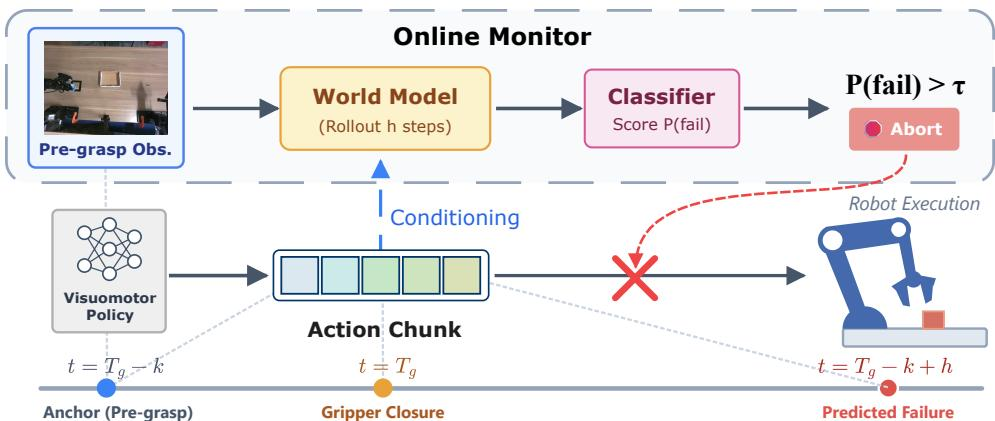
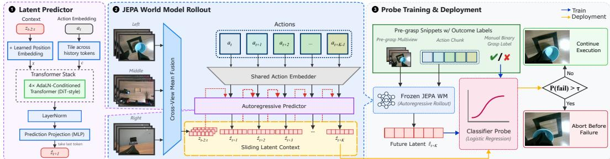
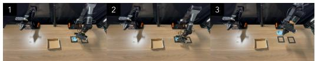
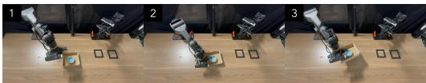
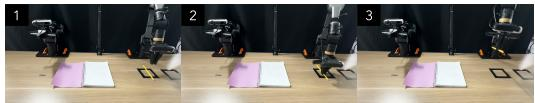
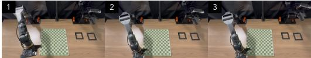
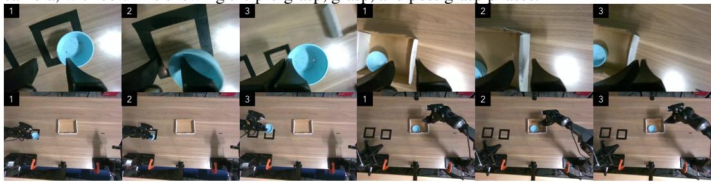
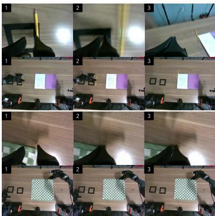

# ContactGuard: Pre-Contact Execution Monitoring with Action-Conditioned Latent World Models

Gehan Zheng1, Matthew Johnson-Roberson1, Weiming Zhi1,2,3∗†‡

Abstract: Contact-rich manipulation failures are often detected only after the robot has committed to contact. This is especially limiting in wrist-camera setups: close gripper–object views help observe contact, but a poor approach may already push, miss, slip, or disturb the object before conventional detectors react. We introduce ContactGuard, a pre-contact execution monitor for chunked visuomotor policies. Given the policy’s planned action chunk, ContactGuard predicts its short-horizon consequence in latent visual space and aborts if the predicted future latent indicates likely failure. Its latent world model is trained from unlabelled robot trajectories to predict compact multi-view visual embeddings under planned actions, avoiding pixel-level video prediction. A lightweight failure probe is then trained from a small labelled set of pre-contact clips. At deployment, ContactGuard anchors prediction before an imminent contact event, rolls the model forward under the policy’s own actions, and verifies the predicted post-contact latent. Across real-world contact-rich manipulation tasks, ContactGuard predicts failure more accurately than direct and corrupted-action ablations, and transfers to live robot as a pre-contact abort signal without modifying the underlying policy.

## 1 Introduction

Reliable manipulation requires more than visually plausible motion. In contact-rich tasks, small errors near contact can determine success or failure: the gripper may approach off-centre, nudge the object away, pinch only an edge, miss a deformable region, or close before the object is seated. These failures are difficult for visuomotor policies to avoid under occlusion, clutter, deformable objects, and distribution shift, and they are harder to correct once contact has disturbed the scene. This motivates pre-contact execution monitoring: instead of detecting whether the robot has already failed, the monitor asks whether the action it is about to execute is likely to fail. Chunked visuomotor policies make this question natural, because an action chunk often contains a meaningful interaction event, such as gripper closure or object contact. If the robot can evaluate the consequence of that chunk before contact, it can stop a poor interaction before committing to it.

A natural way to reason about future consequences is to learn a world model. For manipulation monitoring, however, the model need not generate photorealistic future frames. It only needs a representation that preserves outcome-relevant information: whether the planned interaction is likely to succeed or fail. We therefore use action-conditioned latent prediction, which encodes multi-view observations into compact visual embeddings and learns how those embeddings evolve under robot actions. This follows the Joint-Embedding Predictive Architecture (JEPA) principle [1], where a predictor is trained to forecast the embedding of a target signal rather than reconstruct it in pixel space; predicting directly in representation space avoids the cost and ambiguity of pixel-level video generation. We introduce ContactGuard, a pre-contact monitor built on this principle. A latent world model is trained from unlabelled robot trajectories using next-latent supervision; after training, its encoder and predictor are frozen. A lightweight logistic-regression probe is then trained on labelled pre-contact clips using only the predicted future latent, separating task-agnostic visual dynamics learning from small-data outcome supervision.

  
Figure 1: Pre-contact online monitoring via action-conditioned latent world models. While a visuomotor policy executes an action chunk, ContactGuard conditions a frozen latent world model on the same planned chunk at an anchor k steps before the planned gripper closure $T _ { g } .$ It rolls the model forward h steps and scores the predicted future latent with a lightweight classifier. If $P ( \mathrm { f a i l } ) > \tau$ , execution is aborted before contact: the decision is made at $T _ { g } - k$ and targets the post-contact moment $T _ { g } - k + h ,$ , so foreseen failures can be prevented rather than merely detected.

At deployment, ContactGuard runs alongside an existing chunked visuomotor policy as a policydecoupled predictive verifier. The deployed policy is treated as a black-box proposer: ContactGuard consumes only the current observation and the concrete action chunk already emitted by the policy, without accessing policy internals or requiring joint training. It scans the upcoming chunk for an imminent contact event, anchors prediction shortly before that event, rolls the independently trained latent world model forward under the proposed actions, and applies the frozen probe to the predicted post-contact latent. The system aborts before contact if that specific chunk is likely to lead to failure; otherwise the policy continues unchanged.

Our experiments test whether this action-conditioned future latent contains failure information unavailable from the current observation or planned action alone. Across real-world contactrich manipulation tasks, predicted future latents improve failure prediction over current-latent and corrupted-action ablations. These results suggest that latent world models can serve not only as planning or representation-learning modules, but also as practical execution monitors for preventing likely failures before physical contact.

Our contributions are:

• We formulate pre-contact execution monitoring for chunked visuomotor policies, where the robot evaluates the likely consequence of an imminent contact action before committing.

• We introduce ContactGuard, an action-conditioned latent world-model monitor that rolls out compact multi-view visual embeddings under the policy’s planned action chunk.

• We show that predicted future latents provide failure information beyond current observations and raw planned actions, through current-latent and corrupted-action ablations.

• We demonstrate live real-robot pre-contact aborts without candidate action search, pixellevel video prediction, or modification of the underlying visuomotor policy.

## 2 Related Work

Latent world models for robot manipulation: Learning compact dynamics from pixels is central to model-based RL [2, 3]. Dreamer [4, 5] imagines trajectories in latent space for policy learning, while TD-MPC [6] learns task-oriented latent dynamics for model-predictive control. Latent forward models have also been used for visuomotor trajectory optimisation [7], and action-conditioned video prediction for model-predictive manipulation [8]. Recent learned simulators and generative world models extend this direction to richer visual and interaction rollouts for planning, policy learning, and data generation [9, 10]. Most closely related is LeWorldModel [11], which trains an end-to-end latent world model with next-embedding prediction and an anti-collapse Gaussian regulariser. We adopt this latent-prediction perspective, but use it for pre-contact failure monitoring rather than planning or policy learning. In contact-rich manipulation, small changes around contact can decide whether an object is nudged, slips, or remains inside the gripper. We therefore ask whether action-conditioned future latents preserve enough outcome information to predict failure before contact occurs.

Failure prediction and execution monitoring: Robust robot deployment has motivated visual and vision-language detectors for manipulation success and failure [12, 13], as well as robotic reward models learned from comparisons or large reward datasets [14, 15]. Other methods monitor trajectory rarity [16], or monitor learned policies during execution: FIPER predicts failures of generative robot policies, while FAIL-Detect detects runtime distribution shift from successful demonstrations [17, 18]; RND provides another success-only novelty signal [19], and SAFE learns a supervised failure detector across manipulation tasks [20]. Recent work on out-of-distribution metrics for visuomotor policies enables accurate failure prediction, these include Rewind-IL [21] and PATCH [22]. Additionally, closely related are SIRIUS and Sirius-Fleet. SIRIUS jointly trains its policy and latent dynamics model in a shared latent embedding space and alternates the policy and dynamics model to simulate future policy rollouts for runtime monitoring [23]. Sirius-Fleet similarly uses visual world-model predictions for failure monitoring in multi-task interactive robot learning [24]. We therefore do not claim imagined future-state monitoring itself as novel. ContactGuard addresses a different deployment interface: the underlying policy remains an external black-box proposer, while an independently trained world model verifies the concrete action chunk already proposed by that policy at a pre-contact commitment point and may veto it before scene-changing contact. This separates predictive verification from policy training and makes the monitor attachable to an otherwise unchanged visuomotor policy. For grasping, prior work has also studied early failure prediction with sequence models and interactive visual predictors, where the robot probes or partially executes an action before completing a pick [25]. ContactGuard instead predicts failure before contact by rolling the proposed action chunk from a pre-contact observation to a predicted post-contact latent.

Chunked visuomotor policies and test-time verification: Imitation learning [26, 27, 28] enables motion generation without requiring structured motion planning [29]. In imitation learning, action chunks are a natural unit for short-horizon visuomotor prediction. ACT [30] predicts action sequences with a transformer policy, while Diffusion Policy [31] generates chunks through conditional denoising. These chunks often contain meaningful interaction events such as approach, gripper closure, and lift, making them suitable for consequence prediction before execution, especially over long horizons [32]. Recent methods use learned rewards or world models to score multiple candidate actions for test-time verification [33] or post-training [34, 35]. ContactGuard addresses a different setting: it does not search over candidate chunks or modify the action generator. It monitors the single chunk proposed by an existing policy and uses the predicted future latent as a pre-contact failure signal.

## 3 Latent World Models for Pre-Contact Grasp Monitoring

We present ContactGuard, a pre-contact grasp monitor that predicts whether an imminent grasp is likely to fail before the gripper closes. It combines a JEPA-style latent world model with a frozen linear failure probe. The world model is trained from unlabelled robot trajectories to predict actionconditioned future latents; the probe is trained from a smaller labelled grasp set to score the predicted post-contact latent. At deployment, the frozen model and probe run alongside a visuomotor policy and abort execution when the planned action chunk is predicted to fail.

We first define the world model and probe data, then describe the LeWM-style latent predictor, its multi-view architecture, the failure probe, and the online pre-contact monitor.

  
Figure 2: ContactGuard overview. A shared multi-view encoder maps camera observations to a latent context. An action-conditioned predictor rolls this context forward under the policy’s planned action chunk to produce future latents $\hat { z } _ { t + 1 : t + K }$ . A lightweight probe is trained offline on labelled pre-contact clips and used online to score the predicted post-contact latent $\hat { z } _ { t + K }$ . If the predicted failure probability exceeds threshold τ, execution is aborted before contact. Training uses teacherforced next-latent prediction; inference uses autoregressive rollout.

## 3.1 Problem Setting and Data

ContactGuard separates unlabelled latent dynamics learning from small-data outcome supervision. The world-model dataset contains robot trajectories

$$
\begin{array} { r } { \mathcal { D } _ { \mathrm { w m } } = \left\{ \left( o _ { 1 : T _ { n } } ^ { 1 : V } , a _ { 1 : T _ { n } } \right) _ { n } \right\} _ { n = 1 } ^ { N } , } \end{array}\tag{1}
$$

where $o _ { t } ^ { 1 : V }$ are synchronised observations from V fixed cameras and $a _ { t } \in \mathbb { R } ^ { d }$ is the joint-space action. No grasp-success labels are used to train the world model.

The probe dataset $\mathcal { D } _ { \mathrm { p r o b e } }$ contains labelled pre-contact grasp clips. Each clip includes a short multiview history $o _ { t - C + 1 : t } ^ { 1 : V } ,$ the planned action chunk $\scriptstyle a _ { t : t + K - 1 }$ , and a binary label $y \in \{ 0 , 1 \}$ , where $y { = } 1$ denotes failure. After the world model is frozen, the probe learns to map the predicted future latent to failure likelihood.

## 3.2 Background: LeWM-style Latent Prediction

Figure 2 shows the ContactGuard architecture; at its core lies a latent JEPA model [11]. A visual encoder $E _ { \phi }$ maps an observation to a latent embedding $z _ { t } = E _ { \phi } ( o _ { t } ) \in \mathbb { R } ^ { D }$ , and an action-conditioned causal predictor $P _ { \theta }$ predicts the next latent from a length-C context:

$$
\hat { z } _ { t + 1 } = P _ { \theta } \big ( z _ { t - C + 1 : t } , a _ { t } \big ) .\tag{2}
$$

The predictor is a causal Transformer conditioned on actions through AdaLN-zero modulation. It is trained with next-embedding regression and the SIGReg anti-collapse regulariser [11], which encourages the latent distribution to match a standard Gaussian on random projections. We reuse this encoder–predictor interface, but adapt it to multi-view observations, action-aligned prediction windows, and downstream pre-contact failure readout.

## 3.3 Multi-View Latent World Model

At each time step, the V camera observations are encoded independently by a shared ViT-Tiny. The per-view embeddings are mean-pooled and passed through a learned linear projection to produce a single latent $z _ { t } \in \mathbb { R } ^ { D }$ . This keeps the latent dimension fixed as the number of cameras changes, while allowing informative views to compensate for partial occlusions. A shared action embedder maps each joint-space action $a _ { t } \in \mathbb { R } ^ { d }$ into the same D-dimensional space. The predictor consists of four AdaLN-zero-conditioned Transformer blocks followed by a two-layer prediction MLP. We denote the full Transformer-plus-projection module by $P _ { \theta }$ . During training, $P _ { \theta }$ is supervised with teacher-forced one-step transitions over a context window of C frames and L rollout targets per sample. At deployment, the same predictor is rolled out autoregressively for K steps under the planned action chunk.

We train $P _ { \theta }$ with the same action-conditioned one-step interface used during rollout. Let $z _ { 0 } , \dots , z _ { C + L - 1 }$ be the latents in a training window and let $u _ { i }$ be the action that drives the transition from frame $i + C - 1$ to frame $i { + } C _ { }$ . For each supervised step $i \in \{ 0 , \ldots , L - 1 \}$ , the predictor receives a length-C real-latent context and the aligned action:

$$
\hat { z } _ { i + C } = P _ { \theta } \left( z _ { i : i + C - 1 } , u _ { i } \right) .\tag{3}
$$

The objective is next-latent regression with SIGReg regularisation:

$$
\mathcal { L } = \frac { 1 } { L } \sum _ { i = 0 } ^ { L - 1 } \big \| \hat { z } _ { i + C } - z _ { i + C } \big \| _ { 2 } ^ { 2 } + \lambda \mathcal { L } _ { \mathrm { r e g } } .\tag{4}
$$

Thus each training target matches one inference-time rollout step. Training uses teacher-forced real latents in the sliding context, while deployment replaces future context entries with predicted latents during autoregressive rollout.

## 3.4 Linear Failure Probe on Predicted Latents

The world model is task-agnostic. After training, we freeze $E _ { \phi }$ and $P _ { \theta }$ and use the K-step predicted latent as the feature for a lightweight failure readout. For each labelled clip, we anchor the rollout at $t = T _ { g } - k _ { \mathrm { p r e } }$ , unroll the frozen predictor for K steps under the recorded action chunk, and use $\hat { z } _ { t + K }$ as the probe input. We set $K > k _ { \mathrm { p r e } }$ so that the readout lies shortly after the planned gripper closure, where success or failure is more likely to be expressed in the latent.

Each feature is standardised using training-split statistics, $\tilde { z } _ { t + K } = ( \hat { z } _ { t + K } - \mu ) / \sigma$ , and scored by a linear logistic probe:

$$
P ( \operatorname { f a i l } \mid \hat { z } _ { t + K } ) = \sigma \big ( \boldsymbol { w } ^ { \top } \tilde { z } _ { t + K } + b \big ) .\tag{5}
$$

The probe parameters are fit on the training data with an $\ell _ { 2 } \cdot$ -penalised, class-balanced logistic loss:

$$
\operatorname* { m i n } _ { w , b } \ \frac { 1 } { 2 } \| w \| _ { 2 } ^ { 2 } + \rho \sum _ { i = 1 } ^ { N } s _ { y _ { i } } \log \bigl ( 1 + \exp \bigl ( - ( 2 y _ { i } - 1 ) ( w ^ { \top } \tilde { z } _ { i } + b ) \bigr ) \bigr ) , \qquad s _ { c } = \frac { N } { 2 N _ { c } } .\tag{6}
$$

Here $N _ { c }$ is the number of samples from class $c ,$ and the class weights compensate for success/failure imbalance. The same frozen $( w , b )$ are used for all test-set and online evaluations.

## 3.5 Online Pre-Contact Grasp Monitor

The offline failure score becomes an online gate evaluated before a task-defined imminent contact event. ContactGuard separates triggering from evaluation: a lightweight, task-specific trigger decides when the monitor should run, while the action-conditioned latent predictor decides whether the planned chunk should continue or be vetoed. In this paper, we instantiate the trigger for grasp closure using the commanded gripper open-to-close transition, a policy-agnostic cue that requires no learning; designing general-purpose triggers for other contact events is orthogonal to our contribution. The monitor runs alongside a chunked visuomotor policy such as ACT [30] and maintains the last C multi-view observations and upcoming actions. Each control step follows four stages.

Trigger: Scan the upcoming chunk for the first open-to-close gripper transition, and denote its offset by g. If no closure is found, continue execution. Anchor: Activate the monitor when the planned closure is at most $k _ { \mathrm { p r e } }$ frames ahead, matching the pre-contact offset used for probe training. Rollout and score: Encode the observation history with $E _ { \phi } .$ , roll out $P _ { \theta }$ for K steps under the planned actions, and apply the frozen probe to $\hat { z } _ { t + K }$ . Abort decision: If $P ( \mathrm { f a i l } ) > \tau$ , abort before the gripper closes; otherwise continue the policy unchanged. The threshold τ is selected once per task on the validation split and then frozen for test-set and real-robot evaluations. Because the policy executes action chunks, the monitor runs within the chunk execution window and does not stall control unless an abort is issued.

(a) Pick-and-place (cup)  
  
(c) Pencil-and-notebook

(b) Pick-and-place (box)  
  
(d) Towel-fold

Figure 3: Evaluated tasks. Each panel shows a representative successful rollout from the middle camera, with columns showing the pre-grasp, grasp, and post-grasp phases.  
  
(a) Pick-and-place (cup)  
(b) Pick-and-place (box)  
Figure 4: Real-robot qualitative examples on the pick-and-place tasks. Each panel shows a live rollout that our monitor classifies correctly: top row is the grasping arm’s wrist camera, bottom row the middle-view camera, with columns showing the pre-grasp, grasp, and post-grasp frames.

## 4 Experimental Results

We instantiate ContactGuard on grasp closure, a canonical short-horizon imminent-contact event with challenging visual geometry, occlusion, object variation, and a strict real-time pre-contact budget. We evaluate four grasp settings with ACT [30] as the underlying chunked visuomotor policy. All metrics evaluate the predictor’s decision at the triggered pre-contact state, not the trigger itself or post-abort recovery. Our experiments ask four questions:

1. Prediction quality. Can predicted future latents anticipate execution outcomes better than single-view world models, current-state monitoring, and established runtime failure detectors?

2. Information source. Does the signal arise from the imagined consequence of the specific proposed action, rather than from the current observation, visual shortcuts, or generic motion cues?

3. Robot-state fusion. Does adding proprioceptive state improve grasp-relevant latent prediction?

4. Runtime. Is the forecast fast enough for the pre-contact window before gripper closure?

## 4.1 Experimental Setup

Robot, tasks, and data: All experiments use a 14-DoF AgileX Piper dual-arm robot with three synchronized RGB cameras. We evaluate four labelled grasp settings: cup and box grasps in pickand-place, pencil grasping in pencil-and-notebook, and towel grasping in towel-fold. These settings require precise end-effector–object alignment near contact, where small approach errors cause missed grasps, slips, or object disturbance. The world model is trained on unlabelled real-robot trajectories from ACT rollouts and human teleoperation. For downstream evaluation, we extract grasp attempts, assign binary success/failure labels, and define $T _ { g }$ as the first gripper-command frame crossing the closure threshold. Each labelled set contains roughly 250 attempts; test episodes are collected separately and excluded from world-model training, probe fitting, threshold selection, and ablation tuning.

Table 1: We report precision, recall, false-abort rate (FAR= FP/(FP+TN); lower is better), ROC AUC, and balanced accuracy over realized P(fail) scores from N=50 monitored rollouts per grasp setting.
<table><tr><td>Task</td><td>Method</td><td>Precision</td><td>Recall</td><td>FAR↓</td><td>AUC</td><td>Bal. Acc.</td></tr><tr><td>Cup</td><td>Direct-linear</td><td>0.545</td><td>0.960</td><td>0.800</td><td>0.661</td><td>0.580</td></tr><tr><td rowspan="4">Box</td><td>LeWM</td><td>0.706</td><td>0.960</td><td>0.400</td><td>0.928</td><td>0.780</td></tr><tr><td>Ours</td><td>0.893</td><td>1.000</td><td>0.120</td><td>0.992</td><td>0.940</td></tr><tr><td>Direct-linear</td><td>0.647</td><td>0.500</td><td>0.214</td><td>0.619</td><td>0.643</td></tr><tr><td>LeWM</td><td>0.857</td><td>0.818</td><td>0.107</td><td>0.933</td><td>0.856</td></tr><tr><td rowspan="3">Pencil</td><td>Ours</td><td>0.864</td><td>0.864</td><td>0.107</td><td>0.946</td><td>0.878</td></tr><tr><td>Direct-linear</td><td>0.468</td><td>1.000</td><td>0.893</td><td>0.732</td><td>0.554</td></tr><tr><td>LeWM Ours</td><td>0.679 0.889</td><td>0.864 0.727</td><td>0.321</td><td>0.872</td><td>0.771</td></tr><tr><td rowspan="3">Towel</td><td></td><td></td><td></td><td>0.071</td><td>0.898</td><td>0.828</td></tr><tr><td>Direct-linear LeWM</td><td>0.759</td><td>0.880</td><td>0.280</td><td>0.841</td><td>0.800</td></tr><tr><td>Ours</td><td>0.750 0.786</td><td>0.600 0.880</td><td>0.200 0.240</td><td>0.794 0.917</td><td>0.700 0.820</td></tr></table>

  
Figure 5: Qualitative examples on the pencil-and-notebook and towel-fold tasks. Each panel shows a rollout that is classified correctly.

Table 2: External detector and matched current-state comparison. ROC AUC on larger offline grasp pools (n=101/126/103/144 for Cup/Box/Pencil/Towel). Supervised rows report mean±std over five seeded stratified 5-fold cross-validation runs. Current latent uses the same encoder, labels, probe, pools, and CV protocol as ContactGuard but omits imagined future latents.
<table><tr><td>Detector</td><td>Cup</td><td>Box</td><td>Pencil</td><td>Towel</td></tr><tr><td>FAIL-Detect</td><td>.813</td><td>.219</td><td>.533</td><td>.448</td></tr><tr><td>RND</td><td>.840</td><td>.211</td><td>.671</td><td>.417</td></tr><tr><td>SAFE</td><td>.840±.009</td><td>.925±.006</td><td>.844±.016</td><td> $. 8 7 1 { \pm } . 0 1 7$ </td></tr><tr><td>Current latent</td><td>.840±.008</td><td>.893±.008</td><td>.923±.010</td><td> $. 8 7 1 { \pm } . 0 1 5$ </td></tr><tr><td>ContactGuard .982±.003 .984±.005 .992±.001 .978±.004</td><td></td><td></td><td></td><td></td></tr></table>

Models and baselines: Our primary comparisons isolate both the value of latent imagination and the relationship to established runtime failure detectors. Ours is the multi-view ContactGuard predictor that mean-pools the three camera latents before action-conditioned rollout. LeWM [11] is a capacity-matched single-camera world model trained on the same unlabelled trajectories. Directlinear bypasses rollout and predicts failure directly from the anchor latent $z _ { t }$ and planned action chunk using the same frozen multi-view encoder. Current latent is a tightly matched imagination ablation: it uses the same encoder, labels, probe family, data pools, and cross-validation protocol as ContactGuard, but replaces the predicted future latent with the current latent $z _ { t } .$ . We additionally evaluate FAIL-Detect [18], RND [19], and SAFE [20] at the same gripper-closure trigger. FAIL-Detect and RND provide success-only uncertainty/novelty references, whereas SAFE provides an external supervised failure-detection reference. The proprioceptive LeWM,+,state variant additionally fuses a 28-dimensional vector of joint positions and efforts. All world-model variants use capacity-matched encoder and predictor backbones with the same SIGReg regularizer. Appendix B reports nonlinear Direct probes on the same $( z _ { t } , a )$ inputs; despite hyperparameter tuning and early stopping, they generalize poorly and are unstable on the small labelled probe sets.

Forecasting and probing: At evaluation, the monitor triggers when gripper closure is expected within $k _ { \mathrm { p r e } } { = } 1 5$ frames. We anchor 0.5 s before closure and roll out the world model for K=30 steps, reaching 0.5 s after closure at 30 Hz. A frozen $\ell _ { 2 } { \mathrm { - r e g u l a r i z e d } }$ logistic-regression probe maps $\hat { z } _ { t + K }$ to $P ( \mathrm { f a i l } )$ . The probe is trained on the train split, selected on validation, and fixed for all test and real-robot results. Since the anchor precedes closure, the probe cannot rely on visible closure and must use the action-conditioned latent rollout.

Closed-loop real-robot evaluation: We deploy ContactGuard with ACT using the same trigger, forecast horizon, frozen probe, and per-task threshold τ. For evaluation, when the monitor would abort $( P ( \mathrm { f a i l } ) { > } \tau )$ the robot pauses 5 s with the gripper open and then resumes the remaining chunk to record the would-be outcome; unflagged trials run to completion. Since the pause precedes contact, the resumed attempt is a controlled counterfactual proxy for the abort decision. We collect $N { = } 5 0$ live monitored ACT rollouts per setting, with all methods evaluated on the same pre-contact observations and planned chunks. Full operating points are reported in Appendix C.

Table 3: Action-conditioning information ablations. Current latent replaces $\hat { z } _ { t + K }$ with $z _ { t } ;$ Shuffled, Zero, and Mean corrupt the action chunk before rollout.
<table><tr><td>Task</td><td>Full</td><td>Current</td><td>Shuffled</td><td>Zero</td><td>Mean</td></tr><tr><td>Cup</td><td>0.965</td><td>0.758</td><td>0.535</td><td>0.847</td><td>0.842</td></tr><tr><td>Box</td><td>0.956</td><td>0.844</td><td>0.493</td><td>0.494</td><td>0.631</td></tr><tr><td>Pencil</td><td>0.845</td><td>0.829</td><td>0.483</td><td>0.559</td><td>0.541</td></tr><tr><td>Towel</td><td>0.959</td><td>0.801</td><td>0.493</td><td>0.659</td><td>0.417</td></tr></table>

Table 4: Inference time on RTX 5090. Rollout reports the rollout alone; Full reports encode + rollout + classifier.
<table><tr><td>K</td><td>Horizon (s)</td><td>Rollout (ms)</td><td>Full (ms)</td></tr><tr><td>5</td><td>0.17</td><td>2.73</td><td>6.53</td></tr><tr><td>15</td><td>0.50</td><td>7.90</td><td>11.56</td></tr><tr><td>25</td><td>0.83</td><td>13.01</td><td>16.63</td></tr><tr><td>30</td><td>1.00</td><td>15.39</td><td>19.18</td></tr></table>

## 4.2 Closed-Loop Grasp-Outcome Prediction

Table 1 reports closed-loop metrics from live rollouts; the world model, probe, and per-task threshold are frozen beforehand. All subsequent diagnostic tables use held-out offline replay splits.

Multi-view vs. single-view (Table 1): Multi-view fusion improves both balanced accuracy and AUC over the single-view LeWM baseline across all four tasks. The gain is largest on Towel, where the gripper–cloth contact region is frequently occluded from any single viewpoint, and smallest on Box, where the single-view baseline is already strong. Pencil yields our model’s lowest absolute AUC, consistent with its training trajectories covering only a narrow band of grasp poses so that additional viewpoints add little headroom.

Direct prediction without imagination: The Direct-linear baseline receives both the same frozen anchor latent and the planned action chunk, but must learn the outcome mapping directly from the small labelled probe set. It trails ContactGuard in AUC on every live task and often produces poorly separated scores, leading to excessive false aborts at the selected threshold. Together with the matched Current latent comparison in Table 2, this separates two effects: the gain does not come merely from access to the current representation or planned actions; rolling those actions through the pretrained latent dynamics produces a substantially more decision-ready failure representation.

External failure detectors (Table 2): On the larger offline pools, ContactGuard achieves the highest AUC on all four tasks. The comparison to Current latent is particularly diagnostic: both methods use the same encoder, labels, linear probe family, data pools, and cross-validation protocol, differing only in whether the probe reads the current latent or the action-conditioned imagined future. ContactGuard improves AUC on every task, with paired bootstrap 95% confidence intervals for the difference excluding zero. This is an ablation of imagined consequences, rather than an attempted reproduction of SIRIUS. Against external references, ContactGuard also outperforms SAFE on every task, while FAIL-Detect and RND are not consistently aligned with failure risk in this pre-contact setting.

Per-task abort behaviour (Table 1): Behind these aggregate scores, the four tasks abort in distinct ways. Cup behaves best, with realised P(fail) scores that cleanly rank true failures above true successes and residual errors concentrated near the decision boundary. Towel trades precision for coverage: it catches most failures, but has the highest false-abort rate among the four tasks. Pencil is asymmetric in the opposite direction: it rarely aborts a successful grasp, but a non-trivial fraction of failures score inside the success range and slip through, giving it the weakest recall, consistent with the narrow grasp-pose training coverage that also leaves it the hardest task by AUC.

## 4.3 Offline Diagnostics: What Information Does the Monitor Use?

We now ask why the monitor works: does proprioceptive state help, and does the signal come from the rolled-out latent and aligned actions? Action-corruption variants cannot run on the robot, so Tables 5 and 3 report offline open-loop replay on the held-out test split at K=30.

Proprioceptive input (Table 5): We compare single-view LeWM with vs. without the 28-d robot state. Counter to the usual intuition, dropping the state improves test AUC on all four tasks. We read this as naive state fusion acting as a domain-specific shortcut in our small-data regime, displacing grasp-relevant visual dynamics; we do not claim proprioception is harmful under richer fusion or larger datasets.

Action and latent information (Table 3): We next test whether ContactGuard scores the consequence of the specific pending action, rather than merely recognizing a risky pre-contact state. Replacing $\hat { z } _ { t + K }$ with the current anchor latent $z _ { t }$ reduces AUC, especially on Cup, Box, and Towel. Corrupting the proposed actions provides a stronger intervention: shuffling action chunks across episodes collapses AUC to near chance on all four tasks, while zero and mean actions also remain below the correctly aligned rollout.

We additionally perform a counterfactual action-swap test while holding the observation fixed. For each successful pre-contact anchor, we replace only its planned chunk with a same-task action chunk logged from a failed attempt at the same trigger. The predicted failure probability increases by $+ 0 . 2 5 / + 0 . 3 3 / + 0 . 5 6 / +$ 0.65 on Cup/Box/Pencil/Towel, respectively, whereas an actionfree current-latent probe is invariant to the swap. Thus the monitor is not simply identifying observations that “look risky”: its verdict changes when the proposed action changes while the visual state is held fixed.

<table><tr><td rowspan=1 colspan=1>Table 5: Proprioceptive abla-</td></tr><tr><td rowspan=1 colspan=1>tion: held-out AUC for the</td></tr><tr><td rowspan=1 colspan=1>single-view model with vs.</td></tr><tr><td rowspan=1 colspan=1>without robot state (K=30).</td></tr><tr><td rowspan=1 colspan=1>Task   w/ state  img-only</td></tr><tr><td rowspan=1 colspan=1>Cup     0.660     0.920Box     0.775     0.931Pencil   0.455     0.878</td></tr><tr><td rowspan=1 colspan=1>Towel   0.630    0.882</td></tr></table>

Pencil remains the task where the held-out current-latent ablation is closest to the full rollout, consistent with its narrow grasp-pose coverage; however, the action-swap intervention shows that the learned predictor still responds strongly to which action is about to be executed.

Runtime Analysis: Online monitoring must return a verdict before the gripper reaches the candidate grasp frame. We benchmark the deployed JEPA model, using a ViT-Tiny encoder and 4-layer transformer predictor, on a single NVIDIA RTX 5090 in FP32 at the deployment input shape; perhorizon costs are reported in Table 4. History encoding is a one-shot cost shared across rollout horizons, while rollout latency scales nearly linearly with K because the predictor autoregressively unrolls over cached context tokens. Peak CUDA memory is dominated by encoder activations and remains essentially independent of K, since each rolled-out latent is only D-dimensional. At the deployed horizon, the full encode–rollout–probe pass fits comfortably within the pre-closure slack, so the monitor does not bottleneck control.

## 5 Conclusions, Limitations, and Future Work

We presented ContactGuard, a real-time, policy-decoupled predictive verifier for pre-contact manipulation. An independently trained action-conditioned latent world model evaluates the concrete action chunk proposed by an otherwise unchanged visuomotor policy and scores its predicted postcontact consequence with a lightweight failure probe. Across four real-world grasp settings, ContactGuard outperforms matched current-state monitoring and the tested external runtime failure detectors. Holding the observation fixed while replacing only the proposed action also changes the predicted failure probability substantially, confirming that the monitor responds to the pending action rather than only to static visual risk. These results support action-conditioned latent imagination as a practical substrate for vetoing likely failures before scene-changing contact.

Limitations: ContactGuard prevents failures by abstaining, but does not recover from them or complete the task after an abort. Post-abort task completion requires an external recovery module, which we leave for future work. ContactGuard targets imminent contact events whose outcome is determined within the next action chunk; extending it to longer-horizon skills would require hierarchical or repeated event-level monitoring.

Future work: Future work can close the loop after an abort by selecting a new action chunk, replanning from the preserved scene, or coupling the monitor with multi-sample policies such as Diffusion [31], Flow Matching [36], or Streaming [37] policies.

## References

[1] M. Assran, Q. Duval, I. Misra, P. Bojanowski, P. Vincent, M. Rabbat, Y. LeCun, and N. Ballas. Self-Supervised Learning from Images with a Joint-Embedding Predictive Architecture. In 2023 IEEE/CVF Conference on Computer Vision and Pattern Recognition (CVPR). IEEE, 2023.

[2] D. Ha and J. Schmidhuber. World Models. Mar. 2018. arXiv:1803.10122.

[3] D. Hafner, T. Lillicrap, I. Fischer, R. Villegas, D. Ha, H. Lee, and J. Davidson. Learning Latent Dynamics for Planning from Pixels, June 2019. arXiv:1811.04551.

[4] D. Hafner, T. Lillicrap, J. Ba, and M. Norouzi. Dream to Control: Learning Behaviors by Latent Imagination, Mar. 2020. arXiv:1912.01603.

[5] D. Hafner, J. Pasukonis, J. Ba, and T. Lillicrap. Mastering Diverse Domains through World Models, Apr. 2024. arXiv:2301.04104.

[6] N. Hansen, X. Wang, and H. Su. Temporal Difference Learning for Model Predictive Control, July 2022. arXiv:2203.04955 [cs.LG].

[7] A. Srinivas, A. Jabri, P. Abbeel, S. Levine, and C. Finn. Universal Planning Networks: Learning Generalizable Representations for Visuomotor Control. In Proceedings of the 35th International Conference on Machine Learning, pages 4732–4741. PMLR, July 2018.

[8] C. Finn and S. Levine. Deep Visual Foresight for Planning Robot Motion, Mar. 2017. arXiv:1610.00696 [cs.LG].

[9] F. Zhu, H. Wu, S. Guo, Y. Liu, C. Cheang, and T. Kong. IRASim: A Fine-Grained World Model for Robot Manipulation, July 2025. arXiv:2406.14540 [cs.RO].

[10] L. Barcellona, A. Zadaianchuk, D. Allegro, S. Papa, S. Ghidoni, and E. Gavves. Dream to Manipulate: Compositional World Models Empowering Robot Imitation Learning with Imagination, Mar. 2025. arXiv:2412.14957 [cs.RO].

[11] L. Maes, Q. L. Lidec, D. Scieur, Y. LeCun, and R. Balestriero. LeWorldModel: Stable Endto-End Joint-Embedding Predictive Architecture from Pixels, Mar. 2026. arXiv:2603.19312 [cs.LG].

[12] Y. Du, K. Konyushkova, M. Denil, A. Raju, J. Landon, F. Hill, N. d. Freitas, and S. Cabi. Vision-Language Models as Success Detectors, Mar. 2023. arXiv:2303.07280.

[13] J. Duan, W. Pumacay, N. Kumar, Y. R. Wang, S. Tian, W. Yuan, R. Krishna, D. Fox, A. Mandlekar, and Y. Guo. AHA: A Vision-Language-Model for Detecting and Reasoning Over Failures in Robotic Manipulation, Oct. 2024. arXiv:2410.00371.

[14] A. Liang, Y. Korkmaz, J. Zhang, M. Hwang, A. Anwar, S. Kaushik, A. Shah, A. S. Huang, L. Zettlemoyer, D. Fox, Y. Xiang, A. Li, A. Bobu, A. Gupta, S. Tu, E. Biyik, and J. Zhang. Robometer: Scaling General-Purpose Robotic Reward Models via Trajectory Comparisons, May 2026.

[15] T. Lee, A. Wagenmaker, K. Pertsch, P. Liang, S. Levine, and C. Finn. RoboReward: General-Purpose Vision-Language Reward Models for Robotics, Jan. 2026. arXiv:2601.00675.

[16] H. Cheng, T. Zheng, Z. Ma, T. Zhang, M. Johnson-Roberson, and W. Zhi. Dose3: Diffusionbased unified out-of-distribution detection on SE(3) trajectories. IEEE Robotics and Automation Letters, 11(2), 2026.

[17] R. Romer, A. Kobras, L. Worbis, and A. P. Schoellig. Failure Prediction at Runtime for Gen-¨ erative Robot Policies, Oct. 2025. arXiv:2510.09459.

[18] C. Xu, T. K. Nguyen, E. Dixon, C. Rodriguez, P. Miller, R. Lee, P. Shah, R. Ambrus, H. Nishimura, and M. Itkina. Can we detect failures without failure data? In RSS, 2025.

[19] Y. Burda, H. Edwards, A. Storkey, and O. Klimov. Exploration by random network distillation. In ICLR, 2019.

[20] Q. Gu, Y. Ju, S. Sun, I. Gilitschenski, H. Nishimura, M. Itkina, and F. Shkurti. SAFE: Multitask failure detection for vision-language-action models. In NeurIPS, 2025.

[21] G. Zheng, S. Seenivasan, M. Johnson-Roberson, and W. Zhi. Rewind-il: Online failure detection and state respawning for imitation learning. arXiv preprint arXiv:2604.16683, 2026.

[22] Y. Zhou, R. Qiu, Y. Chen, J. Cui, and W. Zhi. Patch: Action-chunk-conditioned latent patch innovation monitoring for robot manipulation. arXiv preprint arXiv:2606.16690, 2026.

[23] H. Liu, S. Dass, R. Mart´ın-Mart´ın, and Y. Zhu. Model-based runtime monitoring with interactive il. In ICRA, 2024.

[24] H. Liu, Y. Zhang, V. Betala, E. Zhang, J. Liu, C. Ding, and Y. Zhu. Multi-task interactive robot fleet learning with visual world models. In CoRL, 2024.

[25] K. Damak, M. Boujelbene, C. Acun, A. Alvanpour, S. K. Das, D. O. Popa, and O. Nasraoui. Robot failure mode prediction with deep learning sequence models. Neural Computing and Applications, 37:4291–4302, Feb. 2025.

[26] W. Zhi, T. Lai, L. Ott, and F. Ramos. Diffeomorphic transforms for generalised imitation learning. In Learningfor Dynamics and Control Conference, L4DC, 2022.

[27] H. Ravichandar, A. S. Polydoros, S. Chernova, and A. Billard. Recent advances in robot learning from demonstration. Annual review of control, robotics, and autonomous systems, 2020.

[28] W. Zhi, H. Tang, T. Zhang, and M. Johnson-Roberson. Teaching periodic stable robot motion generation via sketch. IEEE Robotics and Automation Letters, 2025.

[29] W. Zhi, I. Akinola, K. van Wyk, N. Ratliff, and F. Ramos. Global and reactive motion generation with geometric fabric command sequences. In IEEE International Conference on Robotics and Automation, ICRA. IEEE, 2023.

[30] T. Z. Zhao, V. Kumar, S. Levine, and C. Finn. Learning Fine-Grained Bimanual Manipulation with Low-Cost Hardware, Apr. 2023. arXiv:2304.13705.

[31] C. Chi, Z. Xu, S. Feng, E. Cousineau, Y. Du, B. Burchfiel, R. Tedrake, and S. Song. Diffusion Policy: Visuomotor Policy Learning via Action Diffusion, Mar. 2024. arXiv:2303.04137.

[32] Z. Li, Y. Zhou, R. Qiu, H. Wu, G. Ren, and W. Zhi. Tripilot-ff: Coordinated whole-body teleoperation with force feedback. arXiv preprint arXiv:2602.09888, 2026.

[33] M. Dai, L. Liu, Y. Bai, Y. Liu, Z. Wang, R. SU, C. Chen, L. Lin, and X. Wu. RoVer: Robot Reward Model as Test-Time Verifier for Vision-Language-Action Model, Oct. 2025. arXiv:2510.10975 [cs.RO].

[34] X. Sun, Z. Xu, C. Cao, Z. Liu, Y. Sun, J. Pang, R. Zhang, Z. Yang, K. Pang, D. He, M. Yuan, and J. Chen. AtomVLA: Scalable Post-Training for Robotic Manipulation via Predictive Latent World Models, Mar. 2026. arXiv:2603.08519 [cs.RO].

[35] J. Tang and W. Zhi. Autointervene: Calibrated intervention for action-chunking imitation learning policies. arXiv preprint arXiv:2608.07065, 2026.

[36] Y. Lipman, R. T. Q. Chen, H. Ben-Hamu, M. Nickel, and M. Le. Flow matching for generative modeling. In The Eleventh International Conference on Learning Representations, 2023.

[37] J. Long, D. Liu, W. Cai, I. Manchester, and W. Zhi. Safe policies post-training: Constraining streaming flow models for adapting learned robot trajectory distributions. IEEE Robotics and Automation Letters, 11(9), 2026.

## A Implementation Details

Encoder and latent dimensions. Camera images are resized to 224×224 before encoding. Each view is processed independently by a shared ViT-Tiny (patch size 16), producing a D=192- dimensional per-view embedding. Cross-camera mean fusion and the subsequent learned linear projection preserve this 192-dimensional latent space throughout the rollout.

Action embedder. The per-step action embedder is a 1×1 temporal convolution followed by a two-layer MLP that maps each $\mathbb { R } ^ { \bar { d } }$ action to a 192-dimensional embedding.

Predictor. The autoregressive predictor stacks 4 AdaLN-zero conditioned causal Transformer blocks with 8 attention heads of dimension 64 and a feed-forward hidden size of 1024. The Prediction Projection head is a 2-layer MLP with hidden size 4D = 768.

Horizons. We use a training context window C=3 and training rollout length $L { = } 5 .$ . At deployment and offline probe evaluation the rollout horizon is K=30, with anchor offset $k _ { \mathrm { p r e } } { = } 1 5$ frames before the planned closure event (0.5 s at 30 hz), so the probe reads out $\hat { z } _ { t + K }$ at $T _ { g } + 1 5$ frames (0.5 s post-closure).

Training objective and optimizer. The total loss is the per-step MSE of Eq. (4) plus SIGReg with weight λ=0.09, computed with 512 random projections and 17 quadrature knots. All world-model variants are trained for 100 epochs with AdamW (learning rate $5 \times 1 0 ^ { - 5 }$ , weight decay $1 0 ^ { - 3 } )$ , a cosine learning-rate schedule, batch size 64, gradient clipping at 1.0, and mixed-precision training.

Probe. The logistic regression probe of Eq. (6) uses $\ell _ { 2 }$ regularization with $\rho { = } 1$ and class-balanced reweighting. Per-dimension standardization is fit on the train split only and applied to validation, test, and online inputs.

Table 6: Supplementary offline classifier comparison on the per-task split. Each row reports test ROC AUC and test balanced accuracy, with thresholds selected by Youden-J on the validation split. Direct-linear and Direct-MLP variants share ContactGuard’s frozen multi-view encoder but bypass the world-model rollout, classifying directly from the anchor latent $z _ { t }$ and planned action chunk; “small” and “large” denote the validation-selected 2- and 3-layer MLPs. This supplementary split is separate from the live real-robot rollout set in Table 8; values are therefore not expected to match the deployment-table AUCs exactly.

<table><tr><td>Task (split)</td><td>Model</td><td>test AUC</td><td>test bal-acc</td></tr><tr><td rowspan="5">Cup</td><td>Ours</td><td>0.965</td><td>0.918</td></tr><tr><td>LeWM</td><td>0.920</td><td>0.774</td></tr><tr><td>Direct-linear</td><td>0.618</td><td>0.596</td></tr><tr><td>Direct-MLP small</td><td>0.497</td><td>0.671</td></tr><tr><td>Direct-MLP large</td><td>0.705</td><td>0.540</td></tr><tr><td rowspan="5">Box</td><td>Ours</td><td>0.956</td><td>0.889</td></tr><tr><td>LeWM</td><td>0.931</td><td>0.868</td></tr><tr><td>Direct-linear</td><td>0.452</td><td>0.484</td></tr><tr><td>Direct-MLP small</td><td>0.639</td><td>0.602</td></tr><tr><td>Direct-MLP large</td><td>0.666</td><td>0.626</td></tr><tr><td rowspan="5">Pencil</td><td>Ours</td><td>0.845</td><td>0.745</td></tr><tr><td>LeWM</td><td>0.878</td><td>0.777</td></tr><tr><td>Direct-linear</td><td>0.684</td><td>0.503</td></tr><tr><td>Direct-MLP small</td><td>0.705</td><td>0.591</td></tr><tr><td>Direct-MLP large</td><td>0.437</td><td>0.483</td></tr><tr><td rowspan="5">Towel</td><td>Ours</td><td>0.959</td><td>0.886</td></tr><tr><td>LeWM</td><td>0.882</td><td>0.741</td></tr><tr><td>Direct-linear</td><td>0.888</td><td>0.777</td></tr><tr><td>Direct-MLP small</td><td>0.625</td><td>0.605</td></tr><tr><td>Direct-MLP large</td><td>0.839</td><td>0.758</td></tr></table>

Table 7: Validation-selected Direct-MLP hyperparameters per task and architecture class. Selection is by internal validation AUC within each architecture class over hidden {32, 64, 128}, dropout {0, 0.2, 0.5}, weight decay $\{ 1 0 ^ { - 4 } , 1 0 ^ { - 3 } , 1 0 ^ { - 2 } \}$ . Small=1 hidden layer, large=2 hidden layers.
<table><tr><td>Variant</td><td>Task</td><td>hidden</td><td>dropout</td><td>weight decay</td></tr><tr><td rowspan="4">Direct-MLP small</td><td>Cup</td><td>32</td><td>0.5</td><td> $1 0 ^ { - 4 }$ </td></tr><tr><td>Box</td><td>32</td><td>0.0</td><td> $1 0 ^ { - 4 }$ </td></tr><tr><td>Pencil</td><td>32</td><td>0.2</td><td> $1 0 ^ { - 4 }$ </td></tr><tr><td>Towel</td><td>32</td><td>0.5</td><td> $1 0 ^ { - 4 }$ </td></tr><tr><td rowspan="4">Direct-MLP large</td><td>Cup</td><td>32</td><td>0.0</td><td> $1 0 ^ { - 4 }$ </td></tr><tr><td>Box</td><td>32</td><td>0.0</td><td> $1 0 ^ { - 4 }$ </td></tr><tr><td>Pencil</td><td>32</td><td>0.2</td><td> $1 0 ^ { - 4 }$ </td></tr><tr><td>Towel</td><td>64</td><td>0.0</td><td> $1 0 ^ { - 3 }$ </td></tr></table>

## B Nonlinear Direct Variants

We also evaluated nonlinear Direct probes that use the same inputs as the linear Direct baseline: the frozen anchor latent $z _ { t }$ concatenated with the planned action chunk $a _ { t : t + K - 1 }$ . We swept 2- and 3- layer MLPs (counting linear layers; “small” = 1 hidden layer, “large” = 2 hidden layers) with hidden widths in {32, 64, 128}, dropout in {0, 0.2, 0.5}, and weight decay in $\{ 1 0 ^ { - 4 } , 1 0 ^ { - \mathrm { { 3 } } } , 1 0 ^ { - 2 } \}$ , trained with Adam at learning rate $1 0 ^ { - 3 }$ and early stopping (patience 20) on validation AUC. Table 6 shows that these higher-capacity direct probes do not improve held-out performance: their test AUC is unstable and below ContactGuard across all four tasks. This supports our small-data design choice: rather than learning a nonlinear mapping from $( z _ { t } , a )$ directly to grasp outcome, ContactGuard uses the pretrained action-conditioned rollout to produce a future latent where a low-capacity linear probe generalises more reliably. For each task and architecture class, Table 7 reports the validation-selected configuration used in Table 6.

## C Per-Task Operating Points

Table 8 expands the real-robot results into the full deployment operating point at the frozen deployment threshold, including class counts, thresholds, confusion matrices, false-abort rates, and classifier metrics.

Table 8: Per-task deployment operating points on real-robot rollouts. For each monitor we report the class counts $( N _ { + } / N _ { - } )$ , the deployment threshold $\tau ,$ , the full confusion matrix (TP/FP/TN/FN), recall, the false-abort rate $\scriptstyle \mathrm { ( F A R { = } F P / ( F P { + } T N ) } )$ ), balanced accuracy, precision, and ROC AUC. The positive class denotes an imminent failed grasp, so TP is a correctly vetoed failure, FP a false abort, TN a correctly allowed success, and FN a missed failure. Ours is ContactGuard with multi view action-conditioned JEPA rollout and a linear failure probe; LeWM is the single-view worldmodel baseline; Direct-linear is the linear classifier on the anchor latent and planned action chunk.
<table><tr><td>Task</td><td>Method</td><td> $N _ { + } / N _ { - }$ </td><td> $\tau$ </td><td>TP/FP/TN/FN Recall ↑</td><td>FAR↓</td><td></td><td>bal-acc ↑ Precision ↑</td><td>AUC↑</td></tr><tr><td rowspan="3">Cup</td><td>Ours</td><td>25/25</td><td>0.605 25/3/22/0</td><td>1.000</td><td>0.120</td><td>0.940</td><td>0.893</td><td>0.992</td></tr><tr><td>LeWM</td><td>25/25</td><td>0.560 24/10/15/1</td><td>0.960</td><td>0.400</td><td>0.780</td><td>0.706</td><td>0.928</td></tr><tr><td>Direct-linear</td><td>25/25 0.631</td><td>24/20/5/1</td><td>0.960</td><td>0.800</td><td>0.580</td><td>0.545</td><td>0.661</td></tr><tr><td rowspan="3">Box</td><td>Ours</td><td>22/28</td><td>0.487 19/3/25/3</td><td>0.864</td><td>0.107</td><td>0.878</td><td>0.864</td><td>0.946</td></tr><tr><td>LeWM</td><td>22/28</td><td>0.540 18/3/25/4</td><td>0.818</td><td>0.107</td><td>0.856</td><td>0.857</td><td>0.933</td></tr><tr><td>Direct-linear</td><td>22/28 0.680</td><td>11/6/22/11</td><td>0.500</td><td>0.214</td><td>0.643</td><td>0.647</td><td>0.619</td></tr><tr><td rowspan="3"></td><td>Ours</td><td>22/28</td><td>0.580 16/2/26/6</td><td>0.727</td><td>0.071</td><td>0.828</td><td>0.889</td><td>0.898</td></tr><tr><td>Pencil LeWM</td><td>22/28</td><td>0.460 19/9/19/3</td><td>0.864</td><td>0.321</td><td>0.771</td><td>0.679</td><td>0.872</td></tr><tr><td>Direct-linear</td><td>22/28 0.796</td><td>22/25/3/0</td><td>1.000</td><td>0.893</td><td>0.554</td><td>0.468</td><td>0.732</td></tr><tr><td rowspan="3"></td><td>Ours</td><td>25/25 0.415</td><td>22/6/19/3</td><td>0.880</td><td>0.240</td><td>0.820</td><td>0.786</td><td>0.917</td></tr><tr><td>Towel LeWM</td><td>25/25</td><td>0.565</td><td>15/5/20/10</td><td>0.600 0.200</td><td>0.700</td><td>0.750</td><td>0.794</td></tr><tr><td>Direct-linear</td><td>25/25 0.157</td><td>22/7/18/3</td><td>0.880</td><td>0.280</td><td>0.800</td><td>0.759</td><td>0.841</td></tr></table>