# DiCoR: Decoupled Referent Disambiguation and Contour Recalibration for Efficient Referring Remote Sensing Image Segmentation

Ziyang Gao, Zhizhuo Jiang, Jingjing Chang, Yixin Yang, Yuwen Pan, Yong-Qiang Mao, Yu Liu, Hai-Bao Chen

Abstract—Referring remote sensing image segmentation (RRSIS) aims to delineate targets specified by natural language expressions in remote sensing imagery, providing a flexible paradigm for fine-grained scene interpretation. Existing RRSIS methods generally follow two paradigms: joint fusion segmentation (JFS) and decoupled prompt segmentation (DPS) based on foundation models. JFS supports efficient inference but often yields limited accuracy, since referent localization and mask delineation are optimized under a unified objective. DPS explicitly separates referent localization from mask generation through spatial prompts and powerful segmenters, but usually introduces substantial memory consumption and inference latency. To bridge this gap, we propose DiCoR, a decoupled referent disambiguation and contour recalibration framework for RRSIS. Built upon the efficient JFS pipeline, DiCoR introduces dedicated optimization mechanisms for two key challenges: identifying the correct referent among ambiguous candidates and recalibrating coarse mask predictions after initial localization. Specifically, a disambiguation-aware localization guidance strategy reformulates referent grounding as candidate-level competition by ranking salient candidate regions with adaptive linguistic cues and injecting the resulting localization prior into fused features. In addition, a lightweight contour recalibration module predicts residual corrections to coarse logits under localized contour supervision, thereby improving mask delineation with limited computational overhead. Extensive experiments on RefSegRS, RRSIS-D, and RISBench show that DiCoR achieves the best segmentation accuracy across all three benchmarks. On Ref-SegRS, DiCoR outperforms the competitive JFS method by 5.28% and 2.87% in mIoU and gIoU, while running 4.7× faster than the representative DPS method, demonstrating a favorable accuracy-efficiency trade-off. The code is available at https://github.com/zyGao1126/DiCoR.

Index Terms—Remote sensing, referring image segmentation, visual grounding, efficient segmentation

## I. INTRODUCTION

Referring Remote Sensing Image Segmentation (RRSIS) has recently emerged as a key task in vision–language understanding for earth observation, enabling precise localization and segmentation of targets described by natural language [1]– [4]. This text-conditioned segmentation paradigm supports high impact applications in complex operational environments, including disaster response, military monitoring, and urban management [5]–[8]. In practice, RRSIS systems are often required to deliver reliable instance identification and accurate boundary delineation while meeting strict requirements on inference latency and memory footprint to enable real-time assessment [9], [10].

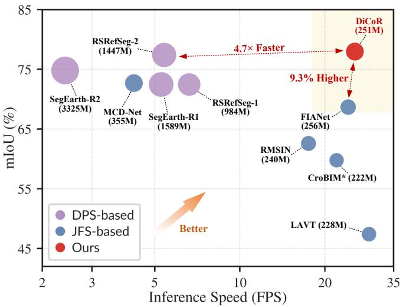  
Fig. 1: Accuracy–efficiency trade-off on the RefSegRS benchmark. DiCoR is compared with representative JFS and DPS methods in terms of mIoU, inference speed, and model size, where the bubble size indicates the number of parameters. \* denotes results obtained from our reimplementation.

Existing RRSIS methods can be broadly grouped into two paradigms: Joint Fusion Segmentation (JFS) [1]–[4], [11]– [18] and Decoupled Prompt Segmentation (DPS) [19]–[23]. JFS performs referring segmentation in an end-to-end manner by injecting linguistic features into the visual backbone via cross-modal fusion, thereby jointly learning target grounding and mask delineation from fused representations. This unified design is generally inference-efficient, as the target mask can be generated in a single forward pass without invoking an external segmenter. However, JFS is commonly optimized with pixel-wise losses that jointly supervise localization and segmentation accuracy, which may bias training toward coarse localization errors that incur larger penalties while providing weaker correction for fine boundary discrepancies after the target has been approximately localized. This limitation is particularly pronounced in remote sensing imagery, where small objects are prevalent and minor contour deviations can substantially affect segmentation quality.

In contrast, the DPS paradigm decouples target grounding from mask generation by first deriving intermediate spatial prompts and then feeding these prompts into strong segmentation foundation models to produce the final mask. By externalizing “where to segment” as a prompt, DPS provides a clearer interface between localization and mask synthesis and often achieves accurate mask delineation. However, foundationmodel-based pipelines typically incur substantial inference time overhead, resulting in increased memory footprint and latency that can hinder practical deployment. Moreover, such pipelines can be sensitive to remote sensing domain characteristics, such as sensor modality variations and complex background textures, making domain shift a persistent challenge.

These observations raise a central question: can we preserve the efficiency of JFS while incorporating the grounding reliability and contour fidelity offered by DPS? To this end, we propose DiCoR, a decoupled referent disambiguation and contour recalibration framework for RRSIS. DiCoR is motivated by the decoupling philosophy behind DPS, yet implements it with lightweight modules and task-specific supervision instead of relying on a heavy foundation model during inference. As shown in Fig. 1, DiCoR demonstrates a favorable balance between segmentation performance and computational efficiency among representative RRSIS methods. We next explain how this objective is achieved through referent disambiguation and contour recalibration.

(1) Referent ambiguity under distractors and competing cues. A central challenge in RRSIS is to identify the target referent among distractor candidates that share similar appearance, geometry, or spatial context. This challenge is further amplified when an expression contains multiple cues, such as location, size, and attributes, whose reliability varies across samples. Conventional JFS methods couple referent grounding with mask prediction under a unified objective, which does not explicitly resolve the competition among plausible same-image candidates. DiCoR addresses this issue by reformulating referent grounding as a candidate competition problem, where the model is encouraged to distinguish competing high-response regions and concentrate evidence on the true referent. From the representation perspective, we introduce a Disambiguationaware Localization Guidance (DLG) strategy that constructs a compact set of candidate regions from the intermediate response map and ranks them with candidate-conditioned linguistic and geometric evidence. From the supervision perspective, DLG is trained with a complementary localizationand-ranking objective, where distractors extracted by offline SAM3 [24] are used to guide the intermediate response map, and a ranking loss encourages the model to select the groundtruth referent over competing candidates.

(2) Contour imprecision under coarse localization. Even when the referent has been approximately localized, accurate mask delineation remains difficult. This is because standard pixel-wise supervision is dominated by localization errors, leaving much weaker signals for correcting the remaining contour deviations. As a result, boundary errors are often insufficiently corrected in JFS models. To address this issue, DiCoR introduces a Lightweight Contour Recalibration (LCR) module after the coarse decoder and trains it in a decoupled manner. Taking the input image and the coarse prediction as input, LCR learns residual corrections to the coarse logits under localized contour supervision that emphasizes uncertain boundary regions, rather than re-segmenting the target from scratch. To improve robustness under realistic coarse priors, coarse predictions from multiple checkpoints are collected and filtered by localization quality, then further diversified with morphological perturbations.

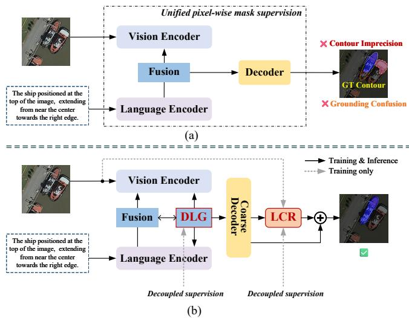  
Fig. 2: Comparison of conventional JFS pipeline and DiCoR. (a) A conventional JFS pipeline trained under unified pixelwise mask supervision. (b) DiCoR introduces DLG and LCR, each optimized with dedicated supervision for referent disambiguation and contour recalibration.

Fig. 2 provides a conceptual summary of DiCoR. By moving beyond the unified pixel-wise supervision used in conventional JFS, DiCoR adopts a lightweight decoupled design centered on the two key challenges of referent disambiguation and contour recalibration, while maintaining efficient inference. To summarize, the main contributions of this paper are as follows:

• We propose DiCoR, a decoupled referent disambiguation and contour recalibration framework for efficient RRSIS, which improves both grounding reliability and mask delineation quality within a lightweight and efficient inference pipeline.

• We introduce a disambiguation-aware localization guidance strategy that reformulates referent grounding in RRSIS as a candidate competition problem, enabling the model to identify the correct referent through candidatelevel discrimination and explicit ranking supervision.

• We introduce a lightweight contour recalibration module, inspired by the decoupling philosophy of prompt-based methods, which improves boundary delineation through residual correction with limited inference overhead.

• Extensive experiments on public RRSIS benchmarks demonstrate that DiCoR achieves a favorable trade-off between segmentation accuracy and deployment efficiency.

The remainder of this paper is organized as follows. Section II reviews related studies on referring image segmentation and referring remote sensing image segmentation. Section III presents the proposed DiCoR framework and details its referent disambiguation and contour recalibration components. Section IV reports comprehensive experiments on public RRSIS benchmarks and analyzes the effectiveness of the proposed modules. Finally, Section V concludes the paper.

## II. RELATED WORK

## A. Referring Image Segmentation

Referring image segmentation (RIS) aims to segment image regions specified by natural-language expressions. Early RIS methods [25]–[29] typically combined CNN-based visual encoders with RNN/LSTM language encoders, followed by late multimodal fusion for pixel-wise prediction. Subsequent transformer-based approaches introduced stronger global context modeling and more flexible vision-language interaction [30]–[33], thereby mitigating the locality limitations of earlier CNN–RNN pipelines. Building on this trend, LAVT [34] advanced RIS by injecting linguistic information into the intermediate stages of the visual encoder, enabling languageaware visual representation learning throughout the encoding process rather than only after unimodal feature extraction. This design substantially influenced later RIS research, with methods such as SLViT [35] and CARIS [36] further improving scale-aware interaction and context-aware alignment. More recently, RIS has increasingly benefited from large pretrained models [37]–[40], particularly through CLIP-based alignment transfer [41], [42] and prompt-driven SAM frameworks [43], [44], which further improve semantic understanding and mask generation quality. Overall, RIS in natural images has evolved toward stronger cross-modal alignment, finer interaction, and more effective exploitation of pre-trained knowledge. However, these methods are largely developed for natural-image scenarios and therefore do not directly address the small-object density, arbitrary orientations, long-range spatial relations, and referential ambiguity that characterize remote sensing imagery. Related boundary-aware segmentation studies have further shown that contour-sensitive modeling and boundary displacement correction can improve mask delineation near object edges [45]–[47], which also provides useful motivation for contour recalibration in RRSIS.

## B. Referring Remote Sensing Image Segmentation

Referring image segmentation was first introduced into the remote sensing domain by [1], which established a dedicated benchmark and stimulated subsequent research in this area. Most existing studies follow the joint fusion segmentation (JFS) paradigm introduced above, where multimodal encoding, cross-modal interaction, and pixel-level decoding are optimized within a unified end-to-end network. Early JFS methods mainly focused on modeling characteristics specific to remote sensing imagery, such as large-scale variation and orientation diversity [2], while later studies progressively improve multimodal representation through finer image–text alignment, stronger bidirectional interaction, and more effective multilevel feature aggregation [3], [4], [14], [15]. More recent work has further explored longer-range semantic guidance, dual alignment, uncertainty-aware modeling, fine-grained decoding, and stronger collaborative encoding strategies [11]–[13], [16]– [18]. Despite these advances, existing JFS methods still largely couple target grounding and mask delineation under shared pixel-wise supervision, leaving limited explicit mechanisms for resolving ambiguous same-image candidates or correcting fine contour errors.

Meanwhile, recent advances in large pretrained vision–language and promptable segmentation models have opened another important direction for RRSIS. In these methods, which we term decoupled prompt segmentation (DPS), multimodal cues are converted into explicit spatial prompts by multimodal representation or grounding models [48]–[51]. Strong pretrained segmenters [52]–[55] are then adopted to generate the final masks. Representative studies have developed prompting pipelines built on foundation models, customized promptable segmentation frameworks, and segmentation schemes that combine coarse localization with subsequent mask refinement [19], [20], [23], [56]. Recent studies on large models further broaden this direction to more diverse query forms and more complex reasoning processes [21], [22]. Although these approaches benefit from the rich prior knowledge and strong mask generation capability of foundation models, their reliance on external heavy segmenters and staged inference pipelines typically leads to higher computational and memory overhead, while also making overall performance more sensitive to prompt quality and cross-domain adaptation. Our method is conceptually aligned with the decoupling motivation of this line of research, but realizes it within a lightweight implicit fusion pipeline rather than through a heavy external segmenter.

## III. METHODOLOGY

## A. Overview

We first present an overview of DiCoR in Fig. 3. Built on an efficient end-to-end fusion pipeline, DiCoR is designed to improve referent disambiguation and contour recalibration in response to two persistent challenges in RRSIS. Specifically, the input image is first encoded by Swin Transformer backbone [57], and the referring expression is encoded by BERT [58]. The two streams are progressively integrated through four vision-language fusion (VLF) blocks to produce multi-level multimodal representations. These features are then aggregated by a multi-scale aggregation (MSA) module and decoded to generate a coarse segmentation prediction, which is further refined to obtain the final mask.

To improve referent localization, DiCoR introduces a disambiguation-aware localization guidance (DLG) module, which formulates referent grounding as a candidate competition process. This design allows the model to resolve ambiguity among same-image candidates and focus on the top-ranked referent. Starting from the fused representation after the third VLF block, the DLG module first predicts an intermediate response map and organizes salient responses into a compact set of candidate regions. These candidates are then assessed using candidate-aware language cues, where token responses are adaptively reweighted according to candidate-level visual evidence. The selected candidate is subsequently transformed into a localization prior and injected back into the same fused representation through residual spatial recalibration, thereby guiding subsequent fusion and decoding toward the true referent. During training, same-image distractors mined offline by SAM3 model provide explicit competitive supervision, encouraging the model to preserve a discriminative candidate structure and distinguish the ground-truth referent from visually confusing competitors.

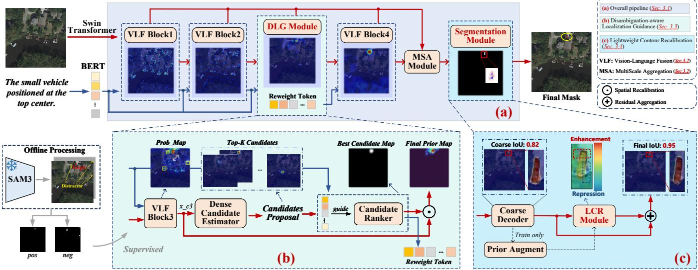  
Fig. 3: Overview of the proposed DiCoR framework, including (a) the overall pipeline built upon a JFS backbone, (b) disambiguation-aware localization guidance for referent disambiguation, and (c) lightweight contour recalibration for boundary correction.

For contour recalibration, DiCoR further employs a lightweight contour recalibration (LCR) module after the coarse decoder. Taking the input image and the coarse prediction as input, LCR predicts a residual correction to the coarse logits, so that the final mask is improved through localized boundary adjustment rather than full re-segmentation. Accordingly, LCR adopts a lightweight encoder-decoder architecture with mirrored skip connections, enabling local contour correction while preserving fine spatial details. For training data construction, we collect coarse predictions from multiple intermediate checkpoints, retain samples with sufficiently reliable localization, and further diversify them with morphological perturbations to cover richer boundary deviations. For training supervision, LCR is optimized with a localized contour objective that emphasizes uncertain boundary regions while suppressing unnecessary residual responses outside the recalibration area. This design improves contour quality with limited additional overhead.

## B. Multi-Scale Joint Fusion Backbone

Given a remote sensing image $I \in \mathbb { R } ^ { 3 \times H \times W }$ and a referring expression $T = ( w _ { 1 } , \ldots , w _ { n } )$ , the visual encoder produces a hierarchy of visual features at four scales, denoted by $\{ V _ { l } \} _ { l = 1 } ^ { 4 }$ , while the language encoder converts the expression into token embeddings $\mathbf { \bar { \mathbf { } } } = [ l _ { 1 } , \ldots , l _ { n } ] ^ { \top }$ . Here, $l _ { n }$ denotes the embedding of the n-th token. At each fusion stage, a languageguided attention module incorporates linguistic information from L into the corresponding visual feature $V _ { l } ,$ yielding multi-level vision-language features $\{ X _ { l } \} _ { l = 1 } ^ { 4 }$ . These representations preserve complementary cues across resolutions, with shallow features emphasizing local spatial detail and deeper features capturing richer semantic context. The multi-scale features are subsequently aggregated through MSA module and decoded to produce the prediction mask P.

To strengthen cross-scale interaction, bidirectional visionlanguage attention is introduced into the MSA module. As illustrated in Fig. 4, multimodal features from four encoder stages are first aligned by pyramid pooling and flattened into a unified visual sequence. Different from conventional aggregation methods that mainly inject textual semantics into visual features, the proposed interaction scheme further uses visual evidence to update linguistic representations. Concretely, L2V multi-head attention refines the visual sequence under language guidance, whereas V2L multi-head attention recalibrates the language sequence according to the visual content. The updated visual representation is subsequently processed by visual self-attention to model long-range spatial dependencies and global contextual relations. Finally, the aggregated representation is decomposed back into four scales and fused into the original feature hierarchy through scaleaware gating, allowing information to propagate adaptively across resolutions.

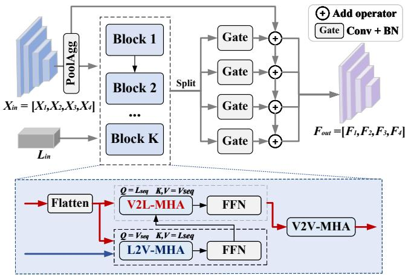  
Fig. 4: Structure of the MSA module.

## C. Disambiguation-aware Localization Guidance

Although the joint fusion backbone provides an efficient basis for RRSIS, it remains vulnerable to ambiguous grounding when multiple same-image instances share similar appearance or spatial layout. As shown in Fig. 5, the fused feature $X _ { 3 }$ already activates the ground-truth referent, but comparable responses also appear on confusing distractors. This suggests that the failure is not simply caused by missing referent evidence. Instead, multiple plausible regions are often activated simultaneously, while the model lacks an explicit mechanism to resolve their competition. Since standard pixelwise supervision mainly enforces foreground-background separation, it provides limited guidance for distinguishing among high response candidate instances. The resulting ambiguity can therefore propagate to the decoder and lead to incorrect masks.

The aircraft located near the center of the image.  
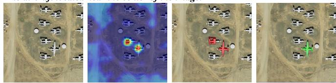

The vehicle positioned in the bottom-left of the image and close to left edge.  
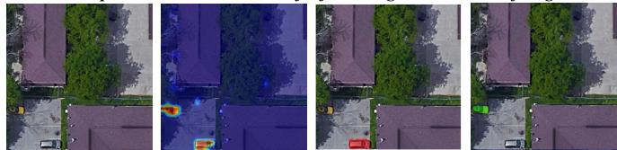  
Fig. 5: Failure cases of the JFS backbone. From left to right are the input image, the activation visualization of $X _ { 3 } ,$ , the predicted mask, and the ground-truth mask.

To make this competition explicit, DLG module is introduced to reformulate referent grounding as candidate-level competition. As illustrated in Fig. 6, DLG contains three stages: a dense response estimator, a candidate generator, and a candidate ranker. Given the third-stage fused feature $X _ { 3 }$ and the language feature $L ,$ , the dense response estimator first predicts a response map

$$
R = \Phi _ { \mathrm { r e s p } } ( X _ { 3 } ) , \quad R \in [ 0 , 1 ] ^ { H _ { 3 } \times W _ { 3 } } .\tag{1}
$$

where $\Phi _ { \mathrm { r e s p } }$ is implemented by two lightweight Conv-Norm-GELU blocks followed by a sigmoid activation. The response map R captures the spatial distribution of potential referent cues in the deep multimodal representation.

The candidate generator then extracts a compact set of candidate regions from R. A peak selection operator $\Phi _ { \mathrm { p e a k } } ( \cdot )$ identifies local maxima, removes redundant responses by nonmaximum suppression, and retains the top-K peaks:

$$
\{ p _ { i } \} _ { i = 1 } ^ { K } = \Phi _ { \mathrm { p e a k } } ( R ) ,\tag{2}
$$

each peak $p _ { i }$ is then converted into a localized candidate support by Gaussian-gated response aggregation

$$
C _ { i } ( u ) = R ( u ) \cdot \exp \left( - \frac { \| u - p _ { i } \| _ { 2 } ^ { 2 } } { 2 \sigma _ { c } ^ { 2 } } \right) , \quad i = 1 , \dots , K ,\tag{3}
$$

where u denotes the spatial coordinate and $\sigma _ { c }$ controls the support range. After normalization, each candidate support is used to pool a visual feature $F _ { i } ^ { v }$ from $X _ { 3 }$ . In parallel, a geometric feature $F _ { i } ^ { g }$ is constructed from the spatial distribution, including the normalized center, effective area, and spatial dispersion. Together, $F _ { i } ^ { v }$ and $F _ { i } ^ { g }$ define the candidate representation for subsequent ranking.

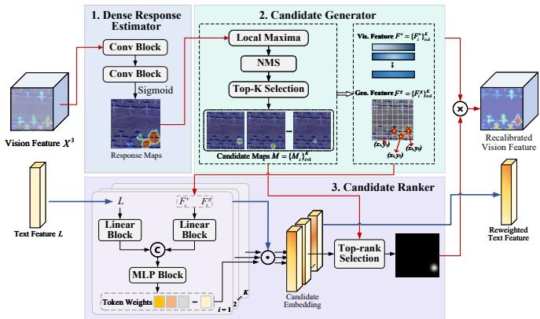  
Fig. 6: Architecture of the proposed DLG module. DLG produces a candidate-specific localization prior and a reweighted text feature, and then feeds the selected prior back into $X _ { 3 }$ for spatial recalibration.

The candidate ranker then estimates referent confidence for each candidate. Since different regions may rely on different linguistic cues for disambiguation, token importance should be estimated in a candidate-adaptive manner. For candidate i, the visual feature and geometric feature are concatenated into a candidate embedding $c _ { i } ~ = ~ [ v _ { i } ; g _ { i } ]$ ]. This embedding interacts with the linguistic features through separate lightweight projection networks $\Phi _ { c } ( \cdot )$ and $\Phi _ { l } ( \cdot )$ , followed by a routing network $\Phi _ { \mathrm { r t } } ( \cdot )$ to obtain normalized token weights:

$$
\begin{array} { r } { \omega _ { i } = \Phi _ { \mathrm { r t } } \left( \left[ \Phi _ { c } ( c _ { i } ) ; \Phi _ { l } ( L ) \right] \right) , \quad \omega _ { i } \in \mathbb { R } ^ { N } . } \end{array}\tag{4}
$$

The resulting $\omega _ { i }$ reweight the token-level language features to produce a candidate-specific text representation:

$$
\tilde { l } _ { i } = \sum _ { n = 1 } ^ { N } \omega _ { i , n } l _ { n } .\tag{5}
$$

The referent confidence $s _ { i }$ of each candidate is then computed by jointly considering semantic similarity and geometric consistency:

$$
\begin{array} { r } { s _ { i } = \langle v _ { i } , \tilde { l } _ { i } \rangle + \lambda _ { g } \Phi _ { g } \left( [ g _ { i } ; \tilde { l } _ { i } ] \right) . } \end{array}\tag{6}
$$

where $\langle \cdot , \cdot \rangle$ denotes cosine similarity computation, $\Phi _ { c } ( \cdot )$ $\Phi _ { l } ( \cdot )$ and $\Phi _ { g } ( \cdot )$ are implemented as lightweight MLPs, and $\lambda _ { g }$ balances the contribution of geometric evidence. Finally, the candidate with the highest confidence is selected as the winning referent:

$$
i ^ { * } = \arg \operatorname* { m a x } _ { i } s _ { i } .\tag{7}
$$

This explicit candidate-level selection converts ambiguous intermediate responses into a referent competition process. The selected support is then injected back into $X _ { 3 }$ through residual spatial recalibration:

$$
\tilde { X } _ { 3 } = X _ { 3 } \odot \left( 1 + \alpha \bar { C } _ { i ^ { * } } \right) .\tag{8}
$$

where α controls the spatial guidance strength and ⊙ denotes broadcasting along the channel dimension. In this way, the recalibrated feature ${ \tilde { X } } _ { 3 }$ guides the decoder toward the resolved referred instance.

To supervise the DLG module effectively, it is necessary to jointly ensure accurate candidate ranking and reliable candidate generation. As the candidate generation process relies on non-differentiable discrete operations, directly optimizing candidate quality through gradient-based learning is non-trivial. Consequently, the quality of the response map R becomes the primary factor governing candidate reliability.

We therefore introduce two complementary objectives: response supervision for stable candidate generation and ranking supervision for explicit referent selection. Specifically, response supervision encourages R to produce strong activations over potential referent regions. Directly applying ground-truth masks as positive supervision is inconsistent with the role of deep multimodal features, which are expected to highlight candidate evidence regions rather than reconstruct rigid target extents. To address this, we partition the response space into three regions, including the target positive foreground P, the clean background B, and the hard instance background H, where P is defined as a compact region centered at the groundtruth target, B consists of regions sufficiently distant from the target, and H captures hard distractor instances. The response supervision loss is defined as

$$
\mathcal { L } _ { \mathrm { r e s p } } = \mathcal { L } _ { \mathrm { b c e } } ( R _ { \mathcal { P } } , \mathbf { 1 } ) + \mathcal { L } _ { \mathrm { b c e } } ( R _ { \mathcal { B } } , \mathbf { 0 } ) + \lambda _ { h } \mathcal { L } _ { \mathrm { b c e } } ( R _ { \mathcal { H } } , \mathbf { 0 } ) .\tag{9}
$$

where $\mathcal { L } _ { \mathrm { b c e } } ( \cdot , \cdot )$ denotes the standard binary cross-entropy loss, and each term is averaged over the corresponding region. $R _ { \mathcal { P } } , R _ { B } , R _ { \mathcal { H } }$ denote the response values sampled from region P, B and H respectively. It should be noted that $\bar { \mathcal { H } }$ is constructed via offline mining using a frozen SAM3 model. Candidate object proposals with high confidence but low overlap with the ground-truth mask are retained as distractors and aggregated into a proposal set to form H, thereby introducing structured hard negatives that explicitly model intra-image ambiguity.

To resolve ambiguity among competing candidates, we further impose ranking supervision via a cross-entropy loss. Let y denote the ground-truth candidate index, the ranking loss is defined as

$$
\mathcal { L } _ { \mathrm { r a n k } } = - \log \frac { \exp ( s _ { y } ) } { \sum _ { i = 1 } ^ { K } \exp ( s _ { i } ) } .\tag{10}
$$

This objective enforces explicit competition among candidates and promotes correct referent selection. The overall DLG objective is formulated as

$$
\mathcal { L } _ { \mathrm { D L G } } = \lambda _ { \mathrm { r e s p } } \mathcal { L } _ { \mathrm { r e s p } } + \lambda _ { \mathrm { r a n k } } \mathcal { L } _ { \mathrm { r a n k } } ,\tag{11}
$$

where $\lambda _ { \mathrm { r e s p } }$ and $\lambda _ { \mathrm { { r a n k } } }$ control the relative contributions of response estimation and candidate ranking, yielding complementary supervision during training.

## D. Lightweight Contour Recalibration

Although DLG improves referent localization by resolving ambiguity through candidate-level disambiguation, accurate mask prediction still depends on the decoder’s ability to delineate object contours. In conventional JFS frameworks, localization and contour delineation are optimized jointly under a unified mask objective. Once the referent has been approximately grounded, boundary deviations tend to induce weaker gradients than residual localization errors under the same objective, leading to insufficient optimization of fine-grained contour delineation. To address this optimization imbalance, we introduce a decoupled lightweight contour recalibration module, termed LCR, which explicitly decouples contour correction from coarse localization via residual recalibration.

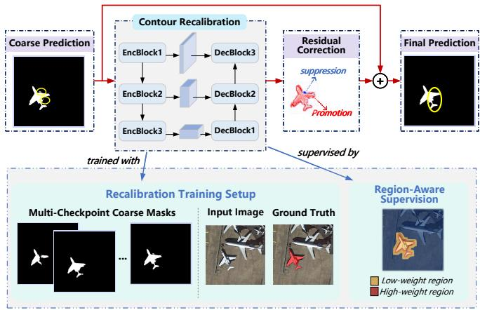  
Fig. 7: Structure of the LCR module.

Let Z denote the coarse segmentation logits produced by the decoder and $P = \sigma ( Z )$ denote the corresponding mask prediction through sigmoid activation, the LCR module takes the input image I and $P$ as guidance to estimate a residual correction $\Delta Z$ in the logit domain:

$$
\Delta Z = \Phi _ { \mathrm { l c r } } \left( I \oplus P \right) ,\tag{12}
$$

where ⊕ denotes channel-wise concatenation and $\Phi _ { \mathrm { l c r } }$ denotes the lightweight recalibration network. As illustrated in Fig. 7, $\Phi _ { \mathrm { l c r } }$ adopts a compact encoder–decoder architecture composed of convolutional layers, normalization and ReLU activation. Skip connections are introduced between mirrored stages to preserve fine spatial structures during recalibration. The recalibrated logits $\tilde { Z }$ and the final prediction $\tilde { P }$ are obtained as

$$
\tilde { Z } = Z + \Delta Z , \quad \tilde { P } = \sigma ( \tilde { Z } ) .\tag{13}
$$

This residual formulation constrains LCR to perform localized contour correction conditioned on the coarse prediction, while preserving the overall object support established by Z.

To focus optimization on residual contour errors, LCR adopts a region-aware loss function instead of uniform pixelwise supervision. As illustrated in Fig. 7, the weight map $W ( u )$ is constructed from the coarse prediction, assigning higher weights to pixels in the vicinity of predicted contours and lower weights to regions with confident foreground or background responses. Let G denote the ground-truth binary mask, the training objective is defined as

$$
{ \mathcal { L } } _ { \mathrm { L C R } } = \lambda _ { \mathrm { c e } } { \mathcal { L } } _ { \mathrm { r c e } } + \lambda _ { \mathrm { d i c e } } { \mathcal { L } } _ { \mathrm { r d i c e } } ,\tag{14}
$$

where $\mathcal { L } _ { \mathrm { r c e } }$ and $\mathcal { L } _ { \mathrm { r d i c e } }$ denote the region-aware cross-entropy and Dice losses, which are commonly used in RRSIS tasks to balance pixel accuracy and region overlap [4], [13], [20].

The coefficients $\lambda _ { \mathrm { c e } }$ and $\lambda _ { \mathrm { d i c e } }$ balance the two loss terms. Specifically, $\mathcal { L } _ { \mathrm { r c e } }$ is defined as:

$$
\mathcal { L } _ { \mathrm { r c e } } = \frac { 1 } { \sum _ { u \in \Omega } W ( u ) } \sum _ { u \in \Omega } W ( u ) \mathrm { C E } \left( \tilde { P } ( u ) , G ( u ) \right) ,\tag{15}
$$

where Ω denotes the spatial domain and u indexes pixel locations. The weight map $W ( u )$ modulates the contribution of each pixel by assigning larger values to contour-adjacent regions and smaller values to regions with confident predictions. Similarly, $\mathcal { L } _ { \mathrm { r d i c e } }$ is computed as:

$$
\mathcal { L } _ { \mathrm { r d i c e } } = \mathrm { D i c e } \left( \{ W ( u ) \tilde { P } ( u ) \} _ { u \in \Omega } , \{ W ( u ) G ( u ) \} _ { u \in \Omega } \right)\tag{16}
$$

Together, these losses define a spatially selective supervision that enables effective contour recalibration through residual correction based on coarse prior, providing an efficient alternative to foundation-model-based refinement pipelines.

## E. Decoupled Training Strategy

This section presents the decoupled training strategy for optimizing DiCoR. Following existing JFS methods [4], [13], the vision-language fusion backbone and the coarse decoder are first trained with the standard segmentation loss. To provide the auxiliary modules with a broader and more realistic training distribution, intermediate checkpoints from different training stages are subsequently sampled to construct diverse pretraining data. Specifically, third-level fused features are extracted for DLG pretraining, while coarse decoder logits are collected as foreground priors for LCR. For LCR pretraining, only samples with sufficiently reliable coarse localization are retained. This filtering removes severely mislocalized predictions that would otherwise introduce inconsistent correction targets and interfere with LCR optimization. To further enrich boundary variations and improve the generalization ability of contour recalibration, the retained coarse priors are augmented with morphological perturbations, including dilation and erosion.

Once the auxiliary modules have been pretrained, DLG is further optimized in a joint adaptation stage with the final segmentation supervision. Through this process, the reweighted text tokens are jointly tuned with the downstream segmentation model, enabling DLG to generate localization priors that are both discriminative for referent selection and compatible with final mask prediction. By comparison, LCR is directly plugged into the trained framework after pretraining. At inference time, DiCoR adds only the lightweight DLG and LCR modules to a standard JFS pipeline, thus avoiding the heavy computational cost of foundation-model-based segmentation.

## IV. EXPERIMENTS

## A. Datasets and Metrics

Datasets. We evaluate DiCoR on three public referring remote sensing image segmentation benchmarks, including Ref-SegRS [1], RRSIS-D [2], and RISBench [3]. RefSegRS contains 4,420 image-expression-mask triplets collected from 285 remote sensing scenes, covering 14 object categories. The dataset is split into 2,172 training samples, 431 validation samples, and 1,817 test samples. RRSIS-D provides a larger benchmark with 17,402 annotated samples from 20 categories, including 12,181 training samples, 1,740 validation samples, and 3,481 test samples. RISBench further increases the scale, scene diversity, and referring complexity of the task, providing a challenging testbed for evaluating model robustness. These datasets exhibit substantial differences in object scale, scene composition, and semantic coverage, and therefore provide a comprehensive evaluation protocol for RRSIS.

Metrics. Following prior RRSIS studies, we adopt mean Intersection over Union (mIoU), global Intersection over Union (gIoU), and precision under different IoU thresholds (Pr) as evaluation metrics. For the i-th test sample, the IoU between the predicted mask $P _ { i }$ and the ground-truth mask $G _ { i }$ is defined as:

$$
\mathrm { I o U } _ { i } = \frac { | P _ { i } \cap G _ { i } | } { | P _ { i } \cup G _ { i } | } .\tag{17}
$$

The mIoU is computed by averaging the IoU values over all N test samples:

$$
\mathrm { \ m I o U } = \frac { 1 } { N } \sum _ { i = 1 } ^ { N } \mathrm { { I o U } } _ { i } .\tag{18}
$$

The gIoU is calculated by accumulating the intersection and union areas over the entire test set:

$$
{ \mathrm { g I o U } } = { \frac { \sum _ { i = 1 } ^ { N } \left| P _ { i } \cap G _ { i } \right| } { \sum _ { i = 1 } ^ { N } \left| P _ { i } \cup G _ { i } \right| } } .\tag{19}
$$

In addition, Pr measures the proportion of test samples whose IoU exceeds a given threshold, reflecting the reliability of predictions under different segmentation quality requirements.

## B. Implementation Details

Model configuration. For DLG, the number of candidate K and the Gaussian support scale $\sigma _ { c }$ are set to 5 and 3 respectively, considering the generally small size and dense spatial distribution of referred objects in remote sensing imagery. The residual guidance strength α is set to 0.5 to recalibrate the third-level feature without disrupting the original fused representation, and the geometric correction weight $\lambda _ { g }$ is set to 0.5. For the DLG supervision, $\lambda _ { \mathrm { r e s p } }$ and $\lambda _ { \mathrm { { r a n k } } }$ are set to 0.9 and 1.1 respectively, which enables the ranker to better distinguish the true referent from competing instances. For LCR, coarse predictions with IoU values in [0.5, 0.95) are retained for LCR pretraining, which are regarded as sufficiently localized yet still requiring contour recalibration. The region-aware loss weights $\lambda _ { \mathrm { c e } }$ and $\lambda _ { \mathrm { d i c e } }$ are both set to 1.0. During pretraining, checkpoints from epochs 10, 20, 25, 30, and 39 are sampled to provide diverse pretraining samples.

Training configuration. During training, all input images are resized to 480×480 and converted to tensors. Experiments are conducted on NVIDIA RTX 4090 GPUs with a batch size of $^ { 8 , }$ and AdamW is used as the optimizer for all training stages. The coarse segmentation model is trained for 40 epochs with an initial learning rate of $5 \times 1 0 ^ { - 5 }$ and a weight decay of $1 \times 1 0 ^ { - 2 }$ . During DLG and LCR module pretraining, DLG is trained for 20 epochs with a learning rate of $1 \times 1 \bar { 0 } ^ { - 3 }$ and a weight decay of $1 \times 1 0 ^ { - 4 }$ , while LCR is trained for 40 epochs with a learning rate of $5 \times 1 0 ^ { - 5 }$ and a weight decay of $1 \times \bar { 1 } 0 ^ { - 2 }$ After pretraining, the joint fine tuning stage is conducted for 10 epochs using an initial learning rate of $1 \times 1 0 ^ { - 5 }$ and a weight decay of $1 \times 1 0 ^ { - 2 }$

TABLE I: Comparison of segmentation performance on the RefSegRS dataset across various evaluation metrics.
<table><tr><td>Method</td><td>Publication</td><td>Pr@0.5</td><td>Pr@0.6</td><td>Pr@0.7</td><td>Pr@0.8</td><td>Pr@0.9</td><td>gIoU</td><td>mIoU</td></tr><tr><td>LSCM [59]</td><td>ECCV’20</td><td>31.54</td><td>20.41</td><td>9.51</td><td>5.29</td><td>0.84</td><td>61.27</td><td>35.54</td></tr><tr><td>CMPC+ [60]</td><td>TPAMI&#x27;21</td><td>49.19</td><td>28.31</td><td>15.31</td><td>8.12</td><td>2.55</td><td>66.53</td><td>43.65</td></tr><tr><td>LAVT [34]</td><td>CVPR&#x27;22</td><td>51.84</td><td>30.27</td><td>17.34</td><td>9.52</td><td>2.09</td><td>71.86</td><td>47.40</td></tr><tr><td>CARIS [36]</td><td>ACM MM&#x27;23</td><td>45.40</td><td>27.19</td><td>15.08</td><td>8.87</td><td>1.98</td><td>69.74</td><td>42.66</td></tr><tr><td>RIS-DMMI [61]</td><td>ICCV&#x27;23</td><td>63.89</td><td>44.30</td><td>19.81</td><td>6.49</td><td>1.00</td><td>68.58</td><td>52.15</td></tr><tr><td>CrossVLT [62]</td><td>TMM&#x27;23</td><td>71.16</td><td>58.28</td><td>34.51</td><td>16.35</td><td>5.06</td><td>77.44</td><td>58.84</td></tr><tr><td>EVF-SAM [43]</td><td>arXiv&#x27;24</td><td>35.17</td><td>22.34</td><td>9.36</td><td>2.86</td><td>0.39</td><td>55.51</td><td>36.64</td></tr><tr><td>CroBIM [3]</td><td>arXiv&#x27;24</td><td>75.89</td><td>61.42</td><td>34.07</td><td>12.99</td><td>2.75</td><td>72.33</td><td>59.77</td></tr><tr><td>LGCE [1]]</td><td>TGRS&#x27;24</td><td>73.75</td><td>61.14</td><td>39.46</td><td>16.02</td><td>5.45</td><td>76.81</td><td>59.96</td></tr><tr><td>DANet [11]</td><td>ACM MM&#x27;24</td><td>76.61</td><td>64.59</td><td>42.72</td><td>18.29</td><td>8.04</td><td>79.53</td><td>62.14</td></tr><tr><td>RMSIN [2]</td><td>CVPR&#x27;24</td><td>79.20</td><td>65.99</td><td>42.98</td><td>16.51</td><td>3.25</td><td>75.72</td><td>62.58</td></tr><tr><td>FIANet [4]</td><td>TGRS&#x27;24</td><td>84.09</td><td>77.05</td><td>61.86</td><td>33.41</td><td>7.10</td><td>78.32</td><td>68.67</td></tr><tr><td>SBANet [14]</td><td>ISPRS’25</td><td>77.02</td><td></td><td>44.15</td><td></td><td>8.97</td><td>79.86</td><td>62.73</td></tr><tr><td>BTDNet [15]</td><td>arXiv&#x27;25</td><td>83.60</td><td>75.07</td><td>62.69</td><td>34.40</td><td>9.14</td><td>80.57</td><td>67.95</td></tr><tr><td>SegEarth-R1 [21]</td><td>arXiv&#x27;25</td><td>86.30</td><td>79.53</td><td>69.57</td><td>48.87</td><td>10.73</td><td>79.00</td><td>72.45</td></tr><tr><td>RSRefSeg-2 [20]</td><td>TGRS&#x27;25</td><td>88.22</td><td>82.99</td><td>73.97</td><td>60.92</td><td>34.40</td><td>81.24</td><td>77.39</td></tr><tr><td>CroBIM-U [17]</td><td>TGRS&#x27;26</td><td>76.68</td><td>62.54</td><td>34.81</td><td>13.50</td><td>3.26</td><td>73.81</td><td>60.08</td></tr><tr><td>MCD-Net [18]</td><td>TGRS&#x27;26</td><td>85.64</td><td>79.75</td><td>69.68</td><td>50.41</td><td>14.42</td><td>81.23</td><td>72.68</td></tr><tr><td>SegEarth-R2 [22]</td><td>CVPR&#x27;26</td><td></td><td></td><td></td><td></td><td></td><td></td><td>74.80</td></tr><tr><td>RS2-SAM 2 [23]</td><td>AAAI&#x27;26</td><td>84.31</td><td>79.42</td><td>70.89</td><td>55.70</td><td>21.19</td><td>80.87</td><td>73.90</td></tr><tr><td>Ours</td><td></td><td>87.34</td><td>83.28</td><td>75.84</td><td>62.85</td><td>35.67</td><td>84.10</td><td>77.96</td></tr></table>

## C. Accuracy Performance

We compare DiCoR with representative state-of-the-art methods from both JFS and DPS paradigms. The recent JFS methods mainly include FIANet [4], LSCF [13], SBANet [14], BTDNet [15], CroBIM-U [17], and MCD-Net [18], while the DPS methods include the RSRefSeg series [19], [20], SegEarth series [21], [22], and RS2-SAM 2 [23].

Results on RefSegRS. As shown in Table I, DiCoR achieves the best overall performance on RefSegRS. Compared with the recent JFS method MCD-Net, DiCoR improves gIoU and mIoU by 2.87% and 5.28%, respectively, validating the effectiveness of the proposed decoupled optimization strategy. The gain is particularly pronounced on Pr@0.9, where DiCoR exceeds MCD-Net by 21.25%. This improvement is mainly attributed to the contour recalibration module, which enhances high-quality mask prediction under strict IoU criteria. Compared with the DPS method RSRefSeg-2, which benefits from foundation model segmentation, DiCoR still improves gIoU and mIoU by 2.86% and 0.57%, respectively. Together with the inference-speed advantage discussed in Sec. IV-D, these results indicate a favorable balance between segmentation accuracy and computational efficiency.

Results on RISBench. The quantitative results on RIS-Bench are presented in Table II. DiCoR achieves the best gIoU and mIoU among all evaluated methods, demonstrating its robustness under more diverse remote sensing scenes and more complex referring expressions. Compared with Ref-SegRS and RRSIS-D, RISBench contains more heterogeneous spatial layouts and more fine-grained semantic descriptions, making both referent localization and boundary delineation more challenging. On the localization-oriented low-threshold metrics, DiCoR achieves the highest Pr@0.5 and Pr@0.6, reaching 77.94% and 74.36% respectively, indicating that DLG helps the model identify the referred target more reliably in complex scenes. Moreover, DiCoR surpasses LSCF by 2.66% on Pr@0.9, further validating the contribution of LCR to fine boundary recovery. These results show that the advantage of DiCoR remains consistent on a larger and more challenging benchmark.

Results on RRSIS-D. As reported in Table III, DiCoR achieves the best overall performance on RRSIS-D. In particular, it obtains the highest gIoU and mIoU of 79.45% and 66.94% respectively. Compared with the recent JFS baseline CroBIM-U, DiCoR improves gIoU and mIoU by 2.75% and 1.87%, respectively. It also consistently outperforms other strong JFS baselines, including FIANet, LSCF, SBANet, BTDNet, and MCD-Net, indicating that the proposed decoupled design generalizes well to larger scale RRSIS data. Compared with DPS methods, DiCoR achieves higher gIoU and mIoU than RSRefSeg-1, SegEarth-R1, and RS2-SAM 2, which further reflects its advantage in producing high-quality segmentation masks.

Visualization analysis. Figs. 8, 9, and 10 present qualitative results on RefSegRS, RISBench, and RRSIS-D respectively. On RefSegRS, the referring expressions are relatively simple, whereas the referred targets often occupy large and spatially extended regions, such as roads, impervious surfaces, and sidewalks. In these cases, DiCoR produces more complete masks and more coherent contours than both FIANet and the coarse prediction, indicating that the recalibration process can improve structural consistency while preserving reliable coarse localization. On RISBench and RRSIS-D, the scenes are more complex and the expressions usually involve more detailed spatial relations and semantic cues, making both target discrimination and boundary delineation more challenging. DiCoR shows clearer advantages in focusing on the target referent and suppressing irrelevant responses from surrounding regions. Notably, the ∆Z heatmaps are concentrated around uncertain regions, highlighting the localized residual correction performed by LCR. This contour-aware recalibration is particularly beneficial for small remote sensing objects, such as vehicles and ships, where slight boundary deviations can substantially degrade high-threshold precision.

## D. Efficiency Performance

To further evaluate the computational practicality of DiCoR, Table IV compares it with representative JFS and DPS methods. Following the common practice of evaluating efficient architectures by jointly considering predictive accuracy and measured inference speed or latency [65], [66], we define an accuracy-efficiency index (AEI) to summarize the tradeoff among segmentation accuracy, inference throughput, and computational complexity:

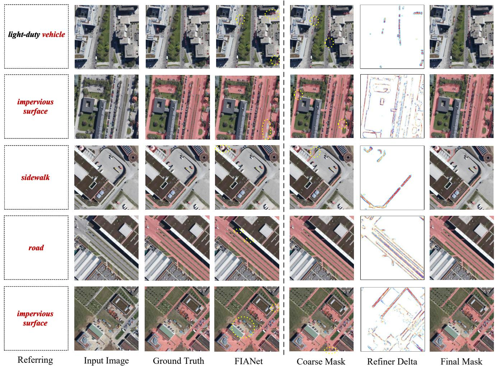  
Fig. 8: Qualitative results of the proposed DiCoR on the RefSegRS dataset.

$$
\mathrm { A E I } _ { i } = \mathrm { m I o U } _ { i } \cdot \frac { \mathrm { F P S } _ { i } } { \mathrm { m a x } _ { k \in \mathcal { M } } \mathrm { F P S } _ { k } } \cdot \sqrt { \frac { \mathrm { m i n } _ { k \in \mathcal { M } } \mathrm { G F L O P s } _ { k } } { \mathrm { G F L O P s } _ { i } } } ,\tag{20}
$$

where M denotes the set of compared methods. A larger AEI indicates a more favorable overall trade-off.

Compared with existing JFS methods, the main advantage of DiCoR lies in its stronger segmentation accuracy. DiCoR achieves the highest mIoU among all JFS methods, outperforming FIANet and MCD-Net by 9.29% and 5.28% respectively. At the same time, this accuracy gain is obtained without a substantial efficiency sacrifice: DiCoR maintains a model size comparable to FIANet and an inference speed close to LAVT, while achieving the highest AEI within the JFS group. These results indicate that the proposed decoupled design improves segmentation quality while preserving the practical efficiency of the JFS paradigm.

Compared with DPS methods, DiCoR exhibits a clear efficiency advantage. DPS methods typically rely on large vision-language encoders or foundation segmenters, which introduce considerable computational overhead and slow down inference. In contrast, DiCoR retains an efficient JFS inference pipeline and incorporates only lightweight auxiliary modules. As a result, DiCoR achieves the highest AEI among all compared methods, demonstrating a favorable balance between segmentation accuracy and inference efficiency.

## E. Ablation Study

We conduct ablation experiments on the RISBench dataset to examine the contributions of the proposed components. To provide a clear and intuitive analysis of how each module affects performance, all ablation variants are constructed by modifying the same baseline model with a single component added or replaced at a time. Unless otherwise specified, all experiments are performed under the same training protocol.

1) Overall component ablation. Table V presents the overall component ablation. Different feature aggregation settings are first compared without the decoupled modules. The variant without multi-scale aggregation (w/o MSA) directly uses the original hierarchical features for decoding and yields the weakest performance, indicating that explicit interaction is necessary for accurate referring segmentation. TMEM [4] improves the results by introducing cross-scale feature interaction, while the adopted MSA provides a stronger basis for referring segmentation, confirming the importance of bidirectional aggregation. Built on this aggregation design, DLG and LCR bring complementary improvements: DLG enhances referent localization by resolving candidate-level ambiguity, whereas LCR improves high-quality mask prediction by recalibrating residual contour errors. Their combination achieves the best overall performance in terms of Pr@0.5, mIoU, and gIoU, with Pr@0.9 remaining comparable to the LCR-only variant. These results validate the effectiveness of the proposed decoupled disambiguation and recalibration design.

TABLE II: Comparison of segmentation performance on the RISBench dataset across various evaluation metrics.
<table><tr><td>Method</td><td>Publication</td><td>Pr@0.5</td><td>Pr@0.6</td><td>Pr@0.7</td><td>Pr@0.8</td><td>Pr@0.9</td><td>gIoU</td><td>mIoU</td></tr><tr><td>BRINet [29]</td><td>CVPR&#x27;20</td><td>52.87</td><td>45.39</td><td>38.64</td><td>30.79</td><td>11.86</td><td>48.73</td><td>42.91</td></tr><tr><td>LSCM [59]</td><td>ECCV&#x27;20</td><td>55.26</td><td>47.14</td><td>40.10</td><td>33.29</td><td>13.91</td><td>50.08</td><td>43.69</td></tr><tr><td>CMPC [63]</td><td>CVPR&#x27;20</td><td>55.17</td><td>47.84</td><td>40.28</td><td>32.87</td><td>14.55</td><td>50.24</td><td>43.82</td></tr><tr><td>CMPC+ [60]</td><td>TPAMI&#x27;21</td><td>58.02</td><td>49.00</td><td>42.53</td><td>35.26</td><td>17.88</td><td>53.98</td><td>46.73</td></tr><tr><td>CRIS [37]</td><td>CVPR&#x27;22</td><td>63.67</td><td>55.73</td><td>44.42</td><td>28.80</td><td>13.27</td><td>69.11</td><td>55.18</td></tr><tr><td>LAVT [34]</td><td>CVPR&#x27;22</td><td>69.40</td><td>63.66</td><td>56.10</td><td>44.95</td><td>25.21</td><td>74.15</td><td>61.93</td></tr><tr><td>ETRIS [41]</td><td>ICCV’23</td><td>60.98</td><td>51.88</td><td>39.87</td><td>24.49</td><td>11.18</td><td>67.61</td><td>53.06</td></tr><tr><td>CrossVLT [62]</td><td>TMM&#x27;23</td><td>70.62</td><td>65.05</td><td>57.40</td><td>45.80</td><td>26.10</td><td>74.33</td><td>62.84</td></tr><tr><td>RIS-DMMI [61]</td><td>ICCV&#x27;23</td><td>72.05</td><td>66.48</td><td>59.07</td><td>47.16</td><td>26.57</td><td>74.82</td><td>63.93</td></tr><tr><td>CARIS [36]</td><td>ACM MM&#x27;23</td><td>73.94</td><td>68.93</td><td>62.08</td><td>50.31</td><td>29.08</td><td>75.10</td><td>65.79</td></tr><tr><td>robust-ref-seg [64]</td><td>TIP&#x27;24</td><td>69.15</td><td>63.24</td><td>55.33</td><td>43.27</td><td>24.20</td><td>74.23</td><td>61.25</td></tr><tr><td>LGCE [1]</td><td>TGRS&#x27;24</td><td>69.64</td><td>64.07</td><td>56.26</td><td>44.92</td><td>25.74</td><td>73.87</td><td>62.13</td></tr><tr><td>RMSIN [2]</td><td>CVPR&#x27;24</td><td>71.01</td><td>65.46</td><td>57.69</td><td>45.50</td><td>25.92</td><td>74.09</td><td>63.07</td></tr><tr><td>CroBIM-Swin [3]</td><td>arXiv&#x27;24</td><td>75.75</td><td>70.34</td><td>63.12</td><td>51.12</td><td>28.45</td><td>73.61</td><td>67.32</td></tr><tr><td>CroBIM-ConvNeXt [3]</td><td>arXiv&#x27;24</td><td>77.55</td><td>72.83</td><td>66.38</td><td>55.93</td><td>34.07</td><td>73.04</td><td>69.33</td></tr><tr><td>LSCF [13]</td><td>TGRS&#x27;25</td><td>76.08</td><td>71.29</td><td>64.96</td><td>55.13</td><td>36.73</td><td>74.88</td><td>68.53</td></tr><tr><td>CSINet [16]</td><td>arXiv&#x27;25</td><td>77.12</td><td>72.40</td><td>66.04</td><td>55.86</td><td>35.34</td><td>75.36</td><td>69.25</td></tr><tr><td>MCD-Net [18]</td><td>TGRS&#x27;26</td><td>76.81</td><td>71.92</td><td>64.75</td><td>53.94</td><td>32.50</td><td>74.86</td><td>68.47</td></tr><tr><td>CroBIM-U [17]</td><td>TGRS&#x27;26</td><td>77.73</td><td>73.40</td><td>67.05</td><td>56.85</td><td>35.52</td><td>73.04</td><td>69.62</td></tr><tr><td>Ours</td><td></td><td>77.94</td><td>74.36</td><td>68.66</td><td>59.48</td><td>39.39</td><td>75.51</td><td>70.30</td></tr></table>

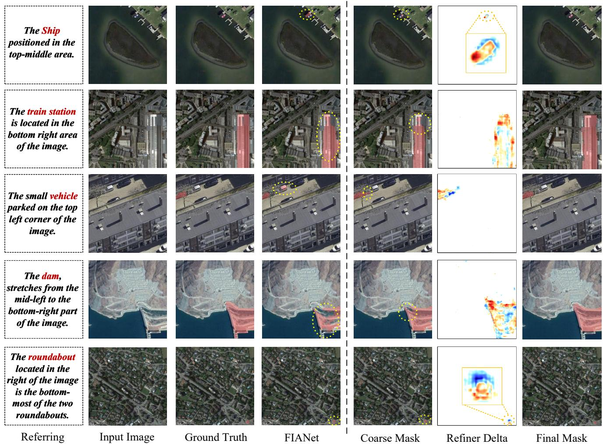  
Fig. 9: Qualitative results of the proposed DiCoR on the RISBench dataset.

TABLE III: Comparison of segmentation performance on the RRSIS-D dataset across various evaluation metrics.
<table><tr><td>Method</td><td>Publication</td><td>Pr@0.5</td><td>Pr@0.6</td><td>Pr@0.7</td><td>Pr@0.8</td><td>Pr@0.9</td><td>gIoU</td><td>mIoU</td></tr><tr><td>BRINet [29]</td><td>CVPR&#x27;20</td><td>56.90</td><td>48.77</td><td>39.12</td><td>27.03</td><td>8.73</td><td>69.88</td><td>49.65</td></tr><tr><td>CMPC+ [60]</td><td>TPAMI&#x27;21</td><td>57.65</td><td>47.51</td><td>36.97</td><td>24.33</td><td>7.78</td><td>68.64</td><td>50.24</td></tr><tr><td>LAVT [34]</td><td>CVPR&#x27;22</td><td>69.52</td><td>63.63</td><td>53.29</td><td>41.60</td><td>24.94</td><td>77.19</td><td>61.04</td></tr><tr><td>RIS-DMMI [61]</td><td>ICCV&#x27;23</td><td>68.74</td><td>60.96</td><td>50.33</td><td>38.38</td><td>21.63</td><td>76.20</td><td>60.12</td></tr><tr><td>CrossVLT [62]</td><td>TMM&#x27;23</td><td>70.38</td><td>63.83</td><td>52.86</td><td>42.11</td><td>25.02</td><td>76.32</td><td>61.00</td></tr><tr><td>LGCE [1]</td><td>TGRS&#x27;24</td><td>67.65</td><td>61.53</td><td>51.45</td><td>39.62</td><td>23.33</td><td>76.34</td><td>59.37</td></tr><tr><td>EVF-SAM [43]</td><td>arXiv&#x27;24</td><td>72.16</td><td>66.50</td><td>56.59</td><td>43.92</td><td>25.48</td><td>76.77</td><td>62.75</td></tr><tr><td>FIANet [4]</td><td>TGRS&#x27;24</td><td>74.46</td><td>66.96</td><td>56.31</td><td>42.83</td><td>24.13</td><td>76.91</td><td>64.01</td></tr><tr><td>RMSIN [2]</td><td>CVPR&#x27;24</td><td>74.26</td><td>67.25</td><td>55.93</td><td>42.55</td><td>24.53</td><td>77.79</td><td>64.20</td></tr><tr><td>CroBIM [3]</td><td>arXiv&#x27;24</td><td>74.58</td><td>67.57</td><td>55.59</td><td>41.63</td><td>23.56</td><td>75.99</td><td>64.46</td></tr><tr><td>CADFormer [12]</td><td>JSTARS&#x27;25</td><td>74.20</td><td>67.62</td><td>55.59</td><td>42.37</td><td>23.59</td><td>77.26</td><td>63.77</td></tr><tr><td>LSCF [13]</td><td>TGRS&#x27;25</td><td>74.30</td><td>67.69</td><td>56.32</td><td>43.08</td><td>25.67</td><td>77.42</td><td>64.25</td></tr><tr><td>RSRefSeg-1 [19]</td><td>IGARSS&#x27;25</td><td>74.49</td><td>68.33</td><td>58.73</td><td>48.50</td><td>30.80</td><td>77.24</td><td>64.67</td></tr><tr><td>SBANet [14]</td><td>ISPRS&#x27;25</td><td>75.91</td><td></td><td>57.05</td><td></td><td>25.38</td><td>79.22</td><td>65.52</td></tr><tr><td>BTDNet [15]</td><td>arXiv&#x27;25</td><td>75.93</td><td>69.92</td><td>59.29</td><td>46.25</td><td>27.46</td><td>79.23</td><td>66.04</td></tr><tr><td>SegEarth-R1 [21]</td><td>arXiv&#x27;25</td><td>76.96</td><td></td><td></td><td></td><td></td><td>78.01</td><td>66.40</td></tr><tr><td>MCD-Net [18]</td><td>TGRS&#x27;26</td><td>75.58</td><td>68.74</td><td>57.51</td><td>44.15</td><td>25.97</td><td>78.14</td><td>65.05</td></tr><tr><td>CroBIM-U [17]</td><td>TGRS&#x27;26</td><td>75.60</td><td>67.68</td><td>56.47</td><td>42.57</td><td>24.16</td><td>76.70</td><td>65.07</td></tr><tr><td>RS2-SAM 2 [23]</td><td>AAAI&#x27;26</td><td>77.56</td><td>72.34</td><td>61.76</td><td>47.92</td><td>29.73</td><td>78.99</td><td>66.72</td></tr><tr><td>Ours</td><td></td><td>78.23</td><td>71.78</td><td>64.01</td><td>48.57</td><td>30.16</td><td>79.45</td><td>66.94</td></tr></table>

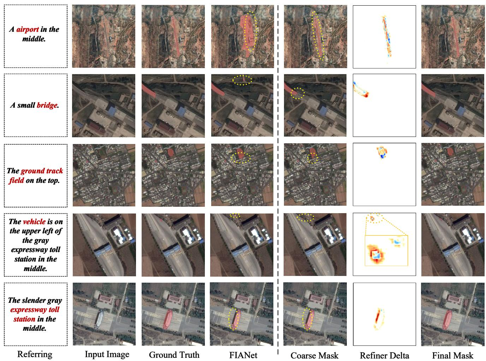  
Fig. 10: Qualitative results of the proposed DiCoR on the RRSIS-D dataset.

2) Ablation of DLG components and configurations. As shown in Table VI, we first evaluate whether a learned response map is necessary for candidate discovery. Removing the response estimator (w/o Resp) yields inferior performance compared with adding an explicit response estimation network (w/ Resp), which improves mIoU from 67.63 to 69.15. This indicates that although the fused features already contain rich semantic information, they cannot directly reflect discriminative hotspot regions for the referred target.

TABLE IV: Efficiency comparison with typical JFS and DPS methods on RefSegRS dataset.
<table><tr><td>Paradigm</td><td>Method</td><td>Backbone</td><td>Segmenter</td><td>|Params (M)</td><td>GFLOPs</td><td>FPS</td><td>mIoU (%)</td><td>AEI</td></tr><tr><td rowspan="4">JFS</td><td>LAVT [34]</td><td>Swin-B + BERT</td><td>Conv. decoder</td><td>227.74</td><td>198.82</td><td>28.65</td><td>47.40</td><td>47.40</td></tr><tr><td>RMSIN [2]</td><td> $\mathrm { S w i n - B } + \mathrm { B E R T }$ </td><td>Conv. decoder</td><td>240.04</td><td>200.33</td><td>17.50</td><td>62.58</td><td>38.08</td></tr><tr><td>FIANet [4]</td><td> $\mathrm { S w i n - B } + \mathrm { B E R T }$ </td><td>Conv. decoder</td><td>256.17</td><td>210.44</td><td>24.18</td><td>68.67</td><td>56.33</td></tr><tr><td>MCD-Net [18]</td><td> $\mathrm { S w i n - B } + \mathrm { B E R T }$ </td><td>Conv. decoder</td><td>354.97</td><td>482.73</td><td>4.22</td><td>72.68</td><td>6.87</td></tr><tr><td rowspan="4">DPS</td><td>RSRefSeg-1 [19]</td><td>CLIP</td><td>SAM</td><td>984.28</td><td>1610.75</td><td>6.62</td><td>72.45</td><td>5.88</td></tr><tr><td>RSRefSeg-2 [20]</td><td>CLIP</td><td>SAM</td><td>1447.13</td><td>2563.51</td><td>5.40</td><td>77.39</td><td>4.06</td></tr><tr><td>SegEarth-R1 [21]</td><td> $\mathrm { S w i n { - } B } + \mathrm { P h i { - } } 1 . 5 \mathrm { B }$ </td><td>Mask2Former</td><td>1589.29</td><td>2750.90</td><td>5.27</td><td>72.45</td><td>3.58</td></tr><tr><td>SegEarth-R2 [22]</td><td> $\mathrm { S w i n – B / S i g L I P + P h i  – 2 B }$ </td><td>Mask2Former</td><td>3325.06</td><td>6018.13</td><td>2.41</td><td>74.80</td><td>1.14</td></tr><tr><td>JFS</td><td>Ours</td><td> $\mathrm { S w i n - B } + \mathrm { B E R T }$ </td><td>Conv. decoder</td><td>251.49</td><td>248.32</td><td>25.54</td><td>77.96</td><td>62.19</td></tr></table>

All methods are evaluated based on their publicly available implementations on a NVIDIA RTX 4090 GPU. The image input resolution and maximum text length are kept identical for fair comparison.

TABLE V: Ablation of feature aggregation and decoupled modules on RISBench.
<table><tr><td rowspan="2">Aggregation</td><td colspan="2">Modules</td><td colspan="4">Performance (%)</td></tr><tr><td>DLG</td><td>LCR</td><td>Pr@0.5</td><td>Pr@0.9</td><td>mIoU</td><td>gIoU</td></tr><tr><td>w/o MSA TMEM [4]</td><td>一</td><td>一</td><td>74.44</td><td>30.09</td><td>66.45</td><td>72.92</td></tr><tr><td rowspan="4">MSA</td><td>一</td><td>一</td><td>75.53</td><td>31.75</td><td>67.48</td><td>74.39</td></tr><tr><td></td><td>一</td><td>76.30 77.55</td><td>32.68 32.89</td><td>68.18</td><td>74.86</td></tr><tr><td> $\checkmark$ </td><td>1 √</td><td>76.52</td><td>39.45</td><td>69.15 69.56</td><td>75.12</td></tr><tr><td> $\checkmark$ </td><td> $\checkmark$ </td><td>77.94</td><td>39.39</td><td>70.30</td><td>75.30 75.51</td></tr></table>

We further study the number of generated candidates and the candidate ranking strategy. Among the tested settings, $K \ = \ 5$ achieves the best results across all four metrics. Reducing the number to three may omit plausible referent regions, whereas increasing it to seven slightly degrades performance, suggesting that excessive candidates introduce additional ambiguity without improving target coverage. For candidate selection, choosing the candidate solely according to its response strength (w/o Rank) produces the weakest results, indicating that response map alone is insufficient for reliable target discrimination. The visual-only ranker (Visual-Only), which performs ranking solely based on visual features, improves the performance by suppressing visually inconsistent candidates and enhancing discrimination among candidate regions. In contrast, the visual-text ranker (Visual-Text) further incorporates textual guidance by re-weighting textual representations according to visual features, enabling more effective cross-modal candidate ranking and achieving the best overall performance.

3) Ablation of DLG spatial guidance injection. Figure 11 evaluates spatial guidance injection across different aggregation stages and feature levels. Injecting guidance before MSA consistently achieves the strongest performance, indicating that the recalibrated features benefit from the complete multi-scale interaction process. By contrast, injecting guidance within MSA performs worse than applying it either before or after

TABLE VI: Ablation of DLG components and configurations.
<table><tr><td>Component</td><td>Setting</td><td>Pr@0.5</td><td>Pr@0.9</td><td>gIoU</td><td>mIoU</td></tr><tr><td>Response</td><td>w/o Resp</td><td>75.83</td><td>32.12</td><td>74.52</td><td>67.63</td></tr><tr><td>Estimator</td><td>w/ Resp</td><td>77.55</td><td>32.89</td><td>75.12</td><td>69.15</td></tr><tr><td>Candidate</td><td>K=3</td><td>76.89</td><td>32.40</td><td>74.83</td><td>68.86</td></tr><tr><td>Generator</td><td>K=5</td><td>77.55</td><td>32.89</td><td>75.12</td><td>69.15</td></tr><tr><td></td><td>K=7</td><td>77.34</td><td>32.41</td><td>74.91</td><td>69.10</td></tr><tr><td>Candidate</td><td>w/o Rank</td><td>75.34</td><td>31.15</td><td>73.96</td><td>67.25</td></tr><tr><td>Ranker</td><td>Visual-Only</td><td>77.00</td><td>32.97</td><td>74.87</td><td>67.90</td></tr><tr><td></td><td>Visual-Text</td><td>77.55</td><td>32.89</td><td>75.12</td><td>69.15</td></tr></table>

MSA, suggesting that spatial modulation between successive aggregation operations disrupts cross-scale feature interaction. Across all three injection stages, guiding $X _ { 3 }$ yields the best results because its higher-level representation provides more reliable referent semantics than the relatively low-level $X _ { 2 } .$ Jointly guiding $X _ { 2 }$ and $X _ { 3 }$ provides no additional benefit and is particularly detrimental when applied within MSA, indicating that repeated modulation may introduce redundant or conflicting spatial cues.

4) Ablation of DLG supervision strategies. Table VII evaluates different supervision strategies for the DLG response estimator. Supervising the entire target mask with BCE $( { \mathcal { L } } _ { M } )$ performs suboptimally because it encourages the response estimator to reconstruct the target extent, whereas its intended role is to identify compact and discriminative evidence for candidate discovery. Replacing full-mask supervision with a compact positive region centered on the referent $( \mathcal { L } _ { \mathcal { P } } )$ improves all four metrics, confirming that localized response supervision is better aligned with this objective. Adding clean-background suppression $( \mathcal { L } _ { B } )$ produces only marginal and mixed changes, indicating that separating the referent from ordinary background is insufficient to resolve ambiguity among visually similar instances. Incorporating SAM3-mined hard negatives $( \mathcal { L } _ { \mathcal { H } } )$ yields consistent improvements across all metrics, which demonstrate that instance-level distractor supervision promotes more effective response estimation and provides more reliable candidates for downstream ranking.

5) Ablation of LCR training data construction. Figure 12 examines the effects of checkpoint sampling, localization filtering, and morphological perturbation on LCR pretraining. Using coarse predictions from a single final checkpoint provides limited recalibration performance, since LCR is exposed to a narrow distribution of prediction errors. Introducing filtering consistently improves all checkpoint settings, especially on Pr@0.9, indicating that poorly localized coarse priors should be excluded from residual recalibration training. Sparse and dense sampling of multiple training stages progressively broaden the distribution of contour deviations and prediction qualities. Morphological perturbation further enriches boundary variations by simulating local expansion and shrinkage, yielding the strongest overall results under dense checkpoint sampling.

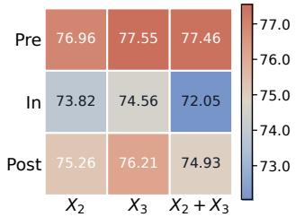  
(a) Pr@0.5

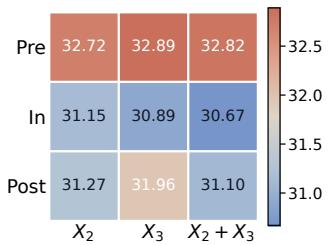

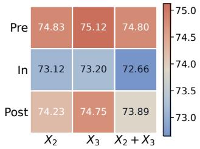  
(c) gIoU

(b) Pr@0.9  
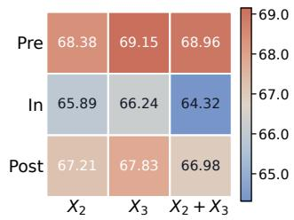  
(d) mIoU  
Fig. 11: Ablation of spatial guidance injection across aggregation stages and feature levels. Pre, In, and Post denote injection before, within, and after the MSA module respectively. Columns indicate the guided feature levels. Higher values indicate better performance.

TABLE VII: Ablation of response supervision in DLG.
<table><tr><td> ${ \mathcal { L } } _ { M }$ </td><td> $\mathcal { L } _ { \mathcal { P } }$ </td><td> $\mathcal { L } _ { B }$ </td><td> $\mathcal { L } _ { \mathcal { H } }$ </td><td>Pr@0.5</td><td>Pr@0.9</td><td>gIoU</td><td>mIoU</td></tr><tr><td> $\checkmark$ </td><td>一</td><td>一</td><td>一</td><td>75.20</td><td>31.09</td><td>74.12</td><td>67.26</td></tr><tr><td></td><td>√</td><td>一</td><td>一</td><td>76.34</td><td>32.08</td><td>74.58</td><td>68.21</td></tr><tr><td></td><td>√</td><td>√</td><td>一</td><td>76.52</td><td>31.95</td><td>74.44</td><td>68.35</td></tr><tr><td></td><td>√</td><td>√</td><td>√</td><td>77.55</td><td>32.89</td><td>75.12</td><td>69.15</td></tr></table>

6) Ablation of LCR localized contour supervision. Table VIII evaluates different supervision regions and weighting strategies for LCR. Specifically, Dense applies uniform recalibration supervision over the entire image, Local-U restricts supervision to localized contour regions with uniform weights, and Local-W further introduces region-dependent weights within the localized supervision regions. Dense supervision provides a reasonable baseline but treats all pixels equally, which is not fully consistent with the goal of residual boundary correction. In contrast, Local-U improves performance by concentrating supervision on contour related regions, indicating that recalibration benefits more from boundary focused optimization than from dense uniform supervision. Local-W further improves the results by assigning larger weights to boundary-sensitive regions, which encourages the model to focus on more informative correction areas and yields the best overall performance.

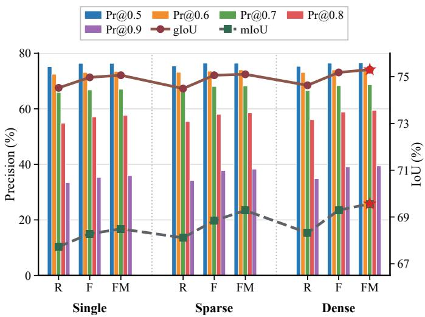  
Fig. 12: Ablation of LCR training data construction. Single denotes coarse predictions from the final checkpoint, whereas Sparse and Dense denote predictions sampled at increasing densities from multiple training checkpoints. R, F, and FM denote raw predictions, predictions filtered by localization quality, and filtered predictions with morphological perturbation respectively.

TABLE VIII: Ablation of localized contour supervision for LCR.
<table><tr><td> $\mathcal { L } _ { \mathrm { r c e } }$ </td><td> $\mathcal { L } _ { \mathrm { r d i c e } }$ </td><td>Pr@0.5</td><td>Pr@0.9</td><td>gIoU</td><td>mIoU</td></tr><tr><td>Dense</td><td>一</td><td>76.08</td><td>35.47</td><td>74.78</td><td>68.44</td></tr><tr><td>Local-U</td><td></td><td>76.45</td><td>37.72</td><td>74.91</td><td>68.99</td></tr><tr><td>Local-U</td><td>Local-U</td><td>76.52</td><td>38.60</td><td>75.27</td><td>69.15</td></tr><tr><td>Local-W</td><td></td><td>76.43</td><td>38.06</td><td>75.18</td><td>69.23</td></tr><tr><td>Local-W</td><td>Local-W</td><td>76.52</td><td>39.45</td><td>75.30</td><td>69.56</td></tr></table>

## F. Limitations

Although the proposed framework improves both referent localization and mask refinement, it still has several limitations. First, the localization process still depends on the quality of the initial spatial response map. When the response estimator fails to activate around the true referent, the subsequent candidate generator and ranker have limited ability to recover the correct target. This indicates that spatial prior injection has a performance ceiling, since it does not directly optimize early feature extraction or cross-modal fusion. Future work may therefore explore more integrated localization mechanisms, such as object-level cross-modal reasoning and localization feature learning from earlier network stages. Second, the contour recalibration module is more effective for small targets, whose coarse masks often suffer from local omissions or boundary erosion. For large targets, however, boundary errors usually involve longer contours and broader structural inconsistencies, which are difficult to correct through local residual recalibration alone. Future recalibration strategies may therefore benefit from stronger global boundary modeling while preserving the efficiency of residual contour correction.

## V. CONCLUSION

In this paper, we presented DiCoR, a decoupled referent disambiguation and contour recalibration framework for efficient referring remote sensing image segmentation. DiCoR addresses the accuracy-efficiency dilemma between joint fusion segmentation and decoupled prompt segmentation by preserving an efficient inference pipeline while introducing dedicated mechanisms for improving grounding reliability and contour recovery. Specifically, the proposed disambiguationaware localization guidance strategy organizes response-based candidate regions and ranks them with adaptive linguistic features, enabling the model to identify the referred target under SAM-assisted distractor supervision. In addition, the lightweight contour recalibration module learns residual boundary corrections from diverse coarse predictions under localized contour supervision, thereby improving mask delineation without relying on a foundation model during inference. Extensive experiments on RefSegRS, RRSIS-D, and RISBench demonstrate that DiCoR consistently improves segmentation accuracy and achieves a favorable accuracy-efficiency tradeoff compared with existing RRSIS methods. Future work will further explore more robust early-stage localization and global boundary modeling to handle more challenging referential ambiguity and large-scale target structures.

## REFERENCES

[1] Z. Yuan, L. Mou, Y. Hua, and X. X. Zhu, “Rrsis: Referring remote sensing image segmentation,” IEEE Transactions on Geoscience and Remote Sensing, vol. 62, pp. 1–12, 2024.

[2] S. Liu, Y. Ma, X. Zhang, H. Wang, J. Ji, X. Sun, and R. Ji, “Rotated multi-scale interaction network for referring remote sensing image segmentation,” in Proceedings of the IEEE/CVF Conference on Computer Vision and Pattern Recognition, 2024, pp. 26 658–26 668.

[3] Z. Dong, Y. Sun, T. Liu, W. Zuo, and Y. Gu, “Cross-modal bidirectional interaction model for referring remote sensing image segmentation,” arXiv preprint arXiv:2410.08613, 2024.

[4] S. Lei, X. Xiao, T. Zhang, H.-C. Li, Z. Shi, and Q. Zhu, “Exploring fine-grained image-text alignment for referring remote sensing image segmentation,” IEEE Transactions on Geoscience and Remote Sensing, vol. 63, pp. 1–11, 2025.

[5] Z. Yang, H. Yao, L. Tian, X. Zhao, Q. Li, and Q. Wang, “A large-scale referring remote sensing image segmentation dataset and benchmark,” arXiv preprint arXiv:2506.03583, 2025.

[6] R. Ou, Y. Hu, F. Zhang, J. Chen, and Y. Liu, “Geopix: A multimodal large language model for pixel-level image understanding in remote sensing,” IEEE Geoscience and Remote Sensing Magazine, 2025.

[7] X. Lu, L. Sun, L. Li, L. Jiao, Y. Yang, Z. Huang, J. Chai, X. Liu, F. Liu, W. Ma et al., “Rrsecs: Referring remote sensing expression comprehension and segmentation,” IEEE Geoscience and Remote Sensing Magazine, 2025.

[8] J. Sosa, D. Rukhovich, A. Kacem, and D. Aouada, “Enabling trainingfree text-based remote sensing segmentation,” in Proceedings of the IEEE/CVF Conference on Computer Vision and Pattern Recognition, 2026, pp. 8041–8052.

[9] C. Broni-Bediako, J. Xia, and N. Yokoya, “Real-time semantic segmentation: A brief survey and comparative study in remote sensing,” IEEE Geoscience and Remote Sensing Magazine, vol. 11, no. 4, pp. 94–124, 2023.

[10] S. Liu, J. Cheng, L. Liang, H. Bai, and W. Dang, “Light-weight semantic segmentation network for uav remote sensing images,” IEEE Journal of Selected Topics in Applied Earth Observations and Remote Sensing, vol. 14, pp. 8287–8296, 2021.

[11] Y. Pan, R. Sun, Y. Wang, T. Zhang, and Y. Zhang, “Rethinking the implicit optimization paradigm with dual alignments for referring remote sensing image segmentation,” in Proceedings of the 32nd ACM International Conference on Multimedia, 2024, pp. 2031–2040.

[12] M. Liu, X. Jiang, and X. Zhang, “Cadformer: Fine-grained crossmodal alignment and decoding transformer for referring remote sensing image segmentation,” IEEE Journal of Selected Topics in Applied Earth Observations and Remote Sensing, 2025.

[13] Q. Ma, L. Li, X. Lu, L. Jiao, F. Liu, W. Ma, X. Liu, and L. Sun, “Lscf: Long-term semantic-guidance convformer for referring remote sensing image segmentation,” IEEE Transactions on Geoscience and Remote Sensing, 2025.

[14] K. Li, G. Vosselman, and M. Y. Yang, “Scale-wise bidirectional alignment network for referring remote sensing image segmentation,” ISPRS Journal of Photogrammetry and Remote Sensing, vol. 226, pp. 350–363, 2025.

[15] T. Zhang, Z. Wen, B. Kong, K. Liu, Y. Zhang, P. Zhuang, and J. Li, “Referring remote sensing image segmentation via bidirectional alignment guided joint prediction,” arXiv preprint arXiv:2502.08486, 2025.

[16] J. Yang, L. Zhang, and H. Lu, “Referring remote sensing image segmentation with cross-view semantics interaction network,” arXiv preprint arXiv:2508.01331, 2025.

[17] Y. Sun, Z. Dong, H. Jiang, Y. Gu, and T. Liu, “Crobim-u: Uncertaintydriven referring remote sensing image segmentation,” IEEE Transactions on Geoscience and Remote Sensing, 2026.

[18] J. Zhang, L. Li, L. Jiao, X. Liu, F. Liu, W. Ma, and S. Yang, “A multiscale vision–text collaborative dual encoder for referring rs image segmentation,” IEEE Transactions on Geoscience and Remote Sensing, vol. 64, pp. 1–15, 2026.

[19] K. Chen, J. Zhang, C. Liu, Z. Zou, and Z. Shi, “Rsrefseg: Referring remote sensing image segmentation with foundation models,” in IGARSS 2025-2025 IEEE International Geoscience and Remote Sensing Symposium. IEEE, 2025, pp. 1070–1074.

[20] K. Chen, C. Liu, B. Chen, J. Zhang, Z. Zou, and Z. Shi, “Rsrefseg 2: decoupling referring remote sensing image segmentation with foundation models,” arXiv preprint arXiv:2507.06231, 2025.

[21] K. Li, Z. Xin, L. Pang, C. Pang, Y. Deng, J. Yao, G. Xia, D. Meng, Z. Wang, and X. Cao, “Segearth-r1: Geospatial pixel reasoning via large language model,” arXiv preprint arXiv:2504.09644, 2025.

[22] Z. Xin, K. Li, L. Chen, W. Li, Y. Xiao, H. Qiao, W. Zhang, D. Meng, and X. Cao, “Segearth-r2: Towards comprehensive language-guided segmentation for remote sensing images,” arXiv preprint arXiv:2512.20013, 2025.

[23] F. Rong, M. Lan, Q. Zhang, and L. Zhang, “Customized sam 2 for referring remote sensing image segmentation,” arXiv e-prints, pp. arXiv– 2503, 2025.

[24] N. Carion, L. Gustafson, Y.-T. Hu, S. Debnath, R. Hu, D. Suris, C. Ryali, K. V. Alwala, H. Khedr, A. Huang et al., “Sam 3: Segment anything with concepts,” arXiv preprint arXiv:2511.16719, 2025.

[25] R. Hu, M. Rohrbach, and T. Darrell, “Segmentation from natural language expressions,” in European Conference on Computer Vision. Springer, 2016, pp. 108–124.

[26] R. Li, K. Li, Y.-C. Kuo, M. Shu, X. Qi, X. Shen, and J. Jia, “Referring image segmentation via recurrent refinement networks,” in Proceedings of the IEEE Conference on Computer Vision and Pattern Recognition, 2018, pp. 5745–5753.

[27] E. Margffoy-Tuay, J. C. Perez, E. Botero, and P. Arbelaez, “Dynamic multimodal instance segmentation guided by natural language queries,” in European Conference on Computer Vision. Springer, 2018, pp. 630– 645.

[28] L. Ye, M. Rochan, Z. Liu, and Y. Wang, “Cross-modal self-attention network for referring image segmentation,” in Proceedings of the IEEE/CVF conference on computer vision and pattern recognition, 2019, pp. 10 502–10 511.

[29] Z. Hu, G. Feng, J. Sun, L. Zhang, and H. Lu, “Bi-directional relationship inferring network for referring image segmentation,” in Proceedings of the IEEE/CVF conference on computer vision and pattern recognition, 2020, pp. 4424–4433.

[30] G. Luo, Y. Zhou, X. Sun, L. Cao, C. Wu, C. Deng, and R. Ji, “Multitask collaborative network for joint referring expression comprehension and segmentation,” in Proceedings of the IEEE/CVF Conference on Computer Vision and Pattern Recognition, 2020, pp. 10 034–10 043.

[31] G. Feng, Z. Hu, L. Zhang, and H. Lu, “Encoder fusion network with coattention embedding for referring image segmentation,” in Proceedings of the IEEE/CVF Conference on Computer Vision and Pattern Recognition, 2021, pp. 15 506–15 515.

[32] H. Ding, C. Liu, S. Wang, and X. Jiang, “Vision-language transformer and query generation for referring segmentation,” in Proceedings of the IEEE/CVF international conference on computer vision, 2021, pp. 16 321–16 330.

[33] N. Kim, D. Kim, C. Lan, W. Zeng, and S. Kwak, “Restr: Convolutionfree referring image segmentation using transformers,” in Proceedings of the IEEE/CVF conference on computer vision and pattern recognition, 2022, pp. 18 145–18 154.

[34] Z. Yang, J. Wang, Y. Tang, K. Chen, H. Zhao, and P. H. Torr, “Lavt: Language-aware vision transformer for referring image segmentation,” in Proceedings of the IEEE/CVF conference on computer vision and pattern recognition, 2022, pp. 18 155–18 165.

[35] S. Ouyang, H. Wang, S. Xie, Z. Niu, R. Tong, Y.-W. Chen, and L. Lin, “Slvit: Scale-wise language-guided vision transformer for referring image segmentation.” in IJCAI, vol. 8, 2023.

[36] S.-A. Liu, Y. Zhang, Z. Qiu, H. Xie, Y. Zhang, and T. Yao, “Caris: Context-aware referring image segmentation,” in Proceedings of the 31st ACM International Conference on Multimedia, 2023, pp. 779–788.

[37] Z. Wang, Y. Lu, Q. Li, X. Tao, Y. Guo, M. Gong, and T. Liu, “Cris: Clip-driven referring image segmentation,” in Proceedings of the IEEE/CVF conference on computer vision and pattern recognition, 2022, pp. 11 686–11 695.

[38] S. Kim, M. Kang, D. Kim, J. Park, and S. Kwak, “Extending clip’s image-text alignment to referring image segmentation,” in Proceedings of the 2024 Conference of the North American Chapter of the Association for Computational Linguistics: Human Language Technologies (Volume 1: Long Papers), 2024, pp. 4611–4628.

[39] C. Shang, Z. Song, H. Qiu, L. Wang, F. Meng, and H. Li, “Prompt-driven referring image segmentation with instance contrasting,” in Proceedings of the IEEE/CVF Conference on Computer Vision and Pattern Recognition, 2024, pp. 4124–4134.

[40] X. Lai, Z. Tian, Y. Chen, Y. Li, Y. Yuan, S. Liu, and J. Jia, “LISA: Reasoning segmentation via large language model,” in Proceedings of the IEEE/CVF Conference on Computer Vision and Pattern Recognition, 2024, pp. 9579–9589.

[41] Z. Xu, Z. Chen, Y. Zhang, Y. Song, X. Wan, and G. Li, “Bridging vision and language encoders: Parameter-efficient tuning for referring image segmentation,” in Proceedings ofthe IEEE/CVF international conference on computer vision, 2023, pp. 17 503–17 512.

[42] S. Yu, P. H. Seo, and J. Son, “Zero-shot referring image segmentation with global-local context features,” in Proceedings of the IEEE/CVF Conference on Computer Vision and Pattern Recognition, 2023, pp. 19 456–19 465.

[43] Y. Zhang, T. Cheng, L. Zhu, R. Hu, L. Liu, H. Liu, L. Ran, X. Chen, W. Liu, and X. Wang, “Evf-sam: Early vision-language fusion for textprompted segment anything model,” arXiv preprint arXiv:2406.20076, 2024.

[44] K. Ito, “Feature design for bridging SAM and CLIP toward referring image segmentation,” in Proceedings of the Winter Conference on Applications of Computer Vision, 2025, pp. 8357–8367.

[45] T. Takikawa, D. Acuna, V. Jampani, and S. Fidler, “Gated-SCNN: Gated shape CNNs for semantic segmentation,” in Proceedings of the IEEE/CVF International Conference on Computer Vision, 2019, pp. 5229–5238.

[46] Y. Yuan, J. Xie, X. Chen, and J. Wang, “SegFix: Model-agnostic boundary refinement for segmentation,” in European Conference on Computer Vision. Springer, 2020, pp. 489–506.

[47] B. Cheng, R. Girshick, P. Dollar, A. C. Berg, and A. Kirillov, “Boundary IoU: Improving object-centric image segmentation evaluation,” in Proceedings of the IEEE/CVF Conference on Computer Vision and Pattern Recognition, 2021, pp. 15 334–15 342.

[48] A. Radford, J. W. Kim, C. Hallacy, A. Ramesh, G. Goh, S. Agarwal, G. Sastry, A. Askell, P. Mishkin, J. Clark et al., “Learning transferable visual models from natural language supervision,” in International conference on machine learning. PmLR, 2021, pp. 8748–8763.

[49] L. H. Li, P. Zhang, H. Zhang, J. Yang, C. Li, Y. Zhong, L. Wang, L. Yuan, L. Zhang, J.-N. Hwang, K.-W. Chang, and J. Gao, “Grounded language-image pre-training,” in Proceedings of the IEEE/CVF Conference on Computer Vision and Pattern Recognition, 2022, pp. 10 965– 10 975.

[50] S. Liu, Z. Zeng, T. Ren, F. Li, H. Zhang, J. Yang, Q. Jiang, C. Li, J. Yang, H. Su, J. Zhu, and L. Zhang, “Grounding DINO: Marrying DINO with grounded pre-training for open-set object detection,” in European Conference on Computer Vision. Springer, 2024, pp. 38– 55.

[51] F. Liu, D. Chen, Z. Guan, X. Zhou, J. Zhu, Q. Ye, L. Fu, and J. Zhou, “RemoteCLIP: A vision language foundation model for remote sensing,” IEEE Transactions on Geoscience and Remote Sensing, vol. 62, pp. 1– 16, 2024.

[52] A. Kirillov, E. Mintun, N. Ravi, H. Mao, C. Rolland, L. Gustafson, T. Xiao, S. Whitehead, A. C. Berg, W.-Y. Lo et al., “Segment anything,” in Proceedings of the IEEE/CVF international conference on computer vision, 2023, pp. 4015–4026.

[53] X. Zou, J. Yang, H. Zhang, F. Li, L. Li, J. Wang, L. Wang, J. Gao, and Y. J. Lee, “Segment everything everywhere all at once,” in Advances in Neural Information Processing Systems, vol. 36, 2023, pp. 19 769– 19 782.

[54] L. Ke, M. Ye, M. Danelljan, Y. Liu, Y.-W. Tai, C.-K. Tang, and F. Yu, “Segment anything in high quality,” in Advances in Neural Information Processing Systems, vol. 36, 2023, pp. 29 914–29 934.

[55] N. Ravi, V. Gabeur, Y.-T. Hu, R. Hu, C. Ryali, T. Ma, H. Khedr, R. Radle, C. Rolland, L. Gustafson, E. Mintun, J. Pan, K. V. Alwala, N. Carion, C.-Y. Wu, R. Girshick, P. Dollar, and C. Feichtenhofer, “SAM 2: Segment anything in images and videos,” in International Conference on Learning Representations, 2025.

[56] S. Li, S. Wang, Z. Sun, and J. Xiao, “Semantic localization guiding segment anything model for reference remote sensing image segmentation,” arXiv preprint arXiv:2506.10503, 2025.

[57] Z. Liu, Y. Lin, Y. Cao, H. Hu, Y. Wei, Z. Zhang, S. Lin, and B. Guo, “Swin transformer: Hierarchical vision transformer using shifted windows,” in Proceedings of the IEEE/CVF international conference on computer vision, 2021, pp. 10 012–10 022.

[58] J. Devlin, M.-W. Chang, K. Lee, and K. Toutanova, “Bert: Pre-training of deep bidirectional transformers for language understanding,” in Proceedings of the 2019 conference of the North American chapter of the association for computational linguistics: human language technologies, volume 1 (long and short papers), 2019, pp. 4171–4186.

[59] T. Hui, S. Liu, S. Huang, G. Li, S. Yu, F. Zhang, and J. Han, “Linguistic structure guided context modeling for referring image segmentation,” in European conference on computer vision. Springer, 2020, pp. 59–75.

[60] S. Liu, T. Hui, S. Huang, Y. Wei, B. Li, and G. Li, “Cross-modal progressive comprehension for referring segmentation,” IEEE Transactions on Pattern Analysis and Machine Intelligence, vol. 44, no. 9, pp. 4761– 4775, 2021.

[61] Y. Hu, Q. Wang, W. Shao, E. Xie, Z. Li, J. Han, and P. Luo, “Beyond one-to-one: Rethinking the referring image segmentation,” in Proceedings of the IEEE/CVF International Conference on Computer Vision, 2023, pp. 4067–4077.

[62] Y. Cho, H. Yu, and S.-J. Kang, “Cross-aware early fusion with stagedivided vision and language transformer encoders for referring image segmentation,” IEEE Transactions on Multimedia, vol. 26, pp. 5823– 5833, 2023.

[63] S. Huang, T. Hui, S. Liu, G. Li, Y. Wei, J. Han, L. Liu, and B. Li, “Referring image segmentation via cross-modal progressive comprehension,” in Proceedings of the IEEE/CVF conference on computer vision and pattern recognition, 2020, pp. 10 488–10 497.

[64] J. Wu, X. Li, X. Li, H. Ding, Y. Tong, and D. Tao, “Toward robust referring image segmentation,” IEEE Transactions on Image Processing, vol. 33, pp. 1782–1794, 2024.

[65] M. Tan, B. Chen, R. Pang, V. Vasudevan, M. Sandler, A. Howard, and Q. V. Le, “MnasNet: Platform-aware neural architecture search for mobile,” in Proceedings of the IEEE/CVF Conference on Computer Vision and Pattern Recognition, 2019, pp. 2815–2823.

[66] S. Lee, J. Choi, and H. J. Kim, “EfficientViM: Efficient vision mamba with hidden state mixer based state space duality,” in Proceedings of the IEEE/CVF Conference on Computer Vision and Pattern Recognition, 2025, pp. 14 923–14 933.