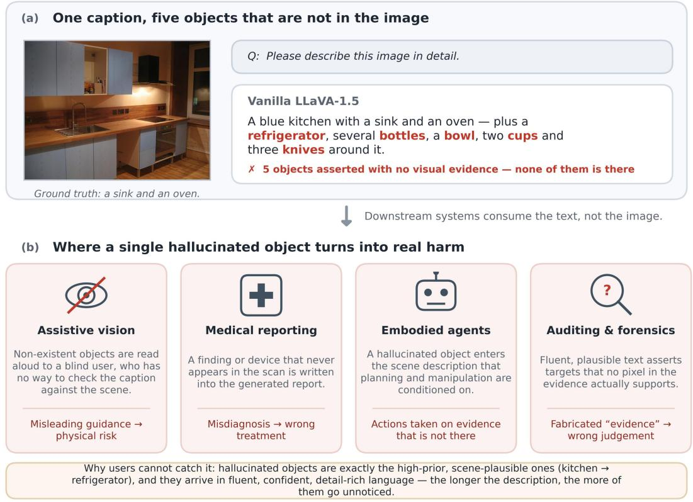
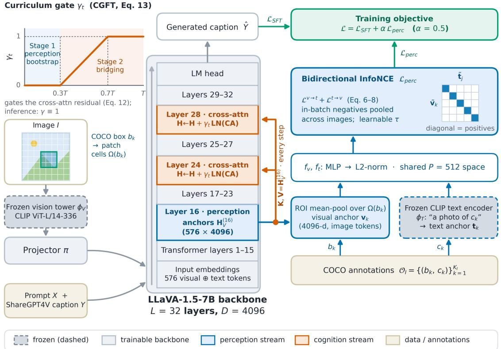
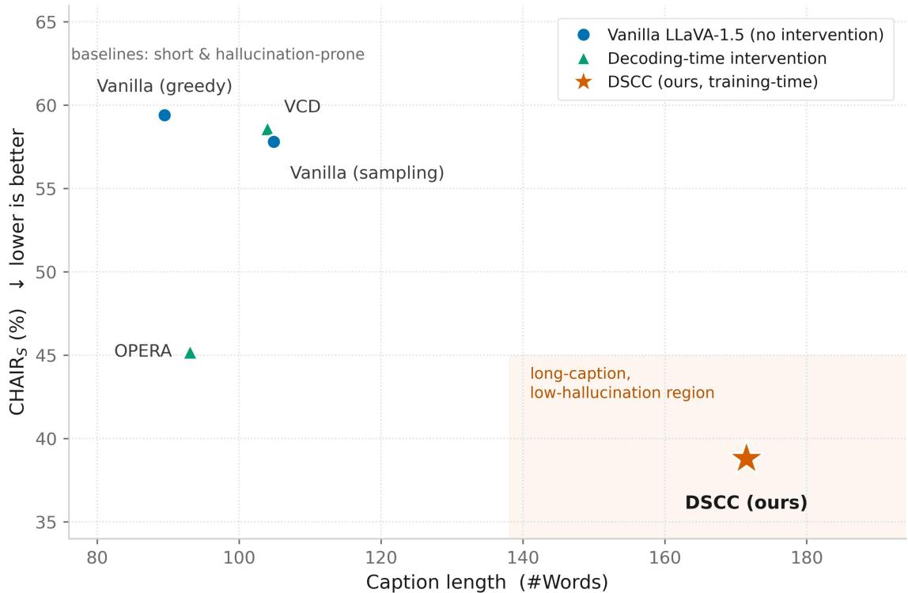
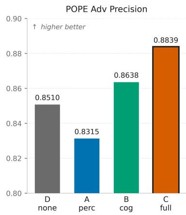
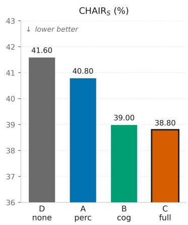
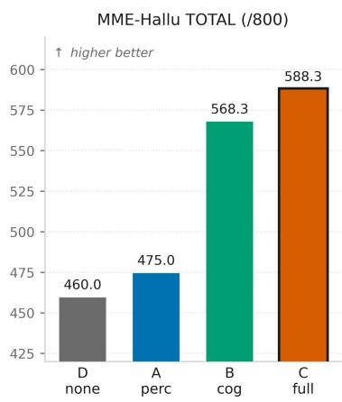
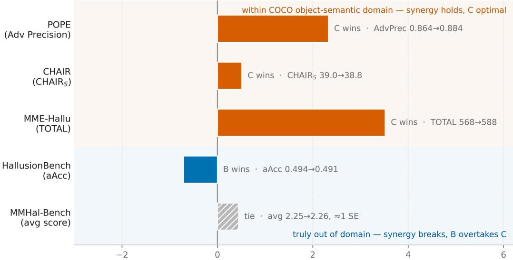

# Dual-Stream Cross-Anchor Correction: Grounding Long-Form Captions and the Domain Limits of Object-Level

Anchors

Lingkai Bu Qilu University of Technology (Shandong Academy of Sciences), Jinan, China 10431250007@stu.qlu.edu.cn

## Abstract

Object hallucination in multimodal large language models arises when language priors and corpus co-occurrence bias outweigh the visual evidence, with nothing tying an individual object mention to what the image shows. Most remedies intervene at decoding time without training, yet under a unified protocol their benefit is confined to short captions; supervised fine-tuning (SFT) on a detailrich corpus lengthens captions, but over forty percent still name absent objects. This paper proposes Dual-Stream Cross-Anchor Correction (DSCC). Unlike work that post-processes decoding, DSCC is the first to inject object-level visual anchors into the language model itself during finetuning: a perception stream aligns object-level hidden states at an intermediate layer to frozen text anchors by a bidirectional contrastive objective; a cognition stream lets deeper layers query those anchors by cross-attention at every generation step; and a two-stage curriculum gate couples them, making evidence retrieval a structural constraint at each autoregressive step. Under one backbone and one scoring protocol, experiments span long-caption hallucination, object-existence discrimination and cross-domain generalisation, with vanilla SFT on the same corpus and schedule as a length- and density-matched control, so gains are attributed layer by layer. DSCC is the only method reaching the long-caption, low-hallucination region: captions roughly 1.9 times the baseline length at 88.19% precision per object mention, the highest under a density-independent criterion. Ablations expose a synergy: the perception stream alone degrades precision yet reverses sign when stacked on the cognition stream. No universal superiority is claimed: three out-ofdomain benchmarks yield a predictable, falsifiable domain-conditionality, the synergy being bound to the anchors' semantic domain and breaking on charts and optical illusions.

## 1. Introduction

Multimodal large language models (MLLMs) have shown remarkable understanding and generation ability across general vision-language tasks [1-3], yet suffer from object hallucination, that is, they confidently describe objects that the image does not contain [4, 5], a flaw that directly obstructs the deployment of MLLMs wherever reliability matters. Fig. 1(a) illustrates the problem: given a kitchen photograph containing only a sink and an oven, LLaVA-1.5 writes a refrigerator, bottles, cups, knives and a bowl into its description, five objects that are simply not present.

Fig. 1. Object hallucination: where it hurts and what it costs. (a) Given a kitchen image containing only a sink and an oven (COCO val2014) and the prompt “describe this image in detail”, the off-theshelf LLaVA-1.5 invents a refrigerator, bottles, cups, knives and a bowl (marked in red). (b) Four representative failure settings once such a caption enters a downstream system, together with the harm each produces: assistive image description, medical report generation, embodied agents, and content moderation or forensic analysis; the bottom band explains why users rarely notice. Three properties make hallucination a problem to be solved rather than a stylistic blemish to be tolerated. The first is concealment: what gets invented is usually the object that co-occurs most strongly with the scene and therefore reads as reasonable, a refrigerator in a kitchen or cutlery on a dining table, so from the text alone a reader can hardly tell which clause is grounded. The second is propagation: in a deployed system downstream modules consume the generated text rather than the original image, so once a fabricated object enters the caption it travels onward as established fact, and no later stage typically returns to the pixels to check. The third is that severity is set by the application rather than by the number of errors: in a high-stakes setting a single fabricated object suffices to do real damage. In accessible image description for blind and lowvision users no second channel exists against which the caption can be verified, so a spoken phantom object turns into misleading guidance and, in the worst case, physical risk [5]; in medical report generation, in the planning input of embodied agents, and in content moderation, forensic analysis and remote-sensing interpretation, a superficially plausible target likewise constitutes “evidence” without a single supporting pixel, enough to sustain a wrong judgement; the four settings and the harm each produces are collected in Fig. 1(b). Captions produced by MLLMs are also widely reused as visual instruction data, ShareGPT4V [6] being a prominent case, so unverified hallucinations are recycled into the training corpus of the next generation and the error is amplified across iterations. These concerns converge on one requirement: every object a model asserts should rest on verifiable visual evidence; and the longer and more detailed the caption, the harder the fabrications are to spot, the more pressing that requirement becomes.

Efforts to mitigate hallucination have largely been trapped by an implicit length-quality trade-off: they never leave the short-caption regime, and within that regime the improvement quickly saturates. Under a unified protocol (the same LLaVA-1.5-7B backbone, the same 500 COCO images, the same scorer), the intervention-free baselines and training-free decoding-time methods such as VCD [7] and OPERA [8] all produce captions within a narrow band of roughly 90-105 words: VCD barely improves the sentence-level hallucination rate over a baseline sampled under identical settings, and OPERA, the strongest of them, does push that rate down to 45.2% without lengthening the caption but goes no further. Standard supervised fine-tuning on a detail-rich corpus such as ShareGPT4V [6] has the opposite character: it elicits long captions, yet lacking any visual grounding constraint it leaves the absolute hallucination rate high. Under the same protocol (experimental setup in Section 4.1), the results in Section 4.2.2 show that 41.60% of the captions still contain a hallucinated object. Research has therefore left one question largely unanswered: how can a model say more while getting less wrong?

This paper answers that question with the Dual-Stream Cross-Anchor Correction (DSCC) architecture. Rather than intervening at decoding time, DSCC moves the grounding constraint forward into fine-tuning and places it inside the language model: retrievable fine-grained anchors are built at an intermediate layer for the specific objects present in the image, and the deeper layers actively query those anchors at every forward step of autoregressive generation, so that searching for visual evidence becomes a structural constraint on generation rather than a probability correction after the fact. The design targets the open problem stated above: reducing object-level hallucination without sacrificing caption length or richness of detail.

At the heart of DSCC lies a separation of concerns between what the model says and whether what it says is correct. Existing work either intervenes on output probabilities and output text, or keeps the grounding constraint on the vision-encoder side. This paper is the first to impose an objectlevel grounding constraint during training, inside the language model, and at every generation step, and it does so by adding two auxiliary information streams on top of standard visual instruction tuning:

(1) Perception stream. At layer 16 of the model, an object-level InfoNCE loss aligns local features with frozen CLIP text anchors, thereby constructing fine-grained visual anchors.

(2) Cognition stream. In the deeper layers (24 and 28), a cross-attention mechanism is introduced. At every forward step of autoregressive generation, the deep hidden state actively queries the visual anchors supplied by the perception stream, which structurally forces the model to look for visual evidence.

The division of labour between the two streams is thereby made explicit. Macroscopic properties of the output distribution — caption length, object density and recall — remain governed by the standard SFT loss; the dual-stream architecture does not change how much the model says, and corrects only whether what it says is right.

The main contributions of this paper are as follows.

(1) A new perspective. Comparisons among hallucination mitigation methods have long been confined to the short-caption regime of roughly 90-105 words; under the unified protocol adopted here, the intervention-free baselines and the decoding-time methods all fall inside that band, so whether their gains survive on longer and more detailed captions has rarely been examined systematically. The link between caption length and hallucination is not itself a new topic: statistical analyses have observed that hallucinations concentrate in the later part of the generated text, which motivated a post-hoc revision model [9], and a recent study of why longer responses hallucinate more attributes the risk to a growing reliance on context rather than to length as such [10]. What differs here is that caption length and object density are promoted from confounders explained away after the fact to coordinates that must be reported alongside the hallucination rate, and a control matched in both length and object density is set up accordingly, instead of comparing a single hallucination number.

(2) A mechanism finding. At the component level the dual-stream design is a controlled combination of existing building blocks: the cognition stream can be read as gated cross-attention in the manner of Flamingo with its key/value source replaced by perception anchors internal to the language model, the perception stream as region-level vision-language alignment in the manner of RegionCLIP pushed down into the language model, and the curriculum gate is a standard warmup schedule. The contribution therefore does not lie in the novelty of the blocks themselves but in the mechanism their controlled combination reveals: the division of labour between the two streams, the interaction whereby the perception stream is harmful on its own yet reverses sign and becomes synergistic once combined, and the predictable domain-conditionality that this synergy inherits from the CLIP-COCO anchor binding.

(3) Empirical insights. Standard supervised fine-tuning on the same corpus with the same schedule serves as a controlled reference, separating the effect of the data paradigm, namely that captions become longer, from the net gain of the dual-stream architecture itself. This paper further proposes the domain-conditionality of a hallucination mitigation mechanism: the range over which a mechanism is effective can be delimited in advance by the semantic domain of the anchors it relies on, making that range verifiable and falsifiable.

Four groups of experiments were run under a unified backbone, dataset and scoring protocol: a comparison with intervention-free baselines and decoding-time methods on open-ended long captioning and on object existence discrimination; caption length introduced as an independent dimension, locating each method on the length-hallucination plane; a four-way ablation (both streams off, perception stream only, cognition stream only, full dual stream) decomposing the roles of the two streams; and a test of the mechanism's scope on three out-of-domain benchmarks. The results show that the method lowers object-level hallucination even when caption length increases markedly; that the two streams take clearly distinct roles, the perception stream alone degrading discriminative precision but yielding the largest gain once combined with the cognition stream, a synergy; and that this synergy holds only within domains semantically consistent with the anchors, failing on charts and optical illusions, giving the mechanism a predictable and falsifiable boundary of validity. Detailed settings and complete results appear in Section 4, and the corresponding discussion in Section 5.

## 2. Related Work

Several largely independent lines of work have grown up around object-level hallucination in multimodal large language models (MLLMs). The first is training-free intervention at the decoding stage: VCD [7], OPERA [8], DoLa [11], HALC [12], M3ID [13], ICD [14], SID [15], CCA [16] and AGLA [17]. These methods are plug-and-play and need no retraining, but they act on surface symptoms in the output probabilities or the attention distribution, and their effectiveness has so far been verified mainly in the short-caption regime: under the unified protocol of this study, the captions they produce sit in the same narrow band of roughly 90-105 words as those of the interventionfree baselines ( § 4.3 characterises this band quantitatively). The second line is post-hoc refinement: Woodpecker [18], LURE [9], Volcano [19], HalluciDoctor [20] and LogicCheckGPT [21] repair the initial output from outside the forward pass of autoregressive generation and usually depend on an extra detector, an external LLM, or the cost of multi-round inference; they are treated here explicitly as a direction orthogonal to DSCC, since a post-hoc strategy can be stacked as a plug-and-play module on top of the long outputs of DSCC and is left as future work (Section 6). For this reason post-hoc refinement is not included in the main comparison, a scoping decision that is deliberate and openly stated rather than an attempt to avoid a strong baseline. The third line is preference optimisation and alignment: with the development of reinforcement learning from human feedback (RLHF [22]) and its simplified alternative, direct preference optimisation (DPO [23]), RLHF-V [24], LLaVA-RLHF [25], mDPO [26] and CSR [27] numerically suppress the generation probability of hallucinatory words. The common limitation of this family is that it remains an implicit reshaping of probabilities in text space: no structural hard constraint is established between image features and linguistic symbols. The fourth line is contrastive grounding: the idea of learning representations by contrast was first established for visual self-supervision by MoCo [28] and SimCLR [29], extended to cross-modal vision-language alignment in CLIP [30], ALIGN [31], BLIP [32] and SigLIP [33], while GLIP [34], RegionCLIP [35] and Grounding DINO [36] push the alignment signal towards region-phrase granularity and BLIP-2 [37] bridges a frozen visual encoder and an LLM through a Q-Former; in current MLLM architectures, however, such alignment mostly stops at the output of the visual encoder and does not reach inside the language model. On backbones, Flamingo [38], LLaVA [39], LLaVA-1.5 [1], MiniGPT-4 [2], InstructBLIP [3] and mPLUG-Owl2 [40] have established the dominant paradigm of a visual encoder, typically ViT-style [41], a projector and an LLM; LLaVA-1.5-7B [1] is adopted as the backbone here so that the comparison with existing work takes place in a single coordinate system. On evaluation, object-level hallucination is measured chiefly by POPE [4] and CHAIR [5], and broader assessments of MLLM ability include MME [42], MMBench [43], SEED-Bench [44], MM-Vet [45], MMMU [46] and GQA [47]; among these MME still lies within the COCO object semantic domain and is used as an outof-distribution but same-domain test, whereas HallusionBench [48] and MMHal-Bench [25], covering charts and optical illusions on the one hand and abstract scenes on the other, serve as a genuinely out-of-domain boundary test (§4.5); the differing domain coverage of this benchmark spectrum is precisely what makes the domain-conditionality conclusion (§4.5.4, §5.3) statable and testable. In sum, existing methods either operate on output probabilities and output text or keep the grounding constraint on the vision-encoder side, whereas DSCC injects a grounding constraint during training, inside the language model, and at every generation step, and at inference it remains compatible with, and stackable on, the decoding-time methods above.

## 3. 3. Method

## 3.1 Overview

Dual-Stream Cross-Anchor Correction (DSCC), proposed in this study, is a fine-tuning framework. On top of standard supervised fine-tuning (SFT) over detail-rich caption data, it introduces two auxiliary streams that suppress hallucination at the perceptual level, namely which objects are claimed to exist in the image, and at the cognitive level, namely how the content generated in the deep layers drifts away from the visual evidence. DSCC is designed for the following situation: the MLLM has already been fine-tuned to produce long, object-dense captions. Every caption then makes a large number of object mentions, and the central challenge is not to shorten the output but to raise the precision of each mention without sacrificing coverage. Decoding-time methods (VCD, OPERA, DoLa) [7, 8, 11] always act on the already short output distribution of an off-theshelf model, so the low hallucination they demonstrate never leaves the short-caption regime. DSCC instead acts on the model itself, and the mechanism it introduces serves the single purpose of refining the precision of an output distribution that is already long.

Guided by the empirical finding that the shallow Transformer layers of an MLLM mainly encode visual perception while the deep layers perform language-level reasoning, DSCC grafts three coupled components onto a pretrained MLLM backbone (LLaVA-1.5-7B is used here[1]), all of which act additively on top of the standard SFT loss:

(1) Perception stream (Section 3.2): a fine-grained, object-level contrastive objective that anchors shallow visual representations to CLIP-aligned text semantics, attacking perceptual hallucination, that is, the mention of objects absent from the image, head on.

(2) Cognition stream (Section 3.3): a cross-attention module that actively queries the perception anchors as evidence at every generation step of the deep layers, structurally severing the causal path along which deep reasoning drifts from the visual evidence and thereby easing cognitive hallucination.

(3) Curriculum-gated fine-tuning, CGFT (Section 3.4): a two-stage schedule that couples the two streams progressively, letting the perception stream establish stable vision-text anchors before the cognition stream begins to query them. This curriculum is essential for stable bf16 training and prevents the cognitive cross-attention from destroying the perception anchors before they have converged.

Two design choices set DSCC apart from existing hallucination mitigation methods. First, what is modified here is the model itself rather than merely the decoding rule: trainable dual-stream modules are inserted, their interaction is governed by a learned curriculum schedule, and the grounding path is therefore active at every generation step instead of at decoding time alone. Second, the dual-stream modules act strictly as auxiliaries to the language modelling backbone: only $\mathcal { L } _ { S F T }$ determines the output distribution (length, object density, coverage), while the perception and cognition streams contribute refinement signals solely through $\mathcal { L } _ { p e r c }$ (Eq. 8) and gated residual injection (Eq. 12). This separation, verified by the D-versus-Full ablation in Section 4, allows the contribution of the dual-stream architecture to be measured cleanly on top of an arbitrarily verbose SFT baseline. The vision tower stays frozen throughout; all remaining parameters are optimised jointly.

Fig. 2. Overview of the DSCC architecture. A frozen vision tower feeds features into the LLaVA-1.5 backbone. The perception stream aligns ROI features at layer 16 to frozen CLIP text anchors through an object-level InfoNCE loss; the cognition stream injects gated cross-attention at layers 24 and 28, taking the hidden states of all image tokens at layer 16 as keys and values at every generation step. A two-stage curriculum gate γ\_t couples the two streams progressively. The training objective is $\mathsf { L } = \mathsf { L } \_ S F \mathsf { T } + \mathsf { a } { \cdot } \mathsf { L } \_ p e r c$

## 3.2 Perception Stream: Fine-Grained Object Contrast

## 3.2.1 Object-Level Visual Anchors

Sentence-level vision-language contrast such as CLIP is too coarse to ground an individual object. Per-object visual anchors are extracted instead, by projecting each ground-truth bounding box onto the patch grid.

Consider an image of size (�, �) that contains an object with bounding box $b _ { k } =$ $( x _ { k } , y _ { k } , w _ { k } , \hbar { \it \Delta } _ { k } )$ , indexed by �. Its discrete grid coverage on the $G \times G$ patch grid is defined as:

$$
\Omega ( b _ { k } ) = \{ ( i , j ) \in [ 0 , G ) ^ { 2 } | i _ { m i n } \leq i < i _ { m a x } , j _ { m i n } \leq j < j _ { m a x } \} ,\tag{2}
$$

where

$$
\begin{array} { r l r l r l r l r l } { i _ { m i n } } & { = m i n } & { ( G } & { - } & { 1 , | x _ { k } / W G | ) , } & { i _ { m a x } } & { = m a x } & { ( i _ { m i n } } & { + } & { 1 , m i n } & { ( G , [ x _ { k } + w _ { k } / W G ] ) ) , } \\ { j _ { m i n } } & { = m i n } & { ( G } & { - } & { 1 , | y _ { k } / H G | ) , } & { j _ { m a x } } & { = m a x } & { ( j _ { m i n } } & { + } & { 1 , m i n } & { ( G , [ y _ { k } + h _ { k } / H G ] ) ) . } \end{array}
$$

Clamping to $[ 0 , G )$ prevents floating-point box coordinates from landing outside the grid after rounding, while the lower bound $i _ { \mathrm { m a x } } \geq i _ { \mathrm { m i n } } \quad + \quad 1 ( j$ likewise) enforces $| \varOmega ( b _ { k } ) | \geq 1$ , so that a box smaller than a single patch, an annotation artefact that occurs in COCO, still contributes

exactly one anchor patch instead of being silently dropped. This keeps the number of ROIs aligned with the list of class names consumed by the contrastive loss (Section 3.2.3).

The visual anchor of object � is the mean of the hidden states at the perception layer over the patches in $\varOmega ( b _ { k } )$ :

$$
\mathbf { v } _ { k } = \frac { 1 } { | \varOmega ( b _ { k } ) | } \sum _ { ( i , j ) \in \varOmega ( b _ { k } ) } \mathbf { H } _ { V } ^ { ( l _ { p } ) } \qquad [ i \cdot G + j ] \in \mathbb { R } ^ { D }\tag{3}
$$

Because $\mathbf { H } _ { V } ^ { ( l _ { p } ) }$ is restricted to image-token positions, $\mathbf { v } _ { k }$ is purely visual, free of contamination by prompt or reply tokens, which removes the self-loop risk that arises when the entire sequence is pooled.

Image preprocessing: To preserve the box-to-grid correspondence, every image is padded to a square by expand2square before the CLIP image processor is called, the short side being filled with the mean colour used by LLaVA. The do\_center\_crop option of the processor then becomes a no-op, which guarantees that the relative position of each bounding box within the patch grid is exactly its position in the original image.

## 3.2.2 Object-Level Text Anchors

To match the vision-language semantic space, the frozen CLIP text encoder paired with $\phi _ { V }$ during CLIP pretraining, that is $\phi _ { T }$ , is used instead of a context-independent lookup in the LLM input embedding table:

$$
\begin{array} { r l } { \mathbf { t } _ { k } = \phi _ { T } } & { { } ( ^ { \prime } \pmb { a } \pmb { p } \pmb { h o t o o f } \pmb { c } _ { k } ^ { \prime } ) \in \mathbb { R } ^ { d _ { t } } } \end{array}\tag{4}
$$

The "a photo of" template follows the standard CLIP zero-shot recipe.

## 3.2.3 Bidirectional InfoNCE Objective

Both kinds of anchor are projected by lightweight MLPs into a shared space of dimension � $( P = 5 1 2 )$ and L2-normalised:

$$
\widetilde { \mathbf { v } } _ { k } = \frac { f _ { v } ( \mathbf { v } _ { k } ) } { \Vert f _ { v } ( \mathbf { v } _ { k } ) \Vert _ { 2 } } , \widetilde { \mathbf { t } } _ { k } = \frac { f _ { t } ( \mathbf { t } _ { k } ) } { \Vert f _ { t } ( \mathbf { t } _ { k } ) \Vert _ { 2 } }\tag{5}
$$

Over all $\begin{array} { r } { K = \sum _ { b } K _ { I _ { b } } } \end{array}$ objects pooled from a training batch, where objects from different images serve as in-batch negatives for one another, a symmetric InfoNCE loss is applied:

$$
\mathcal { L } _ { p e r c } ^ { v  t } = - \frac { 1 } { K } { \sum _ { k = 1 } ^ { K } } { l o g \frac { e x p ( \tilde { \mathbf { v } } _ { k } ^ { \mathrm { ~ \tiny ~ \top ~ } } \tilde { \mathbf { t } } _ { k } / \tau ) } { \sum _ { j = 1 } ^ { K } e x p ( \tilde { \mathbf { v } } _ { k } ^ { \mathrm { ~ \tiny ~ \top ~ } } \tilde { \mathbf { t } } _ { j } / \tau ) } } ,\tag{6}
$$

$$
\mathcal { L } _ { p e r c } ^ { t  v } = - \frac { 1 } { K } \sum _ { k = 1 } ^ { K } l o g \frac { e x p ( \tilde { \mathbf { v } } _ { k } ^ { \intercal } \tilde { \mathbf { t } } _ { k } / \tau ) } { \sum _ { j = 1 } ^ { K } e x p ( \tilde { \mathbf { v } } _ { j } ^ { \intercal } \tilde { \mathbf { t } } _ { k } / \tau ) } ,\tag{7}
$$

$$
\boxed { \mathcal { L } _ { p e r c } = 1 / 2 ( \mathcal { L } _ { p e r c } ^ { v  t } + \mathcal { L } _ { p e r c } ^ { t  v } ) }\tag{8}
$$

The temperature � is learnable, initialised at 0.07 following CLIP practice, and clamped at $\log { \tau ^ { - 1 } } \leq \log { 1 0 0 }$ to prevent numerical divergence. The bidirectional formulation encourages tight coupling in both retrieval directions, in line with the best practice of SigLIP and CLIP.

## 3.3 Cognition Stream: Cross-Anchor Attention Injection

## 3.3.1 Anchor-Conditioned Generation

The cognition stream is required to attend to the perceptual evidence at every generation step. At each cognition layer $l \in \mathcal { L } _ { c } ,$ a multi-head cross-attention module is inserted that takes the cognitive hidden state as query and the hidden states of all image tokens at the perception layer, hereafter the perception anchors, as key and value:

$$
\begin{array} { r l } { C r o s s A t t { n ^ { ( l ) } } } & { { } \left( \mathbf { H } ^ { ( l ) } , \mathbf { H } _ { V } ^ { ( l _ { p } ) } \right) = C o n c a t \quad \left[ \mathbf { 0 } _ { 1 } ^ { ( l ) } ; . . . ; \mathbf { 0 } _ { h } ^ { ( l ) } \right] \mathbf { W } _ { l } ^ { O } , } \end{array}\tag{9}
$$

Each head is computed by scaled dot-product attention:

$$
\mathbf { 0 } _ { i } ^ { ( l ) } = s o f t m a x \quad \left( \frac { \mathbf { Q } _ { i } ^ { ( l ) } ( \mathbf { K } _ { i } ^ { ( l ) } ) ^ { \top } } { \sqrt { d _ { h } } } \right) \mathbf { V } _ { i } ^ { ( l ) } ,\tag{10}
$$

$$
\mathbf { Q } _ { i } ^ { ( l ) } = \mathbf { H } ^ { ( l ) } \mathbf { W } _ { l , i } ^ { Q } , \mathbf { K } _ { i } ^ { ( l ) } = \mathbf { H } _ { V } ^ { ( l _ { p } ) } \mathbf { W } _ { l , i } ^ { K } , \mathbf { V } _ { i } ^ { ( l ) } = \mathbf { H } _ { V } ^ { ( l _ { p } ) } \mathbf { W } _ { l , i } ^ { V }\tag{11}
$$

The module uses ℎ = 32 heads with head dimension $d _ { h } = D / h = 1 2 8$ , exactly the configuration used by LLaMA internally. This choice (i) reuses the numerical behaviour of LLaMA attention so that bf16 mixed-precision training stays stable, and (ii) allows the cross-attention maps to be read within the same per-head framework as the self-attention of the language model itself.

## 3.3.2 Residual Injection with Near-Identity Initialisation

The cognitive hidden state is updated by a gated residual:

$$
\begin{array} { r l } { \boxed { \mathbf { H } ^ { ( l ) }  \mathbf { H } ^ { ( l ) } + \gamma _ { t } \cdot L N } \quad \Big ( C r o s s A t t n ^ { ( l ) } ( \mathbf { H } ^ { ( l ) } , \mathbf { H } _ { V } ^ { ( l _ { p } ) } ) \Big ) , l \in \mathcal { L } _ { c } , }  \end{array}\tag{12}
$$

where $\gamma _ { t } \in [ 0 , 1 ]$ is the curriculum gate (Section 3.4), and LN denotes LayerNorm.

Handling image-free samples: During a batched forward pass, some samples may carry no image, a degenerate case that can arise in mixed text-multimodal corpora. The perception hook then emits a zero-padded anchor tensor for those samples together with a per-sample mask $m _ { b } \in$ $\{ 0 , 1 \} ^ { N }$ . Before the softmax, cross-attention performs, at every position with $m _ { b , n } = 0$ , the update $\mathsf { s c o r e s } _ { b , i , t , n } ~ + = ~ - ~ \infty$ . To avoid a fully masked row, which would produce softmax $( - \infty , . . . , -$ ${ \bf \Pi } ^ { \infty } ) = { \bf N } { \bf a } { \bf N } .$ , the implementation guarantees that as long as any sample in the batch carries a valid image, the mask of every other sample either contains at least one True entry, namely its own image patches, or is replaced by a uniform mask so that the row sum remains numerically defined. Gradients flowing into such rows are zeroed downstream by the SFT label mask, so they never perturb the perception anchors.

Near-identity initialisation: The output projection is initialised with small Gaussian weights $\mathbf { W } _ { l } ^ { O } \sim \mathcal { N } ( \mathbf { 0 } , \sigma ^ { 2 } \mathbf { I } )$ , where $\sigma = 1 0 ^ { - 3 }$ , and $\mathbf { W } _ { l } ^ { Q } , \mathbf { W } _ { l } ^ { K } , \mathbf { W } _ { l } ^ { V } \sim \mathcal { N } ( \mathbf { 0 } , 0 . 0 2 ^ { 2 } )$ is set to match LLaMA. The initial cross-attention contribution therefore has magnitude about $\gamma _ { t } \cdot \mathcal { O } ( \sigma \sqrt { D } ) \approx \gamma _ { t } \cdot 0 . 0 8 2$ small relative to the residual stream $\mathbf { H } ^ { ( l ) }$ , whose components are $\mathcal { O } ( 1 )$ under bf16, and further damped by the curriculum, which starts at $\gamma _ { t } = 0$ . Exactly $\mathbf { W } ^ { O } = \mathbf { 0 }$ is deliberately avoided: under that choice the gradients through $\mathbf { W } ^ { Q } , \mathbf { W } ^ { K } , \mathbf { W } ^ { V }$ vanish identically, because $\partial \mathcal { L } / \partial \mathbf { W } ^ { \{ Q , K , V \} }$ factorises through $( \mathbf { W } ^ { O } ) ^ { \top }$ , which creates a deadlock that prevents the attention projections from training at all. Empirically, $\mathbf { W } ^ { O } = \mathbf { 0 }$ leaves ${ \bf W } ^ { \{ Q , K , V \} }$ at its initialised values for all 25k optimisation steps; $\sigma = 1 0 ^ { - 3 }$ breaks the deadlock while keeping bf16 attention scores inside the stable range $| Q K ^ { \top } / \sqrt { d _ { h } } | < 5$ and avoiding NaN at the first injection step.

Why cross-attention rather than post-hoc alignment? A naive alternative is to minimise $\| \mathbf { \Delta H } ^ { ( L ) } - \mathbf { H } ^ { ( l _ { p } ) } \| ^ { 2 }$ directly. That would violate the principle of hierarchical abstraction: the deep layers are supposed to encode semantics different from the shallow ones, and forcing them to coincide collapses the hierarchy of representations. The cross-attention design adopted here instead lets the cognition stream query the perception stream during generation, which introduces the grounding constraint while preserving the natural depth-wise specialisation, and applies the constraint exactly where the logical decision is made.

## 3.4 Curriculum-Gated Fine-Tuning (CGFT)

A two-stage curriculum couples the two streams progressively. Let � denote the total number of training steps and $t \in [ 0 , T ]$ the current step. In both stages the model is trained under the single objective $\mathcal { L } _ { S F T } + \alpha \mathcal { L } _ { p e r c } ,$ formalised as Eq. 14 in Section $3 . 5 ;$ the curriculum modulates only the cognition-perception coupling gate $\gamma _ { t }$ inside the cross-attention residual (Eq. 12).

Stage 1: perception bootstrap $( 0 \leq t < 0 . 3 T )$

The cognition gate is closed, $\gamma _ { t } = 0$ . Cross-anchor attention contributes nothing to the residual stream, so the deep layers behave exactly as in vanilla LLaVA and gradients flow only through $\mathcal { L } _ { S F T }$ and $\mathcal { L } _ { p e r c }$ . This stage establishes object-level vision-text anchors at $l _ { p }$ before the deep layers are perturbed, echoing the pretrain-then-finetune inductive bias. Stage 2: cognition-perception bridging $( 0 . 3 T \leq t \leq T )$

The gate rises linearly and then saturates at 1:

$$
\gamma _ { t } = { \pmb m } i { \pmb n } \quad \left( \frac { t - 0 . 3 T } { 0 . 4 T } , 1 \right) \in [ 0 , 1 ]\tag{13}
$$

Once $\gamma _ { t } > 0$ , the cognition layers begin to query the perception anchors through crossattention (Eq. 12), while the perception stream keeps refining those anchors under the same $\mathcal { L } _ { p e r c } ;$ from this point the two streams adapt jointly. The slow ramp prevents an abrupt distribution shift in the cognition layers: under bf16 training, switching instantaneously from $\gamma = 0$ to $\gamma = 1$ destabilises the optimisation, as the ablation in Section 4 shows.

The gate at inference time: At inference, and in any evaluation run under model.eval(), the gate is fixed at $\gamma _ { t } \equiv 1$ , the value reached late in the curriculum for $t \geq 0 . 7 T$ . The structured grounding path is thereby retained at every generation step, which is the key behavioural difference between DSCC and decoding-time methods that leave the forward pass untouched. The curriculum schedule of Eq. 13 is therefore strictly a training-time device.

Why a two-stage curriculum rather than single-stage joint training? If cross-attention were enabled from $t = 0$ onwards, the cognition stream would attend to perception anchors not yet aligned with their CLIP text counterparts; the resulting noisy attention output would backpropagate into the perception stream through $\mathcal { L } _ { S F T }$ , compete with $\mathcal { L } _ { p e r c }$ and slow anchor convergence. Stage 1, with the gate closed, lets the perception stream converge in isolation, after which Stage 2 introduces cognition-perception coupling on anchors that have already taken shape.

## 3.5 Overall Training Objective

The two streams are combined under the curriculum gate:

$$
\boxed { \mathcal { L } _ { t o t a l } ( t ) = \mathcal { L } _ { S F T } + \alpha \mathcal { L } _ { p e r c } } ,\tag{14}
$$

where the curriculum schedule enters implicitly through the gate inside the forward pass of $\mathcal { L } _ { S F T }$ , namely $\gamma _ { t }$ (Eq. 12). Default hyperparameters are listed in Table 3.1.

Division of responsibility between the supervised and auxiliary terms: Two roles in this objective deserve to be stated explicitly, because they drive the ablation design of Section 4. The supervised loss L\_SFT alone governs the output distribution of the model: caption length, mean object density and overall recall are determined by maximum-likelihood training against the supervision target Y, since L\_perc never sees the token logits and the contribution of the cognition stream to the next-token distribution is constrained by γ\_t together with the near-identity initialisation of $\mathsf { W } _ { - } \mathsf { I } ^ { \wedge } \mathsf { O }$ (Section 3.3.2). The auxiliary streams therefore operate on a fixed output regime already established by L\_SFT, refining the precision of each mention without reshaping length or coverage. This decomposition makes the contribution of the dual-stream architecture cleanly measurable: configuration D, with both streams disabled and thus equivalent to vanilla SFT on the same corpus, isolates the contribution of the supervised regime itself, while the gap between D and the full model attributes the residual precision gain to the dual-stream architecture rather than to a data-induced shift of the output distribution.

Table 3.1 Hyperparameters
<table><tr><td>Symbol</td><td>Meaning</td><td>Value</td></tr><tr><td> $l _ { p }$ </td><td>Perception layer</td><td>16</td></tr><tr><td> $\mathcal { L } _ { c }$ </td><td>Cognition injection layers</td><td>{24,28}</td></tr><tr><td> $\pmb { \lambda }$ </td><td>Heads per cross-attention</td><td>32</td></tr><tr><td> $d _ { \hbar }$ </td><td>Head dimension</td><td>128</td></tr><tr><td> $P$ </td><td>Contrastive projection dimension</td><td>512</td></tr><tr><td> $\tau _ { 0 }$ </td><td>Initial temperature</td><td>0.07</td></tr><tr><td> $\alpha$ </td><td>Perception loss weight</td><td>0.5</td></tr><tr><td>0.3T</td><td>Curriculum ramp start</td><td></td></tr><tr><td>0.7T</td><td>Curriculum ramp end</td><td></td></tr><tr><td></td><td>(thereafter  $\gamma _ { t } = 1 )$ </td><td></td></tr></table>

## 3.6 Relation to Existing Work

DSCC differs from existing hallucination mitigation methods as follows.

1. Decoding-time methods (VCD [7], OPERA [8], DoLa [11], HALC [12]) modify the decoding rule of a fixed model. DSCC instead trains new modules together with a curriculum, obtains complementary gains, and remains compatible with those methods at inference. A further qualitative difference: decoding-time methods act on the already short output distribution of an off-the-shelf model, roughly 90-105 words under the protocol used here, and the low hallucination they report has seldom been verified in the long-caption regime. DSCC operates inside a fixed, verbose output regime of about 170 words established by detail-rich SFT, and the precision gain it reports (D → Full in Section 4) is obtained with caption length and object density both matched. That doubly matched control is what separates the architectural gain cleanly from a change in output shape.

2. Post-hoc alignment, for instance a direct ℓ2 penalty between layers, collapses the representational hierarchy by forcing deep and shallow representations to coincide. The crossattention of DSCC lets the cognition stream query the perception stream while preserving depthwise specialisation.

3. Coarse-grained vision-language contrast (CLIP [30], BLIP [32]) operates on the vision-encoder side at the sentence-image level. The object-level InfoNCE of DSCC is (i) strictly finer grained, bounding-box region anchors rather than whole-image embeddings, and (ii) applied inside the LLM rather than at the output of the vision tower, so it directly shapes the visual representation that the cognition stream will query, at $l _ { p } = 1 6$

4. Preference optimisation aimed at hallucination (RLHF-V [24]) either requires human-annotated preferences or applies post-hoc DPO [23] to a fixed model, and offers no structural guarantee that the LLM stays grounded during generation. The cognition stream of DSCC provides such a guarantee by construction: every cross-attention call to the perception anchors is part of the forward pass rather than an external reward signal. The two are regarded here as complementary, and their combination, for example an RL stage applied to the policy obtained by DSCC training, is left as future work.

## 5. 4. Experiments

The experiments are organised around a single claim: the gain of DSCC is not bought by saying less. Under a control matched in both caption length and object density (Table 4.5) it still lowers the hallucination rate further, by raising the precision of each object mention within a verbose output distribution that SFT has already established. Accordingly, Section 4.1 gives the unified evaluation setup and the four-way comparison (A/B/C/D); Section 4.2 reports the in-domain main results (POPE and CHAIR); Section 4.3 carries the new perspective of the paper through a lengthaware analysis, showing that DSCC is the only method that lands in the long-caption, lowhallucination region of the length-quality plane; Section 4.4 decomposes the division of labour and the synergy between the two streams through a four-way ablation and separates the data effect from the net architectural gain; Section 4.5 tests generalisation on three out-of-domain benchmarks and states a predictable domain-conditionality.

## 4.1 Experimental Setup

## 4.1.1 Model and the Four-Way Comparison

All experiments use LLaVA-1.5-7B as backbone and are trained on the same corpus (ShareGPT4V GPT-4V long captions intersected with COCO object annotations, about 95k samples) under the same two-epoch schedule (roughly 25k optimisation steps; hyperparameters in Table 3.1 of Section 3). To separate the contribution of the dual-stream architecture cleanly from that of the supervision data itself, four checkpoints are trained and compared that differ only in which dual-stream modules are enabled:

<table><tr><td></td><td>Label Configuration</td><td>Description</td></tr><tr><td>D</td><td></td><td>both streams off Both streams disabled, equivalent to vanilla SFT on the same</td></tr><tr><td></td><td></td><td>corpus; the reference baseline for the net architectural gain</td></tr><tr><td>A</td><td>perception-only</td><td>Perception stream only (object-level InfoNCE)</td></tr><tr><td>B</td><td>cognition-only</td><td>Cognition stream only (per-step cross-attention queries)</td></tr><tr><td>C</td><td>full DSCC</td><td>True dual stream, the main model of this paper</td></tr></table>

The four configurations share corpus and step count, so any difference between D and $\{ \mathsf { A } , \mathsf { B } , { \mathsf { C } } \}$ can be attributed strictly to the dual-stream modules rather than to a data-induced shift of the output distribution. This division of responsibility was laid out theoretically in §3.1 and §3.5 of Section 3, where $\mathcal { L } _ { S F T }$ determines the output distribution and the two streams only refine precision; the present section turns that argument into measurements.

When each checkpoint is evaluated, the corresponding disable\_perception / disable\_cognition flag is injected explicitly to activate that configuration, since a loaded checkpoint otherwise defaults to having everything enabled and the results would be distorted. The inferencetime gate is fixed at $\gamma = 1$ , consistent with the late curriculum, so the grounding path stays active at every generation step; this is precisely the behavioural difference between DSCC and decodingtime methods that leave the forward pass unchanged.

## 4.1.2 Baselines

Besides the four configurations above $( { \sf A } / { \sf B } / { \sf C } / { \sf D } )$ , two representative training-free decodingtime methods are compared: VCD [7] (visual contrastive decoding) and OPERA [8] (over-trust penalty with rollback); beam search and DoLa are additionally listed on POPE for reference. Posthoc refinement methods (Woodpecker, LURE) rely on external detectors or LLMs and are orthogonal to $\mathsf { D S C C } ;$ following the scoping in $\ S 3 . 6 ,$ they are excluded from the main comparison and left as stackable future work. Two comparison regimes are used and are marked under each table: the CHAIR baselines were reproduced here under an identical protocol (same base model, same 500 images, same scorer), which is the fairest arrangement; the POPE baselines cannot be re-run under this protocol and are quoted directly from the original papers (VCD from Leng et al.; the mean F1 of beam search, DoLa and OPERA from Huang et al.), all on the same LLaVA-1.5-7B backbone.

## 4.1.3 Benchmarks and Metrics

In-domain (the COCO object semantic domain):

(1) POPE [4] (Polling-based Object Probing Evaluation) tests object existence discrimination over three subsets, Random, Popular and Adversarial, each with N = 3000 and a 50/50 balance of positive and negative samples. Accuracy, precision, recall, F1 and YesRatio are reported. The Adversarial subset is the hardest and the most informative, and is the main object of analysis.

(2) CHAIR [5] (Caption Hallucination Assessment with Image Relevance) measures the hallucination rate of open-ended captions under the standard protocol of OPERA and VCD (val2014 shuffled with seed 42, 500 images). Sentence-level hallucination CHAIR\_S↓, instance-level hallucination CHAIR\_I↓, object recall, mean word count #Words and objects per caption Obj/Cap are reported.

Out-of-domain (OOD, §4.5): MME-Hallucination [42], HallusionBench [48], MMHal-Bench [25].

## 4.1.4 Statement of Protocol Deviation

The OOD evaluations use a scoring protocol that differs from the official leaderboards, so their absolute scores cannot be compared with any leaderboard. Only the relative ranking of the four checkpoints under the same scorer is meaningful:

(1) HallusionBench and MME are scored by plain string yes/no matching rather than the official GPT-4 judge;

(2) MMHal-Bench is scored by gpt-5.4-mini rather than the official GPT-4-0314.

This deviation is repeated under every table in §4.5. No claim of state-of-the-art is made on any OOD benchmark, and every OOD conclusion is restricted to the relative standing of the four configurations under one scorer.

## 4.2 Main Results

## 4.2.1 POPE Object Existence Discrimination

To place DSCC within the coordinate system of the literature, Table 4.1 first compares it with representative decoding-time methods on POPE; Tables 4.2 and 4.3 then give the controlled results for the four configurations (A/B/C/D) of this paper.

Table 4.1 POPE comparison with representative decoding-time methods (MSCOCO, LLaVA-1.5-7B backbone, F1↑). Baseline numbers are quoted directly from the original papers and were not rerun: VCD and its regular baseline from Leng et al. (VCD); the three-subset mean F1 of beam search, DoLa and OPERA from Huang et al. (OPERA), whose paper does not list the subsets separately (marked "—").

<table><tr><td>Method</td><td>Type</td><td>Random</td><td>Popular</td><td>Adversarial</td><td>Mean F1</td></tr><tr><td>LLaVA-1.5 (regular)†</td><td>No</td><td>81.33</td><td>80.06</td><td>77.57</td><td>79.65</td></tr><tr><td>VCDt</td><td>intervention decoding-time</td><td>87.16</td><td>85.06</td><td>81.33</td><td>84.52</td></tr><tr><td>Beam searcht</td><td>decoding-time</td><td>一</td><td>一</td><td>一</td><td>84.90</td></tr><tr><td>DoLat</td><td>decoding-time</td><td>一</td><td></td><td>一</td><td>83.20</td></tr><tr><td>OPERA†</td><td>decoding-time</td><td>一</td><td></td><td></td><td>85.40</td></tr><tr><td>D, both streams off (vanilla SFT,</td><td>training</td><td>88.41</td><td>87.28</td><td>83.83</td><td>86.51</td></tr></table>

† Quoted from the original papers. The backbone is likewise LLaVA-1.5-7B, but off the shelf, that is, without SFT on ShareGPT4V × COCO.

Two points of honest accounting must be stated: First, D and C here were fine-tuned on ShareGPT4V × COCO whereas the literature baselines are off-the-shelf LLaVA-1.5, so the gap to those baselines also contains the SFT data effect. That effect is isolated by the paper's own configuration D (vanilla SFT), and only the difference between D and C is the net gain of the dualstream architecture (§4.4.1). Second, the POPE contribution of DSCC lies in precision rather than F1 (Table 4.3), while most literature baselines report only accuracy and F1. On the comparable F1 criterion, the mean F1 of DSCC (85.7) matches the strongest decoding-time method, OPERA (85.4), and exceeds VCD (84.5), beam search (84.9) and DoLa (83.2); on the hardest Adversarial subset it reaches F1 83.8 against VCD's 81.3. For a training-time method that adds no decoding overhead and produces captions about 1.9 times longer, this is a competitive showing, though no claim of state of the art is made on that basis.

Table 4.2 Full results of DSCC (C) on the three POPE subsets.
<table><tr><td>Subset</td><td>Acc</td><td>Prec</td><td>Recall</td><td>F1</td><td>YesRatio</td></tr><tr><td>Random</td><td>0.8833</td><td>0.9637</td><td>0.7967</td><td>0.8723</td><td>0.4133</td></tr><tr><td>Popular</td><td>0.8713</td><td>0.9365</td><td>0.7967</td><td>0.8610</td><td>0.4253</td></tr><tr><td>Adversarial</td><td>0.8460</td><td>0.8839</td><td>0.7967</td><td>0.8380</td><td>0.4507</td></tr></table>

Within the controlled four-way comparison (same corpus, same number of steps), the hardest Adversarial subset reveals a clear monotone trend (Table 4.3): precision rises monotonically as the streams are added, $\textsf { A } ( 0 . 8 3 1 5 ) < \textsf { D } ( 0 . 8 5 1 0 ) < \textsf { B } ( 0 . 8 6 3 8 ) < \textsf { C } ( 0 . 8 8 3 9 )$ , the main model C improving on the vanilla SFT baseline D by 3.3 percentage points.

Table 4.3 Four-way comparison on the POPE Adversarial subset, ordered by precision.
<table><tr><td>ckpt</td><td>Acc</td><td>Prec</td><td>Recall</td><td>F1</td><td>YesRatio</td></tr><tr><td>A, perception only</td><td>0.8330</td><td>0.8315</td><td>0.8353</td><td>0.8334</td><td>0.5023</td></tr><tr><td>D, both off</td><td>0.8407</td><td>0.8510</td><td>0.8260</td><td>0.8383</td><td>0.4853</td></tr><tr><td>B, cognition only</td><td>0.8420</td><td>0.8638</td><td>0.8120</td><td>0.8371</td><td>0.4700</td></tr><tr><td>C, full dual stream</td><td>0.8460</td><td>0.8839</td><td>0.7967</td><td>0.8380</td><td>0.4507</td></tr></table>

Two points about reading this table deserve emphasis. First, F1 is essentially flat across the four configurations at about 0.838, so the informative metric on POPE is precision rather than F1: the streams push the model towards being more conservative and more accurate, which shows up as a monotone rise in precision accompanied by a matching fall in recall and YesRatio. Second, the gain in precision is paid for in recall: the recall of C (0.7967) is below that of D (0.8260), and YesRatio drops from 0.4853 to 0.4507. This is a direct consequence of the design philosophy of DSCC, say nothing when nothing is clearly seen; the trade-off is acknowledged openly in §4.4 and Section 6 rather than sidestepped. It is worth noting that the YesRatio of C remains in a healthy range above 0.45, far from the red line of about 0.30 below which a model games the benchmark by refusing to answer, which indicates that the gain in precision comes from genuine grounding rather than from a degenerate answer distribution.

## 4.2.2 CHAIR Hallucination in Open-Ended Captions

DSCC is first compared with decoding-time methods on CHAIR (Table 4.4), and the controlled four-way results follow (Table 4.5). Unlike POPE, the CHAIR baselines were reproduced here under an identical protocol (same base model, same 500 images, same scorer eval\_chair\_official.py, max\_new\_tokens = 512, and the same prompt "Please describe this image in detail."), which makes the comparison apples to apples; numbers from other papers are not quoted, since their CHAIR values differ in max\_new\_tokens, sampling scheme and image subset and are therefore not directly comparable.

Table 4.4 CHAIR-500 compared with decoding-time methods (same base model, same 500 images, same scorer, all reproduced under the unified protocol of this paper). Following the methodological requirement stated in §5.4, the table also reports the two confounders, generation length (#Words) and object density (Obj/Cap), together with two derived quantities that are different in kind and must be treated separately. Precision per mention, defined as 1 − CHAIR\_I, normalises by the tota number of mentions and is the only hallucination criterion in the table that is unaffected by object density. Hallucinated objects per caption, defined as ${ \mathsf { O b j / C a p \times C H A l R \_ l , } }$ is the mean number of hallucinated objects in a caption; it is an absolute quantity, proportional to object density, and must be read together with the Obj/Cap column.

<table><tr><td colspan="6"></td><td colspan="2">Hallucinate objects</td></tr><tr><td></td><td></td><td>#Word</td><td>Obj/Ca</td><td>CHAIR_S</td><td>CHAIR_I</td><td>d per caption</td><td>1</td></tr><tr><td>Method</td><td>Type</td><td>S</td><td>p</td><td>↓</td><td>↓</td><td>↓</td><td></td></tr><tr><td>LLaVA- 1.5</td><td>No intervention</td><td>89.5</td><td>6.08</td><td>59.40</td><td>18.28</td><td>1.11</td><td>78.73</td></tr><tr><td>greedy LLaVA-</td><td>No</td><td>104.9</td><td>7.12</td><td>57.80</td><td>18.77</td><td>1.34</td><td>74.84</td></tr><tr><td>1.5</td><td>intervention</td><td></td><td></td><td></td><td></td><td></td><td></td></tr><tr><td>sampling VCD</td><td>decoding-</td><td>104.0</td><td>7.61</td><td>58.60</td><td>17.06</td><td>1.30</td><td>79.31</td></tr><tr><td>OPERA</td><td>time decoding-</td><td>93.1</td><td>7.41</td><td>45.20</td><td>13.27</td><td>0.98</td><td>79.57</td></tr><tr><td>DSCC (C,</td><td>time training</td><td>171.5</td><td>5.10</td><td>38.80</td><td>11.81</td><td>0.60</td><td>64.53</td></tr><tr><td>this</td><td></td><td></td><td></td><td></td><td></td><td></td><td></td></tr></table>

Reading this table requires distinguishing three kinds of metric. The first kind depends directly on object density: CHAIR\_S, the sentence-level hallucination rate, falls mechanically as the number of objects mentioned per caption falls, so the lowest CHAIR\_S in the table (38.80, DSCC) cannot by itself be taken as evidence of better grounding, since the Obj/Cap of DSCC (5.10) is indeed the lowest in the table. The second kind is an absolute count: DSCC produces the fewest hallucinated objects per caption (0.60, against 0.98 for OPERA and 1.11 for greedy decoding), and does so with captions about 1.9 times longer (171.5 words). This quantity equals Obj/Cap × CHAIR\_I, however, and therefore remains proportional to object density; it too benefits from the lowest object density in the table and cannot on its own answer the objection that hallucination was lowered by mentioning fewer objects. A conservative counterfactual makes the point: raising the object density of DSCC to OPERA's 7.41 while holding its CHAIR\_I fixed would give 0.88, still below OPERA's 0.98, but the margin would narrow from about 39% to about 11%. Only the third kind is genuinely independent of object density: precision per mention, 1 − CHAIR\_I, normalises by the total number of mentions, so saying more or less does not change its meaning, and on this criterion DSCC is highest (88.19% against OPERA's 86.73%). Precision per mention, together with the D → C comparison of §4.4.1 in which length and object density are both matched, is therefore taken as the primary evidence, while CHAIR\_S and hallucinated objects per caption are treated as auxiliary information to be read alongside Obj/Cap. The boundary of the result is stated just as plainly: DSCC and OPERA occupy two different operating points on the precision-recall frontier. DSCC trades 15 percentage points of object recall (64.53 against 79.57) for 1.46 percentage points of precision per mention; OPERA mentions more correct objects (6.43 against 4.50 per caption) at the cost of more hallucinated ones (0.98 against 0.60). Which is preferable depends on the application: for highreliability settings, where saying less is better than saying something wrong, the operating point of DSCC is the more suitable one, whereas for exhaustive enumeration of objects the opposite holds. No claim is made that DSCC dominates OPERA across the frontier; the claim is narrower, namely that within the long-caption regime, where few methods have operated, DSCC attains the highest precision per mention (§4.3), and that its conservative stance is a design choice rather than an evaluation loophole (Section 6).

Table 4.5 Four-way CHAIR-500 ablation (same 500 images, same scorer).
<table><tr><td>ckpt</td><td>CHAIR_S↓ CHAIR_I↓</td><td>Recall</td><td>#Words</td><td>Obj/Cap</td></tr><tr><td>D, both off 41.60</td><td>12.42</td><td>65.76</td><td>170.1</td><td>5.22</td></tr><tr><td>A, perception only 40.80</td><td>12.75</td><td>65.11</td><td>167.3</td><td>5.15</td></tr><tr><td>B, cognition only 39.00</td><td>11.34</td><td>65.56</td><td>169.5</td><td>5.22</td></tr><tr><td>C, full dual stream 38.80</td><td>11.81</td><td>64.53</td><td>171.5</td><td>5.10</td></tr></table>

The main model C attains the lowest sentence-level hallucination rate, CHAIR\_S = 38.80, which is 2.8 percentage points below the vanilla SFT baseline D (41.60). Crucially, this reduction happens without any compression of caption length: #Words stays at roughly 170 across all four configurations and Obj/Cap at roughly 5.1-5.2, which shows that the dual-stream modules do not lower hallucination by the cheap route of shortening the output or mentioning fewer objects. They act on a fixed, verbose output regime already established by SFT. That property is exactly what the length-aware analysis of the next section builds on.

On the instance-level metric CHAIR\_I the best configuration is B (11.34) rather than C (11.81), a difference of 0.47. Every number reported here is a point estimate from a single evaluation run, with no interval estimate or significance test, so a difference of this magnitude is treated with consistent restraint: the 0.47 by which B beats C is neither dismissed as evaluation noise nor taken as evidence that C is inferior to B at the instance level. The gap is consistent with the more conservative object-extraction stance of C, in that adding the perception stream does not push instance-level precision any further, and it is reported faithfully in Section 6 rather than dressed up as an advantage.

## 4.3 Length-Aware Analysis

This section carries the new perspective of the paper. Existing hallucination mitigation methods, whether intervention-free baselines or decoding-time interventions such as VCD and OPERA, have had their low hallucination verified mainly within the short-caption regime: under the unified protocol used here, the captions they generate all fall inside a narrow band of roughly 90-105 words. Once a caption grows longer, the number of object mentions rises and the opportunities for error multiply, and whether the gains of those methods survive has so far lacked horizontal evidence gathered under one protocol with length and object density both reported. A study of the causal side has analysed why longer responses hallucinate more [10], but caption length has not been used as a coordinate for comparing hallucination mitigation methods. Plotting the same-protocol data of Table 4.4 on a single #Words × CHAIR\_S plane (Fig. 4.1) makes the situation plain.

  
Fig. 4.1. The length-quality trade-off. Mean caption length (#Words) against CHAIR\_S for every method, on the same 500 COCO images under the same scorer. The intervention-free and decoding-time baselines (VCD, OPERA) cluster in the short-caption region; DSCC is the only method that lands in the long-caption, low-hallucination region at the lower right, driving CHAIR\_S to its lowest value while producing captions about 1.9 times as long.

What the figure shows, and what follows from it. The three intervention-free and VCD points cluster in a small group at the upper left (roughly 90-105 words, CHAIR\_S 57-59%). OPERA is the strongest baseline among them and takes the short-but-accurate route: it leaves caption length unchanged (93.1 words, comparable to the 89.5 of greedy vanilla) yet cuts CHAIR\_S to 45.20, and stops there. DSCC sits alone at the lower right (171.5 words, CHAIR\_S 38.80), the only method that pushes hallucination to its lowest value while lengthening the caption substantially, to about 1.9 times greedy vanilla. This conclusion does not rest on CHAIR\_S alone, a metric affected by object density: under the density-independent criterion of Table 4.4, the precision per object mention of DSCC is the highest in the comparison (88.19% against OPERA's 86.73%). DSCC therefore does not lie on the established frontier along which longer captions bring more hallucination; it attains the highest precision per mention in a long-caption regime where few methods have operated. The figure also blocks the two most immediate objections to this work.

(1) "CHAIR is low only because the captions are short." The #Words of DSCC (171.5) is roughly 1.6 to 1.9 times that of every baseline (greedy 89.5, sampling 104.9, VCD 104.0, OPERA 93.1), so the objection fails on the data.

(2) "CHAIR is lowered by mentioning fewer objects." This objection has to be met head on, because the Obj/Cap of DSCC (5.10) really is the lowest in the comparison. The answer is not denial but separation: precisely because object density cannot be controlled across methods, a control configuration D matched in both length and object density was trained (#Words ≈ 170, Obj/Cap ≈ 5.2; Table 4.5). Under that same-length, same-density condition, C still lowers CHAIR\_S by 2.8 percentage points relative to D, and that portion of the gain cannot be explained by saying less; once length and object density are controlled, the most reasonable attribution is the dual-stream architecture. Removing the two confounders is not the same as removing sampling variance, however: the 2.8 points are a point estimate from a single evaluation without a significance test, so the attribution is directional and its certainty is not overstated. As for the overall gap between DSCC and the literature baselines, it is not credited entirely to grounding (see the two-level attribution in § 4.4.1); and the lower object recall is a design stance acknowledged openly in Section 6 rather than a flaw concealed.

## 4.4 Ablation Study

This section decomposes the roles of the two streams and their synergy through a four-way ablation, and on that basis completes the two-level attribution on which the paper rests.

## 4.4.1 Two-Level Attribution: Data Effect versus Net Architectural Gain

The overall standing of DSCC relative to the literature baselines has to be split into two levels, each measured against a different reference; otherwise the argument does not hold.

(1) First level, the contribution of the training paradigm (against the literature LLaVA-1.5): captions about 1.9 times longer with CHAIR\_S about 20 percentage points lower (59.40 → 38.80). The "longer" part of this level is chiefly due to the SFT data (the verbose ShareGPT4V captions) rather than to the dual-stream architecture. It must also be said that this level comes with a wholesale shift in the shape of the output: object density falls from 6.08 to 5.22 and object recall from 78.73 to 65.76, so a substantial share of those 20 points should be attributed to mentioning fewer and more confident objects rather than to any improvement in grounding as such. The direct evidence is that D, vanilla SFT with both streams disabled, already produces 170 words with Obj/Cap 5.22 and CHAIR\_S 41.60. This paper therefore explicitly does not claim that the dual-stream modules make captions both longer and more accurate: the length comes from the SFT paradigm, and those 20 points do not belong to the architecture.

(2) Second level, the net gain of the dual-stream architecture (against vanilla SFT, D): on top of D, C adds CHAIR\_S − 2.8, CHAIR\_I − 0.61 and POPE Adversarial precision +3.3. That is the net architectural gain, real but modest. Its magnitude is reported honestly and is not inflated into a

## 4.4.2 Division of Labour and Synergy Between the Streams

Taking POPE Adversarial precision, CHAIR\_S and CHAIR\_I as three axes, the configurations decompose as follows (values from Tables 4.3 and 4.5).
<table><tr><td>Comparison</td><td>∆Adv Prec</td><td>ΔCHAIR_S</td><td>ΔCHAIR_I</td><td>Reading</td></tr><tr><td>+ cognition</td><td>+1.3</td><td>-2.6</td><td>-1.08</td><td>All three improve; the main driver</td></tr><tr><td>stream (D → B)</td><td></td><td></td><td></td><td></td></tr><tr><td>perception</td><td>-2.0</td><td>-0.8</td><td>+0.33</td><td>Almost useless in isolation, even</td></tr><tr><td>stream only (D</td><td></td><td></td><td></td><td>harmful: precision falls and the model</td></tr><tr><td>→ A)</td><td></td><td></td><td></td><td>becomes more aggressive</td></tr><tr><td>perception</td><td>+2.0</td><td>-0.2</td><td>+0.47</td><td>Synergy: harmful on its own, yet</td></tr><tr><td>added to</td><td></td><td></td><td></td><td>stacked on the cognition stream it</td></tr><tr><td>cognition (B →</td><td></td><td></td><td></td><td>pushes precision to its highest value</td></tr></table>

Four-way ablation: cognition stream is the workhorse, perception adds a reversed-sign synergy (C = DSCC)

C)  

  
Fig. 4.2. Dual-stream ablation across the four configurations $\mathsf { A } / \mathsf { B } / \mathsf { C } / \mathsf { D }$ . Bar comparison on POPE Adversarial precision, CHAIR\_S and MME-TOTAL, visualising the cognition stream as the main driver and the perception stream as the source of synergy when added on top.

The mechanistic account that emerges is this. The cognition stream supplies the corrective, conservative capability by querying visual evidence at every step, which raises precision, and it is the main driver across metrics. The perception stream on its own makes the model more aggressive: configuration A has the highest YesRatio (0.5023) and the lowest precision. Once it is stacked on the corrective framework provided by the cognition stream, however, the two interact synergistically: the fine-grained object anchors supplied by the perception stream have their aggressive tendency held in check by the cognition stream, which pushes adversarial precision to the highest value among the four configurations (C = 0.8839).

This is deliberately described as an interaction, a synergy, rather than the simple addition of independent contributions: if the two streams merely added up, B → C would not exhibit the sign reversal whereby A alone is negative yet the combination is positive. This interaction structure is a stronger and more explanatory account than "each module contributes a little". On the main metrics (POPE Adversarial precision, Adversarial accuracy, CHAIR\_S) the ordering $C > \mathsf { B } > \mathsf { D }$ holds and C > A holds, so the dual-stream design is justified by the ablation. No claim is made, however, that both streams are indispensable or that the dual stream is universally optimal; the OOD results in the next section give that claim its precise boundary.

## 4.5 Out-of-Domain Generalisation and Domain-Conditionality

The generalisation of the dual stream is examined on three OOD benchmarks. A reminder: because of the protocol deviation (§4.1.4), the absolute scores below cannot be compared with any leaderboard; only the relative ranking of the four configurations under the same scorer is meaningful.

## 4.5.1 MME-Hallucination (COCO Object Semantic Domain: Out of Distribution but Same Semantic Domain)

Table 4.6 The four MME-Hallucination subtasks and the total score (out of 800, string-matching protocol).

<table><tr><td>ckpt</td><td>existence</td><td>count</td><td>position</td><td>color</td><td>TOTAL</td></tr><tr><td>C, full dual stream</td><td>190</td><td>115</td><td>123.33</td><td>160</td><td>588.33</td></tr><tr><td>B, cognition only</td><td>190</td><td>115</td><td>118.33</td><td>145</td><td>568.33</td></tr><tr><td>A, perception only</td><td>180</td><td>70</td><td>85</td><td>140</td><td>475.00</td></tr><tr><td>D, both off</td><td>175</td><td>65</td><td>85</td><td>135</td><td>460.00</td></tr></table>

The ranking is ${ \mathsf { C } } > { \mathsf { B } } > { \mathsf { A } } > { \mathsf { D } } .$ . The main model C is best, improving on the vanilla SFT baseline D by 128.33 points, which is a clean out-of-domain win. Note that although MME is out of distribution, in the sense that it does not use the COCO evaluation protocol, the existence, count, position and colour subtasks it probes still lie within the COCO object semantic domain, so the CLIP-COCO text anchors of the perception stream have something to hold on to here.

## 4.5.2 HallusionBench (Charts and Optical Illusions: Genuinely Out of Domain)

Table 4.7 The four configurations on HallusionBench (1129 questions, string-matching protocol).
<table><tr><td>ckpt</td><td>aAcc</td><td>fAcc</td><td>qAcc</td><td>yes_ratio</td></tr><tr><td>B, cognition only</td><td>0.4942</td><td>0.1836</td><td>0.1121</td><td>0.7467</td></tr><tr><td>C, full dual stream</td><td>0.4907</td><td>0.1787</td><td>0.0989</td><td>0.7538</td></tr><tr><td>D, both off</td><td>0.4677</td><td>0.1464</td><td>0.0791</td><td>0.8406</td></tr><tr><td>A, perception only</td><td>0.4632</td><td>0.1315</td><td>0.0747</td><td>0.8716</td></tr></table>

The ranking is $\mathsf { B } > \mathsf { C } > \mathsf { D } > \mathsf { A } ,$ and two conclusions follow. First, both C and B are clearly above D, so the generalisation brought by the dual stream, and especially by the cognition stream, still holds here. Second, and more tellingly, the main model C is not the best configuration on this benchmark: it is overtaken by B, cognition only. HallusionBench consists largely of charts and optical illusions and has left the COCO object semantics behind, so the CLIP-COCO anchors of the perception stream lose their purchase and become a slight burden when added. This is the out-of-domain echo of the observation in §4.4 that the perception stream is harmful on its own.

## 4.5.3 MMHal-Bench (Abstract and Flickr Domain: A Null Result)

Table 4.8 The four configurations on MMHal-Bench (96 questions, scored by gpt-5.4-mini).
<table><tr><td>ckpt avg_score↑</td><td>hall_rate↓</td></tr><tr><td>C, full dual stream</td><td>2.260 0.604</td></tr><tr><td>B, cognition only</td><td>2.250 0.615</td></tr><tr><td>A, perception only 2.240</td><td>0.625</td></tr><tr><td>D, both off</td><td>2.250 0.635</td></tr></table>

The four configurations are statistically indistinguishable: C and D differ by about three questions, or 0.01 in mean score, which is less than one standard error. This is not presented as a win but reported faithfully as boundary evidence for domain-conditionality, with three caveats noted: the sample of N = 96 is too small, the scorer is not the official GPT-4, and the images come from Flickr and abstract scenes rather than from COCO.

## 4.5.4 A Unified Insight: Predictable Domain-Conditionality

Collecting the in-domain result together with the three out-of-domain ones (Table 4.9) yields a claim that is both more honest and more useful than universal superiority.

Table 4.9 Sign of the B → C synergy and the best configuration across benchmarks.
<table><tr><td>benchmark</td><td>Image domain</td><td>synergy (B→C)</td><td>Best configuration</td></tr><tr><td>POPE (in-domain)</td><td>COCO</td><td>+</td><td>C</td></tr><tr><td>CHAIR (in-domain)</td><td>COCO</td><td>+ (CHAIR_S)</td><td>C</td></tr><tr><td>MME (OOD)</td><td>COCO object semantics</td><td>+</td><td>C</td></tr><tr><td>HallusionBench (OOD)</td><td>Charts and optical illusions</td><td></td><td>B</td></tr><tr><td>MMHal (OOD)</td><td>Flickr and abstract scenes</td><td>~ (noise)</td><td>C (tied)</td></tr></table>

(1) The cognition stream is the domain-independent workhorse. It brings a positive gain on every benchmark, contributing the greater part of the +128 that D → C gains on MME, and it generalises stably.

(2) The perception stream is domain-conditional. The closer a benchmark is to COCO object semantics, the more useful it is: helpful on MME, which shares the semantic domain, and neutral or even harmful on HallusionBench, whose charts lie outside it. The mechanistic reason is straightforward, in that the perception stream uses COCO class names explicitly as CLIP text anchors.

(3) The synergy holds only inside the competence domain of the perception stream. Within the COCO object domain (POPE, CHAIR, MME) C is best everywhere; once the data are genuinely out of domain, as with the charts of HallusionBench, the synergy breaks and B moves ahead.

Predictable domain-conditionality: the B→C synergy flips sign when leaving the COCO object domain

  
B → C synergy = relative change of C over B on the primary metric (%)

Fig. 4.3. Predictable domain-conditionality. Sign of the B → C synergy across benchmarks: positive inside the COCO object semantic domain (POPE, CHAIR, MME), where C is the best configuration; negative once the data are genuinely out of domain (the charts and optical illusions of HallusionBench), where B overtakes C.

The effectiveness of DSCC is accordingly stated in restricted form, namely effective within the COCO object semantic domain together with a predictable domain-conditionality, rather than universally optimal. The value of such a claim lies in being falsifiable and checkable: given a new benchmark, deciding whether it falls inside the COCO object semantic domain is enough to predict whether the dual-stream synergy will hold. Delimiting the boundary of a mechanism honestly does more for the understanding of MLLM interventions than a blanket claim of universal superiority.

## 4.5.5 Qualitative Case Study

To show how the configurations behave differently on the same real image, Fig. 4.4 presents four qualitative comparisons drawn from CHAIR-500, arranged as two baselines with two cases each. In every row the original COCO image and its object annotation appear on the left, the baseline caption in the middle and the DSCC caption on the right, with objects that the baseline names but the image does not contain marked in red. The two baselines are labelled directly in the figure. Baseline A is the off-the-shelf LLaVA-1.5-7B without any fine-tuning, decoded greedily (89.5 words, Obj/Cap 6.08, CHAIR\_S 59.40; Table 4.4). Baseline B is configuration D, that is vanilla SFT, trained on the same corpus with the same schedule as DSCC and with both streams disabled (about 170 words, Obj/Cap ≈ 5.2; Table 4.5). Both are shown because they answer different questions: baseline A represents the raw level of an off-the-shelf model, whereas baseline B is a control matched to DSCC in caption length and object density, so its errors cannot be explained by the data having made it more verbose, and are precisely what the dual-stream architecture removes. The first case under baseline B is especially instructive: the baseline does not invent an extra object out of nothing but assigns a real object to the wrong category, calling a truck a car, whereas DSCC gives the category that matches the annotation at the same position. This corroborates the mechanistic account in §4.4.2, under which the perception anchors are responsible for fine-grained category discrimination. DSCC has zero hallucinated objects in all four cases, and the caption texts are together in the discussion of Section $5 ;$ the trade-offs and boundaries acknowledged in this work, and the plans that address them, are gathered in Section 6.

  
Fig. 4.4. Qualitative case comparison (CHAIR-500, four cases, two per baseline). Left: the original COCO image and its object annotation. Middle: the baseline caption, with objects absent from the image in red. Right: the DSCC caption, with categories matching the annotation in green. Baseline A (#508218, #569674) is the off-the-shelf LLaVA-1.5-7B, not fine-tuned, decoded greedily; baseline B (#258433, #300855) is configuration D, that is vanilla SFT, trained on the same corpus and schedule as DSCC with both streams disabled and matched to DSCC in caption length and object density. In #508218, #569674 and #300855 the baseline invents objects the image does not contain (a dog, birds, benches); #258433 is a category correction (car → truck). DSCC has zero hallucinated objects in all four cases. The two-level attribution (§4.4.1) and the domain-conditionality insight (§4.5.4) are developed

## 5. Discussion

Section 4 delivered the central claim of this paper through a controlled four-way comparison $( { \sf A } / { \sf B } / { \sf C } / { \sf D } )$ and cross-domain evaluation. Rather than repeating numbers, this section addresses what Section 4 does not answer: how the gains should be attributed (§5.1), why the two streams combine with a reversal of sign (§5.2), why the boundary of the mechanism can be decided in advance (§5.3), and what the length-aware perspective implies for hallucination evaluation itself $( \ S \ 5 . 4 )$ . The repositioning of DSCC relative to existing paradigms was settled in §3.6, and the acknowledged boundaries and the corresponding plans are gathered in the outlook of Section $6 ;$ neither is repeated here.

## 5.1 Two-Level Attribution: Separating Length from Accuracy

When a method changes both the macroscopic shape of the output (length, object density, coverage) and the hallucination rate, then without separating these two levels any conclusion of the form “longer and more accurate” may be no more than a side effect of a shifted data distribution. §4.4.1 already gives the full data for that split. The first level, the lengthening of the caption, comes from the paradigm of fine-tuning on the detail-rich long captions of ShareGPT4V [6] rather than from the dual-stream modules, since configuration D, with both streams disabled and thus equivalent to vanilla SFT under the same corpus and step count, already reaches the same caption length and the same object density. The second level is the net gain of the dual-stream architecture: the improvement the full model C adds over D with length and object density both matched — real, but modest, and reported with restraint rather than packaged as a mechanistic breakthrough.

Configuration D is itself regarded here as a methodological contribution. It peels the datainduced shift of the output distribution away from the architecture-induced refinement of precision; what this removes is the data-induced confounder, not sampling variance, and the numbers reported remain point estimates without significance tests. Much of the literature on training-time hallucination mitigation reports only the total improvement over an off-the-shelf baseline without a vanilla-SFT control at the same corpus and step count, and therefore cannot tell how much of the reported gain actually came from the training data.

## 5.2 Division of Labour and Synergy Between the Streams

The mechanistic picture given by the four-way ablation is more informative than “ two modules each add a little and the effects sum”. The cognition stream is the workhorse across metrics, and its mechanism is structural: at every generation step the deep hidden state actively queries the perception anchors, which severs the path along which deep reasoning drifts from the visual evidence and biases the model towards speaking only when it sees clearly; this differs fundamentally from decoding-time methods [7, 8], which act on surface symptoms in the output probabilities. The perception stream on its own is nearly useless and can be harmful: isolated object-level contrastive anchors make the model bolder and more willing to name objects, at the cost of precision, and that negative result matters in its own right, since pushing CLIP-style [30] contrastive learning down into the LLM does not automatically buy precision. Yet when the perception stream is added to a framework that already contains the cognition stream, POPE Adversarial precision rises to the highest value among the four configurations. This sign reversal, negative alone yet positive when stacked, demonstrates an interaction rather than linear additivity: the perception stream provides coverage and boldness, the cognition stream provides correction and caution, and cognition restrains the boldness of perception once the two are combined; were the streams truly additive, the sign reversal of A alone would not appear. It bears emphasis that this narrative justifies only the ordering $C > \mathsf { B } > \mathsf { D }$ and C > A on the main metrics, and does not support the stronger assertions that both streams are indispensable or that the dual stream is universally optimal.

## 5.3 Domain-Conditionality: A Predictable and Falsifiable Boundary

The most important contribution of this paper is not yet another method that scores higher on a handful of benchmarks, but a predictable characterisation of when the mechanism works and when it fails. The record on the three out-of-domain benchmarks is mixed, and rather than spinning it into “the dual stream is best everywhere”, a more honest regularity is distilled from the results of § 4.5.4: the cognition stream is the domain-independent workhorse, while the perception stream is domain-conditional, in that the closer a benchmark is to COCO [49] object semantics the more useful it becomes. MME [42] probes existence, count, position and colour and thus still lies within the COCO object semantic domain; once the data leave that semantics, as in HallusionBench [48] with its charts and optical illusions, the anchors lose their grip and become a slight burden when added. Its mechanistic root is direct, in that the perception stream uses COCO class names explicitly as CLIP text anchors, so the training signal binds its competence domain hard to COCO object semantics. The value of this characterisation lies in being falsifiable and actionable: given a new benchmark, deciding whether its images fall inside the COCO object semantic domain is enough to predict in advance whether the dual-stream synergy will hold. A bounded claim of this kind is preferred here to the “generally improves generalisation” formulation common in the MLLM hallucination literature: delimiting the boundary of a mechanism honestly advances understanding further than a blanket claim of universal superiority, and it withstands the counterexample a reviewer can raise with any out-of-domain benchmark.

## 5.4 Methodological Implications of the Length-Aware Perspective for Hallucination Evaluation

The length-aware analysis ( § 4.3) also exposes a structural confounder in hallucination evaluation itself. CHAIR-style metrics count the fraction of mentions that are wrong, and are therefore tightly coupled to generation length and object density: in principle a method can lower CHAIR\_S simply by mentioning fewer objects, without improving grounding at all. This is not an accusation against existing methods. Under the unified protocol, the object densities of VCD and OPERA and their object recalls are no lower than those of the intervention-free baseline, so neither gamed the metric by saying less. On the contrary, the confounder constrains this work first of all: the Obj/Cap of DSCC, 5.10, is the lowest in the comparison.

Two methodological recommendations of general interest follow. First, comparisons among hallucination mitigation methods should report, and where possible align, generation length and object density, at minimum by presenting #Words and Obj/Cap as mandatory columns; otherwise a lower CHAIR may be nothing more than a shorter output or fewer object mentions in disguise. Second, any hallucination mitigation method fine-tuned on detail-rich data should report a dataonly, no-new-mechanism control in the same configuration; otherwise its architectural contribution cannot be audited. Both requirements apply to this work as much as to any other, which is exactly why the doubly matched control D was trained and why only the D → C level, obtained at an equal number of mentions, is attributed to the dual-stream architecture. The contribution of DSCC is that it decouples two dimensions usually bound together, generation length and visual grounding: length is set by the SFT paradigm and grounding is refined by the dual-stream architecture. This pushes the evidence for low hallucination into a long-caption regime that has rarely been compared across methods.

## 6. Conclusion and Future Work

This paper has studied object-level hallucination in multimodal large language models (MLLMs) and shown that mainstream mitigation methods are caught in an implicit length-quality trade-off: the low hallucination they demonstrate is confined mainly to the short-caption regime, and once captions grow longer and object mentions multiply, horizontal evidence gathered under one protocol has been lacking as to whether their gains survive. Dual-Stream Cross-Anchor Correction (DSCC) was proposed to break that deadlock: an architecture-level intervention applied during training on top of standard supervised fine-tuning (SFT), in which the perception stream builds CLIP-aligned fine-grained visual anchors inside the language model, at layer 16, through an object-level InfoNCE loss; the cognition stream queries those anchors actively at every generation step through cross-attention in the deep layers, 24 and 28; and curriculum-gated fine-tuning (CGFT) couples the two progressively, embedding the grounding constraint in every forward step of autoregressive generation. Four interrelated conclusions follow. First, under the unified CHAIR-500 protocol DSCC is the only method that lands in the long-caption, low-hallucination region of the length-quality plane: it generates captions about 1.9 times longer than the baseline while attaining the highest precision per object mention under the density-independent criterion (88.19% against OPERA’s 86.73%); in absolute terms each caption names the fewest hallucinated objects, though that absolute count still varies with object density and must be read alongside Obj/Cap. Second, with control configuration D matched in both length and object density and equivalent to vanilla SFT at the same corpus and step count, the two levels of contribution, saying more and saying it correctly, are attributed separately: the increase in caption length comes chiefly from the SFT data paradigm rather than from the dual-stream architecture, whose net gain under matched length and density is real but limited; any hallucination mitigation method fine-tuned on detail-rich data should therefore report a data-only, no-new-mechanism control in the same configuration, without which its architectural contribution cannot be audited. Third, the four-way ablation reveals an interactive synergy: the cognition stream is the workhorse across metrics and domains, while the perception stream on its own makes the model more aggressive and can even hurt, yet stacked on the cognition stream the two combine with a reversal of sign that pushes adversarial precision to the highest value among the four configurations. Fourth, no claim of universal superiority is made; instead, three out-of-domain benchmarks yield a predictable and falsifiable regularity of domain-conditionality: the effectiveness of the dual-stream synergy is bound hard to the COCO object semantic domain by the CLIP-COCO text anchors of the perception stream. Inside that domain (POPE, CHAIR, MME) the full model is consistently best; once genuinely outside it, as with the charts and optical illusions of HallusionBench, the synergy breaks and the cognition-only configuration overtakes the full model. In sum, the value of this work lies not in state-of-the-art numbers on any single benchmark, none of which are claimed, but in the combination of a new perspective, a complete empirical account and a predictable boundary of validity.

The boundaries exposed deliberately in the experiments indicate where subsequent research can act. The full model adopts a conservative stance, saying nothing when nothing is clearly seen: its POPE recall of 0.797 is below the 0.826 of the control configuration D, and against the strongest baseline, OPERA, it trades 15 percentage points of object recall (64.53 against 79.57) for higher precision per mention (88.19% against 86.73%) and fewer hallucinated objects in absolute terms (0.60 against 0.98 per caption). The two are different operating points on the precision-recall frontier, and which is preferable depends on the application; no claim is made that DSCC dominates OPERA across that frontier, and the stance makes the model unsuitable for applications that aim to enumerate objects exhaustively. On the instance-level metric the full model is not strictly best either: B (11.34) beats C (11.81) by 0.47, a direction consistent with the more conservative object extraction of C, and a gap of this size is neither over-interpreted nor waved away as evaluation noise. Beyond that, the dual-stream synergy is bound hard to COCO object semantics by the CLIP-COCO text anchors of the perception stream, and once a task is genuinely out of domain, as with charts or optical illusions, the synergy breaks or even becomes a burden; the two streams target perceptual hallucination, whereas logical hallucination, which is consistent with the visible objects yet violates spatial, counting or commonsense relations, receives no explicit signal and can at present only be suppressed indirectly through grounded cross-attention; the mechanistic reading that the cognition stream structurally severs the path along which deep reasoning drifts from the visual evidence is confirmed by no rigorous causal analysis and should be read as a structural design intention only; the current choices of perception anchor layer and cognition injection layers follow design considerations, and no layer-by-layer sweep or sensitivity analysis was performed, so this combination cannot be asserted to be optimal; every difference reported here is a point estimate from a single evaluation run without significance testing; and the out-of-domain evaluations use a scoring protocol different from the official leaderboards, string matching on some benchmarks and large-model scoring on others, so their absolute scores are not directly comparable with any leaderboard and the associated conclusions are restricted to the relative ranking of the four configurations under one scorer, with MMHal-Bench returning a null result on a small sample of non-COCO images that serves only as boundary evidence for domain-conditionality. The plans that follow are accordingly: to introduce a confidence threshold adjustable at inference, and to relax the gate strength in the late stage of the curriculum, so that the model can move along the precision-recall frontier to whichever operating point the application requires; to replace fixed class names with open-vocabulary text anchors, or to generate anchor categories dynamically with detection and segmentation foundation models, extending the competence domain of the perception stream to more general visual concepts; to stack a DPO [23] stage under a composite reward of grounding, logical consistency and fluency in order to cover logical hallucination; to repeat training and evaluation over multiple random seeds and report confidence intervals, to add layer-wise linear probes and a sensitivity analysis of the layer indices, to adopt the official evaluators, and to generalise the methodological recommendation of §5.4 into a protocol that mandates aligning or reporting generation length and object density; and to test, through activation intervention on intermediate representations and mediation analysis, whether the cognition stream really is the mediator of the reduction in hallucination. Post-hoc refinement (Woodpecker [18], LURE [9]) and decoding-time intervention (VCD [7], OPERA [8]) can both be stacked as plug-and-play modules on the long outputs of the proposed method, and whether combining architectural refinement during training with intervention at inference or after it can approach the length-quality frontier more closely is likewise left for future work.

## References

[1] Liu, H., Li, C., Li, Y., Lee, Y. J. Improved Baselines with Visual Instruction Tuning. In CVPR, 2024.

[2] Zhu, D., Chen, J., Shen, X., Li, X., Elhoseiny, M. MiniGPT-4: Enhancing Vision-Language Understanding with Advanced Large Language Models. In ICLR, 2024.

[3] Dai, W., Li, J., Li, D., Tiong, A. M. H., Zhao, J., Wang, W., Li, B., Fung, P., Hoi, S. InstructBLIP: Towards General-purpose Vision-Language Models with Instruction Tuning. In NeurIPS, 2023.

[4] Li, Y., Cui, R., Ding, J., Wang, W., Zhong, F., Hu, L. Evaluating Object Hallucination in Large Vision-Language Models. In EMNLP, 2023.

[5] Rohrbach, A., Hendricks, L. A., Burns, K., Darrell, T., Saenko, K. Object Hallucination in Image Captioning. In EMNLP, 2018.

[6] Chen, L., Li, J., Dong, X., Zhang, P., He, C., Wang, J., Zhao, F., Lin, D. ShareGPT4V: Improving Large Multi-Modal Models with Better Captions. In ECCV, 2024.

[7] Leng, S., Zhang, H., Chen, G., Li, X., Lu, S., Miao, C., Bing, L. Mitigating Object Hallucinations in Large Vision-Language Models through Visual Contrastive Decoding. In CVPR, 2024.

[8] Huang, Q., Dong, X., Zhang, P., Wang, B., He, C., Wang, J., Lin, D., Zhang, W., Yu, N. OPERA: Alleviating Hallucination in Multi-Modal Large Language Models via Over-Trust Penalty and Retrospection-Allocation. In CVPR, 2024.

[9] Zhou, Y., Cui, C., Yoon, J., Zhang, L., Deng, Z., Finn, C., Bansal, M., Yao, H. Analyzing and Mitigating Object Hallucination in Large Vision-Language Models. In ICLR, 2024.

[10] Zheng, G., Qian, J., Tang, J., Yang, S. Why LVLMs Are More Prone to Hallucinations in Longer

Responses: The Role of Context. In ICCV, 2025.

[11] Chuang, Y. S., Xie, Y., Luo, H., Kim, Y., Glass, J., He, P. DoLa: Decoding by Contrasting Layers Improves Factuality in Large Language Models. In ICLR, 2024.

[12] Chen, Z., Zhao, Z., Luo, H., Yao, H., Li, B., Zhou, J. HALC: Object Hallucination Reduction via Adaptive Focal-Contrast Decoding. In ICML, 2024.

[13] Favero, A., Zancato, L., Trager, M., Choudhary, S., Perera, P., Achille, A., Swaminathan, A., Soatto, S. Multi-Modal Hallucination Control by Visual Information Grounding (M3ID). In CVPR, 2024.

[14] Wang, X., Pan, J., Ding, L., Biemann, C. Mitigating Hallucinations in Large Vision-Language Models with Instruction Contrastive Decoding (ICD). In Findings of the Association for Computational Linguistics: ACL, 2024.

[15] Huo, F., Xu, W., Zhang, Z., Wang, H., Chen, Z., Zhao, P. Self-Introspective Decoding: Alleviating Hallucinations for Large Vision-Language Models (SID). In ICLR, 2025.

[16] Xing, Y., Li, Y., Laptev, I., Lu, S. Mitigating Object Hallucination via Concentric Causal Attention (CCA). In NeurIPS, 2024.

[17] An, W., Tian, F., Leng, S., Nie, J., Lin, H., Wang, Q., Dai, G., Chen, P., Lu, S. AGLA: Mitigating Object Hallucinations in Large Vision-Language Models with Assembly of Global and Local Attention. In CVPR, 2025.

[18] Yin, S., Fu, C., Zhao, S., Li, K., Sun, X., Xu, T., Chen, E. Woodpecker: Hallucination Correction for Multimodal Large Language Models. In Science China Information Sciences, 2024.

[19] Lee, S., Park, S. H., Jo, Y., Seo, M. Volcano: Mitigating Multimodal Hallucination through Self-Feedback Guided Revision. In NAACL, 2024.

[20] Yu, Q., Li, J., Wei, L., Pang, L., Ye, W., Qin, B., Tang, S., Zhang, Q., Zhuang, Y. HalluciDoctor: Mitigating Hallucinatory Toxicity in Visual Instruction Data. In CVPR, 2024.

[21] Wu, J., Liu, Q., Wang, D., Zhang, J., Wu, S., Wang, L., Tan, T. Logical Closed Loop: Uncovering Object Hallucinations in Large Vision-Language Models (LogicCheckGPT). In Findings of the Association for Computational Linguistics: ACL, 2024.

[22] Ouyang, L., Wu, J., Jiang, X., Almeida, D., Wainwright, C., Mishkin, P., Zhang, C., Agarwal, S., Slama, K., Ray, A., et al. Training Language Models to Follow Instructions with Human Feedback (InstructGPT). In NeurIPS, 2022.

[23] Rafailov, R., Sharma, A., Mitchell, E., Manning, C. D., Ermon, S., Finn, C. Direct Preference Optimization: Your Language Model is Secretly a Reward Model. In NeurIPS, 2023.

[24] Yu, T., Yao, Y., Zhang, H., He, T., Han, Y., Cui, G., Hu, J., Liu, Z., Zheng, H., Sun, M., Chua, T. S. RLHF-V: Towards Trustworthy MLLMs via Behavior Alignment from Fine-grained Correctional Human Feedback. In CVPR, 2024.

[25] Sun, Z., Shen, S., Cao, S., Liu, H., Li, C., Shen, Y., Gan, C., Gui, L., Wang, Y. X., Yang, Y., Mahoney, M. W., Zhao, D. Aligning Large Multimodal Models with Factually Augmented RLHF. In Findings of the Association for Computational Linguistics (ACL Findings), 2024.

[26] Wang, F., Zhou, W., Huang, J. Y., Xu, N., Zhang, S., Poon, H., Chen, M. mDPO: Conditional Preference Optimization for Multimodal Large Language Models. In EMNLP, 2024.

[27] Zhou, Y., Fan, Z., Cheng, D., Yang, S., Chen, Z., Cui, C., Wang, X., Li, Y., Zhang, L., Yao, H. Calibrated Self-Rewarding Vision Language Models (CSR). In NeurIPS, 2024.

[28] He, K., Fan, H., Wu, Y., Xie, S., Girshick, R. Momentum Contrast for Unsupervised Visual Representation Learning (MoCo). In CVPR, 2020.

[29] Chen, T., Kornblith, S., Norouzi, M., Hinton, G. A Simple Framework for Contrastive Learning of

Visual Representations (SimCLR). In ICML, 2020.

[30] Radford, A., Kim, J. W., Hallacy, C., Ramesh, A., Goh, G., Agarwal, S., Sastry, G., Askell, A., Mishkin, P., Clark, J., Krueger, G., Sutskever, I. Learning Transferable Visual Models From Natural Language Supervision. In ICML, 2021.

[31] Jia, C., Yang, Y., Xia, Y., Chen, Y. T., Parekh, Z., Pham, H., Le, Q. V., Sung, Y. H., Li, Z., Duerig, T. Scaling Up Visual and Vision-Language Representation Learning With Noisy Text Supervision (ALIGN). In ICML, 2021.

[32] Li, J., Li, D., Xiong, C., Hoi, S. BLIP: Bootstrapping Language-Image Pre-training for Unified Vision-Language Understanding and Generation. In ICML, 2022.

[33] Zhai, X., Mustafa, B., Kolesnikov, A., Beyer, L. Sigmoid Loss for Language Image Pre-Training (SigLIP). In ICCV, 2023.

[34] Li, L. H., Zhang, P., Zhang, H., Yang, J., Li, C., Zhong, Y., Wang, L., Yuan, L., Zhang, L., Hwang, J. N., Chang, K. W., Gao, J. Grounded Language-Image Pre-training (GLIP). In CVPR, 2022.

[35] Zhong, Y., Yang, J., Zhang, P., Li, C., Codella, N., Li, L. H., Zhou, L., Dai, X., Yuan, L., Li, Y., Gao, J. RegionCLIP: Region-based Language-Image Pretraining. In CVPR, 2022.

[36] Liu, S., Zeng, Z., Ren, T., Li, F., Zhang, H., Yang, J., Li, C., Yang, J., Su, H., Zhu, J., Zhang, L. Grounding DINO: Marrying DINO with Grounded Pre-Training for Open-Set Object Detection. In ECCV, 2024.

[37] Li, J., Li, D., Savarese, S., Hoi, S. BLIP-2: Bootstrapping Language-Image Pre-training with Frozen Image Encoders and Large Language Models. In ICML, 2023.

[38] Alayrac, J. B., Donahue, J., Luc, P., Miech, A., Barr, I., Hasson, Y., Lenc, K., Mensch, A., Millican, K., Reynolds, M., et al. Flamingo: a Visual Language Model for Few-Shot Learning. In NeurIPS, 2022.

[39] Liu, H., Li, C., Wu, Q., Lee, Y. J. Visual Instruction Tuning (LLaVA). In NeurIPS, 2023.

[40] Ye, Q., Xu, H., Hu, J., Ye, J., Yan, M., Xu, G., Li, C., Tian, J., Qi, Q., Zhang, J., Huang, F. mPLUG-Owl2: Revolutionizing Multi-modal Large Language Model with Modality Collaboration. In CVPR, 2024.

[41] Dosovitskiy, A., Beyer, L., Kolesnikov, A., Weissenborn, D., Zhai, X., Unterthiner, T., Dehghani, M., Minderer, M., Heigold, G., Gelly, S., Uszkoreit, J., Houlsby, N. An Image is Worth 16x16 Words: Transformers for Image Recognition at Scale (ViT). In ICLR, 2021.

[42] Fu, C., Chen, P., Shen, Y., Qin, Y., Zhang, M., Lin, X., Yang, J., Zheng, X., Li, K., Sun, X., Wu, Y. MME: A Comprehensive Evaluation Benchmark for Multimodal Large Language Models. arXiv preprint arXiv:2306.13394, 2023.

[43] Liu, Y., Duan, H., Zhang, Y., Li, B., Zhang, S., Zhao, W., Yuan, Y., Wang, J., He, C., Liu, Z., Chen, K., Lin, D. MMBench: Is Your Multi-modal Model an All-around Player? In ECCV, 2024.

[44] Li, B., Wang, R., Wang, G., Ge, Y., Ge, Y., Shan, Y. SEED-Bench: Benchmarking Multimodal Large Language Models with Generative Comprehension. In CVPR, 2024.

[45] Yu, W., Yang, Z., Li, L., Wang, J., Lin, K., Liu, Z., Wang, X., Wang, L. MM-Vet: Evaluating Large Multimodal Models for Integrated Capabilities. In ICML, 2024.

[46] Yue, X., Ni, Y., Zhang, K., Zheng, T., Liu, R., Zhang, G., Stevens, S., Jiang, D., Ren, W., Sun, Y., et al. MMMU: A Massive Multi-discipline Multimodal Understanding and Reasoning Benchmark for Expert AGI. In CVPR, 2024.

[47] Hudson, D. A., Manning, C. D. GQA: A New Dataset for Real-World Visual Reasoning and Compositional Question Answering. In CVPR, 2019.

[48] Guan, T., Liu, F., Wu, X., Xian, R., Li, Z., Liu, X., Wang, X., Chen, L., Huang, F., Yacoob, Y., Manocha,

D., Zhou, T. HallusionBench: An Advanced Diagnostic Suite for Entangled Language Hallucination and Visual Illusion in Large Vision-Language Models. In CVPR, 2024.

[49] Lin, T. Y., Maire, M., Belongie, S., Hays, J., Perona, P., Ramanan, D., Dollár, P., Zitnick, C. L. Microsoft COCO: Common Objects in Context. In ECCV, 2014.

[50] Vaswani, A., Shazeer, N., Parmar, N., Uszkoreit, J., Jones, L., Gomez, A. N., Kaiser, Ł., Polosukhin, I. Attention Is All You Need. In NeurIPS, 2017.

## Appendix A

## A.1 Preliminaries and Notation

A pretrained MLLM consists of the following parts:

(i) A vision tower $\begin{array} { r l r } { \mathfrak { b } _ { V } \colon \mathbb { R } ^ { H \times W \times 3 } } & { { } \to } & { \mathbb { R } ^ { N \times d _ { v } } } \end{array}$ , producing N patch tokens;

(ii) A cross-modal projector�: $\begin{array} { r l r } { \mathbb { R } ^ { d _ { v } } } & { { } \to } & { \mathbb { R } ^ { D _ { \mathbf { \hat { \mu } } } } } \end{array}$

(iii) A language model [50] with L Transformer layers and hidden dimension D. For LLaVA-1.5, which uses CLIP-ViT-L/14-336 [30] and LLaMA-2-7B, the values are as follows (that is, a patch grid of the stated size $) ; \phi _ { L } D N = 5 7 6 G \times G = 2 4 \times 2 4 d _ { v } = 1 0 2 4 D = 4 0 9 6 L = 3 2$

Notation. For an image paired with a text prompt, a supervision response (a long GPT-4V caption in the present setting), and a set of object annotations (COCO-style [49] bounding boxes with class labels): $I \mathbf { X } \mathbf { Y } = ( y _ { 1 } , . . . , y _ { L _ { Y } } ) \mathcal { O } _ { I }$

Symbol Meaning

$\mathbf { V } = \phi _ { V } ( I ) \in \mathbb { R } ^ { N \times d _ { v } }$ Patch features output by the vision tower

�� = �(�) ∈ ℝ�×� Projected visual embeddings

$$
\mathbf { H } ^ { ( l ) } \in \mathbb { R } ^ { ( N + L _ { T } ) \times D }
$$

$\phi _ { L }$ , hidden state at layer �

$$
\mathbf { H } _ { V } ^ { ( l ) } \in \mathbb { R } ^ { N \times D }
$$

Hidden states restricted to image-token positions

$$
\mathcal { O } _ { I } = \{ ( b _ { k } , c _ { k } ) \} _ { k = 1 } ^ { K _ { I } }
$$

Ground-truth object set: bounding boxes $b _ { k } =$

$( x _ { k } , y _ { k } , w _ { k } , \hbar { \it \Delta } _ { k } )$ with class labels $c _ { k }$

$$
l _ { p } = 1 6
$$

Perception anchor layer

$$
\mathcal { L } _ { c } = \{ 2 4 , 2 8 \}
$$

Cognition injection layers

The standard supervised fine-tuning (SFT) objective on � is:

$$
\mathcal { L } _ { S F T } = - \sum _ { t = 1 } ^ { L _ { Y } } l o g p _ { \theta } \quad ( y _ { t } | y _ { < t } , \mathbf { V } , \mathbf { X } )\tag{1}
$$

$l _ { p } = 1 6$ is placed in the middle of the network, where the representations of visual tokens have absorbed enough context but are not yet dominated by the language modelling objective, which makes it a suitable landing point for contrastive alignment. $\mathcal { L } _ { c } = \{ 2 4 , 2 8 \}$ puts the injection points in the deepest third of the network, where reasoning is integrated, while leaving the final layers to token prediction. It should be noted that no systematic sweep over injection layers was performed, so the optimality of these two hyperparameters has not been verified experimentally; the ablation in Section 4 validates the presence or absence of the two streams rather than the choice of layer indices (see Section 6 for the corresponding plan).

## A.2 Algorithm

## DSCC training (one optimisation step)

Input: image I with its COCO object set O\_I = {(b\_k, c\_k)},   
prompt text X, ShareGPT4V long-caption target Y,   
pretrained MLLM with frozen vision tower φ\_V,   
current step t, total steps T   
Output: gradient update of the trainable parameters   
1: γ\_t ← min((t − 0.3T) / 0.4T, 1) clipped to [0, 1] (Eq. 13)   
2: pad image I to a square (expand2square); update box coordinates   
3: V ← φ\_V(I); E\_V ← π(V); E\_T ← embed(X, Y)   
4: run φ\_L on (E\_V, E\_T) with hooks inserted:   
at layer l\_p: capture H^(l\_p)\_V (perception anchors)   
at layer l ∈ L\_c: H^(l) ← H^(l) + γ\_t · LN(CrossAttn(...)) (Eq. 12)   
5: compute L\_SFT from the logits (Eq. 1)   
6: for each k in O\_I:   
v\_k ← mean-pool H^(l\_p)\_V over Ω(b\_k) (Eqs. 2-3)   
t\_k ← φ\_T("a photo of " + c\_k) (Eq. 4)   
7: L\_perc ← bidirectional InfoNCE over the whole batch (Eqs. 6-8)   
8: L\_total ← L\_SFT + α · L\_perc (Eq. 14)   
9: backpropagate L\_total; clip gradient norm to 1.0; take an AdamW step

## A.3 Implementation Details (for Reproduction)

The following design decisions are essential for reproduction and were verified empirically during development.

1. Squaring the image before the processor. Using expand2square is mandatory: with do\_center\_crop = True, the default of CLIPImageProcessor [30], bounding boxes from non-square images map to the wrong grid positions and corrupt the supervision of the perception stream.

2. Freezing the vision tower: At a learning rate of $2 \times 1 0 ^ { - 5 }$ , fine-tuning $\phi _ { V }$ destroys the CLIPaligned visual semantics on which the perception stream depends. $\phi _ { V }$ is therefore frozen throughout. In this codebase the freeze is enforced at the training entry point: after from\_pretrained and before the optimiser scans the paramete $\Gamma \mathsf { S } ,$ param.requires\_grad = False is set on every parameter of model.get\_vision\_tower(), which makes the freeze independent of the default behaviour of LlavaMetaModel. This matches the instruction-tuning recipe of LLaVA-1.5.

3. Near-identity initialisation of the cross-attention: $\mathbf { W } _ { l } ^ { O } \sim \mathcal { N } ( 0 , 1 0 ^ { - 6 } )$ (that is, $\mathsf { s t d } = 1 0 ^ { - 3 } \bigr )$ ), $\mathbf { W } ^ { Q } , \mathbf { W } ^ { K } , \mathbf { W } ^ { V } \sim \mathcal { N } ( 0 , 0 . 0 2 ^ { 2 } )$ to match LLaMA. A small but non-zero $\mathbf { W } ^ { O }$ avoids the gradient deadlock on ${ \bf W } ^ { \{ Q , K , V \} }$ that arises under exactly zero initialisation (Section 3.3.2); its magnitude is small enough to keep bf16 softmax scores in a stable range and to avoid NaN at the first step with $\gamma _ { t } > 0$

4. Hook-based layer interception: PyTorch forward hooks are registered at LLaMA layer $l _ { p } - 1$ and at $\{ l - 1 { : } l \in \mathcal { L } _ { c } \}$ so that hidden states can be captured and injected without modifying the standard LLaMA forward pass. This decouples the dual-stream extension from the underlying

$$
\mathbf { H } _ { V } ^ { ( l _ { p } ) }
$$

output along the image-token span precomputed for each sample $b ,$ namely $[ s _ { b } , s _ { b } + N )$ ; the span is recorded before prepare\_inputs\_labels\_for\_multimodal replaces the <image> placeholder with � patch embeddings, so its meaning is well defined at every forward call, including the prefill step of autoregressive generation. The captured anchors are retained through the subsequent step-by-

step decoding, which keeps cross-attention to $\mathbf { H } _ { V } ^ { ( l _ { p } ) }$ active along the whole generation trajectory rather than at the prefill step alone.

5. Keeping the CLIP text encoder outside the parameter graph: $\phi _ { T }$ is wrapped in a Python list to bypass automatic submodule registration by nn.Module, so that the frozen CLIP weights are not serialised into the checkpoint, which saves about 500 MB per checkpoint.

6. Re-initialising the dual-stream modules after from\_pretrained: HuggingFace's from\_pretrained calls \_init\_weights for every parameter missing from the pretrained checkpoint, with the default $\mathcal { N } ( 0 , 0 . 0 2 ^ { 2 } )$ , including the cross-attention output projection $\mathbf { W } ^ { O }$ , whose intended std is $1 0 ^ { - 3 }$ (Section 3.3.2). Keeping the default 0.02 would give an initial injection magnitude of $\gamma _ { t }$ $\mathcal { O } ( 0 . 0 2 \sqrt { D } ) \approx \gamma _ { t } \cdot 1 . 6$ , large enough to perturb the residual stream noticeably as soon as $\gamma _ { t }$ leaves zero. An explicit init\_dual\_stream\_modules() method is therefore exposed, which the training entry point must call after from\_pretrained in order to restore the near-identity initialisation and the initial temperature $1 / \tau _ { 0 }$

7. Training corpus:Training uses the intersection of two annotation sources:

(i) the GPT-4V long captions of ShareGPT4V[6] (sharegpt4v\_instruct\_gpt4-vision\_cap100k), restricted to the coco/train2017/ image subset, which supply the supervision responses used by $\mathcal { L } _ { S F T }$ , namely $\mathbf { Y } ;$

(ii) COCO instances\_train2017.json, which supplies the object annotation set $\mathcal { O } _ { I } = \{ ( b _ { k } , c _ { k } ) \}$ that supervises the perception stream. The intersection keeps only images that have both a ShareGPT4V long caption and at least one COCO bounding-box annotation, yielding about 95k training samples after a check for file existence on disk. The pairing is deliberate: ShareGPT4V provides a richer, more descriptive language target than the original COCO captions, which matters for exercising the cognition stream on multi-object scenes, while COCO contributes the finegrained, spatially localised supervision required by the object-level contrast (Section 3.3). The supervision response � is taken verbatim from the turns with $\mathbf { f r o m } = = \mathbf { \ " } \mathbf { g } \mathbf { p t } ^ { \prime \prime }$ in each ShareGPT4V conversation.

8. Hyperparameters not listed in the table of defaults: AdamW with learning rate $= 2 \times 1 0 ^ { - 5 }$ weight decay 0.01, a cosine schedule with 3% warmup, gradient norm clipped to 1.0, bf16 mixed precision, batch size 1 and gradient accumulation 4, trained for two epochs (about 25k optimisation steps) on the ShareGPT4V × COCO intersection above. The ablations use the same two-epoch schedule so that the step count stays aligned with the main experiment; ablating the epoch count would halve the optimisation budget and confound removing a stream with training for fewer steps.