# Erase but Preserve: Controllable Removal of Copyrighted Animation Characters via Optimized Semantic Anchors

Qiao Li liqiao@iie.ac.cn   
Institute of Information Engineering, Chinese Academy of Sciences   
School of Cyber Security, University of Chinese Academy of Sciences Beijing, China Xiaomeng Fu fuxiaomeng@iie.ac.cn   
Institute of Information Engineering, Chinese Academy of Sciences   
School of Cyber Security, University of Chinese Academy of Sciences Beijing, China Baisen Wang wbs2788@gmail.com   
Institute of Information Engineering, Chinese Academy of Sciences   
School of Cyber Security, University of Chinese Academy of Sciences Beijing, China   
Jiao Dai✉   
daijiao@iie.ac.cn   
Institute of Information   
Engineering, Chinese   
Academy of Sciences   
Beijing, China Wangjia Yu yuwangjia@iie.ac.cn   
Institute of Information   
Engineering, Chinese Academy of Sciences   
School of Cyber Security,   
University of Chinese Academy of Sciences Beijing, China Runze He hrz010109@gmail.com   
Institute of Information Engineering, Chinese Academy of Sciences   
School of Cyber Security, University of Chinese Academy of Sciences Beijing, China Jizhong Han   
hanjizhong@iie.ac.cn   
Institute of Information   
Engineering, Chinese   
Academy of Sciences Beijing, China

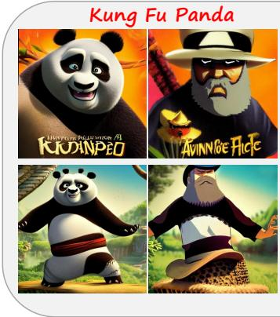

Spider Man  
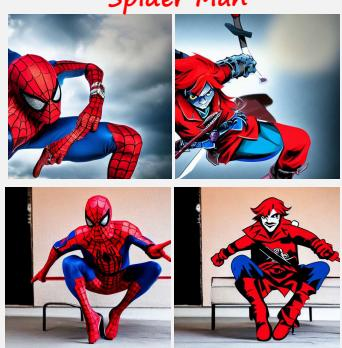  
Stable Diffusion v1.4

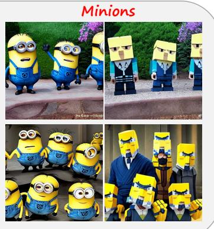

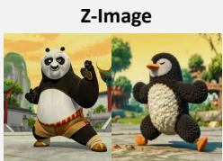  
Transferability across different model architectures

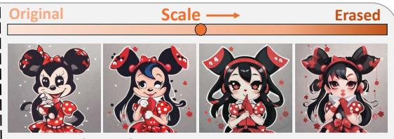  
Fine-grained control of erasure scales

Figure 1: During image generation, our method efectively erases diverse animation concepts using optimized semantic anchors, while preserving overall image fidelity. It also supports model transferability and fine-grained control over the erasure scale.

This work is licensed under a Creative Commons Attribution 4.0 International License. MM ’26, Rio de Janeiro, Brazil   
© 2026 Copyright held by the owner/author(s).   
ACM ISBN 979-8-4007-2213-4/2026/11   
https://doi.org/10.1145/3767308.3835380

## Abstract

The exceptional generation capabilities of text-to-image difusion models have raised copyright concerns, particularly the unauthorized reproduction of animation characters. Existing concept erasure methods fall short for animation character erasure: model

modification methods struggle to identify suitable anchors for diverse, highly distinctive characters; prompt-based steering methods lack fine-grained control for precise intervention. These approaches often yield incomplete erasure and degraded image fidelity, hindering real-world deployment. In this paper, we propose a controllable method operating on the model’s continuous textual representation to erase target characters during generation. We optimizes an anchor embedding via structural and detailed constraints to serve as a character surrogate, then replaces target-related embeddings with the anchor via a structure-aware adaptive strategy. Experiments show that our method achieves state-of-the-art erasure efective ness and image fidelity preservation, while supporting controllable erasure degree, multi-target removal, and model transferability. Moreover, our optimized anchors are plug-and-play with current model modification baselines to improve their erasure performance.

CCS Concepts

• Security and privacy → Human and societal aspects of security and privacy; • Computing methodologies → Computer vision.

## Keywords

Copyright protection; Concept erasure; Difusion models

ACM Reference Format:

Qiao Li, Xiaomeng Fu, Wangjia Yu, Runze He, Baisen Wang, Jiao Dai, and Jizhong Han. 2026. Erase but Preserve: Controllable Removal of Copyrighted Animation Characters via Optimized Semantic Anchors. In Proceedings ofthe 34th ACM International Conference on Multimedia (MM ’26), November 10–14, 2026, Rio de Janeiro, Brazil. ACM, New York, NY, USA, 9 pages. https://doi.org/10.1145/3767308.3835380

## 1 Introduction

Text-to-image difusion models [13, 33, 37] have become a core tool for visual content creation, routinely used in advertising, filmmaking, and user-generated content platforms. However, this broad adoption raises legal and ethical risks [4, 11, 27, 45], as these models can generate unsafe or infringing content that violates policies. A practical and high-impact case arising from commercial deployment is the unauthorized generation of copyrighted animation characters. Recent disputes, such as the lawsuit by Disney and Universal Studios against Midjourney regarding images resembling characters like Spider-Man and the Minions [3], highlight that this issue is not hypothetical: it directly afects product deployment, platform governance, and creators who rely on generative models.

To mitigate the risks of undesired generation, concept erasure techniques have emerged as one of the feasible solutions, primarily aiming to prevent models from generating unsafe concepts. Existing erasure approaches can be categorized into: (i) model modifica tion methods that alter model parameters to erase or suppress undesired concepts, typically by mapping them to a neutral or benign anchor concept [6, 9, 10, 17, 26, 28, 42], and (ii) prompt-based steering methods that adjust input prompts or introduce negative terms to avoid undesired concepts during inference [16, 29, 35, 41]. Although efective in certain scenarios (e.g. erasing unsafe concepts like “nudity”), neither approach adequately focuses on and addresses the specific challenges of erasing copyrighted animation characters in real-world deployment, primarily due to the unique properties of these characters.

First, animation characters exhibit a large variety, with each being highly distinctive. This poses challenges for model modification methods, which typically require selecting an appropriate anchor as a benign surrogate for undesired target. While existing anchor selections such as synonyms, parent/child classes, or general concepts (e.g., null text or “ground”) work well for generic categories (e.g., mapping “grumpy cat” to “cat”, “nudity” to “clothed”), they are often ill-suited for specific characters. Identifying appropriate semantic synonyms or taxonomic relations for these unique characters is often laborious or even infeasible. Besides, prior studies [28, 44] indicate that resorting to general or semantically distant anchors can significantly compromise erasure performance, including incomplete erasure and context contamination.

Second, erasing a copyrighted animation character often requires more nuanced intervention than coarsely blocking an entire class of not-safe-for-work (NSFW) content. (i) Unlike inherently harmful NSFW content, the assessment of animation infringement varies across laws and platform policies, and may in some cases permit moderate visual similarity that does not constitute copyright infringement. (ii) Animation imagery often carries commercial and entertainment value on user-generated content platforms. Instead of indiscriminately blocking all potentially infringing prompts, platforms typically aim to preserve the user’s original creative intent (e.g., composition, style, background, unrelated elements) while only excising the copyrighted characters. These two concerns necessitate fine-grained control over both the erased character subject and the preserved contextual elements during inference. However, existing prompt-based steering methods typically rely on discrete textual descriptions that provide only coarse control over generation, thereby lacking precise regulation of both the character erasure degree and the surrounding context retention.

To address these challenges, we propose a method that controllably erases animation characters during generation by operating on the model’s continuous textual representation. Our key idea is to replace the target character with a learned anchor concept that explicitly erases its primary visual features while preserving unrelated contextual elements from the prompt. Specifically, we first optimize an anchor embedding by extracting structure outlines and detailed features from the target’s visual semantics. This learned anchor is then used to replace the target to guide generation toward a non-infringing surrogate. As the anchor is represented in a continuous embedding space, our method enables fine-grained control over the character erasure degree via adjustment of the replacement intensity. To avoid unintended alterations to unrelated context, we perform targeted embedding replacement: leveraging the disentanglement property oftextual embeddings, we replace only the embeddings related to the target character while retaining unrelated elements. This replacement is applied adaptively across denoising timesteps, which further improves both reliable target removal and overall scene coherence.

Due to the lack of standard benchmark for animation character erasure, we build a dataset of 80 animation concepts that can be reliably generated by difusion models. Experiments show that our approach achieves superior performance in both target character removal and overall fidelity preservation compared with baselines.

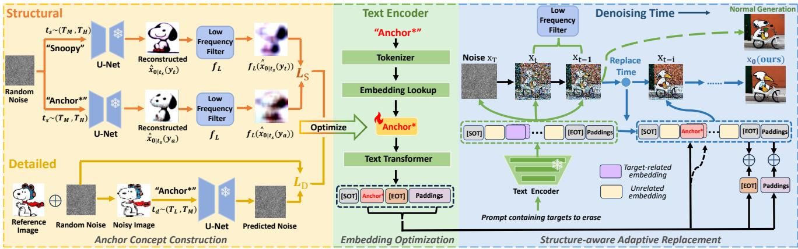  
Figure 2: The overall pipeline of our proposed method. We construct an anchor by applying structural constraints (top-left) and detailed constraints (bottom-left), and optimize an anchor embedding in the continuous textual embedding space (middle). During inference, when the input prompt contains target-related terms in the predefined subspace, our method performs structure-aware adaptive embedding replacement to erase the target using the optimized anchor concept (blue line on the right), compared with normal generation (green line on the right).

Our method also supports fine-grained control over the erasure degree, simultaneous removal of multiple targets, and transferability across diferent difusion models (including models with dual text encoders and recent DiT-based models). Moreover, our optimized anchors can also be directly integrated into current model modification methods as a benign surrogate. Experiments demonstrate that, compared to adopting existing general anchors, leveraging our learned anchors yields higher erasure accuracy and improved image fidelity preservation in animation character erasure.

Our contributions are summarized as:

• We propose a novel method to erase one or more copyrighted animation characters directly during the generation process of text-to-image difusion models.

• Our continuous anchor optimization approach ingeniously leverages the visual features of target characters, ofering a principled way to identify a controllable anchor for distinctive animation characters.

• Our structure-aware adaptive replacement strategy jointly achieves precise target character removal and high fidelity preservation, ensuring the coherence and usability of the resulting animation imagery.

• Experiments show that our method achieves state-of-the-arts in animation character erasure, while enabling controllable erasure degree, simultaneous removal of multi-targets, and model transferability. Moreover, our optimized anchors are plug-and-play with model modification methods to improve their erasure performance.

## 2 Related Work

## 2.1 Text-to-image Difusion Models

Text-to-image difusion models have garnered substantial attention due to their capacity for high-fidelity image synthesis [2, 7, 32, 34]. They incorporate image encoder-decoder frameworks to eficiently conduct the difusion and denoising process within a latent space.

During the training process, random Gaussian noise � is introduced to the image �0:

$$
x _ { t } = \sqrt { \bar { \alpha } _ { t } } x _ { 0 } + \sqrt { 1 - \bar { \alpha } _ { t } } \epsilon\tag{1}
$$

The training goal of difusion models is to learn to predict the introduced noise from $x _ { t }$ at time step t:

$$
\mathcal { L } : = \mathbb { E } _ { \epsilon \sim N ( 0 , 1 ) , t \sim U ( 0 , T ) } \left[ | | \epsilon - \epsilon _ { \theta } \left( x _ { t } , t , c _ { \theta } ( y ) \right) | | _ { 2 } ^ { 2 } \right]\tag{2}
$$

where $\epsilon _ { \theta }$ is a $\operatorname { U - N e t } , c _ { \theta }$ is a text encoder, y is a textual input.

During the inference process, previous works [18, 30, 39] suggest that models focus on constructing low-level structure and outlines in the early denoising stages, and subsequently shift to predicting semantic details in the later stages.

Deterministic DDIM Scheduler. To accelerate the denoising process, deterministic DDIM sampling [36] has been proposed, enabling a skip-step strategy. The skip-step denoising process for any timestep $s < k$ can be mathematically formulated as follows:

$$
x _ { s } = \sqrt { \bar { \alpha _ { s } } } \hat { x } _ { 0 \vert k } + \sqrt { 1 - \bar { \alpha _ { s } } } \epsilon _ { \theta } \left( x _ { k } , k , c _ { \theta } ( y ) \right)\tag{3}
$$

where:

$$
\hat { x } _ { 0 \mid k } = \frac { 1 } { \sqrt { \bar { \alpha } _ { k } } } \left( x _ { k } - \sqrt { 1 - \bar { \alpha _ { k } } } \epsilon \left( x _ { k } , k , c _ { \theta } ( y ) \right) \right)\tag{4}
$$

## 2.2 Concept Erasure in Difusion Models

Model Modification Methods. Model modification methods update difusion models’ weights to either suppress the undesired target or map it onto a neutral or benign anchor concept. Most existing works [6, 9, 17, 26, 28, 42] modify parameters in the crossattention mechanism, text encoder, or the entire model to erase target concepts through iterative fine-tuning. Several works [10, 20] directly derive the updated weights via closed-form solution, thus avoiding the need for fine-tuning. However, most of these methods require an appropriate anchor concept to replace the target concept. While this is relatively straightforward for generic objects (e.g. dog) or NSFW content (e.g. nudity), it can be laborious or even infeasible for various highly unique animation characters. Our method provide an efective solution for constructing a suitable anchor, which can be directly applied to existing model modification methods.

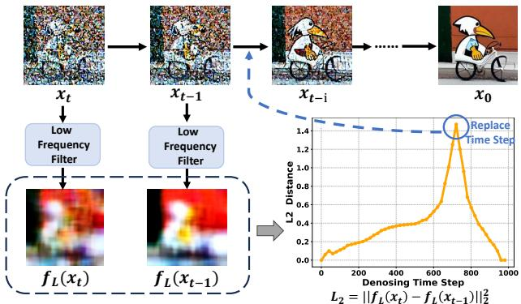  
Figure 3: Illustration of the structure-aware adaptive replacement module. We extract low-frequency structural components and analyze the changes between adjacent denoising steps to find an optimal starting point for replacement.

Prompt-based Steering Methods. Current prompt-based steering methods primarily rely on classifier-free guidance (CFG) [14]. Safe Latent Difusion (SLD) [35] uses multiple noise predictions to steer the unconditional prediction towards a safe prompt while avoiding the negatives. Negative Prompting (NP) is a technique that replaces the empty prompt in CFG with a negative one. TraSCE [16] modifies NP by preserving part of the unconditional predictions and introducing a loss-based guidance mechanism. SAFREE [41] steers prompt tokens away from a toxic subspace. However, these methods mainly focus on global NSFW removal, which fail to provide fine-grained control, proving inadequate for animation characters that require nuanced processing.

## 3 Method

Our goal is to erase target animation characters during the generation process ofa difusion model, while preserving the overall visual fidelity of the generated images. First, we define the objective to construct an anchor concept using the target character’s structural and detailed features (Section 3.1). Next, we optimize the anchor embedding in the continuous textual embedding space (Section 3.2). During inference, we selectively replace the target-related embeddings with the optimized embedding following structure-aware adaptive strategy, thereby achieving precise target erasure while preserving scene coherence (Section 3.3). The overall pipeline of our method is illustrated in Figure 2.

## 3.1 Anchor Concept Construction

We aim to remove a copyrighted animation character during generation while preserving overall image fidelity, including the coherence of the background and other contextual elements. To achieve this, we first construct an anchor concept that serves as a benign surrogate for the copyrighted target. The anchor must simultaneously fulfill two criteria: (i) its outline and general structure should be roughly similar to those of the target to ensure harmonious replacement and avoid background distortion. We define the loss function for constructing the structural outline as $\mathcal { L } _ { S } ; ( \mathrm { i i } )$ its main detailed features should exhibit significant distinctiveness from those of the target to avoid copyrighted appearance. We define the loss function for diferentiating details as $\mathcal { L } _ { D }$

Overall, we formulate the anchor construction problem as:

$$
\operatorname* { m i n } \left( \alpha \cdot \mathcal { L } _ { S } + \beta \cdot \mathcal { L } _ { D } \right)\tag{5}
$$

where � and $\beta$ are determined empirically.

During optimization, we use the string “Anchor\*” to represent the new anchor concept’s name in the word space, as it is not defined in the text encoder’s vocabulary before.

Structural Outline Construction. We aim to construct an anchor concept that shares a similar structural outline with the target. We leverage the model’s generative prior to capture diverse structural poses and layouts. As shown in Figure 2 (top-left), given a random Gaussian noise $x _ { T } ~ \sim ~ N ( 0 , I )$ , we first randomly sample a large timestep $t _ { s } \sim ( T _ { M } , T _ { H } )$ , where the difusion model predominantly captures the global structure. We then obtain an intermediate latent $x _ { t _ { s } } ( t _ { s } < T )$ via the deterministic DDIM skip-step denoising formula (defined in Equation 3):

$$
x _ { t _ { s } } = \sqrt { \bar { \alpha } _ { t _ { s } } } \hat { x } _ { 0 \vert T } + \sqrt { 1 - \bar { \alpha } _ { t _ { s } } } \epsilon _ { \theta } \left( x _ { T } , T , c _ { \theta } ( y _ { t } ) \right)\tag{6}
$$

where $\hat { x } _ { 0 | T }$ can be derived following Equation $4 , y _ { t }$ denotes the name of the target character (e.g. “Snoopy”). This $x _ { t _ { s } }$ encodes the coarse structure of the target character.

Subsequently, following Equation 4, we reconstruct two original samples $\hat { x } _ { 0 | t _ { s } } ( y )$ from $x _ { t _ { s } }$ :

$$
\hat { x } _ { 0 | t _ { s } } ( y ) = \frac { 1 } { \sqrt { \bar { \alpha } _ { t _ { s } } } } \Big ( x _ { t _ { s } } - \sqrt { 1 - \bar { \alpha } _ { t _ { s } } } \epsilon _ { \theta } \big ( x _ { t _ { s } } , t _ { s } , c _ { \theta } ( y ) \big ) \Big )\tag{7}
$$

By applying two diferent prompts $y ,$ we can obtain two reconstructed samples: $\hat { x } _ { 0 | t _ { s } } ( y _ { t } )$ for the target prompt ��, and $\hat { x } _ { 0 | t _ { s } } ( y _ { a } )$ for the anchor name � (i.e. “Anchor\*”).

To ensure the anchor learns a similar structural outline as the target, we maximize the structural similarity between two reconstructed samples. Since structural information is typically represented by low-frequency signals, we employ a low-frequency filter $f _ { L }$ to extract their low-frequency components $x _ { L } ( y _ { t } )$ and $x _ { L } ( y _ { a } ) { \mathrm { : } }$

$$
\begin{array} { r } { x _ { L } ( y _ { t } ) = f _ { L } \big ( \hat { x } _ { 0 \mid t _ { s } } ( y _ { t } ) \big ) , x _ { L } ( y _ { a } ) = f _ { L } \big ( \hat { x } _ { 0 \mid t _ { s } } ( y _ { a } ) \big ) } \end{array}\tag{8}
$$

Our goal of optimizing the anchor’s overall structural outline can thus be formulated as:

$$
\mathcal { L } _ { S } = \mathbb { E } \left. x _ { L } ( y _ { t } ) - x _ { L } ( y _ { a } ) \right. _ { 2 } ^ { 2 }\tag{9}
$$

Detailed Features Diferentiation. To ensure the erasure of infringing elements, the main detailed features of the anchor concept should difer from those of the target. We choose a clean reference image �0 of the target character whose content clearly defines the infringing features to be erased. As shown in Figure 2 (bottom-left), we add a Gaussian noise $\epsilon \sim { \cal N } ( 0 , I )$ to $x _ { 0 }$ at a random timestep $t _ { d } \sim ( T _ { L } , T _ { M } )$ to obtain $x _ { t _ { d } } ,$ , as in Equation 1; this noise level primarily degrades fine details while preserving coarse structure. Based on the difusion training objective (Equation $^ { 2 ) , }$ , we maximize the noise prediction error under the anchor prompt $y _ { a }$ to prevent it from reconstructing these details:

$$
\mathcal { L } _ { D } = - \mathbb { E } \left. \epsilon - \epsilon _ { \theta } \left( x _ { t _ { d } } , t _ { d } , c _ { \theta } ( y _ { a } ) \right) \right. _ { 2 } ^ { 2 }\tag{10}
$$

Table 1: Quantitative comparison with baselines on erasing 80 characters when generating images from Stable Difusion-v1-4. ↑ represents that a higher value indicates better performance, and vice versa. (Bold: best. Underline: second-best.)
<table><tr><td rowspan="2">Method</td><td colspan="2">Erasure Effectiveness</td><td colspan="3">Image Fidelity Preservation</td><td colspan="2">Unrelated Image</td></tr><tr><td>LLaVA-1.5↓</td><td>BLIP-3↓</td><td>SSIM↑</td><td>LPIPS↓</td><td>Aesthetic↑</td><td>FID↓</td><td>CLIP↑</td></tr><tr><td>SD v1.4 (Base)</td><td>66.9%</td><td>64.7%</td><td>1</td><td>0</td><td>5.30</td><td>33.7</td><td>0.326</td></tr><tr><td>SLD-medium</td><td>42.3%</td><td>50.3%</td><td>0.314</td><td>0.678</td><td>5.15</td><td>34.9</td><td>0.305</td></tr><tr><td>SLD-strong</td><td>20.0%</td><td>18.2%</td><td>0.286</td><td>0.707</td><td>5.08</td><td>36.1</td><td>0.298</td></tr><tr><td>SAFREE</td><td>12.8%</td><td>11.9%</td><td>0.213</td><td>0.772</td><td>5.10</td><td>35.3</td><td>0.307</td></tr><tr><td>Negative Prompt</td><td>11.1%</td><td>11.5%</td><td>0.384</td><td>0.639</td><td>5.10</td><td>35.4</td><td>0.302</td></tr><tr><td>STG</td><td>19.3%</td><td>17.0%</td><td>0.431</td><td>0.560</td><td>4.87</td><td>38.7</td><td>0.281</td></tr><tr><td>TraSCE</td><td>9.5%</td><td>5.7%</td><td>0.347</td><td>0.693</td><td>4.99</td><td>35.6</td><td>0.299</td></tr><tr><td>Ours</td><td>6.0%</td><td>4.0%</td><td>0.467</td><td>0.505</td><td>5.18</td><td>33.2</td><td>0.312</td></tr></table>

## 3.2 Anchor Embedding Optimization

After defining the anchor concept’s construction objective, we optimize it as a textual embedding in the continuous embedding space. Initialization. To represent the anchor concept, we initialize a word vector ${ \boldsymbol { v } } ^ { * } \in \mathbb { R } ^ { 1 \times \hat { \boldsymbol { D } } }$ (� is the feature dimension) by looking up the token “Anchor\*” in the CLIP [31] text encoder’s embedding layer. This yields a learnable starting point for anchor optimization. Optimization. Following the anchor construction objective in Equation $5 , \boldsymbol { v } ^ { * }$ is optimized by minimizing:

$$
v ^ { * } = \arg \operatorname* { m i n } _ { v ^ { * } } \left( \alpha \cdot \mathcal { L } _ { S } + \beta \cdot \mathcal { L } _ { D } \right)\tag{11}
$$

During optimization, when inputting anchor prompt, we form a token sequence containing Start-of-Text (SOT), “Anchor\*”, End-of-Text (EOT), and Padding tokens. The anchor token uses current $v ^ { * } ,$ while other tokens use their fixed predefined vectors. After positional encoding, the sequence is passed through the text encoder’s frozen Transformer layer to produce contextualized embeddings �. These embeddings condition the difusion model when computing $\mathcal { L } _ { S }$ and $\mathcal { L } _ { D }$ , and gradients are backpropagated to update $v ^ { * }$

After optimization, we obtain the final vector $v ^ { * }$ representing the anchor concept, along with its corresponding contextualized embeddings:

$$
e ^ { * } = \{ e _ { S O T } ^ { * } , ~ e _ { a n c h o r } ^ { * } , ~ e _ { E O T } ^ { * } , ~ e _ { P a d d i n g s } ^ { * } \}\tag{12}
$$

where $e _ { a n c h o r } ^ { * }$ is the optimized anchor embedding, $e _ { S O T } ^ { * } , e _ { E O T } ^ { * }$ , and $e _ { P a d d i n g s } ^ { * }$ denote SOT, EOT, and Padding embeddings, respectively.

## 3.3 Structure-aware Adaptive Replacement

During inference, we erase target characters by replacing their corresponding embeddings with the optimized anchor embeddings, ensuring minimal impact on unrelated elements. To further enhance overall scene coherence, we propose a structure-aware adaptive strategy that dynamically introduces the embedding replacement process during image generation.

Embedding Replacement. When a prompt with � words (including � target-related terms that are pre-listed in a subspace associated with copyrighted characters) is fed into the model’s text encoder, it is tokenized and encoded into contextualized embeddings:

$$
e = \left\{ e _ { S O T } , e _ { w _ { 1 } } , . . . , e _ { w _ { N } } , e _ { E O T } , e _ { P a d d i n g s } \right\}\tag{13}
$$

For target erasure, we locate all the � target-related embeddings $e _ { t a r g e t } = \{ e _ { w _ { i + 1 } } , . . . , e _ { w _ { i + n } } \}$ where $i \in [ 0 , N - n ]$ , and replace them with the optimized anchor embedding:

$$
e _ { t a r g e t } ^ { ' } = \{ e _ { a n c h o r } ^ { * } , . . . , e _ { a n c h o r } ^ { * } \}\tag{14}
$$

Furthermore, based on findings that special embeddings (EOT and Paddings) also encode meaningful layout and semantic information [5, 46], to enhance anchor concept integration while preserving overall context, we adapt the semantic additivity principle to fuse the special input embeddings {����, ��������� } and optimized embeddings $\{ e _ { E O T } ^ { * } , e _ { P a d d i n g s } ^ { * } \}$ via element-wise addition [15]:

$$
e _ { E O T } ^ { ' } = \lambda _ { 1 } \cdot e _ { E O T } + \lambda _ { 2 } \cdot e _ { E O T } ^ { * }\tag{15}
$$

$$
e _ { P a d d i n g s } ^ { ' } = \lambda _ { 1 } \cdot e _ { P a d d i n g s } + \lambda _ { 2 } \cdot e _ { P a d d i n g s } ^ { * }\tag{16}
$$

where $\lambda _ { 1 }$ and $\lambda _ { 2 }$ are determined empirically.

Final contextualized embeddings for image generation are:

$$
e ^ { ' } = \{ e _ { S O T } , e _ { w _ { 1 } } , . . . , e _ { a n c h o r } ^ { * } , . . . , e _ { E O T } ^ { ' } , e _ { P a d d i n g s } ^ { ' } \}\tag{17}
$$

This embedding-level replacement avoids modifications to the pretrained text encoder’s parameters.

Structure-aware Adaptive Strategy. To enhance image coherence, we introduce a structure-aware adaptive replacement strategy. During denoising, we apply low-frequency filter $f _ { L }$ at each timestep � to extract structural component $f _ { L } ( x _ { t } )$ from the predicted sample. We compute $L _ { 2 }$ distance between consecutive component:

$$
L _ { 2 } = | | f _ { L } ( x _ { t } ) - f _ { L } ( x _ { t - 1 } ) | | _ { 2 } ^ { 2 } , t \in [ 1 , 1 0 0 0 ]\tag{18}
$$

We show a denoising example in Figure 3. In this example, �2 increases from initial timestep � = 1000 to $t \approx 7 2 0$ , reflecting a consistent transformation of the overall image layout. After $t =$ 720, $L _ { 2 }$ begins to decrease, indicating structural stabilization and a shift from overall outline toward finer content refinement. This transition point serves as an optimal starting point for embedding replacement, as the stabilized layout provides a reliable spatial reference frame, allowing targeted modifications to specific regions without afecting the established global structure.

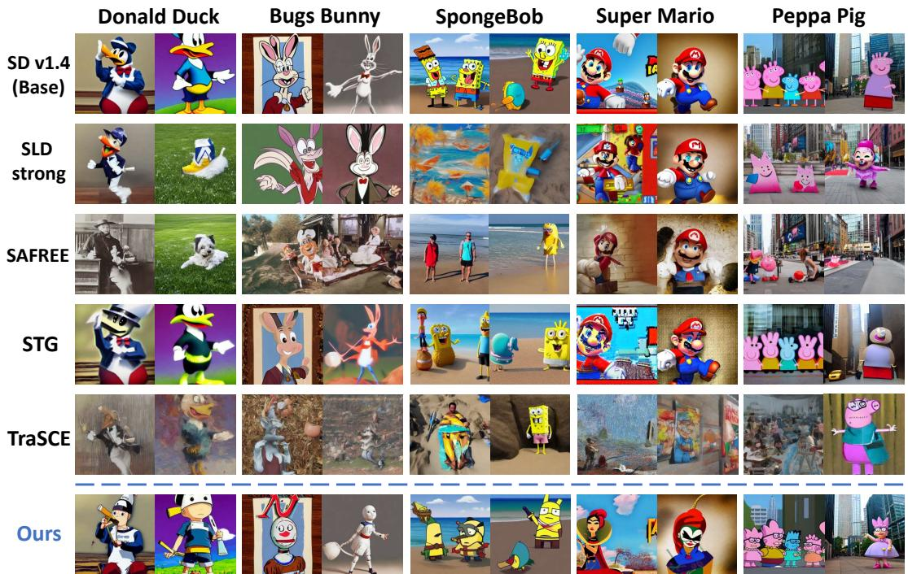  
Figure 4: Qualitative comparison between our method and baseline methods. Our method completely erases target animation concepts with optimized anchor concepts, while better preserving overall image fidelity and background coherence.

Based on the above analysis ofstructural dynamics during denoising, we propose an structure-aware adaptive replacement strategy. During inference, our method allows the difusion model to denoise conditioned on the input prompt while simultaneously tracking the variation of low-frequency structural signals. Embedding replacement is triggered automatically when structural change ceases to increase consistently and reaches a predefined threshold.

## 4 Experiments

## 4.1 Experimental Setup

Baselines. We compare our method with five prompt-based steering baselines, including Safe Latent Difusion (SLD) [35], STG [29], SAFREE [41], TraSCE [16], and Negative Prompting (NP). We fur ther evaluate the efectiveness of our optimized anchor embeddings by integrating them into four representative model modification baselines: MACE [26], UCE [9], ESD-u [8], and AC [17].

Dataset. We propose a dataset of 80 animation characters that can be reliably generated by difusion models. The dataset comprises 36 anthropomorphic characters, 23 animal-form characters, and 21 characters in miscellaneous categories. For evaluation, we generate 100 images for each character using prompts from GPT-4o [1].

Target Models. We utilize the pre-trained Stable Difusion-v1- 4 [33] for all experiments. In addition, we also conduct experiments on Stable Difusion-v1-5, Stable Difusion-v2, Stable Difusion-v2-1, Stable Difusion-XL-base-1, and Z-Image [38] (DiT-based model) to demonstrate our method’s transferability across model architectures. Our method requires no model fine-tuning, so the hyperparameters of all the pretrained models remain unchanged.

Evaluation Metrics. We assess our method from three aspects. For erasure efectiveness of target animation characters, we employ two vision-language models, LLaVA-1.5 [23] and BLIP-3 [25], to identify the presence of targets. A lower identification accuracy indicates a more complete erasure. For image fidelity preservation, we employ three metrics: SSIM [40] measures the structural similarity; LPIPS [43] evaluates perceptual diference; Aesthetic Predictor V2 Score (����ℎ����) [19] assesses the visual appeal of the erased version. For impact on normal image generation, we generate images from irrelevant prompts in COCO-30K dataset [21], and calculate the Frechet Inception Distance (���) [12] and the CLIP Score [31].

## 4.2 Quantitative Comparison

Quantitative comparison results are reported in Table 1.

Erasure Efectiveness of Target Concept. Compared to all baselines, images erased using our method achieve the lowest accuracies for successful target identification by both LLaVA-1.5 (6.0%) and BLIP-3 (4.0%), with reductions of 3.5% and 1.7% compared to the second lowest, respectively. This demonstrates our method’s erasure efectiveness, as it efectively deceive multi-modal large models.

Image Fidelity Preservation. Our method achieves the highest SSIM of 0.467 and the lowest LPIPS of 0.505 between the original and erased image versions. These results demonstrate our method’s superior ability to maintain the integrity and consistency of unrelated concepts and background. Besides, our method achieves the highest Aesthetic score of 5.18, indicating that the erased images possess higher artistic quality. This ensures that the images retain high application value even after target erasure.

(b) Erased  
α=0.5  
α=0.25  
Table 2: Ablation study on key modules of our method. ∆ denotes the diference compared to our complete method.
<table><tr><td rowspan="3">Method</td><td colspan="2">Erasure Effectiveness</td><td colspan="2">Fidelity Preservation</td></tr><tr><td>LLaVA-1.5↓ (∆)</td><td>BLIP-3↓ (∆)</td><td>SSIM↑ (∆)</td><td>LPIPS↓ (Δ)</td></tr><tr><td>SD v1.4 (Base)</td><td>66.9%</td><td>64.7%</td><td>1</td><td>0</td></tr><tr><td>w/o Structural Construction</td><td>55.0% (+49.0%)</td><td>46.0% (+42.0%)</td><td>0.598 (+0.131)</td><td>0.384 (-0.121)</td></tr><tr><td>w/o Detailed Differentiation</td><td>21.0% (+15.0%)</td><td>15.0% (+11.0%)</td><td>0.417 (-0.050)</td><td>0.653 (+0.148)</td></tr><tr><td>w/o Adaptive Replacement</td><td>3.0% (-3.0%)</td><td>1.7% (-2.3%)</td><td>0.319 (-0.148)</td><td>0.668 (+0.163)</td></tr><tr><td>w/o Special Embeddings Addition</td><td>12.7% (+6.7%)</td><td>9.3% (+5.3%)</td><td>0.596 (+0.129)</td><td>0.414 (-0.091)</td></tr><tr><td>Ours</td><td>6.0%</td><td>4.0%</td><td>0.467</td><td>0.505</td></tr></table>

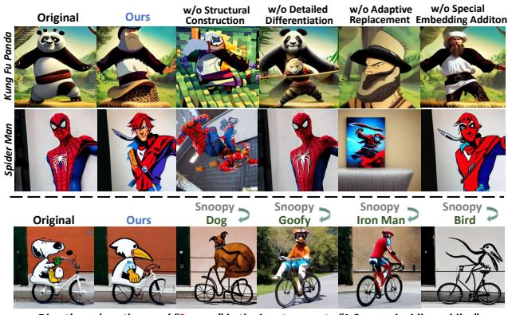  
Directly replace the word “Snoopy” in the input prompt: “A Snoopy is riding a bike.”

Impact on Unrelated Image Quality. Our method maintains near-identical FID and CLIP Score to the original SD v1.4 (33.7 and 0.326), demonstrating undiminished normal generation capability.

## 4.3 Qualitative Comparison

As shown in Figure 4, our method achieves seamless erasure of animation characters through optimized anchors, while promptbased baselines often fail—particularly for characters with complex shapes and attributes (e.g., Donald Duck and Super Mario). Besides, our method achieves background consistency without the blurring or warping artifacts, supporting iterative creative workflows.

## 4.4 Ablation Study

We conduct ablation study on our proposed method, and the results are presented in Table 2 and Figure 5.

Structural and Detailed Modules. We optimize anchor concepts through joint structural and detailed constraints. To analyze their individual role, we ablate the two modules respectively. Results in Table 2 indicate that both modules are essential: (i) without structural constraints, anchor optimization fails, rendering the replacement inefective; (ii) without detailed constraints, anchor concepts closely resemble target concepts, degrading erasure performance.

Adaptive Replacement Module. We propose the adaptive replacement module to better preserve overall structural coherence. To highlight its importance, we present ablation results in Table 2, where target embeddings are replaced directly from the initial denoising step. While efective target erasure can be achieved, this brings severe structural changes and distortions in the overall image, resulting in significantly reduced image fidelity.

Figure 5: Visualization of ablation results on key modules.  
(a) Original  
(c) Difference  
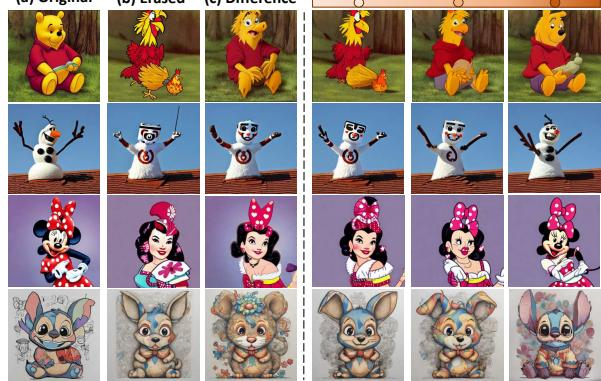

Figure 6: Left: original images (target), erased version (anchor), and their diference (erased semantic features). Right: results of fine-grained erasure control via �-interpolation.  
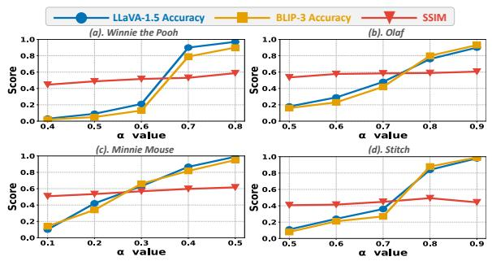  
Figure 7: Performance variation curves under various erasure degrees. Blue and orange lines represent the identification accuracy by LLaVA-1.5 and BLIP-3, while the red line denotes the SSIM value between the erased and original versions.

Special Embeddings Addition. During target replacement, we add the optimized special embeddings (EOT and Paddings) to the original ones. Table 2 reveals that omitting these embeddings reduces erasure efectiveness, indicating that target-related semantics persist in special embeddings and require explicit handling. Thus, adding the optimized special embeddings facilitates better integration of the anchor’s semantics while erasing the target’s.

Prompt-level Words Modification. While our method works in the embedding space, a naive alternative is prompt-level word replacement. As shown in the third row of Figure 5, directly replacing words often causes large layout/style changes. Moreover, structural distortion worsens with increasing semantic distance between target and replacement words. Consequently, naive prompt-level modification lacks the fine-grained control necessary for nuanced animation character removal in practical scenarios.

## 4.5 Fine-grained Control over Erasure Degrees

Our method efectively achieves fine-grained control over the erasure degree of target characters. Since our anchor concepts are constructed in the continuous embedding space, the erasure degree can be precisely modulated through vector arithmetic. For a target concept embedding $e _ { t a r g e t }$ and its optimized anchor $e _ { a n c h o r } ,$ , Figure $6 ( \mathrm { a } ) ( \mathrm { b } ) ( \mathrm { c } )$ illustrate the images generated from $e _ { t a r g e t } ,$ , ����ℎ��, and $e _ { t a r g e t } - e _ { a n c h o r }$ , respectively. Figure 6(c) visualizes the semantic features that are erased from the target.

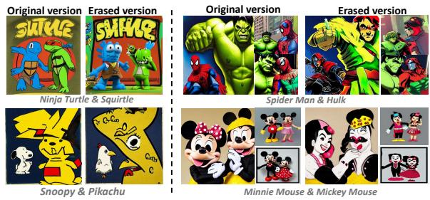

Figure 8: Simultaneous erasure of multiple characters.  
Table 3: Transferability of our method across diferent model versions. Models sharing the same color indicate that they adopt the same text encoder architecture.
<table><tr><td colspan="3">Model Versions</td><td colspan="2">Erasure Effectiveness</td><td colspan="2">Fidelity Preservation</td></tr><tr><td>Model</td><td>Backbone</td><td>Dimension</td><td>LLaVA-1.5↓</td><td>BLIP-3↓</td><td>SSIM↑</td><td>LPIPS↓</td></tr><tr><td>SD v1.4</td><td>UNet</td><td>768</td><td>6.0%</td><td>4.0%</td><td>0.467</td><td>0.505</td></tr><tr><td>SD v1.5</td><td>UNet</td><td>768</td><td>7.0%</td><td>6.0%</td><td>0.509</td><td>0.487</td></tr><tr><td>SD v2</td><td>UNet</td><td>1024</td><td>8.7%</td><td>6.3%</td><td>0.598</td><td>0.437</td></tr><tr><td>SD v2.1</td><td>UNet</td><td>1024</td><td>7.7%</td><td>5.3%</td><td>0.585</td><td>0.413</td></tr><tr><td>SDXL</td><td>UNet</td><td>768 &amp; 1280</td><td>5.6%</td><td>4.9%</td><td>0.439</td><td>0.517</td></tr><tr><td>Z-Image</td><td>DiT</td><td>2560</td><td>7.9%</td><td>7.1%</td><td>0.392</td><td>0.563</td></tr></table>

Continuous fine-grained control is achieved through:

$$
e ^ { ' } = e _ { a n c h o r } + \alpha \cdot ( e _ { t a r g e t } - e _ { a n c h o r } ) , \alpha \in [ 0 , 1 ]\tag{19}
$$

This formulation interpolates between anchor embedding ����ℎ�� (complete erasure) and target embedding $e _ { t a r g e t }$ (no erasure), where � governs the interpolation strength. Increasing � produces images closer to the original, and vice versa. Figure 6 shows the generated images for $\alpha = 0 . 2 5 , 0 . 5 , 0 . 7 5$ , respectively.

We plot the variation of identification accuracy (LLaVA-1.5 and BLIP-3) and SSIM with � for four animation characters in Figure 7. The stable SSIM values confirm that image structure is largely unafected by �. In contrast, identification accuracy difers markedly: Winnie the Pooh and Stitch exhibit a sharp increase within a small � interval, while Olaf and Minnie Mouse improve more gradually. Minnie Mouse attains high accuracy at smaller �, likely due to its highly unique and recognizable features, whereas the others require larger � (especially Stitch). This enables flexible and user-tailored control over the target erasure degrees for diferent characters.

## 4.6 Simultaneous Erasure of Multi-targets

Benefiting from the precise localization of target concepts and the feasibility of multi-embeddings replacement, our method can also achieve simultaneous erasure of multiple targets. First, we optimize an anchor embedding for each animation character. Subsequently, we locate all the target-related embeddings and simultaneously replace them with their corresponding anchor embeddings, ensuring visual coherence. Results are presented in Figure 8.

Table 4: Quantitative results of integrating our optimized anchors into existing model modification baselines, compared with using general anchors (i.e. null text or “toy”).
<table><tr><td colspan="3">Method</td><td>Erasure Effectiveness</td><td colspan="3">Fidelity Preservation</td></tr><tr><td>Baseline</td><td>Fine-tuning</td><td>Anchor</td><td>LLaVA-1.5↓</td><td>SSIM↑</td><td>LPIPS↓</td><td>Art↑</td></tr><tr><td rowspan="2">UCE</td><td rowspan="2">x</td><td>General</td><td>9.6%</td><td>0.248</td><td>0.698</td><td>4.74</td></tr><tr><td>Ours</td><td>7.2%</td><td>0.382</td><td>0.669</td><td>4.94</td></tr><tr><td rowspan="2">ESD-u</td><td rowspan="2">V</td><td>General</td><td>36.0%</td><td>0.315</td><td>0.688</td><td>4.83</td></tr><tr><td>Ours</td><td>13.6%</td><td>0.358</td><td>0.640</td><td>4.99</td></tr><tr><td rowspan="2">AC</td><td rowspan="2">√</td><td>General</td><td>6.0%</td><td>0.268</td><td>0.698</td><td>4.74</td></tr><tr><td>Ours</td><td>3.2%</td><td>0.315</td><td>0.672</td><td>5.01</td></tr><tr><td rowspan="2">MACE</td><td rowspan="2">√</td><td>General</td><td>9.0%</td><td>0.282</td><td>0.720</td><td>4.76</td></tr><tr><td>Ours</td><td>17.5%</td><td>0.302</td><td>0.677</td><td>4.76</td></tr></table>

## 4.7 Transferability across Diferent Models

Our method is transferable across diferent difusion models. The optimized anchor embedding enables seamless deployment on any difusion model sharing the same text encoder architecture (with the same embedding dimension 1�), thus avoiding redundant optimization. For instance, anchor embeddings optimized in SD v1.4 can be used in SD v1.5 $( D = 7 6 8 )$ , and those for SD v2 and SD v2.1 can be shared $( D = 1 0 2 4 )$ ). Moreover, our method is also applicable to models with dual text encoders, such as SDXL $( D = 7 6 8 \& 1 2 8 0 )$ , by jointly optimizing the anchor embeddings in both text encoders. Crossmodel results (Table 3) highlights the versatility of our method. Transferability to DiT-based Models. As shown in Table 3, we efectively extend our method to Z-Image [38], a recently released DiT-based model with flow-matching [22, 24] sampling strategy.

## 4.8 Anchor Integration into Model Modification

For each character, our method optimizes its anchor embedding in the text encoder, denoted as “Anchor\*”. While this anchor is primarily used for inference-time replacement in our main pipeline, it can also be viewed as a plug-and-play component for existing model modification baselines. Specifically, we integrate our optimized anchor by simply substituting the baselines’ original modification targets with “Anchor\*”. As shown in Table 4, compared to using semantically distant general anchors (e.g., null text or “toy”), our semantically proximate anchors generally improve erasure efectiveness and better preserve image fidelity across most baselines, without altering any other method operations.

## 5 Conclusion

In this paper, we address animation copyright infringement by proposing a controllable method to erase animation characters during difusion-based image generation. We first optimize an anchor in the continuous embedding space under structural and detail constraints, then replace target-related embeddings with the learned anchor via a structure-aware adaptive strategy. Experiments demonstrate our method’s state-of-the-art erasure accuracy, image fidelity preservation, and support for controllable erasure degree, multi-target removal, and model transferability. We hope our contributions not only help regulators prevent infringement but also maximally preserve users’ creative intent, facilitating deployment of trustworthy and user-centric AI systems.

## 6 Acknowledgments

This work was supported by the National Key Research and Development Program of China (No.2024YFC3307402).

## References

[1] Josh Achiam, Steven Adler, Sandhini Agarwal, Lama Ahmad, Ilge Akkaya, Florencia Leoni Aleman, Diogo Almeida, Janko Altenschmidt, Sam Altman, Shyamal Anadkat, et al. 2023. Gpt-4 technical report. arXiv preprint arXiv:2303.08774 (2023).

[2] Yogesh Balaji, Seungjun Nah, Xun Huang, Arash Vahdat, Jiaming Song, Qinsheng Zhang, Karsten Kreis, Miika Aittala, Timo Aila, Samuli Laine, et al. 2022. edif-i: Text-to-image difusion models with an ensemble of expert denoisers. arXiv preprint arXiv:2211.01324 (2022).

[3] BBC News. 2025. Disney and Universal sue AI firm Midjourney over images. https://www.bbc.com/news/articles/cg5vjqdm1ypo. Accessed: 2025-07-1.

[4] Zachary Bozard. 2023. What does it mean to create art? Intellectual Property rights for Artificial Intelligence generated artworks. SCJ Int’l L. & Bus. 20 (2023), 83.

[5] Tom Brown, Benjamin Mann, Nick Ryder, Melanie Subbiah, Jared D Kaplan, Prafulla Dhariwal, Arvind Neelakantan, Pranav Shyam, Girish Sastry, Amanda Askell, et al. 2020. Language models are few-shot learners. Advances in neural information processing systems 33 (2020), 1877–1901.

[6] Anh Bui, Long Vuong, Khanh Doan, Trung Le, Paul Montague, Tamas Abraham, and Dinh Phung. 2024. Erasing undesirable concepts in difusion models with adversarial preservation. arXiv preprint arXiv:2410.15618 (2024).

[7] Prafulla Dhariwal and Alexander Nichol. 2021. Difusion models beat gans on image synthesis. Advances in neural information processing systems 34 (2021), 8780–8794.

[8] Rohit Gandikota, Joanna Materzynska, Jaden Fiotto-Kaufman, and David Bau. 2023. Erasing concepts from difusion models. In Proceedings ofthe IEEE/CVF international conference on computer vision. 2426–2436.

[9] Rohit Gandikota, Hadas Orgad, Yonatan Belinkov, Joanna Materzyńska, and David Bau. 2024. Unified concept editing in difusion models. In Proceedings of the IEEE/CVF winter conference on applications ofcomputer vision. 5111–5120.

[10] Chao Gong, Kai Chen, Zhipeng Wei, Jingjing Chen, and Yu-Gang Jiang. 2024. Reliable and eficient concept erasure of text-to-image difusion models. In European Conference on Computer Vision. Springer, 73–88.

[11] Matt Growcoot. 2022. Midjourney founder admits to using a ‘hundred million’images without consent. PetaPixel, Dec (2022).

[12] Martin Heusel, Hubert Ramsauer, Thomas Unterthiner, Bernhard Nessler, and Sepp Hochreiter. 2017. Gans trained by a two time-scale update rule converge to a local nash equilibrium. Advances in neural information processing systems 30 (2017).

[13] Jonathan Ho, Ajay Jain, and Pieter Abbeel. 2020. Denoising difusion probabilistic models. Advances in neural information processing systems 33 (2020), 6840–6851.

[14] Jonathan Ho and Tim Salimans. 2022. Classifier-free difusion guidance. arXiv preprint arXiv:2207.12598 (2022).

[15] Taihang Hu, Linxuan Li, Joost Van de Weijer, Hongcheng Gao, Fahad S Khan, Jian Yang, Ming-Ming Cheng, Kai Wang, and Yaxing Wang. 2024. Token merging for training-free semantic binding in text-to-image synthesis. Advances in Neural Information Processing Systems 37 (2024), 137646–137672.

[16] Anubhav Jain, Yuya Kobayashi, Takashi Shibuya, Yuhta Takida, Nasir Memon, Julian Togelius, and Yuki Mitsufuji. 2024. Trasce: Trajectory steering for concept erasure. arXiv preprint arXiv:2412.07658 (2024).

[17] Nupur Kumari, Bingliang Zhang, Sheng-Yu Wang, Eli Shechtman, Richard Zhang, and Jun-Yan Zhu. 2023. Ablating concepts in text-to-image difusion models. In Proceedings of the IEEE/CVF international conference on computer vision. 22691– 22702.

[18] Mingi Kwon, Jaeseok Jeong, and Youngjung Uh. 2022. Difusion models already have a semantic latent space. arXiv preprint arXiv:2210.10960 (2022).

[19] LAION-AI. 2022. aesthetic-predictor. https://github.com/LAION-AI/aestheticpredictor.

[20] Ouxiang Li, Yuan Wang, Xinting Hu, Houcheng Jiang, Tao Liang, Yanbin Hao, Guojun Ma, and Fuli Feng. 2025. Speed: Scalable, precise, and eficient concept erasure for difusion models. arXiv preprint arXiv:2503.07392 (2025).

[21] Tsung-Yi Lin, Michael Maire, Serge Belongie, James Hays, Pietro Perona, Deva Ramanan, Piotr Dollár, and C Lawrence Zitnick. 2014. Microsoft coco: Common objects in context. In European conference on computer vision. Springer, 740–755.

[22] Yaron Lipman, Ricky TQ Chen, Heli Ben-Hamu, Maximilian Nickel, and Matthew Le. 2022. Flow matching for generative modeling. In The eleventh international conference on learning representations.

[23] Haotian Liu, Chunyuan Li, Yuheng Li, and Yong Jae Lee. 2024. Improved baselines with visual instruction tuning. In Proceedings of the IEEE/CVF conference on computer vision and pattern recognition. 26296–26306.

[24] Xingchao Liu, Chengyue Gong, and Qiang Liu. 2023. Flow straight and fast: Learning to generate and transfer data with rectified flow. In International conference

on learning representations (ICLR).

[25] Andong Lu, Wanyu Wang, Chenglong Li, Jin Tang, and Bin Luo. 2024. Rgbt tracking via all-layer multimodal interactions with progressive fusion mamba. arXiv preprint arXiv:2408.08827 (2024).

[26] Shilin Lu, Zilan Wang, Leyang Li, Yanzhu Liu, and Adams Wai-Kin Kong. 2024. Mace: Mass concept erasure in difusion models. In Proceedings ofthe IEEE/CVF Conference on Computer Vision and Pattern Recognition. 6430–6440.

[27] Yiwei Lu, Matthew YR Yang, Zuoqiu Liu, Gautam Kamath, and Yaoliang Yu. 2024. Disguised copyright infringement of latent difusion models. arXiv preprint arXiv:2404.06737 (2024).

[28] Mengyao Lyu, Yuhong Yang, Haiwen Hong, Hui Chen, Xuan Jin, Yuan He, Hui Xue, Jungong Han, and Guiguang Ding. 2024. One-dimensional adapter to rule them all: Concepts difusion models and erasing applications. In Proceedings of the IEEE/CVF Conference on Computer Vision and Pattern Recognition. 7559–7568.

[29] Byeonghu Na, Mina Kang, Jiseok Kwak, Minsang Park, Jiwoo Shin, SeJoon Jun, Gayoung Lee, Jin-Hwa Kim, and Il-Chul Moon. 2026. Training-free safe text embedding guidance for text-to-image difusion models. Advances in Neural Information Processing Systems 38 (2026), 85984–86014.

[30] Ji-Hoon Park, Yeong-Joon Ju, and Seong-Whan Lee. 2024. Explaining generative difusion models via visual analysis for interpretable decision-making process. Expert Systems with Applications 248 (2024), 123231.

[31] Alec Radford, Jong Wook Kim, Chris Hallacy, Aditya Ramesh, Gabriel Goh, Sandhini Agarwal, Girish Sastry, Amanda Askell, Pamela Mishkin, Jack Clark, et al. 2021. Learning transferable visual models from natural language supervision. In International conference on machine learning. PmLR, 8748–8763.

[32] Aditya Ramesh, Prafulla Dhariwal, Alex Nichol, Casey Chu, and Mark Chen. 2022. Hierarchical text-conditional image generation with clip latents. arXiv preprint arXiv:2204.06125 1, 2 (2022), 3.

[33] Robin Rombach, Andreas Blattmann, Dominik Lorenz, Patrick Esser, and Björn Ommer. 2022. High-resolution image synthesis with latent difusion models. In Proceedings ofthe IEEE/CVF conference on computer vision and pattern recognition. 10684–10695.

[34] Chitwan Saharia, William Chan, Saurabh Saxena, Lala Li, Jay Whang, Emily L Denton, Kamyar Ghasemipour, Raphael Gontijo Lopes, Burcu Karagol Ayan, Tim Salimans, et al. 2022. Photorealistic text-to-image difusion models with deep language understanding. Advances in neural information processing systems 35 (2022), 36479–36494.

[35] Patrick Schramowski, Manuel Brack, Björn Deiseroth, and Kristian Kersting. 2023. Safe latent difusion: Mitigating inappropriate degeneration in difusion models. In Proceedings of the IEEE/CVF conference on computer vision and pattern recognition. 22522–22531.

[36] Jiaming Song, Chenlin Meng, and Stefano Ermon. 2020. Denoising difusion implicit models. arXiv preprint arXiv:2010.02502 (2020).

[37] Yang Song and Stefano Ermon. 2019. Generative modeling by estimating gradients of the data distribution. Advances in neural information processing systems 32 (2019).

[38] Z-Image Team. 2025. Z-Image: An Eficient Image Generation Foundation Model with Single-Stream Difusion Transformer. arXivpreprint arXiv:2511.22699 (2025).

[39] Jianyi Wang, Zongsheng Yue, Shangchen Zhou, Kelvin CK Chan, and Chen Change Loy. 2024. Exploiting difusion prior for real-world image super resolution. International Journal ofComputer Vision 132, 12 (2024), 5929–5949.

[40] Zhou Wang, Alan C Bovik, Hamid R Sheikh, and Eero P Simoncelli. 2004. Image quality assessment: from error visibility to structural similarity. IEEE transactions on image processing 13, 4 (2004), 600–612.

[41] Jaehong Yoon, Shoubin Yu, Vaidehi Ramesh Patil, Huaxiu Yao, and Mohit Bansal. 2025. Safree: Training-free and adaptive guard for safe text-to-image and video generation. In International Conference on Learning Representations, Vol. 2025. 56439–56465.

[42] Gong Zhang, Kai Wang, Xingqian Xu, Zhangyang Wang, and Humphrey Shi. 2024. Forget-me-not: Learning to forget in text-to-image difusion models. In Proceedings ofthe IEEE/CVF conference on computer vision and pattern recognition. 1755–1764.

[43] Richard Zhang, Phillip Isola, Alexei A Efros, Eli Shechtman, and Oliver Wang. 2018. The unreasonable efectiveness of deep features as a perceptual metric. In Proceedings ofthe IEEE conference on computer vision and pattern recognition. 586–595.

[44] Tong Zhang, Ru Zhang, Jianyi Liu, Zhen Yang, and Gongshen Liu. 2025. Beyond Fixed Anchors: Precisely Erasing Concepts with Sibling Exclusive Counterparts. arXiv preprint arXiv:2510.16342 (2025).

[45] Yang Zhang, Teoh Tze Tzun, Lim Wei Hern, and Kenji Kawaguchi. 2024. On copyright risks of text-to-image difusion models. In ECCV 2024 Workshop The Dark Side ofGenerative AIs and Beyond.

[46] Chenyi Zhuang, Ying Hu, and Pan Gao. 2024. Magnet: We never know how text-to-image difusion models work, until we learn how vision-language models function. Advances in Neural Information Processing Systems 37 (2024), 57115– 57149.