# FOR TEXT-IMAGE-TO-VIDEO DIFFUSION MODELS

Jiazi Bu1,2,3∗ Pengyang Ling4∗§ Yujie Zhou1,3∗ Yibin Wang5,6 Yuhang Zang3 Xuanlang Dai5,3 Shengyuan Ding5,3 Tianyi Wei2 Xiaohang Zhan10 Jiaqi Wang6,9 Tong Wu5 Dahua Lin3,7,8 Xingang Pan2†

1Shanghai Jiao Tong University 2S-Lab, Nanyang Technological University 3Shanghai AI Laboratory 4University of Science and Technology of China 5Fudan University 6Shanghai Innovation Institute 7The Chinese University of Hong Kong 8CPII under InnoHK 9JD.com 10Adobe Research https://bujiazi.github.io/hpsd.github.io/

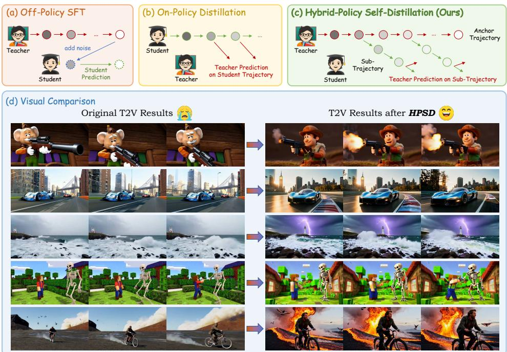  
Figure 1: Introduction to HPSD. (a) Off-policy SFT supervises on fixed teacher endpoints, which drift from the evolving student policy. (b) On-policy distillation queries the teacher at student-visited states, yet suffers from condition-state mismatch in TI2V models. (c) HPSD anchors the student on the teacher trajectory and supervises roll-outs evolved under its own policy. (d) HPSD substantially boosts the base generation quality of TI2V models (WAN-2.2-TI2V-5B in this figure), especially in cinematic lighting, fine details, and balanced composition. Prompts in the Appendix.

## ABSTRACT

Text-Image-to-Video (TI2V) models are an emerging unified architecture, where a single model simultaneously supports text-to-video (T2V) and image-to-video (I2V) generation. Given a high-quality first frame or a detailed textual prompt, TI2V models unlock substantially better visual quality than their T2V mode, raising a natural question: can the capability elicited by such privileged conditions be internalized into the model’s own base generation ability? A common approach toward this goal is model self-distillation. However, the most straightforward solution, supervised fine-tuning, follows an off-policy strategy: its supervision is confined to teacher-generated endpoints from a fixed offline distribution

rather than student-visited states, lacking precise correction tailored to the evolving policy. Recent on-policy distillation methods instead suffer from conditionstate mismatch, where supervision is steered toward the given first frame instead of the student’s actual content, misleading the denoising process. To achieve selfdistillation that absorbs the teacher’s privileged prior while retaining precise policy correction, in this work, we propose Hybrid-Policy Self-Distillation (HPSD), a novel self-distillation framework where a single TI2V model acts as both teacher and student under different conditions: the teacher operates in TI2V mode with a high-quality first frame and an enhanced prompt, while the student runs in the base T2V mode with only the vanilla prompt. Specifically, the student inherits off-policy teacher trajectory points as anchors, locally refines them toward its own policy, and finally receives velocity-level supervision on these self-generated rollouts. Extensive experiments demonstrate that HPSD significantly improves T2V performance while also delivering notable TI2V gains, effectively strengthening the model’s base generation ability. Our code will be released at HPSD Repo.

## 1 INTRODUCTION

Recent years have witnessed remarkable progress in video generation, where diffusion/flow-based models (Ho et al., 2020; Song et al., 2020a;b; Lipman et al., 2022; Peebles & Xie, 2023) have achieved a leap in high-fidelity video synthesis (Wan et al., 2025; HaCohen et al., 2024; Kong et al., 2024; Bu et al., 2025; Zhou et al., 2025). Building on these advances, the field has evolved into di verse generation paradigms, among which text-to-video (T2V) (Guo et al., 2023; Kong et al., 2024; Yang et al., 2025) and image-to-video (I2V) (Blattmann et al., 2023; Zhang et al., 2023; Xing et al., 2023) are the most representative: the former synthesizes videos from textual descriptions, while the latter animates a given reference image into a dynamic sequence. These two paradigms are increasingly unified within a single architecture, giving rise to Text-Image-to-Video (TI2V) models (Lin et al., 2025; Wan et al., 2025; HaCohen et al., 2026; Ma et al., 2026). Taking a textual prompt and an optional first-frame image as input, TI2V models produce faithful and coherent videos with a unified generative framework, allowing T2V and I2V to benefit from shared latent representations and motion priors while offering flexible conditioning for diverse user intents.

In this work, we observe that within such a unified architecture, the TI2V mode conditioned on an additional high-quality first frame yields substantially better visual quality than the base T2V mode driven by a vanilla prompt, and that a detailed, well-crafted prompt alone brings considerable gains as well, as illustrated in Fig. 2. Moreover, these two conditions from different modalities are complementary: a carefully designed first frame combined with an enriched prompt further improves the generation quality beyond either alone. We refer to such inputs as privileged conditions, and to the underlying capability they awaken as the condition-elicited capability of TI2V models. Intuitively, privileged conditions inject additional content and motion priors into the denoising process, reducing generation uncertainty and improving video quality. Notably, these quality differences arise from the same model operating under different external conditions, raising a natural question: can this condition-elicited capability be internalized into the model’s own base generation ability?

A common approach toward this goal is model self-distillation, which has long been studied in diffusion models (Yin et al., 2024b; Jiang et al., 2025). Nevertheless, the most straightforward solution, supervised fine-tuning (SFT) on teacher-generated videos, is inherently off-policy: the student is supervised only on teacher terminal outputs from a fixed offline distribution, which drift away from the states it actually visits as training proceeds, precluding state-aware precise correction to the evolving policy, as shown in Fig. 1 (a). Recently, inspired by the success of on-policy distillation (OPD) in large language models (LLMs) (Shenfeld et al., 2026; Yang et al., 2026; Zhao et al., 2026; He et al., 2026), a growing line of research has brought this paradigm to diffusion and flow models (Jiang et al., 2026; Fang et al., 2026; Li et al., 2026), where the teacher is queried at student-visited states to provide dense, state-wise supervision along the student’s own roll-outs, effectively mitigating the exposure bias of off-policy training, as depicted in Fig. 1 (b). In TI2V models, however, the privileged image condition is imposed as a fixed first frame that remains clean throughout denoising, whereas the student generates every frame without such conditioning. The teacher is thus queried on mixed states where the prescribed first-frame content coexists with the student’s own evolving content, and its supervision directs the denoising toward the former, conflicting with the latter—a failure we term condition-state mismatch (Fig. 3). These limitations underscore the need for a new policy structure that absorbs the teacher’s privileged prior while retaining precise policy correction.

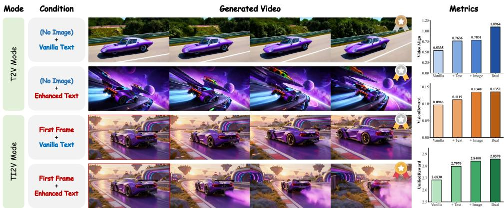  
Vanilla Text: “purple car in a videogame.” Enhanced Text: “Realistic video game style, a sleek purple sports car accelerates on a smooth track, its glossy body reflecting shifting ambient light ...”  
Figure 2: Condition-Elicited Capability. Conditioning a TI2V model on a high-quality first frame or an enhanced prompt clearly outperforms vanilla T2V. Their combination yields the best results across visuals and metrics, motivating HPSD’s goal of internalizing this capability into the model.

To address these issues, we propose Hybrid-Policy Self-Distillation (HPSD), a novel self-distillation framework where a single TI2V model acts as both teacher and student under different conditions: the teacher operates in TI2V mode under the privileged image and prompt conditions, while the student runs in the base T2V mode with a vanilla text prompt. The key idea is to let the student start from the teacher’s trajectory and finish under its own policy, which proceeds in three steps: (1) Before training, the privileged conditions are synthesized for each prompt with off-the-shelf generative models; (2) During training, the teacher first rolls out its full denoising trajectory under privileged conditions, yielding an off-policy anchor trajectory that carries the condition-elicited generation content; (3) The student then continues denoising from intermediate states of the anchor trajectory with its own velocity field, and is supervised by the teacher on the resulting sub-trajectory. Since the supervised states are anchored by the teacher’s policy yet evolved by the student’s, we term this design a hybrid-policy (Fig. 1 (c)), which offers two core advantages: (i) the student inherits the teacher’s states prescribed by the privileged conditions, so that the teacher’s supervision no longer conflicts with the sample content; (ii) the supervised states arise from the student’s own roll-out and thus remain aligned with its current policy. By integrating off-policy anchoring with onpolicy refinement, HPSD sidesteps both the exposure bias of off-policy training and the conditionstate mismatch of on-policy distillation, offering a new principle for diffusion model distillation. Extensive experiments on representative unified TI2V models (WAN-2.2 (Wan et al., 2025) and LTX-2.3 (HaCohen et al., 2026)) demonstrate that HPSD surpasses both off-policy and on-policy baselines, substantially improving the T2V performance (Fig. 1 (d)) while also delivering notable TI2V gains, indicating that the teacher and the student improve in tandem and that the model’s base generation ability is consistently enhanced.

Our contributions are threefold: (1) Condition-Elicited Capability: We identify that privileged conditions elicit stronger generation capability from unified TI2V models, and pose the new task of internalizing this capability into the model’s base generation ability. (2) Hybrid-Policy Self-Distillation: We reveal the failures of off-/on-policy distillation in this setting and propose HPSD, a hybrid-policy self-distillation framework that supervises the student on states anchored by the teacher’s trajectory and evolved by its own policy. (3) Superior Performance: Extensive experiments on two representative unified TI2V models validate that HPSD significantly strengthens the model’s base generation ability beyond both off-/on-policy baselines.

## 2 RELATED WORK

Video Diffusion Models. Video diffusion models have evolved from early U-Net-based architectures (Guo et al., 2023; Blattmann et al., 2023; Zhang et al., 2023) toward diffusion transformers (DiTs) (Esser et al., 2024), giving rise to modern systems with remarkable visual fidelity and prompt adherence, such as OpenSora (Zheng et al., 2024), CogVideoX (Yang et al., 2025), LongCat-Video (Team et al., 2025), HunyuanVideo series (Kong et al., 2024; Wu et al., 2025), and WAN series (Wan et al., 2025). These models generally follow two paradigms: text-to-video (T2V) models that synthesize videos from textual descriptions, and image-to-video (I2V) models that animate a given reference image. More recently, Text-Image-to-Video (TI2V) models (Lin et al., 2025; Ma et al., 2026) such as WAN-2.2 (Wan et al., 2025) and LTX-2 (HaCohen et al., 2026) further unify the two paradigms within a single set of weights, where an optional first-frame image is injected as a fixed clean condition into the denoising process. Beyond architecture design, a parallel line of research (Wang et al., 2025a; Cheng et al., 2025) improves generation quality by engineering richer input conditions at inference-time. In contrast, our HPSD paradigm internalizes the condition-elicited capabilities directly into the model’s inherent base generation ability.

Distillation for Diffusion Models. Diffusion model distillation primarily focuses on step distillation (Yin et al., 2024b; Sauer et al., 2024; Luo et al., 2023; Yin et al., 2024a) and knowledge distillation (Daniel Verdu, 2024; Yu et al., 2024). To accelerate the sluggish sampling process, step´ distillation compresses a many-step teacher into a few-step student, achieved either by imitating intermediate denoising transitions (Luo et al., 2023; Meng et al., 2023; Salimans & Ho, 2022) or aligning output distributions at specific timesteps (Luo et al., 2025; Yin et al., 2024b;a). Conversely, knowledge distillation transfers priors from a stronger teacher to improve the student’s generation quality (Fang et al., 2025; Wu et al., 2026). Unlike this line of study, we frame capability internalization as a self-distillation problem across different conditionings within the same model.

On-Policy Distillation for Generative Models. Initially grounded in large language models to mitigate exposure bias by matching distributions on student-generated sequences (Agarwal et al., 2024; Song & Zheng, 2026; Lu & Lab, 2025; Jang et al., 2026), on-policy distillation (OPD) has recently been adapted to diffusion and flow models to provide dense supervision along the student’s own roll-outs. In this visual domain, existing methods primarily fall into two categories. The first is self-distillation, where a single model acts as both student and teacher; for instance, D-OPSD (Jiang et al., 2026) and OPSD-V (Liu et al., 2026) guide the student using teachers conditioned on real images and temporal contexts, respectively. The second involves multi-teacher distillation, with works like DiffusionOPD (Li et al., 2026), Flow-OPD (Fang et al., 2026), and DanceOPD (Zhou et al., 2026), composing diverse capabilities from multiple specialized teachers into a unified student via velocity matching or reward optimization. Distinct from these paradigms, our HPSD addresses the unique condition-state mismatch of OPD in TI2V models through a novel hybrid-policy design.

## 3 METHOD

## 3.1 PRELIMINARIES

Flow Matching. Flow matching (Liu et al., 2022; Lipman et al., 2022) trains a time-dependent velocity field $v _ { \theta } ( x _ { t } , t , c )$ that transports samples from a Gaussian prior to the data distribution. Given a data sample $x _ { 0 }$ and noise $\epsilon \sim \bar { \mathcal { N } } ( 0 , I )$ , the interpolated state and target velocity at time $t \in [ 0 , 1 ]$ are $x _ { t } = ( 1 - t ) x _ { 0 } + t \epsilon$ and $v ^ { * } = \epsilon - x _ { 0 }$ , respectively. The model is optimized with $\mathcal { L } _ { \mathrm { F M } } ~ =$ $\mathbb { E } \| v _ { \theta } ( x _ { t } , t , c ) - \dot { v } ^ { * } \| ^ { 2 }$ . Sampling proceeds by integrating the learned velocity field from $t = 1$ to 0:

$$
\frac { \mathrm { d } \boldsymbol { x } _ { t } } { \mathrm { d } t } = \boldsymbol { v } _ { \theta } ( \boldsymbol { x } _ { t } , t , c ) ,\tag{1}
$$

where c denotes input conditions such as textual prompts or reference images.

TI2V Models. A TI2V model (Wan et al., 2025; HaCohen et al., 2026) supports both T2V and TI2V generation with a shared set of weights. In the T2V mode, the model is conditioned only on the text input, i.e., $v _ { \theta } ( x _ { t } , t \mid c _ { \mathrm { t x t } } )$ . In the TI2V mode, it is further conditioned on a given first-frame image cimg. Specifically, for TI2V generation, the first-frame condition is injected as a fixed clean latent and is excluded from the denoising process. For an F-frame video, the model is evaluated as:

$$
v _ { \theta } \bigl ( \hat { x } _ { t } , t \mid c _ { \mathrm { t x t } } , c _ { \mathrm { i m g } } \bigr ) , \qquad \hat { x } _ { t } = \bigl [ c _ { \mathrm { i m g } } , x _ { t } ^ { ( 2 : F ) } \bigr ] ,\tag{2}
$$

where the first-frame slot always contains the clean condition $c _ { \mathrm { i m g } } ^ { \mathrm { . } } ,$ , while the remaining frames are denoised at time t. Throughout, we use x for T2V states whose frames share a single noise level, and xˆfor TI2V states with a cleanfirst-frame slot.

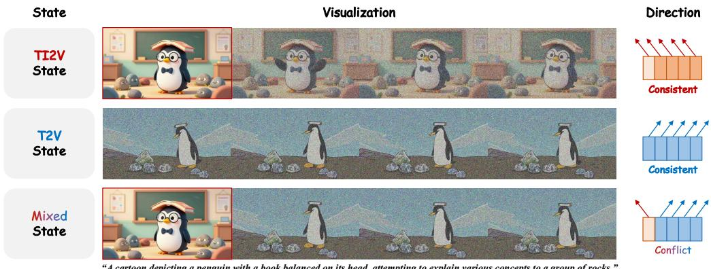  
“A cartoon depicting a penguin with a book balanced on its head, attempting to explain various concepts to a group of rocks.”

Figure 3: Condition-State Mismatch. While standard TI2V/T2V states maintain consistent content across frames, on-policy distillation creates an invalid mixed state by forcing a clean first frame alongside the student’s unaligned T2V rollout, yielding conflicting, corrupted teacher supervision.

Distillation Paradigms. Consider a teacher velocity field v˜ and a student $v _ { \phi }$ . Off-policy SFT finetunes the student on teacher-generated data. The teacher first completes a full denoising process to produce an endpoint $x _ { 0 } ^ { \mathrm { T e a } }$ . The student is supervised on its noised version $x _ { t } ^ { \mathrm { T e a } } = ( 1 - t ) \overline { { x _ { 0 } ^ { \mathrm { T e a } } } } + t \epsilon \mathrm { : }$

$$
\mathcal { L } _ { \mathrm { S F T } } = \mathbb { E } _ { t } \left. v _ { \phi } ( x _ { t } ^ { \mathrm { T e a } } , t ) - v ^ { * } \right. ^ { 2 } ,\tag{3}
$$

where $v ^ { * } = \epsilon - x _ { 0 } ^ { \mathrm { T e a } }$ is the analytic target velocity. For brevity, we suppress the conditional inputs here. On-policy distillation methods (Jiang et al., 2026; Zhou et al., 2026) instead supervise states produced by the current student. The student rolls out from its own policy, $x _ { t } ^ { \mathrm { { S t u } } } \sim \mathrm { R o l l o u t } ( v _ { \phi } )$ , and the teacher is evaluated at these student-visited states:

$$
\mathcal { L } _ { \mathrm { { O P D } } } = \mathbb { E } _ { t } \left| \left| v _ { \phi } ( x _ { t } ^ { \mathrm { { S t u } } } , t ) - \mathrm { s g } [ \tilde { v } ( x _ { t } ^ { \mathrm { { S t u } } } , t ) ] \right| \right| ^ { 2 } ,\tag{4}
$$

where $\operatorname { s g } ( \cdot )$ stands for the stop gradient operation.

## 3.2 OBSERVATION AND ANALYSIS

As observed in Fig. 2, privileged conditions elicit a stronger generation capability from TI2V models: an enhanced prompt or a high-quality first frame alone already significantly improves over the base T2V mode, and their combination yields the best quality. To internalize this condition-elicited capability into the model’s base generation ability, we formulate a self-distillation problem in which the teacher and the student are the same TI2V model evaluated under different input conditions: the teacher runs under privileged conditions (an enhanced prompt $c _ { \mathrm { t x t } } ^ { + }$ and a given first frame $c _ { \mathrm { i m g } } )$ , while the student operates in the base T2V mode with the original text prompt $c _ { \mathrm { t x t } }$

To be effective, this distillation must satisfy two competing requirements: providing state-aware precise correction to the evolving policy, while ensuring the teacher’s supervision does not conflict with the student’s actual sample content. While supervised fine-tuning (SFT) on teacher-generated videos successfully circumvents content conflicts, it remains fundamentally off-policy: as the student policy evolves, the fixed offline supervision states drift away from the states the student actually visits. Conversely, recent on-policy distillation methods (Jiang et al., 2026; Zhou et al., 2026) evaluate at student-visited states to offer localized correction, but suffer from a severe condition-state mismatch in the TI2V setting, as shown in Fig. 3. Rolling out in the T2V mode, the student generates an internally coherent latent sequence $x _ { t } ^ { \mathrm { S t u } , ( \overline { { 1 } } : F ) }$ . However, since the TI2V teacher rigidly requires a clean first frame, querying it on a student’s intermediate state creates a conflicted mixed input:

$$
\boldsymbol { \hat { x } } _ { t } ^ { \mathrm { M i s m a t c h } } = [ c _ { \mathrm { i m g } } , x _ { t } ^ { \mathrm { S t u , ( 2 : } F ) } ] .\tag{5}
$$

Here, the clean condition $c _ { \mathrm { i m g } }$ is forced to coexist with the student’s partially denoised frames, which depict a completely different, free-running T2V content, causing a severe temporal discontinuity. Essentially, this unaligned mixture constitutes an invalid input state for the model. The teacher thus outputs a corrupted velocity field, generating contradictory signals that mislead the student’s denoising process toward $c _ { \mathrm { i m g } } ,$ , rather than refining the student’s own content. HPSD is structurally designed to resolve this dilemma and satisfy both requirements simultaneously.

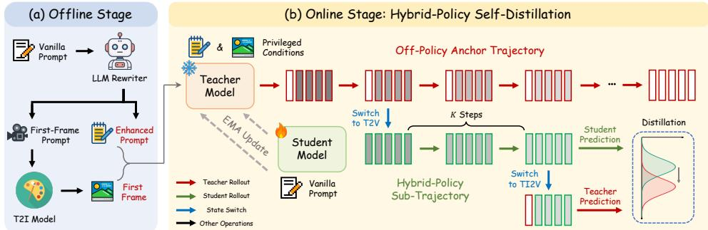  
Figure 4: Overview of HPSD. (a) Offline Stage: Privileged conditions (enhanced prompt and first frame) are synthesized using auxiliary models. (b) Online Stage: The student evolves hybrid-policy sub-trajectories starting from the teacher’s off-policy anchor states. Distillation on these states provides the student with precise policy correction anchored by the teacher’s privileged content priors. Varying gray shading denotes the noise level over time, while solid white indicates cleanframes.

## 3.3 HYBRID-POLICY SELF-DISTILLATION

HPSD lets the student start from the teacher’s trajectory and finish under its own policy, which proceeds in the following three steps. The overall framework of HPSD is illustrated in Fig. 4.

Privileged Condition Construction. Given a training prompt $c _ { \mathrm { t x t } } ,$ we first synthesize the privileged conditions with off-the-shelf generative models: an external LLM rewrites $\mathcal { C } _ { \mathrm { t x t } }$ into an enhanced prompt $c _ { \mathrm { t x t } } ^ { + }$ and designs a first-frame description ${ \mathit { c } } _ { \mathrm { f f } } ,$ which an auxiliary text-to-image model then renders into the high-quality first frame $c _ { \mathrm { i m g } }$ . All privileged conditions are precomputed offline and cached for training. Formally, this process can be expressed as:

$$
c _ { \mathrm { t x t } } ^ { + } , c _ { \mathrm { f f } } \sim { \mathcal { M } } _ { \mathrm { r w } } \big ( { \cdot } \mid c _ { \mathrm { t x t } } \big ) , \qquad c _ { \mathrm { i m g } } \sim { \mathcal { G } } _ { \mathrm { t 2 i } } \big ( { \cdot } \mid c _ { \mathrm { f f } } \big ) ,\tag{6}
$$

where $\mathcal { M } _ { \mathrm { r w } }$ denotes the LLM prompt rewriter, and $\mathcal { G } _ { \mathrm { t 2 i } }$ denotes the auxiliary text-to-image generator.

Off-Policy Anchor Trajectory. The teacher first rolls out its full denoising trajectory under privileged conditions $( c _ { \mathrm { t x t } } ^ { + } , c _ { \mathrm { i m g } } )$ , yielding an off-policy anchor trajectory that carries the conditionelicited generation content:

$$
\begin{array} { r } { \boldsymbol { \widehat { x } } _ { t _ { j + 1 } } ^ { \mathtt { T e a } , \mathbf { \xi } ( 2 : F ) } = \boldsymbol { \hat { x } } _ { t _ { j } } ^ { \mathtt { T e a } , \mathbf { \xi } ( 2 : F ) } + \left( t _ { j + 1 } - t _ { j } \right) \boldsymbol { \widetilde { v } } \big ( \boldsymbol { \hat { x } } _ { t _ { j } } ^ { \mathtt { T e a } } , t _ { j } \big | c _ { \mathrm { t x t } } ^ { + } , c _ { \mathrm { i m g } } \big ) , \qquad \boldsymbol { \hat { x } } _ { 1 } ^ { \mathtt { T e a } , \mathbf { \xi } ( 2 : F ) } = \epsilon , \epsilon \sim \mathcal { N } ( 0 , I ) . } \end{array}\tag{7}
$$

From it we collect intermediate states $\{ \hat { x } _ { t _ { i } } ^ { \mathrm { T e a } } \} _ { i = 1 } ^ { N }$ at anchor steps $\mathcal { A } = \{ t _ { i } \} _ { i = 1 } ^ { N }$ spread along the trajectory. Each anchor state $\hat { x } _ { t _ { i } } ^ { \mathrm { T e a } }$ is then converted into a student-compatible state $\boldsymbol { x } _ { t _ { i } } ^ { \mathrm { T e a } } .$ : since the teacher’s first-frame slot always holds the clean condition (Eq. 2) rather than a denoising state at time $t _ { i } ,$ we re-noise it to the current noise level,

$$
\boldsymbol { x } _ { t _ { i } } ^ { \mathrm { T e a } } = \big [ \left( 1 - t _ { i } \right) \boldsymbol { c } _ { \mathrm { i m g } } + t _ { i } \epsilon , \boldsymbol { \hat { x } } _ { t _ { i } } ^ { \mathrm { T e a } , \left( 2 : F \right) } \big ] , \qquad \epsilon \sim \mathcal { N } ( 0 , I ) ,\tag{8}
$$

so that all frames share the noise level $t _ { i }$ , matching what the student sees during T2V inference. This reconciles the teacher’s privileged content with the student’s input format, turning each anchor state into a valid starting point of the student’s own roll-out.

Hybrid-Policy Sub-Trajectory. From each start point $\boldsymbol { x } _ { t _ { i } } ^ { \mathrm { T e a } }$ , the student denoises K steps forward with its own velocity field,

$$
x _ { t _ { j + 1 } } ^ { \mathrm { H y b } } = x _ { t _ { j } } ^ { \mathrm { H y b } } + \left( t _ { j + 1 } - t _ { j } \right) v _ { \phi } \big ( x _ { t _ { j } } ^ { \mathrm { H y b } } , t _ { j } \big | c _ { \mathrm { t x t } } \big ) , \qquad j = i , \dots , i + K - 1 , \ x _ { t _ { i } } ^ { \mathrm { H y b } } : = x _ { t _ { i } } ^ { \mathrm { T e a } } ,\tag{9}
$$

yielding a short hybrid-policy sub-trajectory whose terminal state $x _ { t _ { i + K } } ^ { \mathrm { H y b } }$ inherits the teacher’s content yet is evolved by the student’s current policy. To supervise at this state, the teacher must be queried in its own input format: following Eq. 2, we re-impose the clean first frame onto $x _ { t _ { i + K } } ^ { \mathrm { H y b } }$

$$
\begin{array} { r } { \hat { x } _ { t _ { i + K } } ^ { \mathrm { H y b } } = \big [ c _ { \mathrm { i m g } } , x _ { t _ { i + K } } ^ { \mathrm { H y b , ( 2 : } F ) } \big ] , } \end{array}\tag{10}
$$

and evaluate the teacher at $\hat { x } _ { t _ { i + K } } ^ { \mathrm { H y b } }$ . The student is then supervised on the frames being denoised:

$$
\mathcal { L } _ { \mathrm { H P S D } } = \mathbb { E } _ { t _ { i } \sim A } \left. v _ { \phi } \big ( x _ { t _ { i + K } } ^ { \mathrm { H y b } } , t _ { i + K } \big \vert c _ { \mathrm { t x t } } \big ) - \mathrm { s g } \Big [ \tilde { v } \big ( \hat { x } _ { t _ { i + K } } ^ { \mathrm { H y b } } , t _ { i + K } \big \vert c _ { \mathrm { t x t } } ^ { + } , c _ { \mathrm { i m g } } \big ) \Big ] \right. _ { ( 2 : F ) } ^ { 2 } .\tag{11}
$$

Algorithm 1 Hybrid-Policy Self-Distillation (HPSD)   
Require: TI2V model with student $v _ { \phi }$ and EMA teacher $\tilde { v } ;$ prompt set D; sub-trajectory length K;   
anchor steps $\mathcal { A } = \{ t _ { i } \} _ { i = 1 } ^ { N }$   
// Offline stage: privileged-condition construction   
1: for all $c _ { \mathrm { t x t } } \in \mathcal { D }$ do   
2: Enhance the prompt $c _ { \mathrm { t x t } } \to c _ { \mathrm { t x t } } ^ { + }$ and synthesize the first frame $c _ { \mathrm { i m g } }$ ▷ Eq. 6   
3: end for   
// Online stage: hybrid-policy self-distillation   
4: for each training step do   
5: Sample a prompt batch $\{ c _ { \mathrm { t x t } } \} \subset \mathcal { D } ;$ load cached $( c _ { \mathrm { t x t } } ^ { + } , c _ { \mathrm { i m g } } )$   
// Off-policy anchor trajectory   
6: Roll out the teacher $\tilde { v } ( \cdot \mid c _ { \mathrm { t x t } } ^ { + } , c _ { \mathrm { i m g } } )$ ; collect anchor states $\{ \hat { x } _ { t _ { i } } ^ { \mathrm { T e a } } \}$ ▷ Eq. 7   
7: Convert each anchor into a student-compatible state $\boldsymbol { x } _ { t _ { i } } ^ { \mathrm { T e a } }$ ▷ Eq. 8   
// Hybrid-policy sub-trajectory   
8: for all anchors $\boldsymbol { x } _ { t _ { i } } ^ { \mathrm { T e a } }$ do   
9: Denoise K steps with the student $v _ { \phi } ( \cdot \mid c _ { \mathrm { t x t } } ) \to x _ { t _ { i + k } } ^ { \mathrm { H y b } }$ ▷ Eq. 9   
10: Re-impose the clean first frame to build the teacher query $\hat { x } _ { t _ { i + K } } ^ { \mathrm { H y b } }$ ▷ Eq. 10   
11: end for   
// Velocity-level matching   
12: Compute L and update the student $v _ { \phi }$ ▷ Eq. 11   
13: Update the teacher v˜ with the EMA of the student   
14: end for

The sub-trajectory length K interpolates between the two paradigms: K = 0 reduces to off-policy distillation on the teacher’s trajectory, while a larger K approaches on-policy supervision. Anchored by the teacher’s trajectory and evolved by the student’s policy, these intermediate states bridge both paradigms, which is why we denote this design as hybrid-policy. Note that the loss is applied from the second frame onward, as the teacher’s first-frame velocity carries no denoising meaning under the clean-condition input format.

HPSD Training. Alg. 1 outlines the complete HPSD pipeline. In the offline stage, we synthesize and cache the privileged conditions $( c _ { \mathrm { t x t } } ^ { + } , c _ { \mathrm { i m g } } )$ for every training prompt. During online training, the process iterates over prompt batches. First, the teacher rolls out an anchor trajectory to provide student-compatible anchor states. Next, the student denoises for K steps from these anchors to form hybrid-policy sub-trajectories, receiving teacher supervision at the terminal states. The teacher is updated via an exponential moving average (EMA) of the student (Jiang et al., 2026), which stabilizes the target distribution and ensures that both roles improve in tandem.

## 4 EXPERIMENTS

## 4.1 IMPLEMENTATION DETAILS

Training Datasets. We adopt the video training dataset used in Pref-GRPO (Wang et al., 2025b) as the prompt set for HPSD and all baselines, which consists of ∼50K prompts providing broad coverage across diverse themes and subject categories. For privileged condition construction, we employ Qwen3.6-27B (Qwen Team, 2026) as the LLM rewriter and Z-Image-Turbo (Team, 2025) as the high-quality first-frame generator. Further details and additional experiments with an alternative first-frame generator are deferred to Section B and Section D in the Appendix, respectively.

Base Models. Experiments are conducted on two leading TI2V models: WAN-2.2-TI2V-5B (Wan et al., 2025) and LTX-2.3 (HaCohen et al., 2026). Both models are trained at their native resolutions and inference steps: 1280×704 with 50 steps for WAN-2.2, and 768×512 with 30 steps for LTX-2.3. For LTX-2.3, we only consider its first-stage generation and do not adopt the second-stage super-resolution and refinement. For efficiency, both models use 33 frames during training.

Baselines for Comparison. The compared methods encompass: (i) the base models in their T2V mode (Wan et al., 2025; HaCohen et al., 2026); (ii) Off-policy Supervised Fine-Tuning with flowmatching loss (Lipman et al., 2022); (iii) On-Policy Distillation; (iv) D-OPSD (Jiang et al., 2026), a recent self-distillation method for diffusion models. Note that D-OPSD requires a multimodal encoder to inject image information into the denoising process, which is typically unavailable in TI2V models; we therefore only apply D-OPSD to distill the textual privileged condition.

Table 1: Quantitative comparison of different methods on various TI2V backbones. The best results are in bold, while the second-best result is underlined. UR-v2-A, UR-v2-P and UR-v2-S represent the Alignment, Physics and Style dimensions of UnifiedReward-v2, respectively.
<table><tr><td>Backbone</td><td>Method</td><td>VideoAlign</td><td>VisionReward</td><td>UR-v1</td><td>UR-v2-A</td><td>UR-v2-P</td><td>UR-v2-S</td><td>HPS</td><td>CLIP</td></tr><tr><td rowspan="5">WAN-2.2</td><td>Vanilla T2V</td><td>0.5335</td><td>0.0965</td><td>2.683</td><td>2.802</td><td>3.167</td><td>3.100</td><td>0.2472</td><td>0.3684</td></tr><tr><td>On-Policy Distillation</td><td>0.2613</td><td>0.0482</td><td>2.463</td><td>2.724</td><td>3.171</td><td>3.204</td><td>0.2561</td><td>0.2847</td></tr><tr><td>D-OPSD (Text)</td><td>0.6379</td><td>0.1076</td><td>2.739</td><td>2.825</td><td>3.189</td><td>3.187</td><td>0.2493</td><td>0.3712</td></tr><tr><td>Supervised Fine-Tuning</td><td>1.2046</td><td>0.1043</td><td>2.763</td><td>2.854</td><td>3.181</td><td>3.207</td><td>0.2670</td><td>0.3710</td></tr><tr><td>HPSD (Ours)</td><td>1.8753</td><td>0.1191</td><td>2.812</td><td>2.890</td><td>3.203</td><td>3.275</td><td>0.2815</td><td>0.3765</td></tr><tr><td rowspan="5">LTX-2.3</td><td>Vanilla T2V</td><td>0.2307</td><td>0.0566</td><td>2.648</td><td>2.877</td><td>3.100</td><td>2.956</td><td>0.2068</td><td>0.3320</td></tr><tr><td>On-Policy Distillation</td><td>0.0242</td><td>0.0405</td><td>2.594</td><td>2.825</td><td>3.089</td><td>3.093</td><td>0.2278</td><td>0.3048</td></tr><tr><td>D-OPSD (Text)</td><td>0.4380</td><td>0.1008</td><td>2.824</td><td>2.903</td><td>3.173</td><td>3.114</td><td>0.2451</td><td>0.3808</td></tr><tr><td>Supervised Fine-Tuning</td><td>0.9584</td><td>0.0826</td><td>2.733</td><td>2.873</td><td>3.068</td><td>3.131</td><td>0.2349</td><td>0.3626</td></tr><tr><td>HPSD (Ours)</td><td>1.5244</td><td>0.1123</td><td>2.827</td><td>2.887</td><td>3.198</td><td>3.182</td><td>0.2731</td><td>0.3853</td></tr></table>

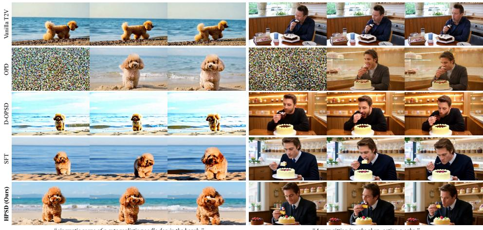  
“cinematic scene of a cute realistic poodle dog in the beach.”  
“A man sitting in cake shop, eating a cake.”

Figure 5: Qualitative Comparisons with Baselines on WAN-2.2. Best viewed zoomed in.

Training Details. Unless specified otherwise, all experiments share the following setup. We train for 500 steps on 8 H200 GPUs with a batch size of 1 per GPU, using the AdamW optimizer with a learning rate of $1 \times 1 0 ^ { - 4 }$ and bfloat16 (bf16) mixed-precision training for efficiency. The anchor steps A are randomly sampled from the anchor trajectory, while the sub-trajectory length K is set to 3 and the EMA decay rate is set to 0.999. All methods use LoRA with $r = 3 2 , \alpha = 6 4$

Evaluation Details. The evaluation set consists of 500 diverse video prompts sampled from the VideoDPO (Liu et al., 2024) and VideoFeedback (He et al., 2024) datasets. For a thorough evaluation, a diverse set of metrics is employed: (i) Video Reward Models, including VideoAlign (Liu et al., 2025), VisionReward (Xu et al., 2026), and UnifiedReward-v1/v2 (UR-v1/v2, unified imagevideo reward models) (Wang et al., 2025c); (ii) Image Reward Models, where we adopt frame-wise HPS Score (Wu et al., 2023) and frame-wise CLIP Score (Radford et al., 2021) to assess per-frame quality; and (iii) VBench (Huang et al., 2024) for comprehensive video generation evaluation.

## 4.2 MAIN RESULTS

Quantitative Evaluation. The quantitative results are presented in Tab. 1 and Tab. 2. For reward metrics (Tab. 1), HPSD consistently outperforms baselines, topping all eight reward metrics on WAN-2.2 and seven on LTX-2.3, notably boosting VideoAlign by ∼50% over the second-best SFT. Conversely, standard OPD severely degrades T2V performance due to its condition-state mismatch in training, leading to early-frame blurriness and content incoherence. While D-OPSD offers some gains, its encoder’s modality constraints preclude distilling image conditions, capping its upper bound. On VBench (Tab. 2), HPSD leads on most dimensions for both models. Although the Dynamic Degree is slightly lower, we argue that it does not imply degraded video quality; rather, we observe significantly enhanced temporal consistency, fewer abrupt changes, and better physical plausibility (also evidenced by the improved UR-v2-Physics score in Tab. 1), as shown in Fig. 8.

Qualitative Comparison. Visual comparisons in Fig. 5 and Fig. 6 corroborate the metrics. Vanilla T2V outputs are often desaturated with coarse textures, whereas On-Policy Distillation collapses entirely (e.g., noisy early frames and ghosting artifacts), stemming from the aforementioned condition-

Table 2: Quantitative results on VBench metrics. The best results are in bold, while the secondbest result is underlined. SC: Subject Consistency; BC: Background Consistency; MS: Motion Smoothness; DD: Dynamic Degree; AQ: Aesthetic Quality; IQ: Imaging Quality.
<table><tr><td>Backbone</td><td>Method</td><td>VBench-SC</td><td>VBench-BC</td><td>VBench-MS</td><td>VBench-DD</td><td>VBench-AQ</td><td>VBench-IQ</td></tr><tr><td rowspan="5">WAN-2.2</td><td>Vanilla T2V</td><td>0.9654</td><td>0.9667</td><td>0.9878</td><td>0.560</td><td>0.5773</td><td>0.6981</td></tr><tr><td>On-Policy Distillation</td><td>0.5241</td><td>0.7284</td><td>0.9799</td><td>0.516</td><td>0.6066</td><td>0.6683</td></tr><tr><td>D-OPSD (Text)</td><td>0.9691</td><td>0.9692</td><td>0.9874</td><td>0.404</td><td>0.5889</td><td>0.6300</td></tr><tr><td>Supervised Fine-Tuning</td><td>0.9679</td><td>0.9675</td><td>0.9837</td><td>0.526</td><td>0.6095</td><td>0.7049</td></tr><tr><td>HPSD (Ours)</td><td>0.9722</td><td>0.9705</td><td>0.9880</td><td>0.422</td><td>0.6343</td><td>0.6996</td></tr><tr><td rowspan="5">LTX-2.3</td><td>Vanilla T2V</td><td>0.9388</td><td>0.9467</td><td>0.9901</td><td>0.330</td><td>0.5791</td><td>0.6517</td></tr><tr><td>On-Policy Distillation</td><td>0.5337</td><td>0.7715</td><td>0.9899</td><td>0.366</td><td>0.5800</td><td>0.6345</td></tr><tr><td>D-OPSD (Text)</td><td>0.9419</td><td>0.9454</td><td>0.9897</td><td>0.236</td><td>0.5994</td><td>0.6383</td></tr><tr><td>Supervised Fine-Tuning</td><td>0.9466</td><td>0.9465</td><td>0.9903</td><td>0.278</td><td>0.5994</td><td>0.6723</td></tr><tr><td>HPSD (Ours)</td><td>0.9515</td><td>0.9554</td><td>0.9905</td><td>0.302</td><td>0.6375</td><td>0.6886</td></tr></table>

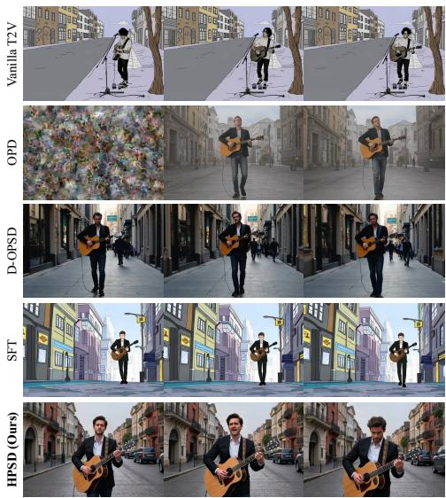  
“a man playing guitar and sing a song on the street.”

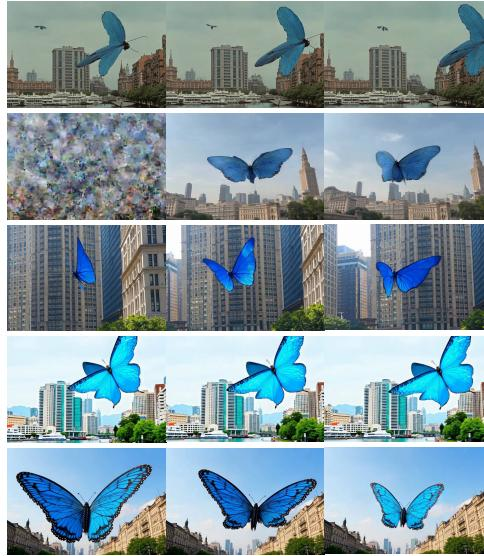  
“a video of a giant blue butterfly of 200 meters in a city, ...”

Figure 6: Qualitative Comparisons with Baselines on LTX-2.3. Best viewed zoomed in.

state mismatch. While SFT and D-OPSD produce plausible content, they still lack fine details, consistent subjects, and cinematic lighting. In contrast, HPSD delivers significantly sharper textures, richer colors, and superior prompt adherence (e.g., the cinematic poodle and vividly textured butterfly), visually confirming the successful internalization of condition-elicited capabilities. Additional visual comparison results are presented in Section C in the Appendix.

## 4.3 ABLATION STUDY

The ablation studies are conducted on the WAN-2.2 model, with the results presented in Tab. 3.

Effects of Sub-Trajectory Length K. The sub-trajectory length K acts as a tunable knob interpolating between off-policy and on-policy paradigms. As shown in Tab. 3 (a), HPSD’s performance initially improves but later deteriorates as K increases, suggesting that an excessively short subtrajectory remains overly off-policy, failing to reach the student’s actual distribution, whereas a prolonged K pushes the framework toward pure on-policy distillation, drifting too far from the teacher’s prior and exacerbating the condition-state mismatch (Fig. 3). Therefore, $\bar { K } = 3$ is chosen to balance the teacher’s condition-elicited anchoring with the student’s policy-aligned correction.

Effects of Privileged Conditions. Tab. 3 (b) reveals a clear step-wise improvement when scaling the teacher’s privileged conditions. Compared to Vanilla T2V, distilling only the privileged image $( +  { c _ { \mathrm { i m g } } } )$ brings substantial gains, while combining both privileges $( + c _ { \mathrm { t x t } } ^ { + } + c _ { \mathrm { i m g } } )$ achieves the peak performance. This validates that richer conditions unlock stronger teacher capabilities, yielding higher-quality guidance for internalization. Notably, the text-only ablation is omitted, as text conditions do not trigger the condition-state mismatch and are readily handled by standard OPD.

Effects of HPSD on TI2V Mode. Although optimized for T2V generation, HPSD simultaneously enhances the model’s TI2V performance (Tab. 3 (c)), improving VideoAlign by ∼55%. These gains

“coffee swirling in a rainbow cup.”

Table 3: Ablation experiments on HPSD components and hyperparameters.
<table><tr><td>Components</td><td>Values &amp; Choices</td><td>VideoAlign</td><td>VisionReward</td><td>UR-v1</td><td>UR-v2-A</td><td>UR-v2-P</td><td>UR-v2-S</td></tr><tr><td rowspan="5">(a) Sub-Trajectory Length K</td><td> $K = 0$ </td><td>1.5587</td><td>0.1131</td><td>2.750</td><td>2.853</td><td>3.163</td><td>3.223</td></tr><tr><td> $K = 1$ </td><td>1.6653</td><td>0.1144</td><td>2.761</td><td>2.846</td><td>3.180</td><td>3.232</td></tr><tr><td> $\mathbf K = 3$ </td><td>1.8753</td><td>0.1191</td><td>2.812</td><td>2.890</td><td>3.203</td><td>3.275</td></tr><tr><td> $\begin{array} { c } { { K = 5 } } \\ { { K = 7 } } \end{array}$ </td><td>1.7794</td><td>0.1194</td><td>2.790</td><td>2.865</td><td>3.190</td><td>3.260</td></tr><tr><td></td><td>1.7130</td><td>0.1168</td><td>2.777</td><td>2.869</td><td>3.189</td><td>3.251</td></tr><tr><td rowspan="3">(b) Privileged Conditions  $c _ { \mathrm { t x t } } ^ { + } \& c _ { \mathrm { i m g } }$ </td><td>Vanilla T2V</td><td>0.5335</td><td>0.0965</td><td>2.683</td><td>2.802</td><td>3.167</td><td>3.100</td></tr><tr><td> $+ c _ { \mathrm { i m g } }$ </td><td>1.5006</td><td>0.1157</td><td>2.787</td><td>2.855</td><td>3.194</td><td>3.247</td></tr><tr><td> $\bf + c _ { t x t } ^ { + } + c _ { i m g } \tau ( H P S D )$ </td><td>1.8753</td><td>0.1191</td><td>2.812</td><td>2.890</td><td>3.203</td><td>3.275</td></tr><tr><td rowspan="2">(c) Effect on TI2V Mode</td><td>Vanilla TI2V</td><td>0.7831</td><td>0.1348</td><td>2.840</td><td>2.926</td><td>3.211</td><td>3.273</td></tr><tr><td>TI2V after HPSD</td><td>1.2139</td><td>0.1344</td><td>2.859</td><td>2.932</td><td>3.215</td><td>3.271</td></tr></table>

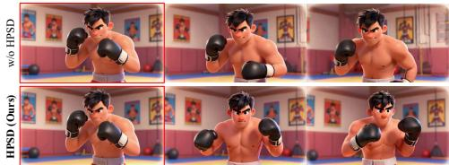  
“A 3D illustration of a man engaging in an MMA fight, rendered in Pixar style.”

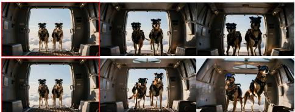  
“two dogs wearing goggles and parachute on an airplane.”  
Figure 7: Effects of HPSD on TI2V mode. The red boxes indicate the shared first frames.

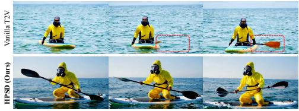  
“man in yellow hazmat suit on a paddleboard in the middle of the ocean.”

  
Figure 8: Improved Consistency & Physical Plausibility. (Left) Vanilla T2V exhibits limited temporal consistency (paddle appears abruptly), while HPSD ensures coherent subject retention. (Right) Vanilla T2V lacks physical realism (static liquid), whereas HPSD renders natural fluid dynamics.

stem from our asymmetric prompt distillation: forcing the student using a vanilla prompt to align with the teacher using an enhanced prompt intrinsically trains the model to better interpret and execute plain textual inputs, regardless of first frame conditioning. Consequently, HPSD yields richer physical interactions and superior prompt adherence (as illustrated in Fig. 7), confirming an intrinsic enhancement of the model’s shared generation priors.

## 5 LIMITATION AND DISCUSSION

While HPSD significantly enhances the base T2V generation capability, it introduces certain computational overheads. First, constructing privileged conditions requires querying auxiliary LLM and T2I models, which incurs extra data synthesis costs. However, this overhead is a one-time offline process and can be effectively mitigated by deploying distilled or quantized generative models (e.g., Z-Image-Turbo used in our experiments). Moreover, the performance ceiling of HPSD can naturally scale with the continuous advancements of these auxiliary models. Second, during training, rolling out the student to form the hybrid-policy sub-trajectory requires additional forward passes compared to SFT and OPD. Nevertheless, these intermediate steps operate strictly in inference mode and do not require storing gradients, thereby avoiding substantial memory overhead.

## 6 CONCLUSION

We propose Hybrid-Policy Self-Distillation (HPSD) to internalize the superior, condition-elicited ca pabilities of TI2V models into their base generation ability. To resolve the lack of state-aware precise correction in off-policy methods and the condition-state mismatch in on-policy approaches, HPSD supervises the student on sub-trajectories anchored by the teacher’s privileged states but evolved under its own policy. Experiments on WAN-2.2 and LTX-2.3 demonstrate that HPSD significantly boosts base T2V performance and concurrently enhances the TI2V mode, effectively strengthening the model’s inherent generation ability and offering a novel distillation paradigm.

## REFERENCES

Rishabh Agarwal, Nino Vieillard, Yongchao Zhou, Piotr Stanczyk, Sabela Ramos Garea, Matthieu Geist, and Olivier Bachem. On-policy distillation of language models: Learning from selfgenerated mistakes. In International Conference on Learning Representations, volume 2024, pp. 21246–21263, 2024.

Andreas Blattmann, Tim Dockhorn, Sumith Kulal, Daniel Mendelevitch, Maciej Kilian, Dominik Lorenz, Yam Levi, Zion English, Vikram Voleti, Adam Letts, et al. Stable video diffusion: Scaling latent video diffusion models to large datasets. arXiv preprint arXiv:2311.15127, 2023.

Jiazi Bu, Pengyang Ling, Pan Zhang, Tong Wu, Xiaoyi Dong, Yuhang Zang, Yuhang Cao, Dahua Lin, and Jiaqi Wang. Bytheway: Boost your text-to-video generation model to higher quality in a training-free way. In Proceedings of the Computer Vision and Pattern Recognition Conference, pp. 12999–13008, 2025.

Jiale Cheng, Ruiliang Lyu, Xiaotao Gu, Xiao Liu, Jiazheng Xu, Yida Lu, Jiayan Teng, Zhuoyi Yang, Yuxiao Dong, Jie Tang, et al. Vpo: Aligning text-to-video generation models with prompt optimization. In Proceedings of the IEEE/CVF International Conference on Computer Vision, pp. 15636–15645, 2025.

Javier Mart´ın Daniel Verdu. Flux.1 lite: Distilling flux1.dev for efficient text-to-image generation.´ 2024.

Patrick Esser, Sumith Kulal, Andreas Blattmann, Rahim Entezari, Jonas Muller, Harry Saini, Yam¨ Levi, Dominik Lorenz, Axel Sauer, Frederic Boesel, et al. Scaling rectified flow transformers for high-resolution image synthesis. In Forty-first international conference on machine learning, 2024.

Gongfan Fang, Kunjun Li, Xinyin Ma, and Xinchao Wang. Tinyfusion: Diffusion transformers learned shallow. In Proceedings ofthe Computer Vision and Pattern Recognition Conference, pp. 18144–18154, 2025.

Zhen Fang, Wenxuan Huang, Yu Zeng, Yiming Zhao, Shuang Chen, Kaituo Feng, Yunlong Lin, Lin Chen, Zehui Chen, Shaosheng Cao, et al. Flow-opd: On-policy distillation for flow matching models. arXiv preprint arXiv:2605.08063, 2026.

Yuwei Guo, Ceyuan Yang, Anyi Rao, Zhengyang Liang, Yaohui Wang, Yu Qiao, Maneesh Agrawala, Dahua Lin, and Bo Dai. Animatediff: Animate your personalized text-to-image diffu sion models without specific tuning. arXiv preprint arXiv:2307.04725, 2023.

Yoav HaCohen, Nisan Chiprut, Benny Brazowski, Daniel Shalem, Dudu Moshe, Eitan Richardson, Eran Levin, Guy Shiran, Nir Zabari, Ori Gordon, et al. Ltx-video: Realtime video latent diffusion. arXiv preprint arXiv:2501.00103, 2024.

Yoav HaCohen, Benny Brazowski, Nisan Chiprut, Yaki Bitterman, Andrew Kvochko, Avishai Berkowitz, Daniel Shalem, Daphna Lifschitz, Dudu Moshe, Eitan Porat, et al. Ltx-2: Efficient joint audio-visual foundation model. arXiv preprint arXiv:2601.03233, 2026.

Xuan He, Dongfu Jiang, Ge Zhang, Max Ku, Achint Soni, Sherman Siu, Haonan Chen, Abhranil Chandra, Ziyan Jiang, Aaran Arulraj, Kai Wang, Quy Duc Do, Yuansheng Ni, Bohan Lyu, Yaswanth Narsupalli, Rongqi Fan, Zhiheng Lyu, Yuchen Lin, and Wenhu Chen. Videoscore: Building automatic metrics to simulate fine-grained human feedback for video generation. ArXiv, abs/2406.15252, 2024. URL https://arxiv.org/abs/2406.15252.

Yinghui He, Simran Kaur, Adithya Bhaskar, Yongjin Yang, Jiarui Liu, Narutatsu Ri, Liam H Fowl, Abhishek Panigrahi, Danqi Chen, and Sanjeev Arora. Self-distillation zero: Self-revision turns binary rewards into dense supervision. In ICML 2026 Workshop on Foundations ofDeep Gener ative Models: Understanding Memorization, Generalization, and Reasoning, 2026.

Jonathan Ho, Ajay Jain, and Pieter Abbeel. Denoising diffusion probabilistic models. Advances in neural information processing systems, 33:6840–6851, 2020.

Ziqi Huang, Yinan He, Jiashuo Yu, Fan Zhang, Chenyang Si, Yuming Jiang, Yuanhan Zhang, Tianxing Wu, Qingyang Jin, Nattapol Chanpaisit, Yaohui Wang, Xinyuan Chen, Limin Wang, Dahua Lin, Yu Qiao, and Ziwei Liu. VBench: Comprehensive benchmark suite for video generative models. In Proceedings of the IEEE/CVF Conference on Computer Vision and Pattern Recognition, 2024.

Ijun Jang, Jewon Yeom, Juan Yeo, Hyunggyu Lim, and Taesup Kim. Stable on-policy distillation through adaptive target reformulation. In Findings of the Association for Computational Linguistics: ACL 2026, pp. 42217–42227, 2026.

Dengyang Jiang, Mengmeng Wang, Liuzhuozheng Li, Lei Zhang, Haoyu Wang, Wei Wei, Guang Dai, Yanning Zhang, and Jingdong Wang. No other representation component is needed: Diffusion transformers can provide representation guidance by themselves. arXiv preprint arXiv:2505.02831, 2025.

Dengyang Jiang, Xin Jin, Dongyang Liu, Zanyi Wang, Mingzhe Zheng, Ruoyi Du, Xiangpeng Yang, Qilong Wu, Zhen Li, Peng Gao, Harry Yang, and Steven Hoi. D-opsd: On-policy self-distillation for continuously tuning step-distilled diffusion models. arXiv preprint arXiv:2605.05204, 2026.

Weijie Kong, Qi Tian, Zijian Zhang, Rox Min, Zuozhuo Dai, Jin Zhou, Jiangfeng Xiong, Xin Li, Bo Wu, Jianwei Zhang, et al. Hunyuanvideo: A systematic framework for large video generative models. arXiv preprint arXiv:2412.03603, 2024.

Black Forest Labs. FLUX.2: Frontier Visual Intelligence. https://bfl.ai/blog/flux-2, 2025.

Quanhao Li, Junqiu Yu, Kaixun Jiang, Yujie Wei, Zhen Xing, Pandeng Li, Ruihang Chu, Shiwei Zhang, Yu Liu, and Zuxuan Wu. Diffusionopd: A unified perspective of on-policy distillation in diffusion models. arXiv preprint arXiv:2605.15055, 2026.

Zongyu Lin, Wei Liu, Chen Chen, Jiasen Lu, Wenze Hu, Tsu-Jui Fu, Jesse Allardice, Zhengfeng Lai, Liangchen Song, Bowen Zhang, et al. Stiv: Scalable text and image conditioned video generation. In Proceedings of the IEEE/CVF International Conference on Computer Vision, pp. 16249–16259, 2025.

Yaron Lipman, Ricky TQ Chen, Heli Ben-Hamu, Maximilian Nickel, and Matt Le. Flow matching for generative modeling. arXiv preprint arXiv:2210.02747, 2022.

Hongyu Liu, Chun Wang, Feng Gao, Xuanhua He, Yue Ma, Ziyu Wan, Yong Zhang, Xiaoming Wei, and Qifeng Chen. Opsd-v: On-policy self-distillation for post-training few-step autoregressive video generators. arXiv preprint arXiv:2607.08766, 2026.

Jie Liu, Gongye Liu, Jiajun Liang, Ziyang Yuan, Xiaokun Liu, Mingwu Zheng, Xiele Wu, Qiulin Wang, Wenyu Qin, Menghan Xia, et al. Improving video generation with human feedback. arXiv preprint arXiv:2501.13918, 2025.

Runtao Liu, Haoyu Wu, Zheng Ziqiang, Chen Wei, Yingqing He, Renjie Pi, and Qifeng Chen. Videodpo: Omni-preference alignment for video diffusion generation. arXiv preprint arXiv:2412.14167, 2024.

Xingchao Liu, Chengyue Gong, and Qiang Liu. Flow straight and fast: Learning to generate and transfer data with rectified flow. arXiv preprint arXiv:2209.03003, 2022.

Kevin Lu and Thinking Machines Lab. On-policy distillation. Thinking Machines Lab: Connectionism, 2025. doi: 10.64434/tml.20251026. https://thinkingmachines.ai/blog/on-policy-distillation.

Simian Luo, Yiqin Tan, Longbo Huang, Jian Li, and Hang Zhao. Latent consistency models: Synthesizing high-resolution images with few-step inference. arXiv preprint arXiv:2310.04378, 2023.

Yihong Luo, Tianyang Hu, Jiacheng Sun, Yujun Cai, and Jing Tang. Learning few-step diffusion models by trajectory distribution matching. In Proceedings of the IEEE/CVF International Conference on Computer Vision, pp. 17719–17728, 2025.

Shuailei Ma, Jiaqi Liao, Xinyang Wang, Jingjing Wang, Chaoran Feng, Zijing Hu, Chong Bao, Zichen Xi, Yuqi Gan, Weisen Wang, et al. Scaling mixture-of-experts video pretraining for embodied intelligence. arXiv preprint arXiv:2607.07675, 2026.

Chenlin Meng, Robin Rombach, Ruiqi Gao, Diederik Kingma, Stefano Ermon, Jonathan Ho, and Tim Salimans. On distillation of guided diffusion models. In Proceedings of the IEEE/CVF conference on computer vision and pattern recognition, pp. 14297–14306, 2023.

William Peebles and Saining Xie. Scalable diffusion models with transformers. In Proceedings of the IEEE/CVF international conference on computer vision, pp. 4195–4205, 2023.

Qwen Team. Qwen3.6-27B: Flagship-level coding in a 27b dense model, April 2026. URL https: //qwen.ai/blog?id=qwen3.6-27b.

Alec Radford, Jong Wook Kim, Chris Hallacy, Aditya Ramesh, Gabriel Goh, Sandhini Agarwal, Girish Sastry, Amanda Askell, Pamela Mishkin, Jack Clark, et al. Learning transferable visual models from natural language supervision. In International conference on machine learning, pp. 8748–8763. PmLR, 2021.

Tim Salimans and Jonathan Ho. Progressive distillation for fast sampling of diffusion models. arXiv preprint arXiv:2202.00512, 2022.

Axel Sauer, Dominik Lorenz, Andreas Blattmann, and Robin Rombach. Adversarial diffusion distillation. In European Conference on Computer Vision, pp. 87–103. Springer, 2024.

Idan Shenfeld, Mehul Damani, Jonas Hubotter, and Pulkit Agrawal. Self-distillation enables con-¨ tinual learning. arXiv preprint arXiv:2601.19897, 2026.

Jiaming Song, Chenlin Meng, and Stefano Ermon. Denoising diffusion implicit models. arXiv preprint arXiv:2010.02502, 2020a.

Mingyang Song and Mao Zheng. A survey of on-policy distillation for large language models. arXiv preprint arXiv:2604.00626, 2026.

Yang Song, Jascha Sohl-Dickstein, Diederik P Kingma, Abhishek Kumar, Stefano Ermon, and Ben Poole. Score-based generative modeling through stochastic differential equations. arXiv preprint arXiv:2011.13456, 2020b.

Meituan LongCat Team, Xunliang Cai, Qilong Huang, Zhuoliang Kang, Hongyu Li, Shijun Liang, Liya Ma, Siyu Ren, Xiaoming Wei, Rixu Xie, and Tong Zhang. Longcat-video technical report, 2025. URL https://arxiv.org/abs/2510.22200.

Z-Image Team. Z-image: An efficient image generation foundation model with single-stream diffusion transformer. arXiv preprint arXiv:2511.22699, 2025.

Team Wan, Ang Wang, Baole Ai, Bin Wen, Chaojie Mao, Chen-Wei Xie, Di Chen, Feiwu Yu, Haiming Zhao, Jianxiao Yang, et al. Wan: Open and advanced large-scale video generative models. arXiv preprint arXiv:2503.20314, 2025.

Linqing Wang, Ximing Xing, Yiji Cheng, Zhiyuan Zhao, Donghao Li, Tiankai Hang, Jiale Tao, Qixun Wang, Ruihuang Li, Comi Chen, et al. Promptenhancer: A simple approach to enhance text-to-image models via chain-of-thought prompt rewriting. arXiv preprint arXiv:2509.04545, 2025a.

Yibin Wang, Zhimin Li, Yuhang Zang, Yujie Zhou, Jiazi Bu, Chunyu Wang, Qinglin Lu, Cheng Jin, and Jiaqi Wang. Pref-grpo: Pairwise preference reward-based grpo for stable text-to-image reinforcement learning. arXiv preprint arXiv:2508.20751, 2025b.

Yibin Wang, Yuhang Zang, Hao Li, Cheng Jin, and Jiaqi Wang. Unified reward model for multimodal understanding and generation. arXiv preprint arXiv:2503.05236, 2025c.

Bing Wu, Chang Zou, Changlin Li, Duojun Huang, Fang Yang, Hao Tan, Jack Peng, Jianbing Wu, Jiangfeng Xiong, Jie Jiang, et al. Hunyuanvideo 1.5 technical report. arXiv preprint arXiv:2511.18870, 2025.

Ge Wu, Shen Zhang, Ruijing Shi, Shanghua Gao, Zhenyuan Chen, Lei Wang, Zhaowei Chen, Hongcheng Gao, Yao Tang, Ming-Ming Cheng, et al. Representation entanglement for generation: Training diffusion transformers is much easier than you think. Advances in Neural Information Processing Systems, 38:7714–7743, 2026.

Xiaoshi Wu, Yiming Hao, Keqiang Sun, Yixiong Chen, Feng Zhu, Rui Zhao, and Hongsheng Li. Human preference score v2: A solid benchmark for evaluating human preferences of text-toimage synthesis. arXiv preprint arXiv:2306.09341, 2023.

Jinbo Xing, Menghan Xia, Yong Zhang, Haoxin Chen, Wangbo Yu, Hanyuan Liu, Xintao Wang, Tien-Tsin Wong, and Ying Shan. Dynamicrafter: Animating open-domain images with video diffusion priors. arXiv preprint arXiv:2310.12190, 2023.

Jiazheng Xu, Yu Huang, Jiale Cheng, Yuanming Yang, Jiajun Xu, Yuan Wang, Wenbo Duan, Shen Yang, Qunlin Jin, Shurun Li, et al. Visionreward: Fine-grained multi-dimensional human preference learning for image and video generation. In Proceedings of the AAAI Conference on Artificial Intelligence, volume 40, pp. 11269–11277, 2026.

Chenxu Yang, Chuanyu Qin, Qingyi Si, Minghui Chen, Naibin Gu, Dingyu Yao, Zheng Lin, Weiping Wang, Jiaqi Wang, and Nan Duan. Self-distilled rlvr. arXiv preprint arXiv:2604.03128, 2026.

Zhuoyi Yang, Jiayan Teng, Wendi Zheng, Ming Ding, Shiyu Huang, Jiazheng Xu, Yuanming Yang, Wenyi Hong, Xiaohan Zhang, Guanyu Feng, et al. Cogvideox: Text-to-video diffusion models with an expert transformer. In International Conference on Learning Representations, volume 2025, pp. 83048–83077, 2025.

Tianwei Yin, Michael Gharbi, Taesung Park, Richard Zhang, Eli Shechtman, Fredo Durand, and ¨ William T Freeman. Improved distribution matching distillation for fast image synthesis. In The Thirty-eighth Annual Conference on Neural Information Processing Systems, 2024a.

Tianwei Yin, Michael Gharbi, Richard Zhang, Eli Shechtman, Fredo Durand, William T Freeman,¨ and Taesung Park. One-step diffusion with distribution matching distillation. In Proceedings of the IEEE/CVF conference on computer vision and pattern recognition, pp. 6613–6623, 2024b.

Sihyun Yu, Sangkyung Kwak, Huiwon Jang, Jongheon Jeong, Jonathan Huang, Jinwoo Shin, and Saining Xie. Representation alignment for generation: Training diffusion transformers is easier than you think. arXiv preprint arXiv:2410.06940, 2024.

Shiwei Zhang, Jiayu Wang, Yingya Zhang, Kang Zhao, Hangjie Yuan, Zhiwu Qin, Xiang Wang, Deli Zhao, and Jingren Zhou. I2vgen-xl: High-quality image-to-video synthesis via cascaded diffusion models. arXiv preprint arXiv:2311.04145, 2023.

Siyan Zhao, Zhihui Xie, Mengchen Liu, Jing Huang, Guan Pang, Feiyu Chen, and Aditya Grover. Self-distilled reasoner: On-policy self-distillation for large language models. arXiv preprint arXiv:2601.18734, 2026.

Zangwei Zheng, Xiangyu Peng, Tianji Yang, Chenhui Shen, Shenggui Li, Hongxin Liu, Yukun Zhou, Tianyi Li, and Yang You. Open-sora: Democratizing efficient video production for all. arXiv preprint arXiv:2412.20404, 2024.

Wei Zhou, Xiongwei Zhu, Zelin Xu, Bo Dong, Lixue Gong, Yongyuan Liang, Meng Chu, Leigang Qu, Lingdong Kong, Wei Liu, et al. Danceopd: On-policy generative field distillation. arXiv preprint arXiv:2606.27377, 2026.

Yujie Zhou, Jiazi Bu, Pengyang Ling, Pan Zhang, Tong Wu, Qidong Huang, Jinsong Li, Xiaoyi Dong, Yuhang Zang, Yuhang Cao, Anyi Rao, Jiaqi Wang, and Li Niu. Light-a-video: Trainingfree video relighting via progressive light fusion. In Proceedings of the IEEE/CVF International Conference on Computer Vision (ICCV), pp. 13315–13325, October 2025.

## A APPENDIX

In the appendix, we provide additional implementation details (Section B), additional qualitative samples (Section C), additional experimental results (Section D), all text prompts used in both the main paper and appendix (Section E), examples of privileged conditions (Section F), the ethical statement (Section G), the reproducibility statement (Section H), as well as the declaration on LLM usage (Section I), as a supplement to the main paper.

## B ADDITIONAL IMPLEMENTATION DETAILS

## B.1 HYPERPARAMETER CONFIGURATION

The detailed hyperparameter settings used in this paper are listed in Tab. 4. Unless otherwise specified, these parameters remain consistent across all experiments.

Table 4: Hyperparameter settings in our experiments.
<table><tr><td>Parameter</td><td>Value</td><td>Parameter</td><td>Value</td></tr><tr><td>Base models</td><td>WAN-2.2, LTX-2.3</td><td>LoRA settings</td><td> $r = 3 2 , \alpha = 6 4$ </td></tr><tr><td>Training frames</td><td>33</td><td>Anchor-trajectory length (WAN-2.2)</td><td>50</td></tr><tr><td>Train batch size (per GPU)</td><td>1</td><td>Anchor-trajectory length (LTX-2.3)</td><td>30</td></tr><tr><td>The number of GPUs</td><td>8</td><td>Optimizer</td><td>AdamW</td></tr><tr><td>Training steps</td><td>500</td><td>Learning rate</td><td> $1 \times 1 0 ^ { - 4 }$ </td></tr><tr><td>Training guidance scale</td><td>1.0</td><td>Weight decay</td><td>0.0</td></tr><tr><td>Anchor steps (|A|)</td><td>6</td><td>Mixed precision</td><td>bfloat16</td></tr><tr><td>Resolution (WAN-2.2)</td><td>1280 × 704</td><td>EMA decay rate</td><td>0.999</td></tr><tr><td>Resolution (LTX-2.3)</td><td> $7 6 8 \times 5 1 2$ </td><td>Sub-trajectory length (K)</td><td>3</td></tr></table>

## B.2 TRAINING CONVERGENCE

To determine the training budget, we investigate the convergence behavior of HPSD by monitoring its VisionReward score on WAN-2.2. As illustrated in Fig. 9, the metric improves rapidly in the early stage and plateaus around 500 steps, with negligible fluctuation thereafter, indicating that the model has reached an approximately converged state. Based on this empirical observation, we adopt 500 steps (trained on 8 GPUs) as the default configuration for all our main experiments.

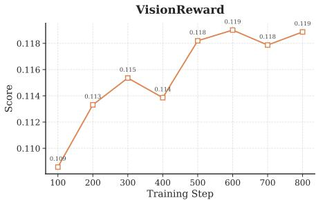  
Figure 9: Training curve of HPSD.

## B.3 PROMPTS FOR LLM REWRITER

To construct the privileged conditions, we employ an external LLM (Qwen3.6-27B) as the prompt rewriter. The specific system prompts designed for these tasks are provided in Fig. 10 and Fig. 11.

Enhanced Prompt Generation. In the full HPSD pipeline, the enhanced prompt $c _ { \mathrm { t x t } } ^ { + }$ is utilized alongside the privileged first-frame condition $c _ { \mathrm { i m g } } .$ . Since the visual aesthetics and spatial layout of the video are already anchored by this high-quality first frame, we design a system prompt that directs the LLM to focus primarily on temporal dynamics, as illustrated in Fig. 10.

First-Frame Prompt Generation. To guide the auxiliary T2I model in synthesizing a structurally sound and aesthetically pleasing first frame $c _ { \mathrm { i m g } } .$ , the original video prompt $\mathcal { C } _ { \mathrm { t x t } }$ is converted into an image generation prompt $c _ { \mathrm { f f } } .$ . Specifically, the LLM is instructed to translate dynamic actions into a static, ready-to-move opening posture, as detailed in the prompt template of Fig. 11.

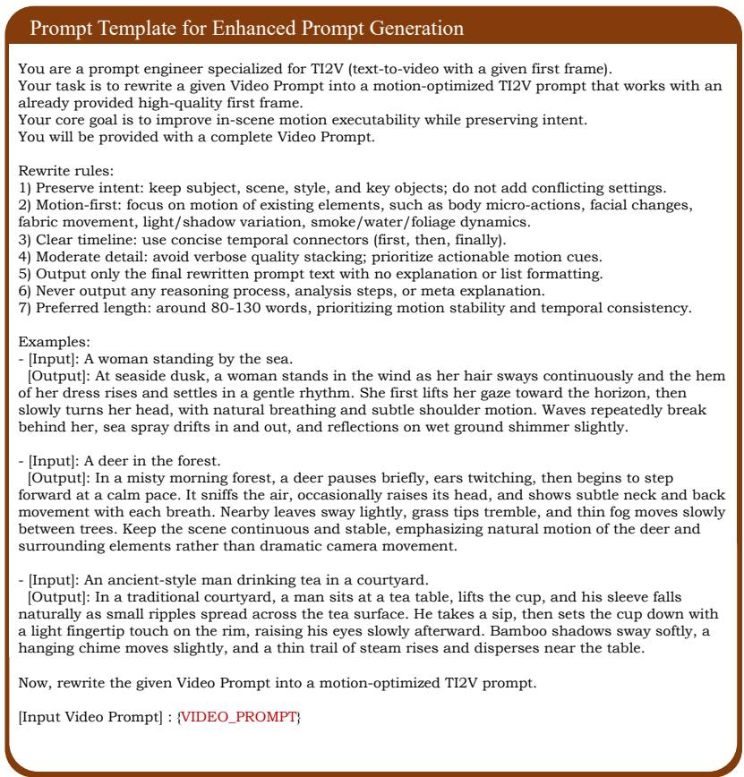  
Figure 10: Prompt Template for Enhanced Prompt Generation.

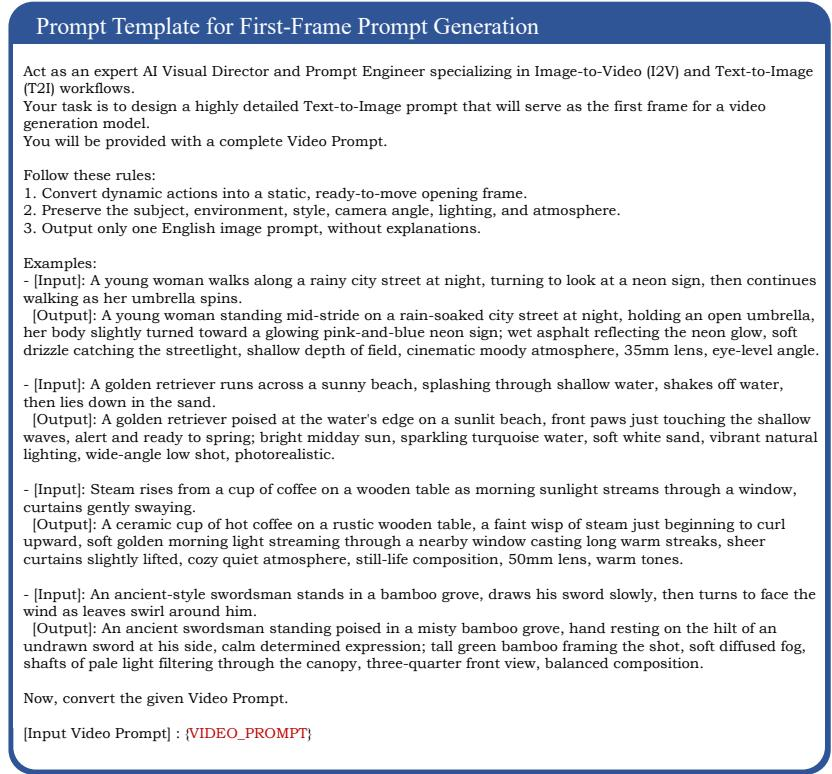  
Figure 11: Prompt Template for First-Frame Prompt Generation.

Table 5: Experimental results using Flux.2-Klein-4B as the first-frame generator.
<table><tr><td>Backbone</td><td>Method</td><td>VideoAlign</td><td>VisionReward</td><td>UR-v1</td><td>UR-v2-A</td><td>UR-v2-P</td><td>UR-v2-S</td><td>HPS</td><td>CLIP</td></tr><tr><td rowspan="2">WAN-2.2</td><td>Vanilla T2V</td><td>0.5335</td><td>0.0965</td><td>2.683</td><td>2.802</td><td>3.167</td><td>3.100</td><td>0.2472</td><td>0.3684</td></tr><tr><td>HPSD (Ours)</td><td>1.6587</td><td>0.1167</td><td>2.793</td><td>2.865</td><td>3.171</td><td>3.252</td><td>0.2819</td><td>0.3785</td></tr></table>

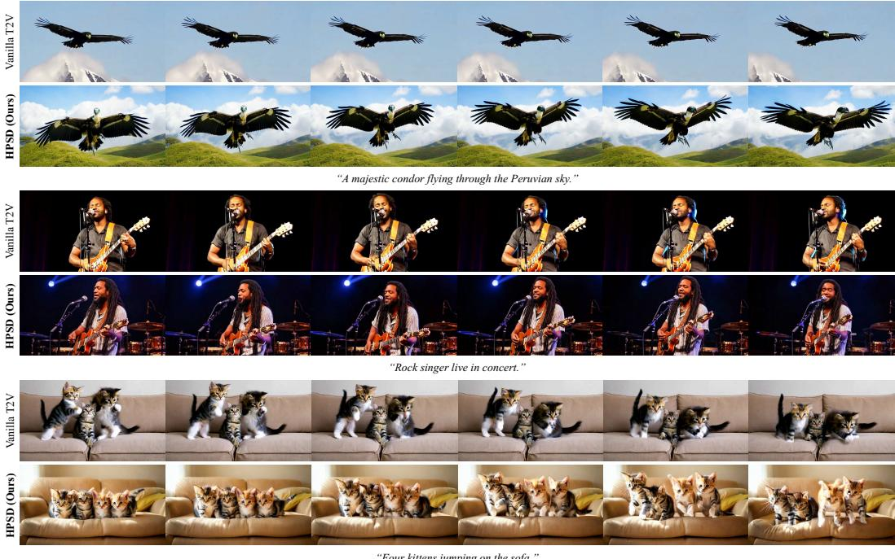  
Figure 12: Comparison between HPSD (with Flux.2-Klein-4B) and vanilla WAN-2.2.

## C ADDITIONAL QUALITATIVE SAMPLES

In this section, we provide further visual results. Specifically, Fig. 14- 22 present additional comparisons between WAN-2.2 and the baselines, while Fig. 23- 30 showcase further results for LTX-2.3. Videos generated using the same prompts with different random seeds are shown in Fig. 31.

## D ADDITIONAL EXPERIMENTAL RESULTS

In the main experiments, we employed Z-Image-Turbo as the first-frame generator to construct the privileged image conditions. To validate the generalizability of HPSD, we conduct an additional study by utilizing a different first-frame generator, specifically Flux.2-Klein-4B (Labs, 2025). As shown in Tab. 5, HPSD consistently maintains its performance superiority over the original T2V results, demonstrating that our capability internalization framework is highly robust and generalize well across various auxiliary text-to-image models.

Furthermore, we provide qualitative examples in Fig. 12. Visual inspections corroborate the quantitative findings, demonstrating that HPSD consistently delivers high-fidelity, temporally coherent videos across different first-frame generators utilized during the offline construction stage.

## E TEXT PROMPTS FOR VIDEO GENERATION

Text prompts used to generate videos in this paper are provided in Tab. 6 and Tab. 7.

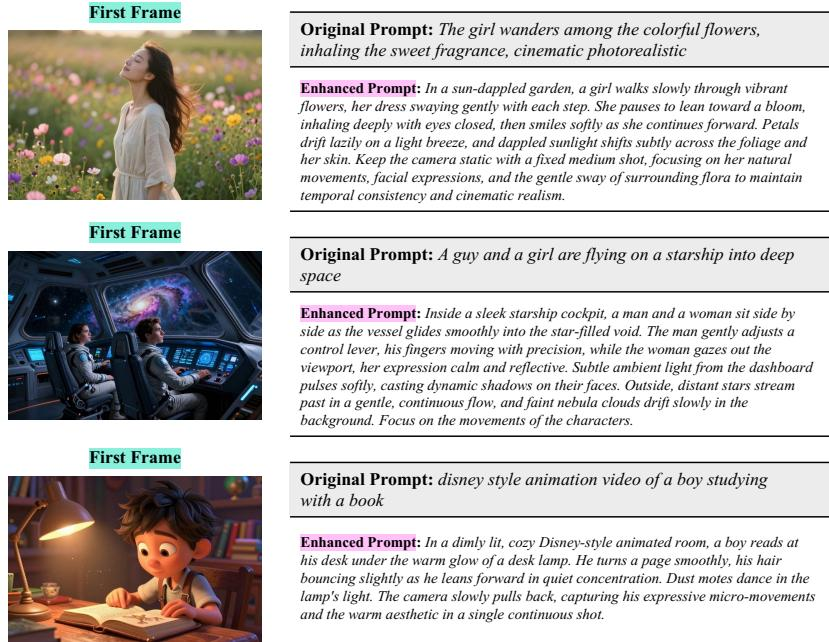  
Figure 13: Privileged Condition Examples.

## F PRIVILEGED CONDITION EXAMPLES

In this section, we present concrete examples of the privileged conditions utilized during the HPSD training process. As depicted in Fig. 13, we showcase the original vanilla text prompts alongside their corresponding enhanced prompts $( c _ { \mathrm { t x t } } ^ { + } )$ and synthesized high-quality first frames $( c _ { \mathrm { i m g } } )$ . These privileged inputs are leveraged by the teacher to produce the condition-elicited anchor trajectories.

## G ETHICAL STATEMENT

Throughout the course of this research, we are deeply committed to upholding rigorous ethical standards and fostering the responsible development of generative AI. To the best of our understanding, the proposed distillation framework, along with the utilized datasets and model architectures, does not introduce any novel ethical hazards or societal risks. Furthermore, all experimental procedures and empirical evaluations were conducted in strict compliance with recognized community norms, thereby ensuring the scientific integrity, transparency, and reliability of our findings.

## H REPRODUCIBILITY STATEMENT

In alignment with the principles of transparent research, we strive to make our experimental results seamlessly reproducible for the academic community. To achieve this, the complete source code of HPSD will be fully open-sourced. Furthermore, we have provided comprehensive hyperparameter configurations, prompt designs, and implementation details. We hope this framework will serve as a valuable reference for future studies on diffusion model distillation, inspiring new methodological innovations and driving continuous momentum in the domain.

## I DECLARATION ON LLM USAGE IN WRITING

In this paper, LLMs are utilized only for minor language polishing.

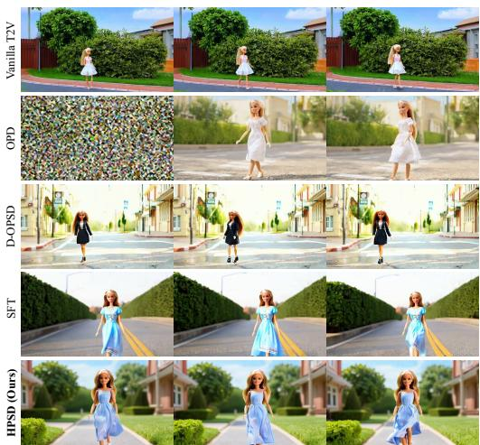  
“barbie walking outdoors on a street, perfect proportions.”

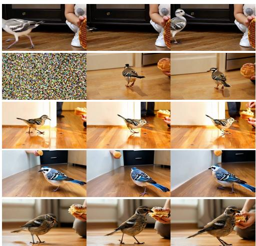  
“A bird is walking on a wooden floor and a person is holding a waffle.”

Figure 14: More qualitative comparison results on WAN-2.2 (1/6). Best viewed zoomed in.  
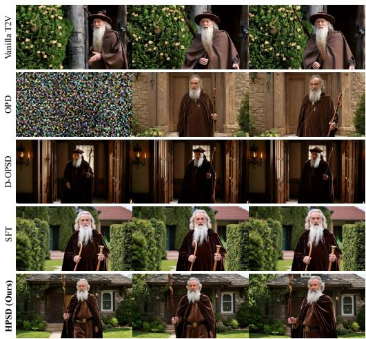  
“An old wizard with a gray beard, wearing a brown cassock and carrying a staff.”

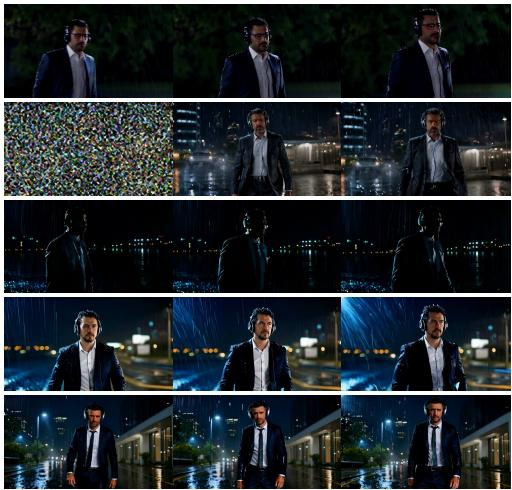  
“Man in a business suit with headphones walking in the rain at night.”

Figure 15: More qualitative comparison results on WAN-2.2 (2/6). Best viewed zoomed in.  
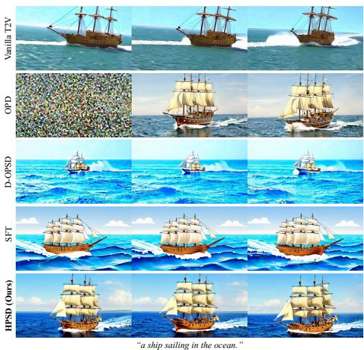

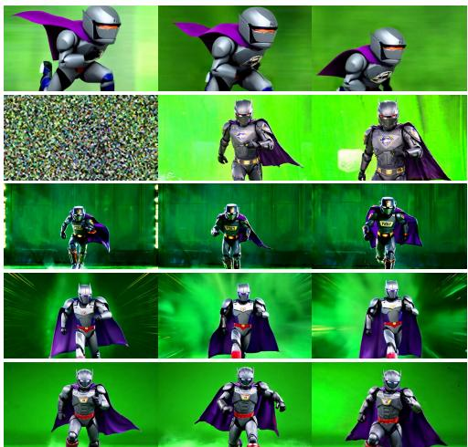  
“A gray Power Ranger, adorned with a purple cape, is running at a high speed against a green background.”

Figure 16: More qualitative comparison results on WAN-2.2 (3/6). Best viewed zoomed in.

“A polar bear operating an iPhone.”  
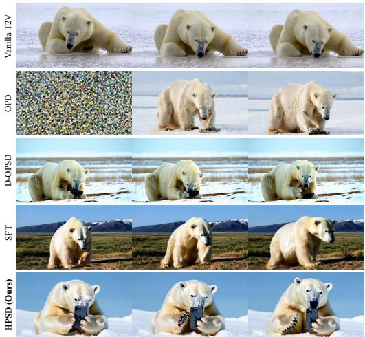

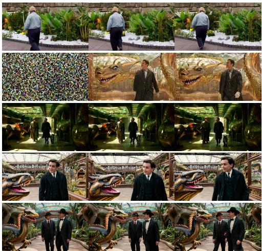  
“Humans walking around a Dragon Zoo 1920s New York, rare film footage.”

Figure 17: More qualitative comparison results on WAN-2.2 (4/6). Best viewed zoomed in.  
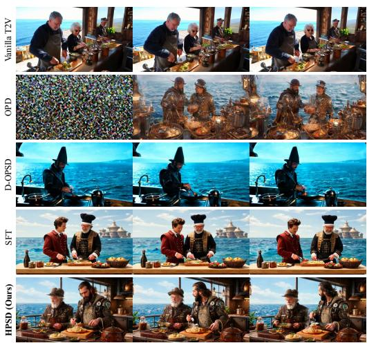  
“steampunk themed chefs cooking beside the sea, high detail rpg.”

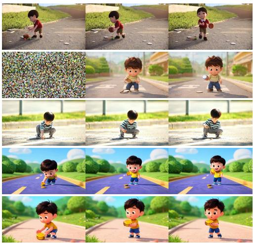  
“A boy is picking up a coin from the road in a 3D cartoon.”

Figure 18: More qualitative comparison results on WAN-2.2 (5/6). Best viewed zoomed in.  
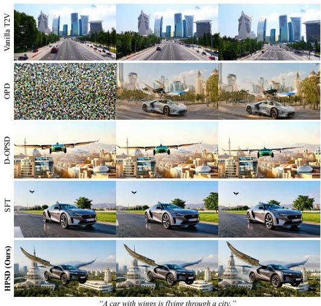  
“A car with wings is flying through a city.”

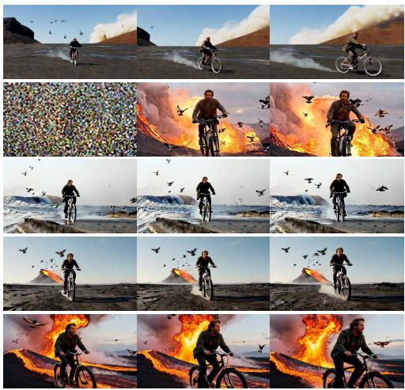  
“A man rides a bike, escaping a lava tsunami, while pigeons fly away in the background and the camera circles him.”

Figure 19: More qualitative comparison results on WAN-2.2 (6/6). Best viewed zoomed in.

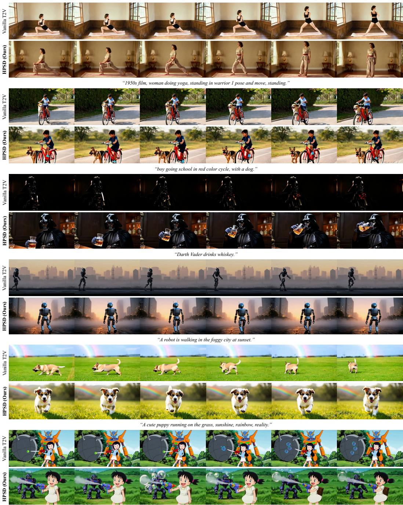  
“In the 1970s there was an anime about a cute alien girl who shot bubbles from a ray gun at a monster robot.”

Figure 20: Comparison between HPSD and vanilla WAN-2.2 (1/3). Best viewed zoomed in.

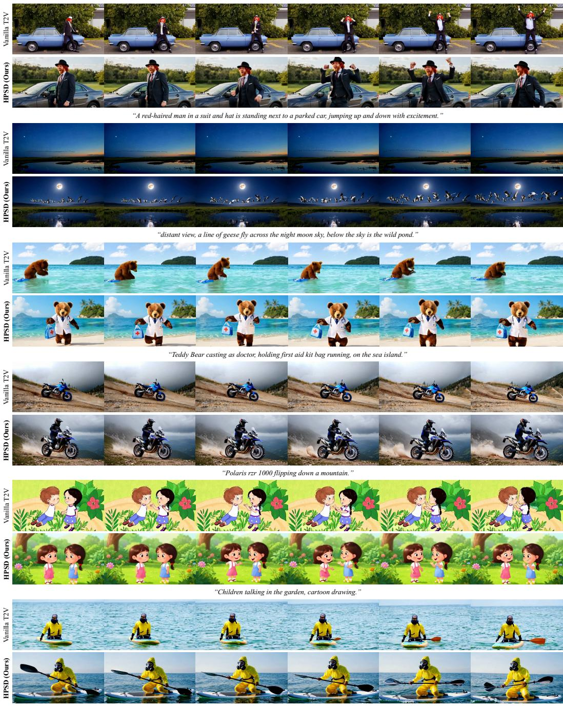  
Figure 21: Comparison between HPSD and vanilla WAN-2.2 (2/3). Best viewed zoomed in.

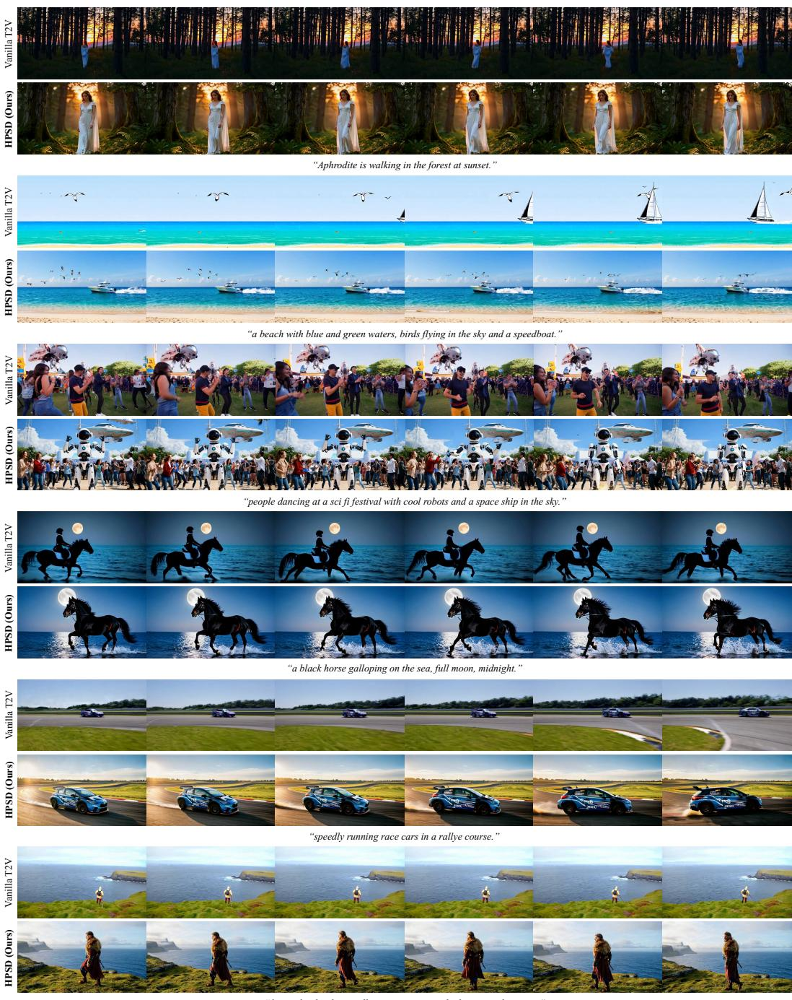  
Figure 22: Comparison between HPSD and vanilla WAN-2.2 (3/3). Best viewed zoomed in.

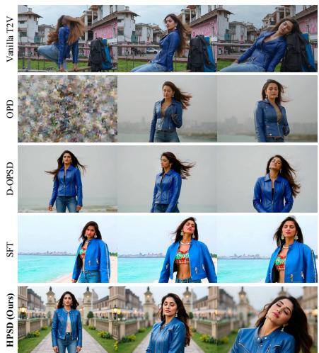  
“Madhurima wearing blue leather jacket staring at camera and Jeans, closing eyes slowly.”

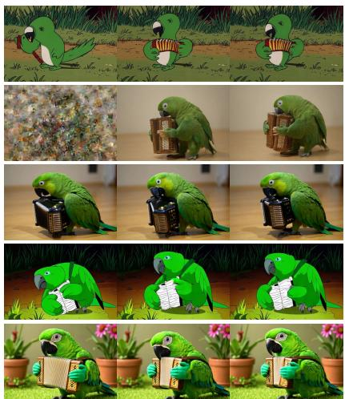  
“a green parrot playing a concertina.”

Figure 23: More qualitative comparison results on LTX-2.3 (1/6). Best viewed zoomed in.  
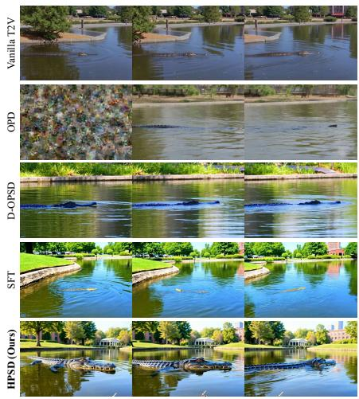  
“an alligator swimming in Hagerstown City Park.”

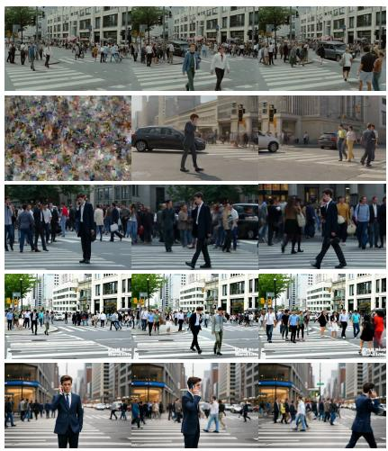  
“a young guy executive on the phone walking across street intersection, lots of people, traffice.”

Figure 24: More qualitative comparison results on LTX-2.3 (2/6). Best viewed zoomed in.  
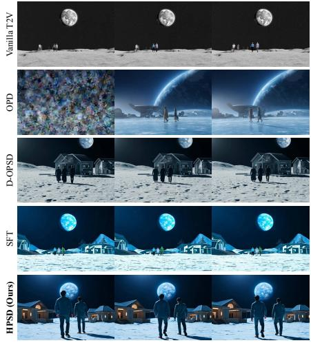  
“People walking on the moon surface, Earth is seen in the sky, Futuristic Homes.”

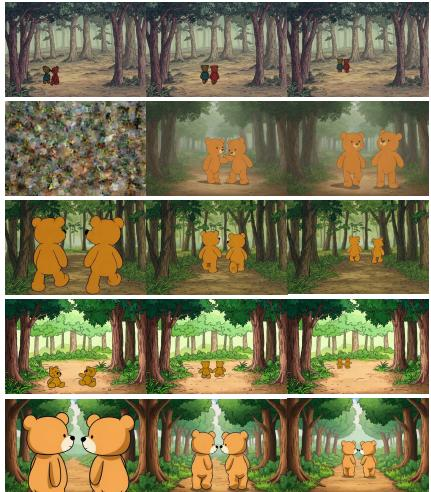  
“Two teddy bears are talking to each other as they walk into a forest. The scene is depicted in a cartoon style.”

Figure 25: More qualitative comparison results on LTX-2.3 (3/6). Best viewed zoomed in.

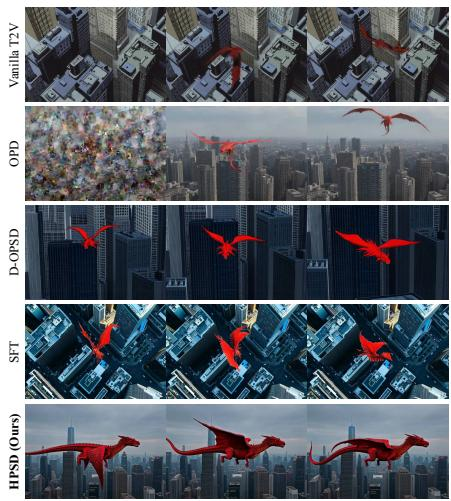  
“A red dragon flies in the city.”

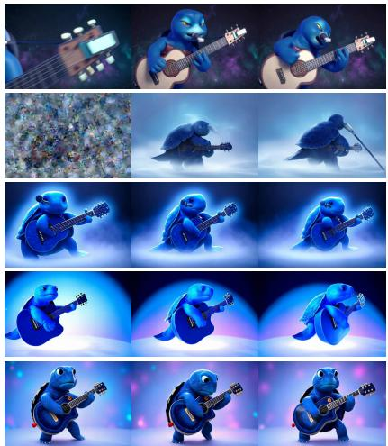  
“A deep blue baby turtle, playing the guitar and singing into the microphone, highly detailed, 3 d, dreamy, raytracing.”

Figure 26: More qualitative comparison results on LTX-2.3 (4/6). Best viewed zoomed in.  
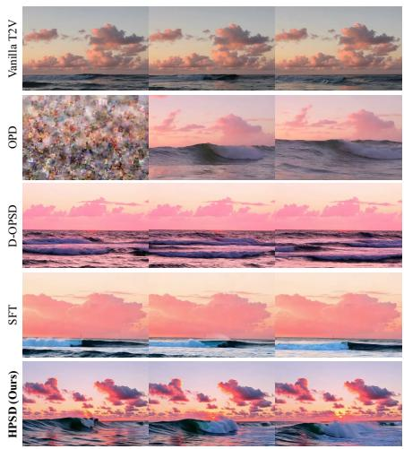  
“Animation of drifting waves, with moving pink clouds at sunset.”

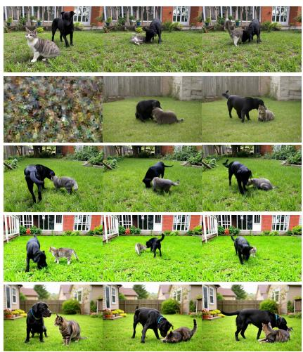  
“A black Labrador and a gray Norwegian Forest cat play on the lawn in the backyard.”

Figure 27: More qualitative comparison results on LTX-2.3 (5/6). Best viewed zoomed in.  
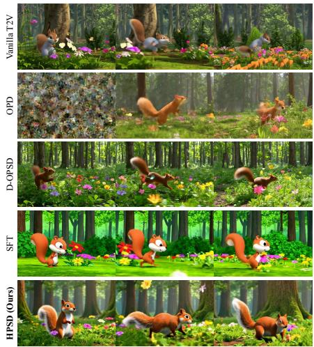  
“A 4K, 3D animated squirrel named Sammy is shown hopping around in the forest, looking at flowers.”

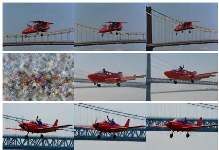

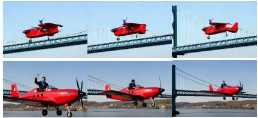  
“cool looking pilot flying a red plane under a suspension bridge. The pilot is waving and wearing a blue scarf around his neck.”

Figure 28: More qualitative comparison results on LTX-2.3 (6/6). Best viewed zoomed in.

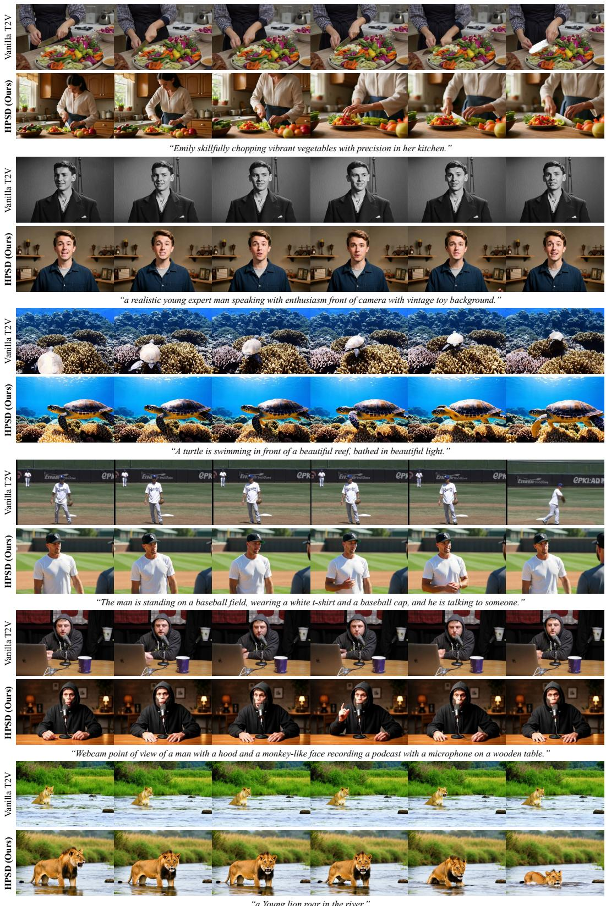  
Figure 29: Comparison between HPSD and vanilla LTX-2.3 (1/2). Best viewed zoomed in.

“Cyberpunk city with the black bladerunner car going on the road Photoreal.”

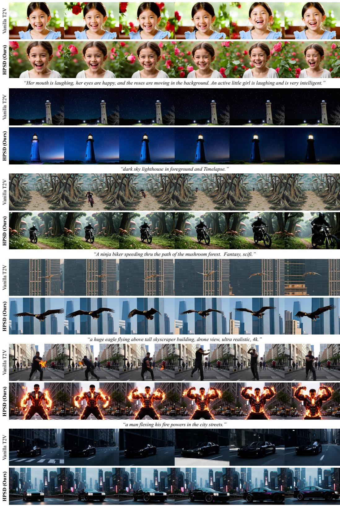  
Figure 30: Comparison between HPSD and vanilla LTX-2.3 (2/2). Best viewed zoomed in.

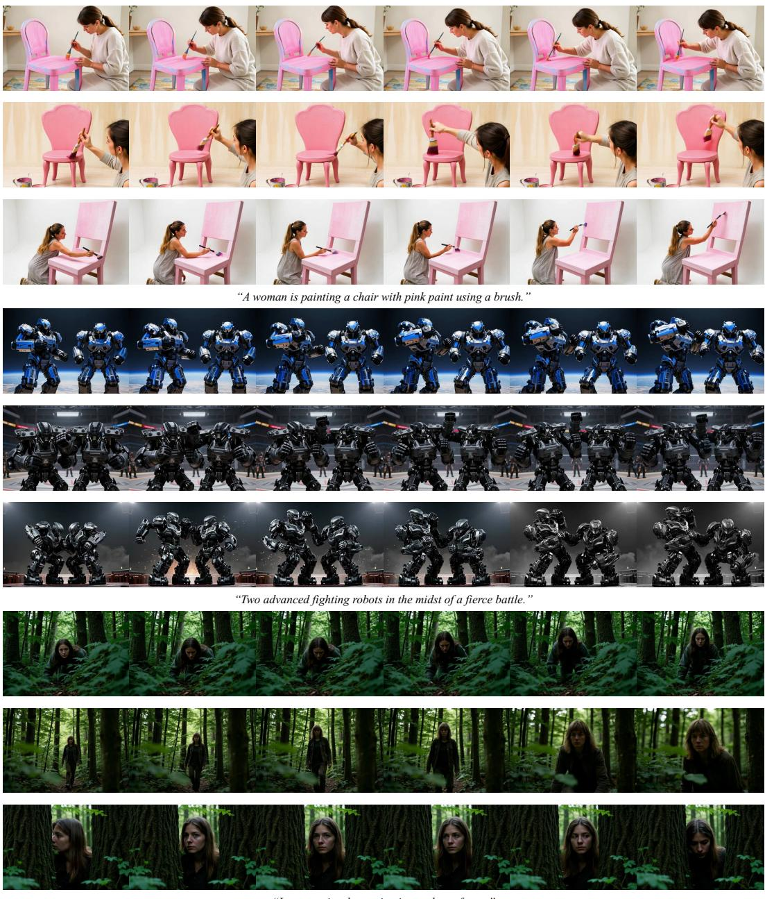  
“Luna cautiously peering into a dense forest.”

Figure 31: Generated results using same prompts and different seeds on LTX-2.3.

Table 6: The video generation prompts for each figure are listed sequentially, following the order from left to right and top to bottom. (Table 1/2)
<table><tr><td rowspan=1 colspan=4>Figure        Text Prompt</td></tr><tr><td rowspan=1 colspan=4>3D cartoon, a cowboy with an ak47 aiming at you.cars doing a super race in New York.photo of coastline, rocks, distant lighthouse in the background, storm weather, strong wind, crashing waves,Figure. 1      huge water splashes, lightning, 8k uhd, dslr, soft lighting, high quality, film grain, Fujifilm XT3The player fights a terrifying skeleton in Minecraft, create this video in a retro video game style.A man rides a bike, escaping a lava tsunami, while pigeons fly away in the background and the cameracircles him.</td></tr><tr><td rowspan=1 colspan=4>Figure. 2      purple car in a videogame.</td></tr><tr><td rowspan=1 colspan=4>A cartoon depicting a penguin with a book balanced on its head, attempting to explain various concepts toFigure. 3a group of rocks.</td></tr><tr><td rowspan=1 colspan=4>cinematic scene of a cute realistic poodle dog in the beachFigure. 5A man sitting in cake shop, eating a cake.</td></tr><tr><td rowspan=1 colspan=4>a man playing guitar and sing a song on the street.Figure. 6a video of a giant blue butterfly of 200 meters in a city, flying ver beutifully.</td></tr><tr><td rowspan=1 colspan=4>A 3D illustration of a man engaging in an MMA fight, rendered in Pixar style.Figure. 7two dogs wearing goggles and parachute on an airplane.</td></tr><tr><td rowspan=2 colspan=1>Figure. 8</td><td rowspan=1 colspan=3>man in yellow hazmat suit on a paddleboard in the middle of the ocean.</td></tr><tr><td rowspan=1 colspan=3>coffee swirling in a rainbow cup.</td></tr><tr><td rowspan=1 colspan=1></td><td rowspan=1 colspan=3>A majestic condor flying through the Peruvian sky.</td></tr><tr><td rowspan=1 colspan=1>Figure. 12</td><td rowspan=1 colspan=3>Rock singer live in concert.</td></tr><tr><td rowspan=1 colspan=1></td><td rowspan=1 colspan=3>Four kittens jumping on the sofa.</td></tr><tr><td rowspan=1 colspan=4>barbie walking outdoors on a street, perfect proportions.Figure. 14A bird is walking on a wooden floor and a person is holding a waffle.</td></tr><tr><td rowspan=1 colspan=1>Figure. 15</td><td rowspan=1 colspan=3>An old wizard with a gray beard, wearing a brown cassock and carrying a staff.Man in a business suit with headphones walking in the rain at night.</td></tr><tr><td rowspan=2 colspan=1>Figure. 16</td><td rowspan=2 colspan=3>a ship sailing in the ocean.A gray Power Ranger, adorned with a purple cape, is running at a high speed against a green background.</td></tr><tr><td rowspan=1 colspan=1>A gray </td></tr><tr><td rowspan=1 colspan=1>Figure. 17</td><td rowspan=1 colspan=3>A polar bear operating an iPhone.Humans walking around a Dragon Zoo 1920s New York, rare film footage.</td></tr><tr><td rowspan=2 colspan=1>Figure. 18</td><td rowspan=1 colspan=3>steampunk themed chefs cooking beside the sea, high detail rpg.</td></tr><tr><td rowspan=1 colspan=2>A boy is picking up a coin from the ro</td><td rowspan=1 colspan=1>ad in a 3D cartoon.</td></tr><tr><td rowspan=1 colspan=1></td><td rowspan=1 colspan=2>A car with wings is flying through</td><td rowspan=1 colspan=1>a city.</td></tr><tr><td rowspan=1 colspan=1>Figure. 19</td><td rowspan=1 colspan=3>A man rides a bike, escaping a lava tsunami, while pigeons fly away in the background and the cameracircles him.</td></tr><tr><td rowspan=1 colspan=1></td><td rowspan=1 colspan=3>1950s film, woman doing yoga, standing in warrior 1 pose and move, standing.</td></tr><tr><td rowspan=1 colspan=1></td><td rowspan=1 colspan=3>boy going school in red color cycle, with a dog.</td></tr><tr><td rowspan=1 colspan=1>Figure. 20</td><td rowspan=2 colspan=3>Darth Vader drinks whiskey.A cute puppy running on the grass, sunshine, rainbow, reality.</td></tr><tr><td rowspan=1 colspan=1></td><td rowspan=1 colspan=2>A cute puppy running on the grass, su</td></tr><tr><td rowspan=1 colspan=1></td><td rowspan=1 colspan=3>In the 1970s there was an anime about a cute alien girl who shot bubbles from a ray gun at a monster robot.</td></tr></table>

Table 7: The video generation prompts for each figure are listed sequentially, following the order from left to right and top to bottom. (Table 2/2)
<table><tr><td rowspan=1 colspan=7>Figure       Text Prompt</td></tr><tr><td rowspan=1 colspan=1></td><td rowspan=2 colspan=6>A red-haired man in a suit and hat is standing next to a parked car, jumping up and down with excitement.distant view, a line of geese fly across the night moon sky, below the sky is the wild pond.</td></tr><tr><td rowspan=1 colspan=1></td><td rowspan=2 colspan=6>Teddy Bear casting as doctor, holding first aid kit bag running, on the sea island.Polaris rzr 1000 flipping down a mountain.</td></tr><tr><td rowspan=1 colspan=1>Figure. 21</td></tr><tr><td rowspan=1 colspan=1></td><td rowspan=2 colspan=6>Children talking in the garden, cartoon drawing.man in yellow hazmat suit on a paddleboard in the middle of the ocean.</td></tr><tr><td rowspan=1 colspan=1></td></tr><tr><td rowspan=1 colspan=1></td><td rowspan=3 colspan=6>Aphrodite is walking in the forest at sunset.a beach with blue and green waters, birds flying in the sky and a speedboat.people dancing at a sci fi festival with cool robots and a space ship in the sky.a black horse galloping on the sea, full moon, midnight.</td></tr><tr><td rowspan=1 colspan=1></td></tr><tr><td rowspan=1 colspan=1>Figure. 22</td></tr><tr><td rowspan=1 colspan=1></td><td rowspan=1 colspan=4>speedly running race cars in a rallye co</td><td rowspan=2 colspan=2>urse.ntain looking over the ocean.</td></tr><tr><td rowspan=1 colspan=1></td><td rowspan=1 colspan=2>faroe islands viking walking on a mau</td><td></td><td></td></tr><tr><td rowspan=1 colspan=1>Figure. 23</td><td rowspan=1 colspan=6>Madhurima wearing blue leather jacket staring at camera and Jeans, closing eyes slowly.a green parrot playing a concertina.</td></tr><tr><td rowspan=1 colspan=1>Figure. 24</td><td rowspan=1 colspan=6>an alligator swimming in Hagerstown City Park.a young guy executive on the phone walking across street intersection, lots of people, traffice.</td></tr><tr><td rowspan=1 colspan=1>Figure. 25</td><td rowspan=1 colspan=6>People walking on the moon surface, Earth is seen in the sky, Futuristic Homes.Two teddy bears are talking to each other as they walk into a forest. The scene is depicted in a cartoon style.</td></tr><tr><td rowspan=1 colspan=1></td><td rowspan=1 colspan=6>A red dragon flies in the city.</td></tr><tr><td rowspan=1 colspan=1>Figure. 26</td><td rowspan=1 colspan=6>A deep blue baby turtle, playing the guitar and singing into the microphone, highly detailed, 3 d, dreamy,raytracing.</td></tr><tr><td rowspan=1 colspan=1>Figure. 27</td><td rowspan=1 colspan=6>Animation of drifting waves, with moving pink clouds at sunset.A black Labrador and a gray Norwegian Forest cat play on the lawn in the backyard.</td></tr><tr><td rowspan=1 colspan=1></td><td rowspan=2 colspan=6>A 4K, 3D animated squirrel named Sammy is shown hopping around in the forest, looking at flowers.cool looking pilot flying a red plane under a suspension bridge. The pilot is waving and wearing a bluescarf around his neck.</td></tr><tr><td rowspan=1 colspan=1>Figure. 28</td></tr><tr><td rowspan=1 colspan=1></td><td rowspan=4 colspan=6>Emily skillfully chopping vibrant vegetables with precision in her kitchen.a realistic young expert man speaking with enthusiasm front of camera with vintage toy background.A turtle is swimming in front of a beautiful reef, bathed in beautiful light.The man is standing on a baseball field, wearing a white t-shirt and a baseball cap, and he is talking tosomeone.</td></tr><tr><td rowspan=1 colspan=1></td></tr><tr><td rowspan=1 colspan=1></td></tr><tr><td rowspan=1 colspan=1>Figure. 29</td></tr><tr><td rowspan=1 colspan=1></td><td rowspan=1 colspan=6>Webcam point of view of a man with a hood and a monkey-like face recording a podcast with a microphoneon a wooden table.</td></tr><tr><td rowspan=1 colspan=1></td><td rowspan=1 colspan=6>a Young lion roar in the river.</td></tr><tr><td rowspan=1 colspan=1></td><td rowspan=1 colspan=6>Her mouth is laughing, her eyes are happy, and the roses are moving in the background. An active little girlis laughing and is very intelligent.</td></tr><tr><td rowspan=1 colspan=1></td><td rowspan=1 colspan=2>dark sky lighthouse in foreground and Ti</td><td></td><td rowspan=1 colspan=3>melapse.</td></tr><tr><td rowspan=2 colspan=1>Figure. 30</td><td rowspan=2 colspan=3></td><td></td><td></td><td></td></tr><tr><td rowspan=2 colspan=6>A ninja biker speeding thru the path of the mushroom forest. Fantasy, scifi.a huge eagle flying above tall skyscraper building, drone view, ultra realistic, 4k.</td></tr><tr><td rowspan=1 colspan=1></td></tr><tr><td rowspan=2 colspan=1></td><td rowspan=2 colspan=6>a man flexing his fire powers in the city streets.Cyberpunk city with the black bladerunner car going on the road Photoreal.</td></tr><tr><td rowspan=1 colspan=1>Cyberpunk city with the black blade</td></tr><tr><td rowspan=1 colspan=1></td><td rowspan=1 colspan=3>A woman is painting a chair with pink p</td><td rowspan=1 colspan=3>aint using a brush.</td></tr><tr><td rowspan=1 colspan=1>Figure. 31</td><td rowspan=1 colspan=6>Two advanced fighting robots in the midst of a fierce battle.</td></tr><tr><td rowspan=1 colspan=1></td><td rowspan=1 colspan=6>Luna cautiously peering into a dense forest</td></tr></table>