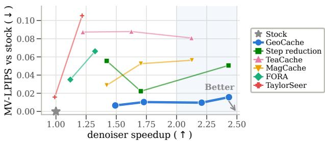
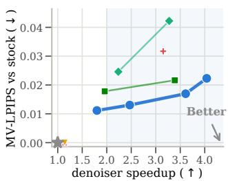
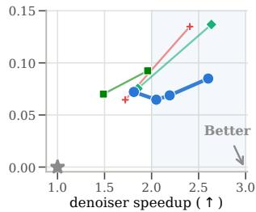
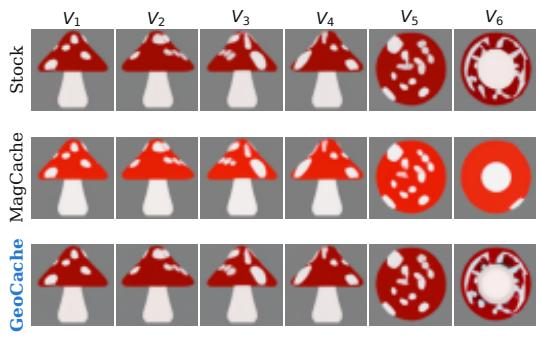
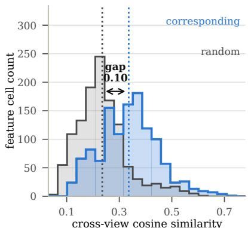
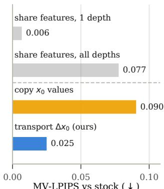
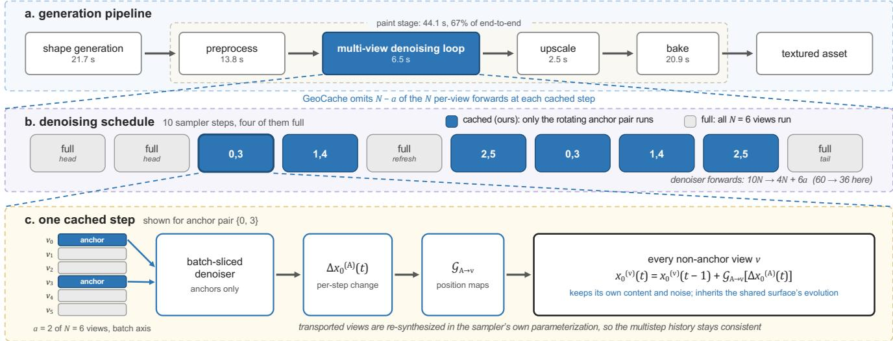
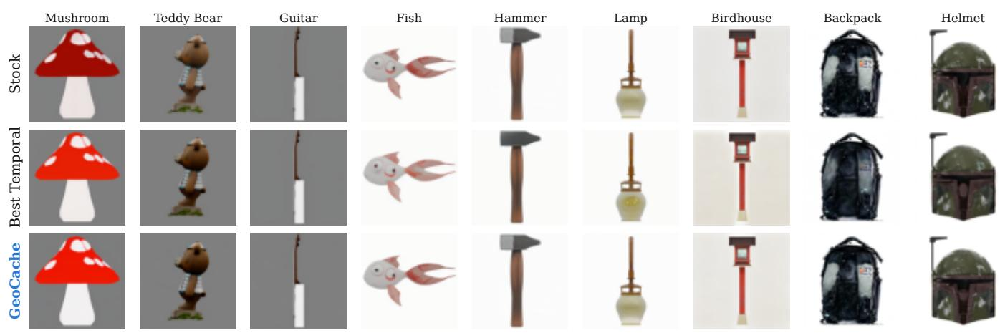

# GeoCache: Training-Free Acceleration of Multi-View Texture Difusion via Geometric Delta Transport

Haotang Li1, Zhenyu Qi1, Shaohan Henry Wang1, Kebin Peng2, Yutong Zhao3, Zi Wang4, Bo Liu1, Huanrui Yang1, Sen He1∗

1Department of Eletrical and Computer Engineering, University of Arizona, Tucson, AZ 2Department of Computer Science, East Carolina University, Greenville, NC 3Department of Computer Engineering and Computer Science,California State University, Long Beach, CA 4School of Computer and Cyber Sciences, Augusta University, Augusta, GA

## Abstract

Geometry-conditioned multi-view difusion enables highquality 3D texture generation, but its repeated per-view denoiser evaluations introduce substantial computational cost. Existing training-free accelerators primarily exploit temporal redundancy by reusing computation across denoising steps. In multi-view texturing, however, skipping a step also removes the cross-view interaction that continually aligns different observations of the same surface, leading to rapidly degraded consistency and fidelity. Our analysis identifies a complementary source of redundancy: although intermediate features remain view-specific, geometrically corresponding surface points exhibit transferable evolution in their predicted clean signals. Based on this observation, we introduce GeoCache, a training-free plugin that evaluates a rotating subset of anchor views and transports their geometryaligned per-step x0 updates to the remaining views. Periodic full-view computation controls accumulated error, while sampler-consistent reconstruction preserves the denoising trajectory. GeoCache requires neither retraining nor architectural modification and uses the position maps al ready available in geometry-conditioned texturing pipelines. Across Hunyuan3D-2.1, SyncMVD, and MVPainter, Geo-Cache achieves a stronger speed–fidelity trade-of than temporal caches and step reduction at operating points above 2×. On Hunyuan3D-2.1, it delivers a 2.21× denoiser-loop speedup with an MV-LPIPS of 0.0293 and an MV-PSNR of 33.60 dB, providing the best fidelity among all tested methods above 2×. The same transferred configuration reaches the highest speedup and lowest FLOPs on SyncMVD, while GeoCache achieves the lowest FLOPs and best fidelity among the accelerated methods on MVPainter. These results establish cross-view geometry as an efective acceleration axis for multi-view texture difusion.

## 1 Introduction

Text- and image-conditioned 3D asset generation has converged on a two-stage recipe: a shape model produces geometry, and a geometry-conditioned multi-view difusion model paints it, with the painted views baked into a UV texture (Hunyuan3D Team 2025b; Huang et al. 2025; Shao et al. 2025). Painting dominates production cost, taking 67.0% of end-to-end wall-clock on Hunyuan3D-2.1 at the median asset, and within it the denoising loop is the only component a neural cache can touch. That loop is a minority of end-to-end time at the default configuration and grows with resolution, so we state throughout which speedup is loop-level and which is end-to-end.

  
(a) Hunyuan3D-2.1

  
(b) MVPainter

  
(c) SyncMVD  
Figure 1: Speed–fidelity ladders on the three backbones Geo-Cache leads. Shading marks ≥2×; the bottom right is best. Table 1 carries the headline rows.

Current training-free difusion acceleration methods primarily exploit redundancy along the temporal axis. Tea-Cache, MagCache, FORA, and TaylorSeer reuse or forecast denoiser computation across adjacent timesteps, while FasterCache, DeepCache, and ToCa reduce computation through guidance, architectural, or token-level reuse (Liu et al. 2025a; Ma et al. 2025; Selvaraju et al. 2024; Liu et al. 2025c; Lv et al. 2025; Ma, Fang, and Wang 2024; Zou et al. 2025). Fewer-step solvers and step distillation further accelerate generation by shortening the denoising trajectory (Zhao et al. 2023; Song, Meng, and Ermon 2021; Luo et al. 2023; Salimans and Ho 2022). These methods achieve speedups for image and temporally coherent video generation, but their reuse mechanisms are defined within individual frames or along the denoising trajectory. As a result, they leave the geometric redundancy among multiple views of the same 3D surface unexploited. Our motivating study in Sec. 3.1 empirically characterizes this redundancy and establishes geometry-aligned denoising evolution as an exploitable acceleration axis.

We introduce GeoCache, a training-free cache that exploits this redundancy to accelerate multi-view texture diffusion. GeoCache evaluates only a subset of views at each step and propagates their geometry-aligned denoising updates to the remaining views. This design preserves the state of each target view while sharing the evolution associated with the same underlying surface. Periodic full-view computation controls accumulated error, and sampler-consistent reconstruction maintains a valid denoising trajectory. As a result, GeoCache reduces redundant view-wise computation without model retraining or architectural modification.

Table 1 and Figure 1 report the result on the three backbones where geometric caching applies. On Hunyuan3D-2.1 GeoCache reaches 2.21× denoiser-loop speedup at MV-LPIPS 0.029 and 33.6 dB MV-PSNR, the best of any method we test above 2×; the same schedule carried over unchanged is the fastest and leanest method on SyncMVD, and on MV-Painter it takes the lowest error, the lowest cost and the highest speedup at once. Across three backbones and four asset pools, each additional 0.1× of speed costs GeoCache +3.1% MV-LPIPS against +12.4 to +33.5% for the step caches.

We claim three contributions: a) We are the first to identify and empirically validate cross-view geometric redundancy as an acceleration axis for multi-view texture difusion. b) We propose GeoCache, a training-free cache that accelerates multi-view texture difusion via geometry-aligned cross-view delta transport. c) Thorough evaluations on three backbones demonstrate that GeoCache outperforms SOTAs in speed–fidelity trade-of.

## 2 Related Work

Training-free difusion acceleration. Step caches difer in what triggers reuse: timestep-embedding drift (Liu et al. 2025a), residual-magnitude ratios (Ma et al. 2025), a fixed interval (Selvaraju et al. 2024), a Taylor forecast (Liu et al. 2025c), diferences between feature maps rather than the maps themselves (Chen et al. 2024), classifier-free-guidance redundancy (Lv et al. 2025), deep U-Net blocks (Ma, Fang, and Wang 2024), or token-wise selection (Zou et al. 2025). All take their reuse along the timestep axis, and none models cross-view structure. Fewer-step solvers (Zhao et al. 2023; Song, Meng, and Ermon 2021) and step distillation (Luo et al. 2023; Salimans and Ho 2022) are orthogonal, and consume the temporal redundancy step caches feed on.

Multi-view texture generation. Hunyuan3D-2.1 Paint (Hunyuan3D Team $2 0 2 5 \mathrm { b } , \mathrm { a } )$ , MV-Adapter (Huang et al. 2025), and MVPainter (Shao et al. 2025) denoise per-view latents in one batch with multi-view attention, while SeqTex (Yuan et al. 2025) treats views as frames of a video DiT jointly with a UV map. MVDifusion introduces correspondenceaware attention for interaction between geometrically related views (Tang et al. 2023). SyncMVD (Liu et al. 2024) and MD-ProjTex (Yildirim et al. 2025) synchronize per-view denoising through a shared UV representation. TEXGen (Yu et al. 2024) denoises a single UV map and falls outside the multi-view setting, while optimization-based and inpaintingbased texturing methods (Richardson et al. 2023; Chen et al. 2023; Zeng et al. 2024) require iterative generation or refinement. SyncMVD is the closest antecedent to GeoCache because it also exploits the fact that overlapping views observe one surface. SyncMVD evaluates all N views at every step and blends denoised values through a shared UV bufer. In contrast, GeoCache omits the non-anchor forwards and transports an increment that each target view adds to its own retained state.

Geometry-aware reuse. Hash3D (Yang, Liu, and Wang 2025) reuses features between nearby camera poses during score-distillation-based 3D generation. Fast3Dcache (Yang et al. 2025) schedules temporal cache quotas from voxel stabilization for shape synthesis, whose single volumetric output has no cross-view axis. CAMEO (Kwon et al. 2026) supervises attention maps using geometric correspondence during training, while CaliTex (Liu et al. 2026) calibrates multi-view attention using geometric structure. These methods modify feature interaction or training, whereas GeoCache consumes the geometry-derived correspondence already available during inference. Reverse reprojection caching (Nehab et al. 2007) provides a closer computational pattern by transporting a per-pixel quantity through geometric correspondence, integrating it into the target pixel’s retained value, and periodically refreshing the result. Geo-Cache applies these operations inside a denoising trajectory and transports a first diference in $x _ { 0 }$ across views of the same object. The recent cache survey (Liu et al. 2025b) organizes existing difusion caches around temporal, architectural, and token-level reuse, while cross-view geometric increment transport remains outside those categories.

## 3 Motivation and Methodology

## 3.1 Motivating Study

We analyze Hunyuan3D-2.1 Paint (Hunyuan3D Team 2025b), which jointly denoises six geometry-conditioned views with a 15-step UniPC sampler (Zhao et al. 2023). All fidelity measurements compare an accelerated run with the stock model under the same seed, evaluated on 20 assets of eval200 benchmark. We write $x _ { 0 } ^ { ( v ) } ( t )$ for the predicted clean signal of view v at sampler step t. Views occupy the batch axis throughout most of the network and interact inside multi-view attention, while rendered position maps provide the 3D coordinates needed to associate observations of the same surface point. Existing multi-view difusion systems maintain consistency through repeated cross-view interaction or UV-space synchronization during denoising (Tang et al. 2023; Liu et al. 2024; Yildirim et al. 2025; Kwon et al. 2026; Liu et al. 2026).

Failure of temporal output reuse. Training-free difusion caches exploit similarity between neighboring timesteps by reusing or forecasting denoiser computation (Liu et al. 2025a; Ma et al. 2025; Selvaraju et al. 2024; Liu et al. 2025c). When applied to this substrate, whole-output caching reuses all views, materials, and guidance branches together. The sampler therefore advances from a stale joint prediction without obtaining a new cross-view correction at that step. At a matched speedup of approximately 2.1×, MagCache raises SeamErr to 1.21× the stock value and exceeds this level on 20 of 200 assets (Figure 2a). TeaCache exceeds the same threshold on 20 assets and also introduces substantial per-view distortion. Step reduction follows a diferent error pattern because every retained sampler state still receives a newly computed joint multi-view prediction. It remains below the stock SeamErr at every tested operating point, although aggressive reduction removes local texture detail. TeaCache reaches MV-LPIPS 0.081 at 2.11×, whereas five-step sampling reaches 0.043 at 2.43×. These measurements show that temporal output reuse introduces a consistency failure beyond the quality loss produced by shortening the trajectory. Limits of cross-view state substitution. The rendered position maps expose a potential reuse axis across views, but correspondence alone does not make intermediate states interchangeable. Over 16 blocks, 15 steps and 20 assets, deep features at matched surface tokens have mean cosine similarity 0.362, only 2.9% of block-step cells exceed 0.6, and the mean advantage over randomly paired tokens is 0.10 (Figure 2b). Per-block means span 0.16–0.54 matched against 0.09–0.43 for the control, so the small advantage holds at every depth rather than arising from the mixture over blocks. The matched tokens therefore retain substantial view-specific information.

  
(a) 6-view desynchronization

  
(b) features are view-specific

  
(c) $\Delta x _ { 0 }$ transports trajectory  
Figure 2: Step-cache failure, and the exploitable redundancy. (a) A step cache repaints the same surface diferently across views at matched ${ \sim } 2 . 1 \times$ , turning the cone pink where stock keeps it tan. (b) Cross-view cosine similarity of deep features at corresponding tokens against a random-token control; the strip above the axis carries the per-block means. (c) Substitution costs; grey bars are oracle upper bounds.

Oracle substitutions isolate the efect of overwriting this information. Replacing four of six views at a single network depth costs 0.006 to 0.018 MV-LPIPS when subsequent blocks can refine the gathered representation. Continuous substitution through the trunk increases MV-LPIPS to 0.049 to 0.077 and raises SeamErr by 11% to 32%. Transporting intermediate skip features produces MV-LPIPS between 0.18 and 0.62 because these features carry noise-dependent state from the source view. Copying an anchor view’s $x _ { 0 }$ value into another view produces MV-LPIPS 0.090. Transporting only the anchor’s per-step change in $x _ { 0 }$ and adding it to the target view’s own previous state reduces the error to 0.025 at identical compute (Figure 2c).

Design implications. The study supports reuse across geometrically corresponding views while preserving each target view’s state. The transported quantity should be an increment rather than a complete feature or predicted clean signal. The reconstructed $x _ { 0 }$ should also be converted to the sampler’s native prediction parameterization so that the multistep history remains internally consistent. GeoCache implements these requirements through anchor-view forwards, geometric delta transport, and periodic full-view refreshes.

## 3.2 Methodology

We propose GeoCache, a training-free cache that acts on the geometric axis the motivating study identifies. It accelerates the denoising loop by running the denoiser on only a few views per step and transporting the resulting update to the rest through geometric correspondence (Figure 3).

Correspondence operator. From the position maps we precompute, once per asset, the operator $\mathcal { G } _ { u  v }$ introduced above. It is a sparse linear gather: for each target token $p$ in view v we take its K nearest source taps $q _ { 1 } , \ldots , q _ { K }$ in view u whose 3D positions lie within a tolerance of 1% of the bounding-box diagonal, area-weight them, and set $\begin{array} { r } { ( \mathcal G _ { u \to v } F ) ( p ) = \sum _ { k } w _ { k } \bar { ( p ) } F ( q _ { k } ) } \end{array}$ with $\begin{array} { r } { \sum _ { k } w _ { k } ( p ) = 1 } \end{array}$ , for any per-token field $F$ on view u. The operator is therefore a fixed, row-stochastic matrix acting channelwise and preserving the token grid; it depends on geometry alone and not on the field it carries. Rows with no in-tolerance tap are zero, which is how disocclusions are handled. K=4 taps perform as well as one (see Ablations).

Batch-sliced anchor forward. At a cached step, only a of the N views run the denoiser: the anchors A, which rotate every step. Because views occupy the batch axis outside multi-view attention, the saving is a slice rather than a skip. We restrict the batched forward to the anchor rows while preserving each view’s structural indices (row and column groups, RoPE frame slots), so each retained row is positioned exactly as it would be in the stock forward.

At a=N the sliced forward is bit-identical to stock, which we use as a correctness gate. For $a < N$ the retained rows take diferent values than in stock, since attention over the anchor slice spans a views rather than N: the slice preserves each retained row’s positional interpretation rather than its value. The schedule bounds that approximation, returning each view to the full context every $\lceil \bar { N } / a \rceil$ steps and restoring complete N-view attention at refresh steps.

  
Figure 3: The attachment point of GeoCache, and one cached step. The denoising loop is 14.7% of the paint stage and the only component a neural cache can act on. Views occupy the batch axis, so restricting the forward to the a anchor rows is the natural unit of saving; the anchors’ per-step change in $x _ { 0 }$ is transported through correspondence and added to each other view’s own previous $x _ { 0 }$

Delta transport. The remaining views keep their own state rather than receiving anchor content. Overwriting blurs, because latent tokens are orientation-local: a copied value carries the source view’s orientation and injects it as noise, a failure we confirm in the Ablations. Instead, each non-anchor view integrates the anchors’ per-step change in $x _ { 0 }$ , transported through correspondence. Let $\mathcal { \bar { A } } \subset \{ 1 , \dotsc , N \}$ be the anchor set at step t and let $\Delta x _ { 0 } ^ { ( A ) } ( t ) = x _ { 0 } ^ { ( \dot { A } ) } ( t ) - x _ { 0 } ^ { ( \dot { A } ) } ( t - 1 )$ be the anchors’ first diference in x0-space, where the subscript denotes the zero-noise end of the trajectory, so $x _ { 0 }$ is the sampler’s predicted clean signal. For every v $\not \in A .$ , delta transport applies the correspondence-mapped increment to that view’s own previous state,

$$
x _ { 0 } ^ { ( v ) } ( t ) \ = \ x _ { 0 } ^ { ( v ) } ( t { - } 1 ) \ + \ \mathcal { G } _ { A {  } v } \Big [ \Delta x _ { 0 } ^ { ( A ) } ( t ) \Big ] ,\tag{1}
$$

leaving $x _ { 0 } ^ { ( v ) } ( t { - } 1 )$ and view $v { \mathrm { s } }$ noise pathway untouched.

Multi-anchor aggregation. When several anchors cover one target token, $\mathcal { G } _ { A  v }$ is the normalized sum of their transports, and the per-tap tolerance check serves as the visibility test, so an anchor that sees the token only outside tolerance contributes nothing rather than a bad match. The rule is a convex combination and cannot amplify the increment beyond the range the anchors supply.

Invalid matches. Tokens of v with no valid source, namely disocclusions, grazing-angle tokens rejected by the tolerance test, and background, keep their own state until the next full step; because the transported quantity is an increment rather than a state, an unmatched token misses one step of denoising instead of receiving foreign content.

Loop order. Here t indexes the sampler’s own step counter, so $\Delta { x } _ { 0 }$ is the change produced by the current step rather than a step backwards in noise level. A cached step runs the denoiser on A, forms $\Delta x _ { 0 } ^ { ( A ) } ( t )$ against the stored $x _ { 0 } ^ { ( A ) } ( t { - } 1 )$ , transports to every v $\not \in A .$ , then stores $x _ { 0 } ^ { ( \cdot ) } ( t )$ for all N views as the next reference.

Equation 1 is afine in the two quantities it combines: the target view’s own previous state enters with unit weight and the anchors’ increment through a fixed linear gather. The rule is a transported first diference rather than a substitution, one explicit Euler step on an increment carried across the view axis, so each view keeps its own content and noise and inherits only the shared surface’s denoising evolution. From the transported $x _ { 0 }$ we convert back to whatever quantity the sampler consumes, by the standard closed-form relations at the step’s noise level: $\epsilon = ( x _ { t } - \sqrt { \bar { \alpha } _ { t } } x _ { 0 } ) / \sqrt { 1 - \bar { \alpha } _ { t } }$ $v = \sqrt { \bar { \alpha } _ { t } } \epsilon - \sqrt { 1 - \bar { \alpha } _ { t } } x _ { 0 }$ for the v-prediction Hunyuan substrate, and the corresponding velocity for flow matching. This keeps the solver’s history bufer in the parameterization it expects, which output-reuse caches violate by writing a stale tensor into it. That is an interface guarantee rather than a proof of multistep stability, and we claim only the property we checked: UniPC trajectories under GeoCache remained stable at every operating point we report.

Drift-bounding schedule. Because Eq. 1 integrates per-step changes, error accumulates. Four full steps bound it: a twostep head that establishes content before transport begins, one mid-trajectory refresh that re-grounds every view, and a tail step before decoding. Refresh placement matters more than refresh count (see Ablations). The operating point we report on Hunyuan runs a=2 anchor views of N=6 over

Table 1: Cross-backbone comparison of inference eficiency and visual quality. Speedup is the measured denoiser-loop speedup, the quantity plotted in Figure 1. FLOPs and Loop Clock are per-asset medians and fidelity is the mean over assets with its standard deviation. Bold and underlined mark the best and second-best accelerated results within each backbone; the remaining metrics are in the supplement.
<table><tr><td rowspan="2">Method</td><td rowspan="2">Configuration</td><td colspan="3">Efficiency</td><td colspan="2">Visual Quality</td></tr><tr><td>FLOPs (T) ↓</td><td>Speedup ↑</td><td>Loop Clock (s) ↓</td><td>MV-LPIPS↓</td><td>MV-PSNR ↑</td></tr><tr><td colspan="7">Hunyuan3D-2.1 Paint (15 steps)</td></tr><tr><td>Stock</td><td>Default</td><td>37.13</td><td>1.00×</td><td>6.50</td><td></td><td></td></tr><tr><td>Step Reduction</td><td>5 steps</td><td>12.38</td><td>2.43×</td><td>2.67</td><td> $0 . 0 5 9 8 \pm 0 . 0 4 6 6$ </td><td> $2 7 . 6 1 \pm 6 . 2 0$ </td></tr><tr><td>MagCache</td><td> $\tau = 0 . 3 0$ </td><td>17.32</td><td>2.13×</td><td>3.06</td><td> $0 . 0 6 2 0 \pm 0 . 0 2 8 5$ </td><td> $3 1 . 0 4 \pm 4 . 6 7$ </td></tr><tr><td>TeaCache</td><td> $\tau = 0 . 2 0$ </td><td>17.32</td><td>2.12×</td><td>3.06</td><td> $0 . 0 9 3 6 \pm 0 . 0 6 1 2$ </td><td> $2 3 . 9 1 \pm 5 . 0 7$ </td></tr><tr><td>GeoCache</td><td> $a { = } 2 , E { = } 5 , S { = } 1 0$ </td><td>14.85</td><td>2.21×</td><td>2.94</td><td> $\mathbf { 0 . 0 2 9 3 \pm 0 . 0 2 1 8 }$ </td><td> $\mathbf { 3 3 . 6 0 \pm 4 . 7 4 }$ </td></tr><tr><td>GeoCache</td><td> $a { = } 2 , \ S { = } 1 0$ </td><td>13.20</td><td>2.43×</td><td>2.67</td><td> $0 . 0 5 1 9 \pm 0 . 0 3 1 2$ </td><td> $3 0 . 4 2 \pm 4 . 5 2$ </td></tr><tr><td colspan="7">SyncMVD (30 steps)</td></tr><tr><td>Stock</td><td>Default</td><td>67.20</td><td>1.00×</td><td>10.25</td><td></td><td></td></tr><tr><td>FORA</td><td> $r = 2$ </td><td>47.32</td><td>1.78×</td><td>5.77</td><td> $\mathbf { 0 . 0 8 0 9 \pm 0 . 0 3 7 2 }$ </td><td> ${ \bf 2 3 . 7 3 \pm 2 . 6 0 }$ </td></tr><tr><td>Step Reduction</td><td>15 steps</td><td>33.60</td><td>1.96×</td><td>5.23</td><td> $0 . 0 9 8 4 \pm 0 . 0 3 1 0$ </td><td> $2 1 . 5 7 \pm 2 . 1 8$ </td></tr><tr><td>TaylorSeer</td><td> $\mathrm { o r d e r } = 3$ </td><td>43.12</td><td>2.41×</td><td>5.26</td><td> $0 . 1 6 1 7 \pm 0 . 0 6 5 3$ </td><td> $1 8 . 1 7 \pm 2 . 5 4$ </td></tr><tr><td>GeoCache GeoCache</td><td> $a { = } 2 , E { = } 3 , S { = } 2 0$ </td><td>17.92</td><td>2.19×</td><td>5.34</td><td> $\underline { { 0 . 0 8 7 7 } } \pm 0 . 0 4 5 2$ </td><td> $2 3 . 0 1 \pm 2 . 9 8$ </td></tr><tr><td></td><td> $a { = } 2 , E { = } 2 , S { = } 2 0$ </td><td>16.24</td><td>2.60×</td><td>4.67</td><td> $0 . 0 9 8 5 \pm 0 . 0 3 6 3$ </td><td> $2 1 . 8 6 \pm 1 . 7 8$ </td></tr><tr><td colspan="7">MVPainter (75 steps)</td></tr><tr><td>Stock</td><td>Default</td><td>742.50</td><td>1.00×</td><td>18.50</td><td></td><td></td></tr><tr><td>Step Reduction</td><td> $2 5 \ \mathrm { s t e p s }$ </td><td>247.50</td><td>3.39×</td><td>5.46</td><td> $0 . 0 5 6 2 \pm 0 . 0 8 0 0$ </td><td> $3 2 . 9 9 \pm 6 . 9 1$ </td></tr><tr><td>FORA</td><td> $r = 3$ </td><td>227.70</td><td>3.27×</td><td>5.65</td><td> $0 . 0 8 2 6 \pm 0 . 0 9 6 1$ </td><td> $2 9 . 6 1 \pm 5 . 8 6$ </td></tr><tr><td>TaylorSeer</td><td> $\mathrm { o r d e r } = 3$ </td><td>235.95</td><td>3.15×</td><td>5.87</td><td> $0 . 0 7 0 1 \pm 0 . 0 8 0 1$ </td><td> $3 1 . 2 7 \pm 6 . 5 2$ </td></tr><tr><td>GeoCache</td><td> $E { = } 2 , \ S { = } 2 5$ </td><td>102.30</td><td> $\underline { { 3 . 6 1 \times } }$ </td><td>5.12</td><td> $\mathbf { 0 . 0 2 4 0 \pm 0 . 0 2 1 6 }$ </td><td> ${ \bf 3 6 . 0 3 \pm 3 . 1 1 }$ </td></tr><tr><td>GeoCache</td><td> $E { = } 3 , \ S { = } 2 5$ </td><td>108.90</td><td>4.04×</td><td>4.58</td><td> $\underline { { 0 . 0 2 8 2 \pm 0 . 0 2 3 3 } }$ </td><td> $\underline { { 3 4 . 3 1 \pm 2 . 7 5 } }$ </td></tr></table>

10 UniPC steps, four of them full, which deliberately composes geometric caching with mild step reduction and reaches 2.21×.

Applicability. GeoCache needs two properties, both intrinsic to geometry-conditioned texturing: per-view denoising behind a shared batched forward, and geometric correspondence between views. The mechanism therefore ports across architecture families by changing only the definition of an anchor: batch rows, tile rows, or token-frame slices.

## 4 Evaluation

## 4.1 Experiment Settings

Setup. Our headline substrate is Hunyuan3D-2.1 (Hunyuan3D Team 2025b), a widely used open PBR texturing pipeline; SyncMVD (Liu et al. 2024) and MVPainter (Shao et al. 2025) are the second and third substrates we evaluate in full, and two further backbones test the reach of the same plugin. Every run is on a single NVIDIA RTX 4090 at 23.3 GB peak memory, with Hunyuan in the configuration of Section 3. Our main benchmark eval200 is a frozen list of 200 assets (100 GSO (Downs et al. 2022), 100 Objaverse (Deitke et al. 2023)), and the appendix’s backbone study adds TexVerse-100 (Zhang et al. 2025) and ABO-100 (Collins et al. 2022). Baselines cover every axis of the stepcache taxonomy: TeaCache (Liu et al. 2025a), MagCache (Ma et al. 2025), FORA (Selvaraju et al. 2024), TaylorSeer (Liu et al. 2025c), FasterCache-CFG (Lv et al. 2025), Deep-Cache (Ma, Fang, and Wang 2024), and step reduction, the only other method whose seam error stays below stock at every setting. Each backbone is scored against the baselines its own substrate admits, and the appendix carries the full taxonomy on Hunyuan together with the two remaining backbones. Every row of Table 1 is measured on eval200 under one protocol, so GeoCache and each baseline are scored on the same assets at the same seed, and the appendix states the pool behind every additional row it reports.

Configurations. The Configuration column ofTable 1 names each operating point in the notation of its own method. FORA recomputes the denoiser every r steps and reuses the cached block outputs in between, and TaylorSeer forecasts those outputs from the last computed step with a Taylor expansion of the stated order. A GeoCache point is written $a { = } { \cdot } , E { = } { \cdot } , S { = } { \cdot }$ , where a is the number of anchor views that run the denoiser at a cached step, of the N views the substrate paints; E is the number of full-view refresh steps the schedule places at the end of the trajectory; and S is the number of sampler steps the accelerated run takes, against the stock trajectory length in each block header. Where a is absent the run takes the substrate’s default anchor count, and where E is absent it runs the head-and-tail schedule of Section 3.2.

(a) Hunyuan3D-2.1

  
(b) MVPainter  
(c) SyncMVD

Figure 4: Nine assets under stock, GeoCache, and the best temporal cache for that backbone, at matched ≥2× speed. Medians are in Table 1; the full sheets are in the appendix.

Metrics. Every metric compares an accelerated run against the stock run at the same seed. MV-LPIPS and MV-PSNR are LPIPS (Zhang et al. 2018) and PSNR between the accelerated and stock renders of one view, averaged over the N views. FLOPs is the denoiser’s total floating-point cost for one asset and Time its measured wall-clock, so the speedup we report throughout is the denoiser-loop ratio rather than an end-toend one. Every substrate hard-codes its sampler seed and every fidelity metric is deterministic given that seed, so there is no run-to-run variance to report; the dispersion that matters is across assets, and each fidelity value is therefore the mean over assets with its standard deviation. Table 1 carries the two metrics that decide the trade-of, and we provide the full metrics in the supplemental material: the p95 tail of MV-LPIPS, SeamErr, and the baked-texture scores (TexPSNR on Hunyuan, UV-PSNR and UV-LPIPS on SyncMVD).

## 4.2 Qualitative and Quantitative Analysis

Results on Hunyuan3D-2.1. As Table 1 shows, GeoCache holds both the lowest MV-LPIPS and the highest MV-PSNR on this backbone: 0.0293 and 33.60 dB at 2.21×, against 0.0620 and 31.04 dB for MagCache at 2.13× and 0.0936 and 23.91 dB for TeaCache at 2.12×. Its faster point matches step reduction’s 2.43× and 2.67 s exactly while cutting MV-LPIPS by 13% and raising MV-PSNR by 2.8 dB. The FLOPs column separates the cost of each route: step reduction is cheapest at 12.38 TFLOPs because it discards two thirds of the trajectory, the step caches spend the most at 17.32 for the worst fidelity of the block, and GeoCache converts 7% more compute than step reduction into a 13% lower error at the same wall-clock. Figure 4a shows the same result on the surface, where the damage the temporal cache does is a cross-view color decision rather than per-view blur: it saturates the mushroom cap and darkens the teddy bear and the guitar body uniformly, so on all three assets the shift is global rather than local, while GeoCache holds stock hue and local structure. The advantage is also a slope rather than a point. On Figure 1a, between its mildest and most aggressive setting GeoCache moves from 1.74× to 2.21× while MV-LPIPS grows 1.15×; over comparable spans MagCache grows 7.7×, step reduction 6.5×, and Tea-Cache 2.8× from an already-degraded 0.029. Each further 0.1× of denoiser speedup therefore costs GeoCache +3.1% MV-LPIPS, against +12.4%, +20.3% and +33.5% for Tea-Cache, step reduction and MagCache. On the headline substrate the geometric axis therefore buys fidelity beyond the temporal axis’s reach at matched wall-clock, and holds that lead across the operating range rather than at one tuned point.

Results on SyncMVD. SyncMVD tests the mechanism rather than the tuning, difering from Hunyuan on every axis the method touches: a 30-step DDPM trajectory rather than 15 UniPC steps, ten views rather than six, separate CFG passes, and a design that already shares denoised content across views through a UV bufer. As Table 1 shows, it is the fastest method on the substrate at 2.60× and the leanest at 16.24 TFLOPs, roughly half of what the cheapest baseline spends, and it is 11% more accurate than 15-step reduction and 39% more accurate than TaylorSeer at 2.41×. Figure 4c carries the comparison on the surface, where the temporal cache yellows the birdhouse and darkens the backpack while GeoCache holds stock hue. FORA at r=2 posts the block’s lowest MV-LPIPS, 0.0809 at 1.78×, so the ordering here depends on the operating point: GeoCache leads above 2× and FORA below it, and the ladder of Figure 1c stays flat across that crossing while the temporal baselines turn upward. The Hunyuan-tuned schedule therefore transfers unchanged, and leads every metric above 2× on a backbone that synchronizes its views at every step by design.

Results on MVPainter. MVPainter is the substrate where the geometric axis pays most. As Table 1 shows, GeoCache is simultaneously the fastest, the leanest and the closest to stock method in the block: 4.04× at MV-LPIPS 0.0282 against 3.39× at 0.0562 for the strongest baseline, and 102.30 TFLOPs against 227.70 for the cheapest. TeaCache and MagCache calibrate to zero skips here and return bitidentical output, so the table reports the caches that act; Figure 4b sets one beside GeoCache, where it warms the hammer and the lamp and lifts the fish of stock. Its standard deviation is about a quarter of the baselines’, which the ladder of Figure 1b turns into the flattest trade-of of the three panels. The two remaining backbones are in the appendix. Across the three substrates the same mechanism therefore lands at three diferent points on the trade-of, while the quantity it spends stays fixed: surface coverage within a step rather than steps of denoising.

Table 2: Component ablations around the reported configuration $( n { = } 2 0 ;$ one knob per row; final two rows report interactions.). bSeam below the stock reference of 0.061 signals blur.
<table><tr><td>Cell</td><td>Knob changed</td><td>Speed</td><td>LPIPS↓</td><td>Seam↓</td></tr><tr><td>base</td><td>—(GeoCache)</td><td> $2 . 2 2 \times \ 0 . 0 3 5 \pm . 0 3 2$ </td><td></td><td> $0 . 0 6 5 \pm . 0 2 8$ </td></tr><tr><td>value</td><td>delta→copy</td><td> $2 . 2 1 \times \ 0 . 1 0 1 \pm . 0 4 7$ </td><td></td><td> $0 . 0 5 6 ^ { b } \pm . 0 2 0$ </td></tr><tr><td>e0</td><td>refresh→none</td><td> $2 . 4 4 \times \ 0 . 0 5 6 \pm . 0 4 1$ </td><td></td><td> $0 . 0 7 9 \pm . 0 3 3$ </td></tr><tr><td>e8</td><td>refresh mid→late</td><td> $2 . 2 2 \times \ 0 . 0 4 4 \pm . 0 3 7$ </td><td></td><td> $0 . 0 7 2 \pm . 0 3 1$ </td></tr><tr><td>a1</td><td>anchors 2→1</td><td> $2 . 4 4 \times ~ 0 . 0 4 6 \pm . 0 3 7$ </td><td></td><td> $0 . 0 5 6 ^ { b } \pm . 0 2 7$ </td></tr><tr><td>a3</td><td>anchors 2→3</td><td> $1 . 9 7 \times \ 0 . 0 3 0 \pm . 0 3 1$ </td><td></td><td> $0 . 0 6 2 \pm . 0 2 9$ </td></tr><tr><td>shuf</td><td>corr→shuffled</td><td>2.22×0.036 ±.032</td><td></td><td> $0 . 0 7 2 \pm . 0 2 9$ </td></tr><tr><td>shuf+value interaction</td><td></td><td>1.82×</td><td> $\mathbf { 0 . 3 3 1 } \pm . 1 2 2$ </td><td> $0 . 0 7 5 \pm . 0 2 8$ </td></tr><tr><td>shuf+e0</td><td>interaction</td><td>2.05×</td><td> $0 . 0 4 6 \pm . 0 3 6$ </td><td> $\mathbf { 0 . 0 8 6 } \pm . 0 3 1$ </td></tr></table>

## 4.3 Ablations

As Table 2 shows, every shipped default survives its ablation and delta transport is the most load-bearing choice: a value copy costs 2.8× the LPIPS at equal speed, and its belowstock seam is the blur signature rather than consistency. Refresh placement beats refresh count, since the late-refresh cell spends the base’s four full steps and still degrades, while the anchor count sits at the knee where the trade-of curve of Figure 1a turns. The appendix carries the remaining knobs, two of which are honest negatives: K=1 taps match K=4 and a confidence threshold is a no-op.

The interaction cells isolate the contribution of geometry. Shufling correspondence alone leaves LPIPS within 3% of the base but raises seam error 11%, so correspondence expresses itself in cross-view consistency; shufle with value copy collapses outright and shufle without refresh posts the study’s worst seam, so delta transport and refresh convert correspondence error from catastrophic to graceful. Attentionmap reuse between the material branches was measured and rejected (appendix).

The same mechanism accounts for the shape of the tradeof curve. Step caches and step reduction both buy speed by discarding a larger fraction of the trajectory, and each discarded step removes a harmonization the views never recover, so damage compounds as skip runs lengthen. GeoCache buys speed by omitting more per-view forwards at a fixed step count: every step is still computed for the anchors, and every non-anchor view still integrates a per-step increment through Eq. 1, so a more aggressive setting costs coarser surface coverage rather than a missing step of denoising. The curve stays flat while the anchors still see most of the surface and steepens once coverage binds, which is the $a { = } 1$ cell of Table 2, and the same insensitivity to trajectory length lets the saving survive an 8-step base and a distilled substrate (appendix).

Practical latency. Against the stage profile of Section 3 the same runs measure 1.11× on the paint stage and $1 . 0 7 \times \mathrm { e n d - }$ to-end at $6 \times 5 1 2 ^ { 2 }$ , so the case at the default configuration is fidelity-at-speed within the loop, and the end-to-end case rests on production resolution, where the loop’s share of paint rises to 33.5%.

## 5 Limitations

Dependence on geometric correspondence. GeoCache relies on position maps, or an equivalent representation, to establish correspondence across views, so its efectiveness follows the visibility and accuracy of those correspondences. Surface regions observed by few anchor views receive fewer transported updates and rely more strongly on periodic full-view computation, which adaptive anchor selection and visibility-aware refresh schedules could improve performance in these sparsely observed regions.

From denoiser savings to system-level latency. GeoCache reduces denoiser computation, and the end-to-end gain follows the fraction of pipeline time spent denoising: at the default $6 \times 5 1 2 ^ { 2 }$ Hunyuan3D-2.1 configuration it measures 1.11× on the paint stage and 1.07× end-to-end, and grows at production resolution. Hardware utilization also afects the conversion: on SyncMVD a 4.1× reduction in denoiser FLOPs produces a 2.60× wall-clock speedup as the workload becomes kernel-launch-bound, which fused multi-view kernels and multi-asset batching would address.

Long denoising trajectories. As the trajectory lengthens, the transferred schedule integrates more cached steps between re-groundings, and on MV-Adapter’s 50-step Euler sampler TaylorSeer reaches higher fidelity. Retuning the anchor and base step counts narrows the gap from MV-LPIPS 0.0133 to 0.0052 against TaylorSeer’s 0.0021, and GeoCache retains the lowest seam error of the caches there (appendix). Fidelity is measured against the stock model at a fixed seed, which isolates the approximation acceleration introduces and leaves seed robustness and render-space metrics under varied materials and lighting open.

## 6 Conclusion

Multi-view texture difusion is the cost center of production texturing, and the standard training-free toolbox is unsafe on it: step caches trade away the harmonization that makes views agree. The exploitable redundancy is geometric, namely the x0-space denoising evolution of the shared surface. Geo-Cache turns it into a training-free plugin reaching 2.21× on Hunyuan3D-2.1’s denoising loop at the lowest MV-LPIPS above 2×, and leading every metric above 2× on SyncMVD with the same schedule unchanged. The two acceleration axes are separated by the slope rather than by the point: each further 0.1× of speed costs GeoCache 3% of its fidelity and the step caches four to eleven times more, because omitting a per-view forward leaves the trajectory intact where skipping a step does not.

## References

Chen, D. Z.; Siddiqui, Y.; Lee, H.-Y.; Tulyakov, S.; and Nießner, M. 2023. Text2Tex: Text-driven Texture Synthesis via Difusion Models. In Proceedings of the IEEE/CVF International Conference on Computer Vision (ICCV).

Chen, P.; Shen, M.; Ye, P.; Cao, J.; Tu, C.; Bouganis, C.- S.; Zhao, Y.; and Chen, T. 2024. ∆-DiT: A Training-Free Acceleration Method Tailored for Difusion Transformers. arXiv preprint arXiv:2406.01125.

Collins, J.; Goel, S.; Deng, K.; Luthra, A.; Xu, L.; Gundogdu, E.; Zhang, X.; Vicente, T. F. Y.; Dideriksen, T.; Arora, H.; Guillaumin, M.; and Malik, J. 2022. ABO: Dataset and Benchmarks for Real-World 3D Object Understanding. In Proceedings ofthe IEEE/CVF Conference on Computer Vision and Pattern Recognition (CVPR).

Deitke, M.; Schwenk, D.; Salvador, J.; Weihs, L.; Michel, O.; VanderBilt, E.; Schmidt, L.; Ehsani, K.; Kembhavi, A.; and Farhadi, A. 2023. Objaverse: A Universe of Annotated 3D Objects. In Proceedings ofthe IEEE/CVF Conference on Computer Vision and Pattern Recognition (CVPR).

Downs, L.; Francis, A.; Koenig, N.; Kinman, B.; Hickman, R.; Reymann, K.; McHugh, T. B.; and Vanhoucke, V. 2022. Google Scanned Objects: A High-Quality Dataset of 3D Scanned Household Items. In IEEE International Conference on Robotics and Automation (ICRA).

Huang, Z.; Guo, Y.-C.; Wang, H.; Yi, R.; Ma, L.; Cao, Y.-P.; and Sheng, L. 2025. MV-Adapter: Multi-view Consistent Image Generation Made Easy. In Proceedings ofthe IEEE/CVF International Conference on Computer Vision (ICCV).

Hunyuan3D Team. 2025a. Hunyuan3D 2.0: Scaling Difusion Models for High Resolution Textured 3D Assets Generation. arXiv preprint arXiv:2501.12202.

Hunyuan3D Team. 2025b. Hunyuan3D 2.1: From Images to High-Fidelity 3D Assets with Production-Ready PBR Material. arXiv preprint arXiv:2506.15442.

Kwon, M.; Choi, J.; Park, J.; Jeon, S.; Jang, J.; Seo, J.; Kwak, M.; Kim, J.-H.; and Kim, S. 2026. CAMEO: Correspondence-Attention Alignment for Multi-View Diffusion Models. In Proceedings of the IEEE/CVF Conference on Computer Vision and Pattern Recognition (CVPR).

Liu, C.; Chen, H.; Bao, J.; Zhu, L.; Zhang, R.; Chen, W.; Hu, Z.; Yin, Y.; Luo, K.; and Wang, X. 2026. CaliTex: Geometry-Calibrated Attention for View-Coherent 3D Texture Generation. In Proceedings of the IEEE/CVF Conference on Computer Vision and Pattern Recognition (CVPR), 5923–5933.

Liu, F.; Zhang, S.; Wang, X.; Wei, Y.; Qiu, H.; Zhao, Y.; Zhang, Y.; Ye, Q.; and Wan, F. 2025a. Timestep Embedding Tells: It’s Time to Cache for Video Difusion Model. In Proceedings of the IEEE/CVF Conference on Computer Vision and Pattern Recognition (CVPR).

Liu, J.; Wang, X.; Lin, Y.; Wang, Z.; Wang, P.; Cai, P.; Zhou, Q.; Yan, Z.; Yan, Z.; Shi, Z.; Zou, C.; Ma, Y.; and Zhang, L. 2025b. A Survey on Cache Methods in Difusion Models: Toward Eficient Multi-Modal Generation. arXiv preprint arXiv:2510.19755.

Liu, J.; Zou, C.; Lyu, Y.; Chen, J.; and Zhang, L. 2025c. From Reusing to Forecasting: Accelerating Difusion Models with TaylorSeers. In Proceedings of the IEEE/CVF International Conference on Computer Vision (ICCV).

Liu, Y.; Xie, M.; Liu, H.; and Wong, T.-T. 2024. Text-Guided Texturing by Synchronized Multi-View Difusion. In SIG-GRAPH Asia 2024 Conference Papers.

Luo, S.; Tan, Y.; Huang, L.; Li, J.; and Zhao, H. 2023. Latent Consistency Models: Synthesizing High-Resolution Images with Few-Step Inference. arXiv preprint arXiv:2310.04378.

Lv, Z.; Si, C.; Song, J.; Yang, Z.; Qiao, Y.; Liu, Z.; and Wong, K.-Y. K. 2025. FasterCache: Training-Free Video Difusion Model Acceleration with High Quality. In International Conference on Learning Representations (ICLR).

Ma, X.; Fang, G.; and Wang, X. 2024. DeepCache: Accelerating Difusion Models for Free. In Proceedings of the IEEE/CVF Conference on Computer Vision and Pattern Recognition (CVPR).

Ma, Z.; Wei, L.; Wang, F.; Zhang, S.; and Tian, Q. 2025. MagCache: Fast Video Generation with Magnitude-Aware Cache. In Advances in Neural Information Processing Systems (NeurIPS).

Nehab, D.; Sander, P. V.; Lawrence, J.; Tatarchuk, N.; and Isidoro, J. R. 2007. Accelerating Real-Time Shading with Reverse Reprojection Caching. In Proceedings of the 22nd ACM SIGGRAPH/EUROGRAPHICS Symposium on Graphics Hardware, 25–35.

Richardson, E.; Metzer, G.; Alaluf, Y.; Giryes, R.; and Cohen-Or, D. 2023. TEXTure: Text-Guided Texturing of 3D Shapes. In ACM SIGGRAPH 2023 Conference Proceedings.

Salimans, T.; and Ho, J. 2022. Progressive Distillation for Fast Sampling of Difusion Models. In International Con ference on Learning Representations (ICLR).

Selvaraju, P.; Ding, T.; Chen, T.; Zharkov, I.; and Liang, L. 2024. FORA: Fast-Forward Caching in Difusion Transformer Acceleration. arXiv preprint arXiv:2407.01425.

Shao, M.; Xiong, F.; Sun, Z.; and Xu, M. 2025. MVPainter: Accurate and Detailed 3D Texture Generation via Multi-View Difusion with Geometric Control. arXiv preprint arXiv:2505.12635.

Song, J.; Meng, C.; and Ermon, S. 2021. Denoising Difusion Implicit Models. In International Conference on Learning Representations (ICLR).

Tang, S.; Zhang, F.; Chen, J.; Wang, P.; and Furukawa, Y. 2023. MVDifusion: Enabling Holistic Multi-view Image Generation with Correspondence-Aware Difusion. In Advances in Neural Information Processing Systems, volume 36, 51202–51233.

Yang, M.; Yang, Y.; Xu, C.; Song, C.; Zuo, Y.; Zhao, T.; Li, R.; and Zhang, C. 2025. Fast3Dcache: Trainingfree 3D Geometry Synthesis Acceleration. arXiv preprint arXiv:2511.22533.

Yang, X.; Liu, S.; and Wang, X. 2025. Hash3D: Trainingfree Acceleration for 3D Generation. In Proceedings of the IEEE/CVF Conference on Computer Vision and Pattern Recognition (CVPR).

Yildirim, A. B.; Aydogdu, M. U.; Ceylan, D.; and Dundar, A. 2025. MD-ProjTex: Texturing 3D Shapes with Multi-Difusion Projection. arXiv preprint arXiv:2504.02762.

Yu, X.; Yuan, Z.; Guo, Y.-C.; Liu, Y.-T.; Liu, J.; Li, Y.; Cao, Y.-P.; Liang, D.; and Qi, X. 2024. TEXGen: A Generative Difusion Model for Mesh Textures. In SIGGRAPH Asia 2024 Conference Papers.

Yuan, Z.; Yu, X.; Sun, Y.; Guo, Y.-C.; Cao, Y.-P.; Liang, D.; and Qi, X. 2025. SeqTex: Generate Mesh Textures in Video Sequence. In SIGGRAPH Asia 2025 Conference Papers.

Zeng, X.; Chen, X.; Qi, Z.; Liu, W.; Zhao, Z.; Wang, Z.; Fu, B.; Liu, Y.; and Yu, G. 2024. Paint3D: Paint Anything 3D with Lighting-less Texture Difusion Models. In Proceedings of the IEEE/CVF Conference on Computer Vision and Pattern Recognition (CVPR).

Zhang, R.; Isola, P.; Efros, A. A.; Shechtman, E.; and Wang, O. 2018. The Unreasonable Efectiveness of Deep Features as a Perceptual Metric. In Proceedings of the IEEE/CVF Conference on Computer Vision and Pattern Recognition (CVPR).

Zhang, Y.; Zhang, L.; Ma, R.; and Cao, N. 2025. TexVerse: A Universe of 3D Objects with High-Resolution Textures. arXiv preprint arXiv:2508.10868.

Zhao, W.; Bai, L.; Rao, Y.; Zhou, J.; and Lu, J. 2023. UniPC: A Unified Predictor-Corrector Framework for Fast Sampling of Difusion Models. In Advances in Neural Information Processing Systems (NeurIPS).

Zou, C.; Liu, X.; Liu, T.; Huang, S.; and Zhang, L. 2025. Accelerating Difusion Transformers with Token-wise Feature Caching. In International Conference on Learning Representations (ICLR).