# HounsWorld: A Multimodal World Model for Hidden Patient-State Readout, Reconstruction, and Simulation

Yunhao Bai1,2,∗, Zhongwei Qiu2,3,4,∗,‡, Guangyu Guo2,3,4, Yiming Huang2, Tony C. W. Mok2, Qinji Yu2, Ling Zhang2, Yan Wang1,†

1Shanghai Key Laboratory of Multidimensional Information Processing, East China Normal University 2DAMO Academy, Alibaba Group 3Hupan Laboratory 4Zhejiang University ∗Equal contribution, †Corresponding author, ‡Project leader

Clinical intelligence requires estimating a patient’s underlying condition from incomplete observations rather than learning isolated mappings from scans to answers. Volumetric medical images provide dense observations of anatomy, attenuation, and lesions, whereas clinical language provides sparse but complementary semantic observations. We formulate CT-centered intelligence as inference over a shared latent patient state, under which readout, reconstruction, and simulation all become state-dependent prediction problems. To operationalize this view, we introduce HounsBench, a computed tomography (CT) centric patient-state benchmark that unifies these three task families with patient-disjoint splits and per-family metrics, and HounsWorld, a 3B multimodal world model that treats volumetric scans and language as observations of the shared state through Joint Understanding-Generation Learning. A shared transformer forms an implicit patient-state estimate and supports three outputs: query-conditioned answers that read out the state, reports and captions that reconstruct it in language, and condition-specific CT volumes for low-dose denoising, virtual contrast enhancement, and anatomy-constrained text-and-mask-to-volume generation. Zero-initialized CT adapters preserve pretrained multimodal mappings, while condition-explicit Hounsfield-unit window sampling exposes clinically meaningful density observations. HounsWorld shows strong performance across all three task families while consistently improving CT understanding through clinically structured completion. Our project is available at https://github.com/byhwhite/HounsWorld.git

Email: yhbai@stu.ecnu.edu.cn, qiuzhongwei.qzw@alibaba-inc.com Date: August 14, 2026

DAMO

## 1 Introduction

Recent progress in artificial intelligence has led to rapid adoption of learning-based systems in healthcare. However, medical intelligence remains dificult to scale because the domain is both task-diverse and dataheterogeneous: real-world clinical workflows involve many scenarios, and relevant patient information is distributed across images, text, structured variables, and annotations. This complexity makes unified modeling challenging and has contributed to the dominance of narrow task-specific solutions.

Most existing medical AI systems still address this challenge through task-specific formulations. In current practice, report generation, VQA, classification, denoising, phase translation, and text- or mask-guided synthesis are usually developed as separate problems, often with diferent datasets, objectives, and model interfaces. Even recent multimodal and volumetric vision–language models largely inherit this organization Li et al. (2023a); Moor et al. (2023); Chen et al. (2024a); Lin et al. (2025); Wu et al. (2025a); Hamamci et al. (2026); Bai et al. (2024); Shi et al. (2024); Gai et al. (2025); Lin et al. (2026): understanding is supervised mainly through language, while image reconstruction or synthesis is treated as an auxiliary or independent generation task. As a result, supervision remains fragmented, and models are not explicitly encouraged to build a shared patient-specific representation that transfers across tasks and conditions. Reconstructive objectives can provide denser constraints and more transferable features He et al. (2022); Li et al. (2023b); Yang and Wang (2023); Cheng et al. (2023); Tu et al. (2026), but in medical multimodal systems they are usually optimized as separate synthesis objectives rather than as complementary observations of the same patient.

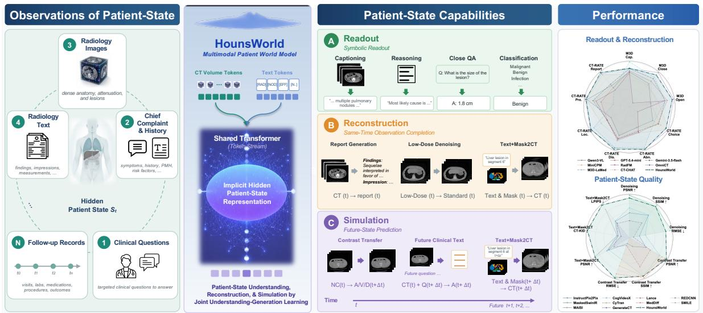  
Figure 1 HounsWorld learns a shared latent representation of patient state from multimodal observations, under which clinical readout, reconstruction, and simulation can all be formulated as state-dependent prediction problems.

and support prediction under varying conditions Ha and Schmidhuber (2018); Hafner et al. (2025); Bruce et al. (2024); Hu et al. (2023). This perspective has been successful in sequential decision-making and generative modeling, where a shared internal state enables prediction, simulation, and control across diverse settings. The same abstraction is especially natural in medicine, because clinical intelligence is fundamentally a latentstate inference problem. A patient is not directly observed; instead, clinicians reason from partial evidence about anatomy, tissue density, and enhancement behavior. CT, language, masks, and acquisition conditions should therefore be viewed not as unrelated modalities, but as complementary observations of the same hidden patient state.

Motivated by this view, as shown in Fig. 1, we propose HounsWorld, a CT-centered multimodal world model designed to reason over and generate 3D CT volumes. HounsWorld uses a shared causal transformer to integrate volumetric CT, language, anatomy masks, and condition descriptors into a unified patient-state workspace. From this shared representation, through joint understanding-generation learning, the model supports both understanding and generation: it can answer clinical questions, generate reports or captions, and complete condition-specific CT volumes for LDCT denoising, virtual contrast enhancement, and textand-mask-conditioned generation. To make this feasible within pretrained multimodal interfaces, we further introduce clinically structured patient-state completion, condition-explicit CT observations, pseudo-frame construction for volumetric encoding, and branch-specific residual adapters for CT adaptation.

To systematically study this formulation, we construct HounsBench, a CT-centered benchmark that regards various tasks as a single state-dependent prediction problem. HounsBench organizes tasks into three unified families, namely symbolic and open-ended readout, same-state reconstruction, and condition-shifted simulation, providing patient-disjoint train and test splits together with per-family protocols and metrics. On HounsBench, we report unified and task-wise performance, showing that a single HounsWorld remains competitive across all three families.Also, the frozen HounsWorld reward model improves an independent Qwen3-VL-4B on open-ended QA despite closed-form-only rewards, indicating that the learned patient-state structure transfers beyond its own architecture. Our contributions are threefold:

• We formulate CT-centered clinical intelligence as multimodal world modeling, casting various CTcentered tasks as a single state-dependent prediction problem, and introduce HounsWorld, a 3B multimodal world model that unifies readout, reconstruction, and simulation within pretrained multimodal interfaces through Joint Understanding-Generation Learning.

• We construct HounsBench, a CT-centered patient-state benchmark that establishes three unified evaluation families, with patient-disjoint train and test splits and per-family protocols and metrics.

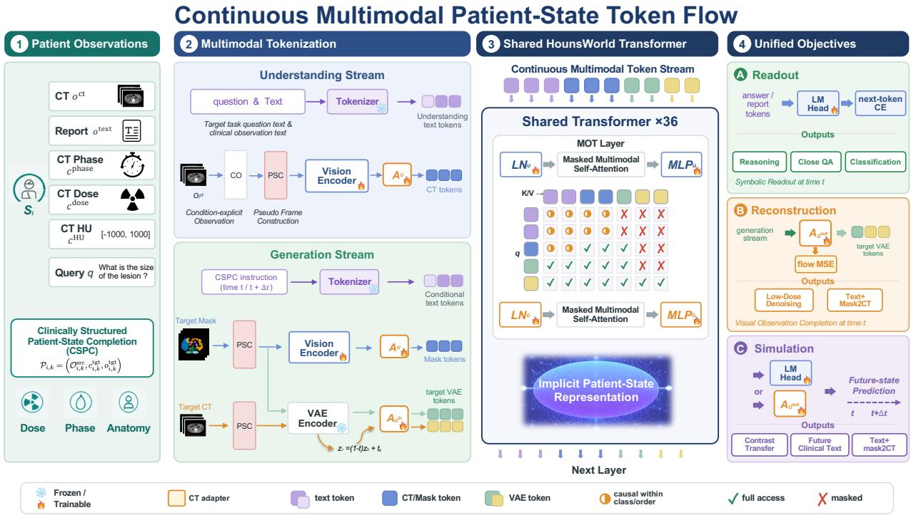  
Figure 2 HounsWorld learns from complementary observations of a latent patient state. Clinically Structured Patient-State Completion preserves patient correspondence while changing the current or requested subsequent observation condition, jointly constraining clinical readout, text completion, and CT completion.

• On HounsBench, task-wise and partial-observation analyses show that HounsWorld is competitive in readout and efective across reconstruction and simulation. Moreover, HounsWorld can also serve as a reward model for training external clinical reasoning models.

## 2 Related Work

CT and Medical Multimodal Understanding. Medical VLMs adapt general multimodal models to biomedical instruction following, few-shot reasoning, and joint comprehension–generation Li et al. (2023a); Moor et al. (2023); Chen et al. (2024a); Lin et al. (2025). Radiology models extend this paradigm across 2D and 3D scans Wu et al. (2025a), while CT-RATE, M3D, RadGenome, and 3D-RAD provide volumetric image–text data for report generation, VQA, grounding, and diagnostic reasoning Hamamci et al. (2026); Bai et al. (2024); Zhang et al. (2024); Gai et al. (2025). CT-specific architectures further reuse 2D backbones or compose adjacent slices to reduce volumetric cost Chen et al. (2024b); Shi et al. (2024); Lin et al. (2026). This line establishes that one CT can support reports, captions, localized descriptions, and explicit answers. Nevertheless, these outputs are normally organized as task formats rather than complementary observations of an underlying patient state.

Medical Reconstruction and Representation Learning. Reconstruction objectives learn visual representations by retaining information that discriminative labels omit. Masked autoencoding, generative encoding, and difusion features transfer efectively to recognition He et al. (2022); Li et al. (2023b); Yang and Wang (2023). Medical approaches extend this idea through image–report prototype learning, representation recovery, and masked difusion reconstruction Cheng et al. (2023); Yan et al. (2023); Tu et al. (2026). CT transformations provide particularly structured supervision: low-dose denoising separates acquisition noise from anatomy Chen et al. (2017), while contrast transfer predicts anatomy-dependent vascular and parenchy mal appearance Liu et al. (2022). These transformations preserve patient correspondence while changing how the anatomy is observed, making them natural constraints on a latent state. Prior work usually evaluates them as reconstruction systems or standalone pretraining.

Multimodal Medical World Models. World models encode latent states from which condition-dependent observations can be predicted Ha and Schmidhuber (2018); Hafner et al. (2025); Bruce et al. (2024); Hu et al. (2023). Unified multimodal models bring related ideas to shared understanding and generation through common sequence backbones or aligned visual representations Kondratyuk et al. (2024); Wu et al. (2025b); Xie et al. (2025); Wu et al. (2025c); Deng et al. (2025); Yan et al. (2026); Fu et al. (2026). Medical world modeling has used radiograph structure, tumor evolution, or radiologist gaze trajectories as the modeled state or process Yue et al. (2025); Yang et al. (2025a); Li et al. (2026). CheXWorld is the closest conceptual precedent because it treats local anatomy, global layout, and acquisition variation as image-world structure. HounsWorld adds volumetric CT and language as complementary observation channels. Reports reconstruct the state at a semantic resolution, questions request selected facts, and clinically conditioned generation reconstructs the current scan or predicts a condition-specified subsequent observation. We study this bounded form of future-observation prediction rather than unrestricted longitudinal progression.

## 3 Method

## Patient State and Conditional Observations

Let $s _ { i , t }$ denote the latent state of patient i at clinical time t, including volumetric anatomy, tissue attenuation, lesion manifestation, and enhancement behavior. This state is not directly supervised. Instead, the patientaligned observations and descriptors in Fig. 2 provide partial views:

$$
\begin{array} { r } { \mathcal { O } _ { i , t } = \{ \underbrace { o _ { i , t } ^ { \mathrm { c t } } , o _ { i , t } ^ { \mathrm { t e x t } } } _ { \mathrm { o b s e r v a t i o n s } } , \underbrace { c _ { i , t } ^ { \mathrm { p h a s e } } , c _ { i , t } ^ { \mathrm { d o s e } } , c _ { i , t } ^ { \mathrm { H U } } } _ { \mathrm { c o n d i t i o n s } } , \underbrace { q _ { i , t } } _ { \mathrm { q u e r y } } \} . } \end{array}\tag{1}
$$

Here, $o ^ { \mathrm { c t } }$ is a CT volume and $o ^ { \mathrm { t e x t } }$ is a report; $c ^ { \mathrm { p h a s e } } , c ^ { \mathrm { d o s e } }$ , and $c ^ { \mathrm { H U } }$ specify the contrast phase, acquisition dose, and HU window under which the CT is observed; and $q$ is a query. CT provides dense spatial and attenuation evidence, language selects clinically salient properties, and structured descriptors identify how an observation was acquired or presented.

Given source observations $\mathcal { O } _ { i , \leq t } ^ { \mathrm { s r c } }$ and a requested target condition $c _ { i , t + \Delta t } ^ { \mathrm { t g t } }$ , the shared transformer forms

$$
h _ { i , t } = F _ { \theta } \left( \mathcal { O } _ { i , \le t } ^ { \mathrm { s r c } } , c _ { i , t + \Delta t } ^ { \mathrm { t g t } } \right) ,\tag{2}
$$

and either completes a target observation or answers a query:

$$
\begin{array} { r l } & { \hat { o } _ { i , t + \Delta t } ^ { \mathrm { t g t } } \sim p _ { \theta } \left( o _ { i , t + \Delta t } ^ { \mathrm { t g t } } \mid h _ { i , t } , c _ { i , t + \Delta t } ^ { \mathrm { t g t } } \right) , } \\ & { a _ { i , t + \Delta t } \sim p _ { \theta } ( a \mid h _ { i , t } , q _ { i , t } ) . } \end{array}\tag{3}
$$

For $\Delta t = 0$ , this represents same-state completion, such as report reconstruction or denoising. For a specified subsequent condition, it represents bounded future-observation prediction: arterial/venous CT follows a non-contrast observation, and future-oriented VQA requests a prospective clinical readout. This operational definition does not assume unrestricted longitudinal disease forecasting. Closed-form answers are symbolic readouts, whereas open answers, reports, and captions are language observations generated from the same workspace.

## Clinically Structured Patient-State Completion

HounsWorld is trained through Joint Understanding-Generation Learning, as illustrated in Fig. 2, a single objective that couples language readout with conditional CT generation over shared patient-state observations. Rather than training separate understanding and generation heads. We instantiate this objective as Clinically Structured Patient-State Completion (CSPC), each patient-aligned completion example is:

$$
\mathcal { P } _ { i , k } = \left( \mathcal { O } _ { i , k } ^ { \mathrm { s r c } } , c _ { i , k } ^ { \mathrm { t g t } } , o _ { i , k } ^ { \mathrm { t g t } } \right) ,\tag{4}
$$

where $k$ indexes a completion objective, $\mathcal { O } _ { i , k } ^ { \mathrm { s r c } }$ is the available evidence, $c _ { i , k } ^ { \mathrm { t g t } }$ specifies the requested observation, and $o _ { i , k } ^ { \mathrm { t g t } }$ is its patient-matched target. The three CT objectives are LDCT denoising (dose-conditioned reconstruction), virtual contrast enhancement (phase-conditioned short-horizon prediction), and text/maskconditioned CT generation (structured conditional simulation). CT-to-report and CT-to-caption examples reconstruct sparse language observations, while $\mathrm { \Delta V Q A }$ uses the same representation for query-conditioned readout.

Condition-explicit observations. CT appearance depends jointly on patient content and the acquisition or display condition. We represent a CT condition by

$$
c _ { i } ^ { \mathrm { c t } } = \left( c _ { i } ^ { \mathrm { d o s e } } , c _ { i } ^ { \mathrm { p h a s e } } , c _ { i } ^ { \mathrm { H U } } \right) , \qquad { \bar { \sigma } } _ { i } ^ { \mathrm { c t } } = \left( { \mathcal { T } } _ { c _ { i } ^ { \mathrm { c t } } } ( o _ { i } ^ { \mathrm { c t } } ) , { \tau } ( c _ { i } ^ { \mathrm { c t } } ) \right) ,\tag{5}
$$

where $\mathcal { T } _ { c }$ produces the visual observation and $\tau ( c )$ serializes the same condition in language. Intensity transformations are therefore presented together with the condition that produced them, reducing ambiguity between a change in patient content and a change in acquisition or display.

HU-aware observations. For HU-window bounds $( l _ { w } , u _ { w } )$ , the observation operator is

$$
\mathcal { T } _ { w } ( V ) = \mathrm { c l i p } \left( \frac { V - l _ { w } } { u _ { w } - l _ { w } } , 0 , 1 \right) .\tag{6}
$$

Sampling such condition-explicit windows requires the representation to associate density-selective appearance with its clinical context. During training, with probability $\lambda _ { \mathrm { C O } }$ , we modify $c ^ { \mathrm { H U } }$ using multiple CT observation HU values.

Pseudo-frame construction. Pseudo-Frame Construction (PSC) exposes volumetric CT to pretrained RGB interfaces by packing adjacent axial slices into color channels. For a depth-D volume $V _ { i } \ \stackrel { \cdot } { \in } \ \mathbb { R } ^ { D \times H \times W }$ , let $K = \lceil D / 3 \rceil$ and let $\widetilde { V } _ { i }$ denote its depth-boundary-padded form with 3K slices. PSC constructs

$$
F _ { i , k } ( x , y , r ) = \widetilde { V } _ { i } ( 3 k + r , x , y ) , \quad \stackrel { k = 0 , \ldots , K - 1 , } { r \in \{ 0 , 1 , 2 \} } .\tag{7}
$$

Thus, each $F _ { i , k } ~ \in ~ \mathbb { R } ^ { H \times W \times 3 }$ contains three adjacent slices; no valid CT slice is reused, and padding is excluded after reconstruction. PSC preserves local through-plane context while reducing sequence length by approximately threefold and provides a common interface for the vision and VAE encoders.

CT residual adaptation. The semantic vision encoder and VAE pathway produce continuous tokens with different pretrained distributions. HounsWorld inserts branch-specific residual adapters after the understanding encoder, after the VAE-to-transformer input projection, and before the transformer-to-VAE output projection. For token $u \in \mathbb { R } ^ { d }$ in branch $b \in \{ U , G _ { \mathrm { i n } } , G _ { \mathrm { o u t } } \}$ ,

$$
\mathcal { A } _ { b } ( u ) = u + W _ { b , \mathrm { u p } } \phi \left( W _ { b , \mathrm { d o w n } } \mathrm { R M S N o r m } ( u ) \right) ,\tag{8}
$$

where $\phi$ is GELU and the two projections form a bottleneck. Zero-initializing $W _ { b , \mathrm { u p } }$ makes each adapter an identity mapping at initialization, preserving the pretrained semantic and generative interfaces while allowing branch-specific CT density and spatial corrections.

## Readout, Reconstruction, and Simulation

HounsWorld combines language readout, text reconstruction, and clinically structured CT completion in one objective.

Language readout and reconstruction. Let $\mathcal { T } _ { \mathrm { r e a d } }$ index answer tokens and $\mathcal { T } _ { \mathrm { t e x t } }$ index report/caption tokens, with $\mathcal { T } _ { \mathrm { l a n g } } = \mathcal { T } _ { \mathrm { r e a d } } \cup \mathcal { T } _ { \mathrm { t e x t } }$ . Their shared autoregressive loss is

$$
\mathcal { L } _ { \mathrm { l a n g } } = - \sum _ { j \in \mathcal { Z } _ { \mathrm { l a n g } } } \log p _ { \theta } ( w _ { j } \mid \mathcal { O } _ { i } , w _ { < j } ) .\tag{9}
$$

CT reconstruction and conditional simulation. CT completion is performed in VAE latent space with flow matching Lipman et al. (2023). Given target latent z, Gaussian noise $\epsilon ,$ and flow time $\gamma _ { ; }$ , we construct $z _ { \gamma } = ( 1 - \gamma ) z + \gamma \epsilon$ with velocity target $u ^ { \star } = \epsilon - z$ . For completion type $k ,$

$$
\mathcal { L } _ { \mathrm { c t } } ^ { k } = \mathbb { E } \left[ \left. u _ { \theta } \left( z _ { \gamma } , \gamma , \mathcal { O } _ { i , k } ^ { \mathrm { s r c } } , c _ { i , k } ^ { \mathrm { t g t } } \right) - u ^ { \star } \right. _ { 2 } ^ { 2 } \right] .\tag{10}
$$

<table><tr><td rowspan="2">Method</td><td colspan="3">HounsBench-Reconstruction Denoising (t)</td><td colspan="3">HounsBench-Simulation Contrast Transfer (t + ∆t)</td><td colspan="3">HounsBench-Reconstruction/Simulation Text+Mask-to-CT (t / t + ∆t)</td></tr><tr><td>PSNR↑</td><td>SSIM↑</td><td>RMSE↓</td><td>PSNR↑</td><td>SSIM↑</td><td>RMSE↓</td><td>PSNR↑</td><td>CT-KID↓</td><td>LPIPS↓</td></tr><tr><td>InstructPix2Pix</td><td>18.961</td><td>0.5518</td><td>0.1174</td><td>13.979</td><td>0.2030</td><td>0.2057</td><td>11.547</td><td>1.077</td><td>0.6024</td></tr><tr><td>CogVideoX</td><td>22.731</td><td>0.5577</td><td>0.0739</td><td>25.770</td><td>0.8963</td><td>0.0546</td><td>10.574</td><td>0.746</td><td>0.5878</td></tr><tr><td>Lance</td><td>13.057</td><td>0.3649</td><td>0.2856</td><td>17.772</td><td>0.6824</td><td>0.1524</td><td>7.905</td><td>1.042</td><td>0.6895</td></tr><tr><td>HounsWorld (Ours)</td><td>30.196</td><td>0.7631</td><td>0.0322</td><td>31.343</td><td>0.8997</td><td>0.0295</td><td>17.354</td><td>0.075</td><td>0.3056</td></tr></table>

Table 1 Comparison with generation models across the HounsBench-Reconstruction and HounsBench-Simulation subtasks. Bold/underline: best/second-best.

<table><tr><td>Denoising</td><td>PSNR↑</td><td>SSIM↑</td><td>RMSE↓</td></tr><tr><td>RED-CNN</td><td>31.382</td><td>0.7788</td><td>0.0310</td></tr><tr><td>MaskDenoising</td><td>31.198</td><td>0.7745</td><td>0.0329</td></tr><tr><td>HounsWorld</td><td>30.196</td><td>0.7631</td><td>0.0322</td></tr><tr><td>Contrast Transfer</td><td>PSNR↑</td><td>SSIM↑</td><td>RMSE↓</td></tr><tr><td>CyTran</td><td>27.713</td><td>0.9027</td><td>0.0422</td></tr><tr><td>MedDiff</td><td>30.186</td><td>0.9386</td><td>0.0328</td></tr><tr><td>SMILE</td><td>30.736</td><td>0.9429</td><td>0.0306</td></tr><tr><td>HounsWorld</td><td>31.343</td><td>0.8997</td><td>0.0295</td></tr><tr><td>Text+mask-to-CT</td><td>PSNR↑</td><td>CT-KID↓</td><td>LPIPS↓</td></tr><tr><td>MAISI</td><td>18.780</td><td>0.826</td><td>0.3506</td></tr><tr><td>GenerateCT</td><td>10.391</td><td>4.255</td><td>0.6613</td></tr><tr><td>HounsWorld</td><td>17.354</td><td>0.075</td><td>0.3056</td></tr></table>

Table 2 Compared with task-specific models on the HounsBench-Reconstruction and Simulation subtasks.

The complete objective is

$$
\mathcal { L } _ { \mathrm { H W } } = \mathcal { L } _ { \mathrm { l a n g } } + \lambda _ { \mathrm { c t } } \sum _ { k \in \mathcal { K } } \pi _ { k } \mathcal { L } _ { \mathrm { c t } } ^ { k } ,\tag{11}
$$

where $\pi _ { k }$ is the sampling frequency of CT-completion type k and $\lambda _ { \mathrm { { c t } } }$ balances dense latent prediction against language supervision.

Two-stage optimization. Let $\Theta _ { A }$ collect the three CT adapters and let $\Theta _ { \mathrm { f i x e d } }$ contain the Wan VAE and pretrained latent connectors. The trainable parameter sets are

$$
\Theta _ { \mathrm { t r a i n } } ^ { ( 1 ) } = \Theta _ { \cal A } , \qquad \Theta _ { \mathrm { t r a i n } } ^ { ( 2 ) } = \Theta \setminus \Theta _ { \mathrm { f i x e d } } .\tag{12}
$$

Stage 1 adapts only the CT interfaces. Stage 2 starts from this initialization and jointly tunes the semantic vision encoder/merger, token embeddings, shared transformer, language head, and CT adapters, while the VAE and latent connectors remain frozen. The schedule first establishes a stable CT-compatible interface and then co-adapts clinical readout and completion under the unified objective.

## 4 Experiments

## HounsBench Construction

HounsBench comprises three task families: readout, reconstruction, and simulation. It is constructed from CT-RATE Hamamci et al. (2026), M3D Bai et al. (2024), and private collected dataset with anatomical masks generated by TotalSegmentator Wasserthal et al. (2023). During training, language, denoising, enhancement, and text-and-mask samples are drawn at a ratio of $6 0 / 1 0 / 1 0 / 2 0 \%$ . Detailed dataset construction, evaluation metrics, and baseline configurations are provided in the supplementary material.

• HounsBench-Readout contains approximately 1.43M training samples from CT-RATE and M3D, including 1.22M VQA pairs, with 34K samples held out for evaluation. It covers closed-form, open-ended, and multiple-choice $\mathrm { \Delta V Q A }$ , as well as captioning and reasoning tasks.

<table><tr><td rowspan="2">Model</td><td>HounsBench (HB.)</td><td colspan="3">HB.-Readout (M3D)</td><td colspan="6">HB.-Readout (CT-RATE)</td><td>HB.-Simulation</td><td rowspan="2">Avg.</td></tr><tr><td>#Params</td><td>Cap.</td><td>Close</td><td>Open</td><td>Choice</td><td>Abn.</td><td>Dis.</td><td>Loc.</td><td>Pre.</td><td>Report Future state (t + ∆t)</td><td></td></tr><tr><td colspan="10">General LVLMs, only understanding</td><td rowspan="3"></td></tr><tr><td>Qwen3-VL</td><td>4B</td><td>32.20</td><td>55.28</td><td>23.02</td><td>52.51</td><td>22.38</td><td>25.72 24.08</td><td>93.19</td><td>37.34</td><td>5.02</td><td>37.07</td></tr><tr><td>GPT-5.4-mini</td><td></td><td>33.20</td><td>61.32</td><td>41.15</td><td>64.44</td><td>28.05</td><td>30.15</td><td>29.13 62.54</td><td>33.72</td><td>15.66</td><td>39.94</td></tr><tr><td>Gemini-3.5-flash</td><td></td><td>35.31</td><td>67.50</td><td>38.92</td><td>65.82</td><td>26.36</td><td>28.45</td><td>29.13 80.16</td><td>39.50</td><td></td><td>42.32 37.54</td></tr><tr><td>MiniCPM</td><td>9B</td><td>31.28</td><td>61.50</td><td>23.68</td><td>70.61</td><td>22.79</td><td>24.85</td><td>23.89</td><td>77.02 36.28</td><td></td><td></td></tr><tr><td colspan="10">Medical LVLMs, only understanding</td><td colspan="3"></td></tr><tr><td>RadFM</td><td>14B</td><td>31.58</td><td>9.62</td><td>37.91</td><td>18.53 27.42</td><td>29.10</td><td>29.55</td><td>73.50</td><td>29.45</td><td>18.14</td><td>30.48</td></tr><tr><td>M3D-LaMed</td><td>4B</td><td>41.27</td><td>70.66</td><td>38.87</td><td>56.20 44.59</td><td>36.29</td><td>46.67</td><td>35.25</td><td>32.31</td><td>9.86</td><td>41.20</td></tr><tr><td>CT-CHAT</td><td>8B</td><td>29.68</td><td>52.40</td><td>31.57</td><td>87.53</td><td>28.55 27.89</td><td>36.95</td><td>94.37</td><td>55.89</td><td>26.34</td><td>47.12</td></tr><tr><td>OmniCT</td><td>3B</td><td>35.35</td><td>81.90</td><td>48.23</td><td>87.61</td><td>46.17 36.78</td><td>50.74</td><td>96.94</td><td>58.01</td><td>57.23</td><td>59.90</td></tr><tr><td colspan="10">Multimodal CT world model, unified understanding and generation</td><td rowspan="2"></td><td rowspan="2">59.18</td></tr><tr><td>HounsWorld (Ours)</td><td>3B</td><td>35.55</td><td>76.16</td><td>46.65</td><td>82.52</td><td>46.45</td><td>37.97 50.27</td><td>95.13</td><td>59.78</td></tr></table>

Table 3 Comparison on the HounsBench-Readout subsets (M3D and CT-RATE) and HounsBench-Simulation. Avg. is the mean of the ten task scores. All metrics are percentages, and higher is better. Bold and underlined values denote the best and second-best results, respectively; “–” denotes an unavailable result.

• HounsBench-Reconstruction contains 34K language-reconstruction samples, 6.9K LDCT-denoising pairs, and 188K current-state text-and-mask-to-CT pairs. This family evaluates report and caption reconstruction, LDCT denoising, and same-time CT observation completion.

• HounsBench-Simulation contains 7.1K contrast-transfer pairs and future-state text-and-mask-to-CT pairs, and future-state clinical text tasks, evaluating condition-shifted CT prediction and future clinicalstate prediction.

## Compared Baselines

Understanding baselines are Qwen3-VL-4B Bai et al. (2025), GPT-5.4-mini OpenAI (2026), Gemini-3.5-flash Kavukcuoglu et al. (2026), MiniCPM-V 4.5 Yu et al. (2025), RadFM Wu et al. (2025a), M3D-LaMed-4B Bai et al. (2024), CT-CHAT-7B Hamamci et al. (2026), OmniCT-3B Lin et al. (2026), and Lance Fu et al. (2026). Qwen3-VL and MiniCPM use 2D slice contact sheets; medical volume models use native 3D input. CTcompletion baselines include InstructPix2Pix Brooks et al. (2023), CogVideoX Yang et al. (2025b), Lance Fu et al. (2026), RED-CNN Chen et al. (2017), MaskDenoising Chen et al. (2023), CyTran Ristea et al. (2023), MedDif Rombach et al. (2022), SMILE Liu et al. (2025), MAISI Guo et al. (2025), and GenerateCT Hamamci et al. (2024).

## Main Results of HounsWorld

Clinically Structured CT Completion. HounsWorld ranks first on all nine metrics against generation models (Table 1), improving PSNR over the strongest comparator by 7.465, 5.573, and 5.807 dB for reconstruction (LDCT denoising), simulation (virtual contrast enhancement), and text+mask2CT. The phase targets are acquired after the non-contrast observation, making enhancement a bounded test of condition-specified futureobservation prediction, consistent with its placement in the simulation family. Against task-specific methods (Table 2), HounsWorld achieves the best simulation PSNR/RMSE and text+mask2CT CT-KID/LPIPS. It remains close on metrics led by dedicated models, within 1.186 dB PSNR, 0.0157 SSIM, and 0.0012 RMSE for reconstruction (LDCT denoising), and within 1.426 dB of the best text+mask2CT PSNR. These localized gaps are a reasonable trade-of for one shared 3B model that spans readout, reconstruction, and simulation without task-specific architectures.

CT Readout. For closed-form tasks, we evaluate performance using normalized accuracy; for open-ended QA, we use a weighted combination of BLEU Papineni et al. (2002), ROUGE Lin (2004), RadGraph Delbrouck et al. (2024), and BioBERTScore Zhang et al. (2020); Lee et al. (2020). Table 3 shows that HounsWorld ranks second overall, only 0.931 points behind OmniCT Lin et al. (2026), while uniquely unifying CT readout and completion in this comparison. It obtains the best scores for abnormality (46.45), disease (37.97), report

(b) Reward transfer

<table><tr><td>Training strategy</td><td>Choice Abn. Dis. Loc. Pre. Rep. Avg.</td></tr><tr><td>UND 79.08</td><td>45.57 33.48 49.11 93.29 58.62 59.86</td></tr><tr><td>UND+DEN</td><td>81.96 44.90 36.66 49.88 94.31 59.44 61.19</td></tr><tr><td>UND+VE</td><td>81.31 46.84 36.35 49.87 95.23 59.32 61.49</td></tr><tr><td>UND+T2C</td><td>81.27 46.24 36.50 50.07 94.90 59.35 61.39</td></tr><tr><td>UND+CSPC 81.93</td><td>47.26 37.11 50.17 95.02 59.53 61.84</td></tr><tr><td>UND+CSPC+CO 82.52</td><td>46.45 37.97 50.27 95.13 59.78 62.02</td></tr></table>

Table 4 Efect of clinically structured CT completion on Hounsbench-Readout(CT-RATE). UND: understanding; DEN/VE/T2C: LDCT denoising, contrast transfer, and text+mask2CT; CSPC: all three; CO: condition-explicit observation.

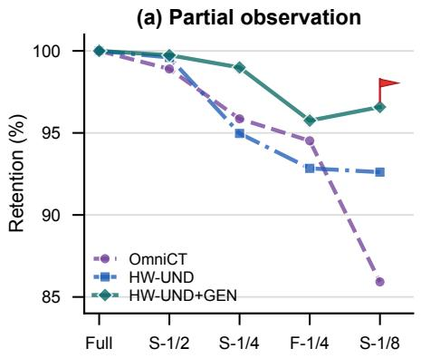

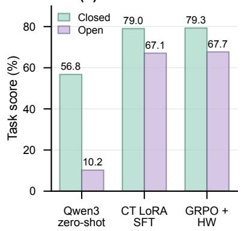  
Figure 3 Complementary ablations. (a) Report-quality retention under uniformly sparse (S) or central field-of-view (F) observations; CSPC degrades most gracefully. (b) Closed- and open-task transfer to an independent Qwen3-VL policy; Reinforcement learning improves using HounsWorld (HW) as rewards over zero-shot and SFT.

generation (59.78) and simulation (59.18), exceeding the strongest readout-only result by 0.28, 1.19, 1.77 and 1.95 points. HounsWorld also ranks second on all three M3D tasks and on CT-RATE localization and prediction. Thus, the unified objective preserves competitive readout, with a modest aggregate gap to the strongest specialized readout model.

## Ablation Study and Model Analysis

Completion-to-Readout Transfer. Table 4 tests whether CT-completion supervision strengthens the shared representation used for understanding, rather than merely adding a generative output path. We keep the language-supervised objective and evaluation protocol fixed, initialize every variant independently from the same Lance checkpoint, and vary the added completion signal. UND is the understanding-only control; UND+DEN, UND+VE, and UND+T2C add dose completion, phase completion, or anatomy-and-language completion individually; UND+CSPC combines all three; and the final variant additionally exposes the CT acquisition condition through CO. Every model is evaluated on the same six categories, and Avg. is their unweighted mean.

Each individual completion objective improves the average over UND, with VE providing the strongest single-task gain (+1.63). This is consistent with phase-transition supervision coupling current anatomy to its subsequent contrast-dependent appearance. Combining the three objectives through CSPC improves every category over UND and yields a larger +1.98 gain, indicating complementary supervision across dose, phase, and anatomy/text conditions. CO adds a smaller improvement concentrated in Choice, Disease, Localization, and Report, bringing the total gain to +2.16.

Robustness under Partial CT Observation. We test whether CSPC encourages a patient-state representation that degrades gracefully as CT evidence is removed, using uniform sparsification versus a contiguous field-ofview crop to separate the amount of retained evidence from its anatomical coverage. As shown in Figure 3(a), we compare OmniCT-3B Lin et al. (2026), HounsWorld-UND, and HounsWorld (UND+GEN), where Sparser uniformly retains fractions $r \in \{ 1 / 2 , 1 / 4 , 1 / 8 \}$ and FOV-1/4 retains only the contiguous central quarter, and report retention as the partial-observation report score normalized by each model’s own full-observation score. CSPC is most useful as uniform sampling becomes severe: at Sparse-1/8 it improves retention by 3.97 points over UND and 10.66 points over OmniCT-3B, and its higher retention under Sparse-1/4 than FOV-1/4 suggests that distributed anatomical coverage is more informative than a contiguous central field of view.

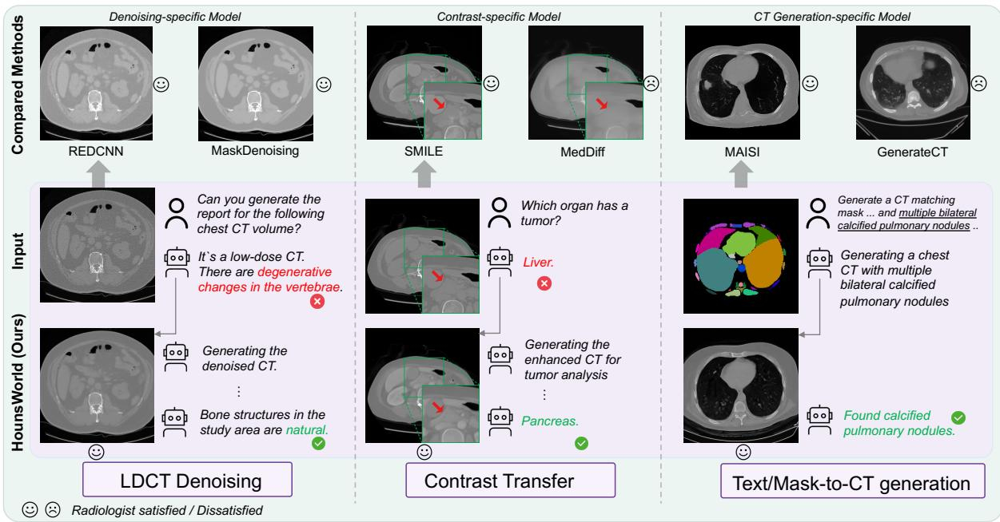  
Figure 4 Qualitative consistency across condition-specific observations. The top row shows task-specific comparators. Left: denoising revises the inferred finding from vertebral degeneration to normal bone. Center: a predicted postcontrast observation separates vessels from the pancreatic lesion (red arrows) and shifts localization from liver to pancreas. Right: text-and-mask conditioning instantiates multiple bilateral calcified pulmonary nodules that remain identifiable in the synthesized CT.

## Transferable Reward Supervision.

To test whether CSPC captures reusable clinical structure beyond HounsWorld’s own architecture, we use HounsWorld as a frozen reward model to train an independently parameterized Qwen3-VL-4B Bai et al. (2025) with GRPO. As shown in Figure 3(b), we report three representative settings: zero-shot inference, SFT, and GRPO augmented with HounsWorld rewards (GRPO+HW). On the random half split of the complete CT suite, GRPO+HW achieves 79.29 on closed tasks and 67.68 on open-ended QA. Its improvement over SFT, particularly on open-ended questions despite GRPO being trained with closed-form answers, suggests that CSPC supervision transfers beyond HounsWorld’s own prediction head.

Visualization and Findings Figure 4 illustrates the world-model view: denoising reconstructs a cleaner current observation, enhancement predicts a requested next phase, and text-and-mask conditioning simulates structured patient content. Each constructed CT stays coupled to an interpretable readout, indicating that the generative branch yields alternative observations rather than pixel-level outputs alone, and enabling controllable simulation, counterfactual interrogation, and cross-observation verification. These cases show internal semantic consistency, not independent diagnostic validity; blinded radiologist and external-reader studies remain necessary.

## 5 Conclusion

We cast CT-centered clinical AI as world modeling: learning a shared latent representation of patient state under which readout, reconstruction, and simulation become state-dependent prediction problems rather than separate task-specific models. To study this formulation, we introduced HounsBench, a CT-centered benchmark that organizes fragmented tasks into three families, symbolic and open-ended readout, same-state reconstruction, and condition-shifted simulation, each with patient-disjoint splits and per-family protocols. On HounsBench, a single 3B HounsWorld stays competitive on readout while supporting LDCT denoising, virtual contrast enhancement, and text+mask2CT in one model, and ablations associate completion supervision with stronger, more robust readout. Our evidence is bounded to condition-specified, short-horizon observations and does not establish long-term disease evolution, treatment response, or diagnostic interchangeability of generated CT. Within this scope, HounsWorld is an evidence-bounded step from task-specific CT mappings toward unified patient-state modeling and future-observation prediction.

## References

Fan Bai, Yuxin Du, Tiejun Huang, Max Q.-H. Meng, and Bo Zhao. M3d: Advancing 3d medical image analysis with multi-modal large language models. arXiv preprint arXiv:2404.00578, 2024.

Shuai Bai, Yuxuan Cai, Ruizhe Chen, Keqin Chen, Xionghui Chen, Zesen Cheng, Lianghao Deng, Wei Ding, Chang Gao, Chunjiang Ge, et al. Qwen3-VL technical report. arXiv preprint arXiv:2511.21631, 2025.

Tim Brooks, Aleksander Holynski, and Alexei A. Efros. InstructPix2Pix: Learning to follow image editing instructions. In CVPR, pages 18392–18402, 2023.

Jake Bruce, Michael D. Dennis, Ashley Edwards, Jack Parker-Holder, Yuge Shi, Edward Hughes, Matthew Lai, Aditi Mavalankar, Richie Steigerwald, Chris Apps, Yusuf Aytar, Sarah Maria Elisabeth Bechtle, Feryal Behbahani, Stephanie C. Y. Chan, Nicolas Heess, Lucy Gonzalez, Simon Osindero, Sherjil Ozair, Scott Reed, Jingwei Zhang, Konrad Zolna, Jef Clune, Nando de Freitas, Satinder Singh, and Tim Rocktäschel. Genie: Generative interactive environments. In ICML, volume 235 of Proceedings of Machine Learning Research, pages 4603–4623, 2024.

Haoyu Chen, Jinjin Gu, Yihao Liu, Salma Abdel Magid, Chao Dong, Qiong Wang, Hanspeter Pfister, and Lei Zhu. Masked image training for generalizable deep image denoising. In CVPR, pages 1692–1703, 2023.

Hu Chen, Yi Zhang, Mannudeep K. Kalra, Feng Lin, Yang Chen, Peixi Liao, Jiliu Zhou, and Ge Wang. Low-dose ct with a residual encoder-decoder convolutional neural network. IEEE Transactions on Medical Imaging, 36(12): 2524–2535, 2017.

Junying Chen, Chi Gui, Ruyi Ouyang, Anningzhe Gao, Shunian Chen, Guiming Hardy Chen, Xidong Wang, Ruifei Zhang, Zhenyang Cai, Ke Ji, Guangjun Yu, Xiang Wan, and Benyou Wang. Huatuogpt-vision, towards injecting medical visual knowledge into multimodal llms at scale. arXiv preprint arXiv:2406.19280, 2024a.

Qiuhui Chen, Huping Ye, and Yi Hong. Med3dinsight: Enhancing 3d medical image understanding with 2d multimodal large language models. arXiv preprint arXiv:2403.05141, 2024b.

Pujin Cheng, Li Lin, Junyan Lyu, Yijin Huang, Wenhan Luo, and Xiaoying Tang. Prior: Prototype representation joint learning from medical images and reports. In ICCV, pages 21361–21371, 2023.

Jean-Benoit Delbrouck, Pierre Chambon, Zhihong Chen, Maya Varma, Andrew Johnston, Louis Blankemeier, Dave Van Veen, Tan Bui, Steven Truong, and Curtis Langlotz. RadGraph-XL: A large-scale expert-annotated dataset for entity and relation extraction from radiology reports. In Findings of ACL, pages 12902–12915, 2024.

Chaorui Deng, Deyao Zhu, Kunchang Li, Chenhui Gou, Feng Li, Zeyu Wang, Shu Zhong, Weihao Yu, Xiaonan Nie, Ziang Song, Guang Shi, and Haoqi Fan. Emerging properties in unified multimodal pretraining. arXiv preprint arXiv:2505.14683, 2025.

Fengyi Fu, Mengqi Huang, Shaojin Wu, Yunsheng Jiang, Yufei Huo, Hao Li, Yinghang Song, Fei Ding, Jianzhu Guo, Qian He, Zheren Fu, Zhendong Mao, and Yongdong Zhang. Lance: Unified multimodal modeling by multi-task synergy. arXiv preprint arXiv:2605.18678, 2026.

Xiaotang Gai, Jiaxiang Liu, Yichen Li, Zijie Meng, Jian Wu, and Zuozhu Liu. 3d-rad: A comprehensive 3d radiology med-vqa dataset with multi-temporal analysis and diverse diagnostic tasks. In NeurIPS, 2025.

Pengfei Guo, Can Zhao, Dong Yang, Ziyue Xu, Vishwesh Nath, Yucheng Tang, Benjamin Simon, Mason Belue, Stephanie Harmon, Baris Turkbey, and Daguang Xu. MAISI: Medical AI for synthetic imaging. In WACV, pages 4430–4441, 2025.

David Ha and Jürgen Schmidhuber. World models. arXiv preprint arXiv:1803.10122, 2018.

Danijar Hafner, Jurgis Pasukonis, Jimmy Ba, and Timothy Lillicrap. Mastering diverse control tasks through world models. Nature, 640(8059):647–653, 2025.

Ibrahim Ethem Hamamci, Sezgin Er, Anjany Sekuboyina, Enis Simsar, Alperen Tezcan, Ayse Gulnihan Simsek, Sevval Nil Esirgun, Furkan Almas, Irem Dogan, Muhammed Furkan Dasdelen, Chinmay Prabhakar, Hadrien Reynaud, Sarthak Pati, Christian Bluethgen, Mehmet Kemal Ozdemir, and Bjoern Menze. GenerateCT: Text-conditional generation of 3d chest CT volumes. In ECCV, pages 126–143, 2024.

Ibrahim Ethem Hamamci, Sezgin Er, Chenyu Wang, Furkan Almas, Ayse Gulnihan Simsek, Sevval Nil Esirgun, Irem Dogan, Omer Faruk Durugol, Benjamin Hou, Suprosanna Shit, Weicheng Dai, Murong Xu, Hadrien Reynaud, Muhammed Furkan Dasdelen, Bastian Wittmann, Tamaz Amiranashvili, Enis Simsar, Mehmet Simsar, Emine Bensu Erdemir, Abdullah Alanbay, Anjany Sekuboyina, Berkan Lafci, Ahmet Kaplan, Zhiyong Lu, Malgorzata Polacin, Bernhard Kainz, Christian Bluethgen, Kayhan Batmanghelich, Mehmet Kemal Ozdemir, and Bjoern Menze. Generalist foundation models from a multimodal dataset for 3d computed tomography. Nature Biomedical Engineering, 2026.

Kaiming He, Xinlei Chen, Saining Xie, Yanghao Li, Piotr Dollár, and Ross Girshick. Masked autoencoders are scalable vision learners. In CVPR, pages 16000–16009, 2022.

Anthony Hu, Lloyd Russell, Hudson Yeo, Zak Murez, George Fedoseev, Alex Kendall, Jamie Shotton, and Gianluca Corrado. Gaia-1: A generative world model for autonomous driving. arXiv preprint arXiv:2309.17080, 2023.

Koray Kavukcuoglu, Jef Dean, Oriol Vinyals, and Noam Shazeer. Gemini 3.5: Frontier intelligence with action, 2026.

Dan Kondratyuk, Lijun Yu, Xiuye Gu, Jose Lezama, Jonathan Huang, Grant Schindler, Rachel Hornung, Vighnesh Birodkar, Jimmy Yan, Ming-Chang Chiu, Krishna Somandepalli, Hassan Akbari, Yair Alon, Yong Cheng, Joshua V. Dillon, Agrim Gupta, Meera Hahn, Anja Hauth, David Hendon, Alonso Martinez, David Minnen, Mikhail Sirotenko, Kihyuk Sohn, Xuan Yang, Hartwig Adam, Ming-Hsuan Yang, Irfan Essa, Huisheng Wang, David A. Ross, Bryan Seybold, and Lu Jiang. Videopoet: A large language model for zero-shot video generation. In ICML, volume 235 of Proceedings of Machine Learning Research, pages 25105–25124, 2024.

Jinhyuk Lee, Wonjin Yoon, Sungdong Kim, Donghyeon Kim, Sunkyu Kim, Chan Ho So, and Jaewoo Kang. BioBERT: A pre-trained biomedical language representation model for biomedical text mining. Bioinformatics, 36(4):1234– 1240, 2020.

Chunyuan Li, Clif Wong, Sheng Zhang, Naoto Usuyama, Haotian Liu, Jianwei Yang, Tristan Naumann, Hoifung Poon, and Jianfeng Gao. Llava-med: Training a large language-and-vision assistant for biomedicine in one day. In NeurIPS, 2023a.

Tianhong Li, Huiwen Chang, Shlok Kumar Mishra, Han Zhang, Dina Katabi, and Dilip Krishnan. Mage: Masked generative encoder to unify representation learning and image synthesis. In CVPR, 2023b.

Yiwei Li, Zihao Wu, Huaqin Zhao, Yifan Zhou, Chao Cao, Dajiang Zhu, Tianming Liu, and Lin Zhao. A world model of radiologist reading for medical image representation learning. arXiv preprint arXiv:2605.23992, 2026.

Chin-Yew Lin. ROUGE: A package for automatic evaluation of summaries. In ACL Workshop, pages 74–81, 2004.

Tianwei Lin, Wenqiao Zhang, Sijing Li, Yuqian Yuan, Binhe Yu, Haoyuan Li, Wanggui He, Hao Jiang, Mengze Li, Xiaohui Song, Siliang Tang, Jun Xiao, Hui Lin, Yueting Zhuang, and Beng Chin Ooi. Healthgpt: A medical large vision-language model for unifying comprehension and generation via heterogeneous knowledge adaptation. arXiv preprint arXiv:2502.09838, 2025.

Tianwei Lin, Zhongwei Qiu, Wenqiao Zhang, Jiang Liu, Yihan Xie, Mingjian Gao, Zhenxuan Fan, Zhaocheng Li, Sijing Li, Zhongle Xie, Peng Lu, Yueting Zhuang, Yingda Xia, Ling Zhang, and Beng Chin Ooi. Omnict: Towards a unified slice-volume lvlm for comprehensive ct analysis. In ICLR, 2026.

Yaron Lipman, Ricky T. Q. Chen, Heli Ben-Hamu, Maximilian Nickel, and Matthew Le. Flow matching for generative modeling. In ICLR, 2023.

Jingya Liu, Yingli Tian, Cihan Duzgol, Oguz Akin, A. Muhtesem Agildere, K. Murat Haberal, and Mehmet Coskun. Virtual contrast enhancement for ct scans of abdomen and pelvis. Computerized Medical Imaging and Graphics, 100:102094, 2022.

Junqi Liu, Zejun Wu, Pedro R. A. S. Bassi, Xinze Zhou, Wenxuan Li, Ibrahim E. Hamamci, Sezgin Er, Tianyu Lin, Yi Luo, Szymon Plotka, et al. See more, change less: Anatomy-aware difusion for contrast enhancement. arXiv preprint arXiv:2512.07251, 2025.

Michael Moor, Qian Huang, Shirley Wu, Michihiro Yasunaga, Yash Dalmia, Jure Leskovec, Cyril Zakka, Eduardo Pontes Reis, and Pranav Rajpurkar. Med-flamingo: A multimodal medical few-shot learner. In ML4H, volume 225 of Proceedings of Machine Learning Research, pages 353–367, 2023.

OpenAI. Introducing GPT-5.4 mini and nano, 2026.

Kishore Papineni, Salim Roukos, Todd Ward, and Wei-Jing Zhu. BLEU: A method for automatic evaluation of machine translation. In ACL, pages 311–318, 2002.

Nicolae-Catalin Ristea, Andreea-Iuliana Miron, Olivian Savencu, Mariana-Iuliana Georgescu, Nicolae Verga, Fahad Shahbaz Khan, and Radu Tudor Ionescu. CyTran: A cycle-consistent transformer with multi-level consistency for non-contrast to contrast CT translation. Neurocomputing, 538:126211, 2023.

Robin Rombach, Andreas Blattmann, Dominik Lorenz, Patrick Esser, and Björn Ommer. High-resolution image synthesis with latent difusion models. In CVPR, pages 10684–10695, 2022.

Yiming Shi, Xun Zhu, Kaiwen Wang, Ying Hu, Chenyi Guo, Miao Li, and Ji Wu. Med-2e3: A 2d-enhanced 3d medical multimodal large language model. arXiv preprint arXiv:2411.12783, 2024.

Jiachen Tu, Guanghui Qin, Theodore Zhengde Zhao, Jeya Maria Jose Valanarasu, Sheng Zhang, Tristan Naumann, Fan Lam, Sheng Wang, and Hoifung Poon. Masked-difusion autoencoders for 3d medical vision representation learning. In CVPR, pages 22804–22815, 2026.

Zhou Wang, Alan C. Bovik, Hamid R. Sheikh, and Eero P. Simoncelli. Image quality assessment: From error visibility to structural similarity. IEEE Transactions on Image Processing, 13(4):600–612, 2004.

Jakob Wasserthal, Hanns-Christian Breit, Manfred T. Meyer, Maurice Pradella, Daniel Hinck, Alexander W. Sauter, Tobias Heye, Daniel T. Boll, Joshy Cyriac, Shan Yang, Michael Bach, and Martin Segeroth. Totalsegmentator: Robust segmentation of 104 anatomic structures in ct images. Radiology: Artificial Intelligence, 5(5), 2023.

Chaoyi Wu, Xiaoman Zhang, Ya Zhang, Hui Hui, Yanfeng Wang, and Weidi Xie. Towards generalist foundation model for radiology by leveraging web-scale 2d&3d medical data. Nature Communications, 16(1), 2025a.

Chengyue Wu, Xiaokang Chen, Zhiyu Wu, Yiyang Ma, Xingchao Liu, Zizheng Pan, Wen Liu, Zhenda Xie, Xingkai Yu, Chong Ruan, and Ping Luo. Janus: Decoupling visual encoding for unified multimodal understanding and generation. In CVPR, pages 12966–12977, 2025b.

Size Wu, Wenwei Zhang, Lumin Xu, Sheng Jin, Zhonghua Wu, Qingyi Tao, Wentao Liu, Wei Li, and Chen Change Loy. Harmonizing visual representations for unified multimodal understanding and generation. In ICCV, pages 17739–17750, 2025c.

Jinheng Xie, Weijia Mao, Zechen Bai, David Junhao Zhang, Weihao Wang, Kevin Qinghong Lin, Yuchao Gu, Zhijie Chen, Zhenheng Yang, and Mike Zheng Shou. Show-o: One single transformer to unify multimodal understanding and generation. In ICLR, 2025.

Xiangyi Yan, Junayed Naushad, Shanlin Sun, Kun Han, Hao Tang, Deying Kong, Haoyu Ma, Chenyu You, and Xiaohui Xie. Representation recovering for self-supervised pre-training on medical images. In WACV, pages 2685–2695, 2023.

Zhiyuan Yan, Kaiqing Lin, Zongjian Li, Junyan Ye, Hui Han, Haochen Wang, Zhendong Wang, Bin Lin, Hao Li, Xinyan Xiao, Jingdong Wang, Haifeng Wang, and Li Yuan. Unified multimodal models as auto-encoders. In CVPR, pages 41903–41912, 2026.

Xingyi Yang and Xinchao Wang. Difusion model as representation learner. In ICCV, pages 18938–18949, 2023.

Yijun Yang, Zhao-Yang Wang, Qiuping Liu, Shuwen Sun, Kang Wang, Rama Chellappa, Zongwei Zhou, Alan Yuille, Lei Zhu, Yu-Dong Zhang, and Jieneng Chen. Medical world model. In ICCV, pages 8319–8329, 2025a.

Zhuoyi Yang, Jiayan Teng, Wendi Zheng, Ming Ding, Shiyu Huang, Jiazheng Xu, Yuanming Yang, Wenyi Hong, Xiaohan Zhang, Guanyu Feng, et al. CogVideoX: Text-to-video difusion models with an expert transformer. In ICLR, 2025b.

Tianyu Yu, Zefan Wang, Chongyi Wang, Fuwei Huang, Wenshuo Ma, Zhihui He, Tianchi Cai, Weize Chen, Yuxiang Huang, Yuanqian Zhao, et al. MiniCPM-V 4.5: Cooking eficient MLLMs via architecture, data, and training recipe. arXiv preprint arXiv:2509.18154, 2025.

Yang Yue, Yulin Wang, Chenxin Tao, Pan Liu, Shiji Song, and Gao Huang. Chexworld: Exploring image world modeling for radiograph representation learning. In CVPR, pages 20778–20788, 2025.

Richard Zhang, Phillip Isola, Alexei A. Efros, Eli Shechtman, and Oliver Wang. The unreasonable efectiveness of deep features as a perceptual metric. In CVPR, pages 586–595, 2018.

Tianyi Zhang, Varsha Kishore, Felix Wu, Kilian Q. Weinberger, and Yoav Artzi. BERTScore: Evaluating text generation with BERT. In ICLR, 2020.

Xiaoman Zhang, Chaoyi Wu, Ziheng Zhao, Jiayu Lei, Ya Zhang, Yanfeng Wang, and Weidi Xie. Radgenome-chest ct: A grounded vision-language dataset for chest ct analysis. arXiv preprint arXiv:2404.16754, 2024.

## Appendix

## A HounsBench Dataset Card

HounsBench follows the three-family organization used in the main paper. HounsBench-Readout evaluates symbolic and open-ended language outputs from CT. HounsBench-Reconstruction evaluates recovery of an observation from the same patient state at t, including dose-conditioned CT reconstruction. HounsBench-Simulation evaluates a requested condition-shifted observation at t + ∆t, including contrast transfer and future-state clinical text. Text-and-mask-to-CT spans reconstruction and simulation because its target can represent either t or t + ∆t. Throughout this supplement, CT completion denotes the shared training operation rather than a fourth benchmark family. Together these families test whether anatomy-, density-, lesion-, and enhancement-preserving objectives provide useful structural supervision for CT readout; generated volumes are not presented as independently diagnostic.

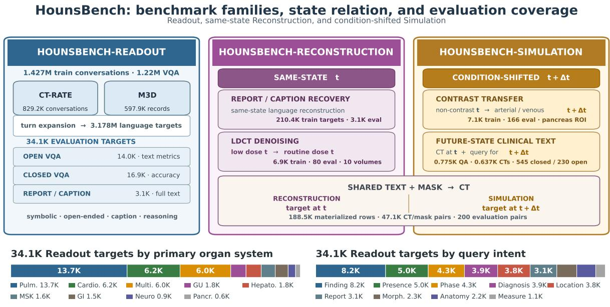  
Counts are materialized records/targets, not unique patients. Evaluation identities and deterministic subgroup labels are frozen before model scoring.  
Figure 5 Organization and scale of HounsBench, aligned with the main-paper taxonomy. The three equal-level panels summarize HounsBench-Readout, HounsBench-Reconstruction at t, and HounsBench-Simulation at t + ∆t. The shared text-and-mask-to-CT rail explicitly spans reconstruction and simulation. The lower bars report the complete 34.1K Readout evaluation distribution by primary organ system and query intent. Values use K units for compactness; conversation, target, paired-CT, future-text-QA, and volume counts denote distinct materialization units rather than patient counts.

## A.1 Units of Counting

We distinguish four units throughout this supplement. A conversation record is one stage-2 instruction item and is the unit seen by the data sampler. A QA turn is one human–assistant pair after multi-turn CT-RATE conversations are canonicalized. A paired-CT item is one input–target volume pair; several prompt variants may point to the same target volume. A future-state clinical-text QA is one temporally related clinical question paired with its reference answer. This distinction reconciles the rounded main-paper counts with the audit below: the final language pool contains 1,427,089 conversation records, approximately 1.22M of which are VQA conversations, and 3,178,213 assistant targets after turn expansion, including 2,967,840 VQA turns.

<table><tr><td>Source</td><td>Conversations (K)</td><td>Assistant targets (K)</td><td>Report/caption (K)</td><td>VQA turns (K)</td><td>VQA share (%)</td></tr><tr><td>CT-RATE</td><td>829.2</td><td>2,580.3</td><td>94.3</td><td>2,486.0</td><td>83.76</td></tr><tr><td>M3D</td><td>597.9</td><td>597.9</td><td>116.1</td><td>481.8</td><td>16.24</td></tr><tr><td>Total</td><td>1,427.1</td><td>3,178.2</td><td>210.4</td><td>2,967.8</td><td>100.00</td></tr></table>

Counts are displayed in thousands; unrounded values were retained throughout the audit. Conversation records are sampled by the trainer, whereas assistant targets and VQA turns are counted after dialogue expansion.

Table 5 Stage-2 CT–language inventory, organized by counting unit.
<table><tr><td>Family</td><td>CT task</td><td>State relation</td><td>Train (K)</td><td>Evaluation set</td><td>Spatial support</td></tr><tr><td>Reconstruction</td><td>LDCT denoising</td><td>low-dose t → routine-dose t</td><td>6.942</td><td>80 pairs / 10 volumes</td><td>Full paired volume</td></tr><tr><td>Simulation</td><td>Contrast transfer</td><td>non-contrast t → arterial/venous t + ∆t</td><td>7.101</td><td>166 pairs / 164 ROI-valid</td><td>Pancreas/duct/ lesion RÓI</td></tr><tr><td>Reconstruction/ Simulation</td><td>Text+mask- to-CT</td><td>text + 117-label mask → CT at t or t + ∆t</td><td>188.452</td><td>200 pairs / 193 masks</td><td>Full volume / CT-CLIP space</td></tr></table>

Text+mask rows include multiple text views per target CT and are reported jointly at $t / t + \Delta t ,$ matching the main-paper Reconstruction/Simulation label. Evaluation sets are fixed, patient-disjoint from the corresponding training pools, and do not represent complete source-dataset test partitions.

Table 6 State-conditioned CT inventory, organized by the Reconstruction/Simulation taxonomy used in the main paper.

## A.2 Scope and Source Data

Readout supervision is derived from CT-RATE Hamamci et al. (2026) and M3D Bai et al. (2024). CT-RATE provides chest CT volumes paired with radiology reports; M3D supplies whole-body CT image–text and VQA examples. Our CT-language instruction construction follows the data protocol introduced with OmniCT Lin et al. (2026); Section B states the operational transformations used in HounsBench and adds a turn-level canonicalization layer required by mixed language and CT-completion training. Report and caption targets remain in the Readout evaluation inventory because they share its language scoring protocol, while their full-state recovery is interpreted methodologically as same-state language reconstruction.

The state-conditioned CT pools use private collected cohorts and public CT data. They comprise low-doseto-routine-dose reconstruction at t, non-contrast-to-arterial/venous pancreatic simulation at $t + \Delta t .$ and text-plus-semantic-mask-conditioned CT generation spanning $t / t + \Delta t$ . Anatomical masks are inferred automatically with TotalSegmentator. All reported counts come from final materialized, patient-disjoint training and evaluation records rather than nominal source-dataset sizes. Figure 5 integrates source, supervision, state relation, organ-system, query-intent, and future-state clinical-text statistics into one benchmark map.

## B HounsBench-Readout Construction

## B.1 Clinical Fact Decomposition

The readout data follow the CT instruction-construction recipe of OmniCT Lin et al. (2026), while being reorganized here around patient-state readout. For CT-RATE, a report is decomposed into report-grounded clinical facts such as the observed structure, finding or disorder, presence state, and anatomical location. These facts are rendered into complementary question forms: open descriptions, presence questions, localization questions, disorder questions, and multiple-choice questions. Closed questions retain an explicit answer mapping, and distractors are drawn from clinically plausible alternatives rather than arbitrary words. Fullreport targets are retained as a separate supervision type.

For M3D, the released caption and VQA records are standardized to the same volume–question–answer schema. Short-answer and multiple-choice variants remain distinct, and caption requests are retained for CT–language alignment. We normalize role names and visual placeholders but do not rewrite the clinical target at load time. In both sources, a training item preserves the associated 3D CT path and its ordered dialogue.

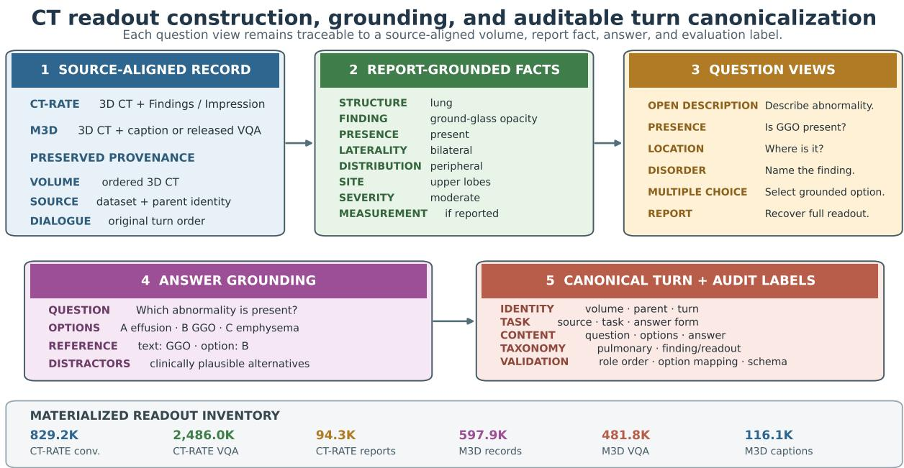  
Parent conversations are training samples; canonical turns are used for counting, evaluation, taxonomy, and subgroup analysis. Construction rules, evaluation identities, and taxonomy labels are frozen before model comparison.  
Figure 6 Readout construction and canonicalization. A source-aligned record is decomposed into report-grounded fact fields, rendered into complementary question views, paired with grounded answers and plausible distractors, and materialized as an auditable canonical turn. The example is schematic but uses the actual record fields. Clinical-fact and question construction follows the OmniCT data protocol Lin et al. (2026); HounsBench additionally preserves parent identities, canonical turn IDs, deterministic subgroup labels, and validation outcomes.

Figure 6 separates fact decomposition, answer-view construction, grounding, and canonicalization. This keeps every answer linked to report evidence while preserving reference text, option mappings, provenance, and fixed taxonomy labels. Path, role-order, option–answer, and schema checks run before materialization.

## B.2 Turn Canonicalization

M3D records contain a single assistant target, whereas CT-RATE can contain several alternating question– answer pairs in one conversation. We therefore define a canonical turn as

$$
t _ { i } = ( v , q _ { i } , a _ { i } , s , r ) ,\tag{13}
$$

where v is the CT volume, $q _ { i }$ and $a _ { i }$ are the ith question and answer, s is the source dataset, and r is the parent conversation identifier. The parent record remains the sampling unit during training, but canonical turns are used for counting, taxonomy statistics, and subgroup evaluation. This yields 2,485,991 CT-RATE and 481,849 M3D VQA targets (Table 5).

## B.3 Evaluation Split and Task Composition

The aligned CT-RATE and M3D evaluation set contains 34,058 language targets: 23,958 from CT-RATE and 10,100 from M3D. Table 7 gives the evaluated task blocks. Report/caption targets and open VQA are evaluated with free-text metrics, whereas multiple-choice and presence targets use parsed accuracy.

## B.4 Future-State Clinical Text at $t + \Delta t$

The future-state clinical-text component of HounsBench-Simulation asks a model to read the observed CT at t and select or describe a clinically related implication at $t + \Delta t \colon$ a recommended next action, an intervention or sequela timeline, a longitudinal change, an acute/chronic or recurrent state, a potential downstream consequence, or relevant history. This component contains 775 QA rows over 637 unique CT volumes. It complements contrast transfer and text-and-mask-conditioned CT; it is not the entirety of the Simulation family and does not claim unrestricted longitudinal trajectory generation.

<table><tr><td>Dataset</td><td>Task block</td><td>Answer form</td><td>Samples (K)</td><td>Scoring family</td></tr><tr><td rowspan="6">CT-RATE</td><td>Abnormality description</td><td>Open</td><td>3.038</td><td>Free-text metrics</td></tr><tr><td>Disorder description</td><td>Open</td><td>3.038</td><td>Free-text metrics</td></tr><tr><td>Location description</td><td>Open</td><td>2.895</td><td>Free-text metrics</td></tr><tr><td>Multiple choice</td><td>Closed</td><td>8.911</td><td>Parsed accuracy</td></tr><tr><td>Presence</td><td>Closed</td><td>3.038</td><td>Parsed accuracy</td></tr><tr><td>Report generation</td><td>Report</td><td>3.038</td><td>Free-text metrics</td></tr><tr><td rowspan="4">M3D</td><td>Open VQA</td><td>Open</td><td>5.000</td><td>Free-text metrics</td></tr><tr><td>Multiple-choice VQA</td><td>Closed</td><td>5.000</td><td>Parsed accuracy</td></tr><tr><td>Caption</td><td>Caption</td><td>0.100</td><td>Free-text metrics</td></tr><tr><td>Nine evaluated task blocks</td><td>Mixed</td><td>34.058</td><td>Reported by answer form</td></tr></table>

K denotes thousands of canonical targets. Open, closed, and report/caption targets are never collapsed into one metric because their scoring semantics difer.  
Table 7 CT-RATE and M3D evaluation inventory, grouped by answer and scoring form.

Question-driven selection. We first apply deterministic lexical and template rules to the question stem, reference answer, and answer options, producing three audit priorities. P1 requires the question itself to invoke time/change, a clinical action, or a potential consequence at t + ∆t. P2 contains a generic question whose reference alone reveals a temporal state; P3 contains future wording only in a distractor. The future-state clinicaltext component keeps P1 only, so neither an answer-side cue nor a distractor-only match defines membership. We further exclude acquisition-phase wording by itself, age-only mentions, and generic “increased/decreased” wording without explicit longitudinal context. Manual audit removed four M3D modal/proper-name false positives. P1/P2 candidates and P3 audit cases are retained separately so that the selection policy remains reversible.

Composition. Table 8 reports the task origin and intent of this t + ∆t clinical-text component. CT-RATE contributes 629 rows and M3D contributes 146; M3D supplies paired open and multiple-choice views of the same semantic question. Overall, 545 rows are closed-answer and 230 are open-answer. Intent matching is multi-label during auditing; for the mutually exclusive table, the first applicable label follows the displayed order. Action/follow-up recommendation is the largest component (333 rows), followed by intervention/sequela timeline (198) and longitudinal change (129).

## B.5 Organ-System and Query-Intent Taxonomies

To expose coverage beyond aggregate task labels, every VQA turn receives one primary organ-system label and one query-intent label. Organ labels are assigned from question evidence with reference-answer fallback. The nine organ systems are neuro/head–neck, pulmonary/pleural, cardiovascular/mediastinal, hepatobiliary, pancreas/spleen, genitourinary/adrenal, gastrointestinal, musculoskeletal/soft tissue, and multisystem/other. Query intent uses nine mutually exclusive labels: acquisition/phase, measurement/counting, presence/state, localization/laterality, diagnosis/etiology, morphology/attenuation, anatomy/organ identification, finding/readout, and report/caption.

The mapping is deterministic rather than learned. Source-specific CT-RATE task labels take precedence for abnormality, disorder, location, presence, and report questions; the remaining cases are resolved by an ordered lexical rule set. We retain a primary label for compact plots, even when a case mentions more than one organ. Patterns, precedence, subgroup-size thresholds, and canonical labels are frozen before scoring, preventing post-hoc relabeling based on model performance.

<table><tr><td>Composition view</td><td>Component</td><td>QA rows</td><td>Share (%)</td><td>Unique CTs</td></tr><tr><td rowspan="4">Source task</td><td>CT-RATE multiple choice</td><td>464</td><td>59.87</td><td>447</td></tr><tr><td>CT-RATE localization</td><td>157</td><td>20.26</td><td>157</td></tr><tr><td>CT-RATE presence</td><td>8</td><td>1.03</td><td>8</td></tr><tr><td>M3D paired open/closed VQA</td><td>146</td><td>18.84</td><td>63</td></tr><tr><td rowspan="2">Answer form</td><td>Closed answer</td><td>545</td><td>70.32</td><td>515</td></tr><tr><td>Open answer</td><td>230</td><td>29.68</td><td>220</td></tr><tr><td rowspan="6">Primary simulation intent</td><td>Action / follow-up recommendation</td><td>333</td><td>42.97</td><td>332</td></tr><tr><td>Intervention or sequela timeline</td><td>198</td><td>25.55</td><td>172</td></tr><tr><td>Longitudinal change</td><td>129</td><td>16.65</td><td>95</td></tr><tr><td>Clinical temporal state</td><td>71</td><td>9.16</td><td>34</td></tr><tr><td>Potential downstream consequence</td><td>39</td><td>5.03</td><td>20</td></tr><tr><td>History context</td><td>5</td><td>0.65</td><td>5</td></tr><tr><td>Total</td><td>Future-state clinical text</td><td>775</td><td>100.00</td><td>637</td></tr></table>

Unique-CT counts are unions within each row and are not additive across rows because one volume can support multiple QA views. All matched intent labels are retained during auditing; the primary label is used only to make the six intent rows mutually exclusive.

Table 8 Selection and composition of the t + ∆t clinical-text component within HounsBench-Simulation.

The evaluation set is chest-heavy: 40.17% of targets receive the pulmonary/pleural label and 18.27% the cardiovascular/mediastinal label. The most common query intents are finding/readout (24.11%), presence/state (14.73%), acquisition/phase (12.52%), diagnosis/etiology (11.45%), and localization/laterality (11.23%). Figure 5 visualizes the complete distribution in K units, including long-tail abdominal and musculoskeletal systems.

## C HounsBench Reconstruction and Simulation Construction

## C.1 Low-Dose Denoising

Low-dose denoising belongs to HounsBench-Reconstruction because it recovers a spatially matched routine/reconstructed-dose observation of the same patient state at t. The training pool contains 6,942 pairs, and the evaluation set contains 80 pairs from ten cases. This task emphasizes density recovery and preservation of anatomical boundaries under acquisition noise; it is used as auxiliary supervision rather than as evidence that generated images should replace diagnostic reconstruction.

## C.2 Contrast Transfer

Contrast transfer belongs to HounsBench-Simulation: it maps a non-contrast pancreatic CT patch observed at t to the registered arterial or venous observation requested at t + ∆t for the same patient and spatial region. The 7,101-pair training pool contains 3,550 arterial and 3,551 venous targets. The evaluation set contains 83 non-contrast patches, each paired with both phases, for 166 pairs. Holding patient and patch position fixed makes this a bounded condition-shifted prediction of phase-dependent parenchymal and lesion appearance rather than unrestricted disease forecasting.

## C.3 Text-and-Mask-to-CT

Text-and-mask-to-CT spans HounsBench-Reconstruction and HounsBench-Simulation because the same interface can instantiate a target observation at t or a requested condition at $t + \Delta t .$ Consistent with the main paper, its inventory and metrics are reported jointly as Reconstruction/Simulation. The rounded 188K count in the main paper denotes materialized prompt-conditioned training examples; the underlying inventory contains 47,113 unique target CT/mask pairs. The text condition is not the untouched CT-RATE report: we use the pipeline in Figure 7 to convert variable free text into controllable patient-state descriptions.

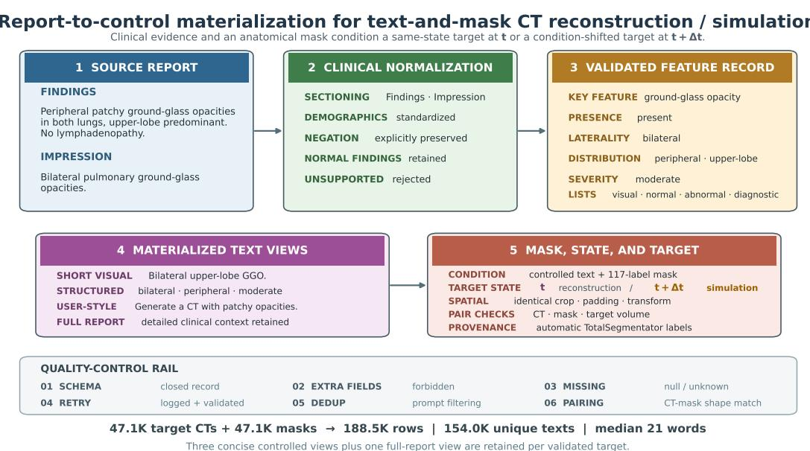  
Three concise controlled views plus one full-report view are retained per validated target.  
Figure 7 Report-to-control materialization for text-and-mask-conditioned CT reconstruction/simulation. The upper path shows report sectioning, normalization, and a concrete structured-feature example; the lower path shows four retained text views, spatial pairing with a 117-label TotalSegmentator mask, the highlighted target-state choice t/t + ∆t, and the validation rail. Counts at the bottom distinguish target CTs, masks, materialized rows, and unique texts.

Report sectioning and normalization. We first separate Findings and Impression and normalize demographic expressions without changing the clinical target. An instruction model then converts the report into a constrained clinical representation that separates salient visual features, explicitly normal observations, abnormal observations, and optional diagnostic labels. The controlled vocabulary covers ground-glass opacity, consolidation, nodules, emphysema, fibrosis/scarring, bronchiectasis, pleural efusion, lymphadenopathy, heart size, and overall lung aeration. Feature attributes encode presence, laterality, spatial distribution, severity, and the largest nodule diameter when explicitly stated. Diagnostic labels cover normal examination, pneumonia, COVID-19 pneumonia, and COPD-related change without inferring an unreported diagnosis.

The representation must pass a closed clinical schema: unsupported fields are rejected, unmentioned observations remain absent or unknown, and failed outputs are regenerated and checked again. This prevents unsupported free-form prose from entering the conditioning text. The representative example in Figure 7 illustrates how bilateral, peripheral, upper-lobe-predominant ground-glass opacity becomes a controllable combination of presence, laterality, distribution, and severity.

Control-focused prompt materialization. We rank clinically informative abnormal features, select at most two primary controls, and retain a limited number of secondary or normal constraints. A deterministic renderer produces short visual, medium visual, user-style, structured, and diagnosis-enhanced candidates. It orders distribution tags, combines normalized spatial modifiers with natural key-visual phrases, removes redundant minor findings, and adds a normal constraint only when explicitly supported. Three concise prompts are selected for each target, and one full-report-conditioned prompt is retained to preserve detailed language. Thus each validated target CT/mask normally contributes four training conditions.

The final materialization contains 188,452 rows associated with 47,113 target CT volumes and 47,113 aligned masks, and includes 154,026 unique prompt strings. Prompts have a median length of 21 words; the mean is 75.00 words because the fourth view retains the complete report. These paired concise/full conditions deliberately expose the model to both direct control language and clinically rich context.

Fine-grained HounsBench open-VQA performance (%, higher is better)  
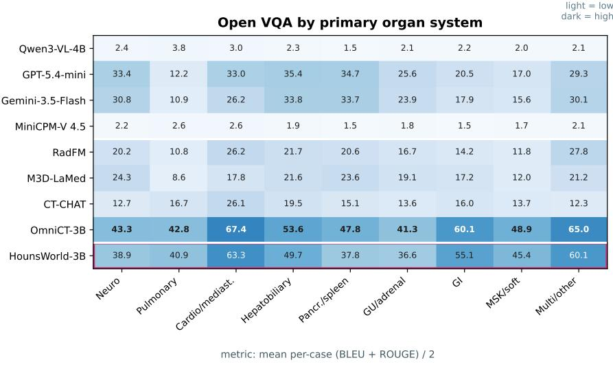  
Bold = column best; magenta outline = HounsWorld-3B; cells with fewer than 10 evaluated cases are omitted.

Figure 8 Fine-grained open-VQA performance grouped by primary organ system and scored with per-case (BLEU + ROUGE)/2. Bold cells are column maxima; the outlined row is HounsWorld. Values are percentages, and groups with fewer than ten evaluated examples are omitted. These descriptive diagnostics are not the main-paper composite.

Mask provenance. All semantic conditions are automatically inferred by TotalSegmentator Wasserthal et al. (2023) and transformed with the paired CT. Our 117-label mapping covers the foreground anatomical structures used for conditioning. These masks are model-generated anatomical conditions, not radiologist-drawn ground truth. Their automatic provenance should be considered when interpreting mask-conditioned generation results.

## D Evaluation Protocol and Fine-Grained Readout

## D.1 Readout Metrics

Closed VQA uses CT-FAIR parsed accuracy. The parser accepts explicit answer letters and conservative option-text matches, handles yes/no semantics for presence questions, and counts unparseable predictions as incorrect when the reference is valid. Open VQA and report/caption targets use BLEU Papineni et al. (2002), ROUGE Lin (2004), RadGraph-XL Delbrouck et al. (2024), and BioBERTScore Zhang et al. (2020); Lee et al. (2020). The main-paper open score is

$$
S _ { \mathrm { o p e n } } = 0 . 1 S _ { \mathrm { B L E U } } + 0 . 1 S _ { \mathrm { R O U G E } } + 0 . 4 S _ { \mathrm { R G } } + 0 . 4 S _ { \mathrm { B i o B E R T } } .\tag{14}
$$

The fine-grained figure below serves a diferent diagnostic purpose. Because per-case RadGraph-XL and BioBERTScore values were not available uniformly for every external API model, its open-VQA cells use the lexical score $( S _ { \mathrm { B L E U } } + S _ { \mathrm { R O U G E } } ) / 2$ . This organ-level view is reported as a descriptive analysis rather than as the main-paper composite.

The $t + \Delta t$ clinical-text component of HounsBench-Simulation in Section B.4 inherits this answer-form separation: its 545 closed questions use parsed accuracy, while its 230 open questions use $( S _ { \mathrm { B L E U } } + S _ { \mathrm { R O U G E } } ) / 2$ We report the two values independently because a row-weighted average would conflate exact option selection with lexical overlap.

Figure 8 shows that the organ taxonomy exposes substantial variation hidden by task-level averages. For HounsWorld, the strongest open-overlap categories are cardiovascular/mediastinal (63.3), multi-

<table><tr><td>Branch</td><td>Task</td><td>Primary measures</td><td>Direction</td><td>Scoring support</td></tr><tr><td rowspan="2">Readout</td><td>Closed VQA</td><td>Parsed accuracy</td><td>↑</td><td>Valid closed-form targets</td></tr><tr><td>Open/report</td><td>BLEU; ROUGE; RadGraph-XL; BioBERTScore</td><td>↑</td><td>Per-target text</td></tr><tr><td>Reconstruction</td><td>LDCT denoising t</td><td>PSNR; SSIM; normalized RMSE</td><td>↑,↑,↓</td><td>Full paired volume</td></tr><tr><td rowspan="3">Simulation</td><td>Contrast transfer  $t + \Delta t$ </td><td>ROI-PSNR; ROI-SSIM; ROI-RMSE</td><td>↑,↑,↓</td><td>Pancreas/duct/ lesion union</td></tr><tr><td>Closed VQA  $t + \Delta t$ </td><td>Parsed accuracy</td><td>↑</td><td>545 closed-form targets</td></tr><tr><td> $\mathrm { O p e n ~ V Q A }$   $t + \Delta t$ </td><td>BLEU; ROUGE</td><td>↑</td><td>230 free-text targets</td></tr><tr><td>Reconstruction/ Simulation</td><td>Text+mask-  $\scriptstyle \mathrm { t o - C T }$   $t / t + \Delta t$ </td><td>PSNR; 103× CT-KID; LPIPS</td><td>↑,小,↓</td><td>Full volume / CT-CLIP space</td></tr></table>

Arrows follow the measure order within each row. Readout and future-state clinical-text answer forms remain separate. CT completion is the shared prediction operator; the displayed family labels follow the same-state t versus condition-shifted $t + \Delta t$ organization used in the main paper.

Table 9 Evaluation measures, direction, spatial support, and main-paper HounsBench family assignment.

system/other (60.1), gastrointestinal (55.1), and hepatobiliary (49.7). We treat these values as descriptive subgroup diagnostics, not as independent clinical validation.

## D.2 Reconstruction and Simulation Metrics

All paired CT arrays are clipped to [−1000, 1000] HU and linearly mapped to [0, 1]. Reconstruction by LDCT denoising at t reports volume PSNR and normalized RMSE together with slice-averaged SSIM Wang et al. (2004). Simulation by contrast transfer at $t + \Delta t$ reports the same metrics inside a pancreas-centered semantic ROI. The ROI is the union of pancreas, pancreatic duct when retained for PDAC cases, and pancreatic lesion labels. PSNR/RMSE operate on all ROI voxels; ROI-SSIM averages pixels whose full $1 1 \times 1 1$ support lies inside an eroded semantic mask. Of the 166 contrast-transfer evaluation pairs, 164 contain a valid ROI.

Text-and-mask-to-CT reports PSNR, LPIPS Zhang et al. (2018), and CT-KID. LPIPS uses an AlexNet backbone on axial slices replicated to three channels, followed by volume- and sample-level averaging. CT KID is a KID-style unbiased cubic-kernel MMD in a 512-dimensional CT-CLIP embedding space. It uses 100 random subsets of 100 generated and reference volumes. For readability, we report $1 0 ^ { 3 } \times$ CT-KID, matching the numerical scale used in the main paper; the underlying estimator is not bounded to [0, 1].

## E Qualitative Visualization

We visualize two cases for each of two state-conditioned CT tasks. Non-contrast-to-contrast transfer is a HounsBench-Simulation task that predicts a requested observation at $t + \Delta t$ ; text-and-mask-to-CT spans HounsBench-Reconstruction/HounsBench-Simulation at $t / t + \Delta t .$ Figures 9–12 show the conditioning input, baseline outputs, the HounsWorld output, and paired ground truth over the same axial positions. These examples expose whether a method changes only global appearance or preserves conditionspecific anatomy and tissue behavior across the volume.

## E.1 Contrast Transfer

Figures 9 and 10 visualize bounded condition-shifted prediction from non-contrast t to arterial/venous $t + \Delta t .$ They reveal that visually brighter output does not necessarily represent physically meaningful contrast transfer. MedDif applies a broad, smooth intensity change whose enhancement is poorly localized to vessels or perfused parenchyma. This is especially apparent in Case 2, where large abdominal regions become nearly saturated without the organ-dependent enhancement pattern expected from a venous acquisition. SMILE better preserves the input geometry, but its enhancement remains incomplete. In Case 1 it enhances the arterial lumen while leaving hepatic and renal parenchyma close to the non-contrast input. In Case 2 the liver receives some enhancement, whereas renal enhancement is largely neglected.

By comparison, HounsWorld couples vascular enhancement with changes in liver and kidney appearance and maintains these changes across adjacent slices. The renal enhancement pattern and the transition of abdominal structures are consequently closer to the paired target. The examples also expose a remaining limitation: fine parenchymal texture and small vascular detail are smoother than in the ground truth. Thus, the principal qualitative advantage is coordinated, spatially persistent phase transfer rather than simple intensity amplification.

## E.2 Text-and-Mask-to-CT Generation

Figures 11 and 12 show substantial case-to-case variation for GenerateCT. In Case 1 it synthesizes relatively plausible pulmonary texture, but the overall CT anatomy and spatial semantics are weakly controlled with respect to the supplied mask and target. The abdominal sequence in Case 2 is smoother and more coherent internally, yet its body geometry and organ arrangement still do not follow the case-specific spatial condition. This behavior is consistent with a text-only interface: textual findings can influence appearance, but they do not specify the voxel-level anatomical layout.

MAISI receives the semantic mask and therefore has access to coarse spatial structure, but its fine appearance control remains limited. Case 1 contains irregular, non-physical pulmonary noise and peripheral texture that are not supported by the requested state. In Case 2, organ topology, tissue boundaries, and internal texture are poorly resolved despite the mask condition. Moreover, a mask-only interface cannot express the textual abnormality controls available to the other methods. HounsWorld combines the complementary conditions: its organ layout more consistently follows the semantic mask while the text controls the requested patient state. Across the displayed slices, it also exhibits more coherent anatomical progression. Nevertheless, its fine lung texture and small intra-organ structures remain smoother than the paired ground truth, indicating that spatial-semantic control improves before full high-frequency fidelity is reached.

Case 1 · Prompt: Convert this non-contrast CT sequence into the arterial-phase contrast-enhanced CT sequence while preserving anatomical structures, lesion morphology, and spatial consistency across slices.

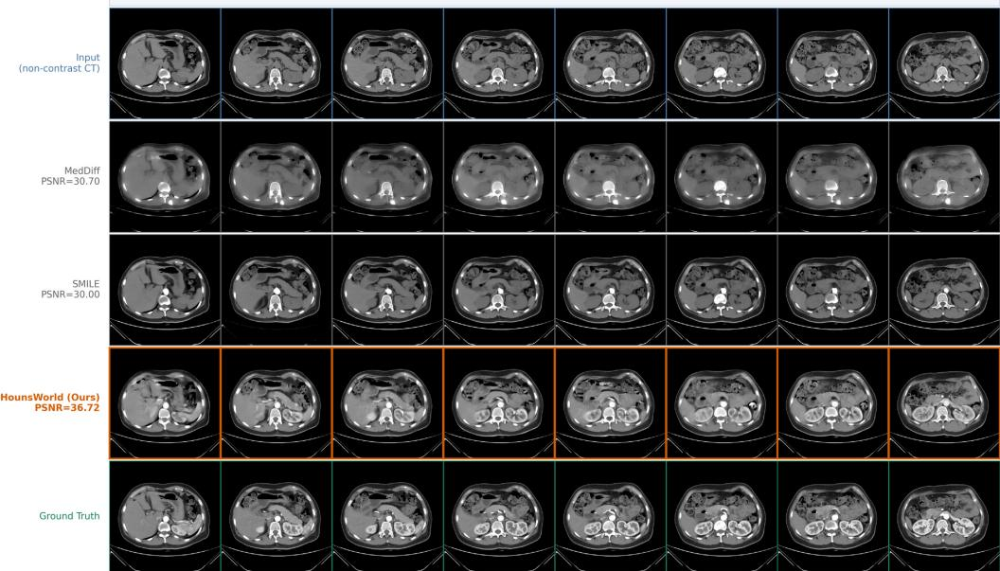  
Figure 9 Arterial-phase HounsBench-Simulation at $t + \Delta t ,$ Case 1. Rows show the non-contrast input at t, MedDif, SMILE, HounsWorld, and the paired arterial-phase ground truth. MedDif produces difuse intensity amplification, while SMILE enhances the arterial lumen but under-enhances liver and kidney parenchyma. Displayed PSNR values are volume-level ROI-PSNR.  
Case 2 · Prompt: Convert this non-contrast CT sequence into the venous-phase contrast-enhanced CT sequence while preserving anatomical structures, lesion morphology, and spatial consistency across slices.

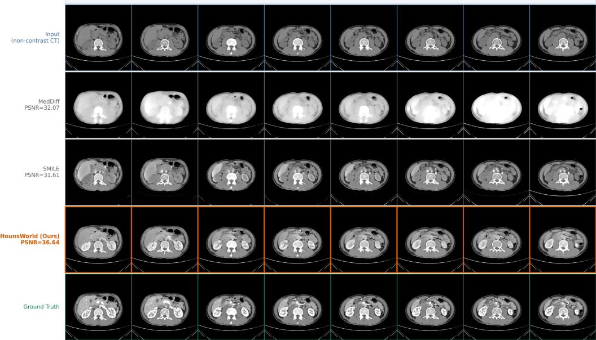  
Figure 10 Venous-phase HounsBench-Simulation at $t + \Delta t ,$ Case 2. Rows follow Figure 9. MedDif yields a spatially difuse, nearly saturated response; SMILE partially enhances the liver but largely misses the renal response. HounsWorld produces more coordinated enhancement across vascular and parenchymal structures. Displayed PSNR values are volume-level ROI-PSNR.

Case 1 · Prompt: Generate a clinically realistic CT volume matching the provided anatomical segmentation mask. Clinical instruction: a chest CT showing multiple small subpleural pulmonary nodules (up to 5 mm) with bilateral mild emphysema.

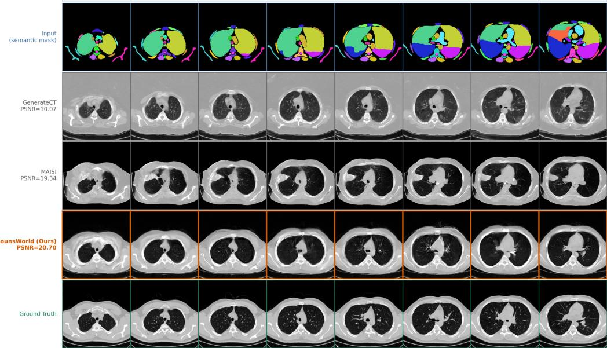  
Figure 11 Text-and-mask-to-CT Reconstruction/Simulation at $t / t + \Delta t ,$ Case 1. GenerateCT receives text only, MAISI receives the semantic mask only, and HounsWorld receives both text and mask. GenerateCT produces plausible lung texture but weak case-specific spatial control; MAISI introduces irregular pulmonary noise, whereas the joint condition better preserves anatomical organization. The bottom row is the paired ground truth.  
Case 2 · Prompt: Generate a clinically realistic CT volume matching the provided anatomical segmentation mask. Clinical instruction: a chest CT of a 58-year-old male with bilateral focal lower-lobe-predominant ground-glass opacities and bilateral pulmonary nodules.

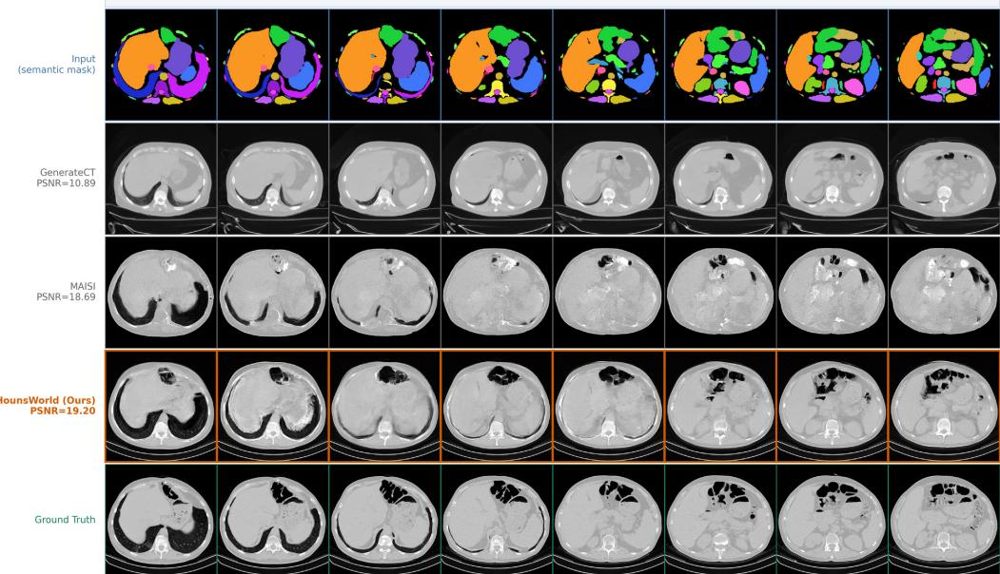  
Figure 12 Text-and-mask-to-CT Reconstruction/Simulation at $t / t + \Delta t ,$ Case 2. GenerateCT receives text only, MAISI receives the semantic mask only, and HounsWorld receives both text and mask. The text-only output does not follow the case-specific organ layout, while the mask-only output retains weak organ boundaries and texture. Joint conditioning provides more consistent anatomical progression, although fine detail remains below the paired ground truth.

## F Minimal Architecture and Training Details

## F.1 Variable-Depth CT Handling

The semantic and generative routes impose diferent depth congruence constraints. For an input of depth D, the ViT route requires a multiple of three slices,

$$
D _ { \mathrm { V i T } } = 3 \left\lceil D / 3 \right\rceil ,\tag{15}
$$

whereas the VAE route requires a depth of the form $1 + 4 X$ 2

$$
D _ { \mathrm { V A E } } = 1 + 4 \left\lceil ( D - 1 ) / 4 \right\rceil .\tag{16}
$$

If the input does not meet the corresponding constraint, boundary slices are padded along the cranio-caudal axis to the next admissible depth. Source CT, target CT, and semantic mask receive the same padding. Padding is removed after decoding before computing paired metrics.

## F.2 Two-Stage Optimization

Training samples CT–language supervision, LDCT denoising, contrast transfer, and text-and-mask-to-CT with configured 60/10/10/20 weights, not guaranteed observed proportions. Both stages use language CE weight 1.0 and CT flow-matching/MSE weight 0.25; Table 10 summarizes the remaining configuration.

<table><tr><td></td><td>Stage 1: CT alignment</td><td>Stage 2: joint adaptation</td></tr><tr><td>Language pool</td><td>163.2K report/caption conversations</td><td>1,427.1K CT–language conversations</td></tr><tr><td>Sampling mixture</td><td>CT-language alignment</td><td>60/10/10/20 task weights</td></tr><tr><td>Trainable modules</td><td>Three bottleneck-128 residual CT adapters</td><td>ViT/merger, token embeddings, both Qwen2-MoT routes, LM head, and CT adapters</td></tr><tr><td>Frozen modules</td><td>Visual encoder, language model, Wan VAE, and Lance latent connectors</td><td>Wan VAE and pretrained Lance latent connectors</td></tr><tr><td>Learning rate</td><td> $2 \times 1 0 ^ { - 4 } ;$  100 warmup steps</td><td> $2 \times 1 0 ^ { - 5 } ;$  200 warmup steps</td></tr><tr><td>Loss weights Precision / parallelism bfloat16 FSDP on 16 GPUs</td><td>CE = 1.0; CT flow-matching/MSE = 0.25</td><td>CE = 1.0; CT flow-matching/MSE = 0.25</td></tr><tr><td>Final step</td><td>1,170</td><td>bfloat16 FSDP on 16 GPUs 9,943</td></tr></table>

Sampling ratios are configured sampler weights, not guarantees that every unique item is observed in that exact proportion. Both stages stop after their first language-pool cycle.

Table 10 Released two-stage training configuration, grouped by data, modules, and optimization.

Training uses bfloat16 FSDP on 16 GPUs with a constant learning-rate schedule. Stage 2 initializes from the independent Stage-1 checkpoint; “joint adaptation” does not update the frozen Wan VAE.

## G Quality Control, Reproducibility, and Limitations

Schema and pairing checks. Every readout item is required to contain an available CT volume and an alternating human–assistant sequence. Reconstruction/Simulation CT pairs are checked for source/target shape agreement, and the same spatial transformation is replayed for CT and masks. Structured report conversion uses schema validation and retry logging. Aggregate counts are regenerated from the frozen benchmark state under the same deterministic rules.

Automatic labels. TotalSegmentator masks are automatic pseudo-labels. They enable scalable spatial conditioning but can inherit segmentation errors, especially for small or abnormal structures. The organ/intention taxonomy is also automatic and rule-based. It is useful for coverage audits and deterministic subgroup plots, but it is not a substitute for radiologist adjudication.

Metric interpretation. Text-overlap measures may favor concise answers and do not fully measure clinical correctness. RadGraph-XL and BioBERTScore improve semantic sensitivity but can behave poorly on extremely short answers. Completion fidelity metrics measure agreement with paired targets; they do not establish diagnostic interchangeability. CT-KID is a finite-sample MMD estimator in CT-CLIP space and should be interpreted comparatively under an identical protocol.

Privacy and release. The supplementary statistics expose only aggregate counts, deterministic category labels, and benchmark identifiers. They do not release protected patient metadata. Dataset access and redistribution remain governed by the licenses and use agreements of CT-RATE, M3D, and the contributing clinical sources.

Reproducibility protocol. Canonical evaluation identities, future-state clinical-text selection rules, taxonomy precedence, subgroup-size thresholds, and scoring families are fixed before model comparison. Open and closed subgroup results are maintained separately throughout aggregation to prevent accidental cross-scale averaging.