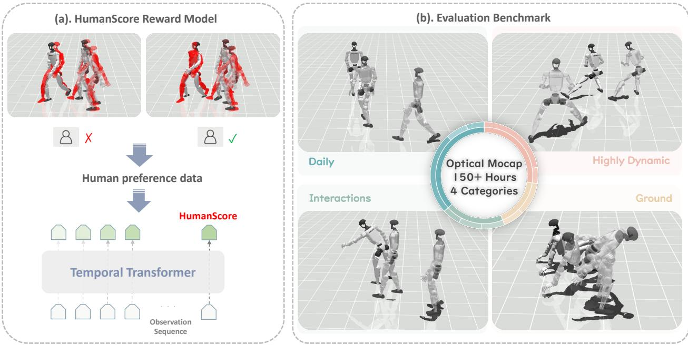
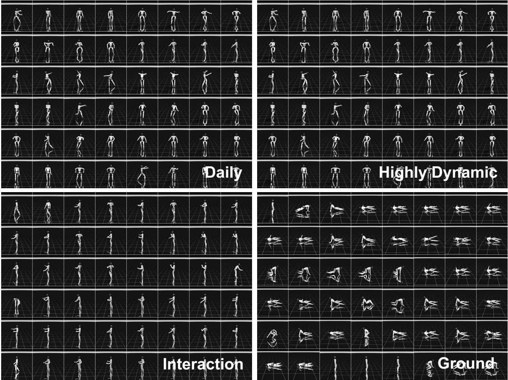
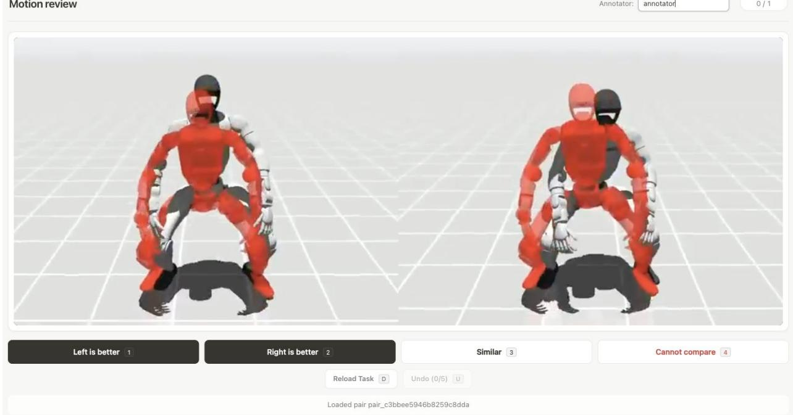
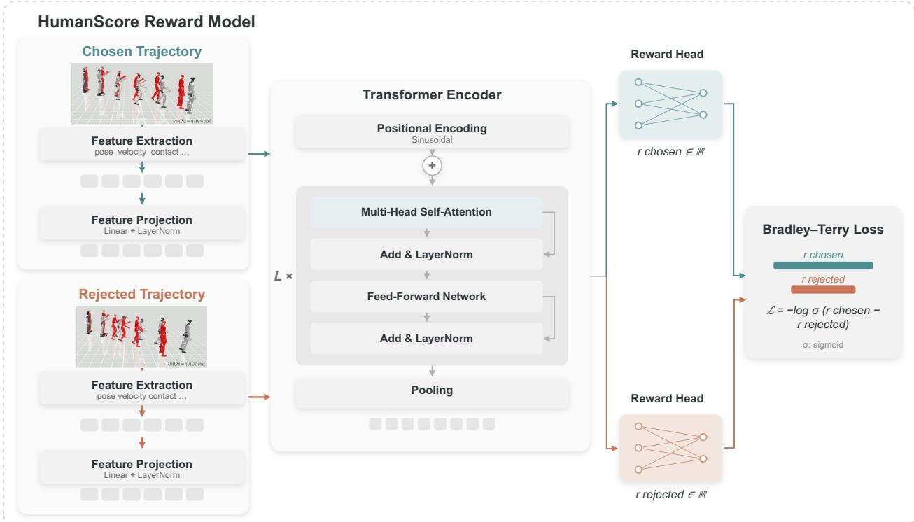
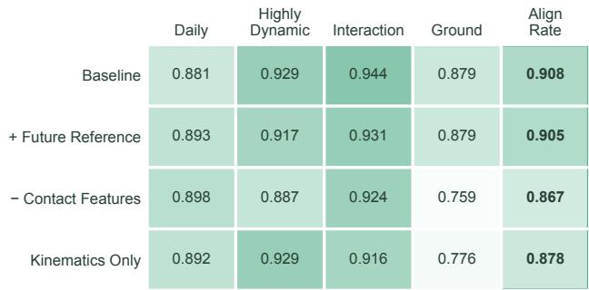
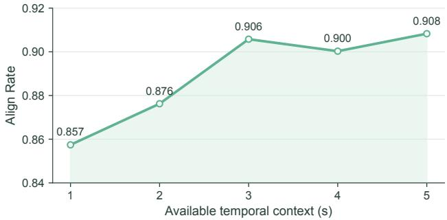

# HumanTracker: Towards Comprehensive and Human-Aligned Motion Tracking Benchmark

Dairu Liu1,3,∗, Zekun Qi2,3,∗, Jiayu Zeng3,∗, Ruixi Yu2,3, Yu Guan2,3, Yintianrun Zhang3, Xuchuan Chen2,3, Sikai Liang3,4, Zekai Li2,3, Chenghuai Lin3, Xinqiang Yu3, Wenyao Zhang4, He Wang3,5,†, Li Yi2,3,6,†

1Nankai University 2Tsinghua University 3Galbot 4Shanghai Jiao Tong University 5Peking University 6Shanghai Qi Zhi Institute

∗Equal Contribution, †Corresponding author

Humanoid motion tracking is central to teleoperation and whole-body imitation, yet evaluation often disagrees with what people perceive in videos. Kinematic errors average per-frame pose diferences but miss the physical artifacts that matter most, particularly unstable support and incorrect contacts such as foot skating and mistimed touch-downs. Meanwhile, widely used test suites are small and lack the diversity needed to stress contact-rich, long-horizon behaviors. We introduce HumanTracker to make humanoid tracking evaluation both perceptually aligned and scalable. The HumanTracker benchmark contains approximately 153 hours of optical motion trajectories from multiple professional performers, organized into four motion families with text labels for fine-grained diagnosis. We further propose HumanScore, a preference-aligned metric trained on 12K motion pairs containing 24K motions. Across representative state-of-the-art trackers, HumanScore better predicts human preferences and reveals contact and stability failures that kinematic metrics often miss.

Date: August 14, 2026

Project Page: https://dairuliu.github.io/humantracker Code: https://github.com/GalaxyGeneralRobotics/HumanTracker

  
Figure 1 HumanTracker overview. Left: we train a Human-Aligned Reward Model on pairwise preference data from tracking rollouts, producing a scalar HumanScore via a temporal Transformer. Right: the HumanTracker Benchmark provides 153 hours of motion trajectories across four families: daily tasks, highly dynamic motions, interaction motions, and ground-level movements.

## 1 Introduction

Motion tracking is becoming the cornerstone of humanoid robot control [22, 4, 24, 42, 19, 30, 37]. This ability drives applications in teleoperation and wholebody imitation [43, 44, 9, 7, 16, 10, 6]. Most systems track a reference motion using a learned feedback policy in physics simulation [22, 4, 24, 42]. Yet, measuring the true quality of this tracking remains surprisingly dificult. Two major issues currently limit progress in this field.

The first major issue is how we measure success. Motion tracking looks easy to measure: one can compare the rollout pose to the reference pose and report kinematic errors such as mean joint error and key point error [4, 24, 42, 49, 29]. However, we find a clear gap between these numbers and what people see in videos. A rollout may achieve low kinematic error but still look bad, especially under contacts [12, 41, 1, 40]. Feet may slide on the ground, and contacts may break and reattach at the wrong time; these artifacts are exactly what contact-aware global motion reconstruction and refinement methods target in video-based settings as well [32, 47, 45]. These artifacts are the key aspect to decide whether the motion looks stable, smooth and human-like.

This gap is not a corner case but a consequence of what kinematic metrics measure. By treating tracking as a per-frame pose matching problem and averaging errors over joints and time, these metrics fail to capture contact, support, balance, and the accumulation of errors in closed-loop control. As a result, two rollouts can have similar pose errors yet difer substantially in stability. Observers reliably prefer the rollout with clean contacts and steady support, even when MPJPE is similar. Figure 1 highlights this mismatch.

The second major issue is the scope of evaluation data. Despite the availability of large motion repositories such as PHUMA [12] and SONIC [24], the most commonly used evaluation suite for humanoid tracking is still an AMASS test set with only 140 sequences [26]. This small set lacks diversity and under-represents the long tail of human movement, including challenging contact transitions, asymmetric balancing, and complex recoveries. Moreover, results are often summarized as a single aggregate score, without a detailed breakdown by motion category, making it dificult to pinpoint exactly where and why a tracker fails. Table 1 compares HumanTracker with representative large-scale motion datasets in scale, categorization and text annotation.

We introduce HumanTracker to address these problems. To address the metric misalignment, we develop a preference-aligned evaluation: we collect human comparisons on synchronized tracking videos and train a reward model to predict these preferences [5, 27, 38]. We call this metric HumanScore. Unlike joint error, HumanScore explicitly targets human preferences, perceptual stability, and realistic physical contacts. It penalizes the exact physical artifacts that look wrong to human observers. Importantly, we demonstrate that HumanScore captures nuanced perceptual qualities that cannot be simply reduced to rule-based diagnostics such as foot slip or root drift. Extensive experiments and visual analyses demonstrate the accuracy and zero-shot generalization of HumanScore.

Table 1 Comparison of large-scale humanoid motion datasets. HumanTracker uniquely provides approximately 153 hours of motion trajectories explicitly organized into distinct motion categories for comprehensive evaluation.
<table><tr><td>Dataset</td><td>Clips</td><td>Hours</td><td>Categories</td><td>Text Label</td></tr><tr><td>AMASS [26]</td><td>&gt;11K</td><td>&gt;40</td><td>No</td><td>No</td></tr><tr><td>HumanML3D [2]</td><td>14.6K</td><td>28.6</td><td>No</td><td>Yes</td></tr><tr><td>PHUMA [12]</td><td>76K</td><td>73</td><td>No</td><td>No</td></tr><tr><td>HumanTracker</td><td>25K</td><td>153</td><td>4</td><td>Yes</td></tr></table>

To address the lack of diversity in existing test suites, we provide approximately 153 hours of optical motion trajectories paired with category and text labels, complementing existing large-scale motion sources [26, 20, 46, 12]. All source motions are recorded in a controlled studio with a multicamera optical system by 24 professional performers, including dance teachers and fitness coaches, yielding high-fidelity references for contact-rich tracking evaluation. We explicitly organize the dataset into four distinct families covering daily tasks, highly dynamic movements, interaction motions, and groundlevel motions, enabling per-family metrics and finegrained diagnosis of failure modes. HumanTracker substantially exceeds prior mocap datasets used for humanoid tracking. We comprehensively evaluate several state-of-the-art trackers, including GMT, TWIST2, SONIC, and Humanoid-GPT, under our benchmark [4, 44, 24, 29].

In summary, our main contributions are threefold. First, we highlight the failure of traditional kinematic metrics and introduce HumanScore to align evaluation with humans. Second, we provide a massive motion tracking benchmark featuring approximately 153 hours of diverse, categorized optical trajectories. Third, we establish a rigorous and standardized evaluation protocol to ensure future progress in humanoid tracking is both measurable and meaningful.

  
Figure 2 Motion taxonomy. HumanTracker groups motions into four families according to their dominant tracking and contact regimes. The taxonomy supports category-level diagnosis rather than only a single aggregate score.

## 2 Related Work

## 2.1 Humanoid motion tracking

DeepMimic [28] established reference conditioned policy learning for physics-based character control. PHC and UHM [22, 23] extended this paradigm to diverse humanoid motion. Recent systems broaden motion coverage and control robustness through several mechanisms. GMT, SONIC, Humanoid-GPT and Uni-Tracker [4, 24, 29, 42] emphasize scale and general tracking. ResMimic, MHC and iCTRL [52, 6, 40] explore residual correction, multimodal commands and constrained control. Any2Track [49] adapts tracking policies to changes in terrain, external forces and physical properties. HumanoidPF [39] uses a humanoid potential field to learn collision avoidance skills for cluttered indoor scenes. Adversarial Differential Discriminators [51] provide a learned motion imitation objective. OmniTrack [17] constructs physically consistent references, while LIMMT [8] studies how carefully selected training motions can improve tracking. The same capability underpins whole-body teleoperation and imitation systems, including TWIST, OmniH2O, HumanPlus, CLONE and H2O [43, 9, 7, 16, 10]. These advances have produced increasingly capable trackers, but their reported performance is dificult to compare because results depend not only on the learned policy, but also on the reference set, simulator, action representation, initialization, and termination rule. HumanTracker therefore treats evaluation as a controlled experiment. Tracker specific policy interfaces are preserved, whereas the reference representation, rollout accounting, and reported metrics are standardized.

## 2.2 Motion data evaluation

Large motion repositories such as AMASS, Motion-X and Motion-X++ [26, 20, 46] have substantially expanded the diversity of human motion available for learning. Recent works [2, 48, 14, 50] further support semantic retrieval and conditional generation. For humanoid tracking, however, dataset size alone does not define a useful benchmark. Human motion must also be retargeted to the robot morphology, remain physically plausible around contacts, and contain sufficiently dificult regimes to expose controller failures. PHUMA, OmniRetarget and GMR [12, 41, 1] address these requirements through physically grounded data or robot retargeting. WHAM, ProxyCap and RoHM [32, 47, 45] address related errors in global human motion reconstruction. Switch-JustDance [11] provides a complementary benchmark based on wholebody skills from a commercial motion game. Existing tracking evaluations nevertheless remain concentrated on comparatively small test sets and often collapse heterogeneous motions into one aggregate value. HumanTracker complements prior motion sources with a large, explicitly categorized test bed whose four families separate steady locomotion, rapid impact rich motion, interaction motions, and ground level transitions with multiple contacts.

Table 2 HumanTracker dataset statistics. The benchmark contains approximately 153 hours and 25K clips across four complementary tracking regimes.
<table><tr><td>Family</td><td>Hours</td><td>#Clips</td><td>Typical challenges</td></tr><tr><td>Daily</td><td>89</td><td>9.7k</td><td>steady locomotion, mild contacts</td></tr><tr><td>Highly Dynamic</td><td>11</td><td>2.7k</td><td>impacts, aerial phases, fast footwork</td></tr><tr><td>Interaction</td><td>48</td><td>10.9k</td><td>human-like, stable, smooth hands-body coordination</td></tr><tr><td>Ground</td><td>5</td><td>1.6k</td><td>low posture, multi-contact transitions</td></tr><tr><td>Total</td><td>153</td><td>25K</td><td>diverse</td></tr></table>

## 3 HumanTracker: Benchmark and Preference-Aligned Evaluation

## 3.1 The HumanTracker benchmark

Motion collection and processing. The released HumanTracker benchmark contains approximately 153 hours of optical motion trajectories from 24 professional performers. The performers include dance teachers, fitness coaches, tennis coaches and full-time motion-capture actors. The performers and recording plan were chosen to cover both routine movement and motions that place substantially diferent demands on a humanoid controller. We retarget each fitted human motion to the benchmark humanoid using General Motion Retargeting (GMR) [1]. Because a visually valid human recording is not automatically a valid robot reference, we inspect the retargeted sequences and remove segments with capture or processing artifacts such as unexplained floating, ground penetration and discontinuous contacts. Each released clip contains a top-level motion-family label, a natural-language description, a fitted SMPL sequence [21] and a robot-space reference trajectory in qpos format. These representations support semantic subset selection while keeping the input to every evaluated tracker identical. Figure 2 illustrates the resulting motion coverage, and Table 2 summarizes the family-level scale of the benchmark.

A taxonomy for diagnostic evaluation. The four motion families are defined by the failure regimes that they expose. Daily contains walking, turning and routine gestures, and therefore measures steady-state stability and residual drift under comparatively regular support. Highly Dynamic contains jumps, kicks, acrobatics and fast dance footwork, for which impacts and rapid support switching amplify phase and timing errors. Interaction contains human body motions associated with actions involving objects or the surrounding environment. It evaluates hand, arm and whole body coordination in the human reference. These trajectories can also provide kinematic priors for humanoid manipulation. Ground covers kneeling, sitting, rolling and recovery, where a low centre of mass and multiple simultaneous contacts make the controller sensitive to contact geometry and friction. The distribution intentionally reflects the frequency of the captured activities rather than forcing equal family sizes; all benchmark results are therefore reported by family as well as in aggregate. The complete dataset is split 9:1 into disjoint training and test partitions, with the family distribution preserved and duplicate motions kept within one partition.

## 3.2 Standardized tracker evaluation

For every method, we convert the reference to the same 29-DoF humanoid qpos representation and execute the policy through a common MuJoCo evaluation entry point. Each tracker retains its native policy observations and action decoder, and the evaluator instead standardizes the motion list, robot model, reference indexing, rollout accounting and metric implementation. The control trajectory is recorded at 50 Hz. At every step, the evaluator stores the simulated generalized position and velocity, policy action and motor target, foot contacts and contact forces, foot and pelvis velocities, and 14 keypoint poses and spatial velocities. The same state history is used for conventional diagnostics and HumanScore, which prevents diferences in post-processing from being mistaken for diferences between trackers.

  
Figure 3 Preference collection interface. Annotators view two synchronized rollouts of the same reference segment. Display order is randomized and the available responses are Left is better, Right is better, Similar and Cannot compare.

We use the same tracking metric and success criterion with SONIC [24] for each tracker. It measures vertical position error at the pelvis, both ankles and both wrists, together with pelvis rotation error. The episode fails when any vertical error exceeds 0.25 m, the pelvis rotation error exceeds 1 rad, or the generalized position or velocity contains a nonfinite value. We report Succ as the fraction of completed episodes and MPJPE as the mean absolute error over the 29 actuated joint angles, in radians, over the executed portion of each rollout. Additional diagnostics include joint-velocity error, keypoint-position error, foot-contact agreement and finite-diference joint acceleration and jerk. All reported benchmark values use the HumanTracker test split.

## 3.3 Preference data construction

Rollout segmentation for paired comparison. The preference pool is generated exclusively from motions in the HumanTracker training split, so no benchmark test motion is used to train HumanScore. For each source motion, GMT [4], Humanoid-GPT [29], SONIC [24] and TWIST2 [44] produce aligned rollouts of the same robot-space reference. At 50 Hz, every rollout is divided into consecutive 250-frame windows, each spanning 5 s. If a rollout ends with a shorter window, the final short window is retained.

Uniform rollout pair sampling. We concatenate all aligned windows in a deterministic order by motion family, source motion and temporal position, and assign each window a global index. From this catalogue we select a uniformly spaced set of unique indices over the full ordered list. This construction samples the complete HumanTracker training distribution without manually favouring visually dificult examples or any particular family. Each selected window yields exactly one comparison between two of the four trackers. The six unordered tracker combinations are allocated equally, so every pairing contributes the same number of comparisons and each tracker appears equally often. Candidate order is alternated within each combination and the final task order is deterministically shufled, so no tracker is favoured by display position. The resulting preference pool is partitioned into train and test sets.

Human annotation and split. The annotation panel comprised six doctoral researchers specializing in humanoid robotics, providing domain expert judgments of balance, contact, tracking stability and motion naturalness. Using the interface shown in Figure 3, they first decide whether either rollout fails to complete the motion or loses balance; when both remain viable, they compare jitter, foot sliding, locomotion consistency and whole-body naturalness in that order. They choose Similar when neither candidate is meaningfully better and Cannot compare when both are unusable or the evidence is insuficient. The interface randomizes display order and records the underlying candidate indices, eliminating a fixed association between display side and tracker identity. The collected labels comprise strict preferences, similar pairs and cannot-compare pairs. Cannot-compare pairs are excluded from reward-model optimization. We construct an 80/20 training/test split by grouping records by the original motion\_id; all clips from one source motion therefore remain in one partition. The split is balanced jointly over family, tracker pairing, label type, annotator and the remaining records define the training and test preference sets.

  
Figure 4 HumanScore trajectory reward model. Current reference and simulated state features form one token per frame. A temporal Transformer processes the valid tokens, and masked mean pooling forms a trajectory representation. The diagram shows the Bradley–Terry loss on the unbounded rewards $r _ { \mathrm { c h o s e n } }$ and $r _ { \mathrm { r e j e c t e d } }$ for a strict comparison.

## 3.4 HumanScore

Trajectory representation. Figure 4 summarizes how the reward model maps a rollout segment τ to an unbounded reward $r _ { \theta } ( \tau ) ~ \in ~ \mathbb { R }$ Although human preferences are collected from rendered videos, the model operates directly on simulator trajectories, avoiding dependence on camera viewpoint or rendering choices. Each frame is represented by a 539- dimensional vector. It contains 70 dimensions for the current reference state and 469 dimensions for simulated state, control, measured contact dynamics, root motion and current keypoint kinematics. The reported model does not use future reference residuals. Conditioning on the current reference and rollout allows HumanScore to assess tracking quality rather than motion plausibility alone. The complete feature decomposition is provided in the appendix.

The frame vector is linearly projected, normalized, and augmented with sinusoidal positional encoding before being processed by a Transformer encoder [35]. A padding mask is applied in every attention layer. The elementwise mean of the valid output tokens then forms the trajectory representation, which an MLP maps to the scalar reward. The same mask is used for the retained tail clips. Segments shorter than 250 frames are padded with zeros on the right, while the validity mask excludes padded positions from both attention and temporal pooling. Thus, full and truncated windows can be processed by the same model without introducing padding artifacts.

Preference objective. For a strict pair $i \in \mathcal { D }$ , the model assigns rewards $r _ { \mathrm { c h o s e n } } ^ { ( i ) }$ and $r _ { \mathrm { r e j e c t e d } } ^ { ( i ) }$ to the chosen and rejected trajectories. We define $\Delta _ { i } =$ $r _ { \mathrm { c h o s e n } } ^ { ( i ) } - r _ { \mathrm { r e j e c t e d } } ^ { ( i ) }$ and use the Bradley–Terry loss [3]

Table 3 Zero-shot evaluation on HumanTracker. All trackers are evaluated without training or fine-tuning on the test set. We report completion rate under the whole-body termination criterion (Succ), mean absolute joint-angle error over 29 actuated joints (MPJPE), and perceptual trajectory quality (HumanScore, 0 to 100). Higher Succ and HumanScore and lower MPJPE indicate better performance; bold denotes the best result within each motion family.
<table><tr><td rowspan="3">Method</td><td colspan="3">Daily</td><td colspan="3">Highly Dynamic</td><td colspan="3">Interaction</td><td colspan="3">Ground</td></tr><tr><td>Succ MPJPE Human Succ MPJPE Human (%)</td><td>(rad)</td><td>Score</td><td>(%)</td><td>(rad)</td><td>Score</td><td>(%)</td><td>(rad)</td><td>Score</td><td>(%)</td><td>Succ MPJPE Human Succ MPJPE Human (rad)</td><td>Score</td></tr><tr><td>GMT [4]</td><td>17.0</td><td>0.250</td><td>2.4</td><td>36.2</td><td>0.196</td><td>7.0</td><td>81.4</td><td>0.205</td><td>11.7</td><td>0.0</td><td>0.456</td><td>4.0</td></tr><tr><td>TWIST2 [44]</td><td>60.1</td><td>0.105</td><td>10.1</td><td>39.9</td><td>0.112</td><td>16.9</td><td>91.3</td><td>0.111</td><td>28.3</td><td>0.0</td><td>0.341</td><td>4.5</td></tr><tr><td>SONIC [24]</td><td>93.8</td><td>0.102</td><td>49.5</td><td>82.1</td><td>0.118</td><td>41.0</td><td>97.6</td><td>0.128</td><td>54.6</td><td>20.1</td><td>0.231</td><td>26.5</td></tr><tr><td>Humanoid-GPT [29]</td><td>94.4</td><td>0.046</td><td>54.7</td><td>86.9</td><td>0.047</td><td>49.2</td><td>97.2</td><td>0.070</td><td>56.8</td><td>32.9</td><td>0.216</td><td>24.9</td></tr></table>

$$
\begin{array} { r } { \mathcal { L } _ { \mathrm { d i f f } } ^ { ( i ) } = - \log \sigma ( \Delta _ { i } ) . } \end{array}
$$

The less frequent Similar pairs provide an equality constraint. For a Similar pair $j \in \mathcal S$ , let $r _ { a } ^ { ( j ) }$ and $r _ { b } ^ { ( j ) }$ denote the rewards of its two trajectories, and define $\Delta _ { j } = r _ { a } ^ { ( j ) } - r _ { b } ^ { ( j ) }$ . Their symmetric loss is

$$
\mathcal { L } _ { \mathrm { s i m i l a r } } ^ { ( j ) } = - \frac { 1 } { 2 } \log \sigma ( \Delta _ { j } ) - \frac { 1 } { 2 } \log \sigma ( - \Delta _ { j } ) .
$$

Every pair contributes once to the batch objective

$$
\mathcal { L } = \frac { 1 } { | \mathcal { D } | + | \mathcal { S } | } \left( \sum _ { i \in \mathcal { D } } \mathcal { L } _ { \mathrm { d i f f } } ^ { ( i ) } + \sum _ { j \in \mathcal { S } } \mathcal { L } _ { \mathrm { s i m i l a r } } ^ { ( j ) } \right) .
$$

## 3.5 HumanScore computation

At evaluation time, a rollout τ of F frames is divided into $N = \lceil F / 2 5 0 \rceil$ consecutive windows. Let $L _ { i } \leq$ 250 be the number of actual frames in window $s _ { i } ,$ so $\textstyle \sum _ { i } L _ { i } = F$ . A short final window is padded on the right and evaluated with its validity mask. For reporting, the unbounded reward of each window is mapped to a bounded reward

$$
\rho _ { \theta } ( s _ { i } ) = \sigma ( r _ { \theta } ( s _ { i } ) ) \in ( 0 , 1 ) .
$$

We then average the window rewards according to the number of frames that they represent

$$
\mathrm { H u m a n S c o r e } ( \tau ) = \frac { 1 0 0 } { F } \sum _ { i = 1 } ^ { N } L _ { i } \rho _ { \theta } { \left( s _ { i } \right) } .
$$

Padding is used only to form the model input and contributes no weight to the average. Under the sigmoid mapping used at inference, $\rho _ { \boldsymbol { \theta } } ( s _ { i } )$ ranges from $4 \times 1 0 ^ { - 8 }$ to 0.99 over the training data distribution, providing suficient dynamic range to distinguish trajectories according to human preferences.

## 4 Experiments

## 4.1 Experimental setup

Evaluation setting. We evaluate GMT, TWIST2, SONIC and Humanoid-GPT through the standardized protocol of Sec. 3.2. Each policy retains its native observation and action-processing stack, while all methods receive the same retargeted reference motions and are measured by the same evaluator. We apply the whole-body metric defined in Sec. 3.2 to every tracker. None of the trackers is trained or fine-tuned on HumanTracker. Every benchmark number is computed on the HumanTracker test split and is reported separately for Daily, Highly Dynamic, Interaction and Ground.

Metrics. We report three complementary measures of tracking quality. Succ captures catastrophic loss of tracking but cannot distinguish the quality of two completed rollouts. MPJPE measures local reference fidelity but averages over time and joints. HumanScore measures trajectory-level preference and is designed to respond to contact, stability and smoothness as well as pose. We evaluate HumanScore in consecutive 5-second windows and retain a final shorter window using right-zero padding and a validity mask. For the preference study, we additionally compare joint-velocity error, keypoint-position error, foot-contact agreement, and mean joint acceleration.

## 4.2 Results

Table 3 shows that Humanoid-GPT is the strongest overall tracker, leading most comparisons and all three metrics on Daily and Highly Dynamic. SONIC is the closest competitor. It achieves the highest completion rate on Interaction and the highest HumanScore on Ground. These exceptions reveal a meaningful diference between the two trackers. Humanoid-GPT generally completes motions more reliably and follows the reference more closely, whereas

  
(a) Models trained with diferent input features.

  
(b) Baseline with restricted temporal context.  
Figure 5 HumanScore sensitivity. Align Rate is computed within each motion family and then averaged across 4 families. Panel a evaluates diferent input feature sets. Panel b restricts the temporal prefix available to the baseline at inference.

Table 4 Alignment with human preferences. Align Rate is first computed within each motion family on strict test samples and then averaged across Daily, Highly Dynamic, Interaction and Ground. Each family therefore contributes one quarter of the reported value.
<table><tr><td>Metric</td><td>Align Rate</td></tr><tr><td>HumanScore</td><td>0.9083</td></tr><tr><td>MPJPE (rad)</td><td>0.8049</td></tr><tr><td>MPJVE  $( \mathrm { r a d } / \mathrm { s } )$ </td><td>0.8404</td></tr><tr><td>KPT Position MAE (m)</td><td>0.8405</td></tr><tr><td>Foot Contact Accuracy</td><td>0.7882</td></tr><tr><td>Avg Joint Accel  $\mathrm { ( r a d / s ^ { 2 } ) }$ </td><td>0.6933</td></tr><tr><td>Avg Joint Jerk  $\mathrm { ( r a d / s ^ { 3 } ) }$ </td><td>0.7232</td></tr></table>

SONIC produces Ground rollouts that are perceived as more natural and stable. The family-level results therefore distinguish consistent overall tracking from strengths that emerge under a particular evaluation criterion. Moreover, it also shows that traditional metrics are not always aligned with HumanScore.

## 4.3 Human preference comparison

Table 4 shows that HumanScore agrees with human preferences more consistently than any individual analytic diagnostic. Conventional metrics isolate pose, velocity or contact fidelity, whereas annotators also consider human-like, smoothness, stability and how errors develop over time. Their lower agreement indicates that no single diagnostic captures the full trajectory quality reflected in human judgments.

The comparison also rules out several distributional shortcuts. Grouping the test set by source motion prevents adjacent clips from the same sequence from crossing partitions. Averaging agreement within each family prevents the more frequent Daily and Interaction samples from obscuring performance on Ground and Highly Dynamic. Tracker pairings are balanced by construction, so the result cannot be explained by a dominant family or tracker matchup.

## 4.4 Sensitivity Analysis

Figure 5 shows that removing measured contact features degrades performance most clearly on Ground. This indicates that contact information is important for motions with complex contact transitions. Adding future reference information performs slightly worse than the baseline, suggesting that this extra signal ofers limited benefit and is dificult to exploit, it is suficient to rely on the current and historical states to evaluate the quality of the action. Longer context improves alignment by revealing sliding, jitter, drift and recovery that isolated poses cannot capture.

Alignment also improves steadily as the available context grows from one to five seconds. Short segments capture instantaneous pose errors, whereas longer context reveals evolving artifacts such as foot sliding, repeated jitter, progressive drift, and recovery from instability. HumanScore therefore benefits from integrating complementary evidence over time, rather than evaluating motion frame by frame.

## 5 Conclusion

We introduce a large-scale benchmark and HumanScore, a human-aligned metric, for evaluating humanoid motion tracking. Built from optical motion recorded from 24 professional performers, the released benchmark contains approximately 153 hours across four motion families. It reveals persistent weaknesses in highly dynamic and ground-contact motions. HumanTracker provides a reproducible framework for tracker comparison and failure analysis, with future work extending to cross-embodiment settings, realworld hardware, and reward optimization.

## References

[1] Joao Pedro Araujo, Yanjie Ze, Pei Xu, Jiajun Wu, and C Karen Liu. Retargeting matters: General motion retargeting for humanoid motion tracking. ArXiv preprint, abs/2510.02252, 2025. https://ar xiv.org/abs/2510.02252.

[2] Léore Bensabath, Mathis Petrovich, and Gül Varol. A cross-dataset study for text-based 3d human motion retrieval. volume abs/2405.16909, 2024. https://arxiv.org/abs/2405.16909.

[3] Ralph Allan Bradley and Milton E Terry. Rank analysis of incomplete block designs: I. the method of paired comparisons. Biometrika, 39(3/4):324–345, 1952. doi: 10.1093/biomet/39.3-4.324.

[4] Zixuan Chen, Mazeyu Ji, Xuxin Cheng, Xuanbin Peng, Xue Bin Peng, and Xiaolong Wang. Gmt: General motion tracking for humanoid whole-body control. ArXiv preprint, abs/2506.14770, 2025. ht tps://arxiv.org/abs/2506.14770.

[5] Paul F. Christiano, Jan Leike, Tom B. Brown, Miljan Martic, Shane Legg, and Dario Amodei. Deep reinforcement learning from human preferences. In Isabelle Guyon, Ulrike von Luxburg, Samy Bengio, Hanna M. Wallach, Rob Fergus, S. V. N. Vishwanathan, and Roman Garnett, editors, Advances in Neural Information Processing Systems 30: Annual Conference on Neural Information Processing Systems 2017, December 4-9, 2017, Long Beach, CA, USA, pages 4299–4307, 2017. https: //proceedings.neurips.cc/paper/2017/hash/d5e 2c0adad503c91f91df240d0cd4e49-Abstract.html.

[6] Pranay Dugar, Aayam Shrestha, Fangzhou Yu, Bart van Marum, and Alan Fern. Learning multi-modal whole-body control for real-world humanoid robots. In Proceedings of the AAAI Symposium Series, volume 7, pages 650–657, 2025.

[7] Zipeng Fu, Qingqing Zhao, Qi Wu, Gordon Wetzstein, and Chelsea Finn. Humanplus: Humanoid shadowing and imitation from humans. 270:2828– 2844, 2024.

[8] Yu Guan, Zekun Qi, Chenghuai Lin, Xuchuan Chen, Dairu Liu, Wenyao Zhang, Jilong Wang, Xinqiang Yu, He Wang, and Li Yi. LIMMT: Less is more for motion tracking, 2026. https://arxiv.org/abs/26 06.06953.

[9] Tairan He, Zhengyi Luo, Xialin He, Wenli Xiao, Chong Zhang, Weinan Zhang, Kris Kitani, Changliu Liu, and Guanya Shi. Omnih2o: Universal and dexterous human-to-humanoid whole-body teleoperation and learning. ArXiv preprint, abs/2406.08858, 2024. https://arxiv.org/abs/2406.08858.

[10] Tairan He, Zhengyi Luo, Wenli Xiao, Chong Zhang, Kris Kitani, Changliu Liu, and Guanya Shi. Learning

human-to-humanoid real-time whole-body teleoperation. In 2024 IEEE/RSJ International Conference on Intelligent Robots and Systems (IROS), pages 8944–8951. IEEE, 2024.

[11] Jeonghwan Kim, Wontaek Kim, Yidan Lu, Jin Cheng, Fatemeh Zargarbashi, Zicheng Zeng, Zekun Qi, Zhiyang Dou, Nitish Sontakke, Donghoon Baek, et al. Switch-justdance: Benchmarking whole body motion tracking policies using a commercial console game. arXiv preprint arXiv:2511.17925, 2025.

[12] Kyungmin Lee, Sibeen Kim, Minho Park, Hyunseung Kim, Dongyoon Hwang, Hojoon Lee, and Jaegul Choo. Phuma: Physically-grounded humanoid locomotion dataset. ArXiv preprint, abs/2510.26236, 2025. https://arxiv.org/abs/2510.26236.

[13] Tony Lee, Andrew Wagenmaker, Karl Pertsch, Percy Liang, Sergey Levine, and Chelsea Finn. Roboreward: General-purpose vision-language reward models for robotics. ArXiv preprint, abs/2601.00675, 2026. https://arxiv.org/abs/2601.00675.

[14] Jiaman Li, Jiajun Wu, and C Karen Liu. Object motion guided human motion synthesis. ACM Transactions on Graphics (TOG), 42(6):1–11, 2023.

[15] Mingzhe Li, Mengyin Liu, Zekai Wu, Xincheng Lin, Junsheng Zhang, Ming Yan, Zengye Xie, Changwang Zhang, Chenglu Wen, Lan Xu, Siqi Shen, and Cheng Wang. Towards motion turing test: Evaluating human-likeness in humanoid robots. ArXiv preprint, abs/2603.06181, 2026. https://arxiv.or g/abs/2603.06181.

[16] Yixuan Li, Yutang Lin, Jieming Cui, Tengyu Liu, Wei Liang, Yixin Zhu, and Siyuan Huang. Clone: Closed-loop whole-body humanoid teleoperation for long-horizon tasks. ArXiv preprint, abs/2506.08931, 2025. https://arxiv.org/abs/2506.08931.

[17] Yuhan Li, Peiyuan Zhi, Yunshen Wang, Tengyu Liu, Sixu Yan, Wenyu Liu, Xinggang Wang, Baoxiong Jia, and Siyuan Huang. Omnitrack: General motion tracking via physics-consistent reference. ArXiv preprint, abs/2602.23832, 2026. https: //arxiv.org/abs/2602.23832.

[18] Anthony Liang, Yigit Korkmaz, Jiahui Zhang, Minyoung Hwang, Abrar Anwar, Sidhant Kaushik, Aditya Shah, Alex S. Huang, Luke Zettlemoyer, Dieter Fox, Yu Xiang, Anqi Li, Andreea Bobu, Abhishek Gupta, Stephen Tu, Erdem Biyik, and Jesse Zhang. Robometer: Scaling general-purpose robotic reward models via trajectory comparisons. ArXiv preprint, abs/2603.02115, 2026. https://arxiv.org/abs/26 03.02115.

[19] Qiayuan Liao, Takara E Truong, Xiaoyu Huang, Guy Tevet, Koushil Sreenath, and C Karen Liu. Beyondmimic: From motion tracking to versatile humanoid control via guided difusion. ArXiv preprint,

abs/2508.08241, 2025. https://arxiv.org/abs/25 08.08241.

[20] Jing Lin, Ailing Zeng, Shunlin Lu, Yuanhao Cai, Ruimao Zhang, Haoqian Wang, and Lei Zhang. Motion-x: A large-scale 3d expressive whole-body human motion dataset. In Alice Oh, Tristan Naumann, Amir Globerson, Kate Saenko, Moritz Hardt, and Sergey Levine, editors, Advances in Neural Information Processing Systems 36: Annual Conference on Neural Information Processing Systems 2023, NeurIPS 2023, New Orleans, LA, USA, December 10 - 16, 2023, 2023. http://papers.nips.cc/paper \_files/paper/2023/hash/4f8e27f6036c1d8b4a66b 5b3a947dd7b-Abstract-Datasets\_and\_Benchmar ks.html.

[21] Matthew Loper, Naureen Mahmood, Javier Romero, Gerard Pons-Moll, and Michael J Black. Smpl: A skinned multi-person linear model. In Seminal Graphics Papers: Pushing the Boundaries, Volume 2, pages 851–866. 2023.

[22] Zhengyi Luo, Jinkun Cao, Alexander Winkler, Kris Kitani, and Weipeng Xu. Perpetual humanoid control for real-time simulated avatars. In IEEE/CVF International Conference on Computer Vision, ICCV 2023, Paris, France, October 1-6, 2023, pages 10861–10870. IEEE, 2023. doi: 10.1109/ICCV 51070.2023.01000. https://doi.org/10.1109/ICCV 51070.2023.01000.

[23] Zhengyi Luo, Jinkun Cao, Josh Merel, Alexander Winkler, Jing Huang, Kris M. Kitani, and Weipeng Xu. Universal humanoid motion representations for physics-based control. In The Twelfth International Conference on Learning Representations, ICLR 2024, Vienna, Austria, May 7-11, 2024. OpenReview.net, 2024. https://openreview.net/forum?id=OrOd8P xOO2.

[24] Zhengyi Luo, Ye Yuan, Tingwu Wang, Chenran Li, Sirui Chen, Fernando Castañeda, Zi-Ang Cao, Jiefeng Li, David Minor, Qingwei Ben, et al. Sonic: Supersizing motion tracking for natural humanoid whole-body control. ArXiv preprint, abs/2511.07820, 2025. https://arxiv.org/abs/2511.07820.

[25] Yecheng Jason Ma, Vikash Kumar, Amy Zhang, Osbert Bastani, and Dinesh Jayaraman. LIV: Languageimage representations and rewards for robotic control. In Proceedings of the 40th International Conference on Machine Learning, volume 202 of Proceedings of Machine Learning Research, pages 23301–23320. PMLR, 2023. https://proceedings.mlr.press/v2 02/ma23b.html.

[26] Naureen Mahmood, Nima Ghorbani, Nikolaus F. Troje, Gerard Pons-Moll, and Michael J. Black. AMASS: archive of motion capture as surface shapes. In 2019 IEEE/CVF International Conference on Computer Vision, ICCV 2019, Seoul, Korea (South), October 27 - November 2, 2019, pages 5441–5450.

IEEE, 2019. doi: 10.1109/ICCV.2019.00554. https://doi.org/10.1109/ICCV.2019.00554.

[27] Long Ouyang, Jefrey Wu, Xu Jiang, Diogo Almeida, Carroll L. Wainwright, Pamela Mishkin, Chong Zhang, Sandhini Agarwal, Katarina Slama, Alex Ray, John Schulman, Jacob Hilton, Fraser Kelton, Luke Miller, Maddie Simens, Amanda Askell, Peter Welinder, Paul F. Christiano, Jan Leike, and Ryan Lowe. Training language models to follow instructions with human feedback. In Sanmi Koyejo, S. Mohamed, A. Agarwal, Danielle Belgrave, K. Cho, and A. Oh, editors, Advances in Neural Information Processing Systems 35: Annual Conference on Neural Information Processing Systems 2022, NeurIPS 2022, New Orleans, LA, USA, November 28 - December 9, 2022, 2022. http://papers.nips.cc/pap er\_files/paper/2022/hash/b1efde53be364a739 14f58805a001731-Abstract-Conference.html.

[28] Xue Bin Peng, Pieter Abbeel, Sergey Levine, and Michiel Van de Panne. Deepmimic: Example-guided deep reinforcement learning of physics-based character skills. ACM Transactions On Graphics (TOG), 37(4):1–14, 2018.

[29] Zekun Qi, Xuchuan Chen, Dairu Liu, Chenghuai Lin, Yunrui Lian, Sikai Liang, Zhikai Zhang, Yu Guan, Jilong Wang, Wenyao Zhang, Xinqiang Yu, He Wang, and Li Yi. Humanoid-gpt: Scaling data and structure for zero-shot motion tracking. ArXiv preprint, abs/2606.03985, 2026. https://arxiv.org/abs/26 06.03985.

[30] Ilija Radosavovic, Bike Zhang, Baifeng Shi, Jathushan Rajasegaran, Sarthak Kamat, Trevor Darrell, Koushil Sreenath, and Jitendra Malik. Humanoid locomotion as next token prediction. In Amir Globersons, Lester Mackey, Danielle Belgrave, Angela Fan, Ulrich Paquet, Jakub M. Tomczak, and Cheng Zhang, editors, Advances in Neural Information Processing Systems 38: Annual Conference on Neural Information Processing Systems 2024, NeurIPS 2024, Vancouver, BC, Canada, December 10 - 15, 2024, 2024. http://papers.nips.cc/paper \_files/paper/2024/hash/90afd20dc776bc8849c31 d61a0763a0b-Abstract-Conference.html.

[31] Jenny Sheng, Matthieu Lin, Andrew Zhao, Kevin Pruvost, Yu-Hui Wen, Yangguang Li, Gao Huang, and Yong-Jin Liu. Exploring text-to-motion generation with human preference. In Proceedings of the IEEE/CVF Conference on Computer Vision and Pattern Recognition Workshops, pages 1888–1899, 2024. https://openaccess.thecvf.com/content/ CVPR2024W/HuMoGen/html/Sheng\_Exploring\_Tex t-to-Motion\_Generation\_with\_Human\_Preferen ce\_CVPRW\_2024\_paper.html.

[32] Soyong Shin, Juyong Kim, Eni Halilaj, and Michael J. Black. WHAM: reconstructing world-grounded humans with accurate 3d motion. In IEEE/CVF Con-

ference on Computer Vision and Pattern Recognition, CVPR 2024, Seattle, WA, USA, June 16-22, 2024, pages 2070–2080. IEEE, 2024. doi: 10.1109/CVPR 52733.2024.00202. https://doi.org/10.1109/CVPR 52733.2024.00202.

[33] Sumedh A. Sontakke, Jesse Zhang, Sébastien M. R. Arnold, Karl Pertsch, Erdem Biyik, Dorsa Sadigh, Chelsea Finn, and Laurent Itti. Roboclip: One demonstration is enough to learn robot policies. In Advances in Neural Information Processing Systems, volume 36, pages 55681–55693, 2023. doi: 10.522 02/075280-2430. https://papers.nips.cc/paper \_files/paper/2023/hash/ae54ce310476218f26dd4 8c1626d5187-Abstract-Conference.html.

[34] Huajie Tan, Sixiang Chen, Yijie Xu, Zixiao Wang, Yuheng Ji, Cheng Chi, Yaoxu Lyu, Zhongxia Zhao, Xiansheng Chen, Peterson Co, Shaoxuan Xie, Guocai Yao, Pengwei Wang, Zhongyuan Wang, and Shanghang Zhang. Robo-dopamine: General process reward modeling for high-precision robotic manipulation. ArXiv preprint, abs/2512.23703, 2025. https://arxiv.org/abs/2512.23703.

[35] Ashish Vaswani, Noam Shazeer, Niki Parmar, Jakob Uszkoreit, Llion Jones, Aidan N. Gomez, Lukasz Kaiser, and Illia Polosukhin. Attention is all you need. In Isabelle Guyon, Ulrike von Luxburg, Samy Bengio, Hanna M. Wallach, Rob Fergus, S. V. N. Vishwanathan, and Roman Garnett, editors, Advances in Neural Information Processing Systems 30: Annual Conference on Neural Information Processing Systems 2017, December 4-9, 2017, Long Beach, CA, USA, pages 5998–6008, 2017. https: //proceedings.neurips.cc/paper/2017/hash/3f5 ee243547dee91fbd053c1c4a845aa-Abstract.html.

[36] Haoru Wang, Wentao Zhu, Luyi Miao, Yishu Xu, Feng Gao, Qi Tian, and Yizhou Wang. Aligning human motion generation with human perceptions. In International Conference on Learning Representations, 2025. https://proceedings.iclr.cc/pape r\_files/paper/2025/hash/c129741a2451e5fefe 447591e39de30e-Abstract-Conference.html.

[37] Weiji Xie, Jinrui Han, Jiakun Zheng, Huanyu Li, Xinzhe Liu, Jiyuan Shi, Weinan Zhang, Chenjia Bai, and Xuelong Li. Kungfubot: Physics-based humanoid whole-body control for learning highlydynamic skills. ArXiv preprint, abs/2506.12851, 2025. https://arxiv.org/abs/2506.12851.

[38] Wei Xiong, Hanze Dong, Chenlu Ye, Ziqi Wang, Han Zhong, Heng Ji, Nan Jiang, and Tong Zhang. Iterative preference learning from human feedback: Bridging theory and practice for RLHF under klconstraint. In Forty-first International Conference on Machine Learning, ICML 2024, Vienna, Austria, July 21-27, 2024. OpenReview.net, 2024. https: //openreview.net/forum?id=c1AKcA6ry1.

[39] Han Xue, Sikai Liang, Zhikai Zhang, Zicheng Zeng,

Yun Liu, Yunrui Lian, Jilong Wang, Qingtao Liu, Xuesong Shi, and Li Yi. Collision-free humanoid traversal in cluttered indoor scenes, 2026. https: //arxiv.org/abs/2601.16035.

[40] Yashuai Yan, Esteve Valls Mascaro, Tobias Egle, and Dongheui Lee. I-ctrl: Imitation to control humanoid robots through constrained reinforcement learning. ArXiv preprint, abs/2405.08726, 2024. https://ar xiv.org/abs/2405.08726.

[41] Lujie Yang, Xiaoyu Huang, Zhen Wu, Angjoo Kanazawa, Pieter Abbeel, Carmelo Sferrazza, C Karen Liu, Rocky Duan, and Guanya Shi. Omniretarget: Interaction-preserving data generation for humanoid whole-body loco-manipulation and scene interaction. ArXiv preprint, abs/2509.26633, 2025. https://arxiv.org/abs/2509.26633.

[42] Kangning Yin, Weishuai Zeng, Ke Fan, Minyue Dai, Zirui Wang, Qiang Zhang, Zheng Tian, Jingbo Wang, Jiangmiao Pang, and Weinan Zhang. Unitracker: Learning universal whole-body motion tracker for humanoid robots. ArXiv preprint, abs/2507.07356, 2025. https://arxiv.org/abs/2507.07356.

[43] Yanjie Ze, Zixuan Chen, JoÃGo Pedro AraÚjo, Ziang Cao, Xue Bin Peng, Jiajun Wu, and C Karen Liu. Twist: Teleoperated whole-body imitation system. ArXiv preprint, abs/2505.02833, 2025. https://ar xiv.org/abs/2505.02833.

[44] Yanjie Ze, Siheng Zhao, Weizhuo Wang, Angjoo Kanazawa, Rocky Duan, Pieter Abbeel, Guanya Shi, Jiajun Wu, and C Karen Liu. TWIST2: Scalable, portable, and holistic humanoid data collection system. ArXiv preprint, abs/2511.02832, 2025. https://arxiv.org/abs/2511.02832.

[45] Siwei Zhang, Bharat Lal Bhatnagar, Yuanlu Xu, Alexander Winkler, Petr Kadlecek, Siyu Tang, and Federica Bogo. Rohm: Robust human motion reconstruction via difusion. In IEEE/CVF Conference on Computer Vision and Pattern Recognition, CVPR 2024, Seattle, WA, USA, June 16- 22, 2024, pages 14606–14617. IEEE, 2024. doi: 10.1109/CVPR52733.2024.01384. https://doi. org/10.1109/CVPR52733.2024.01384.

[46] Yuhong Zhang, Jing Lin, Ailing Zeng, Guanlin Wu, Shunlin Lu, Yurong Fu, Yuanhao Cai, Ruimao Zhang, Haoqian Wang, and Lei Zhang. Motion-x++: A large-scale multimodal 3d whole-body human motion dataset. ArXiv preprint, abs/2501.05098, 2025. ht tps://arxiv.org/abs/2501.05098.

[47] Yuxiang Zhang, Hongwen Zhang, Liangxiao Hu, Jiajun Zhang, Hongwei Yi, Shengping Zhang, and Yebin Liu. Proxycap: Real-time monocular full-body capture in world space via human-centric proxy-tomotion learning. In IEEE/CVF Conference on Computer Vision and Pattern Recognition, CVPR 2024, Seattle, WA, USA, June 16-22, 2024, pages 1954–

1964. IEEE, 2024. doi: 10.1109/CVPR52733.2024.0 0191. https://doi.org/10.1109/CVPR52733.2024 .00191.

[48] Zhikai Zhang, Yitang Li, Haofeng Huang, Mingxian Lin, and Li Yi. Freemotion: Mocap-free human motion synthesis with multimodal large language models. In European Conference on Computer Vision, pages 403–421. Springer, 2024.

[49] Zhikai Zhang, Jun Guo, Chao Chen, Jilong Wang, Chenghuai Lin, Yunrui Lian, Han Xue, Zhenrong Wang, Maoqi Liu, Jiangran Lyu, et al. Track any motions under any disturbances. ArXiv preprint, abs/2509.13833, 2025. https://arxiv.org/abs/25 09.13833.

[50] Zhikai Zhang, Haofei Lu, Yunrui Lian, Ziqing Chen, Yun Liu, Chenghuai Lin, Han Xue, Zicheng Zeng, Zekun Qi, Shaolin Zheng, et al. Learning athletic humanoid tennis skills from imperfect human motion data. arXiv preprint arXiv:2603.12686, 2026.

[51] Ziyu Zhang, Sergey Bashkirov, Dun Yang, Yi Shi, Michael Taylor, and Xue Bin Peng. Physics-based motion imitation with adversarial diferential discriminators. In Proceedings of the SIGGRAPH Asia 2025 Conference Papers, pages 1–12. ACM, 2025. doi: 10.1145/3757377.3763819. https: //doi.org/10.1145/3757377.3763819.

[52] Siheng Zhao, Yanjie Ze, Yue Wang, C Karen Liu, Pieter Abbeel, Guanya Shi, and Rocky Duan. Resmimic: From general motion tracking to humanoid whole-body loco-manipulation via residual learning. ArXiv preprint, abs/2510.05070, 2025. https://arxiv.org/abs/2510.05070.

## A Implementation details

## A.1 Segment construction and padding

Following Sec. 3.3, a segment with $L < 2 5 0$ frames is padded with zeros on the right to form a $2 5 0 \times 5 3 9$ input. A Boolean validity mask marks the first L frames. The Transformer uses this mask to exclude padding from attention, and temporal mean pooling uses the same mask to exclude padding from the trajectory representation. For encoded token $h _ { t }$ and feature index $j ,$ the pooled feature is

$$
\bar { h } _ { j } = \frac { \sum _ { t = 1 } ^ { 2 5 0 } m _ { t } h _ { t , j } } { \sum _ { t = 1 } ^ { 2 5 0 } m _ { t } } ,
$$

where $m _ { t } \in \{ 0 , 1 \}$ . Short terminal segments can therefore contribute without padded frames afecting attention or pooling. When window rewards are combined across a rollout, each window is weighted by its number of actual frames. Padded positions contribute neither to the window representation nor to the trajectory average.

## A.2 Frame features

Table 5 decomposes the reported 539-dimensional frame token into 70 current reference dimensions and 469 rollout dimensions. The rollout features are computed from the simulated robot. Foot contact and force are obtained from contacts between the robot and floor, while foot acceleration is the temporal derivative of measured foot velocity. Keypoint features describe 14 bodies in a navigation frame aligned with gravity.

Table 5 HumanScore input features. Dimensions are reported for one frame.
<table><tr><td>Group</td><td>Contents</td><td>Dim.</td></tr><tr><td>ence</td><td>Current refer- root pose and navigation ve- locity; joint position and ve- locity; foot contact</td><td>70</td></tr><tr><td>and action</td><td>Robot state root and IMU pose; action; 126 motor target; joint position</td><td></td></tr><tr><td></td><td>and velocity</td><td></td></tr><tr><td>tact dynamics and acceleration</td><td>Measured con- foot contact, force, velocity</td><td>20</td></tr><tr><td></td><td>Root motion pelvis and root velocities in local and navigation frames</td><td>15</td></tr><tr><td></td><td>Current key- 14 4× 4 poses and six dimen- 308</td><td></td></tr><tr><td>points Total</td><td>sional spatial velocities concatenated frame token 539</td><td></td></tr></table>

The model without measured contact features removes the 20-dimensional rollout contact block and has 519 input dimensions. The Kinematics Only variant also removes the three-dimensional gravity frame angular velocity and has 516 dimensions. Both variants retain the current reference foot contact target.

## A.3 Reward model optimization

The reported model uses a bidirectional Transformer with normalization before each sublayer and a reward head comprising three linear layers. Table 6 lists the architecture and optimization settings recovered from the reported checkpoint. At inference, a sigmoid maps each unbounded window reward to a bounded reward between zero and one. HumanScore is 100 times their mean weighted by the number of actual frames in each window.

Table 6 Settings of the reported HumanScore checkpoint.
<table><tr><td>Hyperparameter</td><td>Value</td></tr><tr><td>Model dimension</td><td>256</td></tr><tr><td>Transformer layers</td><td>4</td></tr><tr><td>Attention heads</td><td>8</td></tr><tr><td>FFN dimension</td><td>1024</td></tr><tr><td>Pooling</td><td>masked mean</td></tr><tr><td>Maximum sequence length</td><td>250 frames</td></tr><tr><td>Temporal downsampling</td><td>none</td></tr><tr><td>Batch size</td><td>8</td></tr><tr><td>Optimizer</td><td>AdamW</td></tr><tr><td>Learning rate</td><td> $1 \times 1 0 ^ { - 4 }$ </td></tr><tr><td>Training epochs</td><td>20</td></tr><tr><td>Learning rate schedule</td><td>cosine with 10%</td></tr><tr><td>Maximum gradient norm</td><td>warmup</td></tr><tr><td></td><td>1.0</td></tr><tr><td>Dropout</td><td>0.1</td></tr><tr><td>Weight decay</td><td> $1 \times 1 0 ^ { - 5 }$ </td></tr><tr><td>Preference temperature</td><td>1.0</td></tr><tr><td>Similar pair weight</td><td>1.0</td></tr><tr><td>Training precision</td><td>float32</td></tr><tr><td>Random seed</td><td>42</td></tr><tr><td>Padding</td><td>right zero padding with a validity mask</td></tr></table>

## B Additional related work

## B.1 Evaluation from human preferences

Pairwise judgments are useful when people can recognize the quality of a structured output more readily than researchers can express it as a fixed analytic objective. Learning from human preferences [5] established this approach for reward learning, while InstructGPT [27] and iterative RLHF [38] scaled it for language model alignment. In human motion, InstructMotion [31] uses comparisons to refine motion generation from text. MotionCritic [36] learns a quality metric from MotionPercept, and the Motion Turing Test [15] measures whether humanoid motion appears human from kinematic observations. These methods evaluate generated motion or general human likeness. Our setting instead compares the physical quality of robot rollouts that follow the same reference.

Robotic reward learning provides a second line of related work. LIV [25] learns dense rewards from videos without actions, and RoboCLIP [33] derives rewards from video or text demonstrations. RoboReward [13] trains vision and language reward models on large robot datasets. Robo-Dopamine [34] models manipulation progress from multiple views, while Robometer [18] combines progress supervision with trajectory comparisons. These methods primarily support task completion or policy optimization. HumanScore instead evaluates humanoid motion tracking by integrating pose, contact, force and velocity evidence over synchronized rollouts of the same reference.

## C Preference data statistics

The preference catalogue uses only motions from the HumanTracker training set. We divide the aligned tracker rollouts for every source motion into consecutive clips and retain the final shorter clip. After sorting the complete catalogue by family, source motion and temporal position, we select uniformly spaced clips. A balanced schedule assigns one of the six tracker combinations to each selected clip, and the corresponding two rollouts form a comparison. Six doctoral researchers specializing in humanoid robotics annotated 6,000 original trajectory pairs. We bilaterally mirrored each pair, yielding 12,000 preference records for model development. Mirrored variants remain in the same source-motion partition, and preference alignment is evaluated only on the original unmirrored test comparisons.

The label set contains strict preferences, Similar judgments and Cannot compare judgments. We exclude Cannot compare from reward model optimization. Records are split 80/20 by source motion\_id using seed 42, so clips from one motion cannot cross partitions. The split balances motion family, tracker pair, label, annotator, clip length and the number of sampled clips from each source motion. Alignment analysis uses strict test samples. Agreement is computed within each family before the four family rates are averaged with equal weight. Samples too short to define acceleration or jerk are omitted for those metrics.

## D Dataset scale and release format

All released robot trajectories are stored at 50 Hz. The training manifest lists 22,495 trajectories and 24,793,129 frames, while the test manifest lists 2,500 trajectories and 2,687,461 frames. This gives a 9:1 split by trajectory count. Table 7 reports the combined scale of each motion family.

Table 7 HumanTracker statistics by motion family.
<table><tr><td>Family</td><td>Trajectories</td><td>Frames</td><td>Duration (h)</td></tr><tr><td>Daily</td><td>9,739</td><td>16,072,017</td><td>89.29</td></tr><tr><td>Highly Dynamic</td><td>2,676</td><td>1,981,843</td><td>11.01</td></tr><tr><td>Ground</td><td>1,640</td><td>825,792</td><td>4.59</td></tr><tr><td>Interaction</td><td>10,940</td><td>8,600,938</td><td>47.78</td></tr><tr><td>Total</td><td>24,995</td><td>27,480,590</td><td>152.67</td></tr></table>

The train.json and test.json manifests define the released partitions. All trajectories derived from the same source motion remain in one partition, preventing related entries from crossing between training and test data. Each manifest entry records its path, motion family and frame count.

Each NPZ archive contains seven arrays with a common temporal length F. The robot state arrays are qpos of shape $F \times 3 6$ and qvel of shape $F \times 3 5$ , both in float32. Keypoint motion is stored as kpt2gv\_- pose of shape $F \times 1 4 \times 4 \times 4$ in float32 and kpt\_- cvel\_in\_gv of shape $F \times 1 4 \times 6$ in float64. Global motion uses gv\_vel of shape F ×3 and gv2wrd\_pose of shape $F \times 4 \times 4 .$ , both in float32. The Boolean array foot\_contact has shape $F \times 2 .$ . A complete scan confirmed this schema across all 24,995 released archives.

## E Analysis of motion coverage

We characterize each motion family using four descriptors computed from one source reference trajectory per motion. Horizontal root path is the accumulated root translation in the ground plane. Root height range is the diference between the maximum and minimum root height. For joint speed, we take finite diferences of the 29 actuated joint coordinates at 50 Hz and then compute the 95th percentile of absolute speed across frames and joints. Table 8 reports the median, first quartile and third quartile of each descriptor across source motions.

Daily motions are longer and cover more horizontal distance, whereas Interaction motions are spatially localized. Ground spans a broader upper half of the root height distribution. Highly Dynamic contains many short skills, so its label does not imply that every kinematic descriptor exceeds those of other families. These descriptors do not measure contact timing, support or recovery and therefore cannot replace Succ, MPJPE or HumanScore.

Table 8 Kinematic coverage of HumanTracker reference motions. Each entry reports median [first quartile, third quartile] across source motions.
<table><tr><td>Family</td><td>Duration (s)</td><td>Horizontal root path (m)</td><td>Root height range (m)</td><td>Joint speed P95 (rad/s)</td></tr><tr><td>Daily</td><td>30.81 [27.62, 33.68]</td><td>15.25 [10.03, 20.99]</td><td>0.273 [0.108, 0.428]</td><td>2.316 [1.865, 2.770]</td></tr><tr><td>Highly Dynamic</td><td>8.38 [6.70, 11.17]</td><td>1.40 [0.63, 2.69]</td><td>0.081 [0.045, 0.114]</td><td>1.657 [1.221, 2.051]</td></tr><tr><td>Interaction</td><td>10.24 [8.58, 11.70]</td><td>0.42 [0.29, 1.16]</td><td>0.008 [0.005, 0.045]</td><td>0.962 [0.626, 1.157]</td></tr><tr><td>Ground</td><td>9.97 [9.14, 11.14]</td><td>0.66 [0.14, 1.20]</td><td>0.102 [0.087, 0.620]</td><td>1.079 [0.843, 1.255]</td></tr></table>

## F Analysis of preference alignment

Table 9 supplements Table 4 with uncertainty for Align Rate. We use 20,000 bootstrap draws with seed 20260813. Within each family, source motions are sampled with replacement and all associated comparisons are retained. We then recompute the four family rates and their equal-weight mean. This procedure preserves the reported family weighting while accounting for repeated comparisons from the same source motion.

Table 9 Uncertainty of preference alignment. We report 95% intervals from a bootstrap stratified by motion family and clustered by source motion.
<table><tr><td>Metric</td><td>Align Rate (%)</td><td>95% Cl (%)</td></tr><tr><td>HumanScore</td><td>90.83</td><td>[87.36, 93.83]</td></tr><tr><td>MPJPE</td><td>80.49</td><td>[75.95, 84.76]</td></tr><tr><td>MPJVE</td><td>84.04</td><td>[79.80, 87.87]</td></tr><tr><td>KPT Position MAE</td><td>84.05</td><td>[79.67, 88.04]</td></tr><tr><td>Foot Contact Accuracy</td><td>78.82</td><td>[73.73, 83.59]</td></tr><tr><td>Avg Joint Accel</td><td>69.33</td><td>[64.23, 74.12]</td></tr><tr><td>Avg Joint Jerk</td><td>72.32</td><td>[67.52, 76.93]</td></tr></table>

## G Discussion and Limitations

The benchmark and preference results point to the same conclusion from diferent directions. Categorylevel evaluation shows that contact regime changes the relative behaviour of trackers: a method that is reliable on upright daily motion can still fail almost completely during ground-level transitions. The preference experiment explains why this distinction is not fully represented by joint error. HumanScore gains most of its advantage when it can observe contactrelated state over several seconds, suggesting that the perceptual unit of failure is often an event such as a slide, impact, support switch or recovery, rather than an isolated pose. HumanScore should therefore be read alongside success and kinematic error, not as a replacement for all analytic diagnostics: the former summarizes perceived trajectory quality, whereas the latter remain valuable for locating a specific source of error.

Several boundaries remain. HumanScore is trained from HumanTracker training motions and rollouts produced by four trackers, so its motion-disjoint test measures generalization to unseen motions, not to an entirely unseen robot, simulator or controller family. Its 539-dimensional input also includes privileged simulator state and contact quantities that are available for benchmarking but may not be observable on hardware; applying the metric to real-world trajectories will require an observable feature set or a separately validated state estimator. The preference pool assigns one primary judgment to each pair, which provides broad coverage but does not quantify uncertainty through repeated independent labels. Finally, the present metric comparison covers representative individual diagnostics; broader tests against fitted linear and nonlinear diagnostic composites would further delimit what must be learned from trajectory-level preference data.

HumanTracker also inherits the limits of its data distribution. The four families are deliberately diagnostic but imbalanced, with far fewer Ground clips than Daily or Interaction clips, and the evaluation uses one 29-DoF humanoid embodiment in MuJoCo. Results should not be interpreted as a population estimate over all human activity or as evidence of hardware robustness. Extending the benchmark to additional embodiments, real-robot rollouts and rare contact regimes is therefore a natural next step. We also restrict HumanScore to evaluation in this work. Directly optimizing a learned score can create behaviours that exploit model imperfections; using it as a reinforcement-learning reward will require explicit regularization and an independent human evaluation rather than assuming that benchmark alignment transfers automatically to policy optimization.