# LOCUSGS: SPATIALLY GROUNDED TOKENS FOR FEED-FORWARD 3D GAUSSIAN SPLATTING

Wenyu Li, Sidun Liu, Tongrui Hu, Peng Qiao and Yong Dou

National University of Defence Technology

Changsha, China

{wenyu18, liusidun, tongruihu, pengqiao, yongdou}@nudt.edu.cn

## ABSTRACT

Recent query-based feed-forward 3DGS methods represent a scene using learnable queries, each aggregating multi-view evidence and decoding a group of Gaussians. Ideally, different queries should specialize in coherent local regions of the scene. However, we observe that Gaussians decoded from the same query often scatter across distant scene regions, resulting in weak query-level spatial coherence and poor alignment with the scene structure. We attribute this behavior to the purely latent representation of existing Gaussian queries. To address this limitation, we introduce LocusGS, which augments each Gaussian query with a 3D anchor state consisting of a center and a support radius. The anchor state is progressively refined across decoder layers and is used throughout query interaction, multi-view feature aggregation, and Gaussian generation. Specifically, an anchor-to-ray geometric bias guides each query toward spatially relevant image observations, while anchor-centered decoding organizes its Gaussians within a local region. Experiments on novel view synthesis benchmarks show that LocusGS improves rendering quality over query-based Gaussian token baselines under the same Gaussian budget. Further analysis shows that the learned anchors form coherent spatial layouts and lead to more structured Gaussian distributions, demonstrating that explicit anchor states improve the spatial organization. Our project page: https://leo-frank.github.io/LocusGS\_viewer

## 1 Introduction

Reconstructing 3D scenes [1, 2, 3] from images is a fundamental problem in computer vision, with broad applications in robotics, augmented reality, and embodied perception. 3D Gaussian Splatting [4] has shown that a scene can be represented by a set of Gaussian primitives and rendered with high fidelity and efficiency. However, the original Gaussian Splatting pipeline typically requires costly iterative fitting for each new scene. To reduce this cost, recent feed-forward methods attempt to predict 3D Gaussian representations directly from input views, enabling faster and more scalable 3D scene reconstruction.

Among feed-forward 3DGS methods, query-based prediction has emerged as an alternative to dense, pixel-aligned Gaussian regression. Unlike dense methods that predict Gaussian primitives directly from image-grid features [5, 6, 7], query-based methods represent the scene using a fixed set of learnable queries [8, 9]. Each query aggregates multi-view image evidence through a Transformer decoder and is subsequently decoded into a group of 3D Gaussians. This fixed query set decouples the Gaussian budget from both image resolution and the number of input views, as illustrated in Figure 2. However, removing the dense image-to-Gaussian correspondence also leaves the spatial role of each query implicit.

Ideally, query tokens should exhibit clear spatial specialization. Each token should generate a compact Gaussian group within a coherent local region, while different tokens cover complementary parts of the scene. However, as shown in Figure 1, Gaussians decoded from the same token often scatter across distant scene regions, resulting in a spatially diffuse distribution that poorly aligns with the scene structure. These observations suggest that existing latent-only query tokens lack a clear notion of spatial responsibility. We argue that this failure stems from the lack of an explicit spatial state: a latent query does not specify where it operates in 3D or how large a region it covers. Consequently, neither the multi-view evidence aggregated by a query nor the Gaussians decoded from it is explicitly constrained to a coherent local region.

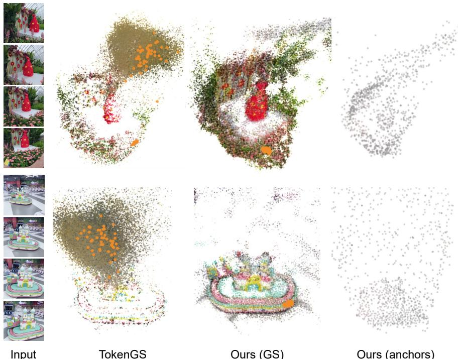  
Figure 1: Spatial grounding improves both global Gaussian organization and token-level locality. The orange points highlight all 64 Gaussians decoded from a single representative token. Under the same input and Gaussian budget, TokenGS produces diffuse scene structures, with the Gaussians from one token scattered across a broad spatial region. LocusGS instead reconstructs Gaussians that better follow the scene geometry, and its learned anchors form a coarse spatial scaffold for organizing local Gaussian generation.

To establish such spatial specialization, we propose LocusGS, which augments each Gaussian token with an explicit 3D anchor state consisting of a center and a support radius. The center specifies the token’s current 3D location, while the radius defines the extent of its local support. The anchor state is used throughout the decoding phase: It guides token-to-image cross-attention, provides spatial cues for interactions among Gaussian tokens, and serves as a local reference for Gaussian generation. The anchor center and radius are progressively refined across decoder layers, enabling each token to adapt its spatial location and support to the input scene. In this way, LocusGS spatially ground each query and encourages it to specialize in a compact local region.

Experiments on novel view synthesis benchmarks show that LocusGS improves rendering quality over query-based Gaussian token baselines under identical token and Gaussian budgets. More importantly, the proposed anchor states lead to a more structured 3D organization of the predicted Gaussians. Our analysis shows that LocusGS produces fewer scattered token-associated primitives, encourages the Gaussians decoded from the same token to form spatially compact local groups, and learns anchors that form a coherent spatial scaffold over the reconstructed scene. These results indicate that explicit 3D anchor states provide not only better reconstruction accuracy, but also a more spatially meaningful query representation for feed-forward Gaussian reconstruction.

## 2 Related Work

## 2.1 Feed-forward 3D Gaussian Splatting

Feed-forward 3D Gaussian Splatting predicts scene representations directly from sparse input images, avoiding costly per-scene optimization. PixelSplat [5] predicts Gaussians through epipolar feature aggregation and depth estimation, while MVSplat [6] introduces cost-volume-based multi-view reasoning. DepthSplat [7] further incorporates monocular depth priors, and subsequent works extend feed-forward reconstruction to pose-free settings [10, 11]. These methods largely generate Gaussians from dense image-aligned features, coupling the primitive budget with image resolution and input view count.

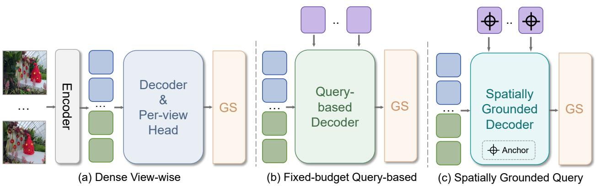  
Figure 2: Conceptual comparison of three feed-forward 3DGS paradigms. (a) Dense view-wise prediction decodes multi-view image features and uses a per-view head to produce view-dependent Gaussian splats. (b) Fixed-budget query-based generation introduces learnable queries to decode a set of Gaussians whose size is independent of image resolution and input view count. (c) Our spatially grounded query paradigm further equips queries with explicit spatial anchors, enabling anchor-aware decoding and more structured Gaussian generation.

## 2.2 Grid-Decoupled and Query-based Gaussian Reconstruction

To reduce the redundancy of dense Gaussian prediction, recent methods adopt selective primitive generation [12, 13], feature or token compression [14, 15], or cross-view token fusion [16]. Other methods leverage geometric priors from pretrained 3D reconstruction models to merge redundant pixel-aligned predictions [17] or construct sparse 3D anchors [18]. These methods reduce redundancy while retaining an image-aligned or externally initialized prediction structure. Query-based methods instead decouple the scene representation itself from the input grid. TokenGS [8] introduces learnable Gaussian queries, each of which aggregates multi-view image features and decodes a group of Gaussian primitives, making the output budget independent of image resolution and view count. Several contemporaneous methods share this high-level query-based formulation, while differing in their input assumptions, feature backbones, attention architectures, and Gaussian decoding strategies [9, 19]. GlobalSplat[9] adopts disentangled geometry and appearance branches, whereas C3G[19] uses a pretrained VGGT encoder and decodes one Gaussian per query. Nevertheless, these methods primarily represent each query as a latent feature. LocusGS instead equips each query with an explicit 3D state that is progressively refined and directly involved in both feature aggregation and Gaussian decoding. This design is conceptually related to DAB-DETR [20], which augments object queries with dynamically refined anchor boxes. While DAB-DETR uses such anchors for 2D object localization, LocusGS maintains a center-and-radius state in 3D space to spatially ground scene queries throughout reconstruction. LocusGS is also related to Scaffold-GS [21], which organizes local Gaussians around sparse 3D anchors, while our anchors serve as query states and are progressively refined from multi-view image features in a feed-forward framework.

## 3 Method

## 3.1 Preliminaries: Query-based Feed-forward Gaussian Splatting

Recent query-based feed-forward Gaussian Splatting methods formulate 3DGS prediction as a set-to-set decoding problem. Given multi-view images $\mathcal { T } = \{ I _ { v } \} _ { v = 1 } ^ { \tilde { V } }$ with corresponding camera poses P, an image encoder first extracts multi-view visual features F, which serve as the memory for the decoder. The decoder maintains a set of N learnable Gaussian queries, initialized as

$$
\mathbf { Q } ^ { 0 } = [ \mathbf { q } _ { 1 } ^ { 0 } , \mathbf { q } _ { 2 } ^ { 0 } , \ldots , \mathbf { q } _ { N } ^ { 0 } ] ^ { \top } \in \mathbb { R } ^ { N \times d } ,
$$

where $\mathbf { q } _ { i } ^ { 0 } \in \mathbb { R } ^ { d }$ denotes the initial feature of the i-th query. These queries are progressively updated by Transformer decoder blocks:

$$
\begin{array} { r } { \mathbf { Q } ^ { l + 1 } = { \cal D } ( \mathbf { Q } ^ { l } , \mathbf { F } ) . } \end{array}
$$

Each decoder block typically alternates self-attention among Gaussian queries and cross-attention to the encoded multi-view image features, allowing the queries to aggregate scene evidence from the input views. After L decoder

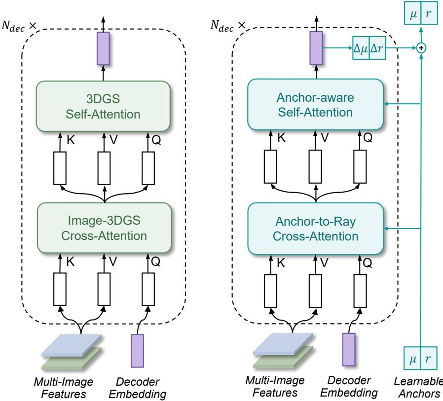  
Figure 3: From implicit Gaussian tokens to explicit anchor tokens. Left: standard query-based methods uses learnable 3DGS tokens as implicit embeddings, where self-attention and image-to-3DGS cross-attention are mainly driven by token and image features. Right: LocusGS augments each decoder token with a learnable 3D anchor state $( \mu , r )$ . The anchor state provides spatial cues for token self-attention and guides cross-view feature aggregation through anchor-aware cross-attention. Across decoder layers, the anchor state is progressively refined and used for anchor-centered Gaussian prediction, turning Gaussian tokens into spatially grounded reconstruction queries.

layers, each final query $\mathbf { q } _ { i } ^ { L }$ is mapped by a Gaussian prediction head to a local group of K Gaussian primitives:

$$
\mathcal { G } _ { i } = \{ ( \mathbf { x } _ { i , k } , \mathbf { s } _ { i , k } , \mathbf { R } _ { i , k } , \mathbf { c } _ { i , k } ^ { G } , \alpha _ { i , k } ) \} _ { k = 1 } ^ { K } ,
$$

where $\mathbf { x } , \mathbf { s } , \mathbf { R } , \mathbf { c } ^ { G }$ , and α denote the Gaussian center, scale, rotation, color, and opacity, respectively. The Gaussian groups decoded from all tokens are combined to form the scene representation $\begin{array} { r } { \mathcal { G } = \bigcup _ { i = 1 } ^ { N } \mathcal { G } _ { i } . } \end{array}$

## 3.1.1 Limitations of Existing Query-based Methods

Despite the efficiency of fixed-budget prediction, existing query-based methods exhibit limited spatial specialization. Ideally, each query should focus on a coherent local region, aggregate the multi-view evidence associated with that region, and decode a spatially compact group of Gaussians, while different queries cover complementary parts of the scene. However, as illustrated in Figure 1, the Gaussians decoded from an individual query are often spatially diffuse and may spread across distant scene regions. As a result, the token-wise Gaussian groups show weak spatial coherence, and their organization does not closely follow the scene structure.

## 3.2 LocusGS

## 3.2.1 Our Insight

We argue that the weak spatial coherence observed above stems from how Gaussian queries are represented. Existing methods typically represent each query solely as a latent feature. Such a representation does not explicitly specify where the query operates in 3D space or how large a region it should cover. Consequently, the multi-view evidence aggregated by a query and the Gaussians decoded from it are not associated with the coherent local region. This observation motivates us to equip each query with an explicit 3D anchor state, providing a spatial reference for feature aggregation and locally organized Gaussian prediction.

## 3.2.2 Overview

Given posed multi-view images, LocusGS predicts a fixed-budget set of 3D Gaussian primitives in a single forward pass. The input images are encoded into multi-view image tokens, with camera parameters represented by patch-level Plücker rays. LocusGS augments each query with an explicit 3D anchor state that specifies its current 3D reference location and support radius. The decoder uses these anchors to guide cross-view feature aggregation, progressively refines the anchor states, and decodes Gaussian primitives as local offsets from the refined anchors.

## 3.2.3 Explicit 3D Anchor States for Queries

In existing query-based Gaussian reconstruction, each query is represented as a learnable high-dimensional embedding. Such an embedding acts as a content query in the Transformer decoder. Different from standard query-based methods, LocusGS augments every query with an explicit 3D anchor state. For the i-th query at decoder layer l, we denote its token feature as $\mathbf { q } _ { i } ^ { l } \in \mathbb { R } ^ { d }$ and its anchor state as

$$
\mathbf { a } _ { i } ^ { l } = ( \mu _ { i } ^ { l } , r _ { i } ^ { l } )
$$

where $\pmb { \mu } _ { i } ^ { l } \in \mathbb { R } ^ { 3 }$ is the center and $r _ { i } ^ { l } \in \mathbb { R } _ { + }$ is its spatial support radius. The token feature encodes appearance and reconstruction cues, while the anchor state provides an explicit spatial descriptor: the center specifies the current 3D reference location of the query, and the radius defines its local support region.

To ensure a positive support radius, in practice, we maintain an unconstrained radius parameter $\rho _ { i } ^ { l } \in \mathbb { R }$ and obtain the actual radius as

$$
r _ { i } ^ { l } = \mathrm { s o f t p l u s } ( \rho _ { i } ^ { l } ) + \epsilon\tag{1}
$$

where $\epsilon > 0$ is a small constant for numerical stability. The initial anchor parameters $\{ \mu _ { i } ^ { 0 } , \rho _ { i } ^ { 0 } \} _ { i = 1 } ^ { N }$ are learnable and shared across scenes, with the anchor centers randomly initialized in the normalized 3D scene space.

## 3.2.4 Anchor-Guided Decoder

As in conventional query-based Gaussian reconstruction methods, the decoder updates query tokens through alternating self-attention and cross-attention. Here, LocusGS makes each decoder layer aware of the current anchor states.

For self-attention, we derive an anchor positional embedding $\mathbf { p } _ { i } ^ { l } = \mathrm { M L P } ( \mathrm { P E } ( \pmb { \mu } _ { i } ^ { l } ) )$ ) from the current anchor center, where PE(·) denotes sinusoidal positional encoding. We inject this embedding into the token feature before self-attention:

$$
\tilde { \mathbf { q } } _ { i } ^ { l } = \mathbf { q } _ { i } ^ { l } + \mathbf { p } _ { i } ^ { l } .\tag{2}
$$

This spatial conditioning allows interactions among Gaussian queries to depend on their current 3D anchor locations, rather than only on their latent token features.

For cross-attention, we aim to make each query preferentially aggregate multi-view evidence consistent with its current 3D support. To assess this geometric consistency, we measure the distance between the query anchor $\mu _ { i } ^ { l }$ and the camera ray $\ell _ { j }$ associated with each image token. Image tokens whose rays pass closer to the anchor are considered more relevant, while the support radius $r _ { i } ^ { l }$ controls the spatial extent of this preference. We incorporate this relation as an anchor-to-ray geometric bias in standard content-based cross-attention. Concretely, for the camera ray $\ell _ { j }$ associated with the j-th image token, we define the anchor-to-ray geometric bias as

$$
{ b } _ { i j } ^ { l } = - \frac { 1 } { 2 } \left( \frac { D \left( \pmb { \mu } _ { i } ^ { l } , \pmb { \ell } _ { j } \right) } { \sigma _ { 0 } r _ { i } ^ { l } } \right) ^ { 2 } ,\tag{3}
$$

where $D \left( \mu _ { i } ^ { l } , \ell _ { j } \right)$ denotes the shortest Euclidean distance from the 3D point $\mu _ { i } ^ { l }$ to the camera ray $\ell _ { j } , \sigma _ { 0 }$ is a fixed bandwidth hyperparameter, and $r _ { i } ^ { l }$ is the anchor support radius. This bias assigns higher scores to image tokens whose rays are closer to the anchor, while the radius controls how broad the geometric support is.

The geometric bias is added to the standard content-based attention logits. Let $\bar { \mathbf q } _ { i } ^ { l }$ be the attention query projected from the Gaussian query feature $\mathbf { q } _ { i } ^ { l }$ . The cross-attention weights are computed as

$$
\alpha _ { i j } ^ { l } = \mathrm { s o f t m a x } _ { j } \left( \frac { \left( \bar { \bf q } _ { i } ^ { l } \right) ^ { \top } { \bf k } _ { j } } { \sqrt { d } } + \gamma b _ { i j } ^ { l } \right) ,\tag{4}
$$

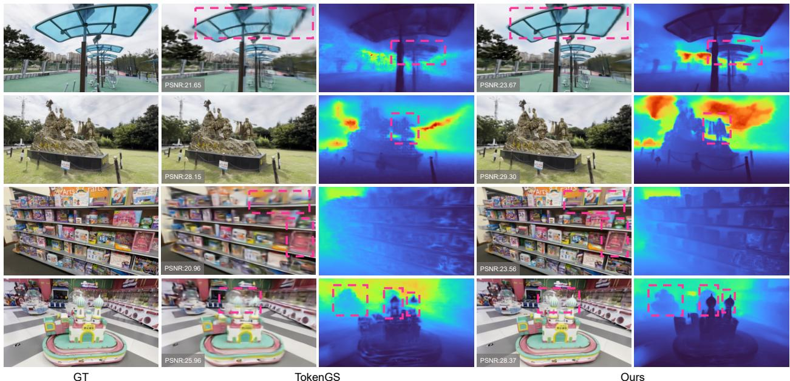  
Figure 4: Qualitative comparison on DL3DV novel-view synthesis. LocusGS produces sharper renderings and more coherent depth structures, especially in texture-rich regions and cluttered scenes.

where $\mathbf { k } _ { j }$ is the projected key of the j-th image token and d is the feature dimension per attention head. Here, $\gamma =$ softplus $( \tilde { \gamma } ) \bar { \geq } \bar { 0 }$ is a learnable scale, ensuring that the geometric bias consistently penalizes rays farther from the anchor. The updated query feature is obtained by aggregating image values:

$$
\hat { \mathbf { q } } _ { i } ^ { l } = \sum _ { j } \alpha _ { i j } ^ { l } \mathbf { v } _ { j } .\tag{5}
$$

In this way, each query aggregates multi-view evidence by jointly considering content similarity and anchor-to-ray geometric consistency.

## 3.2.5 Dynamic Anchor Refinement

After each decoder layer, the updated token feature predicts residual updates for the anchor center and the unconstrained radius parameter:

$$
\Delta \pmb { \mu } _ { i } ^ { l } = f _ { \mu } \left( \mathbf { q } _ { i } ^ { l + 1 } \right) , \qquad \Delta \rho _ { i } ^ { l } = f _ { \rho } \left( \mathbf { q } _ { i } ^ { l + 1 } \right) ,\tag{6}
$$

where $f _ { \mu } ( \cdot )$ and $f _ { \rho } ( \cdot )$ are lightweight prediction heads. The anchor parameters are refined as

$$
\pmb { \mu } _ { i } ^ { l + 1 } = \pmb { \mu } _ { i } ^ { l } + \Delta \pmb { \mu } _ { i } ^ { l } , \qquad \pmb { \rho } _ { i } ^ { l + 1 } = \pmb { \rho } _ { i } ^ { l } + \Delta \pmb { \rho } _ { i } ^ { l } .\tag{7}
$$

The refined support radius $r _ { i } ^ { l + 1 }$ is then obtained from $\rho _ { i } ^ { l + 1 }$ using the parameterization in Equation (1). This layer-wise refinement enables each query to adapt its 3D location and support radius according to the multi-view input images.

## 3.2.6 Anchor-Centered Gaussian Decoding

After the final decoder layer, each token is decoded into a small group of Gaussian primitives. Instead of predicting Gaussian positions in a fully unconstrained manner, LocusGS predicts local offsets relative to the final anchor center. For the k-th Gaussian generated by the i-th token, the decoder first predicts a local offset $\delta _ { i , k }$ from the final token feature:

$$
\{ \delta _ { i , k } \} _ { k = 1 } ^ { K } = f _ { \delta } ( \pmb { q } _ { i } ^ { L } )\tag{8}
$$

where L is the number of decoder layers and $f _ { \delta } ( \cdot )$ denotes the position branch of the Gaussian prediction head. The final Gaussian center is then obtained by anchoring this local offset around the refined anchor center:

$$
\pmb { \mu } _ { i , k } ^ { G } = \pmb { \mu } _ { i } ^ { L } + r _ { i } ^ { L } \delta _ { i , k }\tag{9}
$$

Here, $\mu _ { i } ^ { L }$ provides the final 3D reference location of the token, while $r _ { i } ^ { L }$ controls the spatial range of its generated Gaussians. This formulation encourages the Gaussians decoded from the same token to form a local 3D group around the anchor state, rather than scattering freely in the scene.

The remaining Gaussian attributes, including scale, rotation, color, and opacity, are predicted from the final token feature using the standard token-based prediction head as in TokenGS [8]. The final Gaussian primitives are formed by combining these attributes with the anchor-centered Gaussian centers.

## 3.2.7 Multi-layer Rendering Supervision

Since LocusGS progressively refines the anchor states, we supervise intermediate decoder layers in addition to the final output. Let $\mathbf { \bar { \mathbf { \nabla } } } S = \{ l _ { 1 } , \dots , l _ { M } \}$ denote the supervised layers, with the final layer always included. At each layer $l _ { m } .$ , the current Gaussian tokens and anchor states are decoded into an intermediate Gaussian set $\mathcal { G } ^ { l _ { m } }$ and rendered as $\hat { \mathbf { I } } _ { t } ^ { l _ { m } } = \mathcal { R } ( \mathcal { G } ^ { l _ { m } } , \Pi _ { t } )$ . Following TokenGS, we combine the image reconstruction loss with visibility regularization on both the decoded Gaussian centers and anchor centers:

$$
\mathscr { L } ^ { l _ { m } } = \mathscr { L } _ { \mathrm { r e c } } ^ { l _ { m } } + \lambda _ { G } \mathscr { L } _ { \mathrm { v i s } } \left( \{ \pmb { \mu } _ { i , k } ^ { G , l _ { m } } \} \right) + \lambda _ { A } \mathscr { L } _ { \mathrm { v i s } } \left( \{ \pmb { \mu } _ { i } ^ { l _ { m } } \} \right)\tag{10}
$$

The overall training objective is

$$
\mathcal { L } = \sum _ { m = 1 } ^ { M } w _ { m } \mathcal { L } ^ { l _ { m } } , \qquad w _ { m } = \frac { m } { \sum _ { n = 1 } ^ { M } n }\tag{11}
$$

This supervision directly regularizes intermediate anchor refinement while assigning larger weights to later decoding stages. Detailed loss definitions are provided in the supplementary material.

## 4 Experiments

## 4.1 Experimental Setup

We evaluate LocusGS on two large-scale scene-level datasets, RE10K [22] and DL3DV [23], following the reconstruction settings commonly used in prior feed-forward Gaussian methods [8]. For RE10K, we report two-view reconstruction results at 256 × 256 resolution. For DL3DV, we train the base model at 256 × 256 and further finetune it at 448 × 256 for higher-resolution evaluation. The DL3DV model is trained with four views and tested with varying numbers of context views to evaluate cross-view generalization. We use TokenGS as the primary query-based baseline because it provides a clean controlled setting: it uses posed inputs and learnable Gaussian queries without an additional pretrained geometric reconstruction backbone. Comparing under matched token and Gaussian budgets allows us to isolate the effect of explicit spatial grounding; a detailed discussion of other concurrent token-based methods is provided in supplementary material.

## 4.2 Main Results

Tables 1 and 2 compare our method with representative feed-forward 3DGS baselines. On RealEstate10K [22], our method consistently outperforms TokenGS under the same token and Gaussian budgets. Both the 1024-token and 4096-token variants achieve higher PSNR and SSIM with lower LPIPS, showing that our design improves reconstruction quality without increasing the number of predicted Gaussians. Notably, the 1024-token variant already surpasses GS-LRM [24] in PSNR and SSIM while using only half the number of Gaussians, and the 4096-token variant achieves the best PSNR and SSIM among all compared methods.

On DL3DV [23], our model is trained with 4 input views and directly evaluated under 2-, 4-, and 6-view settings. Compared with TokenGS, our method consistently improves reconstruction quality across all view settings using the same number of Gaussians. This suggests that the proposed design not only improves the reconstruction quality under the training configuration, but also generalizes well to unseen context lengths. Moreover, unlike pixel-aligned methods such as MVSplat and DepthSplat, whose number of Gaussians increases with the number of input views, our method maintains a fixed, view-count-independent Gaussian budget. Figure 4 provides qualitative comparisons, where our method shows clearer renderings and more consistent geometric structures compared with TokenGS.

## 4.3 In-depth Analysis

## 4.3.1 Gaussian Distribution

We further visualize the global spatial organization of the predicted Gaussian representation in Figure 1. Given the same input views, TokenGS tends to produce more diffuse Gaussian clouds with scattered or floating primitives, whereas

Table 1: Evaluations on the DL3DV [23] dataset with different numbers of input views. Our model is trained with 4 input views and directly evaluated under 2-, 4-, and 6-view settings. Resolution is 448 × 256.
<table><tr><td>Method</td><td>#Views</td><td>PSNR↑</td><td>SSIM↑</td><td>LPIPS↓</td><td>#GS</td></tr><tr><td>MVSplat</td><td rowspan="4">2</td><td>17.54</td><td>0.529</td><td>0.402</td><td>229K</td></tr><tr><td>DepthSplat</td><td>19.31</td><td>0.615</td><td>0.310</td><td>229K</td></tr><tr><td>TokenGS (4096 tok)</td><td>19.58</td><td>0.615</td><td>0.429</td><td>262K</td></tr><tr><td>Ours (4096 tok)</td><td>20.90</td><td>0.678</td><td>0.377</td><td>262K</td></tr><tr><td>MVSplat</td><td rowspan="4">4</td><td>21.63</td><td>0.721</td><td>0.233</td><td>458K</td></tr><tr><td>DepthSplat</td><td>23.12</td><td>0.780</td><td>0.178</td><td>458K</td></tr><tr><td>TokenGS (4096 tok)</td><td>23.44</td><td>0.757</td><td>0.312</td><td>262K</td></tr><tr><td>Ours (4096 tok)</td><td>24.80</td><td>0.812</td><td>0.248</td><td>262K</td></tr><tr><td>MVSplat</td><td rowspan="4">6</td><td>22.93</td><td>0.775</td><td>0.193</td><td>688K</td></tr><tr><td>DepthSplat</td><td>24.19</td><td>0.823</td><td>0.147</td><td>688K</td></tr><tr><td>TokenGS (4096 tok)</td><td>24.16</td><td>0.770</td><td>0.296</td><td>262K</td></tr><tr><td>Ours (4096 tok)</td><td>25.78</td><td>0.836</td><td>0.225</td><td>262K</td></tr></table>

Table 2: Reconstruction performance with two input views on RealEstate10K [22]. Resolution is $2 5 6 \times 2 5 6$
<table><tr><td>Method</td><td>PSNR↑</td><td>SSIM↑</td><td>LPIPS↓</td><td>#GS</td></tr><tr><td>MVSplat</td><td>26.39</td><td>0.869</td><td>0.128</td><td>131K</td></tr><tr><td>DepthSplat</td><td>27.47</td><td>0.889</td><td>0.114</td><td>131K</td></tr><tr><td>GS-LRM</td><td>28.10</td><td>0.892</td><td>0.114</td><td>131K</td></tr><tr><td>TokenGS (1024 tok)</td><td>28.02</td><td>0.896</td><td>0.147</td><td>66K</td></tr><tr><td>Ours (1024 tok)</td><td>28.50</td><td>0.909</td><td>0.135</td><td>66K</td></tr><tr><td>TokenGS (4096 tok)</td><td>28.41</td><td>0.903</td><td>0.135</td><td>262K</td></tr><tr><td>Ours (4096 tok)</td><td>28.89</td><td>0.916</td><td>0.124</td><td>262K</td></tr></table>

LocusGS yields a more structured distribution that better follows the main scene geometry. In addition to the final Gaussians, we visualize the learned anchors of LocusGS. The anchors form a coarse spatial scaffold over the scene, providing explicit geometric support for token specialization and subsequent Gaussian decoding. This indicates that LocusGS improves not only rendering quality, but also the spatial organization and interpretability of token-based 3DGS representations.

## 4.3.2 Anchor Distribution and Adaptive Radii

We analyze the spatial distribution of the learned anchors and their adaptive radii. For visualization, we project the anchors from the last decoder layer onto each input view. The first row of Figure 5 shows all projected anchors, while the second row highlights several selected anchors together with their projected radii. The third row further visualizes the Gaussian groups decoded from these selected anchors, with different colors indicating different anchors. As shown, the learned anchors cover the main scene structures across different views, suggesting that they form a coarse spatial scaffold for token-based Gaussian prediction. Their distribution is also adaptive rather than uniform: anchors tend to concentrate around visually or geometrically informative regions, while less constrained regions are covered more sparsely. The learned radii show a similar adaptive behavior. Anchors in sparse or weakly constrained areas often have larger radii, providing broader spatial support, whereas anchors around detailed regions use smaller radii to focus on local structures. This indicates that LocusGS learns not only anchor locations, but also meaningful support scales fo organizing token-associated Gaussians.

## 4.3.3 Token-level Spatial Compactness

We examine the spatial organization of the Gaussian groups decoded from individual tokens. In Figure 5, different colors indicate Gaussians generated by different tokens. LocusGS produces compact local groups around the corresponding anchors, whereas TokenGS often generates more spatially scattered groups.

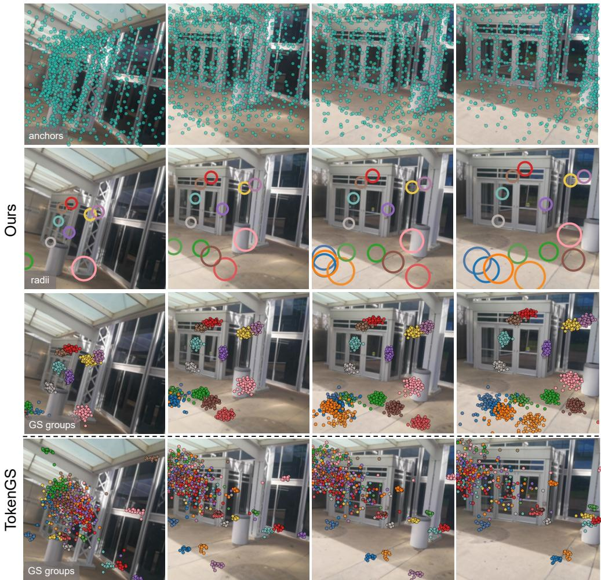  
Figure 5: Visualization of anchor supports and token-level Gaussian compactness. The first three rows show LocusGS: all projected anchors, selected projected radii, and Gaussian groups decoded from the selected anchor tokens. The last row shows Gaussian groups decoded from TokenGS tokens. LocusGS learns adaptive spatial supports and encourages each token to decode a more compact local Gaussian group.

Table 3: Quantitative token-level Gaussian dispersion on the test sets. We report the statistics of $C _ { \mathrm { c e n t r o i d } } ;$ lower is better.
<table><tr><td>Dataset</td><td>Method</td><td>Mean↓</td><td>Variance↓</td><td>Median↓</td></tr><tr><td rowspan="2">RE10K</td><td>TokenGS</td><td>5.1164</td><td>34.1712</td><td>2.7911</td></tr><tr><td>LocusGS</td><td>0.1978</td><td>0.1371</td><td>0.1117</td></tr><tr><td rowspan="2">DL3DV</td><td>TokenGS</td><td>0.5881</td><td>0.0139</td><td>0.5531</td></tr><tr><td>LocusGS</td><td>0.0433</td><td>0.0004</td><td>0.0383</td></tr></table>

We further quantify this property using token-level Gaussian dispersion. For token i, let $\{ \mu _ { i , k } ^ { G } \} _ { k = 1 } ^ { K }$ denote the centers of its K decoded Gaussians. We define

$$
\begin{array} { r } { \bar { \pmb { \mu } } _ { i } ^ { G } = \displaystyle \frac { 1 } { K } \sum _ { k = 1 } ^ { K } { \pmb { \mu } } _ { i , k } ^ { G } , \qquad } \\ { { \cal C } _ { \mathrm { c e n t r o i d } } = \displaystyle \frac { 1 } { N K } \sum _ { i = 1 } ^ { N } \sum _ { k = 1 } ^ { K } \left\| { \pmb { \mu } } _ { i , k } ^ { G } - \bar { \pmb { \mu } } _ { i } ^ { G } \right\| _ { 2 } } \end{array}\tag{12}
$$

where N is the number of Gaussian tokens. Lower values indicate tighter within-token Gaussian groups. Since RE10K and DL3DV use different scene normalization conventions, values are only compared between methods within the

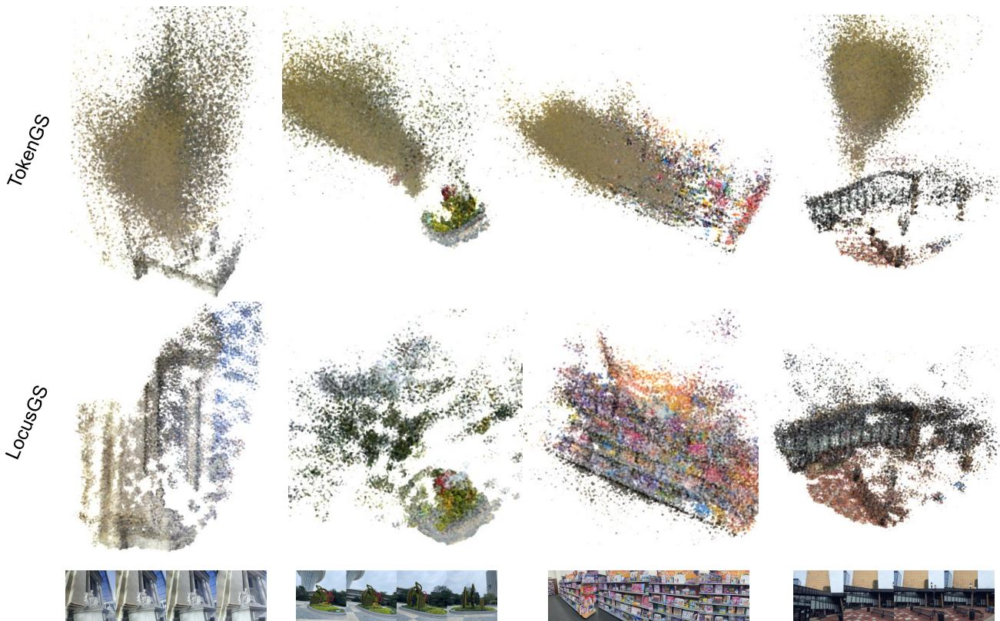  
Figure 6: Qualitative comparisons of the reconstructed Gaussians produced by TokenGS and LocusGS.

same dataset. As shown in Table 3, LocusGS substantially reduces token-level Gaussian dispersion on both datasets. Together with the improved rendering quality, these results show that the proposed anchor-based formulation yields more coherent local Gaussian groups without compromising reconstruction accuracy.

## 4.3.4 Cross Attention Visualization

We visualize the decoder cross-attention in the last decoder layer to examine how tokens aggregate image evidence across views. For each selected token, we average the cross-attention weights over all heads, reshape the resulting attention vector into per-view patch grids, and overlay the attention maps on the corresponding input images. We also project the Gaussian centers decoded from the same token onto each input view using the camera intrinsics and extrinsics. As shown in Figure 7, TokenGS produces scattered attention responses over multiple image regions, while LocusGS shows more localized and view-consistent attention around its projected anchor and decoded Gaussian centers This indicates that the explicit anchor state provides a geometric prior for cross-view feature aggregation, encouraging each token to gather evidence from geometrically relevant image regions rather than relying solely on content-based similarity. Because tokens may specialize to different scene regions, their indices are not comparable between TokenGS and LocusGS. We therefore compare representative attention patterns rather than one-to-one token correspondences.

## 4.3.5 Training Curves

Figure 9 compares the training dynamics of TokenGS and our method. Our model exhibits faster convergence with respect to training epochs and maintains a clear advantage in both training and validation PSNR, suggesting that the anchor-guided formulation provides a more effective optimization path for token-based Gaussian prediction

## 4.3.6 Decomposition of anchor-guided cross-attention.

To further inspect how the geometric prior affects cross-view feature aggregation, we decompose the cross-attention logits in the last decoder layer into the content term and the geometry term. The content term is computed from the standard query-key similarity, while the geometry term is given by the point-to-ray bias between the current 3D anchor and the Plücker rays of image patches. For visualization, we separately normalize the content logits and geometry logits with softmax, and compare them with the final attention obtained by applying softmax after adding the two terms. We also project the Gaussian centers decoded from the same token onto the input view. As shown in Figure 8, the content branch may respond to broad or ambiguous image regions with similar appearance, whereas the geometry branch provides a localized spatial prior around regions consistent with the anchor position. The final attention combines these two cues and focuses on image evidence that is both visually relevant and geometrically plausible. This supports our design motivation that anchor-guided cross-attention reduces purely appearance-driven ambiguity and encourages each token to aggregate information from cross-view regions consistent with its 3D spatial hypothesis.

Table 4: Ablation of the structural components of LocusGS under the 4-view setting. All variants use the $2 5 6 \times 2 5 6$ base model. Checkmarks denote enabled components, while “—” denotes absent or inapplicable components.
<table><tr><td rowspan="2">Ablation Group</td><td rowspan="2">Variant</td><td colspan="2">Anchor State</td><td colspan="2">Layer-wise Refinement</td><td rowspan="2">Anchor-Aware Self-Attn.</td><td rowspan="2">Cross-Attn. Bias</td><td rowspan="2">Gaussian Center Decoding</td><td rowspan="2">PSNR↑</td><td rowspan="2">SSIM↑</td><td rowspan="2">LPIPS↓</td></tr><tr><td>Center</td><td>Radius</td><td>Center</td><td>Radius</td></tr><tr><td>Reference</td><td>Full model</td><td>√</td><td>√</td><td>√</td><td>√</td><td>√</td><td>Center + Radius</td><td>Radius-scaled offset</td><td>24.284</td><td>0.7843</td><td>0.2709</td></tr><tr><td>Anchor</td><td>No radius state</td><td>√</td><td>一</td><td>√</td><td>一</td><td>√</td><td>Center</td><td>Anchor offset</td><td>23.640</td><td>0.7618</td><td>0.3007</td></tr><tr><td>Representation</td><td>Static radius w/o refinement</td><td>√</td><td>√</td><td>√</td><td>一</td><td>√</td><td>Center + Radius</td><td>Radius-scaled offset</td><td>23.979</td><td>0.7746</td><td>0.2866</td></tr><tr><td rowspan="3">Attention Design</td><td>Content-only self-attention</td><td>√</td><td>√</td><td>√</td><td>√</td><td></td><td>Center + Radius</td><td>Radius-scaled offset</td><td>24.171</td><td>0.7807</td><td>0.2764</td></tr><tr><td>Content-only cross-attention</td><td>√</td><td>√</td><td>√</td><td>√</td><td>√</td><td>Content</td><td>Radius-scaled offset</td><td>22.751</td><td>0.7220</td><td>0.3500</td></tr><tr><td>Center-only geometric bias</td><td>√</td><td>√</td><td>√</td><td>√</td><td>√</td><td>Center</td><td>Radius-scaled offset</td><td>23.770</td><td>0.7670</td><td>0.2940</td></tr><tr><td>Gaussian Decoding</td><td>Free Gaussian centers</td><td>√</td><td>√</td><td>√</td><td>√</td><td>√</td><td>Center + Radius</td><td>Free center</td><td>22.079</td><td>0.6860</td><td>0.3970</td></tr></table>

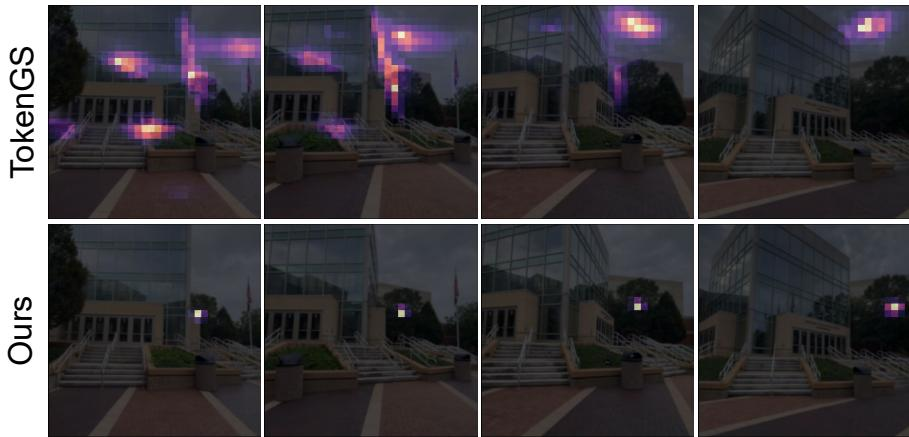  
Figure 7: Spatial anchors yield more localized and view-consistent cross-view attention. For each method, we show the cross-attention map of a representative token. Our method produces more localized and view-consistent attention patterns around the projected anchor region.

## 4.3.7 Self Attention Visualization

We further visualize the self-attention behavior among anchor tokens. Different from cross-attention, which associates anchor tokens with multi-view image observations, self-attention models the interaction between Gaussian tokens themselves. To inspect this interaction, we select a query anchor and visualize the anchors that receive the highest self-attention weights from it. For each selected query anchor, we highlight the query anchor in red and keep its decoded Gaussian group visible. We then retrieve the top-k anchors according to the self-attention weights of the query anchor. These attended anchors are visualized with color and size proportional to their attention weights, and we draw edges from the query anchor to the attended anchors. Thicker and more opaque edges indicate stronger self-attention weights. The remaining Gaussians are shown in gray to provide the global scene context. As shown in Figure 10, a query anchor mainly interacts with a sparse set of other anchors rather than uniformly attending to all tokens. These attended anchors are not merely a visualization of the full anchor layout; instead, they reveal the information-exchange neighborhood of the selected token. This suggests that anchor-aware self-attention allows each spatial token to aggregate contextual information from related anchors.

## 4.4 Ablation Studies

Table 4 evaluates the key components of LocusGS on DL3DV under the 4-view setting. Modeling both the anchor center and radius is beneficial: removing the radius or keeping it static consistently degrades performance, showing that the spatial support should adapt throughout decoding. Anchor-aware self-attention also improves over content-only self-attention, indicating that explicit anchor positions provide useful spatial cues for token interactions. Anchor-aware cross-attention is more important, as removing the anchor-to-ray bias leads to a substantial degradation, while the radius-adaptive bias further improves over its center-only counterpart. The largest performance drop occurs when Gaussian centers are predicted freely, confirming that anchor-centered, radius-scaled decoding is crucial for maintaining the spatial association between each token and its Gaussian group. Table 5 further examines intermediate rendering supervision. Supervising only the final decoder layer performs clearly worse, whereas adding supervision at the middle layer yields the best results. A denser supervision schedule provides no further improvement, indicating that supervision at the middle and final layers is sufficient.

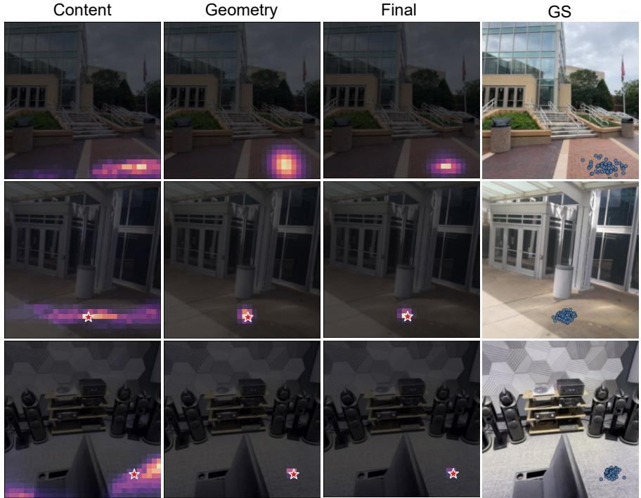  
Figure 8: Decomposition of anchor-guided cross-attention. We visualize the content-only attention, geometry-only attention, final attention, and projected Gaussians from the same token. The final attention combines visual similarity with geometric compatibility, leading to more localized evidence aggregation.

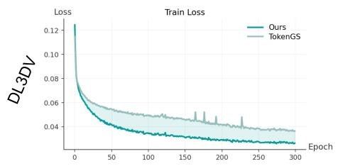

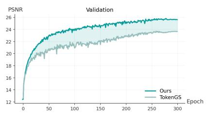

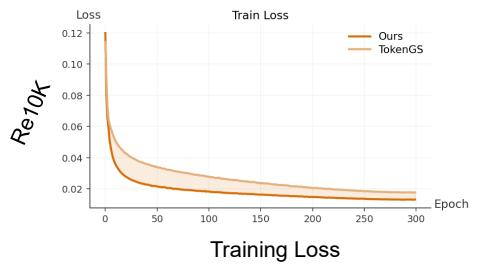

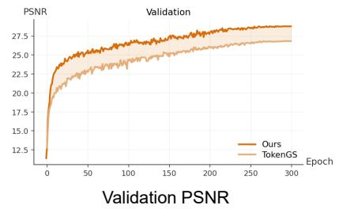  
Figure 9: Convergence comparison on DL3DV and RE10K. Our method exhibits faster convergence with respect to training epochs, reaches lower training loss, and achieves consistently higher PSNR on both training and validation sets.

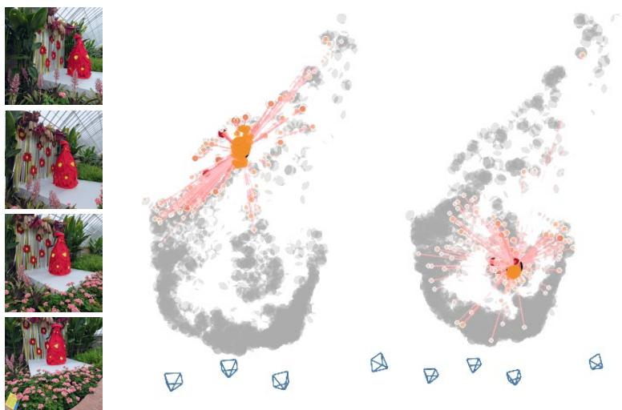  
Figure 10: Visualization of anchor-aware self-attention. For each selected query anchor, we visualize its decoded Gaussian group and the top-k attended anchors. Edge thickness and opacity indicate attention strength.

Table 5: Ablation of multi-layer rendering supervision. S denotes the set of decoder layers receiving rendering supervision.
<table><tr><td>Supervised Layers S</td><td>PSNR↑</td><td>SSIM↑</td><td>LPIPS↓</td></tr><tr><td>{6, 12}</td><td>24.284</td><td>0.7843</td><td>0.2709</td></tr><tr><td>{12}</td><td>23.549</td><td>0.7575</td><td>0.3074</td></tr><tr><td>{3, 6, 9, 12}</td><td>24.071</td><td>0.7793</td><td>0.2774</td></tr></table>

## 5 Conclusion

We presented LocusGS, a spatially grounded anchor-token formulation for feed-forward 3D Gaussian reconstruction. By augmenting each Gaussian token with an explicit 3D anchor state and refining it across decoder layers, LocusGS provides spatial references for cross-view aggregation and anchor-centered Gaussian decoding. This design improves rendering quality while producing more coherent Gaussian distributions, compact token-level Gaussian groups, and meaningful anchor layouts. Our results indicate that explicit anchor states offer an effective spatial prior for querybased feed-forward 3DGS, turning Gaussian tokens from implicit latent embeddings into more interpretable spatial reconstruction queries.

## A Implementation Details

## A.1 Overview of the Encoder–Decoder Framework

LocusGS follows an encoder–decoder framework similar to query-based feed-forward methods [8]. Given posed multi-view images, we first tokenize each input image into patch-level visual tokens using a shared image patch embedding layer. Camera information is injected by adding a Plücker-ray embedding to the corresponding image patch features. The resulting multi-view image tokens are concatenated across views and processed by the image encoder to produce the keys and values for decoder cross-attention.

The decoder maintains a fixed set of learnable Gaussian tokens. Each token is associated with an explicit anchor state consisting of a 3D anchor center and a scalar support radius. Each decoder layer updates the Gaussian token features through anchor-guided cross-attention, anchor-aware self-attention, and a feed-forward network. After selected decoder layers, the current tokens and anchor states are decoded into Gaussian primitives.

Unless otherwise stated, we use the same token budget as the corresponding TokenGS baseline, while fixing the number of Gaussians predicted per token to 64. As a result, each token corresponds to one Gaussian group containing 64 Gaussians. This gives 262,144 Gaussians in total for the 4096-token setting and 65,536 Gaussians in total for the 1024-token setting.

We train the model with AdamW [25] and a cosine learning rate schedule, using an initial learning rate of $4 \times 1 0 ^ { - 4 }$ with 2,000 warmup iterations for base training, and $4 \times 1 0 ^ { - 5 }$ with 400 warmup iterations for finetuning. We evaluate novel view synthesis quality using PSNR, SSIM, and LPIPS.

## A.2 Choice of Query-Based Baseline

Several concurrent methods adopt token-based Gaussian prediction but differ in their input assumptions and system components, including whether camera poses are known and whether pretrained geometric reconstruction backbones are used. Despite these differences, they share a common abstraction: latent queries aggregate image evidence and are subsequently decoded into Gaussian primitives [9, 16, 19]. We choose TokenGS as our primary query-based baseline because it provides the cleanest controlled instantiation of this abstraction. Specifically, TokenGS uses posed inputs, learnable Gaussian queries, and no additional pretrained geometric reconstruction backbone, allowing us to match both the token count and Gaussian budget. This controlled setting enables us to isolate the effect of replacing implicit query embeddings with explicit, dynamically refined spatial states. In contrast, other concurrent token-based systems introduce additional variations in pose estimation, feature extraction, or representation capacity [19, 9], which would confound a direct assessment of spatial grounding. TokenGS therefore serves not as a proxy for the complete systems of all concurrent methods, but as a canonical implementation of their shared query-based Gaussian prediction core and the most appropriate baseline for our controlled evaluation.

## A.3 Radius Parameterization and Usage

Each anchor is associated with a scalar support radius, which controls the spatial extent of the corresponding tokenassociated Gaussian group. In implementation, we distinguish between the raw radius and the activated radius. The raw radius $\rho _ { i } \in \mathbb { R }$ is an unconstrained learnable parameter, while the activated radius $r _ { i } \in \mathbb { R } ^ { + }$ is the positive support scale used by the model.

Specifically, the activated radius is obtained by

$$
r _ { i } ^ { l } = \mathrm { s o f t p l u s } ( \rho _ { i } ^ { l } ) + \epsilon\tag{13}
$$

where $\epsilon > 0$ is a small constant for numerical stability. We initialize the raw radius by applying the inverse softplus function to the desired initial radius, so that the activated radius starts from the predefined support scale. In our default setting, each Gaussian token has its own independent scalar radius parameter.

During decoding, we update the raw radius rather than the activated radius. After the l-th decoder layer, the updated token feature predicts a residual update:

$$
\Delta \rho _ { i } ^ { l } = f _ { r } (  { \mathbf { q } } _ { i } ^ { l + 1 } ) ,\tag{14}
$$

and the raw radius is refined as

$$
\rho _ { i } ^ { l + 1 } = \rho _ { i } ^ { l } + \Delta \rho _ { i } ^ { l } .\tag{15}
$$

The activated radius used at the next layer is then computed as

$$
r _ { i } ^ { l + 1 } = \mathrm { s o f t p l u s } ( \rho _ { i } ^ { l + 1 } ) + \epsilon\tag{16}
$$

Table 6: Formal definitions of the cross-attention and Gaussian center decoding variants used in the ablation study.
<table><tr><td>Category</td><td>Variant</td><td>Formal definition</td></tr><tr><td rowspan="3">Cross-Attention</td><td>Content only</td><td> $\alpha _ { i j } ^ { l } = \mathrm { s o f t m a x } _ { j } \left( c _ { i j } ^ { l } \right)$ </td></tr><tr><td>Center-only</td><td> $b _ { i j } ^ { l } = - \frac { 1 } { 2 } \left( \frac { D _ { i j } ^ { l } } { \sigma _ { 0 } } \right) ^ { 2 }$   $\alpha _ { i j } ^ { l } = \mathrm { s o f t m a x } _ { j } \left( c _ { i j } ^ { l } + \gamma b _ { i j } ^ { l } \right)$ </td></tr><tr><td>Radius-adaptive</td><td> $b _ { i j } ^ { l } = - \frac { 1 } { 2 } \left( \frac { D _ { i j } ^ { l } } { \sigma _ { 0 } r _ { i } ^ { l } } \right) ^ { 2 }$   $\alpha _ { i j } ^ { l } = \mathrm { s o f t m a x } _ { j } \left( c _ { i j } ^ { l } + \gamma b _ { i j } ^ { l } \right)$ </td></tr><tr><td></td><td>Free center</td><td> $\mu _ { i , k } ^ { G , l } = \delta _ { i , k } ^ { l }$ </td></tr><tr><td>Gaussian Decoding</td><td>Radius-scaled offset</td><td> $\pmb { \mu } _ { i , k } ^ { G , l } = \pmb { \mu } _ { i } ^ { l } + r _ { i } ^ { l } \pmb { \delta } _ { i , k } ^ { l }$ </td></tr></table>

Table 7: Training and evaluation settings used in our experiments. We report the input-view setting, resolution, token budget, and optimization schedule for each dataset.
<table><tr><td></td><td>RE10K</td><td>DL3DV</td></tr><tr><td>Training input views</td><td>2</td><td>4</td></tr><tr><td>Evaluation input views</td><td>2</td><td> $2 / 4 / 6$ </td></tr><tr><td>Base training resolution</td><td> $2 5 6 \times 2 5 6$ </td><td> $2 5 6 \times 2 5 6$ </td></tr><tr><td>Finetuning / evaluation resolution</td><td> $2 5 6 \times 2 5 6$ </td><td> $4 4 8 \times 2 5 6$ </td></tr><tr><td>Gaussian tokens</td><td>1024 base, 4096 finetune</td><td>1024 base, 4096 finetune</td></tr><tr><td>Gaussians per token</td><td>64</td><td>64</td></tr><tr><td>Optimizer</td><td> $\mathrm { A d a m W }$ </td><td> $\mathrm { A d a m W }$ </td></tr><tr><td>Base learning rate</td><td> $4 \times 1 0 ^ { - 4 }$ </td><td> $4 \times 1 0 ^ { - 4 }$ </td></tr><tr><td>Finetuning learning rate</td><td> $4 \times 1 0 ^ { - 5 }$ </td><td> $4 \times 1 0 ^ { - 5 }$ </td></tr><tr><td>Base / finetuning warmup</td><td> $2 0 0 0 / 4 0 0$ </td><td>2000 / 400</td></tr><tr><td>Base / finetuning epochs</td><td>300 / 20</td><td>300 / 20</td></tr></table>

This parameterization allows the radius to be optimized freely in an unconstrained space while ensuring that the actual support scale remains positive.

The activated radius is used in two places. First, in radius-adaptive anchor-to-ray attention, it controls the bandwidth of the geometric bias:

$$
\boldsymbol { \sigma } _ { i } ^ { l } = \boldsymbol { \sigma } _ { 0 } \boldsymbol { r } _ { i } ^ { l } ,\tag{17}
$$

where $\sigma _ { 0 }$ is a fixed base bandwidth. In our implementation, we use a fixed base bandwidth $\sigma _ { 0 } = 0 . 1$ . A larger activated radius increases the bandwidth of the geometric bias, making the geometry-induced penalty smoother and less selective with respect to point-to-ray distance. Conversely, a smaller radius produces a sharper geometric bias that more strongly suppresses rays far from the anchor.

Second, in anchor-centered Gaussian decoding, the activated radius scales the local Gaussian offsets:

$$
\pmb { \mu } _ { i , k } ^ { G } = \pmb { \mu } _ { i } ^ { l } + r _ { i } ^ { l } \pmb { \delta } _ { i , k } .\tag{18}
$$

Here, $\mu _ { i } ^ { l }$ is the anchor center and $\delta _ { i , k }$ is the predicted local offset for the k-th Gaussian decoded from token i. Thus, the radius acts as the local coordinate scale of each token-associated Gaussian group. By default, each Gaussian token predicts a group of 64 Gaussians.

In summary, the raw radius $\rho _ { i }$ is used for optimization and residual refinement, whereas the activated radius $r _ { i }$ is used as the physical support scale for geometric attention and Gaussian decoding.

## A.4 Patch-level Plücker Ray Construction

Camera geometry is represented using Plücker rays associated with image patches. For each input view, we first construct a dense pixel-level Plücker ray map from the camera intrinsics and extrinsics. Each ray is represented as

$$
\begin{array} { r } { \ell = ( \mathbf { m } , \mathbf { d } ) \in \mathbb { R } ^ { 6 } , } \end{array}\tag{19}
$$

where d is the ray direction and m is the moment vector. We use the convention

$$
\mathbf { m } = \mathbf { o } \times \mathbf { d } ,\tag{20}
$$

where o denotes the camera center in the scene coordinate system.

Since the image encoder operates on patch tokens, we convert the dense Plücker map into patch-level ray features. Given a Plücker tensor of shape $B \times \dot { V } \times 6 \times H \times W$ , where B is the batch size and V is the number of input views, we apply average pooling with the same kernel size and stride as the image patch size P. This produces a patch-level Plücker tensor:

$$
{ \bf L } _ { \mathrm { p a t c h } } \in \mathbb { R } ^ { B \times ( V H _ { p } W _ { p } ) \times 6 } , \qquad H _ { p } = H / P , \quad W _ { p } = W / P .\tag{21}
$$

Each patch-level ray therefore provides an approximate geometric representation for the corresponding image token.

## A.5 Point-to-Ray Distance in Plücker Coordinates

In the main paper, the geometric bias is defined using the shortest Euclidean distance $D ( \pmb { \mu } _ { i } ^ { l } , \pmb { \ell } _ { j } )$ from the current anchor center to an image ray. Here we provide the concrete computation used in our implementation.

Each patch-level camera ray is represented by Plücker coordinates $\ell _ { j } = ( \mathbf { m } _ { j } , \mathbf { d } _ { j } )$ , where ${ \bf d } _ { j }$ is the ray direction and $\mathbf { m } _ { j }$ is the moment vector. We use the convention

$$
\mathbf { m } _ { j } = \mathbf { o } _ { j } \times \mathbf { d } _ { j } ,\tag{22}
$$

where $\mathbf { o } _ { j }$ is the camera center. Before computing the distance, we normalize the ray direction and scale the moment accordingly:

$$
\bar { \mathbf { d } } _ { j } = \frac { \mathbf { d } _ { j } } { \| \mathbf { d } _ { j } \| _ { 2 } } , \qquad \bar { \mathbf { m } } _ { j } = \frac { \mathbf { m } _ { j } } { \| \mathbf { d } _ { j } \| _ { 2 } } .\tag{23}
$$

Under this convention, a 3D point $\pmb { \mu }$ lies on the ray if $\pmb { \mu } \times \bar { \mathbf { d } } _ { j } = \bar { \mathbf { m } } _ { j }$ . Therefore, we compute the point-to-ray distance as

$$
D ( { \pmb \mu } _ { i } ^ { l } , { \pmb \ell } _ { j } ) = \left\| { \pmb \mu } _ { i } ^ { l } \times \bar { \bf d } _ { j } - \bar { \bf m } _ { j } \right\| _ { 2 } .\tag{24}
$$

This distance is then substituted into the geometric bias in the main paper:

$$
\begin{array} { r } { b _ { i j } ^ { l } = - \frac { 1 } { 2 } \left( \frac { D \left( \pmb { \mu } _ { i } ^ { l } , \pmb { \ell } _ { j } \right) } { \sigma _ { 0 } r _ { i } ^ { l } } \right) ^ { 2 } . } \end{array}\tag{25}
$$

The activated radius $r _ { i } ^ { l }$ modulates the bandwidth of this geometric prior. In our default setting, the base bandwidth is fixed to $\sigma _ { 0 } = 0 . 1$ . For stability, the squared bandwidth is lower-bounded. The geometric bias is clamped to the interval $[ - 2 0 , 0 ]$ to avoid overly sharp attention scores. The final cross-attention weights still follow the formulation in the main paper and are jointly determined by content similarity, the geometric bias, and the learnable scale $\gamma .$

## A.6 Training Objective

We follow the rendering objective of TokenGS [8]. For each supervised decoder layer $l _ { m } \in S ,$ , we decode the current tokens and anchors into a Gaussian set $\mathcal { G } ^ { l _ { m } }$ , render it to the target view, and apply the same image reconstruction loss as the baseline:

$$
\mathcal { L } _ { \mathrm { r e c } } ^ { l _ { m } } = \mathcal { L } _ { \mathrm { M S E } } ^ { l _ { m } } + \lambda _ { \mathrm { S S I M } } \mathcal { L } _ { \mathrm { S S I M } } ^ { l _ { m } }\tag{26}
$$

For training stability, we also adopt the visibility regularization used in TokenGS. Given a set of 3D points $\mathcal { X } ,$ , this term softly penalizes points that are outside all supervision views:

$$
\phi ( \tilde { u } , \tilde { v } ) = \mathrm { R e L U } ( | \tilde { u } | - 1 ) + \mathrm { R e L U } ( | \tilde { v } | - 1 ) .\tag{27}
$$

$$
\mathcal { L } _ { \mathrm { v i s } } ( \mathcal { X } ) = \frac { 1 } { \vert \mathcal { X } \vert } \sum _ { { \bf x } \in \mathcal { X } } \operatorname* { m i n } _ { \Pi _ { t } \in \Pi _ { \mathrm { s u p } } } \phi ( \tilde { u } ^ { t } , \tilde { v } ^ { t } ) .\tag{28}
$$

where $( \tilde { u } ^ { t } , \tilde { v } ^ { t } )$ are the normalized projected coordinates of $\mathbf { x }$ in supervision view $\Pi _ { t }$ . Different from the baseline, we apply this regularization to both the decoded Gaussian centers and the anchor centers:

$$
\mathcal { L } ^ { l _ { m } } = \mathcal { L } _ { \mathrm { r e c } } ^ { l _ { m } } + \lambda _ { \mathrm { G } } \mathcal { L } _ { \mathrm { v i s } } \left( \{ \pmb { \mu } _ { i , k } ^ { G , l _ { m } } \} \right) + \lambda _ { \mathrm { A } } \mathcal { L } _ { \mathrm { v i s } } \left( \{ \pmb { \mu } _ { i } ^ { l _ { m } } \} \right) .\tag{29}
$$

We use $\lambda _ { \mathrm { S S I M } } = 0 . 2 , \lambda _ { \mathrm { G } } = 1 . 0$ , and $\lambda _ { \mathrm { A } } = 0 . 1$ in all experiments. The final objective is the weighted sum over supervised decoder layers:

$$
\mathcal { L } = \sum _ { m = 1 } ^ { M } w _ { m } \mathcal { L } ^ { l _ { m } } , \qquad w _ { m } = \frac { m } { \sum _ { n = 1 } ^ { M } n } .\tag{30}
$$

Table 8: Model footprint and pure forward latency on the DL3DV 4-view evaluation setup. Pure forward time measures the encoder-decoder pass to Gaussian prediction and excludes rendering.
<table><tr><td>Model</td><td>Params (M)</td><td>Model Storage (MiB)</td><td>Forward Time (ms)</td></tr><tr><td>TokenGS</td><td>222.0</td><td>846.93</td><td> $3 4 0 . 9 9 \pm 9 3 . 5 7$ </td></tr><tr><td>LocusGS</td><td>241.5</td><td>921.31</td><td> $4 0 7 . 2 8 \pm 6 2 . 9 6$ </td></tr></table>

## A.7 Training and Evaluation Protocol

We also provide the detailed training and evaluation settings in Table 7.

## A.8 Formal Definitions of Ablation Variants

To clarify the ablation variants in the main paper, we summarize the formal definitions of the cross-attention and Gaussian center decoding variants in Table 6. Let

$$
c _ { i j } ^ { l } = \frac { \left( \bar { \bf q } _ { i } ^ { l } \right) ^ { \top } { \bf k } _ { j } } { \sqrt { d } }\tag{31}
$$

denote the content-based attention logit between Gaussian token i and image token $j$ at decoder layer l. We use $D _ { i j } ^ { l } = D ( \pmb { \mu } _ { i } ^ { l } , \pmb { \ell } _ { j } )$ for the point-to-ray distance.

## B Additional Experimental Results

## B.1 Token-level Spatial Compactness

Figures 12 and 13 compare the per-scene dispersion score of TokenGS and our method on the DL3DV and RE10K 2-view benchmarks. Each bar corresponds to one scene, with the two methods overlaid at the same horizontal position to enable direct comparison. Since TokenGS generally yields larger dispersion scores, its bar typically appears as the outer, longer bar, while the bar of our method remains shorter and enclosed inside. A consistent trend can be observed across both datasets: our method achieves substantially lower dispersion scores for nearly all scenes. Since a lower dispersion score indicates that the Gaussians associated with each token or anchor are spatially more concentrated, these results suggest that our method learns more localized and spatially coherent groupings. In contrast, the larger scores of TokenGS indicate that its token-associated Gaussian groups are more spatially dispersed, implying a weaker correspondence between the learned representation and the underlying local 3D structure. Overall, these results support our claim that explicitly grounded 3D anchors lead to more compact and interpretable local representations than token designs without explicit spatial grounding.

## B.2 More Qualitative Results

We provide additional qualitative comparisons on DL3DV in Figure 11. LocusGS produces sharper renderings and more coherent depth structures, especially in texture-rich regions and cluttered scenes.

## B.3 Inference Latency and Model Footprint

We additionally report the model footprint and pure forward latency of LocusGS and TokenGS on the DL3DV 4-view evaluation setup on an NVIDIA A100 40GB GPU. Here, pure forward time measures the encoder-decoder pass from the input views to Gaussian prediction, without including rendering since both models predict the same number of Gaussians (262,144). Compared with TokenGS, LocusGS increases the parameter count from 222.0M to 241.5M and the model storage footprint from 846.9 MiB to 921.3 MiB. In terms of speed, TokenGS achieves a mean pure forward time of 341.0 ms per sample, whereas LocusGS requires 407.3 ms.

## B.4 Limitation

LocusGS currently assumes calibrated input views, since its anchor-aware aggregation relies on camera rays derived from known camera parameters. Extending the framework to pose-free inputs or jointly accounting for pose uncertainty would broaden its applicability. In addition, each token is represented by a center and a scalar radius, which provides a compact but isotropic description of local spatial support. More expressive anchor states, such as anisotropic supports or visibility-aware uncertainty, may better capture elongated structures and geometrically complex regions.

Ours

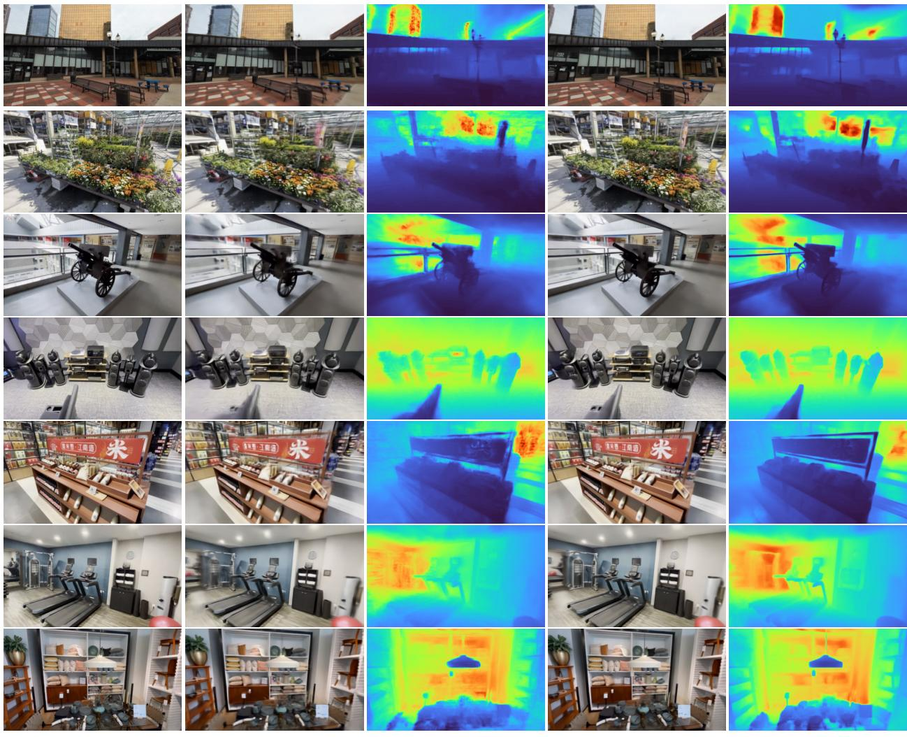  
GT  
Figure 11: Qualitative comparison on DL3DV novel-view synthesis. LocusGS produces sharper renderings and more coherent depth structures, especially in texture-rich regions and cluttered scenes.

## References

[1] Johannes Lutz Schönberger and Jan-Michael Frahm. Structure-from-motion revisited. In Proc. CVPR, 2016.

[2] Johannes Lutz Schönberger, Enliang Zheng, Marc Pollefeys, and Jan-Michael Frahm. Pixelwise view selection for unstructured multi-view stereo. In Proc. ECCV, 2016.

[3] Ben Mildenhall, Pratul P Srinivasan, Matthew Tancik, Jonathan T Barron, Ravi Ramamoorthi, and Ren Ng. Nerf: Representing scenes as neural radiance fields for view synthesis. Communications ofthe ACM, 65(1):99–106, 2021.

[4] Bernhard Kerbl, Georgios Kopanas, Thomas Leimkühler, and George Drettakis. 3d gaussian splatting for real-time radiance field rendering. ACM Transactions on Graphics, 42(4), July 2023.

[5] David Charatan, Sizhe Li, Andrea Tagliasacchi, and Vincent Sitzmann. pixelSplat: 3D Gaussian splats from image pairs for scalable generalizable 3D reconstruction. In Proc. CVPR, 2024.

[6] Yuedong Chen, Haofei Xu, Chuanxia Zheng, Bohan Zhuang, Marc Pollefeys, Andreas Geiger, Tat-Jen Cham, and Jianfei Cai. MVSplat: efficient 3d gaussian splatting from sparse multi-view images. arXiv, 2403.14627, 2024.

[7] Haofei Xu, Songyou Peng, Fangjinhua Wang, Hermann Blum, Daniel Barath, Andreas Geiger, and Marc Pollefeys. Depthsplat: Connecting gaussian splatting and depth. In CVPR, 2025.

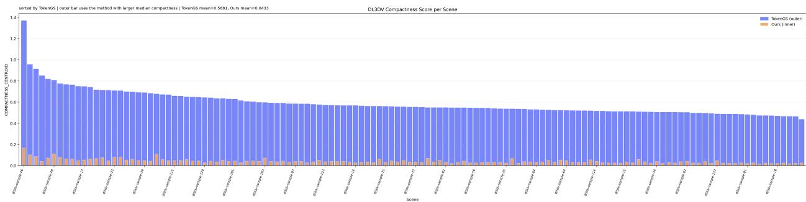  
Figure 12: Per-scene dispersion score comparison between TokenGS and our method on DL3DV. Each overlaid pair of bars corresponds to the same scene. Our method consistently yields substantially lower dispersion scores than TokenGS, indicating that the Gaussian groups associated with each anchor are spatially more compact and coherent.

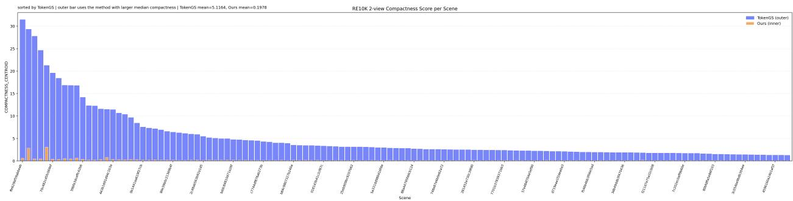  
Figure 13: Per-scene dispersion score comparison between TokenGS and our method on RE10K. Each overlaid pair of bars corresponds to the same scene. Our method consistently yields substantially lower dispersion scores than TokenGS, indicating that the Gaussian groups associated with each anchor are spatially more compact and coherent.

[8] Jiawei Ren, Michal Tyszkiewicz, Jiahui Huang, and Zan Gojcic. Tokengs: Decoupling 3d gaussian prediction from pixels with learnable tokens. Proceedings of the IEEE/CVF Conference on Computer Vision and Pattern Recognition, 2026.

[9] Roni Itkin, Noam Issachar, Yehonatan Keypur, Xingyu Chen, Anpei Chen, and Sagie Benaim. Globalsplat: Efficient feed-forward 3d gaussian splatting via global scene tokens. arXiv preprint arXiv:2604.15284, 2026.

[10] Gyeongjin Kang, Jisang Yoo, Jihyeon Park, Seungtae Nam, Hyeonsoo Im, Sangheon Shin, Sangpil Kim, and Eunbyung Park. Selfsplat: Pose-free and 3d prior-free generalizable 3d gaussian splatting. In Proceedings ofthe Computer Vision and Pattern Recognition Conference, pages 22012–22022, 2025.

[11] Botao Ye, Sifei Liu, Haofei Xu, Li Xueting, Marc Pollefeys, Ming-Hsuan Yang, and Peng Songyou. No pose, no problem: Surprisingly simple 3d gaussian splats from sparse unposed images. arXiv preprint arXiv:2410.24207, 2024.

[12] Yunsong Wang, Tianxin Huang, Hanlin Chen, and Gim Hee Lee. Freesplat: Generalizable 3d gaussian splatting towards free-view synthesis of indoor scenes. arXiv preprint arXiv:2405.17958, 2024.

[13] Chin-Yang Lin, Cheng Sun, Fu-En Yang, Min-Hung Chen, Yen-Yu Lin, and Yu-Lun Liu. Longsplat: Robust unposed 3d gaussian splatting for casual long videos. In ICCV, 2025.

[14] Weijie Wang, Donny Y Chen, Zeyu Zhang, Duochao Shi, Akide Liu, and Bohan Zhuang. Zpressor: Bottleneckaware compression for scalable feed-forward 3dgs. arXiv preprint arXiv:2505.23734, 2025.

[15] Chen Ziwen, Hao Tan, Kai Zhang, Sai Bi, Fujun Luan, Yicong Hong, Li Fuxin, and Zexiang Xu. Long-lrm: Long-sequence large reconstruction model for wide-coverage gaussian splats. In Proceedings ofthe IEEE/CVF International Conference on Computer Vision, 2025.

[16] Yihui Li, Chengxin Lv, Zichen Tang, Hongyu Yang, and Di Huang. Tokensplat: Token-aligned 3d gaussian splatting for feed-forward pose-free reconstruction. In Proceedings of the IEEE/CVF Conference on Computer Vision and Pattern Recognition (CVPR), pages 40886–40895, June 2026.

[17] Lihan Jiang, Yucheng Mao, Linning Xu, Tao Lu, Kerui Ren, Yichen Jin, Xudong Xu, Mulin Yu, Jiangmiao Pang, Feng Zhao, et al. Anysplat: Feed-forward 3d gaussian splatting from unconstrained views. ACM Transactions on Graphics (TOG), 44(6):1–16, 2025.

[18] Xiaoxue Zhang, Xiaoxu Zheng, Yixuan Yin, Tiao Zhao, Kaihua Tang, Michael Bi Mi, Zhan Xu, and Dave Zhenyu Chen. Anchorsplat: Feed-forward 3d gaussian splatting with 3d geometric priors. arXiv preprint arXiv:2604.07053, 2026.

[19] Honggyu An, Jaewoo Jung, Mungyeom Kim, Sunghwan Hong, Chaehyun Kim, Kazumi Fukuda, Minkyeong Jeon, Jisang Han, Takuya Narihira, Hyuna Ko, et al. C3g: Learning compact 3d representations with 2k gaussians. arXiv preprint arXiv:2512.04021, 2025.

[20] Shilong Liu, Feng Li, Hao Zhang, Xiao Yang, Xianbiao Qi, Hang Su, Jun Zhu, and Lei Zhang. DAB-DETR: Dynamic anchor boxes are better queries for DETR. In International Conference on Learning Representations, 2022.

[21] Tao Lu, Mulin Yu, Linning Xu, Yuanbo Xiangli, Limin Wang, Dahua Lin, and Bo Dai. Scaffold-gs: Structured 3d gaussians for view-adaptive rendering. In Proceedings ofthe IEEE/CVF Conference on Computer Vision and Pattern Recognition, pages 20654–20664, 2024.

[22] Tinghui Zhou, Richard Tucker, John Flynn, Graham Fyffe, and Noah Snavely. Stereo magnification: Learning view synthesis using multiplane images. arXiv preprint arXiv:1805.09817, 2018.

[23] Lu Ling, Yichen Sheng, Zhi Tu, Wentian Zhao, Cheng Xin, Kun Wan, Lantao Yu, Qianyu Guo, Zixun Yu, Yawen Lu, et al. Dl3dv-10k: A large-scale scene dataset for deep learning-based 3d vision. In Proceedings of the IEEE/CVF Conference on Computer Vision and Pattern Recognition, pages 22160–22169, 2024.

[24] Kai Zhang, Sai Bi, Hao Tan, Yuanbo Xiangli, Nanxuan Zhao, Kalyan Sunkavalli, and Zexiang Xu. Gs-lrm: Large reconstruction model for 3d gaussian splatting. European Conference on Computer Vision, 2024.

[25] Ilya Loshchilov and Frank Hutter. Decoupled weight decay regularization. arXiv preprint arXiv:1711.05101, 2017.