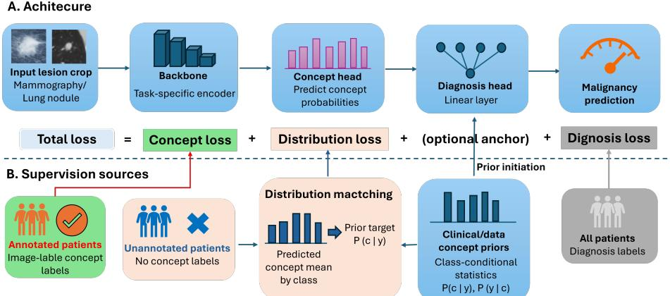
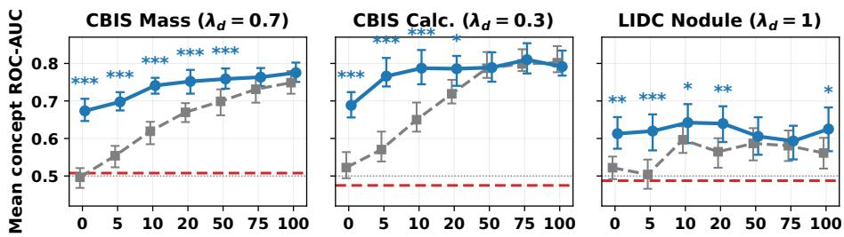
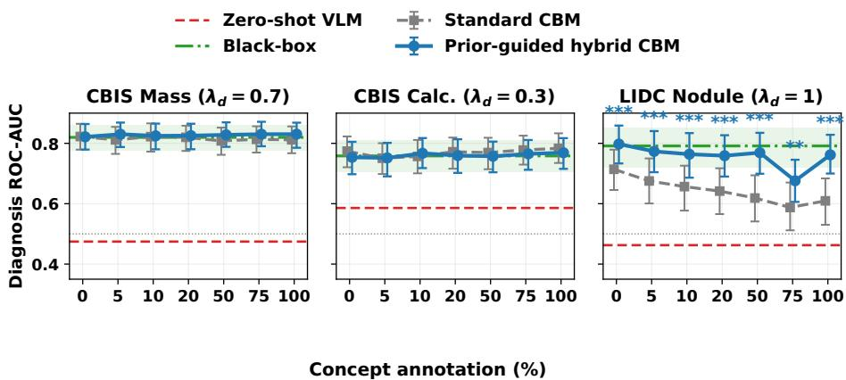
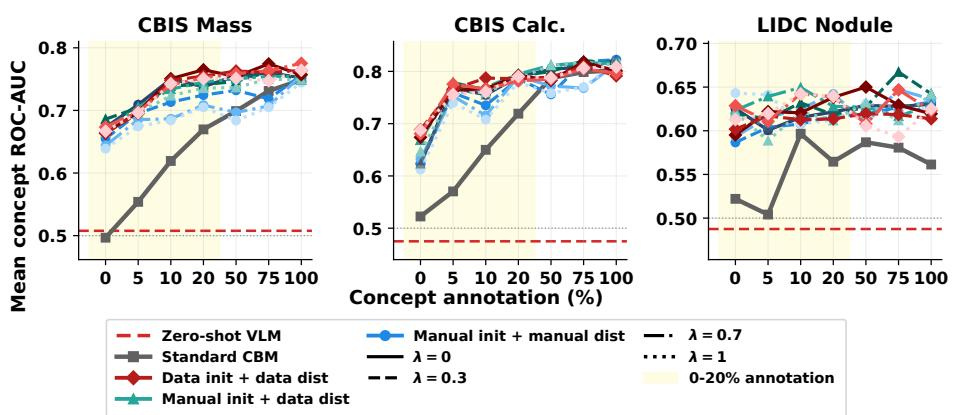

# Less Annotation, More Interpretation: Prior-Guided Concept Bottleneck Models for Interpretable Cancer Imaging Diagnosis

Baoqiang Ma1⋆ and Kenneth Gilhuijs1

Image Sciences Institute, University Medical Center Utrecht, Utrecht, The Netherlands B.Ma-2@umcutrecht.nl

Abstract. Concept bottleneck models (CBMs) can improve the transparency of cancer image diagnostic prediction by expressing predictions through radiological concepts. However, their dependence on instancelevel concept annotations limits practical applicability. We propose a prior-guided hybrid CBM that integrates limited concept annotations, class-conditional concept distribution matching on unannotated patients, and prior initialization of the concept-to-diagnosis head. We evaluate the method on CBIS-DDSM mammographic masses and calcifications and LIDC-IDRI pulmonary nodules across 0–100% concept annotation. In the clinically relevant 0–20% annotation regime, the hybrid CBM consistently improves mean concept AUC over a matched standard CBM, while maintaining diagnostic performance close to black-box models. At 10% annotation specifically, concept AUC increases from 0.619 to 0.741 for masses, from 0.650 to 0.787 for calcifications, and from 0.597 to 0.642 for pulmonary nodules. Ablation experiments identify prior initialization as the main component contributing to improved concept detection, likely by stabilizing the concept-to-diagnosis head. Zero-shot VLMs remain insuficient for reliable fine-grained tumor-level concept prediction. These findings suggest that structured priors can substantially reduce the annotation burden of interpretable cancer imaging models.

Keywords: Concept bottleneck models · Interpretability · Limited concept supervision · Clinical priors · Cancer imaging

## 1 Introduction

Radiology imaging-based deep learning models have demonstrated strong performance in supporting cancer diagnosis and treatment decision-making [1,12]. However, their clinical adoption remains limited due to the lack of relevant evidence and the unclear decision-making process underlying their predictions. Therefore, many explainable artificial intelligence (XAI) methods have been proposed to investigate their interpretability. Saliency-based XAI methods, such as Grad-CAM [18] and Integrated Gradients [19], have been widely applied to localize image regions contributing to model predictions. The choice of XAI methods also substantially afect explanation quality in medical imaging [10]. However, they primarily indicate where a model focuses rather than what radiological characteristics inform its decisions.

Concept bottleneck models (CBMs) ofer intrinsic interpretability by first predicting human-understandable attributes from input images and subsequently using these attributes for final outcome prediction [8]. In cancer imaging, these attributes may correspond to radiological characteristics such as spiculation, lesion shape, margin characteristics, and calcification morphology. CBMs then assign diferent weights to these attributes when generating the final diagnosis. This mimics the radiological diagnostic workflow. However, a major limitation of CBMs is their reliance on image-level concept labels for training, which require expensive and time-consuming expert annotations.

Several approached have been proposed to reduce this burden. For example, semi-supervised CBMs leverage additional unlabeled images through pseudolabeling or concept-level alignment to improve concept learning [6]. Another direction exploits prior clinical knowledge to guide concept prediction. Instead of using image-level concept annotations, Nahiduzzaman et al. utilized predefined class-level concept priors to weakly supervise concept learning [13]. Recently, vision-language models (VLMs) have emerged as a promising alternative for labeleficient concept learning. By learning aligned image and text representations, VLMs enable zero-shot (e.g., label-free CBMs [14]) or few-shot (e.g., CBVLM [15] for lung nodule diagnosis [11]) concept prediction without extensive concept annotations. In particular, CLIP-like models have been widely adopted for zeroshot concept detection by measuring the similarity between image and concept text representations [17]. Several CLIP-based models have been developed for radiological imaging. For example, Mammo-CLIP learns joint representations from mammogram-report pairs [4] and CT-CLIP aligns 3D chest CT volumes with radiology reports [5]. These models demonstrate that broad clinically meaningful information, often at the organ level, can be acquired directly from medical image-report pairs. However, their efectiveness in detecting fine-grained tumorlevel radiological concepts, such as lesion morphology and margin characteristics remains insuficiently explored.

To address this gap, we investigate concept learning for fine-grained tumor level radiological concepts under varying levels of supervision. Specifically, we:

1. Conduct a systematic comparison of concept learning under partial supervision, prior-guided learning, and zero-shot VLM transfer on the CBIS-DDSM [9] and LIDC-IDRI [2] datasets;

2. Propose a hybrid CBM that bridges partial concept supervision and priorguided learning, substantially improving concept prediction in low-annotation settings;

3. Demonstrate that clinically informed prior initialization stabilizes the conceptto-diagnosis mapping and enhances concept learning, especially when concept annotations are scarce;

  
Fig. 1. Overview of PriorHybrid-CBM. A task-specific image backbone predicts radi ological concepts, which are used by a linear diagnosis head. Patients with concept annotations receive instance-level concept supervision; patients without concept annota tions receive class-conditional prior supervision. Prior concept knowledge also initializes (with optional anchors) the concept-to-diagnosis head.

4. Show that current modality-specific VLMs remain insuficient for reliable zero-shot prediction of subtle tumor-level radiological concepts.

## 2 Method

## 2.1 Overview of Hybrid Concept Bottleneck Model

The proposed prior-guided hybrid CBM is constructed based on the standard CBM architecture. As shown in Fig. 1A, given an input image x, a task-specific backbone is applied to extract image features, followed by a linear concept head that produces logits $\mathbf { z } = g _ { \boldsymbol { \theta } } ( { \boldsymbol { x } } )$ and probabilities of predefined concepts, $\hat { \mathbf { c } } = \sigma ( \mathbf { z } ) \in \mathbf { \bar { \rho } } [ 0 , 1 ] ^ { K }$ . A linear diagnosis head then predicts malignancy probability using these concept probabilities.

When concepts annotations are available for all patients, a standard CBM is trained using diagnosis and concept losses:

$$
\mathcal { L } _ { \mathrm { C B M } } = \mathcal { L } _ { \mathrm { d i a g } } ( \mathcal { D } ) + \lambda _ { c } \mathcal { L } _ { \mathrm { c o n c e p t } } ( \mathcal { D } ) ,\tag{1}
$$

where D denotes all training samples. This objective is interpretable but annotationexpensive in clinical imaging.

To reduce the concept annotation cost and keep interpretability, we train the CBM in a hybrid way. Let A denote patients with instance-level concept annotations and U the remaining unannotated patients. For annotated patients, we use the concept loss. For unannotated patients, we use concept distribution matching loss to transfer class-conditional prior knowledge as weak concept supervision. In addition, the same prior knowledge is used to initialize the weights of the diagnosis head with clinical meaning. And we can optionally regularize these weights toward this clinically meaningful initialization. Therefore, the resulting hybrid objective is

$$
\mathcal { L } = \mathcal { L } _ { \mathrm { d i a g } } ( \mathcal { D } ) + \lambda _ { c } \mathcal { L } _ { \mathrm { c o n c e p t } } ( \mathcal { A } ) + \lambda _ { d } \mathcal { L } _ { \mathrm { d i s t } } ( \mathcal { U } ) + \lambda _ { r } \mathcal { L } _ { \mathrm { r e g } } .\tag{2}
$$

$\mathcal { L } _ { \mathrm { d i a g } }$ is the weighted binary cross-entropy for malignancy in all samples. $\mathcal { L } _ { c }$ concept is binary cross-entropy with logits between $\mathbf { z } _ { i }$ and the image-level concept labels $\mathbf { c } _ { i } .$ , evaluated only for samples in $\mathcal { A } . \mathcal { L } _ { \mathrm { d i s t } }$ is illustrated in Section 2.2. The standard baseline CBM can be considered a special setting of this hybrid CBM: setting $\lambda _ { d } = \lambda _ { r } = 0$ and using random initialization for the diagnosis head.

## 2.2 Class-Conditional Prior Supervision

When concept labels are missing, the model can still be guided by the frequency with which radiological concepts are expected to occur in benign and malignant cases. This converts clinical or cohort-level knowledge into a weak supervision signal for the concept predictor training. This relates to learning from aggregate label proportions [16] rather than treating unannotated patients as uninformative.

For diagnosis class $y \in \{ 0 , 1 \}$ , a prior vector $\pi _ { y } \in [ 0 , 1 ] ^ { K }$ encodes the expected class-conditional concept prevalence $P ( c _ { k } = 1 \mid y )$ . For the unannotated samples of class $y$ within a minibatch, distribution matching loss compares the mean predicted concept vector with this prior:

$$
\mathcal { L } _ { \mathrm { d i s t } } = \frac { 1 } { \left| \mathcal { V } _ { B } \right| } \sum _ { y \in \mathcal { V } _ { B } } \mathrm { B C E } \left( \frac { 1 } { \left| \mathcal { U } _ { y } \right| } \sum _ { i \in \mathcal { U } _ { y } } \hat { \mathbf { c } } _ { i } , \pi _ { y } \right) ,\tag{3}
$$

where $\mathcal { { V } } _ { B }$ contains the classes present among the unannotated samples in the minibatch. The loss is applied only to U unannotated patients. This aggregate prior is used to fill the supervision gap for patients without concept annotations.

We evaluate two prior sources: (1) Manual clinical priors encode broad BI-RADS- or radiology-based associations but are not calibrated to the specific dataset population. In contrast, (2) data priors estimate $P ( c _ { k } = 1 \mid y )$ from training patients and therefore better match the class prevalence of concepts of the specifc dataset.

## 2.3 Prior Initialization and Optional Anchoring

In addition to using prior knowledge for weakly concept supervision, we use $P ( y \mid c )$ to initialize the diagnosis head. This gives the model a clinically plausible concept-to-diagnosis mapping. For concept $k ,$ the initial weight is

$$
\begin{array} { r } { w _ { k } ^ { ( 0 ) } = \mathrm { l o g i t } \{ P ( y = 1 \mid c _ { k } = 1 ) \} - \mathrm { l o g i t } \{ P ( y = 1 \mid c _ { k } = 0 ) \} , } \end{array}\tag{4}
$$

and the bias is initialized to the logit of the malignancy base rate. We also evaluate an optional anchor toward these initial weights,

$$
\mathcal { L } _ { \mathrm { r e g } } = \frac { 1 } { K } \Vert \mathbf { w } - \mathbf { w } _ { \mathrm { p r i o r } } \Vert _ { 2 } ^ { 2 } .\tag{5}
$$

In the main configuration, we use a weak anchor with $\lambda _ { r } = 0 . 0 5$ and evaluate the no-anchor setting $( \lambda _ { r } = 0 )$ as a component ablation.

## 3 Experiments

## 3.1 Datasets and Preprocessing

CBIS-DDSM [9] consists of digitized mammography images with annotated diagnosis labels and BI-RADS-related lesion descriptors. The mass cohort of it comprised 1,318 training (regions of interest) ROIs images from 691 patients and 377 held-out test ROIs from 201 patients and concepts describing lesion shape, margin and breast density. The calcification cohort comprised 1,545 training ROIs from 602 patients and 324 held-out test ROIs from 151 patients and concepts describing morphology, distribution, and breast density. ROI images were min–max normalized, padded to a square field of view, resized to $2 2 4 \times 2 2 4$ and loaded as three-channel images with ImageNet normalization. Diagnosis labels were binarized as malignant versus benign or benign-without-callback. All lesion descriptors were transformed into 18 or 14 multi-hot encoding for mass or calcification cases, with the exception of breast density being mapped to [0, 1].

Pulmonary nodule malignancy was evaluated on LIDC-IDRI CT scans [2]. Nodules with median malignancy score 3 were excluded, and malignancy was binarized as median score $> 3$ versus $< 3$ . The remaining cohort was split at the patient level into a training set of 1,204 nodules from 589 patients and a held-out test set of 213 nodules from 105 patients. Nodule-centered volumes of $4 8 ^ { 3 }$ were cropped from pre-resampled 1mm CT, clipped to [−1000, 400] HU, and scaled to [0, 1]. Seven binary radiological concepts were derived by thresholding median radiologist scores or size: obvious nodule, calcification, round shape, well-defined margin, lobulation, spiculation, and large size. These corresponded to subtlety $\geq 3 .$ , calcification $< 6 .$ , sphericity $\geq 4$ , margin $\geq 4$ , lobulation $\geq 3$ , spiculation $\geq 3 ,$ and diameter $\geq 1 0$ mm.

For all three tasks, training patients were partitioned into five folds for model validation and selection.

## 3.2 Implementation and Evaluation

CBIS-DDSM models employed an ImageNet-pretrained 2D DenseNet121 [7] as backbone architecture applied to mammographic ROIs, whereas LIDC-IDRI models used a Med3D-pretrained 3D ResNet18 [3] applied to nodule crops. The concept bottleneck model then include a dropout layer, a linear concept head with sigmoid activations, and a linear diagnosis head operating on the predicted concept probabilities. All models were optimized with AdamW using learning rate $1 0 ^ { - 4 }$ , weight decay $1 0 ^ { - 5 }$ , dropout 0.5, batch size 32, and up to 100 epochs. The learning rate was reduced on validation AUC plateaus. Checkpoints were selected by validation diagnostic AUC after a 30-epoch warmup, with early stopping patience of 20 epochs. Data augmentation was applied. For the main prior-guided configuration, we swept $\lambda _ { d } \in \{ 0 , 0 . 3 , 0 . 7 , 1 . 0 \}$ with data-prior initialization and data-derived distribution targets. The task-specific $\lambda _ { d }$ was selected by mean five-fold validation concept AUC over the 0–20% annotation regime after the warm-up period, giving $\lambda _ { d } = 0 . 7$ for CBIS-DDSM mass, $\lambda _ { d } = 0 . 3$ for CBIS-DDSM calcification, and $\lambda _ { d } = 1 . 0$ for LIDC-IDRI. For each concept-annotation fraction, five fold models were trained and evaluated on the same held-out test set. Final test predictions were obtained by averaging the five models’ malignancy and concept probabilities. Concept annotations were randomly sampled at the patient level at fractions of 0, 5, 10, 20, 50, 75, and 100%. These fractions applied only to labels used in the instance-level concept loss; data-derived aggregate priors were computed separately from the training patients of each fold. The implementation code is available at https: //github.com/baoqiangma96/prior-guided-hybrid-cbm.

The primary evaluation metrics were diagnostic ROC-AUC and mean perconcept ROC-AUC.

## 3.3 Compared Methods

We compare the proposed prior-guided hybrid CBM with three references. The black-box model uses the same dataset-specific backbone followed by a linear diagnosis head. The standard CBM uses the same CBM architecture as the hybrid model, but removes prior guidance by using random diagnosis-head initialization and setting $\lambda _ { d } = \lambda _ { r } = 0$ . Zero-shot VLM references use Mammo-CLIP [4] for CBIS-DDSM and CT-CLIP [5] for LIDC-IDRI to predict concept probabilities from positive/negative text prompts; these concept probabilities are then passed through frozen standard CBM diagnosis heads for malignancy prediction.

## 3.4 Ablation Study

The ablation study focuses on 0, 5, 10, and 20% concept annotation and uses the same task-specific selected distribution weights.

Starting from the main prior-guided configuration, which uses data-prior initialization, data-derived distribution matching, and continued L2 anchoring with $\lambda _ { r } = 0 . 0 5$ , we perform three component-removal ablations: removing the distribution loss $( \lambda _ { d } = 0 )$ , removing prior initialization by using random diagnosishead initialization, and removing the L2 anchoring loss $( \lambda _ { r } = 0 )$ . These ablations test the contributions of distribution-level concept supervision, prior-informed concept-to-diagnosis initialization, and continued anchoring to the initialized diagnosis head, respectively.

## 4 Results and Discussion

## 4.1 Annotation-Eficient Concept Learning

Figure 2 shows that prior guidance mainly improves the clinically relevant lowannotation regime. Between 0 and 20% concept annotation, the prior-guided hybrid CBM consistently outperformed the matched standard CBM in mean concept ROC-AUC significantly. At 10% annotation, concept AUC increased from 0.619 to 0.741 for CBIS-DDSM masses, from 0.650 to 0.787 for calcifications, and from 0.597 to 0.642 for LIDC-IDRI nodules. This is the central practical benefit of the method: radiologist concept annotations are expensive, and the largest gains appear exactly when only a small subset of patients has instance-level concept labels.

  
Concept annotation (%)  
Fig. 2. Concept annotation eficiency. Mean concept ROC-AUC is reported for the prior-guided hybrid CBM, matched standard CBM, and zero-shot VLM reference. Error bars denote percentile bootstrap 95% confidence intervals. Stars denote paired bootstrap significance for hybrid CBM versus standard CBM.

The zero-shot VLM references were consistently weaker for concept prediction, achieving AUCs around 0.50. Therefore, prompt-based annotation-free concept recognition is not efective enough in these cancer-imaging tasks.

## 4.2 Diagnostic Performance

Figure 3 shows that improved concept detection did not require sacrificing diagnostic discrimination. For CBIS-DDSM masses and calcifications, both the standard CBM and the prior-guided hybrid CBM achieved consistently high diagnosis ROC-AUC across all annotation ratios, remaining close to the black-box references. At 10% annotation, the hybrid CBM achieved diagnosis AUCs of 0.825 for masses and 0.767 for calcifications. For LIDC-IDRI pulmonary nodules, the hybrid CBM outperformed the standard CBM across most annotation ratios and remained close to the black-box model in the 0–20% annotation regime, achieving an AUC of 0.764 at 10% annotation. In contrast, the zero-shot VLM baseline showed substantially lower diagnostic performance across all three tasks, indicating that zero-shot VLM concepts are not reliable enough for fine-grained tumor-level CBMs.

## 4.3 Ablation and Prior Source

Table 1 shows the contributions of distribution matching, prior initialization, and continued anchoring. Averaged over 0, 5, 10, and 20% annotation. The full prior-guided model improved mean concept AUC over the standard CBM by 0.131 for masses, 0.142 for calcifications, and 0.082 for nodules. Removing prior initialization caused the clearest concept drop, especially for CBIS-DDSM, while removing the L2 anchoring term had little efect. The distribution loss had a more task-dependent efect once data-prior initialization was retained. It improved the averaged concept AUC for calcifications and nodules, but was similar for masses.

  
Fig. 3. Diagnostic annotation eficiency. Diagnosis ROC-AUC is shown for the priorguided hybrid CBM, matched standard CBM, black-box reference, and zero-shot VLM reference. Error bars denote percentile bootstrap 95% confidence intervals for trained CBM models; the black-box reference is shown as a horizontal line with bootstrap confidence band.

Table 1. Component ablation averaged over 0, 5, 10, and 20% concept annotation. Each cell reports diagnosis AUC / mean concept AUC.
<table><tr><td>Task</td><td colspan="2">Main</td><td colspan="2"> $\_ { \mathcal { L } _ { d i s t } }$ </td><td colspan="2">Random init.</td><td colspan="2"> $\_ L _ { r e g }$ </td><td colspan="2"></td><td colspan="2">Standard CBM</td></tr><tr><td>CBIS-DDSM mass</td><td></td><td>.825 / .716 .823</td><td></td><td>.719</td><td>.824</td><td></td><td>.653</td><td>.829</td><td>.716</td><td></td><td>.819</td><td> /.585</td></tr><tr><td>CBIS-DDSM calcification .758</td><td></td><td>3 / .757 .762</td><td></td><td>/.749</td><td>.762</td><td></td><td>.671</td><td>.760</td><td>/.761</td><td></td><td>.763 / .615</td><td></td></tr><tr><td>LIDC-IDRI nodule</td><td></td><td>.773 / .629 .768</td><td></td><td>.619</td><td>.727</td><td>/.603</td><td></td><td>.781</td><td>/.628</td><td></td><td>.672 / .547</td><td></td></tr></table>

The full prior-source sweep in Supplementary Fig. S1 shows that data-derived priors generally gave stronger concept supervision than manual priors. Using the selected $\lambda _ { d } .$ , mean concept AUC over 0–20% annotation improved from 0.681 to 0.716 for masses and from 0.726 to 0.757 for calcifications when moving from manual-prior initialization and manual distribution targets to data-prior initialization and data-derived targets. For LIDC-IDRI, manual and data priors were similar for concept AUC (0.626 versus 0.629). This does not mean that BI-RADS or manual radiology knowledge is incorrect. Instead, data-derived priors are better calibrated to the specific prevalence, label definitions, and concept co-occurrence patterns of the benchmark cohort.

## 4.4 Why Prior Initialization Matters

The diagnosis-head drift analysis in Supplementary Table S1 further explains why prior initialization was important. At 0% concept annotation, diagnosis heads initialized with either the data prior or the manual prior changed only minimally from their initial weights: the L2 drift was 0.024–0.027 for masses, 0.016–0.025 for calcifications, and 0.006–0.024 for nodules, corresponding to less than 0.5% relative drift of the full weight vector. In contrast, randomly initialized heads showed substantially larger changes, with L2 drift ranging from 0.492 to 0.877, and moved far from the empirical data-prior direction.

Table 2. Test-time concept-correction intervention for the selected prior-guided hybrid CBM at 10% concept annotation. The diagnosis head is fixed; threshold-incorrect concept predictions are replaced by ground-truth concept labels.
<table><tr><td>Task</td><td>Predicted concepts Corrected concepts ∆ AUC</td><td></td></tr><tr><td>CBIS-DDSM mass</td><td>.825</td><td>.836 +.011</td></tr><tr><td>CBIS-DDSM calcification</td><td>.767</td><td>.801 +.034</td></tr><tr><td>LIDC-IDRI nodule</td><td>.764</td><td>.903 +.139</td></tr></table>

These results suggest that prior initialization stabilizes the concept-to-diagnosis mapping when instance-level concept supervision is absent. By starting from a clinically meaningful concept-diagnosis association rather than a random diagnostic direction, the model can learn image-to-concept representations while keeping the diagnosis head anchored to a plausible prior. This provides a more stable optimization signal when concept annotations are scarce or unavailable.

## 4.5 Concept Correction and Future Clinical Use

We further tested an oracle concept-correction setting at 10% annotation Table 2). The diagnosis head was fixed, and threshold-incorrect concept predictions were replaced with ground-truth labels. This simulates an idealized clinician-in-theloop workflow in which concept errors are corrected before diagnosis. Concept correction improved diagnosis AUC by 0.011 for masses, 0.034 for calcifications, and 0.139 for LIDC-IDRI nodules. This indicates that better concept prediction and selective correction can improve downstream diagnosis.

## 4.6 Limitations

This study has several limitations. First, both datasets are retrospective public benchmarks, and the learned data priors may encode cohort-specific correlations. Second, data-derived priors require aggregate concept statistics, potentially obtained from historical annotations. Thus, any reduction in clinical workload is conditional on a suitable prior being available and should be confirmed in prospective annotation-time studies. Third, we report mean concept AUC and did not perform a detailed per-concept error analysis. As a result, rare concepts may remain unstable even when the mean performance improves. Fourth, the conceptcorrection experiment is an oracle analysis, as it assumes prior knowledge of which concept predictions are incorrect. Future work should evaluate the method on prospective external cohorts, estimate priors from limited or external annotations, and test clinician-in-the-loop workflows in which radiologists selectively review and correct clinically important concepts.

## 5 Conclusion

This study demonstrates that prior-guided hybrid CBMs can reduce the need for instance-level concept annotations in cancer imaging while preserving clinically meaningful concept-based reasoning. By combining limited expert concept labels with class-conditional prior supervision and prior initialization, the proposed model improves concept detection in low-annotation settings without sacrificing diagnostic discrimination. The results also show that current zero-shot VLMs do not yet provide a suficient substitute for task-specific concept supervision. Overall, structured prior knowledge ofers a practical path toward more annotation-eficient and interpretable cancer imaging models.

Disclosure of Interests. The authors have no competing interests to declare that are relevant to the content of this article.

## References

1. Ardila, D., Kiraly, A.P., Bharadwaj, S., Choi, B., Reicher, J.J., Peng, L., Tse, D., Etemadi, M., Ye, W., Corrado, G., Naidich, D.P., Shetty, S.: End-to-end lung cancer screening with three-dimensional deep learning on low-dose chest computed tomography. Nature Medicine 25, 954–961 (2019). https://doi.org/10.1038/ s41591-019-0447-x

2. Armato, S.G., et al.: The lung image database consortium (LIDC) and image database resource initiative (IDRI): A completed reference database of lung nodules on CT scans. Medical Physics 38(2), 915–931 (2011)

3. Chen, S., Ma, K., Zheng, Y.: Med3D: Transfer learning for 3d medical image analysis. arXiv preprint arXiv:1904.00625 (2019)

4. Ghosh, S., Poynton, C.B., Visweswaran, S., Batmanghelich, K.: Mammo-CLIP: A vision language foundation model to enhance data eficiency and robustness in mammography. In: Medical Image Computing and Computer Assisted Intervention. pp. 632–642 (2024)

5. Hamamci, I.E., Er, S., Wang, C., et al.: Developing generalist foundation models from a multimodal dataset for 3d computed tomography. Nature Biomedical Engineering (2025). https://doi.org/10.1038/s41551-025-01599-y

6. Hu, L., Huang, T., Xie, H., Gong, X., Ren, C., Hu, Z., Yu, L., Ma, P., Wang, D.: Semi-supervised concept bottleneck models. arXiv preprint arXiv:2406.18992 (2024)

7. Huang, G., Liu, Z., van der Maaten, L., Weinberger, K.Q.: Densely connected convolutional networks. In: Proceedings of the IEEE Conference on Computer Vision and Pattern Recognition. pp. 4700–4708 (2017). https://doi.org/10.1109/ CVPR.2017.243

8. Koh, P.W., Nguyen, T., Tang, Y.S., Mussmann, S., Pierson, E., Kim, B., Liang, P.: Concept bottleneck models. In: Proceedings of the 37th International Conference on Machine Learning. pp. 5338–5348 (2020)

9. Lee, R.S., Gimenez, F., Hoogi, A., Miyake, K.K., Gorovoy, M., Rubin, D.L.: A curated mammography data set for use in computer-aided detection and diagnosis research. Scientific Data 4, 170177 (2017)

10. Ma, B., Madzia-Madzou, D.K., Kraaijveld, R.C.J., Ouyang, J.: Ranking XAI methods for head and neck cancer outcome prediction. In: 23rd IEEE International Symposium on Biomedical Imaging, ISBI 2026, London, United Kingdom, April 8–11, 2026. pp. 1–4. IEEE (2026). https://doi.org/10.1109/ISBI61048.2026. 11515968, https://doi.org/10.1109/ISBI61048.2026.11515968

11. Ma, B., Madzia-Madzou, D.K., Ouyang, J., Gilhuijs, K.G.A.: Can vision-language models enable more eficient concept-based learning with less supervision for interpretable lung nodule diagnosis? In: MIDL 2026 Short Papers (2026), https: //openreview.net/forum?id=OyOHg986R5, poster

12. McKinney, S.M., Sieniek, M., Godbole, V., Godwin, J., Antropova, N., Ashrafian, H., Back, T., Chesus, M., Corrado, G.S., Darzi, A., Etemadi, M., Garcia-Vicente, F., et al.: International evaluation of an AI system for breast cancer screening. Nature 577, 89–94 (2020). https://doi.org/10.1038/s41586-019-1799-6

13. Nahiduzzaman, M., Korevaar, S., Bab-Hadiashar, A., Tennakoon, R.: Weakly supervised concept learning with class-level priors for interpretable medical diagnosis. arXiv preprint arXiv:2511.01131 (2025)

14. Oikarinen, T., Das, S., Nguyen, L.M., Weng, T.W.: Label-free concept bottleneck models. In: International Conference on Learning Representations (2023)

15. Patrício, C., Rio-Torto, I., Cardoso, J.S., Teixeira, L.F., Neves, J.C.: CBVLM: Training-free explainable concept-based large vision language models for medical image classification. Computers in Biology and Medicine 198, 111145 (2025). https://doi.org/10.1016/j.compbiomed.2025.111145

16. Quadrianto, N., Smola, A.J., Caetano, T.S., Le, Q.V.: Estimating labels from label proportions. In: Proceedings of the 26th International Conference on Machine Learning. pp. 776–783 (2009)

17. Radford, A., et al.: Learning transferable visual models from natural language supervision. In: Proceedings of the 38th International Conference on Machine Learning. pp. 8748–8763 (2021)

18. Selvaraju, R.R., Cogswell, M., Das, A., Vedantam, R., Parikh, D., Batra, D.: Grad-CAM: Visual explanations from deep networks via gradient-based localization. In: Proceedings of the IEEE International Conference on Computer Vision. pp. 618–626 (2017)

19. Sundararajan, M., Taly, A., Yan, Q.: Axiomatic attribution for deep networks. In: Proceedings of the 34th International Conference on Machine Learning. pp. 3319–3328 (2017)

## A Complete Hybrid-CBM Prior and Distribution Sweep

  
Fig. S1. Complete mean concept ROC-AUC sweep across evaluated prior sources and distribution-loss weights. The shaded region denotes the 0–20% low-annotation regime emphasized in the main analysis.

## B Diagnosis-Head Weight Drift

Table S1. Diagnosis-head weight drift at 0% concept annotation. Each cell reports L2 drift from initialization, with relative drift in parentheses.
<table><tr><td>Task</td><td>Data init + anchor Data init, no anchor Manual init + anchor</td><td></td><td></td><td>Random init</td></tr><tr><td>CBIS-DDSM mass</td><td>0.024 (0.35%)</td><td>0.019 (0.28%)</td><td>0.027 (0.39%)</td><td>0.817 (141.51%)</td></tr><tr><td>CBIS-DDSM calcification</td><td>0.025 (0.22%)</td><td>0.024 (0.21%)</td><td>0.016 (0.16%)</td><td>0.877 (151.90%)</td></tr><tr><td>LIDC-IDRI nodule</td><td>0.024 (0.41%)</td><td>0.021 (0.36%)</td><td>0.006 (0.12%)</td><td>0.492 (85.25%)</td></tr></table>