# NaviDC-OCR: Navigating Document Parsing Across Digital and Camera-Captured Documents

Peng Cai1, Zhaofan Zou∗1, Shifa Liu1, Yikun Wang1, Jiawei Tang1, Kaicheng Yang1, Meng Tong1, Zhongjiang He∗1, Hao Sun∗1

1China Telecom Artificial Intelligence Technology (Beijing) Co., Ltd.

Document parsing aims to transform unstructured documents into structured and machine-readable representations. Recent advances in Vision-Language Models (VLMs) have significantly advanced document parsing. However, existing approaches still face two major challenges. First, decoupled VLMbased methods heavily rely on accurate layout analysis, where geometric distortions in camera-captured documents can introduce cascading errors. Second, although end-to-end VLM-based methods alleviate the dependence on explicit layout detection, they often sufer from redundant generation, hallucinations, and insuficient structural reasoning in high-resolution scenarios. To address these challenges, we propose NaviDC-OCR, a unified framework for document parsing. NaviDC-OCR introduces deformation-aware learning to incorporate geometric perception into VLMs and proposes an adaptive sampling mechanism for complex layout representation. Furthermore, a content-structure decoupled learning strategy is developed to explicitly model formula grammars and table structures, enabling more efective structured representation learning. Extensive experiments demonstrate that NaviDC-OCR achieves state-of-the-art performance across diverse document parsing benchmarks. It obtains overall scores of 96.87, 88.53 and 78.41 on OmniDocBench v1.6, Wild-OmniDocBench, and PureDocBench, respectively, and ranks first in the ICDAR 2026 Sci-ImageMiner Challenge. These results validate the efectiveness and generalization capability of NaviDC-OCR in complex document parsing scenarios.

∗Correspondence to: Zhaofan Zou (zouzhf41@chinatelecom.cn), Hao Sun (sun.010@163.com)

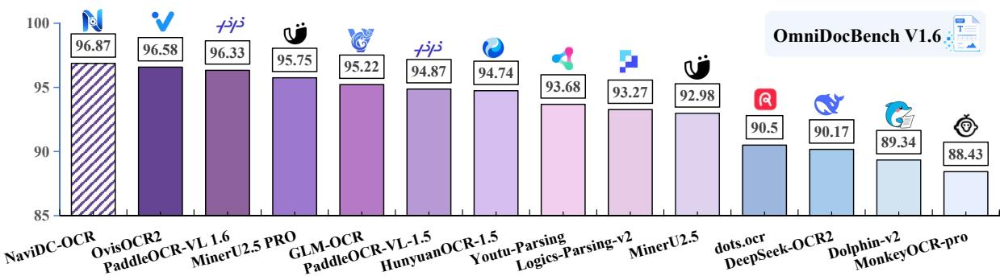

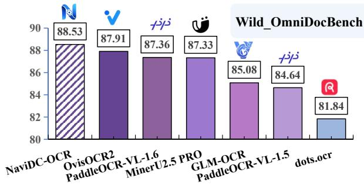

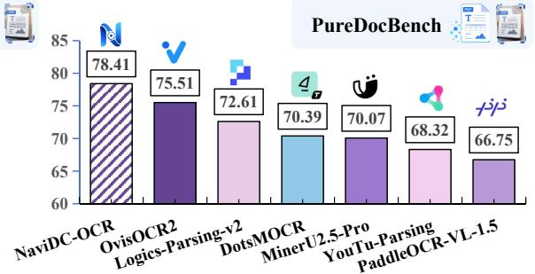  
Figure 1 NaviDC-OCR enables unified parsing of digital and camera-captured documents, achieving SOTA performance on OmniDocBench V1.6, Wild-OmniDocBench, and PureDocBench over end-to-end and decoupled approaches.

## Contents

1 Introduction 3   
2 Related Work 4   
2.1 VLM-based Document Parsing Methods . 4   
2.2 Document Rectification for Enhanced Parsing 4   
2.3 Vision-Language Model-based Segmentation 5   
3 Data Engineering   
3.1 Multi-node Consensus Voting   
3.2 Unifying Digital and Camera-Captured Documents . 6   
3.2.1 Region-level and Point-level Deformation Awareness 7   
3.2.2 Curvature-Guided Douglas–Peucker Sampling 7   
3.3 Self-Judgement VLM . 8   
4 Progressive Training 8   
4.1 Stage 1: Document Parsing Pre-training 9   
4.2 Stage 2: Deformation-aware Training 10   
4.3 Stage 3: Content-Structure Decoupled Learning 10   
4.4 Stage 4: Reinforcement Learning 10   
5 Experimental Evaluation 11   
5.1 Digital Document Parsing . . 11   
5.2 Camera-Captured Document Parsing 12   
5.3 Scientific Figure-to-Table conversion 13   
6 Conclusion 13   
A Prompt Design and Task Examples 18   
A.1 Digital Layout Detection . . 18   
A.2 Camera-captured Layout Segmentation 18   
A.3 Text Recognition 19   
A.4 Formula Recognition 19   
A.5 Table Recognition 19   
A.6 Code Block Recognition 20   
A.7 Scientific Figure Analysis 21   
A.8 Seal Recognition 22   
B Data Synthesis Details 22   
C Qualitative Comparison with SOTA Methods 24   
C.1 Layout Recognition 24   
C.2 Table Parsing . 26   
C.3 Formula Extraction 28   
D Benchmark Evaluation Details 30

## 1 Introduction

Document parsing aims to transform unstructured documents into structured representations, such as Markdown, and serves as a fundamental component for constructing training data pipelines and Retrieval-Augmented Generation (RAG) systems Guo et al. (2025); Wang et al. (2025b). Since parsing results directly afect downstream applications, accurate text recognition, layout understanding, and structural reconstruction are essential.

With increasing diversity in document acquisition conditions, document parsing systems need to handle both digital and camera-captured documents with complex degradations. To evaluate performance under these scenarios, several benchmarks have been introduced, including OmniDocBench V1.6 Wang et al. (2026) for digital documents and Wild-OmniDocBench Li et al. (2026a) for camera-captured documents. Correspondingly, existing VLM-based document parsing methods have developed into two paradigms: end-to-end and decoupled approaches. End-to-end methods are generally more robust to geometric distortions, whereas decoupled approaches perform better on high-resolution digital documents. However, decoupled approaches rely heavily on accurate layout analysis, where errors can propagate to subsequent parsing stages. To investigate this issue, we apply document dewarping preprocessing Cai et al. (2025) to Wild-OmniDocBench samples and find that removing geometric distortions alone substantially improves two-stage parsing performance.

Meanwhile, previous studies Zhong et al. (2025) indicate that documents with a high proportion of structured content generally exhibit higher prediction entropy, reflecting greater uncertainty during structured representation generation. In contrast, OCR tasks mainly rely on character-to-text mapping and therefore involve more stable generation processes. However, tasks such as table parsing and scientific figure-to-table conversion require models to not only understand visual content but also perform structural modeling and cross-modal transformation, which further increases the dificulty of learning and optimization.

Based on the above observations, NaviDC-OCR aims to provide a unified solution for parsing both digital documents and camera-captured documents with distortions. To this end, NaviDC-OCR introduces a global point-level and region-level deformation-aware learning strategy, which integrates document geometric rectification capabilities into VLMs. Combined with an adaptive sampling point mechanism, it replaces conventional detection paradigms with layout segmentation, enabling fine-grained document layout modeling. NaviDC-OCR achieves an overall score of 88.53 on Wild OmniDocBench v1.5, outperforming most existing end-to-end document parsing methods.

Furthermore, highly structured tasks, such as formula parsing and table parsing, require simultaneous modeling of structural reasoning and content generation, increasing optimization complexity. To address this issue, NaviDC-OCR proposes a content-structure decoupled learning strategy that explicitly separates structural prediction from content generation. Taking table parsing as an example, the model first predicts the table OTSL structure Lysak et al. (2023) and then reconstructs cell contents based on the predicted structure, thereby explicitly modeling structural information and reducing optimization coupling. This strategy is also efective for scientific figure-to-table conversion by enhancing structural modeling capability, enabling NaviDC-OCR to achieve first place in the ICDAR 2026 Sci-ImageMiner Challenge Ahmed et al. (2026).

The contributions are summarized as follows:

1. We propose NaviDC-OCR, a unified document parsing framework that implicitly integrates document dewarping capabilities into VLMs through global point-level and region-level deformation-aware learning and an adaptive sampling point mechanism, enabling unified parsing of both digital and camera-captured documents.

2. We propose a content-structure decoupled learning strategy for highly structured document parsing tasks, which explicitly models formula grammars and table structures as intermediate reasoning processes. This strategy efectively reduces uncertainty in structure generation and significantly improves performance on formula parsing, table parsing, and scientific figure-to-table conversion tasks.

3. We conduct comprehensive evaluations on multiple public benchmarks and competitions. Experimental results demonstrate that NaviDC-OCR achieves superior performance across digital document, cameracaptured document, and scientific document parsing tasks. It obtains an overall score of 96.87 on

OmniDocBench v1.6, an overall score of 88.53 on Wild OmniDocBench v1.5, and ranks first in the ICDAR 2026 Sci-ImageMiner Challenge, validating its efectiveness and generalization capability.

## 2 Related Work

## 2.1 VLM-based Document Parsing Methods

Existing document parsing methods based on Vision-Language Models (VLMs) can be broadly categorized into two groups: end-to-end VLM approaches and decoupled VLM approaches. End-to-end methods directly map document images into structured representations through unified vision-language modeling, avoiding error accumulation in traditional pipelines. Recently, OCR-oriented end-to-end models have attracted increasing attention. OvisOCR Lu et al. (2026) improves text and layout parsing in high-resolution documents by optimizing visual information interaction mechanisms. DeepSeek-OCR Wei et al. (2025) explores an OCR paradigm that integrates visual compression with language model reasoning, reducing the computational cost of long-document parsing. HunyuanOCR Team et al. (2025) achieves unified multi-task modeling through a high-resolution vision encoder and a lightweight language model. In addition, Logics-Parsing An et al. (2026) enhances complex layout understanding through layout-aware reinforcement learning. However, end-to-end methods typically sufer from high computational overhead in high-resolution scenarios and strong coupling between structural reasoning and content generation, limiting their scalability for complex document parsing.

In contrast, decoupled VLM methods combine the controllability of traditional pipelines with the semantic modeling capability of VLMs, and generally adopt a two-stage paradigm of "layout analysis followed by content parsing." Dolphin Feng et al. (2025) introduces an analyze-then-parse framework, where layout element sequences guide region-level content parsing. MonkeyOCR v1.5 Zhang et al. (2025) and GLM-OCR Duan et al. (2026) improve table recognition and OCR inference eficiency from the perspectives of visual consistency optimization and eficient decoding, respectively. Youtu-Parsing Yin et al. (2026) further explores shared visual representations and parallel decoding mechanisms to reduce inference costs. For camera-captured document scenarios, PaddleOCR-VL-1.5 Cui et al. (2026) introduces multi-point bounding box modeling to handle physically degraded layouts, while PaddleOCR-VL-1.6 Zhang et al. (2026) and MinerU2.5-Pro Wang et al. (2026) improve parsing performance through data optimization and multi-model fusion, respectively. Nevertheless, existing decoupled approaches still heavily rely on accurate layout analysis. Geometric distortions can propagate errors through subsequent modules, limiting their efectiveness in complex camera-captured document scenarios. NaviDC-OCR follows the decoupled VLM paradigm and further improves its capability by replacing conventional rectangular detection with layout segmentation, incorporating deformation-aware learning, and introducing a content-structure decoupled strategy. These designs enable unified parsing of both digital and camera-captured documents while enhancing performance on complex structured document understanding tasks.

## 2.2 Document Rectification for Enhanced Parsing

Document dewarping enhancement aims to correct perspective distortions and geometric deformations in camera-captured documents, thereby improving subsequent parsing performance. DDCP Xie et al. (2021) predicts a fixed number of foreground control points and estimates backward mappings based on the correspondence between control points and reference points, enabling document dewarping. DocGeoNet Feng et al. (2022) introduces segmentation supervision to encourage CNN-based text-line feature extractors to learn more discriminative geometric rectification features. RDGR Jiang et al. (2022) first detects text lines and boundary information, and then generates backward mappings with grid regularization to preserve document structural integrity during the dewarping process. ForCenNet Cai et al. (2025) further explicitly models document foreground regions and enhances the model’s awareness of foreground geometric structures through curvature consistency loss and mask-guided mechanisms.Diferent from the above methods based on explicit geometric modeling, this paper integrates document rectification capability into a Vision-Language Model (VLM), enabling the model to directly learn deformation-related geometric control points. Meanwhile, regionlevel and global point-level deformation-aware mechanisms are designed to transform document rectification from an independent preprocessing module into an internal joint modeling capability of the VLM. This design improves the parsing performance of decoupled VLMs in camera-captured document scenarios.

## 2.3 Vision-Language Model-based Segmentation

Multimodal Large Language Model (MLLM)-based methods for region segmentation can be broadly categorized into two groups: one directly generates segmentation results through end-to-end sequence prediction, while the other introduces dedicated segmentation heads for task adaptation. SAM-based methods, such as SAM4MLLM Chen et al. (2024), leverage external segmentation models to obtain high-quality masks, but introduce additional parameters and deployment overhead. Furthermore, SAM3 Carion et al. (2025) extends foundation segmentation models to concept-prompted segmentation, object detection, and tracking tasks, further strengthening the external model paradigm. In contrast, SAM-free methods achieve region segmentation through lightweight dense prediction heads or unified autoregressive modeling, such as PerceptionGPT Pi et al. (2024), UFO Tang et al. (2026), and Qwen3-VL-Seg Yao et al. (2026). For end-to-end sequence prediction, VistaLLM Pramanick et al. (2024) proposes a gradient-based dynamic sampling strategy to convert binary masks into point sequence representations. Considering the requirements of model unification and eficiency, this paper further reformulates conventional two-point layout analysis as a VLM-based sequence prediction task. A Curvature-Guided Douglas–Peucker Sampling (CGDP) method is proposed to adaptively distribute sampling points according to document geometric deformation characteristics, thereby enhancing the capability of VLMs to model complex layout structures.

## 3 Data Engineering

High-quality and large-scale data are fundamental to building high-performance document parsing models. However, document parsing involves diverse structural information, including text, layouts, tables, and formulas. Relying on human experts for fine-grained annotation is not only costly but also dificult to maintain annotation consistency. To address this challenge, NaviDC-OCR develops an automated data engineering pipeline that integrates data cleaning, data construction, and model-assisted validation. In the first stage, multi-node consistency voting aggregates predictions from heterogeneous models to select high-confidence pseudo-labels and reduce individual model biases. In the second stage, document deformation modeling and geometry-aware sampling strategies are introduced to construct diverse training data covering domain variations between digital and camera-captured documents. In the third stage, a self-evaluation model performs visual consistency verification on parsing results, enabling automatic pseudo-label filtering and error correction.

## 3.1 Multi-node Consensus Voting

Existing approaches mainly rely on a single model for pseudo-label generation. For instance, MinerU2.5 Pro Wang et al. (2026) adopts multi-model cross-validation to filter single-model outputs, while PaddleOCR-VL-1.5 Cui et al. (2026) exploits inference consistency across multiple runs of the same model for sample selection. However, these methods share a fundamental limitation: pseudo-labels are ultimately generated by a single model and are therefore bounded by its capability. Once the model sufers from systematic errors, these incorrect labels can be propagated into the training set, degrading subsequent optimization and final model performance.

To mitigate single-model bias, we propose a Multi-node Consensus Voting (MCV) strategy for reliable pseudo-label generation. Instead of relying on individual predictions, MCV leverages the consensus among multiple heterogeneous models to identify high-quality pseudo-labels. Given a set of N heterogeneous models $\mathcal { M } = \{ M _ { 1 } , M _ { 2 } , \cdot \cdot \cdot , M _ { N } \}$ , each model predicts the same sample $x ,$ producing a prediction set $\mathcal { V } ( x ) = \{ y _ { 1 } , y _ { 2 } , \cdot \cdot \cdot , y _ { N } \}$ , where $y _ { i } = M _ { i } ( x )$

MCV is built upon the Consensus Hypothesis: for heterogeneous models with diferent architectures and training strategies, predictions supported by multiple models are more likely to be reliable than individual predictions. Based on this hypothesis, MCV defines a pairwise consistency function $S ( y _ { i } , y _ { j } ) \in [ 0 , 1 ]$ to measure the agreement between any two predictions. The consistency metric is task-specific, including Intersection-over Union $( I o U )$ for layout detection, Edit Distance for text recognition, TEDS for table parsing, and CDM for formula parsing. The overall consensus score of model $M _ { i }$ is then defined as:

$$
C _ { i } = \frac { 1 } { N - 1 } \sum _ { j \neq i } S ( y _ { i } , y _ { j } )\tag{1}
$$

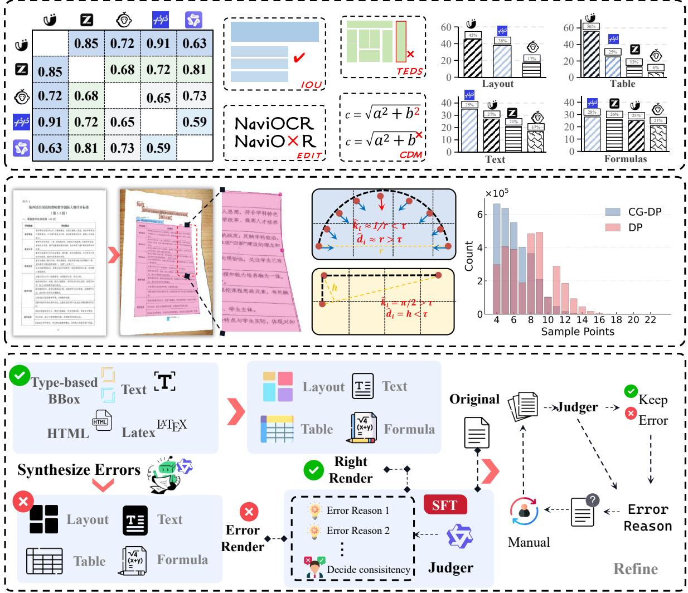  
Figure 2 Overview of the NaviDC-OCR data engineering pipeline. Large-scale document parsing data are constructed through three stages: (1) multi-node consensus voting for high-quality pseudo-label generation, (2) deformation-aware synthesis to bridge digital and camera-captured documents, and (3) image-to-image consistency evaluation with Self-Judgement VLM for automatic validation and refinement. The pipeline covers diverse document elements, including layouts, texts, tables, and formulas.

where $C _ { i }$ measures the average agreement between prediction $y _ { i }$ and the predictions from other models. The prediction with the highest consensus score is selected as the pseudo-label:

$$
\hat { y } = y _ { k } , \quad k = \arg \operatorname* { m a x } _ { i } C _ { i } .\tag{2}
$$

To further improve pseudo-label quality, a consensus threshold $\tau$ is introduced. If $\operatorname* { m a x } _ { i } C _ { i } \geq \tau .$ the corresponding prediction is accepted as a high-confidence pseudo-label and added to the training set. Otherwise, the sample is considered uncertain due to substantial model disagreement and is forwarded to subsequent automatic correction or human verification modules.

## 3.2 Unifying Digital and Camera-Captured Documents

According to the acquisition process, documents can be categorized into digital documents and cameracaptured documents. Compared with digital documents, camera-captured documents often sufer from various degradations, such as geometric distortions, shadows, and motion blur, with geometric distortion being a primary factor afecting parsing performance. In particular, existing two-stage document parsing frameworks typically rely on the assumption of regular rectangular regions for layout detection. When documents are curved or folded, this assumption no longer holds, resulting in degraded layout detection and subsequent parsing performance. To validate this observation, we first apply a document dewarping model to preprocess camera-captured documents in Wild-OmniDocBench Li et al. (2026a). Experimental results show that eliminating geometric distortions alone substantially improves the performance of two-stage parsing models. This finding suggests that deformation awareness is a critical bridge between digital and camera-captured documents. Motivated by this, we incorporate document deformation modeling into a unified document parsing framework, enabling explicit geometric perception without requiring an additional dewarping module.

## 3.2.1 Region-level and Point-level Deformation Awareness

Based on the high-consistency samples selected by MCV, we construct two types of deformation supervision signals: region-level and point-level representations. For the region-level representation, N boundary points are uniformly sampled in a clockwise order along the undistorted layout boundary $L _ { b b o x }$ and serialized as $[ R _ { x 1 } , R _ { y 1 } , \cdot \cdot \cdot , R _ { x N } , R _ { y N } ]$ . For the point-level representation, $M \times M$ control points $P$ are uniformly sampled on the undistorted document plane.

Subsequently, we adopt the document deformation generation strategy of ForCenNet Cai et al. (2025) to synthesize corresponding camera-captured document samples. Specifically, the original backward mapping BM is obtained from Doc3D Das et al. (2019), from which the forward mapping FM is derived. The generated FM is applied to the undistorted image, region boundary points $R ,$ and control points $P ,$ respectively, producing distorted document images with the corresponding warped boundaries $R _ { w }$ and control points $P _ { w }$

During the early training stage, NaviDC-OCR learns the distorted control points $P _ { w }$ under explicit geometric supervision to capture document deformation patterns. Existing document dewarping methods typically represent the backward mapping field (BM) through dense control points $P _ { w } .$ . Subsequently, we introduce distorted region boundary points $R _ { w }$ to replace conventional rectangular bounding boxes and reformulate layout detection as a boundary point prediction task. This design removes the reliance of two-stage layout detection frameworks on regular rectangular assumptions and improves the model’s ability to represent complex layouts in camera-captured documents.

## 3.2.2 Curvature-Guided Douglas–Peucker Sampling

The aforementioned region-level representation relies on uniform boundary sampling, which assumes equal importance across all boundary locations. However, document boundaries often exhibit varying geometric complexity: flat regions may contain redundant samples, whereas high-curvature areas, such as corners and folds, may be under-sampled. This imbalance can lead to the loss of critical geometric details and limit the representation capacity of contour modeling.

To investigate sampling requirements under diferent deformation patterns, we categorize document defor mations into two types: bending and creasing. Bending refers to large-scale continuous deformation with substantial global displacement, which can be efectively characterized by the Douglas–Peucker (DP) dis tance Hershberger and Snoeyink (1992). In contrast, creasing involves local directional discontinuities with high curvature. Due to its limited spatial extent, creasing regions may not generate suficiently large DP errors. Therefore, $D P$ mainly captures region-level geometric deviations, while curvature provides a more suitable measure of point-level local structural importance. For smooth curves, the DP distance approximately satisfies $\begin{array} { r } { d \approx \frac { \kappa L ^ { 2 } } { 8 } } \end{array}$ , indicating that DP distance is jointly determined by local curvature and region scale. Based on this observation, we propose Curvature-Guided Douglas–Peucker Sampling (CGDP), which adaptively adjusts the importance of DP points through curvature-aware modulation:

$$
S _ { i } = d _ { i } ( 1 + \lambda \hat { \kappa } _ { i } ) ,\tag{3}
$$

where $\hat { \kappa } _ { i }$ denotes the normalized local curvature. When the curvature is low, CGDP reduces to the standard DP algorithm. As curvature increases, points with prominent local structures receive higher sampling priority. When max $S _ { i } > \tau$ , the corresponding point is selected as a new recursive node. By integrating the global contour preservation of DP with the local structural awareness of curvature, CGDP preserves critical geometric details, such as creases and sharp corners, under a limited sampling budget, resulting in more accurate document boundary representations.

## 3.3 Self-Judgement VLM

Although multi-model voting produces highly consistent pseudo-labels, they may still contain sample bias and residual errors. To address this limitation, we introduce a self-judgement model that renders structured predictions into visual representations and performs intra-modal consistency evaluation against the original document images. This design transforms conventional cross-modal image-text verification into a more stable image-to-image consistency assessment. Diferent from MinerU 2.5 Pro Wang et al. (2026), which directly uses a general-purpose VLM to evaluate the consistency between original images and predicted results, we investigate the zero-shot verification capability of Qwen3-VL-235B Yang et al. (2025) on a self-constructed high-quality benchmark. The results show that its recall remains below 40%, demonstrating that general purpose VLMs are insuficient for reliable unsupervised pseudo-label verification. Therefore, we convert four types of prediction outputs into unified visual representations and align them with the original document images:

1. Layout: Predicted bounding boxes, categories, and orientation information are projected onto a page canvas to reconstruct the overall document layout;

2. Text: Text content is normalized and reorganized into paragraphs, followed by region-aware re-layout to preserve the original textual structure;

3. Table: Table structures are converted into HTML representations with row-column relationships and merged-cell information, and then rendered into images;

4. Formula: LaTeX sequences are normalized and rendered into corresponding formula images.

Given high-consistency pseudo-labels yˆ, erroneous predictions $\pi ( \hat { y } )$ are synthesized through rule-based and LLM-guided perturbations. These predictions are rendered into $\hat { I } _ { \mathrm { r i g h t } }$ and $\hat { I } _ { \mathrm { b a d } }$ , respectively, forming positive and negative pairs of "original image–correct rendering" and "original image–incorrect rendering" to train the self-judgement model. Specifically, layout perturbations include region-level errors (e.g., missing, displacement, and overlap) and structural-level errors (e.g., merging, splitting, and disorder). Text perturbations involve character-level corruption, text omission, and category misclassification. Table perturbations cover row-column structure errors, cell relationship errors, and content recognition errors. Formula perturbations include syntax errors, structural omissions, and type misclassification. Rule-based perturbations generate explicit and controllable error patterns, whereas LLM-guided perturbations simulate complex errors that require semantic understanding. Based on the above image-to-image paired data, this paper performs supervised fine-tuning on Qwen2.5-VL-7B-Instruct Bai et al. (2025) to obtain the self-judgement model $J _ { \theta }$ . Given the original image $I ( x )$ and the rendered result $\hat { I } _ { y }$ , the model analyzes their visual diferences according to predefined checking criteria $\mathcal { E } = \{ e _ { k } \} _ { k = 1 } ^ { K }$

$$
r _ { k } = M ( I ( x ) , \hat { I } _ { y } , e _ { k } )\tag{4}
$$

The individual analysis results are aggregated into a structured reasoning sequence $R = \left( r _ { 1 } , \ldots , r _ { K } \right)$ , which produces the final consistency decision. The trained $J _ { \theta }$ can automatically filter pseudo-labels, identify error types, and generate error explanations, enabling self-correction of the data construction process. Low-confidence samples are further transferred to a human verification process.

## 4 Progressive Training

To facilitate reproducibility, we provide detailed descriptions of the NaviDC-OCR architecture and training pipeline, and release the complete implementation and model configurations built upon community models. NaviDC-OCR contains approximately 1.2B parameters and consists of a vision encoder inherited from Qwen2.5-VL Bai et al. (2025), a Qwen3-0.6B Yang et al. (2025) language model, and an Aligner trained from scratch. The Aligner adopts a standard multi-layer perceptron (MLP) architecture to align visual and language representations.

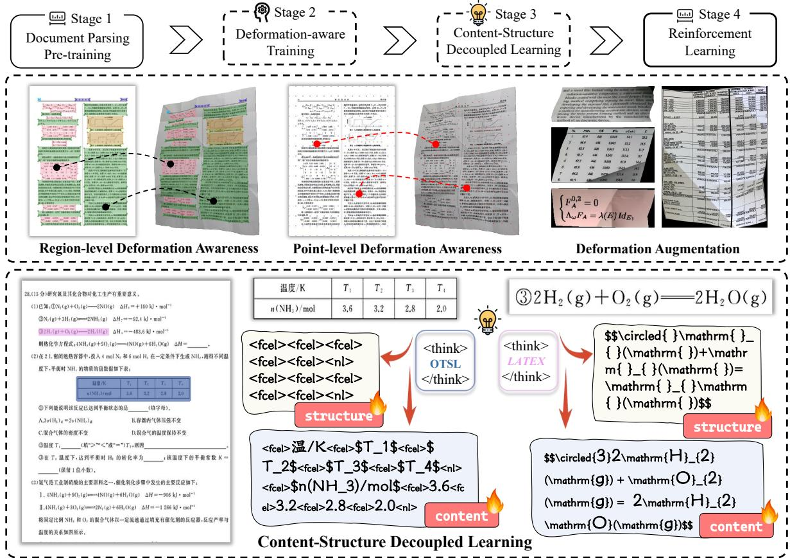  
Figure 3 Overview of the key training strategies. NaviDC-OCR enhances document parsing through two strategies: Deformation-aware training, which incorporates region-level and point-level deformation modeling with deformation augmentation for robust parsing of digital and camera-captured documents; and Content-structure decoupled learning, which enables unified structured parsing of tables and formulas.

Based on this unified architecture, NaviDC-OCR adopts a four-stage progressive training strategy that gradually equips the model with document parsing capabilities, from basic visual perception to complex structural understanding. Each stage targets a specific optimization objective. Stage 1 performs visionlanguage alignment to establish fundamental OCR recognition and layout understanding capabilities. Stage 2 introduces region-level deformation-aware supervision to improve the model’s ability to capture geometric distortions in camera-captured documents. Stage 3 adopts a content-structure decoupled learning strategy to enable unified modeling of diverse document elements, including text, layouts, tables, and formulas. Stage 4 further optimizes output quality through reinforcement learning, enhancing parsing performance in complex real-world scenarios.

## 4.1 Stage 1: Document Parsing Pre-training

The first stage focuses on aligning the vision encoder with the language model to establish a unified visionlanguage representation for subsequent document parsing learning. To provide NaviDC-OCR with fundamental OCR recognition and layout understanding capabilities, we perform pre-training on visual question answering (VQA) data. During this stage, only the two-layer MLPs in the Patch Merger module and the vision encoder are optimized, while the language model remains frozen. The training data consists primarily of image captioning data, image-text interleaved data, vision-language alignment data, and OCR data.

Training Configuration. The model is trained for one epoch with a batch size of 256. The learning rates are set to $1 \times 1 0 ^ { - 3 }$ for the MLP layers and $1 \times 1 0 ^ { - 4 }$ for the vision encoder, while the language model parameters are kept frozen.

## 4.2 Stage 2: Deformation-aware Training

Stage 1 primarily establishes fundamental OCR recognition capabilities, while the ability to jointly model the layouts of digital and camera-captured documents remains limited. To enable the Vision-Language Model to explicitly capture geometric deformation patterns in camera-captured documents, we introduce a point-level deformation-aware training strategy. Specifically, the original deformation field is downsampled into $N ^ { 2 } = 1$ , 024 control points, whereas dedicated document dewarping models (e.g., ForCenNet Cai et al. (2025)) typically employ 82,944 control points for dense deformation modeling. NaviDC-OCR is then trained to directly predict the coordinates of the downsampled control points $P _ { i }$ , enabling document deformation modeling with substantially lower representation complexity.

Training Data. The training data in this stage consists of two components. (1) We collect 4M digital document layout samples and 2M synthetic camera-captured document samples. The synthetic samples include 1.2M region-level deformation samples and 0.8M global point-level deformation samples, constructed from layout coordinates $L _ { b b o x }$ , global deformation control points $P _ { i } ,$ and region boundary points $R _ { i }$ generated by the CGDP sampling strategy. These annotations are selected using the MCV strategy. (2) Based on document parsing data refined by the data engine, approximately 120K high-quality samples are augmented with cameracaptured styles to simulate realistic document degradations, including distortion, shadows, and blur. This augmentation further improves the model’s ability to capture the distribution of camera-captured documents. The objective of this stage is to enhance deformation-aware representation learning for camera-captured documents.

Training Configuration. This stage adopts full-parameter fine-tuning. The learning rates are set to $1 \times 1 0 ^ { - 5 }$ for the language model and $1 \times 1 0 ^ { - 6 }$ for the vision encoder. The model is trained for one epoch with a batch size of 128.

## 4.3 Stage 3: Content-Structure Decoupled Learning

In document parsing tasks, formulas, tables, and scientific figures are typically converted into structured representations, such as LaTeX and OTSL. Unlike optical symbol recognition, which mainly focuses on local character-level mapping, structured representation generation requires stronger global semantic understanding and structural relationship modeling. After establishing fundamental OCR recognition capabilities in Stage 1, NaviDC-OCR introduces a unified content-structure decoupled learning strategy to support diverse structured parsing tasks, including formula parsing, table parsing, and scientific figure-to-table conversion.

Specifically, for formula parsing, we construct a syntax token library and automatically extract syntax structure labels from LaTeX annotations through regular expression matching and syntax verification. This allows the model to separately learn formula content and grammatical structures. For table parsing, we preserve the standard OTSL syntax tokens while removing all cell contents, enabling the model to focus on table topology and cell merging relationships. This unified content-structure learning strategy improves the model’s ability to perform structured representation modeling, particularly for scientific figure-to-table conversion. In the ICDAR 2026 Sci-ImageMiner Challenge, incorporating structural learning achieves competitive TEDS performance compared with other participating teams.

## 4.4 Stage 4: Reinforcement Learning

After the first three training stages, NaviDC-OCR acquires strong capabilities in document recognition and structured parsing. However, supervised fine-tuning with token-level cross-entropy loss does not directly optimize task-level objectives for text, table, and formula parsing. To further improve performance on downstream parsing tasks, we introduce Group Relative Policy Optimization (GRPO)-based reinforcement learning Shao et al. (2024) on the Stage 3 model.

Since diferent document elements have distinct output formats and evaluation criteria, we design task-specific verifiable reward functions for diferent parsing tasks. The unified formulation is defined as:

Table 1 Performance comparison of document parsing methods on OmniDocBench v1.6 Full for text, formula, table, and reading order extraction.
<table><tr><td>Model Type</td><td>Methods</td><td>Param</td><td>Overall↑</td><td> $\boldsymbol { \mathsf { T e x t } } ^ { \mathsf { E d i t } } \downarrow$ </td><td> $\mathsf { F o r m u l a } ^ { \mathsf { c o m } } \uparrow$ </td><td>TableTEDS↑</td><td> $\mathsf { T a b l e } ^ { \mathsf { T E D S - S } } \uparrow$ </td><td>Read OrderEdit↓</td></tr><tr><td rowspan="18">Specialized VLMs</td><td>NaviDC-OCR OvisOCR2 Lu et al. (2026)</td><td>1.2B 0.8B</td><td>96.87 96.58</td><td>0.027</td><td>96.36</td><td>97.05</td><td>98.52</td><td>0.122</td></tr><tr><td></td><td></td><td></td><td>0.033</td><td>97.53</td><td>94.76 94.76</td><td>97.16</td><td>0.111</td></tr><tr><td>PaddleOCR-VL-1.6 Zhang et al. (2026)</td><td>0.9B</td><td>96.33</td><td>0.033</td><td>97.49</td><td></td><td>97.11</td><td>0.127</td></tr><tr><td>MinerU2.5-Pro Wang et al. (2026)</td><td>1.2B</td><td>95.75</td><td>0.036</td><td>97.45</td><td>93.42</td><td>95.92</td><td>0.120</td></tr><tr><td>GLM-OCR Duan et al. (2026)</td><td>0.9B</td><td>95.22</td><td>0.044</td><td>97.18</td><td>92.83</td><td>95.39</td><td>0.133</td></tr><tr><td>PaddleOCR-VL-1.5 Cui et al. (2026)</td><td>0.9B</td><td>94.87</td><td>0.038</td><td>96.69</td><td>91.67</td><td>94.37</td><td>0.130</td></tr><tr><td>HunyuanOCR-1.5 Li et al. (2026b)</td><td>1B</td><td>94.74</td><td>0.033</td><td>97.49</td><td>94.76</td><td>97.11</td><td>0.127</td></tr><tr><td>PaddleOCR-VL Cui et al. (2025)</td><td>0.9B</td><td>94.11</td><td>0.040</td><td>95.70</td><td>90.65</td><td>93.74</td><td>0.135</td></tr><tr><td>Youtu-Parsing Yin et al. (2026)</td><td>2.5B</td><td>93.68</td><td>0.044</td><td>93.45</td><td>92.02</td><td>95.00</td><td>0.116</td></tr><tr><td>Logics-Parsing-v2 An et al. (2026)</td><td>4B</td><td>93.27</td><td>0.041</td><td>95.47</td><td>88.42</td><td>91.98</td><td>0.137</td></tr><tr><td>FireRed-OCR Wu et al. (2026)</td><td>2B</td><td>93.20</td><td>0.037</td><td>95.27</td><td>88.04</td><td>91.06</td><td>0.131</td></tr><tr><td>MinerU2.5 Niu et al. (2025)</td><td>1.2B</td><td>92.98</td><td>0.045</td><td>95.59</td><td>87.88</td><td>91.47</td><td>0.130</td></tr><tr><td>OpenDoc-0.1B Du et al. (2025)</td><td>0.1B</td><td>90.64</td><td>0.049</td><td>92.93</td><td>83.88</td><td>87.45</td><td>0.140</td></tr><tr><td>dots.ocr Li et al. (2025a) DeepSeek-OCR 2 Wei et al. (2025)</td><td>3B</td><td>90.50</td><td>0.048</td><td>89.12</td><td>87.18</td><td>90.58</td><td>0.138</td></tr><tr><td>HunyuanOCR Team et al. (2025)</td><td>3B</td><td>90.17</td><td>0.050</td><td>91.59</td><td>83.89</td><td>87.75</td><td>0.144</td></tr><tr><td>Dolphin-v2 Feng et al. (2025)</td><td>1B</td><td>89.87</td><td>0.089</td><td>87.44</td><td>91.01</td><td>93.23</td><td>0.171</td></tr><tr><td>OCRVerse Zhong et al. (2026b)</td><td>3B</td><td>89.34</td><td>0.069</td><td>90.53</td><td>84.40</td><td>87.44</td><td>0.150</td></tr><tr><td>MonkeyOCR-pro-3B Li et al. (2025b)</td><td>4B 3B</td><td>88.44 88.43</td><td>0.063 0.074</td><td>89.14</td><td>82.44</td><td>86.27</td><td>0.163</td></tr><tr><td></td><td></td><td></td><td></td><td></td><td>88.33</td><td>84.35</td><td>88.62</td><td>0.189</td></tr><tr><td rowspan="6">General VLMs</td><td>Ovis2.6-30B-A3B Lu et al. (2024, 2025)</td><td>30B</td><td>93.62</td><td>0.035</td><td>94.93</td><td>89.44</td><td>92.40</td><td>0.135</td></tr><tr><td>Gemini 3 Pro</td><td></td><td>92.85</td><td>0.064</td><td>95.83</td><td>89.15</td><td>92.96</td><td>0.165</td></tr><tr><td>Gemini 3 Flash</td><td></td><td>92.58</td><td>0.066</td><td>95.03</td><td>89.29</td><td>93.51</td><td>0.173</td></tr><tr><td>Qwen3-VL-235B Yang et al. (2025)</td><td>235B</td><td>89.78</td><td>0.063</td><td>92.53</td><td>83.07</td><td>86.75</td><td>0.166</td></tr><tr><td>GPT-5.2</td><td></td><td>86.52</td><td>0.114</td><td>88.00</td><td>82.95</td><td>87.93</td><td>0.193</td></tr><tr><td>InternVL3.5-241B Wang et al. (2025c)</td><td>241B</td><td>83.61</td><td>0.130</td><td>89.52</td><td>74.35</td><td>79.78</td><td>0.215</td></tr></table>

$$
R _ { \mathrm { t a s k } } ( y , \hat { y } ) = \left\{ \begin{array} { l l } { 1 - \mathrm { N E D } ( y , \hat { y } ) , } & { T a s k = \mathrm { T e x t } , } \\ { \mathrm { T E D S } ( y , \hat { y } ) , } & { T a s k = \mathrm { T a b l e } , } \\ { \mathrm { C D M } ( y , \hat { y } ) , } & { T a s k = \mathrm { F o r m u l a } , } \end{array} \right.\tag{5}
$$

where $y$ and $\hat { y }$ denote the ground truth and model prediction, respectively. For text, table, and formula parsing, normalized edit similarity (NED), Tree Edit Distance-based Similarity (TEDS), and the formula structure matching metric (CDM) are adopted as task-specific rewards. All rewards are normalized to the range of [0, 1], where higher values indicate stronger consistency between predictions and ground truth.

## 5 Experimental Evaluation

To comprehensively evaluate NaviDC-OCR, we conduct extensive experiments on multiple public document parsing benchmarks, including OmniDocBench v1.6 Wang et al. (2026), which covers 10 document types, 5 layout categories, and 5 languages; Wild OmniDocBench v1.5 Li et al. (2026a), which evaluates robustness on real-world captured documents; and PureDocBench Li et al. (2026c), which includes three document categories: Clean, Digital-Degraded, and Real-Degraded. We further report results on the ICDAR 2026 Sci-ImageMiner scientific figure-to-table conversion task to evaluate the generalization capability of NaviDC-OCR in complex document understanding and parsing scenarios.

## 5.1 Digital Document Parsing

OmniDocBench v1.6 is a representative benchmark for page-level digital document parsing, consisting of 1,651 PDF pages across 10 document categories, 5 layout types, and 5 languages. Compared with v1.5, v1.6 introduces a refined element matching strategy for formula evaluation and a challenging subset containing structurally complex pages, enabling more discriminative evaluation of advanced parsing models. The benchmark evaluates four key aspects of document parsing: text recognition using normalized edit distance, formula recognition using the Character Detection Metric (CDM) Wang et al. (2025a), table reconstruction using Tree Edit Distance Similarity (TEDS) and TEDS-S Zhong et al. (2020), and reading order recovery using text block sequence edit distance. The overall score is computed as the average of text recognition, formula CDM, and table TEDS.

As shown in Table 1, NaviDC-OCR outperforms existing pipeline-based methods, including PaddleOCR-VL-1.6, MinerU2.5-Pro, and GLM-OCR, as well as the end-to-end approach OvisOCR2 on OmniDocBench v1.6. Specifically, NaviDC-OCR achieves the best performance in text recognition, table reconstruction, and reading order recovery, obtaining the lowest normalized edit distance for text and reading order evaluation, and the highest TEDS and TEDS-S scores for table parsing. For formula recognition, NaviDC-OCR also achieves competitive results.Further analysis shows that most formula recognition errors are caused by inconsistencies between the first-stage layout parsing results and the granularity of oficial OmniDocBench annotations. This observation suggests that more fine-grained layout modeling is required for further improvement. For table parsing, the proposed content-structure decoupled learning strategy enhances the modeling of complex table structures and improves reconstruction stability. Overall, NaviDC-OCR demonstrates strong document parsing capability and robustness across diverse document understanding tasks.

PureDocBench-Clean is a comprehensive benchmark for evaluating document parsing under diverse acquisition conditions. It generates document images by rendering HTML source files and directly derives annotations from the source files, avoiding manual annotation errors while ensuring annotation consistency. The benchmark contains 1,475 pages from 10 domains and 66 subcategories, with three evaluation tracks: Clean for original rendered pages, Digital for degraded digital documents, and Real for document images captured from physical media or screens. As shown in Table 3, NaviDC-OCR achieves an overall score of 86.90 on the Clean track, surpassing the end-to-end method OvisOCR2 and demonstrating strong performance on high-quality digital documents.

## 5.2 Camera-Captured Document Parsing

Wild-OmniDocBench is a benchmark for evaluating the robustness of document parsing models under real-world capture conditions. Built upon OmniDocBench v1.5 Ouyang et al. (2024), it transforms digital documents into naturally captured images through a physical simulation pipeline involving document printing, deformation, and image acquisition under diverse illumination conditions. Unlike conventional benchmarks based on clean scanned documents or digital renderings, Wild-OmniDocBench introduces realistic degradations, including geometric distortions, illumination variations, screen-capture artifacts, and environmental noise. As shown in Table 2, NaviDC-OCR achieves state-of-the-art performance on the real-capture track of Wild-OmniDocBench, outperforming existing end-to-end document parsing methods and demonstrating strong robustness in practical scenarios.

PureDocBench-Degraded is constructed from the electronic PDF documents in PureDocBench-Clean by simulating digital degradation processes and real-world acquisition conditions. With complex geometric distortions, diverse degradation patterns, and highly structured layouts, this benchmark provides a challenging testbed for evaluating the robustness of document parsing models. By introducing deformation-aware perception and modeling mechanisms, NaviDC-OCR achieves state-of-the-art performance on the Degraded track in Table 3, outperforming existing end-to-end document parsing methods.

Table 2 Performance comparison of document parsing methods on Wild OmniDocBench v1.5 Full for camera-captured document parsing across text, formula, table, and reading order extraction.
<table><tr><td>Model Type</td><td>Methods</td><td>Param</td><td>Overall↑</td><td> $\boldsymbol { \mathsf { T e x t } } ^ { \mathsf { E d i t } } \downarrow$ </td><td>FormulaCDM↑</td><td>TableTEDS↑</td><td> $\mathsf { T a b l e } ^ { \mathsf { T E D S - S } } \uparrow$ </td><td>Read OrderEdit ↓</td></tr><tr><td rowspan="5">Decoupled VLMs</td><td>NaviDC-OCR</td><td>1.2B</td><td>88.53</td><td>0.1173</td><td>88.26</td><td>89.05</td><td>92.14</td><td>0.2011</td></tr><tr><td>PaddleOCR-VL-1.6 Zhang et al. (2026)</td><td>0.9B</td><td>87.36</td><td>0.1369</td><td>88.42</td><td>85.76</td><td>90.14</td><td>0.2057</td></tr><tr><td>MinerU2.5-Pro Wang et al. (2026)</td><td>1.2B</td><td>87.33</td><td>0.1362</td><td>90.15</td><td>85.46</td><td>90.12</td><td>0.2013</td></tr><tr><td>GLM-OCR Duan et al. (2026)</td><td>0.9B</td><td>85.08</td><td>0.1514</td><td>89.09</td><td>81.31</td><td>85.90</td><td>0.2228</td></tr><tr><td>PaddleOCR-VL-1.5 Cui et al. (2026)</td><td>0.9B</td><td>84.64</td><td>0.1461</td><td>86.72</td><td>81.80</td><td>86.52</td><td>0.2138</td></tr><tr><td rowspan="4">End-to-End VLMs</td><td>OvisOCR2 Lu et al. (2026)</td><td>0.8B</td><td>87.91</td><td>0.129</td><td>90.37</td><td>85.13</td><td>89.11</td><td>0.2021</td></tr><tr><td>dots.ocr Li et al. (2025a)</td><td>3B</td><td>81.84</td><td>0.1483</td><td>85.0</td><td>75.32</td><td>80.20</td><td>0.2200</td></tr><tr><td>HunyuanOCR-1.5 Li et al. (2026b)</td><td>1B</td><td>77.62</td><td>0.1979</td><td>85.12</td><td>67.54</td><td>70.67</td><td>0.2750</td></tr><tr><td>Logics-Parsing-v2 An et al. (2026)</td><td>4B</td><td>77.10</td><td>0.4029</td><td>91.4</td><td>80.19</td><td>87.16</td><td>0.2355</td></tr></table>

Table 3 Comparison with existing document parsing models under clean and degraded scenarios. ↑ indicates higher is better, while ↓ indicates lower is better.
<table><tr><td rowspan="2">Model</td><td colspan="4">Clean</td><td colspan="4">Digital Degraded</td><td colspan="4">Real Degraded</td></tr><tr><td>Overall↑</td><td>Text↓</td><td>Formula↑</td><td>Table↑</td><td>Overall↑</td><td>Text↓</td><td>Formula↑</td><td>Table↑</td><td>Overall↑</td><td>Text↓</td><td>Formula↑</td><td>Table↑</td></tr><tr><td colspan="10">Decoupled VLM</td></tr><tr><td>NaviDC-OCR</td><td>86.90</td><td>0.111</td><td>81.01</td><td>91.09</td><td>77.47</td><td>0.206</td><td>72.59</td><td>80.45</td><td>70.85</td><td>0.302</td><td>65.11</td><td>77.66</td></tr><tr><td>DotsMOCR Zheng et al. (2026)</td><td>76.27</td><td>0.151</td><td>66.23</td><td>77.65</td><td>73.16</td><td>0.198</td><td>64.32</td><td>74.95</td><td>61.73</td><td>0.312</td><td>54.39</td><td>61.97</td></tr><tr><td>MinerU2.5-Pro Wang et al. (2026)</td><td>75.87</td><td>0.222</td><td>65.14</td><td>84.68</td><td>71.77</td><td>0.272</td><td>61.79</td><td>80.73</td><td>62.56</td><td>0.375</td><td>52.70</td><td>72.47</td></tr><tr><td>YouTu-Parsing Yin et al. (2026)</td><td>75.02</td><td>0.230</td><td>67.34</td><td>80.74</td><td>69.66</td><td>0.270</td><td>61.44</td><td>74.49</td><td>60.29</td><td>0.360</td><td>52.20</td><td>64.69</td></tr><tr><td>PaddleOCR-VL-1.5 Cui et al. (2026)</td><td>73.01</td><td>0.266</td><td>63.53</td><td>82.12</td><td>66.73</td><td>0.339</td><td>58.03</td><td>76.07</td><td>60.50</td><td>0.398</td><td>54.00</td><td>67.33</td></tr><tr><td>GLM-OCR Duan et al. (2026)</td><td>68.65</td><td>0.314</td><td>57.89</td><td>79.44</td><td>63.06</td><td>0.383</td><td>53.23</td><td>74.21</td><td>58.31</td><td>0.433</td><td>50.34</td><td>67.83</td></tr><tr><td>Dolphin-v2 Feng et al. (2025)</td><td>65.90 62.23</td><td>0.342 0.346</td><td>59.80 48.46</td><td>72.12</td><td>60.24</td><td>0.393</td><td>52.20</td><td>67.86</td><td>44.92</td><td>0.553</td><td>39.98</td><td>50.04</td></tr><tr><td>MonkeyOCR-pro-3B Li et al. (2025b)</td><td></td><td></td><td></td><td>72.83</td><td>57.40</td><td>0.397</td><td>45.57</td><td>66.32</td><td>46.49</td><td>0.511</td><td>38.18</td><td>52.43</td></tr><tr><td colspan="10">End-to-End VLM</td></tr><tr><td>OvisOCR2 Lu et al. (2026)</td><td>82.14</td><td>0.149</td><td>71.29</td><td>90.12</td><td>77.77</td><td>0.192</td><td>67.87</td><td>84.71</td><td>66.61</td><td>0.316</td><td>57.64</td><td>73.79</td></tr><tr><td>FD-RL Zhong et al. (2026a)</td><td>78.38</td><td>0.193</td><td>68.21</td><td>86.22</td><td>76.33</td><td>0.214</td><td>67.16</td><td>83.22</td><td>67.04</td><td>0.298</td><td>58.82</td><td>72.08</td></tr><tr><td>Logics-Parsing-v2 An et al. (2026)</td><td>76.35</td><td>0.213</td><td>67.67</td><td>82.67</td><td>73.85</td><td>0.248</td><td>67.33</td><td>79.02</td><td>67.64</td><td>0.304</td><td>61.65</td><td>71.64</td></tr><tr><td>dots.ocr Li et al. (2025a)</td><td>72.01</td><td>0.248</td><td>61.37</td><td>79.51</td><td>65.95</td><td>0.307</td><td>56.67</td><td>71.86</td><td>55.68</td><td>0.403</td><td>47.70</td><td>59.63</td></tr><tr><td>Qianfan-OCR Dong et al. (2026)</td><td>57.22</td><td>0.370</td><td>49.79</td><td>58.83</td><td>50.85</td><td>0.438</td><td>44.41</td><td>51.96</td><td>45.06</td><td>0.494</td><td>39.08</td><td>45.53</td></tr><tr><td colspan="10">General VLMs</td><td colspan="3"></td></tr><tr><td>Qwen3-VL-8B Yang et al. (2025)</td><td>72.44</td><td>0.261</td><td>65.10</td><td>78.35</td><td>72.03</td><td>0.266</td><td>64.88</td><td>77.82</td><td>62.73</td><td>0.342</td><td>55.55</td><td>66.81</td></tr><tr><td>Kimi K2.6</td><td>72.32</td><td>0.303</td><td>66.93</td><td>80.30</td><td>69.95</td><td>0.322</td><td>64.69</td><td>77.31</td><td>68.02</td><td>0.335</td><td>62.44</td><td>75.14</td></tr><tr><td>Gemini-3.1-Pro</td><td>70.04</td><td>0.306</td><td>65.63</td><td>75.08</td><td>69.28</td><td>0.322</td><td>65.81</td><td>74.24</td><td>71.98</td><td>0.300</td><td>68.62</td><td>77.26</td></tr><tr><td>Qwen3.5-397B-A17B Team (2026)</td><td>69.12</td><td>0.233</td><td>65.26</td><td>65.40</td><td>68.34</td><td>0.244</td><td>63.91</td><td>65.53</td><td>62.70</td><td>0.287</td><td>60.70</td><td>56.12</td></tr></table>

## 5.3 Scientific Figure-to-Table conversion

The Sci-ImageMiner Challenge Ahmed et al. (2026) focuses on scientific image understanding in real-world research papers, with an emphasis on quantitative analysis of scientific figures in the Atomic Layer Deposition and Etching (ALD/E) domain. The challenge aims to bridge the gap between visual content understanding and scientific data interpretation. Among its tasks, Scientific Figure-to-Table conversion is a key task that requires models to recover structured experimental data from scientific figures by transforming visual elements, including curves, axes, and legends, into machine-readable tables.

NaviDC-OCR improves the joint modeling of structural and semantic information in scientific figures through a content-structure decoupled learning strategy. It achieves the best TEDS performance on the Scientific Figure-to-Table task, outperforming the second-best method by over 2 percentage points. These results demonstrate that NaviDC-OCR extends beyond general document parsing and exhibits strong generalization capability in specialized scientific domains.

Table 4 Data Extraction performance comparison among the top-5 teams and the best baseline in the ICDAR 2026 Sci-ImageMiner Challenge.
<table><tr><td>#</td><td>Team</td><td>RMS</td><td>TEDS</td><td>Weighted</td></tr><tr><td>1</td><td>NaviDC-OCR</td><td>17.23</td><td>66.39</td><td>41.81</td></tr><tr><td>2</td><td>VLMinators</td><td>17.29</td><td>64.31</td><td>40.80</td></tr><tr><td>3</td><td>Ricoh SRCB</td><td>16.23</td><td>61.12</td><td>38.67</td></tr><tr><td>4</td><td>Vassilis Sioros</td><td>14.94</td><td>55.20</td><td>35.07</td></tr><tr><td>5</td><td>DocMiner</td><td>12.67</td><td>53.72</td><td>33.19</td></tr><tr><td>6</td><td>Qwen3 VL 8b Yang et al. (2025)</td><td>14.08</td><td>57.86</td><td>35.97</td></tr></table>

## 6 Conclusion

This paper presents NaviDC-OCR: Navigating Document Parsing Across Digital and Camera-Captured Documents, a unified document parsing framework designed to achieve robust understanding of both digital and camera-captured documents. To overcome the limitations of existing OCR systems in complex layouts, structured content parsing, and real-world acquisition scenarios, NaviDC-OCR introduces comprehensive improvements from three aspects: data construction, training strategies, and model capabilities.

First, we establish a large-scale document data engineering pipeline covering diverse tasks, including text recognition, layout analysis, table parsing, formula recognition, code recognition, and scientific figure understanding. Through data cleaning, synthetic data generation, and model-assisted verification, the quality of training data is enhanced, improving the model’s generalization ability across diverse document scenarios. Second, we propose a structure-aware progressive training strategy, where content-structure decoupled learning enhances the model’s capability to represent complex document structures, including table layouts, formula syntax, and intricate page designs. Meanwhile, deformation-aware learning and adaptive sampling mechanisms are introduced to enable efective handling of perspective distortions, irregular layouts, and low-quality captured documents. Furthermore, multi-model consistency verification and self-evaluation mechanisms are employed to automatically filter high-quality training samples, further improving data reliability.

NaviDC-OCR supports unified parsing of diverse document elements, including text, tables, formulas, code blocks, seals, and scientific figures, enabling end-to-end transformation from document images to structured information. Extensive evaluations on multiple public benchmarks and real-world scenarios demonstrate the strong performance of NaviDC-OCR, validating its efectiveness and generalization capability for both digital and camera-captured document parsing.

## References

Fahad Ahmed, Sören Auer, and Jennifer D’Souza. Icdar 2026 competition on information extraction from atomic layer deposition/etching (ald/e) scientific figures. arXiv preprint arXiv:2607.26848, 2026.

Xin An, Jingyi Cai, Xiangyang Chen, Huayao Liu, Peiting Liu, Peng Wang, Bei Yang, Xiuwen Zhu, Yongfan Chen, Yan Gao, et al. Logics-parsing-omni technical report. arXiv preprint arXiv:2603.09677, 2026. URL https://arxiv.org/abs/2603.09677.

Shuai Bai, Keqin Chen, Xuejing Liu, Jialin Wang, Wenbin Ge, Sibo Song, Kai Dang, Peng Wang, Shijie Wang, Jun Tang, Humen Zhong, Yuanzhi Zhu, Mingkun Yang, Zhaohai Li, Jianqiang Wan, Pengfei Wang, Wei Ding, Zheren Fu, Yiheng Xu, Jiabo Ye, Xi Zhang, Tianbao Xie, Zesen Cheng, Hang Zhang, Zhibo Yang, Haiyang Xu, and Junyang Lin. Qwen2.5-vl technical report, 2025. URL https://arxiv.org/abs/2502.13923.

Peng Cai, Qiang Li, Kaicheng Yang, Dong Guo, Jia Li, Nan Zhou, Xiang An, Ninghua Yang, and Jiankang Deng. Forcennet: Foreground-centric network for document image rectification. In Proceedings of the IEEE/CVF International Conference on Computer Vision, pages 15137–15146, 2025.

Nicolas Carion, Laura Gustafson, Yuan-Ting Hu, Shoubhik Debnath, Ronghang Hu, Didac Suris, Chaitanya Ryali, Kalyan Vasudev Alwala, Haitham Khedr, Andrew Huang, et al. Sam 3: Segment anything with concepts. arXiv preprint arXiv:2511.16719, 2025.

Yi-Chia Chen, Wei-Hua Li, Cheng Sun, Yu-Chiang Frank Wang, and Chu-Song Chen. Sam4mllm: Enhance multi-modal large language model for referring expression segmentation. In European Conference on Computer Vision, pages 323–340. Springer, 2024.

Cheng Cui, Ting Sun, Suyin Liang, Tingquan Gao, Zelun Zhang, Jiaxuan Liu, Xueqing Wang, Changda Zhou, Hongen Liu, Manhui Lin, et al. Paddleocr-vl: Boosting multilingual document parsing via a 0.9 b ultra-compact vision-language model. arXiv preprint arXiv:2510.14528, 2025.

Cheng Cui, Ting Sun, Suyin Liang, Tingquan Gao, Zelun Zhang, Jiaxuan Liu, Xueqing Wang, Changda Zhou, Hongen Liu, Manhui Lin, et al. Paddleocr-vl-1.5: Towards a multi-task 0.9 b vlm for robust in-the-wild document parsing. arXiv preprint arXiv:2601.21957, 2026.

Sagnik Das, Ke Ma, Zhixin Shu, Dimitris Samaras, and Roy Shilkrot. Dewarpnet: Single-image document unwarping with stacked 3d and 2d regression networks. In Proceedings of the IEEE/CVF international conference on computer vision, pages 131–140, 2019.

Daxiang Dong, Mingming Zheng, Dong Xu, Chunhua Luo, Bairong Zhuang, Yuxuan Li, Ruoyun He, Haoran Wang, Wenyu Zhang, Wenbo Wang, et al. Qianfan-ocr: A unified end-to-end model for document intelligence. arXiv preprint arXiv:2603.13398, 2026.

Yongkun Du, Zhineng Chen, Yazhen Xie, Weikang Bai, Hao Feng, Wei Shi, Yuchen Su, Can Huang, and Yu-Gang Jiang. Unirec-0.1b: Unified text and formula recognition with 0.1b parameters. arXiv preprint arXiv:2512.21095, 2025.

Shuaiqi Duan, Yadong Xue, Weihan Wang, Zhe Su, Huan Liu, Sheng Yang, Guobing Gan, Guo Wang, Zihan Wang, Shengdong Yan, Dexin Jin, Yuxuan Zhang, Guohong Wen, Yanfeng Wang, Yutao Zhang, Xiaohan Zhang, Wenyi Hong, Yukuo Cen, Da Yin, Bin Chen, Wenmeng Yu, Xiaotao Gu, and Jie Tang. Glm-ocr technical report, 2026. URL https://arxiv.org/abs/2603.10910.

Hao Feng, Wengang Zhou, Jiajun Deng, Yuechen Wang, and Houqiang Li. Geometric representation learning for document image rectification. In ECCV, pages 475–492. Springer, 2022.

Hao Feng, Shu Wei, Xiang Fei, Wei Shi, Yingdong Han, Lei Liao, Jinghui Lu, Binghong Wu, Qi Liu, Chunhui Lin, Jingqun Tang, Hao Liu, and Can Huang. Dolphin: Document image parsing via heterogeneous anchor prompting, 2025. URL https://arxiv.org/abs/2505.14059.

Zirui Guo, Xubin Ren, Lingrui Xu, Jiahao Zhang, and Chao Huang. Rag-anything: All-in-one rag framework. arXiv preprint arXiv:2510.12323, 2025.

John Edward Hershberger and Jack Snoeyink. Speeding up the douglas-peucker line-simplification algorithm. 1992.

Xiangwei Jiang, Rujiao Long, Nan Xue, Zhibo Yang, Cong Yao, and Gui-Song Xia. Revisiting document image dewarping by grid regularization. In CVPR, pages 4543–4552, 2022.

Gengluo Li, Pengyuan Lyu, Chengquan Zhang, Huawen Shen, Liang Wu, Xingyu Wan, Gangyan Zeng, Han Hu, Can Ma, and Yu Zhou. Towards real-world document parsing via realistic scene synthesis and document-aware training. arXiv preprint arXiv:2603.23885, 2026a.

Gengluo Li, Xingyu Wan, Shangpin Peng, Weinong Wang, Hao Feng, Yongkun Du, Binghong Wu, Zheng Ruan, Zhiqiong Lu, Liang Wu, et al. Hunyuanocr-1.5: Making lightweight ocr vlms faster and better. arXiv preprint arXiv:2607.04884, 2026b.

Yumeng Li, Guang Yang, Hao Liu, Bowen Wang, and Colin Zhang. dots. ocr: Multilingual document layout parsing in a single vision-language model. arXiv preprint arXiv:2512.02498, 2025a.

Zhang Li, Yuliang Liu, Qiang Liu, Zhiyin Ma, Ziyang Zhang, Shuo Zhang, Zidun Guo, Jiarui Zhang, Xinyu Wang, and Xiang Bai. Monkeyocr: Document parsing with a structure-recognition-relation triplet paradigm. arXiv preprint arXiv:2506.05218, 2025b.

Zhiheng Li, Zongyang Ma, Jiaxian Chen, Jianing Zhang, Zhaolong Su, Yutong Zhang, Zhiyin Yu, Ruiqi Liu, Xiaolei Lv, Bo Li, et al. How far is document parsing from solved? puredocbench: A source-traceablebenchmark across clean, degraded, and real-world settings. arXiv preprint arXiv:2605.07492, 2026c.

Shiyin Lu, Yang Li, Qing-Guo Chen, Zhao Xu, Weihua Luo, Kaifu Zhang, and Han-Jia Ye. Ovis: Structural embedding alignment for multimodal large language model, 2024. URL https://arxiv.org/abs/2405.20797.

Shiyin Lu, Yang Li, Yu Xia, Yuwei Hu, Shanshan Zhao, Yanqing Ma, Zhichao Wei, Yinglun Li, Lunhao Duan, Jianshan Zhao, Yuxuan Han, Haijun Li, Wanying Chen, Junke Tang, Chengkun Hou, Zhixing Du, Tianli Zhou, Wenjie Zhang, Huping Ding, Jiahe Li, Wen Li, Gui Hu, Yiliang Gu, Siran Yang, Jiamang Wang, Hailong Sun, Yibo Wang, Hui Sun, Jinlong Huang, Yuping He, Shengze Shi, Weihong Zhang, Guodong Zheng, Junpeng Jiang, Sensen Gao, Yi-Feng Wu, Sijia Chen, Yuhui Chen, Qing-Guo Chen, Zhao Xu, Weihua Luo, and Kaifu Zhang. Ovis2.5 technical report. arXiv:2508.11737, 2025.

Shiyin Lu, Yinglun Li, Yu Xia, Yuhui Chen, An-Yang Ji, Jun-Peng Jiang, Qing-Guo Chen, Jianshan Zhao, En Lin, Haijun Li, et al. Ovisocr2 technical report. arXiv preprint arXiv:2607.13639, 2026.

Maksym Lysak, Ahmed Nassar, Nikolaos Livathinos, Christoph Auer, and Peter Staar. Optimized table tokenization for table structure recognition. In International Conference on Document Analysis and Recognition, pages 37–50. Springer, 2023.

Junbo Niu, Zheng Liu, Zhuangcheng Gu, Bin Wang, Linke Ouyang, Zhiyuan Zhao, Tao Chu, Tianyao He, Fan Wu, Qintong Zhang, Zhenjiang Jin, Guang Liang, Rui Zhang, Wenzheng Zhang, Yuan Qu, Zhifei Ren, Yuefeng Sun, Yuanhong Zheng, Dongsheng Ma, Zirui Tang, Boyu Niu, Ziyang Miao, Hejun Dong, Siyi Qian, Junyuan Zhang, Jingzhou Chen, Fangdong Wang, Xiaomeng Zhao, Liqun Wei, Wei Li, Shasha Wang, Ruiliang Xu, Yuanyuan Cao, Lu Chen, Qianqian Wu, Huaiyu Gu, Lindong Lu, Keming Wang, Dechen Lin, Guanlin Shen, Xuanhe Zhou, Linfeng Zhang, Yuhang Zang, Xiaoyi Dong, Jiaqi Wang, Bo Zhang, Lei Bai, Pei Chu, Weijia Li, Jiang Wu, Lijun Wu, Zhenxiang Li, Guangyu Wang, Zhongying Tu, Chao Xu, Kai Chen, Yu Qiao, Bowen Zhou, Dahua Lin, Wentao Zhang, and Conghui He. Mineru2.5: A decoupled vision-language model for eficient high-resolution document parsing. arXiv preprint arXiv:2509.22186, 2025.

Linke Ouyang, Yuan Qu, Hongbin Zhou, Jiawei Zhu, Rui Zhang, Qunshu Lin, Bin Wang, Zhiyuan Zhao, Man Jiang, Xiaomeng Zhao, Jin Shi, Fan Wu, Pei Chu, Minghao Liu, Zhenxiang Li, Chao Xu, Bo Zhang, Botian Shi, Zhongying Tu, and Conghui He. Omnidocbench: Benchmarking diverse pdf document parsing with comprehensive annotations, 2024. URL https://arxiv.org/abs/2412.07626.

Renjie Pi, Lewei Yao, Jiahui Gao, Jipeng Zhang, and Tong Zhang. Perceptiongpt: Efectively fusing visual perception into llm. In Proceedings of the IEEE/CVF conference on computer vision and pattern recognition, pages 27124–27133, 2024.

Shraman Pramanick, Guangxing Han, Rui Hou, Sayan Nag, Ser-Nam Lim, Nicolas Ballas, Qifan Wang, Rama Chellappa, and Amjad Almahairi. Jack of all tasks master of many: Designing general-purpose coarse-to-fine vision-language model. In Proceedings of the IEEE/CVF Conference on Computer Vision and Pattern Recognition, pages 14076–14088, 2024.

Zhihong Shao, Peiyi Wang, Qihao Zhu, Runxin Xu, Junxiao Song, Xiao Bi, Haowei Zhang, Mingchuan Zhang, YK Li, Yang Wu, et al. Deepseekmath: Pushing the limits of mathematical reasoning in open language models. arXiv preprint arXiv:2402.03300, 2024.

Hao Tang, Chen-Wei Xie, Haiyang Wang, Xiaoyi Bao, Tingyu Weng, Pandeng Li, Yun Zheng, and Liwei Wang. Ufo: A unified approach to fine-grained visual perception via open-ended language interface. Advances in Neural Information Processing Systems, 38:83761–83791, 2026.

Hunyuan Vision Team, Pengyuan Lyu, Xingyu Wan, Gengluo Li, Shangpin Peng, Weinong Wang, Liang Wu, Huawen Shen, Yu Zhou, Canhui Tang, Qi Yang, Qiming Peng, Bin Luo, Hower Yang, Xinsong Zhang, Jinnian Zhang, Houwen Peng, Hongming Yang, Senhao Xie, Longsha Zhou, Ge Pei, Binghong Wu, Rui Yan, Kan Wu, Jieneng Yang, Bochao Wang, Kai Liu, Jianchen Zhu, Jie Jiang, Linus, Han Hu, and Chengquan Zhang. Hunyuanocr technical report, 2025. URL https://arxiv.org/abs/2511.19575.

Qwen Team. Qwen3. 5-omni technical report. arXiv preprint arXiv:2604.15804, 2026.

Bin Wang, Fan Wu, Linke Ouyang, Zhuangcheng Gu, Rui Zhang, Renqiu Xia, Botian Shi, Bo Zhang, and Conghui He. Image over text: Transforming formula recognition evaluation with character detection matching. In 2025 IEEE/CVF Conference on Computer Vision and Pattern Recognition (CVPR), pages 19681–19690. IEEE, 2025a.

Bin Wang, Tianyao He, Linke Ouyang, Fan Wu, Zhiyuan Zhao, Tao Chu, Yuan Qu, Zhenjiang Jin, Weijun Zeng, Ziyang Miao, et al. Mineru2. 5-pro: Pushing the limits of data-centric document parsing at scale. arXiv preprint arXiv:2604.04771, 2026.

Shu Wang, Yingli Zhou, and Yixiang Fang. Bookrag: A hierarchical structure-aware index-based approach for retrieval-augmented generation on complex documents. arXiv preprint arXiv:2512.03413, 2025b.

Weiyun Wang, Zhangwei Gao, Lixin Gu, Hengjun Pu, Long Cui, Xingguang Wei, Zhaoyang Liu, Linglin Jing, Shenglong Ye, Jie Shao, Zhaokai Wang, Zhe Chen, Hongjie Zhang, Ganlin Yang, Haomin Wang, Qi Wei, Jinhui Yin, Wenhao Li, Erfei Cui, Guanzhou Chen, Zichen Ding, Changyao Tian, Zhenyu Wu, Jingjing Xie, Zehao Li, Bowen Yang, Yuchen Duan, Xuehui Wang, Zhi Hou, Haoran Hao, Tianyi Zhang, Songze Li, Xiangyu Zhao, Haodong Duan, Nianchen Deng, Bin Fu, Yinan He, Yi Wang, Conghui He, Botian Shi, Junjun He, Yingtong Xiong, Han Lv, Lijun Wu, Wenqi Shao, Kaipeng Zhang, Huipeng Deng, Biqing Qi, Jiaye Ge, Qipeng Guo, Wenwei Zhang, Songyang Zhang, Maosong Cao, Junyao Lin, Kexian Tang, Jianfei Gao, Haian Huang, Yuzhe Gu, Chengqi Lyu, Huanze Tang, Rui Wang, Haijun Lv, Wanli Ouyang, Limin Wang, Min Dou, Xizhou Zhu, Tong Lu, Dahua Lin, Jifeng Dai, Weijie Su, Bowen Zhou, Kai Chen, Yu Qiao, Wenhai Wang, and Gen Luo. Internvl3.5: Advancing open-source multimodal models in versatility, reasoning, and eficiency, 2025c. URL https://arxiv.org/abs/2508.18265.

Haoran Wei, Yaofeng Sun, and Yukun Li. Deepseek-ocr: Contexts optical compression. arXiv preprint arXiv:2510.18234, 2025.

Hao Wu, Haoran Lou, Xinyue Li, Zuodong Zhong, Zhaojun Sun, Phellon Chen, Xuanhe Zhou, Kai Zuo, Yibo Chen, Xu Tang, Yao Hu, Boxiang Zhou, Jian Wu, Yongji Wu, Wenxin Yu, Yingmiao Liu, Yuhao Huang, Manjie Xu, Gang Liu, Yidong Ma, Zhichao Sun, and Changhao Qiao. Firered-ocr technical report, 2026. URL https: //arxiv.org/abs/2603.01840.

Guo-Wang Xie, Fei Yin, Xu-Yao Zhang, and Cheng-Lin Liu. Document dewarping with control points. In ICDAR, pages 466–480. Springer, 2021.

An Yang, Anfeng Li, Baosong Yang, Beichen Zhang, Binyuan Hui, Bo Zheng, Bowen Yu, Chang Gao, Chengen Huang, Chenxu Lv, et al. Qwen3 technical report. arXiv preprint arXiv:2505.09388, 2025.

Yuan Yao, Qiushi Yang, Humen Zhong, Jiangning Wei, Yifang Men, Shuai Bai, Miaomiao Cui, and Zhibo Yang. Qwen3-vl-seg: Unlocking open-world referring segmentation with vision-language grounding. arXiv preprint arXiv:2605.07141, 2026.

Kun Yin, Yunfei Wu, Bing Liu, Zhongpeng Cai, Xiaotian Li, Huang Chen, Xin Li, Haoyu Cao, Yinsong Liu, Deqiang Jiang, Xing Sun, Yunsheng Wu, Qianyu Li, Antai Guo, Yanzhen Liao, Yanqiu Qu, Haodong Lin, Chengxu He, and Shuangyin Liu. Youtu-parsing: Perception, structuring and recognition via high-parallelism decoding, 2026. URL https://arxiv.org/abs/2601.20430.

Jiarui Zhang, Yuliang Liu, Zijun Wu, Guosheng Pang, Zhili Ye, Yupei Zhong, Junteng Ma, Tao Wei, Haiyang Xu, Weikai Chen, et al. Monkeyocr v1. 5 technical report: Unlocking robust document parsing for complex patterns. arXiv preprint arXiv:2511.10390, 2025.

Zelun Zhang, Hongen Liu, Suyin Liang, Yubo Zhang, Yiqing Xiang, Jiaxuan Liu, Ting Sun, Manhui Lin, Yue Zhang, Changda Zhou, et al. Paddleocr-vl-1.6: Expanding the frontier of document parsing with under-optimized region refinement and progressive post-training. arXiv preprint arXiv:2606.03264, 2026.

Handong Zheng, Yumeng Li, Kaile Zhang, Liang Xin, Guangwei Zhao, Hao Liu, Jiayu Chen, Jie Lou, Qi Fu, Rui Yang, et al. Multimodal ocr: Parse anything from documents. arXiv preprint arXiv:2603.13032, 2026.

Xu Zhong, Elaheh ShafieiBavani, and Antonio Jimeno Yepes. Image-based table recognition: data, model, and evaluation. In European conference on computer vision, pages 564–580. Springer, 2020.

Yufeng Zhong, Lei Chen, Zhixiong Zeng, Xuanle Zhao, Deyang Jiang, Liming Zheng, Jing Huang, Haibo Qiu, Peng Shi, Siqi Yang, et al. Reading or reasoning? format decoupled reinforcement learning for document ocr. arXiv preprint arXiv:2601.08834, 2025.

Yufeng Zhong, Lei Chen, Zhixiong Zeng, Xuanle Zhao, Deyang Jiang, Liming Zheng, Jing Huang, Haibo Qiu, Peng Shi, Siqi Yang, et al. Reading or reasoning? format decoupled reinforcement learning for document ocr. In Proceedings of the IEEE/CVF Conference on Computer Vision and Pattern Recognition, pages 33164–33173, 2026a.

Yufeng Zhong, Lei Chen, Xuanle Zhao, Wenkang Han, Liming Zheng, Jing Huang, Deyang Jiang, Yilin Cao, Lin Ma, and Zhixiong Zeng. Ocrverse: Towards holistic ocr in end-to-end vision-language models, 2026b. URL https://arxiv.org/abs/2601.21639.

## Appendix

## A Prompt Design and Task Examples

This section presents the prompt formats, output specifications, and representative examples of the tasks supported by NaviDC-OCR. All tasks follow a unified prompt interface, where each input contains only an <image> token followed by a textual task instruction, without requiring additional few-shot examples or structured metadata. NaviDC-OCR supports 8 document parsing tasks, with their corresponding instructions and output formats summarized below:

• Digital Layout Detection (§A.1) — Detects content regions in digital documents and outputs structured detection results containing bounding boxes, category labels, and rotation directions.

• Camera-captured Layout Segmentation (§A.2) — Localizes content regions in camera-captured documents and outputs polygon-based region boundaries, category labels, and rotation directions.

• Text Recognition (§A.3) — Transcribes cropped text regions into corresponding text sequences.

• Formula Recognition (§A.4) — Converts cropped formula regions into LaTeX representations.

• Table Recognition (§A.5) — Converts cropped tables into structured Token sequences based on OTSL, including cell contents, which are further parsed into HTML representations.

• Code Block Recognition (§A.6) — Converts cropped code regions into Markdown format and simultaneously predicts the corresponding programming language type.

• Scientific Figure Analysis (§A.7) — Converts cropped scientific figures into structured table Token sequences represented by OTSL.

• Seal Recognition (§A.8) — Transcribes cropped seal regions into text sequences.

## A.1 Digital Layout Detection

NaviDC-OCR retains the layout parsing capability for digital documents, enabling precise localization of structured regions within a page. This task outputs the rectangular bounding box, semantic category, and text orientation for each detected region. The model takes a downsampled page image as input and generates a structured layout representation composed of multiple region descriptions.

## Prompt.

<image>\nAnalyze the image layout.

Output Format. The model outputs a sequence of region descriptions separated by newline characters, where each region follows the unified format:

<box:x1 y1 x2 y2><label:category><rotate\_dir>

This output format adapts the representation introduced in MinerU by compacting region descriptions to reduce token consumption, while providing a unified interface for both digital and camera-captured document layout parsing tasks. Specifically, x1 y1 x2 y2 denote the normalized coordinates of the rectangular bounding box, mapped to a [0, 999] grid space; category represents the semantic category label of the region; and <rotate\_dir> indicates the text orientation.

## A.2 Camera-captured Layout Segmentation

NaviDC-OCR extends layout parsing to camera-captured document scenarios by integrating both global point-level and local region-level deformation-aware modeling capabilities. This task aims to localize structured regions in camera-captured documents and output the polygonal boundary points, semantic categories, and text orientations of each region.

Prompt.

<image>\nMulti-point Layout Segmentation Analysis.

Output Format. The model outputs a sequence of region descriptions separated by newline characters, where each region follows the unified format:

<box:x1 y1 x2 y2 x3 y3 ... ><label:category><rotate\_dir>

This representation maintains consistency with the digital layout detection task while extending rectangular bounding boxes to variable-length polygonal point sets. Specifically, the number of sampled coordinates is adaptively determined according to the local deformation complexity of each document region. Simple regions are represented with fewer points, whereas regions with complex non-rigid deformations are described using additional sampling points to capture finer geometric structures.

## A.3 Text Recognition

The text recognition task aims to convert cropped text regions into corresponding text sequences. The input consists of cropped regions from both digital document layouts and camera-captured documents. For camera-captured documents, only the segmented foreground text regions are retained, while non-text areas are masked with black pixels to reduce interference from irrelevant visual content.

Prompt.

<image>\nPlease output the text content from the image.

Output Format. The model outputs a plain-text sequence corresponding to the input text region while preserving structural information, including inline formulas, subscripts, superscripts, and special symbols.

## A.4 Formula Recognition

The formula recognition task aims to convert cropped formula regions into LATEX representations.

Prompt.

<image>\nPlease write out the expression of the formula in the image using LaTeX format.

Output Format. The model outputs a LATEX mathematical string containing standard commands and environments (e.g., \frac, \mathrm, and \quad), which can be directly compiled. When equation numbers are present in the input image, the model preserves the corresponding numbering information using \tag{...}.

## A.5 Table Recognition

The table recognition task aims to convert cropped table regions into structured token sequences based on OTSL (Optimized Table Structure Language). Cell contents are transcribed as text, where inline formulas are represented using single dollar notation (\$...\$). The generated OTSL sequence is further converted into an HTML representation for visualization and downstream applications.

Prompt.

<image>\nThis is the image of a table. Please output the table in OTSL format.

Output Format. The model outputs a flattened token sequence representing the table structure, organized in row-major order. The OTSL representation provides a compact and unambiguous description of both regular grid tables and tables with complex cell structures. After generation, the OTSL sequence is automatically converted into HTML for table rendering and downstream system integration.

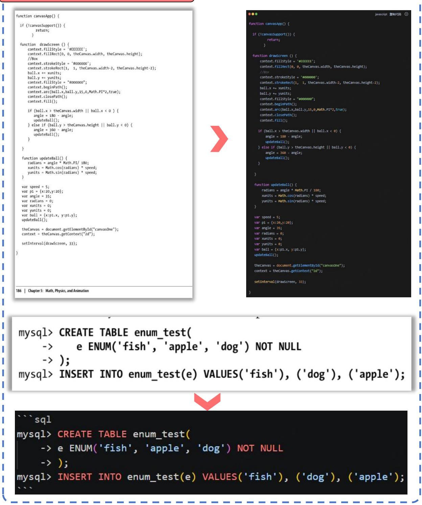  
Figure 4 Case study of Code Block Recognition. NaviDC-OCR achieves exact source code reconstruction and programming language identification.

## A.6 Code Block Recognition

The code block recognition task aims to recover source code from input code screenshots. It requires the model to preserve the original indentation, syntax structure, and formatting while identifying the programming

<table><tr><td rowspan=1 colspan=1>年份</td><td rowspan=1 colspan=1>需求</td><td rowspan=1 colspan=1>运力</td><td rowspan=1 colspan=1>需求测算1</td><td rowspan=1 colspan=1>运力测算2</td><td rowspan=1 colspan=1>X% 需求/运力比</td></tr><tr><td rowspan=1 colspan=1>2013</td><td rowspan=1 colspan=1>387</td><td rowspan=1 colspan=1>485</td><td rowspan=1 colspan=1></td><td rowspan=1 colspan=1></td><td rowspan=1 colspan=1>80</td></tr><tr><td rowspan=1 colspan=1>2014</td><td rowspan=1 colspan=1>414</td><td rowspan=1 colspan=1>531</td><td rowspan=1 colspan=1></td><td rowspan=1 colspan=1></td><td rowspan=1 colspan=1>78</td></tr><tr><td rowspan=1 colspan=1>2015</td><td rowspan=1 colspan=1>463</td><td rowspan=1 colspan=1>579</td><td rowspan=1 colspan=1></td><td rowspan=1 colspan=1></td><td rowspan=1 colspan=1>80</td></tr><tr><td rowspan=1 colspan=1>2016</td><td rowspan=1 colspan=1>509</td><td rowspan=1 colspan=1>636</td><td rowspan=1 colspan=1></td><td rowspan=1 colspan=1></td><td rowspan=1 colspan=1>80</td></tr><tr><td rowspan=1 colspan=1>2017</td><td rowspan=1 colspan=1>580</td><td rowspan=1 colspan=1>713</td><td rowspan=1 colspan=1></td><td rowspan=1 colspan=1></td><td rowspan=1 colspan=1>81</td></tr><tr><td rowspan=1 colspan=1>2018</td><td rowspan=1 colspan=1>640</td><td rowspan=1 colspan=1>781</td><td rowspan=1 colspan=1></td><td rowspan=1 colspan=1></td><td rowspan=1 colspan=1>82</td></tr><tr><td rowspan=1 colspan=1>2019</td><td rowspan=1 colspan=1></td><td rowspan=1 colspan=1></td><td rowspan=1 colspan=1>694</td><td rowspan=1 colspan=1>833</td><td rowspan=1 colspan=1>83</td></tr><tr><td rowspan=1 colspan=1>2020</td><td rowspan=1 colspan=1></td><td rowspan=1 colspan=1></td><td rowspan=1 colspan=1>753</td><td rowspan=1 colspan=1>923</td><td rowspan=1 colspan=1>82</td></tr><tr><td rowspan=1 colspan=1>2021</td><td rowspan=1 colspan=1></td><td rowspan=1 colspan=1></td><td rowspan=1 colspan=1>813</td><td rowspan=1 colspan=1>1035</td><td rowspan=1 colspan=1>79</td></tr><tr><td rowspan=1 colspan=1>2022</td><td rowspan=1 colspan=1></td><td rowspan=1 colspan=1></td><td rowspan=1 colspan=1>875</td><td rowspan=1 colspan=1>1135</td><td rowspan=1 colspan=1>77</td></tr><tr><td rowspan=1 colspan=1>2023</td><td rowspan=1 colspan=1></td><td rowspan=1 colspan=1></td><td rowspan=1 colspan=1>943</td><td rowspan=1 colspan=1>1236</td><td rowspan=1 colspan=1>72</td></tr></table>

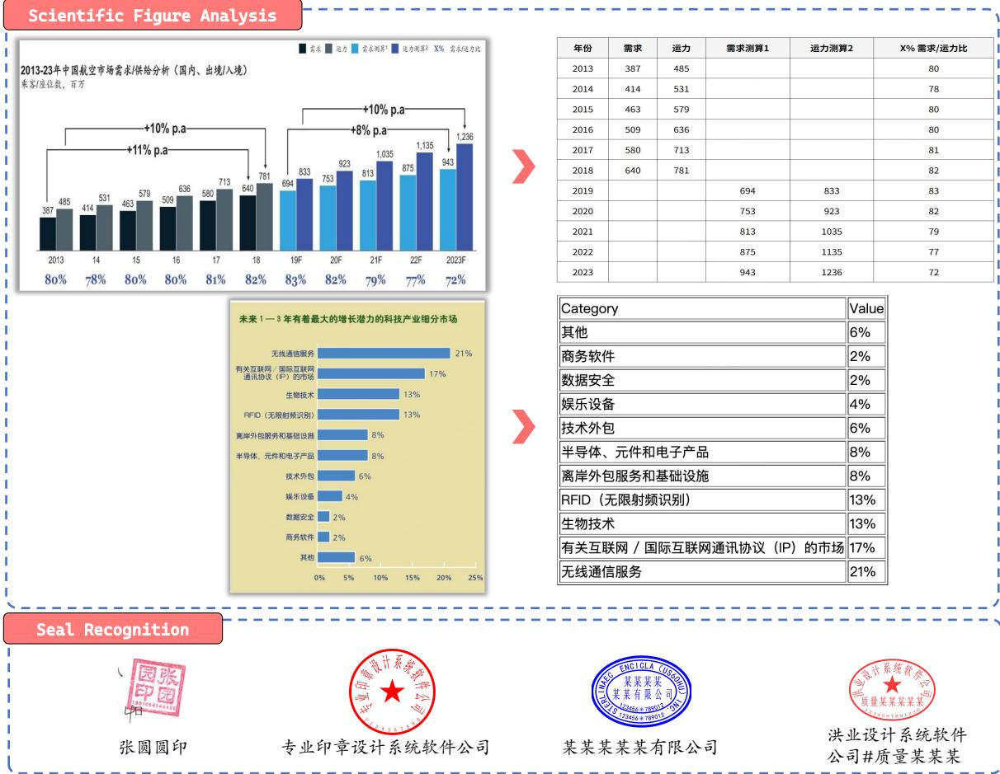

  
Figure 5 Case studies of Scientific Figure-to-Table and Seal Recognition. The scientific figures are collected from OmniDocBench v1.6, while the seals are obtained from anonymized Internet data.

language of the code block.

Prompt.

<image>\nThe image contains a code snippet, please output the parsing result.

Output Format. The model outputs the recovered code in the Markdown code block format, where the first   
line specifies the programming language, followed by the corresponding source code:   
\`\`\`language   
code

Example. Given an example image from OmniDocBench v1.6, the corresponding model output is shown in the figure 4.

## A.7 Scientific Figure Analysis

The scientific figure analysis task aims to recover structured tabular data from scientific figures. NaviDC-OCR supports scientific figure parsing across 5 major categories and 19 fine-grained classes. The five categories include univariate distribution, multivariate comparison, matrix-based, spatial localization, and structural flow figures. The fine-grained classes cover histograms, pie charts, donut charts, rose charts, tree diagrams, funnel charts, grouped bar charts, kernel density plots, bar distribution plots, stacked bar charts, stacked line charts, multi-line charts, radar charts, box plots, heatmaps, directed adjacency tables, undirected adjacency tables, bubble charts, and Sankey diagrams.

Prompt.

<image>\nThis is a scientific figure. Please extract the table implied by the figure.

Output Format. The output format follows the table recognition task. The model generates a flattened OTSL token sequence representing the structured table, which is subsequently converted into a tabular representation. A representative example is shown in Figure 5.

## A.8 Seal Recognition

The seal recognition task aims to extract textual content from cropped seal regions. Due to their irregular shapes and interference from surrounding text, lines, and complex textures, seal regions pose challenges for accurate text recognition. NaviDC-OCR focuses on extracting foreground seal text while suppressing irrelevant background information.

Prompt.

<image>\nSeal Recognition:

Output Format. The model outputs only the textual content within the seal region, excluding irrelevant background text. A representative example is shown in Figure 5.

## B Data Synthesis Details

Due to the scarcity of large-scale, high-quality annotated scientific charts, we develop a synthetic data generation pipeline to enhance scientific chart understanding. Specifically, rendering engines such as Matplotlib are employed to automatically generate diverse scientific figures, including radar charts, heatmaps, line plots, scatter plots, and energy spectra. The generated samples are designed to mimic the visual characteristics and statistical distributions of real scientific publications. Additional examples are provided in Figure 6

The synthesis pipeline establishes a direct mapping between visual chart patterns and structured representations. Each synthetic chart is paired with its underlying numerical data, axis labels, legends, and corresponding data tables, providing end-to-end supervision from visual inputs to structured outputs. By controlling chart types, layouts, data distributions, and annotation styles, the generated dataset covers diverse scientific visualization scenarios.

To further improve structural understanding, we construct two complementary types of synthetic samples. The first type consists of full-content charts that preserve complete visual information, including values, labels, and legends, enabling accurate quantitative information extraction. The second type contains structure-only charts, where textual contents and numerical values are masked while preserving geometric layouts and structural relationships. These samples encourage the model to learn intrinsic chart structures, such as axis organization, spatial alignment, and hierarchical table topology.

This synthetic data generation strategy provides scalable supervision for scientific chart understanding and mitigates the limitation of insuficient real-world annotations. By jointly leveraging content-rich and structureaware samples, the model achieves stronger generalization on diverse scientific figures from real research literature.

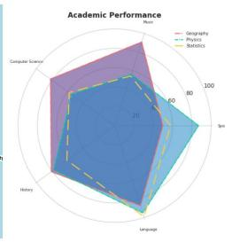

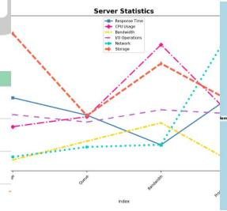

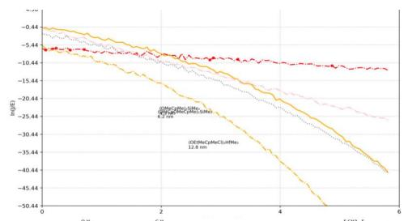

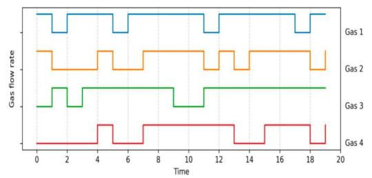

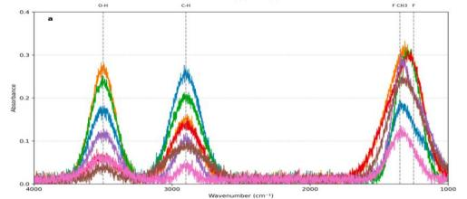

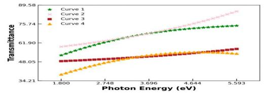

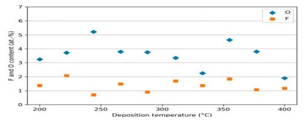

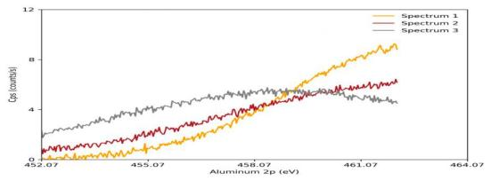

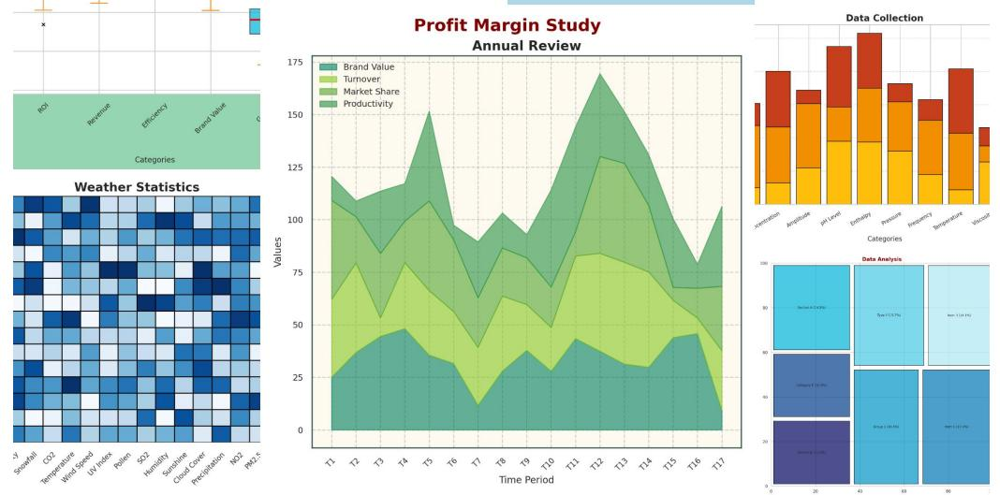  
Figure 6 Case studies of synthetic data generation for Scientific Figure-to-Table.

## C Qualitative Comparison with SOTA Methods

This section presents qualitative comparisons between NaviDC-OCR and state-of-the-art methods across representative document scenarios, including native digital documents, digitally degraded documents, and real-world captured documents. The visual results evaluate the performance of layout analysis, text recognition, table parsing, and formula extraction.

## C.1 Layout Recognition

NaviDC-OCR adopts a decoupled parsing framework, where accurate layout recognition is essential for subsequent content understanding. We compare the layout prediction results of MinerU2.5 Pro Wang et al. (2026), PaddleOCR-VL 1.6 Zhang et al. (2026), and NaviDC-OCR on real-world captured documents, as shown in Figures 7, 8, 9, and 10

For documents with wrinkles, geometric distortions, and complex layouts, MinerU2.5 Pro Wang et al. (2026) and PaddleOCR-VL 1.6 Zhang et al. (2026) may produce missing regions or incorrect category predictions, limiting fine-grained layout understanding. In contrast, NaviDC-OCR incorporates region-level and point-level deformation-aware learning with deformation augmentation to capture geometric variations in real-world documents, enabling more complete and accurate layout recognition, especially for dense text areas and complex table structures.

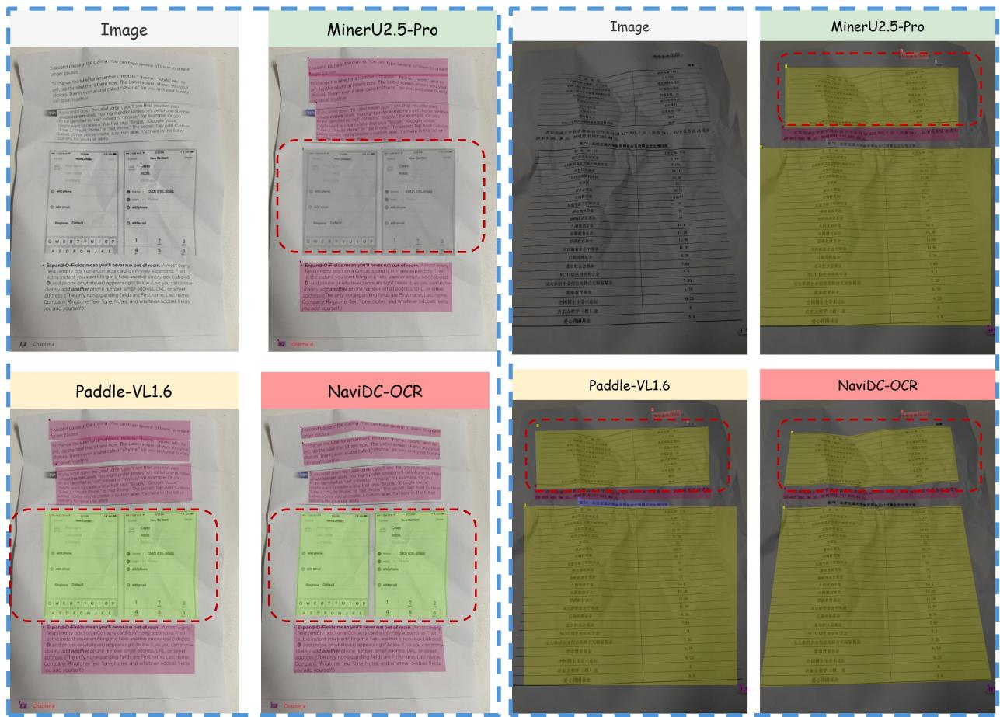  
Figure 7 Qualitative comparison of layout recognition on captured structured documents. NaviDC-OCR provides more reliable analysis of creased structured tables than other SOTA methods.

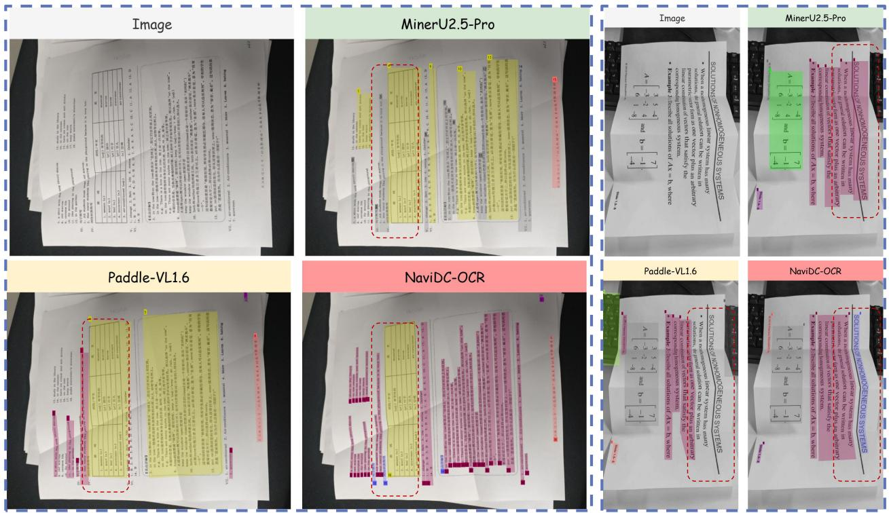  
Figure 8 Qualitative comparison of layout recognition on rotated and creased documents. NaviDC-OCR better covers creased regions and accurately recognizes small text areas.

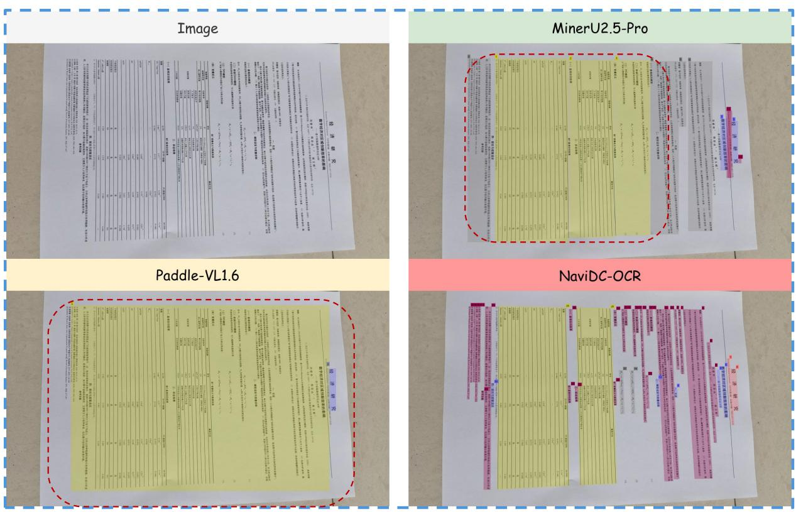  
Figure 9 Qualitative comparison of layout recognition on complex captured documents. NaviDC-OCR achieves more complete and fine-grained layouts for dense and complex document structures.

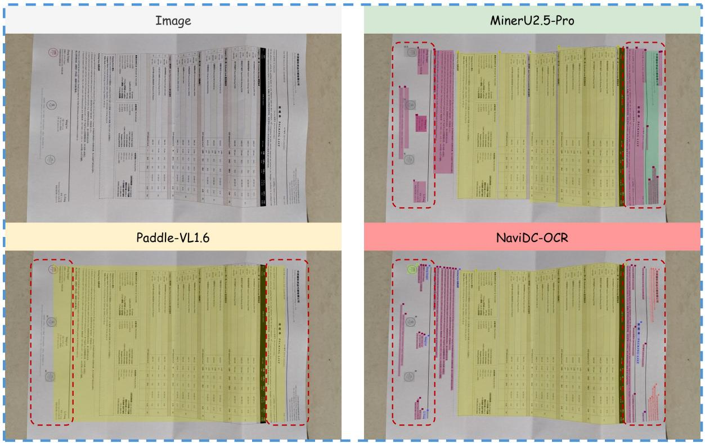  
Figure 10 Qualitative comparison of layout recognition on severely distorted tables. NaviDC-OCR enables structured layout parsing for highly distorted table documents.

## C.2 Table Parsing

We compare table parsing results under challenging camera-captured scenarios, including skew, perspective distortion, page curvature, blur, and dense table layouts. Overall, NaviDC-OCR preserves table topology and cell relationships more reliably than competing methods, especially for distorted or fine-grained tables.

Figure 11 shows a handwritten note page with skew, perspective compression, and local blur. MinerU2.5- Pro and Paddle-VL-1.6 preserve part of the table content, but sufer from row-column misalignment and content merging. NaviDC-OCR better recovers the four-column structure, showing stronger robustness to camera-captured distortions.

The newspaper case in Figure 12 contains a small table embedded in dense text and afected by page curvature. Competing methods introduce incorrect row-spanning structures or miss columns, while NaviDC-OCR accurately restores the three-column layout and preserves the correspondence among crop year, deliveries, and producer prices.

Figure 13 presents a dense financial ledger table with fine-grained grids and multi-level headers. This case requires accurate recovery of hierarchical headers, narrow columns, and empty cells. NaviDC-OCR produces results closer to the GT, whereas MinerU2.5-Pro and Paddle-VL-1.6 tend to lose narrow columns, compress grids, or incorrectly merge cells. These results demonstrate the efectiveness of content-structure decoupled learning for table topology modeling.

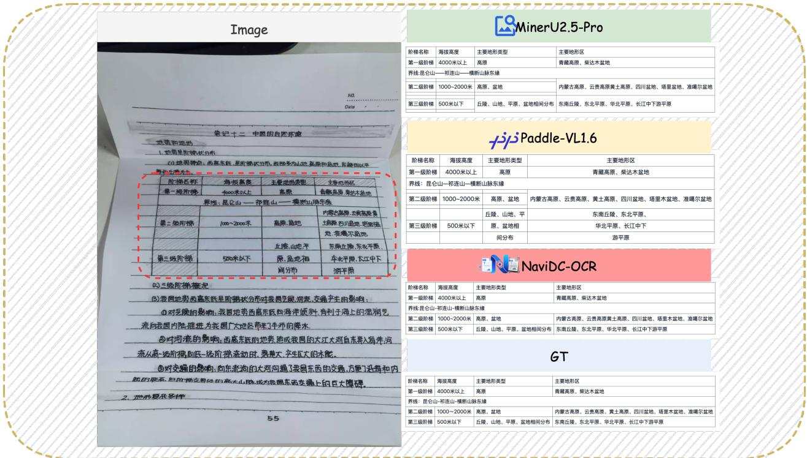  
Figure 11 Qualitative comparison on a distorted handwritten-note table. NaviDC-OCR better preserves row-column alignment and cell correspondences under skew and blur.

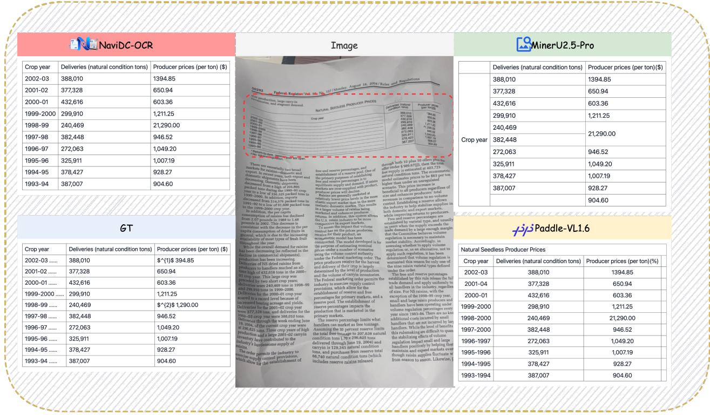  
Figure 12 Qualitative comparison on a small table embedded in a camera-captured newspaper page. NaviDC-OCR accurately restores the three-column structure and numerical correspondences.

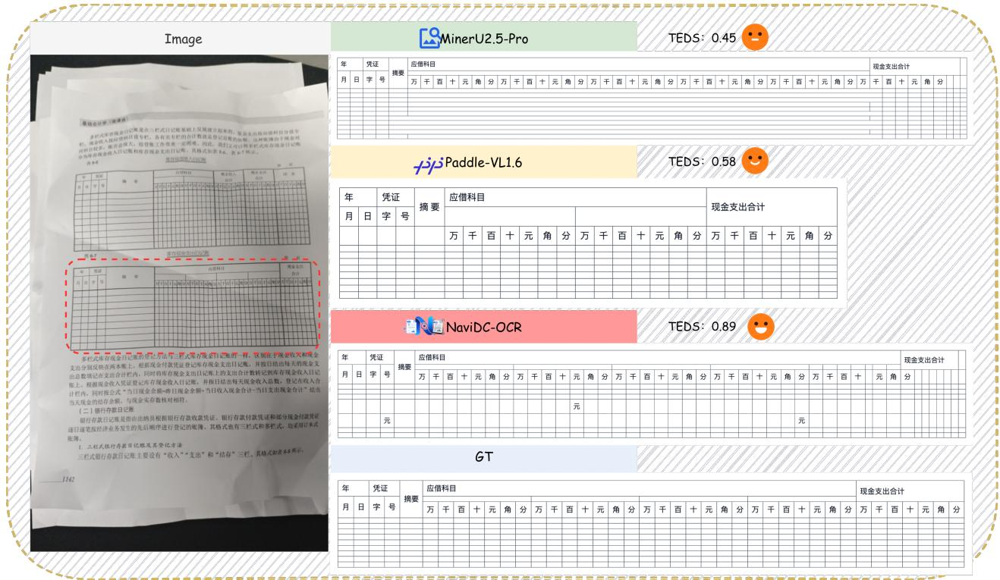  
Figure 13 Qualitative comparison on a dense financial ledger table. NaviDC-OCR better preserves fine-grained grids, hierarchical headers, and empty cell structures.

## C.3 Formula Extraction

We further compare formula extraction results under real-world degradations such as wrinkles, shadows, low resolution, and severe rotation. NaviDC-OCR shows stronger robustness in preserving mathematical structures, including subscripts, superscripts, radicals, fractions, limits, and bracket scopes.

As shown in Figure 14, this case presents a challenging formula recognition scenario with paper wrinkles, local shadows, and a low-resolution formula region. MinerU2.5-Pro and Paddle-VL-1.6 can recognize major elements such as squares, radicals, and scientific notation, but they struggle with variable subscripts, exponent positions, and the final numerical magnitude. In comparison, NaviDC-OCR more accurately preserves the summation relation inside the radical, the subscript/superscript structures, and variable symbols.

Figure 15 further illustrates a more extreme camera-captured condition, where the page is severely rotated and the formula appears upside down. The example contains complex structures including limits, fractions, brackets, and product rule derivations. MinerU2.5-Pro detects several formula symbols but fails to recover the global orientation and structural relationships, while Paddle-VL-1.6 only reconstructs a partial formula fragment. In contrast, NaviDC-OCR successfully recovers the complete formula expression under this upsidedown condition, achieving high consistency with the GT. This illustrates the complementary benefits of deformation-aware learning and formula structure-aware decoupled learning for real-world camera-captured documents.

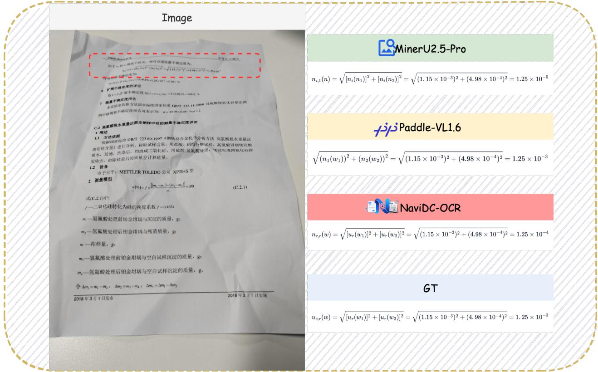  
Figure 14 Qualitative comparison on a low-resolution formula region with wrinkles and shadows. NaviDC-OCR more accurately preserves radicals, subscripts, superscripts, and numerical expressions.

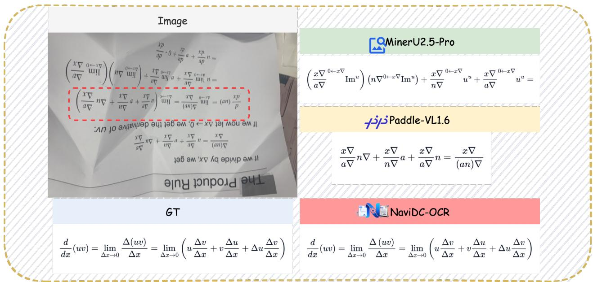  
Figure 15 Qualitative comparison on a low-resolution formula region with wrinkles and shadows. NaviDC-OCR more accurately preserves radicals, subscripts, superscripts, and numerical expressions.

## D Benchmark Evaluation Details

We evaluate document parsing performance on OmniDocBench v1.6, Wild OmniDocBench v1.5, and Pure-DocBench. For consistency across benchmarks, Wild OmniDocBench v1.5 and PureDocBench are evaluated using the OmniDocBench-style end-to-end protocol. Model predictions are converted to Markdown files and matched against the benchmark ground truth using the quick\_match strategy in the OmniDocBench evaluator.

The evaluation covers four element groups: text blocks, display formulas, tables, and reading order. Text blocks and reading order are measured by normalized edit distance, display formulas are measured by both edit distance and CDM, and tables are measured by TEDS and edit distance. Following OmniDocBench v1.6, we report TextEdit, FormulaCDM, TableTEDS, TableTEDS-S, and ReadOrderEdit. The overall score is computed as:

$$
\mathrm { O v e r a l l } = \frac { \left( 1 - \mathrm { T e x t E d i t } \right) \times 1 0 0 + \mathrm { F o r m u l a C D M } \times 1 0 0 + \mathrm { T a b l e T E D S } \times 1 0 0 } { 3 } .
$$

Here, lower TextEdit and ReadOrderEdit indicate better performance, while higher FormulaCDM, TableTEDS, TableTEDS-S, and Overall indicate better performance.

For all models compared on the same benchmark, we keep the evaluator version, matching strategy, metric set, and timeout settings fixed. To handle long or complex pages, the page matching timeout and truncated quickmatch timeout are both set to 1200 seconds, with timeout\_fallback\_max\_chunk\_span=200 and timeout\_- fallback\_order\_penalty=0.05. For Wild OmniDocBench v1.5 and PureDocBench, we use the same metric and matching settings, replacing only the ground-truth file and prediction directory with the corresponding benchmark paths.

It is worth noting that PureDocBench is substantially more challenging, and NaviDC-OCR exhibited severe repetitive generation on a small number of cases. For these samples, we removed the corresponding invalid Markdown prediction files before scoring. This does not afect evaluation fairness, because missing predictions are assigned a score of zero under the evaluation protocol. The removed files are listed in Table 5. No predictions were removed from the digital-degraded subset.

Table 5 Markdown prediction files removed from NaviDC-OCR for PureDocBench evaluation.
<table><tr><td>Subset</td><td>Removed prediction file</td></tr><tr><td>clean</td><td>employee_handbook_001_.md</td></tr><tr><td>real_degraded</td><td>customs_packing_019__Multi-Country-Re-Export-Trade-Customs-Documentation.md</td></tr><tr><td>real_degraded</td><td>employee_handbook_002_Manufacturing_Safety.md</td></tr><tr><td>real_degraded</td><td>itinerary_020__International_Summit_Schedule_Overview.md</td></tr><tr><td>real_degraded</td><td>professional_cert_018_International_PE_Mutual_Recognition_-_Color-Coded_Zone_Board.md</td></tr><tr><td>real_degraded</td><td>slides_006__.md</td></tr></table>