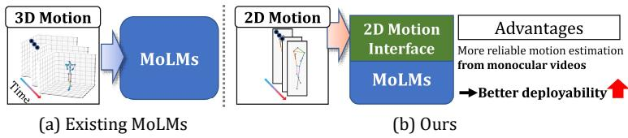
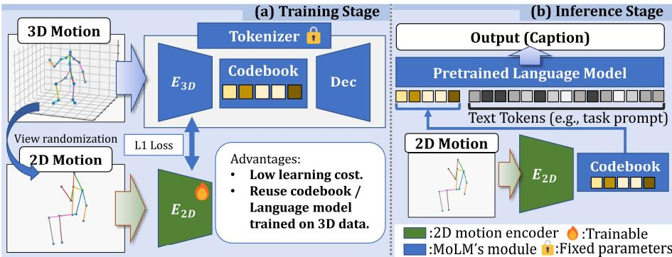
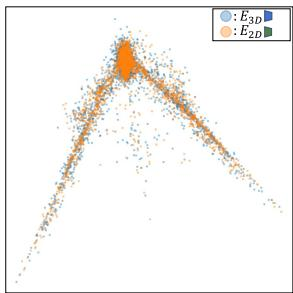
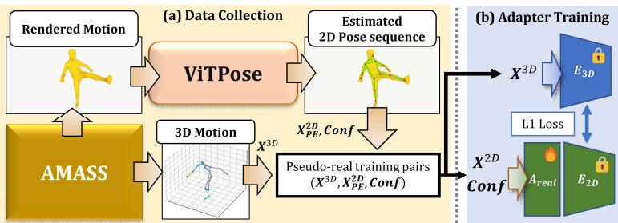
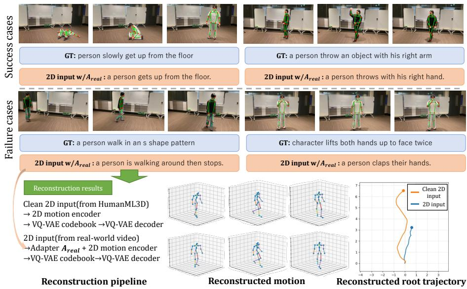
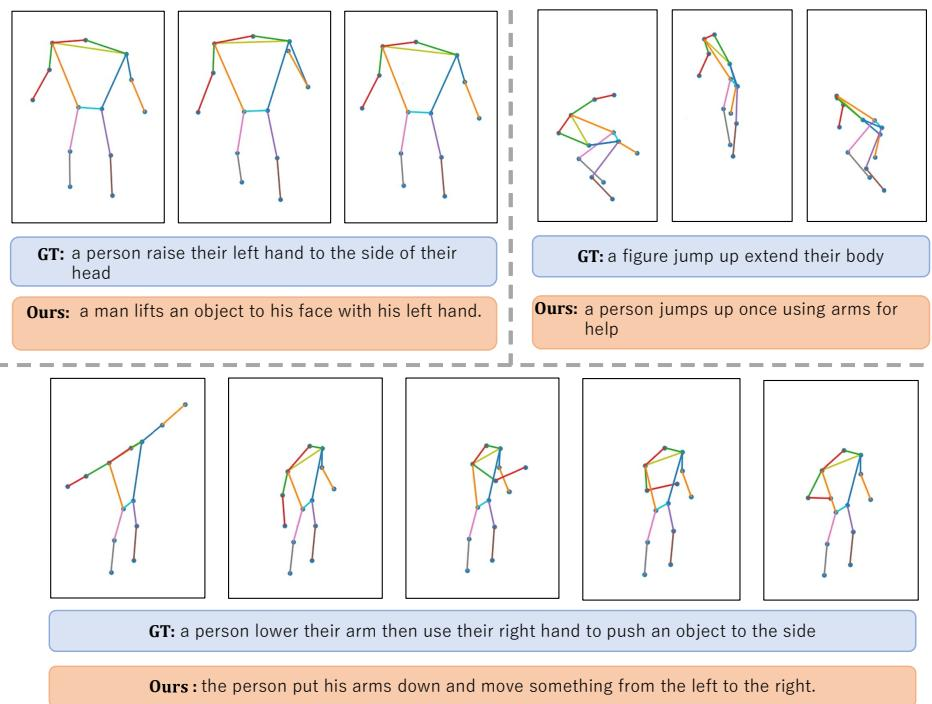
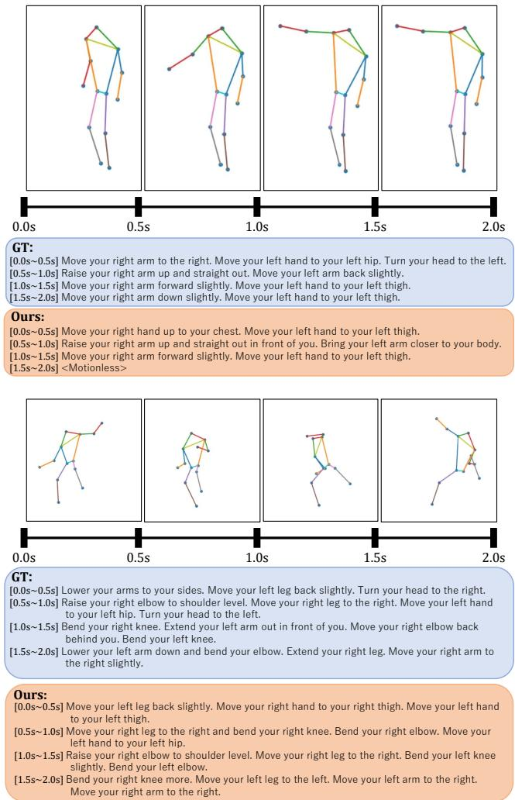
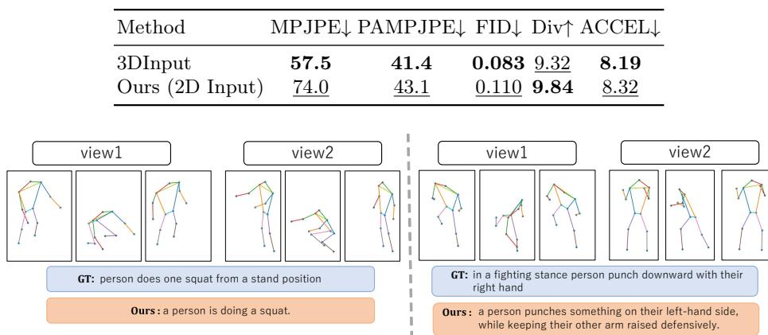
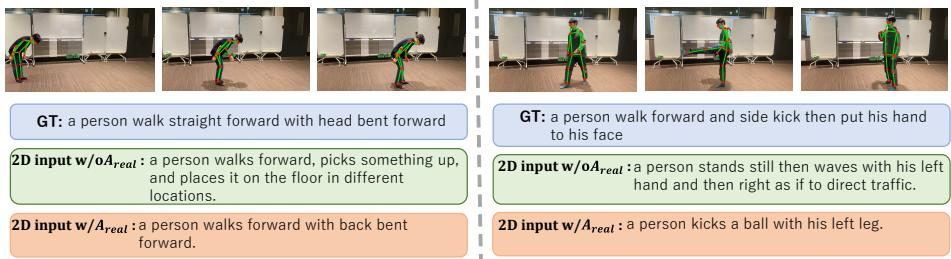

# A Plug-and-Play 2D Motion Interface for Real-World Motion Language Models

Kaname Yokoyama1 and Norimichi Ukita1

Toyota Technological Institute, Nagoya, Aichi, Japan {sd25444,ukita}@toyota-ti.ac.jp

Abstract. Motion Language Models (MoLMs) typically understand human motions by tokenizing 3D motion and processing the resulting tokens using a language model. However, obtaining accurate 3D motions from monocular videos is challenging, limiting their real-world applicability. To address this issue, we introduce a plug-and-play 2D Motion Interface that enables 3D-pretrained MoLMs to accept 2D motion inputs without modifying or fine-tuning the original models. Experiments on public datasets show that our method achieves performance comparable to 3D motion inputs across multiple MoLMs and outperforms training MoLMs from scratch on 2D motions. We further construct a monocular real-world video motion evaluation dataset and introduce a real-video adapter, demonstrating the usefulness of 2D motions over 3D motions under the evaluated monocular pose-estimation setting. These results suggest that 2D motion provides a practical interface for deploying MoLMs in real-world motion understanding settings. Code is available at https://github.com/irajisamurai/2D-Motion-Interface.

Keywords: Motion-language models · Representation alignment

## 1 Introduction

Human motion understanding has advanced rapidly alongside the development of Large Language Models (LLMs) [3,4,25,32,33,38,41,44]. In particular, Motion Language Models (MoLMs), such as MotionGPT [9], which learn to discretize motion from 3D motion datasets [7,12,24], have achieved strong performance in tasks such as motion captioning and motion generation (Fig. 1(a)). Since these models are trained on 3D motions reconstructed from motion capture systems or multi-view observations, it is commonly assumed that their motion-related capabilities are grounded in 3D motion. However, this assumption has not been explicitly verified.

This assumption poses a significant challenge for real-world applications that leverage the motion understanding capabilities of MoLMs, such as action recognition and human-centered video understanding. In practical scenarios, human motions are typically estimated from videos captured by a monocular camera and then fed into MoLMs. However, the 3D motions commonly used in MoLMs 1 include not only the relative 3D coordinates of each joint with respect to the root joint, but also joint rotation and global positions. Therefore, estimating equivalent 3D motions from monocular videos both accurately and eficiently remains challenging. The gap from the high-quality 3D motions used during training can degrade motion understanding performance.

  
Fig. 1: While existing MoLMs typically take 3D motions as input, the proposed 2D Motion Interface (i.e., 2D motion encoder) enables existing MoLMs based on VQ-VAE motion tokenization to accept 2D motion inputs. Since 2D pose estimation is generally easier than 3D pose estimation, our approach improves the deployability of MoLMs in real-world applications.

Therefore, this paper challenges this assumption. If the motion representation required in MoLMs can be suficiently approximated for motion understanding using 2D motions derived from 2D poses (e.g., the COCO keypoints [16]), 3Dpretrained MoLMs could perform motion understanding even from monocular 2D observations. This would substantially improve the practicality and realworld applicability of MoLMs.

Moreover, examining this assumption also ofers insight into the extent to which motion understanding relies on 3D-specific information such as 3D joint rotation and depth. We note that our analysis observes this under a setting where 2D features are explicitly aligned to the 3D latent space, rather than establishing that 3D-specific information is unnecessary in general. To examine this assumption, we introduce a plug-and-play 2D Motion Interface for MoLMs. The proposed interface is designed as an external module that can be attached to pretrained MoLMs without requiring any modification or fine-tuning of the base MoMLs. Specifically, it is implemented as a 2D motion encoder that projects 2D motions into the continuous latent space of the discrete tokenizer (VQ-VAE [22]) used by MoLMs (Fig. 1(b)).

With this 2D motion encoder, MoLMs can directly accept 2D motions as input. Furthermore, because the encoder shares the same latent space as the discrete tokenizer, it enables direct comparisons between the latent motion features and motion tokens derived from 3D motions and those derived from 2D motions. This unified representation space allows us to experimentally investigate whether the motion representations used in MoLMs can be efectively approximated from 2D motions. To further validate the practical advantages of 2D motions over 3D motions, we construct a real-world video dataset in which each video is paired with its corresponding estimated 2D motions, estimated 3D motions, and motion captions. Since video-derived motions contain distribution shifts caused by camera-parameter-dependent perspective projection and poseestimation noise, we further propose a real-video adapter to bridge this gap and improve the robustness of MoLMs in real-world applications.

Our contributions are summarized as follows:

1. We introduce a plug-and-play 2D Motion Interface (i.e., a 2D motion encoder) that enables 3D-pretrained MoLMs to accept 2D motion inputs. The proposed interface requires neither modification nor fine-tuning of the pretrained MoLMs and can be implemented with a very low training cost.

2. Through experiments on multiple public datasets and MoLM baselines, we demonstrate that 2D motion inputs achieve performance comparable to that of 3D motion inputs. Furthermore, we show that 2D and 3D motions exhibit strong consistency in both the continuous latent space and the discrete token space, indicating that 2D motions can efectively approximate the motion representations used by 3D-pretrained MoLMs for motion understanding.

3. We constructed a real-world video dataset and proposed a real-video adapter. Under the evaluated monocular pose-estimation setting, experiments using estimated 3D and 2D motions as inputs show that 2D motions achieve higher motion understanding performance with lower computational cost than 3D motion estimation. These results demonstrate the practical advantages of using 2D motions in real-world applications.

## 2 Related Work

## 2.1 Motion Language Models

TM2T [8] demonstrates that 3D human motions can be represented as languagelike discrete token sequences through motion tokenization, making tasks such as motion generation and motion captioning feasible within an autoregressive framework. Subsequently, MotionGPT [9] and MG-MotionLLM [35] incorporate pretrained language models and instruction tuning, enabling motions and text to be processed in a unified language modeling paradigm. MoLMs have also been extended in various directions.

For example, MoMask [6] adopts masked generative modeling over discrete motion tokens, improving controllability and generation quality. By tokenizing additional modalities (e.g., music/audio) and feeding all modality tokens into a pretrained LLM, M3 GPT [19] unifies multiple modalities and tasks in a single model. RapVerse [2] jointly generates vocals and whole-body motion by combining language, audio, and motion tokens. Furthermore, SocialGen [37] and several subsequent studies [13, 27] have extended motion language modeling to multi-person social interactions, enabling the generation and understanding of collaborative behaviors involving multiple individuals.

Despite the remarkable progress of MoLMs, most existing studies rely on 3D motion datasets such as HumanML3D, which contain rich 3D information including global positions and joint rotations. In contrast, the observations available in real-world applications are often limited to monocular videos, from which estimating equivalent 3D motions remains challenging. This gap between the training data and real-world observations constitutes a major obstacle to the practical deployment of MoLMs for motion understanding tasks.

## 2.2 2D/3D Motion Representation and Cross-Modal Alignment

Bridging 2D observations and 3D motion is a long-standing goal in the community. One direction is reconstructing 3D motion from monocular or multi-view inputs [5, 11, 30, 42, 43]. Recent work suggests that 3D motion cues can emerge even without explicit 3D supervision. Free3D [17] shows that 3D motion can be learned from monocular 2D supervision using 3D-free regularizations, such as view consistency and physical plausibility. Another line of work studies representations shared across 2D and 3D. In [1], a unified codebook shared between 2D and 3D pose spaces is proposed. V-VIPE [10] learns a canonical, view-invariant embedding for 3D pose, enabling both 2D and 3D inputs to be encoded into a shared space. More closely related to our setting, [40] decouples and distills 3D latent features to improve the robustness of discriminative 2D skeleton action recognition.

Inspired by these works, we explore whether MoLMs trained on 3D motions can be adapted to 2D inputs for real-world motion understanding. Specifically, our encoder aligns 2D motions to the latent space of a frozen MoLMs, enabling motion-language understanding from 2D inputs without any fine-tuning of the base MoLMs.

## 3 Proposed Method

To enable MoLMs to accept 2D motion inputs, we introduce a simple 2D motion encoder as a plug-and-play 2D Motion Interface. With the proposed encoder, existing MoLMs can directly perform motion understanding tasks, such as motion captioning, from 2D motions.

Figure. 2 illustrates the training and inference pipeline of the proposed 2D motion encoder. As shown in Fig. 2(a), the backbone MoLM is pretrained on 3D motion data (Sec. 3.1) and remains frozen throughout training. Only the 2D motion encoder, shown in the lower branch, is optimized. Specifically, the encoder is trained by minimizing an alignment loss between the 3D motion features produced by the VQ-VAE encoder of the MoLM and the 2D motion features produced by the 2D motion encoder (Sec. 3.3). Through this alignment, the 2D motion encoder learns to map 2D motions (Sec. 3.2) into the continuous latent space of the MoLM, allowing existing MoLMs to operate directly on 2D motion inputs without any architectural modifications or fine-tuning. During inference (Fig. 2(b)), the resulting 2D motion features are quantized into discrete motion tokens using the VQ-VAE codebook and subsequently fed into the pretrained language model to perform motion understanding tasks (Sec. 3.4).

## 3.1 Preliminaries: MoLMs

Overview of Target MoLMs. In this work, we focus on MoLMs that represent human motions as discrete motion token sequences, analogous to words in natural language. These models typically consist of a VQ-VAE that serves as a motion tokenizer and a language model (e.g., T5 [26]) that processes the resulting motion token sequences.

  
Fig. 2: Overview of the proposed pipeline. During training, the pretrained MoLM remains frozen and only the 2D motion encoder is trained. Specifically, the encoder is trained using an L1 feature-matching loss to align 2D motion features with the continuous latent space of the VQ-VAE encoder. During inference, the resulting 2D motion features are quantized into discrete motion tokens using the VQ-VAE codebook and fed into the pretrained language model.

3D motion representation. In MoLMs [9, 35], the human body at each frame is represented as a 263-dimensional state vector. This state vector consists of the following components: (i) root rotation velocity (1D), (ii) root linear velocity (2D), (iii) root y position (1D), (iv) joint positions $( 2 1 \times 3 = 6 3 \mathrm { { D } ) }$ ), (v) joint rotations (21 $\times ~ 6 = 1 2 6 \mathrm { { D } ) }$ , (vi) joint velocities $( 2 2 \times 3 = 6 6 \mathrm { { D } ) }$ , and (vii) foot contact (4D). A motion sequence of $T$ frames is denoted as $X ^ { \mathrm { 3 D } } \in \mathbb { R } ^ { T \times 2 6 3 }$

VQ-VAE tokenization. The VQ-VAE consists of an encoder $E _ { \mathrm { 3 D } } .$ , a decoder $D _ { \mathrm { 3 D } }$ and a codebook $B _ { \mathrm { 3 D } } = \{ b _ { k } \} _ { k = 1 } ^ { K }$ , where K denotes the size of the codebook.

When a 3D motion $X ^ { 3 D }$ is input to the encoder $ { E _ { \mathrm { 3 D } } }$ , a latent feature sequence $\pmb { H } ^ { \mathrm { 3 D } } = [ \pmb { H } _ { 1 } ^ { \mathrm { 3 D } } , \ldots , \pmb { H } _ { S } ^ { \mathrm { 3 D } } ] \overset { \circ } { = } E _ { \mathrm { 3 D } } ( \pmb { X } ^ { \mathrm { 3 D } } ) \in \mathbb { R } ^ { S \times D }$ is obtained, where S is the temporal length after downsampling by the encoder and D is the latent feature dimension. Next, each latent feature vector is quantized by assigning it to the nearest codebook entry, resulting in a discrete token sequence $C ^ { \mathrm { 3 D } } = [ c _ { 1 } , c _ { 2 } , . . . , c _ { S } ]$ . Here, each token $c _ { i }$ denotes the index of the assigned codebook entry. The VQ-VAE is trained using a reconstruction loss together with the standard VQ-VAE embedding loss and commitment loss [9, 22].

How motion tokens are used by language models. The discrete token sequence $C ^ { \mathrm { 3 D } }$ is processed by a language model to perform motion understanding tasks such as motion captioning. Many MoLMs provide a unified framework for motion understanding and generation through bidirectional translation between motion and text, namely motion-to-text and text-to-motion. Since the proposed 2D motion encoder is designed to interface 2D motions with existing MoLMs, we focus on the motion-to-text setting throughout this work.

## 3.2 2D motion with View Randomization

The 2D motion sequence is derived from the 3D motion $X ^ { 3 D }$ defined in Sec. 3.1. Specifically, 3D-specific cues, including depth and joint rotation information, are removed while preserving only the information observable from a monocular camera, resulting in a 2D motion $X ^ { 2 D }$ . The construction procedure is described as follows:

1. Skeleton extraction. From $X ^ { 3 D }$ , we reconstruct a 3D joint skeleton $J ^ { \mathrm { 3 D } } \in$ $\mathbb { R } ^ { T \times 2 2 \times 3 }$ in the world coordinate system. The reconstructed skeleton follows the 22-joint SMPL-style skeleton [18] used in HumanML3D [7].

2. View randomization. To encourage viewpoint-robust encoding, we randomly rotate $\pmb { J } ^ { \mathrm { 3 D } }$ by yaw (rotation about the vertical axis) and pitch (rotation about the horizontal axis) during training.

3. 2D projection. The rotated skeleton is projected onto a 2D plane by discarding the depth coordinate. We then retain only the 13 joints shared by both the SMPL and COCO [16] keypoint formats, resulting in a 2D joint skeleton $J ^ { \mathrm { 2 D } } \in \mathbb { R } ^ { T \times { 1 3 \times 2 } }$ . To mimic the output of standard monocular pose estimators, we adopt the COCO keypoint format. We use orthographic projection to avoid camera-parameter assumptions, and handle the gap to perspective real-video observations with the real-video adapter in Sec. 5.2.

4. Per-frame 2D features. From $\pmb { J } ^ { \mathrm { 2 D } }$ , we construct a HumanML3D-like perframe feature vector composed of: (i) root linear velocity (2D), (ii) root y position (1D), (iii) joint positions $( 1 3 \times 2 = 2 6 \mathrm { { D } }$ , root-relative), (iv) joint orientations (13D, root-relative), and (v) joint velocities $( 1 3 \times 2 = 2 6 \mathrm { { D } ) }$ , which totals 68 dimensions. A motion sequence of T frames is denoted as $X ^ { \mathrm { 2 D } } \in \mathbb { R } ^ { T \times 6 8 }$ . The root joint is defined as the midpoint of the left and right hips, and all features are normalized.

## 3.3 2D motion encoder

To map a 2D motion $X ^ { 2 D }$ into the continuous latent space of the VQ-VAE used by the MoLM, we introduce a 2D motion encoder $E _ { \mathrm { 2 D } }$ . When a 2D motion $X ^ { 2 D }$ is input to the encoder $ { E _ { \mathrm { 2 D } } }$ , a latent feature sequence ${ \cal H } ^ { \mathrm { 2 D } } = [ { \cal H } _ { 1 } ^ { \mathrm { 2 D } } , \dots , { \cal H } _ { S } ^ { \mathrm { 2 D } } ] =$ $\bar { E _ { \mathrm { 2 D } } ( X ^ { \mathrm { 2 D } } ) } \in \mathbb { R } ^ { S \times D }$ is obtained. The encoder is trained by minimizing an L1 feature-alignment loss between the latent features generated by the VQ-VAE encoder $ { E _ { \mathrm { 3 D } } }$ and those produced by the 2D motion encoder $ { E _ { \mathrm { 2 D } } }$

$$
\mathcal { L } _ { \mathrm { a l i g n } } = \frac { 1 } { S D } \left. H ^ { \mathrm { 2 D } } - H ^ { \mathrm { 3 D } } \right. _ { 1 }\tag{1}
$$

## 3.4 Inference

During inference, a 2D motion $X ^ { 2 D }$ is first mapped to latent features $H ^ { \mathrm { 2 D } }$ by the proposed 2D motion encoder $ { E _ { \mathrm { 2 D } } }$ . The latent features are then quantized into a discrete token sequence $C ^ { \mathrm { 2 D } }$ using the VQ-VAE codebook $ { B _ { \mathrm { 3 D } } }$ . The resulting token sequence $C ^ { \mathrm { 2 D } }$ is subsequently fed into the language model LM of an existing MoLM, either alone or together with a task prompt P, to obtain the generated textual output $\hat { Y } = L M \bar { ( } P , C ^ { \mathrm { 2 D } } )$ .

## 4 Experiments

In this section, we evaluate the proposed 2D motion encoder on multiple motion understanding tasks and datasets. Section. 4.1 introduces the datasets, evaluation metrics, and implementation details. Section. 4.2 compares the proposed method against 3D motion inputs and MoLMs trained from scratch on 2D motions. Finally, Sec. 4.3 presents a detailed analysis of the proposed method. Qualitative results are provided in the Appendix.

## 4.1 Experimental Setup

Datasets. Following [35], we conduct experiments on two motion-language datasets. The first is HumanML3D [7], one of the largest motion-language datasets currently available. HumanML3D is built upon AMASS [20] and consists of 14,616 motion sequences paired with 44,970 sequence-level text captions. This dataset is used for the motion captioning task. The second dataset is FineMotion [34], which re-annotates the captions in HumanML3D with more fine-grained descriptions. Specifically, each motion sequence is divided into snippets at fixed temporal intervals, resulting in 420,968 motion snippets. Each snippet is paired with a detailed caption describing the movements of body parts. This dataset is used for the motion-to-detailed-text task.

Metrics. Following prior work [9, 35], we evaluate motion captioning using R-Precision (Top-1/2/3), a retrieval-based metric for measuring motion-text matching accuracy, MM-Dist for assessing motion-text alignment, and standard language generation metrics, including BLEU [23], ROUGE-L [14], CIDEr [31], and BERTScore [39]. For the motion-to-detailed-text task, we follow the evaluation protocol of [35] and report the aforementioned language generation metrics at both the sequence and snippet levels.

Implementation Details. The latent feature dimension of the 2D motion encoder is set to 512, and the temporal downsampling rate is set to 4, following prior works [9, 35]. The resulting latent sequence length is therefore $S = T / 4 .$ The 2D motion encoder is trained using the AdamW optimizer with a learning rate of $1 \times 1 0 ^ { - 4 } , \beta = ( 0 . 9 , 0 . 9 9 )$ , and a batch size of 64. No learning rate scheduler is employed, and the model is trained for 3000 epochs. All experiments are conducted on a single NVIDIA A100 40GB GPU. For fair comparison, all reported results are obtained by running the corresponding models in our environment. For the proposed method, we report the mean and standard deviation over three runs in Tabs. 1 and 2. Additional details are provided in the Appendix.

## 4.2 Results of Motion understanding Tasks

Comparison on motion captioning. Motion captioning is a task that generates a textual description corresponding to a given motion sequence. Table. 1 reports the results on TM2T, MotionGPT, and MG-MotionLLM. For each model, we compare three settings: using 3D motion inputs, training the entire MoLM from scratch on 2D motions, and using the proposed 2D motion encoder. Additional details are provided in the Appendix. Overall, the proposed method achieves performance comparable to 3D motion inputs across most text-motion alignment metrics, including R-Precision and MM-Dist, as well as language generation metrics, despite relying only on monocular 2D motion inputs. In addition, compared with training MoLMs from scratch on 2D motions, our method substantially reduces the performance gap from the 3D-input setting. These results demonstrate that the proposed 2D motion encoder is superior to straightforwardly training MoLMs from scratch on 2D motions in terms of both performance and computational cost, confirming the efectiveness of our approach.

Table 1: Comparison of motion captioning results on HumanML3D test set. The best and second-best results within each model are highlighted in bold and underlined, respectively. Avg Drop vs 3D denotes the average percentage diference from the 3D Input across all metrics. The MotionGPT 2D Scratch result is omitted due to reproducibility issues; see the Appendix for details.
<table><tr><td rowspan="2">Model</td><td rowspan="2">Method</td><td colspan="2">R-Prec↑</td><td colspan="7">MM-Dist↓ BLEU-1↑ BLEU-4↑ ROUGE-L↑ CIDEr↑ BERTScore↑</td></tr><tr><td>Top-1 Top-2 Top-3</td><td></td><td></td><td></td><td></td><td></td><td></td><td></td><td></td></tr><tr><td rowspan="4">TM2T</td><td>3D Input</td><td>0.488 0.689</td><td>0.786</td><td>3.137</td><td>0.615</td><td>0.233</td><td>0.492</td><td>0.691</td><td>0.368</td><td></td></tr><tr><td>2D Scratch</td><td>0.279</td><td>0.447 0.562</td><td>4.921</td><td>0.550</td><td>0.175</td><td>0.437</td><td>0.499</td><td>0.312</td><td>-25.8%</td></tr><tr><td>Ours</td><td>0.485</td><td>0.683 0.788</td><td>3.129</td><td>0.616</td><td>0.232</td><td>0.492</td><td>0.688</td><td>0.368</td><td>-0.2%</td></tr><tr><td></td><td>±0.002</td><td>±0.003 ±0.004</td><td>±0.005</td><td>±0.001</td><td>±0.000</td><td>±0.000</td><td>±0.004</td><td>±0.001</td><td></td></tr><tr><td rowspan="3">MotionGPT</td><td>3D Input</td><td>0.516</td><td>0.707 0.803</td><td>2.994</td><td>0.429</td><td>0.062</td><td>0.345</td><td>0.079</td><td>0.316</td><td>–</td></tr><tr><td>Ours</td><td>0.523 0.717</td><td>0.802</td><td>2.985</td><td>0.431</td><td>0.063</td><td>0.346</td><td>0.077</td><td>0.319</td><td>+0.4%</td></tr><tr><td></td><td>±0.002 ±0.003 ±0.003</td><td></td><td>±0.015</td><td>±0.000</td><td>±0.001</td><td>±0.001</td><td>±0.001</td><td>±0.001</td><td></td></tr><tr><td rowspan="4">MG-MotionLLM 2D Scratch</td><td>3D Input</td><td>0.583 0.787 0.873</td><td></td><td>2.571</td><td>0.507</td><td>0.091</td><td>0.402</td><td>0.095</td><td>0.386</td><td></td></tr><tr><td></td><td>0.487</td><td>0.667 0.758</td><td>3.289</td><td>0.494</td><td>0.078</td><td>0.385</td><td>0.074</td><td>0.364</td><td>-12.8%</td></tr><tr><td>Ours</td><td>0.576</td><td>0.770 0.855</td><td>2.701</td><td>0.499</td><td>0.087</td><td>0.396</td><td>0.090</td><td>0.379</td><td></td></tr><tr><td></td><td>±0.007</td><td>±0.001 ±0.001</td><td>±0.021</td><td>±0.001</td><td>±0.001</td><td>±0.001</td><td>±0.001</td><td>±0.001</td><td>-2.8%</td></tr></table>

Table 2: Comparison of motion-to-detailed-text results on the FineMotion test set.

<table><tr><td>Level</td><td>Method</td><td>BLEU-1↑ BLEU-4↑ BLEU-7↑ ROUGE-L↑ BERTScore↑</td><td></td><td></td><td></td><td></td><td>Avg Drop vs 3D↑</td></tr><tr><td rowspan="4"></td><td>3D Input</td><td>0.828</td><td>0.667</td><td>0.536</td><td>0.651</td><td>0.523</td><td></td></tr><tr><td>Sequence 2D Scratch</td><td>0.814</td><td>0.637</td><td>0.497</td><td>0.629</td><td>0.483</td><td>-4.9%</td></tr><tr><td rowspan="2">Ours</td><td>0.828</td><td>0.665</td><td>0.533</td><td>0.648</td><td>0.517</td><td>-0.5%</td></tr><tr><td>±0.001</td><td>±0.001</td><td>±0.001</td><td>±0.001</td><td>±0.001</td><td></td></tr><tr><td rowspan="4">Snippet</td><td>3D Input</td><td>0.672</td><td>0.478</td><td>0.354</td><td>0.606</td><td>0.509</td><td></td></tr><tr><td>2D Scratch</td><td>0.653</td><td>0.456</td><td>0.329</td><td>0.588</td><td>0.487</td><td>-4.4%</td></tr><tr><td rowspan="2">Ours</td><td>0.666</td><td>0.473</td><td>0.349</td><td>0.601</td><td>0.502</td><td>-1.1%</td></tr><tr><td>±0.000</td><td>±0.001</td><td>±0.001</td><td>±0.001</td><td>±0.001</td><td></td></tr></table>

Comparison on motion-to-detailed-text. Motion-to-detailed-text is a task that generates more detailed textual descriptions for a given motion sequence than standard motion captioning. Following the evaluation setting of [35], Tab. 2 reports the results using MG-MotionLLM as the base model. Similar to the results on motion captioning, the proposed method achieves performance comparable to 3D motion inputs on many language generation metrics at both the sequence and snippet levels. These results indicate that the proposed 2D motion encoder can efectively preserve not only the coarse semantics of the entire motion sequence but also fine-grained motion information required for more detailed motion descriptions.

Table 3: Robustness to neighboring token replacement on motion captioning performance.  
Fig. 3: PCA visualization of latent features obtained from 3D and 2D motions.
<table><tr><td rowspan="2">Method</td><td>R-Prec↑</td><td rowspan="2">BLEU-1↑</td><td rowspan="2">BERTScore↑</td><td rowspan="2">Avg Drop vs 3D↑</td></tr><tr><td> $\mathrm { T o p } { - } 1$ </td></tr><tr><td>3D Input</td><td>0.516</td><td>0.429</td><td>0.316</td><td></td></tr><tr><td>k=1</td><td>0.502</td><td>0.428</td><td>0.317</td><td>-0.9%</td></tr><tr><td>k=3</td><td>0.515</td><td>0.429</td><td>0.320</td><td>+0.4%</td></tr><tr><td>k=5</td><td>0.511</td><td>0.430</td><td>0.318</td><td>0.0%</td></tr><tr><td>k=7</td><td>0.510</td><td>0.429</td><td>0.313</td><td>-0.7%</td></tr><tr><td>k=9</td><td>0.500</td><td>0.426</td><td>0.315</td><td>-1.4%</td></tr><tr><td>random</td><td>0.223</td><td>0.357</td><td>0.224</td><td>-34.2%</td></tr></table>

## 4.3 Analysis of 2D motion encoder

Spatial Alignment between 2D and 3D Motion Distributions. In Sec. 4.2, we showed that the proposed 2D motion encoder can preserve the motion understanding performance of MoLMs even when their 3D motion inputs are replaced with 2D motion inputs. To understand why this is possible, this section analyzes the latent features and discrete token sequences obtained from 2D and 3D motions.

Specifically, given a 3D motion $X ^ { 3 D }$ and its corresponding 2D motion $X ^ { 2 D }$ we first feed $\check { X } ^ { 3 \check { D } }$ into the VQ-VAE encoder $ { E _ { \mathrm { 3 D } } }$ to obtain the 3D latent features $H ^ { \mathrm { 3 D } }$ , and feed $X ^ { 2 D }$ into the 2D motion encoder to obtain the 2D latent features $H ^ { \mathrm { 2 D } }$ . We then quantize each latent feature using the VQ-VAE codebook $B _ { 3 D } ,$ yielding the discrete token sequences $C ^ { \mathrm { 3 D } }$ and $C ^ { \mathrm { 2 D } }$ . For the latent feature analysis, we apply PCA to $H ^ { \mathrm { 3 D } }$ and project both $H ^ { \mathrm { 3 D } }$ and $H ^ { \mathrm { 2 D } }$ into the resulting low-dimensional space to visualize the overlap between their distributions. Since quantitative distances between latent features are dificult to interpret directly, we additionally evaluate Top-k token agreement in the discrete token space. Through this analysis, we examine how well the 2D motion encoder reproduces the continuous latent space and discrete token space of MoLMs. The experiments are conducted using the VQ-VAE of MotionGPT and its corresponding 2D motion encoder.

As shown in Fig. 3, the distributions of the latent features $H ^ { \mathrm { 3 D } }$ obtained from 3D motions and $H ^ { \mathrm { 2 D } }$ obtained from 2D motions largely overlap. This result qualitatively indicates that the 2D motion encoder $ { E _ { \mathrm { 2 D } } }$ can map 2D motions into the continuous latent space formed by the VQ-VAE encoder $ { E _ { \mathrm { 3 D } } }$ . Furthermore, the agreement between the discrete token sequences reaches 44.8% for Top-1, 59.6% for Top-2, and 67.1% for Top-3. Considering that the codebook size is $K = 5 1 2$ , the expected agreement rate when randomly selecting tokens is only $1 / K \simeq 0 . 2 0 \%$ for Top-1 and $3 / K \simeq 0 . 5 9 \%$ for Top-3. These results indicate that the proposed 2D motion encoder successfully aligns 2D motions with the continuous latent space of MoLMs, and that this alignment is reflected in the quantized token space as high agreement with 3D-derived motion tokens.

Robustness to Neighboring Token Replacement. We showed that the Top-1 agreement between the discrete token sequences obtained from 2D motions and those obtained from 3D motions is 44.8%, which is substantially higher than the random baseline. On the other hand, although the Top-1 agreement is below 50%, Sec. 4.2 shows that high motion understanding performance is maintained when using 2D motion inputs. This result suggests that, even when exactly the same tokens are not selected, neighboring tokens in the VQ-VAE codebook may have similar semantics, causing only limited semantic degradation as inputs to the language model. To verify this hypothesis, this section conducts a token replacement experiment on the discrete token sequence $C ^ { \mathrm { 3 D } }$ obtained from a 3D motion $X ^ { \mathrm { 3 D } }$ . Specifically, we randomly select 50% of the tokens in the sequence and replace each selected token with a token randomly chosen from its k nearest neighbors in the VQ-VAE latent space. The resulting partially replaced token sequence is then fed into the language model of the MoLM, and the change in motion captioning performance is evaluated.

Table. 3 shows the results when k is set from 1 to 9, as well as the result when tokens are randomly replaced without using k-nearest neighbors. When $k = 1 -$ 9, the performance degradation is very small. In contrast, when tokens are randomly replaced, Avg Drop vs 3D reaches −34.2%, indicating a sharp performance decrease. This supports the hypothesis discussed above that neighboring tokens in the VQ-VAE codebook have similar semantics. Moreover, even when $k = 9$ Avg Drop vs 3D is only −1.4%, indicating high robustness to neighboring-token replacement. These results suggest that the high motion understanding performance can be maintained even when the Top-1 agreement between the discrete token sequences obtained from 2D and 3D motions is 44.8%. This is likely because the VQ-VAE codebook contains multiple tokens with similar semantics, and as long as neighboring tokens are selected, the semantic degradation as input to the language model remains limited.

## 5 Evaluation on Monocular Real Videos

In this section, we evaluate the motion understanding performance of MoLMs on monocular real videos to demonstrate the advantages of 2D motions over 3D motions in practical applications. We also propose a real-video adapter and show that it further improves the practicality of MoLMs. Section. 5.1 describes the construction of the real-world video dataset, Sec. 5.2 introduces the realvideo adapter, and Sec. 5.3 compares inference results using 3D and 2D motions extracted from real-world videos.

## 5.1 Monocular real-world video motion dataset

In the experiments in Sec. 4, we used clean 3D motions and clean 2D motions obtained by projecting them into 2D. However, in practical applications, motions are estimated from monocular real-world videos and inevitably contain estimation noise. Therefore, to evaluate how 2D and 3D motion inputs perform under such realistic conditions, we construct a monocular real-world video motion dataset.

  
Fig. 4: Training pipeline of the real-video adapter. We render 3D motions from random viewpoints and apply 2D pose estimation to the rendered videos to obtain estimated 2D motions $X _ { \mathrm { P E } } ^ { \mathrm { 2 D } }$ and joint confidence scores Conf. During training, the adapter $A _ { \mathrm { r e a l } }$ is inserted before the 2D motion encoder, and only $A _ { \mathrm { r e a l } }$ is optimized using the same alignment loss as in Sec. 3.3.

Specifically, we randomly extract motion clips from HumanML3D [7] test set and present each clip to participants. The participants imitate the presented motions, and the performed motions are recorded using a monocular RGB camera (iPhone SE 2nd generation). The dataset consists of 132 videos recorded by 10 participants (male and female) ranging in age from their 20s to 50s. In total, the dataset contains 14,878 frames, corresponding to 743.9 seconds of video. During recording, we vary the relative viewpoints between the participants and the camera to include diverse observation conditions. For evaluation, we use the original text captions from HumanML3D corresponding to the sampled motion clips. We then estimate 3D and 2D motions from each video using TRACE [29] and WHAM [28] for 3D pose estimation and ViTPose [36] for 2D pose estimation. The SMPL parameters estimated by a 3D pose estimator are converted into the 263-D representation described in Sec. 3.1, following HumanML3D [7]. Human verification showed that 86.4% of the video-caption pairs were semantically consistent; details are provided in the Appendix. Another possible way to obtain estimated 3D motions is 2D-to-3D lifting. However, we do not use this approach because it only provides 3D joint positions and does not provide the joint rotations required by MoLMs, as described in Sec. 3.1.

## 5.2 Noise reduction for real-world videos

Real-video adapter. To bridge the gap caused by the distribution mismatch between the orthographic-projection-based 2D motions used during training and the perspective-projection-based 2D observations obtained from real-world videos and pose-estimation noise, we propose a real-video adapter. First, let $X _ { \mathrm { P E } } ^ { \mathrm { 2 D } } \in \mathbb { R } ^ { T \times \bar { 6 } 8 }$ denote the 2D motion constructed from the COCO keypoint format 2D pose sequence $J _ { \mathrm { P E } } ^ { \mathrm { 2 D } } \in \mathbb { R } ^ { T \times { 1 3 \times 2 } }$ estimated from a monocular video by a pose estimator, following the same procedure as in Sec. 3.2. We also denote the confidence scores of each joint by $\bar { C } o n f \in \mathbb { R } ^ { T \times 1 3 }$

Next, to bring the estimated 2D motion $X _ { \mathrm { P E } } ^ { \mathrm { 2 D } }$ closer to the 2D motion distribution used during training, we introduce a real-video adapter $A _ { \mathrm { r e a l } }$ before the 2D motion encoder:

$$
\begin{array} { r } { { \cal H ^ { \prime } } ^ { \mathrm { 2 D } } = E _ { \mathrm { 2 D } } ( A _ { \mathrm { r e a l } } ( X _ { \mathrm { P E } } ^ { \mathrm { 2 D } } , C o n f ) ) \in \mathbb { R } ^ { S \times D } . } \end{array}\tag{2}
$$

Pseudo-real training pairs. A major challenge in training the adapter $A _ { \mathrm { r e a l } }$ is that real-world videos only provide pose-estimated 2D motions and are not annotated with corresponding ground-truth (GT) 3D motions. If pose-estimated 2D motions and their corresponding GT 3D motions were available, the adapter could be trained using the same objective function as that used for the 2D motion encoder, namely the alignment loss in Eq. 1, to mitigate the noise.

To address this issue, we synthesize a training dataset consisting of GT 3D motions and their corresponding estimated 2D motions by leveraging 3D motions from clean 3D human motion datasets. In this work, we use the AMASS dataset as the source 3D human motion dataset. Figure. $4 ( \mathrm { a } )$ illustrates the overview of the data collection process. Specifically, for each motion sequence in AMASS, we render videos from random viewpoints using Pyrender [21]. We then apply a 2D pose estimator, ViTPose [36], to the rendered videos to obtain pose-estimated 2D skeletons in the COCO keypoint format, along with confidence scores for each joint.

Training objective. Figure. $4 ( \mathrm { b } )$ illustrates the training procedure of the adapter $A _ { \mathrm { r e a l } }$ . During training, the 2D motion encoder $ { E _ { \mathrm { 2 D } } }$ is kept frozen, and only $A _ { \mathrm { r e a l } }$ is optimized. Following the objective in Eq. 1, $A _ { \mathrm { r e a l } }$ is trained by minimizing the L1 feature-alignment loss between the latent features produced by $ { E _ { \mathrm { 3 D } } }$ and those produced by the 2D motion encoder.

$$
\mathcal { L } _ { \mathrm { a d a p t } } = \frac { 1 } { S D } \left. \boldsymbol { H } ^ { \prime } ^ { \mathrm { 2 D } } - \boldsymbol { H } ^ { \mathrm { 3 D } } \right. _ { 1 } .\tag{3}
$$

Additional details on the architecture and training of the adapter are provided in the Appendix.

## 5.3 Evaluation results

For evaluation on the monocular real-world video motion dataset, we use the language generation metrics introduced in Sec. 4.1. We compare estimated 3D motions, estimated 2D motions, and estimated 2D motions with the real-video adapter. For fairness, we also evaluate an adapter $A _ { \mathrm { { 3 D } } }$ for the estimated 3D motions, using the same architecture and objective as the real-video adapter but changing only the input dimension to 263, without confidence inputs. As a reference, we report the original HumanML3D motions sampled for video collection as Ref 3D Input. Note that Ref 3D Input is not the strict GT 3D motion corresponding to the motion performed in the real-world video. This allows us to evaluate the performance degradation caused by using 3D/2D motions estimated from real-world videos, as well as the efectiveness of the proposed real-video adapter.

Table 4: Comparison of motion captioning results on monocular real-world video motion dataset.
<table><tr><td>Model</td><td>Method</td><td>BLEU-1↑ BLEU-4↑ ROUGE-L↑ CIDEr↑ BERTScore↑</td><td></td><td></td><td></td><td></td><td>Avg Drop vs Ref 3D↑</td></tr><tr><td rowspan="6">TM2T</td><td>Ref 3D Input</td><td>0.599</td><td>0.190</td><td>0.460</td><td>0.609</td><td>0.354</td><td></td></tr><tr><td>3D Input (TRACE)</td><td>0.453</td><td>0.102</td><td>0.360</td><td>0.252</td><td>0.222</td><td>-37.7%</td></tr><tr><td>3D Input (WHAM)</td><td>0.474</td><td>0.092</td><td>0.380</td><td>0.258</td><td>0.241</td><td>-35.9%</td></tr><tr><td>2D Input</td><td>0.554</td><td>0.147</td><td>0.419</td><td>0.403</td><td>0.285</td><td>-18.5%</td></tr><tr><td>3D Input  $\left( \mathrm { W H A M } \right) \mathrm { \ w } / \ A _ { \mathrm { 3 D } }$ </td><td>0.588</td><td>0.166</td><td>0.436</td><td>0.486</td><td>0.304</td><td>-10.8%</td></tr><tr><td>2D Input w/ Areal</td><td>0.619</td><td>0.218</td><td>0.461</td><td>0.645</td><td>0.344</td><td>+4.3%</td></tr><tr><td rowspan="6">MotionGPT</td><td>Ref 3D Input</td><td>0.461</td><td>0.069</td><td>0.405</td><td>0.149</td><td>0.352</td><td></td></tr><tr><td>3D Input (TRACE)</td><td>0.369</td><td>0.034</td><td>0.315</td><td>0.044</td><td>0.218</td><td>-40.3%</td></tr><tr><td>3D Input (WHAM)</td><td>0.380</td><td>0.035</td><td>0.339</td><td>0.056</td><td>0.264</td><td>-34.1%</td></tr><tr><td>2D Input</td><td>0.361</td><td>0.047</td><td>0.321</td><td>0.075</td><td>0.236</td><td>-31.4%</td></tr><tr><td>3D Input (WHAM) w/ A3D</td><td>0.408</td><td>0.046</td><td>0.365</td><td>0.102</td><td>0.285</td><td>-21.1%</td></tr><tr><td>2D Input w/ Areal</td><td>0.435</td><td>0.045</td><td>0.367</td><td>0.105</td><td>0.306</td><td>-18.5%</td></tr><tr><td rowspan="6"></td><td>Ref 3D Input</td><td>0.556</td><td>0.117</td><td>0.450</td><td>0.233</td><td>0.436</td><td>=</td></tr><tr><td>3D Input (TRACE)</td><td>0.385</td><td>0.033</td><td>0.310</td><td>0.058</td><td>0.240</td><td>-50.7%</td></tr><tr><td>MG-MotionLLM 3D Input (WHAM)</td><td>0.433</td><td>0.064</td><td>0.350</td><td>0.095</td><td>0.308</td><td>-35.6%</td></tr><tr><td>2D Input</td><td>0.392</td><td>0.044</td><td>0.321</td><td>0.062</td><td>0.264</td><td>-46.7%</td></tr><tr><td>3D Input (WHAM) w/ A3D</td><td>0.469</td><td>0.036</td><td>0.378</td><td>0.106</td><td>0.352</td><td>-34.9%</td></tr><tr><td>2D Input w/  $A _ { \mathrm { r e a l } }$ </td><td>0.507</td><td>0.093</td><td>0.411</td><td>0.151</td><td>0.374</td><td>-17.5%</td></tr></table>

## Comparison on estimated 2D/3D inputs.

Table. 4 presents the quantitative results. Here, 3D Input $\mathrm { w } / \ A _ { \mathrm { 3 D } }$ is applied to WHAM, which showed promising performance among the 3D Input settings without the adapter. First, we observe that 2D Input $\mathrm { w } / \ A _ { \mathrm { r e a l } }$ outperforms all 3D Input setting on almost all metrics across all models. In addition, WHAM, a recent 3D pose estimation method, is substantially more computationally expensive than the combination of ViTPose and the adapter $A _ { \mathrm { r e a l } }$ used in our 2D Input setting. Specifically, excluding human detection, WHAM requires 250.2 GFLOPs per frame, whereas ViTPose (Base) requires only 17.2 GFLOPs. These results support the advantage of using 2D motions over 3D motions in practical applications. Furthermore, 2D Input $\mathrm { w } / \ A _ { \mathrm { r e a l } }$ consistently outperforms 2D Input $\mathrm { w } / \mathrm { o } A _ { \mathrm { r e a l } }$ for all models, demonstrating the efectiveness of the proposed real-video adapter.

Limitation. When comparing Ref 3D Input and 2D Input $\mathrm { w } / \ A _ { \mathrm { r e a l } }$ in Tab. 4, MotionGPT and MG-MotionLLM show larger Avg Drop vs Ref 3D than TM2T. This may be because newer MoLMs can generate more detailed motion descriptions, while the correction process by the adapter smooths the motion sequence, suppressing fine-grained motion diferences and making the representation closer to an average motion pattern. The bottom part of Fig. 5 shows failure cases. In the left example, fine-grained trajectory information, namely walking in an Sshaped path, is lost. In the right example, although the actual motion involves raising both hands near the face, the model incorrectly generates a more generic hand motion, i.e., clapping. To visualize information loss in the real-video inference pipeline, we feed the token sequences obtained from the 2D inputs into the VQ-VAE decoder and visualize the reconstructed motions and root trajectories. The reconstruction results show that, when the adapter is used, the reconstructed root trajectory no longer preserves the S-shaped path, indicating that such fine-grained information is lost. Another possible factor is imitation error during dataset construction, where discrepancies between the original Ref 3D motions and the actual performed motions may lead to semantic mismatches.

  
Fig. 5: Qualitative results on monocular real-world video motion dataset. For reconstruction, we compare two inputs: the estimated 2D motion used as input (2D Input), and the clean 2D motion constructed from the corresponding Reference 3D motion following the same procedure as in Sec. 3.2 (Clean 2D Input).

## 6 Conclusion

We introduced a plug-and-play 2D Motion Interface that maps 2D motions into the continuous latent space of existing VQ-VAE-based MoLMs, enabling them to accept 2D motion inputs without modifying the original models. Experiments across multiple MoLMs showed performance comparable to 3D motion inputs. We further constructed a monocular real-world video motion dataset and introduced a real-video adapter, demonstrating that estimated 2D motions are more efective than estimated 3D motions under the evaluated monocular poseestimation setting.

As a future research direction, from the perspective of practical deployment, it is important to address the over-generalization of generated captions, as discussed in Sec. 5.3. From the perspective of extending model capabilities, further training the language models of MoLMs on large-scale captioned human-motion video data is expected to expand the motion vocabulary and enable more finegrained motion understanding.

## References

1. Chen, G., Ren, P., Jian, X., Sun, H., Zhang, M., Qi, Q., Zhuang, Z., Wang, J., Liao, J., Wang, J.: Unified 2d-3d discrete priors for noise-robust and calibrationfree multiview 3d human pose estimation. In: NeurIPS (2025)

2. Chen, J., Yan, X., Chen, Y., Cen, S., Ma, Q., Zhen, H., Qian, K., Lu, L., Gan, C.: Rapverse: Coherent vocals and whole-body motions generations from text. ICCV (2025)

3. Civitarese, G., Fiori, M., Choudhary, P., Bettini, C.: Large language models are zero-shot recognizers for activities of daily living. ACM Trans. Intell. Syst. Technol. 16(4), 78:1–78:32 (2025)

4. Feng, Y., Lin, J., Dwivedi, S.K., Sun, Y., Patel, P., Black, M.J.: Chatpose: Chatting about 3d human pose. In: CVPR. pp. 2093–2103 (2024)

5. Gong, J., Foo, L.G., Fan, Z., Ke, Q., Rahmani, H., Liu, J.: Difpose: Toward more reliable 3d pose estimation. In: CVPR. pp. 13041–13051 (2023)

6. Guo, C., Mu, Y., Javed, M.G., Wang, S., Cheng, L.: Momask: Generative masked modeling of 3d human motions. In: CVPR. pp. 1900–1910 (2024)

7. Guo, C., Zou, S., Zuo, X., Wang, S., Ji, W., Li, X., Cheng, L.: Generating diverse and natural 3d human motions from text. In: CVPR. pp. 5142–5151 (2022)

8. Guo, C., Zuo, X., Wang, S., Cheng, L.: TM2T: stochastic and tokenized modeling for the reciprocal generation of 3d human motions and texts. In: ECCV. pp. 580– 597 (2022)

9. Jiang, B., Chen, X., Liu, W., Yu, J., Yu, G., Chen, T.: Motiongpt: Human motion as a foreign language. In: NeurIPS (2023)

10. Levy, M., Shrivastava, A.: V-VIPE: variational view invariant pose embedding. In: CVPRW. pp. 1633–1642 (2024)

11. Li, M., Hu, H., Xiong, J., Zhao, X., Yan, H.: Tswinpose: Enhanced monocular 3d human pose estimation with jointflow. Expert Syst. Appl. 249, 123545 (2024)

12. Li, R., Yang, S., Ross, D.A., Kanazawa, A.: AI choreographer: Music conditioned 3d dance generation with AIST++. In: ICCV. pp. 13381–13392 (2021)

13. Liang, H., Zhang, W., Li, W., Yu, J., Xu, L.: Intergen: Difusion-based multi-human motion generation under complex interactions. IJCV 132(9), 3463–3483 (2024)

14. Lin, C.Y.: Rouge: A package for automatic evaluation of summaries. In: Text summarization branches out. pp. 74–81 (2004)

15. Lin, J., Zeng, A., Lu, S., Cai, Y., Zhang, R., Wang, H., Zhang, L.: Motion-x: A large-scale 3d expressive whole-body human motion dataset. In: NeurIPS (2023)

16. Lin, T., Maire, M., Belongie, S.J., Hays, J., Perona, P., Ramanan, D., Dollár, P., Zitnick, C.L.: Microsoft COCO: common objects in context. In: ECCV. pp. 740– 755 (2014)

17. Liu, S., Liang, Y., Du, S.: Free3d: 3d human motion emerges from single-view 2d supervision. CoRR abs/2511.11368 (2025)

18. Loper, M., Mahmood, N., Romero, J., Pons-Moll, G., Black, M.J.: Smpl: A skinned multi-person linear model. ACM Transactions on Graphics (TOG) 34(6) (2015)

19. Luo, M., Hou, R., Li, Z., Chang, H., Liu, Z., Wang, Y., Shan, S.: M3gpt: An advanced multimodal, multitask framework for motion comprehension and generation. In: NeurIPS (2024)

20. Mahmood, N., Ghorbani, N., Troje, N.F., Pons-Moll, G., Black, M.J.: AMASS: archive of motion capture as surface shapes. In: ICCV. pp. 5441–5450 (2019)

21. Matl, M.: Pyrender (2019)

22. van den Oord, A., Vinyals, O., Kavukcuoglu, K.: Neural discrete representation learning. In: NeurIPS. pp. 6306–6315 (2017)

23. Papineni, K., Roukos, S., Ward, T., Zhu, W.J.: Bleu: a method for automatic evaluation of machine translation. In: Proceedings of the 40th annual meeting of the Association for Computational Linguistics. pp. 311–318 (2002)

24. Plappert, M., Mandery, C., Asfour, T.: The KIT motion-language dataset. Big Data 4(4), 236–252 (2016)

25. Qu, H., Cai, Y., Liu, J.: Llms are good action recognizers. In: CVPR. pp. 18395– 18406 (2024)

26. Rafel, C., Shazeer, N., Roberts, A., Lee, K., Narang, S., Matena, M., Zhou, Y., Li, W., Liu, P.J.: Exploring the limits of transfer learning with a unified text-to-text transformer. J. Mach. Learn. Res. 21, 140:1–140:67 (2020)

27. Shan, M., Dong, L., Han, Y., Yao, Y., Liu, T., Nwogu, I., Qi, G., Hill, M.: Towards open domain text-driven synthesis of multi-person motions. In: ECCV. pp. 67–86 (2024)

28. Shin, S., Kim, J., Halilaj, E., Black, M.J.: WHAM: reconstructing world-grounded humans with accurate 3d motion. In: CVPR (2024)

29. Sun, Y., Bao, Q., Liu, W., Mei, T., Black, M.J.: TRACE: 5d temporal regression of avatars with dynamic cameras in 3d environments. In: CVPR. pp. 8856–8866 (2023)

30. Tang, Z., Qiu, Z., Hao, Y., Hong, R., Yao, T.: 3d human pose estimation with spatio-temporal criss-cross attention. In: CVPR. pp. 4790–4799 (2023)

31. Vedantam, R., Lawrence Zitnick, C., Parikh, D.: Cider: Consensus-based image description evaluation. In: Proceedings of the IEEE conference on computer vision and pattern recognition. pp. 4566–4575 (2015)

32. Wang, C.: T2m-hifigpt: Generating high quality human motion from textual descriptions with residual discrete representations. CoRR abs/2312.10628 (2023)

33. Wang, Y., Huang, D., Zhang, Y., Ouyang, W., Jiao, J., Feng, X., Zhou, Y., Wan, P., Tang, S., Xu, D.: Motiongpt-2: A general-purpose motion-language model for motion generation and understanding. CoRR abs/2410.21747 (2024)

34. Wu, B., Xie, J., Ding, M., Kong, Z., Ren, J., Bai, R., Qu, R., Shen, L.: Finemotion: A dataset and benchmark with both spatial and temporal annotation for finegrained motion generation and editing. In: ICCV. pp. 13837–13846 (2025)

35. Wu, B., Xie, J., Shen, K., Kong, Z., Ren, J., Bai, R., Qu, R., Shen, L.: Mgmotionllm: A unified framework for motion comprehension and generation across multiple granularities. In: CVPR. pp. 27849–27858 (2025)

36. Xu, Y., Zhang, J., Zhang, Q., Tao, D.: ViTPose: Simple vision transformer baselines for human pose estimation. In: NeurIPS (2022)

37. Yu, H., Zhang, J., Chen, C., Xiang, T., Fang, Y., Niebles, J.C., Adeli-Mosabbeb, E.: Socialgen: Modeling multi-human social interaction with language models. CoRR abs/2503.22906 (2025)

38. Zhang, J., Zhang, Y., Cun, X., Huang, S., Zhang, Y., Zhao, H., Lu, H., Shen, X.: T2M-GPT: generating human motion from textual descriptions with discrete representations. CoRR abs/2301.06052 (2023)

39. Zhang, T., Kishore, V., Wu, F., Weinberger, K.Q., Artzi, Y.: Bertscore: Evaluating text generation with BERT. In: ICLR. OpenReview.net (2020)

40. Zhang, X., Jia, Y., Zhang, J., Yang, Y., Tu, Z.: Robust 2d skeleton action recognition via decoupling and distilling 3d latent features. IEEE Trans. Circuits Syst. Video Technol. 35(10), 10410–10422 (2025)

41. Zhang, Y., Huang, D., Liu, B., Tang, S., Lu, Y., Chen, L., Bai, L., Chu, Q., Yu, N., Ouyang, W.: Motiongpt: Finetuned llms are general-purpose motion generators. In: AAAI. pp. 7368–7376 (2024)

42. Zheng, C., Zhu, S., Mendieta, M., Yang, T., Chen, C., Ding, Z.: 3d human pose estimation with spatial and temporal transformers. In: ICCV. pp. 11636–11645 (2021)

43. Zheng, H., Li, H., Dai, W., Zheng, Z., Li, C., Zou, J., Xiong, H.: Hipart: Hierarchical pose autoregressive transformer for occluded 3d human pose estimation. In: CVPR. pp. 16807–16817 (2025)

44. Zhu, B., Jiang, B., Wang, S., Tang, S., Chen, T., Luo, L., Zheng, Y., Chen, X.: Motiongpt3: Human motion as a second modality. CoRR abs/2506.24086 (2025)

## Supplementary Material

This supplementary material provides training and implementation details, as well as additional experimental results, that could not be included in the main paper due to space limitations. Specifically, Sec. A presents additional implementation details of the 2D motion encoder and the implementation details of each baseline model. Section. B presents qualitative results for motion captioning and motion-to-detailed text. Section. C provides additional analyses of the 2D motion encoder through multi-view token consistency and 3D motion reconstruction results. In addition, Sec. D describes the details of the monocular real-world video motion dataset, and Sec. E presents the training and implementation details of the real-video adapter, along with an ablation study on adapter architectures and qualitative results.

## A Additional Implementation Details.

## A.1 2D motion encoder $\pmb { { \cal E } } _ { \mathbf { 2 D } }$

The 2D encoder adopts the same architecture as the VQ-VAE encoder of MotionGPT [9].

Training time. Training takes around 22 hours (3000 epochs). During training, we apply view randomization by sampling yaw angles from the full 360-degree range and pitch angles from 0 to 60 degrees. Parameters. The 2D motion encoder $ { E _ { \mathrm { 2 D } } }$ has 9.6M parameters.

## A.2 2D Motion Normalization

The 68-dimensional feature $X ^ { \mathrm { 2 D } }$ is normalized in two stages.

(i) Per-clip scale normalization. Since orthographic projection leaves the absolute scale of the subject undetermined, we first remove clip-level scale and translation. Let $r _ { t } = { \textstyle \frac { 1 } { 2 } } ( j _ { t } ^ { \mathrm { l e f t \_ h i p } } + j _ { t } ^ { \mathrm { r i g h t \_ h i p } } )$ be the root and $\tilde { { j } } _ { t , i } = { j } _ { t , i } - { r } _ { t }$ the root-relative joint positions. We define a single scalar scale per clip as

$$
s = \mathrm { m a x } \Big ( P _ { 9 9 } \big ( | \tilde { x } | \big ) , ~ P _ { 9 9 } \big ( | \tilde { y } | \big ) , ~ \epsilon \Big ) ,\tag{S1}
$$

where $P _ { 9 9 } ( \cdot )$ denotes the 99th percentile taken over all T frames and all 13 joints of the clip, and $\epsilon = 1 0 ^ { - 8 }$ guards against degenerate clips. Using a percentile rather than the maximum makes s robust to outlier joints, which matters for the noisy 2D keypoints obtained from a real-video pose estimator. All translation-dependent quantities (root y position, joint positions, root velocity, joint velocity) are divided by $s ;$ joint orientations are computed as arctan 2 of the normalized root-relative coordinates and are scale-invariant by construction. We further subtract the first-frame value from the root y position so that the representation does not depend on the absolute vertical placement of the subject in the image. As a result, $\bar { X } ^ { \mathrm { 2 D } }$ is invariant to the subject’s apparent size, camera distance, and in-image position.

(ii) Dataset-level z-normalization. We then apply a per-dimension z-normalization $X ^ { \mathrm { 2 D } } \gets ( X ^ { \mathrm { 2 D } } - \mu ) / \sigma$ , where $\mu , \sigma \in \mathbb { R } ^ { 6 8 }$ are computed once over the training split of HumanML3D and reused unchanged at evaluation time, so no test-set statistics leak into the model.

## A.3 Baseline Models

For all baseline models, the results are obtained using the oficial implementations. However, the checkpoints used difer across models and settings (e.g., 3D Input, 2D Scratch and Ours).

3D Inputs. While MotionGPT and MG-MotionLLM [35] use the same VQ-VAE architecture, TM2T [8] adopts a diferent VQ-VAE architecture. Therefore, in this work, we modify TM2T to use the same VQ-VAE architecture as the other models and retrain the entire model. This allows us to focus on the efect of changing the input modality from 3D motions to 2D motions, rather than diferences in model-specific VQ-VAE designs. For MotionGPT and MG-MotionLLM, we use the oficially released checkpoints.

2D Scratch. For MG-MotionLLM and TM2T, we retrain the entire model following the oficial implementations after replacing the input modality with 2D motions. For TM2T, as described above, we modify the VQ-VAE architecture to match that used in the other models. In contrast, for MotionGPT, we do not report the 2D-from-scratch result because we could not stably reproduce the training performance using the oficial implementation. We note that the reproducibility issue regarding MotionGPT retraining has also been reported in the oficial repository issues and remains unresolved at the time of writing.

Ours. As in the 3D Input setting, we use the oficially released checkpoints for MotionGPT and MG-MotionLLM, and use the checkpoint obtained by retraining TM2T with the modified VQ-VAE architecture.

## A.4 Inference Details

Task prompt for motion understanding tasks. MG-MotionLLM and MotionGPT feed the discrete token sequence generated from the motion into the language model together with a task prompt. Specifically, the task prompt Generate text: is used for motion captioning, while Generate the motion script: is used for motion-to-detailed text.

## B Qualitative Results of motion-understanding tasks

## B.1 Results of motion captioning

The main paper reports quantitative motion captioning and motion-to-detailed text results in Sec. 4.2. Here, we provide additional qualitative examples to complement those benchmark results.

Figure. S1 shows qualitative results of the proposed method on the motion captioning task using MotionGPT as the baseline model on HumanML3D [7].

  
Fig. S1: Qualitative results of motion captioning on HumanML3D test set.

The upper-left and upper-right examples in Fig. S1 correspond to relatively simple motions. In both examples, the generated captions are semantically consistent with the ground-truth (GT) captions. The bottom example in Fig. S1 shows a more complex motion composed of two primitive motions. In this case as well, the generated caption is semantically aligned with the GT caption. These qualitative results are consistent with the quantitative results reported in the main paper and support the conclusion that the proposed method largely preserves motion captioning performance even when using 2D motions as input.

## B.2 Results of motion-to-detailed text

Figure. S2 shows qualitative results of the proposed method on the motion-todetailed text task using MG-MotionLLM as the baseline model on FineMotion. In both examples, the captions generated by the proposed method are semantically consistent with the GT captions, which is consistent with the quantitative results reported in the main paper. These results demonstrate that the proposed method can efectively preserve not only coarse motion information, as in motion captioning, but also fine-grained snippet-level motion information.

  
Fig. S2: Qualitative results of motion-to-detailed text on FineMotion test set.

## C Additional analysis of 2D motion encoder

## C.1 3D reconstruction ability

In Sec. 4.3 of the main paper, we showed that the discrete token sequences obtained from 2D motions tend to select neighboring tokens of those obtained from 3D motions, resulting in only limited semantic degradation. To further support this observation, this section compares the reconstructed 3D motions obtained by feeding the discrete token sequences derived from 3D motions and 2D motions into the VQ-VAE decoder. To evaluate 3D reconstruction quality, we report joint-position reconstruction errors with respect to the GT 3D motion X3D, including Mean Per Joint Position Error (MPJPE) and Procrustes-Aligned MPJPE (PAMPJPE). We also report distribution- and motion-quality metrics, including FID, Diversity (Div), and ACCEL. The experiments are conducted using the VQ-VAE of MotionGPT and its corresponding 2D motion encoder.

Table S1: Comparison of 3D reconstruction ability using MotionGPT’s VQ-VAE. The best and second-best results are highlighted in bold and underlined, respectively.  
  
Fig. S3: Qualitative results of viewpoint robustness. The same 3D motion is observed from two viewpoints, while the generated captions remain consistent.

As shown in Tab. S1, the MPJPE of the 2D input is substantially larger than that of the 3D input. MPJPE measures the Euclidean distance between the corresponding joints of the predicted and GT 3D motions in the world coordinate system. This result indicates that the discrete motion tokens obtained from 2D motions do not necessarily preserve 3D geometric information, such as absolute positions in the global coordinate system. In contrast, the gap in PAMPJPE is small, indicating that the reconstructed pose structure is largely preserved. Since PAMPJPE computes MPJPE after rigidly aligning the predicted and GT skeletons, it is insensitive to global position and orientation. This result demonstrates that the proposed 2D motion encoder successfully reconstructs the underlying pose structure. Moreover, the distribution-based metrics, including FID, Diversity, and ACCEL, remain comparable between the 2D and 3D inputs. Motion semantics are generally considered to be more strongly associated with pose structure than with absolute positions in the global coordinate system. Therefore, these results support our conclusion that the discrete motion tokens obtained from 2D motions preserve semantic information with only minimal degradation.

## C.2 Viewpoint Sensitivity via Multi-view Token Consistency

In Sec. 3.2 of the main paper, view randomization is introduced to encourage the 2D motion encoder to learn representations that are robust to viewpoint changes. To verify this efect, this section analyzes how consistently discrete token sequences are obtained when multiple 2D motions generated from diferent viewpoints of the same 3D motion are used as inputs. Specifically, given a 3D motion $X ^ { \mathrm { 3 D } }$ , we randomly sample N diferent viewpoints and generate the corresponding 2D motions using the same procedure as in Sec. 3.2 of the main paper. We then feed each 2D motion into the 2D motion encoder and quantize the resulting latent features using the VQ-VAE codebook, obtaining a discrete $C _ { i } ^ { \mathrm { 2 D } } = [ c _ { i , 1 } ^ { \mathrm { 2 D } } , \cdot \cdot \cdot , c _ { i , S } ^ { \mathrm { 2 D } } ]$ for each viewpoint $v _ { i }$

To evaluate multi-view token consistency, we examine whether the tokens obtained from all N viewpoints are identical at each temporal position. Specifically, for each temporal index s, we regard the token as consistent if $c _ { 1 , s } ^ { \mathrm { 2 D } } = c _ { 2 , s } ^ { \mathrm { 2 D } } = \cdot \cdot \cdot =$ $c _ { N , s } ^ { \mathrm { 2 D } }$ . The consistency score is computed as the proportion of temporal positions satisfying this condition, averaged over all test motions. Under random token assignment from a codebook of size K, the expected consistency is $( 1 / K ) ^ { N - 1 }$

The experiments were conducted using the VQ-VAE of MotionGPT and its corresponding 2D motion encoder. The agreement rates of the discrete token sequences were 63.6% for $N \ : = \ : 2$ , 50.9% for $N = 3 .$ , and 39.7% for $N = 5$ When tokens are randomly selected from the codebook, the expected agreement rate is $1 / K \simeq 0 . 2 0 \%$ when $N = 2 ;$ for $N = 3$ , this probability is squared, and for $N = 5 .$ , it is squared again. These results indicate that relatively consistent discrete token sequences can be obtained even when the viewpoint is changed. In addition, Fig. S3 provides complementary qualitative examples showing that this robustness is also reflected at the caption level. As shown in Fig. S3, the predicted captions remain consistent across diferent viewpoints.

## D Details of the Monocular Real-World Video Motion Dataset

We randomly extract motion clips from HumanML3D test set.

Motion-X [15], a motion-language dataset, includes a subset of samples in which videos are paired with estimated 2D and 3D motions. Therefore, motion understanding tasks on real-world videos could also be performed using Motion-X. However, the captions annotated in Motion-X difer substantially in style from those in HumanML3D; for example, they may include emotional expressions. This introduces a domain gap, making it dificult to conduct a fair evaluation. For this reason, we do not use Motion-X for evaluation.

To assess the validity of the collected dataset, we conduct a human verification study. Three annotators are asked to judge whether each collected video is semantically consistent with its corresponding HumanML3D caption using a binary yes/no label. On average, 86.4% of the video-caption pairs are judged as consistent. This result indicates that, although the videos are collected by asking participants to imitate HumanML3D motions, the original captions remain largely valid for evaluating motion understanding on the collected real-world videos. The remaining inconsistent cases may be due to imitation errors during data collection or mismatches between the original HumanML3D motions and their captions.

All performers participated with informed consent.

## E Additional details of real-video adapter

This section provides the details of the real-video adapter $A _ { r e a l }$ , which are omitted from the main paper due to space limitations.

## E.1 Datasets for Training

Train/Val split. Since HumanML3D is built from AMASS [20], we sample AMASS motions according to the HumanML3D splits. Specifically, we use 3,262 motions from the HumanML3D train set for training and 813 motions from the HumanML3D validation set for validation. For each motion, we render 10 viewpoints. The checkpoint that achieves the best performance on the validation set is used for evaluation on the monocular real-world video motion dataset.

## E.2 Implementation Details

We implement the adapter, $A _ { r e a l }$ , as a lightweight residual MLP operating on the per-frame input features. Specifically, $A _ { \mathrm { r e a l } }$ consists of a LayerNorm, a twolayer MLP with hidden dimension 512, GELU activation, and dropout $p { = } 0 . 1$ The estimated 2D motion $X _ { \mathrm { P E } } ^ { \mathrm { 2 D } }$ and the per-joint confidence scores Conf are concatenated and fed into the adapter $A _ { r e a l }$

$A _ { r e a l }$ is trained using AdamW with learning rate = $1 \times 1 0 ^ { - 3 } , \beta = ( 0 . 9 , 0 . 9 9 )$ ), batch size $\mathrm { : = 6 4 . }$ and weight decay $= 1 \times 1 0 ^ { - 4 }$ , for 150k iterations, without a learning-rate scheduler.

GPU. We train the adapter, $A _ { r e a l }$ , on a single NVIDIA A100 40GB GPU.

Training time. Training takes 1 hour (150k iterations).

Parameters. The adapter, $A _ { r e a l }$ , has 0.3M parameters.

## E.3 Real-video adapter for estimated 3D motions

The adapter $A _ { \mathrm { { 3 D } } }$ for estimated 3D motions is trained in the same manner as the adapter $A _ { \mathrm { r e a l } }$ for estimated 2D motions. Specifically, following the procedure described in Sec. 5 of the main paper, we generate pseudo-real training pairs using TRACE and WHAM, respectively, instead of ${ \mathrm { V i T P o s e } } ,$ and train the adapters with the same training objective. Note that, unlike $A _ { \mathrm { r e a l } } , A _ { \mathrm { 3 D } }$ takes 3D motion features as input; therefore, its input dimensionality is 263 and no confidence input is used.

## E.4 Qualitative Evaluation

Figure. S4 shows qualitative results on the monocular real-world video motion dataset using MotionGPT as the baseline model. Here, we compare the generated captions with and without the adapter $A _ { r e a l }$ . In all examples, introducing the adapter makes the generated captions semantically closer to the GT captions. In contrast, without the adapter, the model sometimes fails to recognize the motion correctly even for relatively simple motions or scenes with little occlusion, generating captions that deviate substantially from the GT captions.

  
Fig. S4: Qualitative comparison with and without the adapter on monocular real videos.

Table S2: Comparison of adapter architectures using MotionGPT.
<table><tr><td>Architecture</td><td colspan="5">BLEU-1↑ BLEU-4↑ ROUGE-L↑ CIDEr↑ BERTScore↑</td></tr><tr><td>Linear</td><td>0.413</td><td>0.057</td><td>0.362</td><td>0.105</td><td>0.294</td></tr><tr><td>Temporal Conv</td><td>0.399</td><td>0.053</td><td>0.378</td><td>0.110</td><td>0.299</td></tr><tr><td>Ours (MLP)</td><td>0.435</td><td>0.045</td><td>0.367</td><td>0.105</td><td>0.306</td></tr></table>

These results indicate that the adapter efectively mitigates the domain shift caused by pose-estimation noise and improves the reliability of the motion tokens fed into the language model of MotionGPT.

## E.5 Ablation Study on Adapter Architecture

To investigate the efect of the design of the adapter $A _ { r e a l }$ on performance, we compare multiple adapter architectures in this section. Using MotionGPT as the baseline model, we evaluate a Linear adapter and a Temporal Conv adapter in addition to the MLP-based adapter used in the main paper. All adapters include residual connections and are trained and evaluated under the same settings as in Sec. 5 of the main paper.

As shown in Tab. S2, all adapter architectures achieve comparable performance, indicating that the efectiveness of the real-video adapter does not strongly depend on a specific architectural design. Among them, the MLP adapter achieves the best BLEU-1 and BERTScore while remaining competitive on ROUGE-L and CIDEr. Therefore, we use the MLP adapter as the default architecture.