# An Empirical Study of Training Pixel-Space Text-to-Image Diffusion Models

Dengyang Jiang2,1 Ruoyi Du1 Zhennan Chen3 Dongyang Liu1 Zanyi Wang4 Mingzhe Zheng2 Xiangpeng Yang1 Huanqia Cai1 Aiming Hao1 Yuming Jiang1 Peng Gao1✉ Harry Yang2✉ Steven Hoi1

1Alibaba Token Hub, Alibaba Group 2The Hong Kong University of Science and Technology 3Nanjing University 4University of California, San Diego

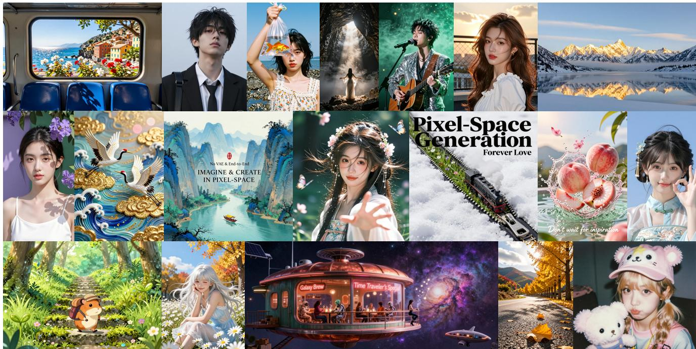  
Figure 1. Images generated by Z-Image-Turbo (Pixel) trained through our method. Offering only ∼ 0.2 second inference latency on an enterprise-grade H800 GPU.

## Abstract

This paper investigates an increasingly important topic in generative modeling: pixel-space diffusion models. Although numerous studies have explored this topic, most focus on small-scale or class-conditional settings. Consequently, a practical recipe for training pixel-space models that rival or exceed well-established latent-space counterparts remains elusive. Through a comprehensive empirical study, we first observe that direct large-scale pre-training in pixel space converges substantially more slowly than in latent space. This observation motivates a latent-to-pixel strategy that acquires generative priors efficiently in latent space and transitions to pixel space during post-training. We then systematically investigate the key design choices

governing this transition, including weight initialization, data composition, prediction target, decoder architecture, and noise schedule, and identify a practical recipe that makes the resulting pixel-space models match or outperform their latent-space counterparts while delivering 3.18 to 4.75 times end-to-end inference speedups. We hope that our findings provide useful empirical insights and practical guidelinesforfuture research on pixel-space generation.

## 1. Introduction

Pixel-space diffusion has emerged as a prominent paradigm, attracting substantial interest in the community [1, 13, 16, 43, 72, 74, 85]. In comparison with the dominant latent-space counterpart, it exhibits several distinct advantages: (i) by learning directly from

RGB images and generating outputs in pixel space, it is not constrained by the reconstruction ceiling of a pre-trained VAE and can recover visual information discarded by latent compression [65, 77, 80, 85]. (ii) it offers practical efficiency benefits at inference time: images are generated directly as pixels without an additional VAE decoding stage, while the sequence length can be reduced by adopting a larger patch size. This provides a flexible efficiency - quality trade-off without increasing the VAE compression ratio, which often causes substantial degradation in reconstruction and generation quality [8, 10, 15, 29, 47, 86].

Although the training recipes and scaling behavior of the latent-space diffusion have been extensively studied at scale through sustained community effort [9, 23, 28, 54, 58, 62, 69, 75], pixel-space diffusion remains far less explored. Most existing studies are still confined to class-conditioned ImageNet [1, 16, 43, 72] or smallscale text-to-image synthesis [56, 57, 74, 85] with limited data [11, 12, 81]. Therefore, it remains largely unclear how to train a pixel-space counterpart with capabilities comparable to well-established latent-space text-to-image diffusion models [3, 5, 69, 87]. In particular, two fundamental questions remain unanswered: how do pixel- and latent-space diffusion compare in training efficiency under a large-scale training settings, and what training recipe can make pixel-space models competitive in both generation quality and inference efficiency?

In this work, we revisit the foundations of pixelspace model training and investigate how to build an efficient and competitive pixel-space text-to-image model at scale. We first show that, under identical large-scale pre-training settings, pixel-space diffusion converges substantially more slowly than its latent-space counterpart. This motivates a latent-topixel strategy [7, 15] that leverages latent-space pretraining for efficient knowledge acquisition and introduces pixel-space learning during post-training. We then study the key design choices governing this transition, including initialization, training data, prediction target, decoder architecture, and noise schedule. Based on these findings, we further combine progressive patch-size adaptation with step distillation to improve inference efficiency. Our final pixelspace models maintain competitive overall benchmark performance while delivering 3.18×–4.75× endto-end speedups over their latent-space counterparts. Compared with prior latent-to-pixel methods [7, 15], our models improve most benchmarks while substantially reducing inference latency. Consistent results on both Z-Image and FLUX2-klein demonstrate that the resulting recipe generalizes beyond a single model family.

In summary, our main contributions are as follows:

• We provide a controlled large-scale comparison of pixel- and latent-space diffusion, revealing the slower convergence of pixel-space pre-training.

• We systematically study latent-to-pixel adaptation at scale and establish a practical recipe for effective pixel-space post-training.

• Our final recipe produces pixel-space models that achieve comparable overall performance to the well-established latent-space counterparts while providing 3.18×–4.75× faster end-to-end inference.

## 2. Related Work

## 2.1. Latent-Space Diffusion Models

Latent Diffusion Models (LDMs) perform denoising in an autoencoder-derived latent space, substantially reducing computational and memory costs [39, 64]. Since the pioneering work on latent diffusion [64], LDMs have advanced along several dimensions, including model architectures [2, 9, 23, 58, 59, 61], prediction paradigms [45, 50], training and inference methods [17, 36, 37, 44, 48, 49, 55, 76, 83, 84], and distributed training and inference systems [22, 24, 38, 42, 59, 60, 70]. Consequently, LDMs have become the de facto paradigm for large-scale text-toimage systems [3, 5, 67, 69, 87], including the Seedream [25, 28, 67] and FLUX [3, 40] model families.

Despite their success, LDMs remain constrained by the autoencoder reconstruction bottleneck: aggressive latent compression can discard fine-grained details and impose an upper bound on sample fidelity [10, 65, 80]. Training a large-scale autoencoder also requires substantial data, computational resources, and empirical tuning [79, 86]. Moreover, the mismatch between the autoencoder’s reconstruction objective and the diffusion model’s generation objective can induce latent-space distribution shifts, such as smoothed textures and color distortions, that the diffusion process must compensate for [41, 80]. Finally, the required VAE decoding stage introduces additional inference latency relative to direct pixel-space generation [15, 47, 85]. These limitations motivate end-toend alternatives such as pixel-space diffusion.

## 2.2. Pixel-Space Diffusion Models

Pixel-space diffusion predates latent-space diffusion, but early approaches were limited by computational cost and architectural bottlenecks [20, 31, 32]. With increased compute and advances in network design [16, 56, 72, 85] and training objectives [43, 52, 57], pixelspace methods have substantially narrowed the performance gap. On moderate-scale datasets such as ImageNet [19], they now achieve performance comparable to or better than latent-space methods. Unified Multimodal Models (UMMs) have also demonstrated the feasibility of pixel-space modeling for both visual understanding and generation at scale [4, 21, 51].

However, large-scale studies of pixel-space diffusion for generation-centric models remain scarce. In this work, we provide empirical insights and practical guidelines for training pixel-space diffusion models in the more challenging large-scale text-to-image setting.

## 3. Large-Scale Pixel-Space Pre-training Converges More Slowly Than Latent-Space

First, a fundamental question remains unresolved: under controlled large-scale pre-training settings, how do pixel- and latent-space diffusion compare in terms of training efficiency and performance?

To answer this question, we conduct a controlled comparison using the same architecture, training data, computational resources, and training configuration as Z-Image [69], varying only the prediction space.

As shown in Figure 2, latent-space pre-training consistently outperforms its pixel-space counterpart throughout training. The gap is particularly pronounced at the early stage: the latent model rapidly acquires basic object structure and text–image alignment, whereas the pixel model remains substantially behind. Although the pixel model continues to improve, it does not close the gap under the same compute budget. The qualitative results in Figure 3 show the same trend: latent-space samples exhibit recognizable global layouts and object identities much earlier, while pixel-space samples require more iterations to form coherent structures.

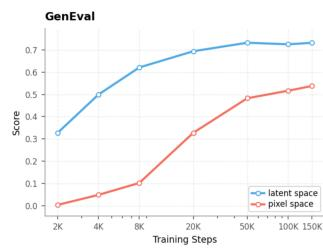

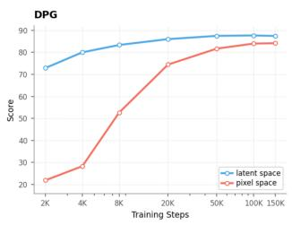  
Figure 2. Evaluation curves over training steps. The model trained in the latent space consistently achieve superior results (measured by GenEval [27] and DPG [34]) and faster convergence compared to those trained in the pixel space.

We hypothesize that this performance gap arises because the VAE serves not only as a computational compressor but also as a learned, compact visual representation [10, 65, 80]. Trained on large-scale image data, the VAE maps raw pixels to a lowerdimensional, perceptually structured latent space that suppresses local redundancy and high-frequency variation while preserving information relevant to image semantics and appearance [39, 64]. This representation substantially simplifies the distribution that the diffusion model must learn. In contrast, a pixel-space model must discover these regularities directly from high-dimensional raw signals while simultaneously learning global image structure, modeling fine-grained local statistics, and performing denoising. This additional optimization burden makes learning from scratch considerably more challenging, even with the more than 20 billion image–text training pairs used in our experiments.

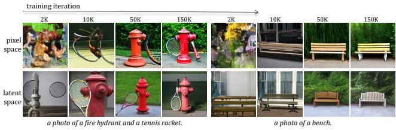  
Figure 3. Qualitative samples over training iterations. The latent space model consistently demonstrates faster image structure learning and superior final image quality in pretraining progress.

These results suggest that, despite avoiding the information loss introduced by latent compression, direct pixel-space supervision may not be the most effective formulation for large-scale pre-training because it converges more slowly and performs worse under a matched compute budget.

• Takeaway 1. Under identical large-scale pretraining settings, latent-space diffusion learns image structure and text–image alignment substantially faster than pixel-space diffusion, suggesting that pixel-space training may be suboptimal for pre-training.

## 4. A Carefully Designed Latent-to-Pixel Transition Offers a Better Trade-off

As discussed in Section 1, pixel-space diffusion is attractive for the final generator because it avoids the VAE reconstruction bottleneck and produces RGB images directly without an additional decoding stage. However, the results in Section 3 show that direct pixel-space pre-training converges more slowly and achieves lower performance than latent-space pretraining under a matched compute budget. Together, these observations suggest that latent and pixel spaces are better suited to different stages of training. Largescale pre-training primarily aims to acquire broad visual knowledge and text–image alignment efficiently, for which the compact latent representation provides a favorable trade-off between modest information loss and substantially easier optimization. Pixel-space supervision can then be introduced during post-training to obtain a final generator that operates directly in RGB space.

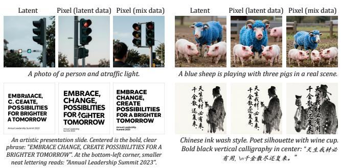

Motivated by recent studies on latent-to-pixel adaptation [7, 15, 73], we first pre-train a latent diffusion model and then adapt it to predict pixels directly. This strategy provides a strong and quick initialization for pixel-space training while retaining the quality and inference advantages of direct pixel generation. Using Z-Image [69] as the base model and following the general setup of L2P [15], we investigate the key design choices governing this transition. Detailed hyperparameter settings are provided in Appendix.

## 4.1. Weight Initialization

Given the substantially higher efficiency of latentspace pre-training, we first investigate whether the knowledge learned in latent space facilitates subsequent pixel-space optimization. Specifically, we compare two pixel-space models trained under identical settings: one initialized from a pre-trained latentspace model and the other trained from scratch. As shown in Figure 4, latent-space weight initialization yields consistently higher GenEval and DPG scores throughout training. In contrast, the model trained from scratch improves only gradually and remains far behind under the same training budget.

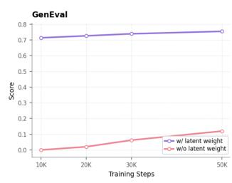

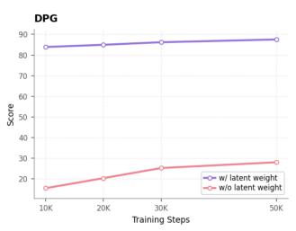  
Figure 4. Pixel-space training that initialized from a pretrained latent-space model yields remarkable faster convergence than training from scratch.

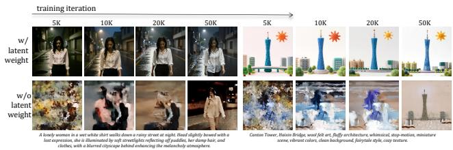  
Figure 5. Pixel-Space trained with latent-weight initialization enables earlier formation of coherent image structures and improves final image quality compared with training from scratch.

The qualitative results in Figure 5 show a similar pattern. Starting from latent-space weights enables the pixel-space model to form recognizable objects, coherent layouts, and stable text–image alignment much earlier, whereas training from scratch produces severely degraded and unstable samples for a substantially longer period.

• Takeaway 2. The knowledge and generation capacity acquired in latent space remain highly transferable to pixel-space optimization, providing a strong initialization that accelerates convergence.

## 4.2. Training Data

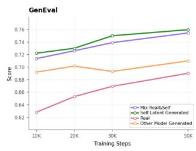

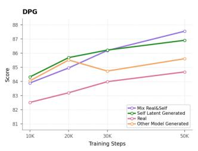  
Figure 6. Effect of training data source. Source-latentmodel-generated data enables substantially faster convergence than real data alone, while mixing real and selfgenerated data achieves the best overall trade-off.  
Figure 7. Qualitative comparison of training data choices. Training only on source latent-model generations can retain artifacts inherited from the source model. Mixing highquality real images provides direct pixel-level supervision and improves these details.

Pixel-space training enables direct supervision from high-quality real RGB images, allowing the final generator to move beyond the reconstruction bottleneck and information loss imposed by VAE compression. However, as shown in Figure 6, training exclusively on real images converges substantially more slowly than the other settings.

In contrast, using samples generated by the same latent model that provides the initialization leads to much faster convergence. We hypothesize that these self-generated samples form a low-distribution-shift bridge between latent- and pixel-space training. Because they remain aligned with the source model’s learned conditional distribution, they implicitly constrain the pixel-space model to preserve its existing generative priors while rapidly adapting to a new output representation. The weaker performance obtained with samples generated by a different model, FLUX2- klein-9B [3], supports this interpretation and suggests that alignment with the source-model distribution is important for effective transfer [15, 37, 47, 68].

However, self-generated data inevitably inherits errors from the source latent model and its VAE decoder. As shown in Figure 7, artifacts such as malformed typography persist when the pixel model is trained only on source-model samples. We therefore combine selfgenerated samples with high-quality real images. This mixture preserves the rapid and stable adaptation enabled by self-generated data, while real-image supervision recovers visual information lost through latent compression and corrects artifacts inherited from the source model, as shown in Figure 7.

• Takeaway 3. Self-generated data enables a smooth and rapid latent-to-pixel transition but inherits errorsfrom the latent generator. Real-image supervision can correct these errors but converges slowly in isolation. Combining the two provides the best trade-off.

## 4.3. Prediction Space

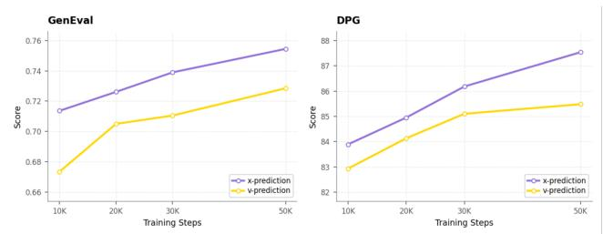  
Figure 8. Training with �-prediction achieves overall better performance and faster convergence than �-prediction.

Prior studies such as JiT [43] suggest that �-prediction is essential for stable pixel-space training, whereas the widely used �-prediction objective can lead to divergence. In our setting, however, the pixel-space model is initialized from a latent-space baseline trained with �-prediction. This setup raises a key design question for pixel-space post-training: should the model retain the original �-prediction objective or switch to �-prediction? As shown in Figure 8, the stable initialization provided by the latent-space weights enables both formulations to converge, avoiding the instability observed when training from scratch. Nevertheless, switching to �-prediction consistently yields better benchmark scores throughout training. These results indicate that latent-space initialization stabilizes the transition between prediction objectives, while �- prediction remains important for achieving the best pixel-space performance.

• Takeaway 4. For pixel-space post-training, �- prediction consistently outperforms �-prediction, even when the model is initialized from a latentspace �-prediction model.

## 4.4. Decoder Architecture

While DiT-style Transformer backbones have become standard for pixel-space diffusion [23, 58, 61], the design of pixel decoder heads remains comparatively underexplored. Existing decoder designs have not been systematically compared in a controlled text-to-image setting. We therefore benchmark several representative designs, including JiT’s linear head [43], DiP’s lightweight convolutional U-Net [16], PixelDiT’s Transformer-based head (PiT) [85], Deco’s frequency-decoupled head [56], and a conventional VAE for reference (FLUX-AE [40]), while keeping the backbone and training setup fixed.

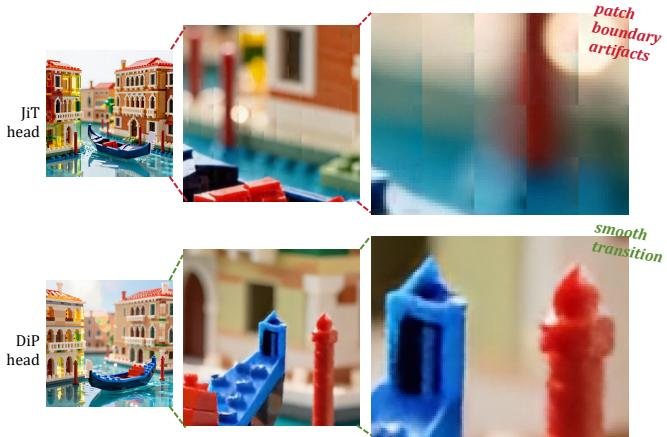  
Figure 9. The JiT head exhibits visible grid-like artifacts at patch boundaries, whereas the DiP head produces smoother spatial transitions.

The results in Table 1 reveal a clear quality–efficiency trade-off. Although PiT achieves the highest GenEval score, its decoder alone contains 2.25B parameters, equivalent to 37.5% of our 6B-parameter backbone, and requires 19,731 GFLOPs. This substantial decoder overhead makes PiT impractical for our setting. JiT is considerably more efficient but yields lower generation quality and visible grid-like artifacts at patch boundaries, as shown in Figure 9.

DiP achieves the best DPG score and competitive GenEval performance with only 10.09M parameters and 834 GFL ${ \cal O } \mathrm { P s } ,$ substantially reducing computation relative to PiT, Deco, and the VAE. It also produces smoother transitions across neighboring patches. We attribute this behavior to the local spatial inductive bias introduced by its lightweight convolutional decoder: convolutional locality and weight sharing allow neighboring patch features to interact before pixel synthesis. Such spatially shared processing may reduce discontinuities at patch boundaries without incurring the substantial cost of heavier decoder designs. Based on this quality–efficiency trade-off, we adopt DiP as our decoder head.

Table 1. Decoder design comparison. Inference latency and GFLOPs are measured with decoder-only Inference for obtaining a 1024 × 1024 image on a single H800 GPU. The best and second-best results in each row are bolded and underlined, respectively.
<table><tr><td></td><td colspan="6">Decoder</td></tr><tr><td>Metric</td><td></td><td> $\mathrm { J i T }$ </td><td>Dip</td><td>PiT</td><td>Deco</td><td>VAE</td></tr><tr><td colspan="2">GenEval ↑</td><td>0.7380</td><td>0.7545</td><td>0.7697</td><td>0.7347</td><td></td></tr><tr><td colspan="2">DPG↑</td><td>86.19</td><td>87.54</td><td>86.36</td><td>86.10</td><td></td></tr><tr><td colspan="2">Params(M) ↓</td><td>2.95</td><td>10.09</td><td>2249.82</td><td>315.92</td><td>49.55</td></tr><tr><td colspan="2">Latency  $( \mathrm { m s } ) \downarrow$ </td><td>0.07</td><td>6.02</td><td>74.96</td><td>5.01</td><td>91.88</td></tr><tr><td colspan="2">GFLOPs ↓</td><td>24.16</td><td>834.03</td><td>19731.88</td><td>2587.05</td><td>10472.20</td></tr></table>

• Takeaway 5. The DiP head provides the best quality–efficiency trade-off among the evaluated decoder designs and produces smoother transitions across patch boundaries.

## 4.5. Noise Schedule

Transitioning from VAE latents to RGB pixels changes both the spatial resolution and the signal distribution on which the flow-matching path is defined. Consequently, directly reusing the latent-space noise schedule may expose the initialized model to a substantially different signal-to-noise ratio (SNR). Rather than redesigning the entire schedule, we follow previous studies [14, 33, 43] and introduce a single noise-scale factor �:

$$
\begin{array} { r } { \mathbf { x } _ { t } = t \mathbf { x } _ { 0 } + ( 1 - t ) \gamma \epsilon , \qquad \epsilon \sim N ( \mathbf { 0 } , \mathbf { I } ) . } \end{array}\tag{1}
$$

We first derive a resolution-based reference for �. Let � denote the ratio between the spatial dimensions of an RGB image and its corresponding VAE latent. In our setting, $r ^ { ^ { - } } = 8 ,$ meaning that the RGB representation has an 8× higher spatial resolution along each dimension. If the pixel-space input is average-pooled by a factor of $r ,$ the variance of independent pixel noise decreases by $r ^ { 2 }$ . The resulting SNR relationship is

$$
\mathrm { S N R } _ { \mathrm { p i x e l } } ^ { \downarrow r } ( t ) \approx \frac { r ^ { 2 } } { \gamma ^ { 2 } } \mathrm { S N R } _ { \mathrm { l a t e n t } } ( t ) .\tag{2}
$$

Under the simplifying assumption that spatial resolution is the only difference between the two representations, matching their SNRs gives $\gamma = r = 8$

Table 2. Ablation on noise scale �.
<table><tr><td></td><td>γ</td><td rowspan="2">1</td><td rowspan="2">2</td><td rowspan="2">4</td><td rowspan="2">8</td></tr><tr><td>Metric</td><td></td></tr><tr><td>GenEval ↑</td><td></td><td>0.6811</td><td>0.7545</td><td>0.7413</td><td>0.7316</td></tr><tr><td>DPG↑</td><td></td><td>84.03</td><td>87.54</td><td>86.01</td><td>85.64</td></tr></table>

This derivation provides only a theoretical reference. A VAE encoder is not equivalent to average pooling, and RGB pixels and VAE latents also differ in their signal statistics and prediction targets. Resolution-based SNR matching therefore does not necessarily determine the optimal noise scale for latent-to-pixel adaptation. We accordingly evaluate � ∈ {1, 2, 4, 8}, using � = 8 as the theoretically motivated reference.

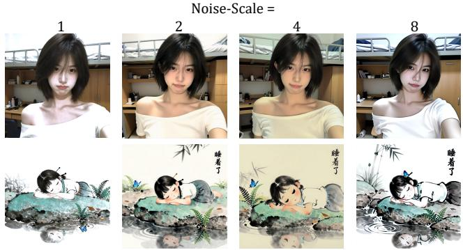  
Figure 10. Qualitative comparison of different noise scales. Noise scales of 1, 4, and 8 exhibit noticeable color shifts, whereas that of 2 produces more balanced color rendition.

As shown in Table 2, $\gamma \ = \ 2$ achieves the best performance on both GenEval and DPG, whereas the resolution-derived value of 8 is suboptimal. This discrepancy indicates that spatial resolution alone cannot fully characterize the distribution shift from VAE latents to RGB pixels and that empirical calibration remains necessary. The qualitative results in Figure 10 show the same trend: � = 1, 4, and 8 produce noticeable color shifts, while $\gamma = 2$ yields more balanced color rendition for both realistic and stylized images. We therefore use $\gamma = 2$ in subsequent experiments.

• Takeaway 6. A resolution-based SNR analysis provides a useful reference for transferring the latent-space noise schedule, but the optimal noise scale must be empirically calibrated to account for the broader distribution shift between VAE latents and RGB pixels.

## 5. Optimizing Efficiency with Larger-Patch Adaptation and Step Distillation

## 5.1. Larger Patch-Size Adaptation

To further improve inference efficiency, one practical approach is to reduce the number of visual tokens by increasing the effective compression ratio. In latent-space diffusion, this can be achieved by increasing either the VAE compression ratio or the latentspace patch size. However, aggressive latent compression degrades reconstruction and generation quality [58, 65, 86]. Consequently, large-scale latent diffusion models typically use an effective 16× spatial compression ratio, corresponding to 4,096 tokens for 10242 generation.

Pixel-space generation offers a potentially more favorable alternative. Because it is trained end-to-end with supervision in the original pixel space, recent work suggests that it can accommodate larger patch sizes without severe quality degradation [43]. We therefore investigate larger patch sizes for large-scale text-toimage generation.

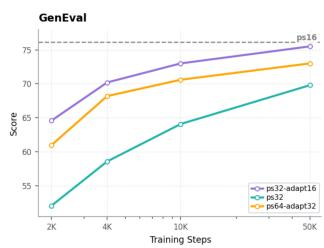

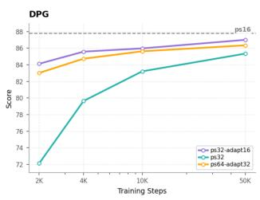  
Figure 11. Progressive patch-size adaptation improves convergence and final performance.

The ps16 baseline preserves the 64 × 64 spatial token grid of the 16×-compressed latent model. The latentto-pixel transition therefore changes only the prediction space while retaining the spatial granularity at which the backbone learned its visual priors, leading to stable convergence and detailed synthesis.

By contrast, directly training ps32 simultaneously changes the prediction space and coarsens the token grid. Each token must therefore model a larger spatial region, making local visual priors more difficult to transfer. Despite reducing the token count by 4×, direct ps32 training converges slowly and produces visible local artifacts, as shown in Figures 11 and 12.

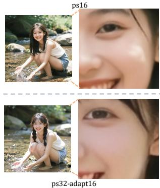

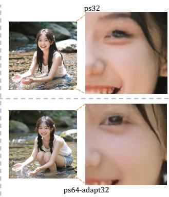  
Figure 12. Qualitative comparison of patch-size adaptation. Direct ps32 training introduces local artifacts. Adapting from ps16 to ps32 preserves these details, whereas further adaptation to ps64 reintroduces artifacts.

We therefore first transfer the latent model to pixel space at ps16 and then adapt it to ps32, a configuration denoted as ps32-adapt16. By decoupling the prediction-space transition from the change in spatial granularity, this strategy transfers stable pixel-space visual and local-detail priors to the more efficient configuration. ps32-adapt16 converges substantially faster than direct ps32 training, achieves performance comparable to ps16 on both GenEval and DPG, and largely removes local artifacts while using only one quarter of the tokens. Extending the same procedure from ps32 to ps64 provides another 4× token reduction but degrades local details and benchmark performance. Overall, ps32-adapt16 provides the most favorable quality–efficiency trade-off.

• Takeaway 7. Progressive patch-size adaptation reduces the number of visual tokens by fourfold with only a small quality gap. The degradation at more aggressive patch sizes highlights an important direction for future work: preserving finegrained details under extreme token compression.

## 5.2. Pixel-Space Step-Distillation

Step distillation complements patch-size adaptation by reducing the number of function evaluations (NFEs) required for sampling [35, 46, 53, 63, 66, 82, 83]. In latent-space diffusion, however, its end-to-end acceleration becomes increasingly limited in the ultrafew-step regime. As denoising becomes cheaper, the fixed cost of a single VAE decoding pass accounts for a larger fraction of the total inference latency [47].

Pixel-space generation removes this bottleneck by producing RGB images directly. We therefore apply Decoupled-DMD [46] and DMDR [35] to pixelspace step distillation, allowing reductions in NFE to translate more directly into end-to-end speedups. As shown in Figure 13, the pixel-space transition alone provides a modest 1.10× speedup, while larger-patch adaptation reduces latency to 4.56 s (4.41×). After step distillation, the pixel-space model requires only 0.20 s per image, compared with 0.95 s for its latent-space distilled counterpart, yielding a 4.75× reduction in latency. Combined with larger-patch adaptation, pixelspace step distillation achieves a 100.6× end-to-end speedup over the original latent-space pipeline while maintaining performance, as shown in Table 3.

Table 3. Performance comparison of pixel and latent models across benchmarks [6, 26, 27, 34]. Images are generated using original benchmark prompts rather than Prompt-Enhanced (PE) [71] variants. Inference latency is measured for a 1024 × 1024 image on a single H800 GPU without any system-level optimizations.
<table><tr><td>Model</td><td>NFE</td><td>Latency (s) ↓</td><td>GenEval ↑</td><td>DPG↑</td><td>OneIG ↑</td><td>LongText ↑</td></tr><tr><td>Z-Image (latent-space) L2P (pixel-space)</td><td>100 100</td><td>20.12 18.26</td><td>0.7510 0.7612</td><td>86.91 86.00</td><td>0.566 0.499</td><td>0.9332 0.7798</td></tr><tr><td>Ours (pixel-space)</td><td>100</td><td>4.56 (4.41×) 0.95</td><td>0.7644</td><td>87.60</td><td>0.564</td><td>0.9252</td></tr><tr><td>Z-Image-Turbo (latent-space) Ours-Turbo (pixel-space)</td><td>4 4</td><td>0.20 (4.75×)</td><td>0.7625 0.7698</td><td>85.31 86.85</td><td>0.520 0.512</td><td>0.8639 0.8732</td></tr><tr><td>FLUX2-klein-Base (latent-space) AsymFlow (pixel-space) Ours (pixel-space)</td><td>100 100 100</td><td>20.25 21.42 6.38 (3.18×)</td><td>0.8027 0.8181 0.8096</td><td>84.89 86.70</td><td>0.541 0.508</td><td>0.5456 0.4498</td></tr><tr><td>FLUX2-klein (latent-space) Ours-Turbo (pixel-space)</td><td>4 4</td><td>0.92 0.28 (3.29×)</td><td>0.8142 0.8185</td><td>86.88 84.36 86.00</td><td>0.554 0.537 0.530</td><td>0.6632 0.4763 0.6105</td></tr></table>

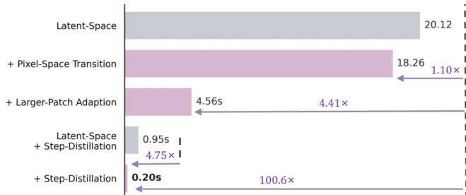  
Figure 13. End-to-end inference latency (S) per 1024 × 1024 image on a single NVIDIA H100 GPU without any systemlevel optimizations such as FlashAttention [18].

## 6. System-Level Comparison

Having established the key design choices for pixelspace training, we scale up the mixed training data and extend training to obtain our final models. Table 3 evaluates our recipe on two model families. At 100 NFE, we compare against both the corresponding latent-space models and prior pixel-space adaptation methods: L2P [15] for Z-Image and AsymFlow [7] for FLUX2-klein. At 4 NFE, we compare our distilled models with the latent-space official counterparts.

For Z-Image, our pixel-space models maintain comparable or better overall performance than their latentspace counterparts while achieving 4.41× and 4.75× speedups at 100 and 4 NFE. They also outperform L2P across all four benchmarks with substantially lower latency. Although our empirical study primarily uses Z-Image, the same recipe transfers effectively to FLUX2-klein [3], delivering 3.18×–3.29× speedups while achieves better results than both the latent-space baselines and AsymFlow across majority of benchmarks.

These results suggest that the findings generalize beyond a single model family and provide a practical recipe for training efficient, high-performing pixelspace models and show that our recipe outperforms prior latent-to-pixel methods on most benchmarks, while maintaining competitive performance against well-established latent-space counterparts across two model families, while offering substantially faster inference speed.

## 7. Conclusion

In this work, we systematically study large-scale pixel-space text-to-image diffusion and show that direct pixel-space pre-training converges substantially more slowly than latent-space pre-training. This finding motivates a latent-to-pixel strategy that acquires generative priors efficiently in latent space before adapting the model to pixel space during posttraining. By examining the key design choices underlying this transition, we derive a practical recipe that outperforms prior latent-to-pixel methods on most benchmarks across two model families, while maintaining competitive performance against latent-space counterparts and delivering 3.18×–4.75× end-to-end inference speedups. These findings provide practical guidance for scalable, high-quality, and efficient pixelspace diffusion.

## 8. Acknowledgments

We thank Qilong Wu, Xin Jin, Zhen Li, Shilin Zhou, Zechao Zhan, and Ruikai Zhou for their helpful discussions and suggestions throughout this project.

## References

[1] Alan Baade, Eric Ryan Chan, Kyle Sargent, Changan Chen, Justin Johnson, Ehsan Adeli, and Li Fei-Fei. Latent forcing: Reordering the diffusion trajectory for pixel-space image generation. arXiv preprint arXiv:2602.11401, 2026. 1, 2

[2] Fan Bao, Shen Nie, Kaiwen Xue, Yue Cao, Chongxuan Li, Hang Su, and Jun Zhu. All are worth words: A vit backbone for diffusion models. In Proceedings of the IEEE/CVF conference on computer vision and pattern recognition, pages 22669–22679, 2023. 2

[3] Black Forest Labs. FLUX.2: Frontier Visual Intelligence. https://bfl.ai/blog/flux-2, 2025. 2, 5, 8, 13

[4] Qi Cai, Jingwen Chen, Chengmin Gao, Zijian Gong, Yehao Li, Yingwei Pan, Yi Peng, Zhaofan Qiu, Kai Yu, Yiheng Zhang, et al. Hidream-o1-image: A natively unified image generative foundation model with pixel-level unified transformer. arXiv preprint arXiv:2605.11061, 2026. 2

[5] Siyu Cao, Hangting Chen, Peng Chen, Yiji Cheng, Yutao Cui, Xinchi Deng, Ying Dong, Kipper Gong, Tianpeng Gu, Xiusen Gu, et al. Hunyuanimage 3.0 technical report. arXiv preprint arXiv:2509.23951, 2025. 2

[6] Jingjing Chang, Yixiao Fang, Peng Xing, Shuhan Wu, Wei Cheng, Rui Wang, Xianfang Zeng, Gang Yu, and Hai-Bao Chen. Oneig-bench: Omni-dimensional nuanced evaluation for image generation. arXiv preprint arxiv:2506.07977, 2025. 8

[7] Hansheng Chen, Jan Ackermann, Minseo Kim, Gordon Wetzstein, and Leonidas Guibas. Asymmetric flow models. arXiv preprint arXiv:2605.12964, 2026. 2, 4, 8

[8] Haojun Chen, Haoyang He, Chengming Xu, Qingdong He, Junwei Zhu, Yabiao Wang, Zhucun Xue, Xianfang Zeng, Zhennan Chen, Xiaobin Hu, et al. Pixverve: Advancing native uhr image generation to 100mp with a large-scale high-quality dataset. arXiv preprint arXiv:2605.20147, 2026. 2

[9] Junsong Chen, Jincheng Yu, Chongjian Ge, Lewei Yao, Enze Xie, Yue Wu, Zhongdao Wang, James Kwok, Ping Luo, Huchuan Lu, and Zhenguo Li. Pixart-�: Fast training of diffusion transformer for photorealistic textto-image synthesis. In International Conference on Learning Representations, 2024. 2

[10] Junyu Chen, Han Cai, Junsong Chen, Enze Xie, Shang Yang, Haotian Tang, Muyang Li, and Song Han. Deep compression autoencoder for efficient high-resolution diffusion models. In International Conference on Learning Representations, pages 96539–96560, 2025. 2, 3

[11] Junying Chen, Zhenyang Cai, Pengcheng Chen, Shunian Chen, Ke Ji, Xidong Wang, Yunjin Yang, and Benyou Wang. Sharegpt-4o-image: Aligning multimodal models with gpt-4o-level image generation. arXiv preprint arXiv:2506.18095, 2025. 2

[12] Jiuhai Chen, Zhiyang Xu, Xichen Pan, Yushi Hu, Can Qin, Tom Goldstein, Lifu Huang, Tianyi Zhou, Saining

Xie, Silvio Savarese, et al. Blip3-o: A family of fully open unified multimodal models-architecture, training and dataset. arXiv preprint arXiv:2505.09568, 2025. 2

[13] Shoufa Chen, Chongjian Ge, Shilong Zhang, Peize Sun, and Ping Luo. Pixelflow: Pixel-space generative mod els with flow. arXiv preprint arXiv:2504.07963, 2025. 1

[14] Ting Chen. On the importance of noise scheduling for diffusion models. arXiv preprint arXiv:2301.10972, 2023. 6

[15] Zhennan Chen, Junwei Zhu, Xu Chen, Jiangning Zhang, Jiawei Chen, Zhuoqi Zeng, Wei Zhang, Chengjie Wang, Jian Yang, and Ying Tai. L2p: Unlock ing latent potential for pixel generation. arXiv preprint arXiv:2605.12013, 2026. 2, 4, 5, 8, 13

[16] Zhennan Chen, Junwei Zhu, Xu Chen, Jiangning Zhang, Xiaobin Hu, Hanzhen Zhao, Chengjie Wang, Jian Yang, and Ying Tai. Dip: Taming diffusion models in pixel space. In Proceedings of the IEEE/CVF Conference on Computer Vision and Pattern Recognition, pages 36136–36146, 2026. 1, 2, 5

[17] Hyungjin Chung, Jeongsol Kim, Geon Yeong Park, Hyelin Nam, and Jong Chul Ye. Cfg++: Manifoldconstrained classifier free guidance for diffusion models. In International Conference on Learning Representations, pages 30824–30850, 2025. 2

[18] Tri Dao, Dan Fu, Stefano Ermon, Atri Rudra, and Christopher Ré. Flashattention: Fast and memoryefficient exact attention with io-awareness. Advances in neural information processing systems, 35:16344–16359, 2022. 8

[19] Jia Deng, Wei Dong, Richard Socher, Li-Jia Li, Kai Li, and Li Fei-Fei. Imagenet: A large-scale hierarchical image database. In 2009 IEEE conference on computer vision and pattern recognition, pages 248–255. Ieee, 2009. 2

[20] Prafulla Dhariwal and Alexander Nichol. Diffusion models beat gans on image synthesis. Advances in neu ral information processing systems, 34:8780–8794, 2021. 2

[21] Haiwen Diao, Penghao Wu, Hanming Deng, Jiahao Wang, Shihao Bai, Silei Wu, Weichen Fan, Wenjie Ye, Wenwen Tong, Xiangyu Fan, et al. Sensenova-u1: Unifying multimodal understanding and generation with neo-unify architecture. arXiv preprint arXiv:2605.12500, 2026. 2

[22] Italo Thiago Felix Dos Santos, Felipe Peres De Almeida, Luis Cuevas Rodriguez, and Adevan Neves Santos. Impact of gpu architecture and vram on image generation: A study of energy efficiency in heterogeneous edge nodes. In Simpósio Brasileiro de Computação Ubíqua e Pervasiva (SBCUP), pages 198–210. SBC, 2026. 2

[23] Patrick Esser, Sumith Kulal, A. Blattmann, Rahim Entezari, Jonas Muller, Harry Saini, Yam Levi, Dominik Lorenz, Axel Sauer, Frederic Boesel, Dustin Podell, Tim Dockhorn, Zion English, Kyle Lacey, Alex Goodwin, Yannik Marek, and Robin Rombach. Scaling rectified flow transformers for high-resolution image synthesis. In Forty-first international conference on machine learning, 2024. 2, 5, 13

[24] Jiarui Fang, Jinzhe Pan, Xibo Sun, Aoyu Li, and Jiannan Wang. xdit: an inference engine for diffusion transformers (dits) with massive parallelism. arXiv preprint arXiv:2411.01738, 2024. 2

[25] Yu Gao, Lixue Gong, Qiushan Guo, Xiaoxia Hou, Zhichao Lai, Fanshi Li, Liang Li, Xiaochen Lian, Chao

Liao, Liyang Liu, et al. Seedream 3.0 technical report. arXiv preprint arXiv:2504.11346, 2025. 2

[26] Zigang Geng, Yibing Wang, Yeyao Ma, Chen Li, Yongming Rao, Shuyang Gu, Zhao Zhong, Qinglin Lu, Han Hu, Xiaosong Zhang, et al. X-omni: Reinforcement learning makes discrete autoregressive image generative models great again. arXiv preprint arXiv:2507.22058, 2025. 8

[27] Dhruba Ghosh, Hannaneh Hajishirzi, and Ludwig Schmidt. Geneval: An object-focused framework for evaluating text-to-image alignment. Advances in Neural Information Processing Systems, 36:52132–52152, 2023. 3, 8

[28] Lixue Gong, Xiaoxia Hou, Fanshi Li, Liang Li, Xiaochen Lian, Fei Liu, Liyang Liu, Wei Liu, Wei Lu, Yichun Shi, et al. Seedream 2.0: A native chineseenglish bilingual image generation foundation model. arXiv preprint arXiv:2503.07703, 2025. 2

[29] Yoav HaCohen, Nisan Chiprut, Benny Brazowski, Daniel Shalem, Dudu Moshe, Eitan Richardson, Eran Levin, Guy Shiran, Nir Zabari, Ori Gordon, et al. Ltxvideo: Realtime video latent diffusion. arXiv preprint arXiv:2501.00103, 2024. 2

[30] Jonathan Ho and Tim Salimans. Classifier-free diffusion guidance. arXiv preprint arXiv:2207.12598, 2022. 15

[31] Jonathan Ho, Ajay Jain, and Pieter Abbeel. Denoising diffusion probabilistic models. Advances in neural information processing systems, 33:6840–6851, 2020. 2

[32] Jonathan Ho, Chitwan Saharia, William Chan, David J Fleet, Mohammad Norouzi, and Tim Salimans. Cascaded diffusion models for high fidelity image generation. Journal of Machine Learning Research, 23(47):1–33, 2022. 2

[33] Emiel Hoogeboom, Thomas Mensink, Jonathan Heek, Kay Lamerigts, Ruiqi Gao, and Tim Salimans. Simpler diffusion: 1.5 fid on imagenet512 with pixel-space diffusion. In Proceedings of the Computer Vision and Pattern Recognition Conference, pages 18062–18071, 2025. 6

[34] Xiwei Hu, Rui Wang, Yixiao Fang, Bin Fu, Pei Cheng, and Gang Yu. Ella: Equip diffusion models with llm for enhanced semantic alignment. arXiv preprint arXiv:2403.05135, 2024. 3, 8

[35] Dengyang Jiang, Dongyang Liu, Zanyi Wang, Qilong Wu, Liuzhuozheng Li, Hengzhuang Li, Xin Jin, David Liu, Zhen Li, Bo Zhang, et al. Distribution matching distillation meets reinforcement learning. arXiv preprint arXiv:2511.13649, 2025. 7, 15

[36] Dengyang Jiang, Mengmeng Wang, Liuzhuozheng Li, Lei Zhang, Haoyu Wang, Wei Wei, Guang Dai, Yanning Zhang, and Jingdong Wang. No other representation component is needed: Diffusion transformers can provide representation guidance by themselves. arXiv preprint arXiv:2505.02831, 2025. 2

[37] Dengyang Jiang, Xin Jin, Dongyang Liu, Zanyi Wang, Mingzhe Zheng, Ruoyi Du, Xiangpeng Yang, Qilong Wu, Zhen Li, Peng Gao, et al. D-opsd: On-policy selfdistillation for continuously tuning step-distilled diffusion models. arXiv preprint arXiv:2605.05204, 2026. 2, 5

[38] Xin Jin, Huanqia Cai, Zhen Li, Zechao Zhan, Dengyang Jiang, Aiming Hao, Yuming Jiang, Chunle Guo, Peng Gao, Ming-Ming Cheng, et al. Beyond scalar rewards by internalizing reasoning into score distributions. arXiv preprint arXiv:2606.09076, 2026. 2, 15

[39] Diederik P Kingma and Max Welling. Auto-encoding variational bayes. arXiv preprint arXiv:1312.6114, 2013. 2, 3

[40] Black Forest Labs. Flux. https://github.com/ black-forest-labs/flux, 2024. 2, 5

[41] Xingjian Leng, Jaskirat Singh, Yunzhong Hou, Zhenchang Xing, Saining Xie, and Liang Zheng. Repa-e: Unlocking vae for end-to-end tuning of latent diffusion transformers. In Proceedings of the IEEE/CVF International Conference on Computer Vision, pages 18262– 18272, 2025. 2

[42] Muyang Li, Tianle Cai, Jiaxin Cao, Qinsheng Zhang, Han Cai, Junjie Bai, Yangqing Jia, Kai Li, and Song Han. Distrifusion: Distributed parallel inference for high-resolution diffusion models. In Proceedings of the IEEE/CVF Conference on Computer Vision and Pattern Recognition, pages 7183–7193, 2024. 2

[43] Tianhong Li and Kaiming He. Back to basics: Let denoising generative models denoise. In Proceedings of the IEEE/CVF Conference on Computer Vision and Pattern Recognition, pages 36115–36125, 2026. 1, 2, 5, 6, 7, 13

[44] Shanchuan Lin, Bingchen Liu, Jiashi Li, and Xiao Yang. Common diffusion noise schedules and sample steps are flawed. In Proceedings ofthe IEEE/CVF winter conference on applications of computer vision, pages 5404–5411, 2024. 2

[45] Yaron Lipman, Ricky TQ Chen, Heli Ben-Hamu, Maximilian Nickel, and Matt Le. Flow matching for generative modeling. arXiv preprint arXiv:2210.02747, 2022. 2

[46] Dongyang Liu, Peng Gao, David Liu, Ruoyi Du, Zhen Li, Qilong Wu, Xin Jin, Sihan Cao, Shifeng Zhang, Hongsheng Li, and Steven Hoi. Decoupled dmd: Cfg augmentation as the spear, distribution matching as the shield. arXiv preprint arXiv:2511.22677, 2025. 7, 15

[47] Dongyang Liu, Ruoyi Du, David Liu, Dengyang Jiang, Liangchen Li, Qilong Wu, Zhen Li, Steven CH Hoi, Hongsheng Li, and Peng Gao. High-fidelity two-step image generation via teacher-aligned end-to-end distillation. arXiv preprint arXiv:2606.12575, 2026. 2, 5, 7

[48] Feng Liu, Shiwei Zhang, Xiaofeng Wang, Yujie Wei, Haonan Qiu, Yuzhong Zhao, Yingya Zhang, Qixiang Ye, and Fang Wan. Timestep embedding tells: It’s time to cache for video diffusion model. In Proceedings of the Computer Vision and Pattern Recognition Conference, pages 7353–7363, 2025. 2

[49] Jie Liu, Gongye Liu, Jiajun Liang, Yangguang Li, Jiaheng Liu, Xintao Wang, Pengfei Wan, Di Zhang, and Wanli Ouyang. Flow-grpo: Training flow matching models via online rl. arXiv preprint arXiv:2505.05470, 2025. 2

[50] Xingchao Liu, Chengyue Gong, and Qiang Liu. Flow straight and fast: Learning to generate and transfer data with rectified flow. In International Conference on Learning Representations, 2023. 2, 13

[51] Zhiheng Liu, Weiming Ren, Xiaoke Huang, Shoufa Chen, Tianhong Li, Mengzhao Chen, Yatai Ji, Sen He, Jonas Schult, Belinda Zeng, et al. Tuna-2: Pixel embeddings beat vision encoders for multimodal understanding and generation. arXiv preprint arXiv:2604.24763, 2026. 2

[52] Yiyang Lu, Susie Lu, Qiao Sun, Hanhong Zhao, Zhicheng Jiang, Xianbang Wang, Tianhong Li,

Zhengyang Geng, and Kaiming He. One-step latentfree image generation with pixel mean flows. arXiv preprint arXiv:2601.22158, 2026. 2

[53] Yihong Luo, Tianyang Hu, Jiacheng Sun, Yujun Cai, and Jing Tang. Learning few-step diffusion models by trajectory distribution matching. arXiv preprint arXiv:2503.06674, 2025. 7

[54] Nanye Ma, Mark Goldstein, Michael S Albergo, Nicholas M Boffi, Eric Vanden-Eijnden, and Saining Xie. Sit: Exploring flow and diffusion-based generative models with scalable interpolant transformers. In European Conference on Computer Vision, pages 23–40. Springer, 2024. 2

[55] Xinyin Ma, Gongfan Fang, and Xinchao Wang. Deepcache: Accelerating diffusion models for free. In Proceedings of the IEEE/CVF conference on computer vision and pattern recognition, pages 15762–15772, 2024. 2

[56] Zehong Ma, Longhui Wei, Shuai Wang, Shiliang Zhang, and Qi Tian. Deco: Frequency-decoupled pixel diffusion for end-to-end image generation. In Proceedings of the IEEE/CVF Conference on Computer Vision and Pattern Recognition, pages 43600–43610, 2026. 2, 5

[57] Zehong Ma, Ruihan Xu, and Shiliang Zhang. Pixelgen: Pixel diffusion beats latent diffusion with perceptual loss. arXiv preprint arXiv:2602.02493, 2026. 2

[58] William Peebles and Saining Xie. Scalable diffusion models with transformers. In Proceedings of the IEEE/CVF international conference on computer vision, pages 4195–4205, 2023. 2, 5, 7

[59] Dustin Podell, Zion English, Kyle Lacey, Andreas Blattmann, Tim Dockhorn, Jonas Müller, Joe Penna, and Robin Rombach. Sdxl: Improving latent diffusion models for high-resolution image synthesis. arXiv preprint arXiv:2307.01952, 2023. 2

[60] Adam Polyak, Amit Zohar, Andrew Brown, Andros Tjandra, Animesh Sinha, Ann Lee, Apoorv Vyas, Bowen Shi, Chih-Yao Ma, Ching-Yao Chuang, et al. Movie gen: A cast of media foundation models. arXiv preprint arXiv:2410.13720, 2024. 2

[61] Qi Qin, Le Zhuo, Yi Xin, Ruoyi Du, Zhen Li, Bin Fu, Yiting Lu, Xinyue Li, Dongyang Liu, Xiangyang Zhu, et al. Lumina-image 2.0: A unified and efficient image generative framework. In Proceedings of the IEEE/CVF International Conference on Computer Vision, pages 20031– 20042, 2025. 2, 5

[62] Aditya Ramesh, Prafulla Dhariwal, Alex Nichol, Casey Chu, and Mark Chen. Hierarchical text-conditional image generation with clip latents. arXiv preprint arXiv:2204.06125, 1(2):3, 2022. 2

[63] Yuxi Ren, Xin Xia, Yanzuo Lu, Jiacheng Zhang, Jie Wu, Pan Xie, Xing Wang, and Xuefeng Xiao. Hyper-sd: Trajectory segmented consistency model for efficient image synthesis. arXiv preprint arXiv:2404.13686, 2024. 7

[64] Robin Rombach, Andreas Blattmann, Dominik Lorenz, Patrick Esser, and Björn Ommer. High-resolution image synthesis with latent diffusion models. In Proceedings of the IEEE/CVF conference on computer vision and pattern recognition, pages 10684–10695, 2022. 2, 3

[65] Robin Rombach, Andreas Blattmann, Dominik Lorenz, Patrick Esser, and Björn Ommer. High-resolution image synthesis with latent diffusion models. In Proceedings of the IEEE/CVF conference on computer vision and pattern recognition, pages 10684–10695, 2022. 2, 3, 7

[66] Axel Sauer, Dominik Lorenz, Andreas Blattmann, and Robin Rombach. Adversarial diffusion distillation. In European Conference on Computer Vision, pages 87–103. Springer, 2024. 7

[67] Team Seedream, Yunpeng Chen, Yu Gao, Lixue Gong, Meng Guo, Qiushan Guo, Zhiyao Guo, Xiaoxia Hou, Weilin Huang, Yixuan Huang, et al. Seedream 4.0: Toward next-generation multimodal image generation. arXiv preprint arXiv:2509.20427, 2025. 2

[68] Yang Song and Prafulla Dhariwal. Improved techniques for training consistency models. In International Conference on Learning Representations, pages 15078– 15097, 2024. 5

[69] Z-Image Team, Huanqia Cai, Sihan Cao, Ruoyi Du, Peng Gao, Steven Hoi, Zhaohui Hou, Shijie Huang, Dengyang Jiang, Xin Jin, Liangchen Li, Zhen Li, Zhong-Yu Li, David Liu, Dongyang Liu, Junhan Shi, Qilong Wu, Fengyi Yu, Chi Zhang, Shifeng Zhang, and Shilin Zhou. Z-image: An efficient image generation foundation model with single-stream diffusion transformer. arXiv preprint arXiv:2511.22699, 2025. 2, 3, 4, 13

[70] Ye Tian, Zhen Jia, Ziyue Luo, Yida Wang, and Chuan Wu. Diffusionpipe: Training large diffusion models with efficient pipelines. Proceedings of Machine Learning and Systems, 6:101–113, 2024. 2

[71] Linqing Wang, Ximing Xing, Yiji Cheng, Zhiyuan Zhao, Li Donghao, Hang Tiankai, Li Zhenxi, Jiale Tao, QiXun Wang, Ruihuang Li, Comi Chen, Xin Li, Mingrui Wu, Xinchi Deng, Shuyang Gu, Chunyu Wang, and Qinglin Lu. Promptenhancer: A simple approach to enhance text-to-image models via chain-of-thought prompt rewriting. arXiv preprint arXiv:2509.04545, 2025. 8

[72] Shuai Wang, Ziteng Gao, Chenhui Zhu, Weilin Huang, and Limin Wang. Pixnerd: Pixel neural field diffusion. arXiv preprint arXiv:2507.23268, 2025. 1, 2

[73] Xiyuan Wang, Xiao Zhang, Yang Li, Ruoxi Jiang, Zhao Zhong, Liefeng Bo, and Muhan Zhang. Crossflow: One-step generation across latent and pixel spaces. arXiv preprint arXiv:2606.19970, 2026. 4

[74] Xianbang Wang, Hanhong Zhao, Yiyang Lu, Kangyang Zhou, Linrui Ma, and Kaiming He. Minit2i: A minimalist baseline for text-to-image generation, 2026. 1, 2

[75] Chenfei Wu, Jiahao Li, Jingren Zhou, Junyang Lin, Kaiyuan Gao, Kun Yan, Sheng-ming Yin, Shuai Bai, Xiao Xu, Yilei Chen, et al. Qwen-image technical report. arXiv preprint arXiv:2508.02324, 2025. 2

[76] Jiazheng Xu, Xiao Liu, Yuchen Wu, Yuxuan Tong, Qinkai Li, Ming Ding, Jie Tang, and Yuxiao Dong. Imagereward: Learning and evaluating human preferences for text-to-image generation. Advances in Neural Information Processing Systems, 36:15903–15935, 2023. 2

[77] Tongda Xu, Mingwei He, Shady Abu-Hussein, Jose Miguel Hernandez-Lobato, Chunhang Zheng, Kai Zhao, Chao Zhou, Ya-Qin Zhang, and Yan Wang. Making reconstruction fid predictive of diffusion generation fid. arXiv preprint arXiv:2603.05630, 2026. 2

[78] An Yang, Anfeng Li, Baosong Yang, Beichen Zhang, Binyuan Hui, Bo Zheng, Bowen Yu, Chang Gao, Chengen Huang, Chenxu Lv, et al. Qwen3 technical report. arXiv preprint arXiv:2505.09388, 2025. 13

[79] Jingfeng Yao, Yuda Song, Yucong Zhou, and Xinggang Wang. Towards scalable pre-training of visual tokenizers for generation. arXiv preprint arXiv:2512.13687, 2025. 2

[80] Jingfeng Yao, Bin Yang, and Xinggang Wang. Reconstruction vs. generation: Taming optimization dilemma in latent diffusion models. In Proceedings of the Computer Vision and Pattern Recognition Conference, pages 15703–15712, 2025. 2, 3

[81] Junyan Ye, Dongzhi Jiang, Zihao Wang, Leqi Zhu, Zhenghao Hu, Zilong Huang, Jun He, Zhiyuan Yan, Jinghua Yu, Hongsheng Li, et al. Echo-4o: Harnessing the power of gpt-4o synthetic images for improved image generation. arXiv preprint arXiv:2508.09987, 2025. 2

[82] Tianwei Yin, Michaël Gharbi, Taesung Park, Richard Zhang, Eli Shechtman, Fredo Durand, and Bill Freeman. Improved distribution matching distillation for fast image synthesis. Advances in neural information processing systems, 37:47455–47487, 2024. 7, 15

[83] Tianwei Yin, Michaël Gharbi, Richard Zhang, Eli Shechtman, Fredo Durand, William T Freeman, and Taesung Park. One-step diffusion with distribution matching distillation. In Proceedings of the IEEE/CVF conference on computer vision and pattern recognition, pages 6613–6623, 2024. 2, 7

[84] Sihyun Yu, Sangkyung Kwak, Huiwon Jang, Jongheon Jeong, Jonathan Huang, Jinwoo Shin, and Saining Xie. Representation alignment for generation: Training diffusion transformers is easier than you think. In International Conference on Learning Representations, 2025. 2

[85] Yongsheng Yu, Wei Xiong, Weili Nie, Yichen Sheng, Shiqiu Liu, and Jiebo Luo. Pixeldit: Pixel diffusion transformers for image generation. In Proceedings of the IEEE/CVF Conference on Computer Vision and Pattern Recognition, pages 14273–14282, 2026. 1, 2, 5, 13

[86] Zekai Zhang, Deqing Li, Kuan Cao, Yujia Wu, Chenfei Wu, Yu Wu, Liang Peng, Hao Meng, Jiahao Li, Jie Zhang, et al. Qwen-image-vae-2.0 technical report. arXiv preprint arXiv:2605.13565, 2026. 2, 7

[87] Bing Zhao, Chenfei Wu, Deqing Li, Hao Meng, Jiahao Li, Jie Zhang, Jingren Zhou, Junyang Lin, Kaiyuan Gao, Kuan Cao, et al. Qwen-image-2.0 technical report. arXiv preprint arXiv:2605.10730, 2026. 2

## Appendix

## A. Additional Implementation Details

In this section, we provide additional implementation details for the experiments presented in the main paper. The configurations used in our component-wise studies are summarized in Tables 4 and 5. Unless otherwise specified, we keep the backbone architecture, text-conditioning modules, data preprocessing, optimization strategy, and evaluation protocol fixed when comparing different configurations.

## A.1. Large-Scale Pixel Versus Latent-Space pre-training

For the controlled comparison in Sec. 3, we instantiate both models using the same Z-Image Transformer backbone [69] and text-conditioning stack (Pre-trained Qwen-3-4B [78]). The latent-space model operates on features produced by the Flux-AE as used in $Z -$ Image, which has a spatial downsampling factor of 8. Together with a latent patch size of 2, this corresponds to an effective spatial compression ratio of 16 and a 64 × 64 token grid for $1 0 2 4 ^ { 2 }$ image generation. The pixel-space model uses ps16, producing the same 64 × 64 token grid directly from RGB images. Consequently, the two models have identical Transformer sequence lengths, allowing the comparison to primarily isolate the effect of the prediction space rather than differences in backbone computation.

Both models are trained on the same corpus of more than 20B image–text pairs following the original Z-Image pre-training recipe, including its progressive resolution schedule from $2 5 6 ^ { 2 }$ to ${ \bar { 5 } } 1 2 ^ { 2 }$ , batch size, learning rate, optimizer, etc., while varying only the prediction space.

## A.2. Latent-to-Pixel Transition

For the experiments in Sec. 4, we initialize the pixelspace model from a Z-Image latent-space checkpoint. During pixel-space post-training, we optimize the full model, with a global batch size of 128, a learning rate of 5e-5 and trained directly on 1� resolution following L2P [15]. Unless explicitly ablated, we use latent-pretrained initialization, mixed self-generated and real data, �-prediction, the DiP decoder, a noise scale of $\gamma = 2 ,$ , and ps16.

Weight initialization. For the initialization study in Sec. 4.1, the latent-initialized model loads the Transformer and conditioning weights from the pre-trained latent model, while its pixel-specific input and output modules are initialized identically to those of the from-scratch baseline. For the latter, the complete model is initialized using the initialization scheme of

Z-Image. The two configurations use the same architecture, mixed training data, optimizer, learning-rate schedule, and number of updates.

Training data. For the data study in Sec. 4.2, we construct four training configurations: real images only, self-generated samples only, samples generated by another model, and a mixture of self-generated and real images. The real-image subset contains the latest Supervised-Fine-tuning (SFT) data of the Z-Image. Self-generated samples are produced by the same latent-space Z-Image checkpoint used for weight initialization with the default sampling settings, ensuring that the synthetic distribution remains close to the source model. For the external-model setting, we use FLUX2-klein-9B [3] to generate images from the same prompt pool. Synthetic samples are generated offline and paired with their original prompts. The mixed-data configuration samples self-generated and real images at a ratio of 1:1.

Prediction space. For Sec. 4.3, we compare �- prediction and �-prediction under an otherwise identical latent-to-pixel setup. Both variants use the same flow-matching path, timestep sampler, noise scale, initialized backbone, and pixel decoder. The �-prediction model directly estimates the clean RGB target x0 [43], whereas the �-prediction model estimates the velocity associated with the interpolation path [50]. Timesteps are sampled from a logit-normal distribution [23]. Following JiT [43], both parameterizations are optimized using the same velocity-space objective. For �- prediction, the predicted clean image is converted into the corresponding velocity before computing the loss and performing ODE sampling. This allows both variants to share the same training weighting, numerical solver, and sampling schedule. During inference, the �-prediction output is converted to the corresponding velocity field. This conversion allows both variants to use the same numerical solver and sampling schedule.

Decoder architecture. For the decoder comparison in Sec. 4.4, all variants use the same latent-initialized backbone, training data, �-prediction objective, noise scale, and ps16 tokenization. Only the module that maps the final Transformer features to RGB pixels is changed. The JiT head uses a linear projection to reconstruct the pixels associated with each visual token. The DiP head design remains consistent with L2P [15] which uses a lightweight convolutional U-Net. The PiT head consists of 4 additional Transformer blocks following [85]. For Deco, we use frequency decomposition and decoder configuration for training. The VAE reference uses the FLUX-AE used in Z-Image.

All decoder-specific modules are initialized from scratch, while the shared Transformer backbone is initialized from the same latent checkpoint. Parameter counts and GFLOPs are measured at a resolution of 10242 with a batch size of one.

Table 4. Hyperparameter settings for component-wise analysis (I). Bold entries denote the configurations varied in the corresponding section.
<table><tr><td></td><td>Section 4.1</td><td>Section 4.2</td><td>Section 4.3</td></tr><tr><td>Weight initialization</td><td>From scratch/ Latent-pretrained</td><td>Latent-pretrained Real images/</td><td>Latent-pretrained</td></tr><tr><td>Training data</td><td>Self-generated + Real</td><td>Self-generated samples/ Other-model samples/ Self-generated + Real</td><td>Self-generated + Real</td></tr><tr><td>Prediction target</td><td>x-prediction</td><td>x-prediction</td><td>v-prediction/ x-prediction</td></tr><tr><td>Decoder architecture</td><td>DiP</td><td>DiP</td><td>DiP</td></tr><tr><td>Noise scale</td><td> $\gamma = 2$ </td><td> $\gamma = 2$ </td><td> $\gamma = 2$ </td></tr><tr><td>Patch size</td><td>ps16</td><td>ps16</td><td>ps16</td></tr></table>

Table 5. Hyperparameter settings for component-wise analysis (II). Bold entries denote the configurations varied in the corresponding section.
<table><tr><td></td><td>Section 4.4</td><td>Section 4.5</td><td>Section 5.1</td></tr><tr><td>Weight initialization</td><td>Latent-pretrained</td><td>Latent-pretrained</td><td>Latent-pretrained</td></tr><tr><td>Training data</td><td>Self-generated + Real</td><td>Self-generated + Real</td><td>Self-generated + Real</td></tr><tr><td>Prediction target</td><td>x-prediction JiT/ DiP/</td><td>x-prediction</td><td>x-prediction</td></tr><tr><td>Decoder architecture</td><td>PiT/ Deco/</td><td>DiP</td><td>DiP</td></tr><tr><td>Noise scale</td><td>VAE  $\gamma = 2$ </td><td> $\gamma \in \{ 1 , 2 , 4 , 8 \}$ </td><td>γ = 2</td></tr><tr><td>Patch size</td><td>ps16</td><td>ps16</td><td>ps16/ps32/ ps32-adapt16/</td></tr></table>

Noise schedule. For Sec. 4.5, RGB images are normalized to [-1,1] before noise is applied. We evaluate � ∈ {1, 2, 4, 8} in

$$
\begin{array} { r } { \mathbf { x } _ { t } = t \mathbf { x } _ { 0 } + ( 1 - t ) \gamma \epsilon , \qquad \epsilon \sim N ( \mathbf { 0 } , \mathbf { I } ) . } \end{array}\tag{3}
$$

The timestep distribution, prediction target, loss weighting, initialization, and optimization schedule are identical across all four settings. During sampling, the same value of � used for training is incorporated into noise initialization. We use $\gamma = 2$ in all subsequent experiments based on its performance on GenEval and DPG.

Larger patch-size adaptation. For Sec. 5.1, ps16, ps32, and ps64 produce token grids of 64 × 64, 32 × 32, and 16 × 16, respectively, at 10242 resolution. Direct ps32 training initializes the shared Transformer from the latent-space checkpoint while simultaneously replacing the latent input representation with $3 2 \times 3 2$ RGB patches. In contrast, ps32-adapt16 is initialized from the converged ps16 pixel-space checkpoint, thereby decoupling the latent-to-pixel transition from the subsequent reduction in token resolution.

For progressive patch-size adaptation, the Transformer and decoder architectures remain unchanged, and only the input dimension of the first projection MLP must be expanded. When doubling the patch size from $p$ to $2 { \dot { p } } ,$ each new patch comprises four non-overlapping $p \times p$ sub-patches. Given the previous projection weight W, we initialize the expanded weight as:

$$
\mathbf { W } ^ { \prime } = \frac { 1 } { 2 } \left[ \mathbf { W } , \mathbf { W } , \mathbf { W } , \mathbf { W } \right] ,\tag{4}
$$

where the weights are replicated along the input dimension and the bias is copied directly. The factor of $1 / 2$ compensates for the four-fold increase in fanin and approximately preserves the activation variance at initialization. All remaining Transformer and decoder parameters are transferred without modification. The same strategy is used when initializing ps64-adapt32 from the converged ps32-adapt16 checkpoint.

During adaptation, we apply a linear learning-rate warm-up of 5,000 steps to the transferred Transformer and decoder parameters. The expanded inputprojection MLP is exempt from this warm-up and is optimized with its target learning rate from the first update, allowing it to adapt rapidly to the new patch representation. We train ps16, ps32-adapt16, and ps64-adapt32 for each stage, while keeping the training data, �-prediction objective, DiP decoder, and noise scale fixed.

Pixel-space step distillation. For Sec. 5.2, we use the converged ps32-adapt16 pixel-space model for DMD initialization. We apply Decoupled-DMD [46] in distillation stage 1 and DMDR [35] with Z-Reward [38] in stage 2. The corresponding loss coefficients, fakesample update frequency, and timestep-sampling distribution are set following the DMD2 and Decoupled-DMD papers [46, 82].

The distilled model uses four function evaluations with an ODE sampler and does not require classifierfree guidance (CFG) [30]. For a controlled efficiency comparison, the latent-space distilled baseline uses the same number of function evaluations for testing.

## A.3. System-Level Comparison

For the final comparison in Sec. 6, we scale up the mixed training set and extend the pixel-space posttraining iteration. We apply the resulting recipe— latent initialization, mixed self-generated and real data, �-prediction, the DiP decoder, � = 2, and progressive patch-size adaptation—to both Z-Image and FLUX2-klein. For FLUX2-klein, we initialize from FLUX2-klein-9B-Base and use a synthetic-to-real data ratio of 1:1. We otherwise retain the same training recipe, introducing only the architecture-specific modifications required by FLUX2-klein. As for Z-Image-L2P and FLUX2-klein-AsymFlow, we use the inference setting and checkpoint provided in the official open-source repository for benchmark evaluation.