# Beyond Accuracy: Assessing Calibration of Geospatial Foundation Models and Their Sensitivity to Distribution Shifts

Nils Lehmann, Jakob Gawlikowski, Burak Ekim, Isaac Corley, and Xiao Xiang Zhu Fellow, IEEE

Abstract—Geospatial Foundation Models (GeoFMs) are most commonly ranked and selected by accuracy on standard benchmark conditions via averaged ranks. We show that this protocol is too narrow: the promised deployment in critical EO tasks requires further angles of analysis, mainly calibration, the agreement between a model’s confidence and its correctness. Across 16 frozen encoders, four classification and five segmentation datasets, and two orthogonal stress axes (physically motivated distribution shift and training-data budget), every encoder degrades as corruption intensifies, and the ranking moves with it: rank transfer decays with severity in all three corruption families, and by severity grade 3 a clean-data ranking recovers little of the shifted ranking. Across the four classification benchmarks, EOpretrained and ImageNet-pretrained encoders are indistinguishable on clean accuracy and clean calibration, and EO pretraining provides no more stability under shift than ImageNet pretraining. Under shift the GeoFMs drift further into overconfidence than the ImageNet-pretrained encoders, at every grade and in every corruption family. A centered kernel alignment (CKA) analysis ties this to representational rigidity: EO-pretrained embeddings move less under corruption while losing just as much task information and remaining overconfident. We apply three commonly explored uncertainty quantification methods and find that temperature scaling and deep ensembles cannot counteract the degradation, while a Gaussian-process probe roughly halves ECE under severe cloud only by tripling it on clean data. In selective prediction experiments, we find that confidence-based abstention cannot defer around confidently wrong predictions, and advocate that benchmark rankings and evaluations should therefore operate across a multitude of conditions and metrics to more holistically evaluate model development progress and close the gap to real world deployment scenarios.

Index Terms—calibration, distribution shift, earth observation, foundation models, remote sensing, uncertainty quantification, benchmarking

## I. INTRODUCTION

a vast corpus of data to subsequently be adapted to many diverse downstream tasks. Following their success in language modeling [2] as well as image [3] and video [4] generation, several dozen geospatial foundation models (GeoFMs) have been proposed [5], motivated by the scale of available geospatial data and the potential for improved label efficiency and downstream performance at lower fine-tuning cost [6]. Their defining promise is breadth: a single pretrained encoder meant to serve a wide range of sensors, regions, imaging conditions, to enable or improve performance on various downstream tasks [6].

However, hat promise is difficult to check with current evaluation practices. Corley et al. [7] recently demonstrated that, due to insufficient community standards and evaluation protocols, practitioners are not yet able to holistically and fairly compare GeoFM performance on downstream tasks. The disparity is visible across the literature: the same encoder on the same benchmark is reported with different numbers in different papers, sometimes under the nominaly same evaluation protocol. Accuracy on clean benchmark conditions is also blind to what deployment conditions a model encounters, since safety-critical decision making [8] and natural distribution shifts of geography, sensors, and atmospheric conditions all change the input distribution at test time [6], [9], [10].

In order to more holistically evaluate GeoFM performance under these conditions, this study concerns test-time covariate shift. Distribution shift is commonly categorized as semantic, covariate, or concept drift [11]–[13]; the shifts we consider perturb only the input while leaving the labeling task intact, and are therefore covariate to the extent that the label remains recoverable, in line with the common-corruption robustness benchmarks [9], [10]. Shift also lies on a spectrum rather than a dichotomy [14]: applying an model to a distincly different sensor or region is a far shift, whereas the same scenes and sensors observed through atmospheric or sensor degradation is a near shift, and it is this near regime that we apply. Figure 1 illustrates the resulting phenomenon: encoders that are nearly indistinguishable on clean data degrade in both accuracy and calibration under such shifts, and their rankings change.

In our evaluation we put particular emphasis on calibration which describes the agreement between a model’s confidence and its correctness, and therefore whether a prediction can be acted on when its accuracy cannot be checked directly [15]. Calibration metrics are well established in the general machine learning (ML) literature but have barely been applied in the geospatial domain, as Section II shows. In this regard, our contribution is a systematic assessment of how sensitive GeoFM calibration is to distribution shift, across a diverse set of classification and segmentation datasets (Table I), following established task-adaptation protocols.

Our central finding is one about evaluation, not about any single model. When we re-evaluate the same encoders under physically motivated EO distribution shifts and across training-data budgets, model rankings shift substantially under most of the conditions we test. The single number that is commonly reported, accuracy on clean, full-data test sets, is not informative enough for indicating trustworthy behavior. Rank transfer degrades systematically with corruption severity in all three corruption families, and by severity grade 3 a clean-data ranking recovers little of the shifted ranking. We make this concrete along two orthogonal axes, distribution shift and training-data budget, use a centered kernel alignment (CKA) representational analysis to assess feature sensitivity, and furthermore show that common calibration methods do not fully resolve these issues. Concretely, we contribute a corpus audit establishing that calibration is absent at every level of the GeoFM evaluation ecosystem (Section II); a systematic assessment of the calibration of 16 frozen encoders under EO-specific corruptions and across five training-data budgets (Sections IV-B–IV-D); a representation-drift analysis that ties calibration failure to a domain-conditioned pattern (Section IV-C); and an evaluation of post-hoc calibration, ensembles, and a Gaussian-process probe, none of which fully restores calibration under shift. Furthermore, a selectiveprediction evaluation shows that confidence-based abstention cannot defer around confidently wrong predictions: at the highest cloud severity, coverage is near total and mean accuracy falls to 0.15, yet models remain overconfident (Sections IV-E– IV-F).

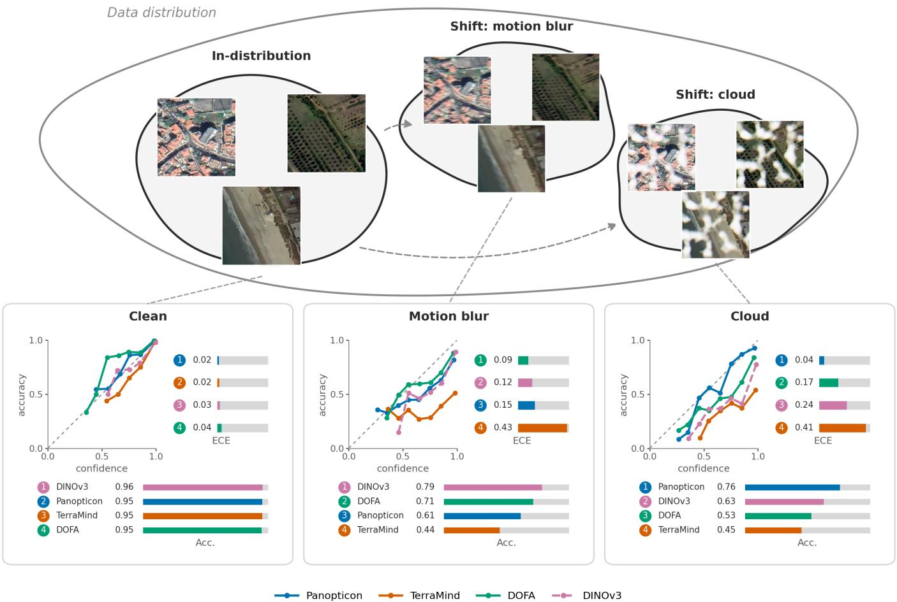  
Fig. 1. Conceptual overview. Frozen encoders are evaluated under physically simulated, test-time distribution shifts, shown as example shifts branching from in-distribution EO scenes (top). For one representative dataset (bottom), each shift is read out as a reliability curve (the dashed diagonal marks perfect calibration) with ECE and accuracy rankings. We show an illustrative subset of four encoders, three EO-pretrained and an ImageNet reference (DINOv3, dashed), not the full set of encoders evaluated in Section IV. Encoders that are nearly indistinguishable on clean data degrade in both accuracy and calibration under shift, and their rankings reshuffle.

## II. RELATED WORK

Reliable machine learning requires models that are not only accurate but trustworthy [16], [17], a property we define to encompass three distinct dimensions: calibration (whether predicted confidence matches empirical accuracy in aggregate [15]), predictive uncertainty (whether a model can identify which individual inputs it is ignorant about [18]), and robustness (whether calibration and uncertainty continue to hold under distribution shift, so that a model’s confidence degrades gracefully alongside its accuracy [10]). These dimensions are related but not interchangeable: calibration is a marginal property that constrains confidence only on average and can be satisfied by an uninformative predictor that outputs the base rate for every input, whereas predictive uncertainty is a conditional property that asks whether the model knows where it will be wrong. Neither is guaranteed to survive distribution shift, since a calibration map fit on clean in-distribution data need not transfer once the test distribution moves. We measure the conditional, predictiveuncertainty dimension with per-sample proper scoring rules (NLL and Brier score; Section III-I), which, unlike the binned and marginal ECE, are sensitive to the probability assigned to each individual label, and with selective-prediction diagnostics (Section III-H) that test whether confidence identifies the inputs a model gets wrong. Each is a mature subfield in the broader ML literature: calibration evaluation is standard in medical image analysis [19], [20] and language modeling [21], [22], and large-scale robustness benchmarks in the general ML domain routinely pair accuracy with calibration metrics [9], [23], [24]. As we show below, none of these practices have transferred to GeoFM evaluation.

a) Evaluation practices for geospatial foundation models: GeoFMs are commonly evaluated on dozens of datasets encompassing diverse tasks such as classification, segmentation, and regression [6]. Community dataset suites such as GEO-Bench-1 and 2 [25], [26] and PANGAEA [27] propose standardization of these procedures, but recent audits reveal that evaluation throughout the community is neither reproducible nor standardized: across 152 self proclaimed GeoFM papers, identical model–benchmark pairs disagree by more than ten accuracy points in 46 cases, most papers use a unique pre-training configuration, and a substantial fraction release no model weights [7]. The gap we identify, however, extends further than reproducibility. We systematically audited this same corpus, as well as available benchmark frameworks, for evidence of calibration, predictive uncertainty, and robustness evaluation. The finding is consistent across all three strands: (i) not one of the 152 GeoFM model papers reports a calibration metric in the machine-learning sense (no ECE, reliability diagrams, or Brier score); every “calibration” mention refers to radiometric sensor calibration; (ii) neither GEO-Bench nor PANGAEA include calibration or predictive uncertainty in their evaluation protocols; (iii) dedicated EO robustness benchmarks (REOBench [28] and EarthShift [14], which evaluate GeoFMs across dozens of shift conditions) report exclusively accuracy metrics. These audits let us conclude that calibration is currently absent at every level of the GeoFM evaluation ecosystem.

b) Robustness and distribution shift: A minority of GeoFM papers probe robustness, but nearly always reframe a model’s headline capability as a generalization test with respect to accuracy performance rather than assessing model confidence. The most common form of generalization testing is cross-region and cross-sensor generalization: holding out continents to measure geographic shifts [29], transferring to sensors unseen during pre-training [30], [31], evaluating any-sensor encoders on out-of-distribution bands and resolutions [32], and constructing generalization benchmarks with respect to region and sensors [27], [33]. A second strand studies scale and resolution shift [34], [35] and degradation under cloud cover or sparse temporal sampling [36]. Among GeoFMs, only HyperSIGMA reports a more classic robustness check: adversarial attacks (FGSM, PGD) and input corruptions (JPEG, Gaussian noise) [37]. A more deployment-oriented line of work asks whether shift can be detected rather than merely tolerated: Ekim et al. [38] propose TARDIS, a post-hoc OOD detector based on internal activations, and evaluate it across 17 EO covariate and semantic shift setups on EuroSAT and xBD. This extends the EO robustness literature from accuracy under shift to explicit shift-awareness at inference time, but still does not study whether model confidence remains calibrated under those shifts. Critically, none of these works, nor the dedicated benchmarks REOBench [28] and EarthShift [14], connect robustness to whether a model’s confidence degrades gracefully alongside its accuracy.

c) Uncertainty and calibration: Calibration and uncertainty quantification are recognized dimensions of trustworthy ML [16], [17], yet they are nearly absent from the GeoFM literature. Only a small number of EO papers estimate predictive uncertainty directly. Chen and Bruzzone [39] use a negative-log-likelihood training objective [40] to estimate aleatoric uncertainty in a self-supervised change detector. More recently, SHRUG-FM [41] combines geophysical inputspace OOD cues, embedding-space OOD cues, and tasklevel uncertainty in a selective-prediction framework for burnscar, flood, and landslide mapping. This is closely related to deployment-time shift awareness, but its focus is abstention and risk reduction on retained samples rather than calibration in the sense of reliability diagrams, ECE, NLL, or Brier score. AlphaEarth [42] includes an “Uncertainty estimation” section but reports bootstrap confidence intervals on evaluation metrics rather than per-prediction model uncertainty. Calibration in the machine-learning sense (dedicated metrics, reliability diagrams, and relationship to accuracy) is reported by no model in the corpus we audit; the closest is an unquantified remark that one model’s higher softmax entropy yields “more calibrated predictions” [43]. Frequent mentions of “calibration” elsewhere refer to radiometric sensor calibration, and “temperature scaling” almost always denotes the contrastive-loss temperature, not confidence calibration. Outside geospatial work, post-hoc calibration methods such as temperature scaling [15], deep ensembles [44], and conformal prediction [45] are well established, and calibration under distribution shift is actively studied: Ovadia et al. [9] show that temperature scaling, while effective in-distribution, frequently fails under even moderate shift; Hendrycks et al. [10] find that no single method consistently improves robustness across shift types; and Minderer et al. [23] and Tao et al. [24] report that the accuracy–calibration correlation holds mainly among highperforming models and does not generalize across datasets.

d) Our work: To the best of our knowledge, we provide the first systematic assessment of GeoFM calibration and uncertainty under distribution shift. The neglect of calibration is consistent across all three strands of prior work: individual model papers, community evaluation frameworks, and dedicated robustness benchmarks all focus exclusively on accuracy. Unlike these works, we jointly evaluate calibration (ECE, NLL, Brier score, reliability diagrams), uncertainty quantification methods (post-hoc temperature scaling, deep ensembles, and a GP probe), and representation drift under EO-specific distribution shifts across a diverse set of GeoFMs and downstream classification tasks (Table I) using a common protocol. Under this approach we aim to establish a more holistic view of GeoFM performance that includes how well these models are calibrated and how this perspective can further support real-world application cases, where predictive uncertainty and model prediction confidence matter.

## III. METHODOLOGY

## A. Problem Setting

We study the predictive calibration of frozen geospatial encoders under linear probing, for both classification and segmentation. Given a pre-trained backbone $f _ { \theta } : \mathcal { X }  \mathbb { R } ^ { D }$ with fixed weights $\theta ,$ we train a lightweight probing head on the extracted embeddings: for classification, a linear probe $g _ { \phi } : \mathbb { R } ^ { D }  \mathbb { R } ^ { K }$ producing per-image class logits, where K is the number of classes; for segmentation, a lightweight FPNstyle decoder head [46] $g _ { \phi }$ takes the backbone’s feature maps at $L = 4$ coarse-to-fine depths and produces per-pixel class logits $g _ { \phi } \big ( \{ z _ { l } \} _ { l = 1 } ^ { L } \big ) \in \mathbb { R } ^ { K \times \bar { H } \times W }$ over the $H \times W$ spatial grid of the input image. For the classification datasets, we also fit UQ methods but the backbone weights are never modified, mirroring the dominant GeoFM deployment pattern of a shared backbone with lightweight task-specific heads.

The probe is held constant across all 16 encoders: the same head, the same protocol, and a regularization strength selected on accuracy and never re-tuned on calibration loss (Section III-D). A single absolute calibration number therefore depends on the head, but the between-encoder differences that our claims rest on hold the head fixed and so isolate the encoder.

A model is calibrated if $\operatorname* { P r } ( Y = y \mid { \hat { p } } ( x ) = p ) = p$ for all $p \in [ 0 , 1 ]$ [15]. We measure calibration through three metrics (Section III-I) under clean conditions and three geospatially motivated distribution shifts as well as varying training data budgets.

## B. Datasets

We evaluate on two common prediction tasks (Table I). For classification we use four single-label remote-sensing datasets (ADVANCE, m-EuroSAT, RESISC45, and So2Sat) spanning diverse sensors, spatial resolutions, and label spaces. For segmentation we use five datasets (CloudSEN12 [47], DynamicEarthNet [48], FLAIR#2 [49], Fields of the World [50], and SpaceNet2 [51]) covering cloud/shadow masking, land cover, agricultural parcels, and building footprints across Sentinel-2, aerial, and high-resolution commercial sensors.

## C. Encoders

We evaluate 16 frozen encoders (Table II). Following prior practice we can group them by pre-training domain: GeoFMs pre-trained on satellite or aerial imagery, general-purpose encoders pre-trained on ImageNet, and a non-learned Empirical Random Convolutional Feature (RCF) baseline [55], [56]. We deliberately include general purpose image encoders to study whether EO-specific pre-trained models are calibrated better than non-domain specific encoders.

As a finer descriptive tag we also record each encoder’s pre-training objective, split by the type of target it predicts: EO reconstruction (EO-recon), which predicts masked input

## TABLE I

EVALUATION DATASETS. Top: SINGLE-LABEL CLASSIFICATION CANON (NTRAIN INCLUDES VALIDATION SAMPLES NOT RESERVED FOR CALIBRATION; $N _ { \mathrm { C A L } } = 4 0 0$ FOR ALL DATASETS). Bottom:   
DENSE-PREDICTION (SEGMENTATION) DATASETS. SEGMENTATION DOES   
NOT USE A HELD-OUT CALIBRATION SPLIT OR THE TRAIN/VALIDATION MERGE DESCRIBED IN SECTION III-D—POST-HOC CALIBRATION   
METHODS (SECTION IV-E) APPLY TO CLASSIFICATION ONLY—SO N IS REPORTED INSTEAD OF $N _ { \mathrm { C A L } }$ . SPACENET7 (†) IS IN THE CORRUPTION   
SWEEP BUT EXCLUDED FROM THE FIVE-DATASET SEGMENTATION CANON USED THROUGHOUT THE ANALYSIS (SEE APPENDIX, Exclusion of SpaceNet7).

<table><tr><td colspan="5">Classification</td></tr><tr><td>Dataset</td><td> $N _ { \mathrm { t r a i n } }$ </td><td> $N _ { \mathrm { c a l } }$ </td><td> $N _ { \mathrm { t e s t } }$ </td><td>Classes</td></tr><tr><td>ADVANCE [52]</td><td>3,660</td><td>400</td><td>1,015</td><td>10</td></tr><tr><td>m-EuroSAT [25]</td><td>2,600</td><td>400</td><td>1,000</td><td>10</td></tr><tr><td>RESISC45 [53]</td><td>24,800</td><td>400</td><td>6,300</td><td>45</td></tr><tr><td>So2Sat [54]</td><td>20,578</td><td>400</td><td>986</td><td>17</td></tr><tr><td colspan="5">Segmentation</td></tr><tr><td>Dataset</td><td> $N _ { \mathrm { t r a i n } }$ </td><td> $N _ { \mathrm { v a l } }$ </td><td> $N _ { \mathrm { t e s t } }$ </td><td>Task</td></tr><tr><td>CloudSEN12 [47]</td><td>4,000</td><td>535</td><td>975</td><td>Cloud/shadow</td></tr><tr><td>DynamicEarthNet [48]</td><td>700</td><td>100</td><td>200</td><td>Land cover</td></tr><tr><td>FLAIR#2 [49]</td><td>4,049</td><td>1,022</td><td>3,022</td><td>Land cover</td></tr><tr><td>Fields of the World [50]</td><td>4,000</td><td>1,000</td><td>2,000</td><td>Field parcels</td></tr><tr><td>SpaceNet2 [51]</td><td>5,186</td><td>1,461</td><td>2,961</td><td>Buildings</td></tr><tr><td>SpaceNet7† [51]</td><td>3,500</td><td>652</td><td>1,152</td><td>Buildings</td></tr></table>

TABLE II

THE 16 FROZEN ENCODERS USED IN THIS STUDY, GROUPED BY PRETRAINING PROVENANCE (SATELLITE/AERIAL VS. NATURAL-IMAGE) AND PRETRAINING OBJECTIVE (TARGET TYPE).
<table><tr><td>Paradigm</td><td>Provenance</td><td>Encoders</td></tr><tr><td>EO-recon</td><td>GeoFM</td><td>Clay V1.5 [57], Prithvi V2 [58], DOFA [59], OLMo-Earth base/tiny [60], TerraMind [61]</td></tr><tr><td>EO-distill</td><td>GeoFM</td><td>Panopticon [32], ViT-L DINOv3-Sat [62]</td></tr><tr><td>Nat-DINO</td><td>General</td><td>ConvNeXt-L DINOv3 [62]</td></tr><tr><td>Nat-supervised</td><td>General</td><td>ResNet-18/50 [63], Swin-T [64], ViT-B/ViT-L [65],</td></tr><tr><td></td><td></td><td>MobileNetV3 [66]</td></tr><tr><td>Random</td><td>Baseline</td><td>RCF [55]</td></tr></table>

content against a fixed target (raw pixels, a frozen tokenizer, or a fixed random projection); EO self-distillation (EO-distill), which predicts against a co-evolving teacher; and, on the natural-image side, self-distillation (Nat-DINO), supervised (Nat-supervised), or random (RCF). Several EO encoders are hybrids: Clay adds a small DINOv2 teacher term to a pixelreconstruction loss, DOFA distills from ImageNet-pretrained features, and OlmoEarth adds an instance-contrastive term, so this split is a soft descriptive tag rather than a clean dichotomy, and we use it for exploratory grouping only, not as a headline axis.

All images are resized to 224×224 pixels with bilinear interpolation and normalized channel-wise using per-band statistics computed from the training set or alternatively the own model prescribed normalization scheme. ADVANCE and RESISC45 are RGB imagery only, so every encoder is evaluated in RGB on these two datasets. For m-EuroSAT and So2Sat, which provide multispectral bands, each encoder was probed in both RGB and its native multispectral configuration during the accuracy-focused linear probe sweep (Section III-D), and the higher-accuracy configuration was carried forward for calibration evaluation. Evaluating each encoder at its best band configuration is a deliberate choice, since this reflects how benchmarks commonly attempt to establish a best model. The calibration effect we report is nonetheless not an artifact of the band choice: on ADVANCE and RESISC45, where every encoder receives identical RGB input and no band configuration is selected, the EO-versus-general calibration gap under shift is if anything larger (cloud severity 3 ECE 0.44 vs. 0.25), while clean ECE is indistinguishable (0.023 vs. 0.024; Table IV, RGB-only group rows).

## D. Linear Probe Training and Calibration Split

For each encoder–dataset pair we extract embeddings from the frozen backbone and train a multinomial linear probe:

$$
g _ { \phi } ( z ) = \mathrm { s o f t m a x } ( W z + b ) , \quad z = f _ { \theta } ( x ) ,\tag{1}
$$

where $W \in \mathbb { R } ^ { K \times D }$ and $b \in \mathbb { R } ^ { K }$ . The probe is optimized with L-BFGS and $\ell _ { 2 }$ regularization; the regularization strength $C =$ $1 / \lambda$ is taken from an accuracy-focused linear probe sweep, without re-tuning on calibration loss, so that any observed miscalibration reflects the encoder and probe rather than the regularization choice.

a) Calibration split.: A stratified random split of 400 samples is held out from the validation set and reserved exclusively for fitting temperature scaling parameters. Critically, $\mathcal { D } _ { \mathrm { c a l } }$ is drawn entirely from clean, validation data: $T ^ { * }$ is fit once and never re-fit or otherwise exposed to corrupted inputs, mirroring the realistic deployment setting in which corrupted data is not available at calibration time. Once hyperparameters have been selected on validation-set performance, the remaining validation samples are merged into $\mathcal { D } _ { \mathrm { t r a i n } }$ for a final round of retraining. All reported metrics are computed on the heldout test set.

b) Segmentation probe.: For dense prediction we keep the same frozen-backbone approach but replace the linear probe with a lightweight FPN decoder [46]: we hook $L = 4$ coarse-to-fine feature layers from the frozen backbone, project each to a shared hidden dimension with a 1×1 lateral convolution, merge them top-down via bilinear upsample-and-add, refine each level with a 3×3 convolution, then concatenate all levels and classify with a final 1×1 convolution before upsampling to the input resolution. As in the classification setting, only the decoder is trained and the backbone is never updated. Calibration is then measured per pixel (pixel-ECE) alongside mean intersection-over-union (mIoU), so that the accuracy–calibration contrast is directly comparable to the classification setting.

## E. Uncertainty Quantification Methods

We evaluate three UQ strategies applied to the same frozen embeddings and trained probe, of which only temperature scaling is post-hoc. These UQ methods are fit and evaluated on the classification datasets only; segmentation is assessed under distribution shift and training-budget variation but not under the UQ methods.

a) Uncalibrated (baseline).: The baseline applies softmax directly to the linear probe logits:

$$
\hat { p } ( y \mid x ) = \operatorname { s o f t m a x } ( g _ { \phi } ( f _ { \theta } ( x ) ) ) .\tag{2}
$$

b) Temperature Scaling.: Temperature scaling [15] fits a single scalar $T > 0$ by minimizing NLL on $\mathcal { D } _ { \mathrm { c a l } } \colon$

$$
T ^ { * } = \underset { T > 0 } { \mathrm { a r g } \mathrm { m i n } } - \frac { 1 } { \left| \mathcal { D } _ { \mathrm { c a l } } \right| } \sum _ { ( x , y ) \in \mathcal { D } _ { \mathrm { c a l } } } \log \mathrm { s o f t m a x } \left( \frac { g _ { \phi } \left( f _ { \theta } ( x ) \right) } { T } \right) _ { y } .\tag{3}
$$

We parameterize $T = \exp ( \log T )$ and optimize with L-BFGS, leaving the probe’s decision boundaries unchanged.

c) Deep Ensemble.: We train $M = 5$ independent linear probes, each with a different random seed and optimized with AdamW on $\mathcal { D } _ { \mathrm { t r a i n } }$ , with diversity arising from weight initialization and stochastic gradient noise [44]. The ensemble prediction averages the member softmax outputs:

$$
\hat { p } _ { \mathrm { e n s } } ( y \mid x ) = \frac { 1 } { M } \sum _ { m = 1 } ^ { M } \operatorname { s o f t m a x } ( g _ { \phi _ { m } } ( f _ { \theta } ( x ) ) ) _ { y } .\tag{4}
$$

d) Gaussian-process probe.: As an exploratory alternative to the linear head, we replace $g _ { \phi }$ with a sparse variational Gaussian process (SVGP) classifier [67] on the same frozen embeddings, using a linear kernel and inducing points fitted on $\mathcal { D } _ { \mathrm { t r a i n } }$ . A GP head yields a distribution over functions rather than a point estimate, so predictive uncertainty is intrinsic to the model. Unlike the linear probe, the SVGP head did not fit reliably out of the box: our initial configuration used a Matern´ kernel, which gave unstable, high-variance fits for several encoders, and reaching results we trust required switching to a linear kernel along with additional tuning of inducing-point initialization and input dimensionality. With this linear-kernel configuration we more closely recovered the linear probe’s clean accuracy, confirming the SVGP head was not simply underfitting. We report the linear-kernel results throughout, for all 16 encoders on all four classification datasets. We evaluate the SVGP probe under the same corruptions to test whether a Bayesian head is more robust than previous approaches.

## F. Distribution Shift Conditions

We apply synthetic corruptions at five severity levels to every classification and segmentation dataset. Classification is stress-tested under all three corruption types below (cloud/shadow, Poisson–Gaussian sensor noise, motion blur); segmentation is stress-tested under Poisson–Gaussian sensor noise and motion blur only. We exclude synthetic cloud from the segmentation sweep by design: CloudSEN12 already contains real cloud as its labeled target, so a cloud corruption there would corrupt the label itself, and running a corruption set that is uniform across all segmentation datasets avoids caveating a single dataset out of every cloud figure. The three corruptions are chosen to span distinct physical degradation mechanisms rather than variations of one: scene-level occlusion (cloud and shadow), optical smearing from platform motion (motion blur), and detector shot and read noise (Poisson–Gaussian). Real EO degradation is of course broader, but sampling three mechanistically unrelated corruptions lets us ask whether a calibration effect is specific to one corruption or common to all of them; an effect that appears under every one cannot be an artifact of any single degradation type. All corruptions are applied in raw pixel space before normalization and seeded deterministically by (base seed, image index) for reproducibility across UQ methods and severity levels. Corrupting before normalization is likewise deliberate: at deployment only the training-set statistics are available, so the normalization mismatch a shifted input induces is itself part of the shift a model sees in practice. These corruptions are physically motivated but synthetic; they approximate rather than replace real EO shift (Section II). Fig. 13 in the appendix shows example images at each severity level for all three corruption types.

a) Cloud and shadow: Cloud masks are synthesized using the satellite-cloud-generator library [68], producing Perlin-noise-based patterns with soft edges and coregistered shadow offsets. Severity levels 1–5 vary the fraction of pixels under any cloud from approximately 20% to full coverage, with opacity tuned per dataset to match sensorspecific dynamic ranges. Only optical bands are affected.

b) Poisson–Gaussian sensor noise: We model CCD/CMOS detector degradation as [69]:

$$
\tilde { \boldsymbol { x } } _ { c } = \frac { \mathrm { P o i s s o n } ( \eta _ { c } \cdot \boldsymbol { x } _ { c } ) } { \eta _ { c } } + \boldsymbol { \sigma } _ { c } \cdot \boldsymbol { \epsilon } _ { c } , \quad \epsilon _ { c } \sim \mathcal { N } ( 0 , 1 ) ,\tag{5}
$$

where $\eta _ { c }$ controls shot noise intensity and $\sigma _ { c }$ is the readout noise for channel $c ,$ set empirically per sensor type (Sentinel-2, Landsat, aerial). Severity levels 1–5 progressively reduce $\eta _ { c }$ and increase $\sigma _ { c } .$

c) Motion blur: Satellite platform motion during acquisition causes spatial smearing in the flight direction [70], [71]. We simulate this as a horizontal uniform averaging kernel of width $k \in \{ 3 , 5 , 9 , 1 5 , 2 1 \}$ pixels for severities 1–5, applied identically across all channels with reflect padding, following [28].

## G. Training-Data Budget Sweep

To gain insights into model behavior under varying training data budgets that are related to promised performance gains of GeoFMs through label efficiency, we retrain each probe at five training fractions, {0.01, 0.10, 0.25, 0.50, 0.75} of the available training data, on both classification and segmentation. This sweep uses five random seeds per configuration for classification and three for segmentation (subset draw plus probe initialization), which lets us separate genuine rank instability from seed noise. For each fraction we compute ECE (pixel-ECE for segmentation) and accuracy (mIoU for segmentation), and measure rank stability by Kendall τ between the ranking at each fraction and the full-data (0.75) ranking.

## H. Selective Prediction

Deployment often permits abstention: a model may defer its least-confident predictions to an additional processing step such as manual human inspection, following the selectiveclassification (reject-option) framework of [72], [73]. We evaluate whether confidence remains a useful abstention signal under shift using two metrics: selective accuracy at 90% coverage (accuracy on the 90% most-confident predictions), and the excess area under the risk–coverage curve (eAURC), which summarizes the quality of the same confidence ranking without fixing a coverage level. A model whose confidence adjusts for incorrect predictions can “defer out” of its errors; one that is confidently wrong cannot.

## I. Evaluation Metrics

We report several metrics that enhance the scope of perfor mance analysis beyond accuracy metrics.

a) Expected Calibration Error (ECE).: ECE [15], [74] measures the average gap between predicted confidence and empirical accuracy across B = 15 equal-width bins:

$$
\operatorname { E C E } = \sum _ { b = 1 } ^ { B } { \frac { | S _ { b } | } { N } } \left| \operatorname { a c c } ( S _ { b } ) - \operatorname { c o n f } ( S _ { b } ) \right| ,\tag{6}
$$

where $S _ { b }$ is the set of samples whose maximum predicted probability falls in bin b, acc(Sb) is the fraction correctly classified, and conf(S ) is the mean maximum probability.

b) Negative Log-Likelihood (NLL).: NLL is a proper scoring rule [75] sensitive to the full predictive distribution rather than only the top-class confidence:

$$
\mathrm { { N L L } } = - { \frac { 1 } { N } } \sum _ { i = 1 } ^ { N } \log { \hat { p } } ( y _ { i } \mid x _ { i } ) .\tag{7}
$$

c) Brier Score.: The multiclass Brier score [76] is a proper scoring rule measuring mean squared error between the predicted probability vector and the one-hot target:

$$
\mathrm { B S } = \frac { 1 } { N } \sum _ { i = 1 } ^ { N } \sum _ { k = 1 } ^ { K } \bigl ( \hat { p } _ { k } ( x _ { i } ) - \mathbf { 1 } [ y _ { i } = k ] \bigr ) ^ { 2 } ,\tag{8}
$$

with range [0, 2].

d) Signed ECE.: To distinguish the direction of miscalibration we also report the signed calibration gap conf − acc (mean confidence minus mean accuracy). Positive values indicate overconfidence, negative values indicate underconfidence.

e) Segmentation metrics.: For dense prediction we compute pixel-ECE (ECE over per-pixel top-label confidences) and mIoU, mirroring the classification calibration/accuracy pair.

f) Rank stability (Kendall τ).: To quantify how much a model ordering changes across conditions we use Kendall’s τ rank correlation [77] between the ranking under one condition (e.g. a corruption severity or data budget) and a reference ranking (clean, or full-data). Values near 1 indicate a preserved ordering, near 0 no association, and negative values an inverted ordering.

## J. Representation Drift Analysis

We use linear Centered Kernel Alignment (CKA) [78] to measure how each frozen encoder’s intermediate representations change under corruption. Intuitively, CKA asks whether the population-level geometry of the representation space survives corruption: it is invariant to rotations and rescalings of the feature axes, so it can stay high even when individual points move substantially, as long as their relative arrangement is preserved. Given two activation matrices $X , Y \in \mathbb { R } ^ { N \times D }$ collected from the same layer under clean and corrupted inputs respectively,

$$
\operatorname { C K A } ( X , Y ) = { \frac { \| { \tilde { Y } } ^ { \top } { \tilde { X } } \| _ { F } ^ { 2 } } { \| { \tilde { X } } ^ { \top } { \tilde { X } } \| _ { F } \cdot \| { \tilde { Y } } ^ { \top } { \tilde { Y } } \| _ { F } } } ,\tag{9}
$$

where $\tilde { X }$ and $\tilde { Y }$ are the column-centred activation matrices (each feature zero-meaned across the N samples). In practice we apply the unbiased HSIC correction of [79].

Forward hooks are placed at four evenly-spaced intermediate layers per encoder. All encoders are included except RCF, which lacks intermediate semantic representations. For each layer and corruption condition we record three quantities. The first is CKA (Eq. 9) between the paired clean and corrupted activation matrices, capturing population-level geometry as above. The second is mean per-sample cosine similarity $\begin{array} { r } { \frac { 1 } { N } \sum _ { i } \cos ( x _ { i } ^ { \mathrm { c l e a n } } , x _ { i } ^ { \mathrm { c o r r } } ) } \end{array}$ : unlike CKA, this tracks each sample’s own displacement directly, so it can fall even when CKA stays high, i.e., a population whose geometry is preserved but whose individual points have all shifted. The third is the participation ratio $( \sum _ { k } \lambda _ { k } ) ^ { 2 } / \sum _ { k } \lambda _ { k } ^ { 2 }$ (with $\lambda _ { k }$ the squared singular values of the activation matrix), which measures effective representational dimensionality – how many dimensions carry non-trivial variance. A drop in participation ratio under corruption indicates dimensional collapse, a regime that CKA would not detect given its insensitivity to low-variance directions [80]. The three metrics are therefore complementary rather than redundant: CKA is a structural, rotation-invariant comparison; cosine similarity is a metric that directly reflects a given sample’s own movement; and participation ratio catches collapse onto fewer effective dimensions, which the other two would not flag on their own. For the clean condition, CKA and cosine similarity are evaluated on a random split-half of the test activations to establish a noise floor.

At the final layer we additionally examine whether persample representation drift is associated with calibration performance. For each corrupted condition we compute the Spearman rank correlation between per-sample drift $\| x _ { i } ^ { \mathrm { c o r r } } -$ $x _ { i } ^ { \mathrm { c l e a n } } \rVert _ { 2 }$ and the probe’s maximum softmax confidence, and the same correlation with prediction correctness. We also record the fraction of test samples with drift above its median, confidence above 0.9, and prediction wrong: samples that are highly displaced in representation space yet remain overconfident. These statistics use the same linear probe as Section III-D, trained on clean embeddings and applied to corrupted test inputs without re-training.

## IV. RESULTS

## A. Accuracy Is Not Enough

On clean test sets, GeoFMs and general-purpose encoders are indistinguishable on both accuracy and calibration: over the four-dataset classification canon, GeoFMs average 0.847 accuracy and 0.034 ECE and general-purpose encoders 0.839 and 0.038, while the RCF baseline trails on accuracy (0.739) without trailing on calibration (0.039) (Table IV, group rows).

These ECE values use the same accuracy-selected regularization strength for every encoder, never re-tuned on a calibration objective (Section III-D), so any miscalibration reflects the encoder and probe rather than the optimization choice. This clean-data baseline sets up the question we turn to next: what happens to model performance and rankings when the operating conditions change (Section IV-B, Fig. 2).

## B. Calibration Rankings Are Unstable Under Shift

a) Classification.: Under physically motivated EO corruptions, calibration degrades sharply: uncalibrated ECE (mean across the four classification datasets) climbs steeply with severity (Table IV). Under cloud, every encoder but Swin-Tiny exceeds 0.2 by severity 3, and at severity 5 the encoders span 0.32 to 0.82; Clay and TerraMind are the worst of the learned encoders (both about 0.7), with only the RCF baseline above them. Poisson–Gaussian sensor noise is more damaging still, pushing TerraMind to 0.83 and 7 of the 16 encoders past 0.6 already at severity 3. Motion blur is comparatively mild, with 13 of 16 encoders still below 0.2 at severity 3. Which encoder is best calibrated is itself corruptiondependent: Swin-Tiny, a natural-image supervised encoder, is the best-calibrated encoder under cloud from severity 2 onward (ECE 0.09 at severity 3), but holds no such advantage under motion blur, where it ranks in the middle of the 16 encoders and ViT-L/16 is clearly better (0.04 vs. 0.09 at severity 3). The failure is directional. Signed ECE is positive for almost every model and grows with severity (Fig. 3), so almost every model becomes overconfident. Accuracy degrades in step, not merely in proportion to an unchanged error rate: mean top-1 accuracy across the 16 encoders falls from 0.84 clean to 0.34 at cloud severity 3 and 0.15 at severity 5, and further under Poisson–Gaussian noise (0.15 at severity 3, 0.08 at severity 5, near chance); motion blur is comparatively mild, with accuracy still at 0.66 at severity 3 and 0.47 at severity 5 (Fig. 3, top row). The same corruptions that inflate ECE most severely also collapse accuracy most severely: calibration and accuracy break down together under cloud and sensor noise, and degrade only mildly together under motion blur.

Fig. 2 makes this concrete. Each τ compares two orderings of the same 16 encoders: with one ranking by their clean-data value, and a second ranking by their value under corruption, we measure how much of the ordering survives. Under cloud shift the accuracy ordering is moderately preserved $( \tau = 0 . 3 9$ from clean to cloud severity 3), whereas the calibration ordering is not: the clean and shifted ECE orderings agree at $\tau \ = \ 0 . 0 7$ (severity 3) and $\tau ~ = ~ 0 . 0 4$ (severity 5), and ranking by clean accuracy recovers the shifted ECE ordering no better $( \tau = 0 . 2 7 )$ . The decay reproduces independently in all three corruption families, so the conclusion does not rest on any single imprecise τ . Once already shifted, ECE rankings do cohere among themselves (ECE severity-3 → severity-5 $\tau = 0 . 7 2$ , computed from the same rankings but not plotted in Fig. 2), so the shifted rankings are structured rather than noise, but knowing which encoder is best-calibrated on clean data still says little about which is best-calibrated under the shift a model could actually encounter. The scatter views in the appendix (Fig. 14) show the same instability model by model.

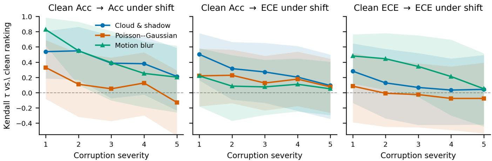  
Fig. 2. Rank transfer from the clean ranking to the shifted ranking, as a function of corruption severity, for all three corruption families (classification, 16 encoders, metrics averaged across the four-dataset canon; shaded bands are 95% confidence intervals from resampling the encoders). Each panel is a different transfer: clean accuracy → shifted accuracy (left), clean accuracy → shifted ECE (center), and clean ECE → shifted ECE (right). Transfer decays with severity in every panel and every family. Accuracy rankings are the most durable, but only under the milder corruptions: cloud and motion blur hold τ ≈ 0.4 into mid severity, whereas Poisson–Gaussian accuracy transfer falls to $\tau = 0 . 0 5$ by severity 3 and inverts by severity $5 ~ ( \tau = - 0 . 1 3 )$ . Clean rankings say little about shifted calibration in any family: the clean accuracy ordering agrees with the shifted ECE ordering a $\tau \leq 0 . 3$ across nearly all cells, and the clean and shifted ECE orderings agree at $\dot { \tau } = 0 . 0 7$ (cloud severity 3) and below. The bands are wide at $n = 1 6 \colon { \mathfrak { c } }$ single τ cannot be pinned down, so the robust signal is the decay itself, which reproduces independently in every corruption, rather than any one value.

b) Segmentation.: The pixel-ECE instability is not a classification artifact: for segmentation, the pixel-ECE ranking against clean collapses from $\tau \approx 0 . 5 7$ at severity 1 to near zero (with per-dataset inversions) by severity 2 and beyond. Here, however, the mIoU ranking collapses nearly as much over the same severities $( \tau \approx 0 . 4 2  - 0 . 0 5 \ – 0 . 2 0 ;$ Fig. 4). The asymmetry we saw under cloud shift and in the trainingbudget comparisons (§IV-D) is absent here, but this tracks the corruption rather than the task: classification accuracy rankings transfer just as poorly under Poisson–Gaussian noise $( \tau ~ = ~ 0 . 0 5$ at severity 3, −0.13 at severity 5). Under this corruption, neither accuracy nor calibration rankings survive.

Finally, the ECE degradation is domain-conditioned rather than objective-conditioned: GeoFM encoders show a larger sev-5/clean ECE ratio than general-purpose encoders under both corruptions (Fig. 5), even though mIoU degrades comparably across domains. A training-objective-level breakdown (EO-recon/EO-distill/Nat-DINO/ Nat-supervised) is noisier because group sizes are unbalanced (EO-distill n = 2, Nat-DINO n = 1), and Panopticon (EO-distill) is among the worst degraders under motion blur (5.31×, essentially tied with OLMoEarth-base at 5.34×; Fig. 5 caption). This motivates the mechanism in Section IV-C.

## C. A Candidate Representational Mechanism, Conditioned on Pretraining Domain

To see how pretraining domain relates to calibration collapse, we report four correlational measurements on the fourdataset classification canon (Fig. 6), computed at a single seed. Each links EO pretraining to overconfident errors under corruption. They agree with one another, but they are correlational, so we treat them as evidence for a hypothesis rather than a proven cause, and state that hypothesis at the end of the section.

(B1) Rigidity. EO-pretrained encoders barely move under corruption: their head-layer CKA between clean and corrupted inputs stays highest (≈ 0.82), well above the natural-image encoders $( \approx 0 . 6 1 ; p = 0 . 0 0 4$ , two-sided Mann–Whitney U test [81], a nonparametric two-sample test suited to the small, non-normal per-encoder CKA samples, n = 8 vs. 7; Fig. 15 in the appendix, rigidity panel). A plausible explanation is that EO pretraining rewards perturbation-invariant features, producing embeddings whose variance concentrates in far fewer directions on clean data (participation ratio ≈ 13, versus ≈ 31 for the natural-image encoders; Fig. 17) and which therefore change little when the input is degraded. (B2) Decoupling. For EO-pretrained encoders, confidence changes little as the input drifts: drift–confidence coupling is near zero $( \rho \approx - 0 . 0 7 )$ versus clearly negative for natural-image encoders $( \rho \approx - 0 . 1 7 ; p = 0 . 0 0 9 ;$ Fig. 15, coupling panel). This is consistent with rigid embeddings holding the probe’s logits, and hence its confidence, roughly fixed under corruption. (B3) Overconfident errors. EO-pretrained encoders also show a ∼ 2.4× higher fraction of high-drift, high-confidence, wrong predictions (≈ 0.14 vs. ≈ 0.06; p = 0.014; Fig. 15, overconfidence panel).

Rigidity is not confined to the single severity used above. Tracking head-layer CKA across the full severity range (Fig. 7) shows every encoder’s representation does move as corruption intensifies, so rigid encoders are not frozen at a fixed value; what differs is the rate. EO-pretrained encoders decline from mean CKA 0.93 to 0.71 between severities 1 and 5, naturalimage encoders from 0.83 to 0.40, the same domain split as (B1).

Head-layer CKA also tracks calibration failure directly, not only through the composite overconfident-error fraction of (B3). For each of 15 conditions (three corruption families times five severities) we rank the 15 encoders by mean head-layer CKA and by ECE inflation, and correlate the two orderings (Table III). Every condition gives a positive correlation (median $\rho = 0 . 3 9 )$ and 6 reach $p < 0 . 0 5 \colon$ cloud at severities 2, 3 and 5, motion blur at 3, 4 and 5. The association strengthens with severity under cloud and motion blur and is weaker, though still positive, under Poisson– Gaussian noise. The conditions share the same encoders, so they are not independent tests and no single one is decisive; cloud severity 3, shown per encoder in Fig. 16, is a typical cell $( \rho = 0 . 5 2 , p = . 0 4 4 )$

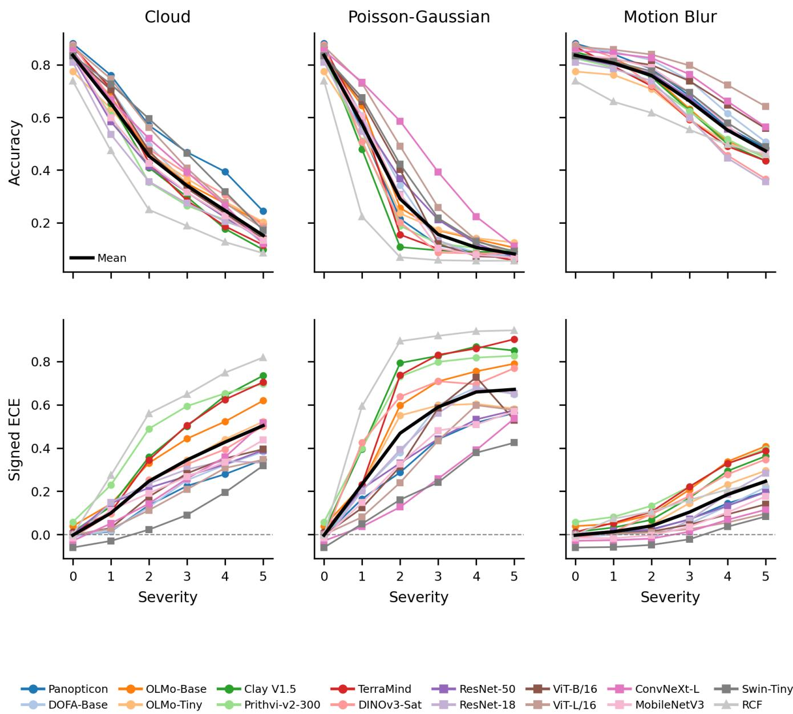  
Fig. 3. Accuracy (top) and signed ECE (mean confidence − mean accuracy, bottom) per model versus severity for three corruption types (classification, uncalibrated, mean across the four-dataset canon). Accuracy collapses sharply under cloud and Poisson–Gaussian corruption but only mildly under motion blur; signed ECE is positive for almost every model and grows with severity along the same corruption ordering: failure under shift is overconfidence, not underconfidence, and it is worst exactly where accuracy is worst. The heavy black line is the mean over the 16 encoders, which is the quantity quoted in the text. Dashed line (bottom row) marks perfect calibration direction. (Referenced again in Section IV-F.)

Taken together, (B1) through (B3) and the CKA–ECE robustness are four correlational measurements over our selection of models, so they motivate rather than establish a mechanism: if EO pretraining holds the representation still under corruption, the probe never sees the movement it would need to lower its confidence, and the errors it makes stay confident. However, we caveat it with two points. First, Panopticon is rigid yet the least overconfident encoder we evaluate, so rigidity is associated with, but not sufficient for, overconfidence; its any-sensor pretraining is a candidate explanation that we leave untested, and with a single anysensor encoder we cannot generalize it. Second, confirming that rigidity causes calibration failure would require dedicated controlled experiments, for instance encoders matched on everything but pretraining domain, which we leave to future

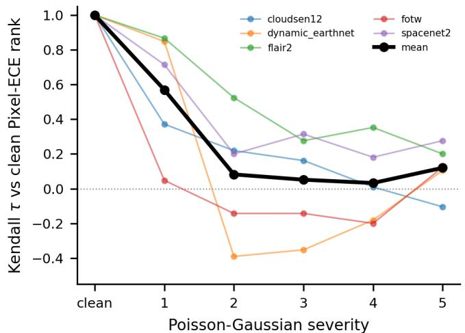

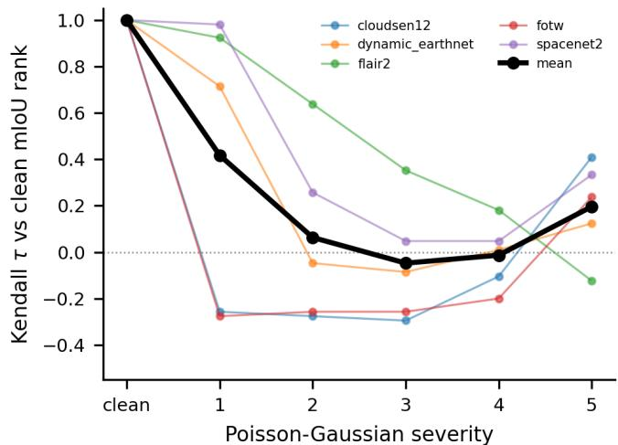  
Fig. 4. Under Poisson–Gaussian sensor noise, both mIoU and pixel-ECE rankings collapse for dense prediction. Left: pixel-ECE rank stability (Kendall τ vs. the clean ranking) collapses from ≈ 0.57 at severity 1 to ≈ 0.05 by severity 3 under Poisson–Gaussian noise, aggregated across five segmentation datasets and 15 encoders; several datasets invert (negative τ). Right: mIoU rank stability under the same corruption collapses comparably, from ≈ 0.42 at severity 1 to between $\approx - 0 . 0 5$ and ≈ 0.20 across severities 2–5. The more stable accuracy rankings in Fig. 2 are measured under cloud shift; matched on corruption, classification accuracy rankings transfer no better than these $( \tau = 0 . 0 5$ at severity 3 and −0.13 at severity 5 under Poisson–Gaussian noise), so the accuracy-vs-calibration asymmetry is specific to the corruption rather than a property of dense prediction.

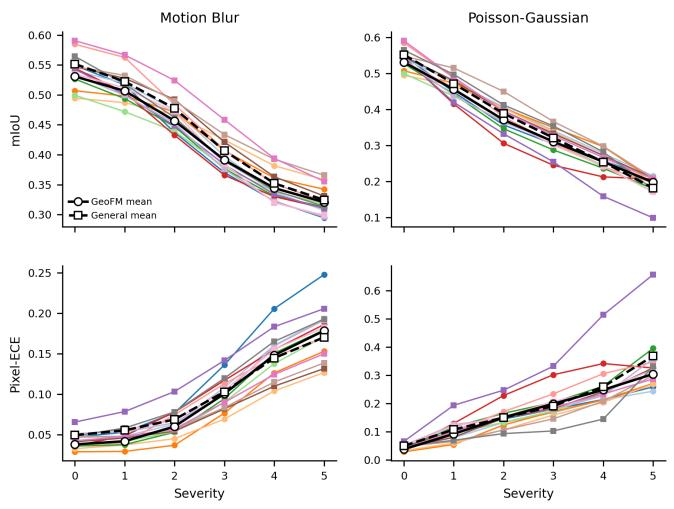  
PanopticonOLMo-BaseClay V1.5 TerraMind ResNet-50ViT-B/16 ConyNeXt-L Swin-Tiny DOFA-BaseOLMo-TinY Prithvi-v2-300 DINOv3-SatResNet-18ViT-L/16 MobileNetV3  
Fig. 5. Per-model mIoU (top) and pixel-ECE (bottom) versus severity for segmentation (15 encoders, no RCF, mean across five datasets); marker shape denotes domain (circle GeoFM, square general-purpose); the two heavy black lines are the domain means, solid for GeoFM and dashed for general-purpose. The ratios quoted below average each encoder’s own severity-5/clean ratio, so they are close to but not identical to the quotient of the two plotted domain means. mIoU degrades comparably across domains, but the pixel-ECE degradation is domain-conditioned on average: GeoFM encoders reach a larger sev-5/clean ECE ratio than general-purpose encoders under both corruptions (motion blur 4.75×, std 0.56, vs. 3.47×, std 0.37; Poisson–Gaussian 8.30×, std 2.00, vs. 7.34×, std 1.30), though individual encoders vary. Under motion blur the two largest ratios are OLMoEarth-base (5.34×) and Panopticon (5.31×), both EO-pretrained but with different pretraining objectives; under Poisson–Gaussian noise the general-purpose ResNet-50 (10.03×) is second only to the GeoFM Clay (11.08×).

TABLE III  
CROSS-SEVERITY ROBUSTNESS OF THE CKA–ECE ASSOCIATION. SPEARMAN ρ BETWEEN HEAD-LAYER CKA(CLEAN, CORRUPTED) AND ECE INFLATION ACROSS THE 15 ENCODERS THAT ADMIT A LAYERWISE CKA, PER CORRUPTION FAMILY AND SEVERITY; p FROM THE ANALYTIC SPEARMAN TEST. EVERY CELL IS POSITIVE (MEDIAN $\rho = 0 . 3 9 )$ ; 6 OF 15 REACH $p < 0 . 0 5$ . THE RCF BASELINE IS EXCLUDED BECAUSE IT HAS ONLY TWO LAYERS RATHER THAN THE DEPTH-SAMPLED BLOCKS USED FOR THE LEARNED ENCODERS, SO A LAYERWISE CKA IS NOT COMPARABLE FOR IT.
<table><tr><td rowspan="2"></td><td colspan="2">Cloud</td><td colspan="2">Motion blur</td><td colspan="2">Poisson-Gauss.</td></tr><tr><td> $\operatorname { S e v . }$ </td><td>ρ p</td><td>ρ</td><td>p</td><td>ρ</td><td>p</td></tr><tr><td>1</td><td>0.31</td><td>.260</td><td>0.24</td><td>.390</td><td>0.27</td><td>.334</td></tr><tr><td>2</td><td>0.59</td><td>.021</td><td>0.33</td><td>.226</td><td>0.37</td><td>.168</td></tr><tr><td>3</td><td>0.52</td><td>.044</td><td>0.56</td><td>.030</td><td>0.34</td><td>.221</td></tr><tr><td>4</td><td>0.50</td><td>.056</td><td>0.60</td><td>.017</td><td>0.39</td><td>.156</td></tr><tr><td>5</td><td>0.55</td><td>.035</td><td>0.52</td><td>.044</td><td>0.36</td><td>.187</td></tr></table>

work.

## D. The Second Axis: Training-Data Budget

Distribution shift is one stress axis; the amount of training data is the other, and it is the one very commonly associated with the promise of label efficiency on diverse downstream tasks for GeoFMs [6].

a) Classification.: The pattern from Section IV-B repeats on this orthogonal axis: shrinking the training fraction from 75% to 1% leaves accuracy rankings comparatively stable while calibration rankings collapse. The small-data regime is where calibration is worst.

Concretely, accuracy rankings are fairly stable across budgets (Kendall $\tau = 0 . 7 5$ between the 1% and 75% rankings), while calibration rankings collapse $( \tau = 0 . 2 8$ for the same comparison), a drop that visibly exceeds the five-seed noise band (Fig. 8).

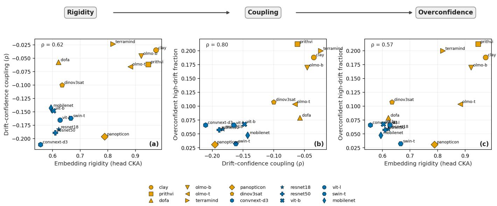  
Fig. 6. Rigidity, decoupling, and overconfidence move together across encoders. Each point is one encoder averaged over the four-dataset classification canon and three corruptions; color is pretraining domain (orange EO, blue natural-image). (a) More rigid embeddings (higher head-layer CKA under corruption) tend to have weaker drift–confidence coupling $( \rho = 0 . 6 2 ) .$ . (b) Weaker coupling goes with a larger fraction of samples that are simultaneously high-drift, high-confidence, and wrong $( \rho = 0 . 8 0 )$ . (c) More rigid embeddings likewise go with more overconfident high-drift errors $( \rho = 0 . 5 7 )$ . The three panels share the same encoders, so they are not independent tests. The natural-image encoders cluster tightly (CKA 0.56–0.67) while the EO-pretrained encoders spread across 0.62–0.97: Clay, Prithvi, OLMo, and TerraMind occupy the high-rigidity, low-coupling, high-overconfidence region, whereas Panopticon is rigid (0.79) yet the least overconfident encoder we evaluate (0.03), showing rigidity is not sufficient for overconfidence.

b) Segmentation.: Segmentation behaves the same way: mIoU rankings stay comparatively stable (τ ≈ 0.22 and up) while pixel-ECE rankings invert (τ ≈ −0.33; Fig. 9), a gap that again exceeds the (three-seed) noise band, as for classification.

## E. Mitigations Do Not Restore Calibration Under Shift

This section and Section IV-F apply to classification datasets only. If calibration rankings are unstable under deterministic softmax predictions, can a targeted calibration method restore them? We test three commonly used UQ methods, but find that none fully solves the encountered issues.

Temperature scaling works in-distribution but is fundamentally constrained by its own protocol: T∗ is fit once on clean calibration data and never re-exposed to corrupted inputs (Section III-D), so it has no way to correct for a shift it was never given information about. Under this deployment constraint (clean data is what is available at calibration time), shifted ECE is left essentially unchanged (Fig. 10, top; EOpretrained cloud severity-3 ECE 0.400 → 0.403), the same clean-only-calibration failure mode reported by [9]. Deep ensembles help partially at cloud severity 3 but require k independent probes and still leave large residual miscalibration (Fig. 10, bottom). The help is also uneven across encoders and does not always hold as severity rises: for Prithvi-v2- 300 the ensemble ∆ECE moves from −0.009 at severity 1 and −0.026 at severity 3 to +0.027 at severity 5, so the ensemble stops helping and starts hurting (Table V). Brier confirms these trends across cloud severities, but NLL does not track temperature scaling’s reversal: its ∆NLL stays negative through severity 5, where its ∆ECE has already turned positive by severity 4 (Table V).

A Gaussian-process probe behaves differently. The SVGP head is notably less overconfident under severe shift, roughly halving signed ECE at high cloud severity at comparable accuracy (Fig. 11), but it raises clean-data ECE by ∼ 3.0× (≈ 0.108 vs. ≈ 0.036) and costs more to train. We present it as an exploratory direction. Across all three methods, the result is consistent: calibration under shift must be measured and designed for, and is not really possible to fix in a post-hoc manner through these approaches.

## F. Selective Prediction Cannot Defer Around Confident Errors

The UQ methods above aim to improve the predictive distribution, and with it the uncertainty estimates a deployment would defer on. Selective prediction tests one such use directly: whether a model’s confidence still separates correct from incorrect predictions well enough to defer its errors under shift (Section III-H). The predictions at issue are the high-drift, high-confidence errors of (B3): 9.9% of test samples averaged over the 15 encoders that admit the drift analysis, split 0.14 for the EO-pretrained encoders against 0.06 for the naturalimage ones (Fig. 15, overconfidence panel). That is a modest share in absolute terms, but it is exactly the share abstention should ideally detect.

Selective prediction is a common deployment strategy [72], [73]: if a model’s confidence reflects its accuracy, lowconfidence predictions can be deferred. However, we find that this expectation fails under our employed distribution shifts. The selective-accuracy gain from abstaining on the leastconfident 10% decays to zero, and turns negative for the most overconfident encoders, as severity rises (Fig. 12, top). eAURC moves the same way: from 0.038 on clean data it rises to 0.187 at cloud severity 3 and 0.201 at severity 5, and from 0.045 to 0.148 across the milder motion-blur range (Fig. 12, bottom). Because the errors are confident, deferral cannot recover them: confidence remains correlated with correctness on clean data, but fails to be a reliable deferral signal under our employed distribution shifts. In our experiments deployment-time shift therefore cannot be detected from the model’s own confidence, but discuss alternatives in Section V.

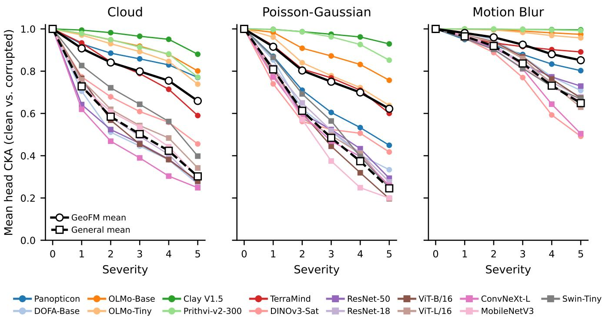  
Fig. 7. Head-layer CKA(clean, corrupted) versus severity, one line per encoder (classification, four-dataset canon); the two heavy black lines are the domain means within each panel, solid for EO-pretrained and dashed for natural-image. Similarity declines for every encoder as severity increases, but at a domainconditioned rate: EO-pretrained encoders stay more rigid at every severity (mean CKA 0.93 → 0.71 from severity 1 to 5, averaging the three panels) than natural-image encoders (0.83 → 0.40). The split is not uniform: Clay and OLMo-base remain above CKA 0.8 even at severity 5 under cloud and motion blur, while DOFA drops into the natural-image range (0.44) and TerraMind falls to an intermediate 0.69.

## V. DISCUSSION

a) What the rankings mean for evaluation.: The recurring pattern across two orthogonal stress axes, distribution shift (Section IV-B) and training-data budget (Section IV-D), is that model rankings are broadly unstable once evaluation moves past clean, full-data test conditions: a single accuracy number is therefore a poor proxy for trustworthy behavior. Calibration rankings are no exception, and are in fact typically similar to, or less stable than, accuracy rankings: clean-data calibration says little about calibration under the shifts and data budgets a deployed model will actually meet. Broad benchmark evaluations therefore need to move beyond accuracy to offer a more holistic view of model performance.

b) Pretraining domain appears to matter for calibration under shift.: On clean data the GeoFM-versus-general question shows no meaningful difference (Section IV-A), and under shift EO pretraining confers no accuracy advantage either: pooled across the canon the EO encoders sit slightly below the general-purpose ones, averaged over the three corruption families and severities 1–5. The margin is small and varies by dataset, so we do not read it as a general accuracy deficit, only as the absence of the advantage EO pretraining is meant to provide. Concurrent evidence from real-world EO shifts agrees. EarthShift [14], which benchmarks eight GeoFMs across held-out geographies, sensors, and time periods, finds that EO pretraining confers no robustness advantage over ImageNet-pretrained or fully-supervised models, with all of them degrading by roughly 15 to 20 percent out of distribution. Calibration under shift is one attribute where pretraining domain does separate the selected models: the EO-pretrained encoders, under linear probing, carry the larger ECE in all 15 severity-by-corruption cells (Table IV, group rows), and the gap runs in the overconfident direction throughout (Fig. 3). That makes the domain split worth taking seriously not as a verdict on either group, but as an informative axis for future work.

c) Competing explanations that require further study.: The under-shift calibration gap is not cleanly attributable to pretraining domain alone. Exclusion of cloudy imagery from EO pretraining corpora in many GeoFM training pipelines cannot explain the gap, since it appears just as clearly under motion blur and Poisson–Gaussian noise, corruptions unrelated to cloud. However, general augmentation exposure is harder to rule out. Natural-image pretraining pipelines are augmentation-heavy in exactly the relevant ways (Gaussian blur and photometric jitter [62], [82]) while EO maskedreconstruction pretraining relies mostly on geometric cropand-flip and masking [34], [57], [58], so part of the gap may reflect augmentation exposure rather than domain. Within the EO group, reconstruction- and distillation-based encoders appear to calibrate differently under shift, but with only two self-distillation encoders among the 16 encoders this cannot be settled here and would need a purpose-built encoder set. A further confound is structural rather than about pretraining data or objective: the EO and general-purpose groups also differ in backbone architecture, parameter count, and training recipe, so pretraining domain is not varied in isolation. The identical probe isolates each encoder’s representation, but it cannot separate the effect of the pretraining corpus from that of architecture and capacity; attributing the calibration gap to domain alone would require a controlled study that holds architecture and capacity fixed while varying only the pretraining data. Together these point to the natural follow-up: which pretraining objectives yield robust, well-calibrated features, including joint-embedding predictive (JEPA) objectives, which are absent from our encoder set; this is a question our analysis is meant to open for further research directions.

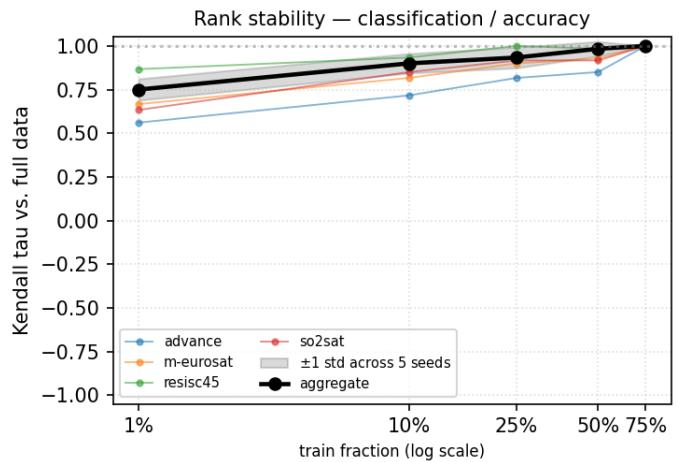

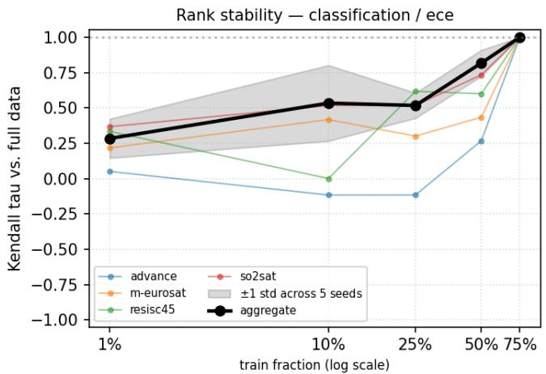  
Fig. 8. Rank-stability Kendall τ against the full-data (75%) ranking as the training fraction shrinks (classification, mean across the four-dataset canon; shaded band is ±1 std of the aggregate τ across the five seeds). Left: accuracy rankings stay comparatively stable, τ = 0.75 at 1%. Right: calibration rankings collapse, τ = 0.28 at 1%, a drop that exceeds the seed-noise band. The same contrast as under shift, on an orthogonal axis.

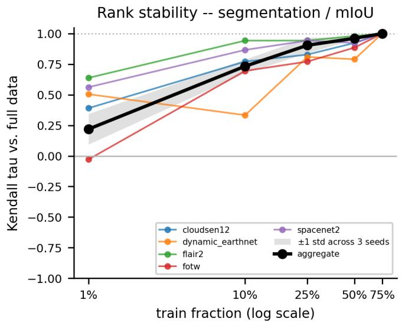

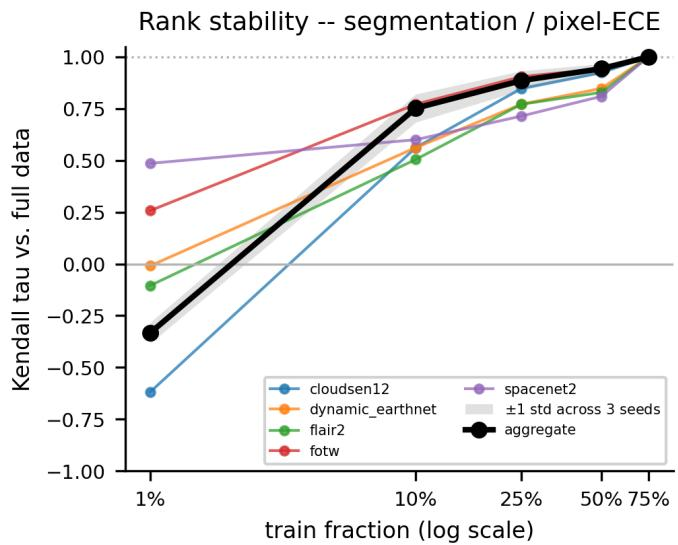  
Fig. 9. Segmentation training-budget rank-stability Kendall τ against the full-data (75%) ranking (five datasets: CloudSEN12, DynamicEarthNet, FLAIR#2 Fields of the World, SpaceNet2; 15 encoders; three seeds; shaded band is ±1 std of the aggregate τ across seeds). Left: mIoU rankings stay comparatively stable, $\tau = 0 . 2 2$ at 1%. Right: pixel-ECE rankings collapse and invert (τ = −0.33 at 1%), mirroring the classification result.

d) Limitations of the frozen probing protocol.: Every prediction we evaluate is produced by a trained linear head on top of the frozen features, so the calibration behavior we report is a property of the encoder and its head together, not of the encoder in isolation. The head is nonetheless held fixed across all 16 encoders, with the same architecture, protocol, and an accuracy-selected regularization strength never re-tuned on calibration loss (Section III-D); it is therefore a shared constant, and the between-encoder differences our claims rest on isolate the representation rather than the head. What this coupling leaves open is whether the same encoders would remain overconfident under a different head, in particular a finetuned backbone: our evidence speaks to the frozen linear-probe regime that dominates GeoFM deployment, and a richer head or full fine-tuning could in principle change the calibration behavior we observe. Concurrent evidence suggests fine-tuning is unlikely to remove the failure, since EarthShift [14] finds out-of-distribution accuracy largely invariant to fine-tuning strategy; that result concerns accuracy rather than calibration and uses a different evaluation protocol, so the fine-tuned regime remains open.

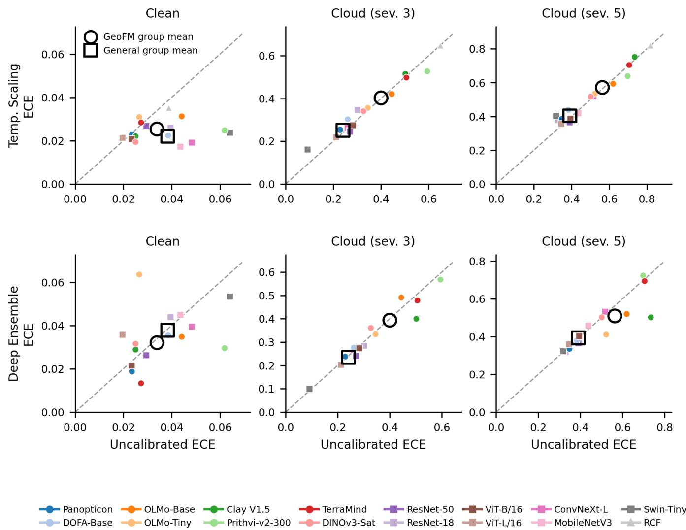  
Fig. 10. Temperature scaling (top) and deep ensembles (bottom): method ECE vs. uncalibrated ECE at clean, cloud severity 3, and severity 5 (four-dataset canon, mean across datasets, one point per encoder per severity). The two large hollow black markers in each panel are the group means, circle for EOpretrained and square for general-purpose. Points below the diagonal improve calibration. TS moves points below the diagonal on clean data but sits on it under shift, consistent with the shift-miscalibration failure reported by [9]: at cloud severity 3 the EO-pretrained group mean goes from 0.400 uncalibrated to 0.403 after temperature scaling, and the general-purpose group mean from 0.241 to 0.251. Deep ensembles pull points partially below the diagonal at severity 3 but at k× cost.

e) Mitigations have limits.: Post-hoc temperature scaling, fit once on clean data as is standard practice, cannot correct for shift it was never exposed to; ensembles help only partially at k× cost, and a GP probe trades clean calibration for shift robustness (Section IV-E); confidencebased selective prediction cannot defer around confident errors either (Section IV-F). We do not claim these are unfixable but rather point out that accessible tools often used in the literature are not the easy fix to these issues and pre-training strategies might have to be revisited. A more promising direction may be to base correction and abstention on signals other than the model’s own confidence. Our selective-prediction result shows that confidence fails precisely where it is needed (Section IV-F), whereas the representation itself carries information about shift: the CKA and participation-ratio drift measures that track the calibration failure in our mechanism analysis (Section IV-C) operate on the embedding rather than the softmax. Exisiting literature of out-of-distribution detectors already focuses on activation based detectors rather than from the softmax [83], for instance by class-conditional Mahalanobis distance in feature space [84] or by distance to nearest training neighbours [85]; TARDIS [38] is the EOspecific instance, built on internal activations and evaluated on EO covariate and semantic shift. Whether such representationlevel signals translate into better-calibrated predictions under shift remains open future work.

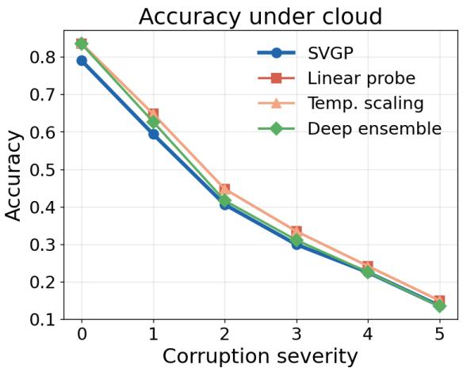

Signed ECE under cloud(>0 = overconfident)  
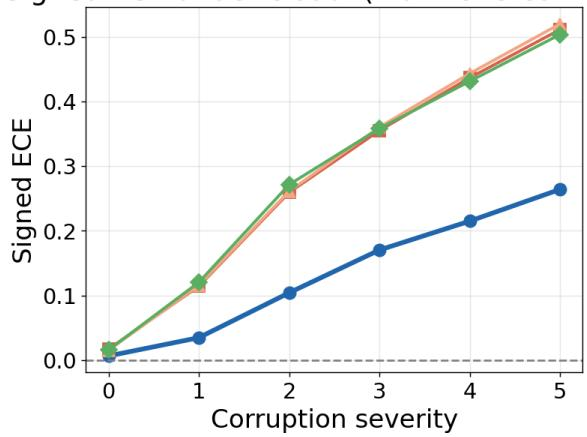

Unsigned ECE under cloud(clean cost visible at sev. 0)  
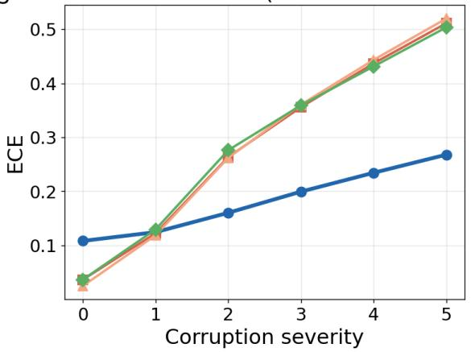

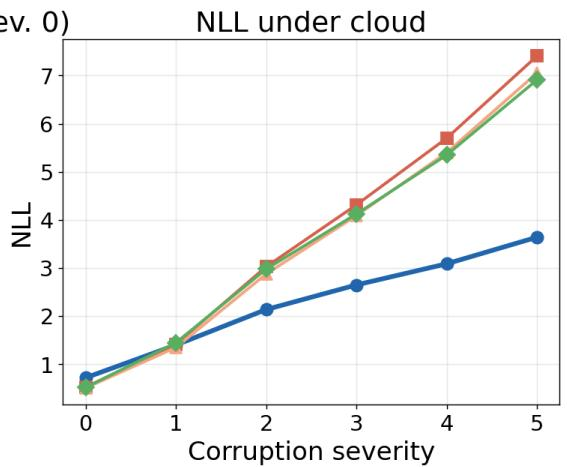  
Fig. 11. Gaussian-process (SVGP) probe versus linear-probe baselines under cloud corruption (classification, mean across the four-dataset canon, all 16 encoders). The SVGP head is the least overconfident under severe shift (roughly halving signed and unsigned ECE at high severity) at comparable accuracy, but at higher training cost and a higher clean-data ECE (bottom-left panel: ≈ 0.108 vs. ≈ 0.036 for the linear probe at severity 0).

f) Limitations.: Our synthetic corruptions approximate but do not replace real EO shift; curated real-shift benchmarks such as EarthShift [14] are complementary and important. Our corruption suite spans three physically distinct mechanisms but is not exhaustive: geometric transforms such as rotation, scale, and translation, along with finer variation within each mechanism, are untested, and whether the calibration failures extend to them is left to future work. The representationdrift analysis (Section IV-C) runs on the same four-dataset classification canon as the core UQ results but at a single seed rather than five, and is correlational, established across models rather than by intervention. Segmentation is evaluated with a single frozen decoder architecture (a lightweight FPN head [46]; Section III-D); calibration behavior under shift may not transfer to decoders with richer contextual modeling, e.g., UperNet’s pyramid pooling [86] or DeepLab-style spatial pyramid pooling [87]. More broadly, we never fine-tune the backbone, for classification or segmentation (Section III-A); whether the calibration-under-shift failures we report persist after full fine-tuning is untested and remains open, as discussed above. A severity grade is also not one physical intensity applied identically across the canon. Cloud opacity is tuned per dataset to the sensor’s dynamic range, and the Poisson–Gaussian noise parameters are set per sensor type (Section III-F), so severity 3 denotes a comparable degree of degradation within a dataset rather than an identical physical condition across datasets. Motion blur uses the same kernel widths everywhere, but the datasets differ in ground sample distance, so even there the same kernel corresponds to a different physical smear on the ground. Finally, the downstream head is varied only between a linear probe and a GP probe: we have no calibration-under-shift data for richer heads such as an MLP, so the head-sensitivity conclusions are bounded to these two.

## VI. CONCLUSION

EO benchmarks rank geospatial foundation models by accuracy on clean, full-data test sets. Across 16 encoders, nine datasets, and two orthogonal stress axes, we show that this ranking does not hold once evaluation moves beyond those conditions, and that calibration, a property deployment usually requires, is no exception. Clean-data calibration says little about calibration under shift or across data budgets, where we observe that the collapse is consistently in the overconfident direction. We instead find a correlation of these metrics via a representational mechanism conditioned on pretraining domain. Generally our results demonstrate that GeoFM evaluation should span more than one operating point: reporting a calibration or proper-scoring metric alongside accuracy, and probing more than one stress axis (such as distribution shift and training-data budget), makes visible how much a ranking depends on often implicit assumptions. The specific corruptions and budgets we use are illustrative, not a prescription.

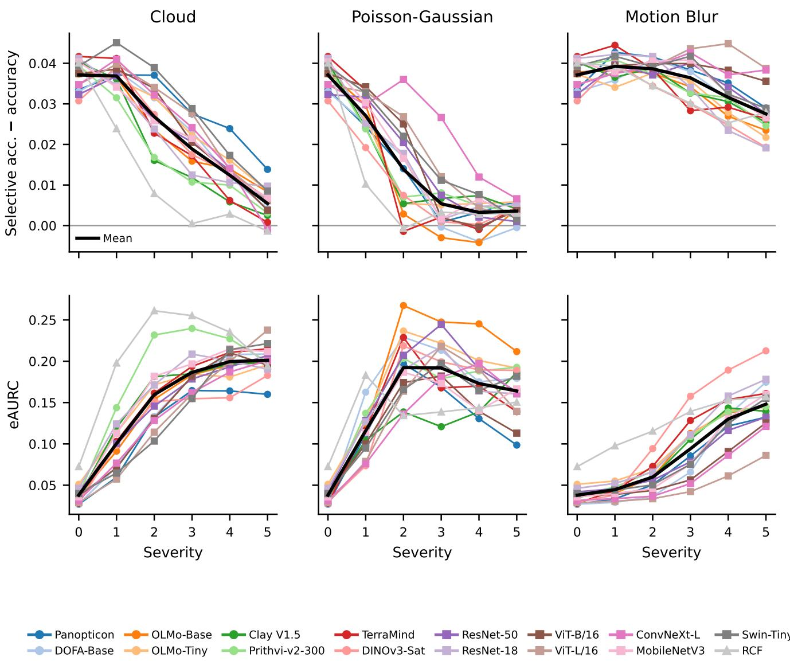  
Fig. 12. Selective-prediction gain (selective accuracy at 90% coverage − overall accuracy, top) and eAURC (bottom) per model versus severity (classification, mean across the four-dataset canon); the heavy black line is the mean over the 16 encoders, which is the quantity quoted in the text. The gain decays toward zero, and slightly below it for RCF under cloud and for OLMo-Base, TerraMind and DOFA-Base under Poisson–Gaussian noise, as severity rises, whil eAURC rises: abstention of predictions does not help, because the models are confidently wrong. The Poisson–Gaussian eAURC turns down again beyond severity 2, where mean accuracy has fallen to 0.29 and below (Fig. 3); with accuracy approaching chance there is little risk left for a confidence ranking to reduce, so the turn-down is an artifact of the collapse rather than a recovery of the confidence signal.

Concurrent work such as EarthShift [14] and RE-OBench [28], together with the results reported here, shows that benchmark evaluation must move beyond a single accuracy measurement toward a more holistic assessment. Such evaluation would give the community a richer basis for judging which models are suitable for which tasks under which conditions, and would help close the gap between benchmark results and real-world deployment.

## ACKNOWLEDGMENTS

The work of N. Lehmann and X. Zhu is supported by German Federal Ministry for Economic Affairs and Climate Action in the framework of the ”national center of excellence ML4Earth” (grant number: 50EE2201C), by the Excellence Strategy of the Federal Government and the Lander through¨ the TUM Innovation Network EarthCare, and by Munich Center for Machine Learning. The work of X. Zhu is also supported by the European Commission through the project “ThinkingEarth—Copernicus Foundation Models for a Thinking Earth” under the Horizon 2020 Research and Innovation program (Grant Agreement No. 101130544).

## APPENDIX A

## CORRUPTION EXAMPLES

Fig. 13 gives a visual sense of the three synthetic corruptions described in Section III-F at each severity level, one representative image per corruption family shown on three of the four classification datasets to illustrate the range of sensors and scenes involved (So2Sat, RESISC45, and ADVANCE); the same corruption pipeline is applied identically across all four datasets.

## APPENDIX B

## RANK SENSITIVITY UNDER SHIFT (SCATTER VIEWS)

Fig. 14 complements the rank-transfer curves in Fig. 2 with per-model scatters of rank(accuracy) against rank(ECE) and rank(eAURC), at clean and two shifted severities, for each corruption type. Points that leave the diagonal have accuracy and calibration/selective-prediction rankings that disagree at that condition.

## APPENDIX C

## EXCLUSION OF SPACENET7

Our segmentation canon uses five of the six datasets in the corruption sweep; SpaceNet7 is excluded because on it the metric does not separate the encoders. SpaceNet7 is two-class building-footprint segmentation on 4 m PlanetScope imagery, where buildings span only a few pixels at 224 × 224 and the background class dominates by construction, so mIoU rewards a predictor that attends to the background alone. Two properties of our results make that concrete. First, capacity and pretraining buy nothing on this dataset: all 15 encoders fall within a 0.03 mIoU band, and the 4M-parameter MobileNetV3 (0.492) matches or beats every GeoFM (e.g. OlmoEarth 0.479, Prithvi 0.470). Fifteen encoders of widely differing capacity landing inside a 0.03 band indicates that the metric is not separating them. Second, the rank-stability metric rewards that degeneracy rather than penalizing it: SpaceNet7 carries the highest severity-1 Kendall τ of any segmentation dataset under Poisson–Gaussian noise (1.00, against 0.98 for the next dataset) and the second highest under motion blur (0.85, behind FLAIR2’s 0.87), and it stays positive at every severity of both, with a floor of 0.16, on a corruption where two of the five canon datasets have already inverted at severity 1 (CloudSEN12 −0.26, FOTW −0.28). A ranking that barely depends on the input is a reproducible ranking, so pooling SpaceNet7 would inflate the aggregate rank stability this paper reports.

## APPENDIX D

## REPRESENTATION DRIFT: SUPPORTING ANALYSES

Fig. 15 gives the per-model breakdown underlying the (B1)– (B3) rigidity/coupling/overconfidence claims in Section IV-C. Fig. 16 gives the per-encoder scatter underlying the direct CKA→ECE correlation reported alongside Fig. 7. Fig. 17 shows the per-model clean-data participation ratio underlying the (B1) rigidity claim.

## APPENDIX E

## PER-ENCODER CALIBRATION UNDER SHIFT

Table IV is the numerical backing for the classification results in Sections IV-A and IV-B: clean accuracy and clean ECE per encoder, then uncalibrated ECE at every severity of every corruption family, averaged over the four-dataset canon. The four group rows at the foot are means over the encoders of each pretraining domain; the two RGB-only rows restrict the average to ADVANCE and RESISC45, the datasets on which every encoder receives identical RGB input and no band configuration is selected (Section III-C). The EO-minusgeneral ECE gap is positive in all 15 severity-by-corruption cells of the full-canon rows, and in 14 of the 15 RGB-only cells, the exception being Poisson–Gaussian severity 1, where the two groups tie at 0.03.

## APPENDIX F

## POST-HOC CALIBRATION: FULL CLOUD RESULTS

Table V reports ∆ECE, ∆NLL, and ∆Brier (method − uncalibrated) for temperature scaling and deep ensemble at cloud severities 1, 3, and 5, pooled across the four classification datasets. Negative values indicate improvement; both methods leave large residual miscalibration under shift, and Brier tracks the ECE trend, confirming it is not a binning artifact. NLL does not: temperature scaling’s ∆NLL stays negative through severity 5, where its ∆ECE has already turned positive by severity 4.

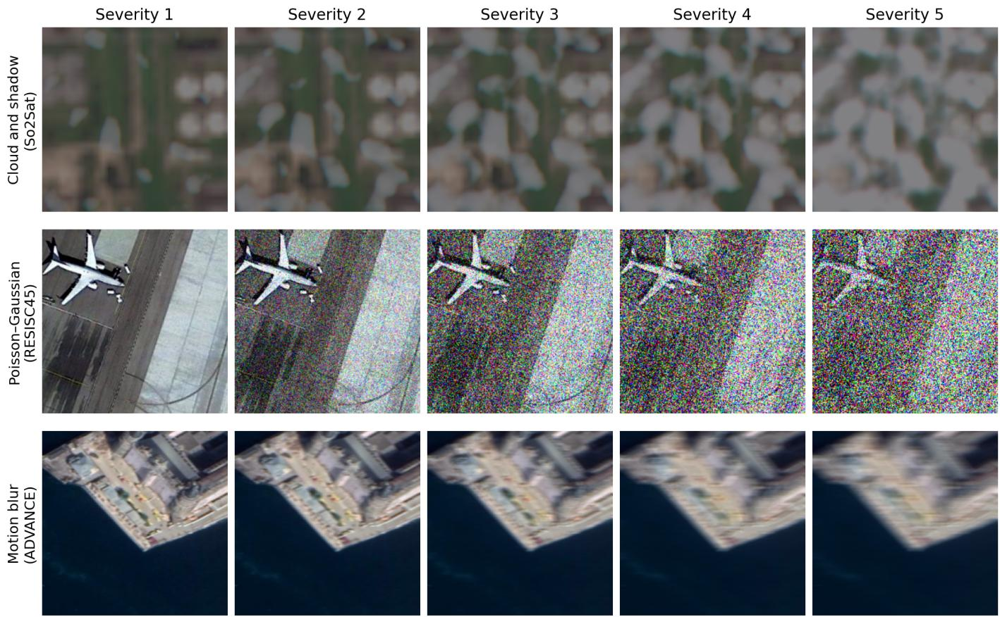  
Fig. 13. Synthetic corruptions at severities 1–5, one row per corruption family: cloud and shadow (top, So2Sat), Poisson–Gaussian sensor noise (middle, RESISC45), and motion blur (bottom, ADVANCE). Cloud coverage grows from light, localized patches to near-total occlusion; shot and readout noise intensify until fine structure is obscured; directional smearing increases with kernel width, degrading edges more gradually than cloud or sensor noise.

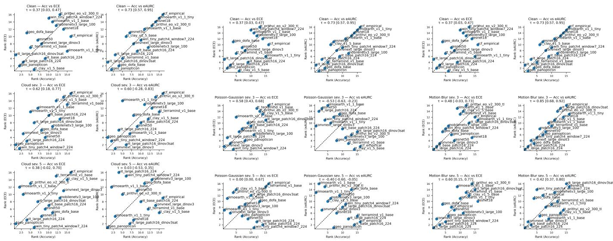  
Fig. 14. Per-model rank(accuracy) vs. rank(ECE) and rank(eAURC) at clean and two shifted severities, under cloud (left), Poisson–Gaussian (centre), and motion blur (right). Accuracy–ECE rank agreement is moderate across most conditions (τ ≈ 0.4–0.6) but drops close to zero under severe Poisson–Gaussian noise (τ ≈ 0.0 at severity 5); accuracy–eAURC rank agreement is high at clean (τ ≈ 0.73) but collapses, and inverts, under cloud and Poisson–Gaussian corruption (τ as low as −0.53), while staying comparatively high under the milder motion-blur corruption.

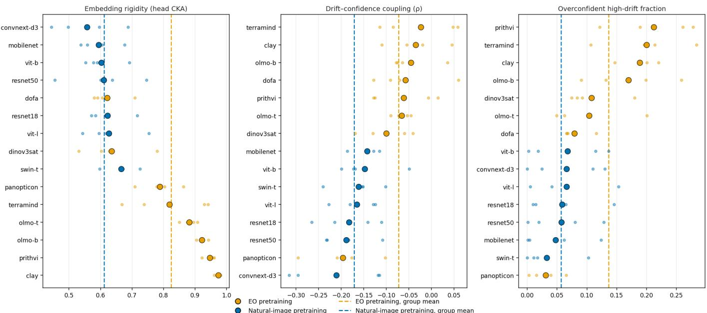  
Fig. 15. Per-model distributions of the three drift metrics (rigidity, drift–confidence coupling, overconfident high-drift fraction), sorted best to worst within each panel (classification, four-dataset canon); large dot = mean over datasets, small dots = per-dataset values (orange EO pretraining, blue natural-image pretraining). The two dashed vertical rules in each panel mark the group means, which are the values compared in Section IV-C. EO-pretrained encoders occupy the worst end of all three panels on average, with Panopticon the clear exception: rigid yet the least overconfident encoder we evaluate.

TABLE IV  
PER-ENCODER CLEAN ACCURACY AND CLEAN ECE, AND UNCALIBRATED ECE AT SEVERITIES 1–5 FOR EACH CORRUPTION FAMILY (CLASSIFICATION, MEAN OVER THE FOUR-DATASET CANON). ENCODERS ARE ORDERED EO-PRETRAINED, GENERAL-PURPOSE, THEN THE RCF BASELINE. THE LAST FOUR ROWS ARE GROUP MEANS OVER ENCODERS: THE TWO PRETRAINING DOMAINS ON THE FULL CANON, AND THE SAME TWO DOMAINS RESTRICTED TO THE RGB-ONLY DATASETS (ADVANCE, RESISC45).
<table><tr><td></td><td colspan="2">Clean</td><td colspan="4"></td><td colspan="6"></td><td colspan="4">Motion blur</td><td colspan="3"></td></tr><tr><td>Model</td><td>Acc.</td><td>ECE</td><td>1</td><td>2</td><td></td><td>3</td><td>4</td><td>5</td><td>1</td><td>2</td><td>3</td><td>4</td><td>5</td><td></td><td>1</td><td>2</td><td>3</td><td>4</td><td>5</td></tr><tr><td>Panopticon</td><td>0.881</td><td>0.023</td><td>0.04</td><td>0.15</td><td>0.23</td><td></td><td>0.28</td><td>0.35</td><td>0.19</td><td>0.29</td><td>0.44</td><td>0.52</td><td>0.57</td><td>0.03</td><td></td><td>0.03</td><td>0.08</td><td>0.15</td><td>0.20</td></tr><tr><td>DOFA-Base</td><td>0.867</td><td>0.039</td><td>0.08</td><td>0.17</td><td>0.26</td><td>0.32</td><td></td><td>0.38</td><td>0.23</td><td>0.38</td><td>0.60</td><td>0.68</td><td>0.65</td><td>0.04</td><td>0.04</td><td></td><td>0.08</td><td>0.17</td><td>0.25</td></tr><tr><td>OLMo-Base</td><td>0.837</td><td>0.044</td><td>0.14</td><td>0.33</td><td>0.44</td><td>0.52</td><td></td><td>0.62</td><td>0.23</td><td>0.60</td><td>0.71</td><td>0.75</td><td>0.79</td><td>0.05</td><td>0.09</td><td></td><td>0.21</td><td>0.34</td><td>0.41</td></tr><tr><td>OLMo-Tiny</td><td>0.775</td><td>0.026</td><td>0.10</td><td>0.25</td><td></td><td>0.34</td><td>0.44</td><td>0.52</td><td>0.25</td><td>0.55</td><td>0.60</td><td>0.60</td><td>0.58</td><td>0.03</td><td>0.05</td><td></td><td>0.15</td><td>0.23</td><td>0.30</td></tr><tr><td>Clay V1.5</td><td>0.849</td><td>0.025</td><td>0.13</td><td>0.36</td><td></td><td>0.50</td><td>0.64</td><td>0.73</td><td>0.40</td><td>0.79</td><td>0.83</td><td>0.87</td><td>0.85</td><td>0.04</td><td></td><td>0.08</td><td>0.17</td><td>0.29</td><td>0.36</td></tr><tr><td>Prithvi-v2-300</td><td>0.825</td><td>0.062</td><td>0.23</td><td>0.49</td><td></td><td>0.59</td><td>0.65</td><td>0.70</td><td>0.40</td><td>0.73</td><td>0.80</td><td>0.82</td><td>0.83</td><td>0.08</td><td></td><td>0.13</td><td>0.22</td><td>0.33</td><td>0.40</td></tr><tr><td>TerraMind</td><td>0.869</td><td>0.027</td><td>0.11</td><td>0.34</td><td></td><td>0.51</td><td>0.62</td><td>0.71</td><td>0.23</td><td>0.74</td><td>0.83</td><td>0.86</td><td>0.90</td><td>0.06</td><td>0.11</td><td></td><td>0.22</td><td>0.33</td><td>0.39</td></tr><tr><td>DINOv3-Sat</td><td>0.877</td><td>0.025</td><td>0.10</td><td>0.25</td><td></td><td>0.33</td><td>0.39</td><td>0.50</td><td>0.43</td><td>0.64</td><td>0.71</td><td>0.69</td><td>0.77</td><td>0.05</td><td></td><td>0.12</td><td>0.20</td><td>0.28</td><td>0.35</td></tr><tr><td>ResNet-50</td><td>0.829</td><td>0.030</td><td>0.14</td><td>0.22</td><td></td><td>0.27</td><td>0.32</td><td>0.39</td><td>0.22</td><td>0.33</td><td>0.44</td><td>0.53</td><td>0.57</td><td>0.03</td><td></td><td>0.04</td><td>0.08</td><td>0.14</td><td>0.20</td></tr><tr><td>ResNet-18</td><td>0.810</td><td>0.039</td><td>0.15</td><td>0.24</td><td></td><td>0.30</td><td>0.34</td><td>0.33</td><td>0.26</td><td>0.39</td><td>0.56</td><td>0.67</td><td>0.65</td><td>0.04</td><td></td><td>0.04</td><td>0.08</td><td>0.19</td><td>0.28</td></tr><tr><td>ViT-B/16</td><td>0.835</td><td>0.024</td><td>0.06</td><td>0.18</td><td>0.28</td><td></td><td>0.35</td><td>0.39</td><td>0.13</td><td>0.31</td><td>0.59</td><td>0.73</td><td>0.53</td><td>0.02</td><td></td><td>0.03</td><td>0.06</td><td>0.11</td><td>0.16</td></tr><tr><td>ViT-L/16</td><td>0.870</td><td>0.020</td><td>0.04</td><td>0.13</td><td>0.21</td><td></td><td>0.31</td><td>0.35</td><td>0.10</td><td>0.24</td><td>0.43</td><td>0.60</td><td>0.58</td><td>0.02</td><td>0.03</td><td></td><td>0.04</td><td>0.08</td><td>0.12</td></tr><tr><td>ConvNeXt-L</td><td>0.854</td><td>0.048</td><td>0.07</td><td>0.14</td><td></td><td>0.26</td><td>0.36</td><td>0.52</td><td>0.07</td><td>0.16</td><td>0.28</td><td>0.39</td><td>0.54</td><td>0.05</td><td></td><td>0.06</td><td>0.09</td><td>0.14</td><td>0.18</td></tr><tr><td>MobileNetV3</td><td>0.837</td><td>0.044</td><td>0.12</td><td>0.19</td><td></td><td>0.27</td><td>0.33</td><td>0.44</td><td>0.17</td><td>0.33</td><td>0.48</td><td>0.51</td><td>0.57</td><td>0.05</td><td></td><td>0.06</td><td>0.09</td><td>0.14</td><td>0.19</td></tr><tr><td>Swin-Tiny</td><td>0.835</td><td>0.064</td><td>0.06</td><td>0.08</td><td></td><td>0.09</td><td>0.19</td><td>0.32</td><td>0.07</td><td>0.20</td><td>0.25</td><td>0.41</td><td>0.43</td><td>0.07</td><td></td><td>0.07</td><td>0.09</td><td>0.15</td><td>0.18</td></tr><tr><td>RCF</td><td>0.739</td><td>0.039</td><td>0.27</td><td>0.56</td><td></td><td>0.65</td><td>0.75</td><td>0.82</td><td>0.59</td><td>0.89</td><td>0.92</td><td>0.94</td><td>0.94</td><td>0.09</td><td></td><td>0.12</td><td>0.17</td><td>0.21</td><td>0.24</td></tr><tr><td>GeoFM mean</td><td>0.847</td><td>0.034</td><td>0.12</td><td>0.29</td><td></td><td>0.40</td><td>0.49</td><td>0.56</td><td>0.29</td><td>0.59</td><td>0.69</td><td>0.73</td><td>0.74</td><td>0.05</td><td></td><td>0.08</td><td>0.17</td><td>0.26</td><td>0.33</td></tr><tr><td>General mean</td><td>0.839</td><td>0.038</td><td>0.09</td><td>0.17</td><td></td><td>0.24</td><td>0.32</td><td>0.39</td><td>0.14</td><td>0.28</td><td>0.43</td><td>0.55</td><td>0.55</td><td></td><td>0.04</td><td>0.05</td><td>0.07</td><td>0.14</td><td>0.19</td></tr><tr><td>GeoFM mean (RGB only)</td><td>0.884</td><td>0.023</td><td>0.12</td><td>0.35</td><td></td><td>0.44</td><td>0.52</td><td>0.60</td><td>0.03</td><td>0.51</td><td>0.70</td><td>0.76</td><td>0.77</td><td>0.05</td><td></td><td>0.12</td><td>0.27</td><td>0.43</td><td>0.52</td></tr><tr><td>General mean (RGB only)</td><td>0.917</td><td>0.024</td><td>0.07</td><td>0.18</td><td></td><td>0.25</td><td>0.33</td><td>0.39</td><td>0.03</td><td>0.17</td><td>0.40</td><td>0.50</td><td>0.55</td><td>0.03</td><td></td><td>0.04</td><td>0.09</td><td>0.20</td><td>0.29</td></tr></table>

POST-HOC CALIBRATION DELTAS UNDER CLOUD CORRUPTION (∆ = METHOD − UNCALIBRATED), POOLED ACROSS THE FOUR CLASSIFICATION DATASETS, AT SEVERITIES S1/S3/S5. NEGATIVE VALUES INDICATE IMPROVEMENT; BRIER TRACKS THE ECE TREND AND NLL DOES NOT. RCF HAS NO DEEP-ENSEMBLE VARIANT.  
TABLE V
<table><tr><td colspan="2"></td><td colspan="3">ΔECE</td><td colspan="3">∆NLL</td><td colspan="3">∆Brier</td></tr><tr><td>Model</td><td>Method</td><td>s1</td><td>s3</td><td>s5</td><td>sl</td><td>s3</td><td>s5</td><td>sl</td><td>s3</td><td>s5</td></tr><tr><td rowspan="3">Panopticon</td><td>Temp. Scaling</td><td>+0.018</td><td>+0.027</td><td>+0.039</td><td>+0.045</td><td>+0.449</td><td>+0.895</td><td>+0.007</td><td>+0.031</td><td>+0.043</td></tr><tr><td>Deep Ensemble</td><td>+0.000</td><td>+0.005</td><td>-0.015</td><td>+0.013</td><td>+0.115</td><td>+0.149</td><td>+0.003</td><td>+0.005</td><td>-0.011</td></tr><tr><td>Temp. Scaling</td><td>-0.017</td><td>+0.043</td><td>+0.058</td><td>-0.008</td><td>+0.185</td><td>+0.565</td><td>-0.005</td><td>+0.023</td><td>+0.057</td></tr><tr><td rowspan="2">DOFA-Base</td><td>Deep Ensemble</td><td>-0.002</td><td>-0.015</td><td>-0.007</td><td>+0.004</td><td>-0.030</td><td>-0.078</td><td>-0.002</td><td>-0.017</td><td>-0.014</td></tr><tr><td>Temp. Scaling</td><td>-0.017</td><td>-0.022</td><td>-0.025</td><td>-0.087</td><td>-0.480</td><td>-0.875</td><td>-0.009</td><td>-0.021</td><td>-0.031</td></tr><tr><td rowspan="2">OLMo-Base</td><td>Deep Ensemble</td><td>-0.072</td><td>-0.093</td><td>-0.182</td><td>-0.284</td><td>-2.685</td><td>-4.672</td><td>-0.017</td><td>-0.111</td><td>-0.222</td></tr><tr><td>Temp. Scaling</td><td>+0.015</td><td>+0.011</td><td>+0.013</td><td>+0.045</td><td>+0.200</td><td>+0.112</td><td>+0.007</td><td>+0.013</td><td>+0.020</td></tr><tr><td rowspan="2">OLMo-Tiny</td><td>Deep Ensemble</td><td>-0.081</td><td>-0.077</td><td>-0.122</td><td>-0.213</td><td>-0.731</td><td>-1.969</td><td>-0.024</td><td>-0.050</td><td>-0.082</td></tr><tr><td>Temp. Scaling</td><td>+0.009</td><td>+0.015</td><td>+0.017</td><td>+0.020</td><td>+0.191</td><td>+0.448</td><td>+0.002</td><td>+0.008</td><td>+0.023</td></tr><tr><td rowspan="2">Clay V1.5</td><td>Deep Ensemble</td><td>-0.015</td><td>-0.051</td><td>-0.153</td><td>-0.044</td><td>-0.585</td><td>-1.476</td><td>-0.000</td><td>-0.039</td><td>-0.185</td></tr><tr><td>Temp. Scaling</td><td>-0.065</td><td>-0.066</td><td>-0.057</td><td>-0.904</td><td>-3.282</td><td>-4.936</td><td>-0.042</td><td>-0.089</td><td>-0.080</td></tr><tr><td rowspan="2">Prithvi-v2-300 TerraMind</td><td>Deep Ensemble</td><td>-0.009</td><td>-0.026</td><td>+0.027</td><td>-0.579</td><td>-2.168</td><td>-3.293</td><td>+0.050</td><td>-0.006</td><td>+0.066</td></tr><tr><td>Temp. Scaling</td><td>-0.001</td><td>-0.006</td><td>+0.000</td><td>-0.005</td><td>-0.109</td><td>-0.546</td><td>-0.000</td><td>-0.007</td><td>+0.000</td></tr><tr><td rowspan="2">DINOv3-Sat</td><td>Deep Ensemble</td><td>-0.015</td><td>-0.023</td><td>-0.025</td><td>-0.030</td><td>-0.307</td><td>-0.774</td><td>-0.014</td><td>-0.030</td><td>-0.027</td></tr><tr><td>Temp. Scaling</td><td>+0.014</td><td>+0.016</td><td>+0.017</td><td>+0.052</td><td>+0.068</td><td>+0.049</td><td>+0.013</td><td>+0.020</td><td>+0.022</td></tr><tr><td rowspan="2"></td><td>Deep Ensemble</td><td>-0.035</td><td>-0.032</td><td>-0.041</td><td>-0.089</td><td>-0.005</td><td>-0.078</td><td>-0.027</td><td>-0.014</td><td>-0.032</td></tr><tr><td>Temp. Scaling</td><td>-0.012</td><td>-0.025</td><td>-0.026</td><td>-0.041</td><td>-0.170</td><td>-0.305</td><td>-0.003</td><td>-0.017</td><td>-0.030</td></tr><tr><td rowspan="2">ResNet-50 ResNet-18</td><td>Deep Ensemble</td><td>-0.008</td><td>-0.030</td><td>-0.027</td><td>-0.085</td><td>-0.223</td><td>-0.209</td><td>-0.007</td><td>-0.028</td><td>-0.030</td></tr><tr><td>Temp. Scaling</td><td>+0.032</td><td>+0.044</td><td>+0.047</td><td>+0.058</td><td>+0.201</td><td>+0.311</td><td>+0.011</td><td>+0.032</td><td>+0.037</td></tr><tr><td rowspan="2">ViT-B/16</td><td>Deep Ensemble</td><td>+0.002</td><td>-0.018</td><td>-0.013</td><td>+0.026</td><td>-0.067</td><td>-0.034</td><td>+0.004</td><td>-0.017</td><td>-0.011</td></tr><tr><td>Temp. Scaling</td><td>-0.010</td><td>-0.009</td><td>-0.009</td><td>-0.010</td><td>-0.101</td><td>-0.108</td><td>-0.003</td><td>-0.014</td><td>-0.010</td></tr><tr><td rowspan="2">ViT-L/16</td><td>Deep Ensemble</td><td>-0.002</td><td>-0.010</td><td>+0.008</td><td>+0.016</td><td>+0.004</td><td>+0.053</td><td>+0.005</td><td>-0.014</td><td>+0.008</td></tr><tr><td>Temp. Scaling</td><td>+0.006</td><td>+0.007</td><td>+0.011</td><td>-0.003</td><td>-0.049</td><td>-0.104</td><td>-0.000</td><td>-0.004</td><td>+0.003</td></tr><tr><td rowspan="2">ConvNeXt-L</td><td>Deep Ensemble</td><td>+0.016</td><td>-0.012</td><td>+0.007</td><td>+0.004</td><td>-0.072</td><td>-0.010</td><td>+0.003</td><td>-0.012</td><td>+0.016</td></tr><tr><td>Temp. Scaling</td><td>-0.005</td><td>+0.003</td><td>+0.001</td><td>-0.030</td><td>-0.065</td><td>-0.487</td><td>-0.002</td><td>+0.005</td><td>-0.013</td></tr><tr><td rowspan="2">MobileNetV3</td><td>Deep Ensemble</td><td>-0.002</td><td>+0.007</td><td>+0.015</td><td>+0.066</td><td>+0.170</td><td>+0.801</td><td>+0.012</td><td>+0.006</td><td>+0.008</td></tr><tr><td>Temp. Scaling</td><td>-0.004</td><td>-0.018</td><td>-0.018</td><td>-0.162</td><td>-0.425</td><td>-0.623</td><td>-0.010</td><td>-0.025</td><td>-0.027</td></tr><tr><td rowspan="2">Swin-Tiny</td><td>Deep Ensemble</td><td>-0.014</td><td>+0.006</td><td>+0.020</td><td>-0.136</td><td>-0.251</td><td>-0.051</td><td>-0.018</td><td>-0.006</td><td>+0.023</td></tr><tr><td>Temp. Scaling</td><td>-0.011</td><td>+0.069</td><td>+0.083</td><td>-0.022</td><td>+0.112</td><td>+0.517</td><td>-0.006</td><td>+0.023</td><td>+0.077</td></tr><tr><td>RCF</td><td>Deep Ensemble Temp. Scaling</td><td>+0.010 +0.001</td><td>+0.007 +0.001</td><td>+0.005 +0.002</td><td>-0.002 +0.107</td><td>+0.011 +0.057</td><td>-0.001 +0.061</td><td>-0.001 +0.004</td><td>+0.006 +0.002</td><td>+0.004 +0.003</td></tr></table>

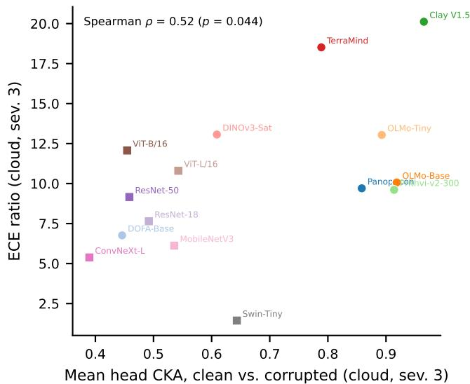

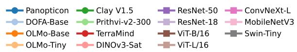  
Fig. 16. Head-layer CKA(clean, corrupted) versus ECE inflation at cloud severity 3, one point per encoder (classification, four-dataset canon; 15 encoders, RCF excluded for lack of a comparable layerwise CKA). Higher CKA (more rigid) is associated with higher ECE inflation (Spearman $\rho = 0 . 5 2 ,$ $p ~ = ~ . 0 4 4 ;$ a permutation test over $1 0 ^ { 5 }$ draws gives $\begin{array} { r } { p \ = \ . 0 4 8 ) } \end{array}$ : this illustrates the direct CKA–ECE association, not only through the composite overconfident-fraction metric in Fig. 6. This is one of the 15 severity-bycorruption conditions in Table III, which reports the same correlation for all of them.

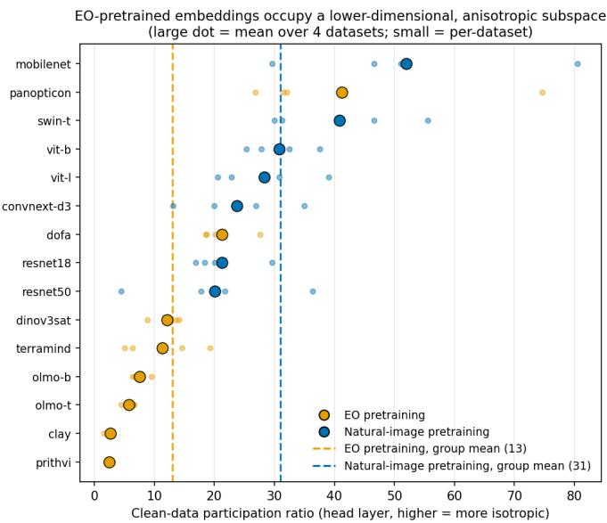  
Fig. 17. Clean-data participation ratio at the head layer, per model (large dot = mean over the four-dataset canon; small dots = per-dataset; dashed vertical ${ \mathrm { r u l e s } } = { \mathrm { g r o u p } }$ means). On average, EO-pretrained encoders (orange) concentrate their variance in far fewer directions than natural-image encoders (blue) $( \approx \ 1 3 \ \mathrm { \ v s . } \ \approx \ 3 1 )$ , consistent with the (B1) rigidity claim, though Panopticon is an EO exception at the high-dimensional end.

[1] R. Bommasani, D. A. Hudson, E. Adeli, R. Altman, S. Arora, S. von Arx, M. S. Bernstein, J. Bohg, A. Bosselut, E. Brunskill et al., “On the opportunities and risks of foundation models,” arXiv preprint arXiv:2108.07258, 2021.

[2] T. Brown, B. Mann, N. Ryder, M. Subbiah, J. D. Kaplan, P. Dhariwal, A. Neelakantan, P. Shyam, G. Sastry, A. Askell et al., “Language models are few-shot learners,” Advances in Neural Information Processing Systems (NeurIPS), 2020.

[3] R. Rombach, A. Blattmann, D. Lorenz, P. Esser, and B. Ommer, “Highresolution image synthesis with latent diffusion models,” in IEEE/CVF Conference on Computer Vision and Pattern Recognition (CVPR), 2022.

[4] J. Ho, T. Salimans, A. Gritsenko, W. Chan, M. Norouzi, and D. J. Fleet, “Video diffusion models,” Advances in Neural Information Processing Systems (NeurIPS), 2022.

[5] Z. Huang, H. Yan, Q. Zhan, S. Yang, M. Zhang, C. Zhang, Y. Lei, Z. Liu, Q. Liu, and Y. Wang, “A survey on remote sensing foundation models: From vision to multimodality,” arXiv preprint arXiv:2503.22081, 2025.

[6] X. X. Zhu, Z. Xiong, Y. Wang, A. J. Stewart, K. Heidler, Y. Wang, Z. Yuan, T. Dujardin, Q. Xu, and Y. Shi, “On the foundations of earth foundation models,” Communications Earth & Environment, 2026.

[7] I. Corley, N. Lehmann, C. Robinson, G. Tseng, A. Fuller, H. Alemohammad, E. Shelhamer, J. Marcus, and H. Kerner, “No one knows the state of the art in geospatial foundation models,” arXiv preprint arXiv:2605.12678, 2026.

[8] A. Mehrtash, W. M. Wells, C. M. Tempany, P. Abolmaesumi, and T. Kapur, “Confidence calibration and predictive uncertainty estimation for deep medical image segmentation,” IEEE Transactions on Medical Imaging, 2020.

[9] Y. Ovadia, E. Fertig, J. Ren, Z. Nado, D. Sculley, S. Nowozin, J. Dillon, B. Lakshminarayanan, and J. Snoek, “Can you trust your model’s uncertainty? evaluating predictive uncertainty under dataset shift,” Advances in neural information processing systems, vol. 32, 2019.

[10] D. Hendrycks, S. Basart, N. Mu, S. Kadavath, F. Wang, E. Dorundo, R. Desai, T. Zhu, S. Parajuli, M. Guo et al., “The many faces of robustness: A critical analysis of out-of-distribution generalization,” in Proceedings of the IEEE/CVF international conference on computer vision, 2021, pp. 8340–8349.

[11] J. G. Moreno-Torres, T. Raeder, R. Alaiz-Rodr´ıguez, N. V. Chawla, and F. Herrera, “A unifying view on dataset shift in classification,” Pattern Recognition, vol. 45, no. 1, pp. 521–530, 2012.

[12] J. Quinonero-Candela, M. Sugiyama, A. Schwaighofer, and N. D.˜ Lawrence, Dataset Shift in Machine Learning. Cambridge, MA: MIT Press, 2008.

[13] L. Tamang, M. R. Bouadjenek, R. Dazeley, and S. Aryal, “Handling out-of-distribution data: A survey,” IEEE Transactions on Knowledge and Data Engineering, 2025, arXiv:2507.21160.

[14] K. Doerksen and H. Kerner, “Earthshift: a benchmark for measuring robustness to real-world distribution shifts in earth observation,” arXiv preprint arXiv:2605.29330, 2026.

[15] C. Guo, G. Pleiss, Y. Sun, and K. Q. Weinberger, “On calibration of modern neural networks,” in International Conference on Machine Learning, 2017, pp. 1321–1330.

[16] B. Mucsanyi, M. Kirchhof, E. Nguyen, A. Rubinstein, and S. J.´ Oh, “Trustworthy machine learning,” arXiv preprint arXiv:2310.08215, 2023.

[17] H. Liu, Y. Wang, W. Fan, X. Liu, Y. Li, S. Jain, Y. Liu, A. K. Jain, and J. Tang, “Trustworthy AI: A computational perspective,” ACM Transactions on Intelligent Systems and Technology, 2022.

[18] J. Gawlikowski, C. R. N. Tassi, M. Ali, J. Lee, M. Humt, J. Feng, A. Kruspe, R. Triebel, P. Jung, R. Roscher et al., “A survey of uncertainty in deep neural networks,” Artificial intelligence review, vol. 56, no. Suppl 1, pp. 1513–1589, 2023.

[19] B. Dominique, P. Lam, N. Kurtansky, J. Weber, K. Kose, V. Rotemberg, and J. Dy, “On the role of calibration in benchmarking algorithmic fairness for skin cancer detection,” arXiv preprint arXiv:2511.07700, 2025.

[20] L. Ju, S. Yan, Y. Zhou, Y. Nan, X. Xing, P. Duan, and Z. Ge, “Monica: Benchmarking on long-tailed medical image classification,” arXiv preprint arXiv:2410.02010, 2024.

[21] S. Kadavath, T. Conerly, A. Askell, T. Henighan, D. Drain, E. Perez, N. Schiefer, Z. Hatfield-Dodds, N. DasSarma, E. Tran-Johnson, S. Johnston, S. El-Showk, A. Jones, N. Elhage, T. Hume, A. Chen, Y. Bai, S. Bowman, S. Fort, D. Ganguli, D. Hernandez, J. Jacobson, J. Kernion, S. Kravec, L. Lovitt, K. Ndousse, C. Olsson, S. Ringer, D. Amodei, T. Brown, J. Clark, N. Joseph, B. Mann, S. McCandlish, C. Olah, and

J. Kaplan, “Language models (mostly) know what they know,” arXiv preprint arXiv:2207.05221, 2022.

[22] L. Phan, A. Gatti, Z. Han, N. Li, D. Hendrycks et al., “A benchmark of expert-level academic questions to assess AI capabilities,” Nature, vol. 649, no. 8099, pp. 1139–1146, 2026.

[23] M. Minderer, J. Djolonga, R. Romijnders, F. Hubis, X. Zhai, N. Houlsby, D. Tran, and M. Lucic, “Revisiting the calibration of modern neural networks,” Advances in neural information processing systems, vol. 34, pp. 15 682–15 694, 2021.

[24] L. Tao, Y. Zhu, H. Guo, M. Dong, and C. Xu, “A benchmark study on calibration,” in International Conference on Learning Representations, vol. 2024, 2024, pp. 25 084–25 096.

[25] A. Lacoste, N. Lehmann, P. Rodriguez, E. Sherwin, H. Kerner, B. Lutjens, J. Irvin, D. Dao, H. Alemohammad, A. Drouin¨ et al., “Geobench: Toward foundation models for earth monitoring,” Advances in Neural Information Processing Systems, vol. 36, pp. 51 080–51 093, 2023.

[26] N. Simumba, N. Lehmann, P. Fraccaro, H. Alemohammad, G. De Mel, S. Khan, M. Maskey, N. Longep´ e, X. X. Zhu, H. Kerner,´ J. Bernabe Moreno, and A. Lacoste, “GEO-bench-2: From performance to capability, rethinking evaluation in geospatial AI,” Transactions on Machine Learning Research, 2026. [Online]. Available: https: //openreview.net/forum?id=NPf175jnP1

[27] V. Marsocci, Y. Jia, G. L. Bellier, D. Kerekes, L. Zeng, S. Hafner, S. Gerard, E. Brune, R. Yadav, A. Shibli, H. Fang, Y. Ban, M. Vergauwen, N. Audebert, and A. Nascetti, “Pangaea: A global and inclusive benchmark for geospatial foundation models,” ArXiv, vol. abs/2412.04204, 2024.

[28] X. Li, Y. Tao, S. Zhang, S. Liu, Z. Xiong, C. Luo, L. Liu, M. Pechenizkiy, X. Zhu, and T. Huang, “Reobench: Benchmarking robustness of earth observation foundation models,” Advances in Neural Information Processing Systems, vol. 38, 2025, datasets and Benchmarks Track.

[29] K. Klemmer, E. Rolf, C. Robinson, L. Mackey, and M. Rußwurm, “Satclip: Global, general-purpose location embeddings with satellite imagery,” ArXiv, vol. abs/2311.17179, 2023.

[30] J. Prexl and M. Schmitt, “Senpa-mae: Sensor parameter aware masked autoencoder for multi-satellite self-supervised pretraining,” ArXiv, vol. abs/2408.11000, 2024.

[31] N. Braham, C. Albrecht, J. Mairal, J. Chanussot, Y. Wang, and X. X. Zhu, “Spectralearth: Training hyperspectral foundation models at scale,” IEEE Journal of Selected Topics in Applied Earth Observations and Remote Sensing, vol. 18, pp. 16 780–16 797, 2025.

[32] L. Waldmann, A. Shah, Y. Wang, N. Lehmann, A. Stewart, Z. Xiong, X. X. Zhu, S. Bauer, and J. Chuang, “Panopticon: Advancing anysensor foundation models for earth observation,” in Proceedings of the Computer Vision and Pattern Recognition Conference, 2025, pp. 2204– 2214.

[33] Z. Gong, Z. Wei, D. Wang, X. Hu, X. Ma, H. Chen, Y. Jia, Y. Deng, Z. Ji, X. Zhu, X. Yang, N. Yokoya, J. Zhang, B. Du, J. Yan, and L. Zhang, “Crossearth: Geospatial vision foundation model for domain generalizable remote sensing semantic segmentation,” IEEE Transactions on Pattern Analysis and Machine Intelligence, vol. 48, pp. 5147–5164, 2026.

[34] C. Reed, R. Gupta, S. Li, S. Brockman, C. Funk, B. Clipp, K. Keutzer, S. Candido, M. Uyttendaele, and T. Darrell, “Scale-mae: A scale-aware masked autoencoder for multiscale geospatial representation learning,” 2023 IEEE/CVF International Conference on Computer Vision (ICCV), pp. 4065–4076, 2023.

[35] M. Tang, A. Cozma, K. Georgiou, and H. Qi, “Cross-scale mae: A tale of multi-scale exploitation in remote sensing,” ArXiv, vol. abs/2401.15855, 2024.

[36] Z. Feng, C. Atzberger, S. Jaffer, J. Knezevic, S. Sormunen, R. Young, M. C. Lisaius, M. Immitzer, T. Jackson, J. Ball, D. A. Coomes, A. Madhavapeddy, A. Blake, and S. Keshav, “Tessera: Temporal embeddings of surface spectra for earth representation and analysis,” in Proceedings of the IEEE/CVF Conference on Computer Vision and Pattern Recognition (CVPR), Jun. 2026, pp. 34 818–34 831.

[37] D. Wang, M. Hu, Y. Jin, Y. Miao, J. Yang, Y. Xu, X. Qin, J. Ma, L. Sun, C. Li, C. Fu, H. Chen, C. Han, N. Yokoya, J. Zhang, M. Xu, L. Liu, L. Zhang, C. wu, B. Du, D. Tao, and L. Zhang, “Hypersigma: Hyperspectral intelligence comprehension foundation model,” IEEE Transactions on Pattern Analysis and Machine Intelligence, vol. 47, pp. 6427–6444, 2025.

[38] B. Ekim, G. A. Tadesse, C. Robinson, G. Hacheme, M. Schmitt, R. Dodhia, and J. M. Lavista Ferres, “Distribution shifts at scale: Outof-distribution detection in earth observation,” in Proceedings of the

IEEE/CVF Conference on Computer Vision and Pattern Recognition Workshops, 2025.

[39] Y. Chen and L. Bruzzone, “Self-supervised remote sensing images change detection at pixel-level,” 2021.

[40] A. Kendall and Y. Gal, “What uncertainties do we need in bayesian deep learning for computer vision?” Advances in neural information processing systems, vol. 30, 2017.

[41] M. Gonzalez-Calabuig, K.-H. Cohrs, V. Nedungadi, Z. Osika, R. Cartuyvels, S. Knoblauch, J. Massant, S. Nath, P. Ebel, and V. Sitokonstantinou, “Shrug-fm: Reliability-aware foundation models for earth observation,” in Proceedings of the IEEE/CVF Conference on Computer Vision and Pattern Recognition (CVPR) Workshops (EarthVision), Jun. 2026, pp. 7919–7928.

[42] C. F. Brown, M. R. Kazmierski, V. J. Pasquarella, W. J. Rucklidge, M. Samsikova, C. Zhang, E. Shelhamer, E. Lahera, O. Wiles, S. Ilyushchenko, N. Gorelick, L. L. Zhang, S. Alj, E. Schechter, S. Askay, O. Guinan, R. Moore, A. Boukouvalas, and P. Kohli, “AlphaEarth foundations: An embedding field model for accurate and efficient global mapping from sparse label data,” arXiv preprint arXiv:2507.22291, 2025.

[43] M. S. Danish, M. A. Munir, S. R. A. Shah, M. H. Khan, R. Anwer, J. Laaksonen, F. Khan, and S. H. Khan, “Terrafm: A scalable foundation model for unified multisensor earth observation,” ArXiv, vol. abs/2506.06281, 2025.

[44] B. Lakshminarayanan, A. Pritzel, and C. Blundell, “Simple and scalable predictive uncertainty estimation using deep ensembles,” in Advances in Neural Information Processing Systems, vol. 30, 2017.

[45] A. N. Angelopoulos and S. Bates, “A gentle introduction to conformal prediction and distribution-free uncertainty quantification,” ArXiv, vol. abs/2107.07511, 2021.

[46] T.-Y. Lin, P. Dollar, R. Girshick, K. He, B. Hariharan, and S. Belongie,´ “Feature pyramid networks for object detection,” in Proceedings of the IEEE Conference on Computer Vision and Pattern Recognition, 2017, pp. 2117–2125.

[47] C. Aybar, L. Ysuhuaylas, J. Loja et al., “Cloudsen12, a global dataset for semantic understanding of cloud and cloud shadow in sentinel-2,” Scientific Data, vol. 9, no. 1, p. 782, 2022.

[48] A. Toker, L. Kondmann, M. Weber et al., “Dynamicearthnet: Daily multi-spectral satellite dataset for semantic change segmentation,” in Proceedings of the IEEE/CVF Conference on Computer Vision and Pattern Recognition (CVPR), 2022.

[49] A. Garioud, N. Gonthier, L. Landrieu et al., “Flair: a country-scale land cover semantic segmentation dataset from multi-source optical imagery,” in Advances in Neural Information Processing Systems (NeurIPS) Datasets and Benchmarks Track, 2023.

[50] H. Kerner, S. Chaudhari, A. Ghosh, C. Robinson, A. Ahmad, E. Choi, N. Jacobs, C. Holmes, M. Mohr, R. Dodhia, J. M. Lavista Ferres, and J. Marcus, “Fields of the world: A machine learning benchmark dataset for global agricultural field boundary segmentation,” Proceedings of the AAAI Conference on Artificial Intelligence, vol. 39, no. 27, pp. 28 151–28 159, Apr. 2025. [Online]. Available: https://ojs.aaai.org/index.php/AAAI/article/view/35034

[51] A. Van Etten, D. Lindenbaum, and T. M. Bacastow, “Spacenet: A remote sensing dataset and challenge series,” arXiv preprint arXiv:1807.01232, 2018.

[52] D. Hu, X. Li, L. Mou, P. Jin, D. Chen, L. Jing, X. Zhu, and D. Dou, “Cross-task transfer for geotagged audiovisual aerial scene recognition,” in European conference on computer vision. Springer, 2020, pp. 68–84.

[53] G. Cheng, J. Han, and X. Lu, “Remote sensing image scene classification: Benchmark and state of the art,” Proceedings of the IEEE, vol. 105, no. 10, pp. 1865–1883, 2017.

[54] X. X. Zhu, J. Hu, C. Qiu, Y. Shi, J. Kang, L. Mou, H. Bagheri, M. Haberle, Y. Hua, R. Huang et al., “So2sat lcz42: A benchmark data set for the classification of global local climate zones [software and data sets],” IEEE Geoscience and Remote Sensing Magazine, vol. 8, no. 3, pp. 76–89, 2020.

[55] E. Rolf, J. Proctor, T. Carleton, I. Bolliger, V. Shankar, M. Ishihara, B. Recht, and S. Hsiang, “A generalizable and accessible approach to machine learning with global satellite imagery,” Nature communications, vol. 12, no. 1, p. 4392, 2021.

[56] I. Corley, C. Robinson, R. Dodhia, J. M. L. Ferres, and P. Najafirad, “Revisiting pre-trained remote sensing model benchmarks: resizing and normalization matters,” in Proceedings of the IEEE/CVF Conference on Computer Vision and Pattern Recognition, 2024, pp. 3162–3172.

[57] Clay Foundation, “Clay foundation model,” https://github.com/ Clay-foundation/model, 2024.

[58] D. Szwarcman, S. Roy, P. Fraccaro, O. E. G´ıslason, B. Blumenstiel, R. Ghosal, P. H. De Oliveira, J. L. de Sousa Almeida, R. Sedona, Y. Kang et al., “Prithvi-eo-2.0: A versatile multi-temporal foundation model for earth observation applications,” IEEE Transactions on Geoscience and Remote Sensing, 2025.

[59] Z. Xiong, Y. Wang, F. Zhang, A. J. Stewart, J. Hanna, D. Borth, I. Papoutsis, B. L. Saux, G. Camps-Valls, and X. X. Zhu, “Neural plasticity-inspired multimodal foundation model for earth observation,” arXiv preprint arXiv:2403.15356, 2024.

[60] G. Tseng, Y. Zhang, F. Bastani, H. Herzog, J. Redmon, H. Sablon, P. Wolters, A. Shah, P. A. Johnson, C. Wilhelm, and P. Beukema, “Olmoearth v1.1: A more efficient family of olmoearth models,” arXiv preprint arXiv:2605.20804, 2026.

[61] J. Jakubik, F. Yang, B. Blumenstiel, E. Scheurer, R. Sedona, S. Maurogiovanni, J. Bosmans, N. Dionelis, V. Marsocci, N. Kopp et al., “Terramind: Large-scale generative multimodality for earth observation,” in Proceedings of the IEEE/CVF International Conference on Computer Vision, 2025, pp. 7383–7394.

[62] O. Simeoni, H. V. Vo, M. Seitzer, F. Baldassarre, M. Oquab, C. Jose,´ V. Khalidov, M. Szafraniec, S. Yi, M. Ramamonjisoa et al., “Dinov3,” arXiv preprint arXiv:2508.10104, 2025.

[63] K. He, X. Zhang, S. Ren, and J. Sun, “Deep residual learning for image recognition,” in Proceedings ofthe IEEE Conference on Computer Vision and Pattern Recognition, 2016, pp. 770–778.

[64] Z. Liu, Y. Lin, Y. Cao, H. Hu, Y. Wei, Z. Zhang, S. Lin, and B. Guo, “Swin transformer: Hierarchical vision transformer using shifted windows,” in Proceedings ofthe IEEE/CVF International Conference on Computer Vision, 2021, pp. 10 012–10 022.

[65] A. Dosovitskiy, L. Beyer, A. Kolesnikov, D. Weissenborn, X. Zhai, T. Unterthiner, M. Dehghani, M. Minderer, G. Heigold, S. Gelly et al., “An image is worth 16x16 words: Transformers for image recognition at scale,” in International Conference on Learning Representations, 2021.

[66] A. Howard, M. Sandler, G. Chu, L.-C. Chen, B. Chen, M. Tan, W. Wang, Y. Zhu, R. Pang, V. Vasudevan et al., “Searching for MobileNetV3,” in Proceedings of the IEEE/CVF International Conference on Computer Vision, 2019, pp. 1314–1324.

[67] J. Hensman, A. Matthews, and Z. Ghahramani, “Scalable variational gaussian process classification,” in Artificial intelligence and statistics. PMLR, 2015, pp. 351–360.

[68] M. Czerkawski, R. Atkinson, C. Michie, and C. Tachtatzis, “Satellitecloudgenerator: Controllable cloud and shadow synthesis for multispectral optical satellite images,” Remote Sensing, vol. 15, no. 17, p. 4138, 2023.

[69] A. Foi, M. Trimeche, V. Katkovnik, and K. Egiazarian, “Practical poissonian-Gaussian noise modeling and fitting for single-image rawdata,” IEEE Transactions on Image Processing, vol. 17, no. 10, pp. 1737–1754, 2008.

[70] T. Sieberth, R. Wackrow, and J. H. Chandler, “Motion blur disturbs – the influence of motion-blurred images in photogrammetry,” The Photogrammetric Record, vol. 29, no. 148, pp. 434–453, 2014.

[71] B. Zhu, Q. Lv, Y. Yang, X. Sui, Y. Zhang, Y. Tang, and Z. Tan, “Blind deblurring of remote-sensing single images based on feature alignment,” Sensors, vol. 22, no. 20, p. 7894, 2022.

[72] R. El-Yaniv and Y. Wiener, “On the foundations of noise-free selective classification,” Journal of Machine Learning Research, vol. 11, no. 5, 2010.

[73] Y. Geifman and R. El-Yaniv, “Selective classification for deep neural networks,” in Advances in Neural Information Processing Systems (NeurIPS), vol. 30, 2017.

[74] M. P. Naeini, G. Cooper, and M. Hauskrecht, “Obtaining well calibrated probabilities using Bayesian binning,” in Proceedings of the AAAI Conference on Artificial Intelligence, 2015, pp. 2901–2907.

[75] T. Gneiting and A. E. Raftery, “Strictly proper scoring rules, prediction, and estimation,” Journal of the American Statistical Association, vol. 102, no. 477, pp. 359–378, 2007.

[76] G. W. Brier, “Verification of forecasts expressed in terms of probability,” Monthly Weather Review, vol. 78, no. 1, pp. 1–3, 1950.

[77] M. G. Kendall, “The treatment of ties in ranking problems,” Biometrika, vol. 33, no. 3, pp. 239–251, 1945.

[78] S. Kornblith, M. Norouzi, H. Lee, and G. Hinton, “Similarity of neural network representations revisited,” in International conference on machine learning. PMlR, 2019, pp. 3519–3529.

[79] T. Nguyen, M. Raghu, and S. Kornblith, “Do wide and deep networks learn the same things? uncovering how neural network representations vary with width and depth,” arXiv preprint arXiv:2010.15327, 2020.

[80] F. Ding, J.-S. Denain, and J. Steinhardt, “Grounding representation similarity through statistical testing,” Advances in Neural Information Processing Systems, vol. 34, pp. 1556–1568, 2021.

[81] H. B. Mann and D. R. Whitney, “On a test of whether one of two random variables is stochastically larger than the other,” The Annals of Mathematical Statistics, vol. 18, no. 1, pp. 50–60, 1947.

[82] M. Oquab, T. Darcet, T. Moutakanni, H. Vo, M. Szafraniec, V. Khalidov, P. Fernandez, D. Haziza, F. Massa, A. El-Nouby et al., “DINOv2: Learning robust visual features without supervision,” Transactions on Machine Learning Research, 2024.

[83] J. Yang, K. Zhou, Y. Li, and Z. Liu, “Generalized out-of-distribution detection: A survey,” International Journal of Computer Vision, vol. 132, no. 12, pp. 5635–5662, 2024.

[84] K. Lee, K. Lee, H. Lee, and J. Shin, “A simple unified framework for detecting out-of-distribution samples and adversarial attacks,” in Advances in Neural Information Processing Systems, vol. 31, 2018, pp. 7167–7177.

[85] Y. Sun, Y. Ming, X. Zhu, and Y. Li, “Out-of-distribution detection with deep nearest neighbors,” in Proceedings of the 39th International Conference on Machine Learning, 2022, pp. 20 827–20 840.

[86] T. Xiao, Y. Liu, B. Zhou, Y. Jiang, and J. Sun, “Unified perceptual parsing for scene understanding,” in Proceedings of the European Conference on Computer Vision (ECCV), 2018, pp. 418–434.

[87] L.-C. Chen, Y. Zhu, G. Papandreou, F. Schroff, and H. Adam, “Encoderdecoder with atrous separable convolution for semantic image segmentation,” in Proceedings of the European Conference on Computer Vision (ECCV), 2018, pp. 801–818.

Nils Lehmann (n.lehmann@tum.de) is pursuing his Ph.D. degree at the Chair of Data Science in Earth Observation, Technical University of Munich (TUM), Germany. His research focuses on uncertainty quantification, evaluation of EO models, and practical applications for Earth observation data.

Jakob Gawlikowski (jakob.gawlikowski@dlr.de) is with the DLR Remote Sensing Technology Institute, where he is leading the team Trustworthy AI4EO. His research focuses on the trustworthiness of machine learning approaches, with particular emphasis on data and model validation, uncertainty quantification (UQ), explainable AI (xAI), and multi-modal learning setups.

Burak Ekim (burake@mit.edu) Burak Ekim is currently a postdoctoral associate at the Computer Science and Artificial Intelligence Laboratory (CSAIL) of the Massachusetts Institute of Technology (MIT). Burak works on machine learning methods for environmental conservation, computational ecology, and disaster response using geospatial and citizen science data, with a focus on robustness, active learning, and scientific discovery.

Isaac Corley (isaac.corley@taylorgeospatial.org) is Director of Research at Taylor Geospatial where he leads efforts to bring geospatial AI from research to global-scale products for all to benefit from. He received his Ph.D. in Electrical Engineering from the University of Texas at San Antonio (UTSA) in 2023. His current research interests consist of earth embeddings, computer vision applications for Earth observation, and improving evaluation of geospatial foundation models to align with realistic stakeholder use-cases.

Xiao Xiang Zhu (xiaoxiang.zhu@tum.de) is the Chair Professor for Data Science in Earth Observation at the Technical University of Munich (TUM), Munich, Germany, where she also serves as Director of the Munich Data Science Institute (MDSI). She is currently a Visiting AI Professor at the European Space Agency’s ϕ-lab, Frascati, Italy. Since 2022, she leads the national center of excellence ML4Earth (ml4earth.de), funded by the German Space Agency. Her research interests include Earth observation and remote sensing, signal processing, machine learning, and data science, with applications to global urbanization, the UN Sustainable Development Goals, and climate change. More information is available at https://www.asg.ed.tum.de/sipeo