# Beyond Clear Skies: Synthetic Seasonal and Weather Variations for Real-World Drone Detection

Tamara R. Lenhard1,2 Andreas Weinmann2 Tobias Koch1

1Institute for the Protection of Terrestrial Infrastructures, German Aerospace Center (DLR), Sankt Augustin, Germany 2ACIDA Lab, Technical University of Applied Sciences Wurzburg-Schweinfurt, Schweinfurt, Germany¨

{tamara.lenhard, tobias.koch}@dlr.de, andreas.weinmann@thws.de

## Abstract

Reliable drone detection under real-world deployment conditions requires training data that spans thefull operational design domain, including adverse weather and seasonal appearance variation. However, acquiring and annotating such data at scale remains highly resource-intensive, as adverse-weather conditions are inherently difficult to control, reproduce, and sample systematically. Existing datasets therefore typically provide only limited coverage ofsuch conditions. Conversely, synthetic data offers a scalable alternative: environmental variation becomes controllable, while modern game-engine-based pipelines provide realistic rendering and automatic annotations. Leveraging this potential, we introduce SynDroneVision-Weather (SDV-W), an systematic extension of SynDroneVision (SDV) targeting adverse-weather and seasonal domain shifts in urban drone detection. SDV-W comprises 55,187 annotated high-resolution imagesfrom three urban environments, rendered across three seasonal configurations and diverse weather conditions, including rain, snow, and fog at multiple severity levels. By preserving SDV’s scene and trajectory configuration, SDV-W enables matched clean-adverse comparisons and quantification ofcondition-specific detector degradation. Across representative YOLO models and real-world datasets, we show that SDV-W improves detector reliability under adverse appearance shifts, reduces missed detections and false alarms, and is most effective as a complement to general-purpose synthetic drone-detection data. SDV-W will be publicly released upon paper acceptance.

## 1. Introduction

Unmanned aerial vehicles (UAVs) – more commonly known as drones – have evolved from specialized military systems into versatile aerial platforms, supporting applications in logistics, agriculture, infrastructure inspection, surveillance, and recreation [35]. However, this increased accessibility also raises security and privacy concerns, as non-cooperative UAV operations can compromise airspace integrity, operational safety, and critical-infrastructure protection [7]. Consequently, reliable drone detection is essential for low-altitude airspace surveillance, enabling timely localization and risk mitigation. Camera-based sensing provides a broadly deployable modality for drone detection [10], particularly in urban environments where active sensing technologies are frequently affected by electromagnetic interference, environmental clutter, and site-specific deployment constraints [43]. Coupled with modern deep learning (DL) techniques, camera-based sensing offers a scalable and cost-effective strategy for drone detection [11].

The reliability of DL-based detectors is inherently tied to the diversity and representativeness of their training data [44, 49]. In practice, this requires comprehensive coverage of the detector’s operational design domain (ODD) – the range of visual, environmental, and operational conditions under which reliable detection must be maintained. Conditions outside this domain can induce substantial performance degradation [46]. Accordingly, real-world drone detection depends on training data that captures both conventional visual variability – viewpoint, target scale, background structure, and illumination – and operationally relevant distribution shifts induced by seasonality and adverse weather. However, acquiring and annotating real-world data across the full ODD remains costly and difficult to control [23, 45], especially for adverse weather conditions. Consequently, existing datasets often provide limited coverage of these scenarios, constraining their ability to support robust generalization under deployment-relevant distribution shifts.

Synthetic data generation offers a scalable means of improving ODD coverage. In particular, game-engine-based pipelines expose deployment-relevant factors as controllable parameters, enabling systematic variation of visual conditions while automatically providing pixel-precise annotations. SynDroneVision (SDV) [27] demonstrates this potential in drone detection, improving performance and cross-domain robustness (especially when complemented by small amounts of real-world data). Nevertheless, its environmental coverage remains limited to variations in illumination, cloud structure, sky appearance, and clear or overcast conditions, excluding adverse weather and seasonal shifts. Existing weather-aware datasets address this gap only partially, either relying on physically inconsistent augmentation [36] (cf. Fig. 1), covering a rather narrow range of conditions [1], or being designed primarily for evaluation rather than training [6].

Motivated by these limitations, we make the following contributions:

• We introduce SynDroneVision-Weather (SDV-W), an extension of SDV [27] that re-renders curated SDV sequences across controlled seasonal appearance states and adverse-weather conditions while preserving scene geometry, camera placement, and drone trajectories.

• We provide a controlled analysis of adverse-weather robustness, quantifying condition-specific degradation across representative detector architectures without explicit weather exposure.

• We quantify the contribution of SDV-W to cross-domain generalization across diverse drone detectors and realworld datasets covering seasonal appearance variation and adverse-weather conditions.

• We disentangle the effects of environmental diversity and training-set scale, and characterize detector behavior across object size.

The remainder is organized as follows: Sec. 2 reviews related work on image-based drone detection and publicly available datasets. Sec. 3 presents SDV-W, including its generation process, key properties, and composition. The experimental setup is outlined in Sec. 4, followed by the results in Sec. 5. Conclusions are provided in Sec. 6. Further details are available in the supplementary material (Supp.).

## 2. Related Work

This section outlines recent developments in image-based drone detection and examines public datasets in terms of seasonal appearance variation and adverse-weather coverage.

## 2.1. Drone Detection

Image-based drone detection primarily relies on singlestage DL architectures, which offer a favorable compromise between real-time inference and detection accuracy. Among single-stage architectures, the YOLO family remains the prevailing choice, employed either in standard configurations [1, 3, 36, 41, 42] or with task-specific modifications [21, 28, 29, 34]. Architectural adaptations typically address domain-specific challenges, including smallscale or long-range drone detection [21, 23, 33, 34, 41, 42], discrimination from visually similar aerial objects such as birds [5, 34], and robustness to camouflage effects [28, 29]. The latter poses a particular challenge in urban surveillance, where structural and vegetative clutter can reduce target-background separability, lowering drone saliency and degrading the performance of generic YOLO-based detectors [28]. A representative approach addressing this challenge is YOLO-FEDER FusionNet [29]. Transformer-based detectors provide an alternative to YOLO-centric detection architectures [1, 22], yet remain less common for in this domain. Despite these advances, detector evaluation rarely accounts for adverse weather or seasonal appearance shifts.

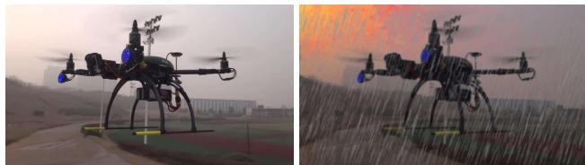  
Figure 1. Example of synthetic rain augmentation. Left: clear reference frame from DUT Anti-UAV [50] (Apache-2.0). Right: the same frame from the rainy test set of [36, 37], with salient rainstreak artifacts and chromatic shifts.

## 2.2. Datasets

Training DL-based drone detection models predominantly relies on application-specific real-world data, whose acquisition remains labor-intensive, difficult to scale, and operationally constrained [23, 45]. These constraints are amplified under adverse weather conditions, where limited experimental control makes systematic data acquisition difficult. Consequently, existing real-world drone detection datasets capture, at most, seasonal variation under clear-to-overcast conditions – as in LRDDv1 [41] and LRDDv2 [42] – while excluding adverse atmospheric effects.

Adverse-weather variation is therefore introduced almost exclusively through synthetic mechanisms, including image-space augmentation [36] and simulation-based rendering [1, 6]. Image-space augmentation superimposes synthetic weather effects, such as rain streaks, onto real images [36], but lacks physical coupling to scene geometry and illumination, often yielding salient streak artifacts and chromatic shifts (cf. Fig. 1). Simulation-based rendering provide greater environmental control, yet existing datasets remain limited in scope: DrIFT [6] confines adverseweather variation to synthetic sky-background frames, whereas RV-DroneEye [1] broadens scene coverage to urban, forest, and lake environments. RV-DroneEye, however, remains restricted to clear and foggy conditions and relies on diffusion-based post-processing to compensate for limited rendering fidelity.

Nevertheless, synthetic data generation offers a scalable alternative to real-world data acquisition, while enabling systematic factor-level variation under fixed scene conditions, allowing the isolation and analysis of factorspecific effects (e.g., effects induced by weather variation). Moreover, prior work has demonstrated the effectiveness of large-scale synthetic datasets for drone detection [27]. These benefits, however, remain constrained by the simulation-reality gap, with data fidelity and composition ultimately governing real-world transfer. Combining synthetic and real data thus offers a practical means of mitigating this gap [9].

## 3. SynDroneVision-Weather

This section introduces the proposed SynDroneVision-Weather (SDV-W) dataset, detailing its generation methodology, composition, and key characteristics.

## 3.1. Generation Methodology

SDV-W extends SDV by re-rendering a curated subset of 15 sequences of the original 72-sequence dataset under controlled seasonal and meteorological conditions. Camera placement, drone trajectories, rendering configuration, and pixel-accurate annotations are preserved by reusing the original SDV data generation pipeline [27], built on Colosseum [4] and Unreal Engine 5.0 (UE5) [12].

Environments & Seasonal Configuration. The selected sequences cover three distinct environments: University Site, Venetian City [8], and Urban Downtown [39], each described in detail in [27]. All three environments capture urban scenes with visually prominent vegetation – a perceptually dominant indicator of seasonality – providing a natural basis for inducing controlled seasonal appearance variation. Each environment is instantiated under three seasonal configurations: spring/summer, autumn, and winter, expressed primarily through full green, yellow-brown, and defoliated vegetation states, respectively (cf. Fig. 2). Spring and summer are treated as a single full-foliage configuration, as their visual distinction is generally subtle in urban scenes. This configuration also reflects the default appearance of the underlying environments. The remaining seasonal states are derived via asset-dependent vegetation edits, ranging from native foliage presets and material-level adjustments to seasonally appropriate vegetation replacement. Environmentspecific implementation details are provided in Sec. A.2 (Supp.).

Weather Conditions. Weather variation is introduced through the Colosseum weather API [4], which renders precipitation, fog, and particle effects directly within the simulated environment. Weather effects are specified by the Colosseum variables Rain, Fog, Snow, and MapleLeaf.

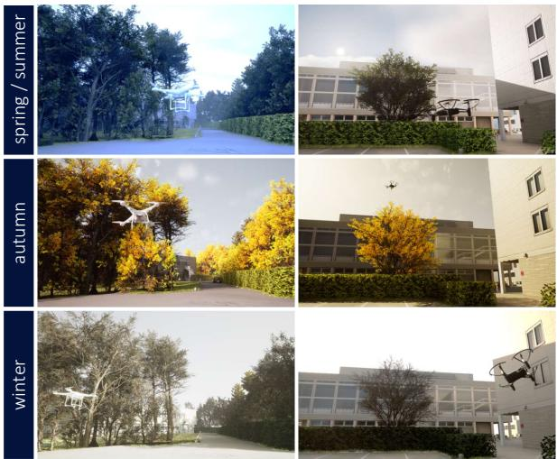  
Figure 2. Seasonal appearance variation in SDV-W. Identical scenes are re-rendered with season-specific configurations, altering vegetation, illumination, and atmospheric appearance while preserving scene geometry.

Each effect is parameterized by an intensity scalar $\alpha \in$ [0, 1], controlling its strength (α = 0: no effect; $\alpha = 1 \colon$ full intensity). The resulting configurations capture complementary sources of visual variation, combining weatherdriven visibility changes with season-specific appearance cues (cf. Fig. 3). While rain, fog and their combination are rendered accross all seasons, snow and falling foliage are restricted to their respective seasonal contexts. Additional clear-weather scenes (denoted as sunny) are generated for autumn and winter to extend the clear-weather coverage beyond the spring/summer baseline already provided by SDV. Non-sunny conditions are rendered at two severity levels: light $( \alpha \in [ 0 . 2 , 0 . 4 ] )$ and heavy $( \alpha \in [ 0 . 8 , 1 . 0 ] )$ .

The compound rain-fog condition constitutes the only exception and is parameterized asymmetrically, with rain set to $\alpha \ = \ 0 . 8$ and fog to $\alpha \ = \ 0 . 2$ This asymmetric combination is designed to better approximate realistic rainy-scene conditions. The rain component preserves explicit precipitation cues, while the fog component reproduces the diffuse illumination, reduced contrast, and desaturation commonly associated with rainfall.

While the remaining weather effects follow the default Colosseum configurations, rain required dedicated particlematerial calibration to ensure consistent droplet visibility and visually plausible appearance across varying illumination conditions. Accordingly, the P Weather RainFX emitter was modified by setting the RainDropsGPU initial droplet-size distribution to a vector-uniform range of [4, 150, 4]-[15, 50, 15]. The M RainDrop Inst material was further adjusted on a per-sequence basis through emissive intensity (0.005-1.0) and metallic reflectance (0-0.4) to preserve a realistic specular response under scene-specific

Table 1. Composition of SDV-W across seasons and weather.
<table><tr><td rowspan=2 colspan=1>Weather Cond.</td><td rowspan=1 colspan=3>Season</td><td rowspan=2 colspan=1>Total</td></tr><tr><td rowspan=1 colspan=1>spring/summer</td><td rowspan=1 colspan=1>autumn</td><td rowspan=1 colspan=1>winter</td></tr><tr><td rowspan=1 colspan=1>rain</td><td rowspan=1 colspan=1>5,598</td><td rowspan=1 colspan=1>5,200</td><td rowspan=1 colspan=1>5,199</td><td rowspan=1 colspan=1>15,997</td></tr><tr><td rowspan=1 colspan=1>fog</td><td rowspan=1 colspan=1>4,400</td><td rowspan=1 colspan=1>5,200</td><td rowspan=1 colspan=1>5,197</td><td rowspan=1 colspan=1>14,797</td></tr><tr><td rowspan=1 colspan=1>rain + fog</td><td rowspan=1 colspan=1>2,396</td><td rowspan=1 colspan=1>2,600</td><td rowspan=1 colspan=1>2,600</td><td rowspan=1 colspan=1>7,596</td></tr><tr><td rowspan=1 colspan=1>sunny</td><td rowspan=1 colspan=1>200</td><td rowspan=1 colspan=1>2,000</td><td rowspan=1 colspan=1>2,600</td><td rowspan=1 colspan=1>4,800</td></tr><tr><td rowspan=1 colspan=1>snow</td><td rowspan=1 colspan=1>一</td><td rowspan=1 colspan=1>-</td><td rowspan=1 colspan=1>6,000</td><td rowspan=1 colspan=1>6,000</td></tr><tr><td rowspan=1 colspan=1>leaves</td><td rowspan=1 colspan=1>1</td><td rowspan=1 colspan=1>5,997</td><td rowspan=1 colspan=1>一</td><td rowspan=1 colspan=1>5,997</td></tr><tr><td rowspan=1 colspan=1>total</td><td rowspan=1 colspan=1>12,594</td><td rowspan=1 colspan=1>20,997</td><td rowspan=1 colspan=1>21,596</td><td rowspan=1 colspan=1>55,187</td></tr></table>

lighting.

Illumination Settings. Following the SDV illumination setup [27], scene appearance under each weather-season configuration is defined through the joint calibration of three UE5 components: (i) the Sun and Sky Actor [17], controlling solar direction, directional-light intensity, and sky-dependent ambient illumination; (ii) the Post Process Volume [14], adjusting global color temperature and tint; and (iii) the Volumetric Cloud Component [18], governing cloud density, spatial structure, and overcast coverage. Note that the Urban Downtown environment [39] retains its native Directional Light [13] and Sky Light [16] configuration instead of relying on the Sun and Sky Actor. Parameter ranges follow each environment’s native lighting setup, with full configurations provided in the Sec. A.3. Adverse weather conditions are rendered relative to the sunny baseline through reduced directional-light intensity, cooler and less saturated color grading, and increased cloud extinction.

Frame Sampling & Re-rendering. Given the calibrated seasonal, weather, and illumination configurations, SDV-W is generated by re-rendering selected frames from the original SDV trajectories. For each of the 15 sequences and each combination of season, weather condition, and severity level, ∼200 frames are uniformly sampled along the prerecorded drone trajectory and re-rendered with the corresponding scene parameters. Preserving the camera intrinsics and trajectory waypoints from SDV ensures a strict geometric correspondence between SDV-W frames and their clean-condition counterparts. Drone pose, viewpoint, and scene structure remain identical across conditions (cf. Fig. I, Supp.). This one-to-one correspondence isolates seasonal and atmospheric appearance changes from variations in scene content, providing a level of control rarely achievable in real-world recordings. Sampling over the full trajectory further retains intra-sequence diversity in drone scale, viewing angle, and object-background configuration.

## 3.2. Dataset Composition

SDV-W comprises 55,187 annotated single-drone images, distributed across spring/summer (12,594), autumn (20,997), and winter (21,596). A detailed breakdown of image counts by season and weather condition is provided in

Table 2. Definition of object size categories based on boundingbox area $A = w \times h .$ . Categories follow the COCO size taxonomy, extended with an x-small class to better capture tiny drones [32].
<table><tr><td rowspan=1 colspan=1>Size Category</td><td rowspan=1 colspan=1>Object Area (pixels2)</td><td rowspan=1 colspan=1>Description</td></tr><tr><td rowspan=1 colspan=1>x-small (XS)</td><td rowspan=1 colspan=1> $\overline { { A < 1 6 ^ { 2 } } }$ </td><td rowspan=1 colspan=1>extremely small objects</td></tr><tr><td rowspan=1 colspan=1>small (S)</td><td rowspan=1 colspan=1> $\overline { { 1 6 ^ { 2 } \le A < 3 2 ^ { 2 } } }$ </td><td rowspan=1 colspan=1>small objects</td></tr><tr><td rowspan=1 colspan=1>medium (M)</td><td rowspan=1 colspan=1> $\overline { { { 3 2 ^ { 2 } } \leq A < 9 6 ^ { 2 } } }$ </td><td rowspan=1 colspan=1>medium-sized objects</td></tr><tr><td rowspan=1 colspan=1>large (L)</td><td rowspan=1 colspan=1> $\overline { { A \geq 9 6 ^ { 2 } } }$ </td><td rowspan=1 colspan=1>large objects</td></tr></table>

Tab. 1. Moreover, the dataset is partitioned into training and validation splits of 52,427 and 2,760 images, respectively. Unlike SDV, SDV-W does not contain negative backgroundonly samples.

## 3.3. Dataset Characteristics

SDV-W follows the high-resolution rendering configuration of SDV, with images provided at a fixed resolution of 2560×1477 pixels. Drone instances exhibit broad imageplane coverage, yielding a spatially diverse object-location distribution (cf. Fig. II, Supp.). Object area ratios range from $1 \times 1 0 ^ { - 5 }$ to 0.761 (mean: 0.0075), indicating a systematic shift toward smaller projected object extents relative to SDV. Object aspect ratios range from 0.205 to 8.222 (mean: 1.243), suggesting that the selected sequences preserve the orientation and observation-angle variability of the original dataset. Following the COCO taxonomy (cf. Tab. 2) at the default YOLO input resolution of 640×640, SDV-W is primarily composed of medium (57.0%) and small (30.9%) objects, with fewer large (10.4%) and x-small (1.6%) instances (cf. Fig. 4).

## 4. Experimental Setup

This section describes the detectors, data sources, training protocol, and evaluation procedure used to assess the effect of weather-conditioned synthetic data on real-world drone detection.

## 4.1. Models

The selected detectors cover representative drone detection architectures, enabling a separation of training-data effects from architecture-dependent performance variation. The analysis considers two complementary categories of detection model. The first comprises generic object detection models widely adopted in drone detection applications. Specifically, it includes standard YOLO configurations spanning successive architectural generations and capacity scales: YOLOv5l [24], YOLOv8m/l [26, 47], YOLOv9c/e [48], and YOLOv11l/x [25]. The second category comprises detectors developed specifically for urban drone detection and is represented here by YOLO-FEDER FusionNet [28, 29]. YOLO-FEDER FusionNet combines generic object detection with camouflage-aware detection principles, targeting camouflage-induced targetbackground ambiguity in urban scenes (e.g., drones blending with vegetation or built structures) – conditions under which standard YOLO models are prone to failure [28].

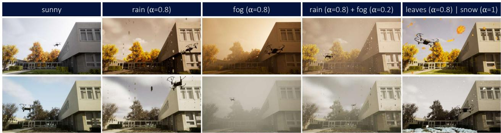  
Figure 3. Weather-condition variation in SDV-W. Representative autumn (top) and winter (bottom) scenes are shown under sunny, rain, fog, rain-fog, and season-specific leaves/snow conditions. Non-sunny examples are shown at heavy severity.

## 4.2. Data

The experimental setup builds on a heterogeneous collection of synthetic and real-world datasets for drone detection. SDV [27] and its weather-conditioned extension SDV-W (Sec. 3) constitute the synthetic data basis, providing largescale visual data under controlled seasonal and adverseweather variation.

The real-world data basis complements this controlled synthetic setting with publicly available datasets and custom recordings, spanning diverse urban backgrounds, illumination conditions, and seasonal appearances. DUT Anti-UAV [50] serves as a general-purpose urban drone detection dataset, characterized by heterogeneous scene backgrounds, varying illumination conditions, and diverse drone models. LRDDv1 [41] and LRDDv2 [42] extend this basis toward longer-range urban detection scenarios and, unlike DUT Anti-UAV, provide rare public coverage of seasonal appearance variation through summer and winter recordings with distinct vegetation states. Beyond public datasets, two custom recordings, R1-POS3 and R2-POS7, are included to provide controlled real-world seasonal variation. Both were acquired in urban environments under summer and winter conditions. By keeping camera position, field of view (FOV), and scene geometry fixed across seasons, these recordings isolate seasonal appearance variation from scene-content changes, thereby constituting a controlled real-world counterpart to the synthetic seasonal variation introduced by SDV-W.

The selected datasets exhibit pronounced differences in object-size distribution and effective target scale (cf. Fig. III, Supp.). At an input resolution of 640×640 pixels, effective object scales vary from the comparatively balanced distribution in DUT Anti-UAV to settings dominated

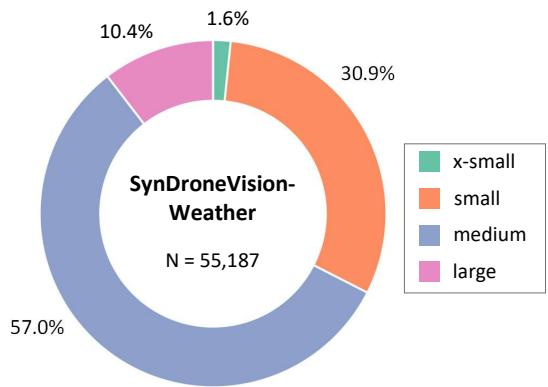  
Figure 4. Distribution of object size categories in SDV-W. Share of x-small, small, medium, and large objects are shown w.r.t. its total number of annotated instances (N). Size categories follow Tab. 2 for the default YOLO input size of 640×640.

by small-scale instances (e.g., LRDDv2 and R2-POS7).   
Detailed statistics are provided in Sec. B (Supp).

## 4.3. Training Protocol

Model training is performed under two primary data configurations. The reference setting follows [27] and combines large-scale synthetic data from SDV with real-world samples from DUT Anti-UAV [50]. The combined training set comprises 140,038 SDV images and 7,800 DUT Anti-UAV images from the respective training and validation splits, yielding a real-data share of ∼5%. The other configuration incorporates SDV-W alongside SDV and DUT Anti-UAV, yielding 188,865 training and 14,162 validation images. Thus, SDV-W is integrated additively by default, with deviations specified explicitly.

All models are trained (and evaluated) at a common input resolution of 640×640 pixels. Accordingly, all images are standardized to the target resolution before being processed by the model. While standard YOLO detectors use letterbox resizing, i.e., aspect-ratio-preserving scaling with padding,

YOLO-FEDER FusionNet applies dynamic shortest-side cropping followed by resizing to obtain square, paddingfree inputs [29].

To ensure comparability across training data compositions, all detectors are optimized under a fixed training protocol. Models are trained for 100 epochs with a batch size of 64 on four NVIDIA A100 GPUs, retaining the default Ultralytics hyperparameters unless stated otherwise [24– 26]. Standard YOLO detectors use COCO-pretrained initialization [32]. YOLO-FEDER FusionNet follows the protocol of [29], initializing its YOLOv8l backbone from COCO [32] and its FEDER [20] branch from COD10K [19] pretrained weights. Both branches remain frozen throughout training, restricting optimization to the fusion neck and detection head.

## 4.4. Evaluation Procedure

Evaluation is conducted on the real-world datasets described above, comprising the public datasets DUT Anti-UAV, LRDDv1, and LRDDv2, as well as the custom recordings R1-POS3 and R2-POS7. Detection performance is quantified using standard object detection metrics: mean average precision (mAP) at an intersection over union (IoU) threshold of 0.5, mAP averaged over IoU thresholds from 0.5 to 0.95, and mAP at a relaxed IoU threshold of 0.25 to account for annotation-induced localization uncertainty [28]. To capture operational failure modes, we additionally report the false negative rate (FNR) and false discovery rate (FDR), reflecting missed detections and false alarms, respectively. Given the strong dependence of drone detection performance on effective target scale and the heterogeneous object-size distributions across datasets, performance is also evaluated across COCO-style object-size categories (cf. Tab. 2). Departing from COCO’s native-image size definition, object-size categories are assigned based on the ground truth (GT) bounding box areas after resizing to the 640×640 input resolution. This aligns the taxonomy with the detector’s operating resolution and accounts for resizing-induced category transitions (cf. Tab. VI, Supp.).

## 5. Results

The evaluation first exploits SDV-W’s controlled design to quantify weather-induced detector degradation under paired synthetic conditions. It then focuses on SDV-W’s primary role as a weather-conditioned training resource, assessing real-world robustness gains while disentangling the effects of data diversity, dataset scale, and target size.

## 5.1. Performance under Synthetic Weather & Seasonal Variation

To quantify the impact of atmospheric appearance shifts on detector performance, standard YOLO models (cf. Sec. 4.1) trained on a combination of SDV and DUT Anti-UAV are evaluated on SDV-W and their corresponding SDV counterparts. By pairing each adverse-weather sample with the same SDV scene under clear-weather conditions, SDV-W provides a controlled counterfactual for attributing performance gaps specifically to weather-induced appearance changes rather than scene-content variation.

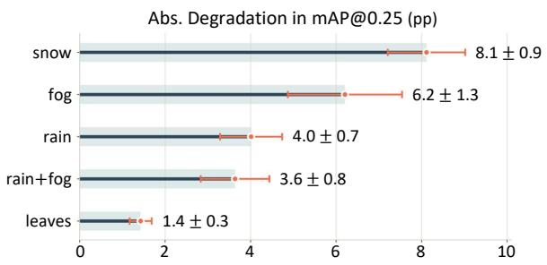

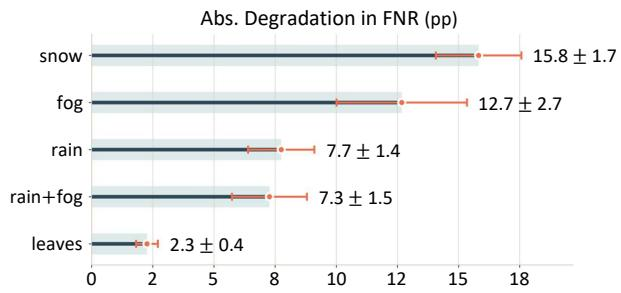

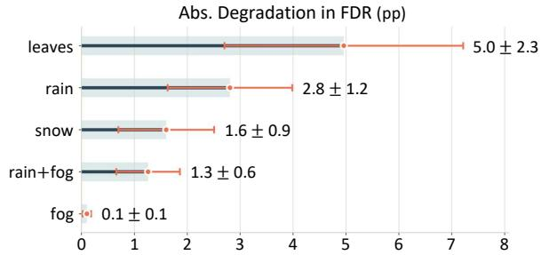  
Figure 5. Weather-induced degradation of YOLO detection performance. Absolute deviations in mAP@0.25, FNR, and FDR are reported in percentage points (pp) relative to clear-weather performance. Larger values indicate greater degradation. Orange markers denote the mean across YOLO models. Horizontal intervals and ± annotations represent the corresponding standard deviation.

Averaged across YOLO configurations, all adverse conditions reduce performance relative to their clear-weather counterparts, with an architecture-stable severity ordering, as shown in Fig. 5. Snow and fog are most disruptive, reducing mAP@0.25 by 8.2/6.2 percentage points (pp) and raising FNR by 15.8/12.7 pp, respectively. Under stricter IoU criteria, this degradation becomes more pronounced (cf. Fig. IV, Supp.): for snow, the drop increases from 8.2 pp at mAP@0.25 to 12.2 pp at mAP@0.5-0.95, indicating an additional localization penalty. Rain-based conditions induce only moderate mAP degradation, while falling leaves have negligible impact on overall accuracy (Fig. 5, top).

Table 3. Comparison of training with and without weather-condition synthetic data (SDV-W) on LRDDv1 and DUT Anti-UAV across multiple YOLO architectures and model scales. Best-performing values are highlighted in bold.
<table><tr><td rowspan="2">Model</td><td rowspan="2"> $\overline { { { \bf w } / { \bf \Lambda } } }$  SDV-W</td><td colspan="3"> $\overline { { \mathrm { \ m A P \uparrow } } }$ </td><td rowspan="2">FNR↓</td><td rowspan="2">FDR↓</td><td colspan="3"></td><td rowspan="2">FNR↓</td><td rowspan="2">FDR↓</td></tr><tr><td>@0.25</td><td>@0.5</td><td>@0.5-0.95</td><td>@0.25</td><td> $\overline { { \mathrm { \ m A P \uparrow } } }$  @0.5</td><td>@0.5-0.95</td></tr><tr><td rowspan="2">YOLOv5l</td><td>一</td><td>0.580</td><td>0.426</td><td>0.131</td><td>0.489</td><td>0.077</td><td>0.957</td><td>0.937</td><td>0.674</td><td>0.102</td><td>0.035</td></tr><tr><td>√</td><td>0.700</td><td>0.566</td><td>0.204</td><td>0.486</td><td>0.030</td><td>0.936</td><td>0.928</td><td>0.723</td><td>0.108</td><td>0.031</td></tr><tr><td rowspan="2">YOLOv8m</td><td>一</td><td>0.606</td><td>0.442</td><td>0.135</td><td>0.480</td><td>0.059</td><td>0.954</td><td>0.932</td><td>0.680</td><td>0.106</td><td>0.033</td></tr><tr><td> $\checkmark$ </td><td>0.711</td><td>0.583</td><td>0.214</td><td>0.474</td><td>0.023</td><td>0.963</td><td>0.945</td><td>0.691</td><td>0.053</td><td>0.076</td></tr><tr><td rowspan="2">YOLOv8l</td><td> $^ -$ </td><td>0.960</td><td>0.940</td><td>0.692</td><td>0.096</td><td>0.027</td><td>0.608</td><td>0.430</td><td>0.132</td><td>0.470</td><td>0.052</td></tr><tr><td> $\checkmark$ </td><td>0.967</td><td>0.953</td><td>0.694</td><td>0.051</td><td>0.046</td><td>0.700</td><td>0.553</td><td>0.197</td><td>0.468</td><td>0.025</td></tr><tr><td rowspan="2">YOLOv9c</td><td>I</td><td>0.614</td><td>0.442</td><td>0.139</td><td>0.484</td><td>0.043</td><td>0.960</td><td>0.939</td><td></td><td>0.097</td><td>0.027</td></tr><tr><td> $\checkmark$ </td><td>0.714</td><td>0.569</td><td></td><td></td><td>0.024</td><td>0.969</td><td></td><td>0.690</td><td></td><td></td></tr><tr><td rowspan="2">YOLOv9e</td><td> $^ -$ </td><td>0.632</td><td></td><td>0.202</td><td>0.452</td><td></td><td></td><td>0.953</td><td>0.696</td><td>0.040</td><td>0.058</td></tr><tr><td> $\checkmark$ </td><td>0.726</td><td>0.440</td><td>0.134</td><td>0.455</td><td>0.016</td><td>0.970</td><td>0.954</td><td>0.722</td><td>0.094</td><td>0.007</td></tr><tr><td rowspan="2">YOLOv111</td><td></td><td></td><td>0.573</td><td>0.207</td><td>0.464</td><td>0.012</td><td>0.976</td><td>0.965</td><td>0.713</td><td>0.037</td><td>0.032</td></tr><tr><td> $^ -$   $\checkmark$ </td><td>0.634 0.710</td><td>0.463</td><td>0.145</td><td>0.465</td><td>0.018</td><td>0.963</td><td>0.942</td><td>0.697</td><td>0.100</td><td>0.026</td></tr><tr><td rowspan="2">YOLOv11x</td><td> $^ -$ </td><td></td><td>0.567</td><td>0.207</td><td>0.464</td><td>0.022 0.012</td><td>0.970 0.966</td><td>0.959</td><td>0.705</td><td>0.042 0.091</td><td>0.042</td></tr><tr><td></td><td>0.617</td><td>0.446</td><td>0.142</td><td>0.469</td><td></td><td></td><td>0.944</td><td>0.708</td><td></td><td>0.028</td></tr><tr><td></td><td> $\checkmark$ </td><td>0.700</td><td>0.569</td><td>0.210</td><td>0.477</td><td>0.023</td><td>0.971</td><td>0.960</td><td>0.701</td><td>0.046</td><td>0.034</td></tr></table>

✓ = applies

At the error-type level, the dominant failure mode is missed detection. Across conditions, FNR increases substantially more than FDR (Fig. 5, middle and bottom). For instance, under snow and fog, the FDR remains nearly unchanged despite the largest FNR increases. Adverse weather therefore appears to suppress object saliency below the detection threshold rather than induce widespread false positives (FPs). The only notable exception is falling leaves, where added visual noise increases FDR despite limited impact on mAP.

## 5.2. Impact of SDV-W-based Training

The contribution of SDV-W as a training resource is quantified by contrasting the reference data composition with its SDV-W-extended counterpart (cf. Sec. 4.3) across detection architectures and datasets.

Performance on Public Datasets. On public real-world datasets, SDV-W provides the clearest benefits in settings where reference performance is not already saturated. The most consistent gains are observed on LRDDv1: across all seven standard YOLO variants, mAP@0.5 increases by +10.4 to +14.1 pp (mean: +12.7 pp), with simultaneous gains in mAP@0.25 and mAP@0.5-0.95 (cf. Tab. 3). As FNR remains largely unchanged, the gains mainly reflect improved localization and confidence calibration, rather than increased target recovery. On DUT Anti-UAV, where reference performance is already close to saturation, SDV-W yields only marginal mAP improvements, yet lowers FNR by 4.4 pp on average. This indicates fewer missed detections without compromising reference-domain performance. YOLO-FEDER FusionNet follows the same saturation pattern (cf. Tab. VII, Supp.). On LRDDv2, the effect of SDV-W is less uniform: mAP changes are architecturedependent and approximately neutral on average, while

Table 4. Impact of weather-conditioned synthetic data (SDV-W) on the performance of YOLO-FEDER FusionNet on LRDDv2. Results are reported overall and for each size category defined in Tab. 2. Best-performing values are highlighted in bold.
<table><tr><td rowspan="2">w/ SDV-W</td><td rowspan="2">Size Cat.</td><td colspan="3">mAP↑</td><td rowspan="2">FNR↓</td><td rowspan="2">FDR↓</td></tr><tr><td>@0.25</td><td>@0.5</td><td>@0.5-0.95</td></tr><tr><td>一  $\checkmark$ </td><td>all</td><td>0.540 0.561</td><td>0.507 0.530</td><td>0.254 0.258</td><td>0.515 0.491</td><td>0.270 0.235</td></tr><tr><td>一  $\checkmark$ </td><td>XS</td><td>0.144 0.152</td><td>0.125</td><td>0.052</td><td>0.743</td><td>一</td></tr><tr><td> $^ -$ </td><td>S</td><td>0.683</td><td>0.133 0.668</td><td>0.055 0.314</td><td>0.735 0.253</td><td>一 一</td></tr><tr><td> $\checkmark$   $^ -$ </td><td>M</td><td>0.705 0.669</td><td>0.690 0.665</td><td>0.311 0.399</td><td>0.227 0.242</td><td>一 一</td></tr><tr><td> $\checkmark$  一  $\checkmark$ </td><td>L</td><td>0.762 0.827 0.856</td><td>0.755 0.826</td><td>0.448 0.587</td><td>0.138 0.053</td><td>一 一</td></tr></table>

✓ = applies

FDR decreases consistently. Given the high FNR across training configurations (≥0.61; cf. Tab. VIII, Supp.), mAP has limited interpretive value. In contrast, YOLO-FEDER FusionNet achieves substantially lower FNR on LRDDv2 than any standard YOLO variant (cf. Tab. 4) and benefits more consistently from SDV-W. Across all IoU criteria, SDV-W improves mAP while reducing both FNR and FDR. The largest gains occur for medium objects (mAP@0.5: +9.0 pp, FNR: −10.4 pp), with consistent improvements for small and large objects. Extra-small objects remain challenging, even for YOLO-FEDER FusionNet.

Performance on Custom Seasonal Recordings. Evaluation on R1-POS3 and R2-POS7 is confined to YOLO-FEDER FusionNet, as tree-covered backgrounds induce camouflage effects known to reduce the reliability of generic detection models [28]. On dataset R1-POS3, where baseline performance remains below saturation, SDV-W yields consistent improvements across both seasons (cf.

Table 5. Performance of YOLO-FEDER FusionNet with and without weather-conditioned synthetic training data (SDV-W) under seasonal conditions (summer vs. winter) on the datasets R1-POS3 and R2-POS7. Results are aggregated across all size categories. Size-specific performance indicators are provided in the supplementary material. Best-performing values are highlighted in bold.
<table><tr><td rowspan="2">Dataset</td><td rowspan="2">w/ SDV-W</td><td colspan="3"> $\overline { { \mathrm { { m A P } \mathrm { { \uparrow } } } } }$ </td><td rowspan="2">FNR↓</td><td rowspan="2">FDR↓</td><td colspan="3"> $\overline { { \mathrm { \ m A P \uparrow } } }$ </td><td rowspan="2">FNR↓</td><td rowspan="2">FDR↓</td></tr><tr><td>@0.25</td><td>@0.5</td><td>@0.5-0.95</td><td>@0.25</td><td>@0.5</td><td>@0.5-0.95</td></tr><tr><td rowspan="2">R1-POS3</td><td>一</td><td>0.764</td><td>0.743</td><td>0.331</td><td>0.313</td><td>0.083</td><td>0.931</td><td>0.827</td><td>0.404</td><td>0.208</td><td>0.006</td></tr><tr><td>√</td><td>0.821</td><td>0.794</td><td>0.354</td><td>0.326</td><td>0.004</td><td>0.965</td><td>0.836</td><td>0.393</td><td>0.164</td><td>0.004</td></tr><tr><td rowspan="2">R2-POS7</td><td>一</td><td>0.985</td><td>0.909</td><td>0.450</td><td>0.076</td><td>0.010</td><td>0.983</td><td>0.749</td><td>0.294</td><td>0.025</td><td>0.054</td></tr><tr><td>√</td><td>0.982</td><td>0.901</td><td>0.422</td><td>0.061</td><td>0.008</td><td>0.988</td><td>0.675</td><td>0.223</td><td>0.028</td><td>0.006</td></tr></table>

✓ = applies

Tab. 5). In summer, mAP@0.5 increases by +5.1 pp, while FDR drops by over an order of magnitude at nearly unchanged FNR. In winter, mAP@0.5 improves modestly, while FNR decreases by 4.4 pp. Consistent with LRDDv2, remaining limitations are concentrated among extra-small objects. Performance on R2-POS7 is near saturation, limiting the measurable effect of SDV-W, particularly under summer conditions. Under winter conditions, SDV-W markedly reduces FDR at unchanged FNR. The mAP drop at stricter IoU thresholds mainly reflects reduced localization accuracy for small object, as performance for medium objects improves markedly (cf. Tab. IX, Supp.).

## 5.3. Weather Diversity vs. Training-Set Size

To isolate the effect of SDV-W-induced weather diversity from increased training volume, we replace a randomly selected, size-matched subset of SDV samples with SDV-W while keeping the total training-set size fixed. YOLO-FEDER FusionNet is trained on five independently sampled training variants, and performance is reported as the per-dataset mean across runs (cf. Tab. X, Supp.). Across datasets, the replacement yields the most pronounced average gains on the custom recordings, where season-matched samples appear to better align the training distribution with the fixed-FOV target domain. On the larger and more diverse public datasets, replacing general-purpose SDV samples with SDV-W provides no consistent benefit, suggesting that the added weather variation does not comnpensate the loss of broader synthetic coverage. Collectively, this pattern indicates that SDV-W is most effective when used to complement, rather than replace, general-purpose synthetic training data. Details are provided in Sec. C.3 (Supp.).

## 5.4. Tiled Inference for Small-Object Recovery

Global resizing to 640×640 can induce a pronounced compression of the object-scale distribution, increasing the prevalence of small and extra-small targets for which detector sensitivity is most limited (cf. Sec. 5.2). Tiled inference provides a common alternative to global resizing by splitting the original image into overlapping 640×640 patches, running inference independently on each patch, and merging the resulting predictions at the image level. An established technique for tile-level prediction fusion is SAHIstyle greedy non-maximum merging with intersection over smaller area (IoS) matching [2] (cf. Sec. C.4, Supp.).

Combining YOLO-FEDER FusionNet trained under the extended SDV-W configuration with SAHI-inspired tiled inference substantially improves detection performance for small-scale objects across settings. On LRDDv2, for example, tiled inference more than doubles mAP@0.5 for extrasmall objects relative to resizing (0.133→0.312) and significantly reduces their FNR (0.735→0.434), while performance for small objects remains largely unchanged. However, these gains come with clear trade-offs: localization of large objects deteriorates (mAP@0.5:0.855→0.661), as instances exceeding the tile extent are prone to fragmentation across crop boundaries. Moreover, image-level FDR nearly doubles (0.235→0.426) due to per-tile FPs. Thus, tiling improves small-object recovery at the expense of large-object fidelity, precision, and computational efficiency, with perimage inference time increasing from 12ms to >50ms.

## 6. Discussion and Conclusion

The analyses indicate that SDV-W improves operationaldomain coverage for urban drone detection through controlled seasonal and adverse-weather variation. Its main benefit is reflected in more reliable detector behavior under adverse appearance shifts, reducing missed detections and false alarms, which are critical for real-world deployment. Improvements in localization accuracy are largely confined to non-saturated baselines. Consequently, SDV-W is most effective as a complementary training source, broadening environmental variation without sacrificing cross-domain generalization potential.

While SDV-W mitigates appearance-driven degradation, scale-induced failures require complementary inference strategies. Tiled inference improves sensitivity to extrasmall objects, but shifts the deployment trade-off toward reduced large-object consistency and precision, as well as increased inference time. Given the distance-dependent scale variation of drones in real-world surveillance, tiled inference should be deployed cautiously rather than by default (a research topic in its own right, beyond this work’s scope).

A key limitation remains the lack of real-world data capturing genuine and diverse adverse-weather for evaluation. Assembling such data and comprehensively quantifying SDV-W’s benefit against it is left to future work.

## References

[1] Andro Aprila Adiputra, Sehwa Ko, Thi-Thu-Huong Le, Junyoung Son, and Howon Kim. RV-DroneEye: Unity-Based Framework for a Synthetic Dataset for Robust UAV Recognition. IEEE Access, 14:63857–63874, 2026. 2

[2] Fatih Cagatay Akyon, Sinan Onur Altinuc, and Alptekin Temizel. Slicing Aided Hyper Inference and Fine-tuning for Small Object Detection. 2022 IEEE International Conference on Image Processing, pages 966–970, 2022. 8, 17

[3] Antonella Barisic, Frano Petric, and Stjepan Bogdan. Sim2Air - Synthetic Aerial Dataset for UAV Monitoring. IEEE Robotics and Automation Letters, 7(2):3757–3764, 2022. 2

[4] Codex Laboratories LLC. Welcome to Colosseum, a Successor of AirSim. https://codexlabsllc.github. io/Colosseum/, 2026. Accessed: 2026-06-20. 3

[5] Angelo Coluccia, Alessio Fascista, Lars Sommer, Arne Schumann, Anastasios Dimou, and Dimitrios Zarpalas. The Drone-vs-Bird Detection Grand Challenge at ICASSP 2023: A Review of Methods and Results. IEEE Open Journal of Signal Processing, 5:766–779, 2024. 2

[6] Fardad Dadboud, Hamid Azad, Varun Mehta, Miodrag Bolic, and Iraj Mantegh. DrIFT: Autonomous Drone Dataset with Integrated Real and Synthetic Data, Flexible Views, and Transformed Domains. In IEEE/CVF Winter Conference on Applications ofComputer Vision, pages 6900–6910, 2025. 2

[7] Safaa Dafrallah and Moulay Akhloufi. Malicious UAV Detection Using Various Modalities. Drone Systems and Applications, 12:1–18, 2024. 1

[8] Deelus. Venice - Fast Building. https://www.fab. com / listings / a6123fc7 - 2fa6 - 4350 - a9cf - 503a71e5e991, 2026. Accessed: 2026-06-25. 3, 11, 12

[9] Tamara R. Dieter, Andreas Weinmann, Stefan Jager, and Eva¨ Brucherseifer. Quantifying the Simulation–Reality Gap for Deep Learning-Based Drone Detection. Electronics, 12(10), 2023. 3

[10] Yifei Dong, Fengyi Wu, Sanjian Zhang, Guangyu Chen, Yuzhi Hu, Masumi Yano, Jingdong Sun, Siyuan Huang, Feng Liu, Qi Dai, and Zhi-Qi Cheng. Securing the Skies: a Comprehensive Survey on Anti-Uav Methods, Benchmarking, and Future Directions. pages 6661–6675, 2025. 1

[11] Mohamed Elsayed, Mohamed Reda, Ahmed S. Mashaly, and Ahmed S. Amein. Review on Real-Time Drone Detection Based on Visual Band Electro-Optical (EO) Sensor. In 10th International Conference on Intelligent Computing and Information Systems, pages 57–65, 2021. 1

[12] Epic Games. Unreal Engine. https : / / www . unrealengine.com/en-US/, 2026. Accessed: 2026- 06-25. 3

[13] Epic Games. Directional Lights. https : / / dev . epicgames . com / documentation / unreal -

engine / directional - lights - in - unreal - engine?application\_version=5.0, 2026. Accessed: 2026-06-25. 4, 12

[14] Epic Games. Post Process Effects. https : / / dev.epicgames.com/documentation/unrealengine/post- process- effects- in- unrealengine?application\_version=5.0, 2026. Accessed: 2026-06-25. 4, 12, 13

[15] Epic Games. Sky Atmosphere Component. https:// dev.epicgames.com/documentation/unrealengine / sky - atmosphere - component - in - unreal- engine?application\_version=5.0& lang=en-US, 2026. Accessed: 2026-06-25. 12

[16] Epic Games. Sky Lights. https://dev.epicgames. com / documentation / unreal - engine / sky - lights - in - unreal - engine ? application \_ version=5.0, 2026. Accessed: 2026-06-25. 4, 12

[17] Epic Games. Sun and Sky Actor. https : / / dev.epicgames.com/documentation/unrealengine / sun - and - sky - actor - in - unreal - engine?application\_version=5.0, 2026. Accessed: 2026-06-25. 4, 12

[18] Epic Games. Volumetric Cloud Component. https:// dev.epicgames.com/documentation/unrealengine / volumetric - cloud - component - in - unreal - engine ? application \_version = 5 . 0, 2026. Accessed: 2026-06-25. 4

[19] Deng-Ping Fan, Ge-Peng Ji, Guolei Sun, Ming-Ming Cheng, Jianbing Shen, and Ling Shao. Camouflaged Object Detec tion. In IEEE/CVF Conference on Computer Vision and Pat tern Recognition, pages 2774–2784, 2020. 6

[20] Chunming He, Kai Li, Yachao Zhang, Longxiang Tang, Yulun Zhang, Zhenhua Guo, and Xiu Li. Camouflaged Object Detection with Feature Decomposition and Edge Reconstruction. In IEEE/CVF Conference on Computer Vision and Pattern Recognition, pages 22046–22055, 2023. 6

[21] Min Huang, Wenkai Mi, and Yuming Wang. EDGS-YOLOv8: An Improved YOLOv8 Lightweight UAV Detection Model. Drones, 8(7), 2024. 2

[22] Sonain Jamil, Muhammad Sohail Abbas, and Arunabha M. Roy. Distinguishing Malicious Drones Using Vision Transformer. AI, 3(2):260–273, 2022. 2

[23] Nan Jiang, Kuiran Wang, Xiaoke Peng, Xuehui Yu, Qiang Wang, Junliang Xing, Guorong Li, Guodong Guo, Qixiang Ye, Jianbin Jiao, Jian Zhao, and Zhenjun Han. Anti-UAV: A Large-Scale Benchmark for Vision-Based UAV Tracking. IEEE Transactions on Multimedia, 25:486–500, 2023. 1, 2

[24] Glenn Jocher. Ultralytics YOLOv5. https://github. com/ultralytics/yolov5, 2020. Version 7.0, AGPL 3.0 license. 4, 6

[25] Glenn Jocher and Jing Qiu. Ultralytics YOLO11. https: / / github . com / ultralytics / ultralytics, 2024. Version 11.0.0, AGPL-3.0 license. 4

[26] Glenn Jocher, Ayush Chaurasia, and Jing Qiu. Ultralytics YOLOv8. https://github.com/ultralytics/ ultralytics, 2023. Version 8.0.0, AGPL-3.0 license. 4, 6

[27] Tamara R. Lenhard, Andreas Weinmann, Kai Franke, and Tobias Koch. SynDroneVision: A Synthetic Dataset for Image-Based Drone Detection. IEEE/CVF Winter Conference on Applications ofComputer Vision, pages 7637–7647, 2024. 2, 3, 4, 5, 11

[28] Tamara R. Lenhard, Andreas Weinmann, Stefan Jager, and¨ Tobias Koch. YOLO-FEDER FusionNet: A Novel Deep Learning Architecture for Drone Detection. In IEEE International Conference on Image Processing, pages 2299–2305, 2024. 2, 4, 5, 6, 7

[29] Tamara R. Lenhard, Andreas Weinmann, and Tobias Koch. Performance Optimization of YOLO-FEDER FusionNet for Robust Drone Detection in Visually Complex Environments. arXiv, 2509.14012, 2025. 2, 4, 6

[30] Tamara R. Lenhard, Andreas Weinmann, Hichem Snoussi, and Tobias Koch. Long-Duration Drone Tracking Dataset. Zenodo, 2026. https://doi.org/10.5281/zenodo.17182190. 13, 14, 16, 17

[31] Tamara R. Lenhard, Andreas Weinmann, Hichem Snoussi, and Tobias Koch. Detector-Augmented SAMURAI for Long-Duration Drone Tracking. In IEEE/CVF Winter Conference on Applications of Computer Vision Workshops, pages 75–84, 2026. 13, 14, 16, 17

[32] Tsung-Yi Lin, Michael Maire, Serge Belongie, James Hays, Pietro Perona, Deva Ramanan, Piotr Dollar, and C. Lawrence´ Zitnick. Microsoft COCO: Common Objects in Context. In European Conference on Computer Vision, pages 740–755, 2014. 4, 6

[33] Zhaoyang Liu, Limin Wang, Wayne Wu, Chen Qian, and Tong Lu. TAM: Temporal Adaptive Module for Video Recognition. In IEEE/CVF International Conference on Computer Vision, pages 13688–13698, 2021. 2

[34] Yaowen Lv, Zhiqing Ai, Manfei Chen, Xuanrui Gong, Yuxuan Wang, and Zhenghai Lu. High-Resolution Drone Detection Based on Background Difference and SAG-YOLOv5s. Sensors, 22(15), 2022. 2

[35] Syed Agha Hassnain Mohsan, Nawaf Qasem Hamood Othman, Yanlong Li, Mohammed H. Alsharif, and Muhammad Asghar Khan. Unmanned Aerial Vehicles (UAVs): Practical Aspects, Applications, Open Challenges, Security Issues, and Future Trends. Intelligent Service Robotics, 16: 109–137, 2023. 1

[36] Adnan Munir, Abdul Jabbar Siddiqui, and Saeed Anwar. Investigation of UAV Detection in Images with Complex Backgrounds and Rainy Artifacts. In IEEE/CVF Winter Conference on Applications of Computer Vision Workshops, pages 232–241, 2024. 2

[37] Adnan Munir, Abdul Jabbar Siddiqui, Saeed Anwar, Aiman El-Maleh, Ayaz H. Khan, and Aqsa Rehman. Impact of Adverse Weather and Image Distortions on Vision-Based UAV Detection: A Performance Evaluation of Deep Learning Models. Drones, 8(11), 2024. 2

[38] Patrick. Winter Forest Set. https://www.fab. com / listings / 039a6d28 - 7329 - 406f - 9a18 - 33d1b4a2b762, 2026. Accessed: 2026-06-25. 11, 12

[39] PurePolygons. Downtown West Modular Pack. https: //www.fab.com/listings/0faf8b5d- 7a5f-

4fee-a297-7a8efaba8896, 2026. Accessed: 2026- 06-25. 3, 4, 11, 12

[40] Quixel Megascans. European Black Alder. https: //www.fab.com/listings/9de7ce19- 5813- 42d2-a5f0-5e6447006f72, 2026. Accessed: 2026- 06-25. 11

[41] Amirreza Rouhi, Himanshu Umare, Sneh Patal, Ritik Kapoor, Namit Deshpande, Solmaz Arezoomandan, Princie Shah, and David Han. Long-Range Drone Detection Dataset. In IEEE International Conference on Consumer Electronics, pages 1–6, 2024. 2, 5, 13, 14, 15, 17

[42] Amirreza Rouhi, Sneh Patel, Noah McCarthy, Siddiq Khan, Hadi Khorsand, Kaleb Lefkowitz, and David K. Han. LRDDv2: Enhanced Long-Range Drone Detection Dataset with Range Information and Comprehensive Real-World Challenges. ArXiv, abs/2508.03331, 2025. 2, 5, 13, 14, 16, 17

[43] Ulzhalgas Seidaliyeva, Lyazzat Ilipbayeva, Kyrmyzy Taissariyeva, Nurzhigit Smailov, and Eric T. Matson. Advances and Challenges in Drone Detection and Classification Tech niques: A State-of-the-Art Review. Sensors, 24(1), 2024. 1

[44] Krishnakant Singh, Thanush Navaratnam, Jannik Holmer, Simone Schaub-Meyer, and Stefan Roth Roth. Is Synthetic Data all We Need? Benchmarking the Robustness of Models Trained with Synthetic Images. In IEEE/CVF Conference on Computer Vision and Pattern Recognition Workshops, pages 2505–2515, 2024. 1

[45] Fredrik Svanstrom, Fernando Alonso-Fernandez, and¨ Cristofer Englund. A Dataset for Multi-Sensor Drone Detection. Data in Brief, 39:107521, 2021. 1, 2

[46] Christoph Torens, Franz Junger, Sebastian Schirmer, Pranav¨ Nagarajan, Simon Schopferer, Dmytro Zhukov, and Johann Dauer. Runtime Monitoring of Operational Design Domain to Safeguard Machine Learning Components. CEAS Aeronautical Journal, 16(3):973–991, 2025. 1

[47] Rejin Varghese and Sambath M. YOLOv8: A Novel Object Detection Algorithm with Enhanced Performance and Robustness. In International Conference on Advances in Data Engineering and Intelligent Computing Systems (ADICS), pages 1–6, 2024. 4

[48] Chien-Yao Wang, I-Hau Yeh, and Hong-Yuan Mark Liao. YOLOv9: Learning What You Want to Learn Using Programmable Gradient Information. In European Conference on Computer Vision, pages 1–21, 2024. 4

[49] Changfeng Yu, Shiming Chen, Yi Chang, Yibing Song, and Luxin Yan. Both Diverse and Realism Matter: Physical Attribute and Style Alignment for Rainy Image Generation. In IEEE/CVF International Conference on Computer Vision, pages 12353–12363, 2023. 1

[50] Jie Zhao, Jingshu Zhang, Dongdong Li, and Dong Wang. Vision-Based Anti-UAV Detection and Tracking. IEEE Transactions on Intelligent Transportation Systems, 23(12): 25323–25334, 2022. 2, 5, 13, 14, 15, 17

# Supplementary Material

## A. Additional Details on SDV-W

This section provides additional details on the generation of SDV-W, including sequence selection, frame sampling, and weather- and season-conditioned rendering.

## A.1. Sequence Selection & Frame Sampling

SDV-W is derived from a curated subset of 15 source sequences selected from the 72-sequence SynDroneVision (SDV) dataset [27]. The selected sequence identifiers and corresponding environments are listed in Tab. I. For frame sampling, each selected sequence was considered in its entirety, independent of the original SDV train/validation/test split assignment. Preserving the SDV sequence structure yields paired clean-condition frames and corresponding seasonal or adverse-weather counterparts, with examples shown in Fig. I.

Table I. SDV source sequences underlying the generation of SDV-W, grouped by their corresponding environments.
<table><tr><td rowspan=1 colspan=3>Environment</td></tr><tr><td rowspan=1 colspan=1>University Site</td><td rowspan=1 colspan=1>Venetian City [8]</td><td rowspan=1 colspan=1>UrbanDowntown [39]</td></tr><tr><td rowspan=1 colspan=1>seq0027seq0062seq0063seq0070seq0072</td><td rowspan=1 colspan=1>seq0009seq0011seq0014seq0016seq0017seq0018</td><td rowspan=1 colspan=1>seq0001seq0047seq0048seq0051</td></tr></table>

## A.2. Technical Details on Seasonal Variations

SDV-W parameterizes seasonal appearance primarily through vegetation, the dominant visual cue in mid-latitude urban environments with pronounced canopy variation. Three vegetation states are instantiated: dense green foliage for spring/summer, yellow-brown foliage for autumn, and defoliated or snow-covered trees for winter. The implementation is environment-specific, combining native foliage presets, material-level color modulation, and seasonspecific asset replacement according to the available vegetation assets.

University Site. The University Site uses tree assets from [40]. The spring/summer state corresponds to the default green-foliage configuration, while winter uses the native winter variant. Autumn is realized through modifications of the BlackAlder TwoSided leaf material, setting Albedo Tint Leaves to (R, G, B) = (1.939, 0.810, 0.384) and the tint strength to 8.419.

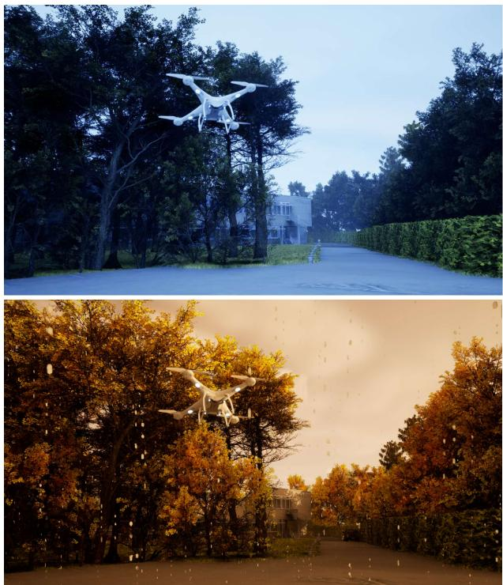  
Figure I. Paired SDV/SDV-W rendering example. The original SDV frame is shown above, and the corresponding SDV-W rendering under rainy autumn conditions is shown below.

Venetian City. The Venetian City environment [8] includes vegetation assets with native seasonal color variants. The spring/summer configuration uses green foliage, while the autumn configuration combines yellow and orange variants. Since no defoliated vegetation variant is available by default, the winter configuration is implemented by replacing the native vegetation with assets from [38].

Urban Downtown. The Urban Downtown environment [39] provides vegetation only in a green-foliage configuration. Winter is realized by replacing the native vegetation with assets from [38], while autumn is obtained through material-level recoloring. The modified material parameters are listed in Tab. II.

Table II. Material-level foliage recoloring parameters for the Urban Downtown [39] autumn configuration.
<table><tr><td rowspan=1 colspan=1>Material</td><td rowspan=1 colspan=4>Albedo_1_ColorOverlayR     G     B       $\mathbf { A }$ </td><td rowspan=1 colspan=1>Albedo_Brightness</td><td rowspan=1 colspan=1>Albedo_Add</td></tr><tr><td rowspan=1 colspan=1>MI_Foliage_Tree_Pine_Leaves</td><td rowspan=1 colspan=1>0.617</td><td rowspan=1 colspan=1>0.255</td><td rowspan=1 colspan=1>0.000</td><td rowspan=1 colspan=1>9.000</td><td rowspan=1 colspan=1>1.756</td><td rowspan=1 colspan=1>0.198</td></tr><tr><td rowspan=1 colspan=1>MI_Tree_Narrowleaf_Leaf_A</td><td rowspan=1 colspan=1>1.000</td><td rowspan=1 colspan=1>0.785</td><td rowspan=1 colspan=1>0.000</td><td rowspan=1 colspan=1>-0.091</td><td rowspan=1 colspan=1>1.522</td><td rowspan=1 colspan=1>-0.581</td></tr><tr><td rowspan=1 colspan=1>MI_Foliage_Trre_Leaves</td><td rowspan=1 colspan=1>0.976</td><td rowspan=1 colspan=1>0.718</td><td rowspan=1 colspan=1>0.062</td><td rowspan=1 colspan=1>0.000</td><td rowspan=1 colspan=1>一</td><td rowspan=1 colspan=1>一</td></tr></table>

Table III. Sun and Sky Actor [17] parameter ranges for SDV-W lighting variation across University Site and Venetian City [8], aggregated over weather severity levels.
<table><tr><td rowspan="3">Season</td><td rowspan="3">Weather Cond.</td><td colspan="2">Solar Time</td><td rowspan="2" colspan="2">Direct. Light Intensity</td><td colspan="6">Rayleigh Scattering (Channel Values) G</td></tr><tr><td></td><td>(lux)</td><td></td><td>R</td><td></td><td></td><td>B</td><td>max</td></tr><tr><td>from</td><td>to</td><td>min</td><td>max</td><td>min</td><td>max</td><td>min</td><td></td><td>max</td><td>min</td></tr><tr><td rowspan="4">spring/summer</td><td>sunny rain</td><td>11.44 9.57</td><td>12.19</td><td>6.4</td><td>10.0</td><td>0.175</td><td>0.175</td><td>0.410</td><td>0.410</td><td>1.000</td><td>1.000</td></tr><tr><td></td><td></td><td>20.13</td><td>0.5</td><td>9.0</td><td>0.000</td><td>0.806</td><td>0.192</td><td>0.861</td><td>0.212</td><td>1.000</td></tr><tr><td>fog</td><td>6.59</td><td>11.64</td><td>1.0</td><td>8.0</td><td>0.028</td><td>1.000</td><td>0.047</td><td>0.834</td><td>0.553</td><td>1.000</td></tr><tr><td>rain+fog</td><td>9.57</td><td>20.13</td><td>0.5</td><td>9.0</td><td>0.175</td><td>0.806</td><td>0.192</td><td>0.861</td><td>0.212</td><td>1.000</td></tr><tr><td rowspan="5">autumn</td><td>sunny</td><td>9.68</td><td>18.22</td><td>1.0</td><td>6.0</td><td>0.014</td><td>0.656</td><td>0.204</td><td>0.629</td><td>0.073</td><td>1.000</td></tr><tr><td>rain</td><td>8.38</td><td>18.69</td><td>1.0</td><td>16.6</td><td>0.014</td><td>0.876</td><td>0.204</td><td>0.884</td><td>0.073</td><td>1.000</td></tr><tr><td>fog</td><td>8.50</td><td>11.53</td><td>0.5</td><td>16.6</td><td>0.147</td><td>1.000</td><td>0.137</td><td>0.848</td><td>0.264</td><td>1.000</td></tr><tr><td>rain+fog</td><td>8.38</td><td>18.50</td><td>1.0</td><td>16.6</td><td>0.014</td><td>0.876</td><td>0.204</td><td>0.884</td><td>0.073</td><td>1.000</td></tr><tr><td>leaves</td><td>10.28</td><td>16.41</td><td>0.5</td><td>6.4</td><td>0.000</td><td>0.543</td><td>0.410</td><td>0.851</td><td>0.983</td><td>1.000</td></tr><tr><td rowspan="5">winter</td><td>sunny</td><td>10.00</td><td>16.00</td><td>2.0</td><td>10.0</td><td>0.011</td><td>0.175</td><td>0.242</td><td>0.719</td><td>0.535</td><td>1.000</td></tr><tr><td>rain</td><td>8.43</td><td>17.01</td><td>2.0</td><td>10.0</td><td>0.007</td><td>0.893</td><td>0.007</td><td>0.948</td><td>0.007</td><td>1.000</td></tr><tr><td>fog</td><td>7.32</td><td>16.00</td><td>1.0</td><td>12.0</td><td>0.031</td><td>0.664</td><td>0.137</td><td>0.719</td><td>0.778</td><td>1.000</td></tr><tr><td>rain+fog</td><td>8.43</td><td>17.01</td><td>2.0</td><td>10.0</td><td>0.007</td><td>0.893</td><td>0.007</td><td>0.948</td><td>0.007</td><td>1.000</td></tr><tr><td>snow</td><td>8.00</td><td>16.90</td><td>0.5</td><td>5.0</td><td>0.000</td><td>0.979</td><td>0.000</td><td>0.985</td><td>0.000</td><td>1.000</td></tr></table>

## A.3. Illumination Parameterization

Season- and weather-specific appearance variations are realized through environment-specific UE5 lighting actors and post-processing parameters governing solar position, direct illumination, atmospheric scattering, ambient sky illumination, and global color grading.

For the University Site and Venetian City [8] environments, these variations are implemented via the Sun and Sky Actor [17], parameterizing solar time and selected attributes of the associated Directional Light [13], Sky Atmosphere [15], and Sky Light [16] components. Tab. III reports the corresponding solar-time intervals, Directional Light intensity ranges, and channel-wise Rayleigh scattering ranges. Directional-light and skylight colors remain near-neutral, with approximately balanced RGB channels, and vary primarily in luminance from dark overcast gray with RGB values of ∼80 to white. Chromatic deviations are limited to warm pale-yellow tones, approximately (255, 255, 225), and cool blue/blue-gray casts, approximately (160, 182, 255) and (167, 183, 202), in selected autumnrain and winter-fog configurations. For the Urban Downtown [39] environment, the native Directional Light [13] and SkyLight [16] actors define the lighting model. Tab. IV reports the Directional Light intensity and azimuthal rotation (Z). The Directional Light’s elevation parameters are held at their default values, $\mathrm { X = 0 ^ { \circ } }$ and ${ \mathrm { Y } } { = } { - } 4 6 ^ { \circ }$ . Directional Light and Sky Light colors are primarily neutral white-togray, with reduced RGB magnitudes of approximately 160 under overcast and snow conditions.

Table IV. Directional Light [13] parameter ranges for Urban Downtown [39]. Intensity (Int.) and rotation (Rot.) are reported for each season-weather condition and aggregated over weather severity levels. Rotation varies only along the Z axis, while X and Y are fixed at their default settings of $0 ^ { \circ }$ and $- 4 6 ^ { \circ }$ , respectively.
<table><tr><td rowspan="2">Season</td><td rowspan="2">Weather Cond.</td><td colspan="4">Direct. Light</td></tr><tr><td>Int. (lux)</td><td></td><td>Rot. Z (deg)</td><td></td></tr><tr><td rowspan="2">spring/summer</td><td>rain</td><td>min 2.0</td><td>max 4.0</td><td>min 20</td><td>max 300</td></tr><tr><td>fog</td><td>1.0</td><td>20.0</td><td>20</td><td>189</td></tr><tr><td rowspan="2"></td><td>rain+fog sunny</td><td>2.0 1.0</td><td>4.0 3.0</td><td>20 83</td><td>320 200</td></tr><tr><td>rain</td><td>1.0</td><td>2.0</td><td>20</td><td>250</td></tr><tr><td rowspan="3">autumn</td><td>fog</td><td>1.0</td><td>2.0</td><td>200</td><td>360</td></tr><tr><td>rain+fog</td><td>1.0</td><td>2.0</td><td>20</td><td>250</td></tr><tr><td>leaves</td><td>1.0</td><td>3.0</td><td>83</td><td>200</td></tr><tr><td rowspan="4">winter</td><td>sunny</td><td>1.0</td><td>5.0</td><td>60</td><td>230</td></tr><tr><td>rain</td><td>0.8</td><td>2.0</td><td>155</td><td>230</td></tr><tr><td>fog</td><td>1.0</td><td>8.0</td><td>130</td><td>230</td></tr><tr><td>rain+fog</td><td>1.0</td><td>2.0</td><td>150</td><td>200</td></tr><tr><td rowspan="2"></td><td>snow</td><td></td><td>2.0</td><td>155</td><td>230</td></tr><tr><td></td><td>0.8</td><td></td><td></td><td></td></tr></table>

The Post Process Volume [14] is applied across all environments to control global color grading. The varied parameters include the temperature type, temperature value (Temp), and green-magenta tint (Tint). The temperature type selects the Temp evaluation mode, either Color Temperature or White Balance. The corresponding Temp and Tint ranges are reported in Tab. V.

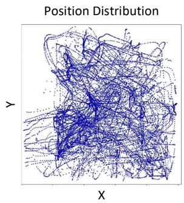

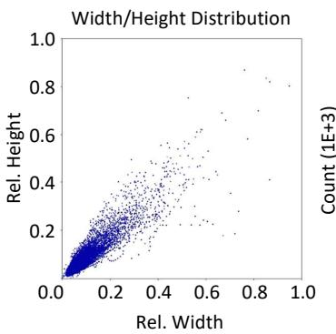

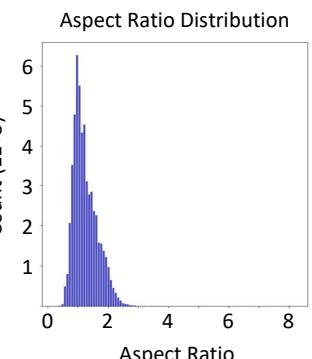

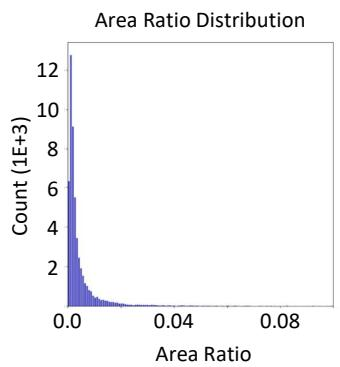  
Figure II. Statistical characterization of bounding box annotations in SDV-W. From left to right: spatial distribution of bounding box centers, joint distribution of normalized width and height, distribution of aspect ratios, and distribution of relative bounding box areas. Here, the object area ratio denotes the bounding-box area relative to the image area.

Table V. Season- and weather-specific Post Process Volume [14] settings. Temp and Tint denote min-max ranges across all environments and weather severity levels.
<table><tr><td rowspan="2">Season</td><td rowspan="2">Weather Cond.</td><td colspan="2">Temp</td><td colspan="2">Tint</td></tr><tr><td>min</td><td>max</td><td>min</td><td>max</td></tr><tr><td rowspan="4">spring/summer</td><td>sunny</td><td>4,599</td><td>5,877</td><td>0.00</td><td>0.00</td></tr><tr><td>rain</td><td>4,300</td><td>11,240</td><td>-0.09</td><td>0.00</td></tr><tr><td>fog</td><td>4,300</td><td>11,439</td><td>0.00</td><td>0.00</td></tr><tr><td>rain+fog</td><td>4,300</td><td>11,240</td><td>-0.09</td><td>0.00</td></tr><tr><td rowspan="5">autumn</td><td>sunny</td><td>3,900</td><td>8,768</td><td>0.00</td><td>0.00</td></tr><tr><td>rain</td><td>3,228</td><td>7,439</td><td>-0.02</td><td>0.00</td></tr><tr><td>fog</td><td>3,228</td><td>8,768</td><td>0.00</td><td>0.00</td></tr><tr><td>rain+fog</td><td>3,228</td><td>8,768</td><td>0.00</td><td>0.00</td></tr><tr><td>leaves</td><td>3,900</td><td>9,181</td><td>0.00</td><td>0.00</td></tr><tr><td rowspan="4">winter</td><td>sunny</td><td>4,884</td><td>11,493</td><td>0.00</td><td>0.05</td></tr><tr><td>rain</td><td>4,916</td><td>9,560</td><td>0.00</td><td>0.19</td></tr><tr><td>fog</td><td>3,836</td><td>11,425</td><td>0.00</td><td>0.18</td></tr><tr><td>rain+fog</td><td>5,060</td><td>9,560</td><td>0.00</td><td>0.19</td></tr><tr><td></td><td>snow</td><td>4,160</td><td>12,804</td><td>-0.02</td><td>0.00</td></tr></table>

## A.4. Statistical Properties

Fig. II visually complements the dataset statistics in Sec. 3.3 (main paper). Bounding-box centers are distributed broadly across the image plane, while the width-height and arearatio plots highlight the prevalence of small projected targets. The aspect-ratio distribution reflects the variation in drone pose and viewing geometry preserved in SDV-W.

## B. Additional Details on Evaluation Datasets

This section complements Sec. 4.2 (main paper) by characterizing the object-scale composition of the real-world datasets and the scale shifts introduced by resizing to the common input resolution of 640×640 pixels.

Table VI. Effect of input resizing on object-size category distribution across real-world datasets. Counts are reported before and after resizing to an input resolution of 640×640 pixels. ∆ Share denotes the resizing-induced change in each category’s relative frequency expressed in percentage points (pp). “–” indicates that no objects of the corresponding size category are present.

<table><tr><td rowspan=1 colspan=1>Dataset</td><td rowspan=1 colspan=1>SizeCat.</td><td rowspan=1 colspan=2>Image Scaleoriginal  640×640</td><td rowspan=1 colspan=1>∆ Share(pp)</td></tr><tr><td rowspan=1 colspan=1>DUT Anti-UAV [50]</td><td rowspan=1 colspan=1>XSSML</td><td rowspan=1 colspan=1>87764808541</td><td rowspan=1 colspan=1>569674482475</td><td rowspan=1 colspan=1>+21.91-4.09-14.82-3.00</td></tr><tr><td rowspan=1 colspan=1>LRDDv1 [41]</td><td rowspan=1 colspan=1>XSSML</td><td rowspan=1 colspan=1>2,0556,18310,2013,903</td><td rowspan=1 colspan=1>6,6075,9558,7241,056</td><td rowspan=1 colspan=1>+20.37-1.02-6.61-12.74</td></tr><tr><td rowspan=1 colspan=1>LRDDv2 [42]</td><td rowspan=1 colspan=1>XSSML</td><td rowspan=1 colspan=1>4,7295,9164,4931,258</td><td rowspan=1 colspan=1>9,1484,7461,651851</td><td rowspan=1 colspan=1>+26.95-7.14-17.33-2.48</td></tr><tr><td rowspan=1 colspan=1>R1-POS3 (S) [30, 31]</td><td rowspan=1 colspan=1>XSSML</td><td rowspan=1 colspan=1>1186261,5041</td><td rowspan=1 colspan=1>645992612一</td><td rowspan=1 colspan=1>+23.43-16.27-39.66-0.04</td></tr><tr><td rowspan=1 colspan=1>R1-POS3 (W)</td><td rowspan=1 colspan=1>XSSML</td><td rowspan=1 colspan=1>一6811,808一</td><td rowspan=1 colspan=1>3351,930224一</td><td rowspan=1 colspan=1>-13.46-50.18-63.64</td></tr><tr><td rowspan=1 colspan=1>R2-POS7 (S) [30, 31]</td><td rowspan=1 colspan=1>XSSML</td><td rowspan=1 colspan=1>一4671,319</td><td rowspan=1 colspan=1>一201,528238</td><td rowspan=1 colspan=1>+1.12+59.41-60.53</td></tr><tr><td rowspan=1 colspan=1>R2-POS7 (W)</td><td rowspan=1 colspan=1>XSSML</td><td rowspan=1 colspan=1>一791,363</td><td rowspan=1 colspan=1>2143641</td><td rowspan=1 colspan=1>+0.14+94.11-94.24</td></tr></table>

## B.1. Object-Scale Composition

Fig. III shows the distribution of annotated instances across the XS/S/M/L categories after mapping all images to the detector’s 640×640 input resolution, following the size definitions in Tab. 2 (main paper). The datasets show distinct scale profiles: DUT Anti-UAV [50] is comparatively balanced across size categories, LRDDv1 [41] is dominated by medium-size objects, and LRDDv2 [42] exhibits a pronounced bias toward extra-small instances. The custom recordings R1-POS3 and R2-POS7 [30, 31] are dominated by small-scale objects, with the scale imbalance becoming more pronounced from summer to winter. Large-scale instances are only sparsely represented.

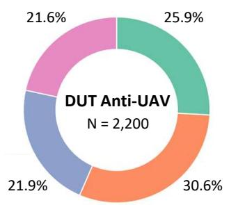

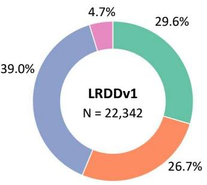

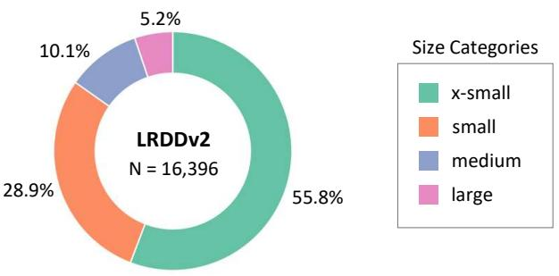

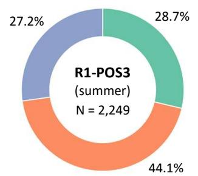

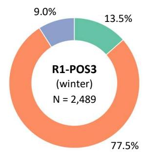

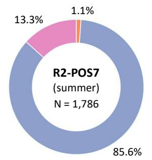

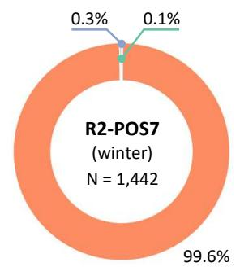  
Figure III. Distribution of object size categories across public and custom drone detection datasets. Top: Public datasets DUT Anti UAV [50], LRDDv1 [41], and LRDDv2 [42]. Bottom: Custom datasets R1-POS3 and R2-POS7 [30, 31] under summer and winte conditions. For each dataset, the proportion of x-small, small, medium, and large objects is shown relative to the total number of annotated instances (N). Size categories are defined according to Tab. 2 (main paper) w.r.t. an input image size of 640×640.

## B.2. Resizing-Induced Scale Compression

Resizing native-resolution frames to the detector input compresses object scales in pixel space and systematically transfers instances to smaller size categories. Tab. VI quantifies this shift through pre- and post-resizing counts and the resulting change in relative frequency (∆ Share). Across datasets, resizing consistently shifts the scale distribution toward smaller categories, increasing XS/S shares and reducing M/L shares.

## C. Extended Quantitative Results

This section provides a more detailed breakdown of the quantitative results summarized in Sec. 5 (main paper).

## C.1. Weather Degradation under Stricter IoU Thresholds

Fig. IV complements the analysis in Sec. 5.1 (main paper) by evaluating degradation under stricter IoU thresholds, using mAP@0.5 and mAP@0.5-0.95. Absolute degradation is reported in percentage points (pp) as mean ± standard deviation across YOLO configurations. The condition ranking remains consistent across thresholds, with snow causing the largest drop, followed by fog, rain, rain+fog, and leaves. At mAP@0.5, degradation remains close to the mAP@0.25 results, whereas mAP@0.5-0.95 reveals a stronger localization-sensitive penalty across all conditions. Variability across YOLO configurations increases under mAP@0.5-0.95, with standard deviations rising to 5.8- 7.4 pp compared with ≤1.4 pp at mAP@0.5. Thus, the degradation magnitude seems to be architecture-dependent, while the condition ordering remains stable across models.

## C.2. Detailed Analysis of SDV-W-Based Training

This section provides a more detailed assessment of the effects of SDV-W-based training (cf. Sec. 5.2, main paper).

Size-Resolved Behavior on LRDDv1 & DUT Anti-UAV. For YOLO-FEDER FusionNet, incorporating SDV-W into the training composition leaves aggregate LRDDv1 [41] performance essentially unchanged across mAP criteria, yet resolves into modest size-dependent variations (cf. Tab VII). The most pronounced scale-specific gains occur for large objects, with mAP@0.5 increasing by 10.8 pp and FNR decreasing by 18.9 pp. Medium objects exhibit only a marginal FNR reduction (FNR: −1.1 pp), small objects remain effectively unchanged, and extrasmall objects degrade slightly (mAP@0.5: −0.6 pp; FNR: +3.0 pp), partially offsetting the large-object gains. On DUT Anti-UAV [50], SDV-W yields a marginally favorable trend: mAP remains essentially stable across size categories (|∆| ≤ 0.7 pp), while FNR decreases slightly but consistently (XS: −0.9, S: −0.2, M: −0.7, L: −0.6 pp; aggregate: −0.5 pp). Thus, the effect is confined to marginal detection gains rather than improved localization.

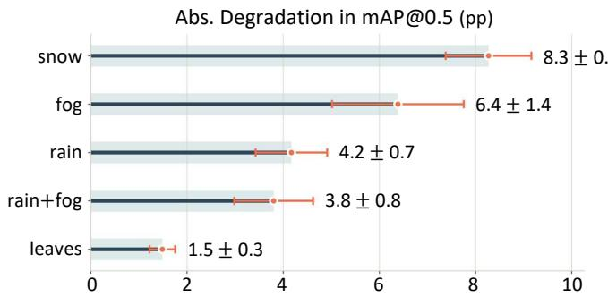

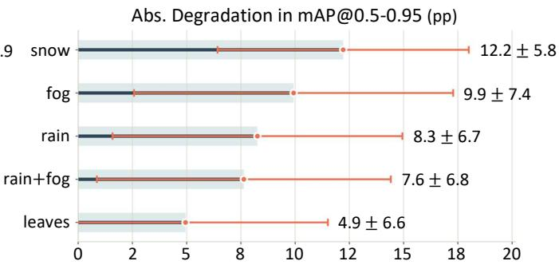  
Figure IV. Weather-induced degradation of YOLO detection performance. Absolute reductions in mAP@0.5 (top) and mAP@0.5-0.95 (bottom) are reported in percentage points (pp) relative to clear-weather performance for each weather condition. Larger values indicate greater degradation. Orange markers denote the mean degradation across YOLO model configurations. Horizontal intervals and ± annotations represent the corresponding standard deviation.

Table VII. Impact of weather-conditioned synthetic data (SDV-W) on the performance of YOLO-FEDER FusionNet on LRDDv1 [41] and DUT Anti-UAV [50]. Results are reported overall and for each size category defined in Tab. 2 (main paper). Best-performing values are highlighted in bold; tied best values are underlined.  
LRDDv1
<table><tr><td rowspan="2">Model</td><td rowspan="2">w/ SDV-W</td><td rowspan="2">Size Cat.</td><td colspan="3">mAP↑</td><td rowspan="2">FNR↓</td><td rowspan="2">FDR↓</td><td colspan="3">mAP↑</td><td rowspan="2">FNR↓</td><td rowspan="2">FDR↓</td></tr><tr><td>@0.25</td><td>@0.5 @0.5-0.95</td><td></td><td>@0.25</td><td>@0.5</td><td>@0.5-0.95</td></tr><tr><td rowspan="10">YOLO- FEDER</td><td></td><td>all</td><td>0.772</td><td>0.578</td><td>0.192</td><td>0.310</td><td>0.056</td><td>0.979</td><td>0.967</td><td>0.721</td><td>0.045</td><td>0.032</td></tr><tr><td>√</td><td></td><td>0.768</td><td>0.571</td><td>0.190</td><td>0.314</td><td>0.054</td><td>0.981</td><td>0.967</td><td>0.716</td><td>0.040</td><td>0.032</td></tr><tr><td>一</td><td>XS</td><td>0.213</td><td>0.175</td><td>0.060</td><td>0.553</td><td>一</td><td>0.876</td><td>0.857</td><td>0.500</td><td>0.086</td><td>一</td></tr><tr><td>√</td><td></td><td>0.198</td><td>0.169</td><td>0.057</td><td>0.583</td><td></td><td>0.886</td><td>0.866</td><td>0.498</td><td>0.077</td><td>1</td></tr><tr><td>一</td><td>S</td><td>0.631</td><td>0.357</td><td>0.104</td><td>0.295</td><td>一</td><td>0.933</td><td>0.933</td><td>0.675</td><td>0.030</td><td>一</td></tr><tr><td>√</td><td></td><td>0.632</td><td>0.349</td><td>0.099</td><td>0.295</td><td>一</td><td>0.935</td><td>0.931</td><td>0.676</td><td>0.028</td><td>1</td></tr><tr><td>一</td><td>M</td><td>0.850</td><td>0.695</td><td>0.225</td><td>0.135</td><td>一</td><td>0.949</td><td>0.948</td><td>0.788</td><td>0.044</td><td>一</td></tr><tr><td>√</td><td></td><td>0.856</td><td>0.695</td><td>0.226</td><td>0.124</td><td>一</td><td>0.956</td><td>0.949</td><td>0.784</td><td>0.037</td><td>1</td></tr><tr><td>一</td><td>L</td><td>0.595</td><td>0.586</td><td>0.266</td><td>0.313</td><td>一</td><td>0.972</td><td>0.960</td><td>0.792</td><td>0.021</td><td>一</td></tr><tr><td>√</td><td></td><td>0.593</td><td>0.694</td><td>0.226</td><td>0.124</td><td></td><td>0.972</td><td>0.962</td><td>0.790</td><td>0.015</td><td></td></tr></table>

✓ = applies

Architecture-Invariant Effects on LRDDv2. Across all standard YOLO variants, the impact of SDV-W on mAP is architecture-dependent (cf. Tab. VIII): four variants improve (v5l, v8l, v9c, v11l; up to +3.2 pp at mAP@0.5), while three degrade (v8m, v9e, v11x), yielding the nearneutral mean reported in the main paper. The architectureconsistent pattern is instead a reduction in false detections, with FDR decreasing across all variants, most prominently for v8l (0.098→0.048) and v9c (0.174→0.121). Since FNR remains high (≥0.61) and largely unaffected, mAP is of limited interpretive value on this dataset. The consistent FDR reduction constitutes the principal architectureindependent benefit of SDV-W.

Size- & Season-Resolved Behavior on Custom Recordings. On R1-POS3, the improvements observed under summer conditions are scale-selective, with mAP@0.5 gains concentrated in small and medium object categories (+5.9 and +4.1 pp), while performance for extra-small objects shows a marginal negative trend (cf. Tab. IX). Under winter conditions, SDV-W-based training yields consistent improvements in mAP@0.25 and mAP@0.5 across all size categories. Performance at stricter IoU thresholds is slightly lower but broadly comparable to training without SDV-W. FNR is also modestly reduced, indicating a small but consistent reduction in missed detections. On dataset R2-POS7, the size-resolved results provide a more nuanced interpretation of the mAP decline under winter conditions: while the localization of medium-size objects improves significantly (mAP@0.5: 0.463→0.794; mAP@0.5-0.95: +17.0 pp), mAP decreases for small and extra-small objects. Since small objects dominate the size distribution, their degradation outweighs the medium-scale gains and drives the aggregate mAP decline. FDR decreases consistently across both seasons.

Table VIII. Comparison of training with and without weather-condition synthetic data (SDV-W) on LRDDv2 [42] across multiple YOLO architectures and model scales. Best-performing values are highlighted in bold, while tied best values are underlined.
<table><tr><td rowspan="2">YOLO</td><td rowspan="2">w/ SDV-W</td><td colspan="3">mAP↑</td><td rowspan="2">FNR↓</td><td rowspan="2">FDR↓</td></tr><tr><td>@0.25</td><td>@0.5</td><td>@0.5-0.95</td></tr><tr><td>v5l</td><td>1 √</td><td>0.517 0.530</td><td>0.495 0.509</td><td>0.255 0.266</td><td>0.659 0.653</td><td>0.091 0.083</td></tr><tr><td>v8m</td><td>一 √</td><td>0.534 0.519</td><td>0.514 0.504</td><td>0.266 0.266</td><td>0.630 0.642</td><td>0.108 0.084</td></tr><tr><td>v8l</td><td>一 √</td><td>0.516 0.524</td><td>0.498 0.504</td><td>0.252 0.254</td><td>0.646 0.645</td><td>0.098 0.048</td></tr><tr><td>v9c</td><td>1 √</td><td>0.477 0.515</td><td>0.464 0.496</td><td>0.232 0.248</td><td>0.657 0.615</td><td>0.174</td></tr><tr><td>v9e</td><td>一 √</td><td>0.515 0.498</td><td>0.495 0.481</td><td>0.257 0.253</td><td>0.643 0.641</td><td>0.121 0.047</td></tr><tr><td>v111</td><td>一 √</td><td>0.533 0.551</td><td>0.514 0.534</td><td>0.268 0.279</td><td>0.614 0.614</td><td>0.044 0.057</td></tr><tr><td>v11x</td><td>一 √</td><td>0.546 0.527</td><td>0.525 0.504</td><td>0.276 0.255</td><td>0.621 0.626</td><td>0.044 0.094 0.067</td></tr></table>

✓ = applies

Table IX. Performance of YOLO-FEDER FusionNet with and without weather-conditioned synthetic training data (SDV-W) under seasonal conditions (summer vs. winter) on the datasets R1-POS3 and R2-POS7 [30, 31]. Results are reported overall and for each size category defined in Tab. 2 (main paper). Best-performing values are highlighted in bold; tied best values are underlined. “–” indicates that no objects of the corresponding size category are present.
<table><tr><td rowspan="8">Dataset</td><td rowspan="2">w/ SDV-W</td><td rowspan="2">Size Cat.</td><td rowspan="2"></td><td colspan="2"> $\overline { { \mathrm { \ m A P \uparrow } } }$ </td><td rowspan="2">FNR↓</td><td rowspan="2">FDR↓</td><td colspan="3"> $\overline { { \mathrm { \ m A P \uparrow } } }$ </td><td rowspan="2">FNR↓</td><td rowspan="2">FDR↓</td></tr><tr><td>@0.25 @0.5</td><td>@0.5-0.95</td><td></td><td>@0.25</td><td>@0.5 @0.5-0.95</td></tr><tr><td rowspan="8">一</td><td></td><td></td><td>0.764 0.743</td><td>0.331</td><td>0.313</td><td>0.083</td><td>0.931</td><td>0.827</td><td>0.404</td><td>0.208</td><td>0.006</td></tr><tr><td> $\checkmark$ </td><td>all</td><td>0.821</td><td>0.794 0.354</td><td>0.326</td><td>0.004</td><td>0.965</td><td>0.836</td><td>0.393</td><td>0.164</td><td>0.004</td></tr><tr><td>一</td><td>XS</td><td>0.364</td><td>0.358 0.175</td><td>0.555</td><td>1</td><td>0.596</td><td>0.572</td><td>0.250</td><td>0.206</td><td>一</td></tr><tr><td>√</td><td></td><td>0.373</td><td>0.348 0.160</td><td>0.575</td><td>一</td><td>0.644</td><td>0.634</td><td>0.271</td><td>0.191</td><td>一</td></tr><tr><td>1</td><td>S</td><td>0.727</td><td>0.713 0.345</td><td>0.268</td><td>一</td><td>0.890</td><td>0.764</td><td>0.375</td><td>0.224</td><td>1</td></tr><tr><td> $\checkmark$ </td><td></td><td>0.792</td><td>0.772</td><td>0.367</td><td>0.275</td><td>一</td><td>0.938 0.768</td><td>0.361</td><td>0.170</td><td>一</td></tr><tr><td></td><td>M</td><td>0.860</td><td>0.848 0.358</td><td>0.132</td><td>一</td><td>0.898</td><td>0.828</td><td>0.467</td><td>0.076</td><td>一</td></tr><tr><td rowspan="8"></td><td> $\checkmark$ </td><td></td><td>0.897 0.889</td><td>0.377</td><td>0.147</td><td>一</td><td>0.926</td><td>0.875</td><td>0.479</td><td>0.063</td><td></td></tr><tr><td>1</td><td>all</td><td>0.985</td><td>0.909 0.450</td><td>0.076</td><td>0.010</td><td>0.983</td><td>0.749</td><td>0.294</td><td>0.025</td><td>0.054</td></tr><tr><td> $\checkmark$ </td><td></td><td>0.982</td><td>0.901 0.422</td><td>0.061</td><td>0.008</td><td>0.988</td><td>0.675</td><td>0.223</td><td>0.028</td><td>0.006</td></tr><tr><td>1</td><td>XS</td><td>一</td><td>一</td><td>一</td><td>一</td><td>一</td><td>0.249 0.000</td><td>0.000</td><td>0.000</td><td>1</td></tr><tr><td> $\checkmark$ </td><td></td><td>1</td><td></td><td></td><td></td><td>1 0.077</td><td>0.000</td><td>0.000</td><td>0.000</td><td>一</td></tr><tr><td>一</td><td>S</td><td>0.047</td><td>0.022</td><td>0.009</td><td>0.700</td><td>1</td><td>0.982 0.748</td><td>0.293</td><td>0.025</td><td>一</td></tr><tr><td>√</td><td></td><td>0.030</td><td>0.030 0.008</td><td>0.700</td><td>一</td><td>0.985</td><td>0.674</td><td>0.222</td><td>0.028</td><td>一</td></tr><tr><td>一</td><td>M</td><td>0.979</td><td>0.887</td><td>0.419</td><td>0.079</td><td>一</td><td>0.463</td><td>0.463</td><td>0.336</td><td>0.000</td><td>一</td></tr><tr><td rowspan="4"></td><td> $\checkmark$ </td><td></td><td>0.975</td><td>0.878</td><td>0.394</td><td>0.062</td><td>一</td><td>0.794</td><td>0.794</td><td>0.506</td><td>0.000</td><td></td></tr><tr><td>1</td><td>L</td><td>0.991</td><td>0.991</td><td>0.570</td><td>0.008</td><td>一</td><td>一</td><td>一</td><td>一</td><td>一</td><td>一</td></tr><tr><td> $\checkmark$ </td><td></td><td>0.991</td><td>0.991</td><td>0.533</td><td>0.000</td><td></td><td></td><td></td><td></td><td></td><td></td></tr><tr><td></td><td></td><td></td><td></td><td></td><td></td><td></td><td></td><td></td><td></td><td></td><td></td></tr></table>

✓ = applies

## C.3. Ablation Details for Weather Diversity vs. Training-Set Size

Tab. X compares three training configurations that differ in the use of SDV-W: a baseline without SDV-W (–), additive inclusion of SDV-W $( \checkmark ^ { A } )$ , and size-preserving replacement with SDV-W $( \checkmark ^ { R } )$ . In the replacement setting,

SDV-W replaces an equally sized, randomly sampled subset of the original SDV images from the baseline training composition, preserving the baseline training-set size. Repeating this procedure over five independently sampled subsets yields five YOLO-FEDER FusionNet models, with results reported as mean ± standard deviation. Across the public datasets, the replacement setting remains largely comparable to the baseline, while additive inclusion yields the more consistently competitive configuration. This suggests that SDV-W is most effective when added as complementary coverage rather than substituted for existing SDV samples. On the custom recordings, however, replacement captures much of the additive-setting benefit despite the fixed training-set size, indicating that the gains are primarily attributable to improved domain alignment rather than increased data volume alone.

Table X. Ablation study disentangling the effects of weather diversity and training set size for YOLO-FEDER FusionNet. Weather conditioned synthetic data (SDV-W) either substitute a subset of SDV samples or extend the original training set, consisting of SDV and DUT Anti-UAV [50].
<table><tr><td>Dataset</td><td> $\mathbf { w } /$  SDV-W</td><td>@0.25</td><td> $\overline { { \mathrm { { m A P } \uparrow } } }$  @0.5 @0.5-0.95</td><td>FNR↓</td><td></td><td>FDR↓</td></tr><tr><td>LRDDv1 [41]</td><td> $\checkmark ^ { R }$   $\checkmark ^ { A }$ </td><td>0.772 0.774 ± 0.008 0.768</td><td>0.578 0.577 ± 0.010 0.571</td><td>0.192 0.192 ± 0.005 0.190</td><td>0.310 0.315 ± 0.006 0.314</td><td>0.056 0.053 ± 0.011 0.054</td></tr><tr><td>LRDDv2 [42]</td><td> $\checkmark ^ { R }$   $\checkmark ^ { A }$ </td><td>0.540 0.551 ± 0.002 0.561</td><td>0.507 0.516 ± 0.004 0.530</td><td>0.254 0.253 ± 0.002 0.258</td><td>0.515 0.510 ± 0.006 0.491</td><td>0.270 0.239 ± 0.022 0.235</td></tr><tr><td>DUT Anti-UAV [50]</td><td>1  $\checkmark ^ { R }$   $\checkmark ^ { A }$ </td><td>0.979 0.978 ± 0.001 0.981</td><td>0.967 0.962 ± 0.002 0.967</td><td>0.721 0.715 ± 0.003 0.716</td><td>0.045 0.044 ± 0.005 0.040</td><td>0.032 0.032 ± 0.003 0.032</td></tr><tr><td>R1_POS3 (S) [30, 31]</td><td> $\checkmark ^ { R }$   $\checkmark ^ { A }$ </td><td>0.764 0.813 ± 0.020 0.821</td><td>0.743 0.787 ± 0.021 0.794</td><td>0.331 0.363 ± 0.014 0.354</td><td>0.313 0.338 ± 0.018 0.326</td><td>0.083 0.006 ± 0.002 0.004</td></tr><tr><td>R1_POS3 (W)</td><td> $\checkmark ^ { R }$   $\checkmark ^ { A }$ </td><td>0.931 0.938 ± 0.007 0.965</td><td>0.827 0.842 ± 0.020 0.836</td><td>0.404 0.369 ± 0.029 0.393</td><td>0.208 0.192 ± 0.025 0.164</td><td>0.006 0.005 ± 0.002 0.004</td></tr><tr><td>R2_POS7 (S) [30, 31]</td><td>I  $\checkmark ^ { R }$   $\checkmark ^ { A }$ </td><td>0.985 0.979 ± 0.004 0.982</td><td>0.909 0.897 ± 0.009 0.901</td><td>0.450 0.421 ± 0.007 0.422</td><td>0.076 0.092 ± 0.017 0.061</td><td>0.010 0.011 ± 0.005 0.008</td></tr><tr><td>R2_POS7 (W)</td><td>一  $\checkmark ^ { R }$   $\checkmark ^ { A }$ </td><td>0.983 0.988 ± 0.006 0.988</td><td>0.749 0.736 ± 0.074 0.675</td><td>0.294 0.288 ± 0.050 0.223</td><td>0.025 0.025 ± 0.009 0.028</td><td>0.054 0.010 ± 0.009 0.006</td></tr></table>

$\checkmark ^ { R }$ Replacement of randomly selected SDV samples with SDV-W, keeping the training set size constant (mean ± std over 5 runs). $\checkmark ^ { A }$ Extension of the original training set with SDV-W.

Table XI. Impact of tiled inference relative to resize-based inference for YOLO-FEDER FusionNet on LRDDv2 [42]. Bestperforming values are highlighted in bold.
<table><tr><td>Tiling</td><td>Size Cat.</td><td colspan="3"> $\overline { { \mathrm { \ m A P \uparrow } } }$  @0.25 @0.5 @0.5-0.95</td><td>FNR↓</td><td>FDR↓</td></tr><tr><td>一  $\checkmark$ </td><td>all</td><td>0.561 0.669</td><td>0.530 0.580</td><td>0.258 0.245</td><td>0.491 0.305</td><td>0.235 0.426</td></tr><tr><td>一  $\checkmark$ </td><td>XS</td><td>0.152 0.407</td><td>0.133 0.312</td><td>0.055 0.108</td><td>0.735 0.434</td><td>一 一</td></tr><tr><td>一  $\checkmark$ </td><td>S</td><td>0.705 0.756</td><td>0.690 0.708</td><td>0.311 0.321</td><td>0.227 0.172</td><td>一</td></tr><tr><td>一  $\checkmark$ </td><td>M</td><td>0.762 0.766</td><td>0.755 0.747</td><td>0.448 0.387</td><td>0.138</td><td>一 一</td></tr><tr><td>一  $\checkmark$ </td><td>L</td><td>0.856 0.708</td><td>0.855 0.661</td><td>0.600 0.287</td><td>0.098 0.031 0.062</td><td>一 一 1</td></tr></table>

✓ = tiled inference

## C.4. Tiled Inference on LRDDv2

The performance decomposition by object-size category showed that small and extra-small drones are the principal source of detection failures. This limitation is partly induced by the the standard inference protocol of YOLObased detection models: high-resolution images are globally rescaled to a fixed input size of 640×640 pixels and progressively reduced to coarse, high-level feature maps, leaving limited spatial evidence for tiny instances. Tiled inference offers a standard scale-preserving alternative for small-object detection: each frames is partitioned into overlapping tiles extracted directly from the original image resolution, processed independently, and fused in the original image space after reprojection.

To assess its utility for drone detection in urban surveillance scenarios, tiled inference is coupled with YOLO-FEDER FusionNet evaluated on LRDDv2 [42], whose object-size distribution is strongly skewed toward small and extra-small instances (cf. Fig. III). This experiment serves as an initial validation of tiled inference in this context. A systematic analysis of the tiling design space is beyond the scope of this work.

Parameter Selection. Following SAHI [2], the tiling configuration is defined by the tile size, inter-tile overlap, and the post-processing strategy used to merge detections across tiles. The tile size is set to the YOLO default input resolution of 640×640 pixels. Duplicate predictions across tiles are resolved with SAHI’s default post-processing configuration: greedy non-maximum merging with intersection over smaller area (IoS) matching at a threshold of 0.5. Under the square, padding-free input constraint of YOLO-FEDER FusionNet, the effective inter-tile overlap is determined by the original image dimensions relative to the fixed tile size. Therefore, a minimum adjacent-tile overlap of 0.2 (SAHI default) is imposed, with per-image adjustment to ensure

complete spatial coverage.

Results on LRDDv2. Tiled inference induces a scaledependent trade-off (cf. Tab. XI). It yields pronounced gains for extra-small drones, increasing mAP@0.25 from 0.152 to 0.407 and mAP@0.5 from 0.133 to 0.312, while reducing FNR by 30.1 pp. Small objects also benefit from tiled inference, exhibiting consistent improvements across the evaluated localization criteria, accompanied by a reduction in FNR. For medium-sized objects, FNR decreases, but mAP declines, particularly under stricter IoU criteria. In contrast, tiling significantly degrades performance for large objects, as their spatial extent often exceeds the tile support: mAP@0.5 drops from 0.855 to 0.661, mAP@0.5- 0.95 from 0.600 to 0.287, and FNR doubles. Collectively, tiled inference improves performance for small and extrasmall drones, but at the cost of degraded performance for larger drones and a substantially increased image-level FDR (0.235→0.426).