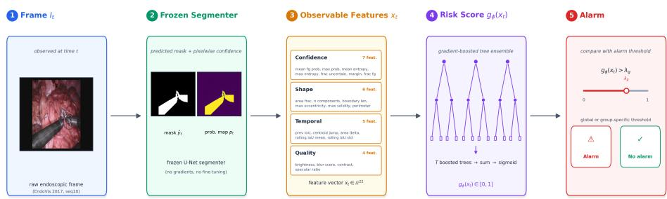
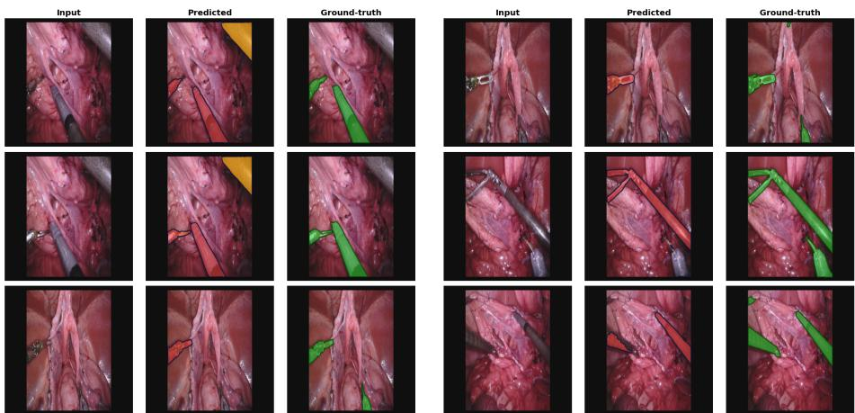

# Beyond Uncertainty: Generalizable Failure Monitoring for Surgical Segmentation under Acquisition Degradation

Hieu D. Pham, Dang P. M. Cao, and Thanh Trung Huynh

College of Engineering and Computer Science, VinUniversity, Hanoi, Vietnam 24hieu.pd@vinuni.edu.vn

Abstract. Surgical segmentation networks can fail silently under acquisition degradation: predicted masks may be wrong even when model confidence remains high. Existing deployment-time monitors rely primarily on uncertainty estimates and can therefore miss confident failures. We present TCSR-Monitor (Temporal Conformal Surgical Risk Monitor), a post-hoc failure-monitoring framework that combines confidence with observable shape, temporal-consistency, and image-quality cues. TCSR-Monitor wraps a frozen segmentation model, requires no model internals, and operates without ground truth at deployment. We also introduce a validation protocol to assess whether alarms remain credible under distribution shift. On EndoVis 2017, leave-one-corruptionout evaluation shows that TCSR-Monitor generalizes to unseen acquisition degradations and substantially outperforms confidence-based baselines. A circularity control confirms that it predicts segmentation failure rather than simply detecting corrupted images. Mondrian conformal calibration balances miss-rates across degradation severities, but a single global threshold still produces false alarms on up to 40% of correctly segmented frames at moderate corruption. Zero-shot transfer to SAM2 demonstrates feature portability, although entropy outperforms the transferred monitor at both evaluated thresholds. Overall, reliable monitoring under acquisition degradation benefits from complementary observable signals beyond confidence alone, but substantial false-alarm and transfer limitations remain. Code and trained configurations are available at github.com/dinhieufam/tcsr-monitor.

Keywords: Surgical segmentation · Failure monitoring · Conformal prediction

## 1 Introduction

Deep segmentation networks are increasingly used to parse endoscopic video into instrument and anatomy masks [1,2], and their output increasingly feeds downstream tasks such as tool tracking, skill assessment, and intra-operative guidance. Deployed surgical video, however, contains smoke, defocus, illumination change, compression, and motion blur that are under-represented in the curated benchmarks on which these networks are tuned. Such acquisition shifts can produce silent failures: masks with low intersection-over-union (IoU) that the network nonetheless reports with high confidence. These failures are the most dangerous kind, because a confident but incorrect mask never trips a confidence-based alarm and can propagate unnoticed into whatever consumes it.

Most deployment-time monitoring methods estimate uncertainty through predictive entropy [5], max-softmax confidence [3], or calibration-based scores [6]. Such signals are efective when prediction errors coincide with high uncertainty, but they become unreliable precisely when a segmenter produces a confident yet incorrect mask. Acquisition degradation is a common source of this mismatch: it pushes the input away from the training distribution while leaving the output logits sharp, so uncertainty stays low even as segmentation quality collapses. Deployment-time monitoring therefore cannot rely on uncertainty alone, and needs signals that remain informative when the network is confidently wrong.

Learned failure predictors show that auxiliary signals can recover some of this missing information [17,20,21], but two questions remain open for surgical deployment. First, it is unclear whether such monitors generalize beyond the degradation types seen during training, or whether they merely fingerprint the specific corruption operators used to build the training set. Second, many evaluations cannot separate genuine failure prediction from the far easier task of recognizing that an image is degraded at all. A monitor that only detects corruption, or only recognizes familiar corruptions, ofers little protection in the field.

We address these gaps with TCSR-Monitor, a post-hoc failure monitor that combines multiple observable cues—output confidence, mask geometry, temporal consistency, and image quality—into a single segmentation-failure-risk score. The monitor wraps a frozen segmentation model, requires no access to model internals or gradients, and operates without ground truth during deployment, which keeps it compatible with clinical models that cannot be retrained or instrumented. More importantly, we argue that a learned failure monitor is meaningful only if its alarms stay trustworthy under distribution shift, and we treat that credibility as a claim to be tested rather than assumed. We therefore evaluate TCSR-Monitor with three complementary protocols: generalization to unseen acquisition degradations, discrimination of segmentation failure from mere image corruption, and calibrated safety across degradation severity. Together they ask not only whether the monitor scores well, but whether its score means what a deploying clinician would need it to mean. We make the following contributions:

1. We propose a deployment-time failure-monitoring framework that integrates complementary observable cues beyond uncertainty-based confidence scores.

2. We introduce a validation protocol—leave-one-corruption-out (LOCO) generalization, a circularity control, and severity-aware calibration—that tests whether such a monitor stays credible under distribution shift.

3. We show that uncertainty-based confidence alone is insuficient under acquisition degradation, whereas complementary observable cues improve robustness to unseen corruptions.

4. We use Mondrian conformal calibration to balance miss-rates across degradation severities while making the resulting false-alarm cost explicit.

5. We provide supporting controls in the supplement—confidence-only, learner, temporal-order, sequence-held-out, and SAM2 transfer—that bound rather than expand these claims.

The intended use is not to replace segmentation, but to add a fast, external watchdog for cases in which the segmenter remains confident while its mask quality collapses. This distinction also determines the evaluation: a monitor that only succeeds on degradation types observed during training provides limited deployment value, so practical monitoring must generalize to previously unseen acquisition conditions.

## 2 Related Work

Instrument segmentation has advanced through U-Net variants [7], transformers [8], and foundation models such as SAM/SAM2 [9,10]. Robustness benchmarks expose sensitivity to common or surgical corruptions [4,11,13], but they primarily evaluate the segmenter itself. Our focus is deployment-time monitoring after a mask has already been produced.

Confidence scores, entropy, calibration, test-time ensembles, and featurespace OOD scores are common post-hoc reliability signals [3,5,6,14,15]. In medical segmentation, however, uncertainty can be calibrated in aggregate while still failing on individual cases [18], and networks may remain overconfident on wrong masks [19]. Learned failure prediction therefore provides a complementary route: prior work estimates model confidence or segment quality from auxiliary signals [17,16,20,21]. We difer by centering surgical acquisition degradation, held-out corruption protocols, and a circularity control that separates failure prediction from corruption detection. Our alarm layer relates to selective prediction [24,25] and conformal risk control [22,23,26]; group-conditional Mondrian calibration [27] is especially natural when degradation severity defines safety-relevant groups.

## 3 Method

TCSR-Monitor wraps a frozen segmenter $f _ { \theta }$ without changing its weights $\left( \mathrm { F i g . 1 } \right)$ For each frame $I _ { t } ,$ the segmenter produces a probability map $p _ { t }$ and mask $\hat { y } _ { t }$ . A frame is labeled a failure during training/evaluation when

$$
\mathrm { f a i l } ( I _ { t } ) = \mathbf { 1 } [ \mathrm { I o U } ( \hat { y } _ { t } , y _ { t } ^ { \star } ) < \tau ] , \qquad \tau \in \{ 0 . 5 , 0 . 7 5 \} .\tag{1}
$$

The monitor extracts 22 scalar features from $p _ { t } , \ { \hat { y } } _ { t } , \ I _ { t }$ , and previous masks: confidence statistics, mask morphology, temporal consistency, and image-quality measures (brightness, blur, contrast, specular ratio). Features require only the raw frame and segmenter output, and take under 0.5 ms per frame (median 0.48 ms, $p _ { 9 5 }$ 0.53 ms).

  
Fig. 1. Overview of TCSR-Monitor. The monitor observes the raw frame and the segmenter’s output, but does not modify the segmenter or use ground truth at deployment. Calibration converts risk scores into global or group-specific alarm thresholds.

The feature design is intentionally restricted to quantities available outside the segmentation model. Confidence features capture whether the output looks uncertain; shape features capture implausible mask geometry and fragmentation; temporal features capture abrupt changes across adjacent video frames; and image-quality features capture acquisition conditions that can make a confident mask suspect. This makes the monitor compatible with frozen clinical models and avoids relying on architecture-specific internal activations. Table 1 lists all 22 features with their exact definitions.

The failure-risk model $g _ { \phi } ( x _ { t } ) \in [ 0 , 1 ]$ is an XGBoost classifier [30]; learner ablations in the supplement show that the representation is not unique to XG-Boost. Training uses clean out-of-fold predictions and corrupted training frames, while threshold calibration is held out from model fitting. At deployment, ground truth is unavailable and an alarm is raised when $g _ { \phi } ( x _ { t } ) > \lambda$

The safety objective is miss-rate control: among failed frames, the fraction not alarmed should stay below target α:

$$
\operatorname { m i s s } ( \lambda ) = { \frac { \left| \left\{ i : g _ { \phi } ( x _ { i } ) \leq \lambda , { \mathrm { ~ f a i l } } ( I _ { i } ) = 1 \right\} \right| } { \left| \left\{ i : { \mathrm { f a i l } } ( I _ { i } ) = 1 \right\} \right| } } .\tag{2}
$$

Global split-conformal calibration [22] chooses one threshold λ on a calibration split. Because acquisition severity changes the failure distribution, we also use Mondrian calibration [27]: frames are partitioned into groups g (corruption severity for degraded frames; blur tertile for clean frames), and each group receives its own threshold

$$
\lambda _ { g } = \operatorname* { s u p } \left\{ \lambda : \frac { \big | \{ i \in \mathcal { G } _ { g } : g _ { \phi } ( x _ { i } ) \leq \lambda , y _ { i } = 1 \} \big | } { \big | \{ i \in \mathcal { G } _ { g } : y _ { i } = 1 \} \big | } \leq \alpha \right\} .\tag{3}
$$

This equalizes empirical conservatism across groups rather than letting easy conditions dominate the average.

The thresholds are calibrated after score learning. Thus discrimination (whether failures rank above correct frames) and safety control (where to set the alarm

Table 1. The full set of 22 observable features. $p _ { t }$ is the pixelwise probability map, $\hat { y } _ { t } = \mathbf { 1 } [ p _ { t } \ge 0 . 5 ]$ the predicted mask, and t−1 the previous frame in the same video.
<table><tr><td>Group</td><td>Feature</td><td>Definition</td></tr><tr><td rowspan="9"></td><td>conf_mean_fg-prob</td><td>Mean pt over foreground pixels  $( \hat { y } _ { t } = 1 )$ </td></tr><tr><td> $\mathsf { c o n f \_ m a x \_ p r o b }$ </td><td>max pt over the frame</td></tr><tr><td>conf_mean_entropy</td><td>Mean per-pixel binary entropy of  $p _ { t }$ </td></tr><tr><td>Confidence (7) conf_max_entropy</td><td>Max per-pixel binary entropy of pt</td></tr><tr><td> $\mathsf { c o n f \_ f r a c \_ u n c e r t a i n }$ </td><td>Fraction of pixels with entropy &gt; 0.9 log 2</td></tr><tr><td> $\mathsf { c o n f \_ m a r g i n }$ </td><td>Mean  $| p _ { t } - 0 . 5 |$  over the frame</td></tr><tr><td> $\mathsf { c o n f \_ f r a c \_ f g }$ </td><td>Foreground area fraction of  $\hat { y } _ { t }$ </td></tr><tr><td>shape_area_frac</td><td>Foreground pixel fraction of  $\hat { y } _ { t }$ </td></tr><tr><td>shape_n_components</td><td>Number of connected foreground components</td></tr><tr><td rowspan="5">Shape (6)</td><td>shape_boundary_len</td><td>Total component perimeter / frame area</td></tr><tr><td>shape_max_eccentricity</td><td>Eccentricity of the largest component</td></tr><tr><td>shape_max_solidity</td><td>Solidity (area / convex-hull area), largest component</td></tr><tr><td>shape_perimeter</td><td>Total (unnormalized) perimeter, summed over components</td></tr><tr><td>temp-prev_iou</td><td></td></tr><tr><td rowspan="5">Temporal (5)</td><td>temp_centroid_jump</td><td> $\mathrm { I o U } \big ( \hat { y } _ { t } , \hat { y } _ { t - 1 } \big )$  Normalized centroid displacement vs. t-1 (largest component)</td></tr><tr><td>temp_area_delta</td><td> $| \mathrm { a r e a } ( \hat { y } _ { t } ) - \mathrm { a r e a } ( \hat { y } _ { t - 1 } ) |$ </td></tr><tr><td>temp_rolling_iou_mean</td><td>Mean frame-to-frame IoU over a trailing 5-frame window</td></tr><tr><td> $\scriptstyle \mathtt { t e m p \_ r o l l i n g \_ i o u \_ s t d }$ </td><td>Std. of frame-to-frame IoU over the same window</td></tr><tr><td></td><td></td></tr><tr><td rowspan="4">Quality (4)</td><td>qual_brightness</td><td>Mean grayscale intensity of  $I _ { t } ,$  normalized to [0, 1] Variance of the Laplacian of It (sharpness)</td></tr><tr><td>qual_blur_score qual_contrast</td><td>Std. of grayscale intensity of  $I _ { t } ,$ </td></tr><tr><td></td><td>normalized to [0, 1] </td></tr><tr><td> $\mathtt { q u a l \_ s p e c u l a r \_ r a t i o }$ </td><td>Fraction of pixels with HSV value &gt; 240 (specular highlight)</td></tr></table>

threshold) are evaluated separately. This separation is important in rare-event settings: a high AUROC monitor can still be operationally burdensome if the threshold required to catch failures creates many frame-level alarms.

## 4 Experiments

## 4.1 Setup

We use EndoVis 2017 Instrument Segmentation [31]: ten robotic surgical sequences, with sequences 1–7 for train/calibration and 8–10 for test (1575/450/825 frames). The frozen segmenter is a ResNet34-U-Net fine-tuned on the training sequences. We apply six corruption types at five severity levels (Gaussian blur/noise, motion blur, brightness, contrast, JPEG), yielding 24,750 corrupted test frames. We evaluate $\tau = 0 . 5$ and $\tau = 0 . 7 5 ;$ clean-test failure prevalence is 1.7% and 6.9%, respectively. Baselines are Max-Softmax, Entropy, and a Temporal Heuristic—risk score $1 - \mathrm { I o U } \left( \hat { y } _ { t } , \hat { y } _ { t - 1 } \right)$ between consecutive predicted masks, so large frame-to-frame mask changes are flagged as risky (score 0 on the first frame of a sequence, where no previous mask exists)—plus a learned confidenceonly monitor in the supplement.

We use four generalization protocols. Zero-shot trains the monitor on clean frames only and tests on all corruptions. LOCO trains on five corruption types and tests on the held-out sixth type; this is the robustness headline because the test degradation operator is unseen. Severity extrapolation trains on severities 1–

Table 2. Held-out clean test results (seed 0; point estimates). AUPRC should be interpreted relative to the rare failure prevalence. Frame-level point estimates on this split are correlated within only 3 test sequences; see the sequence-level bootstrap discussion below for uncertainty bounds.
<table><tr><td>Method</td><td>τ = 0.5 AUROC</td><td>τ = 0.5 AUPRC</td><td>τ = 0.75 AUROC</td><td>τ = 0.75 AUPRC</td></tr><tr><td>TCSR-Monitor (ours)</td><td>0.877</td><td>0.468</td><td>0.793</td><td>0.301</td></tr><tr><td>Entropy [5]</td><td>0.764</td><td>0.635</td><td>0.483</td><td>0.220</td></tr><tr><td>Max-Softmax [3]</td><td>0.536</td><td>0.087</td><td>0.509</td><td>0.085</td></tr><tr><td>Temporal Heuristic</td><td>0.338</td><td>0.013</td><td>0.460</td><td>0.074</td></tr><tr><td>Failure prevalence</td><td colspan="2">1.7% (14/825)</td><td colspan="2">6.9% (57/825)</td></tr></table>

3 and tests on severities 4–5. In-distribution trains and tests across all corruption types and is reported only as an upper bound.

## 4.2 Clean Test and Generalization

On held-out clean test (Table 2), TCSR-Monitor improves AUROC over all audited baselines at both thresholds. AUPRC is prevalence-sensitive: entropy is stronger at $\tau = 0 . 5$ , whereas TCSR-Monitor gives the best audited AUPRC at $\tau = 0 . 7 5$

The 825 test frames come from only 3 surgical sequences (seq08/09/10) and are strongly correlated within a sequence, so a frame-level bootstrap would understate uncertainty. We instead resample the 3 sequences with replacement (5000 resamples; at τ = 0.5 seq09 contributes zero failures, so 195/5000 degenerate resamples are excluded) and recompute each metric on the pooled resample. The resulting 95% intervals for TCSR-Monitor AUROC are [0.48, 0.99] at τ = 0.5 and [0.69, 0.99] at τ = 0.75 (entropy: [0.41, 0.90] and [0.07, 0.90]). These are wide because they reflect only 3 independent clusters, not an unstable estimator; we report the honest sequence-level interval rather than a narrower, misleading frame-level one. Fig. 2 shows the sub-threshold cases driving the $\tau = 0 . 7 5$ positive class.

LOCO (0.814, Table 3) is the robustness headline because the test corruption type is absent from training. The small gap to the in-distribution upper bound (0.827) argues against simple corruption fingerprinting, and the monitor beats entropy on all six held-out types.

The clean-test and LOCO results answer diferent questions. Clean test measures behavior on nominal deployment-like frames, where failures are rare and AUPRC is prevalence-sensitive. LOCO stresses whether the learned score captures transferable failure patterns under acquisition degradation. The combination is more informative than either setting alone: clean test guards against excessive alarms on normal video, while LOCO guards against memorizing the training corruptions.

  
Fig. 2. Qualitative examples of sub-threshold confident failures (0.5 ≤ IoU < 0.75). Each triplet shows the input, predicted mask, and ground-truth mask. The segmenter produces plausible-looking but incomplete or over-extended instruments, illustrating why an external failure monitor is needed even when the output appears confident.

## 4.3 Circularity and Conformal Safety

To test whether TCSR-Monitor predicts failure rather than simply corruption, we evaluate only corrupted test frames and discriminate correct masks $\mathrm { ( I o U \ge 0 . 7 5 ) }$ from failed masks (IoU < 0.75). Table 4 shows AUROC 0.946, while entropy is only 0.594. This control is essential because a monitor could otherwise appear successful by detecting low image quality rather than segmentation failure. Restricting the evaluation to corrupted frames removes the easy corrupted-versus-clean shortcut and asks whether the monitor can tell when the segmenter is actually wrong within degraded video.

The FA-correct column deserves explicit emphasis, not just disclosure: at the single global threshold used for the circularity control, the monitor falsealarms on up to 40.4% of correctly segmented frames at severity 3 (rising from 8.0% at severity 1, then falling to 35.8% and 8.9% at severities 4–5 as failures themselves become common). Flagging two in five correct masks at moderate corruption is not yet a usable clinical alarm stream at a single global threshold; Section 5 returns to this alongside the SAM2 result below, where uncertainty is the stronger baseline.

Mondrian calibration fixes the safety imbalance hidden by global calibration: the same overall 10.0% global miss-rate is obtained while missing 50.5% of severity-1 failures. Per-severity thresholds restore near-10% miss-rate for all severities, but at a cost: corrupted false-alarm rate increases from 17.6% to 34.2% overall and from 12.8% to 58.7% at severity 1 (supplement). Thus the claim is safety redistribution, not clinical alarm readiness.

Table 3. Generalization hierarchy and LOCO breakdown (AUROC). LOCO is the robustness headline; in-distribution is an upper bound. Wins counts the (corruption type, severity) cells in which TCSR-Monitor AUROC exceeds entropy AUROC, out of 30 cells (6 corruption types × 5 severities) for zero-shot/LOCO/in-distribution, and 12 cells (6 types × severities 4–5) for severity extrapolation; per-corruption rows report wins out of 5 severities.
<table><tr><td>Protocol / held-out type</td><td>Monitor</td><td>Entropy</td><td>Wins</td></tr><tr><td>Zero-shot</td><td>0.753</td><td>0.465</td><td>24/30</td></tr><tr><td>LOCO overall Severity extrapolation</td><td>0.814 0.831</td><td>0.481 0.408</td><td>26/30 8/12</td></tr><tr><td>In-distribution upper bound</td><td>0.827</td><td>0.465</td><td>26/30</td></tr><tr><td>Brightness</td><td>0.801</td><td>0.331</td><td>4/5</td></tr><tr><td>Contrast</td><td>0.912</td><td>0.839</td><td>3/5</td></tr><tr><td>Gaussian blur</td><td>0.806</td><td>0.455</td><td>5/5</td></tr><tr><td>Gaussian noise</td><td>0.811</td><td>0.319</td><td>4/5</td></tr><tr><td>JPEG compression</td><td>0.773</td><td>0.444</td><td>5/5</td></tr><tr><td>Motion blur</td><td>0.779</td><td>0.497</td><td>5/5</td></tr></table>

Table 4. Circularity control and Mondrian conformal calibration. Left: withincorrupted AUROC for failure vs. correct masks. Right: miss-rate by severity at α = 0.10.
<table><tr><td></td><td></td><td></td><td>Severity Monitor Entropy FA-correct</td><td>Severity Global miss Mondrian miss</td><td></td></tr><tr><td>1</td><td>0.807</td><td>0.484</td><td>8.0%</td><td>1</td><td>50.5% 9.3%</td></tr><tr><td>2</td><td>0.822</td><td>0.505</td><td>22.3%</td><td>2</td><td>22.5% 10.1%</td></tr><tr><td>3</td><td>0.827</td><td>0.483</td><td>40.4%</td><td>3</td><td>9.9%</td></tr><tr><td>4</td><td>0.861</td><td>0.366</td><td>35.8%</td><td>4</td><td>10.0%</td></tr><tr><td>5</td><td>0.825</td><td>0.478</td><td>8.9%</td><td>5</td><td>9.9%</td></tr><tr><td>Overall</td><td>0.946</td><td>0.594</td><td>12.6%</td><td>Overall 10.0%</td><td>9.9%</td></tr></table>

## 4.4 SAM2 Transfer

We apply the U-Net-trained monitor to SAM2-Tiny [10] run zero-shot with oracle bounding-box prompts. This experiment carries the paper’s clearest limitation: as Table 5 shows, entropy outperforms the transferred TCSR-Monitor at both thresholds (0.984 vs. 0.896 at τ = 0.5; 0.988 vs. 0.930 at τ = 0.75), so the “beyond uncertainty” framing does not hold uniformly—when a segmenter’s failures already manifest as high predictive uncertainty, as SAM2’s zero-shot instrument masks do, uncertainty alone is the stronger, simpler baseline. SAM2 fails far more often than the fine-tuned U-Net (51.2% vs. 6.9% at τ = 0.75), and the transferred monitor still reaches AUROC 0.930, recovering 93.3% of a SAM2-supervised upper bound; we read this as evidence that the observable-feature representation transfers across segmenter families, not that it dominates uncertainty-based monitoring. Feature portability and entropy’s continued strength are complementary findings, not a single unqualified one.

Table 5. Cross-model transfer to SAM2-Tiny. Entropy is the best-AUROC method in this setting (bold); TCSR-Monitor’s transfer eficiency relative to a SAM2-supervised upper bound is reported separately.
<table><tr><td>Condition</td><td>τ = 0.5 AUROC</td><td>τ = 0.75 AUROC</td></tr><tr><td>U-Net monitor → SAM2 (zero-shot transfer) 0.896 [0.873, 0.915] 0.930 [0.912, 0.945]</td><td></td><td></td></tr><tr><td>Entropy → SAM2</td><td></td><td>0.984 [0.975, 0.990] 0.988 [0.979, 0.994]</td></tr><tr><td>SAM2-specific monitor (upper bound)</td><td></td><td>0.997 [0.995, 0.999] 0.997 [0.994, 0.999]</td></tr><tr><td>Transfer efficiency (transfer / upper bound)</td><td>89.8%</td><td>93.3%</td></tr></table>

## 5 Discussion

TCSR-Monitor is best understood as a generalization-aware framework for moving beyond uncertainty, not as a claim that one classifier dominates all baselines. The LOCO and circularity experiments address the two failure modes that would most undermine this claim—fingerprinting the training corruption operators, and merely detecting that an image is degraded rather than that the segmenter failed on it, respectively. The confidence-only, learner, temporal, and sequence controls in the supplement narrow the claim: confidence cues are strong, the full feature set adds modest but positive LOCO gains, and random forest matches or exceeds XGBoost. The novelty is therefore the combination of observable features with protocol-qualified validation and group-conditional safety calibration.

Feature importance. To make the “complementary observable cues” claim checkable rather than asserted, Table 6 reports XGBoost gain-based feature importance for the clean-test monitor of Table 2, aggregated into the four groups of Table 1. Confidence is the largest single share (57.9%, led by conf\_mean\_fg\_prob at 36.0%), consistent with confidence being a strong signal in aggregate. But the remaining 42.1% is not difuse noise: quality contributes 20.6% (led by qual\_contrast, 11.2%) and shape 16.5%; temporal contributes least (5.0%), matching the supplement’s temporal-order stress control, where shufling frame order costs only a modest LOCO AUROC. Two of the top-5 individual features are image-quality, not confidence, features—quantitative, not just qualitative, support that acquisition-quality and shape cues carry real weight in the trained estimator.

The supplement fills in the main controls behind this interpretation. The learned confidence-only baseline is deliberately stronger than raw entropy or max-softmax because it receives the same learner family as the full monitor. The full feature set improves over it under LOCO, but only modestly, so the claim is not that confidence is irrelevant. Instead, shape, temporal, and imagequality features add incremental generalization signal where confident failures are the target.

The main limitation is scope. All validated discrimination and calibration results use EndoVis 2017 with synthetic corruptions; real multi-site surgical video remains future work. A cached CholecSeg8k audit produced failures for every frame and therefore could not provide AUROC/AUPRC external validation; we traced this to a preprocessing defect, not a genuine zero-shot failure. Our mask loader binarized instrument pixels using a placeholder class-ID set left over from an early, unverified reading of the dataset documentation; CholecSeg8k’s actual instrument IDs (grasper, L-hook electrocautery) difer from the placeholder, so binarizing against it yields an empty ground-truth mask for nearly every frame (58/60 sampled), mechanically driving IoU toward zero regardless of prediction quality. We report this as a labeling bug found while preparing this revision and leave a corrected re-run to future work rather than substitute an unverified fix now. SAM2 uses oracle bounding-box prompts and does not replace a second finetuned surgical-backbone study. Finally, conformal coverage is empirical rather than certified under temporal dependence, and frame-level alarm rates are too high for direct clinical use without event aggregation or workflow suppression.

Table 6. XGBoost gain-based feature importance (clean-test monitor, Table 2), aggregated by feature group and listing the top-5 individual features. Importances sum to 1 over all 22 features.
<table><tr><td>Group</td><td>Share of importance</td><td>Top individual feature</td><td>Importance</td></tr><tr><td>Confidence</td><td>57.9%</td><td>conf_mean_fg-prob</td><td>36.0%</td></tr><tr><td>Quality</td><td>20.6%</td><td>qual_contrast</td><td>11.2%</td></tr><tr><td>Shape</td><td>16.5%</td><td>conf_margin</td><td>5.7%</td></tr><tr><td>Temporal</td><td>5.0%</td><td>conf_frac_fg</td><td>5.6%</td></tr><tr><td></td><td></td><td>qual_blur_score</td><td>5.2%</td></tr></table>

These limitations narrow the deployment claim. The present evidence supports TCSR-Monitor as a credible research baseline and validation protocol for monitoring surgical segmentation under acquisition degradation. It does not yet establish a clinically deployable alert stream, nor does it prove universal transfer across hospitals, procedures, or fine-tuned backbone families.

## 6 Conclusion

We presented TCSR-Monitor, pairing a lightweight feature-based monitor with LOCO generalization, a circularity control, and Mondrian conformal calibration into a credible, bounded baseline for catching confident surgical-segmentation failures that uncertainty scores miss under acquisition degradation—while also delimiting where uncertainty baselines and alarm-burden limitations remain important.

## References

1. A. Shvets, A. Rakhlin, A. A. Kalinin, and V. Iglovikov, “Automatic instrument segmentation in robot-assisted surgery using deep learning,” in Proc. IEEE Int. Conf. Mach. Learn. Appl. (ICMLA), 2018.

2. M. Allan et al., “2017 robotic instrument segmentation challenge,” arXiv:1902.06426, 2019.

3. D. Hendrycks and K. Gimpel, “A baseline for detecting misclassified and out-ofdistribution examples in neural networks,” in Proc. Int. Conf. Learn. Represent. (ICLR), 2017.

4. D. Hendrycks and T. Dietterich, “Benchmarking neural network robustness to common corruptions and perturbations,” in Proc. Int. Conf. Learn. Represent. (ICLR), 2019.

5. A. Malinin and M. Gales, “Predictive uncertainty estimation via prior networks,” in Adv. Neural Inf. Process. Syst. (NeurIPS), 2018.

6. C. Guo, G. Pleiss, Y. Sun, and K. Q. Weinberger, “On calibration of modern neural networks,” in Proc. Int. Conf. Mach. Learn. (ICML), 2017.

7. O. Ronneberger, P. Fischer, and T. Brox, “U-Net: Convolutional networks for biomedical image segmentation,” in Proc. Med. Image Comput. Comput.-Assist. Interv. (MICCAI), 2015.

8. B. Dong, W. Wang, D.-P. Fan, J. Li, H. Fu, and L. Shao, “Polyp-PVT: Polyp segmentation with pyramid vision transformers,” arXiv:2108.06932, 2021.

9. A. Kirillov et al., “Segment anything,” in Proc. IEEE/CVF Int. Conf. Comput. Vis. (ICCV), 2023.

10. N. Ravi et al., “SAM 2: Segment anything in images and videos,” arXiv:2408.00714, 2024.

11. Y. Ding et al., “SegSTRONG-C: Segmenting surgical tools robustly on nonadversarial generated corruptions,” arXiv:2407.11906, 2024.

12. C. Shen et al., “Surgical SAM 2: Real-time segment anything in surgical video by eficient frame pruning,” arXiv:2408.07931, 2024.

13. U. Michieli and P. Zanuttigh, “Continual semantic segmentation via repulsionattraction of sparse and disentangled latent representations,” in Proc. Eur. Conf. Comput. Vis. (ECCV), 2021.

14. B. Lakshminarayanan, A. Pritzel, and C. Blundell, “Simple and scalable predictive uncertainty estimation using deep ensembles,” in Adv. Neural Inf. Process. Syst. (NeurIPS), 2017.

15. K. Lee, K. Lee, H. Lee, and J. Shin, “A simple unified framework for detecting out-of-distribution samples and adversarial attacks,” in Adv. Neural Inf. Process. Syst. (NeurIPS), 2018.

16. F. Granese et al., “DOCTOR: A simple method for detecting misclassification errors,” in Adv. Neural Inf. Process. Syst. (NeurIPS), 2021.

17. C. Corbière et al., “Addressing failure prediction by learning model confidence,” in Adv. Neural Inf. Process. Syst. (NeurIPS), 2019.

18. A. Jungo and M. Reyes, “Assessing reliability and challenges of uncertainty estimations for medical image segmentation,” arXiv:1907.03338, 2019.

19. A. Mehrtash et al., “Confidence calibration and predictive uncertainty estimation for deep medical image segmentation,” IEEE Trans. Med. Imaging, 2020.

20. M. Rottmann, P. Colling, T. P. Hack, R. Chan, F. Hüger, P. Schlicht, and H. Gottschalk, “Prediction error meta-classification in semantic segmentation: Detection via aggregated dispersion measures of softmax probabilities,” arXiv:1811.00648, 2018.

21. S. K. Jung et al., “FSNet: A failure detection framework for semantic segmentation,” arXiv:2108.08748, 2021.

22. V. Vovk, A. Gammerman, and G. Shafer, Algorithmic Learning in a Random World. New York, NY, USA: Springer, 2005.

23. A. N. Angelopoulos and S. Bates, “A gentle introduction to conformal prediction and distribution-free uncertainty quantification,” arXiv:2107.07511, 2021.

24. Y. Geifman and R. El-Yaniv, “Selective classification for deep neural networks,” in Adv. Neural Inf. Process. Syst. (NeurIPS), 2017.

25. Y. Geifman and R. El-Yaniv, “SelectiveNet: A deep neural network with an integrated reject option,” in Proc. Int. Conf. Mach. Learn. (ICML), 2019.

26. A. N. Angelopoulos, S. Bates, E. J. Candès, M. I. Jordan, and L. Lei, “Conformal risk control,” arXiv:2208.02814, 2022.

27. V. Vovk, D. Lindsay, I. Nouretdinov, and A. Gammerman, “Mondrian confidence machines / conformal predictors,” Symp. Learn. Data Sci. (SLDS), 2003.

28. C. Lu et al., “Improving trustworthiness of AI disease severity rating in medical imaging with ordinal conformal prediction sets,” in Proc. Med. Image Comput. Comput.-Assist. Interv. (MICCAI), 2022.

29. A. N. Angelopoulos et al., “Image-to-image regression with distribution-free uncertainty quantification and applications in imaging,” in Proc. Int. Conf. Mach. Learn. (ICML), 2022.

30. T. Chen and C. Guestrin, “XGBoost: A scalable tree boosting system,” in Proc. ACM SIGKDD Int. Conf. Knowl. Discovery Data Mining (KDD), 2016.

31. S. Bodenstedt et al., “Comparative evaluation of instrument segmentation and tracking methods in minimally invasive surgery,” arXiv:1805.02475, 2018.

32. W.-Y. Hong et al., “CholecSeg8k: A semantic segmentation dataset for laparoscopic cholecystectomy based on Cholec80,” arXiv:2012.12453, 2020.