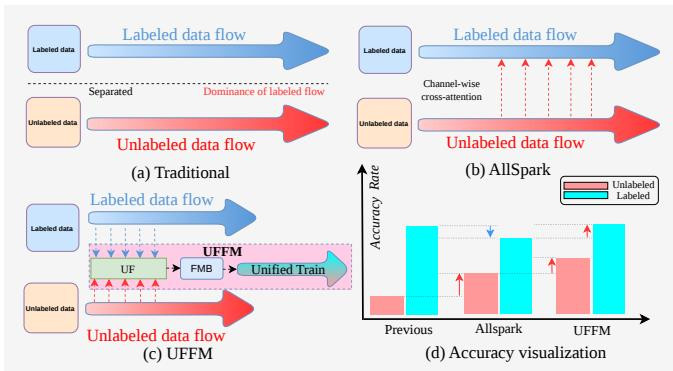
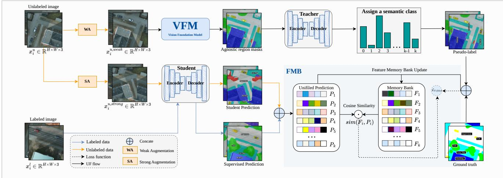
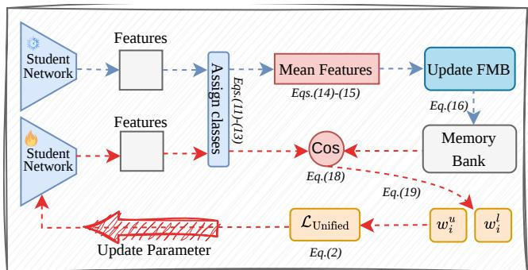
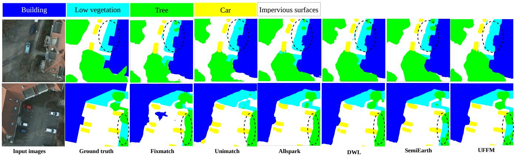
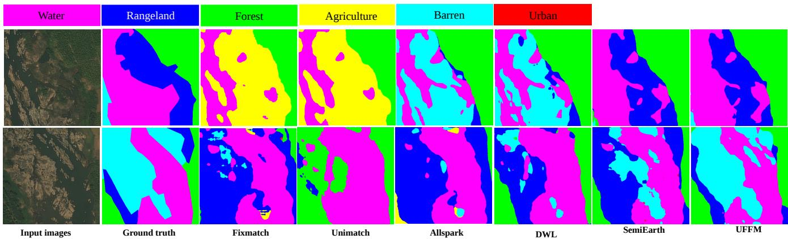
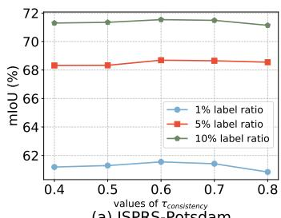
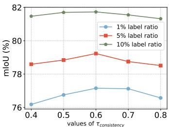
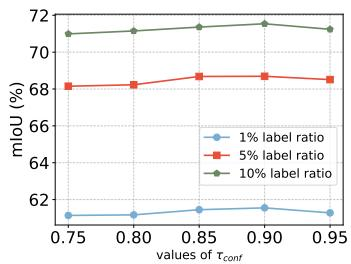
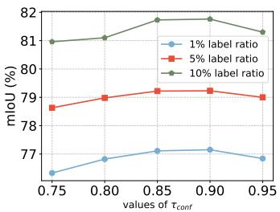
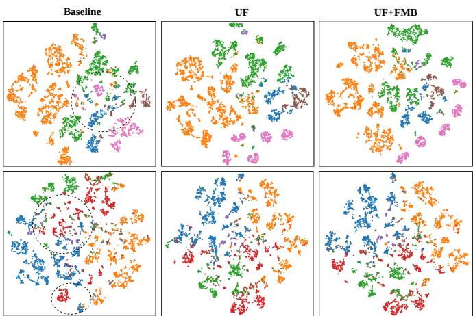

# Bridging the Gap between Labeled and Unlabeled Data via Unified Flow with Feature Memory Bank

Shanwen Wang, Graduate Student Member, IEEE, Xin Sun, Senior Member, IEEE, Danfeng Hong, Senior Member, IEEE, Junyu Dong, Member, IEEE, Patrick Le Callet, Fellow, IEEE

Abstract—Although semi-supervised semantic segmentation (S4) utilizes abundant unlabeled data to reduce manual labeling burdens, independent training of labeled and unlabeled data causes the former to dominate, which severely degrades pseudolabel quality. To address this challenges, we propose a novel remote sensing (RS) S4 method via unified flow with feature memory bank (UFFM). Specifically, UFFM comprises two key innovations: unified flow (UF) and feature memory bank (FMB). The UF is a new training flow that generates less biased pseudolabels by combining an external visual foundation model (VFM) with an RS domain teacher, and jointly optimizes labeled and pseudo-labeled data under a unified training objective. The FMB is a novel memory module for $\mathbf { S } ^ { 4 }$ that dynamically updates class-specific features during training and reduces the feature discrepancy between labeled and unlabeled data through classfeature alignment. To verify the effectiveness of our model, we conduct extensive experiments on RS datasets. The experimental results show the superiority of our method over SOTA $\mathbf { S } ^ { 4 }$ methods. Moreover, the results demonstrate the effectiveness of our contributions in bridging the optimization and feature representation gap between labeled and unlabeled data. Our code is released at https://github.com/wangshanwen001/RS-UFFM.

Index Terms—Semi-supervised semantic segmentation, Visual foundation model, Remote sensing images, Feature memory.

## I. INTRODUCTION

EMANTIC segmentation has shown great potential in S applications such as flood monitoring [1], precision agriculture [2], ecosystem assessment [3], and urban planning [4]. However, manually labeling extensive RS datasets is highly time-consuming and labor-intensive [5]–[7]. Semi-supervised semantic segmentation $( \mathsf { S } ^ { 4 } )$ has attracted significant attention in the remote sensing (RS) community by leveraging a small set of labeled samples alongside a wealth of unlabeled data [8]–[10]. Several RS ${ \mathsf S } ^ { 4 }$ models address issues like high inter-class similarity, long-tailed distributions, and low-quality pseudo-labels [11]–[13]. Nevertheless, training labeled and unlabeled data independently prevents effective feature interaction, causing inconsistent semantic representations. Consequently, the explicitly annotated data dominates optimization, severely compromising pseudo-label quality and aggravating confirmation bias. To address this, AllSpark [14] reconstructs labeled features from unlabeled features using a channel-level cross-attention mechanism. While this approach improves unlabeled data accuracy, it unfortunately degrades labeled data performance, as shown in Fig. 1(d). This occurs because reconstructing labeled samples from unlabeled features can introduce noise into the discriminative features of labeled data. Specifically, during training, these reconstructed samples align poorly with ground-truth annotations, compromising supervised learning effectiveness. This challenge is even more pronounced in the RS domain by extreme label scarcity.

  
Fig. 1. (a), (b) and (c) Comparison between the training data flows of previous methods, AllSpark and ours UFFM. (d) Comparison between the accuracy rate of previous methods, AllSpark and ours UFFM.

To address the above challenge, we propose a unified flow with feature memory bank (UFFM). As shown in Fig. 1, UFFM bridges the gap between labeled and pseudo-labeled data, surpassing traditional ${ \mathsf S } ^ { 4 }$ methods. Specifically, UFFM introduces two key innovations: a unified flow (UF) paradigm and a feature memory bank (FMB). Instead of isolating labeled and unlabeled data, UF integrates them through collaborative pseudo-labeling strategy and a data fusion mechanism. It generates less biased pseudo-labels by combining the external knowledge of a vision foundation model (VFM) with the domain-specific expertise of an in-domain teacher. Then, UF mixes these pseudo-labels with labeled data under a unified loss function to establish a cohesive supervision framework. Furthermore, features of the same category across labeled and unlabeled data should exhibit high similarity. To achieve this, we propose a feature memory bank (FMB) to inject longterm category feature memory into ${ \mathsf S } ^ { 4 }$ training. The FMB creates and updates a feature prototype for each semantic category and leverages them to evaluate the reliability of pixellevel pseudo-labels. UFFM integrates UF and FMB to mitigate the dominance of labeled data during training. By optimizing labeled and unlabeled samples within a shared feature space, it effectively bridges the gap between labeled and pseudo-labeled data. It yields superior performance across both labeled and unlabeled data compared to existing ${ \mathsf S } ^ { 4 }$ baselines (Fig. 1(d)). In summary, our contributions are as follows:

1) We propose UFFM, a novel ${ \mathsf S } ^ { 4 }$ model for RS, to address the challenge of separated traditional training paradigm, where explicitly annotated data dominates training and ultimately degrades pseudo-label quality.

2) We propose UF that generates less biased pseudo-labels by fusing external VFM knowledge with domain-teacher expertise, and performs a specific unified training by integrating pseudo-labels with ground-truth labels.

3) We propose the FMB that introduces long-term category feature memory into ${ \mathsf S } ^ { 4 }$ training. It optimizes labeled and unlabeled samples within a shared feature space, by updating a feature prototype for each category.

4) Extensive experiments demonstrate the effectiveness of UFFM over state-of-the-art methods. The comprehensive ablation studies highlight our success in bridging the optimization and feature representation gap between labeled and unlabeled data, significantly boosting performance across both data types.

The rest of this article is organized as follows: Section II provides an overview of existing related research. In Section III, we formally propose and analyze our UFFM model. Section IV presents comprehensive experimental results, including comparative analyses with SOTA methods and ablation studies. Finally, Section V concludes and discusses the article.

## II. RELATED WORK

This section reviews relevant research on ${ \mathsf S } ^ { 4 }$ methods, and also summarizes recent progress in ${ \mathsf S } ^ { 4 }$ for RS domain.

## A. Semi-supervised Semantic Segmentation

Semantic segmentation is a foundational image analysis task with widespread application in areas such as land cover classification [15], urban modeling [16], and environmental monitoring [17]. However, conventional supervised methods are constrained by the heavy demand and high cost of pixellevel annotations [18]–[21]. Consequently, $\bar { \mathsf { S } } ^ { 4 }$ has attracted growing interest by leveraging large-scale unlabeled data [22]– [27].

In computer vision, classical S4 strategies predominantly rely on consistency regularization, pseudo-labeling, teacher–student frameworks, and adversarial learning [28]– [30]. A representative method is FixMatch [31], which generates high-confidence pseudo-labels from weakly augmented unlabeled images to supervise strongly augmented views via consistency regularization. UniMatch [32] extends this paradigm by introducing unified dual-stream perturbations across both image- and feature-level representations, effectively expanding the perturbation space to strengthen weakto-strong consistency learning. Owing to its superior performance, UniMatch has become a widely adopted baseline. Then, UniMatch v2 [33] upgrades the architecture by swapping traditional ResNet backbones for vision foundation models like DINOv2 [34]. To prevent labeled data from dominating the training process, AllSpark [14] reconstructs labeled features from unlabeled representations using a channel-level cross-attention mechanism.

These methods have achieved remarkable performance in natural-image segmentation and offer valuable design insights for RS ${ \mathsf S } ^ { 4 }$ approaches [9], [35], [36]. However, RS images present distinct challenges, including substantial scale variations, strong visual similarity across categories, complex backgrounds, and intricate textures [37], [38]. Consequently, directly transferring these general strategies to RS ${ \mathsf S } ^ { 4 }$ remains challenging [39].

## B. Remote Sensing Semi-supervised Semantic Segmentation

To better accommodate the distinctive characteristics of RS imagery, recent studies have developed ${ \mathsf S } ^ { 4 }$ methods specifically tailored to the RS domain [40]–[43]. For example, Ni et al. [44] and Wang et al. [37] addressed multi-scale variations through contextual label refinement in the label space and multi-scale uncertainty consistency, respectively. To mitigate the high visual similarity among different classes, Xin et al. [45] combined contrastive learning with a crossteacher–student attention network. Huang et al. [12] proposed decoupled weighting learning (DWL) to alleviate the adverse effects of inaccurate pseudo-labels and long-tailed class distributions. DWL decouples the predictions for labeled and unlabeled data during training and introduces a rank-based weighting module that adaptively weights pseudo-labels according to their relative confidence within each pseudo-class, thereby improving the reliability of pseudo-label learning. To address insufficient multimodal fusion and limited pixellevel annotations, Li et al. [42] proposed Semi-Mamba, which incorporates a semi-supervised Mamba-based cross-modality fusion module to facilitate cross-modal feature interaction in RS imagery. Furthermore, Geng et al. [46] proposed KGCSL to address the scarcity of labeled samples in hyperspectral image (HSI) classification. This semi-supervised method integrates multi-scale and multi-directional geometric features extracted using the contourlet transform, enabling accurate HSI classification under limited-label conditions.

With the rapid advancement of large-scale foundation models, vision–language models (VLMs) [47] and visual foundation models (VFMs) [48] have increasingly been incorporated into ${ \mathsf { R S } } { \mathsf { S } } ^ { 4 }$ . For example, SemiEarth [13] is the first approach to leverage VLMs to improve pseudo-label quality, thereby enhancing the performance of $\dot { \mathrm { S } } ^ { 4 }$ on RS imagery. Similarly, Song et al. [49] employed multiple VFMs as teachers and introduced a distillation-and-fusion mechanism to guide the training of an RS ${ \mathsf S } ^ { 4 }$ framework.

However, existing RS ${ \mathsf S } ^ { 4 }$ methods remain largely confined to conventional architectural paradigms. These methods often prioritize increasingly complex framework designs while overlooking the optimization imbalance between labeled and unlabeled data. Consequently, the supervised pathway with labeled samples dominates the training process, resulting in low-quality of the pseudo-labels generated for unlabeled data. To address this limitation, we propose UFFM, which bridges the gap between labeled and pseudo-labeled data.

  
Fig. 2. Overall architecture of our UFFM model for RS images. Flow paths are color-coded: blue for labeled data, yellow for unlabeled data, black for UF processing, and dashed for loss functions. As shown by the black path in the top row, pseudo-labels in the UFFM model are initially generated by the VFM as class-agnostic masks and subsequently mapped to semantic classes by the teacher. The light blue-gray region highlights the FMB module, which comprises two stages: feature memory bank updating and loss computation, where loss weights are determined via cosine similarity.

## III. METHODS

This section is organized as follows. Section III-A describes the main framework, Section III-B introduces the principles of the UF module, and Section III-C presents the basic principles of the FMB module.

## A. Main Framework

Semi-supervised learning trains a model using a small set of labeled samples together with a large amount of unlabeled data. As discussed above, conventional strategies that process these two data sources separately fail to fully exploit the potential of unlabeled data. To overcome this limitation, we propose UFFM, a specific ${ \mathsf S } ^ { 4 }$ framework illustrated in Fig. 2. Unlike conventional approaches that treat labeled and unlabeled samples as separate training sets, UFFM integrates them through a novel pseudo-labeling strategy and data-fusion mechanism.

We denote the labeled set as $\mathcal { D } ^ { L } = \{ ( x _ { i } ^ { l } , y _ { i } ^ { l } ) \} _ { i = 1 } ^ { N _ { L } }$ and the unlabeled set as $\mathcal { D } ^ { U } = \{ x _ { i } ^ { u } \} _ { i = 1 } ^ { N _ { U } }$ , where $\boldsymbol { x } _ { i } ^ { l ^ { \setminus } } \in \ \bar { \mathbb { R } } ^ { \tilde { H } \times \mathbf { \bar { W } } \times 3 }$ and $x _ { i } ^ { u } ~ \in ~ \mathbb { R } ^ { H \times W \times 3 }$ denote the labeled and unlabeled images, respectively, with height H and width W. $y _ { i } ^ { l } \in \{ 0 , 1 \} ^ { H \times W \times K }$ denotes the ground-truth across K classes. $N _ { L }$ and $N _ { U }$ represent the total counts of labeled and unlabeled samples, where typically $N _ { U } \gg N _ { L }$ . The standard ${ \mathsf S } ^ { 4 }$ loss function is given by:

$$
\mathcal { L } = \frac { 1 } { { { N _ { L } } } } { \sum _ { i = 1 } ^ { { N _ { L } } } { \mathcal { L } } _ { C E } } ( { p _ { i } ^ { l } , y _ { i } ^ { l } } ) + \frac { 1 } { { { N _ { U } } } } { \sum _ { i = 1 } ^ { { N _ { U } } } { \mathcal { L } } _ { C E } } ( { p _ { i } ^ { u , s } , y _ { i } ^ { u , t } } ) ,\tag{1}
$$

where the former component denotes the supervised loss on labeled samples and the latter corresponds to the unsupervised loss on unlabeled images. $p _ { i } ^ { l }$ is the prediction for labeled input $x _ { i \cdot } ^ { l }$ , and $\mathcal { L } _ { \mathrm { C E } }$ represents the cross-entropy loss. While standard $\mathrm { S } ^ { \dot { 4 } }$ methods process labeled and unlabeled data separately, our proposed UFFM framework trains them jointly through a specially designed weighting strategy. The main loss function is formulated as:

$$
\mathcal { L } = \frac { 1 } { N _ { L } + N _ { U } } \sum _ { i = 1 } ^ { N _ { L } + N _ { U } } \mathcal { L } _ { C E } \Big ( [ w _ { i } ^ { l } , w _ { i } ^ { u } ] ( [ p _ { i } ^ { l } , p _ { i } ^ { u , s } ] , [ y _ { i } ^ { l } , y _ { i } ^ { u } ] ) \Big ) .\tag{2}
$$

where $w _ { i } ^ { l }$ and $w _ { i } ^ { u }$ are derived from the FMB module, the details of which are provided in Section III-C. As illustrated in Fig. 2, UFFM unifies supervised and unsupervised learning within a teacher–student framework. For the unsupervised branch, both weak and strong augmentations are applied to unlabeled data to facilitate reliable pseudo-label generation and enhance feature learning robustness. Specifically, weakly augmented samples provide stable representations for the VFM and teacher model to yield high-confidence pseudolabels, whereas strongly augmented samples expose the student model to broader data variations. The student model is then optimized under the supervision of the pseudo-labels generated by the UF module. The teacher parameters $\theta ^ { t }$ are updated via Exponential Moving Average (EMA) from student parameters $\theta ^ { s } .$ , i.e., $\theta _ { t } ^ { t } = \alpha \theta _ { t - 1 } ^ { t } + ( 1 - \alpha ) \theta _ { t } ^ { s }$ where α denotes the decay rate. However, conventional methods process labeled and unlabeled data independently, allowing labeled samples to dominate optimization and degrade pseudo-label quality. To resolve this limitation, we introduce the UF training flow and FMB module, detailed in the subsequent sections.

## B. Unified Flow

This section details the principle of the proposed UF module. Unlike traditional paradigms that process labeled and unlabeled data independently, UF introduces a joint pseudolabeling and data-fusion strategy. To generate less biased pseudo-labels, UF leverages cross-domain collaboration between a VFM and an in-domain teacher network. This strategy leverages the external knowledge encoded in the VFM to mitigate biases inherited from the labeled data while effectively exploiting the teacher model’s domain-specific knowledge. Specifically, for each unlabeled image, the VFM first generates a set of class-agnostic regions. Each region is then assigned the dominant class predicted by the teacher model, and its reliability is assessed based on class consistency and the teacher’s mean confidence. Only regions that satisfy both reliability thresholds are retained as VFM-assisted pseudo-labels. For pixels not covered by reliable VFM regions, we use the teacher predictions that satisfy the conventional confidence threshold. Combining these two sources yields the final pseudo-label map for each unlabeled training sample, thereby reducing its dependence on biases inherited from the labeled data. This process is formally defined as follows. First, the weakly augmented unlabeled image $x _ { i } ^ { u , w e a k }$ is fed into the VFM to generate a set of class-agnostic region masks:

$$
M _ { i } = \{ m _ { i } ^ { 1 } , m _ { i } ^ { 2 } , . . . , m _ { i } ^ { j } \} = \mathrm { V F M } ( x _ { i } ^ { u , w e a k } ) ,\tag{3}
$$

where $m _ { i } ^ { j }$ denotes the $j ^ { t h }$ class-agnostic mask region generated by the VFM for unlabeld image i. The teacher model yields the class probability distribution for each pixel:

$$
p _ { i } ^ { u , t } ( x _ { i } ^ { u , w e a k } ) = S o f t m a x ( T e a c h e r ( x _ { i } ^ { u , w e a k } ) ) .\tag{4}
$$

The predicted class $y _ { i } ^ { u , t }$ and confidence score $c _ { i } ^ { k }$ of the teacher for each pixel are given by:

$$
y _ { i } ^ { u , t } = \underset { k \in [ 1 , K ] } { \arg \operatorname* { m a x } } ( p _ { i } ^ { u , t } ( x _ { i } ^ { u , w e a k } ) ) ,\tag{5}
$$

$$
c _ { i } ^ { k } = \operatorname* { m a x } _ { k \in [ 1 , K ] } ( p _ { i } ^ { u , t } ( x _ { i } ^ { u , w e a k } ) ) ,\tag{6}
$$

where k indexes the classes. For each region m generated by the VFM, a semantic class is assigned based on the teacher’s pixel-level predictions within that region. Specifically, the majority class occupying the largest proportion of the region is determined as:

$$
y _ { i } ^ { V } ( m ) = \underset { k \in [ 1 , K ] } { \arg \operatorname* { m a x } } \sum _ { m \in M } ( y _ { i } ^ { u , t } ( m ) = k ) .\tag{7}
$$

We calculate both the class consistency and the average confidence within the target region. This design stems from the rationale that significant discrepancies between the segmentation predictions of the VFM and the domain-specific teacher model signify low inter-model consistency. It indicates that either the VFM produces inaccurate boundaries or the teacher model predicts incorrect semantic categories. Consequently, a region is regarded as a reliable VFM pseudo-label only when both the consistency and confidence thresholds are satisfied.

$$
\gamma _ { i } ^ { m } = \frac { \sum _ { m \in M } \left( y _ { i } ^ { u , t } ( m ) = y _ { i } ^ { V } ( m ) \right) } { | M | } ,\tag{8}
$$

$$
c _ { i } ^ { m } = \frac { 1 } { \vert M \vert } \sum _ { m \in M } c _ { i } ^ { k } ,\tag{9}
$$

$$
Q _ { i } ^ { m } = ( 1 * ( \gamma _ { i } ^ { m } > = \tau _ { \mathrm { c o n s i s t e n c y } } ) ) * ( 1 * ( c _ { i } ^ { m } > = \tau _ { \mathrm { c o n f } } ) ) ,\tag{10}
$$

where τconsistency represents the consistency threshold between the RS teacher and the VFM, and $\tau _ { \mathrm { c o n f } }$ denotes the pseudo-label confidence threshold. Consequently, the pixellevel pseudo-labels are defined as follows.

$$
y _ { i } ^ { V } = { \left\{ \begin{array} { l l } { y _ { i } ^ { V } ( m ) , } & { m \in M , Q _ { i } ^ { m } = 1 } \\ { 0 , } & { o t h e r w i s e } \end{array} \right. } ,\tag{11}
$$

  
Fig. 3. The overall workflow of our FMB. It mainly consists of two stages: the memory bank update stage (the red lines) and the loss computation stage (the blue lines).

where 0 denotes unreliable pixels. If a VFM region is classified as unreliable, the method reverts to standard teacher pseudolabels.

$$
y _ { i } ^ { u , t } = \left\{ \begin{array} { l l } { y _ { i } ^ { u , t } ( m ) , } & { m \in M , c _ { i } ^ { k } > = \tau _ { \mathrm { c o n f } } } \\ { 0 , } & { o t h e r w i s e } \end{array} \right. .\tag{12}
$$

Unreliable pixels from the teacher model are simply discarded during training. By combining Equations (11) and (12), the final UF pseudo-labels $y _ { i } ^ { u }$ are unified as follows:

$$
y _ { i } ^ { u } = \left\{ \begin{array} { l l } { y _ { i } ^ { V } ( m ) , } & { m \in M , Q _ { i } ^ { m } = 1 } \\ { y _ { i } ^ { u , t } ( m ) , } & { m \in M , c _ { i } ^ { k } > = \tau _ { \mathrm { c o n f } } \ . } \\ { 0 , } & { o t h e r w i s e } \end{array} \right.\tag{13}
$$

We separately weight the generated pseudo-labels $y _ { i } ^ { u }$ and the ground truth $p _ { i } ^ { l }$ using the FMB module. Finally, the weighted pseudo-labels and ground-truth labels are combined to compute the loss according to Eq. 2, completing the UF pipeline. UF combines a VFM with the teacher model to yield less biased pseudo-labels, establishing a unified form of supervision with the ground truth. The next section details the principles and implementation of the FMB module.

## C. Feature Memory Bank

The FMB is a novel memory module for updating class feature prototypes in $S ^ { 4 }$ , reducing the feature discrepancy between labeled and unlabeled data through class-feature alignment. The core principle of FMB is that samples from the same category, whether labeled or unlabeled, should exhibit similar feature representations. The overall workflow of FMB is illustrated in Fig. 3. FMB consists of two main stages: memory bank updating (indicated by red lines) and loss computation (indicated by blue lines). The update stage maintains a set of class prototypes within the memory bank to capture and preserve shared characteristics across both labeled and unlabeled data. In the loss computation stage, the model’s learned features are compared against these prototypes. By aligning representations with prototypes that encode common characteristics, the proposed approach optimizes labeled and unlabeled samples within a unified feature space, ultimately preventing labeled data from dominating the training process.

During the FMB update stage, which updates the class prototypes, the student encoder is kept frozen to encode image features. FMB applies the same update mechanism to both labeled and unlabeled data. For each class $k \in \{ 1 , \ldots , K \}$ , we update a class prototype $F _ { k }$ . Let $\Omega _ { k }$ denote the set of pixels belonging to class k within a training batch. To determine class membership, unlabeled pixels rely on the pseudo-labels $y _ { i } ^ { u }$ provided by UF, whereas labeled pixels use ground-truth annotations. Accordingly, the mean feature vector of class k within a training batch is given by:

$$
f _ { k } = \frac { 1 } { \left| \Omega _ { k } \right| } \sum _ { i \in \Omega _ { k } } f _ { i } ,\tag{14}
$$

where $f _ { i }$ denotes the feature vector of pixel i, while $f _ { k }$ represents the mean feature vector of all pixels belonging to class k. Before updating the FMB prototypes, we perform normalization on $f _ { k }$ as follows:

$$
f _ { k } = { \frac { f _ { k } } { | | f _ { k } | | _ { 2 } } } .\tag{15}
$$

The class prototypes in FMB are updated using an EMA mechanism as follows:

$$
F _ { k } ^ { t } = \alpha F _ { k } ^ { t - 1 } + ( 1 - \alpha ) f _ { k } ,\tag{16}
$$

where α is the EMA decay and t is training step. Through this mechanism, the class prototypes in FMB are updated to preserve the shared characteristics between labeled and unlabeled data. Next, we describe how FMB derives the loss weights wl and $w _ { i } ^ { u }$ in Eq. 2 for labeled and unlabeled pixels, respectively.

Having established the updated class prototypes in the FMB module, we next detail how they are utilized during loss computation, as highlighted by the red paths in Fig. 3. Taking unlabeled data as an example, FMB receives both the UF pseudo-labels and the student network’s predictions as input. We first use the UF pseudo-label $y _ { i } ^ { u }$ to identify the corresponding class prototype. Then, we compute the cosine similarity between the student network’s predictions and their corresponding class prototypes as follows:

$$
p _ { i } ^ { u , s } = S t u d e n t ( x _ { i } ^ { u , s t r o n g } ) ,\tag{17}
$$

$$
c o s _ { i } ^ { u } = \frac { p _ { i } ^ { u , s } F _ { k } } { | | p _ { i } ^ { u , s } | | _ { 2 } | | F _ { k } | | _ { 2 } } .\tag{18}
$$

The resulting cosine similarity values, $c o s _ { i } ^ { u }$ , fall within the interval [−1, 1]. To guarantee that final loss function yields non-negative values, cosu is linearly transformed into $w _ { i } ^ { u }$ according to:

$$
w _ { i } ^ { u } = \frac { c o s _ { i } ^ { u } + 1 } { 2 } .\tag{19}
$$

The value of $w _ { i } ^ { u }$ lies in the range [0, 1]. Similarly, for labeled data, the ground-truth labels $y _ { i } ^ { l }$ and the student model predictions are fed to FMB. Following the same procedure as unlabeled data, we compute the corresponding weight $w _ { i } ^ { l }$ Finally, these FMB weights are integrated into the UF loss function, as expressed in $\operatorname { E q . }$ . 2.

Algorithm 1 summarizes the core training procedure of UFFM to clarify the execution workflow, with the primary logic outlined in lines 7–17. Here, $D ^ { U }$ and $D ^ { L }$ denote the unlabeled and labeled datasets for a given epoch, containing

$N _ { U }$ and $N _ { L }$ images, respectively. model s and model t represent the student and teacher networks. Furthermore, $p _ { i } ^ { u , s }$ and $p _ { i } ^ { l }$ denote the student’s output predictions for unlabeled and labeled samples, respectively. Here, $y _ { i } ^ { u }$ denotes the final UF pseudo-label, $y _ { i } ^ { l }$ denotes the ground-truth label, and $\mathcal { L } _ { C E }$ represents the cross-entropy loss function.

Algorithm 1 Training procedure of UFFM   
Input:   
$D ^ { U } = \{ ( x _ { i } ^ { u } ) \} _ { i = 1 } ^ { N _ { U } } , D ^ { L } = \{ ( x _ { i } ^ { l } , y _ { i } ) \} _ { i = 1 } ^ { N _ { L } }$   
Output:   
Θ: optimal model parameters   
1:while until converge:   
2: for $x _ { i } ^ { l } \mathrm { ~ , ~ } x _ { i } ^ { u }$ in $D ^ { L } , D ^ { U } \colon$   
3: $x _ { i } ^ { \check { u } , w e a \check { k } } = W e a k A u g m e n t ( x _ { i } ^ { u } )$   
4: $x _ { i } ^ { \check { u } , s t r o n g } = S t r o n g A u g m e n t ( x _ { i } ^ { u } )$   
5: $p _ { i } ^ { l } = m o d e l _ { - } s ( x _ { i } ^ { l } )$   
6: $\stackrel { \sim } { p _ { i } ^ { u , s } } = m o d e l _ { - } \stackrel { \sim } { s } ( x _ { i } ^ { u , s t r o n g } )$   
7: $y _ { i } ^ { \bar { u } , t } = m o d e l _ { - } t ( x _ { i } ^ { \bar { u } , w e a k } )$   
8: $\overset { \triangledown } { M } _ { i } = \{ m _ { i } ^ { 1 } , m _ { i } ^ { 2 } , . . . , m _ { i } ^ { j } \} = \mathbf { V } \mathbf { F } \mathbf { M } ( x _ { i } ^ { u , w e a k } )$   
9: for pixels in $m _ { i } ^ { \ j } \colon$   
10: if $Q _ { i } ^ { m } = 1 \colon$   
11: $y _ { i } ^ { \dot { u } } = y _ { i } ^ { V } ( m )$   
12: else if $Q _ { i } ^ { m } ! = 1$ and $c _ { i } ^ { k } > = \tau _ { \mathrm { c o n f } } \colon$   
13: $y _ { i } ^ { u } = \bar { y } _ { i } ^ { u , t } ( m )$   
14: else:   
15: $y _ { i } ^ { u } = 0$   
16: end for   
17: Update FMB by Eq. 14-16.   
18: Use FMB to compute $\mathbf { \Delta } _ { w _ { i } ^ { l } }$ and $w _ { i } ^ { u }$ via Eq. 19.   
19: $\begin{array} { r } { \mathcal { L } = \frac { 1 } { N _ { L } + N _ { U } } \sum _ { i = 1 } ^ { \tilde { N _ { L } } + N _ { U } } } \end{array}$   
$\mathcal { L } _ { C E } \Big ( [ w _ { i } ^ { l } , w _ { i } ^ { u } ] ( [ p _ { i } ^ { l } , p _ { i } ^ { u , s } ] , [ y _ { i } ^ { l } , y _ { i } ^ { u } ] ) \Big )$   
20: Update Θ via gradient descent on L   
21: Save the best checkpoint $\Theta _ { b e s t }$   
22: end for   
23:return Θ   
24:end

In this section, we presented the core principles of UF and FMB, providing a thorough analysis of how they bridge the optimization and feature representation gap between labeled and unlabeled data. In the following section, we conduct extensive experiments to demonstrate the effectiveness of our proposed methods.

## IV. EXPERIMENTS

In this section, we evaluate the proposed UFFM model on benchmark remote sensing datasets. We first conduct comparative experiments against several state-of-the-art methods. Subsequently, we perform comprehensive ablation studies to validate the effectiveness of each proposed module. Our code is released at https://github.com/wangshanwen001/RS-UFFM.

## A. Datasets

DeepGlobe: The DeepGlobe land cover dataset [50] is widely used for remote sensing image semantic segmentation and land cover mapping. It features a spatial resolution of 0.5 meters and comprises 803 high-resolution satellite images of 2448 × 2448 pixels across seven categories, including Urban land, Agriculture land, Rangeland, Forest land, Water, Barren land, and Unknown. To facilitate model training, we cropped the original images into 512 × 512 patches, yielding 20,075 images in total. The cropped dataset is split into training, validation, and test sets containing 12,045, 4,015, and 4,015 patches, respectively.

ISPRS-Potsdam: The ISPRS Potsdam benchmark dataset is widely used for semantic segmentation on high-resolution remote sensing images [51]. It features a spatial resolution of 0.05 meters and consists of 38 large-scale satellite images, each with a size of 6000 × 6000 pixels. The dataset covers six land cover categories including impervious surfaces, buildings, low vegetation, trees, cars, and background. For efficient training, the original images are cropped into patches of $5 1 2 \times 5 1 2$ pixels, yielding 5,472 image patches. These patches are partitioned into training, validation, and test sets using a 6:2:2 ratio, containing 3,283, 1,094, and 1,095 images, respectively.

## B. Data Augmentation and Experiment Settings

We first apply data augmentation to the labeled images using geometric transformations (including scaling, horizontal flipping, vertical flipping, and aspect ratio warping) along with Gaussian blurring. For unlabeled images, weak augmentation consists exclusively of geometric transformations, whereas strong augmentation incorporates photometric transformations, Gaussian blur, and CutMix [52].

All experiments are conducted on a single NVIDIA RTX H100 GPU using CUDA v11.7. Within our UFFM framework, SAM 3 [53] serves as the external-knowledge VFM model, while both the student and teacher adopt a DINOv2-small [34] backbone. To evaluate performance across varying supervision regimes, models are trained for 50 epochs on the ISPRS Potsdam and DeepGlobe datasets using 1%, 5%, and 10% labeled data partitions alongside the remaining unlabeled samples.

## C. Evaluation metrics

Following the standard evaluation protocol of previous RS ${ \mathsf S } ^ { 4 }$ methods [12], we use mean Intersection-over-Union (mIoU) as the primary metric to assess model performance. For DeepGlobe and ISPRS-Potsdam, unknown and background pixels are excluded from evaluation, and mIoU is averaged over the six and five foreground classes, respectively. The mIoU is calculated as follows.

$$
I o U _ { k } = \frac { T P _ { k } } { T P _ { k } + F P _ { k } + F N _ { k } } ,\tag{20}
$$

$$
m I o U = \frac { 1 } { K } \sum _ { k = 1 } ^ { K } I o U _ { k } ,\tag{21}
$$

where $T P _ { k } , \ F P _ { k }$ , and $F N _ { k }$ represent true positives, false positives, and false negatives for class $k ,$ and K is the total number of classes.

TABLE I  
COMPARISON RESULTS WITH SOTA METHODS ON DEEPGLOBE DATASET.THE BEST RESULTS ARE HIGHLIGHTED IN BOLD. IOU AND MIOU AREREPRESENTED AS PERCENTAGES.
<table><tr><td rowspan="2">Ratio</td><td rowspan="2">Model</td><td colspan="6">IoU</td><td rowspan="2">mIoU</td></tr><tr><td>Urban</td><td>Agr.</td><td>Range.</td><td>Forest</td><td>Water</td><td>Barren</td></tr><tr><td rowspan="13">1%</td><td>CCT [54]</td><td>70.86</td><td>70.64</td><td>11.03</td><td>62.44</td><td>28.76</td><td>27.66</td><td>45.23</td></tr><tr><td>CPS [55]</td><td>80.94</td><td>70.66</td><td>1.16</td><td>63.91</td><td>27.45</td><td>0.79</td><td>40.82</td></tr><tr><td>LSST [56]</td><td>79.35</td><td>73.41</td><td>21.60</td><td>60.76</td><td>30.40</td><td>25.64</td><td>48.53</td></tr><tr><td>FixMatch [31]</td><td>82.51</td><td>74.10</td><td>18.79</td><td>67.65</td><td>44.72</td><td>32.74</td><td>53.42</td></tr><tr><td>UniMatch [32]</td><td>80.54</td><td>70.72</td><td>20.71</td><td>65.48</td><td>34.09</td><td>9.24</td><td>46.80</td></tr><tr><td>DWL [12]</td><td>81.66</td><td>75.40</td><td>21.82</td><td>67.10</td><td>63.04</td><td>35.27</td><td>57.38</td></tr><tr><td>AllSpark [14]</td><td>80.69</td><td>71.15</td><td>19.91</td><td>65.60</td><td>62.47</td><td>31.10</td><td>55.15</td></tr><tr><td>SemiVL [57]</td><td>81.45</td><td>72.72</td><td>22.44</td><td>68.24</td><td>64.40</td><td>35.76</td><td>57.50</td></tr><tr><td>UniMatch_v2 [33]</td><td>81.34</td><td>72.35</td><td>22.63</td><td>68.14</td><td>65.16</td><td>36.34</td><td>57.66</td></tr><tr><td>SemiEarth [13]</td><td>81.63</td><td>71.43</td><td>23.43</td><td>68.74</td><td>66.99</td><td>43.16</td><td>59.23</td></tr><tr><td>Our (UFFM)</td><td>82.26</td><td>73.41</td><td>20.62</td><td>70.97</td><td>71.52</td><td>50.49</td><td>61.55</td></tr><tr><td>CCT [54]</td><td></td><td></td><td>12.38</td><td></td><td></td><td></td><td></td></tr><tr><td rowspan="13">5%</td><td>CPS [55]</td><td>81.20 84.15</td><td>76.14</td><td>11.31</td><td>64.05 71.15</td><td>49.88 57.49</td><td>42.97 43.23</td><td>54.44 57.67</td></tr><tr><td>LSST [56]</td><td>84.26</td><td>78.67 81.67</td><td>30.71</td><td>68.25</td><td>65.62</td><td>55.16</td><td>64.28</td></tr><tr><td></td><td>85.31</td><td>82.96</td><td>32.22</td><td>67.47</td><td>69.76</td><td>59.09</td><td>66.13</td></tr><tr><td>FixMatch [31]</td><td>84.13</td><td></td><td>30.69</td><td>69.83</td><td>65.84</td><td>54.38</td><td></td></tr><tr><td>UniMatch [32]</td><td>86.08</td><td>81.36</td><td></td><td></td><td></td><td></td><td>64.37</td></tr><tr><td>DWL [12]</td><td>80.88</td><td>83.43 81.23</td><td>36.62 31.28</td><td>70.22 66.65</td><td>70.77 67.46</td><td>59.86 57.14</td><td>67.83</td></tr><tr><td>AllSpark [14] SemiVL [57]</td><td>85.96</td><td>73.94</td><td>28.48</td><td>76.39</td><td>78.58</td><td>64.16</td><td>64.11 67.92</td></tr><tr><td>UniMatch_v2 [33]</td><td>84.24</td><td>73.12</td><td>29.13</td><td>76.36</td><td>78.44</td><td>62.28</td><td>67.26</td></tr><tr><td>SemiEarth [13]</td><td>86.20</td><td>70.60</td><td>30.44</td><td>77.40</td><td>80.61</td><td>64.33</td><td></td></tr><tr><td>Our (UFFM)</td><td>86.54</td><td>72.69</td><td>31.92</td><td>74.98</td><td>81.45</td><td>64.54</td><td>68.26 68.69</td></tr><tr><td></td><td></td><td></td><td></td><td></td><td></td><td></td><td></td></tr><tr><td rowspan="13">10%</td><td>CCT [54]</td><td>83.22</td><td>80.80</td><td>29.47</td><td>70.37</td><td>63.16</td><td>49.08</td><td>62.68</td></tr><tr><td>CPS [55] LSST [56]</td><td>85.97</td><td>82.82</td><td>28.20</td><td>72.03</td><td>66.97</td><td>53.76</td><td>64.96</td></tr><tr><td>FixMatch [31]</td><td>85.53</td><td>83.14</td><td>36.67</td><td>71.34</td><td>70.78</td><td>57.99</td><td>67.58</td></tr><tr><td>UniMatch [32]</td><td>86.53 84.88</td><td>84.01</td><td>36.57</td><td>71.26</td><td>69.88</td><td>57.38</td><td>67.60</td></tr><tr><td></td><td></td><td>82.75</td><td>34.36</td><td>69.87</td><td>66.61</td><td>53.03</td><td>65.25</td></tr><tr><td>DWL [12]</td><td>85.46</td><td>83.63</td><td>38.95</td><td>72.40</td><td>70.76</td><td>60.33</td><td>68.59</td></tr><tr><td>AllSpark [14]</td><td>83.66</td><td>82.21</td><td>33.41</td><td>67.80</td><td>68.24</td><td>57.22</td><td>65.42</td></tr><tr><td>SemiVL [57]</td><td>85.25</td><td>80.73</td><td>38.70</td><td>76.14</td><td>73.64</td><td>63.33</td><td>69.63</td></tr><tr><td>UniMatch_v2 [33]</td><td>83.16</td><td>81.53</td><td>37.11</td><td>75.94</td><td>75.39</td><td>66.57</td><td>69.95</td></tr><tr><td>SemiEarth [13]</td><td>86.70</td><td>73.26</td><td>40.20</td><td>78.92</td><td>76.58</td><td>67.24</td><td>70.48</td></tr><tr><td>Our (UFFM)</td><td>87.27</td><td>76.65</td><td>41.15</td><td>79.32</td><td>77.60</td><td>67.25</td><td>71.54</td></tr></table>

## D. Quantitative Results compared to SOTA

This section conducts experiments on DeepGlobe and ISPRS-Potsdam datasets, compared to the SOTA methods, including CCT [54], CPS [55], LSST [56], FixMatch [31], UniMatch [32], UniMatch v2 [33], DWL [12], Allspark [14], SemiVL [57], and SemiEarth [13]. Specifically, we report the results under labeled data ratios of 1%, 5%, and 10% to comprehensively evaluate the effectiveness of our method. For all comparative methods, network configurations strictly follow the default settings reported in their respective papers and public code repositories. Some of the baseline results are reported directly from their original publications.

Tables I and II present the quantitative results on the Deep-Globe and ISPRS Potsdam datasets, respectively. Here, Agr. and Range. are abbreviations for Agriculture and Rangeland, respectively. We can observe that traditional ${ \mathsf S } ^ { 4 }$ methods, such as FixMatch and UniMatch, perform poorly. This is because, although they improve the accuracy of unlabeled data in various ways, they overlook the unique domain-specific challenges inherent to remote sensing imagery. Conversely, dedicated RS ${ \mathsf S } ^ { 4 }$ approaches like DWL achieves noticeable improvements by incorporating architectures tailored to handle distinct RS characteristics, such as rich multi-scale features. Although VLMbased frameworks like SemiVL and SemiEarth outperform standard ${ \mathsf S } ^ { 4 }$ baselines, they remain inferior to the proposed UFFM model. Furthermore, the results show that, on both

TABLE II  
COMPARISON RESULTS WITH SOTA METHODS ON ISPRS-POTSDAM DATASET. THE BEST RESULTS ARE HIGHLIGHTED IN BOLD. IOU AND MIOU ARE REPRESENTED AS PERCENTAGES.
<table><tr><td rowspan="2">Ratio</td><td rowspan="2">Model</td><td colspan="5">IoU</td><td rowspan="2">mIoU</td></tr><tr><td>Building</td><td>Low vegetation</td><td>Tree</td><td>Car</td><td>Impervious surfaces</td></tr><tr><td rowspan="11">1%</td><td>CCT [54]</td><td>54.48</td><td>61.28</td><td>48.56</td><td>52.95</td><td>60.71</td><td>55.59</td></tr><tr><td>CPS [55]</td><td>59.35</td><td>69.16</td><td>62.89</td><td>59.88</td><td>66.33</td><td>63.52</td></tr><tr><td>LSST [56]</td><td>68.74</td><td>75.24</td><td>54.74</td><td>62.09</td><td>68.80</td><td>65.92</td></tr><tr><td>FixMatch [31]</td><td>76.95</td><td>71.59</td><td>64.71</td><td>65.85</td><td>72.81</td><td>70.38</td></tr><tr><td>UniMatch [32]</td><td>76.52</td><td>70.99</td><td>65.44</td><td>66.62</td><td>72.64</td><td>70.44</td></tr><tr><td>DWL [12]</td><td>72.34</td><td>77.08</td><td>62.74</td><td>62.57</td><td>72.22</td><td>69.39</td></tr><tr><td>AllSpark [14]</td><td>83.70</td><td>65.92</td><td>59.64</td><td>69.77</td><td>75.31</td><td>70.87</td></tr><tr><td>SemiVL [57]</td><td>84.73</td><td>67.28</td><td>58.87</td><td>72.95</td><td>77.16</td><td>72.20</td></tr><tr><td>UniMatch_v2 [33]</td><td>84.75</td><td>67.83</td><td>65.88</td><td>75.50</td><td>77.15</td><td>74.22</td></tr><tr><td>SemiEarth [13]</td><td>86.80</td><td>71.22</td><td>71.96</td><td>76.11</td><td>79.01</td><td>77.02</td></tr><tr><td>Our (UFFM)</td><td>88.17</td><td>70.87</td><td>71.37</td><td>75.87</td><td>79.48</td><td>77.15</td></tr><tr><td rowspan="10">5%</td><td>CCT [54]</td><td>72.90</td><td>80.25</td><td>64.23</td><td>58.32</td><td>74.42</td><td>70.02</td></tr><tr><td>CPS [55]</td><td>76.53</td><td>84.34</td><td>57.98</td><td>69.45</td><td>75.39</td><td>72.74</td></tr><tr><td>LSST [56]</td><td>69.26</td><td>84.55</td><td>67.33</td><td>67.49</td><td>73.86</td><td>72.50</td></tr><tr><td>FixMatch [31]</td><td>78.12</td><td>74.87</td><td>68.89</td><td>66.58</td><td>75.30</td><td>72.75</td></tr><tr><td>UniMatch [32]</td><td>78.24</td><td>73.59</td><td>67.17</td><td>66.64</td><td>75.07</td><td>72.14</td></tr><tr><td>DWL [12]</td><td>74.81</td><td>85.64</td><td>66.38</td><td>62.99</td><td>75.68</td><td>73.10</td></tr><tr><td>AllSpark [14]</td><td>85.57</td><td>67.62</td><td>60.61</td><td>73.48</td><td>77.15</td><td>72.88</td></tr><tr><td>SemiVL [57]</td><td>87.58</td><td>70.37</td><td>63.59</td><td>75.06</td><td>78.92</td><td>75.10</td></tr><tr><td>UniMatch_v2 [33]</td><td>83.75</td><td>76.47</td><td>66.40</td><td>75.95</td><td>77.19</td><td>75.95</td></tr><tr><td>SemiEarth [13]</td><td>88.51</td><td>74.45</td><td>74.06</td><td>78.14</td><td>79.87</td><td>79.01</td></tr><tr><td>Our (UFFM)</td><td>88.68</td><td>73.48</td><td>74.85</td><td>78.72</td><td>80.44</td><td>79.23</td></tr><tr><td rowspan="12">10%</td><td>CCT [54]</td><td>73.09</td><td>83.94</td><td>61.12</td><td>60.45</td><td>73.06</td><td>70.33</td></tr><tr><td>CPS [55]</td><td>77.80</td><td>87.15</td><td>61.12</td><td>68.48</td><td>75.89</td><td>74.09</td></tr><tr><td>LSST [56]</td><td>70.92</td><td>86.06</td><td>68.91</td><td>70.22</td><td>74.89</td><td>74.20</td></tr><tr><td>FixMatch [31]</td><td>77.97</td><td>76.17</td><td>70.09</td><td>70.97</td><td>76.14</td><td>74.27</td></tr><tr><td>UniMatch [32]</td><td>77.34</td><td>87.75</td><td>70.79</td><td>56.65</td><td>76.46</td><td>73.80</td></tr><tr><td>DWL [12]</td><td>76.37</td><td>88.42</td><td>66.54</td><td>64.37</td><td>77.14</td><td>74.57</td></tr><tr><td>AllSpark [14]</td><td>86.29</td><td>69.83</td><td>64.17</td><td>75.23</td><td>78.31</td><td>74.76</td></tr><tr><td>SemiVL [57]</td><td>88.62</td><td>72.23</td><td>65.40</td><td>76.34</td><td>80.71</td><td>76.66</td></tr><tr><td>UniMatch_v2 [33]</td><td>84.93</td><td>78.59</td><td>68.97</td><td>75.54</td><td>79.83</td><td>77.57</td></tr><tr><td>SemiEarth [13]</td><td>90.59</td><td>75.44</td><td>75.01</td><td>79.64</td><td>83.24</td><td>80.78</td></tr><tr><td>Our (UFFM)</td><td>92.03</td><td>76.01</td><td>76.18</td><td>80.08</td><td>84.38</td><td>81.73</td></tr></table>

RS datasets, our proposed UFFM achieves the highest mean mIoU across almost all categories. This is because, although previous ${ \mathsf S } ^ { 4 }$ methods improve pseudo-label quality through various methods or filter out low-confidence pseudo-labels, they overlook the degradation of pseudo-label quality caused by the labeled-data dominated training process. In contrast, UFFM introduces a new strategy that effectively addresses this limitation.

## E. Visualization Results compared to SOTA

To provide an intuitive comparison, we present visual segmentation results alongside state-of-the-art (SOTA) methods on the RS datasets. Fig. 4 illustrates qualitative comparisons on the ISPRS Potsdam dataset. Existing methods exhibit noticeable segmentation errors in complex regions, particularly where class boundaries overlap or intermix. Specifically, as highlighted within the black dashed boxes in Fig. 4, baseline models frequently misclassify the Low vegetation and Tree categories. In contrast, our proposed UFFM produces significantly cleaner boundaries and more accurate predictions.

The visualization results on the DeepGlobe are illustrated in Fig. 5. It can be observed that most models suffer from significant segmentation errors across various scenes. Specifically, in the first row, FixMatch and UniMatch misclassify water and rangeland areas as Agriculture, whereas AllSpark and DWL falsely predict non-existent Barren land. In the second row, FixMatch, AllSpark, and DWL misidentify large regions of Barren land as Water, while UniMatch misclassifies large areas as Forest. Although SemiEarth yields relatively better predictions, it still suffers from large-scale regional errors. In contrast, UFFM achieves the best segmentation performance, producing precise predictions in fine-grained regions while better preserving structural boundary details. Overall, our proposed model achieves the most robust and accurate performance among all evaluated methods.

TABLE III  
ABLATION OF THE COMPONENTS.
<table><tr><td rowspan=1 colspan=1>Dataset</td><td rowspan=1 colspan=4>Network Labeled mIoU  Unlabeled mIoU  mIoU</td></tr><tr><td rowspan=3 colspan=1>DeepGlobe</td><td rowspan=1 colspan=1>Baseline</td><td rowspan=1 colspan=1>91.32    一</td><td rowspan=1 colspan=2>56.89       57.35</td></tr><tr><td rowspan=1 colspan=1>UF</td><td rowspan=1 colspan=1>97.83</td><td rowspan=1 colspan=2>59.74       60.94</td></tr><tr><td rowspan=1 colspan=1>UF+FMB</td><td rowspan=1 colspan=1>98.49    一</td><td rowspan=1 colspan=2>60.97       61.55</td></tr><tr><td rowspan=3 colspan=1>ISPRS-Potsdam</td><td rowspan=1 colspan=1>Baseline</td><td rowspan=1 colspan=1>88.09</td><td rowspan=1 colspan=1>70.82</td><td rowspan=1 colspan=1>71.51</td></tr><tr><td rowspan=1 colspan=1>UF  1</td><td rowspan=1 colspan=1>94.50    一</td><td rowspan=1 colspan=1>74.48</td><td rowspan=1 colspan=1>75.74</td></tr><tr><td rowspan=1 colspan=1>UF+FMB</td><td rowspan=1 colspan=1>96.92</td><td rowspan=1 colspan=1>77.01</td><td rowspan=1 colspan=1>77.15</td></tr></table>

## F. Ablation Study

In this subsection, we conduct detailed ablation experiments on UFFM to validate the rationality of our model. We also provide an in-depth analysis and explanation of how our method bridges the optimization and feature representation gap between labeled and unlabeled data.

1) Ablation ofComponents: To evaluate the individual contribution of each component, we conduct ablation experiments under a 1% labeled data setting using DINOv2-small as the backbone for both teacher and student networks and SAM 3 as the VFM. We systematically analyze our framework across three configurations: Baseline, UF, and UF + FMB. Specifically, the Baseline model operates without any of our proposed components.

The ablation results are presented in Table III. It can be seen that without the proposed UF and FMB, the performance is poor. Introducing the UF module improves mIoU over the baseline by 3.59% on the DeepGlobe dataset and 4.23% on the Potsdam dataset. Incorporating the FMB module provides additional gains, further boosting mIoU by 0.61% and 1.41% on DeepGlobe and Potsdam, respectively. These results confirm that UF and FMB significantly enhance ${ \mathsf S } ^ { 4 }$ in the RS domain. Furthermore, evaluating performance across labeled and unlabeled subsets reveals that adding UF improves mIoU for both data types, with the joint application of UF and FMB achieving the best overall performance. This validates the necessity and effectiveness of both proposed modules.

2) Hyperparameters Analysis of UFFM: We perform ablation studies on the key hyperparameters of UFFM, beginning with the consistency threshold, τconsistency, between the VFM and the domain-specific teacher model. As shown in Fig. 6, as τconsistency increases, the mIoU initially improves before subsequently declining, achieving optimal performance at $\tau _ { \mathrm { c o n s i s t e n c y } } \approx 0 . 6 .$ . This can be attributed to the fact that, when τ is too low, categories for which the VFM and indomain teacher model disagree substantially are still accepted.

  
Fig. 4. Visual comparison of semantic segmentation results with different semisupervised methods on the ISPRS-Potsdam dataset.

  
Fig. 5. Visual comparison of semantic segmentation results with different semisupervised methods on the DeepGlobe dataset.

  
(a) ISPRS-Potsdam

  
(b) DeepGlobe  
Fig. 6. Hyperparameters Analysis $\tau _ { \mathrm { c o n s i s t e n c y } }$ for UF.

Conversely, when $\tau _ { \mathrm { c o n s i s t e n c y } }$ is too high, the criterion becomes overly restrictive, causing most pixels to revert to the original teacher model’s predictions.

We conducted experiments to evaluate the effect of the pseudo-label confidence threshold $\tau _ { \mathrm { c o n f } } .$ As the final safeguard for pseudo-label quality, $\tau _ { \mathrm { c o n f } }$ was set to a relatively high value in our experiments and varied from 0.75 to 0.95. As shown in Fig. 7, mIoU follows an inverted U-shape trend, i.e., first increasing and then decreasing as $\tau _ { \mathrm { c o n f } }$ rises. This occurs because a lower threshold allows a large number of low-quality pseudo-labels into training, thereby introducing noise and hindering student model optimization. Conversely, a high threshold $\tau _ { \mathrm { c o n f } }$ filters filters out too many pseudo-labels, starving the model of sufficient supervision. Peak mIoU is achieved when $\tau _ { \mathrm { c o n f } }$ is configured between 0.85 and 0.95.

  
(a) ISPRS-Potsdam

  
(b) DeepGlobe  
Fig. 7. The ablation study of the hyperparameters $\tau _ { \mathrm { c o n f } }$ for UF.

3) Backbone Investigation: We further investigate the impact of backbone architecture by evaluating DINOv2 and DINOv3 backbones ranging from small to large for both the student and teacher models (Table IV). The results show that mIoU on the RS dataset consistently improves as model size increases. These findings confirm that UFFM effectively accommodates backbones of different parameter scales, highlighting its generalizability and versatility of the UFFM network architecture.

We further observe that DINOv3 consistently outperforms DINOv2 on DeepGlobe, while exhibiting degraded performance on Potsdam. We attribute this discrepancy to the larger patch size adopted by DINOv3. Given the high spatial resolution of Potsdam (0.05m), the larger patch size may discard fine-grained local information, leading to inferior segmentation performance. Considering the trade-off between model size and effectiveness, DINOv2-small proves adequate for most cases with highly stable training. Therefore, it is selected as the default model in this study.

TABLE IV  
THE BACKBONE INVESTIGATION.
<table><tr><td>Dataset 一</td><td>Backbone</td><td>mIoU</td><td>Params</td></tr><tr><td rowspan="6">DeepGlobe</td><td>DINOv2-small</td><td>61.55</td><td>24.8M</td></tr><tr><td>DINOv2-base</td><td>67.38</td><td>97.5M</td></tr><tr><td>DINOv2-large</td><td>68.74</td><td>335.6M</td></tr><tr><td>DINOv3-small</td><td>62.81</td><td>24.3M</td></tr><tr><td>DINOv3-base</td><td>67.92</td><td>96.6M</td></tr><tr><td>DINOv3-large</td><td>1 69.01</td><td>334.4M</td></tr><tr><td rowspan="6">ISPRS-Potsdam</td><td>DINOv2-small</td><td>77.15</td><td>24.8M</td></tr><tr><td>DINOv2-base</td><td>80.03</td><td>97.5M</td></tr><tr><td>DINOv2-large</td><td>80.86</td><td>335.6M</td></tr><tr><td>DINOv3-small</td><td>73.60</td><td>24.3M</td></tr><tr><td>DINOv3-base</td><td>75.67</td><td>96.6M</td></tr><tr><td>DINOv3-large</td><td>78.06</td><td>334.4M</td></tr></table>

TABLE V  
ABLATION STUDY OF UF.
<table><tr><td rowspan=1 colspan=4>Dataset     Network Labeled mIoU  Unlabeled mIoU  mIoU</td></tr><tr><td rowspan=3 colspan=1>DeepGlobe</td><td rowspan=1 colspan=1>Baseline</td><td rowspan=1 colspan=1>91.32</td><td rowspan=1 colspan=1>56.89       57.35</td></tr><tr><td rowspan=1 colspan=1>VFM</td><td rowspan=1 colspan=1>92.26</td><td rowspan=1 colspan=1>57.35       58.56</td></tr><tr><td rowspan=1 colspan=1>Full UF</td><td rowspan=1 colspan=1>97.83    一</td><td rowspan=1 colspan=1>59.74       60.94</td></tr><tr><td rowspan=3 colspan=1>ISPRS-Potsdam</td><td rowspan=1 colspan=1>Baseline</td><td rowspan=1 colspan=1>88.09    一</td><td rowspan=1 colspan=1>70.82       71.51</td></tr><tr><td rowspan=1 colspan=1>VFM</td><td rowspan=1 colspan=1>89.86    1</td><td rowspan=1 colspan=1>71.67       72.11</td></tr><tr><td rowspan=1 colspan=1>Full UF</td><td rowspan=1 colspan=1>94.50</td><td rowspan=1 colspan=1>75.74</td></tr></table>

4) Ablation Study of UF: We perform an ablation study on the proposed UF to verify its design rationale. Specifically, we decouple the pseudo-label generation process to examine whether first generating anonymous labels with the VFM and then assigning semantic categories using an RS-domain teacher model produces less biased pseudo-labels. We compare three configurations: (1) pseudo-labels generated directly by a conventional RS teacher model (the baseline), (2) pseudolabels generated directly by the VFM, and (3) pseudo-labels generated using the proposed UF strategy.

The experimental results are presented in Table V. The standalone RS teacher model yields the lowest performance. While pseudo-labels generated solely by the VFM marginally outperform those from the RS teacher model, the improvement is slight; despite its large-scale pre-training, the VFM lacks domain-specific RS knowledge. In contrast, our UF framework first leverages the VFM to generate anonymous pseudo-labels and then utilizes the RS teacher model to assign semantic categories, yielding a substantial performance gain. These results confirm that UF successfully capitalizes on the complementary strengths of VFM prior knowledge and RS domain expertise. Furthermore, pseudo-labels generated via UF exhibit reduced bias toward labeled data, ultimately enhancing performance across both labeled and unlabeled sets.

  
Fig. 8. t-SNE Visualizations of Learned Representations.

5) t-SNE Visualizations of Learned Representations: To evaluate the representations learned by different components of UFFM, we generate t-SNE visualizations across three configurations: the Baseline, Baseline with UF, and the complete model combining both UF and FMB.

The experimental results are visualized in Fig. 8, with different colors denoting features from different classes. The first and second rows show the results on the DeepGlobe and Potsdam datasets, respectively. In the baseline model, features from different classes overlap substantially, while features within the same class are loosely clustered, as highlighted by the black dashed ellipse. These patterns indicate the model’s limited ability to discriminate among classes. After incorporating UF and FMB, the inter-class separation becomes more distinct, and the intra-class feature clusters become more compact, demonstrating substantially improved feature discriminability.

## V. CONCLUSION

In this work, we present UFFM to address the critical issue where independent training on labeled and unlabeled data causes labeled samples to dominate optimization, thereby severely degrading pseudo-label quality. Built upon a unified teacher–student framework, UFFM introduces two novel core innovations: Unified Flow and Feature Memory Bank. UF establishes an innovative training pipeline that synergizes Vision Foundation Models with domain-specific teacher models, successfully mitigating labeled data dominance and improving pseudo-label fidelity. Concurrently, FMB aligns feature representation discrepancies between labeled and unlabeled distributions by memorizing similar features of similar categories. Extensive experiments demonstrate that UFFM achieves stateof-the-art performance in mIoU across remote sensing benchmarks while offering strong interpretability. Comprehensive ablation studies further confirm that UFFM effectively alleviates data bias, enhancing segmentation accuracy simultaneously on both labeled and unlabeled data.

Nevertheless, current semi-supervised RS techniques still exhibit critical bottlenecks. Despite the promising performance achieved by our method in ${ \mathsf S } ^ { \bar { 4 } }$ domain for RS imagery, its applicability is currently confined to a single downstream task, i.e., semantic segmentation. More broadly, the RS community would benefit from a unified semi-supervised foundation model that can learn effective and transferable representations from limited labeled data while accommodating diverse downstream vision tasks, such as aerial object detection and landuse change detection. Accordingly, future work will investigate the development of a general-purpose semi-supervised foundation model for RS imagery.

Overall, to the best of our knowledge, UFFM is the first framework to address the optimization and feature representation gap between labeled and unlabeled data in the $\mathsf { R S \ S ^ { 4 } }$ domain. we anticipate that UFFM will establish a foundational benchmark and inspire future exploration in this promising and emerging direction.

## ACKNOWLEDGMENTS

We would like to express our sincere appreciation to the anonymous reviewers.

## REFERENCES

[1] X. X. Zhu, Z. Xiong, Y. Wang, A. J. Stewart, K. Heidler, Y. Wang, Z. Yuan, T. Dujardin, Q. Xu, and Y. Shi, “On the foundations of earth foundation models,” Communications Earth & Environment, 2026.

[2] D. Hong, C. Li, X. Li, G. Camps-Valls, and J. Chanussot, “Foundation models in remote sensing: Evolving from unimodality to multimodality,” IEEE Geoscience and Remote Sensing Magazine, 2026.

[3] Z. Wang, J. Yi, A. Chen, L. Chen, H. Lin, and K. Xu, “Accurate semantic segmentation of very high-resolution remote sensing images considering feature state sequences: From benchmark datasets to urban applications,” ISPRS Journal of Photogrammetry and Remote Sensing, vol. 220, pp. 824–840, 2025.

[4] W. Zhou, C. Persello, D. Ming, S. Wang, and A. Stein, “A transformer based multi-task deep learning model for urban livability evaluation by fusing remote sensing and textual geospatial data,” Remote Sensing of Environment, vol. 334, p. 115232, 2026.

[5] X. Xue, H. Zhu, X. Li, J. Wang, L. Qu, and B. Hou, “Egpo: Enhanced guidance and pseudo-label optimization for semi-supervised semantic segmentation of remote sensing images,” IEEE Transactions on Geoscience and Remote Sensing, vol. 63, pp. 1–13, 2025.

[6] W. Zhao, Z. Zhang, F. Zhao, H. Wang, Y. He, and H. Lu, “Remote sensing image generation via object text decoupling,” IEEE Transactions on Pattern Analysis and Machine Intelligence, vol. 47, no. 12, pp. 11 834–11 847, 2025.

[7] W. Diao, H. Yu, K. Kang, T. Ling, D. Liu, Y. Feng, H. Bi, L. Ren, X. Li, Y. Mao, and X. Sun, “Ringmo-aerial: An aerial remote sensing foundation model with affine transformation contrastive learning,” IEEE Transactions on Pattern Analysis and Machine Intelligence, vol. 47, no. 12, pp. 10 900–10 913, 2025.

[8] L. Lv, D. Wang, J. Zhang, and L. Zhang, “S5: Scalable semi-supervised semantic segmentation in remote sensing,” in Proceedings of the AAAI Conference on Artificial Intelligence, vol. 40, no. 10, 2026, pp. 7726– 7734.

[9] W. Sun, Y. Lei, D. Hong, Z. Hu, Q. Li, and J. Zhang, “Rsprotosemiseg: Semi-supervised semantic segmentation of high spatial resolution remote sensing images with probabilistic distribution prototypes,” ISPRS Journal of Photogrammetry and Remote Sensing, vol. 228, pp. 771–784, 2025.

[10] W. Han, W. Jiang, J. Geng, and W. Miao, “Difference-complementary learning and label reassignment for multimodal semi-supervised semantic segmentation of remote sensing images,” IEEE Transactions on Image Processing, vol. 34, pp. 566–580, 2025.

[11] L. Zhang, Z. Tan, W. Zhang, Z. Li, G. Zhang, Z. Chen, and Z. Li, “More unlabeled data does matter: A full-cycle framework for semi-supervised semantic segmentation of remote sensing images,” IEEE Transactions on Geoscience and Remote Sensing, 2025.

[12] W. Huang, Y. Shi, Z. Xiong, and X. X. Zhu, “Decouple and weight semisupervised semantic segmentation of remote sensing images,” ISPRS Journal of Photogrammetry and Remote Sensing, vol. 212, pp. 13–26, 2024.

[13] S. Wang, X. Sun, D. Hong, and F. Zhou, “Vision-language model purified semi-supervised semantic segmentation for remote sensing images,” IEEE Transactions on Geoscience and Remote Sensing, pp. 1–1, 2026.

[14] H. Wang, Q. Zhang, Y. Li, and X. Li, “Allspark: Reborn labeled features from unlabeled in transformer for semi-supervised semantic segmentation,” in Proceedings ofthe IEEE/CVF conference on computer vision and pattern recognition, 2024, pp. 3627–3636.

[15] H. Chang, H. Bi, C. Xu, and F. Li, “Lsfmamba: Local-enhanced spiral fusion mamba for multi-modal land cover classification,” IEEE Transactions on Circuits and Systems for Video Technology, vol. 36, no. 5, pp. 6081–6094, 2026.

[16] C. Wang, Y. Sun, J. Yang, and L. Luo, “Localized background-aware generative distillation for enhanced remote sensing object detection,” IEEE Transactions on Circuits and Systems for Video Technology, vol. 36, no. 6, pp. 7663–7675, 2026.

[17] D. Hong, B. Zhang, X. Li, Y. Li, C. Li, J. Yao, N. Yokoya, H. Li, P. Ghamisi, X. Jia et al., “Spectralgpt: Spectral remote sensing foundation model,” IEEE transactions on pattern analysis and machine intelligence, vol. 46, no. 8, pp. 5227–5244, 2024.

[18] M.-K. Xie, J.-H. Xiao, H.-Z. Liu, G. Niu, M. Sugiyama, and S.-J. Huang, “Class-distribution-aware pseudo-labeling for semi-supervised multilabel learning,” IEEE Transactions on Pattern Analysis and Machine Intelligence, vol. 48, no. 7, pp. 8444–8455, 2026.

[19] W. Suo, J. Ma, M. Sun, H. Zhang, P. Wang, Y. Zhang, and Q. Wu, “Semisupervised vqa multi-modal explanation via self-critical learning,” IEEE Transactions on Pattern Analysis and Machine Intelligence, vol. 48, no. 7, pp. 8361–8377, 2026.

[20] Y. Fu, M. Wang, G. Vivone, Y. Ding, and L. Zhang, “An alternating guidance with cross-view teacher–student framework for remote sensing semi-supervised semantic segmentation,” IEEE Transactions on Geoscience and Remote Sensing, vol. 63, pp. 1–12, 2025.

[21] P. Liu and J. Liu, “When confidence fails: revisiting pseudo-label selection in semi-supervised semantic segmentation,” in 2025 IEEE/CVF International Conference on Computer Vision (ICCV). IEEE, 2025, pp. 21 874–21 884.

[22] B. Cheng, J. Lu, Y. Tian, H. Zhao, Y. Chang, and L. Du, “Cgmatch: A different perspective of semi-supervised learning,” in Proceedings of the Computer Vision and Pattern Recognition Conference, 2025, pp. 15 381–15 391.

[23] K. Jing, H. Ma, C. Zhang, L. Wen, and Z. Zhang, “Recursive confidence training for pseudo-labeling calibration in semi-supervised few-shot learning,” IEEE Transactions on Image Processing, 2025.

[24] Q. Zeng, Z. Lu, Y. Xie, and Y. Xia, “Pick: Predict and mask for semi-supervised medical image segmentation,” International Journal of Computer Vision, vol. 133, no. 6, pp. 3296–3311, 2025.

[25] D. Chen, Z. Liu, C. Yang, D. Wang, Y. Yan, Y. Xu, and X. Ji, “Conformalsam: Unlocking the potential of foundational segmentation models in semi-supervised semantic segmentation with conformal prediction,” in Proceedings of the IEEE/CVF International Conference on Computer Vision, 2025, pp. 24 045–24 055.

[26] J. Yin, X. Jiang, T. Chen, G. Pei, Y. Yao, F. Shen, and H.-T. Shen, “Depmatch: Boosting semi-supervised semantic segmentation by exploring depth difference knowledge,” IEEE Transactions on Image Processing, vol. 35, pp. 3256–3270, 2026.

[27] J. Yin, T. Chen, G. Pei, H. Liu, Y. Yao, L. Nie, and X. Hua, “Semisupervised semantic segmentation with multi-constraint consistency learning,” IEEE Transactions on Multimedia, 2025.

[28] L. Yan, F. Liu, L. Jiao, S. Li, J. Wang, L. Li, P. Chen, X. Liu, and X. Gou, “Language-guided modulation-update for semi-supervised semantic segmentation,” Pattern Recognition, p. 113505, 2026.

[29] Z. Lin, Y. Zhang, Z. Chen, Z. Fang, C. Wu, X. Chen, Y. Gao, and J. Luo, “Leo-split: A semi-supervised split learning framework over leo satellite networks,” IEEE Transactions on Mobile Computing, 2025.

[30] B. Dang, Y. Li, Y. Zhang, and J. Ma, “Progressive learning with crosswindow consistency for semi-supervised semantic segmentation,” IEEE Transactions on Image Processing, vol. 33, pp. 5219–5231, 2024.

[31] K. Sohn, D. Berthelot, N. Carlini, Z. Zhang, H. Zhang, C. A. Raffel, E. D. Cubuk, A. Kurakin, and C.-L. Li, “Fixmatch: Simplifying semisupervised learning with consistency and confidence,” Advances in neural information processing systems, vol. 33, pp. 596–608, 2020.

[32] L. Yang, L. Qi, L. Feng, W. Zhang, and Y. Shi, “Revisiting weakto-strong consistency in semi-supervised semantic segmentation,” in Proceedings of the IEEE/CVF Conference on Computer Vision and Pattern Recognition, 2023, pp. 7236–7246.

[33] L. Yang, Z. Zhao, and H. Zhao, “Unimatch v2: Pushing the limit of semi-supervised semantic segmentation,” IEEE Transactions on Pattern Analysis and Machine Intelligence, vol. 47, no. 4, pp. 3031–3048, 2025.

[34] M. Oquab, T. Darcet, T. Moutakanni, H. V. Vo, M. Szafraniec, V. Khalidov, P. Fernandez, D. HAZIZA, F. Massa, A. El-Nouby, M. Assran, N. Ballas, W. Galuba, R. Howes, P.-Y. Huang, S.-W. Li, I. Misra, M. Rabbat, V. Sharma, G. Synnaeve, H. Xu, H. Jegou, J. Mairal, P. Labatut, A. Joulin, and P. Bojanowski, “DINOv2: Learning robust visual features without supervision,” Transactions on Machine Learning Research, 2024.

[35] R. Sun, H. Mai, W. Li, Y. Chen, N. Luo, Y. Wang, and T. Zhang, “Beyond confidence: Exploiting homogeneous pattern for semi-supervised semantic segmentation,” in Forty-second International Conference on Machine Learning, 2025.

[36] W. Xuan, H. Qi, and A. Xiao, “Tsg-seg: Temporal-selective guidance for semi-supervised semantic segmentation of 3d lidar point clouds,” ISPRS Journal of Photogrammetry and Remote Sensing, vol. 216, pp. 217–228, 2024.

[37] S. Wang, X. Sun, C. Chen, D. Hong, and J. Han, “Semi-supervised semantic segmentation for remote sensing images via multiscale uncertainty consistency and cross-teacher–student attention,” IEEE Transactions on Geoscience and Remote Sensing, vol. 63, pp. 1–15, 2025.

[38] X. Lu, L. Li, L. Jiao, X. Liu, F. Liu, W. Ma, and S. Yang, “Uncertaintyaware semi-supervised learning segmentation for remote sensing images,” IEEE Transactions on Multimedia, vol. 27, pp. 5548–5562, 2025.

[39] L. Zhou, K. Duan, J. Dai, and Y. Ye, “Advancing perturbation space expansion based on information fusion for semi-supervised remote sensing image semantic segmentation,” Information Fusion, vol. 117, p. 102830, 2025.

[40] X. Gan, W. Li, Y. Zhang, W. Long, Y. Lu, and Z. Chen, “Prior information guided semi-supervised semantic segmentation of remote sensing images,” IEEE Transactions on Geoscience and Remote Sensing, 2025.

[41] J. Chen, G. Chen, L. Zhang, M. Huang, J. Luo, M. Ding, and Y. Ge, “Category-sensitive semi-supervised semantic segmentation framework for land-use/land-cover mapping with optical remote sensing images,” International Journal of Applied Earth Observation and Geoinformation, vol. 134, p. 104160, 2024.

[42] Y. Li, D. Li, W. Xie, J. Ma, S. He, and L. Fang, “Semi-mamba: Mambadriven semi-supervised multimodal remote sensing feature classification,” IEEE Transactions on Circuits and Systems for Video Technology, vol. 35, no. 10, pp. 9837–9849, 2025.

[43] J. Chen, B. Sun, L. Wang, B. Fang, Y. Chang, Y. Li, J. Zhang, X. Lyu, and G. Chen, “Semi-supervised semantic segmentation framework with pseudo supervisions for land-use/land-cover mapping in coastal areas,” International Journal of Applied Earth Observation and Geoinformation, vol. 112, p. 102881, 2022.

[44] T. Ni, J. Wang, X. Zi, K. Thiyagarajan, S. Kodagoda, and M. Prasad, “Clr-dlr: A semi-supervised framework for high-fidelity remote sensing segmentation,” IEEE Transactions on Geoscience and Remote Sensing, 2025.

[45] Y. Xin, Z. Fan, X. Qi, Y. Zhang, and X. Li, “Confidence-weighted dualteacher networks with biased contrastive learning for semi-supervised semantic segmentation in remote sensing images,” IEEE Transactions on Geoscience and Remote Sensing, vol. 62, pp. 1–16, 2024.

[46] X. Geng, L. Li, L. Jiao, X. Liu, F. Liu, and S. Yang, “Knowledgeaware geometric contourlet semantic learning for hyperspectral image classification,” IEEE Transactions on Circuits and Systems for Video Technology, vol. 35, no. 1, pp. 698–712, 2025.

[47] A. Yang, A. Li, B. Yang, B. Zhang, B. Hui, B. Zheng, B. Yu, C. Gao, C. Huang, C. Lv et al., “Qwen3 technical report,” arXiv preprint arXiv:2505.09388, 2025.

[48] N. Ravi, V. Gabeur, Y.-T. Hu, R. Hu, C. Ryali, T. Ma, H. Khedr, R. Radle, C. Rolland, L. Gustafson ¨ et al., “Sam 2: Segment anything in images and videos,” in International Conference on Learning Representations, vol. 2025, 2025, pp. 28 085–28 128.

[49] J. Song, K. Li, J. Yao, X. Cao, and D. Meng, “Rs-mtdf: Multiteacher distillation and fusion for remote sensing semi-supervised semantic segmentation,” IEEE Transactions on Geoscience and Remote Sensing, vol. 64, pp. 4 411 415–4 411 415, 2026.

[50] I. Demir, K. Koperski, D. Lindenbaum, G. Pang, J. Huang, S. Basu, F. Hughes, D. Tuia, and R. Raskar, “Deepglobe 2018: A challenge to parse the earth through satellite images,” in Proceedings of the IEEE conference on computer vision and pattern recognition workshops, 2018, pp. 172–181.

[51] ISPRS, “ISPRS Potsdam Dataset,” https://www.isprs.org/resources/ datasets/benchmarks/UrbanSemLab/2d-sem-label-potsdam.aspx, 2018, accessed: 2026-2-1.

[52] S. Yun, D. Han, S. J. Oh, S. Chun, J. Choe, and Y. Yoo, “Cutmix: Regularization strategy to train strong classifiers with localizable features,” in Proceedings of the IEEE/CVF international conference on computer vision, 2019, pp. 6023–6032.

[53] N. Carion, L. Gustafson, Y.-T. Hu, S. Debnath, R. Hu, D. Suris, C. Ryali, K. V. Alwala, H. Khedr, A. Huang et al., “Sam 3: Segment anything with concepts,” arXiv preprint arXiv:2511.16719, 2025.

[54] Y. Ouali, C. Hudelot, and M. Tami, “Semi-supervised semantic segmentation with cross-consistency training,” in Proceedings of the IEEE/CVF conference on computer vision and pattern recognition, 2020, pp. 12 674–12 684.

[55] X. Chen, Y. Yuan, G. Zeng, and J. Wang, “Semi-supervised semantic segmentation with cross pseudo supervision,” in Proceedings of the IEEE/CVF conference on computer vision and pattern recognition, 2021, pp. 2613–2622.

[56] X. Lu, L. Jiao, F. Liu, S. Yang, X. Liu, Z. Feng, L. Li, and P. Chen, “Simple and efficient: A semisupervised learning framework for remote sensing image semantic segmentation,” IEEE Transactions on Geoscience and Remote Sensing, vol. 60, pp. 1–16, 2022.

[57] L. Hoyer, D. J. Tan, M. F. Naeem, L. Van Gool, and F. Tombari, “Semivl: Semi-supervised semantic segmentation with vision-language guidance,” in European Conference on Computer Vision. Springer, 2024, pp. 257– 275.