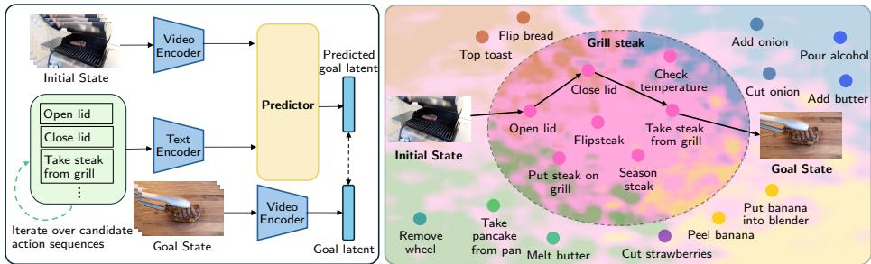
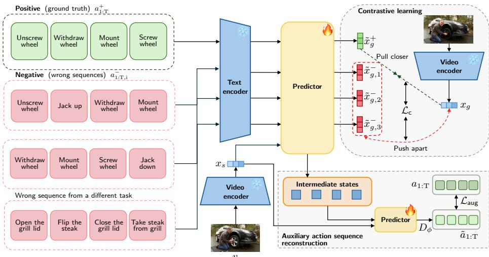
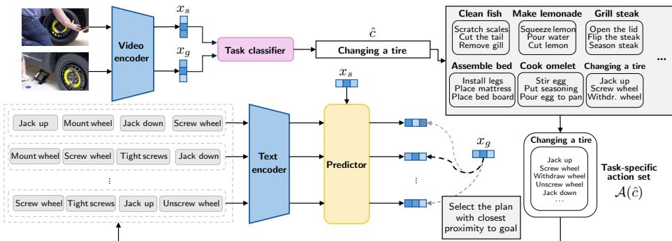
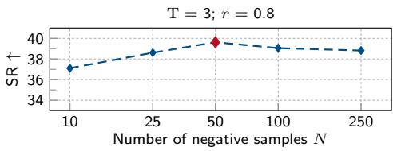
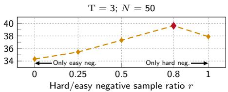
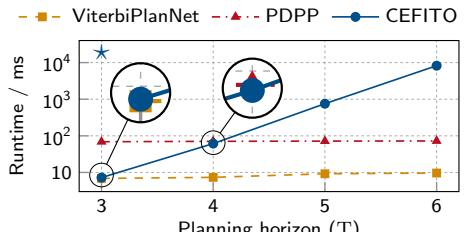
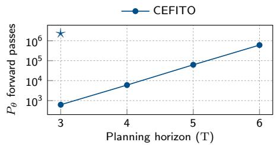
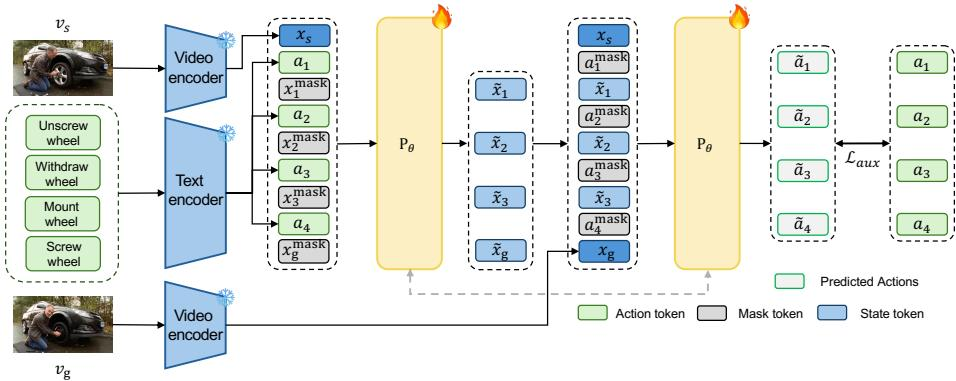

# Contrastive Energy Fields for Inference-Time Procedure Planning in Instructional Videos

Mohamed Afham1,3 , Christoph Reich1,2,3,4 , Oliver Hahn1 , Daniel Cremers2,3,4 , and Stefan Roth1,3,5

1 TU Darmstadt 2 TU Munich 3 ELIZA 4 MCML 5 hessian.AI afham.aflal@visinf.tu-darmstadt.de https://visinf.github.io/cefito

Abstract. Procedure planning seeks to estimate a sequence of actions to transition from an observed initial state to a given goal state. Current procedure planning approaches directly predict action sequences from latent representations using feed-forward neural networks or difusionbased inference. These paradigms treat every action as plausible, lacking the ability to enforce task-specific logical constraints that render certain actions irrelevant or not plausible. We propose CEFITO, a procedure planning approach that learns a predictor to express an actionconditioned representation space. Based on this representation space, we formulate procedure planning as a task-constrained optimization problem. Unlike prior methods, CEFITO explicitly reasons over the action space by omitting irrelevant actions during inference-time planning. This reformulation enables efective procedure planning and achieves state-ofthe-art accuracy on two established procedure planning benchmarks.

Keywords: Procedure Planning · Contrastive Learning · Inference Time Optimization

## 1 Introduction

Planning is a central component of human intelligence [38]. Humans can reason about the next actions to take and their consequences in order to reach a desired goal. The ability to plan is crucial in real-world tasks, including robotic navigation [4,57], autonomous driving [26], virtual reality [45], and healthcare [58]. Procedure planning in instructional videos [12] seeks to plan a sequence of actions given a visual initial and a desired goal state. Unlike classical planning formulations with explicit initial and goal states, procedure planning in instructional videos directly operates on raw visual observation (i.e., imagery), providing a vision-driven planning setting grounded in real-world environments [52,65].

Current approaches from procedure planning employ various deep learning architectures, including transformers [51], difusion models [55,64], and taskspecific procedural knowledge graphs [49]. Still, these approaches use feed-forward or difusion-based inference to map latent representations to a distribution over action sequences. In contrast, human cognitive planning is a dynamic and iterative process [7,8]. Humans do not predict a single sequence. Instead, humans infer a set of possible actions and optimize over these to reach a desired goal. Current procedure planning approaches do not mimic this process and cannot, for example, disregard irrelevant actions during inference.

  
Fig. 1. Overview of CEFITO. Left: Given an initial observation and a sequence of actions, our method maps action sequences to a predicted goal latent. The distance to the encoded goal latent defines the candidate’s energy, which we minimize at inference. Right: We learn a task-conditioned energy field via contrastive learning. At inference, CEFITO predicts the task (e.g., “Grill steak”), restricting the search to an action subset (pink region). The action sequence with minimal energy is the predicted plan.

Instead of feed-forward inference, work in classical robot control and planning performs online optimization using predictive models [9]. More recently, actionconditioned world models have demonstrated efective planning using inferencetime optimization [23,32,35]. During training, a predictive model is learned to express the transition from a current state to the next. At inference, this predictive model is used for planning by optimizing over a sequence of actions. Such approaches capture the dynamics of the underlying system and the relationship between actions and their outcomes. In procedure planning, modeling action-conditioned visual transitions is crucial, yet challenging due to the scarcity of training data, including intermediate observations. Existing approaches use Large Language Models [42,61], interpolation [64], or probabilistic graphs [41,49] as proxies for unknown intermediate states. However, these approaches rely on rigid structures or require huge training datasets and large-scale pre-training.

Motivated by the efectiveness of inference-time optimization using predictive models, we introduce CEFITO—Contrastive Energy Fields for Inference-Time Optimization in Procedure Planning in Instructional Videos. In contrast to existing procedure planning approaches, CEFITO (cf. Fig. 1) decomposes procedure planning into two sub-problems. First, CEFITO learns an action-conditioned representation space (i.e., an energy field) in the form of a predictor model, using contrastive learning. This predictor models the transition from an initial state to a goal state, given a sequence of actions. Second, at inference-time, we formulate the planning of an action sequence as a task-constrained optimization problem using our predictor model. Unlike prior approaches, CEFITO can explicitly reason over the action space, allowing for the omission of irrelevant actions during planning. This allows CEFITO to perform efective and accurate procedure planning in instructional videos.

Specifically, we make the following contributions: (i) We formulate procedure planning as energy minimization over an action-conditioned representation, learned with a contrastive objective that does not require intermediate state supervision. (ii) We introduce a task-constrained search procedure that exploits this energy to plan over a restricted, task-relevant action subset at inference time. (iii) We evaluate CEFITO on established procedure planning benchmarks of instructional videos. CEFITO achieves state-of-the-art accuracy on two datasets and diferent planning horizons, while not relying on large language models.

## 2 Related Work

Procedure Planning in Instructional Videos. Procedure planning in instructional videos [12] aims to plan a sequence of actions transitioning from an initial state to a desired goal state. Both the initial and the goal state are given as visual observations (i.e., video frames). This task is closely related to general task planning [12,22]. Initial approaches for procedure planning employed sequence modeling via sequential latent spaces [12] or adversarial policy learning [6]. While DDN [12] and Ext-GAIL [6] learn using sequential action supervision, subsequent works employed additional supervision such as language [54,62]. In particular, P3IV [62] explores supervision with natural language representations of the action labels instead of one-hot labels, while EGPPP [54], in addition, leverages task labels to condition the planning model. PlaTe [51] introduced a transformerbased model, reducing compounding prediction errors common with single-step models. PDPP [55] and MTID [64] employ difusion to probabilistically model the prediction action sequences. KEPP [41] leverages a probabilistic procedural knowledge graph to guide state transition. Building on this, ViterbiPlanNet [49] introduced a diferentiable viterbi layer upon the probabilistic knowledge graph to enable end-to-end training. A diferent line of work approached procedure planning using large language models (LLMs) [42,61]. SCHEMA [42] uses an LLM to explicitly model state transitions, while PlanLLM [61] fine-tunes an LLM and trains a step decoder. Diferent from these approaches that utilize feed-forward neural networks or difusion models, we learn an action-conditioned representation space using contrastive learning. This allows us to express an energy function and perform task-constrained optimization-based inference.

Inference-Time Optimization for Planning. Inference-time optimization is a well-established paradigm in robotics control and planning, where action sequences are optimized online using forward predictive models [9]. Early visual foresight methods established this direction by combining pixel-level rollouts or learned dynamics with model predictive control to plan trajectories at inference time, without updating policy parameters during inference [16,19,40]. The introduction of world models [2,23,32] has further advanced this idea by moving from high-dimensional pixel space to latent representations, enabling online trajectory optimization at inference time [24,27]. More recently, large-scale visual foundation models [2,11,43] have been used to build world models that support planning entirely during inference [4,35,63]. Motivated by classical methods, we reformulate procedure planning as an inference-time optimization problem using an action-conditioned energy field.

Contrastive Learning. Contrastive learning aims to learn expressive representations in a self-supervised [10,13], weakly [46], or supervised fashion [31]. At its core, contrastive learning enforces discrimination between pairs of positive and negative data points and has been applied for downstream tasks, including action recognition [30,39,56], action anticipation [44], and temporal action localization [20,28]. A central aspect for the efectiveness of contrastive learning is the choice and number of negative samples [47]. Specifically, hard negatives, which are semantically similar to positive samples, provide an informative training signal. In this work, we utilize supervised contrastive learning [31] in the form of a contrastive triplet-loss [48] to learn an action-conditioned representation space suitable for planning at inference time.

## 3 Method: CEFITO

In this section, we present CEFITO for procedure planning in instructional videos. We will first revisit the task definition of procedure planning and reformulate the problem as energy minimization over an action-conditioned energy field (cf. Sec. 3.1). Next, we introduce a contrastive learning approach for obtaining this action-conditioned energy field in the form of a predictor model (cf. Sec. 3.2). Finally, we propose our task-constrained inference-time optimization for planning action sequences (cf. Sec. 3.3).

## 3.1 Procedure Planning as Inference-Time Optimization

Problem Formulation. Procedure planning seeks to estimate a sequence of actions $a _ { 1 : \mathrm { T } }$ from a predefined corpus of actions, transforming a given initial state $v _ { s }$ into a given goal state $v _ { g }$ . T represents the planning horizon, i.e., the number of action steps required to achieve the goal state $v _ { g }$ . Both the initial state and the goal state are provided as visual observations (i.e., video frames). Following the established paradigm [12,41,42,51,55,61,64], we encode the visual initial $v _ { s }$ and goal state $v _ { g }$ using a visual feature extractor (i.e., S3D [36] pretrained on the HowTo100M dataset [37]), resulting in the latent initial state $\boldsymbol { x } _ { s } \in \mathbb { R } ^ { E }$ and the latent goal state $\boldsymbol { x } _ { g } \in \mathbb { R } ^ { E }$ . E denotes the latent dimension of the visual features.

Reformulating Procedure Planning. Prior approaches map $( x _ { s } , x _ { g } )$ directly to an action sequence through a feed-forward or difusion-based network [51,55,64]. We reformulate procedure planning as an inference-time search over a learned action-conditioned energy field, decomposing it into two sub-tasks. First, we learn a predictor model that maps a candidate action sequence and the initial state $x _ { s }$ to the resulting goal embedding, acting as an energy. Second, at inference, we optimize over candidate action sequences and select the one whose predicted goal embedding is closest to the observed latent state $x _ { g }$

  
Fig. 2. CEFITO training framework. During training, a positive and N negative (wrong) action sequences are provided. Each sequence is tokenized using a text encoder and fed into the predictor $P _ { \theta ; \ l }$ , alongside the initial latent state $x _ { s } .$ . For each sequence we predict a goal state $\tilde { x } _ { g }$ , while predictions of negative sequences $\tilde { x } _ { g , i } ^ { - }$ are pushed away from the target $\tilde { x } _ { g }$ and for positive sequences ${ \tilde { x } } _ { g } ^ { + }$ pulled together. An auxiliary loss $\mathcal { L } _ { \mathrm { a u x } }$ supervises auxiliary latents of $P _ { \theta }$ via a decoding head $D _ { \phi }$

## 3.2 Action-Conditioned Energy Field

To perform planning at inference time, we aim to learn an action-conditioned energy field capturing the transition from $x _ { s }$ to $x _ { g } .$ , given an action sequence. Perpetually, we train a predictor model $P _ { \theta ; \ l }$ , mapping an action sequence $a _ { 1 : \mathrm { T } }$ (textual form) and an initial state $x _ { s }$ to a predicted goal state $\tilde { x } _ { g } \in \mathbb { R } ^ { E }$ by

$$
\begin{array} { r } { \tilde { x } _ { g } = P _ { \theta } ( x _ { s } , a _ { \mathrm { 1 : T } } ) . } \end{array}\tag{1}
$$

The objective of $P _ { \theta }$ is to predict $\tilde { x } _ { g }$ close to the observed goal $x _ { g }$ when conditioned on the correct action sequence $a _ { 1 : T } ^ { + }$ , and far from $x _ { g }$ for any incorrect sequence $a _ { 1 : T } ^ { - }$ . During inference, we can search for an action sequence that minimizes distance in latent space. Formally, d( $P _ { \theta } ( x _ { s } , a _ { \mathrm { 1 : T } } ) , x _ { g } )$ can be seen as an energy function, where $d ( \cdot , \cdot )$ denotes a distance metric.

We implement our predictor model $P _ { \theta }$ as a transformer [53]. We use the initial latent state $x _ { s }$ as an input token. The action sequence is encoded in language form using CLIP [46]. The resulting embeddings are used as additional input tokens. We visualize the predictor architecture in Fig. 2.

Contrastive Training. We train our predictor $P _ { \theta }$ using contrastive learning. In particular, we use a margin-based triplet loss [48]. Given the correct action sequence $a _ { \mathrm { 1 : T } } ^ { + } .$ , we obtain $\tilde { x } _ { q } ^ { + } \in \mathbb { R } ^ { E }$ using $P _ { \theta }$ and $x _ { s } ~ ( c f . \ \mathrm { E q . } \ ( 1 ) )$ . Analogously, given N wrong sequences $\{ a _ { \mathrm { 1 : T , 1 } } ^ { - } , \dotsc , a _ { \mathrm { 1 : T , N } } ^ { - } \}$ , we obtain $\tilde { x } _ { g , i } ^ { - } \in \mathbb { R } ^ { C \times N }$ . Given the ground truth latent goal state, we compute our contrastive loss $\mathcal { L } _ { \mathrm { c } }$ using

$$
\mathcal { L } _ { \mathrm { c } } = \frac { 1 } { N } \sum _ { i = 1 } ^ { N } \operatorname* { m a x } \Bigl ( \bigl \| x _ { g } - \tilde { x } _ { g } ^ { + } \bigr \| _ { 2 } - \bigl \| x _ { g } - \tilde { x } _ { g , i } ^ { - } \bigr \| _ { 2 } + \tau _ { i } , 0 \Bigr ) .\tag{2}
$$

Here, $\tau _ { i } \in \mathbb { R } ^ { + }$ is the triplet margin per negative sample i, enforcing a minimum separation and preventing the degenerate solution that collapses all embeddings. We train our predictor’s weights θ to minimize $\operatorname { E q . } \ ( 2 )$

Negative Action Sequence Sampling. Negative samples are critical for obtaining a discriminative space [29,47]. To learn an energy field that captures both highlevel $( e . g .$ , discriminate between tasks) and low-level structure $( e . g .$ , detect wrong action sequence order), we employ mixed-negative sampling. By generating both hard and easy negative samples, we impose high and low-level structure.

Given a ground truth action sequence with initial, goal state, and task label $c \in { \mathcal { C } }$ , we generate N negative samples, i.e., wrong sequences. Specifically, $r N$ of the negative samples are hard negatives and $\left( 1 - r \right) N$ are easy negatives. $r \in [ 0 , 1 ]$ is the hard/easy negative sample ratio, controlling the balance between both. Hard negative samples share the same high-level task c but difer in ordering or composition. Easy negatives are sequences sampled from tasks other than c.

Adaptive Margins. The triplet-loss margin $\tau _ { i }$ (cf. Eq. (2)) enforces a minimum distance between the positive $\left\| x _ { g } - x _ { g } ^ { + } \right\| _ { 2 }$ and negative pair $\lVert x _ { g } - x _ { g , i } ^ { - } \rVert _ { 2 }$ . Using a fixed margin for every negative is suboptimal because negatives difer in similarity to the ground truth: An action sequence only difering from the ground truth in the ordering of the actions (i.e., hard negative sample) should ideally entail a smaller distance than an action sequence of unrelated actions (i.e., easy negative sample). To enforce this structure, we use adaptive margins, assigning a margin to each negative sample based on the action overlap with the positive sample. In particular, given the positive action sequence $a _ { 1 : \mathrm { T } } ^ { + }$ (i.e., ground truth) and a negative action sequence $a _ { \mathrm { 1 : T , i } } ^ { - } .$ , we extract the sets of unique actions of the positive $\mathbb { A } ^ { + }$ and of the negative sequence $\mathbb { A } _ { i } ^ { - }$ . Next, we compute $\tau _ { i }$ using

$$
\tau _ { i } = \tau _ { \mathrm { m i n } } + ( \tau _ { \mathrm { m a x } } - \tau _ { \mathrm { m i n } } ) \frac { | \mathbb { A } _ { i } ^ { - } \setminus \mathbb { A } ^ { + } | } { | \mathbb { A } _ { i } ^ { - } | } .\tag{3}
$$

Here, the hyperparameters $\tau _ { \operatorname* { m i n } } \in \mathbb { R } ^ { + }$ denotes the minimum and $\tau _ { \operatorname* { m a x } } \in \mathbb { R } ^ { + }$ the maximum margin, bounding the per negative margin ${ \tau _ { i } } \in [ \tau _ { \operatorname* { m i n } } , \tau _ { \operatorname* { m a x } } ]$

Auxiliary Action Sequence Reconstruction While Eq. (2) supervises the final output representation, we further enforce expressive intermediate representations using an action sequence reconstruction approach. As visual representations of the intermediate states are not available, we employ a mask token modeling [15,25] approach. We feed the initial latent state $x _ { s }$ and the action sequence $a _ { 1 : \mathrm { T } }$ (tokenized using the text encoder) to our predictor $P _ { \theta }$ . Additionally, while omitted in Eq. (1) for clarity, we also feed a learnable masked token for each action into the predictor. The predictor outputs the goal state representation $\tilde { x } _ { g } ,$ we further extract the intermediate representation $\{ \bar { x } _ { l } \} _ { t = 1 } ^ { \mathrm { T } }$ corresponding to each of the masked tokens. After obtaining $\{ \tilde { x } _ { l } \} _ { t = 1 } ^ { \mathrm { T - 1 } }$ , now reverse the masking and all actions $a _ { 1 : \mathrm { T } }$ and feed $\{ \tilde { x } _ { l } \} _ { t = 1 } ^ { \mathrm { T - 1 } }$ into our predictor and a decoding head $D _ { \phi }$ . This yields a reconstruction of actions $\tilde { a } _ { \mathrm { 1 : T } }$ . Each reconstructed action is supervised using the ground-truth actions $a _ { 1 : \mathrm { T } }$ using $\begin{array} { r } { \mathcal { L } _ { \mathrm { a u x } } = \frac { 1 } { \mathrm { T } } \sum _ { k = 1 } ^ { \mathrm { T } } \mathcal { L } _ { \mathrm { C E } } ( \widetilde { a } _ { k } , a _ { k } ) } \end{array}$ . Here, $\mathcal { L } _ { \mathrm { C E } }$ denotes the cross-entropy loss, and actions are mapped to the vocabulary of actions. We omit this mapping for the sake of compactness.

  
Fig. 3. CEFITO inference. A task classifier predicts ˆc from $( x _ { s } , x _ { g } )$ and restricts the search to $\boldsymbol { \mathcal { A } } ( \boldsymbol { \hat { c } } )$ . The predictor $P _ { \theta }$ scores every candidate sequence in $\boldsymbol { \mathcal { A } } ( \boldsymbol { \hat { c } } )$ . The sequence approximating $x _ { g }$ best, forms the action sequence prediction $\tilde { a } _ { \mathrm { 1 : T } }$

Our full predictor loss composes both the contrastive loss $\mathcal { L } _ { \mathrm { c } }$ and our auxilary loss $\mathcal { L } _ { \mathrm { a u x } }$ , weighted by λ, i.e., $\mathcal { L } = \mathcal { L } _ { \mathrm { c } } + \lambda \mathcal { L } _ { \mathrm { a u x } }$ . We visualize our training in Fig. 2.

## 3.3 Task-Constrained Optimization for Planning

Equipped with our predictor $P _ { \theta }$ , we now seek to infer an action sequence, given the initial xs and goal state $x _ { g }$ , in latent space (cf. Fig. 3). We formulate inference as a discrete search over the action space ${ \mathcal { A } } .$ Optimizing over the full space is expensive. To this end, we learn a lightweight classifier that estimates the highlevel task $c \in { \mathcal { C } }$ . Implemented as a multilayer perceptron, the classifier takes in $( x _ { s } , x _ { g } )$ , and predicts the task ${ \hat { c } } \in { \mathcal { C } }$ . We train the classifier using cross-entropy.

Using the estimated high-level task ˆc, we reduce the search space from the full action space to a task-specific subspace $\boldsymbol { \mathcal { A } } ( \boldsymbol { \hat { c } } )$ . This subspace only captures actions relevant to the specific task and is derived from the training data. Using $\boldsymbol { \mathcal { A } } ( \boldsymbol { \hat { c } } )$ , the initial state $x _ { s } ,$ and goal state $x _ { g } ,$ , we infer an action sequence $\tilde { a } _ { \mathrm { 1 : T } }$ by

$$
\begin{array} { r } { \tilde { a } _ { 1 : \mathrm { T } } = \ \underset { \tilde { a } _ { 1 : \mathrm { T } } \in A ( \hat { c } ) } { \arg \operatorname* { m i n } } \left\| P _ { \theta } ( x _ { s } , \tilde { a } _ { 1 : \mathrm { T } } ) - x _ { g } \right\| _ { 2 } . } \end{array}\tag{4}
$$

This inference approach enables procedure planning by considering only relevant actions, ignoring irrelevant ones. Our inference approach is shown in Fig. 3.

Table 1. Results on CrossTask [65]. We compare CEFITO with the state of the art on CrossTask val., using diferent planning horizons, and report SR, mACC, and mIoU (all in %, ↑). Best results highlighted in red ■; second-best results in orange ■. For completeness, we report baselines not adhering to the protocol by [49] in gray ■.
<table><tr><td rowspan="2">Method</td><td colspan="3">T=3</td><td colspan="3">T=4</td></tr><tr><td>SR↑</td><td>mAcc↑</td><td>mIoU↑</td><td>SR↑</td><td>mAcc↑</td><td>mIoU↑</td></tr><tr><td>WLTDO [17]</td><td>1.87</td><td>21.64</td><td>31.70</td><td>0.77</td><td>17.92</td><td>26.43</td></tr><tr><td>UAAA [18]</td><td>2.15</td><td>20.21</td><td>30.87</td><td>0.98</td><td>19.86</td><td>27.09</td></tr><tr><td>UPN [50]</td><td>2.89</td><td>24.39</td><td>31.56</td><td>1.19</td><td>21.59</td><td>27.85</td></tr><tr><td>DDN [12]</td><td>12.18</td><td>31.29</td><td>47.48</td><td>5.97</td><td>27.10</td><td>48.46</td></tr><tr><td>PlaTe [51]</td><td>16.00</td><td>36.17</td><td>65.91</td><td>14.00</td><td>35.29</td><td>55.36</td></tr><tr><td>Ext-GAIL [6]</td><td>21.27</td><td>49.46</td><td>61.70</td><td>16.41</td><td>43.05</td><td>60.93</td></tr><tr><td>P3IV [62]</td><td>23.34</td><td>49.96</td><td>73.89</td><td>13.40</td><td>44.16</td><td>70.01</td></tr><tr><td>EGPP [54]</td><td>26.40</td><td>53.02</td><td>74.05</td><td>16.49</td><td>48.00</td><td>70.16</td></tr><tr><td>Qwen2.5-VL-32B [3]</td><td>11.48</td><td>36.35</td><td>69.52</td><td>5.56</td><td>31.22</td><td>66.31</td></tr><tr><td>Qwen2.5-32B [60]</td><td>25.14</td><td>56.10</td><td>80.92</td><td>9.22</td><td>46.32</td><td>76.15</td></tr><tr><td>Gemini 2.5 Pro [21]</td><td>29.18</td><td>57.90</td><td>81.48</td><td>14.00</td><td>51.33</td><td>78.58</td></tr><tr><td>Qwen3-30B [59]</td><td>23.37</td><td>55.96</td><td>81.16</td><td>10.59</td><td>49.06</td><td>78.03</td></tr><tr><td>Qwen3-30B + PKG [49]</td><td>23.31</td><td>56.15</td><td>81.06</td><td>10.96</td><td>48.77</td><td>77.48</td></tr><tr><td>PKG beam search [49]</td><td>22.38 ±0.2655.74</td><td>±0.25</td><td>80.92 ±0.26</td><td>9.30 ±0.22</td><td>47.65 ±0.54</td><td>78.25 ±0.42</td></tr><tr><td>PDPP [55]</td><td>36.73 ±0.59 61.96</td><td>±0.59</td><td>83.20 ±0.33</td><td>21.47 ±2.09</td><td>55.66</td><td>±1.64 80.68 ±0.83</td></tr><tr><td>KEPP [41]</td><td>34.93</td><td>±2.60 60.34 ±1.61 82.67</td><td>±0.69</td><td>22.34 ±0.43 55.24</td><td></td><td>±0.30 80.58</td></tr><tr><td>PlanLLM [61]</td><td>36.84 ±1.21 61.56</td><td>±1.03</td><td>83.23 ±0.53</td><td>22.91 ±1.39 55.29</td><td>±1.54</td><td>±0.25 81.03</td></tr><tr><td>SCHEMA [42]</td><td>37.24 ±0.60 62.69</td><td>±0.28</td><td>83.94 ±0.23</td><td>24.18 ±0.47</td><td>57.02 ±0.64</td><td>±0.47 81.46</td></tr><tr><td>ViterbiPlanNet [49]</td><td>38.45 ±0.32 63.07 ±0.17</td><td></td><td>83.89 ±0.16</td><td>24.64 ±0.30</td><td>57.00 ±0.42 81.18</td><td>±0.19</td></tr><tr><td>CEFITO (Ours)</td><td>39.62 ±0.24 64.12 ±0.31 84.29 ±0.21</td><td></td><td></td><td>24.76 ±0.43 57.53 ±0.37 81.58 ±0.25</td><td></td><td>±0.44</td></tr></table>

## 4 Experiments

We evaluate CEFITO on two established procedure planning benchmarks and compare against existing state-of-the-art approaches (cf. Sec. 4.1). Moreover, we analyze the main components and hyperparameters of our approach (cf. Sec. 4.2).

Datasets. We evaluate on two procedure planning datasets, CrossTask [65] and COIN [52]. CrossTask contains 2750 videos spanning 18 high-level tasks with a total of 105 distinct actions. Each video entails 7.6 actions on average. COIN comprises 11 827 videos of 180 diferent tasks, covering 778 unique actions. We adopt the unified evaluation protocol by Seminara et al. [49], where we train using five random seeds and report the mean and the 90 % confidence interval.

Metrics. We follow existing work [41,42,49,55,61,62,64] and utilize three standard metrics to measure procedure planning accuracy. First, we utilize the Success Rate (SR), measuring the percentage of predicted action sequences that exactly match the corresponding ground truth sequences. Second, we report the Mean Accuracy (mAcc), measuring the average proportion of correctly predicted actions across all step-wise positions. Third, we use the Mean Intersection over Union (mIoU), computing the overlap between the predicted and ground truth action sequences. In particular, we follow the element-wise mIoU formulation suggested by Seminara et al. [49]. Among these three metrics, SR is the strictest metric. All metrics are reported in %.

Table 2. Results on COIN [52]. We compare CEFITO with the state of the art on COIN val., using diferent planning horizons, and report SR, mACC, and mIoU (all in $\% , \uparrow )$ . Best results are highlighted in red ■ and second-best results in orange ■. For completeness, we report baselines not adhering to the protocol by [49] in gray ■.
<table><tr><td rowspan="2">Method</td><td colspan="3">T=3</td><td colspan="3">T=4</td></tr><tr><td>SR↑</td><td>mAcc↑</td><td>mIoU↑</td><td>SR↑</td><td>mAcc↑</td><td>mIoU↑</td></tr><tr><td>DDN [12]</td><td>13.90</td><td>20.19</td><td>64.78</td><td>11.13</td><td>17.71</td><td>68.06</td></tr><tr><td>P3IV [62]</td><td>15.40</td><td>21.67</td><td>76.31</td><td>11.32</td><td>18.85</td><td>70.53</td></tr><tr><td>EGPP [54]</td><td>19.57</td><td>31.42</td><td>84.95</td><td>13.59</td><td>26.72</td><td>84.72</td></tr><tr><td>Qwen2.5-VL-32B [3]</td><td>3.65</td><td>17.51</td><td>52.10</td><td>1.87</td><td>17.05</td><td>55.66</td></tr><tr><td>Qwen2.5-32B [60]</td><td>14.97</td><td>36.34</td><td>78.74</td><td>4.98</td><td>27.45</td><td>71.64</td></tr><tr><td>Gemini 2.5 Pro [21]</td><td>17.02</td><td>38.87</td><td>78.73</td><td>8.10</td><td>31.90</td><td>71.70</td></tr><tr><td>Qwen3-30B [59]</td><td>14.52</td><td>36.56</td><td>78.07</td><td>4.64</td><td>28.85</td><td>70.45</td></tr><tr><td>Qwen3-30B + PKG [49] 14.63</td><td></td><td>36.53</td><td>78.11</td><td>4.78</td><td>29.00</td><td>71.04</td></tr><tr><td>PKG beam search [49]</td><td></td><td> $1 3 . 3 2 \pm \ 0 . 3 4 3 7 . 4 2 \pm \ 1 . 1 9 7 8 . 9 3 \pm \ 2 . 0 6$ </td><td></td><td></td><td> $5 . 1 4 \pm \ : 0 . 6 0 \ : 3 1 . 2 9 \pm \ : 3 . 6 4 \ : 7 4 . 2 6 \pm \ : 5 . 3 8$ </td><td></td></tr><tr><td>PDPP [55]</td><td></td><td> $2 2 . 3 7 \pm \ 0 . 5 7 \ 4 4 . 6 0 \pm \ 0 . 1 6 \ 8 3 . 0 0 \pm \ 0 . 4 2$ </td><td></td><td></td><td> $1 5 . 2 1 \pm \ : 0 . 3 4 \ : 4 1 . 0 1 \pm \ : 0 . 3 2 \ : 8 1 . 6 4 \pm \ : 0 . 4 8$ </td><td></td></tr><tr><td>KEPP [41]</td><td></td><td> $1 3 . 8 5 \pm { \ : 7 . 4 9 \ : 2 8 . 4 0 \pm 1 2 . 2 6 \ : 6 2 . 5 4 \pm 1 4 . 3 5 }$ </td><td></td><td></td><td> $1 5 . 2 0 \pm \ : 1 . 2 7 \ : 3 3 . 3 9 \pm \ : 0 . 7 3 \ : 6 7 . 7 9 \pm \ : 1 . 2 9$ </td><td></td></tr><tr><td>PlanLLM [61]</td><td></td><td> $3 3 . 4 4 \pm \ 0 . 1 5 ~ 5 1 . 0 5 \pm \ 0 . 4 6 ~ 8 4 . 6 6 \pm \ 0 . 4 1$ </td><td></td><td></td><td> $2 3 . 1 9 \pm \ : 0 . 3 2 \ : 4 5 . 7 0 \pm \ : 0 . 3 3 \ : 8 3 . 4 4 \pm \ : 0 . 3 9$ </td><td></td></tr><tr><td>SCHEMA [42]</td><td></td><td> $3 2 . 8 9 \pm ~ 0 . 6 1 ~ 5 0 . 8 4 \pm ~ 0 . 4 7 ~ 8 3 . 9 8 \pm ~ 0 . 6 7$ </td><td></td><td></td><td> $\mathrm { 2 2 . 3 3 \pm ~ 0 . 9 2 ~ 4 5 . 2 1 \pm ~ 1 . 0 5 ~ 8 2 . 9 3 \pm ~ 0 . 2 5 }$ </td><td></td></tr><tr><td>ViterbiPlanNet [49]</td><td></td><td> $3 3 . 9 9 \pm \ 0 . 2 3 \ 5 0 . 8 7 \pm \ 0 . 1 7 \ 8 3 . 8 8 \pm \ 0 . 3 1$ </td><td></td><td></td><td> $2 3 . 9 2 \pm \ : 0 . 2 9 \ : 4 5 . 6 3 \pm \ : 0 . 5 5 \ : 8 2 . 5 6 \pm \ : 0 . 4 4$ </td><td></td></tr><tr><td>CEFITO</td><td> $3 4 . 1 1 \pm \ : 0 . 2 4 \ : 5 1 . 1 8 \pm \ : 0 . 2 2 \ : 8 4 . 7 0 \pm \ : 0 . 4 7$ </td><td></td><td></td><td></td><td>24.25 ± 0.34 46.13 ± 0.6383.24 ± 0.26</td><td></td></tr></table>

Implementation Details. We implement our predictor model as a four-layer transformer [53] with 6 attention heads, and a hidden dimension of 384. We train the predictor using the AdamW optimizer [33] and a learning rate of $5 \times 1 0 ^ { - 4 }$ We sample 50 negative samples per positive training sequence with $r = 0 . 8 . { \mathrm { T h e } }$ minimum $\tau _ { \mathrm { m i n } }$ and maximum margin $\tau _ { \mathrm { m a x } }$ are set to 0.01 and 0.1, respectively. For obtaining the visual representations of the initial state and the goal state, we follow existing work [12,41,42,51,55,61,64] and use a frozen S3D [36] encoder pre-trained on HowTo100M [37]. Textual action sequences are encoded using the pre-trained text encoder from CLIP-ViT-B [46] and kept frozen during training.

## 4.1 Comparison to the State of The Art

We compare CEFITO to recent state-of-the-art approaches for procedure planning in instructional videos. Table 1 presents the results on CrossTask for a planning horizon of $\mathrm { T } = 3$ and $\mathrm { T } = 4$ . CEFITO outperforms the recent state of the art on all procedure planning accuracy metrics and both planning horizons. Notably, CEFITO outperforms recent approaches that utilize large language models (LLMs). Without relying on LLMs, CEFITO, for example, outperforms the LLM-based approach SCHEMA [42] by 2.38 % in SR for $\mathrm { T } = 3$ . In comparison to the recent state-of-the-art ViterbiPlanNet [49], CEFITO improves success rate by 1.17 % and 0.12 % for $\mathrm { T } = 3$ and $\mathrm { T } = 4 .$ , respectively.

In Tab. 2, we report the results on the COIN dataset for a planning horizon $\mathrm { T } = 3$ and T = 4. CEFITO achieves the best mean SR, mAcc, and mIoU at $\mathrm { T } = 3 .$ , and the best SR and mAcc at $\mathrm { T } = 4 .$ . Improvements over the recent state-of-the-art ViterbiPlanNet [49] are smaller on COIN than on CrossTask (0.12 % and 0.33 % SR at $\mathrm { T } = 3$ and $\mathrm { T } = 4 .$ , respectively). We attribute the smaller benefits to COIN’s much wider task distribution (180 tasks vs. 18 on CrossTask), which reduces the number of training videos available per task and thereby weakens the intra-task hard-negative signal that drives our contrastive training. Even so, CEFITO achieves state-of-the-art accuracy on COIN without significant additional training data, confirming the trend observed on CrossTask.

Table 3. CEFITO training analysis. Component-wise analysis of CEFITO on CrossTask val. and report SR, mACC & mIoU (all in %, ↑). We add components to the previous row until achieving CEFITO. For reference, we include the recent stateof-the-art ViterbiPlanNet. Best results in red ■; second-best results in orange ■.
<table><tr><td rowspan="2">Configuration</td><td colspan="3">T=3</td><td colspan="3">T=4</td></tr><tr><td>SR↑</td><td>mAcc↑</td><td>mIoU↑</td><td>SR↑</td><td>mAcc↑</td><td>mIoU↑</td></tr><tr><td>ViterbiPlanNet [49]</td><td>38.45</td><td>63.07</td><td>83.89</td><td>24.64</td><td>57.00</td><td>81.18</td></tr><tr><td>Baseline</td><td>13.65</td><td>47.82</td><td>69.53</td><td>9.24</td><td>35.44</td><td>67.76</td></tr><tr><td>+ triplet contrastive loss</td><td>37.58</td><td>63.21</td><td>83.67</td><td>23.54</td><td>56.18</td><td>80.91</td></tr><tr><td>+ adaptive margin</td><td>38.74</td><td>63.79</td><td>84.02</td><td>24.23</td><td>57.01</td><td>81.22</td></tr><tr><td>+ auxiliary regualrization (CEFITO)</td><td>39.62</td><td>64.12</td><td>84.29</td><td>24.76</td><td>57.53</td><td>81.58</td></tr></table>

Table 4. Text encoder analysis. We analyze the choice of text encoder for CEFITO on CrossTask val. and report SR, mACC, and mIoU (all in $\% , \uparrow )$ . Best results are highlighted in red ■ and second-best results in orange ■.
<table><tr><td rowspan="2">Text Encoder</td><td colspan="3">T=3</td><td colspan="3"> $\mathbf { T } { = } 4$ </td></tr><tr><td>SR↑</td><td>mAcc↑</td><td>mIoU↑</td><td>SR↑</td><td>mAcc↑</td><td>mIoU↑</td></tr><tr><td>Random embedding</td><td>35.10</td><td>61.20</td><td>82.50</td><td>21.30</td><td>54.10</td><td>79.80</td></tr><tr><td>Flan-T5-base [14]</td><td>37.80</td><td>63.00</td><td>83.60</td><td>23.10</td><td>56.20</td><td>80.90</td></tr><tr><td>CLIP [46]</td><td>39.62</td><td>64.12</td><td>84.29</td><td>24.76</td><td>57.53</td><td>81.58</td></tr></table>

## 4.2 Analyzing CEFITO

Learning Objective. Contrastive learning is the core component of CEFITO, as it explicitly enforces a discriminative energy field in which the predicted goal is encoded near $x _ { g }$ for correct sequences and far from $x _ { g }$ for incorrect ones. In Tab. 3, we report the contribution of each core component on CrossTask. The baseline replaces our contrastive objective with a plain $\mathcal { L } _ { 2 }$ regression to $x _ { g }$ and severely underperforms w.r.t. ViterbiPlanNet. Adding the triplet contrastive loss yields a +23.93 jump in SR for T = 3. The adaptive margin contributes an additional +1.16 % in SR by allowing hard negatives to receive a smaller separation than easy ones. Our auxiliary action-reconstruction loss further increases SR by +0.88 %, encouraging informative auxiliary latents.

Text Encoder Analysis. We compare three options for embedding the action labels fed to $P _ { \theta } \colon$ a randomly initialized embedding trained from scratch, frozen Flan-T5-base [14], and frozen CLIP (text encoder only) [46]. Table 4 reports the results on CrossTask for T = 3 and T = 4 using the diferent options. Both pretrained encoders outperform the random embedding across all metrics, indicating that pre-training provides a stronger foundation than what can be learned from the procedure-planning supervision alone. CLIP consistently outperforms Flan-T5-base despite being the smaller model. We attribute this to CLIP’s multimodal contrastive pre-training, which aligns text representations with visual concepts and is well-aligned with our planning task.

  
Fig. 4. Negative sampling analysis. We analyze the impact of the number of negative samples N (left) and the hard/easy negative sample ratio r (right) on CrossTask with T = 3 using SR (in %, ↑). For $r = 0 ,$ only easy negatives are used. Vice versa, r = 1 generates only hard negatives. We indicate our default values in red ■.

Table 5. Task classifier results. We report the accuracy $( \mathrm { i n ~ } \% , \uparrow )$ of our task classifier on the high-level class tasks of CrossTask [65] as well as COIN [52] for two diferent planning horizons.  
Table 6. Oracle experiment. We report oracle results by replacing the task classifier prediction used for inference with the ground truth task on CrossTask and COIN, using SR, mACC & mIoU (all in %, ↑). For reference, we also report CEFITO (i.e., w/ task classifier) in ■.
<table><tr><td>Dataset</td><td>T=3</td><td>T=4</td></tr><tr><td>CrossTask</td><td>92.43</td><td>92.98</td></tr><tr><td>COIN</td><td>79.42</td><td>79.42</td></tr></table>

<table><tr><td rowspan="2">Datasets Setting</td><td rowspan="2"></td><td colspan="3">T=3</td><td colspan="3">T=4</td></tr><tr><td></td><td>SR↑ mAcc↑mIoU↑</td><td></td><td></td><td>SR↑ mAcc↑ mIoU↑</td><td></td></tr><tr><td rowspan="2">CrossTask</td><td>CEFITO 39.62</td><td></td><td>64.12</td><td>84.29</td><td>24.76</td><td>57.53</td><td>81.58</td></tr><tr><td>Oracle</td><td>41.32</td><td>66.42</td><td>88.24</td><td>25.52</td><td>58.85</td><td>85.02</td></tr><tr><td rowspan="2">COIN</td><td>CEFITO</td><td>34.11</td><td>51.18</td><td>84.70</td><td>24.25</td><td>46.13</td><td>83.24</td></tr><tr><td>Oracle</td><td>38.33</td><td>59.62</td><td>98.15</td><td>29.51</td><td>55.85</td><td>97.95</td></tr></table>

Negative-Sequence Selection. We analyze the two hyperparameters of our negative-sampling strategy: the number of negatives N and the hard/easy negative sample ratio r. Figure 4 reports the success rate on CrossTask with $\mathrm { T } = 3 .$ Success rate is low for $N = 1 0$ due to insuficient contrastive supervision and peaks at $N = 5 0$ . Further increasing N does not lead to improvements; accuracy saturates. The hard-negative ratio interpolates between only easy $( r = 0$ , intertask) and only hard (r = 1, intra-task) negatives. Performance peaks at $r = 0 . 8 .$ indicating that a mixture biased towards hard intra-task negatives provides the strongest supervision while retaining inter-task separation.

Task Classifier Analysis. During inference, we use the prediction of our task classifier to efectively constrain the search space and reduce runtime (cf. Fig. 5). However, an incorrect task prediction always results in a wrong action sequence. To analyze this, we report the accuracy of our classifier in Tab. 5. On CrossTask, we achieve an accuracy above 90 %, introducing only a minor error. On COIN, our classifier introduces a more significant error. In about 20 % of the validation samples, our task classifier is the cause of a wrong action sequence prediction.

  
Planning horizon (T)P

  
Fig. 5. Inference runtime results. Left: We report inference runtime (in ms, ↓) Planning horizon (T)over diferent planning horizons for inferring a single action sequence on the CrossTask dataset [65]. All runtimes are reported using the same hardware (single A100 80 GB GPU). Right: We report the average number of forward passes through our predictor $P _ { \theta }$ required for inference. While CEFITO (in ■) provides a comparable inference runtime for $\mathrm { T } \leq 4$ to difusion (PDPP [55] in ■) and feed-forward (ViterbiPlanNet [49] in ■) approaches, the runtime is significantly worse for $\mathrm { T } \geq 5 .$ For reference, we also report CEFITO without constraining the search space, indicated using ⋆.

We demonstrated that our task classifier can make initial errors, causing inference to fail (cf. Tab. 5). To analyze the impact of task classifier errors on the downstream accuracy, we perform an oracle experiment in Tab. 6. In particular, we replace the classifier’s high-level task prediction with the ground truth and then run inference. This provides an upper bound on the downstream accuracy of CEFITO. While using the ground-truth class for inference (oracle setting) yields consistent improvements on both datasets, the improvements on COIN are more significant. This demonstrates that an improved task classification accuracy can directly improve downstream planning.

Limitations & Failed Experiments. CEFITO achieves state-of-the-art accuracy on CrossTask (cf. Tab. 1) and COIN (cf. Tab. 2), demonstrating that learning an expressive action-condition energy field and performing task-constrained optimization is feasible and efective. While we restrict the set of possible actions using a learned task constraint, significantly reducing runtime (cf. Fig. 5), search complexity still grows exponentially with the planning horizon T. We demonstrate this empirically in Fig. 5. For shorter sequences, inference runtime is manageable and comparable to existing methods (cf. Fig. 5 $( l e f t )$ . For larger sequences $\mathrm { ~ T ~ } \geq 5$ , the runtime of CEFITO significantly increases as more predictor forward passes need to be performed (cf. Fig. 5 (right)). Concretely, for a planning horizon of 5, CEFITO is about one order of magnitude slower than PDPP. For $\mathrm { T } = 6$ CEFITO is even two orders of magnitude slower. To overcome this limitation, approximate optimization strategies, such as beam search [34], ofer a potential avenue to reduce inference runtime. While we optimize over a set of discrete actions, adapting gradient-based inference [5] to this setting could provide an additional avenue for improving inference-time optimization runtime.

Table 7. Results on NIV [1]. We compare CEFITO with the state-of-the-art on NIV val., using diferent planning horizons, and report SR, mACC, and mIoU (all in %, ↑). Best results are highlighted in red ■ and second-best results in orange ■.
<table><tr><td rowspan="2">Method</td><td colspan="4">T=3</td><td colspan="4">T=4</td></tr><tr><td>SR↑</td><td>mAcc↑</td><td></td><td>mIoU↑</td><td>SR↑</td><td></td><td>mAcc↑</td><td>mIoU↑</td></tr><tr><td>Qwen2.5-VL-32B [3]</td><td>7.41</td><td>27.65</td><td>59.73</td><td></td><td>5.26</td><td>28.84</td><td></td><td>60.21</td></tr><tr><td>Qwen2.5-32B [60]</td><td>24.07</td><td>43.46</td><td>71.88</td><td></td><td>23.25</td><td>41.89</td><td></td><td>73.91</td></tr><tr><td>Gemini 2.5 Pro [21]</td><td>24.07</td><td>43.46</td><td>71.86</td><td></td><td>22.37</td><td>40.35</td><td></td><td>73.05</td></tr><tr><td>Qwen3-30B [59]</td><td>24.81</td><td>42.84</td><td></td><td>70.80</td><td>22.37</td><td>41.23</td><td></td><td>73.90</td></tr><tr><td>Qwen3-30B + PKG [49]</td><td>25.19</td><td>43.95</td><td></td><td>71.98</td><td>21.93</td><td>41.67</td><td></td><td>74.43</td></tr><tr><td>PKG beam search [49]</td><td>24.96</td><td>±1.93 43.46 ±2.42 72.18</td><td></td><td>±0.55</td><td>21.23</td><td>±0.96 40.86 ±0.83</td><td></td><td>72.69 ±0.75</td></tr><tr><td>PDPP [55]</td><td>26.52</td><td>±1.56 45.58</td><td>±1.85 74.89</td><td>±0.85</td><td>21.40</td><td>±0.53</td><td>40.20 ±2.00</td><td>72.82 ±1.84</td></tr><tr><td>KEPP [41]</td><td>27.56 ±1.48</td><td></td><td>45.93 ±2.37 74.36</td><td>±0.97</td><td>22.54 ±1.93</td><td></td><td>42.46 ±1.49</td><td>73.11 ±0.94</td></tr><tr><td>PlanLLM [61]</td><td>30.00 ±1.41</td><td>44.35 ±2.52</td><td></td><td>73.60 ±1.66</td><td>23.42</td><td>±1.40 41.95 ±2.81</td><td></td><td>72.32 ±0.91</td></tr><tr><td>SCHEMA [42]</td><td></td><td>26.30 ±1.49 42.77 ±2.12</td><td></td><td>73.04 ±1.42</td><td></td><td>24.39 ±1.84 41.14 ±3.62</td><td></td><td>73.13 ±1.97</td></tr><tr><td>ViterbiPlanNet [49]</td><td>32.37 ±0.96 46.96 ±1.75</td><td></td><td></td><td>73.85 ±0.85</td><td></td><td>27.54 ±0.70 45.55</td><td>±1.89</td><td>74.71 ±1.19</td></tr><tr><td>CEFITO (Ours)</td><td></td><td>22.46 ±1.43 40.37 ±2.21 70.26 ±1.43</td><td></td><td></td><td></td><td>19.67 ±1.76 37.25 ±1.97</td><td></td><td>70.75 ±1.39</td></tr></table>

Beyond the strong results on CrossTask and COIN (cf. Tabs. 1 & 2), we also present a failed experiment. In particular, we report results on NIV [1] in Tab. 7. CEFITO yields a suboptimal accuracy. We root this in the fact that NIV is significantly smaller than both CrossTask and COIN. COIN comprises over 11 k videos, NIV only contains 150, about two orders of magnitude less. We suspect that contrastive learning collapses for a small number of training videos.

## 5 Conclusion

We introduced CEFITO, an inference-time optimization framework for procedure planning in instructional videos. By learning a predictor model that maps a candidate action sequence and the initial state to a predicted goal embedding, we can approach planning using task-constrained inference-time optimization. CEFITO demonstrates state-of-the-art accuracy on CrossTask and COIN. Unlike current approaches, we plan using optimization at inference-time and do not rely on large language models.

Acknowledgments. This project has received funding from the European Research Council (ERC) under the European Union’s Horizon 2020 research and innovation programme (grant agreement No. 866008). Additionally, this project is also funded by the Deutsche Forschungsgemeinschaft (DFG, German Research Foundation) under Germany's Excellence Strategy (EXC-3066/1 “The Adaptive Mind”, Project No. 533717223, EXC-3057/1 “Reasonable Artificial Intelligence”, Project No. 533677015). Mohamed Afham & Christoph Reich are supported by the Konrad Zuse School of Excellence in Learning and Intelligent Systems (ELIZA) through the DAAD programme Konrad Zuse Schools of Excellence in Artificial Intelligence, sponsored by the Federal Ministry of Education and Research. This work was also supported by the ERC Advanced Grant SIMULACRON, the Georg Nemetschek Institute project AI4TWINNING, and the DFG project 4D-YouTube CR 250/26-1.

## References

1. Alayrac, J., Bojanowski, P., Agrawal, N., Sivic, J., Laptev, I., Lacoste-Julien, S.: Unsupervised learning from narrated instruction videos. In: CVPR. pp. 4575–4583 (2016). https://doi.org/10.1109/CVPR.2016.495

2. Assran, M., Bardes, A., Fan, D., Garrido, Q., Howes, R., Komeili, M., Muckley, M.J., Rizvi, A., et al.: V-JEPA 2: Self-supervised video models enable understanding, prediction and planning. arXiv:2506.09985 [cs.AI] (2025). https://doi.org/10. 48550/arXiv.2506.09985

3. Bai, S., Chen, K., Liu, X., Wang, J., Ge, W., Song, S., Dang, K., Wang, P., Wang, S., Tang, J., Zhong, H., et al.: Qwen2.5-VL technical report. arXiv:2502.13923 [cs.CV] (2025). https://doi.org/10.48550/arXiv.2502.13923

4. Bar, A., Zhou, G., Tran, D., Darrell, T., LeCun, Y.: Navigation world models. In: CVPR. pp. 15791–15801 (2025). https://doi.org/10.1109/CVPR52734.2025.01472

5. Belanger, D., McCallum, A.: Structured prediction energy networks. In: ICML. vol. 48, pp. 983–992 (2016), https://proceedings.mlr.press/v48/belanger16.html

6. Bi, J., Luo, J., Xu, C.: Procedure planning in instructional videos via contextual modeling and model-based policy learning. In: ICCV. pp. 15591–15600 (2021)

7. Botvinick, M.M., Toussaint, M.: Planning as inference. Trends Cogn. Sci. 16(10), 485–488 (2012). https://doi.org/10.1016/j.tics.2012.08.006

8. Callaway, F., Lieder, F., Krueger, P.M., Grifiths, T.L.: Rational use of cognitive resources in human planning. Nat. Hum. Behav. 6(8), 1115–1125 (2022). https: //doi.org/10.1038/s41562-022-01332-8

9. Camacho, E.F., Bordons, C.: Model Predictive Control. Springer (2007). https: //doi.org/10.1007/978-0-85729-398-5

10. Caron, M., Misra, I., Mairal, J., Goyal, P., Bojanowski, P., Joulin, A.: Unsupervised learning of visual features by contrasting cluster assignments. In: NeurIPS (2020), https://proceedings.neurips.cc/paper/2020/file/ 70feb62b69f16e0238f741fab228fec2-Paper.pdf

11. Caron, M., Touvron, H., Misra, I., J´egou, H., Mairal, J., Bojanowski, P., Joulin, A.: Emerging properties in self-supervised vision transformers. In: ICCV. pp. 9630– 9640 (2021). https://doi.org/10.1109/ICCV48922.2021.00951

12. Chang, C., Huang, D., Xu, D., Adeli, E., Fei-Fei, L., Niebles, J.C.: Procedure planning in instructional videos. In: ECCV. pp. 334–350 (2020). https://doi.org/ 10.1007/978-3-030-58621-8 20

13. Chen, T., Kornblith, S., Norouzi, M., Hinton, G.E.: A simple framework for contrastive learning of visual representations. In: ICML. vol. 119, pp. 1597–1607 (2020), https://proceedings.mlr.press/v119/chen20j.html

14. Chung, H.W., Hou, L., Longpre, S., Zoph, B., Tay, Y., Fedus, W., Li, Y., Wang, X., Dehghani, M., Brahma, S., Webson, A., Gu, S.S., Dai, Z., Suzgun, M., et al.: Scaling instruction-finetuned language models. J. Mach. Learn. Res. 25(1), 3381– 3433 (2024), https://jmlr.org/papers/v25/23-0870.html

15. Devlin, J., Chang, M.W., Lee, K., Toutanova, K.: BERT: Pre-training of deep bidirectional transformers for language understanding. In: NAACL. pp. 4171–4186 (2019). https://doi.org/10.18653/v1/N19-1423

16. Ebert, F., Finn, C., Dasari, S., Xie, A., Lee, A.X., Levine, S.: Visual foresight: Model-based deep reinforcement learning for vision-based robotic control. arXiv:1812.00568 [cs.RO] (2018). https://doi.org/10.48550/arXiv.1812.00568

17. Ehsani, K., Bagherinezhad, H., Redmon, J., Mottaghi, R., Farhadi, A.: Who let the dogs out? Modeling dog behavior from visual data. In: CVPR. pp. 4051–4060 (2018). https://doi.org/10.1109/CVPR.2018.00426

18. Farha, Y.A., Gall, J.: Uncertainty-aware anticipation of activities. In: ICCVW. pp. 1197–1204 (2019). https://doi.org/10.1109/ICCVW.2019.00151

19. Finn, C., Levine, S.: Deep visual foresight for planning robot motion. In: ICRA. pp. 2786–2793 (2017). https://doi.org/10.1109/ICRA.2017.7989324

20. Gao, J., Chen, M., Xu, C.: Fine-grained temporal contrastive learning for weaklysupervised temporal action localization. In: CVPR. pp. 19967–19977 (2022)

21. Gemini Team: Gemini 2.5: Pushing the frontier with advanced reasoning, multimodality, long context, and next generation agentic capabilities. arXiv:2507.06261 [cs.CL] (2025). https://doi.org/10.48550/arXiv.2507.06261

22. Ghallab, M., Nau, D., Traverso, P.: Automated Planning: Theory and practice. Elsevier (2004). https://doi.org/10.1016/B978-1-55860-856-6.X5000-5

23. Ha, D., Schmidhuber, J.: World models. arXiv:1803.10122 [cs.LG] (2018)

24. Hafner, D., Lillicrap, T.P., Fischer, I., Villegas, R., Ha, D., Lee, H., Davidson, J.: Learning latent dynamics for planning from pixels. In: ICML. vol. 97, pp. 2555– 2565 (2019), https://proceedings.mlr.press/v97/hafner19a.html

25. He, K., Chen, X., Xie, S., Li, Y., Doll´ar, P., Girshick, R.: Masked autoencoders are scalable vision learners. In: CVPR. pp. 16000–16009 (2022). https://doi.org/ 10.1109/CVPR52688.2022.01553

26. Hu, Y., Yang, J., Chen, L., Li, K., Sima, C., Zhu, X., Chai, S., Du, S., Lin, T., Wang, W., et al.: Planning-oriented autonomous driving. In: CVPR. pp. 17853– 17862 (2023). https://doi.org/10.1109/CVPR52729.2023.01712

27. Janner, M., Du, Y., Tenenbaum, J.B., Levine, S.: Planning with difusion for flexible behavior synthesis. In: ICML. vol. 162, pp. 9902–9915 (2022), https: //proceedings.mlr.press/v162/janner22a.html

28. Ju, C., Zheng, K., Liu, J., Zhao, P., Zhang, Y., Chang, J., Tian, Q., Wang, Y.: Distilling vision-language pre-training to collaborate with weakly-supervised temporal action localization. In: CVPR. pp. 14751–14762 (2023). https://doi.org/10. 1109/CVPR52729.2023.01417

29. Kalantidis, Y., Sariyildiz, M.B., Pion, N., Weinzaepfel, P., Larlus, D.: Hard negative mixing for contrastive learning. In: NeurIPS. pp. 21798– 21809 (2020), https://proceedings.neurips.cc/paper files/paper/2020/file/ f7cade80b7cc92b991cf4d2806d6bd78-Paper.pdf

30. Khorasgani, S.H., Chen, Y., Shkurti, F.: SLIC: Self-supervised learning with iterative clustering for human action videos. In: CVPR. pp. 16070–16080 (2022). https://doi.org/10.1109/CVPR52688.2022.01562

31. Khosla, P., Teterwak, P., Wang, C., Sarna, A., Tian, Y., Isola, P., Maschinot, A., Liu, C., Krishnan, D.: Supervised contrastive learning. In: NeurIPS. vol. 33, pp. 18661–18673 (2020), https://proceedings.neurips.cc/paper/2020/file/ d89a66c7c80a29b1bdbab0f2a1a94af8-Paper.pdf

32. LeCun, Y.: A path towards autonomous machine intelligence. Open Review (2022), https://openreview.net/pdf?id=BZ5a1r-kVsf

33. Loshchilov, I., Hutter, F.: Decoupled weight decay regularization. In: ICLR (2017). https://doi.org/10.48550/arXiv.1711.05101

34. Lowerre, B.T.: The HARPY speech recognition system. Carnegie Mellon University (1976), https://stacks.stanford.edu/file/druid:rq916rn6924/rq916rn6924.pdf

35. Maes, L., Lidec, Q.L., Scieur, D., LeCun, Y., Balestriero, R.: LeWorldModel: Stable end-to-end joint-embedding predictive architecture from pixels. arXiv:2603.19312 [cs.LG] (2026). https://doi.org/10.48550/arXiv.2603.19312

36. Miech, A., Alayrac, J., Smaira, L., Laptev, I., Sivic, J., Zisserman, A.: End-to-end learning of visual representations from uncurated instructional videos. In: CVPR. pp. 9876–9886 (2020). https://doi.org/10.1109/CVPR42600.2020.00990

37. Miech, A., Zhukov, D., Alayrac, J., Tapaswi, M., Laptev, I., Sivic, J.: HowTo100M: Learning a text-video embedding by watching hundred million narrated video clips. In: ICCV. pp. 2630–2640 (2019). https://doi.org/10.1109/ICCV.2019.00272

38. Miller, G.A., Galanter, E., Pribram, K.H.: Plans and the structure of behavior. Henry Holt and Co. (1960). https://doi.org/10.1037/10039-000

39. Morgado, P., Vasconcelos, N., Misra, I.: Audio-visual instance discrimination with cross-modal agreement. In: CVPR. pp. 12475–12486 (2021). https://doi.org/10. 1109/CVPR46437.2021.01229

40. Nagabandi, A., Kahn, G., Fearing, R.S., Levine, S.: Neural network dynamics for model-based deep reinforcement learning with model-free fine-tuning. In: ICRA. pp. 7559–7566 (2018). https://doi.org/10.1109/ICRA.2018.8463189

41. Nagasinghe, K.R.Y., Zhou, H., Gunawardhana, M., Min, M.R., Harari, D., Khan, M.H.: Why not use your textbook? Knowledge-enhanced procedure planning of instructional videos. In: CVPR. pp. 18816–18826 (2024). https://doi.org/10.1109/ CVPR52733.2024.01780

42. Niu, Y., Guo, W., Chen, L., Lin, X., Chang, S.: SCHEMA: State changes matter for procedure planning in instructional videos. In: ICLR (2024), https://openreview. net/pdf?id=abL5LJNZ49

43. Oquab, M., Darcet, T., Moutakanni, T., Vo, H.V., Szafraniec, M., Khalidov, V., Fernandez, P., Haziza, D., Massa, F., El-Nouby, A., et al.: DINOv2: Learning robust visual features without supervision. Trans. Mach. Learn. Res. (2024), https: //openreview.net/pdf?id=a68SUt6zFt

44. Qi, Z., Wang, S., Su, C., Su, L., Huang, Q., Tian, Q.: Self-regulated learning for egocentric video activity anticipation. IEEE Trans. Pattern Anal. Mach. Intell. 45(6), 6715–6730 (2023). https://doi.org/10.1109/TPAMI.2021.3059923

45. Queisner, M., Eisentr¨ager, K.: Surgical planning in virtual reality: A systematic review. J. Med. Imaging 11(6), 062603–062603 (2024). https://doi.org/10.1117/1. JMI.11.6.062603

46. Radford, A., Kim, J.W., Hallacy, C., Ramesh, A., Goh, G., Agarwal, S., Sastry, G., Askell, A., Mishkin, P., Clark, J., Krueger, G., Sutskever, I.: Learning transferable visual models from natural language supervision. In: ICML. vol. 139, pp. 8748–8763 (2021), https://proceedings.mlr.press/v139/radford21a

47. Robinson, J.D., Chuang, C., Sra, S., Jegelka, S.: Contrastive learning with hard negative samples. In: ICLR (2021), https://openreview.net/pdf?id= CR1XOQ0UTh-

48. Schrof, F., Kalenichenko, D., Philbin, J.: FaceNet: A unified embedding for face recognition and clustering. In: CVPR. pp. 815–823 (2015). https://doi.org/10. 1109/CVPR.2015.7298682

49. Seminara, L., Moltisanti, D., Furnari, A.: ViterbiPlanNet: Injecting procedural knowledge via diferentiable Viterbi for planning in instructional videos. In: CVPR. pp. 7331–7341 (2026). https://doi.org/10.48550/arXiv.2603.04265

50. Srinivas, A., Jabri, A., Abbeel, P., Levine, S., Finn, C.: Universal planning networks: Learning generalizable representations for visuomotor control. In: ICML. vol. 80, pp. 4739–4748 (2018), https://proceedings.mlr.press/v80/srinivas18b/ srinivas18b.pdf

51. Sun, J., Huang, D., Lu, B., Liu, Y., Zhou, B., Garg, A.: PlaTe: Visually-grounded planning with transformers in procedural tasks. IEEE Robot. Autom. Lett. 7(2), 4924–4930 (2022). https://doi.org/10.1109/LRA.2022.3150855

52. Tang, Y., Ding, D., Rao, Y., Zheng, Y., Zhang, D., Zhao, L., Lu, J., Zhou, J.: COIN: A large-scale dataset for comprehensive instructional video analysis. In: CVPR. pp. 1207–1216 (2019). https://doi.org/10.1109/CVPR.2019.00130

53. Vaswani, A., Shazeer, N., Parmar, N., Uszkoreit, J., Jones, L., Gomez, A.N., Kaiser, L., Polosukhin, I.: Attention is all you need. In: NIPS. pp. 5998–6008 (2017), https://papers.nips.cc/paper files/paper/2017/file/ 3f5ee243547dee91fbd053c1c4a845aa-Paper.pdf

54. Wang, A., Lin, K., Du, J., Meng, J., Zheng, W.: Event-guided procedure planning from instructional videos with text supervision. In: ICCV. pp. 13519–13529 (2023). https://doi.org/10.1109/ICCV51070.2023.01248

55. Wang, H., Wu, Y., Guo, S., Wang, L.: PDPP: Projected difusion for procedure planning in instructional videos. In: CVPR. pp. 14836–14845 (2023). https://doi. org/10.1109/CVPR52729.2023.01425

56. Wang, J., Bertasius, G., Tran, D., Torresani, L.: Long-short temporal contrastive learning of video transformers. In: CVPR. pp. 13990–14000 (2022). https://doi. org/10.1109/CVPR52688.2022.01362

57. Wu, F., Dong, Y., Cheng, Z.Q., Dai, Y., Chen, G., Wang, H., Dai, Q., Hauptmann, A.G.: GoViG: Goal-conditioned visual navigation instruction generation. arXiv:2508.09547 [cs.CV] (2025). https://doi.org/10.48550/arXiv.2508.09547

58. Xu, G., Li, X., Chen, Y., Duan, Y., Wu, S., Yu, H., Chiu, C.H., Ni, J., Tang, N., Li, T.J.J., Yuille, A., Jin, W., Shi, Y.: A comprehensive survey of AI agents in healthcare. J. Biomed. Inform. 179, 105045 (2026). https://doi.org/10.1016/j.jbi. 2026.105045

59. Yang, A., Li, A., Yang, B., Zhang, B., Hui, B., Zheng, B., Yu, B., Gao, C., Huang, C., Lv, C., et al.: Qwen3 technical report. arXiv:2505.09388 [cs.CL] (2025). https: //doi.org/10.48550/arXiv.2505.09388

60. Yang, A., Yang, B., Zhang, B., Hui, B., Zheng, B., Yu, B., Li, C., Liu, D., Huang, F., Wei, H., Lin, H., Yang, J., Tu, J., Zhang, J., Yang, J., et al.: Qwen2.5 technical report. arXiv:2412.15115 [cs.CL] (2024). https://doi.org/10.48550/arXiv.2412.15115

61. Yang, D., Zhao, Z., Liu, Y.: PlanLLM: Video procedure planning with refinable large language models. In: AAAI. pp. 9166–9174 (2025). https://doi.org/10.1609/ aaai.v39i9.32992

62. Zhao, H., Hadji, I., Dvornik, N., Derpanis, K.G., Wildes, R.P., Jepson, A.D.: P3iv: Probabilistic procedure planning from instructional videos with weak supervision. In: CVPR. pp. 2928–2938 (2022). https://doi.org/10.1109/CVPR52688.2022.00295

63. Zhou, G., Pan, H., Lecun, Y., Pinto, L.: DINO-WM: World models on pre-trained visual features enable zero-shot planning. In: ICML. vol. 267, pp. 79115–79135 (2025), https://proceedings.mlr.press/v267/zhou25t.html

64. Zhou, Y., Qi, Z., Lin, L., Jing, J., Chai, T., Zhang, B., Wang, S., Zhang, W.: Masked temporal interpolation difusion for procedure planning in instructional videos. In: ICLR (2025), https://openreview.net/forum?id=HnpDHiItd2

65. Zhukov, D., Alayrac, J., Cinbis, R.G., Fouhey, D.F., Laptev, I., Sivic, J.: Cross-task weakly supervised learning from instructional videos. In: CVPR. pp. 3537–3545 (2019). https://doi.org/10.1109/CVPR.2019.00365

# Contrastive Energy Fields for Inference-Time Procedure Planning in Instructional Videos

Supplementary Material

In this supplement, we provide additional details on our auxiliary action sequence reconstruction (cf. Sec. A), further implementation details (cf. Sec. B), a summary of the core baseline methods we compare against (cf. Sec. C), and qualitative results $( c f .$ Sec. D).

## A Auxiliary Action Sequence Reconstruction

In addition to the contrastive loss $\mathcal { L } _ { \mathrm { c } } ,$ , which only supervises the predicted goal state $\tilde { x } _ { g } .$ we employ an auxiliary action sequence reconstruction loss $\mathcal { L } _ { \mathrm { a u x } }$ to obtain expressive intermediate representations. The initial and goal observations $v _ { s }$ and $v _ { g }$ are encoded by the video encoder into latent states $x _ { s }$ and $x _ { g } .$ , while the ground-truth action sequence is encoded by the text encoder into action tokens $a _ { 1 : \mathrm { T } }$ . The predictor $P _ { \theta }$ is then applied in two passes to reconstruct the actions from the predicted intermediate representations. First pass (state prediction): $x _ { s }$ , the action tokens $a _ { \mathrm { 1 : T : } }$ , and learnable mask tokens representing the unobserved intermediate and goal states $( \{ x _ { l } ^ { \mathrm { m a s k } } \} _ { t = 1 } ^ { \mathrm { T } - 1 } , x _ { g } ^ { \mathrm { m a s k } } )$ are fed jointly into $P _ { \theta }$ , which produces the predicted latent states $\{ \tilde { x } _ { l } \} _ { t = 1 } ^ { \mathrm { T } - 1 } , \tilde { x } _ { g }$ . Second pass (action reconstruction): the initial state token $x _ { s } ,$ the predicted intermediate state latents $\{ \tilde { x } _ { l } \} _ { t = 1 } ^ { \mathrm { T } - 1 }$ , ground truth goal state token $x _ { g } ,$ and learnable mask tokens representing the actions $( \{ a _ { k } ^ { \mathrm { m a s k } } \} _ { k = 1 } ^ { \mathrm { T } } )$ are fed back into the same predictor (weight-shared) $P _ { \theta }$ , which this time predicts the actions $\tilde { a } _ { \mathrm { 1 : T } }$ . The predicted action tokens are mapped back to the action space, and the auxiliary loss $\mathcal { L } _ { \mathrm { a u x } }$ penalizes the discrepancy between the reconstructed actions $\tilde { a } _ { \mathrm { 1 : T } }$ and the ground-truth actions $a _ { 1 : \mathrm { T } }$ . The auxiliary action sequence reconstruction pipeline is visualized in Fig. A.1.

## B Implementation Details

Architecture. We implement our predictor $P _ { \theta }$ as a causal (masked) transformer [53]. We use four transformer blocks, each with six attention heads and a hidden dimension of 384. In total, $P _ { \theta }$ contains 8.5 M learnable parameters. Into $P _ { \theta } .$ , we feed the visual features of the initial $x _ { s }$ and goal state $x _ { g } .$ , as well as tokenized actions. We obtain visual features using the S3D [36] visual encoder (pre-trained on HowTo100M [37]) and a temporal window of 3-frames surrounding $v _ { s }$ and $v _ { g } .$ , respectively. Before being fed into $P _ { \theta } , x _ { s }$ and $x _ { g }$ are normalized along the feature dimension before being linearly projected to the hidden dimension of $P _ { \theta }$ . To feed textual actions into $P _ { \theta }$ , we tokenize and encode actions in natural language using the pre-trained text encoder from CLIP-ViT-B [46], before linearly projecting the resulting tokens to the hidden dimension of $P _ { \theta }$ . CLIP and the visual encoder are frozen; only the linear projections are learned. Our task classifier is implemented as a four-layer multilayer perceptron that takes in both $x _ { s }$ and $x _ { g }$

Training. We train the predictor’s weights θ using the AdamW optimizer [33]. AdamW uses a weight decay of $1 \times 1 0 ^ { - 3 }$ and a learning rate of $5 \times 1 0 ^ { - 4 }$ . 50 negative samples are generated per positive training sequence. We set the hard/easy negative sample ratio r to 0.8. The minimum $\tau _ { \mathrm { m i r } }$ margin is set to 0.01. The maximum margin $\tau _ { \mathrm { m a x } }$ is set to 0.01. We train $P _ { \theta }$ for 200 epochs, using early stopping, following KEPP [41]. The task classifier is trained using a learning rate of $1 \times 1 0 ^ { - 4 }$ with no weight decay.

  
Fig. A.1. Auxiliary action sequence reconstruction. During training, the predictor $P _ { \theta }$ is applied twice with shared weights: first, given $x _ { s } ,$ action tokens a , and masked state tokens $x _ { 1 : 4 } ^ { \mathrm { m a s k } }$ $P _ { \theta }$ predicts the intermediate and goal latents $\tilde { x } _ { 1 : 3 } , \tilde { x } _ { g } ,$ , respectivally. Second, given $x _ { s } , \ x _ { g }$ $P _ { \theta }$ predicts the masked action tokens. These are supervised by the ground-truth action sequence $a _ { 1 : 4 }$ using the auxiliary loss $\mathcal { L } _ { \mathrm { a u x } }$

## C Baselines

PDPP [55] approaches procedure planning as a distribution fitting problem under given observations, the initial and goal state. Learned using difusion, PDPP can sample action-sequence predictions during inference. In particular, PDPP performs conditiona difusion and learns using action-sequence ground truth, and can express uncertainty in its prediction.

KEPP [41] extends PDPP by introducing a probabilistic procedure knowledge graph to the model’s architecture. This knowledge graph is constructed using training data by iteratively adding and reweighing edges and serves as a retrieval signal for difusionbased inference.

SCHEMA [42] demonstrates that state changes matter for procedure planning, and builds a structured state space by explicitly representing each step as a state change. A large language model (LLM) is used to generate language descriptions of these state changes. Then these descriptions are aligned with visual observations via cross-modal contrastive learning to track intermediate states.

PlanLLM [61] builds on SCHEMA’s use of LLM-generated state descriptions, but instead of decoding into a fixed, closed set of action vectors, it lets the LLM generate free-form planning output. It adds an LLM-enhanced-planning module for flexible step decoding and a mutual-information-maximization module to link commonsense text with visual state

ViterbiPlanNet [49] approaches procedure planning by explicitly incorporating procedural knowledge into the end-to-end training, diferent from KEPP. It introduces a diferentiable Viterbi layer that embeds a procedural knowledge graph into Viterb decoding, using smooth relaxations to enable end-to-end training.

## D Qualitative Results

In Figs. A.2 & A.3, we present qualitative examples of CEFITO for procedure planning on 8 diferent tasks of the CrossTask dataset. In each example, the top-ranked candidate plan (i.e., the one with the lowest L2 distance to $x _ { g } )$ matches the ground truth action sequence. Still, all top-5 candidates are plausible plans, but incorrect alternatives which involve step reordering $( e . g . ,$ “Flip pancake” vs. “Take pancake from pan” in “Make pancakes”), action repetition $( e . g .$ “Flip steak” in “Grill steak”), and substitution with semantically related actions $( e . g .$ , “Pour water” vs. “Pour lemon juice” in “Make lemonade”). The modest margin between the correctly predicted plan and the alternatives suggests that the model can distinguish fine-grained semantics and temporal orderings. We emphasize that these examples are illustrative of correctly predicted plans selected for qualitative analysis.

Failure cases. We show the failure examples of CEFITO on the CrossTask dataset in Figs. A.4 & A.5. In some examples, the correct action sequence is not top-ranked but is still within the top-5 action sequence candidates (e.g., “Grill steak”, “Make pancakes”, “Make meringue”), while in others the models fail to infer the correct action sequence within the top-5 sequence candidates. We identify several failure modes. In many wrong predictions, the model correctly identifies the first and the last action steps and fails to infer the intermediate action steps (e.g., “Make lemonade”, “Make pancakes”, “Make banana ice-cream”). We attribute this to the fact that intermediate visual observation is not available, and the model has to rely solely on start and goal observations. Another observation is that the model wrongly predicts the first action step but successfully infers the subsequent steps (e.g., “Make meringue”).

<table><tr><td>TOP-5 CANDIDATE PLANS</td><td>L2 score ↓</td></tr><tr><td>Flip steak, Take steak from grill, Cut steak</td><td>1.36</td></tr><tr><td>Take steak from grill, Cut steak, Cut steak</td><td>1.43</td></tr><tr><td>Check temperature, Take steak from grill, Cut steak</td><td>1.45</td></tr><tr><td>Flip steak, Flip steak, Take steak from grill</td><td>1.48</td></tr><tr><td>Flip steak, Flip steak, Cut steak</td><td>1.50</td></tr></table>

<table><tr><td>TOP-5 CANDIDATE PLANS</td><td>L2 score ↓</td></tr><tr><td>Whisk mixture, Add sugar, Put mixture into bag</td><td>1.47</td></tr><tr><td>Whisk mixture, Add sugar, Spread mixture</td><td>1.54</td></tr><tr><td>Add sugar, Put mixture into bag, Spread mixture</td><td>1.59</td></tr><tr><td>Add sugar, Whisk mixture, Put mixture into bag</td><td>1.64</td></tr><tr><td>Whisk mixture, Put mixture into bag, Spread mixture</td><td>1.68</td></tr></table>

<table><tr><td>TOP-5 CANDIDATE PLANS</td><td>L2 score ↓</td></tr><tr><td>Melt butter, Put bread in pan, Flip bread</td><td>1.33</td></tr><tr><td>Melt butter, Dip bread in mixture, Put bread in pan</td><td>1.45</td></tr><tr><td>Whisk mixture, Dip bread in mixture, Put bread in pan</td><td>1.68</td></tr><tr><td>Melt butter, Dip bread in mixture, Flip bread</td><td>1.68</td></tr><tr><td>Melt butter, Flip bread, Remove bread from pan</td><td>1.69</td></tr></table>

<table><tr><td rowspan=1 colspan=1></td></tr><tr><td rowspan=1 colspan=1>Add coffee, Press coffee, Pour espresso                                 1.50</td></tr><tr><td rowspan=1 colspan=1>Press coffee, Pour espresso, Steam milk                                   1.54</td></tr><tr><td rowspan=1 colspan=1>Add coffee, Press coffee, Steam milk                                      1.57</td></tr><tr><td rowspan=1 colspan=1>Press coffee, Pour water, Steam milk                                      1.62</td></tr><tr><td rowspan=1 colspan=1>Add coffee, Pour water, Steam milk                                        1.63</td></tr></table>

Fig. A.2. Qualitative examples of CEFITO on CrossTask. Procedural video results where the top-ranked candidate plan (highlighted in ■) matches the groundtruth action sequence, retrieved from the top-5 candidates ranked by L2 distance to the goal embedding $x _ { g }$

<table><tr><td>TOP-5 CANDIDATE PLANS</td><td>L2 score ↓</td></tr><tr><td>Close cap, Pull out dipstick, Wipe off dipstick</td><td>1.35</td></tr><tr><td>Remove cap, Put funnel, Pour oil</td><td>1.51</td></tr><tr><td>Remove cap, Pour oil, Pull out dipstick</td><td>1.53</td></tr><tr><td>Close cap, Pour oil, Pull out dipstick</td><td>1.53</td></tr><tr><td>Remove cap, Pour oil, Close cap</td><td>1.59</td></tr></table>

<table><tr><td rowspan=1 colspan=1>Pour mixture into pan, Flip pancake, Take pancake from pan             1.22</td></tr><tr><td rowspan=1 colspan=1>Pour mixture into pan, Flip pancake, Flip pancake                           1.33</td></tr><tr><td rowspan=1 colspan=1>Pour mixture into pan, Pour mixture into pan, Flip pancake                   1.66</td></tr><tr><td rowspan=1 colspan=1>Pour mixture into pan, Take pancake from pan, Flip pancake                 1.69</td></tr><tr><td rowspan=1 colspan=1>Pour mixture into pan, Pour mixture into pan, Take pancake from pan         1.71</td></tr></table>

<table><tr><td>TOP-5 CANDIDATE PLANS</td><td>L2 score ↓</td></tr><tr><td>Cut banana, Put bananas into blender, Mix ingredients</td><td>1.35</td></tr><tr><td>Cut banana, Pour milk, Mix ingredients</td><td>1.62</td></tr><tr><td>Cut banana, Put bananas into blender, Pour milk</td><td>1.64</td></tr><tr><td>Peel banana, Put bananas into blender, Mix ingredients</td><td>1.64</td></tr><tr><td>Peel banana, Cut banana, Mix ingredients</td><td>1.68</td></tr></table>

  
Fig. A.3. Qualitative examples of CEFITO on CrossTask. Extension of Fig. A.2.

<table><tr><td></td></tr><tr><td>Squeeze lemon, Pour lemon juice, Add sugar 1.46</td></tr><tr><td>Squeeze lemon, Pour water, Add sugar 1.53</td></tr><tr><td>Squeeze lemon, Add sugar, Stir mixture</td></tr><tr><td>1.56</td></tr><tr><td>Squeeze lemon, Pour lemon juice, Stir mixture 1.58 Squeeze lemon, Pour lemon juice, Pour lemon juice 1.63</td></tr></table>

<table><tr><td>TOP-5 CANDIDATE PLANS</td><td>L2 score ↓</td></tr><tr><td>Put steak on grill, Close lid, Open lid</td><td>1.37</td></tr><tr><td>Put steak on grill, Flip steak, Flip steak</td><td>1.41</td></tr><tr><td>Put steak on grill, Flip steak, Take steak from grill</td><td>1.47</td></tr><tr><td>Put steak on grill, Close lid, Flip steak</td><td>1.50</td></tr><tr><td>Put steak on grill, Open lid, Flip steak</td><td>1.51</td></tr></table>

<table><tr><td>TOP-5 CANDIDATE PLANS</td><td>L2 score ↓</td></tr><tr><td>Add sugar, Put mixture into bag, Spread mixture</td><td>1.31</td></tr><tr><td>Whisk mixture, Put mixture into bag, Spread mixture</td><td>1.43</td></tr><tr><td>Whisk mixture, Add sugar, Spread mixture</td><td>1.51</td></tr><tr><td>Add sugar, Whisk mixture, Spread mixture</td><td>1.68</td></tr><tr><td>Whisk mixture, Add sugar, Put mixture into bag</td><td>1.78</td></tr></table>

<table><tr><td>TOP-5 CANDIDATE PLANS</td><td>L2 score ↓</td></tr><tr><td>Put bread in pan, Flip bread, Remove bread from pan</td><td>1.39</td></tr><tr><td>Put bread in pan, Flip bread, Top toast</td><td>1.44</td></tr><tr><td>Put bread in pan, Remove bread from pan, Top toast</td><td>1.51</td></tr><tr><td>Dip bread in mixture, Flip bread, Remove bread from pan</td><td>1.55</td></tr><tr><td>Flip bread, Remove bread from pan, Top toast</td><td>1.57</td></tr></table>

  
Fig. A.4. Failure cases of CEFITO on CrossTask. Procedural video results where the top-ranked candidate plan (highlighted in ■) fails to match the ground-truth action sequence (highlighted in ■). For some examples, the ground truth falls outside of the top-5 candidates.

## Task Make Pancakes

  
Flip pancake, Take pancake from pan, Pour mixture into pan

TOP-5 CANDIDATE PLANS
<table><tr><td rowspan=1 colspan=1>Flip pancake, Pour mixture into pan, Flip pancake                        1.39</td></tr><tr><td rowspan=1 colspan=1>Flip pancake, Take pancake from pan, Pour mixture into pan             1.42</td></tr><tr><td rowspan=1 colspan=1>Flip pancake, Pour mixture into pan, Pour mixture into pan                   1.53</td></tr><tr><td rowspan=1 colspan=1>Flip pancake, Flip pancake, Pour mixture into pan                           1.54</td></tr><tr><td rowspan=1 colspan=1>Flip pancake, Flip pancake, Flip pancake                                   1.58</td></tr></table>

## Task Make Banana Ice-cream

  
Mix ingredients, Pour milk, Mix ingredients

<table><tr><td>TOP-5 CANDIDATE PLANS</td><td>L2 score ↓</td></tr><tr><td>Mix ingredients, Put bananas into blender, Mix ingredients</td><td>1.45</td></tr><tr><td>Mix ingredients, Pour milk, Mix ingredients</td><td>1.57</td></tr><tr><td>Mix ingredients, Mix ingredients, Mix ingredients</td><td>1.64</td></tr><tr><td>Pour milk, Mix ingredients, Mix ingredients</td><td>1.78</td></tr><tr><td>Mix ingredients, Mix ingredients, Put bananas into blender</td><td>1.80</td></tr></table>

## Task Add Oil to Your Car

  
GROUND TRUTH

Pour oil, Remove funnel, Pull out dipstick

<table><tr><td>TOP-5 CANDIDATE PLANS</td><td>L2 score↓</td></tr><tr><td>Pour oil, Remove funnel, Close cap</td><td>1.26</td></tr><tr><td>Remove cap, Pour oil, Close cap</td><td>1.43</td></tr><tr><td>Pour oil, Pour oil, Close cap</td><td>1.45</td></tr><tr><td>Pour oil, Pull out dipstick, Insert dipstick</td><td>1.50</td></tr><tr><td>Put funnel, Pour oil, Pull out dipstick</td><td>1.53</td></tr></table>

Task Make French Toast  

<table><tr><td>TOP-5 CANDIDATE PLANS</td><td>L2 score ↓</td></tr><tr><td>Pour milk, Whisk mixture, Add vanilla extract</td><td>1.38</td></tr><tr><td>Pour milk, Whisk mixture, Whisk mixture</td><td>1.48</td></tr><tr><td>Pour milk, Add vanilla extract, Whisk mixture</td><td>1.50</td></tr><tr><td>Pour milk, Pour milk, Add vanilla extract</td><td>1.60</td></tr><tr><td>Pour milk, Pour milk, Whisk mixture</td><td>1.61</td></tr></table>

Fig. A.5. Failure cases of CEFITO on CrossTask. Extension of Fig. A.4.