# Cross-View Urban Sensing: Mapping Subjective Streetscape Perception via AlphaEarth Embeddings and Urban Context

Peilin Lia,b, Pengfei Chena,b,∗, Jingyu Wanga,b, Zhifeng Yanga,b, Tiansheng Chena,b, Mengjie Gonga,b, Xiao Chenga,b

aSchool of Geospatial Engineering and Science, Sun Yat-sen University, and Southern Marine Science and Engineering Guangdong Laboratory

(Zhuhai), Zhuhai, 519082, China

bKey Laboratory of Comprehensive Observation of Polar Environment (Sun Yat-sen University), Ministry of Education, Zhuhai, 519082, China

## Abstract

Residents’ perception of the urban streetscape is an important factor in public health, active mobility, and social wellbeing. Street view imagery (SVI) has emerged as a widely used data source for assessing these perceptual qualities, yet its uneven coverage and irregular updating limit large-scale measurement. Here, we present CVLNet, a Cross-View Learning Network that predicts street-level perception from AlphaEarth embeddings and multi-source urban contextual data without requiring SVI at inference. CVLNet applies per-task adaptive gating to jointly model five perceptual dimensions, using labels from the pretrained SVI-Percept model as ground truth. The proposed method is evaluated across four Southeast Asian cities: Singapore, Kuala Lumpur, Jakarta, and Manila. CVLNet achieves a median road-segment-level Adjusted $R ^ { 2 }$ of 0.76 and consistently outperforms the baseline models, with gains ranging from 5.9–11.3% across the five perceptual dimensions. Ablation experiments show that AlphaEarth features and urban contextual features

contribute complementary information. We further produce citywide roadlevel streetscape perception maps for five subjective perceptual dimensions across all four cities, extending perception estimation from the 13–31% of the road network directly covered by available SVI to the complete road network of each city. Integrating these maps with WorldPop gridded population data, we quantify exposure inequality across population-density, demographic, and land-use groups using the Deficit Palma Ratio. These results demonstrate that remote sensing can serve as a scalable alternative to SVI for citywide streetscape perception mapping, enabling a more comprehensive assessment of urban environmental inequality.

Keywords: Perception mapping, Cross-view learning, Street view, AlphaEarth, Exposure inequality

## 1. Introduction

As the primary setting for daily mobility and social interaction, streets play a central role in shaping urban experience (Ewing and Handy, 2009; Sallis et al., 2016). Subjective streetscape perceptions such as safety and pleasantness influence pedestrian route choice and travel-mode decisions (Quercia et al., 2014; Lu et al., 2018; Zhou et al., 2019), and are associated with residents’ wellbeing, physical activity, and social inclusion (Salesses et al., 2013; Dubey et al., 2016; Kang et al., 2020). As urban development increasingly emphasises the improvement and renewal of existing urban spaces, large-scale assessment of subjective streetscape perception has become increasingly important for urban planning and management.

Street view imagery (SVI) has emerged as the dominant data source for street-scale environmental assessment because it captures visual information from a pedestrian perspective. It has been widely used to extract objective street indicators, such as the green view index (GVI) and building facade ratio (Li et al., 2015; Yan and Huang, 2022). Beyond these physical measurements, SVI also enables the assessment of subjective perceptions by approximating people’s visual experience of street environments (Dubey et al., 2016; Zhang et al., 2018; Kang et al., 2020). Conventional approaches to subjective perception assessment, including questionnaire surveys and expert audits, are limited by sample representativeness and high labour costs, which restrict their application at scale (Brownson et al., 2009). In response, crowdsourced scoring platforms have substantially expanded the scale and eficiency of perception data collection. The Place Pulse framework (Salesses et al., 2013) and the StreetScore system (Naik et al., 2014) were among the first to enable large-scale automated perception scoring by soliciting pairwise comparisons from online participants. Building on these foundations, deep learning models trained on crowdsourced labels have been used to predict perception scores directly from SVI for city-scale mapping (Dubey et al., 2016; Zhang et al., 2019; Kruse et al., 2021), and subsequent studies examined their associations with urban vitality and socioeconomic indicators (Zhang et al., 2018; Biljecki and Ito, 2021; Rzotkiewicz et al., 2018).

Despite these advances, large-scale perception assessment based on SVI is still limited by uneven image coverage and irregular updates. Commercial street view platforms primarily collect imagery along major vehicular roads, leading to sparse or missing coverage in suburban areas and along minor streets (Li et al., 2015; Fan et al., 2025). Image update frequency also varies considerably, with some urban areas updated every few years, whereas others experience substantially longer intervals between updates (Rzotkiewicz et al., 2018; Biljecki and Ito, 2021; Wang et al., 2024). These limitations are particularly relevant in rapidly changing urban areas, where changes in the built environment can also alter street-level perceptions (Liu et al., 2025).

Considerable efort has been made to overcome the coverage limitation in SVI-based evaluation. One common solution is spatial interpolation. Mooney et al. (2017) used Google SVI to perform virtual neighborhood audits and applied spatial interpolation to estimate physical disorder at unobserved locations. Similarly, Liu et al. (2023) estimated GVI for the complete street network of Shenzhen from sampled street-view observations using ordinary kriging. While the interpolation method is straightforward and easy to implement, its efectiveness depends heavily on the density and spatial distribution of SVI observations, leading to reduced reliability where SVI coverage is sparse.

Remote sensing data ofer a compelling alternative by providing continuous spatial coverage and regular, high-frequency updates across entire city scales (Zhu et al., 2019). Despite the diference in viewpoint, remote sensing imagery inherently captures physical and spatial patterns that correspond to ground-level environments, as evidenced by recent advances in cross-view synthesis that generate street-view scenes directly from aerial and satellite imagery (Regmi and Borji, 2018; Xu and Qin, 2025; Li et al., 2026). Building on this premise, Sun et al. (2026) applied regression models to map streetlevel GVI using remote sensing vegetation indices and urban form metrics;

Pradana et al. (2025) framed the task as a multiclass classification problem, combining remote sensing indices and building footprints with multiple machine-learning classifiers to predict a broader visual taxonomy spanning greenness, enclosure, and openness. Recent advances have also shifted toward deep learning to enhance the predictive performance in complex urban contexts. For example, Ma et al. (2025a,b) introduced an end-to-end deep learning framework that predicts GVI directly from satellite image patches, and scaled this predictive pipeline to 19 major Chinese cities, yielding the first cross-city, seasonally resolved GVI dataset. Together, these studies demonstrate that remote sensing can efectively estimate objective streetscape characteristics over large urban areas. However, the capacity of remote sensing to predict subjective streetscape perception remains underexplored.

Here, we propose a Cross-View Perception Prediction Analysis Framework for city-scale assessment of subjective streetscape perception using remote sensing observations. It comprises three methodological modules: perception prediction, road-network perception mapping, and population exposure inequality analysis. The contributions are threefold:

1. We develop the Cross-View Learning Network (CVLNet), which integrates AlphaEarth (AE) features with multi-source urban contextual (CTX) features through per-task gating to predict five dimensions of street-level perception.

2. We train CVLNet using ground-truth perception labels derived from sampled SVI and apply it to generate road-level citywide road-level streetscape perception maps in Singapore, Kuala Lumpur, Jakarta, and Manila.

3. We integrate the perception maps with WorldPop gridded population data to quantify inequalities in perceived urban environments across cities, population-density, demographic, and land-use groups.

## 2. Study Area and Data

## 2.1. Study Area

Four Southeast Asian cities, Singapore, Kuala Lumpur, Jakarta, and Manila, are selected as study areas. Their geographic locations, administrative boundaries, and primary road networks are shown in Fig. 1. Key city attributes and street view sampling statistics are summarised in Table 1. Their tropical setting and comparable streetscape appearance provide a common environmental background for cross-city comparison. Meanwhile, diferences in economic development, urban morphology, and built environment characteristics allow our framework to be evaluated across diverse urban contexts.

Table 1: Overview of study areas and street view sampling statistics.
<table><tr><td></td><td colspan="3">City Information</td><td colspan="3">SVI Sampling</td></tr><tr><td>City</td><td>Country</td><td>Pop. (M)</td><td>GDP/ /cap (USD)</td><td>Points</td><td>Road (km)</td><td>Period</td></tr><tr><td>Singapore</td><td>Singapore</td><td>5.8</td><td>65,233</td><td>84,564</td><td>16,474</td><td>2017-2024</td></tr><tr><td>Kuala Lumpur</td><td>Malaysia</td><td>7.5</td><td>28,364</td><td>67,194</td><td>16,015</td><td>2017-2024</td></tr><tr><td>Jakarta</td><td>Indonesia</td><td>10.6</td><td>12,882</td><td>44,170</td><td>20,200</td><td>2017-2024</td></tr><tr><td>Manila</td><td>Philippines</td><td>13.5</td><td>8,389</td><td>26,547</td><td>3,406</td><td>2017-2024</td></tr></table>

Note: Population figures refer to the metropolitan/urban agglomeration level for Kuala Lumpur (Greater KL) and Manila (Metro Manila), and to the city administrative boundary for Singapore and Jakarta (DKI Jakarta).

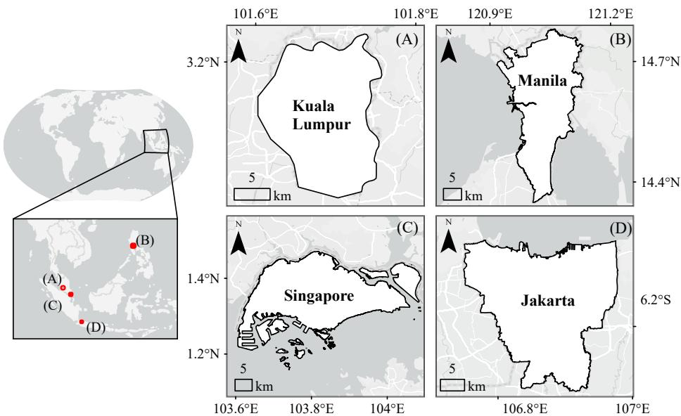  
Figure 1: Schematic map of the study area. (A) Kuala Lumpur, Malaysia; (B) Manila, Philippines; (C) Singapore; (D) Jakarta, Indonesia.

## 2.2. Study Data

Street View Imagery. Google Street View 360° panoramic imagery is used as the street-level data. The dataset provides georeferenced panoramic imagery along urban road networks, capturing streetscape characteristics such as building facades, vegetation, and road infrastructure.

AlphaEarth Features. AlphaEarth embedding Foundations, developed by Google DeepMind, serve as the core remote sensing data source. This geospatial foundation model is pretrained via self-supervised learning on large-scale multi-temporal Earth observation data, including optical, thermal, and radar satellite imagery together with climate, elevation, and vegetation structure measurements. The model encodes each 10 m pixel into a 64-dimensional embedding vector that captures multi-spectral surface properties, seasonal dynamics, topographic context, and climatic conditions in a compact latent representation (Brown et al., 2025). The dataset provides annually updated layers covering 2017–2024.

Urban Contextual Features. The urban contextual features used in this study comprise six feature groups: Point of Interest (POI) density features, land-use features, terrain features, socioeconomic features, remote sensing index features, and time-location features. OpenStreetMap, a global open geographic database, provides POI records and land-use polygons (Haklay and Weber, 2008). POI records describe facility distribution and activity functions, complementing AlphaEarth features with functional urban semantics (Huang et al., 2023). NASADEM provides elevation data. WorldPop Residential Population Estimates (R2025A v1, 100 m resolution) and NOAA VIIRS Day/Night Band monthly composites (VNP46A1/VCMSLCFG) provide population and nighttime light data (Bondarenko et al., 2025; Román et al., 2018). Landsat 8 Collection 2 Level 2 provides surface reflectance imagery. The city, geographic coordinates, and image collection year of each sampling point are also retained.

## 3. Methods

## 3.1. Framework Overview

The proposed framework links SVI-derived perception labels, AlphaEarth features, and urban contextual features to predict, map, and analyse subjective streetscape perception at city scale (Fig. 2). The workflow comprises four stages: data acquisition, feature extraction, model training and validation, and perception mapping and inequality analysis.

## 3.2. Data Acquisition

Street view sampling is conducted within the administrative boundary of each study city. Sampling points are generated at 100 m intervals along the road network. A point is retained only where SVI is available.

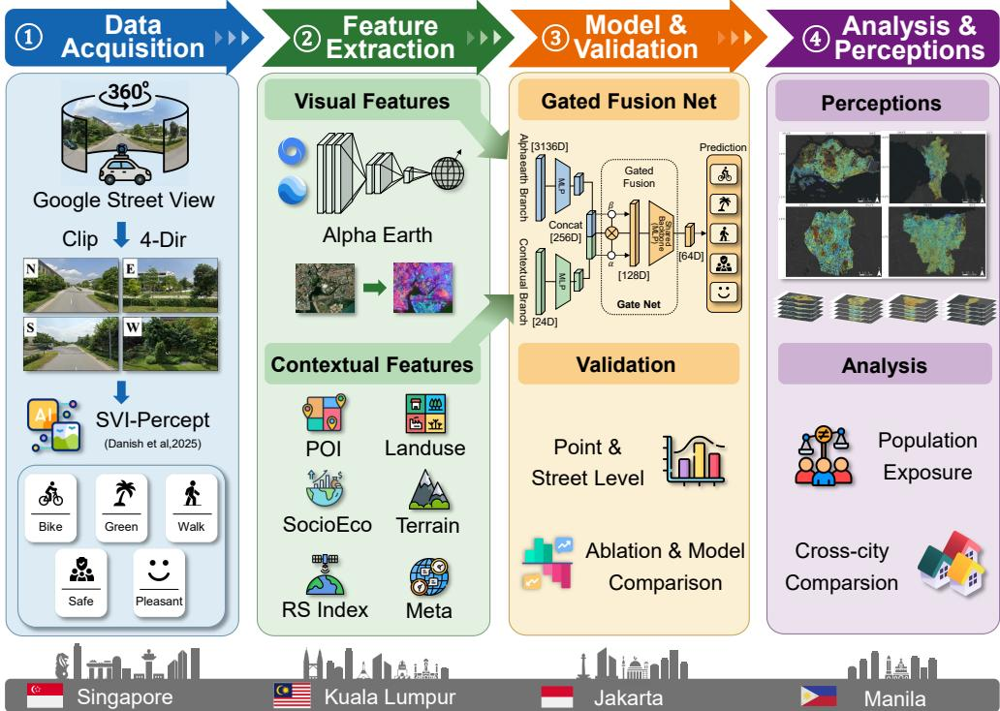  
Figure 2: Overview of the Cross-View Perception Prediction Analysis Framework.

For model supervision, perception labels are generated from the collected panoramas using the pretrained SVI-Percept model (Danish et al., 2025). SVI-Percept is a deep learning scoring model developed within a citizen science framework that collected 22,637 human ratings from 331 participants for open SVI in Amsterdam. The model predicts five perception scores, namely bikeability, greenness, pleasantness, safety, and walkability, on a 1–5 scale. Each panorama is decomposed into four perspective views using equirectangular projection, with an azimuth interval of 90°, a pitch angle of 0°, and a field of view of 90°. The average score across the four perspective views is used as the panorama-level perception label. Fig. 3 provides four examples of street-view images with their SVI-Percept predicted scores.

## 3.3. Feature Extraction

Two feature vectors are constructed for each sampling point: 3,136- dimensional AlphaEarth features and 24-dimensional urban contextual features. The AlphaEarth features are formed by extracting a 7 × 7 patch from the annual 64-dimensional embedding layer and flattening the patch. The selection of the patch size is reported in Appendix Appendix A.1. The urban contextual features are constructed as follows, with their dimensions and key parameters summarised in Table 2.

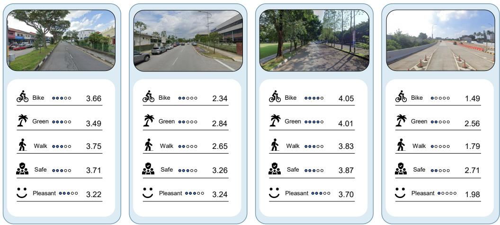  
Figure 3: Examples of SVI-Percept scoring for street-view panoramas. The model outputs five perceptual dimensions: bikeability, greenness, pleasantness, safety, and walkability.

POI Density Features. POI records are grouped into Food, Shop, Transport, Public, Leisure, and Trafic and converted into continuous density surfaces using Gaussian kernel density estimation with a bandwidth of 2 km.

Land Use Density Features. Land-use polygons are grouped into Residential, Commercial, Nature, Roads, and Buildings, and the fraction of each category within 2 km is calculated.

Terrain Features. Elevation in metres and slope in degrees are extracted at each sampling point.

Socioeconomic Features. Population density is matched by city and collection year, and nighttime light intensity is calculated from annual median composites.

Remote Sensing Index Features. The Normalized Diference Vegetation Index (NDVI), Normalized Diference Built-up Index (NDBI), and Modified Normalized Diference Water Index (MNDWI) are calculated from yearly median composites matched to the collection year of each sampling point (Tucker, 1979; Zha et al., 2003; Xu, 2006).

Time-Location Features. These features comprise a city code, sampling point coordinates, and image collection year. The coordinates are the latitude and longitude of each SVI sampling point and are encoded using sine and cosine functions. Collection year is min-max normalised to [0, 1] over 2017–2024.

Before model training, urban contextual features are standardised using training-set z-score statistics, which are retained for testing and inference.

Table 2: Summary of multi-source features and key parameters.
<table><tr><td>Feature Category</td><td>Data Source</td><td>Dim.</td><td>Processing Method</td></tr><tr><td>AlphaEarth</td><td>Google AlphaEarth</td><td>3,136</td><td>7 × 7 patch × 64D</td></tr><tr><td>POI Density</td><td>OpenStreetMap</td><td></td><td>6 KDE (σ=2km)</td></tr><tr><td>Land Use Density</td><td>OpenStreetMap</td><td></td><td>5 2km area ratio</td></tr><tr><td>Terrain</td><td>NASADEM</td><td>2</td><td>Direct sampling</td></tr><tr><td>Socioeconomic</td><td>WorldPop / VIIRS</td><td>2</td><td>Direct sampling</td></tr><tr><td>RS Indices</td><td>Landsat 8</td><td>3</td><td>Yearly median composite</td></tr><tr><td>Time-Location</td><td>Sampling Attributes</td><td>6</td><td>Encoding and scaling</td></tr><tr><td>Total</td><td colspan="3">3,160</td></tr></table>

## 3.4. Model Training and Validation

## 3.4.1. CVLNet Architecture

CVLNet is designed to predict five street-level perceptual dimensions from two feature sources: AE and CTX features. Its architecture has three main components: a dual-branch encoder, a feature fusion module, and a multitask prediction module (Fig. 4). The dual-branch design allows AE and CTX features to be represented separately before they are combined.

First, separate multilayer perceptrons map the AE and CTX features into a common 128-dimensional embedding space, yielding $\mathbf { h } _ { \mathrm { a e } }$ and $\mathbf { h } _ { \mathrm { c t x } }$ , respectively. This step reduces the dimensional mismatch between the AE branch and the CTX branch. The fusion module then combines the two branch representations for each perceptual target. For the k-th target $( k = 1 , \ldots , 5 )$ , the gate estimates a fusion weight from the concatenated branch representations, as shown in Eq. 1:

$$
\alpha _ { k } = \sigma ( \mathrm { L i n e a r } _ { 6 4  1 } ( \mathrm { G E L U ( L i n e a r } _ { 2 5 6  6 4 } ( [ \mathbf { h } _ { \mathrm { a e } } ; \mathbf { h } _ { \mathrm { c t x } } ] ) ) ) )\tag{1}
$$

$$
\mathbf { h } _ { \mathrm { f u s e d } } ^ { ( k ) } = { \boldsymbol { \alpha } } _ { k } \cdot \mathbf { h } _ { \mathrm { a e } } + \left( 1 - { \boldsymbol { \alpha } } _ { k } \right) \cdot \mathbf { h } _ { \mathrm { c t x } }\tag{2}
$$

where $\sigma ( \cdot )$ is the sigmoid function and $\alpha _ { k } \in [ 0 , 1 ]$ controls the relative weight assigned to the AE branch. The fused representation is then computed using Eq. 2. A larger $\alpha _ { k }$ indicates that the trained model relies more on AE features for that perceptual target, whereas a smaller value indicates greater reliance on CTX features. This value is used as a coarse diagnostic signal for comparing feature-source reliance across perceptual dimensions. The fused representation $\mathbf { h } _ { \mathrm { f u s e d } } ^ { ( k ) }$ is passed to a shared prediction backbone, and separate output heads produce the five perception scores.

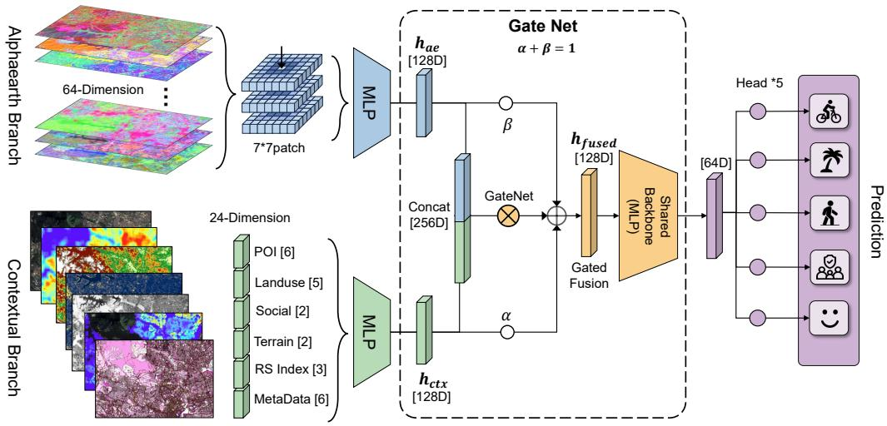  
Figure 4: Architecture of the Cross-View Learning Network (CVLNet).

## 3.4.2. Model Training Configuration

CVLNet is trained as a multi-task regression model. In each forward pass, it predicts five perception scores: bikeability, greenness, pleasantness, safety, and walkability. Let y denote the observed perception score and yˆ denote the predicted score. We use Huber loss with $\delta = 1 . 0 \ ( \mathrm { E q . \ 3 } )$ instead of MSE because it gives a linear penalty to large errors (Huber, 1964):

$$
\mathcal { L } _ { \mathrm { H u b e r } } ( y , \hat { y } ) = \left\{ \begin{array} { l l } { \frac { 1 } { 2 } ( y - \hat { y } ) ^ { 2 } , } & { | y - \hat { y } | \leq \delta } \\ { \delta \cdot | y - \hat { y } | - \frac { 1 } { 2 } \delta ^ { 2 } , } & { | y - \hat { y } | > \delta } \end{array} \right.\tag{3}
$$

For the k-th perceptual dimension, $y _ { k }$ and $\hat { y } _ { k }$ denote the observed and predicted scores, respectively. The total loss sums the Huber losses over the five perceptual dimensions with equal weights:

$$
\mathcal { L } = \sum _ { k = 1 } ^ { 5 } \mathbf { 1 } _ { [ \mathrm { v a l i d } _ { k } ] } \cdot \mathcal { L } _ { \mathrm { H u b e r } } ( y _ { k } , \hat { y } _ { k } )\tag{4}
$$

where $\mathbf { 1 } _ { [ \mathrm { v a l i d } _ { k } ] }$ is an indicator that equals 1 when the k-th target is available for a sample and 0 otherwise. Equal weighting is adopted as a baseline design; task-specific weighting strategies may further improve performance on harder dimensions. The model is optimised with Adam at an initial learning rate of $1 \times 1 0 ^ { - 3 }$ and a batch size of 512 for up to 80 epochs. A cosine annealing schedule and early stopping are used to stabilise convergence. Dropout is applied to both branches.

## 3.4.3. Spatially Stratified Data Splitting

The data in each city are split using a regular 2 km × 2 km grid, which is intended to reduce spatial data leakage between the training and test sets (Roberts et al., 2017). Within each city, 80% of the grid cells are randomly selected for training and the remaining 20% for testing. The training data from the four cities are combined to train a global model. The test data are retained separately for each city.

## 3.4.4. Evaluation Metrics

Model performance is evaluated using adjusted coeficient of determination $( \operatorname { A d j } . \ R ^ { 2 } )$ and normalised root mean squared error (nRMSE). Adj. $R ^ { 2 }$ measures the proportion of variance explained by the model while accounting for the number of predictors. The standard coeficient of determination is first computed as:

$$
R ^ { 2 } = 1 - \frac { \sum _ { i = 1 } ^ { N } ( y _ { i } - \hat { y } _ { i } ) ^ { 2 } } { \sum _ { i = 1 } ^ { N } ( y _ { i } - \bar { y } ) ^ { 2 } }\tag{5}
$$

where $y _ { i }$ is the observed perception score, $\hat { y } _ { i }$ is the predicted score, and $\bar { y }$ is the mean observed score. The adjusted $R ^ { 2 }$ is then computed as:

$$
R _ { \mathrm { a d j } } ^ { 2 } = 1 - ( 1 - R ^ { 2 } ) \cdot \frac { N - 1 } { N - p - 1 }\tag{6}
$$

where N denotes the sample size and $p$ denotes the number of predictors.

Prediction error is evaluated using nRMSE, which divides RMSE by the theoretical range of the perception scores:

$$
\mathrm { n R M S E } = \frac { \sqrt { \frac { 1 } { N } \sum _ { i = 1 } ^ { N } ( y _ { i } - \hat { y } _ { i } ) ^ { 2 } } } { y _ { \mathrm { { m a x } } } - y _ { \mathrm { { m i n } } } }\tag{7}
$$

where $y _ { \mathrm { m a x } } = 5$ and $y _ { \operatorname* { m i n } } = 1$ are the theoretical maximum and minimum perception scores. The RMSE is divided by $y _ { \mathrm { m a x } } - y _ { \mathrm { m i n } } = 4 . 0$ to obtain a normalised error.

Model performance is reported at both point and road-segment levels. Road-segment-level evaluation is conducted for road segments with at least three test points. For each eligible road segment, the observed and predicted point-level perception scores are averaged separately to obtain the observed and predicted road-segment-level perception scores. Adjusted $R ^ { 2 }$ and nRMSE are then computed using the eligible road segments as the evaluation units.

## 3.4.5. Baseline Model Comparison and Ablation Analysis

For the model comparison, five baseline models from two categories are evaluated: the RandomForest and XGBoost baselines as machine-learning models, and the D-MLP, ResNet, and Transformer baselines as neural-network models. For both machine-learning baselines, the flattened AE features are concatenated with the CTX features and used as a single input. The RandomForest baseline uses 100 estimators (Breiman, 2001). The XGBoost baseline uses 200 estimators and a learning rate of 0.05 (Chen and Guestrin, 2016).

For the neural-network comparison, the AE and CTX features follow the same branch-based processing and multi-task output setting as CVL-Net, while the network applied after feature fusion is changed. The D-MLP baseline uses two fully connected layers with 256 and 128 units. The ResNet baseline maps the fused features to 128 units, applies two residual blocks, and reduces the output to 64 units before prediction (He et al., 2016). The Transformer baseline divides the fused features into eight 32-dimensional tokens and uses two encoder layers with four attention heads and a feed-forward dimension of 128 (Vaswani et al., 2017). All three baselines use separate output heads for the five perceptual dimensions and follow the training configuration used for CVLNet.

Two single-branch ablation variants are evaluated against the full CVLNet model: an AE-only model using only AE features and a CTX-only model using only CTX features. In the single-branch variants, the gating module is removed while the remaining architecture and training settings are kept unchanged. This comparison is used to assess how each input branch afects prediction performance.

## 3.5. Perception Mapping and Inequality Analysis

## 3.5.1. Perception Mapping

The trained CVLNet model is applied to generate citywide road-level streetscape perception maps for the five perceptual dimensions. For each prediction location, the model extracts $7 \times 7 ~ \mathrm { A E }$ features from the annual 10 m AlphaEarth embedding layers and combines them with the corresponding CTX features. The point-level predictions are assembled into road-networkbased perception maps and exported as five maps for each city, one for each perceptual dimension.

## 3.5.2. Population Exposure Inequality Analysis

Following established approaches for measuring distributional inequalities in urban amenities and burdens (Logan et al., 2021), population exposure is calculated by linking each population point to the predicted perception score at the same location. For dimension k and population point i, $S _ { k , i }$ denotes the predicted perception score and $P _ { i }$ denotes the population count from WorldPop. Mean exposure is calculated as the population-weighted average of predicted perception scores within each analysis group. The analysis covers all population points in each city, demographic groups, and land-use groups, including Residential, Commercial, and Nature zones.

The Deficit Palma Ratio is used as a descriptive inequality measure. For each dimension, the perception deficit of point i is defined as $D _ { k , i } = S _ { \mathrm { m a x } } -$ $S _ { k , i } ,$ , where $S _ { \mathrm { m a x } } = 5 . 0$ . Population points are ordered by $D _ { k , i }$ . Population counts are then used to identify the 10% of the population in points with the highest deficits and the 40% in points with the lowest deficits. The ratio is defined as:

$$
\mathrm { D e f i c i t ~ P a l m a } _ { k } = \frac { \mathrm { S h a r e } _ { D , \mathrm { t o p } 1 0 \% } } { \mathrm { S h a r e } _ { D , \mathrm { b o t t o m } 4 0 \% } }\tag{8}
$$

In Eq. 8, the numerator is the share of total population-weighted deficit for the highest-deficit 10% group. The denominator is the corresponding share for the lowest-deficit 40% group. Under a proportional distribution, these two shares are 10% and 40%, giving a reference value of 0.25. Values above 0.25 indicate a higher concentration of deficits in the highest-deficit group.

Exposure diferences across population density levels are examined using population-density quintiles. Within each city, population points are ordered by population count and divided into five equal-sized groups, from the sparsest 20% to the densest 20%. A population-weighted mean perception score is calculated for each group. The diference between the densest and sparsest groups is defined as:

$$
\Delta _ { k } = \bar { S } _ { k } ^ { ( G _ { 5 } ) } - \bar { S } _ { k } ^ { ( G _ { 1 } ) }\tag{9}
$$

In $\mathrm { E q . ~ } 9 , \ \bar { S } _ { k } ^ { ( G _ { 5 } ) }$ and $\bar { S } _ { k } ^ { ( G _ { 1 } ) }$ denote the population-weighted mean scores of the densest and sparsest groups. A negative $\Delta _ { k }$ indicates a lower populationweighted mean score in the densest group than in the sparsest group.

## 4. Results

## 4.1. Model Performance

## 4.1.1. Model Prediction Accuracy

Fig. 5 presents the point-level and road-segment-level prediction accuracy of CVLNet across the four Southeast Asian cities.

At the point level (Fig. 5a, c), CVLNet shows positive Adj. $R ^ { 2 }$ values across all five perceptual dimensions. Greenness has the highest Adj. $R ^ { 2 }$ of 0.768, followed by walkability, while safety has the lowest Adj. $R ^ { 2 }$ of 0.613. Pleasantness and bikeability fall between these two ends. The nRMSE values are 0.07 or lower across all dimensions, and safety has the lowest nRMSE of 0.04. This combination indicates that safety has relatively small absolute prediction error but lower explained variance than the other dimensions. Across cities, Singapore and Kuala Lumpur generally show higher prediction accuracy than Jakarta and Manila. Singapore has higher values for green ness, pleasantness, and safety, while Kuala Lumpur has the highest values for walkability and bikeability. Jakarta and Manila show lower accuracy in several dimensions, with larger diferences appearing for safety and bikeability.

At the road-segment level (Fig. 5b, d), predictions are aggregated using the procedure described in Section 3.4.4, yielding 8,273 eligible road segments. In the four-city aggregate results, road-segment aggregation produces higher Adj. $R ^ { 2 }$ than point-level evaluation for all five dimensions, with nRMSE below 0.04. The median road-segment-level Adj. $R ^ { 2 }$ is 0.76. Roadsegment aggregation substantially improves model accuracy across all dimensions. Averaging multiple point-level perception scores within each eligible road segment reduces the influence of local point-level variation. Overall, these results indicate reliable prediction performance at the road-segment level.

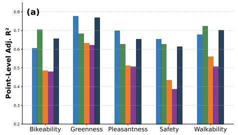

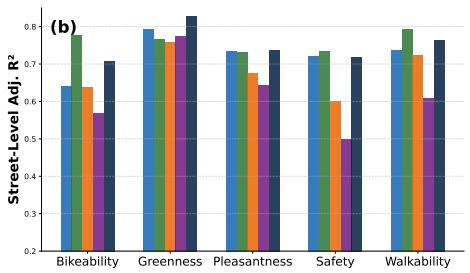

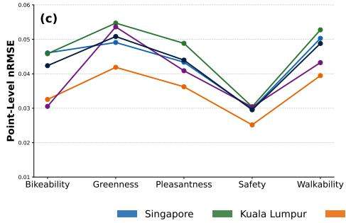

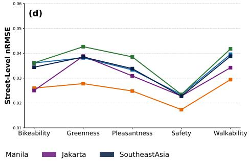  
Figure 5: Performance evaluation of CVLNet across multiple Southeast Asian cities. (a)– (b): Adjusted $R ^ { 2 }$ values measured at the point and road-segment levels; (c)–(d): normalised root mean squared error (nRMSE).

The learned gate weights are reported in Table 3. The gate weight controls the relative coeficients assigned to the AE and CTX branches in the fusion module. Overall mean gate weights range from 0.586 for safety to 0.636 for greenness, indicating that AE receives a moderately larger average coeficient while CTX remains part of the fused representation. The weights vary across cities and perceptual dimensions. Jakarta records the highest mean AE weight in all five dimensions, with the largest cross-city diferences observed for safety and pleasantness. The within-city standard deviations further indicate that the learned weights vary among samples. Together, these results support the adaptability of CVLNet and the efectiveness of $\alpha _ { k }$ in adjusting the contributions of AE and CTX features.

Table 3: Gate weights of the AE branch by city and perceptual dimension. Values are reported as mean ± standard deviation.
<table><tr><td>Perceptual dimension</td><td>Overall</td><td>Singapore</td><td>Kuala Lumpur</td><td>Manila</td><td>Jakarta</td></tr><tr><td>Bikeability</td><td> $0 . 5 9 8 \pm 0 . 0 9 3$ </td><td> $0 . 5 8 4 \pm 0 . 1 0 8$ </td><td> $0 . 6 0 5 \pm 0 . 0 8 7$ </td><td> $0 . 6 0 0 \pm 0 . 0 7 4$ </td><td> $0 . 6 2 1 \pm 0 . 0 6 4$ </td></tr><tr><td>Greenness</td><td> $0 . 6 3 6 \pm 0 . 0 9 7$ </td><td> $0 . 6 3 1 \pm 0 . 0 9 9$ </td><td> $0 . 6 0 2 \pm 0 . 0 7 8$ </td><td> $0 . 6 5 3 \pm 0 . 0 9 5$ </td><td> $0 . 7 0 2 \pm 0 . 0 9 3$ </td></tr><tr><td>Pleasantness</td><td> $0 . 6 0 7 \pm 0 . 0 8 9$ </td><td> $0 . 6 0 4 \pm 0 . 0 8 8$ </td><td> $0 . 5 9 4 \pm 0 . 0 7 0$ </td><td> $0 . 5 6 1 \pm 0 . 1 0 2$ </td><td> $0 . 6 7 4 \pm 0 . 0 7 5$ </td></tr><tr><td>Safety</td><td> $0 . 5 8 6 \pm 0 . 1 2 3$ </td><td> $0 . 5 4 3 \pm 0 . 1 3 4$ </td><td> $0 . 5 7 5 \pm 0 . 1 0 1$ </td><td> $0 . 6 3 5 \pm 0 . 0 9 0$ </td><td> $0 . 6 8 0 \pm 0 . 0 8 9$ </td></tr><tr><td>Walkability</td><td> $0 . 5 8 9 \pm 0 . 1 0 3$ </td><td> $0 . 5 6 5 \pm 0 . 1 1 8$ </td><td> $0 . 5 8 9 \pm 0 . 0 9 1$ </td><td> $0 . 6 1 1 \pm 0 . 0 6 9$ </td><td> $0 . 6 3 2 \pm 0 . 0 8 9$ </td></tr></table>

## 4.1.2. Baseline Model Comparison and Ablation Analysis

The ablation analysis (Fig. 6) compares the full CVLNet model with AE-only and CTX-only variants. The AE-only model retains substantial predictive accuracy, with Adj. $R ^ { 2 }$ values ranging from 0.575 to 0.764 across the five perceptual dimensions. This result shows that AE features alone capture a large share of the variation in the SVI-derived perception labels. When only CTX features are used, the model no longer includes the direct remote sensing representation and achieves lower prediction accuracy than the AE-only model in most dimensions, indicating that AE features are an important source of predictive information in CVLNet. The full CVLNet model shows an overall improvement over both single-branch variants across the five dimensions. These results show that combining AE and CTX features through per-task gating improves prediction beyond either feature source alone.

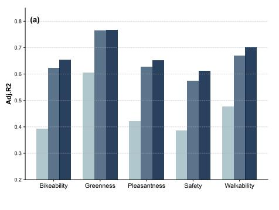

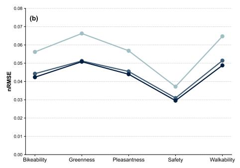  
Figure 6: Ablation study of CVLNet and performance comparison against baseline models. (a)(c) Adjusted $R ^ { 2 }$ for ablation variants and comparative models; (b)(d) corresponding nRMSE traces.

Table 4 further compares CVLNet with five baseline models at the point level. CVLNet achieves the highest Adj. $R ^ { 2 }$ and the lowest nRMSE in all five perceptual dimensions. Compared with the best non-CVLNet baseline, the largest Adj. $R ^ { 2 }$ gains are 0.036 for walkability, 0.034 for bikeability, 0.034 for safety, and 0.033 for pleasantness. The gain for greenness is relatively smaller, at 0.009, which is consistent with the relatively high baseline accuracy for this dimension. Overall, CVLNet provides the most consistent performance across the five perceptual dimensions, with higher explained variance and lower prediction error than the baseline models.

Table 4: Point-level prediction performance of CVLNet and baseline models.
<table><tr><td colspan="6">Adjusted  $R ^ { 2 }$ </td></tr><tr><td>Model</td><td>Bikeability</td><td>Greenness</td><td>Pleasantness</td><td>Safety</td><td>Walkability</td></tr><tr><td>RandomForest</td><td>0.5887</td><td>0.7361</td><td>0.5936</td><td>0.5546</td><td>0.6444</td></tr><tr><td>XGBoost</td><td>0.6079</td><td>0.7579</td><td>0.6160</td><td>0.5646</td><td>0.6588</td></tr><tr><td>D-MLP</td><td>0.6181</td><td>0.7582</td><td>0.6195</td><td>0.5682</td><td>0.6610</td></tr><tr><td>ResNet</td><td>0.6108</td><td>0.7540</td><td>0.6204</td><td>0.5788</td><td>0.6645</td></tr><tr><td>Transformer</td><td>0.6210</td><td>0.7592</td><td>0.6149</td><td>0.5652</td><td>0.6658</td></tr><tr><td>CVLNet (ours)</td><td>0.6553</td><td>0.7682</td><td>0.6529</td><td>0.6129</td><td>0.7022</td></tr><tr><td colspan="6">nRMSE</td></tr><tr><td>Model</td><td>Bikeability</td><td>Greenness</td><td>Pleasantness</td><td>Safety</td><td>Walkability</td></tr><tr><td>RandomForest</td><td>0.0551</td><td>0.0644</td><td>0.0570</td><td>0.0379</td><td>0.0641</td></tr><tr><td>XGBoost</td><td>0.0545</td><td>0.0638</td><td>0.0562</td><td>0.0380</td><td>0.0630</td></tr><tr><td>D-MLP</td><td>0.0546</td><td>0.0640</td><td>0.0563</td><td>0.0381</td><td>0.0631</td></tr><tr><td>ResNet</td><td>0.0548</td><td>0.0641</td><td>0.0567</td><td>0.0385</td><td>0.0628</td></tr><tr><td>Transformer</td><td>0.0555</td><td>0.0641</td><td>0.0571</td><td>0.0387</td><td>0.0636</td></tr><tr><td>CVLNet (ours)</td><td>0.0529</td><td>0.0635</td><td>0.0550</td><td>0.0369</td><td>0.0610</td></tr></table>

## 4.2. Citywide Perception Mapping

As shown in Appendix Appendix A.2, the retrieved Google Street View samples cover only part of the road networks in the four cities, with notable cross-city diferences in coverage. Consequently, the available SVI samples alone do not provide perception estimates for the complete citywide road networks. Applying the model described in Section 3.5.1, we obtain continuous perception maps across all four cities for the five perceptual dimensions (Fig. 7).

Figure 7 shows citywide road-level streetscape perception maps for the four cities. The same city can show diferent spatial distributions among the five perceptual dimensions. Each row uses a unified colourbar for the four cities. Walkability and bikeability show more continuous medium-to-high scores in Jakarta, while Manila is mainly characterised by medium scores with fewer high-score clusters. Singapore and Kuala Lumpur show stronger local heterogeneity, with high- and low-score road segments interlaced across short distances. Safety is less visually polarised than greenness and pleasantness. Singapore contains more visible high-score safety clusters, whereas Kuala Lumpur, Jakarta, and Manila are dominated by medium scores with scattered low-score segments. Greenness and pleasantness show broader lowvalue areas in Jakarta and Manila, while Singapore and Kuala Lumpur contain sharper local contrasts.

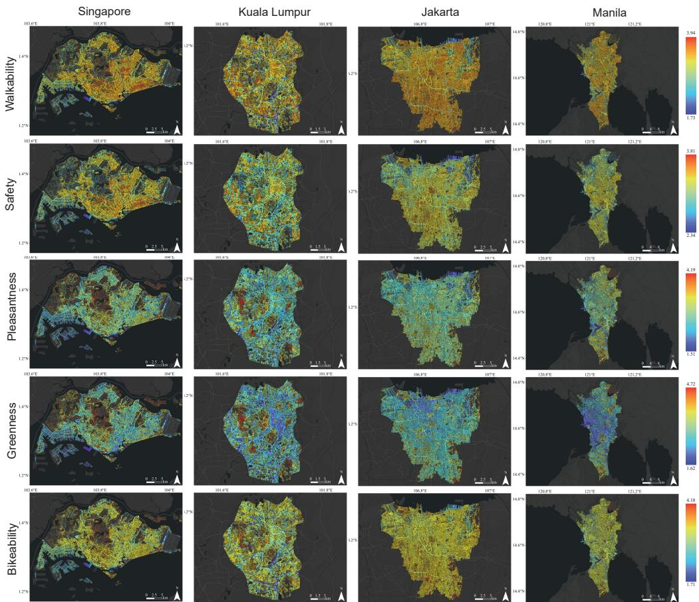  
Figure 7: Citywide mapping results of five perceptual dimensions, shown from top to bottom as walkability, safety, pleasantness, greenness, and bikeability, for Singapore, Kuala Lumpur, Jakarta, and Manila.

Safety is selected for the detailed maps because it is a representative dimension in street-view perception research and is closely related to everyday mobility and public-space use (Naik et al., 2014; Dubey et al., 2016). It also represents a composite perceptual dimension that covers multiple aspects of subjective streetscape perception. Figure 8 compares detailed mapping results for several urban settings. In the selected cases, industrial areas generally have lower safety scores than residential areas, while the natural areas in Singapore, Kuala Lumpur, and Manila are mainly characterised by medium scores. High-score road segments are more continuous in the residential areas of Singapore (first row, b) and Kuala Lumpur (second row, b), whereas the residential area in Manila (fourth row, b) shows a more mixed distribution. In Jakarta (third row, b–c), the planned residential area has a more regular road and block arrangement and contains more high-score road segments, whereas the denser and less regular informal residential area is mainly characterised by medium scores. Although both are residential areas, their predicted safety score distributions difer.

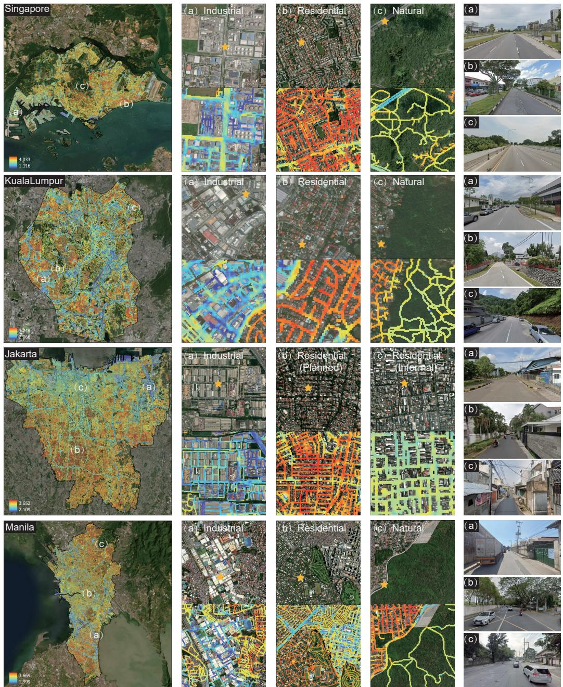  
Figure 8: Citywide and local-scale maps of predicted safety perception in Singapore, Kuala Lumpur, Jakarta, and Manila. The stars mark the locations shown in the corresponding street-view images in the far-right column.

## 4.3. Population Exposure Inequality

Fig. 9 first reports overall population exposure inequality using the Deficit Palma Ratio and then examines population-density, demographic, and landuse groups.

The overall Deficit Palma Ratio values (Fig. 9a) show that exposure deficits are unevenly distributed in every city and dimension, with all bars above the equity baseline. Kuala Lumpur consistently has the highest deficit concentration, while Singapore is generally the lowest. Jakarta and Manila occupy intermediate positions, although their relative levels vary by perceptual dimension. Across dimensions, greenness and walkability show stronger deficit concentration than safety.

Across the population-density quintiles (Fig. 9b1–b5), greenness shows the clearest common pattern. Mean greenness decreases from sparsely populated to densely populated groups in all four cities. Pleasantness shows a similar but weaker decline in most cities. Walkability and safety do not follow the same density gradient. Walkability remains relatively high in the denser groups for Kuala Lumpur, Jakarta, and Manila, while Singapore changes little across density groups. Bikeability shows a more mixed pattern, with mid-density groups often scoring higher than the sparsest and densest groups.

The demographic comparison (Fig. 9c) shows limited separation among age and sex groups within each city. The radar profiles for each city are nearly regular, indicating similar Deficit Palma Ratio values across children, youth, working-age adults, elderly groups, males, and females. City diferences are more visible than demographic diferences, with Kuala Lumpur higher and Singapore lower across all groups.

The land-use comparison (Fig. 9d) shows clearer separation than the demographic comparison. In all four cities, Nature zones have higher Deficit Palma Ratio values than Residential and Commercial zones. Commercial zones are generally lower, while Residential zones occupy an intermediate position. The city ranking remains broadly consistent across land-use groups. In the present analysis, exposure inequality is more clearly separated by city and land-use group than by age and sex group.

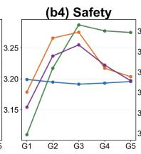

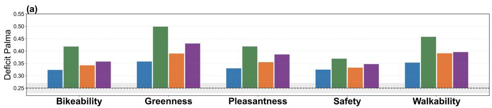

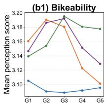

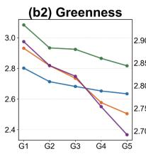

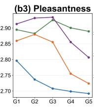

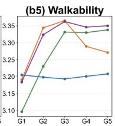

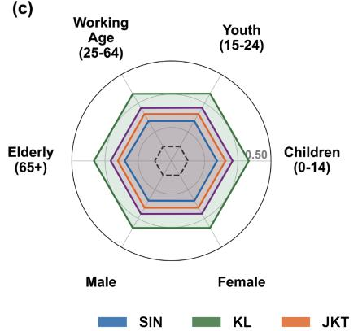  
Figure 9: Cross-city exposure inequality analysis. (a) Deficit Palma Ratio values across cities and perceptual dimensions, with the dashed line marking the 0.25 baseline; (b1)– (b5) population-weighted mean perception scores across five population-density quintiles (G = sparsest 20%, $G _ { 5 }$ = densest 20%) for each perceptual dimension; (c) Deficit Palma Ratio values by demographic group; (d) Deficit Palma Ratio values by land-use group.

## 5. Discussion

The main contribution of this study is that it substantially reduces the dependence of city-scale subjective streetscape assessment on SVI by enabling perception estimation from AlphaEarth and urban contextual data. This allows subjective streetscape perceptions to be mapped continuously across entire urban road networks rather than being restricted to locations with available SVI, providing spatially consistent information for city-scale analysis. By integrating perception maps with population data, the framework further identifies disparities in population exposure to perceived environmental quality, enabling comparisons across population-density, demographic and land-use groups. Together, these capabilities provide a practical foundation for evidence-based urban renewal, public-space evaluation, and human-centred urban planning. More broadly, these results suggest that cross-view urban sensing, linking remote sensing observations with subjective human experience of the built environment, holds considerable promise as a scalable paradigm for future urban perception research.

Two limitations should be considered when interpreting the results. First, the AlphaEarth features represent annual remote sensing observations and are therefore suitable for annual perception mapping rather than seasonal or short-term monitoring. This limitation is particularly relevant in midand high-latitude regions, where streetscape appearance varies substantially across seasons and would require higher-temporal-resolution remote sensing data (Zhao et al., 2025). Second, the perception labels are derived from the pretrained SVI-Percept model, which inherits the characteristics of its original crowdsourced ratings. Consequently, the predicted perception maps should be interpreted within that scoring framework. For applications in regions with diferent perceptual or cultural contexts, local calibration or fine-tuning could further improve the reliability and transferability of the model (Quintana et al., 2025).

The proposed framework is not limited to the five perceptual dimensions examined in this study. Their selection reflects the availability of a consistent perception label system rather than a methodological constraint. As human perception labels for additional dimensions become available, the framework could be extended to predict and map these dimensions. Future work could also explore the integration of large language models (LLMs) and vision-language models (VLMs) to derive semantically meaningful features from remote sensing imagery and auxiliary geospatial data (Hou et al., 2025; Zhang et al., 2024). Such features may improve model interpretability and transferability, although their value for perception prediction remains to be systematically validated.

## 6. Conclusion

This study develops a Cross-View Perception Prediction Analysis Framework. Its core model, CVLNet, combines AlphaEarth and urban contextual features to estimate subjective streetscape perception, outperforming baseline models across five perceptual dimensions in four Southeast Asian cities. The trained model generates citywide road-level streetscape perception maps and, combined with WorldPop data, quantifies population exposure inequality across population-density, demographic, and land-use groups. Overall, the proposed framework bridges remote sensing observations and subjective streetscape perception, providing a practical tool for large-scale urban planning, urban renewal, and public-space evaluation.

## CRediT authorship contribution statement

Peilin Li: Conceptualization, Methodology, Software, Formal analysis, Investigation, Data curation, Writing – original draft, Visualization. Pengfei Chen: Conceptualization, Supervision, Writing – review & editing, Funding acquisition. Jingyu Wang: Data curation, Investigation, Software. Zhifeng Yang: Data curation, Formal Analysis, Investigation. Tiansheng Chen: Investigation, Visualization. Mengjie Gong: Data curation, Visualization, Software. Xiao Cheng: Supervision, Writing – review & editing.

## Declaration of competing interest

The authors declare that they have no known competing financial interests or personal relationships that could have appeared to influence the work reported in this paper.

## Data availability

The AlphaEarth Foundations data are publicly available from Google DeepMind. WorldPop population data are available at https://www.worldpop. org/. OpenStreetMap data are available at https://www.openstreetmap. org/. Google Street View imagery was accessed through the Google Street View API. Code and trained model weights will be made available upon acceptance.

## Acknowledgements

This research was funded by Guangdong Basic and Applied Basic Research Foundation, grant number 2026A1515012474 and the National Natural Science Foundation of China, grant number 42101351. The authors acknowledge the financial support from the Medicine-Engineering Convergence Seed Fund (2025) at Sun Yat-sen University.

Declaration of generative AI and AI-assisted technologies in the manuscript preparation process

During the preparation of this work, the authors used ChatGPT in order to polish language and improve readability. After using this tool, the authors reviewed and edited the content as needed and take full responsibility for the content of the published article.

## References

Biljecki, F., Ito, K., 2021. Street view imagery in urban analytics and GIS: A review. Landscape and Urban Planning 215, 104217. URL: https://www.sciencedirect.com/science/article/ pii/S0169204621001808, doi:10.1016/j.landurbplan.2021.104217.

Bondarenko, M., Priyatikanto, R., Tejedor Garavito, N., Zhang, W., McKeen, T., Cunningham, A., Woods, T., Hilton, J., Cihan, D., Nosatiuk, B., Brinkhof, T., Tatem, A., Sorichetta, A., 2025. Constrained estimates of 2015-2030 total number of people per grid square at a resolution of 3 arc (approximately 100m at the equator) R2025A version v1. URL: https://hub.worldpop.org/doi/10.5258/SOTON/WP00839, doi:10.5258/SOTON/WP00839.

Breiman, L., 2001. Random forests. Machine Learning 45, 5–32. doi:10. 1023/A:1010933404324.

Brown, C.F., Kazmierski, M.R., Pasquarella, V.J., Rucklidge, W.J., Samsikova, M., Zhang, C., Shelhamer, E., Lahera, E., Wiles, O., Ilyushchenko, S., Gorelick, N., Zhang, L.L., Alj, S., Schechter, E., Askay, S., Guinan, O., Moore, R., Boukouvalas, A., Kohli, P., 2025. AlphaEarth foundations: an embedding field model for accurate and eficient global mapping from sparse label data. URL: http://arxiv.org/abs/2507.22291, doi:10.48550/arXiv.2507.22291. arXiv:2507.22291 [cs].

Brownson, R.C., Hoehner, C.M., Day, K., Forsyth, A., Sallis, J.F., 2009. Measuring the Built Environment for Physical Activity: State of the Science. American Journal of Preventive Medicine 36, S99– S123.e12. URL: https://www.sciencedirect.com/science/article/ pii/S0749379709000130, doi:10.1016/j.amepre.2009.01.005.

Chen, T., Guestrin, C., 2016. XGBoost: A scalable tree boosting system, in: Proceedings of the 22nd ACM SIGKDD International Conference on Knowledge Discovery and Data Mining, ACM. pp. 785–794. doi:10.1145/ 2939672.2939785.

Danish, M., Labib, S.M., Ricker, B., Helbich, M., 2025. A citizen science toolkit to collect human perceptions of urban environments using open street view images. Computers, Environment and Urban Systems 116, 102207. URL: https://www.sciencedirect.com/science/article/ pii/S0198971524001364, doi:10.1016/j.compenvurbsys.2024.102207.

Dubey, A., Naik, N., Parikh, D., Raskar, R., 2016. Deep learning the city: Quantifying urban perception at a global scale, in: Computer Vision – ECCV 2016, Springer International Publishing. pp. 196–212. doi:10.1007/ 978-3-319-46448-0\_12.

Ewing, R., Handy, S., 2009. Measuring the Unmeasurable: Urban Design Qualities Related to Walkability. Journal of Urban Design 14, 65–84. doi:10.1080/13574800802451155.

Fan, Z., Feng, C.C., Biljecki, F., 2025. Coverage and bias of street view imagery in mapping the urban environment. Computers, Environment and Urban Systems 117, 102253. URL: https://www. sciencedirect.com/science/article/pii/S0198971525000067, doi:10.1016/j.compenvurbsys.2025.102253.

Haklay, M., Weber, P., 2008. OpenStreetMap: User-generated street maps. IEEE Pervasive Computing 7, 12–18. doi:10.1109/MPRV.2008.80.

He, K., Zhang, X., Ren, S., Sun, J., 2016. Deep residual learning for image recognition, in: 2016 IEEE Conference on Computer Vision and Pattern Recognition (CVPR), IEEE. pp. 770–778. doi:10.1109/CVPR.2016.90.

Hou, C., Zhang, F., Li, Y., Li, H., Mai, G., Kang, Y., Yao, L., Yu, W., Yao, Y., Gao, S., Chen, M., Liu, Y., 2025. Urban sensing in the era of large

language models. The Innovation 6, 100749. URL: https://doi.org/10. 1016/j.xinn.2024.100749, doi:10.1016/j.xinn.2024.100749.

Huang, W., Zhang, D., Mai, G., Guo, X., Cui, L., 2023. Learning urban region representations with POIs and hierarchical graph infomax. ISPRS Journal of Photogrammetry and Remote Sensing 196, 134–145. URL: https://linkinghub.elsevier.com/retrieve/pii/ S0924271622003148, doi:10.1016/j.isprsjprs.2022.11.021.

Huber, P.J., 1964. Robust estimation of a location parameter. The Annals of Mathematical Statistics 35, 73–101. doi:10.1214/aoms/1177703732.

Kang, Y., Zhang, F., Gao, S., Lin, H., Liu, Y., 2020. A review of urban physical environment sensing using street view imagery in public health studies. Annals of GIS 26, 261–275. URL: https://www. tandfonline.com/doi/full/10.1080/19475683.2020.1791954, doi:10. 1080/19475683.2020.1791954.

Kruse, J., Kang, Y., Liu, Y.N., Zhang, F., Gao, S., 2021. Places for play: Understanding human perception of playability in cities using street view images and deep learning. Computers, Environment and Urban Systems 90, 101693. URL: https://www.sciencedirect.com/science/article/ pii/S0198971521001009, doi:10.1016/j.compenvurbsys.2021.101693.

Li, X., Zhang, C., Li, W., Ricard, R., Meng, Q., Zhang, W., 2015. Assessing street-level urban greenery using Google Street View and a modified green view index. Urban Forestry & Urban Greening 14, 675– 685. URL: https://www.sciencedirect.com/science/article/pii/ S1618866715000874, doi:10.1016/j.ufug.2015.06.006.

Li, Z., Zhang, F., Dai, S., Zhao, W., 2026. Bridging street view coverage disparities through geographic identity preserving generation from satellite view. ISPRS Journal of Photogrammetry and Remote Sensing 236, 622–639. URL: https://doi.org/10.1016/j.isprsjprs.2026.03.049, doi:10.1016/j.isprsjprs.2026.03.049.

Liu, Y., Pan, X., Liu, Q., Li, G., 2023. Establishing a reliable assessment of the green view index based on image classification techniques, estimation, and a hypothesis testing route. Land 12, 1030. URL: https://www.mdpi. com/2073-445X/12/5/1030, doi:10.3390/land12051030.

Liu, Y., Wang, Z., Ren, S., Chen, R., Shen, Y., Biljecki, F., 2025. Physical urban change and its socio-environmental impact: Insights from street view imagery. Computers, Environment and Urban Systems 119, 102284. URL: https://www.sciencedirect.com/science/article/ pii/S0198971525000377, doi:10.1016/j.compenvurbsys.2025.102284.

Logan, T.M., Anderson, M.J., Williams, T.G., Conrow, L., 2021. Measuring inequalities in urban systems: An approach for evaluating the distribution of amenities and burdens. Computers, Environment and Urban Systems 86, 101590. URL: https://doi.org/10.1016/j.compenvurbsys.2020. 101590, doi:10.1016/j.compenvurbsys.2020.101590.

Lu, Y., Sarkar, C., Xiao, Y., 2018. The efect of street-level greenery on walking behavior: evidence from Hong Kong. Social Science & Medicine 208, 41–49. URL: https://www.sciencedirect.com/science/article/ pii/S0277953618302570, doi:10.1016/j.socscimed.2018.05.022.

Ma, Y., Chen, P., Gong, M., Cai, Y., Jian, I.Y., 2025a. The first seasonal green view index mapping dataset across Chinese cities powered by deep learning. Scientific Data 12, 1356. URL: https://www.nature.com/ articles/s41597-025-05706-1, doi:10.1038/s41597-025-05706-1.

Ma, Y., Chen, P., Qin, Y., Yang, Z., Li, S., 2025b. From sky to ground: monitoring visible street greenery via multisource remote sensing imagery with deep learning. Urban Forestry & Urban Greening 109, 128866. URL: https://www.sciencedirect.com/science/ article/pii/S1618866725002006, doi:10.1016/j.ufug.2025.128866.

Mooney, S.J., Bader, M.D.M., Lovasi, G.S., Teitler, J.O., Koenen, K.C., Aiello, A.E., Galea, S., Goldmann, E., Sheehan, D.M., Rundle, A.G., 2017. Street audits to measure neighborhood disorder: virtual or inperson? American Journal of Epidemiology 186, 265–273. doi:10.1093/ aje/kwx004.

Naik, N., Philipoom, J., Raskar, R., Hidalgo, C., 2014. Streetscore – Predicting the Perceived Safety of One Million Streetscapes, in: 2014 IEEE Conference on Computer Vision and Pattern Recognition Workshops, pp. 793–799. URL: https://ieeexplore.ieee.org/document/6910072/, doi:10.1109/CVPRW.2014.121.

Pradana, M.R., Dimyati, M., Gamal, A., 2025. Harmonizing streetview semantics and spatial predictors for dominant urban visual composition modelling. Computational Urban Science 5, 50. URL: https://link.springer.com/article/10.1007/s43762-025-00210-z, doi:10.1007/s43762-025-00210-z.

Quercia, D., O’Hare, N., Cramer, H., 2014. Aesthetic capital: what makes London look beautiful, quiet, and happy?, in: Proceedings of the 17th ACM Conference on Computer Supported Cooperative Work & Social Computing, ACM. pp. 945–955. doi:10.1145/2531602.2531613.

Quintana, M., Gu, Y., Liang, X., Hou, Y., Ito, K., Zhu, Y., Abdelrahman, M., Biljecki, F., 2025. Global urban visual perception varies across demographics and personalities. Nature Cities 2, 1092–1106. URL: https://doi. org/10.1038/s44284-025-00330-x, doi:10.1038/s44284-025-00330-x.

Regmi, K., Borji, A., 2018. Cross-view image synthesis using conditional GANs, in: 2018 IEEE/CVF Conference on Computer Vision and Pattern Recognition, pp. 3501–3510. URL: https://ieeexplore.ieee.org/ document/8578467, doi:10.1109/CVPR.2018.00369.

Roberts, D.R., Bahn, V., Ciuti, S., Boyce, M.S., Elith, J., Guillera-Arroita, G., Hauenstein, S., Lahoz-Monfort, J.J., Schröder, B., Thuiller, W., Warton, D.I., Wintle, B.A., Hartig, F., Dormann, C.F., 2017. Crossvalidation strategies for data with temporal, spatial, hierarchical, or phylogenetic structure. Ecography 40, 913–929. doi:10.1111/ecog.02881.

Román, M.O., Wang, Z., Sun, Q., Kalb, V., Miller, S.D., Molthan, A., Schultz, L., Bell, J., et al., 2018. NASA’s Black Marble nighttime lights product suite. Remote Sensing of Environment 210, 113–143. doi:10.1016/j.rse.2018.03.017.

Rzotkiewicz, A., Pearson, A.L., Dougherty, B.V., Shortridge, A., Wilson, N., 2018. Systematic review of the use of Google street view in health research: major themes, strengths, weaknesses and possibilities for future research. Health & Place 52, 240– 246. URL: https://www.sciencedirect.com/science/article/pii/ S1353829217308341, doi:10.1016/j.healthplace.2018.07.001.

Salesses, P., Schechtner, K., Hidalgo, C.A., 2013. The collaborative image of the city: mapping the inequality of urban perception. PLOS ONE 8, e68400. URL: https://journals.plos.org/plosone/article?id=10. 1371/journal.pone.0068400, doi:10.1371/journal.pone.0068400.

Sallis, J.F., Cerin, E., Conway, T.L., Adams, M.A., Frank, L.D., Pratt, M., Salvo, D., Schipperijn, J., Smith, G., Cain, K.L., Davey, R., Kerr, J., Lai, P.C., Mitáš, J., Reis, R., Sarmiento, O.L., Schofield, G., Troelsen, J., Van Dyck, D., De Bourdeaudhuij, I., Owen, N., 2016. Physical activity in relation to urban environments in 14 cities worldwide: a cross-sectional study. Lancet 387, 2207–2217. URL: https:// linkinghub.elsevier.com/retrieve/pii/S0140673615012842, doi:10. 1016/S0140-6736(15)01284-2.

Sun, S., Huss, A., Probst-Hensch, N., Vienneau, D., de Hoogh, K., 2026. Comparison of machine learning algorithms for green view index (GVI) prediction using NDVI and urban form metrics. Urban Forestry & Urban Greening 120, 129412. doi:10.1016/j.ufug.2026.129412.

Tucker, C.J., 1979. Red and photographic infrared linear combinations for monitoring vegetation. Remote Sensing of Environment 8, 127–150. doi:10.1016/0034-4257(79)90013-0.

Vaswani, A., Shazeer, N., Parmar, N., Uszkoreit, J., Jones, L., Gomez, A.N., Kaiser, L., Polosukhin, I., 2017. Attention is all you need, in: Advances in Neural Information Processing Systems, pp. 5998–6008. URL: https: //papers.nips.cc/paper/7181-attention-is-all-you-need.

Wang, Z., Ito, K., Biljecki, F., 2024. Assessing the equity and evolution of urban visual perceptual quality with time series street view imagery. Cities 145, 104704. URL: https://www. sciencedirect.com/science/article/pii/S0264275123005164, doi:10.1016/j.cities.2023.104704.

Xu, H., 2006. Modification of normalised diference water index (NDWI) to enhance open water features in remotely sensed imagery. International Journal of Remote Sensing 27, 3025–3033. doi:10.1080/ 01431160600589179.

Xu, N., Qin, R., 2025. Satellite to GroundScape - large-scale consistent ground view generation from satellite views, in: 2025 IEEE/CVF Conference on Computer Vision and Pattern Recognition (CVPR), pp. 6068–6077. URL: https://ieeexplore.ieee.org/document/11093339, doi:10.1109/CVPR52734.2025.00569.

Yan, Y., Huang, B., 2022. Estimation of building height using a single street view image via deep neural networks. ISPRS Journal of Photogrammetry and Remote Sensing 192, 83–98. URL: https:// linkinghub.elsevier.com/retrieve/pii/S0924271622002106, doi:10. 1016/j.isprsjprs.2022.08.006.

Zha, Y., Gao, J., Ni, S., 2003. Use of normalized diference built-up index in automatically mapping urban areas from TM imagery. International Journal of Remote Sensing 24, 583–594. doi:10.1080/01431160304987.

Zhang, F., Wu, L., Zhu, D., Liu, Y., 2019. Social sensing from streetlevel imagery: a case study in learning spatio-temporal urban mobility patterns. ISPRS Journal of Photogrammetry and Remote Sensing 153, 48–58. URL: https://linkinghub.elsevier.com/retrieve/pii/ S0924271619301133, doi:10.1016/j.isprsjprs.2019.04.017.

Zhang, F., Zhou, B., Liu, L., Liu, Y., Fung, H.H., Lin, H., Ratti, C., 2018. Measuring human perceptions of a large-scale urban region using machine learning. Landscape and Urban Planning 180, 148– 160. URL: https://www.sciencedirect.com/science/article/pii/ S0169204618308545, doi:10.1016/j.landurbplan.2018.08.020.

Zhang, W., Cai, M., Zhang, T., Zhuang, Y., Mao, X., 2024. EarthGPT: A universal multimodal large language model for multisensor image comprehension in remote sensing domain. IEEE Transactions on Geoscience and Remote Sensing 62, 1–20. URL: https://doi.org/10.1109/TGRS.2024. 3409624, doi:10.1109/TGRS.2024.3409624.

Zhao, T., Liang, X., Biljecki, F., Tu, W., Cao, J., Li, X., Yi, S., 2025. Quantifying seasonal bias in street view imagery for urban form assessment: A global analysis of 40 cities. Computers, Environment and Urban Systems 120, 102302. URL: https://doi.org/10.1016/j.compenvurbsys.2025. 102302, doi:10.1016/j.compenvurbsys.2025.102302.

Zhou, H., He, S., Cai, Y., Wang, M., Su, S., 2019. Social inequalities in neighborhood visual walkability: using street view imagery and deep learning technologies to facilitate healthy city planning. Sustainable Cities and Society 50, 101605. URL: https://www.sciencedirect.com/science/ article/pii/S2210670718327483, doi:10.1016/j.scs.2019.101605.

Zhu, Z., Zhou, Y., Seto, K.C., Stokes, E.C., Deng, C., Pickett, S.T.A., Taubenböck, H., 2019. Understanding an urbanizing planet: strategic directions for remote sensing. Remote Sensing of Environment 228, 164– 182. URL: https://www.sciencedirect.com/science/article/pii/ S0034425719301658, doi:10.1016/j.rse.2019.04.020.

## Appendix A. Supplementary Materials

## Appendix A.1. AlphaEarth Patch-size Selection

Diferent extraction patch sizes were tested for AlphaEarth features (Fig. A.1). Considering both prediction accuracy and input size, the 7 × 7 patch was selected as the AlphaEarth patch size for CVLNet.

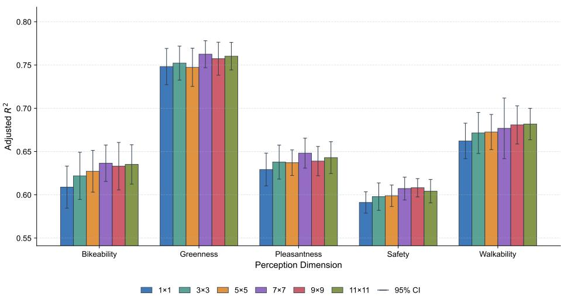  
Figure A.1: Cross-validation comparison of diferent AlphaEarth patch sizes.

## Appendix A.2. SVI Coverage Analysis

To assess SVI coverage, the availability of Google Street View imagery was checked at points spaced 100 m apart along the road network. A road segment was considered covered if imagery was available for at least one sampling point on that segment. The coverage ratio was calculated as the total length of covered road segments divided by the total road-network length in each city. As shown in Fig. A.2, SVI coverage varies considerably across the four study cities and is generally limited, with most observations concentrated in urban core areas. Even after aggregating all available street view imagery acquired between 2022 and 2024, the cumulative coverage ratios reach only 30.91% for Kuala Lumpur, 17.48% for Manila, 15.98% for Singapore, and 13.41% for Jakarta. As a result, street-view-based methods alone cannot generate spatially continuous citywide perception maps.

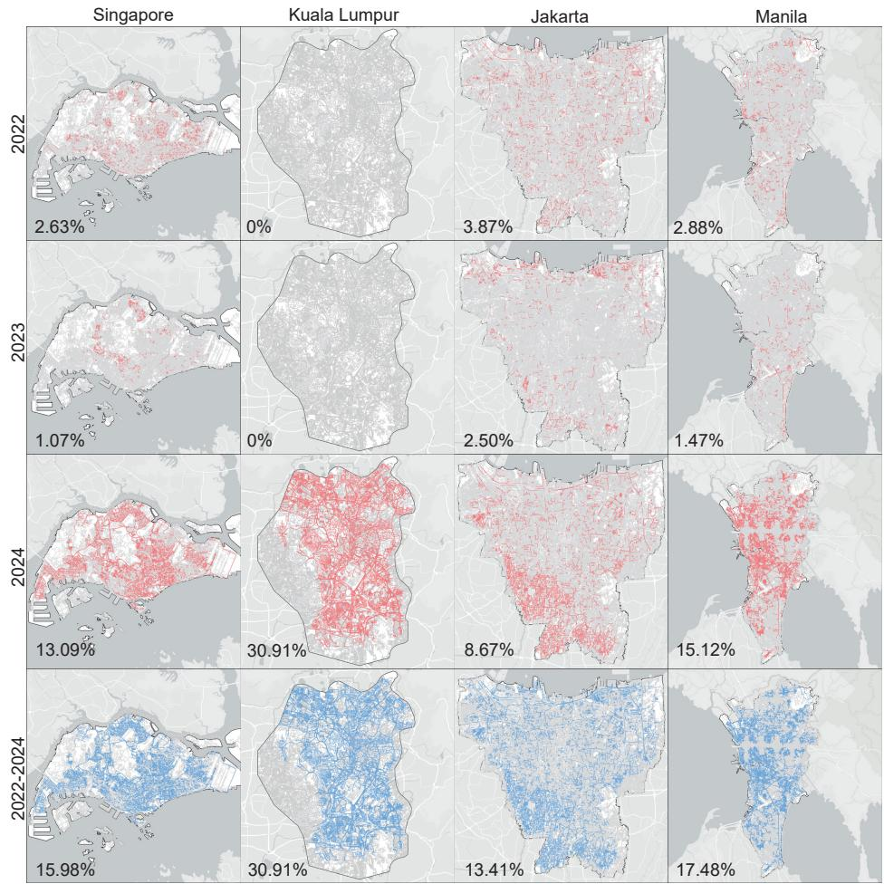  
Figure A.2: Spatial distribution of street view sampling points across the four study cities.