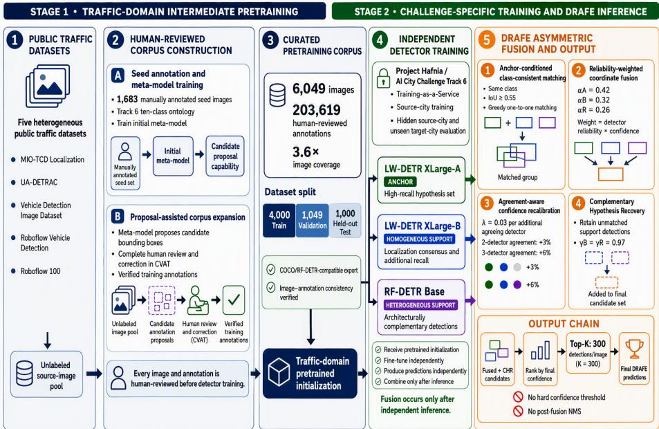
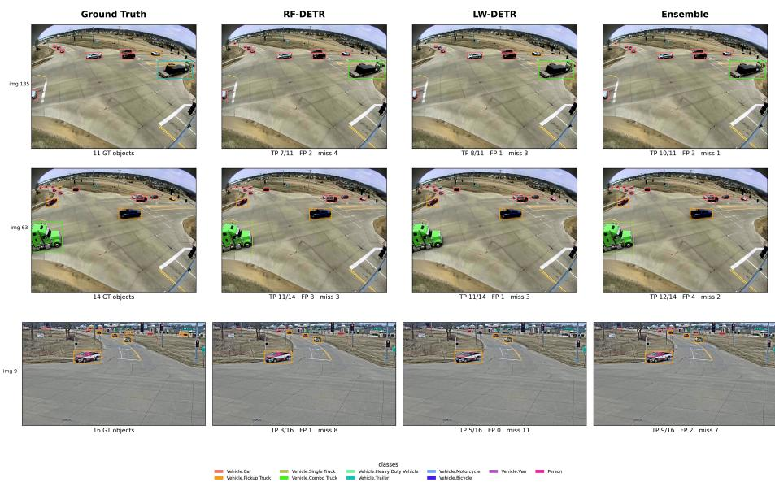

# DRAFE: Domain-Robust Asymmetric Fusion of Heterogeneous Detection Transformers for Cross-City Fine-Grained Trafic Object Detection

Divine Yao Agbobli1, Geofery Eyram Agorku2, Israel Afriyie3, Kwadwo Amankwah-Nkyi4, Marvin Osei-Kufour5, Richmond Owusu Duah5, Bright Seglah4, Kelvin Asamoah Terkper6, and Kwabena Amoako Adjei5

1 Iowa State University, Ames, IA, USA 2 University of Arkansas, Fayetteville, AR, USA 3 Parsons Corporation, USA 4 Jacobs, USA

University of South Florida, Tampa, FL, USA 6 Neel-Schafer, Inc., USA

dya@iastate.edu, gagorku@uark.edu, Israel.afriyie@parsons.com, kwadwo.amankwahnkyi@jacobs.com, moseikuffour@usf.edu, rowusuduah@usf.edu, Bright.Seglah@jacobs.com, kelvin.terkper@neel-schaffer.com, Kwabenaadjei@usf.edu

Abstract. Deep learning-based object detectors are fundamental to intelligent transportation systems, enabling trafic monitoring, vehicle analytics, and infrastructure management. However, achieving both finegrained vehicle recognition and robust cross-city domain generalization remains challenging. We present the Domain-Robust Asymmetric Fusion Ensemble (DRAFE), which combines independently trained LW-DETR and RF-DETR detectors for cross-city fine-grained trafic object detection. DRAFE employs a two-stage training strategy that first pretrains complementary detectors on diverse public trafic datasets using pseudolabel expansion and human-in-the-loop annotation refinement, producing a curated corpus of 6,049 images and 203,619 annotations, before challenge-compliant fine-tuning on the Project Hafnia Track 6 dataset. At inference, DRAFE applies anchor-conditioned class-consistent matching, reliability-weighted coordinate fusion, agreement-aware confidence recalibration, and complementary hypothesis recovery. On AI City Challenge 2026 Track 6, DRAFE achieves 0.4022 mAP, ranks sixth among 25 participating teams, and improves by 0.0553 mAP over a preliminary ensemble evaluated under identical benchmark conditions. Code is available in the VisionOps Trainer repository.

Keywords: Fine-grained object detection · Domain generalization · Ensemble detector · Intelligent transportation systems · Privacy-preserving learning

## 1 Introduction

Object detection and classification are fundamental components of intelligent transportation systems (ITS), enabling trafic-state estimation, incident detection, infrastructure monitoring, and autonomous trafic management [27, 33]. Recent advances through convolutional neural networks, transformer-based architectures, and large-scale pretraining have substantially improved detection performance [22, 28, 30, 37, 38, 41].

Despite these advances, deploying detectors beyond their training environments remains challenging. Variations in camera viewpoints, roadway geometry, trafic density, and regional vehicle distributions introduce domain shifts that can degrade performance in previously unseen environments [7, 32].

Track 6 of the 10th AI City Challenge provides a practical benchmark for this problem [3]. Unlike coarse detection tasks, Track 6 requires fine-grained recognition across ten visually similar classes: Car, Pickup Truck, Single Truck, Combination Truck, Trailer, Heavy-Duty Vehicle, Van, Motorcycle, Bicycle, and Person. The dataset exhibits a pronounced long-tailed distribution, leaving several categories underrepresented [11, 13, 14]. Furthermore, Track 6 uses Project Hafnia, a GDPR-compliant Training-as-a-Service platform that prevents participants from downloading or directly accessing the underlying challenge imagery [17, 25, 26]. Models are trained within Hafnia on labeled source-city data and evaluated on hidden benchmark data containing source-city and unseen target-city scenes, establishing a privacy-preserving setting for cross-city generalization.

The Training-as-a-Service setup distinguishes Track 6 from traditional domain-adaptation benchmarks. Unsupervised domain-adaptation methods require target-domain data during training [7, 18, 24], an assumption that does not hold in this setting. The problem therefore falls within single-source domain generalization, where detectors must generalize from labeled source data alone [9, 21, 29, 31, 32]. Semi-supervised learning, pseudo-label refinement, and augmentation can improve robustness [16,19,34–36,40,42], while detector ensembles exploit complementary error characteristics across architectures [10, 20, 26]. These approaches have seldom been integrated into a unified framework for privacy-preserving cross-city generalization.

Motivated by these challenges, this study proposes DRAFE, a Domain-Robust Asymmetric Fusion Ensemble for cross-city fine-grained trafic object detection. DRAFE combines complementary detection transformers within a data-centric training and inference framework organized around two premises. First, a scalable pseudo-label expansion pipeline can increase annotated training coverage while maintaining annotation quality through complete human review. Second, asymmetric ensemble fusion with reliability-weighted coordinate fusion and complementary hypothesis recovery can improve prediction quality under cross-city domain shift.

The contributions of this work are as follows:

1. DRAFE is proposed as a Domain-Robust Asymmetric Fusion Ensemble for cross-city fine-grained trafic object detection. The method combines asymmetric detector roles, class-consistent localization fusion, agreement-aware confidence recalibration, and complementary hypothesis recovery.

2. A scalable pseudo-label expansion pipeline produces a corpus of 6,049 images with 203,619 human-reviewed annotations. A meta-model trained on 1,683 manually annotated images proposes labels for corpus expansion, followed by complete human review, yielding 3.6 times greater image coverage.

3. Evaluation on Track 6 of the 10th AI City Challenge shows that DRAFE achieves an mAP of 0.4022 and ranks sixth among 25 participating teams. The method improves by 0.0553 mAP, or 15.9% relative, over a preliminary ensemble submission evaluated under identical benchmark conditions and by 0.0181 mAP, or 4.7% relative, over the strongest standalone component detector.

## 2 Related Work

## 2.1 Object Detection, Domain Generalization, and Data-Centric Learning

Deep learning detectors have evolved from two-stage CNN architectures to onestage models and subsequently to transformer-based frameworks with end-toend set prediction and multi-scale feature representation [4–6, 22, 30, 33]. Performance can degrade under domain shift from unseen environments. Domainadaptation methods align source and target distributions [7, 20, 24], but require access to target-domain data during training. Single-source domain generalization instead seeks representations that transfer from labeled source data to unseen domains through feature diversification, augmentation, and vision-language alignment [9, 21, 29, 31, 41]. Complementary data-centric strategies, including pseudo-label refinement, semi-supervised learning, and copy-paste augmentation, can extend training diversity and improve robustness [11, 12, 15, 16, 36].

Transportation studies have also demonstrated the value of systematic model comparison and context-aware learning, including multi-model evaluation for infrastructure-condition prediction [2], spatially informed machine learning for transportation-demand analysis [39], and safety-aware reinforcement learning for adaptive trafic control under changing work-zone conditions [1].

## 2.2 Detector Ensembles and Fine-Grained Vehicle Recognition

Ensembling can improve localization and robustness by combining complementary predictions from multiple models. Common fusion strategies include non-maximum suppression, Soft-NMS, Non-Maximum Weighted averaging, and Weighted Boxes Fusion. Weighted Boxes Fusion computes confidence-weighted coordinate averages across overlapping detections [37]. Conventional Weighted Boxes Fusion clusters spatially overlapping predictions without explicitly assigning anchor and support roles. Although fixed model-level weights can be incorporated, the method does not inherently impose anchor-conditioned oneto-one matching, agreement-specific confidence recalibration, or explicit recovery of unmatched support hypotheses.

Fine-grained vehicle recognition compounds these challenges. Najeeb et al. [28] examined confusion among visually similar urban trafic classes, while Ruan et al. [34] examined evidence fusion under degraded conditions. The AI City Challenge series provides a benchmark for intelligent transportation systems vision [38]. Track 6 of the 10th edition addresses cross-city fine-grained object detection through the Project Hafnia managed-training pipeline [3, 25–27].

While Weighted Boxes Fusion [37] and pseudo-label generation [36] are established techniques, DRAFE introduces three departures from standard ensemble practice:

1. Asymmetric anchor-support role assignment, in which one detector governs the initial hypothesis space.

2. Anchor-conditioned class-consistent one-to-one matching, which prevents cross-class merging when detections from diferent semantic categories overlap spatially.

3. Complementary hypothesis recovery, which retains selected unmatched support detections and thereby relaxes the anchor-recall ceiling.

## 3 Methodology

## 3.1 Problem Formulation

This study addresses fine-grained trafic-object detection under geographic domain shift, as defined in AI City Challenge Track 6. A detector is trained on source-domain data within the Hafnia workflow and evaluated on hidden imagery containing source-city and target-city scenes [3]. The label space comprises ten categories: car, pickup truck, single truck, combination truck, heavy-duty vehicle, trailer, motorcycle, bicycle, van, and person.

The set of predictions returned by detector m for image x is

$$
D _ { m } ( x ) = \{ ( b _ { j } , y _ { j } , s _ { j } ) \} _ { j = 1 } ^ { N _ { m } } ,\tag{1}
$$

where $b _ { j }$ denotes a normalized axis-aligned bounding box, $y _ { j }$ denotes the class label, $s _ { j }$ denotes the confidence score, and $N _ { m }$ is the number of detections returned by detector m.

Cross-city evaluation introduces two coupled challenges. Classification and localization errors are not uniformly distributed across detectors, and aggressive suppression can remove uncertain but correct predictions in the target domain. DRAFE therefore preserves the hypothesis space of the strongest high-recall model, exploits cross-model agreement for localization refinement, and recovers complementary objects detected only by support models.

## 3.2 Overview of the DRAFE Framework

DRAFE is structured as a training-to-fusion pipeline with three independently trained detectors: two LW-DETR XLarge models and one RF-DETR Base model. The two LW-DETR XLarge instances share the same architecture but follow independent optimization trajectories, while RF-DETR Base introduces architectural heterogeneity and a distinct precision-recall profile. LW-DETR consists of a vision-transformer encoder, feature projector, and shallow DETR decoder, with multilevel feature aggregation and interleaved local-global attention [6]. RF-DETR is a real-time detection transformer designed around an accuracy-latency tradeof [33]. Unlike symmetric fusion methods, DRAFE enforces anchor-conditioned one-to-one matching, agreement-specific confidence recalibration, and explicit recovery of unmatched support hypotheses.

All detectors undergo trafic-domain intermediate pretraining on a curated corpus before challenge-specific fine-tuning within Hafnia. After independent training, the strongest LW-DETR XLarge model is assigned the anchor role, denoted $\mathrm { L W } { \mathrm { - } } \mathrm { X } _ { \mathrm { A } }$ . The second LW-DETR XLarge model, denoted $\mathrm { L W } { \mathrm { - } } \mathrm { X } _ { \mathrm { B } }$ , provides within-family localization consensus. RF-DETR Base, denoted ${ \mathrm { R F - B } } .$ , provides cross-architecture complementarity. Table 1 summarizes these roles.

Table 1: Asymmetric role assignment of the constituent detectors.
<table><tr><td>Detector</td><td>Role</td><td>Primary contribution</td></tr><tr><td></td><td></td><td>LW-DETR XLarge-A Anchor Dense, high-recall hypothesis set</td></tr><tr><td></td><td></td><td>LW-DETR XLarge-B Support Localization consensus and additional recall</td></tr><tr><td>RF-DETR Base</td><td></td><td>Support Architecturally complementary detections</td></tr></table>

As illustrated in Fig. 1, $\mathrm { { L W } \mathrm { { - } \mathrm { { X } _ { A } } } }$ provides the anchor hypotheses. $\mathrm { L W } { \mathrm { - } } \mathrm { X } _ { \mathrm { B } }$ provides within-family localization consensus, while RF-B contributes crossarchitecture complementarity. The inference procedure applies class-consistent anchor matching, reliability-weighted coordinate fusion, agreement-aware confidence recalibration, and complementary hypothesis recovery before retaining the 300 highest-ranked candidates.

## 3.3 Trafic-Domain Intermediate Pretraining

All component detectors undergo intermediate pretraining on a curated traficdomain corpus assembled from five public sources: MIO-TCD Localization [23], UA-DETRAC [43], the Vehicle Detection Image Dataset, the Roboflow vehicledetection dataset, and Roboflow 100 [8]. The corpus was constructed through a two-stage annotation pipeline designed to increase annotated coverage while controlling manual annotation efort.

  
Fig. 1: Overview of the DRAFE training and inference framework. During challengespecific training, each Hafnia managed experiment combines the platform-hosted dataset with a trainer package, execution command, and selected GPU configuration.

Stage 1: Meta-model training on seed annotations. A representative set of 1,683 images was selected and fully annotated by human reviewers using CVAT. Original source labels were not transferred because the source taxonomies and bounding-box conventions difered. All annotations followed the ten-class Track 6 ontology. Bicycle and Motorcycle boxes were restricted to the vehicle body, with a separate Person box assigned to each visible rider. Box pairs with IoU ≥ 0.90 were automatically flagged for duplicate review. The manually annotated seed set was then used to train a meta-model whose sole role was to generate initial bounding-box proposals for a larger image pool.

Stage 2: Pseudo-label expansion and human review. The meta-model generated candidate annotations for the 6,049-image corpus. These predictions served only as initial annotation proposals. Every image subsequently underwent complete human review and correction in CVAT before inclusion in the training corpus. Therefore, no automatically generated annotation was incorporated into detector training without human verification.

The resulting corpus contains 203,619 verified object instances and provides 3.6 times greater image coverage than the 1,683-image seed set. The corpus was partitioned into 4,000 training images, 1,049 validation images, and 1,000 heldout test images. Car and Person account for 84.5% of all annotations, whereas Trailer and Heavy-Duty Vehicle contain 390 and 391 instances, respectively.

The reviewed annotations were exported in COCO-compatible and RF-DETRcompatible formats and checked for image-annotation consistency before intermediate pretraining.

## 3.4 Independent Detector Training

Intermediate pretraining on the curated public corpus was completed outside the Hafnia challenge environment. Only pretrained model initializations and challenge-specific training implementations were incorporated into the trainer packages used for Hafnia fine-tuning. No external images were introduced into the managed challenge environment. Each detector was fine-tuned separately so that the component models retained distinct optimization histories and prediction errors. The ensemble was constructed from independently trained models rather than through post hoc modification of a single detector.

At inference, each trained model independently processed every benchmark image, and fusion was applied only after all three component detectors completed inference.

## 3.5 Anchor-Conditioned Class-Consistent Matching

For each image, detections from $\mathrm { L W } { \mathrm { - } } \mathrm { X } _ { \mathrm { A } }$ are sorted by descending confidence and treated as anchor hypotheses. Let $d _ { a } = ( b _ { a } , y _ { a } , s _ { a } )$ denote an anchor detection with bounding box $b _ { a } .$ , class label $y _ { a } ,$ and confidence $s _ { a }$ . The two support detectors are indexed by $k \in \{ B , R \}$ , representing $\mathrm { L W } { \mathrm { - } } \mathrm { X } _ { \mathrm { B } }$ and RF-B, respectively. The i-th detection from support detector k is $d _ { k , i } = ( b _ { k , i } , y _ { k , i } , s _ { k , i } )$

Let $U _ { k }$ denote the set of currently unused detections from detector k. For each anchor $d _ { a }$ , the selected support match is

$$
\begin{array} { r } { d _ { k } ^ { * } ( a ) = \underset { d _ { k , i } \in U _ { k } } { \arg \operatorname* { m a x } } \mathrm { I o U } \left( b _ { a } , b _ { k , i } \right) , } \end{array}\tag{2}
$$

subject to

$$
y _ { k , i } = y _ { a } \quad \mathrm { a n d } \quad \mathrm { I o U } \left( b _ { a } , b _ { k , i } \right) \geq \tau _ { f } , \qquad \tau _ { f } = 0 . 5 5 .\tag{3}
$$

If no eligible support detection exists, then $d _ { k } ^ { \ast } ( a ) = \emptyset$ . Once assigned, a support detection is removed from $U _ { k }$ , preventing the same support prediction from being matched to multiple anchors. Class-consistent matching also prevents cross-class merging when objects belonging to diferent categories overlap spatially.

## 3.6 Reliability-Weighted Coordinate Fusion

The matched group associated with anchor $d _ { a }$ i

$$
G _ { a } = \{ d _ { a } \} \cup \{ d _ { k } ^ { * } ( a ) \mid k \in \{ B , R \} , \ d _ { k } ^ { * } ( a ) \neq \emptyset \} .\tag{4}
$$

For each contributing detector $m _ { \colon }$ , the fusion weight is the product of detector reliability $\alpha _ { m }$ and detection confidence $s _ { m } \colon$

$$
w _ { m } = \alpha _ { m } s _ { m } .\tag{5}
$$

The selected reliability coeficients are $\alpha _ { A } = 0 . 4 2 , \alpha _ { B } = 0 . 3 2$ , and $\alpha _ { R } = 0 . 2 6$ The fused bounding box is

$$
\hat { b } _ { a } = \frac { \displaystyle \sum _ { m \in G _ { a } } w _ { m } b _ { m } } { \displaystyle \sum _ { m \in G _ { a } } w _ { m } } .\tag{6}
$$

Fusion is performed in corner-coordinate form $( x _ { 1 } , y _ { 1 } , x _ { 2 } , y _ { 2 } )$ , and the resulting coordinates are clipped to the normalized interval [0, 1].

## 3.7 Agreement-Aware Confidence Recalibration

The fused confidence is designed for candidate ranking rather than probabilistic interpretation. DRAFE retains the maximum confidence in the matched group and applies a conservative multiplicative agreement bonus:

$$
\hat { s } _ { a } = \operatorname* { m i n } \left\{ 1 , \ s _ { \mathrm { m a x } } \left[ 1 + \lambda \left( | G _ { a } | - 1 \right) \right] \right\} , \qquad \lambda = 0 . 0 3 .\tag{7}
$$

Agreement between two detectors produces a 3% multiplicative increase, while agreement among all three detectors produces a 6% increase.

## 3.8 Complementary Hypothesis Recovery

Anchor-based fusion cannot recover an object that is absent from the anchor hypothesis set. DRAFE therefore retains unused support detections remaining in $U _ { k }$ after matching, while conservatively scaling their confidence:

$$
\hat { s } _ { k , i } = \gamma _ { k } s _ { k , i } , \qquad \gamma _ { B } = \gamma _ { R } = 0 . 9 7 , \qquad d _ { k , i } \in U _ { k } .\tag{8}
$$

Because $\gamma _ { k } ~ < ~ 1$ , anchor-supported hypotheses receive a modest ranking advantage, while strong unmatched support detections remain eligible for final selection.

## 3.9 Budgeted High-Recall Selection

The fused detections and complementary recovered hypotheses are pooled and sorted by recalibrated confidence. The 300 highest-ranked detections are retained:

$$
D _ { \mathrm { f i n a l } } ( x ) = \mathrm { T o p K } ( D _ { \mathrm { f u s e d } } ( x ) \cup D _ { \mathrm { C H R } } ( x ) , K = 3 0 0 ) .\tag{9}
$$

No hard confidence threshold is applied before final ranking, and no additional non-maximum suppression is applied after fusion.

Algorithm 1 Domain-Robust Asymmetric Fusion Ensemble   
Require: Predictions from $\mathrm { L W - X _ { A } , \ L W - X _ { B } , }$ and RF-B for image x   
1: Initialize unused support sets $U _ { B }$ and $U _ { R }$   
2: Initialize $D _ { \mathrm { f u s e d } }  \emptyset$   
3: Sort $\mathrm { { L W } \mathrm { { - } \mathrm { { X } _ { A } } } }$ detections by descending confidence   
4: for each anchor detection $d _ { a }$ do   
5: Initialize $G _ { a } \gets \{ d _ { a } \}$   
6: for each support detector $k \in \{ B , R \}$ do   
7: Find the highest-IoU unused support detection satisfying the class constraint   
and IoU $\geq 0 . 5 5$   
8: if an eligible support detection exists then   
9: Add the support detection to $G _ { a }$   
10: Remove the support detection from $U _ { k }$   
11: end if   
12: end for   
13: Compute $\hat { b } _ { a }$ using Eq. (6)   
14: Compute ${ \hat { s } } _ { a }$ using Eq. (7)   
15: Add $( \hat { b } _ { a } , y _ { a } , \hat { s } _ { a } )$ to $D _ { \mathrm { f u s e d } }$   
16: end for   
17: Scale unused support detections by $\gamma _ { k } = 0 . 9 7$   
18: Form $D _ { \mathrm { C H R } }$ from the scaled support detections   
19: Pool and sort $D _ { \mathrm { f u s e d } }$ ∪ DCHR   
20: Return the 300 highest-ranked detections   
Ensure: Final detection set $D _ { \mathrm { f i n a l } } ( x )$

Table 2: DRAFE inference configuration.
<table><tr><td>Component</td><td>Setting</td></tr><tr><td>Anchor detector</td><td>LW-DETR XLarge-A</td></tr><tr><td>Support detectors</td><td>LW-DETR XLarge-B; RF-DETR Base</td></tr><tr><td>Reliability weights</td><td>(0.42, 0.32, 0.26)</td></tr><tr><td>Class constraint</td><td>Exact class identity</td></tr><tr><td>Matching strategy</td><td>Greedy one-to-one matching</td></tr><tr><td>Fusion IoU threshold</td><td>0.55</td></tr><tr><td>Agreement bonus</td><td>0.03 per additional detector</td></tr><tr><td>Support confidence scale 0.97</td><td></td></tr><tr><td>Post-fusion threshold</td><td>None</td></tr><tr><td>Post-fusion NMS</td><td>None</td></tr><tr><td>Final detection budget</td><td>300 detections per image</td></tr></table>

## 3.10 Inference Algorithm and Configuration

Algorithm 1 summarizes the DRAFE inference procedure. Table 2 reports the selected inference configuration.

## 4 Experiments

## 4.1 Dataset and Data Access

Track 6 uses a trafic dataset provided through the Milestone Project Hafnia platform [3,25,26]. The oficial training split contains 10,374 images, and the validation split contains 2,564 images. The hidden benchmark contains 14,868 images from source-city and unseen target-city scenes. The dataset contains approximately 150,000 annotated instances across ten fine-grained trafic categories.

The challenge data were hosted in Hafnia’s Data Library and supplied to managed training experiments. Participants could inspect dataset-level information and sample data but could not download the underlying challenge imagery. Track 6 required challenge training and benchmark inference to be executed through managed experiments. Under the challenge account configuration, only one experiment could run at a time, and trained models and trainer packages were limited to 2 GB. Prediction artifacts were retrieved from completed experiments and submitted to the oficial AI City Challenge Evaluation Server.

## 4.2 Evaluation Metrics

The primary evaluation metric is mean Average Precision:

$$
\operatorname* { m A P } = \frac { 1 } { C } \sum _ { c = 1 } ^ { C } \mathrm { A P } _ { c } ,\tag{10}
$$

where C is the number of object classes and $\mathrm { A P } _ { c }$ is the Average Precision for class c. The evaluation server additionally reports $\mathrm { A P } _ { 5 0 } , \mathrm { A P } _ { 7 5 }$ , scale-stratified AP, and average recall at specified detection budgets.

## 4.3 Implementation Details

Each Hafnia experiment paired the platform-hosted challenge dataset with a trainer package, an execution command, and a selected GPU configuration. All challenge-specific experiments were conducted in the Project Hafnia managed environment [26, 27]. The DRAFE ensemble consists of two independently trained LW-DETR XLarge detectors [6], denoted $\mathrm { { L W } \mathrm { { - } \mathrm { { X } _ { A } } } }$ and $\mathrm { L W } { \mathrm { - } } \mathrm { X } _ { \mathrm { B } }$ , and one RF-DETR Base detector [33], denoted RF-B. Each model was initialized from intermediate pretraining on the curated trafic corpus before challenge-specific fine-tuning.

RF-DETR. RF-DETR Base was fine-tuned for two epochs using AdamW with a learning rate of $1 \times 1 0 ^ { - 4 }$ , batch size 4, and gradient accumulation over four steps, corresponding to an efective batch size of 16. Training used the Hafnia Lite compute tier with one NVIDIA T4 GPU and 16 GB of GPU memory.

LW-DETR. LW-DETR XLarge-A and XLarge-B were independently fine-tuned for five and two epochs, respectively, using AdamW with a learning rate of $5 \times 1 0 ^ { - 4 }$ and batch size 1. The longer schedule produced the stronger full-test result for XLarge-A, which was consequently assigned the anchor role. XLarge-B retained an independent optimization history and served as a homogeneous support detector.

Prediction files were written to the experiment artifact directory and retrieved through Hafnia’s experiment-output mechanism before submission to the oficial evaluation server. The component detectors were executed independently, and fusion was applied after completion of component inference. Challenge jobs were executed sequentially because the account configuration permitted one active experiment at a time. These experiments demonstrate compatibility with the managed training environment but do not establish real-time deployment performance.

## 5 Experimental Results and Discussion

## 5.1 Evaluation Protocol

Final model comparisons are based on scores returned by the oficial AI City Challenge Evaluation Server for predictions generated on the complete hidden benchmark of 14,868 images. Component-level configuration studies used the Hafnia development split. Standalone detector scores correspond to individual component submissions, while the reported DRAFE result corresponds to the best ensemble submission. The preliminary ensemble provides an earlier comparison configuration evaluated through the same benchmark system.

## 5.2 Standalone Detector and Baseline Performance

$\mathrm { L W } { \mathrm { - } } \mathrm { X } _ { \mathrm { A } }$ achieved the strongest standalone full-test result among the three component detectors, with 0.3841 $\mathrm { m A P }$ and 300 predictions per image. $\mathrm { L W } { \mathrm { - } } \mathrm { X } _ { \mathrm { B } }$ achieved $\mathrm { 0 . 3 8 2 2 \ m A P }$ with 300 predictions per image, while RF-B achieved 0.3836 mAP with an average of 77.66 predictions per image. Although their aggregate mAP values were similar, $\mathrm { L W } { \mathrm { - } } \mathrm { X } _ { \mathrm { B } }$ and RF-B exhibited diferent recall and localization profiles. $\mathrm { L W } { \mathrm { - } } \mathrm { X } _ { \mathrm { B } }$ achieved higher $\mathrm { A R } _ { 1 0 0 }$ , while RF-B produced fewer predictions per image. These diferences motivated their use as complementary support detectors.

Table 3: Standalone and preliminary ensemble performance on the hidden test set.
<table><tr><td>Model</td><td>Role</td><td>mAP</td><td>AP50</td><td>AP75</td><td>APs</td><td>APM</td><td>APL</td><td>AR@1</td><td>AR@10</td><td>AR100</td><td>ARs</td><td>ARM</td><td>ARL</td><td>Boxes/img</td></tr><tr><td>Preliminary ensemble Comparison</td><td></td><td>0.3469</td><td>0.4732</td><td>0.3596</td><td>0.0515</td><td>0.1864</td><td>0.4800</td><td>0.2843</td><td>0.4227</td><td>0.4368</td><td>0.0840</td><td>0.2518</td><td>0.5779</td><td>300.00</td></tr><tr><td>LW-DETR XLarge-A</td><td>Anchor</td><td>0.3841</td><td>0.5253</td><td>0.3998</td><td>0.0557</td><td>0.2154</td><td>0.5276</td><td>0.4079</td><td>0.6467</td><td>0.6881</td><td>0.2323</td><td>0.4892</td><td>0.8193</td><td>300.00</td></tr><tr><td>LW-DETR XLarge-B</td><td>Homogeneous support</td><td>0.3822</td><td>0.5210</td><td>0.4051</td><td>0.0452</td><td>0.2015</td><td>0.5443</td><td>0.3957</td><td>0.6349</td><td>0.6709</td><td>0.2195</td><td>0.4571</td><td>0.8143</td><td>300.00</td></tr><tr><td>RF-DETR Base</td><td>Heterogeneous support</td><td>0.3836</td><td>0.5254</td><td>0.4048</td><td>0.0476</td><td>0.2070</td><td>0.5232</td><td>0.3868</td><td>0.5916</td><td>0.6169</td><td>0.1143</td><td>0.3820</td><td>0.7603</td><td>77.66</td></tr></table>

## 5.3 Efect of Asymmetric Ensembling

DRAFE achieved 0.4022 mAP on the complete hidden benchmark. This represents an absolute improvement of 0.0553 mAP over the preliminary ensemble and 0.0181 mAP over the strongest standalone component, LW-X . Improvements were observed across the reported object-size strata and at $\mathrm { A R } _ { 1 0 0 }$

Table 4: Full-test performance of the preliminary ensemble, strongest standalone component, and DRAFE.
<table><tr><td>Method</td><td> $\mathrm { m A P }$ </td><td> $\mathrm { A P _ { 5 0 } }$ </td><td> $\mathrm { A P } _ { 7 5 }$ </td><td> $\mathrm { A P } _ { S }$ </td><td> $\mathrm { A P } _ { M }$ </td><td> $\mathrm { A P } _ { L }$ </td><td>AR100</td></tr><tr><td>Preliminary ensemble</td><td>0.3469</td><td>0.4732</td><td>0.3596</td><td>0.0515</td><td>0.1864</td><td>0.4800</td><td>0.4368</td></tr><tr><td>LW.  $\mathrm { . X _ { A } }$ </td><td>0.3841</td><td>0.5253</td><td>0.3998</td><td>0.0557</td><td>0.2154</td><td>0.5276</td><td>0.6881</td></tr><tr><td>DRAFE</td><td>0.4022</td><td>0.5333</td><td>0.4259</td><td>0.0571</td><td>0.2335</td><td>0.5460</td><td>0.6981</td></tr><tr><td>Difference from preliminary ensemble</td><td>+0.0553</td><td>+0.0601</td><td>+0.0663</td><td>+0.0056</td><td>+0.0471</td><td>+0.0660</td><td>+0.2613</td></tr><tr><td>Difference from  $\mathrm { \bar { L } W  – X _ { A } }$ </td><td>+0.0181</td><td>+0.0080</td><td>+0.0261</td><td>+0.0014</td><td>+0.0181</td><td>+0.0184</td><td>+0.0100</td></tr></table>

The gain over $\mathrm { L W } { \mathrm { - } } \mathrm { X } _ { \mathrm { A } }$ was largest at $\mathrm { A P _ { 7 5 } }$ , where DRAFE improved by 0.0261. This result is consistent with improved localization among matched detections, although the aggregate benchmark metrics do not independently isolate the contribution of each fusion operation.

Qualitative Comparison Figure 2 compares ground-truth annotations with predictions from RF-DETR, LW-DETR, and DRAFE on three selected images. Across these examples, DRAFE recovers more ground-truth objects than either standalone detector. The ensemble increases the true-positive count from 7–8 to 10 in the first image, from 11 to 12 in the second image, and from 5–8 to 9 in the third image. The recovered objects are accompanied by additional false-positive hypotheses, reflecting the precision-recall tradeof associated with the high-recall candidate-retention strategy.

## 5.4 Ablation Studies

The ablation comparisons were conducted on the Hafnia development split during the challenge period and should not be directly compared with the full-test results reported above.

  
Fig. 2: Qualitative comparison of standalone detectors and DRAFE.

Model composition. Adding a fourth detector as a fusion-only support model did not improve overall development performance. The four-model variant increased $\mathrm { A P _ { 7 5 } }$ from 0.4312 to 0.4321 and $\mathrm { A R } _ { 1 0 0 }$ from 0.6968 to 0.6999, but reduced mAP from 0.4074 to 0.4068. The experiment used a single training seed, and multi-seed evaluation was not conducted within the challenge resource allocation.

Table 5: Development-set ablation on ensemble size.
<table><tr><td>Configuration</td><td> $\mathrm { m A P }$ </td><td> $\mathrm { A P _ { 5 0 } }$ </td><td> $\mathrm { A P _ { 7 5 } }$ </td><td> $\mathrm { A P } _ { S }$ </td><td> $\mathrm { A P } _ { M }$ </td><td> $\mathrm { A P } _ { L }$ </td><td> $\mathrm { { A R } _ { 1 0 0 } }$ </td></tr><tr><td>Three-model DRAFE</td><td></td><td></td><td></td><td></td><td></td><td></td><td>0.40740.53980.43120.06040.23120.55420.6968</td></tr><tr><td>Four-model support ensemble 0.4068 0.5379 0.4321 0.0584 0.2245 0.55280.6999</td><td></td><td></td><td></td><td></td><td></td><td></td><td></td></tr></table>

Agreement bonus and reliability weights. Increasing the agreement bonus from $\begin{array} { l l l } { \lambda } & { = } & { 0 . 0 3 } \end{array}$ to $\lambda \ = \ 0 . 0 4$ increased $\mathrm { A P _ { 5 0 } }$ and $\mathrm { A R } _ { 1 0 0 }$ but reduced $\mathrm { A P _ { 7 5 } }$ medium-object AP, large-object AP, and overall mAP. Shifting one percentage point of reliability weight from $\mathrm { { L W } \mathrm { { - } \mathrm { { X } _ { A } } } }$ to RF-B, from (0.43, 0.32, 0.25) to (0.42, 0.32, 0.26), increased the development score to 0.4077.

Detection budget. A thresholding and suppression configuration that reduced output to 23.22 detections per image produced a development mAP of 0.3520. The final configuration consequently retained its high-recall budget of 300 ranked detections per image without a hard preselection threshold.

Table 6: AI City Challenge 2026 Track 6 leaderboard based on each team’s best reported full-test score.
<table><tr><td>Rank Team</td><td></td><td> $\mathrm { m A P }$ </td><td> $\mathrm { A P _ { 5 0 } }$ </td><td> $\mathrm { A P } _ { 7 5 }$ </td><td> $\mathrm { A P } _ { S }$ </td><td> $\mathrm { A P } _ { M }$ </td><td> $\mathrm { A P } _ { L }$ </td></tr><tr><td>1</td><td>SKKU-AL-T1</td><td>0.4753</td><td>0.6207</td><td>0.5031</td><td>0.0920</td><td>0.3041</td><td>0.6110</td></tr><tr><td>2</td><td>BIT-ODL</td><td>0.4281</td><td>0.5539</td><td>0.4568</td><td>0.0637</td><td>0.2639</td><td>0.5669</td></tr><tr><td>3</td><td>Remote Vibecoders from Chisinau 0.4176</td><td></td><td>0.5727</td><td>0.4521</td><td>0.0790</td><td>0.2739</td><td>0.5339</td></tr><tr><td>4</td><td>BK2TheFuture</td><td>0.4169</td><td>0.5289</td><td>0.4407</td><td>0.0591</td><td>0.2210</td><td>0.5548</td></tr><tr><td>5</td><td>S2 Detection</td><td>0.4114</td><td>0.5447</td><td>0.4414</td><td>0.0747</td><td>0.2596</td><td>0.5407</td></tr><tr><td>6</td><td>VisionOps/DRAFE</td><td>0.4022</td><td>0.5333</td><td>0.4259</td><td>0.0571</td><td>0.2335</td><td>0.5460</td></tr><tr><td>7</td><td>Team IPCV</td><td>0.3882</td><td>0.5021</td><td>0.4068</td><td>0.0578</td><td>0.1735</td><td>0.5307</td></tr><tr><td>8</td><td>bfc</td><td>0.3741</td><td>0.5097</td><td>0.3989</td><td>0.0445</td><td>0.2369</td><td>0.5048</td></tr><tr><td>9</td><td>NextITS</td><td>0.3654</td><td>0.4879</td><td>0.3857</td><td>0.0660</td><td>0.1924</td><td>0.5034</td></tr><tr><td>10</td><td>Team United</td><td>0.3529</td><td>0.4655</td><td>0.3656</td><td>0.0487</td><td>0.1588</td><td>0.4675</td></tr></table>

## 5.5 Object-Scale Analysis

Performance varied substantially by object size. Large objects achieved $\mathrm { A P } _ { L } =$ 0.5460 and $\mathrm { A R } _ { L } = 0 . 8 3 0 5$ , while medium objects achieved $\mathrm { A P } _ { M } = 0 . 2 3 3 5$ and $\mathrm { A R } _ { M } = 0 . 4 9 3 8$ . Small objects achieved $\mathrm { A P } _ { S } = 0 . 0 5 7 1$ and $\mathrm { A R } _ { S } = 0 . 2 1 3 1$ . The benchmark reports aggregate scale-stratified metrics without per-class or errortype decomposition. Consequently, the available results establish that smallobject performance is substantially lower than medium- and large-object performance but do not identify the specific class, localization, or confusion mechanisms responsible for that diference.

## 6 Conclusion

This study introduced DRAFE, a Domain-Robust Asymmetric Fusion Ensemble for cross-city fine-grained trafic-object detection under privacy-preserving Training-as-a-Service constraints. The method combines trafic-domain intermediate pretraining with anchor-conditioned class-consistent matching, reliabilityweighted coordinate fusion, agreement-aware confidence recalibration, and complementary hypothesis recovery. The intermediate-pretraining pipeline produced a 6,049-image corpus containing 203,619 human-reviewed annotations. On the complete Track 6 hidden benchmark, DRAFE achieved 0.4022 mAP and ranked sixth among 25 participating teams. The ensemble improved by 0.0181 mAP over the strongest standalone component detector and by 0.0553 mAP over a preliminary ensemble evaluated through the same benchmark system.

The results provide evidence that detector complementarity and asymmetric inference refinement can improve cross-city fine-grained object detection in a managed training environment. Further work should examine small-object representation, class-specific error patterns, calibration across geographic domains, and multi-seed evaluation of the component detectors and fusion configuration.

## References

1. Afriyie, I., Amankwah-Nkyi, K., Agyei-Essiful, P., Adanu, E.K., Acheampong, E.K.: Safety-aware reinforcement learning model for adaptive trafic signal optimization in work zone environments. Preprints (Jun 2026). https://doi.org/10. 20944/preprints202606.1590.v1, preprint, not peer reviewed

2. Afriyie, I., Joshua, S.N., Abuanor, M.N.: Utilizing several machine learning techniques to investigate the bridge deck condition. Journal of Studies in Civil Engineering 2(2), 35–53 (2025). https://doi.org/10.53898/jsce2025223

3. AI City Challenge: Track 6: Cross-city object detection (Milestone Project Hafnia). https://www.aicitychallenge.org/2026-track6/ (2026), accessed 20 July 2026

4. Bochkovskiy, A., Wang, C.Y., Liao, H.Y.M.: YOLOv4: Optimal speed and accuracy of object detection. arXiv preprint arXiv:2004.10934 (2020). https://doi.org/10. 48550/arXiv.2004.10934

5. Cai, Z., Vasconcelos, N.: Cascade R-CNN: Delving into high quality object detection. In: CVPR. pp. 6154–6162 (2018). https://doi.org/10.1109/CVPR.2018. 00644

6. Chen, Q., Su, X., Zhang, X., Wang, J., Chen, J., Shen, Y., Han, C., Chen, Z., Xu, W., Li, F., Zhang, S., Yao, K., Ding, E., Zhang, G., Wang, J.: LW-DETR: A transformer replacement to YOLO for real-time detection. arXiv preprint arXiv:2406.03459 (2024). https://doi.org/10.48550/arXiv.2406.03459

7. Chen, Y., Li, W., Sakaridis, C., Dai, D., Van Gool, L.: Domain adaptive faster R-CNN for object detection in the wild. In: CVPR. pp. 3339–3348 (2018)

8. Ciaglia, F.S., Zuppichini, F.S., Dominici, P., Tabelini, B., Souza, J.: Roboflow 100: A rich, multi-domain object detection benchmark. arXiv preprint arXiv:2211.13523 (2022). https://doi.org/10.48550/arXiv.2211.13523

9. Cui, Y., Jia, M., Lin, T.Y., Song, Y., Belongie, S.: Class-balanced loss based on efective number of samples. In: CVPR. pp. 9268–9277 (2019). https://doi.org/ 10.1109/CVPR.2019.00949

10. Danish, M.S., Khan, M.H., Munir, M.A., Sarfraz, M.S., Ali, M.: Improving single domain-generalized object detection: A focus on diversification and alignment. In: CVPR. pp. 17732–17742 (2024). https://doi.org/10.1109/CVPR52733.2024. 01679

11. Ghiasi, G., Cui, Y., Srinivas, A., Qian, R., Lin, T.Y., Cubuk, E.D., Le, Q.V., Zoph, B.: Simple copy-paste is a strong data augmentation method for instance segmentation. In: CVPR. pp. 2918–2928 (2021)

12. Gupta, A., Dollár, P., Girshick, R.: LVIS: A dataset for large vocabulary instance segmentation. In: CVPR. pp. 5356–5364 (2019)

13. Hao, Y., Forest, F., Fink, O.: Simplifying source-free domain adaptation for object detection: Efective self-training strategies and performance insights. In: European Conference on Computer Vision. Lecture Notes in Computer Science, vol. 15112, pp. 196–213. Springer (2024). https://doi.org/10.1007/978-3-031-72949-2\_12

14. Hosang, J., Benenson, R., Schiele, B.: Learning non-maximum suppression. In: CVPR. pp. 4507–4515 (2017)

15. Huang, S., Lu, Z., Cun, X., Yu, Y., Zhou, X., Shen, X.: DEIM: DETR with improved matching for fast convergence. In: CVPR. pp. 15162–15171 (2025)

16. Kisantal, M., Wojna, Z., Murawski, J., Naruniec, J., Cho, K.: Augmentation for small object detection. arXiv preprint arXiv:1902.07296 (2019). https://doi.org/ 10.48550/arXiv.1902.07296

17. Lavoie, M.A., Mahmoud, A., Waslander, S.L.: Large self-supervised models bridge the gap in domain adaptive object detection. In: CVPR (2025)

18. Li, B., Yao, Y., Tan, J., Zhang, G., Yu, F., Lu, J., Luo, Y.: Equalized focal loss for dense long-tailed object detection. In: CVPR. pp. 6990–6999 (2022). https: //doi.org/10.1109/CVPR52688.2022.00686

19. Li, Y., Wang, T., Kang, B., Tang, S., Wang, C., Li, J., Feng, J.: Overcoming classifier imbalance for long-tail object detection with balanced group softmax. In: CVPR. pp. 10991–11000 (2020)

20. Li, Y.J., Dai, X., Ma, C.Y., Liu, Y.C., Chen, K., Wu, B., He, Z., Kitani, K., Vajda, P.: Cross-domain adaptive teacher for object detection. In: CVPR. pp. 7581–7590 (2022). https://doi.org/10.1109/CVPR52688.2022.00743

21. Lin, C.T., Huang, S.W., Wu, Y.Y., Lai, S.H.: GAN-based day-to-night image style transfer for nighttime vehicle detection. IEEE Transactions on Intelligent Transportation Systems 22(2), 951–963 (2021)

22. Lin, T.Y., Goyal, P., Girshick, R., He, K., Dollár, P.: Focal loss for dense object detection. In: ICCV. pp. 2980–2988 (2017). https://doi.org/10.1109/ICCV. 2017.324

23. Luo, Z., Branchaud-Charron, F., Lemaire, C., Konrad, J., Li, S., Mishra, A., Achkar, A., Eichel, J., Jodoin, P.M.: MIO-TCD: A new benchmark dataset for vehicle classification and localization. IEEE Transactions on Image Processing 27(10), 5129–5141 (2018). https://doi.org/10.1109/TIP.2018.2848705

24. Michaelis, C., Mitzkus, B., Geirhos, R., Rusak, E., Bringmann, O., Ecker, A.S., Bethge, M., Brendel, W.: Benchmarking robustness in object detection: Autonomous driving when winter is coming. arXiv preprint arXiv:1907.07484 (2019). https://doi.org/10.48550/arXiv.1907.07484

25. Milestone Systems: Hafnia dataset: ECCV cross-city object detection dataset. https : / / mdi . milestonesys . com / datasets / 5070b3bd5 - 0266 - 4446 - a318 - 052c993558ef (2024), part of Project Hafnia

26. Milestone Systems: Project Hafnia: Video data and services for computer vision. https://hafnia.milestonesys.com/ (2025)

27. Milestone Systems: Hafnia training-as-a-service. https://hafnia.milestonesys. com/training-aas (2026), accessed 20 July 2026

28. Najeeb, S.A., Raza, R.H., Yusuf, A., Sultan, Z.: Fine-grained vehicle classification in urban trafic scenes using deep learning. In: Proceedings of the 11th International Conference on Robotics, Vision, Signal Processing and Power Applications. Lecture Notes in Electrical Engineering, vol. 829, pp. 902–908. Springer (2022). https: //doi.org/10.1007/978-981-16-8129-5\_138

29. Neubeck, A., Van Gool, L.: Eficient non-maximum suppression. In: ICPR. vol. 3, pp. 850–855 (2006). https://doi.org/10.1109/ICPR.2006.479

30. Peng, Y., Li, H., Wu, P., Zhang, Y., Sun, X., Wu, F.: D-FINE: Redefine regression task of DETRs as fine-grained distribution refinement. arXiv preprint arXiv:2410.13842 (2025). https://doi.org/10.48550/arXiv.2410.13842

31. Qi, L., Dong, P., Xiong, T., Xue, H., Geng, X.: DoubleAUG: Single-domain generalized object detector in urban via color perturbation and dual-style memory. ACM Transactions on Multimedia Computing, Communications, and Applications 20(5), 1–20 (2024). https://doi.org/10.1145/3634683

32. Ren, S., He, K., Girshick, R., Sun, J.: Faster R-CNN: Towards real-time object detection with region proposal networks. In: Advances in Neural Information Processing Systems. vol. 28 (2015)

33. Robinson, I., Robicheaux, P., Popov, M., Ramanan, D., Peri, N.: RF-DETR: Neural architecture search for real-time detection transformers. arXiv preprint arXiv:2511.09554 (2026). https://doi.org/10.48550/arXiv.2511.09554

34. Ruan, G., Hu, T., Ding, C., Yang, K., Kong, F., Cheng, J., Yan, R.: Finegrained vehicle recognition under low-light conditions using EficientNet and image enhancement on LiDAR point-cloud data. Scientific Reports 15, 4691 (2025). https://doi.org/10.1038/s41598-025-89002-3

35. Saito, K., Ushiku, Y., Harada, T., Saenko, K.: Strong-weak distribution alignment for adaptive object detection. In: CVPR. pp. 6956–6965 (2019). https://doi.org/ 10.1109/CVPR.2019.00712

36. Sohn, K., Zhang, Z., Li, C.L., Zhang, H., Lee, C.Y., Pfister, T.: A simple semi-supervised learning framework for object detection. arXiv preprint arXiv:2005.04757 (2020). https://doi.org/10.48550/arXiv.2005.04757

37. Solovyev, R., Wang, W., Gabruseva, T.: Weighted boxes fusion: Ensembling boxes from diferent object detection models. Image and Vision Computing 107, 104117 (2021). https://doi.org/10.1016/j.imavis.2021.104117

38. Tang, Z., Wang, S., Anastasiu, D.C., Chang, M.C., Sharma, A., Kong, Q., et al.: The 9th AI City Challenge. In: 2025 IEEE/CVF International Conference on Computer Vision Workshops. pp. 5526–5535. IEEE (2025). https://doi.org/10.1109/ ICCVW69036.2025.00579

39. Terkper, K.A., Moomen, M., Rahman, M.A., Mohammed, N.H., Khan, W.A., Codjoe, J.: Understanding vehicle availability patterns using census data with spatiallyhybrid machine learning models. Case Studies on Transport Policy 22, 101641 (2025). https://doi.org/10.1016/j.cstp.2025.101641

40. Tian, Y., Ye, Q., Doermann, D.S.: YOLOv12: Attention-centric real-time object detectors. arXiv preprint arXiv:2502.12524 (2025). https://doi.org/10.48550/ arXiv.2502.12524

41. Vidit, V., Engilberge, M., Salzmann, M.: CLIP the gap: A single domain generalization approach for object detection. In: CVPR. pp. 3219–3229 (2023)

42. Wang, A., Chen, H., Liu, L., Chen, K., Lin, Z., Han, J., Ding, G.: YOLOv10: Realtime end-to-end object detection. In: Advances in Neural Information Processing Systems. vol. 37, pp. 107984–108011 (2024). https://doi.org/10.52202/079017- 3429

43. Wen, L., Du, D., Cai, Z., Lei, Z., Chang, M.C., Qi, H., Lim, J., Yang, M.H., Lyu, S.: UA-DETRAC: A new benchmark and protocol for multi-object detection and tracking. Computer Vision and Image Understanding 193, 102907 (2020). https://doi.org/10.1016/j.cviu.2020.102907