# Deep Thought Alignment: Trajectory-Level Latent Distillation for Video Reasoning

Ao Shen1,2∗, Yongheng Zhang1∗, Yinghui Li1†, Manning Wang2†, Di Yin1, Xing Sun1

1Tencent Youtu Lab 2Fudan University lebronyhli@tencent.com

## Abstract

Large Multimodal Models (LMMs) for video reasoning have long been hindered by the high computational cost of process- ing vast amounts of visual information. This dilemma motivates the transfer of the reasoning capabilities of large models to smaller, more eficient ones. On-Policy Distillation (OPD) ofers a promising solution by matching output-token distribu- tions along student-generated trajectories. However, video rea-soning often depends on evidence accumulated across multiple frames. In this context, output-level supervision only captures information expressed through token predictions and does not directly constrain the latent representations formed during reasoning. To address this limitation, we propose Latent-OPD, which augments OPD with trajectory-level latent distillation. Specifically, our method focuses on the position at the end of each trajectory, where hidden states efectively summarize the accumulated visual evidence and reasoning context. Further- more, we introduce a progressive teacher-lookahead strategy, which aligns middle-to-late student layers with increasingly deeper teacher layers. Experiments on six video reasoning benchmarks show that Latent-OPD consistently outperforms output-only OPD. Notably, the improvements are particularly pronounced in scenarios with limited frames, long videos, or tasks requiring complex evidence aggregation. These re- sults establish Latent-OPD as a highly efective approach to frame-eficient video reasoning.

## 1 Introduction

We know more than we can tell.

— Michael Polanyi

Video reasoning is a critical yet challenging capability in multimodal perception, underpinning temporal event under- standing, spatial reasoning, and knowledge acquisition from dynamic visual streams (Zhang et al. 2025, 2026c; Kuang et al. 2025b; An et al. 2026; Li et al. 2026). Unlike singleframe image understanding, it requires models to process vast amounts of spatiotemporal information and distill sparse but decisive evidence for multi-step decisions. While recent Large Multimodal Models (LMMs) have substantially advanced this capability through stronger visual-language alignment and generative reasoning (Team et al. 2026; Bai et al. 2025; Lu et al. 2025a; Zhang et al. 2024, 2026a), their immense computational cost during inference severely limits their prac- tical deployment. This dilemma creates a pressing need to transfer the reasoning capabilities of these massive models into smaller, more eficient counterparts.

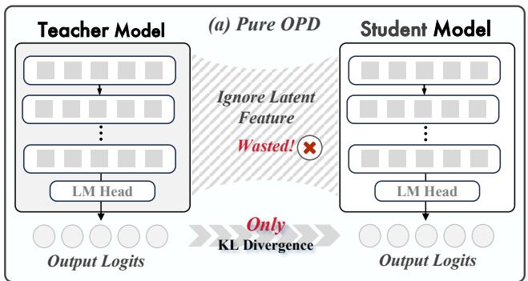

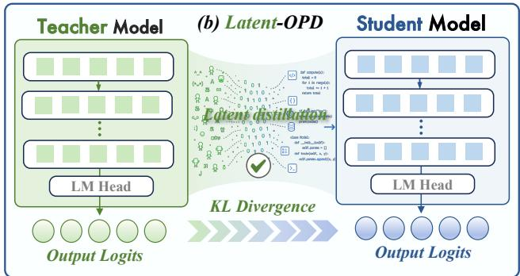  
Figure 1: Conceptual comparison between vanilla OPD and Latent-OPD. (a) Vanilla OPD transfers supervision only through output-level KL divergence, leaving the teacher’s la- tent features unutilized. (b) Latent-OPD complements outputlevel KL divergence with latent distillation, aligning compact hidden states to transfer internal reasoning representations.

To achieve this capability transfer, the training paradigm has shifted from static, outcome-level imitation toward trajectorylevel optimization. On-Policy Distillation (OPD) has emerged as a highly promising solution, aligning the student’s output- token distributions with the teacher’s along the student’s self- generated trajectories (Agarwal et al. 2024; Tian et al. 2026). In visual domains, recent studies have begun to adapt OPD to diferent forms of visual supervision. Yuan et al. (2026) introduce Vision-OPD, extending this idea to fine-grained image understanding through regional-to-global on-policy self-distillation. Liu et al. (2026c) propose VA-OPD, which identifies vision-critical tokens by comparing teacher scoring with and without fine-grained visual detail and reweights rollout- and token-level distillation accordingly. Li, Yin, and Xu (2026) propose Video-OPD, applying on-policy dense supervision to semantic modeling in temporal video.

However, existing OPD methods for video reasoning rest on an overly optimistic assumption: they presuppose that complex spatiotemporal evidence can be fully captured solely by the output vocabulary distribution. As illustrated in Figure 1(a), vanilla OPD operates exclusively at the output layer, supervis- ing the student model’s generated trajectory by minimizing KL divergence across output distributions. Consequently, it neglects the rich latent knowledge embedded in the teacher model’s hidden representations preceding the language mod- eling head. This limitation echoes the tacit-knowledge view highlighted at the beginning of this section: token predictions may reveal only a fraction of the internal representations supporting them. In video reasoning, these latent states en- code crucial spatiotemporal evidence and reasoning contexts along the generated trajectory. This motivates “deep thought alignment”, which extends OPD from output distributions to trajectory-level hidden representations. While distilling these hidden states efectively transfers video reasoning ca- pabilities, it introduces two key challenges. ① First, dense visual tokens contain substantial background noise and tem- poral redundancy, rendering token-level alignment costly and noisy. ② Second, architectural diferences between teacher and student models hamper direct layer-wise alignment. These challenges raise a central question: “How can trajectory-level hidden representations be eficiently transferred across heterogeneous models without dense visual-token alignmen $\because \ d s ^ { \flat }$

To address this question, we introduce Latent-space On- Policy Distillation (Latent-OPD), a trajectory-level latent distillation framework for deep thought alignment in video reasoning. Specifically, as illustrated in Figure 1(b), Latent-OPD complements the standard output-level KL objective with a latent distillation branch. Instead of densely aligning all visual or response tokens, we extract tail hidden states from trajectories generated by the teacher as compact global anchors that integrate both video evidence and reasoning context. Furthermore, we employ a progressive teacher-lookahead mapping to align the student’s middle-to-late layers with deeper teacher layers, while preserving the student’s top layers for token-policy optimization and generation.

Across six comprehensive video reasoning benchmarks, Latent-OPD consistently outperforms vanilla OPD. These improvements are particularly pronounced in low- and mid- frame regimes, complex long-video scenarios, and demanding reasoning tasks requiring cross-frame evidence aggregation, such as action reasoning, spatial reasoning, and temporal counting. Notably, even with fewer input frames, Latent- OPD matches or surpasses the higher-frame vanilla OPD baseline, indicating a more eficient utilization of visual evidence rather than a mere reliance on high frame density.

Our main contributions are threefold:

① We highlight the output-level bottleneck of vanilla OPD for video reasoning: final-logit supervision improves to- ken preferences but underexploits latent spatiotemporal representations before the language modeling head.

② We introduce Latent-OPD, which performs deep thought alignment using sparse trajectory-tail anchors and progres-sive teacher lookahead, enabling eficient latent transfer across heterogeneous architectures.

③ We conduct extensive evaluations across six video reason- ing benchmarks, showing consistent improvements over vanilla OPD and clear advantages in frame eficiency and long-video understanding scenarios.

## 2 Method

We present Latent-space On-Policy Distillation (Latent-OPD), a trajectory-level distillation framework that com-plements output-token preference transfer with latent-state supervision from a frozen teacher, enabling deep thought alignment for complex video reasoning in LMMs.

## 2.1 Overview

Given a video-question input $x = ( V , q )$ , Latent-OPD trains a student policy $\pi _ { \theta }$ with a frozen teacher $\pi _ { T }$ . In the output stream, the student samples $y ^ { S } \sim \pi _ { \theta } ( \cdot \mid x )$ , and the teacher supplies token distributions on the same student-visited pre- fixes $( x , y _ { < t } ^ { S } )$ (Figure 2(a)). In the latent stream, the teacher generates $y ^ { T } \sim \pi _ { T } ( \cdot \mid x )$ , the generated trajectories are filtered for reliability to serve as latent anchors, and $\boldsymbol { z } = [ x ; \boldsymbol { y } ^ { T } ]$ is fed to both models under teacher forcing. We then align only the final valid-token hidden states across selected layer pairs, avoiding dense hidden-state matching over all video and response tokens (Figure 2(b–c)). Crucially, the teacher, filter, and projection heads are used only during training; the inference phase remains strictly student-only.

## 2.2 On-Policy Output Distillation

As shown in Figure 2(a), given an input $x ,$ the student samples a response trajectory $y ^ { S } \sim \pi _ { \boldsymbol { \theta } } ( \cdot \mid x )$ of length $L _ { S }$ . Then, at each decoding step $t ,$ both the student and the frozen teacher are evaluated on the same prefix $( x , y _ { < t } ^ { S } )$ , producing the next-token distributions $p _ { S } ^ { t } = \pi _ { \theta } ( \cdot \mid x , y _ { < t } ^ { S } )$ and $p _ { T } ^ { t } =$ πT $( \cdot \mid x , y _ { < t } ^ { S } )$ , respectively. With these paired distributions, we optimize a weighted JSD-style objective to obtain bounded and stable token-level supervision:

$$
\mathcal { L } _ { \mathrm { O P D } } = \frac { 1 } { L _ { S } } \sum _ { t = 1 } ^ { L _ { S } } \left[ ( 1 - \alpha ) \mathrm { K L } ( p _ { S } ^ { t } \| m ^ { t } ) + \alpha \mathrm { K L } ( p _ { T } ^ { t } \| m ^ { t } ) \right] ,\tag{1}
$$

where $m ^ { t } = ( 1 - \alpha ) p _ { S } ^ { t } + \alpha p _ { T } ^ { t }$ is the interpolated mixture distribution, and $\alpha \in ( 0 , 1 )$ controls the teacher-side weight. The teacher and student share the same tokenizer.

For eficiency, we approximate this objective on the student’s top-k token support plus a shared tail bucket. Specifically, the residual student and teacher probability masses outside the top-k support are both accumulated into this bucket, preserving the non-top-k density without artificially renormalizing the truncated vocabulary.

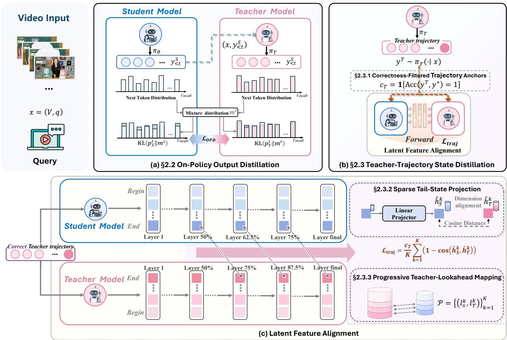  
Figure 2: Overview of Latent-OPD. (a) On-Policy Output Distillation: supervises student-sampled trajectories using teacher token distributions. (b) Teacher-Trajectory State Distillation: selects correct teacher rollouts as latent anchors. (c) Latent Feature Alignment: aligns projected student states to teacher states at selected layers via cosine distance.

## 2.3 Teacher-Trajectory State Distillation

Since output distillation only supervises post-softmax behav- ior, the teacher’s internal multimodal evidence aggregation remains largely untransferred. To bridge this gap, we introduce a teacher-trajectory state distillation branch via three components: correctness-filtered trajectory anchors, sparse tail-state projection, and progressive teacher-lookahead mapping.

Correctness-Filtered Trajectory Anchors We first decide which teacher trajectories should provide latent su-pervision. As shown in Figure 2(b), for each input x, the teacher independently generates a complete reasoning trajec-tory $y ^ { T } \sim \dot { \pi } _ { T } ( \cdot \mid x )$ from the original video-question input. Since plausible rationales can still lead to wrong answers, we use final-answer correctness as a lightweight reliability proxy: for ground-truth answer $y ^ { \star } , c _ { T } = \bar { \mathbf { 1 } } [ \mathrm { A c c } ( \bar { y } ^ { T } , y ^ { \star } ) = 1 ]$ , where Acc denotes the task evaluator applied to the parsed final answer; unlabeled examples are excluded from the training set. After this filtering step, the retained sequence $z = [ x ; y ^ { T } ]$ is used as the shared input for hidden-state alignment.

Sparse Tail-State Projection Given the retained anchors, we next localize where hidden-state alignment should occur. As shown in Figure $2 ( \mathrm { c } )$ , for a retained sequence $\boldsymbol { z } = [ x ; \boldsymbol { y } ^ { T } ]$ we perform parallel forward passes through the frozen teacher and the trainable student. Let e denote the index of the final valid token of the teacher trajectory in z, e.g., the last non-padding response token. Because a causal decoder’s tail state can attend to the full video-question context and preceding reasoning tokens, it serves as a compact trajectory summary. We therefore align hidden states only at this position, avoiding dense token-level matching over the full multimodal sequence.

Then, for each selected layer pair $( l _ { S } ^ { k } , l _ { T } ^ { k } )$ , we extract the student and teacher hidden states at position e. Since the two models may have diferent hidden dimensions, the student state is mapped into the teacher’s latent space using a trainable linear projection head $P _ { k }$ . We then apply $\ell _ { 2 }$ normalization:

$$
\widehat { h } _ { S } ^ { k } = \mathrm { n o r m } \left( P _ { k } \left( h _ { \theta } ^ { l _ { S } ^ { k } } ( z ) _ { e } \right) \right) , \qquad \widehat { h } _ { T } ^ { k } = \mathrm { n o r m } \left( h _ { T } ^ { l _ { T } ^ { k } } ( z ) _ { e } \right) ,\tag{2}
$$

where norm $. ( u ) = u / ( \lVert u \rVert _ { 2 } + \epsilon )$ for a small $\epsilon > 0$ . The trajectory-level latent objective minimizes the average cosine distance over K selected layer pairs:

$$
\mathcal { L } _ { \mathrm { t r a j } } = \frac { c _ { T } } { K } \sum _ { k = 1 } ^ { K } \left( 1 - \cos \left( \hat { h } _ { S } ^ { k } , \hat { h } _ { T } ^ { k } \right) \right) .\tag{3}
$$

Here, $c _ { T }$ acts as a binary mask for unreliable trajectories. For each minibatch, we average this loss over retained examples only and set $\mathcal { L } _ { \mathrm { t r a j } } = 0$ if none are retained.

<table><tr><td>Model</td><td>Frames</td><td>VSI-Bench</td><td>Video-MMMU</td><td>MMVU</td><td>MVBench</td><td>TempCompass</td><td>Video-MME</td><td> $\mathbf { A v g } .$ </td></tr><tr><td>LongVA-7B†</td><td></td><td>29.2</td><td>23.9</td><td></td><td>一</td><td>56.9</td><td>52.6</td><td></td></tr><tr><td> $\mathrm { V I L A } – 1 . 5 – 8 \mathbf { B } ^ { \dagger }$ </td><td></td><td>28.9</td><td>20.8</td><td></td><td>一</td><td>58.8</td><td></td><td></td></tr><tr><td> $\mathrm { V I L A } { - } 1 . 5 { - } 4 0 \mathbf { B } ^ { \dagger }$ </td><td></td><td>31.2</td><td>34.0</td><td></td><td></td><td></td><td>60.1</td><td></td></tr><tr><td>Video-UTR-7B†</td><td></td><td></td><td></td><td></td><td>58.8</td><td>59.7</td><td>52.6</td><td></td></tr><tr><td> $\mathrm { L L a V A  – O n e V i s i o n – 7 B ^ { \dagger } }$ </td><td>一</td><td>32.4</td><td>33.8</td><td>49.2</td><td>56.7</td><td></td><td>58.2</td><td>一</td></tr><tr><td>Kangaroo-8B†</td><td>一</td><td></td><td></td><td></td><td>61.1</td><td>62.5</td><td>56.0</td><td>一</td></tr><tr><td> $\mathbf { V i d e o - R 1 - 7 B } ^ { \dagger }$ </td><td>16</td><td>34.6</td><td>49.8</td><td>64.2</td><td>62.7</td><td>72.6</td><td>57.4</td><td>56.9</td></tr><tr><td> $\mathbf { V i d e o - R 1 - 7 B ^ { \dagger } }$ </td><td>32</td><td>35.8</td><td>52.3</td><td>63.8</td><td>63.9</td><td>73.2</td><td>59.3</td><td>58.1</td></tr><tr><td> $\mathbf { V i d e o - R 1 - 7 B ^ { \dagger } }$ </td><td>64</td><td>37.1</td><td>52.4</td><td>63.8</td><td>64.8</td><td>73.2</td><td>61.4</td><td>58.8</td></tr><tr><td>Qwen3.5-9B-CoT</td><td>16</td><td>29.4</td><td>41.2</td><td>61.6</td><td>51.8</td><td>66.6</td><td>51.0</td><td>50.3</td></tr><tr><td>Qwen3.5-9B-CoT</td><td>32</td><td>33.4</td><td>42.8</td><td>59.8</td><td>52.2</td><td>66.5</td><td>50.3</td><td>50.8</td></tr><tr><td>Qwen3.5-9B-CoT</td><td>64</td><td>27.9</td><td>44.0</td><td>61.6</td><td>52.0</td><td>66.5</td><td>48.5</td><td>50.1</td></tr><tr><td>Qwen3.5-9B-SFT+GRPO</td><td>16</td><td>47.2</td><td>59.8</td><td>65.9</td><td>60.7</td><td>72.2</td><td>60.3</td><td>61.0</td></tr><tr><td>Qwen3.5-9B-SFT+GRPO</td><td>32</td><td>50.0</td><td>60.3</td><td>66.6</td><td>60.7</td><td>72.2</td><td>61.6</td><td>61.9</td></tr><tr><td>Qwen3.5-9B-SFT+GRPO</td><td>64</td><td>52.6</td><td>59.7</td><td>67.2</td><td>60.8</td><td>72.2</td><td>64.6</td><td>62.9</td></tr><tr><td>Vanilla OPD-9B</td><td>16</td><td>47.0</td><td>61.0</td><td>70.6</td><td>64.7</td><td>72.2</td><td>59.2</td><td>62.5</td></tr><tr><td>Vanilla OPD-9B</td><td>32</td><td>48.8</td><td>60.4</td><td>71.7</td><td>65.0</td><td>71.6</td><td>60.7</td><td>63.0</td></tr><tr><td>Vanilla OPD-9B</td><td>64</td><td>51.9</td><td>64.4</td><td>73.6</td><td>64.5</td><td>70.5</td><td>64.7</td><td>64.9</td></tr><tr><td>LATENT-OPD-9B</td><td>16</td><td>48.2</td><td>65.4</td><td>73.3</td><td>64.9</td><td>73.2</td><td>61.6</td><td> ${ \bf 6 4 . 4 _ { \uparrow 1 . 9 } }$ </td></tr><tr><td>LATENT-OPD-9B</td><td>32</td><td>51.7</td><td>67.4</td><td>72.6</td><td>65.4</td><td>72.4</td><td>64.3</td><td> ${ \bf 6 5 . 6 } _ { \uparrow 2 . 6 }$ </td></tr><tr><td>LATENT-OPD-9B</td><td>64</td><td>54.9</td><td>67.2</td><td>74.4</td><td>65.1</td><td>70.6</td><td>66.5</td><td> ${ \bf 6 6 . 5 } _ { \uparrow 1 . 6 }$ </td></tr></table>

Table 1: Accuracy (%) on six benchmarks under 16-, 32-, and 64-frame budgets. † denotes results reported in prior work; bold marks the best Qwen3.5-9B result for each benchmark and frame budget. Subscripts denote the improvement over vanilla OPD.

Progressive Teacher-Lookahead Mapping After choos- ing the tail state as the alignment target, we still need to decide which student and teacher layers should be paired. To construct the layer pairs in Equation 3, we employ an asymmetric teacher-lookahead mapping rather than matching identical relative depths. Let $N _ { S }$ and $N _ { T }$ be the numbers of student and teacher layers under 1-based block indexing, and denote the selected pairs by $\mathcal { P } = \{ ( l _ { S } ^ { k } , l _ { T } ^ { k } ) \} _ { k = 1 } ^ { K }$ , where $l _ { S } ^ { k } = 1 + \lfloor r _ { S } ^ { k } ( N _ { S } - 1 ) _ { - }$ ⌋ and $l _ { T } ^ { k } = 1 + \lfloor r _ { T } ^ { k } ( N _ { T } - 1 ) \rfloor$ . We choose the relative depths so that $r _ { S } ^ { k } < r _ { T } ^ { k }$ and the resulting discrete indices are unique and satisfy $l _ { S } ^ { \bar { 1 } } < \cdots < l _ { S } ^ { K }$ and $l _ { T } ^ { 1 } < \cdots < l _ { T } ^ { K }$ , forming a progressive mapping in which each selected student layer looks ahead to a deeper teacher layer. Consequently, the student’s middle-to-late layers, ex- cluding the final ones, are exposed to more abstract teacher representations, while the output-facing student layers remain unconstrained by the latent loss. The exact layer configurations are detailed in the experimental setup.

## 2.4 Training Objective and Inference

The on-policy output distillation and teacher-trajectory state distillation streams are jointly optimized through a unified objective. Specifically, the generative component anchors the student’s output distribution, while the latent component aligns its intermediate states. The total loss is defined as:

$$
\begin{array} { r l } & { \mathcal { L } _ { \mathrm { t o t a l } } = \mathcal { L } _ { \mathrm { g e n } } + \mathrm { c l i p } _ { \rho \mathrm { s g } ( | \mathcal { L } _ { \mathrm { g e n } } | ) } \left( \lambda _ { g } \omega ( \tau ) \mathcal { L } _ { \mathrm { t r a j } } \right) , } \\ & { \mathcal { L } _ { \mathrm { g e n } } = \mathcal { L } _ { \mathrm { O P D } } + \beta \mathcal { L } _ { \mathrm { r e f K L } } + \lambda _ { \mathrm { f m t } } \mathcal { L } _ { \mathrm { f o r m a t } } , } \end{array}\tag{4}
$$

where the generative loss $\mathcal { L } _ { \mathrm { g e n } }$ aggregates the core OPD su- pervision $\mathcal { L } _ { \mathrm { O P D } }$ , a reference-policy KL penalty $\mathcal { L } _ { \mathrm { { r e f K L } } }$ , and an answer-format loss $\mathcal { L } _ { \mathrm { f o r m a t } }$ (weighted by $\beta$ and $\lambda _ { \mathrm { f m t } }$ , respectively). The latent trajectory loss $\mathcal { L } _ { \mathrm { t r a j } }$ is regulated by two mechanisms: a linear warmup factor $\tilde { \omega ( \tau ) } = \mathrm { m i n } ( 1 , \tau / \tau _ { w } )$ over the first $\tau _ { w }$ steps, and a dynamic clipping function $\mathrm { c l i p } _ { b } ( u ) = u \cdot \mathrm { m i n } ( 1 , b / ( | u | + \epsilon ) )$ , for a small $\epsilon > 0$ . Here, $\operatorname { s g } ( \cdot )$ detaches the clipping budget; thus this clipping acts as a scalar contribution cap rather than a gradient-norm constraint.

During inference, the teacher model and projection heads are no longer required, leaving the deployed student with no additional computational overhead.

## 3 Experiments

## 3.1 Experimental Setting

Implementation Details: Following Video-R1 (Feng and Gong 2026), our student backbone (Qwen3.5-9B-Base (Team 2026)) undergoes SFT on the Video-R1 CoT dataset, followed by Latent-OPD training on its RL dataset. As the teacher, we use a frozen Qwen3.5-27B-Base (Team 2026) video CoT model that was previously fine-tuned. In the latent branch, we align the final valid-token states at layer mappings $( s _ { 5 0 \% }  t _ { 7 5 \% } ) , ( s _ { 6 2 . 5 \% }  t _ { 8 7 . 5 \% } )$ , and $( s _ { 7 5 \% } \to t _ { 1 0 0 \% } )$ . We set the latent loss weight to $0 . 0 1$ , incorporating ${ \mathrm { ~ \bf ~ { ~ \underline { ~ } { ~ } ~ } ~ } } \leq \% { \mathrm { ~ \bf ~ { ~ \underline { ~ } { ~ } ~ } ~ } }$ warmup schedule and a cap at 15% of the generative loss. Consistent with Video-R1, video preprocessing involves sampling train- ing clips at 1 FPS and tokenizing visual inputs with a $2 8 \times 2 8$ patch size. During evaluation, we test 16, 32, and 64 frames.

<table><tr><td>Variant</td><td>16f</td><td>32f</td><td>64f</td></tr><tr><td>Vanilla OPD</td><td>59.20</td><td>60.70</td><td>64.70</td></tr><tr><td colspan="4">Controlled layer mapping</td></tr><tr><td>Same-depth, fixed student layers</td><td>59.81</td><td>63.85</td><td>65.11</td></tr><tr><td>Fixed-offset (+12.5%)</td><td>59.89</td><td>62.81</td><td>65.30</td></tr><tr><td>Reverse-lookahead</td><td>59.89</td><td>63.33</td><td>65.93</td></tr><tr><td>Single tail pair  $( s _ { 7 5 \% } \to t _ { 1 0 0 \% } )$ </td><td>59.60</td><td>64.00</td><td>65.70</td></tr><tr><td>+ final pair</td><td>58.90</td><td>63.30</td><td>65.00</td></tr><tr><td>+ early pair</td><td>59.90</td><td>63.20</td><td>65.40</td></tr><tr><td colspan="4">Representation / token-level controls</td></tr><tr><td>OPRD-style distill</td><td>59.70</td><td>63.85</td><td>65.78</td></tr><tr><td>Dense token-level hidden KD</td><td>59.20</td><td>63.10</td><td>66.10</td></tr><tr><td>Low-rank projector (r = 16)</td><td>58.60</td><td>63.30</td><td>65.00</td></tr><tr><td>Teacher-trajectory SFT</td><td>59.96</td><td>63.78</td><td>65.70</td></tr><tr><td>Reverse-KL output distillation</td><td>60.60</td><td>62.90</td><td>65.70</td></tr><tr><td colspan="4">Trajectory source and anchor</td></tr><tr><td>w/o correctness-filtered trajectory anchors</td><td>59.10</td><td>63.50</td><td>65.10</td></tr><tr><td>Independent teacher/student trajectories</td><td>60.30</td><td>63.40</td><td>65.20</td></tr><tr><td>Shared student-generated trajectory</td><td>60.40</td><td>62.90</td><td>66.00</td></tr><tr><td>Prompt-end latent anchor</td><td>59.60</td><td>62.90</td><td>64.90</td></tr><tr><td>Answer-end latent anchor</td><td>60.50</td><td>62.90</td><td>65.80</td></tr><tr><td>Think-end latent anchor</td><td>60.22</td><td>63.67</td><td>65.22</td></tr><tr><td>LATENT-OPD (ours)</td><td>61.60</td><td>64.30</td><td>66.50</td></tr></table>

Table 2: Ablation study on the Video-MME benchmark eval- uating layer mapping, representation- and token-level super- vision, trajectory source, and anchor position.

Benchmarks and Baselines: Following the Video-R1 evaluation protocol, we report accuracy on six public video reasoning benchmarks: VSI-Bench (Yang et al. 2025b), Video-MMMU (Hu et al. 2025), MMVU (Zhao et al. 2025), MVBench (Li et al. 2024b), TempCompass (Liu et al. 2024), and Video-MME (Fu et al. 2025). The compared methods include representative prior video LMMs, namely LongVA- 7B (Zhang, Zhang, and Li 2024), VILA-1.5-8B/40B (Lin et al. 2024), Video-UTR-7B (Yu et al. 2025), LLaVA-OneVision-7B (Li et al. 2024a), Kangaroo-8B (Liu et al. 2026b), and Video-R1-7B (Feng and Gong 2026). We additionally eval-uate CoT, SFT+GRPO, Vanilla OPD, and Latent-OPD on Qwen3.5-9B-Base, where vanilla OPD removes only the latent trajectory branch of Latent-OPD. Further implementation and baseline details are provided in Appendix A.

## 3.2 Main Results

Table 1 presents the main experimental results. From this table, we can make three key observations:

Obs. 1. The full post-training pipeline delivers consis- tent, eficient, and stable gains. Latent-OPD outperforms Qwen3.5-9B-CoT on all 18 benchmark/frame-budget pairs, raising the six-benchmark average by 14.2, 14.8, and 16.4 points at 16, 32, and 64 frames, respectively. It also surpasses Qwen3.5-9B-SFT+GRPO by 3.4, 3.7, and 3.6 average points and outperforms vanilla OPD by 2.0, 2.6, and 1.5 average points under the same frame budgets. Beyond final accuracy, Latent-OPD converges faster in terms of training steps: as shown in Figure 5, the diagnostic curves separate from vanilla OPD early and remain stable. These results confirm that the proposed latent distillation supplies informative optimization signals while scaling robustly with extended visual contexts.

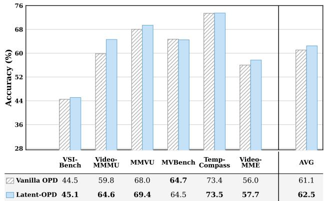  
Figure 3: Accuracy (%) of vanilla OPD and Latent-OPD with a Qwen3.5-4B student under the 16-frame setting. The final group reports the six-benchmark average.

Obs. 2. Latent-OPD excels at long-horizon temporal integration. Compared to vanilla OPD, the most signifi- cant gains emerge on tasks requiring cross-frame reasoning, notably Video-MMMU (up to +7.0) and Video-MME (up to +3.6). As detailed in the 16-frame Video-MME breakdown (Figure 4), improvements peak on long videos (+3.22) and temporally complex domains like Artistic Performance (+4.44) and Film & Television (+3.89). This outcome validates the essential role of trajectory-tail alignment in successfully consolidating distributed visual evidence.

Obs. 3. Gains extend seamlessly to frame eficiency. Latent-OPD extracts richer signals per frame, allowing its 16-frame average (64.4%) to comfortably surpass vanilla OPD’s 32-frame performance (63.0%). Similarly, the 32- frame Latent-OPD matches or beats the 64-frame baseline on challenging sets like Video-MMMU, MVBench, and Tem- pCompass, showing that latent trajectory alignment improves not only accuracy but also frame utilization eficiency.

## 3.3 Performance on the 4B Student

Beyond the 9B setting, we further evaluate Latent-OPD on a smaller Qwen3.5-4B-Base (Team 2026) student under the same six-benchmark evaluation protocol. As illustrated in Figure 3, Latent-OPD boosts the 16-frame average from 61.1% to 62.5%. The gains are especially visible on reasoningintensive benchmarks such as Video-MMMU, MMVU, and Video-MME. This observation suggests that the trajectorylevel latent signals are highly informative, successfully trans- ferring complex reasoning capabilities even when the student model’s parameter capacity is significantly reduced.

## 3.4 Ablation Study

Table 2 ablates three key components on Video-MME:

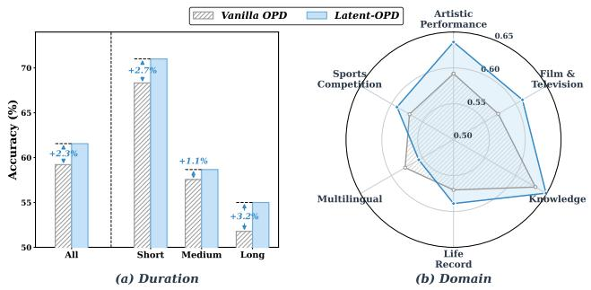

Figure 4: Video-MME accuracy (%) under the 16-frame setting, broken down by (a) video duration and (b) domain.  
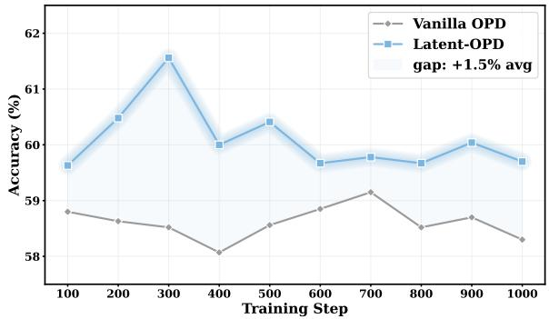  
Figure 5: Video-MME accuracy (%) during an extended 1,000-step diagnostic under the 16-frame setting.

Controlled layer mapping: To isolate teacher lookahead, all three-pair controls fix the student depths at 50%, 62.5%, and 75% and vary only teacher depth. The default uses $( s _ { 5 0 \% }  t _ { 7 5 \% } )$ $( s _ { 6 2 . 5 \% } \to t _ { 8 7 . 5 \% } )$ , and $( s _ { 7 5 \% } \to t _ { 1 0 0 \% } ) ;$ same-depth uses $( s _ { 5 0 \% } \to t _ { 5 0 \% } ) , ( s _ { 6 2 . 5 \% } \to t _ { 6 2 . 5 \% } )$ , and $( s _ { 7 5 \% } \to t _ { 7 5 \% } )$ ; fixed-ofset uses $( s _ { 5 0 \% } \to t _ { 6 2 . 5 \% } )$ , (s62.5% → $t _ { 7 5 \% } )$ , and $( s _ { 7 5 \% } \to t _ { 8 7 . 5 \% } ) ;$ ; reverse-lookahead uses $( s _ { 5 0 \% } $ $t _ { 2 5 \% } ) , ( s _ { 6 2 . 5 \% }  t _ { 5 0 \% } )$ , and $( s _ { 7 5 \% } \to t _ { 6 2 . 5 \% } )$ . Pair-count controls keep only $( s _ { 7 5 \% } \to t _ { 1 0 0 \% } )$ , add $( s _ { 1 0 0 \% }  t _ { 1 0 0 \% } )$ or add $( s _ { 2 5 \% } \to t _ { 5 0 \% } )$ to the default. Across the 16, 32, and 64 frame settings, the default mapping uniformly surpasses all variants, showing that mid-to-late student depths benefit most from deeper teacher states while output-adjacent depths remain dedicated to token-policy optimization.

Representation and token-level controls: We evaluate several variants to systematically validate our design choices. First, to verify our representation alignment strategy, we com- pare against dense token-level hidden knowledge distillation (KD) and an OPRD-style baseline (Yang et al. 2026) that densely matches response-token representations on student rollouts using same-depth pairs and normalized MSE. Both variants consistently underperform across all frame budgets, confirming that our selective state matching is superior to dense feature matching. Second, replacing our default lin- ear mapping with a low-rank projector yields sub-optimal results, clearly validating the rationality of our full projector design. Third, replacing our output-level objective with Reverse-KL distillation reduces performance, demonstrating the clear advantage of our JSD-style divergence. Finally, stan- dard token-level SFT on the same correct teacher trajectories underperforms, proving our gains stem from utilizing latent states rather than mere exposure to high-quality rationales.

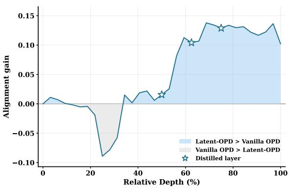  
Figure 6: Layer-wise teacher alignment shift (∆CKA) from vanilla OPD to Latent-OPD on 16-frame Video-MME. Blue indicates increased similarity to the teacher, grey indicates decreased similarity, and stars mark directly supervised layers.

Trajectory source and anchor: We justify our choices for the alignment source and anchor position. First, using unfil- tered trajectory anchors degrades performance, confirming the need for correctness filtering. For the trajectory source, aligning tail states from independently generated student and teacher rollouts proves sub-optimal due to mismatched rea- soning paths. Conversely, passing the same student-generated trajectory through both models aligns token positions but fails to leverage the teacher’s superior reasoning. Latent-OPD resolves this by feeding both models the identical correctness- filtered teacher trajectory, ensuring a position-matched target that reflects the teacher’s preferred logic. Finally, shifting the supervision anchor from our default final valid state to other boundaries (prompt-end, answer-end, or think-end) consistently reduces efectiveness. These comparisons confirm that pairing correctness-filtered teacher trajectories with the tail state yields the most informative target.

## 3.5 Representation Analysis

To analyze internal representations, we compute projector-free linear Centered Kernel Alignment (CKA) on 16-frame Video-MME inference examples, which measures how similarly two layers organize the same set of examples, with higher values indicating more similar representation geometry. We compare vanilla OPD and Latent-OPD against the frozen teacher using one-to-one relative-depth matching, pairing each student layer with the teacher layer at the corresponding depth percentage. As shown in Figure 6, the improvements are concentrated in the deep student layers, achieving an average CKA increase of +0.108 over the deep half and a peak gain of $+ 0 . 1 3 7$ , while shallow layers remain nearly unchanged. This indicates that Latent-OPD mainly moves high-level pre-verbal reasoning states closer to the teacher, rather than broadly perturbing low-level early visual encoding. More details of the CKA analysis are provided in Appendix F.

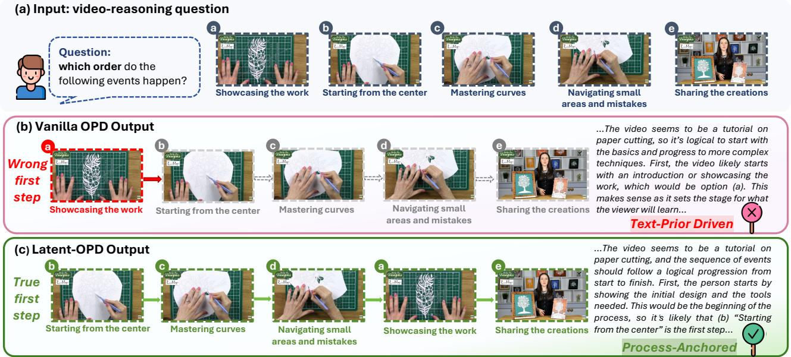  
Figure 7: Video-MME case study requiring the temporal ordering of five handicraft events (a). Vanilla OPD fails under all three frame budgets (b), whereas Latent-OPD consistently recovers the correct event order (c).

## 3.6 Case Study

We further inspect a representative Video-MME example in Figure 7. The question asks the model to recover the order of five events in a handicraft video: starting from the center, mastering curves, navigating small areas and mistakes, showcasing the work, and sharing the creations. This is a procedural ordering problem, so the correct answer depends on preserving the event chain rather than recognizing a single salient frame. Vanilla OPD predicts incorrect options under all three frame budgets, and its mistakes are plausible language- prior shortcuts, e.g., placing “showcasing the work” too early. In contrast, Latent-OPD predicts the correct order (b)(c)(d)(a)(e) consistently under all frames. While this case is not intended as standalone evidence, it illustrates the behavior suggested by the quantitative analysis: aligning to a correct teacher trajectory can help the student form a more faithful internal state for process-level video reasoning.

## 4 Related Work

Visual and Video On-Policy Distillation. On-policy distil- lation has been studied for language-model alignment and compression (Gu et al. 2024; Agarwal et al. 2024), and has recently been extended to multimodal settings. Vision- OPD (Yuan et al. 2026) and VA-OPD (Liu et al. 2026c) introduce fine-grained visual supervision and vision-critical token reweighting; subsequent methods transfer text reason- ing (Bousselham, Kuehne, and Schmid 2025), steer visual grounding (Yoon et al. 2026; Tian et al. 2026), or stabilize MLLM reasoning distillation (Hao et al. 2026). In the temporal domain, Video-OPD (Li, Yin, and Xu 2026) provides dense supervision for video grounding, while reasoning frameworks and rationale- or evidence-based video distillation transfer temporal reasoning only through generated outputs (Fei et al. 2024; Shi et al. 2025; Yang et al. 2025a; Wu et al. 2026).

Latent and Representation-Level Reasoning. Output logits are a compressed interface and may discard structural dynamics formed before verbalization (Hao et al. 2025; Liu et al. 2026a; Deng et al. 2025; Kuang et al. 2025a; Li et al. 2024c; Liu et al. 2022; Zhang et al. 2026b; Kang et al. 2026; Xia et al. 2026). Multimodal distillation studies show that knowledge is also encoded in intermediate hidden states (Xu et al. 2024; Shen et al. 2025; Li et al. 2022; Fan et al. 2026), while latent visual reasoning further suggests that internal representations can support reasoning beyond explicit tokens (Li et al. 2025). OPRD (Yang et al. 2026) extends OPD into representation space for text LLMs.

Directly applying OPRD to video is sub-optimal, as dense same-depth matching sufers from redundant frames and mismatched reasoning. Latent-OPD instead aligns compact trajectory-tail states after cross-frame integration and maps middle-to-late student layers to deeper teacher layers, adapting representation-level OPD for spatiotemporal reasoning.

## 5 Conclusion

In this work, we demonstrate that efective video reasoning de- pends not only on output-token preference matching but also on the latent spatiotemporal states that organize sparse visual evidence before it is verbalized. We propose Latent-OPD, augmenting on-policy distillation with compact trajectory-tail hidden-state alignment and progressive teacher-lookahead mapping. Across six benchmarks, Latent-OPD outperforms vanilla OPD, especially under limited frame budgets. These results support deep thought alignment: distilling a video reasoner must go beyond final answer imitation to transfer teacher integration of events, relations, and temporal struc- ture. By turning hidden reasoning trajectories into practical supervision, we hope Latent-OPD ofers efective guidance for developing more frame-eficient and reliable LLMs.

## References

Agarwal, R.; Vieillard, N.; Zhou, Y.; Stanczyk, P.; Ramos Garea, S.; Geist, M.; and Bachem, O. 2024. On- policy distillation of language models: Learning from self- generated mistakes. In International Conference on Learning Representations, volume 2024, 21246–21263.

An, S.; Lu, J.; Dong, J.; Wang, Q.; Li, Y.; Fei, W.; Yu, Z.; Yuan, Z.; Liu, B.; Wang, H.; et al. 2026. Toward Native Multimodal Modeling: A Roadmap. arXiv preprint arXiv:2605.25343.

Bai, S.; Cai, Y.; Chen, R.; Chen, K.; Chen, X.; Cheng, Z.; and et al., L. D. 2025. Qwen3-VL Technical Report. arXiv:2511.21631.

Bousselham, W.; Kuehne, H.; and Schmid, C. 2025. VOLD: Reasoning Transfer from LLMs to Vision-Language Models via On-Policy Distillation. arXiv preprint arXiv:2510.23497.

Cheng, Z.; Leng, S.; Zhang, H.; Xin, Y.; Li, X.; Chen, G.; Zhu, Y.; Zhang, W.; Luo, Z.; Zhao, D.; et al. 2024. Videollama 2: Advancing spatial-temporal modeling and audio understand- ing in video-llms. arXiv preprint arXiv:2406.07476.

Deng, Z.; Wang, Y.; Liang, Y.; Du, J.; Yang, Y.; Fang, L.; He, L.; Han, Y.; Zhu, Y.; Miao, C.; et al. 2025. A survey of multimodal models on language and vision: A unified modeling perspective. Data Mining and Machine Learning, 1(1): 100001.

Fan, X.; Ong, H. H.; Wang, D. Y.; Zhu, Z.; Sarkar, K.; and Xu, K. 2026. MatchLM2Lite: A Scalable MLLM-to-Lite Framework for Reproduced Content Identification. arXiv preprint arXiv:2606.14786.

Fei, H.; Wu, S.; Ji, W.; Zhang, H.; Zhang, M.; Lee, M.-L.; and Hsu, W. 2024. Video-of-thought: Step-by-step video reasoning from perception to cognition. arXiv preprint arXiv:2501.03230.

Feng, K.; and Gong, K. e. a. 2026. Video-r1: Reinforcing video reasoning in mllms. Advances in Neural Information Processing Systems, 38: 99114–99137.

Fu, C.; Dai, Y.; Luo, Y.; Li, L.; Ren, S.; Zhang, R.; Wang, Z.; Zhou, C.; Shen, Y.; Zhang, M.; et al. 2025. Video- mme: The first-ever comprehensive evaluation benchmark of multi-modal llms in video analysis. In Proceedings of the IEEE/CVF conference on computer vision and pattern recognition, 24108–24118.

Gu, Y.; Dong, L.; Wei, F.; and Huang, M. 2024. Minillm: Knowledge distillation of large language models. In The twelfth international conference on learning representations.

Hao, D.; Jin, Z.; Chen, C.; and Lu, H. 2026. Stabilizing On-Policy Distillation for MLLM Reasoning with Global Normalization. arXiv preprint arXiv:2606.09091.

Hao, S.; Sukhbaatar, S.; Su, D.; Li, X.; Hu, Z.; Weston, J.; and Tian, Y. 2025. Training Large Language Models to Reason in a Continuous Latent Space. arXiv:2412.06769.

Hu, K.; Wu, P.; Pu, F.; Xiao, W.; Zhang, Y.; Yue, X.; Li, B.; and Liu, Z. 2025. Video-mmmu: Evaluating knowledge acquisition from multi-discipline professional videos. arXiv preprint arXiv:2501.13826.

Kang, J.; Chen, S.; Li, M.; Liu, M.; Wang, T.; Wei, Z.; Zhang, Y.; Hao, Y.; and Wei, Z. 2026. LUT: Latent Utility Training for Visual Reasoning. arXiv:2608.00743.

Kuang, J.; Li, Y.; Wang, C.; Luo, H.; Shen, Y.; and Jiang, W. 2025a. Express what you see: Can multimodal llms decode visual ciphers with intuitive semiosis comprehension? In Findings of the Association for Computational Linguistics: ACL 2025, 12743–12774.

Kuang, J.; Shen, Y.; Xie, J.; Luo, H.; Xu, Z.; Li, R.; Li, Y.; Cheng, X.; Lin, X.; and Han, Y. 2025b. Natural language understanding and inference with mllm in visual question answering: A survey. ACM Computing Surveys, 57(8): 1–36.

Li, B.; Sun, X.; Liu, J.; Wang, Z.; Wu, J.; Yu, X.; Chen, H.;Barsoum, E.; Chen, M.; and Liu, Z. 2025. Latent visualreasoning. arXiv preprint arXiv:2509.24251.

Li, B.; Zhang, Y.; Guo, D.; Zhang, R.; Li, F.; Zhang, H.; Zhang, K.; Zhang, P.; Li, Y.; Liu, Z.; et al. 2024a. Llava-onevision: Easy visual task transfer. arXiv preprint arXiv:2408.03326.

Li, J.; Yin, H.; and Xu, H. e. a. 2026. Video-OPD: Eficient Post-Training of Multimodal Large Language Models for Temporal Video Grounding via On-Policy Distillation. arXiv preprint arXiv:2602.02994.

Li, K.; Wang, Y.; He, Y.; Li, Y.; Wang, Y.; Liu, Y.; Wang, Z.; Xu, J.; Chen, G.; Luo, P.; et al. 2024b. Mvbench: A comprehensive multi-modal video understanding benchmark. In Proceedings of the IEEE/CVF Conference on Computer Vision and Pattern Recognition, 22195–22206.

Li, Y.; Kuang, J.; Xing, P.; Liu, D.; Zhang, Y.; Dong, J.; Guo, S.-Y.; Li, Y.; Zhou, Q.; Jiang, W.; et al. 2026. Cognitive Mismatch in Multimodal Large Language Models for Discrete Symbol Understanding. arXiv preprint arXiv:2603.18472.

Li, Y.; Wang, C.; and Jia, J. 2024. Llama-vid: An image is worth 2 tokens in large language models. In European Conference on Computer Vision, 323–340. Springer.

Li, Y.; Xu, Z.; Chen, S.; Huang, H.; Li, Y.; Ma, S.; Jiang, Y.; Li, Z.; Zhou, Q.; Zheng, H.-T.; et al. 2024c. Towards real-world writing assistance: A chinese character checking benchmark with faked and misspelled characters. In Proceedings ofthe 62nd Annual Meeting ofthe Associationfor Computational Linguistics (Volume 1: Long Papers), 8656–8668.

Li, Y.; Zhou, Q.; Li, Y.; Li, Z.; Liu, R.; Sun, R.; Wang, Z.; Li, C.; Cao, Y.; and Zheng, H.-T. 2022. The past mistake is the future wisdom: Error-driven contrastive probability optimization for chinese spell checking. In Findings of the Associationfor Computational Linguistics: ACL 2022, 3202– 3213.

Lin, H.; Lv, K.; Jiang, X.; Tian, J.; Du, Z.; Ding, J.; Zhang, Q.; and Jin, H. 2026. VISD: Enhancing Video Reasoning via Structured Self-Distillation. arXiv preprint arXiv:2605.06094.

Lin, J.; Yin, H.; Ping, W.; Molchanov, P.; Shoeybi, M.; and Han, S. 2024. Vila: On pre-training for visual language models. In Proceedings of the IEEE/CVF conference on computer vision and pattern recognition, 26689–26699.

Liu, D.; Kuang, J.; Li, Y.; Li, Y.; Yin, D.; Cao, H.; Sun, X.; Shen, Y.; Zheng, H.-T.; Lin, L.; et al. 2026a. TangramPuzzle:

Evaluating Multimodal Large Language Models with Compo- sitional Spatial Reasoning. arXiv preprint arXiv:2601.16520.

Liu, J.; Wang, Y.; Ma, H.; Wu, X.; Ma, X.; Wei, X.; Jiao, J.; Wu, E.; and Hu, J. 2026b. Kangaroo: A Powerful Video-Language Model Supporting Long-context Video Input. International Journal ofComputer Vision, 134(3): 114.

Liu, R.; Li, Y.; Tao, L.; Liang, D.; and Zheng, H.-T. 2022. Are we ready for a new paradigm shift? a survey on visual deep mlp. Patterns, 3(7).

Liu, R.; Lv, X.; Li, G.; Zhu, X.; Wang, Z.; Zhang, Z.; Chen,J.; Li, Z.; Li, B.; Gao, J.; et al. 2026c. Visual-advantage on-policy distillation for vision-language models. arXiv preprintarXiv:2605.21924.

Liu, Y.; Li, S.; Liu, Y.; Wang, Y.; Ren, S.; Li, L.; Chen, S.; Sun, X.; and Hou, L. 2024. Tempcompass: Do video llms really understand videos? In Findings ofthe Associationfor Computational Linguistics: ACL 2024, 8731–8772.

Lu, J.; Qin, J.; Qiao, L.; Li, Y.; Dai, X.; Ke, B.; He, J.; Qiao, R.; Yin, D.; Sun, X.; et al. 2025a. Youtu-llm: Unlocking the native agentic potential for lightweight large language models. arXiv preprint arXiv:2512.24618.

Lu, Y.; Song, Y.; Wang, W.; Torresani, L.; and Nagarajan, T. 2025b. Vited: Video temporal evidence distillation. In Proceedings ofthe IEEE/CVFConference on Computer Vision and Pattern Recognition, 8501–8511.

Shen, X.; Wang, Y.; Zhou, Y.; Shi, X.; Zhao, P.; Wang, Y.; and Gu, J. 2025. Eficient reasoning with hidden thinking. arXiv preprint arXiv:2501.19201.

Shi, Y.; Di, S.; Chen, Q.; and Xie, W. 2025. Enhancing video-llm reasoning via agent-of-thoughts distillation. In Proceedings of the Computer Vision and Pattern Recognition Conference, 8523–8533.

Team, K.; Bai, T.; Bai, Y.; Bao, Y.; Cai, J.; Cai, X.; Cao, P.; Cao, Y.; Chai, Z.; Charles, Y.; et al. 2026. Kimi k3: Open frontier intelligence. arXiv preprint arXiv:2607.24653.

Team, Q. 2026. Qwen3.5: Accelerating Productivity with Native Multimodal Agents.

Tian, K.; Liu, S.; Yan, Z.; Xia, S.; Dong, S.; and Wang, Y. 2026. Vicur: Visual cues as recoverable privilege for multimodal on-policy distillation. arXiv preprint arXiv:2606.05718.

Wu, H.; Li, Y.; Gao, Y.; Xu, F.; Zhang, F.; Wang, K.; Zhao, P.; Wang, Q.; Zhao, Y.; Wang, W.; et al. 2026. RoboAlign-R1: Distilled Multimodal Reward Alignment for Robot Video World Models. arXiv preprint arXiv:2605.03821.

Xia, H.; Xiao, Z.; Zou, J.; Ordonez, V.; and Chen, H. 2026. Perception Before Reasoning: Dynamic Latent Rea- soning for Video Understanding and Question Answering. arXiv:2608.04124.

Xu, S.; Li, X.; Yuan, H.; Qi, L.; Tong, Y.; and Yang, M.-H. 2024. Llavadi: What matters for multimodal large language models distillation. arXiv preprint arXiv:2407.19409.

Yang, A.; Li, A.; Yang, B.; Zhang, B.; Hui, B.; Zheng, B.; and et al., B. Y. 2025a. Qwen3 Technical Report. arXiv:2505.09388.

Yang, J.; Yang, S.; Gupta, A. W.; Han, R.; Fei-Fei, L.; and Xie, S. 2025b. Thinking in space: How multimodal large language models see, remember, and recall spaces. In Proceedings of the Computer Vision and Pattern Recognition Conference, 10632–10643.

Yang, S.; Zhu, G.; Song, B.; Wang, H.; Xia, M.; Zheng, X.; Ma, Y.; Chen, Z.; Wang, W.; Zhao, J.; et al. 2026. OPRD: On-Policy Representation Distillation. arXiv preprint arXiv:2606.06021.

Yoon, H. S.; Yoon, E.; Jang, J.; Eom, S.; Hong, J. W.; Hasegawa-Johnson, M.; Dai, Q.; Luo, C.; and Yoo, C. D. 2026. Decomposed On-Policy Distillation for Vision-Language Reasoning: Steering Gradients for Visual Grounding. arXiv preprint arXiv:2606.00564.

Yu, E.; Lin, K.; Zhao, L.; Wei, Y.; Zhu, Z.; Wei, H.; Sun, J.; Ge, Z.; Zhang, X.; Wang, J.; et al. 2025. Unhackable temporal rewarding for scalable video mllms. arXiv preprint arXiv:2502.12081.

Yuan, Q.; Lou, J.; Yu, X.; Lin, H.; Sun, L.; Han, X.; and Lu, Y. 2026. Vision-opd: Learning to see fine details for multimodal llms via on-policy self-distillation. arXiv preprint arXiv:2605.18740.

Zhang, P.; Zhang, K.; and Li, B. e. a. 2024. Long context trans- fer from language to vision. arXiv preprint arXiv:2406.16852.

Zhang, Y.; Chen, Q.; Zhou, J.; Wang, P.; Si, J.; Wang, J.; Lu, W.; and Qin, L. 2024. Wrong-of-Thought: An Integrated Rea-soning Framework with Multi-Perspective Verification and Wrong Information. In Al-Onaizan, Y.; Bansal, M.; and Chen, Y.-N., eds., Findings of the Association for Computational Linguistics: EMNLP 2024, 6644–6653. Miami, Florida, USA: Association for Computational Linguistics.

Zhang, Y.; Liu, X.; Tao, R.; Chen, Q.; Fei, H.; Che, W.; and Qin, L. 2025. Vitcot: Video-text interleaved chain-of-thought for boosting video understanding in large language models. In Proceedings of the 33rd ACM International Conference on Multimedia, 5267–5276.

Zhang, Y.; Liu, Z.; Zhu, J.; Wang, S.; Chen, X.; Huang, H.; Kuang, J.; Chen, S.; Shen, A.; Wu, H.; Wang, Q.; Zhang, Q.-W.; Dong, J.; Jiang, W.; Shen, Y.; Zheng, H.-T.; Li, Y.; Yin, D.; Sun, X.; and Yu, P. S. 2026a. From Chatbot to Digital Colleague: The Paradigm Shift Toward Persistent Autonomous AI. arXiv:2606.14502.

Zhang, Y.; Xu, Z.; Wu, H.; Li, Y.; Yin, D.; Sun, X.; and Yu, P. S. 2026b. Latent Visual Cache for Video Reasoning. arXiv:2607.02607.

Zhang, Y.; Yang, G.; Hou, R.; Chen, Q.; Liu, Z.; Liu, X.; Zhang, M.; Hao, Y.; Wei, Z.; Wu, H.; Qin, L.; Dai, P.; Li, Y.; Yin, D.; and Sun, X. 2026c. Thinking in Video: Can Video Generators Really Reason About the Real World? arXiv:2607.17523.

Zhao, Y.; Zhang, H.; Xie, L.; Hu, T.; Gan, G.; Long, Y.; Hu, Z.; Chen, W.; Li, C.; Xu, Z.; et al. 2025. Mmvu: Measuring expert- level multi-discipline video understanding. In Proceedings ofthe Computer Vision and Pattern Recognition Conference, 8475–8489.

Zhong, Y.; Hu, Z.-Y.; Li, Y.; and Wang, L. 2025. Rethinking Chain-of-Thought Reasoning for Videos. arXiv preprint arXiv:2512.09616.

## Appendix

This appendix documents implementation details omitted from the main paper for space and reproducibility. Section A presents the hyperparameters and training setup of Latent- OPD, including the training and evaluation data, public base- lines, model initialization, the two-stage post-training recipe, the output and latent objectives, teacher trajectory generation, the optimization schedule, and video preprocessing. Section B reports additional 4B-scale experimental results across all three frame budgets, and Section C presents the Qwen3.5-27B teacher model results under the same evaluation protocol. Sec- tion D provides fine-grained Video-MME analyses, including breakdowns by video duration and by domain. Section E details the ablation setting and the design choices tested in the main paper. Section F reports the CKA protocol behind the one-to-one layer-alignment curve.

## A Hyperparameters and Training Setup

Training and evaluation data All post-training data fol- lows Video-R1 (Feng and Gong 2026). Stage I (SFT) uses the Video-R1-CoT-165k cold-start corpus, which annotates a mixed image–video pool with chain-of-thought rationales and removes low-quality or inconsistent generations. Stage II (RL/OPD) samples from the corresponding Video-R1-260k post-training set. The video portion is intended to strengthen temporal understanding, including event order, frame-to- frame dependency, motion, and causal dynamics, while the image portion supplies complementary static reasoning super- vision such as chart and OCR understanding, mathematical and spatial reasoning, and knowledge-intensive visual QA. Since most examples have verifiable multiple-choice or nu- merical answers, they support rule-based correctness checks for on-policy optimization and for retaining teacher trajecto-ries in our latent branch. For evaluation, we follow the public Video-R1 benchmark protocol on VSI-Bench (Yang et al. 2025b), Video-MMMU (Hu et al. 2025), MMVU (Zhao et al. 2025), MVBench (Li et al. 2024b), TempCompass (Liu et al. 2024), and Video-MME (Fu et al. 2025). We report accuracy under the same 16/32/64-frame input budgets and do not mix evaluation samples into training.

Baselines The public baselines include LongVA-7B (Zhang, Zhang, and Li 2024), VILA-1.5-8B and VILA-1.5-40B (Lin et al. 2024), Video-UTR-7B (Yu et al. 2025), LLaVA-OneVision-7B (Li et al. 2024a), Kangaroo-8B (Liu et al. 2026b), and Video-R1-7B (Feng and Gong 2026). We additionally implement $\mathrm { Q w e n } 3 . 5 { \cdot } 9 \bar { \mathbf { B } } _ { \mathrm { C o T } }$ , Qwen3.5-9BSFT+GRPO, $\mathrm { Q w e n } { \dot { 3 } } . 5 { \dot { \mathbf { - } } } \mathrm { 9 } \mathbf { \bar { B } } _ { \mathrm { V a n i l l a O P D } }$ , and $\mathrm { Q w e n } 3 . 5 { \cdot } 9 \mathrm { B } _ { \mathrm { L a t e n t - O P D } }$ under the same frame-budget protocol.

Models The student is initialized from the Qwen3.5-9B-Base video CoT checkpoint (text hidden size 4096, 32 text layers, full-attention interval 4). The teacher is a Qwen3.5- 27B video CoT SFT checkpoint obtained by fine-tuning Qwen3.5-27B-Base for 2,000 steps (text hidden size 5120, 64 text layers, full-attention interval 4). All layer indices in the teacher-lookahead pairs are snapped to multiples of 4 to align with full-attention blocks.

Two-stage post-training Stage I is SFT on the Video-R1 CoT corpus. Stage II runs on-policy distillation, on top of which Latent-OPD adds a teacher-trajectory hidden-state alignment auxiliary loss. The OPD objective and the latent objective share the same input batch but use diferent trajectories: OPD follows student rollouts, while latent alignment uses retained teacher trajectories. Their gradients are accumulated separately, and the latent loss is applied as an auxiliary backpropagation term rather than a policy-gradient reward.

Output objective JSD-style on-policy distillation with mixing weight $\alpha = 0 . 5$ , applied on the student-selected top- 100 token support plus an aggregated tail bucket. Reference KL weight $\beta = 0 . 0 4$ . The format regularization weight is $\lambda _ { \mathrm { f m t } } = 0 . 0 5$ . Rollout uses 4 sampled completions per prompt with a generation batch size of 8.

Latent objective Correct-only filtering with correctness threshold 1.0 and default-keep when no label is available. Three teacher-lookahead layer pairs: $( s _ { 1 6 } , t _ { 4 8 } )$ , (s20, t56), $( s _ { 2 4 } , t _ { 6 4 } )$ , corresponding to relative depths (50%, 75%), (62.5%, 87.5%), (75%, 100%). The latent weight is $\lambda _ { g }$ = 0.01, with SFT- and prompt-end latent branches disabled. The auxiliary loss is computed in cosine distance after a full-rank cross-architecture projector (per pair ≈ 20.97M parameters, three pairs ≈ 62.9M parameters), normalized along the hidden dimension, and capped at 15% of the generative loss under a scaling cap. A linear warm-up of 5% of total steps is applied to the latent weight.

Teacher trajectory generation Done on the fly within the training loop with up to 512 new tokens, sampling temperature 0.7 and $\mathrm { t o p } { - } p 0 . 9 $ , with an answer-close early-stopping rule. Each batch reuses the same teacher trajectory for both student and teacher forward passes, and all teacher parameters are frozen under no\_grad.

Optimization and schedule Stage I uses AdamW with weight decay and a cosine learning-rate schedule. Stage II uses the same optimizer with $\beta _ { 1 } = \bar { 0 } . 9 , \beta _ { 2 } = 0 . 9 5$ , no decay on bias and LayerNorm, and gradient clipping at 1.0. The student is trained for 300 steps in total for the main experiment, with checkpoints saved every 100 steps.

Video preprocessing Training clips are sampled at 1 FPS and capped at 16 frames. Visual inputs are tokenized with a patch size of $2 8 \times 2 8 .$ . Each example’s prompt and video are pre-tokenized once and re-used across the four rollouts.

## B Additional 4B-Scale Results

Beyond the 9B setting, Figure 3 presents the 16-frame com- parison for a Qwen3.5-4B student, and Table 3 extends it to all three frame budgets. The 4B student follows the same evalua- tion protocol as the 9B experiments. Latent-OPD improves the average score consistently, from 61.1% to 62.5% at 16 frames, from 62.6% to 64.1% at 32 frames, and from 64.1% to 65.3% at 64 frames. The improvements on Video-MMMU, MMVU, and Video-MME indicate that the trajectory-level latent signal remains efective even when the student capacity is further reduced.

<table><tr><td>Model</td><td>Frames</td><td>VSI-Bench</td><td>Video-MMMU</td><td>MMVU</td><td>MVBench</td><td>TempCompass</td><td>Video-MME</td><td>Avg.</td></tr><tr><td>Vanilla OPD</td><td>16</td><td>44.5</td><td>59.8</td><td>68.0</td><td>64.7</td><td>73.4</td><td>56.0</td><td>61.1</td></tr><tr><td>Vanilla OPD</td><td>32</td><td>46.8</td><td>60.9</td><td>68.2</td><td>65.5</td><td>73.7</td><td>60.3</td><td>62.6</td></tr><tr><td>Vanilla OPD</td><td>64</td><td>50.2</td><td>61.3</td><td>69.0</td><td>66.8</td><td>74.0</td><td>63.3</td><td>64.1</td></tr><tr><td>LATENT-OPD</td><td>16</td><td>45.1</td><td>64.6</td><td>69.4</td><td>64.5</td><td>73.5</td><td>57.7</td><td>62.5</td></tr><tr><td>LATENT-OPD</td><td>32</td><td>49.0</td><td>66.3</td><td>69.6</td><td>65.3</td><td>73.2</td><td>61.3</td><td>64.1</td></tr><tr><td>LATENT-OPD</td><td>64</td><td>49.6</td><td>65.1</td><td>71.7</td><td>66.2</td><td>74.1</td><td>64.9</td><td>65.3</td></tr></table>

Table 3: Qwen3.5-4B accuracy (%) across six benchmarks and three frame budgets. Bold marks the better result between Vanilla OPD and Latent-OPD for each benchmark–budget pair.
<table><tr><td>Model</td><td>Frames</td><td>VSI-Bench</td><td>Video-MMMU</td><td>MMVU</td><td>MVBench</td><td>TempCompass</td><td>Video-MME</td><td>Avg.</td></tr><tr><td>Teacher 27B</td><td>16</td><td>49.0</td><td>71.7</td><td>75.5</td><td>65.4</td><td>74.1</td><td>63.9</td><td>66.6</td></tr><tr><td>Teacher 27B</td><td>32</td><td>52.2</td><td>74.0</td><td>75.0</td><td>65.9</td><td>73.5</td><td>67.1</td><td>68.0</td></tr><tr><td>Teacher 27B</td><td>64</td><td>54.1</td><td>73.0</td><td>76.6</td><td>66.6</td><td>72.8</td><td>69.6</td><td>68.8</td></tr></table>

Table 4: Qwen3.5-27B teacher accuracy (%) on the six benchmarks under the same 16-, 32-, and 64-frame protocol. The teacher is obtained after 2,000 SFT steps; bold marks the best frame budget for each benchmark.

## C Teacher Model Results

For context, Table 4 reports the Qwen3.5-27B teacher check-point under the same six-benchmark, three-frame evaluation protocol. This teacher is not an of-the-shelf base model; it is obtained by fine-tuning Qwen3.5-27B-Base for 2,000 steps on the video CoT SFT data.

Compared with the 9B Latent-OPD student in Table 1, the teacher remains stronger on most benchmarks, yet the gap is moderate. Averaged over the six benchmarks, the teacher reaches 66.6%, 68.0%, and 68.8% at 16, 32, and 64 frames, while the Latent-OPD student reaches approximately 64.4%, 65.6%, and 66.5% under the same frame budgets. The remaining average gaps are therefore about 2.2, 2.4, and 2.3 points. The largest residual gap appears on Video-MMMU, where the 27B teacher benefits from stronger knowledge capacity; by contrast, the student is much closer on VSI- Bench, MVBench, TempCompass, and Video-MME. At 64 frames, the student even slightly exceeds the teacher on VSI-Bench (54.9% vs. 54.1%), suggesting that Latent-OPD transfers much of the teacher’s video-reasoning behavior while retaining eficient 9B-scale inference.

## D Video-MME Fine-Grained Results

To complement the aggregate analysis in Section 3.2, we report the full Video-MME breakdowns on the 2700-question validation split. The results use the same checkpoints and decoding protocol as the main experiments, and compare vanilla OPD with Latent-OPD under 16, 32, and 64 input frames.

Taken together, Figures 8–9 and Tables 5–6 make the same pattern visible from complementary angles. Latent-OPD is most helpful when the student must compress sparse or temporally distributed visual evidence into a global reasoning state: it improves long videos under 16 frames, strengthens process-oriented domains such as Film & Television and

<table><tr><td>Duration Model</td><td></td><td>16</td><td>32</td><td>64</td></tr><tr><td rowspan="2">Short</td><td>Vanilla OPD</td><td>68.33</td><td>71.22</td><td>77.00</td></tr><tr><td>LATENT-OPD</td><td>71.00</td><td>77.00</td><td>76.89</td></tr><tr><td rowspan="2">Medium</td><td>Vanilla OPD</td><td>57.56</td><td>58.56</td><td>63.22</td></tr><tr><td>LATENT-OPD</td><td>58.67</td><td>60.89</td><td>65.00</td></tr><tr><td rowspan="2">Long</td><td>Vanilla OPD</td><td>51.78</td><td>52.22</td><td>53.89</td></tr><tr><td>LATENT-OPD</td><td>55.00</td><td>55.00</td><td>53.11</td></tr></table>

Table 5: Video-MME accuracy (%) by video duration and frame budget. Bold marks the higher result between vanilla OPD and Latent-OPD in each setting.

Artistic Performance. Meanwhile, the smaller or mixed gains at 64 frames clarify the boundary condition of the method. When visual evidence is already dense, vanilla OPD can recover part of the missing information simply by observing more frames, so the marginal value of latent trajectory anchors naturally becomes smaller.

## E Ablation Setting Details

Table 2 isolates one design choice at a time under a shared training and evaluation recipe. Unless stated otherwise, all variants start from the same 9B SFT initialization, use the Video-R1 post-training data, train for 300 steps with 4 sampled rollouts per prompt, use 16 training frames, and evaluate on Video-MME with 16/32/64 input frames. The output objective is the same JSD-style OPD loss used in the main method: it is evaluated on the student-selected top-100 support plus an aggregated tail bucket, together with reference-policy and format regularization. vanilla OPD disables only the latent branch, whereas Latent-OPD adds correctness-filtered teacher trajectories, the last non-padding response token anchor, full-rank projectors, and the default teacher-lookahead

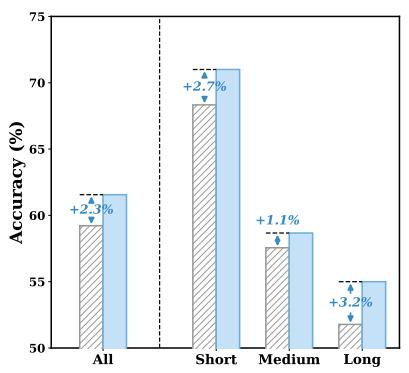  
(a) 16 frames

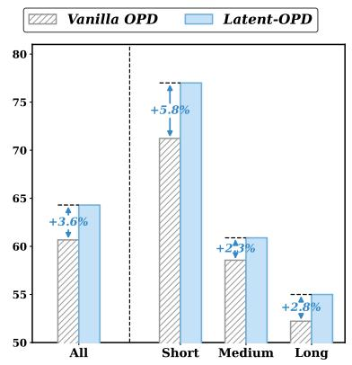  
(b) 32 frames

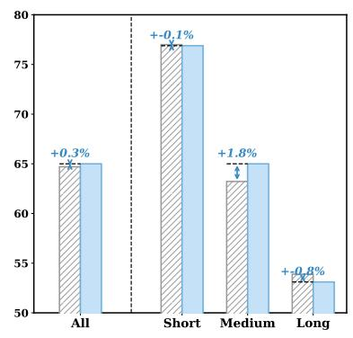  
(c) 64 frames  
Figure 8: Video-MME accuracy (%) by video duration under 16-, 32-, and 64-frame budgets. Latent-OPD shows its largest long-video gain in the 16-frame setting.

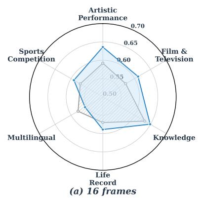

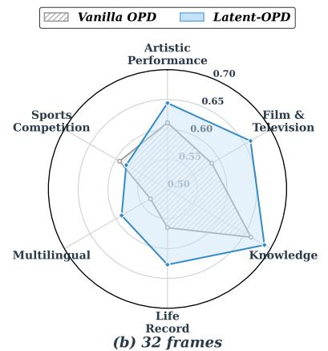

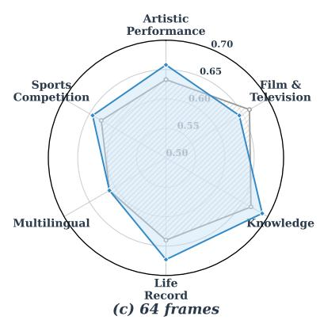  
Figure 9: Video-MME accuracy (%) by domain under 16-, 32-, and 64-frame budgets. The largest low- and mid-frame gains occur in Film & Television, Artistic Performance, and Life Record.

$$
\mathrm { p a i r s } \ : ( s _ { 5 0 } \%  t _ { 7 5 \% } ) , \ : ( s _ { 6 2 . 5 \% }  t _ { 8 7 . 5 \% } ) , \mathrm { a n d } \ : ( s _ { 7 5 \% }  t _ { 1 0 0 \% } ) .
$$

Controlled layer mapping variants. The layer-mapping group fixes the student depths at 50%, 62.5%, and 75% and varies only the teacher side. This keeps the number of aligned states, projector sizes, latent weight, correctness filter, and loss cap unchanged, so the variants directly test how the teacher depth paired with each student state afects the auxiliary signal. Same-depth uses $( s _ { 5 0 \% } \to t _ { 5 0 \% } ) , ( s _ { 6 2 . 5 \% } \to t _ { 6 2 . 5 \% } )$ , and $( s _ { 7 5 \% } \to t _ { 7 5 \% } )$ ; fixed-ofset uses $( s _ { 5 0 \% }  t _ { 6 2 . 5 \% } ) , ( s _ { 6 2 . 5 \% } $ $t _ { 7 5 \% } )$ , and $( s _ { 7 5 \% } \to t _ { 8 7 . 5 \% } ) ;$ ; and reverse-lookahead uses $( s _ { 5 0 \% } \to t _ { 2 5 \% } ) , ( s _ { 6 2 . 5 \% } \to t _ { 5 0 \% } )$ ), and $( s _ { 7 5 \% } \to t _ { 6 2 . 5 \% } )$ . We also include pair-count controls: the single-tail variant keeps only $( s _ { 7 5 \% } \to t _ { 1 0 0 \% } )$ , the final-student variant adds $( s _ { 1 0 0 \% } $ $t _ { 1 0 0 \% } )$ , and the early-pair variant adds $( s _ { 2 5 \% } \to t _ { 5 0 \% } )$ to the default mapping. Together, these controls separate the efect of teacher lookahead from simply adding more projectors or moving supervision to the final student layer.

Representation-level and token-level controls. The OPRD-style baseline adapts representation-level OPD to this setting by applying latent supervision on student on-policy rollouts, matching all response-token hidden states densely, using same-depth pairs, and optimizing normalized MSE. The dense token-level hidden KD variant keeps teacher trajectories but aligns response-token hidden states rather than the single tail anchor, testing whether denser hidden matching is actually helpful for video. The low-rank projector variant replaces each full-rank $4 0 9 6 \to 5 1 2 0$ projector with a rank-16 bottleneck while leaving the trajectory source and layer pairs unchanged. The teacher-trajectory SFT baseline uses the same correctness-filtered teacher trajectories as Latent-OPD but replaces hidden-state alignment with next-token CE on the teacher response, masking all tokens when the teacher’s final answer is incorrect. Finally, the Reverse-KL output- distillation variant changes the output objective while keeping the latent branch comparable. These controls distinguish the proposed sparse latent alignment from dense feature match- ing, projector-capacity reduction, simple exposure to correct teacher rationales, and a nearby output-level divergence.

Trajectory and anchor variants. The source controls test whether the latent target is both reliable and position-matched. The unfiltered variant feeds the same teacher-generated tra- jectory to both models but keeps incorrect teacher answers.

<table><tr><td>Domain</td><td>Model</td><td>16</td><td>32</td><td>64</td></tr><tr><td>Life Record</td><td>Vanilla OPD</td><td>56.98</td><td>56.51</td><td>63.97</td></tr><tr><td rowspan="3">Film &amp; Television</td><td>LATENT-OPD</td><td>58.89</td><td>62.70</td><td>65.87</td></tr><tr><td>Vanilla OPD</td><td>57.22</td><td>58.61</td><td>66.39</td></tr><tr><td>LATENT-OPD</td><td>61.11</td><td>66.11</td><td>64.44</td></tr><tr><td>Artistic Performance</td><td>Vanilla OPD</td><td>59.17</td><td>61.11</td><td>63.33</td></tr><tr><td rowspan="2">Knowledge</td><td>LATENT-OPD</td><td>63.61</td><td>64.44</td><td>64.72</td></tr><tr><td>Vanilla OPD</td><td>63.21</td><td>66.17</td><td>66.67</td></tr><tr><td rowspan="2">Multilingual</td><td>LATENT-OPD</td><td>64.94</td><td>68.77</td><td>67.65</td></tr><tr><td>Vanilla OPD</td><td>57.78</td><td>53.33</td><td>61.11</td></tr><tr><td rowspan="2">Sports Competition</td><td>LATENT-OPD</td><td>55.56</td><td>58.89</td><td>58.89</td></tr><tr><td>Vanilla OPD</td><td>57.11</td><td>59.33</td><td>62.67</td></tr><tr><td></td><td>LATENT-OPD</td><td>59.11</td><td>58.00</td><td>60.89</td></tr></table>

Table 6: Video-MME accuracy (%) by domain and frame budget. Bold marks the higher result between vanilla OPD and Latent-OPD in each setting.

The independent-trajectory variant lets teacher and student generate separate completions before aligning their tail states, so the two states can summarize diferent reasoning paths. The shared-student-trajectory variant restores positional cor-respondence by feeding the same student completion to both models, but the teacher state is then conditioned on a path the teacher did not choose. Latent-OPD instead feeds the iden- tical correctness-filtered teacher trajectory to both models, combining positional correspondence with the teacher’s pre- ferred correct path. Anchor variants then replace the default last non-padding response token with prompt-end, answer- end, or think-end states. The default anchor is designed to learn the complete response-state summary rather than an intermediate prompt or thinking-state representation: after the teacher has read the visual evidence, constructed the rea- soning chain, and reached the end of the valid response, this hidden state compactly summarizes the question semantics, spatial-temporal evidence, action and event ordering, and the reasoning context that leads to the final decision. In contrast, the prompt-end state is collected before the response is formed, the answer-end state may reflect only answer selection, and the think-end state may miss the final consolidation from reasoning to answer. Their lower averages therefore support the default design: correctness-filtered teacher trajectories are most useful when distilled through the final valid response state, where the model has already integrated the video, ques- tion, and generated reasoning context into a global summary representation.

## F Additional CKA Analysis

To support the representation analysis, we report the CKA protocol used to produce the one-to-one layer-alignment curve. Let $H _ { s } ^ { \mathrm { v } }$ and $H _ { s } ^ { \mathrm { o } }$ denote the trajectory-tail hidden states of vanilla OPD and our method at student layer s, and let $T _ { t }$ denote the teacher states at layer t on the same N examples. After centering examples, projector-free linear

CKA is computed from sample Gram matrices:

$$
\mathrm { C K A } ( H _ { s } , T _ { t } ) = \frac { \langle \tilde { H } _ { s } \tilde { H } _ { s } ^ { \top } , \tilde { T } _ { t } \tilde { T } _ { t } ^ { \top } \rangle _ { F } } { \Vert \tilde { H } _ { s } \tilde { H } _ { s } ^ { \top } \Vert _ { F } \Vert \tilde { T } _ { t } \tilde { T } _ { t } ^ { \top } \Vert _ { F } + \epsilon } .\tag{5}
$$

Because this score depends only on example-example simi- larities, it can compare the 4096-dimensional student states with the 5120-dimensional teacher states without requiring a learned projector. We avoid max-pooling over teacher layers and match each student layer s to the teacher layer at the same relative depth:

$$
t ( s ) = \operatorname { r o u n d } ( 6 4 s / 3 2 ) .\tag{6}
$$

The plotted gain is $\Delta \mathrm { C K A } ( s ) ~ = ~ \mathrm { C K A } ( H _ { s } ^ { \mathrm { o } } , T _ { t ( s ) } ) ~ -$ $\mathrm { C K A } \big ( H _ { s } ^ { \mathrm { v } } , T _ { t ( s ) } \big )$ , with stars marking the directly supervised student layers s ∈ {16, 20, 24}.

This depth-aligned design asks a direct question: at the same relative depth, is the student representation closer to the teacher after latent alignment? The answer is concentrated in the deeper half of the student. As shown in Figure 6, Latent- OPD produces an average CKA gain of about +0.108 over student layers at or beyond 50% depth, with a peak gain of about +0.137, while shallow layers remain nearly unchanged. This pattern matches the training design: the supervised layers are in the middle-to-late region, and the latent objective is applied only to compact trajectory-tail states. Thus, the auxiliary latent objective does not broadly perturb local visual encodings; it moves high-level pre-verbal reasoning states closer to the teacher manifold.