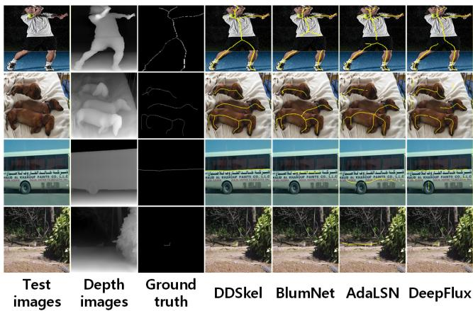
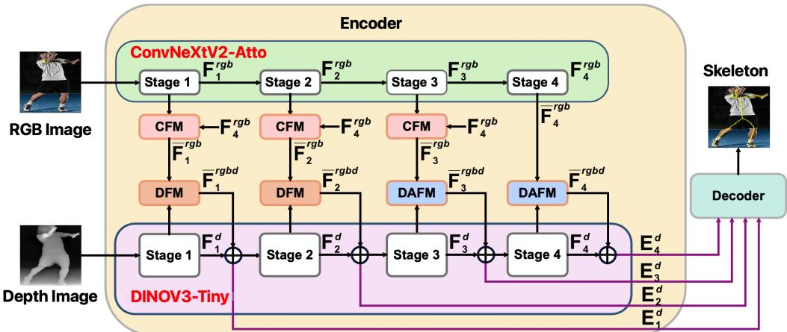
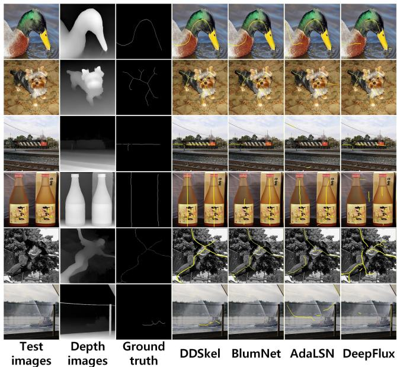

# Depth-Dominant Skeleton Detection for Natural Scenes

Chengkun Rao, Yixuan Deng, Min Li, Yangjun Ou, Ye Li, Ziwei Luo, Zhaojing Wang, Junwei Tang, Bangchao Wang, Xiaoyun Yan   
School of Computer Science and Artificial Intelligence, Wuhan Textile University 2304300206@wtu.edu.cn, xyyan@wtu.edu.cn

## Abstract

To date, all natural scene skeleton detection follows the paradigm of taking RGB images as the sole input; despite notable progress, methods under this paradigm sufer significant performance degradation on complexcontent images. We observe that depth images are inherently insensitive to color and texture, and can provide clear regional contours and inter-region spatial relationships, which naturally alleviates the dificulty of skeleton detection in complex scenarios. Motivated by this observation, this paper proposes for the first time a novel skeleton detection paradigm where depth images serve as the dominant modality and RGB images act as the auxiliary, and accordingly presents a model DDSkel (short for Depth-Dominant Skeleton Detection) under this paradigm. DDSkel employs an asymmetric encoder design to fuse RGB information into depth features, with the RGB modality branch having only 12% the parameters of the depth modality branch. DDSkel has a simple structure without intricate designs. Nevertheless, with only 36% of the trainable parameters of the current best method, DDSkel outperforms all state-ofthe-art approaches on SymPASCAL, the most challenging dataset with a large volume of complex images.

## Introduction

Generally speaking, a classic skeleton, a key technique for object shape representation, is the medial axis of an object, reduced to a single-pixel-wide line while preserving its topological structure and key shape features [Blum, 1973]. Early skeleton detection methods process binary images only [Bai et al., 2007, Sana et al., 2016]; however, as its application scope expanded, especially in the era of deep learning, more and more algorithms have begun to extract skeletons from natural images [Shen et al., 2017, Zhang et al., 2022, Bai et al., 2023, Wang et al., 2024]. Skeleton detection in natural images has a wide range of applications, such as object recognition [Li et al., 2024a], text processing [Xie et al., 2024], medical image analysis [Chen et al., 2024], object detection [Gupta et al., 2025], industrial inspection [Guo et al., 2025], image and video generation [Wang et al., 2025], pose estimation [Xu et al., 2025] and remote sensing analysis [Zhou et al., 2025].

  
Figure 1: Examples of the comparison of detection results between DDSkel and 3 state-of-the-art skeleton detection methods, BlumNet, AdaLSN, and DeepFlux.

All existing skeleton detection methods for natural scenes follow a common paradigm: models take RGB images as their sole input. Despite the remarkable progress achieved in this line of research, methods built on this paradigm still sufer from significant performance degradation when processing complex, cluttered natural scenes. The examples in Fig.1 illustrate this phenomenon. The first column of Fig.1 are the test images; the second column shows the corresponding depth images (generated by DepthAnythingV2 [Yang et al., 2024]), and the third column is the groundtruth; the fourth to the last column display the results of skeleton detection on these images using our proposed DDSkel and other state-of-the-art methods (BlumNet [Zhang et al., 2022], AdaLSN [Liu et al., 2021], and DeepFlux [Wang et al., 2019]). The yellow lines in these results are detected skeletons. In the test images of Fig.1, the foreground objects have color or texture regions similar to the background, or have parts occluded, or the content of the foreground objects or background regions is rather complex. These images pose significant challenges for current skeleton detection methods. As can be seen in the results of Fig.1, none of them yield satisfactory detections.

The phenomenon illustrated in Fig.1 is essentially rooted in the inherent nature of the skeleton detection task. The fundamental goal of skeleton detection is to extract the medial axis of object shapes, a task inherently independent of object categories, textures, colors, and background appearance. However, RGB images, especially in complex scenes, inevitably introduce substantial shape-irrelevant interference: complex internal object textures, foreground-background color confusion, texture similarity between targets and their surroundings, and visual ambiguities caused by occlusions. These distractions are the root cause of the drastic performance degradation of existing methods in complex scenarios. To mitigate these issues, existing methods have to resort to designing more complex networks; yet, the limited scale of current natural scene skeleton detection datasets makes such overly complex models highly prone to overfitting.

We notice that depth images are inherently insensitive to color and texture cues, and can provide clear region contours as well as spatial depth relationships across regions, which naturally alleviates the inherent dificulty of skeleton detection in complex scenes. The second column of Fig.1 clearly demonstrates three key advantages of depth images: (1) Depth images contain minimal redundant details in both foreground and background regions, which significantly suppresses the shape-irrelevant interference introduced by cluttered content in RGB images; (2) Depth images capture object contour information more reliably than RGB images. Such contour cues are critical for skeleton detection; and (3) Depth images encode scene geometric depth information, which efectively facilitates skeleton detection in scenes with occlusions and multiple overlapping objects.

In recent years, driven by the rapid development of large models, monocular depth estimation technology has become highly mature [Yang et al., 2024]. State-ofthe-art methods in this field are now capable of producing high-quality depth images, such as DepthAnythingV2.

Furthermore, as existing skeleton detection datasets only annotate ground-truth skeletons for specific object categories, while depth images inherently lack categorylevel semantic information, RGB images are still required to provide auxiliary semantic guidance. In other words, the RGB modality is not entirely redundant.

Based on the above analysis, this paper breaks away from the long-standing paradigm of taking RGB images as the sole input modality, and proposes a novel paradigm for skeleton detection that takes depth images as the dominant modality, with RGB images providing auxiliary semantic guidance. This paradigm fully leverages the complementary strengths of depth and RGB images for the skeleton detection task. Guided by this paradigm, we present DDSkel, a novel skeleton detection model that takes RGB images and depth images as input.

DDSkel follows an encoder-decoder architecture: its encoder adopts an asymmetric dual-branch design that unidirectionally fuses RGB features into depth features, where the lightweight RGB branch contains only 12% of the parameter count of the depth branch. The augmented depth features are then fed into the decoder to predict skeleton. To demonstrate the inherent advantages of the proposed paradigm, we keep the network structure of DDSkel as simple as possible. With only 36% of the trainable parameters of the current best method, DDSkel outperforms all existing state- of-theart approaches on SymPASCAL, the most challenging dataset with many complex images.

The main contributions of this paper are as follows:

• For the first time, we propose a novel depthdominant paradigm for skeleton detection, revealing that for skeleton detection in natural scenes, the depth modality, rather than the RGB modality, should preferably dominate the feature encoding process.

• We present DDSkel, a new skeleton detection model built under this paradigm, which takes RGB images and their corresponding depth images as input. With a deliberately designed simple architecture, DDSkel adopts an asymmetric dual-branch fusion encoder structure, achieving eficient skeleton detection via the design of a depth branch paired with a much lighter RGB branch in the encoder.

• Extensive experiments demonstrate that the proposed paradigm efectively overcomes the inherent limitations of RGB-only paradigm. DDSkel delivers significantly better detection results on complex images. Notably, with only 36% of the trainable parameters of the current best method, DDSkel outperforms all existing state-of-the-art approaches on the challenging SymPASCAL dataset.

  
Figure 2: The overall architecture of DDSkel, which consists of an encoder and a decoder. The encoder comprises two backbones, namely ConvNeXtV2-Atto and DINOV3-Tiny, which process RGB images and depth images respectively. RGB features are fused with depth features via the CFM (Cross-stage Fusion Module), DFM (Dual-modality Fusion Module), and DAFM (Dual-modality Attention-based Fusion Module) to enhance depth features, which are then fed into the decoder to produce the final skeleton detection results.

## Related Work

## CNN-based Skeleton Detection.

The vast majority of existing deep learning methods for skeleton detection are built upon convolutional neural networks (CNNs), centered on manually designed network architectures to boost detection performance. Specifically, Multi-scale Bidirectional Fully Convolutional Network (MSB-FCN) is proposed to better capture and integrate high-level context across multiple scales [Yang et al., 2018, 2021]. A hierarchical feature integration mechanism (Hi-Fi) is introduced to refine multi-level feature aggregation [Zhao et al., 2018]. Fully convolutional networks equipped with scale-associated side outputs are developed to tackle modeling challenges in skeleton prediction [Shen et al., 2017, 2016b]. DeepFlux predicts two-dimensional vector fields via CNN training, mapping each scene pixel to candidate skeleton points for detection [Wang et al., 2019, Xu et al., 2021]. Linear Span Network (LSN) with dedicated linear span units is designed to minimize reconstruction error during skeleton detection [Liu et al., 2018]. ProMask presents a skeleton probability representation that explicitly encodes skeleton pixels through progressive signals [Bai et al., 2023, 2020]. Sideoutput Residual Network (SRN) leverages error propagation across scales to simplify the fitting of complex outputs with limited network layers [Ke et al., 2017], and Rich Side-output Residual Network (RSRN) further fuses side outputs in a deep-to-shallow hierarchical manner to reduce prediction residuals [Liu et al., 2017a]. Beyond manual architecture design, neural architecture search (NAS) has been applied to automatically discover optimal network structures for skeleton extraction [Qiao et al., 2021, Liu et al., 2021]. Addi tional distinctive network designs have also been explored to advance skeleton detection performance [Liu et al., 2017b, Fan et al., 2023, Fu et al., 2022, Hou et al., 2018, Xu et al., 2019].

## Transformer-based Skeleton Detection.

Departing from the dominant CNN paradigm, transformer architectures have recently been introduced to skeleton detection. Unlike most methods that derive results from predicted skeleton heatmaps, BlumNet directly predicts skeletons via a graph decomposition and reconstruction strategy, with an eficient encoder decoder scheme optimized under an extended transformer architecture [Zhang et al., 2022]. Additionally, an emerging work revisits the core optimization objective of the skeleton detection task: it proposes to guide the model to gradually shift its focus from coordinate localization regression to point classification during training, and this training paradigm shift can be achieved solely by changing the number of object queries in the Transformer architecture [Wang et al., 2024].

All the aforementioned skeleton detection methods follow the paradigm of taking RGB images as the sole input modality, and sufer from significant performance degradation when processing complex natural scene images. In contrast, the proposed DDSkel adopts our novel depth-dominant, RGB-assisted paradigm, and significantly outperforms all the above methods for skeleton detection in complex scenes.

## Methodology

## Overview

The overall architecture of the proposed DDSkel is illustrated in Fig.2. Overall, DDSkel follows a standard encoder-decoder structure: the encoder unidirectionally fuses RGB features into depth features, while the decoder leverages the augmented depth features to produce final skeleton predictions. The encoder adopts an asymmetric dual-branch design with two distinct backbones (DINOV3-Tiny [Simeoni et al., 2025] for the depth branch, ConvNeXtV2-Atto [Woo et al., 2023] for the RGB branch) to process the two modalities separately. Notably, the lightweight RGB branch, due to its auxiliary role, contains only 12% of the parameter count of the depth branch. Multi-scale features from the four stages of the RGB branch are injected into the corresponding stages of the depth branch via dedicated crossmodal fusion modules. Finally, the augmented depth features are fed into an FPN-style decoder, which fuses multi-scale representations to output the final skeleton prediction map.

Details of each aforementioned component are elaborated in the following subsections.

## Generating Depth Images

Depth images for DDSkel are generated by feeding input RGB images into the monocular depth estimation model DepthAnythingV2 [Yang et al., 2024]. For all training and test images, depth images are generated once and reused across all stages, requiring no redundant computation during either training or inference.

It is worth noting that DepthAnythingV2 is not the only option for our proposed paradigm, but merely a replaceable implementation example. Other state-of-theart monocular depth estimation methods can also be seamlessly integrated into DDSkel.

## Analysis of Depth Images Quality Degradation

Depth images captured by physical sensing devices and those generated by high-performance monocular depth estimation algorithms such as DepthAnythingV2 fundamentally difer in the nature of their quality defects [Yang et al., 2024].

Sensor-captured depth images sufer from inherent acquisition-level flaws, including random pixel noise, large-scale missing holes, over-smoothed object boundaries, and severe failures on transparent surfaces. For skeleton extraction tasks, which rely heavily on the topological integrity of object boundaries, the holes and noise in sensor depth images can easily lead to frac tured, shifted, or even completely missing skeletons.

In contrast, depth images produced by DepthAnythingV2 are free from holes and noise, with wellpreserved fine-grained structural details. Its potential errors mainly manifest in two aspects: (1) Under extreme out-of-distribution scenarios, errors present as semantic-level misjudgments of relative depth relations rather than corruption of local geometric structures. (2) In some specific transparent/reflective scenarios, errors appear as deviations in depth values of transparent or reflective regions, while the object contours in the depth image remain intact. In both cases, the edges and geometric shapes of target objects remain continuous and intact, which preserves stable and continuous skeleton topology and still provides reliable shape priors for skeleton detection.

Although depth images generated by DepthAnythingV2 rarely exhibit quality issues on current skeleton detection datasets, we still adopt necessary architectural designs to mitigate this potential problem. Specifically, in DDSkel, we incorporate RGB features into depth features via the CFM, DFM, and DAFM modules to enhance depth representations and alleviate potential depth quality degradation.

## The Backbones for Depth and RGB Image

In the encoder of DDSkel, we select the lightweight variant of the recently released DINOV3 [Simeoni et al., 2025], namely DINOV3-Tiny (i.e., the ConvNeXt-based Tiny version of DINOV3), as the backbone for the depth image branch. This choice is motivated by the following considerations. Compared with traditional supervised backbones (e.g., convolutional neural networks and Transformers), DINOV3 yields visual representations with stronger generalization capability and higher robustness through large-scale self-supervised learning. It can not only encode rich semantic information but also accurately preserve the geometric boundaries and structural details of objects [Simeoni et al., 2025], which is highly aligned with the demands of skeleton detection tasks. As the lightweight variant of DINOV3, DINOV3- Tiny inherits all these merits while maintaining a parameter count of only 29M, making it well suited for skeleton extraction, a task with limited dataset scale.

For the RGB image branch, in light of its role as a mere auxiliary branch, we adopt ConvNeXtV2-Atto (with only 3.7M parameters) [Woo et al., 2023], the smallest variant of the ConvNeXtV2 family[Woo et al., 2023], as the backbone. Despite its compact parameter size, ConvNeXtV2-Atto still provides suficient highlevel semantic cues to distinguish target objects from the background, with negligible extra inference overhead. Furthermore, the shared architectural lineage of ConvNeXtV2-Atto and DINOV3-Tiny facilitates the alignment and fusion of multi-stage features between the RGB and depth branches.

Formally, given the input RGB image $I _ { r g b }$ , we use the DepthAnythingV2 model to generate the corresponding depth image $I _ { d }$ . Then, $I _ { r g b }$ and $I _ { d }$ are respectively passed through their own backbones to obtain their respective feature sets $\mathbf { F } _ { r g b } = \{ \mathbf { F } _ { i } ^ { r g b } \} _ { i = 1 } ^ { 4 }$ and $\mathbf { F } _ { d } = \{ \mathbf { F } _ { i } ^ { d } \} _ { i = 1 } ^ { 4 }$ , where $\mathbf { F } _ { i } ^ { r g b }$ and $\mathbf { F } _ { i } ^ { d }$ are features of each stage of two backbones.

## Enhancing Depth Features With RGB Features

As mentioned earlier, while depth images are inherently better suited for skeleton extraction, RGB features are still required as auxiliary cues to augment depth features for the task, given that existing skeleton extraction datasets only annotate skeletons for specific object categories. Additionally, RGB features can also alleviate potential depth image quality degradation through complementary fusion with depth features.

## Cross-stage Fusion Module (CFM).

In the encoder of DDSkel, the four-stage RGB features $\{ \mathbf { F } _ { i } ^ { r g b } \} _ { i = 1 } ^ { 4 }$ are not directly applied to enhance the corresponding depth features $\{ \mathbf { F } _ { i } ^ { d } \} _ { i = 1 } ^ { 4 }$ . Instead, ${ \bf F } _ { 1 } ^ { r g b } , { \bf F } _ { 2 } ^ { r g b }$ and ${ \bf F } _ { 3 } ^ { r g b }$ are first fused with $\mathbf { F } _ { 4 } ^ { r g b }$ via the CFM module, respectively, before being incorporated to augment $\{ \mathbf { F } _ { i } ^ { d } \} _ { i = 1 } ^ { 4 }$

The computation of the CFM module is given by $\operatorname { E q . 1 } { \mathrm { : } }$

$$
\bar { \mathbf { F } } _ { i \in \{ 1 , 2 , 3 \} } ^ { r g b } = C O N V _ { 1 \times 1 \downarrow } ( C A T ( \mathbf { F } _ { i } ^ { r g b } , U P ( \mathbf { F } _ { 4 } ^ { r g b } ) ) ) ,\tag{1}
$$

where $U P$ represents an upsampling operation that resizes $\mathbf { F } _ { 4 } ^ { r g b }$ to the same spatial resolution as $\mathbf { F } _ { i \in \{ 1 , 2 , 3 \} } ^ { r g b } ;$ CAT denotes concatenation along the channel dimension, and $C O N V _ { 1 \times 1 \downarrow }$ represents the $1 \times 1$ convolution that reduces the channel dimension back to the original dimension of $\mathbf { F } _ { i } ^ { r g b } ; \bar { \mathbf { F } } _ { 4 } ^ { r g b }$ is simply $\mathbf { F } _ { 4 } ^ { r g b }$ itself.

The design of CFM is motivated by two considerations: (1) $\mathbf { \widetilde { F } } _ { 4 } ^ { r g b }$ contains the most abundant RGBderived high-level semantic information, which should participate in the fusion of depth features across all 4 stages; (2) ${ \bf F } _ { 1 } ^ { r g b } , { \bf F } _ { 2 } ^ { r g b }$ , and $\mathbf { F } _ { 3 } ^ { r g b }$ provide multi-scale RGB-related semantic cues, which can guide the optimization of depth features $\{ \mathbf { F } _ { i } ^ { d } \} _ { i = 1 } ^ { 4 }$ toward skeleton extraction at diferent granularities.

Dual-modality Attention-based Fusion Module(DAFM).

Features $\bar { \mathbf { F } } _ { 3 } ^ { r g b }$ and $\bar { \mathbf { F } } _ { 4 } ^ { r g b }$ are used to fuse and augment depth features $\mathbf { F } _ { 3 } ^ { d }$ and $\mathbf { F } _ { 4 } ^ { d }$ via the DAFM, which comprises two sequentially connected components: a spatial attention module followed by a channel attention mod ule.

Specifically, the spatial attention module is based on the AttnZero structure [Li et al., 2024b], which is the first framework designed to automatically discover eficient attention modules tailored for vision Transformers. As a high-quality linear attention variant, it strikes a favorable balance between linear computational complexity and cross-model generalizability, enabling efective global spatial attention at a low computational cost.

Prior to the AttnZero computation, $\bar { \mathbf { F } } _ { 3 } ^ { r g b }$ and $\bar { \mathbf { F } } _ { 4 } ^ { r g b }$ are channel-wise concatenated with ${ \bf F } _ { 3 } ^ { d }$ and $\mathbf { F } _ { 4 } ^ { d }$ , respectively, yielding feature ${ \bf F } _ { 3 } ^ { r g b d }$ and $\mathbf { F } _ { 4 } ^ { r g b d }$ . Each of them is then linearly projected into query $( Q )$ , key $( K )$ , and value (V), before being fed into the AttnZero module. The detailed computation of AttnZero is formulated as follows (Li et al. 2024b):

$$
A t t n Z e r o = Q \times \varphi _ { 2 } \left( \varphi _ { 2 } \left( Q \right) \varphi _ { 2 } \left( \beta _ { 1 } \left( K \right) ^ { T } \varphi _ { 1 } \left( V \right) \right) \right)\tag{2}
$$

where $\beta _ { 1 }$ is the Exponential Linear Unit (ELU) with a shift of 1; $\varphi _ { 1 }$ denotes min-max normalization; $\varphi _ { 2 }$ is l2 normalization function.

For the channel attention in DAFM, we adopt the Channel Attention Module (CAM) from the CBAM model [Woo et al., 2018]. It is worth noting that since the focus of this work is to present a novel depthdominated paradigm for skeleton extraction rather than to design sophisticated network architectures, we directly adopt simple and well-established existing modules to construct DAFM.

For illustration, we take $\mathbf { F } _ { 4 } ^ { r g b d }$ as a representative of ${ \bf F } _ { 3 } ^ { r g b d }$ and $\mathbf { F } _ { 4 } ^ { r g b d }$ , and detail its computation flow in the DAFM module as follows:

$$
\bar { \mathbf { F } } _ { 4 } ^ { r g b d } = C O N V _ { 1 \times 1 \downarrow } ( C A M ( A t t n Z e r o ( { \mathbf { F } } _ { 4 } ^ { r g b d } ) ) )\tag{3}
$$

where $C O N V _ { 1 \times 1 \downarrow }$ denotes the operation that reduces the channel dimension of the output feature to match that of $\mathbf { F } _ { 4 } ^ { d }$ . Feature $\bar { \mathbf { F } } _ { 3 } ^ { r g b d }$ is computed in the same manner.

The design motivations of DAFM are twofold. (1) Features $\bar { \mathbf { F } } _ { 3 } ^ { r g b }$ and $\bar { \mathbf { F } } _ { 4 } ^ { r g b }$ , which carry richer high-level semantic information, are critical for depth feature enhancement. Accordingly, we implement the augmentation of depth features ${ \dot { \mathbf { F } } } _ { 3 } ^ { d }$ and $\bar { \mathbf { F } } _ { 4 } ^ { d }$ through dual spatial and channel attention that captures global contextual information. (2) When depth images sufer from quality degradation, DAFM can suppress the involvement of degraded depth features in the computation by adaptively weighting the importance of RGB features and depth features.

## Dual-modality Fusion Module (DFM).

RGB features $\bar { \mathbf { F } } _ { 1 } ^ { r g b } , \ \bar { \mathbf { F } } _ { 2 } ^ { r g b }$ and depth features ${ \bf F } _ { 1 } ^ { d } , ~ { \bf F } _ { 2 } ^ { d }$ have higher spatial resolution. To reduce computational overhead, we adopt a simpler DFM structure for the fusion of these features. Similar to DAFM, before the computation of DFM, $\bar { \mathbf { F } } _ { 1 } ^ { r g b }$ and $\bar { \mathbf { F } } _ { 2 } ^ { r g b }$ are channel-wise concatenated with $\mathbf { F } _ { 1 } ^ { d }$ and $\mathbf { F } _ { 2 } ^ { d }$ , respectively, yielding feature ${ \bf F } _ { 1 } ^ { r g b d }$ and $\mathbf { F } _ { 2 } ^ { r g b d }$ . Then, taking feature ${ \bf F } _ { 1 } ^ { r g b d }$ as an example, the computation of DFM is formulated as follows:

$$
\bar { \mathbf { F } } _ { 1 } ^ { r g b d } = C O N V _ { 1 \times 1 \downarrow } ( \mathbf { F } _ { 1 } ^ { r g b d } )\tag{4}
$$

where the function of $C O N V _ { 1 \times 1 \downarrow }$ is similar to the one in $\mathrm { E q . 3 } .$ . Feature $\bar { \mathbf { F } } _ { 2 } ^ { r g b d }$ is computed in the same way.

The above-computed features $\bar { \mathbf { F } } _ { 1 } ^ { r g b d } , \bar { \mathbf { F } } _ { 2 } ^ { r g b d } , \bar { \mathbf { F } } _ { 3 } ^ { r g b d }$ and $\bar { \mathbf { F } } _ { 4 } ^ { r g b d }$ are directly added element-wise with their corresponding depth features $\mathbf { F } _ { 1 } ^ { d } , \mathbf { F } _ { 2 } ^ { d } , \mathbf { F } _ { 3 } ^ { d }$ , and $\mathbf { F } _ { 4 } ^ { d } ,$ respectively, yielding enhanced depth features ${ \bf E } _ { 1 } ^ { d } , { \bf E } _ { 2 } ^ { d } , { \bf E } _ { 3 } ^ { d }$ and ${ \bf E } _ { 4 } ^ { d }$ that serve as inputs to the decoder.

## Decoder

The decoder is constructed in an FPN-like manner [Lin et al., 2017]. Features $\mathbf { E } _ { 1 } ^ { d } , ~ \mathbf { E } _ { 2 } ^ { d } , ~ \mathbf { E } _ { 3 } ^ { d } ,$ and ${ \bf E } _ { 4 } ^ { d }$ first undergo channel dimension reduction via 1×1 convolutions. They are then sequentially processed through upsampling, element-wise addition with corresponding higher-resolution features, and ConvBNSiLU units. Each ConvBNSiLU unit consists of a 3×3 convolution, a Batch Normalization (BN) layer, and a SiLU [Hendrycks and Gimpel, 2016] activation function. The final output of the decoder is the skeleton detection map. The detailed architecture of the decoder is illustrated in the supplementary material.

## Loss Function

Let $\mathbf { P } \in [ 0 , 1 ]$ denotes the predicted skeleton probability map and $\mathbf { G } \in [ 0 , 1 ]$ as the binary groundtruth. When training DDSkel, the loss function is a combination of a weighted $\ell _ { 2 }$ loss[Bai et al., 2020] and a soft Dice loss [Milletari et al., 2016].

Weighted $\ell _ { 2 }$ loss. To mitigate the imbalance in the number of skeleton and non-skeleton pixels, the weighted $\ell _ { 2 }$ loss [Bai et al., 2020] is defined as:

$$
\mathcal { L } _ { \mathrm { w l 2 } } = \sum _ { i = 1 } ^ { N } \alpha _ { i } \left( \mathbf { G } _ { i } - \mathbf { P } _ { i } \right) ^ { 2 } ,\tag{5}
$$

where i indexes pixels and N is the number of pixels in a mini-batch. The balance weight $\alpha _ { i }$ is inversely proportional to the ratio of the number of 0 and 1 pixels.

Soft Dice loss. We also enforce region-level agreement using the soft Dice loss[Milletari et al., 2016]:

$$
\mathcal { L } _ { \mathrm { s D i c e } } = 1 - \frac { 2 \sum _ { i = 1 } ^ { N } \mathbf { P } _ { i } \mathbf { G } _ { i } + \epsilon } { \sum _ { i = 1 } ^ { N } \mathbf { P } _ { i } + \sum _ { i = 1 } ^ { N } \mathbf { G } _ { i } + \epsilon } ,\tag{6}
$$

where ϵ is a small constant for numerical stability.

The total loss is:

$$
\mathcal { L } = \mathcal { L } _ { \mathrm { w l 2 } } + 0 . 5 \mathcal { L } _ { \mathrm { s D i c e } } .\tag{7}
$$

## Experiments

## Datasets and Evaluation Protocol

We conduct experiments on object skeleton detection using four widely-used datasets: SK-LARGE [Shen et al., 2017], SK506 [Shen et al., 2016b], WH-SYMMAX [Shen et al., 2016a], and SymPASCAL [Ke et al., 2017]. Among them, the SymPASCAL dataset contains a large volume of complex uncropped in-the-wild images with cluttered backgrounds and dense distracting textures, making it highly challeng ing and significantly increasing the dificulty of skeleton detection. The datasets splits are as follows: SK506 contains 300 training images and 206 testing images; WH-SYMMAX contains 328 images, where the first 228 images are used for training and the remaining 100 images are used for testing; SK-LARGE contains 746 training images and 745 testing images; SymPASCAL contains 648 training images and 787 testing images under 20 object classes.

Like other state-of-the-art methods, in our experiments, we use the F-measure metric [Wang et al., 2019] to evaluate the performance of skeleton detection.

## Implementation Details

## Details of Training.

The training batch size is 4, while the validation and test batch size is 2. All images are resized to $5 1 2 \times 5 1 2$ All experiments use multi-GPU distributed training on NVIDIA RTX 4090 GPUs. We optimize the network using AdamW with module-specific parameter groups.

The default group, including the backbones and decoder, uses a learning rate of $1 \times 1 0 ^ { - 5 }$ , while the fusionrelated modules use $5 \times 1 0 ^ { - 4 }$ . The weight decay is $1 \times 1 0 ^ { - 4 }$

We employ CosineAnnealingLR with a linear warmup. During the first 5 epochs, the learning rate increases linearly from $1 \times 1 0 ^ { - 6 }$ to the target learning rate of each parameter group, and then follows cosine decay to $1 \times 1 0 ^ { - 7 }$ . The model is trained for 65 epochs. Data augmentation applies synchronized geometric transformations to the RGB image, ground-truth skeleton, and depth image, including random horizontal flipping, random vertical flipping, and a random rotation sampled from {90◦, 180◦, 270◦}.

## Details of Encoder and Decoder.

The depth primary backbone is DINOV3-Tiny, which contains four stages with channel dimensions [96, 192, 384, 768] and block depths [3, 3, 9, 3]. The RGB auxiliary backbone is ConvNeXtV2-Atto. Its four stages use channel dimensions [40, 80, 160, 320] and block depths [2, 2, 6, 2].

For a 512 × 512 input, the four-stage feature-map resolutions are 128 × 128, 64 × 64, 32 × 32, and 16 × 16. During training, all parameters of both the encoder and decoder are trainable. The decoder adopts an FPNlike structure with a hidden dimension of 256 and SiLU activation.

## Results

## Overall Quantitative Comparison.

Tab. 1 presents a quantitative comparison between our DDSkel and 9 state-of-the-art methods (HED [Xie and Tu, 2015], SRN [Ke et al., 2017], Hi-Fi [Zhao et al., 2018], DeepFlux [Wang et al., 2019], AdaLSN [Liu et al., 2021], FMRN [Fan et al., 2023], ProMask [Bai et al., 2023], BlumNet [Zhang et al., 2022], BlumNet+ [Wang et al., 2024]) for skeleton detection in natural images on 4 datasets, evaluated by F-measure scores. Values highlighted in bold in Tab. 1 correspond to the highestranked F-measure scores. As can be observed from the table, on SymPASCAL, which contains a large number of challenging images, DDSkel achieves significantly superior performance over all competing methods. Its F-measure outperforms the second-best method, Blum-Net+, by 10%, yet DDSkel only accounts for 36% of the parameters of BlumNet+, which can be seen from Tab. 2. This verifies that DDSkel yields notably better performance with far fewer parameters on complex images.

Furthermore, on the remaining three datasets with much fewer complex images, DDSkel either outperforms or is highly comparable to the best-performing methods. Specifically, on WH-SYMMAX, DDSkel leads the second-best BlumNet+ by 1%, while on SK506 and SK-LARGE, its performance is highly close to that of the top-ranked method. Notably, across all 4 datasets, DDSkel consistently and significantly outperforms the methods with a similar parameter count (see Tab. 2).

<table><tr><td>Method</td><td>SK506</td><td>SK-LARGE</td><td>WH-SYMMAX</td><td>SymPASCAL</td></tr><tr><td>HED</td><td>0.542</td><td>0.497</td><td>0.732</td><td>0.369</td></tr><tr><td>SRN</td><td>0.632</td><td>0.658</td><td>0.780</td><td>0.443</td></tr><tr><td>Hi-Fi</td><td>0.681</td><td>0.724</td><td>0.805</td><td>0.454</td></tr><tr><td>DeepFlux</td><td>0.695</td><td>0.732</td><td>0.840</td><td>0.502</td></tr><tr><td>AdaLSN</td><td>0.740</td><td>0.786</td><td>0.851</td><td>0.497</td></tr><tr><td>FMRN</td><td>0.751</td><td>0.789</td><td>0.865</td><td>0.508</td></tr><tr><td>ProMask</td><td>0.754</td><td>0.772</td><td>0.875</td><td>0.582</td></tr><tr><td>BlumNet</td><td>0.752</td><td>0.826</td><td>0.877</td><td>0.521</td></tr><tr><td>BlumNet+</td><td>0.799</td><td>0.836</td><td>0.913</td><td>0.612</td></tr><tr><td>DDSkel</td><td>0.780</td><td>0.825</td><td>0.924</td><td>0.674</td></tr></table>

Table 1: Quantitative comparison on 4 datasets with 9 methods using F-measure scores. Values highlighted in bold in table correspond to the highest-ranked Fmeasure scores.

<table><tr><td>Method</td><td>Params (M)</td><td>FLOPs (G)</td><td>Time (ms)</td></tr><tr><td>HED</td><td>14.72</td><td>103.75</td><td>5.18</td></tr><tr><td>SRN</td><td>14.72</td><td>103.75</td><td>5.23</td></tr><tr><td>DeepFlux</td><td>18.32</td><td>125.93</td><td>6.39</td></tr><tr><td>Ada-LSN</td><td>32.38</td><td>217.07</td><td>15.05</td></tr><tr><td>BlumNet</td><td>99.32</td><td>121.0</td><td>22.8</td></tr><tr><td>BlumNet+</td><td>100.80</td><td></td><td></td></tr><tr><td>DDSkel</td><td>35.66</td><td>41.94</td><td>12.32</td></tr></table>

Table 2: Computational-eficiency comparison with existing skeleton-detection methods. The symbol ’–’ means no results provided by authors.

Tab. 2 presents a comparison of computational eficiency between DDSkel and 6 state-of-the-art methods, covering parameter count, FLOPs, and per-image inference time. These methods are selected as their published papers or publicly available source codes allow us to obtain part or all of these metrics. Combining the results from Tab. 1 and Tab. 2, it can be observed that DDSkel achieves the best detection performance among methods with comparable parameter scales.

## Overall Qualitative Comparison.

Fig.3 shows some qualitative comparison between DDSkel and 3 state-of-the-art methods (BlumNet, AdaLSN and DeepFlux). The test images in Fig.3 all have complex content. However, in the corresponding depth images, these complex interferences are efectively suppressed. As can be seen, the skeleton detected by DDSkel is the closest to the groundtruth, while the other comparison methods have obvious detection errors. More qualitative comparisons between DDSkel and state-of-the-art methods are provided in the supplemental material of this paper.

Figure 3: The qualitative comparison between DDSkel and three state-of-the-art methods, BlumNet, AdaLSN, and DeepFlux.
<table><tr><td>Configuration</td><td>SymPASCAL</td><td>SK-LARGE</td></tr><tr><td>RGB-Only</td><td>0.6197</td><td>0.8008</td></tr><tr><td>Depth-Only</td><td>0.6602</td><td>0.8051</td></tr><tr><td>RGB-RGB</td><td>0.6345</td><td>0.8046</td></tr><tr><td>Depth-Depth</td><td>0.6633</td><td>0.8102</td></tr><tr><td>RGB-Depth</td><td>0.6622</td><td>0.8138</td></tr><tr><td>Depth-RGB(DDSkel)</td><td>0.6740</td><td>0.8250</td></tr></table>

Table 3: Comparison of diferent modality assignments under a fixed network architecture and training protocol. For dual-branch settings, the first modality is assigned to the primary backbone and the second modality to the auxiliary branch.

## Ablation Study

## Ablation on Dual-backbone and Depth Primacy.

This ablation study justifies the dual-backbone design of the encoder with both RGB and depth modalities in DDSkel, as well as the rationale for adopting depth as the primary modality. Tab. 3 presents the results of this ablation study.

In the first column of Tab. 3, each variant is defined as follows. RGB-Only: Only the larger backbone in the encoder takes RGB images as input, while the smaller backbone is removed. Depth-Only: Only the larger backbone takes depth images as input, with the smaller backbone removed. RGB-RGB: Both backbones of the encoder receive RGB images as input. Depth-Depth: Both backbones of the encoder are fed with depth images. RGB-Depth: The larger backbone takes RGB images as input, while the smaller backbone takes depth images as input. The second and third columns of Tab. 3 report the F-measure values evaluated on the two datasets, respectively.

We take the results on SymPASCAL from Tab. 3 as an example for analysis. For the single-backbone baselines, Depth-Only clearly outperforms RGB-Only on SymPASCAL (0.6602 to 0.6197), indicating that geometric structure provides a more suitable primary representation for skeleton extraction. Although dual backbone models introduce additional parameters, their gains cannot be attributed merely to increased model capacity. Depth–Depth improves only slightly over Depth-Only on SymPASCAL (0.6602 to 0.6633), showing that simply duplicating the depth branch ofers limited benefit. In contrast, introducing a complementary RGB auxiliary branch raises the Depth–RGB result to 0.6740, outperforming both Depth–Depth and the rolereversed RGB–Depth configuration (0.6622). These results indicate that the gain mainly arises from the complementary roles of Depth and RGB rather than a simple increase in dual-backbone capacity.

## Ablation on RGB Auxiliary Backbone.

In this ablation study, we replace the RGB backbone in the encoder with larger ConvNeXtV2 variants. Tab. 4 shows the corresponding results on Sym-PASCAL and SK-LARGE. We fix the depth branch and the fusion configuration, and vary only the RGB auxiliary backbone. The 3 replacement RGB backbones are ConvNeXtV2-Tiny, ConvNeXtV2-Pico, and ConvNeXtV2-Femto. The results in Tab. 4 demonstrate that adopting a larger RGB backbone yields only marginal detection improvements but significantly increases the parameter count, making it an unfavorable trade-of. We ultimately select ConvNeXtV2-Atto as the default configuration, as it strikes a favorable balance between performance and eficiency.

## Other Ablation Studies.

We also conduct ablation studies on CFM, DFM, DAFM module, and how these modules help DDSkel address potential quality degradation issues in depth images. Due to space constraints, we defer the presentation and discussion of these ablation results to the supplementary material.

<table><tr><td>RGB Auxiliary Branch</td><td>SymPASCAL SK-LARGE</td><td></td></tr><tr><td>ConvNeXtV2-Tiny (60.85M)</td><td>0.6802</td><td>0.8292</td></tr><tr><td>ConvNeXtV2-Pico (41.15M)</td><td>0.6753</td><td>0.8264</td></tr><tr><td>ConvNeXtV2-Femto (37.23M)</td><td>0.6759</td><td>0.8247</td></tr><tr><td>ConvNeXtV2-Atto (35.66M, Ours)</td><td>0.6740</td><td>0.8250</td></tr></table>

Table 4: Ablation of the RGB auxiliary-branch capacity with the depth primary branch and fusion configuration fixed. The values in parentheses denote the total parameter count of the complete dual-stream model. Values highlighted in bold in table correspond to the highestranked F-measure scores.

## Conclusion

This paper re-examines the mainstream RGB-only paradigm for natural scene skeleton detection, and points out that such a paradigm sufers from severe performance degradation when processing complex-content images. To tackle this limitation, we propose for the first time a novel depth-dominant skeleton detection paradigm, arguing that depth modality is more suitable to dominate the feature encoding process for skeleton detection tasks. Under this paradigm, we build DDSkel, an eficient skeleton detection model with an asymmetric dual-branch encoder architecture. Extensive experiments verify that the depth-dominant paradigm can effectively overcome the inherent limitations of the RGBonly paradigm. For future work, we will further explore the potential of depth information in skeleton extraction and design more lightweight and eficient models.

## References

Xiang Bai, Longin Jan Latecki, and Wen-Yu Liu. Skeleton Pruning by Contour Partitioning with Discrete Curve Evolution. IEEE Trans. Pattern Anal. Mach. Intell., 29(3):449–462, 2007.

Xiuxiu Bai, Lele Ye, and Zhe Liu. Promask: Probability mask for skeleton detection, 2020. URL https: //arxiv.org/abs/2012.03003.

Xiuxiu Bai, Lele Ye, Zhe Liu, and Bin Liu. ProMask: Probability Mask Representation for Skeleton Detection. Neural Networks, 162(1):11–20, 2023.

Harry Blum. Biological Shape and Visual Science (part I). Journal of Theoretical Biology, 38(2):205–287, 1973.

Zhensen Chen, Zhanhong Ou, Yaosheng Lu, and Jieyun Bai. Direction-guided and Multi-scale Feature Screening for Fetal Head–pubic Symphysis Segmen-

tation and Angle of Progression Calculation. Expert Systems with Applications, 245(7):1–11, 2024.

Qingqing Fan, Zhenglin Li, and Zhiwen Wang. Fusing Multi-scale Residual Network for Skeleton Detection. In Proceedings of the 18th International Conference on Image and Graphics, pages 224–236, Qingdao, China, 2023. IEEE.

Daoyong Fu, Wei Li, Songchen Han, and Hanren Lin. The Pose Estimation of The Aircraft on The Airport Surface Based on The Contour Features. IEEE Transactions on Aerospace and Electronic Systems, 59(2):817–826, 2022.

Yuxin Guo, Xiaofeng Li, Haoran Zhang, Zhenlin Tao, and Biqing Liu. Multi-scale-slope Linear Transformer Based Skeleton Detection for Autonomous Railway Inspection UAV Navigation. IEEE Transactions on Instrumentation and Measurement, 74(3):1–13, 2025.

Avi Gupta, Koteswar Rao Jerripothula, and Tammam Tillo. CIRCOD: Co-saliency Inspired Referring Camouflaged Object Discovery. In Proceedings of the 2025 IEEE/CVF Winter Conference on Applications of Computer Vision, pages 1–11, Tucson, AZ, USA, 2025. IEEE Computer Society.

Dan Hendrycks and Kevin Gimpel. Gaussian error linear units (gelus), 2016. URL https://arxiv.org/abs/ 1606.08415.

Qibin Hou, JiangJiang Liu, Ming-Ming Cheng, Ali Borji, and Philip Torr. Three birds one stone: A general architecture for salient object segmentation, 2018. URL https://arxiv.org/abs/1803.09860.

Wei Ke, Jie Chen, Jianbin Jiao, Guoying Zhao, and Qixiang Ye. SRN: Side-output Residual Network for Object Symmetry Detection in The Wild. In Proceedings of the 30th IEEE Conference on Computer Vision and Pattern Recognition, pages 1068–1076, Honolulu, HI, USA, 2017. IEEE Computer Society.

Junyi Li, Junfeng Wu, Weizhi Zhao, Song Bai, and Xiang Bai. PartGLEE: a Foundation Model for Recognizing and Parsing Any Objects. In Proceedings of the 18th European Conference on Computer Vision, pages 475–494, Milan, Italy, 2024a. Springer.

Lujun Li, Zimian Wei, Peijie Dong, Wenhan Luo, Wei Xue, Qifeng Liu, and Yike Guo. AttnZero: Eficient Attention Discovery for Vision Transformers. In Proceedings of the 18th European Conference on Computer Vision, pages 20–37, Milan, Italy, 2024b. Springer.

Tsung-Yi Lin, Piotr Dollar, Ross Girshick, Kaiming He, Bharath Hariharan, and Serge Belongie. Feature Pyramid Networks for Object Detection. In Proceedings of the 30th IEEE Conference on Computer Vision and Pattern Recognition, pages 2117–2125, Honolulu, HI, USA, 2017. IEEE Computer Society.

Chang Liu, Wei Ke, Jianbin Jiao, and Qixiang Ye. RSRN: Rich Side-output Residual Network for Medial Axis Detection. In Proceedings of the IEEE International Conference on Computer Vision Workshops, pages 1739–1743, Venice, Italy, 2017a. IEEE Computer Society.

Chang Liu, Wei Ke, Fei Qin, and Qixiang Ye. Linear Span Network for Object Skeleton Detection. In Proceedings of the 15th European Conference on Computer Vision, pages 133–148, Munich, Germany, 2018. Springer.

Chang Liu, Yunjie Tian, Zhiwen Chen, Jianbin Jiao, and Qixiang Ye. Adaptive Linear Span Network for Object Skeleton Detection. IEEE Trans. Image Process., 30(5):5096–5108, 2021.

Xiaolong Liu, Pengyuan Lyu, Xiang Bai, and Ming-Ming Cheng. Fusing Image and Segmentation Cues for Skeleton Extraction in The Wild. In Proceedings of the IEEE International Conference on Computer Vision Workshops, pages 1744–1748, Venice, Italy, 2017b. IEEE Computer Society.

Fausto Milletari, Nassir Navab, and Seyed-Ahmad Ahmadi. V-Net: Fully Convolutional Neural Networks for Volumetric Medical Image Segmentation. In Proceedings of the 4th International Conference on 3D Vision, pages 1–11, Stanford, CA, USA, 2016. IEEE Computer Society.

Yang Qiao, Yunjie Tian, Yue Liu, and Jianbin Jiao. Genetic Feature Fusion for Object Skeleton Detection. Security and Communication Networks, 2021(1):1–9, 2021.

Punam Sana, Gunilla Borgefors, and Gabriella Sanniti di Bajo. A Survey on Skeletonization Algorithms and Their Applications. IEEE Sign. Process. Letters, 76(1):3–12, 2016.

Wei Shen, Xiang Bai, Zihao Hu, and Zhijiang Zhang. Multiple Instance Subspace Learning via Partial Random Projection Tree for Local Reflection Symmetry in Natural Images. Pattern Recognition, 52: 306–316, 2016a.

Wei Shen, Kai Zhao, Yuan Jiang, Yan Wang, Zhijiang Zhang, and Xiang Bai. Object Skeleton Extraction in

Natural Images by Fusing Scale-associated Deep Side Outputs. In Proceedings of the 29th IEEE Conference on Computer Vision and Pattern Recognition, pages 222–230, Las Vegas, NV, USA, 2016b. IEEE Computer Society.

Wei Shen, Kai Zhao, Yuan Jiang, Yan Wang, Xiang Bai, and Alan Yuille. Deepskeleton: Learning Multitask Scale-associated Deep Side Outputs for Object Skeleton Extraction in Natural Images. IEEE Trans. Image Process., 26(11):5298–5311, 2017.

Oriane Simeoni, Huy Vo, Maximilian Seitzer, Federico Baldassarre, and Maxime et al. Oquab. Dinov3, 2025. URL https://arxiv.org/abs/2508.10104.

Yukang Wang, Yongchao Xu, Stavros Tsogkas, Xiang Bai, Sven Dickinson, and Kaleem Siddiqi. DeepFlux for Skeletons in The Wild. In Proceedings of the 37th IEEE Conference on Computer Vision and Pattern Recognition, pages 5287–5296, Long Beach, CA, USA, 2019. IEEE Computer Society.

Zhenzhi Wang, Yixuan Li, Yanhong Zeng, Yuwei Guo, Dahua Lin, Tianfan Xue, and Bo Dai. Multi-identity Human Image Animation with Structural Video Diffusion. In Proceedings of the 20th IEEE/CVF International Conference on Computer Vision, pages 11937–11947, Honolulu, HI, USA, 2025. IEEE Computer Society.

Zhiyuan Wang, Cong Yang, Yulu Zhang, Zeyd Boukhers, Wei Sui, Yi Ji, and Chunping Liu. Transition in Focus of Prediction Tasks for Skeleton Graph Component Detection with Transformer. In Proceedings of the 6th ACM International Conference on Multimedia in Asia, pages 1–7, New York, NY, USA, 2024. ACM.

Sanghyun Woo, Jongchan Park, Joon-Young Lee, and In So Kweon. CBAM: Convolutional Block Attention Module. In Proceedings of the 15th European Conference on Computer Vision, pages 3–19, Munich, Germany, 2018. Springer.

Sanghyun Woo, Shoubhik Debnath, Ronghang Hu, Xinlei Chen, Zhuang Liu, In So Kweon, and Saining Xie. ConvNeXt V2: Co-designing and Scaling ConvNets with Masked Autoencoders. In Proceedings of the 36th IEEE/CVF Conference on Computer Vision and Pattern Recognition, pages 16133–16142, Vancouver, BC, Canada, 2023. IEEE Computer Society.

Saining Xie and Zhuowen Tu. Holistically-Nested Edge Detection. In Proceedings of the IEEE International Conference on Computer Vision, pages 1395–1403, Santiago, Chile, 2015. IEEE Computer Society.

Xudong Xie, Yuzhe Li, Yang Liu, Zhifei Zhang, Zhaowen Wang, Wei Xiong, and Xiang Bai. WAS: Dataset and Methods for Artistic Text Segmentation. In Proceedings of the 18th European Conference on Computer Vision, pages 237–254, Milan, Italy, 2024. Springer.

Huangbiao Xu, Xiao Ke, Huanqi Wu, Rui Xu, Yuezhou Li, Peirong Xu, and Wenzhong Guo. DanceFix: An Exploration in Group Dance Neatness Assessment Through Fixing Abnormal Challenges of Human Pose. In Proceedings of the 39th AAAI Conference on Artificial Intelligence, pages 8869–8877, Philadelphia, PA, USA, 2025. AAAI Press.

Weijian Xu, Gaurav Parmar, and Zhuowen Tu. Geometry-aware End-to-end Skeleton Detection. In Proceedings of the 30th British Machine Vision Conference, pages 1–13, Cardif, UK, 2019. BMVA Press.

Yongchao Xu, Yukang Wang, Stavros Tsogkas, Jianqiang Wan, Xiang Bai, Sven Dickinson, and Kaleem Siddiqi. Deepflux for Skeleton Detection in The Wild. Int. J. Comput. Vis., 129(4):1323–1339, 2021.

Fan Yang, Xin Li, Hong Cheng, Yuxiao Guo, Leiting Chen, and Jianping Li. Multi-scale Bidirectional FCN for Object Skeleton Extraction. In Proceedings of the Thirty-Second AAAI Conference on Artificial Intelligence, pages 7461–7468, New Orleans, LA, USA, 2018. AAAI Press.

Fan Yang, Xin Li, and Jianbing Shen. MSB-FCN: Multi-Scale Bidirectional FCN for Object Skeleton Extraction. IEEE Trans. Image Process., 30(11): 2301–2312, 2021.

Lihe Yang, Bingyi Kang, Zilong Huang, Zhen Zhao, Xiaogang Xu, Jiashi Feng, and Hengshuang Zhao. Depth anything V2. In Advances in Neural Information Processing Systems 37, pages 21875–21911, Vancouver, Canada, 2024. NeurIPS Foundation.

Yulu Zhang, Liang Sang, Marcin Grzegorzek, John See, and Cong Yang. Blumnet: Graph Component Detection for Object Skeleton Extraction. In Proceedings of the 30th ACM International Conference on Multimedia, pages 5527–5536, Lisbon, Portugal, 2022. ACM.

Kai Zhao, Wei Shen, Shanghua Gao, Dandan Li, and Ming-Ming Cheng. Hi-Fi: hierarchical feature integration for skeleton detection. In Proceedings of the 27th International Joint Conference on Artificial Intelligence, pages 1191–1197, Stockholm, Sweden, 2018. AAAI Press.

Guoqing Zhou, Haiyang Zhi, Ertao Gao, Yanling Lu, Jianjun Chen, Yuhang Bai, and Xiao Zhou. DeepU-Net: A Parallel Dual-branch Model for Deeply Fusing Multiscale Features for Road Extraction from Highresolution Remote Sensing Images. IEEE Journal of Selected Topics in Applied Earth Observations and Remote Sensing, 18(3):9448–9463, 2025.