# Depth-guided Multi-view Exposure Bracketing for HDR Robot Vision

Jinnyeong Kim Juhyung Choi Woohyeok Kim Sunghyun Cho Seung-Hwan Baek

POSTECH

Abstract. Achieving reliable single-shot high dynamic range (HDR) imaging under extreme illumination conditions remains a long-standing challenge, yet no comprehensive benchmark exist for evaluating HDR perception in multi-sensor robotic systems. To fill this gap, we introduce a large-scale dataset collected via a custom robotic vision platform and an iPhone 13 Pro: 121 real-world scenes spanning modest and ultrahigh dynamic range conditions, alongside 20 synthetic video sequences from the CARLA simulator. As a reference pipeline for this dataset, we propose Depth-guided Multi-view Exposure Bracketing (DMEB), a single-shot HDR method that distributes drastically diferent exposures across multi-view low-bit-depth cameras and fuses them via depth-guided confidence-aware fusion. Evaluations on our dataset show that DMEB establishes a strong reference point and highlight the promise of this sensor configuration for robust HDR perception in diverse multi-camera and depth sensor system.

## 1 Introduction

Modern robotic and mobile platforms increasingly carry multiple cameras and depth sensors. To operate reliably under extreme lighting, these platforms require high dynamic range (HDR) imaging capabilities. Temporal exposure bracketing is the representative method, reconstructing an HDR image by fusing multiple exposures captured sequentially by a single camera [9]. However, for dynamic scenes, sequential capture introduces motion artifacts [46]. Although these artifacts can be partially compensated for by estimating optical flow between diferently exposed images [5, 40, 51] , robust flow estimation unfortunately requires the use of similar exposure levels in the exposure bracketing, which significantly limits the achievable dynamic range expansion. Consequently, specialized, highend cameras with high-bit-depth sensors are often employed albeit substantially increasing system costs [6, 28, 42].

The multi-sensor configuration [13, 30] already present on many platforms suggests a diferent direction. In many perception tasks, depth is fused with RGB images to provide geometric cues across views, such as 3D object detection [29] and LiDAR-assisted 3D reconstruction [7]. For HDR reconstruction, such geometry can be especially useful because photometric alignment becomes unreliable as exposure diferences across views grow.

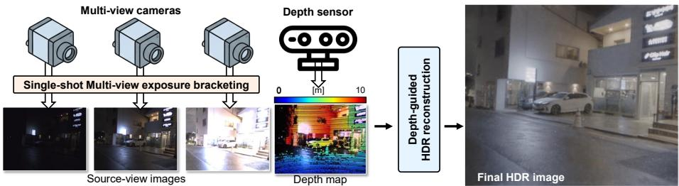  
Fig. 1: Overview. To efectively expand the achievable dynamic range, DMEB distributes drastically diferent exposures across multi-view cameras, facilitating robust, real-time HDR reconstruction through depth-guided fusion.

To our knowledge, no public dataset provides calibrated multi-view images captured simultaneously with drastically diferent exposures and paired with aligned depth, making it dificult to evaluate spatially distributed exposure bracketing as an alternative to temporal bracketing and specialized HDR sensors. We address this gap by constructing a dataset for multi-view varying-exposure HDR reconstruction with aligned depth. The dataset spans three complementary sources: a robotic vision dataset for controlled real-world evaluation across camera counts and depth modalities, an iPhone dataset for compact consumer devices, and a synthetic dataset with rendered HDR ground truth for extreme-DR stress testing. Together, these sources provide synchronized multi-view images with complementary exposures and depth across real, consumer, and simulated settings, establishing a testbed that was previously unavailable.

As a baseline method for this dataset, we introduce Depth-guided Multi-view Exposure Bracketing (DMEB). DMEB reconstructs an HDR image in a single shot by distributing exposure settings across synchronized cameras rather than across time. It uses aligned depth, such as LiDAR or active stereo, to warp diferently exposed images into a reference view and performs confidence-aware fusion. This geometry-guided formulation allows substantially larger exposure diferences than photometric matching alone, thereby expanding the recoverable dynamic range within a single capture.

Evaluations on the dataset show that calibrated multi-view cameras with complementary exposures, together with depth, provide a practical alternative to temporal bracketing and specialized HDR sensors for single-shot HDR perception. The datasets and code are publicly available at https://divisonofficer. github.io/dmeb.

Our technical contributions are summarized as follows:

– We introduce a multi-view varying-exposure HDR dataset collected across three platforms—a robotic vision rig, a consumer smartphone, and a synthetic renderer—with synchronized images captured under drastically different exposures and paired with calibrated depth measurements, enabling evaluation across camera counts and depth modalities.

– We provide Depth-guided Multi-view Exposure Bracketing (DMEB) as a baseline method for this dataset, replacing temporal bracketing with depthguided multi-view fusion for single-shot HDR reconstruction under large exposure gaps.

## 2 Related Work

Exposure Bracketing. Exposure bracketing captures multiple LDR images with varying exposures from a single camera and fuses them into an HDR image [8, 9,14,32,36,45]. While this method performs well for stationary scenes and cameras, it struggles with dynamic scenes, as sequentially captured frames exhibit motion-induced misalignment. To mitigate this issue, prior works align frames via correspondence matching using patches [37], flow [2,17–19,47,52], or, more recently, attention [26,35,39,48,49]. However, correspondence estimation between images with drastically diferent exposures is fundamentally unreliable. Consequently, these methods resort to using similar exposures between frames, which severely limits the achievable dynamic range expansion. In contrast, DMEB successfully leverages vastly diferent exposures across multi-view cameras to achieve substantial dynamic range expansion.

Multi-camera HDR Imaging. Previous research considered distributing diferent exposures across multiple cameras [5,22,34,40,51]. However, because diferentlyexposed images need to be aligned, they restrict the exposure diferences across cameras to maintain photometric multi-view consistency, which in turn limits dynamic range expansion. DMEB overcomes this limitation by leveraging depth obtained from an external sensor, allowing for using drastically-diferent exposures for efective dynamic range expansion.

Specialized Cameras for HDR Imaging. Specialized sensors and optics directly enhance per-frame dynamic range. Pixel- or readout-level approaches, including multi-exposure Bayer patterns [6,28,42], variable quantization schemes [24], and multi-gain readouts [4, 15, 21, 33, 43], integrate single-shot HDR capability into sensor hardware. However, they sufer from amplified noise, limited range expansion, and high system cost. Beam-splitter-based multi-camera systems sacrifice half of the incoming light and dificult to scale beyond two cameras [20,44]. PSFengineered optics for HDR imaging encode intensity variations across the PSF, enabling single-shot HDR reconstruction [1,31,41]. However, they sacrifice image spatial resolution. In contrast, DMEB ofers robust single-shot HDR utilizing a sensor suite that is becoming ubiquitous in robots and mobile devices: standard multi-view, low-bit-depth cameras paired with a depth sensor.

Datasets for HDR Imaging. While the widely used HDR benchmarks rely on exposure bracketing, they are primarily designed for single-camera setups [3, 16, 25, 38, 53]. Although a public HDR dataset for stereo cameras exists [5], it does not contain images with varying exposures between cameras at a time.

Our datasets are constructed to enable testing of DMEB that require varyingexposure multi-view cameras. Moreover, it supports testing DMEB with varying number of cameras and diverse depth-sensing modalities.

## 3 Depth-guided Multi-view Exposure Bracketing

Given synchronized low-bit-depth images captured with complementary exposures and an aligned depth measurement, DMEB reconstructs an HDR image in a selected reference-camera view. The pipeline consists of three steps: multi-view exposure control, depth- and confidence-guided fusion, and HDR refinement.

## 3.1 Multi-view Exposure Control

Figure $2 ( \mathrm { a } )$ illustrates our multi-view exposure control strategy. Given the previousframe multi-view images $\{ I _ { i } ^ { * } \} _ { i = 1 } ^ { N }$ and their corresponding exposure settings $\{ \xi _ { i } ^ { * } \} _ { i = 1 } ^ { N }$ we determine the current-frame exposure settings $\{ \xi _ { i } \} _ { i = 1 } ^ { N }$ across the N multiview cameras. To adapt to illumination changes, we update the exposure $\xi _ { i }$ for the i-th camera to achieve a target mean intensity $m _ { i } { : }$

$$
\xi _ { i } \gets \mathrm { c l i p } \left( \xi _ { i } \frac { m _ { i } } { m _ { i } ^ { * } } , \xi _ { \mathrm { m i n } } , \xi _ { \mathrm { m a x } } \right) ,\tag{1}
$$

where $m _ { i } ^ { * }$ is the mean intensity of the previous-frame image from the i-th camera, and clip(·) restricts the exposure within the sensor-defined hardware limits, $\xi _ { \mathrm { m i n } }$ and $\xi _ { \mathrm { m a x } }$ . The target mean intensities are geometrically spaced between a low and high target brightness, with $m _ { 1 } = 0 . 0 5$ and $m _ { N } = 0 . 8 \mathrm { : }$

$$
\log m _ { i } = \log m _ { 1 } + \frac { i - 1 } { N - 1 } \big ( \log m _ { N } - \log m _ { 1 } \big ) .\tag{2}
$$

Given the computed exposure settings $\{ \xi _ { i } \} _ { i = 1 } ^ { N }$ , we capture the corresponding LDR images $\{ I _ { i } \} _ { i = 1 } ^ { \hat { N } }$ from the multi-view cameras and simultaneously acquire depth $D$ from the depth sensor. The exposure $\xi _ { i }$ is set to the camera by converting the exposure value into exposure time $\tau _ { i }$ and gain $g _ { i }$ as

$$
\tau _ { i } = \operatorname* { m i n } ( \xi _ { i } , \tau _ { \operatorname* { m a x } } ) , \quad g _ { i } = \operatorname* { m a x } \big ( 1 , \operatorname* { m i n } ( g _ { \operatorname* { m a x } } , \xi _ { i } / \tau _ { i } ) \big ) ,\tag{3}
$$

where $\tau _ { \mathrm { m a x } }$ denotes the maximum stable exposure time supported by the system (approximately 50 ms for 8 FPS operation), and $g _ { \mathrm { m a x } }$ is the sensor-imposed upper gain limit.

## 3.2 Depth-guided HDR Reconstruction

Using the depth maps and images, we reconstruct an HDR image $H _ { t }$ for a target view t, which we set to be $t = N / 2$ in our experiments.

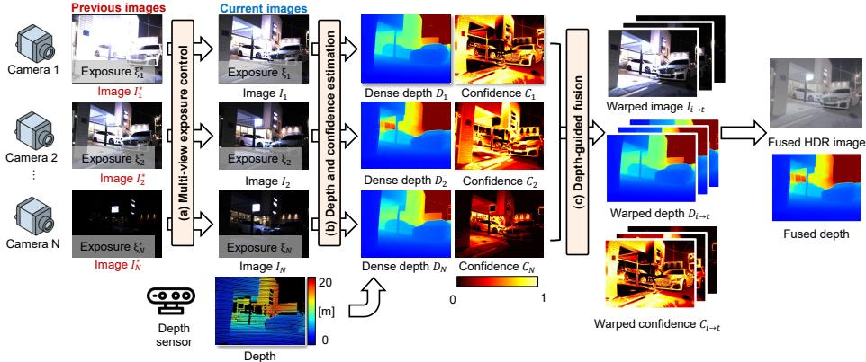  
Fig. 2: Exposure control and HDR reconstruction. (a) By analyzing previousframe images, we control exposures of multi-view cameras. (b) We densify the depth measurements and compute confidence for fusion. (c) Guided by the dense depth, we warp the source images, depths, and confidences to the reference view, performing a confidence-aware fusion to reconstruct the final HDR image and fused depth map.

Dense Depth. We first warp the raw depth $D$ to each camera, producing a percamera depth map $D _ { i }$ . Next, we estimate a dense depth map $\hat { D } _ { i }$ utilizing a pretrained monocular depth prior [50], while preserving the metric scale guided by the sparse depth $D _ { i }$ via scale estimation, inspired by previous work [12]. Figure 2(b) shows the dense depth.

Confidence Estimation. We compute a per-pixel confidence map $C _ { i }$ to downweight unreliable measurements (e.g., saturation, under-exposure noise, and occlusions) during the HDR reconstruction process. We estimate this confidence as:

$$
C _ { i } = f _ { \mathrm { t r a p e z o i d } } ( I _ { i } ) \cdot f _ { \mathrm { C N N } } ( I _ { i } , \hat { D } _ { i } ) ,\tag{4}
$$

where $f _ { \mathrm { t r a p e z o i d } }$ is an intensity-based trapezoid function [9] and $f _ { \mathrm { C N N } } ( I _ { i } , \hat { D } _ { i } )$ is a convolutional neural network detailed in the Supplementary Material. Figure $2 ( \mathrm { b } )$ shows the estimated confidence maps.

Depth-guided Fusion. We use the dense depth $\hat { D } * t$ to warp the per-view depth map, confidence map, and image to a fixed reference view t. This results in aligned sets of images $I * i \to t * i = 1 ^ { N }$ , depths $\hat { D } * i \to t * i = 1 ^ { N }$ , and confidences $C * i \to t _ { i = 1 } ^ { N }$ , as shown in Fig. 2(c). We then merge the warped depth maps and images into a single fused depth $\dot { D } _ { t }$ and an HDR image $H _ { t }$ as

$$
\dot { D } _ { t } = \frac { \sum _ { i } C _ { i  t } \hat { D } _ { i  t } } { \sum _ { i } C _ { i  t } + \epsilon } , H _ { t } = \frac { \sum _ { i } ( C _ { i  t } V _ { i  t } ) \frac { I _ { i  t } } { \tau _ { i } g _ { i } } } { \sum _ { i } ( C _ { i  t } V _ { i  t } ) + \epsilon } ,\tag{5}
$$

where ϵ is a small constant and $V _ { i  t }$ is a soft visibility mask computed via depth consistency:

$$
V _ { i  t } = \sigma \Bigg ( \frac { ( \dot { D } _ { t } + \delta ) - \hat { D } _ { i  t } } { \tau _ { \mathrm { r e l } } \cdot ( \dot { D } _ { t } + \varepsilon ) } \Bigg ) + w _ { \mathrm { f l o o r } } ,\tag{6}
$$

Here, δ is a depth margin (set to 1 m in all experiments) to absorb cross-view misalignment. The parameter $\tau _ { \mathrm { r e l } }$ controls the tolerance to relative depth variations, ε avoids division by zero, and $\sigma ( \cdot )$ denotes the logistic function. A small constant $w _ { \mathrm { f l o o r } } \mathrm { ~ = ~ } 0 . 0 5$ ensures that no pixels are entirely excluded from the fusion. The reconstructed HDR image is defined in the reference-camera view point. During warping, a source view contributes only where its projection is valid in the source image and geometrically consistent with the reference view. Invalid or unreliable observations are therefore assigned low weight through the confidence and visibility terms before refinement. Figure $2 ( \mathrm { c ) }$ illustrates this fusion step, which produces the fused HDR image $H _ { t }$ and depth $\dot { D } _ { t }$ . Refer to Sec. 2 of the Supplementary Material for further details.

Refinement. To refine the fused HDR image $H _ { t }$ , we map it to a tonemapped space using the µ-law tone mapper [16]. To properly handle the extreme dynamic range expansion achieved by our method, we generate three distinct tonemapped images using $\mu _ { 1 } = 1 0 ^ { 3 } , \mu _ { 2 } = 5 \times 1 0 ^ { 4 }$ , and $\mu _ { 3 } = 1 0 ^ { 6 }$ , representing diferent exposure levels. To combine these three tonemapped images, we employ a transformer network. The output HDR image is converted back to the linear intensity domain using the inverse µ-law function, resulting in our final HDR estimate. Refer to the Supplementary Material for details.

Training. Our trainable components consist of the confidence-estimation network and the HDR refinement network. We train these models using our newly proposed datasets, detailed in the following section, applying a 9:1 train/test split. The training process begins with a pretraining phase on 40k synthetic scenes for 50 epochs. In this stage, we optimize based on both the final HDR and depth estimates; the HDR reconstruction is supervised via an $\ell _ { 1 }$ loss, SSIM, and a gradient loss within the µ-law tone-mapped domain [16], whereas the depth reconstruction utilizes an $\ell _ { 1 }$ loss alongside a SILog loss [11]. Following this, we fine-tune both networks on 10k real scenes for 10 epochs, relying on the HDR reconstruction losses. All optimizations are carried out using Adam with a learning rate of $1 0 ^ { - 4 }$

## 4 Datasets

## 4.1 Robot Vision Dataset

Setup. To evaluate the proposed DMEB framework, we constructed the custom robotic vision platform shown in Figure $\mathrm { 3 ( a ) }$ . While DMEB requires a minimum of only two cameras, our platform integrates six 12-bit LDR cameras (Lucid Triton TRI032S-CC) to facilitate testing with varying camera counts, along with two 24-bit HDR cameras (Lucid Triton TRI054S) that serve as pseudo-ground truth references. Furthermore, we equipped the system with an active-stereo depth sensor (Intel RealSense D455) and a LiDAR (Ouster OS1). These provide complementary depth characteristics, allowing us to analyze the impact of the chosen depth modality. All sensors are synchronized, geometrically calibrated, and configured with overlapping fields of view. Figure 3(b) visualizes the field-ofview coverage of each camera and depth sensor in our setup. The imaging system is mounted on a Ranger Mini 2.0 four-wheeled mobile base and operated via a laptop. Further system and calibration details are provided in the Supplementary Material.

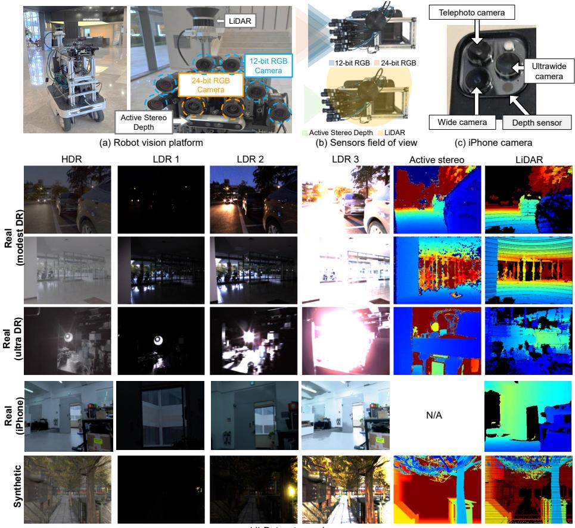  
Fig. 3: Systems and Datasets. We test DMEB on two real-world systems: (a) a robotic vision platform featuring multiple sensors with (b) shared fields of view, and (c) an iPhone equipped with three cameras and LiDAR. (d) Using these systems and a synthetic renderer, we present datasets consisting of multi-view LDR images with varying exposures, HDR reference images, and depth maps.

Dataset. Using the robotic vision platform, we collected two types of real-world datasets, which are the main datasets for real-world evaluation. The real (modest DR) dataset contains 31 scenes and 15,000 frames captured while the robot was in motion. The real (ultra DR) dataset comprises 80 static scenes captured without robot motion, providing high-quality ground-truth HDR images for each camera view using temporal exposure bracketing. Figure 3(d) shows sample data. Please refer to the Supplementary Material for detailed statistics of the dataset.

## 4.2 Synthetic Dataset

Beyond serving as training data, our synthetic dataset functions as an extremeground-truth benchmark: it provides rendered HDR reference images, metric depth, and sensor-like depth inputs under illumination ranges that are dificult to capture reliably with real hardware.

We created this dataset using the CARLA simulator [10], rendering multiview HDR images and depth maps across six simulation environments. These scenes span diverse lighting conditions (day, dusk, and night) with randomized weather, trafic, and spatial layouts, resulting in 20 video sequences of 15,000 frames in total.

Figure 3(d) shows sample synthetic data. We store the rendered HDR frames in the same EXR format and camera configuration as our real dataset, using an 8-camera rig with matched intrinsics/extrinsics. The simulator provides groundtruth metric depth for every view, and we additionally render sensor-like inputs including sparse LiDAR depth and active-stereo depth maps to mirror our real capture pipeline.

This synthetic dataset allows us to test HDR reconstruction under controlled exposure spacing, depth noise, and scene motion. In particular, the rendered HDR ground truth exceed 150 dB efective dynamic range, making it a testbed for extreme-DR evaluation.

## 4.3 iPhone Dataset

To demonstrate that DMEB can be applied to everyday consumer devices, we also acquired a dataset using an iPhone 13 Pro, which features three LDR cameras (wide, ultrawide, and telephoto) and a LiDAR sensor. Using this setup, we captured a small-scale dataset containing 10 scenes. Figure 3(c) illustrates the camera specification of iPhone device that is used for our iPhone dataset. Figure 3(d) shows sample data. For each scene, we capture exposure-bracketed bursts on all three cameras by sweeping the shutter time over six levels from 0.01 ms to 100 ms, producing LDR inputs at multiple exposure settings. We construct a reference HDR image by merging each burst [9], which serves as groundtruth HDR supervision. Each sample additionally includes the iPhone LiDAR measurement, providing a low-resolution depth map aligned to the camera views.

<table><tr><td rowspan="2">Bracketing Method</td><td rowspan="2"></td><td rowspan="2">Speed (FPS) ↑</td><td colspan="2">Real (Modest DR)</td><td colspan="3">Real (Ultra DR)</td></tr><tr><td>[PSNR-µ SSIM-µ HDR-VDP|PSNR-µ SSIM-µ HDR-VDP</td><td></td><td></td><td></td><td></td></tr><tr><td rowspan="5">Multi-shot single-camera</td><td>HDR Transformer [26]</td><td>1.189</td><td>31.26 0.859</td><td>9.64</td><td>N/A</td><td>N/A</td><td>N/A</td></tr><tr><td>SAFNet [19]</td><td>53.937</td><td>25.04 0.633</td><td>6.32</td><td>N/A</td><td>N/A</td><td>N/A</td></tr><tr><td>HDRFlow [47]</td><td>77.519</td><td>28.89 0.557</td><td>7.75</td><td>N/A</td><td>N/A</td><td>N/A</td></tr><tr><td>AFUNet [23]</td><td>0.795</td><td>29.64 0.806</td><td>9.18</td><td>N/A</td><td>N/A</td><td>N/A</td></tr><tr><td>DMEB (ours)</td><td>13.073</td><td>30.72 0.833</td><td>9.45</td><td>N/A</td><td>N/A</td><td>N/A</td></tr><tr><td rowspan="5">Single-shot multi-camera</td><td>HDR Transformer [26]</td><td>1.189</td><td>33.61</td><td>0.872 9.64</td><td>38.74</td><td>0.848</td><td>9.40</td></tr><tr><td>SAFNet [19]</td><td>53.937</td><td>30.96</td><td>0.644 7.72</td><td></td><td>27.39 0.769</td><td>9.06</td></tr><tr><td>HDRFlow [47]</td><td>77.519</td><td>27.09 0.541</td><td>6.29</td><td>27.44</td><td>0.617</td><td>8.95</td></tr><tr><td>AFUNet [23]</td><td>0.795</td><td>32.25 0.819</td><td>9.18</td><td>34.69</td><td>0.877</td><td>9.39</td></tr><tr><td>DMEB (ours)</td><td>13.073</td><td>39.40 0.916</td><td>9.69</td><td>39.17</td><td>0.868</td><td>9.16</td></tr></table>

Table 1: Quantitative comparison. We compare multi-shot single-camera and synchronized single-shot multi-camera configurations using three inputs.

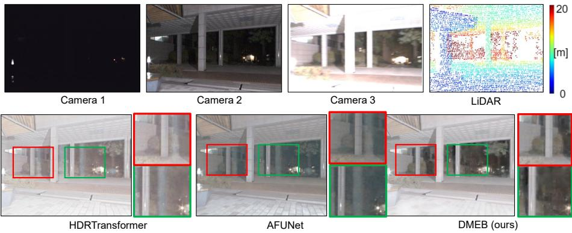  
Fig. 4: Comparison with Matching-based HDR. Given three images captured with drastically diferent exposures alongside LiDAR depth, DMEB enables accurate HDR reconstruction. In contrast, HDRTransformer and AFUNet result in reconstruction artifacts.

## 5 Results

Comparison. We compare DMEB against state-of-the-art exposure-bracketing HDR reconstruction networks that take three diferently exposed inputs [19, 23, 27, 47]. All baselines are trained from scratch using the same train/test split, resolution, exposure setting, valid masks, and metric domain. We assess performance under two configurations: (1) multi-shot single-camera reconstruction using sequential frames synthesized from ground-truth HDR at varying exposures, and (2) single-shot multi-camera reconstruction using synchronized multi-view inputs with diferent exposures.

Table 1 summarizes quantitative results for both configurations on the real datasets using three input images. DMEB outperforms previous methods in most evaluation metrics including PSNR, SSIM, and HDR-VDP, while sustaining over 10 FPS reconstruction speed, enabling reliable HDR imaging for dynamic scenes. Additional results for alternative exposure settings and synthetic scenes are included in Sec. S.6 of the Supplementary Material.

(c) Results with active-stereo depth  
(b) Results with optical flow (no depth input)  
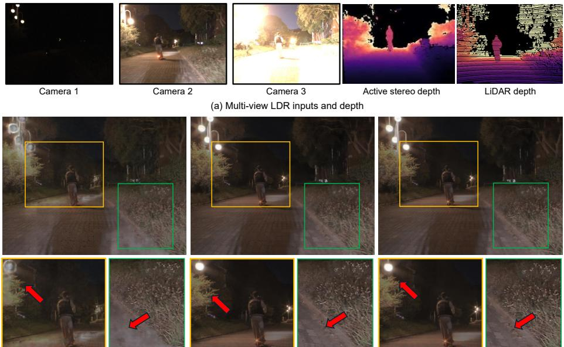  
Fig. 5: Importance of depth and evaluation with diferent depth modalities. DMEB provides robust reconstruction accuracy using either active-stereo or LiDAR depth. However, when depth is not provided and optical flow is used instead for photometric matching, HDR reconstruction fails due to the drastically diferent exposure gaps between cameras.

Figure 4 presents a qualitative comparison under the single-shot multi-camera setting with HDRTransformer [26], a baseline that ofers strong reconstruction accuracy but operates at only about 1 FPS. All HDR results are shown using a fixed tone-mapping operator. HDRTransformer produces artifacts due to large exposure gaps across views. In contrast, DMEB delivers higher-fidelity reconstruction and substantially broader DR recovery even with only three cameras.

Single-shot Multi-camera Inputs vs. Multi-shot Single-camera Inputs. Table 1 allows us to compare the same HDR reconstruction methods under two input settings: multi-shot single-camera and synchronized single-shot multi-camera. For HDRTransformer, changing only the input setting improves PSNR-µ from 31.26 to 33.61,dB; for AFUNet, it improves from 29.64 to 32.25,dB. This indicates that single-shot multi-camera setup is beneficial beyond DMEB itself. DMEB further leverages this setting with depth-guided fusion, reaching 39.40,dB in the single-shot multi-camera setting.

Impact of Depth Guidance. Fig. 5 shows that both active-stereo and LiDAR depth provide reliable geometric guidance, whereas optical flow struggles to align multi-view images with large exposure diferences. Tab. 2 further reports a geometry-source ablation on the real (modest DR) dataset, showing a consistent

<table><tr><td>Metric</td><td>Flow</td><td>Mono</td><td>LiDAR-SV</td><td>LiDAR-MV (ours)</td></tr><tr><td>PSNR-µ</td><td>35.84</td><td>37.09</td><td>37.90</td><td>39.40</td></tr></table>

Table 2: Geometry guidance ablation on the real (modest DR) dataset. We compare optical flow without depth, monocular depth, single-view LiDAR-anchored depth, and our full multi-view LiDAR-guided fusion. SV and MV denote single-view and multi-view fusion, respectively.

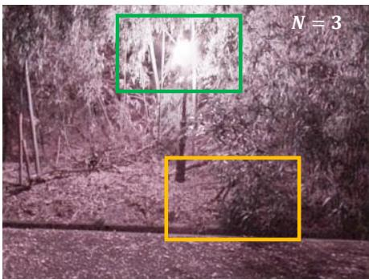

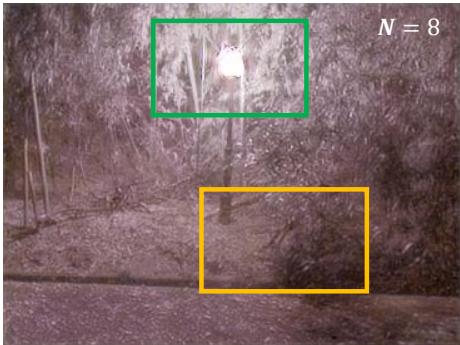

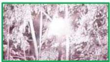

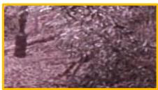

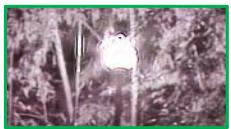

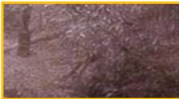

(a) HDR quality from impact of camera count under exposure configurations  
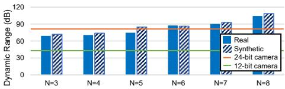

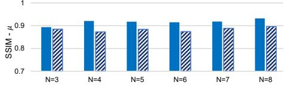  
(b) HDR performance with respect to the number of cameras  
Fig. 6: Impact of camera count. (a) Qualitative comparison of HDR reconstruction using N = 3 and N = 8 cameras. With three cameras, the bright light source remains saturated, whereas expanding the system to eight cameras successfully resolves the underlying details of the light source. (b) Quantitative evaluation demonstrates that the achievable dynamic range expands with the number of cameras, while structural consistency (SSIM) remains stable.

PSNR-µ improvement as the depth source moves from photometric correspondence (optical flow) to metric depth, peaking with full multi-view LiDAR-guided fusion. These results indicate that metric depth, rather than photometric correspondence alone, is essential for robust multi-view exposure fusion.

Number of Cameras. We investigate the impact of scaling the number of cameras on the overall HDR reconstruction performance of our proposed DMEB framework. To achieve this, we vary the camera count from three to eight by combining images from the six LDR cameras with two LDR-converted images derived from the HDR cameras (details regarding this conversion are provided in the Supplementary Material). Figure 6(b) quantitatively demonstrates that the achievable dynamic range expands with the addition of cameras, which will plateau when hardware-imposed shutter limits are reached across both real and synthetic datasets. Concurrently, the structural integrity, measured via SSIM, is maintained. From a qualitative perspective, Figure $6 ( \mathrm { a } )$ shows that a threecamera setup $( N = 3 )$ sufers from saturation in intensely illuminated regions. In contrast, scaling the system to eight cameras $( N = 8 )$ efectively recovers the underlying details of the bright light source.

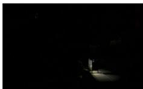  
Camera 1

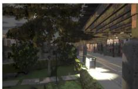  
Camera 2

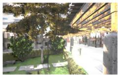  
Camera 3

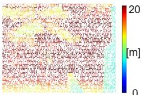  
LiDAR

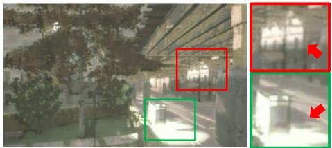  
HDRTransformer

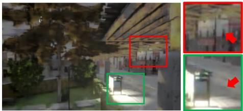  
DMEB (ours)

Fig. 7: Evaluation on the synthetic dataset. Qualitative comparison between HDRTransformer [26] and DMEB (ours) under the single-shot three-view setting. Red and green boxes indicate cropped regions; zoom-ins are shown on the right, and arrows highlight DMEB outperforms HDRTransformer.
<table><tr><td>Method</td><td>FPS↑</td><td> $\mathrm { P S N R } { - } \mu$ </td><td> $\operatorname { S S I M } { - \mu }$ </td><td>HDR-VDP</td></tr><tr><td>HDR Transformer [26]</td><td>1.19</td><td>32.65</td><td>0.830</td><td>8.20</td></tr><tr><td>SAFNet [19]</td><td>53.94</td><td>28.21</td><td>0.687</td><td>6.25</td></tr><tr><td>HDRFlow [47]</td><td>77.52</td><td>26.33</td><td>0.475</td><td>7.12</td></tr><tr><td>AFUNet [23]</td><td>0.80</td><td>33.52</td><td>0.830</td><td>8.02</td></tr><tr><td>DMEB (ours)</td><td>9.76</td><td>34.72</td><td>0.885</td><td>8.29</td></tr></table>

Table 3: Quantitative comparison on the synthetic benchmark. The synthetic ground truth exceeds 150 dB efective dynamic range, exercising the extreme regime where single-sensor capture saturates. DMEB, achieves the best reconstruction quality.

Results on the Synthetic Dataset. Figure 7 and table 3 report qualitative and quantitative results on our synthetic benchmark. We compare our method against AFUNet [23]. As highlighted in the cropped zoom-ins and arrow annotations, AFUNet exhibits residual ghosting near high-contrast boundaries, due to the large exposure gaps between images. In contrast, our method produces cleaner reconstructions with sharper structures and fewer halo/bleeding artifacts. These results indicate that DMEB remains robust even under extreme exposure variations.

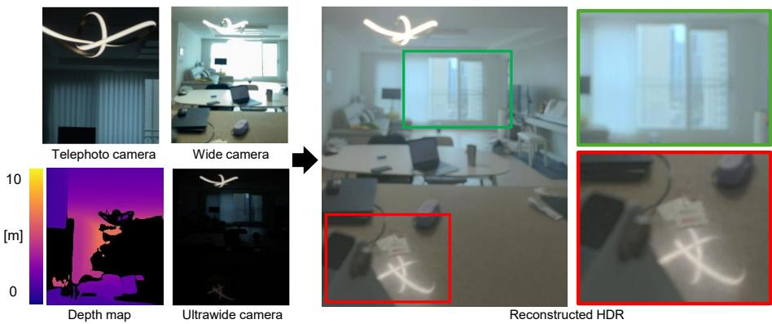

Fig. 8: Single-shot HDR imaging using an iPhone. By leveraging the built-in sensors of an iPhone 13 Pro (telephoto, wide, and ultrawide cameras, plus LiDAR), DMEB improves reconstruction quality of HDR image. Illustrated here from the ultrawide viewpoint for HDR reconstruction, our method demonstrates potential for high-quality single-shot HDR imaging on consumer electronics.
<table><tr><td>Method</td><td>iPhone</td><td>Choi [5] 2-view</td></tr><tr><td>HDR Transformer [26]</td><td>23.35</td><td>26.33</td></tr><tr><td>AFUNet [23]</td><td>25.21</td><td>25.39</td></tr><tr><td>DMEB (ours)</td><td>26.12</td><td>33.00†</td></tr></table>

Table 4: Cross-platform and cross-dataset evaluation. We report PSNR-µ on common-overlap iPhone regions and the external two-view dataset of Choi [5]. † denotes zero-shot evaluation without retraining.

Results on Consumer and External Datasets. We further evaluate DMEB beyond our primary dataset from robotic setup to assess its cross-platform and cross-dataset generality. First, we test on the iPhone dataset, where a singleshot measurement comprises three images with varying fields of view and corresponding LiDAR depth. Because the three cameras share only a partial field of view, we evaluate all methods on the common-overlap regions using a valid mask, and compare HDR Transformer, AFUNet, and our three-view DMEB (Tab. 4). DMEB achieves the highest PSNR, indicating that modern mobile devices equipped with standard multi-view cameras and a depth sensor can substantially expand their dynamic range using our approach. Figure 8 shows a qualitative iPhone example. Second, to verify that DMEB does not require our full custom rig, we apply it in a zero-shot manner to the external two-view depth setting of Choi [5], without any retraining or fine-tuning. DMEB transfers directly to this setting, reaching 33.00 dB and outperforming HDR Transformer and AFUNet by a clear margin (Tab. 4), confirming that the method generalizes to sensor configurations beyond those used for training.

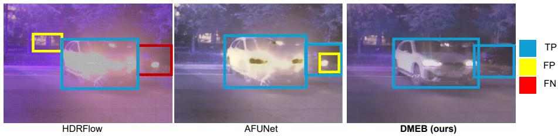  
Fig. 9: Downstream object detection comparison. While strong headlights prevent matching-based methods like HDRFlow and AFUNet from accurately recovering the car’s shape, DMEB preserves critical structural details. This improved HDR reconstruction quality from DMEB directly translates to accurate object detection. TP: true positive, FP: false positive, FN: false negative.

Object Detection with an HDR Image. To determine if our high-quality HDR reconstruction translates to improved downstream perception, we evaluate object detection using YOLOv8 on our 90 manually annotated real-world frames. DMEB improves Recall/F1 to 0.83/0.73, compared with 0.78/0.63 for HDRFlow and 0.81/0.67 for AFUNet. Figure 9 qualitatively demonstrates this advantage: whereas the strong glare from a car’s headlights causes HDRFlow and AFUNet to fail at recovering the vehicle’s shape, our method successfully preserves the structural details necessary to detect two cars.

## 6 Conclusion

We introduced a multi-view varying-exposure HDR dataset with calibrated depth measurements, collected using a robotic capture platform, an iPhone, and a synthetic renderer. Together, these data sources cover real robotic scenes, compact consumer-device captures, and controlled extreme-DR synthetic scenes. We also presented DMEB as a baseline method, demonstrating that geometry-guided fusion can efectively combine synchronized views captured with large exposure gaps. Evaluations on our dataset demonstrate that DMEB validates the efectiveness of this camera rig configuration for robust HDR perception in diverse multi-camera and depth sensor systems.

Future Work. A fundamental requirement of our current system is that the multi-view cameras and depth sensors must share overlapping fields of view to efectively expand the dynamic range. To build upon this, future research could explore transitioning from 2D HDR image reconstruction to a comprehensive 3D HDR scene representation, accumulating HDR features directly onto the underlying 3D spatial geometry.

## Acknowledgement

This work was supported by the National Research Foundation of Korea (NRF) grant funded by the Korea government (MSIT) (RS-2023-00211658); Samsung

Electronics Co., Ltd (IO251210-14286-01); and Institute of Information & Communications Technology Planning & Evaluation (IITP) grants funded by the Korea government (MSIT) (IITP-2026-RS-2024-00437866 for ITRC, RS-2024- 0045788, and RS-2019-II191906 for the Artificial Intelligence Graduate School Program at POSTECH).

## References

1. Brookshire, C., Liu, Y., Chen, Y., Chen, W.T., Guo, Q.: Metahdr: single shot highdynamic range imaging and sensing using a multifunctional metasurface. Optics Express 32(15), 26690–26707 (2024)

2. Catley-Chandar, S., Tanay, T., Vandroux, L., Leonardis, A., Slabaugh, G., Pérez-Pellitero, E.: Flexhdr: Modeling alignment and exposure uncertainties for flexible hdr imaging. IEEE Transactions on Image Processing 31, 5923–5935 (2022)

3. Chen, G., Chen, C., Guo, S., Liang, Z., Wong, K.Y.K., Zhang, L.: Hdr video reconstruction: A coarse-to-fine network and a real-world benchmark dataset. In: Proceedings of the IEEE/CVF International Conference on Computer Vision (ICCV). pp. 2502–2511 (October 2021)

4. Cho, S., Hong, H.S., Han, H., Choi, Y.: Alternating line high dynamic range imaging. In: 2011 17th International Conference on Digital Signal Processing (DSP). pp. 1–6. IEEE (2011)

5. Choi, J., Kim, J., Choi, S., Lee, J., Brucker, S., Bijelic, M., Heide, F., Baek, S.H.: Dual exposure stereo for extended dynamic range 3d imaging. In: Proceedings of the Computer Vision and Pattern Recognition Conference. pp. 6283–6293 (2025)

6. Corporation, S.S.S.: Imx490 cmos image sensor for automotive (type 1/1.55): Product specifications. Technical Report Version 1.0a, Sony Semiconductor Solutions Corporation (Jan 2019), https://www.sony-semicon.com/files/62/pdf/p-15\_IMX490.pdf

7. Cui, J., Cao, J., Zhao, F., He, Z., Chen, Y., Zhong, Y., Xu, L., Shi, Y., Zhang, Y., Yu, J.: Letsgo: Large-scale garage modeling and rendering via lidar-assisted gaussian primitives. ACM Transactions on Graphics (TOG) 43(6), 1–18 (2024)

8. Debevec, P., Hawkins, T., Tchou, C., Duiker, H.P., Sarokin, W., Sagar, M.: Acquiring the reflectance field of a human face. In: Proceedings of the 27th annual conference on Computer graphics and interactive techniques. pp. 145–156 (2000)

9. Debevec, P.E., Malik, J.: Recovering high dynamic range radiance maps from photographs. In: Seminal Graphics Papers: Pushing the Boundaries, Volume 2, pp. 643–652 (2023)

10. Dosovitskiy, A., Ros, G., Codevilla, F., Lopez, A., Koltun, V.: CARLA: An open urban driving simulator. In: Proceedings of the 1st Annual Conference on Robot Learning. pp. 1–16 (2017)

11. Eigen, D., Puhrsch, C., Fergus, R.: Depth map prediction from a single image using a multi-scale deep network. Advances in neural information processing systems 27 (2014)

12. Fan, R., Ma, T., Li, Z., An, N., Cheng, J.: Region-aware depth scale adaptation with sparse measurements. arXiv preprint arXiv:2507.14879 (2025)

13. Geiger, A., Lenz, P., Urtasun, R.: Are we ready for autonomous driving? the kitti vision benchmark suite. In: 2012 IEEE conference on computer vision and pattern recognition. pp. 3354–3361. IEEE (2012)

14. Granados, M., Ajdin, B., Wand, M., Theobalt, C., Seidel, H.P., Lensch, H.P.: Optimal hdr reconstruction with linear digital cameras. In: 2010 IEEE computer society conference on computer vision and pattern recognition. pp. 215–222. IEEE (2010)

15. Hajisharif, S., Kronander, J., Unger, J.: Adaptive dualiso hdr reconstruction. EURASIP Journal on Image and Video Processing 2015(1), 41 (2015)

16. Kalantari, N.K., Ramamoorthi, R.: Deep high dynamic range imaging of dynamic scenes. ACM Transactions on Graphics 36(4) (2017). https://doi.org/10.1145/3072959.3073609

17. Kalantari, N.K., Ramamoorthi, R.: Deep hdr video from sequences with alternating exposures. In: Computer graphics forum. vol. 38, pp. 193–205. Wiley Online Library (2019)

18. Kalantari, N.K., Shechtman, E., Barnes, C., Darabi, S., Goldman, D.B., Sen, P.: Patch-based high dynamic range video. ACM Trans. Graph. 32(6), 202–1 (2013)

19. Kong, L., Li, B., Xiong, Y., Zhang, H., Gu, H., Chen, J.: Safnet: Selective alignment fusion network for eficient hdr imaging. In: European Conference on Computer Vision. pp. 256–273. Springer (2024)

20. Kronander, J., Gustavson, S., Bonnet, G., Ynnerman, A., Unger, J.: A unified framework for multi-sensor hdr video reconstruction. Signal Processing: Image Communication 29(2), 203–215 (2014)

21. Lee, D.Y., Eom, T.H., Kim, H.J.: Adaptive column-wise multi-gain hdr cmos image sensor for single-shot hdr imaging. IEEE Transactions on Circuits and Systems I: Regular Papers (2025)

22. Li, W., Cao, T., Liu, C., Tian, X., Li, Y., Wang, X., Dong, X.: Dual-lens hdr using guided 3d exposure cnn and guided denoising transformer. ACM Transactions on Multimedia Computing, Communications and Applications 19(5), 1–20 (2023)

23. Li, X., Ni, Z., Yang, W.: Afunet: Cross-iterative alignment-fusion synergy for hdr reconstruction via deep unfolding paradigm. arXiv preprint arXiv:2506.23537 (2025)

24. Liu, C., Bainbridge, L., Berkovich, A., Chen, S., Gao, W., Tsai, T.H., Mori, K., Ikeno, R., Uno, M., Isozaki, T., et al.: A 4.6 µm, 512× 512, ultra-low power stacked digital pixel sensor with triple quantization and 127db dynamic range. In: 2020 IEEE International Electron Devices Meeting (IEDM). pp. 16–1. IEEE (2020)

25. Liu, S., Zhang, X., Sun, L., Liang, Z., Zeng, H., Zhang, L.: Joint hdr denoising and fusion: A real-world mobile hdr image dataset. In: Proceedings of the IEEE/CVF Conference on Computer Vision and Pattern Recognition (CVPR). pp. 13966– 13975 (June 2023)

26. Liu, Z., Wang, Y., Zeng, B., Liu, S.: Ghost-free high dynamic range imaging with context-aware transformer. In: European Conference on computer vision. pp. 344– 360. Springer (2022)

27. Liu, Z., Wang, Y., Zeng, B., Liu, S.: Ghost-free high dynamic range imaging with context-aware transformer. In: European Conference on computer vision. pp. 344– 360. Springer (2022)

28. LUCID Vision Labs, I.: Hdr imaging for automotive sensing applications: Triton hdr camera with altaview tone mapping (version 1.0). Technical report, LU-CID Vision Labs, Inc. (2023), https://dce9ugryut4ao.cloudfront.net/LUCID-TritonHDR-AltaView-White-Paper.pdf

29. Mao, J., Shi, S., Wang, X., Li, H.: 3d object detection for autonomous driving: A comprehensive survey. International Journal of Computer Vision 131(8), 1909– 1963 (2023)

30. Menze, M., Geiger, A.: Object scene flow for autonomous vehicles. In: Proceedings of the IEEE conference on computer vision and pattern recognition. pp. 3061–3070 (2015)

31. Metzler, C.A., Ikoma, H., Peng, Y., Wetzstein, G.: Deep optics for single-shot high-dynamic-range imaging. In: Proceedings of the IEEE/CVF Conference on Computer Vision and Pattern Recognition. pp. 1375–1385 (2020)

32. Mitsunaga, T., Nayar, S.K.: High dynamic range imaging using polynomial camera response. In: CVPR (2000)

33. Park, C., Lee, H., Shim, E., Yun, J., Lee, K., Jung, Y., Yoon, S., Jeong, I., Ahn, J., Chang, D.: World’s first 16: 4: 1 triple conversion gain sensor with all-pixel af for 82.4 db single exposure hdr. Electronic Imaging 34, 1–4 (2022)

34. Popovic, V., Seyid, K., Pignat, E., Çogal, Ö., Leblebici, Y.: Multi-camera platform for panoramic real-time hdr video construction and rendering. Journal of Real-Time Image Processing 12(4), 697–708 (2016)

35. Pu, Z., Guo, P., Asif, M.S., Ma, Z.: Robust high dynamic range (hdr) imaging with complex motion and parallax. In: Proceedings of the Asian Conference on Computer Vision (2020)

36. Robertson, M.D., Borman, S., Stevenson, R.L.: Estimation of camera response function and scene radiance from multiple exposures. IEEE TPAMI (2003)

37. Sen, P., Kalantari, N.K., Yaesoubi, M., Darabi, S., Goldman, D.B., Shechtman, E.: Robust patch-based hdr reconstruction of dynamic scenes. ACM Trans. Graph. 31(6), 203–1 (2012)

38. Shu, Y., Shen, L., Hu, X., Li, M., Zhou, Z.: Towards real-world hdr video reconstruction: A large-scale benchmark dataset and a two-stage alignment network. In: Proceedings of the IEEE/CVF Conference on Computer Vision and Pattern Recognition (CVPR). pp. 2879–2888 (June 2024)

39. Song, J.W., Park, Y.I., Kong, K., Kwak, J., Kang, S.J.: Selective transhdr: Transformer-based selective hdr imaging using ghost region mask. In: European Conference on Computer Vision. pp. 288–304. Springer (2022)

40. Sun, N., Mansour, H., Ward, R.: Hdr image construction from multi-exposed stereo ldr images. In: 2010 IEEE International Conference on Image Processing. pp. 2973– 2976. IEEE (2010)

41. Sun, Q., Tseng, E., Fu, Q., Heidrich, W., Heide, F.: Learning rank-1 difractive optics for single-shot high dynamic range imaging. In: Proceedings of the IEEE/CVF conference on computer vision and pattern recognition. pp. 1386–1396 (2020)

42. e-con Systems: Sturdecam31 (sony isx031) hdr ip69k gmsl2 camera: Nvidia jetson agx orin listed documentation. Online documentation, e-con Systems / NVIDIA (Sep 2025), https://www.e- consystems.com/nvidia- cameras/jetson- agxorin-cameras/sony-isx031-ip69k-hdr-gmsl2-camera.asp

43. Takayanagi, I., Yoshimura, N., Mori, K., Matsuo, S., Tanaka, S., Abe, H., Yasuda, N., Ishikawa, K., Okura, S., Ohsawa, S., et al.: An over 90 db intra-scene single-exposure dynamic range cmos image sensor using a 3.0 µm triple-gain pixel fabricated in a standard bsi process. Sensors 18(1), 203 (2018)

44. Tocci, M.D., Kiser, C., Tocci, N., Sen, P.: A versatile hdr video production system. ACM Transactions on Graphics (TOG) 30(4), 1–10 (2011)

45. Tsin, Y., Ramesh, V., Kanade, T.: Statistically optimal high dynamic range imaging. In: CVPR (2001)

46. Tursun, O.T., Akyüz, A.O., Erdem, A., Erdem, E.: The state of the art in hdr deghosting: A survey and evaluation. In: Computer Graphics Forum. vol. 34, pp. 683–707. Wiley Online Library (2015)

47. Xu, G., Wang, Y., Gu, J., Xue, T., Yang, X.: Hdrflow: Real-time hdr video reconstruction with large motions. In: Proceedings of the IEEE/CVF Conference on Computer Vision and Pattern Recognition. pp. 24851–24860 (2024)

48. Yan, Q., Chen, W., Zhang, S., Zhu, Y., Sun, J., Zhang, Y.: A unified hdr imaging method with pixel and patch level. In: Proceedings of the IEEE/CVF Conference on Computer Vision and Pattern Recognition. pp. 22211–22220 (2023)

49. Yan, Q., Gong, D., Shi, Q., Hengel, A.v.d., Shen, C., Reid, I., Zhang, Y.: Attentionguided network for ghost-free high dynamic range imaging. In: Proceedings of the IEEE/CVF Conference on Computer Vision and Pattern Recognition. pp. 1751– 1760 (2019)

50. Yang, L., Kang, B., Huang, Z., Zhao, Z., Xu, X., Feng, J., Zhao, H.: Depth anything v2. Advances in Neural Information Processing Systems 37, 21875–21911 (2024)

51. Zhang, Q., Zheng, B., Zhu, L., Pan, H., Zhu, Z., Li, Z., Wang, S.: Capturing stable hdr videos using a dual-camera system. arXiv preprint arXiv:2507.06593 (2025)

52. Zimmer, H., Bruhn, A., Weickert, J.: Freehand hdr imaging of moving scenes with simultaneous resolution enhancement. In: Computer Graphics Forum. vol. 30, pp. 405–414. Wiley Online Library (2011)

53. Zou, Y., Yan, C., Fu, Y.: Rawhdr: High dynamic range image reconstruction from a single raw image. In: Proceedings of the IEEE/CVF International Conference on Computer Vision (ICCV). pp. 12334–12344 (October 2023)