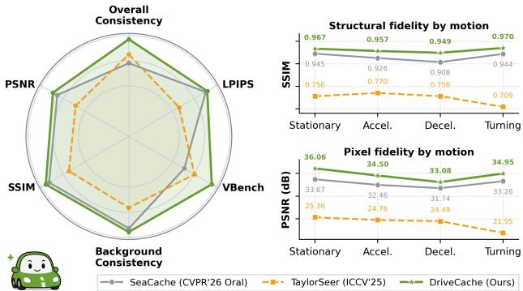
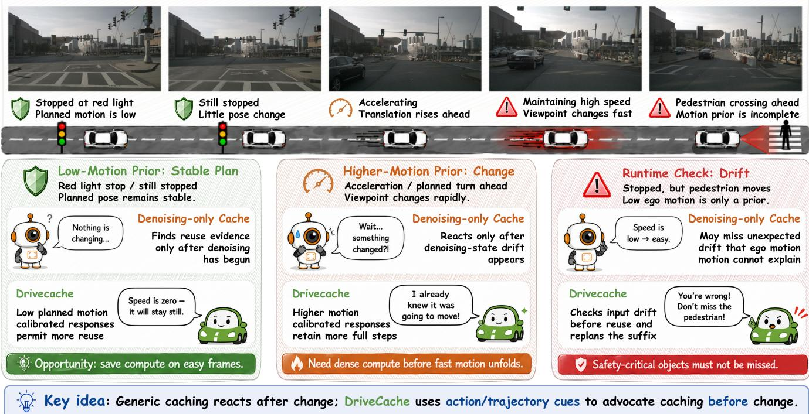
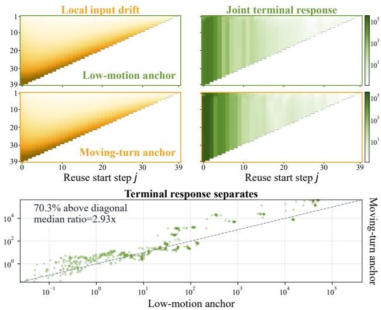
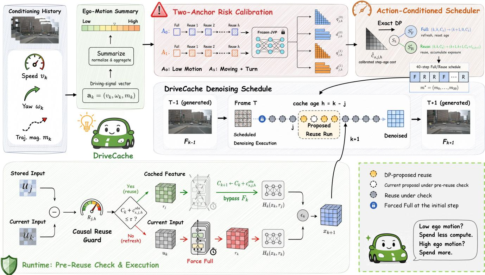
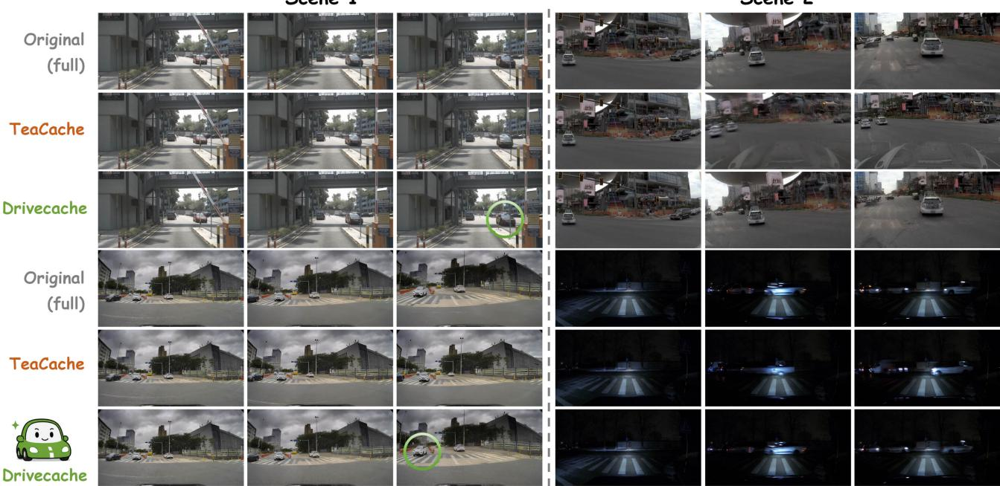
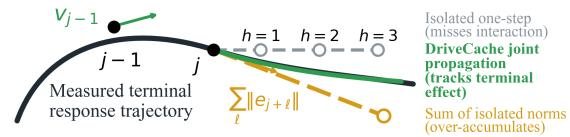
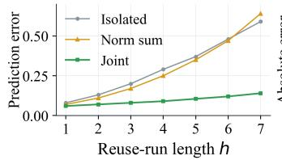
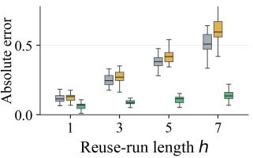
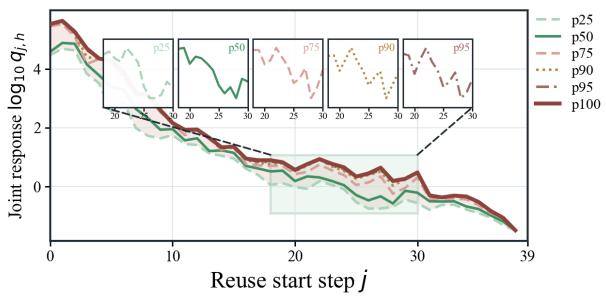

# DriveCache: Action-Aware Caching for Driving World Model Inference

Jianchun Yang1,\*, Jian Liang1,\*, Xianda Guo1,\*,†, Pinhan Fu1, Yanlun Peng3, Conglang Zhang1, Wenke Huang2, Mang Ye1,‡

1Wuhan University 2Nanyang Technological University 3Great Wall Motor yangjianchun@whu.edu.cn, jianliang@whu.edu.cn, xianda\_guo@163.com, yemang@whu.edu.cn

## Abstract

Driving video generation models support autonomous-driving development by predicting controllable future scenes for simulation, planning evaluation, and ofline data generation. Difusion-based driving generators repeatedly evaluate large backbones across denoising steps, which limits generation throughput. Existing difusion acceleration methods reduce this cost, but general-purpose designs omit driving signals available before generation, such as ego speed and planned trajectories. Experiments across driving motions show that cache tolerance varies with ego translation and rotation, denoising progress, and consecutive reuse length. We propose DriveCache, a training-free, action-aware controller that uses planned motion to allocate reuse across scenes and dynamic programming to place it across denoising steps under a calibrated response budget. A causal drift check refreshes features and replans the remaining schedule when generation departs from calibration. Across three generator configurations, Drive-Cache improves the overall fidelity–eficiency trade-of over evaluated cache methods. Our code will be publicly available.

## Introduction

Driving video generation models predict how trafic scenes evolve under diferent ego actions, providing controllable future observations for simulation, policy training, planning evaluation, and ofline data generation (Hu et al. 2023; Wang et al. 2024a; Gao et al. 2024b). These action-conditioned predictions let developers and planning systems examine possible futures under candidate plans. They also support diverse scenario generation for development. Recent video difusion models improve visual fidelity and temporal coherence through larger spatiotemporal backbones and longer generation horizons (Ho et al. 2022; Blattmann et al. 2023; Yang et al. 2025; Kong et al. 2024; Lin et al. 2024).

These advances increase inference cost. Iterative denoising evaluates the backbone across many sampling steps, and the cost grows with model capacity, resolution, and video length. Online prediction must fit within the planning cycle, while ofline generation must scale to large scenario collections. Inference latency therefore constrains online prediction and ofline scenario generation.

Difusion acceleration methods reduce the number or cost of denoising evaluations. Distillation, quantization, pruning, and eficient operators can require new weights, retraining, calibration data, or specialized kernels (Salimans and Ho 2022; Song et al. 2023). Feature caching leaves the generator unchanged and reuses intermediate features across neighboring denoising steps. Existing cache controllers derive reuse from fixed schedules or signals observed after denoising begins (Liu et al. 2025a; Kahatapitiya et al. 2025; Zhou et al. 2025; Ma et al. 2025; Bu et al. 2025; Liu et al. 2025b; Chung et al. 2026). These general-purpose methods omit driving signals available before generation, including ego speed and planned trajectories. However, driving generation provides planned ego motion before denoising. Ofline generation receives recorded or specified future ego poses, while plannerconditioned generation receives predicted poses from the planning stack. Stationary, straight, and turning plans induce diferent viewpoint changes. Figure 2 shows that planned ego motion predicts scene-dependent cache tolerance before the denoising pass begins.

  
Figure 1: DriveCache achieves better video fidelity and consistency across evaluation metrics.

Planned motion is available before the first denoising step, but it cannot determine a schedule by itself. Cache error also varies with denoising position, cache age, model architecture, and generated content. A driving-aware controller must therefore combine a scene-level motion prior with a denoising-level response model, while retaining a causal correction for states that depart from calibration.

DriveCache converts this prior into a complete schedule. One low-motion anchor and one moving-turn anchor measure terminal responses of consecutive reuse; planned translation and rotation interpolate them for each scene. Exact dynamic programming selects reuse quantity and positions under one budget. A pre-reuse drift veto rejects out-of-support decisions and replans the unexecuted sufix.

  
Figure 2: Motivation of DriveCache. Planned ego motion reveals scene-dependent cache tolerance before denoising.

Our main contributions are threefold.

• To the best ofour knowledge, this work is the first to identify and validate planned ego motion as a pre-generation signal for difusion caching in driving video generation, showing that ego translation and rotation predict scene-level cache tolerance across driving motions.

• We propose DriveCache, a training-free cache controller that assigns scene-level reuse budgets from planned motion, models consecutive-reuse error, and uses exact dynamic programming with causal drift correction to place reuse across denoising steps.

• Across multiple driving video generators, DriveCache improves quality–eficiency trade-ofs over cache baselines. At approximately 2× speedup on Wan2.2 A14B, it improves PSNR by 2.036 dB over TeaCache.

## Related Work

## Difusion Models

Difusion models learn a reverse transport from noise to data (Ho, Jain, and Abbeel 2020; Song et al. 2021; Rombach et al. 2022). Deterministic samplers and continuous-time formulations broaden this process (Song, Meng, and Ermon 2020; Karras et al. 2022; Lu et al. 2022; Lipman et al. 2023). Video difusion adds spatiotemporal modeling (Ho et al. 2022; Blattmann et al. 2023; Ma et al. 2024b; Yang et al. 2025; Kong et al. 2024; Lin et al. 2024), while Difusion Transformers scale generation (Peebles and Xie 2023; Chen et al. 2024a). Token merging and low-precision attention lower per-step cost (Bolya et al. 2022; Zhang et al. 2024). Training-based methods distill samplers or generation dynamics but require optimized weights and model-specific training (Salimans and Ho 2022; Song et al. 2023; Luo et al. 2023; Yin et al. 2024, 2025). These acceleration methods change sampling, reduce token or attention cost, or train modified generator weights.

## Training-free Difusion Inference Acceleration

Training-free acceleration preserves pretrained weights. Fast solvers reduce model evaluations (Song, Meng, and Ermon 2020; Lu et al. 2022). Cache controllers retain pretrained generator weights and reuse internal computation. Static routing uses fixed schedules in DeepCache, PAB, and FORA and a learned schedule in Learning-to-Cache (Ma, Fang, and Wang 2024; Zhao et al. 2025; Selvaraju et al. 2024; Ma et al. 2024a). TeaCache, AdaCache, and EasyCache adapt reuse to runtime changes (Liu et al. 2025a; Kahatapitiya et al. 2025; Zhou et al. 2025). Recent DiT controllers allocate reuse across blocks, tokens, or trajectories (Chen et al. 2024b; Zou et al. 2024a,b; Chu et al. 2025; Qiu et al. 2025). FasterCache reuses residuals, TaylorSeer forecasts features, and FlowCache supports autoregressive video (Lv et al. 2025; Liu et al. 2025b; Ma et al. 2026). MagCache, DiCache, and SeaCache exploit magnitude, reconstruction, and spectral signals (Ma et al. 2025; Bu et al. 2025; Chung et al. 2026). DriveCache uses planned ego motion before denoising and uses runtime drift to veto unsupported reuse decisions.

## Autonomous Driving Video Generation

Driving systems study occupancy, sensor fusion, planning, safety-critical generation, and scene representations (Zheng et al. 2024a; Chitta et al. 2023; Zheng et al. 2024b; Xing et al. 2025; Xie et al. 2024; Song et al. 2025; Duan et al. 2024). Surround-view studies characterize cross-view depth and spatial reasoning (Guo et al. 2025a,c,b). Driving video generators forecast observations from histories, maps, layouts, and ego trajectories (Hu et al. 2023; Wang et al. 2024a; Gao et al. 2024b,a; Wen et al. 2024; Zhao et al. 2024; Huang et al. 2024a). Multiview reconstruction models target geometric consistency and long-horizon control (Wang et al. 2024b; Lu et al. 2024; Gao et al. 2025; Ni et al. 2025; Wu et al. 2025), while physical-AI platforms build world foundation models (NVIDIA et al. 2025). Autoregressive difusion links video to trajectories (Zhang et al. 2025; Zhou et al. 2026); benchmarks evaluate reactive simulation and deployment robustness (Zhang et al. ${ 2 0 2 6 \mathbf { b } } , \mathbf { a } )$ . NuScenes provides synchronized cameras and ego-motion records (Caesar et al. 2020). DriveCache uses planned ego motion to estimate viewpoint change and allocate pre-denoising computation.

## Methodology

DriveCache formulates caching as a causal decision made before each backbone evaluation. Consider a frozen video difusion model with K denoising steps. At step k, Equation (1) separates the expensive reusable backbone from the inexpensive output interface:

$$
r _ { k } = F _ { k } ( u _ { k } ) , \qquad \epsilon _ { k } = H _ { k } ( x _ { k } , r _ { k } ) ,\tag{1}
$$

where $x _ { k }$ is the current latent, $u _ { k }$ is the backbone input, and $r _ { k }$ is the cached backbone output. A full decision evaluates $F _ { k } ;$ a reuse decision replaces $r _ { k }$ with its most recently computed value. The first step always uses full computation. The controller observes $u _ { k }$ before executing $F _ { k }$ , so it can make the veto decision without first executing the backbone call.

DriveCache has four stages (Figure 4). Two ego-motion anchors measure joint run responses; planned ego motion interpolates them for the current scene; exact dynamic programming jointly selects reuse quantity and placement; and a pre-reuse drift check can refresh and replan the unexecuted sufix while preserving the executed prefix.

The ablation study in Table 3 supports planned ego motion as a cache prior. Cache tolerance varies because planned ego motion changes the rendered viewpoint.

Scene-agnostic scheduling, shufled trajectories, and translation-matched turns separate planned-motion allocation from dataset correlation and fixed step preference. Figure 3 shows that planned ego motion separates run tolerance while local input drift remains nearly unchanged. Planned ego motion remains a scene coordinate. Denoising position and cache age determine placement cost, while support checks and the causal veto handle departures from the calibrated regime.

The search enforces the mandatory first evaluation, maximum cache age, backbone boundaries, and native no-cache steps. It maximizes skipped evaluations under one cumulative response budget, with deterministic lower-cost tie breaking.

  
Figure 3: Planned ego motion changes joint run responses even when local input drift remains nearly unchanged.

Planned ego motion changes allocation before denoising, run costs place reuse jointly, and a veto corrects the next decision before a cached backbone output changes the latent. The executed prefix is never altered.

## Planned ego motion calibrates run costs

Let a scene provide planned ego poses $( p _ { t } , \psi _ { t } )$ over the generated horizon. Equation (2) summarizes total translation and accumulated rotation:

$$
L _ { s } = \sum _ { t } \lVert p _ { t } - p _ { t - 1 } \rVert _ { 2 } , \qquad \Theta _ { s } = \sum _ { t } \left. \mathrm { w r a p } ( \psi _ { t } - \psi _ { t - 1 } ) \right. .\tag{2}
$$

The statistics remain separate because equal travel distance can induce diferent cached-output changes under straight and turning motion.

We z-score L and Θ using their calibration means and standard deviations. The low-motion anchor $( L _ { 0 } , \Theta _ { 0 } )$ minimizes the sum of these standardized values. Among clips whose raw Θ exceeds its calibration median and whose raw $L > L _ { 0 }$ and $\Theta > \Theta _ { 0 } ,$ , the moving-turn anchor $( L _ { 1 } , \Theta _ { 1 } )$ maximizes the product of the standardized values. Clip index breaks ties, and an empty candidate set triggers full-inference fallback. Equation (3) expresses a scene relative to this support:

$$
z _ { s } ^ { L } = \frac { L _ { s } - L _ { 0 } } { \operatorname* { m a x } ( L _ { 1 } - L _ { 0 } , \varepsilon ) } , \qquad z _ { s } ^ { \Theta } = \frac { \Theta _ { s } - \Theta _ { 0 } } { \operatorname* { m a x } ( \Theta _ { 1 } - \Theta _ { 0 } , \varepsilon ) } .\tag{3}
$$

The anchor pair maps low motion toward the origin and the moving turn toward the upper corner without fitting scene-specific coeficients. A scene lies inside the calibration support only when $( z _ { s } ^ { L } , z _ { s } ^ { \Theta } ) \in [ 0 , 1 ] ^ { 2 }$ ; otherwise DriveCache uses full inference. Equation (4) then reduces the supported pair to one interpolation coordinate:

$$
D _ { s } = \frac { 1 } { \sqrt { 2 } } \sqrt { ( z _ { s } ^ { L } ) ^ { 2 } + ( z _ { s } ^ { \Theta } ) ^ { 2 } } .\tag{4}
$$

  
Figure 4: DriveCache combines planned ego motion, two-anchor run calibration, exact DP, and a causal reuse guard.

The coordinatewise gate prevents radial compression from hiding an unsupported dimension.

The anchor traces also define how DriveCache scores a consecutive reuse run. For each anchor $i \in \{ 0 , 1 \}$ , one full denoising trace stores $( x _ { k } ^ { ( i ) } , u _ { k } ^ { ( i ) } , r _ { k } ^ { ( i ) } )$ . A candidate run starts after a full refresh at step j and reuses $r _ { j } ^ { ( i ) }$ for h steps. Equation (5) measures how far the current backbone input has moved from the refresh input at the ℓ-th reuse:

$$
d _ { j , \ell } ^ { ( i ) } = \frac { \| u _ { j + \ell } ^ { ( i ) } - u _ { j } ^ { ( i ) } \| _ { 2 } } { \| u _ { j + \ell } ^ { ( i ) } \| _ { 2 } + \varepsilon } .\tag{5}
$$

Input drift is available before the expensive backbone call and is therefore suitable for the runtime veto. It does not by itself measure the denoising error caused by substituting a cached backbone output. Equation (6) defines that signed output perturbation against the full trace:

$$
e _ { j , \ell } ^ { ( i ) } = H _ { j + \ell } ( x _ { j + \ell } ^ { ( i ) } , r _ { j } ^ { ( i ) } ) - H _ { j + \ell } ( x _ { j + \ell } ^ { ( i ) } , r _ { j + \ell } ^ { ( i ) } ) .\tag{6}
$$

Frozen-sampler Jacobian-vector products propagate the whole run to the terminal latent. Let $P _ { t } ^ { ( i ) }$ be the Jacobian of terminal latent $x _ { K }$ with respect to denoiser output $\epsilon _ { t } ,$ evaluated along anchor i’s frozen full trace. Its product with $e _ { t } ^ { ( i ) }$ gives the first-order terminal perturbation. Equation (7) combines these signed perturbations into joint run response $q _ { j , h } ^ { ( i ) } \colon$

$$
G _ { j , h } ^ { ( i ) } = \sum _ { \ell = 1 } ^ { h } P _ { j + \ell } ^ { ( i ) } e _ { j , \ell } ^ { ( i ) } , \qquad q _ { j , h } ^ { ( i ) } = \frac { \| G _ { j , h } ^ { ( i ) } \| _ { 2 } } { \| x _ { K } ^ { ( i ) } \| _ { 2 } + \varepsilon } .\tag{7}
$$

Normalizing by terminal-latent energy makes responses comparable across steps without a learned evaluator. Replay isolates cache perturbation, while the signed vector preserves cross-step cancellation and amplification.

For scene s, Equation (8) interpolates only the nonnegative planned-motion-dependent diference:

$$
\widetilde { q } _ { s , j , h } = q _ { j , h } ^ { ( 0 ) } + D _ { s } \operatorname* { m a x } \left( q _ { j , h } ^ { ( 1 ) } - q _ { j , h } ^ { ( 0 ) } , 0 \right) .\tag{8}
$$

This one-sided interpolation preserves the low-motion response when the moving anchor is easier and enforces a monotone planned-motion risk relation. Equation (9) converts joint run response $\widetilde { q }$ into monotone envelope Q and incremental run cost c:

$$
\begin{array} { r l r } & { Q _ { s , j , h } = \underset { 1 \leq \ell \leq h } { \operatorname* { m a x } } \ \widetilde { q } _ { s , j , \ell } , } & \\ & { \widehat { c } _ { s , j , h } = Q _ { s , j , h } - Q _ { s , j , h - 1 } , \ } & { Q _ { s , j , 0 } = 0 . } \end{array}\tag{9}
$$

Planned ego motion changes how much reuse a scene can tolerate, while (j, h) captures denoising position and cache age. We obtain drift threshold $\bar { d } _ { s , j , h }$ with the same one-sided anchor interpolation as Equation (8), replacing q with d.

The envelope keeps longer-run increments nonnegative; refresh resets age but not response already propagated into the latent.

## Exact scheduling supports causal correction

DriveCache converts the run costs into a legal schedule under response budget τ. For target reuse fraction $\rho _ { \mathrm { t a r } }$ , calibration chooses the smallest table-cost threshold whose median schedule reaches $\lceil \rho _ { \mathrm { t a r } } ( K - 1 ) \rceil$ reuses; neither PSNR nor evaluation clips enter this choice. Since legal reuses skip the same interface, maximizing their count minimizes backbone evaluations. Let $J _ { k } ( n , h )$ be minimum cumulative response after k steps, n reuses, and cache age h. We set $J _ { 1 } ( 0 , \bar { 0 ) } = 0$ and all other states to +∞, with $0 \leq n \leq k - 1$ and $0 \leq h \leq H _ { \operatorname* { m a x } }$ . Here, $\mathcal { L } ( k , h ) = 1$ marks reuse that satisfies the model-specific legality constraints:

$$
\begin{array} { r l } & { J _ { k + 1 } ( n , 0 ) = \underset { h } { \operatorname* { m i n } } J _ { k } ( n , h ) , } \\ & { J _ { k + 1 } ( n + 1 , h + 1 ) = \operatorname* { m i n } \bigr \{ J _ { k + 1 } ( n + 1 , h + 1 ) , } \\ & { \qquad J _ { k } ( n , h ) + \widehat { c } _ { s , k - h , h + 1 } \bigr \} , } \\ & { \qquad \mathcal { L } ( k , h + 1 ) = 1 . } \end{array}\tag{10}
$$

A full evaluation pays no new reuse cost and resets cache age. A reuse extends the run whose last full evaluation occurred at $j = k - h$ and adds the calibrated increment only when the next age is legal. Illegal transitions receive +∞. Equation (11) selects the maximum feasible reuse count:

$$
B _ { s } ^ { * } = \operatorname* { m a x } \left\{ n : \operatorname* { m i n } _ { h } J _ { K } ( n , h ) \leq \tau \right\} .\tag{11}
$$

Backtracking recovers the minimum-response schedule at $B _ { s } ^ { * }$ . The recurrence exactly optimizes the calibrated response objective in $O ( K ^ { 3 } )$ time and $O ( K ^ { 2 } )$ ) rolling memory.

The schedule remains causal during inference. We initialize accumulated charge as $C _ { 1 } = 0$ . Before the h-th reuse in a run whose last full evaluation occurred at j, DriveCache measures the observed input drift in Equation (12):

$$
d _ { j , h } ^ { \mathrm { o b s } } = \frac { \| u _ { j + h } - u _ { j } \| _ { 2 } } { \| u _ { j + h } \| _ { 2 } + \varepsilon } .\tag{12}
$$

It accepts reuse only when $d _ { j , h } ^ { \mathrm { o b s } } \leq \bar { d } _ { s , j , h } + \varepsilon$ and accumulated charge satisfies $C _ { k } + \tilde { c } _ { s , j , h } \leq \tau .$ . Acceptance sets $C _ { k + 1 } = C _ { k } + \widehat { c } _ { s , j , h }$ . A failed check evaluates the backbone, keeps $C _ { k + 1 } = C _ { k } ^ { - }$ , and refreshes the cache. Replanning starts from age zero after this forced evaluation and maximizes additional sufix reuse under budget $\tau - C _ { k } ;$ the executed prefix remains fixed. Calibration uses no optimizer or parameter update, and inference leaves generator weights and sampling steps unchanged at runtime.

DriveCache applies model-specific legality to the same recurrence. Here, $u _ { k } , r _ { k }$ , and $H _ { k }$ are the reusable-region input, cached backbone output, and remaining sampler interface. Wan2.2 separates guidance branches; A14B also forbids crossexpert reuse. Epona caches only within each 100-step visual denoising call, never across autoregressive segments. Cache tensors, legal steps, maximum age, norm axes, and ties are frozen before evaluation.

Two full anchor traces support all candidate runs. Building the $( j , h )$ table costs $\scriptstyle { \dot { O ( K ^ { 2 } ) } }$ substitutions and $O ( K ^ { 3 } )$ unbatched Jacobian-vector products once per configuration, without evaluation clips. On one H20, calibration takes 4 minutes for 5B, 9 minutes for A14B, and 16 minutes for Epona, with at most 6.1 GB additional memory and response tables below 2 MB. Initial DP solves take 0.8, 1.4, and 9.2 ms, respectively; drift checks and sufix replanning add less than 0.7% to end-to-end latency.

DriveCache updates no weights and trains no predictor; one model-level calibration applies across clips.

## Experiments

## Experimental setup

Models and protocol. We evaluate Wan2.2 5B and expertrouted A14B on 222 DrivingGen scenes with ten fixed seeds (2,220 samples), and Epona on all 150 nuScenes validation scenes (Wan et al. 2025; Zhou et al. 2026; Zhang et al. 2025). Wan uses 40 denoising steps, while Epona uses 100 steps in each visual denoising call. Calibration uses 32 disjoint scenes; before evaluation, we freeze the reuse target and τ at 50% for Wan and 60% for Epona.

Comparisons and metrics. Tables 1–2 cover fixed, adaptive, forecasting, spectral, and reduced-step baselines (Ma, Fang, and Wang 2024; Zhao et al. 2025; Lv et al. 2025; Liu et al. 2025a; Kahatapitiya et al. 2025; Zhou et al. 2025; Ma et al. 2025; Bu et al. 2025; Liu et al. 2025b; Chung et al. 2026; Ma et al. 2026). We match Wan caches within one skipped backbone call per clip and compare reduced-step sampling at matched latency. Epona methods share hardware while retaining their native reusable units. We report peak signal-to-noise ratio (PSNR), structural similarity (SSIM), learned perceptual image patch similarity (LPIPS), trajectory quality (Traj.), average displacement error (ADE), dynamic time warping (DTW), and VBench metrics (Zhang et al. 2018; Huang et al. 2024b). V-Q and V-S denote VBench quality and semantic scores. Higher PSNR, SSIM, Traj., and VBench scores indicate better quality; lower LPIPS, ADE, and DTW indicate smaller errors.

Compute matching. Calibration selects each Wan cache baseline’s setting nearest the shared skipped-backbone target. Evaluation freezes that setting and verifies the one-call tolerance from realized backbone counts. Cache methods retain all 40 sampler steps, while the reduced-step baseline changes the sampling trajectory.

Measurement. On one H20 at batch size one, latency averages ten synchronized runs after three warm-ups and includes controller overhead. Fidelity uses matched-seed full outputs. DrivingGen evaluates trajectory quality, ADE, and DTW against ground-truth ego trajectories, while VBench uses its native references. We average seeds per scene and report paired scene-level 95% bootstrap intervals.

Run integrity. Each sample records its configuration hash, realized backbone calls, and metric outputs. We retain complete 2,220-sample DrivingGen runs and complete 150-scene Epona validation runs for comparison.

## DriveCache improves quality at matched speed

At the frozen operating points in Table 1, DriveCache reaches 1.84× speedup and 34.744 dB PSNR on 5B, and 1.97× and 32.778 dB on A14B. Viewed jointly, it is fastest on 5B and Epona and tied for the highest speedup on A14B, while retaining the best values in most reported quality and driving dimensions. Figure 1 shows DriveCache’s quality gains across the evaluated driving motions in every motion group.

Scene 1  
Scene 2  

Figure 5: Qualitative comparison of full inference, TeaCache, and DriveCache.
<table><tr><td>Backbone / Method</td><td>Lat. (s) ↓</td><td>Spd. ↑</td><td>PSNR ↑</td><td>SSIM ↑</td><td>LPIPS↓</td><td>V-Q↑</td><td>V-S↑</td><td>Traj. ↑</td><td>ADE↓</td><td>DTW↓</td></tr><tr><td colspan="9">Wan2.2 5B</td></tr><tr><td>Fixed interval</td><td>10.17</td><td>1.77×</td><td>28.417</td><td>0.852</td><td>0.095</td><td>0.774</td><td>0.179</td><td>0.281</td><td>1.881</td><td>15.517</td></tr><tr><td>PAB</td><td>17.53</td><td>1.03×</td><td>33.344</td><td>0.953</td><td>0.042</td><td>0.774</td><td>0.179</td><td>0.262</td><td>2.191</td><td>18.454</td></tr><tr><td>TeaCache</td><td>10.76</td><td>1.68×</td><td>32.874</td><td>0.939</td><td>0.042</td><td>0.776</td><td>0.177</td><td>0.274</td><td>1.796</td><td>15.055</td></tr><tr><td>EasyCache</td><td>10.67</td><td>1.69×</td><td>33.923</td><td>0.959</td><td>0.041</td><td>0.777</td><td>0.178</td><td>0.269</td><td>1.925</td><td>16.173</td></tr><tr><td>MagCache</td><td>10.73</td><td>1.68×</td><td>33.945</td><td>0.949</td><td>0.038</td><td>0.773</td><td>0.177</td><td>0.261</td><td>2.712</td><td>23.156</td></tr><tr><td>DiCache</td><td>12.15</td><td>1.48×</td><td>33.278</td><td>0.949</td><td>0.038</td><td>0.781</td><td>0.179</td><td>0.262</td><td>1.919</td><td>16.167</td></tr><tr><td>TaylorSeer</td><td>10.19</td><td>1.77×</td><td>27.970</td><td>0.847</td><td>0.094</td><td>0.770</td><td>0.178</td><td>0.262</td><td>2.306</td><td>19.567</td></tr><tr><td>SeaCache</td><td>10.07</td><td>1.79×</td><td>32.860</td><td>0.932</td><td>0.048</td><td>0.769</td><td>0.176</td><td>0.275</td><td>1.929</td><td>16.004</td></tr><tr><td>DriveCache</td><td>9.79</td><td>1.84×</td><td>34.744</td><td>0.961</td><td>0.041</td><td>0.777</td><td>0.179</td><td>0.294</td><td>1.771</td><td>14.768</td></tr><tr><td colspan="9">Wan2.2 A14B</td><td></td></tr><tr><td>Fixed interval</td><td>86.64</td><td>1.89×</td><td>25.385</td><td>0.802</td><td>0.159</td><td>0.777</td><td>0.178</td><td>0.336</td><td>2.610</td><td>20.836</td></tr><tr><td>PAB</td><td>156.45</td><td>1.04×</td><td>31.422</td><td>0.931</td><td>0.079</td><td>0.776</td><td>0.181</td><td>0.354</td><td>1.980</td><td>15.475</td></tr><tr><td>TeaCache</td><td>82.87</td><td>1.97×</td><td>30.742</td><td>0.913</td><td>0.064</td><td>0.779</td><td>0.179</td><td>0.324</td><td>2.009</td><td>15.694</td></tr><tr><td>EasyCache</td><td>89.44</td><td>1.83×</td><td>31.461</td><td>0.922</td><td>0.070</td><td>0.781</td><td>0.181</td><td>0.349</td><td>2.020</td><td>15.576</td></tr><tr><td>MagCache</td><td>86.83</td><td>1.88×</td><td>31.987</td><td>0.937</td><td>0.049</td><td>0.777</td><td>0.180</td><td>0.346</td><td>2.138</td><td>16.858</td></tr><tr><td>DiCache</td><td>87.00</td><td>1.88×</td><td>29.927</td><td>0.897</td><td>0.096</td><td>0.775</td><td>0.180</td><td>0.323</td><td>1.951</td><td>15.011</td></tr><tr><td>TaylorSeer</td><td>87.11</td><td>1.88×</td><td>26.339</td><td>0.817</td><td>0.143</td><td>0.780</td><td>0.180</td><td>0.357</td><td>2.320</td><td>18.439</td></tr><tr><td>SeaCache</td><td>83.09</td><td>1.97×</td><td>31.502</td><td>0.923</td><td>0.060</td><td>0.779</td><td>0.179</td><td>0.329</td><td>1.948</td><td>14.881</td></tr><tr><td>DriveCache</td><td>83.10</td><td>1.97×</td><td>32.778</td><td>0.938</td><td>0.060</td><td>0.781</td><td>0.182</td><td>0.370</td><td>1.809</td><td>13.750</td></tr></table>

Table 1: Wan2.2 5B and A14B results at matched skipped-backbone counts.

Fidelity and downstream behavior. At comparable speed, DriveCache improves over SeaCache by 1.884 dB PSNR (95% CI: 1.61–2.15) on 5B and by 1.276 dB (1.04–1.51) on A14B; trajectory quality and DTW also improve. Trajectory metrics show ego-motion consistency; Figure 5 and VBench show temporal consistency and stable scene semantics.

Motion adaptation and robustness. The anchors cover 96.4% of scenes; stationary clips average 22.4 reuses versus 18.7 for turns, confirming motion-conditioned allocation. The motion prior uses planned ego motion to set the schedule for every supported scene before the first denoising step. The drift check evaluates generated states before each planned reuse during inference. Under 1.0 m/5 degree pose noise,

<table><tr><td>Method</td><td>Latency ↓</td><td>Speedup ↑</td><td>PSNR ↑</td><td>SSIM ↑</td><td>LPIPS↓</td><td>Stationary PSNR↑</td><td>Turn PSNR ↑</td></tr><tr><td>Reduced steps</td><td>46.34</td><td>1.61×</td><td>26.322</td><td>0.729</td><td>0.144</td><td>31.165</td><td>23.855</td></tr><tr><td>DeepCache</td><td>44.27</td><td>1.68×</td><td>26.358</td><td>0.730</td><td>0.142</td><td>31.192</td><td>23.898</td></tr><tr><td>FasterCache</td><td>46.46</td><td>1.60×</td><td>26.312</td><td>0.729</td><td>0.144</td><td>31.155</td><td>23.847</td></tr><tr><td>TeaCache</td><td>47.28</td><td>1.58×</td><td>26.152</td><td>0.726</td><td>0.146</td><td>30.800</td><td>23.744</td></tr><tr><td>AdaCache</td><td>44.07</td><td>1.69×</td><td>26.328</td><td>0.729</td><td>0.144</td><td>31.154</td><td>23.870</td></tr><tr><td>FlowCache</td><td>51.57</td><td>1.44×</td><td>26.322</td><td>0.729</td><td>0.144</td><td>31.123</td><td>23.885</td></tr><tr><td>DriveCache</td><td>39.55</td><td>1.89×</td><td>26.394</td><td>0.734</td><td>0.140</td><td>31.479</td><td>23.910</td></tr></table>

Table 2: DriveCache results on Epona. The method reaches 1.89× speedup at video quality comparable to cache baselines.

  
(a) Consecutive reuse requires a joint response

  
(b) Error grows with reuse.

  
(c) Stable joint response.

Figure 6: Joint propagation captures reuse-run interactions.  
  
Figure 7: Joint responses vary with reuse start step and cache age, guiding reuse placement across denoising steps.

DriveCache retains 1.57× speedup with a 0.213 dB loss, showing that causal correction complements the motion prior.

Transfer to Epona. Across 150 Epona scenes, DriveCache reaches 1.89× speedup and 0.140 LPIPS, versus DeepCache’s 1.68× at comparable aggregate and turning fidelity (Table 2). Larger stationary gains reflect more reuse on tolerant scenes and conservative behavior on turns. The Epona results extend the latency–fidelity gains to a separate scene collection.

## Ablations validate scheduling choices

Planned motion controls scene-level reuse. Mean speed correlates with cache error, while removing or shufling motion degrades fixed-reuse quality. Shufling preserves the trajectory distribution but breaks scene correspondence, isolating action–scene alignment; translation and rotation both contribute to cache allocation.

Joint responses control placement. Figures 6–7 show that joint propagation captures start-step and cache-age efects missed by isolated sums. Fixed placement causes the largest loss, while the drift veto guards against schedule drift.

<table><tr><td>Variant</td><td>PSNR ↑</td><td>LPIPS</td><td>Traj. ↑</td></tr><tr><td>DriveCache</td><td>34.744</td><td>0.041</td><td>0.294</td></tr><tr><td>No motion prior</td><td>34.201</td><td>0.046</td><td>0.274</td></tr><tr><td>Shuffled trajectory</td><td>34.286</td><td>0.045</td><td>0.275</td></tr><tr><td>Translation only</td><td>34.431</td><td>0.043</td><td>0.278</td></tr><tr><td>Rotation only</td><td>34.365</td><td>0.044</td><td>0.277</td></tr><tr><td>No DP (fixed placement)</td><td>33.982</td><td>0.050</td><td>0.272</td></tr><tr><td>No drift veto</td><td>34.512</td><td>0.043</td><td>0.279</td></tr></table>

Table 3: Wan2.2 5B ablations at 21/40 realized reuse isolate motion allocation, step placement, and runtime correction.

<table><tr><td colspan="4">High/low reuses Lat. ↓ PSNR ↑ SSIM↑ LPIPS</td></tr><tr><td>0/20</td><td>83.10 32.778</td><td>0.938</td><td>0.060</td></tr><tr><td>2/18</td><td>83.02 30.747</td><td>0.914</td><td>0.073</td></tr><tr><td>3/17</td><td>83.34 29.936</td><td>0.900</td><td>0.081</td></tr></table>

Table 4: A14B expert routing at fixed compute. High/low denotes reuse counts in the high- and low-noise experts.

Calibration and routing remain stable. Predicted response tracks realized degradation, and two to eight anchors change PSNR by only 0.062 dB. Moving reuse into the high-noise A14B expert sharply reduces quality (Table 4), so expert boundaries matter more than richer interpolation at fixed compute. The core ablations in Table 3 hold the pretrained generator fixed while isolating scene allocation, step placement, and runtime correction. Together, the anchor and routing results support sparse calibration and explicit expert boundaries in the controller.

## Conclusion

Across the evaluated driving motions, planned ego translation and rotation predict scene-level cache tolerance before denoising. We introduce DriveCache, a training-free controller that allocates reuse across scenes and places it across denoising steps with exact dynamic programming. Two anchor traces calibrate joint run responses, and a causal drift check refreshes the cache and replans the unexecuted sufix when generation departs from calibration. On Wan2.2 5B, Wan2.2 A14B, and Epona, DriveCache improves quality–eficiency trade-ofs over cache baselines while preserving generator weights and sampling steps. These results support planned ego motion as a control signal for action-aware difusion caching.

## References

Blattmann, A.; Dockhorn, T.; Kulal, S.; Mendelevitch, D.; Kilian, M.; Lorenz, D.; Levi, Y.; English, Z.; Voleti, V.; Letts, A.; et al. 2023. Stable video difusion: Scaling latent video difusion models to large datasets. arXiv preprint arXiv:2311.15127.

Bolya, D.; Fu, C.-Y.; Dai, X.; Zhang, P.; Feichtenhofer, C.; and Hofman, J. 2022. Token merging: Your vit but faster. arXiv preprint arXiv:2210.09461.

Bu, J.; Ling, P.; Zhou, Y.; Wang, Y.; Zang, Y.; Lin, D.; and Wang, J. 2025. Dicache: Let difusion model determine its own cache. arXiv preprint arXiv:2508.17356.

Caesar, H.; Bankiti, V.; Lang, A. H.; Vora, S.; Liong, V. E.; Xu, Q.; Krishnan, A.; Pan, Y.; Baldan, G.; and Beijbom, O. 2020. nuscenes: A multimodal dataset for autonomous driving. In CVPR.

Chen, J.; Yu, J.; Ge, C.; Yao, L.; Xie, E.; Wang, Z.; Kwok, J.; Luo, P.; Lu, H.; and Li, Z. 2024a. PixArt-α: Fast training of difusion transformer for photorealistic text-to-image synthesis. In ICLR.

Chen, P.; Shen, M.; Ye, P.; Cao, J.; Tu, C.; Bouganis, C.-S.; Zhao, Y.; and Chen, T. 2024b. ∆-DiT: A Training-Free Acceleration Method Tailored for Difusion Transformers. arXiv:2406.01125.

Chitta, K.; Prakash, A.; Jaeger, B.; Yu, Z.; Renz, K.; and Geiger, A. 2023. Transfuser: Imitation with transformer-based sensor fusion for autonomous driving. IEEE transactions on pattern analysis and machine intelligence.

Chu, H.; Wu, W.; Feng, G.; and Zhang, Y. 2025. OmniCache: A Trajectory-Oriented Global Perspective on Training-Free Cache Reuse for Difusion Transformer Models. In ICCV.

Chung, J.; Hyun, S.; Lee, M.; Han, B.; Cha, G.; Wee, D.; Hong, Y.; and Heo, J.-P. 2026. SeaCache: Spectral-Evolution-Aware Cache for Accelerating Difusion Models. arXiv preprint arXiv:2602.18993.

Duan, Y.; Guo, X.; Zhu, Z.; Wang, Z.; Wang, Y.-K.; and Lin, C.-T. 2024. MaskFuser: Masked Fusion of Joint Multi-Modal Tokenization for End-to-End Autonomous Driving. arXiv preprint arXiv:2405.07573.

Gao, R.; Chen, K.; Xiao, B.; Hong, L.; Li, Z.; and Xu, Q. 2025. MagicDrive-V2: High-resolution long video generation for autonomous driving with adaptive control. In ICCV.

Gao, R.; Chen, K.; Xie, E.; Hong, L.; Li, Z.; Yeung, D.-Y.; and Xu, Q. 2024a. Magicdrive: Street view generation with diverse 3d geometry control. In ICLR.

Gao, S.; Yang, J.; Chen, L.; Chitta, K.; Qiu, Y.; Geiger, A.; Zhang, J.; and Li, H. 2024b. Vista: A generalizable driving world model with high fidelity and versatile controllability. Advances in Neural Information Processing Systems.

Guo, X.; Yuan, W.; Zhang, Y.; Yang, T.; Zhang, C.; Zhu, Z.; Zou, Q.; and Chen, L. 2025a. Adjacent-view Transformers for Supervised Surround-view Depth Estimation. In IROS.

Guo, X.; Zhang, R.; Duan, Y.; He, Y.; Nie, D.; et al. 2025b. SURDS: Benchmarking Spatial Understanding and Reasoning in Driving Scenarios with Vision Language Models. In NeurIPS.

Guo, X.; Zhang, R.; Duan, Y.; Wang, R.; Poggi, M.; Zhou, K.; Zheng, W.; Huang, W.; Xu, G.; Peng, Y.; Si, Y.; and Zou, Q. 2025c. ROVR-Open-Dataset: A Large-Scale Depth Dataset for Autonomous Driving. arXiv preprint arXiv:2508.13977.

Ho, J.; Jain, A.; and Abbeel, P. 2020. Denoising difusion probabilistic models. Advances in neural information processing systems. Ho, J.; Salimans, T.; Gritsenko, A. A.; Chan, W.; Norouzi, M.; and Fleet, D. J. 2022. Video difusion models. In ICLR Workshop.

Hu, A.; Russell, L.; Yeo, H.; Murez, Z.; Fedoseev, G.; Kendall, A.; Shotton, J.; and Corrado, G. 2023. Gaia-1: A generative world model for autonomous driving. arXiv preprint arXiv:2309.17080.

Huang, B.; Wen, Y.; Zhao, Y.; Hu, Y.; Liu, Y.; Jia, F.; Mao, W.; Wang, T.; Zhang, C.; Chen, C. W.; et al. 2024a. Subjectdrive: Scaling

generative data in autonomous driving via subject control. arXiv preprint arXiv:2403.19438.

Huang, Z.; He, Y.; Yu, J.; Zhang, F.; Si, C.; Jiang, Y.; Zhang, Y.; Wu, T.; Jin, Q.; Chanpaisit, N.; et al. 2024b. Vbench: Comprehensive benchmark suite for video generative models. In CVPR.

Kahatapitiya, K.; Liu, H.; He, S.; Liu, D.; Jia, M.; Zhang, C.; Ryoo, M. S.; and Xie, T. 2025. Adaptive caching for faster video generation with difusion transformers. In ICCV.

Karras, T.; Aittala, M.; Aila, T.; and Laine, S. 2022. Elucidating the Design Space of Difusion-Based Generative Models. In NeurIPS.

Kong, W.; Tian, Q.; Zhang, Z.; Min, R.; Dai, Z.; Zhou, J.; Xiong, J.; Li, X.; Wu, B.; Zhang, J.; et al. 2024. Hunyuanvideo: A systematic framework for large video generative models. arXiv preprint arXiv:2412.03603.

Lin, B.; Ge, Y.; Cheng, X.; Li, Z.; Zhu, B.; Wang, S.; He, X.; Ye, Y.; Yuan, S.; Chen, L.; et al. 2024. Open-sora plan: Open-source large video generation model. arXiv preprint arXiv:2412.00131.

Lipman, Y.; Chen, R. T.; Ben-Hamu, H.; Nickel, M.; and Le, M. 2023. Flow matching for generative modeling. In ICLR.

Liu, F.; Zhang, S.; Wang, X.; Wei, Y.; Qiu, H.; Zhao, Y.; Zhang, Y.; Ye, Q.; and Wan, F. 2025a. Timestep Embedding Tells: It’s Time to Cache for Video Difusion Model. In CVPR.

Liu, J.; Zou, C.; Lyu, Y.; Chen, J.; and Zhang, L. 2025b. From reusing to forecasting: Accelerating difusion models with taylorseers. In ICCV.

Lu, C.; Zhou, Y.; Bao, F.; Chen, J.; Li, C.; and Zhu, J. 2022. DPM-Solver: A Fast ODE Solver for Difusion Probabilistic Model Sampling in Around 10 Steps. arXiv preprint arXiv:2206.00927.

Lu, J.; Huang, Z.; Yang, Z.; Zhang, J.; and Zhang, L. 2024. WoVo-Gen: World Volume-aware Difusion for Controllable Multi-camera Driving Scene Generation. In ECCV.

Luo, S.; Tan, Y.; Huang, L.; Li, J.; and Zhao, H. 2023. Latent Consistency Models: Synthesizing High-Resolution Images with Few-Step Inference. arXiv:2310.04378.

Lv, Z.; Si, C.; Song, J.; Yang, Z.; Qiao, Y.; Liu, Z.; and Wong, K.-Y. K. 2025. Fastercache: Training-free video difusion model acceleration with high quality. In ICLR.

Ma, X.; Fang, G.; Bi Mi, M.; and Wang, X. 2024a. Learning-to-cache: Accelerating difusion transformer via layer caching. Advances in Neural Information Processing Systems.

Ma, X.; Fang, G.; and Wang, X. 2024. Deepcache: Accelerating difusion models for free. In CVPR.

Ma, X.; Wang, Y.; Chen, X.; Jia, G.; Liu, Z.; Li, Y.-F.; Chen, C.; and Qiao, Y. 2024b. Latte: Latent difusion transformer for video generation. arXiv preprint arXiv:2401.03048.

Ma, Y.; Zheng, X.; Xu, J.; Xu, X.; Ling, F.; Zheng, X.; Kuang, H.; Li, H.; Wang, X.; Xiao, X.; Chao, F.; and Ji, R. 2026. Flow caching for autoregressive video generation. arXiv:2602.10825.

Ma, Z.; Wei, L.; Wang, F.; Zhang, S.; and Tian, Q. 2025. Magcache: Fast video generation with magnitude-aware cache. Advances in Neural Information Processing Systems.

Ni, J.; Guo, Y.; Liu, Y.; Chen, R.; Lu, L.; and Wu, Z. 2025. Maskgwm: A generalizable driving world model with video mask reconstruction. In CVPR.

NVIDIA; Agarwal, N.; Ali, A.; Bala, M.; Balaji, Y.; Barker, E.; Cai, T.; Chattopadhyay, P.; Chen, Y.; Cui, Y.; Ding, Y.; et al. 2025. Cosmos world foundation model platform for physical AI. arXiv preprint arXiv:2501.03575.

Peebles, W.; and Xie, S. 2023. Scalable difusion models with transformers. In ICCV.

Qiu, J.; Liu, L.; Wang, S.; Lu, J.; Chen, K.; and Hao, Y. 2025. Accelerating difusion transformer via gradient-optimized cache. arXiv preprint arXiv:2503.05156.

Rombach, R.; Blattmann, A.; Lorenz, D.; Esser, P.; and Ommer, B. 2022. High-resolution image synthesis with latent difusion models. In CVPR.

Salimans, T.; and Ho, J. 2022. Progressive distillation for fast sampling of difusion models. arXiv preprint arXiv:2202.00512.

Selvaraju, P.; Ding, T.; Chen, T.; Zharkov, I.; and Liang, L. 2024. Fora: Fast-forward caching in difusion transformer acceleration. arXiv preprint arXiv:2407.01425.

Song, J.; Meng, C.; and Ermon, S. 2020. Denoising difusion implicit models. arXiv preprint arXiv:2010.02502.

Song, R.; Guo, X.; Peng, Y.; Wei, Q.; Wu, H.; and Chen, L. 2025. InsightDrive: Insight Scene Representation for End-to-End Autonomous Driving. arXiv preprint arXiv:2503.13047.

Song, Y.; Dhariwal, P.; Chen, M.; and Sutskever, I. 2023. Consistency Models. arXiv preprint arXiv:2303.01469.

Song, Y.; Sohl-Dickstein, J.; Kingma, D. P.; Kumar, A.; Ermon, S.; and Poole, B. 2021. Score-Based Generative Modeling through Stochastic Diferential Equations. In ICLR.

Wan, T.; Wang, A.; Ai, B.; Wen, B.; Mao, C.; Xie, C.-W.; Chen, D.; Yu, F.; Zhao, H.; Yang, J.; et al. 2025. Wan: Open and advanced largescale video generative models. arXiv preprint arXiv:2503.20314.

Wang, X.; Zhu, Z.; Huang, G.; Chen, X.; Zhu, J.; and Lu, J. 2024a. Drivedreamer: Towards real-world-drive world models for autonomous driving. In ECCV. Springer.

Wang, Y.; He, J.; Fan, L.; Li, H.; Chen, Y.; and Zhang, Z. 2024b. Driving into the future: Multiview visual forecasting and planning with world model for autonomous driving. In CVPR.

Wen, Y.; Zhao, Y.; Liu, Y.; Jia, F.; Wang, Y.; Luo, C.; Zhang, C.; Wang, T.; Sun, X.; and Zhang, X. 2024. Panacea: Panoramic and controllable video generation for autonomous driving. In CVPR.

Wu, W.; Guo, X.; Tang, W.; Huang, T.; Wang, C.; and Ding, C. 2025. Drivescape: High-resolution driving video generation by multi-view feature fusion. In CVPR.

Xie, Y.; Guo, X.; Wang, C.; Liu, K.; and Chen, L. 2024. AdvDifuser: Generating Adversarial Safety-Critical Driving Scenarios via Guided Difusion. arXiv preprint arXiv:2410.08453.

Xing, Z.; Zhang, X.; Hu, Y.; Jiang, B.; He, T.; Zhang, Q.; Long, X.; and Yin, W. 2025. Goalflow: Goal-driven flow matching for multimodal trajectories generation in end-to-end autonomous driving. In CVPR.

Yang, Z.; Teng, J.; Zheng, W.; Ding, M.; Huang, S.; Xu, J.; Yang, Y.; Hong, W.; Zhang, X.; Feng, G.; et al. 2025. Cogvideox: Text-to-video difusion models with an expert transformer. In ICLR.

Yin, T.; Gharbi, M.; Park, T.; Zhang, R.; Shechtman, E.; Durand, F.; and Freeman, W. T. 2024. Improved Distribution Matching Distillation for Fast Image Synthesis. In NeurIPS.

Yin, T.; Zhang, Q.; Zhang, R.; Freeman, W. T.; Durand, F.; Shechtman, E.; and Huang, X. 2025. From Slow Bidirectional to Fast Autoregressive Video Difusion Models. In CVPR.

Zhang, J.; Wei, J.; Huang, H.; Zhang, P.; Zhu, J.; and Chen, J. 2024. Sageattention: Accurate 8-bit attention for plug-and-play inference acceleration. arXiv preprint arXiv:2410.02367.

Zhang, K.; Tang, Z.; Hu, X.; Pan, X.; Guo, X.; Liu, Y.; Huang, J.; Yuan, L.; Zhang, Q.; Long, X.-X.; et al. 2025. Epona: Autoregressive difusion world model for autonomous driving. In ICCV.

Zhang, R.; Isola, P.; Efros, A. A.; Shechtman, E.; and Wang, O. 2018. The unreasonable efectiveness of deep features as a perceptual metric. In CVPR.

Zhang, Z.; Jin, Z.; Peng, Y.; Guo, X.; Liu, H.; Zhang, S.; Ma, X.; Wu, Z.; Yan, J.; Jia, X.; and Jiang, Y.-G. 2026a. Bench2Drive-Robust: Benchmarking Closed-Loop Autonomous Driving under Deployment Perturbations. arXiv preprint arXiv:2605.18059.

Zhang, Z.; Peng, Y.; Zhang, J.; Guo, X.; Huang, Z.; Liu, H.; Li, Q.; Zhang, S.; Jia, X.; and Yan, J. 2026b. ReactSim-Bench: Benchmark-

ing Reactive Behavior World Model Simulation in Autonomous Driving. arXiv preprint arXiv:2606.14058.

Zhao, G.; Wang, X.; Zhu, Z.; Chen, X.; Huang, G.; Bao, X.; and Wang, X. 2024. DriveDreamer-2: LLM-Enhanced World Models for Diverse Driving Video Generation. arXiv preprint arXiv:2403.06845.

Zhao, X.; Jin, X.; Wang, K.; and You, Y. 2025. Real-time video generation with pyramid attention broadcast. In ICLR.

Zheng, W.; Chen, W.; Huang, Y.; Zhang, B.; Duan, Y.; and Lu, J. 2024a. Occworld: Learning a 3d occupancy world model for autonomous driving. In ECCV. Springer.

Zheng, W.; Song, R.; Guo, X.; Zhang, C.; and Chen, L. 2024b. Genad: Generative end-to-end autonomous driving. In ECCV. Springer.

Zhou, X.; Liang, D.; Chen, K.; Feng, T.; Chen, X.; Lin, H.; Ding, Y.; Tan, F.; Zhao, H.; and Bai, X. 2025. Less is Enough: Training-Free Video Difusion Acceleration via Runtime-Adaptive Caching. arXiv preprint arXiv:2507.02860.

Zhou, Y.; Shao, H.; Wang, L.; Zong, Z.; Li, H.; and Waslander, S. L. 2026. DrivingGen: A Comprehensive Benchmark for Generative Video World Models in Autonomous Driving. arXiv preprint arXiv:2601.01528.

Zou, C.; Liu, X.; Liu, T.; Huang, S.; and Zhang, L. 2024a. Accelerating Difusion Transformers with Token-wise Feature Caching. arXiv preprint arXiv:2410.05317.

Zou, C.; Zhang, E.; Guo, R.; Xu, H.; He, C.; Hu, X.; and Zhang, L. 2024b. Accelerating Difusion Transformers with Dual Feature Caching. arXiv preprint arXiv:2412.18911.