# GenRouter: Unified Workflow Routing for Agentic Image Generation

Harold Haodong Chen<sup>1,2,∗</sup>, Zhiyu Hou<sup>1,3,∗</sup>, Wen-Jie Shu<sup>4</sup>, Weilin Ruan<sup>5</sup>, Yingjie Xu<sup>1</sup>,   
Litao Guo<sup>1</sup>, Ying-Cong Chen<sup>1,2,†</sup>   
<sup>1</sup>HKUST(GZ), <sup>2</sup>HKUST, <sup>3</sup>SUSTech, <sup>4</sup>ZODA, <sup>5</sup>CUHK

https://github.com/EnVision-Research/GenRouter

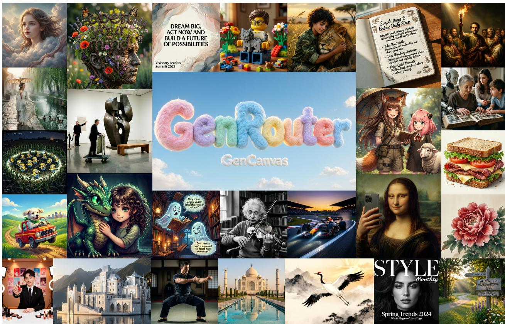  
Figure 1 | Generated images using our proposed GenRouter within GenCanvas.

Abstract. The rapid evolution of text-to-image (T2I) generation models has efectively solved the foundational challenge of raw pixel synthesis, shifting the community’s focus toward fulfilling increasingly intricate user requests. While recent agentic image generation workflows enhance static inference with advanced capabilities like external knowledge retrieval and iterative reasoning, they mostly operate in isolated silos with fixed “one-size-fits-all" topologies. This inevitably leads to severe compute-mismatch, where simple queries are forced through computationally heavy pipelines. To bridge this gap, we present GenRouter, the first unified workflow routing framework for agentic image generation. We first formulate GenCanvas, standardizing diverse agentic pipelines into a universal set of foundational primitives and executable templates. Operating over this unified space, GenRouter adaptively routes heterogeneous prompts to their optimal workflows via (i) demand profiling, (ii) experience matching, and (iii) Pareto filtering. Extensive experiments across diverse benchmarks demonstrate that GenRouter achieves superior visual alignment while reducing execution costs by over 95% and latency by 65% compared to heavyweight static pipelines. Furthermore, the system continuously self-evolves via accumulated experience, enabling robust zero-shot generalization that boosts performance and halves computational overhead.

## 1. Introduction

The rapid evolution of text-to-image (T2I) generation models [23, 30, 1] has achieved unprecedented levels of visual fidelity, efectively solving the foundational challenge of raw pixel synthesis. As these models transition into ubiquitous utilities, the community’s focus has naturally expanded toward accommodating an increasingly complex and diverse array of user requests [9, 38, 15]. Modern image generation tasks are consistently pushing the boundaries of what static inference can achieve: while some prompts remain straightforward aesthetic descriptions, a rapidly growing number of contemporary requests are highly intricate, demanding external world knowledge, precise text rendering, or multi-step spatial and logical reasoning.

To tackle this escalating complexity, early efforts relied on simple test-time scaling strate-

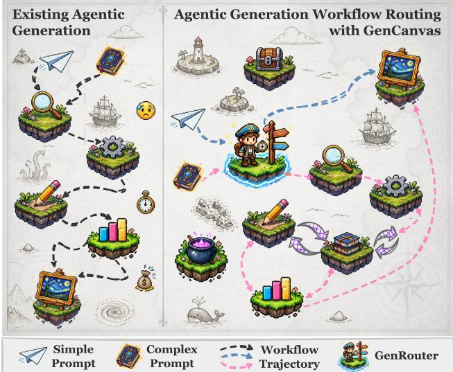  
Figure 2 | (Left) Existing systems enforce a fixed execution workflow. (Right) GenRouter dynamically routes prompts to their optimal workflow trajectories over the unified GenCanvas.

gies, such as prompt pre-generation refinement [29, 11] or post-generation rewriting [37, 40]. However, these homogeneous approaches remain fragile when faced with multi-constraint generation tasks. Consequently, recent research [15, 22, 14, 7] has increasingly embraced agentic systems for image generation, integrating advanced capabilities like knowledge retrieval, explicit reasoning, skill invocation, or iterative verification. Despite their remarkable eficacy on challenging requests, the current trajectory of agentic image generation, as shown in Figure 2 (Left), is hindered by two critical bottlenecks: (i) fragmentation: existing frameworks develop specialized pipelines in silos (e.g., Mind-Brush [14] focuses predominantly on external knowledge search), making it inherently dificult to integrate disparate capabilities or adapt their fixed topologies to diverse tasks; and (ii) computemismatch: operating under a “one-size-fits-all" paradigm, these systems impose heavily engineered workflows on every request. Consequently, even the simplest prompts are forced through costly reasoning or iterative refinement steps, unnecessarily squandering computational resources and introducing prohibitive latency. This leads to our pivotal research question:

How can we efectively route heterogeneous prompts to their optimal workflows to balance the visual performance and computational cost?

To address this challenge, we first formulate GenCanvas, the first unified workflow space that standardizes the execution paradigm of agentic image generation. Rather than devising yet another isolated pipeline, GenCanvas systematically deconstructs the generative process into a universally applicable set of foundational primitives (e.g., search, reason, verify, and sketch). By strategically composing these primitives, we establish a library of standard workflow templates, ranging from a lightweight “DirectGen" to a comprehensive “HybridGen". Crucially, GenCanvas is not merely an exhaustive collection of existing pipelines; instead, it serves as a systematized abstraction that distills, encapsulates, and extends the core conceptual paradigms of recent fixed agentic image generation frameworks [15, 22, 14, 7, 38]. Ultimately, GenCanvas serves as a modular and extensible foundation for the community, inherently yielding a structured space that facilitates both dynamic routing and diverse applications.

Building upon this standardized space, we further introduce GenRouter, an experience-guided workflow router dedicated to agentic image generation. GenRouter dynamically pairs a selected workflow template with an optimal backend image generator to mitigate the compute-mismatch bottleneck. Specifically, the routing mechanism is driven by three core components: ♣ profiling, extracting a lightweight task signature to quantitatively capture the intrinsic demands of the prompt; ♦ matching, leveraging historical execution traces and distilled experience cards to predict the overall utility of candidate plans; and ♠ filtering, applying cost-aware Pareto filtering to dynamically prune computationally ineficient configurations. Through this continuous cycle of routing, execution, and distillation, GenRouter operates as a self-evolving system, adaptively deploying a Pareto-optimal execution plan for every unique request while growing smarter over time.

To summarize, this work contributes threefold:

❶ Standardized Workflow Space. We introduce GenCanvas, a unified space that deconstructs agentic image generation into universal primitives and scalable templates. It establishes a modular and highly extensible infrastructure that standardizes image agentic workflows, providing a robust foundation to facilitate diverse downstream applications.

❷ Self-Evolving Router. We propose GenRouter, a dynamic, experience-guided workflow router for agentic image generation. Incorporating demand profiling, utility matching, and Pareto filtering, it seamlessly pairs prompts with optimal plans and autonomously refines its precision over time via a continuous execution-distillation loop.

❸ Empirical Validation. Extensive experiments across diverse benchmarks demonstrate that our framework efectively mitigates both fragmentation and compute-mismatch bottlenecks. By dynamically routing prompts over GenCanvas, GenRouter achieves superior visual alignment while reducing execution costs by over 95% and latency by 65% compared to heavyweight static pipelines (e.g., GEMS). Additionally, it continuously self-evolves via accumulated experience, enabling robust generalization that boosts performance and halves computational overhead.

## 2. Related Work

Agentic Image Generation. As modern image generators increasingly translate structurally detailed prompts into superior visual fidelity [41, 6, 30, 1, 32], agentic image generation has rapidly emerged. Early methods employed simple test-time scaling, coupling generators with language models for naive prompt expansion [29, 11], chain-of-thought reasoning [5, 33], or heuristic rewriting [37, 40]. While efective for standard queries, these superficial integrations struggle with intricate, multiconstraint tasks. Consequently, recent agentic image generation [17, 26, 7, 35, 45, 44] incorporate explicit tool-use, persistent memory, and orchestration capabilities. For instance, Gen-Searcher [9] and Mind-Brush [14] retrieve external multimodal evidence to resolve knowledge gaps; GenClaw [38] dictates spatial layouts via executable visual code; and systems like GEMS [15] and SCOPE [22] orchestrate the generative lifecycle through structured skill commitments and iterative repair. However, these advanced workflows operate as isolated silos, forcing every prompt through fixed pipelines. To bridge this gap, our work abstracts these disparate capabilities into a unified foundation, termed GenCanvas, and introduces GenRouter to adaptively route each prompt to its optimal agentic configuration.

Agentic System Routing. Model routing dynamically allocates queries to computational backends to balance performance and cost [24, 21]. Existing frameworks generally follow two paradigms: (i) learning-based routing [18, 10, 39, 43], which trains predictive ofline policies but often struggles with shifting task distributions; and (ii) experience-based routing [42, 27, 31], which leverages real-time execution feedback for continuous refinement. While GenRouter aligns with the experiencebased paradigm, prior works focus exclusively on model-level selection, predominantly for language models. Although recent RouteT2I [34] extends routing to the visual domain by dispatching requests between edge and cloud generators, it merely scales raw model capabilities within a static pipeline. Transcending simple backend allocation, we introduce the first workflow routing framework for agentic image generation, adaptively navigating a joint space of workflow templates and multimodal generators to satisfy heterogeneous requests.

## 3. Preliminary

Formulation of Agentic Generation. Let X and Y denote the spaces of textual prompts and generated images. Standard T2I generation computes $y = g ( x )$ , where $x \in X , y \in y$ , and $g \in { \mathcal { G } }$ represents a frozen generative backend (e.g., Qwen-Image [30]). To accommodate intricate user requests, agentic image generation expands this static inference by introducing a foundational primitive space $\Pi = \{ \pi _ { \mathrm { s e a r c h } } , \pi _ { \mathrm { r e a s o n } } , \pi _ { \mathrm { s k e t c h } } , \pi _ { \mathrm { v e r i f y } } , \dots \}$ . Consequently, an agentic execution plan is mathematically formalized as a tuple $\boldsymbol { p } = ( w , g )$ . Here, $w \in \mathcal { W }$ represents a directed topological workflow composed over Π, and $g \in { \mathcal { G } }$ is the paired generator. The final image is thus generated by executing the structured plan: $y = p ( x )$

Objective of Workflow Routing. We define $\mathcal { P } = \mathcal { W } \times \mathcal { G }$ as the available combinatorial plan repository. Given a user prompt �, the objective of workflow routing is to dynamically allocate the optimal plan $p ^ { * }$ that maximizes the overall utility $U ( p \mid x )$

$$
p ^ { * } = \arg \operatorname* { m a x } _ { p \in \mathcal { P } } U ( p \mid x ) = \arg \operatorname* { m a x } _ { p \in \mathcal { P } } \Big ( S ( p \mid x ) - \lambda _ { c } C ( p \mid x ) - \lambda _ { l } L ( p \mid x ) \Big ) ,\tag{1}
$$

where �, �, � denote visual quality, execution cost, and latency, respectively, regulated by trade-of coeficients $\lambda _ { c }$ and $\lambda _ { l }$

Under this formulation, existing agentic frameworks [15, 38] can be mathematically viewed as static instantiations where the decision space is artificially constrained to $| \mathcal { P } | = 1$ (e.g., consistently enforcing a fixed search [14] or reasoning trajectory for every prompt [22]). Operating under such “one-size-fits-all” constraints inevitably leads to severe compute-mismatch. In contrast, our GenCanvas establishes a structured foundation over the entire space ${ \mathcal { P } } ,$ allowing GenRouter to solve the routing objective on-the-fly and adaptively invoke compute-intensive primitives strictly when the intrinsic cognitive complexity of � demands them.

## 4. GenCanvas: A Unified Agentic Generation Workflow Space

## 4.1. Foundational Primitives

Existing agentic image generation frameworks typically operate in isolated silos, engineering custom pipelines for specific generative sub-tasks. To resolve this fragmentation and establish an integrated foundation, we introduce GenCanvas, as shown in Figure $3 \ : ( L e f t )$ . At its core, GenCanvas systematically deconstructs the complex generative process into a standardized library Π of atomic cognitive and operational primitives. Rather than an arbitrary taxonomy, Π is systematically distilled and extended from existing agentic paradigms (e.g., GEMS [15], GenClaw [38]) to ensure comprehensive coverage. Formally, we define this foundational space with eight primitives:

$$
\Pi = \left\{ \pi _ { \mathrm { r e w r i t e } } , \pi _ { \mathrm { d e c o m p o s e } } , \pi _ { \mathrm { s e a r c h } } , \pi _ { \mathrm { r e a s o n } } , \pi _ { \mathrm { s k i l l } } , \pi _ { \mathrm { v e r i f y } } , \pi _ { \mathrm { r e f i n e } } , \pi _ { \mathrm { s k e t c h } } \right\} .\tag{2}
$$

Functioning as cohesive building blocks that abstract away underlying model mechanics, these primitives encapsulate distinct capabilities, ranging from external knowledge retrieval $( \pi _ { \mathsf { s e a r c h } } )$ and logical inference $\left( \pi _ { \mathsf { r e a s o n } } \right)$ to spatial layout compilation $( \pi _ { \mathsf { s k e t c h } } )$ , providing the essential modular infrastructure to construct diverse agentic workflows.

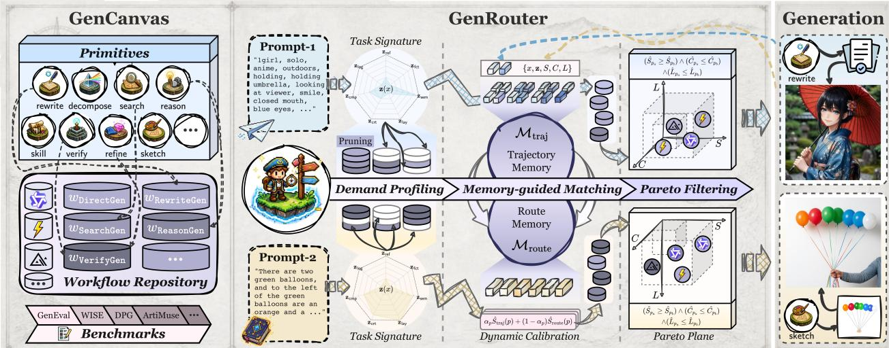  
Figure 3 | Overview of our proposed (Left) GenCanvas and (Right) GenRouter.

## 4.2. Workflow Design and Taxonomy

While the primitive library Π theoretically enables arbitrary combinations, unconstrained tool invocation often causes execution instability and redundant overhead. To standardize generation and bound the execution space $( { \mathcal { P } } = { \mathcal { W } } \times { \mathcal { G } } )$ , GenCanvas decouples topological execution logic from the terminal generator $g \in { \mathcal { G } }$ by predefining a set of reliable workflow templates $w \in \mathcal { W }$ . Inspired by diverse cognitive demands, these templates are categorized into four hierarchical levels:

❏ Semantic Alignment $( w _ { \mathrm { D i r e c t G e n } } , w _ { \mathrm { R e w r i t e G e n } } )$ . For aesthetic or straightforward queries, these templates bypass heavy external tools, either directly invoking � or employing $\pi _ { \mathsf { r e w r i t e } }$ to structurally enrich underspecified inputs before generation.

❏ External Grounding $( w _ { \mathrm { S e a r c h G e n } } , w _ { \mathrm { R e f G e n } } )$ . To mitigate factual or structural hallucinations regarding real-world and long-tail entities, these workflows explicitly invoke $\pi _ { \mathsf { s e a r c h } }$ to retrieve external textual knowledge or visual references prior to execution.

❏ Structural Reasoning (�<sub>ReasonGen</sub>, �<sub>SkillGen</sub>, �<sub>SketchGen</sub>). For demanding spatial layouts or precise constraints, these templates enforce rigorous pre-generation planning, leveraging $\pi _ { \mathsf { r e a s o n } }$ for logical deduction, $\pi _ { \mathsf { s k i l l } }$ for specialized formatting, $0 \Upsilon \pi _ { \mathsf { s k e t c h } }$ to compile structural intents into visual layout codes.

❏ Iterative Refinement $( w _ { \mathsf { V e r i f y G e n } } , w _ { \mathsf { H y b r i d G e n } } )$ . To handle multi-constraint prompts prone to oneshot failures, these workflows construct closed-loop structures via $\pi _ { \mathsf { d e c o m p o s e } }$ and $\pi _ { \mathsf { v e r i f y } }$ . A localized memory traces multimodal feedback, systematically guiding $\pi _ { \mathrm { r e f i n e } }$ to correct misalignments until convergence.

By formalizing these templates, GenCanvas establishes a robust and standardized infrastructure for deploying diverse generative strategies. Detailed configurations are provided in Appendix $\ S \mathrm { A }$

## 4.3. GenCanvas Codebase

Beyond a conceptual taxonomy, GenCanvas serves as a highly extensible, open-source codebase dedicated to the construction and evaluation of agentic image generation workflows.

Implementation. Engineered with strict modularity, the framework cleanly decouples topological configurations from model backends. This plug-and-play architecture enables the flexible substitution of base models for individual primitives and terminal generators $g \in { \mathcal { G } } \left( e . g . \right.$ , Qwen-Image [30] or Z-Image [1]), while seamlessly supporting the integration of new primitives and customized workflows. Furthermore, GenCanvas logically unifies recent paradigms, mapping their execution paths to specific instantiations within our taxonomy, as summarized in Table 1.

Table 1 | Core workflow templates and topological paths in GenCanvas. We abstract diverse generative demands into 9 structured templates over Π. Representative methods are mapped solely for conceptual alignment, not strict implementation equivalence. Icons classify these prior works into test-time scaling ( ) or agentic workflow ( ) for image generation.
<table><tr><td>Cognitive Level</td><td>Workflow (w ∈ W)</td><td>Topological Template</td><td>Representative Method</td></tr><tr><td rowspan="2">I: Semantic Alignment</td><td>DirectGen</td><td>g</td><td></td></tr><tr><td>RewriteGen</td><td> $\pi _ { \mathsf { r e w r i t e } } \to g$ </td><td>X BeautifulPrompt [3]</td></tr><tr><td rowspan="2">II: External Grounding</td><td>SearchGen</td><td> $\pi _ { \mathsf { s e a r c h } } \left( \mathrm { t e x t } \right) \to \pi _ { \mathsf { r e w r i t e } } \to g$ </td><td>∞ Gen-Searcher [9]</td></tr><tr><td>RefGen</td><td> $\pi _ { \mathsf { s e a r c h } } \left( { \mathsf { v i s u a l } } \right) \to \pi _ { \mathsf { r e w r i t e } } \to g$ </td><td>∞ Mind-Brush [14]</td></tr><tr><td rowspan="2">III: Structural Reasoning</td><td>ReasonGen</td><td> $\pi _ { \mathsf { r e a s o n } } \longrightarrow \pi _ { \mathsf { r e w r i t e } } \longrightarrow g$ </td><td>X Self-CoT [8]</td></tr><tr><td>SkillGen</td><td> $\pi _ { \mathsf { s k i l l } } \to \pi _ { \mathsf { r e w r i t e } } \to g$ </td><td>∞ GEMS [15]</td></tr><tr><td rowspan="2">IV: Iterative Refinement</td><td>SketchGen</td><td> $\pi _ { s \mathsf { k e t c h } } \to g$ </td><td>∞ GenClaw [38]</td></tr><tr><td>VerifyGen HybridGen</td><td> $\pi _ { \mathsf { d e c o m p o s e } } \to \mathbf { L o o p } ( g \to \pi _ { \mathsf { v e r i f y } } \to \pi _ { \mathsf { r e f i n e } } )$   $\{ \pi _ { \mathsf { s e a r c h } } , \pi _ { \mathsf { s k e t c h } } \} \to \mathbf { L o o p } ( g \to \pi _ { \mathsf { v e r i f y } } \to \pi _ { \mathsf { r e f i n e } } )$ </td><td>∞ GEMS [15] ∞ SCOPE [22]</td></tr></table>

Evaluation. To facilitate comprehensive assessments, GenCanvas provides out-of-the-box support for mainstream evaluation suites (e.g., GenEval [13], DPG-Bench [16], WISE [20]) and downstream benchmarks (e.g., LongText-Bench [12], SpatialGenEval [28], ArtiMuse [2]). By standardizing input-output interfaces across all templates, the engine natively tracks execution latency and token consumption, ofering a rigorous testbed for evaluating complex generation pipelines.

## 5. GenRouter: A Self-Evolving Agentic Image Workflow Router

While GenCanvas provides a unified abstraction for agentic templates, practical deployment requires dynamically matching incoming prompts with appropriate workflows. Fixed pipelines inevitably cause compute-mismatch, and manual selection is unscalable. To bridge this gap, we propose GenRouter, as shown in Figure 3 (Right), an adaptive router that selects an optimal workflow-generator plan $\boldsymbol { p } = ( w , g )$ to balance visual quality and computational eficiency.

Given a prompt �, GenRouter estimates the expected utility ${ \hat { U } } ( p \mid x )$ , as defined in Eq. (1), for each candidate plan. To ensure the search space remains empirically comparable, auxiliary primitive backends (e.g., search engines and verifiers) remain modular but fixed under a given routing configuration. The final routing objective is formalized as:

$$
{ \hat { p } } = \operatorname { a r g } \operatorname* { m a x } _ { p \in { \mathcal { P } } _ { \operatorname { p a r e t o } } ( x ) } { \hat { U } } ( p \mid x ) ,\tag{3}
$$

where $\mathcal { P } _ { \mathrm { p a r e t o } } ( x )$ represents the subset of plans that satisfy capability and task-compatibility constraints, naturally allocating advanced workflows only to demanding requests.

## 5.1. Demand Profiling

Conventional LLM (agent) routing often relies on semantic similarity. However, T2I generation is highly sensitive to subtle intent shifts; minor modifications (e.g., adding “with the exact text ‘ICLR 2027”’) can drastically alter generative demands despite minimal embedding distance. Furthermore, direct LLM-as-router also sufers from severe calibration issues and hallucination. Instead, GenRouter utilizes a lightweight LLM (e.g., Qwen3.5-4B [36]) strictly as a profiler to extract intrinsic cognitive demands of the prompt, guiding subsequent candidate construction.

Task Signature Extraction. The profiler first maps � into a seven-dimensional intent signature:

$$
\begin{array} { r } { \mathbf { z } ( x ) = ( \mathbf { z } _ { \mathrm { s e m } } , \mathbf { z } _ { \mathrm { f c t } } , \mathbf { z } _ { \mathrm { r e f } } , \mathbf { z } _ { \mathrm { l o g } } , \mathbf { z } _ { \mathrm { c m p } } , \mathbf { z } _ { \mathrm { c r t } } , \mathbf { z } _ { \mathrm { l a y } } ) \in \{ 0 , 1 , 2 , 3 , 4 , 5 \} ^ { 7 } . } \end{array}\tag{4}
$$

These axes represent semantic articulation, factual grounding, visual referencing, logical deduction, compositional heuristics, evaluative critique, and spatial layout, respectively. Scores $\geq 3$ indicate highneed thresholds. This decoupling ofers three benefits: $\textcircled{1}$ interpretability through tracing decisions to specific needs; ➁ calibration by treating the signature as a prior rather than a rigid path; and ➂ evolvability via real-world execution feedback (detailed in Section §5.2).

Candidate Pruning. To avoid evaluating the entire space $\mathcal { P } _ { i }$ , GenRouter derives a valid candidate set $\mathcal { P } _ { \mathrm { v a l i d } } ( x )$ via two pruning mechanisms: ❶ capability compatibility: a plan $( w , g )$ is invalid if � requires capabilities $g$ lacks $( e . g . , w _ { \tt R e f G e n }$ requires visual conditioning); and ❷ signature gating: to prevent compute-mismatch, heavyweight templates are explicitly gated by $\mathbf { z } ( x )$ . For instance, $w _ { \tt H y b r i d G e n }$ is activated only for complex prompts:

$$
\mathrm { a c t i v e } ( w _ { \mathrm { H y b r i d G e n } } ) = \mathbb { I } \left[ \sum _ { k \in \mathcal { H } } \mathbb { I } ( \mathbf { z } _ { k } \geq 3 ) \geq 2 \right] , \quad \mathcal { H } = \{ \mathbf { z } _ { \mathrm { f c t } } , \mathbf { z } _ { \mathrm { r e f } } , \mathbf { z } _ { \mathrm { l o g } } , \mathbf { z } _ { \mathrm { c m p } } , \mathbf { z } _ { \mathrm { c r t } } , \mathbf { z } _ { \mathrm { l a y } } \} .\tag{5}
$$

Cascading these constraints aggressively distills the combinatorial space, setting the stage for memoryguided utility estimation.

## 5.2. Memory-Guided Matching

While the task signature $\mathbf { z } ( x )$ identifies fundamental generative needs, it acts as a static prior oblivious to environment-specific performance variability. To adapt dynamically, GenRouter maintains a dualmemory system: trajectory memory and route memory.

Dual-Memory Experience. Trajectory memory $\boldsymbol { \mathcal { M } } _ { \mathrm { t r a j } }$ logs instance-level execution records. For a candidate plan $p ,$ it retrieves the top-� most similar historical prompts and estimates the expected utility $\hat { U } _ { \mathrm { t r a j } } ( p )$ by aggregating outcomes exclusively from past instances that utilized the exact same plan $p .$ . To mitigate data sparsity when exact matches are unavailable, route memory $M _ { \mathrm { r o u t e } }$ periodically distills these trajectory records into a bucket-level statistical representation. By grouping historical executions into coarse task categories based on their signatures, $M _ { \mathrm { r o u t e } }$ provides robust, aggregated priors $( e . g .$ , mean quality, cost, and latency) for each plan.

Dynamic Calibration. To determine the final plan, GenRouter fuses the estimates from both memories. The expected quality (and analogously, cost and latency) is computed as a confidenceweighted sum:

$$
\hat { S } _ { p } = \alpha _ { p } \hat { S } _ { \mathrm { t r a j } } ( p ) + ( 1 - \alpha _ { p } ) \hat { S } _ { \mathrm { r o u t e } } ( p ) ,\tag{6}
$$

where the confidence parameter $\alpha _ { p }$ increases proportionally with the number of retrieved trajectory records containing $p .$ If empirical memory is entirely absent (e.g., during cold-start), the system falls back to a deterministic threshold prior derived directly from z(�). This architecture ensures that GenRouter seamlessly transitions from signature-based priors to robust empirical routing, autonomously self-correcting based on realized compute costs and visual outcomes.

## 5.3. Pareto Filtering

After deriving the metric estimates $\{ \hat { S } _ { p } , \hat { C } _ { p } , \hat { L _ { p } } \}$ for each $p \in \mathcal { P } _ { \mathrm { v a l i d } } ( x )$ , relying solely on the scalarized utility $\hat { U } _ { p }$ can be vulnerable to anomalous selections, where a strictly inferior plan might be chosen due to linear weighting artifacts. To achieve more robust routing, we introduce a Pareto filtering

step prior to final selection. A plan $p _ { a }$ dominates $p _ { b }$ if it is no worse across all dimensions and strictly better in at least one:

$$
( \hat { S } _ { p _ { a } } \geq \hat { S } _ { p _ { b } } ) \wedge ( \hat { C } _ { p _ { a } } \leq \hat { C } _ { p _ { b } } ) \wedge ( \hat { L } _ { p _ { a } } \leq \hat { L } _ { p _ { b } } ) , \quad p _ { a } \not = p _ { b } .\tag{7}
$$

Defining the non-dominated Pareto set as $\mathcal { P } _ { \mathrm { p a r e t o } } ,$ , we deterministically prune suboptimal configurations that ofer no distinct trade-of advantages. The final plan is then selected as $\hat { p } = \mathrm { a r g } \operatorname* { m a x } _ { p \in \mathcal { P } _ { \mathrm { p a r e t o } } } \hat { U } _ { p }$

Through this multi-stage refinement, i.e., ♣ demand profiling, ♦ memory-guided matching, and ♠ Pareto filtering, GenRouter realizes a self-evolving loop: the system continuously accumulates empirical records to refine its utility landscape. This enables GenRouter to adaptively bridge the gap between initial signature-based priors and the nuanced performance characteristics of real-world deployment, ensuring long-term optimization without manual retraining.

## 6. Experiments

In this section, we conduct extensive experiments to answer the following key research questions: (RQ1) Can GenRouter efectively navigate GenCanvas to achieve a superior trade-of between quality, cost, and latency compared to static agentic pipelines? (RQ2) Are diverse workflow templates of GenCanvas necessary, and does GenRouter make interpretable routing decisions? (RQ3) Can GenRouter continuously self-evolve via experience accumulation and generalize efectively?

## 6.1. Experimental Settings

Baselines. We benchmark against direct generators and three open-sourced agentic image generation workflows: Mind-Brush [14] (with search), SCOPE [22] (with hybrid skills), and GEMS [15] (with verification). For fair comparison, we unify all underlying LLM/MLLM engines while preserving their original workflow topologies.

Benchmarks and Metrics. We evaluate GenRouter across two categories: (I) mainstream benchmarks featuring broad prompt distributions, i.e., WISE [20], DPG-Bench [16], OneIG-Bench [4], GenEval2 [19]; and (II) downstream benchmarks dedicated to targeted capability analysis, i.e., LongText [12], SpatialGenEval [28], ArtiMuse [2]. For metrics, we evaluate GenRouter across three core dimensions: ❶ performance: oficial benchmark scores; ❷ cost: exact token and API consumption; and ❸ latency: end-to-end workflow execution time. To ensure fair cross-workflow comparisons, generator-specific inference latency is explicitly isolated.

Generative Backends. Our experiments primarily utilize two advanced image generators to instantiate the terminal action space (G): Z-Image-Turbo [1] and Qwen-Image-2512 [30]. To support reference-dependent workflows (e.g., �<sub>RefGen</sub> and �<sub>SketchGen</sub>), we integrate Qwen-Image-Edit-2511 as a visual-conditioning mode for the Qwen-Image family.

Method Configurations. The demand profiler leverages a lightweight local LLM (Qwen3.5-4B [36]). While our primitive backends are designed to be entirely plug-and-play, we instantiate all generalpurpose linguistic and visual primitives (e.g., reason, verify) using Kimi K2.5 [25] (following GEMS [15]) to rigorously isolate the performance gains of our routing mechanism. External grounding relies on the Serper Search<sup>1</sup>. For the routing utility, $\lambda _ { c }$ and $\lambda _ { l }$ are set to 5.0 and 0.0006, respectively. More configurations are detailed in Appendix $\ S \mathrm { A }$

Table 2 | Performance comparison on WISE, DPG-Bench and GenEval2 benchmarks. The best and second best results are highlighted.
<table><tr><td rowspan="2">Generator</td><td rowspan="2">Method</td><td colspan="3">WISE</td><td colspan="3">DPG-Bench</td><td colspan="3">GenEval2</td></tr><tr><td>Perf. (%)</td><td>Cost ($)</td><td>Latency (h)</td><td>Perf. (%)</td><td>Cost ($)</td><td>Latency (h)</td><td>Perf. (%)</td><td>Cost ($)</td><td>Latency (h)</td></tr><tr><td></td><td>Original [30]</td><td>0.53</td><td>0.00</td><td>0.00</td><td>87.21</td><td>0.00</td><td>0.00</td><td>29.0</td><td>0.00</td><td>0.00</td></tr><tr><td rowspan="4">wen-mmaae</td><td>Mind-Brush [14]</td><td>0.68</td><td>4.40</td><td>3.65</td><td>83.74</td><td>2.42</td><td>2.71</td><td>32.1</td><td>1.80</td><td>2.38</td></tr><tr><td>SCOPE [22]</td><td>0.88</td><td>1.97</td><td>4.34</td><td>86.94</td><td>4.88</td><td>9.42</td><td>46.3</td><td>1.81</td><td>3.89</td></tr><tr><td>GEMS [15]</td><td>0.80</td><td>38.17</td><td>11.94</td><td>85.59</td><td>60.31</td><td>15.23</td><td>70.4</td><td>40.43</td><td>8.43</td></tr><tr><td>GenCanvas + GenRouter</td><td>0.88</td><td>1.57</td><td>4.16</td><td>87.39</td><td>1.41</td><td>2.52</td><td>71.6</td><td>2.03</td><td>3.59</td></tr><tr><td></td><td>Original [1]</td><td>0.57</td><td>0.00</td><td>0.00</td><td>85.01</td><td>0.00</td><td>0.00</td><td>31.0</td><td>0.00</td><td>0.00</td></tr><tr><td rowspan="4">az</td><td>Mind-Brush [14]</td><td>0.58</td><td>4.20</td><td>3.44</td><td>85.16</td><td>2.44</td><td>1.28</td><td>30.1</td><td>1.80</td><td>2.55</td></tr><tr><td>SCOPE [22]</td><td>0.85</td><td>1.93</td><td>4.26</td><td>85.03</td><td>4.86</td><td>9.65</td><td>40.0</td><td>1.82</td><td>4.33</td></tr><tr><td>GEMS [15]</td><td>0.81</td><td>24.63</td><td>11.83</td><td>86.01</td><td>46.33</td><td>18.69</td><td>63.5</td><td>19.63</td><td>8.32</td></tr><tr><td>GenCanvas + GenRouter</td><td>0.86</td><td>1.33</td><td>2.00</td><td>85.49</td><td>1.00</td><td>1.13</td><td>57.6</td><td>1.76</td><td>3.85</td></tr><tr><td>+7</td><td>GenCanvas + GenRouter</td><td>0.87</td><td>1.50</td><td>3.16</td><td>86.44</td><td>1.17</td><td>1.85</td><td>67.5</td><td>1.87</td><td>3.76</td></tr></table>

Table 3 | Performance comparison on OneIG-Bench benchmarks. “Average" includes five benchmarks’ results in both Tables 2 and 3.
<table><tr><td rowspan="2">Generator</td><td rowspan="2">Method</td><td colspan="3">OneIG-EN</td><td colspan="3">OneIG-CN</td><td colspan="3">Average</td></tr><tr><td>Perf. (%)</td><td>Cost ($)</td><td>Latency (h)</td><td>Perf. (%)</td><td>Cost ($)</td><td>Latency (h)</td><td>Perf. (%)</td><td>Cost ($)</td><td>Latency (h)</td></tr><tr><td></td><td>Original [30]</td><td>0.487</td><td>0.00</td><td>0.00</td><td>0.489</td><td>0.00</td><td>0.00</td><td>53.4</td><td>0.00</td><td>0.00</td></tr><tr><td rowspan="4">wen-ma</td><td>Mind-Brush [14]</td><td>0.508</td><td>3.30</td><td>4.95</td><td>0.516</td><td>4.34</td><td>7.75</td><td>57.2</td><td>3.25</td><td>4.29</td></tr><tr><td>SCOPE [22]</td><td>0.521</td><td>4.30</td><td>8.87</td><td>0.504</td><td>4.92</td><td>10.39</td><td>64.7</td><td>3.58</td><td>7.38</td></tr><tr><td>GEMS [15]</td><td>0.542</td><td>73.70</td><td>16.21</td><td>0.532</td><td>86.90</td><td>16.27</td><td>68.7</td><td>59.70</td><td>13.62</td></tr><tr><td>GenCanvas + GenRouter</td><td>0.553</td><td>5.50</td><td>5.92</td><td>0.541</td><td>4.34</td><td>7.23</td><td>71.3</td><td>2.97</td><td>4.68</td></tr><tr><td rowspan="5">Z-a</td><td>Original [1]</td><td>0.526</td><td>0.00</td><td>0.00</td><td>0.501</td><td>0.00</td><td>0.00</td><td>55.1</td><td>0.00</td><td>0.00</td></tr><tr><td>Mind-Brush [14]</td><td>0.517</td><td>3.45</td><td>4.99</td><td>0.489</td><td>4.63</td><td>8.00</td><td>54.8</td><td>3.30</td><td>4.05</td></tr><tr><td>SCOPE [22]</td><td>0.523</td><td>4.18</td><td>7.74</td><td>0.511</td><td>4.71</td><td>8.95</td><td>62.7</td><td>3.50</td><td>6.99</td></tr><tr><td>GEMS [15]</td><td>0.569</td><td>43.13</td><td>14.50</td><td>0.552</td><td>53.37</td><td>16.72</td><td>68.5</td><td>37.42</td><td>14.01</td></tr><tr><td>GenCanvas + GenRouter</td><td>0.570</td><td>6.67</td><td>5.95</td><td>0.545</td><td>4.56</td><td>7.62</td><td>68.1</td><td>3.06</td><td>4.11</td></tr><tr><td>+7</td><td>GenCanvas + GenRouter</td><td>0.561</td><td>6.12</td><td>5.94</td><td>0.542</td><td>4.44</td><td>7.41</td><td>70.2</td><td>3.02</td><td>4.42</td></tr></table>

## 6.2. Main Results

To answer RQ1, we quantitatively evaluate the generation performance, API cost, and execution latency of our GenRouter within GenCanvas against static agentic baselines, summarized in Tables 2 and 3, alongside qualitative comparisons in Figures 1, 4, 13 and 14. Key observations are summarized:

Obs.❶ GenRouter significantly outperforms static pipelines while requiring a fraction of their computational overhead. As shown in the average results across five benchmarks in Table 3, GenRouter operating over GenCanvas with achieves the highest overall performance (71.3%) while reducing execution cost by over 95% (\$2.97 vs. \$59.70) and latency by 65% (4.68h vs. 13.62h) compared to the GEMS framework. Similar eficiency gains are consistently observed with the backend. Even when compared to lighter orchestration pipelines like SCOPE, the synergy of GenCanvas and GenRouter consistently delivers superior visual alignment with strictly lower overhead. This confirms that dynamically routing prompts to tailored workflows mitigates the compute-mismatch bottleneck inherent in “one-size-fits-all" systems.

Obs.❷ Dynamic routing efectively mitigates visual failure modes by allocating task-specific workflow templates. Qualitative comparisons in Figures 4, 13 and 14 illustrate that static pipelines often misallocate resources, either failing to resolve complex spatial constraints due to insuficient reasoning, or over-complicating simple queries. By adaptively dispatching structurally precise templates from GenCanvas (e.g., invoking � for multi-object layouts or � for text rendering), GenRouter successfully rectifies these errors while dramatically reducing per-prompt latency and cost

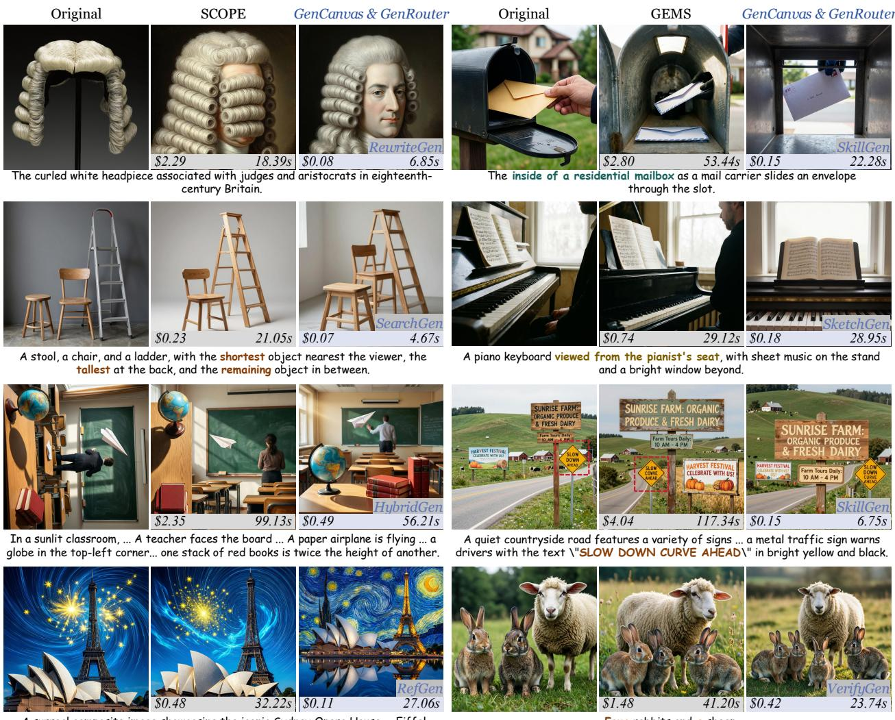  
A surreal composite image showcasing the iconic Sydney Opera House ... Eiffel Tower ... a vibrant blue sky, ... yellow stars burst forth in a dazzling display ...  
Four rabbits and a sheep.

Figure 4 | Qualitative comparison. Left side shows cost (scaled by 0.01); right side shows latency.

(e.g., \$0.18 vs. \$0.74 in the piano case). Furthermore, the diverse high-fidelity generations presented in Figure 1 demonstrate the combined framework’s robust versatility across various artistic styles, long-tail entities, and intricate semantic demands.

## 6.3. Routing Interpretability Analysis

To answer RQ2, we investigate the routing behaviors of GenRouter within GenCanvas. We analyze the workflow distributions on benchmarks from Tables 2 and 3 in Figure 5 (Left). Furthermore, for comprehensive evaluation across diverse scenarios, we construct a 500-prompt mixed test set sampling from nine mainstream and downstream benchmarks (details in Appendix §C.1). We compare the performance of GenRouter against single-workflow execution in GenCanvas on this mixed set in Figure 5 (Middle). Our key observations are summarized below:

Obs.❸ Routing distributions strongly correlate with the intrinsic demands of heterogeneous benchmarks, proving the necessity of diverse templates. As shown in Figure 5 (Left), GenRouter exhibits distinct routing preferences tailored to each benchmark’s characteristics. For instance, the aesthetics-focused DPG-Bench is dominated by lightweight text enhancements like �<sub>RewriteGen</sub> (68.83%) and � (21.03%), with minimal need for heavy verification. Conversely, prompts from OneIG-EN and OneIG-CN, which feature complex spatial and logical constraints, trigger a much broader utilization of structurally demanding templates, notably $w _ { \mathrm { H y b r i d G e n } }$ (18.93% and 10.61%) and $\scriptstyle w _ { \mathrm { R e a s o n G e n } }$ (28.48% for OneIG-CN). This dynamic adaptation confirms that a diverse workflow repository is necessary to optimally resolve heterogeneous generative intents.

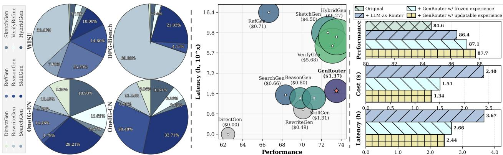  
Figure 5 | (Left) Routing distribution of GenRouter; (Middle) Utility comparison between isolated GenCanvas workflows; (Right) Zero-shot generalization on DPG-Bench with WISE experience.

Obs.❹ GenRouter achieves Pareto-optimal eficiency by allocating compute-intensive workflows strictly to complex queries. Figure 5 (Middle) plots the utility landscape of all isolated workflow templates in GenCanvas on the mixed test set. While comprehensive templates like $w _ { \mathrm { H y b r i d G e n } }$ and � achieve high performance (73.53 and 73.11, respectively), applying them uniformly to all prompts incurs exorbitant costs (\$6.27 and \$5.68) and significant latency (8.78h and 6.94h). By dynamically pruning unnecessary operations and selectively routing simple prompts to lightweight paths $( e . g . , w _ { \tt R e w r i t e G e n } )$ , GenRouter achieves matching top-tier performance (73.52) while drastically slashing average cost to \$1.37 and latency to 1.76h, positioning it in the optimal Pareto frontier.

## 6.4. Evolution and Generalization Analysis

To answer RQ3, we further assess the self-evolving capability and cross-benchmark generalization of GenRouter. First, we evaluate its performance on the mixed test set after sequentially accumulating routing experience from up to three distinct benchmarks (OneIG-EN, OneIG-CN, and LongText-CN) in Figure 6. Furthermore, we perform a zero-shot domain transfer experiment on DPG-Bench, initializing the router solely with prior experience distilled from the WISE benchmark, as shown in Figure 5 (Right). Our findings are summarized below:

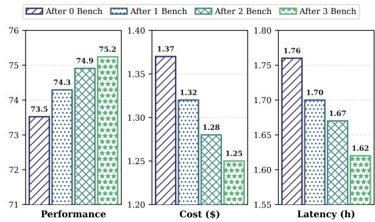  
Figure 6 | Self-evolution analysis.

Obs.❺ GenRouter efectively accumulates cross-task experience to continuously self-evolve, enabling zero-shot generalization across unseen distributions. As depicted in Figure 6, continuous exposure to new task distributions yields monotonic improvements across all metrics. After accumulating experience from three benchmarks, performance on the unseen mixed set improves from 73.5 to 75.2, while cost and latency drop by 8.7% and 7.9%, respectively. Furthermore, Figure 5 (Right) demonstrates its superior generalization. When transferring from WISE to DPG-Bench, even with frozen experience (disabling online updates), GenRouter achieves an 87.1 performance score, outperforming a standard LLM-as-Router (86.4) while halving the execution cost (\$1.51 vs. \$2.40). Allowing updatable experience during the target evaluation further boosts performance to 87.7 and reduces cost to \$1.34. This confirms that our dual-memory architecture successfully distills taskagnostic routing priors that seamlessly generalize to new domains without catastrophic forgetting or the need for manual retraining.

Case Study & Ablation Study. Additional qualitative case studies demonstrating the framework’s detailed execution steps are provided in Appendix §A.4 (Figures 7-10). Furthermore, comprehensive ablation studies validating the necessity of the bounded workflow space, individual routing components, the dual-memory mechanism, and utility sensitivity are detailed in Appendix §D.

## 7. Conclusion

In this work, we introduce GenRouter, the first unified workflow routing framework for agentic image generation, alongside GenCanvas, a standardized infrastructure of generative primitives and modular templates. By dynamically assigning heterogeneous prompts to optimal execution trajectories, our framework efectively mitigates the dual bottlenecks of system fragmentation and computemismatch inherent in existing “one-size-fits-all" agentic pipelines. Through continuous experience distillation, GenRouter autonomously self-evolves, enabling robust generalization across unseen domains. Extensive empirical validation demonstrates that GenRouter within GenCanvas not only achieves superior visual alignment but also drastically reduces execution cost and latency, establishing a highly eficient and scalable foundation for the next complex image generation.

## References

[1] Huanqia Cai, Sihan Cao, Ruoyi Du, Peng Gao, Steven Hoi, Zhaohui Hou, Shijie Huang, Dengyang Jiang, Xin Jin, Liangchen Li, et al. Z-image: An eficient image generation foundation model with single-stream difusion transformer. arXiv preprint arXiv:2511.22699, 2025.

[2] Shuo Cao, Nan Ma, Jiayang Li, Xiaohui Li, Lihao Shao, Kaiwen Zhu, Yu Zhou, Yuandong Pu, Jiarui Wu, Jiaquan Wang, et al. Artimuse: Fine-grained image aesthetics assessment with joint scoring and expert-level understanding. In Proceedings of the IEEE/CVF Conference on Computer Vision and Pattern Recognition, pages 15313–15322, 2026.

[3] Tingfeng Cao, Chengyu Wang, Bingyan Liu, Ziheng Wu, Jinhui Zhu, and Jun Huang. Beautifulprompt: Towards automatic prompt engineering for text-to-image synthesis. In Proceedings of the 2023 Conference on Empirical Methods in Natural Language Processing: Industry Track, pages 1–11, 2023.

[4] Jingjing Chang, Yixiao Fang, Peng Xing, Shuhan Wu, Wei Cheng, Rui Wang, Xianfang Zeng, Gang YU, and Hai-Bao Chen. Oneig-bench: Omni-dimensional nuanced evaluation for image generation. In The Thirty-ninth Annual Conference on Neural Information Processing Systems Datasets and Benchmarks Track.

[5] Chieh-Yun Chen, Min Shi, Gong Zhang, and Humphrey Shi. T2i-copilot: A training-free multiagent text-to-image system for enhanced prompt interpretation and interactive generation. In Proceedings of the IEEE/CVF International Conference on Computer Vision, pages 19396–19405, 2025.

[6] Harold Haodong Chen, Xinxiang Yin, Wen-Jie Shu, Hongfei Zhang, Zixin Zhang, Chenfei Liao, Litao Guo, Qifeng Chen, and Ying-Cong Chen. Show, don’t tell: Morphing latent reasoning into image generation. In Forty-third International Conference on Machine Learning, 2026. URL https://openreview.net/forum?id=pwz7P09W83.

[7] Sixiang Chen, Zhaohu Xing, Tian Ye, Xinyu Geng, Yunlong Lin, Jianyu Lai, Xuanhua He, Fuxiang Zhai, Jialin Gao, and Lei Zhu. Genevolve: Self-evolving image generation agents via tool-orchestrated visual experience distillation. arXiv preprint arXiv:2605.21605, 2026.

[8] Chaorui Deng, Deyao Zhu, Kunchang Li, Chenhui Gou, Feng Li, Zeyu Wang, Shu Zhong, Weihao Yu, Xiaonan Nie, Ziang Song, et al. Emerging properties in unified multimodal pretraining. arXiv preprint arXiv:2505.14683, 2025.

[9] Kaituo Feng, Manyuan Zhang, Shuang Chen, Yunlong Lin, Kaixuan Fan, Yilei Jiang, Hongyu Li, Dian Zheng, Chenyang Wang, and Xiangyu Yue. Gen-searcher: Reinforcing agentic search for image generation. arXiv preprint arXiv:2603.28767, 2026.

[10] Tao Feng, Yanzhen Shen, and Jiaxuan You. Graphrouter: A graph-based router for llm selections. In International Conference on Learning Representations, volume 2025, pages 26186–26203, 2025.

[11] Hanan Gani, Shariq Farooq Bhat, Muzammal Naseer, Salman Khan, and Peter Wonka. LLM blueprint: Enabling text-to-image generation with complex and detailed prompts. In The Twelfth International Conference on Learning Representations, 2024. URL https://openreview.net/ forum?id=mNYF0IHbRy.

[12] Zigang Geng, Yibing Wang, Yeyao Ma, Chen Li, Yongming Rao, Shuyang Gu, Zhao Zhong, Qinglin Lu, Han Hu, Xiaosong Zhang, et al. X-omni: Reinforcement learning makes discrete autoregressive image generative models great again. arXiv preprint arXiv:2507.22058, 2025.

[13] Dhruba Ghosh, Hannaneh Hajishirzi, and Ludwig Schmidt. Geneval: An object-focused framework for evaluating text-to-image alignment. Advances in Neural Information Processing Systems, 36:52132–52152, 2023.

[14] Jun He, Junyan Ye, Zilong Huang, Dongzhi Jiang, Chenjue Zhang, Leqi Zhu, Renrui Zhang, Xiang Zhang, and Weijia Li. Mind-brush: Integrating agentic cognitive search and reasoning into image generation. arXiv preprint arXiv:2602.01756, 2026.

[15] Zefeng He, Siyuan Huang, Xiaoye Qu, Yafu Li, Tong Zhu, Yu Cheng, and Yang Yang. Gems: Agent-native multimodal generation with memory and skills. arXiv preprint arXiv:2603.28088, 2026.

[16] Xiwei Hu, Rui Wang, Yixiao Fang, Bin Fu, Pei Cheng, and Gang Yu. Ella: Equip difusion models with llm for enhanced semantic alignment. arXiv preprint arXiv:2403.05135, 2024.

[17] Kaixun Jiang, Yuzheng Wang, Junjie Zhou, Pandeng Li, Zhihang Liu, Chen-Wei Xie, Zhaoyu Chen, Yun Zheng, and Wenqiang Zhang. Genagent: Scaling text-to-image generation via agentic multimodal reasoning. arXiv preprint arXiv:2601.18543, 2026.

[18] Wittawat Jitkrittum, Harikrishna Narasimhan, Ankit Singh Rawat, Jeevesh Juneja, Congchao Wang, Zifeng Wang, Alec Go, Chen-Yu Lee, Pradeep Shenoy, Rina Panigrahy, et al. Universal model routing for eficient llm inference. arXiv preprint arXiv:2502.08773, 2025.

[19] Amita Kamath, Kai-Wei Chang, Ranjay Krishna, Luke Zettlemoyer, Yushi Hu, and Marjan Ghazvininejad. Geneval 2: Addressing benchmark drift in text-to-image evaluation. arXiv preprint arXiv:2512.16853, 2025.

[20] Yuwei Niu, Munan Ning, Mengren Zheng, Weiyang Jin, Bin Lin, Peng Jin, Jiaqi Liao, Chaoran Feng, Fanqing Meng, Kunpeng Ning, et al. Wise: A world knowledge-informed semantic evaluation for text-to-image generation. arXiv preprint arXiv:2503.07265, 2025.

[21] Sebastian Raschka. Model evaluation, model selection, and algorithm selection in machine learning. arXiv preprint arXiv:1811.12808, 2018.

[22] Tianfei Ren, Zhipeng Yan, Yiming Zhao, Zhen Fang, Yu Zeng, Guohui Zhang, Hang Xu, Xiaoxiao Ma, Shiting Huang, Ke Xu, et al. Scope: Structured decomposition and conditional skill orchestration for complex image generation. arXiv preprint arXiv:2605.08043, 2026.

[23] Robin Rombach, Andreas Blattmann, Dominik Lorenz, Patrick Esser, and Björn Ommer. Highresolution image synthesis with latent difusion models. In Proceedings ofthe IEEE/CVF conference on computer vision and pattern recognition, pages 10684–10695, 2022.

[24] Kv Aditya Srivatsa, Kaushal Maurya, and Ekaterina Kochmar. Harnessing the power of multiple minds: Lessons learned from llm routing. In Proceedings of the Fifth Workshop on Insights from Negative Results in NLP, pages 124–134, 2024.

[25] Kimi Team, Tongtong Bai, Yifan Bai, Yiping Bao, SH Cai, Yuan Cao, Y Charles, HS Che, Cheng Chen, Guanduo Chen, et al. Kimi k2. 5: Visual agentic intelligence. arXiv preprint arXiv:2602.02276, 2026.

[26] Xingchen Wan, Han Zhou, Ruoxi Sun, Hootan Nakhost, Ke Jiang, Rajarishi Sinha, and Sercan Ö Arık. Maestro: Self-improving text-to-image generation via agent orchestration. arXiv preprint arXiv:2509.10704, 2025.

[27] Yimin Wang, Jiahao Qiu, Xuan Qi, Xinzhe Juan, Jingzhe Shi, Zelin Zhao, Hongru Wang, Shilong Liu, and Mengdi Wang. Learning agent routing from early experience. arXiv preprint arXiv:2605.07180, 2026.

[28] Zengbin Wang, Xuecai Hu, Yong Wang, Feng Xiong, Man Zhang, and Xiangxiang Chu. Everything in its place: Benchmarking spatial intelligence of text-to-image models. arXiv preprint arXiv:2601.20354, 2026.

[29] Zhenyu Wang, Enze Xie, Aoxue Li, Zhongdao Wang, Xihui Liu, and Zhenguo Li. Divide and conquer: Language models can plan and self-correct for compositional text-to-image generation. arXiv preprint arXiv:2401.15688, 2024.

[30] Chenfei Wu, Jiahao Li, Jingren Zhou, Junyang Lin, Kaiyuan Gao, Kun Yan, Sheng-ming Yin, Shuai Bai, Xiao Xu, Yilei Chen, et al. Qwen-image technical report. arXiv preprint arXiv:2508.02324, 2025.

[31] Fangzhou Wu and Sandeep Silwal. PORT: Eficient training-free online routing for high-volume multi-LLM serving. In Machine Learningfor Systems 2025, 2025. URL https://openreview. net/forum?id=B0iFlb0h4n.

[32] Xianfeng Wu, Yajing Bai, Haoze Zheng, Harold Haodong Chen, Yexin Liu, Zihao Wang, Xuran Ma, Wen-Jie Shu, Xianzu Wu, Harry Yang, et al. Lightgen: Eficient image generation through knowledge distillation and direct preference optimization. arXiv preprint arXiv:2503.08619, 2025.

[33] Dawei Xiang, Wenyan Xu, Kexin Chu, Tianqi Ding, Zixu Shen, Yiming Zeng, Jianchang Su, and Wei Zhang. Promptsculptor: Multi-agent based text-to-image prompt optimization. In Proceedings of the 2025 Conference on Empirical Methods in Natural Language Processing: System Demonstrations, pages 774–786, 2025.

[34] Zewei Xin, Qinya Li, Chaoyue Niu, Fan Wu, and Guihai Chen. Adaptive routing of text-to-image generation requests between large cloud model and light-weight edge model. In Proceedings of the IEEE/CVF International Conference on Computer Vision, pages 19482–19491, 2025.

[35] Xinli Xu, Litao Guo, Yehang Zhang, Haotian Bai, Jiantao Lin, Jiawei Feng, Luozhou Wang, Zhen Yang, Man Chen, Zixin Zhang, et al. Agentic generative systems: A survey on autonomous multimodal content creation. 2026.

[36] An Yang, Anfeng Li, Baosong Yang, Beichen Zhang, Binyuan Hui, Bo Zheng, Bowen Yu, Chang Gao, Chengen Huang, Chenxu Lv, et al. Qwen3 technical report. arXiv preprint arXiv:2505.09388, 2025.

[37] Zhengyuan Yang, Jianfeng Wang, Linjie Li, Kevin Lin, Chung-Ching Lin, Zicheng Liu, and Lijuan Wang. Idea2img: Iterative self-refinement with gpt-4v for automatic image design and generation. In European Conference on Computer Vision, pages 167–184. Springer, 2024.

[38] Junyan Ye, Jun He, Zilong Huang, Dongzhi Jiang, Xuan Yang, Rui Chen, and Weijia Li. Genclaw: Code-driven agentic image generation. arXiv preprint arXiv:2605.30248, 2026.

[39] Yanwei Yue, Guibin Zhang, Boyang Liu, Guancheng Wan, Kun Wang, Dawei Cheng, and Yiyan Qi. Masrouter: Learning to route llms for multi-agent systems. In Proceedings of the 63rd Annual Meeting of the Association for Computational Linguistics (Volume 1: Long Papers), pages 15549–15572, 2025.

[40] Jingtao Zhan, Qingyao Ai, Yiqun Liu, Yingwei Pan, Ting Yao, Jiaxin Mao, Shaoping Ma, and Tao Mei. Prompt refinement with image pivot for text-to-image generation. In Proceedings of the 62nd Annual Meeting of the Association for Computational Linguistics (Volume 1: Long Papers), pages 941–954, 2024.

[41] Chenshuang Zhang, Chaoning Zhang, Mengchun Zhang, In So Kweon, and Junmo Kim. Textto-image difusion models in generative ai: A survey. arXiv preprint arXiv:2303.07909, 2023.

[42] Guibin Zhang, Haiyang Yu, Kaiming Yang, Bingli Wu, Fei Huang, Yongbin Li, and Shuicheng Yan. Evoroute: Experience-driven self-routing llm agent systems. arXiv preprint arXiv:2601.02695, 2026.

[43] Haozhen Zhang, Tao Feng, and Jiaxuan You. Router-r1: Teaching llms multi-round routing and aggregation via reinforcement learning. arXiv preprint arXiv:2506.09033, 2025.

[44] Zekai Zhang, Jiahao Li, Jie Zhang, Kaiyuan Gao, Kun Yan, Lihan Jiang, Ningyuan Tang, Shengming Yin, Tianhe Wu, Xiaoyue Chen, et al. Qwen-image-agent: Bridging the context gap in real-world image generation. arXiv preprint arXiv:2606.26907, 2026.

[45] Jiahao Zhao, Xiaomin Yu, Zhongxiang Sun, Fengwei Teng, Chengwei Qin, Xiaobin Hu, Jun Xu, and Shuicheng Yan. Toolartist: Tool-using unified multimodal models for agentic image generation. arXiv preprint arXiv:2608.04436, 2026.

## A. GenCanvas Implementation

## A.1. Formal Definition of Primitives

GenCanvas formalizes agentic workflows as directed compositions of primitive operators. For strict observability and cost tracking, each primitive emits a unified PrimitiveTrace logging the executed backend, token consumption, monetary cost, and latency. Furthermore, to cleanly decouple the execution logic from the underlying LLMs/MLLMs, GenCanvas enforce strict JSON-based meta-prompt contracts for all agentic operations. The core foundational primitives are defined below:

• Decompose (�<sub>decompose</sub>): This primitive translates the raw user prompt into a structured visual specification. It identifies explicit visible entities, verifiable constraints, and unresolved unknowns. The constraint parameters are subsequently converted into a checklist for the verification phase.

```jsonl
{
" entities ": [{" id ": " o1 " , " name ": " visible entity ", " priority ": " primary
"}] ,
" constraints ": [{
" id ": " c1 ", " text ": " visual requirement ", " type ": " attribute "
}] ,
" unknowns ": [{" id ": " u1 " , " owner_id ": " o1 " , " question ": " what is
unresolved ?"}]
}
```

• Search (�<sub>search</sub>) & Reason (�<sub>reason</sub>): These primitives actively resolve the “unknowns" identified during decomposition. � retrieves external textual facts or visual references, returning typed Evidence. �<sub>reason</sub> resolves implicit visual implications that require logical, spatial, or causal deduction, returning its conclusions as reasoning notes.

• Skill (�<sub>skill</sub>): Functioning as a strategic router, this primitive evaluates the task signature against a built-in skill bank to retrieve reusable, domain-specific prompt-engineering instructions. If no specialized skill is matched, it gracefully falls back to lightweight heuristic guidelines for spatial and text rendering.

• Sketch (�<sub>sketch</sub>): For prompts demanding precise spatial layouts, this primitive generates an executable code sketch (e.g., SVG, HTML/CSS, or Three.js) to serve as a strict structural reference for the downstream image generator.

```jsonl
{
" reasoning ": [" brief planning note "],
" sketch_type ": " svg | html_css | threejs ",
" records ": [{" id ": "r1", " kind ": " entity ", " details ": " what and where "}] ,
" code ": " complete directly renderable code ",
" render_prompt ": " Follow this sketch as a strict layout reference ."
}
```

• Verify (� ): Powered by an MLLM backend, this primitive closes the execution loop by evaluating the generated image against the checklist derived from �<sub>decompose</sub>. It assigns failure families (e.g., layout, attribute, count) to unmet constraints to guide the subsequent refinement.

{   
" items ": [{   
" constraint\_id ": "c1",   
" passed ": false ,   
" rationale ": " short visual reason ",   
" failure\_family ": " layout "   
}]

• Refine $\textstyle ( \pi _ { \mathrm { r e f i n e } } )$ & Rewrite $( \pi _ { \mathsf { r e w r i t e } } ) \colon \pi _ { \mathsf { r e w r i t e } }$ synthesizes the original prompt, retrieved evidence, skill instructions, and reasoning notes into a self-contained, generator-ready prompt. In the event of a verification failure, $\pi _ { \mathrm { r e f i n e } }$ ingests the VerificationFeedback and attempt history to formulate a corrected prompt, explicitly instructed to fix failed targets while preserving passed requirements.

By enforcing these standardized input-output interfaces, GenCanvas ensures that complex cognitive tasks are reliably decomposed into manageable, trackable, and heavily constrained atomic operations.

## A.2. Topological Configurations of Workflow

In GenCanvas, workflow templates are implemented as modular Python classes whose execution methods compose primitives into directed topologies. This design cleanly decouples the execution logic from the underlying generator backends. Below, we detail the structural configurations of two representative workflows:

• Iterative Refinement $( w _ { \mathtt { V e r i f y G e n } } )$ : This template implements a closed-loop topology to systematically correct generation failures. It begins by invoking �<sub>decompose</sub> to extract the verification checklist and $\pi _ { \mathsf { r e w r i t e } }$ to formulate the initial prompt. The workflow then enters a loop bounded by a predefined max\_iter. In each iteration, it executes the generator � and immediately evaluates the output using $\pi _ { \mathsf { v e r i f y } }$ . If constraints fail, the attempt history and feedback are passed to $\pi _ { \mathrm { r e f i n e } }$ to update the prompt for the subsequent iteration.

• Structural Reasoning $( w _ { \mathrm { { S k e t c h G e n } } } ) ;$ : To handle demanding spatial constraints, this topology separates symbolic layout construction from photorealistic synthesis. It first utilizes $\pi _ { \mathsf { s k e t c h } }$ to generate deterministic, executable visual code (e.g., SVG or HTML/CSS) representing the spatial layout. The image generator then ingests the rendered sketch as a strict structural reference, focusing solely on adding style, texture, lighting, and realism to the explicitly defined layout.

## A.3. Extensibility and Architecture

To facilitate rapid prototyping and rigorous benchmarking, GenCanvas is architected with strict modularity, allowing seamless integration of new primitives, topologies, and backends.

Decoupling Logic from Backend Models. A critical design principle of GenCanvas is the strict separation of logical topologies from proprietary model APIs. All primitives interact exclusively with standardized abstract protocols (e.g., LLMBackend, GeneratorBackend). This agnostic design allows researchers to seamlessly swap providers, from local pipelines to commercial endpoints, without altering core workflow logic. Concrete models are managed via a Registry pattern and configured through a YAML interface, which automatically enforces capability constraints.

Unified Evaluation and Accounting Engine. Evaluating agentic systems requires tracking both visual fidelity and computational overhead. GenCanvas features an integrated evaluation scafold that standardizes accounting across all workflows. Every primitive execution logs its specific token usage, API pricing, and execution latency into a PrimitiveTrace. The runner then aggregates these traces into a unified output:

WorkflowResult (   
workflow =str , # e.g., " HybridGen "   
generator =str , # e. g., " Qwen - Image -2512"

trace = list [ PrimitiveTrace ],   
score =float , # Quality metric   
cost =float , # Aggregated monetary cost   
latency = float , # End -to -end execution time

## A.4. Showcase

In this section, we provide detailed visual examples to further illustrate the generative capabilities and routing mechanisms of GenRouter within GenCanvas.

Workflow Demonstrations. Figures 7 and 8 showcase the visual outcomes of a single prompt executed across the entire spectrum of GenCanvas workflows. These examples clearly demonstrate how varying degrees of cognitive intervention, from naive direct generation to iterative hybrid refinement, drastically alter the structural composition, factual accuracy, and semantic alignment of the final image.

Six checkered cats, and seven checkered sheeps under two metal guitars


  
SearchGen

  
RefGen

  
ReasonGen

  
SkillGen

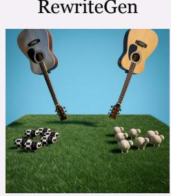  
SketchGen

  
VerifyGen

  
HybridGen

Two gold balls, one large and one small, fall from the air Compare their height at the same moment

Figure 7 | Workflow demonstration of GenCanvas & GenRouter.  
  
DirectGen

  
RewriteGen

  
SearchGen

  
RefGen

  
ReasonGen

  
SkillGen

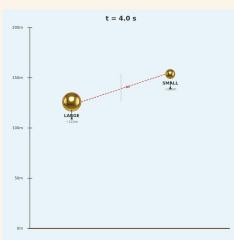  
SketchGen

  
VerifyGen

  
Figure 8 | Workflow demonstration of GenCanvas & GenRouter.  
HybridGen

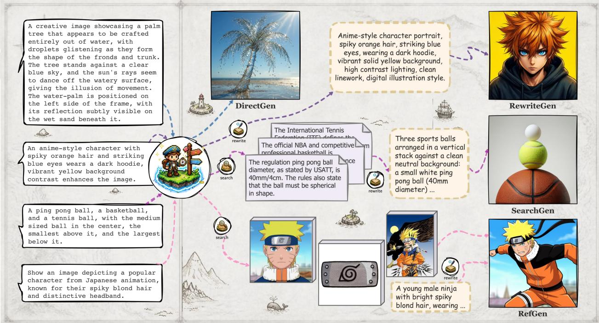  
Figure 9 | Case study of GenCanvas & GenRouter.

Case Studies. Figures 9 and 10 provide a granular look at the internal execution logic of GenRouter. For representative prompts, we visualize the step-by-step trajectory, detailing how GenRouter intelligently dispatches specific primitives (e.g., extracting factual knowledge via $\pi _ { \mathsf { s e a r c h } }$ , rendering structural code via $\pi _ { \mathsf { s k e t c h } }$ , or enforcing constraints via iterative $\pi _ { \mathsf { v e r i f y } }$ loops) to systematically resolve complex generative intents.

## B. GenRouter Implementation

## B.1. Cold Start and Experience Distillation

To bridge the gap between deterministic priors and environment-specific performance, GenRouter employs a cold-start initialization phase (isolated from the evaluation process) to construct empirical baselines for its dual-memory system.

Exhaustive Exploration. We initialize the cold-start phase with � = 10 diverse calibration prompts sampled from the target benchmark. For each prompt, the demand profiler extracts its task signature to construct compatible workflow-generator candidate plans. GenRouter exhaustively executes all valid candidates for these � prompts, ensuring unbiased data collection across all generative trajectories.

Batched Evaluation. Rather than scoring generations on-the-fly, GenRouter uniformly evaluates accumulated outputs every 50 executions to optimize computational overhead. We employ oficial metrics and scorer backends from the targeted benchmarks (e.g., WISE [20], DPG-Bench [16]) to assess visual performance. These scores are then synthesized with automatically logged token consumption � and execution time � to compute the final scalarized utility.

Periodic Memory Distillation. Following each batched evaluation (every 50 records), the evaluated prompt-plan outcomes are appended to the trajectory memory $\boldsymbol { \mathcal { M } } _ { \mathrm { t r a j } }$ . Concurrently, GenRouter distills these records into the route memory $M _ { \mathrm { r o u t e } }$ by grouping them into coarse task buckets based on their dominant signature requirements. Within each bucket, aggregate statistics (e.g., mean score, cost, and latency) are updated, and Pareto-optimal plans are dynamically recalculated. This periodic evaluation-distillation loop operates continuously during both the cold-start phase and online deployment, empowering GenRouter to autonomously self-evolve.

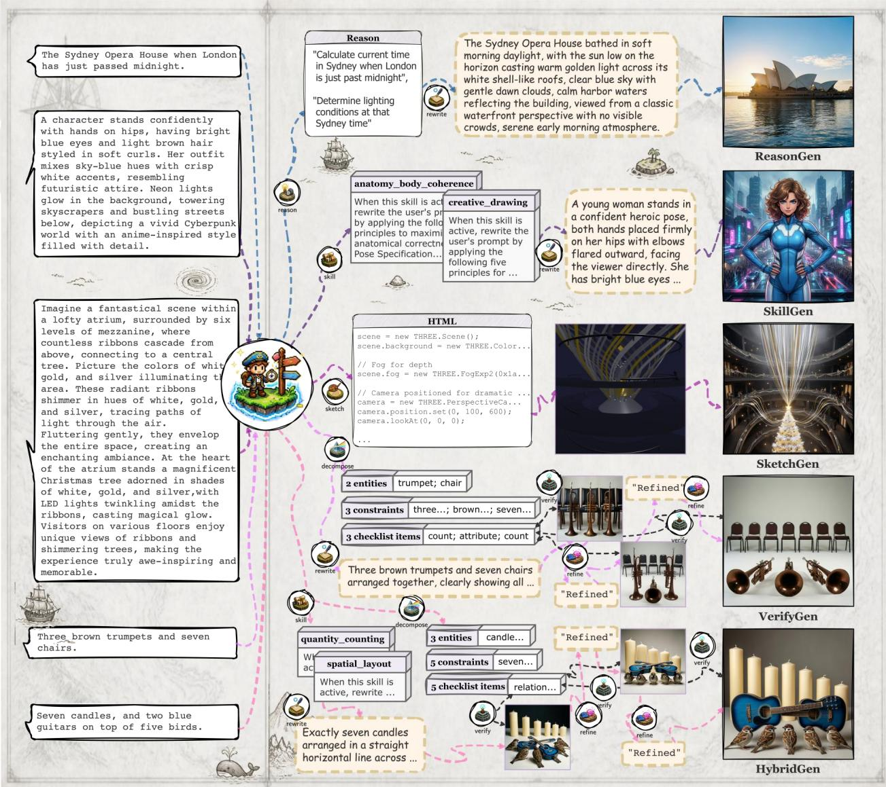  
Figure 10 | Case study of GenCanvas & GenRouter.

## B.2. More Details of Demand Profiling

As introduced in Section §5.1, GenRouter employs a lightweight LLM (i.e., Qwen3.5-4B [36]) as a demand profiler to map the incoming user prompt into a 7-dimensional task signature �(�). The detailed system prompt template is provided below:

Prompt for Signature Extraction   
I Ⅱ Ⅱ   
Analyze the user ’ s image generation prompt , briefly explain the scoring   
rationale , and then output a task signature as JSON .   
Output format :   
<reason >   
Semantic\_Articulation : [ score ], [a short explanation ]   
Factual\_Grounding : [ score ], [a short explanation ]

Visual\_Referencing : [ score ], [a short explanation ]   
Logical\_Deduction : [ score ], [a short explanation ]   
Compositional\_Heuristics : [ score ], [a short explanation ]   
Evaluative\_Critique : [ score ], [a short explanation ]   
Spatial\_Layout : [ score ], [a short explanation ]   
Give the score and then briefly explain from each field . Keep the explanation   
concise and grounded in the given prompt .   
</ reason >   
<json >   
{" semantic\_articulation ": ".   
" factual\_grounding ": ".   
" visual\_referencing ": ".   
" logical\_deduction ": ".   
" compositional\_heuristics ": ".   
" evaluative\_critique ": "...   
" spatial\_layout ": "..."}   
Each value must be a numeric score in 0, 1, 2, 3, 4, or 5.   
</ json >   
II ⅡI Ⅱ

## B.3. Algorithm Workflow

We summarize the overall dynamic routing workflow of GenRouter in Algorithm 1.

## C. Experimental Details

## C.1. Evaluation Details

Metrics. We evaluate the framework based on three dimensions: performance, cost, and latency. Performance corresponds to the oficial scoring mechanism of each respective benchmark. For cost and latency, we exclusively measure the overhead incurred by the routing process and primitive execution (e.g., LLM reasoning or search APIs). We deliberately exclude the computational cost and inference latency of the image generator. Isolating these factors is crucial for unbiased generator routing; otherwise, the inherent disparities in generator inference times and costs could heavily skew the utility function and cause an unfair bias against more capable, heavyweight models. The strategy for standardizing these performance metrics across heterogeneous tasks is detailed below.

The Mixed Test Set. To evaluate the robustness and generalization capabilities of GenRouter across highly diverse generative scenarios, we construct a comprehensive mixed test set. As detailed in Table 4, this set aggregates prompts from nine distinct benchmark distributions to ensure broad coverage of primitive demands. However, aggregating heterogeneous benchmarks introduces a significant challenge: each dataset employs distinct scoring scales and emphasizes completely diferent generative capabilities (e.g., spatial accuracy vs. text rendering). To address this, we design specific score weights to calibrate each subset. This normalization aligns the disparate evaluation metrics into a unified reward signal, enabling seamless experience sharing and allowing the router to efectively accumulate cross-task routing priors.

Table 4 | Composition of the mixed test set.
<table><tr><td>Info.</td><td>WISE</td><td>DPG</td><td>OneIG-EN</td><td>OneIG-CN</td><td>LongText-EN</td><td>LongText-CN</td><td>SpatialGenEval</td><td>ArtiMuse</td><td>GenEval2</td></tr><tr><td>Quantity</td><td>100</td><td>50</td><td>50</td><td>50</td><td>50</td><td>50</td><td>50</td><td>50</td><td>50</td></tr><tr><td>Score Weight</td><td>1.12</td><td>1.21</td><td>1.44</td><td>1.43</td><td>1.03</td><td>1.05</td><td>1.63</td><td>1.69</td><td>1.59</td></tr></table>

Algorithm 1: GenRouter   
Input: Prompt �, Workflows $\llangle \mathcal { W } ,$ Generators ${ \mathcal { G } } ,$ Memories $\begin{array} { r } { \mathcal { M } _ { \mathrm { t r a j } } , \mathcal { M } _ { \mathrm { r o u t e } } , } \end{array}$ , Penalties $\lambda _ { c } , \lambda _ { l }$   
Output: Generated Image �   
// Stage I: Demand Profiling & Candidate Pruning   
1 �(�) ← LLM-Profiler(�) // Extract 7-D task signature   
2 $\mathcal { P } _ { \mathrm { v a l i d } }  0$   
3 foreach $\upsilon \in \mathcal { W }$ and $g \in { \mathcal { G } }$ do   
4 if $( w , g )$ satisfies capability and gating constraints given �(�) then   
5 $\mathcal { P } _ { \mathrm { v a l i d } }  \mathcal { P } _ { \mathrm { v a l i d } } \cup \{ p = ( w , g ) \}$   
6 end   
7 end   
// Stage II: Memory-guided Matching   
8 foreach $p \in \mathcal { P } _ { \nu a l i d }$ do   
9 $( \hat { S } _ { \mathrm { t r a j } } , \hat { C } _ { \mathrm { t r a j } } , \hat { L } _ { \mathrm { t r a j } } )$ ← Retrieve $( M _ { \mathrm { t r a j } } , p , z ( x ) , k )$   
10 $( \hat { S } _ { \mathrm { r o u t e } } , \hat { C } _ { \mathrm { r o u t e } } , \hat { L } _ { \mathrm { r o u t e } } ) \gets \mathrm { A g g }$ regate $( M _ { \mathrm { r o u t e } } , p )$   
11 if ∃ historical memoryfor � then   
12 Compute confidence $\alpha _ { p } \in [ 0 , \alpha _ { 0 } ]$ based on match count   
13 $\hat { S } _ { p } \gets \alpha _ { p } \hat { S } _ { \mathrm { t r a j } } + ( 1 - \alpha _ { p } ) \hat { S } _ { 1 }$ route $\it { / / } S i m i l a r l y f o r \hat { C } _ { p } , \hat { L } _ { p }$   
14 else   
15 $\begin{array} { r l } { \Big | } & { { } ( \hat { S } _ { p } , \hat { C } _ { p } , \hat { L } _ { p } ) \gets \mathrm { P r i o r } ( z ( x ) , p ) } \end{array}$ // Deterministic fallback   
16 end   
17 $\hat { U } _ { p } \gets \hat { S } _ { p } - \lambda _ { c } \hat { C } _ { p } - \lambda _ { l } \hat { L } _ { p }$   
18 end   
// Stage III: Pareto Filtering & Execution   
19 $\mathcal { P } _ { \mathrm { p a r e t o } }  \emptyset$   
20 foreach $p \in \mathcal { S } _ { \nu a l i d }$ do   
21 if š $p ^ { \prime } \in \mathcal { P } _ { \nu a l i d } \setminus \{ p \}$ dominating � across $( \hat { S } , - \hat { C } , - \hat { L } )$ then   
22 P<sub>pareto</sub> ← P<sub>pareto</sub> ∪ {<sub>�</sub>}   
23 end   
24 end   
25 $\begin{array} { r } { p ^ { * } \gets \arg \operatorname* { m a x } _ { p \in \mathcal { P } _ { \mathrm { p a r e t o } } } \hat { U } _ { p } } \end{array}$   
26 $y  p ^ { * } ( x )$   
27 return �

## C.2. Baseline Details

In this section, we provide implementation configurations for each baseline method included in our comparison. To ensure a fair and rigorous evaluation, we standardize the underlying LLM/MLLM backbone across all baseline workflows to Kimi K2.5 [25] (the default in GEMS [15]), eliminating performance variances caused by the proprietary models originally used.

• GEMS [15] orchestrates an iterative refinement loop with persistent memory. It translates the prompt into atomic criteria $\left( \pi _ { \mathsf { d e c o m p o s e } } \right)$ and enters a closed-loop process where the generated image (�) is evaluated by a multimodal verifier $( \pi _ { \mathsf { v e r i f y } } )$ . Evaluation failures guide a refiner agent $\scriptstyle ( \pi _ { \mathrm { r e f i n e } } )$ to update the prompt iteratively. Within GenCanvas, this maps to the $w _ { \tt V e r i f y G e n }$ and $\boldsymbol { w } _ { \mathtt { S k i l 1 G e n } }$ templates.

• SCOPE [22] utilizes a specification-guided skill orchestration framework to maintain semantic commitments across the generation lifecycle. It translates requests into a structured semantic specification and conditionally invokes retrieval $( \pi _ { \mathsf { s e a r c h } } )$ , reasoning $\left( \pi _ { \mathsf { r e a s o n } } \right)$ , and repair $\scriptstyle ( \pi _ { \mathrm { r e f i n e } } )$ skills to resolve unknowns and fix localized failures identified by an itemized verifier $( \pi _ { \mathsf { v e r i f y } } )$ . This aligns with our comprehensive $w _ { \mathtt { H y b r i d G e n } }$ template.

• Mind-Brush [14] employs an agentic “think-research-create" workflow. It detects cognitive gaps and actively retrieves multimodal external evidence $( \pi _ { \mathsf { s e a r c h } } )$ while leveraging chain-of-thought logic $\left( \pi _ { \mathsf { r e a s o n } } \right)$ to resolve implicit constraints. A review agent then consolidates the evidence into an enriched master prompt $( \pi _ { \mathsf { r e w r i t e } } )$ prior to synthesis (�). This maps directly to our external grounding templates, �<sub>SearchGen</sub> and �<sub>RefGen</sub>.

## D. More Results & Sensitivity Analysis

## D.1. Workflow vs. Primitive Routing

To validate the necessity of GenCanvas’s bounded templates, we compare GenRouter against “Primitive Routing", where the router is given unconstrained access to the raw primitive library Π without predefined topologies. As illustrated in Figure 11, unconstrained routing leads to significant execution instability and redundant tool invocations. It achieves a lower performance of 65.00 while incurring substantially higher costs (\$2.03) and latency (2.91h) compared to GenRouter’s 73.52 performance at \$1.37 and 1.76h. This confirms that GenCanvas provides a critical stabilizing infrastructure, preventing the router from getting trapped in ineficient or infinite loops.

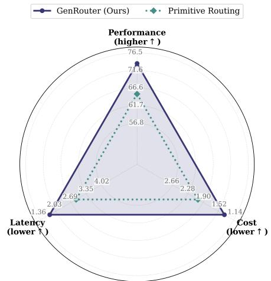  
Figure 11 | Analysis of bounded space of GenCanvas.

## D.2. Component Ablation of GenRouter

We further ablate the core components of GenRouter in Figure 12. Removing Demand Profiling (w/o D.P.) and routing directly based on prompt embeddings degrades performance to 72.54 and increases overhead, highlighting the importance of explicitly extracting cognitive signatures. Disabling Utility Matching (w/o U.M.) by clearing the empirical memories drastically spikes costs to \$5.33 and latency to 7.13h, as the router falls back to naive, uncalibrated thresholding. Finally, removing Pareto Filtering (w/o P.F.) leads to sub-optimal plan selections, slightly lowering performance (72.52) and increasing latency (1.93h). The integration of all three components is essential for achieving the optimal eficiency-performance balance.

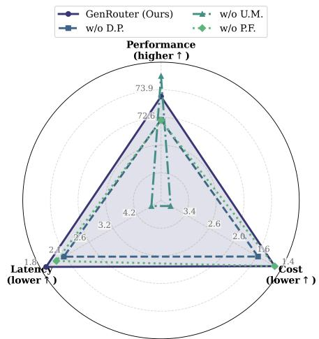  
Figure 12 | Analysis of components of GenRouter.

## D.3. Utility Analysis

In this section, we investigate the sensitivity of GenRouter to the utility trade-of coeficients, specifically the cost penalty $\lambda _ { c }$ and the latency penalty $\lambda _ { l } .$ as defined in Eq. (1). The results on the mixed test set are summarized in Table 5.

Cost Coeficient � . We evaluate GenRouter by vary  
ing $\lambda _ { c } ~ \in ~ \{ 1 . 0 , 5 . 0 , 1 0 . 0 \}$ while keeping $\lambda _ { l }$ fixed at   
0.0006. As shown in Table 5 (Top), increasing $\lambda _ { c }$ from   
1.0 to 5.0 significantly reduces both the execution cost (from 1.56 to 1.37) and latency, with only a

Table 5 | Sensitivity analysis of GenRouter + on the mixed test set.
<table><tr><td>Utility</td><td></td><td>Performance↑ Cost ($)↓ Latency (h)↓</td></tr><tr><td> $\overline { { \lambda _ { c } = 1 . 0 } }$ </td><td>73.56</td><td>1.56 1.98</td></tr><tr><td>λc = 5.0</td><td>73.52</td><td>1.37 1.76</td></tr><tr><td> $\lambda _ { c } = 1 0 . 0$ </td><td>73.00</td><td>1.36 1.87</td></tr><tr><td> $\lambda _ { l } = 0 . 0 0 0 3$ </td><td>73.26</td><td>1.50 1.85</td></tr><tr><td> $\lambda _ { l } = 0 . 0 0 0 6$ </td><td>73.52</td><td>1.37 1.76</td></tr><tr><td> $\lambda _ { l } = 0 . 0 0 1 0$ </td><td>73.47</td><td>1.37 1.74</td></tr></table>

negligible impact on visual performance (73.56 to 73.52). However, applying an overly aggressive cost penalty $( \lambda _ { c } = 1 0 . 0 )$ forces the router into overly simplistic workflows, leading to a noticeable performance degradation (73.00) with diminishing returns in cost savings. Therefore, we adopt $\lambda _ { c } ~ = ~ 5 . 0$ as the optimal default configuration to maintain high generation quality while strictly bounding API expenses.

Latency Coeficient $\lambda _ { l } .$ . We vary $\lambda _ { l } \in \{ 0 . 0 0 0 3 , 0 . 0 0 0 6 , 0 . 0 0 1 0 \}$ while keeping $\lambda _ { c }$ fixed at 5.0. An insuficient latency penalty $( \lambda _ { l } = 0 . 0 0 0 3 )$ results in a sub-optimal routing strategy that tolerates redundant primitive invocations, yielding both lower performance (73.26) and higher execution overhead. Increasing the penalty to 0.0006 achieves the best Pareto-optimal balance across all three metrics. Further increasing $\lambda _ { l }$ to 0.0010 marginally reduces latency (1.76 to 1.74 hours) but slightly compromises generation quality. Hence, $\lambda _ { l } = 0 . 0 0 0 6$ is selected to efectively penalize prohibitive execution delays without sacrificing the visual integrity of complex requests.

## D.4. Dual-Memory Experience Analysis

To validate the eficacy of our proposed dual-memory matching mechanism, we ablate the trajectory memory $( M _ { \mathrm { t r a j } } )$ and route memory $( M _ { \mathrm { r o u t e } } )$ on the mixed test set. The quantitative results are detailed in Table 6.

Compared to the original static generator, which yields a baseline performance of 62.51 with zero additional framework cost and latency, introducing either memory

Table 6 | Memory analysis of GenRouter $+ 2 3$ on the mixed test set.
<table><tr><td>Method</td><td>Performance↑ Cost ($)↓ Latency (h)↓</td><td></td><td></td></tr><tr><td>Original</td><td>62.51</td><td>0</td><td>0</td></tr><tr><td>+  $M _ { \mathrm { t r a j } }$  only</td><td>72.18</td><td>1.29</td><td>1.71</td></tr><tr><td>十  $M _ { \mathrm { r o u t e } }$  only</td><td>72.15</td><td>1.13</td><td>1.57</td></tr><tr><td>+ GenRouter</td><td>73.52</td><td>1.37</td><td>1.76</td></tr></table>

module independently yields substantial improvements. Relying solely on instance-level retrieval $\left( + \mathcal { M } _ { \mathrm { t r a j } } \right.$ only) boosts performance to 72.18, incurring a cost of 1.29 and a latency of 1.71h. Meanwhile, utilizing only the distilled bucket-level statistics $( + M _ { \mathrm { r o u t e } }$ only) achieves a comparable performance score of 72.15, but with noticeably lower execution overhead at a cost of 1.13 and latency of 1.57h. This highlights the efectiveness of $M _ { \mathrm { r o u t e } }$ in smoothing out noisy execution traces and providing a robust, computationally eficient prior. Crucially, the full GenRouter framework, which dynamically calibrates both memories, achieves the highest overall performance of 73.52. While the combined system incurs marginally higher computational overhead (1.37 cost, 1.76h latency) compared to the single-memory variants, the significant performance gain justifies the trade-of. This underscores the synergistic relationship between the two components: $\boldsymbol { \mathcal { M } } _ { \mathrm { t r a j } }$ ofers precise, fine-grained routing for familiar queries, whereas $M _ { \mathrm { r o u t e } }$ mitigates data sparsity and acts as a stable anchor, collectively guiding the router toward the optimal execution plan.

## E. Exhibition Board

We provide more comparison results here in Figures 13 and 14.

  
The two-wheeled vehicle associated with Roman races and triumphal imagery.

Figure 13 | More results demonstration of GenRouter within GenCanvas.

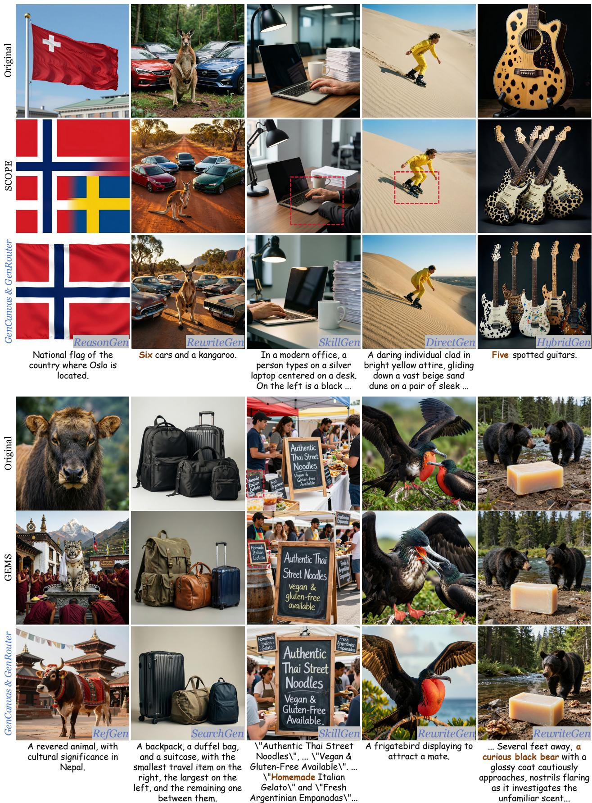  
Figure 14 | More results demonstration of GenRouter within GenCanvas.