# HOW SAMPLING STRATEGY AFFECTS IMBALANCE MITIGATION IN LIDAR SEGMENTATION: A STUDY OF STRUCTURED VS. RANDOM POINT-BASED ARCHITECTURES

Antonis Savva⋆ Christos Kyrkou⋆ Theocharis Theocharides⋆†

⋆ KIOS Research and Innovation Center of Excellence, and † Department of Electrical and Computer Engineering, University of Cyprus, 1 Panepistimiou Avenue, 2109 Aglantzia, Nicosia

## ABSTRACT

Class imbalance in LiDAR point clouds poses challenges for semantic segmentation in autonomous navigation and urban mapping. While 2D vision has numerous mitigation techniques, their effectiveness in 3D remains unclear. We benchmark six reweighting schemes and five imbalance-aware losses across three datasets (DALES, S3DIS, STPLS3D) using two architectures (KPConv, RandLA-Net). Inversefrequency weighting degrades performance by up to 12% compared to uniform weighting, with catastrophic failures in minority classes. Uniform weighting performs within 2% of complex losses for structured sampling (KPConv) but benefits less for random sampling (RandLA-Net, up to 4.6% gap). Loss landscape analysis reveals a complex interplay: for structured sampling, imbalance ratio determines landscape geometry on real LiDAR data but decouples from it on synthetic data; for random sampling, landscapes show high sensitivity to dataset geometry regardless of imbalance ratio. For the two evaluated point-based architectures, these results suggest that the interaction between sampling strategy (structured vs. random), imbalance severity, and data acquisition characteristics shapes which mitigation approaches are effective.

Index Terms— LiDAR point clouds, class imbalance, loss reweighting, landscape analysis

## 1. INTRODUCTION

LiDAR semantic segmentation is essential for autonomous navigation [1], urban mapping [2], and environmental monitoring [3]. Unlike 2D images with regular pixel grids, LiDAR produces irregular, sparse point clouds requiring specialized network architectures.

Class imbalance in LiDAR differs from 2D vision: (i) frequency imbalance, where majority classes (ground, buildings) outnumber minority classes (signs, pedestrians) by orders of magnitude; (ii) geometric imbalance, where points near the sensor have higher density; (iii) structural imbalance, where small objects with simple geometry are harder to distinguish.

Mitigation techniques include inverse-frequency reweighting and class-balanced sampling [4], focal loss [5], labeldistribution-aware margin [6], logit adjustment [7], Seesaw loss [8], and balanced softmax [9]. These were developed for 2D classification (CIFAR-LT, ImageNet-LT, iNaturalist) and whether they transfer to 3D point clouds remains unclear.

Prior work shows that 3D segmentation performance depends on class frequency and geometric properties of each class [10]. However, how architectural sampling strategies interact with these factors is unexplored. KPConv [11] uses structured, potential-based sampling, and RandLA-Net [12] uses random sampling. These different approaches may exhibit different sensitivities to imbalance and data characteristics.

This work addresses these gaps through a systematic empirical study. Our contributions are:

• We benchmark 11 mitigation strategies, initially developed for 2D vision, on three different acquisition modalities: aerial LiDAR (DALES; 641:1 imbalance), indoor RGB-D (S3DIS; 56:1 imbalance), and photogrammetry/synthetic (STPLS3D; 101:1 imbalance).

• Cross-architecture evaluation using structured sampling (KPConv) and random sampling (RandLA-Net) to assess how sampling strategy affects method robustness.

• We show that inverse-frequency weighting consistently degrades performance (up to 12%), while uniform weighting remains competitive for structured sampling (within 2%) but less so for random sampling (up to 4.6% gap).

• Loss landscape analysis reveals complex interactions: for structured sampling (KPConv), imbalance ratio couples to landscape geometry on real data but decouples on synthetic data; for random sampling (RandLA-Net), geometric complexity dominates landscape geometry regardless of imbalance.

## 2. RELATED WORK

## 2.1. 3D Semantic Segmentation

Semantic segmentation for point clouds is categorized into projection-based, voxel-based, and point-based techniques. Projection-based methods map 3D points onto 2D grids or spherical surfaces for CNNs but cause information loss and occlusion artifacts. Voxel-based methods divide space into regular grids and use 3D convolutions to capture local structure, but are memory-intensive. Point-based methods process raw points directly with architectures such as Point-Net [13]. Advances include local feature aggregation with multilayer perceptrons [12], kernel-point convolutions [11], and diffusion-based segmentation [14], which models points as particles under a probabilistic process to better reconstruct the topology.

## 2.2. Class Imbalance

Strategies for addressing class imbalance include class rebalancing (resampling, class-sensitive losses, logit adjustment), information augmentation (transfer learning, data augmentation), and module improvement (representation learning, decoupled training, ensemble methods) [15].

In 3D segmentation, class imbalance is particularly severe. For example, vehicle-mounted LiDAR datasets are dominated by large classes such as road, building, and plants, while rare categories like people and rider are underrepresented [10]. LiDAR sensing geometry worsens the imbalance, with objects nearer to the sensor having higher point density than those farther away, which decreases segmentation accuracy for small or distant classes.

Pan et al. [10] showed that 3D imbalance arises from both class frequency and intrinsic geometric properties, with geometrically similar classes (e.g., fence/plants) overlapping in embedding space regardless of sample count.

## 3. METHODOLOGY

## 3.1. Reweighting Strategies

Let $n _ { i }$ denote the number of points in class i where $i \ =$ $1 , \ldots , C$ . We evaluate six schemes: (1) inverse logarithm $w _ { i } ^ { \mathrm { i n v l } } = 1 / \log ( n _ { i } ) , ( 2 )$ inverse power $\begin{array} { r } { w _ { i } ^ { \mathrm { i n v p } } = 1 / n _ { i } ^ { \gamma } } \end{array}$ with $\gamma =$ 0.1, (3) complementary frequency $w _ { i } ^ { \mathrm { c o i n f } } = 1 - \mathrm { \bar { } } n _ { i } / \sum _ { j } n _ { j }$ [16], (4) inverse frequency $w _ { i } ^ { \mathrm { i n v f } } = N / n _ { i }$ with $\begin{array} { r } { N = \sum _ { j } n _ { j } , } \end{array}$ (5) class-balanced weighting $w _ { i } ^ { \mathrm { c b } } = ( 1 - \beta ) / ( 1 - \beta ^ { n _ { i } } )$ with $\beta = 0 . 9$ , based on the effective number of samples [4], as previously applied in [10], and (6) uniform weights $w _ { i } ^ { \mathrm { u n i } } = 1$ All weights except uniform are normalized: $\textstyle \sum _ { i } w _ { i } = 1$

## 3.2. Imbalance-Oriented Loss Functions

We additionally benchmark five widely used imbalanceaware loss formulations: (1) Focal Loss (FL) [5], which down-weights easy examples: $\mathcal { L } _ { \mathrm { F L } } = - ( 1 - p _ { y } ) ^ { \gamma } \log ( p _ { y } )$ with focusing parameter γ (we found $\gamma = 1$ to perform best in preliminary experiments); (2) LDAM [6], which enforces class-dependent margins $\Delta _ { y } \propto 1 / n _ { y } ^ { 1 / 4 }$ ; and (3) LADJ [7], which modifies logits as $\tilde { z } _ { i } = z _ { i } - \tau \log \pi _ { i }$ with class prior $\pi _ { i } ~ = ~ n _ { i } / N$ (we found $\tau ~ = ~ 0 . 3$ to perform best in preliminary experiments); (4) Balanced Softmax (BS), which incorporates class frequencies into the softmax calculation [9]; and (5) Seesaw Loss (SS), which dynamically adjusts the balance between mitigation and compensation factors, reducing penalties for tail classes and increasing penalties upon misclassification [8].

## 3.3. Datasets and 3D Semantic Segmentation Models

We used three datasets: (a) DALES (aerial LiDAR, 40 tiles, 9 classes) [17]; (b) S3DIS (indoor RGB-D, 13 classes) [18]; and (c) STPLS3D (synthetic/photogrammetric, 6 classes) [19]. We employ the KPConv architecture [11], a fully convolutional network operating directly on point clouds using rigid/deformable kernels, and RandLA-Net [12], which processes point clouds using stacked local-feature aggregation modules and progressive random sampling. Training is conducted from scratch using the official implementations, i.e., KPConv (SGD; momentum 0.98; 400 epochs for DALES, and 500 for S3DIS and STPLS3D; initial learning rate 0.01) and RandLA-Net (Adam; 100 epochs; initial learning rate 0.01 reduced by 5% after each epoch).

## 4. RESULTS

## 4.1. Evaluation Metrics

We use per-class Intersection over Union (IoU):

$$
\mathrm { I o U } _ { i } = \frac { \mathrm { c m } _ { i i } } { \mathrm { c m } _ { i i } + \sum _ { j \neq i } \mathrm { c m } _ { i j } + \sum _ { k \neq i } \mathrm { c m } _ { k i } } ,\tag{1}
$$

<table><tr><td rowspan="2">Method</td><td colspan="2">DALES</td><td colspan="2">S3DIS</td><td colspan="2">STPLS3D</td></tr><tr><td>KPConv</td><td>RandLA</td><td>KPConv</td><td>RandLA</td><td>KPConv</td><td>RandLA</td></tr><tr><td>uni</td><td>80.014</td><td>76.762</td><td>63.120</td><td>61.375</td><td>57.093</td><td>53.464</td></tr><tr><td>invf</td><td>67.770</td><td>67.372</td><td>63.685</td><td>60.373</td><td>46.874</td><td>45.628</td></tr><tr><td>cb</td><td>78.566</td><td>77.068</td><td>63.530</td><td>62.406</td><td>58.194</td><td>51.650</td></tr><tr><td>invl</td><td>80.682</td><td>76.843</td><td>63.704</td><td>61.661</td><td>59.284</td><td>48.526</td></tr><tr><td>invp</td><td>80.813</td><td>78.481</td><td>62.953</td><td>63.686</td><td>56.430</td><td>56.607</td></tr><tr><td>comf</td><td>80.618</td><td>76.960</td><td>63.568</td><td>62.640</td><td>56.710</td><td>58.098</td></tr><tr><td>FL</td><td>80.114</td><td>75.972</td><td>63.173</td><td>62.526</td><td>57.447</td><td>49.405</td></tr><tr><td>LDAM</td><td>80.655</td><td>79.172</td><td>63.286</td><td>64.698</td><td>57.797</td><td>52.269</td></tr><tr><td>LADJ</td><td>79.627</td><td>66.762</td><td>63.954</td><td>64.669</td><td>54.711</td><td>41.935</td></tr><tr><td>BS</td><td>68.159</td><td>66.430</td><td>64.752</td><td>63.117</td><td>44.155</td><td>45.833</td></tr><tr><td>SS</td><td>80.366</td><td>74.260</td><td>63.691</td><td>62.491</td><td>54.859</td><td>48.988</td></tr></table>

Table 1: mIoU (%) per dataset and architecture. Best in bold, failures (≥5% below uniform) in red.

where $\mathrm { c m } _ { i j }$ are confusion matrix elements. Mean IoU is: $\begin{array} { r } { \mathrm { m I o U } = \frac { 1 } { C } \sum _ { i = 1 } ^ { C } \mathrm { I o U } _ { i } } \end{array}$

## 4.2. Inverse-Frequency Weighting Harms Performance

Table 1 shows inverse-frequency weighting (invf) underperforms uniform across datasets. On DALES, invf degrades mIoU by 12.24% (KPConv) and 9.39% (RandLA-Net). On STPLS3D, degradation is 10.2% (KPConv) and 7.8% (RandLA-Net). Only on S3DIS with denser geometry and 56:1 imbalance does invf match uniform.

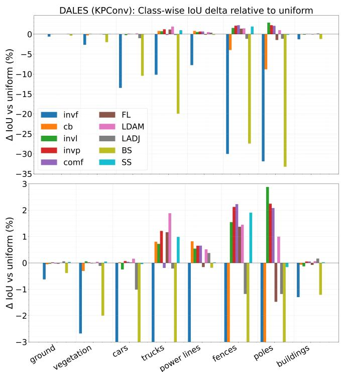  
Fig. 1: Class-wise IoU differences (‘method‘ - ‘uniform‘) of different methods for DALES (upper panel), and zoom-in on smaller classes (lower panel), using KPConv.

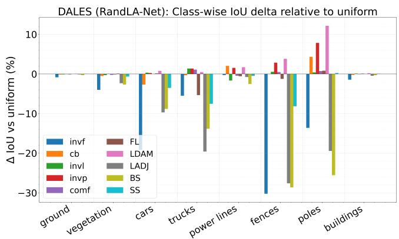  
Fig. 2: Class-wise IoU differences (‘method‘ - ‘uniform‘) of different methods for DALES using RandLA-Net.

Per-class analysis (Fig. 1; Table S1 in supplemental material) reveals the failure mechanism for DALES with KP-Conv (relative to uniform): cars −13.5%, trucks −10.2%, fences −30.0% pp, poles −31.9%, with minimal gains on majority classes. Smoother reweighting (invl, invp, comf) and losses (FL, LDAM) reduce but do not eliminate this effect (Fig. 1 lower panel). Similar patterns occur for RandLA-Net on DALES (Fig.2; TableS2 in supplemental material), with the same minority classes affected most severely.

For S3DIS (Fig. 3; Tables S5–S6), aggregate mIoU differences are compressed (62.95–64.75% KPConv; 60.37–64.7% RandLA-Net), yet per-class effects are substantial (e.g., BS:

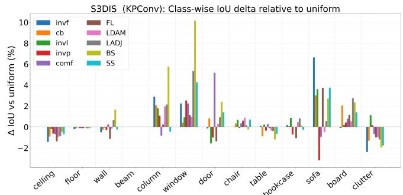

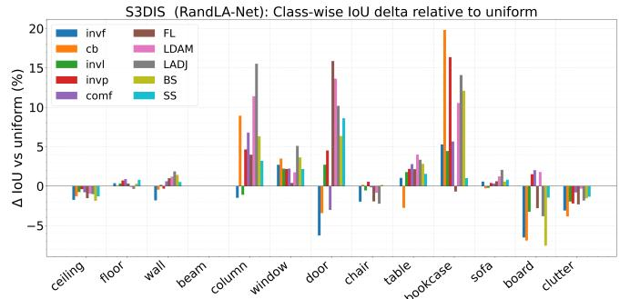  
Fig. 3: Class-wise IoU differences of different methods for S3DIS using KPConv (upper panel) and RanLA-Net (lower panel).

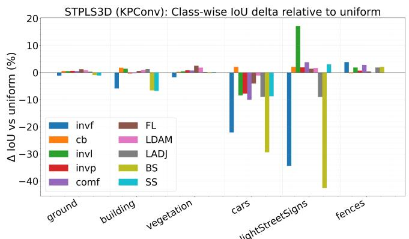

STPLS3D (RandLA-Net): Class-wise loU delta relative to uniform  
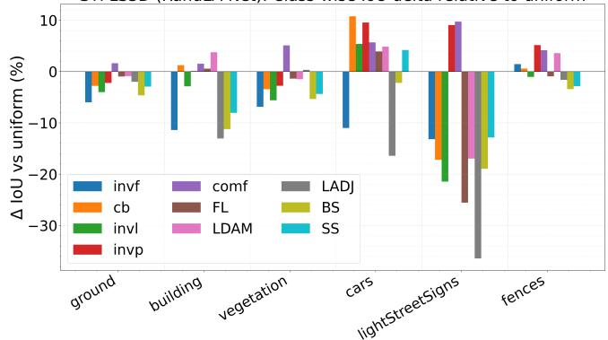  
Fig. 4: Class wise IoU differences of different methods for STPLS3D using KPConv (upper panel) and RanLA-Net (lower panel).

window +10.2%; cb: bookcase +19.8% on RandLA-Net), demonstrating that aggregate mIoU can mask opposing perclass trends.

On STPLS3D (Fig. 4; Tables S3–S4), patterns differ between architectures: invl is best for KPConv (light/street signs +17.2%), comf for RandLA-Net (light/street signs +9.7%, fences +4.2%). Invf, LADJ, and BS show severe degradation, confirming that aggressive logit-based reweighting poses risks.

## 4.3. Uniform Weighting is Competitive for Structured Sampling

For KPConv, uniform weighting performs within 2.2% of the best method across all datasets. On DALES with 641:1 imbalance, uniform achieves 80.01% mIoU versus 80.81% for the best (invp). For RandLA-Net, the gap widens, i.e., uniform trails the best by up to 4.6% (STPLS3D), and specialized losses provide larger gains (LDAM: +2.4% on DALES, +3.3% on S3DIS).

On S3DIS, differences compress for both architectures (mIoU range: 62.95–64.75% for KPConv; 60.37–64.7% for RandLA-Net), suggesting dense geometry with moderate imbalance reduces the importance of loss function engineering.

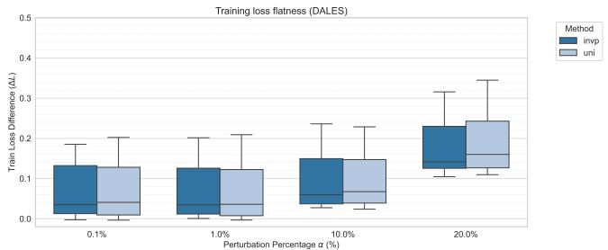

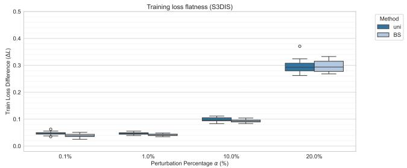

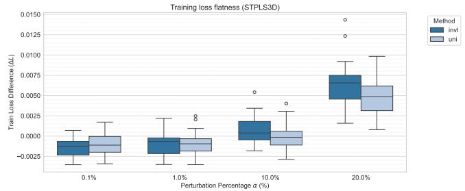  
Fig. 5: Loss landscape flatness analysis for KPConv on DALES, S3DIS, and STPLS3D. The plots show the loss deviation δ as weights are perturbed with magnitude α.

## 4.4. Sampling Strategy Modulates Sensitivity to Loss Design

For KPConv, optimal loss selection gains at most 2.2%. For RandLA-Net, gains are larger but some losses fail catastrophically. Both LADJ and BS adjust logits using class frequencies before softmax, yet behave differently: LADJ is tolerated by KPConv but fails on RandLA-Net (−10.0% on DALES, −11.5% on STPLS3D), while BS degrades on both architectures under high imbalance (up to −12.9% on STPLS3D). This suggests that logit-adjustment formulations are inherently fragile under severe imbalance, with structured sampling partially mitigating instability for LADJ but not for BS.

## 4.5. Loss Landscape Analysis

We analyze loss landscape flatness at converged $\theta ^ { * }$ using filter-normalized perturbations [20]:

$$
\delta = \mathcal { L } _ { \mathrm { t r a i n } } ( \theta ^ { * } + \alpha \hat { v } ) - \mathcal { L } _ { \mathrm { t r a i n } } ( \theta ^ { * } ) ,\tag{2}
$$

where $\alpha$ is perturbation magnitude and vˆ is a random direction. Smaller δ indicates flatter geometry.

Structured sampling. For KPConv (Fig. 5), comparing the two imbalance extremes (DALES and S3DIS) shows that imbalance ratio affects landscape geometry, where DALES (641:1) exhibits higher variance and sharper minima than S3DIS (56:1). However, STPLS3D (101:1) shows the flattest landscape despite being more imbalanced than S3DIS. This suggests that for structured sampling on real LiDAR data (DALES, S3DIS), imbalance ratio correlates with landscape sharpness, but synthetic/photogrammetric data (STPLS3D) decouples this relationship, i.e., clean boundaries and reduced label noise dominate over imbalance. In all cases, uniform weighting performs within 2.2% of the best method.

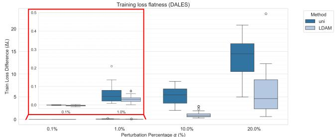

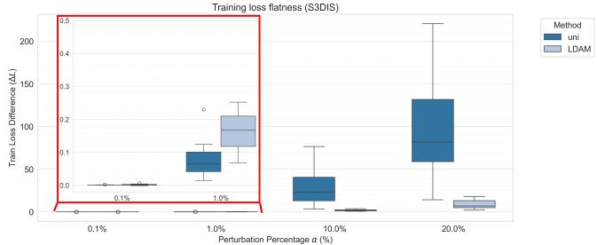

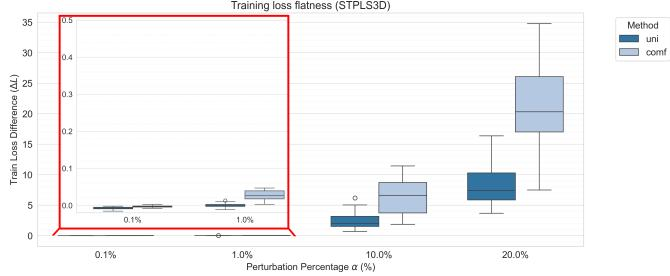  
Fig. 6: Loss landscape flatness analysis for RandLA on DALES, S3DIS, and STPLS3D. The plots show the loss deviation δ as weights are perturbed with magnitude α. Figure insets (red boxes) provide a zoomed view of low perturbation magnitudes.

Random sampling. RandLA-Net (Fig. 6) behaves differently. At small perturbations (0.1–1.0%), landscapes are relatively flat across datasets. At large perturbations (10– 20%), S3DIS shows the sharpest landscape despite having the lowest imbalance (56:1), with δ ∼ 200 versus ∼ 20 for DALES and ∼ 30 for STPLS3D. This counter-intuitive pattern suggests that for random sampling, geometric complexity (dense indoor clutter with thin structures such as chairs, tables, columns) creates optimization challenges that exceed those from imbalance alone. Random sampling discards geometric structure that structured sampling preserves, amplifying sensitivity to scene complexity. Here, uniform weighting trails behind by up to 4.6%, suggesting specialized losses provide more benefit.

These patterns reveal a two-way interaction: (i) for structured sampling on real LiDAR, imbalance ratio determines landscape geometry, but on synthetic data, quality dominates; (ii) for random sampling, geometric complexity dominates regardless of imbalance ratio, explaining why uniform weighting suffices for KPConv but specialized losses benefit RandLA-Net.

## 5. CONCLUSIONS

We evaluated 11 class imbalance mitigation strategies across three LiDAR datasets and two point-based architectures, i.e., KPConv (structured sampling) and RandLA-Net (random sampling). For the two evaluated architectures, the interaction between sampling strategy, imbalance severity, and data acquisition characteristics shapes which mitigation approaches are effective; these observations are specific to KP-Conv and RandLA-Net and should be validated on additional paradigms before broader generalization.

We hypothesize that geometric structure preservation during sampling drives the observed differences: structured sampling retains local fidelity, potentially providing implicit balancing through neighborhood aggregation, while random sampling discards structure, amplifying sensitivity to scene complexity and imbalance. Attention-based architectures may exhibit intermediate sensitivity, a testable prediction we leave to future work.

Based on the empirical findings (Table 1, Figs. 5–6), we offer practical recommendations: (1) avoid inverse-frequency weighting regardless of architecture or dataset (consistent degradation up to 12%); (2) for structured-sampling architectures (KPConv), uniform weighting is a robust default across all datasets, with smoother reweighting (invl, invp) yielding marginal gains on real LiDAR (+0.8%); (3) for random-sampling architectures (RandLA-Net), LDAM is the most robust specialized loss, improving over uniform on real LiDAR and RGB-D data (+2.4–3.3%), while on photogrammetric data smoother reweighting (comf) is more effective (+4.6%). LADJ and BS are brittle, failing catastrophically on high-imbalance data (DALES, STPLS3D) despite showing gains under moderate imbalance (S3DIS); (4) for structured sampling on synthetic/photogrammetric data, data quality appears to dominate over loss-function choice (Figs. 5–6). Future work should investigate combined data-level and losslevel strategies, geometry-aware augmentation, and validation with voxel-based and attention-based architectures.

## 6. REFERENCES

[1] Eduardo Arnold, Omar Y. Al-Jarrah, Mehrdad Dianati, Saber Fallah, David Oxtoby, and Alex Mouzaki-

tis, “A Survey on 3D Object Detection Methods for Autonomous Driving Applications,” IEEE Transactions on Intelligent Transportation Systems, vol. 20, no. 10, pp. 3782–3795, 2019.

[2] Ruisheng Wang, Jiju Peethambaran, and Dong Chen, “LiDAR Point Clouds to 3-D Urban Models: A Review,” IEEE Journal of Selected Topics in Applied Earth Observations and Remote Sensing, vol. 11, no. 2, pp. 606– 627, 2018.

[3] Charles Gaydon, Michel Daab, and Floryne Roche, “FRACTAL: An Ultra-Large-Scale Aerial Lidar Dataset for 3D Semantic Segmentation of Diverse Landscapes,” 2024.

[4] Yin Cui, Menglin Jia, Tsung-Yi Lin, Yang Song, and Serge Belongie, “Class-Balanced Loss Based on Effective Number of Samples,” in 2019 IEEE/CVF Conference on Computer Vision and Pattern Recognition (CVPR), 2019, pp. 9260–9269.

[5] Tsung-Yi Lin, Priya Goyal, Ross Girshick, Kaiming He, and Piotr Dollar, “Focal Loss for Dense Object Detec-´ tion,” in 2017 IEEE International Conference on Computer Vision (ICCV), 2017, pp. 2999–3007.

[6] Kaidi Cao, Colin Wei, Adrien Gaidon, Nikos Arechiga, and Tengyu Ma, “Learning Imbalanced Datasets with Label-Distribution-Aware Margin Loss,” in Advances in Neural Information Processing Systems, 2019.

[7] Aditya Krishna Menon, Sadeep Jayasumana, Ankit Singh Rawat, Himanshu Jain, Andreas Veit, and Sanjiv Kumar, “Long-tail learning via logit adjustment,” arXiv preprint, 2021, Available at: https://arxiv.org/abs/2007.07314.

[8] Jiaqi Wang, Wenwei Zhang, Yuhang Zang, Yuhang Cao, Jiangmiao Pang, Tao Gong, Kai Chen, Ziwei Liu, Chen Change Loy, and Dahua Lin, “Seesaw Loss for Long-Tailed Instance Segmentation,” in 2021 IEEE/CVF Conference on Computer Vision and Pattern Recognition (CVPR), 2021, pp. 9690–9699.

[9] Jiawei Ren, Cunjun Yu, Shunan Sheng, Xiao Ma, Haiyu Zhao, Shuai Yi, and Hongsheng Li, “Balanced Meta-Softmax for Long-Tailed Visual Recognition,” in Advances in Neural Information Processing Systems, H. Larochelle, M. Ranzato, R. Hadsell, M.F. Balcan, and H. Lin, Eds. 2020, vol. 33, pp. 4175–4186, Curran Associates, Inc.

[10] Yancheng Pan, Fan Xie, and Huijing Zhao, “Understanding the Challenges When 3D Semantic Segmentation Faces Class Imbalanced and OOD Data,” IEEE Transactions on Intelligent Transportation Systems, vol. 24, no. 7, pp. 6955–6970, 2023.

[11] Hugues Thomas, Charles R. Qi, Jean-Emmanuel Deschaud, Beatriz Marcotegui, Franc¸ois Goulette, and Leonidas Guibas, “KPConv: Flexible and Deformable Convolution for Point Clouds,” in 2019 IEEE/CVF International Conference on Computer Vision (ICCV), 2019, pp. 6410–6419.

[12] Qingyong Hu, Bo Yang, Linhai Xie, Stefano Rosa, Yulan Guo, Zhihua Wang, Niki Trigoni, and Andrew Markham, “RandLA-Net: Efficient Semantic Segmentation of Large-Scale Point Clouds,” in 2020 IEEE/CVF Conference on Computer Vision and Pattern Recognition (CVPR), 2020, pp. 11105–11114.

[13] R. Qi Charles, Hao Su, Mo Kaichun, and Leonidas J. Guibas, “PointNet: Deep Learning on Point Sets for 3D Classification and Segmentation,” in 2017 IEEE Conference on Computer Vision and Pattern Recognition (CVPR), 2017, pp. 77–85.

[14] Chang Liu, Aimin Jiang, Yibin Tang, Yanping Zhu, and Qi Chen, “3D Point Cloud Semantic Segmentation Based on Diffusion Model,” in ICASSP 2024 - 2024 IEEE International Conference on Acoustics, Speech and Signal Processing (ICASSP), 2024, pp. 4375–4379.

[15] Yifan Zhang, Bingyi Kang, Bryan Hooi, Shuicheng Yan, and Jiashi Feng, “Deep Long-Tailed Learning: A Survey,” IEEE Transactions on Pattern Analysis and Machine Intelligence, vol. 45, no. 9, pp. 10795–10816, 2023.

[16] Sourabh Prakash, Priyanshi Shah, and Ashrya Agrawal, “Exploiting CNNs for Semantic Segmentation with Pascal VOC,” arXiv preprint, 2023, Available at: https: //arxiv.org/abs/2304.13216.

[17] Nina Varney, Vijayan K. Asari, and Quinn Graehling, “DALES: A Large-scale Aerial LiDAR Data Set for Semantic Segmentation,” in 2020 IEEE/CVF Conference on Computer Vision and Pattern Recognition Workshops (CVPRW), 2020, pp. 717–726.

[18] Iro Armeni, Ozan Sener, Amir R. Zamir, Helen Jiang, Ioannis Brilakis, Martin Fischer, and Silvio Savarese, “3D Semantic Parsing of Large-Scale Indoor Spaces,” in 2016 IEEE Conference on Computer Vision and Pattern Recognition (CVPR), 2016, pp. 1534–1543.

[19] Meida Chen, Qingyong Hu, Zifan Yu, Hugues Thomas, Andrew Feng, Yu Hou, Kyle McCullough, Fengbo Ren, and Lucio Soibelman, “STPLS3D: A Large-Scale Synthetic and Real Aerial Photogrammetry 3D Point Cloud Dataset,” in 33rd British Machine Vision Conference 2022, BMVC 2022, London, UK, November 21-24, 2022. 2022, BMVA Press.

[20] Hao Li, Zheng Xu, Gavin Taylor, Christoph Studer, and Tom Goldstein, “Visualizing the Loss Landscape of Neural Nets,” in Advances in Neural Information Processing Systems, S. Bengio, H. Wallach, H. Larochelle, K. Grauman, N. Cesa-Bianchi, and R. Garnett, Eds. 2018, vol. 31, Curran Associates, Inc.

# How Sampling Strategy Affects Imbalance Mitigation in LiDAR Segmentation: A Study of Structured vs. Random Point-Based Architectures

Supplemental Material

<table><tr><td>Method</td><td>ground</td><td>vegetation</td><td>cars</td><td>trucks</td><td>power lines</td><td>fences</td><td>poles</td><td>buildings</td></tr><tr><td>uni</td><td>96.510</td><td>93.779</td><td>85.062</td><td>42.676</td><td>93.960</td><td>61.052</td><td>72.155</td><td>94.920</td></tr><tr><td>invf</td><td>95.883</td><td>91.102</td><td>71.594</td><td>32.495</td><td>86.191</td><td>31.007</td><td>40.264</td><td>93.622</td></tr><tr><td>cb</td><td>96.456</td><td>93.471</td><td>85.084</td><td>43.479</td><td>94.779</td><td>57.073</td><td>63.340</td><td>94.849</td></tr><tr><td>invl</td><td>96.480</td><td>93.841</td><td>84.812</td><td>43.398</td><td>94.503</td><td>62.600</td><td>75.034</td><td>94.788</td></tr><tr><td>invp</td><td>96.529</td><td>93.799</td><td>85.131</td><td>43.889</td><td>94.611</td><td>63.175</td><td>74.402</td><td>94.972</td></tr><tr><td>comf</td><td>96.488</td><td>93.758</td><td>85.105</td><td>42.484</td><td>94.615</td><td>63.281</td><td>74.237</td><td>94.972</td></tr><tr><td>FL</td><td>96.480</td><td>93.768</td><td>85.078</td><td>43.840</td><td>93.801</td><td>62.423</td><td>70.678</td><td>94.843</td></tr><tr><td>LDAM</td><td>96.520</td><td>93.821</td><td>85.223</td><td>44.560</td><td>94.475</td><td>62.502</td><td>73.150</td><td>94.986</td></tr><tr><td>LADJ</td><td>96.571</td><td>93.665</td><td>84.047</td><td>42.462</td><td>94.336</td><td>59.874</td><td>70.975</td><td>95.084</td></tr><tr><td>BS</td><td>96.126</td><td>91.777</td><td>74.630</td><td>22.739</td><td>93.775</td><td>33.615</td><td>38.903</td><td>93.710</td></tr><tr><td>SS</td><td>96.546</td><td>93.830</td><td>85.016</td><td>43.662</td><td>93.979</td><td>62.957</td><td>71.996</td><td>94.944</td></tr></table>

Table S1: Per-class IoU (%) for the DALES dataset using KPConv.
<table><tr><td>Method</td><td>ground</td><td>building</td><td>vegetation</td><td>cars</td><td>lightStreetSigns</td><td>fences</td></tr><tr><td>uni</td><td>86.493</td><td>80.128</td><td>66.169</td><td>49.832</td><td>49.189</td><td>10.748</td></tr><tr><td>invf</td><td>85.371</td><td>74.248</td><td>64.457</td><td>27.737</td><td>14.798</td><td>14.630</td></tr><tr><td>cb</td><td>87.103</td><td>81.918</td><td>66.452</td><td>51.929</td><td>51.307</td><td>10.458</td></tr><tr><td>invl</td><td>87.052</td><td>81.551</td><td>66.655</td><td>41.436</td><td>66.402</td><td>12.607</td></tr><tr><td>invp</td><td>87.137</td><td>79.778</td><td>67.001</td><td>42.094</td><td>51.101</td><td>11.468</td></tr><tr><td>comf</td><td>87.047</td><td>79.856</td><td>66.938</td><td>39.793</td><td>53.022</td><td>13.603</td></tr><tr><td>FL</td><td>87.737</td><td>80.737</td><td>68.685</td><td>45.781</td><td>50.606</td><td>11.138</td></tr><tr><td>LDAM</td><td>87.317</td><td>81.082</td><td>68.016</td><td>48.747</td><td>50.894</td><td>10.724</td></tr><tr><td>LADJ</td><td>86.809</td><td>81.431</td><td>66.363</td><td>40.872</td><td>40.175</td><td>12.614</td></tr><tr><td>BS</td><td>85.546</td><td>73.559</td><td>65.934</td><td>20.434</td><td>6.612</td><td>12.844</td></tr><tr><td>SS</td><td>85.399</td><td>73.363</td><td>66.313</td><td>41.072</td><td>52.228</td><td>10.779</td></tr></table>

Table S3: Per-class IoU (%) for the STPLS3D dataset using KPConv.

<table><tr><td>Method</td><td>ground</td><td>vegetation</td><td>cars</td><td>trucks</td><td>power lines</td><td>fences</td><td>poles</td><td>buildings</td></tr><tr><td>uni</td><td>97.148</td><td>93.463</td><td>83.352</td><td>38.220</td><td>91.493</td><td>53.511</td><td>60.266</td><td>96.641</td></tr><tr><td>invf</td><td>96.313</td><td>89.435</td><td>64.182</td><td>32.725</td><td>91.212</td><td>23.269</td><td>46.648</td><td>95.193</td></tr><tr><td>cb</td><td>97.007</td><td>92.955</td><td>80.660</td><td>37.879</td><td>93.530</td><td>53.537</td><td>64.579</td><td>96.401</td></tr><tr><td>invl</td><td>97.034</td><td>93.175</td><td>83.681</td><td>39.589</td><td>89.842</td><td>54.049</td><td>60.650</td><td>96.726</td></tr><tr><td>invp</td><td>97.109</td><td>93.499</td><td>83.569</td><td>39.585</td><td>93.032</td><td>56.368</td><td>68.105</td><td>96.577</td></tr><tr><td>comf</td><td>97.035</td><td>93.232</td><td>83.347</td><td>39.306</td><td>91.040</td><td>54.002</td><td>60.994</td><td>96.728</td></tr><tr><td>FL</td><td>97.155</td><td>93.356</td><td>83.481</td><td>32.884</td><td>90.917</td><td>52.261</td><td>61.089</td><td>96.633</td></tr><tr><td>LDAM</td><td>97.182</td><td>93.603</td><td>84.144</td><td>38.690</td><td>93.199</td><td>57.326</td><td>72.420</td><td>96.809</td></tr><tr><td>LADJ</td><td>97.038</td><td>91.130</td><td>73.658</td><td>18.631</td><td>90.722</td><td>25.906</td><td>40.825</td><td>96.186</td></tr><tr><td>BS</td><td>96.852</td><td>90.782</td><td>74.525</td><td>24.390</td><td>88.973</td><td>24.881</td><td>34.702</td><td>96.333</td></tr><tr><td>SS</td><td>97.192</td><td>92.805</td><td>79.831</td><td>30.681</td><td>91.024</td><td>45.357</td><td>60.493</td><td>96.694</td></tr></table>

Table S2: Per-class IoU (%) for the DALES dataset using RandLA-Net.
<table><tr><td>Method</td><td>ground</td><td>building</td><td>vegetation</td><td>cars</td><td>lightStreetSigns</td><td>fences</td></tr><tr><td>uni</td><td>85.007</td><td>76.260</td><td>66.441</td><td>40.978</td><td>44.774</td><td>7.322</td></tr><tr><td>invf</td><td>79.011</td><td>64.866</td><td>59.558</td><td>29.967</td><td>31.597</td><td>8.769</td></tr><tr><td>cb</td><td>82.205</td><td>77.489</td><td>62.999</td><td>51.747</td><td>27.566</td><td>7.895</td></tr><tr><td>invl</td><td>80.987</td><td>73.378</td><td>60.836</td><td>46.349</td><td>23.336</td><td>6.267</td></tr><tr><td>invp</td><td>82.773</td><td>76.344</td><td>63.670</td><td>50.526</td><td>53.845</td><td>12.484</td></tr><tr><td>comf</td><td>86.634</td><td>77.786</td><td>71.537</td><td>46.661</td><td>54.496</td><td>11.472</td></tr><tr><td>FL</td><td>84.037</td><td>76.817</td><td>65.055</td><td>44.904</td><td>19.221</td><td>6.396</td></tr><tr><td>LDAM</td><td>84.116</td><td>80.019</td><td>64.938</td><td>45.839</td><td>27.797</td><td>10.906</td></tr><tr><td>LADJ</td><td>83.011</td><td>63.219</td><td>66.775</td><td>24.551</td><td>8.356</td><td>5.701</td></tr><tr><td>BS</td><td>80.360</td><td>65.047</td><td>61.098</td><td>38.773</td><td>25.817</td><td>3.906</td></tr><tr><td>SS</td><td>82.069</td><td>68.203</td><td>62.073</td><td>45.178</td><td>31.936</td><td>4.47</td></tr></table>

Table S4: Per-class IoU (%) for the STPLS3D dataset using RandLA-Net.

<table><tr><td>Method</td><td>ceiling</td><td>floor</td><td>wall</td><td>beam</td><td>column</td><td>window</td><td>door</td><td>chair</td><td>table</td><td>bookcase</td><td>sofa</td><td>board</td><td>clutter</td></tr><tr><td>uni</td><td>93.636</td><td>98.515</td><td>80.843</td><td>0.000</td><td>22.259</td><td>44.236</td><td>61.458</td><td>87.107</td><td>79.278</td><td>70.984</td><td>64.165</td><td>60.649</td><td>57.433</td></tr><tr><td>invf</td><td>92.212</td><td>98.305</td><td>80.333</td><td>0.000</td><td>25.148</td><td>46.485</td><td>61.312</td><td>87.132</td><td>79.381</td><td>71.166</td><td>70.813</td><td>60.570</td><td>55.048</td></tr><tr><td>cb</td><td>92.728</td><td>98.405</td><td>80.571</td><td>0.000</td><td>24.341</td><td>44.645</td><td>62.272</td><td>87.440</td><td>78.390</td><td>71.073</td><td>67.183</td><td>62.709</td><td>56.127</td></tr><tr><td>invl</td><td>93.443</td><td>98.486</td><td>80.786</td><td>0.000</td><td>24.058</td><td>45.156</td><td>59.885</td><td>87.778</td><td>79.509</td><td>71.855</td><td>67.775</td><td>60.852</td><td>58.569</td></tr><tr><td>invp</td><td>93.010</td><td>98.415</td><td>80.546</td><td>0.000</td><td>23.339</td><td>46.768</td><td>60.452</td><td>87.024</td><td>78.933</td><td>70.266</td><td>60.969</td><td>61.074</td><td>57.592</td></tr><tr><td>comf</td><td>92.944</td><td>98.410</td><td>81.089</td><td>0.000</td><td>21.425</td><td>46.484</td><td>66.631</td><td>87.458</td><td>79.543</td><td>71.006</td><td>63.212</td><td>61.433</td><td>56.755</td></tr><tr><td>FL</td><td>92.248</td><td>98.405</td><td>79.705</td><td>0.000</td><td>22.489</td><td>45.381</td><td>60.079</td><td>87.715</td><td>79.163</td><td>69.916</td><td>67.915</td><td>61.801</td><td>56.430</td></tr><tr><td>LDAM</td><td>92.706</td><td>98.473</td><td>80.670</td><td>0.000</td><td>24.218</td><td>45.179</td><td>61.765</td><td>87.993</td><td>78.938</td><td>71.449</td><td>63.680</td><td>61.173</td><td>56.468</td></tr><tr><td>LADJ</td><td>92.779</td><td>98.392</td><td>81.497</td><td>0.000</td><td>24.403</td><td>49.590</td><td>62.383</td><td>87.270</td><td>78.890</td><td>71.815</td><td>64.734</td><td>63.405</td><td>56.239</td></tr><tr><td>BS</td><td>93.165</td><td>98.387</td><td>82.492</td><td>0.000</td><td>28.040</td><td>54.397</td><td>63.871</td><td>86.873</td><td>78.086</td><td>71.117</td><td>66.885</td><td>62.996</td><td>55.472</td></tr><tr><td>SS</td><td>92.947</td><td>98.459</td><td>80.608</td><td>0.000</td><td>21.814</td><td>48.496</td><td>62.857</td><td>87.806</td><td>78.637</td><td>70.714</td><td>67.919</td><td>62.051</td><td>55.672</td></tr></table>

Table S5: Per-class IoU (%) for the S3DIS dataset using KPConv.

<table><tr><td>Method</td><td>ceiling</td><td>floor</td><td>wall</td><td>beam</td><td>column</td><td>window</td><td>door</td><td>chair</td><td>table</td><td>bookcase</td><td>sofa</td><td>board</td><td>clutter</td></tr><tr><td>uni</td><td>93.116</td><td>97.028</td><td>80.367</td><td>0.000</td><td>17.390</td><td>57.660</td><td>36.838</td><td>78.216</td><td>84.665</td><td>55.844</td><td>70.799</td><td>71.421</td><td>54.524</td></tr><tr><td>invf</td><td>91.363</td><td>97.390</td><td>78.549</td><td>0.000</td><td>15.893</td><td>60.357</td><td>30.560</td><td>76.231</td><td>85.703</td><td>61.124</td><td>71.363</td><td>64.896</td><td>51.420</td></tr><tr><td>cb</td><td>91.821</td><td>97.074</td><td>79.904</td><td>0.000</td><td>26.317</td><td>61.150</td><td>33.409</td><td>78.371</td><td>81.896</td><td>75.646</td><td>70.521</td><td>64.509</td><td>50.663</td></tr><tr><td>invl</td><td>92.351</td><td>97.355</td><td>80.518</td><td>0.000</td><td>16.287</td><td>59.860</td><td>39.551</td><td>77.654</td><td>86.433</td><td>60.295</td><td>70.575</td><td>68.157</td><td>52.555</td></tr><tr><td>invp</td><td>92.722</td><td>97.734</td><td>80.037</td><td>0.000</td><td>22.035</td><td>59.819</td><td>41.352</td><td>78.766</td><td>86.838</td><td>72.210</td><td>71.187</td><td>72.921</td><td>52.304</td></tr><tr><td>comf</td><td>92.319</td><td>97.902</td><td>80.974</td><td>0.000</td><td>24.176</td><td>59.874</td><td>33.803</td><td>78.060</td><td>87.450</td><td>61.501</td><td>71.115</td><td>73.440</td><td>53.712</td></tr><tr><td>FL</td><td>91.577</td><td>97.346</td><td>81.361</td><td>0.000</td><td>21.368</td><td>58.047</td><td>52.706</td><td>76.267</td><td>86.805</td><td>55.145</td><td>71.403</td><td>68.610</td><td>52.198</td></tr><tr><td>LDAM</td><td>92.158</td><td>96.902</td><td>81.553</td><td>0.000</td><td>28.788</td><td>59.396</td><td>50.455</td><td>77.356</td><td>88.658</td><td>66.383</td><td>72.024</td><td>73.208</td><td>54.194</td></tr><tr><td>LADJ</td><td>92.080</td><td>96.661</td><td>82.223</td><td>0.000</td><td>32.908</td><td>62.755</td><td>47.018</td><td>75.976</td><td>88.004</td><td>69.933</td><td>72.854</td><td>67.595</td><td>52.687</td></tr><tr><td>BS</td><td>91.241</td><td>97.327</td><td>81.789</td><td>0.000</td><td>23.710</td><td>61.296</td><td>43.184</td><td>78.355</td><td>87.483</td><td>67.940</td><td>71.363</td><td>63.855</td><td>52.973</td></tr><tr><td>SS</td><td>91.811</td><td>97.823</td><td>80.882</td><td>0.000</td><td>20.586</td><td>59.820</td><td>45.444</td><td>78.221</td><td>86.209</td><td>56.853</td><td>71.604</td><td>69.960</td><td>53.166</td></tr></table>

Table S6: Per-class IoU (%) for the S3DIS dataset using RandLA-Net.