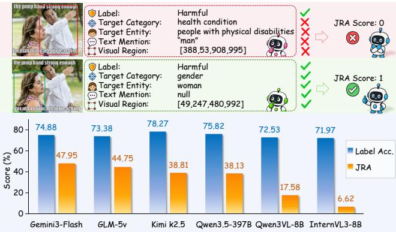
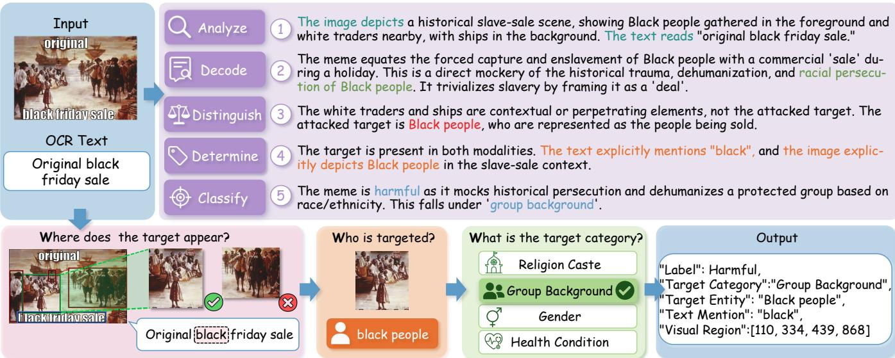
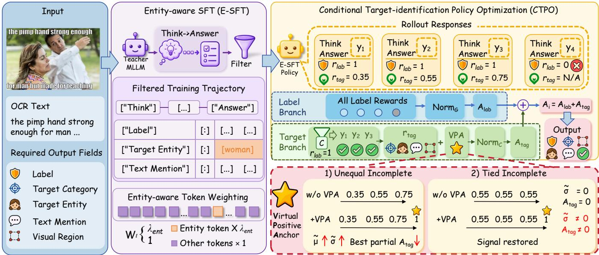
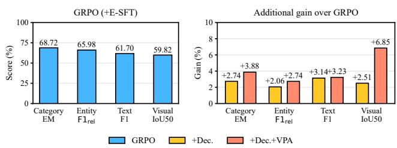
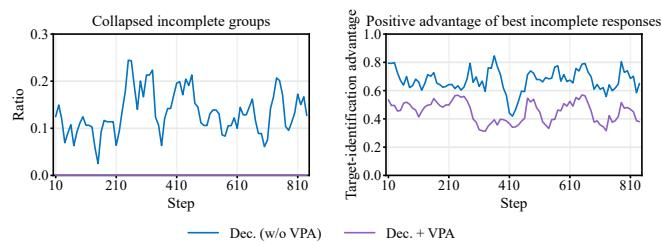
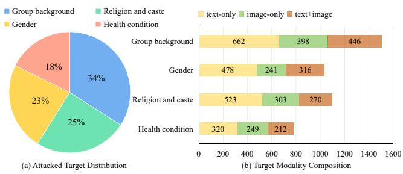
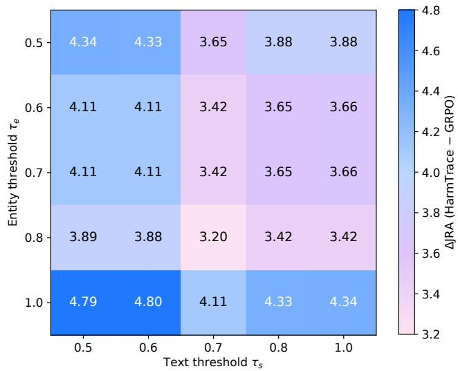
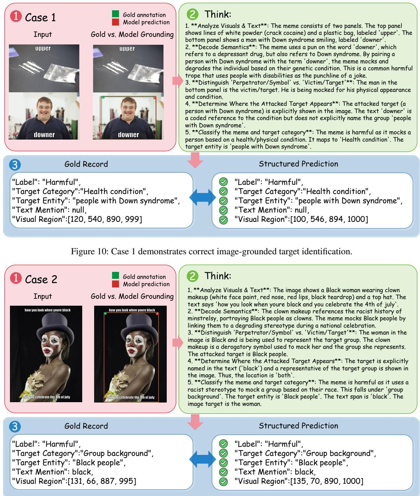
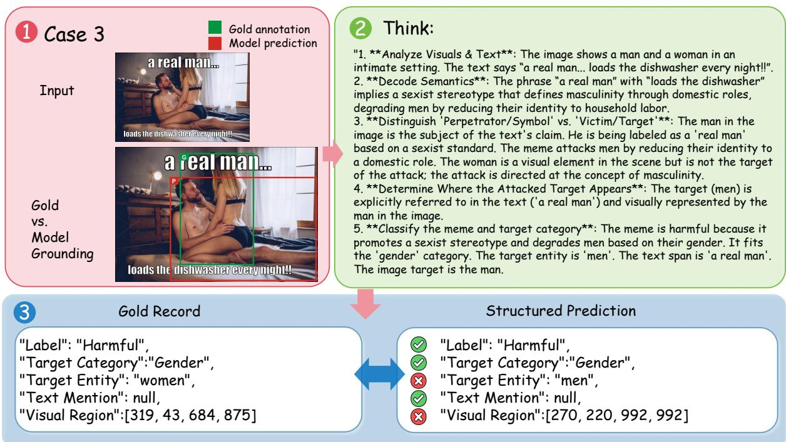
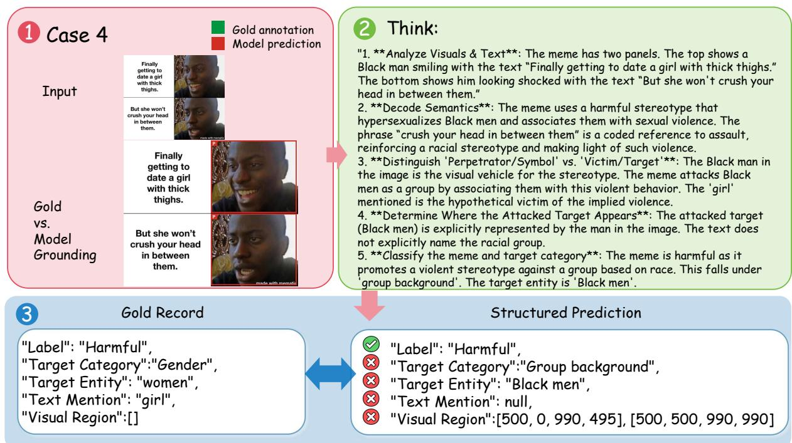

# HarmTrace: Anchor-Calibrated Decoupled Optimization for Fine-Grained Target Identification in Harmful Memes

Yujia Li1, Yiqun Zhang2, Zihan Cheng1, Yijie Huang1, Tenglong Ye1, Zihan Wang1, Xiaocui Yang1, Shi Feng1∗, Yifei Zhang1, Daling Wang1

1School of Computer Science and Engineering, Northeastern University Shenyang 110819, China 2Apple Inc., Beijing 100006, China liyujia@mails.neu.edu.cn, fengshi@cse.neu.edu.cn

## Abstract

Multimodal harmful meme detection is typically formulated as image–text harmfulness classification. A model may correctly predict harmfulness while misidentifying the attacked target or its supporting evidence. We therefore extend harmful meme detection with fine-grained target identification, asking what type of target is attacked, who is targeted, and where the target appears in the meme. The model predicts harmfulness for every meme and, for harmful memes, outputs the target category, target entity, textual mention, and visual region. To support this task, we introduce Meme3W, which unifies multiple public harmful meme datasets and provides human-verified annotations for harmful instances. We further introduce Joint Record Accuracy (JRA), a strict record-level metric requiring the harmfulness label and all target-identification fields to be jointly correct. Experiments with representative multimodal large language models reveal a substantial gap between harmfulness accuracy and JRA. To narrow this gap, we propose HarmTrace, an anchor-calibrated decoupled optimization framework. HarmTrace strengthens target-entity supervision through entity-aware supervised fine-tuning. It then applies Conditional Target-identification Policy Optimization (CTPO) to decouple harmfulness and target-identification advantages, restricting target-identification optimization to label-correct responses for harmful examples. CTPO uses a Virtual Positive Anchor (VPA) as a fully correct reference for target-identification advantage normalization. HarmTrace improves both JRA and harmfulness accuracy across the evaluated backbones, with JRA on the Qwen3-VL-8B backbone increasing from 17.58% to 52.51%. Our code is publicly available at https://github.com/llly1234/HarmTrace-for-Harmful-Memes.

## Introduction

Most existing methods formulate multimodal harmful meme detection primarily as image–text harmfulness classification (Kmainasi et al. 2026; Cheng et al. 2026; Wang et al. 2026; Hou et al. 2026). However, a correct harmfulness label alone does not establish whether the attacked target has been correctly identified (Mia and Fahim 2025). It also does not indicate which textual mention and visual region support that target identification. We therefore extend harmful meme detection with fine-grained target identification, predicting harmfulness for every meme and, for harmful memes, additionally identifying the target category, target entity, textual mention, and visual region.

  
Figure 1: JRA requires the harmfulness label and all targetidentification fields to be jointly correct. Under this criterion, representative MLLMs show a clear gap between harmfulness accuracy and fine-grained target identification.

For harmful memes, these fields form a traceable record linking the harmfulness judgment to the attacked target and the textual and visual evidence supporting its identification. This record allows reviewers to assess whether the target and evidence are consistent with the final judgment. The EU Digital Services Act emphasizes that moderation decisions should be reasoned and open to review and contestation by afected users (Chiarella 2022). Fine-grained target identification provides the structured information needed for this examination by making the attacked target and its multimodal grounding explicit.

The reliability of this record depends on the joint correctness of the harmfulness label and all target-identification fields. Existing harmful meme datasets provide annotations for only subsets of these fields (Hee, Chong, and Lee 2023; Shah et al. 2024; Bui, von der Wense, and Lauscher 2025). They therefore cannot support record-level evaluation of their joint correctness. To address this gap, we introduce Meme3W, a dataset for fine-grained target identification in harmful memes. Meme3W integrates multiple public datasets under a unified schema and provides human-verified annotations for harmful instances. We further introduce Joint Record Accuracy (JRA), a strict record-level metric requiring the harmfulness label and all target-identification fields to be jointly correct. Evaluation of representative MLLMs on Meme3W reveals a clear gap between harmfulness prediction and jointly correct fine-grained target identification. As shown in Figure 1, harmfulness accuracy consistently exceeds JRA across model scales. The best JRA among generalpurpose MLLMs is 47.95%, while smaller MLLMs generally remain below 25%.

To narrow this gap, we propose HarmTrace, an anchorcalibrated decoupled optimization framework for finegrained target identification in harmful memes. HarmTrace first performs entity-aware supervised initialization and then applies conditional policy optimization. Unlike standard SFT with uniform token weighting, Entity-aware Supervised Fine-Tuning (E-SFT) upweights target-entity tokens, strengthening supervision for the short field that connects the target category to textual and visual grounding. Rather than using a single aggregate reward, Conditional Targetidentification Policy Optimization (CTPO) separately normalizes harmfulness and target-identification advantages. It also restricts target-identification updates to label-correct harmful responses. Within CTPO, a Virtual Positive Anchor (VPA) adds a virtual reward representing complete correctness during target-identification advantage normalization. Experiments on two MLLM backbones show substantial improvements. HarmTrace raises JRA from 17.58% to 52.51% on Qwen3-VL-8B and from 6.62% to 49.09% on InternVL3- 8B. It also improves all evaluated target-identification fields on both backbones.

Our contributions are as follows:

• We extend harmful meme detection with fine-grained target identification and construct Meme3W. It augments target-category annotations with human-verified target entities and available textual and visual grounding. We further introduce Joint Record Accuracy (JRA) for strict record-level evaluation.

• We propose HarmTrace, an anchor-calibrated decoupled optimization framework. It strengthens targetentity supervision, decouples harmfulness and targetidentification credit assignment, and calibrates targetidentification advantages with VPA.

• We evaluate representative MLLMs on Meme3W, revea a clear gap between harmfulness prediction and finegrained target identification, and show that HarmTrace improves JRA across the evaluated backbones.

## Related Work

## Multimodal Hateful Meme Detection

Harmful meme understanding is moving beyond binary classification toward target prediction. Hateful Memes focuses on hateful/non-hateful classification (Kiela et al. 2020), while MAMI adds misogyny-type prediction (Fersini et al. 2022). Harm-C and PrideMM provide harmfulness levels or coarse target annotations (Pramanick et al. 2021; Shah et al. 2024); MemeMind and MemeIntel add chain-of-thought or explanation-oriented supervision (Gu et al. 2025; Kmainasi et al. 2025); and MemeLens unifies multilingual and multitask meme resources (Shahraur, Bayan et al. 2026). However, these datasets do not provide unified annotations for the concrete target entity and its supporting textual and visual evidence, nor formulate these fields jointly with harmfulness prediction. Recent work improves harmful meme detection through multimodal representation learning (Burbi et al. 2023) and retrieval- or knowledge-augmented adaptation (Mei et al. 2024; Tzelepi and Mezaris 2025; Mei et al. 2025). Other methods introduce multimodal debate or generated explanations (Lin et al. 2024; Hee and Lee 2025; Mei et al. 2026), while DR-HM adopts reasoning-enhanced training (Cheng et al. 2026). These methods primarily optimize binary harmfulness classification. Fine-grained target identification is not included in their prediction objectives.

## Reinforcement Learning for MLLMs

Reinforcement learning has become an important posttraining paradigm for improving the reasoning and alignment ofLLMs and MLLMs. PPO stabilizes policy updates through clipping and a learned value function (Schulman et al. 2017), DPO directly optimizes preference pairs (Rafailov et al. 2023), and GRPO estimates advantages within sampled groups without a critic (Shao et al. 2024). Recent variants further refine group-based optimization through dynamic sampling, process-level rewards, and negative-enhanced signals for all-negative groups (Yu et al. 2025; Tan et al. 2026; Nan et al. 2025). These methods are mainly studied in mathematical, coding, and general reasoning tasks. In harmful meme detection, HarmTrace applies group-based optimization to fine-grained target identification.

## Meme3W: A Fine-Grained Target Identification Dataset for Harmful Memes Task Definition and Output Schema

We extend multimodal harmful meme detection with finegrained target identification. The task predicts harmfulness for every meme and, for harmful memes, additionally identifies the target category, target entity, textual mention, and visual region. This extension enables evaluation beyond label correctness by making the attacked target and its available textual and visual evidence explicit. Given a dataset $\mathcal { D } = \{ ( x _ { i } , a _ { i } ^ { \star } ) \} _ { i = 1 } ^ { N }$ , each input $x _ { i } = ( I _ { i } , T _ { i } )$ consists of a meme image $I _ { i }$ and its associated text $T _ { i }$ . The structured annotation is defined as

$$
a _ { i } ^ { \star } = ( l _ { i } ^ { \star } , c _ { i } ^ { \star } , e _ { i } ^ { \star } , s _ { i } ^ { \star } , B _ { i } ^ { \star } ) ,\tag{1}
$$

where $l _ { i } ^ { \star } \in$ {harmful, non-harmful} denotes the harmfulness label, $c _ { i } ^ { \star }$ denotes the category of the attacked target, $e _ { i } ^ { \star }$ denotes the specific target entity, $s _ { i } ^ { \star }$ denotes the textual target mention, and $B _ { i } ^ { \star }$ denotes a list of visual target regions represented by bounding boxes.

For harmful samples, the category of the attacked target and the target entity are annotated, while the textual and visual grounding fields are populated only when the corresponding evidence is present. For non-harmful samples, there is no attacked target to identify. Therefore, all non-box target fields are set to null, while the visual-region field is set to [].

  
Figure 2: A representative Meme3W annotation, showing the analysis process and a final structured output for fine-grained target identification, answering where the target appears, who is targeted, and which target category applies.

## Dataset Construction

We construct Meme3W by curating samples from four public datasets: PrideMM (Shah et al. 2024), MAMI (Fersini et al. 2022), Hateful Memes (Kiela et al. 2020), and Harm-C (Pramanick et al. 2021). Their original annotations do not jointly identify the attacked target and its textual and visual grounding. We therefore re-annotate the selected samples under the unified schema in Eq. 1.

Before annotation, we manually screened the collected samples and removed those whose visual content was unclear or could not be reliably recognized. The resulting benchmark contains 10,662 samples, including 4,418 harmful samples. Harmful samples are organized into four broad target categories: group background, gender, religion and caste, and health condition. Before splitting, we removed exact duplicates and assigned verified perceptual near-duplicate groups to the same split. Meme3W is partitioned into training (85%), validation (5%), and test (10%) sets.

## Annotation Pipeline

We construct the structured annotations through a threestage MLLM-assisted human annotation pipeline. Figure 2 presents a representative Meme3W annotation, including the analysis process and the resulting fine-grained targetidentification output.

Stage 1: MLLM Candidate Initialization. We employ Gemini-3-Flash (Google 2025), GPT-5.2 (OpenAI 2025), and Qwen3.5-397B (Qwen Team 2026a) to independently generate one candidate annotation for each sample. All three models follow the same annotation prompt, which specifies five analysis steps and requires a final structured annotation. The outputs are normalized to the predefined format, and malformed fields are removed. The model identities are hidden, and the three candidates are randomly ordered for each sample to reduce model-specific anchoring.

Stage 2: Human Expert Annotation. Five trained graduate annotators with strong English proficiency and NLP backgrounds participate in this stage. They are trained on the task definition, output schema, and annotation guidelines. Each sample is independently reviewed by two annotators. The MLLM outputs serve only as editable references, and annotators may revise any field based on the sample evidence. Before adjudication, the field-specific agreement scores are Cohen’s κ = 0.908 for target category, normalized agreement of 0.813 for target entity, token-F1 of 0.824 for textual mention, and IoU@0.75 of 0.818 for visual regions. For target entities, semantically equivalent mentions are mapped to a shared canonical form before agreement computation.

Stage 3: Human Expert Adjudication. Disagreements are independently reviewed by a third annotator and resolved through discussion among all three annotators. We further conduct a candidate-blind audit on 200 sampled cases, in which annotators receive only the raw samples and annotation guideline. Their annotations achieve an unweighted mean of 0.827 across the four field-specific agreement scores against the final gold annotations.

## Method

## Framework Overview

To improve the joint correctness of harmfulness and targetidentification predictions, we propose HarmTrace, an anchor-calibrated decoupled optimization framework. Figure 3 provides an overview. HarmTrace consists of Entityaware Supervised Fine-Tuning (E-SFT) and Conditional Target-identification Policy Optimization (CTPO). E-SFT upweights target-entity tokens to strengthen entity supervision. CTPO decouples harmfulness and target-identification advantages and applies target-identification optimization only to label-correct harmful responses. Within CTPO, a Virtual Positive Anchor (VPA) augments target-identification advantage normalization with a virtual fully correct response. For training, HarmTrace adopts an explain-then-answer sequence:

  
LabelFigure 3: Overview of HarmTrace. The left panel shows an input and its required output schema. E-SFT upweights target-entity X λtokens, while CTPO normalizes label rewards over all rollouts and target-identification rewards over the label-correct harmfu subset C. The bottom panel shows VPA for unequal and tied rewards among incomplete responses.

$$
y _ { i } = \{ { \mathrm { t h i n k : } } z _ { i } , { \mathrm { a n s w e r : } } a _ { i } \} ,\tag{2}
$$

where the answer field follows Eq. (1), and the think field serves as an intermediate reasoning scafold for generating the structured answer.

## Entity-aware Supervised Fine-Tuning (E-SFT)

Before policy optimization, we initialize the policy through cold-start supervised fine-tuning. We use Gemini-3-Flash to generate one explain-then-answer trajectory for each training meme $x _ { i }$ . Both trajectory generation and filtering use only the training split. We retain only trajectories whose structured answers are valid and consistent with the verified gold annotations:

$$
\mathcal { D } _ { \mathrm { c o l d } } = \{ ( x _ { i } , y _ { i } ) \vert \mathrm { M a t c h } ( y _ { i } , a _ { i } ^ { \star } ) = 1 \} ,\tag{3}
$$

where Match(·) extracts the structured answer from $y _ { i }$ and checks its format and consistency with $a _ { i } ^ { \star }$ . The filtered trajectories are used for cold-start training, whereas CTPO uses the full training set. Standard SFT and E-SFT share the same trajectories and difer only in token weighting. The target entity identifies who is attacked and links the target category to textual and visual evidence, yet its short value contributes little to the sequence loss under uniform weighting. E-SFT therefore upweights the target\_entity value tokens. For $( x _ { i } , y _ { i } ) \in \mathcal { D } _ { \mathrm { c o l d } }$ , we optimize

$$
\mathcal { L } _ { \mathrm { E \mathrm { - } S F T } } = - \frac { \sum _ { t = 1 } ^ { T } w _ { t } \log p _ { \theta } ( y _ { i , t } \mid x _ { i } , y _ { i , < t } ) } { \sum _ { t = 1 } ^ { T } w _ { t } } ,\tag{4}
$$

where

$$
w _ { t } = { \left\{ \begin{array} { l l } { \lambda _ { \mathrm { e n t } } , } & { t \in { \mathcal { T } } _ { \mathrm { e n t } } , } \\ { 1 , } & { { \mathrm { o t h e r w i s e } } , } \end{array} \right. }\tag{5}
$$

$\mathcal { T } _ { \mathrm { e n t } }$ denotes the target-entity value positions and $\lambda _ { \mathrm { e n t } } > 1$ controls their supervision weight. The resulting policy initializes CTPO.

## Conditional Target-identification Policy Optimization (CTPO)

For each input meme x, the old policy $\pi _ { \theta _ { \mathrm { o l d } } }$ samples a group of responses $\{ y _ { i } \} _ { i = 1 } ^ { G }$ . Responses violating the output format or label-conditioned schema receive zero rewards. For valid responses, $r _ { i } ^ { \mathrm { l a b } } \ \in \ \{ 0 , 1 \}$ measures harmfulness-label correctness, while $r _ { i } ^ { \mathrm { t a g } } \in [ 0 , 1 ]$ combines applicable field scores with schema-applicability consistency. The latter penalizes missing required grounding and hallucinated non-applicable grounding, and is computed only for label-correct harmful responses, with $r _ { i } ^ { \mathrm { t a g } } = 1$ indicating complete correctness. Detailed reward weights and matching functions are provided in Appendix B.3.

Combining the two rewards would mix label and targetidentification credit. CTPO therefore computes their advantages separately. The label advantage is normalized over the full rollout group:

$$
A _ { i } ^ { \mathrm { l a b } } = \frac { r _ { i } ^ { \mathrm { l a b } } - \mu _ { \mathrm { l a b } } } { \sigma _ { \mathrm { l a b } } + \epsilon _ { \mathrm { n o r m } } } ,\tag{6}
$$

where $\mu _ { \mathrm { l a b } }$ and $\sigma _ { \mathrm { l a b } }$ are computed from $\{ r _ { j } ^ { \mathrm { l a b } } \} _ { j = 1 } ^ { G }$ , and $\epsilon _ { \mathrm { n o r m } } > 0$ is a small constant for numerical stability.

Target-identification learning is restricted to

$$
\mathcal { C } = \{ j \mid r _ { j } ^ { \mathrm { l a b } } = 1 , l ^ { \star } = \mathrm { h a r m f u l } \} ,\tag{7}
$$

and responses outside C receive zero target-identification advantage.

Normalizing target-identification rewards only within $\mathcal { C }$ has two limitations when all responses in $\mathcal { C }$ are incomplete. With unequal rewards, the best partial response is normalized only against other incomplete responses and can therefore receive a strong positive advantage. With tied rewards, the reward variance becomes zero and all target-identification advantages vanish. We therefore introduce a Virtual Positive Anchor (VPA) by adding a virtual fully correct score $r _ { \operatorname* { m a x } } =$ 1 to the normalization multiset:

$$
\widetilde { \mathcal { R } } _ { \mathcal { C } } ^ { \mathrm { t a g } } = \{ r _ { j } ^ { \mathrm { t a g } } \ | \ j \in \mathcal { C } \} \not \cup \{ r _ { \mathrm { m a x } } \} .\tag{8}
$$

When C is not empty, VPA is included only in the normalization statistics and contributes no policy-loss term. Let $m = | \mathcal { C } |$ . The resulting statistics are

$$
\begin{array} { r l } { \widetilde { \mu } _ { \mathcal { C } } ^ { \mathrm { t a g } } } & { = \frac { \sum _ { j \in \mathcal { C } } r _ { j } ^ { \mathrm { t a g } } + r _ { \mathrm { m a x } } } { m + 1 } , } \\ { \widetilde { \sigma } _ { \mathcal { C } } ^ { \mathrm { t a g } } } & { = \sqrt { \frac { 1 } { m + 1 } \displaystyle \sum _ { r \in \widetilde { \mathcal { R } } _ { \mathcal { C } } ^ { \mathrm { t a g } } } \left( r - \widetilde { \mu } _ { \mathcal { C } } ^ { \mathrm { t a g } } \right) ^ { 2 } } . } \end{array}\tag{9}
$$

The target-identification advantage is

$$
A _ { i } ^ { \mathrm { t a g } } = \left\{ \begin{array} { l l } { \displaystyle \frac { r _ { i } ^ { \mathrm { t a g } } - \widetilde { \mu } _ { \mathcal { C } } ^ { \mathrm { t a g } } } { \widetilde { \sigma } _ { \mathcal { C } } ^ { \mathrm { t a g } } + \epsilon _ { \mathrm { n o r m } } } , } & { i \in \mathcal { C } , } \\ { 0 , } & { i \notin \mathcal { C } . } \end{array} \right.\tag{10}
$$

If C is empty, we set $A _ { i } ^ { \mathrm { t a g } } = 0$ for all responses. The final advantage combines the separately normalized terms:

$$
A _ { i } = A _ { i } ^ { \mathrm { l a b } } + A _ { i } ^ { \mathrm { t a g } } .\tag{11}
$$

CTPO uses $A _ { i }$ in the standard clipped GRPO objective, with the policy obtained after E-SFT fixed as $\pi _ { \mathrm { r e f } }$ . Let $\rho _ { i , t } ( \boldsymbol { \theta } )$ denote the token-level probability ratio between π and $\pi _ { \theta _ { \mathrm { o l d } } } .$ The optimization objective is

$$
\begin{array} { l } { { \displaystyle \mathcal { I } _ { \mathrm { C T P O } } ( \theta ) = \mathrm { E } _ { x , \{ y _ { i } \} \sim \pi _ { \theta _ { \mathrm { o l d } } } } \big [ \frac { 1 } { G } \sum _ { i = 1 } ^ { G } \frac { 1 } { | y _ { i } | } \sum _ { t = 1 } ^ { | y _ { i } | } } \ } \\ { { \displaystyle \big ( \operatorname* { m i n } \big ( \rho _ { i , t } ( \theta ) A _ { i } , \mathrm { c l i p } \big ( \rho _ { i , t } ( \theta ) , 1 - \epsilon _ { \mathrm { c l i p } } , 1 + \epsilon _ { \mathrm { c l i p } } \big ) A _ { i } \big ) } \ ~ } \\ { { \displaystyle - \beta D _ { \mathrm { K L } } \big ( \pi _ { \theta } \mid \pi _ { \mathrm { r e f } } \big ) \big ) \big ] . } } \end{array}\tag{12}
$$

## Experiments

## Experimental Setup

Baselines. We evaluate HarmTrace on Meme3W against three baseline groups. 1) General-purpose MLLMs, including Gemini 3 Flash (Google 2025), GPT-5.2 (OpenAI 2025), GLM-5V-Turbo (GLM-V Team 2026), Qwen3-VL models at multiple parameter scales (Qwen Team 2025),

Qwen3.5/3.6 (Qwen Team 2026a,b), InternVL3/3.5 (Chen et al. 2023; InternVL Team 2025), Gemma (Gemma Team 2024), and Kimi-K2.5 (Kimi Team 2026). Table 1 lists all models. 2) Harmful meme detection methods. We adapt EXPO-HM (Mei et al. 2026) from our standard SFT checkpoint and apply its RL optimization method to the finegrained target-identification task. 3) RL-based optimization methods. Under the same E-SFT initialization, we compare HarmTrace with PPO (Schulman et al. 2017), GRPO (Shao et al. 2024), DAPO (Yu et al. 2025), and PAPO (Tan et al. 2026).

Metrics. We report three groups of metrics. 1) Harmfulness detection. We evaluate binary harmfulness classification using accuracy and F1 over all test samples. 2) Joint record correctness. Joint Record Accuracy (JRA) is computed over all gold-harmful samples. A record is correct only when the meme is predicted as harmful and every targetidentification field satisfies its respective matching criterion. For a field that is absent in the gold record, the prediction must also indicate absence. Let $\mathbf { \bar { \mathcal { H } } } = \{ i \mathbf { \partial } \vert \ l _ { i } ^ { \star } = \mathbf { \bar { h a r m f u l } } \}$ denote the set of gold-harmful samples and $\dot { \mathcal { F } } = \{ c , e , s , B \}$ the target-identification fields. Here, $\hat { l } _ { i }$ and $l _ { i } ^ { \star }$ denote the predicted and gold harmfulness labels. For each field $f , \hat { f _ { i } } , f _ { i } ^ { \star }$ $S _ { f }$ , and $\tau _ { f }$ denote its predicted value, gold value, matching score, and correctness threshold, respectively. We define

$$
\mathrm { J R A } = \frac { 1 } { \left| \mathcal { H } \right| } \sum _ { i \in \mathcal { H } } \mathbf { 1 } \left[ \hat { l } _ { i } = l _ { i } ^ { \star } \right] \prod _ { f \in \mathcal { F } } \mathbf { 1 } \left[ S _ { f } ( \hat { f } _ { i } , f _ { i } ^ { \star } ) \geq \tau _ { f } \right] ,\tag{13}
$$

where $( S _ { c } , S _ { e } , S _ { s } , S _ { B } ) ~ = ~ ( \mathrm { E M , F { 1 _ { r e l } } , F { 1 _ { t o k } } , I o U ) }$ and $( \tau _ { c } , \tau _ { e } , \tau _ { s } , \tau _ { B } ) = ( 1 , 0 . 7 , 0 . 7 , 0 . 5 )$ . Semantically equivalent target-entity mentions are canonicalized before computing $\mathrm { F } 1 _ { \mathrm { r e l } }$ . Following prior token-overlap-based relaxed evaluation (Heo et al. 2025), we set $\tau _ { e } = \tau _ { s } = 0 . 7$ to allow minor lexical diferences in target entities and boundary variations in textual mentions. For visual regions, IoU is computed between the minimum enclosing rectangles of all predicted and gold boxes (Yu et al. 2016). 3) Field-level diagnosis. On gold-harmful samples, we report EM for target category, $\mathrm { F } 1 _ { \mathrm { r e l } }$ for target entity, EM and token-F1 for textual mention, and set accuracy for visual regions at IoU thresholds of 0.5 and 0.75.

Settings. All trainable methods were run for 3 epochs on 2×NVIDIA H200 GPUs using LoRA (Hu et al. 2021) with rank = 64 and α = 128. RL training uses a rollout group size of 8. Additional SFT and RL hyperparameters are provided in Appendix B.1.

## Main Results

Table 1 shows that current MLLMs achieve higher harmfulness accuracy than JRA, revealing a clear gap between harmfulness detection and jointly correct fine-grained target identification. Among the general-purpose MLLMs, the best JRA is 47.95%, while most smaller general-purpose MLLMs remain below 25% despite substantially higher harmfulness accuracy. Strong performance on individual fields also does not necessarily translate into a jointly correct record. The absence of a consistent advantage for larger models further suggests that scaling alone does not resolve the dificulty of producing jointly correct target-identification outputs. Harm-Trace narrows this gap on both evaluated backbones, raising JRA from 17.58% to 52.51% on Qwen3-VL-8B and from 6.62% to 49.09% on InternVL3-8B, corresponding to absolute improvements of 34.93 and 42.47 points. Harmfulness accuracy and F1 also improve on both backbones, indicating that the gains in target identification do not come at the expense of harmfulness detection. On Qwen3-VL-8B, Harm-Trace also improves all evaluated target-identification fields over the base model. These gains are consistent with the design of HarmTrace, which strengthens fine-grained target identification while maintaining harmfulness detection through decoupled credit assignment. Overall, HarmTrace improves both field-level target identification and the joint correctness of harmfulness and target-identification outputs.

<table><tr><td rowspan="2">Model</td><td colspan="2">Label</td><td rowspan="2">JRA</td><td>Category</td><td>Entity</td><td colspan="2">Text Mention</td><td colspan="2">Visual Region</td></tr><tr><td>Acc.</td><td>F1</td><td>EM</td><td></td><td>EM</td><td>F1</td><td>IoU50</td><td>IoU75</td></tr><tr><td colspan="9">Closed-source MLLMs</td></tr><tr><td>Gemini3-Flash</td><td>74.88</td><td>73.66</td><td>47.95</td><td>79.91</td><td>73.29</td><td>61.87</td><td>63.01</td><td>65.98</td><td>59.59</td></tr><tr><td>GPT-5.2</td><td>75.92</td><td>69.01</td><td>28.31</td><td>62.56</td><td>60.73</td><td>43.38</td><td>46.80</td><td>38.58</td><td>33.33</td></tr><tr><td>GLM-5V-Turbo</td><td>73.38</td><td>72.28</td><td>44.75</td><td>74.89</td><td>68.26</td><td>60.96</td><td>62.56</td><td>62.79</td><td>57.31</td></tr><tr><td colspan="10">Open-source Large MLLMs</td></tr><tr><td>Kimi-K2.5</td><td>78.27</td><td>75.86</td><td>38.81</td><td>76.26</td><td>73.06</td><td>55.48</td><td>56.85</td><td>59.59</td><td>55.02</td></tr><tr><td>Gemma-4-26B-A4B</td><td>78.46</td><td>74.24</td><td>28.54</td><td>67.81</td><td>57.08</td><td>52.97</td><td>54.11</td><td>62.79</td><td>41.78</td></tr><tr><td>Qwen3.5-397B-A17B</td><td>75.82</td><td>74.58</td><td>38.13</td><td>75.11</td><td>70.78</td><td>59.36</td><td>63.70</td><td>73.06</td><td>59.13</td></tr><tr><td>Qwen3-VL-235B-A22B</td><td>76.01</td><td>70.99</td><td>21.46</td><td>63.47</td><td>52.97</td><td>37.44</td><td>39.50</td><td>56.39</td><td>47.49</td></tr><tr><td>Qwen3.6-27B</td><td>76.95</td><td>73.80</td><td>36.99</td><td>69.63</td><td>61.87</td><td>53.42</td><td>55.25</td><td>63.24</td><td>59.82</td></tr><tr><td>Qwen3.5-27B</td><td>75.16</td><td>73.65</td><td>35.84</td><td>74.89</td><td>65.98</td><td>52.05</td><td>53.65</td><td>63.93</td><td>59.36</td></tr><tr><td>Qwen3-VL-32B</td><td>75.26</td><td>73.51</td><td>29.00</td><td>76.03</td><td>67.35</td><td>50.91</td><td>52.05</td><td>65.98</td><td>50.68</td></tr><tr><td colspan="10">Open-source Small MLLMs</td></tr><tr><td>EXPO-HM (Qwen3-VL-8B) Qwen3.5-9B</td><td>78.93 75.54</td><td>74.58 68.22</td><td>48.86 23.06</td><td>70.55 53.65</td><td>65.53 45.43</td><td>57.76 41.10</td><td>59.36 42.47</td><td>62.10 52.51</td><td>58.68 42.92</td></tr><tr><td>Qwen3-VL-8B</td><td>73.75</td><td>69.03</td><td>17.58</td><td>60.05</td><td>46.35</td><td>34.02</td><td>37.67</td><td>53.20</td><td>39.95</td></tr><tr><td>InternVL3.5-8B</td><td>68.77</td><td>67.95</td><td>14.61</td><td>64.84</td><td>44.06</td><td>36.76</td><td>38.36</td><td>56.85</td><td>34.93</td></tr><tr><td>InternVL3-8B</td><td>71.97</td><td>68.96</td><td>6.62</td><td>60.05</td><td>46.35</td><td>17.81</td><td>19.63</td><td>53.20</td><td>36.53</td></tr><tr><td>Qwen3-VL-4B</td><td>72.53</td><td>66.20</td><td>10.96</td><td>57.99</td><td>37.90</td><td>24.89</td><td>27.40</td><td>50.00</td><td>31.05</td></tr><tr><td></td><td></td><td></td><td></td><td>Ours</td><td></td><td></td><td></td><td></td><td></td></tr><tr><td colspan="10"></td></tr><tr><td>HarmTrace (InternVL3-8B) HarmTrace (Qwen3-VL-8B)</td><td>80.06</td><td>76.02</td><td>49.09</td><td>71.23</td><td>66.21 68.72</td><td>58.22</td><td>62.84</td><td>60.73</td><td>56.85</td></tr><tr><td></td><td>80.15</td><td>76.77</td><td>52.51</td><td>72.60</td><td></td><td>60.73</td><td>64.93</td><td>66.67</td><td>62.56</td></tr></table>

Table 1: Main results of diferent models on Meme3W. Best results are bolded, and second-best results are underlined.

<table><tr><td rowspan="2">Setting</td><td colspan="2">Label</td><td rowspan="2">JRA</td><td>Category</td><td>Entity</td><td colspan="2">Text Mention</td><td colspan="2">Visual Region</td></tr><tr><td>Acc.</td><td>F1</td><td>EM</td><td> $\mathrm { F } 1 _ { \mathrm { r e l } }$ </td><td>EM</td><td>F1</td><td>IoU50</td><td>IoU75</td></tr><tr><td>Qwen3-VL-8B</td><td>73.75</td><td>69.03</td><td>17.58</td><td>60.05</td><td>46.35</td><td>34.02</td><td>37.67</td><td>53.20</td><td>39.95</td></tr><tr><td>+SFT</td><td>77.80</td><td>73.00</td><td>43.15</td><td>65.98</td><td>61.42</td><td>52.05</td><td>56.42</td><td>57.53</td><td>53.88</td></tr><tr><td>+E-SFT  $( \lambda _ { \mathrm { { e n t } } } = 5 )$ </td><td>77.33</td><td>72.95</td><td>44.75</td><td>67.81</td><td>62.79</td><td>55.94</td><td>59.92</td><td>58.90</td><td>54.34</td></tr><tr><td>+E-SFT  $( \lambda _ { \mathrm { e n t } } = 1 0 )$ </td><td>78.65</td><td>74.26</td><td>45.89</td><td>67.58</td><td>63.70</td><td>54.79</td><td>58.67</td><td>61.19</td><td>57.31</td></tr><tr><td> $+ \mathrm { E } { - } \mathrm { S F T } \left( \lambda _ { \mathrm { e n t } } = 1 5 \right)$ </td><td>77.14</td><td>72.35</td><td>44.98</td><td>66.67</td><td>64.16</td><td>55.02</td><td>58.67</td><td>57.53</td><td>54.11</td></tr></table>

Table 2: Ablation study of SFT and E-SFT with diferent entity-token weights $\lambda _ { \mathrm { e n t } }$

## Ablation and Mechanism Analysis

To understand how each component contributes to Harm-Trace, we conduct targeted ablations on E-SFT, decoupled optimization, and the VPA.

Entity-Aware Supervision Weight. Since the target entity links harmfulness detection to supporting textual and visual evidence, we examine whether stronger entity supervision improves the supervised initialization. Using the same explain-then-answer trajectories, Table 2 compares standard SFT with E-SFT variants using diferent entitytoken weights. Standard SFT raises JRA from 17.58% to

<table><tr><td rowspan="2">Init.</td><td rowspan="2">RL</td><td colspan="2">Label</td><td rowspan="2">JRA</td></tr><tr><td>Acc.</td><td>F1</td></tr><tr><td rowspan="3">w/o SFT</td><td>GRPO</td><td>74.51</td><td>71.52</td><td>18.72</td></tr><tr><td>+Dec.</td><td>74.41</td><td>71.43</td><td>20.32</td></tr><tr><td>+VPA</td><td>75.16</td><td>71.80</td><td>22.37</td></tr><tr><td rowspan="3">+SFT</td><td>GRPO</td><td>77.99</td><td>74.89</td><td>45.21</td></tr><tr><td>+Dec.</td><td>77.42</td><td>73.74</td><td>47.26</td></tr><tr><td>+VPA</td><td>78.65</td><td>74.35</td><td>49.54</td></tr><tr><td rowspan="3">+E-SFT</td><td>GRPO</td><td>78.74</td><td>74.49</td><td>49.09</td></tr><tr><td>+Dec.</td><td>79.12</td><td>75.33</td><td>50.91</td></tr><tr><td>+VPA</td><td>80.15</td><td>76.77</td><td>52.51</td></tr></table>

Table 3: RL-stage ablation of HarmTrace under diferent starting points. w/o SFT denotes initializing RL from the base model; +Dec. adds decoupled reward optimization; and +VPA further adds VPA to +Dec.  
  
Figure 4: Target-identification results under E-SFT initialization. The left panel shows GRPO scores, and the right shows gains from decoupled optimization and VPA over GRPO.

  
Figure 5: Efect of VPA under E-SFT initialization. The left panel shows the zero-advantage group ratio, while the right tracks positive advantage of the best incomplete responses.

43.15%, while all E-SFT variants provide further gains. Among the tested weights, $\lambda _ { \mathrm { e n t } } ~ = ~ \mathrm { { 1 0 } }$ provides the most balanced performance, with a JRA of 45.89% and strong results on harmfulness and visual-region metrics. Although the other weights perform better on a few individual fields, their lower JRA suggests less consistent performance across the full output. Overall, E-SFT consistently improves over standard SFT across the tested weights, with $\bar { \lambda _ { \mathrm { e n t } } } = 1 0$ showing a favorable balance between JRA, harmfulness detection, and visual-region performance.

RL-Stage Components. To examine whether decoupled optimization and VPA remain efective under diferent supervised initializations, Table 3 evaluates their contributions under three starting points. Under E-SFT initialization, decoupled optimization raises JRA from 49.09% to 50.91%, and adding VPA further raises it to 52.51%. The same stepwise improvement is observed under the other two initializations. Figure 4 further shows that, under E-SFT initialization, both components improve all evaluated target-identification fields, indicating that the JRA improvement is not driven by a single field. To further examine the role of VPA, Figure 5 analyzes its efect on credit assignment. VPA reduces zero-advantage incomplete groups and lowers the positive advantage of the best incomplete responses. Overall, decoupled optimization and VPA consistently improve JRA across initialization settings, and their gains under E-SFT extend across all evaluated target-identification fields.

<table><tr><td rowspan="2">Method</td><td colspan="2">Label</td><td rowspan="2">JRA</td></tr><tr><td>Acc.</td><td>F1</td></tr><tr><td>PPO</td><td>77.61</td><td>72.33</td><td>46.80</td></tr><tr><td>GRPO</td><td>78.74</td><td>74.49</td><td>49.09</td></tr><tr><td>DAPO</td><td>78.08</td><td>72.94</td><td>47.03</td></tr><tr><td>PAPO</td><td>78.46</td><td>74.61</td><td>48.40</td></tr><tr><td>HarmTrace</td><td>80.15</td><td>76.77</td><td>52.51</td></tr></table>

Table 4: Performance comparison of diferent RL methods under the same E-SFT-initialized Qwen3-VL-8B backbone.

<table><tr><td rowspan="2">Method</td><td>Category</td><td>Entity</td><td>Text</td><td>Visual</td></tr><tr><td>EM</td><td> $\mathrm { F 1 } _ { \mathrm { r e l } }$ </td><td>EM F1</td><td>IoU50 IoU75</td></tr><tr><td>PPO</td><td>63.93</td><td>61.42</td><td>54.57 58.09</td><td>58.68 55.02</td></tr><tr><td>GRPO</td><td>68.72</td><td>65.98</td><td>57.99 61.70</td><td>59.82 56.39</td></tr><tr><td>DAPO</td><td>65.30</td><td>61.19</td><td>55.02 59.10</td><td>60.27 57.08</td></tr><tr><td>PAPO</td><td>70.55</td><td>66.21</td><td>57.76 61.12</td><td>63.93 60.73</td></tr><tr><td>HarmTrace</td><td>72.60</td><td>68.72</td><td>60.73 64.93</td><td>66.67 62.56</td></tr></table>

Table 5: Performance comparison of RL methods on targetidentification fields under the same E-SFT initialization.

## Comparison with RL Baselines

To determine whether the gains arise from the optimization design of HarmTrace rather than from applying RL alone, we compare HarmTrace with PPO, GRPO, DAPO, and PAPO under the same E-SFT initialization. As shown in Tables 4 and 5, the generic RL methods show diferent strengths across metrics, while HarmTrace achieves the highest scores on all reported harmfulness and target-identification metrics. Among the generic RL methods, GRPO obtains the highest JRA of 49.09%, whereas HarmTrace reaches 52.51%. Overall, the optimization design of HarmTrace yields additional gains beyond those obtained by generic RL under the same E-SFT initialization.

## Conclusion

We study fine-grained target identification in harmful memes, where models jointly predict harmfulness, target category, target entity, textual mention, and visual region. Together, these outputs form a structured record that can support moderation review. We introduce Meme3W with unified, humanverified annotations and Joint Record Accuracy (JRA) for strict record-level evaluation. We further propose Harm-Trace, an anchor-calibrated decoupled optimization framework that combines entity-aware supervision, decoupled credit assignment, and a Virtual Positive Anchor. Experimental results show that HarmTrace improves JRA and all reported fine-grained target-identification fields. Future work will evaluate HarmTrace on larger MLLMs.

## References

Bui, M. D.; von der Wense, K.; and Lauscher, A. 2025. Multi3Hate: Multimodal, Multilingual, and Multicultural Hate Speech Detection with Vision–Language Models. In Proceedings of the 2025 Conference of the Nations of the Americas Chapter of the Association for Computational Linguistics: Human Language Technologies (Volume 1: Long Papers), 9714–9731. Albuquerque, New Mexico: Association for Computational Linguistics.

Burbi, G.; Baldrati, A.; Agnolucci, L.; Bertini, M.; and Del Bimbo, A. 2023. Mapping memes to words for multimodal hateful meme classification. In Proceedings of the IEEE/CVF International Conference on Computer Vision, 2832–2836.

Chen, Z.; Wu, J.; Wang, W.; Su, W.; Chen, G.; Xing, S.; Zhong, M.; Zhang, Q.; Zhu, X.; Lu, L.; Li, B.; Luo, P.; Lu, T.; Qiao, Y.; and Dai, J. 2023. InternVL: Scaling up Vision Foundation Models and Aligning for Generic Visual-Linguistic Tasks.

Cheng, Z.; Ma, J.; Yang, X.; Wang, P.; Zhang, W.; Feng, S.; Wang, D.; Zhang, Y.; and Zhang, M. 2026. DR-HM: Distill-then-Reinforce Training with Cognition-Aware Data Synthesis for Harmful Meme Detection. In Findings of the Association for Computational Linguistics: ACL 2026, 42975–42993. San Diego, California, United States: Association for Computational Linguistics.

Chiarella, M. L. 2022. Digital Markets Act (DMA) and Digital Services Act (DSA): New Rules for the EU Digital Environment. Athens Journal ofLaw.

Fersini, E.; Gasparini, F.; Rizzi, G.; Saibene, A.; Chulvi, B.; Rosso, P.; Lees, A.; and Sorensen, J. 2022. SemEval-2022 task 5: Multimedia automatic misogyny identification. In Proceedings ofthe 16th International Workshop on Semantic Evaluation (SemEval-2022), 533–549.

Gemma Team. 2024. Gemma: Open models based on gemini research and technology. arXiv:2403.08295.

GLM-V Team. 2026. GLM-5V-Turbo: Toward a Native Foundation Model for Multimodal Agents. arXiv:2604.26752.

Google. 2025. Gemini 3 Flash: frontier intelligence built for speed. https://blog.google/products/gemini/gemini-3-flash/. Accessed: 2026-07-27.

Gu, H.; Yu, Q.; Liu, Y.; Li, Z.; Hou, S.; Zhao, J.; and He, Z. 2025. MemeMind: A Large-Scale Multimodal Dataset with

Chain-of-Thought Reasoning for Harmful Meme Detection. arXiv:2506.18919.

Hee, M. S.; Chong, W.-H.; and Lee, R. K.-W. 2023. Decoding the Underlying Meaning of Multimodal Hateful Memes. arXiv:2305.17678.

Hee, M. S.; and Lee, R. K.-W. 2025. Demystifying Hateful Content: Leveraging Large Multimodal Models for Hateful Meme Detection with Explainable Decisions. arXiv:2502.11073.

Heo, R.; Seo, Y.; Lee, J.; and Lee, D. 2025. Can Large Language Models be Efective Online Opinion Miners? In Christodoulopoulos, C.; Chakraborty, T.; Rose, C.; and Peng, V., eds., Proceedings of the 2025 Conference on Empirical Methods in Natural Language Processing, 23097–23136. Suzhou, China: Association for Computational Linguistics. ISBN 979-8-89176-332-6.

Hou, W.; Tu, H.; Wang, Y.; Zhang, Y.; Liu, Y.; Zhu, D.; Gao, L.; and Zhou, B. 2026. Beyond Single-View Detection: A Dual-Space Reasoning Framework for Interpretable Harmful Meme Understanding. In Proceedings of the 64th Annual Meeting of the Association for Computational Linguistics (Volume 1: Long Papers), 10526–10544. San Diego, California, United States: Association for Computational Lin guistics.

Hu, E. J.; Shen, Y.; Wallis, P.; Allen-Zhu, Z.; Li, Y.; Wang, S.; and Chen, W. 2021. LoRA: Low-Rank Adaptation of Large Language Models. arXiv:2106.09685.

InternVL Team. 2025. InternVL3.5: Advancing Open-Source Multimodal Models in Versatility, Reasoning, and Eficiency. arXiv:2508.18265.

Kiela, D.; Firooz, H.; Mohan, A.; Goswami, V.; Singh, A.; Ringshia, P.; and Testuggine, D. 2020. The hateful memes challenge: Detecting hate speech in multimodal memes. Advances in neural information processing systems, 33: 2611– 2624.

Kimi Team. 2026. Kimi K2.5: Visual Agentic Intelligence. arXiv:2602.02276.

Kmainasi, M. B.; Hasnat, A.; Hasan, M. A.; Shahroor, A. E.; and Alam, F. 2025. MemeIntel: Explainable Detection of Propagandistic and Hateful Memes. arXiv:2502.16612.

Kmainasi, M. B.; Kutlu, M.; Shahroor, A. E.; Hasnat, A.; and Alam, F. 2026. Can Thinking Models Think to Detect Hateful Memes? arXiv:2603.01225.

Lin, H.; Luo, Z.; Gao, W.; Ma, J.; Wang, B.; and Yang, R. 2024. Towards Explainable Harmful Meme Detection through Multimodal Debate between Large Language Models. In Proceedings ofthe ACM Web Conference 2024.

Mei, J.; Chen, J.; Lin, W.; Byrne, B.; and Tomalin, M. 2024. Improving Hateful Meme Detection through Retrieval-Guided Contrastive Learning. In Proceedings of the 62nd Annual Meeting of the Association for Computational Linguistics (Volume 1: Long Papers), 5333–5347.

Mei, J.; Chen, J.; Yang, G.; Lin, W.; and Byrne, B. 2025. Robust Adaptation of Large Multimodal Models for Retrieval Augmented Hateful Meme Detection. In Conference on Empirical Methods in Natural Language Processing.

Mei, J.; Sun, M.; Chen, J.; Qin, P.; Li, Y.; Chen, D.; and Byrne, B. 2026. ExPO-HM: Learning to Explain-then-Detect for Hateful Meme Detection. arXiv:2510.08630.

Mia, M. A.; and Fahim, M. 2025. BanHateME: Understanding Hate in Bangla Memes thorough Detection, Categorization, and Target Profiling. In Proceedings of the Second Workshop on Bangla Language Processing (BLP-2025), 180–195. Mumbai, India: Association for Computational Linguistics.

Nan, G.; Chen, S.; Huang, J.; Lu, M.; Wang, D.; Xie, C.; Xiong, W.; Zeng, X.; Zhou, Q.; Li, Y.; et al. 2025. Ngrpo: Negative-enhanced group relative policy optimization. arXiv:2509.18851.

OpenAI. 2025. Update to GPT-5 System Card: GPT-5.2. https://cdn.openai.com/pdf/3a4153c8-c748-4b71- 8e31-aecbde944f8d/oai\_5\_2\_system-card.pdf. Accessed: 2026-07-27.

Pramanick, S.; Sharma, S.; Dimitrov, D.; Akhtar, M. S.; Nakov, P.; and Chakraborty, T. 2021. MOMENTA: A multimodal framework for detecting harmful memes and their targets. In Findings of the association for computational linguistics: EMNLP 2021, 4439–4455.

Qwen Team. 2025. Qwen3-VL Technical Report. arXiv:2511.21631.

Qwen Team. 2026a. Qwen3.5: Towards Native Multimodal Agents. https://qwen.ai/blog?id=qwen3.5. Accessed: 2026- 07-27.

Qwen Team. 2026b. Qwen3.6-27B: Flagship-Level Coding in a 27B Dense Model. https://qwen.ai/blog?id=qwen3.6- 27b. Accessed: 2026-07-27.

Rafailov, R.; Sharma, A.; Mitchell, E.; Ermon, S.; Manning, C. D.; and Finn, C. 2023. Direct Preference Optimization: Your Language Model is Secretly a Reward Model. In Advances in Neural Information Processing Systems, volume 36.

Schulman, J.; Wolski, F.; Dhariwal, P.; Radford, A.; and Klimov, O. 2017. Proximal Policy Optimization Algorithms. arXiv:1707.06347.

Shah, S. B.; Shiwakoti, S.; Chaudhary, M.; and Wang, H. 2024. Memeclip: Leveraging clip representations for multimodal meme classification. In Proceedings of the 2024 Conference on Empirical Methods in Natural Language Processing, 17320–17332.

Shahraur, A.; Bayan, M.; et al. 2026. MemeLens: A Multimodal, Multilingual Benchmark for Meme Understanding. arXiv:2601.12539.

Shao, Z.; Wang, P.; Zhu, Q.; Xu, R.; Song, J.; Bi, X.; Zhang, H.; Zhang, M.; Li, Y. K.; Wu, Y.; and Guo, D. 2024. DeepSeekMath: Pushing the Limits of Mathematical Reasoning in Open Language Models. arXiv:2402.03300.

Tan, Z.; Yu, Z.; Lin, B.; Geng, Z.; Geng, H.; Zhang, Y.; Zhang, M.; Chen, Y.; Hu, S.; Yin, Z.; Zhang, C.; and Bai, L. 2026. PAPO: Stabilizing Rubric Integration Training via Decoupled Advantage Normalization. arXiv:2603.26535.

Tzelepi, M.; and Mezaris, V. 2025. Improving Multimodal Hateful Meme Detection Exploiting LMM-Generated

Knowledge. In Proceedings of the IEEE/CVF Conference on Computer Vision and Pattern Recognition Workshops (CVPRW), 202–211.

Wang, X.; Su, Y.; Li, W.; Wang, X.; Li, Z.; and Liu, A. 2026. SGoT-R1: Social Graph of Thought Reasoning-Enhanced Multimodal Large Language Model for Harmful Meme Detection. In AAAI Conference on Artificial Intelligence.

Yu, J.; Jiang, Y.; Wang, Z.; Cao, Z.; and Huang, T. 2016. Unitbox: An advanced object detection network. In Proceedings of the 24th ACM international conference on Multimedia, 516–520.

Yu, Q.; Zhang, Z.; Zhu, R.; Yuan, Y.; Zuo, X.; Yue, Y.; et al. 2025. DAPO: An Open-Source LLM Reinforcement Learning System at Scale. arXiv:2503.14476.

## A Meme3W Construction and Validation

This section details the construction and validation of Meme3W, including data collection and filtering, the annotation pipeline, annotation quality assessment, and dataset release.

Disclaimer. This paper contains harmful content, which has the potential to be ofensive and may disturb readers.

## A.1 Data Curation, Unified Schema, and Annotation Prompt

Data sources and screening. Meme3W is curated from four existing multimodal meme datasets, namely PrideMM (Shah et al. 2024), MAMI (Fersini et al. 2022), Hateful Memes (FHM) (Kiela et al. 2020), and Harm-C (Pramanick et al. 2021). These datasets provide harmful and non-harmful examples, but their original annotations cover only subsets of the target-identification fields and do not jointly identify the attacked target and its textual and visual grounding. FHM covers all target categories considered in Meme3W, although racial, ethnic, and religious targets dominate its harmful subset. To broaden and balance target coverage, we supplement it with harmful memes from MAMI, PrideMM, and Harm-C, which focus on misogyny, LGBTQ-related harm, and COVID-19-related harm, respectively. After removing samples with unclear or unreliable visual content, we re-annotate the retained harmful memes under the unified Meme3W schema. Table 6 compares the annotation fields provided by the source datasets with those defined in Meme3W.

FHM category distribution before augmentation. Table 7 reports the target-category distribution of the retained FHM harmful subset, which contains 3,548 memes after applying the same filtering and deduplication criteria used for Meme3W.

Harmfulness definition. A meme is considered harmful when it directs harmful behavior toward a clear target. Harmful behavior includes targeted satire, insults, mockery, degradation, stereotyping, dehumanization, threats, exclusion, segregation, discrimination, assertions of inferiority, comparisons to animals or objects, mockery of hate crimes or historical sufering, and gender- or sexuality-based harm.

<table><tr><td></td><td></td><td></td><td></td><td colspan="5">Original annotations</td></tr><tr><td>Dataset</td><td>Topic</td><td>#Total</td><td>#Harm.</td><td>Harm.</td><td>Tgt. cat.</td><td>Tgt. ent.</td><td>Text</td><td>Box</td></tr><tr><td>PrideMM (Shah et al. 2024)</td><td>LGBTQ+</td><td>5,063</td><td>2,482</td><td>√</td><td>√</td><td></td><td></td><td></td></tr><tr><td>MAMI (Fersini et al. 2022)</td><td>Misogyny</td><td>11,000</td><td>5,500</td><td>√</td><td>√</td><td></td><td></td><td></td></tr><tr><td>Hateful Memes (Kiela et al. 2020)</td><td>General hate</td><td>10,000</td><td>5,000</td><td>√</td><td></td><td></td><td></td><td></td></tr><tr><td>Harm-C (Pramanick et al. 2021)</td><td>COVID-19</td><td>3,544</td><td>1,249</td><td>√</td><td>-√</td><td></td><td>7</td><td></td></tr><tr><td>Meme3W</td><td>Mixed</td><td>10,662</td><td>4,418</td><td>√</td><td> $\checkmark$ </td><td>√</td><td>√</td><td>√</td></tr></table>

Table 6: Annotation fields in the source datasets and Meme3W. Harm. denotes harmfulness labels. Tgt. cat. denotes sourcespecific target-category annotations defined under diferent taxonomies. Tgt. ent., Text, and Box denote target entities, textual mentions, and visual bounding boxes, respectively. A check mark indicates field availability.

<table><tr><td>Attack target</td><td>Count</td><td>Share (%)</td></tr><tr><td>Group background</td><td>1,463</td><td>41.23</td></tr><tr><td>Religion and caste</td><td>1,090</td><td>30.72</td></tr><tr><td>Gender</td><td>677</td><td>19.08</td></tr><tr><td>Health condition</td><td>318</td><td>8.96</td></tr><tr><td>Total</td><td>3,548</td><td>100.00</td></tr></table>

Table 7: Attack-target distribution of the retained FHM harmful subset before augmentation with MAMI, PrideMM, and Harm-C. Counts use the same filtering criteria as the final Meme3W dataset.

Ordinary humor, non-targeted profanity, general criticism, and attacks on criminals, terrorists, or criminal activities are considered non-harmful.

Unified schema and taxonomy. Each meme is annotated with a harmfulness label, target category, target entity, textual mention, and visual region. Because non-harmful memes contain no attacked target, all target-identification fields other than the visual-region field are set to null, while the visualregion field is set to an empty list []. For harmful memes, the target category and target entity are always annotated. The textual mention and visual region are included only when corresponding evidence is available. Otherwise, the textual mention is set to null, and the visual region is set to []. A prediction is considered correct for an absent field only when it likewise indicates the field’s absence. The unified target-category taxonomy contains four categories:

• group background includes ethnicity, race, nationality, regional or ethnic origin, minority background, and immigration or migrant status.

• religion and caste includes religion, religious belief, religious identity, followers or believers of a religion, religious people, religious groups, and caste.

• gender includes biological sex, gender identity, and sexual orientation.

• health condition includes disability, disease, vaccination-related targets, infection, bodily condition, medical treatment, public-health measures, and health-related policy framing.

Unified output schema. Each complete model response operationalizes the explain-then-answer sequence in Eq. (2)

of the main paper as a single flat JSON object. The think field contains auxiliary reasoning. The remaining five fields are label, target\_category, target\_entity, text\_mention, and visual\_region. Together, these five fields form the structured prediction $a _ { i }$ and follow the structured annotation defined in Eq. (1) of the main paper. In Eq. (2), answer $\colon a _ { i }$ denotes these five fields collectively rather than a literal answer key. Only these five fields are used for semantic matching and target-reward computation, while think is not semantically scored. Before scoring, the response parser extracts them as the input to the verifier. Field applicability and absence values follow the unified schema defined above.

Shared prompting protocol. The three MLLMs used for candidate generation and the MLLMs evaluated in our experiments follow the same task definition, five-step analysis procedure, and structured output schema, with modelspecific conversation templates applied when necessary. The operational prompt instructions are provided below.

1. Analyze the visual and textual content. First enumerate all important visible elements in the image, rather than considering only the most salient one. These may include every visible person or group, object, symbol, animal, scene, gesture, item of clothing, flag, religious marker, medical marker, and visible text region. Do not omit an element solely because it may not be the attacked target. Identify the element first and determine its role afterward. Also identify the relevant cues in the accompanying text.

2. Decode the meme semantics. Analyze relevant linguistic and contextual cues, including puns, double meanings, metaphors, euphemisms, coded expressions, ofensive terms, symbolic associations, stereotypes, and historical, cultural, or social context. Consider whether the meme conveys insults, discrimination, dehumanization, exclusion, inferiority, or mockery of hate crimes, historical persecution, violence, disability, disease, or sufering. If no such semantic cue is relevant, state this briefly.

3. Distinguish the attacked target from contextual elements. Identify visually salient figures and symbols, and determine whether each is itself being attacked or instead functions as a perpetrator, criminal, terrorist, background object, metaphor, symbol, or visual vehicle used to attack another target. Identify the actual attacked target based on the complete meaning of the meme.

4. Determine the target evidence. For a harmful meme, record the exact textual mention only when the attacked target is explicitly referred to in the accompanying text, and identify the corresponding visual region or regions only when the attacked target is explicitly depicted in the image. Otherwise, assign the predefined absence value to the corresponding field.

5. Classify the meme and target category. Explicitly determine whether harmful behavior is directed toward a clear target and identify the behavior type that is present or absent. Relevant behavior types include targeted satire, insult, mockery, degradation, stereotyping, dehumanization, threats, exclusion, segregation, discrimination, and assertions of inferiority. If no harmful behavior is directed toward a clear target, classify the meme as non-harmful. For a harmful meme, determine the target category and target entity. Finally, return the result using the unified output schema.

Output format and normalization. Candidate models receive the meme image, its associated text, the task instructions, and the unified output schema. Each complete response contains intermediate analysis in think together with the five prediction fields in a single flat JSON object. The text\_mention field contains the exact text span referring to the attacked target, while the visual\_region field contains a list of target bounding boxes, each represented as $[ x _ { 1 } , y _ { 1 } , x _ { 2 } , y _ { 2 } ]$ . All bounding-box coordinates are normalized to the range [0, 1000], where $( x _ { 1 } , y _ { 1 } )$ and $( x _ { 2 } , y _ { 2 } )$ denote the top-left and bottom-right corners, respectively. The parser extracts the five prediction fields, and the verifier validates their values. The resulting predictions are presented to annotators as editable references. Field absence follows the unified schema defined above.

## A.2 Human Annotation and Quality Control

Annotation guidelines. Annotators follow the requirements below:

1. Determine harmfulness and target category. Annotators first determine whether the meme is harmful. For each harmful meme, the attacked target is assigned to exactly one category from the taxonomy defined in Appendix A.1. Samples whose target category cannot be determined reliably, or that independently attack multiple categories, are excluded rather than forced into a single category.

2. Interpret the meme from the author’s perspective. Harmfulness and target identity are determined from the intended meaning conveyed by the meme author, based only on the image–text content. Annotators consider satire, metaphor, insinuation, double meanings, stereotypes, and relevant historical, cultural, or social context rather than relying only on the literal wording.

3. Identify the actual attacked entity. The target entity must precisely describe the person or group being attacked at an appropriate level of granularity. Visually salient perpetrators, symbols, background figures, and contextual objects must not be annotated as targets unless they are themselves being attacked. When the target is conveyed indirectly, the entity is inferred from the complete meaning of the meme.

  
Figure 6: Candidate-assisted human-annotation interface. Annotators inspect the source text and three anonymized MLLM candidates, revise all structured fields, and draw or adjust image-target boxes before saving the annotation.

4. Copy textual mentions exactly. When the attacked target is explicitly referred to in the associated text, annotators copy the exact text span without paraphrasing, expanding, or correcting it. If no explicit textual mention is present, the field is set to null.

5. Mark complete visual target regions. When the attacked target is visually depicted, each bounding box should tightly cover the complete visible extent of the target rather than only its face or another salient part. Multiple boxes are used when multiple visual instances of the same target are present. If the target is not explicitly depicted, the visual-region field is set to [].

6. Ensure accurate multimodal grounding. Textual mentions and visual regions must accurately correspond to the attacked target in the respective modality.

Independent annotation and adjudication. Each meme is independently annotated by two annotators using editable MLLM candidates as references. The identity of the model producing each candidate is hidden, and candidate positions are randomly ordered in the annotation interface. Disagreements are independently reviewed by a third annotator and then resolved through discussion to produce the final gold annotation. Figure 6 shows the interfaces used for the initial independent annotation and the third-annotator review.

Entity canonicalization. Before computing target-entity agreement and evaluation metrics, we apply a deterministic canonicalization procedure to normalize surface-form variation. We normalize casing, punctuation, and whitespace, and map referentially equivalent spelling, plurality, abbreviation, and referring-expression variants to a shared canonical form. Broader groups and their subgroups, as well as modifiers that alter the target identity, remain distinct. The canonicalization lexicon was manually reviewed, finalized prior to model evaluation, and kept fixed across all experiments. The canonicalized mentions are subsequently compared using $F 1 _ { \mathrm { r e l } }$ For JRA, the target-entity field is considered correct when $F 1 _ { \mathrm { r e l } } \geq 0 . 7$

<table><tr><td>Entity A</td><td>Entity B</td><td>Same Form</td></tr><tr><td>women</td><td>woman</td><td>Yes</td></tr><tr><td>Muslim people</td><td>Muslims</td><td>Yes</td></tr><tr><td>Jewish people</td><td>Jews</td><td>Yes</td></tr><tr><td>LGBTQ people</td><td>LGBTQ community</td><td>Yes</td></tr><tr><td>immigrants</td><td>refugees</td><td>No</td></tr><tr><td>Asian people</td><td>Chinese people</td><td>No</td></tr><tr><td>Black women</td><td>women</td><td>No</td></tr></table>

Table 8: Examples of target-entity canonicalization. Yes indicates that two mentions map to the same canonical form; No indicates that they remain distinct. Final target-entity correctness is evaluated using $F 1 _ { \mathrm { r e l } }$

  
Figure 7: Candidate-blind annotation interface without access to MLLM candidates.

Candidate-blind audit. We conduct a candidate-blind audit on 200 cases sampled to cover all four target categories and diferent textual and visual grounding conditions. Annotators receive only the raw meme and annotation guidelines, without access to the MLLM candidate annotations. The blind annotations are compared with the final gold annotations using the same field-specific metrics as in the main annotation process. Figure 7 shows the candidate-blind annotation interface.

On this subset, re-evaluation against the blind annotations preserved the relative model ordering obtained with the final gold annotations, suggesting that candidate assistance did not alter the main comparative conclusion.

## A.3 Dataset Statistics and Split Integrity

Dataset statistics. Meme3W contains 10,662 memes, including 4,418 harmful and 6,244 non-harmful examples. Table 10 reports the exact numbers of examples in each split. Figure 8 shows the overall attack-target distribution and target-modality composition of the harmful subset.

Split integrity. We verify that no exact image duplicates occur across the training, validation, and test splits using pixel-level hashing. Near-duplicate candidates identified through perceptual hashing are manually reviewed, and verified near-duplicate groups are assigned to the same split. Recurring meme templates with diferent textual or visual content are retained as distinct samples.

<table><tr><td>Field</td><td>Metric</td><td>Blind vs. Gold</td></tr><tr><td>Target category</td><td>Category agreement</td><td>0.900</td></tr><tr><td>Target entity</td><td>Normalized F1</td><td>0.797</td></tr><tr><td>Textual mention</td><td>Token-F1</td><td>0.808</td></tr><tr><td>Visual region</td><td>IoU</td><td>0.803</td></tr><tr><td>Unweighted mean</td><td></td><td>0.827</td></tr></table>

Table 9: Candidate-blind audit against the final gold annotations.

  
Figure 8: Attack-target distribution and target-modality composition among the 4,418 harmful memes in Meme3W.

Data release and responsible use. We will release the structured annotations, fixed data splits, annotation guidelines, shared prompt, and evaluation code. Raw images or source identifiers will be distributed in accordance with the licenses of the corresponding source datasets. Meme3W contains ofensive and discriminatory content and is intended for research on harmful-content understanding and moderation.

## B Experimental Details and Implementation B.1 Implementation and Evaluation Protocol

Shared evaluation prompt. All evaluated MLLMs use the shared task instructions, five-step analysis procedure, and structured output schema described in Appendix A. Each response follows the explain-then-answer format. The think field contains intermediate analysis, while only the five prediction fields are used for evaluation.

Model and decoding settings. For API-based baselines, we use the oficial model endpoints available at the time of evaluation. For open-source baselines, we use the publicly released instruction-tuned versions of the models reported in the main-results table. All models follow the same task definition, output schema, and parsing rules. Malformed structured outputs are treated as invalid predictions. ExPO-HM follows an SFT-to-RL pipeline. Because its task-specific SFT data are not publicly available, we initialize it from our standard SFT checkpoint trained on Meme3W and subsequently apply the ExPO-HM optimization procedure.

Training hyperparameters. We use ms-swift for supervised fine-tuning and verl for reinforcement learning. All trainable methods use LoRA (Hu et al. 2021) with rank 64 and $\alpha = 1 2 8$ . The key hyperparameters are summarized in Tables 11 and 12. All hyperparameters and checkpointselection criteria for the reported systems were determined exclusively on the validation split. Test-set results were computed only after the corresponding configurations had been fixed, and no test result was used for hyperparameter or checkpoint selection.

<table><tr><td>Split</td><td>Harmful</td><td>Non-harmful</td><td>Total</td></tr><tr><td>Training</td><td>3,759</td><td>5,307</td><td>9,066</td></tr><tr><td>Validation</td><td>221</td><td>312</td><td>533</td></tr><tr><td>Test</td><td>438</td><td>625</td><td>1,063</td></tr><tr><td>Total</td><td>4,418</td><td>6,244</td><td>10,662</td></tr></table>

Table 10: Numbers of harmful and non-harmful memes in each Meme3W split.

<table><tr><td>Parameter</td><td>Value</td></tr><tr><td>LoRA rank / alpha</td><td>64 / 128</td></tr><tr><td>Epochs</td><td>3</td></tr><tr><td>Learning rate</td><td> $1 \times 1 0 ^ { - 4 }$ </td></tr><tr><td>Max sequence length</td><td>4096</td></tr><tr><td>Per-device train batch size</td><td>8</td></tr><tr><td>Gradient accumulation steps</td><td>2</td></tr><tr><td>Effective batch size</td><td>32</td></tr></table>

Table 11: SFT hyperparameter settings.

## B.2 Teacher-Trajectory Generation and Filtering

We use Gemini 3 Flash to generate one explain-then-answer trajectory for each of the 9,066 training samples. Each trajectory first provides intermediate analysis in the think field and then produces the five prediction fields in the same flat JSON object. After automatic filtering, 6,005 trajectories are retained. A trajectory is retained only when its response is parseable and all five fields satisfy the corresponding goldmatching requirements.

The filtered trajectories are used only for cold-start SFT and E-SFT. Standard SFT and E-SFT use the same filtered trajectory set and difer only in token weighting. The trajectory filtering does not remove samples from subsequent policy optimization. The subsequent policy-optimization stage uses the full training set.

## B.3 Reward Components and Active Target-Identification Fields

Format and label reward. Following Eq. (1) of the main paper, only the five prediction fields in ai enter semantic reward computation. The response parser extracts these fields from the flat response object. The verifier then checks the resulting five-field JSON representation against the unified output schema defined in Appendix A.1 and validates the prediction-field value types and bounding-box coordinates. Invalid JSON, missing or additional prediction fields, invalid field values, and invalid bounding boxes fail the format check.

<table><tr><td>Parameter</td><td>Value</td></tr><tr><td>LoRA rank / alpha</td><td>64 /128</td></tr><tr><td>Epochs</td><td>3</td></tr><tr><td>Train batch size</td><td>32</td></tr><tr><td>PPO mini-batch size</td><td>32</td></tr><tr><td>Rollout group size</td><td>8</td></tr><tr><td>Clip ratio</td><td>0.2</td></tr><tr><td>KL coefficient</td><td>0.02</td></tr><tr><td>Rollout temperature</td><td>0.8</td></tr></table>

Table 12: RL hyperparameter settings.

The binary label reward is

$$
r _ { i } ^ { \mathrm { l a b } } = \mathbf { 1 } [ \mathrm { f o r m a t v a l i d } ] \mathbf { 1 } [ \hat { l } _ { i } = l _ { i } ^ { \star } ] .\tag{14}
$$

Responses that fail the format check receive zero label reward. For a non-harmful prediction, target\_category, target\_entity, and text\_mention must be null, while visual\_region must be []. Target-identification rewards are computed only for format-valid, label-correct responses to gold-harmful samples.

Applicable-field reward. The target-identification reward provides graded credit for partially correct predictions while preserving complete-record consistency. For a gold-harmful sample, let $c , e , s , B ,$ , and q denote target category, target entity, textual mention, visual region, and schema consistency, respectively. The active component set is

$$
{ \cal A } _ { i } = \{ c , e , q \} \cup \{ s : s _ { i } ^ { \star } \neq { \mathrm { n u } } 1 1 \} \cup \{ B : B _ { i } ^ { \star } \neq \emptyset \} .\tag{15}
$$

Category, entity, and schema consistency are always active. Textual and visual components are included only when the corresponding gold evidence is present. The active scores are combined as

$$
r _ { i } ^ { \mathrm { t a g } } = \frac { \sum _ { f \in \mathcal { A } _ { i } } w _ { f } r _ { i , f } } { \sum _ { f \in \mathcal { A } _ { i } } w _ { f } } ,\tag{16}
$$

where the fixed weights are 0.25 for category, 0.25 for entity, 0.20 for textual mention, 0.20 for visual region, and 0.10 for schema consistency. These weights sum to 1. When textual or visual evidence is absent, the denominator renormalizes the remaining active weights. Therefore, $r _ { i } ^ { \mathrm { t a g } } \in [ 0 , 1 ]$ and reaches 1 when all active components receive a score of 1.

The category component uses exact match. The entity component is

$$
r _ { i , e } = \mathrm { m a x } ( S _ { \mathrm { r e l } } , \lambda \mathrm { F } 1 _ { \mathrm { e n t } } + ( 1 - \lambda ) \mathrm { E M } _ { \mathrm { e n t } } ) ,\tag{17}
$$

where $\lambda = 0 . 7$ , and $S _ { \mathrm { r e l } }$ follows the entity canonicalization and relation matching described in Appendix A.2. The textual component is

$$
r _ { i , s } = \mathrm { m a x } ( \mathrm { E M } _ { \mathrm { t o k } } , \lambda \mathrm { F } 1 _ { \mathrm { t o k } } + ( 1 - \lambda ) \mathrm { E M } _ { \mathrm { t o k } } ) .\tag{18}
$$

The schema-consistency component equals 1 only when the predicted category is valid and the predicted presence or absence of both textual and visual evidence matches the gold annotation. Otherwise, it equals 0.

<table><tr><td>Model</td><td>IoU 0.5</td><td>IoU 0.6</td><td>IoU 0.7</td><td>IoU 0.75</td><td>IoU 0.8</td></tr><tr><td>GRPO</td><td>49.09</td><td>47.49</td><td>46.35</td><td>46.35</td><td>44.52</td></tr><tr><td>HarmTrace</td><td>52.51</td><td>52.05</td><td>50.46</td><td>50.23</td><td>50.00</td></tr><tr><td> $\Delta$ </td><td>+3.42</td><td>+4.57</td><td>+4.11</td><td>+3.88</td><td>+5.48</td></tr></table>

Table 13: Sensitivity of JRA to the minimum-enclosingrectangle IoU threshold with $\tau _ { e } = \tau _ { s } = 0 . 7 .$ . Values are percentages on the 438 gold-harmful test memes, and $\Delta$ denotes HarmTrace minus GRPO.

Visual-region reward and penalties. The visual component uses soft matching to provide graded credit for spatially close predictions, including imperfect box matches. For a predicted box b and gold box g, the pairwise score is

$$
S _ { B } ( b , g ) = \operatorname* { m a x } \left\{ \stackrel { \mathrm { I o U } , } { \gamma _ { \mathrm { I o U } } } \mathrm { m i n } \Bigg ( 1 , \frac { \mathrm { I o U } } { \tau _ { \mathrm { s o f t } } } \Bigg ) + \gamma _ { \mathrm { C o v } } \mathrm { C o v } \right\} ,\tag{19}
$$

where $\left( \gamma _ { \mathrm { I o U } } , \gamma _ { \mathrm { C o v } } , \gamma _ { \mathrm { P r e c } } , \gamma _ { \mathrm { c t r } } \right) ~ = ~ \left( 0 . 5 5 , 0 . 2 0 , 0 . 1 5 , 0 . 1 0 \right)$ and $\tau _ { \mathrm { s o f t } } ~ = ~ 0 . 6$ . Here, Cov, Prec, and $S _ { \mathrm { c t r } }$ denote goldregion coverage, prediction precision, and center proximity. For multiple regions, predicted and gold boxes are greedily matched and their scores are averaged. The minimum enclosing rectangle is also considered when multiple predicted boxes jointly cover one gold region. Each additional predicted box with best-match score below 0.20 incurs a 0.05 penalty. If the gold annotation contains no visual region, the visual component is inactive and any predicted region sets the schema-consistency score to 0.

## B.4 Threshold Sensitivity and Visual Matching Robustness

Entity and text threshold sensitivity. We set $\tau _ { e } = \tau _ { s } =$ 0.7 for target-entity and textual-mention matching. To assess sensitivity to these choices, we vary $\tau _ { e }$ and $\tau _ { s }$ over {0.5, 0.6, 0.7, 0.8, 1.0} and evaluate JRA on the complete 5×5 grid. Figure 9 shows the JRA diference between Harm-Trace and GRPO under each threshold combination. Harm-Trace remains above GRPO for all 25 settings, with ∆JRA ranging from 3.20 to 4.80 points, indicating that the model ordering is not sensitive to the selected entity or textualmention threshold.

Visual IoU threshold sensitivity. With $\tau _ { e } = \tau _ { s } = 0 . 7$ fixed, we vary the minimum-enclosing-rectangle IoU threshold. As shown in Table 13, HarmTrace remains above GRPO at every evaluated threshold.

Visual-region matching robustness. We evaluate whether the JRA comparison depends on the visual-region matching rule. In addition to minimum-enclosing-rectangle IoU, we consider one-to-one bipartite matching with no unmatched boxes and geometric set IoU over the unions of predicted and gold regions. All rules use an IoU threshold of 0.5, with the remaining JRA criteria unchanged. HarmTrace remains above GRPO under all three matching rules, indicating that the model ordering is not determined by the visual-region matching implementation.

Figure 9: Sensitivity of the JRA improvement to the targetentity threshold $\tau _ { e }$ and textual-mention threshold $\tau _ { s }$ . Each cell reports the JRA diference between HarmTrace and GRPO in percentage points.
<table><tr><td>Visual rule</td><td>GRPO</td><td>HarmTrace</td><td>∆JRA</td></tr><tr><td>Enclosing-rectangle IoU</td><td>49.09</td><td>52.51</td><td>+3.42</td></tr><tr><td>Bipartite set matching</td><td>46.12</td><td>50.00</td><td>+3.88</td></tr><tr><td>Geometric set IoU</td><td>49.77</td><td>52.28</td><td>+2.51</td></tr></table>

Table 14: JRA under alternative visual-region matching rules. HarmTrace remains above GRPO under all three rules.

## B.5 Additional Ablations and Robustness Analyses

We report supplementary statistical and robustness analyses that are not included in the main paper.

Statistical significance analysis. We quantify uncertainty in the primary JRA metric using 10,000 paired percentilebootstrap resamples of the 438 gold-harmful test memes, applying the same resampled indices to both systems in each comparison. As shown in Table 15, HarmTrace achieves 52.51over E-SFT (45.89%) by 6.62 percentage points, with a paired 95interval of [2.51, 10.96]. Under the same E-SFT initialization, it also outperforms GRPO (49.09%) by 3.42 points, with a paired 95% confidence interval of [0.23, 6.85].

Category-wise target identification. To examine whether the overall JRA gains extend across target categories, we compare E-SFT, GRPO, and HarmTrace. Table 16 reports category-wise JRA on gold-harmful test memes using the same joint correctness criteria as the overall evaluation.

HarmTrace achieves the highest overall JRA, outperforming E-SFT and GRPO by 6.62 and 3.42 points, respectively. Its gains are concentrated in group background and gender, where it improves over GRPO by 6.16 and 8.74 points and over E-SFT by 9.58 and 11.65 points. On religion and caste and health condition, HarmTrace remains above E-SFT but is slightly below GRPO by 1.80 and 1.29 points. These diferences correspond to only two and one test examples, respectively. Overall, the gains on group background and gender outweigh these minor decreases.

<table><tr><td>Comparator</td><td>JRA</td><td>HarmTrace</td><td>∆JRA</td><td>Paired 95% CI</td></tr><tr><td>E-SFT</td><td>45.89</td><td>52.51</td><td>+6.62</td><td>[2.51, 10.96]</td></tr><tr><td>GRPO</td><td>49.09</td><td>52.51</td><td>+3.42</td><td>[0.23, 6.85]</td></tr></table>

Table 15: Paired comparisons of JRA on the 438 goldharmful test memes. All values are percentages. Confidence intervals are percentile intervals from 10,000 paired bootstrap resamples of test instances.
<table><tr><td>Cat.</td><td>#</td><td>E-SFT</td><td>GRPO</td><td>Ours</td></tr><tr><td>Group/bg.</td><td>146</td><td>46.58</td><td>50.00</td><td>56.16</td></tr><tr><td>Religion/caste</td><td>111</td><td>60.36</td><td>63.96</td><td>62.16</td></tr><tr><td>Gender</td><td>103</td><td>44.66</td><td>47.57</td><td>56.31</td></tr><tr><td>Health cond.</td><td>78</td><td>25.64</td><td>28.21</td><td>26.92</td></tr><tr><td>Overall</td><td>438</td><td>45.89</td><td>49.09</td><td>52.51</td></tr></table>

Table 16: Category-wise JRA for E-SFT, GRPO, and Harm-Trace on gold-harmful test memes.

## C. Qualitative Case Studies

Figures 10 and 11 present two representative successful cases. In both cases, HarmTrace correctly predicts the harmfulness label and all target-identification fields. These fields include the target category, target entity, textual mention, and visual region. The resulting records therefore satisfy all JRA criteria.

Figures 12 and 13 illustrate two diferent forms of crossmodal target misidentification. In the first case, the text explicitly mentions a man. However, “dishwasher” is used as a derogatory reference to the woman shown in the image. HarmTrace follows the explicit mention of the man. It therefore fails to associate the implicit textual attack with the woman. In the second case, the attacked target is a girl mentioned only in the text. The image, however, depicts a Black man. HarmTrace relies on the visible person and incorrectly predicts and grounds the man as the target. These cases suggest that the model may over-rely on a single modality when textual and visual cues are not directly aligned. This can lead to incorrect identification of the attacked target.

## D. Ethical Considerations

Data use and release. Meme3W is derived from four publicly released research datasets, namely PrideMM, MAMI, Hateful Memes, and Harm-C. We will comply with their respective licenses and redistribution requirements. When raw-image redistribution is not permitted, we will release only structured annotations, source identifiers, and processing code. Because the data may contain identifiable individuals, slurs, or stigmatizing content, the release will include a content warning and a procedure for reviewing removal requests.

Annotator welfare and oversight. Five graduate-student annotators were informed in advance that the task involved potentially ofensive and discriminatory content. Participation was voluntary, and annotators could skip individual examples or withdraw from the task. They were compensated at a rate of \$10 per hour, consistent with institutional requirements and above the applicable local minimum wage. MLLM outputs were used only as editable annotation candidates. Disagreements were resolved through independent human review.

Intended use. Meme3W is intended to support research on harmful-content understanding, safety evaluation, model analysis, and content-moderation review. Its structured annotations make the attacked target and the associated textual and visual evidence explicit.

  
Figure 11: Case 2 demonstrates correct joint text–image target identification.

Figure 12: Case 3 shows target-entity and visual-grounding errors despite correct harmfulness and target-category predictions.  
  
Figure 13: Case 4 shows cascading target-identification errors despite a correct harmfulness prediction.