# HiFi-BRep: High-Fidelity Latent Representation for Robust B-Rep Generation

Junhao Hou1,∗ Chenqi Luo2,∗ Pufan Wang2 Jiaying Lu1 Yusheng Liu1 Feiwei Qin2,† Meie Fang3,† Kun Zhou1,† 1State Key Lab of CAD&CG, Zhejiang University 2Hangzhou Dianzi University 3Guangzhou University ∗Equal contribution †Corresponding author

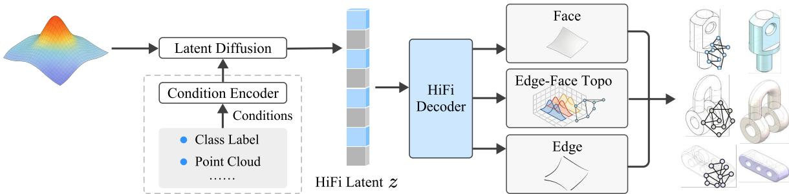

Figure 1. HiFi-BRep generates B-Rep models by jointly decoding geometry and topology from a high-fidelity latent space in a single stage, with key validity constraints embedded as differentiable objectives rather than deferred to post-processing. Benefiting from this unified representation, our approach supports both unconditional synthesis and generation conditioned on various inputs, such as class labels, point clouds, or images.

## Abstract

Boundary representation (B-Rep) generation is a fundamental task in computer-aided design, yet the direct synthesis ofhigh-fidelity and structurally valid B-Reps remains a major challenge. Existing deep generative methods sufferfrom twoforms ofbrittleness: representation brittleness, caused by padding noise and feature contamination in the latent space, and generation brittleness, stemming from sequential error propagation and a train-inference mismatch due to non-differentiable validity enforcement. We propose HiFi-BRep, a novel framework that addresses these limitations through two synergistic contributions. First, a topology-aware encoder constructs a high-fidelity latent representation by eliminating padding via learnable queries and preventing feature contamination with topology-guided attention. Second, a single-stage decoder jointly predicts geometry and topology in parallel, embedding core manifold constraints as a differentiable learning objective. This design ensures mutual guidance between geometry and topology while avoiding cascaded errors. Extensive experiments show that HiFi-BRep significantly outperforms stateof-the-art methods in both structural validity and geometric fidelity, providing a robust solution for high-quality B-

Rep synthesis. Code and models are publicly available at https://github.com/1nnoh/HiFi-BRep.

## 1. Introduction

Boundary representation (B-Rep) is the standard format in Computer-Aided Design (CAD), which encodes 3D shapes through parametric primitives (surfaces, curves, and vertices) and their topological connections. This representation enables precise modeling of complex geometries and serves as the foundation for industrial design, engineering, and manufacturing. Recent advances in deep generative models have demonstrated remarkable success in data-driven 3D content creation, such as meshes and point clouds. This naturally motivates the problem of B-Rep generation: can we extend this success to synthesize high-quality and structurally valid B-Reps?

Automatically generating complex and valid B-Reps is challenging, as it requires jointly modeling parametric geometry and topology under strict validity constraints. The hybrid continuous-discrete nature and stringent validity rules of B-Reps demand an exceptionally robust generative paradigm, since even minor errors can cascade and invalidate an entire model [24]. However, existing approaches [10, 20, 24, 40] exhibit fundamental brittleness, struggling to ensure both representational fidelity and structural validity simultaneously. This brittleness manifests in two primary forms: representation brittleness and generation brittleness.

First, representation brittleness stems from noise that corrupts the latent space. Early methods handle variable numbers of primitives through padding, which introduces statistical noise, destabilizes training, and scales poorly [10, 40]. While recent works incorporate topological priors [20, 24], their encoding strategies can be suboptimal for generative tasks. For instance, propagating information across multi-hop topological neighbors [24], a design beneficial for analysis, risks contaminating features with irrelevant data when the goal is to predict direct, first-order adjacency, leading to mismatched inductive biases.

Second, generation brittleness arises from two design flaws in existing synthesis pipelines. The first is the reliance on sequential, cascaded generation processes, where geometry and topology are generated in multiple stages [10, 20, 24, 40]. This one-way information flow prevents joint, bidirectional optimization of geometric and topological properties, locking the synthesis into suboptimal paths where early decisions become irreversible. Compounding this issue, many methods do not treat topological validity constraints as explicit learning objectives during training, instead deferring validity enforcement to nondifferentiable post-processing. This creates a fundamental train-inference mismatch [19, 40]. Recent pioneering works offer partial solutions. For example, DTGBrep-Gen [20] successfully integrates topological validity constraints into its representation, but at the cost of a complex, multi-stage cascaded pipeline that is difficult to optimize. Conversely, HoLa [24] simplifies the generation pipeline and ensures manifold edges through a clever local intersection paradigm. However, this design sacrifices expressive power, as it struggles to learn structures like multiple edges between two faces directly and hinders the learning of global topology. Thus, existing methods face inherent compromises, with each solution introducing distinct limitations. This motivates the need for a unified and parallel solution.

To address these challenges, we propose HiFi-BRep, a novel framework for robust B-Rep generation. Our approach enhances robustness through two synergistic innovations: (1) a topology-aware encoder that produces a highfidelity latent representation without padding noise, and (2) a validity-constrained single-stage decoder that embeds topological rules as differentiable inductive biases. The core idea is illustrated in Fig. 3.

To mitigate representation brittleness, we design a high-fidelity B-Rep representation and a corresponding topology-aware encoder to eliminate representational noise and instability. Our design is guided by a key insight: an optimal representation should balance expressiveness with learnability while embedding validity constraints as learnable objectives. We therefore devise a compact yet sufficient representation composed of two geometric sequences (parametric Bezier curves and surfaces) and a single, ex-´ plicit edge-face adjacency matrix, which serves as both a topology guide for encoding and a direct decoding target. This design offers several advantages. Bezier curves com-´ pactly represent both edges and their endpoint vertices, inherently satisfying the vertex connectivity constraint (each edge connects exactly two distinct vertices) [20]. Moreover, the global edge-face adjacency matrix naturally encodes manifold edges (each edge is shared by exactly two faces) [20] and accommodates complex structures, such as multiple edges between face pairs. Based on this representation, our encoder introduces two key mechanisms to ensure a high-fidelity latent space. First, to eliminate padding noise, it employs learnable queries to effectively aggregate variable-length sequences into a clean, fixed-length latent code. Second, to prevent feature contamination, it enforces topology-guided attention by strictly confining all crosselement interactions to adjacent pairs, using the explicit topology as a hard attention mask. This ensures that the encoder provides structurally informed features, enabling the decoder to reliably predict valid adjacency. Together, these mechanisms yield a latent representation that is highfidelity, topology-aware, and validity-aware, providing a stable and expressive foundation for generation.

Building on this robust representation, we address generation brittleness with a novel validity-constrained singlestage decoder. This decoder tackles the challenge from two angles. First, it abandons the error-prone cascaded paradigm by predicting geometry and topology jointly and in parallel, enabling bidirectional optimization between them. Second, it enforces validity through a row-wise, twopeak learning objective that explicitly steers the model to satisfy the “two faces per edge” constraint during training. By design, this decoder synergizes with our latent representation: together, they provide manifold constraints, with vertex connectivity ensured by parametric curves and edge manifoldness enforced by the two-peak objective. This integrated design mitigates error propagation and aligns training with the physical constraints of manifold solids.

Our main contributions are summarized as follows:

• We propose HiFi-BRep, a novel framework that tackles representation and generation brittleness in B-Rep synthesis.

• We introduce a compact B-Rep representation and topology-aware encoder that eliminates padding noise through learnable queries and prevents feature contamination via topology-guided attention, achieving highfidelity latent representations.

• We design a single-stage validity-constrained decoder that jointly predicts geometry and topology in parallel, enforcing manifold constraints via a row-wise two-peak objective to promote valid B-Rep outputs.

• Extensive experiments show that HiFi-BRep significantly outperforms state-of-the-art methods in both geometric fidelity and structural validity.

## 2. Related Work

B-Rep generation requires addressing two fundamental challenges: learning robust representations that capture both geometry and topology, and designing generation methods that explicitly account for structural validity constraints. This section reviews representation learning and generation methods for B-Reps. We also briefly discuss alternative CAD generation paradigms, including constructive solid geometry and procedural modeling.

B-Rep Representation Learning Learning effective representations for B-Reps is crucial for downstream tasks such as shape classification, retrieval, and segmentation. Graphbased methods [1, 2, 7, 9, 11, 12, 18, 35] represent B-Reps as attributed graphs, where nodes encode geometric entities and edges encode topological relations, with some treating surfaces as nodes and others using heterogeneous graphs to encode different primitive types and their topological relationships. More recently, Transformer-based methods [5, 25, 43] have been proposed to leverage self-attention mechanisms for B-Rep learning, introducing specialized tokenization and embedding strategies to encode both geometric features and topological structures. However, these methods are primarily designed for analysis tasks, discarding reconstruction details and not explicitly modeling the validity of generated B-Reps.

B-Rep Generation Methods B-Rep generation aims to jointly synthesize parametric geometry and discrete topology, yet the heterogeneity of primitives complicates unified representation and modeling. Early methods [10, 40] adopt multi-stage frameworks with hierarchical latent organizations, which lack compactness. SolidGen [10] employs cascaded autoregressive pipelines to predict geometry and topology sequentially, which propagates errors across stages and results in a fragile training paradigm. BRepGen [40] relies on padding to handle variable-length primitives, introducing feature redundancy, and its reliance on post-processing for topology reconstruction precludes learning topological validity constraints. Recent works [6, 19, 20, 23, 24] seek to improve generation quality and robustness by incorporating validity priors or streamlining representations and pipelines. DTGBrepGen [20] integrates validity constraints but requires complex representations and multi-stage pipelines. While HoLa [24] proposes a compact holistic representation and simplifies generation, it suffers from noise introduced by padding and limited globa topology expressiveness. Despite adopting a single-stage generation process, BRepDiff [19] defers validity enforcement to post-processing, creating train-inference mismatch. Thus, while these approaches advance B-Rep generation, they struggle to simultaneously achieve compact and highfidelity representation, joint geometry-topology generation, and differentiable enforcement of topological validity constraints.

Constructive Solid Geometry and Procedural Modeling In addition to B-Reps, many CAD generators use procedural representations. Constructive solid geometry (CSG) combines parametric primitives via Boolean operations. Recent methods [14, 30, 32, 41, 42] learn to reconstruct CSG trees with strong interpretability and editability, though expressiveness depends on the primitive library and redundancy arises from equivalent tree representations. Alternatively, construction history sequences (such as sketch-and-extrude operations) capture the stepby-step workflows recorded by CAD systems. Various approaches [4, 13, 15, 21, 22, 29, 34, 37–39] leveraging Transformers, large language models (LLMs), or agents have been proposed to generate such construction sequences, but are constrained by limited operation vocabularies. Moreover, datasets with complete construction histories are far smaller than large-scale B-Rep collections [17, 36], further constraining pretraining scale and generalization.

## 3. Method

In this section, we first provide an overview of our approach and then describe each component in detail.

## 3.1. Overview

Our goal is to learn a generative model for synthesizing diverse and valid B-Rep solids. We define a B-Rep solid B as a tuple of its geometric and topological components: a set of $n _ { f }$ parametric faces F, a set of $n _ { e }$ parametric edges E, and a binary edge-face adjacency matrix $\mathbf { A } \in \{ 0 , 1 \} ^ { n _ { e } \times n _ { f } }$ . The core task is to model the complex joint probability distribution $p ( B ) = p ( \mathbf { F } , \mathbf { E } , \mathbf { A } )$ while satisfying the strict manifold and watertight validity constraints inherent to solid models.

HiFi-BRep addresses this problem with a two-stage pipeline built around a high-fidelity latent space. As illustrated in Fig. 3, we first train a variational autoencoder (VAE) [16] whose topology-aware encoder converts variable-length B-Rep inputs into a fixed-length latent sequence, and whose single-stage decoder reconstructs geometry and topology in parallel. The encoder targets representation brittleness by restricting cross-stream interactions to topologically adjacent primitives and by pooling variablelength tokens with learnable queries instead of relying on padded global summaries. The single-stage decoder targets generation brittleness by jointly predicting face and edge geometric parameters and edge–face adjacency within one masked decoding pass, where a differentiable row-wise objective promotes the manifold prior that each edge belongs to exactly two faces. Second, after learning a robust and structured latent space with the VAE, we train a latent diffusion model (LDM) [31] on the resulting latent codes. This decoupled design separates representation learning from distribution modeling: the VAE captures the latent structure of complex B-Reps, while the LDM learns to generate samples in this well-behaved latent space. At inference, we draw a latent sample from the LDM and decode it with the pre-trained VAE decoder, enabling high-quality unconditional and conditional synthesis.

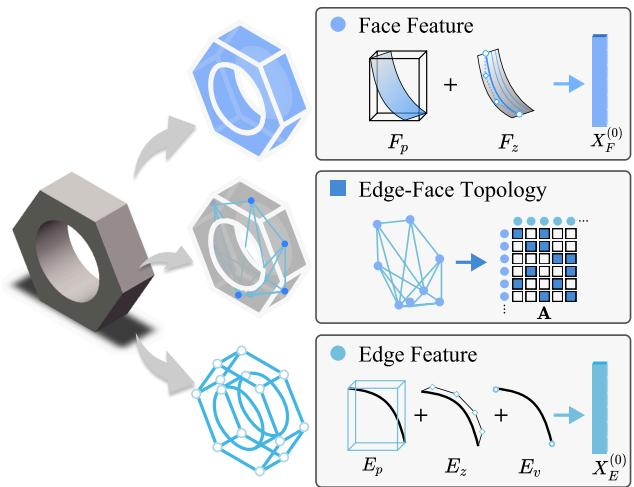  
Figure 2. Input B-Rep formulation. We construct unified primitive features by decomposing the shape into geometric and topological components. Specifically, we derive the face feature by summing the embeddings of the bounding box $F _ { p }$ and Bezier control grid´ $F _ { z }$ . Similarly, the edge feature is formed by summing the embeddings of the bounding box $E _ { p } ,$ , control points $E _ { z }$ , and explicit endpoints $E _ { v }$ . The global structural connectivity is explicitly encoded via the edge-face incidence matrix.

## 3.2. Topology-Aware Dual-Stream Encoder

Input B-Rep Formulation We adopt a compact parametric scheme that reduces representation noise while retaining smooth geometry and essential topological structure. As illustrated in Fig. 2, each face is modeled as a Bezier surface´ defined by a bounding box $( F _ { p } )$ and control points $( F _ { z } )$ while each edge is represented as a Bezier curve parameter-´ ized by a bounding box $E _ { p } { \mathrm { : } }$ , control points $E _ { z } ,$ and explicit endpoints $E _ { v }$ for precise global anchoring. The edge-face topology is captured by an explicit incidence matrix $( \mathbf { A } )$ for adjacency supervision. For stability, we canonicalize each shape by lexicographically sorting primitives according to their bounding box centers. We then align the sequences to fixed budgets $( F _ { \mathrm { m a x } } , E _ { \mathrm { m a x } } )$ , defined as the maximum numbers of faces and edges in the dataset. In manifold solids, the number of edges $n _ { e }$ scales linearly with the number of faces $n _ { f }$ . Therefore, these budgets provide sufficient capacity without unnecessary redundancy. Sequences shorter than these limits are padded and strictly masked in attention. Finally, we reconstruct the B-Rep from the predicted face and edge parameters together with the edge-face topology. Specifically, by merging spatially coincident endpoints into unique vertices, we establish the vertex-edge connectivity required to trace ordered per-face loops.

HiFi Latent Representation The encoder aims to produce a high-fidelity latent representation while mitigating two sources of representation brittleness: contamination from distant primitives and noise introduced by padding. To this end, we encode faces and edges in two separate streams and restrict cross-stream interaction to topologically adjacent pairs. Let $\boldsymbol { X } _ { E } ^ { ( 0 ) } = \phi _ { E } ( E _ { p } , E _ { z } , \mathcal { V } ) \in \mathbb { R } ^ { n _ { e } \times d }$ and $X _ { F } ^ { ( 0 ) } = \phi _ { F } ( F _ { p } , F _ { z } ) \in \mathbb { R } ^ { n _ { f } \times d }$ denote the initial edge and face token embeddings, respectively, where $\phi _ { E } ( \cdot )$ and $\phi _ { F } ( \cdot )$ are shared token-wise MLPs (optionally augmented with learned positional encodings) that map the corresponding geometric parameters to d-dimensional features. Here $n _ { e }$ and $n _ { f }$ are the numbers of valid edges and faces before padding, bounded by $E _ { \mathrm { m a x } }$ and $F _ { \mathrm { m a x } }$ . Each BiModalBlock applies self-attention within the face and edge streams and bidirectional cross-attention between topologically adjacent face-edge pairs under a Topo-Mask:

$$
\begin{array} { r } { \mathrm { A t t n } ( \mathbf { Q } , \mathbf { K } , \mathbf { V } ; \mathbf { S } ) = \mathrm { s o f t m a x } \Big ( \frac { \mathbf { Q } \mathbf { K } ^ { \top } } { \sqrt { d } } + \mathbf { S } \Big ) \mathbf { V } , } \\ { \mathbf { S } [ u , i ] = \left\{ \begin{array} { l l } { 0 , } & { \mathbf { A } [ u , i ] = 1 , } \\ { - \infty , } & { \mathrm { o t h e r w i s e } , } \end{array} \right. } \end{array}
$$

where $u \in [ 1 , n _ { e } ]$ indexes edges and $i \in [ 1 , n _ { f } ]$ indexes faces. Stacking L such blocks yields topology-aware edge and face features $X _ { E } ^ { ( L ) }$ and $\dot { X } _ { F } ^ { ( L ) }$ , which preserve local structural interactions while suppressing irrelevant crossstream mixing. We then pool the variable-length token set into a fixed-length latent sequence using $L _ { q }$ learnable encoder queries $\bar { \mathcal { Q } } _ { \mathrm { e n c } } \in \mathbb { R } ^ { L _ { q } \times \bar { d } }$ . These queries attend to the concatenated features $[ X _ { E } ^ { ( L ) } , X _ { F } ^ { ( L ) } ]$ with the corresponding key-padding masks, producing the HiFi latent $\mathcal { Z } \in \mathrm { \mathbb { R } } ^ { L _ { q } \times d } .$ The VAE parameterizes this latent with $( \mu _ { \mathcal { Z } } , \log \sigma _ { \mathcal { Z } } ^ { 2 } )$ for reparameterized sampling. This design enables topologyguided message passing during encoding and yields a clean fixed-length latent that serves as a stable interface for both single-stage decoding and latent diffusion.

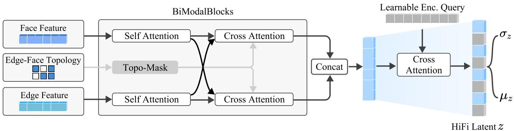  
(a) Topology-aware dual-stream encoder.

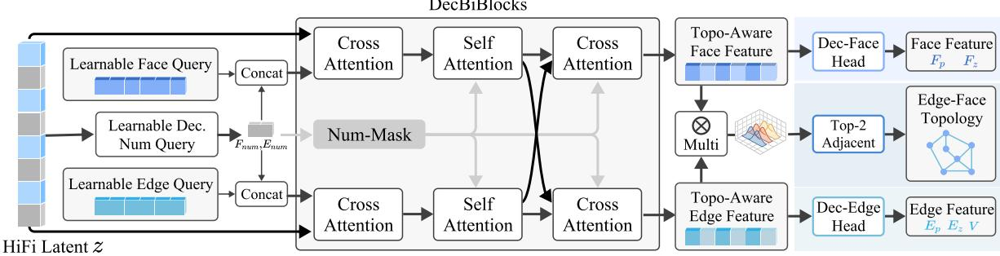  
(b) Single-stage validity-constrained decoder.  
Figure 3. Overview of HiFi-BRep. (a) Face and edge tokens undergo per-stream self-attention and cross-stream attention masked by edge face incidence (Topo-Mask), then learnable queries pool them into a fixed-length latent. (b) The decoder first predicts face and edge counts to build hard padding masks, then updates learnable face and edge queries. Stacked DecBiBlocks then decode topology-aware geometry sequences. Geometry heads regress primitive parameters, while a topology solver head predicts adjacency with row-wise softmax and two-peak targets.

## 3.3. Single-Stage Validity-Constrained Decoder

To address generation brittleness caused by cascaded error propagation and post-hoc repair, we decode primitive counts, geometry, and adjacency in a single stage, allowing topology and geometry to inform each other throughout generation (Fig. 3b). Starting from the HiFi latent ${ \mathcal { Z } } .$ , two learnable count queries predict logits over $\{ 0 , \ldots , F _ { \mathrm { m a x } } \}$ and $\{ 0 , \ldots , E _ { \mathrm { m a x } } \}$ for the numbers of faces and edges. During training, the ground-truth counts $( n _ { f } , n _ { e } )$ define ge-Face Topologyhard padding masks for all subsequent attention layers and prediction heads; at inference, these masks are determined by the predicted counts $( \hat { n } _ { f } , \hat { n } _ { e } )$ . This count-first design resolves sequence-length ambiguity before decoding the geometric and topological primitives. We then initialize face queries $\mathcal { Q } _ { F }$ and edge queries $\mathcal { Q } _ { E }$ , and use a stack of DecBiBlocks to decode topology-aware face and edge features from the latent $\mathcal { Z }$ . Each block consists of (i) crossattention from the face and edge queries $\left( \mathcal { Q } _ { F } , \mathcal { Q } _ { E } \right)$ to ${ \mathcal { Z } } ,$ (ii) masked self-attention within each stream, (iii) bidirectional cross-attention between the face and edge streams, and (iv) feed-forward networks, producing topology-aware decoder features $H _ { F }$ and $H _ { E }$ . Geometry heads regress the face and edge control parameters from these features. For bounding boxes, we predict centers and sizes and convert them to corner coordinates through a differentiable mapping, using softplus to ensure positive box sizes. Edge endpoints are regressed directly. To predict topology, we project $H _ { E }$ and $H _ { F }$ into a shared adjacency space, $U =$ $\psi _ { e } ( H _ { E } ) \in \mathbb { R } ^ { E _ { \operatorname* { m a x } } \times d _ { \mathrm { a d j } } }$ and $W = \bar { \psi _ { f } } ( H _ { F } ) \overset { \cdot } { \in } \bar { \mathbb { R } } ^ { F _ { \operatorname* { m a x } } \times d _ { \mathrm { a d j } } }$ and compute scaled bilinear scores $\dot { S } = ( U W ^ { \top } ) / \sqrt { d _ { \mathrm { a d j } } }$ A row-wise softmax over S is supervised by a two-peak target distribution, which assigns equal probability mass to the two incident faces of each valid edge. At inference, for each valid edge, we select the two highest-scoring valid faces according to the predicted compatibility scores. Together, count prediction stabilizes the variable-length decoding process, while the compatibility head turns the “two faces per edge” manifold prior into a differentiable training objective. As a result, the decoder promotes structurally consistent geometry-topology predictions within a single decoding stage, rather than relying on cascaded generation or post-hoc repair.

## 3.4. Training Objectives

We train the decoder with geometric reconstruction and row-wise adjacency objectives to encourage valid topology and watertightness. Let the decoder outputs be the predicted

counts $( \hat { n } _ { f } , \hat { n } _ { e } )$ , geometric parameters $( \widehat { F } _ { z } , \widehat { F } _ { p } , \widehat { E } _ { z } , \widehat { E } _ { p } , \widehat { \nu } )$ and adjacency scores S. The masked geometric reconstruction loss is

$$
\begin{array} { r } { \begin{array} { c } { \mathcal { L } _ { \mathrm { g e o m } } = \mathrm { M S E } ( \widehat { F } _ { z } , F _ { z } ) + \mathrm { M S E } ( \widehat { E } _ { z } , E _ { z } ) + \mathrm { M S E } ( \widehat { F } _ { p } , F _ { p } ) } \\ { + \mathrm { M S E } ( \widehat { E } _ { p } , E _ { p } ) + \mathrm { M S E } ( \widehat { \mathcal { V } } , \mathcal { V } ) , \ } \end{array} } \end{array}
$$

and the full objective is

$$
\begin{array} { r l } & { \mathcal { L } = \lambda _ { \mathrm { K L } } \mathcal { L } _ { \mathrm { K L } } + \lambda _ { \mathrm { l e n } } \big [ \mathrm { C E } ( \hat { n } _ { f } , n _ { f } ) + \mathrm { C E } ( \hat { n } _ { e } , n _ { e } ) \big ] } \\ & { \qquad + \lambda _ { \mathrm { g e o m } } \mathcal { L } _ { \mathrm { g e o m } } + \lambda _ { \mathrm { a d j } } \mathcal { L } _ { \mathrm { r o w - w i s e } } ( S ) , } \end{array}\tag{2}
$$

where $\mathcal { L } _ { \mathrm { r o w - w i s e } }$ is the row-wise adjacency loss and all terms are computed only on valid (non-padded) slots. We keep label smoothing and loss weights fixed across all experiments.

## 3.5. Latent Diffusion in the Unified Latent Space

After learning the HiFi latent space with the VAE, we train a denoising diffusion probabilistic model (DDPM) on the resulting fixed-length latent codes. Let $z _ { 0 }$ denote the serialized latent $\mathcal { Z }$ . The forward process is $q ( z _ { t } \mid z _ { 0 } ) =$ $\mathcal { N } ( \sqrt { \bar { \alpha } _ { t } } z _ { 0 } , ( 1 - \bar { \alpha } _ { t } ) I )$ and a Diffusion Transformer (DiT) denoiser $\epsilon _ { \theta } ( z _ { t } , t ; c )$ minimizes $\mathbb { E } \| \epsilon - \epsilon _ { \theta } ( z _ { t } , t ; c ) \| _ { 2 } ^ { 2 } .$ Conditioning c is optional and, when present, is injected through adaptive LayerNorm (adaLN), where a linear head maps c to per-block scale and shift parameters $( \gamma , \beta )$ . In our experiments, image conditions are encoded with a pretrained DI-NOv2 [26], while point-cloud conditions are encoded with a PointNet++ [28]. At inference, we sample $z _ { T } \sim \mathcal { N } ( 0 , I )$ and iteratively denoise it under the chosen condition c (or a null embedding for unconditional generation) to obtain z0, which is then decoded once by the pretrained VAE decoder.

## 3.6. Complexity and Implementation Notes

Per-stream self-attention scales as $\mathcal { O } ( F _ { \operatorname* { m a x } } ^ { 2 } D )$ and $\mathcal { O } ( E _ { \mathrm { m a x } } ^ { 2 } D )$ Topo-Mask cross-attention scales with allowed pairs $\lvert \lvert \mathbf { A } \rvert \rvert _ { 0 }$ , i.e., $\mathcal { O } ( \vert \vert A \vert \vert _ { 0 } D )$ Latent pooling is $\mathcal { O } ( L _ { q } ( F _ { \mathrm { m a x } } { + } E _ { \mathrm { m a x } } ) D )$ . Using exactly one token per face and one per edge avoids half-edge duplication and face–face candidate enumeration, so the token budget scales with $F { + } E$ . Since E is typically of the same order as F for manifold solids, runtime grows approximately linearly with shape complexity. Architectural widths, attention heads, diffusion schedules, and mixed-precision settings are reported in the appendix.

## 4. Experiments

## 4.1. Datasets and Evaluation Protocol

We evaluate HiFi-BRep on DeepCAD [37] and ABC [17], the two standard public benchmarks for B-Rep generation. Following prior work [20, 40], we deduplicate the training data and cap complexity by face and edge counts to match the token budgets defined in Sec. 3. The resulting training sets contain 83,611 shapes for DeepCAD and 186,148 shapes for ABC.

We report both distributional fidelity and CAD-level validity metrics. Specifically, Coverage (COV), MMD with Chamfer Distance (MMD-CD), and Jensen–Shannon Divergence (JSD) evaluate how well the generated set matches the reference distribution, while Novel, Unique, Compilability, and Valid characterize sample diversity and structural correctness. Compilability measures whether a generated model can be exported as a STEP file [8] by OpenCascade, whereas Valid further requires the exported solid to be watertight and manifold-consistent. Their difference therefore measures how often a file-constructible sample fails full kernel-level validity. Across all experiments, we use the same architecture and training budget: encoder/decoder width $d = 7 6 8$ with 6 encoder and 6 decoder blocks and $L _ { q } = 4 8$ learnable encoder queries, together with an 18- layer DiT for latent diffusion. The VAE and DiT contain 304.7M and 193.4M parameters, respectively, and are trained on 2×RTX 4090 GPUs for 3,000 and 1,000 epochs.

## 4.2. Unconditional Generation Results

Tab. 1 summarizes unconditional generation on DeepCAD and ABC. On DeepCAD, HiFi-BRep attains the highest Validity (72.20%) and the lowest MMD-CD (1.05), while keeping COV close to the programmatic DeepCAD baseline; this supports our claim that embedding manifold constraints at decoding time improves structural soundness without sacrificing distributional fidelity. On ABC, DTG-BrepGen achieves the best distributional alignment (highest COV and lowest MMD-CD/JSD), whereas HiFi-BRep delivers the highest Validity (32.66%) with competitive MMD-CD/JSD. Across both datasets, HiFi-BRep exhibits a markedly smaller Compilability–Validity gap than the strongest baseline: on DeepCAD the gap is 90.38 → 72.20 (18.18) for HiFi-BRep versus 92.48 → 43.20 (49.28) for DTGBrepGen, and on ABC it is 35.61 → 32.66 (2.95) for HiFi-BRep versus 50.55 → 24.88 (25.67) for DTG-BrepGen, indicating that our single-stage, validity-aware decoder produces not only compilable but also more frequently manifold-consistent solids.

We additionally note that qualitative comparisons in Fig. 4 mirror these trends: baselines often exhibit collapsed plates/rods, missing faces near holes/fillets, or nonmanifold junctions, whereas HiFi-BRep typically preserves watertightness and edge–face consistency, aligning with its higher validity and smaller gap.

## 4.3. High-Fidelity Representation and Robust Reconstruction

To assess whether the encoder yields a clean, topologyaware latent, we examine VAE reconstruction validity across exact face counts on DeepCAD (Fig. 5). Despite severe class imbalance (6–12 faces dominate, with a long tail up to 29), validity remains stable across prevalent counts and stays above 61.5% in the rare high–facecount bins. This pattern suggests that the padding-free latent and topology-constrained attention capture intrinsic topo–geometric couplings rather than overfitting frequent regimes.

Table 1. Unconditional generation on DeepCAD and ABC. Best is bold, second-best is underlined. MMD-CD and JSD are ×100 (DeepCAD convention).
<table><tr><td>Dataset</td><td>Method</td><td>COV (↑)</td><td>MMD-CD (↓)</td><td>JSD (↓)</td><td>Novel (↑)</td><td>Unique (↑)</td><td>Compilability (%, ↑)</td><td>Valid (%, ↑)</td></tr><tr><td rowspan="5">DeepCAD</td><td>DeepCAD</td><td>76.67</td><td>1.09</td><td>0.77</td><td>93.80</td><td>89.79</td><td>88.46</td><td>68.20</td></tr><tr><td>BRepGen</td><td>47.03</td><td>1.51</td><td>3.12</td><td>99.72</td><td>99.18</td><td>20.91</td><td>20.76</td></tr><tr><td>BrepDiff</td><td>45.03</td><td>1.32</td><td>2.39</td><td>99.27</td><td>99.10</td><td>63.69</td><td>63.69</td></tr><tr><td>DTGBrepGen</td><td>73.50</td><td>1.06</td><td>0.98</td><td>99.79</td><td>99.33</td><td>92.48</td><td>43.20</td></tr><tr><td>HiFi-BRep (ours)</td><td>70.40</td><td>1.05</td><td>1.72</td><td>99.81</td><td>99.15</td><td>90.38</td><td>72.20</td></tr><tr><td rowspan="4">ABC</td><td>BRepGen</td><td>34.73</td><td>2.08</td><td>5.72</td><td>99.68</td><td>99.05</td><td>20.77</td><td>20.19</td></tr><tr><td>BrepDiff</td><td>41.59</td><td>1.72</td><td>2.39</td><td>99.79</td><td>99.00</td><td>22.05</td><td>20.05</td></tr><tr><td>DTGBrepGen</td><td>70.63</td><td>1.30</td><td>1.55</td><td>99.73</td><td>99.12</td><td>50.55</td><td>24.88</td></tr><tr><td>HiFi-BRep (ours)</td><td>57.93</td><td>1.45</td><td>1.81</td><td>99.73</td><td>99.20</td><td>35.61</td><td>32.66</td></tr></table>

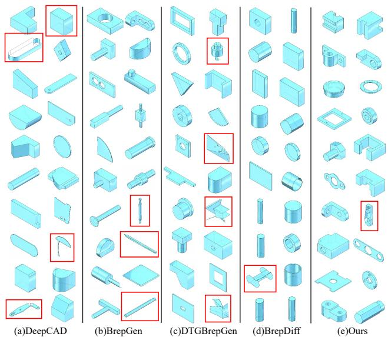  
Figure 4. Unconditional generations on DeepCAD. Columns (a–e) show DeepCAD, BRepGen, DTGBrepGen, BrepDiff, and HiFi-BRep, respectively. Red boxes highlight typical artifacts observed in baselines—open shells or missing faces around holes/fillets, non-manifold junctions, and degenerate thin plates/rods—while the rightmost column also marks a rare failure of our method for transparency. Overall, HiFi-BRep yields more coherent solids with consistent edge–face incidence and fewer topology errors, consistent with its higher Validity.

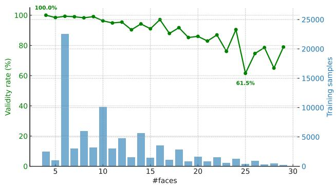  
Figure 5. Reconstruction validity by face count on DeepCAD. Validity remains stable across common counts and ≥ 61.5% in high–face-count bins, evidencing robust generalization from the encoder.

## 4.4. Ablation Studies

We ablate four components that directly target representation or generation brittleness (Tab. 2). Here, Face Acc denotes face-count accuracy, Edge Acc denotes edge-count accuracy, and Adj Acc denotes the accuracy of the edge–face incidence (adjacency) matrix. The largest drop (Valid 95.2% → 69.3%, Adj Acc 97.5% → 73.2%) occurs under the w/o two-stage setting, where we first decode geometry using the VAE and then feed the decoded geometry into a separate topology predictor (architecturally similar to our encoder) to infer face–edge adjacency. This cascaded pipeline removes joint optimization, amplifies error accumulation from geometry into topology, and creates a misalignment between training and inference. Replacing the row-wise two-peak objective with independent BCE removes per-row competition; although inference still enforces top-2 selection, the scores become less well-calibrated and mis-rank candidates, increasing false positives within the top-2 and thereby reducing Adj Acc and Valid. Removing the encoder Topo-Mask dilutes cross-stream signal-to-noise, reducing Valid despite similar count accuracies. Canonicalization consistently reduces permutation-induced variance, yielding a small but stable gain.

Table 2. Ablations on DeepCAD reconstruction. Metrics: Face Acc = face-count accuracy; Edge Acc = edge-count accuracy; Adj Acc = edge–face incidence matrix accuracy.
<table><tr><td>Variant</td><td>Face Acc. (%, ↑)</td><td>Edge Acc. (%, ↑)</td><td>Adj Acc. (%, ↑)</td><td>Valid (%, ↑)</td></tr><tr><td>HiFi-BRep (full)</td><td>100.0</td><td>99.5</td><td>97.5</td><td>95.2</td></tr><tr><td>w/o Topo-Mask (encoder)</td><td>99.3</td><td>98.7</td><td>92.7</td><td>89.5</td></tr><tr><td>w/o two-peak</td><td>99.3</td><td>98.5</td><td>90.4</td><td>87.2</td></tr><tr><td>w/o one-stage decoding (geom→adj)</td><td>98.6</td><td>98.2</td><td>73.2</td><td>69.3</td></tr></table>

Table 3. Runtime comparison (seconds per shape) on the Deep-CAD dataset. Results are averaged over 1000 runs
<table><tr><td>Method</td><td>BRepGen</td><td>BrepDiff</td><td>DTGBrepGen</td><td>HiFi-BRep</td></tr><tr><td>Total / Post (s)</td><td>8.09 / 0.32</td><td>26.28 / 23.07</td><td>23.55 / 12.83</td><td>3.83 / 0.53</td></tr></table>

## 4.5. Efficiency and Runtime

We measure end-to-end latency on DeepCAD over 1,000 non-parallel generations. As shown in Tab. 3, HiFi-BRepattains the lowest total time at 3.83 s/shape. Although our post-processing time (0.53 s) is slightly longer than BRepGen’s (0.32 s), the single-stage pipeline avoids multipass decoding, yielding the fastest overall runtime. This modest overhead arises from our control-point parameterization, which requires a brief sampling and fitting step when exporting surfaces and curves. DTGBrepGen is particularly costly due to its post-processing that fits face and edge prim itives (12.83 s). BrepDiff is single-stage but relies on meshing and intersection to recover edges and vertices during post-processing (23.07 s), which dominates its runtime. In summary, HiFi-BRep is 2.1× faster than BRepGen (8.09 s), 6.2× faster than DTGBrepGen (23.55 s), and 6.9× faster than BrepDiff (26.28 s), while retaining the validity advantages reported in Sec. 4.2.

Overall, HiFi-BRep consistently achieves higher structural validity, a smaller compilability–validity gap, robust reconstruction across topology scales, and faster inference, substantiating our design choice of embedding manifold constraints within a single-stage generative process.

## 5. Limitations and Future Work

This work targets closed, watertight B-Rep solids under a fixed face/edge budget and does not yet cover openboundary parts, large assemblies, or non-manifold configurations. The one-shot decoder relies on accurate masks and tolerance choices during consolidation, and residual failures still occur as illustrated in Fig. 6: trimming disagreement can remove a face even when the face count is predicted correctly, junction inconsistencies can appear after vertex consolidation despite top-2 adjacency selection, and ill-conditioned control points can yield sliver or selfintersecting patches. These cases explain part of the remaining Compilability–Validity gap and reflect that exact surface–curve intersection and trimming remain delegated to the CAD kernel.

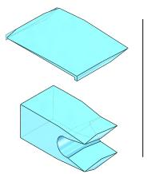  
(a)

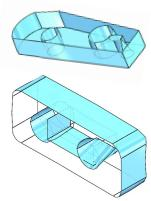  
(b)

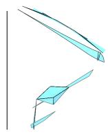  
(c)  
Figure 6. Typical failure modes. (a) Trimming disagreement / missing patch: face count is correct, but decoded loops fail to form a valid trimmed region, so the kernel drops the face. (b) Junction inconsistency / non-manifold edge: T-junctions or duplicated segments after consolidation break manifold incidence. (c) Degenerate geometry / sliver face: ill-conditioned control points yield near-zero-area or self-intersecting patches.

Future work will focus on improving robustness and scalability without sacrificing the one-shot nature of the pipeline. Key directions include dynamic-capacity decoding with variable-length queries to handle long-tailed topology, and differentiable feasibility projections to suppress trimming and junction errors. We also plan to extend the framework to open-boundary models and assemblies, and enrich the representation with explicit vertex constraints and global consistency checks.

## 6. Conclusion

We presented HiFi-BRep, a robust framework for B-Rep generation that addresses the representation and generation brittleness in prior methods through two synergistic innovations. First, our topology-aware encoder with query-based pooling and topology-guided attention eliminates padding noise and feature contamination to achieve high-fidelity latent representations. Second, our single-stage decoder embeds validity constraints as differentiable objectives, enabling joint geometry-topology generation and mitigating cascaded errors. Extensive experiments demonstrate that HiFi-BRep achieves state-of-the-art topology validity while maintaining strong consistency between compilability and manifold correctness, and delivers substantial efficiency gains over existing methods. Our work provides a robust and efficient foundation for neural B-Rep synthesis, supporting future research toward more reliable and scalable generative CAD systems.

## Acknowledgments

We thank the anonymous reviewers for their constructive comments. This work is partially supported by the National Natural Science Foundation of China (No. 62421003), the Guangdong Basic and Applied Basic Research Foundation (No. 2026A1515011678), the Fundamental Research Funds for the Provincial Universities of Zhejiang (No. GK259909299001-006), and the XPLORER PRIZE.

## References

[1] Shijie Bian, Daniele Grandi, Tianyang Liu, Pradeep Kumar Jayaraman, Karl Willis, Elliot Sadler, Bodia Borijin, Thomas Lu, Richard Otis, Nhut Ho, et al. HG-CAD: hierarchical graph learning for material prediction and recommendation in computer-aided design. Journal of Computing and Information Science in Engineering, 24(1):011007, 2024. 3

[2] Weijuan Cao, Trevor Robinson, Yang Hua, Flavien Boussuge, Andrew R Colligan, and Wanbin Pan. Graph representation of 3D CAD models for machining feature recognition with deep learning. In International design engineering technical conferences and computers and information in engineering conference, page V11AT11A003. American Society of Mechanical Engineers, 2020. 3

[3] Ding-Yun Chen, Xiao-Pei Tian, Yu-Te Shen, and Ming Ouhyoung. On visual similarity based 3d model retrieval. In Computer graphics forum, pages 223–232. Wiley Online Library, 2003. 1

[4] Tianrun Chen, Chunan Yu, Yuanqi Hu, Jing Li, Tao Xu, Runlong Cao, Lanyun Zhu, Ying Zang, Yong Zhang, Zejian Li, et al. Img2CAD: Conditioned 3-D CAD model generation from single image with structured visual geometry. IEEE Transactions on Industrial Informatics, 2025. 3

[5] Yongkang Dai, Xiaoshui Huang, Yunpeng Bai, Hao Guo, Hongping Gan, Ling Yang, and Yilei Shi. BRepFormer: Transformer-based B-rep geometric feature recognition. In Proceedings ofthe 2025 International Conference on Multimedia Retrieval, pages 155–163, 2025. 3

[6] Hao Guo, Xiaoshui Huang, Yunpeng Bai, Hongping Gan, Yilei Shi, et al. Brepgiff: Lightweight generation of complex b-rep with 3d gat diffusion. In Proceedings of the Computer Vision and Pattern Recognition Conference, pages 26587– 26596, 2025. 3

[7] Junhao Hou, Chenqi Luo, Feiwei Qin, Yanli Shao, and Xiaxuan Chen. FuS-GCN: Efficient B-rep based graph convolutional networks for 3D-CAD model classification and retrieval. Advanced Engineering Informatics, 56:102008, 2023. 3, 1

[8] ISO ISO. 10303 industrial automation systems and integration—product data representation and exchange. International Organization for Standardization: Geneva, Switzerland, 2014. 6

[9] Pradeep Kumar Jayaraman, Aditya Sanghi, Joseph G Lambourne, Karl DD Willis, Thomas Davies, Hooman Shayani, and Nigel Morris. UV-Net: Learning from boundary representations. In Proceedings of the IEEE/CVF conference

on computer vision and pattern recognition, pages 11703– 11712, 2021. 3

[10] Pradeep Kumar Jayaraman, Joseph George Lambourne, Nishkrit Desai, Karl Willis, Aditya Sanghi, and Nigel JW Morris. SolidGen: An autoregressive model for direct B Rep synthesis. Transactions on Machine Learning Research, 2023. 2, 3

[11] Benjamin Jones, Dalton Hildreth, Duowen Chen, Ilya Baran, Vladimir G Kim, and Adriana Schulz. Automate: A dataset and learning approach for automatic mating of CAD assemblies. ACM Transactions on Graphics (TOG), 40(6):1–18, 2021. 3

[12] Benjamin T Jones, Michael Hu, Milin Kodnongbua, Vladimir G Kim, and Adriana Schulz. Self-supervised representation learning for CAD. In 2023 IEEE/CVF Conference on Computer Vision and Pattern Recognition (CVPR), pages 21327–21336. IEEE, 2023. 3

[13] Ryan Jones, Rundi Wu, Karl Willis, Nishkrit Desai, Federico Iorio, Siddhartha Chaudhuri, Karan Singh, and Thomas Funkhouser. ShapeAssembly: Learning to generate programs for 3D shape structure synthesis. ACM Trans. Graph. (SIGGRAPH), 39(6):1–20, 2020. 3

[14] Kacper Kania, Maciej Zieba, and Tomasz Kajdanowicz. Ucsg-net-unsupervised discovering of constructive solid geometry tree. Advances in Neural Information Processing Systems, 33:8776–8786, 2020. 3

[15] Mohammad Sadil Khan, Sankalp Sinha, Talha Uddin, Didier Stricker, Sk Aziz Ali, and Muhammad Zeshan Afzal. Text2CAD: Generating sequential CAD designs from beginner-to-expert level text prompts. Advances in Neural Information Processing Systems, 37:7552–7579, 2024. 3

[16] Diederik P. Kingma and Max Welling. Auto-Encoding Vari ational Bayes. In Proc. Int. Conf. on Learning Representations (ICLR), 2014. 3

[17] Sebastian Koch, Albert Matveev, Zhongshi Jiang, Francis Williams, Alexey Artemov, Evgeny Burnaev, Marc Alexa, Denis Zorin, and Daniele Panozzo. ABC: A big CAD model dataset for geometric deep learning. In Proceedings of the IEEE/CVF conference on computer vision and pattern recognition, pages 9601–9611, 2019. 3, 6

[18] Joseph G Lambourne, Karl DD Willis, Pradeep Kumar Jayaraman, Aditya Sanghi, Peter Meltzer, and Hooman Shayani. Brepnet: A topological message passing system for solid models. In Proceedings of the IEEE/CVF conference on computer vision and pattern recognition, pages 12773– 12782, 2021. 3

[19] Mingi Lee, Dongsu Zhang, Clement Jambon, and´ Young Min Kim. BrepDiff: Single-stage B-rep diffusion model. In Proceedings ofthe Special Interest Group on Computer Graphics and Interactive Techniques Conference Con ference Papers, 2025. 2, 3

[20] Jing Li, Yihang Fu, and Falai Chen. DTGBrepGen: A novel B-rep generative model through decoupling topology and geometry. In Proceedings of the Computer Vision and Pattern Recognition Conference, pages 21438–21447, 2025. 2, 3, 6, 1, 5

[21] Jiahao Li, Weijian Ma, Xueyang Li, Yunzhong Lou, Guichun Zhou, and Xiangdong Zhou. CAD-Llama: leveraging large

language models for computer-aided design parametric 3D model generation. In Proceedings of the Computer Vision and Pattern Recognition Conference, pages 18563–18573, 2025. 3

[22] Pu Li, Jianwei Guo, Xiaopeng Zhang, and Dong-Ming Yan. SECAD-Net: Self-supervised CAD reconstruction by learning sketch-extrude operations. In Proceedings of the IEEE/CVF Conference on Computer Vision and Pattern Recognition, pages 16816–16826, 2023. 3

[23] Pu Li, Wenhao Zhang, Jinglu Chen, and Dongming Yan. Stitch-A-Shape: Bottom-up learning for B-Rep generation. In Proceedings of the Special Interest Group on Computer Graphics and Interactive Techniques Conference Conference Papers, pages 1–12, 2025. 3

[24] Yilin Liu, Duoteng Xu, Xingyao Yu, Xiang Xu, Daniel Cohen-Or, Hao Zhang, and Hui Huang. HoLa: B-rep generation using a holistic latent representation. ACM Transactions on Graphics (TOG), 44(4):1–25, 2025. 2, 3, 5

[25] Yunzhong Lou, Xueyang Li, Haotian Chen, and Xiangdong Zhou. BRep-BERT: Pre-training boundary representation BERT with sub-graph node contrastive learning. In Proceedings of the 32nd ACM International Conference on Information and Knowledge Management, pages 1657–1666, 2023. 3

[26] Maxime Oquab, Timothee Darcet, Th´ eo Moutakanni, Huy´ Vo, Marc Szafraniec, Vasil Khalidov, Pierre Fernandez, Daniel Haziza, Francisco Massa, Alaaeldin El-Nouby, et al. Dinov2: Learning robust visual features without supervision. arXiv preprint arXiv:2304.07193, 2023. 6, 1

[27] William Peebles and Saining Xie. Scalable diffusion models with Transformers. In Proc. IEEE/CVF Int. Conf. on Computer Vision (ICCV), pages 4195–4205, 2023. 1

[28] Charles Ruizhongtai Qi, Li Yi, Hao Su, and Leonidas J Guibas. PointNet++: Deep hierarchical feature learning on point sets in a metric space. Advances in neural information processing systems, 30, 2017. 6, 1

[29] Feiwei Qin, Shichao Lu, Junhao Hou, Changmiao Wang, Meie Fang, and Ligang Liu. Drawing2CAD: Sequence-tosequence learning for CAD generation from vector drawings. In Proceedings of the 33rd ACM International Conference on Multimedia, pages 10573–10582, 2025. 3

[30] Daxuan Ren, Jianmin Zheng, Jianfei Cai, Jiatong Li, Haiyong Jiang, Zhongang Cai, Junzhe Zhang, Liang Pan, Mingyuan Zhang, Haiyu Zhao, et al. CSG-Stump: A learning friendly CSG-like representation for interpretable shape parsing. In Proceedings ofthe IEEE/CVF international conference on computer vision, pages 12478–12487, 2021. 3

[31] Robin Rombach, Andreas Blattmann, Dominik Lorenz, Patrick Esser, and Bjorn Ommer. High-resolution image syn-¨ thesis with latent diffusion models. In Proc. IEEE/CVF Conf. on Computer Vision and Pattern Recognition (CVPR), pages 10684–10695, 2022. 4

[32] Gopal Sharma, Rishabh Goyal, Difan Liu, Evangelos Kalogerakis, and Subhransu Maji. CSGNet: Neural shape parser for constructive solid geometry. In Proceedings of the IEEE conference on computer vision and pattern recognition, pages 5515–5523, 2018. 3

[33] Jiaming Song, Chenlin Meng, and Stefano Ermon. Denoising diffusion implicit models. arXiv preprint arXiv:2010.02502, 2020. 1

[34] Ruiyu Wang, Yu Yuan, Shizhao Sun, and Jiang Bian. Textto-CAD generation through infusing visual feedback in large language models. In Forty-second International Conference on Machine Learning, 2025. 3

[35] Karl DD Willis, Pradeep Kumar Jayaraman, Hang Chu, Yun sheng Tian, Yifei Li, Daniele Grandi, Aditya Sanghi, Linh Tran, Joseph G Lambourne, Armando Solar-Lezama, et al. Joinable: Learning bottom-up assembly of parametric CAD joints. In Proceedings of the IEEE/CVF conference on computer vision and pattern recognition, pages 15849–15860, 2022. 3

[36] Karl D. D. Willis, Yewen Pu, Jieliang Luo, Hang Chu, Tao Du, Joseph G. Lambourne, Armando Solar-Lezama, and Wojciech Matusik. Fusion 360 gallery: A dataset and environment for programmatic CAD construction from human design sequences. ACM Transactions on Graphics (TOG), 40(4), 2021. 3

[37] Rundi Wu, Joseph Lambourne, Karl Willis, Pradeep Kumar Jayaraman, Nishkrit Desai, Aditya Sanghi, and Nigel Morris. DeepCAD: A deep generative network for Computer-Aided Design models. In Proc. IEEE/CVF Int. Conf. on Computer Vision (ICCV), pages 6772–6782, 2021. 3, 6

[38] Xiang Xu, Karl DD Willis, Joseph G Lambourne, Chin-Yi Cheng, Pradeep Kumar Jayaraman, and Yasutaka Furukawa. SkexGen: Autoregressive generation of CAD con struction sequences with disentangled codebooks. In International Conference on Machine Learning, pages 24698– 24724. PMLR, 2022.

[39] Xiang Xu, Pradeep Kumar Jayaraman, Joseph G Lambourne, Karl DD Willis, and Yasutaka Furukawa. Hierarchical neu ral coding for controllable CAD model generation. In Proceedings of the 40th International Conference on Machine Learning, pages 38443–38461, 2023. 3

[40] Xiang Xu, Joseph Lambourne, Pradeep Jayaraman, Zhengqing Wang, Karl Willis, and Yasutaka Furukawa. Brepgen: A b-rep generative diffusion model with structured latent geometry. ACM Transactions on Graphics (TOG), 43 (4):1–14, 2024. 2, 3, 6, 1

[41] Fenggen Yu, Zhiqin Chen, Manyi Li, Aditya Sanghi, Hooman Shayani, Ali Mahdavi-Amiri, and Hao Zhang. Capri-net: Learning compact CAD shapes with adaptive primitive assembly. In Proceedings of the IEEE/CVF conference on computer vision and pattern recognition, pages 11768–11778, 2022. 3

[42] Fenggen Yu, Qimin Chen, Maham Tanveer, Ali Mahdavi Amiri, and Hao Zhang. D2CSG: Unsupervised learning of compact CSG trees with dual complements and dropouts. Advances in Neural Information Processing Systems, 36: 22807–22819, 2023. 3

[43] Qiang Zou and Lizhen Zhu. Boundary representation learning via transformer. Computer-Aided Design, 189:103940, 2025. 3

# HiFi-BRep: High-Fidelity Latent Representation for Robust B-Rep Generation

Supplementary Material

## A. Implementation Details

This section details the training configurations for our model. Unless stated otherwise, the optimizer, scheduler, and precision settings apply to both the VAE and the DiT components. All attention modules use 12 heads by default. We train in mixed precision (bfloat16) and perform inference in float32. The latent diffusion model is trained with DDPM for 1,000 diffusion steps using beta start= 1e−4, beta end= 2e−2, the squaredcos cap v2 schedule, and prediction type set to sample. At sampling time, we adopt DDIM [33] with 400 steps. Optimization uses AdamW with learning rate 1e−4, weight decay $1 \mathrm { e } - 2 , \ ( \beta _ { 1 } , \beta _ { 2 } ) \ = \ ( 0 . 9 , 0 . 9 9 )$ , and ϵ = 1e−8. For the objective in Sec. 3.4, we set the loss weights to $( \lambda _ { \mathrm { K L } } , \lambda _ { \mathrm { l e n } } , \lambda _ { \mathrm { g e o m } } , \lambda _ { \mathrm { a d j } } ) = ( 5 \times 1 0 ^ { - 5 } , 1 , 2 5 , 5 )$ . The learning rate warms up linearly over the first 10% of updates from 0.01× the base rate to the base rate, and then follows a cosine decay back to 0.01× the base rate for the remaining steps.

## B. Novelty Verification

To assess whether HiFi-BRep synthesizes genuinely new shapes rather than recalling training instances, we perform a retrieval–based novelty check following the protocol of DTGBrepGen [20]. For each of 500 randomly generated B-reps, we compute Chamfer Distance (CD) on uniformly sampled surfaces and Light Field Distance (LFD) [3] on multi-view renderings against the entire training corpus, and retrieve the two nearest neighbors under each metric. As illustrated in Fig. 7, the retrieved training shapes remain close under CD/LFD yet exhibit clear differences in patch layout, hole patterns, and junction geometry compared with our generations. These side-by-side comparisons indicate that the model is not merely reproducing training exemplars. Instead, the single-stage validity-aware decoding paired with the high-fidelity latent supports novel but plausible variations within the data manifold.

## C. Conditional Generation

We study conditional generation to test whether our model can follow guidance while keeping valid topology. Conditions are injected in the diffusion denoiser with Adaptive LayerNorm (adaLN) as in DiT [27]. Each condition is first encoded to a vector and then used by adaLN to steer the denoising process.

We use the Furniture dataset [40] for class conditioning because it has ten balanced categories with clear visual differences. For class labels, we map each of the ten categories to a 768-dimensional embedding vector. We use CADNet40 [7] for all other conditional generation experiments since it contains realistic industrial parts and supports practical control tasks with a moderate data size. For point clouds, we train a PointNet++ [28] encoder to produce a 768-dimensional feature from 2,048 points. For partial point clouds, we drop approximately 30% of points in a local region to mimic missing scans and use the same encoder. For single view images and wireframe sketches, we use a pretrained DINOv2 [26] to obtain a 1,024-dimensional feature and project it to 768 dimensions. For multi view images, we encode each view with DINOv2, add a simple view position tag, average the view features, and project to 768 dimensions. We fine-tune the ABC-pretrained VAE on Furniture and CADNet40 for 300 epochs each, followed by training a dataset-specific DiT for 300 epochs. Other settings and splits follow the main training. The Furniture training set has 1,440 shapes and the CADNet40 training set has 7,394 shapes. All visual results use test set conditions.

Class-conditioned generation Fig. 8 shows the results on Furniture. The generations express category specific structures while keeping variations within each class.

Point cloud-conditioned generation Fig. 9 shows the results on CADNet40. The outputs follow the geometry of the input points and preserve key features such as holes and fillets.

Partial point cloud-conditioned generation Fig. 10 shows the results when the input point clouds have missing local regions. The generations complete the absent areas and keep the observed parts consistent with the input.

Sketch-conditioned generation Fig. 11 shows the results from wireframe sketches. The outputs align with the silhouette and recover coherent faces and edges.

Single-view conditioned generation Fig. 12 illustrates single-view conditioning. For each input, we sample two candidates, at least one of which is view-consistent, while both typically capture the global shape without multi-view cues.

LFD Query

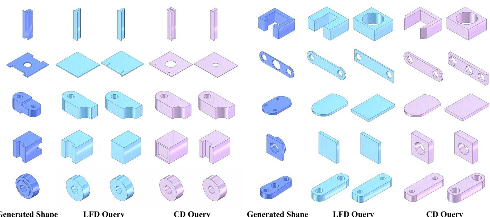  
Generated Shape  
CD Query  
Generated Shape  
LFD Query  
CD Query

Figure 7. Retrieval-based novelty check. For each generated shape (left in each triplet), we show its two nearest neighbors from the training set retrieved by Chamfer Distance (CD) and Light Field Distance (LFD). Despite proximity under both metrics, the generated results display distinct geometric features, supporting that HiFi-BRep does not simply memorize training examples.

Multi-view conditioned generation Fig. 13 shows the results from multiple views. The generations are consistent across viewpoints and recover fine details more reliably than single view inputs.

## D. Unconditional Generations on ABC

We provide additional unconditional results on the ABC dataset to complement the main experiments. The examples illustrate that our single–stage decoding produces coherent solids with consistent edge–face incidence and fewer topology errors, aligning with the validity gains reported in Sec. 4.2.

## E. Data Preprocessing and Postprocessing

We follow the general pipeline of BRepGen [40] and DT-GBrepGen [20] and adapt it to our representation. We first remove periodic seams by splitting all torus faces and ring edges so that no periodic faces or edges remain. We then normalize each model to a cube $[ - 1 , 1 ] ^ { 3 }$ centered at the origin. For each face we record its position box $F _ { p }$ as the two diagonal corners of the face bounding box. For each edge we record its position box $E _ { p }$ in the same way and we take its two endpoints as \protec \mathcal {V}. Next we normalize every face and every edge again to $[ - 1 , 1 ] ^ { 3 }$ in its own local frame and treat them as B-spline primitives. A face is represented by a 6\times 6 control grid $F _ { z }$ . An edge is represented by six control points $E _ { z }$ . In $F _ { p } , E _ { p } ,$ and \protec \mathcal {V}, the first point is the minimum corner and the second point is the maximum corner. Each shape becomes a sequence of faces and a sequence of edges. We sort the face sequence by $F _ { p }$ in lexicographic order and sort the edge sequence by $E _ { p }$ in the same way. Unlike BRepGen, which stores sampled points, we store control points. This reduces the parameter count and improves surface smoothness, which is consistent with the benefit of control point representations reported by DTGBrepGen.

In postprocessing we reconstruct loops and assemble a solid from the predicted geometry and topology. We start from the predicted edge–face incidence and collect for each face the set of incident edges. Inside a face we try to build one or more closed non intersecting loops by pairing each edge endpoint with the nearest endpoint that belongs to a different edge. The preprocessing step guarantees that there is no ring edge, so a loop corner must connect two different edges. If we obtain valid loops we accept them as the vertex–edge topology for that face. If loop building fails the current sample is marked invalid. We keep two vertex sets during this step. One set is \protec \mathcal {V}. The other set is obtained by de-normalizing the two end samples of each edge. We try both and take the one that succeeds. This fallback is the same as in BRepGen.

After we obtain edge–face and vertex–edge topology we compute uniform samples from the predicted control points. We sample each face on a 32\times 32 grid from $F _ { z }$ and each edge with 32 points from $E _ { z }$ . We then de-normalize faces and edges using $F _ { p }$ and $E _ { p }$ . We refine the geometry with the joint fitting procedure of BRepGen so that topologically connected surfaces and curves meet cleanly. With the refined curves, surfaces, and all topological relations, we use

# 8

Figure 8. Class-conditioned generation on Furniture. Colors indicate categories (ten classes). Samples from different categories are interleaved, showing class-specific traits and intra-class diversity.

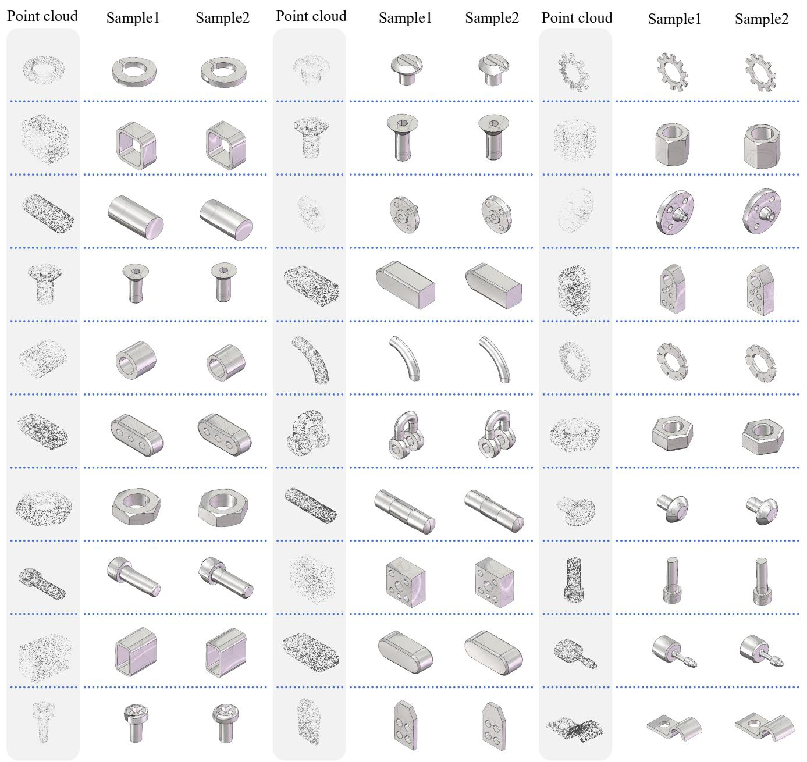  
Figure 9. Point cloud-conditioned generation on CADNet40. Given a 2,048 point input, the model produces solids that match the globa shape while allowing small variations.

the OpenCascade kernel to build the final B-rep. Any exceptions during this step are treated as a compile failure. A sample is considered valid only if the kernel can construct the model, confirm that it is closed, and compute a finite volume. If any of these checks fails the sample is invalid. These checks certify closure and watertightness. Topological legality is already enforced before a model can compile: every edge is incident to exactly two faces and two vertices, each face loop closes head to tail, and no extraneous vertices or edges are present. The extra step of sampling from control points and fitting curves and surfaces explains why our postprocessing is slightly slower than BRepGen even though both pipelines share the same assembly procedure.

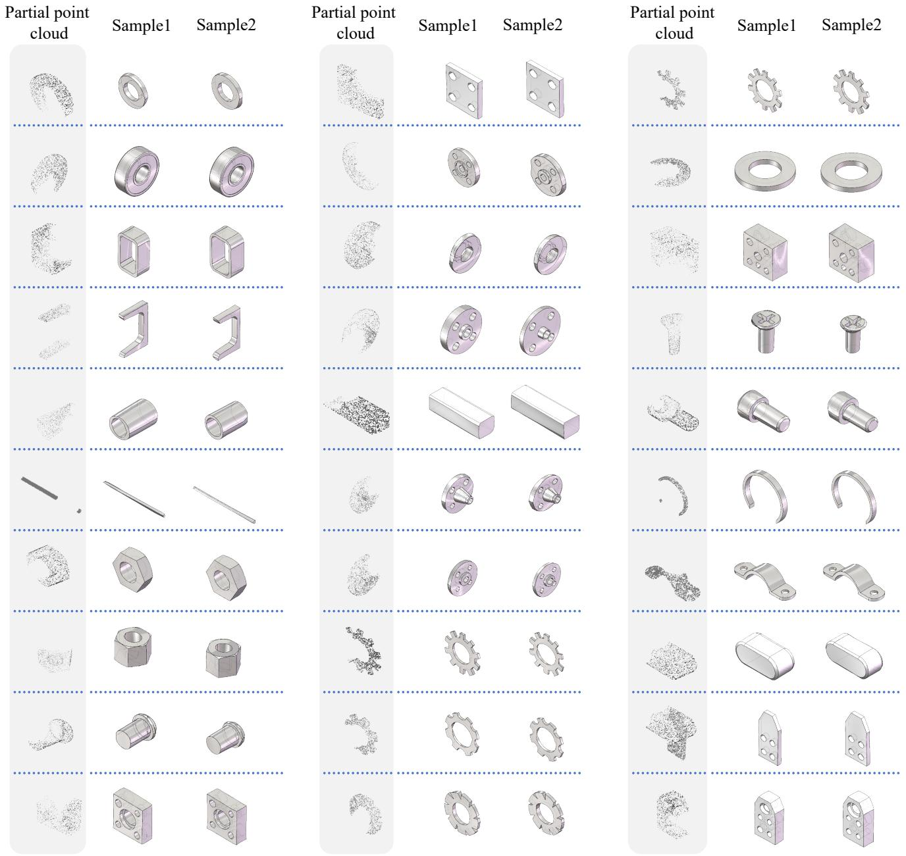  
Figure 10. Partial point cloud-conditioned generation. The model generates plausible completions for missing regions while respecting visible geometry.

## F. Generality of the Proposed Generator

We discuss the ability to handle common B-rep cases where two faces share more than one edge, and we compare the modeling assumptions with HoLa [24] and DTGBrep-Gen [20]. HoLa is an excellent nearly one-stage method.

It first performs an implicit intersection test between face pairs and then generates the corresponding half-edge pairs. This design ties edge creation to a single intersection per face pair. In practice it means one shared edge per face pair unless extra logic is added. Our approach predicts a set of unique edges and a set of unique faces and then assigns each edge to its two incident faces with an explicit incidence matrix. There is no built-in cap on how many edges two faces may share. DTGBrepGen adopts a fixed cap of five shared edges per face pair, which in our statistics covers 99.9% of ABC. The cap is practical, yet the distribution is long tailed, so a cap can become a modeling limit in rare but valid cases.

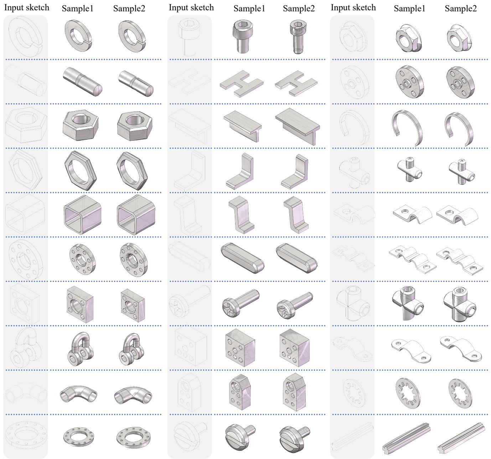  
Figure 11. Sketch-conditioned generation. Given a sketch, the model generates solids that respect the sketch while maintaining topolog ical consistency.

We measure the maximum number of shared edges between any face pair in each ABC model. The phenomenon is common rather than rare. After splitting periodic faces and ring edges at seams, about 63.37% of models have a maximum shared count greater than one. Without the split, the share is still about 23.71%. Tab. 4 lists the raw counts to show the tail. In short, modeling edges and faces as separate sets with explicit incidence lets the generator cover these frequent multi-edge cases without special rules, while keeping the decoding stage single step and validity aware.

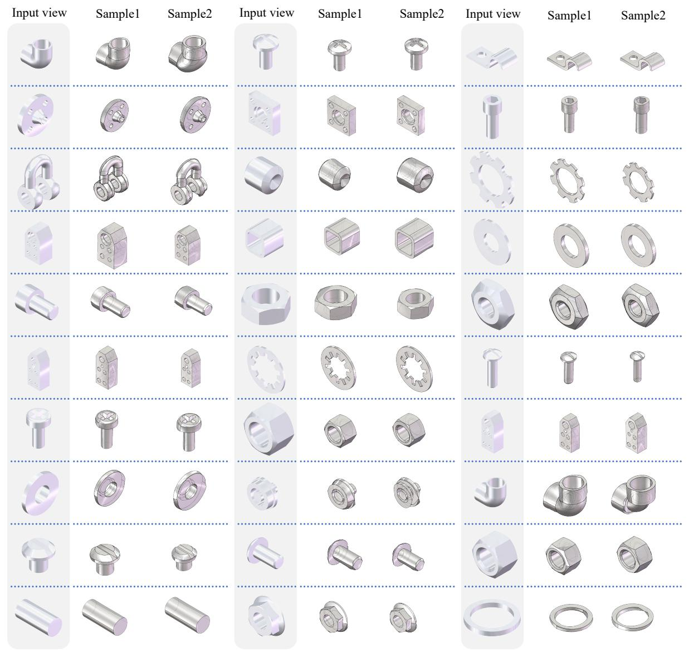  
Figure 12. Single-view conditioned generation. For each input image, we present two generated candidates, at least one of which consistently aligns with the conditioning view while capturing the overall shape with minor variations.

Input views

Sample1

Sample2

Input views

Sample1

Sample2

Input views

Sample1

Sample2

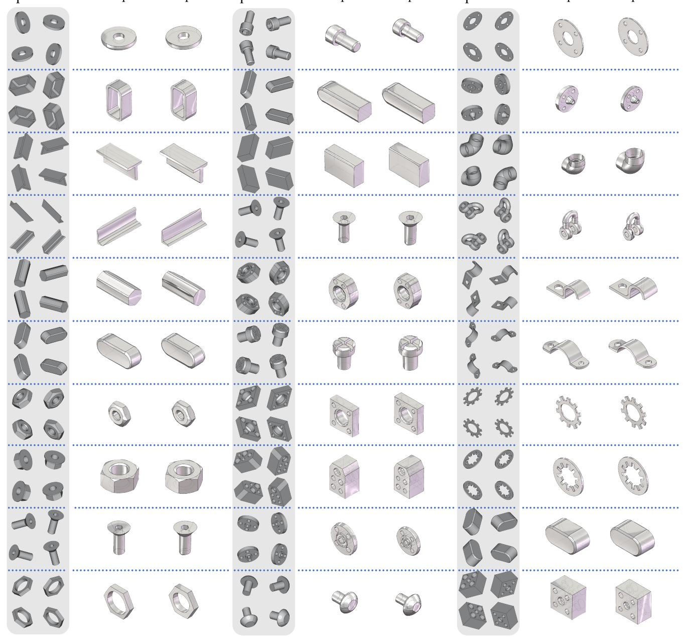  
Figure 13. Multi-view conditioned generation. With several views, the outputs align across viewpoints and preserve more fine details.

#

(a)BrepGen

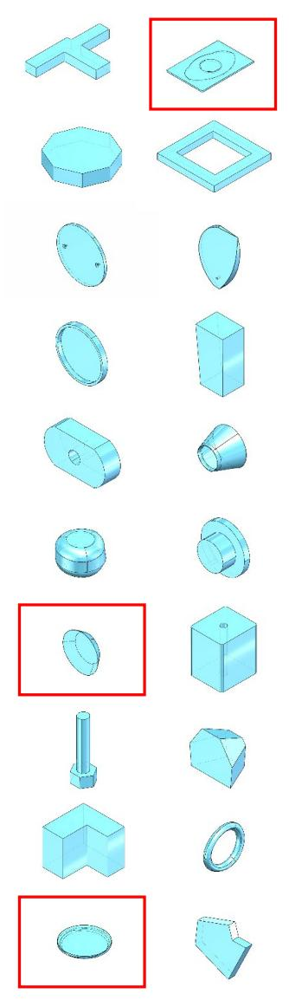  
(b)DTGBrepGen

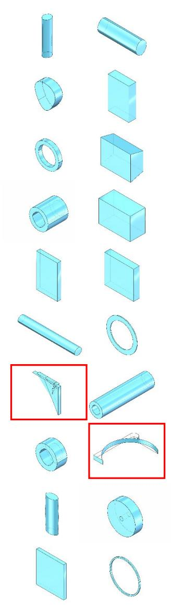  
(c)BrepDiff

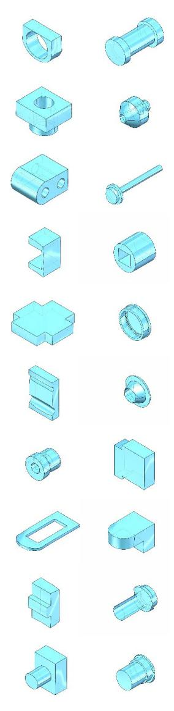  
(d)Ours  
Figure 14. Unconditional generations on ABC. Columns (a–d) show BRepGen, DTGBrepGen, BrepDiff, and HiFi-BRep respectively. Red boxes highlight typical artifacts observed in baselines, including open shells or missing faces around holes and fillets, non-manifold junctions, and degenerate sliver plates or rods.

Table 4. Maximum shared edges per face pair in ABC (counts). Left: before splitting periodic faces/edges. Right: after splitting. The distribution is long tailed, so multiple shared edges are common.
<table><tr><td>max shared</td><td>count</td></tr><tr><td>0</td><td>847</td></tr><tr><td>1</td><td>142020</td></tr><tr><td>2</td><td>40735</td></tr><tr><td>3</td><td>1830</td></tr><tr><td>4</td><td>509</td></tr><tr><td>5</td><td>110</td></tr><tr><td>6</td><td>47</td></tr><tr><td>7</td><td>15</td></tr><tr><td>8</td><td>22</td></tr><tr><td>9</td><td>4</td></tr><tr><td>10</td><td>5</td></tr><tr><td>11</td><td>2</td></tr><tr><td>12</td><td>2</td></tr></table>

Before splitting

<table><tr><td>max shared</td><td>count</td></tr><tr><td>1</td><td>68188</td></tr><tr><td>2</td><td>114404</td></tr><tr><td>3</td><td>2736</td></tr><tr><td>4</td><td>737</td></tr><tr><td>5</td><td>48</td></tr><tr><td>6</td><td>26</td></tr><tr><td>7</td><td>2</td></tr><tr><td>8</td><td>4</td></tr><tr><td>9</td><td>1</td></tr><tr><td>11</td><td>1</td></tr><tr><td>16</td><td>1</td></tr><tr><td></td><td></td></tr></table>

After splitting