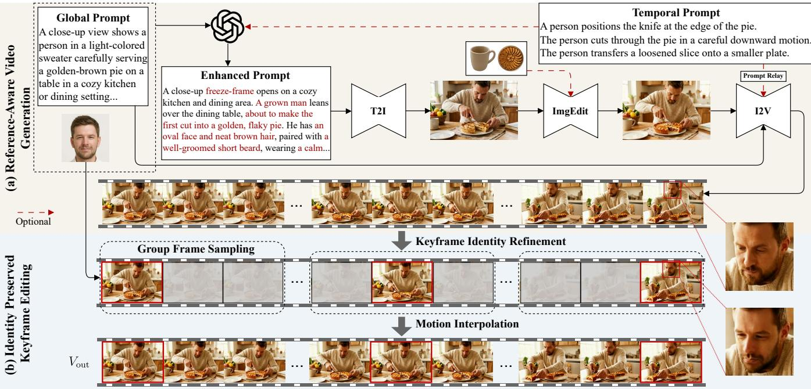
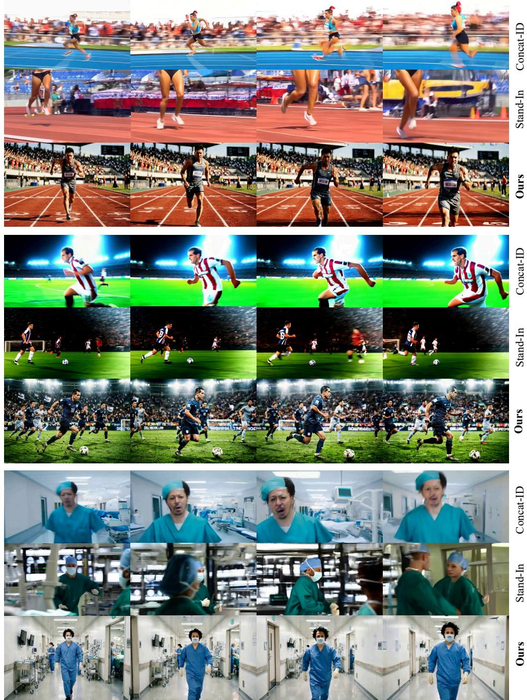

# KeyID: Decoupled Drafting and Keyframe Editing for Identity-Preserving Video Generation

Jianjie Luo Guangdong University of Technology Guangzhou, China jianjieluo@gdut.edu.cn

Yiming Zhong Guangdong University of Technology Guangzhou, China gdutzym@gmail.com

Yupeng Xiao Guangdong University of Technology Guangzhou, China xiaoyupeng1@mails.gdut.edu.cn

Haoming Shen Guangdong University of Technology Guangzhou, China 3124004329@mail2.gdut.edu.cn

Zhenguo Yang∗ Guangdong University of Technology Guangzhou, China yzg@gdut.edu.cn

A middle-aged Caucasian man with wavy dark brown hair and light stubble, wearing a navy blazer, is sitting on sunlit courthouse steps strumming an acoustic guitar, keeping his gaze fixed downward on his fingertips navigating the fretboard before slowly lifting his chin to look directly into the camera lens with a soft smile, while the camera executes a slow dolly zoom forward and upward tilt to frame him against the stone architecture, catching the light on his face as he transitions from a focused musician to a connecting performer.

  
A medium-wide tracking shot shows a young woman with long jet-black hair walking gracefully along a sandy beach in golden light. She wears a vivid red gown decorated with floral textures and tassels, and the fabric moves fluidly in the breeze as waves roll behind her. During the walk, she makes gentle, elegant gestures such as lifting part of her skirt, turning her head, shading her eyes to look toward the horizon, and brushing her hair back with a subtle smile

A static medium-wide shot shows three people sitting close together on a wooden bench amid lush greenery in soft golden light. The person on the left, wearing a green-and-white plaid shirt, looks at a smartphone and makes small explanatory hand gestures. The person in the middle, dressed in a beige sweater, holds a tablet and watches attentively with a brief sideways glance. The person on the right, wearing a peach cardigan with sunglasses hanging at the neck, quietly looks down at a tablet while observing the others. (0s\~1.4s) The person on the left raises a hand in a brief explanatory gesture. (1.4s\~3.1s) The middle person watches attentively with a tablet resting in hand. (3.1s\~5s) The person on the right uses a tablet quietly.  

Figure 1: KeyID generates higher-quality identity-preserving videos from (a) Single Identity, (b) Multiple References, and (c) Sequential Actions. Red text highlights key attributes and actions in long instructions.

## Abstract

Identity-preserving video generation (IPVG) requires synthesizing videos that are faithful to both reference subjects and text prompts. Existing methods are often hindered by high tuning costs or limited input-level enhancements, struggling to maintain rigid identity consistency during complex, long-sequence actions. To

∗Corresponding author.

address these limitations, we propose KeyID, a training-free IPVG framework that decouples the synthesis of video dynamics from the injection of identity. Specifically, KeyID comprises two components: (1) Reference-Aware Video Generation, which produces an identity-agnostic video draft aligned with multiple references, and (2) Identity-Preserved Keyframe Editing, which integrates the target identity via sparse keyframe correction and subsequent motion interpolation. By shifting from dense frame-level supervision to sparse keyframe-level refinement, KeyID efectively resolves the capacity conflict between prompt adherence and identity fidelity. Crucially, our modular design allows seamless extension to multi-subject references and complex sequential action generation without additional training. KeyID outperforms prior works and is validated by automatic and human evaluations on the oficial challenge benchmark, ultimately securing the runnerup position in the Track 2 (Sequential Action) of the ACM Multimedia 2026 IPVG Grand Challenge. Source code is available at https://github.com/WISLab-GDUT/KeyID.

## CCS Concepts

• Computing methodologies → Artificial intelligence.

## Keywords

Identity-Preserving Video Generation; Sequential Action Video Generation

## ACM Reference Format:

Jianjie Luo, Yiming Zhong, Haoming Shen, Yupeng Xiao, and Zhenguo Yang. 2026. KeyID: Decoupled Drafting and Keyframe Editing for Identity-Preserving Video Generation. In Proceedings ofthe 34th ACM International Conference on Multimedia (MM ’26), November 10–14, 2026, Rio de Janeiro, Brazil. ACM, New York, NY, USA, 7 pages. https://doi.org/10.1145/3767308. 3837690

## 1 Introduction

Identity-preserving video generation (IPVG) [1, 2] aims to synthe size temporally coherent videos from text prompts while maintaining reference identities. While early IPVG methods focus on single-identity and single-prompt settings (Fig. 1(a)), practical applications [3–5] now require more complex scenarios. For instance, modern generation applications often involve multi-reference gen eration (Fig. 1(b)), which integrates diverse visual concepts, such as additional reference objects, without letting one reference dominate the others [6–9]. They also require sequential action control (Fig. 1(c)), where models must execute specific motion transitions based on timestamped prompts (e.g., “0–1.4s: raises a hand”) [9, 10]. Thus, the current objective of IPVG is to generate long-sequence actions while preserving strict identity consistency.

However, existing methods often struggle to satisfy these advanced requirements due to a fundamental semantic gap between the facial reference and the text prompt. This inherent gap forces the generator to balance prompt adherence and identity fidelity within a single video generation process. One paradigm attempts to bridge this gap by fine-tuning large pre-trained video difusion models on ID-matched data [11, 12]. Although this approach achieves impressive results, severe data scarcity and prohibitive tuning costs prevent the base video generation models from scaling efectively and suficiently adapting to the IPVG task. Therefore, a subsequent paradigm explores training-free approaches [13, 14] through input level enhancements. Nevertheless, because both paradigms still rely on an end-to-end generation process, they fail to resolve the underlying trade-of. Consequently, these methods remain highly susceptible to temporal identity drift, struggling to maintain the fine-grained facial characteristics of the target identity across longsequence actions. Ultimately, the demand for multi-reference generation and precise sequential actions within such a coupled generation process overwhelms the model, rendering robust identity preservation exceedingly dificult.

To address the limitations of coupled generation, we propose KeyID, a training-free IPVG framework that decouples the synthesis of video dynamics from the injection of identity. Specifically,

KeyID reformulates identity preservation as sparse keyframe correction followed by motion interpolation, which comprises two primary components: Reference-Aware Video Generation (RAVG) and Identity-Preserved Keyframe Editing (IPKE). Firstly, RAVG produces an identity-agnostic, spatiotemporally consistent video draft that aligns with multiple references, including the text prompt and general objects. This is achieved through prompt enhancement and first-frame editing, followed by multi-event draft expansion. Secondly, IPKE integrates the target identity into the draft via identity-aware video editing. It extracts a compact set of representative keyframes from the video draft and applies explicit identity refinement to each keyframe through face swapping. Finally, the complete output video is reconstructed by interpolating the intermediate motions between these corrected keyframes.

In sum, we have made the following contributions: (I) KeyID establishes a novel paradigm for identity-preserving video generation that decouples the synthesis of video dynamics from identity integration. (II) This decoupled framework ofers an efective solution for complex generation scenarios, particularly those requiring multi-reference conditions and sequential actions. (III) The proposed method has been validated in the ACM Multimedia 2026 IPVG Grand Challenge [15], where it surpasses the first-place result of the previous year in the Track 1 (Facial) setting and secures the runner-up position in the Track 2 (Sequential Action) setting.

## 2 Related Work

Text-to-video Difusion Models. Difusion models [16–19] have become the dominant paradigm for visual generation. Early textto-video (T2V) models [20–22], such as VideoCrafter [23], ModelScope [24], and Stable Video Difusion [25], established the capability of generating temporally coherent videos from text prompts. More recently, Difusion Transformer [26] backbones have become the standard architecture. Models such as CogVideoX [27], HunyuanVideo [28], and Wan [29] demonstrate strong scalability and high generation quality. VACE [30] further supports multi-input conditioning for unified video generation and editing. While these foundation models excel at general conditional video generation, they fall short on the specific demands of identity preservation.

Training-based IPVG. A common paradigm augments foundation models with extra encoders or adapters fine-tuned on IDmatched data for identity preservation [12, 31–33]. For instance, ConsisID [1] utilizes frequency decomposition to separate identity features from motion dynamics. Concat-ID [6] concatenates image features with video latents through 3D self-attention. Stand-In [34] integrates identity features via LoRA [35] and restricted selfattention. RefAlign [8] extends this approach to multi-object preservation through fine-tuning of the reference branch. ReactID [9] extends IPVG to sequential actions through action-conditioned sub-tasks. However, fine-tuning on scarce ID-matched data weakens prompt adherence, especially under sequential action prompts demanding precise motion control.

Training-free IPVG. To bypass data scarcity and reduce tuning costs, training-free methods enhance conditional input to maximize native model capability without modifying foundation model parameters. For example, TPIGE [13] applies face-aware prompt enhancement and identity-aware spatiotemporal guidance. Wang et al. [14] decompose the task into cascaded text-to-image and imageto-video generation. While efective at reducing tuning costs, these pre-processing methods enhance inputs without subsequent correction, leaving them vulnerable to identity drift. KeyID addresses this through a post-processing pipeline: it first generates a video draft from the reference and prompt, then refines identity via sparse keyframe editing followed by motion interpolation, naturally extending to multi-reference and sequential action settings.

  
Figure 2: Overview of KeyID. (a) Reference-Aware Video Generation. A global prompt, optional temporal prompts, and a face reference are fused by GPT-5 into an enhanced prompt, from which a first frame is generated and optionally edited with non-human objects. The edited frame and the global prompt, along with optional temporal prompts, drive I2V to produce a video draft. (b) Identity Preserved Keyframe Editing. Keyframe windows are uniformly sampled in groups along the video draft, optimal keyframes are selected in keyframe identity refinement, and motion interpolation produces the final temporally coherent video with preserved identity and prompt adherence.

## 3 Method

## 3.1 Overview

Given a reference identity image $I _ { \mathrm { r e f } } ,$ a set of $N _ { o }$ reference images for non-human objects $J _ { \mathrm { o b j } } = \{ I _ { \mathrm { o b j } } ^ { i } \} _ { i = 1 } ^ { N _ { o } }$ , and a global prompt $P _ { 0 } ,$ the objective of IPVG is to generate a video $V _ { \mathrm { o u t } }$ consisting of � frames over � seconds, in which the reference identity is faithfully maintained and the reference objects appear naturally within the scene. For the sequential action IPVG, the input additionally includes a set of $N _ { t }$ timestamped segment prompts $\mathcal { P } _ { \mathrm { t e m } } = \{ ( P _ { i } , t _ { i - 1 } , t _ { i } ) \} _ { i = 1 } ^ { N _ { t } }$ each describing the action for the corresponding time interval.

The core design principle of KeyID is to decouple the synthesis of video dynamics from the identity integration. Specifically, KeyID comprises two primary components: (1) Reference-Aware Video Generation (RAVG) and (2) Identity-Preserved Keyframe Editing (IPKE). As illustrated in Figure 2, RAVG first generates an identityagnostic video draft $V _ { \mathrm { d r a f t } }$ of � frames that aligns with the multireference conditions. This strategy enables the video generation foundation model to allocate full capacity toward prompt adherence and temporal coherence. Subsequently, IPKE integrates the target identity into the draft by performing sparse keyframe correction and interpolating the intermediate motions to produce the final output video $V _ { \mathrm { o u t } } .$ . To support the sequential action IPVG task, RAVG can optionally be augmented with Prompt Relay [10], which serves as an inference-time temporal routing module that assigns each timeline segment to the appropriate action description.

## 3.2 Reference-Aware Video Generation

RAVG produces a timeline-aligned video draft without imposing explicit identity constraints during generation. By deferring identity preservation to IPKE, the video generation foundation model operates at full capacity for prompt following and temporal coherence. Technically, RAVG consists of three steps: Prompt Enhancement, First-frame Generation, and Video Draft Generation.

Prompt Enhancement. Standard video prompts $P _ { 0 }$ often lack the fine-grained visual details (e.g., age, hairstyles, facial hair) required for high-quality image generation. To bridge this gap, we use GPT-5 [36] to extract a concise subject description $P _ { s }$ from $I _ { \mathrm { r e f } } .$ We then fuse $P _ { s }$ with $P _ { 0 }$ and $\mathcal { P } _ { \mathrm { t e m } }$ to produce an enhanced prompt ${ \bar { P } } .$ This step ensures that the subsequent T2I process has suficient descriptive prior to generate a subject that matches the reference’s non-facial attributes (e.g., hair, clothing) which are not explicitly handled by face-swapping.

First-frame Generation. The first frame defines the spatial layout and initial identity. We generate an initial first frame from the enriched prompt �¯ via a T2I model:

$$
I _ { 1 } = \mathrm { T } 2 \mathrm { I } ( \bar { P } ) ,\tag{1}
$$

However, text prompts are often insuficient to describe complex non-human object identities (e.g., a specific pink basketball with unique textures in $ { \mathcal { T } } _ { \mathrm { o b j } } )$ . Thus, we apply an ImgEdit model to composite these objects:

$$
\bar { I } _ { 1 } = \mathrm { I m g E d i t } ( I _ { 1 } , \bar { J } _ { \mathrm { o b j } } ) .\tag{2}
$$

By injecting object identities at the image level, we ensure the I2V model starts with a complete visual reference for both the person and the objects. Notably, this detailed anchor frame reduces the generative burden on the video model, thereby allowing it to focus entirely on motion dynamics.

Video Draft Generation. Using ${ { \bar { I } } _ { 1 } }$ as the starting condition, we generate an identity-agnostic video draft using an I2V model:

$$
V _ { \mathrm { d r a f t } } = \{ \bar { I } _ { 1 } , I _ { 2 } , . . . , I _ { N } \} = \mathrm { I } 2 \mathrm { V } ( \bar { I } _ { 1 } , P _ { 0 } , \mathcal { P } _ { \mathrm { t e m } } ) .\tag{3}
$$

While non-human object identities are relatively stable under standard I2V difusion, human facial identity remains prone to drift. By deliberately deferring this facial correction to the subsequent stage, the I2V model is freed to focus entirely on complex motion synthesis. Consequently, to seamlessly handle sequential actions without semantic entanglement, we augment the I2V process with Prompt Relay [10]. This module introduces a temporal routing penalty in the cross-attention layers, ensuring that frames within a specific interval $\left( t _ { i - 1 } , t _ { i } \right)$ attend primarily to their corresponding action description $P _ { i }$ . The resulting $V _ { \mathrm { d r a f t } }$ provides the motion backbone for the final output.

## 3.3 Identity Preserved Keyframe Editing

While RAVG ensures motion coherence, the facial identity in $V _ { \mathrm { d r a f t } }$ may still deviate from $I _ { \mathrm { r e f } } .$ The motivation for IPKE is to apply explicit identity correction without introducing temporal flickering. Since per-frame editing frequently causes spatiotemporal jitter, we reformulate identity preservation as sparse keyframe refinement followed by motion-aware interpolation.

Group Frame Sampling. Not all frames in $V _ { \mathrm { d r a f t } }$ are equally suitable for identity refinement. Motion blur and extreme poses can cause face-swapping to fail. To balance temporal coverage with content quality, we distribute � nominal keyframe positions $k _ { i }$ across the video. For each $k _ { i }$ , we define a local search window:

$$
W _ { i } = [ k _ { i } - w , k _ { i } + w ] \cap [ 1 , N ] .\tag{4}
$$

This redundancy allows us to bypass degraded frames and select the optimal candidate for refinement.

Keyframe Identity Refinement. For every candidate $I _ { j }$ in $W _ { i } ,$ we perform explicit Identity Refinement using a FaceSwap model1:

$$
I _ { j } ^ { \mathrm { r e f } } = \mathrm { F a c e S w a p } ( I _ { j } , I _ { \mathrm { r e f } } ) .\tag{5}
$$

We then use ArcFace [37] to compute a similarity score $s _ { j }$ against the reference. The final keyframe for the �-th window is selected as:

$$
\bar { k } _ { i } = \arg \operatorname* { m a x } _ { j \in W _ { i } } s _ { j } .\tag{6}
$$

This decoupling is highly advantageous. It allows the use of ofthe-shelf, high-resolution faceswap models whose capacity is not shared with the generation model, ensuring near-perfect identity fidelity on the frames that anchor subsequent interpolation.

Motion Interpolation. To reconstruct the final video $V _ { \mathrm { o u t } } ,$ , we populate the gaps between refined keyframes. Simply concatenating edited frames would lead to discontinuities. The keyframes reside in the �-frame draft space, while the output targets � frames over the same duration. We map each $\bar { k } _ { i }$ via linear temporal rescaling:

$$
t _ { i } = \left\lfloor { \frac { M } { N } } \cdot { \bar { k } } _ { i } \right\rceil .\tag{7}
$$

Given the refined keyframes $I _ { \bar { k } _ { i } } ^ { \mathrm { r e f } }$ at their mapped positions $t _ { i } ,$ we use LTX-2 [38] to synthesize the intermediate frames. All keyframes are fed simultaneously, and the model performs motion-compensated interpolation across the full sequence in one pass:

$$
V _ { \mathrm { o u t } } = \mathrm { L T X - } 2 \big ( I _ { t _ { 1 } } ^ { \mathrm { r e f } } , \cdot \cdot \cdot , I _ { t _ { K } } ^ { \mathrm { r e f } } \big ) ,\tag{8}
$$

where � denotes the number of keyframes. By conditioning interpolation on these identity-corrected anchors, LTX-2 propagates high-fidelity identity across the full sequence, producing a temporally smooth video of � frames.

## 4 Experiments

## 4.1 Dataset and Evaluation Metrics

Datasets. To evaluate KeyID, we conduct experiments on the Facial and Sequential Action Tracks of the ACM Multimedia 2026 Identity-Preserving Video Generation Challenge2. As Facial IPVG (Track 1) is foundational to the complex Sequential Action IPVG (Track 2), we use the oficial VIP-200K test dataset [39] for algorithm tuning and capability validation. Specifically, this test dataset contains 200 unseen person IDs, with each ID featuring portrait images and five textual prompts for video generation, totaling 1,000 test pairs. For the Sequential Action IPVG, we evaluate KeyID on the ACM MM 2026 IPVG Track 2 dataset. This test set contains 200 samples, each comprising reference identity images, non-human objects, a global prompt, and timestamped action captions.

Evaluation Metrics. Following the challenge protocol, the official Track 2 ranking uses a combined score of objective metrics and human evaluation. To provide detailed diagnostics beyond the aggregate score, we also report standard objective metrics following established Facial IPVG practices [39]. Specifically, Face-Cur and Face-Arc measure identity consistency via CurricularFace [40] and ArcFace [37]. Furthermore, CLIPScore [41] quantifies the semantic alignment between generated videos and text prompts.

## 4.2 Implementation Details

The subject recognition and prompt enhancement modules ofKeyID are implemented using GPT-5.4 [36]. The initial frame is generated by ERNIE-Image-Turbo3, and Qwen-Image-Edit-2511 [42] is subsequently utilized to inject non-human reference objects into this frame. For the generation of the video draft, Wan2.2 [29] is adopted as the image-to-video difusion backbone, which is augmented with Prompt Relay [10] to achieve timeline-aware temporal control. Dur ing the stage of explicit identity refinement, the similarity of the identity is evaluated by ArcFace [37]. Additionally, LTX-2.3 [38] serves as the model for motion interpolation. Regarding the temporal configuration, the video draft is generated to consist of � = 81 frames with a duration of 5 seconds. The process of keyframe selection extracts � = 5 keyframes using a search window radius of � = 8. Ultimately, the final output video comprises � = 121 frames within the same duration.

Table 1: Comparison results of KeyID with other state-of-theart Facial IPVG approaches on the VIP-200K test dataset.
<table><tr><td>Method</td><td>Face-Cur↑</td><td>Face-Arc↑</td><td>CLIPScore↑</td></tr><tr><td>Concat-ID [6]</td><td>0.242</td><td>0.228</td><td>29.0</td></tr><tr><td>Xu et al. [43]</td><td>0.285</td><td>0.269</td><td>28.6</td></tr><tr><td>Wang et al. [14]</td><td>0.467</td><td>0.441</td><td>28.0</td></tr><tr><td>TPIGE [13]</td><td>0.492</td><td>0.473</td><td>27.8</td></tr><tr><td>KeyID (Ours)</td><td>0.633</td><td>0.630</td><td>30.9</td></tr></table>

Table 2: Comparison results of KeyID with other state-of-theart Sequential Action IPVG approaches on the leaderboard of IPVG 2026 Challenge (Track 2).
<table><tr><td>Team</td><td>Final Score↓ Rank</td><td></td></tr><tr><td>USTC-CMI</td><td>1.25</td><td>1</td></tr><tr><td>WislabGDUT (Ours)</td><td>1.81</td><td>2</td></tr><tr><td>USTC-AC</td><td>2.94</td><td>3</td></tr></table>

## 4.3 Performance Comparison

Facial IPVG Evaluation. Table 1 summarizes the results on the VIP-200K test dataset, comparing KeyID with Concat-ID [6] and the top three methods from IPVG 2025 Challenge [39]: TPIGE [13], Wang et al. [14], and Xu et al. [43]. Since IPVG 2026 submissions are not publicly available, this evaluation provides a controlled com parison with prior representative IPVG methods. KeyID achieves the best identity preservation scores, with Face-Cur of 0.633 and Face-Arc of 0.630, improving over the strongest baseline TPIGE by +28.7% and +33.2%, respectively. The consistent gains on Face-based metrics indicate stronger identity fidelity across diferent face similarity measures. KeyID also obtains the highest CLIPScore of 30.9, suggesting that sparse keyframe-level identity refinement improves identity fidelity while maintaining text-video alignment.

Sequential Action IPVG Evaluation. Table 2 reports the oficial leaderboard results on Track 2 of the IPVG 2026 Challenge [15], which focuses on sequential action identity-preserving video gen eration. Notably, KeyID achieves a highly competitive final score of 1.81 and secures the runner-up position. This outcome clearly demonstrates the efectiveness of decoupling video dynamics from identity injection to prevent spatial-temporal interference in a significantly more complex setting, where the model must preserve identity fidelity while accurately following timestamped action prompts and incorporating non-human reference objects.

Table 3: Ablation study on each component in KeyID on the subset of the VIP-200K test dataset.
<table><tr><td>Base</td><td>IPKE</td><td>RAVG</td><td>Face-Cur↑</td><td>Face-Arc↑</td><td>CLIPScore↑</td></tr><tr><td>√</td><td></td><td></td><td>0.279</td><td>0.260</td><td>28.6</td></tr><tr><td>√</td><td>√</td><td></td><td>0.596</td><td>0.594</td><td>28.3</td></tr><tr><td>√</td><td>√</td><td>√</td><td>0.636</td><td>0.643</td><td>30.9</td></tr></table>

Table 4: Performance comparison of KeyID and diferent variants on the subset of the VIP-200K test dataset.
<table><tr><td>Configuration</td><td></td><td></td><td>Face-Cur↑ Face-Arc↑ CLIPScore↑</td></tr><tr><td> $\mathrm { T 2 V + I P K E }$ </td><td>0.410</td><td>0.395</td><td>29.2</td></tr><tr><td> $\mathrm { R A V G } + \mathrm { D r e a m I D - V } \left[ 4 4 \right]$ </td><td>0.503</td><td>0.484</td><td>30.8</td></tr><tr><td> $\mathrm { R A V G } + \mathrm { I P K E }$  (KeyID)</td><td>0.636</td><td>0.643</td><td>30.9</td></tr></table>

Qualitative Analysis. Figure 3 compares KeyID with two representative identity-preserving video generation baselines, Concat-ID [6] and Stand-In [34]. These methods are selected because they represent diferent identity-conditioning strategies from us and provide strong baselines for evaluating identity consistency and prompt adherence. We show four evenly sampled frames for each generated video. Stand-In generates visually appealing frames, but its identity visibility can become unstable under large motion, e.g., in the first case, the generated subject is shown mostly with the lower body and the face region is absent. Concat-ID preserves partial identity resemblance, but it tends to weaken fine-grained prompt adherence in complex scenes, e.g., in the last case, it fails to include the surgical mask specified in the prompt. In contrast, KeyID maintains the reference identity across frames while better following the prescribed actions and visual attributes. These results suggest that sparse keyframe-level identity refinement improves identity fidelity without visibly weakening prompt adherence.

## 4.4 Experimental Analysis

To accelerate the experimental validation process, we conduct our ablation studies on a subset of 200 samples from the VIP-200K test dataset. Specifically, this subset is systematically formed by sampling exactly one prompt per identity.

Ablation Study. Table 3 reports per-component contributions, using Xu et al. [43] as the baseline generation method. Row 1 shows the baseline alone, which achieves low identity scores (Face-Cur 0.279, Face-Arc 0.260). Applying IPKE (Identity Preserved Keyframe Editing) as post-processing on the baseline’s output (row 2) yields a sharp identity gain: Face-Cur from 0.279 to 0.596 (+0.317) and Face-Arc from 0.260 to 0.594 (+0.334), demonstrating that IPKE alone substantially improves identity fidelity even without modifying the generation pipeline. Adding RAVG (Reference-Aware Video Generation) further lifts CLIPScore to 30.9, Face-Cur to 0.636, and Face-Arc to 0.643, confirming that RAVG strengthens draft quality and provides a better foundation for IPKE.

Reference Image

  
The runner, in lightweight gear and running shoes, sped down the track, her legs pumping with power as she neared the finish line, the sound of her rapid breathing matching the rhythm of her footsteps on the rubber track, the cheering crowd urging her on.

## Reference Image

The soccer player, in his team kit, dashed across the field, dodging defenders as he aimed for the goal, the roar of the crowd fueling his determination as the green grass beneath his feet was trampled by his quick movements, the bright stadium lights casting long shadows over the field.

  
Figure 3: Qualitative comparison. Four evenly sampled frames are shown for each video. KeyID better preserves identity consistency and prompt adherence across complex actions.

## Reference Image

The surgeon, in scrubs and a surgical mask, ran from one operating room to another, ensuring each patient received proper care amidst the sterile environment, the hum of medical machines and the soft murmur of nurses filling the sterile hospital hallways, the faint scent of antiseptic in the air.

Impact of Generation and Identity Strategies. Table 4 isolates the keyframe-based identity strategy. Replacing RAVG with vanilla T2V (T2V + IPKE) sharply decreases identity scores (Face-Cur −0.226, Face-Arc −0.248), indicating that RAVG provides a stronger foundation draft for downstream identity refinement. Substituting IPKE with dense video-level identity transfer (RAVG + DreamID-V [44]) also leads to substantially lower identity scores than KeyID, with Face-Cur decreasing from 0.636 to 0.503 and Face-Arc from 0.643 to 0.484. This comparison shows that sparse keyframe correction is more efective for preserving identity than dense video-level identity transfer. The full model (RAVG + IPKE) achieves the best identity metrics and CLIPScore, suggesting that KeyID improves identity fidelity while retaining prompt adherence.

## 5 Conclusion

In this paper, we propose KeyID, a training-free identity-preserving video generation framework designed to balance prompt adherence and identity fidelity in multi-reference generation and complex action sequences. By decoupling video dynamics from identity injection, KeyID first produces an identity-agnostic video draft and then integrates identity through sparse keyframe correction and motion interpolation. This approach addresses the inherent trade-of between following textual prompts and maintaining subject identity. KeyID achieved second place in Track 2 of the ACM Multimedia 2026 Identity-Preserving Video Generation Grand Challenge, and our evaluations suggest that keyframe-level refinement is essential for high-quality video synthesis.

## References

[1] Shenghai Yuan, Jinfa Huang, Xianyi He, Yunyang Ge, Yujun Shi, Liuhan Chen, Jiebo Luo, and Li Yuan. 2025. Identity-Preserving Text-to-Video Generation by Frequency Decomposition. In CVPR.

[2] Yunpeng Zhang, Qiang Wang, Fan Jiang, Yaqi Fan, Mu Xu, and Yonggang Qi. 2025. Fantasyid: Face knowledge enhanced id-preserving video generation. arXiv preprint arXiv:2502.13995 (2025).

[3] Yujie Wei, Shiwei Zhang, Zhiwu Qing, Hangjie Yuan, Zhiheng Liu, Yu Liu, Yingya Zhang, Jingren Zhou, and Hongming Shan. 2024. Dreamvideo: Composing your dream videos with customized subject and motion. In CVPR.

[4] Guibin Chen, Dixuan Lin, Jiangping Yang, Chunze Lin, Junchen Zhu, Mingyuan Fan, Hao Zhang, Sheng Chen, Zheng Chen, Chengcheng Ma, et al. 2025. Skyreels v2: Infinite-length film generative model. arXiv preprint arXiv:2504.13074 (2025).

[5] Xu Guo, Fulong Ye, Qichao Sun, Liyang Chen, Bingchuan Li, Pengze Zhang, Jiawei Liu, Songtao Zhao, Qian He, and Xiangwang Hou. 2026. Dreamid-omni: Unified framework for controllable human-centric audio-video generation. arXiv preprint arXiv:2602.12160 (2026).

[6] Yong Zhong, Zhuoyi Yang, Jiayan Teng, Xiaotao Gu, and Chongxuan Li. 2025. Concat-ID: Towards Universal Identity-Preserving Video Synthesis. In ICCVW.

[7] Liyang Chen, Tianxiang Ma, Jiawei Liu, Bingchuan Li, Zhuowei Chen, Lijie Liu, Xu He, Gen Li, Qian He, and Zhiyong Wu. 2025. Humo: Human-centric video generation via collaborative multi-modal conditioning. arXiv preprint arXiv:2509.08519 (2025).

[8] Lei Wang, Yuxin Song, Ge Wu, Haocheng Feng, Hang Zhou, Jingdong Wang, Yaxing Wang, and Jian Yang. 2026. RefAlign: Representation Alignment for Reference-to-Video Generation. arXiv preprint arXiv:2603.25743 (2026).

[9] Wei Li, Yiheng Zhang, Fuchen Long, Zhaofan Qiu, Ting Yao, Xiaoyan Sun, and Tao Mei. 2026. ReactID: Synchronizing Realistic Actions and Identity in Personalized Video Generation. In ICLR.

[10] Gordon Chen, Ziqi Huang, and Ziwei Liu. 2026. Prompt Relay: Inference-Time Temporal Control for Multi-Event Video Generation. arXiv preprint arXiv:2604.10030 (2026).

[11] Hengjia Li, Haonan Qiu, Shiwei Zhang, Xiang Wang, Yujie Wei, Zekun Li, Yingya Zhang, Boxi Wu, and Deng Cai. 2025. PersonalVideo: High ID-Fidelity Video Customization without Dynamic and Semantic Degradation. In ICCV.

[12] Yuechen Zhang, Yaoyang Liu, Bin Xia, Bohao Peng, Zexin Yan, Eric Lo, and Jiaya Jia. 2025. Magicmirror: Id-preserved video generation in video difusion transformers. In ICCV.

[13] Jiayi Gao, Changcheng Hua, Qingchao Chen, Yuxin Peng, and Yang Liu. 2025. Identity-Preserving Text-to-Video Generation via Training-Free Prompt, Image, and Guidance Enhancement. In ACM MM.

[14] Yuji Wang, Moran Li, Xiaobin Hu, Ran Yi, Jiangning Zhang, Han Feng, Weijian Cao, Yabiao Wang, Chengjie Wang, and Lizhuang Ma. 2025. Identity-Preserving Text-to-Video Generation Guided by Simple yet Efective Spatial-Temporal Decoupled Representations. In ACM MM.

[15] Yingwei Pan, Yiheng Zhang, Zhaofan Qiu, Ting Yao, and Tao Mei. 2026. Identity Preserving Video Generation Challenge. In ACM MM.

[16] Jonathan Ho, Ajay Jain, and Pieter Abbeel. 2020. Denoising Difusion Probabilistic Models. In NeurIPS.

[17] Robin Rombach, Andreas Blattmann, Dominik Lorenz, Patrick Esser, and Björn Ommer. 2022. High-resolution image synthesis with latent difusion models. In CVPR.

[18] Patrick Esser, Sumith Kulal, Andreas Blattmann, Rahim Entezari, Jonas Müller, Harry Saini, Yam Levi, Dominik Lorenz, Axel Sauer, Frederic Boesel, et al. 2024. Scaling rectified flow transformers for high-resolution image synthesis. In ICML.

[19] Jiayi Gao, Zijin Yin, Changcheng Hua, Yuxin Peng, Kongming Liang, Zhanyu Ma, Jun Guo, and Yang Liu. 2025. Conmo: Controllable motion disentanglement and recomposition for zero-shot motion transfer. In CVPR.

[20] Hila Chefer, Shiran Zada, Roni Paiss, Ariel Ephrat, Omer Tov, Michael Rubinstein, Lior Wolf, Tali Dekel, Tomer Michaeli, and Inbar Mosseri. 2024. Still-moving: Customized video generation without customized video data. ACM TOG (2024).

[21] Jiangchuan Wei, Shiyue Yan, Wenfeng Lin, Boyuan Liu, Renjie Chen, and Mingyu Guo. 2025. EchoVideo: Identity-Preserving Human Video Generation by Multimodal Feature Fusion. arXiv preprint arXiv:2501.13452 (2025)

[22] Tong Zhang, Juan C Leon Alcazar, and Bernard Ghanem. 2025. Motion-Aware Concept Alignment for Consistent Video Editing. arXiv preprint arXiv:2506.01004 (2025).

[23] Haoxin Chen, Menghan Xia, Yingqing He, Yong Zhang, Xiaodong Cun, Shaoshu Yang, Jinbo Xing, Yaofang Liu, Qifeng Chen, Xintao Wang, Chao Weng, and Ying Shan. 2023. VideoCrafter1: Open Difusion Models for High-Quality Video Generation. arXiv preprint arXiv:2310.19512 (2023).

[24] Jiuniu Wang, Hangjie Yuan, Dayou Chen, Yingya Zhang, Xiang Wang, and Shiwei Zhang. 2023. ModelScope Text-to-Video Technical Report. arXiv preprint arXiv:2308.06571 (2023).

[25] Andreas Blattmann, Tim Dockhorn, Sumith Kulal, Daniel Mendelevitch, Maciej Kilian, Dominik Lorenz, Yam Levi, Zion English, Vikram Voleti, Adam Letts, Varun Jampani, and Robin Rombach. 2023. Stable Video Difusion: Scaling Latent Video Difusion Models to Large Datasets. arXiv preprint arXiv:2311.15127 (2023).

[26] William Peebles and Saining Xie. 2023. Scalable difusion models with transformers. In ICCV.

[27] Zhuoyi Yang, Jiayan Teng, Wendi Zheng, Ming Ding, Shiyu Huang, Jiazheng Xu, Yuanming Yang, Wenyi Hong, Xiaohan Zhang, Guanyu Feng, et al. 2025. Cogvideox: Text-to-video difusion models with an expert transformer. In ICLR.

[28] Weijie Kong, Qi Tian, Zijian Zhang, Rox Min, Zuozhuo Dai, Jin Zhou, Jiangfeng Xiong, Xin Li, Bo Wu, Jianwei Zhang, et al. 2024. HunyuanVideo: A Systematic Framework for Large Video Generative Models. arXiv preprint arXiv:2412.03603 (2024).

[29] Team Wan, Ang Wang, Baole Ai, Bin Wen, Chaojie Mao, Chen-Wei Xie, Di Chen, Feiwu Yu, Haiming Zhao, Jianxiao Yang, et al. 2025. Wan: Open and advanced large-scale video generative models. arXiv preprint arXiv:2503.20314 (2025).

[30] Zeyinzi Jiang, Zhen Han, Chaojie Mao, Jingfeng Zhang, Yulin Pan, and Yu Liu. 2025. Vace: All-in-one video creation and editing. In ICCV.

[31] Xuanhua He, Quande Liu, Shengju Qian, Xin Wang, Tao Hu, Ke Cao, Keyu Yan, and Jie Zhang. 2024. Id-animator: Zero-shot identity-preserving human video generation. arXiv preprint arXiv:2404.15275 (2024).

[32] Yuzhou Huang, Ziyang Yuan, Quande Liu, Qiulin Wang, Xintao Wang, Ruimao Zhang, Pengfei Wan, Di Zhang, and Kun Gai. 2025. Conceptmaster: Multi-concept video customization on difusion transformer models without test-time tuning. arXiv preprint arXiv:2501.04698 (2025).

[33] Hu Ye, Jun Zhang, Sibo Liu, Xiao Han, and Wei Yang. 2023. Ip-adapter: Text compatible image prompt adapter for text-to-image difusion models. arXiv preprint arXiv:2308.06721 (2023).

[34] Bowen Xue, Zheng-Peng Duan, Qixin Yan, Wenjing Wang, Hao Liu, Chun-Le Guo, Chongyi Li, Chen Li, and Jing Lyu. 2026. Stand-In: A Lightweight and Plug-and-Play Identity Control for Video Generation. In CVPR.

[35] Edward J Hu, Yelong Shen, Phillip Wallis, Zeyuan Allen-Zhu, Yuanzhi Li, Shean Wang, Liang Wang, Weizhu Chen, et al. 2022. Lora: Low-rank adaptation of large language models.. In ICLR.

[36] Aaditya Singh, Adam Fry, Adam Perelman, Adam Tart, Adi Ganesh, Ahmed El-Kishky, Aidan McLaughlin, Aiden Low, AJ Ostrow, Akhila Ananthram, et al. 2025. Openai gpt-5 system card. arXiv preprint arXiv:2601.03267 (2025).

[37] Jiankang Deng, Jia Guo, Niannan Xue, and Stefanos Zafeiriou. 2019. ArcFace: Additive Angular Margin Loss for Deep Face Recognition. In CVPR.

[38] Yoav HaCohen, Benny Brazowski, Nisan Chiprut, Yaki Bitterman, Andrew Kvochko, Avishai Berkowitz, Daniel Shalem, Daphna Lifschitz, Dudu Moshe, Eitan Porat, et al. 2026. LTX-2: Eficient Joint Audio-Visual Foundation Model. arXiv preprint arXiv:2601.03233 (2026).

[39] Yiheng Zhang, Zhaofan Qiu, Qi Cai, Yehao Li, Fuchen Long, Yingwei Pan, Ting Yao, and Tao Mei. 2025. Identity-Preserving Video Generation Challenge. In ACM MM.

[40] Yuge Huang, Yuhan Wang, Ying Tai, Xiaoming Liu, Pengcheng Shen, Shaoxin Li, Jilin Li, and Feiyue Huang. 2020. CurricularFace: Adaptive Curriculum Learning Loss for Deep Face Recognition. In CVPR.

[41] Jack Hessel, Ari Holtzman, Maxwell Forbes, Ronan Le Bras, and Yejin Choi. 2021. Clipscore: A reference-free evaluation metric for image captioning. In EMNLP.

[42] Chenfei Wu, Jiahao Li, Jingren Zhou, Junyang Lin, Kaiyuan Gao, Kun Yan, Shengming Yin, Shuai Bai, Xiao Xu, Yilei Chen, et al. 2025. Qwen-image technical report. arXiv preprint arXiv:2508.02324 (2025).

[43] Jiahao Xu, Jianjie Luo, and Zhenguo Yang. 2025. Improving Identity Preservation in Video Generation with Multi-Branch Models. In ACM MM.

[44] Xu Guo, Fulong Ye, Xinghui Li, Pengqi Tu, Pengze Zhang, Qichao Sun, Songtao Zhao, Xiangwang Hou, and Qian He. 2026. DreamID-V: Bridging the Image-to-Video Gap for High-Fidelity Face Swapping via Difusion Transformer. arXiv preprint arXiv:2601.01425 (2026).