# Diferentiable Voronoi Ray Tracing Beyond Rasterization Speeds

BERNARDO TAVEIRA, Chalmers University of Technology, Sweden and Zenseact, Sweden CARL LINDSTRÖM, Chalmers University of Technology, Sweden and Zenseact, Sweden JOAKIM JOHNANDER, Zenseact, Sweden and Linköping University, Sweden FREDRIK KAHL, Chalmers University of Technology, Sweden

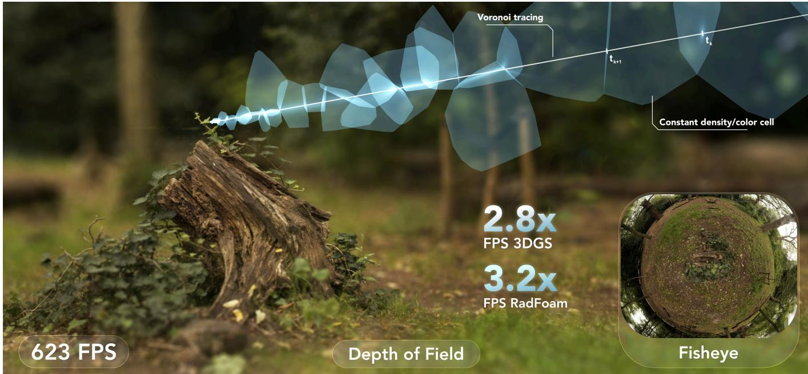  
Fi . 1. Ray-based rendering with VoroTracing. The main ima e is a shallow-de th-of-field renderin of the Garden scene. The hi hli hted ath visualizes an actual camera ray traversing the scene’s Voronoi diagram from cell to cell. The light blue regions show the projected footprints of the 3D cells traversed by the ray. The lower-right inset shows a fisheye rendering of the same scene from an overhead viewpoint. Both efects are produced by the same trained representation through changes to ray generation and sampling.

Real-time novel view synthesis is dominated by rasterized explicit primi tives. These projection-based pipelines provide high throughput but require specialized extensions for non-pinhole efects such as distortion, rolling shutter, and depth of field. Ray-based rendering expresses these efects natu rally but is generally assumed too slow for competitive real-time rendering. We analyze the factors governing throughput in diferentiable Voronoi ray tracing and identify traversal length, per-cell work, and memory locality as principal determinants. Guided by this, we introduce VoroTracing, which co-designs the scene representation, optimization, and GPU execution to reduce these costs. Compact octahedral appearance textures reduce memory trafic, while surface-concentrated opacity promotes early termination. The fixed-budget representation is optimized without pruning or densification and rendered with a GPU implementation designed for coherent traversal. On Mip-NeRF 360, VoroTracing renders at 623 FPS on an RTX 5090, providing 3.2 the throughput of the fastest prior ray-based method and 2.8 that of 3D Gaussian Splatting, while maintaining competitive reconstruction

quality. Our renderer supports fisheye, rolling-shutter, motion-blur, and depth-of-field efects through ray generation and sampling, requiring no specialized rasterization. These results show that real-time throughput can be achieved with the flexibility of ray-based rendering. We release our source code, see https://research.zenseact.com/publications/vorotracing

CCS Concepts: • Computing methodologies  Reconstruction; Ray tracing.

Additional Key Words and Phrases: novel view synthesis, neural rendering, ray tracing, Voronoi tessellation, octahedral mapping

## 1 Introduction

Rasterization is one of the defining approximations of real-time computer graphics. By replacing general light transport with projection, visibility, and local shading, it enabled interactive 3D graphics long before physically complete rendering was practical. Its success came not from being the most general image formation model, but from an exceptional co-design of representation, algorithms, and graphics hardware. Decades of graphics systems have been organized around this projection-based pipeline.

Novel view synthesis saw a similar evolution. The task is not to render a known scene, but to reconstruct a scene representation from images and render it from new viewpoints. Neural radiance fields [Mildenhall et al. 2021] approached this problem through diferentiable ray-based volume rendering. This made image formation flexible and mathematically direct, but at a high computational cost, since each camera ray required many samples and repeated neural evaluations. 3D Gaussian Splatting (3DGS) [Kerbl et al. 2023] changed the practical trajectory of the field by bringing rasterization techniques into novel view synthesis. Through projected primitives, tile sorting and alpha compositing, 3DGS introduced interactive rendering speeds to the novel view synthesis field. The speedup was large enough that much of real-time novel view synthesis has since been organized around rasterized splats and related projected primitives.

Following this paradigm shift, recent reconstruction methods have increasingly extended rasterized splatting beyond the standard pinhole-camera setting. Fisheye and distorted cameras typically require modified projection [Deng et al. 2025; Liao et al. 2024; Ren et al. 2026; Wu et al. 2025]. Rolling-shutter cameras require time aware projection or, more generally, a time varying image formation model [Hess et al. 2025; Seiskari et al. 2024; Wu et al. 2025]. Depth of field requires extra blurring steps [Shen et al. 2025; Wang et al. 2024b,a]. These extensions substantially broaden the applicability of splatting-based reconstruction, but they also increase complexity of the original rasterization pipeline, introduce further approximations, and typically come at the cost of rendering speed. Recent ray-traced and hybrid Gaussian methods make this trade-of explicit, using ray tracing to support general image formation while retaining rasterization for speed [Govindarajan et al. 2026; Mai et al. 2026; Moenne-Loccoz et al. 2024].

This raises the question of whether real-time novel view synthesis must be built around projection-based rendering, or around representations that preserve a rasterized path for speed alongside ray tracing. The common view is that rays provide flexibility and rasterization provides speed. We argue that, for the explicit radiancefield setting studied here, this trade-of is not inherent. In this work, we show that a ray-based renderer designed around traversal cost, memory trafic, opacity, and GPU execution can retain the flexibility of rays while matching or exceeding the throughput of strong rasterized baselines.

Radiant Foam [Govindarajan et al. 2025] provides an important starting point. It represents the scene explicitly as a Voronoi partition whose cells store density and appearance, and replaces repeated BVH intersections with traversal through this partition. Once a ray is inside a cell, the next cell is found through local adjacency, making the cost depend primarily on the number of cells visited rather than on the total number of primitives. This removes a major obstacle to fast ray tracing. The remaining cost is dominated by what happens at each ray-cell interaction, including the amount of appearance data loaded, the number of semi-transparent cells composited before termination, and the optimization procedure needed to obtain a useful cell distribution.

We revisit the full Voronoi ray-tracing pipeline from this perspective. Our method reduces the cost of each ray-cell interaction with a compact texture appearance model, encourages opacity to concentrate on surfaces so rays terminate quickly, and uses a scaleinvariant density parameterization that avoids biases caused by varying cell sizes. Together, these changes make the cost of rendering depend on a short sequence of lightweight cell evaluations rather than on repeated global intersection queries or expensive per-cell appearance loads. The same design philosophy extends to training. Rather than relying on pruning, densification, opacity resets, progressive downsampling, or other structural heuristics, we initialize a fixed dense set of sites from dense image matching and optimize the representation directly. This does not imply that adaptive cell insertion is unimportant. Better densification strategies may further improve future systems. Our point is that they should not be necessary to obtain high-quality reconstructions from a well-posed representation.

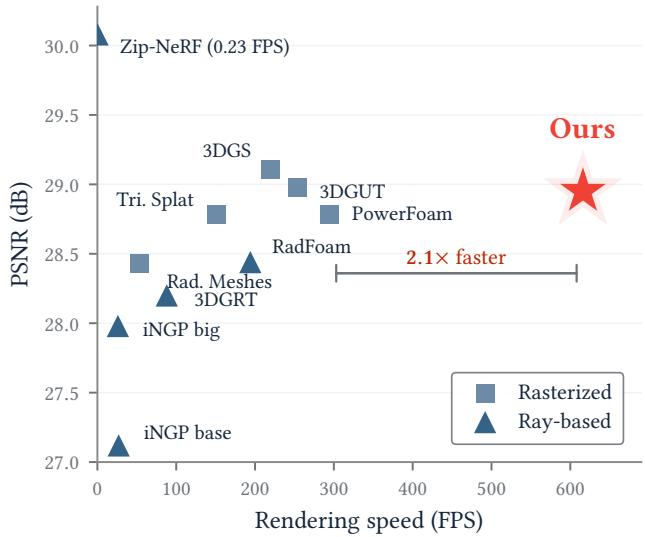  
Fig. 2. Speed–quality trade-of on Mip-NeRF 360. Rendering speed (RTX 5090) versus reconstruction quality, averaged over the seven scenes. VoroTracing renders 2.1 faster than the fastest prior baseline while match- ing the best rasterized quality to within 0.2 dB. Marker shape indicates the renderer used for the reported timing.

On Mip-NeRF 360, our renderer reaches 623 FPS on an RTX 5090 (Fig. 2). This is 3.2× faster than the fastest prior ray-based method in our comparison, while improving over Radiant Foam across PSNR, SSIM, and LPIPS. Against rasterized methods, it is the only raybased method in our comparison and renders roughly 2 faster than all listed rasterizers, while remaining competitive in appearance quality. These results show that, in this novel-view-synthesis setting, returning to rays does not require giving up real-time performance. In summary, our main contributions are:

We show that diferentiable ray tracing can match or exceed the throughput of rasterized novel-view-synthesis baselines, by designing around traversal cost, memory trafic, and early termination.

We replace per-cell spherical harmonics with octahedral surface and view-dependent textures, reducing the number of appearance values loaded at each ray-cell interaction while allowing spatial detail within a cell.

We introduce a surface-concentrated opacity formulation, together with a scale-invariant density parameterization, encouraging transparent free space and early termination at compact surfaces.

• We optimize inference with spatial cell ordering, warp-coherent ray scheduling, aligned texture loads, and low-contribution cell skipping.

We use a simple fixed-budget training setup initialized from dense correspondences, avoiding pruning, densification, progressive downsampling, and multi-stage schedules.

## 2 Related Work

Real-time novel view synthesis. Neural radiance fields [Mildenhall et al. 2021] established diferentiable volume rendering along camera rays as a flexible formulation for novel view synthesis, but rendering remained expensive, with many samples and neural evaluations required per pixel. Subsequent work reduced this cost through explicit or hybrid representations, including multiresolution hash encodings [Müller et al. 2022], baked radiance grids [Hedman et al. 2021], and explicit radiance fields based on octrees or sparse voxels [Fridovich-Keil et al. 2022; Yu et al. 2021]. 3D Gaussian Splatting [Kerbl et al. 2023] then shifted the practical focus of real-time novel view synthesis toward rasterized explicit primitives, combining anisotropic Gaussians, adaptive density control, tile sorting, and spherical-harmonic appearance into an interactive, high-quality renderer. Recent methods extend this rasterized direction to surfacealigned, triangular, or bounded volumetric primitives [Held et al. 2026; Huang et al. 2024; von Lützow and Nießner 2026]. Our work keeps an explicit primitive representation but revisits whether the renderer itself must be projection based to be fast.

Ray-based and hybrid rendering. A recurring limitation of rasterized splatting is its reliance on projection. Departures from the ideal pinhole camera often require specialized projection or imageformation modules for fisheye and distorted lenses [Deng et al. 2025; Liao et al. 2024; Ren et al. 2026; Wu et al. 2025], rolling shutter and motion blur [Hess et al. 2025; Seiskari et al. 2024], and depth of field [Shen et al. 2025; Wang et al. 2024b,a]. Ray-based image formation instead expresses these efects through ray generation. 3D Gaussian Ray Tracing [Moenne-Loccoz et al. 2024] traces Gaussian particle scenes with hardware-accelerated ray tracing, supporting distorted cameras and secondary rays while still relying on BVH traversal. Radiant Foam [Govindarajan et al. 2025] replaces repeated BVH queries with adjacency traversal through a Voronoi partition, approaching the speed of 3DGS while remaining fully ray-based. Taveira et al. [2026] scale this construction to larger cell counts, improving fidelity with diminishing returns, while Power Foam [Govindarajan et al. 2026] and Radiance Meshes [Mai et al. 2026] further blur the boundary between rasterization and ray tracing through power diagrams and tetrahedral meshes. We build on Voronoi ray tracing, targeting the per-cell costs that remain after global intersection queries have been removed.

Appearance inside explicit primitives. The appearance stored in each primitive is where representation quality and rendering cost meet. 3DGS [Kerbl et al. 2023] and Radiant Foam [Govindarajan et al. 2025] store view-dependent color using spherical harmonics. This representation is compact but limited to smoothly varying, lowfrequency directional efects, and its coeficient count grows quadratically with angular frequency. Ref-NeRF [Verbin et al. 2024] shows that structuring the view-dependent term around the reflected direction improves specular appearance, and Spec-Gaussian [Yang et al. 2024] reaches a similar conclusion for splatting by replacing spherical harmonics with anisotropic spherical Gaussians. These works primarily address angular variation. A complementary issue is spatial variation within a primitive. With a single directional color field, texture detail across a footprint must be represented by adding more primitives. Textured Gaussians [Chao et al. 2025] relax this by mapping a small texture onto each Gaussian. In Voronoi tracing this trade-of is especially important because appearance lookup is part of the per-cell traversal loop. We use octahedral maps [Cigolle et al. 2014] to add spatial and directional detail while keeping appearance trafic bounded.

Initialization and adaptive density control. Explicit radiance-field methods depend heavily on where primitives are placed and how they are allowed to change during optimization. 3DGS [Kerbl et al. 2023] relies on adaptive density control to clone, split, and prune primitives, and Radiant Foam [Govindarajan et al. 2025] similarly couples pruning, densification, and progressive image resolution to reach a usable cell distribution. These heuristics are efective but scene-dependent and dificult to tune. EDGS [Kotovenko et al. 2026] shows that dense, geometry-aware initialization can largely remove the need for repeated densification, and dense correspondence methods such as RoMa v2 [Edstedt et al. 2025] provide a practical source of this initial structure. We use dense correspondences to start from a fixed cell budget, so changes in quality or speed can be attributed to the representation and renderer rather than to cells being inserted or removed during training.

Surface concentration. A separate line of work reduces the volumetric ambiguity of splatting by pushing the representation toward opaque surfaces. Surface-aligned and planar primitives such as 2D Gaussian Splatting [Huang et al. 2024] and triangle splatting [Held et al. 2026] constrain appearance to thin geometry, and recent work drives these primitives to be fully opaque, optimizing opaque triangles or meshes that map directly onto standard graphics pipelines [Held et al. 2025a,b]. Surface-aligned Gaussian methods similarly add regularizers that pull the representation onto a well-defined surface [Guédon and Lepetit 2024; Yu et al. 2024]. For ray traversal, surface concentration also has a direct computational consequence, since compact opacity reduces the number of semitransparent regions traversed and composited before a ray terminates. The distortion regularizer introduced in Mip-NeRF 360 [Barron et al. 2022] penalizes opacity spread along rays, providing a useful way to encourage compact support without prescribing a depth target.

## 3 Preliminaries

We first review the Voronoi tracing framework introduced by Radiant Foam [Govindarajan et al. 2025], focusing on the components

that our method modifies or extends. We also establish the notation used throughout the paper.

## 3.1 Voronoi Ray Traversal

Radiant Foam [Govindarajan et al. 2025] replaces repeated BVH intersection queries with traversal through a Voronoi diagram. The diagram partitions space into cells of constant density and appearance, so a ray can be advanced by walking from cell to cell through local adjacency rather than repeatedly querying a global acceleration structure.

Voronoi Diagram. The Voronoi diagram and its more popular dual, the Delaunay triangulation, are fundamental structures in computational geometry that partition space based on proximity to a set of seed points [Aurenhammer 1991; Boots et al. 1999]. Let $P = \{ { \bf p } _ { i } \} _ { i = 1 } ^ { N }$ denote a set of sites in $\mathbb { R } ^ { 3 }$ . These sites induce a Voronoi partition of space, where each cell

$$
V _ { i } = \{ \mathbf { x } \in \mathbb { R } ^ { 3 } \mid \| \mathbf { x } - \mathbf { p } _ { i } \| \leq \| \mathbf { x } - \mathbf { p } _ { j } \| , \forall j \neq i \}
$$

contains all points closer to site $\mathbf { p } _ { i }$ than to any other site. The faces between neighboring cells form an explicit convex polytope structure. The list of neighbors that share a face forms an adjacency graph, namely the Delaunay graph of the sites.

Adjacency-Based Traversal. Given the cell containing the ray ori gin, traversal proceeds by testing the ray against the bisector planes between the current site and its neighbors, selecting the nearest forward crossing, and advancing into the adjacent cell, as illustrated in Fig. 3. The initial cell can be found with a single nearest-neighbor query. This traversal method, introduced for neural rendering by Radiant Foam [Govindarajan et al. 2025], replaces repeated global nearest-intersection queries with a sequence of local exit-face tests.

The cost of one step depends on the degree of the current cell rather than directly on the total number of sites. In practice the number of neighbors varies, and the total number of cells still afects memory footprint, cache behavior, diagram construction, and the initial lookup. Nevertheless, once the walk has started, render time is governed primarily by how many cells each ray visits before termination and how much work is done per visited cell.

## 3.2 Piecewise Volume Rendering

Piecewise-constant volumetric rendering assumes that the scene is partitioned into regions of constant density and color. It is a discretization of the volume rendering equation, where the integral along a ray is computed as a sum over segments of constant properties. This is the standard rendering scheme used in NeRF [Mildenhall et al. 2021] and Radiant Foam [Govindarajan et al. 2025]. Let a ray be divided into an ordered sequence of segments $k = 1 , \ldots , K$ , and let �� denote the index of the region containing segment �. The opacity $\alpha _ { k }$ contributed by segment � is

$$
\alpha _ { k } = 1 - \exp \mathopen { } \mathclose \bgroup \left( - \sigma _ { i _ { k } } \delta _ { k } \aftergroup \egroup \right) ,
$$

where $\sigma _ { i _ { k } }$ is the density of region $i _ { k }$ and $\delta _ { k }$ is the length of the segment inside that region. The color contribution of segment � is given by the cell color ${ \bf c } _ { i _ { k } } ( { \bf x } _ { k } , \omega )$ , evaluated at a representative point ${ \bf x } _ { k }$ and view direction �. In Voronoi tracing, these regions are the Voronoi cells and the segment boundaries are the points where the ray crosses from one cell to the next. The final pixel color is then computed by front-to-back compositing

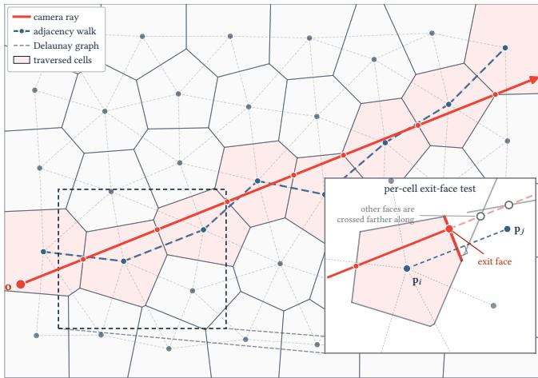  
Fig. 3. Adjacency-based ray traversal. A camera ray $\mathbf { r } ( t ) = \mathbf { o } + t \boldsymbol { \omega }$ walks a 2D Voronoi diagram cell by cell. Starting from the cell containing o (found by a single nearest-neighbor query), each step intersects the ray with the perpendicular bisector between the current site p� and each of its Delaunay neighbors, and advances across the nearestforward crossing—the cell’s exit face—into the adjacent cell $\mathbf { p } _ { j } .$ The exit is the bisector the ray reaches first, while the other faces are crossed farther along. The traversal thus follows edges of the Delaunay adjacency graph (dashed), visiting a short sequence of cells whose ray-segment lengths feed the piecewise volume rendering.

$$
\mathbf { C } ( \mathbf { r } ) = \sum _ { k } T _ { k } \alpha _ { k } \mathbf { c } _ { i _ { k } } ( \mathbf { x } _ { k } , \omega ) , \qquad T _ { k } = \prod _ { j < k } ( 1 - \alpha _ { j } ) ,
$$

where $T _ { k }$ is the transmittance accumulated by segment �. Early termination is possible when $T _ { k }$ falls below a certain threshold, which is used as a stopping criterion for ray traversal.

## 3.3 Spherical Harmonic Appearance

Within each cell the appearance does not vary across space and depends only on the viewing direction, which is what lets the framework show view-dependent efects such as specular highlights and glossy reflections. In 3D Gaussian Splatting [Kerbl et al. 2023] and Radiant Foam [Govindarajan et al. 2025], this directional color is stored as spherical harmonics. The color of cell � seen from a unit direction � is

$$
\mathbf { c } _ { i } ( \omega ) = \sum _ { \ell = 0 } ^ { L } \sum _ { m = - \ell } ^ { \ell } \mathbf { k } _ { i } ^ { \ell m } Y _ { \ell } ^ { m } ( \omega ) ,
$$

where $Y _ { \ell } ^ { m }$ are the real spherical harmonic basis functions of degree ℓ and order �, and $\mathbf { k } _ { i } ^ { \ell m } \in \mathbb { R } ^ { 3 }$ are per-cell RGB coeficients learned during training. A degree-� expansion has $( L + 1 ) ^ { 2 }$ coeficients per color channel. Most methods stop at $L = 3$ , which corresponds to 16 coeficients per channel, or 48 values per cell. The first term $\mathbf { k } _ { i } ^ { 0 0 }$ is the flat, view-independent color, and the higher orders add finer detail as the view changes.

Spherical harmonics are compact and fast to evaluate, but they can only represent smooth changes with direction. Sharp features such as tight specular highlights or mirror-like reflections need a high degree to capture, and the number of coeficients grows with the square of �. The degree is therefore kept low in practice, so view-dependent color stays smooth and misses fine angular detail. Each coeficient also afects the whole sphere at once, so the representation cannot add detail in one direction without changing all the others.

## 4 Design Considerations for Fast Ray Tracing

Voronoi tracing has diferent bottlenecks from both rasterization and conventional BVH ray tracing. We use the following first-order proxy for the work performed by a single ray

$$
W ( \mathbf { r } ) \approx C _ { \mathrm { i n i t } } ( \mathbf { r } ) + K ( \mathbf { r } ) \left( C _ { \mathrm { n e x t } } + C _ { \mathrm { a p p e a r a n c e } } + C _ { \mathrm { c o m p o s i t e } } \right) .\tag{1}
$$

Here $C _ { \mathrm { i n i t } } ( \mathbf { r } )$ is the cost of locating the cell containing the ray origin and $K ( \mathbf { r } )$ is the number of cells traversed before termination. The remaining terms are efective average costs per visited cell. In particular, $C _ { \mathrm { n e x t } }$ covers the neighbor search and exit-face tests used to select the next cell, $C _ { \mathrm { a p p e a r a n c e } }$ covers loading and evaluating its appearance, and �composite covers alpha compositing.

The total frame workload is obtained by summing $W ( \mathbf { r } )$ over the set of submitted rays . This sum provides a first-order workload estimate but does not predict wall-clock time directly because rays are evaluated concurrently by GPU threads. As threads are organized into warps—hardware groups of32 threads that execute in lockstep— throughput also depends on variation in traversal count across neighboring rays, memory locality, cache reuse, and scheduling. These efects are reflected in the efective per-cell costs in Eq. (1).

The model separates two direct routes to higher throughput. Re-ducing �(r) shortens each traversal, while reducing the per-cell terms lowers the work performed at every step. Their realized efect also depends on memory locality and coherence across concurrently evaluated rays. The remainder of this section examines these factors and the coupling between spatial detail and cell count. Section 5 then introduces the choices motivated by this analysis.

## 4.1 Traversal Cost

In neural rendering, it is common to evaluate rendering cost in terms of the number of primitives, such as Gaussians or voxels. Rasterization-based methods must project and sort the primitives that can contribute to the image, while BVH-based ray tracers repeatedly query a global acceleration structure. Voronoi tracing changes this dependence. After the initial cell is found, the dominant traversal cost is the number of local cell-to-cell steps taken by each ray. The total number of cells still matters through memory footprint, cache behavior, construction cost, and the initial lookup, but the per-frame traversal loop is governed primarily by � r .

Pushing the rendering speed of Voronoi tracing therefore requires both reducing the number of cells visited and making each step cheap. Encouraging transparent free space reduces per-cell cost as the appearance evaluation can be skipped, while concentrating opaque surfaces ensures rays terminate after fewer cells, reducing $K ( \mathbf { r } )$

In our profile of Radiant Foam [Govindarajan et al. 2025] on the Mip-NeRF 360 Garden scene, neighbor search accounts for roughly three quarters of renderer kernel time, including adjacency loads and the intersection tests that find the exit face. Color evaluation accounts for most of the remainder, and compositing is comparatively small. The kernel is also largely memory bound. Within color evaluation, most of the cost is loading spherical-harmonic coeficients. As Fig. 4 shows, this load grows quadratically with spherical-harmonic degree, whereas the bilinear texture lookups we adopt (Section 5.1) access a fixed, smaller number of stored values regardless of texture resolution.

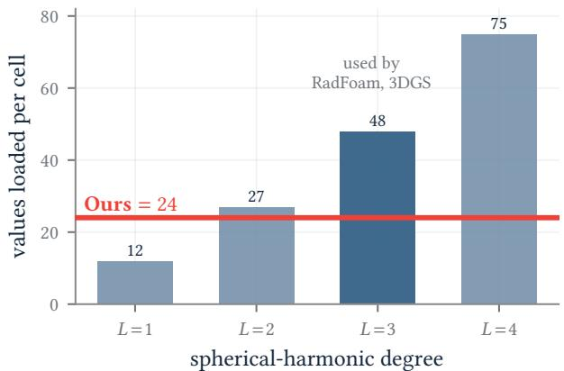  
Fig. 4. Appearance values loaded per cell. A spherical-harmonic cell accesses all of its RGB coeficients to evaluate color in any direction, a count that grows quadratically with degree $( 3 ( L { + } 1 ) ^ { 2 } ) ;$ at degree 3, the seting used by Radiant Foam and 3DGS, this is 48 values. Our deployed representation performs two bilinear lookups, one in each appearance map. Each lookup requires four RGB texels, giving a fixed total of 24 appearance values independent of map resolution, halving the appearance trafic.

## 4.2 Memory Locality

Voronoi tracing renders each pixel by traversing and compositing an ordered sequence of cells, evaluating the appearance of each cell along the ray. Unlike tile-based splatting, which cooperatively loads the primitives shared by a screen tile and amortizes their cost across many pixels, a Voronoi traversal issues appearance loads on demand for each ray. This makes memory locality critical. Neighboring camera rays often traverse overlapping cell sequences, so grouping coherent rays can improve cache reuse even without explicit cooperative loading. Locality also depends on the cell layout in memory, since cells that are close in space are more likely to be visited by nearby rays and should ideally map to nearby memory addresses. We use these observations in the inference implementation described in Section 5.6 and ablate their efect in Section 6.3.

## 4.3 Spatial Detail and Cell Count

A spherical-harmonic cell encodes only angular variation, since it assigns a color based only on viewing direction. High-frequency appearance is therefore expressible across views, but not within the image. Within a single rendered image, all rays that strike a given cell arrive from nearly the same direction, so SH yields an almost constant color over the cell’s image footprint. Spatial texture detail can then be introduced only by subdividing the space into additional cells, coupling spatial detail directly to cell count.

This coupling has two undesirable consequences. First, the number of cells must increase rapidly with the desired level of detail, and we observe diminishing returns together with increasingly visible aliasing as the number of sites grows. Second, and more consequential for optimization, each cell is observed by progressively fewer rays as cells shrink. In the limit, a cell is seen by a single ray from a single direction and overfits to that observation. This is detrimental because recovering 3D shape from images without depth supervision relies on each cell being constrained by many rays from diverse viewpoints. Once a cell is coupled to a single ray, the geometry is under-constrained and is free to settle into a degenerate configuration.

Radiant Foam mitigates these efects through optimization heuristics. It begins training at lower resolution images and with fewer initial points, on the order of 100,000 points, so that coarse geometry is recovered before the representation can overfit to high frequency detail. Throughout the training, the resolution of training images increases, the model densifies the number of cells and prunes unused cells, reaching up to 4� cells.

## 5 Method

Based on these design considerations, we propose VoroTracing, a diferentiable renderer for an explicit Voronoi scene representation. We reduce per-cell appearance trafic using octahedral surface and view-dependent textures (Sections 5.1 and 5.2), while surfaceconcentrated opacity and a scale-invariant density parameterization shorten ray traversal (Sections 5.3 and 5.4). We optimize a fixed budget of densely initialized cells without pruning or densification (Section 5.5) and use a locality-aware GPU implementation at inference (Section 5.6).

## 5.1 Octahedral Surface Texture

The appearance formulation is where our method departs most clearly from prior Voronoi-based rendering. We replace per-cell spherical harmonics with a small per-cell texture that is projected onto the cell surface, allowing a single cell to exhibit spatial appearance variation within one view. Concretely, we assign to each site $\mathbf { p } _ { i }$ an $8 \times 8$ RGB texture $T _ { i } .$ . A Voronoi cell is an intersection of half-spaces and is therefore convex, with its site contained in its interior. Consequently, every ray cast from the site exits through exactly one point of the cell boundary, and the map from directions on the sphere $S ^ { 2 }$ to surface points is a bijection. This lets us parame terize a cell’s appearance by direction from the site. When a camera ray intersects the surface of cell $V _ { i }$ at a point x, we form the unit direction

$$
\mathbf { d } = { \frac { \mathbf { x } - \mathbf { p } _ { i } } { \left\| \mathbf { x } - \mathbf { p } _ { i } \right\| } } \in S ^ { 2 } ,
$$

and use d to index $T _ { i \cdot }$

We use octahedral mapping to index from the direction to the square texture domain. This provides low distortion, and is free of the polar singularities of latitude–longitude maps, remaining continuous across the texture boundary. The direction d is first projected onto the unit octahedron by $\ell _ { 1 }$ normalization,

$$
\mathbf { q } = \frac { \mathbf { d } } { | d _ { x } | + | d _ { y } | + | d _ { z } | } .
$$

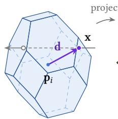

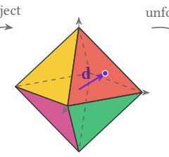  
(a) ray hits cell  
(b) octahedron

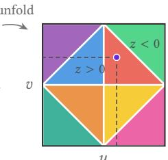  
(c) square texture  
Fig. 5. Octahedral appearance lookup. (a) A camera ray crosses a Voronoi cell; the unit direction d from the site $\mathbf { p } _ { i }$ to the hit point (violet) selects the appearance. (b) d is ℓ1-normalized onto the unit octahedron, landing on one of its eight faces (here the red octant); the eight faces are color-coded by octant. (c) The octahedron is unfolded into the square texture domain, where the upper hemisphere $( d _ { z } \ge 0 )$ fills the central diamond and the lower hemisphere $( d _ { z } < 0 )$ the corners.

The upper hemisphere maps directly to the square texture, while the lower hemisphere is unfolded to the surrounding region.

$$
\begin{array} { r } { ( u , v ) = \left\{ \begin{array} { l l } { ( q _ { x } , \ q _ { y } ) , } & { d _ { z } \geq 0 , } \\ { \big ( ( 1 - | q _ { y } | ) \operatorname { s i g n } ( q _ { x } ) , \ ( 1 - | q _ { x } | ) \operatorname { s i g n } ( q _ { y } ) \big ) , } & { d _ { z } < 0 . } \end{array} \right. } \end{array}
$$

These coordinates $( u , v ) \in [ - 1 , 1 ] ^ { 2 }$ are then rescaled to texel space. Bilinear interpolation provides smoothly varying color from the $8 \times 8$ texture. Figure 5 illustrates this mapping from a cell sample direction to the square texture.

## 5.2 View-Dependent Texture

The surface texture $T _ { i } ^ { \mathrm { v i } }$ introduced above is, by design, independent of the camera. $\mathrm { A }$ surface point returns the same color from any viewpoint. Real scenes, however, have variable color dependent on viewing direction, including specular highlights, sheen, and reflections of the surrounding environment. We capture these efects with a second per-cell texture $T _ { i } ^ { \mathrm { v d } }$ of the same form, but indexed by the view direction rather than by the surface intersection point. The two maps combine additively in logit space, and a sigmoid produces the final cell color,

$$
\mathbf { c } _ { i } ( \mathbf { x } , \omega ) = \sigma \big ( T _ { i } ^ { \mathrm { v i } } ( \mathrm { o c t } ( \mathbf { d } ) ) + T _ { i } ^ { \mathrm { v d } } ( \mathrm { o c t } ( \omega ) ) \big ) ,
$$

where � corresponds to the unit vector from the hit point towards the camera.

The two maps separate two complementary sources of appearance variation. Within a single image, $T _ { i } ^ { \mathrm { v i } }$ varies across the cell’s footprint as d changes from pixel to pixel, while $T _ { i } ^ { \mathrm { v d } }$ is efectively constant. Across diferent views of the scene the roles reverse. $T _ { i } ^ { \mathrm { v i } }$ returns the same color at each surface point, while $T _ { i } ^ { \mathrm { v d } }$ varies with the moving camera.

In practice we regularize the view-dependent term to remain small relative to $T _ { i } ^ { \mathrm { v i } }$ , so that it acts as a residual on top of the surface texture. The precise penalty is given in Section 5.5.

Figure 6 isolates this term by rendering a view with and without the view-dependent map. Difuse regions change little, while glossy and reflective surfaces show clear diferences.

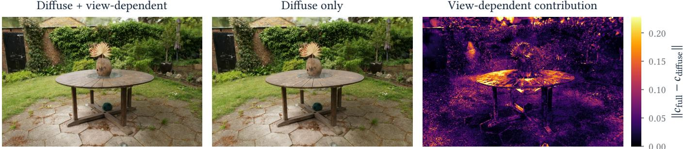  
Fig. 6. View-dependent contribution. We render a held-out view with the full model and again with the view-dependent map $T ^ { \mathrm { v d } }$ zeroed (a pure-difuse render); density is unchanged, so the diference isolates the view-dependent term. Difuse regions remain similar, while glossy and reflective surfaces show clear changes. The right panel shows that the residual is localized on reflective tabletop objects and foliage, exactly the surfaces whose appearance changes with viewpoint.

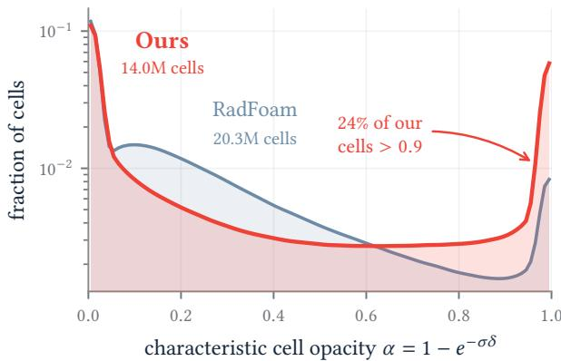  
Fig. 7. Cell-opacity distribution on the Mip-NeRF 360 scenes. Characteristic per-cell opacity $\alpha = 1 - e ^ { - \sigma \delta }$ , where � is the mean distance to a cell’s Voronoi neighbors. Our exponential density parameterization and distortion loss drives o acit to a stron l bimodal distribution — cells are either near-transparent or near-opaque — with 24% of cells above $\alpha = 0 . 9 .$ Radiant Foam’s softplus model instead leaves most cells semi-transparent (44% in 0.1, 0.9 , only 4% above 0.9), so rays must composite many partially occupied cells before terminating. Our method reaches this with roughly half the cells (2.0M vs. 4.1M).

## 5.3 Surface-Concentrated Opacity and Geometry

As previously mentioned, computation cost is mostly tied to the number of traversed cells. For the mostly opaque scenes considered here, density should converge toward a thin, fully opaque surface rather than a cloud of semi-transparent cells. Ideally, a ray traverses empty cells until it reaches one opaque cell whose surface texture explains the visible color. Concentrating opacity in this way reduces both compositing work and the number of expensive appearance evaluations. Figure 7 shows that our model drives per-cell opacity to a strongly bimodal distribution, in contrast to the semi-transparent cells that dominate Radiant Foam.

To push the optimization close to an opaque surface, we adopt the distortion loss of Mip-NeRF 360 [Barron et al. 2022]. For a ray with compositing weights $w _ { k } = T _ { k } \alpha _ { k }$ over traversed intervals $[ t _ { k } , t _ { k + 1 } ]$ metric depth is first mapped to the bounded disparity-like coordinate

$$
s ( t ) = 1 - \frac { 1 } { 1 + t } .
$$

Let $\begin{array} { r } { \bar { s } _ { k } = \frac { 1 } { 2 } \big ( s ( t _ { k } ) + s ( t _ { k + 1 } ) \big ) } \end{array}$ and $\Delta s _ { k } = s ( t _ { k + 1 } ) - s ( t _ { k } )$ . The per-ray distortion penalty is

$$
\mathcal { L } _ { \mathrm { d i s t } } ( \mathbf { r } ) = \sum _ { k , \ell } w _ { k } w _ { \ell } | \bar { s } _ { k } - \bar { s } _ { \ell } | + \frac { 1 } { 3 } \sum _ { k } w _ { k } ^ { 2 } \Delta s _ { k } .\tag{2}
$$

The first term penalizes pairs of compositing weights at separated depths, while the second penalizes the extent of intervals carrying compositing weight. Unlike a depth supervision term, this loss does not prescribe where the surface should lie; it only encourages the rendering weights that already explain the image to become compact. This is well aligned with fast Voronoi tracing because compact weights imply transparent free-space cells followed by early termination at an opaque surface cell.

## 5.4 Scale-Invariant Density Parameterization

The Voronoi partition produces cells of widely varying size, which is desirable, as it concentrates resolution where the scene demands it. Radiant Foam assigns each cell a softplus-activated constant density $\sigma _ { i }$ and converts it to opacity over a ray segment of length $\delta _ { i }$ as $\alpha _ { i } = 1 - \exp ( - \sigma _ { i } \delta _ { i } )$ . Because smaller cells generally produce shorter ray segments, they require a larger density to reach the same opacity. Precisely, the density required for a given opacity is

$$
\sigma _ { i } = - \ln ( 1 - \alpha _ { i } ) / \delta _ { i }
$$

which scales inversely with $\delta _ { i } .$ . On the other hand, diferentiating the opacity with respect to density gives

$$
\frac { \partial L } { \partial \sigma _ { i } } = \frac { \partial L } { \partial \alpha _ { i } } \delta _ { i } \left( 1 - \alpha _ { i } \right) ,\tag{3}
$$

which scales linearly with the segment length ��. A smaller cell therefore requires a higher density to represent the same opacity, while the gradient with respect to its density is proportionally weaker.

In practice this manifests as floaters and a persistent haze, where large cells that should be empty settle at a low but non-zero density around surfaces. The efect is most severe when training from a dense initialization, where it can drive a runaway increase in the density of large cells in free space near the camera. Once opaque, early ray termination starves the cells behind them of gradient and the optimization cannot recover.

The softplus density activation used in prior works [Govindarajan et al. 2026, 2025] does not address this issue. We instead set $\sigma =$ exp � , whose derivative satisfies $\partial \sigma / \partial \rho = \sigma .$ . The gradient on the optimized parameter becomes

$$
\frac { \partial L } { \partial \rho } = \frac { \partial L } { \partial \sigma _ { i } } \sigma _ { i } = \frac { \partial L } { \partial \alpha _ { i } } \delta _ { i } \left( 1 - \alpha _ { i } \right) \sigma _ { i } = \frac { \partial L } { \partial \alpha _ { i } } \left( 1 - \alpha _ { i } \right) \ln \frac { 1 } { 1 - \alpha _ { i } } ,\tag{4}
$$

where the final equality is the identity $\sigma _ { i } \delta _ { i } = - \ln ( 1 - \alpha _ { i } )$ and the segment length cancels. Two cells of equal opacity thus receive an identically scaled gradient regardless of their size, and optimization treats small and large cells on equal footing, removing the systematic bias against finely tiled surface detail.

## 5.5 Simplified Heuristic-Free Training

Adaptive density control can make a representation robust to sparse or uneven structure-from-motion points, and better strategies for adding and removing cells remain an interesting direction. Our goal here is instead to isolate how much quality and speed can be obtained from a fixed, well-initialized Voronoi representation. In Radiant Foam [Govindarajan et al. 2025], pruning and densification decide where cells should be removed or added during training. We found this dificult to make reliable, since it can overpopulate regions where extra expressiveness brings little benefit while still missing under-resolved surfaces. We therefore use a fixed cell budget, where all sites, densities, and textures are optimized directly after initialization and no cells are inserted or removed.

Following the dense-initialization strategy explored by EDGS [Ko tovenko et al. 2026], we generate a dense point cloud once at the beginning of training. For each scene, we select up to 100 represen tative reference images by clustering camera poses. Each reference image is matched against its 3 nearest neighboring cameras using RoMa v2 [Edstedt et al. 2025]. From every image pair, we sample 15,000 RoMa correspondences according to matching confidence, triangulate them with the calibrated poses and intrinsics, and reject points with negative depth, non-finite coordinates, or reprojection error above 2 pixels. The color of each accepted point is taken from the reference image.

The resulting point cloud is subsampled to the training budget using density-aware sampling. We estimate local sampling density with a $1 2 8 ^ { 3 }$ voxel grid and draw points with probability proportional to the inverse voxel occupancy, which avoids spending the entire budget in over-matched regions. We additionally add a small number of random background points around the cloud to cover empty space. In our experiments we train with a fixed budget of 2M sites, of which 5,000 are random background points. The corresponding Voronoi cells and adjacency are constructed on the GPU using the scalable algorithm of Taveira et al. [2026]. The difuse texture of each initialized point is set by repeating the logit of its RGB color across all texels, the view-dependent texture is initialized to zero, and the density is initialized low for random background points.

We then optimize for 20,000 steps using Adam over site positions, density parameters, and both texture maps. Training uses the same image resolution and the same fixed cell set from the first iteration to the last, without progressive downsampling, pruning, densification, or multi-stage schedules. The objective contains only photometric reconstruction and regularization,

$$
\mathcal { L } = \mathcal { L } _ { \mathrm { r g b } } + \lambda _ { \mathrm { d i s t } } \mathcal { L } _ { \mathrm { d i s t } } + \lambda _ { \mathrm { v d } } \mathcal { L } _ { \mathrm { v d } } + \lambda _ { \mathrm { m e a n } } \mathcal { L } _ { \mathrm { m e a n } } .\tag{5}
$$

The Smooth-�1 term $\mathcal { L } _ { \mathrm { r g b } }$ matches the composited rendered color to the training image. The distortion term $\mathcal { L } _ { \mathrm { d i s t } }$ from Eq. (2) concentrates opacity along each ray. The view-dependent regularizer

$$
\mathcal { L } _ { \mathrm { v d } } = \frac { 1 } { N R _ { \mathrm { v d } } ^ { 2 } } \sum _ { i } \left. T _ { i } ^ { \mathrm { v d } } \right. _ { 2 } ^ { 2 }
$$

keeps specular appearance as a small residual on top of the viewindependent texture. Finally, since many texels of a cell may be unobserved from the training cameras, we pull difuse texels toward their per-cell mean,

$$
\mathcal { L } _ { \mathrm { m e a n } } = \frac { 1 } { N R _ { \mathrm { v i } } ^ { 2 } } \sum _ { i , u } \left\| T _ { i , u } ^ { \mathrm { v i } } - \frac { 1 } { R _ { \mathrm { v i } } ^ { 2 } } \sum _ { v } T _ { i , v } ^ { \mathrm { v i } } \right\| _ { 2 } ^ { 2 } .
$$

This regularizer propagates the observed cell color to unseen directions without forcing neighboring cells or unrelated surface regions to be smooth.

## 5.6 Inference Optimizations

The training formulation above is already designed to reduce the number of cells visited per ray. Our base inference kernel follows Radiant Foam [Govindarajan et al. 2025] in using half-precision appearance attributes and precomputed half-precision vectors from each site to its Voronoi neighbors. The latter avoid loading two point positions and computing their diference during traversal. For our texture representation, each RGB texel is padded to four channels. Although this adds one unused value per texel, it lets the CUDA kernel read a complete texel with a single aligned load.

We additionally reorder cells by Morton code before rendering, improving spatial locality for rays that traverse neighboring regions of the diagram.

To improve coherence within a warp, we schedule image rays in compact $4 \times 8$ tiles. The output is still written in image order, but neighboring threads tend to traverse similar cells and therefore share cache lines. For cells whose compositing weight is below a small threshold, the inference kernel updates transmittance but skips the texture lookup and sigmoid evaluation, avoiding appearance loads that cannot afect the final color appreciably. This threshold exposes an explicit speed-quality trade-of, which we ablate in Section 6.3.

## 6 Results

We evaluate our method along three axes. First, Section 6.1 reports reconstruction quality and rendering speed on Mip-NeRF 360 for ray-based and rasterized NVS methods, while Section 6.2 examines representative visual diferences. Second, Sections 6.3 and 6.4 analyze where the speedup comes from by measuring traversal cost, cells per ray, and inference-time approximations. Third, Section 6.5 demonstrates how the ray-based renderer supports non-pinhole camera efects through ray generation without changes to a rasterization pipeline. Together, these experiments test whether a carefully designed ray-based representation can retain ray-tracing flexibility while achieving real-time throughput.

## 6.1 Quantitative Evaluation

We evaluate on the Mip-NeRF 360 dataset [Barron et al. 2022], which contains outdoor and indoor object-centric scenes reconstructed with COLMAP [Schönberger and Frahm 2016; Schönberger et al. 2016]. We use the standard train-test split, holding out every eighth image for evaluation, and report averages separately for outdoor scenes, indoor scenes, and the full dataset. All images are evaluated at the same dataset resolution used by the corresponding methods, 4 downsampling for outdoor scenes and 2 for indoor. We train each scene on a single NVIDIA GeForce RTX 5090. The 20,000-step optimization takes 33–50 minutes per scene, averaging 40 minutes, including the one-time correspondence-based point-cloud construction.

Reconstruction quality is measured with PSNR, SSIM, and LPIPS on held-out views using one metric implementation shared by all methods. We retain the background convention of each published configuration. Rendering speed is measured on the same GPU and reported in frames per second for full-image rendering after model loading and one-time, view-independent preprocessing. The timing protocol follows the use case of an interactive viewer, where each requested frame is rendered end-to-end without precomputations that depend on knowing future camera poses. For our method, the timed region includes the initial cell search, Voronoi traversal, appearance evaluation, and compositing. It excludes only scene-level preprocessing that would be performed once after loading the model, such as conversion to half-precision storage and Morton reordering of cells. When rerunning baselines, we apply the same viewer-style rule. Methods may perform model loading and scene-level setup, but not precompute quantities that depend on the sequence of future test cameras. Further details on the evaluation protocol and baseline provenance are provided in the supplementary material.

We measure runtime with CUDA events on held-out images. Each view is warmed up before timing, then rendered repeatedly with the same code path used for normal evaluation, and the per-frame time is averaged over the test views. Our reported numbers use 10 warmup renders and 20 timed renders per view, which measures steady-state full-frame rendering while keeping all per-frame work inside the timed region.

We compare against two groups of methods. The ray-based comparison includes iNGP [Müller et al. 2022], Zip-NeRF [Barron et al. 2023], 3DGRT [Moenne-Loccoz et al. 2024], Radiant Foam [Govindarajan et al. 2025], and the ray-traced rendering mode of Power-Foam [Govindarajan et al. 2026]. PowerFoam is trained in a rasterized pipeline but can be ray-traced in inference. Zip-NeRF is the only method in this comparison not trained on the RTX 5090; we train it with the oficial Zip-NeRF implementation on a 4 GH200 setup and report an approximate RTX 5090 rendering rate measured with a compatible JAX runtime. The rasterized comparison includes 3DGS [Kerbl et al. 2023], 3DGUT [Wu et al. 2025], Radiance Meshes [Mai et al. 2026], Triangle Splatting [Held et al. 2026], and PowerFoam, providing the broader real-time NVS context. The comparisons use the same dataset split, image resolutions, metric implementation, and viewer-style timing boundary. Method-specific timing interfaces and deviations are documented in the supplementary material. For Radiance Meshes, the high-throughput Vulkan renderer did not reproduce the quality of the training pipeline in our tests, so we report the quality metrics and rendering speed of the Python/CUDA and Vulkan implementations separately.

Table 1 compares against methods that cast rays through a 3D representation. Our method reaches 623 FPS on average, compared with 194 FPS for Radiant Foam and 131 FPS for the ray-traced PowerFoam, while improving over both in PSNR, SSIM, and LPIPS. The quality gain is largest on indoor scenes, where the octahedral texture representation and dense initialization improve high-frequency appearance without increasing traversal cost.

Table 2 places the same results next to widely used rasterized real-time NVS methods. Our method is 2.8 faster than 3DGS on average and reaches the best indoor PSNR in the table. The strongest rasterizers still lead on outdoor appearance metrics, where 3DGS is 0.71 dB higher in PSNR and Triangle Splatting gives the best LPIPS. The main point of this comparison is not that ray tracing is universally faster than rasterization, but that a ray-based representation can remain competitive with—and in this benchmark exceed the throughput of—the rasterized methods most commonly used in current research and practice.

Unlike the compared baselines, our method does not perform densification during training. This keeps the cell set fixed and simplifies the training procedure, but it also limits the model’s ability to allocate new capacity to regions that remain poorly reconstructed. The efect is most visible in outdoor scenes with dense foliage, distant structure, and high-frequency texture. As a result, our final quality depends more strongly on the dense initialization than on adaptive growth during optimization.

## 6.2 Qualitative Comparison

Figure 8 shows zoomed crops from challenging held-out views, focusing on high-frequency background regions that are observed by relatively few training images. In these cases, VoroTracing often preserves more local structure than Radiant Foam and PowerFoam, for example in the kitchen floor tiles in Counter and the textile pattern on the back of the chair in Bonsai. The fixed cell budget remains a limitation, however. In Garden, where fine foliage and distant brick texture require highly localized capacity, 3DGS preserves sharper detail, suggesting that adaptive density control is still important in underrepresented regions.

## 6.3 Rendering Speed

The per-ray workload model in Eq. (1) separates traversal count from the efective cost of each visited cell. Figure 9 evaluates the first factor. Our method visits 46.1 cells per ray on average, compared with 66.9 for Radiant Foam, reducing the mean traversal count by 31%. Figure 10 visualizes the same quantity per pixel, confirming that the reduction holds across the entire image rather than being concentrated in a few regions.

The reduced traversal count is only one part of the measured speedup. We cumulatively ablate the inference optimizations from Section 5.6 in Table 3. The base renderer uses packed half-precision attributes. The subsequent rows add Morton cell ordering, warpcoherent tiling, and low-contribution cell skipping in that order.

Table 1. Mip-NeRF 360, ray-based methods. Per metric column, best , second and third . VoroTracing renders 2–3× faster than every other ray-based method while improving on its predecessor Radiant Foam across all quality metrics.
<table><tr><td rowspan="2">Method</td><td colspan="4">Outdoor</td><td colspan="4">Indoor</td><td colspan="4">All</td></tr><tr><td>PSNR↑</td><td>SSIM↑</td><td>LPIPS↓</td><td>FPS↑</td><td>PSNR↑</td><td>SSIM↑</td><td>LPIPS↓</td><td>FPS↑</td><td>PSNR↑</td><td>SSIM↑</td><td>LPIPS↓</td><td>FPS↑</td></tr><tr><td>Zip-NeRF</td><td>27.13</td><td>0.808</td><td>0.197</td><td>0.29</td><td>32.29</td><td>0.929</td><td>0.197</td><td>0.19</td><td>30.08</td><td>0.877</td><td>0.197</td><td>0.23</td></tr><tr><td>iNGP (base)</td><td>25.16</td><td>0.636</td><td>0.397</td><td>30</td><td>28.59</td><td>0.841</td><td>0.340</td><td>25</td><td>27.12</td><td>0.753</td><td>0.365</td><td>27</td></tr><tr><td>iNGP (big)</td><td>26.01</td><td>0.697</td><td>0.342</td><td>28</td><td>29.45</td><td>0.863</td><td>0.297</td><td>24</td><td>27.98</td><td>0.792</td><td>0.316</td><td>26</td></tr><tr><td>3DGRT</td><td>25.90</td><td>0.785</td><td>0.219</td><td>103</td><td>29.93</td><td>0.914</td><td>0.240</td><td>77</td><td>28.20</td><td>0.859</td><td>0.231</td><td>88</td></tr><tr><td>RadFoam</td><td>25.40</td><td>0.731</td><td>0.298</td><td>156</td><td>30.72</td><td>0.902</td><td>0.261</td><td>222</td><td>28.44</td><td>0.829</td><td>0.277</td><td>194</td></tr><tr><td>PowerFoam (RT)</td><td>25.39</td><td>0.730</td><td>0.278</td><td>124</td><td>31.31</td><td>0.913</td><td>0.241</td><td>136</td><td>28.78</td><td>0.835</td><td>0.257</td><td>131</td></tr><tr><td>VoroTracing</td><td>25.74</td><td>0.757</td><td>0.252</td><td>678</td><td>31.42</td><td>0.916</td><td>0.222</td><td>582</td><td>28.98</td><td>0.848</td><td>0.235</td><td>623</td></tr></table>

Table 2. Mip-NeRF 360, rasterized methods vs. ours. Per metric column, best , second and third . VoroTracing is the only ray-traced method here; it trails the strongest rasterizers slightly on appearance metrics yet renders roughly 2 faster than all of them.
<table><tr><td rowspan="2">Method</td><td colspan="4">Outdoor</td><td colspan="4">Indoor</td><td colspan="4">All</td></tr><tr><td>PSNR↑</td><td></td><td>SSIM↑ LPIPS↓</td><td>FPS↑</td><td>PSNR↑</td><td>SSIM↑</td><td>LPIPS↓</td><td>FPS↑</td><td>PSNR↑</td><td>SSIM↑</td><td>LPIPS↓</td><td>FPS↑</td></tr><tr><td>3DGS</td><td>26.45</td><td>0.801</td><td>0.204</td><td>143</td><td>31.11</td><td>0.924</td><td>0.237</td><td>279</td><td>29.11</td><td>0.872</td><td>0.223</td><td>220</td></tr><tr><td>3DGUT</td><td>26.21</td><td>0.796</td><td>0.211</td><td>183</td><td>31.07</td><td>0.925</td><td>0.235</td><td>307</td><td>28.98</td><td>0.870</td><td>0.225</td><td>254</td></tr><tr><td>PowerFoam (rast.)</td><td>25.39</td><td>0.730</td><td>0.278</td><td>222</td><td>31.31</td><td>0.913</td><td>0.241</td><td>350</td><td>28.78</td><td>0.835</td><td>0.257</td><td>295</td></tr><tr><td>Radiance Meshes</td><td>26.11</td><td>0.783</td><td>0.249</td><td>59</td><td>30.16</td><td>0.919</td><td>0.240</td><td>50</td><td>28.43</td><td>0.861</td><td>0.244</td><td>53</td></tr><tr><td>Radiance Meshes (Vulkan)</td><td>23.98</td><td>0.649</td><td>0.318</td><td>317</td><td>28.07</td><td>0.847</td><td>0.274</td><td>345</td><td>26.32</td><td>0.762</td><td>0.293</td><td>333</td></tr><tr><td>Triangle Splatting</td><td>26.03</td><td>0.793</td><td>0.196</td><td>115</td><td>30.83</td><td>0.925</td><td>0.205</td><td>179</td><td>28.78</td><td>0.869</td><td>0.201</td><td>151</td></tr><tr><td>VoroTracing</td><td>25.74</td><td>0.757</td><td>0.252</td><td>678</td><td>31.42</td><td>0.916</td><td>0.222</td><td>582</td><td>28.98</td><td>0.848</td><td>0.235</td><td>623</td></tr></table>

These choices reduce the cost of a full viewer-style render without changing the evaluation setup. Each timed frame still starts from the requested camera rays and performs the full traversal and compositing pass.

With the representation fixed, the base renderer achieves 230 FPS. Morton cell ordering raises throughput to 378 FPS, warp-coherent tiling to 536 FPS, and low-contribution cell skipping to 623 FPS. The full stack therefore gives a 2.7 speedup with no measurable change in PSNR or LPIPS.

Table 3. Inference-stack ablation. The representation is fixed. Starting from the base inference renderer, each subsequent row adds one optimiza- tion. Averages are over the seven Mip-NeRF 360 scenes.
<table><tr><td>Configuration</td><td>PSNR↑</td><td>LPIPS↓</td><td>FPS↑</td><td>Speedup</td></tr><tr><td>Base (packed fp16)</td><td>28.98</td><td>0.235</td><td>230</td><td>1.00×</td></tr><tr><td>+ Morton cell ordering</td><td>28.98</td><td>0.235</td><td>378</td><td>1.64×</td></tr><tr><td>+ warp-coherent tiling</td><td>28.98</td><td>0.235</td><td>536</td><td>2.33×</td></tr><tr><td>+ cell skip (10−3)</td><td>28.98</td><td>0.235</td><td>623</td><td>2.71×</td></tr></table>

The same renderer raises Radiant Foam throughput from 194 to 384 FPS (Table 4), a smaller gain than for our representation. This diference reflects a shift in the performance bottleneck. As traversal and scheduling overheads decrease, representation evaluation occupies a larger share of rendering time. Our octahedral textures reduce appearance memory trafic, while the learned opacity field concentrates contributions near surfaces and leaves more cells below the skip threshold. The supplementary material analyzes the threshold’s speed–quality trade-of.

## 6.4 Ablation Studies

To better understand the components introduced in Section 5, we ablate the main design choices of our method on the Mip-NeRF 360 scenes. Since these choices are interdependent, we start from the Radiant Foam baseline and add each component in sequence, progressively building up to the final model. This cumulative view shows how each design choice afects both reconstruction quality and rendering cost. Table 4 reports PSNR and LPIPS for appearance, cells per ray for traversal cost, and FPS on the RTX 5090.

Because the goal of our method is to improve rendering speed without sacrificing reconstruction quality, we focus on how the ablated components change both metrics. The first row of Table 4 separates renderer implementation from representation changes. Applying our deployed inference stack, discussed in Section 6.3, to the Radiant Foam representation nearly doubles throughput, from 194 to 384 FPS, with little change in quality or traversal count.

The dense-initialization ablation replaces the adaptive Radiant Foam training pipeline with a fixed budget of 2M points. In compar ison, Radiant Foam uses scene-dependent point counts of approximately 4.2M and 2.1M after densification and pruning. This change intentionally removes discrete adaptive operations from training, including densification, pruning, and variable downsampling, so the following ablations can be studied without relying on these operations. The cost of this simplification is visible in the reconstruction metrics. PSNR drops from 28.37 to 27.90 dB before the remaining components are added, which is expected given the substantially smaller and fixed cell budget.

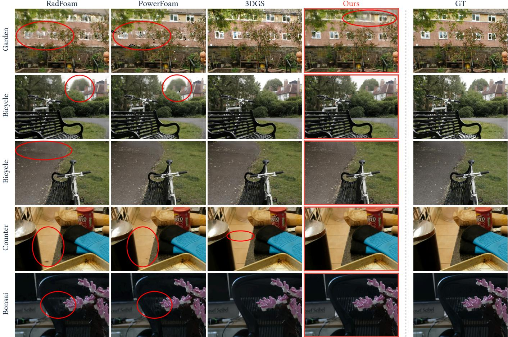  
Fig. 8. Cropped qualitative comparison on held-out Mip-NeRF 360 views. We show challenging regions that are observed by few training images and therefore stress fine-scale reconstruction. VoroTracing uses a fixed budget of 2M cells, half the Radiant Foam budget on outdoor scenes. Unlike methods that densify during training, it cannot add cells later to recover underrepresented regions; this limitation is visible in some crops, where VoroTracing preserves more structure than Radiant Foam but remains less detailed than 3DGS. Red circles mark representative artifacts or missing details in the compared reconstructions.

Table 4. Cumulative ablation from RadFoam to VoroTracing on Mip-NeRF 360. Each row adds one component to the previous row. From the second row onward, all variants use the same deployed inference stack, so later speed changes reflect the representation and training choices. Points are approximate for Radiant Foam and fixed for our variants.
<table><tr><td>Method</td><td>points</td><td>PSNR↑ LPIPS↓ cells/ray↓ FPS↑</td><td></td><td></td></tr><tr><td>RadFoam original (SH)</td><td>4.2/2.1M28.44</td><td></td><td>0.277</td><td>70.2 194</td></tr><tr><td>+ our inference stack</td><td>4.2/2.1M28.37</td><td></td><td>0.279</td><td>70.2 384</td></tr><tr><td>+ fixed dense init.</td><td>2M</td><td>27.90</td><td>0.290</td><td>59.6 430</td></tr><tr><td>+ exp. density</td><td>2M</td><td>28.18</td><td>0.284</td><td>51.7 496</td></tr><tr><td>+ distortion loss</td><td>2M</td><td>28.23</td><td>0.280</td><td>52.1 475</td></tr><tr><td>Octahedral texture formulation:</td><td></td><td></td><td></td><td></td></tr><tr><td>+ diffuse surface texture</td><td>2M</td><td>27.47</td><td>0.277</td><td>56.2 463</td></tr><tr><td>+ diffuse mean-pull</td><td>2M</td><td>27.52</td><td>0.278</td><td>52.8 552</td></tr><tr><td>+ view-dependent texture</td><td>2M</td><td>28.18</td><td>0.250</td><td>50.8 594</td></tr><tr><td>+ vd regularizer = VoroTracing</td><td>2M</td><td>28.98</td><td>0.235</td><td>50.7 623</td></tr></table>

Replacing the softplus density used by Radiant Foam with our exponential density parameterization reveals an important coupling between quality and speed. The parameterization better matches the optimization of opacity in small cells, allowing the model to converge toward a more surface-like opacity distribution. This raises PSNR from 27.90 to 28.18 dB, reduces traversal from 59.6 to 51.7 cells per ray, and increases speed from 430 to 496 FPS. The faster early convergence is visible in Fig. 11, which compares the softplus and exponential parameterizations after 1000 of 20000 training steps.

Surface textures. The lower block of Table 4 replaces the sphericalharmonics appearance model with our octahedral texture formulation. As discussed in Section 4, spherical harmonics require loading many coeficients per cell, while our texture lookups load a smaller fixed set of aligned values. Across the texture block, PSNR increases from 28.23 to 28.98 dB, LPIPS decreases from 0.280 to 0.235, surpassing Radiant Foam, and FPS increases from 475 to 623.

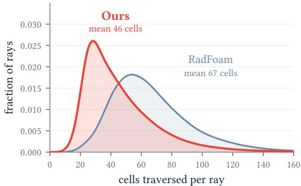  
Fig. 9. Cells traversed per ray, ours vs. Radiant Foam on held-out views of the Mip-NeRF 360 scenes. Unlike rasterization or BVH ray tracing, the cost of Voronoi traversal is set by this quantity rather than the total cell count � . Our surface-concentrated opacity (Fig. 7) shifts the whole distribution left. Rays visit 46.1 cells on average versus 66.9 for Radiant Foam, a 31% reduction in mean traversal count, while we also reach higher reconstruction quality (Table 1).

The difuse surface texture is the component that breaks the direct coupling between spatial detail and cell count. Unlike spherical harmonics, which assign one color field over viewing direction to the whole cell, the difuse map can vary across the cell footprint. This lets larger cells represent within-cell detail and makes the lower fixed cell budget viable. However, the difuse texture alone is not sufficient to replace spherical harmonics. This is expected, since the SH baseline already models view-dependent appearance, while a purely difuse surface texture cannot explain specular highlights or other directional efects. The two texture maps are therefore coupled. The difuse map provides spatial variation across the cell surface, while the view-dependent map restores the directional residual needed to match the expressiveness of the SH model. Interestingly, the difuse-only variant is also slower than the SH row, despite requiring fewer appearance loads. Without view-dependent color, the optimizer compensates for missing directional efects by assigning non-negligible opacity to more cells. Fewer ray-cell interactions then fall below the inference skip threshold, ofsetting the cheaper difuse lookup. The mean-pull loss has little efect on visual metrics, but improves throughput from 463 to 552 FPS. This suggests that the loss mainly changes the learned opacity distribution, reducing wasted traversal and making the inference-time cell skipping more efective.

The view-dependent texture is the most revealing case. Relative to the difuse-only texture, it adds a second texture map and therefore increases the appearance data loaded for cells whose color is evaluated. Nevertheless, speed increases from 552 to 594 FPS, while LPIPS improves from 0.278 to 0.250. The explanation is that the richer appearance model lets the optimizer fit highlights and other view-dependent residuals without spreading opacity over many semi-transparent cells. As a result, the model traverses fewer cells and leaves more low-contribution cells that can be skipped during inference. The view-dependent regularizer then mainly improves reconstruction quality by keeping this component additive and localized, reaching 28.98 dB PSNR and 0.235 LPIPS while further increasing speed to 623 FPS.

Table 5. Texture resolution ablation on Mip-NeRF 360. Mean reconstruction quality over the 7 scenes and rendering speed on an RTX 5090. Increasing the octahedral difuse-map resolution mainly improves LPIPS, while rendering speed remains nearly unchanged.
<table><tr><td>Resolution</td><td>PSNR↑</td><td>SSIM↑</td><td>LPIPS↓</td><td>FPS↑</td></tr><tr><td>4×4</td><td>28.85</td><td>0.842</td><td>0.254</td><td>619</td></tr><tr><td>6×6</td><td>28.94</td><td>0.846</td><td>0.243</td><td>615</td></tr><tr><td>8×8 (ours)</td><td>28.98</td><td>0.848</td><td>0.235</td><td>623</td></tr></table>

Distortion weight. The distortion loss (Section 5.3) acts as a continuous speed and quality control rather than a binary component. Figure 12 sweeps its weight. Larger values concentrate opacity into thinner surfaces, causing rays to terminate sooner and increasing rendering speed. Pushing the weight too far eventually degrades quality because the representation can no longer allocate suficient thickness to uncertain or semi-transparent regions. The full model operates near the quality peak, while already capturing most of the available speedup. Its efect on the learned opacity distribution is shown in Fig. 7.

Texture resolution. Table 5 varies the octahedral difuse-map resolution independently of the cascade. Quality improves monotonically from 4 4 to 8 8 texels, most visibly in LPIPS, which decreases from 0.254 to 0.235. Higher resolutions come at a quadratic memory cost, trading memory footprint for fidelity. The ablation shows that even the lower-resolution textures retain most of the quality, making 4 4 a viable option when memory is constrained. Rendering speed remains essentially unchanged because each evaluated cell still fetches only four texels per texture map for bilinear interpolation. Increasing the map resolution mainly changes storage and, to a lesser extent, cache reuse between nearby rays. We therefore use 8 8 maps in the full model.

## 6.5 Applications of Ray-Based Rendering

The quantitative results above use standard pinhole benchmark views so that quality and speed are directly comparable to prior work. The practical motivation for retaining ray-based image forma tion is broader because camera efects can be expressed by changing the rays supplied to the renderer rather than by modifying a projection, sorting, or splatting pipeline. For a fisheye or lens-distorted camera, each pixel simply emits the ray prescribed by the lens model. For depth of field, a pixel emits a small bundle of rays sampled over an aperture and averages their returned colors. The traversal, appearance lookup, and compositing code are unchanged.

The same interface also supports efects that vary the camera over the image or over time. For rolling shutter, rays are generated from row-dependent camera poses. For camera motion blur, several time samples are rendered and averaged. Fisheye and rolling-shutter rendering retain one ray per pixel, whereas depth of field and motion blur submit multiple rays per pixel and therefore increase the total frame workload. The reported pinhole throughput therefore does not apply directly to these multisampled efects. Figure 13 shows pinhole, fisheye, rolling-shutter, and camera-motion-blur renders from a single trained representation, while Fig. 1 shows a depthof-field-style aperture rendering. These examples are intended to demonstrate renderer flexibility; the controlled quantitative comparison remains the Mip-NeRF 360 benchmark above.

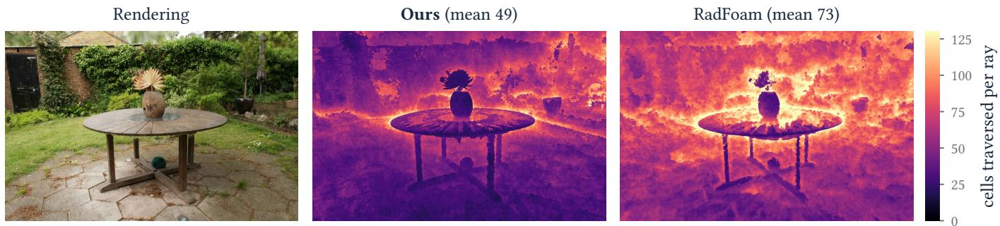  
Fig. 10. Cells traversed per ray, in image space. For a held-out view of the garden scene we map the per-pixel number of cells each ray visits before terminating. Cost concentrates on geometrically complex regions (the foliage, object silhouetes) and is low on smooth surfaces. On the same view and color scale, our model shows lower traversal counts than Radiant Foam across most image regions, reducing the mean from 73 to 49 cells per ray. The speedup therefore comes from a broad reduction in traversal depth, not only from a few isolated easy pixels.

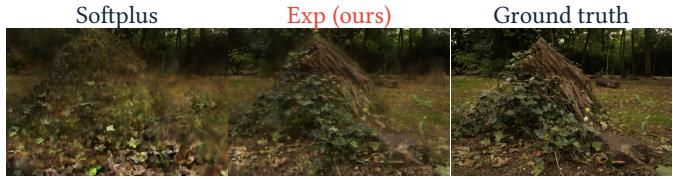  
Fig. 11. Early-training appearance, exp vs. softplus. The same held-out view of the stump scene rendered after only 1000 training steps. With soft- plus the surface is still hazy and washed out; the scale-invariant exponential parameterization has already recovered sharp geometry and color much closer to the ground truth.

Fig. 12. Distortion loss trades quality for speed. As the distortion weight �dist grows, opacity concentrates onto thinner, more opaque surfaces (Fig. 7), so rays terminate after fewer cells and rendering speeds up. We operate at the marked point, which keeps near-peak quality while already capturing most of the speedup.  
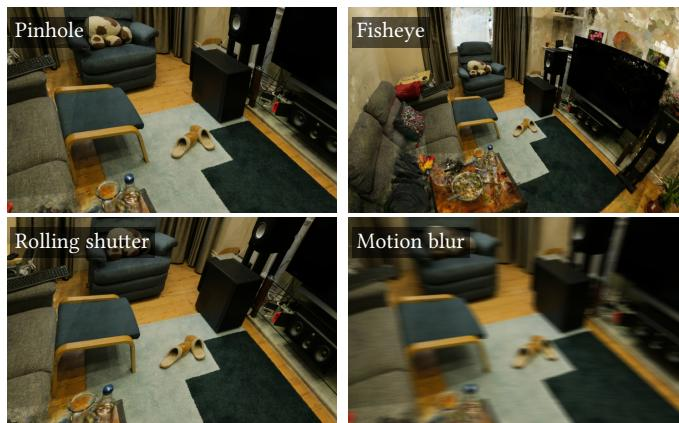

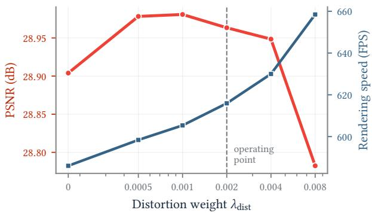  
Fig. 13. Ray-based camera efects. All panels render the same trained representation while changing only the rays sent to the renderer. The ex-amples show a standard pinhole camera, a wide-angle fisheye camera, row-dependent poses for rolling shuter, and temporal averaging for camera motion blur.

To evaluate performance beyond desktop GPUs, we deploy the renderer on an iPhone 16. The same Garden representation used in the RTX 5090 evaluation renders at an average of 40 FPS at a resolution with 1024 pixels along the longer image dimension. This deployment uses the original representation without compression, cell-count reduction, or other mobile-specific simplifications and accounts for the full rendering pipeline and display output.

## 7 Discussion and Conclusions

We introduced a ray-based reconstruction method designed for efficient GPU execution. Our results show that a ray-based pipeline designed around inference cost and GPU execution can exceed the rendering throughput of popular rasterized methods while retaining the flexibility of ray-based image formation. The same renderer supports fisheye projection, rolling shutter, depth of field, and motion blur through changes to ray generation and sampling. We additionally demonstrate interactive rendering on a mobile device (Section 6.5).

Building on Radiant Foam, our method traverses a Voronoi diagram through local cell adjacency rather than repeated global BVH intersection queries. We analyze the resulting rendering cost in terms of cells visited per ray, work performed in each cell, and memory coherence across neighboring rays. To improve GPU through put, we reorder cells in Morton order, schedule rays in compact screen-space tiles, and skip appearance evaluation for cells whose maximum possible contribution falls below a fixed threshold. At the representation level, this analysis motivates reducing both the number of cells visited and the cost of appearance evaluation in each cell.

To reduce traversal, we add the Mip-NeRF 360 distortion loss. This regularizer concentrates rendering weights near surfaces and pro motes a bimodal opacity distribution. Low-contribution appearance evaluations can then be skipped in transparent free space, while opaque surfaces terminate rays early. To reduce per-cell appearance cost, we replace spherical harmonics with paired octahedral surface and view-dependent textures. These halve the appearance values required for each cell evaluation relative to spherical harmonics, while the surface texture allows color to vary across a cell’s image footprint. This within-cell variation lets larger cells represent spatial detail that would otherwise require additional cells.

We also introduce a scale-invariant density parameterization that gives cells of equal opacity identically scaled gradients regardless of size. Together with dense feature-matching initialization, this supports a fixed-budget training pipeline. We optimize site positions, densities, and textures at the target image resolution for the full training run, without pruning, densification, or progressiveresolution schedules.

Limitations and future work. The fixed cell budget remains a limitation in regions observed by few training views, where dense feature matching may provide too few reliable sites. Although our method often preserves more background detail than Radiant Foam and PowerFoam, an adaptive cell-allocation strategy could place additional capacity in these underrepresented regions. A second direction is explicit surface extraction. The Voronoi diagram, surfaceconcentrated opacity, and surface-indexed textures may provide a useful starting point for extracting a textured mesh compatible with standard rendering pipelines.

Taken together, our results show that an explicit Voronoi radiance field can exceed the rendering throughput of rasterized alternatives while retaining comparable reconstruction quality and the flexibility of ray-based image formation. More broadly, these findings suggest that real-time ray-based rendering depends on co-designing traversal, representation, optimization, and GPU execution rather than on the choice between ray tracing and rasterization alone.

## Acknowledgments

This work was partially supported by the Wallenberg AI, Autonomous Systems and Software Program (WASP) funded by the Knut and Alice Wallenberg Foundation. Computational resources were provided by NAISS at NSC Berzelius, partially funded by the Swedish Research Council, grant agreement no. 2022-06725.

## References

Franz Aurenhammer. 1991. Voronoi diagrams—a survey of a fundamental geometric data structure. ACM computing surveys (CSUR) 23, 3 (1991), 345–405.

Jonathan T Barron, Ben Mildenhall, Dor Verbin, Pratul P Srinivasan, and Peter Hedman. 2022. Mip-nerf 360: Unbounded anti-aliased neural radiance fields. In Proceedings of the IEEE/CVF conference on computer vision and pattern recognition. 5470–5479.

Jonathan T Barron, Ben Mildenhall, Dor Verbin, Pratul P Srinivasan, and Peter Hedman. 2023. Zip-nerf: Anti-aliased grid-based neural radiance fields. In Proceedings ofthe IEEE/CVF International Conference on Computer Vision. 19697–19705.

B Boots, A Okabe, and K Sugihara. 1999. Spatial tessellations. Geographical information systems 1 (1999), 503–526.

Brian Chao, Hung-Yu Tseng, Lorenzo Porzi, Chen Gao, Tuotuo Li, Qinbo Li, Ayush Saraf, Jia-Bin Huang, Johannes Kopf, Gordon Wetzstein, et al. 2025. Textured gaussians for enhanced 3d scene appearance modeling. In Proceedings ofthe Computer Vision and Pattern Recognition Conference. 8964–8974.

Zina H Cigolle, Sam Donow, Daniel Evangelakos, Michael Mara, Morgan McGuire, and Quirin Meyer. 2014. A survey of eficient representations for independent unit vectors. Journal ofComputer Graphics Techniques 3, 2 (2014).

Youming Deng, Wenqi Xian, Guandao Yang, Leonidas Guibas, Gordon Wetzstein, Steve Marschner, and Paul Debevec. 2025. Self-Calibrating Gaussian Splatting for Large Field-of-View Reconstruction. In Proceedings ofthe IEEE/CVFInternational Conference on Computer Vision. 25124–25133.

Johan Edstedt, David Nordström, Yushan Zhang, Georg Bökman, Jonathan Astermark, Viktor Larsson, Anders Heyden, Fredrik Kahl, Mårten Wadenbäck, and Michael Felsberg. 2025. RoMa v2: Harder Better Faster Denser Feature Matching. arXiv preprint arXiv:2511.15706 (2025).

Sara Fridovich-Keil, Alex Yu, Matthew Tancik, Qinhong Chen, Benjamin Recht, and Angjoo Kanazawa. 2022. Plenoxels: Radiance fields without neural networks. In Proceedings of the IEEE/CVF conference on computer vision and pattern recognition. 5501–5510.

Shrisudhan Govindarajan, Daniel Rebain, Dor Verbin, Kwang Moo Yi, Anish Prabhu, and Andrea Tagliasacchi. 2026. Power Foam: Unifying Real-Time Diferentiable Ray Tracing and Rasterization. arXiv preprint arXiv:2604.24994 (2026).

Shrisudhan Govindarajan, Daniel Rebain, Kwang Moo Yi, and Andrea Tagliasacchi. 2025. Radiant foam: Real-time diferentiable ray tracing. In Proceedings of the IEEE/CVF International Conference on Computer Vision. 4135–4145.

Antoine Guédon and Vincent Lepetit. 2024. Sugar: Surface-aligned gaussian splatting for eficient 3d mesh reconstruction and high-quality mesh rendering. In Proceedings of the IEEE/CVF conference on computer vision and pattern recognition. 5354–5363.

Peter Hedman, Pratul P Srinivasan, Ben Mildenhall, Jonathan T Barron, and Paul De bevec. 2021. Baking neural radiance fields for real-time view synthesis. In Proceedings ofthe IEEE/CVF international conference on computer vision. 5875–5884.

Jan Held, Sanghyun Son, Renaud Vandeghen, Daniel Rebain, Matheus Gadelha, Yi Zhou, Anthony Cioppa, Ming C Lin, Marc Van Droogenbroeck, and Andrea Tagliasacchi. 2025a. Meshsplatting: Diferentiable rendering with opaque meshes. arXiv preprint arXiv:2512.06818 (2025).

Jan Held, Renaud Vandeghen, Adrien Deliege, Abdullah Hamdi, Silvio Giancola, Daniel Rebain, Anthony Cioppa, Bernard Ghanem, Andrea Vedaldi, Andrea Tagliasacchi, et al. 2026. Triangle splatting for real-time radiance field rendering. In 2026 International Conference on 3D Vision (3DV). IEEE, 1248–1257.

Jan Held, Renaud Vandeghen, Sanghyun Son, Daniel Rebain, Matheus Gadelha, Yi Zhou, Ming C. Lin, Marc Van Droogenbroeck, and Andrea Tagliasacchi. 2025b. Triangle Splatting+: Diferentiable Rendering with Opaque Triangles. arXiv (2025).

Georg Hess, Carl Lindström, Maryam Fatemi, Christofer Petersson, and Lennart Svensson. 2025. Splatad: Real-time lidar and camera rendering with 3d gaussian splatting for autonomous driving. In Proceedings ofthe Computer Vision and Pattern Recognition Conference. 11982–11992.

Binbin Huang, Zehao Yu, Anpei Chen, Andreas Geiger, and Shenghua Gao. 2024. 2d gaussian splatting for geometrically accurate radiance fields. In ACM SIGGRAPH 2024 conference papers. 1–11.

Bernhard Kerbl, Georgios Kopanas, Thomas Leimkühler, George Drettakis, et al. 2023. 3d gaussian splatting for real-time radiance field rendering. ACM Trans. Graph. 42, 4 (2023), 139–1.

Dmytro Kotovenko, Olga Grebenkova, and Björn Ommer. 2026. Edgs: Eliminating densi fication for eficient convergence of 3dgs. In Proceedings of the IEEE/CVF Conference on Computer Vision and Pattern Recognition. 41065–41076.

Zimu Liao, Siyan Chen, Rong Fu, Yi Wang, Zhongling Su, Hao Luo, Li Ma, Linning Xu, Bo Dai, Hengjie Li, et al. 2024. Fisheye-gs: Lightweight and extensible gaussian splatting module for fisheye cameras. arXiv preprint arXiv:2409.04751 (2024).

Alexander Mai, Trevor Hedstrom, George Kopanas, Janne Kontkanen, Falko Kuester, and Jonathan T Barron. 2026. Radiance meshes for volumetric reconstruction. In Proceedings ofthe IEEE/CVF Conference on Computer Vision and Pattern Recognition. 8267–8277.

Ben Mildenhall, Pratul P Srinivasan, Matthew Tancik, Jonathan T Barron, Ravi Ramamoorthi, and Ren Ng. 2021. Nerf: Representing scenes as neural radiance fields for view synthesis. Commun. ACM 65, 1 (2021), 99–106.

Nicolas Moenne-Loccoz, Ashkan Mirzaei, Or Perel, Riccardo De Lutio, Janick Mar tinez Esturo, Gavriel State, Sanja Fidler, Nicholas Sharp, and Zan Gojcic. 2024. 3d gaussian ray tracing: Fast tracing of particle scenes. ACM Transactions on Graphics (TOG) 43, 6 (2024), 1–19.

Thomas Müller, Alex Evans, Christoph Schied, and Alexander Keller. 2022. Instant neural graphics primitives with a multiresolution hash encoding. ACM transactions on graphics (TOG) 41, 4 (2022), 1–15.

Yuan Ren, Guile Wu, Runhao Li, Zheyuan Yang, Yibo Liu, Tongtong Cao, Xingxin Chen, and Bingbing Liu. 2026. Unigaussian: Driving scene reconstruction from multiple camera models via unified gaussian representations. In 2026 International Conference on 3D Vision (3DV). IEEE, 1728–1737.

Johannes Lutz Schönberger and Jan-Michael Frahm. 2016. Structure-from-Motion Revisited. In Conference on Computer Vision and Pattern Recognition (CVPR).

Johannes Lutz Schönberger, Enliang Zheng, Marc Pollefeys, and Jan-Michael Frahm. 2016. Pixelwise View Selection for Unstructured Multi-View Stereo. In European Conference on Computer Vision (ECCV).

Otto Seiskari, Jerry Ylilammi, Valtteri Kaatrasalo, Pekka Rantalankila, Matias Turku lainen, Juho Kannala, Esa Rahtu, and Arno Solin. 2024. Gaussian splatting on the move: Blur and rolling shutter compensation for natural camera motion. In European conference on computer vision. Springer, 160–177.

Liao Shen, Tianqi Liu, Huiqiang Sun, Jiaqi Li, Zhiguo Cao, Wei Li, and Chen Change Loy. 2025. Dof-gaussian: Controllable depth-of-field for 3d gaussian splatting. In Proceedings ofthe Computer Vision and Pattern Recognition Conference. 26462–26471.

Bernardo Taveira, Carl Lindström, Maryam Fatemi, Lars Hammarstrand, and Fredrik Kahl. 2026. Scalable GPU Construction of 3D Voronoi and Power Diagrams. In ACM SIGGRAPH 2026 Conference Papers (SIGGRAPH ’26). Association for Computing Machinery, New York, NY, USA. doi:10.1145/3799902.3811229

Dor Verbin, Peter Hedman, Ben Mildenhall, Todd Zickler, Jonathan T Barron, and Pratul P Srinivasan. 2024. Ref-nerf: Structured view-dependent appearance for neural radiance fields. IEEE Transactions on Pattern Analysis and Machine Intelligence 47, 11 (2024), 9426–9437.

Nicolas von Lützow and Matthias Nießner. 2026. Linprim: Linear primitives for difer entiable volumetric rendering. Advances in Neural Information Processing Systems 38 (2026), 21521–21547.

Chao Wang, Krzysztof Wolski, Bernhard Kerbl, Ana Serrano, Mojtaba Bemana, Hans Peter Seidel, Karol Myszkowski, and Thomas Leimkühler. 2024b. Cinematic Gaus sians: Real-Time HDR Radiance Fields with Depth of Field. In Computer graphics forum, Vol. 43. Wiley Online Library, e15214.

Yujie Wang, Praneeth Chakravarthula, and Baoquan Chen. 2024a. DOF-GS: Adjustable Depth-of-Field 3D Gaussian Splatting for Post-Capture Refocusing, Defocus Ren dering and Blur Removal. arXiv preprint arXiv:2405.17351 (2024).

Qi Wu, Janick Martinez Esturo, Ashkan Mirzaei, Nicolas Moenne-Loccoz, and Zan Gojcic. 2025. 3dgut: Enabling distorted cameras and secondary rays in gaussian splatting. In Proceedings of the Computer Vision and Pattern Recognition Conference. 26036–26046.

Ziyi Yang, Xinyu Gao, Yang-Tian Sun, Yi-Hua Huang, Xiaoyang Lyu, Wen Zhou, Shaohui Jiao, Xiaojuan Qi, and Xiaogang Jin. 2024. Spec-Gaussian: anisotropic viewdependent appearance for 3D Gaussian splatting. In Proceedings of the 38th International Conference on Neural Information Processing Systems (Vancouver, BC, Canada) (NIPS ’24). Curran Associates Inc., Red Hook, NY, USA, Article 1956, 25 pages.

Alex Yu, Ruilong Li, Matthew Tancik, Hao Li, Ren Ng, and Angjoo Kanazawa. 2021. Plenoctrees for real-time rendering of neural radiance fields. In Proceedings ofthe IEEE/CVF international conference on computer vision. 5752–5761.

Zehao Yu, Torsten Sattler, and Andreas Geiger. 2024. Gaussian opacity fields: Eficient adaptive surface reconstruction in unbounded scenes. ACM Transactions on Graphics (ToG) 43, 6 (2024), 1–13.

## A Implementation and Training Details

All models reported in the paper are trained on a single RTX 5090 GPU for 20,000 iterations with a fixed budget of 2M Voronoi sites. Each iteration samples 1M rays uniformly over the training images and pixels. We use the standard Mip-NeRF 360 downsam pling factors, training outdoor scenes at one-quarter resolution and indoor scenes at one-half resolution. These resolutions remain fixed throughout training. Both the view-independent and viewdependent octahedral textures have a resolution of $8 \times 8$ texels per cell. We use a white background and do not use patch sampling, an SSIM loss, pruning, or densification.

Table 6. Training setings used for the Mip-NeRF 360 experiments. Learning- rate entries give the schedule endpoints.
<table><tr><td colspan="2">Setting Outdoor</td><td>Indoor</td></tr><tr><td>Image downsampling</td><td>4X</td><td>2×</td></tr><tr><td>Site-position learning rate</td><td> $2 { \times } 1 0 ^ { - 4 } \to 5 { \times } 1 0 ^ { - 6 }$ </td><td>same</td></tr><tr><td>Density learning rate</td><td> $1 0 ^ { - 1 }  1 0 ^ { - 2 }$ </td><td>same</td></tr><tr><td>Texture learning rate</td><td> $2 { \times } 1 0 ^ { - 2 } \to 5 { \times } 1 0 ^ { - 4 }$ </td><td>same</td></tr><tr><td>View-dependent ramp length</td><td> $4 { , } 0 0 0$ </td><td>0</td></tr><tr><td> $\lambda _ { \mathrm { d i s t } }$ </td><td> $2 \times 1 0 ^ { - 3 }$ </td><td>same</td></tr><tr><td> $\lambda _ { \mathrm { v d } }$ </td><td> $1 0 ^ { - 2 }$ </td><td> $1 0 ^ { - 4 }$ </td></tr><tr><td>λmean</td><td> $5 \times 1 0 ^ { - 3 }$ </td><td> $1 0 ^ { - 4 }$ </td></tr></table>

We use Adam with $\beta _ { 1 } = 0 . 9 , \beta _ { 2 } = 0 . 9 9 9 _ { ! }$ , and $\epsilon = 1 0 ^ { - 1 5 }$ . Site positions follow a cosine learning-rate schedule for the first 18,000 iterations and are then fixed. Density uses a linear warmup for 2,000 iterations followed by cosine decay, while both texture learning rates use cosine decay throughout training. For outdoor scenes, the view-dependent texture learning rate is additionally multiplied by a quadratic ramp that reaches one at iteration 4,000. View-dependent appearance is optimized from the first iteration for indoor scenes.

The 20,000 optimization iterations take 33.2–50.1 minutes per scene and 39.9 minutes on average over the seven Mip-NeRF 360 scenes. The one-time RoMa v2 correspondence-based point-cloud construction takes 41.7 seconds per scene on average.

The density-aware initialization described in the main paper uses $\mathtt { a \ 1 2 8 ^ { 3 } }$ occupancy grid and inverse occupancy as the sampling probability. We add 5,000 random background sites to the sampled point cloud and perturb sampled site positions with zero-mean Gaussian noise of standard deviation $1 0 ^ { - 2 }$ . Because the sites move during optimization, we periodically update the Delaunay triangulation and its Voronoi adjacency.

## B Benchmarking Protocol

All timings for our method are measured on a single RTX 5090 GPU. We time full-frame rendering after model loading and onetime, view-independent preprocessing. The timed region follows the use case of an interactive viewer. A camera pose is requested, rays are generated for the full image, and the renderer performs Voronoi traversal, appearance evaluation, alpha compositing, and output generation for that frame. We do not use precomputations that require knowledge of future renders or the future camera path.

For each held-out view, we first render one image for the quality metrics. Runtime is then measured using CUDA events after warmup iterations, and the per-view time is averaged over repeated fullframe renders. The benchmark performs 10 warmup iterations and 20 timed iterations per view. Frames per second are computed as the reciprocal of the mean milliseconds per frame over the held-out views.

## B.1 Metric Computation

We report PSNR, SSIM, and LPIPS on the held-out Mip-NeRF 360 views. Predictions and references are collected as lossless RGB PNGs and evaluated afterward with one implementation shared by all methods. PSNR and SSIM operate on RGB values in 0, 1 , and LPIPS uses the VGG backbone with normalized inputs.

## C Baseline Details

We reproduce the baselines in Tables 1 and 2 using their publicly released implementations. We retain each method’s published training configuration without method-specific retuning. Quality evaluation uses the standard Mip-NeRF 360 resolutions, with the provided images\_4 JPEGs for outdoor scenes and images\_2 JPEGs for indoor scenes. Held-out views follow the llffhold=8 convention and contain every eighth image after sorting the COLMAP image names.

Baseline timings use the same RTX 5090 GPU as our method. Methods using our common CUDA helper receive 10 warmup renders followed by 10 complete passes over the held-out cameras, measured with CUDA events. These measurements model an interactive viewer in which each frame may be requested from an arbitrary camera pose. We therefore include per-view camera setup and any query required to begin rendering that pose. Model loading, static acceleration-structure construction, reference-image access, metric evaluation, and image encoding are excluded.

## C.1 Method-Specific Evaluation Details

Instant-NGP. We evaluate the base and big configurations used in the 3DGS comparison with the latest revision of the oficial Instant-NGP implementation available [Kerbl et al. 2023; Müller et al. 2022]. Instant-NGP predates Mip-NeRF 360, and this evaluation therefore uses dataset support added to the repository after the original pub lication. Our reproduced PSNR is approximately 0.7 dB higher for the base configuration and 1.2 dB higher for the big configuration than the values quoted in the 3DGS supplement. We report our reproduced values under the shared split and metric implementation.

Zip-NeRF. Zip-NeRF [Barron et al. 2023] is included as a highquality NeRF reference rather than as a single-GPU training baseline. We train it with the oficial Zip-NeRF implementation on a 4 GH200 setup, because the published configuration is substan tially more expensive than the methods otherwise evaluated on the RTX 5090. We evaluate the validation renders from this run with the same metric implementation and held-out split used for the other methods. To obtain an indicative rendering speed, we run the oficial $Z _ { \mathrm { i p } } .$ -NeRF renderer on the RTX 5090 with an updated JAX runtime required for compatibility with this GPU. The reported FPS is therefore an approximate local inference measurement and should not be interpreted as a matched single-GPU training-and-rendering reproduction.

3DGRT and 3DGUT. We use the oficial 3DGRUT implementation and the authors’ Mip-NeRF 360 configurations for both methods [Moenne-Loccoz et al. 2024; Wu et al. 2025]. Whereas the upstream benchmark measures the central rendering kernel, our timed path includes per-view camera and sensor construction, rendering, RGBA extraction, and background compositing. View-independent activations of the frozen Gaussian parameters are cached outside the timed region.

Radiant Foam. We use the oficial implementation with the authors’ Mip-NeRF 360 configurations [Govindarajan et al. 2025]. The upstream benchmark determines the starting cells for all validation cameras before timing, whereas we include the nearest-cell query for each view in the timed region, as that reflects the actual usage scenario of an interactive viewer.

PowerFoam. We use the oficial implementation with the published indoor and outdoor Mip-NeRF 360 configurations [Govindarajan et al. 2026]. We report its rasterized and ray-traced renderers separately. The two renderers match in reconstruction quality, so their quality metrics are identical, while their rendering speeds are measured separately. For ray tracing, the timed region includes the nearest weighted-cell query for each requested camera.

3D Gaussian Splatting. We use the latest revision of the oficial implementation available when our experiments were run, which incorporates fixes and improvements made after the original release [Kerbl et al. 2023]. We retain the published Mip-NeRF 360 recipe and default black background. Since the repository does not provide an end-to-end rendering benchmark, we time its standard render function. Each timed invocation includes the complete percamera rasterization call.

Radiance Meshes. The authors release Python/CUDA code for training and evaluation and a separate VKRM Vulkan renderer used for the throughput measurements in their paper [Mai et al. 2026]. We train with the Python/CUDA implementation and evaluate both its standard render function and the Vulkan renderer using the exported scene. In our experiments, the Vulkan renderer is substantially faster but produces substantially lower image quality than the Python/CUDA renderer. We consulted the authors and attempted to reconcile the two outputs but did not identify a configuration that reproduced the Python/CUDA quality with the Vulkan renderer. We therefore report each backend as a separate row and do not combine the quality of the Python/CUDA renderer with the throughput of the Vulkan renderer.

Triangle Splatting. We use the oficial implementation with the authors’ published Mip-NeRF 360 settings [Held et al. 2026].

## D Additional Application Results

The application examples use the same representations trained for the pinhole benchmark. Only ray generation changes. Fisheye and lens distortion alter pixel ray directions, rolling shutter changes the camera pose by image row, depth of field samples ray origins over an aperture, and motion blur samples camera poses over the exposure interval. The Voronoi traversal, appearance evaluation, and compositing are unchanged.

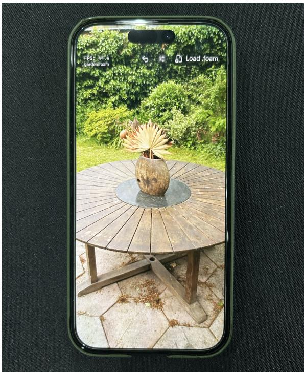  
Fig. 14. Mobile viewer demonstration. The Garden representation runs interactively on an iPhone 16. It uses the same Garden model with 2M sites as the desktop evaluation, without compression, a lower cell count, or retraining.

For the mobile timing reported in the main paper, we port the renderer to equivalent Metal compute kernels and embed it in a viewer application that supports interactive camera motion. We render the Garden scene with 1024 pixels along the longer image dimension and include the complete rendering pipeline and display output.

## E Per-Scene Results

Per-scene PSNR, SSIM, LPIPS, and rendering speed for the Mip-NeRF 360 scenes are reported in Tables 7 to 10.

## F Additional Ablations

Table 11. Cell-skip threshold sweep. Morton ordering and warp-coherent tiling are enabled for all rows. Increasing the threshold skips more low- contribution texture evaluations, trading quality for speed.
<table><tr><td>Threshold</td><td>PSNR↑</td><td>∆PSNR LPIPS↓</td><td></td><td>FPS↑</td></tr><tr><td>0</td><td>28.98</td><td>+0.00</td><td>0.235</td><td>538</td></tr><tr><td> $1 0 ^ { - 5 }$ </td><td>28.98</td><td>+0.00</td><td>0.235</td><td>597</td></tr><tr><td> $1 0 ^ { - 4 }$ </td><td>28.98</td><td>+0.00</td><td>0.235</td><td>609</td></tr><tr><td> $3 \times 1 0 ^ { - 4 }$ </td><td>28.98</td><td>+0.00</td><td>0.235</td><td>613</td></tr><tr><td> $1 0 ^ { - 3 }$ </td><td>28.98</td><td>-0.00</td><td>0.235</td><td>623</td></tr><tr><td> $3 \times 1 0 ^ { - 3 }$ </td><td>28.93</td><td>-0.04</td><td>0.234</td><td>631</td></tr><tr><td> $1 0 ^ { - 2 }$ </td><td>28.17</td><td>-0.79</td><td>0.240</td><td>649</td></tr></table>

Table 11 reports the inference-time threshold sweep used for the headline renderer. The selected threshold of $1 0 ^ { - 3 }$ preserves PSNR and LPIPS at the reported precision while increasing throughput from 538 to 623 FPS relative to evaluating appearance in every traversed cell.

Table 7. Per-scene PSNR↑ on Mip-NeRF 360. Per column, best second , and third .
<table><tr><td rowspan="2">Method</td><td colspan="4">Indoor</td><td colspan="3">Outdoor</td><td rowspan="2">Mean</td></tr><tr><td>Room</td><td>Counter</td><td>Bonsai</td><td>Kitchen</td><td>Bicycle</td><td>Garden</td><td>Stump</td></tr><tr><td>Zip-NeRF</td><td>32.97</td><td>29.06</td><td>34.73</td><td>32.42</td><td>25.87</td><td>28.19</td><td>27.32</td><td>30.08</td></tr><tr><td>iNGP (base)</td><td>30.37</td><td>27.85</td><td>31.27</td><td>24.85</td><td>24.00</td><td>25.58</td><td>25.89</td><td>27.12</td></tr><tr><td>iNGP (big)</td><td>31.97</td><td>28.54</td><td>32.14</td><td>25.17</td><td>24.52</td><td>26.73</td><td>26.78</td><td>27.98</td></tr><tr><td>3DGRT</td><td>30.08</td><td>28.37</td><td>31.59</td><td>29.68</td><td>24.73</td><td>26.73</td><td>26.23</td><td>28.20</td></tr><tr><td>RadFoam</td><td>30.82</td><td>28.56</td><td>32.26</td><td>31.23</td><td>24.21</td><td>26.54</td><td>25.45</td><td>28.44</td></tr><tr><td>PowerFoam</td><td>31.07</td><td>29.66</td><td>33.20</td><td>31.32</td><td>24.10</td><td>26.92</td><td>25.17</td><td>28.78</td></tr><tr><td>3DGS</td><td>31.59</td><td>29.10</td><td>32.40</td><td>31.36</td><td>25.21</td><td>27.48</td><td>26.66</td><td>29.11</td></tr><tr><td>3DGUT</td><td>31.68</td><td>29.08</td><td>32.48</td><td>31.03</td><td>25.05</td><td>27.16</td><td>26.41</td><td>28.98</td></tr><tr><td>Radiance Meshes</td><td>30.51</td><td>28.51</td><td>30.83</td><td>30.80</td><td>24.98</td><td>26.98</td><td>26.37</td><td>28.43</td></tr><tr><td>Radiance Meshes (Vulkan)</td><td>28.35</td><td>27.10</td><td>28.57</td><td>28.28</td><td>22.37</td><td>24.74</td><td>24.84</td><td>26.32</td></tr><tr><td>Triangle Splatting</td><td>31.12</td><td>28.84</td><td>32.00</td><td>31.37</td><td>24.77</td><td>27.20</td><td>26.13</td><td>28.78</td></tr><tr><td>VoroTracing</td><td>31.23</td><td>29.48</td><td>33.42</td><td>31.54</td><td>24.29</td><td>26.98</td><td>25.94</td><td>28.98</td></tr></table>

Table 8. Per-scene SSIM↑ on Mip-NeRF 360. Per column, best , second , and third .
<table><tr><td rowspan=1 colspan=9>Indoor                        OutdoorMethod                  Room Counter Bonsai Kitchen Bicycle Garden Stump Mean</td></tr><tr><td rowspan=1 colspan=1>Zip-NeRF</td><td rowspan=1 colspan=1>0.929</td><td rowspan=1 colspan=1>0.906</td><td rowspan=1 colspan=2>0.952    0.930</td><td rowspan=1 colspan=1>0.773</td><td rowspan=1 colspan=1>0.863</td><td rowspan=1 colspan=1>0.788</td><td rowspan=1 colspan=1>0.877</td></tr><tr><td rowspan=1 colspan=1>iNGP (base)</td><td rowspan=1 colspan=1>0.869</td><td rowspan=1 colspan=1>0.829</td><td rowspan=1 colspan=1>0.902</td><td rowspan=1 colspan=1>0.762</td><td rowspan=1 colspan=1>0.564</td><td rowspan=1 colspan=1>0.690</td><td rowspan=1 colspan=1>0.654</td><td rowspan=1 colspan=1>0.753</td></tr><tr><td rowspan=1 colspan=1>iNGP (big)</td><td rowspan=1 colspan=1>0.894</td><td rowspan=1 colspan=1>0.853</td><td rowspan=1 colspan=1>0.921</td><td rowspan=1 colspan=1>0.785</td><td rowspan=1 colspan=1>0.617</td><td rowspan=1 colspan=1>0.765</td><td rowspan=1 colspan=1>0.709</td><td rowspan=1 colspan=1>0.792</td></tr><tr><td rowspan=1 colspan=1>3DGRT</td><td rowspan=1 colspan=1>0.903</td><td rowspan=1 colspan=1>0.901</td><td rowspan=1 colspan=1>0.937</td><td rowspan=1 colspan=1>0.914</td><td rowspan=1 colspan=1>0.744</td><td rowspan=1 colspan=1>0.847</td><td rowspan=1 colspan=1>0.765</td><td rowspan=1 colspan=1>0.859</td></tr><tr><td rowspan=1 colspan=1>RadFoam</td><td rowspan=1 colspan=1>0.901</td><td rowspan=1 colspan=1>0.875</td><td rowspan=1 colspan=1>0.925</td><td rowspan=1 colspan=1>0.906</td><td rowspan=1 colspan=1>0.674</td><td rowspan=1 colspan=1>0.810</td><td rowspan=1 colspan=1>0.709</td><td rowspan=1 colspan=1>0.829</td></tr><tr><td rowspan=1 colspan=1>PowerFoam</td><td rowspan=1 colspan=1>0.907</td><td rowspan=1 colspan=1>0.895</td><td rowspan=1 colspan=1>0.937</td><td rowspan=1 colspan=1>0.915</td><td rowspan=1 colspan=1>0.675</td><td rowspan=1 colspan=1>0.824</td><td rowspan=1 colspan=1>0.690</td><td rowspan=1 colspan=1>0.835</td></tr><tr><td rowspan=1 colspan=1>3DGS</td><td rowspan=1 colspan=1>0.920</td><td rowspan=1 colspan=1>0.909</td><td rowspan=1 colspan=1>0.942</td><td rowspan=1 colspan=1>0.927</td><td rowspan=1 colspan=1>0.765</td><td rowspan=1 colspan=1>0.868</td><td rowspan=1 colspan=1>0.771</td><td rowspan=1 colspan=1>0.872</td></tr><tr><td rowspan=1 colspan=1>3DGUT</td><td rowspan=1 colspan=1>0.918</td><td rowspan=1 colspan=1>0.910</td><td rowspan=1 colspan=1>0.944</td><td rowspan=1 colspan=1>0.927</td><td rowspan=1 colspan=1>0.760</td><td rowspan=1 colspan=1>0.856</td><td rowspan=1 colspan=1>0.771</td><td rowspan=1 colspan=1>0.870</td></tr><tr><td rowspan=1 colspan=1>Radiance Meshes</td><td rowspan=1 colspan=1>0.913</td><td rowspan=1 colspan=1>0.905</td><td rowspan=1 colspan=1>0.941</td><td rowspan=1 colspan=1>0.916</td><td rowspan=1 colspan=1>0.744</td><td rowspan=1 colspan=1>0.849</td><td rowspan=1 colspan=1>0.755</td><td rowspan=1 colspan=1>0.861</td></tr><tr><td rowspan=1 colspan=1>Radiance Meshes (Vulkan)</td><td rowspan=1 colspan=1>0.833</td><td rowspan=1 colspan=1>0.823</td><td rowspan=1 colspan=1>0.883</td><td rowspan=1 colspan=1>0.850</td><td rowspan=1 colspan=1>0.598</td><td rowspan=1 colspan=1>0.724</td><td rowspan=1 colspan=1>0.624</td><td rowspan=1 colspan=1>0.762</td></tr><tr><td rowspan=1 colspan=1>Triangle Splatting</td><td rowspan=1 colspan=1>0.919</td><td rowspan=1 colspan=1>0.910</td><td rowspan=1 colspan=1>0.946</td><td rowspan=1 colspan=1>0.926</td><td rowspan=1 colspan=1>0.749</td><td rowspan=1 colspan=1>0.858</td><td rowspan=1 colspan=1>0.772</td><td rowspan=1 colspan=1>0.869</td></tr><tr><td rowspan=1 colspan=1>VoroTracing</td><td rowspan=1 colspan=1>0.916</td><td rowspan=1 colspan=1>0.892</td><td rowspan=1 colspan=2>0.939    0.918</td><td rowspan=1 colspan=3>0.711   0.826  0.733</td><td rowspan=1 colspan=1>0.848</td></tr></table>

Table 9. Per-scene LPIPS↓ on Mip-NeRF 360. Per column, best , second , and third . Lower is beter.
<table><tr><td rowspan="2">Method</td><td colspan="4">Indoor</td><td colspan="3">Outdoor</td><td rowspan="2">Mean</td></tr><tr><td>Room</td><td>Counter</td><td>Bonsai</td><td>Kitchen</td><td>Bicycle</td><td>Garden</td><td>Stump</td></tr><tr><td>Zip-NeRF</td><td>0.238</td><td>0.223</td><td>0.195</td><td>0.133</td><td>0.227</td><td>0.127</td><td>0.237</td><td>0.197</td></tr><tr><td>iNGP (base)</td><td>0.375</td><td>0.363</td><td>0.297</td><td>0.326</td><td>0.464</td><td>0.320</td><td>0.407</td><td>0.365</td></tr><tr><td>iNGP (big)</td><td>0.319</td><td>0.321</td><td>0.259</td><td>0.290</td><td>0.411</td><td>0.256</td><td>0.360</td><td>0.316</td></tr><tr><td>3DGRT</td><td>0.298</td><td>0.256</td><td>0.241</td><td>0.166</td><td>0.256</td><td>0.145</td><td>0.256</td><td>0.231</td></tr><tr><td>RadFoam</td><td>0.300</td><td>0.286</td><td>0.268</td><td>0.192</td><td>0.370</td><td>0.190</td><td>0.334</td><td>0.277</td></tr><tr><td>PowerFoam</td><td>0.295</td><td>0.256</td><td>0.244</td><td>0.170</td><td>0.340</td><td>0.161</td><td>0.334</td><td>0.257</td></tr><tr><td>3DGS</td><td>0.284</td><td>0.256</td><td>0.253</td><td>0.154</td><td>0.238</td><td>0.122</td><td>0.251</td><td>0.223</td></tr><tr><td>3DGUT</td><td>0.289</td><td>0.252</td><td>0.243</td><td>0.156</td><td>0.235</td><td>0.143</td><td>0.256</td><td>0.225</td></tr><tr><td>Radiance Meshes</td><td>0.275</td><td>0.248</td><td>0.255</td><td>0.181</td><td>0.287</td><td>0.176</td><td>0.283</td><td>0.244</td></tr><tr><td>Radiance Meshes (Vulkan)</td><td>0.347</td><td>0.269</td><td>0.279</td><td>0.202</td><td>0.389</td><td>0.232</td><td>0.334</td><td>0.293</td></tr><tr><td>Triangle Splatting</td><td>0.247</td><td>0.222</td><td>0.229</td><td>0.124</td><td>0.224</td><td>0.113</td><td>0.251</td><td>0.201</td></tr><tr><td>VoroTracing</td><td>0.264</td><td>0.243</td><td>0.222</td><td>0.160</td><td>0.298</td><td>0.166</td><td>0.294</td><td>0.235</td></tr></table>

Table 10. Per-scene FPS↑ on Mip-NeRF 360. Per column, best , second , and third . Frames per second are measured on an RTX 5090.
<table><tr><td rowspan="2">Method</td><td colspan="4">Indoor</td><td colspan="3">Outdoor</td><td rowspan="2">Mean</td></tr><tr><td>Room</td><td>Counter</td><td>Bonsai</td><td>Kitchen</td><td>Bicycle</td><td>Garden</td><td>Stump</td></tr><tr><td>Zip-NeRF</td><td>0.19</td><td>0.19</td><td>0.19</td><td>0.19</td><td>0.30</td><td>0.28</td><td>0.29</td><td>0.23</td></tr><tr><td>iNGP (base)</td><td>25</td><td>18</td><td>22</td><td>32</td><td>30</td><td>38</td><td>21</td><td>27</td></tr><tr><td>iNGP (big)</td><td>26</td><td>17</td><td>22</td><td>32</td><td>29</td><td>37</td><td>19</td><td>26</td></tr><tr><td>3DGRT</td><td>111</td><td>75</td><td>77</td><td>45</td><td>96</td><td>103</td><td>112</td><td>88</td></tr><tr><td>RadFoam</td><td>230</td><td>221</td><td>228</td><td>210</td><td>51</td><td>233</td><td>185</td><td>194</td></tr><tr><td>PowerFoam (RT)</td><td>154</td><td>127</td><td>137</td><td>129</td><td>113</td><td>148</td><td>111</td><td>131</td></tr><tr><td>PowerFoam (rast.)</td><td>440</td><td>290</td><td>375</td><td>295</td><td>231</td><td>316</td><td>120</td><td>295</td></tr><tr><td>3DGS</td><td>253</td><td>268</td><td>375</td><td>219</td><td>112</td><td>147</td><td>168</td><td>220</td></tr><tr><td>3DGUT</td><td>335</td><td>316</td><td>333</td><td>246</td><td>162</td><td>204</td><td>184</td><td>254</td></tr><tr><td>Radiance Meshes</td><td>54</td><td>51</td><td>49</td><td>45</td><td>53</td><td>56</td><td>66</td><td>53</td></tr><tr><td>Radiance Meshes (Vulkan)</td><td>383</td><td>335</td><td>337</td><td>325</td><td>360</td><td>393</td><td>200</td><td>333</td></tr><tr><td>Triangle Splatting</td><td>160</td><td>181</td><td>233</td><td>141</td><td>112</td><td>123</td><td>109</td><td>151</td></tr><tr><td>VoroTracing</td><td>585</td><td>589</td><td>559</td><td>595</td><td>558</td><td>825</td><td>649</td><td>623</td></tr></table>