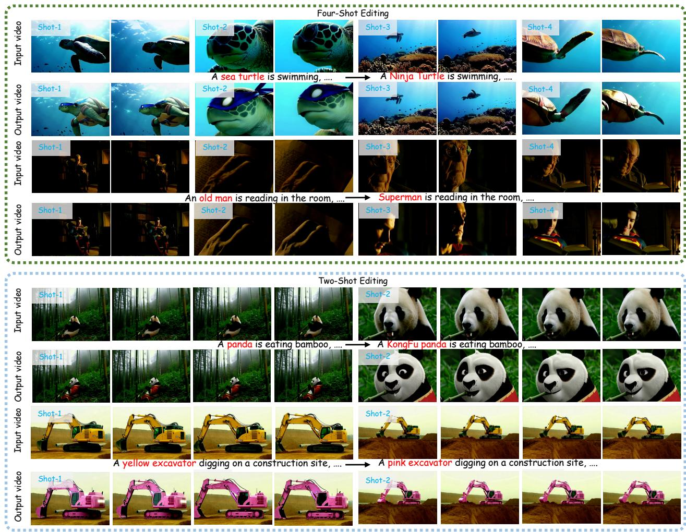
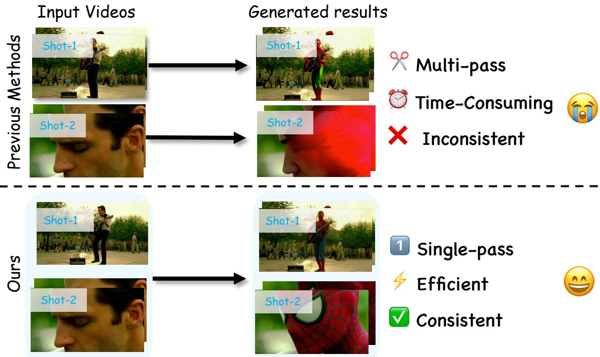
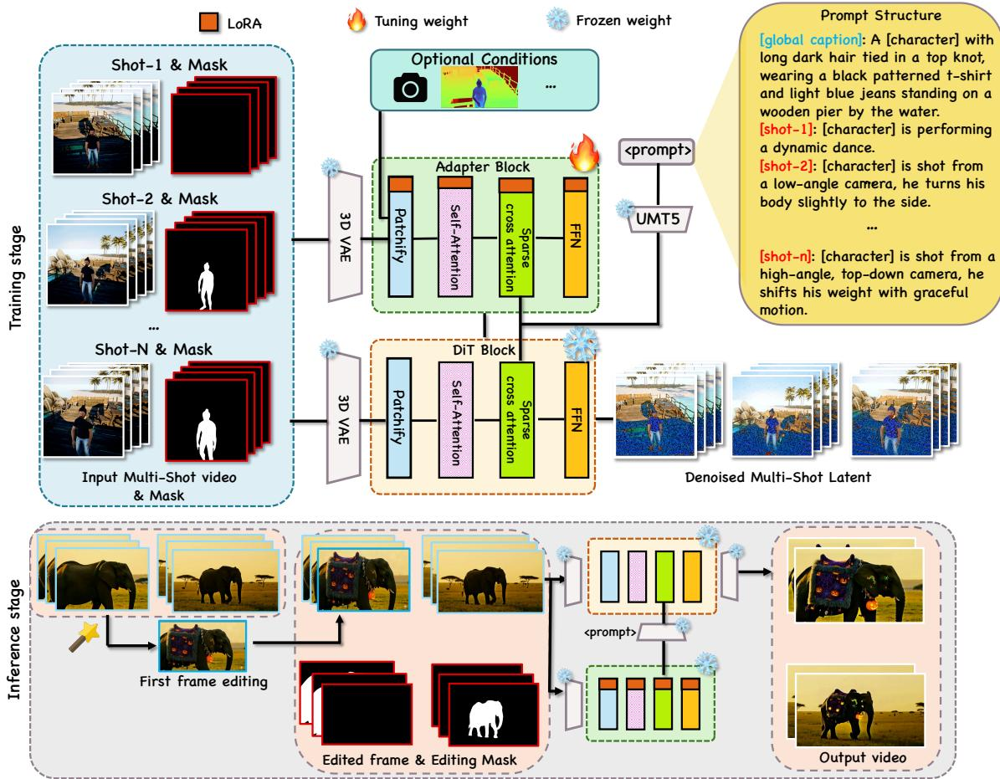
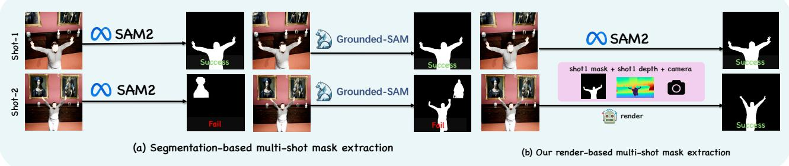
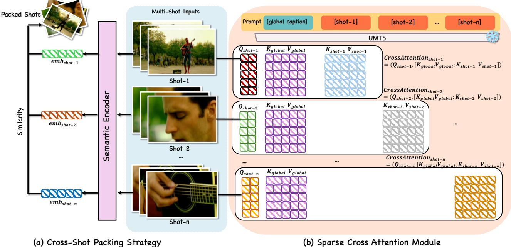
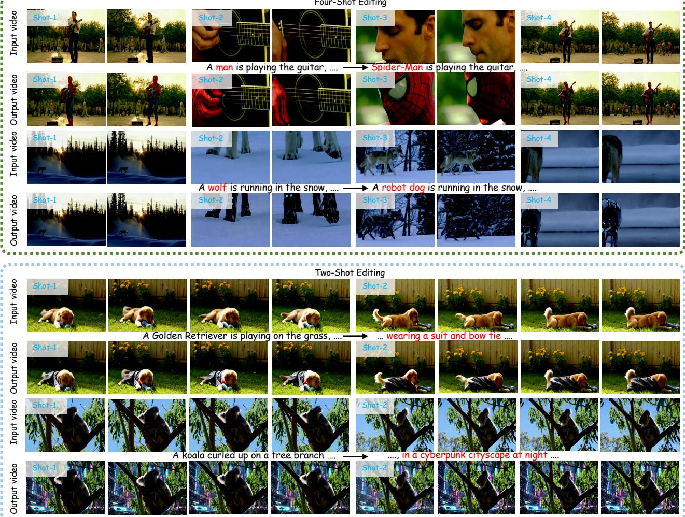
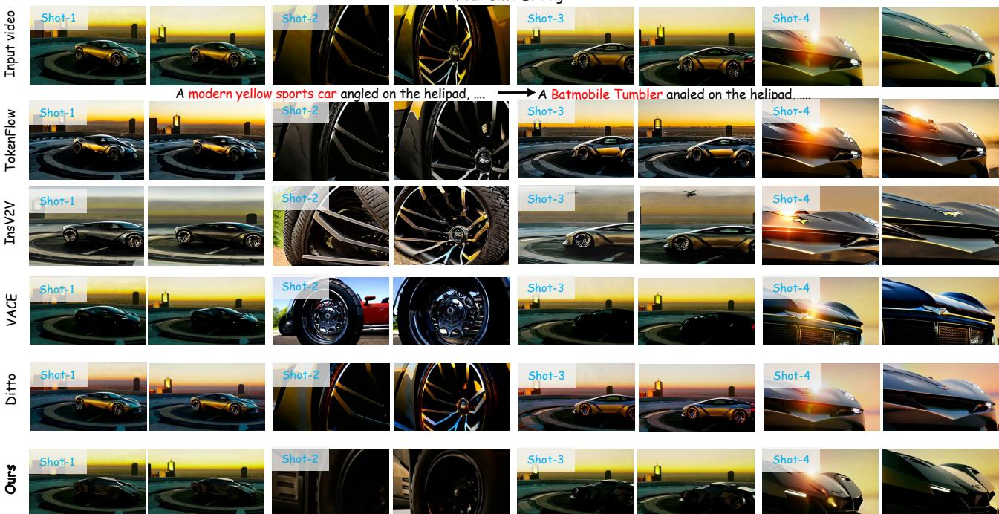
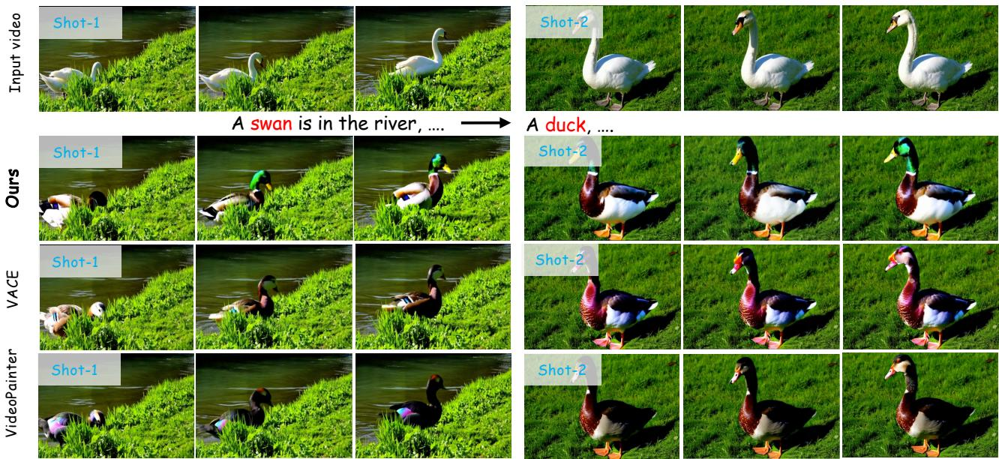
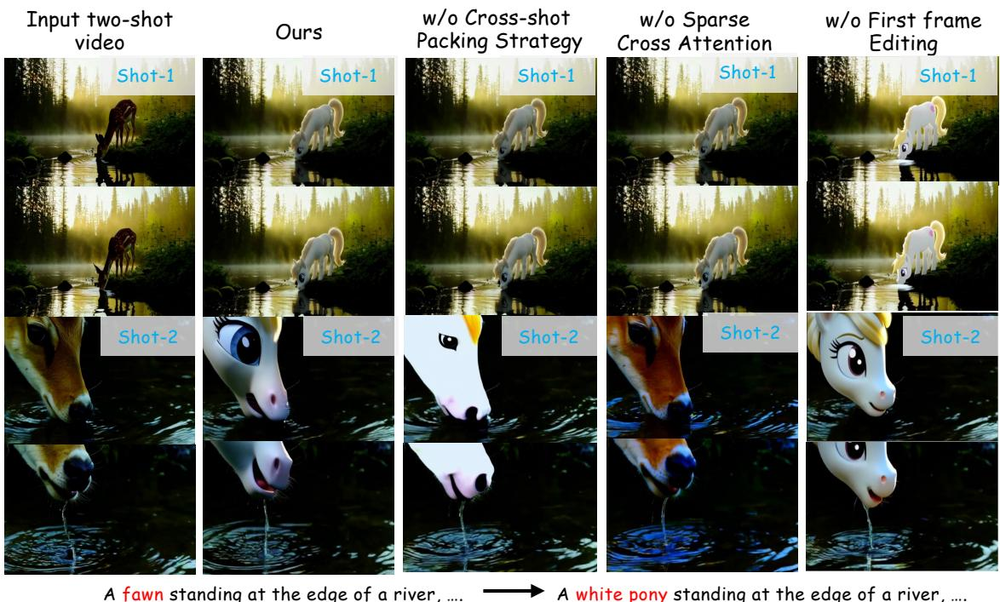

Kunyu Feng1,\*, Yue Ma2,\*, Bingyuan Wang1, Yuefeng Wang3, Zhiyuan Qin4 Hao Cheng5, Hao Li4, Qifeng Chen2, Zeyu Wang1,2

1HKUST (Guangzhou) 2HKUST 3Baidu Inc. 4Beijing Innovation Center of Humanoid Robotics 5Tsinghua University \*Equal contribution.

In this paper, we tackle the problem of performing consistent, unified modifications to a multi-shot video sequence. This task is particularly challenging because multi-shot videos consist of discontinuous temporal segments that vary significantly in viewpoint, camera scale, and subject pose, leading to severe identity drift and cumulative error propagation. Achieving coherent edits requires establishing reliable cross-shot semantic awareness to maintain stable subject appearance and visual continuity across these disjointed boundaries. To address this, we propose MSEditor, the first framework designed specifically for consistent multishot video editing. To overcome the scarcity of high-quality multi-shot training data, we repurpose existing multi-view video datasets to provide robust cross-shot supervision. Architecturally, we introduce a Supervisory Adapter that injects this cross-shot information into the diffusion backbone, enabling the model to learn identity-consistent representations. Furthermore, to effectively mitigate cumulative errors and ensure longrange temporal coherence, we design a Cross-Shot Packing strategy that dynamically aggregates information from semantically related shots within the self-attention window. Extensive experiments demonstrate that MSEditor significantly outperforms existing methods on our curated multi-shot video editing benchmark in terms of identity preservation, temporal stability, and overall visual quality.

## 1 Introduction

Multi-shot video editing aims to achieve consistent and unified content modification across a sequence of discontinuous temporal segments (i.e., shots) assembled to convey a unified narrative. Unlike conventional single-shot video editing [1– 8], which focuses on generating plausible modifications within a single continuous temporal flow, this task requires maintaining editing coherence in both appearance and structure across multiple shots. This capability is crucial for professional applications such as filmmaking, narrative storytelling, and commercial advertising, where visual content is inherently constructed from sequences of multiple diverse shots to create cinematic rhythm and convey complex storylines. Consequently, extending generative editing capabilities from single-shot to multi-shot scenarios is not merely an incremental step, but a crucial leap toward practical, professional-grade video creation.

While coherent multi-shot editing is highly desirable, ensuring semantic consistency across diverse shots remains a formidable challenge. These different shots encompass abrupt transitions in both spatial and temporal dimensions, including changes in viewpoints, camera scales (e.g., from a wide establishing shot to a close-up), and subject poses. Achieving high-level semantic consistency across these narratively linked but geometrically disjointed shots presents significant technical hurdles. Previous editing approaches typically operate on a single-shot basis [9, 10]. When applied to multi-shot sequences, they inherently struggle, suffering from severe identity drift and cumulative errors across temporal boundaries. Specifically, extending a single-shot video editing framework to multi-shot scenarios typically encounters two major bottlenecks:

(1) The lack of multi-shot video datasets. A major bottleneck lies in the scarcity of large-scale, high-quality multishot video datasets. Constructing such datasets is extremely challenging, as it requires collecting sequences that preserve consistent subject identity across diverse scenes, lighting conditions, and transitions. Due to the absence of publicly available datasets that support robust multi-shot training, current diffusion-based video editing frameworks are often limited to single-shot settings and rely heavily on short-term temporal correlations. This restricts their generalization ability and hinders the development of multi-shot video editing.

  
Figure 1: Showcase of MSEditor. Given a multi-shot input video, our method produces consistent edits across shots with diverse scene compositions, maintaining appearance, motion, and cross-shot consistency.

(2) Cumulative error propagation and cross-shot inconsistency. Within a localized temporal window (e.g., a short sequence containing two shots), previous editing frameworks [9, 10] often suffer from cumulative error propagation. Small editing artifacts or subtle identity drifts emerging in earlier frames tend to amplify recursively as the video progresses. When crossing shot boundaries, these accumulated deviations manifest as noticeable inconsistencies in the subject’s appearance, style, and structural integrity. For longer videos that exceed the model’s temporal context (e.g., 81 frames for Wan2.1 [11]), current paradigms [3, 12] necessitate partitioning the sequence into independent temporal chunks for separate inference, as illustrated in Fig. 2. This fragmented processing fundamentally lacks cross-shot semantic awareness, causing severe subject identity drift between disjoint chunks. Furthermore, this approach is computationally inefficient, requiring multiple redundant inference passes that significantly increase the post-production overhead.

To tackle these challenges, we propose MSEditor, a novel multi-shot video editing framework for coherent editing across diverse shots. To address the lack of multi-shot training data, we repurpose existing multi-view video datasets as a proxy for multi-shot supervision. Although they are originally designed for view synthesis, these datasets inherently contain sequences that capture the same subject under varying shots and scene conditions, providing valuable inter-shot correspondence for training. Specifically, we extract synchronized RGB sequences along with their associated depth maps, from which we compute accurate and temporally stable subject masks through projection-based consistency. Thi avoids the segmentation failures of conventional models such as SAM2 [13], which often misidentify background figures in complex scenes. Leveraging these structured multi-view signals, we introduce a Supervisory Adapter that injects crossshot supervision into the backbone, enabling the model to learn subject relationships and maintain appearance consistency across shots.

To further reduce error accumulation and improve cross-shot coherence, we introduce a Cross-Shot Packing Strategy. Our method dynamically groups semantically related shots and processes them jointly within the self-attention window. This enables effective cross-shot feature interaction during training, facilitating subject identity preservation and ensuring consistent edits across diverse shots.

  
Figure 2: Comparison with the previous single-shot editing framework. (Top) Existing single-shot editing baselines partition multi-shot sequences into independent temporal chunks. This fragmented inference leads to cumulative errors and cross-shot inconsistency, while being computationally time-consuming due to multiple inference passes. (Bottom) Our MSEditor performs a single inference pass, achieving high-fidelity consistency and superior efficiency.

In summary, our contributions are as follows:

• We introduce MSEditor, the first framework specifically designed for the multi-shot video editing task, achieving robust identity preservation and coherent editing across different shots.

• We propose a Supervisory Adapter that leverages auxiliary priors to inject cross-shot information into the backbone, enabling the model to learn identity-consistent representations for multi-shot video editing.

• We design a Cross-Shot Packing Strategy that dynamically aligns features across shots and mitigates cumulative error propagation, ensuring long-range temporal and appearance consistency.

• Extensive experiments demonstrate the state-of-the-art performance of our method on multi-shot editing tasks, showing superior temporal stability and identity consistency over existing methods.

## 2 Related Work

In this section, we review existing literature on single-shot video editing, multi-shot video generation, and long video generation.

Single-Shot Video Editing. In recent years, video diffusion models have reshaped single-shot video editing [14]. UNetbased approaches evolved from temporal mechanisms [15–18] to training-free feature propagation via inter-frame correspondences [10, 19–21]. Other advances include attention manipulation for coherence [9, 22–26], adding spatiotemporal controls to image models [27, 28], and repurposing video models for editing [29, 30]. DiT-based methods exploit Diffusion Transformers [31–33] for scalability [12, 34], with innovations in query-key manipulation [35–39], dataset construction [40], unified in-context editing [3, 41–44], and applications in autonomous driving [45], inpainting [46], and controllable video editing [2, 8, 47–54]. However, these methods are designed for single shots and lack mechanisms for subject consistency across multiple shots with varying viewpoints.

Multi-Shot Video Generation. Recently, multi-shot video generation has advanced via camera-controlled and camerafree approaches [55]. Camera-controlled methods model camera parameters for multi-view synchronization [56], rerendering [57], and pose control [58]. Camera-free methods focus on narrative coherence: transition tokens for shot control [59], Long Context Tuning to expand attention [60], HoloCine for long-range consistency [61], and SKALD for shot assembly [62]. Specialized datasets include AnimeShooter [63], TalkCuts [64], and Shot2story20k [65]. Despite the progress, these methods focus on generation from scratch rather than editing, and often require auxiliary geometric inputs, limiting practical use.

  
Figure 3: Overview of our method. Top: Given an input multi-shot video and corresponding editing masks, our method first trains a Supervisory Adapter to inject multi-shot information into the diffusion backbone. We also introduce two key strategies: Cross-Shot Packing and Sparse Cross-Attention to keep the consistency during training. Bottom: During inference, editing is performed on the first frame and produces coherent and identity-preserving multi-shot video output.

Long Video Generation. Long video generation focuses on coherence over extended sequences [66, 67]. Early strategies used hierarchical latent diffusion [68] and parallel generation [69]. Later works enabled flexible frame sampling [70], sampling correction [71], slice-based editing [72], transition models [73], and noise rescheduling [74]. Recently, Mixture of Contexts (MoC) [75] uses sparse attention for near-linear scaling and minute-long coherence. However, these methods do not address the unique challenges of multi-shot editing, like cross-shot feature alignment and identity preservation across viewpoint changes.

## 3 Method

Our objective is to achieve temporally consistent and high-fidelity video editing across multiple discontinuous shots. Sec. 3.1 elaborates on our data construction and annotation approach. Sec. 3.2 presents our comprehensive framework for multi-shot video editing, which integrates a Supervisory Adapter for multi-shot information injection, a Cross-Shot Packing Strategy, and a Sparse Cross Attention Module for cross-shot consistency preservation.

## 3.1 Data Annotation and Collection

The development of multi-shot video editing techniques faces a fundamental challenge: the scarcity of high-quality datasets capturing sequential, diverse shots of the same subject. Manual collection of such data is prohibitively labor intensive, significantly constraining model training and generalization capabilities.

To address this limitation, we repurpose existing multi-view video datasets [56, 77] as an effective proxy. These datasets provide synchronized sequences of identical subjects from multiple viewpoints, containing rich inter-view correspondences that are instrumental for learning cross-shot consistency. However, adapting these datasets for multi-shot editing requires careful consideration. Unlike generation tasks, video editing demands precise subject-scene disentanglement to ensure accurate editing. As illustrated in Fig. 4(a), direct application of off-the-shelf object segmentation models (e.g.,

  
Figure 4: Comparison of multi-shot mask extraction pipeline for training data construction. (a) Using segmentation models (e.g., SAM2 [13], Grounded-SAM [76]) naively on the per-shot video often results in inconsistent results. The model may successfully segment the subject in one shot but fail in another due to a complex background. (b) Our proposed method bypasses this limitation by leveraging the multi-view data’s camera and depth information. We use a complete mask from one shot and re-project it into another’s view, rendering an accurate mask. This process ensures high-quality, cross-shot, consistent annotations.

SAM2 [13], Grounded-SAM [76]) often fails in complex scenarios where background elements contain distracting content such as paintings or incidental persons.

To overcome this limitation, we develop a robust annotation method depicted in Fig. 4(b). We employ double-reprojection techniques [78] to generate reliable depth maps and view-consistent segmentation masks. These annotations provide explicit spatial and structural supervision during training, enabling precise subject isolation. To provide fine-grained semantic guidance, we implement an automated structured prompting pipeline using Qwen3-VL [79]. For each multishot sequence, we generate a comprehensive global caption that describes the overarching subject identity and scene context. Additionally, we generate shot-specific descriptions for each viewpoint to capture unique camera angles and motion characteristics. This hierarchical annotation enables the model to learn both global semantic alignment and shotlevel temporal dynamics.

The training dataset consists of 3,400 video sequences. For each video, there are synchronized RGB sequences from 10 different viewpoints $\{ V ^ { ( k ) } \} _ { k = 1 } ^ { 1 0 }$ paired with their corresponding segmentation masks $\{ M ^ { ( k ) } \} _ { k = 1 } ^ { 1 0 }$ . The dataset also includes constructed depth maps $\{ D ^ { ( k ) } \} _ { k = 1 } ^ { 1 0 }$ and camera parameters $\{ \mathrm { c a m } ^ { ( k ) } \} _ { k = 1 } ^ { 1 0 }$ . Each sequence is associated with a structured prompt:

$$
\mathrm { P r o m p t } = \{ \mathrm { C a p t i o n } _ { \mathrm { G l o b a l } } , \mathrm { C a p t i o n } _ { \mathrm { S h o t - 1 } } , \mathrm { C a p t i o n } _ { \mathrm { S h o t - 2 } } , \dots , \mathrm { C a p t i o n } _ { \mathrm { S h o t - 1 0 } } \} .\tag{1}
$$

This comprehensive annotation format enables the Supervisory Adapter to learn implicit, cross-shot consistent representations, ensuring both appearance consistency and high-fidelity editing across diverse shots.

## 3.2 Multi-Shot Video Editing Framework

Our framework builds upon the pre-trained diffusion-based video generative backbone Wan2.1 [11], which has demonstrated strong performance in video synthesis within single-shot scenarios. To enable coherent editing across different shots, we introduce MSEditor, a novel architecture designed to preserve subject identity throughout multi-shot sequences. The overall framework is illustrated in Fig. 3.

Supervisory Adapter for Multi-Shot Information Injection. Although existing video editing frameworks exhibit strong editing capabilities in single-shot settings, they fail to maintain subject consistency across different shots due to the absence of multi-shot supervision. To enhance its multi-shot proficiency, we introduce a Supervisory Adapter that injects multi-shot features into the diffusion backbone during training.

As shown in Fig. 3, our adapter takes multi-view RGB videos and their corresponding segmentation masks as inputs. These multimodal signals guide the backbone to learn cross-shot consistent representations, enabling the model to preserve subject identity across discontinuous shots while maintaining high editing fidelity. Following the design principle of ControlNet [80], all adapter layers are initialized to zero to ensure stable convergence and prevent over-conditioning.

To leverage powerful prior knowledge and enhance user-friendliness control, we follow the recent video editing works [81, 82] and adopt the first-frame editing paradigm that allows users to explicitly specify their editing intent on the initial frame. This reference-based approach significantly reduces the manual effort required for complex multi-shot sequences. Furthermore, to preserve the model’s first-frame editing capability, we adopt a content editing strategy inspired by prior work [83]. Specifically, given a reference video

$$
\mathbf { V } = [ \mathbf { I } _ { 0 } , \ldots , \mathbf { I } _ { N - 1 } ] \in \mathbb { R } ^ { N \times 3 \times H \times W } ,\tag{2}
$$

where N denotes the number of frames, and H and W represent height and width respectively, we construct multi-shot video–mask pairs $\{ ( \mathbf { V } ^ { ( k ) } , \mathbf { M } ^ { ( k ) } ) \} _ { k = 1 } ^ { K }$ corresponding to K different shots.

  
Figure 5: Overview of the Cross-Shot Packing Strategy and Sparse Cross Attention Module. (a) Given multi-shot inputs, the Cross-Shot Packing Strategy addresses the challenge of maintaining consistency in multi-shot video editing. (b) The Sparse Cross Attention Module integrates textual guidance. Visual queries from each shot $( { \mathrm { e . g . , } } Q _ { \mathrm { s h o t - 1 } } )$ sparsely attend only to the concatenation of the shared global text embeddings $( K _ { \mathrm { g l o b a l } } , \bar { V } _ { \mathrm { g l o b a l } } )$ and their corresponding shot-specific embeddings $( K _ { \mathrm { s h o t - 1 } } , V _ { \mathrm { s h o t - 1 } } )$ .

During the training stage, the mask of the first frame $\mathbf { M } _ { 0 } ^ { ( 0 ) }$ is set to zero for the first shot, establishing the first frame as the guidance during the video generation, while subsequent masks define the editable regions for propagation through the sequence. During inference, users modify the first frame, and the changes are propagated to the following frames. Overall, the training objective minimizes the MSE loss between predicted and ground-truth frames across all video–mask pairs:

$$
\mathcal { L } = \frac { 1 } { K } \sum _ { k = 1 } ^ { K } \left. \mathbf { V } _ { \mathrm { p r e d } } ^ { ( k ) } - \mathbf { V } _ { \mathrm { g t } } ^ { ( k ) } \right. _ { 2 } ^ { 2 } .\tag{3}
$$

This optimization enables the Supervisory Adapter to inject multi-shot priors into the backbone while ensuring the editing capability of the video foundation model, resulting in consistent multi-shot video editing.

Cross-Shot Packing Strategy for Consistent Object Preservation. While the Supervisory Adapter injects multi-shot information into our model, editing long videos with numerous shots remains challenging. In multi-shot scenarios, subjects may exhibit dramatic variations in scale, position, and appearance across shots. Minor inconsistencies in earlier shots can accumulate over time, leading to significant degradation of visual fidelity and structural coherence. However, in most training pipelines, multiple shots are typically concatenated along the batch dimension. Although this strategy improves training efficiency, it inherently isolates the temporal and semantic relations between different shots. Alternatively, con catenating all shots along the frame dimension would allow dense inter-shot interaction, but results in huge computational and memory costs.

To balance efficiency and consistency, we introduce a Cross-Shot Packing Strategy that reformulates self-attention computation by dynamically grouping semantically correlated shots into joint attention windows, as illustrated in Fig. 5(a). Formally, given a multi-shot video $\{ V ^ { ( k ) } \} _ { k = 1 } ^ { K }$ , we randomly select a shot $V ^ { \mathrm { a n c } } = \{ f _ { \mathrm { a n c , } t } \} _ { t = 1 } ^ { T _ { \mathrm { a n c } } }$ as the anchor shot, which retains its full temporal resolution to serve as the primary training target. For all other candidate shots $V ^ { ( j ) }$ , we compute their semantic similarity to the anchor using DINOv2 [84] embeddings $e _ { a n c }$ and $e _ { j }$ . We then select the top-M most correlated shots that exceed a threshold τ (e.g., 0.8). For each selected shot $V ^ { ( j ) }$ , we extract a representative subset of n frames (e.g., the initial frames) to serve as identity frames:

$$
\hat { V } ^ { ( j ) } = S ( V ^ { ( j ) } , n ) , \quad \mathrm { w h e r e } n < F _ { j } .\tag{4}
$$

The final packed sequence $\tilde { V } ^ { ( \mathrm { a n c } ) }$ is then formulated by concatenating the full anchor shot with the distilled reference frames:

$$
\tilde { V } ^ { ( \mathrm { a n c } ) } = \mathrm { C o n c a t } \left( V ^ { ( \mathrm { a n c } ) } , \hat { V } ^ { ( j _ { 1 } ) } , \dots , \hat { V } ^ { ( j _ { M } ) } \right) .\tag{5}
$$

To ensure the training remains robust under various GPU memory constraints, we implement a dynamic thresholding strategy. If the total frame count of $\tilde { V } ^ { \mathrm { ( a n c ) } }$ V˜ (anc) exceeds the hardware’s batch capacity, the system automatically increments

  
Figure 6: Gallery of our proposed method, which displays four-shot and two-shot editing examples. These results demonstrate the effectiveness of our model in applying diverse semantic modifications while maintaining high visual fidelity and cross-shot consistency.

τ (e.g., from 0.8 to 0.85) to filter out less relevant shots. This joint formulation enables the self-attention layers to perform feature interaction across semantically linked shots, facilitating a holistic understanding of subject identity across discontinuous temporal segments while maintaining computational tractability.

Textual Conditioning via Sparse Cross Attention. To integrate textual guidance, we adopt the Sparse Cross Attention mechanism from HoloCine [61] at both global and per-shot levels, as shown in Fig. 5(b). Given token embeddings of the textual prompt, we separate them into a global caption and multiple per-shot descriptions:

$$
\mathrm { P r o m p t } = \{ \mathrm { C a p t i o n } _ { \mathrm { G l o b a l } } , \mathrm { C a p t i o n } _ { \mathrm { S h o t - 1 } } , \mathrm { C a p t i o n } _ { \mathrm { S h o t - 2 } } , \dots , \mathrm { C a p t i o n } _ { \mathrm { S h o t - K } } \} .\tag{6}
$$

For each shot $S _ { i } ,$ , we compute cross-attention between its visual queries $Q _ { i }$ and the concatenated key–value pairs from global and corresponding per-shot textual embeddings:

$$
\mathrm { A t t n } _ { \mathrm { c r o s s } } ( Q _ { i } ) = \mathrm { A t t e n t i o n } \left( Q _ { i } , [ K _ { \mathrm { g l o b a l } } , K _ { i } ] , [ V _ { \mathrm { g l o b a l } } , V _ { i } ] \right) .\tag{7}
$$

This formulation enables each shot to be guided by both global scene semantics and shot-specific textual context, thereby enhancing cross-shot consistency while preserving per-shot edit controllability.

## 4 Experiments

## 4.1 Experiment Setup

Datasets. Our model is trained on the multi-shot dataset constructed through the methodology detailed in Sec. 3.1. For evaluation, we curate a diverse test dataset comprising 600 videos collected from the internet, featuring a balanced distribution of 35% humans, 35% animals, and 30% objects. There is no overlap between our training and testing data, ensuring a rigorous assessment of the model’s generalization capabilities. The evaluation tasks encompass style transfer, object replacement, and attribute editing, with prompts automatically generated via Qwen3-VL [79]. More details of our test dataset are provided in the supplementary materials.

  
Figure 7: Qualitative comparison results with the state-of-the-art methods. We compare our multi-shot approach against leading single-shot video editing baselines on a four-shot editing task. The results show that our method successfully executes the complex subject replacement, demonstrating superior cross-shot temporal consistency.

Implementation Details. We train our model based on Wan2.1-14B [11], a diffusion transformer-based video creation model. The optimization is performed using AdamW [85] with a weight decay of 0.01 and an initial learning rate of $1 \times 1 0 ^ { - 4 }$ . During the training process, we set the input resolution to 480 × 832 and a batch size of 8 on 8 NVIDIA A800 GPUs under PyTorch. During inference, we employ the flow-matching scheduler [86] with 50 sampling steps to generate high-quality and temporally coherent multi-shot videos. More evaluation metrics are provided in the supplementary material.

Table 1: Quantitative Results of Comparative Studies. Red and Blue denote the best and second best results, respectively.
<table><tr><td rowspan="2">Method</td><td>Video Quality</td><td colspan="2">Inter-shot Consistency</td><td colspan="2">Intra-shot Consistency</td><td colspan="2">Semantic Consistency</td></tr><tr><td>Aesthetic Score ↑</td><td>Subject ↑</td><td>Background ↑</td><td>Subject ↑</td><td>Background ↑</td><td>Global ↑</td><td>Shot ↑</td></tr><tr><td>TokenFlow [10]</td><td>5.51</td><td>0.9181</td><td>0.9279</td><td>0.9029</td><td>0.9173</td><td>0.1302</td><td>0.1415</td></tr><tr><td>InsV2V [71]</td><td>4.89</td><td>0.9013</td><td>0.9307</td><td>0.8962</td><td>0.8941</td><td>0.1433</td><td>0.1137</td></tr><tr><td>VACE [3]</td><td>5.91</td><td>0.9237</td><td>0.9372</td><td>0.8805</td><td>0.9365</td><td>0.1649</td><td>0.1738</td></tr><tr><td>Ditto [12]</td><td>5.73</td><td>0.9287</td><td>0.9341</td><td>0.9125</td><td>0.9331</td><td>0.1514</td><td>0.1569</td></tr><tr><td>Ours</td><td>6.05</td><td>0.9370</td><td>0.9447</td><td>0.9501</td><td>0.9462</td><td>0.1912</td><td>0.1886</td></tr></table>

Table 2: Quantitative Results of Comparative Studies. For fair comparison, we train recent methods VACE and VideoPainter on our dataset. Red and Blue denote the best and second best results, respectively.
<table><tr><td rowspan="2">Method</td><td>Video Quality</td><td colspan="2">Inter-shot Consistency</td><td colspan="2">Intra-shot Consistency</td><td colspan="2">Semantic Consistency</td></tr><tr><td>Aesthetic Score ↑</td><td>Subject ↑</td><td>Background ↑</td><td>Subject ↑</td><td>Background ↑</td><td>Global ↑</td><td>Shot ↑</td></tr><tr><td>VACE [3]</td><td>5.93</td><td>0.9301</td><td>0.9395</td><td>0.9057</td><td>0.9382</td><td>0.1728</td><td>0.1753</td></tr><tr><td>VideoPainter [4]</td><td>6.01</td><td>0.9237</td><td>0.9396</td><td>0.9061</td><td>0.9377</td><td>0.1687</td><td>0.1732</td></tr><tr><td>Ours</td><td>6.05</td><td>0.9370</td><td>0.9447</td><td>0.9501</td><td>0.9462</td><td>0.1912</td><td>0.1886</td></tr></table>

  
Figure 8: More Qualitative Results after Training VACE and VideoPainter on Our Dataset. For fair comparison, we train VACE and VideoPainter on our dataset, and compare the performance on the two-shot editing task. The results demonstrate that our proposed method has superior performance.

## 4.2 Comparison with Baseline Methods

Qualitative Results. Due to the lack of existing methods for multi-shot video editing, we establish our baselines from the domain of single-shot video editing. To ensure a comprehensive comparison, we select methods spanning diverse architectures, namely UNet-based and DiT-based models. The chosen baselines include TokenFlow [10], InsV2V [71], Ditto [12], and VACE [3]. Furthermore, to ensure a fair comparison, we retrained VACE [3] and VideoPainter [4] on our curated multi-shot training dataset, enabling them to learn from identical data distributions. As shown in Fig. 7 and Fig. 8, we display the qualitative results of these methods on four-shot and two-shot video editing tasks. Specifically, previous methods such as InsV2V, TokenFlow, and Ditto fail to perform the required edits while maintaining coherence. Even after being trained on our dataset, VACE and VideoPainter still struggle to maintain subject identity across discontinuous temporal boundaries, resulting in partial subject replacement or structural distortion. In contrast, our method demonstrates superior performance in editing fidelity, subject identity preservation, and temporal consistency. This indicates that the advantage of our approach stems not only from the training data but more importantly from our specialized architecture. Additional qualitative comparisons under more diverse settings are provided in the supplementary material.

Quantitative Results. For a quantitative study, we use the Aesthetic Score [87] to evaluate the quality of the edited video, and evaluate inter-shot consistency, intra-shot consistency, and semantic consistency following recent works [61]. As shown in Table 1, the quantitative results demonstrate that our proposed method outperforms the baseline across all metrics. To ensure a fair comparison, we retrained recent state-of-the-art methods, specifically VACE [3] and VideoPainter [4], using our own curated multi-view training dataset. As shown in Table 2, the quantitative results demonstrate that our proposed method outperforms all baselines across every metric. Notably, even after fine-tuning these baselines on the same data, our MSEditor still maintains a significant performance gap, which further validates the architectural superiority of our method. Furthermore, we provide a quantitative evaluation of our mask extraction accuracy and additional results for “w/o mask setting” and the shape-editing task in the supplementary material to further demonstrate our method’s robustness. The results of our user study are also available in the supplementary material.

Table 3: Quantitative Results of the Ablation Study. Red and Blue denote the best and second best results, respectively.
<table><tr><td rowspan="2">Method</td><td>Video Quality</td><td colspan="2">Inter-shot Consistency</td><td colspan="2">Intra-shot Consistency</td><td colspan="2">Semantic Consistency</td></tr><tr><td>Aesthetic Score ↑</td><td>Subject ↑</td><td>Background ↑</td><td>Subject ↑</td><td>Background ↑</td><td>Global ↑</td><td>Shot ↑</td></tr><tr><td>w/o First Frame editing</td><td>6.01</td><td>0.9321</td><td>0.9357</td><td>0.9336</td><td>0.9305</td><td>0.1752</td><td>0.1729</td></tr><tr><td>w/o Cross-Shot Packing strategy</td><td>5.83</td><td>0.8919</td><td>0.9132</td><td>0.8937</td><td>0.9008</td><td>0.1738</td><td>0.1521</td></tr><tr><td>w/o Sparse Cross attention</td><td>5.70</td><td>0.8931</td><td>0.9256</td><td>0.8651</td><td>0.9126</td><td>0.1691</td><td>0.1432</td></tr><tr><td>Ours</td><td>6.05</td><td>0.9370</td><td>0.9447</td><td>0.9501</td><td>0.9462</td><td>0.1912</td><td>0.1886</td></tr></table>

A fawn standing at the edge of a river, …. A white pony standing at the edge of a river, ….  
  
Figure 9: Qualitative Results of the Ablation Study. We ablate the proposed modules in two-shot editing tasks. Although the first shot is successfully edited, (1) Without the Cross-Shot Packing Strategy, the result lacks inter-shot consistency, leading to visual artifacts (e.g., a distorted face in the close-up shot). (2) Without the Sparse Cross Attention, the model fails in the second shot, indicating a failure to process the per-shot semantic guidance. (3) Without the First Frame Editing, the model successfully transforms the target but exhibits subtle deviations in fine-grained details, highlighting its role as a high-fidelity visual anchor rather than a prerequisite for structural consistency.

## 4.3 Ablation Study

Effectiveness of First Frame editing. To investigate the contribution of the First Frame editing strategy, we conduct a series of ablation studies on it. In this setting, the model relies solely on the text prompt and the learned cross-shot priors to generate the edited content. The experimental settings are the same during the ablation. As shown in Fig. 9 and Table 3, removing the first-frame anchor results in a slight decrease in consistency and aesthetic scores. However, this performance drop is relatively marginal compared to the impact of removing the other two strategies. This suggests that while first-frame editing serves as a high-fidelity visual anchor and significantly enhances user control, the core ability to maintain cross-shot consistency is fundamentally driven by our designed architecture. The results further demonstrate that our framework has learned robust, implicit semantic correspondences across disjoint shots.

Effectiveness of Cross-Shot Packing strategy. We further assess the effectiveness of the proposed Cross-Shot Packing strategy in Fig. 9 and Table 3. Without the Cross-Shot Packing strategy, the model degenerates into the baseline training setting where multiple shots are concatenated along the batch dimension, and the edited video has the challenge of maintaining inter-shot consistency. Effectiveness of Sparse Cross Attention. As shown in Table 3, removing Sparse Cross Attention leads to a clear degradation in inter-shot semantic consistency. In this setting, the model receives the same structured prompts, but we replace our designed module with a standard cross-attention mechanism. As shown in Table 3, this substitution leads to a marked degradation in inter-shot semantic consistency. Furthermore, in Fig. 9, we show the results when there is a lack of Sparse Cross Attention. This failure is primarily driven by severe semantic confusion. When processing the lengthy and structured concatenated prompts, a standard dense attention mechanism allows all video frames to attend globally to all text tokens. Consequently, the model struggles to disentangle the long context, often failing to accurately align specific shot-level textual instructions with their corresponding temporal segments.

## 5 Conclusion

We have proposed MSEditor, the first multi-shot video editing framework. Unlike prior single-shot methods that suffer from subject drift and temporal inconsistency, our approach leverages structured multi-shot supervision during the training stage to endow the diffusion model with cross-shot awareness. Specifically, our Supervisory Adapter injects multi-shot information into the backbone, facilitating the structural coherence of the model. Additionally, we design the Cross-Shot Packing strategy to keep the consistency between different shots. Extensive experiments demonstrate that our approach

substantially improves cross-shot alignment and subject fidelity compared to previous diffusion-based editing frameworks.   
We believe our framework opens promising avenues for future research in real-world, multi-shot storytelling applications.

## 6 Acknowledgments

This research was supported by the National Natural Science Foundation of China (No. 62502410), the Guangdong Basic and Applied Basic Research Foundation (No. 2026A1515011138) and the Research Grants Council of HKSAR under grant number AoE/E-601/24-N.

## References

[1] Shuyuan Tu, Qi Dai, Zhi-Qi Cheng, Han Hu, Xintong Han, Zuxuan Wu, and Yu-Gang Jiang. MotionEditor: Editing Video Motion via Content-Aware Diffusion. In Proceedings ofthe IEEE/CVF Conference on Computer Vision and Pattern Recognition, pages 7882–7891, 2024.

[2] Feng-Lin Liu, Hongbo Fu, Xintao Wang, Weicai Ye, Pengfei Wan, Di Zhang, and Lin Gao. SketchVideo: Sketchbased Video Generation and Editing. In Proceedings ofthe IEEE/CVF Conference on Computer Vision and Pattern Recognition, pages 23379–23390, 2025.

[3] Zeyinzi Jiang, Zhen Han, Chaojie Mao, Jingfeng Zhang, Yulin Pan, and Yu Liu. VACE: All-in-One Video Creation and Editing. In Proceedings of the IEEE/CVF International Conference on Computer Vision, pages 17191–17202, 2025.

[4] Yuxuan Bian, Zhaoyang Zhang, Xuan Ju, Mingdeng Cao, Liangbin Xie, Ying Shan, and Qiang Xu. VideoPainter: Any-length Video Inpainting and Editing with Plug-and-Play Context Control. In ACM SIGGRAPH 2025 Conference Papers, pages 1–12, 2025.

[5] Yue Ma, Xinyu Wang, Qianli Ma, Qinghe Wang, Mingzhe Zheng, Xiangpeng Yang, Hao Li, Chongbo Zhao, Jixuan Ying, Harry Yang, et al. Group editing: Edit multiple images in one go. arXiv preprint arXiv:2603.22883, 2026.

[6] Jiangshan Wang, Junfu Pu, Zhongang Qi, Jiayi Guo, Yue Ma, Nisha Huang, Yuxin Chen, Xiu Li, and Ying Shan. Taming rectified flow for inversion and editing. arXiv preprint arXiv:2411.04746, 2024.

[7] Jiangshan Wang, Yue Ma, Jiayi Guo, Yicheng Xiao, Gao Huang, and Xiu Li. Cove: Unleashing the diffusion feature correspondence for consistent video editing. Advances in Neural Information Processing Systems, 37:96541–96565, 2024.

[8] Yue Ma, Xiaodong Cun, Sen Liang, Jinbo Xing, Yingqing He, Chenyang Qi, Siran Chen, and Qifeng Chen. Magicstick: Controllable video editing via control handle transformations. In 2025 IEEE/CVF Winter Conference on Applications ofComputer Vision (WACV), pages 9385–9395. IEEE, 2025.

[9] Shaoteng Liu, Yuechen Zhang, Wenbo Li, Zhe Lin, and Jiaya Jia. Video-P2P: Video Editing with Cross-attention Control. In Proceedings of the IEEE/CVF Conference on Computer Vision and Pattern Recognition, pages 8599– 8608, 2024.

[10] Michal Geyer, Omer Bar-Tal, Shai Bagon, and Tali Dekel. TokenFlow: Consistent Diffusion Features for Consistent Video Editing. In Proceedings ofthe International Conference on Learning Representations, 2024.

[11] Team Wan, Ang Wang, Baole Ai, Bin Wen, Chaojie Mao, Chen-Wei Xie, Di Chen, Feiwu Yu, Haiming Zhao, Jianxiao Yang, et al. Wan: Open and Advanced Large-Scale Video Generative Models. arXiv preprint arXiv:2503.20314, 2025.

[12] Qingyan Bai, Qiuyu Wang, Hao Ouyang, Yue Yu, Hanlin Wang, Wen Wang, Ka Leong Cheng, Shuailei Ma, Yanhong Zeng, Zichen Liu, Yinghao Xu, Yujun Shen, and Qifeng Chen. Scaling Instruction-Based Video Editing with a High-Quality Synthetic Dataset. In Proceedings of the IEEE/CVF Conference on Computer Vision and Pattern Recognition, pages 37971–37981, 2026.

[13] Nikhila Ravi, Valentin Gabeur, Yuan-Ting Hu, Ronghang Hu, Chaitanya Ryali, Tengyu Ma, Haitham Khedr, Roman Rädle, Chloe Rolland, Laura Gustafson, et al. SAM 2: Segment Anything in Images and Videos. In Proceedings of the International Conference on Learning Representations, 2025.

[14] Wenhao Sun, Rong-Cheng Tu, Jingyi Liao, and Dacheng Tao. Diffusion Model-Based Video Editing: A Survey. arXiv preprint arXiv:2407.07111, 2024.

[15] Wenhao Chai, Xun Guo, Gaoang Wang, and Yan Lu. StableVideo: Text-driven Consistency-aware Diffusion Video Editing. In Proceedings of the IEEE/CVF International Conference on Computer Vision, pages 23040–23050, 2023.

[16] Paul Couairon, Clément Rambour, Jean-Emmanuel Haugeard, and Nicolas Thome. VidEdit: Zero-Shot and Spatially Aware Text-Driven Video Editing, 2024. URL https://arxiv.org/abs/2306.08707.

[17] Yiyang Chen, Xuanhua He, Xiujun Ma, and Yue Ma. Contextflow: Training-free video object editing via adaptive context enrichment. arXiv preprint arXiv:2509.17818, 2025.

[18] Jialun Liu, Tian Li, Xiao Cao, Yukuo Ma, Gonghu Shang, Haibin Huang, Chi Zhang, Xiangzhen Chang, Zhiyong Huang, Jiakui Hu, et al. Tele-omni: a unified multimodal framework for video generation and editing. arXiv preprint arXiv:2602.09609, 2026.

[19] Max Ku, Cong Wei, Weiming Ren, Huan Yang, and Wenhu Chen. AnyV2V: A Tuning-Free Framework for Any Video-to-Video Editing Tasks. Transactions on Machine Learning Research, 2024.

[20] Yiren Song, Shijie Huang, Chen Yao, Hai Ci, Xiaojun Ye, Jiaming Liu, Yuxuan Zhang, and Mike Zheng Shou. Processpainter: Learning to draw from sequence data. In SIGGRAPH Asia 2024 Conference Papers, pages 1–10, 2024.

[21] Yunfeng Wu, Hongying Cheng, Zihao He, and Songhua Liu. Vibe: Ultra-high-resolution video synthesis born from pure images. arXiv preprint arXiv:2603.23326, 2026.

[22] Chenyang Qi, Xiaodong Cun, Yong Zhang, Chenyang Lei, Xintao Wang, Ying Shan, and Qifeng Chen. FateZero: Fusing Attentions for Zero-shot Text-based Video Editing. In Proceedings of the IEEE/CVF International Conference on Computer Vision, pages 15932–15942, 2023.

[23] Yue Ma, Yulong Liu, Qiyuan Zhu, Ayden Yang, Kunyu Feng, Xinhua Zhang, Zhifeng Li, Sirui Han, Chenyang Qi, and Qifeng Chen. Follow-your-motion: Video motion transfer via efficient spatial-temporal decoupled finetuning. arXiv preprint arXiv:2506.05207, 2025.

[24] Yue Ma, Zexuan Yan, Hongyu Liu, Hongfa Wang, Heng Pan, Yingqing He, Junkun Yuan, Ailing Zeng, Chengfei Cai, Heung-Yeung Shum, et al. Follow-your-emoji-faster: Towards efficient, fine-controllable, and expressive freestyle portrait animation. arXiv preprint arXiv:2509.16630, 2025.

[25] Z.A. Lu, W.D. Xiong, P. Ren, and J.Y. Jia. Lighturban: Similarity based fine-grained instancing for lightweighting complex urban point clouds. Computer Graphics Forum, 43, 11 2024. doi: 10.1111/cgf.15238.

[26] Xinyu Wang, Chongbo Zhao, Fangneng Zhan, and Yue Ma. Liveedit: Towards real-time diffusion-based streaming video editing. arXiv preprint arXiv:2606.26740, 2026.

[27] Duygu Ceylan, Chun-Hao P Huang, and Niloy J Mitra. Pix2Video: Video Editing using Image Diffusion. In Proceedings ofthe IEEE/CVF International Conference on Computer Vision, pages 23206–23217, 2023.

[28] Wen Wang, Yan Jiang, Kangyang Xie, Zide Liu, Hao Chen, Yue Cao, Xinlong Wang, and Chunhua Shen. Zero-Shot Video Editing Using Off-the-Shelf Image Diffusion Models. arXiv preprint arXiv:2303.17599, 2023.

[29] Eyal Molad, Eliahu Horwitz, Dani Valevski, Alex Rav Acha, Yossi Matias, Yael Pritch, Yaniv Leviathan, and Yedid Hoshen. Dreamix: Video Diffusion Models are General Video Editors. arXiv preprint arXiv:2302.01329, 2023.

[30] Shuai Yang, Yifan Zhou, Ziwei Liu, and Chen Change Loy. Rerender A Video: Zero-Shot Text-Guided Video-to Video Translation. In SIGGRAPH Asia 2023 Conference Papers, pages 1–11, 2023.

[31] William Peebles and Saining Xie. Scalable Diffusion Models with Transformers. In Proceedings of the IEEE/CVF International Conference on Computer Vision, pages 4195–4205, 2023.

[32] Yue Ma, Hongyu Liu, Hongfa Wang, Heng Pan, Yingqing He, Junkun Yuan, Ailing Zeng, Chengfei Cai, Heung-Yeung Shum, Wei Liu, et al. Follow-your-emoji: Fine-controllable and expressive freestyle portrait animation. In SIGGRAPH Asia 2024 Conference Papers, pages 1–12, 2024.

[33] Yiren Song, Wangzi Yao, Haofan Wang, and Mike Zheng Shou. Vista: Triplet-supervised video style transfer with diffusion transformers. arXiv preprint arXiv:2605.17312, 2026.

[34] Zangwei Zheng, Xiangyu Peng, Tianji Yang, Chenhui Shen, Shenggui Li, Hongxin Liu, Yukun Zhou, Tianyi Li, and Yang You. Open-Sora: Democratizing Efficient Video Production for All. arXiv preprint arXiv:2412.20404, 2024.

[35] Tiancheng Shen, Zilong Huang, Xiangtai Li, Zhijie Lin, Jiyang Liu, Yitong Wang, Jiashi Feng, Ming-Hsuan Yang, and Jun Hao Liew. QK-Edit: Revisiting Attention-based Injection in MM-DiT for Image and Video Editing. In Proceedings ofthe IEEE/CVF International Conference on Computer Vision, pages 19043–19053, 2025.

[36] Yunfeng Wu, Jiayi Song, Zhenxiong Tan, Zihao He, and Songhua Liu. Freeswim: Revisiting sliding-window attention mechanisms for training-free ultra-high-resolution video generation. arXiv preprint arXiv:2511.14712, 2025.

[37] Yiren Song, Cheng Liu, Yuxin Jiang, and Mike Zheng Shou. Streamingeffect: Real-time human-centric video effect generation. arXiv preprint arXiv:2605.17019, 2026.

[38] Zeqian Long, Mingzhe Zheng, Kunyu Feng, Xinhua Zhang, Hongyu Liu, Harry Yang, Linfeng Zhang, Qifeng Chen, and Yue Ma. Follow-your-shape: Shape-aware image editing via trajectory-guided region control. arXiv preprint arXiv:2508.08134, 2025.

[39] Shikang Zheng, Liang Feng, Xinyu Wang, Qinming Zhou, Peiliang Cai, Chang Zou, Jiacheng Liu, Yuqi Lin, Junjie Chen, Yue Ma, et al. Forecast then calibrate: Feature caching as ode for efficient diffusion transformers. In Proceedings ofthe AAAI Conference on Artificial Intelligence, volume 40, pages 13449–13457, 2026. Issue 16.

[40] Yuhui Wu, Liyi Chen, Ruibin Li, Shihao Wang, Chenxi Xie, and Lei Zhang. InsViE-1M: Effective Instruction-based Video Editing with Elaborate Dataset Construction. In Proceedings of the IEEE/CVF International Conference on Computer Vision, pages 16692–16701, 2025.

[41] Zixuan Ye, Xuanhua He, Quande Liu, Qiulin Wang, Xintao Wang, Pengfei Wan, Di Zhang, Kun Gai, Qifeng Chen, and Wenhan Luo. UNIC: Unified In-Context Video Editing. In Proceedings of the International Conference on Learning Representations, 2026.

[42] Sen Liang, Cong Wang, Fengbin Guan, Zhentao Yu, Yiting Lu, Yuanzhi Wang, Yuan Zhou, Xin Li, and Zhibo Chen. Spongebob: Sync-aware harmonious audio-visual generative editing. arXiv preprint arXiv:2605.25193, 2026.

[43] Tianchen Deng, Xuefeng Chen, Yi Chen, Qu Chen, Yuyao Xu, Lijin Yang, Le Xu, Yu Zhang, Bo Zhang, Wuxiong Huang, and Hesheng Wang. Gaussiandwm: 3d gaussian driving world model for unified scene understanding and multi-modal generation. In Proceedings ofthe IEEE/CVF Conference on Computer Vision and Pattern Recognition (CVPR), pages 10656–10667, June 2026.

[44] Tianchen Deng, Yaohui Chen, Leyan Zhang, Jianfei Yang, Shenghai Yuan, Jiuming Liu, Danwei Wang, Hesheng Wang, and Weidong Chen. Compact 3d gaussian splatting for dense visual slam. arXiv preprint arXiv:2403.11247, 2024.

[45] Junpeng Jiang, Gangyi Hong, Lijun Zhou, Enhui Ma, Hengtong Hu, Xia Zhou, Jie Xiang, Fan Liu, Kaicheng Yu, Haiyang Sun, et al. DiVE: DiT-based Video Generation with Enhanced Control. arXiv preprint arXiv:2409.01595, 2024.

[46] Yue Ma, Kunyu Feng, Xinhua Zhang, Hongyu Liu, David Junhao Zhang, Jinbo Xing, Yinhan Zhang, Ayden Yang, Zeyu Wang, and Qifeng Chen. Follow-Your-Creation: Empowering 4D Creation through Video Inpainting. arXiv preprint arXiv:2506.04590, 2025.

[47] Yue Ma, Yingqing He, Xiaodong Cun, Xintao Wang, Siran Chen, Xiu Li, and Qifeng Chen. Follow your pose: Pose-guided text-to-video generation using pose-free videos. In Proceedings of the AAAI Conference on Artificial Intelligence, volume 38, pages 4117–4125, 2024. Issue 5.

[48] Yue Ma, Zhikai Wang, Tianhao Ren, Mingzhe Zheng, Hongyu Liu, Jiayi Guo, Mark Fong, Yuxuan Xue, Zixiang Zhao, Konrad Schindler, et al. Fastvmt: Eliminating redundancy in video motion transfer. arXiv preprint arXiv:2602.05551, 2026.

[49] Heyuan Gao, Bangxun Tang, Yiren Song, Guian Fang, Zijian He, Jie Yang, and Mike Zheng Shou. Pai-studio: Cinematic video background replacement with camera-aware motion. arXiv preprint arXiv:2606.01399, 2026.

[50] Xuancheng Xu, Yaning Li, Sisi You, and Bing-Kun Bao. Smrabooth: Subject and motion representation alignment for customized video generation. In Proceedings of the IEEE/CVF Conference on Computer Vision and Pattern Recognition, pages 16130–16141, 2026.

[51] Sen Liang, Fengbin Guan, Youliang Zhang, Xin Li, and Zhibo Chen. Cot-edit: Let cot guide instruction video editing. In Proceedings of the IEEE/CVF Conference on Computer Vision and Pattern Recognition, pages 37960– 37970, 2026.

[52] Xiao Cao, Yansong Qu, Wen Xiao, Jiakui Hu, Heyuan Li, Jialun Liu, Zhiyong Huang, Xuelong Li, et al. Smartinsertion-v: Photorealistic video insertion via a closed-loop feedback dual-stream framework. arXiv preprint arXiv:2605.23891, 2026.

[53] Kunyu Feng, Yue Ma, Bingyuan Wang, Chenyang Qi, Haozhe Chen, Qifeng Chen, and Zeyu Wang. Dit4edit: Diffusion transformer for image editing. In Proceedings of the AAAI Conference on Artificial Intelligence, volume 39, pages 2969–2977, 2025. Issue 3.

[54] Yue Ma, Jiangming Wang, Yucheng Wang, Xilai Wang, Zhiyuan Li, Xinyu Wang, Hongyu Liu, Ruofan Liang, Songchun Zhang, Yuxuan Xue, and Qifeng Chen. Livelight: Real-time streaming video relighting with interactive control, 2026. URL https://arxiv.org/abs/2608.01771.

[55] Yue Ma, Kunyu Feng, Zhongyuan Hu, Xinyu Wang, Yucheng Wang, Mingzhe Zheng, Bingyuan Wang, Qinghe Wang, Xuanhua He, Hongfa Wang, et al. Controllable Video Generation: A Survey. arXiv preprint arXiv:2507.16869, 2025.

[56] Jianhong Bai, Menghan Xia, Xintao Wang, Ziyang Yuan, Xiao Fu, Zuozhu Liu, Haoji Hu, Pengfei Wan, and Di Zhang. SynCamMaster: Synchronizing Multi-Camera Video Generation from Diverse Viewpoints. In Proceedings ofthe International Conference on Learning Representations, 2025.

[57] Jianhong Bai, Menghan Xia, Xiao Fu, Xintao Wang, Lianrui Mu, Jinwen Cao, Zuozhu Liu, Haoji Hu, Xiang Bai, Pengfei Wan, and Di Zhang. ReCamMaster: Camera-Controlled Generative Rendering from a Single Video. In Proceedings of the IEEE/CVF International Conference on Computer Vision, pages 14834–14844, 2025.

[58] Hao He, Yinghao Xu, Yuwei Guo, Gordon Wetzstein, Bo Dai, Hongsheng Li, and Ceyuan Yang. CameraCtrl: Enabling Camera Control for Video Diffusion Models. In Proceedings of the International Conference on Learning Representations, 2025.

[59] Ozgur Kara, Krishna Kumar Singh, Feng Liu, Duygu Ceylan, James M Rehg, and Tobias Hinz. ShotAdapter: Text to-Multi-Shot Video Generation with Diffusion Models. In Proceedings ofthe IEEE/CVF Conference on Computer Vision and Pattern Recognition, pages 28405–28415, 2025.

[60] Yuwei Guo, Ceyuan Yang, Ziyan Yang, Zhibei Ma, Zhijie Lin, Zhenheng Yang, Dahua Lin, and Lu Jiang. Long Context Tuning for Video Generation. In Proceedings of the IEEE/CVF International Conference on Computer Vision, pages 17281–17291, 2025.

[61] Yihao Meng, Hao Ouyang, Yue Yu, Qiuyu Wang, Wen Wang, Ka Leong Cheng, Hanlin Wang, Shuailei Ma, Yixuan Li, Cheng Chen, Yanhong Zeng, Xing Zhu, Yujun Shen, and Huamin Qu. HoloCine: Holistic Generation of Cinematic Multi-Shot Long Video Narratives. In Proceedings of the IEEE/CVF Conference on Computer Vision and Pattern Recognition, pages 461–471, 2026.

[62] Chen-Yi Lu, Md Mehrab Tanjim, Ishita Dasgupta, Somdeb Sarkhel, Gang Wu, Saayan Mitra, and Somali Chaterji. SKALD: Learning-Based Shot Assembly for Coherent Multi-Shot Video Creation. In Proceedings ofthe IEEE/CVF International Conference on Computer Vision, pages 17859–17868, 2025.

[63] Lu Qiu, Yizhuo Li, Yuying Ge, Yixiao Ge, Ying Shan, and Xihui Liu. AnimeShooter: A Multi-Shot Animation Dataset for Reference-Guided Video Generation. arXiv preprint arXiv:2506.03126, 2025.

[64] Jiaben Chen, Zixin Wang, Ailing Zeng, Yang Fu, Xueyang Yu, Siyuan Cen, Julian Tanke, Yihang Chen, Koichi Saito, Yuki Mitsufuji, et al. TalkCuts: A Large-Scale Dataset for Multi-Shot Human Speech Video Generation. Advances in Neural Information Processing Systems, 38, 2025.

[65] Mingfei Han, Linjie Yang, Xiaojun Chang, Lina Yao, and Heng Wang. Shot2Story: A New Benchmark for Comprehensive Understanding of Multi-Shot Videos. In Proceedings ofthe International Conference on Learning Representations, 2025.

[66] Chengxuan Li, Di Huang, Zeyu Lu, Yang Xiao, Qingqi Pei, and Lei Bai. A Survey on Long Video Generation: Challenges, Methods, and Prospects. arXiv preprint arXiv:2403.16407, 2024.

[67] Jiacheng Liu, Xinyu Wang, Yuqi Lin, Zhikai Wang, Peiru Wang, Peiliang Cai, Qinming Zhou, Zhengan Yan, Zexuan Yan, Zhengyi Shi, et al. A survey on cache methods in diffusion models: Toward efficient multi-modal generation. arXiv preprint arXiv:2510.19755, 2025.

[68] Yingqing He, Tianyu Yang, Yong Zhang, Ying Shan, and Qifeng Chen. Latent Video Diffusion Models for High-Fidelity Long Video Generation. arXiv preprint arXiv:2211.13221, 2022.

[69] Shengming Yin, Chenfei Wu, Huan Yang, Jianfeng Wang, Xiaodong Wang, Minheng Ni, Zhengyuan Yang, Linjie Li, Shuguang Liu, Fan Yang, et al. NUWA-XL: Diffusion over Diffusion for eXtremely Long Video Generation. arXiv preprint arXiv:2303.12346, 2023.

[70] William Harvey, Saeid Naderiparizi, Vaden Masrani, Christian Weilbach, and Frank Wood. Flexible Diffusion Modeling of Long Videos. Advances in Neural Information Processing Systems, 35:27953–27965, 2022.

[71] Jiaxin Cheng, Tianjun Xiao, and Tong He. Consistent Video-to-Video Transfer Using Synthetic Dataset. In Proceedings ofthe International Conference on Learning Representations, 2024.

[72] Nathaniel Cohen, Vladimir Kulikov, Matan Kleiner, Inbar Huberman-Spiegelglas, and Tomer Michaeli. SliceEdit: Zero-Shot Video Editing With Text-to-Image Diffusion Models Using Spatio-Temporal Slices. In Proceedings ofthe 41st International Conference on Machine Learning, volume 235 of Proceedings of Machine Learning Research, pages 9109–9137, 2024.

[73] Xinyuan Chen, Yaohui Wang, Lingjun Zhang, Shaobin Zhuang, Xin Ma, Jiashuo Yu, Yali Wang, Dahua Lin, Yu Qiao, and Ziwei Liu. SEINE: Short-to-Long Video Diffusion Model for Generative Transition and Prediction. In The Twelfth International Conference on Learning Representations, 2023.

[74] Haonan Qiu, Menghan Xia, Yong Zhang, Yingqing He, Xintao Wang, Ying Shan, and Ziwei Liu. FreeNoise: Tuning-Free Longer Video Diffusion via Noise Rescheduling. In Proceedings of the International Conference on Learning Representations, 2024.

[75] Shengqu Cai, Ceyuan Yang, Lvmin Zhang, Yuwei Guo, Junfei Xiao, Ziyan Yang, Yinghao Xu, Zhenheng Yang, Alan Yuille, Leonidas Guibas, Maneesh Agrawala, Lu Jiang, and Gordon Wetzstein. Mixture of Contexts for Long Video Generation. In Proceedings ofthe International Conference on Learning Representations, 2026.

[76] Tianhe Ren, Shilong Liu, Ailing Zeng, Jing Lin, Kunchang Li, He Cao, Jiayu Chen, Xinyu Huang, Yukang Chen, Feng Yan, Zhaoyang Zeng, Hao Zhang, Feng Li, Jie Yang, Hongyang Li, Qing Jiang, and Lei Zhang. Grounded SAM: Assembling Open-World Models for Diverse Visual Tasks, 2024.

[77] Tianye Li, Mira Slavcheva, Michael Zollhoefer, Simon Green, Christoph Lassner, Changil Kim, Tanner Schmidt, Steven Lovegrove, Michael Goesele, Richard Newcombe, et al. Neural 3D Video Synthesis from Multi-View Video. In Proceedings ofthe IEEE/CVF Conference on Computer Vision and Pattern Recognition, pages 5521–5531, 2022.

[78] Mark Yu, Wenbo Hu, Jinbo Xing, and Ying Shan. TrajectoryCrafter: Redirecting Camera Trajectory for Monocular Videos via Diffusion Models. In Proceedings of the IEEE/CVF International Conference on Computer Vision, pages 100–111, 2025.

[79] Shuai Bai, Yuxuan Cai, Ruizhe Chen, Keqin Chen, Xionghui Chen, Zesen Cheng, Lianghao Deng, Wei Ding, Chang Gao, Chunjiang Ge, Wenbin Ge, Zhifang Guo, Qidong Huang, Jie Huang, Fei Huang, Binyuan Hui, Shutong Jiang, Zhaohai Li, Mingsheng Li, Mei Li, Kaixin Li, Zicheng Lin, Junyang Lin, Xuejing Liu, Jiawei Liu, Chenglong Liu, Yang Liu, Dayiheng Liu, Shixuan Liu, Dunjie Lu, Ruilin Luo, Chenxu Lv, Rui Men, Lingchen Meng, Xuancheng Ren, Xingzhang Ren, Sibo Song, Yuchong Sun, Jun Tang, Jianhong Tu, Jianqiang Wan, Peng Wang, Pengfei Wang, Qiuyue Wang, Yuxuan Wang, Tianbao Xie, Yiheng Xu, Haiyang Xu, Jin Xu, Zhibo Yang, Mingkun Yang, Jianxin Yang, An Yang, Bowen Yu, Fei Zhang, Hang Zhang, Xi Zhang, Bo Zheng, Humen Zhong, Jingren Zhou, Fan Zhou, Jing Zhou, Yuanzhi Zhu, and Ke Zhu. Qwen3-VL Technical Report. arXiv preprint arXiv:2511.21631, 2025.

[80] Lvmin Zhang, Anyi Rao, and Maneesh Agrawala. Adding Conditional Control to Text-to-Image Diffusion Models. In Proceedings ofthe IEEE/CVF International Conference on Computer Vision, pages 3836–3847, 2023.

[81] Wenqi Ouyang, Yi Dong, Lei Yang, Jianlou Si, and Xingang Pan. I2VEdit: First-Frame-Guided Video Editing via Image-to-Video Diffusion Models. In SIGGRAPH Asia 2024 Conference Papers, pages 1–11, 2024.

[82] Feng-Lin Liu, Shi-Yang Li, Yan-Pei Cao, Hongbo Fu, and Lin Gao. Sketch3DVE: Sketch-based 3D-Aware Scene Video Editing. In ACM SIGGRAPH 2025 Conference Papers, pages 1–12, 2025.

[83] Chong Mou, Mingdeng Cao, Xintao Wang, Zhaoyang Zhang, Ying Shan, and Jian Zhang. ReVideo: Remake a Video with Motion and Content Control. Advances in Neural Information Processing Systems, 37:18481–18505, 2024.

[84] Maxime Oquab, Timothée Darcet, Theo Moutakanni, Huy V. Vo, Marc Szafraniec, Vasil Khalidov, Pierre Fernandez, Daniel Haziza, Francisco Massa, Alaaeldin El-Nouby, Russell Howes, Po-Yao Huang, Hu Xu, Vasu Sharma, Shang-Wen Li, Wojciech Galuba, Mike Rabbat, Mido Assran, Nicolas Ballas, Gabriel Synnaeve, Ishan Misra, Herve Jegou, Julien Mairal, Patrick Labatut, Armand Joulin, and Piotr Bojanowski. DINOv2: Learning Robust Visual Features without Supervision. Transactions on Machine Learning Research, 2024.

[85] Ilya Loshchilov and Frank Hutter. Decoupled Weight Decay Regularization. In Proceedings of the International Conference on Learning Representations, 2019.

[86] Yaron Lipman, Ricky TQ Chen, Heli Ben-Hamu, Maximilian Nickel, and Matt Le. Flow Matching for Generative Modeling. In Proceedings ofthe International Conference on Learning Representations, 2023.

[87] Christoph Schuhmann, Romain Beaumont, Richard Vencu, Cade Gordon, Ross Wightman, Mehdi Cherti, Theo Coombes, Aarush Katta, Clayton Mullis, Mitchell Wortsman, et al. LAION-5B: An Open Large-Scale Dataset for Training Next Generation Image-Text Models. Advances in Neural Information Processing Systems, 35:25278– 25294, 2022.