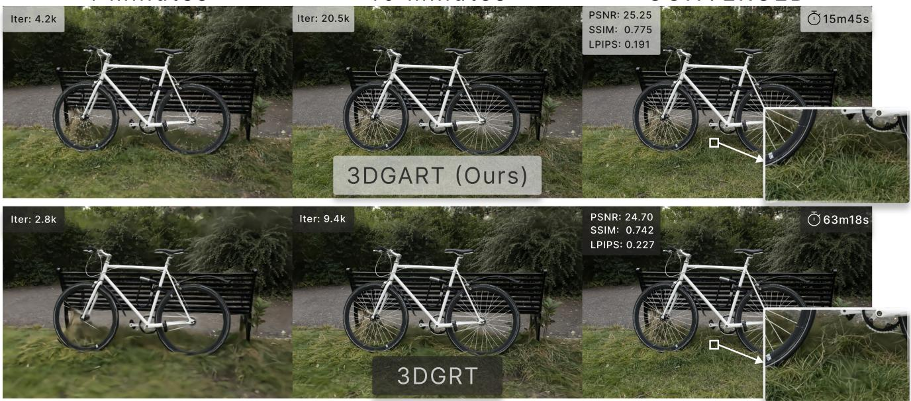
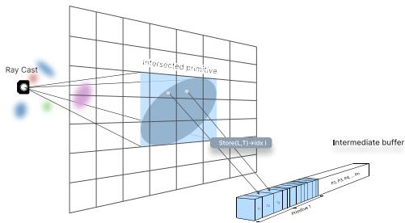
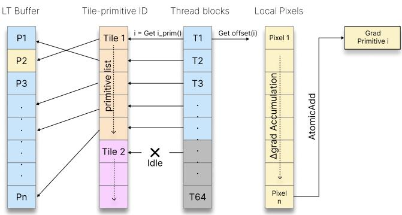
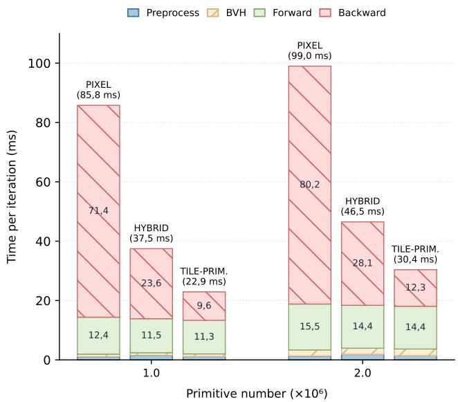
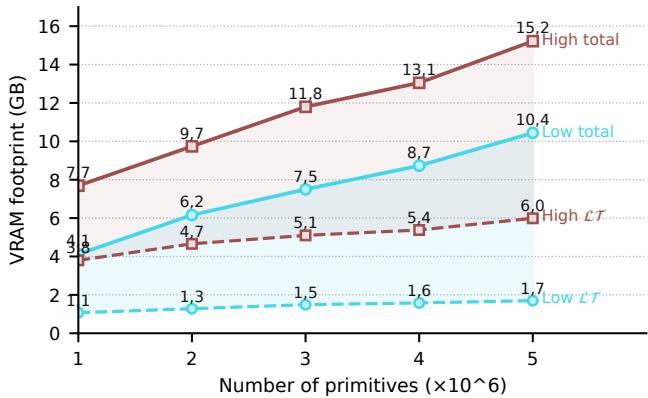

# 3D Gaussian Accelerated Ray Tracing: Fast training through particle-based backward propagation

LAURENT VIT, University of Canterbury, New Zealand OLIVER BATCHELOR, University of Canterbury, New Zealand RICHARD GREEN, University of Canterbury, New Zealand

1 Minutes  
10 Minutes  
CONVERGED  
  
Fig. 1. NVIDIA 3DGRT improves eficiency through compromises, including a shorter Gaussian kernel, a stricter opacity cutof, and capped ray-primitive intersections. In contrast, 3DGART (Ours) preserves the ray-traced Gaussian formulation and accelerates training by reorganizing the backward pass. On the Mip-NeRF 360 bicycle scene, 3DGART converges ≈ 4× faster than 3DGRT, while achieving higher reconstruction quality.

3D Gaussian Splatting has made Gaussian primitives a highly eficient representation for real-time novel view synthesis, but its rasterisation-based formulation relies on screen-space approximations that limit accurate viewdependent ordering and the integration of secondary ray efects such as reflections, refractions, and shadows. Gaussian ray tracing addresses these limitations by evaluating explicit ray-primitive intersections, yet it remains costly to train. We observe that the main bottleneck is not ray traversal alone, but the pixel-centric backward propagation, where many threads concurrently accumulate gradients into the same primitive parameters, causing severe atomic contention and thread serialisation.

We present 3DGART, a practical training framework for ray-traced Gaussian rendering. Our key idea is to reorganise backward propagation around primitives rather than pixels. Using conservative perspective-correct screenspace bounds, we build a compact intermediate bufer and a tile-primitive mapping that allows each thread to accumulate the contribution of one primitive over its covered pixels within a tile. This transforms gradient computation from a contention-heavy scatter operation into a structured gather-like process. On Mip-NeRF 360, 3DGART achieves an ≈ 3 − 3.5× raw training speedup over per-pixel baseline and ≈ 4× over 3DGRT on

Mip-NeRF 360 while improving quality. More importantly, 3DGART makes fully ray-traced Gaussian training practical, reaching runtimes competitive with rasterisation-based pipelines while preserving benefits of ray tracing.

Additional Key Words and Phrases: Gaussian Splatting, Ray Tracing, Optimization, Radiance Fields

## 1 Introduction

3D Gaussian Splatting (3DGS) [Kerbl et al. 2023] has rapidly become one of the dominant representations for real-time novel view synthesis. By representing a scene as a set of anisotropic Gaussian primitives and projecting them to screen space, 3DGS combines high visual fidelity with extremely eficient rendering. This eficiency has made Gaussian splatting attractive for reconstruction, editing, and real-time applications. However, its performance is largely en abled by a rasterisation pipeline: Gaussians are approximated in screen space, sorted in image-space tiles, and composited using projective footprints. While highly efective, this formulation inherits fundamental limitations from screen-space rendering, including projection inaccuracies [Zwicker et al. 2001], view-dependent sorting artefacts, aliasing, and limited support for secondary rays or non-standard camera models.

Gaussian Ray tracing [Moenne-Loccoz et al. 2024] ofers a conceptually cleaner alternative. Instead of approximating Gaussian influence through screen-space splats, ray-traced Gaussian methods evaluate explicit ray-primitive interactions. This formulation naturally supports perspective-correct visibility, complex camera models, and more general light transport efects. Recent systems such as 3D Gaussian Ray Tracing demonstrate that Gaussian radiance fields can be rendered through hardware-accelerated ray tracing, opening the door to a unified representation for primary visibility, reflections, refractions, and other ray-based efects. Yet despite these advantages, ray-traced Gaussian methods have not displaced rasterisation in practice. The reason is simple: training remains too slow.

In this paper, we argue that the main obstacle to practical raytraced Gaussian training is not only ray traversal, but the structure of the backward pass. Existing diferentiable ray-tracing pipelines follow a pixel-centric formulation: each thread processes a ray, evaluates the primitives intersected by that ray, and accumulates gradients into the corresponding Gaussian parameters. Since the same primitive may be visible in many pixels, many threads concurrently update the same memory locations. This results in heavy use of atomic operations, severe contention, and thread serialisation. As the number of primitives and ray-primitive interactions grows, the backward pass becomes the major computational bottleneck. Existing systems mitigate this issue through practical restrictions such as modified Gaussian kernels, �\_��� or capped ray intersections, but these heuristics trade accuracy and scalability for speed rather than addressing the root cause.

A particle-centric formulation ofers a more suitable organisation for training. Instead of assigning ownership to pixels and scattering gradients into shared primitive parameters, gradients can be accumulated by assigning ownership to primitives over local regions of the image. Such an organisation largely avoids fine-grained atomic contention and better matches the structure of the scene representation. However, making this idea practical is non-trivial: the backward pass must eficiently determine which pixels are affected by each primitive, recover the intermediate values required for diferentiation, access them with coherent memory patterns on the GPU and consume the least possible memory.

We introduce 3D Gaussian Accelerated Ray Tracing (3DGART), a framework designed to make ray-traced Gaussian training practical. Our central idea is to replace the conventional pixel-centric backward pass with a particle-centric formulation. Instead of assigning gradient accumulation to pixels that scatter updates into shared primitive parameters, we organise computation around primitives within local image-space tiles. This changes the structure of diferentiation: each thread is responsible for accumulating the contribution of one primitive over the pixels it covers inside a tile. The backward pass is therefore transformed from a contention-heavy scatter operation into a structured gather-like computation with greatly reduced atomic pressure.

Together, these choices lead to the following contributions:

• We identify atomic contention in the pixel-centric backward pass as the primary bottleneck preventing practical raytraced Gaussian training.

• We propose a compact intermediate-bufer layout based on perspective-correct projected bounds, enabling eficient storage and retrieval of the values required for backpropagation.

• We introduce a particle-centric backward propagation scheme based on a tile-primitive mapping, substantially reducing gradient accumulation contention.

• We demonstrate that 3DGART achieves up to 4× training speed-up over 3DGRT and brings ray-traced Gaussian training into the runtime range of rasterisation-based methods.

## 2 Related Work

## 2.1 Neural Radiance Fields

Neural Radiance Fields (NeRF) [Mildenhall et al. 2020] have brought about a fundamental shift in novel view synthesis, representing scenes as continuous volumetric functions encoded within a multilayer perceptron (MLP). Subsequent work has driven significant progress in rendering quality [Barron et al. 2022b, 2023c] and training speed [Müller et al. 2022]. However, the computational cost inherent to neural networks remains prohibitive for real-time operation, and the implicit nature of NeRF representations complicates direct scene manipulation. These limitations have motivated the shift toward explicit, particle-based representations.

## 2.2 Point-Based Radiance Fields & Gaussian Splating

3D Gaussian Splatting (3DGS) [Kerbl et al. 2023] has quickly established itself as the dominant paradigm for real-time novel view synthesis. Rather than sampling along rays, 3DGS projects anisotropic Gaussian primitives directly onto the image plane via EWA splatting [Zwicker et al. 2001], sorting them within discrete screen-space tiles for eficient alpha-compositing. This tile-based rasterisation pipeline achieves exceptional throughput and has catalysed a broad research efort, such as quality improvements [Kheradmand et al. 2025; Liu et al. 2025], execution speed [Feng et al. 2024; Hahlbohm et al. 2026b], and model compression [Hanson et al. 2025; Mallick et al. 2024].

Despite its eficiency, rasterised Gaussian splatting remains tied to a screen-space approximation of the underlying 3D primitives. Projected footprints, depth ordering based on primitive centres, and tile-local sorting can introduce view-dependent artefacts, popping [Radl et al. 2024], and aliasing [Yu et al. 2023]. Recent hybrid approaches improve perspective correctness [Hahlbohm et al. 2025a] and support distorted cameras [Huang et al. 2026; Wu et al. 2025] within rasterisation pipelines. However, they still inherit the core design of screen-space splatting, motivating the need to directly evaluate Gaussian contribution along rays.

## 2.3 Diferentiable Ray Tracing

Recent works have explored this direction through fully ray-traced Gaussian representations. 3D Gaussian Ray Tracing (3DGRT) [Moenne-Loccoz et al. 2024] replaces projective splats with explicit ray– primitive intersections, representing Gaussian support with bounded geometry inside a hardware ray-tracing acceleration structure. EVER [Blanc et al. 2025a,b; Mai et al. 2025] further improves the quality by performing exact volumetric integration or sampling densities along rays.

Concurrent and recent systems [Lee et al. 2026] orbit around improving the ray-tracing back-end, including acceleration structure design, primitive representation [Condor et al. 2024], and traversal eficiency. While these contributions reduce the computational cost of the forward pass, Gray [Poirier-Ginter et al. 2026] instead alleviates performance bottlenecks through a dense initialization of narrow Gaussians, combined with few compromises, representing an accuracy–performance trade-of. Ultimately, existing methods either optimize traversal eficiency or bypass the main bottleneck: the backward pass.

In diferentiable ray-traced Gaussian pipelines, the backward pass remains pixel-centric: each ray thread scatters gradient contributions into shared primitive parameters, producing heavy atomic contention when many pixels observe the same primitive.

## 3 Background

## 3.1 Gaussian Scene Representation

We represent a scene as a set of anisotropic 3D Gaussian primitives. Each primitive � is defined by a mean position $\pmb { \mu } \in \mathbb { R } ^ { 3 }$ and a covariance matrix $\Sigma \in \mathbb { R } ^ { 3 \times 3 }$ , which encodes its spatial extent and orientation. The density response of a Gaussian at a 3D point x $\mathbf { \epsilon } \in \mathbb { R } ^ { 3 }$ is given by

$$
\rho ( { \bf x } ) = \exp \left( - \frac { 1 } { 2 } ( { \bf x } - { \pmb \mu } ) ^ { \top } \Sigma ^ { - 1 } ( { \bf x } - { \pmb \mu } ) \right) .\tag{1}
$$

Following 3D Gaussian Splatting [Kerbl et al. 2023], the covariance is parameterized as

$$
\begin{array} { r } { \Sigma = \mathbf { R S S } ^ { \top } \mathbf { R } ^ { \top } , } \end{array}\tag{2}
$$

where $\mathbf { R } \in \mathbb { R } ^ { 3 \times 3 }$ is a rotation matrix and $\mathsf { S } \in \mathbb { R } ^ { 3 \times 3 }$ is a diagonal scaling matrix. This parameterisation ensures that the covariance remains positive semi-definite during optimisation.

Each primitive also stores an opacity �� and a view-dependent radiance function $\mathbf { c } _ { i } ( \mathbf { d } )$ , typically represented using spherical harmonics, where d denotes the viewing direction.

## 3.2 Ray-Gaussian Evaluation

Given a camera ray

$$
\mathbf { r } ( \tau ) = \mathbf { o } + \tau \mathbf { d } ,\tag{3}
$$

Ray-traced Gaussian rendering evaluates the contribution of each intersected primitive along the ray. Following 3DGRT [Moenne-Loccoz et al. 2024], this evaluation is performed in the normalised local space of the Gaussian, where the transformed primitive corresponds to a unit sphere. Therefore, the point of maximum Gaussian response along the ray is:

$$
\tau _ { \mathrm { m a x } } = - \frac { \mathbf { o } _ { g } ^ { \top } \mathbf { d } _ { g } } { \mathbf { d } _ { g } ^ { \top } \mathbf { d } _ { g } } .\tag{4}
$$

where

$$
\mathbf { o } _ { g } = \mathbf { S } ^ { - 1 } \mathbf { R } ^ { \top } ( \mathbf { o } - \pmb { \mu } ) , \qquad \mathbf { d } _ { g } = \mathbf { S } ^ { - 1 } \mathbf { R } ^ { \top } \mathbf { d } .\tag{5}
$$

## 3.3 Alpha Compositing

For a sorted sequence of ray-primitive interactions, rendering is performed using front-to-back alpha compositing. The final pixel colour is

$$
\mathbf { C } = \sum _ { i = 1 } ^ { N } T _ { i } \alpha _ { i } \mathbf { c } _ { i } ( \mathbf { d } ) ,\tag{6}
$$

where

$$
T _ { i } = \prod _ { j < i } ( 1 - \alpha _ { j } )\tag{7}
$$

is the accumulated transmittance before the �-th primitive.

The opacity contribution of primitive � is defined as

$$
\alpha _ { i } = \sigma _ { i } \rho _ { i } ( { \bf x } _ { i } ) ,\tag{8}
$$

where $\mathbf { x } _ { i }$ denotes the maximum-response point of the Gaussian along the ray.

## 3.4 Ray Tracing scene representation

Modern hardware-accelerated ray tracing systems represent scenes as collections of geometric primitives organised within hierarchical acceleration structures, enabling eficient ray-primitive intersection queries. In particular, RT cores are optimised for triangle intersections [Condor et al. 2024].

Recent Gaussian ray-tracing systems, such as GRTX [Lee et al. 2026], follow a two-level acceleration hierarchy. A bounded primitive (e.g., an icosphere) is stored once in a bottom-level acceleration structure (BLAS). At the same time, each Gaussian is represented as an instance in a top-level acceleration structure (TLAS), varying its position, orientation, and scale through per-instance transforms.

The mapping from the unit primitive to world space is defined by the afine transform

$$
\mathbf { M } = \left[ m _ { 0 0 } \quad m _ { 0 1 } \quad m _ { 0 2 } \quad \mu _ { x } \right] = \left[ \mathbf { R S } \boldsymbol { \alpha } _ { c } \mid \mu \right] ,\tag{9}
$$

where $\textbf { R } \in \mathbb { R } ^ { 3 \times 3 }$ respectively represent the rotation and scaling matrix, $\mathsf { S } \in \mathbb { R } ^ { 3 \times 3 }$ , � is its centre, and

$$
\alpha _ { c } = \sqrt { 2 \log \left( \frac { \sigma } { \alpha _ { \mathrm { m i n } } } \right) }\tag{10}
$$

is an opacity-dependent clamping radius which follows [Radl et al. 2024]. Typically, we use $\alpha _ { \mathrm { m i n } } = 1 / 2 5 5$

## 3.5 Pixel-Centric Backpropagation Botleneck

Diferentiable ray-traced Gaussian renderers typically parallelise computation over pixels. While this mapping is natural for the forward pass, it becomes ineficient during backpropagation. Since multiple pixels observe the same primitive, many threads concurrently update shared parameters, leading to severe atomic contention and thread serialisation.

As a result, any gain in training time, even through eficient ray traversal, is absorbed by gradient accumulation. This limitation motivates a diferent organisation of the backward pass, where gradients are accumulated per primitive rather than per pixel. The challenge is to construct this mapping eficiently while preserving coherent GPU execution, which we address in the following section.

## 4 METHOD

## 4.1 Overview

Our goal is to make ray-traced Gaussian training practical by reorganising the backward pass from a pixel-centric scatter operation into a primitive-centric, gather-like computation. The forward pass remains ray-traced: visibility, ordering, and ray-Gaussian interactions are still determined by hardware ray tracing. The main challenge is therefore not to approximate these interactions, but to eficiently determine which pixels must be revisited for each primitive and to retrieve the intermediate quantities required for diferentiation. 3DGART addresses this challenge in three steps:

• First, we compute conservative perspective-correct screen space bounds for each Gaussian, which define the set of pixels that may interact with the primitive.

• Second, we use these bounds to allocate a compact intermediate bufer storing the accumulated colour and transmittance values required for backpropagation.

• Third, we build a tile-primitive mapping that allows the backward pass to assign work to primitive-tile pairs.

## 4.2 Perspective-correct Footprint & Memory Pre-Allocation

Perspective-correct Gaussian bounds. We first compute a conservative perspective-correct screen-space AABB for each ray-traced Gaussian proposed by [Weyrich et al. 2007]. This bound identifies the pixels whose rays may intersect the primitive, while remaining consistent with the afine transform used by the ray tracer. Let

$$
\mathbf { T } ^ { \prime } = \mathbf { V P M T } , \qquad \mathbf { T } = \left[ \begin{array} { l l } { \mathbf { R S } } & { \mu } \\ { \mathbf { 0 } } & { 1 } \end{array} \right] .\tag{11}
$$

where VPM $\in \mathbb { R } ^ { 4 \times 4 }$ is the camera transformation matrix that maps world-space coordinates into clip space, allowing the Gaussian primitive to be projected onto the image plane. $\mathbf { T } \in \mathbb { R } ^ { 4 \times 4 }$ maps the normalized Gaussian space to the world space, RS ∈ $\mathbb { R } ^ { 3 \times 3 }$ contains the oriented support axes of the Gaussian, and $\pmb { \mu } \in \mathbb { R } ^ { 3 }$ is its center. [Hahlbohm et al. 2025a] scales the projected ellipsoid by an opacity-dependent cut-of $\rho _ { c }$ , which is already absorbed into our afine transform RS. The interval along each axis is then:

$$
\left[ b _ { i } , t _ { i } \right] = \left[ p _ { i } - h _ { i } , p _ { i } + h _ { i } \right] .\tag{12}
$$

where

$$
\mathbf { v } = ( 1 , 1 , 1 , - 1 ) , \qquad s = \left. \mathbf { v } , \mathbf { T } _ { 4 } ^ { \prime } \odot \mathbf { T } _ { 4 } ^ { \prime } \right. , \qquad \mathbf { f } = { \frac { \mathbf { v } } { s } } .\tag{13}
$$

$$
\begin{array} { r } { p _ { i } = \left. \mathbf { f } , \mathbf { T } _ { i } ^ { \prime } \odot \mathbf { T } _ { 4 } ^ { \prime } \right. , \qquad h _ { i } = \sqrt { p _ { i } ^ { 2 } - \left. \mathbf { f } , \mathbf { T } _ { i } ^ { \prime } \odot \mathbf { T } _ { i } ^ { \prime } \right. } . } \end{array}\tag{14}
$$

Memory Preallocation. The aggregate footprint of all projected primitives then gives an upper bound on the required intermediate storage. The capacity is then:

$$
| \mathcal { L T } | = \lambda _ { s } C \sum _ { i = 1 } ^ { N } A _ { i }\tag{15}
$$

where � is the number of Gaussian primitives, $C = 4$ is the number of stored floating-point channels per entry, corresponding to the

RGB accumulated colour $L \in \mathbb { R } ^ { 3 }$ and transmittance $T \in \mathbb { R } ,$ and $\lambda _ { s }$ is a factor used to avoid reallocating the bufer at every iteration.

## 4.3 Tile-Primitive Mapping

The goal of our mapping is to support two diferent access patterns with a single intermediate bufer. During the forward pass, ray-primitive intersections are discovered in a pixel-centric order. During the backward pass, however, gradients are accumulated in a primitive-centric order: each thread processes one primitive within a tile and gathers the contributions of the pixels it covers. To make this access pattern eficient, we store intermediate values in a primitive-major layout. For each primitive, entries are grouped by tile and then by local pixel. This layout makes the backward reads contiguous for the thread responsible for a given primitive-tile pair, while still allowing collision-free writes during the forward pass.

Primitive ofset. During preprocessing, we compute a prefix sum over the projected footprints to construct a global ofset table. For each primitive �, this table provides a base address in the contiguous bufer LT.

LT Bufer access. As illustrated in Figure 2, each ray-primitive intersection stores the accumulated color � and transmittance � at a unique location in the LT bufer. The final address is obtained by decomposing the primitive footprint into a primitive base ofset, a tile-local ofset, and a pixel-local ofset:

  
Fig. 2. Forward pass. Each ray–primitive intersection stores the accumulated colour and transmitance tuple �,�) in primitive-major tile-local order within our intermediate bufer.

$$
i d x _ { g l o b a l } ( i , t , p ) = O _ { p r i m i t i v e } ( i ) + O _ { t i l e } ( i , t ) + O _ { p i x e l } ( i , t , p )\tag{16}
$$

where:

$O _ { p r i m i t i v e }$ is the primitive base ofset in the LT Bufer;

$O _ { t i l e }$ represents the cumulative number of pixels preceding the current tile � within the � primitive’s AABB;

$O _ { p i x e l }$ is the local index � within the current tile of the primitive’s AABB.

Reverse Tile Mapping. The forward indexing scheme provides collision-free writes, but the backward pass requires the inverse association: for each tile, we must know which primitives overlap it. We construct this mapping during preprocessing.

• Tile primitive: Each primitive emits one pair (tileID, primitiveID), for each tile overlapped by its AABB footprint. Then, these pairs are radix sorted by tileID, grouping all contributing primitives for each tile.

• Tile ofset: Then, we build a tile-ofset table by computing a prefix sum over the number of primitives per tile.

The backward pass can therefore retrieve the primitive list of any tile and its corresponding length.

## 4.4 Primitive-centric backward propagation

  
Fig. 3. Backward pass: tile-particle mapping. Each thread iterates over a strided subset of primitives from the tile primitive list. For each primitive, it retrieves the corresponding L T bufer ofset, accumulates gradients over the covered pixels, and writes the result to global memory using atomicAdd.

Given the tile-primitive mapping, the backward pass launches one block per screen-space tile. As illustrated in Figure 3, each thread is assigned to one primitive overlapping that tile. Although assigning a full warp is possible, we found it less eficient in practice. The thread then iterates over the pixels covered by the primitive within the tile, retrieves the corresponding (�,�) values from LT, and accumulates the local gradient contributions in registers.

After all covered pixels have been processed, the thread does an atomic update of the global primitive gradients. This changes the ownership of gradient accumulation: Instead of letting pixel threads immediately scatter updates to shared primitive parameters, 3DGART accumulate contributions at the primitive tile level before performing global atomic operations. This substantially reduces atomic contention and thread serialisation.

We use 8 × 8 tiles as a compromise between load balancing, aggregation overhead, and shared-memory usage. Smaller tiles reduce per-primitive pixel variance, but increase the number of primitivetile pairs and global accumulations. Larger tiles reduce aggregation overhead, but increase thread imbalance and require caching more per-pixel information, such as spherical-harmonic bases, which can exceed shared-memory limits and force additional per-pixel re-computation.

Hybrid approach. Intermediate values (�,�) are currently stored in float, resulting in a cost of 16 bytes per entry. In practice, most atomic contention arises from Spherical Harmonics (SH), accounting for 48 out of 59 atomic operations at order 3. This observation suggests a hybrid backward scheme, where colour gradients are accumulated using the particle-centric formulation, while the remaining terms are handled with a pixel-centric approach.

## 5 EXPERIMENTS AND ABLATION

## 5.1 Experimental setup

Datasets. We evaluate 3DGART on standard novel-view synthesis benchmarks used by prior Gaussian rendering methods: Mip-NeRF 360 [Barron et al. 2021a], Tanks&Temples [Knapitsch et al. 2017], and Deep Blending [Hedman et al. 2018]. Mip-NeRF 360 contains five outdoor scenes (Bicycle, Flowers, Garden, Stump, and Treehill) and four indoor scenes (Bonsai, Counter, Kitchen, and Room), evaluated with downsampling factors of 4 and 2, respectively. For the global benchmark, we also evaluate on the Truck and Train scenes from Tanks&Temples, as well as the DrJohnson and Playroom scenes from Deep Blending.

Approach. To evaluate eficiency, we implement three backward strategies: Pixel, the conventional per-pixel baseline; Primitive, our proposed tile-primitive approach accumulating gradients from a primitive-centric perspective; and Hybrid, which uses our primitive formulation for color gradients while retaining the pixel-centric scheme for remaining terms.

Hardware and metrics. All experiments are conducted on the same NVIDIA RTX 4090 GPU. Training times are measured as wall-clock time, excluding image-loading overhead. We report PSNR, SSIM, and LPIPS using a standardised evaluation pipeline across all methods. For LPIPS, we follow the evaluation convention used in 3DGS.

## 5.2 Raw Training Speed Benchmark

To evaluate 3DGART’s backward eficiency, we perform a raw head-to-head benchmark between a common per-pixel and our tile-primitive approach. We do not use a maximum ray intersection cap, we set the Gaussian kernel to � = 2 (as 3DGS), and $\alpha _ { \mathrm { m i n } } = 1 / 2 5 5 .$ We evaluate both methods increasing primitive budgets to measure scalability.

Table 1. Raw head-to-head training-speed benchmark on Mip-NeRF 360. Gain is measured against the corresponding pixel-based representation.
<table><tr><td></td><td colspan="4">Mip-NeRF 360</td></tr><tr><td>#G</td><td>Pixel</td><td>Hybrid</td><td>Primitive</td><td>Gain↑</td></tr><tr><td>1.00M</td><td>44m08s</td><td>19m55s</td><td>12m35s</td><td>3.51×</td></tr><tr><td>2.00M</td><td>51m13s</td><td>24m56s</td><td>16m32s</td><td>3.10×</td></tr></table>

Table 1, 3DGART achieves a mean gain factor of 3.51× and 3.1× with $1 . 0 \times 1 0 ^ { 6 } \mathrm { a n d } 2 . 0 \times 1 0 ^ { 6 }$ primitives, respectively, over the baseline per-pixel implementation. We observe that the performance gain tends to decrease as the number of primitives grows. As primitives shrink, the number of intersections per primitive decreases, which naturally reduces the atomic contention.

## 5.3 Micro Benchmarks

To better understand where this end-to-end acceleration comes from, we analyse each pipeline component. Specifically, the pre-processing includes per-primitive instance transform computation, our tileprimitive and additional forward pre-computations. (e.g., �2� = $S ^ { - 1 } R ^ { \top }$ and $o _ { g } ) _ { \ l }$ , followed by BVH build/update, forward rendering, and backward propagation.

Table 2. Global benchmark across Mip-NeRF 360, Tanks&Temples, and Deep Blending. Our approach significantly reduces training time over the current state-of-the-art fully ray tracing approach (3DGRT), while matching rasterisation-based methods.
<table><tr><td colspan="2"></td><td></td><td colspan="4">Mip-NeRF 360</td><td colspan="6">Tanks&amp;Temples</td><td colspan="5">Deep Blending</td></tr><tr><td>Model</td><td>Type</td><td>Iter</td><td>PSNR↑</td><td>SSIM↑</td><td>LPIPS↓</td><td>Train #G</td><td>PSNR↑</td><td></td><td>SSIM↑</td><td>LPIPS↓</td><td>Train</td><td>#G</td><td>PSNR↑</td><td>SSIM↑</td><td>LPIPS↓</td><td>Train</td><td>#G</td></tr><tr><td>ZipNeRF</td><td></td><td>一</td><td>28.54</td><td>0.828</td><td>0.219</td><td>5h 一</td><td></td><td></td><td>一</td><td></td><td></td><td>1</td><td>一</td><td>一</td><td>一</td><td></td><td>一</td></tr><tr><td>3DGS</td><td>Rast.</td><td>30K</td><td>27.35</td><td>0.814</td><td>0.216</td><td>20m19s 3.31M</td><td></td><td>23.52</td><td>0.842</td><td>0.183</td><td>11m53s</td><td>1.84M</td><td>29.77</td><td>0.906</td><td>0.263</td><td>20m55s</td><td>2.81M</td></tr><tr><td>3DGUT</td><td>Rast.</td><td>30K</td><td>27.47</td><td>0.812</td><td>0.218</td><td>16m09s 3.23M</td><td></td><td>23.52</td><td>0.848</td><td>0.173</td><td>11m24s</td><td>2.15M</td><td>29.60</td><td>0.902</td><td>0.256</td><td>8m35s</td><td>1.37M</td></tr><tr><td>HTGS</td><td>Rast.</td><td>30K</td><td>27.04</td><td>0.818</td><td>0.196</td><td>10m09s</td><td>2.20M</td><td>23.09</td><td>0.846</td><td>0.172</td><td>6m32s</td><td>0.77M</td><td>29.93</td><td>0.907</td><td>0.234</td><td>8m25s</td><td>1.01M</td></tr><tr><td>3DGRT</td><td>RT</td><td>30K</td><td>27.11</td><td>0.809</td><td>0.214</td><td>62m21s</td><td>4.19M</td><td>22.81</td><td>0.844</td><td>0.165</td><td>36m47s</td><td>4.05M</td><td>29.62</td><td>0.904</td><td>0.247</td><td>50m51s</td><td>1.74M</td></tr><tr><td>GRay</td><td>RT</td><td>15K</td><td>26.79</td><td>0.799</td><td>0.198</td><td>7m21s</td><td>1.68M</td><td>22.38</td><td>0.821</td><td>0.170</td><td>3m58s</td><td>1.04M</td><td>29.18</td><td>0.891</td><td>0.238</td><td>5m28s</td><td>1.21M</td></tr><tr><td>Ours</td><td>RT</td><td>30K</td><td>27.31</td><td>0.805</td><td>0.239</td><td>12m35s</td><td>1.00M</td><td>23.20</td><td>0.852</td><td>0.175</td><td>7m54s</td><td>1.00M</td><td>30.20</td><td>0.913</td><td>0.242</td><td>13m06s 1.00M</td><td></td></tr><tr><td>Ours</td><td>RT</td><td>30K</td><td>27.51</td><td>0.820</td><td>0.211</td><td>16m32s</td><td>2.00M</td><td></td><td></td><td></td><td></td><td></td><td></td><td></td><td></td><td></td><td></td></tr></table>

  
Fig. 4. Per-component iteration time (ms). Runtime breakdown for the per-pixel baseline, our hybrid approach, and our tile-primitive method at $1 . 0 \times 1 0 ^ { 6 }$ and $2 . 0 \times 1 0 ^ { 6 }$ primitives, highlighting the reduction in backward pass overhead.

As illustrated in Figure 4, the backward pass remains the major bottleneck in conventional per-pixel approach, representing 81- 86% of the iteration time. In contrast, our architecture makes the backward pass comparable to, or even faster than, the forward pass. Compared to per-pixel backpropagation, our tile-primitive method is 7.3× and 6.5× faster at 1.0 and $2 . 0 \times 1 0 ^ { 6 }$ primitive, respectively.

Since forward rendering remains dominated by per-pixel ray tracing and scales primarily with image resolution, matching its latency in the backward pass indicates that the atomic contention typically found in ray-traced Gaussian training has been largely mitigated by our primitive-based approach.

Our hybrid approach reduces VRAM consumption by a factor of 4 but partially reintroduces serialized atomic contention. As a result, training is approximately 1.5× slower than with our tile-primitive approach.

## 5.4 Memory Analysis

Resolution and primitive dependent footprint. To assess scalability, we analyse the VRAM consumption of the �� bufer on Mip-NeRF 360 as the number of primitives increases. We progressively increase the number of Gaussians by $1 . 0 \times 1 0 ^ { 6 }$ and report two resolution settings (Low, High). Outdoor scenes are downsampled by factors of 8 and 4, while indoor scenes are downsampled by factors of 4 and 2, respectively.

Since our approach relies on perspective-correct AABB footprints, the size of the $\mathcal { L } \mathcal { T }$ bufer scales linearly with the total number of pixels. As shown in Figure 5, the LT bufer memory usage also increases approximately linearly with the number of primitives. Nevertheless, for the resolutions considered in our benchmarks (up to approximately 1.5 megapixels), the additional memory remains well within the capacity of modern GPUs, making the tile-primitive approach practical for standard training workloads.

For higher-resolution settings, where the LT bufer may become the limiting factor, our hybrid backward strategy provides an alternative by reducing $\mathcal { L } \mathcal { T }$ VRAM consumption by a factor of 4. We therefore view the hybrid formulation as a practical trade-of for memory-constrained or high-resolution scenarios.

Importantly, this overhead is strictly confined during training; at inference time, our method preserves the original memory footprint of standard Gaussian ray tracing models.

  
Fig. 5. Peak memory analysis. Comparison of total VRAM usage and $\mathcal { L } \mathcal { T }$ bufer consumption across primitive scales (1M to 5M) for our tile– primitive approach at low and high resolutions (up to 1.5 MP). For the hybrid approach, the low and high setings correspond to resolutions up to 1.5 MP and 6 MP, respectively.

## 5.5 Global benchmark

We further evaluate 3DGART against rasterisation-based (RAST) and ray-tracing-based (RT) methods in Table 2. In this comparison, 3DGS denotes its modern pre-trained model, 3DGUT denotes its unsorted variant, and HTGS denotes the state-of-the-art eficient ray-based rasterizer, evaluated with anti-aliasing enabled.

3DGRT enabled fully ray-traced pipeline, as well as the uses ofsecondary rays, but introduced several implementation compromises to both accelerate ray tracing and reduce atomic contention during the backward pass, including an $\alpha _ { \mathrm { { m i n } } }$ threshold, a capped number of ray–primitive intersections per pixel, and narrow Gaussian kernels (Increasing the number of primitives to represent a scene). GRay introduces additional compromises through its dense initialization strategy, which can exacerbate aliasing artifacts. Consequently, it achieves an impressive speed while trading-of PSNR/SSIM Scores.

In contrast, 3DGART directly addresses the source of the contention bottleneck through a primitive-centric backward formulation. Instead of relying on heuristic approximations, our method preserves the original alpha compositing formulation while achieving practical training eficiency and high reconstruction fidelity, as demonstrated in Figure 1.

## 6 Limitations and future work

Complex cameras. As mentioned, we utilise perspective-correct projection; however, this approach is inherently limited to perspective camera models and does not support extreme wide-angle or non-linear projections such as fisheye lenses. To overcome this, future work could replace this projection with an exact projective geometry formulation [Huang et al. 2026].

VRAM Consumption. Our approach trades VRAM consumption for significantly faster gradient accumulation. Although our hybrid backward formulation reduces memory usage by a factor of 4, making high-resolution training (e.g., 4K) practical, it partially sacrifices the performance benefits of our tile-primitive approach. While storing the LT bufer in float16 provides a straightforward way to further reduce memory consumption, we believe more principled solutions deserve investigation to preserve the fully primitive-centric backward formulation.

## 7 Conclusion

We presented 3D Gaussian Accelerated Ray Tracing (3DGART), a framework that addresses the primary computational bottleneck of diferentiable Gaussian ray tracing: atomic contention in the backward pass. By shifting from a pixel-centric to a particle-centric formulation, our tile-based architecture assigns each CUDA thread exclusive ownership over gradient accumulation within a tile, transforming a contention-heavy scatter operation into a structured gather-like computation. While trading of VRAM for training speed, our method achieves an ≈ 4× speedup over 3DGRT on the Mip-NeRF 360 dataset while simultaneously improving reconstruction quality. To maintain eficiency at higher resolutions, we further design a hybrid approach. Overall, 3DGART demonstrates that fully ray-traced Gaussian training becomes practical when gradient accumulation is structured around primitives rather than pixels.

## Acknowledgments

I gratefully acknowledge the financial support provided by the New Zealand Government. I am especially grateful to Oliver Batchelor for his guidance and for helping shape and refine the ideas presented in this paper. I would also like to thank Florian Hahlbohm and Nicolas Moenne-Loccoz for their valuable assistance with the mathematical foundations underlying this work. Finally, I thank Richard Green for his supervision, support, and continued encouragement.

## References

Jonathan T. Barron, Ben Mildenhall, Matthew Tancik, Peter Hedman, Ricardo Martin Brualla, and Pratul P. Srinivasan. 2021a. Mip-NeRF: A Multiscale Representation for Anti-Aliasing Neural Radiance Fields. arXiv:2103.13415 doi:10.48550/arXiv.2103. 13415

Jonathan T. Barron, Ben Mildenhall, Dor Verbin, Pratul P. Srinivasan, and Peter Hedman. 2022b. Mip-NeRF 360: Unbounded Anti-Aliased Neural Radiance Fields. arXiv:2111.12077 doi:10.48550/arXiv.2111.12077

Jonathan T. Barron, Ben Mildenhall, Dor Verbin, Pratul P. Srinivasan, and Peter Hedman. 2023c. Zip-NeRF: Anti-Aliased Grid-Based Neural Radiance Fields. arXiv:2304.06706 doi:10.48550/arXiv.2304.06706

Hugo Blanc, Jean-Emmanuel Deschaud, and Alexis Paljic. 2025a. RayGauss: Volumetric Gaussian-Based Ray Casting for Photorealistic Novel View Synthesis. arXiv:2408.03356 [cs.CV] doi:10.48550/arXiv.2408.03356

Hugo Blanc, Jean-Emmanuel Deschaud, and Alexis Paljic. 2025b. RayGaussX: Accelerating Gaussian-Based Ray Marching for Real-Time and High-Quality Novel View Synthesis. https://arxiv.org/abs/2509.07782v1

Jorge Condor, Sebastien Speierer, Lukas Bode, Aljaz Bozic, Simon Green, Piotr Didyk, and AdrianJarabo. 2024. Don’t Splat yourGaussians: Volumetric Ray-Traced Primitives for Modeling and Rendering Scattering and Emissive Media. doi:10.1145/3711853

Guofeng Feng, Siyan Chen, Rong Fu, Zimu Liao, Yi Wang, Tao Liu, Zhilin Pei, Hengjie Li, Xingcheng Zhang, and Bo Dai. 2024. FlashGS: Eficient 3D Gaussian Splatting for Large-scale and High-resolution Rendering. arXiv:2408.07967 [cs] doi:10.48550 arXiv.2408.07967

Florian Hahlbohm, Linus Franke, Martin Eisemann, and Marcus Magnor. 2026b. Faster GS: Analyzing and Improving Gaussian Splatting Optimization. arXiv:2602.09999 [cs.CV] doi:10.48550/arXiv.2602.09999

Florian Hahlbohm, Fabian Friederichs, Tim Weyrich, Linus Franke, Moritz Kappel, Susana Castillo, Marc Stamminger, Martin Eisemann, and Marcus Magnor. 2025a. Eficient Perspective-Correct 3D Gaussian Splatting Using Hybrid Transparency. arXiv:2410.08129 [cs] doi:10.48550/arXiv.2410.08129

Alex Hanson, Allen Tu, Geng Lin, Vasu Singla, Matthias Zwicker, and Tom Goldstein. 2025. Speedy-Splat: Fast 3D Gaussian Splatting with Sparse Pixels and Sparse

Primitives. arXiv:2412.00578 [cs] doi:10.48550/arXiv.2412.00578

Peter Hedman, Julien Philip, True Price, Jan-Michael Frahm, George Drettakis, and Gabriel Brostow. 2018. Deep blending for free-viewpoint image-based rendering. 37, 6 (2018), 1–15. doi:10.1145/3272127.3275084

Zixun Huang, Cho-Ying Wu, Yuliang Guo, Xinyu Huang, and Liu Ren. 2026. 3DGEER: 3D Gaussian Rendering Made Exact and Eficient for Generic Cameras. arXiv:2505.24053 doi:10.48550/arXiv.2505.24053

Bernhard Kerbl, Georgios Kopanas, Thomas Leimkühler, and George Drettakis. 2023. 3D Gaussian Splatting for Real-Time Radiance Field Rendering. arXiv:2308.04079 [cs] doi:10.48550/arXiv.2308.04079

Shakiba Kheradmand, Daniel Rebain, Gopal Sharma, Weiwei Sun, Jef Tseng, Hossam Isack, Abhishek Kar, Andrea Tagliasacchi, and Kwang Moo Yi. 2025. 3D Gaussian Splatting as Markov Chain Monte Carlo. arXiv:2404.09591 [cs] doi:10.48550/arXiv. 2404.09591

Arno Knapitsch, Jaesik Park, Qian-Yi Zhou, and Vladlen Koltun. 2017. Tanks and Temples: Benchmarking Large-Scale Scene Reconstruction. ACM Transactions on Graphics 36, 4 (2017).

Junseo Lee, Sangyun Jeon, Jungi Lee, Junyong Park, and Jaewoong Sim. 2026. GRTX: Eficient Ray Tracing for 3D Gaussian-Based Rendering. https://arxiv.org/abs/2601. 20429v1

Rong Liu, Dylan Sun, Meida Chen, Yue Wang, and Andrew Feng. 2025. Deformable Beta Splatting. arXiv:2501.18630 [cs] doi:10.48550/arXiv.2501.18630

Alexander Mai, Peter Hedman, George Kopanas, Dor Verbin, David Futschik, Qiangeng Xu, Falko Kuester, Jonathan T. Barron, and Yinda Zhang. 2025. EVER: Exact Volumetric Ellipsoid Rendering for Real-time View Synthesis. arXiv:2410.01804 [cs] doi:10.48550/arXiv.2410.01804

Saswat Subhajyoti Mallick, Rahul Goel, Bernhard Kerbl, Francisco Vicente Carrasco, Markus Steinberger, and Fernando De La Torre. 2024. Taming 3DGS: High-Quality Radiance Fields with Limited Resources. arXiv:2406.15643 [cs] doi:10.48550/arXiv. 2406.15643

Ben Mildenhall, Pratul P. Srinivasan, Matthew Tancik, Jonathan T. Barron, Ravi Ra mamoorthi, and Ren Ng. 2020. NeRF: Representing Scenes as Neural Radiance Fields for View Synthesis. arXiv:2003.08934 [cs] doi:10.48550/arXiv.2003.08934

Nicolas Moenne-Loccoz, Ashkan Mirzaei, Or Perel, Riccardo de Lutio, Janick Martinez Esturo, Gavriel State, Sanja Fidler, Nicholas Sharp, and Zan Gojcic. 2024. 3D Gaussian Ray Tracing: Fast Tracing of Particle Scenes. arXiv:2407.07090 [cs] doi:10.48550 arXiv.2407.07090

Thomas Müller, Alex Evans, Christoph Schied, and Alexander Keller. 2022. Instant Neural Graphics Primitives with a Multiresolution Hash Encoding. 41, 4 (2022), 1–15. arXiv:2201.05989 [cs] doi:10.1145/3528223.3530127

Yohan Poirier-Ginter, Jean-François Lalonde, and George Drettakis. 2026. GRay: Ray Tracing 3D Gaussians Near the Speed ofSplats. doi:10.1145/3804496

Lukas Radl, Michael Steiner, Mathias Parger, Alexander Weinrauch, Bernhard Kerbl, and Markus Steinberger. 2024. StopThePop: Sorted Gaussian Splatting for View-Consistent Real-time Rendering. arXiv:2402.00525 [cs] doi:10.48550/arXiv.2402. 00525

Tim Weyrich, Simon Heinzle, Timo Aila, Daniel B. Fasnacht, Stephan Oetiker, Mario Botsch, Cyril Flaig, Simon Mall, Kaspar Rohrer, Norbert Felber, Hubert Kaeslin, and Markus Gross. 2007. A hardware architecture for surface splatting. In ACM SIGGRAPH 2007 papers (San Diego California, 2007-07-29). ACM, 90. doi:10.1145/ 1275808.1276490

Qi Wu, Janick Martinez Esturo, Ashkan Mirzaei, Nicolas Moenne-Loccoz, and Zan Gojcic. 2025. 3DGUT: Enabling Distorted Cameras and Secondary Rays in Gaussian Splatting. arXiv:2412.12507 [cs] doi:10.48550/arXiv.2412.12507

Zehao Yu, Anpei Chen, Binbin Huang, Torsten Sattler, and Andreas Geiger. 2023. Mip-Splatting: Alias-free 3D Gaussian Splatting. arXiv:2311.16493 [cs] doi:10.48550/ arXiv.2311.16493

M. Zwicker, H. Pfister, J. Van Baar, and M. Gross. 2001. EWA volume splatting. In Proceedings Visualization, 2001. VIS ’01. (San Diego, CA, USA, 2001). IEEE, 29–538. doi:10.1109/VISUAL.2001.964490