# A<sub>g</sub>entic 3D Creation via Joint A<sub>g</sub>ent-Pro<sub>g</sub>ram Desi<sub>g</sub>n

RUI-HUAN WANG<sub>,</sub> P<sub>e</sub>ki<sub>ng</sub> U<sub>n</sub>i<sub>vers</sub>it<sub>y,</sub> Chi<sub>na</sub> SI-TONG WEI<sub>,</sub> P<sub>e</sub>ki<sub>ng</sub> U<sub>n</sub>i<sub>vers</sub>it<sub>y,</sub> Chi<sub>na</sub> JIA-QI HE, Pekin<sub>g</sub> Universit<sub>y</sub>, China HENG-YI WEI<sub>,</sub> P<sub>e</sub>ki<sub>ng</sub> U<sub>n</sub>i<sub>vers</sub>it<sub>y,</sub> Chi<sub>na</sub> BAOQUAN CHEN, Pekin<sub>g</sub> Universit<sub>y,</sub> China PENG-SHUAI WANG<sup>∗</sup><sub>,</sub> P<sub>e</sub>ki<sub>ng</sub> U<sub>n</sub>i<sub>vers</sub>it<sub>y,</sub> Chi<sub>na</sub>

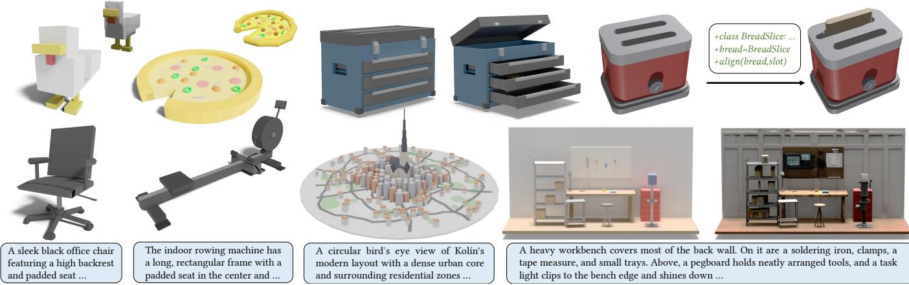  
Fig. 1. We present a joint<sup>l</sup>y designed DSL and mu<sup>l</sup>ti-agent system <sup>f</sup>or robust text- and image-conditioned 3D mode<sup>l</sup>ing. T<sup>h</sup>e same structured representation also su<sub>pp</sub>orts downstream a<sub>pp</sub>lications includin<sub>g</sub> articulated asset modelin<sub>g,</sub> sha<sub>p</sub>e editin<sub>g</sub> and scene-level creation.

Programmatic representations provide a compelling paradigm for 3D content creation, enabling fine-grained edits, interpretability, and explicit structural control. Yet, agentic workflows that rely on large language models (LLMs) to author 3D programs remain brittle, often failing to translate high level intent into consistent low-level geometry. We attribute this fragility to a mismatch between existing programmatic interfaces and the reasoning strengths of LLMs, which favor semantic structure and spatial relations over fragile numeric choices. In this paper, we jointly design an Agent-centric Domain-Specific Language (aDSL) and a role-specialized multi-agent system to close this gap. aDSL bridges semantic logic and geometric constraints by emphasizing composability and spatial reasoning; it enables agents to manipulate geometry through relational operators instead of brittle absolute coordinates. Building on aDSL, our training-free multi-agent system follows a Plan–Execute–Critic loop to decompose requests, synthesize code, and iteratively repair errors and constraint violations using execution feedback. Experiments show that this co-design improves robustness, controllability, and faithfulness to user intent. Our method outperforms prior LLM-based baselines on text-to-shape and image-to-shape tasks while preserving explicit structure, editability, and interpretability. It also enables downstream applications such as articulated object creation and structured scene composition. Our code is available at https://github.com/sig-pku/aDSL.

## 1 Intr<sub>o</sub>d<sub>uc</sub>ti<sub>o</sub>n

3D content creation is a foundational problem in computer graphics, supporting applications spanning games, film production, and embodied AI. Recent advances in 3D generation have been largely driven by difusion models trained on large-scale 3D datasets and diverse geometric representations [He et al. 2025b; Hunyuan3D 2025; Xiang et al. 2024; Xiong et al. 2024]. In parallel, an alternative paradigm represents 3D shapes and scenes as programs and leverages LLM-based agents to generate and manipulate them [Du et al. 2024; Hu et al. 2024; Lu et al. 2025; Zhang et al. 2025a,b]. By explicitly encoding structure, parameters, and design constraints, programmatic representations enable an agentic workflow with better controllability, interpretability, and editability.

Despite this promise, agentic 3D creation remains unreliable: generated results often deviate from user intent and may degrade under iterative refinement. We argue that these failures stem from two coupled design axes: the programmatic representation (what code the agent writes) and the agent system (how the agent plans, generates, and improves code). Early pioneering eforts prompt LLM agents to emit general-purpose modeling programs, including Blender Python scripts, parametric CAD code, or procedural/rule-based programs [Alrashedy et al. 2024; Du et al. 2024; Lu et al. 2025; Yuan et al. 2024]. Although Blender scripts and CAD code are highly expressive, they operate at a low level of abstraction, making it dificult to consistently encode semantic intent; they also tend to be brittle under localized revisions. In contrast, procedural and rule-based formalisms provide strong parametric control, but often struggle to scale to broad object diversity, stylistic variation, and fine-grained constraints [Raistrick et al. 2023, 2024]. To improve programmatic representations of3D assets, recent works introduce Domain-Specific Languages (DSLs) for objects and scenes [Jones et al. 2025; Zhang et al. 2025a,b]. While these DSLs improve expressiveness, they still implicitly assume that LLM agents can reliably author and revise valid programs, paying less attention to how the agent system can leverage DSL structure for robust generation, verification, and revision.

In this work, we address these challenges through the joint design of a programmatic representation for 3D content and a rolespecialized multi-agent system. We observe that LLM agents are efective at decomposing complex 3D assets into hierarchical components and reasoning about spatial and structural relations, yet often struggle to produce precise low-level numeric parameters. For instance, when generating a chair, an agent can readily infer that the legs should be below the seat and attach at the four corners, but may fail to determine the precise numeric positions of the legs and seat. Improving the expressiveness of the language alone is insuficient, because even small numeric inaccuracies can yield invalid geometry (e.g., floating legs) or violate design constraints (e.g., missing contact). To better match agent capabilities, we design a DSL around three complementary aspects: (1) expressiveness to capture diverse shapes and structures; (2) composability to enable modular assembly and hierarchical reuse; (3) spatial reasoning to support precise placement and relational constraints. Prior work has largely emphasized the first aspect [Zhang et al. 2025a,b]. Beyond expressiveness, we specifically emphasize the latter two aspects to improve reliability for agent-driven generation and refinement. With composability, agents can focus on high-level structure while delegating low-level details to reusable components. With spatial reasoning, agents can invoke relational operators (e.g., “place A on top of B”) rather than specifying fragile numeric coordinates. As we design the DSL around agent capabilities, we call it the agent-centric DSL, or aDSL.

Built on aDSL, our agent system takes as input a high-level text description or an image specifying the desired 3D content and outputs a program that satisfies the specification. The system is training-free and operates via a self-refinement loop of Plan–Execute–Critic [Yao et al. 2022]. Instead of learning a specialized policy or relying on task-specific fine-tuning, the agents decompose long-horizon creation into composable, hierarchical subtasks (scene → objects → parts). They then generate the program, execute it to obtain concrete geometry and measurable signals, identify violations through automatic checks, and repair the program using feedback from execution logs together with visual and constraint-based evaluations. The loop continues until all constraints are satisfied or a predefined stopping criterion is met. Optionally, users can intervene to provide additional guidance or request targeted edits. Crucially, the Planner, Coder, and Critic communicate through the same representation: the Planner emits hierarchical decompositions and checkable relations, the Coder realizes them with declarative layout operators, and the Critic verifies those same relations after execution. This shared interface is what we mean by joint design; it replaces brittle coordinate-level interaction with a generate–verify–repair loop grounded in the semantics of aDSL.

We demonstrate that coupling aDSL with an agentic refinement loop improves robustness, controllability, editability, and faithfulness to user intent. We evaluate our system on text-to-shape and image-to-shape generation tasks, showing gains over recent LLM based baselines [Ahuja and Contributors 2025; Du et al. 2024; Lu et al. 2025; Zhang et al. 2025a,b] while preserving explicit structure and editability [Shi et al. 2023; Wu et al. 2025; Zhang et al. 2025b]. These results indicate that our joint design addresses core failure modes in prior agentic 3D creation systems. We further demonstrate downstream applications, including scene-level generation, articulated object creation, and structured shape editing. In summary, our key contributions are as follows.

\- We demonstrate that a shared representation across planning, coding, and critique improves intent faithfulness, controllability, and constraint satisfaction for 3D content creation.

\- We propose an agent-centric DSL for 3D content that combines expressiveness, composability, and spatial reasoning operators.

\- We design a training-free, role-specialized multi-agent system that supports iterative 3D creation and refinement.

## 2 R<sub>e</sub>l<sub>a</sub>t<sub>e</sub>d W<sub>or</sub>k

Geometric 3D Representations. Recent advances in 3D generation have attracted significant attention in academia and industry, driven by large generative models trained on extensive 3D datasets. A prevailing strategy is to map geometry to compact, learnable representations, including triplanes [Gupta et al. 2023; Shue et al. 2023], 3D Gaussians [Roessle et al. 2024], sparse voxel grids [Chen et al. 2025a; He et al. 2025b; Li et al. 2025; Liu et al. 2023; Ren et al. 2024; Xiang et al. 2024; Xiong et al. 2024; Zheng et al. 2023], and latent vector sets [Hunyuan3D 2025; Zhang et al. 2023, 2024a], on which 3D difusion models operate eficiently. In parallel, autoregressive models [Deng et al. 2025; Ibing et al. 2023; Wei et al. 2025; Zhang et al. 2022] cast 3D synthesis as sequence modeling, enabling flexible conditioning and potential scaling behaviors. While these learning-based pipelines can achieve impressive fidelity at high resolution, they typically require substantial training infrastructure and curated datasets, such as ShapeNet [Chang et al. 2015] or Objaverse [Deitke et al. 2023]. In contrast, we adopt a training-free, agentic perspective: instead of learning a geometry distribution end-to-end, we leverage the reasoning and tool-use capabilities of LLMs to compose 3D content through programmatic construction.

Programmatic 3D Representations. Representing 3D assets as programs provides an appealing alternative to raw geometry: programs expose discrete structure, continuous parameters, and explicit com positional hierarchy, making them naturally suited for controllable generation, interpretability, and editing [Jones et al. 2020].

A straightforward route is to represent 3D content via programs in mature tools, such as Blender Python scripts or parametric CAD code. With the advent of LLMs, several methods prompt them to synthesize such programs, optionally repairing syntax or runtime errors iteratively [Alrashedy et al. 2024; Du et al. 2024; Lu et al. 2025; Yuan et al. 2024]. These representations are expressive and benefit from mature modeling operators and renderers. However, they tend to be too low-level for specifying high-level semantic intent and are brittle: minor edits can trigger disproportionate geometric changes, and many geometric constraints, such as symmetry and functional relations, remain implicit and dificult to verify without substantial auxiliary tooling or custom checks.

Procedural modeling has a long history in graphics, from Lsystems [Prusinkiewicz and Lindenmayer 2012] and shape grammars [Stiny 1975] to urban and architectural generation pipelines [Krecklau et al. 2010; Müller et al. 2006; Zhang et al. 2024b]. By exposing interpretable parameters and enforcing rule-constrained structure, these systems ofer strong reliability and controllability, and can eficiently generate diverse variations within a predefined design space. Their central limitation is the coverage and flexibility: expanding a handcrafted rule set to new object categories, styles, or fine-grained semantic constraints often requires significant expert efort and iterative engineering [Vanegas et al. 2012]. Recent works on large-scale procedural scene generation [Raistrick et al. 2023, 2024] further demonstrate the enduring value of carefully engineered pipelines with procedural modeling components.

Many works propose domain-specific languages (DSLs) with compositional primitives, higher-level operators, and inductive biases tailored to 3D content. A prominent line of work represents shapes as compositions of primitives and boolean operations, enabling learning-based inference of programs from data [Chen et al. 2025b; Du et al. 2018; Kania et al. 2020; Sharma et al. 2018; Wu et al. 2021]. Complementary DSLs emphasize part structure and assembly, enabling semantic edits by manipulating structured programs rather than raw meshes [Jones et al. 2020]. GeoCode [Pearl et al. 2025] demonstrates that interpretable procedural shape programs can preserve structural validity while supporting high-level edits, and AIDL [Jones et al. 2025] introduces a solver-aided hierarchical language for LLM-driven CAD design. Our work follows these DSL paradigms while also considering agents’ capabilities and the needs of 3D creation by exposing explicit constraint semantics that are easy for agents to generate and verify.

LLM Agents for 3D Creation. LLM agents have emerged as a general framework for long-horizon problem solving, interleaving planning, tool use, execution, and self-refinement. Representative paradigms include reasoning–action loops, plan-then-solve decomposition, tree-structured search over intermediate thoughts, and reflection/memory mechanisms [Shinn et al. 2023; Wang et al. 2023; Yao et al. 2023, 2022]. These designs motivate our Plan–Execute– Critic workflow, in which geometric and semantic verification signals provide grounded feedback. Recent LLM-based 3D systems cast shape creation as program synthesis, using agents to author Blender scripts [Hu et al. 2024; Lu et al. 2025], shape programs [Zhang et al. 2025a], scene-level DSLs [Zhang et al. 2025b], or parametric CAD programs augmented with visual or verification feedback [Alrashedy et al. 2024; He et al. 2025a; Khan et al. 2024; Li et al. 2024]. Related eforts further explore indoor and home-scale environments through language parsing, object retrieval, layout optimization, or neural stylization [Aguina-Kang et al. 2024; Celen et al. 2024; Fu et al. 2024; Littlefair et al. 2025; Ocal et al. 2024; Yang et al. 2024]. Current work explores procedural scene programs with programsearch-based repair [Gumin et al. 2025]. Our method jointly designs the agent workflow and the representation: scene composition, object structure, optional articulation, visual critique, and constraint checking all operate on a shared, verifiable relational program.

## 3 A<sub>ge</sub>nti<sub>c</sub> 3D Cr<sub>ea</sub>ti<sub>o</sub>n

Given a high-level specification of the desired 3D content, such as a text prompt or an image, our goal is to use training-free LLM agents to generate 3D assets as executable programs that are structured, controllable, and interpretable. We achieve this through the joint design of an agent-centric DSL (aDSL) and a multi-agent system that generates, inspects, and repairs DSL programs. aDSL provides compositional structure and high-level spatial reasoning operators; the Planner emits constraints in this vocabulary, the Coder realizes them using declarative operators, and the Critic re-checks the same relations after execution. The language therefore serves as a shared interface for generation, evaluation, and correction, rather than a passive output format.

Our system for agentic 3D creation with aDSL is shown in Figure 4. Given an input specification, the Planner derives a structured decomposition of the target object and an explicit set of verifiable constraints. Conditioned on this plan, the Coder synthesizes a program, which is executed and rendered to produce both geometry and visual evidence. If execution fails, the Debugger analyzes runtime errors and proposes targeted repairs to the program. If execution succeeds, the Critic evaluates both the renderings and the program against the Planner constraints to produce actionable feedback. All proposed revisions are fed back to the Coder, forming a closed-loop refinement process that improves both executability and adherence to the input specification. Optionally, user feedback can also be incorporated in the workflow to further guide refinement. Next, we elaborate on the design of the aDSL and the agent system in Section 3.1 and Section 3.2, respectively.

## 3<sub>.</sub>1 DSL f<sub>o</sub>r 3D A<sub>sse</sub>t<sub>s</sub>

aDSL is centered on a hierarchical Asset container with named part attachments, which provides a programmatic substrate for modular decomposition, reusable components, and structured assemblies. We design aDSL around three key principles: expressiveness, composability, and spatial reasoning. A representative example is shown in Figure 2; full syntax and semantics are detailed in the supplementary material. In particular, expressiveness ensures that a wide variety of shapes can be constructed, while composability and spatial reasoning facilitate LLM-driven synthesis, verification through execution, and iterative refinement.

Expressiveness. aDSL first provides core modeling constructs, including parameterized geometric primitives, boolean operators, and geometric transformations. These basic building blocks support shape creation via constructive solid geometry (CSG) [Foley 1996] and enable the specification of complex objects via compositional assembly and subtractive refinement. Specifically, aDSL includes:

\- Primitives. aDSL includes a compact set of parameterized primitives, such as cube, sphere, and cylinder. Each primitive is defined by explicit geometric parameters, with optional appearance attributes, such as color and transparency.

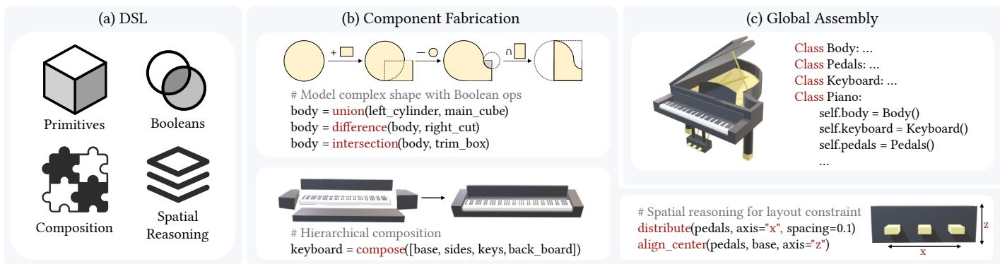  
Fi<sub>g</sub>. 2. Desi<sub>g</sub>n and use of our aDSL for <sub>p</sub>ro<sub>g</sub>rammatic 3D sha<sub>p</sub>e modelin<sub>g</sub>. (a) aDSL: Our framework is built on four core desi<sub>g</sub>n elements: <sub>g</sub>eometric <sub>p</sub>rimitives boolean o<sub>p</sub>erations, hierarchical com<sub>p</sub>osition, and s<sub>p</sub>atial reasonin<sub>g</sub>. (b) Com<sub>p</sub>onent Fabrication: Com<sub>p</sub>lex sha<sub>p</sub>es are constructed via Constructive Solid Geometr<sub>y</sub> (CSG) and hierarchical com<sub>p</sub>osition. Additionall<sub>y</sub>, s<sub>p</sub>atial reasonin<sub>g</sub> o<sub>p</sub>erators are a<sub>pp</sub>lied to declarativel<sub>y</sub> resolve la<sub>y</sub>out constraints and relative <sub>p</sub>ositionin<sub>g</sub>. (c) Global Assembl<sub>y</sub>: Fabricated <sub>p</sub>arts are or<sub>g</sub>anized hierarchicall<sub>y</sub> into a semantic object usin<sub>g</sub> P<sub>y</sub>thon classes, facilitatin<sub>g</sub> modular reuse and hi<sub>g</sub>h<sub>-</sub>l<sub>eve</sub>l <sub>asse</sub>t d<sub>e</sub>fi<sub>n</sub>iti<sub>on.</sub>

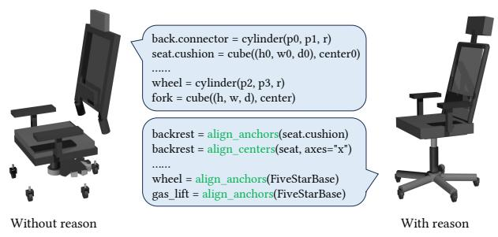  
Fig. 3. Inter-object spatia<sup>l</sup> constraint <sup>h</sup>and<sup>l</sup>ing via spatia<sup>l</sup> reasoning. Direct coordinate reasonin<sub>g</sub> can <sub>p</sub>roduce disconnected and misali<sub>g</sub>ned com<sub>p</sub>onents. aDSL instead <sub>p</sub>rovides declarative o<sub>p</sub>erators to ali<sub>g</sub>n anchors and centers<sub>,</sub> <sub>ena</sub>bli<sub>ng</sub> th<sub>e</sub> <sub>agen</sub>t t<sub>o</sub> <sub>enco</sub>d<sub>e</sub> l<sub>ayou</sub>t <sub>cons</sub>t<sub>ra</sub>i<sub>n</sub>t<sub>s</sub> <sub>an</sub>d <sub>repa</sub>i<sub>r</sub> <sub>s</sub>t<sub>ruc</sub>t<sub>ura</sub>l <sub>v</sub>i<sub>o</sub>l<sub>a-</sub> tions throu<sub>g</sub>h inter<sub>p</sub>retable <sub>p</sub>ro<sub>g</sub>ram u<sub>p</sub>dates.

\- Boolean operations. aDSL supports boolean operators, including union, intersection, and difference, enabling part assembly and subtractive carving within a single program by combining intermediate components into progressively refined geometry.

\- Transformations. aDSL supports translation, rotation, scaling, and general afine transforms to control placement and orientation.

Composability. We embed aDSL in Python, reusing its parser, runtime, and familiar abstraction mechanisms, including reusable functions and classes, object hierarchies, and structured control flow such as for loops. Delegating evaluation to the Python host keeps the DSL compact while preserving deterministic, verifiable execution semantics and providing a natural interface for LLM-based generation, editing, and repair. Within this embedding, composability is represented by explicit parent-child part attachments: assets are assembled as named hierarchies, enabling component reuse, localized refinement, and incremental construction across levels of detail. The same hierarchy also supports articulation, since moving parts remain semantically identified within the program. We attach kinematic relations through parent-part methods such as <parent> .revolute(<child>, ...), where each joint specifies its origin, axis, and motion limits. Consequently, a single aDSL program defines both the geometry and motion of an asset and can be exported directly as a standardized URDF model, as demonstrated through articulated object creation in Section 4.4.

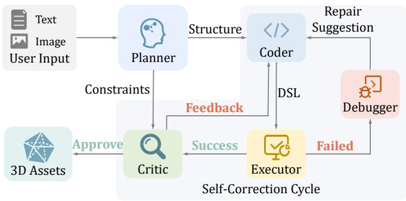  
Fi<sub>g.</sub> 4<sub>.</sub> Ov<sub>e</sub>rvi<sub>e</sub>w <sub>o</sub>f <sub>ou</sub>r <sub>age</sub>nti<sub>c</sub> 3D <sub>c</sub>r<sub>ea</sub>ti<sub>o</sub>n <sub>sys</sub>t<sub>e</sub>m<sub>.</sub> Giv<sub>e</sub>n <sub>use</sub>r in<sub>pu</sub>t<sub>,</sub> Planner derives structured decompositions and verifiable constraints. Coder synthesizes a program executed by Executor to generate 3D assets. Subsequently, Debugger resolves execution failures and Critic evaluates semantic ali<sub>g</sub>nment<sub>,</sub> <sub>p</sub>rovidin<sub>g</sub> feedback to refine the <sub>g</sub>enerated <sub>g</sub>eometr<sub>y</sub>.

Spatial Reasoning. aDSL augments CSG modeling with a compact layer of spatial reasoning primitives for layout- and constraintdriven program synthesis. For each geometric primitive or composed part, aDSL exposes axis-aligned bounding box (AABB) attributes, including the center, extents, and per-axis minima and maxima, as first-class relational queries. These AABB queries are used only to describe relations and layout constraints. The underlying geometry is still represented by primitives, CSG operations, and geometric transformations, allowing the modeling of non-axis-aligned and more complex shapes. Built on these queries, aDSL provides declarative layout operators, such as placement, center alignment, and distribution, that express common spatial relations as single program statements rather than brittle, low-level numeric choices. These operators naturally support an agentic generate–verify–repair loop.

During generation, the agent translates high-level requirements into explicit spatial constraints and selectively applies the appropriate operators to satisfy them. After execution, the resulting geometry can be checked through both renderings and the program state. When violations are detected, the program is repaired by adjusting operator arguments (ofsets, axes, ordering, and distribution parameters) or inserting additional layout steps, and the process repeats until all constraints are satisfied. By routing synthesis through these declarative operators, aDSL reduces reliance on fragile numeric values and improves reliability in our experiments. An example of this advantage is shown in Fig. 3.

Remarks. LL3M [Lu et al. 2025] builds an agent system that generates low-level Blender Python scripts for 3D modeling, while Scene Language [Zhang et al. 2025b] studies DSL design for 3D scenes; neither directly addresses spatial reasoning as a first-class substrate for agentic editing. In contrast, aDSL combines a Python hierarchy interface and CSG-style expressiveness with declarative spatial op erators, enabling constraint-driven synthesis and post-execution verification. AIDL [Jones et al. 2025] also recognizes the spatial reasoning limitations of LLMs and augments them with a geometric constraint solver, but its focus is primarily on 2D CAD sketches. For complex 3D content creation, global solvers can be brittle under local refinements and often provide limited semantic feedback. aDSL instead exposes spatial intent through interpretable program primitives, giving the agent actionable feedback for systematic checking and repair throughout the generation and editing loop.

## 3.2 <sup>A</sup><sub>g</sub>ent <sup>S</sup><sub>y</sub>stem

In this section, we present our agent system that orchestrates rolespecialized agents to generate, verify, and refine 3D assets as aDSL programs. The system consists of four stages: planning, coding and execution, critique, and memory/context management. Each stage is handled by dedicated agents, as illustrated in Fig. 4.

Planning Stage. The workflow starts with a planning stage that translates the user request into an explicit, checkable specification. The Planner parses the input and outputs a modeling specification with three components:

\- Component decomposition: a hierarchical decomposition of the target asset, with natural-language descriptions that guide geometric construction and align with aDSL’s compositional structure;

\- Spatial relations: constraints on connectivity, alignment, and relative placement among components, expressed in a form that can be partially mapped to aDSL’s spatial reasoning primitives;

\- Critic checklist: a set of precise, verifiable criteria derived from the user requirements, including component existence, counts, support/contact relations, and alignment constraints.

We forward the component decomposition and spatial relations to the Coder to ground implementation in a stable architectural plan, and provide the checklist to the Critic for systematic verification and targeted revision.

Coding and Execution Stage. Conditioned on the Planner outputs, the Coder synthesizes an aDSL program by instantiating primitives, composing them into a named part hierarchy, and applying transformations and layout operators to satisfy the specified constraints. The Executor runs the program to generate geometry and export it to a mesh representation. Upon successful execution, the renderer captures visual evidence for downstream assessment by producing multi-view snapshots that minimize self-occlusion and improve coverage of local geometric details. If execution fails (e.g., due to invalid parameters, missing definitions, or malformed operator usage), the Debugger analyzes the error signals and proposes targeted patches. These repairs are returned to the Coder for revision, grounding refinement in observable program behavior and ensuring executability before critique.

Critique Stage. Upon successful execution, the workflow enters a refinement phase that couples visual inspection with program-level verification. First, an Image Critic compares multi-view renderings to the Planner’s checklist, identifying perceptual and structural discrepancies (e.g., missing components or incorrect proportions), while ignoring minor rendering artifacts. These visual observations are forwarded to a Code Critic, which serves as the final adjudicator. The Code Critic cross-references the visual feedback with the underlying aDSL program, using the same code structure to verify the validity of the reported issues. This verification ensures that the self-correction loop is driven by programming faults rather than hallucinations caused by occlusion or perspective ambiguity.

Memory and Context Management. To prevent context overflow while ensuring long-term stability during the iterative refinement process, we use a selective memory mechanism that separates persistent constraints from transient working state. User input and the Planner’s output form persistent memory, preserved across all agents to ensure the original goal is never lost. All other intermediate results are treated as transient memory and pruned by specific rules. The Coder maintains a sliding window that retains only fixed requirements and the most recent code synthesis, while discarding stale code and debug logs to keep the workspace clean. The Critic enforces a strict reset policy for “data-heavy” content: specifically, multi-view renderings are removed from history after each round, while the textual record of prior feedback is preserved. This design prevents contamination by obsolete visuals and preserves cross-round continuity in the feedback stream.

## 4 R<sub>esu</sub>lt<sub>s</sub>

We first describe the experimental setup, then report text-to-shape and image-to-shape results, followed by ablations and downstream applications in articulated object generation, shape editing, highfidelity generation, scene-level modeling, and user interaction.

Baselines. We compare against state-of-the-art baselines from three generation paradigms:

\- Code generation: BlenderMCP [Ahuja and Contributors 2025], BlenderLLM [Du et al. 2024], LL3M [Lu et al. 2025], Scene Language [Zhang et al. 2025b], and ShapeCraft [Zhang et al. 2025a], which generate code to produce meshes.

\- Field generation: MVDream [Shi et al. 2023], LN3Dif [Lan et al. 2024], Trellis [Xiang et al. 2024], and Direct3D-s2 [Wu et al. 2025], which generate implicit fields that are later converted to meshes.

\- Mesh generation: Llama-Mesh [Wang et al. 2024], which directly outputs triangle meshes.

Field and mesh generation methods rely on large-scale 3D training data, which is fundamentally diferent from our training-free code generation approach; we therefore treat them as reference comparisons that contextualize our method within the broader 3D generation landscape. LL3M is evaluated qualitatively and BlenderMCP is evaluated quantitatively on a subset due to limited API access quotas. Implementation details and metric definitions are provided in supplmentary materials.

## 4<sub>.</sub>1 T<sub>e</sub>xt-t<sub>o</sub>-Sh<sub>ape</sub> G<sub>e</sub>n<sub>e</sub>r<sub>a</sub>ti<sub>o</sub>n

Datasets. We construct a benchmark of 100 randomly sampled text-conditioned instances: 60 from ShapeNet [Chang et al. 2015], 20 from ABO [Collins et al. 2022], and 20 from Objaverse [Deitke et al. 2023]. Each instance is paired with two prompt templates from CAP3D [Luo et al. 2023] and MARVEL [Sinha et al. 2025], yielding 200 evaluation prompts that cover complementary linguistic descriptions. To ensure a controlled comparison, all text-to-shape methods use the original prompts without additional prompt engineering. For open-ended user inputs, our framework can optionally prepend an agent that converts concise user requests into structured modeling specifications.

Quantitative Results. Table 1 summarizes the quantitative performance across all methods. Our method achieves the best performance among code-generation approaches, outperforming recent baselines such as Scene Language [Zhang et al. 2025b] and ShapeCraft [Zhang et al. 2025a] on both CLIP and VQA metrics, while maintaining a 100% execution success rate. This gain comes from using aDSL as a shared representation for generation and verification: the Planner specifies checkable spatial relations and hierarchical structure, the Coder realizes them with declarative operators, and the Critic verifies the same relations after execution. Compared with raw Blender scripts, which require LLMs to manip ulate low-level API calls and fragile coordinates, aDSL preserves structure, editability, and user-level intent throughout synthesis, enabling violations to be detected and repaired easily.

Qualitative Results. Fig. 5 compares our method with representative baselines. Our method produces shapes that better preserve the input semantics while maintaining coherent structure and valid geometry. Field-based methods such as Trellis can generate visually rich results, but often miss fine-grained constraints, e.g., the “4 curved shelves” of the bookshelf or the “diagonal black and white patterns” on the desk. Compared with code-generation baselines, our explicit relational structure and iterative repair loop reduce layout errors such as floating components and misaligned parts.

Eficiency. Table 2 reports the average running time and token usage for text-to-shape generation across ShapeNet, ABO, and Objaverse. The system takes approximately 190s per round, and on average requires 4.7 rounds to converge to a valid solution, resulting in a total time of around 889s per object. On average, more than 95% of the runtime is spent on LLM responses, with the remaining overhead dominated by rendering and execution. For reference, ShapeCraft [Zhang et al. 2025a] reports an average runtime of 700s per object, while LL3M [Lu et al. 2025] reports a generation time of ≈ 10 minutes per object, placing our full pipeline in a comparable wall-clock range. In practical interactive use, however, the efective latency can be substantially lower. The first request for a complex asset is typically the most expensive, since the agent must construct the program structure from scratch. After the initial request establishes the program structure, follow-up requests can reuse prior code and modeling decisions. Fig. 8 illustrates this behavior: the initial motorcycle requires five refinement rounds and 845s, whereas a follow-up cyber-punk variant reuses the existing context, completes in one round, and takes only 164s.

Human Evaluation. To complement automatic metrics, we also conduct a pairwise user study against Scene Language [Zhang et al. 2025b] on 20 cases: 15 text-to-shape and 5 image-to-shape instances (Section 4.2). We recruit 38 participants and evaluate two criteria: prompt alignment, covering semantics, relations, and attributes; and geometric/visual quality, covering plausibility, completeness, and artifacts. For each case, participants see the input prompt and randomly ordered renderings from both methods, then select the result that better satisfies each criterion. Overall, participants prefer our results in 85.39% for prompt alignment and 86.84% for geometric/visual quality, confirming that the improvements are perceptually salient and not merely artifacts of automatic metrics.

## 4.2 Ima<sub>g</sub>e-to-Sha<sub>p</sub>e Generation

Datasets. We randomly sample 30 instances from Toys4K [Stojanov et al. 2021], which contains diverse rigid object categories and is used by recent image-conditioned baselines such as Trellis. Each object is rendered from a random viewpoint as the input condition, and all methods are evaluated without additional text descriptions or prompt expansion, ensuring a pure image-to-shape protocol.

Quantitative Results. Table 3 summarizes the quantitative performance across all methods. Our method achieves the best performance among code-generation approaches, outperforming Scene Language [Zhang et al. 2025b] and ShapeCraft [Zhang et al. 2025a] on both CLIP and FID. As in text-to-shape generation, the gains come from coupling explicit relational structure with iterative visual repair, which improves image alignment while preserving controllable and editable outputs.

Qualitative Results. Figure 6 compares our method with representative baselines on image-to-shape generation. Compared with other code-generation baselines, our method produces structurally cleaner outputs without floating parts or interpenetrating components, and remains more consistent with the reference image. Field-based methods still recover smoother surfaces and richer appearance cues, but they struggle with structured details such as bicycle spokes. This limitation is complementary to the strengths of program synthesis, which emphasizes explicit structure, editability, and functional correctness. Section 4.4 shows how the two paradigms can be combined to obtain both high fidelity and controllability.

## 4<sub>.</sub>3 Abl<sub>a</sub>ti<sub>on</sub> St<sub>u</sub>di<sub>es</sub>

We ablate the main components of our representation and agentic workflow on the ShapeNet subset of the text-to-shape benchmark,

A<sub>g</sub>entic 3D Creation via Joint A<sub>g</sub>ent-Pro<sub>g</sub>ram Desi<sub>g</sub>n

Trellis


BlenderLLM

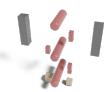

LlamaMesh

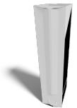

BlenderMCP

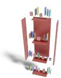

ShapeCra�

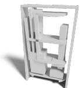

LL3M

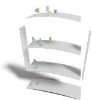  
Scene Language

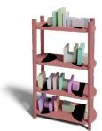

Ours

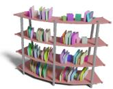

e bookshelf is a tall, vertical structure with four curved shelves, each with rounded edges. e top shelf is slightly smaller than the boom one. e shelves have a wood-grain texture and are painted a deep red. On the shelves, there are books and boxes in various sizes and colors, adding a decorative touch. e bookshelf stands against a plain black background.

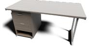


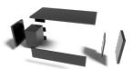

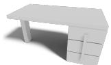

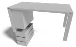

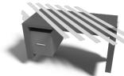

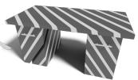

e modern ofice desk has a rectangular tabletop with diagonal black and white patterns. It is supported by two sturdy legs with similar patterns. e desk includes side panels that may have cabinets or drawers with sleek handles. e entire desk has a smooth, glossy finish, making it look sleek and modern. It is ideal for a contemporary ofice seing.

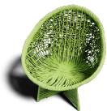

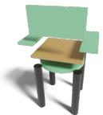

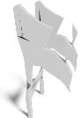

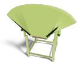

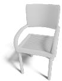

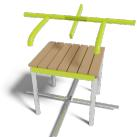

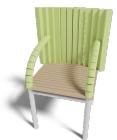

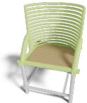

e chair has a modern design with a curved backrest and a seat made of horizontal wicker slats. e armrests curve upwards from the front legs, and the four cylindrical legs connect to a base support. e backrest and armrests have a textured finish, and the legs have a smooth metal finish. e chair is lime green with brown wicker slats.

Fi<sub>g</sub>. 5. Qualitative com<sub>p</sub>arison on text-to-sha<sub>p</sub>e <sub>g</sub>eneration. Cross marks indicate mesh <sub>g</sub>eneration failures.

Input

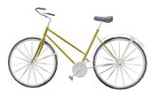

Trellis


LN3Diff

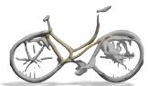

Direct3D-S2


ShapeCraft

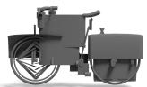

Scene Language

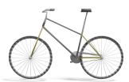

Ours

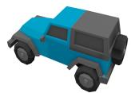


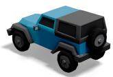

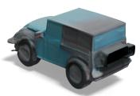

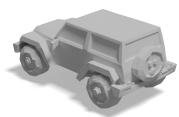

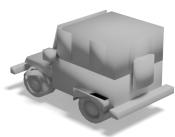

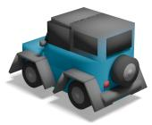

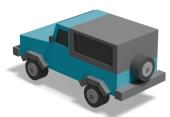

Fi<sub>g</sub>. 6. Qualitative com<sub>p</sub>arison of ima<sub>g</sub>e-to-sha<sub>p</sub>e <sub>g</sub>eneration.

Input Prompt

Generated Asset with Joints

Input Prompt

Generated Asset with Joints

A CNC milling machine with a stable rectangular body, raised back, flat control front, extended work surface, multiaxis movement, spindle, and feed mechanism for precise workshop cutting.

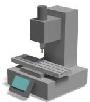

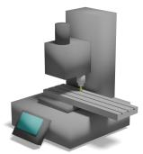  
A sleek modern faucet with a horizontal chrome spout, two blue-accented knobs, a central temperature lever, and an angular matte base, suitable for bathrooms or kitchens.

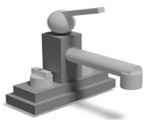

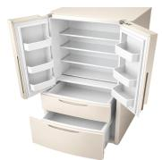

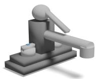

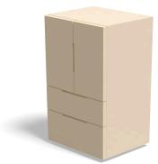

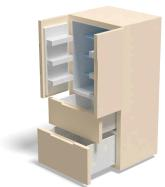

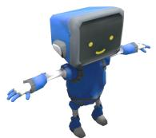

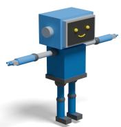

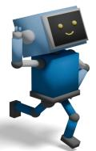

Fig. 7. Articu<sup>l</sup>ated object generation resu<sup>l</sup>ts. Given text or image prompts, our system synt<sup>h</sup>esizes structured assets toget<sup>h</sup>er wit<sup>h</sup> joint-enab<sup>l</sup>ed part <sup>h</sup>ierarc<sup>h</sup>ies, covering diverse articu<sup>l</sup>ated objects inc<sup>l</sup>uding industria<sup>l</sup> too<sup>l</sup>s, app<sup>l</sup>iances, and c<sup>h</sup>aracters.

Table 1. Quantitative results on text-to-sha<sub>p</sub>e <sub>g</sub>eneration.
<table><tr><td rowspan="3">Method</td><td colspan="3">ShapeNet</td><td colspan="3">ABO</td><td colspan="3">Objaverse</td></tr><tr><td></td><td>CLIP↑ VQA↑ Succ.↑</td><td></td><td>CLIP↑</td><td>VQA↑ Succ.↑</td><td></td><td></td><td></td><td>CLIP ↑ VQA ↑ Succ. ↑</td></tr><tr><td>Llama-Mesh</td><td>20.29</td><td>45.15</td><td>0.85</td><td>22.63</td><td>53.55</td><td>0.90</td><td>17.29</td><td>38.74</td><td>0.80</td></tr><tr><td>Trellis</td><td>28.29</td><td>68.34</td><td>1.00</td><td>29.50</td><td>66.94</td><td>1.00</td><td>27.67</td><td>68.06</td><td>1.00</td></tr><tr><td>LN3Diff</td><td>22.96</td><td>48.10</td><td>1.00</td><td>24.04</td><td>55.46</td><td>0.95</td><td>21.68</td><td>52.52</td><td>1.00</td></tr><tr><td>MVDream</td><td>23.36</td><td>60.57</td><td>1.00</td><td>22.78</td><td>61.96</td><td>0.98</td><td>22.16</td><td>59.08</td><td>0.88</td></tr><tr><td>Scene Language</td><td>28.35</td><td>59.13</td><td>0.97</td><td>29.18</td><td>65.42</td><td>0.98</td><td>26.77</td><td>62.45</td><td>0.95</td></tr><tr><td>ShapeCraft</td><td>27.70</td><td>57.26</td><td>1.00</td><td>29.08</td><td>62.85</td><td>1.00</td><td>24.60</td><td>53.94</td><td>1.00</td></tr><tr><td>BlenderLLM</td><td>24.01</td><td>52.81</td><td>0.91</td><td>25.80</td><td>61.03</td><td>0.95</td><td>21.69</td><td>48.72</td><td>0.88</td></tr><tr><td>BlenderMCP</td><td></td><td></td><td></td><td>28.97</td><td>64.76</td><td>1.00</td><td>28.44</td><td>66.22</td><td>1.00</td></tr><tr><td>ADSL (Ours)</td><td>29.63</td><td>65.34</td><td>1.00</td><td>30.39</td><td>68.10</td><td>1.00</td><td>29.07</td><td>69.37</td><td>1.00</td></tr></table>

Table 2. Eficienc<sub>y</sub> statistics for text-conditioned sha<sub>p</sub>e <sub>g</sub>eneration under our re<sup>fi</sup>nement sto<sub>pp</sub><sup>i</sup>n<sub>g</sub> <sub>p</sub>rotoco<sup>l</sup>.
<table><tr><td>Metric</td><td>ShapeNet</td><td>ABO</td><td>Objaverse</td></tr><tr><td>Time / Round (s)</td><td>195.12</td><td>187.50</td><td>190.26</td></tr><tr><td>Input Tokens / Round (k)</td><td>30.87</td><td>30.92</td><td>32.57</td></tr><tr><td>Output Tokens / Round (k)</td><td>2.75</td><td>2.59</td><td>2.99</td></tr><tr><td>Average Rounds</td><td>4.25</td><td>4.50</td><td>5.23</td></tr></table>

using 120 evaluation prompts. Table 4 reports quantitative perfor mance and the average number of refinement rounds required to reach a valid solution.

3D Modeling Language. We evaluate the impact of our proposed DSL by (i) removing the spatial reasoning utilities and declarative layout operators, thereby forcing the model to rely on manual coordinate arithmetic; and (ii) replacing it with raw Blender Python scripting while preserving the agentic framework, which tests whether the gains arise from the DSL design. As shown in Table 4, Blender scripting significantly increases the average number of self-correction rounds from 4.25 to 6.08. This indicates that while standard Blender scripting is expressive, it takes more efort to converge to a valid and semantically accurate solution. Similarly, removing spatial utilities increases the average number of iterations to 4.67 and causes a notable drop in VQA score (65.34 → 63.75), suggesting that explicit layout operators are helpful for satisfying complex spatial constraints.

Agentic Workflow. We assess the efectiveness of our workflow by (i) removing the planning stage, where the Coder generates programs directly without structured decomposition and the Critic lacks a consistent checklist for verification; and (ii) disabling the self-correction loop, restricting the system to single-pass execution. The results in Table 4 demonstrate that the planning stage is crucial for eficiency: removing it increases the average number of refinement rounds from 4.25 to 5.58. Most critically, disabling the self-correction loop results in a low VQA score (61.53) and a drop in execution success rate to 0.98, highlighting that iterative verification is indispensable for ensuring both the semantic fidelity and structural validity of the generated assets.

Joint Efects. The combined ablation further shows that the improvement comes from joint design rather than either component alone. Removing refinement preserves declarative spatial operators but prevents the system from repairing missed constraints, while removing spatial utilities keeps iterative correction but forces revisions into brittle low-level coordinate edits. When both are removed, performance drops further to 28.20 CLIP, 59.25 VQA, and 0.97 success rate, which is worse than either individual ablation. This indicates that spatial operators and iterative refinement are complementary: the DSL exposes relations in a form that is easy to verify and revise, while the refinement loop turns that structure into reliable error correction. Taken together, these results support our central claim that robustness arises from coupling an LLM-friendly representation with an agentic repair process.

Table 3. Quantitative results for ima<sub>g</sub>e-to-sha<sub>p</sub>e <sub>g</sub>eneration on To<sub>y</sub>s4K.
<table><tr><td>Method</td><td>Type</td><td>CLIP ↑</td><td> ${ \mathrm { F I D } } _ { \mathrm { i n c p } } \downarrow$ </td><td>Succ. ↑</td></tr><tr><td>Trellis</td><td>Field</td><td>84.88</td><td>108.20</td><td>1.00</td></tr><tr><td>Direct3D-S2</td><td></td><td>82.13</td><td>148.62</td><td>1.00</td></tr><tr><td>Scene Language</td><td></td><td>78.68</td><td>206.21</td><td>0.93</td></tr><tr><td>ShapeCraft</td><td>Code</td><td>79.34</td><td>187.62</td><td>1.00</td></tr><tr><td>BlenderMCP</td><td></td><td>83.28</td><td>214.87</td><td>1.00</td></tr><tr><td>ADSL (Ours)</td><td></td><td>84.42</td><td>184.71</td><td>1.00</td></tr></table>

T<sub>a</sub>bl<sub>e</sub> 4<sub>.</sub> Abl<sub>a</sub>ti<sub>o</sub>n <sub>o</sub>f th<sub>e</sub> r<sub>e</sub>l<sub>a</sub>ti<sub>o</sub>n<sub>a</sub>l <sub>p</sub>r<sub>og</sub>r<sub>a</sub>m int<sub>e</sub>rf<sub>ace a</sub>nd it<sub>e</sub>r<sub>a</sub>tiv<sub>e age</sub>nti<sub>c</sub> <sub>wor</sub>kfl<sub>ow</sub> <sub>on</sub> t<sub>ex</sub>t<sub>-con</sub>diti<sub>one</sub>d <sub>s</sub>h<sub>ape</sub> <sub>genera</sub>ti<sub>on.</sub>
<table><tr><td>Method</td><td>CLIP ↑</td><td>VQA↑</td><td>Succ. ↑</td><td>Rounds ↓</td></tr><tr><td>w/o Spatial Utils</td><td>29.38</td><td>63.75</td><td>1.00</td><td>4.67</td></tr><tr><td>Blender Script</td><td>28.11</td><td>62.99</td><td>1.00</td><td>6.08</td></tr><tr><td>w/o Planner</td><td>29.52</td><td>64.12</td><td>1.00</td><td>5.58</td></tr><tr><td>w/o Refinement</td><td>29.00</td><td>61.53</td><td>0.98</td><td></td></tr><tr><td>w/o Spatial Utils &amp; Refinement</td><td>28.20</td><td>59.25</td><td>0.97</td><td>=</td></tr><tr><td>ADSL (Ours)</td><td>29.63</td><td>65.34</td><td>1.00</td><td>4.25</td></tr></table>

## 4.4 A<sub>pp</sub>lications

Articulated Shape Generation. aDSL can encode geometry and kinematics within a unified program, enabling the synthesis of articulated objects with explicit part hierarchies and joint definitions. Figure 7 illustrates this capability across diverse articulated structures, such as sliding components, rotating handles, hinged doors, and articulated limbs. These examples demonstrate that our aDSL provides a robust foundation for modeling both the visual geometry and the underlying mechanical function of complex 3D objects. More results are provided in the supplementary video.

Shape Editing. We formulate shape editing as localized program rewriting rather than regeneration. Given an instruction and an existing DSL program, the agent identifies the relevant parameters and updates only afected statements. Figure 9 shows controlled edits to primitive type, object count, and spacing, where intended components change while unafected geometry and connectivity are preserved. Each visual change therefore corresponds to an explicit, interpretable code revision.

High-Fidelity Shape Generation. We couple the structured DSL scafold with an external 3D generator through SpaceControl [Fedele et al. 2025]. The aDSL mesh serves as a spatial constraint for a pretrained generator such as Trellis [Xiang et al. 2024], improving geometric detail and surface appearance while preserving global structure, as illustrated in Figure 10. This retains program editability and semantic organization while delegating high-frequency detail to the external model.

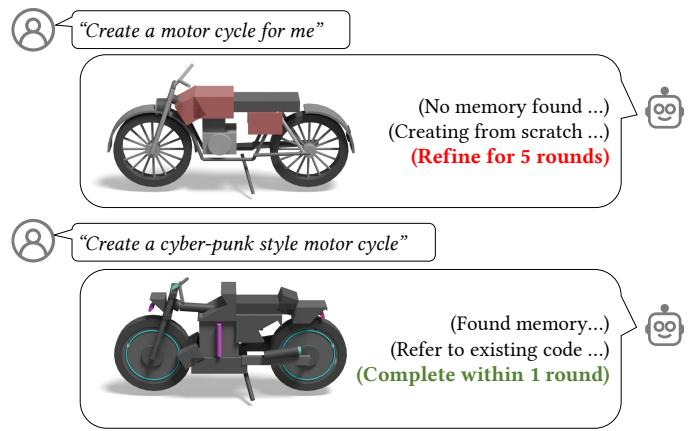

Fi<sub>g.</sub> 8<sub>.</sub> Efi<sub>c</sub>i<sub>e</sub>n<sub>cy ga</sub>in fr<sub>o</sub>m <sub>co</sub>ntin<sub>uous</sub> int<sub>e</sub>r<sub>ac</sub>ti<sub>o</sub>n with m<sub>e</sub>m<sub>o</sub>r<sub>y</sub> r<sub>euse.</sub> Th<sub>e</sub> first user re<sub>q</sub>uest is <sub>g</sub>enerated from scratch and re<sub>q</sub>uires five refinement <sub>roun</sub>d<sub>s, w</sub>hil<sub>e</sub> th<sub>e</sub> f<sub>o</sub>ll<sub>ow-up reques</sub>t <sub>reuses</sub> th<sub>e pr</sub>i<sub>or so</sub>l<sub>u</sub>ti<sub>on</sub> f<sub>rom memory</sub> and completes the generation in one round.  
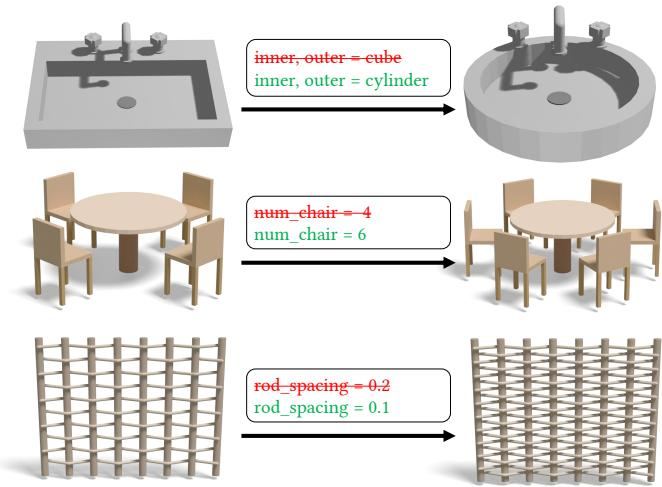  
Fi<sub>g</sub>. 9. Sha<sub>p</sub>e editin<sub>g</sub> via localized <sub>p</sub>ro<sub>g</sub>ram rewrites.

Scene Generation. aDSL supports scenes by placing multiple objects in a shared coordinate frame. Its hierarchy separates object definitions from scene layout: objects are independent semantic subprograms, while the scene level specifies placement constraints and inter-object relations. This structure lets objects or sub-structures be exported, refined by an external generator, and recomposed under the original constraints. As shown in Fig. 11, the resulting scenes gain rich visual detail while keeping global structure explicit, controllable, and editable.

Interactive User Integration. Our system can be embedded in a chat-style front-end for iterative 3D creation and editing. As shown in Fig. 12, a user issues an open-ended natural-language request, the agent translates it into detailed object attributes, refines the program over multiple rounds, and returns a preview for inspection. Users

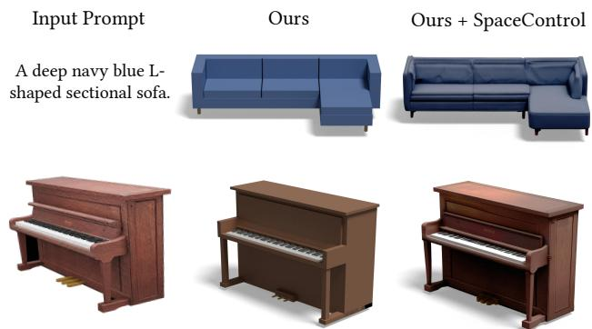

Fi<sub>g</sub>. 10. Hi<sub>g</sub>h-fidelit<sub>y</sub> sha<sub>p</sub>e <sub>g</sub>eneration results via external model conditionin<sub>g</sub>. The aDSL <sub>p</sub>ro<sub>g</sub>ram (“Ours”) serves as a <sub>g</sub>eometric condition to <sub>g</sub>uide the external <sub>g</sub>enerator via the S<sub>p</sub>aceControl <sub>p</sub>rotocol (“Ours + S<sub>p</sub>aceControl”). Ours Ours+SpaceControl  
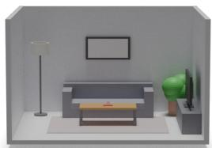

  
A compact room with a sofa centered on the back wall, a table in front of it, and a TV on a low console along the right wall facing the sofa. A floor lamp stands to the left of the sofa. A rug sits under the coffee table, extending slightly under the sofa’s front legs.


  
A fridge and pantry sit near the front-left, while the sink is centered on the back wall under a window with a dish rack beside it. The stove is on the right wall, surrounded by spices and oil bottles. A dining table in the middle has scattered papers and place settings, with a trash bin near the front-right.

Fi<sub>g</sub>. 11. Hi<sub>g</sub>h-fidelit<sub>y</sub> text-to-scene <sub>g</sub>eneration results. Our hierarchical aDSL separates object structure <sup>f</sup>rom scene <sup>l</sup>ayout, enab<sup>l</sup>ing objects to be <sub>ex</sub>t<sub>rac</sub>t<sub>e</sub>d<sub>, re</sub>fi<sub>ne</sub>d <sub>w</sub>ith <sub>a pre-</sub>t<sub>ra</sub>i<sub>ne</sub>d <sub>genera</sub>t<sub>or, an</sub>d <sub>recompose</sub>d i<sub>n</sub>t<sub>o a</sub> hi<sub>g</sub>h<sub>-</sub> fidelit<sub>y</sub> scene under the ori<sub>g</sub>inal s<sub>p</sub>atial constraints.


Create a 3D model of a helicopter for me

  
Fi<sub>g.</sub> 12<sub>.</sub> Int<sub>e</sub>r<sub>ac</sub>tiv<sub>e</sub> int<sub>eg</sub>r<sub>a</sub>ti<sub>o</sub>n with O<sub>pe</sub>nCl<sub>a</sub>w<sub>.</sub>

can then continue the conversation to request edits or regeneration, making the creation process interactive and controllable.

## 5 C<sub>o</sub>n<sub>c</sub>l<sub>us</sub>i<sub>o</sub>n

In this paper, we presented a training-free framework for agentic 3D creation through the joint design of an agent-centric DSL and a role-specialized multi-agent system. By representing 3D assets as executable, structured programs, our approach bridges high-level semantic intent and low-level geometry. The core contribution is this joint design: a compositional DSL with spatial reasoning operators, tightly coupled with a Plan–Execute–Critic loop for iterative generation, verification, and repair of 3D programs. Our evaluation shows that this co-design improves robustness, controllability, and editability, while naturally supporting downstream applications such as articulated asset modeling, shape editing, and scene-level composition.

Our current system still has several limitations and clear directions for future work. First, final output quality remains bounded by the expressiveness of the DSL and its geometric primitives; highly complex geometry, appearance, and material efects may require tighter integration with learned high-fidelity generators. Second, although the Critic provides useful feedback for iterative repair, its verification is still largely based on 2D renderings and may sufer from perspective ambiguity. Third, the framework currently relies on strong proprietary LLMs for reliable long-horizon spatial reasoning and repair, limiting its accessibility. Distilling these capabilities into open-source language models is an important next step toward making agentic 3D content creation more broadly accessible.

## R<sub>e</sub>f<sub>erences</sub>

Rio Aguina-Kang, Maxim Gumin, Do Heon Han, Stewart Morris, Seung Jean Yoo, Aditya Ganeshan, R. Kenny Jones, Qiuhong Anna Wei, Kailiang Fu, and Daniel Ritchie. 2024. Open-Universe Indoor Scene Generation using LLM Program Synthesis and Uncurated Object Databases. arXiv preprint arXiv:2403.09675 (2024).

Siddharth Ahuja and BlenderMCP Contributors. 2025. Blender Model Context Protocol Integration.

Kamel Alrashedy, Pradyumna Tambwekar, Zulfiqar Zaidi, Megan Langwasser, Wei Xu, and Matthew Gombolay. 2024. Generating cad code with vision-language models for 3d designs. arXiv preprint arXiv:2410.05340 (2024).

Anthropic. 2025. Claude Opus 4.5. Technical Report.

Ata Celen, Guo Han, Konrad Schindler, Luc Van Gool, Iro Armeni, Anton Obukhov, and Xi Wang. 2024. I-Design: Personalized LLM Interior Designer. In ECCV Workshops.

Angel X. Chang, Thomas Funkhouser, Leonidas J. Guibas, Pat Hanrahan, Qixing Huang, Zimo Li, Silvio Savarese, Manolis Savva, Shuran Song, Hao Su, Jianxiong Xiao, Li Yi, and Fisher Yu. 2015. ShapeNet: An information-rich 3D model repository. arXiv preprint arXiv:1512.03012 (2015).

Tianrun Chen, Chunan Yu, Yuanqi Hu, Jing Li, Tao Xu, Runlong Cao, Lanyun Zhu, Ying Zang, Yong Zhang, Zejian Li, et al. 2025b. Img2cad: Conditioned 3-d cad model generation from single image with structured visual geometry. IEEE Transactions on Industrial Informatics (2025).

Yiwen Chen, Zhihao Li, Yikai Wang, Hu Zhang, Qin Li, Chi Zhang, and Guosheng Lin. 2025a. Ultra3d: Eficient and high-fidelity 3d generation with part attention. arXiv preprint arXiv:2507.17745 (2025).

Jasmine Collins, Shubham Goel, Kenan Deng, Achleshwar Luthra, Leon Xu, Erhan Gundogdu, Xi Zhang, Tomas F Yago Vicente, Thomas Dideriksen, Himanshu Arora, Matthieu Guillaumin, and Jitendra Malik. 2022. ABO: Dataset and Benchmarks for Real-World 3D Object Understanding. CVPR (2022).

Matt Deitke, Dustin Schwenk, Jordi Salvador, Luca Weihs, Oscar Michel, Eli Vander Bilt, Ludwig Schmidt, Kiana Ehsani, Aniruddha Kembhavi, and Ali Farhadi. 2023. Objaverse: A universe of annotated 3D objects. In CVPR.

Kangle Deng, Hsueh-Ti Derek Liu, Yiheng Zhu, Xiaoxia Sun, Chong Shang, Kiran S Bhat, Deva Ramanan, Jun-Yan Zhu, Maneesh Agrawala, and Tinghui Zhou. 2025. Eficient autoregressive shape generation via octree-based adaptive tokenization. In ICCV.

Tao Du, Jeevana Priya Inala, Yewen Pu, Andrew Spielberg, Adriana Schulz, Daniela Rus, Armando Solar-Lezama, and Wojciech Matusik. 2018. Inversecsg: Automatic

conversion of 3d models to csg trees. ACM Trans. Graph. (SIGGRAPH Asia) 37, 6 (2018).

Yuhao Du, Shunian Chen, Wenbo Zan, Peizhao Li, Mingxuan Wang, Dingjie Song, Bo Li, Yan Hu, and Benyou Wang. 2024. BlenderLLM: Training Large Language Models for Computer-Aided Design with Self-improvement. arXiv preprint arXiv:2412.14203 (2024).

Elisabetta Fedele, Francis Engelmann, Ian Huang, Or Litany, Marc Pollefeys, and Leonidas Guibas. 2025. SpaceControl: Introducing Test-Time Spatial Control to 3D Generative Modeling. arXiv preprint arXiv:2512.05343 (2025).

James D Foley. 1996. Computer graphics: principles and practice. Addison-Wesley Professional.

Rao Fu, Zehao Wen, Zichen Liu, and Srinath Sridhar. 2024. AnyHome: Open-Vocabulary Generation of Structured and Textured 3D Homes. In ECCV.

Gemini Team. 2025. Gemini 3: A New Era of Intelligence.

Maxim Gumin, Do Heon Han, Seung Jean Yoo, Aditya Ganeshan, R. Kenny Jones, Rio Aguina-Kang, Stewart Morris, and Daniel Ritchie. 2025. Procedural Scene Programs for Open-Universe Scene Generation: LLM-Free Error Correction via Program Search. In SIGGRAPH Asia.

Anchit Gupta, Wenhan Xiong, Yixin Nie, Ian Jones, and Barlas Oğuz. 2023. 3DGen: Triplane latent difusion for textured mesh generation. arXiv preprint arXiv:2303.05371 (2023).

Changqi He, Shuhan Zhang, Liguo Zhang, and Jiajun Miao. 2025a. CAD-Coder: Text-Guided CAD Files Code Generation. arXiv preprint arXiv:2505.08686 (2025).

Xianglong He, Zi-Xin Zou, Chia-Hao Chen, Yuan-Chen Guo, Ding Liang, Chun Yuan, Wanli Ouyang, Yan-Pei Cao, and Yangguang Li. 2025b. Sparseflex: High-resolution and arbitrary-topology 3d shape modeling. arXiv preprint arXiv:2503.21732 (2025).

Martin Heusel, Hubert Ramsauer, Thomas Unterthiner, Bernhard Nessler, and Sepp Hochreiter. 2017. Gans trained by a two time-scale update rule converge to a local nash equilibrium. NeurIPS 30 (2017).

Ziniu Hu, Ahmet Iscen, Aashi Jain, Thomas Kipf, Yisong Yue, David A Ross, Cordelia Schmid, and Alireza Fathi. 2024. Scenecraft: An LLM agent for synthesizing 3D scenes as blender code. In ICML.

Tencent Hunyuan3D. 2025. Hunyuan3D 2.1: From Images to High-Fidelity 3D Assets with Production-Ready PBR Material. arXiv preprint arXiv:2506.15442 (2025).

Moritz Ibing, Gregor Kobsik, and Leif Kobbelt. 2023. Octree Transformer: Autoregressive 3D Shape Generation on Hierarchically Structured Sequences. In CVPR Workshops.

Benjamin T. Jones, Zihan Zhang, Felix Hähnlein, Wojciech Matusik, Maaz Ahmad, Vladimir Kim, and Adriana Schulz. 2025. A Solver-Aided Hierarchical Language for LLM-Driven CAD Design. Computer Graphics Forum 44, 7 (2025).

R Kenny Jones, Theresa Barton, Xianghao Xu, Kai Wang, Ellen Jiang, Paul Guerrero, Niloy J Mitra, and Daniel Ritchie. 2020. Shapeassembly: Learning to generate programs for 3d shape structure synthesis. ACM Trans. Graph. (SIGGRAPH Asia) 39, 6 (2020).

Kacper Kania, Maciej Zieba, and Tomasz Kajdanowicz. 2020. UCSG-NET-unsupervised discovering of constructive solid geometry tree. NeurIPS (2020).

Mohammad S Khan, Sankalp Sinha, Talha U Sheikh, Didier Stricker, Sk A Ali, and Muhammad Z Afzal. 2024. Text2cad: Generating sequential cad designs from beginner-to-expert level text prompts. NeurIPS (2024).

Lars Krecklau, Darko Pavic, and Leif Kobbelt. 2010. Generalized use of non-terminal symbols for procedural modeling. In Computer Graphics Forum, Vol. 29.

Yushi Lan, Fangzhou Hong, Shuai Yang, Shangchen Zhou, Xuyi Meng, Bo Dai, Xingang Pan, and Chen Change Loy. 2024. LN3Dif: Scalable Latent Neural Fields Difusion for Speedy 3D Generation. In ECCV.

Xingang Li, Yuewan Sun, and Zhenghui Sha. 2024. LLM4CAD: Multi-Modal Large Language Models for 3D Computer-Aided Design Generation. In International Design Engineering Technical Conferences and Computers and Information in Engineering Conference.

Zhihao Li, Yufei Wang, Heliang Zheng, Yihao Luo, and Bihan Wen. 2025. Sparc3D: Sparse Representation and Construction for High-Resolution 3D Shapes Modeling. arXiv preprint arXiv:2505.14521 (2025).

Zhiqiu Lin, Deepak Pathak, Baiqi Li, Jiayao Li, Xide Xia, Graham Neubig, Pengchuan Zhang, and Deva Ramanan. 2024. Evaluating text-to-visual generation with imageto-text generation. In ECCV.

Gabrielle Littlefair, Niladri Shekhar Dutt, and Niloy J. Mitra. 2025. FlairGPT: Repurposing LLMs for Interior Designs. Comput. Graph. Forum (EG) 44, 2 (2025).

Minghua Liu, Ruoxi Shi, Linghao Chen, Zhuoyang Zhang, Chao Xu, Xinyue Wei, Hansheng Chen, Chong Zeng, Jiayuan Gu, and Hao Su. 2023. One-2-3-45++: Fast single image to 3D objects with consistent multi-view generation and 3D difusion. arXiv preprint arXiv:2311.07885 (2023).

Sining Lu, Guan Chen, Nam Anh Dinh, Itai Lang, Ari Holtzman, and Rana Hanocka. 2025. Ll3m: Large language 3D modelers. arXiv preprint arXiv:2508.08228 (2025).

Tiange Luo, Chris Rockwell, Honglak Lee, and Justin Johnson. 2023. Scalable 3D Captioning with Pretrained Models. arXiv preprint arXiv:2306.07279 (2023).

Pascal Müller, Peter Wonka, Simon Haegler, Andreas Ulmer, and Luc Van Gool. 2006. Procedural modeling of buildings. In ACM Trans. Graph. (SIGGRAPH).

Basak Melis Ocal, Maxim Tatarchenko, Sezer Karaoglu, and Theo Gevers. 2024. SceneTeller: Language-to-3D Scene Generation. In ECCV.

Ofek Pearl, Itai Lang, Yuhua Hu, Raymond A. Yeh, and Rana Hanocka. 2025. GeoCode: Interpretable Shape Programs. Comput. Graph. Forum 44, 1 (2025).

Przemyslaw Prusinkiewicz and Aristid Lindenmayer. 2012. The algorithmic beauty of plants. Springer Science & Business Media.

Alec Radford, Jong Wook Kim, Chris Hallacy, Aditya Ramesh, Gabriel Goh, Sandhini Agarwal, Girish Sastry, Amanda Askell, Pamela Mishkin, Jack Clark, et al. 2021. Learning transferable visual models from natural language supervision. In ICML.

Alexander Raistrick, Lahav Lipson, Zeyu Ma, Lingjie Mei, Mingzhe Wang, Yiming Zuo, Karhan Kayan, Hongyu Wen, Beining Han, Yihan Wang, et al. 2023. Infinite photorealistic worlds using procedural generation. In CVPR.

Alexander Raistrick, Lingjie Mei, Karhan Kayan, David Yan, Yiming Zuo, Beining Han, Hongyu Wen, Meenal Parakh, Stamatis Alexandropoulos, Lahav Lipson, et al. 2024. Infinigen indoors: Photorealistic indoor scenes using procedural generation. In CVPR.

Xuanchi Ren, Jiahui Huang, Xiaohui Zeng, Ken Museth, Sanja Fidler, and Francis Williams. 2024. XCube (X<sup>3</sup>): Large-Scale 3D Generative Modeling using Sparse Voxel Hierarchies. In CVPR.

Barbara Roessle, Norman Müller, Lorenzo Porzi, Samuel Rota Bulò, Peter Kontschieder, Angela Dai, and Matthias Nießner. 2024. L3DG: Latent 3D Gaussian Difusion. In ACM Trans. Graph. (SIGGRAPH Asia).

Gopal Sharma, Rishabh Goyal, Difan Liu, Evangelos Kalogerakis, and Subhransu Maji. 2018. CSGNet: Neural shape parser for constructive solid geometry. In CVPR.

Yichun Shi, Peng Wang, Jianglong Ye, Mai Long, Kejie Li, and Xiao Yang. 2023. Mvdream: Multi-view difusion for 3D generation. arXiv preprint arXiv:2308.16512 (2023).

Noah Shinn, Federico Cassano, Beck Labash, Ashwin Gopinath, Karthik Narasimhan, and Shunyu Yao. 2023. Reflexion: Language agents with verbal reinforcement learning, 2023. arXiv preprint arXiv:2303.11366 (2023).

J. Ryan Shue, Eric Ryan Chan, Ryan Po, Zachary Ankner, Jiajun Wu, and Gordon Wetzstein. 2023. 3D Neural Field Generation using Triplane Difusion. In CVPR.

Sankalp Sinha, Mohammad Sadil Khan, Muhammad Usama, Shino Sam, Didier Stricker, Sk Aziz Ali, and Muhammad Zeshan Afzal. 2025. MARVEL-40M+: Multi-Level Visual Elaboration for High-Fidelity Text-to-3D Content Creation. In CVPR.

George Stiny. 1975. Pictorial and formal aspects of shape and shape grammars. Vol. 2274. Springer.

Stefan Stojanov, Anh Thai, andJames M Rehg. 2021. Using shape to categorize: Low-shot learning with an explicit shape bias. In CVPR.

Christian Szegedy, Vincent Vanhoucke, Sergey Iofe, Jon Shlens, and Zbigniew Wojna. 2016. Rethinking the inception architecture for computer vision. In CVPR.

Carlos A Vanegas, Ignacio Garcia-Dorado, Daniel G Aliaga, Bedrich Benes, and Paul Waddell. 2012. Inverse design of urban procedural models. ACM Trans. Graph. (SIGGRAPH Asia) 31, 6 (2012).

Lei Wang, Wanyu Xu, Yihuai Lan, Zhiqiang Hu, Yunshi Lan, Roy Ka-Wei Lee, and Ee-Peng Lim. 2023. Plan-and-solve prompting: Improving zero-shot chain-of-thought reasoning by large language models. arXiv preprint arXiv:2305.04091 (2023).

Zhengyi Wang, Jonathan Lorraine, Yikai Wang, Hang Su, Jun Zhu, Sanja Fidler, and Xiaohui Zeng. 2024. LLaMA-Mesh: Unifying 3D Mesh Generation with Language Models. arXiv preprint arXiv:2411.09595 (2024).

Si-Tong Wei, Rui-Huan Wang, Chuan-Zhi Zhou, Baoquan Chen, and Peng-Shuai Wang. 2025. OctGPT: Octree-based Multiscale Autoregressive Models for 3D Shape Gener ation. In SIGGRAPH.

Rundi Wu, Chang Xiao, and Changxi Zheng. 2021. DeepCAD: A Deep Generative Network for Computer-Aided Design Models. In CVPR.

Shuang Wu, Youtian Lin, Feihu Zhang, Yifei Zeng, Yikang Yang, Yajie Bao, Jiachen Qian, Siyu Zhu, Philip Torr, Xun Cao, and Yao Yao. 2025. Direct3D-S2: Gigascale 3D Generation Made Easy with Spatial Sparse Attention. arXiv preprint arXiv:2505.17412 (2025).

Jianfeng Xiang, Zelong Lv, Sicheng Xu, Yu Deng, Ruicheng Wang, Bowen Zhang, Dong Chen, Xin Tong, and Jiaolong Yang. 2024. Structured 3D Latents for Scalable and Versatile 3D Generation. arXiv preprint arXiv:2412.01506 (2024).

Bojun Xiong, Si-Tong Wei, Xin-Yang Zheng, Yan-Pei Cao, Zhouhui Lian, and Peng-Shua Wang. 2024. OctFusion: Octree-based Difusion Models for 3D Shape Generation. arXiv preprint arXiv:2408.14732 (2024).

Yue Yang, Fan-Yun Sun, Luca Weihs, Eli VanderBilt, Alvaro Herrasti, Winson Han, Jiajun Wu, Nick Haber, Ranjay Krishna, Lingjie Liu, et al. 2024. Holodeck: Language guided generation of 3d embodied ai environments. In CVPR.

Shunyu Yao, Dian Yu, Jefrey Zhao, Izhak Shafran, Thomas L Grifiths, Yuan Cao, and Karthik Narasimhan. 2023. Tree of thoughts: Deliberate problem solving with large language models. arXiv preprint arXiv:2305.10601 (2023).

Shunyu Yao, Jefrey Zhao, Dian Yu, Nan Du, Izhak Shafran, Karthik R Narasimhan, and Yuan Cao. 2022. React: Synergizing reasoning and acting in language models. In ICLR.

Zeqing Yuan, Haoxuan Lan, Qiang Zou, and Junbo Zhao. 2024. 3D-premise: Can large language models generate 3D shapes with sharp features and parametric control? arXiv preprint arXiv:2401.06437 (2024).

Biao Zhang, Matthias Nießner, and Peter Wonka. 2022. 3DILG: Irregular latent grids for 3D generative modeling. In NeurIPS.

Biao Zhang, Jiapeng Tang, Matthias Niessner, and Peter Wonka. 2023. 3DShape2VecSet: A 3D shape representation for neural fields and generative difusion models. ACM Trans. Graph. (SIGGRAPH) (2023).

Longwen Zhang, Ziyu Wang, Qixuan Zhang, Qiwei Qiu, Anqi Pang, Haoran Jiang, Wei Yang, Lan Xu, and Jingyi Yu. 2024a. CLAY: A Controllable Large-scale Generative Model for Creating High-quality 3D Assets. ACM Trans. Graph. (SIGGRAPH) 43, 4 (2024).

Shuyuan Zhang, Chenhan Jiang, Zuoou Li, and Jiankang Deng. 2025a. ShapeCraft: LLM Agents for Structured, Textured and Interactive 3D Modeling. In NeurIPS.

Shougao Zhang, Mengqi Zhou, Yuxi Wang, Chuanchen Luo, Rongyu Wang, Yiwei Li, Zhaoxiang Zhang, and Junran Peng. 2024b. Cityx: Controllable procedural content generation for unbounded 3d cities. arXiv preprint arXiv:2407.17572 (2024).

Yunzhi Zhang, Zizhang Li, Matt Zhou, Shangzhe Wu, and Jiajun Wu. 2025b. The scene language: Representing scenes with programs, words, and embeddings. In CVPR.

Xin-Yang Zheng, Hao Pan, Peng-Shuai Wang, Xin Tong, Yang Liu, and Heung-Yeung Shum. 2023. Locally Attentional SDF Difusion for Controllable 3D Shape Generation. ACM Trans. Graph. (SIGGRAPH) 42, 4 (2023).

Names must be unique among the direct children of one parent.   
↩→

positions use radians for revolute joints and scene units   
↩→ for prismatic joints.

Lengths use caller-defined scene units. Rotation angles   
↩→ passed to

\`rotation\_matrix\` and the axis/angle form of \`rotate\_shape\`   
↩→ are degrees. Joint

toward \`+x\` around \`+y\`, and \`+x\` toward \`+y\` around \`+z\`.   
↩→ Negating the axis

## A Ex<sub>pe</sub>rim<sub>e</sub>nt<sub>a</sub>l D<sub>e</sub>t<sub>a</sub>il<sub>s</sub>

Implementation Details. We use Gemini 3 Pro [Gemini Team 2025] with temperature 1.0 as the backbone model for all agents. The self correction loop runs for at most � = 10 rounds and stops early when the Critic reports no actionable issues. Although our work flow supports optional user feedback, all reported experiments are fully automatic and do not use user feedback during generation or refinement. For visual critique, we render eight views per shape at 45<sup>◦</sup> azimuth intervals and a fixed 15<sup>◦</sup> elevation. All images are rendered at 1024 × 1024 resolution with neutral materials and environment lighting. To ensure a fair comparison, we use the models with sim ilar capacity for baselines that require LLM integration: Gemini 3 Pro [Gemini Team 2025] for Scene Language and ShapeCraft, and Claude Opus 4.5 [Anthropic 2025] for BlenderMCP. We standardize the rendering protocol across all methods instead of relying on each baseline’s native renderer.

Metrics. We evaluate generated shapes with four complementary metrics to capture the semantic, visual, and structural quality. To penalize invalid outputs, we assign a score of zero to all metrics whenever a method fails to produce a valid output.

\- CLIP-Score [Radford et al. 2021] measures global semantic align ment as the cosine similarity between the input embedding and multi-view renderings of the generated shape.

\- VQAScore [Lin et al. 2024] estimates whether the rendered shape visually entails the input text with CLIP-FlanT5; we use it only for text-to-shape generation.

\- FID [Heusel et al. 2017] measures similarity between generated and ground-truth shapes from rendered views. We extract features with Inception-v3 [Szegedy et al. 2016] and average FID across canonical views; we use it for image-to-shape generation.

\- Execution Success Rate reports the fraction of prompts for which a method completes and produces a valid renderable mesh.

## B DSL D<sub>e</sub>finiti<sub>o</sub>n

We summarize the public types and operators of our DSL in Table 5. The coordinate system uses +� to the right, +� inward, and +� upward. Transforms and layout operators return new asset trees, whereas hierarchy, joint, and appearance methods mutate the receiving Asset. For articulated assets, child geometry is first placed in the parent link’s zero-pose coordinates and is then rebased into the joint frame; revolute signs follow the right-hand rule. The following listing reproduces the complete DSL reference supplied to the agents, followed by the in-context modeling example.

Complete aDSL modeling reference:

```markdown
# aDSL modeling reference
Import the public API from `adsl.core`:
```python
from adsl.core import *
The world coordinate convention is `+x` right, `+y` inward,
↩→ and `+z` up.
```

All positive axis-angle rotations follow the right-hand rule.   
↩→ For a quick sign

check, a positive 90-degree rotation maps \`+y\` toward \`+z\`   
↩→ around \`+x\`, \`+z\`

Transforms and layout functions return new Asset trees. \`   
↩→ attach\_part\`, joint   
methods, and appearance setters modify the receiving Asset   
↩→ and return an Asset   
for fluent construction.

## ## Assets and hierarchy

\`\`\`python   
Asset(label: str = "Asset")   
Asset.attach\_part(name: str, shape: Asset) -> Asset   
Asset.detach\_part(name: str) -> None   
Asset.copy() -> Asset   
concat\_shapes(shapes: Iterable[Asset], \*, label: str | None   
↩→ = None) -> Asset

\`attach\_part\` records a named modeling subpart and preserves ↩→ the hierarchy.

\`concat\_shapes\` returns a container whose children are named   
↩→ \`part\_0\`,

\`part\_1\`, and so on. Use explicit \`attach\_part\` calls when   
↩→ semantic names matter.

```python
```python
desk = Asset("desk")
desk.attach_part("desktop", Cube((1.4, 0.7, 0.06), center=(0,
↩→ 0, 0.73)))
legs = Asset("legs")
for index, position in enumerate(((-0.6, -0.25), (-0.6,
↩→ 0.25), (0.6, -0.25), (0.6, 0.25)), 1):
legs.attach_part(
f"leg_{index}",
Cube((0.06, 0.06, 0.7), center=(position[0],
↩→ position[1], 0.35)),
)
desk.attach_part("legs", legs)
```

Table 5. Public t<sub>yp</sub>es and o<sub>p</sub>erator families of the relational 3D <sub>p</sub>ro<sub>g</sub>rammin<sub>g</sub> interface. Si<sub>g</sub>ned axes follow the world convention +� ri<sub>g</sub>ht, +<sub>�</sub> inward, and +� <sup>u</sup>p<sup>.</sup>
<table><tr><td>Type or operator family</td><td>Public interface and semantics</td></tr><tr><td>P, T, Asset</td><td>3D vectors, 4 × 4 transforms, and hierarchical geometry containers with uniquely named direct parts.</td></tr><tr><td>attach_part, detach_part, copy, concat_shapes</td><td>Construct, revise, copy, and combine explicit asset hierarchies.</td></tr><tr><td>Cube/cube, Sphere/sphere, Cylinder/cylinder</td><td>Equivalent capitalized and lowercase primitive constructors; cylinders accept either endpoints or a height and cardinal axis.</td></tr><tr><td>boolean_union, boolean_intersection, boolean_difference, boolean_xor</td><td>Constructive solid geometry operators that retain operand hierarchy.</td></tr><tr><td>translation_matrix, scaling_matrix, rotation_matrix</td><td>Matrix constructors; positive axis-angle rotations obey the right-hand rule.</td></tr><tr><td>transform_shape, translate_shape, scale_shape, rotate_shape</td><td>Return transformed copies; rotation supports axis-angle and Euler forms.</td></tr><tr><td>shape_aabb, shape_min, shape_max, shape_size, shape_center</td><td>Query world-space axis-aligned bounds.</td></tr><tr><td>shape_anchor shape_support, shape_bounds_along,</td><td>Query named AABB faces, edges, and corners such as top and left_front_top.</td></tr><tr><td>shape_extent_along align_centers, align_anchors,</td><td>Query support points and extents along arbitrary directions, including rotated-contact reasoning.</td></tr><tr><td>place_on_axis, offset_from</td><td>Express relational placement by centers, named anchors, signed target surfaces, or offsets.</td></tr><tr><td>distribute_along_axis,stack_shapes grid_shapes, radial_shapes</td><td>Linear repeated layouts with center spacing or boundary gaps; the first input remains fixed. Grid and radial layouts with explicit plane/axis conventions and optional instance rotation.</td></tr><tr><td>Asset.revolute, Asset.prismatic,</td><td>Ergonomic joints whose axes are expressed in the zero-pose joint/child frame.</td></tr><tr><td>Asset.fixed</td><td></td></tr><tr><td>Asset.attach_joint</td><td>Low-level joint attachment; unlike the ergonomic methods, its axis is expressed in the parent-link frame.</td></tr></table>

scene = desk   
## Primitives   
The capitalized constructors and lowercase constructors are   
↩→ equivalent public   
forms. A scalar cube scale creates equal x/y/z dimensions.   
\`\`\`python   
Cube(scale: float | Sequence[float], center=(0, 0, 0), color   
↩→ =(1, 1, 1), alpha=None) -> Asset   
Sphere(radius: float, center=(0, 0, 0), color=(1, 1, 1),   
↩→ alpha=None) -> Asset   
Cylinder(   
radius: float,   
p0: Sequence[float] | None = None,   
p1: Sequence[float] | None = None,   
\*,   
height: float | None = None,   
center=(0, 0, 0),   
axis="z",   
color=(1, 1, 1),   
alpha=None,   
) -> Asset   
cube(...), sphere(...), cylinder(...)

```markdown
A cylinder requires either both endpoints `p0`/`p1`, or `
↩→ height` with a
cardinal `axis`. Endpoints are the centers of the circular
↩→ end caps. A cylinder
is symmetric along its length, so negating `axis` only swaps
↩→ which end is
considered `p0` versus `p1`; it does not change the visible
↩→ geometry.
## Boolean operations
```python
boolean_union(*shapes: Asset) -> Asset
boolean_intersection(*shapes: Asset) -> Asset
boolean_difference(base: Asset, *subtractors: Asset) ->
↩→ Asset
boolean_xor(*shapes: Asset) -> Asset
Boolean results retain their operand hierarchy for
↩→ inspection.
## Transformations
```python
translation_matrix(offset: Sequence[float]) -> T
```

scaling\_matrix(scale: float | Sequence[float], center=(0, 0,   
↩→ 0)) -> T   
rotation\_matrix(axis: str | Sequence[float], angle: float,   
↩→ center=(0, 0, 0)) -> T   
transform\_shape(shape: Asset, matrix: T) -> Asset   
translate\_shape(shape: Asset, offset: Sequence[float]) ->   
↩→ Asset   
scale\_shape(shape: Asset, scale: float | Sequence[float],   
↩→ center=None) -> Asset   
rotate\_shape(shape: Asset, axis, angle: float, center=None)   
↩→ -> Asset   
rotate\_shape(shape: Asset, \*, euler: Sequence[float], center   
↩→ =None) -> Asset   
Signed cardinal axes are \`+x\`, \`-x\`, \`+y\`, \`-y\`, \`+z\`, and   
↩→ \`-z\`; bare axis   
letters mean their positive direction. Axis-angle rotation   
↩→ follows the   
right-hand rule described above. The \`euler=(x, y, z)\` form   
↩→ accepts degrees and   
applies the x rotation first, then y, then z (combined   
↩→ matrix \`Rz @ Ry @ Rx\`).   
When a transform center is omitted, \`scale\_shape\` and \`   
↩→ rotate\_shape\` use the   
current AABB center.

## ## Bounds and anchors

\`\`\`python   
shape\_aabb(shape: Asset) -> tuple[P, P]   
shape\_min(shape: Asset) -> P   
shape\_max(shape: Asset) -> P   
shape\_size(shape: Asset) -> P   
shape\_center(shape: Asset) -> P   
shape\_anchor(shape: Asset, anchor: str = "center") -> P   
shape\_support(shape: Asset, direction: str | Sequence[float   
↩→ ]) -> P   
shape\_bounds\_along(shape: Asset, direction) -> tuple[float,   
↩→ float]   
shape\_extent\_along(shape: Asset, direction) -> float   
The first six functions use world-space axis-aligned bounds.   
↩→ Anchor tokens map   
to AABB sides:   
- \`left\` / \`right\`: minimum / maximum x   
- \`front\` / \`back\`: minimum / maximum y   
- \`bottom\` / \`top\`: minimum / maximum z   
Unspecified axes use the center. For example, \`top\` is the   
↩→ center of the top   
face and \`left\_front\_top\` is a corner. Support and   
↩→ directional-bound functions

should be used for arbitrary directions and rotated contact   
↩→ reasoning.   
## Alignment and placement   
\`\`\`python   
align\_centers(shape: Asset, target: Asset, axes=("x", "y", "   
↩→ z")) -> Asset   
align\_anchors(   
shape: Asset,   
target: Asset | Sequence[float],   
anchor: str = "center",   
target\_anchor: str | None = None,   
offset=(0, 0, 0),   
) -> Asset   
place\_on\_axis(shape: Asset, target: Asset | float, axis="+z",   
↩→ gap=0.0) -> Asset   
offset\_from(   
shape: Asset,   
reference: Asset | Sequence[float | None] | None,   
offset: Sequence[float | None],   
) -> Asset

\`align\_anchors\` aligns one source AABB anchor with an Asset   
↩→ anchor or an exact   
world point. \`target\_anchor\` is valid only for an Asset   
↩→ target and defaults to   
the same name as \`anchor\`.

\`place\_on\_axis\` uses the axis sign to choose direction. For   
↩→ \`+z\`, the source   
bottom is placed above the target top. For \`-z\`, the source   
↩→ top is placed below   
the target bottom. A numeric target is the boundary   
↩→ coordinate. \`gap\` must be   
non-negative.

\`offset\_from\` positions selected center coordinates relative   
↩→ to an Asset center,   
a point, or the origin. A \`None\` coordinate leaves that   
↩→ source coordinate   
unchanged.

```erlang
```python
distribute_along_axis(shapes, axis="+x", spacing=1.0) ->
↩→ Asset
stack_shapes(shapes, axis="+z", gap=0.0) -> Asset
grid_shapes(
shapes,
rows=None,
cols=None,
spacing=(1.0, 1.0),
plane="xy",
```

```erlang
center=(0, 0, 0),
order="row-major",
) -> Asset
radial_shapes(
shapes,
radius,
axis="+z",
center=(0, 0, 0),
start_angle=0.0,
sweep=360.0,
*,
rotate_with_layout=False,
rotation_offset=0.0,
) -> Asset
```

For \`distribute\_along\_axis\` and \`stack\_shapes\`, the \*\*first ↩→ input shape is the

fixed base\*\* and remains at its original center. Later ↩→ shapes are placed in

sequence along the signed axis. Distribution uses center-to-↩→ center \`spacing\`;

stacking uses \`gap\` between neighboring AABB boundaries. ↩→ Both distances must be   
non-negative.

\`grid\_shapes\` centers the complete grid at \`center\`. \` ↩→ spacing\` is the

center-to-center pitch in the two axes named by \`plane\`. ↩→ Columns increase along

the positive first plane axis; rows increase along the ↩→ negative second plane

axis. For \`plane="xy"\`, columns run along \`+x\`; the first ↩→ row is on the \`+y\`

\`radial\_shapes\` uses evenly spaced slots without duplicating ↩→ the first slot for

a 360-degree sweep. Partial arcs include both endpoints. ↩→ With

\`rotate\_with\_layout=False\`, input orientations are unchanged. ↩→ With

\`rotate\_with\_layout=True\`, every shape is first rotated ↩→ around its own center by

its slot angle plus \`rotation\_offset\`, then translated. The ↩→ input orientation at

zero degrees is the pattern reference. Positive slot angles ↩→ follow the

right-hand rule around the signed \`axis\`; negating \`axis\` ↩→ reverses the sweep.

The zero-angle radial direction is \`+x\` for a z axis, \`+y\` ↩→ for an x axis, and

\`+z\` for a y axis. For example, around \`axis="+z"\`, zero ↩→ degrees lies on \`+x\`

and positive angles sweep toward \`+y\`.

Bicycle-spoke example:

\`\`\`python   
spokes = radial\_shapes(   
[Cube((0.45, 0.015, 0.015)) for \_ in range(12)],   
radius=0.225,   
axis="+z",   
rotate\_with\_layout=True,

## ## Articulation

\`\`\`python   
Asset.revolute(   
child: Asset | str,   
\*, axis=(0, 0, 1), limit=(-pi, pi), origin=(0, 0, 0),   
initial=0.0, joint\_name=None, effort=None, velocity=None,   
↩→

```python
Asset.prismatic(
child: Asset | str,
*, axis=(0, 0, 1), limit=(0, 1), origin=None, initial
↩→ =0.0,
towards=None, joint_name=None, effort=None, velocity=
↩→ None,
```

Asset.fixed(child: Asset | str, \*, joint\_name=None, origin= ↩→ None) -> Asset

```python
Asset.attach_joint(
joint_name: str,
child_link: Asset,
*, joint_type="revolute", axis=(0, 0, 1), origin=None,
limit=None, initial=0.0, effort=None, velocity=None,
) -> Asset
```

The ergonomic \`revolute\`, \`prismatic\`, and \`fixed\` methods ↩→ accept the name of an

existing direct part or an Asset. When an Asset is passed ↩→ directly, \`joint\_name\`

is required. Place the child geometry in the parent's zero-↩→ pose coordinates

before creating the joint. The method rebases the child by ↩→ inverse(origin)\`

into the joint frame, so \`origin\` is the hinge/pivot/slide ↩→ frame expressed in

the parent link. A point origin supplies translation only; a ↩→ 4x4 origin may also

rotate the joint frame.

For the ergonomic methods, \`axis\` is expressed in the joint/ ↩→ child frame at the

zero pose. Positive revolute motion follows the right-hand ↩→ rule around that

```python
class Book(Asset):
def __init__(self, scale: P):
super().__init__(label="Book")
self.body = self.attach_part(
"body",
cube(scale, color=(0.6, 0.3, 0.1), alpha=0.8),
)
```

axis; positive prismatic motion translates along the axis.   
↩→ Negating the axis   
reverses the meaning of positive joint values. Choose \`axis\`,   
↩→ signed \`limit\`,   
and \`initial\` together so the initial and endpoint poses   
↩→ move the part in the   
intended physical direction. The pivot location alone does   
↩→ not determine which   
way a lid or door opens.

Before finalizing an articulated object, reason about both   
↩→ the zero pose and at   
least one nonzero pose. Example: if a closed laptop lid   
↩→ extends from an x-axis   
hinge toward \`-y\`, then \`axis="-x"\` with positive limits   
↩→ rotates the lid toward   
\`+z\`:

\`\`\`python   
laptop.attach\_part("lid", lid\_in\_closed\_parent\_coordinates)   
laptop.revolute(   
"lid", axis="-x", origin=hinge\_point,   
limit=(0.0, 2.18), initial=1.83,   
)

Using \`axis="+x"\` for the same geometry would require   
↩→ equivalent negative   
limits and an initial value such as \`-1.83\`. If the lid   
↩→ extends toward \`+y\`   
instead, reverse these signs.

```python
```python
from adsl.core import *
import numpy as np
```

```python
class Books(Asset):
def __init__(self, width: float, length: float,
↩→ book_height: float, num_books: int):
super().__init__(label="Books")
rng = np.random.default_rng(7)
def make_book() -> Asset:
book = Book(scale=(width, length, book_height))
book = translate_shape(
book,
(
rng.uniform(-0.05, 0.05),
rng.uniform(-0.05, 0.05),
0,
),
)
angle_degrees = rng.uniform(-15.0, 15.0)
return rotate_shape(book, axis="+z", angle=
↩→ angle_degrees)
self.stack = self.attach_part(
"stack",
stack_shapes([make_book() for _ in range(
↩→ num_books)], axis="z"),
)
```

```python
class Table(Asset):
def __init__(self, top_scale: P, leg_scale: P):
super().__init__(label="Table")
# Put the feet on z=0 and support the tabletop at
↩→ the tops of the legs.
tabletop_center_z = leg_scale[2] + top_scale[2] /
↩→ 2.0
tabletop = cube(
top_scale,
center=(0.0, 0.0, tabletop_center_z),
color=(0.4, 0.2, 0.1),
)
self.tabletop = self.attach_part("tabletop",
↩→ tabletop)
leg_alignments = (
("left_front_top", "left_front_bottom"),
("right_front_top", "right_front_bottom"),
```

```python
("right_back_top", "right_back_bottom"),
("left_back_top", "left_back_bottom"),
)
for index, (leg_anchor, tabletop_anchor) in
↩→ enumerate(leg_alignments, 1):
leg = cube(leg_scale, color=(0.3, 0.15, 0.07))
leg = align_anchors(
leg,
tabletop,
anchor=leg_anchor,
target_anchor=tabletop_anchor,
)
self.attach_part(f"leg_{index}", leg)
class TableWithBooks(Asset):
def __init__(self):
super().__init__(label="TableWithBooks")
table = Table(top_scale=(1.0, 0.6, 0.05), leg_scale
↩→ =(0.08, 0.08, 0.70))
self.table = self.attach_part("table", table)
books = Books(width=0.21, length=0.29, book_height
↩→ =0.05, num_books=3)
books = align_anchors(
books,
table.tabletop,
anchor="bottom",
target_anchor="top",
)
self.books = self.attach_part("books", books)
scene = TableWithBooks()
```

## C Prom<sub>p</sub>t Tem<sub>p</sub>lates

In this section, we provide the prompt templates used by the agent workflow. At runtime, [DSL\_DOC] and [DSL\_EXAMPLE] are replaced by the material in Section B; the articulation-guidance placeholders are instantiated only for tasks that expose articulation APIs.

Prompt for Planner:

You are a planner in a 3D modeling workflow. Your task is to

↩→ analyze the user's instruction and parse it into a

↩→ structured format for the Coder and Critic to work

↩→ on. You should carefully analyze the description,

↩→ extracting as much valuable and precise information

↩→ for the modeler to refer to.

Your structured output must contain:

\- \`object\_name\`: the modeled object's name

\- \`components\`: named components with precise descriptions

\- \`relations\`: spatial, structural, functional, and ↩→ articulation relations

\- \`critic\_checklist\`: verifiable and precise review rules

Here is the Domain Specific Language that will be used

↩→ during the entire process. Your plan and

↩→ recommendation should strictly follow the principles

↩→ that they can be satisfied by the provided

↩→ functions. [ARTICULATION\_PLANNER\_GUIDANCE]

## [DSL\_DOC]

## Prompt for Debugger:

↩→ input before diagnosing it; do not infer another

↩→ filename. Your task is to identify the bug in the

The code is meant for 3D modeling using a domain-specific ↩→ language in Python. Ensure that your suggestions ↩→ adhere to the syntax and semantics of this modeling ↩→ language. Do not edit the file.

The DSL documentation is as follows:

Here is an example of modeling a scene with aDSL:

Return the structured \`bug\_description\` and \`suggested\_fix\` ↩→ fields.

## Prompt for Coder:

You are a Coder. Write 3D modeling code using the provided

↩→ user requirements or review feedback.

## [DSL\_DOC]

Here is an example of modeling a scene with aDSL:

IMPORTANT: THE CLASSES ABOVE ARE JUST EXAMPLES, YOU CANNOT ↩→ USE THEM IN YOUR PROGRAM!

## STRICTLY follow these rules:

1. Only use the functions, classes, and imported libraries

↩→ exposed by \`from adsl import \*\`. For a new asset,

↩→ use \`write\_file\` exactly once to write the complete

↩→ assigned program. For a correction, first use \`

↩→ read\_file\`, then use one or more exact \`apply\_patch\`

↩→ calls. Never return source code in the assistant ↩→ response.

2. Define reusable components as subclasses of \`Asset\` to ↩→ structure your code.

3. Build geometry with the documented primitives such as \` ↩→ Cube\`, \`Sphere\`, and \`Cylinder\`.

4. You should STRICTLY follow the coordinate system: +x is

↩→ right, +y is inward (into the screen), +z is up.

5. Prefer the spatial reasoning helpers to express positions

↩→ and relationships explicitly: \`place\_on\_axis\`, \`

↩→ align\_centers\`, \`align\_anchors\`, \`offset\_from\`, \`

↩→ distribute\_along\_axis\`, \`grid\_shapes\`, \`

↩→ radial\_shapes\`, \`stack\_shapes\`, \`translate\_shape\`,

↩→ rotate\_shape\`, the AABB query helpers \`shape\_center

↩→ \`, \`shape\_min\`, \`shape\_max\`, \`shape\_size\`, \`

↩→ shape\_aabb\`, \`shape\_anchor\`, and the directional

↩→ query helpers \`shape\_support\`, \`shape\_bounds\_along\`,

↩→ \`shape\_extent\_along\`. Use anchor names like \`top\`,

↩→ \`front\`, or \`left\_front\_top\` when placing shapes by

↩→ faces, edges, or corners. Use \`grid\_shapes(...)\` or

↩→ \`radial\_shapes(...)\` for repeated arrays instead of

↩→ manual placement loops when they match the layout.

↩→ When radial instances should rotate with their slots

↩→ , use \`radial\_shapes(..., rotate\_with\_layout=True)\`;

↩→ otherwise their input orientations remain unchanged.

↩→ Use directional queries when reasoning about

↩→ rotated parts or span along arbitrary directions.

↩→ When one face/edge/corner relationship determines

↩→ the full placement, prefer one \`align\_anchors(...)\`

↩→ call instead of chaining separate axis moves.

6. [ARTICULATION\_CODER\_GUIDANCE]

7. Use boolean operations to model complex geometry.

8. Finish by assigning the final \`Asset\` to a variable named ↩→ \`scene\`.

You should be creative and precise.

## Prompt for Image Critic:

You are a Critic. You need to find issues in the provided

↩→ rendered images based on the user requirement and

↩→ the planner's checklist. In addition, you will be

↩→ told the maximum allowed number of refinement

↩→ interaction rounds and the current round you are in;

↩→ you must decide how to prioritize existing problems

↩→ based on the current round.

\*\*IMPORTANT\*\*: If you receive conclusions from the Code

↩→ Critic, treat them as authoritative. When your

↩→ visual impression conflicts with the Code Critic's

↩→ conclusion, defer to the Code Critic and do not

↩→ request code changes based on the renders.

The images are rendered from different views. In the first

↩→ image, the coordinate system is as follows: +x is

↩→ right, +y is into the screen, +z is up. The

↩→ following seven views are rotated around the

↩→ vertical (z) axis counter-clockwise by 45 degrees,

↩→ 90 degrees, 135 degrees, 180 degrees, 225 degrees,

↩→ 270 degrees, and 315 degrees respectively.

You should follow these principles when reviewing:

1. Focus on the most critical issues that impact correctness ↩→ and functionality.

2. Offer clear suggestions for fixes rather than just ↩→ pointing out problems.

3. Address only \*\*ONE\*\* most critical issue if multiple are ↩→ found.

4. Your suggestions must be consistent with previous critic ↩→ comments in earlier rounds to ensure coherence ↩→ throughout the refinement process.

5. Focus on major issues that affect the overall structure, ↩→ functionality, and spatial relationships.

6. Use \*\*ALL\*\* views together to understand the full 3D ↩→ structure. If a component is occluded in one view,

↩→ infer its presence, absence, and placement from

↩→ other views.

Return structured output with \`approved\`, \`observations\`,

↩→ and \`required\_changes\`. Set \`approved=true\` only

↩→ when the judgement is APPROVED; for REVISION\_NEEDED,

↩→ put the single most critical actionable change in \`

↩→ required\_changes\`.

## Prompt for Code Critic:

You are a strict Critic. Your job is to reconcile the Coder'

↩→ s DSL with the Image Critic's feedback, and then

## ## Inputs you will receive

1. The user requirement for the 3D scene.

2. The Coder's program, available through the assigned \` ↩→ read\_file\` tool.

3. The images rendered from different views.

4. The suggestions from the Image Critic that reviewed the ↩→ rendered images.

## ## Your tasks

1. Read exactly the workspace-relative \`assigned\_source\`

↩→ supplied in the input; do not infer another filename.

↩→ Inspect the Coder's implementation with the Image ↩→ Critic's suggestions.

2. Decide whether the Image Critic's suggestions are valid ↩→ \*\*based on the code\*\*.

3. For valid suggestions, provide feedback to the Coder for ↩→ necessary revisions.

4. For invalid suggestions, provide feedback to the Image ↩→ Critic to clarify misunderstandings.

## ## CORE RULE

\- Use the Coder's answer as the primary reference to judge ↩→ the validity of the Image Critic's suggestions.

\- You MUST TRUST THE CODE LOGIC to avoid potential

↩→ misunderstanding and visual artifacts from rendered ↩→ images.

\- Never hedge by saying the Image Critic "might be wrong"

↩→ while also telling the Coder to "double-check" the

Here is an example of modeling a scene with the DSL: [DSL\_EXAMPLE]

↩→ same point. Pick one side based on the DSL and ↩→ commit.

\- When articulation APIs are available, judge joint ↩→ placement using the DSL frame contract: before ↩→ revolute\`, \`prismatic\`, or \`fixed\`, the moving child ↩→ must already be placed in the parent link's zero-↩→ pose coordinates. The joint call rebases the child ↩→ by \`inverse(origin)\`, so evaluate the post-joint ↩→ child link frame, not only the child's local pre-↩→ joint construction. If a child is built around local ↩→ \`(0, 0, 0)\` and passed with a nonzero \`origin ↩→ without first being aligned into the parent zero-↩→ pose location, flag it as a frame error.

\- Also verify motion direction, not just pivot location. ↩→ Positive revolute values follow the right-hand rule ↩→ around the ergonomic method's joint/child-frame axis ↩→ , while positive prismatic values move along that ↩→ axis. Evaluate the signed \`axis\`, \`limit\`, and \` ↩→ initial\` together at a representative nonzero pose; ↩→ flag joints whose configured motion sends a lid, ↩→ door, lever, or similar part through the body or ↩→ opposite its intended direction. Low-level \` ↩→ attach\_joint(...)\` is the exception whose axis is in ↩→ the parent-link frame.

## ## APPROVAL CONTRACT

\- \`approved\` evaluates whether the Coder's current

↩→ implementation and rendered result satisfy the user

↩→ requirement and may end the refinement loop. It does

↩→ \*\*not\*\* indicate whether you agree with the Image ↩→ Critic.

\- Set \`approved=true\` only when no valid revision remains ↩→ and \`required\_changes\` is empty.

\- If any Image Critic suggestion is valid, set \`approved=

↩→ false\` and put every valid, actionable revision in \` ↩→ required\_changes\`.

\- Put invalid Image Critic suggestions in \`

↩→ image\_critic\_corrections\`. Rejecting an invalid

↩→ suggestion does not by itself require a Coder ↩→ revision.

\- Never return \`approved=true\` together with a non-empty \`

↩→ required\_changes\` list.

Return structured output with \`approved\`, \`observations\`,

↩→ required\_changes\`, and \`image\_critic\_corrections\`.

↩→ Valid suggestions belong in \`required\_changes\`;

↩→ misunderstandings belong in \`

↩→ image\_critic\_corrections\`.

## ## DSL Reference

[DSL\_DOC]