# AViTS: Adaptive Spatiotemporal Token Selection for Eficient Dynamic-Resolution Generation

Haoran Qin1,3⋆, Zhengan Yan1⋆, Shikang Zheng1⋆, Xiaobing Tu2, Jiacheng Liu1, Yuqi Lin1,4, Chang Zou1, JinShan Liu5, Peiliang Cai1, Xiantao Zhang2, Jinkui Ren2, and Linfeng Zhang1†

1 Shanghai Jiao Tong University, China 2 Terminal Intelligent Computing Division, Alibaba Cloud, China 3 Shandong University, China 4 Jilin University, China 5 Xi’an Jiaotong University, China

Fig. 1: Images sampled by FLUX.1-dev with AViTS with 6.34× acceleratio Abstract. Difusion Transformers (DiTs) achieve high-quality generation but are costly due to iterative sampling. Dynamic-resolution sampling reduces early-stage cost by denoising at low resolution; however, uniformly upsampling all latent tokens at resolution transitions incurs redundant computation and may degrade fine-detail consistency. Existing partial upsampling strategies typically rely on local latent structure cues or single-step statistics, making it dificult to jointly capture token–text semantic relevance and token-wise representation dynamics across diffusion steps. We propose AViTS, an adaptive spatiotemporal token selection framework for dynamic-resolution DiTs. AViTS models spatial importance via latent–text attention and temporal importance via token-level feature variation across difusion timesteps, and fuses them to enable spatiotemporal importance-aware selective upsampling: it prioritizes resolution refinement for critical tokens while deferring less important ones, thereby reducing redundant high-resolution computation and improving the quality–eficiency trade-of. AViTS achieves up to 6.34× on FLUX and nearly 9× FLOPs reduction on Qwen-Image-Edit and FLUX.1-Kontext-dev, orthogonal to distillation, quantization, and feature caching, and reaching 14.76× with distilled models. Code: https://github.com/QHR69/AViTS.

Keywords: Spatiotemporal token selection · Difusion Acceleration

## 1 Introduction

Difusion models have become a dominant paradigm for image and video generation and editing. Among them, Difusion Transformers (DiTs) stand out for their scalability and strong performance in high-fidelity conditional generation and editing. However, DiT inference remains costly due to iterative sampling: generating or editing a single sample typically requires dozens of denoising steps, each passing through a large Transformer backbone, resulting in high latency. This challenge is further amplified at high resolutions, where the increased token count leads to quadratic growth in self-attention cost and memory footprint, hindering real-time deployment and use in resource-constrained settings.

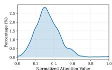

（a）Distribution of Attention and Step Variance on FLUX.1-dev  
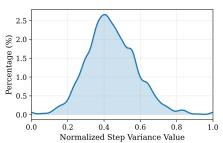

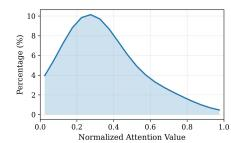  
（b）Distribution of Attention and Step Variance on Qwen-Image-Edit

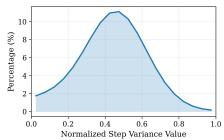  
Fig. 2: Token-importance distributions. (a) Distributions of attention and step variance on FLUX.1-dev. (b) Distributions of attention and step variance on Qwen-Image-Edit.

To accelerate inference, existing approaches mainly follow two directions including reducing the number of sampling steps and reducing the computational cost of each step. Methods in the first category reduce the number of sampling steps through techniques such as distillation and consistency training. Methods in the second category reduce the per step computational cost through techniques such as sparse computation and feature caching [28, 29]. Recently, dynamic resolution sampling has emerged as a promising direction for spatial acceleration in DiTs. It performs denoising at a reduced resolution during early stages to save computation and then gradually transitions to higher resolution to recover fine details. Nevertheless, during resolution transitions many dynamic resolution strategies still upsample all latent tokens and perform high resolution computation uniformly. This process introduces substantial redundant computation and may also cause artifacts and inconsistency across stages. The recent development of partial upsampling further raises an important question. Under a limited high resolution computation budget how should latent tokens be prioritized so that computation focuses on the most critical content and achieves a better balance between eficiency and quality. However, existing partial upsampling methods usually determine priorities using internal latent cues such as spatial structure or local single step statistics through heuristic rules. These approaches do not explicitly model text conditioned semantic alignment or cross timestep representation dynamics [8, 27]. As a result they may fail to reliably identify and prioritize the truly critical tokens.

To characterize where token importance arises in low-resolution denoising, we conduct statistical analysis and visualization from two perspectives: semantic alignment and cross-step dynamics. Specifically, we quantify semantic alignment by aggregating token–text cross-attention responses at low resolution, and quantify cross-step dynamics by measuring the magnitude of token representation changes across multiple sampling steps (step variance) in the DiT backbone. As shown in Fig. 2, both the attention-based spatial importance and the stepvariance-based temporal importance exhibit pronounced long-tailed, highly nonuniform distributions: only a small fraction of tokens strongly correlate with the text condition, and only a small subset continue to evolve during denoising and remain more sensitive to subsequent updates. This pattern holds consistently on FLUX.1-dev (Fig. 2(a)) and Qwen-Image-Edit (Fig. 2(b)). The corresponding heatmaps further qualitatively suggest that attention tends to cover instructionrelevant semantic regions, whereas higher step variance often concentrates on regions requiring fine-grained modeling or modification (Fig. 3). These observations indicate that jointly modeling semantic alignment and cross-step dynamics enables more efective allocation of a limited high-resolution budget.

  
Fig. 3: Heatmaps of token importance on two text-to-image examples. Attention-based selection covers instruction-relevant semantic regions, whereas step-variance-based selection focuses on regions requiring fine-grained synthesis.

Motivated by this insight, we propose AViTS (Adaptive Spatiotemporal Token Selection), a spatiotemporal information-driven token selection framework for eficient dynamic-resolution generation. AViTS models token importance along two complementary dimensions: it estimates spatial importance via latent–text attention interactions to capture semantic alignment strength, and estimates temporal importance via token-wise feature variation across difusion timesteps (step variance) to capture evolution and stability. AViTS then fuses these signals into a unified spatiotemporal importance score and performs importance-aware selective upsampling: it upsamples high-importance tokens earlier while deferring low-importance tokens, reducing redundant highresolution computation while preserving critical semantics and details. Extensive experiments demonstrate that AViTS achieves a strong eficiency–quality tradeof across generation and editing (Fig. 1): it provides up to 6.34× acceleration on FLUX, nearly 9× FLOPs reduction on Qwen-Image-Edit and FLUX.1-Kontextdev, and up to 14.76× when combined with distillation, while remaining compatible with quantization and feature caching. Our contributions are three-fold:

• Spatiotemporal Heterogeneity Analysis. From the perspectives of spatial semantic alignment and temporal cross-step dynamics, we reveal and validate pronounced spatiotemporal heterogeneity of latent-token importance during low-resolution denoising, providing empirical grounding for prioritization in resolution transitions.

• Spatiotemporal Importance Modeling. We introduce AViTS, formulating upsampling prioritization as a spatiotemporal importance estimation problem jointly determined by semantic alignment and cross-step dynamics, and enabling spatiotemporal-importance-aware selective upsampling.

• Broad Efectiveness And Composable Acceleration. AViTS substantially reduces inference cost while preserving quality across multiple models and tasks, and composes efectively with distillation, quantization, and feature caching for further acceleration.

## 2 Related Works

Difusion models have become a dominant paradigm for high-quality visual generation [21]. While early methods were built on U-Net backbones [18], recent systems increasingly adopt Difusion Transformers (DiTs) for improved scalability [17]. However, the iterative denoising process incurs substantial inference cost, motivating extensive research on difusion acceleration.

## 2.1 Model Compression–Based Acceleration

Model compression reduces inference cost by simplifying the network structure or numerical representation. Representative approaches include structural pruning [6], numerical quantization [11, 20], knowledge distillation, and token reduction strategies [2]. These techniques lower computation and memory usage with minimal modification to the inference pipeline. However, maintaining generation quality usually requires additional fine-tuning, and aggressive compression may degrade generalization under complex editing scenarios.

## 2.2 Temporal Acceleration

Another major direction reduces the number of denoising steps. Deterministic samplers such as DDIM [22] and higher-order solvers (e.g., DPM-Solver) improve the eficiency–quality trade-of by controlling numerical errors. Alternative formulations, including Rectified Flow, progressive distillation, and consistency models, further shorten denoising trajectories. Complementary training-free approaches exploit temporal redundancy by caching or forecasting intermediate features across timesteps [3, 14, 16]. Although efective, many existing caching methods rely on heuristic temporal assumptions and lack principled modeling of token-level dynamics.

## 2.3 Spatial Acceleration

Spatial acceleration reduces computation by lowering latent resolution, which in DiTs corresponds to decreasing the number of spatial tokens. Sparse attention patterns [4] provide limited gains, while coarse-to-fine strategies perform early denoising at reduced resolution. Cascaded difusion frameworks [7] follow this paradigm but require retraining. Recent training-free methods selectively upsample tokens during sampling. For instance, RALU [8] uses edge detection to identify important tokens, while Fresco [27] selects tokens based on interchannel variance. However, these low-level heuristics are weakly aligned with editing semantics, often leading to unstable token selection and inconsistent denoising trajectories. Bottleneck Sampling [23] further adjusts resolution during inference but may introduce trajectory distortion and artifacts after upsampling.

## 3 Method

## 3.1 Preliminaries

Setup and token representation. We work with Difusion Transformers (DiTs) that operate in latent space. An image of resolution H×W is encoded by a VAE into a compact spatial map and packed into a sequence of M non-overlapping patch tokens. The image token sequence is $\mathbf { Z } = \{ \mathbf { z } _ { i } \} _ { i = 1 } ^ { M } \in \mathbb { R } ^ { M \times D }$ , where $\mathbf { z } _ { i } \in \mathbb { R } ^ { \bar { D } }$ is the feature of the i-th patch at spatial coordinate $\mathbf { p } _ { i } = ( r _ { i } , c _ { i } )$ . The text prompt is encoded into L tokens $\mathbf { C } = \{ \mathbf { c } _ { j } \mathbf  \bar { \} } _ { j = 1 } ^ { L } \in \mathbb { R } ^ { L \times D }$ . In models with joint image–text attention, Z and C interact in a shared attention mechanism, producing crossmodal attention that we use for spatial importance in Sec. 3.3.

Flow matching. We adopt the flow-matching formulation. A velocity network $v _ { \theta } ( \mathbf { x } _ { t } , t , \mathbf { c } )$ is trained to regress the conditional velocity. At inference, we integrate the learned ODE from t=1 to t=0 via Euler steps:

$$
{ \bf x } _ { t _ { i + 1 } } = { \bf x } _ { t _ { i } } + v _ { \theta } ( { \bf x } _ { t _ { i } } , t _ { i } , { \bf c } ) \Delta t _ { i } , \qquad \Delta t _ { i } = t _ { i + 1 } - t _ { i } < 0 .\tag{1}
$$

This update is used at each denoising step in our pipeline.

## 3.2 Framework Overview

AViTS organizes inference into three stages of progressively increasing spatial resolution (Figure 4(a)). Stage 1 performs low-resolution denoising and includes a feature-collection phase in its latter steps. This design difers from prior dynamicresolution methods that lack an explicit multi-step, multimodal collection phase.

Stage 1: Low-resolution denoising and feature collection. We initialize with noise $\mathbf { Z } _ { t _ { 0 } } \sim \mathcal { N } ( \mathbf { 0 } , \mathbf { I } )$ at the target resolution $H \times W$ , spatially downsample by factor $f { = } 2$ , and reduce the token count to $M ^ { \prime } = M / f ^ { 2 }$ . The velocity network vθ performs $N _ { 1 }$ Euler denoising steps via Eq. (1) to establish coarse global structure at low computational cost. Over the subsequent $N _ { T }$ denoising steps at the same reduced resolution, we record two complementary signals: the per-step latent snapshots $\{ \mathbf { Z } ^ { ( t _ { k } ) } \} _ { k = 1 } ^ { N _ { T } }$ , which capture the temporal evolution of each token, and the cross-modal attention maps at each step, which encode the alignment between image tokens and the text condition. These signals feed the spatiotemporal importance estimator detailed in Sec. 3.3.

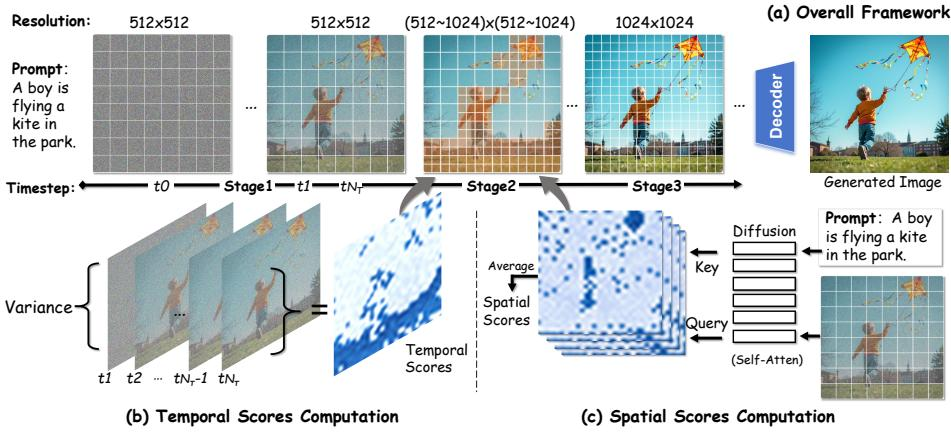  
Fig. 4: Overview of AViTS and spatiotemporal importance estimation. (a) Three-stage dynamic-resolution sampling: Stage 1 low-res denoising with signal collection over the last $N _ { T }$ steps, Stage 2 selective upsampling of top-K tokens, and Stage 3 full-res refinement. (b) Temporal importance from token-wise step variance across the collected snapshots. (c) Spatial importance from aggregated latent–text cross-attention (averaged over heads/blocks and collection steps); fused scores guide prioritization.

Stage 2: Selective upsampling. Using the collected signals, AViTS computes a scalar importance score $S _ { i }$ for each of the $M ^ { \prime }$ tokens and selects the top-K subset $s$ with $K = \lfloor \rho M ^ { \prime } \rfloor , \rho \in ( 0 , 1 )$ . Tokens in S are expanded via orthogonal upsampling; tokens in $\bar { \cal S }$ remain at the current resolution. We re-inject coordinatebound noise into the mixed-resolution sequence and perform $N _ { 2 }$ denoising steps.

Stage 3: Full-resolution refinement. The remaining tokens $\bar { \boldsymbol { S } }$ are expanded to complete the M-token sequence. After a final coordinate-bound noise re-injection and reordering by spatial coordinate, $N _ { 3 }$ denoising steps recover fine details.

## 3.3 Spatiotemporal Token Importance Estimation

A central question in dynamic-resolution sampling is which tokens should be prioritized for upsampling under a limited budget. Existing partial upsampling methods typically assign priorities based on internal latent cues, such as spatial structure (e.g., edge detection on a single decoded frame) or per-channel or single-step feature statistics, without explicitly modeling text-conditioned semantic alignment and cross-timestep representation dynamics.

Figure 5 shows token importance heatmaps from our method, RALU [8], and Fresco [27] on an editing task. Ours concentrates on instruction-relevant editing regions; RALU emphasizes edges; Fresco yields more difuse, less discriminative patterns. See the caption for a detailed analysis. These observations motivate us to formalize token importance as a function of both the text condition and the temporal trajectory of latent tokens.

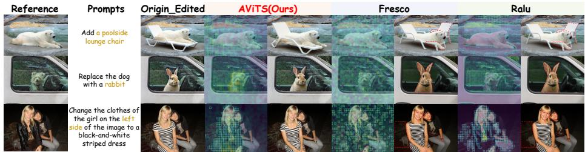  
Fig. 5: Token-importance maps for editing. RALU/Fresco tend to allocate importance to irrelevant regions (edges or difuse background), which leads to semantic misalignment (Row 1), degraded color/style consistency (Row 2), and inconsistency in non-edited regions (Row 3), whereas AViTS concentrates tokens on the instruction-relevant edit areas.

We decompose importance into a spatial component $A _ { i }$ (latent–text alignment, Sec. 3.3) and a temporal component $V _ { i }$ (cross-step dynamics, Sec. 3.3):

$$
p _ { i } = g \Big ( \mathbf { z } _ { i } , ~ \mathbf { c } , ~ \big \{ \mathbf { z } _ { i } ^ { ( t _ { k } ) } \big \} _ { k = 1 } ^ { N _ { T } } \Big ) = g _ { \mathrm { s p } } \Big ( \big \{ \alpha _ { i , j } ^ { ( h ) } \big \} \Big ) + g _ { \mathrm { t m p } } \Big ( \big \{ \mathbf { z } _ { i } ^ { ( t _ { k } ) } \big \} _ { k = 1 } ^ { N _ { T } } \Big ) ,\tag{2}
$$

where $\{ \alpha _ { i , j } ^ { ( h ) } \}$ are the cross-modal attention weights and $\{ \mathbf { z } _ { i } ^ { ( t _ { k } ) } \}$ are the latent snapshots recorded during the latter steps of Stage 1. We detail each component.

Spatial Importance via Latent–Text Alignment Tokens strongly aligned with the text condition carry conditional semantics and benefit from early highresolution processing. We measure this via the cross-modal attention from image tokens to text tokens.

Let $\alpha _ { i , j } ^ { ( h ) }$ be the attention weight from image token $\mathbf { z } _ { i }$ to text token $\mathbf { c } _ { j }$ in head h. The spatial importance of token i is

$$
A _ { i } = \frac { 1 } { \left| \mathcal { H } \right| } \sum _ { h \in \mathcal { H } } \sum _ { j = 1 } ^ { L } \alpha _ { i , j } ^ { ( h ) } .\tag{3}
$$

The computation of $\{ \alpha _ { i , j } ^ { ( h ) } \}$ depends on whether the backbone uses a multimodal large language model (MLLM) or a DiT with joint image–text blocks.

MLLM-based extraction. Models built on MLLMs (e.g., Qwen-Image-Edit) encode image patches and text in a single unified sequence. The attention matrices at the MLLM layers directly provide an image-to-text submatrix $\pmb { \alpha } ^ { ( h ) } \in \mathbb { R } ^ { M ^ { \prime } \times I }$ per head h. We extract this submatrix from a selected layer, aggregate over heads, and sum over the text dimension via Eq. (3) to obtain $A _ { i }$

Joint-attention extraction. Models without an MLLM (e.g., FLUX-family) use double-stream blocks that compute joint self-attention over the concatenated sequence [C; Z]. The joint query and key are

$$
\mathbf { Q } ~ = ~ \bigl [ \mathbf { Q } _ { \mathrm { t x t } } \parallel \mathbf { Q } _ { \mathrm { i m g } } \bigr ] , \qquad \mathbf { K } ~ = ~ \bigl [ \mathbf { K } _ { \mathrm { t x t } } \parallel \mathbf { K } _ { \mathrm { i m g } } \bigr ] ,\tag{4}
$$

where $\mathbf { Q } _ { \mathrm { i m g } } , \mathbf { K } _ { \mathrm { i m g } }$ and $\mathbf { Q } _ { \mathrm { t x t } } , \mathbf { K } _ { \mathrm { t x t } }$ are the image and text projections. The full attention matrix (before softmax) is $\mathbf { P } = \mathbf { Q } \mathbf { K } ^ { \top } / \sqrt { d _ { h } }$ . Because fused attention kernels do not expose weights, we register a forward hook on each double block to obtain Q, K, apply the same QK-normalisation as the model, and reconstruct

$$
\alpha ^ { ( h ) } = \mathrm { [ s o f t m a x } \big ( \tilde { \mathbf { Q } } ^ { ( h ) } \tilde { \mathbf { K } } ^ { ( h ) \top } \big / \sqrt { d _ { h } } \big ) \big ] _ { \mathrm { i m g }  \mathrm { t x t } } ,\tag{5}
$$

where $\tilde { \mathbf { Q } } ^ { ( h ) } , \tilde { \mathbf { K } } ^ { ( h ) }$ are ℓ2-normalised and the subscript selects rows for image queries and columns for text keys. We aggregate scores across selected blocks and the $N _ { T }$ collection steps via Eq. (3).

Temporal Importance via Cross-Step Feature Dynamics The spatial score $A _ { i }$ does not capture how actively a token evolves. A token whose feature changes substantially across denoising steps is still under construction and benefits from early high-resolution refinement.

We stack the $N _ { T }$ latent snapshots $\{ \mathbf { Z } ^ { ( t _ { k } ) } \} _ { k = 1 } ^ { N _ { T } }$ and compute, for each token i and channel $d ,$ the unbiased sample variance across steps. Let $\bar { z } _ { i , d }$ denote the temporal mean:

$$
\bar { z } _ { i , d } = \frac { 1 } { N _ { T } } \sum _ { k = 1 } ^ { N _ { T } } z _ { i , d } ^ { ( t _ { k } ) } .\tag{6}
$$

The temporal importance of token i is the mean over channels of these variances:

$$
V _ { i } = \frac { 1 } { D } \sum _ { d = 1 } ^ { D } \frac { 1 } { N _ { T } - 1 } \sum _ { k = 1 } ^ { N _ { T } } \bigl ( z _ { i , d } ^ { ( t _ { k } ) } - \bar { z } _ { i , d } \bigr ) ^ { 2 } .\tag{7}
$$

Because $V _ { i }$ measures cross-step intra-latent dynamics, it is orthogonal to the cross-modal signal $A _ { i }$

Joint Score and Token Selection Both scores are normalised to $[ 0 , 1 ]$ via min–max: $\hat { A } _ { i } = ( A _ { i } - \operatorname* { m i n } _ { i } A _ { i } ) / ( \operatorname* { m a x } _ { i } A _ { i } - \operatorname* { m i n } _ { i } A _ { i } + \varepsilon )$ and analogously $\ddot { V } _ { i }$ . The joint importance score is

$$
S _ { i } \ = \ \alpha \hat { A } _ { i } \ + \ ( 1 - \alpha ) \hat { V } _ { i } , \qquad \alpha \in [ 0 , 1 ] .\tag{8}
$$

We select the top-K tokens:

$$
\begin{array} { r } { S = \mathrm { T o p K } \big ( \{ S _ { i } \} _ { i = 1 } ^ { M ^ { \prime } } , \ K = \lfloor \rho M ^ { \prime } \rfloor \big ) . } \end{array}\tag{9}
$$

A small Gaussian perturbation (on the order of $1 0 ^ { - 6 } )$ is applied before sorting to break ties. Orthogonal upsampling and coordinate-bound noise re-injection follow prior practice to preserve cross-stage consistency.

## 4 Experiment

## 4.1 Experiment Settings

Model Configurations. We conduct experiments on three difusion-based models: the text-to-image model FLUX.1-dev [9] and two representative difusionbased editing models, Qwen-Image-Edit [25] and FLUX.1-Kontext-dev [10]. All experiments are conducted on NVIDIA A800 GPUs for FLUX.1-dev, and on NVIDIA H20 GPUs for Qwen-Image-Edit and FLUX.1-Kontext-dev.

We compare AViTS with a diverse set of acceleration baselines, attention sparsification methods such as SpargeAttention [26], feature caching approaches including TeaCache [12], token reuse and forecasting methods such as ToCa [28], DuCa [29], FORA [19], FreqCa [13], and TaylorSeer [15], as well as spatial resolution scheduling strategies including Bottleneck Sampling [23], RALU [8], and Fresco [27]. More details are provided in the supplementary materials.

Datasets and Metrics. Experiments use two representative benchmarks for text-to-image generation and instruction-based image editing. For generation evaluation, we adopt the DrawBench benchmark, where the generated samples are assessed using ImageReward and CLIP Score to measure image quality and text–image semantic alignment. These metrics jointly evaluate whether the generated images faithfully reflect the input prompt while maintaining high perceptual realism. For image editing evaluation, we use the GEdit benchmark, which evaluates instruction-driven editing fidelity and alignment to target modifications under textual and visual guidance. Editing quality is measured using Semantic Consistency (SC), Perceptual Quality (PQ), and Overall Score (OS), which together reflect semantic correctness, visual realism, and overall editing performance. Computational eficiency is evaluated by the number of function evaluations (NFE), latency, speedup, and FLOPs.

## 4.2 Results on Text-to-Image Generation

As shown in Table 1, AViTS consistently improves the eficiency–quality trade-of on FLUX.1-dev across a wide range of acceleration regimes. Under the moderate acceleration setting with NFE=30, AViTS reduces latency to 8.21s (3.14×) with 2.65× FLOPs reduction, achieving the lowest latency among competing methods such as Bottleneck Sampling, RALU, and Fresco. Notably, AViTS also delivers the best generation quality, obtaining the highest ImageReward (1.0104) and CLIP score (32.476), surpassing the original FLUX baseline despite using significantly fewer efective computations.

When the sampling budget is further reduced to NFE=18, AViTS continues to demonstrate strong robustness under more aggressive acceleration, reaching 4.73s latency with 5.45× speedup and 4.80× FLOPs reduction while maintaining high visual quality (0.9959 ImageReward and 32.361 CLIP score). These results indicate that the proposed token prioritization strategy efectively preserves semantically important structures even when the available computation is significantly reduced. In contrast, spatial scheduling methods such as RALU and Fresco show noticeable quality degradation at similar speeds, suggesting that heuristic spatial upsampling strategies struggle to maintain consistent generation fidelity under stronger acceleration. AViTS maintains stable generation quality while achieving up to 9.78× latency acceleration, demonstrating a more efective allocation of high-resolution computation to semantically important tokens and enabling a better eficiency–quality trade-of across acceleration regimes (see Fig. 6 for qualitative comparisons).

Table 1: Quantitative comparison of text-to-image results on FLUX.1-dev.
<table><tr><td rowspan="2">Method</td><td rowspan="2">NFE</td><td colspan="4">Acceleration</td><td rowspan="2">Image Reward ↑</td><td rowspan="2">CLIP Score ↑</td><td rowspan="2"></td></tr><tr><td>Latency(s) ↓</td><td>Speed ↑</td><td>FLOPs(T) ↓</td><td>Speed ↑</td></tr><tr><td>FLUX.1-dev</td><td>50</td><td>25.78</td><td>1.00×</td><td>3719.50</td><td>1.00×</td><td>0.9719 (+0.00%)</td><td></td><td>32.325 (+0.00%)</td></tr><tr><td>60% steps</td><td>30</td><td>16.63</td><td>1.55×</td><td>2231.70</td><td>1.67×</td><td>0.9646 (-0.75%)</td><td></td><td>32.232 (-0.28%)</td></tr><tr><td>SpargeAttention</td><td>50</td><td>15.44</td><td>1.67×</td><td>2150.02</td><td>1.73×</td><td>0.9795 (+0.78%)</td><td>32.312 (-0.04%)</td><td></td></tr><tr><td>TeaCache (l = 0.25)</td><td>50</td><td>14.09</td><td>1.83×</td><td>1937.24</td><td>1.92×</td><td>0.9442 (-2.85%)</td><td>32.167 (-0.49%)</td><td></td></tr><tr><td>TaylorSeer (N = 3)</td><td>50</td><td>9.88</td><td>2.61×</td><td>1320.07</td><td>2.82×</td><td>0.9861 (+1.46%)</td><td>32.313 (-0.04%)</td><td></td></tr><tr><td>Bottleneck Sampling</td><td>30</td><td>11.31</td><td>2.28×</td><td>1582.77</td><td>2.35×</td><td>0.9721 (+0.02%)</td><td></td><td>32.141 (-0.57%)</td></tr><tr><td>RALU</td><td>30</td><td>11.02</td><td>2.34×</td><td>1499.79</td><td>2.48×</td><td>0.9626 (-0.96%)</td><td></td><td>32.118 (-0.64%)</td></tr><tr><td>Fresco</td><td>30</td><td>9.17</td><td>2.81×</td><td>1295.99</td><td>2.87×</td><td>0.9801 (+0.84%)</td><td></td><td>32.125 (-0.62%)</td></tr><tr><td>AViTS</td><td>30</td><td>8.21</td><td>3.14×</td><td>1401.03</td><td>2.65×</td><td>1.0104 (+3.96%)</td><td></td><td>32.476 (+0.47%)</td></tr><tr><td>36% steps</td><td>18</td><td>9.88</td><td>2.61×</td><td>1339.02</td><td>2.77×</td><td>0.9553 (-1.71%)</td><td></td><td>32.114 (-0.65%)</td></tr><tr><td>ToCa (N = 6)</td><td>50</td><td>13.15</td><td>1.96×</td><td>924.30</td><td>4.02×</td><td>0.9702 (-0.17%)</td><td></td><td>32.083 (-0.75%)</td></tr><tr><td>DuCa (N = 5)</td><td>50</td><td>8.19</td><td>3.15×</td><td>978.76</td><td>3.80×</td><td>0.9855 (+1.40%)</td><td></td><td>32.241 (-0.26%)</td></tr><tr><td>TeaCache (l = 0.8)</td><td>50</td><td>6.63</td><td>3.89×</td><td>892.35</td><td>4.17×</td><td>0.8805 (-9.40%)</td><td></td><td>31.827 (-1.54%)</td></tr><tr><td>TaylorSeer (N = 4)</td><td>50</td><td>9.21</td><td>2.80×</td><td>967.91</td><td>3.84×</td><td>0.9857 (+1.42%)</td><td></td><td>32.413 (+0.27%)</td></tr><tr><td>RALU</td><td>18</td><td>6.33</td><td>4.07×</td><td>904.98</td><td>4.11×</td><td>0.9481 (-2.45%)</td><td></td><td>32.074 (-0.78%)</td></tr><tr><td>Fresco AViTS</td><td>18 18</td><td>5.72</td><td>4.51× 5.45×</td><td>788.03</td><td>4.72×</td><td>0.9861 (+1.46%)</td><td></td><td>31.970 (-1.10%)</td></tr><tr><td></td><td></td><td>4.73</td><td></td><td>774.74</td><td>4.80×</td><td>0.9959 (+2.47%)</td><td></td><td>32.361 (+0.11%)</td></tr><tr><td>ToCa (N = 10)</td><td>50</td><td>7.93</td><td>3.25×</td><td>714.66</td><td>5.20×</td><td>0.7055 (-27.41%)</td><td></td><td>31.808 (-1.60%)</td></tr><tr><td>DuCa (N = 9)</td><td>50</td><td>7.26</td><td>3.55×</td><td>690.25</td><td>5.39×</td><td>0.8182 (-15.81%)</td><td></td><td>31.759 (-1.75%)</td></tr><tr><td>TeaCache (l = 1.6)</td><td>50 50</td><td>3.78</td><td>6.82×</td><td>520.54</td><td>7.15×</td><td>0.6423 (-33.91%)</td><td></td><td>31.656 (-2.07%)</td></tr><tr><td>TaylorSeer (N = 9) FLUX.1-schnell</td><td>8</td><td>4.85</td><td>5.32×</td><td>596.07</td><td>6.24×</td><td>0.8562 (-11.90%)</td><td></td><td>31.653 (-2.08%)</td></tr><tr><td></td><td>10</td><td>4.21</td><td>6.12× 6.92×</td><td>595.12</td><td>6.25×</td><td>0.9097 (-6.40%)</td><td></td><td>33.837 (+4.68%)</td></tr><tr><td>RALU</td><td>11</td><td>3.72</td><td>7.52×</td><td>540.62</td><td>6.88×</td><td>0.9289 (-4.42%)</td><td></td><td>32.113 (-0.66%)</td></tr><tr><td>Fresco</td><td>14</td><td>3.43</td><td>7.06×</td><td>486.85 586.56</td><td>7.64×</td><td>0.9366 (-3.63%)</td><td></td><td>31.897 (-1.32%)</td></tr><tr><td>AViTS AViTS</td><td>11</td><td>3.65</td><td>8.32×</td><td>486.85</td><td>6.34×</td><td>0.9723 (+0.04%)</td><td></td><td>32.352 (+0.08%)</td></tr><tr><td></td><td></td><td>3.10</td><td></td><td></td><td>7.64×</td><td>0.9423 (-3.05%)</td><td></td><td>31.959 (-1.13%)</td></tr><tr><td>AViTS</td><td>9</td><td>2.64</td><td>9.78×</td><td>380.30</td><td>9.78×</td><td>0.9201 (-5.33%)</td><td></td><td>32.169 (-0.48%)</td></tr></table>

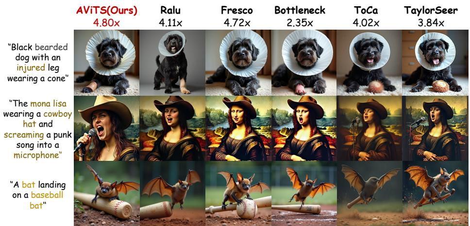  
Fig. 6: Visualization of the image generated by diferent methods on FLUX.1-dev. AViTS achieves the best semantic fidelity and the fastest speed (4.80×), surpassing all dynamic-resolution and feature-caching baselines.

Table 2: Quantitative evaluation results of image editing on the GEdit-bench with FLUX.1-Kontext-dev.
<table><tr><td rowspan="2">Method</td><td rowspan="2">NFE</td><td colspan="4">Acceleration</td><td colspan="3">GEdit-EN(FULL)</td></tr><tr><td>Latency (s) ↓</td><td>Speed ↑</td><td>FLOPs (T) ↓</td><td>Speed ↑</td><td>SC ↑</td><td>PQ↑</td><td>OS ↑</td></tr><tr><td>100% steps</td><td>50</td><td>50.20</td><td>1.00×</td><td>8299.54</td><td>1.00×</td><td>6.80</td><td>7.26</td><td>6.51</td></tr><tr><td>60% steps</td><td>30</td><td>32.23</td><td>1.56×</td><td>4979.72</td><td>1.67×</td><td>6.54</td><td>7.28</td><td>6.25</td></tr><tr><td>20% steps</td><td>10</td><td>10.47</td><td>4.79×</td><td>1659.91</td><td>5.00×</td><td>6.60</td><td>7.18</td><td>6.28</td></tr><tr><td>SpargeAttention</td><td>50</td><td>46.05</td><td>1.09×</td><td>5603.68</td><td>1.48×</td><td>6.46</td><td>7.25</td><td>6.21</td></tr><tr><td>RALU</td><td>30</td><td>23.34</td><td>2.15×</td><td>2730.53</td><td>3.04×</td><td>7.06</td><td>7.20</td><td>6.70</td></tr><tr><td>Bottleneck</td><td>30</td><td>18.25</td><td>2.75×</td><td>2727.10</td><td>3.04×</td><td>6.46</td><td>6.63</td><td>6.08</td></tr><tr><td>Fresco</td><td>50</td><td>20.48</td><td>2.45×</td><td>2361.22</td><td>3.51×</td><td>7.02</td><td>7.12</td><td>6.65</td></tr><tr><td>AViTS</td><td>30</td><td>15.63</td><td>3.21×</td><td>2139.98</td><td>3.88×</td><td>7.08</td><td>7.12</td><td>6.71</td></tr><tr><td>RALU</td><td>18</td><td>15.30</td><td>3.28×</td><td>2123.74</td><td>3.91×</td><td>7.05</td><td>7.17</td><td>6.69</td></tr><tr><td>Bottleneck</td><td>18</td><td>15.21</td><td>3.30×</td><td>2274.58</td><td>3.65×</td><td>6.86</td><td>6.77</td><td>6.43</td></tr><tr><td>ToCa (N = 8)</td><td>50</td><td>29.56</td><td>1.70×</td><td>1841.35</td><td>4.51×</td><td>6.43</td><td>7.25</td><td>6.12</td></tr><tr><td>TaylorSeer (N = 6)</td><td>50</td><td>13.95</td><td>3.60×</td><td>1660.95</td><td>5.00×</td><td>6.47</td><td>7.29</td><td>6.17</td></tr><tr><td>Fresco</td><td>50</td><td>17.73</td><td>2.83×</td><td>1878.83</td><td>4.42×</td><td>7.01</td><td>7.15</td><td>6.66</td></tr><tr><td>AViTS</td><td>18</td><td>11.51</td><td>4.36×</td><td>1544.45</td><td>5.37×</td><td>7.07</td><td>7.12</td><td>6.70</td></tr><tr><td>ToCa (N = 12)</td><td>50</td><td>20.72</td><td>2.42×</td><td>1359.61</td><td>6.10×</td><td>6.39</td><td>6.91</td><td>6.04</td></tr><tr><td>TaylorSeer (N = 9)</td><td>50</td><td>12.05</td><td>4.17×</td><td>1329.02</td><td>6.24×</td><td>6.40</td><td>6.99</td><td>6.07</td></tr><tr><td>AViTS</td><td>11</td><td>7.25</td><td>6.92×</td><td>937.92</td><td>8.85×</td><td>7.10</td><td>6.98</td><td>6.57</td></tr></table>

## 4.3 Results on Image Editing

## Results on FLUX.1-Kontext-dev

Moderate acceleration regime. As shown in Table 2, in this regime around 3×, AViTS achieves a strong balance between eficiency and editing quality. Compared with RALU which reaches 2.15× speedup, AViTS improves the acceleration to 3.21× while maintaining better editing performance. On GEdit-EN, AViTS obtains the highest semantic consistency with SC 7.08 and the best overall score of 6.71. These results indicate that AViTS improves eficiency while preserving reliable semantic alignment.

High and extreme acceleration regimes. Under higher acceleration around 4×, AViTS continues to maintain stable editing quality compared with existing methods. TaylorSeer reaches 3.60× speedup but its overall score decreases to 6.17. In contrast, AViTS achieves 4.36× speedup with stronger editing performance (OS 6.70), indicating better allocation of high-resolution computation to important regions. This suggests importance-aware refinement preserves critical structures even under limited computation.

When the acceleration further increases beyond 5×, AViTS achieves 6.92× speedup and 8.85× FLOPs reduction while maintaining strong editing quality with OS 6.57. Despite the substantial reduction in computation, the editing results remain stable across diferent prompts and image contents. This observation indicates that AViTS efectively preserves key semantic structures during the denoising process while avoiding unnecessary high-resolution computation.

Table 3: Quantitative evaluation results of image editing on the GEdit-bench with Qwen-Image-Edit.
<table><tr><td rowspan="2">Method</td><td rowspan="2">NFE</td><td colspan="4">Acceleration</td><td colspan="3">GEdit-CN(FULL)</td><td colspan="3">GEdit-EN(FULL)</td></tr><tr><td>Latency (s) ↓</td><td>Speed ↑</td><td>FLOPs (T) ↓</td><td>Speed ↑</td><td>SC ↑</td><td>PQ ↑</td><td>OS ↑</td><td></td><td>SC ↑ PQ ↑</td><td>OS ↑</td></tr><tr><td>100% steps</td><td>50</td><td>284.51</td><td>1.00×</td><td>28219.71</td><td>1.00×</td><td>7.68</td><td>7.51</td><td>7.41</td><td>7.82</td><td>7.54</td><td>7.54</td></tr><tr><td>60% steps</td><td>30</td><td>172.43</td><td>1.65×</td><td>16931.83</td><td>1.67×</td><td>7.70</td><td>7.53</td><td>7.44</td><td>7.77</td><td>7.52</td><td>7.47</td></tr><tr><td>20% steps</td><td>10</td><td>58.66</td><td>4.85×</td><td>5638.18</td><td>5.01×</td><td>7.65</td><td>7.42</td><td>7.35</td><td>7.73</td><td>7.46</td><td>7.44</td></tr><tr><td>SpargeAttention</td><td>50</td><td>231.30</td><td>1.23×</td><td>16846.78</td><td>1.67×</td><td>7.87</td><td>7.57</td><td>7.56</td><td>7.81</td><td>7.53</td><td>7.50</td></tr><tr><td>Bottleneck</td><td>30</td><td>109.38</td><td>2.60×</td><td>9954.36</td><td>2.83×</td><td>7.44</td><td>7.59</td><td>7.28</td><td>7.62</td><td>7.40</td><td>7.24</td></tr><tr><td>RALU</td><td>30</td><td>105.87</td><td>2.69×</td><td>9286.52</td><td>3.04×</td><td>7.83</td><td>7.58</td><td>7.55</td><td>7.83</td><td>7.52</td><td>7.52</td></tr><tr><td>ToCa (N = 6)</td><td>50</td><td>172.43</td><td>1.65×</td><td>7850.13</td><td>3.59×</td><td>7.89</td><td>7.50</td><td>7.57</td><td>7.89</td><td>7.46</td><td>7.54</td></tr><tr><td>AViTS</td><td>30</td><td>87.54</td><td>3.25×</td><td>7581.38</td><td>3.72×</td><td>7.89</td><td>7.54</td><td>7.57</td><td>7.95</td><td>7.54</td><td>7.62</td></tr><tr><td>RALU</td><td>18</td><td>66.94</td><td>4.25×</td><td>6200.73</td><td>4.55×</td><td>7.89</td><td>7.56</td><td>7.60</td><td>7.82</td><td>7.52</td><td>7.51</td></tr><tr><td>Bottleneck</td><td>18</td><td>85.95</td><td>3.31×</td><td>8090.07</td><td>3.48×</td><td>7.75</td><td>7.52</td><td>7.45</td><td>7.70</td><td>7.46</td><td>7.39</td></tr><tr><td>FORA  $( N = 5 )$ </td><td>50</td><td>63.15</td><td>4.51×</td><td>5643.13</td><td>5.00×</td><td>7.60</td><td>7.31</td><td>7.25</td><td>7.62</td><td>7.34</td><td>7.28</td></tr><tr><td>DuCa  $( { \dot { N } } = 7 )$ </td><td>50</td><td>69.54</td><td>4.09×</td><td>5699.89</td><td>4.95×</td><td>7.73</td><td>7.44</td><td>7.44</td><td>7.80</td><td>7.40</td><td>7.45</td></tr><tr><td>TaylorSeer (N = 6)</td><td>50</td><td>65.66</td><td>4.33×</td><td>5643.13</td><td>5.00×</td><td>7.53</td><td>7.40</td><td>7.25</td><td>7.60</td><td>7.37</td><td>7.30</td></tr><tr><td>AViTS</td><td>18</td><td>63.36</td><td>4.49×</td><td>5382.48</td><td>5.24×</td><td>7.91</td><td>7.53</td><td>7.58</td><td>7.87</td><td>7.52</td><td>7.55</td></tr><tr><td>FORA  $( N = 7 )$ </td><td>50</td><td>52.20</td><td>5.45×</td><td>4515.74</td><td>6.25×</td><td>7.42</td><td>7.13</td><td>7.06</td><td>7.43</td><td>7.19</td><td>7.06</td></tr><tr><td>FreqCa  $( \mathcal { N } = 9 )$ </td><td>50</td><td>51.09</td><td>5.57×</td><td>4514.48</td><td>6.25×</td><td>7.62</td><td>7.18</td><td>7.27</td><td>7.66</td><td>7.12</td><td>7.21</td></tr><tr><td>TaylorSeer (N = 9)</td><td>50</td><td>53.92</td><td>5.28×</td><td>4515.74</td><td>6.25×</td><td>6.61</td><td>6.65</td><td>6.31</td><td>6.67</td><td>6.63</td><td>6.31</td></tr><tr><td>AViTS</td><td>11</td><td>40.93</td><td>6.95×</td><td>3262.43</td><td>8.65×</td><td>7.90</td><td>7.47</td><td>7.57</td><td>7.80</td><td>7.48</td><td>7.48</td></tr></table>

## Results on Qwen-Image-Edit

Moderate acceleration regime. As shown in Table 3, around 3×, AViTS balances eficiency and editing quality. Compared with RALU which reaches 2.69× speedup, AViTS increases the acceleration to 3.25× while maintaining better editing performance. On GEdit-EN, AViTS improves the overall score from 7.52 to 7.62 and achieves the highest semantic consistency with SC 7.95. These results indicate that AViTS can further reduce computation while preserving semantic fidelity and perceptual quality (see Fig. 7).

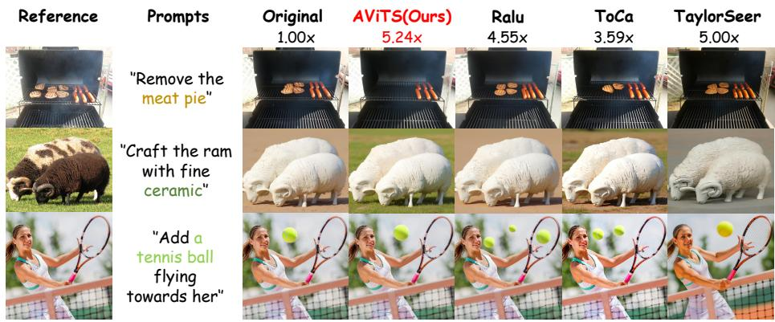  
Fig. 7: Qualitative comparison on GEdit-Bench with Qwen-Image-Edit. AViTS achieves superior semantic preservation and visual quality at a higher acceleration ratio (5.24×) compared to state-of-the-art baselines.

Table 4: Quantitative comparison of text-to-image generation with other accleration methods.
<table><tr><td rowspan="2">Method</td><td rowspan="2">NFE</td><td colspan="4">Acceleration</td><td rowspan="2">CLIP-IQA ↑</td><td rowspan="2">CLIP Score ↑</td></tr><tr><td>Latency(s) ↓</td><td>Speed ↑</td><td>FLOPs(T) ↓</td><td>Speed ↑</td></tr><tr><td>FLUX.1-dev [9]</td><td>50</td><td>25.78</td><td>1.00×</td><td>3719.50</td><td>1.00×</td><td>0.8494 (+0.00%)</td><td>33.402 (+0.00%)</td></tr><tr><td>FreqCa(N=4) [13]</td><td>50</td><td>8.38</td><td>3.08×</td><td>1116.32</td><td>3.33×</td><td>0.8472 (-0.26%)</td><td>32.255 (-3.43%)</td></tr><tr><td>AViTS+Feature Caching</td><td>18</td><td>3.02</td><td>8.54×</td><td>412.26</td><td>9.02×</td><td>0.8217 (-3.26%)</td><td>32.47 (-2.79%)</td></tr><tr><td>FLUX.1-lite-8B [24]</td><td>28</td><td>9.16</td><td>2.81×</td><td>1291.49</td><td>2.88×</td><td>0.8617 (+1.45%)</td><td>32.52 (-2.64%)</td></tr><tr><td>AViTS+Model Distillation</td><td>14</td><td>3.09</td><td>8.34×</td><td>438.76</td><td>8.48×</td><td>0.8484 (-0.12%)</td><td>31.87 (-4.59%)</td></tr><tr><td>FLUX.1-schnell [1]</td><td>8</td><td>4.20</td><td>6.14×</td><td>595.12</td><td>6.25×</td><td>0.8587 (+1.09%)</td><td>33.69 (+0.86%)</td></tr><tr><td>FLUX.1-schnell [1]</td><td>6</td><td>3.49</td><td>7.39×</td><td>439.34</td><td>8.47×</td><td>0.8703 (+2.46%)</td><td>33.75 (+1.04%)</td></tr><tr><td>AViTS+Step Distillation</td><td>8</td><td>2.55</td><td>10.11×</td><td>362.35</td><td>10.26×</td><td>0.8784 (+3.41%)</td><td>31.78 (-4.86%)</td></tr><tr><td>AViTS+Step Distillation</td><td>6</td><td>1.76</td><td>14.65×</td><td>252.00</td><td>14.76×</td><td>0.8709 (+2.53%)</td><td>32.20 (-3.60%)</td></tr><tr><td>FLUX.1-dev-int8 [5]</td><td>50</td><td>14.01</td><td>1.84×</td><td>1888.07</td><td>1.97×</td><td>0.8498 (+0.05%)</td><td>33.51 (+0.32%)</td></tr><tr><td>AViTS+Quantization</td><td>30</td><td>5.28</td><td>4.88×</td><td>752.52</td><td>4.94×</td><td>0.8542 (+0.57%)</td><td>32.25 (-3.45%)</td></tr><tr><td>AViTS+Quantization</td><td>18</td><td>2.90</td><td>8.89×</td><td>413.40</td><td>9.00×</td><td>0.8723 (+2.70%)</td><td>32.08 (-3.96%)</td></tr></table>

High and extreme acceleration regimes. Under higher acceleration around 4 to 5×, AViTS continues to maintain stable editing quality compared with existing acceleration methods. FORA achieves a similar speedup of 4.51× but its editing performance drops to OS 7.25 on GEdit-CN and 7.28 on GEdit-EN. In contrast, AViTS achieves 4.49× speedup while maintaining stronger semantic alignment with OS 7.58 and 7.55. When the acceleration further increases beyond 5×, methods such as FreqCa reach 5.57× speedup but sufer from clear quality degradation. AViTS achieves 6.95× speedup and 8.65× FLOPs reduction while maintaining strong editing performance with OS 7.57 and 7.48. These results demonstrate that AViTS scales robustly under aggressive acceleration while preserving stable editing quality.

## 4.4 Compatibility with Acceleration Methods

Table 4 together with Figure 8 shows that AViTS is orthogonal to other acceleration axes and can be combined with diferent compression strategies. Without additional training, AViTS combined with feature caching achieves up to 9× acceleration at reduced NFE while maintaining coherent and high-fidelity generations. AViTS also remains efective on compressed trajectories. When paired with step distillation, it reaches up to 14.76× acceleration while preserving plausible structures and key visual details. Moreover, AViTS composes naturally with quantization such as FLUX.1-dev-int8, providing around 9× speedup while maintaining or slightly improving perceptual quality measured by CLIP-IQA. Overall, these results demonstrate that AViTS serves as a plug-and-play token prioritization module that consistently improves the eficiency–quality trade-of when combined with caching, distillation, and quantization.

14.76x accelerated,training-free  
Table 5: Quantitative comparison of text-to-image gen. on FLUX.1-dev.
<table><tr><td rowspan="2">Method</td><td rowspan="2">NFE</td><td colspan="2">Acceleration</td><td rowspan="2">Image Reward ↑</td><td rowspan="2">CLIP Score ↑</td></tr><tr><td>Latency(s) ↓</td><td>Speed ↑</td></tr><tr><td>FLUX.1-dev</td><td>50 一</td><td>25.78</td><td>1.00×</td><td>0.9719 (+0.00%)</td><td>32.325 (+0.00%)</td></tr><tr><td>Random</td><td>30</td><td>5.25</td><td>4.91×</td><td>0.9257 (-4.75%)</td><td>31.488 (-2.59%)</td></tr><tr><td>Evenly</td><td>30</td><td>5.25</td><td>4.91×</td><td>0.9689 (-0.31%)</td><td>32.012 (-0.97%)</td></tr><tr><td>Edge detection</td><td>30</td><td>5.76</td><td>4.48×</td><td>0.9512 (-2.13%)</td><td>32.074 (-0.78%)</td></tr><tr><td>Fresco</td><td>30</td><td>5.72</td><td>4.51×</td><td>0.9861 (+1.46%)</td><td>31.970 (-1.10%)</td></tr><tr><td>AViTS (only attention)</td><td>30</td><td>4.72</td><td>5.46×</td><td>0.9875 (+1.60%)</td><td>32.251 (-0.23%)</td></tr><tr><td>AViTS (only step-variance)</td><td>30</td><td>4.67</td><td>5.52×</td><td>0.9846 (+1.31%)</td><td>32.202 (-0.38%)</td></tr><tr><td>AViTS (mix)</td><td>30</td><td>4.73</td><td>5.45×</td><td>0.9959 (+2.47%)</td><td>32.361 (+0.11%)</td></tr></table>

  
AViTS with Feature Caching,  
9x accelerated, training-free

  
AViTS with Step Distillation,  
Fig. 8: AViTS composes with feature caching and step distillation for further speedup.

## 4.5 Ablation Study

We conduct an ablation on FLUX.1-dev under the same compute budget ( \mathrm {NFE}=30 ) and the same upsampling ratio \rho (Table 5), isolating the efect of which tokens are prioritized. The training-free allocations, including Random and Evenly, achieve similar speedups (\sim 4.9 \times ) but cause clear drops in ImageReward and CLIP Score. Low-level heuristics such as Edge detection and Fresco remain suboptimal under the same \rho , showing limited alignment with text semantics and reduced CLIP Score. In contrast, our proposed importance cues are both effective. Using Attention or Step-variance alone already reaches \sim 5.5 \times acceleration with better quality retention, where step-variance is slightly faster while attention better preserves conditional semantics. Finally, AViTS (mix) achieves the best trade-of at fixed \rho , reaching 5.45 \times speedup with the highest ImageReward (0.9959) and CLIP Score (32.361), validating the complementarity between semantic alignment and cross-step dynamics.

## 5 Conclusion

We propose AViTS, a spatiotemporal token selection framework for dynamicresolution DiTs. AViTS fuses latent–text attention (spatial importance) and cross-step feature variation (temporal importance) to prioritize critical tokens for early refinement, reducing redundant high-resolution computation while preserving quality. Experiments on DrawBench and GEdit show strong speedups with stable fidelity on FLUX.1-dev, FLUX.1-Kontext-dev, and Qwen-Image-Edit, and AViTS composes well with distillation, quantization, and feature caching.

## Acknowledgements

This paper was partially sponsored by Terminal Intelligent Computing Division - Alibaba Cloud.

## References

1. Black Forest Labs: Flux.1-schnell. https://huggingface.co/black- forestlabs/FLUX.1-schnell (2024), hugging Face model card

2. Bolya, D., Hofman, J.: Token merging for fast stable difusion. In: Proceedings of the IEEE/CVF conference on computer vision and pattern recognition. pp. 4599– 4603 (2023)

3. Cai, P., Liu, J., Xu, H., Wang, X., Zou, C., Zhang, L.: Lesa: Learnable stageaware predictors for difusion model acceleration. In: Proceedings of the IEEE/CVF Conference on Computer Vision and Pattern Recognition. pp. 43300–43309 (2026)

4. Child, R., Gray, S., Radford, A., Sutskever, I.: Generating long sequences with sparse transformers. arXiv preprint arXiv:1904.10509 (2019)

5. Difusers: Flux.1-dev-torchao-int8. https://huggingface.co/diffusers/FLUX.1- dev-torchao-int8 (2024), hugging Face model card; quantized checkpoint derived from black-forest-labs/FLUX.1-dev

6. Fang, G., Ma, X., Wang, X.: Structural pruning for difusion models. arXiv preprint arXiv:2305.10924 (2023)

7. Ho, J., Saharia, C., Chan, W., Fleet, D.J., Norouzi, M., Salimans, T.: Cascaded difusion models for high fidelity image generation. Journal of Machine Learning Research 23(47), 1–33 (2022)

8. Jeong, W., Lee, K., Seo, H., Chun, S.Y.: Training-free mixed-resolution latent upsampling for spatially accelerated difusion transformers. arXiv preprint arXiv:2507.08422 (2025)

9. Labs, B.F.: Flux. https://github.com/black-forest-labs/flux (2024)

10. Labs, B.F., Batifol, S., Blattmann, A., Boesel, F., Consul, S., Diagne, C., Dockhorn, T., English, J., English, Z., Esser, P., Kulal, S., Lacey, K., Levi, Y., Li, C., Lorenz, D., Müller, J., Podell, D., Rombach, R., Saini, H., Sauer, A., Smith, L.: Flux.1 kontext: Flow matching for in-context image generation and editing in latent space (2025), https://arxiv.org/abs/2506.15742

11. Li, X., Liu, Y., Lian, L., Yang, H., Dong, Z., Kang, D., Zhang, S., Keutzer, K.: Q-difusion: Quantizing difusion models. In: Proceedings of the IEEE/CVF International Conference on Computer Vision. pp. 17535–17545 (2023)

12. Liu, F., Zhang, S., Wang, X., Wei, Y., Qiu, H., Zhao, Y., Zhang, Y., Ye, Q., Wan, F.: Timestep embedding tells: It’s time to cache for video difusion model. In: Proceedings of the Computer Vision and Pattern Recognition Conference. pp. 7353–7363 (2025)

13. Liu, J., Cai, P., Zhou, Q., Lin, Y., Kong, D., Huang, B., Pan, Y., Xu, H., Zou, C., Tang, J., Zheng, S., Zhang, L.: Freqca: Accelerating difusion models via frequencyaware caching (2025), https://arxiv.org/abs/2510.08669

14. Liu, J., Wang, X., Lin, Y., Wang, Z., Wang, P., Cai, P., Zhou, Q., Yan, Z., Yan, Z., Shi, Z., et al.: A survey on cache methods in difusion models: Toward eficient multi-modal generation. arXiv preprint arXiv:2510.19755 (2025)

15. Liu, J., Zou, C., Lyu, Y., Chen, J., Zhang, L.: From reusing to forecasting: Accelerating difusion models with taylorseers. In: Proceedings of the IEEE/CVF International Conference on Computer Vision. pp. 15853–15863 (2025)

16. Liu, J., Zou, C., Lyu, Y., Li, K., Wang, S., Zhang, L.: Speca: Accelerating difusion transformers with speculative feature caching. In: Proceedings of the 33rd ACM International Conference on Multimedia (2025)

17. Peebles, W., Xie, S.: Scalable difusion models with transformers. In: Proceedings o the IEEE/CVF international conference on computer vision. pp. 4195–4205 (2023)

18. Ronneberger, O., Fischer, P., Brox, T.: U-net: Convolutional networks for biomedical image segmentation. In: International Conference on Medical image computing and computer-assisted intervention. pp. 234–241. Springer (2015)

19. Selvaraju, P., Ding, T., Chen, T., Zharkov, I., Liang, L.: Fora: Fast-forward caching in difusion transformer acceleration. arXiv preprint arXiv:2407.01425 (2024)

20. Shang, Y., Yuan, Z., Xie, B., Wu, B., Yan, Y.: Post-training quantization on diffusion models. In: Proceedings of the IEEE/CVF conference on computer vision and pattern recognition. pp. 1972–1981 (2023)

21. Sohl-Dickstein, J., Weiss, E., Maheswaranathan, N., Ganguli, S.: Deep unsupervised learning using nonequilibrium thermodynamics. In: International conference on machine learning. pp. 2256–2265. pmlr (2015)

22. Song, J., Meng, C., Ermon, S.: Denoising difusion implicit models. arXiv preprint arXiv:2010.02502 (2020)

23. Tian, Y., Xia, X., Ren, Y., Lin, S., Wang, X., Xiao, X., Tong, Y., Yang, L., Cui, B.: Training-free difusion acceleration with bottleneck sampling. arXiv preprint arXiv:2503.18940 (2025)

24. Verdú, D., Martín, J.: Flux.1 lite: Distilling flux1.dev for eficient text-to-image generation (2024)

25. Wu, C., Li, J., Zhou, J., Lin, J., Gao, K., Yan, K., Yin, S.m., Bai, S., Xu, X., Chen, Y., et al.: Qwen-image technical report. arXiv preprint arXiv:2508.02324 (2025)

26. Zhang, J., Xiang, C., Huang, H., Wei, J., Xi, H., Zhu, J., Chen, J.: Spargeattn: Accurate sparse attention accelerating any model inference. In: Proceedings of the International Conference on Machine Learning (ICML) (2025)

27. Zheng, S., Chen, G., He, L., Liu, J., Lin, Y., Zou, C., Zhang, L.: From sketch to fresco: Eficient difusion transformer with progressive resolution. arXiv preprint arXiv:2601.07462 (2026)

28. Zou, C., Liu, X., Liu, T., Huang, S., Zhang, L.: Accelerating difusion transformers with token-wise feature caching. arXiv preprint arXiv:2410.05317 (2024)

29. Zou, C., Zhang, E., Guo, R., Xu, H., He, C., Hu, X., Zhang, L.: Rethinking tokenwise feature caching: Accelerating difusion transformers with dual feature caching. arXiv preprint arXiv:2412.18911 (2024)

## A Additional Ablation Studies

Efect of fusion ratio α and upsampling ratio $\rho .$ We study two key hyperparameters of AViTS: the fusion weight α between spatial importance (latent– text attention) and temporal importance (step-variance), and the upsampling ratio $\rho$ controlling the high-resolution token budget. Figure $9 ( \mathrm { a - c } )$ shows that AViTS performs well across a broad range of α on all three models, suggesting that the two cues are complementary rather than interchangeable. Intermediate values of α typically yield the best or near-best scores, indicating that relying on either attention-only (α=1) or step-variance-only (α=0) is suboptimal. Importantly, AViTS consistently matches or surpasses TaylorSeer under comparable speedups (see legends), showing that importance-aware selective upsampling provides a more reliable eficiency–quality trade-of across backbones. Figure 9(d) further reveals the expected monotonic trade-of with $\rho \colon$ allocating more tokens to early high-resolution refinement improves ImageReward but reduces latency speedup. We thus choose $\rho$ in the middle range to sit on the Pareto frontier.

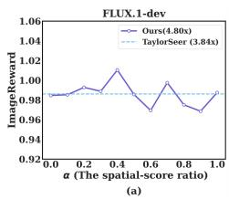

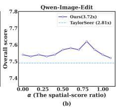

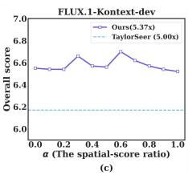

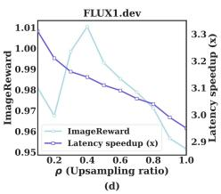  
Fig. 9: Ablation on fusion ratio and upsampling ratio. (a–c) Impact of the fusion weight $\alpha$ (spatial attention vs. temporal step-variance) on three models: FLUX.1-dev (ImageReward), Qwen-Image-Edit (Overall score), and FLUX.1-Kontextdev (Overall score). $\alpha { = } 0$ uses only step-variance, α=1 uses only attention. AViTS remains strong across a wide range of α and outperforms TaylorSeer at comparable speedups (shown in legends), indicating complementarity between semantic alignment and cross-step dynamics. (d) Speed–quality trade-of on FLUX.1-dev by varying the upsampling ratio $\rho \colon$ increasing $\rho$ improves ImageReward but reduces latency speedup, revealing a clear Pareto frontier for selecting the high-resolution budget.

High-resolution generation. Scaling Difusion Transformers to high output resolutions can be challenging: directly denoising at the target resolution may reduce coherence and yield less stable cues $( \mathrm { e . g . }$ , region-wise texture or color inconsistency). Table 6 reflects this trend on FLUX: as the resolution increases from 1024×1024 to 1440×1440 and 2048×2048, the baseline quality drops sharply, while AViTS consistently achieves higher ImageReward (0.9008 vs. 0.7385 at 1440×1440; 0.8905 vs. 0.8371 at 2048×2048) with ${ \sim } 5 . 2 { \times } { - } 5 . 5 { \times }$ speedup. The qualitative results in Fig. 10 support the same conclusion: compared with direct high-resolution sampling, AViTS better preserves prompt-critical semantics (attributes and relations) and produces more globally consistent layouts, with fewer localized artifacts and color drifts. We attribute these improvements to allocating early high-resolution computation only to the most important tokens, which reduces refinement of low-importance regions and stabilizes the trajectory. Nevertheless, extremely high-resolution generation is still challenging for current DiTs; AViTS mainly reduces the frequency and severity of such failures rather than completely eliminating them, especially for prompts requiring dense fine-grained details or precise text rendering.

Table 6: Comparison at diferent resolutions.
<table><tr><td rowspan=1 colspan=1>Resolution</td><td rowspan=1 colspan=1>Method</td><td rowspan=1 colspan=1>Latency(s) ↓</td><td rowspan=1 colspan=1>Speed ↑</td><td rowspan=1 colspan=1>ImageReward ↑</td></tr><tr><td rowspan=2 colspan=1>1024×1024</td><td rowspan=2 colspan=1>FLUXAViTS</td><td rowspan=2 colspan=1>25.784.73</td><td rowspan=1 colspan=1>1.00×</td><td rowspan=2 colspan=1>0.97190.9959</td></tr><tr><td rowspan=1 colspan=1>5.45×</td></tr><tr><td rowspan=1 colspan=1>1440×1440</td><td rowspan=1 colspan=1>FLUXAViTS</td><td rowspan=1 colspan=1>52.329.72</td><td rowspan=1 colspan=1>1.00×5.38×</td><td rowspan=1 colspan=1>0.73850.9008</td></tr><tr><td rowspan=2 colspan=1>2048×2048</td><td rowspan=2 colspan=1>FLUXAViTS</td><td rowspan=2 colspan=1>120.0322.87</td><td rowspan=1 colspan=1>1.00×</td><td rowspan=2 colspan=1>0.83710.8905</td></tr><tr><td rowspan=1 colspan=1>5.25×</td></tr></table>

## B Supplementary visualizations

Overview of supplementary visualizations. We provide additional qualitative visualizations to complement the main paper. Fig. 11 shows more examples of the final token subset selected by AViTS for text-to-image generation, where the highlighted AViTS-focused regions correspond well to the prompt (e.g., object attributes, text rendering, and multi-object relations). Fig. 12 further presents more editing cases, comparing AViTS with prior partial-upsampling heuristics (RALU and Fresco). Consistent with the main text, AViTS concentrates highresolution computation on instruction-relevant regions while allocating fewer tokens to non-edited areas, leading to better edit fidelity and stronger background/identity preservation. These figures show that AViTS’s token prioritization aligns computation with semantic intent across generation and editing.

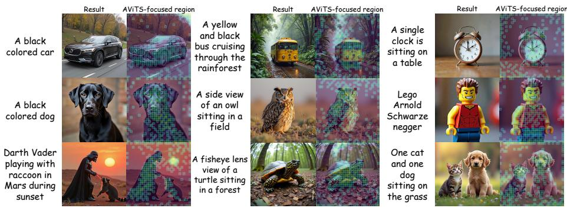

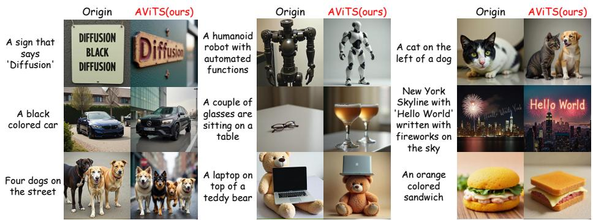  
A red coloredA sign that  two dogsFig. 10: Qualitative comparison for high-resolution generation (2048×2048). car'NeurIPS' sitting onCompared with the original FLUX sampling at the target resolution, AViTS produces more faithful and coherent results, with better color consistency and fewer artifacts, especially for prompts involving text rendering and multi-object relations.  
propelled on apple and a ArnoldFig. 11: Additional visualizations of AViTS token selection for text-to-image water byblack Schwarzegeneration. For each prompt, we show the generated result and the corresponding or an engineAViTS-focused token regions (highlighted overlays) selected by the final spatiotemporal importance score. AViTS consistently assigns more high-resolution budget to semantically critical regions (e.g., object parts/attributes, text-bearing areas, and salient regions), showing strong correlation between token prioritization and prompt intent.

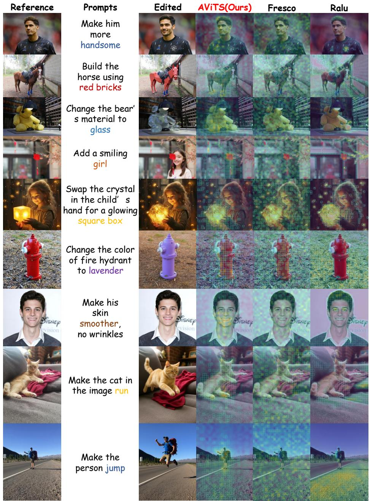  
Fig. 12: Additional editing examples and token-allocation comparison. We compare AViTS with Fresco and RALU on diverse editing instructions. Along with the edited outputs, we visualize the tokens prioritized for high-resolution refinement. AViTS focuses on instruction-relevant regions (e.g., the target object/attribute to be modified) and assigns fewer tokens to non-edited areas, whereas Fresco/RALU often over-allocate tokens to edges or difuse background regions, which can lead to weaker edit fidelity or reduced consistency outside the edited region.