# Automated ACL Footprint Identification Using 3D Deep Learning

Ruida Chenga, Ali Unerib, Gabriel Gibsonc, Frances T. Sheehanc, Barry Bodend

a Scientific Application Services, Center of Information Technology, NIH bBiomedical Engineering, Johns Hopkins University, Baltimore, Maryland c Rehabilitation Medicine Department, Clinical Center, NIH dThe Centers for Advanced Orthopaedics Center, Rockville, Maryland

## ABSTRACT

One of the most common reasons for anterior cruciate ligament (ACL) reconstruction failure is femoral tunnel malpositioning (ACL footprint center and tunnel orientation). Such failures may lead to the development of menisca pathology and osteoarthritis. Accurate ACL femoral footprint identification is therefore essential for precise tunnel placement, restoration of the native knee joint mechanics, post-surgical knee joint health and prevention of graft failure. Recent advances in artificial intelligence (AI) bring new opportunities to improve image-guided orthopedic surgery. However, at present, existing AI research focuses primarily on ACL segmentation and rupture classification based on preand post-operative magnetic resonance (MR) images. Identification of the ACL footprint center using deep learning methods has not been thoroughly researched. Thus, the purpose of this study is to explore 3D deep learning models for ACL femoral footprint identification directly from 3D MR images. Two comprehensive 3D deep learning architectures were developed: a 3D graph convolutional neural network-based geometric model applied to 3D femoral meshes; and a 3D landmark-enhanced identification model based on 3D MR images. A total of 4883 right and 3087 left knee image sets were used from a publicly available database. Eighty percent (80%) were applied to model generation, and twenty percent (20%) were preserved for model testing. Both models achieved excellent performance; however, the image-based method outperformed the model-based method (average error of 2.1mm vs 2.8 mm). Thus, 3D deep learning provides a feasible clinical approach for ACL footprint localization and has the potential to improve ACL reconstruction footprint accuracy.

Keywords: GCNN, Landmark, detection, ACL, footprint

## 1. INTRODUCTION

Approximately 150,000-400,000 anterior cruciate ligament (ACL) reconstructions are performed annually in the United States [1]. Although the exact number of surgeries is unknown, this number aligns with the rising incidence rates of ACL injury [2]. Despite improvements in knee stability with ACL reconstructions, persistent high rates of post-operative knee joint instability, abnormal kinematics, and osteoarthritis exist due to inadequate restoration of knee joint mechanics [3]. Early ACL reconstruction surgeries were commonly performed using a transtibial technique, in which the femoral tunnel was drilled based on a pre-drilled tibial tunnel. Yet, this technique was criticized for causing improper femoral tunnel placement, which is one of the most common factors leading to ACL revision [4]. Advances in ACL femoral footprint anatomy identification led to renewed interest in improving femoral tunnel location during ACL reconstructions [5]. In response, tibial-independent femoral tunnel drilling techniques were developed that more accurately reproduced native ACL anatomy [6]. However, ACL footprint identification has remained a manual process.

The recent developments in artificial intelligence like CNNs (convolutional neural networks) and 3D deep learning algorithms make it possible to automate the magnet resonance image (MR image) based ACL injury analysis. Initial research mostly revolved around identifying the ACL tears. Liu et al. [7] proposed a cascaded pipeline of CNN consisting of LeNet-based, YOLO-based, and DenseNet-based classifier networks for selecting the sagittal MR slices containing the ACL, for landmark-based identification of the ACL area, and for classifying the ACL-state (intact or disrupted). MRNet [8] based on an AlexNet-based CNN architecture for knee MR image analysis (in each tri-plane) was proposed to classify abnormalities, ACL tears, and meniscal tears. It achieved area under the curve agreements of 0.937, 0.965, and 0.847, respectively. Qu et al. [9] proposed a coarse-to-fine deep learning pipeline to localize the ACL rupture and classify rupture types. It used a 3D UNet-based segmentation model to isolate the ACL region, then localized the ACL rupture points using a YOLO-based 2D model, and finally classified rupture types. Liu and colleagues [10] proposed an ACLNet based model that integrated convolutional MR image representations with transformer-based bone morphological point clouds to predict ACL rupture by leveraging both imaging and geometric data.

Automated segmentation of the whole ACL remains a challenging task due to the small ligament size, low-contrast boundaries with surrounding soft tissues, and variability in appearance following injury. Lee et al. [11] proposed a graphcut-based ACL segmentation with a shape prior and label refinement. This method required initial semi-manual seeding selection for a rough ACL region. Flannery et al. [12] applied 2D U-Net for intact ACL segmentation using 246 MR image sets. The model achieved a mean Dice score of 0.84. MGACA-Net [13] modified the DeepLabv3 architecture with atrous spatial pyramid pooling and squeeze-and-excitation blocks to segment the ACL region on knee MR slices. It reported the highest Dice score of 97.64%. Most ACL segmentation works explored U-Net derivatives for ACL and torn ACL segmentations in a 2D or 2.5D manner. None of these models evaluated the accuracy of locating the ACL footprint.

Developing 3D deep learning models that can directly and accurately identify the femoral ACL footprint from 3D volumetric MR images can help bridge the gap between automated image analysis and surgical planning by providing anatomical targets for more accurate tunnel placement during ACL reconstruction. Such automatic footprint-identification models could be combined with emerging computer navigation, and arthroscopic computer vision systems to improve ACL tunnel placement, leading to improved outcomes. However, automated patient-specific localization of the ACL femoral footprint remains insufficiently investigated. Thus, the purpose of this study is to explore 3D deep learning models for ACL footprint identification directly from 3D MR images.

## 2. METHODS

## 2.0 ACL Footprint Center Localization

Identifying the ACL footprint center as a single point within a 3D volumetric image or a 3D surface mesh is challenging. Single-point detection is a highly imbalanced localization issue. The target center point occupies only a small fraction of the entire volumetric image domain. Consequently, direct single-pointwise prediction with 3D feature-wise convolution makes it hard to distinguish a single landmark point from surrounding anatomical structures. We address this spatially imbalanced problem by formulating ACL center localization as a landmark heatmap prediction task, in which the groundtruth center is represented by a spatial probability distribution rather than a single positive voxel or vertex.

## 2.0.1 3D Mesh based ACL Footprint Center Localization

A 3D femoral surface mesh-based model is our first attempt to identify the ACL femoral footprint center by formulating its localization as a landmark detection task. Motivated by Graph CNN [14], we develop a framework built on dynamic graph CNN networks [15] (DGCNN), a 3D geometric deep learning method that conducts vertex-wise landmark detection. The network is composed of three major phases: mesh preprocessing (to reduce vertex and face overhead), DGCNN graph feature extraction, and vertex-based probability map estimation (Fig 1).

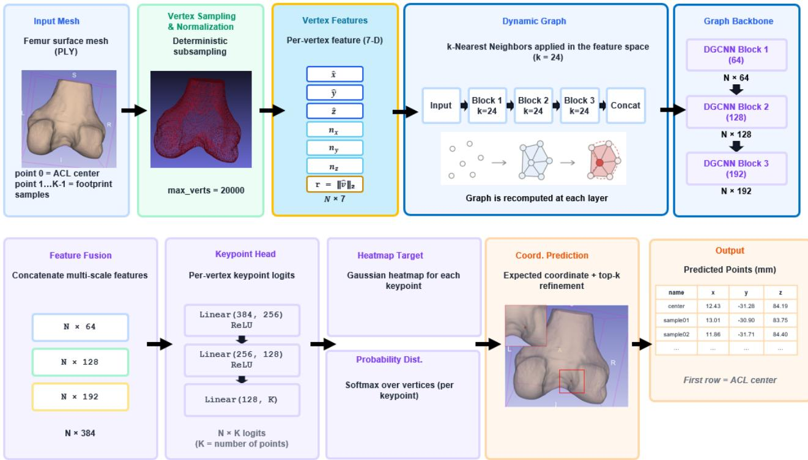  
Figure 1 DGCNN for ACL footprint center detection

## Stage 1: Mesh preprocessing

For each knee, a femoral surface mesh in PLY format together with a CSV file of annotated points are the model inputs. The landmark points consist of the ACL femoral footprint center and surrounding sampling points. The latter increases the likelihood of a spatially distributed center-point feature representation in the 3D mesh. The femoral mesh is typically composed of hundreds of thousands of vertices, making mesh-based graph convolution prohibitively expensive. Thus, we perform a preprocessing step to reduce the vertices with deterministic sampling and normalization. The deterministic sampling ensures the uniform spacing of each point. Each vertex’s anatomical position and local surface orientation is represented by a seven-dimensional feature vector:

$$
f _ { i } = \left[ \widehat { x } _ { \iota } , \widehat { y } _ { \iota } , \widehat { z } _ { \iota } , n _ { x } , n _ { y } , n _ { z } , r _ { i } \right]
$$

$\widehat { x } _ { \iota } , \widehat { y } _ { \iota } , \widehat { z } _ { \iota }$ : vertex coordinates

$n _ { x } , n _ { y } , n _ { z } \colon$ surface normal

$r _ { i } \mathrm { : }$ distance from the center

## Stage 2: Dynamic graph feature extraction

The DGCNN model performs the ACL femoral footprint center landmark detection on 3D mesh point cloud via edge convolution blocks, which dynamically recomputes the k-nearest neighbors at each network level. The dynamic computation technique helps to obtain the 3D point cloud local geometric shapes. The shallow and deep layers connect vertices that lie close in physical distance and the learned feature space, respectively. The dynamic graph convolution neural network learns the multiscale geometric representations and generates a vertex-wise probability distribution.

## Stage 3: Vertex-wise probability estimation

The multiscale vertex features pass through the multilayer perceptron to generate one localization score (logits, Fig 1) for each keypoint (center and sampling points) per vertex. This generates an N×K tensor (Fig 1), where K columns represent the spatial likelihood map over the 3D femoral mesh. In the training process, each annotated keypoint is represented by a soft Gaussian target, instead of just one single positive vertex, where vertices closer to the center of the ACL footprint have higher probabilities. The probabilities drop to nearly zero as the vertices move further from the center.

A DGCNN network extracts multi-scale geometric features and generates a vertex-wise probability distribution map for each target landmark point (center and sampling points). The training process is based on combining Gaussian heatmap supervision with a coordinate regression loss, giving higher weights to points close to the ACL center. During inference, the predicted center coordinate is estimated from all sampling vertices, with refined estimate vertices derived from the highest probability map. Based on the original dynamic graph CNN model, we integrate the network with deterministic mesh sampling, mesh normalization, 7-D vertex features, an increased receptive field in the DynamicEdgeConv backbone, and KL-divergence heatmap loss with coordinate regression loss. The overall mechanism ensures the geometrically and anatomically correct detection of the ACL footprint center on the 3D femur surface meshes.

## 2.0.2 3D Volumetric Images based ACL Footprint Center Localization

A 3D MR image-based model (Fig 2) is our second attempt to identify the ACL femoral footprint center and again we formulate its localization as a landmark detection task. We are motivated by the nnLandmark [16] architecture, which improves the localization of small and ambiguous targets in 3D medical images. We developed a framework that extends the original nnLandmark architecture with squeeze-and-excitation (SE) attention [17], a multi-scale high-resolution fusion module, and top-K peak-decoding building blocks to further improve detection of small and spatially ambiguous targets, such as the ACL footprint center in 3D MR images. With a new 3D MR image volume, the proposed architecture generates a heatmap channel per target landmark. After applying sigmoid activation, each voxel heatmap intensity represents the predicted probability.

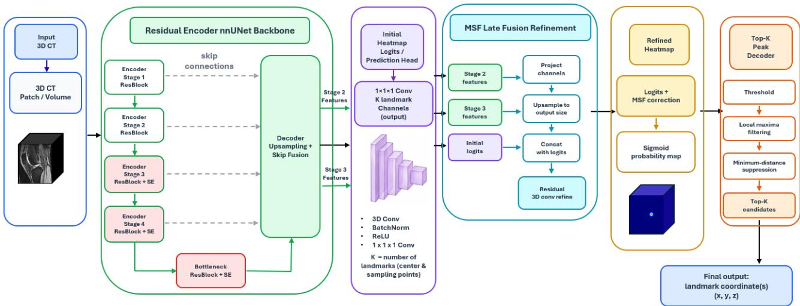  
Figure 2. 3D image-based ACL footprint center landmark detection architecture.

## Step 1: Backbone

The landmark detection architecture backbone is based on the conventional 3D residual-based nnUNet [18]. The encoder’s shallow layers capture local spatial features, whereas the deeper layers encode more abstract anatomical and contextual global features. The bottleneck extends with SE blocks to provide the largest receptive field and capture global context. The decoder progressively upsamples the bottleneck representations and merges them with the encoder-side feature maps via skip connections. The baseline backbone outputs an initial set of landmark heatmap logits from a 1 x 1 x 1 convolutional prediction head.

## Step 2: Squeeze-and-excitation attention

To improve feature discrimination, Squeeze-and-excitation attention blocks are integrated into the deeper encoder stages and bottleneck. The SE blocks enable channel-wise attention by recalibrating the feature maps and capturing channel-wise dependencies. The squeeze operator applies global average pooling to generate the channel-wise local descriptors on the input feature maps. The excitation operator maps the input-specific descriptors to a set of channel weights to generate the final channel-wise attention. The SE blocks amplify more informative channel features and suppress noise and less relevant features for landmark detection.

## Step 3: Multi-scale high-resolution fusion

The backbone decoder outputs the first heatmap logits with the 1 x 1 x 1 prediction head convolution layer. Nevertheless, the decoder features may not possess the resolution needed to localize a small target, such as the ACL footprint center. Thus, a multi-scale fusion module is used to improve the first heatmap prediction. The intermediate features of the second and third encoders are taken and converted to the common feature size with $1 \mathrm { ~ x ~ } 1 \mathrm { ~ x ~ } 1$ convolutions. These features are then resized to the final heatmap resolution with trilinear interpolation and concatenated with the first heatmap logits. Further processing by the residual 3D convolution blocks leads to the final heatmap.

## Step 4: Top-K peak decoding

Inference is done by converting the processed logits score into a probability heatmap using sigmoid activation followed by top-k peak selection decoding. Voxels are first filtered using the probability threshold $( \tau = 0 . 1 0 )$ . The spatial local maxima are then defined based on peak detection using a 3D max-pooling method with the neighborhood defined by the minimum-distance parameter. Ranked candidates are processed in descending order of score. Any candidate lying within the minimum distance (r=5 voxels) of an already-selected peak is suppressed to remove duplicate detections. The K highest-scoring peaks are retained (k=5 by default); the top-ranked peak serves as the primary landmark prediction. The resulting point is then converted back to the original image space and reported in the patient/world coordinate systems.

The proposed nnLandmark-enhanced detection architecture consists of three integrated building blocks: SE attention highlights the importance of choosing channels in the deeper encoder and bottleneck; multi-scale fusion helps recover the spatial feature representation of the high resolution in the final heatmap; top-k decoding helps ensure more stable inference for the single-voxel candidate. The three building blocks are intended to improve the model's ability to detect small landmarks such as the ACL footprint center point.

## 2.1 MRI data

From the 3DReasonKnee dataset [19], we acquired 7969 3D knee MR images derived from the Osteoarthritis Initiative (OAI). The images were Axial 3D Double-Echo Steady-State (3D DESS) acquisitions obtained with standardized 3T Siemens MAGNETOM Trio scanners. Those DESS volumes have a voxel resolution of approximately $0 . 3 6 5 \mathrm { ~ x ~ } 0 . 3 6 5 \mathrm { ~ x ~ }$ 0.7 mm3, with an image size of 384 x 384 x 160 slices per volume. The 3DReasonKnee dataset provides segmentationbased anatomical annotation masks, such as ACL and femur; however, it does not provide ACL femoral footprint center landmarks. In this study, we derived an ACL footprint center identification algorithm from the ACL and femur segmentation masks. 4883 and 3087 image sets represented the right and left knee, respectively. We split the dataset so that 80% of the images are used for model training and the remaining 20% for model testing (Table 1). We generate 3D femoral meshes and ACL footprint centers (as 3D landmark points) by developing a 3D mesh reconstruction algorithm and an ACL center identification algorithm based on the ACL and femur segmentation masks. For the 3D mesh approach, each femoral mesh has one ACL footprint center point and 20 surrounding sampling points, yielding 21 landmarks per case.

<table><tr><td>Dataset</td><td>Training</td><td>Testing</td><td>Total</td><td>Train/Test Split</td></tr><tr><td>Left femur</td><td>2468</td><td>618</td><td>3087</td><td>80%/20%</td></tr><tr><td>Right femur</td><td>3906</td><td>977</td><td>4883</td><td>80%/20%</td></tr></table>

Table 1. Training and testing data distribution for the left and right femur

## 3. RESULTS

The proposed 3D mesh method was evaluated independently on the left and right femur datasets using the Euclidean distance (absolute mean error) between predicted landmark points and ground-truth landmark points. The ACL footprint center identification performance metrics include mean error, median error, 95th-percentile error (P95, the distance below which 95% of all landmark errors fall), and Percentage of Correct Keypoints (PCK) under distance thresholds of 2 mm, 3 mm, and 5 mm. For the right femoral dataset, the proposed 3D Mesh DGCNN framework obtained 2.638 mm with a median error of 2.096 mm (Table 2, Fig 3). The left femoral dataset’s performance was slightly worse than the right. The mean detection error was within 3 mm (59% and 73% for the left and right knees). For the left femoral dataset, the proposed 3D Mesh DGCNN framework obtained a mean detection error of 3.170 mm and a median error of 2.378 mm (Table 2, Fig 3). 95% of landmark predictions were within 6.9 mm of the ground truth locations.

<table><tr><td>Metrics</td><td>Left Right</td></tr><tr><td>Mean Error(mm)</td><td>3.170 2.638</td></tr><tr><td>Median Error (mm)</td><td>2.378 2.096</td></tr><tr><td>P95 Error (mm)</td><td>6.925 6.197</td></tr><tr><td>PCK@2mm</td><td>44.827% 47.655%</td></tr><tr><td>PCK@3mm</td><td>58.621% 72.628%</td></tr><tr><td>PCK@5mm</td><td>89.655% 89.967%</td></tr></table>

Table 2. 3D mesh-based ACL footprint landmarks detection performance  
Case: Knee\_078, Right

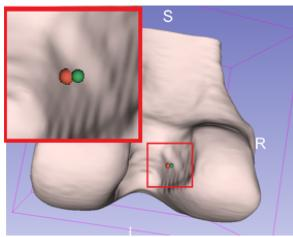  
Error: 2.778 mm  
Case: Knee\_3182, Right

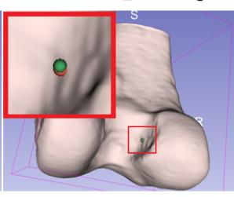  
Error: 1.174 mm  
Case: Knee\_3266, Left

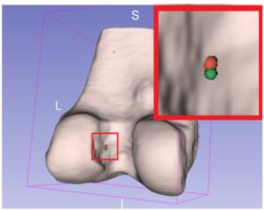  
Error: 1.306 mm  
Case: Knee\_548, Left

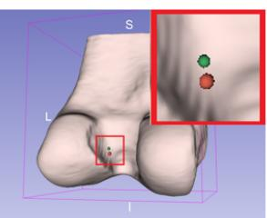  
Error: 2.928 mm

Figure 3. 3D Mesh-based ACL footprint landmark detection results. The green sphere represents the ground truth ACL center. The red color sphere is the prediction. The error between the two is listed below each model.

The 3D image-based enhanced nnLandmark detection framework achieved better ACL footprint center localization performance, relative to the mesh-based model (Table 3, Fig 4). Across both knees, the image-based method produced an average error of 2.1mm. The left knee model produced a localization mean error of 1.82 mm (median: 1.28 mm, P95: 4.60 mm). The right knee model produced a mean localization error of 2.35 mm (median: 1.60 mm, P95: 6.82 mm). In addition, the Percentage of Correct Keypoints (PCK) metric demonstrates the efficiency of the proposed approach. In the case of the left knee, 77.8%, 89.9%, and 95.6% of the estimated ACL center were located within 2 mm, 3 mm, and 5 mm of the ground truth location, respectively. The same is true for the right knee dataset, with PCK rates of 68.7%, 83.5%, and 92.8% for the above-mentioned distances. Ninety-five percent of the left and right knees had localization errors less than or equal to 4.60 mm and 6.82 mm, respectively. Although some difficult cases showed errors of more than 20 mm, their frequency was low and had little impact on overall performance.

<table><tr><td>Metrics</td><td>Left Right</td></tr><tr><td>Mean Error(mm)</td><td>1.816 2.353</td></tr><tr><td>Median Error (mm)</td><td>1.275 1.600</td></tr><tr><td>P95 Error (mm)</td><td>4.597 6.822</td></tr><tr><td>PCK@2mm</td><td>77.800% 68.730%</td></tr><tr><td>PCK@3mm</td><td>89.890% 83.510%</td></tr><tr><td>PCK@5mm</td><td>95.600% 92.780%</td></tr></table>

Table 3. 3D volumetric images-based ACL footprint landmark detection performance

Case: Knee\_7933, Right  
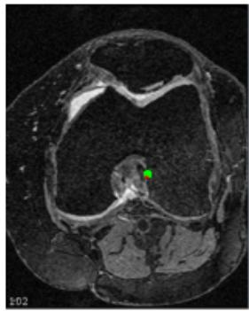  
Error: 1.723 mm

Case: Knee\_4066, Right  
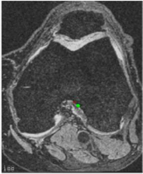  
Error: 4.713mm

Case: Knee\_5599, Left  
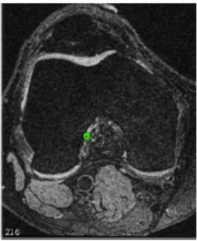  
Error: 1.345mm

Case: Knee\_3016, Left  
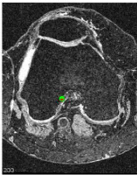  
Error: 1.079mm  
Figure 4. 3D image-based ACL footprint landmark detection results. The green and red circles represent the ground truth ACL center mask and the prediction mask, respectively. The errors between the two are listed below the MR image.

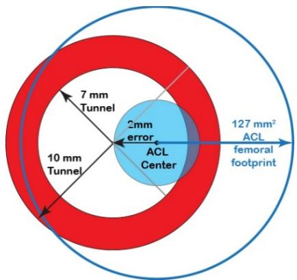  
Figure 5. Schematic of the naive ACL femoral footprint and drill hole placed at ACL footprint center with an added error. For simplicity, we assume the ACL footprint is a circular region (blue unfilled circle) with an area of 126.8 mm2 [20]. As the typical ACL drills holes range for 7-10mm, the latter is represented by a red circle and the former by a white circle within this red circle. Then assuming an error (r = 2mm, blue circle), the amount of overlap between the footprint and drill hole can be calculated as:

$$
\begin{array} { c } { { A _ { o v e r a p } = \displaystyle \pi r ^ { 2 } - [ r ^ { 2 } c o s ^ { - 1 } ( \frac { d ^ { 2 } + r ^ { 2 } - R ^ { 2 } } { 2 d r } ) +  R ^ { 2 } c o s ^ { - 1 } ( \frac { d ^ { 2 } - r ^ { 2 } + R ^ { 2 } } { 2 d R } )  } } \\ { { \displaystyle +  \frac { 1 } { 2 } \sqrt { ( - d + r + R ) * ( d + r - R ) * ( d - r + R ) * ( d + r + R ) } ] } } \end{array}
$$

�: Center-to-center distance representing the average localization error between the predicted and actual ACL centers (2mm in the figure).

�: the radius of the drill-hole (7 or 10 mm).

�: The radius of the native femoral ACL footprint (20.2 mm).

## 4. CONCLUSION

This pilot study illustrated the feasibility of applying 3D deep learning for automatic ACL femoral footprint center detection using two complimentary models. A direct comparison to the literature is not feasible, as no other studies (to the best of our knowledge) have evaluated the accuracy of automatically locating the ACL femoral footprint center. Of the models, the 3D volumetric image-based nnLandmark detection was superior to the 3D mesh geometric DGCNN. Assuming a perfectly round femoral footprint of 126.8 mm2 [20] (Fig 5), our image- and mesh-based models average errors keep a 7mm drill hole within the femoral footprint. If the drill size is increased to 10mm, then just 6% and 14% of the hole falls outside of the ACL footprint for the image- and mesh-based model predictions. These minor deviation from the actual footprint, occurring only at the largest drill hole size, indicates that both methods show promise in guiding surgical decision making. As this study was based on images with an intact ACL, the model-based approach may have produced more accurate results due on the presence of the intact ACL within the image. Thus, the mesh-based model, although slightly less accurate, holds significant promise in locating the femoral ACL footprint in individuals with a torn ACL, where the original footprint may not be visible on the images. In future work, we will investigate the generalizability of the imagebased deep learning model to handle both intact and torn ACLs, as well as investigate model enhancements to further reduce the errors. Therefore, this study has shown that 3D deep learning provides a feasible clinical approach to aid ACL footprint localization, improving drill site selection accuracy for ACL reconstruction footprint.

## ACKNOWLEDGEMENTS

We sincerely thanks Dr. Alexandra Ertl and Dr. Fabian Isensee for providing the nnLandmark training implementation code that supported this study.

## REFERENCES

[1] Mall, N. A., et al., “Incidence and trends of anterior cruciate ligament reconstruction in the United States,” Am. J. Sports Med. 42(10), 2363–2370 (2014).

[2] Childers, J., et al., “Reported anterior cruciate ligament injury incidence in adolescent athletes is greatest in female soccer players and athletes participating in club sports: A systematic review and meta-analysis,” Arthroscopy 41(3), 774–784.e2 (2025).

[3] Eckenrode, B. J., et al., “Prevention and management of post-operative complications following ACL reconstruction,” Curr. Rev. Musculoskelet. Med. 10(3), 315–321 (2017).

[4] Morgan, J. A., et al., “Femoral tunnel malposition in ACL revision reconstruction,” J. Knee Surg. 25(5), 361–368 (2012).

[5] Sutter, E. G., Anderson, J. A., and Garrett, W. E., Jr., “Direct visualization of existing footprint and outside-in drilling of the femoral tunnel in anterior cruciate ligament reconstruction in the knee,” Arthroscopy Techniques 4(2), e107–e113 (2015).

[6] Abebe, E. S., et al., “Femoral tunnel placement during anterior cruciate ligament reconstruction: An in vivo imaging analysis comparing transtibial and 2-incision tibial tunnel-independent techniques,” Am. J. Sports Med. 37(10), 1904–1911 (2009).

[7] F. Liu, B. Guan, Z. Zhou, A. Samsonov, H. Rosas, K. Lian, R. Sharma, A. Kanarek, J. Kim, A. Guermazi, and R. Kijowski, “Fully automated diagnosis of anterior cruciate ligament tears on knee MR images by using deep learning,” Radiology: Artificial Intelligence 1(3), e180091 (2019).

[8] N. Bien, P. Rajpurkar, R. L. Ball, J. Irvin, A. Park, E. Jones, M. Bereket, B. N. Patel, K. W. Yeom, K. Shpanskaya, S. Halabi, E. Zucker, G. Fanton, D. F. Amanatullah, C. F. Beaulieu, G. M. Riley, R. J. Stewart, F. G. Blankenberg, D. B. Larson, R. H. Jones, C. P. Langlotz, A. Y. Ng, and M. P. Lungren, “Deep-learning-assisted diagnosis for knee magnetic resonance imaging: Development and retrospective validation of MRNet,” PLoS Medicine 15(11), e1002699 (2018).

[9] C. Qu, H. Yang, C. Wang, C. Wang, M. Ying, Z. Chen, K. Yang, J. Zhang, K. Li, D. Dimitriou, T.-Y. Tsai, and X. Liu, “A deep learning approach for anterior cruciate ligament rupture localization on knee MR images,” Frontiers in Bioengineering and Biotechnology 10, 1024527 (2022).

[10] C. Liu, X. Yu, D. Wang, and T. Jiang, “ACLNet: A deep learning model for ACL rupture classification combined with bone morphology,” in Medical Image Computing and Computer Assisted Intervention—MICCAI 2024, Lecture Notes in Computer Science, vol. 15005, Springer Nature Switzerland, 57–67 (2024).

[11] H. Lee, H. Hong, and J. Kim, “Segmentation of anterior cruciate ligament in knee MR images using graph cuts with patient-specific shape constraints and label refinement,” Computers in Biology and Medicine 55, 1–10 (2014).

[12] S. W. Flannery, A. M. Kiapour, D. J. Edgar, M. M. Murray, J. E. Beveridge, and B. C. Fleming, “A transfer learning approach for automatic segmentation of the surgically treated anterior cruciate ligament,” Journal of Orthopaedic Research 40(1), 277–284 (2022).

[13] M. J. Awan, M. S. Mohd Rahim, N. Salim, H. Nobanee, A. A. Asif, and M. O. Attiq, “MGACA-Net: A novel deep learning-based multi-scale guided attention and context aggregation for localization of knee anterior cruciate ligament tear regions in MRI images,” PeerJ Computer Science 9, e1483 (2023).

[14] T. N. Kipf and M. Welling, “Semi-Supervised Classification with Graph Convolutional Networks,” in Proceedings of the 5th International Conference on Learning Representations (ICLR) (2017).

[15] Y. Wang, Y. Sun, Z. Liu, S. E. Sarma, M. M. Bronstein, and J. M. Solomon, “Dynamic Graph CNN for Learning on Point Clouds,” ACM Trans. Graph. 38(5), Article 146, 1–12 (2019).

[16] A. Ertl, S. Denner, R. Peretzke, S. Xiao, D. Zimmerer, M. Fischer, M. Bujotzek, X. Yang, P. Neher, F. Isensee, and K. H. Maier-Hein, “nnLandmark: A Self-Configuring Method for 3D Medical Landmark Detection,” Proc. 9th Int. Conf. Med. Imaging Deep Learn. (MIDL), Proc. Mach. Learn. Res. 315, 894–927 (2026).

[17] J. Hu, L. Shen, and G. Sun, “Squeeze-and-Excitation Networks,” Proc. IEEE Conf. Comput. Vis. Pattern Recognit. (CVPR), 7132–7141 (2018).

[18] F. Isensee, P. F. Jaeger, S. A. A. Kohl, J. Petersen, and K. H. Maier-Hein, “nnU-Net: A self-configuring method for deep learning-based biomedical image segmentation,” Nat. Methods 18(2), 203–211 (2021).

[19] S. Sambara, S. E. Kim, X. Zhang, L. Luo, S. Johri, M. Baharoon, D. H. Ro, and P. Rajpurkar, “3DReasonKnee: Advancing Grounded Reasoning in Medical Vision Language Models,” Pac. Symp. Biocomput. 31, 99–113 (2026).

[20] Wang, C., et al., “Comparative meta-analysis of ACL footprint anatomy between Asian and Western populations,” Orthop. J. Sports Med. 13(12), 23259671251397407 (2025).