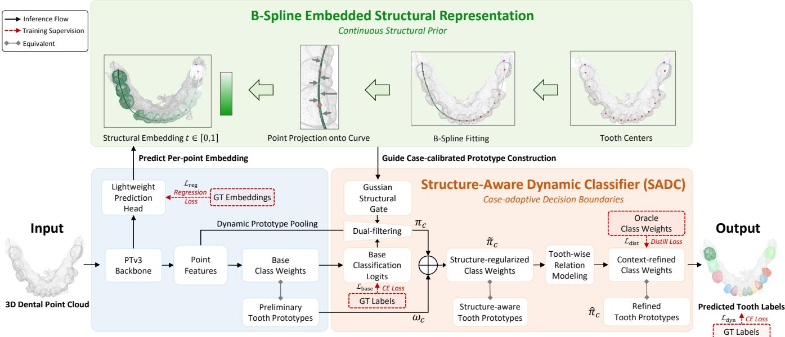
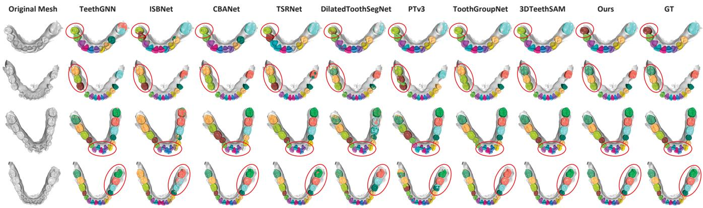

# B-Spline Embedded Structure Learning for 3D Tooth Segmentation

Xianghan Wei1, Jianwen Lou1, Zhiguo Lu1, Hairong Jin2, Haihua Zhu3

1School of Software Technology, Zhejiang University

2School of Computer and Computing Science, Hangzhou City University 3The Afiliated Stomatology Hospital, Zhejiang University School of Medicine

## Abstract

Accurate 3D tooth segmentation forms the cornerstone of digital dentistry, yet it remains a formidable challenge due to the inherent intricacy of real-world dentitions, such as crowding, misaligned teeth and high morphological similarity between adjacent teeth. To resolve this, we present B-Spline Embedded Structure Learning, a novel framework that distills the inherent sequential arrangement of teeth into a continuous structural constraint to regularize representation space. Our approach parameterizes the global dental topology by fitting a parametric B-spline trajectory to tooth centers, assigning each point a continuous structural embedding that forces the shared backbone to capture global arch organization. To fully exploit these embedded priors, we introduce a Structure-Aware Dynamic Classifier (SADC) to substitute rigid static templates with adaptive, case-calibrated decision boundaries. SADC regularizes dynamic prototype pooling via a localized Gaussian proximity gate and contextually co-evolves them through an attention block modeling spatial relations and bilateral symmetries across teeth. Extensive evaluations on the 3DTeeth-Seg22 benchmark demonstrate that our method establishes a new state-of-the-art accuracy with exceptional structural robustness and eficiency in computational overhead, markedly enhancing the model’s capacity to handle complex dental configurations.

Code: https://github.com/blackbird2003/TeethSplineSeg

## Introduction

Accurate and robust 3D tooth segmentation from highresolution intraoral scans is fundamental to modern digital dentistry, including computer-aided orthodontics, prosthesis design, and surgical simulation. Advances in geometric deep learning have enabled point- and mesh-based networks - including general backbones (Qi et al. 2017; Wang et al. 2019; Zhao et al. 2021) and dental-specific architectures targeting multiscale contexts, local boundaries, or foundation representations (Xu, Liu, and Zheng 2019; Cui et al. 2021; Lian et al. 2020; Wu et al. 2022; Zheng et al. 2023; Krenmayr et al. 2024; Jin et al. 2025b,a; Lim et al. 2022; Lu et al. 2026) - to automate this task. Despite improving segmentation accuracy, existing frameworks still struggle with precise boundary delineation and reliable tooth category discrimination in complex real-world dentitions, including severe crowding, malpositioned teeth, and morphological ambiguity within functional groups (e.g., adjacent molars).

Incorporating anatomical priors, such as invariant dental order and stable dental arch shape, ofers a promising yet largely unexplored solution. Most notably, DArch (Qiu et al. 2022) pioneered explicit spatial layout modeling by representing the dental curve with parametric Bézier lines, demonstrating that structural priors facilitate tooth instance localization. However, its spatial prior primarily optimizes input-stage point sampling statistics rather than directly regularizing downstream neural representations. This leaves an opportunity to map continuous trajectories and rigid sequential topology into a unified dense embedding space, improving structural robustness in complex cases.

Another common bottleneck is the reliance on globally shared, static classification weights. Such rigid decision boundaries use fixed templates to separate teeth across subjects, limiting adaptation to individual distribution shifts and abnormal dentitions. Although the Context-Aware Classifier (CAC) (Tian et al. 2023) was recently introduced in general computer vision to generate sample-conditioned decision boundaries, this dynamic classification philosophy remains unexplored in 3D tooth segmentation. Moreover, generic CAC operates within unconstrained feature manifolds and may generate anatomically implausible boundaries for complex or corrupted dental layouts without explicit spatial regularization.

To address these gaps, we propose a novel B-spline embedded structure learning paradigm for 3D tooth segmentation. Specifically, we use a continuous B-spline trajectory to model the dental arch and parameterize its global topology as point-wise structural embeddings within the neural representation space. These dense structural embeddings are integrated into a Structure-Aware Dynamic Classifier (SADC), which regularizes dynamic prototype pooling and replaces rigid static templates with adaptive, case-calibrated decision boundaries, improving classification robustness across complex cases. In summary, the core contributions of this work are three-fold:

• We introduce a novel B-spline embedded structure learning paradigm that models the dental arch trajectory to extract dense, point-wise structural embeddings, unifying continuous geometric variations with rigid sequential topology.

• We propose the Structure-Aware Dynamic Classifier (SADC), a pioneering dental-native classifier that replaces rigid, static templates with dynamic, casecalibrated decision boundaries regularized by structural location and relational context.

• Extensive evaluations on the 3DTeethSeg22 benchmark demonstrate that our framework achieves new state-ofthe-art accuracy and exceptional structural robustness across complex cases while significantly reducing training and inference overhead.

## Related Work

Segmentation via Geometry Learning Early 3D tooth segmentation methods relied on handcrafted geometric cues such as surface curvature, morphological skeletons, and harmonic fields (Yuan et al. 2010; Wu et al. 2014). To address their limited generalization and need for manual tuning in complex cases, data-driven geometric deep learning has introduced advanced point- and mesh-based backbones, including PointNet++ (Qi et al. 2017), DGCNN (Wang et al. 2019), and Point Transformer (Zhao et al. 2021). Based on these architectures, Xu et al. (Xu, Liu, and Zheng 2019) projected mesh facet geometries into 2D feature maps for hierarchical inference. TSegNet (Cui et al. 2021) simplified instance tracking by predicting coarse tooth centroids, while MeshSegNet (Lian et al. 2020) and iMeshSegNet (Wu et al. 2022) incorporated graph-constrained dental mesh representations. Similarly, TeethGNN (Zheng et al. 2023) regressed center ofsets through dual-space graphs to suppress fused segments. Recent methods further improve boundary precision and instance isolation through stronger feature learning and local geometry refinement. ToothGroupNet (Lim et al. 2022) combined Point Transformer features with two-stage boundary-aware clustering, while 3DTeethSAM (Lu et al. 2026) and TSegAgent (Zhuang et al. 2026) exploited 2D vision foundation models through 3D-2D projections.Despite continued accuracy improvements, these methods still struggle with precise boundary delineation and reliable tooth category discrimination in complex dentitions, including crowding, tooth displacement, and high morphological similarity between adjacent teeth.

Structural Prior Integration Structural prior regularization ofers a promising solution to these challenges, yet remains underexplored in 3D tooth segmentation. Most notably, DArch (Qiu et al. 2022) pioneered explicit spatial layout modeling using parametric Bézier lines to represent the dental curve. Its results demonstrate that macro-structural priors benefit tooth centroid clustering and overall prediction accuracy. However, its spatial prior is mainly used to optimize input-stage point sampling statistics rather than directly regularizing downstream point-wise feature learning. This leaves substantial room to integrate global structural properties into neural representations and build a more robust embedding manifold for diverse dental anomalies.

Context-adaptive Classification A common limitation of both generic geometric and prior-regularized 3D tooth segmentation methods is their reliance on globally shared, static classification weights. Such rigid decision boundaries use fixed templates across subjects, limiting adaptation to individual distribution shifts and abnormal dentitions. Although the Context-Aware Classifier (CAC) (Tian et al. 2023) addresses this bottleneck in general computer vision through sample-conditioned weight generation, this dynamic paradigm remains unexplored in 3D tooth segmentation. Moreover, generic CAC optimizes decision boundaries in unconstrained feature spaces without geometric awareness, making it susceptible to producing topologically invalid classification planes on distorted dental scans lacking explicit spatial constraints.

## Methodology

## Overview

The overall framework is illustrated in Figure 1. Given a 3D dental point cloud, we treat the topologically homogeneous maxillary and mandibular arches as independent samples and extract multi-scale features using a Point Transformer V3 (PTv3) (Wu et al. 2024) backbone to capture local and long-range geometry. Our paradigm comprises two tightly coupled components. First, the B-Spline Embedded Structural Representation models the stable sequential arrangement of teeth along the dental arch. We construct a toothcenter driven B-spline curve and project each point onto this continuous parametric trajectory to obtain a scalar coordinate t as its point-wise structural embedding. A lightweight prediction head infers these coordinates, explicitly regularizing representation learning with the macroscopic 3D dentition layout. Second, the Structure-Aware Dynamic Classifier (SADC) uses the predicted structural embeddings to construct sample-specific tooth prototypes. Instead of rigid static templates, SADC models spatial and structural relations among teeth and employs the refined prototypes as dynamic classifier weights. The final prediction thus integrates geometric feature learning with structural priors across complex cases.

## B-Spline Embedded Structural Representation

To encode the stable 3D dentition layout, we parameterize each dental arch as an ordered, continuous structural trajectory. Specifically, we fit a B-spline curve to tooth centers, project each 3D point onto the trajectory, and assign it a normalized, continuous coordinate. This parameter serves as a point-wise structural embedding that regularizes downstream feature learning and subsequent Structure-Aware Dynamic Classifier (SADC) weight generation.

Point-wise Structural Embedding For each single-arch sample with up to 16 valid tooth instances, the standard two-digit FDI notation is mapped to a normalized integer sequence $\mathcal { T } = \{ 1 , \ldots , 1 6 \}$ , ordered from the rightmost molar to the leftmost molar. We assign c = 0 to the background/gingiva category, yielding the complete class set ${ \mathcal { C } } = \{ 0 \} \cup \mathcal { T }$ Given a labeled point cloud $\bar { \mathcal P } ~ = ~ \{ ( p _ { n } , y _ { n } ) \} _ { n = 1 } ^ { N }$ , where $p _ { n } \in \mathbb { R } ^ { 3 }$ and $y _ { n } \in { \mathcal { C } }$ , the point subset and spatial centroid of each existing tooth category c are defined as:

$$
\begin{array} { l } { \displaystyle \mathcal { P } _ { c } = \{ p _ { n } ~ | ~ y _ { n } = c \} , } \\ { \displaystyle \mu _ { c } = \frac { 1 } { | \mathcal { P } _ { c } | } \sum _ { p _ { n } \in \mathcal { P } _ { c } } p _ { n } , \quad c \in \mathcal { T } _ { e x i s t } } \end{array}\tag{1}
$$

  
Figure 1: Overview of the proposed framework. A PTv3 backbone first extracts multi-scale geometric features from each dental arch. The B-spline embedded structural representation assigns each point a continuous structural coordinate t, while SADC uses these embeddings to construct and refine sample-specific tooth prototypes as dynamic classifier weights for final segmentation.

where $\mathcal { T } _ { e x i s t } \subseteq \mathcal { T }$ denotes the tooth categories present in the case. To connect this discrete sequence with continuous 3D geometry, each valid centroid $\mu _ { c }$ is assigned a deterministic, normalized coordinate anchor $\tau _ { c } = c / 1 7$ , where $c \in \ T _ { e x i s t }$ . This anchor provides an invariant reference encoding anatomical topology. Using the paired anchors $\{ ( \tau _ { c } , \mu _ { c } ) \}$ , we fit a cubic B-spline curve as a continuous 3D reference trajectory:

$$
C ( t ) = \sum _ { k = 0 } ^ { K } N _ { k , 3 } ( t ) P _ { k } , \quad t \in [ 0 , 1 ]\tag{2}
$$

where $N _ { k , 3 } ( \cdot )$ denotes the cubic B-spline basis functions, and $P _ { k }$ represents the control points obtained via algebraic interpolation. Missing teeth are excluded from 3D centroid interpolation, while their canonical locations remain reserved in the parameter space [0, 1]. We also introduce virtual anchors at both arch boundaries to improve curve coverage and numerical stability near terminal molars. The fitted curve defines a continuous, subject-specific coordinate system across the dentition. For each input point $p _ { n }$ , its structural embedding $t _ { n } \in [ 0 , 1 ]$ is obtained via orthogonal projection onto the B-spline trajectory:

$$
t _ { n } = \arg \operatorname* { m i n } _ { t \in [ 0 , 1 ] } \left\| p _ { n } - C ( t ) \right\| _ { 2 } ^ { 2 }\tag{3}
$$

The resulting point-wise embedding preserves the macroscopic 3D spatial layout of the target dentition.

Structural Embedding Prediction To incorporate the continuous anatomical prior into representation learning, we attach a lightweight auxiliary head to an intermediate PTv3 decoder stage. Given the feature vector $h _ { n }$ extracted at point $p _ { n } .$ , the predicted point-wise structural embedding is computed as $\hat { t } _ { n } = \mathrm { s i g m o i d } ( \mathrm { M L P } ( h _ { n } ) )$ . This dense prediction head is supervised by the loss in Eq. (13), encouraging the internal representation to encode the 3D spatial layout of the target dentition. The estimated coordinates $\hat { t } _ { n }$ are then forwarded to SADC to guide prototype aggregation and intercategory relation modeling.

## Structure-Aware Dynamic Classifier

Conventional 3D tooth segmentation architectures use rigid classification layers with globally shared parameters, forcing fixed category descriptors to separate teeth across subjects and limiting adaptation to anomalous dental variations. SADC instead leverages the predicted point-wise structural embeddings $\hat { t } _ { n }$ to construct a sample-conditioned classifier for each dentition. It aggregates structure-aware tooth prototypes from preliminary predictions via continuous proximity filters and refines them through sequence-wide relational modeling. These anatomically constrained prototypes then serve as dynamic weights in a cosine classification layer, replacing rigid static templates with adaptive, case-calibrated decision boundaries across complex cases.

Structure-Aware Prototype Generation SADC extracts representative tooth prototypes $\pi _ { c } \in \mathbb { R } ^ { 6 4 } ( c \in \mathcal { T } )$ from unstructured point features to capture sample-specific geometric variations. To isolate reliable representations from noisy or ambiguous regions, we use a dual-filtering aggregation mechanism that jointly considers feature-space semantic confidence and B-spline-space structural proximity. Specifically, let $h _ { n } \in \mathbb { R } ^ { 6 4 }$ be the PTv3 feature at point $p _ { \underline { { n } } }$ . We project it into a segmentation feature space $f _ { n } \in \mathbb { R } ^ { 6 4 }$ and compute the preliminary soft assignment $q _ { n , c } = \mathrm { s o f t m a x } ( w _ { c } ^ { \top } f _ { n } + \bar { b } _ { c } )$ where $w _ { c }$ and $b _ { c }$ are the globally shared class weight and bias of the base classifier. To remove non-surface noise and ambiguous boundaries, we construct a binary semantic mask $m _ { n } = \mathbf { 1 } [ \operatorname* { m a x } _ { c \in \mathcal { C } } q _ { n , c } \geq \delta ]$ , retaining points whose confidence exceeds $\delta \ = \ 0 . 7 5$ . To reduce misassignments caused by local geometric similarities, we use the predicted point-wise structural embedding $\hat { t } _ { n }$ to measure alignment with global arch topology. For each canonical tooth category $c \in \tau$ , we construct a continuous Gaussian structural gate $\begin{array} { r } { \mathrm { ~ - ~ } G _ { n , c } = \exp \left\lceil - \frac { 1 } { 2 } \left( \frac { \hat { t } _ { n } - \tau _ { c } } { \sigma _ { t } } \right) ^ { 2 } \right\rceil } \end{array}$ , where $\tau _ { c } = c / 1 7$ is the predefined canonical topological center of category $^ { c , }$ and $\sigma _ { t } ~ = ~ 2 / 1 7$ controls the admissible bandwidth. The term $| \hat { t } _ { n } - \tau _ { c } |$ measures the parametric distance from the predicted embedding to the topological center of tooth c. The gate assigns higher afinity to points near the tooth center along the B-spline trajectory while suppressing anatomically distant regions. Combining the semantic mask and structural gate yields the point-wise aggregation weight $\alpha _ { n , c } = m _ { n } q _ { n , c } G _ { n , c }$ . The dynamic feature prototype $\pi _ { c }$ is then obtained via global weighted pooling:

$$
\pi _ { c } = \frac { \sum _ { n = 1 } ^ { N } \alpha _ { n , c } f _ { n } } { \sum _ { n = 1 } ^ { N } \alpha _ { n , c } + \epsilon }\tag{4}
$$

where ϵ is a small constant preventing division by zero. Finally, following (Tian et al. 2023), we fuse the dynamically pooled feature with its static counterpart through a lightweight fusion layer:

$$
\tilde { \pi } _ { c } = \theta ( \pi _ { c } \parallel w _ { c } )\tag{5}
$$

where ∥ denotes feature concatenation and $\theta$ is a linear projection network. This yields 16 structure-regularized prototypes containing both invariant global semantics and subjectspecific anatomy for subsequent relation modeling.

Tooth-Wise Relation Modeling The dynamic prototypes aggregated via Eq. (4) incorporate structural constraints but are pooled independently, lacking explicit interactions among teeth. In practice, neighboring teeth form a continuous geometric chain, while bilaterally corresponding categories across the left and right quadrants exhibit strong morphological correlations. We therefore use a relation-aware self-attention network with geometric relational biases to propagate these dependencies across the 16 prototypes. We first estimate the sample-specific structural coordinate of each tooth. Using the normalized aggregation weights from Eq. (4), the refined parametric center for category c is pooled as $\textstyle { \bar { t } } _ { c } = \sum _ { n = 1 } ^ { N } \alpha _ { n , c } { \hat { t } } _ { n } / ( \sum _ { n = 1 } ^ { N } \alpha _ { n , c } + \epsilon )$ . If category c is missing or lacks valid point-wise support, we set $\bar { t } _ { c } = \tau _ { c }$ . For each category pair $( c , c ^ { \prime } )$ , we construct a three-dimensional structural relation vector:

$$
r _ { c , c ^ { \prime } } = \left[ d _ { c , c ^ { \prime } } , \left| d _ { c , c ^ { \prime } } - \frac { 1 } { 1 7 } \right| , \left| \bar { t } _ { c } + \bar { t } _ { c ^ { \prime } } - 1 \right| \right] ^ { \top }\tag{6}
$$

where $d _ { c , c ^ { \prime } } = | \bar { t } _ { c } - \bar { t } _ { c ^ { \prime } } |$ . The three components encode relative arch distance, deviation from the canonical adjacent interval, and deviation from bilateral symmetry, respectively. For each attention head $l \in \{ 1 , \ldots , L \}$ , the relation-augmented attention logit between categories c and $c ^ { \prime }$ is:

$$
a _ { c , c ^ { \prime } } ^ { l } = \frac { Q _ { l } ( \tilde { \pi } _ { c } ) ^ { \top } K _ { l } ( \tilde { \pi } _ { c ^ { \prime } } ) } { \sqrt { d _ { l } } } + \varphi _ { l } ( r _ { c , c ^ { \prime } } )\tag{7}
$$

where $Q _ { l }$ and $K _ { l }$ are standard linear query and key projections, $d _ { l }$ is the channel dimension per head, and $\varphi _ { l } ( \cdot )$ maps the geometric relation vector to a head-specific structural attention bias. We collect these logits into a sequencewide attention map and pass the prototype token set Π =˜ $[ \tilde { \pi } _ { 1 } ; \ldots ; \tilde { \pi } _ { 1 6 } ] \in \mathbb { R } ^ { 1 \hat { 6 } \times 6 4 }$ through a standard Transformer encoder layer. Guided by the structural relation bias, the ordered tokens exchange context to produce the context-refined prototype matrix:

$$
\hat { \Pi } = \mathrm { T r a n s f o r m e r E n c o d e r } \left( \tilde { \Pi } , \{ a _ { c , c ^ { \prime } } ^ { l } \} \right)\tag{8}
$$

where the rows of the optimized matrix $\hat { \Pi } = [ \hat { \pi } _ { 1 } ; \ldots ; \hat { \pi } _ { 1 6 } ] \in$ $\mathbb { R } ^ { 1 6 \times 6 4 }$ contain the refined tooth prototypes $\hat { \pi } _ { c }$ . This contextual message-passing captures local shape details, neighborhood distances, and global bilateral arch layouts.

Dynamic Cosine Classification For final prediction, local point-wise features are mapped into the optimized prototype manifold for direct comparison in a unified embedding space. For each input point $p _ { n } .$ , its projected feature is computed as $g _ { n } \ = \ \psi ( f _ { n } )$ , where $\psi ( \cdot )$ represents a learnable feature projection layer. The context-refined prototype πˆc $( c \in \mathcal { T } )$ serves as the subject-specific dynamic classifier weight for its corresponding tooth category. The dynamic logit for each tooth category is computed using scaled cosine similarity:

$$
z _ { n , c } ^ { \mathrm { d y n } } = s \cdot \frac { g _ { n } ^ { \top } \hat { \pi } _ { c } } { \| g _ { n } \| _ { 2 } \| \hat { \pi } _ { c } \| _ { 2 } } , \quad c \in \mathcal { T }\tag{9}
$$

where $s = 1 5$ denotes an empirical scaling factor that calibrates the logit distribution. Because the gingiva/background category is not part of the ordered anatomical tooth sequence, SADC restricts contextual prototype refinement to the 16 valid tooth categories. To cover the complete scan, the dynamic tooth logits $z _ { n , c } ^ { \mathrm { d y n } }$ are combined with the static background logit $z _ { n , 0 } ^ { \mathrm { b a s e } } = w _ { 0 } ^ { \top } f _ { n } + b _ { 0 }$ computed by the base classifier (where w and b denote the static background weight and bias). The final classification outputs are:

$$
z _ { n , c } ^ { \mathrm { f i n a l } } = \left\{ { z } _ { n , 0 } ^ { \mathrm { b a s e } } , \quad c = 0 \right.\tag{10}
$$

The dense segmentation probability maps are obtained by applying a standard softmax function over $z _ { n } ^ { \mathrm { f i n a l } }$ . Thus, the background prediction remains anchored to a robust, globally shared baseline template, while each tooth decision boundary is dynamically conditioned on the subject-specific dentition geometry.

## Training Objectives

We jointly optimize the base feature backbone, point-wise structural prediction head, and SADC module. To stabilize prototype learning during early training, we introduce an oracle distillation branch constructed from ground-truth semantic assignments following (Tian et al. 2023). The overall multi-task objective is:

$$
\mathcal { L } = \lambda _ { 1 } \mathcal { L } _ { \mathrm { b a s e } } + \lambda _ { 2 } \mathcal { L } _ { \mathrm { d y n } } + \lambda _ { 3 } \mathcal { L } _ { \mathrm { r e g } } + \lambda _ { 4 } \mathcal { L } _ { \mathrm { d i s t } }\tag{11}
$$

where $\lambda _ { 1 } , \lambda _ { 2 } , \lambda _ { 3 }$ , and $\lambda _ { 4 }$ are hyper-parameters that balance the respective loss components.

Segmentation Supervision The base and context-refined dynamic classifiers are independently supervised using standard cross-entropy losses to stabilize both static and dynamic decision boundaries:

$$
\begin{array} { r l r } & { } & { \mathcal { L } _ { \mathrm { b a s e } } = \displaystyle \frac { 1 } { N } \sum _ { n = 1 } ^ { N } \mathrm { C E } ( z _ { n , \cdot } ^ { \mathrm { b a s e } } , y _ { n } ) } \\ & { } & { \mathcal { L } _ { \mathrm { d y n } } = \displaystyle \frac { 1 } { N } \sum _ { n = 1 } ^ { N } \mathrm { C E } ( z _ { n , \cdot } ^ { \mathrm { f i n a l } } , y _ { n } ) } \end{array}\tag{12}
$$

where $\operatorname { C E } ( \cdot , \cdot )$ denotes point-wise cross-entropy, $y _ { n } \in { \mathcal { C } }$ is the ground-truth semantic label of point $p _ { n }$ , and $z _ { n , \cdot } ^ { \mathrm { b i s e } } , z _ { n , \cdot } ^ { \mathrm { f i n a l } } \in$ $\mathbb { R } ^ { | \boldsymbol { C } | }$ are the full class logit vectors for point $p _ { n }$

Structural Regularization Because the continuous pointwise structural embedding is defined only for valid anatomical teeth, we restrict supervision to the tooth point subset $\Omega _ { \mathrm { t o o t h } } = \{ n \mid y _ { n } \in \mathcal { T } \}$ . The regression objective is:

$$
\mathcal { L } _ { \mathrm { r e g } } = \frac { 1 } { \vert \Omega _ { \mathrm { t o o t h } } \vert } \sum _ { n \in \Omega _ { \mathrm { t o o t h } } } \rho ( \hat { t } _ { n } - t _ { n } )\tag{13}
$$

where $t _ { n }$ is the true B-spline projection parameter obtained from $\operatorname { E q . } \left( 3 \right)$ , and $\rho ( \cdot )$ denotes a robust Smooth- $. L _ { 1 }$ penalty function. This objective encourages the shared backbone features to encode the dental arch topology.

Oracle-Guided Distillation To bridge the traininginference discrepancy - where ground-truth and networkpredicted labels are used for prototype construction, respectively - we adapt the entropy-aware knowledge distillation framework from (Tian et al. 2023). During training, an oracle branch uses ground-truth tooth assignments to generate ideal reference prototypes $\hat { \pi } _ { c } ^ { o } .$ . We then compute the entropy-weighted Kullback-Leibler (KL) divergence between the softened oracle distribution $\mathbf { P } _ { n } ^ { o }$ and the refined prediction distribution $\mathbf { P } _ { n } ^ { r }$ to enforce structural alignment:

$$
\mathcal { L } _ { \mathrm { d i s t } } = ( T ^ { 2 } / \sum _ { n = 1 } ^ { N } \omega _ { y _ { n } } ) \sum _ { n = 1 } ^ { N } \omega _ { y _ { n } } D _ { \mathrm { K L } } ( \mathbf { P } _ { n } ^ { o } \parallel \mathbf { P } _ { n } ^ { r } )\tag{14}
$$

where $\omega _ { y _ { n } }$ denotes the class confidence weights evaluated from the oracle entropy following (Tian et al. 2023).

## Experiments

## Experimental Setup

Dataset We evaluate our framework on the widely adopted 3DTeethSeg22 benchmark (Ben-Hamadou et al. 2023), comprising paired maxillary and mandibular high-resolution intraoral meshes from 900 subjects (1,800 meshes). All meshes have point-wise semantic annotations following the standard Federation Dentaire Internationale (FDI) notation. We use the oficial split of 1,200 meshes for training and 600 for testing, treating each arch as an independent sample.

Metrics We use six standard metrics to assess local boundary alignment and global category identification: (1) Overall Accuracy (OA): Measures the ratio of correctly predicted mesh vertices, formulated as $\begin{array} { r } { \mathrm { O A } = \frac { 1 } { M } \sum _ { n = 1 } ^ { M } \mathbf { 1 } ( \hat { y } _ { n } = y _ { n } ) } \end{array}$ for

M total vertices; (2) Teeth Mean Intersection over Union (TmIoU): Measures overlap over existing tooth categories, defined as $\begin{array} { r } { \frac { 1 } { | { \cal T } _ { e x i s t } | } \sum _ { i \in { \mathcal { T } _ { e x i s t } } } { | { { P } _ { i } } \cap { { G } _ { i } } | } / { | \bar { P _ { i } } \cup { { G } _ { i } } | } ; ( 3 ) } \end{array}$ Teeth Dice Coeficient (Dice): Measures the harmonic mean of precision and recall over existing teeth via $\begin{array} { r } { \frac { 1 } { | \mathcal { T } _ { e x i s t } | } \sum _ { i \in \mathcal { T } _ { e x i s t } } 2 | P _ { i } \ n | } \end{array}$ $G _ { i } | / ( | P _ { i } | + | G _ { i } | )$ ; (4) Boundary IoU (B-IoU): Gauges contour precision along clinically critical margins using a 10- neighborhood search to extract boundary sets $B _ { p }$ and $B _ { g } ,$ computed as $| B _ { p } \cap B _ { g } | / | B _ { p } \cup B _ { g } | ; ( 5 )$ Tooth Identification Rate (TIR): Quantifies the ratio of correctly classified teeth whose centroid distance falls within half the target tooth’s spatial diameter; (6) $\mathbf { T I R } _ { = 1 }$ : Signifies the percentage of samples with error-free anatomical identification across all 16 canonical categories.

## Implementation Details

Model and Optimization Setup Our backbone follows the standard $\bar { \mathrm { P T } } \bar { \mathrm { v } } 3$ configuration from its original release. The structural embedding prediction head is attached after the second PTv3 decoder stage, while SADC uses a 4-head relation-aware self-attention block to model the 16 tooth categories. All models are evaluated on a single NVIDIA GeForce RTX 4090 GPU. We train for 100 epochs with a batch size of 8 using Adam with $\beta = ( 0 . 9 , 0 . 9 9 9 )$ and a weight decay of $1 0 ^ { - 5 }$ . The learning rate starts at $1 0 ^ { - 3 }$ , with a linear warm-up over the first 5 epochs followed by cosine annealing to $1 0 ^ { - 5 }$ . The loss weights are set to $\lambda _ { 1 } ~ = ~ 1 . 0 $ $\lambda _ { 2 } = 1 . 0 , \lambda _ { 3 } = 1 0 0 . 0$ , and $\lambda _ { 4 } = 0 . 5$

Data Preprocessing and Postprocessing Following established dental segmentation protocols (Jin et al. 2025b), high-resolution meshes are downsampled before network input to meet the memory limits of 3D deep networks. For each dental arch mesh, we sample $N = 3 2 { , } 0 0 0$ points using Farthest Point Sampling (FPS). The coordinates are zerocentered, normalized by the maximum spatial diameter. For fair comparison, predictions from all baseline methods are upsampled to the dense full-resolution mesh using the same nearest-neighbor interpolation before evaluation. To remove stray fragments and refine boundaries, we apply a graph-cut smoothing pipeline adapted from 3DTeethSAM (Lu et al. 2026). A sparse vertex adjacency graph is constructed from the original mesh faces to reassign disconnected component islands to the background class, unless a secondary component exceeds half the primary component’s scale and lies within half its spatial distance. Finally, a mesh graph-cut module initialized with the cleaned labels performs toothwise fuzzy clustering to regularize the final boundaries without altering the network weights.

## Comparison with State-of-the-Art Methods

We compare our framework with representative state-ofthe-art (SOTA) methods on the 3DTeethSeg22 benchmark, including graph neural networks, Transformers, and foundation-model-adapted paradigms.

Segmentation Accuracy Evaluation As shown in Table 1, our method establishes a new SOTA, ranking first across all metrics. Despite its compact native 3D architecture, it consistently surpasses the foundation-model-based 3DTeethSAM by up to 2.30% and the strongest native 3D baseline, Tooth-GroupNet, by up to 3.84%. Relative to the plain PTv3 backbone, our structural modeling yields particularly substantial gains in boundary delineation and perfect tooth identification (+7.69% on B-IoU and +3.50% on TIR ), confirming that the improvements arise from B-spline structural regularization and SADC rather than backbone scaling.

<table><tr><td>Method</td><td>OA↑</td><td>T-mIoU↑</td><td>Dice↑</td><td>B-IoU↑</td><td>TIR↑</td><td>TIR=1↑</td></tr><tr><td>TSegAgent (Zhuang et al. 2026)</td><td>62.16</td><td>31.45</td><td>32.52</td><td>64.38</td><td>34.38</td><td>14.67</td></tr><tr><td>TeethGNN (Zheng et al. 2023)</td><td>90.96</td><td>83.89</td><td>88.46</td><td>48.49</td><td>93.78</td><td>73.33</td></tr><tr><td>ISBNet (Ngo, Hua, and Nguyen 2023)</td><td>91.53</td><td>81.01</td><td>87.65</td><td>39.61</td><td>96.49</td><td>89.00</td></tr><tr><td>CBANet (Jin et al. 2025a)</td><td>92.72</td><td>86.63</td><td>91.03</td><td>50.73</td><td>96.44</td><td>86.67</td></tr><tr><td>TSRNet (Jin et al. 2025b)</td><td>92.87</td><td>86.56</td><td>90.91</td><td>51.11</td><td>96.09</td><td>87.17</td></tr><tr><td>DilatedToothSegNet (Krenmayr et al. 2024)</td><td>93.40</td><td>86.55</td><td>91.26</td><td>51.57</td><td>96.80</td><td>89.33</td></tr><tr><td>Point Transformer V3 (Wu et al. 2024)</td><td>94.45</td><td>89.02</td><td>92.48</td><td>63.67</td><td>96.53</td><td>89.17</td></tr><tr><td>ToothGroupNet (Lim et al. 2022)</td><td>95.19</td><td>90.16</td><td>92.88</td><td>69.30</td><td>96.83</td><td>88.83</td></tr><tr><td>3DTeethSÁM (Lu et al. 2026)</td><td>95.19</td><td>91.44</td><td>94.01</td><td>69.06</td><td>96.99</td><td>90.83</td></tr><tr><td>Ours</td><td>96.01</td><td>92.62</td><td>94.90</td><td>71.36</td><td>97.50</td><td>92.67</td></tr></table>

Table 1: Quantitative results on the test set (%).

<table><tr><td>Rank</td><td>Count</td><td>Binary Vector</td><td>Missing Tooth</td></tr><tr><td>1</td><td>334</td><td>0111111111111110</td><td>1,16</td></tr><tr><td>2</td><td>104</td><td>0011111111111100</td><td>1,2, 15, 16</td></tr><tr><td>3</td><td>29</td><td>0011111111111110</td><td>1,2,16</td></tr><tr><td>4</td><td>22</td><td>1111111111111111</td><td>None</td></tr><tr><td>5</td><td>21</td><td>0111111111111100</td><td>1,15,16</td></tr><tr><td>Others</td><td>≤ 8 each, 90 in total</td><td></td><td></td></tr></table>

Table 2: Tooth-presence configurations in the test set.

To assess generalization beyond dominant tooth-presence patterns, we group the test cohort by missing-tooth configurations (Table 2). As shown in Table 3, our framework ranks first on the dominant Top-1 pattern, with its advantage increasing as configurations become rarer. For the Rank 2–5 cohorts, it improves T-mIoU from 3DTeethSAM’s 92.27% to 94.20% and achieves 96.59% TIR (+3.41% over the runnerup). On "Rare Patterns" (≤ 8 cases each), it further leads the strongest baseline by 3.02% in T-mIoU, 1.34% in TIR, and 2.22% in TIR . The widening gains as configurations become increasingly abnormal demonstrate the superior structural robustness of our dynamic classifier.

The quantitative gains are corroborated by the visual results in Figure 2. While previous methods sufer from boundary bleeding and category confusion under anatomical anomalies, our framework produces complete, distinct, and position-consistent tooth segments, maintaining strong topological consistency under severe crowding, pathological displacement, and missing teeth.

Computational Eficiency Analysis Built on PTv3, our framework introduces structural reasoning through lightweight MLPs, point-wise prototype pooling, and relation modeling over only 16 tokens, avoiding foundation models and multi-stage grouping networks. As shown in Table 4, on a single NVIDIA RTX 4090 GPU, training takes 2 h 15 m and the full inference pipeline takes 0.84 s per scan. Compared with 3DTeethSAM and ToothGroupNet, our framework trains 9.2× and 9.8× faster and performs inference 4.1× and 3.5× faster, respectively. These results demonstrate that our framework substantially reduces training and deployment costs while achieving superior segmentation precision.

## Ablation Studies

We ablate B-spline structural supervision, SADC, and its Gaussian structural gate and relation attention layer.

Impact of Structural Supervision and SADC As shown in Table 5, both B-spline structural supervision and SADC are critical for modeling global dental constraints. Removing SADC reduces T-mIoU from 92.62% to 92.10% and B-IoU from 71.36% to 70.81%, validating case-adaptive prototypes over fixed classification templates. Removing continuous Bspline structural supervision consistently degrades T-mIoU, Dice, B-IoU, and TIR, showing that centroid-anchored arch position regression promotes global topology encoding. Removing both causes the largest decline, reducing T-mIoU and TIR to 89.59% and 88.50%, respectively. These results confirm their complementarity: structural supervision learns regularized representation, while SADC constructs casecalibrated prototypes within this structured feature space.

Synergy of Dynamic Classifier Refinements As shown in Table 5, either refinement alone is suboptimal. The Gaussian structural gate enforces anatomically plausible prototype regions but may restrict adaptation to global morphology, whereas relation attention captures sequential context but may over-smooth adjacent or bilaterally symmetric prototypes without spatial constraints. Combining them achieves the best performance, demonstrating their complementarity in spatial regularization and contextual calibration.

## Limitations and Future Work

Our framework is constrained by the limited throughput of current 3D networks. High-resolution dental meshes must be downsampled, with predictions projected back to the original resolution and refined through post-processing, preventing fully end-to-end segmentation and adding computational overhead. Future work will explore high-throughput 3D architectures that directly process dense meshes while preserving fine-grained boundaries.

<table><tr><td rowspan="2">Method</td><td colspan="3">Top-1 Pattern (334)</td><td colspan="3">Rank 2–5 Patterns (176)</td><td colspan="3">Rare Patterns (90)</td></tr><tr><td>T-mIoU↑</td><td>TIR↑</td><td>TIR=1↑</td><td>T-mIoU↑</td><td>TIR↑</td><td>TIR=1↑</td><td>T-mIoU↑</td><td>TIR↑</td><td>TIR=1↑</td></tr><tr><td>TeethGNN (Zheng et al. 2023)</td><td>88.73</td><td>98.99</td><td>94.01</td><td>80.48</td><td>90.61</td><td>53.41</td><td>72.60</td><td>80.64</td><td>35.56</td></tr><tr><td>ISBNet (Ngo, Hua, and Nguyen 2023)</td><td>83.84</td><td>99.30</td><td>97.60</td><td>82.33</td><td>98.95</td><td>93.18</td><td>67.95</td><td>81.23</td><td>48.89</td></tr><tr><td>CBANet (Jin et al. 2025a)</td><td>89.55</td><td>99.57</td><td>97.31</td><td>88.38</td><td>98.33</td><td>91.48</td><td>72.39</td><td>81.13</td><td>37.78</td></tr><tr><td>TSRNet (Jin et al. 2025b)</td><td>89.81</td><td>99.45</td><td>97.31</td><td>88.19</td><td>98.37</td><td>90.91</td><td>71.30</td><td>79.13</td><td>42.22</td></tr><tr><td>DilatedToothSegNet (Krenmayr et al. 2024)</td><td>89.45</td><td>99.68</td><td>98.50</td><td>87.47</td><td>98.12</td><td>89.20</td><td>74.01</td><td>83.55</td><td>55.56</td></tr><tr><td>Point Transformer V3 (Wu et al. 2024)</td><td>92.20</td><td>99.52</td><td>98.50</td><td>89.48</td><td>97.45</td><td>89.20</td><td>76.30</td><td>83.64</td><td>54.44</td></tr><tr><td>ToothGroupNet (Lim et al. 2022)</td><td>92.64</td><td>99.42</td><td>97.31</td><td>91.74</td><td>98.85</td><td>90.34</td><td>77.87</td><td>83.26</td><td>54.44</td></tr><tr><td>3DTeethSAM (Lu et al. 2026)</td><td>94.57</td><td>99.87</td><td>99.70</td><td>92.27</td><td>98.01</td><td>90.91</td><td>78.22</td><td>84.32</td><td>57.78</td></tr><tr><td>Ours</td><td>94.86</td><td>99.73</td><td>99.40</td><td>94.20</td><td>99.32</td><td>96.59</td><td>81.24</td><td>85.66</td><td>60.00</td></tr></table>

Table 3: Comparison across frequency-stratified tooth-presence pattern groups (%). Our pronounced advantage on rare patterns demonstrates superior robustness and generalization.

  
Figure 2: Visual comparison on challenging test samples. Our method demonstrates superior boundary delineation and tooth identification in cases with missing teeth, severe crowding, and malalignment.

<table><tr><td>Method</td><td>Training Time</td><td>Total Inference Time</td><td>Avg. / Scan</td></tr><tr><td>3DTeethSAM</td><td>20 h 36 m</td><td>34 m 29 s</td><td>3.45 s</td></tr><tr><td>ToothGroupNet</td><td>22 h 9 m</td><td>29m 6s</td><td>2.91 s</td></tr><tr><td>Ours</td><td>2 h 15 m</td><td>8 m 21s</td><td>0.84 s</td></tr></table>

Table 4: Computational eficiency comparison.

<table><tr><td>Setting</td><td>OA↑</td><td>T-mIoU↑</td><td>Dice↑</td><td>B-IoU↑</td><td>TIR↑</td><td>TIR=1↑</td></tr><tr><td>Full model</td><td>96.01</td><td>92.62</td><td>94.90</td><td>71.36</td><td>97.50</td><td>92.67</td></tr><tr><td>w/o BSS</td><td>95.82</td><td>92.28</td><td>94.59</td><td>71.16</td><td>97.18</td><td>91.83</td></tr><tr><td>w/o SADC</td><td>95.73</td><td>92.10</td><td>94.46</td><td>70.81</td><td>97.17</td><td>91.33</td></tr><tr><td>w/o BSS &amp; SADC</td><td>94.76</td><td>89.59</td><td>92.49</td><td>67.85</td><td>96.77</td><td>88.50</td></tr><tr><td>w/o SADC&#x27;s GSS</td><td>95.83</td><td>92.30</td><td>94.57</td><td>71.35</td><td>97.15</td><td>91.61</td></tr><tr><td>w/o SADC&#x27;s RAL</td><td>95.89</td><td>92.37</td><td>94.68</td><td>71.22</td><td>97.36</td><td>92.00</td></tr></table>

Table 5: Ablation study of core components (%). “BSS” denotes continuous B-spline structural supervision; “GSS” and “RAL” denote SADC’s Gaussian structural gate and relation attention layer, respectively.

It is also worth noting that emerging foundation-modelbased paradigms, such as TSegAgent (Zhuang et al. 2026), ofer an alternative route to native 3D segmentation by combining multi-view rendering, zero-shot instance segmentation with SAM3 (Carion et al. 2026), and vision-language reasoning (Seed 2026). However, its open-source implementation achieves only 62.16% OA and 31.45% T-mIoU on 3DTeethSeg22, with an average inference time of 372.5 s per sample. Future work will explore more eficient integration of pretrained vision-language models through feature distillation, or reduced-round reasoning, while preserving the accuracy and eficiency of native 3D representations.

## Conclusion

We present a novel B-spline embedded structure learning framework for addressing boundary bleeding and category confusion in 3D tooth segmentation. By parameterizing the dental arch as a continuous 3D trajectory, the framework derives point-wise structural embeddings that connect anatomical topology with semantic prediction. The proposed Structure-Aware Dynamic Classifier (SADC) uses these embeddings to construct and relationally refine subject-adaptive tooth prototypes, replacing static templates with dynamic, case-calibrated decision boundaries. Extensive evaluations on 3DTeethSeg22 demonstrate new state-of-the-art accuracy, strong robustness to irregular dental configurations, and substantial eficiency gains.

## References

Ben-Hamadou, A.; Smaoui, O.; Rekik, A.; Pujades, S.; Boyer, E.; Lim, H.; Kim, M.; Lee, M.; Chung, M.; Shin, Y.-G.; Leclercq, M.; Cevidanes, L.; Prieto, J. C.; Zhuang, S.; Wei, G.; Cui, Z.; Zhou, Y.; Dascalu, T.; Ibragimov, B.; Yong, T.-H.; Ahn, H.-G.; Kim, W.; Han, J.-H.; Choi, B.; van Nistelrooij, N.; Kempers, S.; Vinayahalingam, S.; Strippoli, J.; Thollot, A.; Setbon, H.; Trosset, C.; and Ladroit, E. 2023. 3DTeethSeg’22: 3D Teeth Scan Segmentation and Labeling Challenge. MICCAI 2022 Satellite Event Challenge, arXiv:2305.18277, arXiv:2305.18277.

Carion, N.; Gustafson, L.; Hu, Y.-T.; Debnath, S.; Hu, R.; Suris, D.; Ryali, C.; Alwala, K. V.; Khedr, H.; Huang, A.; Lei, J.; Ma, T.; Guo, B.; Kalla, A.; Marks, M.; Greer, J.; Wang, M.; Sun, P.; Rädle, R.; Afouras, T.; Mavroudi, E.; Xu, K.; Wu, T.-H.; Zhou, Y.; Momeni, L.; Hazra, R.; Ding, S.; Vaze, S.; Porcher, F.; Li, F.; Li, S.; Kamath, A.; Cheng, H. K.; Dollár, P.; Ravi, N.; Saenko, K.; Zhang, P.; and Feichtenhofer, C. 2026. SAM 3: Segment Anything with Concepts. Accepted to ICLR 2026; arXiv preprint arXiv:2511.16719, arXiv:2511.16719.

Cui, Z.; Li, C.; Chen, N.; Wei, G.; Chen, R.; Zhou, Y.; Shen, D.; and Wang, W. 2021. TSegNet: An Eficient and Accurate Tooth Segmentation Network on 3D Dental Model. Medical Image Analysis, 69: 101949.

Jin, H.; Lou, J.; Lu, Z.; Wu, T.; Zhou, K.; and Zheng, Y. 2025a. Learning Center- and Boundary-Aware Instance Representation for 3D Tooth Segmentation. Computers & Graphics, 132: 104313.

Jin, H.; Shen, Y.; Lou, J.; Zhou, K.; and Zheng, Y. 2025b. TSRNet: A Dual-Stream Network for Refining 3D Tooth Segmentation. IEEE Transactions on Visualization and Computer Graphics, 31(9): 4776–4789.

Krenmayr, L.; von Schwerin, R.; Schaudt, D.; Riedel, P.; and Hafner, A. 2024. DilatedToothSegNet: Tooth Segmentation Network on 3D Dental Meshes Through Increasing Receptive Vision. Journal of Imaging Informatics in Medicine, 37(4): 1846–1862.

Lian, C.; Wang, L.; Wu, T.-H.; Wang, F.; Yap, P.-T.; Ko, C.-C.; and Shen, D. 2020. Deep Multi-Scale Mesh Feature Learning for Automated Labeling of Raw Dental Surfaces From 3D Intraoral Scanners. IEEE Transactions on Medical Imaging, 39(7): 2440–2450.

Lim, H.; Kim, M.; Lee, M.; Chung, M.; and Shin, Y.- G. 2022. ToothGroupNetwork: 3D Dental Surface Segmentation With Tooth Group Network. https://github.com/ limhoyeon/ToothGroupNetwork. Winner of the MICCAI 2022 3D Teeth Scan Segmentation and Labeling Challenge.

Lu, Z.; Lou, J.; Ma, M.; Jin, H.; Zheng, Y.; and Zhou, K. 2026. 3DTeethSAM: Taming SAM2 for 3D Teeth Segmentation. Proceedings of the AAAI Conference on Artificial Intelligence, 40(9): 7609–7617.

Ngo, T. D.; Hua, B.-S.; and Nguyen, K. 2023. ISBNet: a 3D Point Cloud Instance Segmentation Network with Instanceaware Sampling and Box-aware Dynamic Convolution. In 2023 IEEE/CVF Conference on Computer Vision and Pattern Recognition (CVPR), 13550–13559.

Qi, C. R.; Yi, L.; Su, H.; and Guibas, L. J. 2017. PointNet++: Deep Hierarchical Feature Learning on Point Sets in a Metric Space. In Advances in Neural Information Processing Systems, volume 30, 5105–5114.

Qiu, L.; Ye, C.; Chen, P.; Liu, Y.; Han, X.; and Cui, S. 2022. DArch: Dental Arch Prior-Assisted 3D Tooth Instance Segmentation With Weak Annotations. In Proceedings of the IEEE/CVF Conference on Computer Vision and Pattern Recognition (CVPR), 20752–20761.

Seed, B. 2026. Seed1.8 Model Card: Towards Generalized Real-World Agency. arXiv:2603.20633.

Tian, Z.; Cui, J.; Jiang, L.; Qi, X.; Lai, X.; Chen, Y.; Liu, S.; and Jia, J. 2023. Learning Context-Aware Classifier for Semantic Segmentation. In Proceedings of the AAAI Conference on Artificial Intelligence, volume 37, 2438–2446.

Wang, Y.; Sun, Y.; Liu, Z.; Sarma, S. E.; Bronstein, M. M.; and Solomon, J. M. 2019. Dynamic Graph CNN for Learning on Point Clouds. ACM Transactions on Graphics, 38(5): 146:1–146:12.

Wu, K.; Chen, L.; Li, J.; and Zhou, Y. 2014. Tooth Segmentation on Dental Meshes Using Morphologic Skeleton. Computers & Graphics, 38: 199–211.

Wu, T.-H.; Lian, C.; Lee, S.; Pastewait, M.; Piers, C.; Liu, J.; Wang, F.; Wang, L.; Chiu, C.-Y.; Wang, W.; Jackson, C.; Chao, W.-L.; Shen, D.; and Ko, C.-C. 2022. Two-Stage Mesh Deep Learning for Automated Tooth Segmentation and Landmark Localization on 3D Intraoral Scans. IEEE Transactions on Medical Imaging, 41(11): 3158–3166.

Wu, X.; Jiang, L.; Wang, P.-S.; Liu, Z.; Liu, X.; Qiao, Y.; Ouyang, W.; He, T.; and Zhao, H. 2024. Point Transformer V3: Simpler, Faster, Stronger. In Proceedings of the IEEE/CVF Conference on Computer Vision and Pattern Recognition (CVPR), 4840–4851.

Xu, X.; Liu, C.; and Zheng, Y. 2019. 3D Tooth Segmentation and Labeling Using Deep Convolutional Neural Networks. IEEE Transactions on Visualization and Computer Graphics, 25(7): 2336–2348.

Yuan, T.; Liao, W.; Dai, N.; Cheng, X.; and Yu, Q. 2010. Single-Tooth Modeling for 3D Dental Model. International Journal ofBiomedical Imaging, 2010: 535329.

Zhao, H.; Jiang, L.; Jia, J.; Torr, P. H. S.; and Koltun, V. 2021. Point Transformer. In Proceedings of the IEEE/CVF International Conference on Computer Vision (ICCV), 16259– 16268.

Zheng, Y.; Chen, B.; Shen, Y.; and Shen, K. 2023. TeethGNN: Semantic 3D Teeth Segmentation With Graph Neural Networks. IEEE Transactions on Visualization and Computer Graphics, 29(7): 3158–3168.

Zhuang, S.; Yin, L.; Wei, G.; Li, Y.; Wang, X.; and Zhou, Y. 2026. TSegAgent: Zero-Shot Tooth Segmentation via Geometry-Aware Vision-Language Agents. Accepted to MICCAI 2026, arXiv preprint arXiv:2603.19684, arXiv:2603.19684.