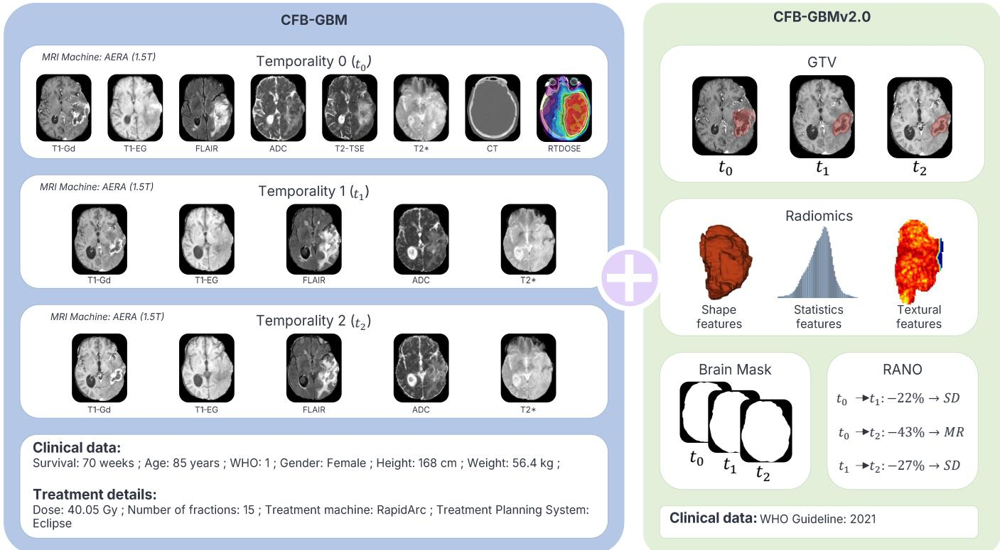
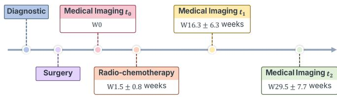

# CFB-GBM v2.0: An Augmented Longitudinal Dataset for Multi-Modal Glioblastoma Segmentation, Radiomics, and RANO Progression Tracking

Alexandre G. LECLERCQ 1,2,3 , No´emie N. Moreau 1,2 Hugo Audebert 4 Andros Nassar 4 Thomas Cochin 2,4 Thomas Leleu 2,4 Lo¨ıc Le Henaf 2,5 Alexis Desmonts 1,2,6 Yoann Poirier 5 Aur´elie Dubru 5 Laura Guillemette 6 Pascal Lecoeur 6 K´evin Lemasson 6 Cyril Jaudet 6 S´ebastien Bougleux 3 Romain H´erault 3 Carole Brunaud 2 Samuel Valable 2 Dinu Stefan 4 Charlotte Raboutet 2,5 Alain Batalla 6 Jo¨elle Lacroix 5 Roman Rouzier 7 Aur´elien Corroyer-Dulmont 1,2,6

1 Artificial Intelligence Department, Centre Franc¸ois Baclesse, 14000 Caen, France

2 Universit´e de Caen Normandie, CNRS, Normandie Univ, ISTCT UMR6030, CYCERON, F-14000 Caen, France   
3 Universit´e Caen Normandie, ENSICAEN, CNRS, Normandie Univ, GREYC UMR 6072, F-14000 Caen, France   
4 Radiation Oncology Department, Centre Franc¸ois Baclesse, 14000 Caen, France   
5 Radiology Department, Centre Franc¸ois Baclesse, 14000 Caen, France   
6 Medical Physics Department, Centre Franc¸ois Baclesse, 14000 Caen, France   
7 Surgery Department, Centre Franc¸ois Baclesse, 14000 Caen, France

## Abstract

Glioblastoma (GBM) is the most aggressive primary brain tumor in adults, with a median overall survival of 15 months. Longitudinal, multi-modal imaging datasets with comprehensive clinical and treatment data are essential to support the development of reproducible computational methods for treatment response prediction, disease progression modelling, and personalized medicine. We present CFB-GBM v2.0, an extension of our previously released CFB-GBM dataset comprising 264 GBM patients treated according to the standard Stupp protocol. The primary contribution of this release is the completion of Gross Tumour Volume (GTV) delineations across all available timepoints (t , t and[ $t _ { 2 } )$ , increasing the overall GTV completion rate from 35% to 97%. This was achieved using a nnU-Net model pre-trained on BraTS 2021 and fine-tuned on CFB-GBM ground-truth contours, with the generated segmentations validated by five radiation oncologists. From these longitudinal GTV annotations, volumetric RANO 2.0 response category labels were derived for all available temporality pairs $( t _ { 0 } \to t _ { 1 } , t _ { 0 } \to t _ { 2 }$ and $t _ { 1 }  t _ { 2 } )$ . To further ease dataset usability and reproducibility, brain masks computed with HD-BET and pre-computed radiomic features extracted with PyRadiomics are provided for each patient timepoint and MRI modality. Additionally, the WHO classification guideline (2016 vs. 2021) applicable to each patient’s diagnosis is now explicitly documented. CFB-GBM v2.0 is publicly available on The Cancer Imaging Archive (TCIA) at www.cancerimagingarchive.net/collection/cfb-gbm

## Keywords

Glioblastoma, Multi-modal and longitudinal MRI, Medical Imaging, Tumor segmentation, RANO criteria, Radiomics

## Article informations

Corresponding author: a.corroyer-dulmont@baclesse.unicancer.fr

## 1. Introduction

Glioblastoma (GBM) is the most common and aggressive primary malignant brain tumor in adults. Characterized by cellular and genetic heterogeneity, the current standard treatment consists of surgical resection followed by the Stupp protocol (Stupp et al., 2005), comprising concurrent radiotherapy and temozolomide (TMZ) chemotherapy, followed by six cycles of adjuvant TMZ. Despite this aggressive multimodal intervention, patient therapeutic response remains highly unpredictable, resulting in a critiof treatment response. In current clinical practice, determining treatment eficacy requires a delayed observational period of up to two months, during which clinicians must diferentiate treatment-induced inflammatory changes, such as pseudoprogression, from true disease progression. This delay carries particular clinical significance given the already limited median OS of GBM patients. A critical unmet need therefore remains: the early and reliable identification of treatment responders versus nonresponders, along with improved characterization of intraand inter-tumoral spatial heterogeneity, to enable timely therapeutic adjustments within a personalized medicine framework. While several studies have investigated this challenge using either private or publicly available datasets (Chen et al., 2025; Moreau et al., 2025a; Moya-S´aez et al., 2022), the predominant reliance on proprietary data limits the comparability and reproducibility of results across the literature. Although publicly available datasets are essential for benchmarking and cross-study comparison, their availability for GBM remains limited (Cepeda et al., 2023; Suter et al., 2022; Bakas et al., 2022).

To address these limitations, we previously released CFB-GBM (Moreau et al., 2025b) , a longitudinal, multimodal dataset assembled from the clinical routine of 264 patients newly diagnosed with GBM and treated in a French oncology center according to the standard Stupp protocol between 2017 and 2023. In addition to multimodal MRI acquired at multiple timepoints $( t _ { 0 } , t _ { 1 }$ and $t _ { 2 } )$ the dataset incorporates planning CT scans, radiotherapy dose maps, and Gross Tumor Volume (GTV) delineations at the pre-treatment timepoint $\left( t _ { 0 } \right)$ , alongside structured clinical data. This combination of multi-modal longitudinal imaging with comprehensive treatment and clinical metadata constitutes a distinctive feature relative to other publicly available GBM datasets such as LUMIERE (Suter et al., 2022) and UPenn-GBM (Bakas et al., 2022). This characteristic is particularly relevant for tasks such as tumor control probability modelling (Yorke, 2023) and automated radiotherapy plan generation (Gooding et al., 2024), in which the precise characterization of the delivered treatment is a central modelling factor. Moreover, the breadth and completeness of the available data support a wide range of research objectives, including treatment outcome prediction from pre-treatment information (Moreau et al., 2025a), cross-modality image synthesis (MRI to CT (Boulanger et al., 2021); intra-MRI modality translation (Kim and Park, 2024)), and MRI resampling and denoising (Moummad et al., 2022).

In the literature, personalized medicine is further approached through Disease Progression Modelling (DPM), a paradigm that aims to predict the temporal evolution of a disease from longitudinal patient data. A key instantiation of this paradigm is Treatment Response Prediction (TRP), which focuses on quantifying the impact of therapeutic interventions on disease trajectory. Various deep learning approaches leveraging multi-timepoint MRI data and tumor segmentation have been explored for this purpose (Xiao et al., 2021). In standard clinical practice, treatment eficacy is assessed according to the Response Assessment in Neuro-Oncology (RANO) criteria (Wen et al., 2023), which quantifies active tumor burden based on contrast-enhancing regions on T1-weighted MRI. RANO-based response classification has recently emerged as a distinct TRP subtask, as exemplified by the 2025 BraTS sub-challenge on Brain Tumor Progression (BraT-SPRO), which proposed a classification task for RANO criteria prediction leveraging the LUMIERE dataset (Suter et al., 2022).

Motivated by these needs, we propose CFB-GBM v2.0, an extension of our initial release (Figure 1). The primary contributions of this updated dataset are as follows:

• Gross Tumor Volume (GTV) segmentation at multiple timepoints, completing missing annotations from the original release and enabling longitudinal DPM tasks dependent on serial tumor segmentation.

• RANO criteria annotations derived from multi-timepoint tumor segmentations, directly supporting the RANO classification prediction task.

• Pre-computed radiomic features for each patient timepoint and MRI modality, providing ready-to-use quantitative descriptors widely employed across downstream tasks.

• Brain masks for each patient timepoint, facilitating intensity normalization and supporting AI-based MRI processing pipelines.

• World Health Organization (WHO) classification information, specifying whether each patient was diagnosed under the WHO 2016 or WHO 2021 guidelines, a clinically important distinction given the revised 2021 definition of GBM, which now requires IDH-wildtype status.

## 2. The Baseline Cohort: CFB-GBM

## 2.1 Patient Population & Demographics

The CFB-GBM dataset included 264 patients newly diagnosed with GBM and treated with the standard Stupp protocol at our oncology center (Centre Franc¸ois Baclesse) between November 2017 and December 2023. Patients were recruited based on the following inclusion criteria: (i) age ⩾ 18 years old, (ii) deceased patients, (iii) not enrolled in a clinical trial and (iv) imaging data acquired at our center. Clinical characteristics for each patient are summarized in Table 1.

  
Figure 1: CFB-GBM v2.0: dataset extension overview

Table 1: Demographic data description
<table><tr><td>Gender</td><td>Male: Female:</td><td>n=158 n=106</td></tr><tr><td>Age at the diagnosis</td><td>Min-Max:</td><td>[25.0 – 90.0]</td></tr><tr><td>(years)</td><td>Mean ± std:</td><td>67.0 ± 11.0</td></tr><tr><td rowspan="2">Height (cm)</td><td>Min-Max:</td><td>[146.0 – 191.0]</td></tr><tr><td>Mean ± std:</td><td>168.9 ± 9.3</td></tr><tr><td rowspan="2">Weight (kg)</td><td>Min-Max:</td><td>[37.7 - 116.0]</td></tr><tr><td>Mean ± std:</td><td>72.3 ± 13.8</td></tr><tr><td>Overall survival (weeks)</td><td>Min-Max:</td><td>[3.0 − 238.0]</td></tr><tr><td></td><td>Mean ± std:</td><td>57.5 ± 43.3</td></tr><tr><td rowspan="6">WHO Performance Status</td><td>0:</td><td>n=45</td></tr><tr><td>1:</td><td>n=132</td></tr><tr><td>2:</td><td>n=70</td></tr><tr><td>3:</td><td>n=16</td></tr><tr><td>4:</td><td>n=0</td></tr><tr><td>5:</td><td>n=0</td></tr><tr><td></td><td>Unknown:</td><td>n=1</td></tr><tr><td rowspan="2">WHO guideline</td><td>2016:</td><td>n=185</td></tr><tr><td>2021:</td><td>n=79</td></tr></table>

## 2.2 Imaging Modalities & Acquisition

Depending on their availability, the imaging studies performed for each patient include: T1-Gadolinium (T1-Gd),

T1 anatomical, T1 gradient echo (T1-GE), T2 anatomical, T2-FLAIR, T2\*, apparent difusion coeficient map (ADC map), CT scans, GTV and radiation dose distribution (RTDOSE).

## 2.2.1 MRI Acquisition

MRI was performed on AREA/VIDA SIEMENS 1.5/3 Tesla magnets using a brain dedicated 16 channels coil with the patient in a supine position. Prior to the examination, patients were injected with 0.2 mL/kg of DOTAREM (500µmol/ml). A shimming process was made before acquisition of several sequences:

T1-Gd: Tumor gadolinium enhancement was detected with a post-Gd T1 brain sequence using the following parameters: $\mathsf { T R } / \mathsf { T E } _ { e f f } = 2 0 7 0 / 3 . 1 5$ msec; angle = 15°; NEX = 1; acquisition time = 4:48 (min:ss); 208 contiguous slices; 3D resolution = 0.5×0.5×1 mm and acquisition matrix = 512×512 pixels.

• T1: Anatomical T1 contrast was obtained with a turbo spin echo sequence with the parameters listed below: TR/TEeff = 686/11 msec; angle = 142°; NEX = 2; acquisition time = 1:50 (min:ss); 30 contiguous slices; 3D resolution = 0.72×0.72×4 mm and acquisition matrix = 260×320 pixels.

• T1-GE: Sequence parameters: $T \mathrm { R } / \mathsf { T E } _ { e f f } = 3 1 3 / 4 . 7 6$ msec; angle = 90°; 3D resolution = 0.65×0.65×4 mm; NEX = 1; acquisition time = 2:20 (min:ss); 30 contiguous slices and acquisition matrix = 300×352 pixels.

• T2: Sequence parameters: $\mathsf { T R } / \mathsf { T E } _ { e f f } = 7 4 1 0 / 1 0 7$ msec; angle = 166°; NEX = 1; acquisition time = 1:50 (min:ss); 30 contiguous slices; 3D resolution = $0 . 7 6 \times 0 . 7 6 \times 4$ mm and acquisition matrix = 288×320 pixels.

• T2-FLAIR: Sequence parameters: $\mathsf { T R } / \mathsf { T E } _ { e f f } = 8 1 5 0 / 1 3 4$ msec; $\mathsf { a n g l e } = 1 8 0 ^ { \circ } ; \mathsf { N E X } = 2 ;$ acquisition time = 1:55 (min:ss); 30 contiguous slices; 3D resolution = 1×1×4 mm and acquisition matrix = 184×256 pixels.

• T2\*: Sequence parameters: $\mathsf { T R } / \mathsf { T E } _ { e f f } = 9 6 0 / 2 5$ msec; angle = 20°; NEX = 1; acquisition time = 2:15 (min:ss); 30 contiguous slices; 3D resolution = 0.5×0.5×4 mm and acquisition matrix = 464×512 pixels.

• ADC map: Sequence parameters: $\mathsf { T R } / \mathsf { T E } _ { e f f } = 2 7 1 0 / 7 5 . 2$ msec; angle = 180°; NEX = 1; acquisition time = 1:50 (min:ss); 30 contiguous slices; 3D resolution = 0.75×0.75×4 mm; acquisition matrix = 320×320 pixels, B-value = 1000 and number of directions = 4.

## 2.2.2 CT Scans Acquisition

We acquired axial CT images using SIEMENS Confidence® and PHILIPS Big Bore® scanners, with the following parameters:

• SIEMENS Confidence®: Slice thickness = 2mm; tube voltage = 120kV; gantry rotation = 0.8 (s); acquisition time = 2:50 (min:ss); 208 contiguous slices; 3D resolution = 1×1 mm and acquisition matrix = 512×512 pixels.

• PHILIPS Big Bore®: Slice thickness = 2mm; tube voltage = 120kV; acquisition time = 1:58 (min:ss); 188 contiguous slices; 3D resolution = 1.27×1.27 mm and acquisition matrix = 512×512 pixels.

## 2.2.3 Treatment Planning Data Acquisition

## Radiation Dose Distribution:

In accordance with the standard clinical practice, radiotherapy was delivered using Volumetric Modulated Arc Therapy (VMAT). The standard treatment consisted of 60 Gy delivered in 30 daily fractions (2 Gy/fraction) over six weeks (five days per week). For patients over 70 years old or with a WHO performance status < 2, a hypofractionated regimen was administered, delivering a total dose of 40.05 Gy in 15 fractions (2.67 Gy/fraction) over three weeks. Radiation dose distribution were computed with Precision®-TPS, ECLIPSE®-TPS and Raystation®-TPS, and radiotherapy treatment was delivered using tomotherapy (Accuray®) and RapidArc (Varian®) machines. RT-DOSE image details are as follows: 168 contiguous slices; 3D resolution = 2.5×2.5×5 mm and acquisition matrix $= 1 6 7 { \times } 9 5$ pixels. Treatment details are summarized in Table 2.

Table 2: Treatment details
<table><tr><td>Radiation details</td><td colspan="2">Value</td></tr><tr><td>Radiation dose</td><td>40.05 Gy: n=62 60.00 Gy: n=123 Others: NA:</td><td>n=9 n=70</td></tr><tr><td>Radiation fractions</td><td>15: 30: Others:</td><td>n=63 n=124 n=7 NA: n=70</td></tr></table>

## Tumor Delineation:

The GTV, representing the visible volume of the primary tumor, was manually delineated for each patient, in accordance with the European Society for Radiotherapy and Oncology Advisory Committee on Radiation Oncology Practice guidelines.

## 2.2.4 Data Preprocessing & Standardization

## Image Format and Conversion:

All images were retrieved from the Picture Archiving Communication System (PACS) in Digital Imaging and Communications in Medicine (DICOM) format and converted into the compressed Neuroimaging Informatics Technology Initiative (NifTI) file format (.nii.gz) to avoid leakage of sensitive metadata from the original DICOM headers. To preserve the integrity of the data and prevent processing bias, no intensity normalization or further image modifications were performed.

## Image Registration:

To ensure spatial alignment, all imaging modalities were registered and resampled in the same space with rigid registration, using the baseline T1-Gd sequence as the reference. This rigid registration was implemented using the SimpleITK (Beare et al., 2018) library, applying a three-step multi-resolution approach with the following parameters: Mattes Mutual Information (with 50 bins) as the optimization metric, along with configured shrink factors and smoothing sigmas.

## Skull Stripping & Facial Defacing:

To ensure patient privacy and prevent identity reconstruction from skull morphology, we applied a brain extraction method, from ANTsPyNet (Tustison et al., 2021), on each MRI sequence. For CT scans, a two-step anonymization was performed: (i) TotalSegmentator (Wasserthal et al., 2023) was used to remove the radiation therapy thermoplastic masks, and (ii) CTA-DEFACE (Mahmutoglu et al., 2024) model was applied to the TotalSegmentator segmented images.

## 2.3 Longitudinal Timeline

A major asset of the CFB-GBM dataset is its inclusion of MRI scans obtained at diferent times: one week before radio-chemotherapy (corresponding to temporality 0 (t0)), and approximately four (temporality 1 (t1)) and six months (temporality 2 (t2)) after (t0) MRI acquisition (Figure 2).

  
Figure 2: Timeline of longitudinal medical imaging acquisition

The number of imaging modalities at diferent times is summarized in Table 3.

Table 3: Overview of Available Imaging Modalities Imaging modality t0 t1 t2
<table><tr><td>Imaging modality</td><td> $\mathbf { t } _ { \mathrm { 0 } }$ </td><td>t1</td><td>t2</td></tr><tr><td>T1-Gd</td><td>264</td><td>163</td><td>118</td></tr><tr><td>T1-GE</td><td>215</td><td>126</td><td>82</td></tr><tr><td>T1</td><td>0</td><td>17</td><td>14</td></tr><tr><td>T2-FLAIR</td><td>255</td><td>167</td><td>114</td></tr><tr><td>T2</td><td>125</td><td>15</td><td>11</td></tr><tr><td>T2*</td><td>241</td><td>136</td><td>94</td></tr><tr><td>ADC</td><td>129</td><td>132</td><td>91</td></tr><tr><td>CT</td><td>195</td><td>一</td><td></td></tr><tr><td>RTDOSE</td><td>194</td><td></td><td>1</td></tr><tr><td>GTV</td><td>191</td><td>一 一</td><td>一 一</td></tr></table>

All data files are structured according to the following naming convention:

• Folder: CFB-GBM/patient/temporality/file

• File format: patient temporality modality.nii.gz

## 3. Methodology & Validation

## 3.1 Tumor Segmentation

To complete the missing longitudinal GTV delineations in the original dataset, we trained an automatic segmentation model based on the nnU-Net framework (Isensee et al., 2021), which serves as a strong and well-established baseline for medical image segmentation tasks. Standard GBM segmentation models trained on the BraTS 2021 dataset (Baid et al., 2021) rely on four MRI modalities: T1, T1-CE, T2, and T2-FLAIR. However, MRI modality availability in CFB-GBM is inconsistent across patients and timepoints, making full four-modality inference impractical. We therefore trained a segmentation model using only T1-Gd and T2-FLAIR sequences, which constitute the most consistently available modality pair across the cohort. The BraTS segmentation protocol decomposes the tumor into three sub-regions: the Gd-enhancing tumor (ET), the necrotic tumor core (NCR), and the peritumoral oedematous/invaded tissue (ED). To align with the clinical definition of GTV, we mapped the ET and NCR labels to a single GTV label, as both sub-regions correspond to tumor components visible on contrast-enhanced T1-weighted MRI. The ED region, which typically requires additional modalities for reliable delineation, was excluded from the GTV definition. Following the standard nnU-Net V2 training pipeline, we evaluated three model configurations: a model trained exclusively on BraTS 2021, a model trained exclusively on the CFB-GBM GT segmentations, and a model pre-trained on BraTS 2021 and fine-tuned on the CFB-GBM ground-truth (GT) segmentations. Models were evaluated on the CFB-GBM test set using the Dice Similarity Coeficient (DSC) between predicted and GT segmentations. As reported in Table 4, the model pretrained on BraTS and fine-tuned on our dataset training set achieves the best performance.

Table 4: Evaluation of Segmentation Models
<table><tr><td>Training Dataset</td><td>Dice Score</td></tr><tr><td>BRATS 2021</td><td>0.6128</td></tr><tr><td>CFB-GBM</td><td>0.7860</td></tr><tr><td>BRATS  $2 0 2 1 + { \mathsf { C F B } } .$  -GBM</td><td>0.8031</td></tr></table>

To further assess the quality of the automatically generated GTV delineations with the best model, we conducted an expert validation study on a subset of cases for which no ground truth was available (i.e., cases not seen during training). Specifically, 44 of the generated GTVs were sampled, with cases selected to ensure equal distribution across the three available imaging timepoints. Five radiation oncologists were asked to review and correct each sampled segmentation. Three complementary metrics were computed between each model-generated

GTV and the corresponding expert-corrected contour to assess segmentation quality.

## Dice Similarity Coeficient (DSC):

The DSC measures the global volumetric overlap between the model prediction and the expert-corrected segmentation, and is defined as:

$$
D S C = \frac { 2 | G T V _ { g e n } \cap G T V _ { c o r r } | } { | G T V _ { g e n } | + | G T V _ { c o r r } | }
$$

A DSC of 1.00 indicates a 100% overlap between the two considered volumes.

## 95th Percentile Hausdorf Distance (HD95)

To evaluate the local boundary distances and catch worstcase delineation errors without being overly sensitive to sporadic single-voxel outliers, we use the 95th percentile of the Hausdorf Distance (HD95). Let X and Y represent the surface point sets of $G T V _ { g e n }$ and $G T V _ { c o r r } ,$ respectively. The directed Hausdorf distance from X to $Y$ is defined as:

$$
d _ { H } ( X , Y ) = \operatorname* { m a x } _ { x \in X } \operatorname* { m i n } _ { y \in Y } \| x - y \| _ { 2 }
$$

The bidirectional HD95 is then computed as the 95th percentile of the combined distances from both directions:

$$
H D 9 5 = P _ { 9 5 } \left( \{ \underset { y \in Y } { \operatorname* { m i n } } \| x - y \| _ { 2 } \} _ { x \in X } \cup \{ \underset { x \in X } { \operatorname* { m i n } } \| y - x \| _ { 2 } \} _ { y \in Y } \right.
$$

A lower HD95 indicates closer boundary agreement, with 0 mm corresponding to a perfect match.

## Average Symmetric Surface Distance (ASSD)

Complementing HD95, which captures localised worstcase deviations, the Average Symmetric Surface Distance (ASSD) quantifies the mean boundary error across the entire tumor surface. Using the same point sets X and Y, it is defined as:

$$
\begin{array} { c } { d ( x , Y ) = \displaystyle \operatorname* { m i n } _ { y \in Y } \| x - y \| _ { 2 } } \\ { A S S D ( X , Y ) = \displaystyle \frac { \sum _ { x \in X } d ( x , Y ) + \sum _ { y \in Y } d ( X , y ) } { | X | + | Y | } } \end{array}
$$

The ASSD provides a comprehensive overview of the overall tightness of the fit, where a value closer to 0 mm indicates superior boundary agreement across the entire surface.

Table 5 demonstrates strong agreement between the expert-corrected and model-generated GTV delineations, suggesting that the automatic segmentation model produces contours of suficient quality for inclusion in the dataset. The gap between the expert-validation agreement (DSC of 0.97, Table 5) and the test-set performance (DSC of 0.8031, Table 4) stems mainly from the difering nature of the two reference contours. The manual groundtruth GTVs were delineated for radiotherapy planning and resampled into the common space, yielding staircase-like boundaries, whereas the model produces smooth contours. Scoring a smooth prediction against such a reference introduces a thin shell of boundary disagreement that Dice penalizes even at equal volume, an efect amplified for smaller lesions. In the validation, experts only lightly corrected these already-smooth contours, hence the higher overlap. This correction-based protocol, adopted because the five oncologists could not delineate all cases de novo, may introduce some anchoring, but this is unlikely to explain the full gap, which we attribute primarily to the boundary-character mismatch.

Table 5: Radiation oncologist validation
<table><tr><td>Expert</td><td>DSC (↑)</td><td>HD95 (↓)</td><td>ASSD (↓)</td><td>Sample</td></tr><tr><td>1</td><td> $\overline { { 0 . 9 5 \pm 0 . 0 5 } }$ </td><td> $\overline { { 3 . 8 7 \pm 2 . 9 2 \mathrm { \ m m } } }$ </td><td> $\overline { { 1 . 0 0 \pm 1 . 6 3 ~ \mathrm { m m } } }$ </td><td>7</td></tr><tr><td>2</td><td> $0 . 9 8 \pm 0 . 0 1$ </td><td> $1 . 7 6 \pm 0 . 6 8 ~ \mathsf { m m }$ </td><td> $0 . 1 4 \pm 0 . 0 8 ~ \mathsf { m m }$ </td><td>11</td></tr><tr><td>3</td><td> $0 . 9 9 \pm 0 . 0 1$ </td><td> $0 . 8 2 \pm 0 . 6 2 \mathrm { { \ m m } }$ </td><td> $0 . 0 8 \pm 0 . 0 7 ~ \mathrm { m m }$ </td><td>5</td></tr><tr><td>4</td><td> $0 . 9 7 \pm 0 . 0 4$ </td><td> $1 . 6 9 \pm 1 . 3 6 ~ \mathsf { m m }$ </td><td> $0 . 2 8 \pm 0 . 3 0 ~ \mathsf { m m }$ </td><td>16</td></tr><tr><td>5</td><td> $0 . 9 9 \pm 0 . 0 1$ </td><td> $0 . 9 4 \pm 0 . 1 2 \mathrm { { \ m m } }$ </td><td> $0 . 0 7 \pm 0 . 0 4 ~ \mathrm { m m }$ </td><td>5</td></tr><tr><td>Overall</td><td> $\overline { { 0 . 9 7 \pm 0 . 0 3 } }$ </td><td> $\overline { { 1 . 8 7 \pm 1 . 7 5 ~ \mathrm { m m } } }$ </td><td> $\overline { { 0 . 3 1 \pm 0 . 7 4 ~ \mathrm { { m m } } } }$ </td><td>44</td></tr></table>

The validated model was subsequently applied to generate the missing GTV delineations at $t _ { 0 } , t _ { 1 }$ and $t _ { 2 } .$ . Table 6 summarizes the number of GTV annotations available in CFB-GBM v2.0 across all timepoints.

$$
\frac { \mathsf { T a b l e 6 . ~ | m a g i n g ~ m o d a l i t e s ~ w i t h ~ n e w ~ a d d i t i o n s } } { \mathsf { G T V } \quad 1 9 1 \to 2 6 1 \quad 0 \to 1 6 0 \quad 0 \to 1 1 2 }
$$

## 3.2 RANO Criteria

RANO response categories were derived in accordance with the volumetric (3D) criteria defined in the RANO 2.0 guidelines (Wen et al., 2023), using the contrastenhancing tumor volume (the GTV, delineated on T1-Gd) as the reference measurable disease. For each patient, the relative volume change was computed for all available temporality pairs $( t _ { 0 } \to t _ { 1 } , t _ { 1 } \to t _ { 2 }$ and $t _ { 0 }  t _ { 2 } )$ , and is defined as:

$$
\mathsf { R e d u c t i o n \ R a t e } _ { t _ { i }  t _ { j } } = 1 - \frac { G T V _ { t _ { j } } } { G T V _ { t _ { i } } } , \quad \forall j > i
$$

A positive value indicates tumor shrinkage, while a negative value indicates growth. Each temporality pair was then assigned a RANO response category according to the following thresholds (Wen et al., 2023):

• Complete Response (CR): No measurable enhancing lesion on target volume;

• Partial Response (PR): Volume reduction ≥ 65%;

• Stable Disease (SD): Volume reduction < 65% and volume increase < 40% (neither meeting PR nor PD criteria);

• Progressive Disease (PD): Volume increase ≥ 40%.

## 3.3 Brain Mask

Brain masks were generated for each patient at each available timepoint using the HD-BET brain extraction tool (Isensee et al., 2019) on T1-Gd MRI.

## 3.4 Radiomics Features Extraction

For each MRI modality, radiomics features were extracted using the open-source PyRadiomics package (Van Griethuysen et al., 2017) (version 3.1.0), provided that the GTV was available. Prior to extraction, image preprocessing was performed, including intensity z-score normalization based on a brain mask (with the exception of ADC maps), scaling by a factor of 100 and a voxel resampling to an isotropic resolution of $1 \times 1 \times 1 ~ \mathrm { { m m ^ { 3 } } }$ . For a total of 2,424 MRIs, 107 original features were extracted in accordance with the Imaging Biomarker Standardization Initiative (IBSI) guidelines (Zwanenburg et al., 2020). These features include: 18 first-order statistics features, 14 shape-based features and 75 texture features derived from gray-level matrices (24 Gray Level Co-occurrence Matrix features (GLCM); 16 Gray Level Run Length Matrix features (GLRLM); 16 Gray Level Size Zone Matrix features (GLSZM); Neighbouring Gray Tone Diference Matrix features (NGTDM) and Gray Level Dependence Matrix features (GLDM)). For gray-level discretization, a fixed bin width of 25 was applied to ADC maps, and a bin width of 5 was used for all other modalities (Suter et al., 2022).

## 4. Discussion & Conclusion

CFB-GBM v2.0 extends the original dataset with four key contributions designed to broaden its applicability to a wider range of computational oncology tasks.

The completion of GTV delineations across all timepoints constitutes the most clinically significant addition, as serial tumor annotations are a prerequisite for Disease Progression Modelling and Treatment Response Prediction tasks. The automatic segmentation pipeline, based on a BraTS 2021 pre-trained nnU-Net fine-tuned on CFB-GBM ground-truth contours, demonstrated strong agreement with expert radiation oncologist corrections, supporting the reliability of the generated annotations.

The provision of RANO 2.0 volumetric response categories derived from longitudinal GTV measurements directly addresses the growing interest in automated treatment response classification, as evidenced by recent benchmarking eforts such as the BraTSPRO 2025 challenge.

Pre-computed radiomic features and brain masks further lower the barrier to entry for researchers working on quantitative imaging tasks, reducing preprocessing overhead and promoting reproducibility across studies leveraging the dataset.

Despite these contributions, CFB-GBM v2.0 retains a notable limitation inherited from the original cohort: the absence of molecular biomarker information, most critically IDH mutation status and MGMT promoter methylation. Both markers carry strong prognostic and predictive value in GBM, and their absence limits the dataset’s utility for studies investigating genotype-phenotype relationships or stratifying patients by molecular subtype. This gap is further compounded by the change in the WHO classification of central nervous system tumors between the 2016 and 2021 editions, under which GBM is now restricted to IDH-wildtype tumors.

Looking ahead, several extensions are envisioned for future iterations of the dataset. A natural next step would be the adoption of a BraTS-style multi-label tumor segmentation convention, decomposing the GTV into clinically and biologically distinct sub-regions (ET, NCR and ED label), which would enable a broader range of segmentation benchmarks and provide richer input features for downstream models. The prospective collection and integration of IDH mutation status and MGMT promoter methylation data would substantially increase the dataset’s value for molecular outcome prediction tasks. These extensions would position CFB-GBM as a more comprehensive resource for the full spectrum of computational GBM research, from segmentation and radiomics to personalized treatment planning and survival prediction.

## Acknowledgments

This study was funded by the R´egion Normandie through the “Booster IA” grant, NN. M and AG. L were supported by the R´egion Normandie.

## Ethical Standards

This retrospective study received approval from the Centre Franc¸ois Baclesse institutional review board (internal ethics committee ”CSE” data department, health data hub study number: F20240111162856). The study was conducted in compliance with the principles of the Declaration of Helsinki and the MR-004 guidelines established by the French National Institute for Health Data (INDS) for health research. Informed consent was obtained from all patients for the use of their data.

## Conflicts of Interest

We declare we don’t have conflicts of interest.

## Data availability

CFB-GBM v2.0 is publicly available on The Cancer Imaging Archive (TCIA) at https://doi.org/10.7937/v9pn-It is a direct update of the original CFB-GBM dataset, and the TCIA collection also hosts the associated publication. Scripts used to produce the data are available at https://github.com/AurelienCD/CFB-GBM. The segmentation model used to generate the tumor delineations is publicly available on Hugging Face at https: //huggingface.co/AlexLECLERCQ/SegCFB-GBM.

## 5. Licence

CFB-GBM is licensed under Creative Commons Attribution 4.0 International (CC BY 4.0).

## References

Ujjwal Baid, Satyam Ghodasara, Suyash Mohan, et al. The RSNA-ASNR-MICCAI BraTS 2021 Benchmark on Brain Tumor Segmentation and Radiogenomic Classification. 2021. . URL http://arxiv.org/abs/2107.02314.

Spyridon Bakas, Chiharu Sako, Hamed Akbari, et al. The University of Pennsylvania glioblastoma (UPenn-GBM) cohort: Advanced MRI, clinical, genomics, & radiomics. Scientific Data, 9(1):453, 2022. ISSN 2052- 4463. . URL https://www.nature.com/articles/ s41597-022-01560-7.

Richard Beare, Bradley Lowekamp, and Ziv Yaniv. Image Segmentation, Registration and Characterization in R with SimpleITK. Journal of Statistical Software, 86 (8), 2018. ISSN 1548-7660. . URL http://www. jstatsoft.org/v86/i08/.

M. Boulanger, Jean-Claude Nunes, H. Chourak, et al. Deep learning methods to generate synthetic CT from MRI in radiotherapy: A literature review. Physica Medica, 89:265–281, September 2021. ISSN 1120-1797.

Santiago Cepeda, Sergio Garc´ıa-Garc´ıa, Ignacio Arrese, et al. The R´ıo Hortega University Hospital Glioblastoma dataset: A comprehensive collection of preoperative, early postoperative and recurrence MRI scans (RHUH-GBM). Data in Brief, 50:109617, October 2023. ISSN 2352-3409. .

Wang-Sheng Chen, Fang-Xiong Fu, Qin-Lei Cai, et al. Prediction of MGMT methylation status in glioblastoma patients based on radiomics feature extracted from intratumoral and peritumoral MRI imaging. Scientific Reports, 15(1):27533, July 2025. ISSN 2045-2322. .

Mark J. Gooding, Shafak Aluwini, Teresa Guerrero Urbano, et al. Fully automated radiotherapy treatment planning: A scan to plan challenge. Radiotherapy and Oncology, 2f72.200, November 2024. ISSN 0167-8140, 1879-0887. .

Fabian Isensee, Marianne Schell, Irada Pflueger, et al. Automated brain extraction of multisequence MRI using artificial neural networks. Human Brain Mapping, 40 (17):4952–4964, 2019. ISSN 1097-0193. .

Fabian Isensee, Paul F. Jaeger, Simon A. A. Kohl, et al. nnU-Net: A self-configuring method for deep learning-based biomedical image segmentation. Nature Methods, 18(2):203–211, 2021. ISSN 1548- 7105. . URL https://www.nature.com/articles/ s41592-020-01008-z.

Jonghun Kim and Hyunjin Park. Adaptive Latent Difusion Model for 3D Medical Image to Image Translation: Multi-modal Magnetic Resonance Imaging Study. In 2024 IEEE/CVF Winter Conference on Applications of Computer Vision (WACV), pages 7589–7598, January 2024. .

Mustafa Ahmed Mahmutoglu, Aditya Rastogi, Marianne Schell, et al. Deep learning-based defacing tool for CT angiography: CTA-DEFACE. European Radiology Experimental, 8(1):111, October 2024. ISSN 2509-9280.

No´emie N. N. Moreau, Samuel Valable, Cyril Jaudet, et al. Early characterization and prediction of glioblastoma and brain metastasis treatment eficacy using medical imaging-based radiomics and artificial intelligence algorithms. Frontiers in Oncology, 15, January 2025a. ISSN 2234-943X. .

No´emie N Moreau, Alexandre G. Leclercq, Alexis Desmonts, et al. Pre and post treatment MRI and radiotherapy plans of patients with glioblastoma: The CFB-GBM cohort (CFB-GBM), 2025b. URL https://www.cancerimagingarchive. net/collection/cfb-gbm/.

Ilyass Moummad, Cyril Jaudet, Alexis Lechervy, et al. The Impact of Resampling and Denoising Deep Learning Algorithms on Radiomics in Brain Metastases MRI. Cancers, 14(1):36, January 2022. ISSN 2072-6694. .

Elisa Moya-S´aez, Rafael Navarro-Gonz´alez, Santiago Cepeda, et al. Synthetic MRI improves radiomics-based glioblastoma survival prediction. NMR in Biomedicine, 35(9):e4754, 2022. ISSN 1099-1492. .

Roger Stupp, Warren P. Mason, Martin J. Van Den Bent, et al. Radiotherapy plus Concomitant and Adjuvant Temozolomide for Glioblastoma. New England Journal ofMedicine, 352(10):987–996, March 2005. ISSN 0028- 4793, 1533-4406. .

Yannick Suter, Urspeter Knecht, Waldo Valenzuela, et al. The LUMIERE dataset: Longitudinal Glioblastoma MRI with expert RANO evaluation. Scientific Data, 9(1): 768, 2022. ISSN 2052-4463. . URL https://www. nature.com/articles/s41597-022-01881-7.

Nicholas J. Tustison, Philip A. Cook, Andrew J. Holbrook, et al. The ANTsX ecosystem for quantitative biological and medical imaging. Scientific Reports, 11(1):9068, 2021. ISSN 2045-2322. . URL https://www.nature. com/articles/s41598-021-87564-6.

Joost J.M. Van Griethuysen, Andriy Fedorov, Chintan Parmar, et al. Computational Radiomics System to Decode the Radiographic Phenotype. Cancer Research, 77(21):e104–e107, November 2017. ISSN 0008-5472, 1538-7445. .

Jakob Wasserthal, Hanns-Christian Breit, Manfred T. Meyer, et al. TotalSegmentator: Robust Segmentation of 104 Anatomic Structures in CT Images. Radiology: Artificial Intelligence, 5(5):e230024, September 2023. ISSN 2638-6100. .

Patrick Y. Wen, Martin van den Bent, Gilbert Youssef, et al. RANO 2.0: Update to the Response Assessment in Neuro-Oncology Criteria for High- and Low-Grade Gliomas in Adults. Journal of Clinical Oncology, 41 (33):5187–5199, November 2023. ISSN 0732-183X. .

Ting Xiao, Han Zheng, Xiaoning Wang, et al. Intracerebral Haemorrhage Growth Prediction Based on Displacement Vector Field and Clinical Metadata. In Medical Image Computing and Computer Assisted Intervention – MICCAI 2021, pages 741–751. Springer International Publishing, 2021. ISBN 978-3-030-87240-3. .

Ellen Yorke. Modeling clinical outcomes in radiotherapy: NTCP, TCP and the “TECs”. Medical Physics, 50(S1): 122–124, 2023. ISSN 2473-4209. .

Alex Zwanenburg, Martin Valli\`eres, Mahmoud A. Abdalah, et al. The Image Biomarker Standardization Initiative: Standardized Quantitative Radiomics for High-Throughput Image-based Phenotyping. Radiology, 295(2):328–338, 2020. ISSN 0033-8419, 1527- 1315. . URL http://pubs.rsna.org/doi/10.1148/ radiol.2020191145.