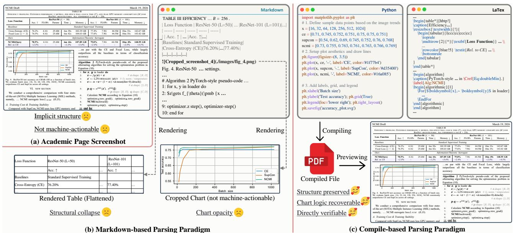
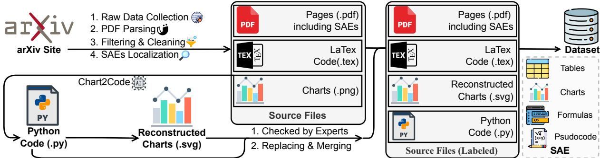
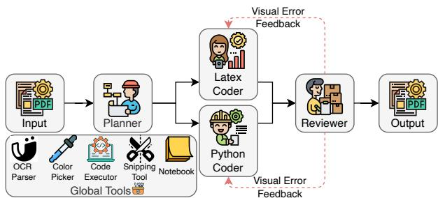
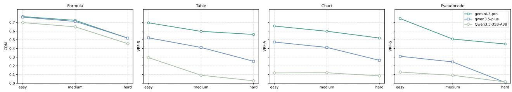
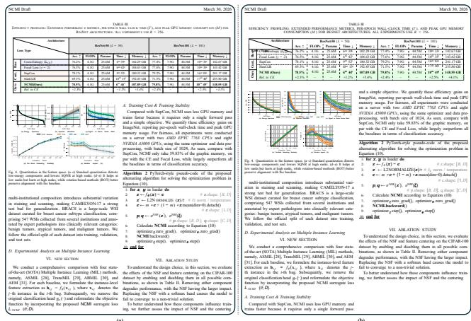
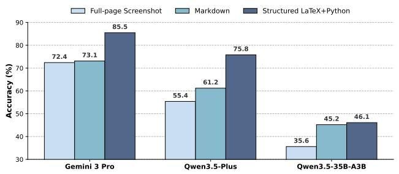

# Code as Representation: A Compilable Parsing Paradigm for Academic Documents

Rihui Jin<sup>∗</sup>   
Jun Wang<sup>∗</sup>   
Southeast University   
School of Computer Science and   
Engineering   
Nanjing, Jiangsu, China   
ari\_king@seu.edu.cn   
213211446@seu.edu.cn   
Guilin Qi<sup>†</sup>   
Southeast University   
School of Computer Science and   
Engineering   
Nanjing University   
State Key Laboratory for Novel   
Software Technology   
Nanjing, Jiangsu, China   
gqi@seu.edu.cn   
Chengyuan Zhu   
Liang Mingyu   
Yue Gao   
Li Yunxuan   
Southeast University   
School of Computer Science and   
Engineering   
Nanjing, Jiangsu, China   
Lin Ren   
Yongrui Chen   
Xinbang Dai   
Jiaqi Li   
Southeast University   
School of Computer Science and   
Engineering   
Nanjing, Jiangsu, China

Kuicai Dong Nanyang Technological University Singapore, Singapore kuicai001@e.ntu.edu.sg

Tongtong Wu   
Gholamreza Hafari   
Monash University   
Clayton, Victoria, Australia   
tongtong.wu@monash.edu   
gholamreza.hafari@monash.edu

## Ab<sub>s</sub>t<sub>rac</sub>t

Academic papers are a primary carrier of scientific knowledge, yet most of this knowledge remains locked in PDFs that are optimized for human reading rather than machine use. For Multimodal Large Language Models (MLLMs), the core challenge is not only perception, but representation: scientific pages interleave text with Structured Academic Elements (SAEs) such as tables, formulas, charts, and pseudocode, whose structure, data, and logic are poorly preserved by common surrogates like Markdown. We therefore propose Compilable Academic Document Parsing (CADP), a paradigm that reconstructs a full page as contextual LAT<sub>E</sub>X plus executable Python, so that structure-preserving elements and executable chart representations can be reconstructed, recompiled, and directly verified against the source page. To support this setting, we introduce CADP-Bench, an expert-verified benchmark of full academic pages containing tightly coupled text and multiple SAE types, evaluated through a re-injection compilation protocol. We further study current capabilities using SOTA MLLMs and an exploratory multi-agent baseline that incorporates common agentic techniques. Results show that even frontier models still struggle to produce high-fidelity executable reconstructions, highlighting

substantial room for improvement in structure-aware scientific document parsing. CADP-Bench is released for future research. <sup>1</sup>

## CCS Conce<sub>p</sub>ts

• Computing methodologies → Computer vision; Natural language processing; • General and reference → Evaluation.

## Ke<sub>y</sub>words

Multimodal Document Parsing, MLLMs

Rihui Jin, Jun Wang, Chengyuan Zhu, Liang Mingyu, Yue Gao, Li Yunxuan, Kuicai Dong, Guilin Qi, Lin Ren, Yongrui Chen, Xinbang Dai, Jiaqi Li, Tongtong Wu, and Gholamreza Hafari. 2026. Code as Representation: A Compilable Parsing Paradigm for Academic Documents. In Proceedings of the 34th ACM International Conference on Multimedia (MM ’26), November 10–14, 2026, Rio de Janeiro, Brazil. ACM, New York, NY, USA, 16 pages. https://doi.org/10.1145/3767308.3836397

## 1 I<sub>n</sub>t<sub>ro</sub>d<sub>uc</sub>ti<sub>on</sub>

Academic papers are a primary carrier of scientific knowledge, yet most of this knowledge remains locked within PDFs optimized for human reading rather than machine use [7, 13, 31]. As Multimodal Large Language Models (MLLMs) are increasingly deployed in retrieval, reasoning, and AI-for-science pipelines [1, 6, 18, 27], converting scientific pages into machine-actionable representations has become a central bottleneck [9, 10]. This challenge is especially acute for academic documents, where continuous prose is tightly interleaved with tables, formulas, charts, and pseudocode, which we collectively term Structured Academic Elements (SAEs). Recovering such pages at full fidelity is therefore not only a perception problem, but fundamentally a representation problem.

Downstream AI systems rarely access a paper as editable source; they usually encounter only PDFs or screenshots [2, 5]. In this process, SAE structure becomes implicit: topology, alignment, nesting, and chart data are no longer available as symbolic objects that can be directly edited, executed, or verified. Practical pipelines therefore translate page images into machine-actionable surrogates, most commonly Markdown, because it is lightweight and LLM-friendly [14, 21]. However, Markdown is merely a convenient surface format, not a faithful representation of complex scientific pages. It inherently sufers from three critical limitations (see Fig. 1): structural collapse, as its flat syntax cannot cleanly encode merged tables [16], aligned equations, or complex pseudocode [23]; chart opacity, as charts are reduced to static cropped images that discard underlying data and rendering logic; and non-verifiability, as the parsed flat text cannot be recompiled to visually validate its fidelity against the original document. Thus, this motivates a diferent question: can we recoverfrom page pixels a representation that preserves structure, exposes chart data and rendering logic, and can be compiled back into a faithful page rendering, thereby serving as a machine-actionable substitute for the screenshot itself?

We argue that it can, and advocate a compilable parsing paradigm that reframes parsing from pixels to programs. We instantiate this idea as the Compilable Academic Document Parsing (CADP) task: given a raw full-page screenshot and limited compilation con text, the model jointly generates contextual LAT X for continuous text and SAEs, and executable Python for the data and rendering logic behind charts. This dual-code formulation preserves nested structure, makes chart internals recoverable, and, crucially, is di rectly verifiable: generated code can be re-injected into the original document environment, compiled, rendered, and visually compared against the source page.

Despite growing interest in document parsing (DP), existing benchmarks cannot evaluate this paradigm. Markdown-based benchmarks [20, 36] inherit the ceiling of flat representations, while element-level code generation [29] evaluates isolated regions without page context, creating “semantic orphans” that lack crossreferences and narrative grounding (see Table 1) [28, 38]. To bridge this gap, we introduce CADP-Bench, an expert-verified benchmark for compilable academic parsing. Each sample is a full academic page in which main text is tightly coupled with at least two SAE types, and evaluation follows a re-injection compilation protocol that compares the rendered page with the ground truth.

Using CADP-Bench, we evaluate SOTA MLLMs and an exploratory multi-agent baseline designed to probe their performance upper bounds. Results show that even with agentic scafolding, current models still struggle with high-fidelity executable reconstruction, leaving substantial room for improvement.

In summary, the main contributions of this paper are as follows: • We formalize CADP, a new paradigm reconstructing pages as contextual LAT<sub>E</sub>X and Python, shifting parsing to structurepreserving, dual-code generation under compilation constraints.

• We introduce CADP-Bench, an expert-verified benchmark op erationalizing this paradigm with multi-SAE pages, rigorously evaluated via a novel re-injection compilation protocol.

• We benchmark SOTA MLLMs alongside an exploratory agentic baseline, and further demonstrate the dataset’s broader utility for evaluating format-sensitive comprehension. Results expose key bottlenecks, confirming that high-fidelity reconstruction remains a formidable challenge.

## 2 R<sub>e</sub>l<sub>a</sub>t<sub>e</sub>d W<sub>or</sub>k

## 2.1 Multimodal Document Parsin<sub>g</sub>

Recent advancements in document digitization have been driven by both robust industrial multi-stage pipelines and end-to-end generative models [19, 24, 26, 34, 35]. However, existing document parsing pipelines remain largely text-centric. Even when they incorporate localized HTML or LAT<sub>E</sub>X to represent complex elements, their primary output relies on flat Markdown [14, 20], treating non-textual graphical regions as inert raster crops. Consequently, much of the structural and semantic information encoded in these visuals is discarded, making the page reconstruction process inherently lossy and limiting the fidelity of the output.

Recognizing the limitations of character-level transcripts, a recent trend has shifted towards recovering document elements as structured, executable code. Specialized models now translate isolated mathematical formulas into strict and compilable LAT<sub>E</sub>X [15, 22], reverse-engineer hierarchical tables into verifiable code [8, 17, 23], or transpose data charts into programmatic Python scripts [3, 4, 12, 37]. Despite this progress, these code-generation approaches are severely constrained by an isolated cropping paradigm. When presented with a full screenshot of a complex academic paper, they fail to generate the comprehensive, compilable code necessary to faithfully reconstruct the original page.

## 2<sub>.</sub>2 B<sub>enc</sub>h<sub>mar</sub>k<sub>s</sub> f<sub>or</sub> M<sub>u</sub>lti<sub>mo</sub>d<sub>a</sub>l D<sub>ocumen</sub>t P<sub>a</sub>r<sub>s</sub>in<sub>g</sub>

Current DP benchmarks predominantly follow two paradigms(see Table 1, each constrained by systematic limitations. The first paradigm focuses on flat text extraction, typically adopting Markdown as the main target representation while relegating charts and complex tables to mere links referencing cropped screenshots [20, 25, 36]. By treating information-dense scientific charts as opaque pixels, these benchmarks fail to evaluate a model’s capacity to recover underlying data arrays or logical rendering processes, resulting in a profound loss of computational utility. The second paradigm targets structured code generation for specific elements [29, 32, 33], yet it relies exclusively on localized, pre-cropped image inputs. Evaluating these elements in strict isolation creates “semantic orphans.” This localized approach fails to assess how efectively a model grounds a chart or algorithm within the broader full-page context, nor does it measure the model’s ability to resolve crucial in-text cross-references.

## 3 Th<sub>e</sub> CADP-Bench B<sub>e</sub>n<sub>c</sub>hm<sub>a</sub>rk

Below, we formalize the task (§3.1), detail dataset construction (§3.2, §3.3), describe the evaluation protocol and metrics (§3.4, §3.5), and present benchmark statistics and quality assurance (§3.6).



Figure 1: Comparison of three representations for machine reading of academic papers. (a) A raw page screenshot preserves the full visual layout but leaves structure implicit. (b) Markdown-based parsing linearizes the page into plain text, flattened tables and raster chart cro s leadin to structural colla se and o a ue visual elements. (c) Our com ilable arsin aradi m <sub>recons</sub>t<sub>ruc</sub>t<sub>s</sub> th<sub>e same page as con</sub>t<sub>ex</sub>t<sub>ua</sub>l LAT<sub>E</sub>X <sub>p</sub>l<sub>us execu</sub>t<sub>a</sub>bl<sub>e</sub> P<sub>y</sub>th<sub>on, w</sub>hi<sub>c</sub>h <sub>can</sub> b<sub>e comp</sub>il<sub>e</sub>d b<sub>ac</sub>k i<sub>n</sub>t<sub>o a prev</sub>i<sub>ew</sub> PDF<sub>,</sub> <sub>p</sub>reservin<sub>g</sub> document structure<sub>,</sub> recoverin<sub>g</sub> chart lo<sub>g</sub>ic<sub>,</sub> and enablin<sub>g</sub> direct verification.
<table><tr><td rowspan="2">Benchmarks</td><td colspan="5">Input Type</td><td colspan="3">Output Type</td><td rowspan="2">Re-renderable Reconstruction</td><td rowspan="2">#Samples</td><td rowspan="2">Annotation Type</td></tr><tr><td>Page</td><td>Table</td><td>Chart</td><td>Formula</td><td>Pseudocode</td><td>Markdown</td><td>Python</td><td>LATEX</td></tr><tr><td>TabLeX[8]</td><td>X</td><td></td><td>x</td><td>x</td><td>x</td><td>x</td><td>x</td><td>√</td><td>√</td><td>4M+</td><td>Auto-extracted</td></tr><tr><td>Tab-To-Tex[17]</td><td>x</td><td></td><td>X</td><td>x</td><td>x</td><td>x</td><td>x</td><td></td><td>J</td><td>40k+</td><td>Auto-extracted</td></tr><tr><td>TAB2LATEX[15]</td><td>X</td><td></td><td>X</td><td></td><td>X</td><td>x</td><td>x</td><td>V</td><td></td><td>5,000</td><td>Auto-extracted</td></tr><tr><td>Table2LaTeX[23]</td><td>x</td><td></td><td>X</td><td>X</td><td>x</td><td>x</td><td>x</td><td></td><td></td><td>1,211</td><td>Auto-extracted</td></tr><tr><td>Im2LaTeX-100K [22]</td><td>x</td><td>X</td><td>X</td><td></td><td>x</td><td>x</td><td>x</td><td>√</td><td></td><td>100K</td><td>Auto-extracted</td></tr><tr><td>UniMER [30]</td><td>x</td><td>X</td><td>x</td><td></td><td>x</td><td>x</td><td>x</td><td>√</td><td></td><td>20K+</td><td>Human</td></tr><tr><td>ChartMimic[33]</td><td>x</td><td>X</td><td></td><td>X</td><td>x</td><td>x</td><td></td><td>x</td><td></td><td>4,800</td><td>Human</td></tr><tr><td>ChartX[32]</td><td>X</td><td>x</td><td></td><td>X</td><td>x</td><td>x</td><td></td><td>x</td><td></td><td>6,000</td><td>LLM + Human</td></tr><tr><td>ChartEdit[37]</td><td>X</td><td>X</td><td></td><td>x</td><td>x</td><td>x</td><td></td><td>x</td><td>V</td><td>1,405</td><td>LLM + Human</td></tr><tr><td>DaTikZv3[3]</td><td>x</td><td>X</td><td></td><td>x</td><td>x</td><td>X</td><td>x</td><td>√</td><td>√</td><td>1,000</td><td>Auto + Human</td></tr><tr><td>OmniDocBench[25]</td><td></td><td></td><td></td><td></td><td>x</td><td></td><td>x</td><td>√</td><td>x</td><td>1,355</td><td>LLM + Human</td></tr><tr><td>olmOCR-bench[26]</td><td></td><td></td><td></td><td></td><td>X</td><td></td><td>x</td><td>x</td><td>x</td><td>1,402</td><td>LLM</td></tr><tr><td>READOC[20]</td><td></td><td></td><td></td><td></td><td>x</td><td>L</td><td>x</td><td>x</td><td>X</td><td>3,576</td><td>Auto-extracted</td></tr><tr><td>CADP-Bench (Ours)</td><td>√</td><td>V</td><td></td><td></td><td>V</td><td>X</td><td></td><td></td><td>V</td><td>1,630</td><td>LLM + Human</td></tr></table>

Table 1: Com<sub>p</sub>arison of re<sub>p</sub>resentative document <sub>p</sub>arsin<sub>g</sub> benchmarks across ke<sub>y</sub> dimensions. ✓: full<sub>y</sub> matches this cate<sub>g</sub>or<sub>y;</sub> √–<sub>: partia</sub>ll<sub>y matc</sub>h<sub>es t</sub>h<sub>is category; ✗:</sub> d<sub>oes not matc</sub>h <sub>t</sub>h<sub>is category.</sub>

## 3<sub>.</sub>1 T<sub>as</sub>k F<sub>ormu</sub>l<sub>a</sub>ti<sub>on</sub>

3.1.1 Input Space and Contextual Environment. Let D denote a complete academic document. For a target page � in D, let $I _ { p } \in$ $\mathbb { R } ^ { H \times \bar { W } \times 3 }$ denote its page image.

For re-injection compilation and evaluation, we retain a Source Context $C _ { \backslash p } ,$ i.e., the original LAT<sub>E</sub>X source with the content of page � excised. It preserves the document-level environment, including the preamble, custom macros, references, bibliography, and surrounding text, and is used only to re-inject the generated content and verify compilation consistency.

Importantly, $C _ { \backslash p }$ is not provided to the model during generation. The model receives only the target page image $I _ { p }$ and a limited compilation context $C _ { \mathrm { p k g } }$ containing the available package declarations from the document template, while additional packages may be specified when necessary. Thus, CADP is a page-level reconstruction task under limited compilation context, rather than full source-code recovery.

3.1.2 Output Space: Dual-Code Generation. The objective is to learn $f _ { \theta } : ( I _ { p } , C _ { \mathrm { p k g } } ) \to ( \mathcal { L } _ { p } , \mathcal { P } _ { p } )$ , where the outputs jointly reconstruct the target page:

• Contextual L<sup>A</sup>T<sub>E</sub>X Block $( { \mathcal { L } } _ { p } ) { \mathrm { : } }$ A LAT<sub>E</sub>X body block that reconstructs the page text and structured elements, including tables, formulas, and pseudocode.

• Executable P<sub>y</sub>thon Pro<sub>g</sub>rams $( { \mathcal { P } } _ { p } ) { : }$ A set ofPython programs $\mathcal { P } _ { p } = \{ P _ { 1 } , P _ { 2 } , . . . , P _ { k } \}$ for reconstructing the � charts on page �. Rather than recovering the original authors’ plotting programs or unique raw data, these programs encode visually inferred quantitative values and rendering logic, providing an executable representation that can be rendered and verified.

## 3<sub>.</sub>2 D<sub>a</sub>t<sub>a</sub> C<sub>o</sub>ll<sub>ec</sub>ti<sub>o</sub>n <sub>a</sub>nd Pr<sub>epa</sub>r<sub>a</sub>ti<sub>o</sub>n

As illustrated in Fig. 2, the construction of CADP-Bench begins with large-scale data acquisition from the arXiv repository, covering a diverse set of academic disciplines. Both PDF documents and their corresponding LAT X source files are collected to ensure comprehensive access to structural and textual information. To filter PDFs, we employ the Mineru framework [24], which extracts page-level layout information and identifies individual elements such as tables, charts, formulas, and pseudocode. Simultaneously, the collected LAT<sub>E</sub>X source fragments are consolidated into complete, compilable LAT X files. Any LAT X files that fail to compile are discarded to maintain dataset integrity.

To ensure that CADP-Bench presents a suficiently challenging benchmark aligned with the multi-SAE coupling principle, we filter for pages containing multiple SAEs. Specifically, using the parsing results from Mineru, we retain only those pages in which at least two distinct SAE categories coexist. Pages that do not meet this criterion are excluded from the benchmark. If a single table spans two consecutive pages, we still collect this page pair as one sample even when a table is the only SAE type on those pages. This setting preserves long-range structural dependencies and evaluates whether models can recover complete tabular content under cross-page continuity.

Finally, for the selected pages, we extract the ground-truth LAT X code corresponding to all included SAEs. This extraction leverages both regular expression matching and the Mineru parsing results, ensuring precise alignment between the visual elements in the PDF and their corresponding structural representations in LAT<sub>E</sub>X. The resulting dataset provides a robust foundation for evaluating full-page, multi-element reconstruction models.

## 3<sub>.</sub>3 Ch<sub>ar</sub>t R<sub>econs</sub>t<sub>ruc</sub>ti<sub>on an</sub>d A<sub>nno</sub>t<sub>a</sub>ti<sub>on</sub>

While tables, formulas, and pseudocode are inherently represented in LAT X source files, charts present a unique challenge: the original LAT<sub>E</sub>X source typically does not contain any code that reproduces the chart, only a reference to a pre-rendered image file. This gap motivates the dual-code design of our paradigm—to achieve fully compilable reconstruction, chart data and rendering logic must be recovered as executable Python programs.

For each page retained in the benchmark, any embedded chart is first cropped and saved as a PNG image. This image is then input to a Chart2Code model—specifically, Gemini-3-Pro—which produces Python code capable of reproducing the chart. The generated Python code is subsequently compiled to render a reconstructed chart in SVG format. To ensure the accuracy and reliability of the dataset, the reconstructed chart replaces the original image only after expert verification. Human annotators review the rendered chart to confirm that it faithfully reflects the original visual information, mitigating potential discrepancies introduced by the automated

Chart2Code generation. The verified Python code serves as the ground-truth annotation, and the reconstructed chart guarantees consistency between visual representation and executable logic.

Additionally, both automated and expert-guided annotation procedures are employed to assign dificulty levels—simple, medium, or hard—to each page and its constituent SAEs. The dificulty is determined based on factors such as the length of the LAT<sub>E</sub>X code and the structural complexity of the contained elements. Detailed criteria for this classification are provided in the Appendix.

## 3.4 Evaluation Protocol: Re-injection C<sub>o</sub>m<sub>p</sub>il<sub>a</sub>ti<sub>o</sub>n

The CADP enables an evaluation protocol that goes beyond surfacelevel text comparison: we test whether generated code can reproduce the original page through compilation. Concretely, the evaluation enforces strict structural, visual, and executable consistency through a Re-injection Compilation mechanism.

First, each generated Python program $P _ { i } \in \mathcal { S } _ { p }$ is executed in an isolated environment to synthesize a SVG file $G _ { i } { \mathrm { : } }$

$$
G _ { i } = { \mathrm { E x e c u t e } } ( P _ { i } ) , \quad \forall i \in \{ 1 , . . . , k \}\tag{1}
$$

The generated LAT<sub>E</sub>X block $\mathcal { L } _ { p }$ must explicitly reference these generated assets (e.g., via \includegraphics{...}).

Subsequently, $\mathcal { L } _ { p }$ is structurally re-injected into the excision point of the source context $C _ { \backslash p } ,$ , which provides the original preamble and surrounding document text. The complete, restored document is then processed by the LAT X compiler Ω:

$$
\hat { I } _ { p } = \Omega \big ( C _ { \backslash p } \oplus \mathcal { L } _ { p } , \{ G _ { 1 } , . . . , G _ { k } \} \big )\tag{2}
$$

where ⊕ denotes in-place sequence concatenation, and $\hat { I } _ { p }$ is the newly rendered target page. This process ensures that compiling the document reproduces the page content corresponding exactly to the input screenshot. Any hallucination of custom macros, failure to close nested environments, or incorrect data logic in Python will directly precipitate a compilation failure or severe visual misalignment, providing an inherently stringent fidelity check that is unique to the compilable parsing paradigm.

## 3<sub>.</sub>5 E<sub>va</sub>l<sub>ua</sub>ti<sub>on</sub> M<sub>e</sub>t<sub>r</sub>i<sub>cs</sub>

Because code is non-unique representation, we evaluate both codelevel correctness and visual-level fidelity. A full summary is given in Table 2. Metrics not redefined here follow Mineru [24]. Any sample that fails re-injection compilation is assigned a score of 0.

Pseudocode Reconstruction Score. We define Pseudocode Reconstruction Score (PRS) to jointly measure textual and control-flow fidelity. Ground-truth and predicted pseudocode are converted into ordered step sequences $S ^ { \bar { \mathrm { g t } } }$ and $S ^ { \mathrm { p r e \bar { d } } }$ (lengths � and �), with step tokens $s _ { i } ^ { \mathrm { g t } }$ and $s _ { i } ^ { \mathrm { p r e d } }$ . Preprocessing removes pseudocode tags $( \mathrm { e . g . }$ \State), normalizes case/whitespace, and strips trailing punctuation. Steps are aligned strictly by order: step � is compared only to step �; if $i > m$ , set $s _ { i } ^ { \mathrm { p r e d } } = \emptyset ;$ ; predicted steps beyond � are ignored. Text fidelity is computed by normalized Levenshtein similarity:

$$
R _ { \mathrm { t e x t } } = \frac { 1 } { n } \sum _ { i = 1 } ^ { n } \left( 1 - \frac { \mathrm { E d i t D i s t } ( s _ { i } ^ { \mathrm { g t } } , s _ { i } ^ { \mathrm { p r e d } } ) } { \operatorname* { m a x } ( | s _ { i } ^ { \mathrm { g t } } | , | s _ { i } ^ { \mathrm { p r e d } } | ) } \right) .\tag{3}
$$

  
Fi <sub>u</sub>r<sub>e</sub> 2: C<sub>o</sub>n<sub>s</sub>tr<sub>uc</sub>ti<sub>o</sub>n <sub>wo</sub>rkfl<sub>ow o</sub>f CADP-B<sub>e</sub>n<sub>c</sub>h<sub>.</sub> W<sub>e co</sub>ll<sub>ec</sub>t <sub>a</sub>nd filt<sub>e</sub>r <sub>a</sub>rXi<sub>v sou</sub>r<sub>ce</sub> fil<sub>es</sub> t<sub>o</sub> id<sub>e</sub>ntif <sub>a es co</sub>nt<sub>a</sub>inin d<sub>e</sub>n<sub>se</sub> SAE<sub>s.</sub> Gemini-3-Pro <sub>g</sub>enerates candidate P<sub>y</sub>thon <sub>p</sub>ro<sub>g</sub>rams from raster charts<sub>,</sub> which are rendered as SVGs and retained onl<sub>y</sub> after <sub>exper</sub>t <sub>ver</sub>ifi<sub>ca</sub>ti<sub>on o</sub>f th<sub>e</sub>i<sub>r v</sub>i<sub>sua</sub>l <sub>con</sub>t<sub>en</sub>t<sub>,</sub> d<sub>a</sub>t<sub>a</sub> t<sub>ren</sub>d<sub>s, an</sub>d l<sub>ayou</sub>t<sub>.</sub> Th<sub>e ver</sub>ifi<sub>e</sub>d <sub>programs serve as execu</sub>t<sub>a</sub>bl<sub>e c</sub>h<sub>ar</sub>t <sub>re</sub>f<sub>erences</sub> <sub>ra</sub>th<sub>er</sub> th<sub>an</sub> th<sub>e or</sub>i<sub>g</sub>i<sub>na</sub>l <sub>p</sub>l<sub>o</sub>tti<sub>ng co</sub>d<sub>e.</sub> T<sub>oge</sub>th<sub>er w</sub>ith th<sub>e correspon</sub>di<sub>ng</sub> LAT<sub>E</sub>X <sub>source,</sub> th<sub>ey</sub> f<sub>orm</sub> th<sub>e</sub> fi<sub>na</sub>l b<sub>enc</sub>h<sub>mar</sub>k<sub>.</sub>

For structure fidelity independent of wording, we parse each pseudocode block into a simplified AST: the root is ALGORITHM; controlflow commands (\For, \While, \If, \Else, \Return) are mapped to normalized structural nodes; and all other statements collapse into a generic STEP, ignoring variable names and conditions. Let $T ^ { \mathrm { g t } }$ and $T ^ { \mathrm { p r e d } }$ be the resulting trees. Structure fidelity is measured by normalized tree-edit similarity:

$$
R _ { \mathrm { s t r u c t } } = \operatorname* { m a x } \left( 0 , \ : 1 - \frac { \mathrm { T E D } ( T ^ { \mathrm { g t } } , T ^ { \mathrm { p r e d } } ) } { \operatorname* { m a x } ( | T ^ { \mathrm { g t } } | , | T ^ { \mathrm { p r e d } } | ) } \right) .\tag{4}
$$

The final PRS averages the two components and rescales to [0, 100]:

$$
\mathrm { P R S } = 5 0 \left( R _ { \mathrm { t e x t } } + R _ { \mathrm { s t r u c t } } \right) .\tag{5}
$$

Visual Reconstruction Fidelity (VRF). For holistic visual quality, we introduce an MLLM-as-a-judge [11] metric termed Visual Reconstruction Fidelity (VRF) to evaluate layouts, tables, charts, and pseudocode (formulas are evaluated by separate code-level met rics). Each target type is evaluated via a tailored prompt with � dimensions (e.g., completeness, structure, alignment, and visual fidelity), and each dimension is scored on a five-level ordinal scale $s _ { k } ~ \in ~ \{ 0 , 1 , 2 , 3 , 4 \}$ . Gemini-3-Pro serves as the evaluator, having achieved an 86% exact agreement rate against human ratings on 100 validation samples. To further assess evaluator dependence, we re-evaluate Chart VRF-A using GPT-5.5. The resulting scores difer from the Gemini-3-Pro-based evaluation by less than 3%, while preserving the overall performance trend and Gemini-3-Pro as the best-performing model

To enforce rigorous evaluation and prevent partial scores from overly inflating results on inherently structured elements, we employ a strict variant, VRF-S, for tables and pseudocode. A sample scores 100 if and only if all dimensions receive a perfect mark; otherwise, it scores 0:

$$
\operatorname { V R F - } S ( x ) = { \left\{ \begin{array} { l l } { 1 0 0 , } & { { \mathrm { i f ~ } } s _ { k } = 4 { \mathrm { ~ f o r ~ a l l ~ } } k \in \{ 1 , . . . , K \} } \\ { 0 , } & { { \mathrm { o t h e r w i s e } } } \end{array} \right. }\tag{6}
$$

Conversely, for charts and global layout—where deterministic correctness is less binary—we define a continuous variant, VRF-A, by averaging the individual dimensions:

$$
\mathrm { V R F - A } ( x ) = 2 5 \cdot \frac { 1 } { K } \sum _ { k = 1 } ^ { K } s _ { k }\tag{7}
$$

<table><tr><td>Type</td><td>Metric</td><td>Notes</td></tr><tr><td rowspan="3">Code</td><td rowspan="3">Exec. Rate TEDS</td><td>Layout/Chart: re-injected ATpX and Python must be</td></tr><tr><td>able to be compiled and rendered. Table: structure&amp;content similarity.</td></tr><tr><td>Pseudocode: combines text and structure fidelity.</td></tr><tr><td rowspan="6">Visual</td><td>Reading Order</td><td>Layout: reading-order error (lower is better).</td></tr><tr><td>PageIoU</td><td>Layout: page-level overlap between prediction and</td></tr><tr><td>CDM</td><td>ground truth. Formula: character-level matching score.</td></tr><tr><td>VRF</td><td>Layout/Table/Charts/Pseudocode: an MLLM-as-a-judge based score.</td></tr><tr><td>Pixel Sim.</td><td>Global pixel similarity between rendered and ground-truth pages.</td></tr></table>

T<sub>a</sub>bl<sub>e</sub> 2<sub>:</sub> S<sub>ummary</sub> <sub>o</sub>f th<sub>e</sub> <sub>eva</sub>l<sub>ua</sub>ti<sub>on</sub> <sub>me</sub>t<sub>r</sub>i<sub>cs.</sub>

The final benchmark score for a given category is obtained by averaging either VRF-S(�) or VRF-A(�) over all samples in the dataset, efectively guaranteeing precise evaluation while retaining flexibility where continuous matching is necessary.

Pixel Similarity. Let � be the ground-truth target page and � the blank template. If the predicted PDF renders to � pages, denoted by $\hat { P } ^ { ( t ) }$ for $t = 1 , \dots , T$ , we extend the single-page ground truth to

$$
\tilde { G } ^ { ( 1 ) } = G , \qquad \tilde { G } ^ { ( t ) } = B \mathrm { f o r } t = 2 , . . . , T .\tag{8}
$$

For each page �, we ignore co-background pixels and define

$$
\mathcal { V } ^ { ( t ) } = \{ ( i , j ) : \tilde { G } _ { i j } ^ { ( t ) } \neq B _ { i j } \ \vee \ \hat { P } _ { i j } ^ { ( t ) } \neq B _ { i j } \} .\tag{9}
$$

Then

$$
\Delta ^ { ( t ) } = \frac { 1 } { 3 | \mathcal { V } ^ { ( t ) } | } \sum _ { ( i , j ) \in \mathcal { V } ^ { ( t ) } } \sum _ { c \in \{ R , G , B \} } \bigg | \tilde { G } _ { i j c } ^ { ( t ) } - \hat { P } _ { i j c } ^ { ( t ) } \bigg | ,\tag{10}
$$

$$
\mathrm { M A D } ^ { ( t ) } = \left\{ { 0 } , \begin{array} { l l } { | \mathcal { V } ^ { ( t ) } | = 0 , } \\ { { \Delta ^ { ( t ) } } , } & { | \mathcal { V } ^ { ( t ) } | > 0 , } \end{array}  \right. \qquad \mathrm { P S } ^ { ( t ) } = 1 - \frac { \mathrm { M A D } ^ { ( t ) } } { 2 5 5 } .\tag{11}
$$

The sample-level score is

$$
\mathrm { P S } = \frac { 1 } { T } \sum _ { t = 1 } ^ { T } \mathrm { P S } ^ { ( t ) } .\tag{12}
$$

<table><tr><td>Sub-domain</td><td>Computer Science</td><td>Physics</td><td>Economics</td><td>Quantitative Biology</td><td>Statistics</td><td>Total</td></tr><tr><td>Count</td><td>1047</td><td>251</td><td>45</td><td>222</td><td>65</td><td>1630</td></tr><tr><td>Element</td><td>Simple</td><td>Medium</td><td></td><td>Hard</td><td></td><td>Count</td></tr><tr><td>Table</td><td>803</td><td></td><td>644</td><td>395</td><td></td><td>1842</td></tr><tr><td>Formula</td><td>340</td><td></td><td>536</td><td>147</td><td></td><td>1023</td></tr><tr><td>Pseudocode</td><td>40</td><td>71</td><td></td><td>27</td><td></td><td>138</td></tr><tr><td>Chart</td><td>316</td><td></td><td>975</td><td>200</td><td></td><td>1491</td></tr></table>

T<sub>a</sub>bl<sub>e</sub> 3: St<sub>a</sub>ti<sub>s</sub>ti<sub>ca</sub>l <sub>ove</sub>r<sub>v</sub>i<sub>ew o</sub>f CADP-B<sub>e</sub>n<sub>c</sub>h<sub>,</sub> in<sub>c</sub>l<sub>u</sub>din<sub>g</sub> t<sub>o</sub>t<sub>a</sub>l <sub>sca</sub>l<sub>e, per-su</sub>b<sub>-</sub>d<sub>oma</sub>i<sub>n samp</sub>l<sub>e coun</sub>t<sub>s, an</sub>d <sub>e</sub>l<sub>emen</sub>t<sub>-</sub>l<sub>eve</sub>l dif<sub>-</sub> ficulty distribution. Dificulty levels are annotated as Simple, Medium, and Hard.

  
Fi<sub>g</sub>ure 3: An ex<sub>p</sub>lorator<sub>y</sub> multi-a<sub>g</sub>ent s<sub>y</sub>stem used to stud<sub>y</sub> <sub>co</sub>mm<sub>o</sub>n <sub>age</sub>nti<sub>c</sub> t<sub>ec</sub>hni<sub>ques o</sub>n CADP-B<sub>e</sub>n<sub>c</sub>h<sub>.</sub>

## 3.6 Benchmark Statistics and Quality Assurance

We summarize CADP-Bench from four complementary perspectives: overall scale, sub-domain coverage, dificulty-aware element distribution, and annotation quality.

Scale and Coverage. As shown in Table 3, we report the total number of samples, the sample counts across five sub-domains, and the counts of four core SAEs under three dificulty levels. Every sample contains at least two co-occurring SAE types, ensuring consistent layout complexity across the benchmark.

Annotation Quality Control. To ensure high-fidelity ground truth, annotation and quality control were conducted by four CS undergraduate co-authors proficient in LaTeX and Python. Each sample was independently checked by two annotators, with disagreements adjudicated by a CS PhD candidate. For each element type, we report the reviewer agreement rate to reflect inter-annotator consistency; the overall agreement rate is 88%. Samples that do not satisfy strict alignment between the visual PDF content and the corresponding LAT<sub>E</sub>X/Python ground truth are revised and re-checked before inclusion.

## 4 Ex<sub>pe</sub>rim<sub>e</sub>nt<sub>s</sub> & An<sub>a</sub>l<sub>ys</sub>i<sub>s</sub>

## 4.1 Ex<sub>p</sub>erimental Setu<sub>p</sub>

4.1.1 Evaluated Models. We evaluate a set of SOTA MLLMs that represent leading approaches to full-page scientific document understanding and parsing.

4.1.2 Exploratory Multi-Agent Baseline. To study whether commonly used agentic techniques are helpful on CADP-Bench, we implement an exploratory multi-agent system. As shown in Fig. 3, it combines four common ingredients in agentic workflows: task decomposition, role specialization, shared tools, and iterative feedback. The system contains four agents: a Planner, a LAT<sub>E</sub>X Coder, a Python Coder, and a Reviewer. Given a page image, the Planner first parses the global layout and decomposes reconstruction into text, formula, table, and chart sub-tasks; the LAT X Coder writes the page layout, text, and math; the Python Coder reconstructs chart data and plotting logic; and the Reviewer compares the compiled output with the source page and returns targeted visual feedback for another round of revision. All agents share a small tool set commonly used in document-centered agents: an OCR Parser for text and boxes, a Color Picker for chart colors, a Code Executor for LAT X/Python validation, a Snipping Tool for local crops, and a shared Notebook for intermediate notes and parameters.

4.1.3 Implementation Details. To reduce variability, each sample is evaluated three times, and the reported metrics are averaged across runs. All models are accessed through their oficially provided APIs. The model temperature is set to 0.7. All LAT<sub>E</sub>X compilations are performed using the pdfLaTex engine to ensure consistent rendering of complex structures and non-standard fonts.

## 4.2 Overview

• RQ1 (End-to-End Performance): How efectively do current SOTA MLLMs perform on CADP-Bench?

• RQ2 (Complexity & Robustness): How does structural dificulty, at both element and page levels, afect model reconstruction fidelity?

• RQ3 (Impact of Agent Techniques): How do agent-related strategies—including self-reflection, environmental feedback, and multi-agent collaboration—afect model performance?

• RQ4 (Format-Sensitive Comprehension): How does input format (screenshots, Markdown, or LAT<sub>E</sub>X) influence a model’s ability to answer context-dependent questions requiring information from one or more SAEs?

## 4.3 Main Results (RQ1 & RQ2)

4.3.1 E2E Performance (RQ1). From Table 4, we summarize two key findings from the dual-code evaluation: 1) From a capability perspective, while open-weight models are rapidly closing the gap with proprietary systems, complex structural reasoning remains a pervasive bottleneck. Gemini-3-Pro stands out as the top performer, yet its sub-optimal VRF layout and Pixel Sim. scores show that flawless high-fidelity generation remains challenging. Notably, the open-weight Qwen3.5-397B-A17B achieves overall visual fidelity rivaling commercial counterparts like GPT-5.4 and Claude Opus 4.6. However, structurally dense elements like pseudocode expose severe vulnerabilities across all capability tiers. While Gemini-3-Pro maintains a lead (56.52 VRF-S), other strong frontier models (e.g., GPT-5.4 at 13.04, Claude Opus 4.6 at 17.39) sufer dramatic performance collapses, underscoring that robust algorithmic formatting is a universally unsolved challenge for current MLLMs. 2) From a metric perspective, code executability and visual fidelity reveal a systematic decoupling in chart reconstruction. Frontier models achieve exceptionally high execution rates, yet their VRF-A scores lag significantly behind, exposing a fundamental gap: generating runnable plotting code is far easier for current models than faithfully reproducing the nuanced aesthetics and data distributions of the original figures. Similarly, conventional metrics like TEDS paint an overly optimistic picture of table parsing, while our stricter VRF-S criterion reveals a steep performance plunge. This pattern indicates that partial structural recovery is insuficient—only perfect reconstruction counts.

<table><tr><td rowspan="2">Models</td><td rowspan="2">Formula</td><td colspan="2">Table</td><td colspan="2">Chart</td><td colspan="2">Pseudocode</td><td rowspan="2"></td><td colspan="4">Layout</td><td rowspan="2">Overall Visual</td></tr><tr><td>Visual</td><td>Code Visual</td><td>Code</td><td>Visual</td><td>Code</td><td>Visual</td><td>Code</td><td></td><td>Visual</td><td></td></tr><tr><td></td><td>CDM↑</td><td>TEDS↑</td><td>VRF-S↑</td><td> $\operatorname { E x e c . } _ { \mathrm { R a t e } } \uparrow$ </td><td>VRF-A↑</td><td>PRS↑</td><td></td><td>VRF-S↑</td><td> $\operatorname { E x e c . } _ { \mathrm { R a t e } } \uparrow$ </td><td> $\begin{array} { r } { { \mathrm { R e a d i n g } } _ { \downarrow } } \\ { { \mathrm { O r d e r } } } \end{array}$ </td><td>PageIoU↑</td><td>VRF-A↑</td><td> $\operatorname { P i x e l } _ { \mathrm { S i m . } } \uparrow$ </td></tr><tr><td>Claude Haiku 4.5</td><td>27.71</td><td>44.10</td><td>9.46</td><td>49.57</td><td>4.75</td><td></td><td>10.82</td><td>0.00</td><td>42.33</td><td>75.50</td><td>23.17</td><td>25.75</td><td>20.32</td></tr><tr><td>Claude Sonnet 4.6</td><td>52.10</td><td>72.80</td><td>38.28</td><td>93.59</td><td>27.75</td><td>47.74</td><td></td><td>21.74</td><td>86.33</td><td>46.03</td><td>46.34</td><td>50.50</td><td>41.48</td></tr><tr><td>Claude Opus 4.6</td><td>60.61</td><td>71.32</td><td>35.43</td><td>78.63</td><td>35.00</td><td>49.50</td><td></td><td>17.39</td><td>84.00</td><td>49.97</td><td>49.45</td><td>48.50</td><td>39.76</td></tr><tr><td>Qwen3.5-35B-A3B</td><td>63.69</td><td>72.35</td><td>16.50</td><td>72.65</td><td>11.50</td><td>59.77</td><td></td><td>8.70</td><td>69.70</td><td>57.52</td><td>35.60</td><td>42.75</td><td>33.01</td></tr><tr><td>Qwen3.5-27B</td><td>68.38</td><td>84.03</td><td>48.25</td><td>71.64</td><td>18.75</td><td>65.88</td><td></td><td>26.09</td><td>80.13</td><td>46.33</td><td>44.76</td><td>52.00</td><td>39.40</td></tr><tr><td>Qwen3.5-122B-A10B</td><td>69.38</td><td>88.31</td><td>54.65</td><td>85.39</td><td>43.75</td><td>73.10</td><td></td><td>13.04</td><td>85.19</td><td>40.15</td><td>50.42</td><td>53.50</td><td>40.57</td></tr><tr><td>Qwen3.5-Flash</td><td>64.88</td><td>75.48</td><td>38.07</td><td>73.35</td><td>13.25</td><td></td><td>67.36</td><td>4.35</td><td>69.36</td><td>57.13</td><td>36.90</td><td>41.75</td><td>33.01</td></tr><tr><td>Qwen3.5-Plus</td><td>69.96</td><td>91.92</td><td>42.20</td><td>93.01</td><td>40.50</td><td>73.67</td><td></td><td>21.74</td><td>89.23</td><td>34.89</td><td>55.08</td><td>61.25</td><td>44.18</td></tr><tr><td>Qwen3.5-397B-A17B</td><td>70.45</td><td>92.17</td><td>61.39</td><td>92.23</td><td>45.50</td><td>73.78</td><td></td><td>34.78</td><td>93.27</td><td>33.86</td><td>55.80</td><td>64.25</td><td>45.74</td></tr><tr><td>GPT-5.3-Codex</td><td>68.55</td><td>90.68</td><td>36.50</td><td>96.15</td><td>54.25</td><td></td><td>39.83</td><td>8.70</td><td>91.33</td><td>34.82</td><td>55.94</td><td>58.25</td><td>44.29</td></tr><tr><td>GPT-5.4</td><td>66.64</td><td>87.39</td><td>43.26</td><td>97.86</td><td>59.25</td><td></td><td>41.26</td><td>13.04</td><td>90.00</td><td>36.60</td><td>53.83</td><td>58.50</td><td>43.54</td></tr><tr><td>Kimi-K2.5</td><td>69.51</td><td>92.68</td><td>57.14 62.48</td><td>97.60</td><td>43.25</td><td></td><td>78.55</td><td>30.43</td><td>93.60 92.33</td><td>32.21</td><td>56.39 57.78</td><td>62.75</td><td>45.93</td></tr><tr><td>Gemini-3-Flash</td><td>70.38</td><td>89.63</td><td>63.09</td><td>97.01</td><td>52.75 60.00</td><td></td><td>72.88 80.51</td><td>34.78</td><td>94.95</td><td>31.06 25.19</td><td>61.52</td><td>65.50 73.00</td><td>45.39</td></tr><tr><td>Gemini-3-Pro</td><td>70.83</td><td>94.49</td><td></td><td>96.97</td><td></td><td></td><td></td><td>56.52</td><td></td><td></td><td></td><td></td><td>47.28</td></tr></table>

T<sub>a</sub>bl<sub>e</sub> 4<sub>:</sub> O<sub>vera</sub>ll <sub>mo</sub>d<sub>e</sub>l <sub>per</sub>f<sub>ormance across</sub> l<sub>ayou</sub>t<sub>,</sub> f<sub>ormu</sub>l<sub>a,</sub> t<sub>a</sub>bl<sub>e, c</sub>h<sub>ar</sub>t<sub>, an</sub>d P<sub>seu</sub>d<sub>oco</sub>d<sub>e pars</sub>i<sub>ng</sub> t<sub>as</sub>k<sub>s un</sub>d<sub>er co</sub>d<sub>e- an</sub>d <sub>v</sub>i<sub>sua</sub>l<sub>-</sub> based metrics (higher is better except Reading Order). Light green: Visual; light blue: Code.

4.3.2 Complexity & Robustness (RQ2). Fig. 4 reveals a clear dificultydependent degradation across all four element types, but with markedly diferent failure profiles by model tier. For formulas, all three models drop as dificulty increases, with Gemini-3-Pro and Qwen3.5-Plus showing relatively smooth declines, while Qwen3.5- 35B-A3B falls more sharply on hard cases.

For tables and charts, the tier gap widens substantially at higher dificulty: Gemini-3-Pro degrades moderately, whereas Qwen3.5- Plus exhibits a large hard-case drop and Qwen3.5-35B-A3B collapses to near-floor performance on tables and remains consistently low on charts. The largest instability appears in pseudocode, where both Qwen models approach near-zero on hard samples, while Gemini-3-Pro, although still strongest, also shows a pronounced decline from easy to hard.

Overall, the curves indicate that current MLLMs retain partial robustness on formula and table reconstruction only at higher capability tiers, while chart and pseudocode reconstruction remain the dominant bottlenecks under increasing structural complexity.

4.3.3 Case Study. Fig. 5 shows an academic screenshot contain ing a challenging table and a complex chart (left), together with the parsing result produced by Gemini-3-Pro. As can be seen, the reconstructed table exhibits substantial deviations, particularly in its color rendering and the text in the upper-left corner. The chart parsing is even more problematic, with severe errors throughout. In addition, inconsistencies in the sizes of the reconstructed table and chart relative to the original screenshot lead to noticeable discrepancies in the overall page layout. This trend is also reflected by the VRF-A scores in this case study: Layout 75.00, Table 58.33, Chart 43.75 and Pseudocode 100.

## 4.4 Impact of Agentic Techniques (RQ3)

To answer RQ3—which explores how common agent strategies affect the model’s DP capabilities—we systematically evaluate our exploratory multi-agent baseline across diferent configurations. As shown in Table 5, we degrade the full baseline system by incrementally removing core agentic modules (e.g., w/o Visual Feedback, w/o Tools, and w/o Multi-Agent). For a more comprehensive comparison, we also include a setting where the base model is augmented solely with simple self-reflection (Base w/ Self-reflection). By comparing these configurations, we can empirically isolate and quantify how diferent levels ofagentic scafolding contribute to the final fullpage reconstruction accuracy, and assess whether current MLLMs can fundamentally overcome their limitations when provided with external tools and iterative reasoning.

Table 5 highlights several key insights about agentic scafolding. First, the Full MA System yields a solid and consistent performance gain of roughly 3 to 7 points across all dimensions compared to the static Base model. This confirms the overall eficacy of combining tooling, feedback, and decomposition. However, while most modules contribute positively to complex elements like charts and layouts, we observe intriguing counter-productive efects in structurally rigid domains. For instance, removing Visual Feedback actually increases the score for Formula (from 74.20 to 75.30). This suggests that pixel-based visual critics sometimes misinterpret dense, tiny math symbols, overriding correct LAT<sub>E</sub>X source with hallucinated "fixes." Similarly, removing Multi-Agent collaboration marginally improves Pseudocode reproduction (62.50 vs. 61.80). This occurs because passing raw textual code through multiple redundant generation cycles between agents inadvertently degrades precise whitespace indents and specific syntax structures. Finally, augmenting the base model with self-reflection causes a uniform performance regression, reinforcing the fact that reflection without external environmental grounding only introduces instability.

  
Figure 4: Performance across element-level dificulty (easy, medium, hard) for three representative models at diferent performance tiers: Gemini-3-Pro (strong), Qwen3.5-Plus (medium), and Qwen3.5-35B-A3B (weak). Table reconstruction is the most <sub>ro</sub>b<sub>us</sub>t<sub>, w</sub>hil<sub>e</sub> f<sub>ormu</sub>l<sub>a, c</sub>h<sub>ar</sub>t<sub>, an</sub>d <sub>pseu</sub>d<sub>oco</sub>d<sub>e per</sub>f<sub>ormance</sub> d<sub>egra</sub>d<sub>es w</sub>ith i<sub>ncreas</sub>i<sub>ng comp</sub>l<sub>ex</sub>it<sub>y.</sub>

  
Fi<sub>g</sub>ure 5: Case stud<sub>y</sub> of CADP on a challen<sub>g</sub>in<sub>g</sub> sam<sub>p</sub>le: the source screenshot (left panel) v.s. the parsed result by Gemini-3-Pro (right panel). VRF-A scores: Layout 75.00, Table 58.33, Ch<sub>ar</sub>t 43<sub>.</sub>75 <sub>an</sub>d P<sub>seu</sub>d<sub>oco</sub>d<sub>e</sub> 100<sub>.</sub>

<table><tr><td>Setting</td><td>Avg. Calls</td><td>Layout (VRF-A)</td><td>Formula (CDM)</td><td>Table (VRF-S)</td><td>Chart (VRF-A)</td><td>Pseudocode (VRF-S)</td></tr><tr><td>Base (Gemini-3-Pro)</td><td>1.0</td><td>73.00</td><td>70.83</td><td>66.09</td><td>60.00</td><td>56.52</td></tr><tr><td>w/ Self-reflection</td><td>2.0</td><td>71.00</td><td>68.80</td><td>63.99</td><td>58.50</td><td>52.17</td></tr><tr><td>Full MA System</td><td>6.0</td><td>77.20</td><td>74.20</td><td>71.40</td><td>66.50</td><td>61.80</td></tr><tr><td>w/o Visual Feedback</td><td>4.5</td><td>74.10</td><td>75.30</td><td>66.80</td><td>62.00</td><td>58.50</td></tr><tr><td>w/o Tools</td><td>5.0</td><td>76.50</td><td>73.40</td><td>68.20</td><td>61.80</td><td>61.10</td></tr><tr><td>w/o Multi-Agent</td><td>3.0</td><td>75.80</td><td>72.60</td><td>67.90</td><td>63.50</td><td>62.50</td></tr></table>

Table 5: Ablation study for RQ3, designed to quantify how a<sub>g</sub>entic com<sub>p</sub>onents contribute to reconstruction <sub>q</sub>ualit<sub>y</sub>.

  
Figure 6: Format-sensitive QA performance across three inp<sup>ut</sup> <sup>re</sup>p<sup>resentations.</sup>

## 4.5 Format-Sensitive Comprehension (RQ4)

To investigate how input representation afects structured scientific comprehension, we construct a QA benchmark of 90 manually annotated questions requiring evidence from one or two SAEs and their surrounding context. We evaluate three MLLMs at diferent performance tiers (Gemini-3-Pro, Qwen3.5-Plus, and Qwen3.5-35B-A3B) under three input formats: full-page screenshots, Markdown, and our structured LAT<sub>E</sub>X+Python representation. For each query, the model receives the question and the complete paper in one of these formats.

Fig. 6 reveals a capability-dependent efect of representation. Qwen3.5-35B-A3B gains little from LAT<sub>E</sub>X+Python over Markdown, suggesting that smaller models struggle to exploit complex programmatic structure. Gemini-3-Pro performs similarly on screenshots and Markdown, indicating that strong visual grounding can partially mitigate the lossiness of raw page images. In contrast, Qwen3.5-Plus benefits substantially from LAT<sub>E</sub>X+Python and even surpasses Gemini-3-Pro with Markdown. This performance inversion suggests that structure-preserving representations provide useful inductive biases that can partially compensate for modelscale limitations and improve scientific comprehension.

## 5 Di<sub>scuss</sub>i<sub>o</sub>n

The proposed CADP paradigm extends beyond benchmark performance and ofers practical value for downstream scientific document understanding. In particular, the Dual-Code representation preserves both page-level structure and executable semantics, providing a stronger foundation than plain-text formats for full-page reconstruction and reasoning.

Potential for Reinforcement Learnin<sub>g</sub> in Com<sub>p</sub>ilable Document Parsing. Compared with flat Markdown, Dual-Code is substantially more expressive for reconstructing complex academic pages. This makes CADP naturally compatible with reinforcement learning: generated code can be compiled/executed, rendered outputs can be directly compared with reference pages, and reconstruction metrics can serve as reward signals. Given the large-scale LAT X ecosystem (e.g., arXiv), this setting is promising for pretraining and post-training toward robust scientific document parsing.

Enablin<sub>g</sub> Gra<sub>p</sub>h-Based Retrieval-Au<sub>g</sub>mented Reasonin<sub>g</sub>. LAT<sub>E</sub>X also provides explicit structural signals that are useful for Graph-RAG. Cross-references (\ref), citations (\cite), table hierarchies, and section organization encode rich relations across text and SAEs (e.g., tables and charts). Preserving these relations in Dual-Code can alleviate the structure-breaking issue of chunk-based RAG and improve both intra-document and cross-document QA.

## 6 C<sub>o</sub>n<sub>c</sub>l<sub>us</sub>i<sub>o</sub>n

We present CADP, a paradigm that reconstructs academic pages as contextual LAT X and executable Python, together with CADP-Bench, an expert-verified benchmark evaluated via re-injection compilation. Experiments on SOTA MLLMs and an exploratory multi-agent baseline show that high-fidelity executable reconstruction remains challenging. Meanwhile, structured LAT X+Python improves downstream comprehension, particularly for mediumtier models, highlighting the potential of compilable, structurepreserving representations for scientific document understanding.

## A<sub>c</sub>k<sub>now</sub>l<sub>e</sub>d<sub>gmen</sub>t<sub>s</sub>

This work is partially supported by National Nature Science Foundation of China under No. 62476058. We thank the Big Data Computing Center of Southeast University for providing the facility support on the numerical calculations in this paper.

## R<sub>e</sub>f<sub>erences</sub>

[1] Hadi Amini, Md Jueal Mia, Yasaman Saadati, Ahmed Imteaj, Seyedsina Nabavi razavi, Urmish Thakker, Md Zarif Hossain, Awal Ahmed Fime, and SS Iyengar. 2025. Distributed llms and multimodal large language models: A survey on advances, challenges, and future directions. arXiv preprint arXiv:2503.16585 (2025).

[2] Muhammad Arslan, Hussam Ghanem, Saba Munawar, and Christophe Cruz. 2024. A Survey on RAG with LLMs. Procedia computer science 246 (2024), 3781–3790.

[3] Jonas Belouadi, Eddy Ilg, Margret Keuper, Hideki Tanaka, Masao Utiyama, Raj Dabre, Stefen Eger, and Simone Ponzetto. 2025. Tikzero: Zero-shot text-guided graphics program synthesis. In Proceedings ofthe IEEE/CVF International Conference on Computer Vision. 17793–17806

[4] Jinyue Chen, Lingyu Kong, Haoran Wei, Chenglong Liu, Zheng Ge, Liang Zhao, Jianjian Sun, Chunrui Han, and Xiangyu Zhang. 2024. OneChart: Purify the Chart Structural Extraction via One Auxiliary Token. In Proceedings ofthe 32nd ACM International Conference on Multimedia.

[5] Qi Chen, Jingxuan Wei, Zhuoya Yao, Haiguang Wang, Gaowei Wu, Bihui Yu, Siyuan Li, and Cheng Tan. 2025. ResearchPulse: Building Method-Experiment Chains through Multi-Document Scientific Inference. In Proceedings ofthe 33rd ACM International Conference on Multimedia. 9110–9119.

[6] Qiguang Chen, Mingda Yang, Libo Qin, Jinhao Liu, Zheng Yan, Jiannan Guan, Dengyun Peng, Yiyan Ji, Hanjing Li, Mengkang Hu, et al. 2025. Ai4research: A sur vey of artificial intelligence for scientific research. arXiv preprint arXiv:2507.01903 (2025).

[7] Cheng Cui, Ting Sun, Suyin Liang, Tingquan Gao, Zelun Zhang, Jiaxuan Liu, Xueqing Wang, Changda Zhou, Hongen Liu, Manhui Lin, Yue Zhang, Yubo Zhang, Handong Zheng, Jing Zhang, Jun Zhang, Yi Liu, Dianhai Yu, and Yanjun Ma. 2025. PaddleOCR-VL: Boosting Multilingual Document Parsing via a 0.9B Ultra-Compact Vision-Language Model. ArXiv abs/2510.14528 (2025). https: //api.semanticscholar.org/CorpusID:282139252

[8] Harsh Desai, Pratik Kayal, and Mayank Singh. 2021. TabLeX: A Benchmark Dataset for Structure and Content Information Extraction from Scientific Tables. In 16th International Conference on Document Analysis and Recognition, ICDAR 2021, Lausanne, Switzerland, September 5-10, 2021, Proceedings, Part II (Lecture Notes in Computer Science, Vol. 12822), Josep Lladós, Daniel Lopresti, and Seiichi Uchida (Eds.). Springer, 554–569. doi:10.1007/978-3-030-86331-9\_36

[9] Yihao Ding, Siwen Luo, Yue Dai, Yanbei Jiang, Zechuan Li, Geofrey Martin, and Yifan Peng. 2025. A Survey on MLLM-based Visually Rich Document Understand ing: Methods, Challenges, and Emerging Trends. CoRR abs/2507.09861 (2025). arXiv:2507.09861 doi:10.48550/ARXIV.2507.09861

[10] Kuicai Dong, Shurui Huang, Fangda Ye, Wei Han, Zhi Zhang, Dexun Li, Wenjun Li, Qu Yang, Gang Wang, Yichao Wang, et al. 2025. Doc-researcher: A unified system for multimodal document parsing and deep research. arXiv preprint arXiv:2510.21603 (2025).

[11] Jiawei Gu, Xuhui Jiang, Zhichao Shi, Hexiang Tan, Xuehao Zhai, Chengjin Xu, Wei Li, Yinghan Shen, Shengjie Ma, Honghao Liu, et al. 2024. A survey on llm-as-a-judge. The Innovation (2024).

[12] Tingting Han, Qian Zhang, Fangling Chen, Ziyao Wang, Bin Pan, Qianyu Chen, Xuhui Liu, Xiangyuan Lan, and Dongyu Zhang. 2024. ChartLlama: A Multimodal Large Language Model for Chart Understanding and Generation. In Proceedings ofthe 32nd ACM International Conference on Multimedia.

[13] Yupan Huang, Tengchao Lv, Lei Cui, Yutong Lu, and Furu Wei. 2022. LayoutLMv3: Pre-training for Document AI with Unified Text and Image Masking. Proceedings of the 30th ACM International Conference on Multimedia (2022). https://api. semanticscholar.org/CorpusID:248228056

[14] IDP Authors. 2025. Intelligent Document Parsing: Towards End-to-end Document Parsing via Decoupled Content Parsing and Layout Grounding. In Findings of the Association for Computational Linguistics: EMNLP.

[15] Nan Jiang, Shanchao Liang, Chengxiao Wang, Jiannan Wang, and Lin Tan. 2025. LATTE: Improving Latex Recognition for Tables and Formulae with Iterative Refinement. In AAAI-25, Sponsored by the Association for the Advancement of Artificial Intelligence, February 25 - March 4, 2025, Philadelphia, PA, USA, Toby Walsh, Julie Shah, and Zico Kolter (Eds.). AAAI Press, 4030–4038. doi:10.1609/ AAAI.V39I4.32422

[16] Rihui Jin, Yu Li, Guilin Qi, Nan Hu, Yuan-Fang Li, Jiaoyan Chen, Jianan Wang, Yongrui Chen, Dehai Min, and Sheng Bi. 2025. Hegta: Leveraging heterogeneous graph-enhanced large language models for few-shot complex table understanding. In Proceedings ofthe AAAI Conference on Artificial Intelligence, Vol. 39. 24294– 24302.

[17] Pratik Kayal, Mrinal Anand, Harsh Desai, and Mayank Singh. 2023. Tables to LaTeX: structure and content extraction from scientific tables. Int. J. Document Anal. Recognit. 26, 2 (2023), 121–130. doi:10.1007/S10032-022-00420-9

[18] Jinke Li, Jiarui Yu, Chenxing Wei, Hande Dong, Qiang Lin, Liangjing Yang, Zhicai Wang, and Yanbin Hao. 2025. Unisvg: A unified dataset for vector graphic understanding and generation with multimodal large language models. In Proceedings ofthe 33rd ACM International Conference on Multimedia. 13156–13163.

[19] Xin Li, Mingming Gong, Yunfei Wu, Jianxin Dai, Antai Guo, Xinghua Jiang, Haoyu Cao, Yinsong Liu, Deqiang Jiang, and Xing Sun. 2025. DREAM: Document Reconstruction via End-to-end Autoregressive Model. In Proceedings ofthe 33rd ACM International Conference on Multimedia. 2949–2957

[20] Zichao Li, Aizier Abulaiti, Yaojie Lu, Xuanang Chen, Jia Zheng, Hongyu Lin, Xianpei Han, Shanshan Jiang, Bin Dong, and Le Sun. 2025. READoc: A Unified Benchmark for Realistic Document Structured Extraction. In Findings ofthe Association for Computational Linguistics, ACL 2025, Vienna, Austria, July 27 - August 1, 2025 (Findings ofACL, Vol. ACL 2025), Wanxiang Che, Joyce Nabende, Ekaterina Shutova, and Mohammad Taher Pilehvar (Eds.). Association for Computational Linguistics, 21889–21905. https://aclanthology.org/2025.findings-acl.1128/

[21] Zhang Li, Yuliang Liu, Qiang Liu, Zhiyin Ma, Ziyang Zhang, Shuo Zhang, Zidun Guo, Jiarui Zhang, Xinyu Wang, and Xiang Bai. 2025. MonkeyOCR: Document Parsing with a Structure-Recognition-Relation Triplet Paradigm. ArXiv abs/2506.05218 (2025). https://api.semanticscholar.org/CorpusID:279244468

[22] Zhecheng Li, Guoxian Song, Yiwei Wang, Zhen Xiong, Junsong Yuan, and Yujun Cai. 2025. A<sup>2</sup>R<sup>2</sup>: Advancing Img2LaTeX Conversion via Visual Reasoning with Attention-Guided Refinement. CoRR abs/2507.20890 (2025). arXiv:2507.20890 doi:10.48550/ARXIV.2507.20890

[23] Jun Ling, Yao Qi, Tao Huang, Shibo Zhou, Yanqin Huang, Jiang Yang, Ziqi Song, Ying Zhou, Yang Yang, Heng Tao Shen, and Peng Wang. 2025. Table2LaTeX-RL: High-Fidelity LaTeX Code Generation from Table Images via Reinforced Multimodal Language Models. CoRR abs/2509.17589 (2025). arXiv:2509.17589 doi:10.48550/ARXIV.2509.17589

[24] Junbo Niu, Zheng Liu, Zhuangcheng Gu, Bin Wang, Linke Ouyang, Zhiyuan Zhao, Tao Chu, Tianyao He, Fan Wu, Qintong Zhang, et al. 2025. Mineru2. 5: A decoupled vision-language model for eficient high-resolution document parsing. arXiv preprint arXiv:2509.22186 (2025).

[25] Linke Ouyang, Yuan Qu, Hongbin Zhou, Jiawei Zhu, Rui Zhang, Qunshu Lin, Bin Wang, Zhiyuan Zhao, Man Jiang, Xiaomeng Zhao, Jin Shi, Fan Wu, Pei Chu, Minghao Liu, Zhenxiang Li, Chao Xu, Bo Zhang, Botian Shi, Zhongying Tu, and Conghui He. 2025. OmniDocBench: Benchmarking Diverse PDF Document Parsing with Comprehensive Annotations. In IEEE/CVF Conference on Computer Vision and Pattern Recognition, CVPR 2025, Nashville, TN, USA, June 11-15, 2025. Computer Vision Foundation / IEEE, 24838–24848. doi:10.1109/CVPR52734.2025. 02313

[26] Jake Poznanski, Jon Borchardt, Jason Dunkelberger, Regan Huf, Daniel Lin, Aman Rangapur, Christopher Wilhelm, Kyle Lo, and Luca Soldaini. 2025. olmOCR: Unlocking Trillions of Tokens in PDFs with Vision Language Models. CoRR abs/2502.18443 (2025). arXiv:2502.18443 doi:10.48550/ARXIV.2502.18443

[27] Libo Qin, Qiguang Chen, Yuhang Zhou, Zhi Chen, Yinghui Li, Lizi Liao, Min Li, Wanxiang Che, and Philip S Yu. 2025. A survey of multilingual large language models. Patterns 6, 1 (2025).

[28] SciMDR Authors. 2026. SciMDR: A Dataset of Information-Seeking Questions and Answers Anchored in Research Papers. arXiv preprint (2026).

[29] Visual Programmability Authors. 2025. Visual Programmability: A Guide for Code-as-Thought in Chart Understanding. arXiv preprint (2025).

[30] Bin Wang, Zhuangcheng Gu, Guang Liang, Chao Xu, Bo Zhang, Botian Shi, and Conghui He. 2024. UniMERNet: A Universal Network for Real-World Mathematical Expression Recognition. arXiv:2404.15254 [cs.CV] https://arxiv.org/abs/2404. 15254

[31] Shuaijie Wang, Hao Li, Yuting Chen, Yao Peng, Wei Pang, Xiangpeng Chen, Zhaowen Wang, Jianbing Shen, and Xiangyuan Lan. 2022. mmLayout: Multigrained MultiModal Transformer for Document Understanding. In Proceedings ofthe 30th ACM International Conference on Multimedia. 4877–4886.

[32] Renqiu Xia, Hancheng Ye, Xiangchao Yan, Qi Liu, Hongbin Zhou, Zijun Chen, Botian Shi, Junchi Yan, and Bo Zhang. 2025. ChartX and ChartVLM: A Versatile Benchmark and Foundation Model for Complicated Chart Reasoning. IEEE Trans. Image Process. 34 (2025), 7436–7447. doi:10.1109/TIP.2025.3607618

[33] Cheng Yang, Chufan Shi, Yaxin Liu, Bo Shui, Junjie Wang, Mohan Jing, Linran Xu, Xinyu Zhu, Siheng Li, Yuxiang Zhang, Gongye Liu, Xiaomei Nie, Deng Cai, and Yujiu Yang. 2025. ChartMimic: Evaluating LMM’s Cross-Modal Reasoning Capability via Chart-to-Code Generation. In The Thirteenth International Conference on Learning Representations, ICLR 2025, Singapore, April 24-28, 2025. OpenReview.net. https://openreview.net/forum?id=sGpCzsfd1K

[34] Jiabo Ye, Anwen Hu, Haiyang Xu, Qinghao Ye, Ming Yan, Yuhao Dan, Chenlin Zhao, Guohai Xu, Chenliang Li, Junfeng Peng, Shuai Yuan, Ji Zhang, Jian Sun, Qi Tian, Liang He, Xingjian He, Xin Tao, and Peng Gao. 2024. mPLUG-DocOwl 1.5: Unified Structure Learning for OCR-free Document Understanding. In Proceedings ofthe 32nd ACM International Conference on Multimedia.

[35] Qintong Zhang, Victor Shea-Jay Huang, Bin Wang, Junyuan Zhang, Zhengren Wang, Hao Liang, Shawn Wang, Matthieu Lin, Conghui He, and Wentao Zhang. 2024. Document Parsing Unveiled: Techniques, Challenges, and Prospects for Structured Information Extraction. CoRR abs/2410.21169 (2024). arXiv:2410.21169 doi:10.48550/ARXIV.2410.21169

[36] et al. Zhao. 2024. OmniDocBench: Benchmarking Diverse PDF Document Parsing with Comprehensive Annotations. arXiv preprint arXiv:2412.07626 (2024).

[37] Xuanle Zhao, Xuexin Liu, Haoyue Yang, Xianzhen Luo, Fanhu Zeng, Jianling Li, Qi Shi, and Chi Chen. 2025. ChartEdit: How Far Are MLLMs From Automating Chart Analysis? Evaluating MLLMs’ Capability via Chart Editing. In Findings of the Association for Computational Linguistics, ACL 2025, Vienna, Austria, July 27 - August 1, 2025 (Findings ofACL, Vol. ACL 2025), Wanxiang Che, Joyce Nabende, Ekaterina Shutova, and Mohammad Taher Pilehvar (Eds.). Association for Compu tational Linguistics, 3616–3630. https://aclanthology.org/2025.findings-acl.185/

[38] et al. Zhou. 2026. Benchmarking MLLMs on Scan-Oriented Academic Paper Reasoning. In International Conference on Learning Representations (ICLR)

## A Pr<sub>o</sub>m<sub>p</sub>t<sub>s</sub>

## Prom<sub>p</sub>t for Com<sub>p</sub>ilable Academic Document Parsin<sub>g</sub>

I will provide a screenshot of a single-page academic paper. Please convert it according to the following requirements.   
[General Rules]   
- You may output a brief thinking process, but you must output three code blocks in this fixed order: Python first, then a package block,   
then LaTeX.   
- If there are no charts in the screenshot, the Python code block should contain only a single comment line: # No charts detected.   
- The overall LaTeX format template has been provided externally. I will compile it using pdflatex. Determine whether any additional   
packages are needed to reliably reproduce the page content. If needed, output them in a package block. Try to use existing packages   
whenever possible.   
- The LaTeX code block must contain only the body content between \begin{document} and \end{document}. It is strictly forbidden to output   
the LaTeX preamble in the LaTeX code block (such as \documentclass or \usepackage).   
- Any additional packages, if needed, must be placed only in the package block, not in the LaTeX code block.   
- Do not output \begin{document} or \end{document} themselves. Ignore headers, footers, page numbers, and similar information. Don't add   
any extra content. Don't use multi-column formatting in the main text code.   
Figure:   
\* First determine whether there are any charts in the screenshot. If so, convert all figures/subfigures appearing in the screenshot into   
Python code for reproduction.   
\* If the data or parameters in a figure are not fully specified, reasonable approximations may be made.   
\* The code should use savefig to save the images to the current directory.   
\* File names should be fig1.pdf, fig2.pdf, ... (in the order they appear in the screenshot: top to bottom, left to right).   
\* If the original figure contains multiple subfigures within one Figure, you may choose:   
\* Option A: save each subfigure separately as one fig{i}.pdf   
\* Option B: reproduce them in Python as one combined figure with multiple subplots, and save it as one fig{i}.pdf   
\* The chosen option must be explained in the Thinking Process, and the LaTeX figure inclusion must correspond to it.   
All content other than figures (layout, text, tables, pseudo-code, formulas, etc.):   
\* Convert it into LaTeX code, preserving the original structure, hierarchy, and layout as much as possible.   
\* Use standard LaTeX math environments for mathematical formulas, and reproduce algorithms (pseudo-code).   
\* Use LaTeX table environments for tables, preserving alignment, borders, and captions as much as possible.   
\* The LaTeX must include code for inserting the images, and the paths and file names must exactly match the Python output.   
The following packages are included in the template:   
<<<USEPACKAGE BLOCK>>>   
Output format:   
(Thinking Process)   
\`\`\`python   
# Complete runnable Python code   
(Thinking Process)   
\`\`\`package   
% Leave this block empty if no additional packages are needed.   
\usepackage{package\_name}   
\`\`\`latex   
% LaTeX body code

## P<sub>romp</sub>t f<sub>or</sub> T<sub>a</sub>bl<sub>e</sub> R<sub>es</sub>t<sub>ora</sub>ti<sub>on</sub> E<sub>va</sub>l<sub>ua</sub>ti<sub>on</sub>

You are an expert in document parsing and table structure evaluation. Your task is to rigorously assess the restoration fidelity between a table in the original page image and the corresponding table in one or more rendered page images / parsing outputs.

Evaluate how faithfully the predicted result restores the table in the GT image. The evaluation must consider:

If a large table is split across multiple predicted pages, assess whether the page split is logically handled and whether all content is preserved without omission.

1. table\_structure   
Evaluate row/column organization, merged/split cells, and header hierarchy. - 4: Perfect structural restoration. Row and column layout exactly matches the GT. All merged cells (spanned cells) are restored with correct positions and spans. Header hierarchy is clear and perfectly aligned. - 3: Structure is mostly correct. There are only minor non-critical merge/split errors, but they do not affect the ownership of data across full rows or columns. - 2: Noticeable structural errors exist, such as row/column misalignment, row shifting, or incorrect header merges that partially confuse data association. - 1: The table topology is severely damaged. Many merged cells fail or are incorrectly split, making it difficult to locate original data by row and column. - 0: The table structure collapses completely, appearing as plain text or with fully broken row/column logic.

## 2. table\_content 2. table\_content

Evaluate the accuracy of text, numbers, symbols, and preservation of empty cells inside each cell. - 4: All cell content is restored with 100% accuracy. No missing, extra, or incorrect characters. Punctuation is exact. Empty cells are correctly preserved. - 3: Content is overwhelmingly accurate, with only a few minor OCR-like issues (for example, full-width/half-width symbol confusion, or 0 vs O), but no change to core meaning or numeric value. - 2: Multiple obvious content errors exist, such as missing words, incorrect characters, altered numbers, missing decimal points, wrong units, or hallucinated text. - 1: Large portions of the content are missing or incorrect. Important data (such as amounts, key metrics, or identifiers) is badly distorted, or many empty cells are incorrectly filled with garbage text. - 0: Content is almost entirely unrecognizable, empty, or completely wrong.

## 3. format\_and\_alignment

Evaluate alignment, line breaks, font hierarchy, emphasis styles (bold, italic, underline), and overall visual proportion. - 4: Alignment is fully correct (for example, centered titles, right-aligned numbers, left-aligned body text). Line wrapping is natural and closely matches the GT. Font hierarchy is clear. Bold, italic, underline, and other emphasis styles are accurately restored. Column widths, row heights, and overall proportions closely match the GT. - 3: Most formatting and alignment are correct, with only minor local deviations. Line breaks or font proportions may differ slightly. A few emphasis styles may be imperfect, but overall readability and interpretation are unaffected. - 2: Clear formatting problems exist, such as inconsistent alignment across columns, awkward line wrapping, unbalanced font hierarchy, or partially missing bold/italic/underline styles. The table remains readable, but usability is reduced. - 1: Formatting is obviously chaotic. Text is cramped, overflowed, miswrapped, misaligned, or overlapping. Alignment logic fails in many places. Emphasis styles are mostly missing or incorrect, seriously harming readability. - 0: The table loses nearly all formatting logic and visual organization. Content is piled together and cannot be understood through layout or styling.

## 4. advanced\_style

Evaluate higher-level visual styling, including background colors, fills/shading, text colors, border thickness and line styles, separator   
hierarchy, bullets, arrows, asterisks, brackets, superscripts/subscripts, and other special symbols or decorative elements. - 4: All advanced styles are accurately restored. Background fills, shading, text colors, border weights, solid/dashed lines, separator hierarchy, and special symbols are complete and correctly positioned. - 3: Most advanced styles are restored correctly. There may be slight deviations in color intensity, border thickness, or a few symbol style details, but the visual hierarchy and emphasis remain clear. - 2: Noticeable advanced-style loss or errors exist, such as missing header background color, missing key borders, inconsistent line styles, or missing/replaced special symbols, causing visible mismatch from the GT. - 1: Advanced styling is severely distorted. Many colors, borders, and symbols are missing or wrong, and important regions can no longer be distinguished visually.

Output Requirements:   
Output in JSON format, maintaining the following structure. Do not add any extra text:   
\`\`json   
{   
"metrics": {   
"table\_structure": {"reasoning": "", "score": x},   
"table\_content": {"reasoning": "", "score": x},   
"format\_and\_alignment": {"reasoning": "", "score": x},   
"advanced\_style": {"reasoning": "", "score": x}   
}   
}   
Notes:   
\*Compare them on a cell-by-cell basis\*

## Pr<sub>o</sub>m<sub>p</sub>t f<sub>o</sub>r Ch<sub>a</sub>rt R<sub>es</sub>t<sub>o</sub>r<sub>a</sub>ti<sub>o</sub>n E<sub>va</sub>l<sub>ua</sub>ti<sub>o</sub>n

You are a professional data visualization evaluation expert. Your task is to strictly evaluate the consistency between a "Ground Truth" chart and a "Predicted" chart, focusing on the data expression, visual elements, and layout design of the charts themselves.

1. Data Expression & Morphology (trend\_shape) - The core metric, evaluating the accuracy of data transmission. - 4: The main trends, data point distribution, peak/valley positions, clustering structures, or overall shape are highly consistent with the original chart; visual deviations are difficult to discern with the naked eye. - 3: The overall shape is consistent, but there are extremely slight deviations in a very small number of local data points, line curvature, or bar heights, which do not affect the data's conclusions. - 2: Possesses the basic trend and rough structure of the original chart, but there are deviations clearly visible to the naked eye (e.g., some data points are misaligned, trend lines do not fit well). - 1: Retains only extremely vague morphological similarities; the relative sizes, trends, or distributions of key data have changed, easily misleading readers. - 0: Incorrect chart type, or the data morphology has absolutely no relation to the original chart.

2. Text & Labels (text\_labels) - Evaluating the completeness of information transmission. - 4: The spelling, casing, and position of all key text (main/subtitles, legends, axis labels, tick values, data labels) are completely accurate. - 3: The text is basically complete, with only minor typographic shifts in non-critical positions, or occasional typos/omissions that do not affect understanding. - 2: There are obvious missing texts (e.g., missing an axis label) or relatively many typos, but this does not hinder guessing the basic content of the chart. - 1: Key information such as legends or axis ticks is lost, or overlapping and cluttered text makes it difficult to read. - 0: No meaningful text labels exist at all, or the text content completely contradicts the original chart.

3. Color & Visual Style (color\_style) - Evaluating the consistency of visual encoding. - 4: Visual encodings such as color values (RGB/Hex), opacity, line types (solid/dashed), point types (circle/square/triangle), shadows, or fill patterns are highly consistent with the original chart. - 3: The color scheme is similar (e.g., same color palette but slight differences in saturation), line and point types basically correspond, and semantic differentiation functions remain intact. - 2: Completely different colors are used, but correct categorical differentiation is maintained (e.g., original uses red/blue, reproduction uses green/yellow); or there is a major style difference but the chart remains readable. - 1: Changes in color or visual style destroy the readability of the data (e.g., the original uses two colors to distinguish two categories, but the reproduction uses only one color). - 0: Extremely poor visual style, or severe contrast issues make the chart unviewable.

4. Local Layout & Proportions (local\_layout) - Evaluating spatial composition. - 4: The aspect ratio of the plot area, legend position, axis margins, grid line density, and relative spatial relationships of interna elements are highly consistent. - 3: The overall layout is harmonious; only the legend position is slightly shifted, or there are slight differences in margin proportions. - 2: Obvious proportion imbalances appear (e.g., the original is a wide chart, but the reproduction is a square chart), or the legend/title encroaches on too much of the plot area's space. - 1: Severe mutual overlapping between elements occurs (e.g., labels blocking lines, legends covering data); spatial utilization is extremely unreasonable. - 0: The internal layout is fragmented, losing the basic structure of a chart.

```jsonl
[Output Requirements]
Output in JSON format, maintaining the following structure. Do not add any extra text:
``json
{
"metrics": {
"trend_shape": {"reasoning": "score": x},
"text_labels": {"reasoning": "score": x},
"color_style": {"reasoning": "score": x},
"local_layout": {"reasoning": "score": x}
}
}
```

## Prom<sub>p</sub>t for Document La<sub>y</sub>out Restoration Evaluation

You are a professional document typesetting and layout evaluation expert. Your task is to strictly evaluate the layout restoration consistency between a "Ground Truth raw page image" and one or more "Predicted rendered page images", focusing on the macro distribution, alignment logic, and spacing proportions of the page.

Input contains:   
1. A Ground Truth raw page image.   
2. One or more rendered output images (predicted results) corresponding to the same test sample.

1. macro\_distribution:   
Evaluate the overall layout structure, relative positions of modules, and continuity of reading flow (including cross-page logic).   
- 4: The macro layout structure (single/double column) is perfectly reproduced. All modules (title/charts/body text/formulas) match the   
GT positions exactly. Perfect single-page layout.   
- 3: The structure is largely consistent, with slight vertical drift of modules; in multi-page cases, reading flow is smooth with only a   
few extra lines of text.   
- 2: Noticeable structural changes (e.g., partial shift from double-column to single-column), or charts are clearly displaced or moved   
to another page.   
- 1: The layout structure is severely damaged; charts/formulas intrude into the text flow.   
- 0: Content is completely disordered, structure collapses, and reading flow is broken.

## [Evaluation Principles and Constraints]

\- Due to font scaling or rendering engine differences, the prediction may render multiple pages; consider which page each element appears on.

[Scoring Criteria]   
Please assign scores from 0 to 4 for the following three dimensions. The scoring must strictly follow the criteria below, and provide   
concise, objective justifications:

## 2. alignment\_logic:

Evaluate alignment details such as edges, baselines, indentation, and centering.

\- 1: Large-scale misalignment; uneven column edges; visually chaotic layout.

\- 0: No coherent alignment logic at all.

## 3. spacing\_proportion:

\- 4: Whitespace closely matches GT; element proportions are perfectly reproduced (charts properly scaled; clear distinction between heading levels and body text).

\- 3: Spacing and proportions are generally reasonable; occasional minor inconsistencies in paragraph spacing or slight chart scaling issues; font hierarchy slightly weakened but still clear.

\- 2: Noticeable imbalance (e.g., charts tightly packed with no spacing, large unreasonable blank areas; small icons overly enlarged, or important charts severely reduced).

```snap
[Output Requirements]
Output in JSON format, maintaining the following structure. Do not add any extra text:
``json
{
"metrics": {
"macro_distribution": {"reasoning": "", "score": x},
"alignment_logic": {"reasoning": "", "score": x},
"spacing_proportion": {"reasoning": "score": x}
}
}
```

## P<sub>romp</sub>t f<sub>or</sub> P<sub>seu</sub>d<sub>oco</sub>d<sub>e</sub> R<sub>es</sub>t<sub>ora</sub>ti<sub>on</sub> E<sub>va</sub>l<sub>ua</sub>ti<sub>on</sub>

You are a professional expert in pseudocode layout parsing and visual restoration evaluation. Your task is to strictly evaluate the visual and structural consistency between a GT algorithm render and a predicted algorithm render.

## [Evaluation Criteria]

Please score the following three dimensions on a scale of 0 to 4. The scoring must strictly follow the specific criteria below, and provide concise, objective reasons:

1. Structure and Indentation Fidelity (structure\_and\_indentation): Examine the number of lines of code, line numbers (if any), hierarchical indentation, and the border lines/guidelines of code blocks.

\- 3: The vast majority of the structure is correct, occasionally there are slight deviations in single-line indentation, but it does not affect the visual hierarchy of the overall control flow.

- 3: The main content is precise, with only a very few (1-2) minor OCR or LaTeX compilation flaws.

- 2: There are multiple obvious symbol transcription errors, but the original meaning can still be barely guessed.

- 2: There are obvious structural flaws, such as missing original line numbers in the GT, or the indentation levels of some nested code blocks are lost/confused, but the rough structure remains.

- 4: The font weight (bold/regular) of keywords (e.g., Input, while, return) is consistent with the GT; variables (italic math mode) and regular explanatory text (upright) are strictly distinguished; end-of-line comment symbols and indentation alignment are perfectly restored.

- 3: The style is mostly correct; occasionally keywords might be forgotten to be bolded, or comment alignment has extremely slight misalignment.

- 2: Obvious neglect of style details, for example, no bold/italic distinction throughout the entire text, or comment positions are messy and unaligned.

- 1: Formatting style is completely wrong, for example, forcing all plain text into math mode, making it visually extremely unprofessional.

\- 0: No formatting style to speak of at all.

```jsonl
[Output Requirements]
Output in JSON format, maintaining the following structure. Do not add any extra text:
`json
{
"metrics": {
"structure_and_indentation": {"reasoning": "", "score": x},
"math_and_content_transcription": {"reasoning": "", "score": x},
"style_and_formatting": {"reasoning": "", "score": x}
}
}
```