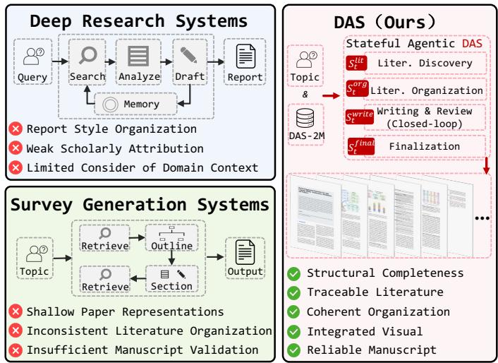
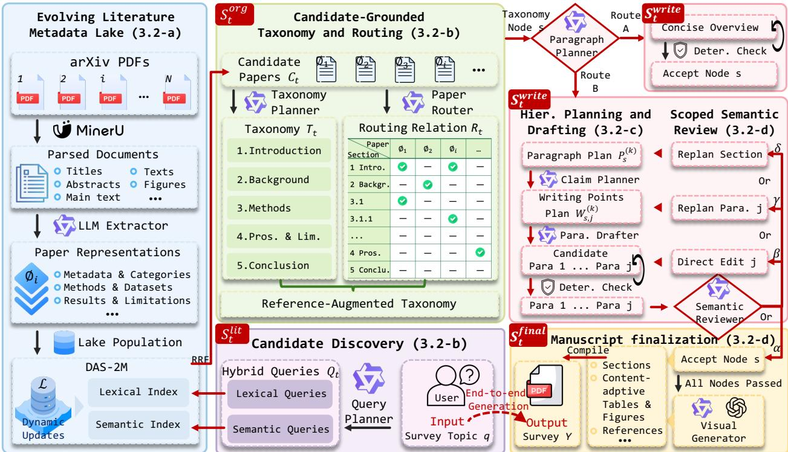
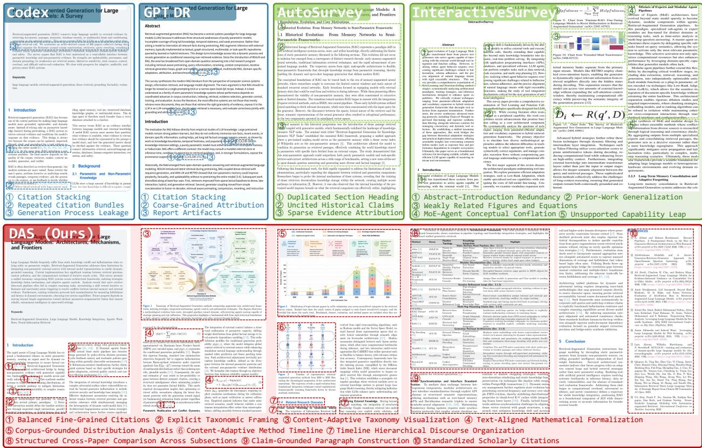

# Deep Academic Survey: Stateful Agentic Closed-Loop Paradigm for Academic Survey Automation

Zhikai Xu1,⋆, Zhucun Xue1,⋆, Teng Hu2, Yabiao Wang1, Yong Liu1, Jiangning Zhang1,†

1Zhejiang University, 2Shanghai Jiao Tong University ⋆Equal contribution, †Corresponding author

Academic surveys play a central role in organizing rapidly expanding scholarly literature, yet their construction requires extensive paper analysis, coherent knowledge organization, fine-grained citation support, and reliable manuscript assembly. Existing Deep Research and automated survey generation systems address parts of this process, but typically do not coordinate paper understanding, literature organization, evidence-grounded drafting, and manuscript validation through a shared, revisable state. We introduce DAS, a stateful agentic framework for generating publication-oriented academic surveys. Its key idea is to separate reusable paper analysis from topic-specific manuscript construction. DAS builds on DAS-2M, a dynamically updated metadata lake containing survey-oriented representations of approximately two million papers. Its agents maintain explicit literature, organization, writing, and finalization states through candidate-grounded taxonomy planning, reverse paper-to-section routing, and hierarchical claim and citation planning. Semantic review reactivates only the afected writing states for repair and reevaluation, forming a scoped closed loop with deterministic validation. We further introduce DAS-Bench, a 30-topic benchmark, together with DAS-Eval, which assesses scholarly citation quality, taxonomic synthesis, hierarchical discourse, and manuscript assembly reliability through 16 criteria. Among systems evaluated on all 30 topics, DAS achieves the highest average in all four dimensions, with an overall score of 4.34 compared with 4.03 for the strongest competitor, and the same ordering is preserved on the matched 21-topic CS subset. Blinded expert evaluation further prefers DAS to Naive RAG on 27 of 30 topics and to AutoSurvey on 19 of 21 shared CS topics.

Date: August 19, 2026 Correspondence: 186368@zju.edu.cn Code: https://github.com/ZhikaiXu24/DAS Data: https://huggingface.co/datasets/ZhikaiXu24/DAS-2M WAWV Project: https://zhikaixu24.github.io/projects/DAS/

## 1 Introduction

The rapid growth of scholarly literature has made high-quality academic surveys essential entry points for understanding unfamiliar fields, organizing their intellectual structure, and tracking recent advances [5]. Yet producing such surveys manually requires broad literature coverage, continuous updating, and substantial expert efort, making the process increasingly dificult to sustain as the literature expands [45].

We define publication-oriented survey generation as constructing an academic survey with structural completeness, traceable literature support, coherent organization across taxonomy, section, and paragraph levels, integrated visual elements, and consistency among final manuscript artifacts [14]. As illustrated in Fig. 1, we contrast DAS with two categories of existing systems: Deep Research systems and automated survey generation systems. 1) Deep Research Systems. Systems such as OpenAI Deep Research and Gemini Deep Research support broad retrieval and long-form report generation with citations, but are designed primarily for general research assistance rather than academic survey construction [19, 33]. i) Report-Style Organization. Their outputs may lack a coherent taxonomy, sustained academic exposition, and integrated equations, tables, and figures. ii) Weak Scholarly Attribution. References may mix academic and web sources, follow nonstandard formats, or align imprecisely with supported claims [2, 16]. iii) Limited Consideration of

Domain Context. Domain constraints, experimental settings, and comparable evaluation dimensions may be insuficiently analyzed. 2) Automated Survey Generation Systems. These systems provide stronger scholarly focus and more structured outputs [18, 51, 57], but still face three challenges. i) Shallow or Recomputed Paper Representations. Titles and abstracts omit technical and empirical details, while repeated document-level extraction introduces substantial processing cost [9]. ii) Inconsistent Literature Organization. Topic-only outline generation, independent section-level retrieval, and direct drafting can lead to inconsistent coverage, section boundaries, paper assignments, and claim-level citation support. iii) Insufficient Manuscript Validation. Publication-oriented surveys require both semantic review for coherence and deterministic validation for structural integrity and compilability, yet existing systems rarely support both.

To address these challenges, we propose Deep Academic Survey (DAS), a stateful agentic framework for constructing publicationoriented survey manuscripts. First, DAS constructs DAS-2M, a persistent and dynamically updated literature metadata lake that provides reusable, survey-oriented representations of approximately 2 million papers. Second, DAS organizes the candidate literature into a taxonomy with section-aligned paper assignments, and then progressively translates these assignments into claim-level evidence support through hierarchical planning and drafting. Finally, DAS employs a semantic review-andrepair loop to preserve logical coherence, together with deterministic validation to ensure the structural integrity and reliable assembly of the final manuscript. Together, these designs formulate survey generation as a structured, stateful, and closed-loop manuscript construction process. The complete methodology is presented in Sec. 3.2. Our contributions are summarized as follows:

  
Figure 1 Overview of existing systems and their limitations. Deep Research and automated survey generation systems typically center on retrieval and drafting, but do not jointly support the literature representation, organization, and validation required for publication-oriented academic surveys.

• We propose DAS, the first stateful agentic framework for generating publication-oriented academic surveys. We also construct DAS-2M, a literature metadata lake that provides fine-grained and survey oriented paper representations for topic-specific agentic manuscript construction.

• We design a closed-loop manuscript construction methodology comprising candidate-grounded taxonomy planning and reverse paper-to-section routing, hierarchical paragraph and claim-level citation planning, and a scoped semantic review-and-repair loop coupled with deterministic validation. Together, these mechanisms maintain cross-level consistency from candidate literature organization and section-level paper assignments to claim-level evidence support and final manuscript assembly.

• We construct DAS-Bench, the first benchmark designed to evaluate publication-oriented academic survey generation. Comprehensive comparisons show that DAS achieves the strongest overall performance among the compared systems.

## 2 Related Work

## 2.1 Deep Research for Scholarly Inquiry

Retrieval-augmented and agentic systems increasingly support scholarly inquiry [59]. RAG grounds generation in external evidence [26], while STORM extends retrieval to multi-perspective research and long-form writing [39]. Scientific agents such as PaperQA2 and OpenScholar further support iterative literature search and citation-grounded scientific question answering at scale [2, 44]. Commercial Deep Research agents similarly conduct multistep web investigation and produce cited reports [19, 33]. Claude Science integrates literature analysis, scientific tools, computing resources, and artifact generation within an auditable research workbench [1]. However, these systems primarily target open-ended inquiry and cited reporting. DAS instead formulates academic survey generation as stateful manuscript construction over explicit literature, organization, writing, and finalization states.

<table><tr><td rowspan="2">System</td><td colspan="2">Scholarly Substrate</td><td colspan="3">Structure and Grounding</td><td colspan="2">Revision and Validation</td><td colspan="3">Manuscript Artifacts</td></tr><tr><td>Corpus</td><td>PRep</td><td>GTax</td><td>LRoute</td><td>DPlan</td><td>RLoop</td><td>DCheck</td><td>Vlnt</td><td>CAVis</td><td>PDF</td></tr><tr><td>AutoSurvey</td><td>530K</td><td>x</td><td>x</td><td>x</td><td>x</td><td>x</td><td>x</td><td>x</td><td>X</td><td>x</td></tr><tr><td>SurveyForge</td><td>600K+20K</td><td>x</td><td>x</td><td>x</td><td>x</td><td>x</td><td>x</td><td>x</td><td>x</td><td>x</td></tr><tr><td>SurveyX</td><td>2.63M*+online</td><td>x</td><td>V</td><td>x</td><td>X</td><td>X</td><td>x</td><td>V</td><td>x</td><td>V</td></tr><tr><td>InteractiveSurveyonline+uploads</td><td></td><td>x</td><td>V</td><td>x</td><td>x</td><td>x</td><td>x</td><td>V</td><td>x</td><td>V</td></tr><tr><td>LiRA</td><td>provided refs.</td><td>x</td><td>x</td><td>x</td><td>x</td><td>V</td><td>x</td><td>x</td><td>x</td><td>x</td></tr><tr><td>DeepSurvey</td><td>online</td><td>x</td><td>V</td><td>V</td><td>x</td><td>V</td><td>x</td><td>x</td><td>x</td><td>x</td></tr><tr><td>DAS</td><td>2M</td><td>V</td><td>V</td><td>V</td><td>V</td><td>V</td><td>V</td><td>V</td><td>V</td><td>V</td></tr></table>

Table 1 Capabilities of representative automated survey generation systems. ✓ and × denote documented and absent or undocumented capabilities, respectively. ∗SurveyX reports an unreleased 2.63M-paper corpus.

## 2.2 Automated Survey Generation

Systems for automated survey generation address this more specialized target [22, 28, 42, 50]. AutoSurvey and SurveyForge retrieve papers, construct outlines, draft survey content, and refine the resulting text, with SurveyForge incorporating outline heuristics derived from human practice and memory-guided scholarly navigation [4, 51, 57]. SurveyX organizes references through AttributeTrees, while STRUCTSURVEY introduces structured agentic retrieval based on entities, relations, and topical taxonomies [27, 34]. InteractiveSurvey exposes intermediate artifacts for user revision, and IterSurvey iteratively updates retrieval results and outlines [54, 63]. LiRA coordinates specialized agents for outlining, subsection writing, editing, and review, while ARISE introduces multi-agent review with explicit evaluation rubrics [18, 53, 66]. DeepSurvey further combines full-paper analysis, section-level paper assignment, evidence-constrained citation generation, and multi-granularity refinement [58]. Despite these advances, existing systems generally cover only part of the end-to-end process required for publication-oriented survey generation. DAS addresses this gap through a unified stateful agentic framework that integrates candidate-grounded literature organization, hierarchical manuscript construction, and a scoped semantic review-and-repair loop coupled with deterministic finalization.

## 3 Method

In this section, we first formulate the task of publication-oriented survey generation and define the shared manuscript state. We then present the methodology of DAS and finally introduce DAS-Bench. Table 1 compares DAS with representative automated survey generation systems in terms of their documented capabilities.

## 3.1 Task Formulation

Given a survey topic $q ,$ a generation configuration Γ, and a dynamically updated literature metadata lake $\mathcal { L } = \{ \phi _ { i } \} _ { i = 1 } ^ { N }$ , where $\phi _ { i }$ denotes the survey-oriented structured representation of paper $i ,$ DAS performs stateful agentic construction to produce a publication-oriented academic survey manuscript Y.

Throughout this process, DAS maintains a shared manuscript state $S _ { t }$ at construction step t:

$$
\mathbf { } S _ { t } = \left( S _ { t } ^ { \mathrm { l i t } } , S _ { t } ^ { \mathrm { o r g } } , S _ { t } ^ { \mathrm { w r i t e } } , S _ { t } ^ { \mathrm { f i n a l } } \right) ,\tag{1}
$$

  
Figure 2 Overview of the DAS framework. DAS builds on the dynamically updated DAS-2M metadata lake and coordinates literature discovery, literature organization, hierarchical drafting, scoped review and repair, and artifact finalization through an explicit manuscript state. Review feedback reactivates the afected writing state before accepted content enters final assembly.

where $S _ { t } ^ { \mathrm { l i t } }$ stores the query plan $\mathcal { Q } _ { t }$ and candidate papers $\mathcal { C } _ { t } .$ , while $S _ { t } ^ { \mathrm { o r g } }$ stores the taxonomy $\mathcal { T } _ { t }$ and paperto-section routing relation $\mathcal { R } _ { t } . \quad \mathcal { S } _ { t } ^ { \mathrm { w r i t e } }$ stores the paragraph plans, writing-point plans, optional source evidence, drafts, and review status associated with the taxonomy nodes, while $S _ { t } ^ { \mathrm { f i n a l } }$ stores the figures, tables, bibliographic records, and manuscript source files produced during finalization. These states follow an explicit dependency: the candidate literature informs taxonomy construction, the taxonomy and routing relation constrain drafting, and accepted drafts enter manuscript assembly. When review identifies a defect, DAS reactivates only the afected writing states at the corresponding construction stage and re-executes the dependent agentic steps, thereby forming a scoped review-and-repair loop.

## 3.2 Methodology: Agentic DAS

We introduce DAS, the first stateful agentic system designed for publication-oriented survey generation. As illustrated in Fig. 2, DAS separates paper understanding from topic-specific manuscript construction. Its methodology comprises four components: a dynamically updated literature metadata lake, candidate-grounded taxonomy planning and paper routing, hierarchical planning and drafting, and a scoped semantic reviewand-repair loop followed by manuscript finalization. Together, these components realize a stateful agentic closed-loop paradigm for academic survey automation.

## 3.2.1 Evolving Literature Metadata Lake

Survey-oriented paper representation. A title-abstract pair provides only a coarse paper representation because technical mechanisms, implementation details, empirical findings, and limitations are often absent or heavily condensed [9]. This limited view constrains fine-grained paper understanding and can reduce survey writing to shallow summaries of abstract-level information. In a retrieve-then-extract design applied separately to each topic, the same paper may undergo document-level LLM extraction repeatedly across diferent survey topics, resulting in redundant computation and increased generation latency. DAS therefore precomputes a survey-oriented representation $\phi _ { i }$ for each paper i and stores it in ${ \mathcal { L } } .$ Each representation $\phi _ { i }$ is organized into eight high-level field groups: bibliographic metadata, topical categorization, technical configuration, resource availability, methodological details, dataset usage, research rationale and findings, and empirical evaluation and limitations. The resulting structured representations are shared across the subsequent stages of survey construction.

Literature metadata lake construction and maintenance. We construct L from approximately 2 million arXiv papers submitted between January 2020 and June 2026. The construction and maintenance process consists of four stages. 1) Full PDF parsing. We use MinerU to parse the complete content and document structure of each PDF, including titles, abstracts, the main text and other document elements [48]. 2) Surveyoriented metadata extraction. An LLM-based extractor converts the parsed content into the survey-oriented paper representation defined above, capturing the information required by subsequent agentic taxonomy planning, paper routing, claim planning, drafting, and review. 3) Retrieval indexing. We construct lexical and semantic indexes over the extracted metadata to support hybrid candidate discovery for topic-specific survey construction. 4) Dynamic lake maintenance. The lake is dynamically updated through the same processing pipeline as new papers become available, allowing DAS to incorporate recent literature and preserve the timeliness of generated surveys. The complete metadata schema, corpus statistics, extraction configuration, and quality-control procedure are provided in Sec. B.

## 3.2.2 Candidate-Grounded Taxonomy and Routing

Hybrid candidate discovery. Given a survey topic q, the Query Planner agent expands the topic into complementary lexical and semantic queries and records them in $\mathcal { Q } _ { t }$ . A deterministic hybrid retriever executes BM25 [37] and dense search [25] over the ofline indexes of $\mathcal { L }$ and merges the ranked results using weighted reciprocal rank fusion [8]. The highest-ranked papers, together with their retrieval provenance, form the candidate set $\mathcal { C } _ { t }$ . This transition updates $S _ { t } ^ { \mathrm { l i t } }$ and provides the shared candidate literature for taxonomy planning.

Candidate-grounded taxonomy planning. Given $\mathcal { C } _ { t } .$ , the Taxonomy Planner agent reads a joint view of the structured paper representations and organizes the research directions covered by the candidate literature into a rooted taxonomy $\mathcal { T } _ { t } .$ . Each node defines a semantic scope, a structural role, and a writing objective; nodes are designated as analytical, reflective, or navigational according to their function. A deterministic structural check verifies the hierarchy and normalizes section identifiers before $\mathcal { T } _ { t }$ is stored in $S _ { t } ^ { \mathrm { o r g } }$ . These node definitions guide both paper routing and subsequent drafting.

Reverse paper-to-section routing. Because $\mathcal { C } _ { t }$ is optimized for recall, it may contain weakly related papers and does not specify which sections each paper can support. Rather than retrieving papers independently for each section, the Paper Router agent evaluates each candidate representation against the eligible nodes of $\mathcal { T } _ { t }$ using its technical focus, empirical findings, and research logic. The router produces a sparse multi-label assignment: a paper may be assigned to multiple nodes when it supports distinct section objectives, or to none when no suficiently aligned node is found. The accepted assignments define $\mathcal { R } _ { t } \subseteq \mathcal { C } _ { t } \times \operatorname { N o d e s } ( \mathcal { T } _ { t } )$ . Together, $\mathcal { T } _ { t }$ and $\mathcal { R } _ { t }$ complete $S _ { t } ^ { \mathrm { { o r g } } }$ and establish section-level citation scopes for subsequent drafting.

## 3.2.3 Hierarchical Planning and Drafting

Adaptive paragraph planning. For each taxonomy node s, the Paragraph Planner agent reads its semantic scope, structural role, papers assigned through $\mathcal { R } _ { t }$ , and compact views of their structured representations. Based on this information, the planner selects one of two writing routes: 1) Route A. Navigational nodes and nodes whose assigned literature cannot support a multi-paragraph technical discussion follow Route A and produce a concise overview. 2) Route B. The remaining nodes enter hierarchical planning, drafting, and the scoped review-and-repair loop. For each Route B node, the planner constructs an initial ordered paragraph plan $\mathcal { P } _ { s } ^ { ( 0 ) }$ , whose entries specify paragraph themes, argumentative roles, target lengths, and paragraph-level paper assignments drawn from the node’s routed citation scope. This plan separates paragraph responsibilities and defines the paper set available to each paragraph for subsequent claim and citation planning. For Route B nodes, k indexes local construction and review iterations, with $k = 0$ denoting the initial planning and drafting pass.

Claim and citation planning. For each planned paragraph j, the Claim Planner agent reads its paragraph objective and the full structured representations of the papers assigned by $\mathcal { P } _ { s } ^ { ( k ) }$ . It constructs $\mathcal { W } _ { s , j } ^ { ( k ) }$ as an ordered sequence of writing points, each specifying an intended claim, its supporting citation group, and the technical details required for drafting [16]. Papers that jointly support the same claim may share a citation group, while the same paper may be reused across writing points only when it supports a distinct aspect in each case. When an essential detail is unavailable in the structured representation, the planner may issue a bounded, focused request to the corresponding source document [15]. Any retrieved evidence is attached to the relevant writing point in $\mathcal { W } _ { s , j } ^ { ( k ) }$

Paragraph realization and validation. For each Route-B paragraph, the Drafter agent reads the section objective, paragraph theme, claim-level writing plan $\mathcal { W } _ { s , j } ^ { ( k ) }$ , attached source evidence, and preceding validated paragraphs. The Drafter generates a paragraph candidate, which is immediately passed to a deterministic validator before it can be committed to $S _ { t } ^ { \mathrm { w r i t e } }$ . The deterministic checker verifies citation identifiers, unresolved placeholders, paragraph boundaries, section formatting, and LaTeX constraints. Violations that admit rule based correction are resolved directly; otherwise, explicit revision instructions reactivate the Drafter for another generation step. Once validated, Route-A nodes produce a single validated overview. For Route-B nodes, validated paragraphs are assembled according to the current paragraph plan and submitted to the semantic review loop.

## 3.2.4 Scoped Review and Manuscript Finalization

Scoped semantic review-and-repair loop. For each Route-B node $s ,$ the Reviewer operates on the subsection-specific portion of $S _ { t } ^ { \mathrm { w r i t e } }$ at local review iteration $k ,$ including the paragraph plan $\mathcal { P } _ { s } ^ { ( k ) }$ , the claim-level writing and citation plans $\{ \mathcal { W } _ { s , j } ^ { ( k ) } \} _ { j = 1 } ^ { J _ { s } ^ { ( k ) } }$ , and the validated paragraph drafts $\{ d _ { s , j } ^ { ( k ) } \} _ { j = 1 } ^ { J _ { s } ^ { ( k ) } }$

The Reviewer agent evaluates the assembled subsection ${ D } _ { s } ^ { ( k ) }$ for technical relevance, alignment with the taxonomy-defined objective, argumentative progression, redundancy across paragraphs, and citation support for central claims. According to the scope of the identified defect, the Reviewer selects one of four actions: accepting the current subsection, directly revising paragraph $j ,$ replanning paragraph $j ,$ or replanning the entire subsection. We denote these actions by $\alpha , \beta _ { j } , \gamma _ { j }$ , and $\delta ,$ respectively. The local writing state is updated as

$$
\begin{array} { r } { \left( S _ { t } ^ { \mathrm { w r i t e } } \right) _ { s } ^ { \left( k + 1 \right) } = \left\{ \begin{array} { l l } { \left( S _ { t } ^ { \mathrm { w r i t e } } \right) _ { s } ^ { \left( k \right) } , } & { a _ { s } ^ { \left( k \right) } = \alpha , } \\ { F _ { a _ { s } ^ { \left( k \right) } } \left( \left( S _ { t } ^ { \mathrm { w r i t e } } \right) _ { s } ^ { \left( k \right) } \right) , } & { a _ { s } ^ { \left( k \right) } \neq \alpha . } \end{array} \right. } \end{array}\tag{2}
$$

where $F _ { a _ { s } ^ { ( k ) } }$ denotes the scoped repair operation applied to the subsection-specific writing state selected by the current review action. Action $\beta _ { j }$ revises only the afected paragraph draft. Action $\gamma _ { j }$ preserves the section-level paragraph plan while regenerating the corresponding claim-level writing and citation plan and paragraph draft. Action δ reconstructs the paragraph plan and all dependent writing states and may therefore change the number of planned paragraphs from $\bar { \boldsymbol { J } } _ { s } ^ { ( k ) }$ to $J _ { s } ^ { ( k + 1 ) }$ . Every regenerated paragraph must pass deterministic validation before being recommitted to the shared manuscript state. The subsection is then reassembled and evaluated again by the Reviewer agent. This repeated state update and re-evaluation forms a scoped agentic review-and-repair loop [30, 43], which continues until the subsection is accepted or the retry budget is exhausted. If the budget is exhausted, DAS retains the latest complete version that has passed deterministic validation as the fallback writing state.

Manuscript finalization. After drafting and review, specialized visual generation roles generate contentadaptive figures and tables from the accepted manuscript state. The finalizer then resolves bibliographic records, inserts and validates cross-references, and assembles the corresponding LaTeX, BibTeX, and asset files. These components update $S _ { t } ^ { \mathrm { f i n a l } }$ , which is compiled into the final survey manuscript Y . Complete role prompts, structured output schemas, validation rules, and retry configurations are provided in Sec. C.

<table><tr><td rowspan="2">Method</td><td colspan="3">BSC↑</td><td>TSQ↑</td><td colspan="3">HDQ↑</td><td colspan="3">MAR↑</td><td rowspan="2"></td><td rowspan="2">Total Avg.</td></tr><tr><td></td><td>Sup. Attr. MSyn.</td><td>Bal.</td><td>Avg. .Cov. Bnd. Org.</td><td>Avg.</td><td>Aln. Prog.</td><td></td><td>Spec. LSyn. Avg.</td><td>Ref. Vis. Lay.</td><td>. Comp. Avg.</td></tr><tr><td>Human</td><td>3.87</td><td>3.90</td><td>3.53 4.07</td><td>3.84 4.23 4.23 4.40</td><td>4.29 4.47</td><td>4.07</td><td>4.37</td><td>4.07</td><td>4.24 5.00 5.00</td><td>5.00 5.00</td><td>5.00</td><td>4.34</td></tr><tr><td>|Codex</td><td>3.003.43</td><td></td><td>2.73 2.03 2.80</td><td>3.00 3.00 3.00 2.97</td><td>2.99 3.43</td><td>2.43</td><td>3.07</td><td>2.07 2.75</td><td>5.00 1.77 5.00</td><td>5.00</td><td>4.19</td><td>3.18</td></tr><tr><td>GPT DR</td><td>3.57</td><td>3.77 3.33</td><td>2.60 3.32</td><td>3.47 3.50 3.53 3.43</td><td>3.48 4.10</td><td>3.47</td><td>4.00</td><td>3.47 3.76</td><td>5.00 1.57 5.00</td><td>5.00</td><td>4.14</td><td>3.68</td></tr><tr><td>Genneral[ Gemini DR</td><td>2.83</td><td>2.60 2.87</td><td>3.50 2.95</td><td>3.80 3.83 3.83 3.80</td><td>3.82 4.17</td><td>3.97</td><td>4.17</td><td>3.97 4.07</td><td>4.60 4.87 4.90</td><td>5.00</td><td>4.84</td><td>3.92</td></tr><tr><td>Naive RAG</td><td>4.00</td><td>4.00 3.33</td><td>3.60 3.73</td><td>3.97 4.30 4.20 3.77</td><td>4.06 4.47</td><td>3.93</td><td>4.53</td><td>3.93 4.22</td><td>5.00 1.37</td><td>5.00 5.00</td><td>4.09</td><td>4.03</td></tr><tr><td>|AutoSurvey</td><td>4.00</td><td>4.00 3.29</td><td>3.95 3.81</td><td>4.00 3.86 3.10 4.00</td><td>3.74 4.10</td><td>3.14</td><td>4.24</td><td>3.29</td><td>3.69 5.00 1.29 5.00</td><td>3.38</td><td>3.67</td><td>3.73</td></tr><tr><td>Gen. SurveyForge</td><td>4.00</td><td>3.90 3.81</td><td>3.19 3.73</td><td>4.00 4.00 3.24 4.00</td><td>3.81 4.10</td><td>3.29</td><td>4.19</td><td>3.38</td><td>3.74 5.00 01.29 5.00</td><td>4.05</td><td>3.83</td><td>3.78</td></tr><tr><td>$urrvey LiRA</td><td>3.97</td><td>3.97 3.57</td><td>3.00 3.63</td><td>4.00 3.33 3.53 4.00</td><td>3.72 3.97</td><td>3.90</td><td>4.43</td><td>3.93 4.06</td><td>3.00 1.404.87</td><td>3.00</td><td>3.07</td><td>3.62</td></tr><tr><td>[Inter. Survey</td><td>3.10</td><td>3.00 1.93</td><td>2.97 2.75</td><td>4.00 3.70 3.83 4.00</td><td>3.88 3.80</td><td>3.93</td><td>4.00</td><td>4.00 3.93</td><td>4.13 4.77 4.83</td><td>5.00</td><td>4.68</td><td>3.81</td></tr><tr><td>DAS</td><td>4.00 4.03</td><td></td><td>4.00</td><td>3.37 3.85 4.00 4.00</td><td>4.37 4.50 4.22 4.27</td><td>4.13</td><td>4.53</td><td>4.17</td><td>4.28 5.00 5.00 5.00</td><td>5.00</td><td>5.00</td><td>4.34</td></tr></table>

Table 2 System-level results on DAS-Bench. All criteria use a 1–5 scale; Group Avg. and Total Avg. average four and 16 criteria, respectively. Best and second-best system scores are bold and underlined, while Human is reported for reference only. Full definitions and aggregation details are provided in Sec. E.
<table><tr><td rowspan="2">Variant</td><td colspan="4">BSC↑</td><td colspan="2">TSQ↑</td><td colspan="4">HDQ↑</td><td colspan="4">MAR↑</td><td rowspan="2">Total Avg.</td></tr><tr><td></td><td></td><td></td><td>Sup. Attr. MSyn. Bal. Avg.</td><td>Cov. Bnd. Org.</td><td>Ins.</td><td>Avg. . Aln. Prog. Spec. LSyn. Avg. </td><td></td><td></td><td></td><td>Ref. Vis.</td><td>Lay. Comp. Avg.</td><td></td><td></td></tr><tr><td>w/o Metadata</td><td>4.00</td><td>3.97</td><td>4.00</td><td>3.47 3.86</td><td>4.00 4.00</td><td>4.23 4.23</td><td>4.12 4.20</td><td>4.17</td><td>4.30</td><td>4.17</td><td>4.21</td><td>5.00 5.00 5.00</td><td>5.00</td><td>5.00</td><td>4.30</td></tr><tr><td>w/o Taxonomy</td><td>4.00</td><td>4.03</td><td>4.00</td><td>3.70 3.93</td><td>4.03 4.03</td><td>4.27 4.30</td><td>4.16 4.23</td><td>4.23</td><td>4.47</td><td>4.27</td><td>4.30</td><td> 5.00 5.00 5.00</td><td>5.00</td><td>5.00</td><td>4.35</td></tr><tr><td>w/o Routing</td><td>4.00</td><td>4.00</td><td>4.00</td><td>3.03 3.76</td><td>4.00 4.00</td><td>4.17 4.23 4.10</td><td>4.17</td><td>4.07</td><td>4.37</td><td>4.07</td><td>4.17</td><td>7 5.00 5.00 5.00</td><td>5.00</td><td>5.00</td><td>4.26</td></tr><tr><td>w/o Hier. Draft</td><td>4.00</td><td>4.03</td><td>3.97</td><td>3.07 3.77</td><td>4.07 4.07</td><td>4.40 4.33 4.22</td><td>24.47</td><td>4.40</td><td>4.60</td><td>4.10</td><td></td><td>4.39 5.00 5.00 5.00</td><td>5.00</td><td>5.00</td><td>4.34</td></tr><tr><td>w/o Det. Val.</td><td>4.00</td><td>4.00</td><td>3.97</td><td>3.13 3.78</td><td>4.10 4.10</td><td>4.40 4.40 4.25</td><td>3.97</td><td>3.90</td><td>4.13</td><td>3.93</td><td></td><td>3.98 5.00 5.00 5.00</td><td>5.00</td><td>5.00</td><td>4.25</td></tr><tr><td>w/o Sem. Review</td><td> 4.03</td><td>4.03</td><td>4.00</td><td>3.17 3.81 4.03</td><td>4.03</td><td>34.07 4.10 4.06 4.03</td><td></td><td>4.03</td><td>4.33</td><td>4.07</td><td></td><td>4.12 5.00 5.00 5.00</td><td>5.00</td><td>5.00</td><td>4.25</td></tr><tr><td>Full DAS</td><td>4.00</td><td>4.03</td><td>4.00</td><td>3.37 3.85</td><td>4.00 4.00</td><td>4.37 4.50 4.22</td><td>4.27</td><td>4.13</td><td>4.53</td><td>4.17</td><td></td><td>4.28 5.00 5.00 5.00</td><td>5.00</td><td>5.00</td><td>4.34</td></tr></table>

Table 3 Ablation results on DAS-Bench. Group Avg. and Total Avg. average four and 16 criteria, respectively. For the † variant, three noncompiling outputs received minimal syntax corrections only for MAR rendering.

## 3.3 DAS-Bench

Benchmark construction. DAS-Bench contains 30 survey topics, comprising 21 core computer science topics and nine non-CS topics. All systems receive the same survey task. Closed-source systems use their native configurations, while reproducible systems retain their released workflows and use Qwen3.5-397B-FP8 as the common generation backbone [36]. Original retrieval resources are retained when available; otherwise, systems receive a frozen 300-paper candidate set. Complete topics, configurations, prompts, and timeout rules are provided in Sec. D.

DAS-Eval metrics. DAS-Eval evaluates publication-oriented surveys along four dimensions: Balanced Scholarly Citation Quality (BSC) measures citation grounding and distribution; Taxonomic Synthesis Quality (TSQ) measures literature coverage and global organization; Hierarchical Discourse Quality (HDQ) measures argumentation across sections and paragraphs; and Manuscript Assembly Reliability (MAR) measures reference integrity, visual integration, layout, and component completeness. Each dimension contains four criteria scored from 1 to 5, and the overall score is the mean of all 16 criteria. Multimodal LLM judges evaluate rendered manuscripts together with structured citation metadata, while domain experts independently rank method-blinded manuscripts. Complete rubrics and evaluation procedures are provided in Sec. E.

## 4 Experiments

## 4.1 Setup

Baselines. We compare DAS with two groups of systems. General research and writing baselines include Codex, GPT Deep Research, Gemini Deep Research, and Naive RAG, which drafts directly from the shared paper metadata without explicit taxonomy planning or review [19, 32, 33]. Automated survey baselines include AutoSurvey, SurveyForge, InteractiveSurvey, and LiRA [18, 51, 54, 57]. SurveyX exceeded the 12-hour limit and is reported only in the completion analysis [27]; DeepSurvey is excluded because no public implementation was available [58]. Detailed configurations and output statistics are provided in Secs. D and F.4.

Evaluation protocol. Codex, GPT Deep Research, and Gemini Deep Research are evaluated using their oficial native configurations and retrieval capabilities. For Naive RAG and the reproducible automated survey generation systems, we preserve the released system workflows while using Qwen3.5-397B-FP8 as a common generation backbone [36]. This protocol separates comparisons with native closed-source systems from controlled comparisons among reproducible methods.

## 4.2 Main Results and Analysis

Overall quantitative comparison. Tab. 2 reports system-level performance across the four DAS-Eval dimensions. AutoSurvey and SurveyForge are evaluated on the 21 CS topics supported by their original corpora, whereas the remaining completed systems are evaluated on all 30 topics. For comparison under identical topic coverage, Sec. F.1 reports all systems on the shared 21-topic subset. The matched comparison preserves the same ordering among generated systems. The Human row contains one publicly available academic survey matched to each DAS-Bench topic, with its sources and selection criteria provided in Sec. D.

Among the systems evaluated on all 30 topics, DAS achieves the highest group averages in BSC, TSQ, HDQ, and MAR, yielding a Total Avg. of 4.34 compared with 4.03 for Naive RAG. Across the quantities reported in Tab. 2, DAS is best or tied for best on 18 of the 21 measures. Its clearest advantages occur in multi-reference synthesis, global organization, research insight, paragraph progression, local synthesis, and visual integration, consistent with the literature organization, hierarchical drafting, and manuscript finalization mechanisms described in Sec. 3.2. The advantage is not uniform across all criteria: Naive RAG obtains the highest taxonomy boundary and multi-level goal alignment scores, while AutoSurvey performs best on citation balance.

Qualitative manuscript case study. As shown in Fig. 3, the case study illustrates manuscript-level diferences that are not fully captured by aggregate scores. Across the displayed baseline examples, the annotations identify specific instances of citation stacking, repeated citation bundles, coarse claim-to-reference attribution, duplicated headings, unsupported historical or capability statements, and weak coupling between figures, equations, and the surrounding discussion. For the same topic, the DAS example maintains closer alignment among the taxonomy, section-level organization, claim-level citations, mathematical formulations, contentadaptive visualizations, and structured comparisons across papers. For conciseness, we present representative pages for each system as the remaining pages generally follow similar content and layout patterns. Complete generated manuscripts, additional qualitative comparisons, and the page selection protocol are included in the accompanying supplementary materials described in Sec. A.

## 4.3 Ablation Studies

Ablation results on DAS-Bench. We ablate each core mechanism on all 30 topics while holding the remaining experimental conditions constant. As shown in Tab. 3, removing reverse paper-to-section routing decreases BSC, TSQ, and HDQ by 0.09, 0.12, and 0.11, respectively, while removing semantic review lowers both TSQ and HDQ by 0.16. Replacing structured paper representations with titles and abstracts reduces TSQ by 0.10 and HDQ by 0.07, indicating that richer metadata primarily benefits literature organization and discourse construction.

Taxonomy planning and hierarchical drafting exhibit cross-dimensional trade-ofs. Removing taxonomy planning slightly increases BSC and HDQ but reduces TSQ, particularly global organization and research insight. Removing hierarchical drafting improves several discourse scores but lowers BSC, especially citation balance. Deterministic validation primarily improves execution reliability. Full DAS compiles all 30 manuscripts, whereas the variant without it compiles 27 and reduces HDQ from 4.28 to 3.98. The three failed outputs received only minimal syntax corrections for MAR evaluation. Overall, reverse routing and semantic review provide the most consistent gains, while the remaining mechanisms contribute through dimension-specific improvements and manuscript reliability.

  
Figure 3 Qualitative comparison of survey artifacts from two general research systems (Codex and GPT DR), two automated survey generation systems (AutoSurvey and InteractiveSurvey), and DAS. The figure presents representative first-page and interior-page views from the generated manuscripts.

## Repair policy ablation.

To isolate the efect of repair scope, we run all policies from identical prereview states under the same experimental settings. As shown in Tab. 4, Full DAS achieves the highest Review Pass Rate of 74.59% and the lowest review cost among policies that perform semantic review, with an average of 0.79M tokens per survey. Although Paragraph Replan Only obtains slightly higher BSC and HDQ scores, it yields a lower pass rate and a higher review cost. Overall, the adap-

<table><tr><td>Policy</td><td>BSC↑ TSQ↑ HDQ↑</td><td></td><td>RPR↑</td><td>RTok.↓</td></tr><tr><td>Direct Edit Only</td><td>3.84</td><td>4.11</td><td>4.24 58.42%</td><td>0.95</td></tr><tr><td>Paragraph Replan Only</td><td>3.87</td><td>4.21</td><td>4.38 53.69%</td><td>0.96</td></tr><tr><td>Section Replan Only</td><td>3.81</td><td>4.13</td><td>4.23 45.13%</td><td>2.57</td></tr><tr><td>w/o Semantic Review</td><td>3.81</td><td>4.06</td><td>4.12</td><td>0.00</td></tr><tr><td>Full DAS</td><td>3.85</td><td>4.22</td><td>4.28 74.59%</td><td>0.79</td></tr></table>

Table 4 Comparison of repair policies on DAS-Bench from identical prereview states. RPR denotes the proportion of reviewed subsections that obtain PASS within the review budget, and RTok. denotes the review and repair tokens consumed per survey in millions.

tive policy provides a favorable balance between review success and cost by matching the repair scope to the detected defect.

## 4.4 Backbone Sensitivity Analysis

We select five topics before running the sensitivity experiment: retrieval augmented generation (003), dynamic 3D reconstruction (010), eficient LLM serving (015), causal representation learning (020), and battery materials discovery (025). They cover language systems, vision, infrastructure, machine learning, and a non-CS scientific domain. Qwen3.5-397B-A17B-FP8, Qwen3.5-35B-A3B-FP8, and GPT-5.5 use the same candidates, DAS configuration, prompts, review budget, and evaluation protocol. Table 5 reports the frozen results on five topics; no value is extrapolated to all 30 topics.

<table><tr><td rowspan="2">Backbone</td><td colspan="3">BSC↑</td><td colspan="3">TSQ↑</td><td colspan="3">MAR↑</td><td rowspan="2">Total</td></tr><tr><td>Sup. Attr. MSyn. Bal. Avg. Cov. Bnd. Org. Ins. Avg. Aln. Prog. Spec. LSyn. Avg. Ref. Vis. Lay. Comp. Avg.</td><td></td><td></td><td></td><td></td><td></td><td></td><td></td><td></td></tr><tr><td>GPT-5.5</td><td>4.004.40</td><td>4.00</td><td>3.20 3.904.40</td><td>4.20 4.80 5.00 4.60 4.60</td><td>5.00 4.40</td><td>4.60</td><td></td><td>4.65 5.00 5.00 5.00</td><td>5.00</td><td>5.00 4.54</td></tr><tr><td>Qwen3.5-35B-A3B-FP8</td><td>3.60 3.60</td><td>3.60</td><td>3.00 3.45 3.80</td><td>3.804.00 4.00 3.90 3.80</td><td>3.20 4.00</td><td>3.00</td><td></td><td>3.50 5.00 5.00 5.00</td><td>5.00 5.00</td><td>3.96</td></tr><tr><td>Qwen3.5-397B-A17B-FP8 4.00</td><td>4.00</td><td>4.00</td><td></td><td>3.00 3.75 4.004.004.60 5.00 4.40 4.20</td><td>4.20 4.60</td><td>4.40</td><td></td><td>4.35 5.00 5.00 5.00</td><td>5.00 5.00</td><td>4.38</td></tr></table>

Table 5 Backbone sensitivity on five stratified topics. All rows use identical DAS inputs and settings. Group averages summarize four submetrics, and Total is the mean of all 16 submetrics.

GPT-5.5 achieves the highest Total score, improving over the default backbone by 0.16 points, with the largest gains in TSQ and HDQ. The 35B model reduces Total by 0.42 points but retains a TSQ average of 3.90 and complete manuscript artifacts. These results show that backbone capacity afects analytical quality, while the fixed literature organization, planning, validation, and assembly mechanisms remain efective across model scales. GPT-5.5 ofers the strongest quality but requires a proprietary API, whereas the 35B model provides a lower resource option. The default 397B backbone therefore ofers a practical balance between output quality and inference cost.

## 4.5 Human Evaluation and Cross-Judge Robustness

Expert evaluation. Three domain experts independently ranked method-blinded manuscripts according to literature support, organization, analytical writing, and completeness. Under majority voting, DAS was preferred to Naive RAG on 27 of 30 topics and to AutoSurvey on 19 of 21 shared CS topics, ranking first on 18 of these 21 topics. The experts agreed unanimously on 63 of 72 pairwise comparisons. Protocol and complete results are provided in Sec. G.

Cross-judge robustness. Kimi K2.6 re-evaluation yields a moderate correlation with Qwen3.5 (ρ = 0.507, MAE = 0.630) while preserving the ordering DAS > Naive RAG > AutoSurvey. The judges agree on 48 of 63 CS comparisons and both rank DAS above Naive RAG on the non-CS subset, although local agreement is lower. Thus, the overall ranking is stable, while fine-grained scores remain judge-sensitive. Detailed results are provided in Sec. G.

## 5 Conclusion

We presented DAS, a stateful agentic framework that formulates publication-oriented survey generation as a closed-loop manuscript construction process. Building on the dynamically updated DAS-2M literature metadata lake, DAS integrates candidate-grounded literature organization, hierarchical claim and citation planning, scoped semantic repair, and deterministic finalization to maintain consistency from candidate papers to the compiled manuscript. We also introduced DAS-Bench for evaluating literature support, taxonomic organization, hierarchical discourse, and manuscript reliability across 30 topics. Experimental and expert evaluations show that DAS achieves the strongest overall performance among the compared systems, while the ablations clarify the distinct contributions and trade-ofs of its core mechanisms. These findings indicate that manuscript states and repair provide an efective foundation for constructing reliable academic surveys at scale.

## References

[1] Anthropic. Claude Science, an AI workbench for scientists. Anthropic, 2026. URL https://www.anthropic.com/ news/claude-science-ai-workbench. Accessed: 2026-07-29. 3

[2] Akari Asai, Jacqueline He, Rulin Shao, Weijia Shi, Amanpreet Singh, Joseph Chee Chang, Kyle Lo, Luca Soldaini, Sergey Feldman, Mike D’Arcy, David Wadden, Matt Latzke, Jenna Sparks, Jena D. Hwang, Varsha Kishore, Minyang Tian, Pan Ji, Shengyan Liu, Hao Tong, Bohao Wu, Yanyu Xiong, Luke Zettlemoyer, Graham Neubig, Daniel S. Weld, Doug Downey, Wen tau Yih, Pang Wei Koh, and Hannaneh Hajishirzi. Synthesizing

scientific literature with retrieval-augmented language models. Nature, 650(8103):857–863, 2026. doi: 10.1038/ s41586-025-10072-4. URL https://www.nature.com/articles/s41586-025-10072-4. 1, 3

[3] Seungbyn Baek, Kyungwoo Song, and Insuk Lee. Single-cell foundation models: Bringing artificial intelligence into cell biology. Experimental & Molecular Medicine, 57(10):2169–2181, 2025. doi: 10.1038/s12276-025-01547-5. 25

[4] Tong Bao, Mir Tafseer Nayeem, Davood Rafiei, and Chengzhi Zhang. SurveyGen: Quality-aware scientific survey generation with large language models. In Proceedings of the 2025 Conference on Empirical Methods in Natural Language Processing, pages 2712–2736, Suzhou, China, 2025. Association for Computational Linguistics. doi: 10.18653/v1/2025.emnlp-main.136. URL https://aclanthology.org/2025.emnlp-main.136/. 3

[5] Lutz Bornmann and Rüdiger Mutz. Growth rates of modern science: A bibliometric analysis based on the number of publications and cited references. Journal of the Association for Information Science and Technology, 66(11): 2215–2222, 2015. doi: 10.1002/asi.23329. URL https://doi.org/10.1002/asi.23329. 1

[6] Pengfei Cao, Tianyi Men, Wencan Liu, Jingwen Zhang, Xuzhao Li, Xixun Lin, Dianbo Sui, Yanan Cao, Kang Liu, and Jun Zhao. Large language models for planning: A comprehensive and systematic survey. arXiv preprint arXiv:2505.19683, 2025. 24

[7] Shengchao Chen, Guodong Long, Jing Jiang, Dikai Liu, and Chengqi Zhang. Foundation models for weather and climate data understanding: A comprehensive survey. arXiv preprint arXiv:2312.03014, 2023. 25

[8] Gordon V. Cormack, Charles L. A. Clarke, and Stefan Büttcher. Reciprocal rank fusion outperforms condorcet and individual rank learning methods. In Proceedings of the 32nd International ACM SIGIR Conference on Research and Development in Information Retrieval, pages 758–759. Association for Computing Machinery, 2009. doi: 10.1145/1571941.1572114. URL https://doi.org/10.1145/1571941.1572114. 5

[9] Pradeep Dasigi, Kyle Lo, Iz Beltagy, Arman Cohan, Noah A. Smith, and Matt Gardner. A dataset of informationseeking questions and answers anchored in research papers. In Proceedings of the 2021 Conference of the North American Chapter of the Association for Computational Linguistics: Human Language Technologies, pages 4599–4610, Online, 2021. Association for Computational Linguistics. doi: 10.18653/v1/2021.naacl-main.365. URL https://aclanthology.org/2021.naacl-main.365/. 2, 4

[10] Rui Ding, Junhong Chen, Yuxin Chen, Jianguo Liu, Yoshio Bando, and Xuebin Wang. Unlocking the potential: Machine learning applications in electrocatalyst design for electrochemical hydrogen energy transformation. Chemical Society Reviews, 53(23):11390–11461, 2024. doi: 10.1039/D4CS00844H. 25

[11] Huaming Du, Cancan Feng, Yuqian Lei, Chenyang Zhang, Guisong Liu, Gang Kou, Carl Yang, and Yu Zhao. A comprehensive survey on enterprise financial risk analysis from big data and LLMs perspective. arXiv preprint arXiv:2211.14997, 2022. 25

[12] Stefen Eger, Yong Cao, Jennifer D’Souza, Andreas Geiger, Christian Greisinger, Stephanie Gross, Yufang Hou, Brigitte Krenn, Anne Lauscher, Yizhi Li, Chenghua Lin, Nafise Sadat Moosavi, Wei Zhao, and Tristan Miller. Transforming science with large language models: A survey on AI-assisted scientific discovery, experimentation, content generation, and evaluation. arXiv preprint arXiv:2502.05151, 2025. 25

[13] Rafael Figueiredo Prudencio, Marcos R. O. A. Maximo, and Esther Luna Colombini. A survey on ofline reinforcement learning: Taxonomy, review, and open problems. IEEE Transactions on Neural Networks and Learning Systems, 35(8):10237–10257, 2024. doi: 10.1109/TNNLS.2023.3250269. 25

[14] Yuanxi Fu and Jodi Schneider. Engineering the reproducible literature review section for scholarly publications and grant applications. Proceedings of the AAAI Symposium Series, 5(1):360–364, 2025. doi: 10.1609/aaaiss.v5i1.35612. URL https://ojs.aaai.org/index.php/AAAI-SS/article/view/35612. 1

[15] Luyu Gao, Zhuyun Dai, Panupong Pasupat, Anthony Chen, Arun Tejasvi Chaganty, Yicheng Fan, Vincent Zhao, Ni Lao, Hongrae Lee, Da-Cheng Juan, and Kelvin Guu. RARR: Researching and revising what language models say, using language models. In Proceedings of the 61st Annual Meeting of the Association for Computational Linguistics (Volume 1: Long Papers), pages 16477–16508, Toronto, Canada, 2023. Association for Computational Linguistics. doi: 10.18653/v1/2023.acl-long.910. URL https://aclanthology.org/2023.acl-long.910/. 6

[16] Tianyu Gao, Howard Yen, Jiatong Yu, and Danqi Chen. Enabling large language models to generate text with citations. In Proceedings of the 2023 Conference on Empirical Methods in Natural Language Processing, pages 6465–6488, Singapore, 2023. Association for Computational Linguistics. doi: 10.18653/v1/2023.emnlp-main.398. URL https://aclanthology.org/2023.emnlp-main.398/. 1, 6

[17] Yunfan Gao, Yun Xiong, Xinyu Gao, Kangxiang Jia, Jinliu Pan, Yuxi Bi, Yi Dai, Jiawei Sun, Meng Wang, and Haofen Wang. Retrieval-augmented generation for large language models: A survey. arXiv preprint arXiv:2312.10997, 2023. 24

[18] Gregory Hok Tjoan Go, Khang Ly, Anders Søgaard, Seyed Amin Tabatabaei, Maarten de Rijke, and Xinyi Chen. LiRA: A multi-agent framework for reliable and readable literature review generation. In Proceedings of the AAAI Conference on Artificial Intelligence, volume 40, pages 40456–40464, 2026. doi: 10.1609/aaai.v40i47.41489. URL https://ojs.aaai.org/index.php/AAAI/article/view/41489. 2, 3, 7

[19] Google. Try deep research and our new experimental model in Gemini. Google Blog, 2024. URL https: //blog.google/products-and-platforms/products/gemini/google-gemini-deep-research/. Accessed: 2026-07-29. 1, 3, 7

[20] Dong Han, Cheng-Ye Su, Fan-Yi Zeng, Fang-Lue Zhang, and Miao Wang. Dynamic scene representation in the era of neural rendering: From NeRFs to 3DGSs. Frontiers of Computer Science, 20(11):2011708, 2026. doi: 10.1007/s11704-025-50389-x. 24

[21] Wenchong He, Zhe Jiang, Tingsong Xiao, Zelin Xu, and Yukun Li. A survey on uncertainty quantification methods for deep learning. arXiv preprint arXiv:2302.13425, 2023. Accepted by ACM Computing Surveys. 25

[22] Yue Hu and Xiaojun Wan. Automatic generation of related work sections in scientific papers: An optimization approach. In Proceedings of the 2014 Conference on Empirical Methods in Natural Language Processing, pages 1624–1633, Doha, Qatar, 2014. Association for Computational Linguistics. doi: 10.3115/v1/D14-1170. URL https://aclanthology.org/D14-1170/. 3

[23] Keli Huang, Botian Shi, Xiang Li, Xin Li, Siyuan Huang, and Yikang Li. Multi-modal sensor fusion for auto driving perception: A survey. arXiv preprint arXiv:2202.02703, 2022. 24

[24] Vinamr Jain, Zhilong Wang, and Fengqi You. Machine learning pipelines for the design of solid-state electrolytes. Materials Horizons, 13(1):15–44, 2026. doi: 10.1039/D5MH01525A. 25

[25] Vladimir Karpukhin, Barlas Oğuz, Sewon Min, Patrick Lewis, Ledell Wu, Sergey Edunov, Danqi Chen, and Wen tau Yih. Dense passage retrieval for open-domain question answering. In Proceedings of the 2020 Conference on Empirical Methods in Natural Language Processing, pages 6769–6781, Online, 2020. Association for Computational Linguistics. doi: 10.18653/v1/2020.emnlp-main.550. URL https://aclanthology.org/2020.emnlp-main.550/. 5

[26] Patrick Lewis, Ethan Perez, Aleksandra Piktus, Fabio Petroni, Vladimir Karpukhin, Naman Goyal, Heinrich Küttler, Mike Lewis, Wen tau Yih, Tim Rocktäschel, Sebastian Riedel, and Douwe Kiela. Retrievalaugmented generation for knowledge-intensive NLP tasks. In Advances in Neural Information Processing Systems, volume 33, pages 9459–9474, 2020. URL https://proceedings.neurips.cc/paper/2020/hash/ 6b493230205f780e1bc26945df7481e5-Abstract.html. 2

[27] Xun Liang, Jiawei Yang, Yezhaohui Wang, Chen Tang, Zifan Zheng, Shichao Song, Zehao Lin, Yebin Yang, Simin Niu, Hanyu Wang, Bo Tang, Feiyu Xiong, Keming Mao, and Zhiyu Li. SurveyX: Academic survey automation via large language models. arXiv preprint arXiv:2502.14776, 2025. doi: 10.48550/arXiv.2502.14776. URL https://arxiv.org/abs/2502.14776. 3, 8

[28] Yao Lu, Yue Dong, and Laurent Charlin. Multi-XScience: A large-scale dataset for extreme multi-document summarization of scientific articles. In Proceedings of the 2020 Conference on Empirical Methods in Natural Language Processing, pages 8068–8074, Online, 2020. Association for Computational Linguistics. doi: 10.18653/ v1/2020.emnlp-main.648. URL https://aclanthology.org/2020.emnlp-main.648/. 3

[29] Le Ma, Ran Zhang, Yikun Han, Shirui Yu, Zaitian Wang, Zhiyuan Ning, Jinghan Zhang, Ping Xu, Pengjiang Li, Ziyue Qiao, Wei Ju, Chong Chen, Dongjie Wang, Kunpeng Liu, Pengyang Wang, Pengfei Wang, Yanjie Fu, Chunjiang Liu, Yuanchun Zhou, and Chang-Tien Lu. A comprehensive survey on vector database: Storage and retrieval technique, challenge. arXiv preprint arXiv:2310.11703, 2023. 25

[30] Aman Madaan, Niket Tandon, Prakhar Gupta, Skyler Hallinan, Luyu Gao, Sarah Wiegrefe, Uri Alon, Nouha Dziri, Shrimai Prabhumoye, Yiming Yang, Shashank Gupta, Bodhisattwa Prasad Majumder, Kather ine Hermann, Sean Welleck, Amir Yazdanbakhsh, and Peter Clark. Self-refine: Iterative refinement with self-feedback. In Advances in Neural Information Processing Systems, volume 36, pages 46534– 46594, 2023. doi: 10.52202/075280-2019. URL https://proceedings.neurips.cc/paper\_files/paper/2023/hash/ 91edf07232fb1b55a505a9e9f6c0f3-Abstract-Conference.html. 6

[31] Lang Mei, Siyu Mo, Zhihan Yang, and Chong Chen. A survey of multimodal retrieval-augmented generation. arXiv preprint arXiv:2504.08748, 2025. 24

[32] OpenAI. Introducing codex. OpenAI, 2025. URL https://openai.com/index/introducing-codex/. Accessed: 2026-07-29. 7

[33] OpenAI. Introducing deep research. OpenAI, 2025. URL https://openai.com/index/introducing-deep-research/. Accessed: 2026-07-29. 1, 3, 7

[34] Paolo Pedinotti and Enrico Santus. StructSurvey: Structured agentic retrieval for automated survey paper generation. In Proceedings of the First Workshop on Structured Understanding, Retrieval, and Generation in the LLM Era (SURGeLLM 2026), pages 162–181, San Diego, California, United States, 2026. Association for Computational Linguistics. doi: 10.18653/v1/2026.surgellm-1.10. URL https://aclanthology.org/2026.surgellm-1. 10/. 3

[35] Changle Qu, Sunhao Dai, Xiaochi Wei, Hengyi Cai, Shuaiqiang Wang, Dawei Yin, Jun Xu, and Ji-Rong Wen. Tool learning with large language models: A survey. Frontiers of Computer Science, 19(8), 2025. doi: 10.1007/s11704-024-40678-2. 24

[36] Qwen Team. Qwen3.5-397B-A17B. Hugging Face Model Card, 2026. URL https://huggingface.co/Qwen/Qwen3. 5-397B-A17B. Accessed: 2026-07-29. 7, 8

[37] Stephen Robertson and Hugo Zaragoza. The probabilistic relevance framework: BM25 and beyond. Foundations and Trends in Information Retrieval, 3(4):333–389, 2009. doi: 10.1561/1500000019. URL https://doi.org/10. 1561/1500000019. 5

[38] Bernhard Schölkopf, Francesco Locatello, Stefan Bauer, Nan Rosemary Ke, Nal Kalchbrenner, Anirudh Goyal, and Yoshua Bengio. Toward causal representation learning. Proceedings of the IEEE, 109(5):612–634, 2021. doi: 10.1109/JPROC.2021.3058954. 25

[39] Yijia Shao, Yucheng Jiang, Theodore A. Kanell, Peter Xu, Omar Khattab, and Monica S. Lam. Assisting in writing Wikipedia-like articles from scratch with large language models. In Proceedings of the 2024 Conference of the North American Chapter of the Association for Computational Linguistics: Human Language Technologies (Volume 1: Long Papers), pages 6252–6278, Mexico City, Mexico, 2024. Association for Computational Linguistics. doi: 10.18653/v1/2024.naacl-long.347. URL https://aclanthology.org/2024.naacl-long.347/. 2

[40] Ze Sheng, Zhicheng Chen, Shuning Gu, Heqing Huang, Guofei Gu, and Jef Huang. LLMs in software security: A survey of vulnerability detection techniques and insights. arXiv preprint arXiv:2502.07049, 2025. 25

[41] Haizhou Shi, Zihao Xu, Hengyi Wang, Weiyi Qin, Wenyuan Wang, Yibin Wang, Zifeng Wang, Sayna Ebrahimi, and Hao Wang. Continual learning of large language models: A comprehensive survey. ACM Computing Surveys, 58(5):1–42, 2025. doi: 10.1145/3735633. 25

[42] Zhengliang Shi, Shen Gao, Zhen Zhang, Xiuying Chen, Zhumin Chen, Pengjie Ren, and Zhaochun Ren. Towards a unified framework for reference retrieval and related work generation. In Findings of the Association for Computational Linguistics: EMNLP 2023, pages 5785–5799, Singapore, 2023. Association for Computational Linguistics. doi: 10.18653/v1/2023.findings-emnlp.385. URL https://aclanthology.org/2023.findings-emnlp.385/. 3

[43] Noah Shinn, Federico Cassano, Ashwin Gopinath, Karthik Narasimhan, and Shunyu Yao. Reflexion: Language agents with verbal reinforcement learning. In Advances in Neural Information Processing Systems, volume 36, pages 8634–8652, 2023. doi: 10.52202/075280-0377. URL https://proceedings.neurips.cc/paper\_files/paper/ 2023/hash/1b44b878bb782e6954cd888628510e90-Abstract-Conference.html. 6

[44] Michael D. Skarlinski, Sam Cox, Jon M. Laurent, James D. Braza, Michaela Hinks, Michael J. Hammerling, Manvitha Ponnapati, Samuel G. Rodriques, and Andrew D. White. Language agents achieve superhuman synthesis of scientific knowledge. arXiv preprint arXiv:2409.13740, 2024. doi: 10.48550/arXiv.2409.13740. URL https://arxiv.org/abs/2409.13740. 3

[45] Hannah Snyder. Literature review as a research methodology: An overview and guidelines. Journal of Business Research, 104:333–339, 2019. doi: 10.1016/j.jbusres.2019.07.039. URL https://doi.org/10.1016/j.jbusres.2019.07. 039. 1

[46] Yan Tian, Zhaocheng Xu, Yujun Ma, Weiping Ding, Ruili Wang, Zhihong Gao, Guohua Cheng, Linyang He, and Xuran Zhao. Survey on deep learning in multimodal medical imaging for cancer detection. Neural Computing and Applications, 35(30):22239–22254, 2023. doi: 10.1007/s00521-023-09214-4. 25

[47] Senura Hansaja Wanasekara, Minh-Duong Nguyen, Xiaochen Liu, Nguyen H. Tran, and Ken-Tye Yong. Generative

modeling in protein design: Neural representations, conditional generation, and evaluation standards. arXiv preprint arXiv:2603.26378, 2026. 25

[48] Bin Wang, Chao Xu, Xiaomeng Zhao, Linke Ouyang, Fan Wu, Zhiyuan Zhao, Rui Xu, Kaiwen Liu, Yuan Qu, Fukai Shang, Bo Zhang, Liqun Wei, Zhihao Sui, Wei Li, Botian Shi, Yu Qiao, Dahua Lin, and Conghui He. MinerU: An open-source solution for precise document content extraction. arXiv preprint arXiv:2409.18839, 2024. doi: 10.48550/arXiv.2409.18839. URL https://arxiv.org/abs/2409.18839. 5

[49] Peiran Wang, Xinfeng Li, Chong Xiang, Jinghuai Zhang, Ying Li, Lixia Zhang, Xiaofeng Wang, and Yuan Tian. The landscape of prompt injection threats in LLM agents: From taxonomy to analysis. arXiv preprint arXiv:2602.10453, 2026. 24

[50] Qingyun Wang, Lifu Huang, Zhiying Jiang, Kevin Knight, Heng Ji, Mohit Bansal, and Yi Luan. PaperRobot: Incremental draft generation of scientific ideas. In Proceedings of the 57th Annual Meeting of the Association for Computational Linguistics, pages 1980–1991, Florence, Italy, 2019. Association for Computational Linguistics. doi: 10.18653/v1/P19-1191. URL https://aclanthology.org/P19-1191/. 3

[51] Yidong Wang, Qi Guo, Wenjin Yao, Hongbo Zhang, Xin Zhang, Zhen Wu, Meishan Zhang, Xinyu Dai, Min Zhang, Qingsong Wen, Wei Ye, Shikun Zhang, and Yue Zhang. AutoSurvey: Large language models can automatically write surveys. In Advances in Neural Information Processing Systems, volume 37, pages 115119– 115145, 2024. doi: 10.52202/079017-3655. URL https://proceedings.neurips.cc/paper\_files/paper/2024/hash d07a9fc7da2e2ec0574c38d5f504d105-Abstract-Conference.html. 2, 3, 7

[52] Zehong Wang, Zheyuan Liu, Tianyi Ma, Jiazheng Li, Zheyuan Zhang, Xingbo Fu, Yiyang Li, Zhengqing Yuan, Wei Song, Yijun Ma, Qingkai Zeng, Xiusi Chen, Jianan Zhao, Jundong Li, Meng Jiang, Pietro Liò, Nitesh Chawla, Chuxu Zhang, and Yanfang Ye. Graph foundation models: A comprehensive survey. arXiv preprint arXiv:2505.15116, 2025. 25

[53] Zi Wang, Xingqiao Wang, Sangah Lee, and Xiaowei Xu. ARISE: Agentic rubric-guided iterative survey engine for automated scholarly paper generation. arXiv preprint arXiv:2511.17689, 2025. doi: 10.48550/arXiv.2511.17689. URL https://arxiv.org/abs/2511.17689. 3

[54] Zhiyuan Wen, Jiannong Cao, Zian Wang, Beichen Guo, Ruosong Yang, and Shuaiqi Liu. InteractiveSurvey: An LLM-based personalized and interactive survey paper generation system. arXiv preprint arXiv:2504.08762, 2025. doi: 10.48550/arXiv.2504.08762. URL https://arxiv.org/abs/2504.08762. 3, 7

[55] Likang Wu, Zhi Zheng, Zhaopeng Qiu, Hao Wang, Hongchao Gu, Tingjia Shen, Chuan Qin, Chen Zhu, Hengshu Zhu, Qi Liu, Hui Xiong, and Enhong Chen. A survey on large language models for recommendation. World Wide Web, 27(5), 2024. doi: 10.1007/s11280-024-01291-2. 25

[56] Aoran Xiao, Weihao Xuan, Junjue Wang, Jiaxing Huang, Dacheng Tao, Shijian Lu, and Naoto Yokoya. Foundation models for remote sensing and earth observation: A survey. IEEE Geoscience and Remote Sensing Magazine, 13 (4):297–324, 2025. doi: 10.1109/MGRS.2025.3576766. 25

[57] Xiangchao Yan, Shiyang Feng, Jiakang Yuan, Renqiu Xia, Bin Wang, Bo Zhang, and Lei Bai. SurveyForge: On the outline heuristics, memory-driven generation, and multi-dimensional evaluation for automated survey writing. In Proceedings of the 63rd Annual Meeting of the Association for Computational Linguistics (Volume 1: Long Papers), pages 12444–12465, Vienna, Austria, 2025. Association for Computational Linguistics. doi: 10.18653/v1/2025.acl-long.609. URL https://aclanthology.org/2025.acl-long.609/. 2, 3, 7

[58] Ziyue Yang, Da Ma, Hanqi Li, Zijian Wang, Tiancheng Huang, Zijian Hu, Chenrun Wang, Yunzhe Zhang, Xiaobao Wu, Kai Yu, and Lu Chen. DeepSurvey: Enhancing analytical depth and citation reliability in automated survey generation. arXiv preprint arXiv:2605.29522, 2026. doi: 10.48550/arXiv.2605.29522. URL https://arxiv.org/abs/2605.29522. 3, 8

[59] Shunyu Yao, Jefrey Zhao, Dian Yu, Nan Du, Izhak Shafran, Karthik R. Narasimhan, and Yuan Cao. ReAct: Synergizing reasoning and acting in language models. In Proceedings of the Eleventh International Conference on Learning Representations, 2023. URL https://openreview.net/forum?id=WE\_vluYUL-X. 2

[60] Xuefei Yin, Yanming Zhu, and Jiankun Hu. A comprehensive survey of privacy-preserving federated learning: A taxonomy, review, and future directions. ACM Computing Surveys, 54(6):1–36, 2021. doi: 10.1145/3460427. 25

[61] Chenshuang Zhang, Chaoning Zhang, Mengchun Zhang, In So Kweon, and Junmo Kim. Text-to-image difusion models in generative AI: A survey. arXiv preprint arXiv:2303.07909, 2023. 24

[62] Dapeng Zhang, Jing Sun, Chenghui Hu, Xiaoyan Wu, Zhenlong Yuan, Rui Zhou, Fei Shen, and Qingguo Zhou. Pure vision language action (VLA) models: A comprehensive survey. arXiv preprint arXiv:2509.19012, 2025. 24

[63] Hongbo Zhang, Han Cui, Yidong Wang, Yijian Tian, Qi Guo, Cunxiang Wang, Jian Wu, Chiyu Song, and Yue Zhang. Deep literature survey automation with an iterative workflow. arXiv preprint arXiv:2510.21900, 2025. doi: 10.48550/arXiv.2510.21900. URL https://arxiv.org/abs/2510.21900. 3

[64] Quanjun Zhang, Chunrong Fang, Yang Xie, Yuxiang Ma, Weisong Sun, Yun Yang, and Zhenyu Chen. A systematic literature review on large language models for automated program repair. arXiv preprint arXiv:2405.01466, 2024. 24

[65] Zeyu Zhang, Quanyu Dai, Xiaohe Bo, Chen Ma, Rui Li, Xu Chen, Jieming Zhu, Zhenhua Dong, and Ji-Rong Wen. A survey on the memory mechanism of large language model-based agents. ACM Transactions on Information Systems, 43(6):1–47, 2025. doi: 10.1145/3748302. 24

[66] Zhi Zhang, Yan Liu, Sheng hua Zhong, Gong Chen, Yu Yang, and Jiannong Cao. Mixture of knowledge minigraph agents for literature review generation. Proceedings of the AAAI Conference on Artificial Intelligence, 39(24):26012– 26020, 2025. doi: 10.1609/aaai.v39i24.34796. URL https://ojs.aaai.org/index.php/AAAI/article/view/34796. 3

[67] Zixuan Zhou, Xuefei Ning, Ke Hong, Tianyu Fu, Jiaming Xu, Shiyao Li, Yuming Lou, Luning Wang, Zhihang Yuan, Xiuhong Li, Shengen Yan, Guohao Dai, Xiao-Ping Zhang, Yuhan Dong, and Yu Wang. A survey on eficient inference for large language models. arXiv preprint arXiv:2404.14294, 2024. 25

# Appendix

The appendix documents the supplementary website, the construction and audit of DAS-2M, the implementation of DAS, the benchmark and evaluation protocols, additional results, human assessment, and the planned release.

\- Sec. A describes the static website and the page selection protocol used for qualitative comparison.

\- Sec. B documents the construction and quality assurance of DAS-2M.

\- Sec. C provides the implementation details of DAS.

\- Sec. D presents DAS-Bench, baseline configurations, and the common generation protocol.

\- Sec. E defines the complete DAS-Eval rubrics and evaluation procedure.

\- Sec. F reports additional experimental results and analyses.

\- Sec. G details the human evaluation and cross-judge robustness analysis.

\- Sec. H summarizes the release plan, reproducibility information, and limitations.

## A Supplementary Website and Artifact Index

The website is self-contained. From the root of the Code and Data Supplement, readers can open website/in dex.html in a modern browser; no network connection, package installation, or local server is required. The website provides an interactive visualization of the DAS construction process, showing how literature metadata, taxonomy planning, paper routing, hierarchical drafting, review actions, and final artifacts are connected throughout the workflow. It also supports a direct visual comparison between DAS and representative baselines on the topic used in Figure 3 of the main paper. Readers can switch among the complete surveys while preserving the same comparison target. In addition, the gallery presents three complete DAS surveys from diferent topics.

For Figure 3 of the main paper, we use the first page to show the manuscript identity and overall presentation, followed by representative interior pages that expose method organization, citation use, and visual integration. The same rule is applied to all systems before annotations are added. Baseline manuscripts whose interior pages repeat the same text and layout pattern are represented by the first eligible interior page. Complete manuscripts remain available on the website so that the selection can be independently inspected.

The website/assets/ directory stores the display assets, and website/examples/ contains the complete benchmark and DAS manuscript artifacts used by the gallery. All quantitative results are computed from the archived evaluation inputs described in Sec. E.

## B DAS-2M Construction and Quality Assurance

## B.1 Corpus Collection and Statistics

DAS-2M is the persistent literature metadata resource used by DAS. The name refers to its acquisition scale: we collected approximately 2 million arXiv PDF files released between January 2020 and June 2026 across all subject categories from the arXiv corpus available through Google’s Kaggle platform. When multiple versions of the same arXiv paper were available, only the latest version was retained. After deduplication and removal of corrupted or unparsable files, 1.53 million papers remained in the experimental resource. DAS-2M is dynamically maintained through the same ingestion and processing pipeline as new papers become available.

## B.2 Document Parsing and Metadata Extraction

PDFs are parsed ofline with the MinerU pipeline and PDF-Extract-Kit-1.0 model assets. We use automatic parsing for English documents, enable table recognition, disable formula recognition, and retain the reconstructed Markdown and content list. Each paper has a 600-second parsing budget. Before metadata extraction, the pipeline removes control characters, HTML tables, embedded images, and trailing reference or appendix material detected near the end of the document. Cleaned inputs longer than 400,000 characters are explicitly marked as skipped; inputs between 300,000 and 400,000 characters are truncated to 300,000 characters.

Qwen3.5-397B-A17B-FP8 extracts the metadata with thinking disabled, five concurrent workers, temperature 0.7, top-p 0.8, top-k 20, presence penalty 1.5, and a 4,096-token output limit. A request is retried up to ten times with increasing delays. The parser requires one JSON object, attempts conservative JSON repair when needed, and writes the canonical source path programmatically. Unmentioned evidence dependent fields are represented by null.

Listing 1 Condensed instruction for survey metadata extraction. The complete output schema is given in Tab. A1.   
Role: Read the supplied academic paper and extract a survey-oriented record.   
Requirements:   
1. Return one valid JSON object and no surrounding text.   
2. Write all values in English.   
3. Use only information supported by the paper. Use null when the paper does not provide a field.   
4. Record at most the first three full author names; do not use "et al."   
5. Use an integer publication year and YYYY-MM when the month is available.   
6. Preserve formulas with valid JSON escaping.   
7. Use concise technical descriptions and omit promotional language.   
8. Follow exactly the groups, fields, and value types in the metadata schema table.   
Input paper:   
{parsed\_markdown}

## B.3 Survey-Oriented Metadata Schema

The schema groups information by its survey function rather than storing a single free form summary. Tab. A1 lists all 25 fields. For normal extraction outputs, the eight groups and 25 field keys are fixed; values may be null when unsupported, while the source pointer is injected programmatically.

<table><tr><td>Group</td><td>Fields</td><td>Value type</td><td>Principal use</td></tr><tr><td>tion</td><td>Basic informa- title; authors; publication year; publication string / list / integer identity and source access date; source path</td><td>/null</td><td></td></tr><tr><td></td><td>Categorization task category; keywords Technical at- pipeline; learning paradigm; knowledge source; string or null</td><td>string / list</td><td>retrieval and taxonomy retrieval, taxonomy, rout-</td></tr><tr><td>tributes</td><td>backbone Resource infor- code availability; repository; project page</td><td></td><td>ing Boolean / string / resource reporting</td></tr><tr><td>mation</td><td>Method details method name; architecture description; innova- string / list</td><td>null</td><td>routing and method draft-</td></tr><tr><td></td><td>tions Dataset informa- new dataset flag; dataset name; evaluation Boolean / string / list comparison and evaluation</td><td></td><td>ing synthesis</td></tr><tr><td>tion</td><td>datasets Research logic motivation; key insights; conclusion</td><td>/null string or null</td><td>taxonomy, challenges, prospects</td></tr><tr><td>Evaluation</td><td>main results; limitations</td><td>null</td><td>object list / string / claim planning and critical analysis</td></tr></table>

Table A1 Survey-oriented metadata schema. Container groups and field keys are fixed; values may be null when evidence is unavailable.

Diferent stages receive restricted views of this record. Retrieval materializes lexical and semantic text from topical, technical, methodological, and evaluation fields. Taxonomy planning additionally observes motivations, insights, and limitations. Routing adds method architecture, innovations, dataset information, and conclusions. Paragraph planning uses a slim view containing identity, method tags, innovation, and core insight, whereas claim planning loads the full record only for papers assigned to that paragraph. Prose realization receives the claim and citation plan, optional source evidence, and preceding text, but not the raw metadata record.

Listing 2 Illustrative schema example. Long text fields are shortened for presentation.

"basic\_info": {"title": "Example Paper", "authors": ["Author A", "Author B"], "publication\_year": 2020, "publication\_date": "2020-06", "file\_path": "<source\_pointer>"},

"categorization": {"task\_category": "Biometric Identification", "keywords": ["Continual Learning", "Representation Learning"]}, "technical\_attributes": {"pipeline\_type": "Continual representation learning", "learning\_paradigm": "Supervised continual learning ", "knowledge\_source": "Sequential biometric tasks", "backbone\_model": null}, "resource\_info": {"has\_code": false, "github\_url": null, "project\_page": null},

"method\_details": {"method\_name": "Continual representation method", "architecture\_description": "Updates a shared representation across sequential identification tasks.", "innovations": ["Preserves transferable identity features across tasks"]}, "dataset\_info": {"contributed\_new\_dataset": false, "new\_dataset\_name": null, "datasets\_used\_for\_eval": ["Biometric benchmarks"]},

"research\_logic": {"motivation": "Sequential enrollment changes the identity distribution.", "key\_insights": "Continual updates can preserve discriminative representations.", "conclusion": "Representation retention improves sequential identification."},

"evaluation": {"main\_results": [{"dataset": "Biometric benchmark", "metric": "Identification accuracy", "value": "reported in source", "comparison": null}], "limitations": "Performance depends on the sequence of tasks."}

## B.4 Metadata Integrity Audit

We rebuild a 200-record audit sample from the current frozen directories using random sampling stratified by year with seed 20270731. The allocation for 2020 through 2026 is 25, 26, 26, 29, 34, 40, and 20 records, respectively. All 200 records are valid JSON, contain the eight metadata groups and 25 expected fields with valid types, and resolve to parsed source documents. Because DAS-2M is continually extended, a seed alone cannot reproduce a sample after the underlying directory changes. We therefore retain the explicit sampled identifiers with the audit release. A normalized exact lexical check recovers 195 of 200 titles and 503 of 506 eligible author surnames from the source documents; this check tests source traceability and does not assess semantic correctness.

<table><tr><td>Audit item</td><td>Count</td><td>Rate</td></tr><tr><td>Valid JSON</td><td>200/200</td><td>100.0%</td></tr><tr><td>Normal extraction</td><td>200/200</td><td>100.0%</td></tr><tr><td>Eight groups present</td><td>200/200</td><td>100.0%</td></tr><tr><td>All 25 fields present</td><td>200/200</td><td>100.0%</td></tr><tr><td>Valid field types</td><td>200/200</td><td>100.0%</td></tr><tr><td>Resolvable source pointer</td><td>200/200</td><td>100.0%</td></tr><tr><td>Title lexical recovery</td><td>195/200</td><td>97.5%</td></tr><tr><td>Author-surname recovery</td><td>503/506</td><td>99.4%</td></tr></table>

Table A2 Structural integrity and traceability audit of 200 records sampled with a fixed seed and stratified by year.

We further draw 20 records from this sample with seed 20270801, preserving the yearly allocation at 2, 3, 3, 3, 3, 4, and 2 records. Two isolated Codex model instances independently compare each metadata record with its parsed source. Neither model auditor receives the other audit output or the result of the preceding audit. For each paper, both independent model-based audits examine method or mechanism, innovations, evaluation results, limitations, and research logic. Correctness requires every material statement in a domain to be supported by the source without contradiction. Central completeness requires the metadata to cover the principal source content for that domain, without requiring every minor detail. Unsupported content records whether any material statement lacks source support or conflicts with a reported value or conclusion.

Audit A judges 93 of 100 domains correct, all 100 centrally complete, and seven as containing unsupported content. Audit B judges 97 domains correct, 99 centrally complete, and three as containing unsupported content. Treating a domain as aligned only when it is correct, centrally complete, and free of unsupported content, the two audits agree on 92 of 100 domain decisions, yielding 92.0% raw agreement. The outcomes comprise 91 positive agreements, one negative agreement, and eight disagreements. Because aligned domains dominate the sample, we report these underlying counts together with the aggregate agreement. Across the three binary labels separately, raw agreement is 94.3% (283/300). A third model adjudication returns to the source passages for the eight disputed domain decisions, retaining five errors and rejecting three. We also apply a deterministic arithmetic check to quantitative comparisons; it identifies one additional error that both model auditors missed.

The adjudicated errors comprise an incorrect order-of-magnitude comparison in arXiv:2011.03522; unsupported or overgeneralized evaluation statements in arXiv:2101.04405, 2302.03056, and 2405.17794; an untested applicability boundary in arXiv:2502.09388; and incorrect input and result descriptions in arXiv:2504.19141. For the first case, 24 seconds relative to approximately $1 0 ^ { 4 }$ seconds is described as a four-order reduction, whereas the reported values imply about 417×, or 2.62 orders of magnitude. These findings indicate high source alignment in the sample while also showing why metadata should remain a planning representation with recoverable source pointers, rather than an error-free substitute for source papers.

<table><tr><td>Semantic domain</td><td>Judgments</td><td>Correct</td><td>Complete</td><td>Unsupported</td></tr><tr><td>Method or mechanism</td><td>20</td><td>19/20</td><td>20/20</td><td>1/20</td></tr><tr><td>Innovations</td><td>20</td><td>20/20</td><td>20/20</td><td>0/20</td></tr><tr><td>Evaluation results</td><td>20</td><td>16/20</td><td>19/20</td><td>4/20</td></tr><tr><td>Limitations</td><td>20</td><td>19/20</td><td>20/20</td><td>1/20</td></tr><tr><td>Research logic</td><td>20</td><td>19/20</td><td>20/20</td><td>1/20</td></tr><tr><td>Overall</td><td>100</td><td>93/100</td><td>99/100</td><td>7/100</td></tr></table>

Table A3 Adjudicated results of two independent model-based source audits on 20 metadata records. Complete denotes coverage of the central source content, and unsupported denotes at least one material statement without source support.
<table><tr><td>Year</td><td>Audited arXiv identifiers</td></tr><tr><td>2020</td><td>2011.03522; 2010.14050</td></tr><tr><td>2021</td><td>2101.04405; 2109.02987; 2112.09319</td></tr><tr><td>2022</td><td>2208.04914; 2205.13391; 2210.12511</td></tr><tr><td>2023</td><td>2311.18600; 2312.16353; 2302.03056</td></tr><tr><td>2024</td><td>2405.17794; 2412.05256; 2409.18525</td></tr><tr><td>2025</td><td>2502.09388; 2504.19141; 2509.16304; 2511.06544</td></tr><tr><td>2026</td><td>2605.31271; 2605.26283</td></tr></table>

Table A4 Identifiers in the 20-record semantic audit.

## B.5 Index Construction and Maintenance

The retrieval store materializes two text views. The lexical view emphasizes title, task, keywords, method name, datasets, technical attributes, innovations, and main results. The semantic view additionally includes architecture, motivation, insights, conclusion, and limitations. We encode the latter with Qwen3-Embedding-0.6B into 1,024-dimensional vectors, using batches of 64 and a maximum input length of 8,192 tokens. LanceDB provides a text index for the lexical view and an IVF-PQ cosine index with 256 partitions and 64 subvectors for the semantic view. Online retrieval executes lexical and dense queries and merges their rankings by weighted reciprocal rank fusion. For paper i and query $q ,$ the fusion score is

$$
\mathrm { R R F } ( i \mid q ) = \sum _ { r \in { \mathcal R } ( q ) } \frac { w _ { r } ^ { \mathrm { r o u t e } } w _ { r } ^ { \mathrm { q u e r y } } } { 6 0 + \operatorname { r a n k } _ { r } ( i ) } ,\tag{A1}
$$

where $\mathcal { R } ( q )$ contains the lexical and dense retrieval routes, $w _ { r } ^ { \mathrm { r o u t e } }$ and $w _ { r } ^ { \mathrm { q u e r y } }$ are their route and query weights, and rank (i) is the rank of paper i returned by route r. Papers are ordered by the summed score after duplicate identifiers are merged.

The monthly maintenance job reruns acquisition, parsing, metadata extraction, and append mode index updates for newly available papers. Each yearly table and the merged global table reject duplicate base arXiv identifiers. This procedure keeps the searchable snapshot current with newly ingested papers; it does not imply an automatic replacement of every previously ingested record when arXiv releases a newer version.

<table><tr><td>Role or operator State view</td><td></td><td>Decision or operation</td><td>Updated object</td></tr><tr><td>Query Planner</td><td>tion</td><td>topic and retrieval configura- lexical, semantic, and background queries</td><td> $\mathcal { Q } _ { t }$ </td></tr><tr><td></td><td>Hybrid Retriever Qt and offline indexes</td><td>weighted rank fusion</td><td> $\scriptstyle { \mathcal { C } } _ { t }$ </td></tr><tr><td>ner</td><td>Taxonomy Plan- organization views of  $\mathcal { C } _ { t }$ </td><td>typed rooted taxonomy</td><td> $\mathcal { T } _ { t }$ </td></tr><tr><td>Paper Router</td><td>Tt and batched metadata</td><td>zero to three target nodes per paper</td><td> $\mathcal { R } _ { t }$ </td></tr><tr><td>ner</td><td>slim metadata</td><td>Paragraph Plan- node role, routed papers, Route A draft or Route B paragraph plan</td><td> $d _ { s , 1 } ^ { ( k ) } \mathrm { ~ o r ~ } \mathcal { P } _ { s } ^ { ( k ) }$ </td></tr><tr><td>Claim Planner</td><td>signed full metadata</td><td>paragraph theme and as- writing points, citation groups, evi- dence request</td><td> $\mathcal { W } _ { s , j } ^ { ( k ) }$ </td></tr><tr><td>Drafter</td><td>point plan, evidence, preced- paragraph prose ing text</td><td></td><td> $d _ { s , j } ^ { ( k ) }$ </td></tr><tr><td>Deterministic</td><td></td><td>paragraph and admissible normalization or revision instructions validated paragraph candi-</td><td></td></tr><tr><td>Validator Reviewer</td><td>identifiers complete subsection and sec- repair action and critique</td><td></td><td>date local Swrite</td></tr><tr><td></td><td>tion objective</td><td></td><td></td></tr><tr><td>Finalizer</td><td>specifications</td><td>accepted text and artifact figures, tables, bibliography, and source assembly</td><td> $S _ { t } ^ { \mathrm { f i n a l } }$ </td></tr></table>

Table A5 Roles and fixed operators in the stateful DAS workflow.

## C Implementation Details of DAS

This section documents the agent roles, state interfaces, planning and routing procedures, validation rules, visual generation process, model settings, and execution configuration cited as Section C in the main paper. The corresponding executable prompts, structured parsers, configuration files, stage implementations, and visual generation code are provided in the code/ directory of the Code and Data Supplement. The descriptions below and these versioned artifacts jointly supply the cited implementation material.

## C.1 Agent Roles and State Interfaces

DAS exposes to each role only the state view required for its decision. LLM outputs are parsed into a specified schema before they are committed, whereas retrieval, deterministic checking, action dispatch, and compilation remain fixed operators. Review feedback reopens only the afected writing state. This separation prevents an unconstrained response from silently altering upstream literature or organization states.

## C.2 Taxonomy Planning and Paper Routing

The Taxonomy Planner observes the organization view of the top 300 candidates. It produces a rooted hierarchy whose nodes contain a stable identifier, title, description, and a field determined by its role. Analytical nodes provide key questions, reflective nodes provide strategic perspectives, and navigational nodes organize their descendants. Deterministic checks enforce a valid hierarchy, required fields, identifiers, numbering, and the expected Methods organization. They do not claim to verify semantic coverage or disjointness.

The Paper Router processes ten papers at a time. For each paper, it compares the relevant metadata facets with eligible taxonomy nodes and returns at most three targets; empty assignment is valid for a weakly aligned candidate. Technical mechanisms and innovations inform method sections, motivations and limitations inform challenge sections, and conclusions and insights inform prospect sections. Invalid paper IDs, unknown nodes, and duplicate targets are rejected. The organization stage permits up to five attempts and retains the valid result with the highest assignment coverage, using 60% as the target coverage threshold. The resulting relation defines the literature supplied to paragraph and citation planning; it is not described as an independent globa citation firewall.

## C.3 Hierarchical Planning and Drafting

For each taxonomy node, the Paragraph Planner reads its role, structural position, routed papers, and slim metadata. Route A directly drafts a concise overview for a navigational node or a node whose assigned literature does not support detailed analysis. Route B constructs an ordered paragraph plan whose entries specify a theme, argumentative responsibility, target length, and supporting paper IDs. Introduction, discussion, challenge, prospect, and conclusion nodes follow role specific eligibility constraints rather than an unconstrained route choice.

For each Route B paragraph, the Claim Planner loads full metadata only for assigned papers and creates a sequence of claim like writing points with citation groups. An unsupported point must use Cite: None. If an indispensable detail is absent, a focused request may access the parsed source through the stored pointer; the budget is one request per paragraph and two per section. The Drafter then receives the section objective, paragraph theme, point plan, optional evidence, and validated preceding paragraphs. It does not receive the raw metadata collection. This ordering commits paper selection and evidence scope before prose realization.

## C.4 Deterministic Validation and Scoped Repair

After each paragraph is drafted or revised, a rule checker examines citation command syntax, candidate identifier validity, required citations from the point plan, adjacent duplicate citations, paragraph boundaries, unresolved placeholders, section formatting, bare paper IDs, language purity, LaTeX special characters, display mathematics, braces, and environments. Safe formatting violations are normalized directly; remaining violations become explicit revision instructions. Each paragraph has at most six draft and check attempts. Fatal compilation or structural violations block commitment, while the bounded fallback may retain the latest candidate if only nonfatal issues remain.

The Reviewer observes a complete Route B subsection, paragraph IDs, the taxonomy objective, academic tasks, and the section role. It assesses technical relevance, paragraph progression, cross paragraph redundancy, alignment with the section objective, and citation coverage of central claims. It does not read source papers and therefore is not used to claim source level entailment verification. The reviewer is instructed to choose the smallest suficient repair scope: PASS, DIRECT\_EDIT, REPLAN\_PARAGRAPH, or REPLAN\_- SECTION. Revised components return through deterministic checking. The review loop has at most three rounds; if the budget is exhausted or decisions cannot be parsed, the latest complete subsection is retained.

## C.5 Visual Generation and Manuscript Assembly

After writing, DAS constructs four types of visual artifacts. A taxonomy diagram derives its structure from method tables, section descriptions, and representative methods. A distribution plot assigns up to 1,000 retrieved papers to the closest second level method categories and counts them by arXiv submission year. A timeline selects representative methods across years from the generated method tables. Each second level Methods section may also receive an explanatory figure whose specification is conditioned on its description, child subsections, and key questions. These specifications are sent to the image model; they are not copied from figures in the cited papers.

The integration stage inserts a concise \cref sentence at the corresponding section, verifies that required labels are referenced, and preserves existing citations and labels. Bibliography generation extracts arXiv IDs actually used in the final TeX, queries Semantic Scholar for venue, journal, and DOI records, falls back to arXiv and local metadata, and sanitizes BibTeX. The Finalizer orders section inputs and assets, checks referenced files, and compiles with latexmk -halt-on-error. A successful PDF and the associated TeX, BibTeX, tables, figures, and logs constitute the terminal artifact state.

## C.6 Models, Hyperparameters, and Resources

Query planning and taxonomy construction use thinking mode; routing and the main drafting calls use the nonthinking configuration. Schema validation uses up to three stage attempts, while transient API failures are handled by the shared client retry policy. We report logical concurrency because the model is served through an API; the endpoint deployment topology is not used as an experimental variable.

<table><tr><td>Component</td><td>Setting</td><td>Value</td></tr><tr><td>Generation</td><td>backbone</td><td>Qwen3.5-397B-A17B-FP8</td></tr><tr><td>Retrieval</td><td>embedding model</td><td>Qwen3-Embedding-0.6B</td></tr><tr><td>Retrieval</td><td>candidate budget / taxonomy budget</td><td>1,000 / 300</td></tr><tr><td>Thinking calls</td><td>output, temperature, top-p, top-k</td><td>32,768; 0.6; 0.95; 20</td></tr><tr><td>Other LLM calls</td><td>output, temperature, top-p, top-k</td><td>32,768; 0.7; 0.8; 20</td></tr><tr><td>Evidence access</td><td>paragraph / section budget</td><td>1/2</td></tr><tr><td>Workers</td><td>routing / main writing / visual integration</td><td>5 /4 /5</td></tr><tr><td>Workers</td><td>trend / table / T2I</td><td>5 / 5 / 10</td></tr><tr><td>Review</td><td>subsection rounds</td><td>3</td></tr><tr><td>Length settings</td><td>supported / evaluated</td><td>short, medium, long / medium</td></tr></table>

Table A6 Principal DAS settings used for DAS-Bench.

Length settings and execution order. The short, medium, and long settings change the requested section and paragraph budgets while preserving the same state interfaces and validation logic. The reported experiments use the medium setting. Online construction proceeds through retrieval, taxonomy and routing, writing with section figure planning, trend analysis, bibliography generation, method tables, taxonomy and timeline planning, image generation, visual reference integration, LaTeX assembly, and PDF compilation. Runtime and output statistics are reported in Sec. F.4.

## C.7 Prompt and Parser Release

The state interfaces, decision schemas, validation rules, and principal model settings are specified in the preceding subsections. The complete runtime prompt templates, structured parsers, and visual specification templates are archived in the accompanying Code and Data Supplement under versioned role directories. Each artifact records its expected input fields, output schema, and corresponding configuration. This separation keeps the appendix focused on the scientific design while preserving the exact executable materials required for reproduction.

## D DAS-Bench and Generation Protocol

This section documents the complete topic set, common generation task, candidate literature resources, baseline configurations, human reference surveys, and timeout protocol cited as Section D in the main paper.

## D.1 Topic Set and Selection Procedure

DAS-Bench contains 21 computer science topics and nine interdisciplinary topics. We selected topics that support a substantial recent literature, admit multiple technical families, and require organization beyond a single method summary. The set spans language models, information retrieval, multimodal learning, vision, robotics, systems, security, scientific discovery, biomedicine, materials, climate, earth observation, finance, and uncertainty. Topic wording was fixed before generation and evaluation.

## D.2 Generation Task and Common Output Requirements

All systems are asked to produce a complete English academic survey grounded in scholarly publications. The target of approximately 300 references is stated only when the interface supports such a request and is not treated as a hard constraint for every baseline. Closed systems retain their native search, planning, and writing behavior. Reproducible systems retain their released workflows and receive the resources specified in Sec. D.3.

The complete verbatim task files, including topic and path placeholders, are included in the Code and Data Supplement. They are versioned separately from the implementation so that the evaluated instructions can be inspected without embedding several pages of interface text in this appendix.

<table><tr><td>ID</td><td>Domain</td><td>Survey topic</td></tr><tr><td>001</td><td>CS</td><td>Tool Learning and Function Calling for LLM Agents</td></tr><tr><td>002</td><td>CS</td><td>Memory and Long-Context Mechanisms for Long-Horizon LLM Agents</td></tr><tr><td>003</td><td>CS</td><td>Retrieval-Augmented Generation for Large Language Models</td></tr><tr><td>004</td><td>CS</td><td>Planning and Self-Reflection in Large Language Model Reasoning</td></tr><tr><td>005</td><td>CS</td><td>Prompt Injection and Tool-Use Security in LLM Agents</td></tr><tr><td>006</td><td>CS</td><td>Program Repair and Automated Debugging with Code LLMs</td></tr><tr><td>007</td><td>CS</td><td>Multimodal Retrieval-Augmented Generation for Chart and Document Understanding</td></tr><tr><td>008</td><td>CS</td><td>Vision-Language Models for Embodied Reasoning</td></tr><tr><td>009</td><td>CS</td><td>Diffusion and Flow-Based Models for Controllable Image Generation</td></tr><tr><td>010</td><td>CS</td><td>Gaussian Splatting and Neural Rendering for Dynamic 3D Scene Reconstruction</td></tr><tr><td>011</td><td>CS</td><td>Multi-Sensor Fusion for Autonomous Driving Perception</td></tr><tr><td>012</td><td>CS</td><td>Continual Learning and Model Editing for Foundation Models</td></tr><tr><td>013</td><td>CS</td><td>Offline and Preference-Based Reinforcement Learning for Robotics</td></tr><tr><td>014</td><td>CS</td><td>Graph Neural Networks and Graph Foundation Models for Scientific Discovery</td></tr><tr><td>015</td><td>CS</td><td>Efficient LLM Serving with KV Cache, Speculative Decoding, and Quantization</td></tr><tr><td>016</td><td>CS</td><td>Vector Databases and Retrieval Systems for Large-Scale AI Applications</td></tr><tr><td>017</td><td>CS</td><td>Privacy-Preserving Machine Learning with Federated Learning and Differential Privacy</td></tr><tr><td>018</td><td>CS</td><td>AI Software Supply-Chain Security and Vulnerability Detection</td></tr><tr><td>019</td><td>CS</td><td>Human-AI Collaboration in Scientific Writing and Research Workflows</td></tr><tr><td>020</td><td>CS</td><td>Causal Representation Learning and Causal Discovery in Deep Learning</td></tr><tr><td>021</td><td>CS</td><td>Large Language Models for Generative Recommendation and User Behavior Modeling</td></tr><tr><td>022</td><td>non-CS</td><td>AI-Driven Protein Design with Diffusion and Language Models</td></tr><tr><td>023</td><td>non-CS</td><td>Single-Cell Foundation Models for Cell Type Annotation and Perturbation Prediction</td></tr><tr><td></td><td>024 non-CS</td><td>Radiomics and Deep Learning for Tumor Diagnosis and Prognosis</td></tr><tr><td>025</td><td>non-CS</td><td>Machine Learning for Solid-State Battery Materials Discovery</td></tr><tr><td></td><td>026 non-CS</td><td>Machine Learning for Electrocatalyst Discovery in Energy Conversion</td></tr><tr><td></td><td>027 non-CS</td><td>Deep Learning for Extreme Weather Forecasting</td></tr><tr><td></td><td>028 non-CS</td><td>Foundation Models for Satellite Earth Observation</td></tr><tr><td></td><td>029 non-CS</td><td>Deep Learning for Financial Risk Modeling under Uncertainty</td></tr><tr><td></td><td>030 non-CS</td><td>Bayesian Deep Learning for Uncertainty Quantification</td></tr></table>

Table A7 The 30 topics in DAS-Bench.

## D.3 Candidate Literature and Reference Resources

Codex and the two Deep Research systems use their native web search and source selection. AutoSurvey and SurveyForge retain their released databases because those resources are integral to their methods. For systems without a reproducible retrieval source, we freeze the same 300 candidates selected for DAS and preserve the paper representation expected by the implementation. Naive RAG receives only the 300 corresponding metadata records. This design avoids attributing variation from unstable online acquisition to the downstream generation method. DAS itself permits a retrieval budget of up to 1,000 papers; the taxonomy and routing experiments use the top 300 candidates.

## D.4 Baseline Configurations

We use the oficial public implementation of every reproducible baseline and retain its default control flow. Minimal adapters change the model endpoint or serialize the fixed candidate input; they do not add DAS planning, routing, review, or visual modules. When a system outputs Markdown only, we render that output to PDF without rewriting its content so that all methods can be evaluated from manuscript pages. Codex was run on July 7, 2026 with GPT-5.5 Thinking. GPT Deep Research and Gemini Deep Research were run from July 6 to July 8, 2026 with GPT-5.5 Thinking and Gemini 3.1 Pro Deep Research, respectively.

## D.5 Human Reference Surveys

The Human row contains one public academic survey matched to each DAS-Bench topic. Candidates were collected from arXiv, journals, and conferences, with preference given to work published from 2020 through

<table><tr><td>Interface</td><td>Task-specific requirements</td></tr><tr><td>DR</td><td>GPT and Gemini Native literature search and report construction; scholarly sources, numbered citations, complete survey structure, and self-contained output.</td></tr><tr><td>Codex</td><td>The same scholarly survey objective, together with BibTeX generation, LaTeX compilation, citation mapping, and final PDF delivery.</td></tr><tr><td>Naive RAG</td><td>Direct generation from the frozen 300 metadata records; numbered citations must resolve to the supplied records, and no external literature may be introduced.</td></tr></table>

Table A8 Interface-specific additions to the common survey generation task.
<table><tr><td>System</td><td>Generation model</td><td>Literature resource</td><td>Preserved system behavior</td></tr><tr><td>Codex</td><td>GPT-5.5 Thinking</td><td>native search</td><td>search, selection, LaTeX, compilation</td></tr><tr><td>GPT DR</td><td>GPT-5.5 Thinking</td><td>native search</td><td>native Deep Research workflow</td></tr><tr><td>Gemini DR</td><td>Gemini 3.1 Pro DR</td><td>native search</td><td>native Deep Research workflow</td></tr><tr><td>Naive RAG</td><td>Qwen3.5-397B</td><td>fixed 300 metadata records</td><td>direct long-form generation</td></tr><tr><td>AutoSurvey</td><td>Qwen3.5-397B</td><td>released 530K corpus</td><td>official retrieval and survey pipeline</td></tr><tr><td>SurveyForge</td><td>Qwen3.5-397B</td><td></td><td>released paper and survey corpora official outline and retrieval pipeline</td></tr><tr><td>LiRA</td><td>Qwen3.5-397B</td><td>fixed 300 candidates</td><td>official multi-role workflow</td></tr><tr><td>InteractiveSurvey</td><td>Qwen3.5-397B</td><td>fixed 300 candidates</td><td>official interactive RAG core</td></tr><tr><td>SurveyX</td><td>Qwen3.5-397B</td><td>fixed 300 candidates</td><td>official offline pipeline</td></tr></table>

Table A9 Baseline configurations. Qwen3.5-397B denotes Qwen3.5-397B-A17B-FP8.

June 15, 2026. We first identified a primary and a backup survey for each topic and fixed the final choice before scoring. Selection considered topical correspondence, survey completeness, and compatibility with the evaluation inputs. Eligible surveys use numbered citations, are generally no longer than 100 pages, and contain at least five references from 2020–2026 that can be mapped to arXiv identifiers.

Matching considers the title, abstract, scope, and principal sections rather than title keywords alone. When no survey exactly matches a benchmark title, we select the candidate with the closest research object, technical scope, and central questions. Human surveys are evaluated by the same 16 criteria and obtain a Total Avg. of 4.34, equal to DAS at the displayed precision. The Human row is a quality reference, not a generated system, and is excluded from best and second-best marking. Equality under DAS-Eval does not imply that generated and human surveys are interchangeable or require the same amount of expert revision.

Table A10 Human-written surveys matched to the 30 DAS-Bench topics. The year and venue refer to the published version when available; otherwise, the initial arXiv year is reported.
<table><tr><td>ID</td><td>Matched human survey</td><td>Year</td><td>Venue/source</td></tr><tr><td>001</td><td>Tool Learning with Large Language Models: A Survey [35]</td><td>2025</td><td>Frontiers of Computer Science</td></tr><tr><td>002</td><td>A Survey on the Memory Mechanism of Large Language Model- 2025 based Agents [65]</td><td></td><td>ACM TOIS</td></tr><tr><td>003</td><td>Retrieval-Augmented Generation for Large Language Models: A 2023 Survey [17]</td><td></td><td>arXiv</td></tr><tr><td>004</td><td>Large Language Models for Planning: A Comprehensive and Sys- 2025 tematic Survey [6]</td><td></td><td>arXiv</td></tr><tr><td>005</td><td>The Landscape of Prompt Injection Threats in LLM Agents: From 2026 Taxonomy to Analysis [49]</td><td></td><td>arXiv</td></tr><tr><td>006</td><td>A Systematic Literature Review on Large Language Models for 2024 Automated Program Repair [64]</td><td></td><td>arXiv</td></tr><tr><td>007</td><td>A Survey of Multimodal Retrieval-Augmented Generation [31]</td><td>2025</td><td>arXiv</td></tr><tr><td>008</td><td>Pure Vision Language Action (VLA) Models: A Comprehensive 2025 Survey [62]</td><td></td><td>arXiv</td></tr><tr><td>009</td><td>Text-to-image Diffusion Models in Generative AI: A Survey [61]</td><td>2023</td><td>arXiv</td></tr><tr><td>010</td><td>Dynamic Scene Representation in the Era of Neural Rendering: 2026 From NeRFs to 3DGSs [20]</td><td></td><td>Frontiers of Computer Science</td></tr><tr><td>011</td><td>Multi-modal Sensor Fusion for Auto Driving Perception: A Survey 2022 [23]</td><td></td><td>arXiv</td></tr></table>

Table A10 continued.
<table><tr><td>ID</td><td>Matched human survey</td><td>Year</td><td>Venue/source</td></tr><tr><td>012</td><td>Continual Learning of Large Language Models: A Comprehensive 2025 Survey [41]</td><td></td><td>ACM Computing Surveys</td></tr><tr><td>013</td><td>A Survey on Offline Reinforcement Learning: Taxonomy, Review, 2024 and Open Problems [13]</td><td></td><td>IEEE TNNLS</td></tr><tr><td>014</td><td>Graph Foundation Models: A Comprehensive Survey [52]</td><td>2025</td><td>arXiv</td></tr><tr><td>015</td><td>A Survey on Efficient Inference for Large Language Models [67]</td><td>2024</td><td>arXiv</td></tr><tr><td>016</td><td>A Comprehensive Survey on Vector Database: Storage and Retrieval 2023 Technique, Challenge [29]</td><td></td><td>arXiv</td></tr><tr><td>017</td><td>A Comprehensive Survey of Privacy-preserving Federated Learning: 2021 A Taxonomy, Review, and Future Directions [60]</td><td></td><td>ACM Computing Surveys</td></tr><tr><td>018</td><td>LLMs in Software Security: A Survey of Vulnerability Detection 2025 Techniques and Insights [40]</td><td></td><td>arXiv</td></tr><tr><td>019</td><td>Transforming Science with Large Language Models: A Survey on AI- 2025 assisted Scientific Discovery, Experimentation, Content Generation,</td><td></td><td>arXiv</td></tr><tr><td>020</td><td>and Evaluation [12] Toward Causal Representation Learning [38]</td><td>2021</td><td>Proceedings of the IEEE</td></tr><tr><td>021</td><td>A Survey on Large Language Models for Recommendation [55]</td><td>2024</td><td>World Wide Web</td></tr><tr><td>022</td><td>Generative Modeling in Protein Design: Neural Representations, 2026 Conditional Generation, and Evaluation Standards [47]</td><td></td><td>arXiv</td></tr><tr><td>023</td><td>Single-cell Foundation Models: Bringing Artificial Intelligence into 2025 Cell Biology [3]</td><td></td><td>Experimental &amp; Molecular Medicine</td></tr><tr><td>024</td><td>Survey on Deep Learning in Multimodal Medical Imaging for Cancer 2023 Detection [46]</td><td></td><td>Neural Computing and Applica-</td></tr><tr><td>025</td><td>Machine Learning Pipelines for the Design of Solid-State Elec- 2026 trolytes [24]</td><td></td><td>tions Materials Horizons</td></tr><tr><td>026</td><td>Unlocking the Potential: Machine Learning Applications in Elec- 2024 trocatalyst Design for Electrochemical Hydrogen Energy Transfor- mation [10]</td><td></td><td>Chemical Society Reviews</td></tr><tr><td>027</td><td>Foundation Models for Weather and Climate Data Understanding: 2023 A Comprehensive Survey [7]</td><td></td><td>arXiv</td></tr><tr><td>028</td><td>Foundation Models for Remote Sensing and Earth Observation: A 2025 Survey [56]</td><td></td><td>IEEE Geoscience and Remote Sens- ing Magazine</td></tr><tr><td>029</td><td>A Comprehensive Survey on Enterprise Financial Risk Analysis 2022 from Big Data and LLMs Perspective [11]</td><td></td><td>arXiv</td></tr><tr><td>030</td><td>A Survey on Uncertainty Quantification Methods for Deep Learning 2023 [21]</td><td></td><td>arXiv; accepted by ACM Comput- ing Surveys</td></tr></table>

## D.6 Timeout and Completion Protocol

We impose a budget of 12 elapsed hours per topic and method, measured from process launch. A run is completed only if it produces a nonempty, readable final PDF. Retrieved papers, outlines, paper mappings, and partial drafts do not count as a completed survey. A run without a valid PDF within the budget is recorded as a timeout rather than assigned a quality score. Aggregate completion, time, page, and reference statistics appear in Sec. F.4.

SurveyX record. We evaluated the public SurveyX ofline pipeline under the fixed candidate setting on five survey topics, none of which produced a final survey.pdf within the 12-hour budget. For the representative topic “Tool Learning and Function Calling for LLM Agents,” eight attempts were archived. In the most complete run, outline generation required 5,974.16 seconds. Paper mounting retained 296 records, with 280 nonempty mappings, 16 valid empty mappings, and no parsing failures. The content log was last updated about 9 hours and 28 minutes after launch, after 5.56M input and 0.649M output tokens, but no raw main body, refined body, survey.tex, or final PDF was written. We therefore classify all five SurveyX runs as timed out and do not interpret these timeouts as manuscript quality failures.

## E DAS-Eval Rubrics and Evaluation Procedure

This section reproduces the complete scoring rubrics, evaluation inputs, judge configurations, output validation rules, and score aggregation procedure cited as Section E in the main paper. The executable judge prompts, payload builders, parsers, and evaluation configuration files are provided in the evaluation directory of the

<table><tr><td></td><td>Group Submetric</td><td>Operational question</td></tr><tr><td></td><td>BSC Citation Support</td><td>Do single citations and complete citation groups support their associated claims?</td></tr><tr><td></td><td>BSC Attribution</td><td>Are tasks, methods, data, results, and limitations attributed to the correct papers?</td></tr><tr><td></td><td></td><td>BSC Multi-Reference Synthesis Do groups support explicit comparisons, families, trends, boundaries, or trade-offs?</td></tr><tr><td></td><td>BSC Citation Balance</td><td>Are citations distributed without excessive concentration, repeated groups, or mechanical stacks?</td></tr><tr><td></td><td>TSQ Research Coverage</td><td>Does the manuscript substantively cover the major directions and research</td></tr><tr><td>TSQ</td><td>Boundary Clarity</td><td>questions? Are taxonomy branches coherent, distinct, and appropriately scoped?</td></tr><tr><td>TSQ</td><td>Global Organization</td><td>Do sections form a functional sequence rather than an unrelated topic list?</td></tr><tr><td></td><td>TSQ Research Insights</td><td>Are comparisons, limitations, gaps, and prospects derived from the reviewed literature?</td></tr><tr><td></td><td>HDQ Goal Alignment</td><td>Do paragraphs and subsections serve their stated parent objectives?</td></tr><tr><td></td><td>HDQ Argument Progression</td><td>Does local discussion advance through mechanisms, evidence, comparison, and consequence?</td></tr><tr><td></td><td>HDQ Technical Specificity</td><td>Are claims concrete about methods, conditions, data, or evaluation rather</td></tr><tr><td></td><td>HDQ Local Synthesis</td><td>than generic? Does prose integrate papers into bounded claims rather than enumerate them?</td></tr><tr><td></td><td>MAR Reference Integrity</td><td>Are visible citations and reference entries readable, consistent, complete, and</td></tr><tr><td></td><td>MAR Visual Integration</td><td>traceable? Are meaningful figures and tables legible, captioned, numbered, and discussed</td></tr><tr><td></td><td>MAR Layout Quality</td><td>in nearby text? Are typography, hierarchy, spacing, columns, equations, and page geometry</td></tr><tr><td></td><td></td><td>stable? MAR Component Completeness Are title, abstract, introduction, body, conclusion or outlook, and references complete?</td></tr></table>

Table A11 Operational definitions of the 16 DAS-Eval submetrics.

Code and Data Supplement. The descriptions below and these versioned artifacts jointly supply the cited evaluation material.

## E.1 Metric Definitions and Scoring Anchors

DAS-Eval separates literature grounding, global survey organization, local discourse, and visible manuscript reliability. Each submetric is scored with an integer from 1 to 5. A score of 1 indicates absence or unusable quality, 2 a serious defect, 3 competent but material limitations, 4 strong quality with localized weaknesses, and 5 quality approaching the standard expected for submission in that dimension. Judges must identify positive evidence and the strongest limitation before assigning a score; manuscript length, citation count, and visual count do not raise a score by themselves.

Complete criterion-level scoring rubrics. The complete anchors used by both judges are reported in Tabs. A12 to A15. A score is assigned only when the corresponding scoring description is satisfied.

Table A12 Complete scoring rubric for Balanced Scholarly Citation Quality (BSC).
<table><tr><td>Submetric</td><td></td><td>Score Scoring anchor</td></tr><tr><td>Citation Support</td><td>5</td><td>Nearly all material claims are directly supported by the cited paper or complete citation group, with no consequential unsupported claim.</td></tr><tr><td></td><td>4</td><td>Most material claims are directly supported; only a few localized claims have partial, indirect, or incomplete support.</td></tr></table>

Table A12 continued.
<table><tr><td>Submetric</td><td>Score</td><td>Scoring anchor</td></tr><tr><td></td><td>3</td><td>Core claims usually have relevant citations, but partial support, indirect support, or missing support recurs in the manuscript.</td></tr><tr><td></td><td>2</td><td>Many central claims are weakly supported, and citation groups repeatedly contain insufficient or unrelated evidence.</td></tr><tr><td></td><td>1</td><td>Citations are absent or unusable, or central claims are pervasively unsupported or contradicted by their cited evidence.</td></tr><tr><td>Attribution</td><td>5</td><td>Paper-specific tasks, methods, data, results, contributions, and limitations are consis- tently attributed to the correct sources.</td></tr><tr><td></td><td>4</td><td>Attribution is accurate overall, with only isolated imprecision that does not alter the main scholarly interpretation.</td></tr><tr><td></td><td>3</td><td>The relevant papers are generally identified, but conflation, overstatement, or imprecise attribution appears repeatedly.</td></tr><tr><td></td><td>2</td><td>Misattribution is frequent, or the manuscript repeatedly assigns unsupported details or conclusions to cited papers.</td></tr><tr><td></td><td>1</td><td>Paper-specific attribution is fundamentally unreliable, fabricated, or untraceable.</td></tr><tr><td>Multi-Reference Synthesis</td><td>5</td><td>Citation groups consistently support explicit comparisons, method families, trends, boundaries, common limitations, or trade-offs across papers.</td></tr><tr><td></td><td>4</td><td>Strong synthesis appears across the major sections, with only a few missed opportunities or weakly developed comparisons.</td></tr><tr><td></td><td>3</td><td>Meaningful synthesis is present, but it is mixed with paper-by-paper description and some citation groups lack a clear joint claim.</td></tr><tr><td></td><td>2</td><td>The manuscript is dominated by isolated paper summaries or mechanical citation stacks with little explanation of cross-paper relations.</td></tr><tr><td></td><td>1</td><td>No meaningful multi-reference synthesis is present.</td></tr><tr><td>Citation Balance</td><td>5</td><td>Citations are distributed appropriately across claims, sections, and research directions, with minimal repetition or concentration.</td></tr><tr><td></td><td>4</td><td>Coverage is generally balanced, with limited local concentration, repeated groups, or underrepresented directions.</td></tr><tr><td></td><td>3</td><td>Several directions are represented, but noticeable concentration, repeated citation groups, or uneven section support remains.</td></tr><tr><td></td><td>2</td><td>A small paper set is repeatedly reused, citation stacking is common, or major directions receive little scholarly support.</td></tr><tr><td></td><td>1</td><td>Citations are largely absent, unusable, or overwhelmingly concentrated in a way that prevents balanced literature support.</td></tr></table>

Table A13 Complete scoring rubric for Taxonomic Synthesis Quality (TSQ).
<table><tr><td>Submetric</td><td></td><td>Score Scoring anchor</td></tr><tr><td rowspan="4">Research Coverage</td><td>5</td><td>The survey substantively covers the major directions, technical branches, research questions, and representative developments of the topic.</td></tr><tr><td>4</td><td>Most major directions and questions are covered, with only limited omissions or locally uneven depth.</td></tr><tr><td>3</td><td>The central area is recognizable and several important directions are covered, but material gaps or strongly uneven treatment remain.</td></tr><tr><td>2</td><td>Coverage is narrow or superficial, and multiple major directions or questions are absent.</td></tr><tr><td rowspan="4">Boundary Clarity</td><td>1</td><td>The manuscript does not establish a substantive account of the research space. Taxonomy branches are coherent, appropriately scoped, and clearly distinguished, with</td></tr><tr><td>5</td><td>well controlled overlap.</td></tr><tr><td>4 3</td><td>Boundaries are clear overall, with only minor overlap, ambiguity, or uneven granularity. The taxonomy is usable, but recurring overlap, inconsistent scope, or misplaced material</td></tr><tr><td>2</td><td>weakens several boundaries. Boundaries are frequently blurred or contradictory, causing substantial duplication or</td></tr><tr><td rowspan="2"></td><td></td><td>confusion.</td></tr><tr><td>5</td><td>No coherent or defensible taxonomy is present. Sections have clear functions and form a coherent progression that supports under-</td></tr><tr><td rowspan="3">Global Organization</td><td></td><td>standing of the complete research area. The global sequence is coherent, with only a few weak transitions, redundant sections,</td></tr><tr><td>3</td><td>or locally misplaced discussions. A recognizable organization exists, but some sections are list-like, weakly connected,</td></tr><tr><td></td><td>redundant, or functionally unclear.</td></tr></table>

Table A13 continued.
<table><tr><td>Submetric</td><td></td><td>Score Scoring anchor</td></tr><tr><td></td><td>2</td><td>The manuscript is fragmented, repeatedly redundant, or organized as loosely connected topics.</td></tr><tr><td></td><td>1</td><td>The global organization is absent or prevents the manuscript from functioning as a survey.</td></tr><tr><td>Research Insights</td><td>5</td><td>Evidence-based comparisons, trends, limitations, gaps, and prospects are developed throughout the survey and follow from the reviewed literature.</td></tr><tr><td></td><td>4</td><td>Multiple sound insights are present across major sections, although their depth or distribution is somewhat uneven.</td></tr><tr><td></td><td>3</td><td>Some useful analysis is present, but descriptive summary remains dominant and several insights are generic or weakly developed.</td></tr><tr><td></td><td>2</td><td>Analysis is rare, generic, speculative, or insufficiently connected to the reviewed literature.</td></tr><tr><td></td><td>1</td><td>The manuscript provides no meaningful research insight or presents conclusions that conflict with its literature discussion.</td></tr></table>

Table A14 Complete scoring rubric for Hierarchical Discourse Quality (HDQ).
<table><tr><td>Submetric</td><td></td><td>Score Scoring anchor</td></tr><tr><td rowspan="5">Goal Alignment</td><td>5</td><td>Subsections and paragraphs consistently serve their stated parent objectives, with no material drift or misplaced discussion.</td></tr><tr><td>4</td><td>Alignment is strong overall, with only isolated generic, tangential, or weakly placed passages.</td></tr><tr><td>3</td><td>Most local units relate to their parent goals, but generic discussion, repetition, or partial drift recurs.</td></tr><tr><td>2</td><td>Many paragraphs or subsections are weakly connected to their stated objectives or duplicate material assigned elsewhere.</td></tr><tr><td>1</td><td>Local content is largely unrelated to the stated section goals or lacks a discernible objective.</td></tr><tr><td rowspan="5">Argument Progression</td><td>5</td><td>Local discourse advances coherently through mechanisms, evidence, comparison, inter- pretation, and consequence where appropriate.</td></tr><tr><td>4</td><td>Most paragraphs and subsection sequences progress logically, with only a few abrupt transitions or weak argumentative links.</td></tr><tr><td>3</td><td>Individual paragraphs are generally coherent, but progression across paragraphs is uneven, repetitive, or mainly additive.</td></tr><tr><td>2</td><td>Claims are loosely juxtaposed, transitions are frequently missing, or the discussion repeatedly resets without development.</td></tr><tr><td>1</td><td>Local discourse is incoherent or does not form an argument.</td></tr><tr><td rowspan="5">Technical Specificity</td><td>5</td><td>Claims consistently identify concrete mechanisms, assumptions, conditions, data, evaluation settings, results, or limitations.</td></tr><tr><td>4</td><td>Technical discussion is mostly concrete, with only localized generic claims or missing conditions.</td></tr><tr><td>3</td><td>Specific and technically useful material is present, but generic statements and omitted conditions recur.</td></tr><tr><td>2</td><td>Most claims remain high level, vague, or detached from technical details needed for interpretation.</td></tr><tr><td>1</td><td>The discussion is almost entirely generic, technically unusable, or materially incorrect.</td></tr><tr><td rowspan="5">Local Synthesis</td><td>5</td><td>Paragraphs consistently integrate multiple papers into bounded claims, comparisons, shared mechanisms, conditions, or limitations.</td></tr><tr><td>4</td><td>Local synthesis is strong in most analytical passages, with limited paper enumeration or weakly integrated evidence.</td></tr><tr><td>3</td><td>Synthesis and paper-by-paper description coexist, and several paragraphs do not fully connect their cited works.</td></tr><tr><td>2</td><td>Local writing is dominated by sequential paper summaries with little comparison or shared interpretation.</td></tr><tr><td>1</td><td>Papers are merely listed, or no meaningful local synthesis is present.</td></tr></table>

Table A15 Complete scoring rubric for Manuscript Assembly Reliability (MAR).
<table><tr><td>Submetric</td><td>Score</td><td>Scoring anchor</td></tr><tr><td rowspan="5">Reference Integrity</td><td>5</td><td>In-text citations and reference entries are readable, mutually consistent, complete, and traceable throughout the manuscript.</td></tr><tr><td>4</td><td>Reference presentation is reliable overall, with only isolated minor inconsistencies or incomplete entries.</td></tr><tr><td>3</td><td>The reference system remains usable, but several mismatches, unresolved items, mal- formed entries, or readability problems are visible.</td></tr><tr><td>2</td><td>Invalid citations, missing entries, inconsistent numbering, or unreadable references recur and materially hinder tracing.</td></tr><tr><td></td><td>The citation and reference system is absent, broken, or unusable.</td></tr><tr><td rowspan="5">Visual Integration</td><td>5</td><td>Meaningful figures and tables are legible, correctly captioned and numbered, and explicitly integrated into nearby analytical discussion.</td></tr><tr><td>4</td><td>Visual support is useful and well integrated overall, with only minor issues in legibility, placement, captioning, or textual discussion.</td></tr><tr><td>3</td><td>Some visuals support the manuscript, but others are generic, weakly discussed, poorly placed, or only partly legible</td></tr><tr><td>2</td><td>Useful visual support is largely absent, or multiple figures and tables are unreadable, unreferenced, misleading, or disconnected from the text.</td></tr><tr><td>1</td><td>No usable visual support is present, or visual artifacts substantially damage the manuscript.</td></tr><tr><td rowspan="5">Layout Quality</td><td>5</td><td>Typography, hierarchy, spacing, columns, equations, tables, and page geometry remain stable and professional throughout.</td></tr><tr><td>4</td><td>Layout is strong overall, with only isolated minor defects that do not impede reading. The manuscript is readable, but recurring minor defects or an isolated major defect</td></tr><tr><td>3</td><td>reduces presentation quality.</td></tr><tr><td>2</td><td>Frequent overflow, unstable spacing, broken columns, misplaced elements, or inconsis- tent typography materially impedes reading.</td></tr><tr><td>1</td><td>Layout failures make substantial portions of the manuscript unreadable or unusable.</td></tr><tr><td rowspan="5">Component Completeness</td><td>5</td><td>All major survey components are present, internally coherent, and sufficiently developed for a complete academic manuscript.</td></tr><tr><td>4</td><td>All major components are present, but one is locally underdeveloped or only partially integrated.</td></tr><tr><td>3</td><td>The manuscript is recognizable as a complete survey, but one major component is weak, incomplete, or substantially truncated.</td></tr><tr><td>2</td><td>Multiple major components are absent, severely abbreviated, or disconnected from the</td></tr><tr><td>1</td><td>manuscript. The output does not constitute a complete academic survey manuscript.</td></tr></table>

Scores 2 and 4 are not treated as generic intermediate values; they are assigned only when their scoring descriptions are satisfied. The executable judge prompts reproduce these anchors and are indexed by this section in the Code and Data Supplement.

BSC treats supplied evidence cards as the only authority for paper content. Missing evaluator metadata is marked unassessable and does not become a manuscript error. TSQ and HDQ use method independent structural caps for outputs that are only thin overviews, are dominated by references, or lack suficient analytical depth. MAR uses visual evidence at the page level and applies explicit caps for broken references, unreadable or absent synthesis aids, recurring layout defects, and missing manuscript components. These caps prevent a polished first page or large bibliography from masking defects in the complete output.

## E.2 Evaluation Inputs and Citation Metadata

Each final PDF is rendered at 160 dpi into one PNG per page and is also parsed into Markdown. BSC receives JSONL records containing global citation statistics, a deduplicated evidence card bank, cited claim contexts with complete citation groups, and a balance summary computed from every parseable citation marker in the body. Each visible citation number is mapped to an arXiv identifier through the archived ref.json; mappings are checked against the final reference order. A missing abstract or metadata field afects assessability, not the citation score by default.

TSQ and HDQ receive the complete manuscript PDF in API mode or its rendered page images in local mode;

the judge does not receive a separate deterministic audit payload. MAR receives every rendered page for manuscripts of at most 50 pages. For longer manuscripts, the evaluator keeps 20% of the page budget from the front, 10% from the back, and samples the remainder uniformly from the middle. The model name is not included in the evaluation input. Diagnostics and rationales are retained for audit, while only validated integer scores enter aggregation.

## E.3 LLM Judge Configuration

The main judge is Qwen3.5-397B-A17B-FP8 with temperature 0.2 and a 600-second request timeout. Kimi K2.6 is used for the independent cross-judge analysis with temperature 0.6 and a 1,800-second timeout. Both are accessed through an OpenAI-compatible API. Qwen requests permit three attempts with a 5a second delay after failed attempt a; Kimi permits eight attempts with an 8a second delay. The evaluation program supports resumption, and a failed request is never converted to a numerical score.

Listing 3 Condensed overview of the judge contract.  
You are an expert reviewer evaluating an anonymous academic survey. Use only the supplied manuscript pages, parsed text, citation   
metadata, and evidence cards. Do not use external knowledge and do not infer the generating method.   
Evaluate only the requested DAS-Eval dimensions. Inspect evidence across the complete input, including early, middle, late, visual,   
and reference regions where applicable. For every submetric, identify the strongest positive evidence and the strongest verified   
limitation. Do not reward document length, citation count, figure count, or visual ornament by itself.   
Score each requested submetric with one integer:   
5 = consistently excellent and close to submission quality;   
4 = strong, with localized minor defects;   
3 = competent but materially imperfect;   
2 = weak, with serious recurring defects;   
1 = absent, failed, or unusable.   
Apply the metric definitions and score caps in the metric table above. For BSC, treat evidence cards as the only authority and mark   
missing evaluator evidence as unassessable. For TSQ and HDQ, judge research organization and discourse rather than PDF   
appearance. For MAR, judge only visible artifact quality, not scientific correctness.   
Return only valid JSON. For each submetric return {"score": integer, "rationale": string}; include diagnostics and an overall   
assessment. Scores must be in [1,5], all required fields must be present, and each group total must equal the sum of its four   
submetrics.   
Topic: {topic}   
Requested dimensions: {dimensions}   
Evaluation input:   
{evaluation\_payload}

No separate system message is used for DAS-Eval. Each evaluator receives one metric-specific user message that combines the corresponding scoring anchors, evaluation input, diagnostic fields, hard caps, and JSON output schema. The runtime uses separate BSC, TSQ/HDQ, and MAR requests so that citation evidence, discourse assessment, and visual artifact criteria remain isolated. The complete archived messages and parsing schemas are supplied in the Code and Data Supplement; the static metric definitions used by those messages are reproduced in Tab. A11.

## E.4 Score Aggregation and Missing Outputs

Let $s _ { m , t , c } \in \{ 1 , \ldots , 5 \}$ be the score of method m on topic t and submetric c. The reported submetric mean is

$$
\bar { s } _ { m , c } = \frac { 1 } { N _ { m } } \sum _ { t = 1 } ^ { N _ { m } } { s _ { m , t , c } } ,\tag{A2}
$$

where $N _ { m }$ is the number of topics covered by the method. Most methods cover 30 topics; AutoSurvey and SurveyForge use the 21 CS topics supported by their released corpora. For group g and the overall score,

$$
\begin{array} { r } { \mathrm { G r o u p A v g } _ { m , g } = \displaystyle \frac { 1 } { 4 } \sum _ { c \in g } \bar { s } _ { m , c } , } \\ { \mathrm { T o t a l A v g } _ { m } = \displaystyle \frac { 1 } { 1 6 } \sum _ { c = 1 } ^ { 1 6 } \bar { s } _ { m , c } . } \end{array}\tag{A3}
$$

<table><tr><td rowspan="2">Method</td><td colspan="3">BSC↑</td><td rowspan="2">TSQ↑</td><td colspan="3">HDQ↑</td><td colspan="3">MAR↑</td><td rowspan="2">Total</td></tr><tr><td>Sup. Attr. MSyn. Bal.</td><td>Avg.</td><td>Cov. Bnd. . Org. Ins.</td><td>Avg. . Aln. Prog. Spec. LSyn. Avg.</td><td></td><td></td><td>Ref. Vis.</td><td>. Lay. Comp. Avg.</td><td></td></tr><tr><td>Human</td><td>3.86 3.90</td><td>3.67 4.14 3.89</td><td>4.29 4.38</td><td>4.43 4.38 4.37 4.43</td><td>4.14</td><td>4.38 4.14</td><td>4.27</td><td>5.00 5.00 5.00</td><td>5.00</td><td>5.00</td><td>4.38</td></tr><tr><td>Codex</td><td>3.00 3.33</td><td>2.76 2.05</td><td>2.79 3.00 3.00</td><td>3.00 2.95 2.99 3.48</td><td>2.48 3.05</td><td>2.00</td><td>2.75 5.00</td><td>1.81 5.00</td><td>5.00</td><td>4.203.18</td><td></td></tr><tr><td>GPT DR</td><td>3.67 3.76</td><td>3.48 2.71</td><td>3.40 3.48 3.52</td><td>3.57 3.48 3.51 14.14</td><td>3.52</td><td>4.00 3.52</td><td>3.80 5.00</td><td>1.57 5.00</td><td>5.00</td><td>4.14 3.71</td><td></td></tr><tr><td>Gemini DR</td><td>2.95 2.86</td><td>2.81 3.62</td><td>3.06 3.81 3.86</td><td>3.86 3.76 3.82 4.14</td><td>3.95</td><td>4.14 3.95</td><td>4.05</td><td>4.43 4.81 4.86</td><td>5.00</td><td>4.77</td><td>3.93</td></tr><tr><td>Naive RAG</td><td>4.00 4.00</td><td>3.19 3.48</td><td>3.67 3.95 4.19</td><td>4.10 3.76 4.00 4.33</td><td>3.81</td><td>4.48 3.81</td><td>4.11</td><td>5.00 1.29 5.00</td><td>5.00</td><td>4.07</td><td>3.96</td></tr><tr><td>AutoSurvey</td><td>4.00 4.00</td><td>3.29 3.95</td><td>3.81 4.00 3.86</td><td>3.10 4.00 3.74 4.10</td><td>3.14</td><td>4.24 3.29</td><td>3.69</td><td>5.00 1.29 5.00</td><td>3.38</td><td>3.67</td><td>3.73</td></tr><tr><td>SurveyForge</td><td>4.00 3.90</td><td>3.81 3.19</td><td>3.73 4.00 4.00</td><td>3.24 4.00 3.81 4.10</td><td>3.29</td><td>4.19 3.38</td><td>3.74</td><td>5.00 1.29 5.00</td><td>4.05</td><td>3.83</td><td>3.78</td></tr><tr><td>LiRA</td><td>3.95 3.95</td><td>3.62 3.00</td><td>3.63 4.00 3.29</td><td>3.52 4.00 3.70 4.00</td><td>3.86</td><td>4.38 3.95</td><td>4.05</td><td>3.00 1.33 4.81</td><td>3.00</td><td>3.04</td><td>3.60</td></tr><tr><td>InteractiveSurvey</td><td>3.10 3.10</td><td>2.05 3.05</td><td>2.82 4.00 3.76</td><td>3.86 4.00 3.90 3.81</td><td>3.95</td><td>4.00 4.00</td><td>3.94</td><td>4.43 4.86 4.86</td><td>5.00</td><td>4.79</td><td>3.86</td></tr><tr><td>DAS</td><td>4.00 4.05</td><td>4.00</td><td>3.43 3.87 4.00 4.00</td><td>4.29 4.43 4.18 4.24</td><td>4.10</td><td>4.52 4.14</td><td></td><td>4.25 5.00 5.00 5.00</td><td>5.00</td><td>5.00</td><td>4.32</td></tr></table>

Table A16 Matched comparison on the 21 CS topics shared by all completed systems. Best and second-best system scores are bold and underlined, while Human is reported for reference only.

Aggregation uses unrounded values, and rounding is applied once for display. Best and second-best generated systems are determined from unrounded means. Human surveys are excluded from these markings. Exact ties share a rank; values that only appear tied after display rounding retain their unrounded order. The parser removes optional Markdown fences, first attempts direct JSON parsing, and otherwise extracts the first balanced JSON object. Known aliases and recoverable numeric forms are normalized, and documented neutral fallbacks are used only for specific recoverable omissions. Responses without a valid structured score are retried. Group totals are recomputed rather than trusted from the model. The final main run uses 15 concurrent evaluation tasks and permits up to 15 task submissions; all 846 metric results are present. A generation timeout is not assigned zero and is excluded according to Sec. F.4.

Validation of aggregated outputs. The result builder verifies the expected topic set, metric keys, score range, and group arithmetic before producing a table. Any malformed, incomplete, or timed out judge request is resubmitted through the resumable evaluation queue rather than silently removed or mean imputed.

## F Additional Experimental Results

## F.1 Matched Comparison on the Shared CS Topics

The comparison on shared topics preserves the ordering of generated systems by Total Avg. reported in the main analysis: DAS ranks first at 4.32, followed by Naive RAG at 3.96 and Gemini Deep Research at 3.93. The result indicates that the main ranking is not produced by the additional nine interdisciplinary topics.

## F.2 Component Ablation Details

All component variants reuse the same 30 topics, candidate budget, generation model, decoding settings, prompts outside the removed component, and output requirements. w/o Metadata replaces the structured record with title and abstract at all online stages. w/o Taxonomy generates the taxonomy from the topic without candidate metadata. w/o Routing replaces global paper assignment with independent top-k retrieval for each section. w/o Hierarchical Drafting generates each subsection in one pass while retaining its taxonomy objective and candidate papers. w/o Deterministic Validation removes paragraph checks and rule repair. w/o Semantic Review returns the initial complete subsection without semantic critique or repair.

The full system and all variants except w/o Deterministic Validation compile 30/30 manuscripts. The variant without deterministic validation compiles 27/30 manuscripts. This deterministic outcome complements the saturated MAR scores reported in Table 3 of the main paper.

## F.3 Repair Policy Analysis

The repair policies start from identical subsection checkpoints saved immediately before semantic review. Each checkpoint contains the initial draft, paragraph plan, claim and citation plans, optional evidence, and

<table><tr><td></td><td>PASS</td><td>REPLAN SECTION</td><td>REPLAN PARAGRAPH</td><td>DIRECT EDIT</td></tr><tr><td>Average selections per survey</td><td>40.40</td><td>12.40</td><td>2.60</td><td>35.00</td></tr><tr><td>Share of decisions</td><td>44.69%</td><td>13.72%</td><td>2.88%</td><td>38.72%</td></tr></table>

Table A17 Average distribution of final reviewer decisions. Percentages are independently rounded.
<table><tr><td>System</td><td>Time (h)</td><td>Timeouts</td><td>Completion</td><td>Pages</td><td>Numbered refs.</td><td>Refs./300</td></tr><tr><td>Codex</td><td>0.83</td><td>0</td><td>100%</td><td>20.53</td><td>286.13</td><td>95.38%</td></tr><tr><td>GPT DR</td><td></td><td>0</td><td>100%</td><td>15.47</td><td>132.70</td><td>44.23%</td></tr><tr><td>Gemini DR</td><td></td><td>0</td><td>100%</td><td>19.23</td><td>99.17</td><td>33.06%</td></tr><tr><td>Naive RAG</td><td>0.20</td><td>0</td><td>100%</td><td>13.70</td><td>88.90</td><td>29.63%</td></tr><tr><td>AutoSurvey</td><td>0.94</td><td>0</td><td>100%</td><td>112.24</td><td>544.05</td><td>181.35%</td></tr><tr><td>SurveyForge</td><td>0.49</td><td>0</td><td>100%</td><td>30.62</td><td>157.71</td><td>52.57%</td></tr><tr><td>LiRA</td><td>3.58</td><td>0</td><td>100%</td><td>27.40</td><td>100.67</td><td>33.56%</td></tr><tr><td>InteractiveSurvey</td><td>5.25</td><td>0</td><td>100%</td><td>22.80</td><td>19.23</td><td>6.41%</td></tr><tr><td>SurveyX</td><td></td><td>5</td><td>0%</td><td></td><td></td><td></td></tr><tr><td>DAS</td><td>1.49</td><td>0</td><td>100%</td><td>47.20</td><td>217.83</td><td>72.61%</td></tr></table>

Table A18 Completion, eficiency, and output statistics. Time is the mean number of elapsed hours per completed survey under the stated execution protocol. Dashes denote unavailable runtime measurements or output statistics that are inapplicable to timed-out runs.

paragraph states. The policies use the same model, prompt, decoding, review budget, and deterministic checker. They difer only in the action allowed after a non-PASS decision; the no-review variant returns the shared initial draft.

Tab. A17 reports the average number and relative frequency of final reviewer decisions per survey. Direct editing is the most frequent repair action, followed by section and paragraph replanning. The observed policy therefore uses all three repair scopes rather than relying on a single action.

## F.4 Completion, Efficiency, and Output Statistics

Tab. A18 reports the final completion and output statistics. Runtime is measured from launch to the fina artifact for a successful run. For timestamped batch queues, gaps exceeding two hours are treated as external interruptions and excluded from continuous segments. Codex ran serially; its normalized throughput is the elapsed interval from the second to the twenty-eighth completed topic divided by 26 transitions. DAS time is measured from each run start to its original medium-length PDF under five concurrent runs. GPT and Gemini Deep Research lack auditable timestamps for the reported generation run, so their time entries remain unspecified rather than using vendor estimates.

Numbered references count distinct entries in the final reference section, and the ratio divides that count by the requested target of 300. For continuously numbered lists, we use the final index; for sparse lists, we count distinct reference IDs. This measure remains comparable when PDF conversion removes brackets from in-text citations. A ratio above 100% indicates that a system includes more than 300 numbered references rather than being truncated at the requested target. Completion is computed over the topics supported by each method: 21 for AutoSurvey and SurveyForge, 30 for the other completed systems, and five attempted topics for SurveyX.

All completed systems produce the full supported topic set after permitted reruns. LiRA has one failed attempt that is rerun successfully and is not counted as a timeout. SurveyX is the only system that fails to produce a complete PDF within the 12-hour budget for all five attempted surveys (0/5), so it is excluded from the output quality comparison; a representative run record is detailed in Sec. D. Runtime values should be interpreted as observed system throughput rather than a pure model speed comparison because closed and open systems execute in diferent environments.

## G Human Evaluation and Cross-Judge Robustness

## G.1 Expert Recruitment and Assignment

In the main paper, domain experts refers to expert evaluators with research experience in language agents, natural language processing, related areas of artificial intelligence, and academic survey assessment. It does not imply that a separate subject specialist was recruited for every interdisciplinary benchmark topic. We recruited three such external evaluators: two senior doctoral researchers and one research scientist. None is an author of this paper, a member of the authors’ laboratory, or a member of a collaborating team. None participated in the development of DAS, generation of the evaluated manuscripts, or automatic evaluation. The evaluators assessed literature support, organization, analytical writing, and manuscript completeness; they were not asked to independently verify every technical claim in every benchmark domain.

All three evaluators assessed every available topic. The 21 CS sets contain DAS, Naive RAG, and AutoSurvey. The nine non-CS sets contain DAS and Naive RAG because AutoSurvey does not provide outputs beyond its supported CS corpus. The resulting design contains 21 × 3 = 63 CS and 9 × 2 = 18 non-CS topic–method outputs, yielding 21 × 3 + 9 = 72 within-topic pairwise comparisons.

## G.2 Blind Ranking Protocol

For each topic, method names and file identifiers associated with each method are removed from the complete PDFs. CS outputs are presented as A, B, and C; non-CS outputs use A and B. The label mapping varies across topics and is stored separately. Topic order is shufled. Evaluators do not receive the mapping or automatic scores before submitting their decisions.

Each evaluator ranks manuscripts only within a topic. Ties are permitted when no meaningful overall quality diference can be identified, but are not used merely because multiple outputs are acceptable. Complete rankings are converted to pairwise win, tie, or loss labels. The majority label is the judgment selected by at least two experts. All 72 pairwise comparisons yield a valid majority and no cyclic majority occurs in a three-system topic.

Listing 4 Instructions provided to the external evaluators.  
You will evaluate anonymous academic survey manuscripts. For each topic, read the complete PDFs and rank them by their overall   
quality as publication-oriented academic surveys.   
Consider jointly:   
1. whether important academic claims are adequately supported and attributed to relevant literature;   
2. whether the taxonomy, section structure, and organization coherently cover the topic;   
3. whether the manuscript analyzes and compares papers rather than merely listing prior work; and   
4. whether the manuscript is complete, readable, and presented as an academic survey.   
Provide one overall ranking per topic. Use A>B>C when A is preferred to B and B to C. Ties such as A=B>C are allowed only when   
there is no meaningful overall quality diference. Evaluate topics independently. Do not infer system identities, consult another   
evaluator, compare manuscripts across topics, or revise a decision using another evaluator’s judgment.

## G.3 Complete Expert Results

We denote DAS by D, Naive RAG by R, AutoSurvey by A, and the evaluators by E1–E3. Tab. A19 reports all judgments.

Under majority judgments, DAS ranks first on 18 of 21 CS topics and is preferred to Naive RAG on 27 of all 30 topics. All three experts give identical pairwise labels for 63 of 72 comparisons, an agreement rate of 87.5%. Fleiss’ κ = 0.726, indicating substantial agreement beyond chance; the other nine comparisons still have a two-expert majority. Seven of these nine disagreements concern AutoSurvey versus Naive RAG. Pairwise Cohen’s κ is 0.700 for E1–E2, 0.650 for E1–E3, and 0.848 for E2–E3.

## G.4 Cross-Judge Agreement

The main paper reports an analysis of all available outputs in which DAS and Naive RAG are averaged over 30 topics and AutoSurvey over its 21 supported CS topics. Under that coverage, the two judges have Spearman $\rho = 0 . 5 0 7$ and mean absolute error 0.630 across the 48 method–submetric averages. To remove variation in topic coverage, Tab. A21 recomputes all averages on the shared 21-topic CS subset, yielding $\rho = 0 . 5 0 1$ and mean absolute error 0.617. Both analyses preserve the ranking DAS > Naive RAG > AutoSurvey. The judges also agree on 48 of 63 topic-level comparisons on the CS subset. On the nine non-CS topics, both rank DAS above Naive RAG in aggregate, although topic-level agreement is 5 of 9. These results support the main ordering but also show that fine-grained scores remain sensitive to the judge model.

<table><tr><td>Topic</td><td>E1</td><td>E2</td><td>E3</td><td>Majority</td><td>Topic</td><td>E1</td><td>E2</td><td>E3</td><td>Majority</td></tr><tr><td>1</td><td>D=A&gt;R</td><td>D&gt;A&gt;R</td><td>D&gt;A&gt;R</td><td> $\mathrm { D } { > } \mathrm { A } { > } \mathrm { R }$ </td><td>16</td><td> $\mathrm { D } { > } \mathrm { A } { > } \mathrm { R }$ </td><td> $\mathrm { D } { > } \mathrm { A } { > } \mathrm { R }$ </td><td> $\mathrm { D } { > } \mathrm { A } { > } \mathrm { R }$ </td><td> $\mathrm { D } { > } \mathrm { A } { > } \mathrm { R }$ </td></tr><tr><td>2</td><td>D&gt;R&gt;A</td><td> $\mathrm { D } { > } \mathrm { A } { > } \mathrm { R }$ </td><td> $\mathrm { D } { > } \mathrm { A } { > } \mathrm { R }$ </td><td> $\mathrm { D } { > } \mathrm { A } { > } \mathrm { R }$ </td><td>17</td><td> $\mathrm { D } { > } \mathrm { A } { > } \mathrm { R }$ </td><td> $\mathrm { D } { > } \mathrm { A } { > } \mathrm { R }$ </td><td> $\mathrm { D } { > } \mathrm { A } { > } \mathrm { R }$ </td><td> $\mathrm { D } { > } \mathrm { A } { > } \mathrm { R }$ </td></tr><tr><td>3</td><td> $\mathrm { D } { > } \mathrm { A } { > } \mathrm { R }$ </td><td> $\mathrm { D } { > } \mathrm { A } { > } \mathrm { R }$ </td><td> $\mathrm { D } { > } \mathrm { A } { > } \mathrm { R }$ </td><td> $\mathrm { D } { > } \mathrm { A } { > } \mathrm { R }$ </td><td>18</td><td> $\mathrm { R } { > } \mathrm { A } { > } \mathrm { D }$ </td><td> $\mathrm { R } { > } \mathrm { A } { > } \mathrm { D }$ </td><td> $\mathrm { R = A > D }$ </td><td> $\mathrm { R } { > } \mathrm { A } { > } \mathrm { D }$ </td></tr><tr><td>4</td><td>D&gt;R&gt;A</td><td> $\mathrm { D } { \mathrm { > R > A } }$ </td><td> $\mathrm { D } { \mathrm { > R > A } }$ </td><td> $\mathrm { D { > } R { > } A }$ </td><td>19</td><td> $\mathrm { D } { \mathrm { > R } } { \mathrm { = A } }$ </td><td> $\mathrm { D } { > } \mathrm { R } { > } \mathrm { A }$ </td><td> $\mathrm { D } { > } \mathrm { R } { > } \mathrm { A }$ </td><td> $\mathrm { D { > } R { > } A }$ </td></tr><tr><td>5</td><td> $\mathrm { D } { > } \mathrm { A } { > } \mathrm { R }$ </td><td> $\mathrm { D } { > } \mathrm { A } { > } \mathrm { R }$ </td><td> $\mathrm { D } { > } \mathrm { A } { > } \mathrm { R }$ </td><td> $\mathrm { D } { > } \mathrm { A } { > } \mathrm { R }$ </td><td>20</td><td> $\mathrm { R } { > } \mathrm { A } { > } \mathrm { D }$ </td><td> $\mathrm { R } { > } \mathrm { A } { > } \mathrm { D }$ </td><td> $\mathrm { R = A > D }$ </td><td> $\mathrm { R } { > } \mathrm { A } { > } \mathrm { D }$ </td></tr><tr><td>6</td><td> $\mathrm { D } { > } \mathrm { A } { > } \mathrm { R }$ </td><td> $\mathrm { D } { > } \mathrm { A } { > } \mathrm { R }$ </td><td> $\mathrm { D } { > } \mathrm { A } { > } \mathrm { R }$ </td><td> $\mathrm { D } { > } \mathrm { A } { > } \mathrm { R }$ </td><td>21</td><td> $\mathrm { D } { > } \mathrm { A } { > } \mathrm { R }$ </td><td> $\mathrm { D } { \mathrm { > R } } { \mathrm { = A } }$ </td><td> $\mathrm { D } { > } \mathrm { A } { > } \mathrm { R }$ </td><td> $\mathrm { D } { > } \mathrm { A } { > } \mathrm { R }$ </td></tr><tr><td>7</td><td> $\mathrm { D } { > } \mathrm { A } { > } \mathrm { R }$ </td><td> $\mathrm { D } { > } \mathrm { A } { > } \mathrm { R }$ </td><td> $\mathrm { D } { > } \mathrm { A } { > } \mathrm { R }$ </td><td> $\mathrm { D } { > } \mathrm { A } { > } \mathrm { R }$ </td><td>22</td><td> $\mathrm { D } { > } \mathrm { R }$ </td><td> $\mathrm { D } { > } \mathrm { R }$ </td><td> $\mathrm { D } { > } \mathrm { R }$ </td><td>D&gt;R</td></tr><tr><td>8</td><td> $\mathrm { D } { > } \mathrm { A } { > } \mathrm { R }$ </td><td> $\mathrm { D } { > } \mathrm { A } { > } \mathrm { R }$ </td><td> $\mathrm { D } { > } \mathrm { A } { > } \mathrm { R }$ </td><td> $\mathrm { D } { > } \mathrm { A } { > } \mathrm { R }$ </td><td>23</td><td>D&gt;R</td><td>D&gt;R</td><td>D&gt;R</td><td>D&gt;R</td></tr><tr><td>9</td><td>R&gt;D&gt;A</td><td> $\mathrm { R } { > } \mathrm { D } { > } \mathrm { A }$ </td><td> $\mathrm { R } { > } \mathrm { D } { > } \mathrm { A }$ </td><td> $\mathrm { R } { > } \mathrm { D } { > } \mathrm { A }$ </td><td>24</td><td>D&gt;R</td><td>D&gt;R</td><td>D&gt;R</td><td>D&gt;R</td></tr><tr><td>10</td><td> $\mathrm { D } { \mathrm { > R > A } }$ </td><td> $\mathrm { D } { \mathrm { > R > A } }$ </td><td> $\mathrm { D } { \mathrm { > R > A } }$ </td><td> $\mathrm { D } { > } \mathrm { R } { > } \mathrm { A }$ </td><td>25</td><td>D&gt;R</td><td>D&gt;R</td><td>D&gt;R</td><td>D&gt;R</td></tr><tr><td>11</td><td>D&gt;A&gt;R</td><td> $\mathrm { D } { > } \mathrm { A } { > } \mathrm { R }$ </td><td> $\mathrm { D } { > } \mathrm { A } { > } \mathrm { R }$ </td><td> $\mathrm { D } { > } \mathrm { A } { > } \mathrm { R }$ </td><td>26</td><td>D&gt;R</td><td>D&gt;R</td><td>D&gt;R</td><td>D&gt;R</td></tr><tr><td>12</td><td> $\mathrm { R } { > } \mathrm { D } { > } \mathrm { A }$ </td><td> $\mathrm { D } { > } \mathrm { A } { > } \mathrm { R }$ </td><td> $\mathrm { D } { > } \mathrm { A } { > } \mathrm { R }$ </td><td> $\mathrm { D } { > } \mathrm { A } { > } \mathrm { R }$ </td><td>27</td><td>D&gt;R</td><td>D&gt;R</td><td>D&gt;R</td><td>D&gt;R</td></tr><tr><td>13</td><td> $\mathrm { D } { > } \mathrm { A } { > } \mathrm { R }$ </td><td> $\mathrm { D } { > } \mathrm { A } { > } \mathrm { R }$ </td><td> $\mathrm { D } { > } \mathrm { A } { > } \mathrm { R }$ </td><td> $\mathrm { D } { > } \mathrm { A } { > } \mathrm { R }$ </td><td>28</td><td>D&gt;R</td><td>D&gt;R</td><td>D&gt;R</td><td>D&gt;R</td></tr><tr><td>14</td><td>D&gt;A&gt;R</td><td> $\mathrm { D } { > } \mathrm { A } { > } \mathrm { R }$ </td><td>D&gt;A&gt;R</td><td> $\mathrm { D } { > } \mathrm { A } { > } \mathrm { R }$ </td><td>29</td><td>D&gt;R</td><td>D&gt;R</td><td>D&gt;R</td><td>D&gt;R</td></tr><tr><td>15</td><td> $\mathrm { D } { \mathrm { > R } } { \mathrm { = A } }$ </td><td> $\mathrm { D } { > } \mathrm { A } { > } \mathrm { R }$ </td><td> $\mathrm { D } { > } \mathrm { A } { > } \mathrm { R }$ </td><td> $\mathrm { D } { > } \mathrm { A } { > } \mathrm { R }$ </td><td>30</td><td>D&gt;R</td><td>D&gt;R</td><td>D&gt;R</td><td>D&gt;R</td></tr></table>

Table A19 Complete blind rankings from the three external evaluators. D, R, and A denote DAS, Naive RAG, and AutoSurvey.
<table><tr><td>Comparison</td><td>Topics</td><td>Majority  $\mathrm { W - T - L }$ </td><td>Individual W-T-L</td></tr><tr><td>D vs. R</td><td>30</td><td>27-0-3</td><td>80-0-10</td></tr><tr><td>D vs. A</td><td>21</td><td>19-0-2</td><td>56-1-6</td></tr><tr><td>A vs. R</td><td>21</td><td>15-0-6</td><td>41-5-17</td></tr></table>

Table A20 Pairwise expert preferences. Win, tie, and loss are stated for the method on the left.

## H Reproducibility, Release, and Limitations

## H.1 Artifact and Release Plan

We plan to release the DAS source code, configuration templates, generation and evaluation scripts, the DAS-Bench topic list, all DAS-Eval rubrics and judge prompts, the DAS-2M schema, distributable metadata records with canonical arXiv identifiers, and anonymized generated outputs where redistribution is permitted. The release will also contain the static website described in Sec. A, result tables with unrounded values, the citation mapping format, and scripts for rebuilding all reported aggregates. Versioned configuration files will identify the benchmark snapshot and model names; credentials, internal service endpoints, and copyrighted source PDFs will not be distributed.

## H.2 Limitations

The experimental literature snapshot covers arXiv papers from 2020 through June 2026 and therefore underrepresents older work, non-arXiv venues, books, and domain databases. Metadata extraction can omit or misstate technical details even when its structure is valid; focused source access mitigates missing details but does not guarantee that every extracted value is correct. The current system also depends on a large generation model and substantial ofline computation.

Closed research systems cannot be controlled as precisely as public implementations, and their retrieval behavior may change over time. Only nine benchmark topics are outside computer science. The backbone analysis covers five topics because of model cost and should be interpreted as sensitivity evidence rather than a comprehensive scaling study. Automatic scores vary across judge families, and the moderate cross-judge correlation limits fine-grained conclusions. Finally, a publication-oriented survey remains a draft: relevant subject specialists must verify technical claims, literature coverage, attribution, and conclusions before submission.

<table><tr><td>Judge</td><td>Method</td><td colspan="4">BSC</td><td colspan="4">TSQ</td><td colspan="4">HDQ</td><td colspan="4">MAR</td><td>Total</td></tr><tr><td></td><td></td><td>Sup.</td><td>Attr.</td><td>MSyn.</td><td>Bal.</td><td>Cov.</td><td>Bnd.</td><td>Org.</td><td>Ins.</td><td>Aln.</td><td>Prog.</td><td>Spec.</td><td>LSyn.</td><td>Ref.</td><td>Vis.</td><td>Lay.</td><td>Comp.</td><td></td></tr><tr><td>Qwen3.5</td><td>Naive RAG</td><td>4.00</td><td>4.00</td><td>3.19</td><td>3.48</td><td>3.95</td><td>4.19</td><td>4.10</td><td>3.76</td><td>4.33</td><td>3.81</td><td>4.48</td><td>3.81</td><td>5.00</td><td>1.29</td><td>5.00</td><td>5.00</td><td>3.96</td></tr><tr><td>Qwen3.5</td><td>AutoSurvey</td><td>4.00</td><td>4.00</td><td>3.29</td><td>3.95</td><td>4.00</td><td>3.86</td><td>3.10</td><td>4.00</td><td>4.10</td><td>3.14</td><td>4.24</td><td>3.29</td><td>5.00</td><td>1.29</td><td>5.00</td><td>3.38</td><td>3.73</td></tr><tr><td>Qwen3.5</td><td>DAS</td><td>4.00</td><td>4.05</td><td>4.00</td><td>3.43</td><td>4.00</td><td>4.00</td><td>4.29</td><td>4.43</td><td>4.24</td><td>4.10</td><td>4.52</td><td>4.14</td><td>5.00</td><td>5.00</td><td>5.00</td><td>5.00</td><td>4.32</td></tr><tr><td>Kimi K2.6</td><td>Naive RAG</td><td>4.00</td><td>4.00</td><td>3.05</td><td>3.81</td><td>3.00</td><td>3.00</td><td>3.00</td><td>2.95</td><td>3.00</td><td>2.38</td><td>3.29</td><td>2.38</td><td>3.86</td><td>2.00</td><td>3.95</td><td>3.95</td><td>3.23</td></tr><tr><td>Kimi K2.6</td><td>AutoSurvey</td><td>4.00</td><td>4.00</td><td>3.00</td><td>3.57</td><td>3.81</td><td>3.00</td><td>3.24</td><td>3.29</td><td>3.48</td><td>3.10</td><td>3.81</td><td>3.10</td><td>2.10</td><td>1.52</td><td>2.29</td><td>2.48</td><td>3.11</td></tr><tr><td>Kimi K2.6 DAS</td><td></td><td>3.95</td><td>3.90</td><td>3.71</td><td>3.10</td><td>4.14</td><td>4.14</td><td>4.05</td><td>4.14</td><td>4.14</td><td>4.00</td><td>4.14</td><td>4.00</td><td>4.14 4.05</td><td></td><td>4.05</td><td>4.95</td><td>4.04</td></tr></table>

Table A21 Submetric averages under the main and independent judges on the shared 21-topic CS subset.

The metadata audit and cross-judge analysis should be understood as bounded diagnostics rather than exhaustive guarantees. The former estimates source alignment from a stratified sample, whereas the latter measures consistency between two judge families under a fixed rubric. Future evaluation should broaden manual source verification, include additional judge families, and cover more interdisciplinary topics and generation backbones. Such extensions would better characterize residual uncertainty without changing the controlled comparisons reported in this study.