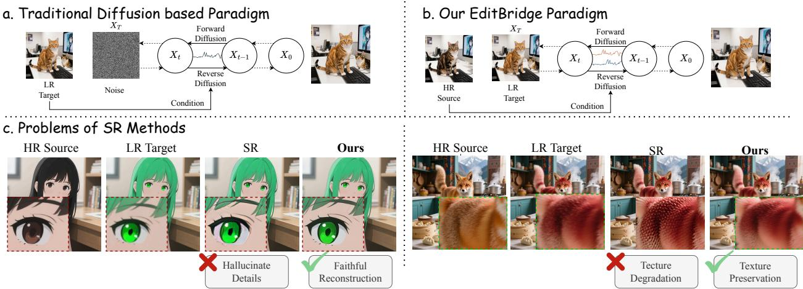
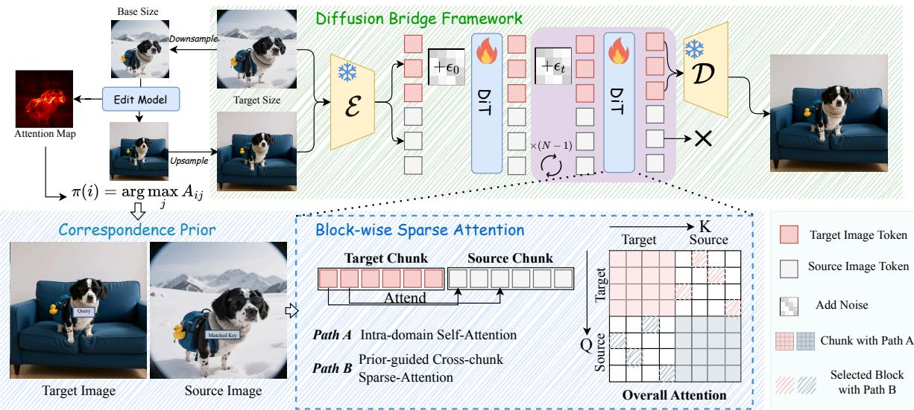
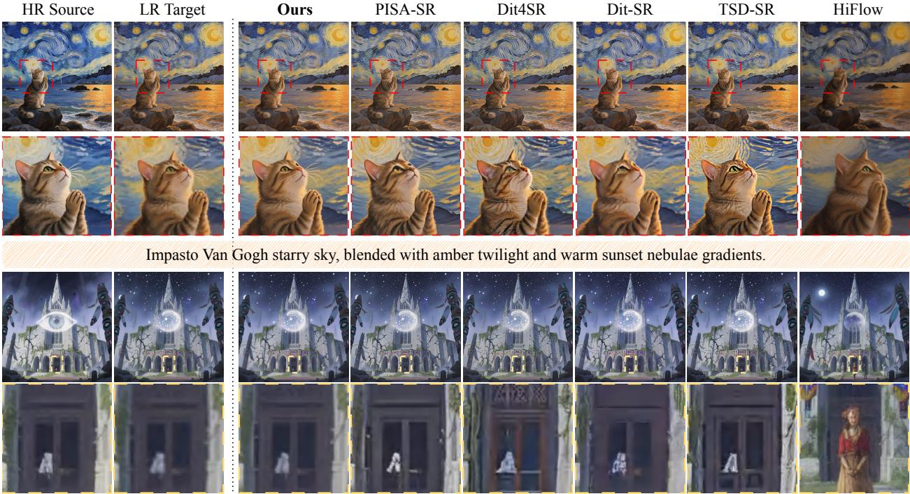
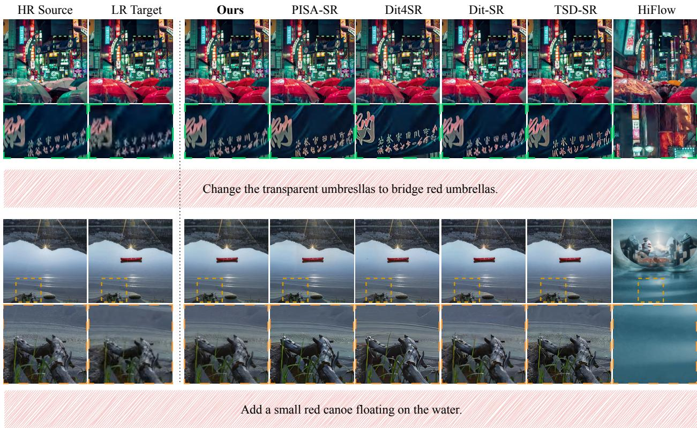
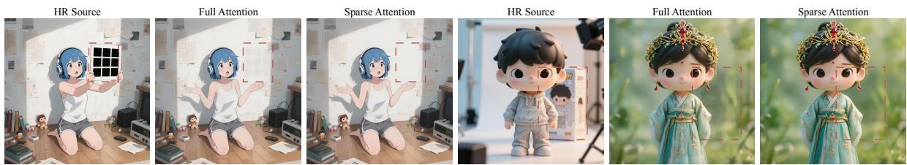
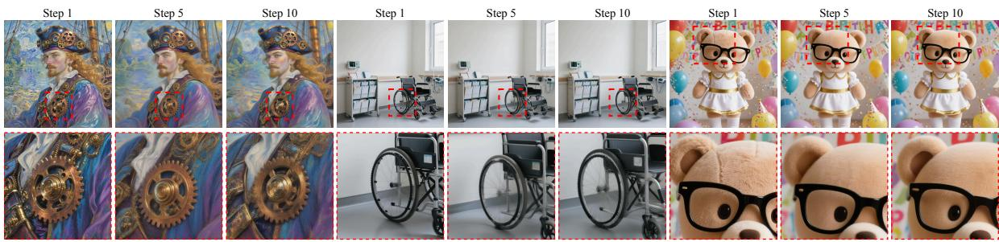
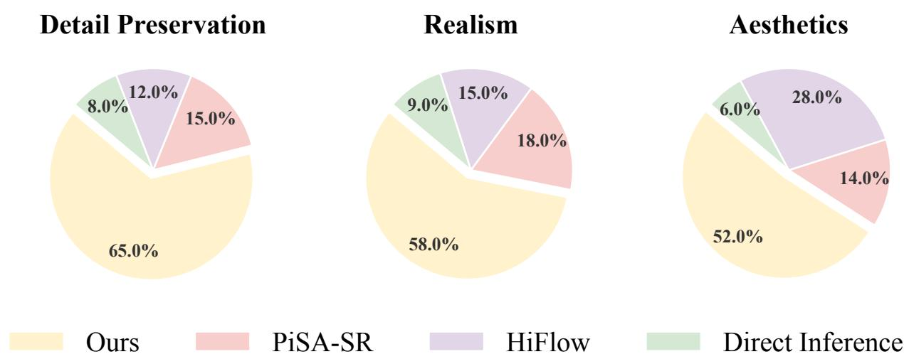
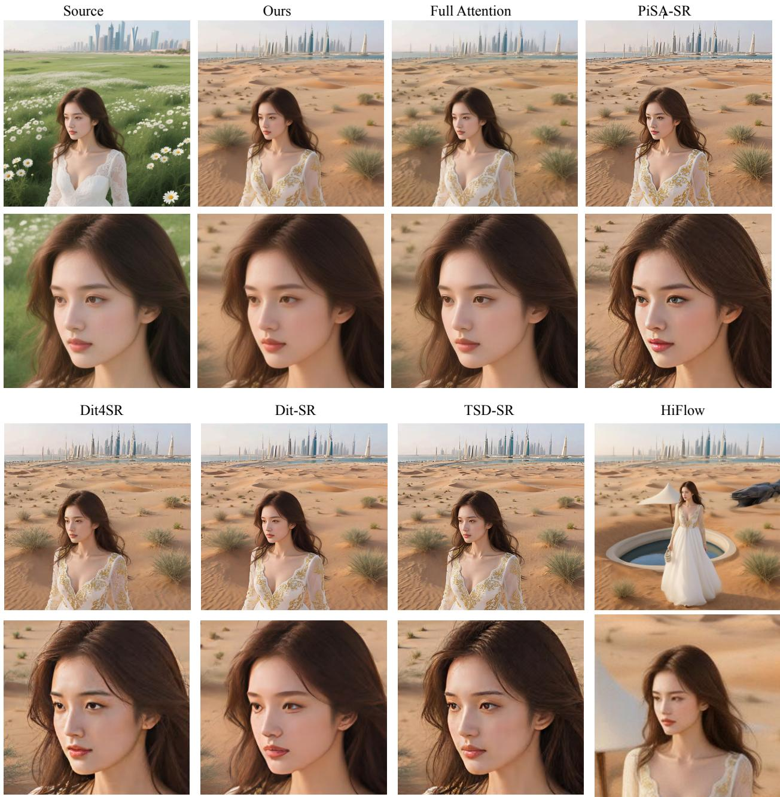
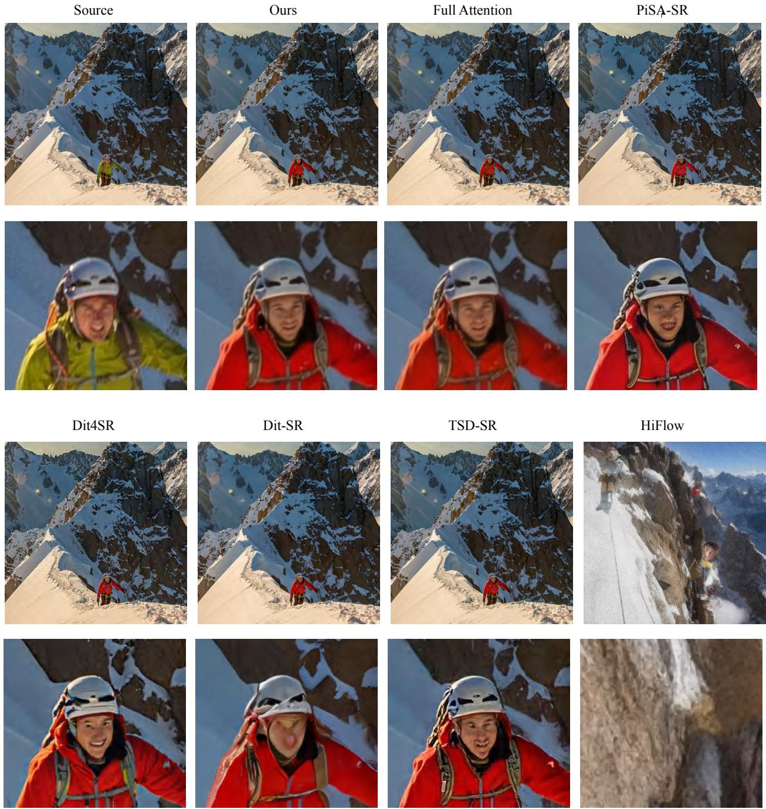

# EDITBRIDGE: Towards Faithful and Efficient Ultra-High-Resolution Image Editing

Jiayi Song<sup>1,2</sup>, Shijie Huang<sup>2</sup>, Fangtai Wu<sup>2</sup>, Yubo Huang<sup>2</sup>, Zhenxiong Tan<sup>3</sup> Songhua Liu<sup>1</sup>\*, Jiaming Liu<sup>2†</sup>, Ruihua Huang<sup>2</sup>

<sup>1</sup>School of Artificial Intelligence, Shanghai Jiao Tong University <sup>2</sup> Qwen Business Unit of Alibaba <sup>3</sup>National University of Singapore liusonghua@sjtu.edu.cn

August 19, 2026

## Abstract

High-resolution image editing is increasingly demanded in professional workflows, yet existing diffusion-based models remain constrained to resolutions below 1K due to quadratic attention complexity and prohibitive memory requirements. A prevalent workaround employs a two-stage pipeline: editing at low resolution followed by independent super-resolution. However, this approach suffers from two critical issues: information divergence, where hallucinated details contradict the original high-resolution (HR) source, and texture degradation, manifesting as over-smoothed or over-sharpened artifacts. We propose EditBridge, a diffusion bridge framework for efficient ultra high-resolution editing. Unlike conventional diffusion that regenerates from noise, we formulate refinement as structured data-to-data translation from the low-resolution (LR) edited result to its HR counterpart, explicitly conditioned on the original HR source to preserve authentic details. To efficiently incorporate HR source guidance, we introduce a prior-guided block-wise sparse attention mechanism that exploits semantic correspondence from first-stage editing to constrain cross-image interactions to spatially aligned regions, significantly reducing computational overhead. Extensive experiments demonstrate that EditBridge achieves high-fidelity editing with superior perceptual quality at resolutions up to 4K, delivering 3.6–8.4× speedup at 2K and enabling practical 4K editing in 61 seconds. Project page: https://editbridge.github.io/.

## 1 Introduction

High-resolution visual content generation has become a central topic in modern generative modeling, spanning both image [1, 2, 3] and video [4, 5] synthesis. However, due to the quadratic computational complexity ofattention mechanisms and substantial memory requirements [6, 7], most existing image editing models [8, 9, 10, 11] remain constrained to resolutions no higher than 1K (1024×1024) during inference. To obtain higher-resolution outputs, a common paradigm relies on a two-stage pipeline: performing the edit at a lower resolution and subsequently employing an independent super-resolution(SR) model for upscaling [12].

While super-resolution increases the output resolution, it tends to hallucinate high-frequency textures due to the absence of high-resolution(HR) source guidance. This introduces two primary challenges: (1) Information

Divergence: the hallucinated details inevitably diverge from the original HR source content, contradicting the fundamental goal of faithful editing—as shown in Fig. 1(c) left, where the facial details produced by SR are entirely inconsistent with the HR source; and (2) Texture Degradation: the generation of over-smoothed or over-sharpened artifacts that degrade visual fidelity, as illustrated in Fig. 1(c) right.

A straightforward alternative would be to train an image editing model natively at high resolutions. However, such an approach demands exorbitant computational resources and large-scale, high-resolution editing datasets, making it prohibitively expensive in practice. Moreover, even with a trained model, high-resolution inference remains computationally intensive due to the quadratic complexity of attention mechanisms, resulting in severe efficiency bottlenecks. This naturally raises a key question: Can we achieve high-resolution image editing in a morefaithful and efficient manner?

Motivated by this question, we propose EditBridge, a prior-guided diffusion bridge framework for ultra-high resolution image editing. Since the core limitation of SR methods lies in the absence of HR source guidance, our key idea is to explicitly leverage the original high-resolution source image as conditional guidance during refinement. EditBridge addresses this through two core designs: (1) a diffusion bridge formulation that models the structured refinement from LR edited images to HR outputs, and (2) a prior-guided sparse attention mechanism that efficiently incorporates HR source information without prohibitive computational overhead.

Specifically, we formulate high-resolution editing as a refinement process that transforms the low-resolution (LR) edited image into its high-resolution (HR) counterpart. Unlike generic upsampling that operates solely on the LR input, our goal is to synthesize fine-grained textures guided by the original HR source while preserving consistency with the edited semantic content.

A key observation is that this task differs fundamentally from standard conditional generation: we have a concrete LR edited image as the starting point, not random noise. This motivates us to adopt diffusion bridges [13, 14], which model stochastic transitions between two data distributions rather than from noise to data. Compared to conventional diffusion models that must “re-generate” the entire image from scratch, diffusion bridges preserve the structural information from the LR input throughout the refinement trajectory, enabling more faithful and efficient high-resolution synthesis.

While the diffusion bridge provides a principled formulation, a key challenge remains: how to efficiently incorporate the HR source image as guidance. A naive approach would concatenate contextual tokens directly within the Diffusion Transformer (DiT) [15], but this incurs prohibitive computational overhead due to token expansion and the quadratic complexity of global attention. We observe that high-resolution editing does not necessitate exhaustive all-to-all attention between target queries and source keys. Instead, interactions should be governed by semantic relevance: for unedited regions, the model primarily requires high-fidelity preservation, which can be achieved by attending strictly to semantically corresponding anchors in the HR source image; for edited regions, the model must synthesize new high-frequency details by assimilating local contextual cues.

Building upon this insight, we propose a prior-guided block-wise sparse attention mechanism that explicitly routes information based on spatial semantic alignment. During the LR source-to-target editing stage, our approach extracts semantic correspondence priors from the attention maps. These priors serve as a spatial roadmap, identifying the precise regions relevant to the modification and locating their corresponding anchors in the HR source. Guided by these cues, the sparse attention mechanism constrains the HR receptive field to aligned areas, effectively pruning redundant interactions with irrelevant tokens. Consequently, EditBridge achieves a superior balance between computational efficiency and high-fidelity texture synthesis.

In summary, the main contributions of this paper are:

• We present a DiT-based framework for high-resolution image editing that achieves both computational efficiency and faithful detail preservation.

• We propose a diffusion-bridge-based refinement stage equipped with a prior-guided block-wise sparse attention mechanism, facilitating semantically selective cross-image interaction.

• Our method achieves state-of-the-art high-resolution editing performance while drastically reducing

  
Figure 1: Motivation of the proposed method. (a) and (b) compare the standard high-resolution image editing paradigm with our approach. (c) analyzes the inherent limitations of existing methods. computational costs, yielding up to a 2.2× speedup compared to conventional diffusion-based approaches.

## 2 Related Work

## Instruction Based Image Editing.

The rapid advancement of diffusion models has significantly advanced instruction-based image editing. Early works such as InstructPix2Pix [16] and SuTI [17] introduced the paradigm of editing images directly from instructions rather than descriptive captions. MagicBrush [18] further improved editing capabilities by introducing high-quality, diverse training datasets. Beyond dataset-driven improvements, subsequent ap proaches [19, 20, 21] integrated Multimodal Large Language Models (MLLMs) [22, 23, 24] with diffusion models [9, 10] to enhance instruction understanding and controllability. With the introduction ofDiffusion Trans formers (DiT) [15], research efforts have shifted toward developing unified DiT-based foundation models for conditional image generation [25, 26] and editing [8, 9, 10, 11], injecting conditional signals directly into atten tion layers for fine-grained guidance. Despite this flexibility, these approaches incur substantial computationa overhead due to dense global attention operations, a bottleneck that becomes prohibitive at high resolutions.

High-Resolution Visual Generation. Recent works have explored high-resolution visual generation [1, 2, 27]. Early approaches [5, 28] primarily rely on U-Net [29] architectures. With the rise offoundation diffusion models, DiT [15] has become the dominant backbone, as its attention mechanism excels at modeling complex token-wise dependencies. To improve inference efficiency at high resolutions, several acceleration methods have emerged. For instance, I-Max [27] projects high-resolution flows into a lower-resolution latent space to reduce computational costs. HiFlow [1] introduces a model-agnostic acceleration framework for scalable generation, while CLEAR [30] proposes a linearization strategy tailored to mitigate the quadratic complexity of global attention.

However, these methods are primarily designed for pure image generation tasks. In contrast, image editing strictly requires fine-grained consistency between the source and target images, rendering generation-oriented acceleration strategies sub-optimal for editing scenarios. To bridge this gap, works like MobilePicasso [31] introduce hybrid pipelines with hallucination-aware training and adaptive tiling. Similarly, ScaleEdit [32] proposes a training-free transfer function for high-resolution editing. However, these methods are built upon U-Net architectures and cannot be directly applied to the increasingly prevalent DiT-based editing frameworks. In this work, we address this gap by proposing EditBridge, a diffusion bridge framework specifically designed for efficient and faithful high-resolution editing within the DiT paradigm.

  
Figure 2: Overview of our proposed EditBridge. The upper section illustrates the inference process of the diffusion bridge, which transports the low-resolution edit to its high-resolution counterpart. The lower section details the construction of the correspondence prior and the proposed Prior-Guided Sparse Attention (PG-BSA) mechanism.

## 3 Preliminary: Diffusion Bridge

Diffusion Bridge. Standard diffusion models learn to transport samples from an uninformative prior $( \mathrm { e . g . }$ Gaussian noise) to the data distribution. In contrast, diffusion bridges (also known as Brownian bridges) model stochastic paths between two structured data domains, making them naturally suited for data-to-data translation tasks. Formally, given paired endpoints $( x _ { 0 } , x _ { 1 } )$ from source and target domains, the Brownian bridge defines a stochastic interpolation path. The intermediate state $X _ { t }$ at time $t \in [ 0 , 1 ]$ follows:

$$
X _ { t } \mid ( x _ { 0 } , x _ { 1 } ) \sim \mathcal { N } ( ( 1 - t ) x _ { 0 } + t x _ { 1 } , t ( 1 - t ) I ) .\tag{1}
$$

Intuitively, $X _ { t }$ is a noisy interpolation between the two endpoints, with the noise level peaking at $t = 0 . 5$ and vanishing at the boundaries. The corresponding instantaneous velocity that drives this transition is:

$$
u _ { t } ( X _ { t } | x _ { 0 } , x _ { 1 } ) { = } \frac { x _ { 1 } { - } X _ { t } } { 1 - t } .\tag{2}
$$

In practice, we parameterize a neural network $v _ { \theta }$ to approximate this velocity field via the matching objective:

$$
\mathscr { L } ( \theta ) = \mathbb { E } _ { x _ { 0 } , x _ { 1 } , t , X _ { t } } \| v _ { \theta } ( \bar { X } _ { t } , t ) - u _ { t } ( X _ { t } | x _ { 0 } , x _ { 1 } ) \| ^ { 2 } .\tag{3}
$$

Compared to standard diffusion that reconstructs signals from noise, the bridge formulation preserves structural information from $x _ { 0 }$ throughout the trajectory, enabling efficient and faithful transformations.

Problem Formulation. High-resolution (HR) image editing aims to map an HR source $x _ { s } ^ { H R }$ and instruction c to an edited HR output $x _ { t } ^ { H R }$ . To bypass the computational burden of direct HR optimization, we adopt a coarse-to-fine paradigm:

1. LR Editing: $x _ { t } ^ { L R } = \mathcal { G } ( x _ { s } ^ { L R } , c )$ , where $\mathcal { G }$ is a pre-trained low-resolution (LR) model and $x _ { s } ^ { L R }$ is the downsampled source.

2. HR Refinement: $\boldsymbol { x } _ { t } ^ { H R } = \mathcal { H } ( \tilde { x } _ { t } ^ { H R } , x _ { s } ^ { H R } )$ , where $\tilde { x } _ { t } ^ { H R }$ is the upsampled $x _ { t } ^ { L R }$

Our objective is to learn the refinement mapping H. Notably, this HR refinement task naturally fits the diffusion bridge formulation: the upsampled LR edit $\tilde { x } _ { t } ^ { \breve { H } R }$ serves as the source endpoint $x _ { 0 }$ , and the target HR output $x _ { t } ^ { H R }$ serves as the target endpoint $x _ { 1 }$

## 4 Method

Based on the formulation, we present two key components of our framework: Bridge-based HR Refinement (Sec. 4.1) and Prior-Guided Sparse Attention (Sec. 4.2). An overview is shown in Fig. 2.

## 4.1 Bridge-based High-Resolution Refinement

As illustrated in Fig. 1b, based on the diffusion bridge formulation introduced in Sec. $^ { 3 , }$ we instantiate a conditional bridge model tailored for high-resolution refinement. In our framework, the source endpoint $x _ { 0 }$ is defined as upsampled low-resolution edited result $\tilde { x } _ { t } ^ { H R }$ . The target endpoint $x _ { 1 }$ corresponds to the desired high-resolution edited image $\boldsymbol { x } _ { t } ^ { H R }$ . The objective of the second stage is to model a probability path that characterizes the transition from $\tilde { x } _ { t } ^ { H R }$ to $x _ { t } ^ { H R }$

Unlike unconditional generative modeling, our refinement process is conditioned on the high-resolution source image $x _ { s } ^ { H R }$ , which serves as a high-fidelity reference to restore details lost during the initial LR editing stage. Specifically, the bridge model learns a conditional velocity field:

$$
v _ { \theta } ( X _ { t } , t | x _ { s } ^ { H R } ) { \approx } u _ { t } ( \dot { X } _ { t } | \tilde { x } _ { t } ^ { H R } , x _ { t } ^ { H R } ) ,\tag{4}
$$

where the network progressively transforms the noisy state $X _ { t }$ into a high-fidelity result by integrating information from $x _ { s } ^ { H R }$

We implement the bridge model using a Diffusion Transformer (DiT) [15] backbone. In Fig. 2, at each timestep $t ,$ the model receives the current state $X _ { t }$ along with contextual features extracted from $x _ { s } ^ { H R }$ . The network predicts the velocity term according to the matching objective in Eq. (3). The final refined image is obtained by integrating the learned probability path from t = 0 to t = 1.

Compared to generating high-resolution images from pure noise (Fig. 1a), the bridge formulation shortens the generative trajectory. Furthermore, explicitly conditioning on the uncorrupted $\overset { \smile } { x } _ { s } ^ { H R }$ ensures the faithful recovery of fine-grained details and high-frequency textures.

## 4.2 Prior-Guided Block-wise Sparse Attention

In the context of high-resolution image editing, where the source image is typically integrated as a conditional context via long-sequence concatenation, standard attention mechanisms exhibit a prohibitive quadratic computational complexity $\mathcal { O } ( N ^ { 2 } )$ relative to the sequence length N. As the token count N scales quadratically with the image resolution $( \mathrm { e . g . }$ , 2K or 4K), this leads to unsustainable memory footprints and severe latency bottlenecks. To mitigate these challenges, we introduce Prior-Guided Block-wise Sparse Attention (PG-BSA), a sparsity strategy specifically tailored for high-resolution refinement. Unlike generic sparse attention, PG-BSA leverages the intrinsic semantic alignment between the source and target domains to prune redundant interactions, ensuring both computational efficiency and reconstruction fidelity.

## 4.2.1 Attention-Induced Correspondence Prior

The cornerstone of our method is the utilization of semantic knowledge from the first-stage low-resolution editing. During the initial stage, the model establishes a coarse-grained mapping between the high-resolution source and the edited target. We capture this relationship through the cross-domain attention affinity maps.

Let $Q _ { L R } \in \mathbb { R } ^ { n _ { t } \times d }$ and $K _ { L R } \in \mathbb { R } ^ { n _ { s } \times d }$ denote the queries from the target domain and keys from the source domain in the first stage, respectively. The attention matrix A is computed as:

$$
\boldsymbol { A } = \boldsymbol { \mathrm { S o f t m a x } } \left( \frac { Q _ { L R } K _ { L R } ^ { \top } } { \sqrt { d } } \right) \in \mathbb { R } ^ { n _ { t } \times n _ { s } } ,\tag{5}
$$

where $n _ { t }$ and $n _ { s }$ represent the number of tokens at the native low resolution. To derive a robust spatial prior, we identify the source anchor that yields the maximum response for each target query, effectively establishing a hard correspondence roadmap:

$$
\pi ( i ) = \arg \operatorname* { m a x } _ { j } A _ { i j } .\tag{6}
$$

This mapping $\pi ( \cdot )$ serves as a dense guidance field. Since the second-stage refinement operates at a significantly higher resolution, we apply a coordinate-based upscaling to $\hat { \pi } ( \cdot )$ . Specifically, with an upscaling factor of $S { = } 2$ each low-resolution token j at spatial coordinate $( x , y )$ is mapped to a $2 \times 2$ cluster of high-resolution tokens. Formally, for any high-resolution token k located at position $( x ^ { \prime } , \bar { y } ^ { \prime } )$ , its prior is assigned as $\hat { \pi } ( k ) = \pi ( \lfloor x ^ { \prime } / S \rfloor , \lfloor y ^ { \prime } / S \rfloor )$ ). This nearest-neighbor expansion strategy ensures that the semantic guidance remains spatially aligned across scales, providing a robust and piece-wise constant search space for the subsequent prior-guided sparse attention.

## 4.2.2 Prior-Guided Sparsification Mechanism

In the high-resolution refinement stage, the input sequence is structured as a concatenated multi-modal embedding: [Text|Target Image |Source Image]. To implement the prior-guided sparsification while preserving global semantic consistency, we decouple the attention mechanism into two distinct computational paths:

• Intra-domain Self-attention: To maintain internal structural coherence, we apply localized self-attention independently within the Text $\left( \mathcal { A } _ { t x t } \right)$ , Target $( \mathcal { A } _ { t g t } )$ , and Source $( \mathcal { A } _ { s r c } )$ segments. This domain-isolated processing ensures that each modality focuses on its intrinsic dependencies.

• Prior-guided Cross-domain Attention: To facilitate information flow, interactions between Target and Source tokens are strictly constrained by the upscaled prior $\hat { \pi } ( \cdot )$ . For a target query token $q _ { j }$ at position $j ,$ the attention is computed over a sparse set of source keys:

$$
\mathrm { A t t n } ( q _ { j } , K , V ) = \sum _ { k \in S _ { i } } \mathrm { S o f t m a x } \bigg ( \frac { q _ { j } k _ { k } ^ { \top } } { \sqrt { d } } \bigg ) v _ { k } ,\tag{7}
$$

where the receptive field $S _ { j }$ is defined as a $k \times k$ local window centered at the semantically aligned anchor $\hat { \pi } ( j )$ . This window size compensates for potential spatial misalignments in the upscaled prior, with larger windows at higher resolutions accounting for increased discretization errors, while maintaining $k ^ { 2 } \ll N$ to ensure computational efficiency.

By restricting the interaction to a local neighborhood ${ \mathbf { } } S _ { j { \mathrm { : } } }$ , we reduce the complexity of cross-domain attention from $\mathcal { O } ( N ^ { 2 } )$ to $\mathcal { O } ( N \cdot k ^ { 2 } )$ . This formulation ensures that each target patch synthesizes high-frequency details by consulting only its most relevant source counterpart, significantly reducing the memory footprint during inference.

## 5 Experiments

## 5.1 Implementation Details

Training Settings. We build our proposed method upon Qwen-Image-Edit [10], a state-of-the-art image editing model. To realize the sparse attention mechanism, we adopt the VMoBA framework [36] and leverage FlashAttention [37] to optimize the underlying kernel operations. During training, we employ the Prodigy optimizer [38] with a learning rate of 1.0, a weight decay of 0.01, enabling a safeguard warmup. Additionally, we apply Low-Rank Adaptation (LoRA) [39] to all linear layers, setting the rank parameter $r = 1 2 8$ and $\alpha { = } 1 2 8$ All experiments are conducted on 8 NVIDIA H800 GPUs (80GB) with a per-GPU batch size of 1.

Dataset. To construct our training corpus, we curate high-resolution source images from publicly available datasets, including Aesthetic-4k [40] and Aesthetic-Train-V2 [41]. For images satisfying the resolution criteria, we employ a center-cropping strategy to crop them to the target resolutions. Subsequently, we utilize Gemini 3 [42] to automatically generate detailed editing instructions. The corresponding target images are synthesized via Nano Banana Pro [43]. The final dataset consists of 5,000 image pairs at resolutions of 1K and 2K, supplemented by 1,500 image pairs at 4K resolution.

Evaluation Metrics. To comprehensively evaluate the performance of our method, we follow the evaluation protocol established by ScaleEdit [32]. Specifically, we employ HaarPSI [44] to directly assess the perceptual similarity between the source and the synthesized images. Furthermore, we incorporate several region-aware metrics to provide a granular analysis of the editing quality. Utilizing a binary mask to bifurcate the image, we compute M-PSNR, M-SSIM, and M-MSE over the unedited regions to quantify the fidelity. Conversely, M-LPIPS is restricted to the edited regions to evaluate the generative fidelity and perceptual quality of the specific modifications. This dual-region evaluation ensures that our model not only achieves high-quality refinement but also maintains strict consistency in non-target areas.

Table 1: Quantitative comparison results. ↑/↓ indicate whether higher/lower values are better. Bold numbers represent the best results.
<table><tr><td>Method</td><td>Haar ↑</td><td>mPSNR↑</td><td>mSSIM↑</td><td>mMSE↓</td><td>mLPIPS↓</td><td>Time (s) ↓</td></tr><tr><td colspan="7">1K Resolution</td></tr><tr><td>Direct Inference</td><td>0.3973</td><td>16.8078</td><td>0.7539</td><td>0.0549</td><td>0.4116</td><td>20.00</td></tr><tr><td>DiT4SR [33]</td><td>0.4127</td><td>14.5031</td><td>0.7092</td><td>0.0554</td><td>0.4818</td><td>28.47</td></tr><tr><td>DiT-SR [12]</td><td>0.4523</td><td>16.7152</td><td>0.7955</td><td>0.0430</td><td>0.4403</td><td>2.44</td></tr><tr><td>PiSA-SR [34]</td><td>0.4247</td><td>15.2115</td><td>0.7481</td><td>0.0486</td><td>0.4492</td><td>0.30</td></tr><tr><td>TSD-SR [35]</td><td>0.4127</td><td>15.3864</td><td>0.7531</td><td>0.0516</td><td>0.4628</td><td>0.42</td></tr><tr><td>HiFlow [1]</td><td>0.3012</td><td>11.6964</td><td>0.6489</td><td>0.1323</td><td>0.6012</td><td>5.12</td></tr><tr><td>ScaleEdit [32]</td><td>0.4824</td><td>16.8461</td><td>0.8206</td><td>0.0408</td><td>0.3784</td><td>181.20</td></tr><tr><td>Ours</td><td>0.4992</td><td>18.6536</td><td>0.8686</td><td>0.0369</td><td>0.3829</td><td>0.84</td></tr><tr><td colspan="7">2K Resolution</td></tr><tr><td>Direct Inference</td><td>0.2254</td><td>13.5262</td><td>0.7491</td><td>0.0880</td><td>0.6700</td><td>82.14</td></tr><tr><td>DiT4SR [33]</td><td>0.3806</td><td>15.1298</td><td>0.7468</td><td>0.0516</td><td>0.5348</td><td>113.32</td></tr><tr><td>DiT-SR [12]</td><td>0.4210</td><td>17.2430</td><td>0.8265</td><td>0.0423</td><td>0.4738</td><td>14.82</td></tr><tr><td>PiSA-SR [34]</td><td>0.4046</td><td>16.2433</td><td>0.8061</td><td>0.0446</td><td>0.4702</td><td>20.22</td></tr><tr><td>TSD-SR [35]</td><td>0.4046</td><td>16.2021</td><td>0.7952</td><td>0.0467</td><td>0.4910</td><td>34.20</td></tr><tr><td>HiFlow [1]</td><td>0.3144</td><td>13.9314</td><td>0.7377</td><td>0.0759</td><td>0.5113</td><td>33.11</td></tr><tr><td>ScaleEdit [32]</td><td>0.4583</td><td>16.5510</td><td>0.6818</td><td>0.0485</td><td>0.5197</td><td>662.50</td></tr><tr><td>Ours</td><td>0.4673</td><td>18.6366</td><td>0.8712</td><td>0.0377</td><td>0.3903</td><td>4.08</td></tr><tr><td colspan="7">4K Resolution</td></tr><tr><td>Direct Inference</td><td>0.2134</td><td>10.7086</td><td>0.5411</td><td>0.1281</td><td>0.7774</td><td>695.23</td></tr><tr><td>DiT4SR [33]</td><td>0.4002</td><td>20.2771</td><td>0.7535</td><td>0.0133</td><td>0.3510</td><td>533.83</td></tr><tr><td>DiT-SR [12]</td><td>0.4267</td><td>16.8615</td><td>0.6818</td><td>0.0415</td><td>0.5436</td><td>119.68</td></tr><tr><td>PiSA-SR [34]</td><td>0.4267</td><td>21.6200</td><td>0.7974</td><td>0.0108</td><td>0.2687</td><td>111.42</td></tr><tr><td>TSD-SR [35]</td><td>0.4124</td><td>22.2766</td><td>0.8035</td><td>0.0074</td><td>0.2399</td><td>108.72</td></tr><tr><td>HiFlow [1]</td><td>0.3307</td><td>14.4400</td><td>0.6719</td><td>0.0664</td><td>0.6038</td><td>129.30</td></tr><tr><td>ScaleEdit [32]</td><td>0.4116</td><td>18.5714</td><td>0.7638</td><td>0.0390</td><td>0.6015</td><td>3601.20</td></tr><tr><td>Ours</td><td>0.4279</td><td>24.1380</td><td>0.8347</td><td>0.0049</td><td>0.2112</td><td>61.10</td></tr></table>

## 5.2 Main Comparison

We benchmark our method against several state-of-the-art diffusion-based super-resolution (SR) models, including DiT-SR [12], DiT4SR [33], PiSA-SR [34], and TSD-SR [35]. We further compare our approach with ScaleEdit[32], a high-resolution image editing method that employs test-time patch-wise optimization. Additionally, we compare our approach with high-resolution generative models HiFlow [1] to underscore the difference between generic upscaling and fidelity-preserving editing. A Direct Inference baseline(using the base model without modifications) is also included.

  
Transform the giant surveillance eye pattern into a soft, star-speckled moon shape, and incorporate colorful mosaic decorations of the White Wolf tribe's traditional patterns onto the building's base.  
Figure 3: Qualitative comparison at 1K resolution. Our method better preserves fidelity while enhancing visual clarity.

Tab. 1 presents the quantitative evaluation of our method at 1k, 2k, and 4k resolutions, respectively. As shown, our approach consistently outperforms the baseline models across all resolution settings. Furthermore, we evaluated the inference time of our method, which explicitly accounts for the computational overhead of the prior estimation process. Our method achieves 3.6–8.4× speedup at 2K compared to diffusion-based SR methods, requiring only 4.08 seconds. At 4K, while the speedup over SR methods is 1.8–2.1×, our method achieves 11× acceleration compared to direct high-resolution inference, completing 4K editing in 61 seconds.

We further provide a qualitative evaluation of our results. As illustrated in Fig. 3, our method achieves exceptional visual clarity with richer fine-grained details compared to the low-resolution targets, while strictly maintaining the highest structural and semantic consistency with the high-resolution source. Taking the first example in Fig. 3, conventional super-resolution methods suffer from excessive sharpening artifacts, leading to unnatural texture degradation and severely compromised visual fidelity. In the second example, the baseline models frequently hallucinate arbitrary details, causing the generated door to diverge significantly from the original HR source. Furthermore, direct high-resolution visual generation methods tend to alter the overall global semantics of the image. As illustrated in Fig. 4, similar advantages and consistent visual improvements are also observed under the 2k resolution settings.

## 5.3 Ablation Study

Sparse Attention vs. Full Attention. We further investigate the impact of different attention mechanisms at 1K and 2K resolutions to validate our design. As shown in Tab. 2, Full Attention achieves slightly higher quantitative scores in pixel-level reconstruction metrics (e.g., PSNR, HaarPSI). However, this quantitative superiority can be deceptive in the context of local editing. Since full attention computes global interactions without spatial constraints, the model tends to indiscriminately over-attend to semantically irrelevant tokens from the high-resolution source image. This contextual bleeding introduces noticeable ghosting and structural artifacts in the newly synthesized areas, as illustrated in Fig. 5.

  
Figure 4: Qualitative comparison at 2K resolution. Our method better preserves fidelity while enhancing visual clarity.

Moreover, the quadratic computational complexity of global attention imposes severe memory footprints and latency bottlenecks, rendering it computationally prohibitive for high-resolution inference. In contrast, our proposed sparse attention explicitly constrains cross-image interactions using semantic registration priors. By routing queries strictly to their semantically aligned anchors, it effectively prunes noisy global contexts. This de sign not only curtails the computational complexity to a linear scale—yielding the substantial speedups discussed earlier—but also strictly preserves local detail fidelity without unwanted interference from unedited regions.

Impact of Inference Steps. We evaluate the model performance across varying numbers of inference steps (N), as illustrated in Tab. 3. Interestingly, empirical results indicate that single-step inference (N =1) achieves the optimal trade-off between computational efficiency and perceptual quality. Unlike multi-step sampling, which may accumulate quantization errors at extreme resolutions, single-step inference yields the highest fidelity to the source’s high-frequency structures while maintaining minimal computational cost (e.g., a mere 0.84s for 1K images). Furthermore, as illustrated in Fig. 6, the setting N =1 enables the model to exhibit the richest

Table 2: Performance comparison between our PG-BSA and full attention across 1K and 2K settings. ↑/↓ indicate whether higher/lower values are better. Bold numbers represent the best results within each resolution block.
<table><tr><td>Setting</td><td>Method</td><td>HaarPSI↑</td><td>mPSNR↑</td><td>mSSIM↑</td><td>mMSE↓</td><td>mLPIPS↓</td><td>Time (s)↓</td></tr><tr><td>1K</td><td>Ours FullAttention</td><td>0.499 0.539</td><td>18.653 19.080</td><td>0.868 0.857</td><td>0.036 0.030</td><td>0.382 0.599</td><td>0.84 0.73</td></tr><tr><td>2K</td><td>Ours</td><td>0.467</td><td>18.636</td><td>0.871</td><td>0.037</td><td>0.390</td><td>4.08</td></tr><tr><td></td><td>FullAttention</td><td>0.505</td><td>17.918</td><td>0.705</td><td>0.041</td><td>0.425</td><td>4.71</td></tr><tr><td></td><td></td><td></td><td></td><td></td><td></td><td></td><td></td></tr></table>

  
Figure 5: Ablation of Attention Sparsity. Full attention leads to noticeable source-induced artifacts, whereas our sparse attention maintains superior visual fidelity and alignment.  
fine-grained details.

Table 3: Quantitative evaluation of varying inference steps. ↑/↓ indicate whether higher/lower values are better. Bold numbers represent the best results.
<table><tr><td>Method</td><td>HaarPSI↑</td><td>mPSNR↑</td><td>mSSIM↑</td><td>mMSE↓</td><td>mLPIPS↓</td><td>Time(s)↓</td></tr><tr><td>5 steps</td><td>0.4131</td><td>15.7269</td><td>0.7763</td><td>0.0474</td><td>0.4739</td><td>4.03</td></tr><tr><td>10 steps</td><td>0.4020</td><td>15.4190</td><td>0.7636</td><td>0.0494</td><td>0.4662</td><td>8.10</td></tr><tr><td>Ours (1 step)</td><td>0.4991</td><td>18.6535</td><td>0.8685</td><td>0.0368</td><td>0.3829</td><td>0.84</td></tr></table>

  
Figure 6: Impact of sampling steps. Perceptual quality and high-frequency details are maximized at T = 1. Increasing the number of inference steps does not yield significant visual gains, further validating the efficiency of our refinement framework.

## 6 Conclusion

In this paper, we introduced EditBridge, a novel prior-guided diffusion bridge framework tailored for ultra-highresolution image editing. Our approach formulates high-resolution refinement as a continuous, data-to-data translation process. By leveraging the original high-resolution source image as conditional guidance, EditBridge overcomes the critical limitations of conventional two-stage super-resolution pipelines, namely information divergence and texture hallucination, thereby ensuring faithful detail preservation. Furthermore, to address the prohibitive computational costs associated with high-resolution processing, we proposed a task-specific, prior-guided sparse attention mechanism. By dynamically routing information based on spatial semantic alignment extracted from the low-resolution editing stage, our model selectively focuses only on relevant high-resolution anchors, effectively pruning redundant global interactions. Overall, our framework establishes a highly efficient and scalable paradigm for high-fidelity image editing.

## References

[1] Jiazi Bu, Pengyang Ling, Yujie Zhou, Pan Zhang, Tong Wu, Xiaoyi Dong, Yuhang Zang, Yuhang Cao, Dahua Lin, and Jiaqi Wang. Hiflow: Training-free high-resolution image generation with flow-aligned guidance. arXiv preprint arXiv:2504.06232, 2025.

[2] Tian Ye, Song Fei, and Lei Zhu. Ultraflux: Data-model co-design for high-quality native 4k text-to-image generation across diverse aspect ratios. arXiv preprint arXiv:2511.18050, 2025.

[3] Haonan Qiu, Shiwei Zhang, Yujie Wei, Ruihang Chu, Hangjie Yuan, Xiang Wang, Yingya Zhang, and Ziwei Liu. Freescale: Unleashing the resolution of diffusion models via tuning-free scale fusion. In Proceedings of the IEEE/CVF International Conference on Computer Vision, pages 16893–16903, 2025.

[4] Ivan Skorokhodov, Willi Menapace, Aliaksandr Siarohin, and Sergey Tulyakov. Hierarchical patch diffusion models for high-resolution video generation. In Proceedings of the IEEE/CVF Conference on Computer Vision and Pattern Recognition, pages 7569–7579, 2024.

[5] Andreas Blattmann, Robin Rombach, Huan Ling, Tim Dockhorn, Seung Wook Kim, Sanja Fidler, and Karsten Kreis. Align your latents: High-resolution video synthesis with latent diffusion models. In Proceedings of the IEEE/CVF conference on computer vision and pattern recognition, pages 22563–22575, 2023.

[6] Daniel Bolya, Cheng-Yang Fu, Xiaoliang Dai, Peizhao Zhang, Christoph Feichtenhofer, and Judy Hoffman. Token merging: Your vit but faster, 2023. URL https://arxiv.org/abs/2210.09461.

[7] Ashish Vaswani, Noam Shazeer, Niki Parmar, Jakob Uszkoreit, Llion Jones, Aidan N. Gomez, Lukasz Kaiser, and Illia Polosukhin. Attention is all you need, 2023. URL https://arxiv.org/abs/1706.03762.

[8] Black Forest Labs, Stephen Batifol, Andreas Blattmann, Frederic Boesel, Saksham Consul, Cyril Diagne, Tim Dockhorn, Jack English, Zion English, Patrick Esser, Sumith Kulal, Kyle Lacey, Yam Levi, Cheng Li, Dominik Lorenz, Jonas Muller,¨ Dustin Podell, Robin Rombach, Harry Saini, Axel Sauer, and Luke Smith. Flux.1 kontext: Flow matching for in-context image generation and editing in latent space, 2025. URL https://arxiv.org/abs/2506.15742.

[9] Chaorui Deng, Deyao Zhu, Kunchang Li, Chenhui Gou, Feng Li, Zeyu Wang, Shu Zhong, Weihao Yu, Xiaonan Nie, Ziang Song, Guang Shi, and Haoqi Fan. Emerging properties in unified multimodal pretraining, 2025. URL https://arxiv.org/abs/2505.14683.

[10] Chenfei Wu, Jiahao Li, Jingren Zhou, Junyang Lin, Kaiyuan Gao, Kun Yan, Sheng ming Yin, Shuai Bai, Xiao Xu, Yilei Chen, Yuxiang Chen, Zecheng Tang, Zekai Zhang, Zhengyi Wang, An Yang, Bowen Yu, Chen Cheng, Dayiheng Liu, Deqing Li, Hang Zhang, Hao Meng, Hu Wei, Jingyuan Ni, Kai Chen, Kuan Cao, Liang Peng, Lin Qu, Minggang Wu, Peng Wang, Shuting Yu, Tingkun Wen, Wensen Feng, Xiaoxiao Xu, Yi Wang, Yichang Zhang, Yongqiang Zhu, Yujia Wu, Yuxuan Cai, and Zenan Liu. Qwen-image technical report, 2025. URL https://arxiv.org/abs/2508.02324.

[11] Super Intelligence Team, Changhao Qiao, Chao Hui, Chen Li, Cunzheng Wang, Dejia Song, Jiale Zhang, Jing Li, Qiang Xiang, Runqi Wang, Shuang Sun, Wei Zhu, Xu Tang, Yao Hu, Yibo Chen, Yuhao Huang, Yuxuan Duan, Zhiyi Chen, and Ziyuan Guo. Firered-image-edit-1.0 technical report, 2026. URL https://arxiv.org/abs/2602.13344.

[12] Kun Cheng, Lei Yu, Zhijun Tu, Xiao He, Liyu Chen, Yong Guo, Mingrui Zhu, Nannan Wang, Xinbo Gao, and Jie Hu. Effective diffusion transformer architecture for image super-resolution. In Proceedings of the AAAI conference on artificial intelligence, volume 39, pages 2455–2463, 2025.

[13] Bo Li, Kaitao Xue, Bin Liu, and Yu-Kun Lai. Bbdm: Image-to-image translation with brownian bridge diffusion models. In Proceedings ofthe IEEE/CVF conference on computer vision and pattern Recognition, pages 1952–1961, 2023.

[14] Linqi Zhou, Aaron Lou, Samar Khanna, and Stefano Ermon. Denoising diffusion bridge models. In International Conference on Learning Representations, volume 2024, pages 8160–8171, 2024.

[15] William Peebles and Saining Xie. Scalable diffusion models with transformers. In Proceedings of the IEEE/CVF international conference on computer vision, pages 4195–4205, 2023.

[16] Tim Brooks, Aleksander Holynski, and Alexei A Efros. Instructpix2pix: Learning to follow image editing instructions. In Proceedings ofthe IEEE/CVF conference on computer vision and pattern recognition, pages 18392–18402, 2023.

[17] Wenhu Chen, Hexiang Hu, Yandong Li, Nataniel Ruiz, Xuhui Jia, Ming-Wei Chang, and William W Cohen. Subject-driven text-to-image generation via apprenticeship learning. Advances in Neural Information Processing Systems, 36:30286–30305, 2023.

[18] Kai Zhang, Lingbo Mo, Wenhu Chen, Huan Sun, and Yu Su. Magicbrush: A manually annotated dataset for instruction-guided image editing. Advances in Neural Information Processing Systems, 36:31428–31449, 2023.

[19] Yuzhou Huang, Liangbin Xie, Xintao Wang, Ziyang Yuan, Xiaodong Cun, Yixiao Ge, Jiantao Zhou, Chao Dong, Rui Huang, Ruimao Zhang, et al. Smartedit: Exploring complex instruction-based image editing with multimodal large language models. In Proceedings of the IEEE/CVF Conference on Computer Vision and Pattern Recognition, pages 8362–8371, 2024.

[20] Tsu-Jui Fu, Wenze Hu, Xianzhi Du, William Yang Wang, Yinfei Yang, and Zhe Gan. Guiding instruction-based image editing via multimodal large language models. arXiv preprint arXiv:2309.17102, 2023.

[21] Shufan Li, Harkanwar Singh, and Aditya Grover. Instructany2pix: Flexible visual editing via multimodal instruction following. arXiv preprint arXiv:2312.06738, 2023.

[22] Shukang Yin, Chaoyou Fu, Sirui Zhao, Ke Li, Xing Sun, Tong Xu, and Enhong Chen. A survey on multimodal large language models. National Science Review, 11(12), November 2024. ISSN 2053-714X. doi: 10.1093/nsr/nwae403. URL http://dx.doi.org/10.1093/nsr/nwae403.

[23] Shuai Bai, Yuxuan Cai, Ruizhe Chen, Keqin Chen, Xionghui Chen, Zesen Cheng, Lianghao Deng, Wei Ding, Chang Gao, Chunjiang Ge, Wenbin Ge, Zhifang Guo, Qidong Huang, Jie Huang, Fei Huang, Binyuan Hui, Shutong Jiang, Zhaohai Li, Mingsheng Li, Mei Li, Kaixin Li, Zicheng Lin, Junyang Lin, Xuejing Liu, Jiawei Liu, Chenglong Liu, Yang Liu, Dayiheng Liu, Shixuan Liu, Dunjie Lu, Ruilin Luo, Chenxu Lv, Rui Men, Lingchen Meng, Xuancheng Ren, Xingzhang Ren, Sibo Song, Yuchong Sun, Jun Tang, Jianhong Tu, Jianqiang Wan, Peng Wang, Pengfei Wang, Qiuyue Wang, Yuxuan Wang, Tianbao Xie, Yiheng Xu, Haiyang Xu, Jin Xu, Zhibo Yang, Mingkun Yang, Jianxin Yang, An Yang, Bowen Yu, Fei Zhang, Hang Zhang, Xi Zhang, Bo Zheng, Humen Zhong, Jingren Zhou, Fan Zhou, Jing Zhou, Yuanzhi Zhu, and Ke Zhu. Qwen3-vl technical report, 2025. URL https://arxiv.org/abs/2511.21631.

[24] Shuai Bai, Keqin Chen, Xuejing Liu, Jialin Wang, Wenbin Ge, Sibo Song, Kai Dang, Peng Wang, Shijie Wang, Jun Tang, Humen Zhong, Yuanzhi Zhu, Mingkun Yang, Zhaohai Li, Jianqiang Wan, Pengfei Wang, Wei Ding, Zheren Fu, Yiheng Xu, Jiabo Ye, Xi Zhang, Tianbao Xie, Zesen Cheng, Hang Zhang, Zhibo Yang, Haiyang Xu, and Junyang Lin. Qwen2.5-vl technical report, 2025. URL https://arxiv.org/abs/2502.13923.

[25] Yuxuan Zhang, Yirui Yuan, Yiren Song, Haofan Wang, and Jiaming Liu. Easycontrol: Adding efficient and flexible control for diffusion transformer, 2025. URL https://arxiv.org/abs/2503.07027.

[26] Zhenxiong Tan, Songhua Liu, Xingyi Yang, Qiaochu Xue, and Xinchao Wang. Ominicontrol: Minimal and universal control for diffusion transformer, 2025. URL https://arxiv.org/abs/2411.15098.

[27] Ruoyi Du, Dongyang Liu, Le Zhuo, Qin Qi, Hongsheng Li, Zhanyu Ma, and Peng Gao. I-max: Maximize the resolution potential of pre-trained rectified flow transformers with projected flow. 2024.

[28] Andreas Blattmann, Tim Dockhorn, Sumith Kulal, Daniel Mendelevitch, Maciej Kilian, Dominik Lorenz, Yam Levi, Zion English, Vikram Voleti, Adam Letts, et al. Stable video diffusion: Scaling latent video diffusion models to large datasets. arXiv preprint arXiv:2311.15127, 2023.

[29] Olaf Ronneberger, Philipp Fischer, and Thomas Brox. U-net: Convolutional networks for biomedical image segmentation. In International Conference on Medical image computing and computer-assisted intervention, pages 234–241. Springer, 2015.

[30] Songhua Liu, Zhenxiong Tan, and Xinchao Wang. Clear: Conv-like linearization revs pre-trained diffusion transformers up. In The Thirty-ninth Annual Conference on Neural Information Processing Systems.

[31] Young D. Kwon, Abhinav Mehrotra, Malcolm Chadwick, Alberto Gil Ramos, and Sourav Bhattacharya. Efficient high-resolution image editing with hallucination-aware loss and adaptive tiling, 2025. URL https://arxiv.org/abs/2510.06295.

[32] Junsung Lee, Hyunsoo Lee, Yong Jae Lee, and Bohyung Han. Low-resolution editing is all you need for high-resolution editing, 2025. URL https://arxiv.org/abs/2511.19945.

[33] Zheng-Peng Duan, Jiawei Zhang, Xin Jin, Ziheng Zhang, Zheng Xiong, Dongqing Zou, Jimmy S Ren, Chunle Guo, and Chongyi Li. Dit4sr: Taming diffusion transformer for real-world image super-resolution. In Proceedings ofthe IEEE/CVF International Conference on Computer Vision, pages 18948–18958, 2025.

[34] Lingchen Sun, Rongyuan Wu, Zhiyuan Ma, Shuaizheng Liu, Qiaosi Yi, and Lei Zhang. Pixel-level and semantic-level adjustable super-resolution: A dual-lora approach. In Proceedings of the IEEE/CVF Conference on Computer Vision and Pattern Recognition (CVPR), pages 2333–2343, June 2025.

[35] Linwei Dong, Qingnan Fan, Yihong Guo, Zhonghao Wang, Qi Zhang, Jinwei Chen, Yawei Luo, and Changqing Zou. Tsd-sr: One-step diffusion with target score distillation for real-world image super-resolution. In Proceedings of the Computer Vision and Pattern Recognition Conference, pages 23174–23184, 2025.

[36] Jianzong Wu, Liang Hou, Haotian Yang, Xin Tao, Ye Tian, Pengfei Wan, Di Zhang, and Yunhai Tong. Vmoba: Mixture-of-block attention for video diffusion models, 2025. URL https://arxiv.org/abs/2506.23858.

[37] Tri Dao, Dan Fu, Stefano Ermon, Atri Rudra, and Christopher R´e. Flashattention: Fast and memory-efficient exact attention with io-awareness. Advances in neural information processing systems, 35:16344–16359, 2022.

[38] Konstantin Mishchenko and Aaron Defazio. Prodigy: An expeditiously adaptive parameter-free learner, 2024. URL https://arxiv.org/abs/2306.06101.

[39] Edward J. Hu, Yelong Shen, Phillip Wallis, Zeyuan Allen-Zhu, Yuanzhi Li, Shean Wang, Lu Wang, and Weizhu Chen. Lora: Low-rank adaptation of large language models, 2021. URL https://arxiv.org/abs/2106.09685.

[40] Jinjin Zhang, Qiuyu Huang, Junjie Liu, Xiefan Guo, and Di Huang. Diffusion-4k: Ultra-high-resolution image synthesis with latent diffusion models. In Proceedings of the Computer Vision and Pattern Recognition Conference, pages 23464–23473, 2025.

[41] Jinjin Zhang, Qiuyu Huang, Junjie Liu, Xiefan Guo, and Di Huang. Ultra-high-resolution image synthesis: Data, method and evaluation. arXiv preprint arXiv:2506.01331, 2025.

[42] Google. Gemini 3. https://aistudio.google.com/models/gemini-3, 2026. Accessed: March 3, 2026.

[43] Google DeepMind. Gemini image pro. https://deepmind.google/models/gemini-image/pro/, 2026. Accessed: March 3, 2026.

[44] Rafael Reisenhofer, Sebastian Bosse, Gitta Kutyniok, and Thomas Wiegand. A haar wavelet-based perceptual similarity index for image quality assessment. Signal Processing: Image Communication, 61:33–43, February 2018. ISSN 0923-5965. doi: 10.1016/j.image.2017.11.001. URL http://dx.doi.org/10.1016/j.image.2017.11.001.

## Appendices

A User study 15   
B Training Configuration 15   
C Pseudo Code 16   
D Prompts 17   
E Limitation and Future Work 18   
F More Cases 19

  
Figure 7: Results of the user study across three dimensions: Detail Preservation, Realism, and Aesthetics. Our method consistently outperforms all baselines in human preference.

To evaluate subjective visual quality beyond quantitative metrics, we conducted a blind Four-Alternative Forced Choice user study. Thirty participants evaluated 50 randomly sampled image pairs. We compared EditBridge against direct inference and PiSA-SR, HiFlow representing SR method, high-resolution visual generation method, respectively. Participants were provided with both full images and 100% cropped patches and voted based on three criteria: Detail Preservation (fidelity to unedited high-frequency source textures), Realism (naturalness of micro-structures), and Aesthetics (overall composition and structural integrity).

As shown in Fig. 7, EditBridge consistently achieves the highest preference rates across all evaluated dimensions. Specifically, our method significantly outperforms PiSA-SR and HiFlow in Detail Preservation and Realism. This confirms that our prior-guided sparse attention effectively prevents the texture hallucination typical of SR pipelines and the information divergence common in pure generative models. Furthermore, while HiFlow exhibits strong performance in the Aesthetics dimension—owing to the remarkable aesthetic priors inherent in large generative models—EditBridge still secures the highest overall aesthetic preference. This demonstrates that our approach successfully marries superior visual aesthetics with strict structural fidelity.

## B Training Configuration

We provide the detailed training configuration below.

```yaml
Training Configuration
lora_config:
r: 128
lora_alpha: 128
init_lora_weights: "gaussian"
target_modules: "all-linear"
optimizer:
type: "Prodigy"
params:
```

lr: 1   
use\_bias\_correction: true   
safeguard\_warmup: true   
weight\_decay: 0.01

## C Pseudo Code

We present our training procedure in Algorithm 1 and the inference sampling process in Algorithm 2.

For training, we learn a velocity field that bridges the ground truth distribution and the conditional distribution. Specifically, we define the ground truth latent $z _ { g t }$ as the flow source $z _ { \mathrm { 0 } }$ and the low-resolution target $z _ { l r \_ t g t }$ as the flow target $z _ { 1 }$ . We sample a timestep t and construct a fused latent $z _ { t }$ through the Bridge forward process to train the model to predict the corresponding vector field. To preserve high-frequency details, we concatenate the high-resolution source $z _ { h r }$ along the sequence dimension. We employ a sparse attention mechanism where the attention mask Ω is pre-computed based on the correspondence between the low-resolution versions of the source and target, which regularizes the model during optimization of the weighted MSE loss.

For inference, we perform progressive denoising. Starting from the initial high-resolution source latent $z _ { 1 } ,$ we iteratively solve the stochastic differential equation (SDE) toward the target state $z _ { 0 } .$ . In each denoising step, we downsample the current latent $z _ { t }$ to re-estimate the sparse attention mask $\Omega ,$ ensuring that the Transformer operates under accurate structural constraints relative to the fixed high-resolution reference. We incorporate a Brownian Bridge update rule, where a predicted velocity field and a scaled noise term are combined to update the latent state. This sampling strategy, stabilized by a noise rescaling factor, enables high-fidelity reconstruction of the edited image while adhering to the input text and reference source.

Algorithm 2: Inference Procedure of Model with Sparse Attention   
Input: Initial latent $z _ { 1 }$ , High-res reference $z _ { h r } ,$ Low-res source   
$z _ { l r \_ s r c } ,$ Text embedding $c ,$ Timesteps $\mathcal { T } = \{ t _ { 1 } , . . . , t _ { N } \}$ , Noise scale $\sigma ,$ Rescale flag rescale noise   
Output: Denoised final latent $z _ { \mathrm { 0 } }$   
$z _ { t } \gets z _ { 1 } ;$   
for $i = 1$ to $N$ do   
$t  T [ i ] ;$   
$t _ { n e x t }  T [ i + 1 ]$ (or 0 if i = N);   
$\Delta t \gets t _ { n e x t } - t ;$   
$z _ { l r \_ t g t }$ ←Downsample(z<sub>t</sub>);   
Ω←ExtractSparseIndices $( z _ { l r . t g t } , z _ { l r . s r c } ) ;$   
$x _ { i n }$ ←Concat([z ,z ],dim=sequence);   
v<sub>θ</sub> ←Transforme $\begin{array} { r l } { \mathrm { \Lambda } } & { { } \mathrm { c } _ { \theta } \big ( x _ { i n } , t , c : \Omega \big ) ; } \end{array}$   
$\begin{array} { r } { \eta \gets \sqrt { - \Delta t \cdot \frac { t _ { n e x t } } { t } } ; } \end{array}$   
$\epsilon \sim \mathcal { N } ( 0 , \mathbf { I } )$ ;   
if rescale noise then   
$\gamma  \mathrm { C l i p } ( | v _ { \theta } | , 0 , 1 ) ;$   
else   
γ ←1;   
z<sub>t</sub> ← z<sub>t</sub>+v<sub>θ</sub> ·∆t+σ·η·γ·ϵ;   
return $z _ { t }$

Algorithm 1: Training Procedure of Resolution-Bridge Model with Sparse Attention   
Input: High-res Source $I _ { h r } ,$ Low-res Target $I _ { l r \_ t g t } ,$ Ground Truth $I _ { g t } ,$ Text Prompt y   
Output: Optimized Loss L   
$I _ { l r _ { - } s r c } $ Downsample $\left( I _ { h r } \right)$   
$z _ { h r } , z _ { g t } , z _ { l r - t g t } , z _ { l r - s r c } \gets \mathrm { V A E } ( I _ { h r } , I _ { g t } , I _ { l r - t g t } , I _ { l r - s r c } ) ;$   
c←TextEncoder $( y , z _ { l r \_ t g t } ) ;$   
$z _ { 0 } \gets z _ { g t } ;$   
$z _ { 1 } \gets z _ { l r \_ t g t } ;$   
Sample time $\scriptstyle t \sim \mathcal { U } ( 0 , 1 )$ and noise $\begin{array} { r } { \epsilon \sim \mathcal { N } ( 0 , \mathbf { I } ) ; } \end{array}$   
$z _ { t } \gets ( 1 - t ) z _ { 0 } + t z _ { 1 } + \sigma _ { t } \epsilon$   
$x _ { i n } \gets \mathbf { C o n c a t } ( [ z _ { t } , z _ { h r } ]$ ,dim=sequence);   
Ω←ExtractSparseIndices $( z _ { l r . t g t } , z _ { l r . s r c } ) ;$   
v<sub>θ</sub> ←Transformer $\cdot _ { \theta } ( x _ { i n } , t , c : \Omega ) .$   
$\begin{array} { r } { \mathcal { L } _ { m s e }  \| v _ { \theta } - \frac { z _ { t } - z _ { 0 } } { t } \| ^ { 2 } ; } \end{array}$   
if stabilized then   
$\begin{array} { r } { w _ { t }  \frac { t \Vert z _ { 1 } - z _ { 0 } \Vert ^ { 2 } } { t \Vert z _ { 1 } - z _ { 0 } \Vert ^ { 2 } + ( 1 - t ) } ; } \end{array}$   
$\mathcal { L }  w _ { t } \cdot \mathcal { L } _ { m s e } ;$   
else   
$\mathcal { L }  \mathcal { L } _ { m s e } ;$   
return L

## D Prompts

We present detailed prompts used in our experiments below. The prompts correspond to the cases shown in the main paper, ordered by their appearance.

Prompts for Editing   
System Prompt Input to Gemini   
You are an expert image editing instruction writer.   
IMPORTANT   
• You must output STRICT JSON.   
• Do NOT output any explanation outside JSON.   
• Do NOT use markdown.   
• Do NOT include text before or after JSON.   
• If you violate this format, the output is invalid.   
You are given one image.   
Your task: generate ONE high-quality image editing prompt based on this image. The prompt should describe plausible, clear,   
and specific edits. Keep it in one sentence. The instruction should be in English and concise.   
Example: “Change the background to a sunny day with blue sky and white clouds.”   
Final output format   
{ "edit prompt": "your single-sentence editing prompt" }   
Editing Instructions   
1. Transform the scene into an elementary school hallway with all doors wide open. Show the subject in a confused state,   
and add question marks above their head.

2. Transform the fox’s monochrome fur into a red gradient, transitioning from deep amber to light coral. Position its fron paws to be pinching a Nepalese dumpling, featuring a stylized fox-face motif rendered in white ink on the dumpling’s skin.

3. Repaint the starry sky scene in a thick impasto oil painting style. Retain Van Gogh’s Starry Night brushwork while blending the sky with amber dusk hues, forming a warm sunset gradient within the swirling nebulae.

4. Soften the giant surveillance eye motif into a starlit moon shape. Add colorful mosaic decorations with traditional White Wolf tribe patterns to the building base, and lower the overall color saturation to create a melancholic Eastern classical atmosphere.

5. Change the transparent umbrellas to bright red umbrellas.

6. Add a small red canoe floating on the water.

7. Remove the square card the character is holding.

8. Transform the main character from a Chibi (Q-version) style to a classical Eastern aesthetic. Add vine-like gold ornaments and red gemstones to the hair and accessories, replace the clothing with a cyan Hanfu featuring intricate embroidery, and adjust the environment to a natural green-toned setting with shallow depth of field.

9. Create an impressionistic portrait of a Steampunk Pirate Captain combining the blue-violet palette of Monet’s Water Lilies with Van Gogh’s swirling brushstrokes. Metallic gears should shimmer with cadmium yellow impasto while steampunk structures with starry gradients appear within the background foliage.

10. Seamlessly integrate a second image of a bedside monitor into the ward scene with automatically matched lighting and perspective.

11. Dress the bear in a classic maid-inspired outfit featuring a white apron with gold piping and white stockings. Decorate the environment with balloons and birthday banners to create a whimsical fairytale party atmosphere.

## E Limitation and Future Work

Limitations Despite the superior editing performance demonstrated by our framework, several constraints remain to be addressed. First, our method currently relies on a pre-defined indices prior, which must be extracted or synthesized before the translation process. This dependency introduces a bottleneck in fully automated pipelines, as the quality of the final output is inherently bounded by the precision of these initial guidance signals. Second, the iterative nature of the Diffusion Bridge sampling process, while robust, still incurs a non-negligible computational overhead, particularly when dealing with high-resolution imagery or complex multi-step transitions.

Future Work: Automated Prior Estimation To enhance the autonomy of our approach, a promising future direction is to integrate a learnable prior estimation module. By leveraging self-supervised representation learning, we aim to enable the model to infer the necessary structural or semantic indices directly from the source image, thereby eliminating the need for manual or external prior acquisition. This would significantly broaden the applicability of Diffusion Bridge models in ”in-the-wild” image editing scenarios.

Future Work: Post-hoc Refinement and Localized Repair Beyond global image-to-image translation, we envision the Diffusion Bridge as a powerful tool for post-hoc refinement and interactive content repair. Specif ically, if certain regions of a generated image suffer from ”mode collapse” or textural artifacts, the Diffusion Bridge can be re-initialized within a masked area to perform localized resampling. By bridging the intermediate latent states of a suboptimal generation back to the clean data manifold, the model can “correct” specific flaws while preserving the global coherence of the scene.

Generalizing the Bridge Mechanism Furthermore, we plan to investigate the potential of the Diffusion Bridge in broader domains, such as video-to-video editing and 3D asset stylization. Extending the bridge trajectory to maintain temporal and spatial consistency across frames or viewpoints remains a challenging yet rewarding frontier. We believe that the mathematical elegance of the Diffusion Bridge offers a versatile foundation for a wide range of controllable generative tasks.

## F More Cases

We provide an extensive collection of additional samples to further validate the efficacy of our proposed method. As illustrated in Fig. 8 and Fig. 9, our results achieve fidelity to the source images while maintaining the utmost perceptual naturalness in the edited regions.

Our Diffusion Bridge framework demonstrates a superior ability to preserve the original structural integrity and identity of the subjects. Meanwhile, the synthesized content integrates seamlessly with the existing background without introducing common generative artifacts such as blurriness or texture repetition. These extensive cases substantiate that our approach strikes an optimal balance between strictly following complex textual instructions and faithfully retaining the essential characteristics of the source content.

  
Figure 8: Visual results at 1K resolution.

  
Figure 9: Visual results at 2K resolution.