# From Corpora to Co-Evolving Capabilities: Capability-Centric Data Design for Generalist Image Generation

Xingjian Wang∗, Zhao Wang∗, Taihang Hu∗, Jun Zheng∗, Qing Jin∗, Qinye Zhou∗, Zhengtao Wu∗, Yongchao Du, Zuan Gao, Chao Lin, Yefeng Shen, Xiaoli Xu, Zhengze Xu, Hao Yan, Yuhang Yu, Mingzhou Zhang, Mengting Chen† ∗Equal contribution. †Corresponding author. Alibaba Group

## Abstract

Large-scale image generation has benefited from advances in data scale, quality, rebalancing, and recaptioning, yet conventional pipelines typically optimize task-specific datasets in isolation. A central challenge is not only how to curate each task-specific corpus, but also how to organize heterogeneous supervision according to the dependencies among generative capabilities. We present a capability-driven data infrastructure that couples capability-specific supervision construction with capability-aligned curriculum scheduling. Its three specialized yet interoperable data engines build complementary relational supervision for text-image grounding, inter-image transformation, and imageknowledge association, while caption experts align T2I and editing supervision across tasks and granularities. A multi-stage curriculum jointly evolves task composition, visual-concept distribution, data quality, and image resolution along the dependency order of capability acquisition, with capability-aware evaluation closing the loop through targeted retrieval, expert construction, and gap-aware resampling. At scale, the framework curates a 440M-image T2I corpus, 120M editing pairs, and over 27M image-entity pairs. With this infrastructure, we train multimodal diffusion models at two scales from scratch, with 3B and 6B sizes respectively. We conduct quantitative evaluation on CPI-Bench, along with qualitative evaluations across diverse text-to-image and editing scenarios. Experimental results present broad visual coverage, versatile rendering, and effective transfer across generative capabilities.

## 1 Introduction

Recent advances in image generation, spanning both text-to-image (T2I) synthesis and image-to-image (I2I) transformation, have been accompanied by a parallel evolution in data construction. Recent progress in diffusion models has been supported by increasingly large datasets such as LAION-5B, COYO-700M, and MMC4 [4, 25, 46]. Furthermore, some studies have shown that data quality, semantic diversity, and caption density materially affect alignment and learning efficiency [12, 20]. Therefore, modern data pipelines like Qwen-Image [36] and Seedream [26] invest heavily in expanding data coverage, filtering, semantic balancing, and recaptioning. These advances answer how to construct a better corpus in aggregate, but leave a different question underexplored, i.e., how should data be organized to develop a collection of interdependent generative capabilities ?

This question becomes central for generalist image generators. Different generative capabilities do not emerge simultaneously from scratch [13]. Instead, they develop in a clear dependency order, which closely aligns with the stages of the model’s curriculum learning. For example, semantic alignment of T2I data provides reusable concepts for structured generation and image editing [37], and coarse or simple content provides a foundation for learning at higher resolutions and with more complex structures [5, 30, 31]. Consequently, the utility of a training sample depends not only on its quality, but also on the capability it targets and its intrinsic relationships with other samples. Many conventional data pipelines treat datasets as task-specific design units, such as image-caption pairs for T2I or source-target pairs for editing, and optimize them largely in isolation [2, 18, 24], which can limit supervision sharing across tasks.

To address this issue, we treat data curation as a capability-driven infrastructure to provide complementary supervision across heterogeneous tasks and jointly build transferable generation capabilities. Our framework coordinates two complementary components, namely capability-specific data pipeline and capability-aligned curriculum scheduling strategy. As shown in Figure 1, we design specialized data engines for capability-oriented task separation, and stage-wise data stratification with an active refinement loop. Together, these two components form a unified data infrastructure in which specialized data engines tailor supervision to individual capabilities and their mutual dependency, while the training curriculum dynamically composes their outputs as the model’s capabilities evolve.

We first propose a capability-specific data pipeline comprising three interoperable engines for textto-image generation, image editing, and knowledge-grounded generation. Together, they instantiate complementary forms of relational visual supervision to develop multi-dimension capabilities. The T2I data engine builds text-image grounding by expanding concept coverage, rebalancing long-tailed distributions, and aligning images with captions at multiple levels of granularity. The image-editing data engine constructs supervision through a suite of specialized editing pipelines tailored to different editing operation types, while incorporating realistic associations mined from naturally related images and expertgenerated examples for sparsely covered tasks. The knowledge-grounded data engine links visual patterns to named entities and structured knowledge through knowledge-graph-guided acquisition. This capability-oriented data organization enables independent measurement and optimization of specific capabilities, facilitating cross-task transfer. Moreover, each data type covers a distinct subset of visual concepts, eliminating the need for every task-specific dataset to exhaustively cover all concepts. For example, text-rendering capabilities acquired from synthetic T2I supervision can transfer to image editing, reducing the need to duplicate the same concept coverage in task-specific editing data [33].

Furthermore, specialization does not imply isolation. A shared data-wrangling infrastructure and annotation conventions make the engine outputs interoperable, allowing visual concepts introduced in one pathway to be reused by another [15, 32]. In particular, we align editing instructions with T2I captions in both visual vocabulary and descriptive structure. Moreover, we develop dense captions as precise supervision to accelerate training convergence on text-rich or structurally complex images. Concepts already covered by T2I data can thereby transfer to editing supervision for better training convergence.

As for capability-aligned curriculum scheduling, we design a five-stage curriculum following the dependency order of capability acquisition. The data evolves along four coupled axes, including task composition, visual concept distribution, data quality, and image resolution, jointly aligned with the learning trajectory of our model. Training begins with large-scale T2I data to establish broad visualsemantic alignment and basic generation, then incorporates structurally complex, knowledge-grounded, and text-rich examples to develop capabilities in structural composition, knowledge grounding, and text rendering. Once a stable T2I prior has emerged, editing data adds reference preservation and controlled transformation while reusing the visual concepts already acquired from T2I supervision. Continual training (CT) and supervised fine-tuning (SFT) subsequently shift the mixture toward smaller, balanced, and visually refined subsets, with image resolution scaled to content complexity so that additional computation is matched by richer supervision. Notably, the schedule is not prescribed once and held fixed. Capability-aware evaluation maps observed failures to targeted retrieval, expert construction, and resampling in the corresponding engines, and the refined data are incorporated into subsequent mixtures according to the model’s current capability profile.

By coupling specialized supervision construction with dependency-aware curriculum scheduling, the framework promotes transfer across tasks and training stages, and turns otherwise isolated datasets into an adaptive data infrastructure for generalist image generation.

Our contributions are threefold.

• We introduce a capability-specific data pipeline that separates data construction by target capability while preserving transfer through shared data preprocessing and caption experts. Three specialized engines expand long-tail and defect-aware T2I coverage, mine natural visual associations for realistic editing supervision, and ground generation in structured knowledge. At scale, the pipeline curates a 440M-image T2I corpus from a billion-scale pool, over 120M high-quality image-editing pairs, and approximately 27M image-entity pairs for structured knowledge.

• We propose a capability-aligned curriculum scheduling strategy that follows the dependency order of capability acquisition rather than maintaining a fixed data mixture. Its multi-stage schedule jointly evolves task composition, visual-concept distribution, data quality, and resolution from 256px T2I pre-training to 1024px supervised fine-tuning, while capability-aware evaluation feeds residual gaps back into targeted retrieval, expert construction, and adaptive resampling.

• We develop a captioning framework that bridges tasks and granularities. Designed for billion-scale annotation, VLM-based captioner aligns editing instructions with the vocabulary and descriptive structure of T2I captions, provides multi-style supervision from entity tags to long-form descriptions, and generates verified dense captions for structured and text-rich images. This shared language interface promotes concept transfer across generation and editing while providing precise supervision from coarse semantics to fine-grained visual structure.

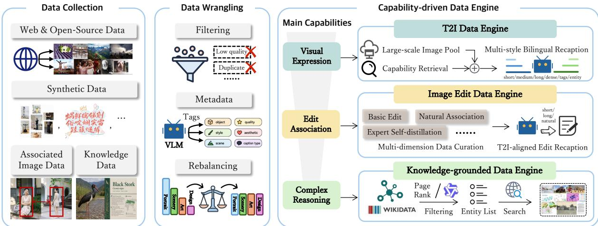  
Figure 1: Capability-specific data construction in our framework. Shared collection and wrangling feed three specialized but interoperable engines for visual expression, editing association, and knowledgegrounded reasoning.

## 2 Related Work

## 2.1 Large-Scale Visual Data Curation

Web-scale image-text corpora, including LAION-5B, COYO-700M, and MMC4, have provided the data foundation for large-scale visual representation learning and image generation [4, 25, 46]. Subsequent work has established data design as a central scaling dimension rather than a by-product of model training. DataComp systematically studies filtering and selection over a fixed candidate pool [16], while controlled scaling analyses show that data quality, semantic diversity, and text-conditioning density materially affect alignment and sample efficiency [12, 19, 20]. Another line of work improves supervision by replacing noisy web alt-text with synthetic descriptions. DALL-E 3 demonstrates that highly descriptive captions substantially improve prompt following [2], and Recap-DataComp-1B scales VLM-based recaptioning to over one billion web images [21]. Recent systems such as Qwen-Image and Seedream further integrate large-scale collection, filtering, recaptioning, semantic balancing, and targeted construction into end to-end data pipelines [26, 36, 43]. Knowledge-aware multimodal datasets additionally associate visual observations with named entities and structured facts for grounding and reasoning [17].

These efforts substantially improve the quality and coverage of visual corpora. Our work further shifts the unit of data design from the corpus to the capability. We separate T2I, image-editing, and knowledgegrounded supervision into specialized yet interoperable engines, while shared semantic metadata and annotation interfaces allow concepts acquired in one pathway to support another. This formulation makes capability-specific coverage gaps explicit without requiring each task-specific dataset to reproduce the full visual-concept distribution.

## 2.2 Image-Editing Data Curation

Instruction-based image editing is commonly learned from triplets comprising a source image, an editing instruction, and a target image. Because naturally paired triplets are scarce, existing datasets largely scale supervision through synthesized transformations, model-generated targets, and automatic quality filtering [8, 18, 24]. AnyEdit expands this paradigm with a fine-grained editing taxonomy and taskadaptive construction pipelines [42], while OmniEdit distills supervision from task specialists to cover diverse editing operations [35]. DreamOmni similarly constructs accurate editing pairs with operationspecific synthesis for unified generation and editing [37]. These approaches have substantially improved the scale and diversity of editing data, yet their supervision remains dominated by transformations produced within a synthetic pipeline, which may simplify real-world relations or inherit artifacts from the generator. Complementary studies derive manipulation cues from naturally occurring observations, for example by learning image transformations from temporal changes in videos [6].

In parallel, generalist models increasingly unify T2I generation and instruction-based editing within a shared architecture and training objective [15, 26, 32, 37, 38]. Efficient supervision across different tasks is required. Thus, we combine operation-specific construction with editing relations mined from naturally associated images and expert-generated examples for sparsely covered tasks. Meanwhile, editing instructions inherit the visual vocabulary and descriptive structure of T2I captions, allowing the editing corpus to focus on reference preservation and transformation rather than duplicating visual concepts already established by T2I supervision.

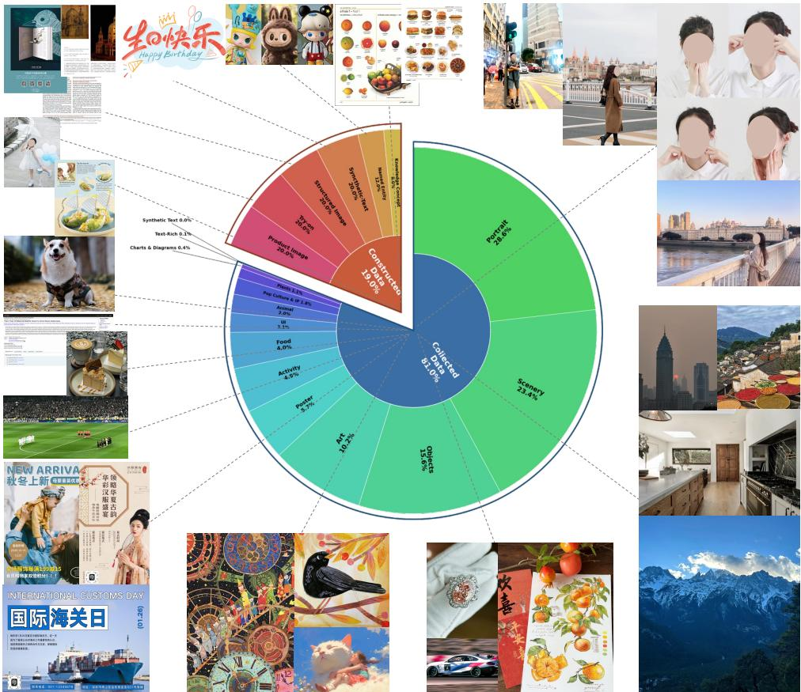  
Figure 2: Distribution of the curated T2I corpus. The inner ring distinguishes collected and constructed data, while the outer ring reports the composition of visual domains retained for training.

## 2.3 Curriculum Learning and Adaptive Data Scheduling

Curriculum learning organizes training examples in a meaningful order so that simpler concepts provide a foundation for learning more complex ones [1]. Beyond example ordering, data-mixture optimization studies how training distributions should be composed across domains. DoReMi, for instance, uses a proxy model and distributionally robust optimization to estimate domain weights for large-scale pre-training [39]. Modern image-generation systems also employ multi-stage recipes that progressively vary resolution, data quality, task composition, or content complexity [5, 30, 31, 36, 43]. Studies of unified multimodal pre-training further show that different generative and understanding capabilities emerge at different points in training rather than appearing simultaneously [13]. Based on existing curricula design, our scheduling jointly evolves task composition, concept distribution, data quality, and resolution along the capability acquisition order, while capability-aware evaluation guides targeted data construction and resampling for subsequent stages.

## 3 Capability-specific Data Pipeline

Motivated by the observation that capabilities learned from heterogeneous tasks can transfer across tasks [15, 26], we partition data construction into three specialized yet interoperable engines for T2I generation, image editing, and knowledge-grounded generation. Each engine adopts construction and annotation mechanisms tailored to its target capability, while shared processing and supervision interfaces preserve concept transfer across tasks. This organization makes capability-specific deficiencies independently measurable and actionable without requiring every task-specific dataset to exhaustively cover the same visual concepts. Notably, the engines share the same data wrangling process, which illustrated in Appendix A.

## 3.1 T2I Data Engine for Visual-Semantic Grounding

We develop a scalable T2I data engine to transform a billion-scale image pool into a high-quality and distribution-balanced training corpus of 440 million images. The engine jointly optimizes data quality, semantic diversity, text-image alignment, and long-tail concept coverage.

Scaling the T2I Corpus. We curate billions of noisy image-text pairs from heterogeneous sources, including public datasets [4, 25, 46], image-rich websites, web-search engines, and e-commerce platforms. All samples are processed by the shared data-wrangling pipeline described in Appendix A. Aesthetic quality, visual clarity, and AIGC detection serve as important filtering dimensions for T2I data [26, 43]. Each retained image is associated with semantic tags, quality attributes, and provenance information, allowing subsequent training stages to construct source-aware and distribution-aware mixtures.

Capability-Oriented Coverage Expansion. T2I pre-training determines not only fundamental generation quality but also the visual concepts and world knowledge available to downstream capabilities [5, 30]. We therefore expand T2I coverage along two complementary dimensions, namely entity-level concept coverage and coverage of both desirable and undesirable visual patterns. For the former, we develop proactive acquisition pipelines that retrieve authentic user-created and professionally designed images, as well as targeted samples from long-tail visual domains, rather than relying solely on the natural distribution of web-scale corpora. We additionally construct specialized collections of text-rich images, web pages, graphic designs, posters, social-media graphics, and commercial product images. These collections establish visual-semantic correspondences for rare entities and structured visual content during T2I pre-training, which can subsequently be activated by downstream tasks. For the latter, we avoid overly aggressive aesthetic filtering and retain a controlled proportion of imperfect images while explicitly describing their defects in captions. This treatment turns otherwise discarded artifacts into identifiable visual concepts, enabling the model to recognize and avoid reproducing them. Figure 2 summarizes the resulting T2I distribution.

## 3.2 Image-Editing Data Engine for Relational Supervision

High-quality image-editing pairs are substantially scarcer than unpaired images. Existing studies primarily scale editing supervision through synthetically generated transformations [8, 18, 24], which can oversimplify real-world changes and inherit artifacts from the generation pipeline. We construct a mixture of complementary pipelines that recover editing associations from both actively constructed operations and naturally associated images. All collected pairs are processed by the shared data-wrangling pipeline, rebalanced across operation types and image tags, and annotated by the editing-instruction captioner described in Sec. 3.4. In total, the engine constructs 120M editing pairs spanning both single-image and multi-image editing tasks, as summarized in Figure 3.

Operation-Specific Pair Construction. We construct basic editing pairs by reversing observable changes in high-quality images. A VLM first decomposes the scene and selects editable subjects, while SAM3 [7] provides object-level masks for localized manipulation. Starting from an image containing a target object, we remove or replace the selected region to obtain its counterpart. Reversing the source and target order naturally produces complementary addition, removal, replacement, and attribute-modification pairs. We also incorporate reference imitation [10] to construct reference-conditioned supervision.

Mining Natural Visual Associations. Purely synthesized pairs often make edited content appear pasted onto the input and fail to capture realistic combinations of transformations. To improve realism, we mine editing relations from naturally associated images. Explicit associations are predefined or actively retrieved, such as images of the same person, product, or object identified through visual embeddings and textual metadata. Implicit associations are discovered from co-occurring images on the same web page, temporally adjacent video frames, e-commerce collections, and social-media posts. Candidate pairs are retained only when identity consistency and semantic relevance are sufficiently high and a meaningful visual change is present.

We further recover latent relations from multi-panel layouts and composite images common in ecommerce and design data. After splitting a composite image into individual regions, a VLM identifies the relation between panels. This process recovers naturally paired examples such as product states before and after use, garments or cosmetics before and after application, product bundles and their components, and different states of the same object. Compared with task-specific synthesis, these pairs provide realistic and hybrid editing operations that better reflect practical application scenarios.

Expert Expansion and Quantitative Supervision. For difficult or underrepresented tasks, we first curate a small amount of domain-specific data and fine-tune base models such as Qwen-Image-2512 [36] or FLUX.2 [3] into task experts. These experts generate candidate pairs for virtual try-on [9], beauty and makeup editing, product marketing image creation, reference-based editing, and other specialized tasks.

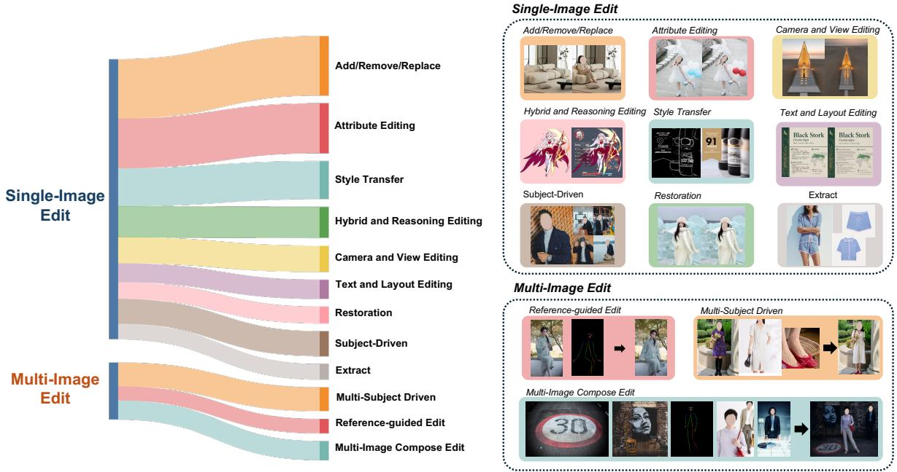  
Figure 3: Composition of the image-editing corpus. The left Sankey diagram shows the relative mixture of single-image and multi-image editing tasks, and the right panels illustrate representative task families.

Video experts such as Wan 2.2 [34] are also used to generate controllable paired samples for challenging editing tasks [11, 28, 29, 40, 41, 44]. Candidate outputs are filtered according to instruction alignment, reference-identity preservation, and AIGC likelihood, converting limited high-quality supervision into a larger task-specific corpus.

We additionally construct pairs for quantitative transformations and visual-perception tasks. The former include controlled object displacement, camera and photographic parameter adjustment, local color modification, and changes to text attributes. For the latter, we form bidirectional pairs between RGB images and structural representations, including depth, edge, normal, and human-pose maps. These data provide supervision for spatially and numerically precise editing.

## 3.3 Knowledge-Grounded Data Engine for Entity and Structured Knowledge

To strengthen visual grounding and reasoning over knowledge-intensive entities, we curate knowledgegrounded visual data through two complementary pipelines, namely image-centric acquisition with fine-grained labeling and entity-centric retrieval guided by structured knowledge graphs.

Knowledge-Graph-Guided Entity Acquisition. Starting from over 100 million Wikidata entities, we compute PageRank over the entity hyperlink graph to measure conceptual prominence and discard negligible-score candidates. A VLM further assesses whether each remaining entity constitutes a meaningful knowledge concept and estimates its public recognition level. This process yields approximately 3 million high-salience entity names. For each entity, we retrieve web images and apply VLM-based visual-referential alignment to retain accurate depictions. The same pipeline also captures structured knowledge representations, including theorem diagrams, mechanistic explanations, and scientific processes. These data establish associations between visual patterns, real-world entities, and structured knowledge, supporting knowledge-intensive generation and complex editing scenarios that require abstract or structured reasoning.

Image-Centric Entity Curation. Based on established entity set, we collect images from diverse online sources and apply domain-aware filtering to retain clearly identifiable entities across five major categories, including celebrities, landmarks, plants, animals, and popular IPs. After stringent quality filtering, we obtain over 27 million high-quality image-entity pairs covering common knowledge concepts.

## 3.4 Caption as Bridge to Align Across Tasks and Learn Across Granularities

We regard T2I captions and editing instructions as shared supervision interfaces that connect tasks and organize visual concepts across levels of granularity. Across tasks, editing instructions inherit the visual

  
Entity 古⻛宫廷⼈像拼贴  
Tags 竖幅四宫格，中式宫殿东亚⼥性，唐⻛⻬胸襦裙，绿⾊宽袖纱衫，橙红曳地⻓裙，古典⾼髻，珍珠流苏步摇，花卉团扇，中⽂竖匾，浅景深，柔和⾃然光，暖⾊调，写实数码摄影 古典宫廷写真  
Short Caption 竖幅四宫格写实宫廷写真，前三格拍摄同⼀位⾝穿唐⻛⻬胸襦裙式服饰的年轻东亚⼥性，右下格展示中式宫殿⻓廊。

Tags 中式⼭⽔，连绵群⼭，亭台楼阁，层叠树林，红绿树冠，蜿蜒⽯阶，⽶⽩织物，⾼远构图层叠透视，柔和淡彩，纤维艺术，传统刺绣，⻘绿⼭⽔⻛格，东⽅装饰画

Short Caption ⼀幅精美的中国传统秋⽇⼭⽔⻛景刺绣艺术品，以浅⾊织物为底，⽤带有光泽的银⽩与浅灰丝线绣出波浪起伏的云雾⼭峦其间错落点缀着红绿相间的斑斓秋树与精巧的古典⻜檐亭阁。

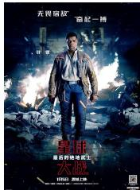  
Tags 科幻战场，芬恩，持枪⻛暴兵残骸，燃烧废墟，星球⼤战，居中全⾝构图，⽕焰逆光，蓝橙对⽐，⾼反差，电影合成摄影，科幻动作海报  
Short Caption ⼀张战⽕纷⻜、⽕花四溅的科幻电影海报，画⾯正中是⾝穿⽪夹克、右⼿持枪且表情坚毅的⿊⼈⻆⾊芬恩，他⾝后躺着倒地的⽩⾊装甲冲锋队员，海报上⽅印有⽂本“无果宿敌”和“奋起一捕”人物旁写有芬恩”下方醒目地排布着主标题“星球”“最后的绝地武⼠"、"⼤战"，以及底部的发⾏信息“1月5日 震撼上映”和“2D/3D/IMAX3D/中国巨幕 3D/DOLBY CINEMA"。  
Long Caption 由四张⾼清彩⾊写实摄影照⽚拼接⽽成的2x2⽹格图，主要展示了一位穿着传统汉服的年轻亚洲女性以及中国古典宫廷建筑，左上角的照片是一张全身广鱼照人物站在宏伟的红色宫殿本门前门上有精密的几何楼空窗格，门上方有画块显眼的紧排匾额：上方是一块黑底金字的匾额写着钦安殿”：其下方是一块蓝底金字的匾额写着“烟神室”、匾额周围是色彩斑斓，布满繁复图案的本制彩绘栋梁，这位皮肤白哲的女性身穿大红色齐胸摆裙 外置一件轻薄的草绿色长袖披衫。她梳着⾼耸的古代发髻，佩戴着⾦⾊的发饰和两侧垂下的珍珠步摇。她仰起头，⾯带微笑双手高高举起一频半透明的圆形本柄团扇遮挡在头顶，右上角的照片是一张及膝中景照人数身穿相同的服饰 身休微侧面朝画面的左上方们望 双手在腰前轻轻交叠、背景被柔和地成化，上⽅垂下绿⾊的树枝，后⽅隐约可⻅⽯板路、⽯灯笼以及模糊的红墙建筑。左下⻆的照⽚是⼀张腰部以上的半⾝特写，⼈物⾯朝镜头，带着淡淡的微笑。她的左⼿抬起，正轻轻捏着画⾯右侧垂下的⼀枝翠绿⾊⽵叶；她的右⼿握着团扇的⽊柄停留在胸前，半透明的扇⾯上绘有精致的粉⾊花朵图案。背景被茂密的绿⾊⽵叶填满，透出幽静的氛围。右下⻆的照⽚是⼀张没有⼈物的建筑透视⻛景照，呈现了⼀条中国古典宫殿的室外⻓廊，视点沿着⻓廊向画⾯右侧深处延伸，极具空间纵深感。⻓廊左侧是⼀排⽴在灰⾊⽯制基座上的粗壮正红⾊圆柱，外侧有⽩⾊⽯雕栏杆，背景是湛蓝⽆云的天空。⻓廊顶部是极为华丽的⽃拱和横梁，布满了红、蓝、绿、⽩相间的传统⼏何与花卉彩绘。⻓廊右侧是⼀整⾯连续的红⾊⽊制排⻔，地⾯铺设着平整的灰⾊⽅形⽯砖。  
Long Caption 银⽩⾊反光丝线精⼼绣制⽽成。占据画⾯主体的是层峦叠嶂的⼭ ⼀件精美的中国传统刺绣艺术品，呈现了⼀幅充满诗意的秋⽇⼭丘与缭绕的云雾，这些部分⼤量运⽤了平滑、波浪状的银⽩⾊和浅灰⾊丝线，线条流畅优美仿佛⽔波流动⼜似云海翻腾，营造出强烈的⽴体感和光泽感。在这些起伏的线条之间，点缀着⾊彩丰富的植被：前景底部是⼀排⾊彩斑斓的秋树，交织着深红、橙⻩、翠绿和墨绿⾊的细密针叶与阔叶：左上方和右上方绣有成片的墨绿色松替以及顶着铁锤红色树冠的高大树本画⾯正中央还隐约可⻅⼀棵盛开的浅粉⾊花树。掩映在⼭⽔与树林之间的是两组精巧的中国古典建馆：左下方外有一座灰白屋顶的飞檐亭阁 被绿树环抱：而在画面右侧则坐落着一组结构更复杂的建馆群 包括一座牌楼和多层飞橙的楼阁 柱子呈现本色屋顶带有细腻的灰白色丝线光泽，整休构图错落有致 色彩洛雅柔和完美展理了东方刺绣工艺的精淇与山⽔画的深远意境。  
Long Caption（John Boyega）饰演的⿊⼈⻆⾊芬恩（Finn）。海报呈现出具有强烈冷暖对⽐的电影级数字合成质感。画⾯顶部分布着⽩⾊的⽆衬线字体，左上⻆写着 "⽆畏宿敌"，右上⻆写着 "奋起⼀搏"。在⼈物⾝体左侧的半空中悬浮着⽩⾊⽂字 "芬恩"。芬恩以全⾝平视构图占据了绝对的视觉中⼼，他留着⿊⾊短发，表情凝重且充满决绝地直视镜头。他⾝穿⼀件做旧的浅棕⾊⽪夹克，夹克的肩部和前胸带有红⾊与暗灰⾊的拼接纹理；内搭⼀件领⼝微敞的浅灰⾊衬衫；下半⾝穿着深蓝⾊⻓裤，腰系带有银⾊扣环的⿊⽪带，他的右⼤腿上绑着战术束带，脚踏深⾊⻓筒靴。芬恩的右⼿⾃然下垂，⼿中紧握着⼀把⿊⽩相间的科幻爆能⼿枪，他的左⼿则⽤⼒握成拳头。在他⾝后的地⾯上满是⾦属残骸，其中横躺着⼀名失去意识的第⼀秩序冲锋队员（Stormtrooper），其经典的⽩⾊装甲和⿊⾊⾯部细节清晰可辨。⼈物左右两侧的中景外正燃起能能的明黄色列火滚滚浓烟向冷蓝色的背景深外幕延，强列的火光在芬恩身上打出锐利的边缘逆光，⽆数橙⻩⾊的⻜溅⽕星散布在整个画⾯的前景与四周。画⾯的下半部分是排版醒⽬的电影主标题：最上⽅是带有横向镂空纹理的红⾊硕⼤字体 "星球"，紧接着是⼀⾏⽩⾊的字 "最后的绝地武⼠"，其下⽅是与顶部同款设计的红⾊⼤字 "⼤战"。标题正下⽅排布着⽩⾊的 "1⽉5⽇ 震撼上映"，最底端是⼀排包含标识的⽩⾊⼩字 "2D / 3D / IMAX 3D / 中国巨幕 3D /DOLBYCINEMA"。画⾯的最右下⻆放置着⼀个⽩⾊的⼆维码及极为微⼩的版权⽂字痕迹。

Figure 4: Multi-granularity T2I supervision. Starting from a comprehensive annotation of an image, we construct entity descriptions, tags, short prompts, and long-form captions at multiple levels of details.

vocabulary and descriptive structure of T2I captions, allowing concepts learned from T2I generation to transfer to reference-based editing. Across granularities, the same image is annotated from entitylevel concepts and concise prompts to long-form and dense descriptions, associating coarse intent with fine-grained visual control.

Multi-Granularity T2I Recaptioning. The original metadata obtained during data collection is inadequate for learning fine-grained correspondences between language and visual elements. Prior work has shown that descriptive synthetic captions substantially improve text-image alignment and prompt following [2]. We therefore recaption each curated image, first producing a comprehensive annotation that covers all visually grounded content. Beyond the main subjects and their attributes, the annotation describes global composition, photographic and artistic style, illumination, color, fine-grained entities, spatial relations, relative subject scales, and visible OCR text when applicable.

Starting from the comprehensive annotation and the image itself, we construct captions with multiple granularities and expressions, including entity descriptions, unordered tags, short prompts, mediumlength captions, long captions, and dense descriptions, as shown in Figure 4. We additionally construct both Chinese and English variants. Sampling across these caption styles exposes the model to heterogeneous prompting patterns and improves the diversity of text-image alignment.

T2I-Aligned Editing Instructions. We train a VLM-based captioner to convert raw editing pairs into a unified supervision format. As illustrated in Figure 5, we treat image editing as conditional T2I generation in which the target description inherits the vocabulary and descriptive style learned from T2I data, while the instruction additionally expresses image references, transformations, and preservation constraints. The captioner first generates a reconstruction-level dense description of the target image without observing any source image. It then jointly examines the source and target images through fine-grained comparison to identify their visual differences. Regions or entities in the target description that can be directly preserved from a source image are replaced with the corresponding [image N] reference. Visual information already present in a source is therefore expressed by reference rather than repeated in text, while only attributes that differ between the source and target remain as explicit descriptions. Based on this aligned representation, we construct multiple instruction variants, including detailed editing instructions, concise commands, and simulated user requests, without changing the underlying visual transformation.

Specialized Caption Experts. To perform billion-scale annotation with consistent quality, we develop two VLM-based caption experts, namely a general captioner and a dense captioner, initialized from Qwen3.5- 27B. We first apply prompt engineering to improve caption accuracy and granularity, incorporating comprehensive annotation-dimension design, self-reflection, and in-context learning. We then collect high-quality T2I captions and editing instructions generated by strong teacher models to establish detailed and fluent captioning behavior. The captioner is fine-tuned on a unified T2I and editing dataset covering diverse image and editing types; higher weights are assigned to difficult tokens, including spatial terms and OCR content. We further apply reinforcement learning with rewards for visual-content coverage, hallucination, and linguistic clarity. For text-rich images such as posters and product advertisements, long-form OCR accuracy is assessed jointly by VLM-based scoring and rule-based verification. An anti-hacking reward penalizes subjective judgments, unsupported interpretations, redundant statements, and other content that does not contribute to training supervision.

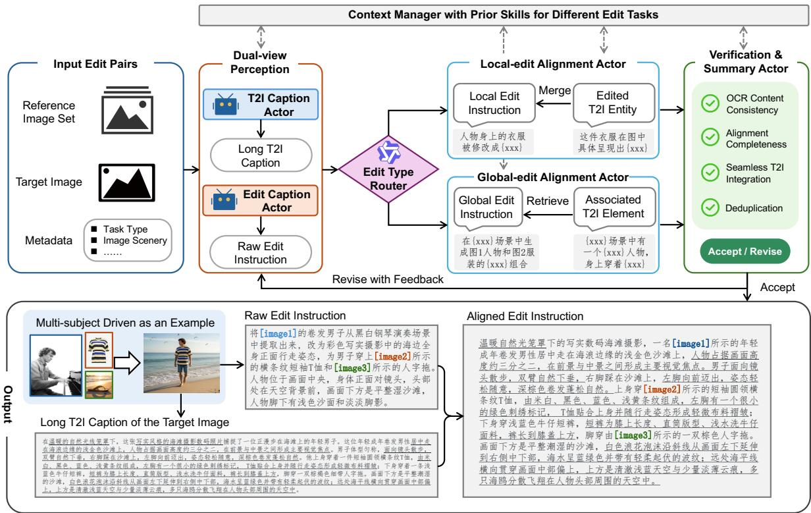  
Figure 5: Pipeline for constructing T2I-aligned editing instructions. Dual-view perception produces a target-image caption and a raw editing instruction; task-specific actors align local or global changes with reusable T2I descriptions, followed by consistency verification and iterative revision.

Dense captions specify layouts, OCR text, and visible elements, allowing DiT models to learn associations between textual conditions and structured visual content [23]. For each image, the dense captioner first identifies its visual type and constructs a corresponding description outline. Photographic images are organized from the main subjects to scene, composition, lighting, color, and background, whereas structured or text-rich images are organized by layout regions, text blocks, and decorative elements. The captioner verifies object identities and counts, attributes, spatial relations, relative scales, OCR text, and peripheral content item by item, and expresses uncertain details at a safer level of specificity. The verified elements are then assembled from global structure to local details. To jointly improve accuracy and exhaustiveness, we train the dense captioner with a self-verification reasoning process followed by dense-caption generation. The training traces exploit natural disagreements among multiple teacher models to construct trajectories of initial assessment, uncertainty, and correction, thereby internalizing reflection without relying on an external verifier at inference time. After supervised fine-tuning, reinforcement learning with multi-dimensional rewards further optimizes factual accuracy, visual coverage, and structural organization.

## 4 Capability-aligned Curriculum Scheduling

We construct a multi-stage data curriculum spanning foundational pre-training, continual training, and supervised fine-tuning. Rather than maintaining a fixed data mixture, the curriculum follows the dependency order of capability acquisition and evolves along four coupled axes, i.e., task composition, visual-concept distribution, data quality, and image resolution. The pipeline first establishes broad semantic coverage from large-scale T2I data, then introduces structurally complex, knowledge-grounded, text-rich, and image-editing supervision, and finally transitions toward balanced and refined subsets.

## 4.1 Dependency-Aligned Multi-Stage Curriculum Strategy

All samples produced by the capability-specific data engines are maintained in a shared data reservoir and indexed using multi-dimension attributes. We use these attributes to determine the data clusters eligible at different stage and the corresponding sampling weight.

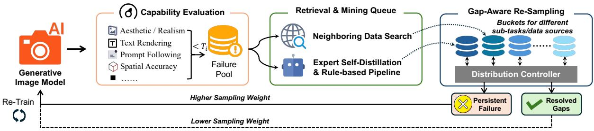  
Figure 6: Capability-gap-driven active feedback loop. Capability-aware evaluation identifies failure cases, which seed neighboring-data retrieval and expert-driven construction. Gap-aware resampling then increases the weights of persistent failures and down-weights resolved gaps in subsequent training.

Stage 1: 256px T2I Pre-training. The first stage uses large-scale 256px T2I data to maximize semantic coverage and preserve the authentic long-tail distribution of real-world visual content. We adopt an inclusive filtering strategy based primarily on image metadata and heuristic rules, avoiding aggressive aesthetic filtering that may remove visually imperfect but semantically useful samples such as old photographs. With accurate captions, a controlled subset of images containing visual imperfections is retained so that the model can explicitly learn the distribution of such defects and avoid them in subsequent generation. The corpus is organized into aspect-ratio buckets to prevent excessive cropping or deformation, and rare concepts receive moderately increased sampling weights.

Stage 2: 256px/512px Complex T2I Pre-training. Building on the broad T2I corpus from Stage 1, Stage 2 progressively extends the target resolution from 256px to 512px. We introduce content whose visual structure cannot be modeled effectively at 256px, particularly dense text-rendering images, layoutsensitive samples, and knowledge-grounded visual content. This stage couples increased resolution with increased content complexity to improve structural and detail fidelity.

Stage 3: Joint 512px T2I&Edit Pre-training. After 512px T2I generation has stabilized, Stage 3 introduces both natural and synthetic editing pairs. Editing samples are balanced across instruction categories, while the T2I branch preserves broad semantic and stylistic coverage. The two sources are combined under a unified pre-training setting, allowing the model to reuse concepts acquired from T2I supervision while learning reference preservation and controlled transformation.

Stage 4: 512px/1024px T2I&Edit Continual Training. During continual training (CT), the target resolution progressively increases from 512px to 1024px. To improve visual quality while preserving world knowledge, the data distribution shifts from broad but noisy pre-training data toward cleaner and more visually refined sources. We remove web-crawled sources with low quality bounds and increase sampling from high-fidelity sources and professional visual domains. A VLM assigns multi-level semantic categories to control the distribution shift through global resampling and proportional balancing. Editing data undergoes a second round of source filtering and is rebalanced across instruction categories to maintain stable coverage under multi-task training.

Stage 5: 1024px T2I&Edit Supervised Fine-Tuning. The supervised fine-tuning (SFT) stage constructs a small-scale and highly curated dataset that guides the model toward a high-quality sub-manifold of the CT distribution with stronger visual fidelity and instruction alignment. We sample from rigorously defined top-tier sources and apply a two-step review pipeline consisting of VLM-based preliminary screening followed by human re-evaluation. Samples with visible defects or weak text-image alignment are removed, and global category balancing prevents overfitting to dominant domains and mitigates forgetting of long-tail concepts.

## 4.2 Capability-Gap-Driven Active Feedback Loop

A fixed data distribution cannot continuously match the evolving capabilities of the model. We therefore treat data curation as an evaluation-driven optimization process in which evaluation results from preceding training stages identify underperforming task types and semantic concepts. As shown in Figure 6, these capability gaps drive targeted data retrieval, expert construction, and gap-aware resampling for subsequent stages.

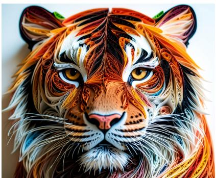

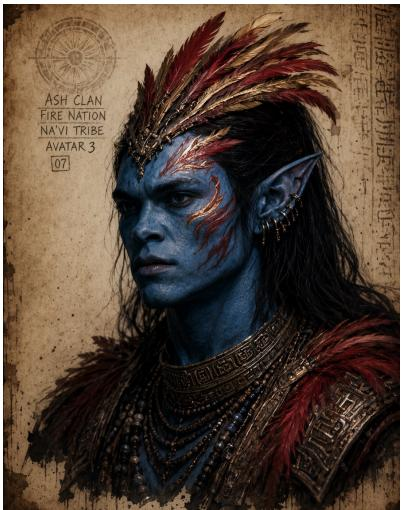

Chen@chen   
Joined February 2026   
Designer. Dreamer. Building things I love.   
https://alibaba.group Posts Replies 342 1,254 8,742 Followers 342 Posts

  
GARNISH Matcha Powder & Coffee Beans  
TOPPING LAYER Dark Chocolate Shavings

CORE INGREDIENT Matcha Mousse Cake

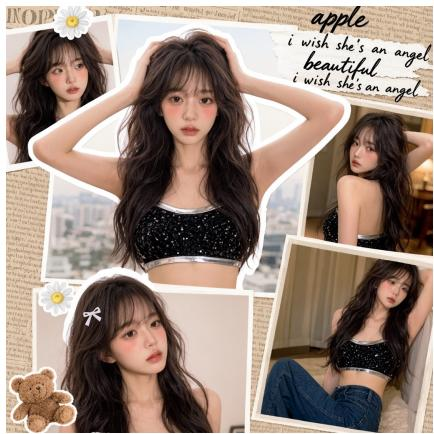

SUPPORTING BASE Sponge Cake Base

PLATE Ceramic Plate

Design tip: Simplicity is not the absence of complexity.   
bexity, but the presence of Clarity.

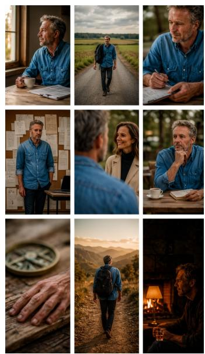  
Figure 7: Qualitative T2I results across illustration, graphic design, knowledge visualization, portraiture, landscapes, multi panel composition, and photographic style control.

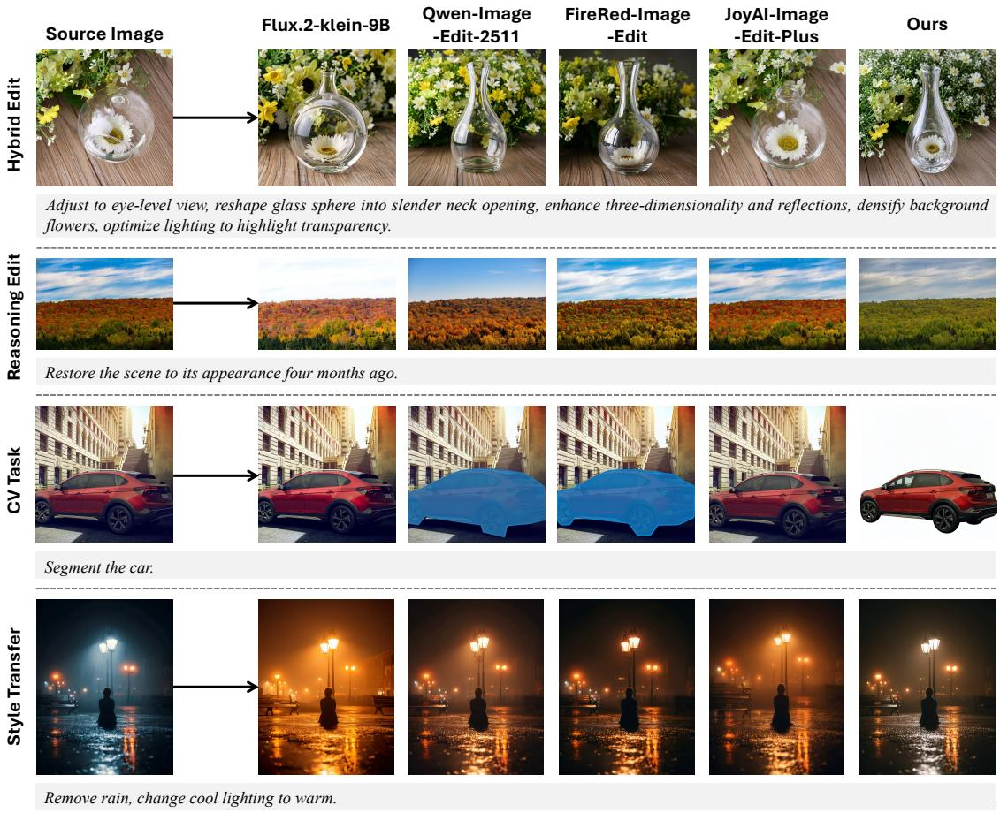  
Figure 8: Qualitative comparison on challenging single image editing cases. The examples cover hybrid editing, reasoning based transformation, object segmentation, and style transfer.

Capability-Aware Failure Discovery We assess each intermediate checkpoint with capability-stratified evaluation covering both T2I generation and image editing. Each failed sample below its capability-wise quality threshold ${ \breve { T } } _ { i }$ is annotated with its task type, hierarchical semantic tags, and failure dimensions. This process converts individual failure cases into measurable capability gaps and prioritizes recurring failure modes.

Distribution Update and Loop Closure Recurring failure modes attributable to data are used as retrieval seeds to search for or construct neighboring samples with diverse prompt formulations. For T2I data, when suitable real data are insufficient, we invoke capability-specific construction pipelines or expert generation to synthesize candidates. For editing data, especially underrepresented instruction types, we retrieve appropriate reference images and either mine naturally associated pairs or construct expertgenerated pairs. A subset of the newly added data undergoes VLM-based preliminary assessment followed by human review before entering the SFT pool.

Accepted supplementary samples are organized into task- and source-specific buckets, whose sampling weights are adjusted according to the capability gaps of the evolving model. Buckets associated with persistent failures receive higher weights, whereas resolved gaps are down-weighted; unresolved cases are returned to the data-mining queue. In this way, evaluation is converted from a terminal measurement into an active control signal for continuously improving the T2I and editing distributions.

## 5 Experiments

## 5.1 Text-to-Image Generation

We present qualitative T2I results across a broad range of visual styles and formats in Figure 7. These results indicate that the model performs well in complex T2I generation, such as designed illustrations, multi-panel images, knowledge-structure visualization, and photographic style control. Our scalable T2I data engine contributes this by producing images rich in text and structured layouts, which providing supervision for posters, interfaces, diagrams, and multi panel composition. The capability aligned curriculum then introduces complex structure and higher resolution supervision after broad visual grounding, allowing diversity, compositional accuracy, and rendering quality to improve together.

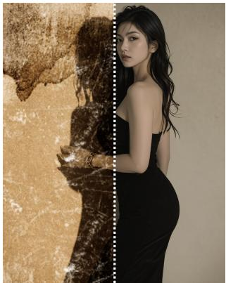  
Restore old photo and enhance clarity.

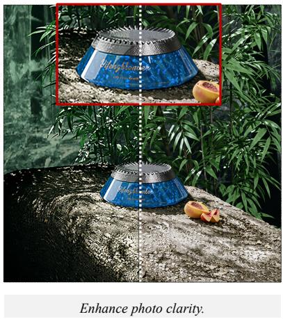

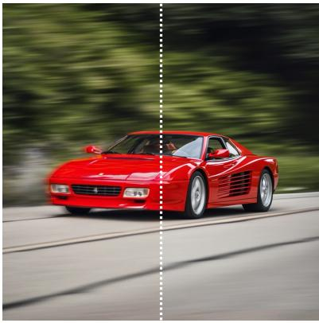

Figure 9: Visualization of degradation-aware restoration for different degradation types.  
Table 1: Image editing quantitative evaluation on CPI-General-Bench and CPI-Practical-Bench. Overall denotes their arithmetic mean.
<table><tr><td>Model</td><td>Parameters</td><td>CPI-General</td><td>CPI-Practical</td><td>Overall↑</td></tr><tr><td>Our Model-3B</td><td>3B</td><td>3.95</td><td>3.91</td><td>3.93</td></tr><tr><td>Our Model-6B</td><td>6B</td><td>3.96</td><td>3.92</td><td>3.94</td></tr></table>

## 5.2 Image Editing.

Quantitative Evaluation. We evaluate image editing on CPI-General-Bench and CPI-Practical-Bench, two subsets of CPI-Bench [45]. CPI-Bench is a comprehensive, practical, and intelligent benchmark for image editing in real-world settings and comprises three complementary subsets. Specifically, CPI-General Bench provides broad coverage of fundamental editing capabilities, including CPI-Practical-Bench focuses on frequently encountered real-world application scenarios, and CPI-Intelligent-Bench evaluates editing instructions that require advanced reasoning. CPI-General-Bench contains 2,039 examples spanning 30 fundamental tasks (20 single image and 10 multi image tasks). CPI-Practical-Bench contains 558 examples covering 51 common application types across the four domains of portrait enhancement, electronic commerce and advertising creativity, residential and interior design, and content creation. Using the proposed data pipeline and curriculum, we train MM-DiT models with 3B and 6B sizes, and evaluate on multiple tasks. The evaluation results on CPI-General-Bench and CPI-Practical-Bench are shown in Table 1. Metrics are assessed via VLM across multiple distinct dimensions, as illustrated in [45], with scores ranging from 1 to 5.

Qualitative Evaluation. We present challenging single-image editing cases in Figure 8 that span hybrid transformation, reasoning editing, etc. These cases require the model to infer the intended visual state and preserve content beyond direct appearance matching. Such capabilities benefit from abundant editing pairs mined from natural sources, where the transformation reflects relationships that occur in everyday settings. These naturally occurring relations provide realistic supervision to learn complex image transformations.

Figure 9 shows restoration from old photographs, low clarity, and motion blur. Learning this behavior requires retaining a small and controlled portion of degraded images together with explicit descriptions of their degradation states. This supervision enables the model to recognize defects in an input image, and also helps the model distinguish undesirable visual degradation from valid content, which supports higher generation quality.

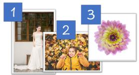

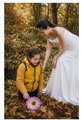  
Woman in white strapless dress of Figure 1 leaning down to interact with child in yellow vest from Figure 2, place pinkyellow dahlia from Figure 3 on autumn leaves, soft natural lighting, warm autumn atmosphere

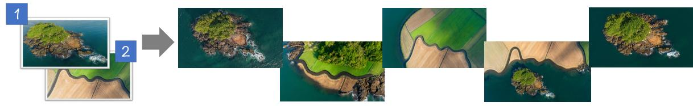  
Please refer to the shooting angle in Image 2 and adjust Image 1 to the same vertical top-down perspective

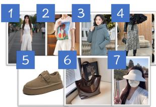

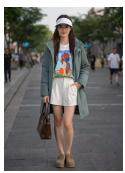

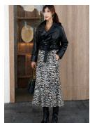

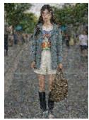

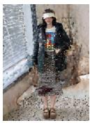

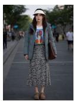

Have the model in [Image 1] wear the T-shirt from [Image 2] and the skirt from [Image 4], and put on the casual shoes from [Image 5], the tote bag from [Image 6], and the sun visor from [Image 7]. The puffer coat from [Image 3] should be worn open over the T-shirt, revealing the inner top. Keep the model’s pose and background unchanged.

## Without Image Index Reference

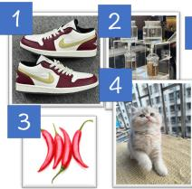

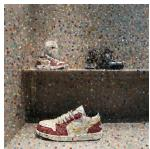

  
Arrange in modern minimalist interior: white-red-gold Nike sneakers on gray carpet, glass brewing sets on white countertop,four red chili peppers scattered on counter, cream-gray blue-eyed kitten sitting on woven mat looking at camera, teal 5-string electric bass leaning against wooden table.

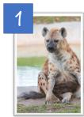

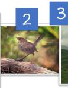  
Source Images

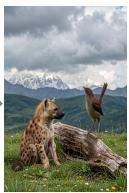

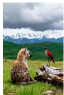  
Flux.2-klein-9B  
Place spotted hyena cub and red-legged sharp-beaked bird on alpine meadow, cub sitting on foreground grass with fluffy fur looking into distance, bird standing on weathered wood beside cub with head held high, background with emerald hills distant snow mountains and heavy cloud sky.

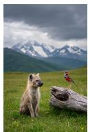  
Qwen-Image -Edit-2511  
FireRed -Image-Edit

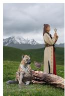

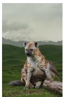  
JoyAI-Image -Edit-Plus  
Ours

Figure 10: Qualitative comparison on multi image editing. The examples evaluate viewpoint alignment, reference relation understanding, and composition capabilities. Comparison cases are grouped by with/without explicit image index reference.

Furthermore, we present complex cases involving viewpoint transfer, reference relation understanding, text rendering, and composition from multiple source images, as shown in Figure 10. The model identifies which visual attributes belong to each reference and binds them to the corresponding parts of the instruction. This requires image captions and editing instructions to maintain explicit correspondences between textual semantics and visual elements. Explicit cross-task alignment allows the model to combine subjects, attributes, layouts, and rendered text without confusing their sources.

## 6 Conclusion

In this work, we present a capability-driven data infrastructure for generalist image generation and editing. Three specialized yet interoperable engines construct complementary supervision for visual-text grounding, inter-image transformation, and image-knowledge association, while a shared captioning interface enables concept transfer across tasks and granularities. A capability-aligned curriculum then jointly evolves task composition, visual-concept distribution, data quality, and image resolution, while evaluation-driven retrieval, expert construction, and resampling close the refinement loop. At scale, the infrastructure curates a 440M-image T2I corpus, 120M editing pairs, and over 27M image-entity pairs, enabling the training of a MM-DiT model from scratch. Qualitative results illustrate the breadth of generation and editing capabilities supported by the resulting models. Overall, our study establishes data organization as a complementary scaling axis and reframes data curation as an adaptive supervision system rather than a collection of isolated task-specific pipelines.

## References

[1] Yoshua Bengio, Jérôme Louradour, Ronan Collobert, and Jason Weston. Curriculum learning. In Proceedings of the 26th Annual International Conference on Machine Learning, pages 41–48, 2009.

[2] James Betker, Gabriel Goh, Li Jing, Tim Brooks, Jianfeng Wang, Linjie Li, Long Ouyang, Juntang Zhuang, Joyce Lee, Yufei Guo, et al. Improving image generation with better captions. Computer Science. https://cdn. openai. com/papers/dall-e-3. pdf, 2(3):8, 2023.

[3] Black Forest Labs. Flux.2-klein: Towards interactive visual intelligence, 2025. URL https://bfl.ai/ blog/flux2-klein-towards-interactive-visual-intelligence. Accessed: 2026-03-18.

[4] Minwoo Byeon, Beomhee Park, Haecheon Kim, Sungjun Lee, Woonhyuk Baek, and Saehoon Kim. Coyo-700m: Image-text pair dataset. https://github.com/kakaobrain/coyo-dataset, 2022.

[5] Huanqia Cai, Sihan Cao, Ruoyi Du, Peng Gao, Steven Hoi, Zhaohui Hou, Shijie Huang, Dengyang Jiang, Xin Jin, Liangchen Li, et al. Z-image: An efficient image generation foundation model with single-stream diffusion transformer. arXiv preprint arXiv:2511.22699, 2025.

[6] Mingdeng Cao, Xuaner Zhang, Yinqiang Zheng, and Zhihao Xia. Instruction-based image manipulation by watching how things move. In Proceedings of the IEEE/CVF Conference on Computer Vision and Pattern Recognition, pages 2704–2713, 2025.

[7] Nicolas Carion, Laura Gustafson, Yuan-Ting Hu, Shoubhik Debnath, Ronghang Hu, Didac Suris, Chaitanya Ryali, Kalyan Vasudev Alwala, Haitham Khedr, Andrew Huang, et al. Sam 3: Segment anything with concepts. arXiv preprint arXiv:2511.16719, 2025.

[8] Junying Chen, Zhenyang Cai, Pengcheng Chen, Shunian Chen, Ke Ji, Xidong Wang, Yunjin Yang, and Benyou Wang. Sharegpt-4o-image: Aligning multimodal models with gpt-4o-level image generation. arXiv preprint arXiv:2506.18095, 2025.

[9] Mengting Chen, Xi Chen, Zhonghua Zhai, Chen Ju, Xuewen Hong, Jinsong Lan, and Shuai Xiao. Wear-any-way: Manipulable virtual try-on via sparse correspondence alignment. In European Conference on Computer Vision, pages 124–142. Springer, 2024.

[10] Xi Chen, Yutong Feng, Mengting Chen, Yiyang Wang, Shilong Zhang, Yu Liu, Yujun Shen, and Hengshuang Zhao. Zero-shot image editing with reference imitation. Advances in Neural Information Processing Systems, 37:84010–84032, 2024.

[11] Xi Chen, Zhiheng Liu, Mengting Chen, Yutong Feng, Yu Liu, Yujun Shen, and Hengshuang Zhao. Livephoto: Real image animation with text-guided motion control. In European Conference on Computer Vision, pages 475–491. Springer, 2024.

[12] Zilong Chen, Chaorui Deng, Kunchang Li, Hongyi Yuan, and Haoqi Fan. Scaling properties of text conditioning in visual generation. arXiv preprint arXiv:2607.29679, 2026.

[13] Chaorui Deng, Deyao Zhu, Kunchang Li, Chenhui Gou, Feng Li, Zeyu Wang, Shu Zhong, Weihao Yu, Xiaonan Nie, Ziang Song, et al. Emerging properties in unified multimodal pretraining. arXiv preprint arXiv:2505.14683, 2025.

[14] Matthijs Douze, Alexandr Guzhva, Chengqi Deng, Jeff Johnson, Gergely Szilvasy, Pierre-Emmanuel Mazaré, Maria Lomeli, Lucas Hosseini, and Hervé Jégou. The faiss library. IEEE Transactions on Big Data, 2025.

[15] Tsu-Jui Fu, Yusu Qian, Chen Chen, Wenze Hu, Zhe Gan, and Yinfei Yang. Univg: A generalist diffusion model for unified image generation and editing. In Proceedings ofthe IEEE/CVF International Conference on Computer Vision (ICCV), pages 17160–17170, October 2025.

[16] Samir Yitzhak Gadre, Gabriel Ilharco, Alex Fang, Jonathan Hayase, Georgios Smyrnis, Thao Nguyen, Ryan Marten, Mitchell Wortsman, Dhruba Ghosh, Jieyu Zhang, et al. Datacomp: In search of the next generation of multimodal datasets. In Advances in Neural Information Processing Systems, volume 36, 2023.

[17] Biao Gong, Shuai Tan, Yutong Feng, Xiaoying Xie, Yuyuan Li, Chaochao Chen, Kecheng Zheng, Yujun Shen, and Deli Zhao. Uknow: A unified knowledge protocol with multimodal knowledge graph datasets for reasoning and vision-language pre-training. In Advances in Neural Information Processing Systems Datasets and Benchmarks Track, volume 37, 2024.

[18] Mude Hui, Siwei Yang, Bingchen Zhao, Yichun Shi, Heng Wang, Peng Wang, Yuyin Zhou, and Cihang Xie. Hq-edit: A high-quality dataset for instruction-based image editing. arXiv preprint arXiv:2404.09990, 2024.

[19] Zhengfeng Lai, Vasileios Saveris, Chen Chen, Hong-You Chen, Haotian Zhang, Bowen Zhang, Wenze Hu, Juan Tebar, Zhe Gan, Peter Grasch, Meng Cao, and Yinfei Yang. Revisit large-scale image-caption data in pre-training multimodal foundation models. In International Conference on Learning Representations, 2025.

[20] Hao Li, Yang Zou, Ying Wang, Orchid Majumder, Yusheng Xie, R. Manmatha, Ashwin Swaminathan, Zhuowen Tu, Stefano Ermon, and Stefano Soatto. On the scalability of diffusion-based text-to-image generation. In Proceedings of the IEEE/CVF Conference on Computer Vision and Pattern Recognition, pages 9400–9409, 2024.

[21] Xianhang Li, Haoqin Tu, Mude Hui, Zeyu Wang, Bingchen Zhao, Junfei Xiao, Sucheng Ren, Jieru Mei, Qing Liu, Huangjie Zheng, et al. What if we recaption billions of web images with LLaMA-3? arXiv preprint arXiv:2406.08478, 2024.

[22] Anish Mittal, Anush Krishna Moorthy, and Alan Conrad Bovik. No-reference image quality assessment in the spatial domain. IEEE Transactions on image processing, 21(12):4695–4708, 2012.

[23] Yuyang Peng, Shishi Xiao, Keming Wu, Qisheng Liao, Bohan Chen, Kevin Lin, Danqing Huang, Ji Li, and Yuhui Yuan. Bizgen: Advancing article-level visual text rendering for infographics generation. In Proceedings of the IEEE/CVF Conference on Computer Vision and Pattern Recognition (CVPR), pages 23615–23624, June 2025.

[24] Yusu Qian, Eli Bocek-Rivele, Liangchen Song, Jialing Tong, Yinfei Yang, Jiasen Lu, Wenze Hu, and Zhe Gan. Pico-banana-400k: A large-scale dataset for text-guided image editing. In Proceedings ofthe IEEE/CVF Conference on Computer Vision and Pattern Recognition, pages 37226–37235, 2026.

[25] Christoph Schuhmann, Romain Beaumont, Richard Vencu, Cade Gordon, Ross Wightman, Mehdi Cherti, Theo Coombes, Aarush Katta, Clayton Mullis, Mitchell Wortsman, et al. Laion-5b: An open large-scale dataset for training next generation image-text models. Advances in neural information processing systems, 35:25278–25294, 2022.

[26] Team Seedream, Yunpeng Chen, Yu Gao, Lixue Gong, Meng Guo, Qiushan Guo, Zhiyao Guo, Xiaoxia Hou, Weilin Huang, Yixuan Huang, et al. Seedream 4.0: Toward next-generation multimodal image generation. arXiv preprint arXiv:2509.20427, 2025.

[27] Oriane Siméoni, Huy V Vo, Maximilian Seitzer, Federico Baldassarre, Maxime Oquab, Cijo Jose, Vasil Khalidov, Marc Szafraniec, Seungeun Yi, Michaël Ramamonjisoa, et al. Dinov3. arXiv preprint arXiv:2508.10104, 2025.

[28] Quanjian Song, Yefeng Shen, Mengting Chen, Hao Sun, Jinsong Lan, Xiaoyong Zhu, Bo Zheng, and Liujuan Cao. Fashionchameleon: Towards real-time and interactive human-garment video customization. arXiv preprint arXiv:2605.15824, 2026.

[29] Hao Sun, Hao Yan, Mengting Chen, Quanjian Song, Yu Li, Juan Cao, Jinsong Lan, Xiaoyong Zhu, Bo Zheng, and Sheng Tang. Tryoncrafter: Unleashing camera trajectories for realistic video virtual try-on via a renderable 4d try-on proxy. arXiv preprint arXiv:2606.26092, 2026.

[30] Meituan LongCat Team, Hanghang Ma, Haoxian Tan, Jiale Huang, Junqiang Wu, Jun-Yan He, Lishuai Gao, Songlin Xiao, Xiaoming Wei, Xiaoqi Ma, et al. Longcat-image technical report. arXiv preprint arXiv:2512.07584, 2025.

[31] Super Intelligence Team, Changhao Qiao, Chao Hui, Chen Li, Cunzheng Wang, Dejia Song, Jiale Zhang, Jing Li, Qiang Xiang, Runqi Wang, et al. Firered-image-edit-1.0 technical report. arXiv preprint arXiv:2602.13344, 2026.

[32] Xueyun Tian, Wei Li, Bingbing Xu, Yige Yuan, Yuanzhuo Wang, and Huawei Shen. Mige: Mutually enhanced multimodal instruction-based image generation and editing. In Proceedings of the 33rd ACM International Conference on Multimedia, 2025. doi: 10.1145/3746027.3755811.

[33] Yuxiang Tuo, Wangmeng Xiang, Jun-Yan He, Yifeng Geng, and Xuansong Xie. Anytext: Multilingual visual text generation and editing. In The Twelfth International Conference on Learning Representations, 2024.

[34] Team Wan, Team Wan, Ang Wang, Baole Ai, Bin Wen, Chaojie Mao, Chen-Wei Xie, Di Chen, Feiwu Yu, Haiming Zhao, Jianxiao Yang, Jianyuan Zeng, Jiayu Wang, Jingfeng Zhang, Jingren Zhou, Jinkai Wang, and et al. Wan: Open and advanced large-scale video generative models. arXiv preprint arXiv:2503.20314, 2025.

[35] Cong Wei, Zheyang Xiong, Weiming Ren, Xinrun Du, Ge Zhang, and Wenhu Chen. Omniedit: Building image editing generalist models through specialist supervision. In International Conference on Learning Representations, 2025.

[36] Chenfei Wu, Jiahao Li, Jingren Zhou, Junyang Lin, Kaiyuan Gao, Kun Yan, Sheng-ming Yin, Shuai Bai, Xiao Xu, Yilei Chen, et al. Qwen-image technical report. arXiv preprint arXiv:2508.02324, 2025.

[37] Bin Xia, Yuechen Zhang, Jingyao Li, Chengyao Wang, Yitong Wang, Xinglong Wu, Bei Yu, and Jiaya Jia. Dreamomni: Unified image generation and editing. In Proceedings of the IEEE/CVF Conference on Computer Vision and Pattern Recognition, pages 28533–28543, 2025.

[38] Shitao Xiao, Yueze Wang, Junjie Zhou, Huaying Yuan, Xingrun Xing, Ruiran Yan, Chaofan Li, Shuting Wang, Tiejun Huang, and Zheng Liu. Omnigen: Unified image generation. In Proceedings of the IEEE/CVF Conference on Computer Vision and Pattern Recognition, pages 13294–13304, 2025.

[39] Sang Michael Xie, Hieu Pham, Xuanyi Dong, Nan Du, Hanxiao Liu, Yifeng Lu, Percy Liang, Quoc V. Le, Tengyu Ma, and Adams Wei Yu. Doremi: Optimizing data mixtures speeds up language model pretraining. In Advances in Neural Information Processing Systems, volume 36, 2023.

[40] Zhengze Xu, Mengting Chen, Zhao Wang, Linyu Xing, Zhonghua Zhai, Nong Sang, Jinsong Lan, Shuai Xiao, and Changxin Gao. Tunnel try-on: Excavating spatial-temporal tunnels for high-quality virtual try-on in videos. In Proceedings of the 32nd ACM International Conference on Multimedia, pages 3199–3208, 2024.

[41] Mingshuai Yao, Mengting Chen, Qinye Zhou, Yabo Zhang, Ming Liu, Xiaoming Li, Shaohui Liu, Chen Ju, Shuai Xiao, Qingwen Liu, et al. Beyond static scenes: Camera-controllable background generation for human motion. arXiv preprint arXiv:2504.02004, 2025.

[42] Qifan Yu, Wei Chow, Zhongqi Yue, Kaihang Pan, Yang Wu, Xiaoyang Wan, Juncheng Li, Siliang Tang, Hanwang Zhang, and Yueting Zhuang. Anyedit: Mastering unified high-quality image editing for any idea. In Proceedings of the IEEE/CVF Conference on Computer Vision and Pattern Recognition, pages 26125–26135, 2025.

[43] Bing Zhao, Chenfei Wu, Deqing Li, Hao Meng, Jiahao Li, Jie Zhang, Jingren Zhou, Junyang Lin, Kaiyuan Gao, Kuan Cao, et al. Qwen-image-2.0 technical report. arXiv preprint arXiv:2605.10730, 2026.

[44] Jun Zheng, Zhengze Xu, Mengting Chen, Jing Wang, Jinsong Lan, Xiaoyong Zhu, Kaifu Zhang, Bo Zheng, and Xiaodan Liang. itryon: Mastering interactive video virtual try-on with spatialsemantic guidance. arXiv preprint arXiv:2605.21431, 2026.

[45] Qinye Zhou, Jun Zheng, Yongchao Du, Yuan Wang, Zhengrui Chen, Zuan Gao, Taihang Hu, Chao Lin, Yefeng Shen, Xingjian Wang, Zhao Wang, Zhengtao Wu, Xiaoli Xu, Zhengze Xu, Hao Yan, Denghui Yang, Yuhang Yu, Huayu Zhang, Mingzhou Zhang, and Mengting Chen. Cpi-bench: A comprehensive,practical and intelligent benchmark for real-world image editing. arXiv preprint arXiv:2608.14546, 2026.

[46] Wanrong Zhu, Jack Hessel, Anas Awadalla, Samir Yitzhak Gadre, Jesse Dodge, Alex Fang, Youngjae Yu, Ludwig Schmidt, William Yang Wang, and Yejin Choi. Multimodal c4: An open, billion-scale corpus of images interleaved with text. Advances in Neural Information Processing Systems, 36:8958– 8974, 2023.

## A Shared Data Wrangling

Basic data-wrangling strategies are shared across the capability-specific data engines. The shared pipeline standardizes data validity and quality, extracts comparable semantic metadata, and provides the attributes required for stage-specific filtering and rebalancing in the curriculum scheduling.

## A.1 Filtering and Quality Control

Basic Rule Filtering. We first convert all images to RGB format and profile each sample using basic metadata. Images that cannot be decoded because of file corruption are removed. We impose a strict resolution lower bound and discard images containing fewer than 2562 total pixels. Samples with extreme aspect ratios are filtered according to stage-specific requirements.

Technical Quality Filtering. We develop dedicated pipelines to detect blur and severe compression. Severe blur is detected by combining Laplacian variance with BRISQUE [22] scores, while file entropy and JPEG-quality estimation reject images with excessive compression and pronounced block artifacts. Pixel variance identifies solid-color or nearly blank images. For white-background images common in e-commerce and stock-media data, we combine RGB entropy with the proportion of black and white pixels for controlled downsampling, preserving their conceptual value while preventing them from dominating the pre-training distribution.

Perceptual Quality Filtering. We train clarity and aesthetic predictors to evaluate visual clarity and perceptual quality. The filtering thresholds vary across training stages so that early pre-training preserves semantic diversity while later stages progressively emphasize visual quality.

Deduplication. We employ a three-level deduplication pipeline spanning exact, near-duplicate, and semantic matching. MD5 and file hashes first remove identical samples at low computational cost. pHash then detects near-duplicate images produced by minor cropping, watermarking, or resizing. Finally, DINOv3 [27] extracts image-level embeddings for high-dimensional clustering with FAISS [14]. For samples whose intra-cluster cosine similarity exceeds 0.99, we retain the highest-quality image as determined jointly by resolution and sharpness.

Watermark and Text Detection. Specialized detectors identify watermarks, logos, subtitles, and overlaid text. Images dominated by watermarks and text-rich images are marked separately for subsequent filtering and captioning rather than treated as a single category.

AIGC Detection and Content Safety. AI-generated images may contain latent artifacts that limit the upper bound of generation quality. We train an AIGC classifier to identify synthetic images in naturally sourced corpora and remove high-confidence AIGC samples from the pre-training pool. An NSFW detector and metadata-based unsafe-keyword filtering are additionally applied for content safety.

## A.2 Hierarchical Metadata Extraction and Rebalancing

After filtering, the remaining web-scale pool still exhibits a long-tailed semantic distribution dominated by frequent concepts. We therefore extract hierarchical semantic metadata and rebalance the data with schedules tailored to different training stages.

Taxonomy Construction. We adopt the leaf nodes of an established visual classification hierarchy as over 280K fine-grained semantic tags. These tags are organized into a four-level taxonomy whose three upper levels contain 15, 74, and 331 categories, respectively. Each fine-grained tag is mapped to a leaf node, enabling both coarse- and fine-grained distribution control.

Tag Assignment. For each image, we compare its caption embedding with tag embeddings by cosine similarity to retrieve the top-1000 candidate tags. An adaptive filter combines semantic similarity with hierarchical relations to retain up to 15 representative and semantically diverse tags per image, providing compact metadata across multiple conceptual dimensions.

Data Rebalancing. We perform hierarchical resampling according to two principles. First, all semantic tags are represented in the final corpus, with additional attention to rare and long-tail concepts. Second, sample counts are approximately balanced across first-level categories and recursively among child categories under the same parent down to the third level. This hierarchical strategy reduces the dominance of frequent concepts while preserving semantic diversity at multiple granularities.