# GeoWeaver: Accurate Long-Sequence 3D Reconstruction via Hierarchical Geometric Assembly

Tinghao Jiang1,2, Sheng Tang1, Shengzhe Wei1, Juntong Fang3, Weiqi Zhang3, Junsheng Zhou3, Zesong Li1

1Kosmo Research 2Shanghai Jiao Tong University 3Tsinghua University

## Abstract

Long-sequence 3D reconstruction from RGB videos requires both accurate local geometry and globally consistent camera motion. Feed-forward models provide strong depth and pose predictions, but their memory cost prevents joint inference over long sequences. Chunk-wise processing improves scalability, yet independently predicted chunks often exhibit scale drift, pose errors, and point-cloud misalignment. We present GeoWeaver, a unified framework comprising a Geometric Prior Model (GPM) and Test-Time Adaptation (TTA). The GPM predicts chunk-wise depth, confidence, and camera parameters as adjustable geometric priors. TTA then performs sequential initialization, global chunk-level Sim(3) alignment, and coarse-to-fine refinement of camera poses, afine depth corrections, and intrinsics. Dense correspondences provide adjacent, cross-chunk, and long-range constraints, while a robust CDF-style objective jointly optimizes weighted 2D reprojection and 3D consistency residuals. This design preserves local geometric accuracy while correcting accumulated pose, scale, depth, and calibration errors. Experiments across diverse long-sequence benchmarks demonstrate improved camera accuracy, global consistency, and point-cloud quality. Ablations verify the contribution of each adaptation stage, and applying the same TTA procedure to diferent geometric prior models consistently improves their trajectory estimates, demonstrating that GeoWeaver is not tied to a specific GPM.

Project page: http://kosmoresearch.github.io/GeoWeaver/

## 1 Introduction

Long-sequence 3D reconstruction recovers camera motion and scene geometry from temporally ordered RGB images, supporting autonomous driving, robotics, augmented reality, and large-scale scene understanding. Compared with short sequences, long videos involve larger motion, revisited regions, illumination changes, weak overlap, and accumulated drift.

Classical SfM and SLAM enforce global consistency through matching, registration, triangulation, pose estimation, and bundle adjustment Schönberger and Frahm [2016], Pan et al. [2024], Campos et al. [2021], Engel et al. [2018]. They perform well with reliable correspondences and wellconditioned view graphs, but often degrade under weak texture, repetitive structures, limited overlap, or long trajectories.

Feed-forward geometry models provide a complementary solution. DUSt3R Wang et al. [2024b], MASt3R Leroy et al. [2024], VGGT Wang et al. [2025a], and Depth Anything 3 Lin et al. [2025] directly predict depth, cameras, point maps, tracks, or multi-view geometry. Although they provide strong learned priors, their memory and attention costs make joint inference over hundreds or thousands of frames impractical.

A common solution is chunk-wise inference, which reconstructs short windows independently and then assembles them. While bounding inference cost, this introduces inconsistent coordinate frames, scales, and calibration across chunks. Sim ple overlap alignment leaves local errors largely unchanged, whereas directly optimizing all frame-level variables before establishing a stable global layout is prone to poor local minima. The key challenge is thus to preserve reliable local priors while correcting sequence-level drift.

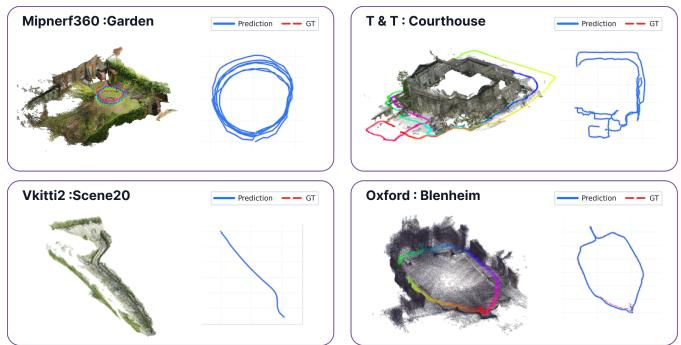  
Figure 1. Qualitative results across four benchmarks. Reconstructed point clouds and camera trajectories are shown for each scene.

We address this challenge with GeoWeaver, which combines a Geometric Prior Model (GPM) with sequence-specific Test-Time Adaptation (TTA). The GPM predicts chunk-wise depth, confidence, and camera parameters. TTA sequentially initializes the chunk layout, corrects global scale and pose inconsistencies through chunk-level Sim(3) optimization, and refines frame poses, afine depth, and camera-group focal corrections. Confidence-weighted 2D and 3D constraints couple all stages under a robust CDF-style objective. Figure 1 shows the resulting coherent geometry and trajectories.

Our main contributions are:

• We introduce a feed-forward Geometric Prior Model that predicts depth, confidence, and camera parameters from variable-length multi-view inputs.

• We propose a minimal-overlap TTA strategy that converts independent chunk priors into a stable global layout.

• We develop a hierarchical TTA procedure combining chunk-level Sim(3) alignment with joint refinement of frame poses, afine depth, and camera-group focal corrections under robust 2D and 3D constraints.

• We demonstrate consistent gains across diverse longsequence benchmarks and show that the same TTA procedure improves priors from multiple feed-forward models without source-specific tuning.

## 2 Related Work

Optimization-based reconstruction. Classical SfM and SLAM recover cameras and geometry through matching, registration, triangulation, and bundle adjustment. COLMAP Schönberger and Frahm [2016] uses incremental SfM, GLOMAP Pan et al. [2024] estimates globally consistent cameras, and ORB-SLAM3 Campos et al. [2021], DSO Engel et al. [2018], and DROID-SLAM Teed and Deng [2021] exploit temporal continuity for tracking and mapping. Detector-Free SfM He et al. [2024] further combines dense matching with iterative track and geometry refinement. Despite strong global accuracy, these methods remain sensitive to weak texture, repeated structure, motion blur, limited overlap, and incorrect associations, and do not directly adapt dense learned geometric priors.

Feed-forward geometry models. Feed-forward methods infer multi-view geometry directly from RGB images. DUSt3R Wang et al. [2024b] predicts dense point maps, while MASt3R Leroy et al. [2024] augments them with dense matching. VGGT Wang et al. [2025a], Depth Anything 3 Lin et al. [2025], π3 Wang et al. [2025c], Pow3R Jang et al. [2025], and MapAnything Keetha et al. [2026] predict depth, cameras, point maps, or metric geometry from uncalibrated views. Fast3R Yang et al. [2025] and Speed3R Ren et al. [2026] improve scalability, while Light3R-SfM Elflein et al. [2025] and SAIL-Recon Deng et al. [2026] extend feed-forward SfM through global alignment or localization. These models provide strong local priors, but joint inference over very long sequences remains memory-intensive.

Long-sequence and chunk-wise reconstruction. Longsequence methods scale through persistent memory, causal state propagation, incremental registration, or chunk-wise inference Wang and Agapito [2025], Wang et al. [2025b], Chen et al. [2025], Lan et al. [2025], Zhuo et al. [2025], Chen et al. [2026]. Spann3R Wang and Agapito [2025] and CUT3R Wang et al. [2025b] maintain persistent scene representations; LONG3R Chen et al. [2025], STream3R Lan et al. [2025], StreamVGGT Zhuo et al. [2025], and WinT3R Li et al. [2026] process image streams causally or within windows. SLAM3R Liu et al. [2025] and LingBot-Map Chen et al. [2026] incrementally register or memorize geometric context, while VGGT-Long Deng et al. [2025], Scal3R Xie et al. [2026], ZipMap Jin et al. [2026], Online3R Zhou et al. [2026], and LoGeR Zhang et al. [2026] improve long-range consistency through overlap, alignment, adaptation, or memory. However, local depth, pose, scale, and calibration errors often remain fixed or only weakly adjustable.

Hybrid learning and geometric optimization. Hybrid methods combine learned geometry with explicit optimization. BA-Net Tang and Tan [2019] introduces diferentiable featuremetric bundle adjustment, DROID-SLAM Teed and Deng [2021] jointly updates poses and depth, and FlowMap Smith et al. [2025] optimizes depth, intrinsics, and cameras from correspondences. VGGSfM Wang et al. [2024a], MASt3R-SfM Duisterhof et al. [2025], MASt3R-SLAM Murai et al. [2025], VGGT-SLAM Maggio et al. [2025], and VGGT-SLAM 2.0 Maggio and Carlone [2026] integrate learned tracking, matching, or local reconstructions into global optimization. MP-SfM Pataki et al. [2025], Marginalized Bundle Adjustment Zhu et al. [2026], and AMB3R Wang and Agapito [2026] further combine learned geometric priors with explicit reconstruction.

GeoWeaver follows this hybrid direction but targets minimal-overlap long-sequence reconstruction. It treats chunkwise depth, confidence, and camera estimates as adjustable priors and adapts them to each sequence through hierarchical geometric optimization.

## 3 Method

As shown in Fig. 2, GeoWeaver comprises a Geometric Prior Model (GPM) and Test-Time Adaptation (TTA). The GPM independently predicts depth, confidence, and camera parameters for short overlapping chunks. With the GPM fixed, TTA first initializes the chunk layout from adjacent correspondences, then optimizes one Sim(3) transformation per chunk using cross-chunk and long-range constraints, and finally refines frame poses, afine depth, and camera-group focal corrections. This coarse-to-fine process corrects global scale and coordinate inconsistencies before frame-level refinement.

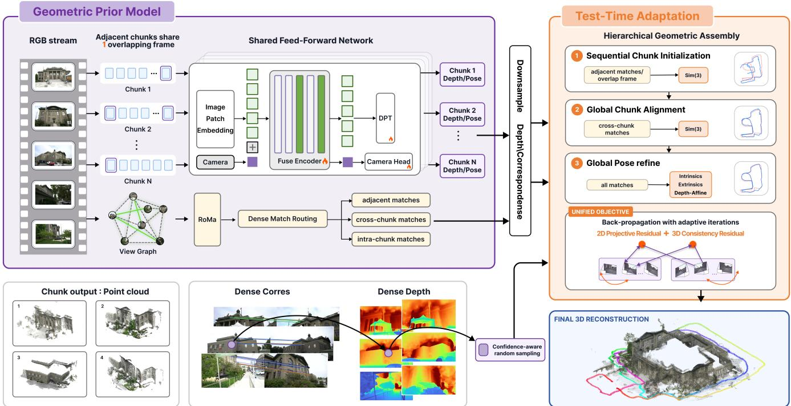

Figure 2. Overview of GeoWeaver. The Geometric Prior Model predicts chunk-wise depth, confidence, and cameras, while Test-Time Adaptation performs sequential initialization, chunk alignment, and frame-level refinement using local and long-range correspondences.  
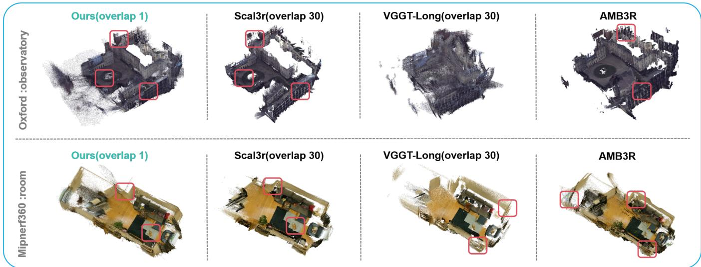  
Figure 3. Qualitative comparison on representative indoor and outdoor scenes. “Overlap” denotes the number of shared frames between adjacent 60-frame chunks. Compared with baselines using 30-frame overlap, GeoWeaver uses only one shared frame while producing more coherent geometry, better aligned trajectories, and fewer inter-chunk discontinuities.

## 3.1 Geometric Prior Model

We split a long RGB sequence into contiguous chunks with one shared frame between adjacent chunks, providing a geometric anchor with minimal redundant inference. A shared physical frame yields two chunk-specific observations; in Stages 1–2, they are treated independently and c(i) denotes the chunk of observation i. After chunk alignment, Stage 3 retains the observation with larger mean valid confidence as the canonical prediction; the other is used only to constrain chunk alignment.

For $\mathcal { C } _ { k } = \{ I _ { i } \} _ { i = 1 } ^ { N _ { c } }$ , the Geometric Prior Model (GPM)

predicts

$$
\begin{array} { l } { { \mathcal G _ { i } = \{ \hat { D } _ { i } , \hat { C } _ { i } , \hat { \pmb { \theta } } _ { i } \} , } } \\ { { \hat { \pmb { \theta } } _ { i } = ( \hat { \bf t } _ { i } , \hat { \bf q } _ { i } , \widehat { \mathrm { F o V } } _ { i } ) . } } \end{array}\tag{1}
$$

Here, $\hat { D } _ { i } , \hat { C } _ { i }$ , and $\hat { \pmb { \theta } } _ { i }$ denote depth, confidence, and camera parameters, from which poses and intrinsics are recovered.

Built on Depth Anything 3 Lin et al. [2025], the GPM uses a ViT encoder, a DPT-style depth-confidence head, and a transformer camera head. It is trained with joint geometric and camera supervision, progressing from fixed four-view clips to variable-length clips of 2–16 views.

The geometric model loss combines local geometry, normalized chunk-level geometry, and relative camera supervision:

$$
\mathcal { L } _ { \mathrm { f r o n t } } = \lambda _ { \mathrm { l o c a l } } \mathcal { L } _ { \mathrm { l o c a l } } + \lambda _ { \mathrm { g l o b a l } } \mathcal { L } _ { \mathrm { g l o b a l } } + \lambda _ { \mathrm { c a m } } \mathcal { L } _ { \mathrm { c a m } } .\tag{2}
$$

The local term operates in each camera coordinate system, whereas the global term transforms predictions with the estimated cameras and enforces consistency in a normalized chunk coordinate system. Both use

$$
\begin{array} { r l r } {  { \mathcal { L } _ { \mathrm { g e o } } = \frac { 1 } { | \Omega | } \sum _ { \mathbf { u } \in \Omega } M ( \mathbf { u } ) \Big [ \hat { C } ( \mathbf { u } ) \| \hat { \mathbf { X } } ( \mathbf { u } ) - \mathbf { X } ( \mathbf { u } ) \| _ { 1 } } } \\ & { } & { \qquad - \alpha \log \hat { C } ( \mathbf { u } ) \Big ] , } \end{array}\tag{3}
$$

where Ω is the image domain, M is a valid-pixel mask, and Xˆ and X are predicted and ground-truth 3D points. The strictly positive confidence $\hat { C }$ weights geometric error, while its logarithmic term prevents trivial confidence suppression.

Camera supervision uses relative transformations:

$$
\begin{array} { r l } & { \hat { \mathbf { T } } _ { i j } = \hat { \mathbf { T } } _ { j } \hat { \mathbf { T } } _ { i } ^ { - 1 } , } \\ & { \mathbf { T } _ { i j } ^ { * } = \mathbf { T } _ { j } ^ { * } ( \mathbf { T } _ { i } ^ { * } ) ^ { - 1 } . } \end{array}\tag{4}
$$

A shared chunk-level scale $s ^ { * }$ , estimated from depth-induced geometry, resolves monocular translation ambiguity:

$$
\begin{array} { r } { \mathcal { L } _ { \mathrm { c a m } } = \frac { 1 } { N _ { c } ( N _ { c } - 1 ) } \displaystyle \sum _ { i \neq j } \Big [ \ell _ { \mathrm { r o t } } ( \hat { \mathbf { R } } _ { i j } , \mathbf { R } _ { i j } ^ { * } ) } \\ { + \lambda _ { \mathrm { t r a n s } } \ell _ { \mathrm { t r a n s } } ( s ^ { * } \hat { \mathbf { t } } _ { i j } , \mathbf { t } _ { i j } ^ { * } ) \Big ] . } \end{array}\tag{5}
$$

We use geodesic rotation error and a Huber translation penalty:

$$
\ell _ { \mathrm { r o t } } = \operatorname { a r c c o s } \left[ \mathrm { c l i p } \left( \frac { \mathrm { t r } ( \hat { \mathbf { R } } _ { i j } ^ { \top } \mathbf { R } _ { i j } ^ { * } ) - 1 } { 2 } , - 1 , 1 \right) \right] ,\tag{6}
$$

$$
\ell _ { \mathrm { t r a n s } } = \mathrm { H u b e r } ( s ^ { * } \hat { \mathbf { t } } _ { i j } - \mathbf { t } _ { i j } ^ { * } ) .\tag{7}
$$

Relative-pose supervision removes global-frame ambiguity and promotes within-chunk camera consistency.

The resulting depth, confidence, and camera predictions serve as local priors for TTA. Depth is back-projected from the predicted cameras without a point-map head, while confidence guides correspondence filtering and weighting; TTA then corrects residual scale, pose, and coordinate inconsistencies.

<table><tr><td rowspan="2">Method</td><td colspan="2">Depth</td><td colspan="2">Camera</td></tr><tr><td>AbsRel↓</td><td>SqRel.↓</td><td>AUC5↑</td><td>AUC30 ↑</td></tr><tr><td>DA3</td><td>0.086</td><td>0.088</td><td>53.2</td><td>77.6</td></tr><tr><td> $\pi ^ { 3 }$ </td><td>0.082</td><td>0.229</td><td>43.3</td><td>74.9</td></tr><tr><td>VGGT</td><td>0.125</td><td>0.602</td><td>43.2</td><td>68.7</td></tr><tr><td>Scal3R</td><td>0.147</td><td>0.170</td><td>34.9</td><td>67.0</td></tr><tr><td>LingBot-Map</td><td>0.114</td><td>0.177</td><td>29.0</td><td>64.3</td></tr><tr><td>GeoWeaver-GPM</td><td>0.082</td><td>0.069</td><td>49.9</td><td>77.8</td></tr></table>

Table 1. GPM evaluation across benchmarks. Camera AUC is reported at $5 ^ { \circ }$ and $3 0 ^ { \circ }$ . Best and second-best results are shown in bold and underlined, respectively.

## 3.2 Test-Time Adaptation

Test-Time Adaptation assembles independently predicted chunks into a globally consistent reconstruction through three stages with increasing degrees of freedom. Stages 1 and 2 optimize only chunk-level Sim(3) transformations while keeping within-chunk poses, depths, and intrinsics fixed. Stage 3 further refines frame poses, afine depth, and camera-group focal corrections.

Dense correspondences connect GPM priors to the sequence-specific TTA objective. We construct a view graph $\mathcal { H } = ( \nu , \mathcal { E } )$ with local temporal and long-range co-visible edges. Temporal edges connect neighboring frames and adjacent chunks, SALAD Izquierdo and Civera [2024] retrieves non-local candidates, and GEP Wei et al. [2026] selects a compact connected subset with distributed long-range constraints.

This provides broad scene coverage without matching all $\mathcal { O } ( | \mathcal { V } | ^ { 2 } )$ frame pairs. For each selected edge $( i , j ) \in \mathcal { E }$ RoMa Edstedt et al. [2024] extracts dense correspondences $\mathcal { M } _ { i j }$ and matching confidences.

Correspondences are progressively routed through TTA: adjacent cross-chunk matches initialize neighboring chunk coordinates, cross-chunk and long-range matches support global chunk alignment, and the complete graph supports frame-level refinement. Thus, global constraints are introduced only after a stable initialization.

For a correspondence ${ \cal { m } } = ( { \bf { u } } _ { i } , { \bf { u } } _ { j } )$ , we combine matcher confidence $s _ { m }$ with GPM confidence $\gamma _ { i } = \hat { C } _ { i } ( \mathbf { u } _ { i } )$ and $\gamma _ { j } =$ $\hat { C } _ { j } ( { \mathbf { u } _ { j } } )$ :

$$
w _ { m } = s _ { m } \sqrt { \gamma _ { i } \gamma _ { j } } , \qquad p ( m \mid i , j ) = \frac { w _ { m } } { \sum _ { m ^ { \prime } \in \mathcal { M } _ { i j } } w _ { m ^ { \prime } } } .\tag{8}
$$

These weights guide confidence-aware sampling and residual aggregation. The 2D term requires a valid correspondence, while the 3D term additionally requires valid positive depths in both views.

## Stage 1: Sequential Initialization

The first stage constructs an initial global layout from adjacent chunks. For each neighboring chunk pair, matched pixels are back-projected using their predicted depths to form corresponding 3D point sets. After confidence and geometric-consistency filtering, a relative Sim(3) transformation is estimated between the two chunks. The adjacent transformations are then composed sequentially to place all chunks in a common coordinate system.

<table><tr><td rowspan="2">Type</td><td rowspan="2">Method</td><td colspan="2">T&amp;T</td><td colspan="2">Mip-NeRF 360</td><td colspan="2">VKITTI 2</td><td colspan="2">Oxford Spires</td></tr><tr><td>AUC↑</td><td> $\mathrm { A T E \downarrow }$ </td><td>AUC↑</td><td>ATE↓</td><td>AUC↑</td><td> $\mathrm { A T E \downarrow }$ </td><td>RRE↓</td><td>ATE↓</td></tr><tr><td>Opt.</td><td>MBA [46]</td><td>67.7</td><td>0.053</td><td>43.5</td><td>0.470</td><td>30.9</td><td>46.836</td><td>3.290</td><td>29.323</td></tr><tr><td>FF</td><td>DA3 [21]</td><td>63.9</td><td>0.358</td><td>66.4</td><td>0.037</td><td>16.9</td><td>38.867</td><td>9.961</td><td>16.640</td></tr><tr><td>Chunk-FF</td><td>VGGT-Long [7]</td><td>52.3</td><td>11.472</td><td>55.4</td><td>0.211</td><td>66.1</td><td>2.631</td><td>18.983</td><td>12.380</td></tr><tr><td>Chunk-FF</td><td>Scal3R [42]</td><td>58.1</td><td>0.338</td><td>37.8</td><td>0.194</td><td>67.4</td><td>0.608</td><td>6.840</td><td>5.565</td></tr><tr><td>Chunk-FF</td><td>LoGeR [44]</td><td>22.8</td><td>0.757</td><td>21.1</td><td>0.455</td><td>0.0</td><td>36.183</td><td>8.100</td><td>3.985</td></tr><tr><td>Stream</td><td>LingBot-Map [4]</td><td>37.7</td><td>0.361</td><td>12.2</td><td>0.339</td><td>0.0</td><td>4.166</td><td>1.335</td><td>6.070</td></tr><tr><td>Hybrid</td><td>AMB3R [35]</td><td>76.9</td><td>0.261</td><td>65.0</td><td>0.186</td><td>71.96</td><td>1.931</td><td>8.655</td><td>7.687</td></tr><tr><td>Hybrid</td><td>GeoWeaver</td><td>72.9</td><td>0.023</td><td>66.4</td><td>0.036</td><td>64.6</td><td>0.627</td><td>0.575</td><td>4.372</td></tr></table>

Table 2. Average trajectory results across four long-sequence benchmarks. T&T, Mip-NeRF 360, VKITTI 2, and Oxford Spires contain 6, 9, 5, and 4 evaluated scenes or sequences, respectively, spanning object-, room-, road-, and urban-scale reconstruction. AUC denotes AUC@3◦ and is reported in percentage; RRE is in degrees and ATE is in metres. Best and second-best results are shown in bold and underlined, respectively. Type abbreviations are Opt. (optimization-based), FF (feed-forward), Chunk-FF (chunk-wise feed-forward), Stream (streaming), and Hybrid.
<table><tr><td>Type</td><td>Method</td><td colspan="2">Barn</td><td colspan="2">Caterpillar</td><td colspan="2">Courthouse</td><td colspan="2">Ignatius</td><td colspan="2">Meetingroom</td><td colspan="2">Truck</td><td colspan="2">Average</td></tr><tr><td></td><td></td><td>AUC↑</td><td>ATE↓</td><td>AUC↑</td><td> $\mathrm { A T E \downarrow }$ </td><td>AUC↑</td><td>ATE↓</td><td>AUC↑</td><td>ATE↓</td><td>AUC↑</td><td>ATE↓</td><td>AUC↑</td><td>ATE↓</td><td>AUC↑</td><td>ATE↓</td></tr><tr><td>Opt.</td><td>MBA [46]</td><td>39.3</td><td>0.144</td><td>56.5</td><td>0.026</td><td>58.9</td><td>0.069</td><td>78.6</td><td>0.038</td><td>85.4</td><td>0.025</td><td>87.7</td><td>0.017</td><td>67.7</td><td>0.053</td></tr><tr><td>FF</td><td>DA3 [21]</td><td>69.5</td><td>0.039</td><td>63.7</td><td>0.023</td><td>32.4</td><td>2.000</td><td>67.4</td><td>0.047</td><td>76.9</td><td>0.021</td><td>73.3</td><td>0.021</td><td>63.9</td><td>0.358</td></tr><tr><td>Chunk-FF</td><td>VGGT-Long [7]</td><td>65.5</td><td>0.116</td><td>46.1</td><td>0.269</td><td>51.5</td><td>2.601</td><td>76.7</td><td>0.263</td><td>62.1</td><td>0.129</td><td>77.5</td><td>0.067</td><td>52.3</td><td>11.472</td></tr><tr><td>Chunk-FF Chunk-FF</td><td>Scal3R [42]</td><td>59.9</td><td>0.053</td><td>44.6</td><td>0.158</td><td>43.8</td><td>1.656</td><td>59.9</td><td>0.076</td><td>71.3</td><td>0.039</td><td>69.4</td><td>0.046</td><td>58.1</td><td>0.338</td></tr><tr><td></td><td>LoGeR [44]</td><td>17.8</td><td>0.814</td><td>33.7</td><td>0.229</td><td>9.9</td><td>2.669</td><td>17.7</td><td>0.374</td><td>19.2</td><td>0.320</td><td>37.4</td><td>0.133</td><td>22.8</td><td>0.757</td></tr><tr><td>Stream</td><td>LingBot-Map [4]</td><td>38.1</td><td>0.063</td><td>36.9</td><td>0.126</td><td>13.9</td><td>1.695</td><td>44.7</td><td>0.107</td><td>51.9</td><td>0.075</td><td>40.6</td><td>0.100</td><td>37.7</td><td>0.361</td></tr><tr><td>Hybrid</td><td>AMB3R [35]</td><td>88.3</td><td>0.046</td><td>87.4</td><td>0.046</td><td>31.5</td><td>1.329</td><td>94.3</td><td>0.022</td><td>65.0</td><td>0.111</td><td>94.9</td><td>0.016</td><td>76.9</td><td>0.261</td></tr><tr><td>Hybrid</td><td>GeoWeaver</td><td>52.8</td><td>0.047</td><td>72.9</td><td>0.029</td><td>78.4</td><td>0.011</td><td>77.0</td><td>0.016</td><td>78.1</td><td>0.019</td><td>78.2</td><td>0.021</td><td>72.9</td><td>0.023</td></tr></table>

Table 3. Per-scene results on Tanks and Temples. AUC@3◦ is reported in percentage and ATE in metres. Best and second-best results are shown in bold and underlined, respectively.

<table><tr><td>Type</td><td>Method</td><td colspan="2">Bicycle</td><td colspan="2">Bonsai</td><td colspan="2">Counter</td><td colspan="2">Flowers</td><td colspan="2">Garden</td></tr><tr><td></td><td></td><td>AUC↑</td><td> $\mathrm { A T E \downarrow }$ </td><td>AUC↑</td><td> $\mathrm { A T E \downarrow }$ </td><td>AUC↑</td><td> $\mathrm { A T E \downarrow }$ </td><td>AUC↑</td><td> $\mathrm { A T E \downarrow }$ </td><td>AUC↑</td><td>ATE↓</td></tr><tr><td>Opt.</td><td>MBA [46]</td><td>79.1</td><td>0.031</td><td>78.2</td><td>0.020</td><td>84.4</td><td>0.016</td><td>8.7</td><td>0.019</td><td>5.6</td><td>3.430</td></tr><tr><td>FF</td><td>DA3 [21]</td><td>63.1</td><td>0.054</td><td>76.4</td><td>0.027</td><td>77.1</td><td>0.016</td><td>72.9</td><td>0.028</td><td>64.4</td><td>0.039</td></tr><tr><td>Chunk-FF</td><td>VGGT-Long [7]</td><td>62.9</td><td>0.117</td><td>33.1</td><td>0.249</td><td>62.8</td><td>0.086</td><td>41.9</td><td>0.525</td><td>78.2</td><td>0.062</td></tr><tr><td>Chunk-FF Chunk-FF</td><td>Scal3R [42]</td><td>42.9</td><td>0.120</td><td>27.5</td><td>0.170</td><td>63.7</td><td>0.033</td><td>5.1</td><td>0.570</td><td>65.2</td><td>0.059</td></tr><tr><td></td><td>LoGeR [44]</td><td>34.7</td><td>0.143</td><td>9.4</td><td>0.217</td><td>25.7</td><td>0.105</td><td>6.7</td><td>2.051</td><td>28.7</td><td>0.285</td></tr><tr><td>Stream</td><td>LingBot-Map [4]</td><td>4.5</td><td>0.319</td><td>6.4</td><td>0.256</td><td>26.3</td><td>0.119</td><td>0.1</td><td>1.069</td><td>17.0</td><td>0.145</td></tr><tr><td>Hybrid</td><td>AMB3R [35]</td><td>85.0</td><td>0.128</td><td>28.7</td><td>0.100</td><td>56.5</td><td>0.056</td><td>85.0</td><td>0.035</td><td>89.4</td><td>0.038</td></tr><tr><td>Hybrid</td><td>GeoWeaver</td><td>59.7</td><td>0.041</td><td>48.2</td><td>0.067</td><td>77.2</td><td>0.028</td><td>72.9</td><td>0.024</td><td>85.3</td><td>0.009</td></tr><tr><td></td><td></td><td colspan="2"></td><td colspan="2"></td><td colspan="2"></td><td colspan="2"></td><td colspan="2"></td></tr><tr><td>Type</td><td>Method</td><td>Kitchen</td><td></td><td>Room</td><td></td><td>Stump</td><td></td><td>Treehill</td><td></td><td>Average</td><td></td></tr><tr><td>Opt.</td><td></td><td>AUC↑</td><td>ATE↓</td><td>AUC↑</td><td>ATE↓</td><td>AUC↑</td><td>ATE↓</td><td>AUC↑</td><td>ATE↓</td><td>AUC↑</td><td>ATE↓</td></tr><tr><td></td><td>MBA [46]</td><td>18.4</td><td>0.343</td><td>36.4</td><td>0.084</td><td>45.5</td><td>0.101</td><td>35.2</td><td>0.190</td><td>43.5</td><td>0.470</td></tr><tr><td>FF</td><td>DA3 [21]</td><td>77.1</td><td>0.015</td><td>55.7</td><td>0.029</td><td>53.9</td><td>0.080</td><td>56.9</td><td>0.044</td><td>66.4</td><td>0.037</td></tr><tr><td>Chunk-FF</td><td>VGGT-Long [7]</td><td>65.3</td><td>0.081</td><td>48.5</td><td>0.112</td><td>36.0</td><td>0.550</td><td>69.5</td><td>0.119</td><td>55.4</td><td>0.211</td></tr><tr><td>Chunk-FF Chunk-FF</td><td>Scal3R [42]</td><td>52.9 31.1</td><td>0.058 0.276</td><td>40.2 17.1</td><td>0.093 0.250</td><td>8.2 13.5</td><td>0.507 0.587</td><td>34.8 24.1</td><td>0.136 0.181</td><td>37.8 21.1</td><td>0.194 0.455</td></tr><tr><td>Stream</td><td>LoGeR [44]</td><td></td><td></td><td></td><td></td><td></td><td></td><td></td><td></td><td></td><td></td></tr><tr><td></td><td>LingBot-Map [4]</td><td>17.8</td><td>0.155</td><td>30.6</td><td>0.114</td><td>0.2</td><td>0.566</td><td>6.9</td><td>0.308</td><td>12.2</td><td>0.339</td></tr><tr><td>Hybrid Hybrid</td><td>AMB3R [35] GeoWeaver</td><td>77.9 57.9</td><td>0.064 0.052</td><td>33.5 54.6</td><td>0.095 0.049</td><td>44.5 69.9</td><td>1.119 0.029</td><td>84.9 69.7</td><td>0.040 0.027</td><td>65.0 66.4</td><td>0.186 0.036</td></tr></table>

Table 4. Per-scene results on Mip-NeRF 360, split into two panels for readability. $\mathrm { A U C } @ 3 ^ { \circ }$ is reported in percentage and ATE in metres. Best and second-best results are shown in bold and underlined, respectively.

<table><tr><td>Type</td><td>Method</td><td colspan="2">Scene01</td><td colspan="2">Scene02</td><td colspan="2">Scene06</td><td colspan="2">Scene18</td><td colspan="2">Scene20</td><td colspan="2">Average</td></tr><tr><td></td><td></td><td>AUC↑</td><td>ATE↓</td><td>AUC↑</td><td>ATE↓</td><td>AUC↑</td><td>ATE↓</td><td>AUC↑</td><td>ATE↓</td><td>AUC↑</td><td>ATE↓</td><td>AUC↑</td><td>ATE↓</td></tr><tr><td>Opt.</td><td>MBA [46]</td><td>36.5</td><td>39.340</td><td>23.4</td><td>1.240</td><td>36.3</td><td>0.260</td><td>52.1</td><td>18.300</td><td>6.4</td><td>175.040</td><td>30.9</td><td>46.836</td></tr><tr><td>FF</td><td>DA3 [21]</td><td>3.9</td><td>22.726</td><td>45.3</td><td>0.151</td><td>26.1</td><td>0.075</td><td>4.6</td><td>12.061</td><td>4.4</td><td>159.321</td><td>16.9</td><td>38.867</td></tr><tr><td>Chunk-FF</td><td>VGGT-Long [7]</td><td>56.3</td><td>0.762</td><td>72.0</td><td>0.723</td><td>58.0</td><td>0.365</td><td>85.2</td><td>1.651</td><td>59.3</td><td>9.655</td><td>66.1</td><td>2.631</td></tr><tr><td>Chunk-FF</td><td>Scal3R [42]</td><td>81.3</td><td>0.376</td><td>74.5</td><td>0.038</td><td>42.4</td><td>0.031</td><td>83.3</td><td>0.165</td><td>55.6</td><td>2.430</td><td>67.4</td><td>0.608</td></tr><tr><td>Chunk-FF</td><td>LoGeR [44]</td><td>0.0</td><td>73.801</td><td>0.0</td><td>0.661</td><td>0.1</td><td>2.068</td><td>0.0</td><td>1.898</td><td>0.0</td><td>102.489</td><td>0.0</td><td>36.183</td></tr><tr><td>Stream</td><td>LingBot-Map [4]</td><td>0.0</td><td>3.170</td><td>0.0</td><td>0.560</td><td>0.0</td><td>1.010</td><td>0.0</td><td>1.170</td><td>0.0</td><td>14.920</td><td>0.0</td><td>4.166</td></tr><tr><td>Hybrid</td><td>AMB3R [35]</td><td>68.4</td><td>3.037</td><td>83.9</td><td>0.165</td><td>49.0</td><td>0.040</td><td>99.3</td><td>0.534</td><td>59.2</td><td>5.880</td><td>71.96</td><td>1.931</td></tr><tr><td>Hybrid</td><td>GeoWeaver</td><td>59.8</td><td>0.705</td><td>76.2</td><td>0.087</td><td>37.5</td><td>0.020</td><td>83.3</td><td>0.473</td><td>66.3</td><td>1.851</td><td>64.6</td><td>0.627</td></tr></table>

Table 5. Per-scene results on Virtual KITTI 2. AUC@3◦ is reported in percentage and ATE in metres. Best and second-best results are shown in bold and underlined, respectively.

<table><tr><td>Type</td><td>Method</td><td colspan="2">keble-04</td><td colspan="2">observatory-01</td><td colspan="2">blenheim-05</td><td colspan="2">christ-church-02</td><td colspan="2">Average</td></tr><tr><td></td><td></td><td>RRE↓</td><td>ATE↓</td><td>RRE↓</td><td>ATE↓</td><td>RRE↓</td><td>ATE↓</td><td>RRE↓</td><td>ATE↓</td><td>RRE↓</td><td>ATE↓</td></tr><tr><td>Opt.</td><td>MBA [46]</td><td>4.250</td><td>35.240</td><td>1.270</td><td>23.710</td><td>1.810</td><td>38.260</td><td>5.830</td><td>20.080</td><td>3.290</td><td>29.323</td></tr><tr><td>FF</td><td>DA3 [21]</td><td>14.442</td><td>22.664</td><td>7.087</td><td>8.365</td><td>2.123</td><td>1.538</td><td>16.193</td><td>33.992</td><td>9.961</td><td>16.640</td></tr><tr><td>Chunk-FF</td><td>VGGT-Long [7]</td><td>16.850</td><td>13.350</td><td>14.990</td><td>4.250</td><td>18.480</td><td>11.240</td><td>25.610</td><td>20.680</td><td>18.983</td><td>12.380</td></tr><tr><td>Chunk-FF</td><td>Scal3R [42]</td><td>7.830</td><td>2.130</td><td>5.270</td><td>1.570</td><td>7.430</td><td>2.560</td><td>6.830</td><td>16.000</td><td>6.840</td><td>5.565</td></tr><tr><td>Chunk-FF</td><td>LoGeR [44]</td><td>11.000</td><td>4.134</td><td>8.000</td><td>5.632</td><td>9.800</td><td>2.621</td><td>3.700</td><td>3.553</td><td>8.100</td><td>3.985</td></tr><tr><td>Stream</td><td>LingBot-Map [4]</td><td>2.090</td><td>8.870</td><td>0.970</td><td>6.960</td><td>1.040</td><td>4.570</td><td>1.240</td><td>3.880</td><td>1.335</td><td>6.070</td></tr><tr><td>Hybrid</td><td>AMB3R [35]</td><td>8.375</td><td>4.940</td><td>5.368</td><td>1.220</td><td>10.740</td><td>11.830</td><td>10.140</td><td>12.760</td><td>8.655</td><td>7.687</td></tr><tr><td>Hybrid</td><td>GeoWeaver</td><td>0.432</td><td>1.430</td><td>0.360</td><td>1.820</td><td>0.330</td><td>1.430</td><td>1.180</td><td>12.810</td><td>0.575</td><td>4.372</td></tr></table>

Table 6. Per-scene results on Oxford Spires. RRE is reported in degrees and ATE in metres. Best and second-best results are shown in bold and underlined, respectively.

Only chunk-level transformations are estimated at this stage; the internal camera poses, depth predictions, and intrinsics of each chunk remain fixed. Because the initialization relies only on adjacent connections, it may still accumulate scale and pose drift over long sequences and therefore serves as the starting point for global chunk alignment.

## Stage 2: Global Chunk Alignment

The second stage performs the main global correction at the chunk level. Each chunk $\mathcal { C } _ { k }$ is assigned a learnable Sim(3) transformation:

$$
\mathbf { S } _ { k } = \left[ \begin{array} { l l } { s _ { k } \mathbf { R } _ { k } } & { \mathbf { t } _ { k } } \\ { \mathbf { 0 } ^ { \top } } & { 1 } \end{array} \right] , \qquad s _ { k } = \exp ( \alpha _ { k } ) .\tag{9}
$$

Let $\mathbf { T } _ { i } ^ { \mathrm { l o c } } = [ \mathbf { R } _ { i } ^ { \mathrm { l o c } } \ | \ \mathbf { t } _ { i } ^ { \mathrm { l o c } } ]$ be the GPM world-to-camera transformation in the local coordinates of observation i. For an observation i belonging to chunk $c ( i )$ , the corresponding similarity-valued world-to-camera mapping is

$$
\bar { \mathbf T } _ { i } = \left( \mathbf S _ { c ( i ) } \left( \mathbf T _ { i } ^ { \mathrm { l o c } } \right) ^ { - 1 } \right) ^ { - 1 } ,\tag{10}
$$

which is used to map the fixed local geometry into the global chunk-aligned coordinate system. It is not itself an SE(3) pose because it contains the chunk scale.

The chunk transformations are initialized from Stage 1. Stage 2 jointly optimizes all non-anchor chunk transformations under the dense 2D reprojection and 3D consistency objectives, while fixing the first chunk to remove gauge freedom. The internal frame poses, depth predictions, and intrinsics remain fixed.

Adjacent cross-chunk correspondences enforce local continuity, whereas long-range correspondences provide loop-like constraints for correcting accumulated scale and pose drift. The resulting globally aligned poses and geometry initialize the frame-level refinement in Stage 3.

## Stage 3: Coarse-to-Fine Global Refinement

Stage 3 refines the globally aligned reconstruction by introducing frame-level degrees of freedom. For each canonical physical frame i, let $\mathbf { S } _ { c ( i ) } = [ s _ { c ( i ) } \mathbf { R } _ { c ( i ) } \ | \ \mathbf { t } _ { c ( i ) } ]$ ]. We convert the Stage 2 similarity mapping into an $\mathrm { S E } ( 3 )$ initialization and place depth in the same global scale:

$$
\begin{array} { r l } & { \mathbf { T } _ { i } ^ { 0 } = \Big [ \mathbf { R } _ { i } ^ { \mathrm { l o c } } \mathbf { R } _ { c ( i ) } ^ { \top } \Big \vert \mathbf { \epsilon } _ { s _ { c ( i ) } } \mathbf { t } _ { i } ^ { \mathrm { l o c } } } \\ & { \qquad - \mathbf { R } _ { i } ^ { \mathrm { l o c } } \mathbf { R } _ { c ( i ) } ^ { \top } \mathbf { t } _ { c ( i ) } \Big ] , \qquad d _ { i } ^ { 0 } ( \mathbf { u } ) = s _ { c ( i ) } \hat { D } _ { i } ( \mathbf { u } ) . } \end{array}\tag{11}
$$

We optimize the initialized world-to-camera pose $\mathbf { T } _ { i } \in$ SE(3) using a 6D rotation representation $\mathbf { r } _ { i }$ and translation $\mathbf { t } _ { i }$ The globally scaled depth is then corrected using a frame-wise afine model:

$$
\tilde { d } _ { i } ( { \mathbf { u } } ) = a _ { i } d _ { i } ^ { 0 } ( { \mathbf { u } } ) + b _ { i } .\tag{12}
$$

To avoid independently fitting focal corrections for every frame, focal corrections are shared by frames captured with the same physical camera. Let $g ( i )$ denote the camera group of frame i. We define

$$
\begin{array} { l } { f _ { x , i } = { \hat { f } } _ { x , i } + \Delta f _ { x , g ( i ) } , } \\ { f _ { y , i } = { \hat { f } } _ { y , i } + \Delta f _ { y , g ( i ) } . } \end{array}\tag{13}
$$

where $\hat { f } _ { x , i }$ and $\hat { f } _ { y , i }$ are the initial focal estimates. The active variables in Stage 3 are

$$
\begin{array} { r } { \Theta _ { i } = \left\{ \mathbf { r } _ { i } , \mathbf { t } _ { i } , a _ { i } , b _ { i } \right\} , \qquad \Phi _ { g } = \left\{ \Delta f _ { x , g } , \Delta f _ { y , g } \right\} . } \end{array}\tag{14}
$$

The depth and focal corrections are regularized toward their initialization:

$$
\begin{array} { r } { \mathcal { L } _ { \mathrm { r e g } } = \lambda _ { a } \displaystyle \sum _ { i } ( a _ { i } - 1 ) ^ { 2 } + \lambda _ { b } \displaystyle \sum _ { i } b _ { i } ^ { 2 } } \\ { + \lambda _ { f } \displaystyle \sum _ { g } \left( \Delta f _ { x , g } ^ { 2 } + \Delta f _ { y , g } ^ { 2 } \right) . } \end{array}\tag{15}
$$

Following Marginalized Bundle Adjustment Zhu et al. [2026], Stage 3 first optimizes view-centered subgraphs and then refines the complete selected view graph. This stage jointly updates camera poses, afine-depth parameters, and optional shared focal corrections to improve local reprojection accuracy and 3D consistency. Adaptation terminates once the median reprojection error stabilizes.

## 3.3 Unified Correspondence-Based Objective

Stages 2 and 3 are driven by a unified correspondence-based objective; Stage 1 uses robust pairwise Sim(3) estimation only for initialization. Given a dense correspondence ${ \cal { m } } = ( { \bf { u } } _ { i } , { \bf { u } } _ { j } )$ between views i and $j ,$ the source pixel is lifted into the source-camera coordinate system using its adjusted depth:

$$
\mathbf { X } _ { i } = \tilde { d } _ { i } ( \mathbf { u } _ { i } ) \mathbf { K } _ { i } ^ { - 1 } \tilde { \mathbf { u } } _ { i } ,\tag{16}
$$

where $\tilde { \mathbf { u } } _ { i }$ is the homogeneous pixel coordinate, $\tilde { d } _ { i }$ is the adjusted depth, and $\mathbf { K } _ { i }$ is the intrinsic matrix. In Stage 2, the residuals below use $\bar { \mathbf { T } } _ { i }$ in place of $\mathbf { T } _ { i }$ and the fixed local depth $\hat { D } _ { i }$ in place of ${ \tilde { d } } _ { i } ;$ in Stage 3, they use the SE(3) poses and afine-corrected depths defined above. Let $\tilde { \mathbf { X } } _ { i } = \mathbf { \bar { \Phi } } ( \mathbf { X } _ { i } ^ { \top } , 1 ) ^ { \top }$ denote the homogeneous lifting of $\mathbf { X } _ { i }$ , and let dehom(·) discard the homogeneous coordinate.

Since $\mathbf { T } _ { i }$ denotes a world-to-camera transformation, the 2D reprojection residual is

$$
r _ { \mathrm { 2 D } , m } = \left\| \pi \Big ( \mathbf { K } _ { j } \left[ \mathbf { I } _ { 3 } \quad \mathbf { 0 } \right] \mathbf { T } _ { j } \mathbf { T } _ { i } ^ { - 1 } \tilde { \mathbf { X } } _ { i } \Big ) - \mathbf { u } _ { j } \right\| _ { 2 } ,\tag{17}
$$

where $\pi ( \cdot )$ denotes perspective projection. When valid positive depths are available in both views, we additionally define the world-space residual

$$
r _ { \mathrm { 3 D } , m } = \left. \mathrm { d e h o m } \Big ( \mathbf { T } _ { i } ^ { - 1 } \tilde { \mathbf { X } } _ { i } \Big ) - \mathrm { d e h o m } \Big ( \mathbf { T } _ { j } ^ { - 1 } \tilde { \mathbf { X } } _ { j } \Big ) \right. _ { 2 } ,\tag{18}
$$

where $\mathbf { X } _ { j }$ is lifted from the matched target pixel. The 2D residual is defined for every valid correspondence, whereas the 3D residual requires valid depths in both views.

Dense matching and predicted depth provide large sets of 2D and 3D residuals, which can be regarded as samples from empirical error distributions rather than isolated measurements. This motivates a distribution-level objective that moves a larger fraction of correspondences toward the low-residual region. Since dense wide-baseline matches also contain structured outliers, we use a smooth multi-threshold CDF instead of minimizing the mean residual or using a single hard inlier threshold.

Following the threshold-marginalization motivation of MBA Zhu et al. [2026], for optimization stage s and residual type $q \in \{ \mathrm { 2 D } , \mathrm { 3 D } \}$ , we first apply a stage-dependent residual mapping:

$$
e _ { q , m } ^ { ( s ) } = \rho _ { s } ( r _ { q , m } ) .\tag{19}
$$

We use the logistic function

$$
\sigma ( z ) = \frac { 1 } { 1 + \exp ( - z ) }\tag{20}
$$

as a diferentiable approximation to the hard threshold indicator. The thresholds are uniformly distributed as

$$
\begin{array} { l } { { \displaystyle \mathcal { T } _ { q } ^ { ( s ) } = \left\{ \tau _ { q , \ell } ^ { ( s ) } \right\} ^ { L _ { q } } , } } \\ { { \displaystyle \tau _ { q , \ell } ^ { ( s ) } = \frac { \ell } { L _ { q } } \tau _ { q , \mathrm { m a x } } ^ { ( s ) } , } } \\ { { \displaystyle \beta _ { q } ^ { ( s ) } = \kappa _ { q } ^ { ( s ) } \frac { \tau _ { q , \mathrm { m a x } } ^ { ( s ) } } { L _ { q } } , } } \end{array}\tag{21}
$$

where $L _ { q }$ is the number of thresholds, $\tau _ { q , \mathrm { m a x } } ^ { ( s ) }$ is the maximum threshold, and $\kappa _ { q } ^ { ( s ) }$ controls the smoothing bandwidth.

The confidence-weighted empirical CDF is

$$
F _ { q } ^ { ( s ) } ( \tau ) = \frac { \sum _ { m } w _ { m } v _ { q , m } \sigma \biggl ( \frac { \tau - e _ { q , m } ^ { ( s ) } } { \beta _ { q } ^ { ( s ) } } \biggr ) } { \sum _ { m } w _ { m } v _ { q , m } + \epsilon } ,\tag{22}
$$

where $w _ { m }$ is the correspondence confidence, $v _ { q , m }$ is the validity indicator for residual type $q ,$ and ϵ ensures numerical stability. The corresponding CDF loss is

$$
\mathcal { L } _ { \mathrm { C D F } , q } ^ { ( s ) } = \frac { 1 } { L _ { q } } \sum _ { \ell = 1 } ^ { L _ { q } } \left[ 1 - F _ { q } ^ { ( s ) } \left( \tau _ { q , \ell } ^ { ( s ) } \right) \right] .\tag{23}
$$

Minimizing this loss increases the weighted proportion of correspondences in the low-residual region across multiple

thresholds, making the objective less sensitive to extreme outliers and threshold selection.

The complete objective at stage s is

$$
\begin{array} { r } { \mathcal { L } ^ { ( s ) } = \mathcal { L } _ { \mathrm { C D F , 2 D } } ^ { ( s ) } + \lambda _ { \mathrm { 3 D } } \mathcal { L } _ { \mathrm { C D F , 3 D } } ^ { ( s ) } + \mathcal { L } _ { \mathrm { r e g } } , } \end{array}\tag{24}
$$

where $\lambda _ { \mathrm { 3 D } }$ balances the 2D and 3D terms and $\mathcal { L } _ { \mathrm { r e g } }$ regularizes the optimized variables. During Stage 2, $\mathcal { L } _ { \mathrm { r e g } } = 0$ because only chunk similarities are active; during Stage 3 it is given by Eq. 15. The CDF objective is used throughout the optimization stages of TTA. Chunk-level adaptation corrects large-scale similarity inconsistencies, while coarse-to-fine frame-level adaptation improves local reprojection and 3D consistency. All TTA settings are shared across datasets and source models, with exact values reported in the supplementary material below.

## 4 Experiments

## 4.1 Experimental Setup

Datasets and metrics. We evaluate GeoWeaver on Tanks and Temples Knapitsch et al. [2017], Mip-NeRF 360 Barron et al. [2022], Virtual KITTI 2 Cabon et al. [2020], and Oxford Spires Tao et al. [2025], covering indoor, outdoor, driving, and large-scale scenes. We report ATE, RRE, and AUC@3◦, with ATE computed after Sim(3) alignment. For the standalone GPM, we additionally report depth AbsRel and SqRel and camera pose AUC.

Baselines and protocol. We compare with optimizationbased, feed-forward, chunk-wise, streaming, and hybrid methods. Chunk-wise baselines use 60-frame chunks with 30-frame overlap, whereas GeoWeaver uses only one shared frame, increasing the stride from 30 to 59 and reducing redundant GPM inference. Despite this minimal overlap, GeoWeaver maintains strong global consistency and trajectory accuracy.

Implementation details. The GPM builds on Depth Anything 3 Lin et al. [2025] and is trained on mixed indoor, outdoor, and synthetic data using 2–16-view clips. We use AdamW with separate encoder and head learning rates for 200K iterations under cosine decay. Candidate edges include temporal neighbors and SALAD-retrieved non-local pairs; GEP Wei et al. [2026] selects a compact connected graph, and RoMa Edstedt et al. [2024] extracts dense correspondences. Retrieval, matching, weighting, CDF, and TTA settings are shared across datasets and source models. Exact settings are provided in the supplementary material below.

## 4.2 Geometric Prior Model Evaluation

Table 1 shows that GeoWeaver-GPM is competitive in both depth and camera estimation, achieving the best SqRel and

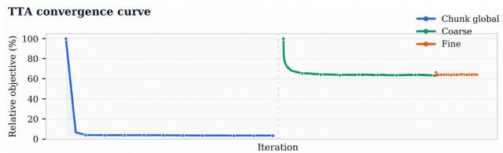  
Figure 4. Convergence of GeoWeaver TTA. The objective decreases rapidly during Stage 2 chunk-level alignment and saturates during Stage 3 refinement.

AUC@30◦. Its depth, confidence, and camera predictions therefore provide reliable priors for long-sequence adaptation.

## 4.3 Main Pipeline Evaluation

Table 2 summarizes results on four long-sequence benchmarks, with per-scene results provided in the supplement. GeoWeaver achieves the lowest average ATE on Tanks and Temples and Mip-NeRF 360, the second-lowest ATE on Virtual KITTI 2 despite one-frame overlap, and the lowest RRE on Oxford Spires. These results demonstrate improved trajectory accuracy and long-range rotational consistency.

Figure 3 further shows that competing chunk-wise methods produce discontinuities or misaligned structures at chunk boundaries, whereas GeoWeaver preserves local GPM detail within a coherent global reconstruction. Additional qualitative results, CDF analysis, and convergence curves are provided in the supplementary material below.

Convergence and eficiency. GeoWeaver’s TTA reduces the objective by 50% within the first 100 chunk-alignment iterations and approaches convergence after approximately 440 iterations. Chunk-level alignment removes most pose and scale inconsistencies before frame-level refinement, while medianerror-based stopping avoids unnecessary updates. GPM inference, edge matching, and residual evaluation are GPUparallelizable, supporting eficient long-sequence optimization.

## 4.4 Ablation Studies

We analyze the hierarchical TTA procedure and its compatibility with diferent Geometric Prior Models on Tanks and Temples.

Hierarchical adaptation. Table 7 separates the role of each TTA stage. Sequential initialization provides a connected but drift-prone layout. Chunk-level adaptation then removes most large cross-chunk discrepancies, yielding the largest ATE reduction. Frame-level adaptation makes a smaller but decisive correction to camera poses, afine depth, and focal corrections, increasing AUC@3◦ from 43.8 to 72.9. These trends support the coarse-to-fine adaptation order rather than treating all geometric variables as equally reliable from the start.

<table><tr><td>Seq. Init.</td><td>Chunk Align.</td><td>Frame Refine</td><td>ATE↓</td><td>AUC↑</td></tr><tr><td>√</td><td>一</td><td>一</td><td>0.674</td><td>24.4</td></tr><tr><td>√</td><td>√</td><td></td><td>0.075</td><td>43.8</td></tr><tr><td>√</td><td>√</td><td>√</td><td>0.023</td><td>72.9</td></tr></table>

Table 7. Ablation of the three-stage Test-Time Adaptation procedure on Tanks and Temples. AUC denotes AUC@3◦. The full configuration progressively introduces sequential initialization, chunk-level adaptation, and frame-level adaptation. Highlighted ablation results are shown in bold.
<table><tr><td>Prior Model</td><td>ATE↓</td><td>AUC↑</td></tr><tr><td>Scal3R [42]</td><td>0.338</td><td>58.1</td></tr><tr><td>Scal3R + TTA</td><td>0.033</td><td>63.6</td></tr><tr><td>DA3 [21]</td><td>0.358</td><td>63.9</td></tr><tr><td>DA3 + TTA</td><td>0.033</td><td>68.5</td></tr><tr><td>GeoWeaver-GPM + TTA</td><td>0.025</td><td>71.3</td></tr></table>

Table 8. Compatibility of Test-Time Adaptation with diferent Geometric Prior Models on Tanks and Temples. AUC denotes AUC@3◦. The same TTA configuration improves multiple prior models without source-specific tuning. Highlighted ablation results are shown in bold.

Geometric prior model compatibility. Applying the same TTA procedure to Scal3R and DA3 substantially reduces ATE and improves AUC. All source models use the identical retrieval graph, RoMa matches, adaptive stopping criteria, and TTA hyperparameters. The consistent gains indicate that TTA exploits geometric information shared across diferent Geometric Prior Models rather than relying on source-specific tuning.

## 5 Conclusions and Limitations

We presented GeoWeaver, a hierarchical framework for longsequence 3D reconstruction that combines a Geometric Prior Model (GPM) with Test-Time Adaptation (TTA). The GPM predicts chunk-wise depth, confidence, and cameras; TTA sequentially initializes the global layout, aligns chunks with Sim(3) transformations, and refines frame poses, depth, and focal calibration. Experiments and ablations validate this coarse-to-fine design across multiple geometric priors.

GeoWeaver incurs additional matching and adaptation cost over feed-forward inference, and currently assumes static scenes and fixed per-camera focal calibration. Extending it to dynamic scenes, rolling shutter, zoom, and real-time operation remains future work. Post-training the GPM with the TTA objective may further improve global consistency and reduce test-time optimization.

## References

Jonathan T. Barron, Ben Mildenhall, Dor Verbin, Pratul P. Srinivasan, and Peter Hedman. Mip-NeRF 360: Unbounded anti-aliased neural radiance fields. In Proceedings of the IEEE/CVF Conference on Computer Vision and Pattern Recognition, pages 5470–5479, 2022.

Yohann Cabon, Naila Murray, and Martin Humenberger. Virtual KITTI 2. arXiv preprint arXiv:2001.10773, 2020.

Carlos Campos, Richard Elvira, Juan J. Gómez Rodríguez, José M. M. Montiel, and Juan D. Tardós. ORB-SLAM3: An accurate opensource library for visual, visual-inertial, and multi-map SLAM. IEEE Transactions on Robotics, 37(6):1874–1890, 2021.

Lin-Zhuo Chen, Jian Gao, Yihang Chen, Ka Leong Cheng, Yipengjing Sun, Liangxiao Hu, Nan Xue, Xing Zhu, Yujun Shen, Yao Yao, and Yinghao Xu. Geometric context transformer for streaming 3D reconstruction. arXiv preprint arXiv:2604.14141, 2026.

Zhuoguang Chen, Minghui Qin, Tianyuan Yuan, Zhe Liu, and Hang Zhao. LONG3R: Long sequence streaming 3D reconstruction. In Proceedings of the IEEE/CVF International Conference on Computer Vision, 2025.

Junyuan Deng, Heng Li, Tao Xie, Weiqiang Ren, Qian Zhang, Ping Tan, and Xiaoyang Guo. Sail-recon: Large sfm by augmenting scene regression with localization. In 2026 International Conference on 3D Vision, 2026.

Kai Deng, Zexin Ti, Jiawei Xu, Jian Yang, and Jin Xie. VGGT-Long: Chunk it, loop it, align it—pushing VGGT’s limits on kilometerscale long RGB sequences. arXiv preprint arXiv:2507.16443, 2025.

Bardienus Pieter Duisterhof, Lojze Zust, Philippe Weinzaepfel, Vincent Leroy, Yohann Cabon, and Jerome Revaud. MASt3R-SfM: A fully integrated solution for unconstrained Structure-from-Motion. In International Conference on 3D Vision, pages 1–10, 2025.

Johan Edstedt, Qiyu Sun, Georg Bökman, Mårten Wadenbäck, and Michael Felsberg. RoMa: Robust dense feature matching. In Proceedings of the IEEE/CVF Conference on Computer Vision and Pattern Recognition, pages 19790–19800, 2024.

Sven Elflein, Qunjie Zhou, and Laura Leal-Taixé. Light3R-SfM: Towards feed-forward structure-from-motion. In Proceedings of the IEEE/CVF Conference on Computer Vision and Pattern Recognition, pages 16774–16785, 2025.

Jakob Engel, Vladlen Koltun, and Daniel Cremers. Direct sparse odometry. IEEE Transactions on Pattern Analysis and Machine Intelligence, 40(3):611–625, 2018.

Xingyi He, Jiaming Sun, Yifan Wang, Sida Peng, Qixing Huang, Hujun Bao, and Xiaowei Zhou. Detector-free structure from motion. In Proceedings of the IEEE/CVF Conference on Computer Vision and Pattern Recognition, pages 21594–21603, 2024.

Sergio Izquierdo and Javier Civera. Optimal transport aggregation for visual place recognition. In Proceedings of the IEEE/CVF Conference on Computer Vision and Pattern Recognition, pages 17658–17668, 2024.

Wonbong Jang, Philippe Weinzaepfel, Vincent Leroy, Lourdes Agapito, and Jerome Revaud. Pow3R: Empowering unconstrained 3D reconstruction with camera and scene priors. In Proceedings of the IEEE/CVF Conference on Computer Vision and Pattern Recognition, pages 1071–1081, 2025.

Haian Jin, Rundi Wu, Tianyuan Zhang, Ruiqi Gao, Jonathan T. Barron, Noah Snavely, and Aleksander Holynski. ZipMap: Linear-time stateful 3D reconstruction via test-time training. In Proceedings of the IEEE/CVF Conference on Computer Vision and Pattern Recognition, 2026.

Nikhil Keetha, Norman Müller, Johannes L. Schönberger, Lorenzo Porzi, Yuchen Zhang, Tobias Fischer, Arno Knapitsch, Duncan Zauss, Ethan Weber, Nelson Antunes, Jonathon Luiten, Manuel Lopez-Antequera, Samuel Rota Bulò, Christian Richardt, Deva Ramanan, Sebastian Scherer, and Peter Kontschieder. MapAnything: Universal feed-forward metric 3D reconstruction. In International Conference on 3D Vision, 2026.

Arno Knapitsch, Jaesik Park, Qian-Yi Zhou, and Vladlen Koltun. Tanks and temples: Benchmarking large-scale scene reconstruction. ACM Transactions on Graphics, 36(4), 2017.

Yushi Lan, Yihang Luo, Fangzhou Hong, Shangchen Zhou, Honghua Chen, Zhaoyang Lyu, Bo Dai, Shuai Yang, Chen Change Loy, and Xingang Pan. STream3R: Scalable sequential 3D reconstruction with causal transformer. arXiv preprint arXiv:2508.10893, 2025.

Vincent Leroy, Yohann Cabon, and Jerome Revaud. MASt3R: Grounding image matching in 3D. In European Conference on Computer Vision, pages 71–91, 2024.

Zizun Li, Jianjun Zhou, Yifan Wang, Haoyu Guo, Wenzheng Chang, Yang Zhou, Haoyi Zhu, Junyi Chen, Chunhua Shen, and Tong He. Wint3r: Window-based streaming reconstruction with camera token pool. In International Conference on Learning Representations, 2026.

Haotong Lin, Sili Chen, Junhao Liew, Donny Y. Chen, Zhenyu Li, Guang Shi, Jiashi Feng, and Bingyi Kang. Depth anything 3: Recovering the visual space from any views. arXiv preprint arXiv:2511.10647, 2025.

Yuzheng Liu, Siyan Dong, Shuzhe Wang, Yingda Yin, Yanchao Yang, Qingnan Fan, and Baoquan Chen. SLAM3R: Real-time dense scene reconstruction from monocular RGB videos. In Proceedings of the IEEE/CVF Conference on Computer Vision and Pattern Recognition, 2025.

Dominic Maggio and Luca Carlone. Vggt-slam 2.0: Real-time dense feed-forward scene reconstruction. In Robotics: Science and Systems, 2026.

Dominic Maggio, Hyungtae Lim, and Luca Carlone. VGGT-SLAM: Dense RGB SLAM optimized on the SL(4) manifold. In Advances in Neural Information Processing Systems, 2025.

Riku Murai, Eric Dexheimer, and Andrew J. Davison. MASt3R-SLAM: Real-time dense SLAM with 3D reconstruction priors. In Proceedings of the IEEE/CVF Conference on Computer Vision and Pattern Recognition, 2025.

Linfei Pan, Daniel Barath, Marc Pollefeys, and Johannes L. Schönberger. GLOMAP: Global Structure-from-Motion revisited. In European Conference on Computer Vision, pages 58–77, 2024.

Zador Pataki, Paul-Edouard Sarlin, Johannes L. Schönberger, and Marc Pollefeys. MP-SfM: Monocular surface priors for robust Structure-from-Motion. In Proceedings ofthe IEEE/CVF Conference on Computer Vision and Pattern Recognition, pages 21891– 21901, 2025.

Weining Ren, Xiao Tan, and Kai Han. Speed3R: Sparse feed-forward 3D reconstruction models. arXiv preprint arXiv:2603.08055, 2026.

Johannes L. Schönberger and Jan-Michael Frahm. Structure-from-Motion revisited. In Proceedings of the IEEE Conference on Computer Vision and Pattern Recognition, 2016.

Cameron Smith, David Charatan, Ayush Tewari, and Vincent Sitzmann. FlowMap: High-quality camera poses, intrinsics, and depth via gradient descent. In International Conference on 3D Vision, 2025.

Chengzhou Tang and Ping Tan. Ba-net: Dense bundle adjustment networks. In International Conference on Learning Representations (ICLR), 2019.

Yifu Tao, Miguel Ángel Muñoz-Bañón, Lintong Zhang, Jiahao Wang, Lanke Frank Tarimo Fu, and Maurice Fallon. The oxford spires dataset: Benchmarking large-scale LiDAR-visual localisation, reconstruction and radiance field methods. International Journal ofRobotics Research, 2025.

Zachary Teed and Jia Deng. DROID-SLAM: Deep visual SLAM for monocular, stereo, and RGB-D cameras. In Advances in Neural Information Processing Systems, 2021.

Hengyi Wang and Lourdes Agapito. Spann3R: 3D reconstruction with spatial memory. In International Conference on 3D Vision, 2025.

Hengyi Wang and Lourdes Agapito. AMB3R: Accurate feed-forward metric-scale 3D reconstruction with backend. In Proceedings of the IEEE/CVF Conference on Computer Vision and Pattern Recognition, 2026.

Jianyuan Wang, Nikita Karaev, Christian Rupprecht, and David Novotny. VGGSfM: Visual geometry grounded deep Structurefrom-Motion. In Proceedings of the IEEE/CVF Conference on Computer Vision and Pattern Recognition, pages 21686–21697, 2024a.

Jianyuan Wang, Minghao Chen, Nikita Karaev, Andrea Vedaldi, Christian Rupprecht, and David Novotny. VGGT: Visual geometry grounded transformer. In Proceedings of the IEEE/CVF Conference on Computer Vision and Pattern Recognition, pages 5294–5306, 2025a.

Qianqian Wang, Yifei Zhang, Aleksander Holynski, Alexei A. Efros, and Angjoo Kanazawa. CUT3R: Continuous 3D perception model with persistent state. In Proceedings of the IEEE/CVF Conference on Computer Vision and Pattern Recognition, pages 10510–10522, 2025b.

Shuzhe Wang, Vincent Leroy, Yohann Cabon, Boris Chidlovskii, and Jerome Revaud. DUSt3R: Geometric 3D vision made easy. In Proceedings of the IEEE/CVF Conference on Computer Vision and Pattern Recognition, pages 20697–20709, 2024b.

Yifan Wang, Jianjun Zhou, Haoyi Zhu, Wenzheng Chang, Yang Zhou, Zizun Li, Junyi Chen, Jiangmiao Pang, Chunhua Shen, and Tong He. π3: Scalable permutation-equivariant visual geometry learning. arXiv preprint arXiv:2507.13347, 2025c.

Tong Wei, Giorgos Tolias, Jiri Matas, and Daniel Barath. Globalaware edge prioritization for pose graph initialization. In Proceedings of the IEEE/CVF Conference on Computer Vision and Pattern Recognition, 2026.

Tao Xie, Peishan Yang, Yudong Jin, Yingfeng Cai, Wei Yin, Weiqiang Ren, Qian Zhang, Wei Hua, Sida Peng, Xiaoyang Guo, and Xiaowei Zhou. Scal3R: Scalable test-time training for large-scale 3D reconstruction. In Proceedings ofthe IEEE/CVF Conference on Computer Vision and Pattern Recognition, 2026.

Jianing Yang, Alexander Sax, Kevin J. Liang, Mikael Henaf, Hao Tang, Ang Cao, Joyce Chai, Franziska Meier, and Matt Feiszli. Fast3R: Towards 3D reconstruction of1000+ images in one forward pass. In Proceedings ofthe IEEE/CVF Conference on Computer Vision and Pattern Recognition, pages 21924–21935, 2025.

Junyi Zhang, Charles Herrmann, Junhwa Hur, Chen Sun, Ming-Hsuan Yang, Forrester Cole, Trevor Darrell, and Deqing Sun. LoGeR: Long-context geometric reconstruction with hybrid memory. arXiv preprint arXiv:2603.03269, 2026.

Shunkai Zhou, Zike Yan, Fei Xue, Dong Wu, Yuchen Deng, and Hongbin Zha. Online3R: Online learning for consistent sequential reconstruction based on geometry foundation model. In Proceedings of the IEEE/CVF Conference on Computer Vision and Pattern Recognition, 2026.

Shengjie Zhu, Ahmed Abdelkader, Mark J. Matthews, Xiaoming Liu, and Wen-Sheng Chu. Marginalized bundle adjustment: Multiview camera pose from monocular depth estimates. arXiv preprint arXiv:2602.18906, 2026.

Dong Zhuo, Wenzhao Zheng, Jiahe Guo, Yuqi Wu, Jie Zhou, and Jiwen Lu. Streaming 4D visual geometry transformer. arXiv preprint arXiv:2507.11539, 2025.

## A Geometric Prior Model Details

## A.1 Training Data

We train the Geometric Prior Model (GPM) on a mixture of real and synthetic multi-view datasets: Hypersim, Scan-Net, ScanNet++, MegaSynth, ASE, MVSSynth, Unreal4K, BlendedMVS, DynamicStereo, TartanAir, and HM3D. The mixture is designed to expose the model to complementary scene statistics rather than a single capture domain. It includes real RGB-D scans, high-fidelity synthetic interiors, procedurally generated geometry, wide-baseline multi-view imagery, dynamic content, and challenging camera trajectories. Table 9 summarizes its composition.

For each source, RGB images form the common model input. We convert the available depth, camera intrinsics, camera extrinsics, and reconstructed geometry into the unified localdepth, depth-induced global-geometry, confidence-aware geometry, and relative-pose supervision described in the main paper. Validity masks are inherited from the source annotations so that missing or undefined geometry does not contribute to the loss. Multi-view clips are sampled from views belonging to the same scene or sequence, preserving their calibrated geometric relationships.

The data sources are complementary. Real captures reduce the synthetic-to-real appearance gap, whereas synthetic datasets provide dense and complete supervision that is dificult to obtain from physical sensors. Indoor scans emphasize clutter, occlusion, and room-scale structure; procedural and MVS datasets expand the range of layouts, baselines, and scene scales; and dynamic or navigation-oriented sequences expose the model to nontrivial temporal variation and camera motion. Together, this mixture supports a GPM that must remain stable across indoor, outdoor, synthetic, and long-sequence reconstruction benchmarks.

## A.2 Two-Stage Training Strategy

We progressively increase input diversity rather than expose the model to all sequence lengths from the outset. In the first stage, every sample contains four frames, and we train on eight NVIDIA H20 GPUs for 100K iterations. This fixed-length stage establishes stable local geometry and camera predictions.

In the second stage, we train for a further 100K iterations with variable-length clips containing 2–16 frames; each GPU receives at most 16 input frames per iteration. This stage exposes the model to the view counts and baselines that arise during chunked inference. The complete procedure therefore uses 200K iterations on eight H20 GPUs: first to stabilize local predictions, and then to make those predictions robust to varying chunk configurations.

Table 9. Training datasets grouped by data domain.
<table><tr><td>Data domain</td><td>Datasets</td></tr><tr><td>Real indoor</td><td>ScanNet, ScanNet++, HM3D</td></tr><tr><td>Synthetic indoor</td><td>Hypersim, ASE</td></tr><tr><td>Procedural</td><td>MegaSynth</td></tr><tr><td>Multi-view / stereo</td><td>MVSSynth, Unreal4K, BlendedMVS</td></tr><tr><td>Dynamic / motion</td><td>DynamicStereo, TartanAir</td></tr></table>

## A.3 Optimization

We optimize the model with AdamW and use separate learning rates for the shared encoder and prediction heads. The encoder learning rate is $1 \times 1 0 ^ { - 6 }$ , while all task heads use $1 \times 1 0 ^ { - 5 }$ Both stages use a cosine learning-rate schedule (CosineLR). The lower encoder rate preserves the pretrained visual representation, whereas the higher head rate allows the depth, confidence, and camera heads to adapt to the multi-dataset geometric supervision.

## B Test-Time Adaptation Details

This section specifies the fixed TTA settings that assemble GPM priors into a global reconstruction. TTA applies three stages with increasing degrees of freedom: sequential initialization, global chunk-level alignment, and coarse-to-fine frame-level refinement.

## B.1 Optimization Settings

TTA constructs a candidate graph from temporal neighbors and SALAD-retrieved non-local pairs. GEP retains a compact connected subset, and RoMa provides the dense correspondences used in all three stages. Stage 1 performs robust, confidenceweighted pairwise Sim(3) estimation on the top 50% most confident correspondences to initialize the chunk layout. In Stage 2, the first chunk is fixed to remove gauge freedom and the remaining chunk transformations are optimized with Adam at a learning rate of $1 0 ^ { - 2 }$ . This optimization is capped at 5,000 iterations and uses the CDF-based 2D reprojection objective and a 3D consistency term with weight 2.0 and maximum distance 0.8. The resulting chunk similarities initialize the world-to-camera poses and globally scaled depths for Stage 3.

Stage 3 frame-level refinement uses Adam with a learning rate of $1 0 ^ { - 4 }$ . Coarse refinement operates on view-centered subgraphs using a CDF range of 15 pixels, 250 bins, and a smoothing bandwidth of 2. Fine refinement then jointly optimizes the complete selected view graph. Both phases optimize frame poses and afine depth, with a 3D consistency term ofweight 1.0 and maximum distance 0.1. For uncalibrated sequences, focal corrections are shared by frames from the same physical-camera group; for calibrated sequences, the initial focal lengths remain fixed.

Table 10. Default hyperparameters of GeoWeaver TTA.
<table><tr><td>Stage</td><td>Parameter</td><td>Value</td></tr><tr><td>Stage 1: sequential ini- Confidence retention tialization</td><td></td><td>50%</td></tr><tr><td>Stage 2: global chunk Learning rate alignment</td><td></td><td> $1 0 ^ { - 2 }$ </td></tr><tr><td></td><td>Maximum iterations</td><td>5,000</td></tr><tr><td></td><td>3D range / weight</td><td>0.8 / 2.0</td></tr><tr><td>Stage 3: coarse refine- CDF range / bins ment</td><td></td><td>15 / 250</td></tr><tr><td></td><td>Smoothing bandwidth</td><td>2</td></tr><tr><td>Stage 3: fine refinement Learning rate</td><td></td><td> $1 0 ^ { - 4 }$ </td></tr><tr><td></td><td>3D range / weight</td><td>0.1 / 1.0</td></tr><tr><td>Confidence- and</td><td>Focal correction</td><td>Camera-group sh</td></tr><tr><td>consistency-aware</td><td></td><td></td></tr><tr><td>sampling (CCAS)</td><td>Confidence threshold</td><td>0.5</td></tr><tr><td></td><td>Depth-consistency threshold</td><td>0.2</td></tr><tr><td></td><td>Maximum samples per pair</td><td>10,000</td></tr></table>

Table 10 summarizes the default settings shared across all datasets and source priors.

†Enabled only for uncalibrated sequences; calibrated focal lengths remain fixed.

## B.2 Confidence- and Consistency-Aware Sampling and Early Stopping

Confidence- and Consistency-Aware Sampling (CCAS) selects correspondences that are jointly supported by matcher confidence and predicted geometry. We use a relative confidence threshold of 0.5 and a depth-consistency threshold of 0.2. When this strict filtering leaves too few constraints to connect the graph, the depth-consistency threshold is progressively relaxed rather than discarding the pair. The sampling budget is adjusted to graph size and available GPU memory, with at most 10,000 correspondences retained per image pair.

All iterative stages use adaptive stopping based on the median reprojection error. Terminating once this robust statistic stabilizes avoids spending a fixed maximum iteration budget on already converged sequences while preserving additional updates for dificult ones.

## B.3 Residual Distributions

Figure 5 makes the efect of the final objective explicit. For both 2D reprojection errors and 3D metric distances, optimization moves more high-confidence correspondences into the lowresidual regime: the CDF rises earlier and the PDF concentrates closer to zero. This is the desired behavior of the CDF-style objective, which rewards improving the inlier distribution rather than fitting a small set of already easy matches.

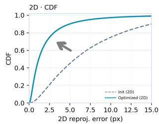

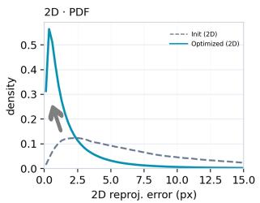

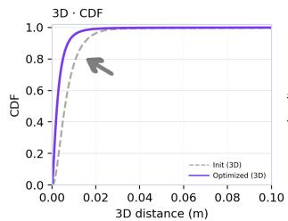

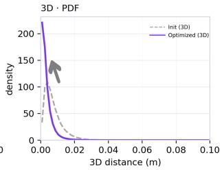

Figure 5. Residual distributions before and after optimization. The optimized 2D reprojection and 3D distance residuals concentrate closer to zero, producing steeper CDF curves and sharper PDF peaks.  
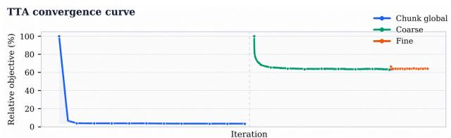  
Figure 6. Convergence curve of GeoWeaver TTA. The objective drops rapidly during Stage 2 chunk-level alignment and then saturates during Stage 3 refinement.

## B.4 Convergence and Eficiency

Figure 6 demonstrates the rapid convergence of hierarchical TTA. The objective decreases by 50% within the first 100 chunk-alignment iterations and approaches convergence after approximately 440 iterations. Since most large-scale scale and pose errors are removed during this low-dimensional chunklevel optimization, the subsequent coarse and fine refinement stages require only limited additional updates.

This convergence behavior substantially reduces the efective optimization budget of TTA. Together with the adaptive stopping criterion, which terminates each stage once the median reprojection error stabilizes, GeoWeaver avoids unnecessary iterations on already well-aligned sequences. Moreover, chunk-wise GPM inference, dense matching over selected graph edges, and correspondence-residual evaluation can all be executed in parallel on GPUs. Consequently, TTA achieves eficient global refinement despite optimizing long sequences and a global view graph.

## C Dataset and Evaluation Protocol

This section fixes the alignment and metric conventions used throughout the paper. In particular, all trajectory metrics use one sequence-level Sim(3) alignment; no per-frame or per-

chunk realignment is applied, so sequence-level drift remains reflected in the reported metrics.

## C.1 Trajectory Alignment

For a world-to-camera pose $\mathbf { T } _ { i } = \left[ \mathbf { R } _ { i } \mid \mathbf { t } _ { i } \right]$ , its camera center is

$$
\mathbf { c } _ { i } = - \mathbf { R } _ { i } ^ { \top } \mathbf { t } _ { i } .\tag{25}
$$

Because monocular reconstruction is defined up to a global similarity transformation, we align the predicted camera centers to the reference centers using Umeyama alignment:

$$
( s , \mathbf { R } _ { a } , \mathbf { t } _ { a } ) = \arg \operatorname* { m i n } _ { s , \mathbf { R } , \mathbf { t } } \sum _ { i = 1 } ^ { N } \left\| s \mathbf { R } \hat { \mathbf { c } } _ { i } + \mathbf { t } - \mathbf { c } _ { i } ^ { * } \right\| _ { 2 } ^ { 2 } .\tag{26}
$$

The aligned camera centers and world-to-camera rotations are

$$
\bar { \mathbf { c } } _ { i } = s \mathbf { R } _ { a } \hat { \mathbf { c } } _ { i } + \mathbf { t } _ { a } , \qquad \bar { \mathbf { R } } _ { i } = \hat { \mathbf { R } } _ { i } \mathbf { R } _ { a } ^ { \top } .\tag{27}
$$

A single Sim(3) transformation is estimated for each complete sequence; no per-frame alignment is performed.

## C.2 Absolute Trajectory Error

We first compute the translation error of every aligned camera center:

$$
e _ { t , i } = \lVert \bar { \mathbf { c } } _ { i } - \mathbf { c } _ { i } ^ { * } \rVert _ { 2 } .\tag{28}
$$

The ATE reported in the main paper is its root-mean-square value:

$$
\mathrm { A T E } = \sqrt { \frac { 1 } { N } \sum _ { i = 1 } ^ { N } e _ { t , i } ^ { 2 } } .\tag{29}
$$

ATE is measured in metres, and lower is better.

## C.3 Rotation Error

For each matched frame, we compute the geodesic error between the aligned and reference rotations:

$$
e _ { R , i } = \frac { 1 8 0 } { \pi } \operatorname { a r c c o s } \left[ { \displaystyle { \mathrm { c l i p } \left( \frac { { \mathrm { t r } \left( { { { \bar { \bf R } } } _ { i } } ( { { \bf R } _ { i } ^ { * } } ) ^ { \top } \right)}  - 1 } \right)} { 2 } , - 1 , 1  }  \right] .\tag{30}
$$

The RRE values in the main tables correspond to the arithmetic mean

$$
\mathrm { R R E } = \frac { 1 } { N } \sum _ { i = 1 } ^ { N } e _ { R , i } ,\tag{31}
$$

reported in degrees. Thus, RRE denotes the mean rotation registration error after sequence-level Sim(3) alignment rather than consecutive-frame RPE.

## C.4 Pairwise Pose AUC

Pose AUC follows the IMC2021 evaluation protocol. For every evaluated ordered pair (i, j), we construct the relative world-to-camera transformations

$$
\begin{array} { r } { \mathbf { T } _ { i j } ^ { * } = \mathbf { T } _ { j } ^ { * } ( \mathbf { T } _ { i } ^ { * } ) ^ { - 1 } , \qquad \bar { \mathbf { T } } _ { i j } = \bar { \mathbf { T } } _ { j } \bar { \mathbf { T } } _ { i } ^ { - 1 } . } \end{array}\tag{32}
$$

The pairwise rotation error is

$$
e _ { R , i j } = \frac { 1 8 0 } { \pi } \operatorname { a r c c o s } \left[ { \mathrm { c l i p } \left( \frac { { \mathrm { t r } \left( \mathbf { R } _ { i j } ^ { * } \bar { \mathbf { R } } _ { i j } ^ { \top } \right) - 1 } } { 2 } , - 1 , 1 \right) } \right] .\tag{33}
$$

Following the IMC protocol, the translation error is invariant to the sign of the translation direction:

$$
e _ { t , i j } = \frac { 1 8 0 } { \pi } \operatorname { a r c c o s } \left( \left| \frac { ( \mathbf { t } _ { i j } ^ { * } ) ^ { \top } \bar { \mathbf { t } } _ { i j } } { \| \mathbf { t } _ { i j } ^ { * } \| _ { 2 } \| \bar { \mathbf { t } } _ { i j } \| _ { 2 } } \right| \right) .\tag{34}
$$

The final pairwise pose error is

$$
e _ { i j } = \operatorname* { m a x } ( e _ { R , i j } , e _ { t , i j } ) .\tag{35}
$$

Given the empirical recall curve

$$
P ( \tau ) = \frac { 1 } { \vert \mathcal { E } _ { \mathrm { e v a l } } \vert } \sum _ { ( i , j ) \in \mathcal { E } _ { \mathrm { e v a l } } } \mathtt { I } [ e _ { i j } \le \tau ] ,\tag{36}
$$

we compute

$$
\operatorname { A U C @ } \theta = \frac { 1 } { \theta } \int _ { 0 } ^ { \theta } P ( \tau ) d \tau .\tag{37}
$$

The implementation returns values in [0, 1], which are multiplied by 100 for presentation in the main tables. We report AUC@3◦ for the full pipeline. All ordered pairs with i $\neq j$ are used when their number does not exceed 20,000; otherwise, 20,000 ordered pairs are sampled without replacement using a fixed random seed of 42.

## C.5 Depth Metrics

Standalone GPM depth is evaluated over the valid-pixel set Ω in each camera coordinate frame. Given predicted and reference depths $\hat { d } ( { \bf u } )$ and $d ^ { * } ( \mathbf { u } )$ , we report

$$
\mathrm { A b s R e l } = \frac { 1 } { | \Omega | } \sum _ { \mathbf { u } \in \Omega } \frac { | \hat { d } ( \mathbf { u } ) - d ^ { * } ( \mathbf { u } ) | } { d ^ { * } ( \mathbf { u } ) } ,\tag{38}
$$

$$
\mathrm { S q R e l } = \frac { 1 } { | \Omega | } \sum _ { { \bf u } \in \Omega } \frac { ( \hat { d } ( { \bf u } ) - d ^ { * } ( { \bf u } ) ) ^ { 2 } } { d ^ { * } ( { \bf u } ) } .\tag{39}
$$

Invalid reference pixels and non-positive predicted depths are excluded.

Oxford Spires:observatory-01

Oxford Spires:keble-04

## D Additional Qualitative Results

We provide additional visualizations across diverse indoor, outdoor, and large-scale scenes. The following full-width composite figure jointly visualizes the reconstructed point clouds and estimated camera poses for multiple sequences. This compact overview facilitates direct inspection of geometric completeness, trajectory consistency, and long-range drift across diferent scene types.

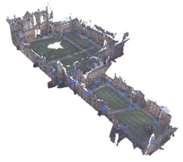

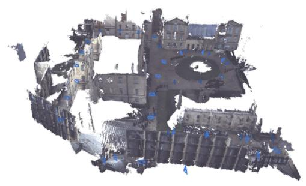

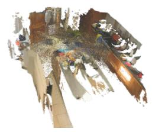  
Mipnerf360:counter

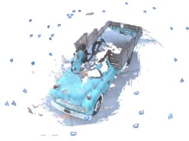  
T&T : Caterpillar

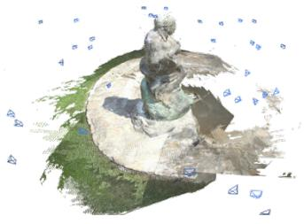  
T&T : Ignatius

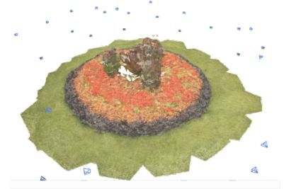

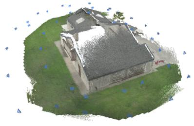  
T&T : Barn

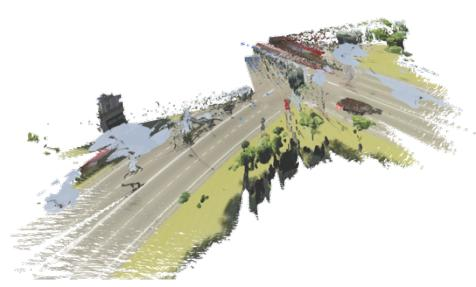  
VKitti2:scene18

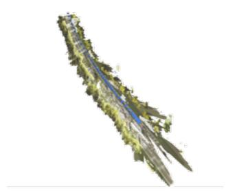  
VKitti2:scene20

Figure 7. Additional qualitative results across diverse scenes. For each scene, we visualize the reconstructed point cloud together with the estimated camera poses.