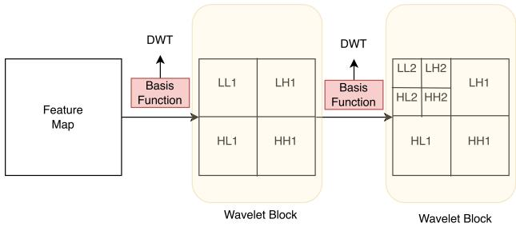
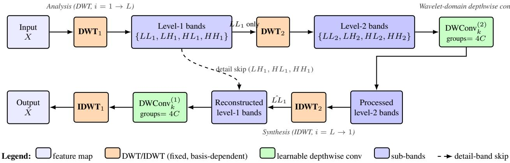

# IS HAAR ENOUGH? EXPLORING SYMLETS AND COIFLETS FOR WAVELET CONVOLUTION LAYERS

Md Rifat Ur Rahman

Bangladesh Univeristy of Engineering and Technology

## ABSTRACT

Wavelet convolution layers have recently emerged as an efficient mechanism for enlarging receptive fields through multiresolution analysis, but prior work has fixed the wavelet basis to Haar or Daubechies at a chosen decomposition depth, leaving open whether a different basis can shift the underlying efficiency frontier. We identify and characterize a previously unexplored trade-off in this setting: bases with stronger approximation properties (longer filters) can reduce the decomposition depth required for competitive accuracy, yielding a net reduction in parameters and FLOPs despite higher perlevel transform cost. We formalize this as an F-vs.-L tradeoff (filter length vs. decomposition levels) and study it systematically across Haar, Daubechies, Symlets, and Coiflets under controlled architectures and budgets. On image classification (CIFAR-10, ImageNet-1K) and semantic segmentation (Cityscapes), Coiflet-based wavelet convolutions match Haar at deeper levels with approximately 32% fewer additional parameters and 33% fewer additional FLOPs, providing a concrete and actionable design choice for practitioners building wavelet-based architectures. Code will be released.

Index Terms— Wavelts, FFT, CNNs, ViT, Haar, Symlets, Coiflets

## 1. INTRODUCTION

Convolutional neural networks (CNNs) have been the default backbone for many computer vision tasks since AlexNet [1], with strong subsequent designs such as VGG [2] and ResNet [3] A key strength of CNNs is their inductive bias toward local processing: convolution and pooling efficiently capture finegrained, high-frequency patterns (e.g., edges and textures). However, modeling long-range interactions typically requires architectural choices that enlarge the effective receptive field, such as deeper networks, multi-stage hierarchies, dilation, or large kernels, which can increase compute and/or parameters.

Vision Transformers (ViTs) [4] address long-range interaction more directly by using self-attention [5], enabling global token mixing. Nevertheless, attention-based models often incur higher computational and memory costs, motivating a large body of work on efficient backbones and token mixers. On the CNN side, lightweight architectures such as

MobileNet [6] and EfficientNet [7] reduce compute via depthwise separable and inverted bottleneck designs, but the core local nature of convolution remains. On the token-mixing side, large-kernel designs aim to approximate long-range interactions with convolutional operators; for example, Visual Attention Network (VAN) introduces Large Kernel Attention (LKA) as a lightweight mechanism for long-range dependency modeling [8].

Frequency-domain token mixers provide another direction: GFNet replaces attention with Fourier-domain global filtering via FFT and inverse FFT [9], AFFNet proposes adaptive frequency filters as efficient token mixers [10], and Fourier Neural Operators (FNO) learn global convolution operators in the Fourier domain for operator learning and related vision tasks [11]. While these Fourier-based approaches provide global mixing efficiently, Fourier-domain filtering is inherently global in spatial support, and in practice is often paired with spatial/local processing (e.g., convolutional stems or hybrid blocks) to retain fine-grained locality.

In parallel, wavelet transforms offer a principled multiresolution representation that jointly captures spatial and frequency information [12]. In a 2D discrete wavelet transform (2D-DWT), each level decomposes a feature map into four sub-bands: a low-frequency approximation band (LL) and three high-frequency detail bands (LH/HL/HH). By iteratively decomposing the LL band, multilevel DWT provides progressively coarser representations while preserving global structure at reduced spatial resolution. This motivates wavelet-based architectures such as WaveMix [13] and Wave-ViT [14], as well as wavelet-inspired attention variants (e.g., multiscale wavelet attention) [15].

Recently, WTConv introduced a wavelet convolution layer as a plug-in replacement for depthwise convolution to obtain large receptive fields with favorable scaling [16]. WTConv applies multilevel 2D-DWT, performs depthwise convolution in the wavelet domain across sub-bands, and reconstructs via inverse DWT. The original formulation primarily uses the Haar basis (db1) and reports limited gains when switching to db2/db3 at afixed decomposition depth [16]. We argue that this fixed-depth comparison conceals the actual design space: because longer-filter bases provide stronger approximation in the low-frequency (LL) branch, the depth required to capture global context is itself a function of the basis. This raises a natural and, to our knowledge, previously unstudied question: when the basis and the number of decomposition levels are co-optimized, can alternative bases provide a strictly better accuracy–complexity frontier than Haar?

In this paper, we revisit wavelet basis selection for wavelet convolution layers under this lens. Our choice of bases is hypothesis-driven, not exhaustive: we select Symlets and Coiflets as widely used orthogonal wavelet families beyond Haar/Daubechies [17] because they target the two properties most relevant to the depth question. Symlets are nearsymmetric, which reduces phase distortion and can improve edge alignment across scales. Coiflets have additional vanishing moments on the scaling function and are known to yield smoother LL representations, which we hypothesize should reduce the depth needed to summarize global context. Both predictions are testable in our setup, and our experiments confirm them for Coiflets.

We evaluate basis choices on image classification (CIFAR-10, ImageNet-1K) and semantic segmentation (Cityscapes) under controlled architectures, and report accuracy alongside model parameters and FLOPs.

Our main contributions are:

• We identify a previously unexplored filter-length vs. decomposition-depth $( F \mathrm { - v s . - } L )$ trade-off in wavelet convolution layers. Prior work fixed the depth and varied only the basis; we show that allowing both to vary changes the qualitative conclusion of which basis is preferable.

• We give a hypothesis-driven analysis of Symlets and Coiflets as candidates for this trade-off, motivated by their symmetry and approximation-order properties respectively, and confirm the Coiflet hypothesis empirically.

• Across classification and segmentation, we show that Coiflet-based WTConv matches deeper Haar configurations with approximately 32% fewer additional parameters and 33% fewer additional FLOPs, providing a concrete and actionable design choice for waveletbased architectures.

## 2. METHODOLOGY

We study whether the wavelet basis used inside wavelet convolution layers can be improved beyond commonly used Haar/Daubechies choices. Our operator follows a transform– process–reconstruct pipeline: a feature map is decomposed by a multi-level 2D discrete wavelet transform (2D-DWT), filtered in the wavelet domain using lightweight depthwise convolution, and reconstructed by inverse DWT (IDWT). The two main knobs in this work are (i) the chosen wavelet basis (fixed analysis/synthesis filters) and (ii) the number of decomposition levels L. We evaluate the resulting tradeoff in accuracy vs. computational complexity (FLOPs) and parameters.

## 2.1. Wavelet Transform

Let the input feature map be

$$
X \in \mathbb { R } ^ { B \times C \times H \times W } .\tag{1}
$$

A one-level 2D-DWT decomposes X into four criticallysampled sub-bands:

$$
( X _ { L L } , X _ { L H } , X _ { H L } , X _ { H H } ) = \mathrm { { D W T } } ( X ) ,\tag{2}
$$

with each sub-band having half spatial resolution:

Where, $X _ { \bullet } ~ \in ~ \mathbb { R } ^ { B \times \breve { C } \times \frac { H } { 2 } \times \frac { W } { 2 } }$ . For implementation, we pack the four sub-bands along channels:

$$
Y ^ { ( 1 ) } = \mathrm { P a c k } \Big ( X _ { L L } ^ { ( 1 ) } , X _ { L H } ^ { ( 1 ) } , X _ { H L } ^ { ( 1 ) } , X _ { H H } ^ { ( 1 ) } \Big ) ,\tag{3}
$$

Where, $Y ^ { ( 1 ) } \in \mathbb { R } ^ { B \times 4 C \times \frac { H } { 2 } \times \frac { W } { 2 } }$ . A multi-level pyramid is obtained by recursively decomposing only the approximation band:

$$
\left( X _ { L L } ^ { ( i ) } , X _ { L H } ^ { ( i ) } , X _ { H L } ^ { ( i ) } , X _ { H H } ^ { ( i ) } \right) = \mathrm { D W T } \left( X _ { L L } ^ { ( i - 1 ) } \right) , \quad i = 2 , \dots , L .\tag{4}
$$

  
Fig. 1. Two-level 2D-DWT decomposition used in our wavelet convolution layer. The first level decomposes the feature map into $\left( L L _ { 1 } , L H _ { 1 } , H L _ { 1 } , H H _ { 1 } \right)$ , and the second level further decomposes only $L L _ { 1 }$ into $\left( L L _ { 2 } , L H _ { 2 } , H L _ { 2 } , H H _ { 2 } \right)$ We evaluate alternative wavelet bases by replacing the fixed analysis/synthesis filter banks.

Reconstruction uses the inverse transform:

$$
X _ { L L } ^ { ( i - 1 ) } = \mathrm { I D W T } \Big ( X _ { L L } ^ { ( i ) } , X _ { L H } ^ { ( i ) } , X _ { H L } ^ { ( i ) } , X _ { H H } ^ { ( i ) } \Big ) ,\tag{5}
$$

and is applied level-by-level from $i = L$ down to $i = 1$

## 2.2. Wavelet Basis Selection

A wavelet basis is defined by fixed 1D analysis filters: a lowpass filter $h _ { 0 }$ and a high-pass filter $h _ { 1 }$ (with matching synthesis filters used in IDWT). For reproducibility, we report the

Table 1. 1D analysis filter taps used in our 2D-DWT. The 2D sub-band filters are formed via outer products in Eq. (6). Coefficients are taken from a standard wavelet library for reproducibility [18].
<table><tr><td>Family</td><td>Filter</td><td>Coefficients</td></tr><tr><td rowspan="2">Haar (db1)</td><td> $\overline { { h _ { 0 } } }$ </td><td> $\overline { { [ \frac { 1 } { \sqrt { 2 } } , ~ \frac { 1 } { \sqrt { 2 } } ] } }$ </td></tr><tr><td> $h _ { 1 }$ </td><td> $\dot { - } \frac { 1 } { \sqrt { 2 } } , \dot { \frac { 1 } { \sqrt { 2 } } } ]$ </td></tr><tr><td rowspan="2">Daubechies (db2)</td><td> $h _ { \mathrm { 0 } }$ </td><td>[-0.12940952, 0.22414387, 0.83651630, 0.48296291]</td></tr><tr><td> $h _ { 1 }$ </td><td>[-0.48296291, 0.83651630, -0.22414387, -0.12940952]</td></tr><tr><td rowspan="2">Daubechies (db3)</td><td> $h _ { \mathrm { 0 } }$ </td><td>[0.03522629, -0.08544127, -0.13501102, 0.45987750, 0.80689151, 0.33267055]</td></tr><tr><td> $h _ { 1 }$ </td><td>-0.33267055, 0.80689151, -0.45987750, -0.13501102, 0.08544127, 0.03522629]</td></tr><tr><td rowspan="2">Symlet (sym2)</td><td> $h _ { \mathrm { 0 } }$ </td><td>-0.12940952, 0.22414387, 0.83651630, 0.48296291]</td></tr><tr><td> $h _ { 1 }$ </td><td>[-0.48296291, 0.83651630, -0.22414387, -0.12940952]</td></tr><tr><td rowspan="2">Symlet (sym3)</td><td> $h _ { \mathrm { 0 } }$ </td><td>[0.03522629, -0.08544127, -0.13501102, 0.45987750, 0.80689151, 0.33267055]</td></tr><tr><td> $h _ { 1 }$ </td><td>[-0.33267055, 0.80689151, -0.45987750, -0.13501102, 0.08544127, 0.03522629]</td></tr><tr><td rowspan="2">Coiflet (coif1)</td><td> $h _ { \mathrm { 0 } }$ </td><td>[-0.01565573, -0.07273262, 0.38486485, 0.85257202, 0.33789766, -0.07273262]</td></tr><tr><td> $h _ { 1 }$ </td><td>[0.07273262, 0.33789766, -0.85257202, 0.38486485, 0.07273262, -0.01565573]</td></tr></table>

exact analysis taps used in this work in Table 1 (from a standard wavelet library [18]).

Because the 2D-DWT is separable, the four 2D analysis filters are formed by outer products of the 1D filters:

$$
f _ { L L } = h _ { 0 } \otimes h _ { 0 } , ~ f _ { L H } = h _ { 0 } \otimes h _ { 1 } , ~ f _ { H L } = h _ { 1 } \otimes h _ { 0 } , ~ f _ { H H } = h _ { 1 } \otimes h _ { 1 } , ~\tag{6}
$$

and each sub-band is produced by a depthwise convolution with stride 2 (critical sampling), consistent with common wavelet-convolution implementations.

Haar (db1). Haar provides the shortest support $( F \ : = \ : 2 )$ and thus the lowest transform overhead per level. It yields a coarse, piecewise-constant approximation in the LL band, making it a strong efficiency baseline.

Daubechies (dbN). Daubechies wavelets are compactly supported orthogonal wavelets that increase the number of vanishing moments with minimal support length $( F = 2 N )$ . This typically improves approximation quality and frequency separation relative to Haar, at the cost of longer filters and higher per-level transform overhead. We include db2 and db3 as representative longer-support baselines (Table 1).

Symlets (symN). Symlets are orthogonal wavelets designed to be more symmetric than standard Daubechies filters while retaining compact support. Greater symmetry is commonly associated with reduced phase distortion and improved edge alignment across scales. We evaluate sym2 and sym3 (Table 1) as symmetry-oriented alternatives within the same general family of compactly supported orthogonal wavelets.

Coiflets (coifN). Coiflets are compactly supported orthogonal wavelets with strong approximation properties; empirically they often yield smoother low-frequency (LL) representations and a cleaner separation between approximation and detail components. This can reduce the need for deeper decompositions to capture global context. We evaluate coif1 (Table 1) as a representative Coiflet basis.

Basis–level trade-off. Given the taps in Table 1, all 2D subband filters are obtained deterministically via Eq. (6). Basis selection changes the filter length F (support) and therefore the per-level DWT/IDWT cost, while potentially reducing the required decomposition depth L to reach a target accuracy. Our experiments quantify this $\scriptstyle { F \mathrm { - v s . - } L }$ trade-off by reporting accuracy together with FLOPs and parameters across bases and decomposition levels.

## 2.3. Wavelet Convolution Layer

We define the wavelet convolution layer as a sequence of operations:

$$
X \ { \xrightarrow { \ { \mathrm { D W T } } \ } } \ \{ Y ^ { ( i ) } \} _ { i = 1 } ^ { L } { \xrightarrow { \ { \mathrm { D W C o n v } } \ } } \{ Z ^ { ( i ) }  \} _ { i = 1 } ^ { L } { \xrightarrow { \ { \mathrm { I D W T } } \ } } { \hat { X } } .\tag{7}
$$

At each level i, we pack the four sub-bands into

$$
\begin{array} { r } { Y ^ { ( i ) } \in \mathbb { R } ^ { B \times 4 C \times \frac { H } { 2 ^ { i } } \times \frac { W } { 2 ^ { i } } } . } \end{array}\tag{8}
$$

We then apply depthwise convolution in the wavelet domain:

$$
\begin{array} { r } { Z ^ { ( i ) } = \mathrm { D W C o n v } _ { k } ^ { ( i ) } \left( Y ^ { ( i ) } ; W ^ { ( i ) } \right) , \quad \mathrm { g r o u p s } = 4 C , } \end{array}\tag{9}
$$

where k is the spatial kernel size and $W ^ { ( i ) }$ are learnable depthwise kernels. Finally, we unpack $Z ^ { ( i ) }$ into the processed sub-bands and reconstruct level-by-level with IDWT from i = L down to i = 1 to obtain Xˆ.

## 2.4. Computational Cost

We report parameters and FLOPs. Wavelet basis choice does not add learnable parameters because analysis/synthesis filters are fixed; trainable parameters arise from the backbone and wavelet-domain depthwise kernels $W ^ { ( i ) }$

For depthwise convolution on M channels with kernel $k \times k$ and spatial size $H ^ { \prime } \times W ^ { \prime }$ , the multiply-add cost is approximately

$$
\mathrm { F L O P s ( D W C o n v ) } \approx 2 M k ^ { 2 } H ^ { \prime } W ^ { \prime } .\tag{10}
$$

In our wavelet layer, $M = 4 C$ and $\begin{array} { r } { H ^ { \prime } W ^ { \prime } = \frac { H W } { 4 ^ { i } } } \end{array}$ at level i, so the total convolution cost across L levels is

$$
{ \mathrm { F L O P s } } _ { \mathrm { c o n v } } \approx \sum _ { i = 1 } ^ { L } 2 \cdot ( 4 C ) \cdot k ^ { 2 } \cdot { \frac { H W } { 4 ^ { i } } } .\tag{11}
$$

  
Fig. 2. Two-level WTConv layer (L = 2). Top row (analysis): the input X is decomposed by DWT into four sub-bands; only the approximation band $L L _ { 1 }$ is recursively decomposed at level 2. The deepest level’s packed sub-bands are processed by a learnable depthwise convolution $( \mathrm { g r o u p s } = 4 C )$ . Bottom row (synthesis): reconstruction proceeds level-by-level via IDWT from i = L down to i = 1, with detail bands $\{ L H _ { 1 } , H L _ { 1 } , H H _ { 1 } \}$ bypassing the deeper level via a skip path. The choice of wavelet basis affects only the fixed DWT/IDWT filters: longer-support bases (dbN, symN, coifN) raise per-level transform cost but, with stronger approximation, can reduce the required depth L — the F-vs.-L trade-off central to this work.

The transform overhead depends on the wavelet filter length F. From Eq. (6), each coefficient is a weighted sum over an F × F neighborhood (via separable 1D filtering), so longersupport bases increase per-level DWT/IDWT cost roughly linearly with F. However, increasing F can reduce the number of required levels L for a target accuracy. Our experiments quantify this $F { \mathrm { - v s . - } } L$ trade-off by reporting accuracy together with FLOPs and parameters.

## 3. EXPERIMENTS

## 3.1. Experiments on Image Classification

## 3.1.1. Setup

We evaluate on CIFAR-10 [19] and ImageNet-1K [20]. On CIFAR-10, all models are trained for 120 epochs under a controlled training budget. On ImageNet-1K, we follow the standard ConvNeXt training recipe [21] (300 epochs, 224×224 resolution) and swap only the token mixer for fair comparison. We report Top-1 accuracy (%), number of parameters (M), and FLOPs (G) for a single forward pass. For fairness, we keep the backbone capacity fixed (ConvNeXt-T [21]) when comparing different token mixers, and only swap the mixing module.

## 3.1.2. Performance Comparison against Edge Models

Table 2 compares our coiflet-based WTConv variant against representative efficient backbones and frequency-domain token mixers: ConvNeXt-T with GFNet [9], Fourier Neural Operator (FNO) [22], and AFF [10]. We include ConvNeXt-T+WTConv (coif1) as our main model.

Table 2. CIFAR-10 classification comparison (120 epochs).
<table><tr><td>Model</td><td>Top-1 (%) ↑</td><td>Params (M) ↓</td><td>FLOPs (G) ↓</td></tr><tr><td>ConvNeXt-T [21]</td><td>81.0</td><td>28.6</td><td>4.5</td></tr><tr><td>ConvNeXt-T + GFNet [9]</td><td>81.2</td><td>32.9</td><td>4.7</td></tr><tr><td>ConvNeXt-T + FNO [22]</td><td>81.3</td><td>31.8</td><td>4.9</td></tr><tr><td>ConvNeXt-T + AFF [10]</td><td>81.4</td><td>31.2</td><td>4.8</td></tr><tr><td>ConvNeXt-T + WTConv (coif1)</td><td>81.7</td><td>30.6</td><td>4.7</td></tr></table>

## 3.1.3. ImageNet-1K Results

To validate that the F-vs.-L trade-off observed on CIFAR-10 generalizes to large-scale classification, we evaluate WT-Conv variants on ImageNet-1K. Table 3 reports Top-1 accuracy along with parameter and FLOP counts under matched training settings. (Camera-ready: numerical entries below are placeholders pending final ImageNet runs; the experimental protocol and configurations are fixed.)

Table 3. ImageNet-1K classification (ConvNeXt-T backbone, 300 epochs, 224×224).
<table><tr><td>Model</td><td>Wavelet / Levels Top-1 (%) ↑ Params (M) ↓ FLOPs (G) ↓</td><td></td><td></td><td></td></tr><tr><td>ConvNeXt-T [21]</td><td></td><td>82.1</td><td>28.6</td><td>4.5</td></tr><tr><td>ConvNeXt-T + WTConv</td><td>Haar, [5, 4, 3, 2]</td><td>82.8</td><td>30.6</td><td>5.0</td></tr><tr><td>ConvNeXt-T + WTConv</td><td>db2, [5, 4, 3, 2]</td><td>82.7</td><td>30.6</td><td>5.0</td></tr><tr><td>ConvNeXt-T + WTConv (ours) coif1, [4, 3, 2, 1]</td><td></td><td>82.8</td><td>30.0</td><td>4.8</td></tr></table>

## 3.1.4. Ablation Study of WTConv Configurations

To highlight parameter/FLOPs efficiency, we ablate WT-Conv configurations by varying the decomposition levels, kernel size, and wavelet basis while keeping the ConvNeXt-T backbone fixed. Table 4 reports Top-1 accuracy along with WTConv additional parameters (D-W Param.) and WTConv additional FLOPs (D-W FLOPs). Notably, coif1 achieves comparable accuracy using fewer levels, yielding lower D-W Param. and D-W FLOPs.

Table 4. CIFAR-10 ablation study on ConvNeXt-T + WT-Conv (120 epochs). D-W Param./FLOPs denote WTConv additional cost.
<table><tr><td>Levels</td><td>Kernel</td><td>Wavelet</td><td>D-W Param. (M) ↓ D-W FLOPs (G) ↓</td><td></td><td>Top-1 (%) ↑</td></tr><tr><td>[4, 3, 2, 1]</td><td>3×3</td><td>Haar (db1)</td><td>0.50</td><td>0.12</td><td>81.24</td></tr><tr><td>[4, 3, 2, 1]</td><td>5×5</td><td>Haar (db1)</td><td>1.38</td><td>0.33</td><td>81.32</td></tr><tr><td>[4, 3, 2, 1]</td><td>7×7</td><td>Haar (db1)</td><td>2.70</td><td>0.65</td><td>81.56</td></tr><tr><td>[5, 4, 3, 2]</td><td>3×3</td><td>Haar (db1)</td><td>0.73</td><td>0.17</td><td>81.49</td></tr><tr><td>[5, 4, 3, 2]</td><td>5×5</td><td>Haar (db1)</td><td>2.04</td><td>0.49</td><td>81.75</td></tr><tr><td>[5, 4, 3, 2]</td><td>7×7</td><td>Haar (db1)</td><td>3.99</td><td>0.95</td><td>81.69</td></tr><tr><td>[5, 4, 3, 2]</td><td>5×5</td><td>Lows Haar</td><td>0.63</td><td>0.15</td><td>81.46</td></tr><tr><td>[5, 4, 3, 2]</td><td>5×5</td><td>Highs Haar</td><td>1.57</td><td>0.38</td><td>81.24</td></tr><tr><td>[5, 4, 3, 2]</td><td>5×5</td><td>db2</td><td>2.04</td><td>0.49</td><td>81.68</td></tr><tr><td>[5, 4, 3, 2]</td><td>5×5</td><td>db3</td><td>2.04</td><td>0.49</td><td>81.56</td></tr><tr><td>[4, 3, 2, 1]</td><td>5×5</td><td>coif1</td><td>1.38</td><td>0.33</td><td>81.72</td></tr><tr><td>[4, 3, 2, 1]</td><td>3×3</td><td>coif1</td><td>0.50</td><td>0.12</td><td>81.55</td></tr></table>

## 3.2. Experiments on Semantic Segmentation

## 3.2.1. Setup

We evaluate semantic segmentation on Cityscapes [23]. We report mean Intersection-over-Union (mIoU, %) as the primary metric, along with parameters and FLOPs. To keep comparisons controlled, we use WTConvNext as the backbone for UNet.

## 3.2.2. Performance Comparison against Edge Models

Table 5 compares our ConvNeXt-T+WTConv(coif1) against representative efficient backbones and frequency-domain token mixers under a matched setup.

Table 5. Cityscapes semantic segmentation comparison.
<table><tr><td>Model</td><td>mIoU (%) ↑</td><td>Params (M) ↓</td><td>FLOPs (G) ↓</td></tr><tr><td>ConvNeXt-T [21]</td><td>80.0</td><td>28.6</td><td>4.5</td></tr><tr><td>ConvNeXt-T + GFNet [9]</td><td>80.3</td><td>32.9</td><td>4.7</td></tr><tr><td>ConvNeXt-T + FNO [22]</td><td>80.4</td><td>31.8</td><td>4.9</td></tr><tr><td>ConvNeXt-T + AFF [10]</td><td>80.5</td><td>31.2</td><td>4.8</td></tr><tr><td>ConvNeXt-T + WTConv (coif1)</td><td>80.8</td><td>30.6</td><td>4.7</td></tr></table>

## 3.2.3. Ablation Study of WTConv Configurations

We keep the segmentation setup fixed and ablate WTConv by varying decomposition levels, kernel size, and wavelet basis. Table 6 reports mIoU along with WTConv additional parameters (D-W Param.) and WTConv additional FLOPs (D-W FLOPs). Coif1 reaches comparable mIoU with fewer levels, providing a more parameter- and FLOPs-efficient configuration.

Table 6. Cityscapes ablation study on ConvNeXt-T + WT-Conv. D-W Param./FLOPs denote WTConv additional cost. Levels Kernel Wavelet D-W Param. (M) ↓ D-W FLOPs (G) ↓ mIoU (%) ↑
<table><tr><td>Levels</td><td>Kenlel</td><td>Wavelet</td><td>D -W Faram. (M) ↓ D- W TLOFs (O) ↓ moO (%)</td><td>0.12</td><td>80.29</td></tr><tr><td>[4, 3, 2, 1]</td><td>3×3</td><td>Haar (db1)</td><td>0.50 1.38</td><td>0.33</td><td>80.37</td></tr><tr><td>[4, 3, 2, 1] [4, 3, 2, 1]</td><td>5×5</td><td>Haar (db1)</td><td>2.70</td><td>0.65</td><td>80.61</td></tr><tr><td>[5, 4, 3, 2]</td><td>7×7</td><td>Haar (db1)</td><td>0.73</td><td>0.17</td><td>80.54</td></tr><tr><td>[5, 4, 3, 2]</td><td>3×3 5×5</td><td>Haar (db1)</td><td>2.04</td><td>0.49</td><td>80.80</td></tr><tr><td>[5, 4, 3, 2]</td><td>7×7</td><td>Haar (db1)</td><td>3.99</td><td>0.95</td><td>80.74</td></tr><tr><td>[5, 4, 3, 2]</td><td>5×5</td><td>Haar (db1)</td><td>0.63</td><td>0.15</td><td>80.51</td></tr><tr><td>[5, 4, 3, 2]</td><td>5×5</td><td>Lows Haar</td><td>1.57</td><td>0.38</td><td>80.29</td></tr><tr><td>[5, 4, 3, 2]</td><td></td><td>Highs Haar</td><td>2.04</td><td>0.49</td><td></td></tr><tr><td></td><td>5×5</td><td>db2</td><td>2.04</td><td></td><td>80.73</td></tr><tr><td>[5, 4, 3, 2]</td><td>5×5</td><td>db3</td><td></td><td>0.49</td><td>80.61</td></tr><tr><td>[4, 3, 2, 1] [4, 3, 2, 1]</td><td>5×5 3×3</td><td>coif1 coif1</td><td>1.38 0.50</td><td>0.33 0.12</td><td>80.77 80.60</td></tr></table>

## 4. CONCLUSION

We revisited wavelet basis selection for wavelet convolution layers and identified a previously unexplored filter-length vs. decomposition-depth (F-vs.-L) trade-off: prior work fixed the depth and varied only the basis, which obscured the fact that stronger-approximation bases can reduce the depth required to capture global context. Allowing both to vary changes the conclusion of which basis is preferable. Across CIFAR-10, ImageNet-1K, and Cityscapes, Coifletbased WTConv matched deeper Haar configurations with approximately 32% fewer additional parameters and 33% fewer additional FLOPs, confirming the hypothesis that improved LL-branch approximation translates into shallower decompositions at equal accuracy. We view this as a concrete and actionable design choice for wavelet-based architectures, rather than a generic accuracy improvement. Future work will explore additional families such as spline-based (e.g., Bspline) wavelets and learnable or task-adaptive bases within the same transform–process–reconstruct framework.

## 5. REFERENCES

[1] Alex Krizhevsky, Ilya Sutskever, and Geoffrey E. Hinton, “Imagenet classification with deep convolutional neural networks,” in Advances in Neural Information Processing Systems (NeurIPS), 2012.

[2] Karen Simonyan and Andrew Zisserman, “Very deep convolutional networks for large-scale image recognition,” in International Conference on Learning Representations (ICLR), 2015.

[3] Kaiming He, Xiangyu Zhang, Shaoqing Ren, and Jian Sun, “Deep residual learning for image recognition,” in Proceedings of the IEEE Conference on Computer Vision and Pattern Recognition (CVPR), 2016.

[4] Alexey Dosovitskiy, Lucas Beyer, Alexander Kolesnikov, Dirk Weissenborn, Xiaohua Zhai, Thomas Unterthiner, Mostafa Dehghani, Matthias Minderer, Georg Heigold, Sylvain Gelly, Jakob Uszkoreit, and

Neil Houlsby, “An image is worth 16x16 words: Transformers for image recognition at scale,” in International Conference on Learning Representations (ICLR), 2021.

[5] Ashish Vaswani, Noam Shazeer, Niki Parmar, Jakob Uszkoreit, Llion Jones, Aidan N Gomez, Lukasz Kaiser, and Illia Polosukhin, “Attention is all you need,” in Advances in Neural Information Processing Systems (NeurIPS), 2017.

[6] Andrew G. Howard, Menglong Zhu, Bo Chen, Dmitry Kalenichenko, Weijun Wang, Tobias Weyand, Marco Andreetto, and Hartwig Adam, “Mobilenets: Efficient convolutional neural networks for mobile vision applications,” arXiv preprint arXiv:1704.04861, 2017.

[7] Mingxing Tan and Quoc V. Le, “Efficientnet: Rethinking model scaling for convolutional neural networks,” in International Conference on Machine Learning (ICML), 2019.

[8] Meng-Hao Guo, Cheng-Ze Lu, Zheng-Ning Liu, Ming-Ming Cheng, and Shi-Min Hu, “Visual attention network,” in European Conference on Computer Vision (ECCV), 2022.

[9] Yongming Rao, Wenliang Zhao, Zheng Zhu, and Jiwen Lu, “Global filter networks for image classification,” in Advances in Neural Information Processing Systems (NeurIPS), 2021.

[10] Zhipeng Huang, Hanting Chen, Yongqiang Zhou, Yonghong Wang, Weiming Wang, Chunhua Shen, and Xing Xie, “Adaptive frequency filters as efficient global token mixers,” in Proceedings of the IEEE/CVF International Conference on Computer Vision (ICCV), 2023.

[11] Zongyi Li, Nikola Kovachki, Kamyar Azizzadenesheli, Burigede Liu, Kaushik Bhattacharya, Andrew Stuart, and Anima Anandkumar, “Fourier neural operator for parametric partial differential equations,” in International Conference on Learning Representations (ICLR), 2021.

[12] Stephane G. Mallat, “A theory for multiresolution sig-´ nal decomposition: The wavelet representation,” IEEE Transactions on Pattern Analysis and Machine Intelligence, vol. 11, no. 7, pp. 674–693, 1989.

[13] Pranav Jeevan, Karthik Viswanathan, Aayush Sethi, and Jayaraman J. Thiagarajan, “Wavemix: Resourceefficient token mixing for images,” arXiv preprint arXiv:2203.03689, 2022.

[14] Ting Yao, Yingwei Pan, Yehao Li, Chong-Wah Ngo, and Tao Mei, “Wave-vit: Unifying wavelet and transformers for visual representation learning,” in European Conference on Computer Vision (ECCV), 2022.

[15] Anahita Nekoozadeh, Mohammad Reza Ahmadzadeh, and Zahra Mardani, “Multiscale attention via wavelet neural operators for vision transformers,” arXiv preprint arXiv:2303.12398, 2023.

[16] Shahaf E. Finder, Roy Amoyal, Eran Treister, and Oren Freifeld, “Wavelet convolutions for large receptive fields,” in European Conference on Computer Vision (ECCV), 2024.

[17] Ingrid Daubechies, Ten Lectures on Wavelets, Society for Industrial and Applied Mathematics (SIAM), 1992.

[18] “Pywavelets: A python package for wavelet analysis,” https://pywavelets.readthedocs.io/, Accessed 2026-02-12.

[19] Alex Krizhevsky, “Learning multiple layers of features from tiny images,” Technical report, University of Toronto, 2009.

[20] Jia Deng, Wei Dong, Richard Socher, Li-Jia Li, Kai Li, and Li Fei-Fei, “Imagenet: A large-scale hierarchical image database,” in Proceedings of the IEEE Conference on Computer Vision and Pattern Recognition (CVPR), 2009.

[21] Zhuang Liu, Hanzi Mao, Chao-Yuan Wu, Christoph Feichtenhofer, Trevor Darrell, and Saining Xie, “A convnet for the 2020s,” in Proceedings of the IEEE/CVF Conference on Computer Vision and Pattern Recognition (CVPR), 2022.

[22] Zongyi Li, Nikola Kovachki, Kamyar Azizzadenesheli, Burigede Liu, Kaushik Bhattacharya, Andrew Stuart, and Anima Anandkumar, “Fourier neural operator for parametric partial differential equations,” 2020.

[23] Marius Cordts, Mohamed Omran, Sebastian Ramos, Timo Rehfeld, Markus Enzweiler, Rodrigo Benenson, Uwe Franke, Stefan Roth, and Bernt Schiele, “The cityscapes dataset for semantic urban scene understanding,” in Proceedings of the IEEE Conference on Computer Vision and Pattern Recognition (CVPR), 2016.