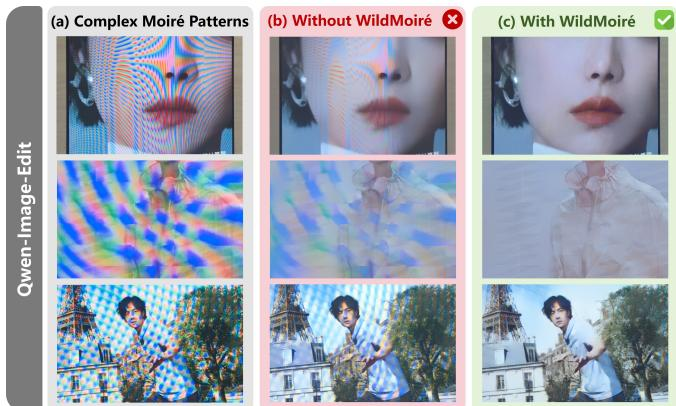
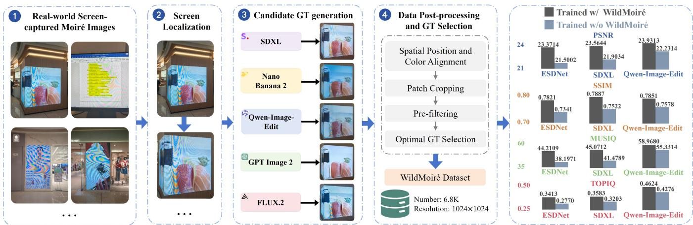
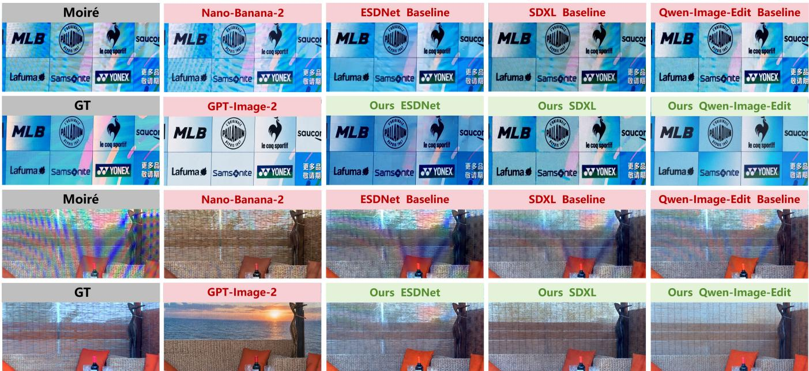
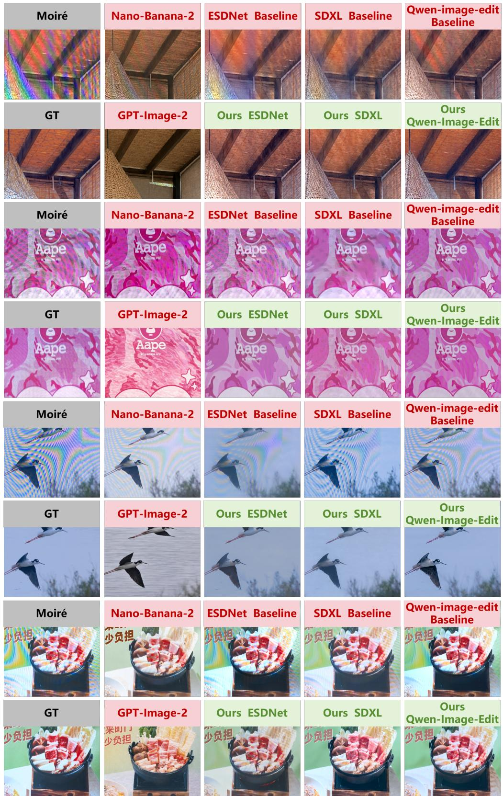
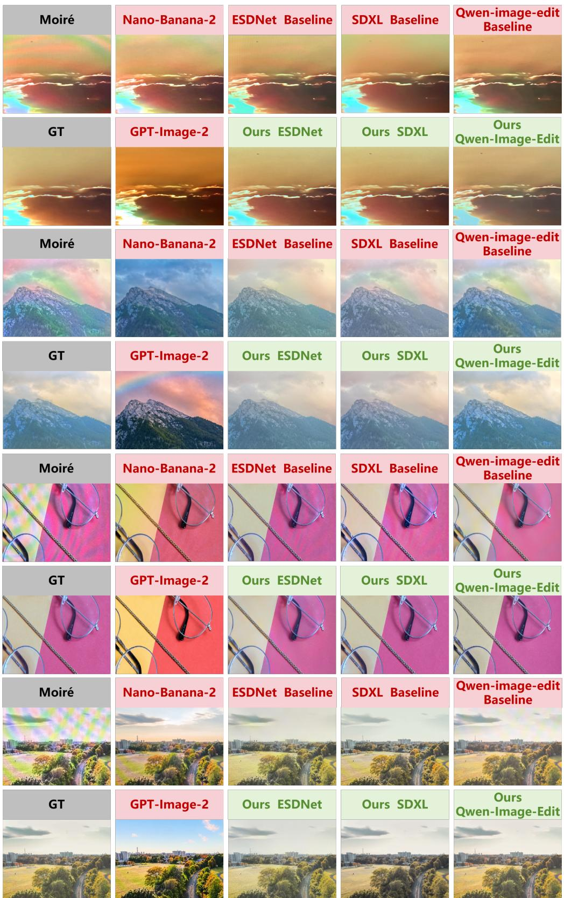

# Improving Complex Moiré Removal with Generative Supervision

Xinyang Gu1, Zhilu Zhang1, Honglei Xu1, Yanting Mei1, Yukang Ding2, Wangmeng Zuo1

1Harbin Institute of Technology, Harbin, China 2Alibaba Group - Taobao & Tmall Group

## Abstract

The availability of high-quality paired data is essential for training learning-based image demoiréing models. However, it remains challenging for existing datasets to encompass the complex moiré patterns captured in uncontrolled real-world scenarios. Such degradations typically manifest as large-scale, multicolored moiré patterns. Moreover, these patterns frequently occur in images for which clean counterparts are dificult to obtain, such as photographs acquired from public displays or existing online resources. In this work, we propose a novel data engine designed to improve the removal of complex moiré patterns by generating training supervision. Specifically, we initially collect real-world images containing complex moiré patterns and localize the corresponding screen regions. Multiple image-conditioned generative foundation models are subsequently deployed to produce candidate references. To establish reliable supervision, these candidates are subjected to patch-level quality con trol to filter and select the optimal results. Based on this systematic paradigm, we construct the WildMoiré dataset, which contains 6.8K moiré-GT training pairs. For evaluation, we additionally build an independent test set comprising ∼250 pairs with captured clean ground truth. Extensive experiments on ESDNet, SDXL, and Qwen-Image-Edit demonstrate that the proposed generative supervision consistently improves the performance of complex moiré removal. Project: https://xinygu-pavo.github.io/WildMoire/.

## Introduction

Using smartphones and digital cameras to record information from electronic screens has become increasingly common in daily life. However, captured screen images often contain moiré artifacts that are absent from the original displayed content. These artifacts may appear as fine colored grids, curved waves, broad low-frequency color bands, and mixtures of several patterns. They arise because both the display and the camera sensor sample visual signals on discrete grids, and interference between the display pixel grid and the camera sensor array can produce objectionable aliasing patterns (Liu, Shu, and Wu 2018). Moiré artifacts not only degrade visual quality, but may also obscure text, alter colors, and destroy image textures and structural details. Therefore, removing moiré from camera-captured screen images is an important problem for mobile photography, digital-signage capture, document recording, and visual-content sharing.

Facilitated by the collection of large-scale paired data (Sun, Yu, and Wang 2018; He et al. 2020; Yu et al. 2022; Mei et al. 2025), learning-based image demoiréing methods have achieved substantial progress through multiscale processing strategies (Zheng et al. 2020; Cheng, Liu, and Yang 2023), the integration of attention mechanisms (He et al. 2025), and the introduction of difusion models (Zhu et al. 2026; Yang et al. 2026). Nevertheless, these trained demoiréing models yield satisfactory results only within the distribution of the training data, exhibiting limited generalizability across diferent screens and complex scenes, especially for large-scale, multicolored moiré patterns (see Fig. 1(b)). A straightforward approach is to continuously collect and scale up paired data for training. However, this solution is impractical and expensive in terms of both manpower and computational resources, owing to the diverse range of existing displays and the continuous emergence of new devices.

Fortunately, recent foundation models for image generation and editing, e.g., Nano-Banana-2 (Google DeepMind 2026) and GPT-Image-2 (OpenAI 2026), demonstrate remarkable generalization capabilities for moiré removal when provided with carefully crafted prompts, which stems from their rich and strong visual priors. But simultaneously, these models are dificult to adopt directly as professional-grade demoiréing tools because they are prone to generating hallucinations, e.g., inconsistencies in content and color. To address this issue, we propose to post-process and filter these outputs to serve as supervision for demoiréing models, which functions as a more cost-efective and convenient solution for scaling up paired data. Moreover, instead of relying on the outputs of a single generative model, we compare the results from multiple generative models and select the optimal output for supervision. This strategy aims to leverage the complementary strengths across diferent models.

Specifically, we initially collect a substantial number of complex moiré images through on-site photography and existing online resources. Subsequently, we localize the screen regions and process them using foundation models for image generation and editing. Given that diferent models exhibit distinct trade-ofs between moiré removal and content preservation, we deploy multiple models. These include closedsource models (i.e., GPT-Image-2 (OpenAI 2026) and Nano-Banana-2 (Google DeepMind 2026)) and open-source models (FLUX.2 (Black Forest Labs 2025), SDXL (Podell et al. 2023), and Qwen-Image-Edit (Wu et al. 2025)) that have been fine-tuned on existing demoiréing datasets. The corresponding outputs are aligned with the input images in terms of spatial positions and colors, and are subjected to patch-based quality control. Finally, the optimal output among them is selected as the ground truth (GT). In total, we construct 6.8K moiré-GT pairs with a resolution of 1024×1024, forming the WildMoiré dataset. Furthermore, we introduce a scale transformation strategy for data augmentation. By rescaling the moiré images, the scale of the moiré patterns is correspondingly altered, thereby further enhancing the generalization capability of demoiréing models.

  
Figure 1: Results on moiré images. The (a) column presents three moiré inputs with large-scale chromatic bands and overlapping interference patterns. The (b) and (c) columns show Qwen-Image-Edit trained without and with our constructed WildMoiré dataset, respectively. Training only on the previous dataset leaves artifacts and suppresses details, while incorporating WildMoiré removes the broad interference and preserves original contents better.

We additionally collect ∼250 pairs with captured clean ground truth images for the evaluation of complex moiré removal. Utilizing the proposed WildMoiré dataset and data augmentation strategy, we fine-tune the CNN-based ESD-Net (Yu et al. 2022), the difusion-UNet-based SDXL (Podell et al. 2023), and the difusion-Transformer-based Qwen-Image-Edit (Wu et al. 2025) for experimental validation. The results demonstrate significant improvements in both quantitative metrics and visual quality. Moreover, comprehensive ablation studies confirm the efectiveness of the various components in the proposed pipeline.

Our contributions are summarized as follows:

• We propose generating supervision to extend the training data for the improvement of complex moiré removal. Specifically, we introduce a systematic paradigm that filters and selects the optimal outputs from multiple generative models to serve as high-quality supervision.

• Using the proposed data engine, we construct WildMoiré dataset, which contains 6.8K moiré-GT pairs. Furthermore, we collect ∼250 pairs with captured clean ground truth as an evaluation benchmark.

• Extensive experiments on ESDNet, SDXL, and Qwen-Image-Edit demonstrate that WildMoiré dataset consistently improves the demoiréing performance.

## Related Work

## Image Demoiréing

Early image demoiréing methods relied on handcrafted signal decomposition and frequency-domain filtering. With the development of deep learning, convolutional networks have become the dominant solution for camera-captured screen images. DMCNN introduced a multi-resolution architecture to account for the large variation in moiré scales (Sun, Yu, and Wang 2018). MopNet classified moiré patterns and processed diferent categories in a divide-and-conquer manner (He et al. 2019), while MBCNN explicitly modeled frequency-selective decomposition using learnable bandpass filters (Zheng et al. 2020). To support high-resolution restoration, FHDe2Net employed a coarse-to-fine framework for full-HD images (He et al. 2020), and ESDNet introduced semantic-aligned scale-aware processing for eficient 4K demoiréing (Yu et al. 2022). More recently, DCID explored dual-camera fusion for mobile image demoiréing, using complementary wide- and ultra-wide-camera observations to remove severe moiré while preserving high-resolution image details (Mei et al. 2025).These approaches have substantially advanced model architecture and computational eficiency. Nevertheless, their restoration capability remains closely related to the moiré pattern distribution in the training data.

## Demoiréing Data Construction

Real paired datasets have been essential to the development of learning-based demoiréing. Sun et al. introduced an early benchmark of real camera-captured screen images (Sun, Yu, and Wang 2018). FHDMi extended paired acquisition to full-HD resolution (He et al. 2020), while UHDM collected 5,000 ultra-high-definition pairs using multiple smartphones, displays, and shooting configurations (Yu et al. 2022). DCID further constructed 8,959 samples containing wide-angle images, ultra-wide-angle observations, and digital source supervisions, with particular attention to severe moiré patterns (Mei et al. 2025). Although these datasets provide reliable supervision, their acquisition generally requires displaying known clean images on accessible screens and carefully aligning the captured images with their digital sources. Such controlled pipelines are costly to scale and cannot exhaustively cover complex moiré patterns encountered in uncontrolled environments.

To alleviate the dependence on costly paired acquisition, another line of research synthesizes moiré-degraded input from clean images. Early work simulated the camera–display imaging process to construct synthetic training pairs (Liu, Shu, and Wu 2018), while LCDMoiré adopted a handcrafted synthesis process for the AIM image demoiréing challenge (Yuan et al. 2019). Cyclic moiré learning jointly trained a moiréing network and a demoiréing network using unpaired clean and moiré images (Park et al. 2022). UnDeM divided real moiré images into patches according to their complexity and learned to synthesize diverse pseudo-moiré images for supervised demoiréing training (Zhong et al. 2024). More recently, UniDemoiré collected background-independent real moiré patterns, employed a difusion model to generate additional pattern variations, and developed a learnable synthesis module to reproduce the color and brightness characteristics of captured moiré images (Yang et al. 2025). These methods improve data scalability by generating the degraded side of a training pair.

## Generative Supervision for Image Restoration

Recent studies have explored generative models as ofline producers of training supervision rather than only as restoration models used at inference time. HGGT generated multiple enhanced high-resolution targets for image super-resolution and employed human annotations to identify regions with beneficial or harmful perceptual changes (Chen et al. 2023). GMD used a frozen generative oracle to refine restoration results from unlabeled target-domain images and mixed the resulting pseudo-pairs with reliable source-domain supervision for model adaptation (Hu et al. 2025). Additionally, we take note of the concurrent work GGT-100K, which systematically evaluates multimodal foundation models and implements multi-stage quality control to construct a large-scale dataset for general real-world image restoration (Kong et al. 2026). These studies demonstrate the potential of generative supervision, while also highlighting the risks of hallucination, content drift, and inconsistent restoration quality. In this work, we utilize multiple generative models and implement carefully designed quality control measures to construct more reliable supervision signals.

Our work specializes this paradigm for complex screen demoiréing. Instead of relying on a single generator, we use five generative priors with complementary restoration behaviors. Their outputs are spatially and photometrically aligned with the real moiré inputs and evaluated locally before being retained as training supervisions. This design preserves authentic complex moiré degradations on the input side, reduces the influence of unreliable generated content, and produces reusable training data without modifying the deployed restoration architectures or adding test-time generative computation.

## WildMoiré Dataset

## Motivation and Problems

Moiré patterns arise from interference between the sensor array of a camera and the pixel grid of a displayed screen. Existing moiré datasets primarily cover simple and small-scale patterns. This limited coverage makes demoiréing models less efective in handling complex, large-scale, and multicolor moiré patterns, which are particularly common on large public screens.

In fact, obtaining corresponding clean images for such complex moiré images is challenging. Firstly, large public displays often present dynamic videos or frequently changing content, making it dificult to recover the exact displayed frame after the moiré image has been captured. Secondly, for images collected from online sources, the original clean content is generally unavailable. Fortunately, recent image generation and editing foundation models (OpenAI 2026; Google DeepMind 2026; Black Forest Labs 2025; Podell et al. 2023; Wu et al. 2025) are developing rapidly, and their powerful generative capabilities can provide efective supervision for improving the removal of complex moiré patterns.

Although these image generation models exhibit strong restoration capabilities, no single model consistently performs well on all complex moiré images. These models show complementarity in moiré removal and content preservation: some efectively remove moiré patterns but redraw the image, reducing fidelity, while others retain the original content but leave residual moiré artifacts. Therefore, to avoid the limitations of single generative model, a selection strategy is required to identify the highest-quality output as the supervision. By solving these problems, we propose WildMoiré, a dataset designed to improve demoiréing models’ ability to remove complex moiré patterns. Its construction pipeline is illustrated in Fig. 2.

## Source Images Collection

To support robust demoiréing of complex moiré images, we collect images from two sources. First, we capture 4Kresolution images across diverse scenes using mobile phones. Second, we collect additional images through web crawling to increase diversity of displayed content, screen types, and moiré patterns. We intentionally retained challenging examples with broad chromatic bands, overlapping waves, fine repetitive interference, oblique viewing angles, text-rich content, and human subjects, as shown in Step 1 in Fig. 2. After collection, we used Sa2VA (Yuan et al. 2025) to detect screen boundaries and crop the corresponding screen regions, thereby excluding areas that do not contain moiré patterns, as shown in Step 2 in Fig. 2.

## Candidate GT Generation

To obtain corresponding clean supervisions for the collected complex moiré images, we employ SDXL (Podell et al. 2023), Nano-Banana-2 (Google DeepMind 2026), Qwen-Image-Edit (Wu et al. 2025), GPT-Image-2 (OpenAI 2026), and FLUX.2 (Black Forest Labs 2025) to generate candidate GTs, as shown in Step 3 of Fig. 2.

As discussed above, diferent image generation and editing models exhibit complementary behaviors in restoration capability and content fidelity. The five selected models provide representative examples of such complementarity. GPT-Image-2 (OpenAI 2026) is a powerful commercial model with strong semantic understanding and editing capability. It can remove severe moiré patterns efectively, but its aggressive editing may introduce noticeable changes in image content and color, as well as occasional local hallucinations. Nano-Banana-2 (Google DeepMind 2026) is also a closedsource model and generally preserves the original content more faithfully than GPT-Image-2 (OpenAI 2026). Nevertheless, it may still introduce content inconsistencies and leave conspicuous residual moiré in some challenging cases.

In comparison, SDXL (Podell et al. 2023), FLUX.2 (Black Forest Labs 2025), and Qwen-Image-Edit (Wu et al. 2025) are open-source difusion-based models whose generation behaviors are generally more conservative after fine-tuning with previous demoiréing datasets (Yu et al. 2022; Mei et al. 2025). Although their moiré-removal capability may be weaker than that of the commercial models, they often preserve the original structures and colors more faithfully. They therefore provide useful complementary candidates, especially in regions where GPT-Image-2 (OpenAI 2026) produces severe hallucinations and Nano-Banana-2 (Google DeepMind 2026) fails to remove the moiré artifacts. Specifically, to produce reasonable results of moiré removal, SDXL is fine-tuned for 80 epochs using the InstructPix2Pix training framework (Brooks, Holynski, and Efros 2023), while FLUX.2 and Qwen-Image-Edit are fine-tuned for 100 epochs using DifSynth-Studio. At the same time, we also apply the proposed Scale Transformation Data Augmentation strategy, which will be introduced later, to enhance the model’s generalization ability.

  
Figure 2: Overview of WildMoiré dataset construction. We first collect real screen-captured images containing complex moiré and localize the display regions. Five image-conditioned generative models then produce candidate GT images. The candidates are processed at matched spatial locations through spatial and color alignment, synchronized patch extraction, pre-filtering, and optimal GT selection. This ofline procedure yields 6.8K moiré-GT pairs at 1024×1024 resolution. The plots on the right summarize the improvements obtained by training ESDNet, SDXL, and Qwen-Image-Edit with constructed WildMoiré dataset.

For candidate generation, the prompts are adapted to each model while preserving a consistent intent: $e . g .$ ., removing moiré and abnormal color interference while retaining text, identities, objects, layout, geometry, and the overall appearance of the photographed display.

## Post-processing and GT Selection

Spatial and Photometric Alignment. During candidate GT generation, we observe that each input and its candidate GTs may exhibit spatial and photometric misalignments. To address these issues, we first correct the spatial misalignments and subsequently perform photometric alignment. Specifically, for spatial alignment, we first employ GlueStick (Pautrat et al. 2023) to estimate a robust global transformation for initial alignment. We then use Flow-Former (Huang et al. 2022) to estimate the dense optical flow between each initially aligned candidate GT and its input for refining the alignment. Finally, we center-crop each input and its aligned candidate GT to remove the misaligned areas around the edges. For photometric alignment, we first apply Gaussian blurring to the input and its aligned candidate GTs to suppress the influence of high-frequency moiré patterns during photometric alignment. We then fit a linear 3×3 RGB transformation for each candidate GT to align its color with the input.

Patch Cropping and Pre-filtering. This step aims to retain collected input patches with complex moiré and remove clean patches. We treat each input and its aligned candidate GTs as an image group. For each image group, we sample n spatial locations and crop 1024 × 1024 patches from every image at each location, yielding n patch groups per image group. Then, we calculate the texture complexity of the input patch in each patch group using the image-domain standard deviation $\sigma _ { i m g }$ (Moulden, Kingdom, and Gatley 1990):

$$
\sigma _ { i m g } = \sqrt { \frac { 1 } { N - 1 } \sum _ { p \in \mathbf { P } } \left( \mathbf { P } ( p ) - \mu _ { \mathbf { P } } \right) ^ { 2 } } ,\tag{1}
$$

where P denotes the luminance channel of the patch containing N pixels. p is the coordinates of each pixel. $\mu _ { \mathbf { P } }$ is the mean value of the luminance channel. We further calculate the mean value of the Laplacian-variance pyramid $\sigma _ { l a p }$ (Burt and Adelson 1983):

$$
\sigma _ { l a p } = \frac { 1 } { L } \sum _ { l = 0 } ^ { L - 1 } \mathcal { L } _ { l } ( \mathbf { P } ) ,\tag{2}
$$

where $L$ is the number of pyramid levels. $\mathcal { L } _ { l }$ denotes the Laplacian-variance at diferent filter scales. Patch groups whose input patches lack texture $( i . e . , \ \sigma _ { i m g } \ < \ \tau _ { i m g }$ or $\sigma _ { l a p } < \tau _ { l a p } )$ are discarded. However, these statistics measure texture richness rather than moiré complexity. Some moiré-free patches with rich textures may also be retained. To identify such patches, we process each remaining input patch with a pre-trained ESDNet and compute the SSIM between its output and the original input patch. Although ES-DNet may not completely remove complex moiré patterns, it can still modify them while largely preserving clean patches. We therefore classify the input patch with an SSIM greater than $\tau _ { s s i m }$ as a clean patch with rich textures.

<table><tr><td></td><td></td><td></td><td></td><td>Model |GPT-Image-2 Nano-Banana-2 FLUX.2 Qwen-Image-Edit SDXL</td><td></td></tr><tr><td>Ratio (%) | 62.73</td><td></td><td>17.97</td><td>9.10</td><td>5.96</td><td>4.23</td></tr></table>

Table 1: Distribution of models for the final selected supervisions in WildMoiré.
<table><tr><td>Dataset</td><td>Environment</td><td>Supervision</td><td>Resolution</td><td>Size</td></tr><tr><td>UHDM</td><td>Controlled</td><td>Digital source</td><td>~4328×3248</td><td>4,271</td></tr><tr><td>DCID</td><td>Controlled</td><td>Digital source</td><td>~4096×3072</td><td>7,176</td></tr><tr><td>WildMoiré</td><td>In the wild</td><td>Generation</td><td>1024×1024</td><td>6,832</td></tr></table>

Table 2: Datasets used in the experiment. Size of UHDM is counted after our alignment-quality filtering.

Optimal GT Selection. Each retained patch group comprises 1 input patch Pi and 5 candidate GT patches $\{ Q _ { i } ^ { k } \} _ { k = 1 } ^ { 5 } .$ We select the highest-quality candidate GT patch as the final ground truth. for the i-th patch group, we feed each pair $( P _ { i } , \bar { Q } _ { i } ^ { k } )$ into A-FINE (Chen et al. 2025) to obtain a score. The candidate GT patch with the lowest score is selected:

$$
k ^ { * } = \arg \operatorname* { m i n } _ { k \in \{ 1 , \dots , 5 \} } \mathcal { D } ( P _ { i } , Q _ { i } ^ { k } ) ,\tag{3}
$$

where D denotes the A-FINE (Chen et al. 2025), and a lower value indicates that $Q _ { i } ^ { k }$ is better. $k ^ { * }$ is the index of the selected candidate GT patch. If the improvement between the input patch score and the optimal candidate GT patch score is below a threshold τ, i.e.,

$$
\begin{array} { r } { \mathcal { D } ( P _ { i } , P _ { i } ) - \mathcal { D } ( P _ { i } , Q _ { i } ^ { k ^ { * } } ) < \tau , } \end{array}\tag{4}
$$

we consider all candidate GT patches in the i-th patch group to be low-quality and discard the entire patch group.

## Dataset Statistics

With $\tau \ : = \ : 1 5$ WildMoiré contains 6,832 moiré-GT pairs at 1024×1024 resolution.Table 1 shows the selected supervisions are 62.73% (4,286) from GPT-Image-2 (OpenAI 2026), 17.97% (1,228) from Nano-Banana-2 (Google Deep-Mind 2026), 9.10% (622) from FLUX.2 (Black Forest Labs 2025), 5.96% (407) from Qwen-Image-Edit (Wu et al. 2025) and 4.23% (289) from SDXL (Podell et al. 2023). Table 2 shows the comparison between our WildMoiré and existing demoiréing datasets.

## Data Augmentation and Mixing Scale Transformation Data Augmentation

We observe that real-world demoiréing datasets often exhibit imbalanced distributions of moiré scales, which wil limit the generalization of the demoiréing models trained on them. To address this issue, we suggest a scale transformation data augmentation strategy, which simply rescales input images during training to diversify the scales of moiré patterns. Specifically, during training, we randomly apply s× upsampling to moiré-GT pairs, and use the rescaled moiré images as inputs and the corresponding rescaled GTs as supervisions. As the diversity of moiré scales in the training data increases, the generalization ability of the demoiréing model is improved to handle moiré patterns at diferent scales.

## Multiple Dataset Mixing

Compared with existing demoiréing datasets, WildMoiré contains images with more complex moiré patterns. To enable the demoiréing model to handle both such complex patterns and the conventional moiré patterns represented in existing datasets, we additionally incorporate UHDM (Yu et al. 2022) and DCID (Mei et al. 2025) into the training set, thereby further improving its generalization ability. The dataset details are provided in Table 2.

## Experiments

## Experimental Setup

Evaluation Data. To evaluate demoiréing performance, we collected a separate test set of 247 additional moiré images. We obtain their ground truth images through camera capture rather than image generation to ensure the authenticity. Specifically, after capturing a moiré image, we adjusted the camera distance and viewing angle to capture a clean image of the same scene. We then spatially and photometrically align the clean image to its corresponding moiré image and use the aligned clean image as the ground truth.

Metrics. We evaluate content fidelity using the fullreference metrics PSNR, SSIM (Wang et al. 2004), and LPIPS (Zhang et al. 2018). PSNR measures pixellevel fidelity, SSIM assesses structural similarity, and LPIPS captures perceptual similarity. We additionally report MUSIQ (Ke et al. 2021), TOPIQ (Chen et al. 2024), and Q-Align (Wu et al. 2024) as no-reference image-quality metrics to assess perceptual restoration quality.

Compared Settings. We train ESDNet, Qwen-Image-Edit, and SDXL on the combined UHDM and DCID datasets without scale transformation data augmentation, and use the resulting models as baselines (Yu et al. 2022; Wu et al. 2025; Podell et al. 2023; Mei et al. 2025). We then augment the training set with WildMoiré and train both without and with scale transformation data augmentation. GPT-Image-2 (OpenAI 2026) and Nano-Banana-2 (Google DeepMind 2026) are closed-source models that cannot be fine-tuned; we therefore evaluate their oficial direct-editing outputs.

Implementation Details. All models are implemented in PyTorch (Paszke et al. 2019). For ESDNet, we use a batch size of 8 and optimize the model for 150 epochs using Adam (Kingma and Ba 2015) with an initial learning rate of $2 \times 1 0 ^ { - 4 } , \beta _ { 1 } = 0 . 9$ , and $\beta _ { 2 } ~ = ~ 0 . 9 9 9$ . The learning rate is adjusted using cosine annealing with periodic warm restarts (Loshchilov and Hutter 2017). SDXL is fine-tuned following the InstructPix2Pix training formulation (Brooks,

<table><tr><td rowspan="2"></td><td rowspan="2">Models</td><td rowspan="2">Training Datasets</td><td colspan="3">Full-reference Fidelity Metrics</td><td colspan="3">No-reference Perceptual Metrics</td></tr><tr><td>PSNR ↑</td><td>SSIM ↑</td><td>LPIPS↓</td><td>MUSIQ↑</td><td>TOPIQ ↑</td><td>Q-Align ↑</td></tr><tr><td>Closed</td><td>GPT-Image-2</td><td></td><td>15.1965</td><td>0.5265</td><td>0.4636</td><td>65.4375</td><td>0.5831</td><td>4.3665</td></tr><tr><td>Source</td><td>Nano-Banana-2</td><td>一</td><td>16.8793</td><td>0.5679</td><td>0.4696</td><td>60.9621</td><td>0.5002</td><td>4.4743</td></tr><tr><td>Open</td><td>ESDNet</td><td>UHDM+DCID</td><td>21.5002</td><td>0.7341</td><td>0.3471</td><td>38.1971</td><td>0.2770</td><td>3.6343</td></tr><tr><td>Source</td><td>(CNN-based)</td><td>UHDM+DCID+WildMoiré</td><td>23.3714</td><td>0.7821</td><td>0.2614</td><td>44.2109</td><td>0.3413</td><td>3.9607</td></tr><tr><td>Open</td><td>SDXL</td><td>UHDM+DCID</td><td>21.9034</td><td>0.7522</td><td>0.2951</td><td>41.4789</td><td>0.3203</td><td>3.8128</td></tr><tr><td>Source</td><td>(Diffusion-UNet-based)</td><td>UHDM+DCID+WildMoiré</td><td>23.5644</td><td>0.7887</td><td>0.2621</td><td>45.0712</td><td>0.3583</td><td>4.0811</td></tr><tr><td>Open</td><td>Qwen-Image-Edit</td><td>UHDM+DCID</td><td>22.2314</td><td>0.7578</td><td>0.3101</td><td>55.3314</td><td>0.4276</td><td>4.1005</td></tr><tr><td>Source</td><td>(Diffusion-Transformer-based)</td><td>UHDM+DCID+WildMoiré</td><td>23.9313</td><td>0.7851</td><td>0.2528</td><td>58.9680</td><td>0.4624</td><td>4.2982</td></tr></table>

Table 3: Comparison of quantitative results. The optimal results in every part is highlighted in bold.

Holynski, and Efros 2023), with a batch size of 4 and a learning rate of $5 \times 1 0 ^ { - 5 }$ for 150 epochs. Qwen-Image-Edit-2511 is fine-tuned using DifSynth-Studio with LoRA (Hu et al. 2022) rank 8, a batch size of 4, and a learning rate of $1 \times 1 0 ^ { - 4 }$ for 150 epochs. Both training and inference for ES-DNet are conducted on an NVIDIA RTX A6000 GPU, while SDXL and Qwen-Image-Edit are trained and evaluated on an NVIDIA RTX PRO 6000 GPU. During the ground truth selection process, we set the $\tau _ { i m g }$ and the $\tau _ { l a p }$ to 30, the $\tau _ { s s i m }$ to 0.9. During training, we set the upsampling scale s in scale transformation data augmentation strategy to 4.

## Experimental Results

Quantitative Results. Table 3 shows that incorporating WildMoiré consistently improves the overall fidelity and perceptual quality of a compact CNN restoration network and two generative editors. Compared with the corresponding baselines, the complete training setting with WildMoiré achieves clear improvements across all three architectures and the overall metric suite. The consistency across distinct model families indicates that WildMoiré provides broadly useful supervision for complex moiré removal rather than benefiting a particular training mechanism or model architecture. The independent contribution ofscale transformation augmentation is further analyzed in Table 5.

The commercial editors occupy a diferent fidelity– perception operating point. Their strong no-reference scores reflect clean and visually appealing outputs, but the substantially weaker full-reference metrics expose content mismatch. Nano-Banana-2 generally preserves the displayed layout and local content more faithfully than GPT-Image-2, yet it can leave visible moiré in dificult cases. GPT-Image-2 removes interference more aggressively but may introduce severe content or structural inconsistency; its outputs can also suppress physical screen-capture characteristics and resemble clean digital source images. These observations motivate using large generators as ofline supervision producers instead of unrestricted test-time restorers.

Qualitative Results. Figure 3 supports the quantitative findings. The UHDM+DCID baseline models reduce part of the corruption but retain colored bands, local waves, or interference over fine texture. After adding WildMoiré, the same architectures recover cleaner logos, object boundaries, wall patterns, and furniture while retaining the photographic appearance of the display. The contrast with the two direct commercial editors also illustrates why perceptual quality alone is insuficient: an output can look clean while no longer representing the captured scene faithfully.

## Ablation Study

Unless otherwise specified, all ablation experiments are conducted using ESDNet.

Efect of Candidate GT Sources. A central hypothesis of our framework is that diferent generators provide complementary candidate supervisions. We construct variants that restrict the candidate GT source to Nano-Banana-2 or GPT-Image-2 and train ESDNet with the same source data, per-epoch WildMoiré sampling, and augmentation recipe. Table 4 shows that GPT-Image-2 is the stronger individual source, but the five-prior construction achieves the optimal result on every metric. The method does not average candidate outputs; instead, it selects a locally suitable supervision. Therefore, a prior that is weaker on average can still contribute useful supervision at locations where its balance between artifact removal and content preservation is preferable.

Efect of Scale Transformation Augmentation. Table 5 isolates the efect of scale transformation augmentation on ESDNet under two training-data settings. When trained on UHDM and DCID, enabling the augmentation consistently improves all six metrics, showing that the transformed samples help the model accommodate variations in the apparent spatial scale of moiré patterns. A similar trend is observed after WildMoiré is introduced: scale augmentation improves PSNR, SSIM, MUSIQ, TOPIQ, and Q-ALIGN. These results indicate that the augmentation is beneficial both for existing paired data and for the mixed training setting. Meanwhile, the substantial improvement obtained by adding WildMoiré remains evident even without scale augmentation, confirming that the proposed dataset and the augmentation strategy provide complementary gains.

Efect of Threshold for GT Selection. The A-FINE improvement threshold controls which local winners are sufficiently better than the imperfect input to serve as training supervisions. Table 6 evaluates $\tau \in \{ 5 , 1 0 , 1 5 , 2 0 , 2 5 \}$ with ESDNet. Increasing the threshold from 5 to 15 progressively improves all six metrics while reducing the set from 8,991 to 6,832 pairs, showing that low-threshold candidates provide weaker or less consistent supervision. Performance declines when the threshold becomes more restrictive. At τ = 25, only 2,818 pairs remain and the loss of content, degradation, and prior diversity outweighs the higher confidence of individual pairs. We therefore adopt τ = 15, the optimal downstream operating point, to construct the final WildMoiré training set used throughout the paper.

  
Figure 3: Comparison of qualitative results. The first example emphasizes logo and text fidelity under broad color interference, while the second contains severe mixed chromatic patterns over fine scene textures. Nano-Banana-2 is relatively content-faithful but may retain moiré, whereas GPT-Image-2 removes artifacts aggressively while replacing scene content and producing an overly digital-image appearance. Using WildMoiré suppresses residual bands more efectively across all 3 trainable models.

<table><tr><td>GT Source</td><td>PSNR↑</td><td>SSIM↑</td><td>LPIPS↓</td><td>MUSIQ↑</td><td>TOPIQ↑</td><td>Q-A.↑</td></tr><tr><td>Nano-Banana-2</td><td>22.5640</td><td>0.7647</td><td>0.2921</td><td>40.9345</td><td>0.3087</td><td>3.8122</td></tr><tr><td>GPT-Image-2</td><td>23.0013</td><td>0.7721</td><td>0.2742</td><td>42.0071</td><td>0.3236</td><td>3.8834</td></tr><tr><td>Optimal of 5 Models</td><td>23.3714</td><td>0.7821</td><td>0.2614</td><td>44.2109</td><td>0.3413</td><td>3.9607</td></tr></table>

Table 4: Efect of candidate GT sources.

<table><tr><td>Training Datasets</td><td>Scale Aug.</td><td>PSNR ↑</td><td>SSIM ↑</td><td></td><td>LPIPS ↓ MUSIQ ↑</td><td>TOPIQ↑</td><td>Q-ALIGN ↑</td></tr><tr><td>UHDM+DCID</td><td>x</td><td>21.5002</td><td>0.7341</td><td>0.3471</td><td>38.1971</td><td>0.2770</td><td>3.6343</td></tr><tr><td>UHDM+DCID</td><td>√</td><td>21.6414</td><td>0.7468</td><td>0.3230</td><td>39.3647</td><td>0.2941</td><td>3.7478</td></tr><tr><td>UHDM+DCID+WildMoiré</td><td>x</td><td>23.3164</td><td>0.7710</td><td>0.2611</td><td>43.1129</td><td>0.3224</td><td>3.9091</td></tr><tr><td>UHDM+DCID+WildMoiré</td><td>√</td><td>23.3714</td><td>0.7821</td><td>0.2614</td><td>44.2109</td><td>0.3413</td><td>3.9607</td></tr></table>

Table 5: Efect of scale transformation augmentation.

<table><tr><td>T</td><td>#Pairs</td><td>PSNR↑</td><td>SSIM↑</td><td>LPIPS↓</td><td>MUSIQ↑</td><td>TOPIQ↑</td><td>Q-A.↑</td></tr><tr><td>5</td><td>8,991</td><td>23.2863</td><td>0.7750</td><td>0.2720</td><td>43.0117</td><td>0.3309</td><td>3.8603</td></tr><tr><td>10</td><td>8,143</td><td>23.3411</td><td>0.7807</td><td>0.2643</td><td>43.7824</td><td>0.3365</td><td>3.9431</td></tr><tr><td>15</td><td>6,832</td><td>23.3714</td><td>0.7821</td><td>0.2614</td><td>44.2109</td><td>0.3413</td><td>3.9607</td></tr><tr><td>20</td><td>5,284</td><td>23.3647</td><td>0.7786</td><td>0.2684</td><td>43.7306</td><td>0.3374</td><td>3.9513</td></tr><tr><td>25</td><td>2,818</td><td>23.3021</td><td>0.7707</td><td>0.2925</td><td>42.9205</td><td>0.3315</td><td>3.8341</td></tr></table>

Table 6: Sensitivity to the threshold for GT Selection.

## Conclusion

We presented a multi-prior framework for constructing reliable generative supervision from unpaired photographs containing complex screen moiré, and built WildMoiré with 6,832 training pairs. For evaluation, we additionally built an independent test set comprising 247 pairs with captured clean ground truth. The framework leverages multiple generators as complementary visual priors and applies spatial and color alignment, patch filtering, and local optimal-supervision selection to obtain reliable paired training data. Mixing Wild-Moiré with UHDM and DCID consistently improves ESD-Net, Qwen-Image-Edit, and SDXL without modifying their deployed architectures or introducing additional inferencetime cost. The comprehensive ablations further validate the efectiveness of the proposed components, demonstrating that generative supervision improves robustness to challenging complex moiré patterns across diferent model architectures. These results also confirm the practical value of combining complementary generative priors with qualitycontrolled supervision for complex image demoiréing.

# Improving Complex Moiré Removal with Generative Supervision (Supplementary Material)

## Reliability of Generative Supervision

Complex moiré images collected from public displays or online resources often lack exact clean source frames. Directly treating an unrestricted generative output as ground truth is nevertheless unreliable because a generator may remove interference while modifying text, objects, colors, or local structures. WildMoiré therefore uses generative models as ofline candidate producers rather than as unrestricted restorers.

The resulting supervision should be regarded as a qualitycontrolled approximation of the unavailable clean reference. This is addressed in three ways. First, multiple priors increase the chance that at least one candidate provides a favorable balance between artifact removal and content preservation. Second, spatial and color alignment, synchronized local filtering, and A-FINE gating prevent unqualified outputs from being admitted directly. Third, WildMoiré is mixed with reliable digital-source supervision from UHDM and DCID rather than replacing existing paired data. The real paired datasets continue to anchor content fidelity, while WildMoiré expands the degradation distribution toward complex real-world patterns.

The downstream evidence in the main paper provides an additional practical validation. Multi-prior supervision outperforms supervision restricted to either GPT-Image-2 or Nano-Banana-2, and improvements are observed across a CNN, a difusion UNet, and a difusion Transformer. These results do not imply that every selected patch is error-free, but they indicate that the quality-controlled set contains useful supervision that is not tied to a particular restoration architecture.

## Additional Details

## Prompts of Candidate GT Generation

We employ GPT-Image-2 (OpenAI 2026), Nano-Banana-2 (Google DeepMind 2026), FLUX.2 (Black Forest Labs 2025), SDXL (Podell et al. 2023), and Qwen-Image-Edit (Wu et al. 2025) as complementary generative priors. Each prior produces one candidate restoration for each input image. Table A lists the exact English instructions used during data construction. GPT-Image-2 is given stronger contentpreservation constraints because of its relatively aggressive editing behavior. Nano-Banana-2 receives a more explicit description of abnormal stripes and color regions to encourage more complete artifact removal. The three open-source priors use the same concise instruction. All three open-source priors are adapted with LoRA (Hu et al. 2022) before candidate generation.

## Details of A-FINE

Conventional full-reference image-quality metrics generally assume that the reference image has perfect quality and measure how closely a test image matches it. This assumption is unsuitable for our setting because the available reference is the real input patch itself, which contains moiré. A restored candidate may therefore have higher perceptual quality than its reference while preserving the underlying content. A-FINE relaxes the perfect-reference assumption by adaptively combining a fidelity term and a naturalness term (Chen et al. 2025). For an imperfect reference x and an evaluated image $y ,$ its score is

$$
D ( x , y ) = F _ { \eta } ( x , y ) + \lambda ( x , y ) N _ { \gamma } ( y ) ,\tag{A}
$$

$$
\lambda ( x , y ) = \exp ( k \left[ N _ { \gamma } ( x ) - N _ { \gamma } ( y ) \right] ) ,\tag{B}
$$

where $F _ { \eta }$ evaluates fidelity to the reference, $N _ { \gamma }$ evaluates the naturalness of the evaluated image, and $k > 0$ . Lower values of $F _ { \eta } , N _ { \gamma } ,$ and D indicate better predicted quality. The adaptive weight allows naturalness to contribute more strongly when the evaluated image y is more natural than an imperfect reference x, while fidelity dominates when the reference is substantially more natural. Consequently, using the imperfect moiré input as reference enables A-FINE to evaluate candidate quality while retaining an explicit constraint on fidelity to the captured content.

We use the oficial unscaled A-FINE output $D ( x , y )$ . This output can take negative values when the evaluated image is predicted to be substantially better than a low-quality reference, and lower values remain better. A-FINE is asymmetric, so the moiré patch must be used as the reference and the candidate as the evaluated image. To remain consistent with the notation in the main paper, we define

$$
{ \mathcal { D } } ( P , Q ) ,\tag{C}
$$

where $P$ is the input moiré patch and $Q$ is a candidate restoration. For the i-th patch group, candidate selection and quality gating are performed as

$$
s _ { i } ^ { k } = \mathcal { D } ( Q _ { i } ^ { k } , P _ { i } ) , \qquad k ^ { * } = \arg \operatorname* { m i n } _ { k \in \{ 1 , \dots , 5 \} } s _ { i } ^ { k } ,\tag{D}
$$

$$
\Delta _ { i } = { \mathcal { D } } ( P _ { i } , P _ { i } ) - s _ { i } ^ { k ^ { * } } .\tag{E}
$$

The pair is retained only when $\Delta _ { i } \ \geq \ \tau$ . Comparing the local winner with the self-comparison score prevents the framework from accepting a candidate merely because it is the least poor result among five unreliable outputs.

Table A: Prompts used for candidate GT generation.
<table><tr><td>Generative Models</td><td>Prompt</td></tr><tr><td>GPT-Image-2</td><td>Remove the moiré patterns from the image. Strictly keep all other content unchanged. Preserve the original structure, colors, and fine details exactly. Ensure that all text on the screen remains clear, accurate, and completely unmodified. Preserve the original aspect ratio.</td></tr><tr><td>Nano-Banana-2</td><td>Remove the moiré patterns, together with any abnormal stripes, color bands, or color blocks caused by the moiré effect. Strictly keep all other content unchanged, including the original structure, colors, and fine details. Ensure that all text on the screen remains clear, accurate, and completely unmodified. Preserve the original aspect ratio.</td></tr><tr><td>SDXL, FLUX.2, and Qwen-Image-Edit</td><td>Remove only the moiré patterns from the image. Keep all other content unchanged, including the colors, text, and fine details.</td></tr></table>

Table B: Statistics of data filtering on constructing WildMoiré.
<table><tr><td>Stage</td><td>Groups</td><td>Retained</td></tr><tr><td>Initial synchronized groups</td><td>13,615</td><td>100.00%</td></tr><tr><td> $\sigma _ { i m g }$  and  $\sigma _ { l a p }$  filtering</td><td>11,778</td><td>86.51%</td></tr><tr><td>ESDNet-response filtering</td><td>10,889</td><td>79.98%</td></tr><tr><td>A-FINE filtering (τ = 15)</td><td>6,832</td><td>50.18%</td></tr></table>

Table C: Statistics of the optimal GT distribution under diferent A-FINE filtering thresholds. Total denotes the number of selected priors, while the model columns report row-wise percentages.
<table><tr><td>T</td><td>Total (Number)</td><td>GPT- Image-2 (%)</td><td>Nano- Banana-2 (%)</td><td>FLUX.2 (%)</td><td>Qwen- Image-Edit (%)</td><td>SDXL (%)</td></tr><tr><td>5</td><td>8,991</td><td>53.05</td><td>19.04</td><td>10.92</td><td>9.16</td><td>7.82</td></tr><tr><td>10</td><td>8,143</td><td>57.40</td><td>19.26</td><td>10.86</td><td>6.95</td><td>5.54</td></tr><tr><td>15</td><td>6,832</td><td>62.73</td><td>17.97</td><td>9.10</td><td>5.96</td><td>4.23</td></tr><tr><td>20</td><td>5,284</td><td>65.93</td><td>19.00</td><td>7.51</td><td>4.86</td><td>2.69</td></tr><tr><td>25</td><td>2,818</td><td>60.15</td><td>24.59</td><td>8.59</td><td>4.15</td><td>2.52</td></tr></table>

## More Experiments

## Statistics of Data Filtering

The candidate-generation stage yields synchronized patch groups, each containing one real moiré patch and five aligned candidate restorations. The image-domain and Laplacianpyramid statistics are computed jointly at the first filtering stage. A patch group is removed when either statistic falls below its corresponding threshold, which excludes regions with insuficient image variation. The remaining groups are processed by the ESDNet-response filter and the A-FINE selection stage described in the main paper.

Table B reports the complete filtering funnel. Texturecomplexity filtering removes 1,837 groups, while the ESDNet-response filter removes a further 889 groups. The final A-FINE gate retains 6,832 groups at $\tau = 1 5$ , corresponding to 50.18% of the initial patch groups. This substantial reduction reflects the conservative objective of retaining only candidates that provide a clear quality improvement over the imperfect moiré observation.

## Statistics of the Optimal GT Distribution

Since the A-FINE filtering has the highest filtering strength, we further demonstrated the optimal GT distribution under diferent A-FINE thresholds. Table C reports the number of selected patches contributed by each prior under different A-FINE thresholds. Increasing τ makes the qualityimprovement requirement more restrictive and reduces the dataset from 8,991 pairs at τ = 5 to 2,818 pairs at $\tau = 2 5$

From $\tau = 5 \mathrm { t o } \tau = 2 0 .$ , the share of GPT-Image-2 increases from 53.05% to 65.93%, while the combined share of Qwen-Image-Edit and SDXL decreases from 16.98% to 7.55%. $\mathrm { ~ \bf ~ A t ~ } \tau ~ = ~ 2 5$ , the GPT-Image-2 share decreases to 60.15%, whereas Nano-Banana-2 increases to 24.59%. Generally, stricter filtering concentrates the retained set around the two proprietary priors and suppresses less frequent contributions from the open-source models.

Together with the threshold ablation in the main paper, these statistics illustrate a quality–quantity–diversity tradeof. Moderate filtering removes weak or inconsistent candidates, but an overly restrictive threshold substantially reduces both data volume and prior diversity. The adopted setting τ = 15 retains contributions from all five priors while achieving the best overall downstream metric balance.

## Results on UHDM and DCID Datasets

We additionally utilized the filtering methods mentioned in the main text, including the image-domain standard deviation and Laplacian-variance pyramid with a threshold of 60 consistent with the data construction pipeline to select 11 and 378 complex moiré image samples from the UHDM and DCID datasets, respectively, for evaluation. The results are shown in Table D. Quantitative results demonstrate that the introduction of WildMoiré efectively boosts both full-reference fidelity and no-reference perceptual quality for challenging moiré samples across all three network architectures. Most evaluation metrics achieve stable and consistent performance gains, with only negligible fluctuation in the LPIPS score for the Qwen-Image-Edit model. These findings verify that WildMoiré can complement the limited complex moiré patterns in the original UHDM and DCID training distributions, thereby substantially enhancing the robustness of restoration models across diverse challenging moiré cases.

Table D: Quantitative results on challenging cases from the UHDM and DCID test sets. The better result within each model pair is highlighted in bold.
<table><tr><td rowspan="3"></td><td rowspan="3">Models</td><td rowspan="3">Training Datasets</td><td colspan="3">Full-reference Fidelity Metrics</td><td colspan="3">No-reference Perceptual Metrics</td></tr><tr><td>PSNR ↑</td><td>SSIM ↑</td><td>LPIPS ↓</td><td>MUSIQ ↑</td><td>TOPIQ↑</td><td>Q-Align ↑</td></tr><tr><td>Closed</td><td>GPT-Image-2</td><td></td><td>16.4847</td><td>0.6288</td><td>0.3597</td><td>47.6108</td><td>0.4396</td><td>4.4022</td></tr><tr><td>Source</td><td>Nano-Banana-2</td><td></td><td>19.5363</td><td>0.7320</td><td>0.2859</td><td>45.6903</td><td>0.4112</td><td>4.2289</td></tr><tr><td>Open</td><td>ESDNet</td><td>UHDM+DCID</td><td>26.5372</td><td>0.8722</td><td>0.2483</td><td>34.1202</td><td>0.3006</td><td>3.9790</td></tr><tr><td>Source</td><td>(CNN-based)</td><td>UHDM+DCID+WildMoiré</td><td>26.9181</td><td>0.8784</td><td>0.2441</td><td>34.9631</td><td>0.3109</td><td>4.0698</td></tr><tr><td>Open</td><td>SDXL</td><td>UHDM+DCID</td><td>26.5779</td><td>0.8706</td><td>0.2467</td><td>36.5014</td><td>0.3082</td><td>4.0967</td></tr><tr><td>Source</td><td>(Diffusion-UNet-based)</td><td>UHDM+DCID+WildMoiré</td><td>26.8603</td><td>0.8746</td><td>0.2458</td><td>37.1075</td><td>0.3187</td><td>4.1343</td></tr><tr><td>Open</td><td>Qwen-Image-Edit</td><td>UHDM+DCID</td><td>26.9703</td><td>0.8801</td><td>0.2360</td><td>44.7053</td><td>0.4118</td><td>4.2721</td></tr><tr><td>Source</td><td>(Diffusion-Transformer-based)</td><td>UHDM+DCID+WildMoiré</td><td>27.3071</td><td>0.8870</td><td>0.2367</td><td>46.8816</td><td>0.4174</td><td>4.3152</td></tr></table>

## More Visual Comparisons

Figure A presents additional qualitative comparisons on the independently captured test set, which contains challenging complex moiré patterns such as broad chromatic bands, mixed-frequency interference, text-rich regions, and fine scene structures. Across ESDNet, SDXL, and Qwen-Image-Edit, models trained with WildMoiré consistently reduce residual colored bands and local wave patterns more efectively than their corresponding baselines, while preserving displayed text, object boundaries, and underlying image details.

Figure B further presents challenging cases from the UHDM and DCID test sets. Although these samples are drawn from existing demoiréing benchmarks, they still contain complex moiré patterns that are dificult to remove using models trained only on the original UHDM and DCID data. Incorporating WildMoiré supervision improves restoration across all three architectures, indicating that the proposed generative supervision can complement existing training data and enhance robustness to challenging moiré patterns beyond our own captured test set.

## Limitations and Future Work

Our WildMoiré provides quality-controlled generative supervision for complex moiré images whose exact clean counterparts are unavailable, but it should not be regarded as a perfect substitute for digital-source ground truth. Although the proposed filtering and local selection procedures reduce unreliable candidates, subtle hallucinations, residual moiré, text modifications, or color inconsistencies may still remain. Complementary fidelity checks or human verification could further reduce metric-specific selection bias.

Future work will explore complementary qualityassessment models, manual or vision-language-modelassisted verification for ambiguous samples, and stronger constraints for preserving text and fine structures. Expanding the collection to more cameras, display types, venues, and shooting conditions may further improve degradation coverage.

## Use of Generative AI Tools

Generative AI tools were used solely to assist with language polishing and were not used to generate figures, analyses, conclusions, or references. All content in the manuscript was carefully reviewed and verified by the authors.

  
Figure A: Additional qualitative comparisons on our test set. Incorporating WildMoiré consistently improves complex moiré suppression across ESDNet, SDXL, and Qwen-Image-Edit while preserving the captured content.

  
Figure B: Additional qualitative comparisons on challenging cases from the UHDM and DCID test sets. Models trained only on UHDM and DCID may retain broad color interference, local waves, or mixed high- and low-frequency artifacts. Incorporating WildMoiré improves complex moiré suppression across all three trainable architectures while maintaining the captured content.

## References

Black Forest Labs. 2025. FLUX.2: Frontier Visual Intelligence. Model documentation.

Brooks, T.; Holynski, A.; and Efros, A. A. 2023. Instruct-Pix2Pix: Learning to Follow Image Editing Instructions. In Proceedings ofthe IEEE/CVF Conference on Computer Vision and Pattern Recognition, 18392–18402.

Burt, P. J.; and Adelson, E. H. 1983. The Laplacian Pyramid as a Compact Image Code. IEEE Transactions on Communications, 31(4): 532–540.

Chen, C.; Mo, J.; Hou, J.; Wu, H.; Liao, L.; Sun, W.; Yan, Q.; and Lin, W. 2024. TOPIQ: A Top-Down Approach from Semantics to Distortions for Image Quality Assessment. IEEE Transactions on Image Processing, 33: 2404–2418.

Chen, D.; Liang, J.; Zhang, X.; Liu, M.; Zeng, H.; and Zhang, L. 2023. Human Guided Ground-Truth Generation for Realistic Image Super-Resolution. In Proceedings of the IEEE/CVF Conference on Computer Vision and Pattern Recognition (CVPR).

Chen, D.; Wu, T.; Ma, K.; and Zhang, L. 2025. Toward Generalized Image Quality Assessment: Relaxing the Perfect Reference Quality Assumption. In Proceedings of the IEEE/CVF Conference on Computer Vision and Pattern Recognition (CVPR).

Cheng, Y.; Liu, X.; and Yang, J. 2023. Recaptured raw screen image and video demoiréing via channel and spatial modulations. Advances in Neural Information Processing Systems, 36: 40414–40425.

Google DeepMind. 2026. Nano Banana 2. Model documentation.

He, B.; Wang, C.; Shi, B.; and Duan, L.-Y. 2019. Mop Moiré Patterns Using MopNet. In Proceedings of the IEEE/CVF International Conference on Computer Vision, 2424–2432.

He, B.; Wang, C.; Shi, B.; and Duan, L.-Y. 2020. FHDe2Net: Full High Definition Demoireing Network. In European Conference on Computer Vision (ECCV).

He, X.; Quan, Y.; Xu, R.; and Ji, H. 2025. A Universal Scale-Adaptive Deformable Transformer for Image Restoration across Diverse Artifacts. In Proceedings of the IEEE/CVF Conference on Computer Vision and Pattern Recognition, 12731–12741.

Hu, E. J.; Shen, Y.; Wallis, P.; Allen-Zhu, Z.; Li, Y.; Wang, S.; Wang, L.; and Chen, W. 2022. LoRA: Low-Rank Adaptation of Large Language Models. In International Conference on Learning Representations.

Hu, Y.; Sahraee-Ardakan, M.; Bansal, A.; Mei, K.; Qi, C.; Milanfar, P.; and Delbracio, M. 2025. Learning from a Generative Oracle: Domain Adaptation for Restoration. arXiv preprint arXiv:2512.11121.

Huang, Z.; Shi, X.; Zhang, C.; Wang, Q.; Cheung, K. C.; Qin, H.; Dai, J.; and Li, H. 2022. FlowFormer: A Transformer Architecture for Optical Flow. In European Conference on Computer Vision (ECCV).

Ke, J.; Wang, Q.; Wang, Y.; Milanfar, P.; and Yang, F. 2021. MUSIQ: Multi-Scale Image Quality Transformer. In Proceedings of the IEEE/CVF International Conference on Computer Vision (ICCV).

Kingma, D. P.; and Ba, J. 2015. Adam: A Method for Stochastic Optimization. In International Conference on Learning Representations.

Kong, X.; Zhao, J.; Sun, L.; Wu, R.; and Zhang, L. 2026. GGT-100K: Generative Ground Truth for Generalizable Real-World Image Restoration. arXiv preprint arXiv:2605.31039.

Liu, B.; Shu, X.; and Wu, X. 2018. Demoir\’eing of Camera-Captured Screen Images Using Deep Convolutional Neural Network. arXiv preprint arXiv:1804.03809.

Loshchilov, I.; and Hutter, F. 2017. SGDR: Stochastic Gradient Descent with Warm Restarts. In International Conference on Learning Representations.

Mei, Y.; Zhang, Z.; Wu, X.; and Zuo, W. 2025. Image demoiréing using dual camera fusion on mobile phones. In 2025 IEEE International Conference on Multimedia and Expo (ICME), 1–6. IEEE.

Moulden, B.; Kingdom, F.; and Gatley, L. F. 1990. The Standard Deviation of Luminance as a Metric for Contrast in Random-Dot Images. Perception, 19(1): 79–101.

OpenAI. 2026. GPT Image 2. Model documentation.

Park, H.; Vien, A. G.; Kim, H.; Koh, Y. J.; and Lee, C. 2022. Unpaired Screen-Shot Image Demoiréing with Cyclic Moiré Learning. IEEE Access, 10: 16254–16268.

Paszke, A.; Gross, S.; Massa, F.; Lerer, A.; Bradbury, J.; Chanan, G.; Killeen, T.; Lin, Z.; Gimelshein, N.; Antiga, L.; Desmaison, A.; Kopf, A.; Yang, E.; DeVito, Z.; Raison, M.; Tejani, A.; Chilamkurthy, S.; Steiner, B.; Fang, L.; Bai, J.; and Chintala, S. 2019. PyTorch: An Imperative Style, High-Performance Deep Learning Library. In Advances in Neural Information Processing Systems, volume 32, 8024–8035.

Pautrat, R.; Suarez, I.; Yu, Y.; Pollefeys, M.; and Larsson, V. 2023. GlueStick: Robust Image Matching by Sticking Points and Lines Together. In Proceedings ofthe IEEE/CVF International Conference on Computer Vision (ICCV).

Podell, D.; English, Z.; Lacey, K.; Blattmann, A.; Dockhorn, T.; Muller, J.; Penna, J.; and Rombach, R. 2023. SDXL: Improving Latent Difusion Models for High-Resolution Image Synthesis. arXiv preprint arXiv:2307.01952.

Sun, Y.; Yu, Y.; and Wang, W. 2018. Moire Photo Restoration Using Multiresolution Convolutional Neural Networks. IEEE Transactions on Image Processing, 27(8): 4160–4172.

Wang, Z.; Bovik, A. C.; Sheikh, H. R.; and Simoncelli, E. P. 2004. Image Quality Assessment: From Error Visibility to Structural Similarity. IEEE Transactions on Image Processing, 13(4): 600–612.

Wu, C.; Li, J.; Zhou, J.; et al. 2025. Qwen-Image Technical Report. arXiv preprint arXiv:2508.02324.

Wu, H.; Zhang, Z.; Zhang, W.; Chen, C.; Liao, L.; Li, C.; Gao, Y.; Wang, A.; Zhang, E.; Sun, W.; et al. 2024. Q-Align: Teaching LMMs for Visual Scoring via Discrete Text-Defined Levels. In Proceedings of the 41st International Conference on Machine Learning.

Yang, Y.; Zeng, X.; Jiang, Z.; Yin, F.; Liu, J.; Cheng, W.; Liu, S.; Peng, Y.; YU, G.; Chen, S.; et al. 2026. RealRestorer: Towards Generalizable Real-World Image Restora-

tion with Large-Scale Image Editing Models. arXiv preprint arXiv:2603.25502.

Yang, Z.; Sun, Y.; Peng, X.; Yiu, S. M.; and Ma, Y. 2025. UniDemoiré: Towards Universal Image Demoiréing with Data Generation and Synthesis. Proceedings of the AAAI Conference on Artificial Intelligence, 39(9): 9354–9362.

Yu, X.; Dai, P.; Li, W.; Ma, L.; Shen, J.; Li, J.; and Qi, X. 2022. Towards Eficient and Scale-Robust Ultra-High-Definition Image Demoireing. In European Conference on Computer Vision (ECCV).

Yuan, H.; Li, X.; Zhang, T.; Huang, Z.; Xu, S.; Ji, S.; Tong, Y.; Qi, L.; Feng, J.; and Yang, M.-H. 2025. Sa2VA: Marrying SAM2 with LLaVA for Dense Grounded Understanding of Images and Videos. arXiv preprint arXiv:2501.04001.

Yuan, S.; Timofte, R.; Slabaugh, G.; and Leonardis, A. 2019. AIM 2019 Challenge on Image Demoireing: Dataset and Study. In Proceedings of the IEEE/CVF International Conference on Computer Vision (ICCV) Workshops.

Zhang, R.; Isola, P.; Efros, A. A.; Shechtman, E.; and Wang, O. 2018. The Unreasonable Efectiveness ofDeep Features as a Perceptual Metric. In Proceedings of the IEEE Conference on Computer Vision and Pattern Recognition (CVPR).

Zheng, B.; Yuan, S.; Slabaugh, G.; and Leonardis, A. 2020. Image Demoireing with Learnable Bandpass Filters. In Proceedings of the IEEE/CVF Conference on Computer Vision and Pattern Recognition (CVPR).

Zhong, Y.; Zhou, Y.; Zhang, Y.; Chao, F.; and Ji, R. 2024. Learning Image Demoiréing from Unpaired Real Data. Proceedings of the AAAI Conference on Artificial Intelligence, 38(7): 7623–7631.

Zhu, L.; Zhou, Z.; Zhou, Z.; Qu, Y.; Zhang, W.; Shi, K.; Fu, Y.; and Zhang, Y. 2026. Combined Flicker-banding and Moire Removal for Screen-Captured Images. arXiv preprint arXiv:2602.01559.