# Learning What Not to Learn: Adversarial Disentangled Prompt Tuning for Robust Vision-Language Models

Yang Chen Southern University of Science and Technology Shenzhen, China cheny2023@mail.sustech.edu.cn

Zebin Chen   
Southern University of Science and   
Technology   
Shenzhen, China   
12432660@mail.sustech.edu.cn Zhan Zhuang   
City University of Hong Kong Hong Kong, China   
12250063@mail.sustech.edu.cn   
Hua Liu✉   
Southern University of Science and   
Technology   
Shenzhen, China   
liuh5@sustech.edu.cn

Yanbin Wei Hong Kong University of Science and Technology Hong Kong, China yanbin.ust@gmail.com

Yu Zhang ✉   
Southern University of Science and   
Technology   
Shenzhen, China   
yu.zhang.ust@gmail.com

## Abstract

While adversarial prompt tuning can enhance robustness of visionlanguage models eficiently, we find that existing methods aggra- vate robust generalization overfitting on seen classes, leading to a rapid degradation in performance against adversarial examples of unseen classes as training progresses. We empirically identify that this degradation stems from the tendency of the model to learn pseudo-robust features (i.e., non-generalizable shortcuts). To miti gate this, we propose ADAPT (Adversarial DisentAngled Prompt Tuning), a robust prompt tuning framework following the philoso-phy of “Learning What Not to Learn”. Specifically, ADAPT uses a dual-prompt mechanism with a target prompt and a pool of decoy prompts. During training, the decoy prompts are guided to entrap di-verse pseudo-robust features, while the target prompt is constrained to be orthogonal to the decoys in the embedding space to learn ro- bust features. By disentangling the robust features from the pseudo- robust features, ADAPT efectively prevents robust generalization overfitting. We further provide an analysis showing that the orthog onal loss bounds the efect of shifts in pseudo-robust features on un- seen classes, yielding a testing error guarantee. Empirically, exten sive experiments demonstrate that ADAPT substantially improves the robustness of the target prompt on unseen classes. The code is available at https://github.com/cheny02/ADAPT-ACMMM2026.

## CCS Concepts

• Computing methodologies → Artificial intelligence.

## Keywords

Prompt Tuning; Adversarial Robustness; Vision-Language Models

ACM Reference Format:   
Yang Chen, Zhan Zhuang, Yanbin Wei, Zebin Chen, Hua Liu, and Yu Zhang. 2026. Learning What Not to Learn: Adversarial Disentangled Prompt Tuning for Robust Vision-Language Models. In Proceedings ofthe 34th ACM International Conference on Multimedia (MM ’26), November 10–14, 2026, Rio de Janeiro, Brazil. ACM, New York, NY, USA, 16 pages. https://doi.org/10. 1145/3767308.3836532

## 1 Introduction

Vision-language models (VLMs), such as CLIP [32] and its successors [17, 18, 39, 40, 48], have achieved remarkable success in bridging the gap between visual and textual modalities. Through extensive pre-training on massive paired image-text data, these models have shown powerful zero-shot performance on unseen data. However, recent studies [35, 50] have shown that VLMs are extremely fragile to visual adversarial perturbations, often yielding confident but incorrect predictions when exposed to imperceptible noise [12]. Such vulnerability raises concerns regarding the reliability of VLMs, prohibiting their adoption in safety-critical scenarios like autonomous driving [42] and healthcare [10], where a single adversarial failure could lead to unacceptable consequences.

To defend against such threats, Adversarial Training (AT) [25] is widely regarded as the most efective defense. Prior works [7, 16, 27, 36, 43] have integrated AT with fine-tuning to enhance the robustness of CLIP-style models. However, given the ever-increasing scale of modern VLMs, the prohibitive computational cost of full- parameter adversarial fine-tuning renders it impractical for largescale deployment. Consequently, Parameter-Eficient Fine-Tuning (PEFT) [6] has emerged as a promising alternative. Among PEFT techniques, prompt tuning [24] stands out for its lightweight nature and compatibility with large-scale image-text pre-training. Building on this, recent studies [22, 37, 44, 49, 52] have integrated AT with prompt tuning, termed adversarial prompt tuning, to enhance the robustness of CLIP-style models on downstream tasks eficiently.

Upon analyzing the training dynamics of adversarial prompt tuning, we identify a phenomenon that diverges from the widely known robust overfitting [34], which manifests itself as a continued decrease in robust training loss coupled with an increase in robust test loss on the same classes as training progresses. In contrast, within the context of adversarial prompt tuning, we observe a pattern illustrated in Figure 1. Specifically, the robust training and test losses on base (seen) classes consistently decrease or remain stable throughout training. However, the robust test loss on new (un seen) classes begins to rise significantly when the training process proceeds. Crucially, the gap between robust and clean test losses remains stable for base classes, whereas it widens continuously for new classes as training progresses. We term this phenomenon “robust generalization overfitting”, highlighting a specific failure in transferring robustness to unseen semantic categories.

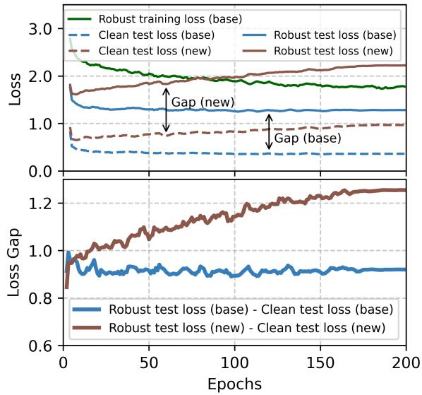  
Figure 1: Illustration of robust generalization overfitting. Adversarial prompt tuning on Caltech101 with CLIP ViT-B/32 under PGD-� attack (� = 4/255). Top: Robust loss remains stable on base (seen) classes but increases on new (unseen) classes as training progresses. Bottom: The robust–clean loss gap remains nearly constant on base classes but grows steadily on new classes.

We attribute this robust generalization overfitting to shortcut learning [11]. Specifically, the model tends to rely on pseudo-robust features that satisfy the training objective for seen categories but lack high-level semantic generalization. Although adversarial train- ing aims to encourage the model to acquire robust representations, the model often takes a shortcut by learning to reverse-engineer the specific perturbation patterns generated by the attack algo- rithm on base classes. Consequently, these features are efective for defending against attacks on seen data but are inherently non- generalizable to unseen categories, which limits the practical utility of adversarially trained VLMs.

Motivated by these insights, we propose Adversarial Disent-Angled Prompt Tuning (ADAPT), a robust prompt tuning frame-work grounded in the philosophy of “Learning What Not to Learn” [20]. ADAPT designs a dual-prompt mechanism comprising a ro-bust target prompt and a pool of decoy prompts. During training, decoy prompts are sampled from the pool and intentionally guided to absorb diverse non-generalizable pseudo-robust features, acting as a trap for shortcuts. Meanwhile, the target prompt is tasked with learning robust representations. To ensure the purity of the learned features, we enforce an explicit orthogonal loss that separates the target prompt from the decoy prompts. By efectively rejecting the shortcut features captured by the decoy prompts, the target prompt is compelled to focus on essential and generalizable visual semantics that remain robust across unseen categories. Extensive experiments demonstrate that the proposed ADAPT method efec- tively enhances the robustness of prompt on unseen classes.

The main contributions of this work are four-fold.

• To the best of our knowledge, we are the first to find the phenomenon of “robust generalization overfitting” in ad- versarial prompt tuning, revealing that the degradation of robustness on unseen classes stems from the reliance of VLMs on pseudo-robust features.

• We propose the ADAPT method as a robust prompt tuning framework, which employs a dual-prompt mechanism with orthogonal loss to actively entrap shortcuts into decoy prompts, thereby forcing the target prompt to learn robust features.

• We provide a theoretical guarantee demonstrating that by minimizing the projection of the target prompt onto the shortcut subspace, ADAPT bounds the generalization error on unseen classes.

• Extensive experiments on 15 datasets demonstrate the effectiveness of the proposed ADAPT method, particularly in the challenging adversarial base-to-new generalization setting, where it outperforms state-of-the-art methods by efectively mitigating the robustness gap between seen and unseen classes.

## 2 Related Work

CLIP-based VLMs. VLMs have fundamentally reshaped cognitive systems by bridging the semantic gap between the visual and textual modalities [28, 29], demonstrating exceptional capabilities in open-world vision tasks [23, 53]. The seminal work of CLIP [32], pre-trained on about 400 million image-text pairs via contrastive learning, established a dominant paradigm for learning transferable vision-language representations. This success has catalyzed a prolif-eration of CLIP-style architectures. Following initial extensions like ALIGN [18] and OpenCLIP [17], recent advancements have further expanded this paradigm through eficient scaling strategies such as SigLIP [47], enhanced data curation like MetaCLIP [46] and DFN [8], and massive parameter scaling exemplified by EVA-CLIP-18B [39, 40]. Given its trailblazing role and widespread adoption as a standard backbone, our work focuses on CLIP to establish a baseline for robust prompt tuning within this foundational VLM paradigm. Adversarial training of VLMs. Despite the impressive zero-shot capabilities of VLMs, they remain highly vulnerable to adversarial attacks, which add imperceptible perturbations to input images, easily misleading model predictions [12, 35, 50]. Adversarial Training (AT) [25] is widely recognized as one of the most efective defense strategies against such threats. Initial attempts to fortify VLMs, such as TeCoA [27], FARE [36], PMG-AFT [43], SLADE [16], and AdvSimplex [7], relied on full-parameter adversarial fine-tuning. While efective, these methods incur prohibitively high computational costs, limiting large-scale deployment.

To mitigate these eficiency constraints, recent research has shifted towards integrating AT with prompt tuning [51], a parametereficient fine-tuning paradigm originally designed to optimize continuous context vectors for downstream tasks [19, 51]. Building on this lightweight mechanism, adversarial prompt tuning methods have emerged as a promising direction. AdvPT [49] and APT [22] demonstrate that optimizing prompts on adversarial examples can enhance the robustness. FAP [52] further improves the robustness by enforcing multi-modal consistency. Despite these advances, existing adversarial prompt tuning methods often struggle with robustness on unseen classes. The proposed ADAPT method aims to alleviate this problem through a dual-prompt mechanism that guides decoy prompts to absorb pseudo-robust features while en- forcing orthogonality on the target prompt, thereby disentangling robust features from pseudo-robust features.

## 3 Methodology

In this section, we begin by overviewing the preliminaries and presenting a toy example to elucidate the phenomenon of robust generalization overfitting. Subsequently, we detail the proposed ADAPT framework and conclude with a theoretical analysis that substantiates its robustness.

## 3.1 Preliminaries

CLIP. CLIP aligns visual and textual representations in a shared embedding space via contrastive pre-training. It consists ofan image encoder $\varepsilon _ { \mathrm { I } }$ and a text encoder $\varepsilon _ { \mathrm { T } }$ . Given an image x, the image encoder extracts its visual feature $z ( \mathbf { x } ) = \mathcal { E } _ { \mathrm { I } } ( \mathbf { x } )$ . For classification, a set of hand-crafted prompts is constructed using the manual template, e.g., “a photo of a [CLS]”, where “[CLS]” is a placeholder for class tokens like “dog”. These prompts are then fed into the text encoder to generate textual embeddings $\mathbf { t } _ { \mathrm { H } } = \{ \mathbf { t } _ { \mathrm { H } } ^ { c } \} _ { c = } ^ { C }$ for each class $c ,$ where � is the number of classes. The probability that x belongs to class $y$ is calculated as $\begin{array} { r } { \ p _ { \mathrm { c l i p } } ( y | \mathbf { x } , \mathbf { t } _ { \mathrm { H } } ) = \frac { \exp ( \cos ( z ( \mathbf { x } ) , \mathbf { t } _ { \mathrm { H } } ^ { y } ) / \tau ) } { \sum _ { c = 1 } ^ { C } \exp ( \cos ( z ( \mathbf { x } ) , \mathbf { t } _ { \mathrm { H } } ^ { c } ) / \tau ) } } \end{array}$ , where � is the temperature and cos(·, ·) denotes the cosine similarity.

Prompt Tuning. While efective, hand-crafted prompts are suboptimal. Prompt tuning [51] addresses this by introducing contin-uous learnable vectors $\mathbf { v } = \{ \mathbf { v } _ { 1 } , \dots , \mathbf { v } _ { M } \}$ to replace hand-crafted prompts. These vectors are concatenated with the class token to form the learnable prompt {v, [CLS]}, which is then fed into $\mathcal { E } _ { T }$ to obtain a set of textual embeddings $\mathbf { t } = \{ \mathbf { t } ^ { c } \} _ { c = 1 } ^ { C }$ with ${ \bf t } ^ { c }$ denot- ing the textual embedding of the learnable prompt for class �. The probability of x belonging to class � is calculated as $\begin{array} { r } { p ( y | \mathbf { x } , \mathbf { t } ) ~ = } \end{array}$ $\frac { \exp ( \cos ( z ( \mathbf { x } ) , \mathbf { t } ^ { y } ) / \tau ) } { \sum _ { c = 1 } ^ { C } \exp ( \cos ( z ( \mathbf { x } ) , \mathbf { t } ^ { c } ) / \tau ) } .$

Adversarial Prompt Tuning (APT). Despite eficiency, standard prompt tuning methods remain vulnerable to adversarial attacks [25]. An adversarial example $\mathbf { X } _ { \mathrm { a d v } }$ in the adversarial attack is crafted by adding a perturbation � to a clean image x within a perturbation budget � by solving the following problem

$$
\delta = \underset { \| \delta ^ { \prime } \| _ { \rho } \leq \epsilon } { \arg \operatorname* { m a x } } \ \mathcal { L } _ { \mathrm { c e } } ( \mathbf { x } + \delta ^ { \prime } , \mathbf { t } , y ) ,
$$

where $\mathbf { x } _ { \mathrm { a d v } } = \mathbf { x } + \boldsymbol { \delta } , \parallel \cdot \parallel _ { p }$ denotes the $\ell _ { p }$ norm (typically $\ell _ { \infty } ) _ { : }$ and $\textstyle { \mathcal { L } } _ { \mathrm { c e } } ( \mathbf { x } _ { \mathrm { a d v } } , \mathbf { t } , \mathbf { y } ) = - \sum _ { i = 1 } ^ { C } y _ { i }$ log $\boldsymbol { p } ( y _ { i } | \mathbf { x } _ { \mathrm { a d v } } , \mathbf { t } )$ denotes the cross- entropy loss with ground-truth y. To defend against such attacks, APT [22] integrates adversarial training into prompt tuning. That is, instead of training on clean images, APT optimizes the learnable vectors v to minimize the loss on adversarial examples as

$$
\operatorname* { m i n } _ { \mathbf { v } } \mathbb { E } _ { ( \mathbf { x } , \mathbf { y } ) \sim \mathcal { D } } \left[ \mathcal { L } _ { \mathrm { c e } } ( \mathbf { x } _ { \mathrm { a d v } } , \mathbf { t } , \mathbf { y } ) \right] ,\tag{1}
$$

where D denotes the training dataset. Though APT improves the robustness on seen classes, our work identifies that it sufers from robust generalization overfitting.

## 3.2 A Motivating Example

To visualize the phenomenon of robust generalization overfitting, we construct a 2D synthetic dataset as shown in Figure 2.

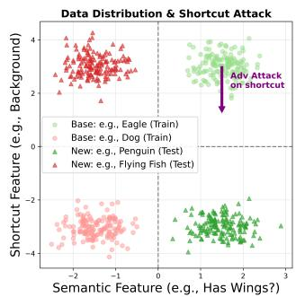

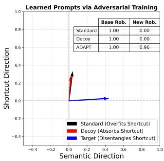  
Figure 2: Toy example (bird vs. non-bird). While standard adversarial prompt tuning (i.e., black arrow) gets trapped in non-generalizable shortcuts, our ADAPT employs a decoy prompt $( \mathbf { i . e . , }$ red arrow) to absorb these shortcuts, guiding the target prompt (i.e., blue arrow) to learn robust features.

Data Distribution and Shortcut Bias. We simulate a binary classification task with two latent features: a semantic feature �sem (x-axis) and a shortcut feature $x _ { \mathrm { s h o } }$ (y-axis). For the base classes, the data clusters are generated from Gaussian distributions with cen- troids at [1.5, 3.0] (positive class) and $\left[ - 1 . 5 , - 3 . 0 \right]$ (negative class), sharing a standard deviation of 0.4. Crucially, this setup creates a significantly larger margin (i.e., inter-class distance between centroids) in the shortcut dimension $( \mathrm { i . e . } ,$ , distance of 6.0) compared to the semantic dimension (i.e., distance of 3.0). This disparity creates a strong inductive bias, as the classes are further apart along the shortcut axis, causing the model to prioritize $x _ { \mathrm { s h o } }$ as the primary discriminative feature to minimize the training loss. Consequently, adversarial attacks (e.g., PGD attack [25]) naturally focus on this dominant direction, as perturbations along the axis with larger weights induce a larger increase in loss.

Distribution Shift and Robustness Failure. For the new classes (test stage), we introduce a distribution shift where the centroid of the positive class shifts to [1.5, −3.0] and that of the negative class changes to [−1.5, 3.0]. Crucially, the semantic feature $x _ { \mathrm { s e m } }$ remains invariant across this shift. Figure 2 (Right) visualizes the learned weight vectors $( { \mathrm { i . e . } }$ , arrows) of diferent prompts. Note that the decision boundary is orthogonal to these weight vectors. Standard adversarial prompt tuning (i.e., black arrow) is skewed heavily to-wards the y-axis, indicating it has overfitted the shortcut due to its larger margin. While this yields high robustness on base classes, it leads to catastrophic failure (0% robustness) on new classes, where the shortcut correlation is flipped. This failure serves as a concrete manifestation of the robust generalization overfitting phenomenon. Mechanism of ADAPT. Our ADAPT framework successfully disentangles these features. The decoy prompt (i.e., red arrow) is ex-plicitly guided to align with the shortcut direction (i.e., y-axis), absorbing the non-robust features. This alignment is enforced by a sparsity constraint $( \mathrm { e . g . , } \ell _ { 1 }$ regularization) which forces the decoy prompt to learn the easiest shortcut feature. Since the shortcut dimension provides the most dominant gradient signal due to its larger margin, the decoy prompt greedily latches onto this single direction and suppresses the weaker semantic features. In contrast, constrained by the orthogonality to the decoy prompt, the target prompt (i.e., blue arrow) is forced to align with the semantic direction (i.e., x-axis). By efectively ignoring the volatile shortcut dimension, the target prompt achieves stable robustness on both base and new classes.

## 3.3 ADAPT

Motivated by the robust generalization overfitting phenomenon, we propose the ADAPT method. Unlike standard adversarial prompt tuning, which may bias the model to learn the pseudo-robust fea- tures, ADAPT operates on a dual-prompt mechanism designed to disentangle robust features from pseudo-robust features. The overall architecture of ADAPT is illustrated in Figure 3.

Dual-prompt mechanism. Existing APT learns a single learn-able prompt, which tends to learn pseudo-robust features that are discriminative for the adversarial examples of seen classes but are non-generalizable to unseen classes. To address this, we introduce a target prompt and a pool of decoy prompts. Specifically, the target prompt is defined as $\mathbf { P } _ { \mathrm { t } } = \{ \mathbf { v } _ { 1 } ^ { \mathrm { t } } , \ldots \bar { } , \mathbf { v } _ { M } ^ { \mathrm { t } } ,$ [CLS]}. Considering that adversarial shortcuts may exhibit diverse patterns, a single decoy prompt may not sufice to capture all of them. Therefore, we construct a pool of � decoy prompts $\mathcal { P } _ { \mathrm { d } } = \{ \mathbf { P } _ { \mathrm { d } } ^ { 1 } , \mathbf { P } _ { \mathrm { d } } ^ { 2 } , \dots , \mathbf { P } _ { \mathrm { d } } ^ { K } \}$ . Each decoy prompt $\mathbf { P } _ { \mathrm { d } } ^ { k }$ follows the same structure as the target prompt. During inference, only the target prompt $\mathbf { P } _ { \mathrm { t } }$ is used, ensuring no additional computational overhead compared to standard APT.

Decoy prompt as a shortcut trap. We utilize decoy prompts as a trap to capture the pseudo-robust features. In each training iteration, we uniformly sample an index $k \sim \mathcal { U } ( 1 , K )$ to select an active decoy prompt $\mathbf { P } _ { \mathrm { d } } ^ { k }$ from the pool. For the sake of brevity, we omit the index � and refer to the currently active decoy prompt simply as $\mathbf { P } _ { \mathrm { d } } =$ $\{ \mathbf { v } _ { 1 } ^ { \mathrm { d } } , \ldots , \mathbf { v } _ { M } ^ { \mathrm { d } } $ , [CLS]}, and its corresponding textual embeddings to all classes as $\mathbf { t } _ { \mathrm { d } } = \{ \mathbf { t } _ { \mathrm { d } } ^ { c } \} _ { c = 1 } ^ { C }$ . It is worth noting that each decoy prompt in the pool is initialized independently and updated exclusively when selected. This stochastic sampling strategy encourages the pool to learn a diverse set of shortcut directions, efectively covering the subspace of non-generalizable features.

To strictly enforce the decoy prompt to focus only on non-generalizable shortcuts, we aim to push the decoy prompt away from the general semantic space captured by hand-crafted prompts. Specifically, we consider the text embeddings of the hand-crafted prompt as the general semantic anchor, denoted as $\mathbf { t } _ { \mathrm { H } } = \{ \mathbf { t } _ { \mathrm { H } } ^ { c } \} _ { c = 1 } ^ { C } .$ Then, we explicitly maximize the dissimilarity between embeddings of the decoy prompt $\mathbf { t _ { d } }$ and the hand-crafted prompt tH. This can be achieved by minimizing the dissimilarity loss as

$$
\mathcal { L } _ { \mathrm { d i s } } = \cos ( \mathbf { t } _ { \mathrm { d } } , \mathbf { t } _ { \mathrm { H } } ) .\tag{2}
$$

Note that by minimizing Eq. (2), we encourage the decoy prompt to deviate from the general semantic directions. Simultaneously, the decoy prompt is required to minimize the classification loss on adversarial examples with the loss function as

$$
\begin{array} { r } { \mathcal { L } _ { \mathrm { c e } } ^ { \mathrm { d } } = \mathcal { L } _ { \mathrm { c e } } ( \mathbf { x } _ { \mathrm { a d v } } , \mathbf { t } _ { \mathrm { d } } , \mathbf { y } ) . } \end{array}\tag{3}
$$

It is important to note that the adversarial examples $\mathbf { X } _ { \mathrm { a d v } }$ used here are generated at the beginning of the iteration using the current target prompt, thus capturing the specific perturbation patterns that successfully fool the target prompt.

By combining two losses in Eqs. (2) and (3), the overall objective for learning the decoy prompt is formulated as

$$
\mathcal { L } _ { \mathrm { t o t a l } } ^ { \mathrm { d } } = \mathcal { L } _ { \mathrm { c e } } ^ { \mathrm { d } } + \alpha \mathcal { L } _ { \mathrm { d i s } } .\tag{4}
$$

By minimizing Eq. (4), the decoy prompt is compelled to find a solution that satisfies the training objective (e.g., high robustness on seen classes) while being semantically distinct from general knowledge. Consequently, the decoy prompt becomes a dedicated trap for adversarial shortcuts.

Learning target prompt via disentanglement. While the decoy prompt absorbs the shortcuts, the target prompt is guided to learn robust features. To achieve this, we impose an explicit orthog- onal loss in the latent space. Specifically, let $\mathbf { t } _ { \mathrm { t } } = \{ \mathbf { t } _ { \mathrm { t } } ^ { c } \} _ { c = 1 } ^ { C }$ denote the textual embeddings of the target prompt. To capture the domi- nant optimization direction shared across classes, we compute the global representation of the target and decoy prompts by averag- ing the text embeddings across all classes as $\begin{array} { r } { \bar { \bf t } _ { \mathrm { t } } = \bar { \frac { 1 } { C } } \sum _ { c = 1 } ^ { \bar { C } } { \bf t } _ { \mathrm { t } } ^ { c } } \end{array}$ and $\begin{array} { r } { \bar { \bf t } _ { \mathrm { d } } = \frac { 1 } { C } \sum _ { c = 1 } ^ { C } { \bf t } _ { \mathrm { d } } ^ { c } . } \end{array}$ . The orthogonal loss is formulated as

$$
\mathcal { L } _ { \mathrm { o r t h } } = \cos ^ { 2 } ( \bar { \bf t } _ { \mathrm { t } } , s \mathrm { g } ( \bar { \bf t } _ { \mathrm { d } } ) ) ,\tag{5}
$$

where sg(·) denotes the stop-gradient operator. When Eq. (5) reaches its minimum (i.e., 0), ¯tt becomes orthogonal to $\bar { \mathbf { t } } _ { \mathrm { d } } ,$ achieving disentanglement between the target and decoy prompts. Here, we employ the stop-gradient operation on the decoy prompt, which ensures that the disentanglement process solely updates the target prompt without the interference of updating the decoy prompt.

Moreover, to maintain the semantic validity of the target prompt, we tether the target prompt to the general semantic anchor. Specifically, we can minimize the $\ell _ { 1 }$ distance between the target prompt and the semantic anchor with the semantic loss formulated as

$$
\mathcal { L } _ { \mathrm { { s e m } } } = \Vert \mathbf { t } _ { \mathrm { { t } } } - \mathbf { t } _ { \mathrm { { H } } } \Vert _ { 1 } ,\tag{6}
$$

where $\| \cdot \| _ { 1 }$ denotes the $\ell _ { 1 }$ norm. This loss ensures that the tar- get prompt retains high-level semantic consistency with the handcrafted prompt.

By combining Eqs. (5) and (6) as well as the cross-entropy loss for classification, the overall objective for learning the target prompt is formulated as

$$
\mathcal { L } _ { \mathrm { t o t a l } } ^ { \mathrm { t } } = \mathcal { L } _ { \mathrm { c e } } ^ { \mathrm { t } } + \beta \mathcal { L } _ { \mathrm { s e m } } + \lambda \mathcal { L } _ { \mathrm { o r t h } } ,\tag{7}
$$

where $\mathcal { L } _ { \mathrm { c e } } ^ { \mathrm { t } } = \mathcal { L } _ { \mathrm { c e } } ( \mathbf { x } _ { \mathrm { a d v } } , \mathbf { t } _ { \mathrm { t } } , \mathbf { y } )$

In summary, for the entire training process, the ADAPT method adopts an alternating optimization strategy that minimizes Eqs. (4) and (7) to update the sampled decoy prompt and the target prompt, respectively. The complete algorithm for the proposed ADAPT method is shown in Algorithm 1.

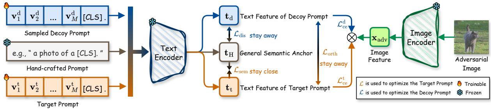  
Figure 3: Overview of the proposed ADAPT method. ADAPT operates on a dual-prompt mechanism consisting of a Target Prompt and a Decoy Prompt (uniformly sampled from a pool). The decoy prompt serves as a shortcut trap, optimized to absorb pseudo-robust features via $\mathcal { L } _ { \mathrm { c e } } ^ { \mathrm { d } }$ while deviating from the general semantic anchor via ${ \mathcal { L } } _ { \mathrm { d i s } } .$ . Conversely, the target prompt is guided to learn robust features by enforcing orthogonality to the decoy prompt via $\mathcal { L } _ { \mathrm { o r t h } }$ and maintaining semantic consistency with the general semantic anchor via $\mathcal { L } _ { \mathrm { s e m } } .$

Algorithm 1 Adversarial DisentAngled Prompt Tuning (ADAPT)   
1: Input: Training dataset D, CLIP image encoder $\varepsilon _ { \mathrm { I } }$ and text   
encoder $\varepsilon _ { \mathrm { { T } } } ,$ textual embeddings of hand-crafted prompts $\mathbf { t } _ { \mathrm { H } } ,$   
learning rate �, perturbation budget �, hyper-parameters �, $\beta , \lambda$ .   
2: Initialize: Target prompt $\mathbf { P _ { t } } ,$ a pool of decoy prompts $\mathcal { P } _ { \mathrm { d } } =$   
$\{ \mathbf { P } _ { \mathrm { d } } ^ { 1 } , \hdots , \mathbf { P } _ { \mathrm { d } } ^ { K } \}$   
3: for each epoch do   
4: for minibatch x, y in D do   
5: // 1. Generate Adversarial Examples using Target Prompt   
6: Compute textual embeddings of target prompt $\begin{array} { r l } { \mathbf { t _ { \mathrm { t } } } } & { { } = } \end{array}$   
$\varepsilon _ { \mathrm { { T } } } ( \mathbf { P } _ { \mathrm { { t } } } ) ;$   
7: Generate adversarial examples:   
8: xadv ← arg max $\begin{array} { r } { \mathcal { L } _ { \mathrm { c e } } ( \mathbf { x } _ { \mathrm { a d v } } , \mathbf { t } _ { \mathrm { t } } , \mathbf { y } ) , } \end{array}$ s.t. $\| { \bf \Delta x } _ { \mathrm { a d v } } - { \bf x } \| _ { { \cal P } } \leqslant \epsilon ;$   
xadv   
9: // 2. Update Sampled Decoy Prompt   
10: Uniformly sample an index $k \sim \mathcal { U } ( 1 , K )$   
11: Get the active decoy prompt $\mathbf { P } _ { \mathrm { d } } ^ { k }$ and compute $\mathbf { t } _ { \mathrm { d } } = \mathcal { E } _ { \mathrm { T } } ( \mathbf { P } _ { \mathrm { d } } ^ { k } )$   
12: Calculate loss of the decoy prompt:   
13: $\mathcal { L } _ { \mathrm { t o t a l } } ^ { \mathrm { d } } = \mathcal { L } _ { \mathrm { c e } } ( \bf x _ { \mathrm { a d v } } , t _ { \mathrm { d } } , y ) + \alpha \cos ( t _ { \mathrm { d } } , t _ { \mathrm { H } } )$   
14: Update $\mathbf { \bar { P } } _ { \mathrm { d } } ^ { k }  \mathbf { P } _ { \mathrm { d } } ^ { k } - \eta \nabla _ { \mathbf { P } _ { \mathrm { d } } ^ { k } } \mathcal { L } _ { \mathrm { t o t a l } } ^ { \mathrm { d } } ;$   
15: $/ / 3 .$ Update Target Prompt   
16: Calculate loss of the target prompt:   
17: $\mathcal { L } _ { \mathrm { t o t a l } } ^ { \mathrm { t } } = \mathcal { L } _ { \mathrm { c e } } ( \mathbf { x } _ { \mathrm { a d v } } , \mathbf { t } _ { \mathrm { t } } , \mathbf { \bar { y } } ) + \bar { \beta } \| \mathbf { t } _ { \mathrm { t } } - \mathbf { \bar { t } } _ { \mathrm { H } } \| _ { 1 } + \lambda \cos ^ { 2 } ( \bar { \mathbf { t } } _ { \mathrm { t } } , \mathbf { s } \mathbf { g } ( \bar { \mathbf { t } } _ { \mathrm { d } } ) )$   
18: Update $\mathbf { \bar { P } } _ { \mathrm { t } }  \mathbf { P } _ { \mathrm { t } } - \eta \nabla _ { \mathbf { P } _ { \mathrm { t } } } \mathcal { L } _ { \mathrm { t o t a l } } ^ { \mathrm { t } } ;$   
19: end for   
20: end for

## 3.4 Theoretical Analysis

In this section, we analyze whether loss functions in ADAPT, the semantic loss in Eq. (6) and the orthogonal loss in Eq. (5), can guarantee that the target classifier remains robust to shortcut shifts on unseen classes.

All CLIP image/text embeddings are ℓ2-normalized in this section unless stated otherwise. Consider that the feature space $\mathbb { R } ^ { d }$ can be decomposed into two orthogonal subspaces: a semantic subspace S and a shortcut subspace $\mathcal { U } \left( \mathrm { i . e . , \mathbb { R } } ^ { d } = S \oplus \mathcal { U } \right)$ . Let the image feature of an input x be decomposed as $z ( \mathbf { x } ) = s ( \mathbf { x } ) + u ( \mathbf { x } )$ , where $s ( \mathbf { x } ) \in S$ represents invariant semantics and $u ( \mathbf { x } ) \in \mathcal { U }$ represents distinct shortcut patterns (with $\| u ( \mathbf { x } ) \| _ { 2 } \leq B )$ . We assume that the semantic anchors $\{ \mathbf { t } _ { \mathrm { H } } ^ { c } \} _ { c = 1 } ^ { C }$ lie in $s$ and provide a suficient margin for classification as in the following assumption.

Assumption 3.1 (Semantic Separability). There exists a margin $\gamma \ > \ 0$ such that for any new-class sample (x, �), the semantic component �(x) is correctly classified by the anchors with probability at least $1 - \zeta .$ Specifically, the following inequality holds with probability at least $1 - \zeta$

$$
m _ { \mathrm { H } } ( \mathbf { x } , y ) : = \displaystyle \operatorname* { m i n } _ { c \neq y } ~ \langle s ( \mathbf { x } ) , \mathbf { t } _ { \mathrm { H } } ^ { y } - \mathbf { t } _ { \mathrm { H } } ^ { c } \rangle ~ \ge ~ \gamma ,\tag{8}
$$

where $< \cdot , \cdot >$ denotes the inner product operation.

Under such settings, Theorem 3.2 (proved in Appendix A) shows that if the target prompt is suficiently close to the semantic anchor (enforced by $\mathcal { L } _ { \mathrm { s e m } } )$ and orthogonal to the shortcut subspace (enforced by ${ \mathcal { L } } _ { \mathrm { o r t h } } )$ , the robustness carries over to the target classifier on unseen classes.

Theorem 3.2 (Robustness Generalization). Define the semantic deviation $\varepsilon _ { \mathrm { s e m } } ~ : = ~ \operatorname* { m a x } _ { c } \| \mathbf { t } _ { \mathrm { t } } ^ { c } - \mathbf { t } _ { \mathrm { H } } ^ { c } \| _ { 2 }$ and the shortcut leakage $\varepsilon _ { } u =$ max� $\| P _ { \mathcal { U } } ( \mathbf { t } _ { \mathrm { t } } ^ { c } ) \| _ { 2 }$ , where $P _ { \mathcal { U } } ( \cdot )$ is to project onto U. If the target prompts satisfy

$$
\gamma > 2 \varepsilon _ { \mathrm { s e m } } + 2 B \varepsilon _ { \mathcal { U } } ,\tag{9}
$$

then the target classifier $\hat { y } ( \mathbf { x } ) = \arg \operatorname* { m a x } _ { c } \langle z ( \mathbf { x } ) , \mathbf { t } _ { \mathrm { t } } ^ { c } \rangle$ is invariant to any shortcut shifts, in the sense that its prediction does not change under arbitrary variations of the shortcut component. Consequently, the testing error rate on new classes is bounded by �.

## 4 Experiments

## 4.1 Setups

Datasets. Following the protocols established in [22, 51, 52], we conduct experiments under four distinct settings: adversarial base-to- new generalization, adversarial few-shot classification, adversarial cross-dataset generalization, and adversarial domain generaliza- tion. The first three settings are evaluated on a standard suite of 11 datasets. For the setting of adversarial domain generalization, we train on ImageNet [5] and evaluate on its out-of-distribution (OOD) variants. Details are provided in Appendix B.

Baselines. We compare ADAPT with state-of-the-art adversarial defense strategies for VLMs. Specifically, we select zero-shot

Table 1: Performance under the setting of adversarial base-to-new generalization. All methods (except zero-shot TeCoA) are trained with 16 instances per base class. Here � equals 4/255. Results of � = 1/255 are provided in Appendix C.2.  
(a) Average over 11 datasets
<table><tr><td rowspan="2">Methods</td><td colspan="2">Base</td><td colspan="2">New</td><td rowspan="2"> $\mathrm { H _ { b } }$ </td></tr><tr><td> $_ \mathrm { A c c . }$ </td><td>Rob.</td><td>Acc.</td><td>Rob.</td></tr><tr><td>TeCoA</td><td>44.51</td><td>14.62</td><td>42.16</td><td>16.14</td><td>22.66</td></tr><tr><td>APT</td><td>58.62</td><td>27.40</td><td>30.13</td><td>10.96</td><td>22.47</td></tr><tr><td>ADAPT</td><td>60.04</td><td>27.48</td><td>38.98</td><td>15.65</td><td>28.05</td></tr><tr><td>FAP</td><td>58.00</td><td>27.96</td><td>39.77</td><td>16.17</td><td>28.57</td></tr><tr><td> $\mathrm { A D A P T _ { M } }$ </td><td>56.82</td><td>28.52</td><td>41.39</td><td>17.76</td><td>30.05</td></tr></table>

(b) ImageNet

(d) OxfordPets
<table><tr><td rowspan="2">Methods</td><td colspan="2">Base</td><td colspan="2">New</td><td rowspan="2">Hb</td></tr><tr><td>Acc.</td><td>Rob.</td><td>Acc.</td><td>Rob.</td></tr><tr><td>TeCoA</td><td>74.11</td><td>20.15</td><td>82.10</td><td>29.25</td><td>36.53</td></tr><tr><td>APT</td><td>74.22</td><td>27.38</td><td>73.04</td><td>23.21</td><td>37.46</td></tr><tr><td>ADAPT</td><td>79.00</td><td>27.59</td><td>76.17</td><td>27.96</td><td>40.90</td></tr><tr><td>FAP</td><td>74.43</td><td>31.84</td><td>68.51</td><td>26.51</td><td>41.17</td></tr><tr><td>ADAPTM</td><td>77.35</td><td>31.53</td><td>74.22</td><td>33.00</td><td>45.24</td></tr></table>

<table><tr><td rowspan="2">Methods</td><td colspan="2">Base</td><td colspan="2">New</td><td rowspan="2">Hb</td></tr><tr><td> $\operatorname { A c c } .$ </td><td>Rob.</td><td>Acc.</td><td>Rob.</td></tr><tr><td>TeCoA</td><td>43.65</td><td>11.36</td><td>44.95</td><td>13.67</td><td>19.39</td></tr><tr><td>APT</td><td>44.54</td><td>13.78</td><td>38.56</td><td>12.47</td><td>19.89</td></tr><tr><td>ADAPT</td><td>47.07</td><td>13.49</td><td>43.36</td><td>13.71</td><td>20.90</td></tr><tr><td>FAP</td><td>43.29</td><td>13.89</td><td>37.43</td><td>13.05</td><td>20.16</td></tr><tr><td> $\mathrm { A D A P T _ { M } }$ </td><td>41.67</td><td>13.88</td><td>39.47</td><td>14.49</td><td>21.01</td></tr></table>

(c) Caltech101

(e) StanfordCars
<table><tr><td rowspan="2">Methods</td><td colspan="2">Base</td><td colspan="2">New</td><td rowspan="2">Hb</td></tr><tr><td>Acc.</td><td>Rob.</td><td>Acc.</td><td>Rob.</td></tr><tr><td>TeCoA</td><td>12.49</td><td>2.10</td><td>17.38</td><td>2.08</td><td>3.65</td></tr><tr><td>APT</td><td>40.23</td><td>10.27</td><td>15.72</td><td>3.14</td><td>7.93</td></tr><tr><td>ADAPT</td><td>42.93</td><td>9.92</td><td>19.76</td><td>3.79</td><td>9.12</td></tr><tr><td>FAP</td><td>45.75</td><td>8.87</td><td>34.41</td><td>5.64</td><td>11.73</td></tr><tr><td>ADAPTM</td><td>38.81</td><td>8.10</td><td>36.35</td><td>7.18</td><td>12.66</td></tr></table>

(h) FGVCAircraft  
(f) Flowers102

(g) Food101
<table><tr><td rowspan="2">Methods</td><td colspan="2">Base</td><td colspan="2">New</td><td rowspan="2">Hb</td></tr><tr><td> $_ \mathrm { A c c . }$ </td><td>Rob.</td><td>Acc.</td><td>Rob.</td></tr><tr><td>TeCoA</td><td>59.49</td><td>4.92</td><td>32.19</td><td>5.61</td><td>9.32</td></tr><tr><td>APT</td><td>37.22</td><td>10.11</td><td>18.61</td><td>3.79</td><td>9.02</td></tr><tr><td>ADAPT</td><td>42.37</td><td>10.69</td><td>30.09</td><td>6.78</td><td>13.43</td></tr><tr><td>FAP</td><td>50.39</td><td>11.92</td><td>42.72</td><td>10.37</td><td>17.89</td></tr><tr><td>ADAPTM</td><td>41.39</td><td>13.33</td><td>31.52</td><td>9.49</td><td>16.93</td></tr></table>

<table><tr><td rowspan="2">Methods</td><td colspan="2">Base</td><td colspan="2">New</td><td rowspan="2"> $\operatorname { H } _ { \mathrm { b } }$ </td></tr><tr><td>Acc.</td><td>Rob.</td><td>Acc.</td><td>Rob.</td></tr><tr><td>TeCoA</td><td>85.41</td><td>49.45</td><td>83.08</td><td>54.37</td><td>64.14</td></tr><tr><td>APT</td><td>90.77</td><td>65.07</td><td>69.21</td><td>42.03</td><td>61.89</td></tr><tr><td>ADAPT</td><td>91.28</td><td>65.91</td><td>82.21</td><td>51.42</td><td>69.28</td></tr><tr><td>FAP</td><td>85.22</td><td>63.72</td><td>70.20</td><td>44.87</td><td>62.54</td></tr><tr><td> $\mathrm { A D A P T _ { M } }$ </td><td>89.74</td><td>66.24</td><td>79.15</td><td>52.29</td><td>68.97</td></tr></table>

<table><tr><td rowspan="2">Methods</td><td colspan="2">Base</td><td colspan="2">New</td><td rowspan="2"> $\operatorname { H } _ { \mathrm { b } }$ </td></tr><tr><td>Acc.</td><td>Rob.</td><td>Acc.</td><td>Rob.</td></tr><tr><td>TeCoA</td><td>40.65</td><td>14.81</td><td>38.94</td><td>10.28</td><td>18.60</td></tr><tr><td>APT</td><td>84.90</td><td>49.57</td><td>19.65</td><td>4.75</td><td>13.63</td></tr><tr><td>ADAPT</td><td>82.15</td><td>48.53</td><td>24.18</td><td>6.88</td><td>18.22</td></tr><tr><td>FAP</td><td>75.31</td><td>45.96</td><td>27.73</td><td>7.94</td><td>20.30</td></tr><tr><td>ADAPTM</td><td>78.73</td><td>45.39</td><td>28.79</td><td>9.50</td><td>22.89</td></tr></table>

<table><tr><td rowspan="2">Methods</td><td colspan="2">Base</td><td colspan="2">New</td><td rowspan="2">Hb</td></tr><tr><td>Acc.</td><td>Rob.</td><td>Acc.</td><td>Rob.</td></tr><tr><td>TeCoA</td><td>10.26</td><td>0.66</td><td>9.96</td><td>0.90</td><td>1.42</td></tr><tr><td>APT</td><td>21.19</td><td>7.08</td><td>5.82</td><td>2.22</td><td>4.93</td></tr><tr><td>ADAPT</td><td>20.17</td><td>6.36</td><td>12.42</td><td>2.70</td><td>6.08</td></tr><tr><td>FAP</td><td>21.13</td><td>6.90</td><td>15.78</td><td>3.90</td><td>7.81</td></tr><tr><td> $\mathrm { A D A P T _ { M } }$ </td><td>19.93</td><td>8.52</td><td>13.62</td><td>3.78</td><td>7.91</td></tr></table>

(i) SUN397  
(k) EuroSAT

(j) DTD
<table><tr><td rowspan="2">Methods</td><td colspan="2">Base</td><td colspan="2">New</td><td rowspan="2"> $\mathrm { H _ { b } }$ </td></tr><tr><td>Acc.</td><td>Rob.</td><td>Acc.</td><td>Rob.</td></tr><tr><td>TeCoA</td><td>32.87</td><td>16.09</td><td>34.30</td><td>18.48</td><td>22.75</td></tr><tr><td>APT</td><td>53.36</td><td>25.35</td><td>23.67</td><td>10.75</td><td>20.68</td></tr><tr><td>ADAPT</td><td>54.63</td><td>28.01</td><td>30.31</td><td>15.22</td><td>26.19</td></tr><tr><td>FAP</td><td>54.17</td><td>28.94</td><td>26.93</td><td>15.10</td><td>25.58</td></tr><tr><td>ADAPTM</td><td>55.21</td><td>32.06</td><td>34.90</td><td>20.05</td><td>31.29</td></tr></table>

<table><tr><td rowspan="2">Methods</td><td colspan="2">Base</td><td colspan="2">New</td><td rowspan="2"> $\operatorname { H } _ { \mathrm { b } }$ </td></tr><tr><td>Acc.</td><td>Rob.</td><td>Acc.</td><td>Rob.</td></tr><tr><td>TeCoA</td><td>39.81</td><td>7.91</td><td>45.36</td><td>10.84</td><td>15.05</td></tr><tr><td>APT</td><td>53.40</td><td>14.27</td><td>30.08</td><td>6.97</td><td>15.06</td></tr><tr><td>ADAPT</td><td>55.08</td><td>14.54</td><td>37.25</td><td>9.07</td><td>17.85</td></tr><tr><td>FAP</td><td>50.88</td><td>15.17</td><td>41.31</td><td>12.42</td><td>21.02</td></tr><tr><td> $\mathrm { A D A P T _ { M } }$ </td><td>48.35</td><td>14.40</td><td>44.05</td><td>13.55</td><td>21.43</td></tr></table>

<table><tr><td rowspan="2">Methods</td><td colspan="2">Base</td><td colspan="2">New</td><td rowspan="2">Hb</td></tr><tr><td> $\operatorname { A c c } .$ </td><td>Rob.</td><td>Acc.</td><td>Rob.</td></tr><tr><td>TeCoA</td><td>48.19</td><td>23.48</td><td>30.85</td><td>22.36</td><td>28.47</td></tr><tr><td>APT</td><td>81.76</td><td>54.81</td><td>11.95</td><td>5.33</td><td>13.25</td></tr><tr><td>ADAPT</td><td>78.86</td><td>52.14</td><td>42.64</td><td>26.56</td><td>43.03</td></tr><tr><td>FAP</td><td>79.76</td><td>54.86</td><td>43.26</td><td>28.00</td><td>44.64</td></tr><tr><td> $\mathrm { A D A P T _ { M } }$ </td><td>76.29</td><td>55.43</td><td>37.18</td><td>20.05</td><td>37.06</td></tr></table>

(l) UCF101

TeCoA [27] as the representative for robust fine-tuning. For adversarial prompt tuning methods, we compare against APT [22], which optimizes textual prompts, and FAP [52], which incorporates multi-modal prompts. These baselines cover the primary paradigms in robust VLM research.

Since ADAPT focuses on optimizing textual prompts, it has fewer learnable parameters than multi-modal prompt tuning meth ods such as FAP. For a fair comparison and to further explore the potential of our method, we extend our method to a multi-modal prompt version, termed $\mathrm { \ A D A P T _ { M } }$ . Drawing inspiration from FAP [52], $\mathrm { A D A P T _ { M } }$ establishes a deep coupling mechanism between vision and language branches. Specifically, $\mathrm { \ A D A P T _ { M } }$ maintains two sets of learnable deep visual prompts for the target and de- coy prompts, respectively. For each layer, these visual prompts are mapped into the text embedding space through a lightweight cross-modal projection, producing the corresponding deep textual prompts. The deep visual and text prompts are then injected into the input sequence of the corresponding transformer block. In this way, the two branches are coupled layer-by-layer. Thus, both the target and the decoy have their own multi-modal prompts.

<table><tr><td rowspan="2">Methods</td><td colspan="2">Base</td><td colspan="2">New</td><td rowspan="2"> $\operatorname { H } _ { \mathrm { b } }$ </td></tr><tr><td>Acc.</td><td>Rob.</td><td>Acc.</td><td>Rob.</td></tr><tr><td>TeCoA</td><td>42.71</td><td>9.88</td><td>44.67</td><td>9.73</td><td>16.01</td></tr><tr><td>APT</td><td>63.19</td><td>23.73</td><td>25.15</td><td>5.90</td><td>14.97</td></tr><tr><td>ADAPT</td><td>66.86</td><td>25.13</td><td>30.34</td><td>8.11</td><td>18.96</td></tr><tr><td>FAP</td><td>57.70</td><td>25.49</td><td>29.15</td><td>10.06</td><td>21.02</td></tr><tr><td> $\mathrm { A D A P T _ { M } }$ </td><td>57.55</td><td>24.87</td><td>36.02</td><td>12.01</td><td>23.72</td></tr></table>

Adversarial training and evaluation. For adversarial training and evaluation, we employ PGD attack [25] under the $\ell _ { \infty }$ threat model. Consistent with prior works [22, 27, 36], we conduct experi-ments under two perturbation budgets of $\epsilon = 1 / 2 5 5$ and $\epsilon = 4 / 2 5 5$ During training, we generate adversarial examples using a 3-step PGD with a step size of $2 \epsilon / 3$ . For evaluation, we employ a 100- step PGD with a step size of $\epsilon / 4$ and random initialization. More implementation details are provided in Appendix B.

## 4.2 Main Results

Adversarial base-to-new generalization. In this scenario, we evaluate the robust base-to-new transferability ofthe learned prompts by splitting datasets into disjoint base (seen) and new (unseen) classes. Models are trained solely on base classes and evaluated on both sets. Table 1 reports the detailed performance across 11 datasets, where $\mathrm { ^ { * } H _ { b } } ^ { \mathrm { } } \cdot$ denotes the harmonic mean computed over accuracy and robustness on base classes and on new classes. We can see that APT sufers from severe robust generalization overfitting, characterized by high performance on base classes but a sharp de- cline on new classes. In contrast, ADAPT efectively mitigates this issue. On the challenging new classes, ADAPT outperforms APT by an average of 8.85% in accuracy and 4.69% in robustness, resulting in a substantial gain of 5.58% in the $\mathrm { \tilde { H _ { b } } \tilde { \Delta } }$ metric. Furthermore, this advantage extends to the multi-modal prompting, where ADAPTM consistently surpasses the state-of-the-art FAP, achieving improve-ments of 1.62% and 1.59% in terms of the accuracy and robustness on new classes, respectively. Crucially, the gains in robust generalization do not come at the cost of performance degradation on base classes. ADAPT achieves the highest average accuracy (i.e., 60.04%) on base classes among all baseline methods, surpassing APT and FAP by 1.42% and 2.04%, respectively, and performs comparably in terms of robustness. $\mathrm { A D A P T _ { M } }$ achieves the highest average ro- bustness on base classes (i.e., 28.52%). Those results demonstrate that by efectively disentangling robust features from shortcuts, the proposed method achieves the best trade-of between accuracy and robustness on base and new classes.

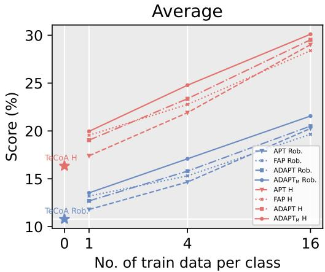  
Figure 4: Average performance on the 11 datasets under the adversarial few-shot classification setting. Since accuracies are comparable across methods, we plot only robustness and ‘H’ for clarity. $\epsilon = 4 / 2 5 5$ . Full results are provided in Appendix C.3.

Adversarial few-shot classification. In this scenario, we assess the capability of prompts to learn robust representations from limited labeled data. Specifically, models are tuned using {1, 4, 16} shots per class and evaluated on the remaining samples. The aver- age performance on 11 datasets is reported in Figure 4, where ‘H’ denotes the harmonic mean of the robustness and accuracy. ADAPT consistently outperforms TeCoA and APT across all settings. Even in the extreme data-scarce regime (i.e., 1-shot), ADAPT achieves significant improvements, surpassing APT (TeCoA) by 0.90% (1.9%) and 1.64% $( 2 . 7 \% )$ in terms of the robustness and ‘H’, respectively. Notably, $\mathrm { \ A D A P T _ { M } }$ achieves the highest robustness and ‘H’ among all baselines under all settings, validating that our proposed method efectively learns robust features without overfitting to shortcuts. Adversarial robustness evaluation under various attacks. Here we evaluate the adversarial robustness of adversarial prompt tun- ing methods using a wider variety of attacks, including Carlini & Wagner (CW) attack [2] and AutoAttack (AA) [4]. CW represents a strong optimization-based attack aiming for minimal perturbations, while AA serves as a standardized, ensemble-based attack for reli- able robustness assessment. Both CW and AA generate more potent adversarial examples than PGD, making them stronger attack meth- ods for more rigorous evaluation. Table 2 reports the performance across 10 datasets (excluding ImageNet), where $\mathrm { \tilde { \Delta } H _ { a } } \mathrm { \Delta }$ denotes the har- monic mean computed over $\mathrm { A c c . _ { B a s e } , P G D _ { B a s e } , A c c . _ { N e w } , P G D _ { N e w } }$ CW, and AA on both base and new classes. The proposed methods consistently outperform the baselines under all attacks. Specifically, ADAPT surpasses APT by 5.23% in $\mathrm { \tilde { \prime } H _ { a } } ^ { \prime }$ . Furthermore, $\mathrm { \ A D A P T _ { M } }$ achieves the best overall performance, outperforming the previous SOTA method (i.e., FAP) by 1.73% in terms of $\mathrm { \tilde { \Delta } H _ { a } } ^ { \prime }$ . This consis- tent superiority against such a diverse and aggressive attack suite provides strong evidence that the robustness learned by ADAPT is generalized, stemming from the efective disentanglement of invariant semantic features from attack-specific shortcuts.

Table 2: Average performance under the adversarial base-tonew generalization setting with various attacks. $\epsilon = 4 / 2 5 5$
<table><tr><td rowspan="3">Method</td><td colspan="5">Average over 10 datasets</td></tr><tr><td colspan="2">Base</td><td colspan="2">New</td><td rowspan="2"> $\mathrm { H _ { a } }$ </td></tr><tr><td>Acc.</td><td>PGD</td><td>Acc. PGD</td><td>CW AA</td></tr><tr><td>TeCoA</td><td>40.54</td><td>13.59</td><td>38.08 14.90</td><td>14.59</td><td>13.18 17.86</td></tr><tr><td>APT</td><td>54.57</td><td>26.15</td><td>26.63 9.83</td><td>9.45 8.56</td><td>14.33</td></tr><tr><td>ADAPT</td><td>55.76</td><td>26.26</td><td>35.03 14.41</td><td>13.64</td><td>12.59 19.56</td></tr><tr><td>FAP</td><td>54.07</td><td>26.70</td><td>36.36 14.98</td><td>13.32</td><td>12.19 19.52</td></tr><tr><td>ADAPTM</td><td>53.03</td><td>27.26</td><td>37.80 16.45</td><td>14.86</td><td>13.79 21.23</td></tr></table>

Table 3: Ablation study of the proposed ADAPT framework. We report the average performance under the adversarial base-to-new generalization setting across 11 datasets. $\epsilon =$ $4 / 2 5 5$
<table><tr><td rowspan="2">Methods</td><td colspan="2">Base</td><td colspan="2">New</td><td rowspan="2"> $\operatorname { H } _ { \mathrm { b } }$ </td></tr><tr><td>Acc</td><td>Rob</td><td>Acc</td><td>Rob</td></tr><tr><td>TeCoA</td><td>44.51</td><td>14.62</td><td>42.16</td><td>16.14</td><td>22.66</td></tr><tr><td>APT</td><td>58.62</td><td>27.40</td><td>30.13</td><td>10.96</td><td>22.47</td></tr><tr><td>ADAPT</td><td>60.04</td><td>27.48</td><td>38.98</td><td>15.65</td><td>28.05</td></tr><tr><td>w/o  $\mathcal { P } _ { \mathrm { d } }$ </td><td>59.95</td><td>27.55</td><td>36.43</td><td>14.75</td><td>26.99</td></tr><tr><td>w/o  ${ \mathcal { L } } _ { \mathrm { d i s } }$ </td><td>59.80</td><td>27.49</td><td>38.25</td><td>14.99</td><td>27.41</td></tr><tr><td>w/o  $\mathcal { L } _ { \mathrm { { s e m } } }$ </td><td>58.34</td><td>27.37</td><td>34.14</td><td>12.54</td><td>24.58</td></tr><tr><td>w/o  $\mathcal { L } _ { \mathrm { o r t h } }$ </td><td>60.19</td><td>27.56</td><td>37.52</td><td>13.16</td><td>25.72</td></tr></table>

Due to page limit, more experimental results can be found in Appendix C, including generalization to alternative VLM backbones, computational cost analysis, and the results under the settings of adversarial cross-dataset generalization and adversarial domain generalization.

## 4.3 Ablation Studies

In this section, we conduct ablations to analyze the contributions of the pool of decoy prompts $\mathcal { P } _ { \mathrm { d } } ,$ the dissimilarity loss ${ \mathcal { L } } _ { \mathrm { d i s } } ,$ , the semantic loss $\mathcal { L } _ { \mathrm { { s e m } } } ,$ , and the orthogonal loss ${ \mathcal { L } } _ { \mathrm { o r t h } }$

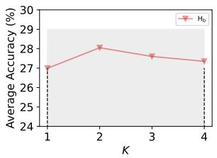  
(a)

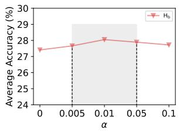  
(b)

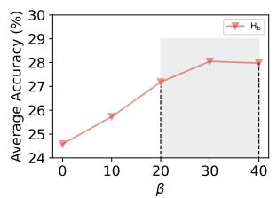  
(c)

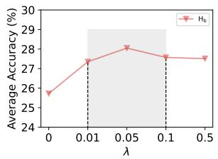  
(d)  
Figure 5: The average performance of ADAPT on all datasets w.r.t. hyperparameters $( \mathbf { i . e . , } K , \alpha , \beta ,$ and �) under the adversarial base-to-new generalization setting.

As shown in Table 3, the ADAPT method achieves good performance with an average $\mathrm { \tilde { H _ { b } } \tilde { \Delta } }$ of 28.05%, verifying the necessity of integrating these components. We observe that removing $\mathcal { L } _ { \mathrm { s e m } }$ results in the most severe performance degradation. This drop is expected, as $\mathcal { L } _ { \mathrm { s e m } }$ serves as a semantic regularizer that tethers the target prompt to the general semantic space. Without it, the model may sufer from catastrophic forgetting of its pre-trained knowl-edge. Furthermore, the exclusion of the orthogonal loss ${ \mathcal { L } } _ { \mathrm { o r t h } }$ leads to a drop of 2.33% in $\mathrm { \tilde { H _ { b } } \tilde { \Delta } }$ . While $\mathcal { L } _ { \mathrm { s e m } }$ ensures the model remains a competent VLM, $\mathcal { L } _ { \mathrm { o r t h } }$ is responsible for explicitly enforcing inde pendence between the target and decoy prompts to actively filter out pseudo-robust features. Additionally, removing the dissimilarity loss ${ \mathcal { L } } _ { \mathrm { d i s } }$ or the pool of decoy prompts $\mathcal { P } _ { \mathrm { d } }$ also impairs the gener alization capability on new classes, confirming that a diverse set of decoy prompts explicitly pushed away from valid semantics is a requisite to entrap diverse pseudo-robust features efectively.

## 5 Analysis on Hyperparameter Sensitivity

We analyze the sensitivity of �, �, �, and � using the average performance over 11 datasets under adversarial base-to-new gener- alization with $\epsilon = 4 / 2 5 5$

Efect of �. As shown in Figure 5a, increasing � from 1 to 2 im-proves performance, indicating that multiple decoy prompts better capture diverse pseudo-robust features. Further increasing � pro-vides no additional benefit and slightly complicates optimization. Efect of �. The coeficient � controls the dissimilarity loss ${ \mathcal { L } } _ { \mathrm { d i s } }$ in Eq. (4). Figure 5b shows that ADAPT is relatively insensitive to � within [0.005, 0.1], with the best performance at $\alpha = 0 . 0 1$ Efect of $\beta .$ The coeficient � weights the semantic loss $\mathcal { L } _ { \mathrm { s e m } }$ in Eq. (7). As shown in Figure $5 \mathrm { c } ,$ small values of � lead to substantial degradation, while the performance stabilizes for $\beta \in \left[ 3 0 , 4 0 \right]$ , high- lighting the importance of preserving general semantic knowledge. Efect of �. The coeficient � controls the orthogonal loss ${ \mathcal { L } } _ { \mathrm { o r t h } }$ in Eq. (7). As shown in Figure 5d, the performance improves sub-stantially as � increases from 0 to 0.05, confirming the benefit of explicitly disentangling the target and decoy prompts. The best performance is achieved at $\lambda = 0 . 0 5$ , while larger values lead to only a slight decline and remain relatively stable, indicating that ADAPT is not overly sensitive to � within a moderate range.

## 6 Visualization of Prompt Embeddings

To verify the efectiveness of the proposed dual-prompt mechanism, we visualize the prompt embeddings using t-SNE in Figure 6. The results reveal a clear disentanglement in the latent space. Target prompts (in blue) consistently align with general semantic anchors (in green) across both base and new classes, confirming that our semantic loss efectively enforces the learning of semantically in- variant features. Crucially, the decoy prompts (in red) diverge into distinct non-semantic subspaces isolated from the anchors and, no- tably, separated from each other. Despite this deviation, both groups of decoy prompts achieve good performance on base classes but degrade significantly on new classes. This contrast indicates that diferent decoy prompts converge to diverse class-specific shortcuts. Though these features are discriminative on the training classes, they lack transferability. By employing a pool of decoy prompts to act as “diverse traps” for these varying shortcuts, ADAPT allows the target prompt to learn purified robust features.

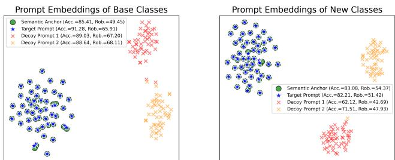  
Figure 6: t-SNE visualization of prompt embeddings on Caltech101. The target prompts cluster around general semantic anchors, while the decoy prompts lie in a separate subspace.

## 7 Conclusion

In this paper, we identify and formally define the phenomenon of “robust generalization overfitting” in adversarial prompt tuning, revealing that the failure of robustness generalization stems from the model’s reliance on seudo-robust features. To address this, we propose ADAPT, which is guided by the philosophy of “Learning What Not to Learn”. Specifically, ADAPT employs a dual-prompt mechanism with explicit orthogonal loss, successfully entrapping non-generalizable pseudo-robust features into decoy prompts while guiding the target prompt to learn robust features. Experiments on benchmark datasets demonstrate that ADAPT achieves state-of- the-art performance, particularly in the challenging base-to-new generalization settings.

## Acknowledgments

This work was supported by National Natural Science Foundation ofChina under Grant no. 62136005, Shenzhen fundamental research program JCYJ20250604144724032, and the China Postdoctoral Sci-ence Foundation under Grant No. 2026M791631.

## References

[1] Lukas Bossard, Matthieu Guillaumin, and Luc Van Gool. 2014. Food-101–mining discriminative components with random forests. In ECCV.

[2] Nicholas Carlini and David Wagner. 2017. Towards evaluating the robustness of neural networks. In 2017 ieee symposium on security and privacy (sp). Ieee, 39–57.

[3] Mircea Cimpoi, Subhransu Maji, Iasonas Kokkinos, Sammy Mohamed, and An drea Vedaldi. 2014. Describin textures in the wild. In CVPR.

[4] Francesco Croce and Matthias Hein. 2020. Reliable evaluation of adversarial robustness with an ensemble of diverse arameter-free attacks. In International conference on machine learning. PMLR, 2206–2216.

[5] Jia Deng, Wei Dong, Richard Socher, Li-Jia Li, Kai Li, and Li Fei-Fei. 2009. Imagenet: A large-scale hierarchical image database. In CVPR.

[6] Ning Ding, Yujia Qin, Guang Yang, Fuchao Wei, Zonghan Yang, Yusheng Su, Shengding Hu, Yulin Chen, Chi-Min Chan, Weize Chen, et al. 2023. Parameter eficient fine-tuning of large-scale pre-trained language models. Nature machine intelligence 5, 3 (2023), 220–235.

[7] Junhao Dong, Piotr Koniusz, Yifei Zhang, Hao Zhu, Weiming Liu, Xinghua Qu, and Yew-Soon Ong. 2025. Improving Zero-Shot Adversarial Robustness in Vision Language Models by Closed-form Alignment of Adversarial Path Simplices. In Forty-second International Conference on Machine Learning.

[8] Alex Fang, Albin Madappally Jose, Amit Jain, Ludwig Schmidt, Alexander T Toshev, and Vaishaal Shankar. 2024. Data Filtering Networks. In The Twelfth International Conference on Learning Representations.

[9] Li Fei-Fei, Rob Fergus, and Pietro Perona. 2004. Learning generative visual models from few training examples: An incremental bayesian approach tested on 101 object categories. In CVPRW.

[10] Samuel G Finlayson, John D Bowers, Joichi Ito, Jonathan L Zittrain, Andrew L Beam, and Isaac S Kohane. 2019. Adversarial attacks on medical machine learning. Science 363 6433 (2019) 1287–1289.

[11] Robert Geirhos, Jörn-Henrik Jacobsen, Claudio Michaelis, Richard Zemel, Wieland Brendel, Matthias Bethge, and Felix A Wichmann. 2020. Shortcut learn ing in deep neural networks. Nature Machine Intelligence 2, 11 (2020), 665–673.

[12] Ian J Goodfellow, Jonathon Shlens, and Christian Szegedy. 2014. Explaining and harnessing adversarial examples. arXiv preprint arXiv:1412.6572 (2014).

[13] Patrick Helber, Benjamin Bischke, Andreas Dengel, and Damian Borth. 2019. Eurosat: A novel dataset and deep learning benchmark for land use and land cover classification. IEEE Journal ofSelected Topics in Applied Earth Observations and Remote Sensing 12, 7 (2019), 2217–2226.

[14] Dan Hendrycks, Steven Basart, Norman Mu, Saurav Kadavath, Frank Wang, Evan Dorundo, Rahul Desai, Tyler Zhu, Samyak Parajuli, Mike Guo, et al. 2021. The man faces of robustness: A critical anal sis of out-of-distribution eneralization. In ICCV.

[15] Dan Hendrycks, Kevin Zhao, Steven Basart, Jacob Steinhardt, and Dawn Song. 2021. Natural adversarial examples. In CVPR.

[16] Md Zarif Hossain and Ahmed Imteaj. 2025. SLADE: Shielding against Dual Exploits in Large Vision-Language Models. In Proceedings of the Computer Vision and Pattern Recognition Conference. 24244–24254

[17] Gabriel Ilharco, Mitchell Wortsman, Nicholas Carlini, Rohan Taori, Achal Dave, Vaishaal Shankar, Hongseok Namkoong, John Miller, Hannaneh Hajishirzi, Ali Farhadi, et al. 2021. Openclip. Zenodo (2021).

[18] Chao Jia, Yinfei Yang, Ye Xia, Yi-Ting Chen, Zarana Parekh, Hieu Pham, Quoc Le, Yun-Hsuan Sung, Zhen Li, and Tom Duerig. 2021. Scaling up visual and visionlanguage representation learning with noisy text supervision. In Proceedings of the International Conference on Machine Learning. 4904–4916.

[19] Muhammad Uzair Khattak, Hanoona Rasheed, Muhammad Maaz, Salman Khan, and Fahad Shahbaz Khan. 2023. Maple: Multi-modal prompt learning. In CVPR. 19113–19122.

[20] Byungju Kim, Hyunwoo Kim, Kyungsu Kim, Sungjin Kim, and Junmo Kim. 2019. Learning not to learn: Training deep neural networks with biased data. In Proceedings of the IEEE/CVF conference on computer vision and pattern recognition. 9012–9020.

[21] Jonathan Krause, Michael Stark, Jia Deng, and Li Fei-Fei. 2013. 3d object representations for fine-grained categorization. In CVPRW.

[22] Lin Li, Haoyan Guan, Jianing Qiu, and Michael Spratling. 2024. One prompt word is enough to boost adversarial robustness for pre-trained vision-language models. In Proceedings ofthe IEEE/CVF Conference on Computer Vision and Pattern Recognition. 24408–24419.

[23] Haotian Liu, Chunyuan Li, Qingyang Wu, and Yong Jae Lee. 2023. Visual Instruction Tuning. In Advances in Neural Information Processing Systems.

[24] Xiao Liu, Kaixuan Ji, Yicheng Fu, Weng Tam, Zhengxiao Du, Zhilin Yang, and Jie Tang. 2022. P-tuning: Prompt tuning can be comparable to fine-tuning across scales and tasks. In Proceedings of the 60th Annual Meeting of the Association for Computational Linguistics (Volume 2: Short Papers). 61–68.

[25] Aleksander Madry, Aleksandar Makelov, Ludwig Schmidt, Dimitris Tsipras, and Adrian Vladu. 2018. Towards Deep Learning Models Resistant to Adversarial Attacks. In International Conference on Learning Representations.

[26] Subhransu Maji, Esa Rahtu, Juho Kannala, Matthew Blaschko, and Andrea Vedaldi. 2013. Fine-grained visual classification of aircraft. arXiv preprint arXiv:1306.5151 (2013).

[27] Chengzhi Mao, Scott Geng, Junfeng Yang, Xin Wang, and Carl Vondrick. 2023. Understanding Zero-shot Adversarial Robustness for Large-Scale Models. In The Eleventh International Conference on Learning Representations.

[28] Chunlei Meng, Guanhong Huang, Rong Fu, Runmin Jian, Zhongxue Gan, and Chun Ouyang. 2026. CLCR: Cross-Level Semantic Collaborative Representation for Multimodal Learning. In Proceedings ofthe IEEE/CVF Conference on Computer Vision and Pattern Recognition (CVPR). 1606–1615.

[29] Chunlei Meng, Jiabin Luo, Zhenglin Yan, Zhenyu Yu, Rong Fu, Zhongxue Gan, and Chun Ouyang. 2026. Tri-Subspaces Disentanglement for Multimodal Sentiment Analysis. In Proceedings of the IEEE/CVF Conference on Computer Vision and Pattern Recognition (CVPR). 8791–8800.

[30] Maria-Elena Nilsback and Andrew Zisserman. 2008. Automated flower classifi cation over a large number of classes. In Indian conference on computer vision, graphics & image processing.

[31] Omkar M Parkhi, Andrea Vedaldi, Andrew Zisserman, and CV Jawahar. 2012. Cats and dogs. In CVPR.

[32] Alec Radford, Jong Wook Kim, Chris Hallacy, Aditya Ramesh, Gabriel Goh, Sandhini A arwal, Girish Sastr , Amanda Askell, Pamela Mishkin, Jack Clark, et al. 2021. Learning transferable visual models from natural language supervision. In International Conference on Machine Learning.

[33] Benjamin Recht, Rebecca Roelofs, Ludwig Schmidt, and Vaishaal Shankar. 2019. Do imagenet classifiers generalize to imagenet?. In ICML.

[34] Leslie Rice, Eric Wong, and Zico Kolter. 2020. Overfitting in adversarially robust deep learning. In International conference on machine learning. PMLR, 8093–8104.

[35] Christian Schlarmann and Matthias Hein. 2023. On the adversarial robustness of multi-modal foundation models. In Proceedings ofthe IEEE/CVF International Conference on Computer Vision. 3677–3685.

[36] Christian Schlarmann, Naman Deep Singh, Francesco Croce, and Matthias Hein. 2024. Robust CLIP: Unsupervised Adversarial Fine-Tuning of Vision Embeddings for Robust Large Vision-Language Models. In International Conference on Machine Learning. PMLR, 43685–43704.

[37] Lijun Sheng, Jian Liang, Zilei Wang, and Ran He. 2025. R-TPT: Improving Adversarial Robustness of Vision-Language Models through Test-Time Prompt Tuning. In Proceedings ofthe Computer Vision and Pattern Recognition Conference. 29958–29967.

[38] Khurram Soomro, Amir Roshan Zamir, and Mubarak Shah. 2012. UCF101: A dataset of 101 human actions classes from videos in the wild. arXiv preprint arXiv:1212.0402 (2012).

[39] Quan Sun, Yuxin Fang, Ledell Wu, Xinlong Wang, and Yue Cao. 2023. EVA-CLIP: Improved Training Techniques for CLIP at Scale. arXiv:2303.15389 [cs.CV] https://arxiv.org/abs/2303.15389

[40] Quan Sun, Jinsheng Wang, Qiying Yu, Yufeng Cui, Fan Zhang, Xiaosong Zhang, and Xinlong Wang. 2024. EVA-CLIP-18B: Scaling CLIP to 18 Billion Parameters. arXiv:2402.04252 [cs.CV] https://arxiv.org/abs/2402.04252

[41] Haohan Wang, Songwei Ge, Zachary Lipton, and Eric P Xing. 2019. Learning robust global representations by penalizing local predictive power. In NIPS.

[42] Ningfei Wang, Yunpeng Luo, Takami Sato, Kaidi Xu, and Qi Alfred Chen. 2023. Does physical adversarial example really matter to autonomous driving? towards s stem-level efect of adversarial object evasion attack. In Proceedings of the IEEE/CVF international conference on computer vision. 4412–4423.

[43] Sibo Wang, Jie Zhang, Zheng Yuan, and Shiguang Shan. 2024. Pre-trained model guided fine-tuning for zero-shot adversarial robustness. In Proceedings ofthe IEEE/CVF conference on computer vision and pattern recognition. 24502–24511.

[44] Xin Wang, Kai Chen, Jiaming Zhang, Jingjing Chen, and Xingjun Ma. 2025. Tapt: Test-time adversarial prompt tuning for robust inference in vision-language models. In Proceedings ofthe Computer Vision and Pattern Recognition Conference. 19910–19920.

[45] Jianxiong Xiao, James Hays, Krista A Ehinger, Aude Oliva, and Antonio Torralba. 2010. Sun database: Large-scale scene recognition from abbey to zoo. In CVPR.

[46] Hu Xu, Saining Xie, Xiaoqing Tan, Po-Yao Huang, Russell Howes, Vasu Sharma, Shang-Wen Li, Gargi Ghosh, Luke Zettlemoyer, and Christoph Feichtenhofer. 2024. Demystifying CLIP Data. In The Twelfth International Conference on Learning Representations.

[47] Xiaohua Zhai, Basil Mustafa, Alexander Kolesnikov, and Lucas Beyer. 2023. Sig- moid loss for language image pre-training. In Proceedings ofthe IEEE/CVF international conference on computer vision. 11975–11986.

[48] Beichen Zhang, Pan Zhang, Xiaoyi Dong, Yuhang Zang, and Jiaqi Wang. 2024. Long-clip: Unlocking the long-text capability of clip. In European conference on

[49] Jiaming Zhang, Xingjun Ma, Xin Wang, Lingyu Qiu, Jiaqi Wang, Yu-Gang Jiang, and Jitao Sang. 2024. Adversarial prompt tuning for vision-language models. In European Conference on Computer Vision. Springer, 56–72.

computer vision. Springer, 310–325.

[50] Yunqing Zhao, Tianyu Pang, Chao Du, Xiao Yang, Chongxuan Li, Ngai-Man Man Cheung, and Min Lin. 2023. On evaluating adversarial robustness of large visionlanguage models. In Advances in Neural Information Processing Systems, Vol. 36. 54111–54138.

[51] Kaiyang Zhou, Jingkang Yang, Chen Change Loy, and Ziwei Liu. 2022. Learning to prompt for vision-language models. IJCV 130, 9 (2022), 2337–2348.

[52] Yiwei Zhou, Xiaobo Xia, Zhiwei Lin, Bo Han, and Tongliang Liu. 2024. Few-shot adversarial prompt learning on vision-language models. In Advances in Neural Information Processing Systems, Vol. 37. 3122–3156.

[53] Deyao Zhu, Jun Chen, Xiaoqian Shen, Xiang Li, and Mohamed Elhoseiny. 2024. MiniGPT-4: Enhancing Vision-Language Understanding with Advanced Large Language Models. In ICLR.

## Contents of the Appendix

(1) Appendix A — Theoretical Analysis

(2) Appendix B — Setting Details

(3) Appendix C — Additional Experimental Results

• C.1 - Generalization to Alternative VLM Backbones

• C.2 — Comprehensive Results of Base-to-new Generalization

• C.3 — Full Results of Adversarial Few-shot Classification

• C.4 — Results of Adversarial Domain Generalization

• C.5 — Results of Adversarial Cross-dataset Generalization

• C.6 — Computational Cost Analysis

• C.7 — Empirical Validation of the Semantic–Shortcut De-composition

• C.8 — Robust Generalization Overfitting under Diferent Training Settings

• C.9 — Decoy-Guided Adaptive Attack

## A Theoretical Analysis

## A.1 Assumptions and Main Results (restated)

Notation. All CLIP image/text embeddings are $\ell _ { 2 } \cdot$ -normalized unless stated otherwise.

Assumption A.1. $z ( \mathbf { x } ) \in \mathbb { R } ^ { d }$ is the CLIP image feature of a (possi bly adversarial) input $\mathbf { x } , \| z ( \mathbf { x } ) \| _ { 2 } = 1 . \{ \mathbf { t } _ { \mathrm { H } } ^ { c } \} _ { c = 1 } ^ { C }$ is the hand-crafted text embeddings (semantic anchors), $\| \mathbf { t } _ { \mathrm { H } } ^ { c } \| _ { 2 } = 1$ for all �.

Assume there exists an orthogonal decomposition of the feature space $\mathbb { R } ^ { d } = \boldsymbol { S } \oplus \boldsymbol { \mathcal { U } } ,$ where S is a semantic subspace and U is a pseudo-robust subspace, such that:

(1) (Feature decomposition) For any (possibly adversarially perturbed) input x from either base or new classes,

$$
z ( \mathbf { x } ) = s ( \mathbf { x } ) + u ( \mathbf { x } ) , \quad s ( \mathbf { x } ) \in S , u ( \mathbf { x } ) \in \mathcal { U } , \quad \| u ( \mathbf { x } ) \| _ { 2 } \leq B .\tag{10}
$$

The distribution of $u ( \mathbf x )$ may change arbitrarily from base to new classes.

(2) (Anchor semantics) ${ \mathfrak { t } } _ { \mathrm { H } } ^ { c } \in S$ for all $c \in [ C ]$

(3) (New-class anchor margin) There exist $\gamma >$ 0 and $\zeta \in$ [0, 1] such that with probability at least $1 - \zeta$ over a newclass sample (x, �),

$$
m _ { \mathrm { H } } ( \mathbf { x } , y ) : = \operatorname* { m i n } _ { c \neq y } \langle s ( \mathbf { x } ) , \mathbf { t } _ { \mathrm { H } } ^ { y } - \mathbf { t } _ { \mathrm { H } } ^ { c } \rangle \geq \gamma .\tag{11}
$$

where $< \cdot , \cdot >$ denotes the inner product operation.

Theorem A.2 (Restatement of Theorem 3.2). $\{ \mathbf { t } _ { \mathrm { t } } ^ { c } \} _ { c = 1 } ^ { C }$ is the text embeddings of the target prompts, and define the target classifier

$$
\hat { y } ( \mathbf { x } ) : = \arg \operatorname* { m a x } _ { c \in C } \langle z ( \mathbf { x } ) , \mathbf { t } _ { \mathrm { t } } ^ { c } \rangle .\tag{12}
$$

Define

$$
\varepsilon _ { \mathrm { s e m } } : = \operatorname* { m a x } _ { c \in C } \| \mathbf { t } _ { \mathrm { t } } ^ { c } - \mathbf { t } _ { \mathrm { H } } ^ { c } \| _ { 2 } , \qquad \varepsilon \varkappa : = \operatorname* { m a x } _ { c \in C } \| P \mathcal { U } ^ { \mathbf { t } } \| _ { 2 } ,\tag{13}
$$

where $P _ { \mathcal { U } } ( \cdot )$ is the orthogonal projector onto U. Under Assumption A.1, if

$$
\gamma > 2 \varepsilon _ { \mathrm { s e m } } + 2 B \varepsilon _ { \mathcal { U } } ,\tag{14}
$$

then for any new-class sample (x, �) satisfying $m _ { \mathrm { H } } ( \mathbf { x } , y ) \geq \gamma$ , the classifier predicts correctly, $i . e . , \hat { y } ( { \bf x } ) = y ,$ regardless of the shortcut component �(x) as long as $\| u ( \mathbf { x } ) \| _ { 2 } \leq B .$ Consequently, the testing error rate of�ˆ on new classes is at most �.

## A.2 Proof of Theorem A.2

Proof. Fix a new-class sample (x, �) such that $m _ { \mathrm { H } } ( \mathbf { x } , y ) \ \geq \ \gamma$ For any competing class $c \neq y ,$ consider the score diference

$$
\Delta _ { y , c } ( \mathbf { x } ) : = \langle z ( \mathbf { x } ) , \mathbf { t } _ { \mathrm { t } } ^ { y } - \mathbf { t } _ { \mathrm { t } } ^ { c } \rangle .\tag{15}
$$

If $\dot { \Delta } _ { y , c } ( { \bf x } ) > 0$ holds for all $c \neq y ,$ then $\langle z ( \mathbf { x } ) , \mathbf { t } _ { \mathrm { t } } ^ { y } \rangle > \langle z ( \mathbf { x } ) , \mathbf { t } _ { \mathrm { t } } ^ { c } \rangle$ for all $c \neq y _ { : }$ implying ${ \hat { y } } ( \mathbf { x } ) = y$

Step 1: Decompose the score diference into semantic and shortcut parts. By Assumption $\mathrm { A } . 1 ( 1 ) , z ( \mathbf { x } ) = s ( \mathbf { x } ) + u ( \mathbf { x } )$ with $s ( \mathbf { x } ) \in S$ and $u ( \mathbf { x } ) \in \mathcal { U }$ . Thus,

$$
\begin{array} { r } { \Delta _ { y , c } ( \mathbf { x } ) = \underbrace { \langle s ( \mathbf { x } ) , \mathbf { t } _ { \mathrm { t } } ^ { y } - \mathbf { t } _ { \mathrm { t } } ^ { c } \rangle } _ { \mathrm { s e m a n t i c ~ t e r m } } + \underbrace { \langle u ( \mathbf { x } ) , \mathbf { t } _ { \mathrm { t } } ^ { y } - \mathbf { t } _ { \mathrm { t } } ^ { c } \rangle } _ { \mathrm { s h o r t c u t ~ t e r m } } . } \end{array}\tag{16}
$$

Step 2: Lower bound the semantic term using anchor margin and $\varepsilon _ { \mathrm { s e m } } .$ Write $\mathbf { t } _ { \mathrm { t } } ^ { k } = \mathbf { t } _ { \mathrm { H } } ^ { k } + \Delta _ { k }$ for $k \in \{ y , c \}$ . By definition of $\varepsilon _ { \mathrm { s e m } } .$ , we have $\| \Delta _ { k } \| _ { 2 } \le \varepsilon _ { \mathrm { s e m } }$ . Then

$$
\langle s ( { \bf x } ) , { \bf t } _ { \mathrm { t } } ^ { y } - { \bf t } _ { \mathrm { t } } ^ { c } \rangle = \langle s ( { \bf x } ) , { \bf t } _ { \mathrm { H } } ^ { y } - { \bf t } _ { \mathrm { H } } ^ { c } \rangle + \langle s ( { \bf x } ) , \Delta _ { y } - \Delta _ { c } \rangle\tag{17}
$$

$$
\begin{array} { r } { \geq \gamma - \| s ( \mathbf { x } ) \| _ { 2 } \big ( \| \Delta _ { y } \| _ { 2 } + \| \Delta _ { c } \| _ { 2 } \big ) , } \end{array}\tag{18}
$$

where the inequality uses �H(x, $y ) \geq \gamma .$ Moreover, since $\| z ( \mathbf { x } ) \| _ { 2 } =$ 1 and �(x) is an orthogonal component, $\| s ( \mathbf { x } ) \| _ { 2 } \leq 1$ . Therefore,

$$
\langle s ( \mathbf { x } ) , \mathbf { t } _ { \mathrm { t } } ^ { y } - \mathbf { t } _ { \mathrm { t } } ^ { c } \rangle \geq \gamma - 2 \varepsilon _ { \mathrm { s e m } } .\tag{19}
$$

Step 3: Lower bound the shortcut term using $\varepsilon _ { \mathcal { U } } .$ Since $u ( \mathbf { x } ) \in \mathcal { U }$

$$
\langle u ( \mathbf { x } ) , \mathbf { t } _ { \mathrm { t } } ^ { y } - \mathbf { t } _ { \mathrm { t } } ^ { c } \rangle = \langle u ( \mathbf { x } ) , P \mathcal { U } ( \mathbf { t } _ { \mathrm { t } } ^ { y } - \mathbf { t } _ { \mathrm { t } } ^ { c } ) \rangle .\tag{20}
$$

$\mathrm { B y }$ Cauchy–Schwarz and Assumption A.1(1),

$$
\langle u ( \mathbf { x } ) , \mathbf { t } _ { \mathrm { t } } ^ { y } - \mathbf { t } _ { \mathrm { t } } ^ { c } \rangle \geq - \| u ( \mathbf { x } ) \| _ { 2 } \cdot \| P \mathcal { U } \mathbf { t } _ { \mathrm { t } } ^ { y } - P \mathcal { U } \mathbf { t } _ { \mathrm { t } } ^ { c } \| _ { 2 }\tag{21}
$$

$$
\geq - B \big ( \| P \mathcal { U } _ { \sf t } ^ { y } \| _ { 2 } + \| P \mathcal { U } _ { \sf t } ^ { c } \| _ { 2 } \big ) ~ \geq ~ - 2 B \varepsilon _ { \mathcal { U } } ,\tag{22}
$$

where the last inequality uses the definition of $\varepsilon _ { \mathcal { U } }$

Step 4: Combine the bounds. Combining Steps 2–3 yields, for any $c \neq y ,$

$$
\Delta _ { y , c } ( \mathbf { x } ) \geq \gamma - 2 \varepsilon _ { \mathrm { s e m } } - 2 B \varepsilon _ { \mathcal { U } } .\tag{23}
$$

Under the condition $\gamma > 2 \varepsilon _ { \mathrm { s e m } } + 2 B \varepsilon _ { \mathcal { U } }$ , we have $\Delta _ { y , c } ( \mathbf { x } ) > 0$ for all $c \neq y ,$ hence ${ \hat { y } } ( \mathbf { x } ) = y .$

Step 5: Error bound on new classes. By Assumption $\mathsf { A } . 1 ( 3 )$ , the event $\{ m _ { \mathrm { H } } ( \mathbf { x } , y ) \geq \gamma \}$ holds with probability at least $1 - \zeta .$ Since we just showed the classifier is correct whenever this event holds,

$$
\begin{array} { r } { \operatorname* { P r } _ { ( \mathbf { x } , y ) \sim \mathcal { D } _ { \mathrm { n e w } } } \left[ \hat { y } ( \mathbf { x } ) \neq y \right] \leq \operatorname* { P r } \left[ m _ { \mathrm { H } } ( \mathbf { x } , y ) < \gamma \right] \leq \zeta . } \end{array}\tag{24}
$$

This also implies invariance to any base-to-new shift that changes only �(x) (within $\| u ( \mathbf { x } ) \| _ { 2 } \leq B )$ while keeping �(x) unchanged, because the above lower bound does not depend on the particular realization of�(x) beyond its norm bound. □

## B Setting Details

Datasets. Following the protocols established in [22, 51, 52], we conduct experiments under four distinct settings: adversarial base- to-new generalization, adversarial few-shot classification, adver- sarial cross-dataset generalization, and adversarial domain gener- alization. The first three settings are evaluated on a diverse suite of 11 image classification datasets, covering a wide spectrum of visual recognition tasks. Specifically, these include ImageNet [5] and Caltech101 [9] for general object recognition; OxfordPets [31], StanfordCars [21], Flowers102 [30], Food101 [1], and FGVCAircraft [26] for fine-grained visual categorization; SUN397 [45], DTD [3], and EuroSAT [13] for scene, texture, and satellite imagery classification, respectively; UCF101 [38] for action recognition. For the setting of adversarial domain generalization, we train on the ImageNet dataset and evaluate on its out-of-distribution (OOD) variants, including ImageNetV2 [33], ImageNet-Sketch [41], ImageNet-A [15], and ImageNet-R [14].

Implementation Details. Our implementation is built upon the codebases of CoOp [51] and APT [22]. All experiments are conducted on NVIDIA GeForce RTX 3090, except for the ImageNet dataset, which is on NVIDIA A100. To ensure a fair comparison with prior works, the backbone architecture follows the default ro- bust configuration [27] to align with the adversarial prompt tuning benchmark [22]. All experiments are conducted using the ViT-B/32 CLIP model. We strictly adhere to the experimental settings speci fied in the original implementations of all baseline methods, includ- ing training epochs, learning rate schedules, and data augmentation strategies. Training is conducted using SGD. The learning rate is decayed using the cosine annealing rule. The maximum epoch for ADAPT and APT is set to 200, 100, and 50 for 16, 4, and 1 shots, respectively. For ImageNet, they are 50, 20, and 20. As for $\mathrm { A D A P T _ { M } }$ and FAP, the maximum epoch is fixed to 10. A warm-up strategy is used by fixing the learning rate to $1 0 ^ { - 5 }$ during the first epoch. For the APT and ADAPT methods, the length of the learnable prompt vectors is fixed to 16 tokens. For the FAP and $\mathrm { \ A D A P T _ { M } }$ methods, we use a deep prompting strategy, where prompt vectors of length 2 are inserted into both the vision and text branches across the first 9 transformer blocks. For the ADAPT method, $\alpha , \beta ,$ and � are set to 0.01, 30, and 0.05, respectively. The size of the pool of decoy prompts � is set to 2 for ADAPT and 4 for $\mathrm { A D A P T _ { M } } ,$ respectively. To encourage the decoy prompt to converge to shortcuts rapidly, we set a higher learning rate for the decoy prompt $( \mathrm { i } . \mathrm { e } . , 0 . 0 1 )$ , and the learning rate for the target prompt is set to 0.002 for ADAPT and 0.0035 for ADAPTM.

For AutoAttack, we use the standard AutoAttack setting, which executes a suite of four attacks: APGD-CE (untargeted), APGD-T (targeted), FAB-T (targeted), and Square (black-box). All component attacks utilize the default setting of 1 restart.

The hand-crafted prompts for diferent datasets follow Radford et al. [32], Zhou et al. [51] and are shown below:

ImageNet: "a photo of a [CLS]."

Caltech101: "a photo of a [CLS]."

OxfordPets: "a photo of a [CLS], a type of pet."

StanfordCars: "a photo of a [CLS]."

OxfordFlowers: "a photo of a [CLS], a type of flower." Food101: "a photo of [CLS], a type of food."

FGVCAircraft: "a photo of a [CLS], a type of aircraft."

SUN397: "a photo of a [CLS]." DTD: "a photo of a [CLS], a type of texture." EuroSAT: "a centered satellite photo of [CLS]." UCF101: "a photo of a person doing [CLS]."

Note that [CLS] denotes the placeholder for the class name.

## C Additional Experimental Results

## C.1 Generalization to Alternative VLM Backbones

To further demonstrate that ADAPT is model-agnostic, we extend our experiments to three alternative vision-language models: a larger CLIP model (ViT-L/14), a more recent and powerful model pre-trained via the FARE method [36], and OpenCLIP. Table A1 shows the average adversarial base-to-new generalization perfor- mance across 10 datasets (excluding ImageNet) under a perturbation budget of $\epsilon = 4 / 2 5 5 $

First, to assess the scalability, we apply our method to the larger TeCoA model with a ViT-L/14 backbone. As shown in Table A1a, APT continues to sufer from robust generalization overfitting and yields a new-class robustness of only 32.47%. In contrast, ADAPT successfully mitigates this degradation by improving the new-class robustness to 38.01% and elevating the overall harmonic mean $\mathrm { \tilde { H _ { b } } \tilde { \Delta } }$ from 48.18% to 52.87%. Furthermore, our multi-modal extension $\mathrm { \ A D A P T _ { M } }$ achieves an $\mathrm { \tilde { H _ { b } } \tilde { \Delta } }$ of 53.94%, consistently outperforming the competitive FAP baseline, which scores 52.38%.

We observe a similar performance trajectory when adapting these methods to the FARE backbone. As shown in Table A1b, the baseline APT method experiences a severe drop in new-class ro- bustness to 13.49%, resulting in a suboptimal $\mathrm { ^ { * } H _ { b } } ^ { \prime }$ of 28.25%. ADAPT efectively addresses this vulnerability by increasing the new-class robustness to 20.31% and achieving an $\mathrm { \tilde { H _ { b } } \tilde { \Delta } }$ of 35.54%. Within the multi-modal prompting paradigm, $\mathrm { A D A P T _ { M } }$ attains the highest $\mathrm { ^ { * } H _ { b } } ^ { \mathrm { } } \cdot$ of 39.24% and surpasses the strongest baseline (FAP at 36.65%).

We further evaluate ADAPT using OpenCLIP ViT-B/32 pre- trained on LAION2B. Table A2 reports the average performance over 10 datasets under $\epsilon = 4 / 2 5 5$ . ADAPT consistently improves over APT, increasing new-class accuracy and robustness from 39.11% / 13.69% to 47.13% / 19.09%, respectively. These results show that the robust generalization gains of ADAPT transfer to CLIP-like models trained with diferent data and pretraining pipelines.

These consistent improvements across diferent VLMs confirm that standard adversarial prompt tuning inherently struggles with pseudo-robust features. More importantly, those results demon- strate that ADAPT is a broadly applicable framework and can suc- cessfully enhance the robustness of diferent VLMs.

## C.2 Comprehensive Results of Adversarial Base-to-new Generalization

In this section, we provide the adversarial base-to-new generalization results under the perturbation budget of $\epsilon = 1 / 2 5 5$ . The results in Table A3 show that, consistent with the findings under the larger perturbation budget $( \epsilon = 4 / 2 5 5 )$ , our methods demonstrate good ro- bustness transferability. APT sufers from significant overfitting to seen classes, exhibiting a large performance drop on new classes. In contrast, ADAPT efectively mitigates this issue. On average across 11 datasets, ADAPT outperforms APT by substantial margins of

Table A1: Performance under the setting of adversarial base-to-new generalization on diferent VLM backbones. ‘hc’ denotes hand-crafted prompt, ‘tp’ denotes textual prompt tuning, and ‘mmp’ denotes multi-modal prompt tuning.  
(a)
<table><tr><td rowspan="3"> $\epsilon = 4 / 2 5 5$ </td><td rowspan="3">Methods</td><td colspan="4">Average</td></tr><tr><td colspan="2">Base</td><td colspan="2">New</td><td rowspan="2">Hb</td></tr><tr><td>Acc.</td><td>Rob.</td><td>Acc.</td><td>Rob.</td></tr><tr><td>hc</td><td>TeCoA (ViT-L/14)</td><td>49.30</td><td>35.48</td><td>54.09</td><td>40.04</td><td>43.51</td></tr><tr><td rowspan="2">tp</td><td>+APT</td><td>75.98</td><td>59.94</td><td>44.68</td><td>32.47</td><td>48.18</td></tr><tr><td>+ADAPT</td><td>76.28</td><td>61.22</td><td>50.26</td><td>38.01</td><td>52.87</td></tr><tr><td rowspan="2">mmp</td><td>+FAP</td><td>72.21</td><td>58.66</td><td>50.81</td><td>38.78</td><td>52.38</td></tr><tr><td> $+ \mathrm { A D A P T _ { M } }$ </td><td>72.01</td><td>57.70</td><td>54.21</td><td>40.83</td><td>53.94</td></tr></table>

Table A2: Adversarial base-to-new generalization with Open-CLIP ViT-B/32 pretrained on LAION2B. Results are averaged over 10 datasets with $\epsilon = 4 / 2 5 5 .$
<table><tr><td rowspan="2">Method</td><td colspan="2">Base</td><td colspan="2">New</td></tr><tr><td>Acc.</td><td>Rob.</td><td>Acc.</td><td>Rob.</td></tr><tr><td>APT</td><td>69.78</td><td>35.40</td><td>39.11</td><td>13.69</td></tr><tr><td>ADAPT</td><td>71.79</td><td>35.57</td><td>47.13</td><td>19.09</td></tr></table>

7.06% in accuracy and 6.35% in robustness on new classes. When extended to the multi-modal prompting, $\mathrm { \ A D A P T _ { M } }$ consistently surpasses the previous state-of-the-art method FAP. Specifically, $\mathrm { A D A P T _ { M } }$ achieves the highest average performance on new classes with 61.21% in accuracy and 45.89% in robustness, outperforming FAP by 4.59% and 2.55%, respectively. Those results show that the disentanglement of robust and pseudo-robust features proposed in ADAPT is efective.

## C.3 Full Results of Adversarial Few-shot Classification

In this section, we provide the full results of adversarial few-shot classification performance on 11 datasets. We evaluate the models using 1, 4, and 16 shots per class. Table A4 shows that the proposed methods demonstrate good data eficiency compared to the base- lines. In the average performance across all 11 datasets, ADAPTM consistently achieves the highest ‘H’ score across all shot settings (i.e., 19.96% for 1-shot, 24.78% for 4-shot, and 30.11% for 16-shot). Those results demonstrate that the proposed dual-prompt mech- anism with orthogonal loss efectively mitigates the reliance on shortcuts and is highly efective in learning robust representations even when labeled data is extremely scarce.

## C.4 Results of Adversarial Domain Generalization

Adversarial domain generalization. In this scenario, we assess the capability of prompts for OOD data. Specifically, models are tuned using 16-shot samples from each of the 1,000 classes on Ima- geNet (source), and then evaluated on four diferent target domains (i.e., ImageNet-V2, ImageNet-Sketch, ImageNet-A, and ImageNet-R). Table A5 shows that ADAPT achieves the highest accuracy of 41.34% and competitive robustness compared to baselines on the source domain. More importantly, ADAPT achieves the best average performance of 23.92%, 7.84%, and 11.81% in accuracy, robustness, and ‘H’, respectively. Specifically, ADAPT surpasses APT by sub- stantial margins on challenging domains like ImageNet-Sketch and ImageNet-R, achieving ‘H’ score gains of 0.40% and 0.85%, respec- tively. Those results show that the robustness learned by ADAPT is not merely due to overfitting the source distribution shortcuts, but stems from disentangled features that can be efectively transferred to OOD data.

(b)
<table><tr><td rowspan=3 colspan=1> $\epsilon = 4 / 2 5 5$ 一</td><td rowspan=1 colspan=1></td><td rowspan=1 colspan=3>Average</td></tr><tr><td rowspan=2 colspan=1>Methods</td><td rowspan=1 colspan=1>Base</td><td rowspan=1 colspan=1>New</td><td rowspan=2 colspan=1>Hb</td></tr><tr><td rowspan=1 colspan=1>Acc. Rob.</td><td rowspan=1 colspan=1>Acc. Rob.</td></tr><tr><td rowspan=1 colspan=1>hc</td><td rowspan=1 colspan=1>FARE (ViT-B/32)</td><td rowspan=1 colspan=1>50.6918.84</td><td rowspan=1 colspan=1>51.8420.95</td><td rowspan=1 colspan=1>28.60</td></tr><tr><td rowspan=2 colspan=1>tp</td><td rowspan=1 colspan=1>+APT</td><td rowspan=1 colspan=1>69.2535.54</td><td rowspan=1 colspan=1>40.2013.49</td><td rowspan=1 colspan=1>28.25</td></tr><tr><td rowspan=1 colspan=1>+ADAPT</td><td rowspan=1 colspan=1>70.3035.21</td><td rowspan=1 colspan=1>48.3220.31</td><td rowspan=1 colspan=1>35.54</td></tr><tr><td rowspan=2 colspan=1>mmp</td><td rowspan=1 colspan=1>+FAP</td><td rowspan=1 colspan=1>64.8337.12</td><td rowspan=1 colspan=1>45.3622.35</td><td rowspan=1 colspan=1>36.65</td></tr><tr><td rowspan=1 colspan=1> $+ \mathrm { A D A P T _ { M } }$ </td><td rowspan=1 colspan=1>64.1136.17</td><td rowspan=1 colspan=1>50.41 25.74</td><td rowspan=1 colspan=1>39.24</td></tr></table>

## C.5 Results of Adversarial Cross-dataset Generalization

To further evaluate the generalization capability of the learned prompts across diferent distributions, we conduct experiments under the adversarial cross-dataset generalization setting. We train the models on ImageNet (Source) using 16 shots per class and evaluate them directly on 10 other datasets (Target). As shown in Table A6, our proposed methods consistently outperform the baselines in terms of overall performance. $\mathrm { \ A D A P T _ { M } }$ achieves the highest av- erage harmonic mean of 17.43%. Those results demonstrate that the disentangled features learned by our methods are not only ro- bust on the source domain but also highly transferable to unseen domains.

## C.6 Computational Cost Analysis

To evaluate the practicality and eficiency of our proposed method, we provide a comprehensive analysis of its computational overhead compared to APT and FAP. For a fair comparison, all experiments were conducted on Quadro RTX 8000 under the adversarial baseto-new generalization setting with $\epsilon = 4 / 2 5 5$

The results in Table A7 demonstrate that ADAPT achieves a highly favorable trade-of between computational cost and robust- ness.

Training Memory. The training memory required by ADAPT (27470M) and $\mathrm { A D A P T _ { M } }$ (27530M) is higher than that of APT (11454M) and FAP (19808M). This increase primarily stems from the maintenance of the pool of decoy prompt. However, it is worth noting that this memory consumption is proportional to the number of classes. Thus, the memory requirement decreases significantly on datasets with fewer categories than ImageNet. We consider this training-time cost a justifiable trade-of for the good generalization performance achieved.

Table A3: Performance of various methods under the adversarial base-to-new generalization setting. All methods (except TeCoA) are trained with 16 instances per base class. ‘Hb’ denotes the harmonic mean accuracy between Acc.B , Rob.B , Acc.N , and Rob $. \mathrm { N e w } . \epsilon = 1 / 2 5 5$  
(a) Average over 11 datasets
<table><tr><td rowspan="2">Methods</td><td colspan="2">Base</td><td colspan="2">New</td><td rowspan="2">Hb</td></tr><tr><td>Acc.</td><td>Rob.</td><td>Acc.</td><td>Rob.</td></tr><tr><td>TeCoA</td><td>54.38</td><td>40.07</td><td>55.57</td><td>41.64</td><td>46.86</td></tr><tr><td>APT</td><td>71.45</td><td>55.30</td><td>43.97</td><td>31.68</td><td>46.30</td></tr><tr><td>ADAPT</td><td>72.81</td><td>57.91</td><td>51.03</td><td>38.03</td><td>52.02</td></tr><tr><td>FAP</td><td>72.36</td><td>57.27</td><td>56.62</td><td>43.34</td><td>55.54</td></tr><tr><td> $\mathrm { A D A P T _ { M } }$ </td><td>72.18</td><td>56.56</td><td>61.21</td><td>45.89</td><td>57.42</td></tr></table>

(d) OxfordPets

(b) ImageNet
<table><tr><td rowspan="2">Methods</td><td colspan="2">Base</td><td colspan="2">New</td><td rowspan="2">Hb</td></tr><tr><td>Acc.</td><td>Rob.</td><td>Acc.</td><td>Rob.</td></tr><tr><td>TeCoA</td><td>58.91</td><td>40.75</td><td>59.71</td><td>44.16</td><td>49.44</td></tr><tr><td>APT</td><td>62.14</td><td>43.42</td><td>55.46</td><td>40.07</td><td>48.71</td></tr><tr><td>ADAPT</td><td>63.28</td><td>44.34</td><td>59.00</td><td>43.63</td><td>51.13</td></tr><tr><td>FAP</td><td>62.44</td><td>43.61</td><td>57.18</td><td>41.90</td><td>49.81</td></tr><tr><td> $\mathrm { A D A P T _ { M } }$ </td><td>63.24</td><td>43.20</td><td>59.08</td><td>42.66</td><td>50.42</td></tr></table>

(c) Caltech101

<table><tr><td rowspan="2">Methods</td><td colspan="2">Base</td><td colspan="2">New</td><td rowspan="2">Hb</td></tr><tr><td>Acc.</td><td>Rob.</td><td>Acc.</td><td>Rob.</td></tr><tr><td>TeCoA</td><td>84.90</td><td>70.18</td><td>91.50</td><td>79.42</td><td>80.73</td></tr><tr><td>APT</td><td>87.40</td><td>71.08</td><td>82.83</td><td>69.85</td><td>77.07</td></tr><tr><td>ADAPT</td><td>90.54</td><td>77.46</td><td>91.83</td><td>81.04</td><td>84.77</td></tr><tr><td>FAP</td><td>89.79</td><td>76.56</td><td>91.05</td><td>79.92</td><td>83.87</td></tr><tr><td>ADAPTM</td><td>89.37</td><td>76.93</td><td>89.49</td><td>78.19</td><td>83.07</td></tr></table>

(e) StanfordCars
<table><tr><td rowspan="2">Methods</td><td colspan="2">Base</td><td colspan="2">New</td><td rowspan="2">Hb</td></tr><tr><td>Acc.</td><td>Rob.</td><td>Acc.</td><td>Rob.</td></tr><tr><td>TeCoA</td><td>89.35</td><td>79.41</td><td>89.85</td><td>82.86</td><td>85.14</td></tr><tr><td>APT</td><td>96.32</td><td>90.06</td><td>85.92</td><td>77.40</td><td>86.87</td></tr><tr><td>ADAPT</td><td>96.84</td><td>91.03</td><td>87.99</td><td>80.13</td><td>88.58</td></tr><tr><td>FAP</td><td>95.35</td><td>89.15</td><td>87.55</td><td>80.35</td><td>87.77</td></tr><tr><td> $\mathrm { A D A P T _ { M } }$ </td><td>95.67</td><td>88.77</td><td>88.32</td><td>81.00</td><td>88.13</td></tr></table>

<table><tr><td rowspan="2">Methods</td><td colspan="2">Base</td><td colspan="2">New</td><td rowspan="2">Hb</td></tr><tr><td>Acc.</td><td>Rob.</td><td>Acc.</td><td>Rob.</td></tr><tr><td>TeCoA</td><td>27.94</td><td>14.79</td><td>36.27</td><td>19.68</td><td>22.00</td></tr><tr><td>APT</td><td>63.92</td><td>40.50</td><td>28.20</td><td>15.62</td><td>28.61</td></tr><tr><td>ADAPT</td><td>63.37</td><td>41.23</td><td>31.54</td><td>17.26</td><td>30.85</td></tr><tr><td>FAP</td><td>61.59</td><td>36.21</td><td>50.26</td><td>29.98</td><td>41.19</td></tr><tr><td>ADAPTM</td><td>59.85</td><td>34.31</td><td>56.23</td><td>33.20</td><td>42.66</td></tr></table>

(g) Food101  
(h) FGVCAircraft

(f) Flowers102
<table><tr><td rowspan="2">Methods</td><td colspan="2">Base</td><td colspan="2">New</td><td rowspan="2"> $\operatorname { H } _ { \mathrm { b } }$ </td></tr><tr><td>Acc.</td><td>Rob.</td><td>Acc.</td><td>Rob.</td></tr><tr><td>TeCoA</td><td>56.79</td><td>42.07</td><td>58.30</td><td>40.64</td><td>48.11</td></tr><tr><td>APT</td><td>90.41</td><td>80.91</td><td>31.28</td><td>18.87</td><td>36.91</td></tr><tr><td>ADAPT</td><td>91.93</td><td>82.62</td><td>42.77</td><td>28.51</td><td>49.12</td></tr><tr><td>FAP</td><td>89.93</td><td>79.49</td><td>51.28</td><td>37.66</td><td>57.34</td></tr><tr><td>ADAPTM</td><td>89.55</td><td>77.21</td><td>56.88</td><td>43.05</td><td>61.61</td></tr></table>

(i) SUN397

<table><tr><td rowspan="2">Methods</td><td colspan="2">Base</td><td colspan="2">New</td><td rowspan="2">Hb</td></tr><tr><td> $_ \mathrm { A c c . }$ </td><td>Rob.</td><td>Acc.</td><td>Rob.</td></tr><tr><td>TeCoA</td><td>55.18</td><td>33.73</td><td>55.94</td><td>36.08</td><td>42.84</td></tr><tr><td>APT</td><td>60.41</td><td>37.76</td><td>45.21</td><td>26.10</td><td>38.66</td></tr><tr><td>ADAPT</td><td>63.63</td><td>42.20</td><td>50.42</td><td>30.60</td><td>43.51</td></tr><tr><td>FAP</td><td>69.76</td><td>47.42</td><td>66.25</td><td>43.90</td><td>54.57</td></tr><tr><td> $\mathrm { A D A P T _ { M } }$ </td><td>70.19</td><td>46.43</td><td>66.59</td><td>43.61</td><td>54.25</td></tr></table>

(j) DTD

<table><tr><td rowspan="2">Methods</td><td colspan="2">Base</td><td colspan="2">New</td><td rowspan="2">Hb</td></tr><tr><td> $\operatorname { A c c } .$ </td><td>Rob.</td><td>Acc.</td><td>Rob.</td></tr><tr><td>TeCoA</td><td>15.31</td><td>8.28</td><td>18.30</td><td>9.48</td><td>11.55</td></tr><tr><td>APT</td><td>28.75</td><td>17.23</td><td>13.14</td><td>7.68</td><td>13.37</td></tr><tr><td>ADAPT</td><td>28.51</td><td>18.55</td><td>18.24</td><td>10.32</td><td>16.62</td></tr><tr><td>FAP</td><td>24.73</td><td>15.67</td><td>10.92</td><td>6.12</td><td>11.14</td></tr><tr><td> $\mathrm { A D A P T _ { M } }$ </td><td>25.75</td><td>17.71</td><td>23.58</td><td>13.62</td><td>18.95</td></tr></table>

(k) EuroSAT

<table><tr><td rowspan="2">Methods</td><td colspan="2">Base</td><td colspan="2">New</td><td rowspan="2">Hb</td></tr><tr><td>Acc.</td><td>Rob.</td><td>Acc.</td><td>Rob.</td></tr><tr><td>TeCoA</td><td>56.81</td><td>38.40</td><td>61.19</td><td>43.61</td><td>48.24</td></tr><tr><td>APT</td><td>70.20</td><td>49.55</td><td>48.90</td><td>32.63</td><td>46.77</td></tr><tr><td>ADAPT</td><td>70.61</td><td>51.31</td><td>56.35</td><td>39.11</td><td>51.97</td></tr><tr><td>FAP</td><td>70.35</td><td>50.82</td><td>62.85</td><td>44.47</td><td>55.33</td></tr><tr><td> $\mathrm { A D A P T _ { M } }$ </td><td>70.52</td><td>49.59</td><td>64.43</td><td>46.06</td><td>55.88</td></tr></table>

(l) UCF101

<table><tr><td rowspan="2">Methods</td><td colspan="2">Base</td><td colspan="2">New</td><td rowspan="2">Hb</td></tr><tr><td>Acc.</td><td>Rob.</td><td>Acc.</td><td>Rob.</td></tr><tr><td>TeCoA</td><td>44.10</td><td>32.29</td><td>42.87</td><td>33.21</td><td>37.35</td></tr><tr><td>APT</td><td>64.35</td><td>48.03</td><td>33.70</td><td>24.88</td><td>37.66</td></tr><tr><td>ADAPT</td><td>66.67</td><td>51.62</td><td>40.58</td><td>31.04</td><td>43.84</td></tr><tr><td>FAP</td><td>68.75</td><td>55.67</td><td>41.55</td><td>32.85</td><td>45.97</td></tr><tr><td> $\mathrm { A D A P T _ { M } }$ </td><td>69.79</td><td>55.67</td><td>49.40</td><td>36.96</td><td>50.26</td></tr></table>

<table><tr><td rowspan="2">Methods</td><td colspan="2">Base</td><td colspan="2">New</td><td rowspan="2">Hb</td></tr><tr><td>Acc.</td><td>Rob.</td><td>Acc.</td><td>Rob.</td></tr><tr><td>TeCoA</td><td>52.74</td><td>40.00</td><td>38.92</td><td>28.03</td><td>37.98</td></tr><tr><td>APT</td><td>87.02</td><td>72.26</td><td>24.23</td><td>10.97</td><td>25.36</td></tr><tr><td>ADAPT</td><td>89.07</td><td>75.19</td><td>38.79</td><td>27.77</td><td>46.34</td></tr><tr><td>FAP</td><td>87.69</td><td>76.43</td><td>49.87</td><td>41.38</td><td>58.22</td></tr><tr><td> $\mathrm { A D A P T _ { M } }$ </td><td>84.93</td><td>73.33</td><td>62.41</td><td>47.31</td><td>63.93</td></tr></table>

Training Time. In terms of training duration, ADAPT (9.65h) takes longer than the lightweight APT (5.83h) but is notably more efficient than FAP (11.22h). This indicates that while our dual-prompt mechanism introduces some computational overhead, it is still more time-eficient than existing multi-modal prompt tuning approaches.

Inference Time. Crucially, during the inference phase, the perimage processing time for ADAPT (1.72ms) and $\mathrm { A D A P T _ { M } }$ (1.69ms) is comparable to APT (1.70ms) and faster than FAP (1.97ms). This is because the decoy prompts are used solely for optimization con straints during training and are discarded during inference. Con-sequently, our method introduces zero computational overhead during deployment compared to standard adversarial prompt tun- ing, making it highly suitable for practical, real-time applications.

<table><tr><td rowspan="2">Methods</td><td colspan="2">Base</td><td colspan="2">New</td><td rowspan="2"> $\operatorname { H } _ { \mathrm { b } }$ </td></tr><tr><td>Acc.</td><td>Rob.</td><td>Acc.</td><td>Rob.</td></tr><tr><td>TeCoA</td><td>56.10</td><td>40.85</td><td>58.41</td><td>40.83</td><td>47.67</td></tr><tr><td>APT</td><td>75.03</td><td>57.50</td><td>34.83</td><td>24.39</td><td>39.83</td></tr><tr><td>ADAPT</td><td>76.42</td><td>61.43</td><td>43.81</td><td>28.88</td><td>46.07</td></tr><tr><td>FAP</td><td>75.54</td><td>58.89</td><td>54.03</td><td>38.18</td><td>53.39</td></tr><tr><td> $\mathrm { A D A P T _ { M } }$ </td><td>75.13</td><td>59.05</td><td>56.90</td><td>39.16</td><td>54.53</td></tr></table>

Complexity and scalability. ADAPT introduces no additional inference cost over APT because the decoy prompts are discarded after training. During each training iteration, adversarial examples are generated once using the target prompt, and only one decoy prompt is sampled and updated. Therefore, the decoy computation scales with O(�) rather than O(��), where � is the number of classes and � is the size of the decoy pool. The main overhead arises from retaining the text-embedding computation graph of the active decoy prompt, and thus becomes more visible on datasets with many classes. On DTD with ViT-B/32, ADAPT increases memory and training time from 2394M/0.209h to 2810M/0.276h. With ViT-L/14, they increase from 9190M/0.95h to 9964M/1.10h. These results indicate that the additional training cost remains manageable on a larger backbone. This cost is most useful when robust transfer to unseen classes is the main objective, for which ADAPT substantially improves over APT while preserving strong base-class performance.

In summary, while ADAPT incurs a moderate increase in training resources to optimize the dual-prompt mechanism, it maintains high inference eficiency. This characteristic, combined with the substantial improvement in robustness, highlights the practicality of our method.

Table A4: The performance on the 11 datasets for diferent shots under the adversarial few-shot classification setting.
<table><tr><td rowspan=2 colspan=1>Dataset    $\epsilon = 4 / 2 5 5$ </td><td rowspan=1 colspan=1>Zero-shot</td><td rowspan=1 colspan=2>1 shot</td><td rowspan=1 colspan=2>4 shot</td><td rowspan=1 colspan=2>16 shot</td></tr><tr><td rowspan=1 colspan=1>TeCoA</td><td rowspan=1 colspan=1>APT FAP</td><td rowspan=1 colspan=1>ADAPT ADAPTM</td><td rowspan=1 colspan=2>APT FAP ADAPT ADAPTM</td><td rowspan=1 colspan=2>APT FAP ADAPT ADAPTM</td></tr><tr><td rowspan=2 colspan=1>Acc.Average    Rob.</td><td rowspan=1 colspan=1>33.67</td><td rowspan=1 colspan=1>33.20 37.78</td><td rowspan=1 colspan=1>38.10   38.06</td><td rowspan=1 colspan=1>43.32 44.42</td><td rowspan=1 colspan=1>44.89   45.09</td><td rowspan=1 colspan=1>51.08 51.11</td><td rowspan=1 colspan=1>52.68   49.89</td></tr><tr><td rowspan=1 colspan=1>10.79</td><td rowspan=1 colspan=1>11.79 13.19</td><td rowspan=1 colspan=1>12.69   13.53</td><td rowspan=1 colspan=1>14.66 15.31</td><td rowspan=1 colspan=1>15.80   17.09</td><td rowspan=1 colspan=1>20.26 19.65</td><td rowspan=1 colspan=1>20.51   21.56</td></tr><tr><td rowspan=1 colspan=1>H</td><td rowspan=1 colspan=1>16.34</td><td rowspan=1 colspan=1>17.40 19.55</td><td rowspan=1 colspan=1>19.04  19.96</td><td rowspan=1 colspan=1>21.91 22.77</td><td rowspan=1 colspan=1>23.37   24.78</td><td rowspan=1 colspan=1>29.02 28.39</td><td rowspan=1 colspan=1>29.53   30.11</td></tr><tr><td rowspan=3 colspan=1>Acc.ImageNet   Rob.H</td><td rowspan=1 colspan=1>40.11</td><td rowspan=1 colspan=1>37.88 36.95</td><td rowspan=1 colspan=1>39.85   36.62</td><td rowspan=1 colspan=1>39.13 38.94</td><td rowspan=1 colspan=1>40.84   37.60</td><td rowspan=1 colspan=1>41.06 40.45</td><td rowspan=1 colspan=1>42.27   38.13</td></tr><tr><td rowspan=1 colspan=1>10.14</td><td rowspan=1 colspan=1>10.7911.41</td><td rowspan=1 colspan=1>10.96   11.05</td><td rowspan=1 colspan=1>11.49 11.86</td><td rowspan=1 colspan=1>11.15   11.83</td><td rowspan=1 colspan=1>12.02 12.03</td><td rowspan=1 colspan=1>11.64   12.19</td></tr><tr><td rowspan=1 colspan=1>16.19</td><td rowspan=1 colspan=1>16.8017.44</td><td rowspan=1 colspan=1>17.19   16.98</td><td rowspan=1 colspan=1>17.76 18.18</td><td rowspan=1 colspan=1>17.52   18.00</td><td rowspan=1 colspan=1>18.60 18.54</td><td rowspan=1 colspan=1>18.25   18.47</td></tr><tr><td rowspan=3 colspan=1>Acc.Caltech101   Rob.H</td><td rowspan=1 colspan=1>78.78</td><td rowspan=1 colspan=1>77.89 76.67</td><td rowspan=1 colspan=1>81.05   79.19</td><td rowspan=1 colspan=1>81.62 77.61</td><td rowspan=1 colspan=1>84.71   82.76</td><td rowspan=1 colspan=1>86.29 80.65</td><td rowspan=1 colspan=1>88.80   84.62</td></tr><tr><td rowspan=1 colspan=1>43.61</td><td rowspan=1 colspan=1>45.8448.36</td><td rowspan=1 colspan=1>45.72   48.32</td><td rowspan=1 colspan=1>47.59 51.81</td><td rowspan=1 colspan=1>52.78   52.01</td><td rowspan=1 colspan=1>56.75 55.38</td><td rowspan=1 colspan=1>57.36   57.24</td></tr><tr><td rowspan=1 colspan=1>56.14</td><td rowspan=1 colspan=1>57.71 59.31</td><td rowspan=1 colspan=1>58.46   60.02</td><td rowspan=1 colspan=1>60.12 62.14</td><td rowspan=1 colspan=1>65.04   63.88</td><td rowspan=1 colspan=1>68.47 65.67</td><td rowspan=1 colspan=1>69.70   68.29</td></tr><tr><td rowspan=3 colspan=1>Acc.OxfordPets   Rob.H</td><td rowspan=1 colspan=1>66.26</td><td rowspan=1 colspan=1>59.58 62.14</td><td rowspan=1 colspan=1>62.12   63.40</td><td rowspan=1 colspan=1>65.99 64.57</td><td rowspan=1 colspan=1>69.96   67.95</td><td rowspan=1 colspan=1>67.29 67.18</td><td rowspan=1 colspan=1>72.04   68.06</td></tr><tr><td rowspan=1 colspan=1>15.56</td><td rowspan=1 colspan=1>15.5419.81</td><td rowspan=1 colspan=1>15.70   17.85</td><td rowspan=1 colspan=1>17.80 22.24</td><td rowspan=1 colspan=1>18.15   21.59</td><td rowspan=1 colspan=1>19.98 24.88</td><td rowspan=1 colspan=1>20.63   24.12</td></tr><tr><td rowspan=1 colspan=1>25.20</td><td rowspan=1 colspan=1>24.6530.04</td><td rowspan=1 colspan=1>25.07   27.86</td><td rowspan=1 colspan=1>28.04 33.08</td><td rowspan=1 colspan=1>28.82   32.77</td><td rowspan=1 colspan=1>30.81 36.31</td><td rowspan=1 colspan=1>32.07   35.62</td></tr><tr><td rowspan=3 colspan=1>Acc.StanfordCars  Rob.H</td><td rowspan=1 colspan=1>10.32</td><td rowspan=1 colspan=1>19.4927.41</td><td rowspan=1 colspan=1>21.23   26.90</td><td rowspan=1 colspan=1>23.93 33.96</td><td rowspan=1 colspan=1>28.22   34.05</td><td rowspan=1 colspan=1>31.60 41.54</td><td rowspan=1 colspan=1>35.78   38.68</td></tr><tr><td rowspan=1 colspan=1>0.99</td><td rowspan=1 colspan=1>2.90 3.27</td><td rowspan=1 colspan=1>3.48   3.52</td><td rowspan=1 colspan=1>4.44 4.76</td><td rowspan=1 colspan=1>4.66   5.32</td><td rowspan=1 colspan=1>7.70 6.62</td><td rowspan=1 colspan=1>7.35   7.18</td></tr><tr><td rowspan=1 colspan=1>1.81</td><td rowspan=1 colspan=1>5.05 5.84</td><td rowspan=1 colspan=1>5.98   6.23</td><td rowspan=1 colspan=1>7.49 8.35</td><td rowspan=1 colspan=1>8.00   9.20</td><td rowspan=1 colspan=1>12.38 11.42</td><td rowspan=1 colspan=1>12.19   12.11</td></tr><tr><td rowspan=3 colspan=1>Acc.Flowers102   Rob.H</td><td rowspan=1 colspan=1>30.13</td><td rowspan=1 colspan=1>35.93 42.55</td><td rowspan=1 colspan=1>36.50   37.23</td><td rowspan=1 colspan=1>60.25 55.58</td><td rowspan=1 colspan=1>60.74   57.46</td><td rowspan=1 colspan=1>76.41 66.26</td><td rowspan=1 colspan=1>75.03   71.38</td></tr><tr><td rowspan=2 colspan=1>8.9313.78</td><td rowspan=1 colspan=1>11.4914.21</td><td rowspan=1 colspan=1>10.19   13.93</td><td rowspan=1 colspan=1>22.45 20.46</td><td rowspan=1 colspan=1>22.98   21.40</td><td rowspan=1 colspan=1>37.52 30.25</td><td rowspan=1 colspan=1>37.03   33.41</td></tr><tr><td rowspan=1 colspan=1>17.4121.30</td><td rowspan=1 colspan=1>15.93   20.27</td><td rowspan=1 colspan=1>32.71 29.91</td><td rowspan=1 colspan=1>33.34   31.19</td><td rowspan=1 colspan=1>50.33 41.54</td><td rowspan=1 colspan=1>49.59   45.52</td></tr><tr><td rowspan=3 colspan=1>Acc.Food101    Rob.H</td><td rowspan=1 colspan=1>23.52</td><td rowspan=1 colspan=1>20.7333.46</td><td rowspan=1 colspan=1>26.65   30.38</td><td rowspan=1 colspan=1>21.97 38.84</td><td rowspan=1 colspan=1>29.36   31.66</td><td rowspan=1 colspan=1>30.39 44.35</td><td rowspan=1 colspan=1>35.14   34.86</td></tr><tr><td rowspan=1 colspan=1>3.27</td><td rowspan=1 colspan=1>3.42 5.46</td><td rowspan=1 colspan=1>4.97   6.62</td><td rowspan=1 colspan=1>4.01  6.39</td><td rowspan=1 colspan=1>5.64   7.73</td><td rowspan=1 colspan=1>7.90  8.31</td><td rowspan=1 colspan=1>7.95    9.94</td></tr><tr><td rowspan=1 colspan=1>5.74</td><td rowspan=1 colspan=1>5.87 9.39</td><td rowspan=1 colspan=1>8.38   10.87</td><td rowspan=1 colspan=1>6.78 10.97</td><td rowspan=1 colspan=1>9.46   12.43</td><td rowspan=1 colspan=1>12.54 14.00</td><td rowspan=1 colspan=1>12.97   15.47</td></tr><tr><td rowspan=2 colspan=1>Acc.FGVCAircraft  Rob.H</td><td rowspan=1 colspan=1>7.17</td><td rowspan=1 colspan=1>3.90 11.942.19 2.52</td><td rowspan=1 colspan=1>10.11   13.08</td><td rowspan=1 colspan=1>13.65 15.27</td><td rowspan=1 colspan=1>10.29   14.37</td><td rowspan=1 colspan=1>20.31 18.39</td><td rowspan=1 colspan=1>19.29   19.08</td></tr><tr><td rowspan=1 colspan=1>0.69</td><td rowspan=1 colspan=1>2.80 4.16</td><td rowspan=1 colspan=1>3.56   5.08</td><td rowspan=1 colspan=1>5.35 4.63</td><td rowspan=1 colspan=1>5.33   5.68</td><td rowspan=1 colspan=1>9.44 8.28</td><td rowspan=1 colspan=1>8.91   9.97</td></tr><tr><td rowspan=3 colspan=1>Acc.SUN397    Rob.H</td><td rowspan=1 colspan=1>33.24</td><td rowspan=2 colspan=1>32.3236.235.76 8.16</td><td rowspan=1 colspan=1>35.86   33.63</td><td rowspan=1 colspan=1>39.06 39.68</td><td rowspan=1 colspan=1>40.98   38.68</td><td rowspan=1 colspan=1>45.21 43.35</td><td rowspan=1 colspan=1>46.10   42.29</td></tr><tr><td rowspan=1 colspan=1>6.20</td><td rowspan=1 colspan=1>7.25   8.32</td><td rowspan=1 colspan=1>7.92  9.69</td><td rowspan=1 colspan=1>8.70   9.92</td><td></td><td></td></tr><tr><td rowspan=1 colspan=1>10.45</td><td rowspan=1 colspan=1>9.78 13.32</td><td rowspan=1 colspan=1>12.06   13.34</td><td rowspan=1 colspan=1>13.17 15.58</td><td rowspan=1 colspan=1>14.35   15.79</td><td rowspan=1 colspan=1>18.04 18.35</td><td rowspan=1 colspan=1>17.81   18.23</td></tr><tr><td rowspan=3 colspan=1>Acc.DTD     Rob.H</td><td rowspan=1 colspan=1>24.29</td><td rowspan=1 colspan=1>23.29 24.65</td><td rowspan=1 colspan=1>28.55   29.02</td><td rowspan=1 colspan=1>36.17 37.41</td><td rowspan=1 colspan=1>37.06   37.17</td><td rowspan=1 colspan=1>45.86 44.21</td><td rowspan=1 colspan=1>44.39   43.68</td></tr><tr><td rowspan=1 colspan=1>11.35</td><td rowspan=1 colspan=1>9.46 9.04</td><td></td><td></td><td></td><td></td><td></td></tr><tr><td rowspan=1 colspan=1>15.47</td><td rowspan=1 colspan=1>13.45 13.23</td><td rowspan=1 colspan=1>17.24   17.21</td><td rowspan=1 colspan=1>20.32 22.02</td><td rowspan=1 colspan=1>20.89   23.84</td><td rowspan=1 colspan=1>29.28 29.05</td><td rowspan=1 colspan=1>29.99   29.72</td></tr><tr><td rowspan=3 colspan=1>Acc.EuroSAT    Rob.H</td><td rowspan=2 colspan=1>19.5611.22</td><td rowspan=2 colspan=1>21.09 28.0214.53 13.94</td><td rowspan=2 colspan=1>37.28   31.3615.74   13.06</td><td rowspan=1 colspan=1>49.98 40.58</td><td rowspan=1 colspan=1>41.90   48.30</td><td rowspan=1 colspan=1>64.33 64.51</td><td rowspan=1 colspan=1>64.04   56.23</td></tr><tr><td rowspan=1 colspan=1>16.44 8.57</td><td rowspan=1 colspan=1>19.40   21.51</td><td rowspan=1 colspan=1>25.54 21.28</td><td rowspan=1 colspan=1>25.93   32.27</td></tr><tr><td rowspan=1 colspan=1>14.26</td><td rowspan=1 colspan=1>17.21 18.62</td><td rowspan=1 colspan=1>22.13   18.44</td><td rowspan=1 colspan=1>24.74 14.15</td><td rowspan=1 colspan=1>26.52   29.76</td><td rowspan=1 colspan=1>36.56 32.00</td><td rowspan=1 colspan=1>36.91   41.01</td></tr><tr><td rowspan=3 colspan=1>Acc.UCF101    Rob.H</td><td rowspan=2 colspan=1>36.987.01</td><td rowspan=1 colspan=1>33.10 35.58</td><td rowspan=1 colspan=1>39.86   37.83</td><td rowspan=1 colspan=1>44.75 46.21</td><td rowspan=1 colspan=1>49.78   46.00</td><td rowspan=1 colspan=1>53.16 51.28</td><td rowspan=1 colspan=1>56.62   51.78</td></tr><tr><td rowspan=1 colspan=1>7.72 8.86</td><td rowspan=1 colspan=1>11.05   10.73</td><td rowspan=1 colspan=1>11.66 14.27</td><td rowspan=1 colspan=1>12.16   15.57</td><td rowspan=1 colspan=1>16.55 18.82</td><td rowspan=1 colspan=1>18.29   19.96</td></tr><tr><td rowspan=1 colspan=1>11.79</td><td rowspan=1 colspan=1>12.52 14.19</td><td rowspan=1 colspan=1>17.30   16.72</td><td rowspan=1 colspan=1>18.50 21.81</td><td rowspan=1 colspan=1>19.55   23.27</td><td rowspan=1 colspan=1>25.24 27.53</td><td rowspan=1 colspan=1>27.65   28.81</td></tr></table>

Table A5: Performance under adversarial domain generalization setting. $\epsilon = 4 / 2 5 5$
<table><tr><td rowspan="3">Method</td><td colspan="3">Source</td><td colspan="10">Target</td><td rowspan="2" colspan="3"></td></tr><tr><td colspan="3">ImageNet</td><td colspan="3">ImageNet-V2</td><td colspan="3">ImageNet-Sketch</td><td colspan="3"> $\mathrm { I m a g e N e t { - } A }$ </td><td colspan="3">ImageNet-R</td></tr><tr><td>Acc.</td><td>Rob.</td><td>H</td><td>Acc.</td><td>Rob.</td><td>H</td><td>Acc.</td><td>Rob.</td><td>H</td><td>Acc.</td><td>Rob.</td><td>H</td><td>Acc.</td><td>Rob.</td><td>H</td><td>Acc.</td><td>Rob. H</td></tr><tr><td>TeCoA</td><td>40.11</td><td>10.14</td><td>16.19</td><td>33.11</td><td>7.49</td><td>12.22</td><td>17.59</td><td>7.24</td><td>10.26</td><td>4.04 0.28</td><td>0.52</td><td>37.52</td><td>12.51</td><td>18.76</td><td>23.07</td><td>6.88</td><td>10.60</td></tr><tr><td>APT</td><td>41.06</td><td>12.02</td><td>18.60</td><td>33.67</td><td>9.09</td><td>14.32</td><td>18.22 7.87</td><td>10.99</td><td>4.19</td><td>0.36</td><td>0.66</td><td>37.04</td><td>13.29</td><td>19.56</td><td>23.28</td><td>7.65</td><td>11.52</td></tr><tr><td>FAP</td><td>40.32</td><td>12.06</td><td>18.57</td><td>32.81</td><td>9.17</td><td>14.33</td><td>16.42</td><td>7.11</td><td>9.92 3.87</td><td>0.43</td><td>0.77</td><td>36.04</td><td>13.55</td><td>19.70</td><td>22.29</td><td>7.57</td><td>11.30</td></tr><tr><td>ADAPT</td><td>41.34</td><td>12.02</td><td>18.62</td><td>34.24</td><td>8.92</td><td>14.15</td><td>18.56</td><td>8.22</td><td>11.39</td><td>4.21 0.36</td><td>0.66</td><td>38.65</td><td>13.87</td><td>20.41</td><td>23.92</td><td>7.84</td><td>11.81</td></tr><tr><td> $\mathrm { A D A P T _ { M } }$ </td><td>38.20</td><td>12.22</td><td>18.52</td><td>31.35</td><td>8.90</td><td>13.86</td><td>16.84</td><td>7.55</td><td>10.43</td><td>3.49 0.43</td><td>0.77</td><td>35.79</td><td>13.34</td><td>19.44</td><td>21.87</td><td>7.56</td><td>11.23</td></tr></table>

## C.7 Empirical Validation of the Semantic–Shortcut Decomposition

Table A6: Performance under adversarial cross-dataset generalization setting. $\epsilon = 4 / 2 5 5$
<table><tr><td rowspan="2">16 shot Method</td><td rowspan="2"></td><td>Source</td><td colspan="10">Target</td></tr><tr><td>ImageNet</td><td>Caltech101</td><td>OxfordPets StanfordCars Flowers102 Food101 FGVCAircraft</td><td></td><td></td><td></td><td></td><td>SUN397</td><td>DTD</td><td>EuroSAT</td><td>UCF101 Avg.</td></tr><tr><td rowspan="5">Acc.</td><td>TeCoA APT</td><td>40.11</td><td>78.78</td><td>66.26</td><td>10.32 11.21</td><td>30.13 27.65</td><td>23.52</td><td>7.17</td><td>33.24</td><td>24.29</td><td>19.56</td><td>36.98 33.03</td></tr><tr><td></td><td>41.06</td><td>77.40</td><td>64.19</td><td></td><td>23.77</td><td>4.17</td><td>31.85</td><td>23.52</td><td>16.98</td><td>33.73</td><td>31.45</td></tr><tr><td>FAP</td><td>40.32</td><td>79.19</td><td>63.67</td><td>9.64</td><td>30.25</td><td>22.82</td><td>5.43</td><td>31.92</td><td>23.23</td><td>16.79 32.25</td><td>31.52</td></tr><tr><td>ADAPT</td><td>41.34</td><td>79.80</td><td>65.85</td><td>10.55</td><td>29.60</td><td>23.28</td><td>5.91</td><td>32.57 24.05</td><td>17.40</td><td>34.97</td><td>32.40</td></tr><tr><td> $\mathrm { A D A P T _ { M } }$ </td><td>38.20</td><td>78.86</td><td>60.92</td><td>9.23</td><td>29.92</td><td>20.34</td><td>6.30</td><td>28.90</td><td>22.28</td><td>22.74</td><td>30.43 30.99</td></tr><tr><td rowspan="5">Rob. FAP</td><td>TeCoA APT</td><td>10.14</td><td>43.61</td><td>15.56</td><td>0.99</td><td>8.93</td><td>3.27 0.36</td><td>6.20</td><td>11.35</td><td>11.22</td><td>7.01</td><td>10.85</td></tr><tr><td></td><td>12.02</td><td>45.40</td><td>20.44</td><td>1.53</td><td>9.05</td><td>3.90 0.54</td><td>7.22</td><td>10.82</td><td>11.19</td><td>6.93</td><td>11.70</td></tr><tr><td></td><td>12.06</td><td>46.25</td><td>20.71</td><td>1.55</td><td>9.74</td><td>3.67 0.66</td><td>7.15</td><td>10.82</td><td>11.38</td><td>7.45</td><td>11.94</td></tr><tr><td>ADAPT</td><td>12.02</td><td>45.27</td><td>19.90</td><td>1.44</td><td>9.14</td><td>3.63 1.14</td><td>6.84</td><td>10.82</td><td>11.30</td><td>7.69</td><td>11.72</td></tr><tr><td> $\mathrm { A D A P T _ { M } }$ </td><td>12.22</td><td>46.73</td><td>19.51</td><td>1.38</td><td>10.11</td><td>3.48</td><td>1.08</td><td>6.95</td><td>10.64</td><td>14.58 6.82</td><td>12.13</td></tr><tr><td rowspan="5">H</td><td>TeCoA</td><td>16.19</td><td>56.14</td><td>25.20</td><td>1.81</td><td>13.78</td><td>5.74</td><td></td><td>10.45 15.47</td><td>14.26</td><td>11.79</td><td>16.33</td></tr><tr><td>APT</td><td>18.60</td><td>57.23</td><td>31.01</td><td>2.69</td><td>13.64</td><td>6.70</td><td>0.69 0.96</td><td>11.77</td><td>14.82</td><td>13.49</td><td>11.50 17.06</td></tr><tr><td>FAP</td><td>18.57</td><td>58.40</td><td>31.25</td><td>2.67</td><td>14.74</td><td>6.32</td><td>1.18</td><td>11.68 14.76</td><td>13.57</td><td>12.10</td><td>17.32</td></tr><tr><td>ADAPT</td><td>18.62</td><td>57.77</td><td>30.56</td><td>2.53</td><td>13.97</td><td>6.28</td><td>1.91</td><td>11.31 14.93</td><td>13.70</td><td>12.61</td><td>17.21</td></tr><tr><td> $\mathrm { A D A P T _ { M } }$ </td><td>18.52</td><td>58.69</td><td>29.55</td><td>2.40</td><td>15.11</td><td>5.94</td><td>1.84</td><td>11.21</td><td>14.40</td><td>17.77 11.14</td><td>17.43</td></tr></table>

Table A7: Computational cost and performance comparison on ImageNet under the adversarial base-to-new generalization setting with � = 4/255
<table><tr><td rowspan="2">Method</td><td rowspan="2">Train.Memory</td><td rowspan="2">Train.time (h)</td><td rowspan="2">Infer.time (ms)</td><td colspan="2">Base</td><td colspan="2"> $\mathrm { N e w }$ </td><td rowspan="2"> $\mathrm { H _ { b } }$ </td></tr><tr><td>Acc</td><td>Rob</td><td>Acc</td><td>Rob</td></tr><tr><td>APT</td><td>11454M</td><td>5.83</td><td>1.70</td><td>44.54</td><td>13.78</td><td>38.56</td><td>12.47</td><td>19.89</td></tr><tr><td>ADAPT</td><td>27470M</td><td>9.65</td><td>1.72</td><td>47.07</td><td>13.49</td><td>43.36</td><td>13.71</td><td>20.90</td></tr><tr><td>FAP</td><td>19808M</td><td>11.22</td><td>1.97</td><td>43.29</td><td>13.89</td><td>37.43</td><td>13.05</td><td>20.16</td></tr><tr><td>ADAPTM</td><td>27530M</td><td>13.81</td><td>1.69</td><td>41.67</td><td>13.88</td><td>39.47</td><td>14.49</td><td>21.01</td></tr></table>

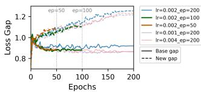  
Figure A1: Robust generalization overfitting under diferent learning rates and training epochs.

Table A8: Image-side projection analysis on DTD under adversarial base-to-new generalization.
<table><tr><td>一</td><td> ${ \mathrm { A c c . } } _ { \mathrm { B a s e } }$ </td><td> ${ \mathrm { R o b . } } _ { \mathrm { B a s e } }$ </td><td> ${ \mathrm { A c c . } } _ { \mathrm { N e w } }$ </td><td> $\operatorname { R o b } . _ { \operatorname { N e w } }$ </td></tr><tr><td> $z _ { U }$ </td><td>37.27</td><td>15.74</td><td>22.45</td><td>10.65</td></tr><tr><td> $z _ { S }$ </td><td>19.93</td><td>9.78</td><td>30.56</td><td>14.98</td></tr></table>

## C.8 Robust Generalization Overfitting under Diferent Training Settings

To examine whether robust generalization overfitting is caused by a particular training configuration, we evaluate APT using learning rates from 0.001 to 0.004 and training durations from 50 to 200 epochs. Figure A1 shows that the robust loss gap between base and new classes emerges across these settings, although its magnitude varies. This indicates that robust generalization overfitting is not tied to a single learning rate or training duration.

## C.9 Decoy-Guided Adaptive Attack

We design a Decoy-Guided Adaptive Attack (DGAA) tailored to ADAPT. For each non-ground-truth class, DGAA measures (1) how strongly that class competes with the ground-truth class under the target prompt and (2) how strongly it matches the shortcut information captured by the decoy prompts. DGAA combines these scores to select the three most shortcut-confusing classes, runs target- prompt margin PGD toward each selected class, and keeps the adversarial example that most strongly reduces the target-prompt margin.

Table A9: Robustness of ADAPT under the decoy-guided adaptive attack. Results are averaged over 11 datasets with $\epsilon = 4 / 2 5 5 .$
<table><tr><td rowspan="2"></td><td colspan="3">Base</td><td colspan="3">New</td></tr><tr><td>Acc.</td><td>PGD</td><td>DGAA</td><td>Acc.</td><td>PGD</td><td>DGAA</td></tr><tr><td>ADAPT</td><td>60.04</td><td>27.48</td><td>23.62</td><td>38.98</td><td>15.65</td><td>13.66</td></tr></table>

As shown in Table A9, DGAA reduces robustness relative to stan- dard PGD, from 27.48%/15.65% to 23.62%/13.66% on the base/new classes. ADAPT nevertheless retains non-trivial robustness under an attack that explicitly uses the decoy prompts to identify shortcutconfusing targets.