# LinCa: Accelerating Difusion Models via Learnable Decomposed Feature Caching

Jinshan Liu1,3∗, Haoran Qin1,4∗, Xiaobing Tu2, Jiacheng Liu1, Jiahui Hu1,5, Zhengan Yan1, Yukun Xie1,3, Kerui Shen1,3, Jinkui Ren2, Yuqi Lin1,6, Xiantao Zhang2, and Linfeng Zhang1†

1Shanghai Jiao Tong University, China 2Terminal Intelligent Computing Division, Alibaba Cloud, China 3Xi’an Jiaotong University, China 4Shandong University, China 5South China University of Technology, China 6Jilin University, China

  
Fig. 1: Images sampled by Qwen-Image with LinCa at 6.95× acceleration.

Abstract. Difusion models have achieved remarkable success in image and video generation, yet the high computational cost of iterative sampling remains a critical bottleneck for practical deployment. Feature caching has emerged as a promising acceleration paradigm by reusing or predicting intermediate features across timesteps. However, existing training-free methods apply uniform prediction strategies that cannot adapt to the heterogeneous feature dynamics, causing significant quality degradation under high acceleration ratios. We propose LinCa, a feature caching framework based on learnable invertible networks. LinCa decomposes cached features into sub-components with distinct continuity properties via a lightweight invertible network and applies differentiated prediction orders matched to each component. The strict invertibility guarantees lossless reconstruction back to the original feature space, forming a unified Decompose-Predict-Reconstruct pipeline. By training separate predictors for diferent models and timestep segments, LinCa adapts to heterogeneous feature dynamics. Experiments on FLUX, Qwen-Image, and HunyuanVideo demonstrate that LinCa, with less than 0.2% additional parameters, significantly outperforms existing methods and maintains near-lossless quality at 5-7× speedup. Code: https://github.com/QHR69/LinCa.

Keywords: Difusion Acceleration · Learnable Invertible Network

## 1 Introduction

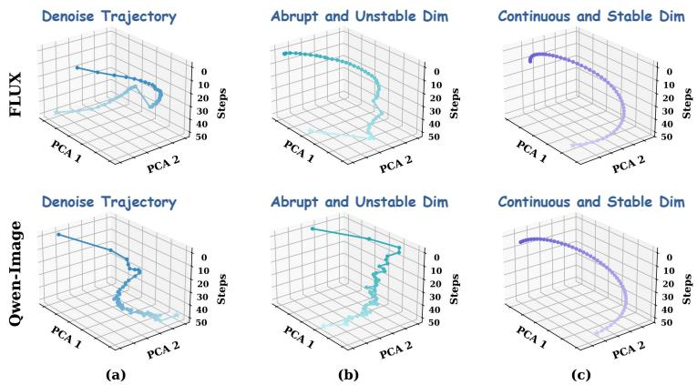  
Fig. 2: Analysis of dynamics mismatch. (a): Denoise trajectories visualized via Principal Component Analysis (PCA) within FLUX.1-dev and Qwen-Image. Significant continuity diferences exist across diferent models and denoising stages. (b)-(c): Denoise trajectories of specific dimensions visualized via PCA within FLUX.1-dev and Qwen-Image. Even within the same model and stage, significant continuity diferences still exist across diferent feature dimensions. (b) shows dimensions with low continuity and abrupt mutations, while (c) shows dimensions with high continuity and stability.

Difusion models have achieved remarkable progress in image and video generation and editing [2,15,38]. Recently, Difusion Transformers [37] have become the predominant architecture for high-quality conditional generation and editing, owing to their superior scalability and modeling capacity. However, the iterative denoising sampling mechanism of Difusion Transformers requires multi-step forward passes, and the resulting high computational cost makes eficient inference a critical bottleneck for practical deployment.

To address this challenge, two main acceleration directions have emerged: reducing the total number of sampling steps through algorithmic advances [29], and lowering the per-step cost through architectural optimization [51,54]. Among these, feature caching exploits the temporal consistency of hidden representations across adjacent timesteps and has become a particularly promising solution. Specifically, it performs a full model forward pass only once every N timesteps and caches the intermediate features. The remaining N−1 steps directly reuse or predict features based on previous caches, thereby skipping expensive forward computation to achieve acceleration, as exemplified by recent works such as FORA, ToCa, and TaylorSeer [25, 41, 60]. Despite this progress, we identify the following limitations in current feature caching methods.

Cross-timestep and cross-model dynamics mismatch. Existing feature caching methods implicitly assume that the hidden features of difusion models follow a uniform evolution pattern throughout the entire denoising process, and thus apply a single preset caching strategy across all timesteps and all models. However, as shown in Figure 2(a), we find that even within the same model, the feature evolution patterns difer significantly across timesteps. Some timestep segments exhibit stable and continuous trajectories, while others display poor continuity accompanied by abrupt mutations. Across diferent models, the discrepancy in feature trajectory shapes and variation patterns is more pronounced. This indicates that the denoising process is not governed by a single dynamics mechanism, and applying a uniform caching rule across all timesteps and models inevitably introduces cumulative errors in certain scenarios.

Cross-dimension dynamics mismatch. From a finer-grained perspective, existing methods apply a uniform prediction strategy to all feature dimensions, implicitly assuming that all dimensions share the same continuity. However, as shown in Figure 2(b)-(c), even within the same model at the same timestep segment, diferent feature dimensions exhibit markedly diferent dynamics. Some dimensions display good stability and continuity, making them suitable for highorder polynomial prediction. Other dimensions are unstable and accompanied by abrupt mutations, making them dificult to predict directly. More critically, dimensions with diferent continuity properties are interleaved in the original feature space and cannot be separated by simple dimensional partitioning. This suggests that a uniform prediction strategy cannot accommodate the vastly different dynamics across feature dimensions.

To address the dynamics mismatch at both levels, this paper introduces LinCa, a Learnable Invertible Networks based Feature Caching acceleration framework. Through minimal parameter overhead and training cost, LinCa employs a learnable mapping to decompose cached features into sub-components with diferent dynamics and applying the corresponding diferentiated prediction orders to each component. Unstable components are directly reused from the nearest cache, while components with good continuity are predicted via polynomial extrapolation matched to their continuity from historical caches. This learnable mapping is realized by a lightweight fully invertible network whose strict invertibility guarantees that the decomposed features can be losslessly reconstructed back to the original feature space, forming an end-to-end learnable Decompose-Predict-Reconstruct pipeline. Furthermore, we partition the denoising timesteps into multiple segments and train isomorphic but independently parameterized predictors, adapting to the distinct feature dynamics of diferent difusion models and timestep segments. With a parameter count less than 0.2% of the original difusion model, LinCa requires only 100-200 pre-generated features as training data, and completes training within 1 hour on a single GPU (12GB VRAM) without loading the difusion model weights. During inference, LinCa achieves nearly the same speed as training-free methods, further enhancing its practical value.

LinCa delivers robust and eficient feature prediction across diverse tasks and architectures. It achieves near-lossless acceleration of 5.51× on FLUX.1- dev, 6.95× on Qwen-Image, 7.08× on Qwen-Image-Edit, and 5.50× on HunyuanVideo (Figure 1). Moreover, it is also fully compatible with distillation or quantization with higher acceleration ratio and strong image quality. In summary, our main contributions are as follows:

• Heterogeneous Feature Dynamics: We reveal that the hidden features of difusion models exhibit significant dynamics mismatch across timesteps and models, and that diferent feature dimensions display markedly diferent evolution patterns, highlighting the importance of adaptively matching feature dynamics through learnable mappings.

• LinCa Framework: We propose LinCa, a feature caching framework that decomposes cached features via a lightweight invertible network and applies diferentiated prediction orders. By training separately for diferent models across diferent timestep segments, LinCa adapts to heterogeneous feature dynamics with minimal training overhead.

• Superior Performance: We evaluate LinCa on diverse architectures and tasks including FLUX.1-dev, Qwen-Image, Qwen-Image-Edit, HunyuanVideo and even distilled or quantized models. Across all settings, LinCa significantly outperforms existing training-free methods at the same acceleration ratio and maintains near-lossless generation quality under high speedup.

## 2 Related Works

Difusion models [16, 44] have become the dominant framework for high-fidelity image and video generation. The Difusion Transformer (DiT) [37] further advanced this field through superior scalability and expressive capacity, becoming foundational for large-scale visual generation systems [5, 6, 31–35, 50, 57]. Nevertheless, the iterative nature of the sampling process remains the primary inference bottleneck, and current acceleration eforts focus on two complementary directions: reducing sampling steps and accelerating the denoising network.

## 2.1 Sampling Timestep Reduction

DDIM [45] introduced deterministic few-step sampling, further refined by the DPM-Solver series [29, 30] through high-order ODE solvers. Rectified Flow [28] shortens the transport path via optimal transport, while knowledge distillation [36, 40] compresses long sampling trajectories into compact student generators. Consistency Models [46] further enable single-step synthesis by learning a direct noise-to-data mapping. Although efective, these methods typically require redesigning sampling algorithms or retraining the difusion model, limiting their applicability to pre-trained difusion models.

## 2.2 Denoising Network Acceleration

Another acceleration direction focuses on reducing the computational cost of each forward pass, primarily through model compression and feature caching.

Model Compression-based Acceleration. Model compression reduces inference overhead through structured pruning [11,59], quantization [19,42], distillation [21], and token merging or pruning [3,8,18,52,53]. However, these methods often necessitate additional training or fine-tuning to maintain generation quality, and aggressive compression may compromise robustness [21].

Feature Caching-based Acceleration. Feature caching avoids redundant computation by reusing activations across timesteps, attracting wide attention for its ability to work without modifying model structure and typically in a training-free manner. Current works [4, 24] extended caching to DiT architectures: FORA [41] and ∆-DiT [7] cache block outputs, while ToCa and DuCa [60, 61] adaptively reuse tokens or regions. TaylorSeer [25] introduced polynomial extrapolation from cached features, further advanced by FoCa [56] and SpeCa [26]. More recently, Clusca [58] reduces token redundancy via spatial clustering, while HyCa [55] applies dimension-wise caching based on mixed ODE modeling.

However, all the above methods treat cached features as a whole, applying a uniform prediction strategy across all feature dimensions and overlooking their markedly diferent continuity. Meanwhile, feature dynamics difer significantly across model architectures and denoising stages, yet existing training-free methods apply the same strategy across all scenarios, leading to cumulative prediction errors and notable quality degradation under high acceleration ratios.

In contrast, LinCa employs invertible networks capable of lossless reconstruction to map cached features into sub-components with distinct continuity properties for diferentiated order prediction, addressing the quality degradation inherent in existing caching methods. Meanwhile, data-driven per-segment training enables LinCa to adaptively accommodate the feature dynamics diferences across model architectures and denoising stages with minimal training cost, significantly improving prediction performance under high acceleration ratios.

## 3 Methodology

## 3.1 Preliminary

Feature caching accelerates difusion model inference by avoiding redundant computation across timesteps. Let $\mathbf { x } _ { t }$ denote the hidden feature produced by the diffusion model at timestep $t ,$ feature caching perform a full forward pass every N steps and cache the intermediate features, while estimating the remaining N−1 steps through a prediction function $f$ based on historical caches:

$$
\hat { \mathbf { x } } _ { t - k } = f ( \mathbf { x } _ { t } , \mathbf { x } _ { t + N } , \ldots ) , \quad k \in \{ 1 , \ldots , N { - } 1 \}\tag{1}
$$

where $\mathbf { x } _ { t } , \mathbf { x } _ { t + N } , \ldots .$ . are previously cached features. Existing feature caching methods aim to construct an efective $f$ for accurate prediction. For instance, when $f$ is modeled as the identity mapping, it corresponds to direct reuse: $\hat { \mathbf { x } } _ { t - k } ~ = ~ \mathbf { x } _ { t }$ . Alternatively, $f$ can be modeled as a Taylor expansion: $\hat { \mathbf { x } } _ { t - k } ~ =$ $\begin{array} { r } { \mathbf { x } _ { t } + \sum _ { i = 1 } ^ { m } \frac { \mathcal { A } ^ { i } \mathbf { x } _ { t } } { i ! \cdot N ^ { i } } ( - k ) ^ { i } } \end{array}$ , where $m$ is the prediction order and $\varDelta ^ { i } \mathbf { x } _ { t }$ denotes the $i ^ { t h }$ order discrete diference. $f$ can also be modeled as Hermite interpolation based on discrete diferences: $\begin{array} { r } { \hat { \mathbf { x } } _ { t - k } = \mathbf { x } _ { t } + \sum _ { i = 1 } ^ { m } \alpha _ { i } ( k ) \varDelta ^ { i } \mathbf { x } _ { t } } \end{array}$ , where $\alpha _ { i } ( k )$ are interpolation coeficients derived from Hermite polynomials.

However, regardless of the form of $f _ { : }$ existing methods apply a uniform prediction strategy and prediction order across all models, all timesteps, and all feature dimensions, failing to accommodate the significant dynamics diferences at each of these levels and thus compromising generation quality.

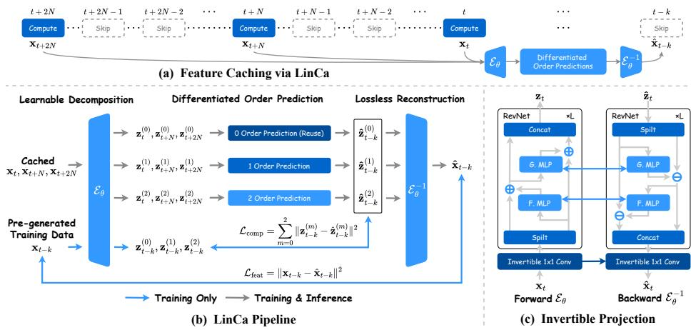  
Fig. 3: Overview of the LinCa framework. (a) Feature Caching via LinCa: Feature caching caches features during computation steps and skips computation by utilizing historical cached features during prediction steps, where LinCa provides an end-to-end “Decompose-Predict-Reconstruct” pipeline. (b) LinCa Pipeline: Cached features are decomposed into sub-components with distinct continuity, predicted by diferentiated order polynomial extrapolation, and losslessly reconstructed back to the original feature space. (c) Invertible Projection: Each invertible block consists of an invertible 1 × 1 convolution and an additive coupling layer with lightweight MLPs F and G. The strict invertibility of each sub-layer guarantees lossless reconstruction.

## 3.2 Learnable Invertible Network based Feature Caching

In this section, we introduce the LinCa framework (Figure 3). To address the dynamics mismatch at multiple levels in existing methods, LinCa is built upon two key components: (i) decomposing cached features into sub-components with distinct continuity properties through a learnable mapping and applying ordermatched polynomial prediction to each sub-component, and (ii) realizing this mapping with a lightweight invertible network whose strict invertibility guarantees lossless reconstruction of the input features, trained separately for diferent models and timestep segments to adapt to their distinct feature dynamics.

Learnable Decomposition and Diferentiated Order Prediction. Our diferentiated prediction strategy is motivated by the observation that diferent feature dimensions exhibit distinct dynamics. As shown in Figure 2(b)-(c), some feature dimensions are unstable with abrupt mutations and low temporal continuity, making them dificult to predict. In contrast, other dimensions exhibit varying degrees of temporal continuity, with difusion trajectories suitable for polynomial prediction at diferent orders. However, dimensions with diferent continuity properties are interleaved in the original feature space and cannot be separated by simple partitioning. We therefore propose to learn a diferentiated decomposition strategy that regroups and separates feature dimensions with diferent evolution characteristics, applying prediction functions f of diferent orders to each group.

To this end, following prior work [23], we cache the cumulative residual feature at the final layer of the difusion model. For the cached feature $\mathbf { x } _ { t } \in \mathbb { R } ^ { N \times D }$ at timestep t, LinCa projects it through a learnable mapping ${ \mathcal { E } } _ { \theta }$ and decomposes it along the feature dimension into M sub-components $( M = 3$ in practice):

$$
\mathbf { z } _ { t } = \mathcal { E } _ { \theta } ( \mathbf { x } _ { t } ) = [ \mathbf { z } _ { t } ^ { ( 0 ) } \mid \mathbf { z } _ { t } ^ { ( 1 ) } \mid \cdot \cdot \cdot \mid \mathbf { z } _ { t } ^ { ( M - 1 ) } ] , \quad \mathbf { z } _ { t } ^ { ( m ) } \in \mathbb { R } ^ { N \times d _ { m } }\tag{2}
$$

where ${ \mathcal { E } } _ { \theta }$ is continuously optimized during training to cluster dimensions with similar continuity into corresponding sub-spaces, thereby regrouping and separating feature dimensions with diferent evolution characteristics. Based on the distinct dynamics of each sub-component, we apply diferentiated order prediction strategies. For the $0 ^ { t h }$ order sub-component, which is unstable with weak continuity, we directly reuse the nearest cached value: $\hat { \mathbf { z } } _ { t } ^ { ( 0 ) } = \mathbf { z } _ { t _ { \mathrm { p r e v } } } ^ { ( 0 ) }$ . For higherorder sub-components $( m \ge 1 )$ , we predict each using $m ^ { t h }$ order Hermite interpolation. These closed-form predictors accurately reconstruct higher-order details at negligible computational cost. Finally, all sub-components are concatenated and reconstructed back to the original feature space through the inverse mapping $\mathcal { E } _ { \theta } ^ { - 1 }$ , yielding the final predicted feature:

$$
\hat { \mathbf { x } } _ { t } = \mathcal { E } _ { \theta } ^ { - 1 } ( [ \hat { \mathbf { z } } _ { t } ^ { ( 0 ) } \mid \hat { \mathbf { z } } _ { t } ^ { ( 1 ) } \mid \cdot \cdot \cdot \mid \hat { \mathbf { z } } _ { t } ^ { ( M - 1 ) } ] )\tag{3}
$$

Lossless Mapping via Invertible Networks. The above Decompose-Predict-Reconstruct pipeline requires ${ \mathcal { E } } _ { \theta }$ to be both learnable and capable of losslessly reconstructing the predicted sub-components back to the original feature space through its inverse $\overline { { \mathcal { E } _ { \theta } ^ { - 1 } } }$ . To achieve this, following [13], we design a lightweight invertible network whose architecture guarantees strict mathematical invertibility, ensuring that the reconstruction process introduces no additional loss.

Concretely, ${ \mathcal { E } } _ { \theta }$ consists of L stacked invertible blocks. Each block contains two invertible sub-layers: an invertible $1 \times 1$ convolution (parameterized by an orthogonal matrix W) for channel mixing, followed by an additive coupling layer that evenly splits the features along the feature dimension into $\mathbf { u } _ { 1 } , \mathbf { u } _ { 2 }$ and applies lightweight MLPs $F , G$

$$
\mathbf { v } _ { 1 } = \mathbf { u } _ { 1 } + F ( \mathbf { u } _ { 2 } ) , \quad \mathbf { v } _ { 2 } = \mathbf { u } _ { 2 } + G ( \mathbf { v } _ { 1 } )\tag{4}
$$

The outputs $\mathbf { v } _ { 1 } , \mathbf { v } _ { 2 }$ are concatenated along the feature dimension. During reconstruction, the corresponding inverse mapping is executed: first recovering the pre-coupling components via subtraction ${ \bf u } _ { 2 } = { \bf v } _ { 2 } - G ( { \bf v } _ { 1 } ) , { \bf u } _ { 1 } = { \bf v } _ { 1 } - F ( { \bf u } _ { 2 } )$ ， then restoring the channel mixing through $\mathbf { W } ^ { - 1 }$ . Since each sub-layer is strictly invertible, the entire network satisfies ${ \mathcal E } _ { \theta } ^ { - 1 } \circ { \mathcal E } _ { \theta } = { \bf I }$ , introducing no additional error and thus guaranteeing the highest reconstruction quality.

To adapt to the feature dynamics of diferent timestep segments, we partition the denoising process into S segments and independently train an isomorphic but separately parameterized predictor $\mathcal { E } _ { \theta } ^ { ( s ) }$ for each segment. LinCa requires only 100-200 pre-generated image features and completes training within one hour on a single GPU (12GB VRAM) without loading the difusion model weights, adapting to the feature dynamics of diferent difusion models at minimal cost.

In detail, during training, we load the target feature $\mathbf { x } _ { t - k }$ and historical cached features $\mathbf { x } _ { t } , \mathbf { x } _ { t + N } , \ldots .$ . from pre-generated data, and decompose them through $\mathcal { E } _ { \theta } ^ { ( s ) }$ into sub-components $\mathbf { z } _ { t - k } ^ { ( m ) }$ and $\mathbf { z } _ { t } ^ { ( m ) } , \mathbf { z } _ { t + N } ^ { ( m ) } , \hdots$ . respectively. The historical sub-components are then used to predict the target sub-components $\hat { \mathbf { z } } _ { t - k } ^ { ( m ) }$ via diferentiated order extrapolation, and the predictions are reconstructed through the inverse mapping $( \mathcal { E } _ { \theta } ^ { ( s ) } ) ^ { - 1 }$ to yield $\hat { \mathbf { x } } _ { t - k }$ . The optimization objective for each segment is:

$$
{ \mathcal { L } } ^ { ( s ) } = { \mathcal { L } } _ { \mathrm { f e a t } } ^ { ( s ) } + \lambda { \mathcal { L } } _ { \mathrm { c o m p } } ^ { ( s ) }\tag{5}
$$

where the end-to-end prediction loss $\mathcal { L } _ { \mathrm { f e a t } } ^ { ( s ) } = \| \hat { \mathbf { x } } _ { t - k } - \mathbf { x } _ { t - k } \| ^ { 2 }$ ensures the overall prediction quality in the original feature space after inverse reconstruction. The sub-component prediction loss $\begin{array} { r } { \mathcal { L } _ { \mathrm { c o m p } } ^ { ( s ) } = { \sum _ { m = 0 } ^ { \tilde { M } - 1 } \| \hat { \mathbf { z } } _ { t - k } ^ { ( m ) } - \mathbf { z } _ { t - k } ^ { ( m ) } \| ^ { 2 } } } \end{array}$ directly constrains the prediction accuracy of each sub-component, driving $\mathcal { E } _ { \theta } ^ { ( s ) }$ to cluster dimensions suitable for $m ^ { t h }$ order prediction into the corresponding sub-space.

## 4 Experiments

## 4.1 Experiment Settings

Model Configurations. The experiments are conducted on four state-of-theart difusion-based models: the text-to-image models FLUX.1-dev [20] and Qwen-Image [48], the text-to-video model HunyuanVideo [47], and the image editing model Qwen-Image-Edit [48]. To further assess compatibility with model compression techniques, we also evaluate our method on distilled or quantized models: FLUX.1-lite-8B [12], FLUX.1-schnell [1] and FLUX.1-dev-int8 [10]. All experiments are conducted on NVIDIA A100 GPUs for the FLUX series, H100 GPUs for HunyuanVideo, and H20 GPUs for Qwen-Image and Qwen-Image-Edit. More details are provided in the supplementary materials.

Evaluation and Metrics. For text-to-image generation, we follow the Draw-Bench [39] protocol and evaluate all models on a fixed set of 200 prompts, assessing images using ImageReward [49] for photorealism, CLIP Score [14] for text-image alignment, and PSNR, SSIM, and LPIPS for fidelity. For text-tovideo generation, we evaluate our model on VBench [17], which provides multidimensional assessments covering motion quality, visual appearance, and semantic consistency. Regarding image editing tasks, we utilize GEdit-Bench [27] to evaluate model performance across a diverse set of edit types and prompts.

## 4.2 Results on Text-to-Image Generation

As shown in Table 1, LinCa achieves the best speed-quality trade-of on FLUX.1- dev. At N = 4, it reaches an ImageReward of 1.0175 with 3.32× acceleration, surpassing FoCa (0.9917 at 2.80×) and TaylorSeer (1.0018 at 2.82×). At N = 6,

Table 1: Quantitative comparison of text-to-image generation for FLUX.1- dev. Best results are highlighted in bold, and second-best are underlined.
<table><tr><td rowspan="2">Method</td><td colspan="4">Acceleration</td><td rowspan="2">ImageReward ↑CLIP Score ↑</td><td rowspan="2"></td><td rowspan="2"></td></tr><tr><td>Latency(s) ↓ Speed ↑FLOPs(T) ↓ Speed ↑</td><td></td><td></td><td></td></tr><tr><td>Original: 50 steps</td><td>23.10</td><td>1.00×</td><td>3719.50</td><td>1.00×</td><td>0.9930 (+0.0%)</td><td>32.61 (+0.0%)</td><td></td></tr><tr><td>60% steps</td><td>14.87</td><td>1.55×</td><td>2231.70</td><td>1.67×</td><td>0.9693 (−2.4%)</td><td></td><td>32.50 (−0.3%)</td></tr><tr><td>∆−DiT (N = 2) [7]</td><td>15.96</td><td>1.45×</td><td>2480.01</td><td>1.50×</td><td>0.9471 (-4.6%)</td><td></td><td>32.46 (−0.5%)</td></tr><tr><td>∆−DiT (N = 3) [7]</td><td>11.63</td><td>1.98×</td><td>1686.76</td><td>2.21×</td><td>0.8750 (−11.9%)</td><td></td><td>32.29 (−1.0%)</td></tr><tr><td>FORA (N = 3) [41]</td><td>9.08</td><td>2.54×</td><td>1320.07</td><td>2.82×</td><td>0.9802 (−1.3%)</td><td></td><td>32.45 (−0.5%)</td></tr><tr><td>DBCache (F = 8, B = 8) [9]</td><td>15.05</td><td>1.53×</td><td>2384.29</td><td>1.56×</td><td>1.0097 (+1.7%)</td><td></td><td>32.72 (+0.3%)</td></tr><tr><td>TaylorSeer (N = 3, O = 2) [25]</td><td>8.83</td><td>2.61×</td><td>1320.07</td><td>2.82×</td><td>1.0018 (+0.9%)</td><td></td><td>32.58 (−0.1%)</td></tr><tr><td>FoCa (N = 3) [56]</td><td>8.35</td><td>2.78×</td><td>1327.21</td><td>2.80×</td><td>0.9917 (−0.1%)</td><td>32.75</td><td>(+0.4%)</td></tr><tr><td>LinCa (N = 4)</td><td>7.51</td><td>3.08×</td><td>1120.68</td><td>3.32×</td><td>1.0175 (+2.5%)</td><td></td><td>32.88 (+0.8%)</td></tr><tr><td>34% steps</td><td>8.10</td><td>2.85×</td><td>1264.63</td><td>3.13×</td><td>0.9482 (−4.5%)</td><td></td><td>32.28 (−1.0%)</td></tr><tr><td>Chipmunk [43]</td><td>11.39</td><td>2.02×</td><td>1505.87</td><td>2.47×</td><td>0.9965 (+0.4%)</td><td></td><td>32.71 (+0.3%)</td></tr><tr><td>FORA (N = 4) [41]</td><td>7.28</td><td>3.14×</td><td>967.91</td><td>3.84×</td><td>0.9757 (-1.7%)</td><td></td><td>32.31 (−0.9%)</td></tr><tr><td>ToCa (N = 6) [60]</td><td>11.76</td><td>1.96×</td><td>924.30</td><td>4.02×</td><td>0.9830 (-1.0%)</td><td></td><td>32.25 (−1.1%)</td></tr><tr><td>DuCa (N = 5) [61]</td><td>7.32</td><td>3.15× 3.58×</td><td>978.76</td><td>3.80×</td><td>0.9982 (+0.5%)</td><td></td><td>32.41 (−0.6%)</td></tr><tr><td>TeaCache (l = 0.8) [22]</td><td>6.42</td><td></td><td>892.35</td><td>4.17×</td><td>0.8710 (−12.3%)</td><td></td><td>31.89 (−2.2%)</td></tr><tr><td>DBCache (F = 4, B = 4) [9]</td><td>5.92</td><td>3.90×</td><td>907.20</td><td>4.10×</td><td>0.6372 (−35.8%)</td><td></td><td>32.10 (−1.6%)</td></tr><tr><td>TaylorSeer (N = 4, O = 2) [25]</td><td>8.31</td><td>2.80×</td><td>967.91</td><td>3.84×</td><td>0.9887 (−0.4%)</td><td></td><td>32.58 (−0.1%)</td></tr><tr><td>FoCa (N = 4) [56] Clusca (N = 4, O = 2, K = 16) [58]</td><td>8.37</td><td>2.76× 2.79×</td><td>1050.70</td><td>3.54×</td><td>0.9782 (-1.5%)</td><td></td><td>32.73 (+0.4%)</td></tr><tr><td>HyCa (N = 5) [55]</td><td>8.27</td><td></td><td>1045.58</td><td>3.56×</td><td>0.9876 (−0.5%)</td><td></td><td>32.62 (+0.0%)</td></tr><tr><td>LinCa (N = 6)</td><td>6.83</td><td>3.38× 4.38×</td><td>893.54 823.21</td><td>4.16× 4.52×</td><td>1.0096 (+1.7%)</td><td></td><td>32.87 (+0.8%)</td></tr><tr><td></td><td>5.27</td><td></td><td></td><td></td><td>1.0228 (+3.0%)</td><td>32.97</td><td>(+1.1%)</td></tr><tr><td>FORA (N = 5) [41]</td><td>6.94</td><td>3.33×</td><td>893.54</td><td>4.16×</td><td>0.8276 (-16.7%)</td><td></td><td>31.95 (−2.0%)</td></tr><tr><td>ToCa (N = 8) [60]</td><td>10.17</td><td>2.27×</td><td>784.54</td><td>4.74×</td><td>0.9479 (-4.5%)</td><td></td><td>32.16 (−1.4%)</td></tr><tr><td>DuCa (N = 7) [61]</td><td>6.06</td><td>3.83×</td><td>760.14</td><td>4.89×</td><td>0.9785 (−1.5%)</td><td></td><td>32.26 (−1.1%)</td></tr><tr><td>TeaCache (l = 1) [22]</td><td>7.24</td><td>3.19×</td><td>743.63</td><td>5.01×</td><td>0.8421 (-15.2%)</td><td></td><td>32.01 (−1.8%)</td></tr><tr><td>DBCache (F = 4, B = 2) [9]</td><td>5.25</td><td>4.40×</td><td>793.07</td><td>4.69×</td><td>0.5106 (−48.6%)</td><td></td><td>32.01 (−1.8%)</td></tr><tr><td>TaylorSeer (N = 5, O = 2) [25]</td><td>6.71</td><td>3.46×</td><td>893.54</td><td>4.16×</td><td>0.9793 (−1.4%)</td><td></td><td>32.63 (+0.1%)</td></tr><tr><td>FoCa (N = 6) [56]</td><td>6.76</td><td>3.42×</td><td>745.39</td><td>4.99×</td><td>0.9741 (−1.9%)</td><td></td><td>33.10 (+1.5%)</td></tr><tr><td>Speca (Nmax = 8, Nmin = 2) [26]</td><td>6.61</td><td>3.48×</td><td>791.38</td><td>4.70×</td><td>1.0012 (+0.8%)</td><td></td><td>32.45 (−0.5%)</td></tr><tr><td>Clusca (N = 5, O = 1, K = 16) [58]</td><td>6.31</td><td>3.66×</td><td>897.03</td><td>4.14×</td><td>0.9748 (−1.8%)</td><td></td><td>32.50 (−0.3%)</td></tr><tr><td>HyCa (N = 6) [55]</td><td>6.09</td><td>3.79×</td><td>744.81</td><td>5.00×</td><td>1.0043 (+1.1%)</td><td></td><td>32.64 (+0.1%)</td></tr><tr><td>LinCa (N = 8)</td><td>4.40</td><td>5.25×</td><td>674.64</td><td>5.51×</td><td>1.0162 (+2.3%)</td><td></td><td>32.72 (+0.3%)</td></tr></table>

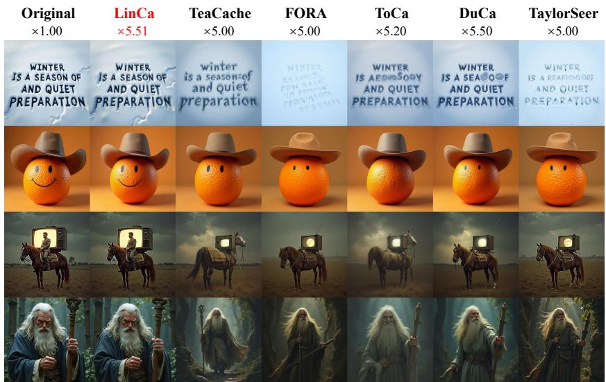  
Fig. 4: On FLUX.1-dev, LinCa delivers higher speedup with better text consistency, fine-grained details, and spatial relationships.

Table 2: Quantitative comparison of text-to-image generation for Qwen-Image. Best results are highlighted in bold, and second-best are underlined.
<table><tr><td rowspan="2">Method</td><td colspan="4">Acceleration</td><td colspan="2">Quality Metrics</td><td colspan="3">Perceptual Metrics</td></tr><tr><td>Latency(s) ↓ Speed ↑FLOPs(T) ↓ Speed ↑</td><td></td><td></td><td></td><td>ImageReward↑ CLIP↑</td><td></td><td></td><td>PSNR↑ SSIM↑ LPIPS↓</td><td></td></tr><tr><td>Original: 50 steps</td><td>126.60</td><td>1.00×</td><td>12917.56</td><td>1.00×</td><td>1.2532 (+0.0%)</td><td>35.52</td><td>∞</td><td>1.00</td><td>0.00</td></tr><tr><td>50% steps</td><td>63.62</td><td>1.99×</td><td>6458.78</td><td>2.00×</td><td>1.2023 (−4.1%)</td><td>35.24</td><td>30.55</td><td>0.75</td><td>0.27</td></tr><tr><td>20% steps</td><td>25.89</td><td>4.89×</td><td>2583.51</td><td>5.00×</td><td>0.9223 (−26.4%)</td><td>34.94</td><td>28.60</td><td>0.60</td><td>0.52</td></tr><tr><td>TaylorSeer (N=3) [25]</td><td>62.36</td><td>2.03×</td><td>4646.60</td><td>2.78×</td><td>1.0674 (−14.8%)</td><td>34.78</td><td>28.14</td><td>0.53</td><td>0.65</td></tr><tr><td>HyCa (N=3) [55]</td><td>59.72</td><td>2.12×</td><td>4646.60</td><td>2.78×</td><td>1.2316 (−1.7%)</td><td>35.01</td><td>30.21</td><td>0.80</td><td>0.25</td></tr><tr><td>LinCa (N=3)</td><td>58.88</td><td>2.15×</td><td>4705.76</td><td>2.75×</td><td>1.2329 (-1.6%)</td><td>35.40</td><td>31.86</td><td>0.83</td><td>0.18</td></tr><tr><td>FORA (N=4) [41]</td><td>38.13</td><td>3.32×</td><td>3359.99</td><td>3.84×</td><td>0.9315 (−25.7%)</td><td>34.33</td><td>28.65</td><td>0.60</td><td>0.50</td></tr><tr><td>ToCa (N=8, R=75%) [60]</td><td>60.87</td><td>2.08×</td><td>2991.34</td><td>4.32×</td><td>1.0218 (−18.5%)</td><td>34.97</td><td>28.94</td><td>0.63</td><td>0.45</td></tr><tr><td>DuCa (N=9, R=80%) [61]</td><td>34.50</td><td>3.67×</td><td>2958.13</td><td>4.37×</td><td>0.7709 (-38.5%)</td><td>34.59</td><td>28.44</td><td>0.58</td><td>0.54</td></tr><tr><td>TaylorSeer (N=6) [25]</td><td>30.58</td><td>4.14×</td><td>2583.97</td><td>5.00×</td><td>1.0125 (-19.2%)</td><td>34.77</td><td>28.59</td><td>0.62</td><td>0.45</td></tr><tr><td>HyCa  $\left( { \mathcal { N } } { = } 6 \right) \ [ 5 5 ]$ </td><td>36.48</td><td>3.47×</td><td>2584.46</td><td>5.00×</td><td>1.1967 (−4.5%)</td><td>34.89</td><td>29.68</td><td>0.71</td><td>0.31</td></tr><tr><td>LinCa (N=6)</td><td>30.51</td><td>4.15×</td><td>2635.31</td><td>4.90×</td><td>1.2163 (-2.9%)</td><td>35.34</td><td>29.84</td><td>0.73</td><td>0.29</td></tr><tr><td>FORA (N=6) [41]</td><td>28.51</td><td>4.44×</td><td>2326.74</td><td>5.55×</td><td>0.4812 (−61.6%)</td><td>33.31</td><td>28.48</td><td>0.55</td><td>0.59</td></tr><tr><td>ToCa (N=12, R=85%) [60]</td><td>50.64</td><td>2.50×</td><td>2406.20</td><td>5.37×</td><td>0.5511</td><td>(-56.0%) 34.05</td><td>28.68</td><td>0.58</td><td>0.54</td></tr><tr><td>DuCa (N=12, R=90%) [61]</td><td>28.39</td><td>4.46×</td><td>2171.56</td><td>5.95×</td><td>0.4104 (−67.3%)</td><td>33.34</td><td>28.38</td><td>0.57</td><td>0.61</td></tr><tr><td>TaylorSeer (N=9) [25]</td><td>24.49</td><td>5.17×</td><td>2067.29</td><td>6.25×</td><td>0.7318 (−41.6%)</td><td>32.89</td><td>28.24</td><td>0.56</td><td>0.57</td></tr><tr><td>HyCa (N=8) [55]</td><td>23.53</td><td>5.38×</td><td>2066.82</td><td>6.25×</td><td>1.0432 (-16.8%)</td><td>34.82</td><td>28.86</td><td>0.62</td><td>0.44</td></tr><tr><td>LinCa (N=10)</td><td>23.19</td><td>5.46×</td><td>1859.35</td><td>6.95×</td><td>1.0524 (-16.0%)</td><td>35.17</td><td>29.10</td><td>0.69</td><td>0.39</td></tr></table>

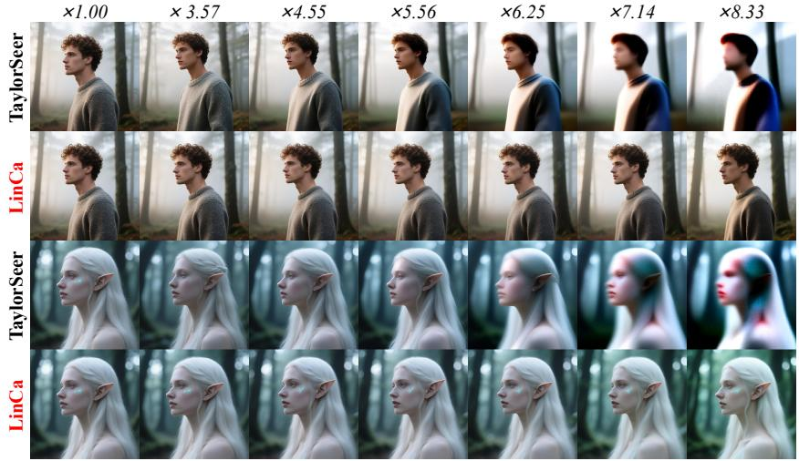  
Fig. 5: On Qwen-Image, LinCa retains superior image quality and details as the acceleration ratio increases, while Taylorseer degrades with blurring and detail loss.

LinCa demonstrates remarkable robustness, achieving 1.0228 at 4.52×, which outperforms both HyCa (1.0096 at 4.16×) and Clusca (0.9876 at 3.56×). At N = 8, it maintains a superior quality of 1.0162 at 5.51×. Other methods such as DBCache and TeaCache sufer from substantial degradation. Visual comparison in Fig. 4 further confirms LinCa’s advantage in preserving image details and text-alignment under high compression ratios.

In Table 2, LinCa consistently achieves the best overall trade-of on Qwen-Image across all acceleration levels. At N = 3, it is comparable to TaylorSeer in speed (2.75×) but yields higher quality (ImageReward 1.2329 vs. 1.0674, and highest PSNR 31.86). At N = 6, LinCa remains strong (1.2163, 29.84), outperforming HyCa (1.1967, 29.68) and surpassing other methods like ToCa (1.0218) and FORA (0.9315). At N = 10, it sustains high quality (1.0524 at 6.95×), while others drop sharply. These results highlight LinCa’s robustness under high acceleration while preserving superior visual fidelity and text-alignment. Visual comparison in Fig. 5 further demonstrates that LinCa consistently preserves high image quality and intricate details even as the acceleration ratio increases.

## 4.3 Results on Text-to-Video Generation

Table 3: Quantitative comparison of text-to-video generation for Hunyuan-Video. Best results are highlighted in bold, and second-best are underlined.
<table><tr><td rowspan="2">Method</td><td rowspan="2">Efficient Attention</td><td colspan="4">Acceleration</td><td rowspan="2">VBench ↑ Score(%)</td></tr><tr><td>Latency(s) ↓ Speed ↑FLOPs(T) ↓ Speed ↑</td><td></td><td></td><td></td></tr><tr><td>Original: 50 steps</td><td>V</td><td>185.00</td><td>1.00×</td><td>29773.0</td><td>1.00×</td><td>80.66 (+0.0%)</td></tr><tr><td>22% steps</td><td>V</td><td>40.66</td><td>4.55×</td><td>6550.1</td><td>4.55×</td><td>78.74 (-2.4%)</td></tr><tr><td>FORA  $\left( \mathcal { N } = 5 \right) \left[ 4 1 \right]$ </td><td>V</td><td>43.84</td><td>4.22×</td><td>5960.4</td><td>5.00×</td><td>78.83 (−2.3%)</td></tr><tr><td>ToCa  $\left( \mathcal { N } = 5 , R = 9 0 \% \right) [ 6 0 ]$ </td><td>x</td><td>49.07</td><td>3.77×</td><td>7006.2</td><td>4.25×</td><td>78.86 (−2.2%)</td></tr><tr><td>DuCa  $\left( \mathcal { N } = 5 , R = 9 0 \% \right) [ 6 1 ]$ </td><td>V</td><td>40.39</td><td>4.58×</td><td>6483.2</td><td>4.48×</td><td>78.72 (−2.4%)</td></tr><tr><td>TeaCache (l = 0.4) [22]</td><td>V</td><td>38.87</td><td>4.76×</td><td>6550.1</td><td>4.55×</td><td>79.36 (−1.6%)</td></tr><tr><td>TaylorSeer  $( \mathcal { N } = \dot { 5 } , \stackrel { \cdot } { O } = 1 )$  [25]</td><td>V</td><td>44.47</td><td>4.16×</td><td>5960.4</td><td>5.00×</td><td>79.93 (−0.9%)</td></tr><tr><td>Speca  $( N _ { \mathrm { m a x } } = 8 , N _ { \mathrm { m i n } } = 2 ) \bar { [ 2 6 ] }$ </td><td>V</td><td>44.05</td><td>4.20×</td><td>5692.7</td><td>5.23×</td><td>79.98 (−0.8%)</td></tr><tr><td>Clusca  $( N = 5 , K = 3 2 ) \ [ 5 8 ]$ </td><td>V</td><td>48.30</td><td>3.83×</td><td>5968.1</td><td>4.99×</td><td>79.99 (−0.8%)</td></tr><tr><td>FoCa (N = 5) [56]</td><td>V</td><td>44.05</td><td>4.20×</td><td>5966.5</td><td>4.99×</td><td>79.96 (−0.9%)</td></tr><tr><td>LinCa (N = 6)</td><td>V</td><td>38.21</td><td>4.84×</td><td>5413.27</td><td>5.50×</td><td>80.16 (−0.6%)</td></tr></table>

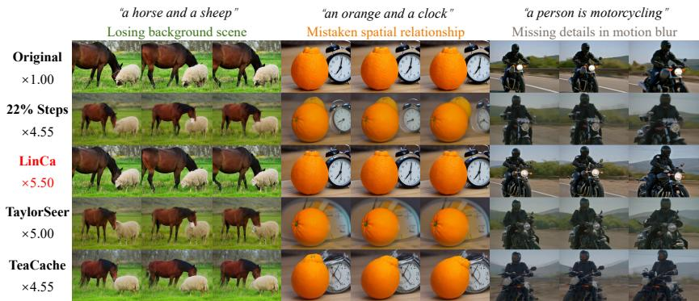  
Fig. 6: On HunyuanVideo, LinCa maintains high-quality generation under higher acceleration ratio, while other methods sufer from lossing background scene, mistaken spatial relationships, and missing motional details.

As shown in Table 3, LinCa exhibits superior quality on HunyuanVideo. $\mathrm { A t } \ : \mathcal { N } = 6 ,$ it achieves a notable 5.50× speedup while preserving a competitive VBench score of 80.16, representing only a slight decrease from the 50-step baseline (80.66). In contrast, Clusca and Speca reach 79.99 and 79.98 with less speedup, while TaylorSeer reaches only 5.00× with 79.93 and ToCa/DuCa degrade further. This demonstrates an optimal balance between inference speed and visual fidelity in high-quality video generation. Qualitative comparisons on Fig. 6 further confirm that LinCa preserves video quality, background scenery, spatial relationship and motional details better.

## 4.4 Results on Image Editing

Table 4: Quantitative comparison of image editing for Qwen-Image-Edit. Best results are highlighted in bold, and second-best results are underlined.
<table><tr><td rowspan="2">Method</td><td colspan="4">Acceleration</td><td colspan="6">|GEdit-CN (Full) |GEdit-EN</td></tr><tr><td>Latency(s) ↓ Speed ↑FLOPs(T)</td><td></td><td></td><td> ↓ Speed ↑</td><td>SC ↑PQ ↑</td><td></td><td>OS↑</td><td></td><td>SC ↑PQ ↑</td><td>OS ↑</td></tr><tr><td>Original: 50 steps</td><td>284.51</td><td>1.00×</td><td>28190.88</td><td>1.00×</td><td>7.68</td><td>7.51</td><td>7.41</td><td>7.82</td><td>7.54</td><td>7.54</td></tr><tr><td>50% steps</td><td>143.29</td><td>1.99×</td><td>14095.44</td><td>2.00×</td><td>7.70</td><td>7.53</td><td>7.44</td><td>7.77</td><td>7.52</td><td>7.47</td></tr><tr><td>20% steps</td><td>58.45</td><td>4.87×</td><td>5638.18</td><td>5.00×</td><td>7.65</td><td>7.42</td><td>7.35</td><td>7.73</td><td>7.46</td><td>7.44</td></tr><tr><td>FORA (N=5) [41]</td><td>63.15</td><td>4.51×</td><td>5643.13</td><td>5.00×</td><td>7.60</td><td>7.31</td><td>7.25</td><td>7.62</td><td>7.34</td><td>7.28</td></tr><tr><td>DuCa (N=7, R=95%) [61]</td><td>69.54</td><td>4.09×</td><td>5699.89</td><td>4.95×</td><td>7.73</td><td>7.44</td><td>7.44</td><td>7.80</td><td>7.40</td><td>7.45</td></tr><tr><td>TaylorSeer (N=6) [25]</td><td>65.66</td><td>4.33×</td><td>5643.13</td><td>5.00×</td><td>7.25</td><td>7.09</td><td>6.92</td><td>7.26</td><td>7.14</td><td>6.89</td></tr><tr><td>LinCa (N=7)</td><td>60.02</td><td>4.74×</td><td>5110.58</td><td>5.52×</td><td>7.63</td><td>7.52</td><td>7.45</td><td>7.81</td><td>7.55</td><td>7.56</td></tr><tr><td>FORA (N=7) [41]</td><td>52.20</td><td>5.45×</td><td>4515.74</td><td>6.24×</td><td>7.42</td><td>7.13</td><td>7.06</td><td>7.43</td><td>7.19</td><td>7.06</td></tr><tr><td>DuCa (N=10, R=95%) [61]</td><td>59.81</td><td>4.76×</td><td>5158.45</td><td>5.46×</td><td>7.50</td><td>5.75</td><td>6.39</td><td>7.52</td><td>5.77</td><td>6.41</td></tr><tr><td>TaylorSeer (N=9) [25]</td><td>53.92</td><td>5.28×</td><td>4515.74</td><td>6.24×</td><td>6.61</td><td>6.65</td><td>6.31</td><td>6.67</td><td>6.63</td><td>6.31</td></tr><tr><td>LinCa (N=10)</td><td>49.05</td><td>5.80×</td><td>3982.82</td><td>7.08×</td><td></td><td>7.55 7.40</td><td>7.27</td><td>7.68</td><td>7.46</td><td>7.40</td></tr></table>

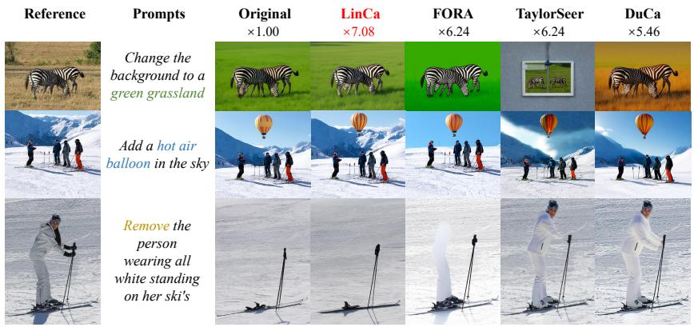  
Fig. 7: On Qwen-Image-Edit, LinCa delivers better prompt comprehension and generates high-fidelity images while maintaining consistency in non-edited regions.

As shown in Table 4, LinCa exhibits exceptional performance on Qwen-Image-Edit. At N = 7, it obtains overall scores of 7.45 (CN) and 7.56 (EN), outperforming TaylorSeer (6.92/6.89), FORA (7.25/7.28), and DuCa (7.44/7.45), even exceeding the original model’s performance. At N = 10, LinCa continues to lead with 7.27/7.40, whereas other baselines such as DuCa and TaylorSeer drop to 6.39/6.41 and 6.31/6.31. These results demonstrate that LinCa remains robust under high acceleration, efectively preserving high-fidelity synthesis. Qualitative comparisons on Fig. 7 further confirm its efectiveness in handling diferent editing tasks with high quality and consistency in non-edited regions.

## 4.5 Results on Distilled or Quantized Models

Table 5: Quantitative comparison of text-to-image generation for FLUX.1- lite-8B, FLUX.1-schnell and FLUX.1-dev-int8.
<table><tr><td rowspan="2">Method</td><td colspan="4">Acceleration</td><td rowspan="2">ImageReward↑</td><td rowspan="2">CLIP Score↑</td></tr><tr><td>Latency(s) ↓ Speed ↑FLOPs(T) ↓ Speed ↑</td><td></td><td></td><td></td></tr><tr><td>FLUX.1-lite-8B: 28 steps</td><td>8.21</td><td>1.00×</td><td>1291.49</td><td>1.00×</td><td>0.8936 (+0.0%)</td><td>32.12 (+0.0%)</td></tr><tr><td>LinCa (N=3): 28 steps</td><td>3.34</td><td>2.46×</td><td>556.21</td><td>2.32×</td><td>0.9070 (+1.5%)</td><td>32.36 (+0.7%)</td></tr><tr><td>FLUX.1-schnell: 4 steps</td><td>2.48</td><td>1.00×</td><td>283.56</td><td>1.00×</td><td>0.9692 (+0.0%)</td><td>32.54 (+0.0%)</td></tr><tr><td>LinCa (N=3): 4 steps</td><td>1.38</td><td>1.80×</td><td>142.16</td><td>1.99×</td><td>0.9843 (+1.6%)</td><td>32.67 (+0.4%)</td></tr><tr><td>FLUX.1-dev-int8: 50 steps|</td><td>12.55</td><td>1.00×</td><td>1888.07</td><td>1.00×</td><td>0.9744 (+0.0%)</td><td>32.55 (+0.0%)</td></tr><tr><td>LinCa (N=3): 50 steps</td><td>4.61</td><td>2.72×</td><td>718.17</td><td>2.63×</td><td>1.0036 (+3.0%)</td><td>32.81 (+0.8%)</td></tr></table>

To validate the generality of LinCa, we evaluate its performance when integrated with other mainstream acceleration techniques, specifically model distillation (FLUX.1-lite-8B), step distillation (FLUX.1-schnell), and quantization (FLUX.1-dev-int8). As shown in Table 5, LinCa consistently improves performance across all settings without degrading generation quality. For the modeldistilled variant, LinCa achieves a 2.32× speed-up, increasing the ImageReward to 0.9070 and the CLIP Score to 32.36. When applied to the step-distilled model, our framework delivers a 1.99× acceleration, reaching an 0.9843 ImageReward and 32.67 CLIP Score. Furthermore, integrating LinCa with INT8 quantization provides a 2.63× speed improvement while maintaining high fidelity (1.0036 ImageReward, 32.81 CLIP Score). These results demonstrate the broad compatibility of LinCa with various mainstream acceleration methods, serving as an efective complementary module that further enhances acceleration performance while maintaining high generation quality.

## 4.6 Ablation Study

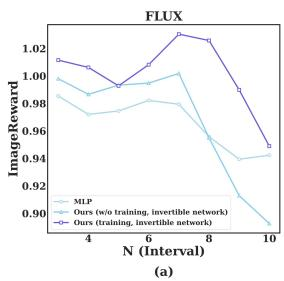

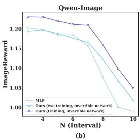

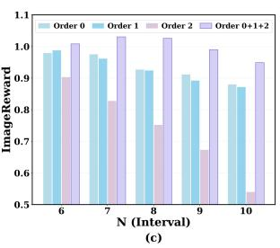  
Fig. 8: Ablation results of LinCa. (a)-(b): Comparison of decomposition network architectures on FLUX.1-dev and Qwen-Image. The learnable invertible network consistently outperforms both MLP and untrained alternatives. (c) Comparison of prediction order strategies. Diferentiated multi-order prediction maintains superior quality over single-order prediction.

Decomposition Network Ablation. We study the impact of diferent decomposition networks on generation quality on FLUX.1-dev and Qwen-Image. As shown in Figure 8(a)-(b), LinCa’s learnable invertible network architecture achieves the best results across all intervals. Compared to ordinary non-invertible networks such as learnable MLPs, the invertible network yields higher overall quality, indicating that its lossless reconstruction property efectively avoids information loss during the mapping process. Compared to non-learnable strategies that exhibit significant quality degradation under high acceleration ratios, the learnable approach demonstrates more stable performance, adapting to the specific feature dynamics.

Prediction Strategy Ablation. We further compare using $0 ^ { t h }$ order (pure reuse), $1 ^ { s t }$ order, and $2 ^ { n d }$ order prediction individually against LinCa’s combined $0 ^ { t h } + 1 ^ { s t } + 2 ^ { n d }$ order prediction, to investigate the impact of diferent prediction strategies on generation quality. As shown in Figure $8 ( \mathrm { c ) }$ , LinCa’s diferentiated order prediction strategy outperforms single-order configurations across all intervals. Notably, as N increases, uniform single-order prediction, especially 2nd order prediction alone, sufers from significant quality degradation, while LinCa accurately separates features into sub-components with diferent continuity through learnable mapping and applies diferentiated prediction, consistently maintaining the highest generation quality.

Furthermore, since the feature dynamics difer across timestep segments, LinCa trains isomorphic but separately parameterized predictors for each segment. Experiments show that partitioning into S = 3 segments already yields good results, and further increasing S brings diminishing improvements. Detailed results, additional ablation studies, and more hyperparameter analyses are provided in the supplementary materials.

## 5 Conclusion

This paper proposes LinCa, a feature caching acceleration framework based on learnable invertible networks. LinCa reveals that the hidden features of difusion models exhibit significant dynamics diferences across denoising stages, models, and feature dimensions. Based on it, LinCa decomposes cached features into sub-components with distinct continuity via a lightweight invertible network and applies diferentiated polynomial prediction. Through data-driven per-segment training, LinCa adaptively accommodates the feature dynamics of diferent models and denoising stages, achieving a superior trade-of between acceleration and generation quality. Extensive experiments on FLUX, Qwen-Image, and HunyuanVideo demonstrate that LinCa significantly outperforms existing methods at the same acceleration ratio, achieving $5 - 7 \times$ speedup with minimal quality degradation, while remaining compatible with distilled or quantized models. We believe LinCa opens up new possibilities for scalable, high-performance generative models and provides a new direction for eficient difusion inference.

## Acknowledgements

This paper was partially sponsored by Terminal Intelligent Computing Division - Alibaba Cloud.

## References

1. Black Forest Labs: Flux.1-schnell. https://huggingface.co/black- forestlabs/FLUX.1-schnell (2024), hugging Face model card

2. Blattmann, A., Dockhorn, T., Kulal, S., Mendelevitch, D., Kilian, M., Lorenz, D., Levi, Y., English, Z., Voleti, V., Letts, A., et al.: Stable video difusion: Scaling latent video difusion models to large datasets. arXiv preprint arXiv:2311.15127 (2023)

3. Bolya, D., Hofman, J.: Token merging for fast stable difusion. In: Proceedings of the IEEE/CVF conference on computer vision and pattern recognition. pp. 4599– 4603 (2023)

4. Cai, P., Liu, J., Xu, H., Wang, X., Zou, C., Zhang, L.: Lesa: Learnable stageaware predictors for difusion model acceleration. In: Proceedings of the IEEE/CVF Conference on Computer Vision and Pattern Recognition. pp. 43300–43309 (2026)

5. Chen, J., Ge, C., Xie, E., Wu, Y., Yao, L., Ren, X., Wang, Z., Luo, P., Lu, H., Li, Z.: Pixart-σ: Weak-to-strong training of difusion transformer for 4k text-to-image generation (2024)

6. Chen, J., Yu, J., Ge, C., Yao, L., Xie, E., Wu, Y., Wang, Z., Kwok, J., Luo, P., Lu, H., Li, Z.: Pixart-α: Fast training of difusion transformer for photorealistic text-to-image synthesis. In: International Conference on Learning Representations (2024)

7. Chen, P., Shen, M., Ye, P., Cao, J., Tu, C., Bouganis, C.S., Zhao, Y., Chen, T.: δ-dit: A training-free acceleration method tailored for difusion transformers. arXiv preprint arXiv:2406.01125 (2024)

8. Cheng, X., Chen, Z., Jia, Z.: Cat pruning: Cluster-aware token pruning for textto-image difusion models (2025), https://arxiv.org/abs/2502.00433

9. DefTruth, v.: cache-dit: A pytorch-native and flexible inference engine with hybrid cache acceleration and parallelism for dits. (2025), https : / / github . com / vipshop / cache - dit . git, open-source software available at https://github.com/vipshop/cache-dit.git

10. Difusers: Flux.1-dev-torchao-int8. https://huggingface.co/diffusers/FLUX.1- dev-torchao-int8 (2024), hugging Face model card; quantized checkpoint derived from black-forest-labs/FLUX.1-dev

11. Fang, G., Ma, X., Wang, X.: Structural pruning for difusion models. arXiv preprint arXiv:2305.10924 (2023)

12. Freepik: Flux.1 lite: Distilling flux1.dev for eficient text-to-image generation. https://huggingface.co/Freepik/flux.1-lite-8B (2024), hugging Face model card; page includes citation to an article (Verdú and Martín, 2024)

13. Gomez, A.N., Ren, M., Urtasun, R., Grosse, R.B.: The reversible residual network: Backpropagation without storing activations. Advances in neural information processing systems 30 (2017)

14. Hessel, J., Holtzman, A., Forbes, M., Bras, R.L., Choi, Y.: Clipscore: A referencefree evaluation metric for image captioning. arXiv preprint arXiv:2104.08718 (2021)

15. Ho, J., Jain, A., Abbeel, P.: Denoising Difusion Probabilistic Models (Dec 2020). https://doi.org/10.48550/arXiv.2006.11239, http://arxiv.org/abs/2006. 11239, arXiv:2006.11239 [cs]

16. Ho, J., Jain, A., Abbeel, P.: Denoising difusion probabilistic models. Advances in neural information processing systems 33, 6840–6851 (2020)

17. Huang, Z., He, Y., Yu, J., Zhang, F., Si, C., Jiang, Y., Zhang, Y., Wu, T., Jin, Q., Chanpaisit, N., Wang, Y., Chen, X., Wang, L., Lin, D., Qiao, Y., Liu, Z.: VBench: Comprehensive Benchmark Suite for Video Generative Models (Nov 2023). https: //doi.org/10.48550/arXiv.2311.17982, http://arxiv.org/abs/2311.17982, arXiv:2311.17982 [cs]

18. Kim, M., Gao, S., Hsu, Y.C., Shen, Y., Jin, H.: Token fusion: Bridging the gap between token pruning and token merging. In: Proceedings of the IEEE/CVF Winter Conference on Applications of Computer Vision. pp. 1383–1392 (2024)

19. Kim, S., Lee, H., Cho, W., Park, M., Ro, W.W.: Ditto: Accelerating difusion model via temporal value similarity. In: Proceedings of the 2025 IEEE International Symposium on High-Performance Computer Architecture (HPCA). IEEE (2025)

20. Labs, B.F.: Flux. https://github.com/black-forest-labs/flux (2024)

21. Li, Y., Wang, H., Jin, Q., Hu, J., Chemerys, P., Fu, Y., Wang, Y., Tulyakov, S., Ren, J.: Snapfusion: Text-to-image difusion model on mobile devices within two seconds. Advances in Neural Information Processing Systems 36 (2024)

22. Liu, F., Zhang, S., Wang, X., Wei, Y., Qiu, H., Zhao, Y., Zhang, Y., Ye, Q., Wan, F.: Timestep embedding tells: It’s time to cache for video difusion model (2024)

23. Liu, J., Cai, P., Zhou, Q., Lin, Y., Kong, D., Huang, B., Pan, Y., Xu, H., Zou, C., Tang, J., et al.: Freqca: Accelerating difusion models via frequency-aware caching. arXiv preprint arXiv:2510.08669 (2025)

24. Liu, J., Wang, X., Lin, Y., Wang, Z., Wang, P., Cai, P., Zhou, Q., Yan, Z., Yan, Z., Shi, Z., et al.: A survey on cache methods in difusion models: Toward eficient multi-modal generation. arXiv preprint arXiv:2510.19755 (2025)

25. Liu, J., Zou, C., Lyu, Y., Chen, J., Zhang, L.: From reusing to forecasting: Accelerating difusion models with taylorseers (2025), https://arxiv.org/abs/2503. 06923

26. Liu, J., Zou, C., Lyu, Y., Li, K., Wang, S., Zhang, L.: Speca: Accelerating difusion transformers with speculative feature caching. In: Proceedings of the 33rd ACM International Conference on Multimedia (MM ’25). p. to appear. ACM, Dublin, Ireland (October 2025)

27. Liu, S., Han, Y., Xing, P., Yin, F., Wang, R., Cheng, W., Liao, J., Wang, Y., Fu, H., Han, C., Li, G., Peng, Y., Sun, Q., Wu, J., Cai, Y., Ge, Z., Ming, R., Xia, L., Zeng, X., Zhu, Y., Jiao, B., Zhang, X., Yu, G., Jiang, D.: Step1x-edit: A practical framework for general image editing (2025), https://arxiv.org/abs/2504.17761

28. Liu, X., Gong, C., et al.: Flow straight and fast: Learning to generate and transfer data with rectified flow. In: The Eleventh International Conference on Learning Representations (2023)

29. Lu, C., Zhou, Y., Bao, F., Chen, J., Li, C., Zhu, J.: Dpm-solver: A fast ode solver for difusion probabilistic model sampling in around 10 steps. Advances in Neural Information Processing Systems 35, 5775–5787 (2022)

30. Lu, C., Zhou, Y., Bao, F., Chen, J., Li, C., Zhu, J.: Dpm-solver++: Fast solver for guided sampling of difusion probabilistic models. arXiv preprint arXiv:2211.01095 (2022)

31. Ma, Y., Feng, K., Zhang, X., Liu, H., Zhang, D.J., Xing, J., Zhang, Y., Yang, A., Wang, Z., Chen, Q.: Follow-your-creation: Empowering 4d creation through video inpainting. arXiv preprint arXiv:2506.04590 (2025)

32. Ma, Y., He, Y., Cun, X., Wang, X., Chen, S., Li, X., Chen, Q.: Follow your pose: Pose-guided text-to-video generation using pose-free videos. In: Proceedings of the AAAI Conference on Artificial Intelligence. vol. 38, pp. 4117–4125 (2024)

33. Ma, Y., Liu, Y., Zhu, Q., Yang, A., Feng, K., Zhang, X., Li, Z., Han, S., Qi, C., Chen, Q.: Follow-your-motion: Video motion transfer via eficient spatial-temporal decoupled finetuning. arXiv preprint arXiv:2506.05207 (2025)

34. Ma, Y., Wang, X., Ma, Q., Wang, Q., Zheng, M., Yang, X., Li, H., Zhao, C., Ying, J., Yang, H., et al.: Group editing: Edit multiple images in one go. arXiv preprint arXiv:2603.22883 (2026)

35. Ma, Y., Wang, Z., Ren, T., Zheng, M., Liu, H., Guo, J., Fong, M., Xue, Y., Zhao, Z., Schindler, K., et al.: Fastvmt: Eliminating redundancy in video motion transfer. arXiv preprint arXiv:2602.05551 (2026)

36. Meng, C., Gao, R., Kingma, D.P., Ermon, S., Ho, J., Salimans, T.: On distillation of guided difusion models. In: NeurIPS 2022 Workshop on Score-Based Methods (2022), https://openreview.net/forum?id=6QHpSQt6VR-

37. Peebles, W., Xie, S.: Scalable difusion models with transformers. In: Proceedings of the IEEE/CVF International Conference on Computer Vision. pp. 4195–4205 (2023)

38. Rombach, R., Blattmann, A., Lorenz, D., Esser, P., Ommer, B.: High-Resolution Image Synthesis with Latent Difusion Models (Apr 2022). https://doi.org/10. 48550/arXiv.2112.10752, http://arxiv.org/abs/2112.10752, arXiv:2112.10752 [cs]

39. Saharia, C., Chan, W., Saxena, S., Li, L., Whang, J., Denton, E., Ghasemipour, S.K.S., Ayan, B.K., Mahdavi, S.S., Lopes, R.G., Salimans, T., Ho, J., Fleet, D.J., Norouzi, M.: Photorealistic Text-to-Image Difusion Models with Deep Language Understanding. https://doi.org/10.48550/arXiv.2205.11487, http://arxiv. org/abs/2205.11487

40. Salimans, T., Ho, J.: Progressive distillation for fast sampling of difusion models. arXiv preprint arXiv:2202.00512 (2022)

41. Selvaraju, P., Ding, T., Chen, T., Zharkov, I., Liang, L.: Fora: Fast-forward caching in difusion transformer acceleration. arXiv preprint arXiv:2407.01425 (2024)

42. Shang, Y., Yuan, Z., Xie, B., Wu, B., Yan, Y.: Post-training quantization on diffusion models. In: Proceedings of the IEEE/CVF conference on computer vision and pattern recognition. pp. 1972–1981 (2023)

43. Silveria, A., Govande, S.V., Fu, D.Y.: Chipmunk: Training-free acceleration of difusion transformers with dynamic column-sparse deltas. In: ES-FoMo III: 3rd Workshop on Eficient Systems for Foundation Models (2025)

44. Sohl-Dickstein, J., Weiss, E.A., Maheswaranathan, N., Ganguli, S.: Deep unsupervised learning using nonequilibrium thermodynamics (2015), https://arxiv.org/ abs/1503.03585

45. Song, J., Meng, C., Ermon, S.: Denoising difusion implicit models. In: International Conference on Learning Representations (2021)

46. Song, Y., Dhariwal, P., Chen, M., Sutskever, I.: Consistency models. In: International Conference on Machine Learning. pp. 32211–32252. PMLR (2023)

47. Sun, X., Chen, Y., Huang, et al.: Hunyuan-large: An open-source MoE model with 52 billion activated parameters by tencent. https://doi.org/10.48550/arXiv. 2411.02265, http://arxiv.org/abs/2411.02265

48. Wu, C., Li, J., Zhou, J., Lin, J., Gao, K., Yan, K., ming Yin, S., Bai, S., Xu, X., Chen, Y., Chen, Y., Tang, Z., Zhang, Z., Wang, Z., Yang, A., Yu, B., Cheng, C., Liu, D., Li, D., Zhang, H., Meng, H., Wei, H., Ni, J., Chen, K., Cao, K., Peng,

L., Qu, L., Wu, M., Wang, P., Yu, S., Wen, T., Feng, W., Xu, X., Wang, Y., Zhang, Y., Zhu, Y., Wu, Y., Cai, Y., Liu, Z.: Qwen-image technical report (2025), https://arxiv.org/abs/2508.02324

49. Xu, J., Liu, X., Wu, Y., Tong, Y., Li, Q., Ding, M., Tang, J., Dong, Y.: ImageReward: Learning and Evaluating Human Preferences for Text-to-Image Generation (Dec 2023). https://doi.org/10.48550/arXiv.2304.05977, http://arxiv.org/ abs/2304.05977, arXiv:2304.05977 [cs]

50. Yang, Z., Teng, J., Zheng, W., Ding, M., Huang, S., Xu, J., Yang, Y., Hong, W., Zhang, X., Feng, G., Yin, D., Gu, X., Yuxuan.Zhang, Wang, W., Cheng, Y., Xu, B., Dong, Y., Tang, J.: Cogvideox: Text-to-video difusion models with an expert transformer. In: The Thirteenth International Conference on Learning Representations (2025), https://openreview.net/forum?id=LQzN6TRFg9

51. Yuan, Z., Zhang, H., Lu, P., Ning, X., Zhang, L., Zhao, T., Yan, S., Dai, G., Wang, Y.: Ditfastattn: Attention compression for difusion transformer models. arXiv preprint arXiv:2406.08552 (2024)

52. Zhang, E., Tang, J., Ning, X., Zhang, L.: Training-free and hardware-friendly acceleration for difusion models via similarity-based token pruning. In: Proceedings of the AAAI Conference on Artificial Intelligence (2025)

53. Zhang, E., Xiao, B., Tang, J., Ma, Q., Zou, C., Ning, X., Hu, X., Zhang, L.: Token pruning for caching better: 9 times acceleration on stable difusion for free (2024), https://arxiv.org/abs/2501.00375

54. Zhao, X., Jin, X., Wang, K., You, Y.: Real-time video generation with pyramid attention broadcast. arXiv preprint arXiv:2408.12588 (2024)

55. Zheng, S., Chen, G., Zhou, Q., Lin, Y., He, L., Zou, C., Cai, P., Liu, J., Zhang, L.: Let features decide their own solvers: Hybrid feature caching for difusion transformers. arXiv preprint arXiv:2510.04188 (2025)

56. Zheng, S., Feng, L., Wang, X., Zhou, Q., Cai, P., Zou, C., Liu, J., Lin, Y., Chen, J., Ma, Y., Zhang, L.: Forecast then calibrate: Feature caching as ode for eficient difusion transformers (2025). https://doi.org/10.48550/arXiv.2508.16211

57. Zheng, Z., Peng, X., Yang, T., Shen, C., Li, S., Liu, H., Zhou, Y., Li, T., You, Y.: Open-sora: Democratizing eficient video production for all (March 2024), https: //github.com/hpcaitech/Open-Sora

58. Zheng, Z., Wang, X., Zou, C., Wang, S., Zhang, L.: Compute only 16 tokens in one timestep: Accelerating Difusion Transformers with Cluster-Driven Feature Caching. In: Proceedings of the 33rd ACM International Conference on Multimedia (MM ’25). p. to appear. ACM, Dublin, Ireland (October 2025)

59. Zhu, H., Tang, D., Liu, J., Lu, M., Zheng, J., Peng, J., Li, D., Wang, Y., Jiang, F., Tian, L., Tiwari, S., Sirasao, A., Yong, J.H., Wang, B., Barsoum, E.: Dip-go: A difusion pruner via few-step gradient optimization (2024)

60. Zou, C., Liu, X., Liu, T., Huang, S., Zhang, L.: Accelerating difusion transformers with token-wise feature caching. In: Proceedings of the 13th International Conference on Learning Representations (ICLR 2025). ICLR (2025), https: //openreview.net/forum?id=yYZbZGo4ei, accepted to ICLR 2025

61. Zou, C., Zhang, E., Guo, R., Xu, H., He, C., Hu, X., Zhang, L.: Accelerating difusion transformers with dual feature caching (2024), https://arxiv.org/abs/ 2412.18911

## A Detailed Experiment Settings

Model Configurations and Evaluation Protocols. We conduct comprehensive experiments covering seven generative models across three main tasks: text-to-image generation, text-to-video generation, and image editing. For textto-image generation, FLUX.1-dev and Qwen-Image serve as our two primary evaluation targets. In addition, to verify that LinCa is compatible with mainstream model compression pipelines, we include three compressed derivatives of FLUX.1-dev: FLUX.1-lite-8B (model distillation), FLUX.1-schnell (step distillation), and FLUX.1-dev-int8 (quantization). For text-to-video generation, we adopt HunyuanVideo and evaluate it with VBench, which ofers multi-dimensional quality assessments aligned with human perception. For image editing, Qwen-Image-Edit is benchmarked on GEdit-Bench, covering a wide range of editing types and prompt styles. Per-model details on output resolution, prompt selection, and evaluation metrics are described in the following subsections.

## A.1 Text-to-Image Generation

FLUX.1-dev. Following the DrawBench evaluation protocol, we generate images conditioned on a fixed set of 200 prompts that cover a broad range of categories, including animals, colors, spatially conflicting descriptions, and finegrained visual attributes. All images are produced at a resolution of 1024 × 1024 pixels, consistent with the model’s recommended inference configuration. Generation quality is assessed using ImageReward, which captures photorealism and overall perceptual quality, alongside CLIP Score, which measures the degree of semantic alignment between the generated image and the input text prompt.

Qwen-Image. For Qwen-Image, we likewise adopt the DrawBench benchmark, using the same 200 prompts to ensure a fair comparison across models. Images are generated at a native resolution of 1328 × 1328 pixels. In addition to ImageReward and CLIP Score, which evaluate perceptual quality and textimage alignment respectively, we further report three pixel-level and perceptual fidelity metrics: Peak Signal-to-Noise Ratio (PSNR), Structural Similarity Index (SSIM), and Learned Perceptual Image Patch Similarity (LPIPS). These additional metrics provide a more complete assessment of how faithfully the accelerated model reproduces the output of the unaccelerated baseline.

FLUX.1-lite-8B, FLUX.1-schnell, and FLUX.1-dev-int8. To investigate whether LinCa can adapt to compressed models and deliver further acceleration while maintaining generation quality, we apply it to three compressed derivatives of FLUX.1-dev: FLUX.1-lite-8B (model distillation), FLUX.1-schnell (step distillation), and FLUX.1-dev-int8 (INT8 quantization). All three models are benchmarked on DrawBench with 200 prompts at 1024 × 1024 resolution. Despite their varied compression strategies, we apply a uniform evaluation protocol, measuring generation quality via ImageReward and CLIP Score, allowing us to quantify the additional benefit that LinCa provides when stacked on top of already-compressed models.

## A.2 Text-to-Video Generation

HunyuanVideo. We benchmark HunyuanVideo on VBench, a human-aligned multi-dimensional evaluation suite designed specifically for video generation. The benchmark encompasses 946 prompts sourced from VBench-full-info.json, spanning a wide variety of semantic categories. Videos are generated at 480 × 640 resolution with 65 frames per clip, yielding rich temporal content for assessment. VBench evaluates generation quality along 18 fine-grained dimensions, covering aspects such as motion smoothness, visual coherence, temporal consistency, semantic alignment between the generated video and the text prompt, and overall perceptual quality.

## A.3 Image Editing

Qwen-Image-Edit. We assess image editing performance on GEdit-Bench, a dedicated benchmark that contains 1212 editing prompts distributed across 11 editing categories, encompassing background replacement, color modification, material alteration, motion change, and pose adjustment, among others. Unlike image generation benchmarks, GEdit-Bench imposes no fixed output resolution, so images are generated without enforcing a specific spatial constraint. We report results on both the GEdit-CN and GEdit-EN subsets, evaluating each sample with three metrics: Overall Score (OS) for holistic editing performance, Perceptual Quality (PQ) for visual fidelity of the output, and Semantic Consistency (SC) for semantic alignment between the edited image and the editing instruction.

## A.4 Hardware

All experiments are conducted on enterprise-grade GPU infrastructure:

• FLUX.1-dev experiments: NVIDIA A100 GPU

• FLUX.1-lite-8B experiments: NVIDIA A100 GPU

• FLUX.1-schnell experiments: NVIDIA A100 GPU

• FLUX.1-dev-int8 experiments: NVIDIA A100 GPU

• Qwen-Image experiments: NVIDIA H20 GPU

• Qwen-Image-Edit experiments: NVIDIA H20 GPU

• HunyuanVideo experiments: NVIDIA H100 GPU

## A.5 Training Cost

LinCa is trained only on pre-generated feature trajectories and does not require loading the difusion model weights during training. In practice, 100–200 pregenerated feature samples are suficient for each target model, and the training process can be completed within about one hour on a single GPU with 12GB VRAM. After training, the learned predictor is applied to unseen prompts and diferent caching intervals, which allows LinCa to provide a practical trainingbased acceleration module with modest one-time cost.

## B Algorithmic Details

## B.1 Caching Strategy and Interaction with Hyperparameter N

The hyperparameter N serves as the core control for the caching interval within LinCa. To address feature instability in the early denoising stages, we adopt a first\_enhance warmup stage, where the initial few timesteps are computed entirely by the difusion backbone without any skipping. In the remaining stages, the denoising process alternates between computation steps (C) and prediction steps (P) at an interval of N: for every N steps, one full forward pass is performed (C), and the subsequent $N { - } 1$ steps are handled exclusively by the LinCa predictor (P) without invoking the difusion backbone.

For example, in a 10-step difusion process with first\_enhance $\ c = 3$ and $N = 3$ , the execution sequence is CCCPPCPPCP. During prediction steps, the diffusion model is bypassed entirely. Instead, LinCa decomposes the most recently cached feature via the learned invertible mapping $\mathcal { E } _ { \theta } ^ { ( s ) }$ , applies diferentiatedorder prediction to each sub-component, and reconstructs the predicted feature through $( \mathcal { E } _ { \theta } ^ { ( s ) } ) ^ { - 1 }$

Computation Steps. At each full computation step at timestep t, we cache the cumulative residual feature $\mathbf { x } _ { t }$ at the final layer of the difusion model, and pass it through $\mathcal { E } _ { \theta } ^ { ( s ) }$ to obtain the three sub-components:

$$
\mathbf { z } _ { t } = \mathcal { E } _ { \theta } ^ { ( s ) } ( \mathbf { x } _ { t } ) = [ \mathbf { z } _ { t } ^ { ( 0 ) } \mid \mathbf { z } _ { t } ^ { ( 1 ) } \mid \mathbf { z } _ { t } ^ { ( 2 ) } ] .\tag{6}
$$

We additionally maintain the discrete diferences of each sub-component to support higher-order prediction. For predicting step $t { - } k$ , we cache the features from the three most recent computation steps $t , \ t + N$ , and $t + 2 N$ Let $\mathbf { z } _ { t } ^ { ( m ) } , \mathbf { z } _ { t + N } ^ { ( m ) } , \mathbf { z } _ { t + 2 N } ^ { ( m ) }$ denote the cached m-th sub-component at these three timesteps respectively. The first- and second-order discrete diferences are computed as:

$$
\begin{array} { r } { \boldsymbol { \varDelta } ^ { ( 1 ) } \mathbf { z } ^ { ( m ) } = \mathbf { z } _ { t } ^ { ( m ) } - \mathbf { z } _ { t + N } ^ { ( m ) } , \qquad \boldsymbol { \varDelta } ^ { ( 2 ) } \mathbf { z } ^ { ( m ) } = \boldsymbol { \varDelta } ^ { ( 1 ) } \mathbf { z } ^ { ( m ) } - \left( \mathbf { z } _ { t + N } ^ { ( m ) } - \mathbf { z } _ { t + 2 N } ^ { ( m ) } \right) . } \end{array}\tag{7}
$$

Prediction Steps. At each prediction step $t - k \ ( k \in \{ 1 , \ldots , N - 1 \} )$ , LinCa applies diferentiated-order Hermite extrapolation to each sub-component. Specifically, $\mathbf { z } ^ { ( 0 ) }$ is directly reused from the nearest computation step (0th-order), $\mathbf { z } ^ { ( 1 ) }$ is predicted via 1st-order extrapolation, and $\mathbf { z } ^ { ( 2 ) }$ via 2nd-order extrapolation:

$$
\hat { \mathbf { z } } _ { t - k } ^ { ( 0 ) } = \mathbf { z } _ { t } ^ { ( 0 ) } , \qquad \hat { \mathbf { z } } _ { t - k } ^ { ( m ) } = \mathbf { z } _ { t } ^ { ( m ) } + \sum _ { i = 1 } ^ { m } \alpha _ { i } ( k ) \varDelta ^ { ( i ) } \mathbf { z } ^ { ( m ) } , \quad m \geq 1 ,\tag{8}
$$

where the Hermite interpolation coeficients $\alpha _ { i } ( k )$ are given by:

$$
\alpha _ { i } ( k ) = \frac { H _ { i } ( x ) } { i ! } s ^ { i } , \qquad H _ { 1 } ( x ) = 2 x , \quad H _ { 2 } ( x ) = 4 x ^ { 2 } - 2 , \quad x = s k ,\tag{9}
$$

with s being a tuning factor and k being the number of steps elapsed since the last computation step. The predicted sub-components are concatenated and reconstructed back to the original feature space via the inverse mapping:

$$
\hat { \mathbf { x } } _ { t - k } = ( \mathcal { E } _ { \theta } ^ { ( s ) } ) ^ { - 1 } ( [ \hat { \mathbf { z } } _ { t - k } ^ { ( 0 ) } \mid \hat { \mathbf { z } } _ { t - k } ^ { ( 1 ) } \mid \hat { \mathbf { z } } _ { t - k } ^ { ( 2 ) } ] ) .\tag{10}
$$

## B.2 Multi-Order Hermite Predictor and Eficient Computation

To eficiently evaluate the Hermite prediction across all N−1 prediction steps within a caching interval, we employ a forward-diference operator $\varDelta g ( k ) =$ $g ( k { + } 1 ) - g ( k )$ . Substituting the Hermite coeficients into the prediction formulas, the explicit expressions for $\hat { \mathbf { z } } _ { t - k } ^ { ( 1 ) }$ and $\hat { \mathbf { z } } _ { t - k } ^ { ( 2 ) }$ are:

$$
\hat { \bf z } _ { t - k } ^ { ( 1 ) } = { \bf z } _ { t } ^ { ( 1 ) } + 2 s ^ { 2 } k \mathcal { A } ^ { ( 1 ) } { \bf z } ^ { ( 1 ) } , \qquad \hat { \bf z } _ { t - k } ^ { ( 2 ) } = { \bf z } _ { t } ^ { ( 2 ) } + 2 s ^ { 2 } k \mathcal { A } ^ { ( 1 ) } { \bf z } ^ { ( 2 ) } + \left( 2 s ^ { 4 } k ^ { 2 } - s ^ { 2 } \right) \mathcal { A } ^ { ( 2 ) } { \bf z } ^ { ( 2 ) } .\tag{11}
$$

Since $\hat { \mathbf { z } } _ { t - k } ^ { ( 1 ) }$ is linear in k and $\hat { \mathbf { z } } _ { t - k } ^ { ( 2 ) }$ is quadratic in $k ,$ their forward diferences reduce to:

$$
\begin{array} { r l } & { \mathcal { \Delta } \hat { \mathbf { z } } ^ { ( 1 ) } ( k ) = 2 s ^ { 2 } \mathcal { A } ^ { ( 1 ) } \mathbf { z } ^ { ( 1 ) } , \qquad \mathcal { A } ^ { m } \hat { \mathbf { z } } ^ { ( 1 ) } ( k ) = 0 , \quad \mathrm { f o r } m \geq 2 , } \\ & { \mathcal { \Delta } \hat { \mathbf { z } } ^ { ( 2 ) } ( k ) = 2 s ^ { 2 } \mathcal { A } ^ { ( 1 ) } \mathbf { z } ^ { ( 2 ) } + \left( 4 s ^ { 4 } k + 2 s ^ { 4 } \right) \mathcal { \Delta } ^ { ( 2 ) } \mathbf { z } ^ { ( 2 ) } , } \\ & { \mathcal { A } ^ { 2 } \hat { \mathbf { z } } ^ { ( 2 ) } ( k ) = 4 s ^ { 4 } \mathcal { A } ^ { ( 2 ) } \mathbf { z } ^ { ( 2 ) } , \qquad \mathcal { A } ^ { m } \hat { \mathbf { z } } ^ { ( 2 ) } ( k ) = 0 , \quad \mathrm { f o r } m \geq 3 . } \end{array}\tag{12}
$$

For $\mathbf { z } ^ { ( 1 ) }$ , the forward diference $\varDelta \hat { \mathbf { z } } ^ { ( 1 ) }$ is a constant, so each prediction step amounts to a single vector addition. For $\mathbf { z } ^ { ( 2 ) } , \varDelta ^ { 2 } \hat { \mathbf { z } } ^ { ( 2 ) }$ is likewise computed once per caching interval, and $\varDelta \hat { \mathbf { z } } ^ { ( 2 ) } ( k )$ is updated recursively at each step. Together with the trivial reuse of $\mathbf { z } ^ { ( 0 ) }$ , this closed-form recursive scheme ensures that the per-step overhead of the LinCa predictor remains negligible, regardless of the interval length N.

## B.3 Prediction Overhead

Feature caching is efective because a cached prediction is substantially cheaper than a fresh difusion forward pass. For FLUX.1-dev, one fresh denoising computation costs 74.39 TFLOPs, whereas one LinCa cached prediction costs only 0.02 TFLOPs. Therefore, replacing full computation steps with lightweight prediction steps brings significant acceleration while adding negligible predictor overhead.

## C Mechanism

## C.1 Continuity Disentanglement

We further analyze why a learnable invertible mapping can separate features with diferent temporal continuity. Suppose the original feature can be written as $\boldsymbol { x } = \left( \boldsymbol { x } _ { \mathrm { d i s } } , \boldsymbol { x } _ { \mathrm { c o n } } \right)$ , where the discontinuous component $x _ { \mathrm { { d i s } } } ~ \in ~ U _ { \mathrm { { d i s } } }$ and the continuous component $x _ { \mathrm { c o n } } \in U _ { \mathrm { c o n } }$ are interleaved in the original feature space.

Let dim $U _ { \mathrm { d i s } } = d _ { 1 }$ and dim $U _ { \mathrm { c o n } } = d _ { 2 }$ . When $d _ { 3 } \geq d _ { 1 }$ and $d _ { 4 } \geq d _ { 2 }$ , there exist injective mappings $A _ { \mathrm { d i s } } : U _ { \mathrm { d i s } } \hookrightarrow \mathbb { R } ^ { d _ { 3 } }$ and $A _ { \mathrm { c o n } } : U _ { \mathrm { c o n } } \hookrightarrow \mathbb { R } ^ { d _ { 4 } }$ such that the encoded feature can be represented as

$$
\mathcal { E } _ { \theta } ( x ) = [ z _ { \mathrm { d i s } } , z _ { \mathrm { c o n } } ] = [ A _ { \mathrm { d i s } } ( x _ { \mathrm { d i s } } ) , A _ { \mathrm { c o n } } ( x _ { \mathrm { c o n } } ) ] .\tag{13}
$$

Let $d = d _ { 1 } + d _ { 2 }$ . Such a regrouping can be completed into an invertible transformation $W \in \mathbb { R } ^ { d \times d }$ satisfying $W x = [ z _ { \mathrm { d i s } } , z _ { \mathrm { c o n } } ]$ and $\mathcal { E } _ { \theta } ^ { - 1 } ( z ) = x$ . This shows that the learnable invertible mapping used by LinCa contains feature-regrouping solutions that can disentangle continuous and discontinuous components into different subspaces. LinCa then applies order-matched prediction to these subspaces and reconstructs the final feature through the inverse mapping.

## C.2 Lossless Mapping

The invertible projection in LinCa provides a strict reconstruction path from the decomposed feature space back to the original feature space. Each block consists of invertible operations, including the invertible 1 × 1 convolution and additive coupling layers, whose inverse transformations are explicitly defined. Therefore, the decomposition itself does not discard feature information. The prediction error mainly comes from estimating future sub-components, while the inverse mapping reconstructs the predicted feature back to the original space without introducing an additional projection bottleneck.

## C.3 Existing Methods

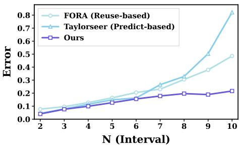  
Fig. 9: Prediction error between predicted and ground-truth features. LinCa obtains lower MSE by decomposing features into order-specific subspaces and applying matched prediction orders.

Previous feature caching methods can be interpreted as special cases of LinCa. Reuse-based methods correspond to an identity mapping $\mathcal { E } _ { 0 } : x \mapsto z = x$ followed by 0th-order prediction over all dimensions. Uniform prediction-based methods such as TaylorSeer also use the identity mapping, but apply the same high-order predictor to the full feature. In contrast, LinCa learns $\mathcal { E } _ { \theta } : x \mapsto [ z ^ { ( 0 ) } , z ^ { ( 1 ) } , z ^ { ( 2 ) } ]$ and applies order-specific predictors to diferent subspaces, avoiding the limitation of imposing one prediction order on all dimensions.

Higher-order prediction is efective at relatively low acceleration ratios, but its accumulated error can become amplified under larger caching intervals. LinCa does not stack multiple predictors on the same full feature. Instead, it learns order-specific subspaces and applies the suitable predictor to each subspace. As shown in Figure 9, this strategy yields lower prediction error than uniform prediction, especially when the acceleration ratio becomes larger.

## D Hyperparameter Sensitivity Analyses

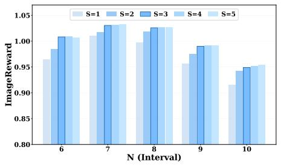  
(a)

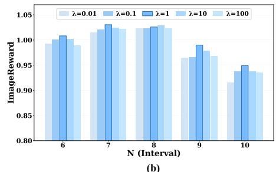

N = 4  
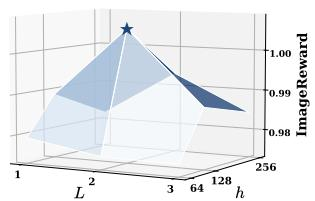  
(c)

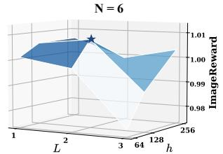  
(d)

N = 8  
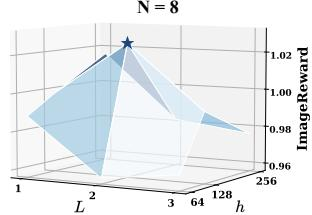  
(e)  
Fig. 10: Hyperparameter sensitivity analyses of LinCa. (a): Impact of timestep segment number $S . \ S = 3$ yields consistently strong performance, with further increases bringing only marginal gains. (b): Impact of loss coeficient λ. λ = 1 achieves the best performance across most intervals. $( \mathbf { c } ) \mathbf { - } ( \mathbf { e } )$ : Architecture of the decomposition network. $L = 2$ invertible blocks with hidden dimension $h = 1 2 8$ achieves the best performance across all intervals.

## D.1 Impact of Timestep Segment Number S

We investigate how the number of timestep segments S afects generation quality under varying caching intervals N. As shown in Figure 10(a), S = 1 consistently yields the lowest performance across all intervals, while increasing S leads to notable improvements, indicating that separate predictors for diferent denoising stages better accommodate their distinct feature dynamics. As S increases from

1 to 3, performance improves consistently. However, as S further increases to 4, 5, the additional gain becomes increasingly marginal. We therefore adopt $S = 3$ as the default configuration in all experiments, balancing prediction fidelity with the modest overhead of maintaining separate predictor parameters per segment.

## D.2 Impact of Loss Coeficient λ

We examine the sensitivity of LinCa to the loss balancing coeficient λ, which controls the relative weight of the sub-component prediction loss $\mathcal { L } _ { \mathrm { c o m p } } ^ { ( s ) }$ against the end-to-end feature prediction loss $\mathcal { L } _ { \mathrm { f e a t } } ^ { ( s ) }$ during training. As shown in Figure 10(b), $\lambda = 1$ achieves the best performance across most caching intervals. When λ is set too small (0.01 or 0.1), the sub-component supervision becomes insuficient, reducing the incentive for $\mathcal { E } _ { \theta } ^ { ( s ) }$ to cluster dimensions according to their order-specific predictability. Conversely, when λ is too large (10 or 100), the subcomponent loss dominates the training objective and over-constrains the decomposition, interfering with the end-to-end reconstruction quality in the original feature space. A balanced $\lambda = 1$ allows both losses to contribute constructively, and we adopt this value as the default configuration in all experiments.

## D.3 Architecture of the Decomposition Network

We examine the efect of two key architectural hyperparameters of the learnable invertible network: the number of invertible blocks L and the hidden dimension h. As shown in Figure $1 0 ( \mathrm { c } ) \mathrm { - ( e ) }$ , across all settings, L = 2 with h = 128 consistently achieves the best performance. Smaller configurations $( h = 6 4 ~ \mathrm { o r } ~ L = 1 )$ lack suficient representational capacity to learn an efective invertible decomposition, resulting in consistently degraded prediction quality across all caching intervals. Larger configurations (h = 256 or L = 3), on the other hand, introduce excessive parameters without commensurate benefit, and the added complexity tends to destabilize training of the invertible network. We therefore adopt $L = 2$ and $h = 1 2 8$ as the default architecture.

## E More Ablation Study

## E.1 High-Order Predictor Choice

Table 6: Comparison of high-order predictors under similar acceleration ratios.
<table><tr><td></td><td></td><td></td><td>Method |Predictor|Speed↑|ImageReward↑|CLIP Score↑</td><td></td></tr><tr><td>TaylorSeer|</td><td>Taylor</td><td>4.16×</td><td>0.9793</td><td>32.63</td></tr><tr><td>LinCa</td><td>Hermite</td><td>5.51×</td><td>1.0162</td><td>32.72</td></tr><tr><td>LinCa</td><td>Taylor</td><td>5.51×</td><td>1.0139</td><td>32.58</td></tr><tr><td>LinCa</td><td>Chebyshev</td><td>5.51×</td><td>1.0023</td><td>32.60</td></tr><tr><td>LinCa</td><td>Lagrange</td><td>5.51×</td><td>1.0144</td><td>32.60</td></tr><tr><td>LinCa</td><td>Laguerre</td><td>5.51×</td><td>0.9264</td><td>32.50</td></tr></table>

We evaluate several candidate predictors for the higher-order sub-components of LinCa, including Hermite, Taylor, Chebyshev, Lagrange, and Laguerre interpolation. Multi-order Hermite interpolation consistently delivers the best generation quality and stability. Hermite benefits from incorporating both function values and derivative estimates through discrete diferences, which enables it to capture the local curvature of the feature trajectory and maintain smooth transitions between prediction steps. This property is particularly important for the higher-order sub-components, which encode finer feature dynamics and are more sensitive to extrapolation errors at large caching intervals.

Taylor expansion tends to accumulate approximation error as the difusion trajectory deviates from linearity, while Chebyshev, Lagrange and Laguerre polynomials introduce oscillatory behaviors that reduce prediction robustness. As shown in Table 6, at the same acceleration ratio (5.51×), Hermite achieves an ImageReward of 1.0162 and CLIP Score of 32.72, outperforming Lagrange (1.0144 / 32.60), Taylor (1.0139 / 32.58), Chebyshev (1.0023 / 32.60), and Laguerre (0.9264 / 32.50). Furthermore, applying Taylor directly to the full cached features as in TaylorSeer yields lower results even at a reduced acceleration ratio (4.16×, 0.9793 / 32.63), further underscoring the value of learnable decomposition combined with a reliable multi-order Hermite predictor.

## F More Experiments

## F.1 Distillation and Training

Table 7: More results on FLUX.1-dev.
<table><tr><td rowspan=1 colspan=4>Method                  Steps | Speed ↑ | ImageReward ↑</td></tr><tr><td rowspan=1 colspan=2>FLUX.1-dev (Original)  50</td><td rowspan=1 colspan=1>1.00×</td><td rowspan=1 colspan=1>0.99</td></tr><tr><td rowspan=1 colspan=4>Comparison with distilled models</td></tr><tr><td rowspan=1 colspan=1>FLUX.1-lite-8B</td><td rowspan=1 colspan=1>28</td><td rowspan=1 colspan=1>1.79×</td><td rowspan=1 colspan=1>0.89</td></tr><tr><td rowspan=1 colspan=1>LinCa (N = 4)</td><td rowspan=1 colspan=1>14</td><td rowspan=1 colspan=1>3.57×</td><td rowspan=1 colspan=1>1.02</td></tr><tr><td rowspan=1 colspan=4>Comparison with training-based methods</td></tr><tr><td rowspan=1 colspan=1>LESA (N = 5)</td><td rowspan=1 colspan=1>12</td><td rowspan=1 colspan=1>4.17×</td><td rowspan=1 colspan=1>1.00</td></tr><tr><td rowspan=1 colspan=1>LinCa (N = 6)</td><td rowspan=1 colspan=1>10</td><td rowspan=1 colspan=1>5.00×</td><td rowspan=1 colspan=1>1.02</td></tr><tr><td rowspan=1 colspan=1>LESA (N = 7)</td><td rowspan=1 colspan=1>9</td><td rowspan=1 colspan=1>5.56×</td><td rowspan=1 colspan=1>0.98</td></tr><tr><td rowspan=1 colspan=1>LinCa (N = 8)</td><td rowspan=1 colspan=1>8</td><td rowspan=1 colspan=1>6.25×</td><td rowspan=1 colspan=1>1.02</td></tr></table>

Table 8: More results on Qwen-Image.
<table><tr><td rowspan=1 colspan=1>Method</td><td rowspan=1 colspan=1>| Steps</td><td rowspan=1 colspan=2>| Speed ↑ | ImageReward ↑</td></tr><tr><td rowspan=1 colspan=1>Qwen-Image (Original)</td><td rowspan=1 colspan=1>50</td><td rowspan=1 colspan=1>1.00×</td><td rowspan=1 colspan=1>1.25</td></tr><tr><td rowspan=1 colspan=4>Comparison with distilled models</td></tr><tr><td rowspan=1 colspan=1>Qwen-Image-Distill-FullQwen-Image-Distill-LoRA</td><td rowspan=1 colspan=1>1515</td><td rowspan=1 colspan=1>3.33×3.33×</td><td rowspan=1 colspan=1>1.020.95</td></tr><tr><td rowspan=1 colspan=1>LinCa (N = 4)</td><td rowspan=1 colspan=1>14</td><td rowspan=1 colspan=1>3.57×</td><td rowspan=1 colspan=1>1.19</td></tr><tr><td rowspan=1 colspan=4>Comparison with training-based methods</td></tr><tr><td rowspan=1 colspan=1>LESA (N = 7)</td><td rowspan=1 colspan=1>9</td><td rowspan=1 colspan=1>5.56×</td><td rowspan=1 colspan=1>1.15</td></tr><tr><td rowspan=1 colspan=1>LinCa (N = 7)</td><td rowspan=1 colspan=1>9</td><td rowspan=1 colspan=1>5.56×</td><td rowspan=1 colspan=1>1.17</td></tr><tr><td rowspan=1 colspan=1>LESA (N = 10)</td><td rowspan=1 colspan=1>7</td><td rowspan=1 colspan=1>7.14×</td><td rowspan=1 colspan=1>1.01</td></tr><tr><td rowspan=1 colspan=1>LinCa (N = 10)</td><td rowspan=1 colspan=1>7</td><td rowspan=1 colspan=1>7.14×</td><td rowspan=1 colspan=1>1.05</td></tr></table>

We provide more comparisons with distilled models and training-based acceleration methods in Table 7 and Table 8. On FLUX.1-dev, LinCa achieves a better speed-quality trade-of than FLUX.1-lite-8B and LESA. On Qwen-Image, LinCa also outperforms Qwen-Image-Distill-Full, Qwen-Image-Distill-LoRA, and LESA under comparable or higher acceleration ratios. These results show that LinCa is complementary to model compression and competitive with training-based acceleration methods.

In some settings, accelerated variants can slightly exceed the original model under preference-based metrics. This behavior suggests that feature prediction may impose mild temporal regularization on cached representations. Similar observations have also been reported in cache-based methods such as TaylorSeer and FoCa. Therefore, we report both preference-based metrics and fidelity metrics whenever applicable.

## F.2 Few-Step Distillation

Table 9: Compatibility with Qwen-Image-Lightning.
<table><tr><td rowspan=1 colspan=1>Method</td><td rowspan=1 colspan=4>|Steps | Speed ↑ | ImageReward ↑| GenEval ↑</td></tr><tr><td rowspan=1 colspan=1>Qwen-Image-Lightning</td><td rowspan=1 colspan=1>8</td><td rowspan=1 colspan=1>1.00×</td><td rowspan=1 colspan=1>1.28</td><td rowspan=1 colspan=1>0.84</td></tr><tr><td rowspan=1 colspan=1>LinCa (N = 3)</td><td rowspan=1 colspan=1>4</td><td rowspan=1 colspan=1>2.00×</td><td rowspan=1 colspan=1>1.26</td><td rowspan=1 colspan=1>0.85</td></tr></table>

Table 9 further evaluates LinCa on Qwen-Image-Lightning. Feature caching is mainly applicable to multi-step denoising models pursuing high quality, and the exploitable redundancy becomes limited in extremely few-step settings. Nevertheless, for the 8-step Qwen-Image-Lightning model, LinCa still provides an additional 2.00× acceleration while maintaining comparable ImageReward and slightly improving GenEval.

## F.3 Wan2.1

Table 10: Text-to-video generation result on Wan2.1.
<table><tr><td rowspan=1 colspan=1>Method</td><td rowspan=1 colspan=2>|Steps | Speed ↑</td><td rowspan=1 colspan=1>| VBench Score(%) ↑</td></tr><tr><td rowspan=1 colspan=1>Wan2.1-1.3B (Original)</td><td rowspan=1 colspan=1>50</td><td rowspan=1 colspan=1>1.00×</td><td rowspan=1 colspan=1>83.72</td></tr><tr><td rowspan=1 colspan=1> $\mathbf { T a y l o r S e e r } \ ( N = 5 )$ </td><td rowspan=1 colspan=1>12</td><td rowspan=1 colspan=1>4.17×</td><td rowspan=1 colspan=1>81.07</td></tr><tr><td rowspan=1 colspan=1>LinCa (N = 6)</td><td rowspan=1 colspan=1>10</td><td rowspan=1 colspan=1>5.00×</td><td rowspan=1 colspan=1>82.56</td></tr></table>

We also evaluate LinCa on the stronger Wan2.1-1.3B video generation model. As shown in Table 10, LinCa outperforms TaylorSeer in both acceleration ratio and VBench score, demonstrating its generalization to another video difusion model. For HunyuanVideo in our paper, we follow TaylorSeer and FoCa at $4 8 0 \times 6 4 0$ resolution for fair comparison, which difers from the $7 2 0 \times 1 2 8 0$ leaderboard setting.