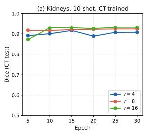
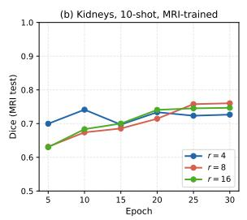
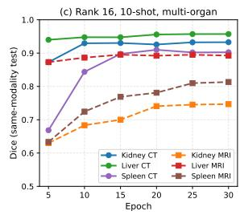
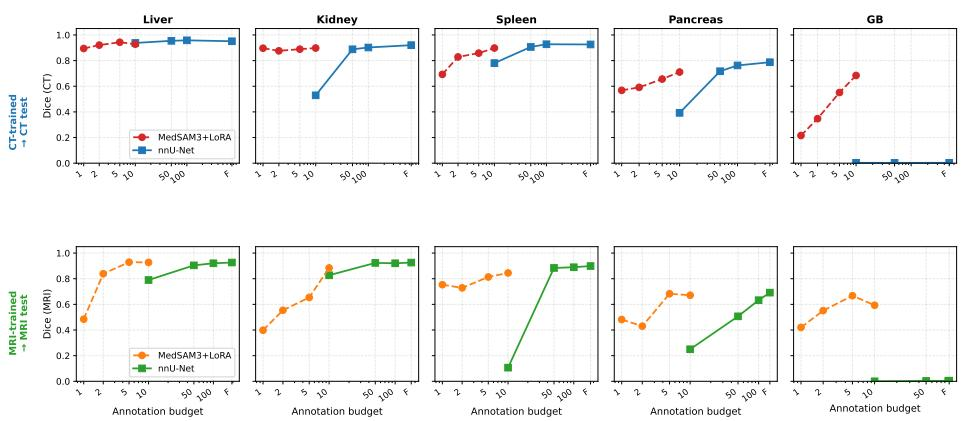

# A Few Cases Are All You Need: An Empirical Study of Annotation-Eficient LoRA Fine-Tuning of MedSAM3

Sachin Dudda Nagaraju1, Bendik Skarre Abrahamsen1, Ashkan Moradi1, and Mattijs Elschot1,2

1 Department of Circulation and Medical Imaging, Norwegian University of Science and Technology, Trondheim, Norway

2 Central Staf, St. Olavs Hospital, Trondheim University Hospital, Trondheim, Norway

{sachin.d.nagaraju, bendik.s.abrahamsen, ashkan.moradi, mattijs.elschot}@ntnu.no

Abstract. Medical image segmentation is essential for clinical workflows such as treatment planning and disease assessment. While specialist tools like TotalSegmentator and MRSegmentator achieve strong performance, they require large annotated datasets for training. Medical foundation models ofer a promising alternative through large-scale pretraining that reduces the annotation burden for new tasks, but zero-shot performance remains limited. Parameter-eficient adaptation via Low-Rank Adaptation (LoRA) enables eficient specialization with few trainable parameters, but a key question remains: how many expert-annotated cases are needed to achieve clinically useful segmentation performance? We address this by adapting MedSAM3 with LoRA for five abdominal organs (liver, kidneys, spleen, gallbladder, and pancreas) in CT and MRI using only 1, 2, 5, and 10 annotated cases, evaluating on AMOS22 dataset. With just 10 cases, models achieve performance competitive with specialist systems trained on orders of magnitude more data. Notably, this includes reliable gallbladder segmentation (Dice 0.68 CT, 0.59 MRI) where existing tools fail almost completely (Dice ≤ 0.0004), while remaining within 5–10% of MRSegmentator for liver, kidneys, and spleen using over 100× fewer annotations. Furthermore, external validation on the Whole Heart Segmentation dataset shows that the approach extends to cardiac segmentation, a use case beyond the scope of TotalSegmentator (MRI) and MRSegmentator, achieving competitive left ventricle (LV) performance with only 10 annotated cases. Training requires only ∼3–5 hours per organ on a single GPU, approximately 2–3× faster than nnU-Net. These findings suggest that ten annotated cases are suficient for clinically useful segmentation, efectively reducing bottlenecks for both image annotation and training time.

Keywords: Medical Image Segmentation · Foundation Models · Few-Shot Learning · Low-Rank Adaptation (LoRA)

## 1 Introduction

Medical image segmentation is essential for clinical workflows including treatment planning, surgical guidance, disease assessment, and longitudinal monitoring [11]. Training reliable segmentation models still require large datasets with high-quality expert volumetric annotations, which are dificult to obtain in many clinical settings [13]. Manual annotation is expensive, time-consuming, and difficult to scale across organs, modalities, and clinical sites [14], limiting model development where only a small number of annotated data are available.

Fully supervised specialist systems have achieved strong segmentation performance. TotalSegmentator segments 104 anatomical structures across CT and MRI [14], MRSegmentator also provides multi-organ segmentation for both CT and MRI [3], and nnU-Net remains a strong supervised baseline through automatic task adaptation [6]. However, all these methods depend on large curated datasets, restricting deployment in low-data settings such as rare diseases, new imaging protocols, or institutions with limited annotation capacity.

Medical foundation models ofer a promising alternative. Building on the Segment Anything Model [8], promptable medical segmentation models including MedSAM, SAM-Med3D, and MedSAM3 leverage large-scale pretraining for improved cross-organ generalization [11,12,10]. However, zero-shot performance remains unreliable for small or low-contrast structures such as the gallbladder and pancreas [12], and full fine-tuning is computationally expensive and prone to overfitting under limited annotation [15,4]. Parameter-eficient fine-tuning via Low-Rank Adaptation (LoRA) addresses both concerns by updating only a small fraction of parameters while keeping pretrained weights fixed [4]. Yet an important question remains insuficiently studied: how many expert-annotated cases are needed to adapt a medical foundation model for clinically useful organ segmentation? Existing studies report results at fixed annotation budgets or limited task sets, without systematically examining how performance scales with annotation [15,9].

To address this, we conduct a systematic annotation-eficiency study of Med-SAM3 adapted with LoRA across five abdominal organs (liver, kidneys, spleen, gallbladder, and pancreas) in CT and MRI, training with 1, 2, 5, and 10 annotated cases and evaluating on the independent AMOS22 benchmark [7]. We compare against zero-shot foundation models, TotalSegmentator, MRSegmentator, and nnU-Net. Cross-center cardiac experiments on the WHS dataset [2] were also conducted to assess generalization to a use case beyond the scope of the specialist systems. Results show that performance saturates at around 10 annotated cases, at which point our models are competitive with specialist systems trained on orders of magnitude more data, while training 2–3× faster than nnU-Net with only 2.15% of MedSAM3 parameters updated.

The main contributions of this work are:

– A systematic empirical analysis of annotation eficiency for LoRA-based adaptation of MedSAM3 across abdominal organs and imaging modalities.

– Characterization of the performance, and annotation trade-of, showing competitive accuracy already at 10 cases against fully supervised specialist systems with over 100× fewer annotations.

– Cross-center cardiac segmentation experiments on the WHS dataset examine generalisability beyond the tasks covered by the supervised specialist systems.

## 2 Related Works

Deep learning (DL) has greatly improved medical image segmentation. nnU-Net is a widely used baseline because it automatically adapts its preprocessing, architecture, and training pipeline to a given dataset [6]. Despite its strong performance, it still requires large expert-annotated datasets and task-specific training. Specialist tools have further advanced automatic multi-organ segmentation. TotalSegmentator was trained on 1,204 CT scans and can segment 104 anatomical structures [14]. MRSegmentator supports both CT and MRI and was developed using more than 2,600 annotated scans to segment 40 structures [3]. Although these systems achieve strong performance, they require substantial annotated data and computational resources, which limits their use for rare structures, new imaging protocols, and settings where only a few expert-labeled cases are available. Reducing this annotation requirement, therefore, remains an important challenge.

## 2.1 Foundation Models for Medical Image Segmentation

Vision foundation models ofer an alternative to training segmentation networks from scratch. SAM showed strong transferability through large-scale pretraining, but its zero-shot performance on medical images varies considerably across organs, modalities, and prompting strategies [8]. MedSAM addressed this limitation through large-scale medical pretraining using more than 1.5 million image– mask pairs [11]. Later approaches such as MA-SAM and Medical SAM Adapter incorporated parameter-eficient adaptation and volumetric information for CT and MRI segmentation [15]. More recently, MedSAM3 and Medical SAM3 extended SAM3 to medical imaging using large multi-dataset training collections [10,12]. Although these models provide stronger medical representations, existing work mainly focuses on improving generalization and adaptation, while the number of expert-annotated cases needed for efective task-specific specialization remains unclear.

## 2.2 Few-Shot and Annotation-Eficient Medical Segmentation

Few-shot methods aim to adapt segmentation models with limited labelled data. Lightweight SAM adaptation has been shown to remain efective even from a single labelled volume [5], and pairing data synthesis with LoRA has proven useful for low-data brain tumour and abdominal CT segmentation [1]. Other work has adapted SAM to several anatomical tasks using only a handful of annotated images [16]. Although these studies confirm the potential of few-shot adaptation, their experimental settings difer widely, using 2D slices, dataset fractions, or fixed support sets. As a result, it is still unclear how performance changes with the number of fully annotated patient cases. Recent SAM3-based methods also explore parameter-eficient adaptation, but most focus on specific organs, modalities, or larger training collections. A systematic case-level study across multiple organs and both CT and MRI therefore remains limited. Overall, prior studies show that foundation models and parameter-eficient fine-tuning can reduce the dependence on large labelled datasets. However, most existing work evaluates fixed few-shot settings, individual modalities, or specific anatomical targets. The relationship between the number of fully annotated patient cases and segmentation performance therefore remains insuficiently studied. This work addresses that gap by systematically adapting MedSAM3 with LoRA using 1, 2, 5, and 10 annotated cases across multiple abdominal organs in both CT and MRI, while comparing against established specialist segmentation systems.

## 3 Methodology: Annotation-Eficiency Study Design

This work evaluates the annotation eficiency of MedSAM3 [10] adapted with LoRA [4]. We do not propose a new segmentation architecture. Instead, we study how segmentation performance changes when only a small number of expertannotated training cases is available. The experiments are conducted in three phases. In the first phase, we perform a development-stage analysis to select a stable training configuration, including the LoRA rank and number of training epochs, so that the final protocol requires no per-task hyperparameter search. In the second phase, we fix the selected protocol and train the final models for 30 epochs without validation-based model selection. The final checkpoints are then evaluated directly on independent test datasets.

## 3.1 Data and Few-Shot Setting

For abdominal segmentation, we consider two modalities, CT and MRI, across five organs: the liver, kidneys, spleen, gallbladder, and pancreas. For each organ and modality, few-shot training sets are selected from the TotalSegmentator CT and MRI datasets using 1, 2, 5, and 10 annotated cases. Each model is trained as an organ- and modality-specific binary segmentation model. The adapted models are evaluated on the independent AMOS22 benchmark dataset to assess generalization.

Subsequently, to further examine whether the observed annotation-eficiency trend extends beyond abdominal anatomy, we further evaluate cardiac segmentation on the WHS dataset. For this experiment, models are trained using 10 annotated CT and MRI cases from selected centers and tested on cases from held-out centers for segmentation of the left ventricle (LV) and right ventricle (RV).

## 3.2 MedSAM3 Adaptation with LoRA

We adopt MedSAM3 as the pretrained foundation model and adapt it using LoRA. During training, all pretrained model weights are kept frozen, and only the LoRA parameters are updated. For a target weight matrix $W \in \mathbb { R } ^ { m \times n }$ 2 LoRA learns a low-rank update such that

$$
W ^ { \prime } = W + B A ,
$$

where $B \in \mathbb { R } ^ { m \times r }$ and $A \in \mathbb { R } ^ { r \times n }$ , with rank $r \ll \operatorname* { m i n } ( m , n )$ . This allows eficient task-specific adaptation with a small number of trainable parameters.

Following the architecture of MedSAM3 [10], LoRA is applied to all major components: the vision, text, and geometry encoders, the DETR encoder and decoder, and the mask decoder, covering the full model depth to maximise adaptation capacity. The target organ name is provided as the text prompt, and the model is trained to predict a binary mask for the corresponding structure. We optimize the model using a combined Dice and focal loss to address mask overlap and foreground–background imbalance. Training uses AdamW with weight decay, mixed-precision training, gradient clipping, and a linear warm-up followed by cosine learning-rate decay.

## 3.3 Training and Evaluation Protocol

A development-stage analysis is first conducted to select a stable LoRA rank and number of training epochs. We evaluate LoRA ranks $r \in \{ 4 , 8 , 1 6 \}$ at the 10-case annotation budget and monitor validation Dice every five epochs. The validation set consists of 30 CT and 30 MRI cases held out from the TotalSegmentator dataset, selected to cover a representative range of anatomical variability. It is used only to observe training behaviour and is never used for early stopping, learning-rate scheduling, or checkpoint selection. The AMOS22 test set is fully disjoint from both the TotalSegmentator training and validation splits, ensuring that all reported results reflect genuine cross-dataset generalization.

Based on this analysis, the main final evaluation uses LoRA rank $r \ : = \ : 1 6 .$ a fixed training duration of 30 epochs, and the 10-case annotation budget. No validation-based model selection is performed in Phase 2. The final checkpoint after 30 epochs is used directly for testing. This protocol is applied consistently across organs and modalities, efectively mitigating the need for an annotated validation dataset. Dice similarity coeficient is used as a performance metric and we compare the adapted models against zero-shot MedSAM3, TotalSegmentator, MRSegmentator, and nnU-Net trained with larger annotation budgets. For the 10-case setting, three independent runs are performed for all five organs, and the mean and standard deviation are reported.

## 4 Experiments and Results

We report the experiments in three phases: Phase 1 selects the training protocol, Phase 2 evaluates annotation eficiency and compares against specialist tools on

  
Fig. 1. Phase 1 development analysis. (a) Rank comparison $( r \in \{ 4 , 8 , 1 6 \} )$ for kidneys CT-trained, evaluated on CT test cases. (b) Rank comparison for kidneys MRI-trained, evaluated on MRI test cases. (c) Training curves for rank r=16, 10-shot, across three organs and both modalities (solid lines: CT-trained evaluated on CT; dashed lines: MRI-trained evaluated on MRI), confirming convergence by epoch 30 across all six organ/modality combinations.

AMOS22, and Phase 3 assesses generalisation to cardiac segmentation on the WHS dataset.

## 4.1 Phase 1: Development-Stage Analysis

Phase 1 was used to define a fixed training protocol for the final evaluation. This phase was not intended to report final test performance. Instead, it was used to understand training behaviour under limited annotation and to select the LoRA rank and number of training epochs.

We used kidney segmentation as the development task, as it represents a moderately challenging organ with clear boundaries in both CT and MRI, making it suitable for observing training dynamics under limited annotation. We compared LoRA ranks $r \in \{ 4 , 8 , 1 6 \}$ at the 10-case annotation budget, monitoring validation Dice every five epochs. As shown in Fig. 1a and Fig. 1b, rank r=16 provides the strongest and most stable performance overall across both CT-trained and MRI-trained settings, resulting a Dice of 0.93 (CT) and 0.75 (MRI) at epoch 30. Therefore, rank r=16 was selected for all subsequent experiments.

To confirm that rank r=16 generalises beyond kidneys, Fig. 1(c) shows training curves for liver and spleen under the same setting. All six organ/modality combinations (kidney, liver, spleen) × (CT, MRI) plateau in performance by epoch 30, with no signs of overfitting observed in the final epochs. This robustness to overfitting is practically important, as it eliminates the need for a validation set and per-organ epoch tuning, reducing the annotation burden further beyond the 10 training cases.

## 4.2 Phase 2: Final Evaluation on AMOS22

Phase 2 evaluates annotation eficiency across all five abdominal organs using the fixed protocol (LoRA rank r=16, 30 epochs). Two of these organs (gallbladder and pancreas) were not included in the development stage in Phase 1, providing an additional test of protocol generalisability. We first examine how performance scales with annotation budget, then compare the 10-shot models against specialist tools on the independent AMOS22 test set.

  
Fig. 2. Annotation eficiency comparison on AMOS22 test set. Top row: CT-trained models evaluated on CT test cases. Bottom row: MRI-trained models evaluated on MRI test cases. Dashed curves show MedSAM3+LoRA Dice at 1, 2, 5, and 10 annotated cases. Solid curves show nnU-Net Dice at 10, 50, 100, and full annotation budgets for CT (746, 652, 704, 362, and 491 cases for liver, kidney, spleen, pancreas, and gallbladder respectively) and 10, 50, 100, and full budgets for MRI (193, 175, 180, 146, and 103 cases respectively).

Annotation eficiency. Fig. 2 shows Dice scores for MedSAM3+LoRA (1, 2, 5, and 10 annotated cases) and nnU-Net (10, 50, 100, and full cases for both CT and MRI, using a fixed 80/20 train/validation split with cases randomly sampled from the training pool for reduced budgets) across all five organs and both modalities. MedSAM3+LoRA improves consistently with increasing annotation budget, with the largest gains observed between 1 and 5 cases and diminishing returns beyond 5 cases, with mean Dice improving by 10.6% (CT) and 24.2% (MRI) from 1 to 5 cases compared to only 4.4% (CT) and 3.5% (MRI) from 5 to 10 cases, confirming saturation at 10 annotated cases. Averaged across all five organs, mean Dice improves by 10.6% (CT) and 24.2% (MRI) from 1 to 5 cases, compared to only 4.4% (CT) and 3.5% (MRI) from 5 to 10 cases, indicating diminishing average performance gains as the annotation budget increases.

In contrast, nnU-Net requires substantially more annotated cases to reach competitive performance: with only 10 cases, it degrades severely on MRI spleen (Dice = 0.11) and CT pancreas (Dice = 0.39), while MedSAM3+LoRA maintains substantially stronger performance across organs at the same budget. This confirms that 10 annotated cases is a practically meaningful operating point for foundation model adaptation.

Table 1. Dice similarity coeficient on the AMOS22 test set. Each row shows results on CT or MRI test data; columns show CT-trained and MRI-trained models, enabling both same-modality and cross-modality comparison. MedSAM3+LoRA results are mean ± std over three independent 10-shot runs. Bold: best result per row.
<table><tr><td rowspan="2">Organ</td><td rowspan="2">Mod.</td><td colspan="4">Specialist / Zero-shot (no fine-tuning)</td><td colspan="2">MedSAM3+LoRA (10-shot)</td></tr><tr><td>SAM3zs</td><td>MedSAM3zs</td><td>TotalSeg</td><td>MRSeg</td><td>CT-trained</td><td>MRI-trained</td></tr><tr><td>Liver</td><td>CT</td><td>0.262</td><td>0.545</td><td>0.951</td><td>0.959</td><td> $0 . 9 2 8 \pm 0 . 0 0 8$ </td><td> $0 . 8 8 1 \pm 0 . 0 8 1$ </td></tr><tr><td></td><td>MRI</td><td>0.453</td><td>0.331</td><td>0.921</td><td>0.956</td><td> $0 . 9 1 8 \pm 0 . 0 0 8$ </td><td> $0 . 9 2 7 \pm 0 . 0 1 2$ </td></tr><tr><td>Kidney</td><td>CT</td><td>0.102</td><td>0.242</td><td>0.903</td><td>0.925</td><td> $0 . 8 9 8 \pm 0 . 0 0 6$ </td><td> $0 . 8 6 4 \pm 0 . 0 0 5$ </td></tr><tr><td></td><td>MRI</td><td>0.122</td><td>0.140</td><td>0.875</td><td>0.944</td><td> $0 . 8 5 2 \pm 0 . 0 2 2$ </td><td> $0 . 8 8 4 \pm 0 . 0 1 9$ </td></tr><tr><td>Spleen</td><td>CT</td><td>0.057</td><td>0.249</td><td>0.924</td><td>0.952</td><td> $0 . 8 9 8 \pm 0 . 0 2 6$ </td><td> $0 . 7 8 6 \pm 0 . 0 0 5$ </td></tr><tr><td></td><td>MRI</td><td>0.153</td><td>0.111</td><td>0.712</td><td>0.935</td><td> $0 . 9 0 0 \pm 0 . 0 2 1$ </td><td> $0 . 8 4 5 \pm 0 . 0 3 9$ </td></tr><tr><td>Gallbladder</td><td>CT</td><td>0.039</td><td>0.044</td><td>0.0003</td><td>0.0004</td><td> $\mathbf { 0 . 6 8 4 \pm 0 . 0 2 8 }$ </td><td> $0 . 5 6 1 \pm 0 . 0 4 4$ </td></tr><tr><td></td><td>MRI</td><td>0.030</td><td>0.013</td><td>0.0004</td><td>0.0004</td><td> $\mathbf { 0 . 6 3 3 \pm 0 . 0 3 4 }$ </td><td> $0 . 5 9 3 \pm 0 . 0 5 0$ </td></tr><tr><td>Pancreas</td><td>CT</td><td>0.074</td><td>0.084</td><td>0.624</td><td>0.811</td><td> $0 . 7 1 1 \pm 0 . 0 1 7$ </td><td> $0 . 6 0 0 \pm 0 . 0 6 3$ </td></tr><tr><td></td><td>MRI</td><td>0.091</td><td>0.030</td><td>0.505</td><td>0.788</td><td> $0 . 7 1 0 \pm 0 . 0 1 4$ </td><td> $0 . 6 7 1 \pm 0 . 0 1 7$ </td></tr></table>

Comparison with specialist tools. Table 1 compares MedSAM3+LoRA at the 10- shot operating point against zero-shot foundation models and specialist tools. Results are reported as mean ± std over three independent runs. TotalSegmentator [14] and MRSegmentator [3] used datasets of over 1200 annotated scans in total (including training, validation, and test splits); our method uses only 10 cases per organ and modality. Zero-shot SAM3 and MedSAM3 perform poorly across all organs, confirming that prompt-only segmentation is insuficient without adaptation. For large organs, MedSAM3+LoRA remains within 2–5% of specialist tools: CT-trained achieves 0.928 (liver), 0.898 (kidney), and 0.898 (spleen); MRI-trained reaches 0.927 (liver) and 0.884 (kidney).

The most notable result is gallbladder segmentation, where both specialist tools produce near-zero Dice (≤ 0.0004) on AMOS22, likely due to cross-dataset domain shift, organ-size variability, and weak contrast. MedSAM3+LoRA achieves 0.684 (CT) and 0.633 (MRI) with only 10 cases, demonstrating that few-shot adaptation recovers structure-specific performance where specialist tools fail under dataset shift. For pancreas, CT-trained achieves 0.711, surpassing TotalSegmentator (0.624) with only 10 cases, though MRSegmentator (0.811 CT, 0.788 MRI) remains the stronger specialist for this structure.

Computational eficiency. All experiments were conducted on a single NVIDIA A40 GPU (48 GB VRAM). nnU-Net trains for 500 epochs regardless of annotation budget, with a fixed number of gradient steps per epoch independent of dataset size, requiring 8.5–11 GPU-hours per organ. As a result, training cost is nearly identical across all annotation budgets, ofering no computational advantage at low data regimes. MedSAM3+LoRA converges in 30 epochs, requiring approximately 3–5 GPU-hours per run, with only 2.15% of parameters updated (rank r=16; 18.5 M of 859 M total), making it 2–3× faster than nnU-Net.

Table 2. Cross-center cardiac segmentation on WHS. 3D Dice for LV and RV under same-modality 10-shot settings, compared against TotalSegmentator (CT only) and CARE-WHS 2025 challenge top entries trained on 86 fully annotated cases. N/A indicates the model does not support the modality or task.
<table><tr><td>Method</td><td>Train data</td><td>CT LV</td><td>CT RV</td><td>MRI LV</td><td>MRI RV</td></tr><tr><td>TotalSeg [14] MRSeg [3]</td><td>large (CT) large</td><td>0.896 N/A</td><td>0.915 N/A</td><td>N/A N/A</td><td>N/A N/A</td></tr><tr><td>MedSAM3+LoRA (CT)</td><td>10 cases</td><td>0.909</td><td>0.785</td><td>N/A</td><td>N/A</td></tr><tr><td>MedSAM3+LoRA (MRI)</td><td>10 cases</td><td>N/A</td><td>N/A</td><td>0.820</td><td>0.637</td></tr><tr><td>CARE-WHS best [17]</td><td>86 cases</td><td>0.943</td><td>0.928</td><td>0.935</td><td>0.914</td></tr></table>

Overall, Phase 2 demonstrates that MedSAM3+LoRA with only 10 annotated cases achieves competitive performance against fully supervised specialist tools across all five organs and both modalities, while requiring substantially fewer annotations and less training time.

## 4.3 Phase 3: Cross-Center Cardiac Segmentation (WHS)

To assess whether the observed annotation-eficiency trend extends beyond abdominal anatomy, and to a use case beyond the scope of the supervised specialist systems, we evaluate MedSAM3+LoRA on the WHS dataset. CT-trained models use 10 cases from center A as training data and are tested on 20 held-out cases from center B to ensure cross center generalizablity.. MRI-trained models use 10 cases from center E and are tested on 20 cases from centers C and D. Table 2 reports same-modality 3D Dice for LV and RV, alongside TotalSegmentator (CT only), and the top and median entries from the CARE-WHS 2025 challenge trained on all 86 annotated cases. Specialist system cardiac segmentation was only available for TotalSegmentator CT; MRSegmentator and TotalSegmentator MRI do not support cardiac structures. CT-trained models achieve Dice of 0.909 (LV) and 0.785 (RV), surpassing TotalSegmentator CT for LV (0.896) with only 10 cases, though falling short for RV (0.915). MRI-trained models achieve 0.820 (LV) and 0.637 (RV), demonstrating that LoRA adaptation covers a use case where no specialist system is available. Overall, MedSAM3+LoRA reasonably generalises to cardiac LV and RV segmentation with only 10 annotated cases, though performance remains well below the top scores in the CARE-WHS challenge, particularly for RV. RV segmentation remains more challenging, particularly for MRI, likely due to its more variable shape and lower contrast compared to the LV. The MRI-trained RV result (Dice = 0.637) reflects the added dificulty of cross-center domain shift combined with the inherent complexity of RV delineation, where trabeculations and thin walls make boundary detection unreliable even for fully supervised methods.

## 5 Conclusion

We presented a systematic annotation-eficiency study of MedSAM3+LoRA for medical image segmentation. With only 10 annotated cases, our approach matches specialist tools trained on over 100× more data for large organs, achieves reliable gallbladder segmentation (Dice 0.68 CT, 0.59 MRI) where the evaluated specialist tools fail almost completely (Dice ≤ 0.0004), and trains 2–3× faster than nnU-Net by updating just 2.15% of parameters. Cross-center experiments on the WHS dataset confirm that the observed annotation-eficiency trend generalizes to a non-abdominal use case, with performance exceeding that of supervised specialist systems. Together, these results demonstrate that parameter-eficient fine-tuning of medical foundation models with as few as ten expert annotations can be suficient for clinically useful segmentation, substantially reducing both the annotation burden and computational cost of training task-specific models in low-resource clinical settings. Future work will extend this framework to more cases of medical use and imaging modalities, including federated learning for privacy-preserving few-shot adaptation across institutions.

## References

1. Feng, W., Zhu, L., Yu, L.: Cheap lunch for medical image segmentation by finetuning sam on few exemplars. In: International MICCAI Brainlesion Workshop. pp. 13–22. Springer (2023)

2. Gao, S., Zhou, H., Gao, Y., Zhuang, X.: Bayeseg: Bayesian modeling for medical image segmentation with interpretable generalizability. Medical Image Analysis 89, 102889 (2023)

3. Häntze, H., Xu, L., Mertens, C.J., Dorfner, F.J., Donle, L., Busch, F., Kader, A., Ziegelmayer, S., Bayerl, N., Navab, N., et al.: Segmenting whole-body mri and ct for multiorgan anatomic structure delineation. Radiology: Artificial Intelligence 7(6), e240777 (2025)

4. Hu, E.J., Shen, Y., Wallis, P., Allen-Zhu, Z., Li, Y., Wang, S., Wang, L., Chen, W., et al.: Lora: Low-rank adaptation of large language models. Iclr 1(2), 3 (2022)

5. Hu, X., Xu, X., Shi, Y.: How to eficiently adapt large segmentation model (sam) to medical images. arXiv preprint arXiv:2306.13731 (2023)

6. Isensee, F., Jaeger, P.F., Kohl, S.A., Petersen, J., Maier-Hein, K.H.: nnu-net: a self-configuring method for deep learning-based biomedical image segmentation. Nature methods 18(2), 203–211 (2021)

7. Ji, Y., Bai, H., Ge, C., Yang, J., Zhu, Y., Zhang, R., Li, Z., Zhanng, L., Ma, W., Wan, X., et al.: Amos: A large-scale abdominal multi-organ benchmark for versatile medical image segmentation. Advances in neural information processing systems 35, 36722–36732 (2022)

8. Kirillov, A., Mintun, E., Ravi, N., Mao, H., Rolland, C., Gustafson, L., Xiao, T., Whitehead, S., Berg, A.C., Lo, W.Y., et al.: Segment anything. In: Proceedings of the IEEE/CVF international conference on computer vision. pp. 4015–4026 (2023)

9. Li, K., Rajpurkar, P.: Adapting segment anything models to medical imaging via fine-tuning without domain pretraining. In: AAAI 2024 Spring Symposium on Clinical Foundation Models (2024)

10. Liu, A., Xue, R., Cao, X.R., Shen, Y., Lu, Y., Li, X., Chen, Q., Chen, J.: Medsam3: Delving into segment anything with medical concepts. arXiv preprint arXiv:2511.19046 (2025)

11. Ma, J., He, Y., Li, F., Han, L., You, C., Wang, B.: Segment anything in medical images. Nature communications 15(1), 654 (2024)

12. Wang, H., Guo, S., Ye, J., Deng, Z., Cheng, J., Li, T., Chen, J., Su, Y., Huang, Z., Shen, Y., et al.: Sam-med3d: a vision foundation model for general-purpose segmentation on volumetric medical images. IEEE Transactions on Neural Networks and Learning Systems (2025)

13. Wang, S., Li, C., Wang, R., Liu, Z., Wang, M., Tan, H., Wu, Y., Liu, X., Sun, H., Yang, R., et al.: Annotation-eficient deep learning for automatic medical image segmentation. Nature communications 12(1), 5915 (2021)

14. Wasserthal, J., Breit, H.C., Meyer, M.T., Pradella, M., Hinck, D., Sauter, A.W., Heye, T., Boll, D.T., Cyriac, J., Yang, S., et al.: Totalsegmentator: robust segmentation of 104 anatomic structures in ct images. Radiology: Artificial Intelligence 5(5), e230024 (2023)

15. Wu, J., Wang, Z., Hong, M., Ji, W., Fu, H., Xu, Y., Xu, M., Jin, Y.: Medical sam adapter: Adapting segment anything model for medical image segmentation. Medical image analysis 102, 103547 (2025)

16. Xie, W., Willems, N., Patil, S., Li, Y., Kumar, M.: Sam fewshot finetuning for anatomical segmentation in medical images. In: 2024 IEEE/CVF Winter Conference on Applications of Computer Vision (WACV). pp. 3241–3249. IEEE (2024)

17. Zhuang, X., et al.: CARE-WHS: Whole heart segmentation track. https://zmic. org.cn/care\_2025/track3/ (2025), accessed: 2026